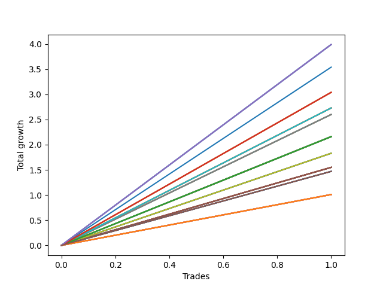

# Short Wallace 015 
- Symbol: SPY_Unlimited
- Date Range: 03/23/2022 - 07/08/2022
- Trading Period: 7:20-12:30
- Number of Trades: 1



| Name | Win Percent | Profit | Avg Profit / Trade | Avg Time / Trade |      | Name | Win Percent | Profit | Avg Profit / Trade | Avg Time / Trade |
| ---- | ----------- | ------ | ------------------ | ---------------- | ---- | ---- | ----------- | ------ | ------------------ | ---------------- |
| Sorted By <br> Profit | | | | | | Sorted By <br> Win Percentage ||||
| One Hundred Twenty-Nine | 100.00 | 1995.00 | 1995.00 | 12:30 |     | One Hundred Twenty-Nine | 100.00 | 1995.00 | 1995.00 | 12:30 |
| One Hundred Twenty-Four | 100.00 | 1995.00 | 1995.00 | 12:30 |     | One Hundred Twenty-Four | 100.00 | 1995.00 | 1995.00 | 12:30 |
| One Hundred Ninteen | 100.00 | 1995.00 | 1995.00 | 12:30 |     | One Hundred Ninteen | 100.00 | 1995.00 | 1995.00 | 12:30 |
| One Hundred Fourteen | 100.00 | 1995.00 | 1995.00 | 12:30 |     | One Hundred Fourteen | 100.00 | 1995.00 | 1995.00 | 12:30 |
| Eighty-Four | 100.00 | 1995.00 | 1995.00 | 12:30 |     | Eighty-Four | 100.00 | 1995.00 | 1995.00 | 12:30 |
| Seventy-Three | 100.00 | 1770.00 | 1770.00 | 17:05 |     | Seventy-Three | 100.00 | 1770.00 | 1770.00 | 17:05 |
| One Hundred Twenty-Eight | 100.00 | 1520.00 | 1520.00 | 07:25 |     | One Hundred Twenty-Eight | 100.00 | 1520.00 | 1520.00 | 07:25 |
| One Hundred Twenty-Three | 100.00 | 1520.00 | 1520.00 | 07:25 |     | One Hundred Twenty-Three | 100.00 | 1520.00 | 1520.00 | 07:25 |
| One Hundred Eighteen | 100.00 | 1520.00 | 1520.00 | 07:25 |     | One Hundred Eighteen | 100.00 | 1520.00 | 1520.00 | 07:25 |
| One Hundred Thirteen | 100.00 | 1520.00 | 1520.00 | 07:25 |     | One Hundred Thirteen | 100.00 | 1520.00 | 1520.00 | 07:25 |
| Eighty-Three | 100.00 | 1520.00 | 1520.00 | 07:25 |     | Eighty-Three | 100.00 | 1520.00 | 1520.00 | 07:25 |
| Seventy-One | 100.00 | 1365.00 | 1365.00 | 05:40 |     | Seventy-One | 100.00 | 1365.00 | 1365.00 | 05:40 |
| Sixty-Three | 100.00 | 1365.00 | 1365.00 | 05:40 |     | Sixty-Three | 100.00 | 1365.00 | 1365.00 | 05:40 |
| Fifty-Five | 100.00 | 1365.00 | 1365.00 | 05:40 |     | Fifty-Five | 100.00 | 1365.00 | 1365.00 | 05:40 |
| Forty-Seven | 100.00 | 1365.00 | 1365.00 | 05:40 |     | Forty-Seven | 100.00 | 1365.00 | 1365.00 | 05:40 |
| Seven | 100.00 | 1365.00 | 1365.00 | 05:40 |     | Seven | 100.00 | 1365.00 | 1365.00 | 05:40 |
| Sixty-Nine | 100.00 | 1300.00 | 1300.00 | 05:35 |     | Sixty-Nine | 100.00 | 1300.00 | 1300.00 | 05:35 |
| Sixty-One | 100.00 | 1300.00 | 1300.00 | 05:35 |     | Sixty-One | 100.00 | 1300.00 | 1300.00 | 05:35 |
| Fifty-Three | 100.00 | 1300.00 | 1300.00 | 05:35 |     | Fifty-Three | 100.00 | 1300.00 | 1300.00 | 05:35 |
| Forty-Five | 100.00 | 1300.00 | 1300.00 | 05:35 |     | Forty-Five | 100.00 | 1300.00 | 1300.00 | 05:35 |
| Five | 100.00 | 1300.00 | 1300.00 | 05:35 |     | Five | 100.00 | 1300.00 | 1300.00 | 05:35 |
| One Hundred Twenty-Seven | 100.00 | 1080.00 | 1080.00 | 04:10 |     | One Hundred Twenty-Seven | 100.00 | 1080.00 | 1080.00 | 04:10 |
| One Hundred Twenty-Two | 100.00 | 1080.00 | 1080.00 | 04:10 |     | One Hundred Twenty-Two | 100.00 | 1080.00 | 1080.00 | 04:10 |
| One Hundred Seventeen | 100.00 | 1080.00 | 1080.00 | 04:10 |     | One Hundred Seventeen | 100.00 | 1080.00 | 1080.00 | 04:10 |
| One Hundred Twelve | 100.00 | 1080.00 | 1080.00 | 04:10 |     | One Hundred Twelve | 100.00 | 1080.00 | 1080.00 | 04:10 |
| Eighty-Two | 100.00 | 1080.00 | 1080.00 | 04:10 |     | Eighty-Two | 100.00 | 1080.00 | 1080.00 | 04:10 |
| Sixty-Eight | 100.00 | 1080.00 | 1080.00 | 04:10 |     | Sixty-Eight | 100.00 | 1080.00 | 1080.00 | 04:10 |
| Sixty-Six | 100.00 | 1080.00 | 1080.00 | 04:10 |     | Sixty-Six | 100.00 | 1080.00 | 1080.00 | 04:10 |
| Sixty | 100.00 | 1080.00 | 1080.00 | 04:10 |     | Sixty | 100.00 | 1080.00 | 1080.00 | 04:10 |
| Fifty-Eight | 100.00 | 1080.00 | 1080.00 | 04:10 |     | Fifty-Eight | 100.00 | 1080.00 | 1080.00 | 04:10 |
| Fifty-Two | 100.00 | 1080.00 | 1080.00 | 04:10 |     | Fifty-Two | 100.00 | 1080.00 | 1080.00 | 04:10 |
| Fifty | 100.00 | 1080.00 | 1080.00 | 04:10 |     | Fifty | 100.00 | 1080.00 | 1080.00 | 04:10 |
| Forty-Four | 100.00 | 1080.00 | 1080.00 | 04:10 |     | Forty-Four | 100.00 | 1080.00 | 1080.00 | 04:10 |
| Forty-Two | 100.00 | 1080.00 | 1080.00 | 04:10 |     | Forty-Two | 100.00 | 1080.00 | 1080.00 | 04:10 |
| Four | 100.00 | 1080.00 | 1080.00 | 04:10 |     | Four | 100.00 | 1080.00 | 1080.00 | 04:10 |
| Two | 100.00 | 1080.00 | 1080.00 | 04:10 |     | Two | 100.00 | 1080.00 | 1080.00 | 04:10 |
| Seventy | 100.00 | 915.00 | 915.00 | 03:35 |     | Seventy | 100.00 | 915.00 | 915.00 | 03:35 |
| Sixty-Two | 100.00 | 915.00 | 915.00 | 03:35 |     | Sixty-Two | 100.00 | 915.00 | 915.00 | 03:35 |
| Fifty-Four | 100.00 | 915.00 | 915.00 | 03:35 |     | Fifty-Four | 100.00 | 915.00 | 915.00 | 03:35 |
| Forty-Six | 100.00 | 915.00 | 915.00 | 03:35 |     | Forty-Six | 100.00 | 915.00 | 915.00 | 03:35 |
| Six | 100.00 | 915.00 | 915.00 | 03:35 |     | Six | 100.00 | 915.00 | 915.00 | 03:35 |
| Sixty-Seven | 100.00 | 775.00 | 775.00 | 03:20 |     | Sixty-Seven | 100.00 | 775.00 | 775.00 | 03:20 |
| Sixty-Five | 100.00 | 775.00 | 775.00 | 03:20 |     | Sixty-Five | 100.00 | 775.00 | 775.00 | 03:20 |
| Fifty-Nine | 100.00 | 775.00 | 775.00 | 03:20 |     | Fifty-Nine | 100.00 | 775.00 | 775.00 | 03:20 |
| Fifty-Seven | 100.00 | 775.00 | 775.00 | 03:20 |     | Fifty-Seven | 100.00 | 775.00 | 775.00 | 03:20 |
| Fifty-One | 100.00 | 775.00 | 775.00 | 03:20 |     | Fifty-One | 100.00 | 775.00 | 775.00 | 03:20 |
| Forty-Nine | 100.00 | 775.00 | 775.00 | 03:20 |     | Forty-Nine | 100.00 | 775.00 | 775.00 | 03:20 |
| Forty-Three | 100.00 | 775.00 | 775.00 | 03:20 |     | Forty-Three | 100.00 | 775.00 | 775.00 | 03:20 |
| Forty-One | 100.00 | 775.00 | 775.00 | 03:20 |     | Forty-One | 100.00 | 775.00 | 775.00 | 03:20 |
| Three | 100.00 | 775.00 | 775.00 | 03:20 |     | Three | 100.00 | 775.00 | 775.00 | 03:20 |
| One | 100.00 | 775.00 | 775.00 | 03:20 |     | One | 100.00 | 775.00 | 775.00 | 03:20 |
| One Hundred Thirty | 100.00 | 735.00 | 735.00 | 29:55 |     | One Hundred Thirty | 100.00 | 735.00 | 735.00 | 29:55 |
| One Hundred Twenty-Five | 100.00 | 735.00 | 735.00 | 29:55 |     | One Hundred Twenty-Five | 100.00 | 735.00 | 735.00 | 29:55 |
| One Hundred Twenty | 100.00 | 735.00 | 735.00 | 29:55 |     | One Hundred Twenty | 100.00 | 735.00 | 735.00 | 29:55 |
| One Hundred Fifteen | 100.00 | 735.00 | 735.00 | 29:55 |     | One Hundred Fifteen | 100.00 | 735.00 | 735.00 | 29:55 |
| Eighty-Five | 100.00 | 735.00 | 735.00 | 29:55 |     | Eighty-Five | 100.00 | 735.00 | 735.00 | 29:55 |
| One Hundred Twenty-Six | 100.00 | 505.00 | 505.00 | 01:35 |     | One Hundred Twenty-Six | 100.00 | 505.00 | 505.00 | 01:35 |
| One Hundred Twenty-One | 100.00 | 505.00 | 505.00 | 01:35 |     | One Hundred Twenty-One | 100.00 | 505.00 | 505.00 | 01:35 |
| One Hundred Sixteen | 100.00 | 505.00 | 505.00 | 01:35 |     | One Hundred Sixteen | 100.00 | 505.00 | 505.00 | 01:35 |
| One Hundred Eleven | 100.00 | 505.00 | 505.00 | 01:35 |     | One Hundred Eleven | 100.00 | 505.00 | 505.00 | 01:35 |
| Eighty-One | 100.00 | 505.00 | 505.00 | 01:35 |     | Eighty-One | 100.00 | 505.00 | 505.00 | 01:35 |
| Sixty-Four | 100.00 | 505.00 | 505.00 | 01:35 |     | Sixty-Four | 100.00 | 505.00 | 505.00 | 01:35 |
| Fifty-Six | 100.00 | 505.00 | 505.00 | 01:35 |     | Fifty-Six | 100.00 | 505.00 | 505.00 | 01:35 |
| Forty-Eight | 100.00 | 505.00 | 505.00 | 01:35 |     | Forty-Eight | 100.00 | 505.00 | 505.00 | 01:35 |
| Forty | 100.00 | 505.00 | 505.00 | 01:35 |     | Forty | 100.00 | 505.00 | 505.00 | 01:35 |
| Zero | 100.00 | 505.00 | 505.00 | 01:35 |     | Zero | 100.00 | 505.00 | 505.00 | 01:35 |

## NO STOPLOSS

### Test Zero
* Sell when price hits the middle line of the 20p bollinger
* No Stoploss
* Results:
```
Total Trades: 1
Percent Up: 0.00
Percent Down: 100.00
Total Points Moved Down: 1.01
Potential Profit: 505.00
Total Points Ups: 0.00 Count Ups: 0
Total Points Downs: 1.01 Count Downs: 1
```

<details><summary>Trades</summary>

<code>In: 2022-04-06 11:04:00		Out: 2022-04-06 11:05:35		Total Position Time: 01:35		Total Move Down: 1.01		Total to Date: 1.01</code> <br />


</details>

### Test One
* Sell when the price hits the upper line of the 20p 1std bollinger
* No Stoploss
* Results:
```
Total Trades: 1
Percent Up: 0.00
Percent Down: 100.00
Total Points Moved Down: 1.55
Potential Profit: 775.00
Total Points Ups: 0.00 Count Ups: 0
Total Points Downs: 1.55 Count Downs: 1
```

<details><summary>Trades</summary>

<code>In: 2022-04-06 11:04:00		Out: 2022-04-06 11:07:20		Total Position Time: 03:20		Total Move Down: 1.55		Total to Date: 1.55</code> <br />


</details>

### Test Two
* Sell when the price hits the upper line of the 20p 2std bollinger
* No Stoploss
* Results:
```
Total Trades: 1
Percent Up: 0.00
Percent Down: 100.00
Total Points Moved Down: 2.16
Potential Profit: 1080.00
Total Points Ups: 0.00 Count Ups: 0
Total Points Downs: 2.16 Count Downs: 1
```

<details><summary>Trades</summary>

<code>In: 2022-04-06 11:04:00		Out: 2022-04-06 11:08:10		Total Position Time: 04:10		Total Move Down: 2.16		Total to Date: 2.16</code> <br />


</details>

### Test Three
* Sell when price hits the middle line of the 50p bollinger
* No Stoploss
* Results:
```
Total Trades: 1
Percent Up: 0.00
Percent Down: 100.00
Total Points Moved Down: 1.55
Potential Profit: 775.00
Total Points Ups: 0.00 Count Ups: 0
Total Points Downs: 1.55 Count Downs: 1
```

<details><summary>Trades</summary>

<code>In: 2022-04-06 11:04:00		Out: 2022-04-06 11:07:20		Total Position Time: 03:20		Total Move Down: 1.55		Total to Date: 1.55</code> <br />


</details>

### Test Four
* Sell when the price hits the upper line of the 50p 1std bollinger
* No Stoploss
* Results:
```
Total Trades: 1
Percent Up: 0.00
Percent Down: 100.00
Total Points Moved Down: 2.16
Potential Profit: 1080.00
Total Points Ups: 0.00 Count Ups: 0
Total Points Downs: 2.16 Count Downs: 1
```

<details><summary>Trades</summary>

<code>In: 2022-04-06 11:04:00		Out: 2022-04-06 11:08:10		Total Position Time: 04:10		Total Move Down: 2.16		Total to Date: 2.16</code> <br />


</details>

### Test Five
* Sell when the price hits the upper line of the 50p 2std bollinger
* No Stoploss
* Results:
```
Total Trades: 1
Percent Up: 0.00
Percent Down: 100.00
Total Points Moved Down: 2.60
Potential Profit: 1300.00
Total Points Ups: 0.00 Count Ups: 0
Total Points Downs: 2.60 Count Downs: 1
```

<details><summary>Trades</summary>

<code>In: 2022-04-06 11:04:00		Out: 2022-04-06 11:09:35		Total Position Time: 05:35		Total Move Down: 2.60		Total to Date: 2.60</code> <br />


</details>

### Test Six
* Sell when the price hits the middle line of the 1std VWAP
* No Stoploss
* Results:
```
Total Trades: 1
Percent Up: 0.00
Percent Down: 100.00
Total Points Moved Down: 1.83
Potential Profit: 915.00
Total Points Ups: 0.00 Count Ups: 0
Total Points Downs: 1.83 Count Downs: 1
```

<details><summary>Trades</summary>

<code>In: 2022-04-06 11:04:00		Out: 2022-04-06 11:07:35		Total Position Time: 03:35		Total Move Down: 1.83		Total to Date: 1.83</code> <br />


</details>

### Test Seven
* Sell when the price hits the upper line of the 1std VWAP
* No Stoploss
* Results:
```
Total Trades: 1
Percent Up: 0.00
Percent Down: 100.00
Total Points Moved Down: 2.73
Potential Profit: 1365.00
Total Points Ups: 0.00 Count Ups: 0
Total Points Downs: 2.73 Count Downs: 1
```

<details><summary>Trades</summary>

<code>In: 2022-04-06 11:04:00		Out: 2022-04-06 11:09:40		Total Position Time: 05:40		Total Move Down: 2.73		Total to Date: 2.73</code> <br />


</details>

## STOPLOSS OF 5

### Test Forty
* Sell when price hits the middle line of the 20p bollinger
* Stoploss is -5 points
* Results:
```
Total Trades: 1
Percent Up: 0.00
Percent Down: 100.00
Total Points Moved Down: 1.01
Potential Profit: 505.00
Total Points Ups: 0.00 Count Ups: 0
Total Points Downs: 1.01 Count Downs: 1
```

<details><summary>Trades</summary>

<code>In: 2022-04-06 11:04:00		Out: 2022-04-06 11:05:35		Total Position Time: 01:35		Total Move Down: 1.01		Total to Date: 1.01</code> <br />


</details>

### Test Forty-One
* Sell when the price hits the upper line of the 20p 1std bollinger
* Stoploss is -5 points
* Results:
```
Total Trades: 1
Percent Up: 0.00
Percent Down: 100.00
Total Points Moved Down: 1.55
Potential Profit: 775.00
Total Points Ups: 0.00 Count Ups: 0
Total Points Downs: 1.55 Count Downs: 1
```

<details><summary>Trades</summary>

<code>In: 2022-04-06 11:04:00		Out: 2022-04-06 11:07:20		Total Position Time: 03:20		Total Move Down: 1.55		Total to Date: 1.55</code> <br />


</details>

### Test Forty-Two
* Sell when the price hits the upper line of the 20p 2std bollinger
* Stoploss is -5 points
* Results:
```
Total Trades: 1
Percent Up: 0.00
Percent Down: 100.00
Total Points Moved Down: 2.16
Potential Profit: 1080.00
Total Points Ups: 0.00 Count Ups: 0
Total Points Downs: 2.16 Count Downs: 1
```

<details><summary>Trades</summary>

<code>In: 2022-04-06 11:04:00		Out: 2022-04-06 11:08:10		Total Position Time: 04:10		Total Move Down: 2.16		Total to Date: 2.16</code> <br />


</details>

### Test Forty-Three
* Sell when price hits the middle line of the 50p bollinger
* Stoploss is -5 points
* Results:
```
Total Trades: 1
Percent Up: 0.00
Percent Down: 100.00
Total Points Moved Down: 1.55
Potential Profit: 775.00
Total Points Ups: 0.00 Count Ups: 0
Total Points Downs: 1.55 Count Downs: 1
```

<details><summary>Trades</summary>

<code>In: 2022-04-06 11:04:00		Out: 2022-04-06 11:07:20		Total Position Time: 03:20		Total Move Down: 1.55		Total to Date: 1.55</code> <br />


</details>

### Test Forty-Four
* Sell when the price hits the upper line of the 50p 1std bollinger
* Stoploss is -5 points
* Results:
```
Total Trades: 1
Percent Up: 0.00
Percent Down: 100.00
Total Points Moved Down: 2.16
Potential Profit: 1080.00
Total Points Ups: 0.00 Count Ups: 0
Total Points Downs: 2.16 Count Downs: 1
```

<details><summary>Trades</summary>

<code>In: 2022-04-06 11:04:00		Out: 2022-04-06 11:08:10		Total Position Time: 04:10		Total Move Down: 2.16		Total to Date: 2.16</code> <br />


</details>

### Test Forty-Five
* Sell when the price hits the upper line of the 50p 2std bollinger
* Stoploss is -5 points
* Results:
```
Total Trades: 1
Percent Up: 0.00
Percent Down: 100.00
Total Points Moved Down: 2.60
Potential Profit: 1300.00
Total Points Ups: 0.00 Count Ups: 0
Total Points Downs: 2.60 Count Downs: 1
```

<details><summary>Trades</summary>

<code>In: 2022-04-06 11:04:00		Out: 2022-04-06 11:09:35		Total Position Time: 05:35		Total Move Down: 2.60		Total to Date: 2.60</code> <br />


</details>

### Test Forty-Six
* Sell when the price hits the middle line of the 1std VWAP
* Stoploss is -5 points
* Results:
```
Total Trades: 1
Percent Up: 0.00
Percent Down: 100.00
Total Points Moved Down: 1.83
Potential Profit: 915.00
Total Points Ups: 0.00 Count Ups: 0
Total Points Downs: 1.83 Count Downs: 1
```

<details><summary>Trades</summary>

<code>In: 2022-04-06 11:04:00		Out: 2022-04-06 11:07:35		Total Position Time: 03:35		Total Move Down: 1.83		Total to Date: 1.83</code> <br />


</details>

### Test Forty-Seven
* Sell when the price hits the upper line of the 1std VWAP
* Stoploss is -5 points
* Results:
```
Total Trades: 1
Percent Up: 0.00
Percent Down: 100.00
Total Points Moved Down: 2.73
Potential Profit: 1365.00
Total Points Ups: 0.00 Count Ups: 0
Total Points Downs: 2.73 Count Downs: 1
```

<details><summary>Trades</summary>

<code>In: 2022-04-06 11:04:00		Out: 2022-04-06 11:09:40		Total Position Time: 05:40		Total Move Down: 2.73		Total to Date: 2.73</code> <br />


</details>

## TRAIL STOP OF 5

### Test Forty-Eight
* Sell when price hits the middle line of the 20p bollinger
* Trailing Stop is -5 points
* Results:
```
Total Trades: 1
Percent Up: 0.00
Percent Down: 100.00
Total Points Moved Down: 1.01
Potential Profit: 505.00
Total Points Ups: 0.00 Count Ups: 0
Total Points Downs: 1.01 Count Downs: 1
```

<details><summary>Trades</summary>

<code>In: 2022-04-06 11:04:00		Out: 2022-04-06 11:05:35		Total Position Time: 01:35		Total Move Down: 1.01		Total to Date: 1.01</code> <br />


</details>

### Test Forty-Nine
* Sell when the price hits the upper line of the 20p 1std bollinger
* Trailing Stop is -5 points
* Results:
```
Total Trades: 1
Percent Up: 0.00
Percent Down: 100.00
Total Points Moved Down: 1.55
Potential Profit: 775.00
Total Points Ups: 0.00 Count Ups: 0
Total Points Downs: 1.55 Count Downs: 1
```

<details><summary>Trades</summary>

<code>In: 2022-04-06 11:04:00		Out: 2022-04-06 11:07:20		Total Position Time: 03:20		Total Move Down: 1.55		Total to Date: 1.55</code> <br />


</details>

### Test Fifty
* Sell when the price hits the upper line of the 20p 2std bollinger
* Trailing Stop is -5 points
* Results:
```
Total Trades: 1
Percent Up: 0.00
Percent Down: 100.00
Total Points Moved Down: 2.16
Potential Profit: 1080.00
Total Points Ups: 0.00 Count Ups: 0
Total Points Downs: 2.16 Count Downs: 1
```

<details><summary>Trades</summary>

<code>In: 2022-04-06 11:04:00		Out: 2022-04-06 11:08:10		Total Position Time: 04:10		Total Move Down: 2.16		Total to Date: 2.16</code> <br />


</details>

### Test Fifty-One
* Sell when price hits the middle line of the 50p bollinger
* Trailing Stop is -5 points
* Results:
```
Total Trades: 1
Percent Up: 0.00
Percent Down: 100.00
Total Points Moved Down: 1.55
Potential Profit: 775.00
Total Points Ups: 0.00 Count Ups: 0
Total Points Downs: 1.55 Count Downs: 1
```

<details><summary>Trades</summary>

<code>In: 2022-04-06 11:04:00		Out: 2022-04-06 11:07:20		Total Position Time: 03:20		Total Move Down: 1.55		Total to Date: 1.55</code> <br />


</details>

### Test Fifty-Two
* Sell when the price hits the upper line of the 50p 1std bollinger
* Trailing Stop is -5 points
* Results:
```
Total Trades: 1
Percent Up: 0.00
Percent Down: 100.00
Total Points Moved Down: 2.16
Potential Profit: 1080.00
Total Points Ups: 0.00 Count Ups: 0
Total Points Downs: 2.16 Count Downs: 1
```

<details><summary>Trades</summary>

<code>In: 2022-04-06 11:04:00		Out: 2022-04-06 11:08:10		Total Position Time: 04:10		Total Move Down: 2.16		Total to Date: 2.16</code> <br />


</details>

### Test Fifty-Three
* Sell when the price hits the upper line of the 50p 2std bollinger
* Trailing Stop is -5 points
* Results:
```
Total Trades: 1
Percent Up: 0.00
Percent Down: 100.00
Total Points Moved Down: 2.60
Potential Profit: 1300.00
Total Points Ups: 0.00 Count Ups: 0
Total Points Downs: 2.60 Count Downs: 1
```

<details><summary>Trades</summary>

<code>In: 2022-04-06 11:04:00		Out: 2022-04-06 11:09:35		Total Position Time: 05:35		Total Move Down: 2.60		Total to Date: 2.60</code> <br />


</details>

### Test Fifty-Four
* Sell when the price hits the middle line of the 1std VWAP
* Trailing Stop is -5 points
* Results:
```
Total Trades: 1
Percent Up: 0.00
Percent Down: 100.00
Total Points Moved Down: 1.83
Potential Profit: 915.00
Total Points Ups: 0.00 Count Ups: 0
Total Points Downs: 1.83 Count Downs: 1
```

<details><summary>Trades</summary>

<code>In: 2022-04-06 11:04:00		Out: 2022-04-06 11:07:35		Total Position Time: 03:35		Total Move Down: 1.83		Total to Date: 1.83</code> <br />


</details>

### Test Fifty-Five
* Sell when the price hits the upper line of the 1std VWAP
* Trailing Stop is -5 points
* Results:
```
Total Trades: 1
Percent Up: 0.00
Percent Down: 100.00
Total Points Moved Down: 2.73
Potential Profit: 1365.00
Total Points Ups: 0.00 Count Ups: 0
Total Points Downs: 2.73 Count Downs: 1
```

<details><summary>Trades</summary>

<code>In: 2022-04-06 11:04:00		Out: 2022-04-06 11:09:40		Total Position Time: 05:40		Total Move Down: 2.73		Total to Date: 2.73</code> <br />


</details>

## STOPLOSS OF 10

### Test Fifty-Six
* Sell when price hits the middle line of the 20p bollinger
* Stoploss is -10 points
* Results:
```
Total Trades: 1
Percent Up: 0.00
Percent Down: 100.00
Total Points Moved Down: 1.01
Potential Profit: 505.00
Total Points Ups: 0.00 Count Ups: 0
Total Points Downs: 1.01 Count Downs: 1
```

<details><summary>Trades</summary>

<code>In: 2022-04-06 11:04:00		Out: 2022-04-06 11:05:35		Total Position Time: 01:35		Total Move Down: 1.01		Total to Date: 1.01</code> <br />


</details>

### Test Fifty-Seven
* Sell when the price hits the upper line of the 20p 1std bollinger
* Stoploss is -10 points
* Results:
```
Total Trades: 1
Percent Up: 0.00
Percent Down: 100.00
Total Points Moved Down: 1.55
Potential Profit: 775.00
Total Points Ups: 0.00 Count Ups: 0
Total Points Downs: 1.55 Count Downs: 1
```

<details><summary>Trades</summary>

<code>In: 2022-04-06 11:04:00		Out: 2022-04-06 11:07:20		Total Position Time: 03:20		Total Move Down: 1.55		Total to Date: 1.55</code> <br />


</details>

### Test Fifty-Eight
* Sell when the price hits the upper line of the 20p 2std bollinger
* Stoploss is -10 points
* Results:
```
Total Trades: 1
Percent Up: 0.00
Percent Down: 100.00
Total Points Moved Down: 2.16
Potential Profit: 1080.00
Total Points Ups: 0.00 Count Ups: 0
Total Points Downs: 2.16 Count Downs: 1
```

<details><summary>Trades</summary>

<code>In: 2022-04-06 11:04:00		Out: 2022-04-06 11:08:10		Total Position Time: 04:10		Total Move Down: 2.16		Total to Date: 2.16</code> <br />


</details>

### Test Fifty-Nine
* Sell when price hits the middle line of the 50p bollinger
* Stoploss is -10 points
* Results:
```
Total Trades: 1
Percent Up: 0.00
Percent Down: 100.00
Total Points Moved Down: 1.55
Potential Profit: 775.00
Total Points Ups: 0.00 Count Ups: 0
Total Points Downs: 1.55 Count Downs: 1
```

<details><summary>Trades</summary>

<code>In: 2022-04-06 11:04:00		Out: 2022-04-06 11:07:20		Total Position Time: 03:20		Total Move Down: 1.55		Total to Date: 1.55</code> <br />


</details>

### Test Sixty
* Sell when the price hits the upper line of the 50p 1std bollinger
* Stoploss is -10 points
* Results:
```
Total Trades: 1
Percent Up: 0.00
Percent Down: 100.00
Total Points Moved Down: 2.16
Potential Profit: 1080.00
Total Points Ups: 0.00 Count Ups: 0
Total Points Downs: 2.16 Count Downs: 1
```

<details><summary>Trades</summary>

<code>In: 2022-04-06 11:04:00		Out: 2022-04-06 11:08:10		Total Position Time: 04:10		Total Move Down: 2.16		Total to Date: 2.16</code> <br />


</details>

### Test Sixty-One
* Sell when the price hits the upper line of the 50p 2std bollinger
* Stoploss is -10 points
* Results:
```
Total Trades: 1
Percent Up: 0.00
Percent Down: 100.00
Total Points Moved Down: 2.60
Potential Profit: 1300.00
Total Points Ups: 0.00 Count Ups: 0
Total Points Downs: 2.60 Count Downs: 1
```

<details><summary>Trades</summary>

<code>In: 2022-04-06 11:04:00		Out: 2022-04-06 11:09:35		Total Position Time: 05:35		Total Move Down: 2.60		Total to Date: 2.60</code> <br />


</details>

### Test Sixty-Two
* Sell when the price hits the middle line of the 1std VWAP
* Stoploss is -10 points
* Results:
```
Total Trades: 1
Percent Up: 0.00
Percent Down: 100.00
Total Points Moved Down: 1.83
Potential Profit: 915.00
Total Points Ups: 0.00 Count Ups: 0
Total Points Downs: 1.83 Count Downs: 1
```

<details><summary>Trades</summary>

<code>In: 2022-04-06 11:04:00		Out: 2022-04-06 11:07:35		Total Position Time: 03:35		Total Move Down: 1.83		Total to Date: 1.83</code> <br />


</details>

### Test Sixty-Three
* Sell when the price hits the upper line of the 1std VWAP
* Stoploss is -10 points
* Results:
```
Total Trades: 1
Percent Up: 0.00
Percent Down: 100.00
Total Points Moved Down: 2.73
Potential Profit: 1365.00
Total Points Ups: 0.00 Count Ups: 0
Total Points Downs: 2.73 Count Downs: 1
```

<details><summary>Trades</summary>

<code>In: 2022-04-06 11:04:00		Out: 2022-04-06 11:09:40		Total Position Time: 05:40		Total Move Down: 2.73		Total to Date: 2.73</code> <br />


</details>

## TRAIL STOP OF 10

### Test Sixty-Four
* Sell when price hits the middle line of the 20p bollinger
* Trailing Stop is -10 points
* Results:
```
Total Trades: 1
Percent Up: 0.00
Percent Down: 100.00
Total Points Moved Down: 1.01
Potential Profit: 505.00
Total Points Ups: 0.00 Count Ups: 0
Total Points Downs: 1.01 Count Downs: 1
```

<details><summary>Trades</summary>

<code>In: 2022-04-06 11:04:00		Out: 2022-04-06 11:05:35		Total Position Time: 01:35		Total Move Down: 1.01		Total to Date: 1.01</code> <br />


</details>

### Test Sixty-Five
* Sell when the price hits the upper line of the 20p 1std bollinger
* Trailing Stop is -10 points
* Results:
```
Total Trades: 1
Percent Up: 0.00
Percent Down: 100.00
Total Points Moved Down: 1.55
Potential Profit: 775.00
Total Points Ups: 0.00 Count Ups: 0
Total Points Downs: 1.55 Count Downs: 1
```

<details><summary>Trades</summary>

<code>In: 2022-04-06 11:04:00		Out: 2022-04-06 11:07:20		Total Position Time: 03:20		Total Move Down: 1.55		Total to Date: 1.55</code> <br />


</details>

### Test Sixty-Six
* Sell when the price hits the upper line of the 20p 2std bollinger
* Trailing Stop is -10 points
* Results:
```
Total Trades: 1
Percent Up: 0.00
Percent Down: 100.00
Total Points Moved Down: 2.16
Potential Profit: 1080.00
Total Points Ups: 0.00 Count Ups: 0
Total Points Downs: 2.16 Count Downs: 1
```

<details><summary>Trades</summary>

<code>In: 2022-04-06 11:04:00		Out: 2022-04-06 11:08:10		Total Position Time: 04:10		Total Move Down: 2.16		Total to Date: 2.16</code> <br />


</details>

### Test Sixty-Seven
* Sell when price hits the middle line of the 50p bollinger
* Trailing Stop is -10 points
* Results:
```
Total Trades: 1
Percent Up: 0.00
Percent Down: 100.00
Total Points Moved Down: 1.55
Potential Profit: 775.00
Total Points Ups: 0.00 Count Ups: 0
Total Points Downs: 1.55 Count Downs: 1
```

<details><summary>Trades</summary>

<code>In: 2022-04-06 11:04:00		Out: 2022-04-06 11:07:20		Total Position Time: 03:20		Total Move Down: 1.55		Total to Date: 1.55</code> <br />


</details>

### Test Sixty-Eight
* Sell when the price hits the upper line of the 50p 1std bollinger
* Trailing Stop is -10 points
* Results:
```
Total Trades: 1
Percent Up: 0.00
Percent Down: 100.00
Total Points Moved Down: 2.16
Potential Profit: 1080.00
Total Points Ups: 0.00 Count Ups: 0
Total Points Downs: 2.16 Count Downs: 1
```

<details><summary>Trades</summary>

<code>In: 2022-04-06 11:04:00		Out: 2022-04-06 11:08:10		Total Position Time: 04:10		Total Move Down: 2.16		Total to Date: 2.16</code> <br />


</details>

### Test Sixty-Nine
* Sell when the price hits the upper line of the 50p 2std bollinger
* Trailing Stop is -10 points
* Results:
```
Total Trades: 1
Percent Up: 0.00
Percent Down: 100.00
Total Points Moved Down: 2.60
Potential Profit: 1300.00
Total Points Ups: 0.00 Count Ups: 0
Total Points Downs: 2.60 Count Downs: 1
```

<details><summary>Trades</summary>

<code>In: 2022-04-06 11:04:00		Out: 2022-04-06 11:09:35		Total Position Time: 05:35		Total Move Down: 2.60		Total to Date: 2.60</code> <br />


</details>

### Test Seventy
* Sell when the price hits the middle line of the 1std VWAP
* Trailing Stop is -10 points
* Results:
```
Total Trades: 1
Percent Up: 0.00
Percent Down: 100.00
Total Points Moved Down: 1.83
Potential Profit: 915.00
Total Points Ups: 0.00 Count Ups: 0
Total Points Downs: 1.83 Count Downs: 1
```

<details><summary>Trades</summary>

<code>In: 2022-04-06 11:04:00		Out: 2022-04-06 11:07:35		Total Position Time: 03:35		Total Move Down: 1.83		Total to Date: 1.83</code> <br />


</details>

### Test Seventy-One
* Sell when the price hits the upper line of the 1std VWAP
* Trailing Stop is -10 points
* Results:
```
Total Trades: 1
Percent Up: 0.00
Percent Down: 100.00
Total Points Moved Down: 2.73
Potential Profit: 1365.00
Total Points Ups: 0.00 Count Ups: 0
Total Points Downs: 2.73 Count Downs: 1
```

<details><summary>Trades</summary>

<code>In: 2022-04-06 11:04:00		Out: 2022-04-06 11:09:40		Total Position Time: 05:40		Total Move Down: 2.73		Total to Date: 2.73</code> <br />


</details>

## SPECIAL EXIT CONDITIONS 

### Test Seventy-Three
* Sell when the linear regression slope changes to negative
* No Stoploss
* Results:
```
Total Trades: 1
Percent Up: 0.00
Percent Down: 100.00
Total Points Moved Down: 3.54
Potential Profit: 1770.00
Total Points Ups: 0.00 Count Ups: 0
Total Points Downs: 3.54 Count Downs: 1
```

<details><summary>Trades</summary>

<code>In: 2022-04-06 11:04:00		Out: 2022-04-06 11:21:05		Total Position Time: 17:05		Total Move Down: 3.54		Total to Date: 3.54</code> <br />


</details>

## TAKE PROFIT

### Test Eighty-One
* Take Profit of 1 Point
* No Stoploss
* Results:
```
Total Trades: 1
Percent Up: 0.00
Percent Down: 100.00
Total Points Moved Down: 1.01
Potential Profit: 505.00
Total Points Ups: 0.00 Count Ups: 0
Total Points Downs: 1.01 Count Downs: 1
```

<details><summary>Trades</summary>

<code>In: 2022-04-06 11:04:00		Out: 2022-04-06 11:05:35		Total Position Time: 01:35		Total Move Down: 1.01		Total to Date: 1.01</code> <br />


</details>

### Test Eighty-Two
* Take Profit of 2 Point
* No Stoploss
* Results:
```
Total Trades: 1
Percent Up: 0.00
Percent Down: 100.00
Total Points Moved Down: 2.16
Potential Profit: 1080.00
Total Points Ups: 0.00 Count Ups: 0
Total Points Downs: 2.16 Count Downs: 1
```

<details><summary>Trades</summary>

<code>In: 2022-04-06 11:04:00		Out: 2022-04-06 11:08:10		Total Position Time: 04:10		Total Move Down: 2.16		Total to Date: 2.16</code> <br />


</details>

### Test Eighty-Three
* Take Profit of 3 Point
* No Stoploss
* Results:
```
Total Trades: 1
Percent Up: 0.00
Percent Down: 100.00
Total Points Moved Down: 3.04
Potential Profit: 1520.00
Total Points Ups: 0.00 Count Ups: 0
Total Points Downs: 3.04 Count Downs: 1
```

<details><summary>Trades</summary>

<code>In: 2022-04-06 11:04:00		Out: 2022-04-06 11:11:25		Total Position Time: 07:25		Total Move Down: 3.04		Total to Date: 3.04</code> <br />


</details>

### Test Eighty-Four
* Take Profit of 4 Point
* No Stoploss
* Results:
```
Total Trades: 1
Percent Up: 0.00
Percent Down: 100.00
Total Points Moved Down: 3.99
Potential Profit: 1995.00
Total Points Ups: 0.00 Count Ups: 0
Total Points Downs: 3.99 Count Downs: 1
```

<details><summary>Trades</summary>

<code>In: 2022-04-06 11:04:00		Out: 2022-04-06 11:16:30		Total Position Time: 12:30		Total Move Down: 3.99		Total to Date: 3.99</code> <br />


</details>

### Test Eighty-Five
* Take Profit of 5 Point
* No Stoploss
* Results:
```
Total Trades: 1
Percent Up: 0.00
Percent Down: 100.00
Total Points Moved Down: 1.47
Potential Profit: 735.00
Total Points Ups: 0.00 Count Ups: 0
Total Points Downs: 1.47 Count Downs: 1
```

<details><summary>Trades</summary>

<code>In: 2022-04-06 11:04:00		Out: 2022-04-06 11:33:55		Total Position Time: 29:55		Total Move Down: 1.47		Total to Date: 1.47</code> <br />


</details>

## TAKE PROFIT Stoploss of Five

### Test One Hundred Eleven
* Take Profit of 1 Point
* Stoploss is -5 points
* Results:
```
Total Trades: 1
Percent Up: 0.00
Percent Down: 100.00
Total Points Moved Down: 1.01
Potential Profit: 505.00
Total Points Ups: 0.00 Count Ups: 0
Total Points Downs: 1.01 Count Downs: 1
```

<details><summary>Trades</summary>

<code>In: 2022-04-06 11:04:00		Out: 2022-04-06 11:05:35		Total Position Time: 01:35		Total Move Down: 1.01		Total to Date: 1.01</code> <br />


</details>

### Test One Hundred Twelve
* Take Profit of 2 Point
* Stoploss is -5 points
* Results:
```
Total Trades: 1
Percent Up: 0.00
Percent Down: 100.00
Total Points Moved Down: 2.16
Potential Profit: 1080.00
Total Points Ups: 0.00 Count Ups: 0
Total Points Downs: 2.16 Count Downs: 1
```

<details><summary>Trades</summary>

<code>In: 2022-04-06 11:04:00		Out: 2022-04-06 11:08:10		Total Position Time: 04:10		Total Move Down: 2.16		Total to Date: 2.16</code> <br />


</details>

### Test One Hundred Thirteen
* Take Profit of 3 Point
* Stoploss is -5 points
* Results:
```
Total Trades: 1
Percent Up: 0.00
Percent Down: 100.00
Total Points Moved Down: 3.04
Potential Profit: 1520.00
Total Points Ups: 0.00 Count Ups: 0
Total Points Downs: 3.04 Count Downs: 1
```

<details><summary>Trades</summary>

<code>In: 2022-04-06 11:04:00		Out: 2022-04-06 11:11:25		Total Position Time: 07:25		Total Move Down: 3.04		Total to Date: 3.04</code> <br />


</details>

### Test One Hundred Fourteen
* Take Profit of 4 Point
* Stoploss is -5 points
* Results:
```
Total Trades: 1
Percent Up: 0.00
Percent Down: 100.00
Total Points Moved Down: 3.99
Potential Profit: 1995.00
Total Points Ups: 0.00 Count Ups: 0
Total Points Downs: 3.99 Count Downs: 1
```

<details><summary>Trades</summary>

<code>In: 2022-04-06 11:04:00		Out: 2022-04-06 11:16:30		Total Position Time: 12:30		Total Move Down: 3.99		Total to Date: 3.99</code> <br />


</details>

### Test One Hundred Fifteen
* Take Profit of 5 Point
* Stoploss is -5 points
* Results:
```
Total Trades: 1
Percent Up: 0.00
Percent Down: 100.00
Total Points Moved Down: 1.47
Potential Profit: 735.00
Total Points Ups: 0.00 Count Ups: 0
Total Points Downs: 1.47 Count Downs: 1
```

<details><summary>Trades</summary>

<code>In: 2022-04-06 11:04:00		Out: 2022-04-06 11:33:55		Total Position Time: 29:55		Total Move Down: 1.47		Total to Date: 1.47</code> <br />


</details>

## TAKE PROFIT Trailstop of Five

### Test One Hundred Sixteen
* Take Profit of 1 Point
* Trailing stop is -5 points
* Results:
```
Total Trades: 1
Percent Up: 0.00
Percent Down: 100.00
Total Points Moved Down: 1.01
Potential Profit: 505.00
Total Points Ups: 0.00 Count Ups: 0
Total Points Downs: 1.01 Count Downs: 1
```

<details><summary>Trades</summary>

<code>In: 2022-04-06 11:04:00		Out: 2022-04-06 11:05:35		Total Position Time: 01:35		Total Move Down: 1.01		Total to Date: 1.01</code> <br />


</details>

### Test One Hundred Seventeen
* Take Profit of 2 Point
* Trailing stop is -5 points
* Results:
```
Total Trades: 1
Percent Up: 0.00
Percent Down: 100.00
Total Points Moved Down: 2.16
Potential Profit: 1080.00
Total Points Ups: 0.00 Count Ups: 0
Total Points Downs: 2.16 Count Downs: 1
```

<details><summary>Trades</summary>

<code>In: 2022-04-06 11:04:00		Out: 2022-04-06 11:08:10		Total Position Time: 04:10		Total Move Down: 2.16		Total to Date: 2.16</code> <br />


</details>

### Test One Hundred Eighteen
* Take Profit of 3 Point
* Trailing stop is -5 points
* Results:
```
Total Trades: 1
Percent Up: 0.00
Percent Down: 100.00
Total Points Moved Down: 3.04
Potential Profit: 1520.00
Total Points Ups: 0.00 Count Ups: 0
Total Points Downs: 3.04 Count Downs: 1
```

<details><summary>Trades</summary>

<code>In: 2022-04-06 11:04:00		Out: 2022-04-06 11:11:25		Total Position Time: 07:25		Total Move Down: 3.04		Total to Date: 3.04</code> <br />


</details>

### Test One Hundred Ninteen
* Take Profit of 4 Point
* Trailing stop is -5 points
* Results:
```
Total Trades: 1
Percent Up: 0.00
Percent Down: 100.00
Total Points Moved Down: 3.99
Potential Profit: 1995.00
Total Points Ups: 0.00 Count Ups: 0
Total Points Downs: 3.99 Count Downs: 1
```

<details><summary>Trades</summary>

<code>In: 2022-04-06 11:04:00		Out: 2022-04-06 11:16:30		Total Position Time: 12:30		Total Move Down: 3.99		Total to Date: 3.99</code> <br />


</details>

### Test One Hundred Twenty
* Take Profit of 5 Point
* Trailing stop is -5 points
* Results:
```
Total Trades: 1
Percent Up: 0.00
Percent Down: 100.00
Total Points Moved Down: 1.47
Potential Profit: 735.00
Total Points Ups: 0.00 Count Ups: 0
Total Points Downs: 1.47 Count Downs: 1
```

<details><summary>Trades</summary>

<code>In: 2022-04-06 11:04:00		Out: 2022-04-06 11:33:55		Total Position Time: 29:55		Total Move Down: 1.47		Total to Date: 1.47</code> <br />


</details>

## TAKE PROFIT Stoploss of Ten

### Test One Hundred Twenty-One
* Take Profit of 1 Point
* Stoploss is -10 points
* Results:
```
Total Trades: 1
Percent Up: 0.00
Percent Down: 100.00
Total Points Moved Down: 1.01
Potential Profit: 505.00
Total Points Ups: 0.00 Count Ups: 0
Total Points Downs: 1.01 Count Downs: 1
```

<details><summary>Trades</summary>

<code>In: 2022-04-06 11:04:00		Out: 2022-04-06 11:05:35		Total Position Time: 01:35		Total Move Down: 1.01		Total to Date: 1.01</code> <br />


</details>

### Test One Hundred Twenty-Two
* Take Profit of 2 Point
* Stoploss is -10 points
* Results:
```
Total Trades: 1
Percent Up: 0.00
Percent Down: 100.00
Total Points Moved Down: 2.16
Potential Profit: 1080.00
Total Points Ups: 0.00 Count Ups: 0
Total Points Downs: 2.16 Count Downs: 1
```

<details><summary>Trades</summary>

<code>In: 2022-04-06 11:04:00		Out: 2022-04-06 11:08:10		Total Position Time: 04:10		Total Move Down: 2.16		Total to Date: 2.16</code> <br />


</details>

### Test One Hundred Twenty-Three
* Take Profit of 3 Point
* Stoploss is -10 points
* Results:
```
Total Trades: 1
Percent Up: 0.00
Percent Down: 100.00
Total Points Moved Down: 3.04
Potential Profit: 1520.00
Total Points Ups: 0.00 Count Ups: 0
Total Points Downs: 3.04 Count Downs: 1
```

<details><summary>Trades</summary>

<code>In: 2022-04-06 11:04:00		Out: 2022-04-06 11:11:25		Total Position Time: 07:25		Total Move Down: 3.04		Total to Date: 3.04</code> <br />


</details>

### Test One Hundred Twenty-Four
* Take Profit of 4 Point
* Stoploss is -10 points
* Results:
```
Total Trades: 1
Percent Up: 0.00
Percent Down: 100.00
Total Points Moved Down: 3.99
Potential Profit: 1995.00
Total Points Ups: 0.00 Count Ups: 0
Total Points Downs: 3.99 Count Downs: 1
```

<details><summary>Trades</summary>

<code>In: 2022-04-06 11:04:00		Out: 2022-04-06 11:16:30		Total Position Time: 12:30		Total Move Down: 3.99		Total to Date: 3.99</code> <br />


</details>

### Test One Hundred Twenty-Five
* Take Profit of 5 Point
* Stoploss is -10 points
* Results:
```
Total Trades: 1
Percent Up: 0.00
Percent Down: 100.00
Total Points Moved Down: 1.47
Potential Profit: 735.00
Total Points Ups: 0.00 Count Ups: 0
Total Points Downs: 1.47 Count Downs: 1
```

<details><summary>Trades</summary>

<code>In: 2022-04-06 11:04:00		Out: 2022-04-06 11:33:55		Total Position Time: 29:55		Total Move Down: 1.47		Total to Date: 1.47</code> <br />


</details>

## TAKE PROFIT Trailstop of Ten

### Test One Hundred Twenty-Six
* Take Profit of 1 Point
* Trailing stop is -10 points
* Results:
```
Total Trades: 1
Percent Up: 0.00
Percent Down: 100.00
Total Points Moved Down: 1.01
Potential Profit: 505.00
Total Points Ups: 0.00 Count Ups: 0
Total Points Downs: 1.01 Count Downs: 1
```

<details><summary>Trades</summary>

<code>In: 2022-04-06 11:04:00		Out: 2022-04-06 11:05:35		Total Position Time: 01:35		Total Move Down: 1.01		Total to Date: 1.01</code> <br />


</details>

### Test One Hundred Twenty-Seven
* Take Profit of 2 Point
* Trailing stop is -10 points
* Results:
```
Total Trades: 1
Percent Up: 0.00
Percent Down: 100.00
Total Points Moved Down: 2.16
Potential Profit: 1080.00
Total Points Ups: 0.00 Count Ups: 0
Total Points Downs: 2.16 Count Downs: 1
```

<details><summary>Trades</summary>

<code>In: 2022-04-06 11:04:00		Out: 2022-04-06 11:08:10		Total Position Time: 04:10		Total Move Down: 2.16		Total to Date: 2.16</code> <br />


</details>

### Test One Hundred Twenty-Eight
* Take Profit of 3 Point
* Trailing stop is -10 points
* Results:
```
Total Trades: 1
Percent Up: 0.00
Percent Down: 100.00
Total Points Moved Down: 3.04
Potential Profit: 1520.00
Total Points Ups: 0.00 Count Ups: 0
Total Points Downs: 3.04 Count Downs: 1
```

<details><summary>Trades</summary>

<code>In: 2022-04-06 11:04:00		Out: 2022-04-06 11:11:25		Total Position Time: 07:25		Total Move Down: 3.04		Total to Date: 3.04</code> <br />


</details>

### Test One Hundred Twenty-Nine
* Take Profit of 4 Point
* Trailing stop is -10 points
* Results:
```
Total Trades: 1
Percent Up: 0.00
Percent Down: 100.00
Total Points Moved Down: 3.99
Potential Profit: 1995.00
Total Points Ups: 0.00 Count Ups: 0
Total Points Downs: 3.99 Count Downs: 1
```

<details><summary>Trades</summary>

<code>In: 2022-04-06 11:04:00		Out: 2022-04-06 11:16:30		Total Position Time: 12:30		Total Move Down: 3.99		Total to Date: 3.99</code> <br />


</details>

### Test One Hundred Thirty
* Take Profit of 5 Point
* Trailing stop is -10 points
* Results:
```
Total Trades: 1
Percent Up: 0.00
Percent Down: 100.00
Total Points Moved Down: 1.47
Potential Profit: 735.00
Total Points Ups: 0.00 Count Ups: 0
Total Points Downs: 1.47 Count Downs: 1
```

<details><summary>Trades</summary>

<code>In: 2022-04-06 11:04:00		Out: 2022-04-06 11:33:55		Total Position Time: 29:55		Total Move Down: 1.47		Total to Date: 1.47</code> <br />


</details>