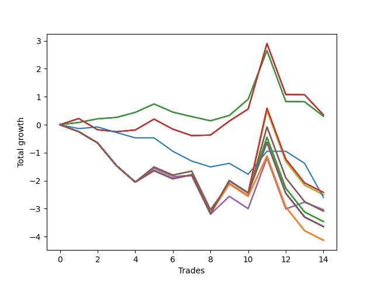

# Short Wallace 016 
- Symbol: SPY_Unlimited
- Date Range: 03/23/2022 - 07/08/2022
- Trading Period: 7:20-12:30
- Number of Trades: 14



| Name | Win Percent | Profit | Avg Profit / Trade | Avg Time / Trade |      | Name | Win Percent | Profit | Avg Profit / Trade | Avg Time / Trade |
| ---- | ----------- | ------ | ------------------ | ---------------- | ---- | ---- | ----------- | ------ | ------------------ | ---------------- |
| Sorted By <br> Profit | | | | | | Sorted By <br> Win Percentage ||||
| Sixty-Five | 50.00 | 175.00 | 12.50 | 17:34 |     | Sixty-Four | 57.14 | 150.00 | 10.71 | 11:38 |
| Fifty-Seven | 50.00 | 175.00 | 12.50 | 17:34 |     | Fifty-Six | 57.14 | 150.00 | 10.71 | 11:38 |
| Forty-Nine | 50.00 | 175.00 | 12.50 | 17:34 |     | Forty-Eight | 57.14 | 150.00 | 10.71 | 11:38 |
| Forty-One | 50.00 | 175.00 | 12.50 | 17:34 |     | Forty | 57.14 | 150.00 | 10.71 | 11:38 |
| One | 50.00 | 175.00 | 12.50 | 17:34 |     | Zero | 57.14 | 150.00 | 10.71 | 11:38 |
| Sixty-Four | 57.14 | 150.00 | 10.71 | 11:38 |     | Sixty-Five | 50.00 | 175.00 | 12.50 | 17:34 |
| Fifty-Six | 57.14 | 150.00 | 10.71 | 11:38 |     | Fifty-Seven | 50.00 | 175.00 | 12.50 | 17:34 |
| Forty-Eight | 57.14 | 150.00 | 10.71 | 11:38 |     | Forty-Nine | 50.00 | 175.00 | 12.50 | 17:34 |
| Forty | 57.14 | 150.00 | 10.71 | 11:38 |     | Forty-One | 50.00 | 175.00 | 12.50 | 17:34 |
| Zero | 57.14 | 150.00 | 10.71 | 11:38 |     | One | 50.00 | 175.00 | 12.50 | 17:34 |
| One Hundred Twenty-Eight | 28.57 | -1210.00 | -86.43 | 28:30 |     | Sixty-Six | 35.71 | -1520.00 | -108.57 | 25:51 |
| One Hundred Twenty-Three | 28.57 | -1210.00 | -86.43 | 28:30 |     | Fifty-Eight | 35.71 | -1520.00 | -108.57 | 25:51 |
| One Hundred Eighteen | 28.57 | -1210.00 | -86.43 | 28:30 |     | Fifty | 35.71 | -1520.00 | -108.57 | 25:51 |
| One Hundred Thirteen | 28.57 | -1210.00 | -86.43 | 28:30 |     | Forty-Two | 35.71 | -1520.00 | -108.57 | 25:51 |
| Eighty-Three | 28.57 | -1210.00 | -86.43 | 28:30 |     | Two | 35.71 | -1520.00 | -108.57 | 25:51 |
| Seventy | 28.57 | -1250.00 | -89.29 | 28:29 |     | One Hundred Twenty-Eight | 28.57 | -1210.00 | -86.43 | 28:30 |
| Sixty-Two | 28.57 | -1250.00 | -89.29 | 28:29 |     | One Hundred Twenty-Three | 28.57 | -1210.00 | -86.43 | 28:30 |
| Fifty-Four | 28.57 | -1250.00 | -89.29 | 28:29 |     | One Hundred Eighteen | 28.57 | -1210.00 | -86.43 | 28:30 |
| Forty-Six | 28.57 | -1250.00 | -89.29 | 28:29 |     | One Hundred Thirteen | 28.57 | -1210.00 | -86.43 | 28:30 |
| Six | 28.57 | -1250.00 | -89.29 | 28:29 |     | Eighty-Three | 28.57 | -1210.00 | -86.43 | 28:30 |
| Seventy-Three | 21.43 | -1300.00 | -92.86 | 05:47 |     | Seventy | 28.57 | -1250.00 | -89.29 | 28:29 |
| Sixty-Six | 35.71 | -1520.00 | -108.57 | 25:51 |     | Sixty-Two | 28.57 | -1250.00 | -89.29 | 28:29 |
| Fifty-Eight | 35.71 | -1520.00 | -108.57 | 25:51 |     | Fifty-Four | 28.57 | -1250.00 | -89.29 | 28:29 |
| Fifty | 35.71 | -1520.00 | -108.57 | 25:51 |     | Forty-Six | 28.57 | -1250.00 | -89.29 | 28:29 |
| Forty-Two | 35.71 | -1520.00 | -108.57 | 25:51 |     | Six | 28.57 | -1250.00 | -89.29 | 28:29 |
| Two | 35.71 | -1520.00 | -108.57 | 25:51 |     | Sixty-Seven | 28.57 | -1545.00 | -110.36 | 28:44 |
| Sixty-Seven | 28.57 | -1545.00 | -110.36 | 28:44 |     | Fifty-Nine | 28.57 | -1545.00 | -110.36 | 28:44 |
| Fifty-Nine | 28.57 | -1545.00 | -110.36 | 28:44 |     | Fifty-One | 28.57 | -1545.00 | -110.36 | 28:44 |
| Fifty-One | 28.57 | -1545.00 | -110.36 | 28:44 |     | Forty-Three | 28.57 | -1545.00 | -110.36 | 28:44 |
| Forty-Three | 28.57 | -1545.00 | -110.36 | 28:44 |     | Three | 28.57 | -1545.00 | -110.36 | 28:44 |
| Three | 28.57 | -1545.00 | -110.36 | 28:44 |     | One Hundred Twenty-Seven | 28.57 | -1730.00 | -123.57 | 28:06 |
| One Hundred Twenty-Seven | 28.57 | -1730.00 | -123.57 | 28:06 |     | One Hundred Twenty-Two | 28.57 | -1730.00 | -123.57 | 28:06 |
| One Hundred Twenty-Two | 28.57 | -1730.00 | -123.57 | 28:06 |     | One Hundred Seventeen | 28.57 | -1730.00 | -123.57 | 28:06 |
| One Hundred Seventeen | 28.57 | -1730.00 | -123.57 | 28:06 |     | One Hundred Twelve | 28.57 | -1730.00 | -123.57 | 28:06 |
| One Hundred Twelve | 28.57 | -1730.00 | -123.57 | 28:06 |     | Eighty-Two | 28.57 | -1730.00 | -123.57 | 28:06 |
| Eighty-Two | 28.57 | -1730.00 | -123.57 | 28:06 |     | One Hundred Thirty | 28.57 | -1820.00 | -130.00 | 29:55 |
| One Hundred Thirty | 28.57 | -1820.00 | -130.00 | 29:55 |     | One Hundred Twenty-Nine | 28.57 | -1820.00 | -130.00 | 29:55 |
| One Hundred Twenty-Nine | 28.57 | -1820.00 | -130.00 | 29:55 |     | One Hundred Twenty-Five | 28.57 | -1820.00 | -130.00 | 29:55 |
| One Hundred Twenty-Five | 28.57 | -1820.00 | -130.00 | 29:55 |     | One Hundred Twenty-Four | 28.57 | -1820.00 | -130.00 | 29:55 |
| One Hundred Twenty-Four | 28.57 | -1820.00 | -130.00 | 29:55 |     | One Hundred Twenty | 28.57 | -1820.00 | -130.00 | 29:55 |
| One Hundred Twenty | 28.57 | -1820.00 | -130.00 | 29:55 |     | One Hundred Ninteen | 28.57 | -1820.00 | -130.00 | 29:55 |
| One Hundred Ninteen | 28.57 | -1820.00 | -130.00 | 29:55 |     | One Hundred Fifteen | 28.57 | -1820.00 | -130.00 | 29:55 |
| One Hundred Fifteen | 28.57 | -1820.00 | -130.00 | 29:55 |     | One Hundred Fourteen | 28.57 | -1820.00 | -130.00 | 29:55 |
| One Hundred Fourteen | 28.57 | -1820.00 | -130.00 | 29:55 |     | Eighty-Five | 28.57 | -1820.00 | -130.00 | 29:55 |
| Eighty-Five | 28.57 | -1820.00 | -130.00 | 29:55 |     | Eighty-Four | 28.57 | -1820.00 | -130.00 | 29:55 |
| Eighty-Four | 28.57 | -1820.00 | -130.00 | 29:55 |     | Seventy-One | 28.57 | -1820.00 | -130.00 | 29:55 |
| Seventy-One | 28.57 | -1820.00 | -130.00 | 29:55 |     | Sixty-Nine | 28.57 | -1820.00 | -130.00 | 29:55 |
| Sixty-Nine | 28.57 | -1820.00 | -130.00 | 29:55 |     | Sixty-Eight | 28.57 | -1820.00 | -130.00 | 29:55 |
| Sixty-Eight | 28.57 | -1820.00 | -130.00 | 29:55 |     | Sixty-Three | 28.57 | -1820.00 | -130.00 | 29:55 |
| Sixty-Three | 28.57 | -1820.00 | -130.00 | 29:55 |     | Sixty-One | 28.57 | -1820.00 | -130.00 | 29:55 |
| Sixty-One | 28.57 | -1820.00 | -130.00 | 29:55 |     | Sixty | 28.57 | -1820.00 | -130.00 | 29:55 |
| Sixty | 28.57 | -1820.00 | -130.00 | 29:55 |     | Fifty-Five | 28.57 | -1820.00 | -130.00 | 29:55 |
| Fifty-Five | 28.57 | -1820.00 | -130.00 | 29:55 |     | Fifty-Three | 28.57 | -1820.00 | -130.00 | 29:55 |
| Fifty-Three | 28.57 | -1820.00 | -130.00 | 29:55 |     | Fifty-Two | 28.57 | -1820.00 | -130.00 | 29:55 |
| Fifty-Two | 28.57 | -1820.00 | -130.00 | 29:55 |     | Forty-Seven | 28.57 | -1820.00 | -130.00 | 29:55 |
| Forty-Seven | 28.57 | -1820.00 | -130.00 | 29:55 |     | Forty-Five | 28.57 | -1820.00 | -130.00 | 29:55 |
| Forty-Five | 28.57 | -1820.00 | -130.00 | 29:55 |     | Forty-Four | 28.57 | -1820.00 | -130.00 | 29:55 |
| Forty-Four | 28.57 | -1820.00 | -130.00 | 29:55 |     | Seven | 28.57 | -1820.00 | -130.00 | 29:55 |
| Seven | 28.57 | -1820.00 | -130.00 | 29:55 |     | Five | 28.57 | -1820.00 | -130.00 | 29:55 |
| Five | 28.57 | -1820.00 | -130.00 | 29:55 |     | Four | 28.57 | -1820.00 | -130.00 | 29:55 |
| Four | 28.57 | -1820.00 | -130.00 | 29:55 |     | One Hundred Twenty-Six | 28.57 | -2065.00 | -147.50 | 27:17 |
| One Hundred Twenty-Six | 28.57 | -2065.00 | -147.50 | 27:17 |     | One Hundred Twenty-One | 28.57 | -2065.00 | -147.50 | 27:17 |
| One Hundred Twenty-One | 28.57 | -2065.00 | -147.50 | 27:17 |     | One Hundred Sixteen | 28.57 | -2065.00 | -147.50 | 27:17 |
| One Hundred Sixteen | 28.57 | -2065.00 | -147.50 | 27:17 |     | One Hundred Eleven | 28.57 | -2065.00 | -147.50 | 27:17 |
| One Hundred Eleven | 28.57 | -2065.00 | -147.50 | 27:17 |     | Eighty-One | 28.57 | -2065.00 | -147.50 | 27:17 |
| Eighty-One | 28.57 | -2065.00 | -147.50 | 27:17 |     | Seventy-Three | 21.43 | -1300.00 | -92.86 | 05:47 |

## NO STOPLOSS

### Test Zero
* Sell when price hits the middle line of the 20p bollinger
* No Stoploss
* Results:
```
Total Trades: 14
Percent Up: 42.86
Percent Down: 57.14
Total Points Moved Down: 0.30
Potential Profit: 150.00
Total Points Ups: 2.95 Count Ups: 6
Total Points Downs: 3.25 Count Downs: 8
```

<details><summary>Trades</summary>

<code>In: 2022-03-25 11:08:00		Out: 2022-03-25 11:18:10		Total Position Time: 10:10		Total Move Down: 0.08		Total to Date: 0.08</code> <br />
<code>In: 2022-03-28 12:01:00		Out: 2022-03-28 12:08:05		Total Position Time: 07:05		Total Move Down: 0.13		Total to Date: 0.21</code> <br />
<code>In: 2022-03-29 11:43:00		Out: 2022-03-29 11:50:50		Total Position Time: 07:50		Total Move Down: 0.05		Total to Date: 0.26</code> <br />
<code>In: 2022-03-29 11:46:00		Out: 2022-03-29 11:50:50		Total Position Time: 04:50		Total Move Down: 0.18		Total to Date: 0.44</code> <br />
<code>In: 2022-04-07 11:04:00		Out: 2022-04-07 11:15:20		Total Position Time: 11:20		Total Move Down: 0.30		Total to Date: 0.74</code> <br />
<code>In: 2022-04-18 10:39:00		Out: 2022-04-18 10:59:30		Total Position Time: 20:30		Total Move Down: -0.29		Total to Date: 0.45</code> <br />
<code>In: 2022-04-18 10:42:00		Out: 2022-04-18 10:59:30		Total Position Time: 17:30		Total Move Down: -0.16		Total to Date: 0.29</code> <br />
<code>In: 2022-05-04 09:32:00		Out: 2022-05-04 09:45:30		Total Position Time: 13:30		Total Move Down: -0.15		Total to Date: 0.14</code> <br />
<code>In: 2022-05-16 08:57:00		Out: 2022-05-16 09:05:45		Total Position Time: 08:45		Total Move Down: 0.19		Total to Date: 0.33</code> <br />
<code>In: 2022-05-31 07:24:00		Out: 2022-05-31 07:30:05		Total Position Time: 06:05		Total Move Down: 0.58		Total to Date: 0.91</code> <br />
<code>In: 2022-06-15 11:48:00		Out: 2022-06-15 11:53:25		Total Position Time: 05:25		Total Move Down: 1.74		Total to Date: 2.65</code> <br />
<code>In: 2022-06-30 08:01:00		Out: 2022-06-30 08:30:55		Total Position Time: 29:55		Total Move Down: -1.82		Total to Date: 0.83</code> <br />
<code>In: 2022-07-05 08:53:00		Out: 2022-07-05 09:00:10		Total Position Time: 07:10		Total Move Down: -0.01		Total to Date: 0.82</code> <br />
<code>In: 2022-07-06 11:37:00		Out: 2022-07-06 11:50:00		Total Position Time: 13:00		Total Move Down: -0.52		Total to Date: 0.30</code> <br />


</details>

### Test One
* Sell when the price hits the upper line of the 20p 1std bollinger
* No Stoploss
* Results:
```
Total Trades: 14
Percent Up: 50.00
Percent Down: 50.00
Total Points Moved Down: 0.35
Potential Profit: 175.00
Total Points Ups: 3.61 Count Ups: 7
Total Points Downs: 3.96 Count Downs: 7
```

<details><summary>Trades</summary>

<code>In: 2022-03-25 11:08:00		Out: 2022-03-25 11:19:30		Total Position Time: 11:30		Total Move Down: 0.22		Total to Date: 0.22</code> <br />
<code>In: 2022-03-28 12:01:00		Out: 2022-03-28 12:30:55		Total Position Time: 29:55		Total Move Down: -0.40		Total to Date: -0.18</code> <br />
<code>In: 2022-03-29 11:43:00		Out: 2022-03-29 11:58:15		Total Position Time: 15:15		Total Move Down: -0.07		Total to Date: -0.25</code> <br />
<code>In: 2022-03-29 11:46:00		Out: 2022-03-29 11:58:15		Total Position Time: 12:15		Total Move Down: 0.06		Total to Date: -0.19</code> <br />
<code>In: 2022-04-07 11:04:00		Out: 2022-04-07 11:18:00		Total Position Time: 14:00		Total Move Down: 0.39		Total to Date: 0.20</code> <br />
<code>In: 2022-04-18 10:39:00		Out: 2022-04-18 11:06:20		Total Position Time: 27:20		Total Move Down: -0.36		Total to Date: -0.16</code> <br />
<code>In: 2022-04-18 10:42:00		Out: 2022-04-18 11:06:20		Total Position Time: 24:20		Total Move Down: -0.23		Total to Date: -0.39</code> <br />
<code>In: 2022-05-04 09:32:00		Out: 2022-05-04 09:46:30		Total Position Time: 14:30		Total Move Down: 0.02		Total to Date: -0.37</code> <br />
<code>In: 2022-05-16 08:57:00		Out: 2022-05-16 09:06:15		Total Position Time: 09:15		Total Move Down: 0.50		Total to Date: 0.13</code> <br />
<code>In: 2022-05-31 07:24:00		Out: 2022-05-31 07:38:05		Total Position Time: 14:05		Total Move Down: 0.43		Total to Date: 0.56</code> <br />
<code>In: 2022-06-15 11:48:00		Out: 2022-06-15 11:57:45		Total Position Time: 09:45		Total Move Down: 2.34		Total to Date: 2.90</code> <br />
<code>In: 2022-06-30 08:01:00		Out: 2022-06-30 08:30:55		Total Position Time: 29:55		Total Move Down: -1.82		Total to Date: 1.08</code> <br />
<code>In: 2022-07-05 08:53:00		Out: 2022-07-05 09:03:25		Total Position Time: 10:25		Total Move Down: -0.01		Total to Date: 1.07</code> <br />
<code>In: 2022-07-06 11:37:00		Out: 2022-07-06 12:00:30		Total Position Time: 23:30		Total Move Down: -0.72		Total to Date: 0.35</code> <br />


</details>

### Test Two
* Sell when the price hits the upper line of the 20p 2std bollinger
* No Stoploss
* Results:
```
Total Trades: 14
Percent Up: 64.29
Percent Down: 35.71
Total Points Moved Down: -3.04
Potential Profit: -1520.00
Total Points Ups: 6.25 Count Ups: 9
Total Points Downs: 3.21 Count Downs: 5
```

<details><summary>Trades</summary>

<code>In: 2022-03-25 11:08:00		Out: 2022-03-25 11:37:55		Total Position Time: 29:55		Total Move Down: -0.25		Total to Date: -0.25</code> <br />
<code>In: 2022-03-28 12:01:00		Out: 2022-03-28 12:30:55		Total Position Time: 29:55		Total Move Down: -0.40		Total to Date: -0.65</code> <br />
<code>In: 2022-03-29 11:43:00		Out: 2022-03-29 12:12:55		Total Position Time: 29:55		Total Move Down: -0.81		Total to Date: -1.46</code> <br />
<code>In: 2022-03-29 11:46:00		Out: 2022-03-29 12:15:55		Total Position Time: 29:55		Total Move Down: -0.59		Total to Date: -2.05</code> <br />
<code>In: 2022-04-07 11:04:00		Out: 2022-04-07 11:18:20		Total Position Time: 14:20		Total Move Down: 0.49		Total to Date: -1.56</code> <br />
<code>In: 2022-04-18 10:39:00		Out: 2022-04-18 11:08:55		Total Position Time: 29:55		Total Move Down: -0.29		Total to Date: -1.85</code> <br />
<code>In: 2022-04-18 10:42:00		Out: 2022-04-18 11:10:40		Total Position Time: 28:40		Total Move Down: 0.03		Total to Date: -1.82</code> <br />
<code>In: 2022-05-04 09:32:00		Out: 2022-05-04 10:01:55		Total Position Time: 29:55		Total Move Down: -1.38		Total to Date: -3.20</code> <br />
<code>In: 2022-05-16 08:57:00		Out: 2022-05-16 09:11:35		Total Position Time: 14:35		Total Move Down: 0.64		Total to Date: -2.56</code> <br />
<code>In: 2022-05-31 07:24:00		Out: 2022-05-31 07:53:55		Total Position Time: 29:55		Total Move Down: -0.44		Total to Date: -3.00</code> <br />
<code>In: 2022-06-15 11:48:00		Out: 2022-06-15 12:17:55		Total Position Time: 29:55		Total Move Down: 1.81		Total to Date: -1.19</code> <br />
<code>In: 2022-06-30 08:01:00		Out: 2022-06-30 08:30:55		Total Position Time: 29:55		Total Move Down: -1.82		Total to Date: -3.01</code> <br />
<code>In: 2022-07-05 08:53:00		Out: 2022-07-05 09:03:50		Total Position Time: 10:50		Total Move Down: 0.24		Total to Date: -2.77</code> <br />
<code>In: 2022-07-06 11:37:00		Out: 2022-07-06 12:01:25		Total Position Time: 24:25		Total Move Down: -0.27		Total to Date: -3.04</code> <br />


</details>

### Test Three
* Sell when price hits the middle line of the 50p bollinger
* No Stoploss
* Results:
```
Total Trades: 14
Percent Up: 71.43
Percent Down: 28.57
Total Points Moved Down: -3.09
Potential Profit: -1545.00
Total Points Ups: 7.17 Count Ups: 10
Total Points Downs: 4.08 Count Downs: 4
```

<details><summary>Trades</summary>

<code>In: 2022-03-25 11:08:00		Out: 2022-03-25 11:37:55		Total Position Time: 29:55		Total Move Down: -0.25		Total to Date: -0.25</code> <br />
<code>In: 2022-03-28 12:01:00		Out: 2022-03-28 12:30:55		Total Position Time: 29:55		Total Move Down: -0.40		Total to Date: -0.65</code> <br />
<code>In: 2022-03-29 11:43:00		Out: 2022-03-29 12:12:55		Total Position Time: 29:55		Total Move Down: -0.81		Total to Date: -1.46</code> <br />
<code>In: 2022-03-29 11:46:00		Out: 2022-03-29 12:15:55		Total Position Time: 29:55		Total Move Down: -0.59		Total to Date: -2.05</code> <br />
<code>In: 2022-04-07 11:04:00		Out: 2022-04-07 11:33:40		Total Position Time: 29:40		Total Move Down: 0.54		Total to Date: -1.51</code> <br />
<code>In: 2022-04-18 10:39:00		Out: 2022-04-18 11:08:55		Total Position Time: 29:55		Total Move Down: -0.29		Total to Date: -1.80</code> <br />
<code>In: 2022-04-18 10:42:00		Out: 2022-04-18 11:11:55		Total Position Time: 29:55		Total Move Down: 0.14		Total to Date: -1.66</code> <br />
<code>In: 2022-05-04 09:32:00		Out: 2022-05-04 10:01:55		Total Position Time: 29:55		Total Move Down: -1.38		Total to Date: -3.04</code> <br />
<code>In: 2022-05-16 08:57:00		Out: 2022-05-16 09:15:30		Total Position Time: 18:30		Total Move Down: 0.94		Total to Date: -2.10</code> <br />
<code>In: 2022-05-31 07:24:00		Out: 2022-05-31 07:53:55		Total Position Time: 29:55		Total Move Down: -0.44		Total to Date: -2.54</code> <br />
<code>In: 2022-06-15 11:48:00		Out: 2022-06-15 12:13:05		Total Position Time: 25:05		Total Move Down: 2.46		Total to Date: -0.08</code> <br />
<code>In: 2022-06-30 08:01:00		Out: 2022-06-30 08:30:55		Total Position Time: 29:55		Total Move Down: -1.82		Total to Date: -1.90</code> <br />
<code>In: 2022-07-05 08:53:00		Out: 2022-07-05 09:22:55		Total Position Time: 29:55		Total Move Down: -0.85		Total to Date: -2.75</code> <br />
<code>In: 2022-07-06 11:37:00		Out: 2022-07-06 12:06:55		Total Position Time: 29:55		Total Move Down: -0.34		Total to Date: -3.09</code> <br />


</details>

### Test Four
* Sell when the price hits the upper line of the 50p 1std bollinger
* No Stoploss
* Results:
```
Total Trades: 14
Percent Up: 71.43
Percent Down: 28.57
Total Points Moved Down: -3.64
Potential Profit: -1820.00
Total Points Ups: 7.17 Count Ups: 10
Total Points Downs: 3.53 Count Downs: 4
```

<details><summary>Trades</summary>

<code>In: 2022-03-25 11:08:00		Out: 2022-03-25 11:37:55		Total Position Time: 29:55		Total Move Down: -0.25		Total to Date: -0.25</code> <br />
<code>In: 2022-03-28 12:01:00		Out: 2022-03-28 12:30:55		Total Position Time: 29:55		Total Move Down: -0.40		Total to Date: -0.65</code> <br />
<code>In: 2022-03-29 11:43:00		Out: 2022-03-29 12:12:55		Total Position Time: 29:55		Total Move Down: -0.81		Total to Date: -1.46</code> <br />
<code>In: 2022-03-29 11:46:00		Out: 2022-03-29 12:15:55		Total Position Time: 29:55		Total Move Down: -0.59		Total to Date: -2.05</code> <br />
<code>In: 2022-04-07 11:04:00		Out: 2022-04-07 11:33:55		Total Position Time: 29:55		Total Move Down: 0.41		Total to Date: -1.64</code> <br />
<code>In: 2022-04-18 10:39:00		Out: 2022-04-18 11:08:55		Total Position Time: 29:55		Total Move Down: -0.29		Total to Date: -1.93</code> <br />
<code>In: 2022-04-18 10:42:00		Out: 2022-04-18 11:11:55		Total Position Time: 29:55		Total Move Down: 0.14		Total to Date: -1.79</code> <br />
<code>In: 2022-05-04 09:32:00		Out: 2022-05-04 10:01:55		Total Position Time: 29:55		Total Move Down: -1.38		Total to Date: -3.17</code> <br />
<code>In: 2022-05-16 08:57:00		Out: 2022-05-16 09:26:55		Total Position Time: 29:55		Total Move Down: 1.17		Total to Date: -2.00</code> <br />
<code>In: 2022-05-31 07:24:00		Out: 2022-05-31 07:53:55		Total Position Time: 29:55		Total Move Down: -0.44		Total to Date: -2.44</code> <br />
<code>In: 2022-06-15 11:48:00		Out: 2022-06-15 12:17:55		Total Position Time: 29:55		Total Move Down: 1.81		Total to Date: -0.63</code> <br />
<code>In: 2022-06-30 08:01:00		Out: 2022-06-30 08:30:55		Total Position Time: 29:55		Total Move Down: -1.82		Total to Date: -2.45</code> <br />
<code>In: 2022-07-05 08:53:00		Out: 2022-07-05 09:22:55		Total Position Time: 29:55		Total Move Down: -0.85		Total to Date: -3.30</code> <br />
<code>In: 2022-07-06 11:37:00		Out: 2022-07-06 12:06:55		Total Position Time: 29:55		Total Move Down: -0.34		Total to Date: -3.64</code> <br />


</details>

### Test Five
* Sell when the price hits the upper line of the 50p 2std bollinger
* No Stoploss
* Results:
```
Total Trades: 14
Percent Up: 71.43
Percent Down: 28.57
Total Points Moved Down: -3.64
Potential Profit: -1820.00
Total Points Ups: 7.17 Count Ups: 10
Total Points Downs: 3.53 Count Downs: 4
```

<details><summary>Trades</summary>

<code>In: 2022-03-25 11:08:00		Out: 2022-03-25 11:37:55		Total Position Time: 29:55		Total Move Down: -0.25		Total to Date: -0.25</code> <br />
<code>In: 2022-03-28 12:01:00		Out: 2022-03-28 12:30:55		Total Position Time: 29:55		Total Move Down: -0.40		Total to Date: -0.65</code> <br />
<code>In: 2022-03-29 11:43:00		Out: 2022-03-29 12:12:55		Total Position Time: 29:55		Total Move Down: -0.81		Total to Date: -1.46</code> <br />
<code>In: 2022-03-29 11:46:00		Out: 2022-03-29 12:15:55		Total Position Time: 29:55		Total Move Down: -0.59		Total to Date: -2.05</code> <br />
<code>In: 2022-04-07 11:04:00		Out: 2022-04-07 11:33:55		Total Position Time: 29:55		Total Move Down: 0.41		Total to Date: -1.64</code> <br />
<code>In: 2022-04-18 10:39:00		Out: 2022-04-18 11:08:55		Total Position Time: 29:55		Total Move Down: -0.29		Total to Date: -1.93</code> <br />
<code>In: 2022-04-18 10:42:00		Out: 2022-04-18 11:11:55		Total Position Time: 29:55		Total Move Down: 0.14		Total to Date: -1.79</code> <br />
<code>In: 2022-05-04 09:32:00		Out: 2022-05-04 10:01:55		Total Position Time: 29:55		Total Move Down: -1.38		Total to Date: -3.17</code> <br />
<code>In: 2022-05-16 08:57:00		Out: 2022-05-16 09:26:55		Total Position Time: 29:55		Total Move Down: 1.17		Total to Date: -2.00</code> <br />
<code>In: 2022-05-31 07:24:00		Out: 2022-05-31 07:53:55		Total Position Time: 29:55		Total Move Down: -0.44		Total to Date: -2.44</code> <br />
<code>In: 2022-06-15 11:48:00		Out: 2022-06-15 12:17:55		Total Position Time: 29:55		Total Move Down: 1.81		Total to Date: -0.63</code> <br />
<code>In: 2022-06-30 08:01:00		Out: 2022-06-30 08:30:55		Total Position Time: 29:55		Total Move Down: -1.82		Total to Date: -2.45</code> <br />
<code>In: 2022-07-05 08:53:00		Out: 2022-07-05 09:22:55		Total Position Time: 29:55		Total Move Down: -0.85		Total to Date: -3.30</code> <br />
<code>In: 2022-07-06 11:37:00		Out: 2022-07-06 12:06:55		Total Position Time: 29:55		Total Move Down: -0.34		Total to Date: -3.64</code> <br />


</details>

### Test Six
* Sell when the price hits the middle line of the 1std VWAP
* No Stoploss
* Results:
```
Total Trades: 14
Percent Up: 71.43
Percent Down: 28.57
Total Points Moved Down: -2.50
Potential Profit: -1250.00
Total Points Ups: 7.17 Count Ups: 10
Total Points Downs: 4.67 Count Downs: 4
```

<details><summary>Trades</summary>

<code>In: 2022-03-25 11:08:00		Out: 2022-03-25 11:37:55		Total Position Time: 29:55		Total Move Down: -0.25		Total to Date: -0.25</code> <br />
<code>In: 2022-03-28 12:01:00		Out: 2022-03-28 12:30:55		Total Position Time: 29:55		Total Move Down: -0.40		Total to Date: -0.65</code> <br />
<code>In: 2022-03-29 11:43:00		Out: 2022-03-29 12:12:55		Total Position Time: 29:55		Total Move Down: -0.81		Total to Date: -1.46</code> <br />
<code>In: 2022-03-29 11:46:00		Out: 2022-03-29 12:15:55		Total Position Time: 29:55		Total Move Down: -0.59		Total to Date: -2.05</code> <br />
<code>In: 2022-04-07 11:04:00		Out: 2022-04-07 11:33:55		Total Position Time: 29:55		Total Move Down: 0.41		Total to Date: -1.64</code> <br />
<code>In: 2022-04-18 10:39:00		Out: 2022-04-18 11:08:55		Total Position Time: 29:55		Total Move Down: -0.29		Total to Date: -1.93</code> <br />
<code>In: 2022-04-18 10:42:00		Out: 2022-04-18 11:11:55		Total Position Time: 29:55		Total Move Down: 0.14		Total to Date: -1.79</code> <br />
<code>In: 2022-05-04 09:32:00		Out: 2022-05-04 10:01:55		Total Position Time: 29:55		Total Move Down: -1.38		Total to Date: -3.17</code> <br />
<code>In: 2022-05-16 08:57:00		Out: 2022-05-16 09:26:55		Total Position Time: 29:55		Total Move Down: 1.17		Total to Date: -2.00</code> <br />
<code>In: 2022-05-31 07:24:00		Out: 2022-05-31 07:53:55		Total Position Time: 29:55		Total Move Down: -0.44		Total to Date: -2.44</code> <br />
<code>In: 2022-06-15 11:48:00		Out: 2022-06-15 11:57:55		Total Position Time: 09:55		Total Move Down: 2.95		Total to Date: 0.51</code> <br />
<code>In: 2022-06-30 08:01:00		Out: 2022-06-30 08:30:55		Total Position Time: 29:55		Total Move Down: -1.82		Total to Date: -1.31</code> <br />
<code>In: 2022-07-05 08:53:00		Out: 2022-07-05 09:22:55		Total Position Time: 29:55		Total Move Down: -0.85		Total to Date: -2.16</code> <br />
<code>In: 2022-07-06 11:37:00		Out: 2022-07-06 12:06:55		Total Position Time: 29:55		Total Move Down: -0.34		Total to Date: -2.50</code> <br />


</details>

### Test Seven
* Sell when the price hits the upper line of the 1std VWAP
* No Stoploss
* Results:
```
Total Trades: 14
Percent Up: 71.43
Percent Down: 28.57
Total Points Moved Down: -3.64
Potential Profit: -1820.00
Total Points Ups: 7.17 Count Ups: 10
Total Points Downs: 3.53 Count Downs: 4
```

<details><summary>Trades</summary>

<code>In: 2022-03-25 11:08:00		Out: 2022-03-25 11:37:55		Total Position Time: 29:55		Total Move Down: -0.25		Total to Date: -0.25</code> <br />
<code>In: 2022-03-28 12:01:00		Out: 2022-03-28 12:30:55		Total Position Time: 29:55		Total Move Down: -0.40		Total to Date: -0.65</code> <br />
<code>In: 2022-03-29 11:43:00		Out: 2022-03-29 12:12:55		Total Position Time: 29:55		Total Move Down: -0.81		Total to Date: -1.46</code> <br />
<code>In: 2022-03-29 11:46:00		Out: 2022-03-29 12:15:55		Total Position Time: 29:55		Total Move Down: -0.59		Total to Date: -2.05</code> <br />
<code>In: 2022-04-07 11:04:00		Out: 2022-04-07 11:33:55		Total Position Time: 29:55		Total Move Down: 0.41		Total to Date: -1.64</code> <br />
<code>In: 2022-04-18 10:39:00		Out: 2022-04-18 11:08:55		Total Position Time: 29:55		Total Move Down: -0.29		Total to Date: -1.93</code> <br />
<code>In: 2022-04-18 10:42:00		Out: 2022-04-18 11:11:55		Total Position Time: 29:55		Total Move Down: 0.14		Total to Date: -1.79</code> <br />
<code>In: 2022-05-04 09:32:00		Out: 2022-05-04 10:01:55		Total Position Time: 29:55		Total Move Down: -1.38		Total to Date: -3.17</code> <br />
<code>In: 2022-05-16 08:57:00		Out: 2022-05-16 09:26:55		Total Position Time: 29:55		Total Move Down: 1.17		Total to Date: -2.00</code> <br />
<code>In: 2022-05-31 07:24:00		Out: 2022-05-31 07:53:55		Total Position Time: 29:55		Total Move Down: -0.44		Total to Date: -2.44</code> <br />
<code>In: 2022-06-15 11:48:00		Out: 2022-06-15 12:17:55		Total Position Time: 29:55		Total Move Down: 1.81		Total to Date: -0.63</code> <br />
<code>In: 2022-06-30 08:01:00		Out: 2022-06-30 08:30:55		Total Position Time: 29:55		Total Move Down: -1.82		Total to Date: -2.45</code> <br />
<code>In: 2022-07-05 08:53:00		Out: 2022-07-05 09:22:55		Total Position Time: 29:55		Total Move Down: -0.85		Total to Date: -3.30</code> <br />
<code>In: 2022-07-06 11:37:00		Out: 2022-07-06 12:06:55		Total Position Time: 29:55		Total Move Down: -0.34		Total to Date: -3.64</code> <br />


</details>

## STOPLOSS OF 5

### Test Forty
* Sell when price hits the middle line of the 20p bollinger
* Stoploss is -5 points
* Results:
```
Total Trades: 14
Percent Up: 42.86
Percent Down: 57.14
Total Points Moved Down: 0.30
Potential Profit: 150.00
Total Points Ups: 2.95 Count Ups: 6
Total Points Downs: 3.25 Count Downs: 8
```

<details><summary>Trades</summary>

<code>In: 2022-03-25 11:08:00		Out: 2022-03-25 11:18:10		Total Position Time: 10:10		Total Move Down: 0.08		Total to Date: 0.08</code> <br />
<code>In: 2022-03-28 12:01:00		Out: 2022-03-28 12:08:05		Total Position Time: 07:05		Total Move Down: 0.13		Total to Date: 0.21</code> <br />
<code>In: 2022-03-29 11:43:00		Out: 2022-03-29 11:50:50		Total Position Time: 07:50		Total Move Down: 0.05		Total to Date: 0.26</code> <br />
<code>In: 2022-03-29 11:46:00		Out: 2022-03-29 11:50:50		Total Position Time: 04:50		Total Move Down: 0.18		Total to Date: 0.44</code> <br />
<code>In: 2022-04-07 11:04:00		Out: 2022-04-07 11:15:20		Total Position Time: 11:20		Total Move Down: 0.30		Total to Date: 0.74</code> <br />
<code>In: 2022-04-18 10:39:00		Out: 2022-04-18 10:59:30		Total Position Time: 20:30		Total Move Down: -0.29		Total to Date: 0.45</code> <br />
<code>In: 2022-04-18 10:42:00		Out: 2022-04-18 10:59:30		Total Position Time: 17:30		Total Move Down: -0.16		Total to Date: 0.29</code> <br />
<code>In: 2022-05-04 09:32:00		Out: 2022-05-04 09:45:30		Total Position Time: 13:30		Total Move Down: -0.15		Total to Date: 0.14</code> <br />
<code>In: 2022-05-16 08:57:00		Out: 2022-05-16 09:05:45		Total Position Time: 08:45		Total Move Down: 0.19		Total to Date: 0.33</code> <br />
<code>In: 2022-05-31 07:24:00		Out: 2022-05-31 07:30:05		Total Position Time: 06:05		Total Move Down: 0.58		Total to Date: 0.91</code> <br />
<code>In: 2022-06-15 11:48:00		Out: 2022-06-15 11:53:25		Total Position Time: 05:25		Total Move Down: 1.74		Total to Date: 2.65</code> <br />
<code>In: 2022-06-30 08:01:00		Out: 2022-06-30 08:30:55		Total Position Time: 29:55		Total Move Down: -1.82		Total to Date: 0.83</code> <br />
<code>In: 2022-07-05 08:53:00		Out: 2022-07-05 09:00:10		Total Position Time: 07:10		Total Move Down: -0.01		Total to Date: 0.82</code> <br />
<code>In: 2022-07-06 11:37:00		Out: 2022-07-06 11:50:00		Total Position Time: 13:00		Total Move Down: -0.52		Total to Date: 0.30</code> <br />


</details>

### Test Forty-One
* Sell when the price hits the upper line of the 20p 1std bollinger
* Stoploss is -5 points
* Results:
```
Total Trades: 14
Percent Up: 50.00
Percent Down: 50.00
Total Points Moved Down: 0.35
Potential Profit: 175.00
Total Points Ups: 3.61 Count Ups: 7
Total Points Downs: 3.96 Count Downs: 7
```

<details><summary>Trades</summary>

<code>In: 2022-03-25 11:08:00		Out: 2022-03-25 11:19:30		Total Position Time: 11:30		Total Move Down: 0.22		Total to Date: 0.22</code> <br />
<code>In: 2022-03-28 12:01:00		Out: 2022-03-28 12:30:55		Total Position Time: 29:55		Total Move Down: -0.40		Total to Date: -0.18</code> <br />
<code>In: 2022-03-29 11:43:00		Out: 2022-03-29 11:58:15		Total Position Time: 15:15		Total Move Down: -0.07		Total to Date: -0.25</code> <br />
<code>In: 2022-03-29 11:46:00		Out: 2022-03-29 11:58:15		Total Position Time: 12:15		Total Move Down: 0.06		Total to Date: -0.19</code> <br />
<code>In: 2022-04-07 11:04:00		Out: 2022-04-07 11:18:00		Total Position Time: 14:00		Total Move Down: 0.39		Total to Date: 0.20</code> <br />
<code>In: 2022-04-18 10:39:00		Out: 2022-04-18 11:06:20		Total Position Time: 27:20		Total Move Down: -0.36		Total to Date: -0.16</code> <br />
<code>In: 2022-04-18 10:42:00		Out: 2022-04-18 11:06:20		Total Position Time: 24:20		Total Move Down: -0.23		Total to Date: -0.39</code> <br />
<code>In: 2022-05-04 09:32:00		Out: 2022-05-04 09:46:30		Total Position Time: 14:30		Total Move Down: 0.02		Total to Date: -0.37</code> <br />
<code>In: 2022-05-16 08:57:00		Out: 2022-05-16 09:06:15		Total Position Time: 09:15		Total Move Down: 0.50		Total to Date: 0.13</code> <br />
<code>In: 2022-05-31 07:24:00		Out: 2022-05-31 07:38:05		Total Position Time: 14:05		Total Move Down: 0.43		Total to Date: 0.56</code> <br />
<code>In: 2022-06-15 11:48:00		Out: 2022-06-15 11:57:45		Total Position Time: 09:45		Total Move Down: 2.34		Total to Date: 2.90</code> <br />
<code>In: 2022-06-30 08:01:00		Out: 2022-06-30 08:30:55		Total Position Time: 29:55		Total Move Down: -1.82		Total to Date: 1.08</code> <br />
<code>In: 2022-07-05 08:53:00		Out: 2022-07-05 09:03:25		Total Position Time: 10:25		Total Move Down: -0.01		Total to Date: 1.07</code> <br />
<code>In: 2022-07-06 11:37:00		Out: 2022-07-06 12:00:30		Total Position Time: 23:30		Total Move Down: -0.72		Total to Date: 0.35</code> <br />


</details>

### Test Forty-Two
* Sell when the price hits the upper line of the 20p 2std bollinger
* Stoploss is -5 points
* Results:
```
Total Trades: 14
Percent Up: 64.29
Percent Down: 35.71
Total Points Moved Down: -3.04
Potential Profit: -1520.00
Total Points Ups: 6.25 Count Ups: 9
Total Points Downs: 3.21 Count Downs: 5
```

<details><summary>Trades</summary>

<code>In: 2022-03-25 11:08:00		Out: 2022-03-25 11:37:55		Total Position Time: 29:55		Total Move Down: -0.25		Total to Date: -0.25</code> <br />
<code>In: 2022-03-28 12:01:00		Out: 2022-03-28 12:30:55		Total Position Time: 29:55		Total Move Down: -0.40		Total to Date: -0.65</code> <br />
<code>In: 2022-03-29 11:43:00		Out: 2022-03-29 12:12:55		Total Position Time: 29:55		Total Move Down: -0.81		Total to Date: -1.46</code> <br />
<code>In: 2022-03-29 11:46:00		Out: 2022-03-29 12:15:55		Total Position Time: 29:55		Total Move Down: -0.59		Total to Date: -2.05</code> <br />
<code>In: 2022-04-07 11:04:00		Out: 2022-04-07 11:18:20		Total Position Time: 14:20		Total Move Down: 0.49		Total to Date: -1.56</code> <br />
<code>In: 2022-04-18 10:39:00		Out: 2022-04-18 11:08:55		Total Position Time: 29:55		Total Move Down: -0.29		Total to Date: -1.85</code> <br />
<code>In: 2022-04-18 10:42:00		Out: 2022-04-18 11:10:40		Total Position Time: 28:40		Total Move Down: 0.03		Total to Date: -1.82</code> <br />
<code>In: 2022-05-04 09:32:00		Out: 2022-05-04 10:01:55		Total Position Time: 29:55		Total Move Down: -1.38		Total to Date: -3.20</code> <br />
<code>In: 2022-05-16 08:57:00		Out: 2022-05-16 09:11:35		Total Position Time: 14:35		Total Move Down: 0.64		Total to Date: -2.56</code> <br />
<code>In: 2022-05-31 07:24:00		Out: 2022-05-31 07:53:55		Total Position Time: 29:55		Total Move Down: -0.44		Total to Date: -3.00</code> <br />
<code>In: 2022-06-15 11:48:00		Out: 2022-06-15 12:17:55		Total Position Time: 29:55		Total Move Down: 1.81		Total to Date: -1.19</code> <br />
<code>In: 2022-06-30 08:01:00		Out: 2022-06-30 08:30:55		Total Position Time: 29:55		Total Move Down: -1.82		Total to Date: -3.01</code> <br />
<code>In: 2022-07-05 08:53:00		Out: 2022-07-05 09:03:50		Total Position Time: 10:50		Total Move Down: 0.24		Total to Date: -2.77</code> <br />
<code>In: 2022-07-06 11:37:00		Out: 2022-07-06 12:01:25		Total Position Time: 24:25		Total Move Down: -0.27		Total to Date: -3.04</code> <br />


</details>

### Test Forty-Three
* Sell when price hits the middle line of the 50p bollinger
* Stoploss is -5 points
* Results:
```
Total Trades: 14
Percent Up: 71.43
Percent Down: 28.57
Total Points Moved Down: -3.09
Potential Profit: -1545.00
Total Points Ups: 7.17 Count Ups: 10
Total Points Downs: 4.08 Count Downs: 4
```

<details><summary>Trades</summary>

<code>In: 2022-03-25 11:08:00		Out: 2022-03-25 11:37:55		Total Position Time: 29:55		Total Move Down: -0.25		Total to Date: -0.25</code> <br />
<code>In: 2022-03-28 12:01:00		Out: 2022-03-28 12:30:55		Total Position Time: 29:55		Total Move Down: -0.40		Total to Date: -0.65</code> <br />
<code>In: 2022-03-29 11:43:00		Out: 2022-03-29 12:12:55		Total Position Time: 29:55		Total Move Down: -0.81		Total to Date: -1.46</code> <br />
<code>In: 2022-03-29 11:46:00		Out: 2022-03-29 12:15:55		Total Position Time: 29:55		Total Move Down: -0.59		Total to Date: -2.05</code> <br />
<code>In: 2022-04-07 11:04:00		Out: 2022-04-07 11:33:40		Total Position Time: 29:40		Total Move Down: 0.54		Total to Date: -1.51</code> <br />
<code>In: 2022-04-18 10:39:00		Out: 2022-04-18 11:08:55		Total Position Time: 29:55		Total Move Down: -0.29		Total to Date: -1.80</code> <br />
<code>In: 2022-04-18 10:42:00		Out: 2022-04-18 11:11:55		Total Position Time: 29:55		Total Move Down: 0.14		Total to Date: -1.66</code> <br />
<code>In: 2022-05-04 09:32:00		Out: 2022-05-04 10:01:55		Total Position Time: 29:55		Total Move Down: -1.38		Total to Date: -3.04</code> <br />
<code>In: 2022-05-16 08:57:00		Out: 2022-05-16 09:15:30		Total Position Time: 18:30		Total Move Down: 0.94		Total to Date: -2.10</code> <br />
<code>In: 2022-05-31 07:24:00		Out: 2022-05-31 07:53:55		Total Position Time: 29:55		Total Move Down: -0.44		Total to Date: -2.54</code> <br />
<code>In: 2022-06-15 11:48:00		Out: 2022-06-15 12:13:05		Total Position Time: 25:05		Total Move Down: 2.46		Total to Date: -0.08</code> <br />
<code>In: 2022-06-30 08:01:00		Out: 2022-06-30 08:30:55		Total Position Time: 29:55		Total Move Down: -1.82		Total to Date: -1.90</code> <br />
<code>In: 2022-07-05 08:53:00		Out: 2022-07-05 09:22:55		Total Position Time: 29:55		Total Move Down: -0.85		Total to Date: -2.75</code> <br />
<code>In: 2022-07-06 11:37:00		Out: 2022-07-06 12:06:55		Total Position Time: 29:55		Total Move Down: -0.34		Total to Date: -3.09</code> <br />


</details>

### Test Forty-Four
* Sell when the price hits the upper line of the 50p 1std bollinger
* Stoploss is -5 points
* Results:
```
Total Trades: 14
Percent Up: 71.43
Percent Down: 28.57
Total Points Moved Down: -3.64
Potential Profit: -1820.00
Total Points Ups: 7.17 Count Ups: 10
Total Points Downs: 3.53 Count Downs: 4
```

<details><summary>Trades</summary>

<code>In: 2022-03-25 11:08:00		Out: 2022-03-25 11:37:55		Total Position Time: 29:55		Total Move Down: -0.25		Total to Date: -0.25</code> <br />
<code>In: 2022-03-28 12:01:00		Out: 2022-03-28 12:30:55		Total Position Time: 29:55		Total Move Down: -0.40		Total to Date: -0.65</code> <br />
<code>In: 2022-03-29 11:43:00		Out: 2022-03-29 12:12:55		Total Position Time: 29:55		Total Move Down: -0.81		Total to Date: -1.46</code> <br />
<code>In: 2022-03-29 11:46:00		Out: 2022-03-29 12:15:55		Total Position Time: 29:55		Total Move Down: -0.59		Total to Date: -2.05</code> <br />
<code>In: 2022-04-07 11:04:00		Out: 2022-04-07 11:33:55		Total Position Time: 29:55		Total Move Down: 0.41		Total to Date: -1.64</code> <br />
<code>In: 2022-04-18 10:39:00		Out: 2022-04-18 11:08:55		Total Position Time: 29:55		Total Move Down: -0.29		Total to Date: -1.93</code> <br />
<code>In: 2022-04-18 10:42:00		Out: 2022-04-18 11:11:55		Total Position Time: 29:55		Total Move Down: 0.14		Total to Date: -1.79</code> <br />
<code>In: 2022-05-04 09:32:00		Out: 2022-05-04 10:01:55		Total Position Time: 29:55		Total Move Down: -1.38		Total to Date: -3.17</code> <br />
<code>In: 2022-05-16 08:57:00		Out: 2022-05-16 09:26:55		Total Position Time: 29:55		Total Move Down: 1.17		Total to Date: -2.00</code> <br />
<code>In: 2022-05-31 07:24:00		Out: 2022-05-31 07:53:55		Total Position Time: 29:55		Total Move Down: -0.44		Total to Date: -2.44</code> <br />
<code>In: 2022-06-15 11:48:00		Out: 2022-06-15 12:17:55		Total Position Time: 29:55		Total Move Down: 1.81		Total to Date: -0.63</code> <br />
<code>In: 2022-06-30 08:01:00		Out: 2022-06-30 08:30:55		Total Position Time: 29:55		Total Move Down: -1.82		Total to Date: -2.45</code> <br />
<code>In: 2022-07-05 08:53:00		Out: 2022-07-05 09:22:55		Total Position Time: 29:55		Total Move Down: -0.85		Total to Date: -3.30</code> <br />
<code>In: 2022-07-06 11:37:00		Out: 2022-07-06 12:06:55		Total Position Time: 29:55		Total Move Down: -0.34		Total to Date: -3.64</code> <br />


</details>

### Test Forty-Five
* Sell when the price hits the upper line of the 50p 2std bollinger
* Stoploss is -5 points
* Results:
```
Total Trades: 14
Percent Up: 71.43
Percent Down: 28.57
Total Points Moved Down: -3.64
Potential Profit: -1820.00
Total Points Ups: 7.17 Count Ups: 10
Total Points Downs: 3.53 Count Downs: 4
```

<details><summary>Trades</summary>

<code>In: 2022-03-25 11:08:00		Out: 2022-03-25 11:37:55		Total Position Time: 29:55		Total Move Down: -0.25		Total to Date: -0.25</code> <br />
<code>In: 2022-03-28 12:01:00		Out: 2022-03-28 12:30:55		Total Position Time: 29:55		Total Move Down: -0.40		Total to Date: -0.65</code> <br />
<code>In: 2022-03-29 11:43:00		Out: 2022-03-29 12:12:55		Total Position Time: 29:55		Total Move Down: -0.81		Total to Date: -1.46</code> <br />
<code>In: 2022-03-29 11:46:00		Out: 2022-03-29 12:15:55		Total Position Time: 29:55		Total Move Down: -0.59		Total to Date: -2.05</code> <br />
<code>In: 2022-04-07 11:04:00		Out: 2022-04-07 11:33:55		Total Position Time: 29:55		Total Move Down: 0.41		Total to Date: -1.64</code> <br />
<code>In: 2022-04-18 10:39:00		Out: 2022-04-18 11:08:55		Total Position Time: 29:55		Total Move Down: -0.29		Total to Date: -1.93</code> <br />
<code>In: 2022-04-18 10:42:00		Out: 2022-04-18 11:11:55		Total Position Time: 29:55		Total Move Down: 0.14		Total to Date: -1.79</code> <br />
<code>In: 2022-05-04 09:32:00		Out: 2022-05-04 10:01:55		Total Position Time: 29:55		Total Move Down: -1.38		Total to Date: -3.17</code> <br />
<code>In: 2022-05-16 08:57:00		Out: 2022-05-16 09:26:55		Total Position Time: 29:55		Total Move Down: 1.17		Total to Date: -2.00</code> <br />
<code>In: 2022-05-31 07:24:00		Out: 2022-05-31 07:53:55		Total Position Time: 29:55		Total Move Down: -0.44		Total to Date: -2.44</code> <br />
<code>In: 2022-06-15 11:48:00		Out: 2022-06-15 12:17:55		Total Position Time: 29:55		Total Move Down: 1.81		Total to Date: -0.63</code> <br />
<code>In: 2022-06-30 08:01:00		Out: 2022-06-30 08:30:55		Total Position Time: 29:55		Total Move Down: -1.82		Total to Date: -2.45</code> <br />
<code>In: 2022-07-05 08:53:00		Out: 2022-07-05 09:22:55		Total Position Time: 29:55		Total Move Down: -0.85		Total to Date: -3.30</code> <br />
<code>In: 2022-07-06 11:37:00		Out: 2022-07-06 12:06:55		Total Position Time: 29:55		Total Move Down: -0.34		Total to Date: -3.64</code> <br />


</details>

### Test Forty-Six
* Sell when the price hits the middle line of the 1std VWAP
* Stoploss is -5 points
* Results:
```
Total Trades: 14
Percent Up: 71.43
Percent Down: 28.57
Total Points Moved Down: -2.50
Potential Profit: -1250.00
Total Points Ups: 7.17 Count Ups: 10
Total Points Downs: 4.67 Count Downs: 4
```

<details><summary>Trades</summary>

<code>In: 2022-03-25 11:08:00		Out: 2022-03-25 11:37:55		Total Position Time: 29:55		Total Move Down: -0.25		Total to Date: -0.25</code> <br />
<code>In: 2022-03-28 12:01:00		Out: 2022-03-28 12:30:55		Total Position Time: 29:55		Total Move Down: -0.40		Total to Date: -0.65</code> <br />
<code>In: 2022-03-29 11:43:00		Out: 2022-03-29 12:12:55		Total Position Time: 29:55		Total Move Down: -0.81		Total to Date: -1.46</code> <br />
<code>In: 2022-03-29 11:46:00		Out: 2022-03-29 12:15:55		Total Position Time: 29:55		Total Move Down: -0.59		Total to Date: -2.05</code> <br />
<code>In: 2022-04-07 11:04:00		Out: 2022-04-07 11:33:55		Total Position Time: 29:55		Total Move Down: 0.41		Total to Date: -1.64</code> <br />
<code>In: 2022-04-18 10:39:00		Out: 2022-04-18 11:08:55		Total Position Time: 29:55		Total Move Down: -0.29		Total to Date: -1.93</code> <br />
<code>In: 2022-04-18 10:42:00		Out: 2022-04-18 11:11:55		Total Position Time: 29:55		Total Move Down: 0.14		Total to Date: -1.79</code> <br />
<code>In: 2022-05-04 09:32:00		Out: 2022-05-04 10:01:55		Total Position Time: 29:55		Total Move Down: -1.38		Total to Date: -3.17</code> <br />
<code>In: 2022-05-16 08:57:00		Out: 2022-05-16 09:26:55		Total Position Time: 29:55		Total Move Down: 1.17		Total to Date: -2.00</code> <br />
<code>In: 2022-05-31 07:24:00		Out: 2022-05-31 07:53:55		Total Position Time: 29:55		Total Move Down: -0.44		Total to Date: -2.44</code> <br />
<code>In: 2022-06-15 11:48:00		Out: 2022-06-15 11:57:55		Total Position Time: 09:55		Total Move Down: 2.95		Total to Date: 0.51</code> <br />
<code>In: 2022-06-30 08:01:00		Out: 2022-06-30 08:30:55		Total Position Time: 29:55		Total Move Down: -1.82		Total to Date: -1.31</code> <br />
<code>In: 2022-07-05 08:53:00		Out: 2022-07-05 09:22:55		Total Position Time: 29:55		Total Move Down: -0.85		Total to Date: -2.16</code> <br />
<code>In: 2022-07-06 11:37:00		Out: 2022-07-06 12:06:55		Total Position Time: 29:55		Total Move Down: -0.34		Total to Date: -2.50</code> <br />


</details>

### Test Forty-Seven
* Sell when the price hits the upper line of the 1std VWAP
* Stoploss is -5 points
* Results:
```
Total Trades: 14
Percent Up: 71.43
Percent Down: 28.57
Total Points Moved Down: -3.64
Potential Profit: -1820.00
Total Points Ups: 7.17 Count Ups: 10
Total Points Downs: 3.53 Count Downs: 4
```

<details><summary>Trades</summary>

<code>In: 2022-03-25 11:08:00		Out: 2022-03-25 11:37:55		Total Position Time: 29:55		Total Move Down: -0.25		Total to Date: -0.25</code> <br />
<code>In: 2022-03-28 12:01:00		Out: 2022-03-28 12:30:55		Total Position Time: 29:55		Total Move Down: -0.40		Total to Date: -0.65</code> <br />
<code>In: 2022-03-29 11:43:00		Out: 2022-03-29 12:12:55		Total Position Time: 29:55		Total Move Down: -0.81		Total to Date: -1.46</code> <br />
<code>In: 2022-03-29 11:46:00		Out: 2022-03-29 12:15:55		Total Position Time: 29:55		Total Move Down: -0.59		Total to Date: -2.05</code> <br />
<code>In: 2022-04-07 11:04:00		Out: 2022-04-07 11:33:55		Total Position Time: 29:55		Total Move Down: 0.41		Total to Date: -1.64</code> <br />
<code>In: 2022-04-18 10:39:00		Out: 2022-04-18 11:08:55		Total Position Time: 29:55		Total Move Down: -0.29		Total to Date: -1.93</code> <br />
<code>In: 2022-04-18 10:42:00		Out: 2022-04-18 11:11:55		Total Position Time: 29:55		Total Move Down: 0.14		Total to Date: -1.79</code> <br />
<code>In: 2022-05-04 09:32:00		Out: 2022-05-04 10:01:55		Total Position Time: 29:55		Total Move Down: -1.38		Total to Date: -3.17</code> <br />
<code>In: 2022-05-16 08:57:00		Out: 2022-05-16 09:26:55		Total Position Time: 29:55		Total Move Down: 1.17		Total to Date: -2.00</code> <br />
<code>In: 2022-05-31 07:24:00		Out: 2022-05-31 07:53:55		Total Position Time: 29:55		Total Move Down: -0.44		Total to Date: -2.44</code> <br />
<code>In: 2022-06-15 11:48:00		Out: 2022-06-15 12:17:55		Total Position Time: 29:55		Total Move Down: 1.81		Total to Date: -0.63</code> <br />
<code>In: 2022-06-30 08:01:00		Out: 2022-06-30 08:30:55		Total Position Time: 29:55		Total Move Down: -1.82		Total to Date: -2.45</code> <br />
<code>In: 2022-07-05 08:53:00		Out: 2022-07-05 09:22:55		Total Position Time: 29:55		Total Move Down: -0.85		Total to Date: -3.30</code> <br />
<code>In: 2022-07-06 11:37:00		Out: 2022-07-06 12:06:55		Total Position Time: 29:55		Total Move Down: -0.34		Total to Date: -3.64</code> <br />


</details>

## TRAIL STOP OF 5

### Test Forty-Eight
* Sell when price hits the middle line of the 20p bollinger
* Trailing Stop is -5 points
* Results:
```
Total Trades: 14
Percent Up: 42.86
Percent Down: 57.14
Total Points Moved Down: 0.30
Potential Profit: 150.00
Total Points Ups: 2.95 Count Ups: 6
Total Points Downs: 3.25 Count Downs: 8
```

<details><summary>Trades</summary>

<code>In: 2022-03-25 11:08:00		Out: 2022-03-25 11:18:10		Total Position Time: 10:10		Total Move Down: 0.08		Total to Date: 0.08</code> <br />
<code>In: 2022-03-28 12:01:00		Out: 2022-03-28 12:08:05		Total Position Time: 07:05		Total Move Down: 0.13		Total to Date: 0.21</code> <br />
<code>In: 2022-03-29 11:43:00		Out: 2022-03-29 11:50:50		Total Position Time: 07:50		Total Move Down: 0.05		Total to Date: 0.26</code> <br />
<code>In: 2022-03-29 11:46:00		Out: 2022-03-29 11:50:50		Total Position Time: 04:50		Total Move Down: 0.18		Total to Date: 0.44</code> <br />
<code>In: 2022-04-07 11:04:00		Out: 2022-04-07 11:15:20		Total Position Time: 11:20		Total Move Down: 0.30		Total to Date: 0.74</code> <br />
<code>In: 2022-04-18 10:39:00		Out: 2022-04-18 10:59:30		Total Position Time: 20:30		Total Move Down: -0.29		Total to Date: 0.45</code> <br />
<code>In: 2022-04-18 10:42:00		Out: 2022-04-18 10:59:30		Total Position Time: 17:30		Total Move Down: -0.16		Total to Date: 0.29</code> <br />
<code>In: 2022-05-04 09:32:00		Out: 2022-05-04 09:45:30		Total Position Time: 13:30		Total Move Down: -0.15		Total to Date: 0.14</code> <br />
<code>In: 2022-05-16 08:57:00		Out: 2022-05-16 09:05:45		Total Position Time: 08:45		Total Move Down: 0.19		Total to Date: 0.33</code> <br />
<code>In: 2022-05-31 07:24:00		Out: 2022-05-31 07:30:05		Total Position Time: 06:05		Total Move Down: 0.58		Total to Date: 0.91</code> <br />
<code>In: 2022-06-15 11:48:00		Out: 2022-06-15 11:53:25		Total Position Time: 05:25		Total Move Down: 1.74		Total to Date: 2.65</code> <br />
<code>In: 2022-06-30 08:01:00		Out: 2022-06-30 08:30:55		Total Position Time: 29:55		Total Move Down: -1.82		Total to Date: 0.83</code> <br />
<code>In: 2022-07-05 08:53:00		Out: 2022-07-05 09:00:10		Total Position Time: 07:10		Total Move Down: -0.01		Total to Date: 0.82</code> <br />
<code>In: 2022-07-06 11:37:00		Out: 2022-07-06 11:50:00		Total Position Time: 13:00		Total Move Down: -0.52		Total to Date: 0.30</code> <br />


</details>

### Test Forty-Nine
* Sell when the price hits the upper line of the 20p 1std bollinger
* Trailing Stop is -5 points
* Results:
```
Total Trades: 14
Percent Up: 50.00
Percent Down: 50.00
Total Points Moved Down: 0.35
Potential Profit: 175.00
Total Points Ups: 3.61 Count Ups: 7
Total Points Downs: 3.96 Count Downs: 7
```

<details><summary>Trades</summary>

<code>In: 2022-03-25 11:08:00		Out: 2022-03-25 11:19:30		Total Position Time: 11:30		Total Move Down: 0.22		Total to Date: 0.22</code> <br />
<code>In: 2022-03-28 12:01:00		Out: 2022-03-28 12:30:55		Total Position Time: 29:55		Total Move Down: -0.40		Total to Date: -0.18</code> <br />
<code>In: 2022-03-29 11:43:00		Out: 2022-03-29 11:58:15		Total Position Time: 15:15		Total Move Down: -0.07		Total to Date: -0.25</code> <br />
<code>In: 2022-03-29 11:46:00		Out: 2022-03-29 11:58:15		Total Position Time: 12:15		Total Move Down: 0.06		Total to Date: -0.19</code> <br />
<code>In: 2022-04-07 11:04:00		Out: 2022-04-07 11:18:00		Total Position Time: 14:00		Total Move Down: 0.39		Total to Date: 0.20</code> <br />
<code>In: 2022-04-18 10:39:00		Out: 2022-04-18 11:06:20		Total Position Time: 27:20		Total Move Down: -0.36		Total to Date: -0.16</code> <br />
<code>In: 2022-04-18 10:42:00		Out: 2022-04-18 11:06:20		Total Position Time: 24:20		Total Move Down: -0.23		Total to Date: -0.39</code> <br />
<code>In: 2022-05-04 09:32:00		Out: 2022-05-04 09:46:30		Total Position Time: 14:30		Total Move Down: 0.02		Total to Date: -0.37</code> <br />
<code>In: 2022-05-16 08:57:00		Out: 2022-05-16 09:06:15		Total Position Time: 09:15		Total Move Down: 0.50		Total to Date: 0.13</code> <br />
<code>In: 2022-05-31 07:24:00		Out: 2022-05-31 07:38:05		Total Position Time: 14:05		Total Move Down: 0.43		Total to Date: 0.56</code> <br />
<code>In: 2022-06-15 11:48:00		Out: 2022-06-15 11:57:45		Total Position Time: 09:45		Total Move Down: 2.34		Total to Date: 2.90</code> <br />
<code>In: 2022-06-30 08:01:00		Out: 2022-06-30 08:30:55		Total Position Time: 29:55		Total Move Down: -1.82		Total to Date: 1.08</code> <br />
<code>In: 2022-07-05 08:53:00		Out: 2022-07-05 09:03:25		Total Position Time: 10:25		Total Move Down: -0.01		Total to Date: 1.07</code> <br />
<code>In: 2022-07-06 11:37:00		Out: 2022-07-06 12:00:30		Total Position Time: 23:30		Total Move Down: -0.72		Total to Date: 0.35</code> <br />


</details>

### Test Fifty
* Sell when the price hits the upper line of the 20p 2std bollinger
* Trailing Stop is -5 points
* Results:
```
Total Trades: 14
Percent Up: 64.29
Percent Down: 35.71
Total Points Moved Down: -3.04
Potential Profit: -1520.00
Total Points Ups: 6.25 Count Ups: 9
Total Points Downs: 3.21 Count Downs: 5
```

<details><summary>Trades</summary>

<code>In: 2022-03-25 11:08:00		Out: 2022-03-25 11:37:55		Total Position Time: 29:55		Total Move Down: -0.25		Total to Date: -0.25</code> <br />
<code>In: 2022-03-28 12:01:00		Out: 2022-03-28 12:30:55		Total Position Time: 29:55		Total Move Down: -0.40		Total to Date: -0.65</code> <br />
<code>In: 2022-03-29 11:43:00		Out: 2022-03-29 12:12:55		Total Position Time: 29:55		Total Move Down: -0.81		Total to Date: -1.46</code> <br />
<code>In: 2022-03-29 11:46:00		Out: 2022-03-29 12:15:55		Total Position Time: 29:55		Total Move Down: -0.59		Total to Date: -2.05</code> <br />
<code>In: 2022-04-07 11:04:00		Out: 2022-04-07 11:18:20		Total Position Time: 14:20		Total Move Down: 0.49		Total to Date: -1.56</code> <br />
<code>In: 2022-04-18 10:39:00		Out: 2022-04-18 11:08:55		Total Position Time: 29:55		Total Move Down: -0.29		Total to Date: -1.85</code> <br />
<code>In: 2022-04-18 10:42:00		Out: 2022-04-18 11:10:40		Total Position Time: 28:40		Total Move Down: 0.03		Total to Date: -1.82</code> <br />
<code>In: 2022-05-04 09:32:00		Out: 2022-05-04 10:01:55		Total Position Time: 29:55		Total Move Down: -1.38		Total to Date: -3.20</code> <br />
<code>In: 2022-05-16 08:57:00		Out: 2022-05-16 09:11:35		Total Position Time: 14:35		Total Move Down: 0.64		Total to Date: -2.56</code> <br />
<code>In: 2022-05-31 07:24:00		Out: 2022-05-31 07:53:55		Total Position Time: 29:55		Total Move Down: -0.44		Total to Date: -3.00</code> <br />
<code>In: 2022-06-15 11:48:00		Out: 2022-06-15 12:17:55		Total Position Time: 29:55		Total Move Down: 1.81		Total to Date: -1.19</code> <br />
<code>In: 2022-06-30 08:01:00		Out: 2022-06-30 08:30:55		Total Position Time: 29:55		Total Move Down: -1.82		Total to Date: -3.01</code> <br />
<code>In: 2022-07-05 08:53:00		Out: 2022-07-05 09:03:50		Total Position Time: 10:50		Total Move Down: 0.24		Total to Date: -2.77</code> <br />
<code>In: 2022-07-06 11:37:00		Out: 2022-07-06 12:01:25		Total Position Time: 24:25		Total Move Down: -0.27		Total to Date: -3.04</code> <br />


</details>

### Test Fifty-One
* Sell when price hits the middle line of the 50p bollinger
* Trailing Stop is -5 points
* Results:
```
Total Trades: 14
Percent Up: 71.43
Percent Down: 28.57
Total Points Moved Down: -3.09
Potential Profit: -1545.00
Total Points Ups: 7.17 Count Ups: 10
Total Points Downs: 4.08 Count Downs: 4
```

<details><summary>Trades</summary>

<code>In: 2022-03-25 11:08:00		Out: 2022-03-25 11:37:55		Total Position Time: 29:55		Total Move Down: -0.25		Total to Date: -0.25</code> <br />
<code>In: 2022-03-28 12:01:00		Out: 2022-03-28 12:30:55		Total Position Time: 29:55		Total Move Down: -0.40		Total to Date: -0.65</code> <br />
<code>In: 2022-03-29 11:43:00		Out: 2022-03-29 12:12:55		Total Position Time: 29:55		Total Move Down: -0.81		Total to Date: -1.46</code> <br />
<code>In: 2022-03-29 11:46:00		Out: 2022-03-29 12:15:55		Total Position Time: 29:55		Total Move Down: -0.59		Total to Date: -2.05</code> <br />
<code>In: 2022-04-07 11:04:00		Out: 2022-04-07 11:33:40		Total Position Time: 29:40		Total Move Down: 0.54		Total to Date: -1.51</code> <br />
<code>In: 2022-04-18 10:39:00		Out: 2022-04-18 11:08:55		Total Position Time: 29:55		Total Move Down: -0.29		Total to Date: -1.80</code> <br />
<code>In: 2022-04-18 10:42:00		Out: 2022-04-18 11:11:55		Total Position Time: 29:55		Total Move Down: 0.14		Total to Date: -1.66</code> <br />
<code>In: 2022-05-04 09:32:00		Out: 2022-05-04 10:01:55		Total Position Time: 29:55		Total Move Down: -1.38		Total to Date: -3.04</code> <br />
<code>In: 2022-05-16 08:57:00		Out: 2022-05-16 09:15:30		Total Position Time: 18:30		Total Move Down: 0.94		Total to Date: -2.10</code> <br />
<code>In: 2022-05-31 07:24:00		Out: 2022-05-31 07:53:55		Total Position Time: 29:55		Total Move Down: -0.44		Total to Date: -2.54</code> <br />
<code>In: 2022-06-15 11:48:00		Out: 2022-06-15 12:13:05		Total Position Time: 25:05		Total Move Down: 2.46		Total to Date: -0.08</code> <br />
<code>In: 2022-06-30 08:01:00		Out: 2022-06-30 08:30:55		Total Position Time: 29:55		Total Move Down: -1.82		Total to Date: -1.90</code> <br />
<code>In: 2022-07-05 08:53:00		Out: 2022-07-05 09:22:55		Total Position Time: 29:55		Total Move Down: -0.85		Total to Date: -2.75</code> <br />
<code>In: 2022-07-06 11:37:00		Out: 2022-07-06 12:06:55		Total Position Time: 29:55		Total Move Down: -0.34		Total to Date: -3.09</code> <br />


</details>

### Test Fifty-Two
* Sell when the price hits the upper line of the 50p 1std bollinger
* Trailing Stop is -5 points
* Results:
```
Total Trades: 14
Percent Up: 71.43
Percent Down: 28.57
Total Points Moved Down: -3.64
Potential Profit: -1820.00
Total Points Ups: 7.17 Count Ups: 10
Total Points Downs: 3.53 Count Downs: 4
```

<details><summary>Trades</summary>

<code>In: 2022-03-25 11:08:00		Out: 2022-03-25 11:37:55		Total Position Time: 29:55		Total Move Down: -0.25		Total to Date: -0.25</code> <br />
<code>In: 2022-03-28 12:01:00		Out: 2022-03-28 12:30:55		Total Position Time: 29:55		Total Move Down: -0.40		Total to Date: -0.65</code> <br />
<code>In: 2022-03-29 11:43:00		Out: 2022-03-29 12:12:55		Total Position Time: 29:55		Total Move Down: -0.81		Total to Date: -1.46</code> <br />
<code>In: 2022-03-29 11:46:00		Out: 2022-03-29 12:15:55		Total Position Time: 29:55		Total Move Down: -0.59		Total to Date: -2.05</code> <br />
<code>In: 2022-04-07 11:04:00		Out: 2022-04-07 11:33:55		Total Position Time: 29:55		Total Move Down: 0.41		Total to Date: -1.64</code> <br />
<code>In: 2022-04-18 10:39:00		Out: 2022-04-18 11:08:55		Total Position Time: 29:55		Total Move Down: -0.29		Total to Date: -1.93</code> <br />
<code>In: 2022-04-18 10:42:00		Out: 2022-04-18 11:11:55		Total Position Time: 29:55		Total Move Down: 0.14		Total to Date: -1.79</code> <br />
<code>In: 2022-05-04 09:32:00		Out: 2022-05-04 10:01:55		Total Position Time: 29:55		Total Move Down: -1.38		Total to Date: -3.17</code> <br />
<code>In: 2022-05-16 08:57:00		Out: 2022-05-16 09:26:55		Total Position Time: 29:55		Total Move Down: 1.17		Total to Date: -2.00</code> <br />
<code>In: 2022-05-31 07:24:00		Out: 2022-05-31 07:53:55		Total Position Time: 29:55		Total Move Down: -0.44		Total to Date: -2.44</code> <br />
<code>In: 2022-06-15 11:48:00		Out: 2022-06-15 12:17:55		Total Position Time: 29:55		Total Move Down: 1.81		Total to Date: -0.63</code> <br />
<code>In: 2022-06-30 08:01:00		Out: 2022-06-30 08:30:55		Total Position Time: 29:55		Total Move Down: -1.82		Total to Date: -2.45</code> <br />
<code>In: 2022-07-05 08:53:00		Out: 2022-07-05 09:22:55		Total Position Time: 29:55		Total Move Down: -0.85		Total to Date: -3.30</code> <br />
<code>In: 2022-07-06 11:37:00		Out: 2022-07-06 12:06:55		Total Position Time: 29:55		Total Move Down: -0.34		Total to Date: -3.64</code> <br />


</details>

### Test Fifty-Three
* Sell when the price hits the upper line of the 50p 2std bollinger
* Trailing Stop is -5 points
* Results:
```
Total Trades: 14
Percent Up: 71.43
Percent Down: 28.57
Total Points Moved Down: -3.64
Potential Profit: -1820.00
Total Points Ups: 7.17 Count Ups: 10
Total Points Downs: 3.53 Count Downs: 4
```

<details><summary>Trades</summary>

<code>In: 2022-03-25 11:08:00		Out: 2022-03-25 11:37:55		Total Position Time: 29:55		Total Move Down: -0.25		Total to Date: -0.25</code> <br />
<code>In: 2022-03-28 12:01:00		Out: 2022-03-28 12:30:55		Total Position Time: 29:55		Total Move Down: -0.40		Total to Date: -0.65</code> <br />
<code>In: 2022-03-29 11:43:00		Out: 2022-03-29 12:12:55		Total Position Time: 29:55		Total Move Down: -0.81		Total to Date: -1.46</code> <br />
<code>In: 2022-03-29 11:46:00		Out: 2022-03-29 12:15:55		Total Position Time: 29:55		Total Move Down: -0.59		Total to Date: -2.05</code> <br />
<code>In: 2022-04-07 11:04:00		Out: 2022-04-07 11:33:55		Total Position Time: 29:55		Total Move Down: 0.41		Total to Date: -1.64</code> <br />
<code>In: 2022-04-18 10:39:00		Out: 2022-04-18 11:08:55		Total Position Time: 29:55		Total Move Down: -0.29		Total to Date: -1.93</code> <br />
<code>In: 2022-04-18 10:42:00		Out: 2022-04-18 11:11:55		Total Position Time: 29:55		Total Move Down: 0.14		Total to Date: -1.79</code> <br />
<code>In: 2022-05-04 09:32:00		Out: 2022-05-04 10:01:55		Total Position Time: 29:55		Total Move Down: -1.38		Total to Date: -3.17</code> <br />
<code>In: 2022-05-16 08:57:00		Out: 2022-05-16 09:26:55		Total Position Time: 29:55		Total Move Down: 1.17		Total to Date: -2.00</code> <br />
<code>In: 2022-05-31 07:24:00		Out: 2022-05-31 07:53:55		Total Position Time: 29:55		Total Move Down: -0.44		Total to Date: -2.44</code> <br />
<code>In: 2022-06-15 11:48:00		Out: 2022-06-15 12:17:55		Total Position Time: 29:55		Total Move Down: 1.81		Total to Date: -0.63</code> <br />
<code>In: 2022-06-30 08:01:00		Out: 2022-06-30 08:30:55		Total Position Time: 29:55		Total Move Down: -1.82		Total to Date: -2.45</code> <br />
<code>In: 2022-07-05 08:53:00		Out: 2022-07-05 09:22:55		Total Position Time: 29:55		Total Move Down: -0.85		Total to Date: -3.30</code> <br />
<code>In: 2022-07-06 11:37:00		Out: 2022-07-06 12:06:55		Total Position Time: 29:55		Total Move Down: -0.34		Total to Date: -3.64</code> <br />


</details>

### Test Fifty-Four
* Sell when the price hits the middle line of the 1std VWAP
* Trailing Stop is -5 points
* Results:
```
Total Trades: 14
Percent Up: 71.43
Percent Down: 28.57
Total Points Moved Down: -2.50
Potential Profit: -1250.00
Total Points Ups: 7.17 Count Ups: 10
Total Points Downs: 4.67 Count Downs: 4
```

<details><summary>Trades</summary>

<code>In: 2022-03-25 11:08:00		Out: 2022-03-25 11:37:55		Total Position Time: 29:55		Total Move Down: -0.25		Total to Date: -0.25</code> <br />
<code>In: 2022-03-28 12:01:00		Out: 2022-03-28 12:30:55		Total Position Time: 29:55		Total Move Down: -0.40		Total to Date: -0.65</code> <br />
<code>In: 2022-03-29 11:43:00		Out: 2022-03-29 12:12:55		Total Position Time: 29:55		Total Move Down: -0.81		Total to Date: -1.46</code> <br />
<code>In: 2022-03-29 11:46:00		Out: 2022-03-29 12:15:55		Total Position Time: 29:55		Total Move Down: -0.59		Total to Date: -2.05</code> <br />
<code>In: 2022-04-07 11:04:00		Out: 2022-04-07 11:33:55		Total Position Time: 29:55		Total Move Down: 0.41		Total to Date: -1.64</code> <br />
<code>In: 2022-04-18 10:39:00		Out: 2022-04-18 11:08:55		Total Position Time: 29:55		Total Move Down: -0.29		Total to Date: -1.93</code> <br />
<code>In: 2022-04-18 10:42:00		Out: 2022-04-18 11:11:55		Total Position Time: 29:55		Total Move Down: 0.14		Total to Date: -1.79</code> <br />
<code>In: 2022-05-04 09:32:00		Out: 2022-05-04 10:01:55		Total Position Time: 29:55		Total Move Down: -1.38		Total to Date: -3.17</code> <br />
<code>In: 2022-05-16 08:57:00		Out: 2022-05-16 09:26:55		Total Position Time: 29:55		Total Move Down: 1.17		Total to Date: -2.00</code> <br />
<code>In: 2022-05-31 07:24:00		Out: 2022-05-31 07:53:55		Total Position Time: 29:55		Total Move Down: -0.44		Total to Date: -2.44</code> <br />
<code>In: 2022-06-15 11:48:00		Out: 2022-06-15 11:57:55		Total Position Time: 09:55		Total Move Down: 2.95		Total to Date: 0.51</code> <br />
<code>In: 2022-06-30 08:01:00		Out: 2022-06-30 08:30:55		Total Position Time: 29:55		Total Move Down: -1.82		Total to Date: -1.31</code> <br />
<code>In: 2022-07-05 08:53:00		Out: 2022-07-05 09:22:55		Total Position Time: 29:55		Total Move Down: -0.85		Total to Date: -2.16</code> <br />
<code>In: 2022-07-06 11:37:00		Out: 2022-07-06 12:06:55		Total Position Time: 29:55		Total Move Down: -0.34		Total to Date: -2.50</code> <br />


</details>

### Test Fifty-Five
* Sell when the price hits the upper line of the 1std VWAP
* Trailing Stop is -5 points
* Results:
```
Total Trades: 14
Percent Up: 71.43
Percent Down: 28.57
Total Points Moved Down: -3.64
Potential Profit: -1820.00
Total Points Ups: 7.17 Count Ups: 10
Total Points Downs: 3.53 Count Downs: 4
```

<details><summary>Trades</summary>

<code>In: 2022-03-25 11:08:00		Out: 2022-03-25 11:37:55		Total Position Time: 29:55		Total Move Down: -0.25		Total to Date: -0.25</code> <br />
<code>In: 2022-03-28 12:01:00		Out: 2022-03-28 12:30:55		Total Position Time: 29:55		Total Move Down: -0.40		Total to Date: -0.65</code> <br />
<code>In: 2022-03-29 11:43:00		Out: 2022-03-29 12:12:55		Total Position Time: 29:55		Total Move Down: -0.81		Total to Date: -1.46</code> <br />
<code>In: 2022-03-29 11:46:00		Out: 2022-03-29 12:15:55		Total Position Time: 29:55		Total Move Down: -0.59		Total to Date: -2.05</code> <br />
<code>In: 2022-04-07 11:04:00		Out: 2022-04-07 11:33:55		Total Position Time: 29:55		Total Move Down: 0.41		Total to Date: -1.64</code> <br />
<code>In: 2022-04-18 10:39:00		Out: 2022-04-18 11:08:55		Total Position Time: 29:55		Total Move Down: -0.29		Total to Date: -1.93</code> <br />
<code>In: 2022-04-18 10:42:00		Out: 2022-04-18 11:11:55		Total Position Time: 29:55		Total Move Down: 0.14		Total to Date: -1.79</code> <br />
<code>In: 2022-05-04 09:32:00		Out: 2022-05-04 10:01:55		Total Position Time: 29:55		Total Move Down: -1.38		Total to Date: -3.17</code> <br />
<code>In: 2022-05-16 08:57:00		Out: 2022-05-16 09:26:55		Total Position Time: 29:55		Total Move Down: 1.17		Total to Date: -2.00</code> <br />
<code>In: 2022-05-31 07:24:00		Out: 2022-05-31 07:53:55		Total Position Time: 29:55		Total Move Down: -0.44		Total to Date: -2.44</code> <br />
<code>In: 2022-06-15 11:48:00		Out: 2022-06-15 12:17:55		Total Position Time: 29:55		Total Move Down: 1.81		Total to Date: -0.63</code> <br />
<code>In: 2022-06-30 08:01:00		Out: 2022-06-30 08:30:55		Total Position Time: 29:55		Total Move Down: -1.82		Total to Date: -2.45</code> <br />
<code>In: 2022-07-05 08:53:00		Out: 2022-07-05 09:22:55		Total Position Time: 29:55		Total Move Down: -0.85		Total to Date: -3.30</code> <br />
<code>In: 2022-07-06 11:37:00		Out: 2022-07-06 12:06:55		Total Position Time: 29:55		Total Move Down: -0.34		Total to Date: -3.64</code> <br />


</details>

## STOPLOSS OF 10

### Test Fifty-Six
* Sell when price hits the middle line of the 20p bollinger
* Stoploss is -10 points
* Results:
```
Total Trades: 14
Percent Up: 42.86
Percent Down: 57.14
Total Points Moved Down: 0.30
Potential Profit: 150.00
Total Points Ups: 2.95 Count Ups: 6
Total Points Downs: 3.25 Count Downs: 8
```

<details><summary>Trades</summary>

<code>In: 2022-03-25 11:08:00		Out: 2022-03-25 11:18:10		Total Position Time: 10:10		Total Move Down: 0.08		Total to Date: 0.08</code> <br />
<code>In: 2022-03-28 12:01:00		Out: 2022-03-28 12:08:05		Total Position Time: 07:05		Total Move Down: 0.13		Total to Date: 0.21</code> <br />
<code>In: 2022-03-29 11:43:00		Out: 2022-03-29 11:50:50		Total Position Time: 07:50		Total Move Down: 0.05		Total to Date: 0.26</code> <br />
<code>In: 2022-03-29 11:46:00		Out: 2022-03-29 11:50:50		Total Position Time: 04:50		Total Move Down: 0.18		Total to Date: 0.44</code> <br />
<code>In: 2022-04-07 11:04:00		Out: 2022-04-07 11:15:20		Total Position Time: 11:20		Total Move Down: 0.30		Total to Date: 0.74</code> <br />
<code>In: 2022-04-18 10:39:00		Out: 2022-04-18 10:59:30		Total Position Time: 20:30		Total Move Down: -0.29		Total to Date: 0.45</code> <br />
<code>In: 2022-04-18 10:42:00		Out: 2022-04-18 10:59:30		Total Position Time: 17:30		Total Move Down: -0.16		Total to Date: 0.29</code> <br />
<code>In: 2022-05-04 09:32:00		Out: 2022-05-04 09:45:30		Total Position Time: 13:30		Total Move Down: -0.15		Total to Date: 0.14</code> <br />
<code>In: 2022-05-16 08:57:00		Out: 2022-05-16 09:05:45		Total Position Time: 08:45		Total Move Down: 0.19		Total to Date: 0.33</code> <br />
<code>In: 2022-05-31 07:24:00		Out: 2022-05-31 07:30:05		Total Position Time: 06:05		Total Move Down: 0.58		Total to Date: 0.91</code> <br />
<code>In: 2022-06-15 11:48:00		Out: 2022-06-15 11:53:25		Total Position Time: 05:25		Total Move Down: 1.74		Total to Date: 2.65</code> <br />
<code>In: 2022-06-30 08:01:00		Out: 2022-06-30 08:30:55		Total Position Time: 29:55		Total Move Down: -1.82		Total to Date: 0.83</code> <br />
<code>In: 2022-07-05 08:53:00		Out: 2022-07-05 09:00:10		Total Position Time: 07:10		Total Move Down: -0.01		Total to Date: 0.82</code> <br />
<code>In: 2022-07-06 11:37:00		Out: 2022-07-06 11:50:00		Total Position Time: 13:00		Total Move Down: -0.52		Total to Date: 0.30</code> <br />


</details>

### Test Fifty-Seven
* Sell when the price hits the upper line of the 20p 1std bollinger
* Stoploss is -10 points
* Results:
```
Total Trades: 14
Percent Up: 50.00
Percent Down: 50.00
Total Points Moved Down: 0.35
Potential Profit: 175.00
Total Points Ups: 3.61 Count Ups: 7
Total Points Downs: 3.96 Count Downs: 7
```

<details><summary>Trades</summary>

<code>In: 2022-03-25 11:08:00		Out: 2022-03-25 11:19:30		Total Position Time: 11:30		Total Move Down: 0.22		Total to Date: 0.22</code> <br />
<code>In: 2022-03-28 12:01:00		Out: 2022-03-28 12:30:55		Total Position Time: 29:55		Total Move Down: -0.40		Total to Date: -0.18</code> <br />
<code>In: 2022-03-29 11:43:00		Out: 2022-03-29 11:58:15		Total Position Time: 15:15		Total Move Down: -0.07		Total to Date: -0.25</code> <br />
<code>In: 2022-03-29 11:46:00		Out: 2022-03-29 11:58:15		Total Position Time: 12:15		Total Move Down: 0.06		Total to Date: -0.19</code> <br />
<code>In: 2022-04-07 11:04:00		Out: 2022-04-07 11:18:00		Total Position Time: 14:00		Total Move Down: 0.39		Total to Date: 0.20</code> <br />
<code>In: 2022-04-18 10:39:00		Out: 2022-04-18 11:06:20		Total Position Time: 27:20		Total Move Down: -0.36		Total to Date: -0.16</code> <br />
<code>In: 2022-04-18 10:42:00		Out: 2022-04-18 11:06:20		Total Position Time: 24:20		Total Move Down: -0.23		Total to Date: -0.39</code> <br />
<code>In: 2022-05-04 09:32:00		Out: 2022-05-04 09:46:30		Total Position Time: 14:30		Total Move Down: 0.02		Total to Date: -0.37</code> <br />
<code>In: 2022-05-16 08:57:00		Out: 2022-05-16 09:06:15		Total Position Time: 09:15		Total Move Down: 0.50		Total to Date: 0.13</code> <br />
<code>In: 2022-05-31 07:24:00		Out: 2022-05-31 07:38:05		Total Position Time: 14:05		Total Move Down: 0.43		Total to Date: 0.56</code> <br />
<code>In: 2022-06-15 11:48:00		Out: 2022-06-15 11:57:45		Total Position Time: 09:45		Total Move Down: 2.34		Total to Date: 2.90</code> <br />
<code>In: 2022-06-30 08:01:00		Out: 2022-06-30 08:30:55		Total Position Time: 29:55		Total Move Down: -1.82		Total to Date: 1.08</code> <br />
<code>In: 2022-07-05 08:53:00		Out: 2022-07-05 09:03:25		Total Position Time: 10:25		Total Move Down: -0.01		Total to Date: 1.07</code> <br />
<code>In: 2022-07-06 11:37:00		Out: 2022-07-06 12:00:30		Total Position Time: 23:30		Total Move Down: -0.72		Total to Date: 0.35</code> <br />


</details>

### Test Fifty-Eight
* Sell when the price hits the upper line of the 20p 2std bollinger
* Stoploss is -10 points
* Results:
```
Total Trades: 14
Percent Up: 64.29
Percent Down: 35.71
Total Points Moved Down: -3.04
Potential Profit: -1520.00
Total Points Ups: 6.25 Count Ups: 9
Total Points Downs: 3.21 Count Downs: 5
```

<details><summary>Trades</summary>

<code>In: 2022-03-25 11:08:00		Out: 2022-03-25 11:37:55		Total Position Time: 29:55		Total Move Down: -0.25		Total to Date: -0.25</code> <br />
<code>In: 2022-03-28 12:01:00		Out: 2022-03-28 12:30:55		Total Position Time: 29:55		Total Move Down: -0.40		Total to Date: -0.65</code> <br />
<code>In: 2022-03-29 11:43:00		Out: 2022-03-29 12:12:55		Total Position Time: 29:55		Total Move Down: -0.81		Total to Date: -1.46</code> <br />
<code>In: 2022-03-29 11:46:00		Out: 2022-03-29 12:15:55		Total Position Time: 29:55		Total Move Down: -0.59		Total to Date: -2.05</code> <br />
<code>In: 2022-04-07 11:04:00		Out: 2022-04-07 11:18:20		Total Position Time: 14:20		Total Move Down: 0.49		Total to Date: -1.56</code> <br />
<code>In: 2022-04-18 10:39:00		Out: 2022-04-18 11:08:55		Total Position Time: 29:55		Total Move Down: -0.29		Total to Date: -1.85</code> <br />
<code>In: 2022-04-18 10:42:00		Out: 2022-04-18 11:10:40		Total Position Time: 28:40		Total Move Down: 0.03		Total to Date: -1.82</code> <br />
<code>In: 2022-05-04 09:32:00		Out: 2022-05-04 10:01:55		Total Position Time: 29:55		Total Move Down: -1.38		Total to Date: -3.20</code> <br />
<code>In: 2022-05-16 08:57:00		Out: 2022-05-16 09:11:35		Total Position Time: 14:35		Total Move Down: 0.64		Total to Date: -2.56</code> <br />
<code>In: 2022-05-31 07:24:00		Out: 2022-05-31 07:53:55		Total Position Time: 29:55		Total Move Down: -0.44		Total to Date: -3.00</code> <br />
<code>In: 2022-06-15 11:48:00		Out: 2022-06-15 12:17:55		Total Position Time: 29:55		Total Move Down: 1.81		Total to Date: -1.19</code> <br />
<code>In: 2022-06-30 08:01:00		Out: 2022-06-30 08:30:55		Total Position Time: 29:55		Total Move Down: -1.82		Total to Date: -3.01</code> <br />
<code>In: 2022-07-05 08:53:00		Out: 2022-07-05 09:03:50		Total Position Time: 10:50		Total Move Down: 0.24		Total to Date: -2.77</code> <br />
<code>In: 2022-07-06 11:37:00		Out: 2022-07-06 12:01:25		Total Position Time: 24:25		Total Move Down: -0.27		Total to Date: -3.04</code> <br />


</details>

### Test Fifty-Nine
* Sell when price hits the middle line of the 50p bollinger
* Stoploss is -10 points
* Results:
```
Total Trades: 14
Percent Up: 71.43
Percent Down: 28.57
Total Points Moved Down: -3.09
Potential Profit: -1545.00
Total Points Ups: 7.17 Count Ups: 10
Total Points Downs: 4.08 Count Downs: 4
```

<details><summary>Trades</summary>

<code>In: 2022-03-25 11:08:00		Out: 2022-03-25 11:37:55		Total Position Time: 29:55		Total Move Down: -0.25		Total to Date: -0.25</code> <br />
<code>In: 2022-03-28 12:01:00		Out: 2022-03-28 12:30:55		Total Position Time: 29:55		Total Move Down: -0.40		Total to Date: -0.65</code> <br />
<code>In: 2022-03-29 11:43:00		Out: 2022-03-29 12:12:55		Total Position Time: 29:55		Total Move Down: -0.81		Total to Date: -1.46</code> <br />
<code>In: 2022-03-29 11:46:00		Out: 2022-03-29 12:15:55		Total Position Time: 29:55		Total Move Down: -0.59		Total to Date: -2.05</code> <br />
<code>In: 2022-04-07 11:04:00		Out: 2022-04-07 11:33:40		Total Position Time: 29:40		Total Move Down: 0.54		Total to Date: -1.51</code> <br />
<code>In: 2022-04-18 10:39:00		Out: 2022-04-18 11:08:55		Total Position Time: 29:55		Total Move Down: -0.29		Total to Date: -1.80</code> <br />
<code>In: 2022-04-18 10:42:00		Out: 2022-04-18 11:11:55		Total Position Time: 29:55		Total Move Down: 0.14		Total to Date: -1.66</code> <br />
<code>In: 2022-05-04 09:32:00		Out: 2022-05-04 10:01:55		Total Position Time: 29:55		Total Move Down: -1.38		Total to Date: -3.04</code> <br />
<code>In: 2022-05-16 08:57:00		Out: 2022-05-16 09:15:30		Total Position Time: 18:30		Total Move Down: 0.94		Total to Date: -2.10</code> <br />
<code>In: 2022-05-31 07:24:00		Out: 2022-05-31 07:53:55		Total Position Time: 29:55		Total Move Down: -0.44		Total to Date: -2.54</code> <br />
<code>In: 2022-06-15 11:48:00		Out: 2022-06-15 12:13:05		Total Position Time: 25:05		Total Move Down: 2.46		Total to Date: -0.08</code> <br />
<code>In: 2022-06-30 08:01:00		Out: 2022-06-30 08:30:55		Total Position Time: 29:55		Total Move Down: -1.82		Total to Date: -1.90</code> <br />
<code>In: 2022-07-05 08:53:00		Out: 2022-07-05 09:22:55		Total Position Time: 29:55		Total Move Down: -0.85		Total to Date: -2.75</code> <br />
<code>In: 2022-07-06 11:37:00		Out: 2022-07-06 12:06:55		Total Position Time: 29:55		Total Move Down: -0.34		Total to Date: -3.09</code> <br />


</details>

### Test Sixty
* Sell when the price hits the upper line of the 50p 1std bollinger
* Stoploss is -10 points
* Results:
```
Total Trades: 14
Percent Up: 71.43
Percent Down: 28.57
Total Points Moved Down: -3.64
Potential Profit: -1820.00
Total Points Ups: 7.17 Count Ups: 10
Total Points Downs: 3.53 Count Downs: 4
```

<details><summary>Trades</summary>

<code>In: 2022-03-25 11:08:00		Out: 2022-03-25 11:37:55		Total Position Time: 29:55		Total Move Down: -0.25		Total to Date: -0.25</code> <br />
<code>In: 2022-03-28 12:01:00		Out: 2022-03-28 12:30:55		Total Position Time: 29:55		Total Move Down: -0.40		Total to Date: -0.65</code> <br />
<code>In: 2022-03-29 11:43:00		Out: 2022-03-29 12:12:55		Total Position Time: 29:55		Total Move Down: -0.81		Total to Date: -1.46</code> <br />
<code>In: 2022-03-29 11:46:00		Out: 2022-03-29 12:15:55		Total Position Time: 29:55		Total Move Down: -0.59		Total to Date: -2.05</code> <br />
<code>In: 2022-04-07 11:04:00		Out: 2022-04-07 11:33:55		Total Position Time: 29:55		Total Move Down: 0.41		Total to Date: -1.64</code> <br />
<code>In: 2022-04-18 10:39:00		Out: 2022-04-18 11:08:55		Total Position Time: 29:55		Total Move Down: -0.29		Total to Date: -1.93</code> <br />
<code>In: 2022-04-18 10:42:00		Out: 2022-04-18 11:11:55		Total Position Time: 29:55		Total Move Down: 0.14		Total to Date: -1.79</code> <br />
<code>In: 2022-05-04 09:32:00		Out: 2022-05-04 10:01:55		Total Position Time: 29:55		Total Move Down: -1.38		Total to Date: -3.17</code> <br />
<code>In: 2022-05-16 08:57:00		Out: 2022-05-16 09:26:55		Total Position Time: 29:55		Total Move Down: 1.17		Total to Date: -2.00</code> <br />
<code>In: 2022-05-31 07:24:00		Out: 2022-05-31 07:53:55		Total Position Time: 29:55		Total Move Down: -0.44		Total to Date: -2.44</code> <br />
<code>In: 2022-06-15 11:48:00		Out: 2022-06-15 12:17:55		Total Position Time: 29:55		Total Move Down: 1.81		Total to Date: -0.63</code> <br />
<code>In: 2022-06-30 08:01:00		Out: 2022-06-30 08:30:55		Total Position Time: 29:55		Total Move Down: -1.82		Total to Date: -2.45</code> <br />
<code>In: 2022-07-05 08:53:00		Out: 2022-07-05 09:22:55		Total Position Time: 29:55		Total Move Down: -0.85		Total to Date: -3.30</code> <br />
<code>In: 2022-07-06 11:37:00		Out: 2022-07-06 12:06:55		Total Position Time: 29:55		Total Move Down: -0.34		Total to Date: -3.64</code> <br />


</details>

### Test Sixty-One
* Sell when the price hits the upper line of the 50p 2std bollinger
* Stoploss is -10 points
* Results:
```
Total Trades: 14
Percent Up: 71.43
Percent Down: 28.57
Total Points Moved Down: -3.64
Potential Profit: -1820.00
Total Points Ups: 7.17 Count Ups: 10
Total Points Downs: 3.53 Count Downs: 4
```

<details><summary>Trades</summary>

<code>In: 2022-03-25 11:08:00		Out: 2022-03-25 11:37:55		Total Position Time: 29:55		Total Move Down: -0.25		Total to Date: -0.25</code> <br />
<code>In: 2022-03-28 12:01:00		Out: 2022-03-28 12:30:55		Total Position Time: 29:55		Total Move Down: -0.40		Total to Date: -0.65</code> <br />
<code>In: 2022-03-29 11:43:00		Out: 2022-03-29 12:12:55		Total Position Time: 29:55		Total Move Down: -0.81		Total to Date: -1.46</code> <br />
<code>In: 2022-03-29 11:46:00		Out: 2022-03-29 12:15:55		Total Position Time: 29:55		Total Move Down: -0.59		Total to Date: -2.05</code> <br />
<code>In: 2022-04-07 11:04:00		Out: 2022-04-07 11:33:55		Total Position Time: 29:55		Total Move Down: 0.41		Total to Date: -1.64</code> <br />
<code>In: 2022-04-18 10:39:00		Out: 2022-04-18 11:08:55		Total Position Time: 29:55		Total Move Down: -0.29		Total to Date: -1.93</code> <br />
<code>In: 2022-04-18 10:42:00		Out: 2022-04-18 11:11:55		Total Position Time: 29:55		Total Move Down: 0.14		Total to Date: -1.79</code> <br />
<code>In: 2022-05-04 09:32:00		Out: 2022-05-04 10:01:55		Total Position Time: 29:55		Total Move Down: -1.38		Total to Date: -3.17</code> <br />
<code>In: 2022-05-16 08:57:00		Out: 2022-05-16 09:26:55		Total Position Time: 29:55		Total Move Down: 1.17		Total to Date: -2.00</code> <br />
<code>In: 2022-05-31 07:24:00		Out: 2022-05-31 07:53:55		Total Position Time: 29:55		Total Move Down: -0.44		Total to Date: -2.44</code> <br />
<code>In: 2022-06-15 11:48:00		Out: 2022-06-15 12:17:55		Total Position Time: 29:55		Total Move Down: 1.81		Total to Date: -0.63</code> <br />
<code>In: 2022-06-30 08:01:00		Out: 2022-06-30 08:30:55		Total Position Time: 29:55		Total Move Down: -1.82		Total to Date: -2.45</code> <br />
<code>In: 2022-07-05 08:53:00		Out: 2022-07-05 09:22:55		Total Position Time: 29:55		Total Move Down: -0.85		Total to Date: -3.30</code> <br />
<code>In: 2022-07-06 11:37:00		Out: 2022-07-06 12:06:55		Total Position Time: 29:55		Total Move Down: -0.34		Total to Date: -3.64</code> <br />


</details>

### Test Sixty-Two
* Sell when the price hits the middle line of the 1std VWAP
* Stoploss is -10 points
* Results:
```
Total Trades: 14
Percent Up: 71.43
Percent Down: 28.57
Total Points Moved Down: -2.50
Potential Profit: -1250.00
Total Points Ups: 7.17 Count Ups: 10
Total Points Downs: 4.67 Count Downs: 4
```

<details><summary>Trades</summary>

<code>In: 2022-03-25 11:08:00		Out: 2022-03-25 11:37:55		Total Position Time: 29:55		Total Move Down: -0.25		Total to Date: -0.25</code> <br />
<code>In: 2022-03-28 12:01:00		Out: 2022-03-28 12:30:55		Total Position Time: 29:55		Total Move Down: -0.40		Total to Date: -0.65</code> <br />
<code>In: 2022-03-29 11:43:00		Out: 2022-03-29 12:12:55		Total Position Time: 29:55		Total Move Down: -0.81		Total to Date: -1.46</code> <br />
<code>In: 2022-03-29 11:46:00		Out: 2022-03-29 12:15:55		Total Position Time: 29:55		Total Move Down: -0.59		Total to Date: -2.05</code> <br />
<code>In: 2022-04-07 11:04:00		Out: 2022-04-07 11:33:55		Total Position Time: 29:55		Total Move Down: 0.41		Total to Date: -1.64</code> <br />
<code>In: 2022-04-18 10:39:00		Out: 2022-04-18 11:08:55		Total Position Time: 29:55		Total Move Down: -0.29		Total to Date: -1.93</code> <br />
<code>In: 2022-04-18 10:42:00		Out: 2022-04-18 11:11:55		Total Position Time: 29:55		Total Move Down: 0.14		Total to Date: -1.79</code> <br />
<code>In: 2022-05-04 09:32:00		Out: 2022-05-04 10:01:55		Total Position Time: 29:55		Total Move Down: -1.38		Total to Date: -3.17</code> <br />
<code>In: 2022-05-16 08:57:00		Out: 2022-05-16 09:26:55		Total Position Time: 29:55		Total Move Down: 1.17		Total to Date: -2.00</code> <br />
<code>In: 2022-05-31 07:24:00		Out: 2022-05-31 07:53:55		Total Position Time: 29:55		Total Move Down: -0.44		Total to Date: -2.44</code> <br />
<code>In: 2022-06-15 11:48:00		Out: 2022-06-15 11:57:55		Total Position Time: 09:55		Total Move Down: 2.95		Total to Date: 0.51</code> <br />
<code>In: 2022-06-30 08:01:00		Out: 2022-06-30 08:30:55		Total Position Time: 29:55		Total Move Down: -1.82		Total to Date: -1.31</code> <br />
<code>In: 2022-07-05 08:53:00		Out: 2022-07-05 09:22:55		Total Position Time: 29:55		Total Move Down: -0.85		Total to Date: -2.16</code> <br />
<code>In: 2022-07-06 11:37:00		Out: 2022-07-06 12:06:55		Total Position Time: 29:55		Total Move Down: -0.34		Total to Date: -2.50</code> <br />


</details>

### Test Sixty-Three
* Sell when the price hits the upper line of the 1std VWAP
* Stoploss is -10 points
* Results:
```
Total Trades: 14
Percent Up: 71.43
Percent Down: 28.57
Total Points Moved Down: -3.64
Potential Profit: -1820.00
Total Points Ups: 7.17 Count Ups: 10
Total Points Downs: 3.53 Count Downs: 4
```

<details><summary>Trades</summary>

<code>In: 2022-03-25 11:08:00		Out: 2022-03-25 11:37:55		Total Position Time: 29:55		Total Move Down: -0.25		Total to Date: -0.25</code> <br />
<code>In: 2022-03-28 12:01:00		Out: 2022-03-28 12:30:55		Total Position Time: 29:55		Total Move Down: -0.40		Total to Date: -0.65</code> <br />
<code>In: 2022-03-29 11:43:00		Out: 2022-03-29 12:12:55		Total Position Time: 29:55		Total Move Down: -0.81		Total to Date: -1.46</code> <br />
<code>In: 2022-03-29 11:46:00		Out: 2022-03-29 12:15:55		Total Position Time: 29:55		Total Move Down: -0.59		Total to Date: -2.05</code> <br />
<code>In: 2022-04-07 11:04:00		Out: 2022-04-07 11:33:55		Total Position Time: 29:55		Total Move Down: 0.41		Total to Date: -1.64</code> <br />
<code>In: 2022-04-18 10:39:00		Out: 2022-04-18 11:08:55		Total Position Time: 29:55		Total Move Down: -0.29		Total to Date: -1.93</code> <br />
<code>In: 2022-04-18 10:42:00		Out: 2022-04-18 11:11:55		Total Position Time: 29:55		Total Move Down: 0.14		Total to Date: -1.79</code> <br />
<code>In: 2022-05-04 09:32:00		Out: 2022-05-04 10:01:55		Total Position Time: 29:55		Total Move Down: -1.38		Total to Date: -3.17</code> <br />
<code>In: 2022-05-16 08:57:00		Out: 2022-05-16 09:26:55		Total Position Time: 29:55		Total Move Down: 1.17		Total to Date: -2.00</code> <br />
<code>In: 2022-05-31 07:24:00		Out: 2022-05-31 07:53:55		Total Position Time: 29:55		Total Move Down: -0.44		Total to Date: -2.44</code> <br />
<code>In: 2022-06-15 11:48:00		Out: 2022-06-15 12:17:55		Total Position Time: 29:55		Total Move Down: 1.81		Total to Date: -0.63</code> <br />
<code>In: 2022-06-30 08:01:00		Out: 2022-06-30 08:30:55		Total Position Time: 29:55		Total Move Down: -1.82		Total to Date: -2.45</code> <br />
<code>In: 2022-07-05 08:53:00		Out: 2022-07-05 09:22:55		Total Position Time: 29:55		Total Move Down: -0.85		Total to Date: -3.30</code> <br />
<code>In: 2022-07-06 11:37:00		Out: 2022-07-06 12:06:55		Total Position Time: 29:55		Total Move Down: -0.34		Total to Date: -3.64</code> <br />


</details>

## TRAIL STOP OF 10

### Test Sixty-Four
* Sell when price hits the middle line of the 20p bollinger
* Trailing Stop is -10 points
* Results:
```
Total Trades: 14
Percent Up: 42.86
Percent Down: 57.14
Total Points Moved Down: 0.30
Potential Profit: 150.00
Total Points Ups: 2.95 Count Ups: 6
Total Points Downs: 3.25 Count Downs: 8
```

<details><summary>Trades</summary>

<code>In: 2022-03-25 11:08:00		Out: 2022-03-25 11:18:10		Total Position Time: 10:10		Total Move Down: 0.08		Total to Date: 0.08</code> <br />
<code>In: 2022-03-28 12:01:00		Out: 2022-03-28 12:08:05		Total Position Time: 07:05		Total Move Down: 0.13		Total to Date: 0.21</code> <br />
<code>In: 2022-03-29 11:43:00		Out: 2022-03-29 11:50:50		Total Position Time: 07:50		Total Move Down: 0.05		Total to Date: 0.26</code> <br />
<code>In: 2022-03-29 11:46:00		Out: 2022-03-29 11:50:50		Total Position Time: 04:50		Total Move Down: 0.18		Total to Date: 0.44</code> <br />
<code>In: 2022-04-07 11:04:00		Out: 2022-04-07 11:15:20		Total Position Time: 11:20		Total Move Down: 0.30		Total to Date: 0.74</code> <br />
<code>In: 2022-04-18 10:39:00		Out: 2022-04-18 10:59:30		Total Position Time: 20:30		Total Move Down: -0.29		Total to Date: 0.45</code> <br />
<code>In: 2022-04-18 10:42:00		Out: 2022-04-18 10:59:30		Total Position Time: 17:30		Total Move Down: -0.16		Total to Date: 0.29</code> <br />
<code>In: 2022-05-04 09:32:00		Out: 2022-05-04 09:45:30		Total Position Time: 13:30		Total Move Down: -0.15		Total to Date: 0.14</code> <br />
<code>In: 2022-05-16 08:57:00		Out: 2022-05-16 09:05:45		Total Position Time: 08:45		Total Move Down: 0.19		Total to Date: 0.33</code> <br />
<code>In: 2022-05-31 07:24:00		Out: 2022-05-31 07:30:05		Total Position Time: 06:05		Total Move Down: 0.58		Total to Date: 0.91</code> <br />
<code>In: 2022-06-15 11:48:00		Out: 2022-06-15 11:53:25		Total Position Time: 05:25		Total Move Down: 1.74		Total to Date: 2.65</code> <br />
<code>In: 2022-06-30 08:01:00		Out: 2022-06-30 08:30:55		Total Position Time: 29:55		Total Move Down: -1.82		Total to Date: 0.83</code> <br />
<code>In: 2022-07-05 08:53:00		Out: 2022-07-05 09:00:10		Total Position Time: 07:10		Total Move Down: -0.01		Total to Date: 0.82</code> <br />
<code>In: 2022-07-06 11:37:00		Out: 2022-07-06 11:50:00		Total Position Time: 13:00		Total Move Down: -0.52		Total to Date: 0.30</code> <br />


</details>

### Test Sixty-Five
* Sell when the price hits the upper line of the 20p 1std bollinger
* Trailing Stop is -10 points
* Results:
```
Total Trades: 14
Percent Up: 50.00
Percent Down: 50.00
Total Points Moved Down: 0.35
Potential Profit: 175.00
Total Points Ups: 3.61 Count Ups: 7
Total Points Downs: 3.96 Count Downs: 7
```

<details><summary>Trades</summary>

<code>In: 2022-03-25 11:08:00		Out: 2022-03-25 11:19:30		Total Position Time: 11:30		Total Move Down: 0.22		Total to Date: 0.22</code> <br />
<code>In: 2022-03-28 12:01:00		Out: 2022-03-28 12:30:55		Total Position Time: 29:55		Total Move Down: -0.40		Total to Date: -0.18</code> <br />
<code>In: 2022-03-29 11:43:00		Out: 2022-03-29 11:58:15		Total Position Time: 15:15		Total Move Down: -0.07		Total to Date: -0.25</code> <br />
<code>In: 2022-03-29 11:46:00		Out: 2022-03-29 11:58:15		Total Position Time: 12:15		Total Move Down: 0.06		Total to Date: -0.19</code> <br />
<code>In: 2022-04-07 11:04:00		Out: 2022-04-07 11:18:00		Total Position Time: 14:00		Total Move Down: 0.39		Total to Date: 0.20</code> <br />
<code>In: 2022-04-18 10:39:00		Out: 2022-04-18 11:06:20		Total Position Time: 27:20		Total Move Down: -0.36		Total to Date: -0.16</code> <br />
<code>In: 2022-04-18 10:42:00		Out: 2022-04-18 11:06:20		Total Position Time: 24:20		Total Move Down: -0.23		Total to Date: -0.39</code> <br />
<code>In: 2022-05-04 09:32:00		Out: 2022-05-04 09:46:30		Total Position Time: 14:30		Total Move Down: 0.02		Total to Date: -0.37</code> <br />
<code>In: 2022-05-16 08:57:00		Out: 2022-05-16 09:06:15		Total Position Time: 09:15		Total Move Down: 0.50		Total to Date: 0.13</code> <br />
<code>In: 2022-05-31 07:24:00		Out: 2022-05-31 07:38:05		Total Position Time: 14:05		Total Move Down: 0.43		Total to Date: 0.56</code> <br />
<code>In: 2022-06-15 11:48:00		Out: 2022-06-15 11:57:45		Total Position Time: 09:45		Total Move Down: 2.34		Total to Date: 2.90</code> <br />
<code>In: 2022-06-30 08:01:00		Out: 2022-06-30 08:30:55		Total Position Time: 29:55		Total Move Down: -1.82		Total to Date: 1.08</code> <br />
<code>In: 2022-07-05 08:53:00		Out: 2022-07-05 09:03:25		Total Position Time: 10:25		Total Move Down: -0.01		Total to Date: 1.07</code> <br />
<code>In: 2022-07-06 11:37:00		Out: 2022-07-06 12:00:30		Total Position Time: 23:30		Total Move Down: -0.72		Total to Date: 0.35</code> <br />


</details>

### Test Sixty-Six
* Sell when the price hits the upper line of the 20p 2std bollinger
* Trailing Stop is -10 points
* Results:
```
Total Trades: 14
Percent Up: 64.29
Percent Down: 35.71
Total Points Moved Down: -3.04
Potential Profit: -1520.00
Total Points Ups: 6.25 Count Ups: 9
Total Points Downs: 3.21 Count Downs: 5
```

<details><summary>Trades</summary>

<code>In: 2022-03-25 11:08:00		Out: 2022-03-25 11:37:55		Total Position Time: 29:55		Total Move Down: -0.25		Total to Date: -0.25</code> <br />
<code>In: 2022-03-28 12:01:00		Out: 2022-03-28 12:30:55		Total Position Time: 29:55		Total Move Down: -0.40		Total to Date: -0.65</code> <br />
<code>In: 2022-03-29 11:43:00		Out: 2022-03-29 12:12:55		Total Position Time: 29:55		Total Move Down: -0.81		Total to Date: -1.46</code> <br />
<code>In: 2022-03-29 11:46:00		Out: 2022-03-29 12:15:55		Total Position Time: 29:55		Total Move Down: -0.59		Total to Date: -2.05</code> <br />
<code>In: 2022-04-07 11:04:00		Out: 2022-04-07 11:18:20		Total Position Time: 14:20		Total Move Down: 0.49		Total to Date: -1.56</code> <br />
<code>In: 2022-04-18 10:39:00		Out: 2022-04-18 11:08:55		Total Position Time: 29:55		Total Move Down: -0.29		Total to Date: -1.85</code> <br />
<code>In: 2022-04-18 10:42:00		Out: 2022-04-18 11:10:40		Total Position Time: 28:40		Total Move Down: 0.03		Total to Date: -1.82</code> <br />
<code>In: 2022-05-04 09:32:00		Out: 2022-05-04 10:01:55		Total Position Time: 29:55		Total Move Down: -1.38		Total to Date: -3.20</code> <br />
<code>In: 2022-05-16 08:57:00		Out: 2022-05-16 09:11:35		Total Position Time: 14:35		Total Move Down: 0.64		Total to Date: -2.56</code> <br />
<code>In: 2022-05-31 07:24:00		Out: 2022-05-31 07:53:55		Total Position Time: 29:55		Total Move Down: -0.44		Total to Date: -3.00</code> <br />
<code>In: 2022-06-15 11:48:00		Out: 2022-06-15 12:17:55		Total Position Time: 29:55		Total Move Down: 1.81		Total to Date: -1.19</code> <br />
<code>In: 2022-06-30 08:01:00		Out: 2022-06-30 08:30:55		Total Position Time: 29:55		Total Move Down: -1.82		Total to Date: -3.01</code> <br />
<code>In: 2022-07-05 08:53:00		Out: 2022-07-05 09:03:50		Total Position Time: 10:50		Total Move Down: 0.24		Total to Date: -2.77</code> <br />
<code>In: 2022-07-06 11:37:00		Out: 2022-07-06 12:01:25		Total Position Time: 24:25		Total Move Down: -0.27		Total to Date: -3.04</code> <br />


</details>

### Test Sixty-Seven
* Sell when price hits the middle line of the 50p bollinger
* Trailing Stop is -10 points
* Results:
```
Total Trades: 14
Percent Up: 71.43
Percent Down: 28.57
Total Points Moved Down: -3.09
Potential Profit: -1545.00
Total Points Ups: 7.17 Count Ups: 10
Total Points Downs: 4.08 Count Downs: 4
```

<details><summary>Trades</summary>

<code>In: 2022-03-25 11:08:00		Out: 2022-03-25 11:37:55		Total Position Time: 29:55		Total Move Down: -0.25		Total to Date: -0.25</code> <br />
<code>In: 2022-03-28 12:01:00		Out: 2022-03-28 12:30:55		Total Position Time: 29:55		Total Move Down: -0.40		Total to Date: -0.65</code> <br />
<code>In: 2022-03-29 11:43:00		Out: 2022-03-29 12:12:55		Total Position Time: 29:55		Total Move Down: -0.81		Total to Date: -1.46</code> <br />
<code>In: 2022-03-29 11:46:00		Out: 2022-03-29 12:15:55		Total Position Time: 29:55		Total Move Down: -0.59		Total to Date: -2.05</code> <br />
<code>In: 2022-04-07 11:04:00		Out: 2022-04-07 11:33:40		Total Position Time: 29:40		Total Move Down: 0.54		Total to Date: -1.51</code> <br />
<code>In: 2022-04-18 10:39:00		Out: 2022-04-18 11:08:55		Total Position Time: 29:55		Total Move Down: -0.29		Total to Date: -1.80</code> <br />
<code>In: 2022-04-18 10:42:00		Out: 2022-04-18 11:11:55		Total Position Time: 29:55		Total Move Down: 0.14		Total to Date: -1.66</code> <br />
<code>In: 2022-05-04 09:32:00		Out: 2022-05-04 10:01:55		Total Position Time: 29:55		Total Move Down: -1.38		Total to Date: -3.04</code> <br />
<code>In: 2022-05-16 08:57:00		Out: 2022-05-16 09:15:30		Total Position Time: 18:30		Total Move Down: 0.94		Total to Date: -2.10</code> <br />
<code>In: 2022-05-31 07:24:00		Out: 2022-05-31 07:53:55		Total Position Time: 29:55		Total Move Down: -0.44		Total to Date: -2.54</code> <br />
<code>In: 2022-06-15 11:48:00		Out: 2022-06-15 12:13:05		Total Position Time: 25:05		Total Move Down: 2.46		Total to Date: -0.08</code> <br />
<code>In: 2022-06-30 08:01:00		Out: 2022-06-30 08:30:55		Total Position Time: 29:55		Total Move Down: -1.82		Total to Date: -1.90</code> <br />
<code>In: 2022-07-05 08:53:00		Out: 2022-07-05 09:22:55		Total Position Time: 29:55		Total Move Down: -0.85		Total to Date: -2.75</code> <br />
<code>In: 2022-07-06 11:37:00		Out: 2022-07-06 12:06:55		Total Position Time: 29:55		Total Move Down: -0.34		Total to Date: -3.09</code> <br />


</details>

### Test Sixty-Eight
* Sell when the price hits the upper line of the 50p 1std bollinger
* Trailing Stop is -10 points
* Results:
```
Total Trades: 14
Percent Up: 71.43
Percent Down: 28.57
Total Points Moved Down: -3.64
Potential Profit: -1820.00
Total Points Ups: 7.17 Count Ups: 10
Total Points Downs: 3.53 Count Downs: 4
```

<details><summary>Trades</summary>

<code>In: 2022-03-25 11:08:00		Out: 2022-03-25 11:37:55		Total Position Time: 29:55		Total Move Down: -0.25		Total to Date: -0.25</code> <br />
<code>In: 2022-03-28 12:01:00		Out: 2022-03-28 12:30:55		Total Position Time: 29:55		Total Move Down: -0.40		Total to Date: -0.65</code> <br />
<code>In: 2022-03-29 11:43:00		Out: 2022-03-29 12:12:55		Total Position Time: 29:55		Total Move Down: -0.81		Total to Date: -1.46</code> <br />
<code>In: 2022-03-29 11:46:00		Out: 2022-03-29 12:15:55		Total Position Time: 29:55		Total Move Down: -0.59		Total to Date: -2.05</code> <br />
<code>In: 2022-04-07 11:04:00		Out: 2022-04-07 11:33:55		Total Position Time: 29:55		Total Move Down: 0.41		Total to Date: -1.64</code> <br />
<code>In: 2022-04-18 10:39:00		Out: 2022-04-18 11:08:55		Total Position Time: 29:55		Total Move Down: -0.29		Total to Date: -1.93</code> <br />
<code>In: 2022-04-18 10:42:00		Out: 2022-04-18 11:11:55		Total Position Time: 29:55		Total Move Down: 0.14		Total to Date: -1.79</code> <br />
<code>In: 2022-05-04 09:32:00		Out: 2022-05-04 10:01:55		Total Position Time: 29:55		Total Move Down: -1.38		Total to Date: -3.17</code> <br />
<code>In: 2022-05-16 08:57:00		Out: 2022-05-16 09:26:55		Total Position Time: 29:55		Total Move Down: 1.17		Total to Date: -2.00</code> <br />
<code>In: 2022-05-31 07:24:00		Out: 2022-05-31 07:53:55		Total Position Time: 29:55		Total Move Down: -0.44		Total to Date: -2.44</code> <br />
<code>In: 2022-06-15 11:48:00		Out: 2022-06-15 12:17:55		Total Position Time: 29:55		Total Move Down: 1.81		Total to Date: -0.63</code> <br />
<code>In: 2022-06-30 08:01:00		Out: 2022-06-30 08:30:55		Total Position Time: 29:55		Total Move Down: -1.82		Total to Date: -2.45</code> <br />
<code>In: 2022-07-05 08:53:00		Out: 2022-07-05 09:22:55		Total Position Time: 29:55		Total Move Down: -0.85		Total to Date: -3.30</code> <br />
<code>In: 2022-07-06 11:37:00		Out: 2022-07-06 12:06:55		Total Position Time: 29:55		Total Move Down: -0.34		Total to Date: -3.64</code> <br />


</details>

### Test Sixty-Nine
* Sell when the price hits the upper line of the 50p 2std bollinger
* Trailing Stop is -10 points
* Results:
```
Total Trades: 14
Percent Up: 71.43
Percent Down: 28.57
Total Points Moved Down: -3.64
Potential Profit: -1820.00
Total Points Ups: 7.17 Count Ups: 10
Total Points Downs: 3.53 Count Downs: 4
```

<details><summary>Trades</summary>

<code>In: 2022-03-25 11:08:00		Out: 2022-03-25 11:37:55		Total Position Time: 29:55		Total Move Down: -0.25		Total to Date: -0.25</code> <br />
<code>In: 2022-03-28 12:01:00		Out: 2022-03-28 12:30:55		Total Position Time: 29:55		Total Move Down: -0.40		Total to Date: -0.65</code> <br />
<code>In: 2022-03-29 11:43:00		Out: 2022-03-29 12:12:55		Total Position Time: 29:55		Total Move Down: -0.81		Total to Date: -1.46</code> <br />
<code>In: 2022-03-29 11:46:00		Out: 2022-03-29 12:15:55		Total Position Time: 29:55		Total Move Down: -0.59		Total to Date: -2.05</code> <br />
<code>In: 2022-04-07 11:04:00		Out: 2022-04-07 11:33:55		Total Position Time: 29:55		Total Move Down: 0.41		Total to Date: -1.64</code> <br />
<code>In: 2022-04-18 10:39:00		Out: 2022-04-18 11:08:55		Total Position Time: 29:55		Total Move Down: -0.29		Total to Date: -1.93</code> <br />
<code>In: 2022-04-18 10:42:00		Out: 2022-04-18 11:11:55		Total Position Time: 29:55		Total Move Down: 0.14		Total to Date: -1.79</code> <br />
<code>In: 2022-05-04 09:32:00		Out: 2022-05-04 10:01:55		Total Position Time: 29:55		Total Move Down: -1.38		Total to Date: -3.17</code> <br />
<code>In: 2022-05-16 08:57:00		Out: 2022-05-16 09:26:55		Total Position Time: 29:55		Total Move Down: 1.17		Total to Date: -2.00</code> <br />
<code>In: 2022-05-31 07:24:00		Out: 2022-05-31 07:53:55		Total Position Time: 29:55		Total Move Down: -0.44		Total to Date: -2.44</code> <br />
<code>In: 2022-06-15 11:48:00		Out: 2022-06-15 12:17:55		Total Position Time: 29:55		Total Move Down: 1.81		Total to Date: -0.63</code> <br />
<code>In: 2022-06-30 08:01:00		Out: 2022-06-30 08:30:55		Total Position Time: 29:55		Total Move Down: -1.82		Total to Date: -2.45</code> <br />
<code>In: 2022-07-05 08:53:00		Out: 2022-07-05 09:22:55		Total Position Time: 29:55		Total Move Down: -0.85		Total to Date: -3.30</code> <br />
<code>In: 2022-07-06 11:37:00		Out: 2022-07-06 12:06:55		Total Position Time: 29:55		Total Move Down: -0.34		Total to Date: -3.64</code> <br />


</details>

### Test Seventy
* Sell when the price hits the middle line of the 1std VWAP
* Trailing Stop is -10 points
* Results:
```
Total Trades: 14
Percent Up: 71.43
Percent Down: 28.57
Total Points Moved Down: -2.50
Potential Profit: -1250.00
Total Points Ups: 7.17 Count Ups: 10
Total Points Downs: 4.67 Count Downs: 4
```

<details><summary>Trades</summary>

<code>In: 2022-03-25 11:08:00		Out: 2022-03-25 11:37:55		Total Position Time: 29:55		Total Move Down: -0.25		Total to Date: -0.25</code> <br />
<code>In: 2022-03-28 12:01:00		Out: 2022-03-28 12:30:55		Total Position Time: 29:55		Total Move Down: -0.40		Total to Date: -0.65</code> <br />
<code>In: 2022-03-29 11:43:00		Out: 2022-03-29 12:12:55		Total Position Time: 29:55		Total Move Down: -0.81		Total to Date: -1.46</code> <br />
<code>In: 2022-03-29 11:46:00		Out: 2022-03-29 12:15:55		Total Position Time: 29:55		Total Move Down: -0.59		Total to Date: -2.05</code> <br />
<code>In: 2022-04-07 11:04:00		Out: 2022-04-07 11:33:55		Total Position Time: 29:55		Total Move Down: 0.41		Total to Date: -1.64</code> <br />
<code>In: 2022-04-18 10:39:00		Out: 2022-04-18 11:08:55		Total Position Time: 29:55		Total Move Down: -0.29		Total to Date: -1.93</code> <br />
<code>In: 2022-04-18 10:42:00		Out: 2022-04-18 11:11:55		Total Position Time: 29:55		Total Move Down: 0.14		Total to Date: -1.79</code> <br />
<code>In: 2022-05-04 09:32:00		Out: 2022-05-04 10:01:55		Total Position Time: 29:55		Total Move Down: -1.38		Total to Date: -3.17</code> <br />
<code>In: 2022-05-16 08:57:00		Out: 2022-05-16 09:26:55		Total Position Time: 29:55		Total Move Down: 1.17		Total to Date: -2.00</code> <br />
<code>In: 2022-05-31 07:24:00		Out: 2022-05-31 07:53:55		Total Position Time: 29:55		Total Move Down: -0.44		Total to Date: -2.44</code> <br />
<code>In: 2022-06-15 11:48:00		Out: 2022-06-15 11:57:55		Total Position Time: 09:55		Total Move Down: 2.95		Total to Date: 0.51</code> <br />
<code>In: 2022-06-30 08:01:00		Out: 2022-06-30 08:30:55		Total Position Time: 29:55		Total Move Down: -1.82		Total to Date: -1.31</code> <br />
<code>In: 2022-07-05 08:53:00		Out: 2022-07-05 09:22:55		Total Position Time: 29:55		Total Move Down: -0.85		Total to Date: -2.16</code> <br />
<code>In: 2022-07-06 11:37:00		Out: 2022-07-06 12:06:55		Total Position Time: 29:55		Total Move Down: -0.34		Total to Date: -2.50</code> <br />


</details>

### Test Seventy-One
* Sell when the price hits the upper line of the 1std VWAP
* Trailing Stop is -10 points
* Results:
```
Total Trades: 14
Percent Up: 71.43
Percent Down: 28.57
Total Points Moved Down: -3.64
Potential Profit: -1820.00
Total Points Ups: 7.17 Count Ups: 10
Total Points Downs: 3.53 Count Downs: 4
```

<details><summary>Trades</summary>

<code>In: 2022-03-25 11:08:00		Out: 2022-03-25 11:37:55		Total Position Time: 29:55		Total Move Down: -0.25		Total to Date: -0.25</code> <br />
<code>In: 2022-03-28 12:01:00		Out: 2022-03-28 12:30:55		Total Position Time: 29:55		Total Move Down: -0.40		Total to Date: -0.65</code> <br />
<code>In: 2022-03-29 11:43:00		Out: 2022-03-29 12:12:55		Total Position Time: 29:55		Total Move Down: -0.81		Total to Date: -1.46</code> <br />
<code>In: 2022-03-29 11:46:00		Out: 2022-03-29 12:15:55		Total Position Time: 29:55		Total Move Down: -0.59		Total to Date: -2.05</code> <br />
<code>In: 2022-04-07 11:04:00		Out: 2022-04-07 11:33:55		Total Position Time: 29:55		Total Move Down: 0.41		Total to Date: -1.64</code> <br />
<code>In: 2022-04-18 10:39:00		Out: 2022-04-18 11:08:55		Total Position Time: 29:55		Total Move Down: -0.29		Total to Date: -1.93</code> <br />
<code>In: 2022-04-18 10:42:00		Out: 2022-04-18 11:11:55		Total Position Time: 29:55		Total Move Down: 0.14		Total to Date: -1.79</code> <br />
<code>In: 2022-05-04 09:32:00		Out: 2022-05-04 10:01:55		Total Position Time: 29:55		Total Move Down: -1.38		Total to Date: -3.17</code> <br />
<code>In: 2022-05-16 08:57:00		Out: 2022-05-16 09:26:55		Total Position Time: 29:55		Total Move Down: 1.17		Total to Date: -2.00</code> <br />
<code>In: 2022-05-31 07:24:00		Out: 2022-05-31 07:53:55		Total Position Time: 29:55		Total Move Down: -0.44		Total to Date: -2.44</code> <br />
<code>In: 2022-06-15 11:48:00		Out: 2022-06-15 12:17:55		Total Position Time: 29:55		Total Move Down: 1.81		Total to Date: -0.63</code> <br />
<code>In: 2022-06-30 08:01:00		Out: 2022-06-30 08:30:55		Total Position Time: 29:55		Total Move Down: -1.82		Total to Date: -2.45</code> <br />
<code>In: 2022-07-05 08:53:00		Out: 2022-07-05 09:22:55		Total Position Time: 29:55		Total Move Down: -0.85		Total to Date: -3.30</code> <br />
<code>In: 2022-07-06 11:37:00		Out: 2022-07-06 12:06:55		Total Position Time: 29:55		Total Move Down: -0.34		Total to Date: -3.64</code> <br />


</details>

## SPECIAL EXIT CONDITIONS 

### Test Seventy-Three
* Sell when the linear regression slope changes to negative
* No Stoploss
* Results:
```
Total Trades: 14
Percent Up: 78.57
Percent Down: 21.43
Total Points Moved Down: -2.60
Potential Profit: -1300.00
Total Points Ups: 3.61 Count Ups: 11
Total Points Downs: 1.01 Count Downs: 3
```

<details><summary>Trades</summary>

<code>In: 2022-03-25 11:08:00		Out: 2022-03-25 11:10:05		Total Position Time: 02:05		Total Move Down: -0.14		Total to Date: -0.14</code> <br />
<code>In: 2022-03-28 12:01:00		Out: 2022-03-28 12:10:05		Total Position Time: 09:05		Total Move Down: 0.06		Total to Date: -0.08</code> <br />
<code>In: 2022-03-29 11:43:00		Out: 2022-03-29 11:44:05		Total Position Time: 01:05		Total Move Down: -0.20		Total to Date: -0.28</code> <br />
<code>In: 2022-03-29 11:46:00		Out: 2022-03-29 11:49:05		Total Position Time: 03:05		Total Move Down: -0.19		Total to Date: -0.47</code> <br />
<code>In: 2022-04-07 11:04:00		Out: 2022-04-07 11:10:05		Total Position Time: 06:05		Total Move Down: -0.00		Total to Date: -0.47</code> <br />
<code>In: 2022-04-18 10:39:00		Out: 2022-04-18 10:50:05		Total Position Time: 11:05		Total Move Down: -0.48		Total to Date: -0.95</code> <br />
<code>In: 2022-04-18 10:42:00		Out: 2022-04-18 10:50:05		Total Position Time: 08:05		Total Move Down: -0.35		Total to Date: -1.30</code> <br />
<code>In: 2022-05-04 09:32:00		Out: 2022-05-04 09:36:05		Total Position Time: 04:05		Total Move Down: -0.21		Total to Date: -1.51</code> <br />
<code>In: 2022-05-16 08:57:00		Out: 2022-05-16 08:59:05		Total Position Time: 02:05		Total Move Down: 0.13		Total to Date: -1.38</code> <br />
<code>In: 2022-05-31 07:24:00		Out: 2022-05-31 07:32:05		Total Position Time: 08:05		Total Move Down: -0.39		Total to Date: -1.77</code> <br />
<code>In: 2022-06-15 11:48:00		Out: 2022-06-15 12:01:05		Total Position Time: 13:05		Total Move Down: 0.82		Total to Date: -0.95</code> <br />
<code>In: 2022-06-30 08:01:00		Out: 2022-06-30 08:08:05		Total Position Time: 07:05		Total Move Down: -0.00		Total to Date: -0.95</code> <br />
<code>In: 2022-07-05 08:53:00		Out: 2022-07-05 08:55:05		Total Position Time: 02:05		Total Move Down: -0.43		Total to Date: -1.38</code> <br />
<code>In: 2022-07-06 11:37:00		Out: 2022-07-06 11:41:05		Total Position Time: 04:05		Total Move Down: -1.22		Total to Date: -2.60</code> <br />


</details>

## TAKE PROFIT

### Test Eighty-One
* Take Profit of 1 Point
* No Stoploss
* Results:
```
Total Trades: 14
Percent Up: 71.43
Percent Down: 28.57
Total Points Moved Down: -4.13
Potential Profit: -2065.00
Total Points Ups: 7.17 Count Ups: 10
Total Points Downs: 3.04 Count Downs: 4
```

<details><summary>Trades</summary>

<code>In: 2022-03-25 11:08:00		Out: 2022-03-25 11:37:55		Total Position Time: 29:55		Total Move Down: -0.25		Total to Date: -0.25</code> <br />
<code>In: 2022-03-28 12:01:00		Out: 2022-03-28 12:30:55		Total Position Time: 29:55		Total Move Down: -0.40		Total to Date: -0.65</code> <br />
<code>In: 2022-03-29 11:43:00		Out: 2022-03-29 12:12:55		Total Position Time: 29:55		Total Move Down: -0.81		Total to Date: -1.46</code> <br />
<code>In: 2022-03-29 11:46:00		Out: 2022-03-29 12:15:55		Total Position Time: 29:55		Total Move Down: -0.59		Total to Date: -2.05</code> <br />
<code>In: 2022-04-07 11:04:00		Out: 2022-04-07 11:33:55		Total Position Time: 29:55		Total Move Down: 0.41		Total to Date: -1.64</code> <br />
<code>In: 2022-04-18 10:39:00		Out: 2022-04-18 11:08:55		Total Position Time: 29:55		Total Move Down: -0.29		Total to Date: -1.93</code> <br />
<code>In: 2022-04-18 10:42:00		Out: 2022-04-18 11:11:55		Total Position Time: 29:55		Total Move Down: 0.14		Total to Date: -1.79</code> <br />
<code>In: 2022-05-04 09:32:00		Out: 2022-05-04 10:01:55		Total Position Time: 29:55		Total Move Down: -1.38		Total to Date: -3.17</code> <br />
<code>In: 2022-05-16 08:57:00		Out: 2022-05-16 09:15:55		Total Position Time: 18:55		Total Move Down: 1.05		Total to Date: -2.12</code> <br />
<code>In: 2022-05-31 07:24:00		Out: 2022-05-31 07:53:55		Total Position Time: 29:55		Total Move Down: -0.44		Total to Date: -2.56</code> <br />
<code>In: 2022-06-15 11:48:00		Out: 2022-06-15 11:52:15		Total Position Time: 04:15		Total Move Down: 1.44		Total to Date: -1.12</code> <br />
<code>In: 2022-06-30 08:01:00		Out: 2022-06-30 08:30:55		Total Position Time: 29:55		Total Move Down: -1.82		Total to Date: -2.94</code> <br />
<code>In: 2022-07-05 08:53:00		Out: 2022-07-05 09:22:55		Total Position Time: 29:55		Total Move Down: -0.85		Total to Date: -3.79</code> <br />
<code>In: 2022-07-06 11:37:00		Out: 2022-07-06 12:06:55		Total Position Time: 29:55		Total Move Down: -0.34		Total to Date: -4.13</code> <br />


</details>

### Test Eighty-Two
* Take Profit of 2 Point
* No Stoploss
* Results:
```
Total Trades: 14
Percent Up: 71.43
Percent Down: 28.57
Total Points Moved Down: -3.46
Potential Profit: -1730.00
Total Points Ups: 7.17 Count Ups: 10
Total Points Downs: 3.71 Count Downs: 4
```

<details><summary>Trades</summary>

<code>In: 2022-03-25 11:08:00		Out: 2022-03-25 11:37:55		Total Position Time: 29:55		Total Move Down: -0.25		Total to Date: -0.25</code> <br />
<code>In: 2022-03-28 12:01:00		Out: 2022-03-28 12:30:55		Total Position Time: 29:55		Total Move Down: -0.40		Total to Date: -0.65</code> <br />
<code>In: 2022-03-29 11:43:00		Out: 2022-03-29 12:12:55		Total Position Time: 29:55		Total Move Down: -0.81		Total to Date: -1.46</code> <br />
<code>In: 2022-03-29 11:46:00		Out: 2022-03-29 12:15:55		Total Position Time: 29:55		Total Move Down: -0.59		Total to Date: -2.05</code> <br />
<code>In: 2022-04-07 11:04:00		Out: 2022-04-07 11:33:55		Total Position Time: 29:55		Total Move Down: 0.41		Total to Date: -1.64</code> <br />
<code>In: 2022-04-18 10:39:00		Out: 2022-04-18 11:08:55		Total Position Time: 29:55		Total Move Down: -0.29		Total to Date: -1.93</code> <br />
<code>In: 2022-04-18 10:42:00		Out: 2022-04-18 11:11:55		Total Position Time: 29:55		Total Move Down: 0.14		Total to Date: -1.79</code> <br />
<code>In: 2022-05-04 09:32:00		Out: 2022-05-04 10:01:55		Total Position Time: 29:55		Total Move Down: -1.38		Total to Date: -3.17</code> <br />
<code>In: 2022-05-16 08:57:00		Out: 2022-05-16 09:26:55		Total Position Time: 29:55		Total Move Down: 1.17		Total to Date: -2.00</code> <br />
<code>In: 2022-05-31 07:24:00		Out: 2022-05-31 07:53:55		Total Position Time: 29:55		Total Move Down: -0.44		Total to Date: -2.44</code> <br />
<code>In: 2022-06-15 11:48:00		Out: 2022-06-15 11:52:35		Total Position Time: 04:35		Total Move Down: 1.99		Total to Date: -0.45</code> <br />
<code>In: 2022-06-30 08:01:00		Out: 2022-06-30 08:30:55		Total Position Time: 29:55		Total Move Down: -1.82		Total to Date: -2.27</code> <br />
<code>In: 2022-07-05 08:53:00		Out: 2022-07-05 09:22:55		Total Position Time: 29:55		Total Move Down: -0.85		Total to Date: -3.12</code> <br />
<code>In: 2022-07-06 11:37:00		Out: 2022-07-06 12:06:55		Total Position Time: 29:55		Total Move Down: -0.34		Total to Date: -3.46</code> <br />


</details>

### Test Eighty-Three
* Take Profit of 3 Point
* No Stoploss
* Results:
```
Total Trades: 14
Percent Up: 71.43
Percent Down: 28.57
Total Points Moved Down: -2.42
Potential Profit: -1210.00
Total Points Ups: 7.17 Count Ups: 10
Total Points Downs: 4.75 Count Downs: 4
```

<details><summary>Trades</summary>

<code>In: 2022-03-25 11:08:00		Out: 2022-03-25 11:37:55		Total Position Time: 29:55		Total Move Down: -0.25		Total to Date: -0.25</code> <br />
<code>In: 2022-03-28 12:01:00		Out: 2022-03-28 12:30:55		Total Position Time: 29:55		Total Move Down: -0.40		Total to Date: -0.65</code> <br />
<code>In: 2022-03-29 11:43:00		Out: 2022-03-29 12:12:55		Total Position Time: 29:55		Total Move Down: -0.81		Total to Date: -1.46</code> <br />
<code>In: 2022-03-29 11:46:00		Out: 2022-03-29 12:15:55		Total Position Time: 29:55		Total Move Down: -0.59		Total to Date: -2.05</code> <br />
<code>In: 2022-04-07 11:04:00		Out: 2022-04-07 11:33:55		Total Position Time: 29:55		Total Move Down: 0.41		Total to Date: -1.64</code> <br />
<code>In: 2022-04-18 10:39:00		Out: 2022-04-18 11:08:55		Total Position Time: 29:55		Total Move Down: -0.29		Total to Date: -1.93</code> <br />
<code>In: 2022-04-18 10:42:00		Out: 2022-04-18 11:11:55		Total Position Time: 29:55		Total Move Down: 0.14		Total to Date: -1.79</code> <br />
<code>In: 2022-05-04 09:32:00		Out: 2022-05-04 10:01:55		Total Position Time: 29:55		Total Move Down: -1.38		Total to Date: -3.17</code> <br />
<code>In: 2022-05-16 08:57:00		Out: 2022-05-16 09:26:55		Total Position Time: 29:55		Total Move Down: 1.17		Total to Date: -2.00</code> <br />
<code>In: 2022-05-31 07:24:00		Out: 2022-05-31 07:53:55		Total Position Time: 29:55		Total Move Down: -0.44		Total to Date: -2.44</code> <br />
<code>In: 2022-06-15 11:48:00		Out: 2022-06-15 11:58:05		Total Position Time: 10:05		Total Move Down: 3.03		Total to Date: 0.59</code> <br />
<code>In: 2022-06-30 08:01:00		Out: 2022-06-30 08:30:55		Total Position Time: 29:55		Total Move Down: -1.82		Total to Date: -1.23</code> <br />
<code>In: 2022-07-05 08:53:00		Out: 2022-07-05 09:22:55		Total Position Time: 29:55		Total Move Down: -0.85		Total to Date: -2.08</code> <br />
<code>In: 2022-07-06 11:37:00		Out: 2022-07-06 12:06:55		Total Position Time: 29:55		Total Move Down: -0.34		Total to Date: -2.42</code> <br />


</details>

### Test Eighty-Four
* Take Profit of 4 Point
* No Stoploss
* Results:
```
Total Trades: 14
Percent Up: 71.43
Percent Down: 28.57
Total Points Moved Down: -3.64
Potential Profit: -1820.00
Total Points Ups: 7.17 Count Ups: 10
Total Points Downs: 3.53 Count Downs: 4
```

<details><summary>Trades</summary>

<code>In: 2022-03-25 11:08:00		Out: 2022-03-25 11:37:55		Total Position Time: 29:55		Total Move Down: -0.25		Total to Date: -0.25</code> <br />
<code>In: 2022-03-28 12:01:00		Out: 2022-03-28 12:30:55		Total Position Time: 29:55		Total Move Down: -0.40		Total to Date: -0.65</code> <br />
<code>In: 2022-03-29 11:43:00		Out: 2022-03-29 12:12:55		Total Position Time: 29:55		Total Move Down: -0.81		Total to Date: -1.46</code> <br />
<code>In: 2022-03-29 11:46:00		Out: 2022-03-29 12:15:55		Total Position Time: 29:55		Total Move Down: -0.59		Total to Date: -2.05</code> <br />
<code>In: 2022-04-07 11:04:00		Out: 2022-04-07 11:33:55		Total Position Time: 29:55		Total Move Down: 0.41		Total to Date: -1.64</code> <br />
<code>In: 2022-04-18 10:39:00		Out: 2022-04-18 11:08:55		Total Position Time: 29:55		Total Move Down: -0.29		Total to Date: -1.93</code> <br />
<code>In: 2022-04-18 10:42:00		Out: 2022-04-18 11:11:55		Total Position Time: 29:55		Total Move Down: 0.14		Total to Date: -1.79</code> <br />
<code>In: 2022-05-04 09:32:00		Out: 2022-05-04 10:01:55		Total Position Time: 29:55		Total Move Down: -1.38		Total to Date: -3.17</code> <br />
<code>In: 2022-05-16 08:57:00		Out: 2022-05-16 09:26:55		Total Position Time: 29:55		Total Move Down: 1.17		Total to Date: -2.00</code> <br />
<code>In: 2022-05-31 07:24:00		Out: 2022-05-31 07:53:55		Total Position Time: 29:55		Total Move Down: -0.44		Total to Date: -2.44</code> <br />
<code>In: 2022-06-15 11:48:00		Out: 2022-06-15 12:17:55		Total Position Time: 29:55		Total Move Down: 1.81		Total to Date: -0.63</code> <br />
<code>In: 2022-06-30 08:01:00		Out: 2022-06-30 08:30:55		Total Position Time: 29:55		Total Move Down: -1.82		Total to Date: -2.45</code> <br />
<code>In: 2022-07-05 08:53:00		Out: 2022-07-05 09:22:55		Total Position Time: 29:55		Total Move Down: -0.85		Total to Date: -3.30</code> <br />
<code>In: 2022-07-06 11:37:00		Out: 2022-07-06 12:06:55		Total Position Time: 29:55		Total Move Down: -0.34		Total to Date: -3.64</code> <br />


</details>

### Test Eighty-Five
* Take Profit of 5 Point
* No Stoploss
* Results:
```
Total Trades: 14
Percent Up: 71.43
Percent Down: 28.57
Total Points Moved Down: -3.64
Potential Profit: -1820.00
Total Points Ups: 7.17 Count Ups: 10
Total Points Downs: 3.53 Count Downs: 4
```

<details><summary>Trades</summary>

<code>In: 2022-03-25 11:08:00		Out: 2022-03-25 11:37:55		Total Position Time: 29:55		Total Move Down: -0.25		Total to Date: -0.25</code> <br />
<code>In: 2022-03-28 12:01:00		Out: 2022-03-28 12:30:55		Total Position Time: 29:55		Total Move Down: -0.40		Total to Date: -0.65</code> <br />
<code>In: 2022-03-29 11:43:00		Out: 2022-03-29 12:12:55		Total Position Time: 29:55		Total Move Down: -0.81		Total to Date: -1.46</code> <br />
<code>In: 2022-03-29 11:46:00		Out: 2022-03-29 12:15:55		Total Position Time: 29:55		Total Move Down: -0.59		Total to Date: -2.05</code> <br />
<code>In: 2022-04-07 11:04:00		Out: 2022-04-07 11:33:55		Total Position Time: 29:55		Total Move Down: 0.41		Total to Date: -1.64</code> <br />
<code>In: 2022-04-18 10:39:00		Out: 2022-04-18 11:08:55		Total Position Time: 29:55		Total Move Down: -0.29		Total to Date: -1.93</code> <br />
<code>In: 2022-04-18 10:42:00		Out: 2022-04-18 11:11:55		Total Position Time: 29:55		Total Move Down: 0.14		Total to Date: -1.79</code> <br />
<code>In: 2022-05-04 09:32:00		Out: 2022-05-04 10:01:55		Total Position Time: 29:55		Total Move Down: -1.38		Total to Date: -3.17</code> <br />
<code>In: 2022-05-16 08:57:00		Out: 2022-05-16 09:26:55		Total Position Time: 29:55		Total Move Down: 1.17		Total to Date: -2.00</code> <br />
<code>In: 2022-05-31 07:24:00		Out: 2022-05-31 07:53:55		Total Position Time: 29:55		Total Move Down: -0.44		Total to Date: -2.44</code> <br />
<code>In: 2022-06-15 11:48:00		Out: 2022-06-15 12:17:55		Total Position Time: 29:55		Total Move Down: 1.81		Total to Date: -0.63</code> <br />
<code>In: 2022-06-30 08:01:00		Out: 2022-06-30 08:30:55		Total Position Time: 29:55		Total Move Down: -1.82		Total to Date: -2.45</code> <br />
<code>In: 2022-07-05 08:53:00		Out: 2022-07-05 09:22:55		Total Position Time: 29:55		Total Move Down: -0.85		Total to Date: -3.30</code> <br />
<code>In: 2022-07-06 11:37:00		Out: 2022-07-06 12:06:55		Total Position Time: 29:55		Total Move Down: -0.34		Total to Date: -3.64</code> <br />


</details>

## TAKE PROFIT Stoploss of Five

### Test One Hundred Eleven
* Take Profit of 1 Point
* Stoploss is -5 points
* Results:
```
Total Trades: 14
Percent Up: 71.43
Percent Down: 28.57
Total Points Moved Down: -4.13
Potential Profit: -2065.00
Total Points Ups: 7.17 Count Ups: 10
Total Points Downs: 3.04 Count Downs: 4
```

<details><summary>Trades</summary>

<code>In: 2022-03-25 11:08:00		Out: 2022-03-25 11:37:55		Total Position Time: 29:55		Total Move Down: -0.25		Total to Date: -0.25</code> <br />
<code>In: 2022-03-28 12:01:00		Out: 2022-03-28 12:30:55		Total Position Time: 29:55		Total Move Down: -0.40		Total to Date: -0.65</code> <br />
<code>In: 2022-03-29 11:43:00		Out: 2022-03-29 12:12:55		Total Position Time: 29:55		Total Move Down: -0.81		Total to Date: -1.46</code> <br />
<code>In: 2022-03-29 11:46:00		Out: 2022-03-29 12:15:55		Total Position Time: 29:55		Total Move Down: -0.59		Total to Date: -2.05</code> <br />
<code>In: 2022-04-07 11:04:00		Out: 2022-04-07 11:33:55		Total Position Time: 29:55		Total Move Down: 0.41		Total to Date: -1.64</code> <br />
<code>In: 2022-04-18 10:39:00		Out: 2022-04-18 11:08:55		Total Position Time: 29:55		Total Move Down: -0.29		Total to Date: -1.93</code> <br />
<code>In: 2022-04-18 10:42:00		Out: 2022-04-18 11:11:55		Total Position Time: 29:55		Total Move Down: 0.14		Total to Date: -1.79</code> <br />
<code>In: 2022-05-04 09:32:00		Out: 2022-05-04 10:01:55		Total Position Time: 29:55		Total Move Down: -1.38		Total to Date: -3.17</code> <br />
<code>In: 2022-05-16 08:57:00		Out: 2022-05-16 09:15:55		Total Position Time: 18:55		Total Move Down: 1.05		Total to Date: -2.12</code> <br />
<code>In: 2022-05-31 07:24:00		Out: 2022-05-31 07:53:55		Total Position Time: 29:55		Total Move Down: -0.44		Total to Date: -2.56</code> <br />
<code>In: 2022-06-15 11:48:00		Out: 2022-06-15 11:52:15		Total Position Time: 04:15		Total Move Down: 1.44		Total to Date: -1.12</code> <br />
<code>In: 2022-06-30 08:01:00		Out: 2022-06-30 08:30:55		Total Position Time: 29:55		Total Move Down: -1.82		Total to Date: -2.94</code> <br />
<code>In: 2022-07-05 08:53:00		Out: 2022-07-05 09:22:55		Total Position Time: 29:55		Total Move Down: -0.85		Total to Date: -3.79</code> <br />
<code>In: 2022-07-06 11:37:00		Out: 2022-07-06 12:06:55		Total Position Time: 29:55		Total Move Down: -0.34		Total to Date: -4.13</code> <br />


</details>

### Test One Hundred Twelve
* Take Profit of 2 Point
* Stoploss is -5 points
* Results:
```
Total Trades: 14
Percent Up: 71.43
Percent Down: 28.57
Total Points Moved Down: -3.46
Potential Profit: -1730.00
Total Points Ups: 7.17 Count Ups: 10
Total Points Downs: 3.71 Count Downs: 4
```

<details><summary>Trades</summary>

<code>In: 2022-03-25 11:08:00		Out: 2022-03-25 11:37:55		Total Position Time: 29:55		Total Move Down: -0.25		Total to Date: -0.25</code> <br />
<code>In: 2022-03-28 12:01:00		Out: 2022-03-28 12:30:55		Total Position Time: 29:55		Total Move Down: -0.40		Total to Date: -0.65</code> <br />
<code>In: 2022-03-29 11:43:00		Out: 2022-03-29 12:12:55		Total Position Time: 29:55		Total Move Down: -0.81		Total to Date: -1.46</code> <br />
<code>In: 2022-03-29 11:46:00		Out: 2022-03-29 12:15:55		Total Position Time: 29:55		Total Move Down: -0.59		Total to Date: -2.05</code> <br />
<code>In: 2022-04-07 11:04:00		Out: 2022-04-07 11:33:55		Total Position Time: 29:55		Total Move Down: 0.41		Total to Date: -1.64</code> <br />
<code>In: 2022-04-18 10:39:00		Out: 2022-04-18 11:08:55		Total Position Time: 29:55		Total Move Down: -0.29		Total to Date: -1.93</code> <br />
<code>In: 2022-04-18 10:42:00		Out: 2022-04-18 11:11:55		Total Position Time: 29:55		Total Move Down: 0.14		Total to Date: -1.79</code> <br />
<code>In: 2022-05-04 09:32:00		Out: 2022-05-04 10:01:55		Total Position Time: 29:55		Total Move Down: -1.38		Total to Date: -3.17</code> <br />
<code>In: 2022-05-16 08:57:00		Out: 2022-05-16 09:26:55		Total Position Time: 29:55		Total Move Down: 1.17		Total to Date: -2.00</code> <br />
<code>In: 2022-05-31 07:24:00		Out: 2022-05-31 07:53:55		Total Position Time: 29:55		Total Move Down: -0.44		Total to Date: -2.44</code> <br />
<code>In: 2022-06-15 11:48:00		Out: 2022-06-15 11:52:35		Total Position Time: 04:35		Total Move Down: 1.99		Total to Date: -0.45</code> <br />
<code>In: 2022-06-30 08:01:00		Out: 2022-06-30 08:30:55		Total Position Time: 29:55		Total Move Down: -1.82		Total to Date: -2.27</code> <br />
<code>In: 2022-07-05 08:53:00		Out: 2022-07-05 09:22:55		Total Position Time: 29:55		Total Move Down: -0.85		Total to Date: -3.12</code> <br />
<code>In: 2022-07-06 11:37:00		Out: 2022-07-06 12:06:55		Total Position Time: 29:55		Total Move Down: -0.34		Total to Date: -3.46</code> <br />


</details>

### Test One Hundred Thirteen
* Take Profit of 3 Point
* Stoploss is -5 points
* Results:
```
Total Trades: 14
Percent Up: 71.43
Percent Down: 28.57
Total Points Moved Down: -2.42
Potential Profit: -1210.00
Total Points Ups: 7.17 Count Ups: 10
Total Points Downs: 4.75 Count Downs: 4
```

<details><summary>Trades</summary>

<code>In: 2022-03-25 11:08:00		Out: 2022-03-25 11:37:55		Total Position Time: 29:55		Total Move Down: -0.25		Total to Date: -0.25</code> <br />
<code>In: 2022-03-28 12:01:00		Out: 2022-03-28 12:30:55		Total Position Time: 29:55		Total Move Down: -0.40		Total to Date: -0.65</code> <br />
<code>In: 2022-03-29 11:43:00		Out: 2022-03-29 12:12:55		Total Position Time: 29:55		Total Move Down: -0.81		Total to Date: -1.46</code> <br />
<code>In: 2022-03-29 11:46:00		Out: 2022-03-29 12:15:55		Total Position Time: 29:55		Total Move Down: -0.59		Total to Date: -2.05</code> <br />
<code>In: 2022-04-07 11:04:00		Out: 2022-04-07 11:33:55		Total Position Time: 29:55		Total Move Down: 0.41		Total to Date: -1.64</code> <br />
<code>In: 2022-04-18 10:39:00		Out: 2022-04-18 11:08:55		Total Position Time: 29:55		Total Move Down: -0.29		Total to Date: -1.93</code> <br />
<code>In: 2022-04-18 10:42:00		Out: 2022-04-18 11:11:55		Total Position Time: 29:55		Total Move Down: 0.14		Total to Date: -1.79</code> <br />
<code>In: 2022-05-04 09:32:00		Out: 2022-05-04 10:01:55		Total Position Time: 29:55		Total Move Down: -1.38		Total to Date: -3.17</code> <br />
<code>In: 2022-05-16 08:57:00		Out: 2022-05-16 09:26:55		Total Position Time: 29:55		Total Move Down: 1.17		Total to Date: -2.00</code> <br />
<code>In: 2022-05-31 07:24:00		Out: 2022-05-31 07:53:55		Total Position Time: 29:55		Total Move Down: -0.44		Total to Date: -2.44</code> <br />
<code>In: 2022-06-15 11:48:00		Out: 2022-06-15 11:58:05		Total Position Time: 10:05		Total Move Down: 3.03		Total to Date: 0.59</code> <br />
<code>In: 2022-06-30 08:01:00		Out: 2022-06-30 08:30:55		Total Position Time: 29:55		Total Move Down: -1.82		Total to Date: -1.23</code> <br />
<code>In: 2022-07-05 08:53:00		Out: 2022-07-05 09:22:55		Total Position Time: 29:55		Total Move Down: -0.85		Total to Date: -2.08</code> <br />
<code>In: 2022-07-06 11:37:00		Out: 2022-07-06 12:06:55		Total Position Time: 29:55		Total Move Down: -0.34		Total to Date: -2.42</code> <br />


</details>

### Test One Hundred Fourteen
* Take Profit of 4 Point
* Stoploss is -5 points
* Results:
```
Total Trades: 14
Percent Up: 71.43
Percent Down: 28.57
Total Points Moved Down: -3.64
Potential Profit: -1820.00
Total Points Ups: 7.17 Count Ups: 10
Total Points Downs: 3.53 Count Downs: 4
```

<details><summary>Trades</summary>

<code>In: 2022-03-25 11:08:00		Out: 2022-03-25 11:37:55		Total Position Time: 29:55		Total Move Down: -0.25		Total to Date: -0.25</code> <br />
<code>In: 2022-03-28 12:01:00		Out: 2022-03-28 12:30:55		Total Position Time: 29:55		Total Move Down: -0.40		Total to Date: -0.65</code> <br />
<code>In: 2022-03-29 11:43:00		Out: 2022-03-29 12:12:55		Total Position Time: 29:55		Total Move Down: -0.81		Total to Date: -1.46</code> <br />
<code>In: 2022-03-29 11:46:00		Out: 2022-03-29 12:15:55		Total Position Time: 29:55		Total Move Down: -0.59		Total to Date: -2.05</code> <br />
<code>In: 2022-04-07 11:04:00		Out: 2022-04-07 11:33:55		Total Position Time: 29:55		Total Move Down: 0.41		Total to Date: -1.64</code> <br />
<code>In: 2022-04-18 10:39:00		Out: 2022-04-18 11:08:55		Total Position Time: 29:55		Total Move Down: -0.29		Total to Date: -1.93</code> <br />
<code>In: 2022-04-18 10:42:00		Out: 2022-04-18 11:11:55		Total Position Time: 29:55		Total Move Down: 0.14		Total to Date: -1.79</code> <br />
<code>In: 2022-05-04 09:32:00		Out: 2022-05-04 10:01:55		Total Position Time: 29:55		Total Move Down: -1.38		Total to Date: -3.17</code> <br />
<code>In: 2022-05-16 08:57:00		Out: 2022-05-16 09:26:55		Total Position Time: 29:55		Total Move Down: 1.17		Total to Date: -2.00</code> <br />
<code>In: 2022-05-31 07:24:00		Out: 2022-05-31 07:53:55		Total Position Time: 29:55		Total Move Down: -0.44		Total to Date: -2.44</code> <br />
<code>In: 2022-06-15 11:48:00		Out: 2022-06-15 12:17:55		Total Position Time: 29:55		Total Move Down: 1.81		Total to Date: -0.63</code> <br />
<code>In: 2022-06-30 08:01:00		Out: 2022-06-30 08:30:55		Total Position Time: 29:55		Total Move Down: -1.82		Total to Date: -2.45</code> <br />
<code>In: 2022-07-05 08:53:00		Out: 2022-07-05 09:22:55		Total Position Time: 29:55		Total Move Down: -0.85		Total to Date: -3.30</code> <br />
<code>In: 2022-07-06 11:37:00		Out: 2022-07-06 12:06:55		Total Position Time: 29:55		Total Move Down: -0.34		Total to Date: -3.64</code> <br />


</details>

### Test One Hundred Fifteen
* Take Profit of 5 Point
* Stoploss is -5 points
* Results:
```
Total Trades: 14
Percent Up: 71.43
Percent Down: 28.57
Total Points Moved Down: -3.64
Potential Profit: -1820.00
Total Points Ups: 7.17 Count Ups: 10
Total Points Downs: 3.53 Count Downs: 4
```

<details><summary>Trades</summary>

<code>In: 2022-03-25 11:08:00		Out: 2022-03-25 11:37:55		Total Position Time: 29:55		Total Move Down: -0.25		Total to Date: -0.25</code> <br />
<code>In: 2022-03-28 12:01:00		Out: 2022-03-28 12:30:55		Total Position Time: 29:55		Total Move Down: -0.40		Total to Date: -0.65</code> <br />
<code>In: 2022-03-29 11:43:00		Out: 2022-03-29 12:12:55		Total Position Time: 29:55		Total Move Down: -0.81		Total to Date: -1.46</code> <br />
<code>In: 2022-03-29 11:46:00		Out: 2022-03-29 12:15:55		Total Position Time: 29:55		Total Move Down: -0.59		Total to Date: -2.05</code> <br />
<code>In: 2022-04-07 11:04:00		Out: 2022-04-07 11:33:55		Total Position Time: 29:55		Total Move Down: 0.41		Total to Date: -1.64</code> <br />
<code>In: 2022-04-18 10:39:00		Out: 2022-04-18 11:08:55		Total Position Time: 29:55		Total Move Down: -0.29		Total to Date: -1.93</code> <br />
<code>In: 2022-04-18 10:42:00		Out: 2022-04-18 11:11:55		Total Position Time: 29:55		Total Move Down: 0.14		Total to Date: -1.79</code> <br />
<code>In: 2022-05-04 09:32:00		Out: 2022-05-04 10:01:55		Total Position Time: 29:55		Total Move Down: -1.38		Total to Date: -3.17</code> <br />
<code>In: 2022-05-16 08:57:00		Out: 2022-05-16 09:26:55		Total Position Time: 29:55		Total Move Down: 1.17		Total to Date: -2.00</code> <br />
<code>In: 2022-05-31 07:24:00		Out: 2022-05-31 07:53:55		Total Position Time: 29:55		Total Move Down: -0.44		Total to Date: -2.44</code> <br />
<code>In: 2022-06-15 11:48:00		Out: 2022-06-15 12:17:55		Total Position Time: 29:55		Total Move Down: 1.81		Total to Date: -0.63</code> <br />
<code>In: 2022-06-30 08:01:00		Out: 2022-06-30 08:30:55		Total Position Time: 29:55		Total Move Down: -1.82		Total to Date: -2.45</code> <br />
<code>In: 2022-07-05 08:53:00		Out: 2022-07-05 09:22:55		Total Position Time: 29:55		Total Move Down: -0.85		Total to Date: -3.30</code> <br />
<code>In: 2022-07-06 11:37:00		Out: 2022-07-06 12:06:55		Total Position Time: 29:55		Total Move Down: -0.34		Total to Date: -3.64</code> <br />


</details>

## TAKE PROFIT Trailstop of Five

### Test One Hundred Sixteen
* Take Profit of 1 Point
* Trailing stop is -5 points
* Results:
```
Total Trades: 14
Percent Up: 71.43
Percent Down: 28.57
Total Points Moved Down: -4.13
Potential Profit: -2065.00
Total Points Ups: 7.17 Count Ups: 10
Total Points Downs: 3.04 Count Downs: 4
```

<details><summary>Trades</summary>

<code>In: 2022-03-25 11:08:00		Out: 2022-03-25 11:37:55		Total Position Time: 29:55		Total Move Down: -0.25		Total to Date: -0.25</code> <br />
<code>In: 2022-03-28 12:01:00		Out: 2022-03-28 12:30:55		Total Position Time: 29:55		Total Move Down: -0.40		Total to Date: -0.65</code> <br />
<code>In: 2022-03-29 11:43:00		Out: 2022-03-29 12:12:55		Total Position Time: 29:55		Total Move Down: -0.81		Total to Date: -1.46</code> <br />
<code>In: 2022-03-29 11:46:00		Out: 2022-03-29 12:15:55		Total Position Time: 29:55		Total Move Down: -0.59		Total to Date: -2.05</code> <br />
<code>In: 2022-04-07 11:04:00		Out: 2022-04-07 11:33:55		Total Position Time: 29:55		Total Move Down: 0.41		Total to Date: -1.64</code> <br />
<code>In: 2022-04-18 10:39:00		Out: 2022-04-18 11:08:55		Total Position Time: 29:55		Total Move Down: -0.29		Total to Date: -1.93</code> <br />
<code>In: 2022-04-18 10:42:00		Out: 2022-04-18 11:11:55		Total Position Time: 29:55		Total Move Down: 0.14		Total to Date: -1.79</code> <br />
<code>In: 2022-05-04 09:32:00		Out: 2022-05-04 10:01:55		Total Position Time: 29:55		Total Move Down: -1.38		Total to Date: -3.17</code> <br />
<code>In: 2022-05-16 08:57:00		Out: 2022-05-16 09:15:55		Total Position Time: 18:55		Total Move Down: 1.05		Total to Date: -2.12</code> <br />
<code>In: 2022-05-31 07:24:00		Out: 2022-05-31 07:53:55		Total Position Time: 29:55		Total Move Down: -0.44		Total to Date: -2.56</code> <br />
<code>In: 2022-06-15 11:48:00		Out: 2022-06-15 11:52:15		Total Position Time: 04:15		Total Move Down: 1.44		Total to Date: -1.12</code> <br />
<code>In: 2022-06-30 08:01:00		Out: 2022-06-30 08:30:55		Total Position Time: 29:55		Total Move Down: -1.82		Total to Date: -2.94</code> <br />
<code>In: 2022-07-05 08:53:00		Out: 2022-07-05 09:22:55		Total Position Time: 29:55		Total Move Down: -0.85		Total to Date: -3.79</code> <br />
<code>In: 2022-07-06 11:37:00		Out: 2022-07-06 12:06:55		Total Position Time: 29:55		Total Move Down: -0.34		Total to Date: -4.13</code> <br />


</details>

### Test One Hundred Seventeen
* Take Profit of 2 Point
* Trailing stop is -5 points
* Results:
```
Total Trades: 14
Percent Up: 71.43
Percent Down: 28.57
Total Points Moved Down: -3.46
Potential Profit: -1730.00
Total Points Ups: 7.17 Count Ups: 10
Total Points Downs: 3.71 Count Downs: 4
```

<details><summary>Trades</summary>

<code>In: 2022-03-25 11:08:00		Out: 2022-03-25 11:37:55		Total Position Time: 29:55		Total Move Down: -0.25		Total to Date: -0.25</code> <br />
<code>In: 2022-03-28 12:01:00		Out: 2022-03-28 12:30:55		Total Position Time: 29:55		Total Move Down: -0.40		Total to Date: -0.65</code> <br />
<code>In: 2022-03-29 11:43:00		Out: 2022-03-29 12:12:55		Total Position Time: 29:55		Total Move Down: -0.81		Total to Date: -1.46</code> <br />
<code>In: 2022-03-29 11:46:00		Out: 2022-03-29 12:15:55		Total Position Time: 29:55		Total Move Down: -0.59		Total to Date: -2.05</code> <br />
<code>In: 2022-04-07 11:04:00		Out: 2022-04-07 11:33:55		Total Position Time: 29:55		Total Move Down: 0.41		Total to Date: -1.64</code> <br />
<code>In: 2022-04-18 10:39:00		Out: 2022-04-18 11:08:55		Total Position Time: 29:55		Total Move Down: -0.29		Total to Date: -1.93</code> <br />
<code>In: 2022-04-18 10:42:00		Out: 2022-04-18 11:11:55		Total Position Time: 29:55		Total Move Down: 0.14		Total to Date: -1.79</code> <br />
<code>In: 2022-05-04 09:32:00		Out: 2022-05-04 10:01:55		Total Position Time: 29:55		Total Move Down: -1.38		Total to Date: -3.17</code> <br />
<code>In: 2022-05-16 08:57:00		Out: 2022-05-16 09:26:55		Total Position Time: 29:55		Total Move Down: 1.17		Total to Date: -2.00</code> <br />
<code>In: 2022-05-31 07:24:00		Out: 2022-05-31 07:53:55		Total Position Time: 29:55		Total Move Down: -0.44		Total to Date: -2.44</code> <br />
<code>In: 2022-06-15 11:48:00		Out: 2022-06-15 11:52:35		Total Position Time: 04:35		Total Move Down: 1.99		Total to Date: -0.45</code> <br />
<code>In: 2022-06-30 08:01:00		Out: 2022-06-30 08:30:55		Total Position Time: 29:55		Total Move Down: -1.82		Total to Date: -2.27</code> <br />
<code>In: 2022-07-05 08:53:00		Out: 2022-07-05 09:22:55		Total Position Time: 29:55		Total Move Down: -0.85		Total to Date: -3.12</code> <br />
<code>In: 2022-07-06 11:37:00		Out: 2022-07-06 12:06:55		Total Position Time: 29:55		Total Move Down: -0.34		Total to Date: -3.46</code> <br />


</details>

### Test One Hundred Eighteen
* Take Profit of 3 Point
* Trailing stop is -5 points
* Results:
```
Total Trades: 14
Percent Up: 71.43
Percent Down: 28.57
Total Points Moved Down: -2.42
Potential Profit: -1210.00
Total Points Ups: 7.17 Count Ups: 10
Total Points Downs: 4.75 Count Downs: 4
```

<details><summary>Trades</summary>

<code>In: 2022-03-25 11:08:00		Out: 2022-03-25 11:37:55		Total Position Time: 29:55		Total Move Down: -0.25		Total to Date: -0.25</code> <br />
<code>In: 2022-03-28 12:01:00		Out: 2022-03-28 12:30:55		Total Position Time: 29:55		Total Move Down: -0.40		Total to Date: -0.65</code> <br />
<code>In: 2022-03-29 11:43:00		Out: 2022-03-29 12:12:55		Total Position Time: 29:55		Total Move Down: -0.81		Total to Date: -1.46</code> <br />
<code>In: 2022-03-29 11:46:00		Out: 2022-03-29 12:15:55		Total Position Time: 29:55		Total Move Down: -0.59		Total to Date: -2.05</code> <br />
<code>In: 2022-04-07 11:04:00		Out: 2022-04-07 11:33:55		Total Position Time: 29:55		Total Move Down: 0.41		Total to Date: -1.64</code> <br />
<code>In: 2022-04-18 10:39:00		Out: 2022-04-18 11:08:55		Total Position Time: 29:55		Total Move Down: -0.29		Total to Date: -1.93</code> <br />
<code>In: 2022-04-18 10:42:00		Out: 2022-04-18 11:11:55		Total Position Time: 29:55		Total Move Down: 0.14		Total to Date: -1.79</code> <br />
<code>In: 2022-05-04 09:32:00		Out: 2022-05-04 10:01:55		Total Position Time: 29:55		Total Move Down: -1.38		Total to Date: -3.17</code> <br />
<code>In: 2022-05-16 08:57:00		Out: 2022-05-16 09:26:55		Total Position Time: 29:55		Total Move Down: 1.17		Total to Date: -2.00</code> <br />
<code>In: 2022-05-31 07:24:00		Out: 2022-05-31 07:53:55		Total Position Time: 29:55		Total Move Down: -0.44		Total to Date: -2.44</code> <br />
<code>In: 2022-06-15 11:48:00		Out: 2022-06-15 11:58:05		Total Position Time: 10:05		Total Move Down: 3.03		Total to Date: 0.59</code> <br />
<code>In: 2022-06-30 08:01:00		Out: 2022-06-30 08:30:55		Total Position Time: 29:55		Total Move Down: -1.82		Total to Date: -1.23</code> <br />
<code>In: 2022-07-05 08:53:00		Out: 2022-07-05 09:22:55		Total Position Time: 29:55		Total Move Down: -0.85		Total to Date: -2.08</code> <br />
<code>In: 2022-07-06 11:37:00		Out: 2022-07-06 12:06:55		Total Position Time: 29:55		Total Move Down: -0.34		Total to Date: -2.42</code> <br />


</details>

### Test One Hundred Ninteen
* Take Profit of 4 Point
* Trailing stop is -5 points
* Results:
```
Total Trades: 14
Percent Up: 71.43
Percent Down: 28.57
Total Points Moved Down: -3.64
Potential Profit: -1820.00
Total Points Ups: 7.17 Count Ups: 10
Total Points Downs: 3.53 Count Downs: 4
```

<details><summary>Trades</summary>

<code>In: 2022-03-25 11:08:00		Out: 2022-03-25 11:37:55		Total Position Time: 29:55		Total Move Down: -0.25		Total to Date: -0.25</code> <br />
<code>In: 2022-03-28 12:01:00		Out: 2022-03-28 12:30:55		Total Position Time: 29:55		Total Move Down: -0.40		Total to Date: -0.65</code> <br />
<code>In: 2022-03-29 11:43:00		Out: 2022-03-29 12:12:55		Total Position Time: 29:55		Total Move Down: -0.81		Total to Date: -1.46</code> <br />
<code>In: 2022-03-29 11:46:00		Out: 2022-03-29 12:15:55		Total Position Time: 29:55		Total Move Down: -0.59		Total to Date: -2.05</code> <br />
<code>In: 2022-04-07 11:04:00		Out: 2022-04-07 11:33:55		Total Position Time: 29:55		Total Move Down: 0.41		Total to Date: -1.64</code> <br />
<code>In: 2022-04-18 10:39:00		Out: 2022-04-18 11:08:55		Total Position Time: 29:55		Total Move Down: -0.29		Total to Date: -1.93</code> <br />
<code>In: 2022-04-18 10:42:00		Out: 2022-04-18 11:11:55		Total Position Time: 29:55		Total Move Down: 0.14		Total to Date: -1.79</code> <br />
<code>In: 2022-05-04 09:32:00		Out: 2022-05-04 10:01:55		Total Position Time: 29:55		Total Move Down: -1.38		Total to Date: -3.17</code> <br />
<code>In: 2022-05-16 08:57:00		Out: 2022-05-16 09:26:55		Total Position Time: 29:55		Total Move Down: 1.17		Total to Date: -2.00</code> <br />
<code>In: 2022-05-31 07:24:00		Out: 2022-05-31 07:53:55		Total Position Time: 29:55		Total Move Down: -0.44		Total to Date: -2.44</code> <br />
<code>In: 2022-06-15 11:48:00		Out: 2022-06-15 12:17:55		Total Position Time: 29:55		Total Move Down: 1.81		Total to Date: -0.63</code> <br />
<code>In: 2022-06-30 08:01:00		Out: 2022-06-30 08:30:55		Total Position Time: 29:55		Total Move Down: -1.82		Total to Date: -2.45</code> <br />
<code>In: 2022-07-05 08:53:00		Out: 2022-07-05 09:22:55		Total Position Time: 29:55		Total Move Down: -0.85		Total to Date: -3.30</code> <br />
<code>In: 2022-07-06 11:37:00		Out: 2022-07-06 12:06:55		Total Position Time: 29:55		Total Move Down: -0.34		Total to Date: -3.64</code> <br />


</details>

### Test One Hundred Twenty
* Take Profit of 5 Point
* Trailing stop is -5 points
* Results:
```
Total Trades: 14
Percent Up: 71.43
Percent Down: 28.57
Total Points Moved Down: -3.64
Potential Profit: -1820.00
Total Points Ups: 7.17 Count Ups: 10
Total Points Downs: 3.53 Count Downs: 4
```

<details><summary>Trades</summary>

<code>In: 2022-03-25 11:08:00		Out: 2022-03-25 11:37:55		Total Position Time: 29:55		Total Move Down: -0.25		Total to Date: -0.25</code> <br />
<code>In: 2022-03-28 12:01:00		Out: 2022-03-28 12:30:55		Total Position Time: 29:55		Total Move Down: -0.40		Total to Date: -0.65</code> <br />
<code>In: 2022-03-29 11:43:00		Out: 2022-03-29 12:12:55		Total Position Time: 29:55		Total Move Down: -0.81		Total to Date: -1.46</code> <br />
<code>In: 2022-03-29 11:46:00		Out: 2022-03-29 12:15:55		Total Position Time: 29:55		Total Move Down: -0.59		Total to Date: -2.05</code> <br />
<code>In: 2022-04-07 11:04:00		Out: 2022-04-07 11:33:55		Total Position Time: 29:55		Total Move Down: 0.41		Total to Date: -1.64</code> <br />
<code>In: 2022-04-18 10:39:00		Out: 2022-04-18 11:08:55		Total Position Time: 29:55		Total Move Down: -0.29		Total to Date: -1.93</code> <br />
<code>In: 2022-04-18 10:42:00		Out: 2022-04-18 11:11:55		Total Position Time: 29:55		Total Move Down: 0.14		Total to Date: -1.79</code> <br />
<code>In: 2022-05-04 09:32:00		Out: 2022-05-04 10:01:55		Total Position Time: 29:55		Total Move Down: -1.38		Total to Date: -3.17</code> <br />
<code>In: 2022-05-16 08:57:00		Out: 2022-05-16 09:26:55		Total Position Time: 29:55		Total Move Down: 1.17		Total to Date: -2.00</code> <br />
<code>In: 2022-05-31 07:24:00		Out: 2022-05-31 07:53:55		Total Position Time: 29:55		Total Move Down: -0.44		Total to Date: -2.44</code> <br />
<code>In: 2022-06-15 11:48:00		Out: 2022-06-15 12:17:55		Total Position Time: 29:55		Total Move Down: 1.81		Total to Date: -0.63</code> <br />
<code>In: 2022-06-30 08:01:00		Out: 2022-06-30 08:30:55		Total Position Time: 29:55		Total Move Down: -1.82		Total to Date: -2.45</code> <br />
<code>In: 2022-07-05 08:53:00		Out: 2022-07-05 09:22:55		Total Position Time: 29:55		Total Move Down: -0.85		Total to Date: -3.30</code> <br />
<code>In: 2022-07-06 11:37:00		Out: 2022-07-06 12:06:55		Total Position Time: 29:55		Total Move Down: -0.34		Total to Date: -3.64</code> <br />


</details>

## TAKE PROFIT Stoploss of Ten

### Test One Hundred Twenty-One
* Take Profit of 1 Point
* Stoploss is -10 points
* Results:
```
Total Trades: 14
Percent Up: 71.43
Percent Down: 28.57
Total Points Moved Down: -4.13
Potential Profit: -2065.00
Total Points Ups: 7.17 Count Ups: 10
Total Points Downs: 3.04 Count Downs: 4
```

<details><summary>Trades</summary>

<code>In: 2022-03-25 11:08:00		Out: 2022-03-25 11:37:55		Total Position Time: 29:55		Total Move Down: -0.25		Total to Date: -0.25</code> <br />
<code>In: 2022-03-28 12:01:00		Out: 2022-03-28 12:30:55		Total Position Time: 29:55		Total Move Down: -0.40		Total to Date: -0.65</code> <br />
<code>In: 2022-03-29 11:43:00		Out: 2022-03-29 12:12:55		Total Position Time: 29:55		Total Move Down: -0.81		Total to Date: -1.46</code> <br />
<code>In: 2022-03-29 11:46:00		Out: 2022-03-29 12:15:55		Total Position Time: 29:55		Total Move Down: -0.59		Total to Date: -2.05</code> <br />
<code>In: 2022-04-07 11:04:00		Out: 2022-04-07 11:33:55		Total Position Time: 29:55		Total Move Down: 0.41		Total to Date: -1.64</code> <br />
<code>In: 2022-04-18 10:39:00		Out: 2022-04-18 11:08:55		Total Position Time: 29:55		Total Move Down: -0.29		Total to Date: -1.93</code> <br />
<code>In: 2022-04-18 10:42:00		Out: 2022-04-18 11:11:55		Total Position Time: 29:55		Total Move Down: 0.14		Total to Date: -1.79</code> <br />
<code>In: 2022-05-04 09:32:00		Out: 2022-05-04 10:01:55		Total Position Time: 29:55		Total Move Down: -1.38		Total to Date: -3.17</code> <br />
<code>In: 2022-05-16 08:57:00		Out: 2022-05-16 09:15:55		Total Position Time: 18:55		Total Move Down: 1.05		Total to Date: -2.12</code> <br />
<code>In: 2022-05-31 07:24:00		Out: 2022-05-31 07:53:55		Total Position Time: 29:55		Total Move Down: -0.44		Total to Date: -2.56</code> <br />
<code>In: 2022-06-15 11:48:00		Out: 2022-06-15 11:52:15		Total Position Time: 04:15		Total Move Down: 1.44		Total to Date: -1.12</code> <br />
<code>In: 2022-06-30 08:01:00		Out: 2022-06-30 08:30:55		Total Position Time: 29:55		Total Move Down: -1.82		Total to Date: -2.94</code> <br />
<code>In: 2022-07-05 08:53:00		Out: 2022-07-05 09:22:55		Total Position Time: 29:55		Total Move Down: -0.85		Total to Date: -3.79</code> <br />
<code>In: 2022-07-06 11:37:00		Out: 2022-07-06 12:06:55		Total Position Time: 29:55		Total Move Down: -0.34		Total to Date: -4.13</code> <br />


</details>

### Test One Hundred Twenty-Two
* Take Profit of 2 Point
* Stoploss is -10 points
* Results:
```
Total Trades: 14
Percent Up: 71.43
Percent Down: 28.57
Total Points Moved Down: -3.46
Potential Profit: -1730.00
Total Points Ups: 7.17 Count Ups: 10
Total Points Downs: 3.71 Count Downs: 4
```

<details><summary>Trades</summary>

<code>In: 2022-03-25 11:08:00		Out: 2022-03-25 11:37:55		Total Position Time: 29:55		Total Move Down: -0.25		Total to Date: -0.25</code> <br />
<code>In: 2022-03-28 12:01:00		Out: 2022-03-28 12:30:55		Total Position Time: 29:55		Total Move Down: -0.40		Total to Date: -0.65</code> <br />
<code>In: 2022-03-29 11:43:00		Out: 2022-03-29 12:12:55		Total Position Time: 29:55		Total Move Down: -0.81		Total to Date: -1.46</code> <br />
<code>In: 2022-03-29 11:46:00		Out: 2022-03-29 12:15:55		Total Position Time: 29:55		Total Move Down: -0.59		Total to Date: -2.05</code> <br />
<code>In: 2022-04-07 11:04:00		Out: 2022-04-07 11:33:55		Total Position Time: 29:55		Total Move Down: 0.41		Total to Date: -1.64</code> <br />
<code>In: 2022-04-18 10:39:00		Out: 2022-04-18 11:08:55		Total Position Time: 29:55		Total Move Down: -0.29		Total to Date: -1.93</code> <br />
<code>In: 2022-04-18 10:42:00		Out: 2022-04-18 11:11:55		Total Position Time: 29:55		Total Move Down: 0.14		Total to Date: -1.79</code> <br />
<code>In: 2022-05-04 09:32:00		Out: 2022-05-04 10:01:55		Total Position Time: 29:55		Total Move Down: -1.38		Total to Date: -3.17</code> <br />
<code>In: 2022-05-16 08:57:00		Out: 2022-05-16 09:26:55		Total Position Time: 29:55		Total Move Down: 1.17		Total to Date: -2.00</code> <br />
<code>In: 2022-05-31 07:24:00		Out: 2022-05-31 07:53:55		Total Position Time: 29:55		Total Move Down: -0.44		Total to Date: -2.44</code> <br />
<code>In: 2022-06-15 11:48:00		Out: 2022-06-15 11:52:35		Total Position Time: 04:35		Total Move Down: 1.99		Total to Date: -0.45</code> <br />
<code>In: 2022-06-30 08:01:00		Out: 2022-06-30 08:30:55		Total Position Time: 29:55		Total Move Down: -1.82		Total to Date: -2.27</code> <br />
<code>In: 2022-07-05 08:53:00		Out: 2022-07-05 09:22:55		Total Position Time: 29:55		Total Move Down: -0.85		Total to Date: -3.12</code> <br />
<code>In: 2022-07-06 11:37:00		Out: 2022-07-06 12:06:55		Total Position Time: 29:55		Total Move Down: -0.34		Total to Date: -3.46</code> <br />


</details>

### Test One Hundred Twenty-Three
* Take Profit of 3 Point
* Stoploss is -10 points
* Results:
```
Total Trades: 14
Percent Up: 71.43
Percent Down: 28.57
Total Points Moved Down: -2.42
Potential Profit: -1210.00
Total Points Ups: 7.17 Count Ups: 10
Total Points Downs: 4.75 Count Downs: 4
```

<details><summary>Trades</summary>

<code>In: 2022-03-25 11:08:00		Out: 2022-03-25 11:37:55		Total Position Time: 29:55		Total Move Down: -0.25		Total to Date: -0.25</code> <br />
<code>In: 2022-03-28 12:01:00		Out: 2022-03-28 12:30:55		Total Position Time: 29:55		Total Move Down: -0.40		Total to Date: -0.65</code> <br />
<code>In: 2022-03-29 11:43:00		Out: 2022-03-29 12:12:55		Total Position Time: 29:55		Total Move Down: -0.81		Total to Date: -1.46</code> <br />
<code>In: 2022-03-29 11:46:00		Out: 2022-03-29 12:15:55		Total Position Time: 29:55		Total Move Down: -0.59		Total to Date: -2.05</code> <br />
<code>In: 2022-04-07 11:04:00		Out: 2022-04-07 11:33:55		Total Position Time: 29:55		Total Move Down: 0.41		Total to Date: -1.64</code> <br />
<code>In: 2022-04-18 10:39:00		Out: 2022-04-18 11:08:55		Total Position Time: 29:55		Total Move Down: -0.29		Total to Date: -1.93</code> <br />
<code>In: 2022-04-18 10:42:00		Out: 2022-04-18 11:11:55		Total Position Time: 29:55		Total Move Down: 0.14		Total to Date: -1.79</code> <br />
<code>In: 2022-05-04 09:32:00		Out: 2022-05-04 10:01:55		Total Position Time: 29:55		Total Move Down: -1.38		Total to Date: -3.17</code> <br />
<code>In: 2022-05-16 08:57:00		Out: 2022-05-16 09:26:55		Total Position Time: 29:55		Total Move Down: 1.17		Total to Date: -2.00</code> <br />
<code>In: 2022-05-31 07:24:00		Out: 2022-05-31 07:53:55		Total Position Time: 29:55		Total Move Down: -0.44		Total to Date: -2.44</code> <br />
<code>In: 2022-06-15 11:48:00		Out: 2022-06-15 11:58:05		Total Position Time: 10:05		Total Move Down: 3.03		Total to Date: 0.59</code> <br />
<code>In: 2022-06-30 08:01:00		Out: 2022-06-30 08:30:55		Total Position Time: 29:55		Total Move Down: -1.82		Total to Date: -1.23</code> <br />
<code>In: 2022-07-05 08:53:00		Out: 2022-07-05 09:22:55		Total Position Time: 29:55		Total Move Down: -0.85		Total to Date: -2.08</code> <br />
<code>In: 2022-07-06 11:37:00		Out: 2022-07-06 12:06:55		Total Position Time: 29:55		Total Move Down: -0.34		Total to Date: -2.42</code> <br />


</details>

### Test One Hundred Twenty-Four
* Take Profit of 4 Point
* Stoploss is -10 points
* Results:
```
Total Trades: 14
Percent Up: 71.43
Percent Down: 28.57
Total Points Moved Down: -3.64
Potential Profit: -1820.00
Total Points Ups: 7.17 Count Ups: 10
Total Points Downs: 3.53 Count Downs: 4
```

<details><summary>Trades</summary>

<code>In: 2022-03-25 11:08:00		Out: 2022-03-25 11:37:55		Total Position Time: 29:55		Total Move Down: -0.25		Total to Date: -0.25</code> <br />
<code>In: 2022-03-28 12:01:00		Out: 2022-03-28 12:30:55		Total Position Time: 29:55		Total Move Down: -0.40		Total to Date: -0.65</code> <br />
<code>In: 2022-03-29 11:43:00		Out: 2022-03-29 12:12:55		Total Position Time: 29:55		Total Move Down: -0.81		Total to Date: -1.46</code> <br />
<code>In: 2022-03-29 11:46:00		Out: 2022-03-29 12:15:55		Total Position Time: 29:55		Total Move Down: -0.59		Total to Date: -2.05</code> <br />
<code>In: 2022-04-07 11:04:00		Out: 2022-04-07 11:33:55		Total Position Time: 29:55		Total Move Down: 0.41		Total to Date: -1.64</code> <br />
<code>In: 2022-04-18 10:39:00		Out: 2022-04-18 11:08:55		Total Position Time: 29:55		Total Move Down: -0.29		Total to Date: -1.93</code> <br />
<code>In: 2022-04-18 10:42:00		Out: 2022-04-18 11:11:55		Total Position Time: 29:55		Total Move Down: 0.14		Total to Date: -1.79</code> <br />
<code>In: 2022-05-04 09:32:00		Out: 2022-05-04 10:01:55		Total Position Time: 29:55		Total Move Down: -1.38		Total to Date: -3.17</code> <br />
<code>In: 2022-05-16 08:57:00		Out: 2022-05-16 09:26:55		Total Position Time: 29:55		Total Move Down: 1.17		Total to Date: -2.00</code> <br />
<code>In: 2022-05-31 07:24:00		Out: 2022-05-31 07:53:55		Total Position Time: 29:55		Total Move Down: -0.44		Total to Date: -2.44</code> <br />
<code>In: 2022-06-15 11:48:00		Out: 2022-06-15 12:17:55		Total Position Time: 29:55		Total Move Down: 1.81		Total to Date: -0.63</code> <br />
<code>In: 2022-06-30 08:01:00		Out: 2022-06-30 08:30:55		Total Position Time: 29:55		Total Move Down: -1.82		Total to Date: -2.45</code> <br />
<code>In: 2022-07-05 08:53:00		Out: 2022-07-05 09:22:55		Total Position Time: 29:55		Total Move Down: -0.85		Total to Date: -3.30</code> <br />
<code>In: 2022-07-06 11:37:00		Out: 2022-07-06 12:06:55		Total Position Time: 29:55		Total Move Down: -0.34		Total to Date: -3.64</code> <br />


</details>

### Test One Hundred Twenty-Five
* Take Profit of 5 Point
* Stoploss is -10 points
* Results:
```
Total Trades: 14
Percent Up: 71.43
Percent Down: 28.57
Total Points Moved Down: -3.64
Potential Profit: -1820.00
Total Points Ups: 7.17 Count Ups: 10
Total Points Downs: 3.53 Count Downs: 4
```

<details><summary>Trades</summary>

<code>In: 2022-03-25 11:08:00		Out: 2022-03-25 11:37:55		Total Position Time: 29:55		Total Move Down: -0.25		Total to Date: -0.25</code> <br />
<code>In: 2022-03-28 12:01:00		Out: 2022-03-28 12:30:55		Total Position Time: 29:55		Total Move Down: -0.40		Total to Date: -0.65</code> <br />
<code>In: 2022-03-29 11:43:00		Out: 2022-03-29 12:12:55		Total Position Time: 29:55		Total Move Down: -0.81		Total to Date: -1.46</code> <br />
<code>In: 2022-03-29 11:46:00		Out: 2022-03-29 12:15:55		Total Position Time: 29:55		Total Move Down: -0.59		Total to Date: -2.05</code> <br />
<code>In: 2022-04-07 11:04:00		Out: 2022-04-07 11:33:55		Total Position Time: 29:55		Total Move Down: 0.41		Total to Date: -1.64</code> <br />
<code>In: 2022-04-18 10:39:00		Out: 2022-04-18 11:08:55		Total Position Time: 29:55		Total Move Down: -0.29		Total to Date: -1.93</code> <br />
<code>In: 2022-04-18 10:42:00		Out: 2022-04-18 11:11:55		Total Position Time: 29:55		Total Move Down: 0.14		Total to Date: -1.79</code> <br />
<code>In: 2022-05-04 09:32:00		Out: 2022-05-04 10:01:55		Total Position Time: 29:55		Total Move Down: -1.38		Total to Date: -3.17</code> <br />
<code>In: 2022-05-16 08:57:00		Out: 2022-05-16 09:26:55		Total Position Time: 29:55		Total Move Down: 1.17		Total to Date: -2.00</code> <br />
<code>In: 2022-05-31 07:24:00		Out: 2022-05-31 07:53:55		Total Position Time: 29:55		Total Move Down: -0.44		Total to Date: -2.44</code> <br />
<code>In: 2022-06-15 11:48:00		Out: 2022-06-15 12:17:55		Total Position Time: 29:55		Total Move Down: 1.81		Total to Date: -0.63</code> <br />
<code>In: 2022-06-30 08:01:00		Out: 2022-06-30 08:30:55		Total Position Time: 29:55		Total Move Down: -1.82		Total to Date: -2.45</code> <br />
<code>In: 2022-07-05 08:53:00		Out: 2022-07-05 09:22:55		Total Position Time: 29:55		Total Move Down: -0.85		Total to Date: -3.30</code> <br />
<code>In: 2022-07-06 11:37:00		Out: 2022-07-06 12:06:55		Total Position Time: 29:55		Total Move Down: -0.34		Total to Date: -3.64</code> <br />


</details>

## TAKE PROFIT Trailstop of Ten

### Test One Hundred Twenty-Six
* Take Profit of 1 Point
* Trailing stop is -10 points
* Results:
```
Total Trades: 14
Percent Up: 71.43
Percent Down: 28.57
Total Points Moved Down: -4.13
Potential Profit: -2065.00
Total Points Ups: 7.17 Count Ups: 10
Total Points Downs: 3.04 Count Downs: 4
```

<details><summary>Trades</summary>

<code>In: 2022-03-25 11:08:00		Out: 2022-03-25 11:37:55		Total Position Time: 29:55		Total Move Down: -0.25		Total to Date: -0.25</code> <br />
<code>In: 2022-03-28 12:01:00		Out: 2022-03-28 12:30:55		Total Position Time: 29:55		Total Move Down: -0.40		Total to Date: -0.65</code> <br />
<code>In: 2022-03-29 11:43:00		Out: 2022-03-29 12:12:55		Total Position Time: 29:55		Total Move Down: -0.81		Total to Date: -1.46</code> <br />
<code>In: 2022-03-29 11:46:00		Out: 2022-03-29 12:15:55		Total Position Time: 29:55		Total Move Down: -0.59		Total to Date: -2.05</code> <br />
<code>In: 2022-04-07 11:04:00		Out: 2022-04-07 11:33:55		Total Position Time: 29:55		Total Move Down: 0.41		Total to Date: -1.64</code> <br />
<code>In: 2022-04-18 10:39:00		Out: 2022-04-18 11:08:55		Total Position Time: 29:55		Total Move Down: -0.29		Total to Date: -1.93</code> <br />
<code>In: 2022-04-18 10:42:00		Out: 2022-04-18 11:11:55		Total Position Time: 29:55		Total Move Down: 0.14		Total to Date: -1.79</code> <br />
<code>In: 2022-05-04 09:32:00		Out: 2022-05-04 10:01:55		Total Position Time: 29:55		Total Move Down: -1.38		Total to Date: -3.17</code> <br />
<code>In: 2022-05-16 08:57:00		Out: 2022-05-16 09:15:55		Total Position Time: 18:55		Total Move Down: 1.05		Total to Date: -2.12</code> <br />
<code>In: 2022-05-31 07:24:00		Out: 2022-05-31 07:53:55		Total Position Time: 29:55		Total Move Down: -0.44		Total to Date: -2.56</code> <br />
<code>In: 2022-06-15 11:48:00		Out: 2022-06-15 11:52:15		Total Position Time: 04:15		Total Move Down: 1.44		Total to Date: -1.12</code> <br />
<code>In: 2022-06-30 08:01:00		Out: 2022-06-30 08:30:55		Total Position Time: 29:55		Total Move Down: -1.82		Total to Date: -2.94</code> <br />
<code>In: 2022-07-05 08:53:00		Out: 2022-07-05 09:22:55		Total Position Time: 29:55		Total Move Down: -0.85		Total to Date: -3.79</code> <br />
<code>In: 2022-07-06 11:37:00		Out: 2022-07-06 12:06:55		Total Position Time: 29:55		Total Move Down: -0.34		Total to Date: -4.13</code> <br />


</details>

### Test One Hundred Twenty-Seven
* Take Profit of 2 Point
* Trailing stop is -10 points
* Results:
```
Total Trades: 14
Percent Up: 71.43
Percent Down: 28.57
Total Points Moved Down: -3.46
Potential Profit: -1730.00
Total Points Ups: 7.17 Count Ups: 10
Total Points Downs: 3.71 Count Downs: 4
```

<details><summary>Trades</summary>

<code>In: 2022-03-25 11:08:00		Out: 2022-03-25 11:37:55		Total Position Time: 29:55		Total Move Down: -0.25		Total to Date: -0.25</code> <br />
<code>In: 2022-03-28 12:01:00		Out: 2022-03-28 12:30:55		Total Position Time: 29:55		Total Move Down: -0.40		Total to Date: -0.65</code> <br />
<code>In: 2022-03-29 11:43:00		Out: 2022-03-29 12:12:55		Total Position Time: 29:55		Total Move Down: -0.81		Total to Date: -1.46</code> <br />
<code>In: 2022-03-29 11:46:00		Out: 2022-03-29 12:15:55		Total Position Time: 29:55		Total Move Down: -0.59		Total to Date: -2.05</code> <br />
<code>In: 2022-04-07 11:04:00		Out: 2022-04-07 11:33:55		Total Position Time: 29:55		Total Move Down: 0.41		Total to Date: -1.64</code> <br />
<code>In: 2022-04-18 10:39:00		Out: 2022-04-18 11:08:55		Total Position Time: 29:55		Total Move Down: -0.29		Total to Date: -1.93</code> <br />
<code>In: 2022-04-18 10:42:00		Out: 2022-04-18 11:11:55		Total Position Time: 29:55		Total Move Down: 0.14		Total to Date: -1.79</code> <br />
<code>In: 2022-05-04 09:32:00		Out: 2022-05-04 10:01:55		Total Position Time: 29:55		Total Move Down: -1.38		Total to Date: -3.17</code> <br />
<code>In: 2022-05-16 08:57:00		Out: 2022-05-16 09:26:55		Total Position Time: 29:55		Total Move Down: 1.17		Total to Date: -2.00</code> <br />
<code>In: 2022-05-31 07:24:00		Out: 2022-05-31 07:53:55		Total Position Time: 29:55		Total Move Down: -0.44		Total to Date: -2.44</code> <br />
<code>In: 2022-06-15 11:48:00		Out: 2022-06-15 11:52:35		Total Position Time: 04:35		Total Move Down: 1.99		Total to Date: -0.45</code> <br />
<code>In: 2022-06-30 08:01:00		Out: 2022-06-30 08:30:55		Total Position Time: 29:55		Total Move Down: -1.82		Total to Date: -2.27</code> <br />
<code>In: 2022-07-05 08:53:00		Out: 2022-07-05 09:22:55		Total Position Time: 29:55		Total Move Down: -0.85		Total to Date: -3.12</code> <br />
<code>In: 2022-07-06 11:37:00		Out: 2022-07-06 12:06:55		Total Position Time: 29:55		Total Move Down: -0.34		Total to Date: -3.46</code> <br />


</details>

### Test One Hundred Twenty-Eight
* Take Profit of 3 Point
* Trailing stop is -10 points
* Results:
```
Total Trades: 14
Percent Up: 71.43
Percent Down: 28.57
Total Points Moved Down: -2.42
Potential Profit: -1210.00
Total Points Ups: 7.17 Count Ups: 10
Total Points Downs: 4.75 Count Downs: 4
```

<details><summary>Trades</summary>

<code>In: 2022-03-25 11:08:00		Out: 2022-03-25 11:37:55		Total Position Time: 29:55		Total Move Down: -0.25		Total to Date: -0.25</code> <br />
<code>In: 2022-03-28 12:01:00		Out: 2022-03-28 12:30:55		Total Position Time: 29:55		Total Move Down: -0.40		Total to Date: -0.65</code> <br />
<code>In: 2022-03-29 11:43:00		Out: 2022-03-29 12:12:55		Total Position Time: 29:55		Total Move Down: -0.81		Total to Date: -1.46</code> <br />
<code>In: 2022-03-29 11:46:00		Out: 2022-03-29 12:15:55		Total Position Time: 29:55		Total Move Down: -0.59		Total to Date: -2.05</code> <br />
<code>In: 2022-04-07 11:04:00		Out: 2022-04-07 11:33:55		Total Position Time: 29:55		Total Move Down: 0.41		Total to Date: -1.64</code> <br />
<code>In: 2022-04-18 10:39:00		Out: 2022-04-18 11:08:55		Total Position Time: 29:55		Total Move Down: -0.29		Total to Date: -1.93</code> <br />
<code>In: 2022-04-18 10:42:00		Out: 2022-04-18 11:11:55		Total Position Time: 29:55		Total Move Down: 0.14		Total to Date: -1.79</code> <br />
<code>In: 2022-05-04 09:32:00		Out: 2022-05-04 10:01:55		Total Position Time: 29:55		Total Move Down: -1.38		Total to Date: -3.17</code> <br />
<code>In: 2022-05-16 08:57:00		Out: 2022-05-16 09:26:55		Total Position Time: 29:55		Total Move Down: 1.17		Total to Date: -2.00</code> <br />
<code>In: 2022-05-31 07:24:00		Out: 2022-05-31 07:53:55		Total Position Time: 29:55		Total Move Down: -0.44		Total to Date: -2.44</code> <br />
<code>In: 2022-06-15 11:48:00		Out: 2022-06-15 11:58:05		Total Position Time: 10:05		Total Move Down: 3.03		Total to Date: 0.59</code> <br />
<code>In: 2022-06-30 08:01:00		Out: 2022-06-30 08:30:55		Total Position Time: 29:55		Total Move Down: -1.82		Total to Date: -1.23</code> <br />
<code>In: 2022-07-05 08:53:00		Out: 2022-07-05 09:22:55		Total Position Time: 29:55		Total Move Down: -0.85		Total to Date: -2.08</code> <br />
<code>In: 2022-07-06 11:37:00		Out: 2022-07-06 12:06:55		Total Position Time: 29:55		Total Move Down: -0.34		Total to Date: -2.42</code> <br />


</details>

### Test One Hundred Twenty-Nine
* Take Profit of 4 Point
* Trailing stop is -10 points
* Results:
```
Total Trades: 14
Percent Up: 71.43
Percent Down: 28.57
Total Points Moved Down: -3.64
Potential Profit: -1820.00
Total Points Ups: 7.17 Count Ups: 10
Total Points Downs: 3.53 Count Downs: 4
```

<details><summary>Trades</summary>

<code>In: 2022-03-25 11:08:00		Out: 2022-03-25 11:37:55		Total Position Time: 29:55		Total Move Down: -0.25		Total to Date: -0.25</code> <br />
<code>In: 2022-03-28 12:01:00		Out: 2022-03-28 12:30:55		Total Position Time: 29:55		Total Move Down: -0.40		Total to Date: -0.65</code> <br />
<code>In: 2022-03-29 11:43:00		Out: 2022-03-29 12:12:55		Total Position Time: 29:55		Total Move Down: -0.81		Total to Date: -1.46</code> <br />
<code>In: 2022-03-29 11:46:00		Out: 2022-03-29 12:15:55		Total Position Time: 29:55		Total Move Down: -0.59		Total to Date: -2.05</code> <br />
<code>In: 2022-04-07 11:04:00		Out: 2022-04-07 11:33:55		Total Position Time: 29:55		Total Move Down: 0.41		Total to Date: -1.64</code> <br />
<code>In: 2022-04-18 10:39:00		Out: 2022-04-18 11:08:55		Total Position Time: 29:55		Total Move Down: -0.29		Total to Date: -1.93</code> <br />
<code>In: 2022-04-18 10:42:00		Out: 2022-04-18 11:11:55		Total Position Time: 29:55		Total Move Down: 0.14		Total to Date: -1.79</code> <br />
<code>In: 2022-05-04 09:32:00		Out: 2022-05-04 10:01:55		Total Position Time: 29:55		Total Move Down: -1.38		Total to Date: -3.17</code> <br />
<code>In: 2022-05-16 08:57:00		Out: 2022-05-16 09:26:55		Total Position Time: 29:55		Total Move Down: 1.17		Total to Date: -2.00</code> <br />
<code>In: 2022-05-31 07:24:00		Out: 2022-05-31 07:53:55		Total Position Time: 29:55		Total Move Down: -0.44		Total to Date: -2.44</code> <br />
<code>In: 2022-06-15 11:48:00		Out: 2022-06-15 12:17:55		Total Position Time: 29:55		Total Move Down: 1.81		Total to Date: -0.63</code> <br />
<code>In: 2022-06-30 08:01:00		Out: 2022-06-30 08:30:55		Total Position Time: 29:55		Total Move Down: -1.82		Total to Date: -2.45</code> <br />
<code>In: 2022-07-05 08:53:00		Out: 2022-07-05 09:22:55		Total Position Time: 29:55		Total Move Down: -0.85		Total to Date: -3.30</code> <br />
<code>In: 2022-07-06 11:37:00		Out: 2022-07-06 12:06:55		Total Position Time: 29:55		Total Move Down: -0.34		Total to Date: -3.64</code> <br />


</details>

### Test One Hundred Thirty
* Take Profit of 5 Point
* Trailing stop is -10 points
* Results:
```
Total Trades: 14
Percent Up: 71.43
Percent Down: 28.57
Total Points Moved Down: -3.64
Potential Profit: -1820.00
Total Points Ups: 7.17 Count Ups: 10
Total Points Downs: 3.53 Count Downs: 4
```

<details><summary>Trades</summary>

<code>In: 2022-03-25 11:08:00		Out: 2022-03-25 11:37:55		Total Position Time: 29:55		Total Move Down: -0.25		Total to Date: -0.25</code> <br />
<code>In: 2022-03-28 12:01:00		Out: 2022-03-28 12:30:55		Total Position Time: 29:55		Total Move Down: -0.40		Total to Date: -0.65</code> <br />
<code>In: 2022-03-29 11:43:00		Out: 2022-03-29 12:12:55		Total Position Time: 29:55		Total Move Down: -0.81		Total to Date: -1.46</code> <br />
<code>In: 2022-03-29 11:46:00		Out: 2022-03-29 12:15:55		Total Position Time: 29:55		Total Move Down: -0.59		Total to Date: -2.05</code> <br />
<code>In: 2022-04-07 11:04:00		Out: 2022-04-07 11:33:55		Total Position Time: 29:55		Total Move Down: 0.41		Total to Date: -1.64</code> <br />
<code>In: 2022-04-18 10:39:00		Out: 2022-04-18 11:08:55		Total Position Time: 29:55		Total Move Down: -0.29		Total to Date: -1.93</code> <br />
<code>In: 2022-04-18 10:42:00		Out: 2022-04-18 11:11:55		Total Position Time: 29:55		Total Move Down: 0.14		Total to Date: -1.79</code> <br />
<code>In: 2022-05-04 09:32:00		Out: 2022-05-04 10:01:55		Total Position Time: 29:55		Total Move Down: -1.38		Total to Date: -3.17</code> <br />
<code>In: 2022-05-16 08:57:00		Out: 2022-05-16 09:26:55		Total Position Time: 29:55		Total Move Down: 1.17		Total to Date: -2.00</code> <br />
<code>In: 2022-05-31 07:24:00		Out: 2022-05-31 07:53:55		Total Position Time: 29:55		Total Move Down: -0.44		Total to Date: -2.44</code> <br />
<code>In: 2022-06-15 11:48:00		Out: 2022-06-15 12:17:55		Total Position Time: 29:55		Total Move Down: 1.81		Total to Date: -0.63</code> <br />
<code>In: 2022-06-30 08:01:00		Out: 2022-06-30 08:30:55		Total Position Time: 29:55		Total Move Down: -1.82		Total to Date: -2.45</code> <br />
<code>In: 2022-07-05 08:53:00		Out: 2022-07-05 09:22:55		Total Position Time: 29:55		Total Move Down: -0.85		Total to Date: -3.30</code> <br />
<code>In: 2022-07-06 11:37:00		Out: 2022-07-06 12:06:55		Total Position Time: 29:55		Total Move Down: -0.34		Total to Date: -3.64</code> <br />


</details>