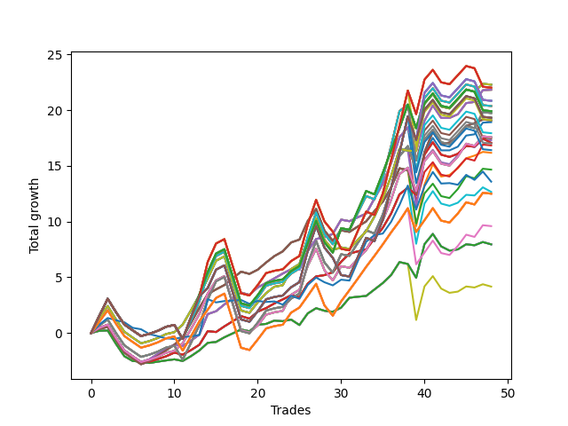

# Short Wallace 019 
- Symbol: SPY_Unlimited
- Date Range: 03/23/2022 - 07/08/2022
- Trading Period: 7:20-12:30
- Number of Trades: 48



| Name | Win Percent | Profit | Avg Profit / Trade | Avg Time / Trade |      | Name | Win Percent | Profit | Avg Profit / Trade | Avg Time / Trade |
| ---- | ----------- | ------ | ------------------ | ---------------- | ---- | ---- | ----------- | ------ | ------------------ | ---------------- |
| Sorted By <br> Profit | | | | | | Sorted By <br> Win Percentage ||||
| Seventy | 66.67 | 11150.00 | 232.29 | 21:52 |     | Sixty-Six | 77.08 | 10920.00 | 227.50 | 17:08 |
| Sixty-Two | 66.67 | 11150.00 | 232.29 | 21:52 |     | Fifty-Eight | 77.08 | 10920.00 | 227.50 | 17:08 |
| Fifty-Four | 66.67 | 11150.00 | 232.29 | 21:52 |     | Fifty | 77.08 | 10920.00 | 227.50 | 17:08 |
| Six | 66.67 | 11150.00 | 232.29 | 21:52 |     | Two | 77.08 | 10920.00 | 227.50 | 17:08 |
| One Hundred Twenty-Eight | 60.42 | 11015.00 | 229.48 | 27:22 |     | Forty-Two | 77.08 | 9465.00 | 197.19 | 16:38 |
| One Hundred Twenty-Three | 60.42 | 11015.00 | 229.48 | 27:22 |     | Sixty-Seven | 75.00 | 9545.00 | 198.85 | 18:12 |
| One Hundred Eighteen | 60.42 | 11015.00 | 229.48 | 27:22 |     | Fifty-Nine | 75.00 | 9545.00 | 198.85 | 18:12 |
| Eighty-Three | 60.42 | 11015.00 | 229.48 | 27:22 |     | Fifty-One | 75.00 | 9545.00 | 198.85 | 18:12 |
| Sixty-Six | 77.08 | 10920.00 | 227.50 | 17:08 |     | Three | 75.00 | 9545.00 | 198.85 | 18:12 |
| Fifty-Eight | 77.08 | 10920.00 | 227.50 | 17:08 |     | Forty-Three | 75.00 | 8090.00 | 168.54 | 17:42 |
| Fifty | 77.08 | 10920.00 | 227.50 | 17:08 |     | Sixty-Five | 72.92 | 8530.00 | 177.71 | 14:43 |
| Two | 77.08 | 10920.00 | 227.50 | 17:08 |     | Fifty-Seven | 72.92 | 8530.00 | 177.71 | 14:43 |
| One Hundred Twenty-Nine | 60.42 | 10425.00 | 217.19 | 28:41 |     | Forty-Nine | 72.92 | 8530.00 | 177.71 | 14:43 |
| One Hundred Twenty-Four | 60.42 | 10425.00 | 217.19 | 28:41 |     | One | 72.92 | 8530.00 | 177.71 | 14:43 |
| One Hundred Ninteen | 60.42 | 10425.00 | 217.19 | 28:41 |     | Forty-One | 72.92 | 6335.00 | 131.98 | 14:28 |
| Eighty-Four | 60.42 | 10425.00 | 217.19 | 28:41 |     | Sixty-Eight | 68.75 | 8790.00 | 183.13 | 22:14 |
| Seventy-One | 62.50 | 10190.00 | 212.29 | 26:59 |     | Sixty | 68.75 | 8790.00 | 183.13 | 22:14 |
| Sixty-Three | 62.50 | 10190.00 | 212.29 | 26:59 |     | Fifty-Two | 68.75 | 8790.00 | 183.13 | 22:14 |
| Fifty-Five | 62.50 | 10190.00 | 212.29 | 26:59 |     | Four | 68.75 | 8790.00 | 183.13 | 22:14 |
| Seven | 62.50 | 10190.00 | 212.29 | 26:59 |     | Forty-Four | 68.75 | 7335.00 | 152.81 | 21:44 |
| One Hundred Twenty-Seven | 62.50 | 9960.00 | 207.50 | 25:46 |     | One Hundred Twenty-Six | 68.75 | 6255.00 | 130.31 | 20:19 |
| One Hundred Twenty-Two | 62.50 | 9960.00 | 207.50 | 25:46 |     | One Hundred Twenty-One | 68.75 | 6255.00 | 130.31 | 20:19 |
| One Hundred Seventeen | 62.50 | 9960.00 | 207.50 | 25:46 |     | One Hundred Sixteen | 68.75 | 6255.00 | 130.31 | 20:19 |
| Eighty-Two | 62.50 | 9960.00 | 207.50 | 25:46 |     | Eighty-One | 68.75 | 6255.00 | 130.31 | 20:19 |
| Sixty-Nine | 64.58 | 9875.00 | 205.73 | 24:12 |     | One Hundred Eleven | 68.75 | 4800.00 | 100.00 | 19:49 |
| Sixty-One | 64.58 | 9875.00 | 205.73 | 24:12 |     | Seventy | 66.67 | 11150.00 | 232.29 | 21:52 |
| Fifty-Three | 64.58 | 9875.00 | 205.73 | 24:12 |     | Sixty-Two | 66.67 | 11150.00 | 232.29 | 21:52 |
| Five | 64.58 | 9875.00 | 205.73 | 24:12 |     | Fifty-Four | 66.67 | 11150.00 | 232.29 | 21:52 |
| One Hundred Thirty | 60.42 | 9665.00 | 201.35 | 29:02 |     | Six | 66.67 | 11150.00 | 232.29 | 21:52 |
| One Hundred Twenty-Five | 60.42 | 9665.00 | 201.35 | 29:02 |     | Forty-Six | 66.67 | 8650.00 | 180.21 | 21:37 |
| One Hundred Twenty | 60.42 | 9665.00 | 201.35 | 29:02 |     | Sixty-Nine | 64.58 | 9875.00 | 205.73 | 24:12 |
| Eighty-Five | 60.42 | 9665.00 | 201.35 | 29:02 |     | Sixty-One | 64.58 | 9875.00 | 205.73 | 24:12 |
| One Hundred Thirteen | 60.42 | 9560.00 | 199.17 | 26:52 |     | Fifty-Three | 64.58 | 9875.00 | 205.73 | 24:12 |
| Sixty-Seven | 75.00 | 9545.00 | 198.85 | 18:12 |     | Five | 64.58 | 9875.00 | 205.73 | 24:12 |
| Fifty-Nine | 75.00 | 9545.00 | 198.85 | 18:12 |     | Forty-Five | 64.58 | 8420.00 | 175.42 | 23:41 |
| Fifty-One | 75.00 | 9545.00 | 198.85 | 18:12 |     | Sixty-Four | 64.58 | 3980.00 | 82.92 | 10:10 |
| Three | 75.00 | 9545.00 | 198.85 | 18:12 |     | Fifty-Six | 64.58 | 3980.00 | 82.92 | 10:10 |
| Forty-Two | 77.08 | 9465.00 | 197.19 | 16:38 |     | Forty-Eight | 64.58 | 3980.00 | 82.92 | 10:10 |
| One Hundred Fourteen | 60.42 | 8970.00 | 186.88 | 28:11 |     | Zero | 64.58 | 3980.00 | 82.92 | 10:10 |
| Sixty-Eight | 68.75 | 8790.00 | 183.13 | 22:14 |     | Forty | 64.58 | 2085.00 | 43.44 | 10:00 |
| Sixty | 68.75 | 8790.00 | 183.13 | 22:14 |     | Seventy-One | 62.50 | 10190.00 | 212.29 | 26:59 |
| Fifty-Two | 68.75 | 8790.00 | 183.13 | 22:14 |     | Sixty-Three | 62.50 | 10190.00 | 212.29 | 26:59 |
| Four | 68.75 | 8790.00 | 183.13 | 22:14 |     | Fifty-Five | 62.50 | 10190.00 | 212.29 | 26:59 |
| Forty-Seven | 62.50 | 8735.00 | 181.98 | 26:29 |     | Seven | 62.50 | 10190.00 | 212.29 | 26:59 |
| Forty-Six | 66.67 | 8650.00 | 180.21 | 21:37 |     | One Hundred Twenty-Seven | 62.50 | 9960.00 | 207.50 | 25:46 |
| Sixty-Five | 72.92 | 8530.00 | 177.71 | 14:43 |     | One Hundred Twenty-Two | 62.50 | 9960.00 | 207.50 | 25:46 |
| Fifty-Seven | 72.92 | 8530.00 | 177.71 | 14:43 |     | One Hundred Seventeen | 62.50 | 9960.00 | 207.50 | 25:46 |
| Forty-Nine | 72.92 | 8530.00 | 177.71 | 14:43 |     | Eighty-Two | 62.50 | 9960.00 | 207.50 | 25:46 |
| One | 72.92 | 8530.00 | 177.71 | 14:43 |     | Forty-Seven | 62.50 | 8735.00 | 181.98 | 26:29 |
| One Hundred Twelve | 62.50 | 8505.00 | 177.19 | 25:15 |     | One Hundred Twelve | 62.50 | 8505.00 | 177.19 | 25:15 |
| Forty-Five | 64.58 | 8420.00 | 175.42 | 23:41 |     | One Hundred Twenty-Eight | 60.42 | 11015.00 | 229.48 | 27:22 |
| One Hundred Fifteen | 60.42 | 8210.00 | 171.04 | 28:32 |     | One Hundred Twenty-Three | 60.42 | 11015.00 | 229.48 | 27:22 |
| Forty-Three | 75.00 | 8090.00 | 168.54 | 17:42 |     | One Hundred Eighteen | 60.42 | 11015.00 | 229.48 | 27:22 |
| Forty-Four | 68.75 | 7335.00 | 152.81 | 21:44 |     | Eighty-Three | 60.42 | 11015.00 | 229.48 | 27:22 |
| Seventy-Three | 56.25 | 6795.00 | 141.56 | 12:37 |     | One Hundred Twenty-Nine | 60.42 | 10425.00 | 217.19 | 28:41 |
| Forty-One | 72.92 | 6335.00 | 131.98 | 14:28 |     | One Hundred Twenty-Four | 60.42 | 10425.00 | 217.19 | 28:41 |
| One Hundred Twenty-Six | 68.75 | 6255.00 | 130.31 | 20:19 |     | One Hundred Ninteen | 60.42 | 10425.00 | 217.19 | 28:41 |
| One Hundred Twenty-One | 68.75 | 6255.00 | 130.31 | 20:19 |     | Eighty-Four | 60.42 | 10425.00 | 217.19 | 28:41 |
| One Hundred Sixteen | 68.75 | 6255.00 | 130.31 | 20:19 |     | One Hundred Thirty | 60.42 | 9665.00 | 201.35 | 29:02 |
| Eighty-One | 68.75 | 6255.00 | 130.31 | 20:19 |     | One Hundred Twenty-Five | 60.42 | 9665.00 | 201.35 | 29:02 |
| One Hundred Eleven | 68.75 | 4800.00 | 100.00 | 19:49 |     | One Hundred Twenty | 60.42 | 9665.00 | 201.35 | 29:02 |
| Sixty-Four | 64.58 | 3980.00 | 82.92 | 10:10 |     | Eighty-Five | 60.42 | 9665.00 | 201.35 | 29:02 |
| Fifty-Six | 64.58 | 3980.00 | 82.92 | 10:10 |     | One Hundred Thirteen | 60.42 | 9560.00 | 199.17 | 26:52 |
| Forty-Eight | 64.58 | 3980.00 | 82.92 | 10:10 |     | One Hundred Fourteen | 60.42 | 8970.00 | 186.88 | 28:11 |
| Zero | 64.58 | 3980.00 | 82.92 | 10:10 |     | One Hundred Fifteen | 60.42 | 8210.00 | 171.04 | 28:32 |
| Forty | 64.58 | 2085.00 | 43.44 | 10:00 |     | Seventy-Three | 56.25 | 6795.00 | 141.56 | 12:37 |

## NO STOPLOSS

### Test Zero
* Sell when price hits the middle line of the 20p bollinger
* No Stoploss
* Results:
```
Total Trades: 48
Percent Up: 35.42
Percent Down: 64.58
Total Points Moved Down: 7.96
Potential Profit: 3980.00
Total Points Ups: 7.31 Count Ups: 17
Total Points Downs: 15.27 Count Downs: 31
```

<details><summary>Trades</summary>

<code>In: 2022-03-25 11:55:00		Out: 2022-03-25 11:57:15		Total Position Time: 02:15		Total Move Down: 0.20		Total to Date: 0.20</code> <br />
<code>In: 2022-03-25 11:57:00		Out: 2022-03-25 11:57:15		Total Position Time: 00:15		Total Move Down: 0.03		Total to Date: 0.23</code> <br />
<code>In: 2022-03-28 11:32:00		Out: 2022-03-28 12:01:55		Total Position Time: 29:55		Total Move Down: -1.21		Total to Date: -0.98</code> <br />
<code>In: 2022-03-28 11:34:00		Out: 2022-03-28 12:03:55		Total Position Time: 29:55		Total Move Down: -1.10		Total to Date: -2.08</code> <br />
<code>In: 2022-03-28 11:50:00		Out: 2022-03-28 12:08:05		Total Position Time: 18:05		Total Move Down: -0.43		Total to Date: -2.51</code> <br />
<code>In: 2022-03-28 11:53:00		Out: 2022-03-28 12:08:05		Total Position Time: 15:05		Total Move Down: -0.06		Total to Date: -2.57</code> <br />
<code>In: 2022-03-31 07:48:00		Out: 2022-03-31 08:03:05		Total Position Time: 15:05		Total Move Down: -0.12		Total to Date: -2.69</code> <br />
<code>In: 2022-03-31 07:49:00		Out: 2022-03-31 08:03:05		Total Position Time: 14:05		Total Move Down: 0.12		Total to Date: -2.57</code> <br />
<code>In: 2022-03-31 07:50:00		Out: 2022-03-31 08:03:05		Total Position Time: 13:05		Total Move Down: 0.11		Total to Date: -2.46</code> <br />
<code>In: 2022-04-01 11:34:00		Out: 2022-04-01 11:47:05		Total Position Time: 13:05		Total Move Down: 0.10		Total to Date: -2.36</code> <br />
<code>In: 2022-04-06 10:35:00		Out: 2022-04-06 10:47:10		Total Position Time: 12:10		Total Move Down: -0.15		Total to Date: -2.51</code> <br />
<code>In: 2022-04-06 10:43:00		Out: 2022-04-06 10:47:10		Total Position Time: 04:10		Total Move Down: 0.44		Total to Date: -2.07</code> <br />
<code>In: 2022-04-06 10:44:00		Out: 2022-04-06 10:47:10		Total Position Time: 03:10		Total Move Down: 0.51		Total to Date: -1.56</code> <br />
<code>In: 2022-04-06 11:05:00		Out: 2022-04-06 11:05:35		Total Position Time: 00:35		Total Move Down: 0.68		Total to Date: -0.88</code> <br />
<code>In: 2022-04-06 11:57:00		Out: 2022-04-06 12:07:45		Total Position Time: 10:45		Total Move Down: 0.08		Total to Date: -0.80</code> <br />
<code>In: 2022-04-07 11:03:00		Out: 2022-04-07 11:15:20		Total Position Time: 12:20		Total Move Down: 0.42		Total to Date: -0.38</code> <br />
<code>In: 2022-04-08 07:33:00		Out: 2022-04-08 07:44:35		Total Position Time: 11:35		Total Move Down: 0.35		Total to Date: -0.03</code> <br />
<code>In: 2022-04-08 07:33:00		Out: 2022-04-08 07:44:35		Total Position Time: 11:35		Total Move Down: 0.35		Total to Date: 0.32</code> <br />
<code>In: 2022-04-18 10:37:00		Out: 2022-04-18 10:59:30		Total Position Time: 22:30		Total Move Down: -0.16		Total to Date: 0.16</code> <br />
<code>In: 2022-04-18 11:26:00		Out: 2022-04-18 11:28:05		Total Position Time: 02:05		Total Move Down: 0.59		Total to Date: 0.75</code> <br />
<code>In: 2022-04-20 07:42:00		Out: 2022-04-20 08:00:20		Total Position Time: 18:20		Total Move Down: 0.07		Total to Date: 0.82</code> <br />
<code>In: 2022-04-20 09:54:00		Out: 2022-04-20 09:59:05		Total Position Time: 05:05		Total Move Down: 0.30		Total to Date: 1.12</code> <br />
<code>In: 2022-04-25 10:14:00		Out: 2022-04-25 10:26:25		Total Position Time: 12:25		Total Move Down: -0.06		Total to Date: 1.06</code> <br />
<code>In: 2022-04-27 08:34:00		Out: 2022-04-27 08:45:05		Total Position Time: 11:05		Total Move Down: 0.15		Total to Date: 1.21</code> <br />
<code>In: 2022-05-16 08:48:00		Out: 2022-05-16 09:05:45		Total Position Time: 17:45		Total Move Down: -0.49		Total to Date: 0.72</code> <br />
<code>In: 2022-05-24 09:17:00		Out: 2022-05-24 09:21:35		Total Position Time: 04:35		Total Move Down: 1.05		Total to Date: 1.77</code> <br />
<code>In: 2022-05-24 09:18:00		Out: 2022-05-24 09:21:35		Total Position Time: 03:35		Total Move Down: 0.46		Total to Date: 2.23</code> <br />
<code>In: 2022-05-24 10:43:00		Out: 2022-05-24 10:58:10		Total Position Time: 15:10		Total Move Down: -0.23		Total to Date: 2.00</code> <br />
<code>In: 2022-05-24 10:47:00		Out: 2022-05-24 10:58:10		Total Position Time: 11:10		Total Move Down: -0.09		Total to Date: 1.91</code> <br />
<code>In: 2022-05-25 11:04:00		Out: 2022-05-25 11:06:20		Total Position Time: 02:20		Total Move Down: 0.37		Total to Date: 2.28</code> <br />
<code>In: 2022-05-31 07:23:00		Out: 2022-05-31 07:30:05		Total Position Time: 07:05		Total Move Down: 0.89		Total to Date: 3.17</code> <br />
<code>In: 2022-06-09 10:03:00		Out: 2022-06-09 10:16:15		Total Position Time: 13:15		Total Move Down: 0.09		Total to Date: 3.26</code> <br />
<code>In: 2022-06-09 10:08:00		Out: 2022-06-09 10:16:15		Total Position Time: 08:15		Total Move Down: 0.07		Total to Date: 3.33</code> <br />
<code>In: 2022-06-10 12:00:00		Out: 2022-06-10 12:03:25		Total Position Time: 03:25		Total Move Down: 0.58		Total to Date: 3.91</code> <br />
<code>In: 2022-06-10 12:29:00		Out: 2022-06-10 12:30:30		Total Position Time: 01:30		Total Move Down: 0.58		Total to Date: 4.49</code> <br />
<code>In: 2022-06-13 09:38:00		Out: 2022-06-13 09:44:05		Total Position Time: 06:05		Total Move Down: 0.72		Total to Date: 5.21</code> <br />
<code>In: 2022-06-13 09:40:00		Out: 2022-06-13 09:44:05		Total Position Time: 04:05		Total Move Down: 1.16		Total to Date: 6.37</code> <br />
<code>In: 2022-06-15 11:02:00		Out: 2022-06-15 11:02:10		Total Position Time: 00:10		Total Move Down: -0.17		Total to Date: 6.20</code> <br />
<code>In: 2022-06-15 11:40:00		Out: 2022-06-15 11:53:25		Total Position Time: 13:25		Total Move Down: -1.24		Total to Date: 4.96</code> <br />
<code>In: 2022-06-15 11:45:00		Out: 2022-06-15 11:53:25		Total Position Time: 08:25		Total Move Down: 3.02		Total to Date: 7.98</code> <br />
<code>In: 2022-06-17 10:13:00		Out: 2022-06-17 10:22:05		Total Position Time: 09:05		Total Move Down: 0.92		Total to Date: 8.90</code> <br />
<code>In: 2022-06-23 12:30:00		Out: 2022-06-23 12:46:00		Total Position Time: 16:00		Total Move Down: -1.12		Total to Date: 7.78</code> <br />
<code>In: 2022-06-27 07:49:00		Out: 2022-06-27 08:02:15		Total Position Time: 13:15		Total Move Down: -0.38		Total to Date: 7.40</code> <br />
<code>In: 2022-06-29 11:06:00		Out: 2022-06-29 11:18:05		Total Position Time: 12:05		Total Move Down: 0.11		Total to Date: 7.51</code> <br />
<code>In: 2022-06-29 12:31:00		Out: 2022-06-29 12:33:20		Total Position Time: 02:20		Total Move Down: 0.46		Total to Date: 7.97</code> <br />
<code>In: 2022-07-01 10:47:00		Out: 2022-07-01 10:58:40		Total Position Time: 11:40		Total Move Down: -0.09		Total to Date: 7.88</code> <br />
<code>In: 2022-07-06 11:10:00		Out: 2022-07-06 11:10:10		Total Position Time: 00:10		Total Move Down: 0.29		Total to Date: 8.17</code> <br />
<code>In: 2022-07-06 11:35:00		Out: 2022-07-06 11:50:00		Total Position Time: 15:00		Total Move Down: -0.21		Total to Date: 7.96</code> <br />


</details>

### Test One
* Sell when the price hits the upper line of the 20p 1std bollinger
* No Stoploss
* Results:
```
Total Trades: 48
Percent Up: 27.08
Percent Down: 72.92
Total Points Moved Down: 17.06
Potential Profit: 8530.00
Total Points Ups: 6.45 Count Ups: 13
Total Points Downs: 23.51 Count Downs: 35
```

<details><summary>Trades</summary>

<code>In: 2022-03-25 11:55:00		Out: 2022-03-25 12:00:50		Total Position Time: 05:50		Total Move Down: 0.45		Total to Date: 0.45</code> <br />
<code>In: 2022-03-25 11:57:00		Out: 2022-03-25 12:00:50		Total Position Time: 03:50		Total Move Down: 0.28		Total to Date: 0.73</code> <br />
<code>In: 2022-03-28 11:32:00		Out: 2022-03-28 12:01:55		Total Position Time: 29:55		Total Move Down: -1.21		Total to Date: -0.48</code> <br />
<code>In: 2022-03-28 11:34:00		Out: 2022-03-28 12:03:55		Total Position Time: 29:55		Total Move Down: -1.10		Total to Date: -1.58</code> <br />
<code>In: 2022-03-28 11:50:00		Out: 2022-03-28 12:19:55		Total Position Time: 29:55		Total Move Down: -0.53		Total to Date: -2.11</code> <br />
<code>In: 2022-03-28 11:53:00		Out: 2022-03-28 12:22:55		Total Position Time: 29:55		Total Move Down: -0.51		Total to Date: -2.62</code> <br />
<code>In: 2022-03-31 07:48:00		Out: 2022-03-31 08:08:00		Total Position Time: 20:00		Total Move Down: 0.02		Total to Date: -2.60</code> <br />
<code>In: 2022-03-31 07:49:00		Out: 2022-03-31 08:08:00		Total Position Time: 19:00		Total Move Down: 0.26		Total to Date: -2.34</code> <br />
<code>In: 2022-03-31 07:50:00		Out: 2022-03-31 08:08:00		Total Position Time: 18:00		Total Move Down: 0.25		Total to Date: -2.09</code> <br />
<code>In: 2022-04-01 11:34:00		Out: 2022-04-01 11:50:15		Total Position Time: 16:15		Total Move Down: 0.33		Total to Date: -1.76</code> <br />
<code>In: 2022-04-06 10:35:00		Out: 2022-04-06 10:56:55		Total Position Time: 21:55		Total Move Down: -0.18		Total to Date: -1.94</code> <br />
<code>In: 2022-04-06 10:43:00		Out: 2022-04-06 10:56:55		Total Position Time: 13:55		Total Move Down: 0.41		Total to Date: -1.53</code> <br />
<code>In: 2022-04-06 10:44:00		Out: 2022-04-06 10:56:55		Total Position Time: 12:55		Total Move Down: 0.48		Total to Date: -1.05</code> <br />
<code>In: 2022-04-06 11:05:00		Out: 2022-04-06 11:07:20		Total Position Time: 02:20		Total Move Down: 1.22		Total to Date: 0.17</code> <br />
<code>In: 2022-04-06 11:57:00		Out: 2022-04-06 12:17:05		Total Position Time: 20:05		Total Move Down: -0.08		Total to Date: 0.09</code> <br />
<code>In: 2022-04-07 11:03:00		Out: 2022-04-07 11:18:00		Total Position Time: 15:00		Total Move Down: 0.51		Total to Date: 0.60</code> <br />
<code>In: 2022-04-08 07:33:00		Out: 2022-04-08 07:45:55		Total Position Time: 12:55		Total Move Down: 0.46		Total to Date: 1.06</code> <br />
<code>In: 2022-04-08 07:33:00		Out: 2022-04-08 07:45:55		Total Position Time: 12:55		Total Move Down: 0.46		Total to Date: 1.52</code> <br />
<code>In: 2022-04-18 10:37:00		Out: 2022-04-18 11:06:20		Total Position Time: 29:20		Total Move Down: -0.23		Total to Date: 1.29</code> <br />
<code>In: 2022-04-18 11:26:00		Out: 2022-04-18 11:41:15		Total Position Time: 15:15		Total Move Down: 0.63		Total to Date: 1.92</code> <br />
<code>In: 2022-04-20 07:42:00		Out: 2022-04-20 08:00:40		Total Position Time: 18:40		Total Move Down: 0.32		Total to Date: 2.24</code> <br />
<code>In: 2022-04-20 09:54:00		Out: 2022-04-20 10:08:15		Total Position Time: 14:15		Total Move Down: 0.42		Total to Date: 2.66</code> <br />
<code>In: 2022-04-25 10:14:00		Out: 2022-04-25 10:27:10		Total Position Time: 13:10		Total Move Down: 0.36		Total to Date: 3.02</code> <br />
<code>In: 2022-04-27 08:34:00		Out: 2022-04-27 08:48:05		Total Position Time: 14:05		Total Move Down: 0.37		Total to Date: 3.39</code> <br />
<code>In: 2022-05-16 08:48:00		Out: 2022-05-16 09:06:15		Total Position Time: 18:15		Total Move Down: -0.18		Total to Date: 3.21</code> <br />
<code>In: 2022-05-24 09:17:00		Out: 2022-05-24 09:28:55		Total Position Time: 11:55		Total Move Down: 1.23		Total to Date: 4.44</code> <br />
<code>In: 2022-05-24 09:18:00		Out: 2022-05-24 09:28:55		Total Position Time: 10:55		Total Move Down: 0.64		Total to Date: 5.08</code> <br />
<code>In: 2022-05-24 10:43:00		Out: 2022-05-24 11:01:40		Total Position Time: 18:40		Total Move Down: 0.12		Total to Date: 5.20</code> <br />
<code>In: 2022-05-24 10:47:00		Out: 2022-05-24 11:01:40		Total Position Time: 14:40		Total Move Down: 0.26		Total to Date: 5.46</code> <br />
<code>In: 2022-05-25 11:04:00		Out: 2022-05-25 11:06:35		Total Position Time: 02:35		Total Move Down: 0.94		Total to Date: 6.40</code> <br />
<code>In: 2022-05-31 07:23:00		Out: 2022-05-31 07:38:05		Total Position Time: 15:05		Total Move Down: 0.74		Total to Date: 7.14</code> <br />
<code>In: 2022-06-09 10:03:00		Out: 2022-06-09 10:18:10		Total Position Time: 15:10		Total Move Down: 0.19		Total to Date: 7.33</code> <br />
<code>In: 2022-06-09 10:08:00		Out: 2022-06-09 10:18:10		Total Position Time: 10:10		Total Move Down: 0.17		Total to Date: 7.50</code> <br />
<code>In: 2022-06-10 12:00:00		Out: 2022-06-10 12:04:35		Total Position Time: 04:35		Total Move Down: 0.99		Total to Date: 8.49</code> <br />
<code>In: 2022-06-10 12:29:00		Out: 2022-06-10 12:35:45		Total Position Time: 06:45		Total Move Down: 0.96		Total to Date: 9.45</code> <br />
<code>In: 2022-06-13 09:38:00		Out: 2022-06-13 09:47:55		Total Position Time: 09:55		Total Move Down: 1.28		Total to Date: 10.73</code> <br />
<code>In: 2022-06-13 09:40:00		Out: 2022-06-13 09:47:55		Total Position Time: 07:55		Total Move Down: 1.72		Total to Date: 12.45</code> <br />
<code>In: 2022-06-15 11:02:00		Out: 2022-06-15 11:03:05		Total Position Time: 01:05		Total Move Down: 0.59		Total to Date: 13.04</code> <br />
<code>In: 2022-06-15 11:40:00		Out: 2022-06-15 11:57:45		Total Position Time: 17:45		Total Move Down: -0.64		Total to Date: 12.40</code> <br />
<code>In: 2022-06-15 11:45:00		Out: 2022-06-15 11:57:45		Total Position Time: 12:45		Total Move Down: 3.62		Total to Date: 16.02</code> <br />
<code>In: 2022-06-17 10:13:00		Out: 2022-06-17 10:26:10		Total Position Time: 13:10		Total Move Down: 1.11		Total to Date: 17.13</code> <br />
<code>In: 2022-06-23 12:30:00		Out: 2022-06-23 12:46:00		Total Position Time: 16:00		Total Move Down: -1.12		Total to Date: 16.01</code> <br />
<code>In: 2022-06-27 07:49:00		Out: 2022-06-27 08:07:15		Total Position Time: 18:15		Total Move Down: -0.20		Total to Date: 15.81</code> <br />
<code>In: 2022-06-29 11:06:00		Out: 2022-06-29 11:20:35		Total Position Time: 14:35		Total Move Down: 0.28		Total to Date: 16.09</code> <br />
<code>In: 2022-06-29 12:31:00		Out: 2022-06-29 12:34:10		Total Position Time: 03:10		Total Move Down: 0.71		Total to Date: 16.80</code> <br />
<code>In: 2022-07-01 10:47:00		Out: 2022-07-01 11:04:25		Total Position Time: 17:25		Total Move Down: -0.06		Total to Date: 16.74</code> <br />
<code>In: 2022-07-06 11:10:00		Out: 2022-07-06 11:11:10		Total Position Time: 01:10		Total Move Down: 0.73		Total to Date: 17.47</code> <br />
<code>In: 2022-07-06 11:35:00		Out: 2022-07-06 12:00:30		Total Position Time: 25:30		Total Move Down: -0.41		Total to Date: 17.06</code> <br />


</details>

### Test Two
* Sell when the price hits the upper line of the 20p 2std bollinger
* No Stoploss
* Results:
```
Total Trades: 48
Percent Up: 22.92
Percent Down: 77.08
Total Points Moved Down: 21.84
Potential Profit: 10920.00
Total Points Ups: 7.08 Count Ups: 11
Total Points Downs: 28.92 Count Downs: 37
```

<details><summary>Trades</summary>

<code>In: 2022-03-25 11:55:00		Out: 2022-03-25 12:00:55		Total Position Time: 05:55		Total Move Down: 0.46		Total to Date: 0.46</code> <br />
<code>In: 2022-03-25 11:57:00		Out: 2022-03-25 12:00:55		Total Position Time: 03:55		Total Move Down: 0.29		Total to Date: 0.75</code> <br />
<code>In: 2022-03-28 11:32:00		Out: 2022-03-28 12:01:55		Total Position Time: 29:55		Total Move Down: -1.21		Total to Date: -0.46</code> <br />
<code>In: 2022-03-28 11:34:00		Out: 2022-03-28 12:03:55		Total Position Time: 29:55		Total Move Down: -1.10		Total to Date: -1.56</code> <br />
<code>In: 2022-03-28 11:50:00		Out: 2022-03-28 12:19:55		Total Position Time: 29:55		Total Move Down: -0.53		Total to Date: -2.09</code> <br />
<code>In: 2022-03-28 11:53:00		Out: 2022-03-28 12:22:55		Total Position Time: 29:55		Total Move Down: -0.51		Total to Date: -2.60</code> <br />
<code>In: 2022-03-31 07:48:00		Out: 2022-03-31 08:08:30		Total Position Time: 20:30		Total Move Down: 0.24		Total to Date: -2.36</code> <br />
<code>In: 2022-03-31 07:49:00		Out: 2022-03-31 08:08:30		Total Position Time: 19:30		Total Move Down: 0.48		Total to Date: -1.88</code> <br />
<code>In: 2022-03-31 07:50:00		Out: 2022-03-31 08:08:30		Total Position Time: 18:30		Total Move Down: 0.47		Total to Date: -1.41</code> <br />
<code>In: 2022-04-01 11:34:00		Out: 2022-04-01 11:50:20		Total Position Time: 16:20		Total Move Down: 0.36		Total to Date: -1.05</code> <br />
<code>In: 2022-04-06 10:35:00		Out: 2022-04-06 10:57:20		Total Position Time: 22:20		Total Move Down: -0.11		Total to Date: -1.16</code> <br />
<code>In: 2022-04-06 10:43:00		Out: 2022-04-06 10:57:20		Total Position Time: 14:20		Total Move Down: 0.48		Total to Date: -0.68</code> <br />
<code>In: 2022-04-06 10:44:00		Out: 2022-04-06 10:57:20		Total Position Time: 13:20		Total Move Down: 0.55		Total to Date: -0.13</code> <br />
<code>In: 2022-04-06 11:05:00		Out: 2022-04-06 11:08:10		Total Position Time: 03:10		Total Move Down: 1.83		Total to Date: 1.70</code> <br />
<code>In: 2022-04-06 11:57:00		Out: 2022-04-06 12:19:50		Total Position Time: 22:50		Total Move Down: 0.26		Total to Date: 1.96</code> <br />
<code>In: 2022-04-07 11:03:00		Out: 2022-04-07 11:18:20		Total Position Time: 15:20		Total Move Down: 0.61		Total to Date: 2.57</code> <br />
<code>In: 2022-04-08 07:33:00		Out: 2022-04-08 07:49:20		Total Position Time: 16:20		Total Move Down: 0.53		Total to Date: 3.10</code> <br />
<code>In: 2022-04-08 07:33:00		Out: 2022-04-08 07:49:20		Total Position Time: 16:20		Total Move Down: 0.53		Total to Date: 3.63</code> <br />
<code>In: 2022-04-18 10:37:00		Out: 2022-04-18 11:06:55		Total Position Time: 29:55		Total Move Down: -0.20		Total to Date: 3.43</code> <br />
<code>In: 2022-04-18 11:26:00		Out: 2022-04-18 11:44:10		Total Position Time: 18:10		Total Move Down: 0.67		Total to Date: 4.10</code> <br />
<code>In: 2022-04-20 07:42:00		Out: 2022-04-20 08:00:45		Total Position Time: 18:45		Total Move Down: 0.39		Total to Date: 4.49</code> <br />
<code>In: 2022-04-20 09:54:00		Out: 2022-04-20 10:08:15		Total Position Time: 14:15		Total Move Down: 0.42		Total to Date: 4.91</code> <br />
<code>In: 2022-04-25 10:14:00		Out: 2022-04-25 10:33:35		Total Position Time: 19:35		Total Move Down: 0.43		Total to Date: 5.34</code> <br />
<code>In: 2022-04-27 08:34:00		Out: 2022-04-27 08:50:10		Total Position Time: 16:10		Total Move Down: 0.39		Total to Date: 5.73</code> <br />
<code>In: 2022-05-16 08:48:00		Out: 2022-05-16 09:11:35		Total Position Time: 23:35		Total Move Down: -0.04		Total to Date: 5.69</code> <br />
<code>In: 2022-05-24 09:17:00		Out: 2022-05-24 09:31:20		Total Position Time: 14:20		Total Move Down: 1.67		Total to Date: 7.36</code> <br />
<code>In: 2022-05-24 09:18:00		Out: 2022-05-24 09:31:20		Total Position Time: 13:20		Total Move Down: 1.08		Total to Date: 8.44</code> <br />
<code>In: 2022-05-24 10:43:00		Out: 2022-05-24 11:02:00		Total Position Time: 19:00		Total Move Down: 0.16		Total to Date: 8.60</code> <br />
<code>In: 2022-05-24 10:47:00		Out: 2022-05-24 11:02:00		Total Position Time: 15:00		Total Move Down: 0.30		Total to Date: 8.90</code> <br />
<code>In: 2022-05-25 11:04:00		Out: 2022-05-25 11:06:40		Total Position Time: 02:40		Total Move Down: 1.28		Total to Date: 10.18</code> <br />
<code>In: 2022-05-31 07:23:00		Out: 2022-05-31 07:52:55		Total Position Time: 29:55		Total Move Down: -0.14		Total to Date: 10.04</code> <br />
<code>In: 2022-06-09 10:03:00		Out: 2022-06-09 10:18:55		Total Position Time: 15:55		Total Move Down: 0.35		Total to Date: 10.39</code> <br />
<code>In: 2022-06-09 10:08:00		Out: 2022-06-09 10:18:55		Total Position Time: 10:55		Total Move Down: 0.33		Total to Date: 10.72</code> <br />
<code>In: 2022-06-10 12:00:00		Out: 2022-06-10 12:05:55		Total Position Time: 05:55		Total Move Down: 1.36		Total to Date: 12.08</code> <br />
<code>In: 2022-06-10 12:29:00		Out: 2022-06-10 12:42:45		Total Position Time: 13:45		Total Move Down: 1.33		Total to Date: 13.41</code> <br />
<code>In: 2022-06-13 09:38:00		Out: 2022-06-13 09:54:45		Total Position Time: 16:45		Total Move Down: 1.86		Total to Date: 15.27</code> <br />
<code>In: 2022-06-13 09:40:00		Out: 2022-06-13 09:54:45		Total Position Time: 14:45		Total Move Down: 2.30		Total to Date: 17.57</code> <br />
<code>In: 2022-06-15 11:02:00		Out: 2022-06-15 11:03:15		Total Position Time: 01:15		Total Move Down: 0.90		Total to Date: 18.47</code> <br />
<code>In: 2022-06-15 11:40:00		Out: 2022-06-15 12:09:55		Total Position Time: 29:55		Total Move Down: -2.12		Total to Date: 16.35</code> <br />
<code>In: 2022-06-15 11:45:00		Out: 2022-06-15 12:14:55		Total Position Time: 29:55		Total Move Down: 2.71		Total to Date: 19.06</code> <br />
<code>In: 2022-06-17 10:13:00		Out: 2022-06-17 10:27:10		Total Position Time: 14:10		Total Move Down: 1.37		Total to Date: 20.43</code> <br />
<code>In: 2022-06-23 12:30:00		Out: 2022-06-23 12:46:00		Total Position Time: 16:00		Total Move Down: -1.12		Total to Date: 19.31</code> <br />
<code>In: 2022-06-27 07:49:00		Out: 2022-06-27 08:09:45		Total Position Time: 20:45		Total Move Down: -0.00		Total to Date: 19.31</code> <br />
<code>In: 2022-06-29 11:06:00		Out: 2022-06-29 11:21:05		Total Position Time: 15:05		Total Move Down: 0.33		Total to Date: 19.64</code> <br />
<code>In: 2022-06-29 12:31:00		Out: 2022-06-29 12:36:35		Total Position Time: 05:35		Total Move Down: 1.00		Total to Date: 20.64</code> <br />
<code>In: 2022-07-01 10:47:00		Out: 2022-07-01 11:07:55		Total Position Time: 20:55		Total Move Down: 0.11		Total to Date: 20.75</code> <br />
<code>In: 2022-07-06 11:10:00		Out: 2022-07-06 11:11:45		Total Position Time: 01:45		Total Move Down: 1.05		Total to Date: 21.80</code> <br />
<code>In: 2022-07-06 11:35:00		Out: 2022-07-06 12:01:25		Total Position Time: 26:25		Total Move Down: 0.04		Total to Date: 21.84</code> <br />


</details>

### Test Three
* Sell when price hits the middle line of the 50p bollinger
* No Stoploss
* Results:
```
Total Trades: 48
Percent Up: 25.00
Percent Down: 75.00
Total Points Moved Down: 19.09
Potential Profit: 9545.00
Total Points Ups: 10.04 Count Ups: 12
Total Points Downs: 29.13 Count Downs: 36
```

<details><summary>Trades</summary>

<code>In: 2022-03-25 11:55:00		Out: 2022-03-25 12:00:45		Total Position Time: 05:45		Total Move Down: 0.36		Total to Date: 0.36</code> <br />
<code>In: 2022-03-25 11:57:00		Out: 2022-03-25 12:00:45		Total Position Time: 03:45		Total Move Down: 0.19		Total to Date: 0.55</code> <br />
<code>In: 2022-03-28 11:32:00		Out: 2022-03-28 12:01:55		Total Position Time: 29:55		Total Move Down: -1.21		Total to Date: -0.66</code> <br />
<code>In: 2022-03-28 11:34:00		Out: 2022-03-28 12:03:55		Total Position Time: 29:55		Total Move Down: -1.10		Total to Date: -1.76</code> <br />
<code>In: 2022-03-28 11:50:00		Out: 2022-03-28 12:19:55		Total Position Time: 29:55		Total Move Down: -0.53		Total to Date: -2.29</code> <br />
<code>In: 2022-03-28 11:53:00		Out: 2022-03-28 12:22:55		Total Position Time: 29:55		Total Move Down: -0.51		Total to Date: -2.80</code> <br />
<code>In: 2022-03-31 07:48:00		Out: 2022-03-31 08:15:40		Total Position Time: 27:40		Total Move Down: 0.26		Total to Date: -2.54</code> <br />
<code>In: 2022-03-31 07:49:00		Out: 2022-03-31 08:15:40		Total Position Time: 26:40		Total Move Down: 0.50		Total to Date: -2.04</code> <br />
<code>In: 2022-03-31 07:50:00		Out: 2022-03-31 08:15:40		Total Position Time: 25:40		Total Move Down: 0.49		Total to Date: -1.55</code> <br />
<code>In: 2022-04-01 11:34:00		Out: 2022-04-01 11:54:05		Total Position Time: 20:05		Total Move Down: 0.50		Total to Date: -1.05</code> <br />
<code>In: 2022-04-06 10:35:00		Out: 2022-04-06 11:00:10		Total Position Time: 25:10		Total Move Down: 0.69		Total to Date: -0.36</code> <br />
<code>In: 2022-04-06 10:43:00		Out: 2022-04-06 11:00:10		Total Position Time: 17:10		Total Move Down: 1.28		Total to Date: 0.92</code> <br />
<code>In: 2022-04-06 10:44:00		Out: 2022-04-06 11:00:10		Total Position Time: 16:10		Total Move Down: 1.35		Total to Date: 2.27</code> <br />
<code>In: 2022-04-06 11:05:00		Out: 2022-04-06 11:07:20		Total Position Time: 02:20		Total Move Down: 1.22		Total to Date: 3.49</code> <br />
<code>In: 2022-04-06 11:57:00		Out: 2022-04-06 12:20:15		Total Position Time: 23:15		Total Move Down: 0.43		Total to Date: 3.92</code> <br />
<code>In: 2022-04-07 11:03:00		Out: 2022-04-07 11:32:55		Total Position Time: 29:55		Total Move Down: 0.39		Total to Date: 4.31</code> <br />
<code>In: 2022-04-08 07:33:00		Out: 2022-04-08 07:49:30		Total Position Time: 16:30		Total Move Down: 0.60		Total to Date: 4.91</code> <br />
<code>In: 2022-04-08 07:33:00		Out: 2022-04-08 07:49:30		Total Position Time: 16:30		Total Move Down: 0.60		Total to Date: 5.51</code> <br />
<code>In: 2022-04-18 10:37:00		Out: 2022-04-18 11:06:55		Total Position Time: 29:55		Total Move Down: -0.20		Total to Date: 5.31</code> <br />
<code>In: 2022-04-18 11:26:00		Out: 2022-04-18 11:27:55		Total Position Time: 01:55		Total Move Down: 0.38		Total to Date: 5.69</code> <br />
<code>In: 2022-04-20 07:42:00		Out: 2022-04-20 08:02:45		Total Position Time: 20:45		Total Move Down: 0.64		Total to Date: 6.33</code> <br />
<code>In: 2022-04-20 09:54:00		Out: 2022-04-20 10:08:35		Total Position Time: 14:35		Total Move Down: 0.58		Total to Date: 6.91</code> <br />
<code>In: 2022-04-25 10:14:00		Out: 2022-04-25 10:28:15		Total Position Time: 14:15		Total Move Down: 0.42		Total to Date: 7.33</code> <br />
<code>In: 2022-04-27 08:34:00		Out: 2022-04-27 08:52:30		Total Position Time: 18:30		Total Move Down: 0.80		Total to Date: 8.13</code> <br />
<code>In: 2022-05-16 08:48:00		Out: 2022-05-16 09:15:30		Total Position Time: 27:30		Total Move Down: 0.26		Total to Date: 8.39</code> <br />
<code>In: 2022-05-24 09:17:00		Out: 2022-05-24 09:31:20		Total Position Time: 14:20		Total Move Down: 1.67		Total to Date: 10.06</code> <br />
<code>In: 2022-05-24 09:18:00		Out: 2022-05-24 09:31:20		Total Position Time: 13:20		Total Move Down: 1.08		Total to Date: 11.14</code> <br />
<code>In: 2022-05-24 10:43:00		Out: 2022-05-24 11:12:55		Total Position Time: 29:55		Total Move Down: -1.94		Total to Date: 9.20</code> <br />
<code>In: 2022-05-24 10:47:00		Out: 2022-05-24 11:16:55		Total Position Time: 29:55		Total Move Down: -0.92		Total to Date: 8.28</code> <br />
<code>In: 2022-05-25 11:04:00		Out: 2022-05-25 11:06:35		Total Position Time: 02:35		Total Move Down: 0.94		Total to Date: 9.22</code> <br />
<code>In: 2022-05-31 07:23:00		Out: 2022-05-31 07:52:55		Total Position Time: 29:55		Total Move Down: -0.14		Total to Date: 9.08</code> <br />
<code>In: 2022-06-09 10:03:00		Out: 2022-06-09 10:22:05		Total Position Time: 19:05		Total Move Down: 0.48		Total to Date: 9.56</code> <br />
<code>In: 2022-06-09 10:08:00		Out: 2022-06-09 10:22:05		Total Position Time: 14:05		Total Move Down: 0.46		Total to Date: 10.02</code> <br />
<code>In: 2022-06-10 12:00:00		Out: 2022-06-10 12:03:40		Total Position Time: 03:40		Total Move Down: 0.93		Total to Date: 10.95</code> <br />
<code>In: 2022-06-10 12:29:00		Out: 2022-06-10 12:33:15		Total Position Time: 04:15		Total Move Down: 0.84		Total to Date: 11.79</code> <br />
<code>In: 2022-06-13 09:38:00		Out: 2022-06-13 09:47:55		Total Position Time: 09:55		Total Move Down: 1.28		Total to Date: 13.07</code> <br />
<code>In: 2022-06-13 09:40:00		Out: 2022-06-13 09:47:55		Total Position Time: 07:55		Total Move Down: 1.72		Total to Date: 14.79</code> <br />
<code>In: 2022-06-15 11:02:00		Out: 2022-06-15 11:02:10		Total Position Time: 00:10		Total Move Down: -0.17		Total to Date: 14.62</code> <br />
<code>In: 2022-06-15 11:40:00		Out: 2022-06-15 12:09:55		Total Position Time: 29:55		Total Move Down: -2.12		Total to Date: 12.50</code> <br />
<code>In: 2022-06-15 11:45:00		Out: 2022-06-15 12:13:05		Total Position Time: 28:05		Total Move Down: 3.74		Total to Date: 16.24</code> <br />
<code>In: 2022-06-17 10:13:00		Out: 2022-06-17 10:32:15		Total Position Time: 19:15		Total Move Down: 1.84		Total to Date: 18.08</code> <br />
<code>In: 2022-06-23 12:30:00		Out: 2022-06-23 12:46:00		Total Position Time: 16:00		Total Move Down: -1.12		Total to Date: 16.96</code> <br />
<code>In: 2022-06-27 07:49:00		Out: 2022-06-27 08:10:05		Total Position Time: 21:05		Total Move Down: 0.14		Total to Date: 17.10</code> <br />
<code>In: 2022-06-29 11:06:00		Out: 2022-06-29 11:27:35		Total Position Time: 21:35		Total Move Down: 0.60		Total to Date: 17.70</code> <br />
<code>In: 2022-06-29 12:31:00		Out: 2022-06-29 12:34:15		Total Position Time: 03:15		Total Move Down: 0.90		Total to Date: 18.60</code> <br />
<code>In: 2022-07-01 10:47:00		Out: 2022-07-01 11:09:05		Total Position Time: 22:05		Total Move Down: 0.24		Total to Date: 18.84</code> <br />
<code>In: 2022-07-06 11:10:00		Out: 2022-07-06 11:10:20		Total Position Time: 00:20		Total Move Down: 0.33		Total to Date: 19.17</code> <br />
<code>In: 2022-07-06 11:35:00		Out: 2022-07-06 12:04:55		Total Position Time: 29:55		Total Move Down: -0.08		Total to Date: 19.09</code> <br />


</details>

### Test Four
* Sell when the price hits the upper line of the 50p 1std bollinger
* No Stoploss
* Results:
```
Total Trades: 48
Percent Up: 31.25
Percent Down: 68.75
Total Points Moved Down: 17.58
Potential Profit: 8790.00
Total Points Ups: 15.10 Count Ups: 15
Total Points Downs: 32.68 Count Downs: 33
```

<details><summary>Trades</summary>

<code>In: 2022-03-25 11:55:00		Out: 2022-03-25 12:00:55		Total Position Time: 05:55		Total Move Down: 0.46		Total to Date: 0.46</code> <br />
<code>In: 2022-03-25 11:57:00		Out: 2022-03-25 12:00:55		Total Position Time: 03:55		Total Move Down: 0.29		Total to Date: 0.75</code> <br />
<code>In: 2022-03-28 11:32:00		Out: 2022-03-28 12:01:55		Total Position Time: 29:55		Total Move Down: -1.21		Total to Date: -0.46</code> <br />
<code>In: 2022-03-28 11:34:00		Out: 2022-03-28 12:03:55		Total Position Time: 29:55		Total Move Down: -1.10		Total to Date: -1.56</code> <br />
<code>In: 2022-03-28 11:50:00		Out: 2022-03-28 12:19:55		Total Position Time: 29:55		Total Move Down: -0.53		Total to Date: -2.09</code> <br />
<code>In: 2022-03-28 11:53:00		Out: 2022-03-28 12:22:55		Total Position Time: 29:55		Total Move Down: -0.51		Total to Date: -2.60</code> <br />
<code>In: 2022-03-31 07:48:00		Out: 2022-03-31 08:17:55		Total Position Time: 29:55		Total Move Down: 0.20		Total to Date: -2.40</code> <br />
<code>In: 2022-03-31 07:49:00		Out: 2022-03-31 08:18:55		Total Position Time: 29:55		Total Move Down: 0.27		Total to Date: -2.13</code> <br />
<code>In: 2022-03-31 07:50:00		Out: 2022-03-31 08:19:55		Total Position Time: 29:55		Total Move Down: 0.36		Total to Date: -1.77</code> <br />
<code>In: 2022-04-01 11:34:00		Out: 2022-04-01 12:03:55		Total Position Time: 29:55		Total Move Down: 0.17		Total to Date: -1.60</code> <br />
<code>In: 2022-04-06 10:35:00		Out: 2022-04-06 11:00:10		Total Position Time: 25:10		Total Move Down: 0.69		Total to Date: -0.91</code> <br />
<code>In: 2022-04-06 10:43:00		Out: 2022-04-06 11:00:10		Total Position Time: 17:10		Total Move Down: 1.28		Total to Date: 0.37</code> <br />
<code>In: 2022-04-06 10:44:00		Out: 2022-04-06 11:00:10		Total Position Time: 16:10		Total Move Down: 1.35		Total to Date: 1.72</code> <br />
<code>In: 2022-04-06 11:05:00		Out: 2022-04-06 11:08:10		Total Position Time: 03:10		Total Move Down: 1.83		Total to Date: 3.55</code> <br />
<code>In: 2022-04-06 11:57:00		Out: 2022-04-06 12:23:15		Total Position Time: 26:15		Total Move Down: 1.18		Total to Date: 4.73</code> <br />
<code>In: 2022-04-07 11:03:00		Out: 2022-04-07 11:32:55		Total Position Time: 29:55		Total Move Down: 0.39		Total to Date: 5.12</code> <br />
<code>In: 2022-04-08 07:33:00		Out: 2022-04-08 08:02:55		Total Position Time: 29:55		Total Move Down: -2.43		Total to Date: 2.69</code> <br />
<code>In: 2022-04-08 07:33:00		Out: 2022-04-08 08:02:55		Total Position Time: 29:55		Total Move Down: -2.43		Total to Date: 0.26</code> <br />
<code>In: 2022-04-18 10:37:00		Out: 2022-04-18 11:06:55		Total Position Time: 29:55		Total Move Down: -0.20		Total to Date: 0.06</code> <br />
<code>In: 2022-04-18 11:26:00		Out: 2022-04-18 11:41:20		Total Position Time: 15:20		Total Move Down: 0.62		Total to Date: 0.68</code> <br />
<code>In: 2022-04-20 07:42:00		Out: 2022-04-20 08:10:20		Total Position Time: 28:20		Total Move Down: 0.97		Total to Date: 1.65</code> <br />
<code>In: 2022-04-20 09:54:00		Out: 2022-04-20 10:23:55		Total Position Time: 29:55		Total Move Down: 0.21		Total to Date: 1.86</code> <br />
<code>In: 2022-04-25 10:14:00		Out: 2022-04-25 10:43:55		Total Position Time: 29:55		Total Move Down: 0.13		Total to Date: 1.99</code> <br />
<code>In: 2022-04-27 08:34:00		Out: 2022-04-27 09:01:45		Total Position Time: 27:45		Total Move Down: 1.44		Total to Date: 3.43</code> <br />
<code>In: 2022-05-16 08:48:00		Out: 2022-05-16 09:17:55		Total Position Time: 29:55		Total Move Down: 0.46		Total to Date: 3.89</code> <br />
<code>In: 2022-05-24 09:17:00		Out: 2022-05-24 09:33:15		Total Position Time: 16:15		Total Move Down: 2.14		Total to Date: 6.03</code> <br />
<code>In: 2022-05-24 09:18:00		Out: 2022-05-24 09:33:15		Total Position Time: 15:15		Total Move Down: 1.55		Total to Date: 7.58</code> <br />
<code>In: 2022-05-24 10:43:00		Out: 2022-05-24 11:12:55		Total Position Time: 29:55		Total Move Down: -1.94		Total to Date: 5.64</code> <br />
<code>In: 2022-05-24 10:47:00		Out: 2022-05-24 11:16:55		Total Position Time: 29:55		Total Move Down: -0.92		Total to Date: 4.72</code> <br />
<code>In: 2022-05-25 11:04:00		Out: 2022-05-25 11:06:40		Total Position Time: 02:40		Total Move Down: 1.28		Total to Date: 6.00</code> <br />
<code>In: 2022-05-31 07:23:00		Out: 2022-05-31 07:52:55		Total Position Time: 29:55		Total Move Down: -0.14		Total to Date: 5.86</code> <br />
<code>In: 2022-06-09 10:03:00		Out: 2022-06-09 10:23:50		Total Position Time: 20:50		Total Move Down: 0.80		Total to Date: 6.66</code> <br />
<code>In: 2022-06-09 10:08:00		Out: 2022-06-09 10:23:50		Total Position Time: 15:50		Total Move Down: 0.78		Total to Date: 7.44</code> <br />
<code>In: 2022-06-10 12:00:00		Out: 2022-06-10 12:05:55		Total Position Time: 05:55		Total Move Down: 1.36		Total to Date: 8.80</code> <br />
<code>In: 2022-06-10 12:29:00		Out: 2022-06-10 12:42:40		Total Position Time: 13:40		Total Move Down: 1.32		Total to Date: 10.12</code> <br />
<code>In: 2022-06-13 09:38:00		Out: 2022-06-13 09:54:50		Total Position Time: 16:50		Total Move Down: 1.85		Total to Date: 11.97</code> <br />
<code>In: 2022-06-13 09:40:00		Out: 2022-06-13 09:54:50		Total Position Time: 14:50		Total Move Down: 2.29		Total to Date: 14.26</code> <br />
<code>In: 2022-06-15 11:02:00		Out: 2022-06-15 11:03:05		Total Position Time: 01:05		Total Move Down: 0.59		Total to Date: 14.85</code> <br />
<code>In: 2022-06-15 11:40:00		Out: 2022-06-15 12:09:55		Total Position Time: 29:55		Total Move Down: -2.12		Total to Date: 12.73</code> <br />
<code>In: 2022-06-15 11:45:00		Out: 2022-06-15 12:14:55		Total Position Time: 29:55		Total Move Down: 2.71		Total to Date: 15.44</code> <br />
<code>In: 2022-06-17 10:13:00		Out: 2022-06-17 10:42:55		Total Position Time: 29:55		Total Move Down: 0.88		Total to Date: 16.32</code> <br />
<code>In: 2022-06-23 12:30:00		Out: 2022-06-23 12:46:00		Total Position Time: 16:00		Total Move Down: -1.12		Total to Date: 15.20</code> <br />
<code>In: 2022-06-27 07:49:00		Out: 2022-06-27 08:18:55		Total Position Time: 29:55		Total Move Down: -0.17		Total to Date: 15.03</code> <br />
<code>In: 2022-06-29 11:06:00		Out: 2022-06-29 11:35:55		Total Position Time: 29:55		Total Move Down: 0.81		Total to Date: 15.84</code> <br />
<code>In: 2022-06-29 12:31:00		Out: 2022-06-29 12:41:00		Total Position Time: 10:00		Total Move Down: 1.16		Total to Date: 17.00</code> <br />
<code>In: 2022-07-01 10:47:00		Out: 2022-07-01 11:16:55		Total Position Time: 29:55		Total Move Down: -0.20		Total to Date: 16.80</code> <br />
<code>In: 2022-07-06 11:10:00		Out: 2022-07-06 11:11:35		Total Position Time: 01:35		Total Move Down: 0.86		Total to Date: 17.66</code> <br />
<code>In: 2022-07-06 11:35:00		Out: 2022-07-06 12:04:55		Total Position Time: 29:55		Total Move Down: -0.08		Total to Date: 17.58</code> <br />


</details>

### Test Five
* Sell when the price hits the upper line of the 50p 2std bollinger
* No Stoploss
* Results:
```
Total Trades: 48
Percent Up: 35.42
Percent Down: 64.58
Total Points Moved Down: 19.75
Potential Profit: 9875.00
Total Points Ups: 16.66 Count Ups: 17
Total Points Downs: 36.41 Count Downs: 31
```

<details><summary>Trades</summary>

<code>In: 2022-03-25 11:55:00		Out: 2022-03-25 12:01:55		Total Position Time: 06:55		Total Move Down: 0.69		Total to Date: 0.69</code> <br />
<code>In: 2022-03-25 11:57:00		Out: 2022-03-25 12:01:55		Total Position Time: 04:55		Total Move Down: 0.52		Total to Date: 1.21</code> <br />
<code>In: 2022-03-28 11:32:00		Out: 2022-03-28 12:01:55		Total Position Time: 29:55		Total Move Down: -1.21		Total to Date: 0.00</code> <br />
<code>In: 2022-03-28 11:34:00		Out: 2022-03-28 12:03:55		Total Position Time: 29:55		Total Move Down: -1.10		Total to Date: -1.10</code> <br />
<code>In: 2022-03-28 11:50:00		Out: 2022-03-28 12:19:55		Total Position Time: 29:55		Total Move Down: -0.53		Total to Date: -1.63</code> <br />
<code>In: 2022-03-28 11:53:00		Out: 2022-03-28 12:22:55		Total Position Time: 29:55		Total Move Down: -0.51		Total to Date: -2.14</code> <br />
<code>In: 2022-03-31 07:48:00		Out: 2022-03-31 08:17:55		Total Position Time: 29:55		Total Move Down: 0.20		Total to Date: -1.94</code> <br />
<code>In: 2022-03-31 07:49:00		Out: 2022-03-31 08:18:55		Total Position Time: 29:55		Total Move Down: 0.27		Total to Date: -1.67</code> <br />
<code>In: 2022-03-31 07:50:00		Out: 2022-03-31 08:19:55		Total Position Time: 29:55		Total Move Down: 0.36		Total to Date: -1.31</code> <br />
<code>In: 2022-04-01 11:34:00		Out: 2022-04-01 12:03:55		Total Position Time: 29:55		Total Move Down: 0.17		Total to Date: -1.14</code> <br />
<code>In: 2022-04-06 10:35:00		Out: 2022-04-06 11:04:55		Total Position Time: 29:55		Total Move Down: -1.26		Total to Date: -2.40</code> <br />
<code>In: 2022-04-06 10:43:00		Out: 2022-04-06 11:09:35		Total Position Time: 26:35		Total Move Down: 1.53		Total to Date: -0.87</code> <br />
<code>In: 2022-04-06 10:44:00		Out: 2022-04-06 11:09:35		Total Position Time: 25:35		Total Move Down: 1.60		Total to Date: 0.73</code> <br />
<code>In: 2022-04-06 11:05:00		Out: 2022-04-06 11:09:35		Total Position Time: 04:35		Total Move Down: 2.27		Total to Date: 3.00</code> <br />
<code>In: 2022-04-06 11:57:00		Out: 2022-04-06 12:26:55		Total Position Time: 29:55		Total Move Down: 1.65		Total to Date: 4.65</code> <br />
<code>In: 2022-04-07 11:03:00		Out: 2022-04-07 11:32:55		Total Position Time: 29:55		Total Move Down: 0.39		Total to Date: 5.04</code> <br />
<code>In: 2022-04-08 07:33:00		Out: 2022-04-08 08:02:55		Total Position Time: 29:55		Total Move Down: -2.43		Total to Date: 2.61</code> <br />
<code>In: 2022-04-08 07:33:00		Out: 2022-04-08 08:02:55		Total Position Time: 29:55		Total Move Down: -2.43		Total to Date: 0.18</code> <br />
<code>In: 2022-04-18 10:37:00		Out: 2022-04-18 11:06:55		Total Position Time: 29:55		Total Move Down: -0.20		Total to Date: -0.02</code> <br />
<code>In: 2022-04-18 11:26:00		Out: 2022-04-18 11:47:00		Total Position Time: 21:00		Total Move Down: 0.96		Total to Date: 0.94</code> <br />
<code>In: 2022-04-20 07:42:00		Out: 2022-04-20 08:11:55		Total Position Time: 29:55		Total Move Down: 1.07		Total to Date: 2.01</code> <br />
<code>In: 2022-04-20 09:54:00		Out: 2022-04-20 10:23:55		Total Position Time: 29:55		Total Move Down: 0.21		Total to Date: 2.22</code> <br />
<code>In: 2022-04-25 10:14:00		Out: 2022-04-25 10:43:55		Total Position Time: 29:55		Total Move Down: 0.13		Total to Date: 2.35</code> <br />
<code>In: 2022-04-27 08:34:00		Out: 2022-04-27 09:03:55		Total Position Time: 29:55		Total Move Down: 0.74		Total to Date: 3.09</code> <br />
<code>In: 2022-05-16 08:48:00		Out: 2022-05-16 09:17:55		Total Position Time: 29:55		Total Move Down: 0.46		Total to Date: 3.55</code> <br />
<code>In: 2022-05-24 09:17:00		Out: 2022-05-24 09:36:50		Total Position Time: 19:50		Total Move Down: 2.66		Total to Date: 6.21</code> <br />
<code>In: 2022-05-24 09:18:00		Out: 2022-05-24 09:36:50		Total Position Time: 18:50		Total Move Down: 2.07		Total to Date: 8.28</code> <br />
<code>In: 2022-05-24 10:43:00		Out: 2022-05-24 11:12:55		Total Position Time: 29:55		Total Move Down: -1.94		Total to Date: 6.34</code> <br />
<code>In: 2022-05-24 10:47:00		Out: 2022-05-24 11:16:55		Total Position Time: 29:55		Total Move Down: -0.92		Total to Date: 5.42</code> <br />
<code>In: 2022-05-25 11:04:00		Out: 2022-05-25 11:06:50		Total Position Time: 02:50		Total Move Down: 1.65		Total to Date: 7.07</code> <br />
<code>In: 2022-05-31 07:23:00		Out: 2022-05-31 07:52:55		Total Position Time: 29:55		Total Move Down: -0.14		Total to Date: 6.93</code> <br />
<code>In: 2022-06-09 10:03:00		Out: 2022-06-09 10:27:20		Total Position Time: 24:20		Total Move Down: 1.16		Total to Date: 8.09</code> <br />
<code>In: 2022-06-09 10:08:00		Out: 2022-06-09 10:27:20		Total Position Time: 19:20		Total Move Down: 1.14		Total to Date: 9.23</code> <br />
<code>In: 2022-06-10 12:00:00		Out: 2022-06-10 12:29:55		Total Position Time: 29:55		Total Move Down: -0.30		Total to Date: 8.93</code> <br />
<code>In: 2022-06-10 12:29:00		Out: 2022-06-10 12:45:35		Total Position Time: 16:35		Total Move Down: 1.71		Total to Date: 10.64</code> <br />
<code>In: 2022-06-13 09:38:00		Out: 2022-06-13 09:58:15		Total Position Time: 20:15		Total Move Down: 2.40		Total to Date: 13.04</code> <br />
<code>In: 2022-06-13 09:40:00		Out: 2022-06-13 09:58:15		Total Position Time: 18:15		Total Move Down: 2.84		Total to Date: 15.88</code> <br />
<code>In: 2022-06-15 11:02:00		Out: 2022-06-15 11:03:15		Total Position Time: 01:15		Total Move Down: 0.90		Total to Date: 16.78</code> <br />
<code>In: 2022-06-15 11:40:00		Out: 2022-06-15 12:09:55		Total Position Time: 29:55		Total Move Down: -2.12		Total to Date: 14.66</code> <br />
<code>In: 2022-06-15 11:45:00		Out: 2022-06-15 12:14:55		Total Position Time: 29:55		Total Move Down: 2.71		Total to Date: 17.37</code> <br />
<code>In: 2022-06-17 10:13:00		Out: 2022-06-17 10:42:55		Total Position Time: 29:55		Total Move Down: 0.88		Total to Date: 18.25</code> <br />
<code>In: 2022-06-23 12:30:00		Out: 2022-06-23 12:46:00		Total Position Time: 16:00		Total Move Down: -1.12		Total to Date: 17.13</code> <br />
<code>In: 2022-06-27 07:49:00		Out: 2022-06-27 08:18:55		Total Position Time: 29:55		Total Move Down: -0.17		Total to Date: 16.96</code> <br />
<code>In: 2022-06-29 11:06:00		Out: 2022-06-29 11:35:55		Total Position Time: 29:55		Total Move Down: 0.81		Total to Date: 17.77</code> <br />
<code>In: 2022-06-29 12:31:00		Out: 2022-06-29 12:46:00		Total Position Time: 15:00		Total Move Down: 0.82		Total to Date: 18.59</code> <br />
<code>In: 2022-07-01 10:47:00		Out: 2022-07-01 11:16:55		Total Position Time: 29:55		Total Move Down: -0.20		Total to Date: 18.39</code> <br />
<code>In: 2022-07-06 11:10:00		Out: 2022-07-06 11:12:15		Total Position Time: 02:15		Total Move Down: 1.44		Total to Date: 19.83</code> <br />
<code>In: 2022-07-06 11:35:00		Out: 2022-07-06 12:04:55		Total Position Time: 29:55		Total Move Down: -0.08		Total to Date: 19.75</code> <br />


</details>

### Test Six
* Sell when the price hits the middle line of the 1std VWAP
* No Stoploss
* Results:
```
Total Trades: 48
Percent Up: 33.33
Percent Down: 66.67
Total Points Moved Down: 22.30
Potential Profit: 11150.00
Total Points Ups: 13.18 Count Ups: 16
Total Points Downs: 35.48 Count Downs: 32
```

<details><summary>Trades</summary>

<code>In: 2022-03-25 11:55:00		Out: 2022-03-25 12:07:35		Total Position Time: 12:35		Total Move Down: 1.30		Total to Date: 1.30</code> <br />
<code>In: 2022-03-25 11:57:00		Out: 2022-03-25 12:07:35		Total Position Time: 10:35		Total Move Down: 1.13		Total to Date: 2.43</code> <br />
<code>In: 2022-03-28 11:32:00		Out: 2022-03-28 12:01:55		Total Position Time: 29:55		Total Move Down: -1.21		Total to Date: 1.22</code> <br />
<code>In: 2022-03-28 11:34:00		Out: 2022-03-28 12:03:55		Total Position Time: 29:55		Total Move Down: -1.10		Total to Date: 0.12</code> <br />
<code>In: 2022-03-28 11:50:00		Out: 2022-03-28 12:19:55		Total Position Time: 29:55		Total Move Down: -0.53		Total to Date: -0.41</code> <br />
<code>In: 2022-03-28 11:53:00		Out: 2022-03-28 12:22:55		Total Position Time: 29:55		Total Move Down: -0.51		Total to Date: -0.92</code> <br />
<code>In: 2022-03-31 07:48:00		Out: 2022-03-31 08:17:55		Total Position Time: 29:55		Total Move Down: 0.20		Total to Date: -0.72</code> <br />
<code>In: 2022-03-31 07:49:00		Out: 2022-03-31 08:18:55		Total Position Time: 29:55		Total Move Down: 0.27		Total to Date: -0.45</code> <br />
<code>In: 2022-03-31 07:50:00		Out: 2022-03-31 08:19:55		Total Position Time: 29:55		Total Move Down: 0.36		Total to Date: -0.09</code> <br />
<code>In: 2022-04-01 11:34:00		Out: 2022-04-01 12:03:55		Total Position Time: 29:55		Total Move Down: 0.17		Total to Date: 0.08</code> <br />
<code>In: 2022-04-06 10:35:00		Out: 2022-04-06 11:00:10		Total Position Time: 25:10		Total Move Down: 0.69		Total to Date: 0.77</code> <br />
<code>In: 2022-04-06 10:43:00		Out: 2022-04-06 11:00:10		Total Position Time: 17:10		Total Move Down: 1.28		Total to Date: 2.05</code> <br />
<code>In: 2022-04-06 10:44:00		Out: 2022-04-06 11:00:10		Total Position Time: 16:10		Total Move Down: 1.35		Total to Date: 3.40</code> <br />
<code>In: 2022-04-06 11:05:00		Out: 2022-04-06 11:07:35		Total Position Time: 02:35		Total Move Down: 1.50		Total to Date: 4.90</code> <br />
<code>In: 2022-04-06 11:57:00		Out: 2022-04-06 12:25:35		Total Position Time: 28:35		Total Move Down: 1.59		Total to Date: 6.49</code> <br />
<code>In: 2022-04-07 11:03:00		Out: 2022-04-07 11:32:55		Total Position Time: 29:55		Total Move Down: 0.39		Total to Date: 6.88</code> <br />
<code>In: 2022-04-08 07:33:00		Out: 2022-04-08 08:02:55		Total Position Time: 29:55		Total Move Down: -2.43		Total to Date: 4.45</code> <br />
<code>In: 2022-04-08 07:33:00		Out: 2022-04-08 08:02:55		Total Position Time: 29:55		Total Move Down: -2.43		Total to Date: 2.02</code> <br />
<code>In: 2022-04-18 10:37:00		Out: 2022-04-18 11:06:55		Total Position Time: 29:55		Total Move Down: -0.20		Total to Date: 1.82</code> <br />
<code>In: 2022-04-18 11:26:00		Out: 2022-04-18 11:55:55		Total Position Time: 29:55		Total Move Down: 0.94		Total to Date: 2.76</code> <br />
<code>In: 2022-04-20 07:42:00		Out: 2022-04-20 08:04:55		Total Position Time: 22:55		Total Move Down: 0.82		Total to Date: 3.58</code> <br />
<code>In: 2022-04-20 09:54:00		Out: 2022-04-20 10:08:35		Total Position Time: 14:35		Total Move Down: 0.58		Total to Date: 4.16</code> <br />
<code>In: 2022-04-25 10:14:00		Out: 2022-04-25 10:43:55		Total Position Time: 29:55		Total Move Down: 0.13		Total to Date: 4.29</code> <br />
<code>In: 2022-04-27 08:34:00		Out: 2022-04-27 09:01:55		Total Position Time: 27:55		Total Move Down: 1.45		Total to Date: 5.74</code> <br />
<code>In: 2022-05-16 08:48:00		Out: 2022-05-16 09:17:55		Total Position Time: 29:55		Total Move Down: 0.46		Total to Date: 6.20</code> <br />
<code>In: 2022-05-24 09:17:00		Out: 2022-05-24 09:36:10		Total Position Time: 19:10		Total Move Down: 2.35		Total to Date: 8.55</code> <br />
<code>In: 2022-05-24 09:18:00		Out: 2022-05-24 09:36:10		Total Position Time: 18:10		Total Move Down: 1.76		Total to Date: 10.31</code> <br />
<code>In: 2022-05-24 10:43:00		Out: 2022-05-24 11:12:55		Total Position Time: 29:55		Total Move Down: -1.94		Total to Date: 8.37</code> <br />
<code>In: 2022-05-24 10:47:00		Out: 2022-05-24 11:16:55		Total Position Time: 29:55		Total Move Down: -0.92		Total to Date: 7.45</code> <br />
<code>In: 2022-05-25 11:04:00		Out: 2022-05-25 11:05:45		Total Position Time: 01:45		Total Move Down: 0.24		Total to Date: 7.69</code> <br />
<code>In: 2022-05-31 07:23:00		Out: 2022-05-31 07:52:55		Total Position Time: 29:55		Total Move Down: -0.14		Total to Date: 7.55</code> <br />
<code>In: 2022-06-09 10:03:00		Out: 2022-06-09 10:23:50		Total Position Time: 20:50		Total Move Down: 0.80		Total to Date: 8.35</code> <br />
<code>In: 2022-06-09 10:08:00		Out: 2022-06-09 10:23:50		Total Position Time: 15:50		Total Move Down: 0.78		Total to Date: 9.13</code> <br />
<code>In: 2022-06-10 12:00:00		Out: 2022-06-10 12:05:35		Total Position Time: 05:35		Total Move Down: 1.33		Total to Date: 10.46</code> <br />
<code>In: 2022-06-10 12:29:00		Out: 2022-06-10 12:43:55		Total Position Time: 14:55		Total Move Down: 1.62		Total to Date: 12.08</code> <br />
<code>In: 2022-06-13 09:38:00		Out: 2022-06-13 09:57:00		Total Position Time: 19:00		Total Move Down: 2.01		Total to Date: 14.09</code> <br />
<code>In: 2022-06-13 09:40:00		Out: 2022-06-13 09:57:00		Total Position Time: 17:00		Total Move Down: 2.45		Total to Date: 16.54</code> <br />
<code>In: 2022-06-15 11:02:00		Out: 2022-06-15 11:02:10		Total Position Time: 00:10		Total Move Down: -0.17		Total to Date: 16.37</code> <br />
<code>In: 2022-06-15 11:40:00		Out: 2022-06-15 11:57:55		Total Position Time: 17:55		Total Move Down: -0.03		Total to Date: 16.34</code> <br />
<code>In: 2022-06-15 11:45:00		Out: 2022-06-15 11:57:55		Total Position Time: 12:55		Total Move Down: 4.23		Total to Date: 20.57</code> <br />
<code>In: 2022-06-17 10:13:00		Out: 2022-06-17 10:42:55		Total Position Time: 29:55		Total Move Down: 0.88		Total to Date: 21.45</code> <br />
<code>In: 2022-06-23 12:30:00		Out: 2022-06-23 12:46:00		Total Position Time: 16:00		Total Move Down: -1.12		Total to Date: 20.33</code> <br />
<code>In: 2022-06-27 07:49:00		Out: 2022-06-27 08:18:55		Total Position Time: 29:55		Total Move Down: -0.17		Total to Date: 20.16</code> <br />
<code>In: 2022-06-29 11:06:00		Out: 2022-06-29 11:35:55		Total Position Time: 29:55		Total Move Down: 0.81		Total to Date: 20.97</code> <br />
<code>In: 2022-06-29 12:31:00		Out: 2022-06-29 12:34:15		Total Position Time: 03:15		Total Move Down: 0.90		Total to Date: 21.87</code> <br />
<code>In: 2022-07-01 10:47:00		Out: 2022-07-01 11:16:55		Total Position Time: 29:55		Total Move Down: -0.20		Total to Date: 21.67</code> <br />
<code>In: 2022-07-06 11:10:00		Out: 2022-07-06 11:11:15		Total Position Time: 01:15		Total Move Down: 0.71		Total to Date: 22.38</code> <br />
<code>In: 2022-07-06 11:35:00		Out: 2022-07-06 12:04:55		Total Position Time: 29:55		Total Move Down: -0.08		Total to Date: 22.30</code> <br />


</details>

### Test Seven
* Sell when the price hits the upper line of the 1std VWAP
* No Stoploss
* Results:
```
Total Trades: 48
Percent Up: 37.50
Percent Down: 62.50
Total Points Moved Down: 20.38
Potential Profit: 10190.00
Total Points Ups: 18.32 Count Ups: 18
Total Points Downs: 38.70 Count Downs: 30
```

<details><summary>Trades</summary>

<code>In: 2022-03-25 11:55:00		Out: 2022-03-25 12:24:55		Total Position Time: 29:55		Total Move Down: 1.55		Total to Date: 1.55</code> <br />
<code>In: 2022-03-25 11:57:00		Out: 2022-03-25 12:26:55		Total Position Time: 29:55		Total Move Down: 1.53		Total to Date: 3.08</code> <br />
<code>In: 2022-03-28 11:32:00		Out: 2022-03-28 12:01:55		Total Position Time: 29:55		Total Move Down: -1.21		Total to Date: 1.87</code> <br />
<code>In: 2022-03-28 11:34:00		Out: 2022-03-28 12:03:55		Total Position Time: 29:55		Total Move Down: -1.10		Total to Date: 0.77</code> <br />
<code>In: 2022-03-28 11:50:00		Out: 2022-03-28 12:19:55		Total Position Time: 29:55		Total Move Down: -0.53		Total to Date: 0.24</code> <br />
<code>In: 2022-03-28 11:53:00		Out: 2022-03-28 12:22:55		Total Position Time: 29:55		Total Move Down: -0.51		Total to Date: -0.27</code> <br />
<code>In: 2022-03-31 07:48:00		Out: 2022-03-31 08:17:55		Total Position Time: 29:55		Total Move Down: 0.20		Total to Date: -0.07</code> <br />
<code>In: 2022-03-31 07:49:00		Out: 2022-03-31 08:18:55		Total Position Time: 29:55		Total Move Down: 0.27		Total to Date: 0.20</code> <br />
<code>In: 2022-03-31 07:50:00		Out: 2022-03-31 08:19:55		Total Position Time: 29:55		Total Move Down: 0.36		Total to Date: 0.56</code> <br />
<code>In: 2022-04-01 11:34:00		Out: 2022-04-01 12:03:55		Total Position Time: 29:55		Total Move Down: 0.17		Total to Date: 0.73</code> <br />
<code>In: 2022-04-06 10:35:00		Out: 2022-04-06 11:04:55		Total Position Time: 29:55		Total Move Down: -1.26		Total to Date: -0.53</code> <br />
<code>In: 2022-04-06 10:43:00		Out: 2022-04-06 11:09:40		Total Position Time: 26:40		Total Move Down: 1.66		Total to Date: 1.13</code> <br />
<code>In: 2022-04-06 10:44:00		Out: 2022-04-06 11:09:40		Total Position Time: 25:40		Total Move Down: 1.73		Total to Date: 2.86</code> <br />
<code>In: 2022-04-06 11:05:00		Out: 2022-04-06 11:09:40		Total Position Time: 04:40		Total Move Down: 2.40		Total to Date: 5.26</code> <br />
<code>In: 2022-04-06 11:57:00		Out: 2022-04-06 12:26:55		Total Position Time: 29:55		Total Move Down: 1.65		Total to Date: 6.91</code> <br />
<code>In: 2022-04-07 11:03:00		Out: 2022-04-07 11:32:55		Total Position Time: 29:55		Total Move Down: 0.39		Total to Date: 7.30</code> <br />
<code>In: 2022-04-08 07:33:00		Out: 2022-04-08 08:02:55		Total Position Time: 29:55		Total Move Down: -2.43		Total to Date: 4.87</code> <br />
<code>In: 2022-04-08 07:33:00		Out: 2022-04-08 08:02:55		Total Position Time: 29:55		Total Move Down: -2.43		Total to Date: 2.44</code> <br />
<code>In: 2022-04-18 10:37:00		Out: 2022-04-18 11:06:55		Total Position Time: 29:55		Total Move Down: -0.20		Total to Date: 2.24</code> <br />
<code>In: 2022-04-18 11:26:00		Out: 2022-04-18 11:55:55		Total Position Time: 29:55		Total Move Down: 0.94		Total to Date: 3.18</code> <br />
<code>In: 2022-04-20 07:42:00		Out: 2022-04-20 08:11:55		Total Position Time: 29:55		Total Move Down: 1.07		Total to Date: 4.25</code> <br />
<code>In: 2022-04-20 09:54:00		Out: 2022-04-20 10:23:55		Total Position Time: 29:55		Total Move Down: 0.21		Total to Date: 4.46</code> <br />
<code>In: 2022-04-25 10:14:00		Out: 2022-04-25 10:43:55		Total Position Time: 29:55		Total Move Down: 0.13		Total to Date: 4.59</code> <br />
<code>In: 2022-04-27 08:34:00		Out: 2022-04-27 09:03:55		Total Position Time: 29:55		Total Move Down: 0.74		Total to Date: 5.33</code> <br />
<code>In: 2022-05-16 08:48:00		Out: 2022-05-16 09:17:55		Total Position Time: 29:55		Total Move Down: 0.46		Total to Date: 5.79</code> <br />
<code>In: 2022-05-24 09:17:00		Out: 2022-05-24 09:46:55		Total Position Time: 29:55		Total Move Down: 2.82		Total to Date: 8.61</code> <br />
<code>In: 2022-05-24 09:18:00		Out: 2022-05-24 09:47:55		Total Position Time: 29:55		Total Move Down: 2.22		Total to Date: 10.83</code> <br />
<code>In: 2022-05-24 10:43:00		Out: 2022-05-24 11:12:55		Total Position Time: 29:55		Total Move Down: -1.94		Total to Date: 8.89</code> <br />
<code>In: 2022-05-24 10:47:00		Out: 2022-05-24 11:16:55		Total Position Time: 29:55		Total Move Down: -0.92		Total to Date: 7.97</code> <br />
<code>In: 2022-05-25 11:04:00		Out: 2022-05-25 11:06:45		Total Position Time: 02:45		Total Move Down: 1.39		Total to Date: 9.36</code> <br />
<code>In: 2022-05-31 07:23:00		Out: 2022-05-31 07:52:55		Total Position Time: 29:55		Total Move Down: -0.14		Total to Date: 9.22</code> <br />
<code>In: 2022-06-09 10:03:00		Out: 2022-06-09 10:30:30		Total Position Time: 27:30		Total Move Down: 1.55		Total to Date: 10.77</code> <br />
<code>In: 2022-06-09 10:08:00		Out: 2022-06-09 10:30:30		Total Position Time: 22:30		Total Move Down: 1.53		Total to Date: 12.30</code> <br />
<code>In: 2022-06-10 12:00:00		Out: 2022-06-10 12:29:55		Total Position Time: 29:55		Total Move Down: -0.30		Total to Date: 12.00</code> <br />
<code>In: 2022-06-10 12:29:00		Out: 2022-06-10 12:46:00		Total Position Time: 17:00		Total Move Down: 1.93		Total to Date: 13.93</code> <br />
<code>In: 2022-06-13 09:38:00		Out: 2022-06-13 10:07:55		Total Position Time: 29:55		Total Move Down: 2.86		Total to Date: 16.79</code> <br />
<code>In: 2022-06-13 09:40:00		Out: 2022-06-13 10:09:55		Total Position Time: 29:55		Total Move Down: 3.13		Total to Date: 19.92</code> <br />
<code>In: 2022-06-15 11:02:00		Out: 2022-06-15 11:03:05		Total Position Time: 01:05		Total Move Down: 0.59		Total to Date: 20.51</code> <br />
<code>In: 2022-06-15 11:40:00		Out: 2022-06-15 12:09:55		Total Position Time: 29:55		Total Move Down: -2.12		Total to Date: 18.39</code> <br />
<code>In: 2022-06-15 11:45:00		Out: 2022-06-15 12:14:55		Total Position Time: 29:55		Total Move Down: 2.71		Total to Date: 21.10</code> <br />
<code>In: 2022-06-17 10:13:00		Out: 2022-06-17 10:42:55		Total Position Time: 29:55		Total Move Down: 0.88		Total to Date: 21.98</code> <br />
<code>In: 2022-06-23 12:30:00		Out: 2022-06-23 12:46:00		Total Position Time: 16:00		Total Move Down: -1.12		Total to Date: 20.86</code> <br />
<code>In: 2022-06-27 07:49:00		Out: 2022-06-27 08:18:55		Total Position Time: 29:55		Total Move Down: -0.17		Total to Date: 20.69</code> <br />
<code>In: 2022-06-29 11:06:00		Out: 2022-06-29 11:35:55		Total Position Time: 29:55		Total Move Down: 0.81		Total to Date: 21.50</code> <br />
<code>In: 2022-06-29 12:31:00		Out: 2022-06-29 12:46:00		Total Position Time: 15:00		Total Move Down: 0.82		Total to Date: 22.32</code> <br />
<code>In: 2022-07-01 10:47:00		Out: 2022-07-01 11:16:55		Total Position Time: 29:55		Total Move Down: -0.20		Total to Date: 22.12</code> <br />
<code>In: 2022-07-06 11:10:00		Out: 2022-07-06 11:39:55		Total Position Time: 29:55		Total Move Down: -1.66		Total to Date: 20.46</code> <br />
<code>In: 2022-07-06 11:35:00		Out: 2022-07-06 12:04:55		Total Position Time: 29:55		Total Move Down: -0.08		Total to Date: 20.38</code> <br />


</details>

## STOPLOSS OF 5

### Test Forty
* Sell when price hits the middle line of the 20p bollinger
* Stoploss is -5 points
* Results:
```
Total Trades: 48
Percent Up: 35.42
Percent Down: 64.58
Total Points Moved Down: 4.17
Potential Profit: 2085.00
Total Points Ups: 11.10 Count Ups: 17
Total Points Downs: 15.27 Count Downs: 31
```

<details><summary>Trades</summary>

<code>In: 2022-03-25 11:55:00		Out: 2022-03-25 11:57:15		Total Position Time: 02:15		Total Move Down: 0.20		Total to Date: 0.20</code> <br />
<code>In: 2022-03-25 11:57:00		Out: 2022-03-25 11:57:15		Total Position Time: 00:15		Total Move Down: 0.03		Total to Date: 0.23</code> <br />
<code>In: 2022-03-28 11:32:00		Out: 2022-03-28 12:01:55		Total Position Time: 29:55		Total Move Down: -1.21		Total to Date: -0.98</code> <br />
<code>In: 2022-03-28 11:34:00		Out: 2022-03-28 12:03:55		Total Position Time: 29:55		Total Move Down: -1.10		Total to Date: -2.08</code> <br />
<code>In: 2022-03-28 11:50:00		Out: 2022-03-28 12:08:05		Total Position Time: 18:05		Total Move Down: -0.43		Total to Date: -2.51</code> <br />
<code>In: 2022-03-28 11:53:00		Out: 2022-03-28 12:08:05		Total Position Time: 15:05		Total Move Down: -0.06		Total to Date: -2.57</code> <br />
<code>In: 2022-03-31 07:48:00		Out: 2022-03-31 08:03:05		Total Position Time: 15:05		Total Move Down: -0.12		Total to Date: -2.69</code> <br />
<code>In: 2022-03-31 07:49:00		Out: 2022-03-31 08:03:05		Total Position Time: 14:05		Total Move Down: 0.12		Total to Date: -2.57</code> <br />
<code>In: 2022-03-31 07:50:00		Out: 2022-03-31 08:03:05		Total Position Time: 13:05		Total Move Down: 0.11		Total to Date: -2.46</code> <br />
<code>In: 2022-04-01 11:34:00		Out: 2022-04-01 11:47:05		Total Position Time: 13:05		Total Move Down: 0.10		Total to Date: -2.36</code> <br />
<code>In: 2022-04-06 10:35:00		Out: 2022-04-06 10:47:10		Total Position Time: 12:10		Total Move Down: -0.15		Total to Date: -2.51</code> <br />
<code>In: 2022-04-06 10:43:00		Out: 2022-04-06 10:47:10		Total Position Time: 04:10		Total Move Down: 0.44		Total to Date: -2.07</code> <br />
<code>In: 2022-04-06 10:44:00		Out: 2022-04-06 10:47:10		Total Position Time: 03:10		Total Move Down: 0.51		Total to Date: -1.56</code> <br />
<code>In: 2022-04-06 11:05:00		Out: 2022-04-06 11:05:35		Total Position Time: 00:35		Total Move Down: 0.68		Total to Date: -0.88</code> <br />
<code>In: 2022-04-06 11:57:00		Out: 2022-04-06 12:07:45		Total Position Time: 10:45		Total Move Down: 0.08		Total to Date: -0.80</code> <br />
<code>In: 2022-04-07 11:03:00		Out: 2022-04-07 11:15:20		Total Position Time: 12:20		Total Move Down: 0.42		Total to Date: -0.38</code> <br />
<code>In: 2022-04-08 07:33:00		Out: 2022-04-08 07:44:35		Total Position Time: 11:35		Total Move Down: 0.35		Total to Date: -0.03</code> <br />
<code>In: 2022-04-08 07:33:00		Out: 2022-04-08 07:44:35		Total Position Time: 11:35		Total Move Down: 0.35		Total to Date: 0.32</code> <br />
<code>In: 2022-04-18 10:37:00		Out: 2022-04-18 10:59:30		Total Position Time: 22:30		Total Move Down: -0.16		Total to Date: 0.16</code> <br />
<code>In: 2022-04-18 11:26:00		Out: 2022-04-18 11:28:05		Total Position Time: 02:05		Total Move Down: 0.59		Total to Date: 0.75</code> <br />
<code>In: 2022-04-20 07:42:00		Out: 2022-04-20 08:00:20		Total Position Time: 18:20		Total Move Down: 0.07		Total to Date: 0.82</code> <br />
<code>In: 2022-04-20 09:54:00		Out: 2022-04-20 09:59:05		Total Position Time: 05:05		Total Move Down: 0.30		Total to Date: 1.12</code> <br />
<code>In: 2022-04-25 10:14:00		Out: 2022-04-25 10:26:25		Total Position Time: 12:25		Total Move Down: -0.06		Total to Date: 1.06</code> <br />
<code>In: 2022-04-27 08:34:00		Out: 2022-04-27 08:45:05		Total Position Time: 11:05		Total Move Down: 0.15		Total to Date: 1.21</code> <br />
<code>In: 2022-05-16 08:48:00		Out: 2022-05-16 09:05:45		Total Position Time: 17:45		Total Move Down: -0.49		Total to Date: 0.72</code> <br />
<code>In: 2022-05-24 09:17:00		Out: 2022-05-24 09:21:35		Total Position Time: 04:35		Total Move Down: 1.05		Total to Date: 1.77</code> <br />
<code>In: 2022-05-24 09:18:00		Out: 2022-05-24 09:21:35		Total Position Time: 03:35		Total Move Down: 0.46		Total to Date: 2.23</code> <br />
<code>In: 2022-05-24 10:43:00		Out: 2022-05-24 10:58:10		Total Position Time: 15:10		Total Move Down: -0.23		Total to Date: 2.00</code> <br />
<code>In: 2022-05-24 10:47:00		Out: 2022-05-24 10:58:10		Total Position Time: 11:10		Total Move Down: -0.09		Total to Date: 1.91</code> <br />
<code>In: 2022-05-25 11:04:00		Out: 2022-05-25 11:06:20		Total Position Time: 02:20		Total Move Down: 0.37		Total to Date: 2.28</code> <br />
<code>In: 2022-05-31 07:23:00		Out: 2022-05-31 07:30:05		Total Position Time: 07:05		Total Move Down: 0.89		Total to Date: 3.17</code> <br />
<code>In: 2022-06-09 10:03:00		Out: 2022-06-09 10:16:15		Total Position Time: 13:15		Total Move Down: 0.09		Total to Date: 3.26</code> <br />
<code>In: 2022-06-09 10:08:00		Out: 2022-06-09 10:16:15		Total Position Time: 08:15		Total Move Down: 0.07		Total to Date: 3.33</code> <br />
<code>In: 2022-06-10 12:00:00		Out: 2022-06-10 12:03:25		Total Position Time: 03:25		Total Move Down: 0.58		Total to Date: 3.91</code> <br />
<code>In: 2022-06-10 12:29:00		Out: 2022-06-10 12:30:30		Total Position Time: 01:30		Total Move Down: 0.58		Total to Date: 4.49</code> <br />
<code>In: 2022-06-13 09:38:00		Out: 2022-06-13 09:44:05		Total Position Time: 06:05		Total Move Down: 0.72		Total to Date: 5.21</code> <br />
<code>In: 2022-06-13 09:40:00		Out: 2022-06-13 09:44:05		Total Position Time: 04:05		Total Move Down: 1.16		Total to Date: 6.37</code> <br />
<code>In: 2022-06-15 11:02:00		Out: 2022-06-15 11:02:10		Total Position Time: 00:10		Total Move Down: -0.17		Total to Date: 6.20</code> <br />
<code>In: 2022-06-15 11:40:00		Out: 2022-06-15 11:45:35		Total Position Time: 05:35		Total Move Down: -5.03		Total to Date: 1.17</code> <br />
<code>In: 2022-06-15 11:45:00		Out: 2022-06-15 11:53:25		Total Position Time: 08:25		Total Move Down: 3.02		Total to Date: 4.19</code> <br />
<code>In: 2022-06-17 10:13:00		Out: 2022-06-17 10:22:05		Total Position Time: 09:05		Total Move Down: 0.92		Total to Date: 5.11</code> <br />
<code>In: 2022-06-23 12:30:00		Out: 2022-06-23 12:46:00		Total Position Time: 16:00		Total Move Down: -1.12		Total to Date: 3.99</code> <br />
<code>In: 2022-06-27 07:49:00		Out: 2022-06-27 08:02:15		Total Position Time: 13:15		Total Move Down: -0.38		Total to Date: 3.61</code> <br />
<code>In: 2022-06-29 11:06:00		Out: 2022-06-29 11:18:05		Total Position Time: 12:05		Total Move Down: 0.11		Total to Date: 3.72</code> <br />
<code>In: 2022-06-29 12:31:00		Out: 2022-06-29 12:33:20		Total Position Time: 02:20		Total Move Down: 0.46		Total to Date: 4.18</code> <br />
<code>In: 2022-07-01 10:47:00		Out: 2022-07-01 10:58:40		Total Position Time: 11:40		Total Move Down: -0.09		Total to Date: 4.09</code> <br />
<code>In: 2022-07-06 11:10:00		Out: 2022-07-06 11:10:10		Total Position Time: 00:10		Total Move Down: 0.29		Total to Date: 4.38</code> <br />
<code>In: 2022-07-06 11:35:00		Out: 2022-07-06 11:50:00		Total Position Time: 15:00		Total Move Down: -0.21		Total to Date: 4.17</code> <br />


</details>

### Test Forty-One
* Sell when the price hits the upper line of the 20p 1std bollinger
* Stoploss is -5 points
* Results:
```
Total Trades: 48
Percent Up: 27.08
Percent Down: 72.92
Total Points Moved Down: 12.67
Potential Profit: 6335.00
Total Points Ups: 10.84 Count Ups: 13
Total Points Downs: 23.51 Count Downs: 35
```

<details><summary>Trades</summary>

<code>In: 2022-03-25 11:55:00		Out: 2022-03-25 12:00:50		Total Position Time: 05:50		Total Move Down: 0.45		Total to Date: 0.45</code> <br />
<code>In: 2022-03-25 11:57:00		Out: 2022-03-25 12:00:50		Total Position Time: 03:50		Total Move Down: 0.28		Total to Date: 0.73</code> <br />
<code>In: 2022-03-28 11:32:00		Out: 2022-03-28 12:01:55		Total Position Time: 29:55		Total Move Down: -1.21		Total to Date: -0.48</code> <br />
<code>In: 2022-03-28 11:34:00		Out: 2022-03-28 12:03:55		Total Position Time: 29:55		Total Move Down: -1.10		Total to Date: -1.58</code> <br />
<code>In: 2022-03-28 11:50:00		Out: 2022-03-28 12:19:55		Total Position Time: 29:55		Total Move Down: -0.53		Total to Date: -2.11</code> <br />
<code>In: 2022-03-28 11:53:00		Out: 2022-03-28 12:22:55		Total Position Time: 29:55		Total Move Down: -0.51		Total to Date: -2.62</code> <br />
<code>In: 2022-03-31 07:48:00		Out: 2022-03-31 08:08:00		Total Position Time: 20:00		Total Move Down: 0.02		Total to Date: -2.60</code> <br />
<code>In: 2022-03-31 07:49:00		Out: 2022-03-31 08:08:00		Total Position Time: 19:00		Total Move Down: 0.26		Total to Date: -2.34</code> <br />
<code>In: 2022-03-31 07:50:00		Out: 2022-03-31 08:08:00		Total Position Time: 18:00		Total Move Down: 0.25		Total to Date: -2.09</code> <br />
<code>In: 2022-04-01 11:34:00		Out: 2022-04-01 11:50:15		Total Position Time: 16:15		Total Move Down: 0.33		Total to Date: -1.76</code> <br />
<code>In: 2022-04-06 10:35:00		Out: 2022-04-06 10:56:55		Total Position Time: 21:55		Total Move Down: -0.18		Total to Date: -1.94</code> <br />
<code>In: 2022-04-06 10:43:00		Out: 2022-04-06 10:56:55		Total Position Time: 13:55		Total Move Down: 0.41		Total to Date: -1.53</code> <br />
<code>In: 2022-04-06 10:44:00		Out: 2022-04-06 10:56:55		Total Position Time: 12:55		Total Move Down: 0.48		Total to Date: -1.05</code> <br />
<code>In: 2022-04-06 11:05:00		Out: 2022-04-06 11:07:20		Total Position Time: 02:20		Total Move Down: 1.22		Total to Date: 0.17</code> <br />
<code>In: 2022-04-06 11:57:00		Out: 2022-04-06 12:17:05		Total Position Time: 20:05		Total Move Down: -0.08		Total to Date: 0.09</code> <br />
<code>In: 2022-04-07 11:03:00		Out: 2022-04-07 11:18:00		Total Position Time: 15:00		Total Move Down: 0.51		Total to Date: 0.60</code> <br />
<code>In: 2022-04-08 07:33:00		Out: 2022-04-08 07:45:55		Total Position Time: 12:55		Total Move Down: 0.46		Total to Date: 1.06</code> <br />
<code>In: 2022-04-08 07:33:00		Out: 2022-04-08 07:45:55		Total Position Time: 12:55		Total Move Down: 0.46		Total to Date: 1.52</code> <br />
<code>In: 2022-04-18 10:37:00		Out: 2022-04-18 11:06:20		Total Position Time: 29:20		Total Move Down: -0.23		Total to Date: 1.29</code> <br />
<code>In: 2022-04-18 11:26:00		Out: 2022-04-18 11:41:15		Total Position Time: 15:15		Total Move Down: 0.63		Total to Date: 1.92</code> <br />
<code>In: 2022-04-20 07:42:00		Out: 2022-04-20 08:00:40		Total Position Time: 18:40		Total Move Down: 0.32		Total to Date: 2.24</code> <br />
<code>In: 2022-04-20 09:54:00		Out: 2022-04-20 10:08:15		Total Position Time: 14:15		Total Move Down: 0.42		Total to Date: 2.66</code> <br />
<code>In: 2022-04-25 10:14:00		Out: 2022-04-25 10:27:10		Total Position Time: 13:10		Total Move Down: 0.36		Total to Date: 3.02</code> <br />
<code>In: 2022-04-27 08:34:00		Out: 2022-04-27 08:48:05		Total Position Time: 14:05		Total Move Down: 0.37		Total to Date: 3.39</code> <br />
<code>In: 2022-05-16 08:48:00		Out: 2022-05-16 09:06:15		Total Position Time: 18:15		Total Move Down: -0.18		Total to Date: 3.21</code> <br />
<code>In: 2022-05-24 09:17:00		Out: 2022-05-24 09:28:55		Total Position Time: 11:55		Total Move Down: 1.23		Total to Date: 4.44</code> <br />
<code>In: 2022-05-24 09:18:00		Out: 2022-05-24 09:28:55		Total Position Time: 10:55		Total Move Down: 0.64		Total to Date: 5.08</code> <br />
<code>In: 2022-05-24 10:43:00		Out: 2022-05-24 11:01:40		Total Position Time: 18:40		Total Move Down: 0.12		Total to Date: 5.20</code> <br />
<code>In: 2022-05-24 10:47:00		Out: 2022-05-24 11:01:40		Total Position Time: 14:40		Total Move Down: 0.26		Total to Date: 5.46</code> <br />
<code>In: 2022-05-25 11:04:00		Out: 2022-05-25 11:06:35		Total Position Time: 02:35		Total Move Down: 0.94		Total to Date: 6.40</code> <br />
<code>In: 2022-05-31 07:23:00		Out: 2022-05-31 07:38:05		Total Position Time: 15:05		Total Move Down: 0.74		Total to Date: 7.14</code> <br />
<code>In: 2022-06-09 10:03:00		Out: 2022-06-09 10:18:10		Total Position Time: 15:10		Total Move Down: 0.19		Total to Date: 7.33</code> <br />
<code>In: 2022-06-09 10:08:00		Out: 2022-06-09 10:18:10		Total Position Time: 10:10		Total Move Down: 0.17		Total to Date: 7.50</code> <br />
<code>In: 2022-06-10 12:00:00		Out: 2022-06-10 12:04:35		Total Position Time: 04:35		Total Move Down: 0.99		Total to Date: 8.49</code> <br />
<code>In: 2022-06-10 12:29:00		Out: 2022-06-10 12:35:45		Total Position Time: 06:45		Total Move Down: 0.96		Total to Date: 9.45</code> <br />
<code>In: 2022-06-13 09:38:00		Out: 2022-06-13 09:47:55		Total Position Time: 09:55		Total Move Down: 1.28		Total to Date: 10.73</code> <br />
<code>In: 2022-06-13 09:40:00		Out: 2022-06-13 09:47:55		Total Position Time: 07:55		Total Move Down: 1.72		Total to Date: 12.45</code> <br />
<code>In: 2022-06-15 11:02:00		Out: 2022-06-15 11:03:05		Total Position Time: 01:05		Total Move Down: 0.59		Total to Date: 13.04</code> <br />
<code>In: 2022-06-15 11:40:00		Out: 2022-06-15 11:45:35		Total Position Time: 05:35		Total Move Down: -5.03		Total to Date: 8.01</code> <br />
<code>In: 2022-06-15 11:45:00		Out: 2022-06-15 11:57:45		Total Position Time: 12:45		Total Move Down: 3.62		Total to Date: 11.63</code> <br />
<code>In: 2022-06-17 10:13:00		Out: 2022-06-17 10:26:10		Total Position Time: 13:10		Total Move Down: 1.11		Total to Date: 12.74</code> <br />
<code>In: 2022-06-23 12:30:00		Out: 2022-06-23 12:46:00		Total Position Time: 16:00		Total Move Down: -1.12		Total to Date: 11.62</code> <br />
<code>In: 2022-06-27 07:49:00		Out: 2022-06-27 08:07:15		Total Position Time: 18:15		Total Move Down: -0.20		Total to Date: 11.42</code> <br />
<code>In: 2022-06-29 11:06:00		Out: 2022-06-29 11:20:35		Total Position Time: 14:35		Total Move Down: 0.28		Total to Date: 11.70</code> <br />
<code>In: 2022-06-29 12:31:00		Out: 2022-06-29 12:34:10		Total Position Time: 03:10		Total Move Down: 0.71		Total to Date: 12.41</code> <br />
<code>In: 2022-07-01 10:47:00		Out: 2022-07-01 11:04:25		Total Position Time: 17:25		Total Move Down: -0.06		Total to Date: 12.35</code> <br />
<code>In: 2022-07-06 11:10:00		Out: 2022-07-06 11:11:10		Total Position Time: 01:10		Total Move Down: 0.73		Total to Date: 13.08</code> <br />
<code>In: 2022-07-06 11:35:00		Out: 2022-07-06 12:00:30		Total Position Time: 25:30		Total Move Down: -0.41		Total to Date: 12.67</code> <br />


</details>

### Test Forty-Two
* Sell when the price hits the upper line of the 20p 2std bollinger
* Stoploss is -5 points
* Results:
```
Total Trades: 48
Percent Up: 22.92
Percent Down: 77.08
Total Points Moved Down: 18.93
Potential Profit: 9465.00
Total Points Ups: 9.99 Count Ups: 11
Total Points Downs: 28.92 Count Downs: 37
```

<details><summary>Trades</summary>

<code>In: 2022-03-25 11:55:00		Out: 2022-03-25 12:00:55		Total Position Time: 05:55		Total Move Down: 0.46		Total to Date: 0.46</code> <br />
<code>In: 2022-03-25 11:57:00		Out: 2022-03-25 12:00:55		Total Position Time: 03:55		Total Move Down: 0.29		Total to Date: 0.75</code> <br />
<code>In: 2022-03-28 11:32:00		Out: 2022-03-28 12:01:55		Total Position Time: 29:55		Total Move Down: -1.21		Total to Date: -0.46</code> <br />
<code>In: 2022-03-28 11:34:00		Out: 2022-03-28 12:03:55		Total Position Time: 29:55		Total Move Down: -1.10		Total to Date: -1.56</code> <br />
<code>In: 2022-03-28 11:50:00		Out: 2022-03-28 12:19:55		Total Position Time: 29:55		Total Move Down: -0.53		Total to Date: -2.09</code> <br />
<code>In: 2022-03-28 11:53:00		Out: 2022-03-28 12:22:55		Total Position Time: 29:55		Total Move Down: -0.51		Total to Date: -2.60</code> <br />
<code>In: 2022-03-31 07:48:00		Out: 2022-03-31 08:08:30		Total Position Time: 20:30		Total Move Down: 0.24		Total to Date: -2.36</code> <br />
<code>In: 2022-03-31 07:49:00		Out: 2022-03-31 08:08:30		Total Position Time: 19:30		Total Move Down: 0.48		Total to Date: -1.88</code> <br />
<code>In: 2022-03-31 07:50:00		Out: 2022-03-31 08:08:30		Total Position Time: 18:30		Total Move Down: 0.47		Total to Date: -1.41</code> <br />
<code>In: 2022-04-01 11:34:00		Out: 2022-04-01 11:50:20		Total Position Time: 16:20		Total Move Down: 0.36		Total to Date: -1.05</code> <br />
<code>In: 2022-04-06 10:35:00		Out: 2022-04-06 10:57:20		Total Position Time: 22:20		Total Move Down: -0.11		Total to Date: -1.16</code> <br />
<code>In: 2022-04-06 10:43:00		Out: 2022-04-06 10:57:20		Total Position Time: 14:20		Total Move Down: 0.48		Total to Date: -0.68</code> <br />
<code>In: 2022-04-06 10:44:00		Out: 2022-04-06 10:57:20		Total Position Time: 13:20		Total Move Down: 0.55		Total to Date: -0.13</code> <br />
<code>In: 2022-04-06 11:05:00		Out: 2022-04-06 11:08:10		Total Position Time: 03:10		Total Move Down: 1.83		Total to Date: 1.70</code> <br />
<code>In: 2022-04-06 11:57:00		Out: 2022-04-06 12:19:50		Total Position Time: 22:50		Total Move Down: 0.26		Total to Date: 1.96</code> <br />
<code>In: 2022-04-07 11:03:00		Out: 2022-04-07 11:18:20		Total Position Time: 15:20		Total Move Down: 0.61		Total to Date: 2.57</code> <br />
<code>In: 2022-04-08 07:33:00		Out: 2022-04-08 07:49:20		Total Position Time: 16:20		Total Move Down: 0.53		Total to Date: 3.10</code> <br />
<code>In: 2022-04-08 07:33:00		Out: 2022-04-08 07:49:20		Total Position Time: 16:20		Total Move Down: 0.53		Total to Date: 3.63</code> <br />
<code>In: 2022-04-18 10:37:00		Out: 2022-04-18 11:06:55		Total Position Time: 29:55		Total Move Down: -0.20		Total to Date: 3.43</code> <br />
<code>In: 2022-04-18 11:26:00		Out: 2022-04-18 11:44:10		Total Position Time: 18:10		Total Move Down: 0.67		Total to Date: 4.10</code> <br />
<code>In: 2022-04-20 07:42:00		Out: 2022-04-20 08:00:45		Total Position Time: 18:45		Total Move Down: 0.39		Total to Date: 4.49</code> <br />
<code>In: 2022-04-20 09:54:00		Out: 2022-04-20 10:08:15		Total Position Time: 14:15		Total Move Down: 0.42		Total to Date: 4.91</code> <br />
<code>In: 2022-04-25 10:14:00		Out: 2022-04-25 10:33:35		Total Position Time: 19:35		Total Move Down: 0.43		Total to Date: 5.34</code> <br />
<code>In: 2022-04-27 08:34:00		Out: 2022-04-27 08:50:10		Total Position Time: 16:10		Total Move Down: 0.39		Total to Date: 5.73</code> <br />
<code>In: 2022-05-16 08:48:00		Out: 2022-05-16 09:11:35		Total Position Time: 23:35		Total Move Down: -0.04		Total to Date: 5.69</code> <br />
<code>In: 2022-05-24 09:17:00		Out: 2022-05-24 09:31:20		Total Position Time: 14:20		Total Move Down: 1.67		Total to Date: 7.36</code> <br />
<code>In: 2022-05-24 09:18:00		Out: 2022-05-24 09:31:20		Total Position Time: 13:20		Total Move Down: 1.08		Total to Date: 8.44</code> <br />
<code>In: 2022-05-24 10:43:00		Out: 2022-05-24 11:02:00		Total Position Time: 19:00		Total Move Down: 0.16		Total to Date: 8.60</code> <br />
<code>In: 2022-05-24 10:47:00		Out: 2022-05-24 11:02:00		Total Position Time: 15:00		Total Move Down: 0.30		Total to Date: 8.90</code> <br />
<code>In: 2022-05-25 11:04:00		Out: 2022-05-25 11:06:40		Total Position Time: 02:40		Total Move Down: 1.28		Total to Date: 10.18</code> <br />
<code>In: 2022-05-31 07:23:00		Out: 2022-05-31 07:52:55		Total Position Time: 29:55		Total Move Down: -0.14		Total to Date: 10.04</code> <br />
<code>In: 2022-06-09 10:03:00		Out: 2022-06-09 10:18:55		Total Position Time: 15:55		Total Move Down: 0.35		Total to Date: 10.39</code> <br />
<code>In: 2022-06-09 10:08:00		Out: 2022-06-09 10:18:55		Total Position Time: 10:55		Total Move Down: 0.33		Total to Date: 10.72</code> <br />
<code>In: 2022-06-10 12:00:00		Out: 2022-06-10 12:05:55		Total Position Time: 05:55		Total Move Down: 1.36		Total to Date: 12.08</code> <br />
<code>In: 2022-06-10 12:29:00		Out: 2022-06-10 12:42:45		Total Position Time: 13:45		Total Move Down: 1.33		Total to Date: 13.41</code> <br />
<code>In: 2022-06-13 09:38:00		Out: 2022-06-13 09:54:45		Total Position Time: 16:45		Total Move Down: 1.86		Total to Date: 15.27</code> <br />
<code>In: 2022-06-13 09:40:00		Out: 2022-06-13 09:54:45		Total Position Time: 14:45		Total Move Down: 2.30		Total to Date: 17.57</code> <br />
<code>In: 2022-06-15 11:02:00		Out: 2022-06-15 11:03:15		Total Position Time: 01:15		Total Move Down: 0.90		Total to Date: 18.47</code> <br />
<code>In: 2022-06-15 11:40:00		Out: 2022-06-15 11:45:35		Total Position Time: 05:35		Total Move Down: -5.03		Total to Date: 13.44</code> <br />
<code>In: 2022-06-15 11:45:00		Out: 2022-06-15 12:14:55		Total Position Time: 29:55		Total Move Down: 2.71		Total to Date: 16.15</code> <br />
<code>In: 2022-06-17 10:13:00		Out: 2022-06-17 10:27:10		Total Position Time: 14:10		Total Move Down: 1.37		Total to Date: 17.52</code> <br />
<code>In: 2022-06-23 12:30:00		Out: 2022-06-23 12:46:00		Total Position Time: 16:00		Total Move Down: -1.12		Total to Date: 16.40</code> <br />
<code>In: 2022-06-27 07:49:00		Out: 2022-06-27 08:09:45		Total Position Time: 20:45		Total Move Down: -0.00		Total to Date: 16.40</code> <br />
<code>In: 2022-06-29 11:06:00		Out: 2022-06-29 11:21:05		Total Position Time: 15:05		Total Move Down: 0.33		Total to Date: 16.73</code> <br />
<code>In: 2022-06-29 12:31:00		Out: 2022-06-29 12:36:35		Total Position Time: 05:35		Total Move Down: 1.00		Total to Date: 17.73</code> <br />
<code>In: 2022-07-01 10:47:00		Out: 2022-07-01 11:07:55		Total Position Time: 20:55		Total Move Down: 0.11		Total to Date: 17.84</code> <br />
<code>In: 2022-07-06 11:10:00		Out: 2022-07-06 11:11:45		Total Position Time: 01:45		Total Move Down: 1.05		Total to Date: 18.89</code> <br />
<code>In: 2022-07-06 11:35:00		Out: 2022-07-06 12:01:25		Total Position Time: 26:25		Total Move Down: 0.04		Total to Date: 18.93</code> <br />


</details>

### Test Forty-Three
* Sell when price hits the middle line of the 50p bollinger
* Stoploss is -5 points
* Results:
```
Total Trades: 48
Percent Up: 25.00
Percent Down: 75.00
Total Points Moved Down: 16.18
Potential Profit: 8090.00
Total Points Ups: 12.95 Count Ups: 12
Total Points Downs: 29.13 Count Downs: 36
```

<details><summary>Trades</summary>

<code>In: 2022-03-25 11:55:00		Out: 2022-03-25 12:00:45		Total Position Time: 05:45		Total Move Down: 0.36		Total to Date: 0.36</code> <br />
<code>In: 2022-03-25 11:57:00		Out: 2022-03-25 12:00:45		Total Position Time: 03:45		Total Move Down: 0.19		Total to Date: 0.55</code> <br />
<code>In: 2022-03-28 11:32:00		Out: 2022-03-28 12:01:55		Total Position Time: 29:55		Total Move Down: -1.21		Total to Date: -0.66</code> <br />
<code>In: 2022-03-28 11:34:00		Out: 2022-03-28 12:03:55		Total Position Time: 29:55		Total Move Down: -1.10		Total to Date: -1.76</code> <br />
<code>In: 2022-03-28 11:50:00		Out: 2022-03-28 12:19:55		Total Position Time: 29:55		Total Move Down: -0.53		Total to Date: -2.29</code> <br />
<code>In: 2022-03-28 11:53:00		Out: 2022-03-28 12:22:55		Total Position Time: 29:55		Total Move Down: -0.51		Total to Date: -2.80</code> <br />
<code>In: 2022-03-31 07:48:00		Out: 2022-03-31 08:15:40		Total Position Time: 27:40		Total Move Down: 0.26		Total to Date: -2.54</code> <br />
<code>In: 2022-03-31 07:49:00		Out: 2022-03-31 08:15:40		Total Position Time: 26:40		Total Move Down: 0.50		Total to Date: -2.04</code> <br />
<code>In: 2022-03-31 07:50:00		Out: 2022-03-31 08:15:40		Total Position Time: 25:40		Total Move Down: 0.49		Total to Date: -1.55</code> <br />
<code>In: 2022-04-01 11:34:00		Out: 2022-04-01 11:54:05		Total Position Time: 20:05		Total Move Down: 0.50		Total to Date: -1.05</code> <br />
<code>In: 2022-04-06 10:35:00		Out: 2022-04-06 11:00:10		Total Position Time: 25:10		Total Move Down: 0.69		Total to Date: -0.36</code> <br />
<code>In: 2022-04-06 10:43:00		Out: 2022-04-06 11:00:10		Total Position Time: 17:10		Total Move Down: 1.28		Total to Date: 0.92</code> <br />
<code>In: 2022-04-06 10:44:00		Out: 2022-04-06 11:00:10		Total Position Time: 16:10		Total Move Down: 1.35		Total to Date: 2.27</code> <br />
<code>In: 2022-04-06 11:05:00		Out: 2022-04-06 11:07:20		Total Position Time: 02:20		Total Move Down: 1.22		Total to Date: 3.49</code> <br />
<code>In: 2022-04-06 11:57:00		Out: 2022-04-06 12:20:15		Total Position Time: 23:15		Total Move Down: 0.43		Total to Date: 3.92</code> <br />
<code>In: 2022-04-07 11:03:00		Out: 2022-04-07 11:32:55		Total Position Time: 29:55		Total Move Down: 0.39		Total to Date: 4.31</code> <br />
<code>In: 2022-04-08 07:33:00		Out: 2022-04-08 07:49:30		Total Position Time: 16:30		Total Move Down: 0.60		Total to Date: 4.91</code> <br />
<code>In: 2022-04-08 07:33:00		Out: 2022-04-08 07:49:30		Total Position Time: 16:30		Total Move Down: 0.60		Total to Date: 5.51</code> <br />
<code>In: 2022-04-18 10:37:00		Out: 2022-04-18 11:06:55		Total Position Time: 29:55		Total Move Down: -0.20		Total to Date: 5.31</code> <br />
<code>In: 2022-04-18 11:26:00		Out: 2022-04-18 11:27:55		Total Position Time: 01:55		Total Move Down: 0.38		Total to Date: 5.69</code> <br />
<code>In: 2022-04-20 07:42:00		Out: 2022-04-20 08:02:45		Total Position Time: 20:45		Total Move Down: 0.64		Total to Date: 6.33</code> <br />
<code>In: 2022-04-20 09:54:00		Out: 2022-04-20 10:08:35		Total Position Time: 14:35		Total Move Down: 0.58		Total to Date: 6.91</code> <br />
<code>In: 2022-04-25 10:14:00		Out: 2022-04-25 10:28:15		Total Position Time: 14:15		Total Move Down: 0.42		Total to Date: 7.33</code> <br />
<code>In: 2022-04-27 08:34:00		Out: 2022-04-27 08:52:30		Total Position Time: 18:30		Total Move Down: 0.80		Total to Date: 8.13</code> <br />
<code>In: 2022-05-16 08:48:00		Out: 2022-05-16 09:15:30		Total Position Time: 27:30		Total Move Down: 0.26		Total to Date: 8.39</code> <br />
<code>In: 2022-05-24 09:17:00		Out: 2022-05-24 09:31:20		Total Position Time: 14:20		Total Move Down: 1.67		Total to Date: 10.06</code> <br />
<code>In: 2022-05-24 09:18:00		Out: 2022-05-24 09:31:20		Total Position Time: 13:20		Total Move Down: 1.08		Total to Date: 11.14</code> <br />
<code>In: 2022-05-24 10:43:00		Out: 2022-05-24 11:12:55		Total Position Time: 29:55		Total Move Down: -1.94		Total to Date: 9.20</code> <br />
<code>In: 2022-05-24 10:47:00		Out: 2022-05-24 11:16:55		Total Position Time: 29:55		Total Move Down: -0.92		Total to Date: 8.28</code> <br />
<code>In: 2022-05-25 11:04:00		Out: 2022-05-25 11:06:35		Total Position Time: 02:35		Total Move Down: 0.94		Total to Date: 9.22</code> <br />
<code>In: 2022-05-31 07:23:00		Out: 2022-05-31 07:52:55		Total Position Time: 29:55		Total Move Down: -0.14		Total to Date: 9.08</code> <br />
<code>In: 2022-06-09 10:03:00		Out: 2022-06-09 10:22:05		Total Position Time: 19:05		Total Move Down: 0.48		Total to Date: 9.56</code> <br />
<code>In: 2022-06-09 10:08:00		Out: 2022-06-09 10:22:05		Total Position Time: 14:05		Total Move Down: 0.46		Total to Date: 10.02</code> <br />
<code>In: 2022-06-10 12:00:00		Out: 2022-06-10 12:03:40		Total Position Time: 03:40		Total Move Down: 0.93		Total to Date: 10.95</code> <br />
<code>In: 2022-06-10 12:29:00		Out: 2022-06-10 12:33:15		Total Position Time: 04:15		Total Move Down: 0.84		Total to Date: 11.79</code> <br />
<code>In: 2022-06-13 09:38:00		Out: 2022-06-13 09:47:55		Total Position Time: 09:55		Total Move Down: 1.28		Total to Date: 13.07</code> <br />
<code>In: 2022-06-13 09:40:00		Out: 2022-06-13 09:47:55		Total Position Time: 07:55		Total Move Down: 1.72		Total to Date: 14.79</code> <br />
<code>In: 2022-06-15 11:02:00		Out: 2022-06-15 11:02:10		Total Position Time: 00:10		Total Move Down: -0.17		Total to Date: 14.62</code> <br />
<code>In: 2022-06-15 11:40:00		Out: 2022-06-15 11:45:35		Total Position Time: 05:35		Total Move Down: -5.03		Total to Date: 9.59</code> <br />
<code>In: 2022-06-15 11:45:00		Out: 2022-06-15 12:13:05		Total Position Time: 28:05		Total Move Down: 3.74		Total to Date: 13.33</code> <br />
<code>In: 2022-06-17 10:13:00		Out: 2022-06-17 10:32:15		Total Position Time: 19:15		Total Move Down: 1.84		Total to Date: 15.17</code> <br />
<code>In: 2022-06-23 12:30:00		Out: 2022-06-23 12:46:00		Total Position Time: 16:00		Total Move Down: -1.12		Total to Date: 14.05</code> <br />
<code>In: 2022-06-27 07:49:00		Out: 2022-06-27 08:10:05		Total Position Time: 21:05		Total Move Down: 0.14		Total to Date: 14.19</code> <br />
<code>In: 2022-06-29 11:06:00		Out: 2022-06-29 11:27:35		Total Position Time: 21:35		Total Move Down: 0.60		Total to Date: 14.79</code> <br />
<code>In: 2022-06-29 12:31:00		Out: 2022-06-29 12:34:15		Total Position Time: 03:15		Total Move Down: 0.90		Total to Date: 15.69</code> <br />
<code>In: 2022-07-01 10:47:00		Out: 2022-07-01 11:09:05		Total Position Time: 22:05		Total Move Down: 0.24		Total to Date: 15.93</code> <br />
<code>In: 2022-07-06 11:10:00		Out: 2022-07-06 11:10:20		Total Position Time: 00:20		Total Move Down: 0.33		Total to Date: 16.26</code> <br />
<code>In: 2022-07-06 11:35:00		Out: 2022-07-06 12:04:55		Total Position Time: 29:55		Total Move Down: -0.08		Total to Date: 16.18</code> <br />


</details>

### Test Forty-Four
* Sell when the price hits the upper line of the 50p 1std bollinger
* Stoploss is -5 points
* Results:
```
Total Trades: 48
Percent Up: 31.25
Percent Down: 68.75
Total Points Moved Down: 14.67
Potential Profit: 7335.00
Total Points Ups: 18.01 Count Ups: 15
Total Points Downs: 32.68 Count Downs: 33
```

<details><summary>Trades</summary>

<code>In: 2022-03-25 11:55:00		Out: 2022-03-25 12:00:55		Total Position Time: 05:55		Total Move Down: 0.46		Total to Date: 0.46</code> <br />
<code>In: 2022-03-25 11:57:00		Out: 2022-03-25 12:00:55		Total Position Time: 03:55		Total Move Down: 0.29		Total to Date: 0.75</code> <br />
<code>In: 2022-03-28 11:32:00		Out: 2022-03-28 12:01:55		Total Position Time: 29:55		Total Move Down: -1.21		Total to Date: -0.46</code> <br />
<code>In: 2022-03-28 11:34:00		Out: 2022-03-28 12:03:55		Total Position Time: 29:55		Total Move Down: -1.10		Total to Date: -1.56</code> <br />
<code>In: 2022-03-28 11:50:00		Out: 2022-03-28 12:19:55		Total Position Time: 29:55		Total Move Down: -0.53		Total to Date: -2.09</code> <br />
<code>In: 2022-03-28 11:53:00		Out: 2022-03-28 12:22:55		Total Position Time: 29:55		Total Move Down: -0.51		Total to Date: -2.60</code> <br />
<code>In: 2022-03-31 07:48:00		Out: 2022-03-31 08:17:55		Total Position Time: 29:55		Total Move Down: 0.20		Total to Date: -2.40</code> <br />
<code>In: 2022-03-31 07:49:00		Out: 2022-03-31 08:18:55		Total Position Time: 29:55		Total Move Down: 0.27		Total to Date: -2.13</code> <br />
<code>In: 2022-03-31 07:50:00		Out: 2022-03-31 08:19:55		Total Position Time: 29:55		Total Move Down: 0.36		Total to Date: -1.77</code> <br />
<code>In: 2022-04-01 11:34:00		Out: 2022-04-01 12:03:55		Total Position Time: 29:55		Total Move Down: 0.17		Total to Date: -1.60</code> <br />
<code>In: 2022-04-06 10:35:00		Out: 2022-04-06 11:00:10		Total Position Time: 25:10		Total Move Down: 0.69		Total to Date: -0.91</code> <br />
<code>In: 2022-04-06 10:43:00		Out: 2022-04-06 11:00:10		Total Position Time: 17:10		Total Move Down: 1.28		Total to Date: 0.37</code> <br />
<code>In: 2022-04-06 10:44:00		Out: 2022-04-06 11:00:10		Total Position Time: 16:10		Total Move Down: 1.35		Total to Date: 1.72</code> <br />
<code>In: 2022-04-06 11:05:00		Out: 2022-04-06 11:08:10		Total Position Time: 03:10		Total Move Down: 1.83		Total to Date: 3.55</code> <br />
<code>In: 2022-04-06 11:57:00		Out: 2022-04-06 12:23:15		Total Position Time: 26:15		Total Move Down: 1.18		Total to Date: 4.73</code> <br />
<code>In: 2022-04-07 11:03:00		Out: 2022-04-07 11:32:55		Total Position Time: 29:55		Total Move Down: 0.39		Total to Date: 5.12</code> <br />
<code>In: 2022-04-08 07:33:00		Out: 2022-04-08 08:02:55		Total Position Time: 29:55		Total Move Down: -2.43		Total to Date: 2.69</code> <br />
<code>In: 2022-04-08 07:33:00		Out: 2022-04-08 08:02:55		Total Position Time: 29:55		Total Move Down: -2.43		Total to Date: 0.26</code> <br />
<code>In: 2022-04-18 10:37:00		Out: 2022-04-18 11:06:55		Total Position Time: 29:55		Total Move Down: -0.20		Total to Date: 0.06</code> <br />
<code>In: 2022-04-18 11:26:00		Out: 2022-04-18 11:41:20		Total Position Time: 15:20		Total Move Down: 0.62		Total to Date: 0.68</code> <br />
<code>In: 2022-04-20 07:42:00		Out: 2022-04-20 08:10:20		Total Position Time: 28:20		Total Move Down: 0.97		Total to Date: 1.65</code> <br />
<code>In: 2022-04-20 09:54:00		Out: 2022-04-20 10:23:55		Total Position Time: 29:55		Total Move Down: 0.21		Total to Date: 1.86</code> <br />
<code>In: 2022-04-25 10:14:00		Out: 2022-04-25 10:43:55		Total Position Time: 29:55		Total Move Down: 0.13		Total to Date: 1.99</code> <br />
<code>In: 2022-04-27 08:34:00		Out: 2022-04-27 09:01:45		Total Position Time: 27:45		Total Move Down: 1.44		Total to Date: 3.43</code> <br />
<code>In: 2022-05-16 08:48:00		Out: 2022-05-16 09:17:55		Total Position Time: 29:55		Total Move Down: 0.46		Total to Date: 3.89</code> <br />
<code>In: 2022-05-24 09:17:00		Out: 2022-05-24 09:33:15		Total Position Time: 16:15		Total Move Down: 2.14		Total to Date: 6.03</code> <br />
<code>In: 2022-05-24 09:18:00		Out: 2022-05-24 09:33:15		Total Position Time: 15:15		Total Move Down: 1.55		Total to Date: 7.58</code> <br />
<code>In: 2022-05-24 10:43:00		Out: 2022-05-24 11:12:55		Total Position Time: 29:55		Total Move Down: -1.94		Total to Date: 5.64</code> <br />
<code>In: 2022-05-24 10:47:00		Out: 2022-05-24 11:16:55		Total Position Time: 29:55		Total Move Down: -0.92		Total to Date: 4.72</code> <br />
<code>In: 2022-05-25 11:04:00		Out: 2022-05-25 11:06:40		Total Position Time: 02:40		Total Move Down: 1.28		Total to Date: 6.00</code> <br />
<code>In: 2022-05-31 07:23:00		Out: 2022-05-31 07:52:55		Total Position Time: 29:55		Total Move Down: -0.14		Total to Date: 5.86</code> <br />
<code>In: 2022-06-09 10:03:00		Out: 2022-06-09 10:23:50		Total Position Time: 20:50		Total Move Down: 0.80		Total to Date: 6.66</code> <br />
<code>In: 2022-06-09 10:08:00		Out: 2022-06-09 10:23:50		Total Position Time: 15:50		Total Move Down: 0.78		Total to Date: 7.44</code> <br />
<code>In: 2022-06-10 12:00:00		Out: 2022-06-10 12:05:55		Total Position Time: 05:55		Total Move Down: 1.36		Total to Date: 8.80</code> <br />
<code>In: 2022-06-10 12:29:00		Out: 2022-06-10 12:42:40		Total Position Time: 13:40		Total Move Down: 1.32		Total to Date: 10.12</code> <br />
<code>In: 2022-06-13 09:38:00		Out: 2022-06-13 09:54:50		Total Position Time: 16:50		Total Move Down: 1.85		Total to Date: 11.97</code> <br />
<code>In: 2022-06-13 09:40:00		Out: 2022-06-13 09:54:50		Total Position Time: 14:50		Total Move Down: 2.29		Total to Date: 14.26</code> <br />
<code>In: 2022-06-15 11:02:00		Out: 2022-06-15 11:03:05		Total Position Time: 01:05		Total Move Down: 0.59		Total to Date: 14.85</code> <br />
<code>In: 2022-06-15 11:40:00		Out: 2022-06-15 11:45:35		Total Position Time: 05:35		Total Move Down: -5.03		Total to Date: 9.82</code> <br />
<code>In: 2022-06-15 11:45:00		Out: 2022-06-15 12:14:55		Total Position Time: 29:55		Total Move Down: 2.71		Total to Date: 12.53</code> <br />
<code>In: 2022-06-17 10:13:00		Out: 2022-06-17 10:42:55		Total Position Time: 29:55		Total Move Down: 0.88		Total to Date: 13.41</code> <br />
<code>In: 2022-06-23 12:30:00		Out: 2022-06-23 12:46:00		Total Position Time: 16:00		Total Move Down: -1.12		Total to Date: 12.29</code> <br />
<code>In: 2022-06-27 07:49:00		Out: 2022-06-27 08:18:55		Total Position Time: 29:55		Total Move Down: -0.17		Total to Date: 12.12</code> <br />
<code>In: 2022-06-29 11:06:00		Out: 2022-06-29 11:35:55		Total Position Time: 29:55		Total Move Down: 0.81		Total to Date: 12.93</code> <br />
<code>In: 2022-06-29 12:31:00		Out: 2022-06-29 12:41:00		Total Position Time: 10:00		Total Move Down: 1.16		Total to Date: 14.09</code> <br />
<code>In: 2022-07-01 10:47:00		Out: 2022-07-01 11:16:55		Total Position Time: 29:55		Total Move Down: -0.20		Total to Date: 13.89</code> <br />
<code>In: 2022-07-06 11:10:00		Out: 2022-07-06 11:11:35		Total Position Time: 01:35		Total Move Down: 0.86		Total to Date: 14.75</code> <br />
<code>In: 2022-07-06 11:35:00		Out: 2022-07-06 12:04:55		Total Position Time: 29:55		Total Move Down: -0.08		Total to Date: 14.67</code> <br />


</details>

### Test Forty-Five
* Sell when the price hits the upper line of the 50p 2std bollinger
* Stoploss is -5 points
* Results:
```
Total Trades: 48
Percent Up: 35.42
Percent Down: 64.58
Total Points Moved Down: 16.84
Potential Profit: 8420.00
Total Points Ups: 19.57 Count Ups: 17
Total Points Downs: 36.41 Count Downs: 31
```

<details><summary>Trades</summary>

<code>In: 2022-03-25 11:55:00		Out: 2022-03-25 12:01:55		Total Position Time: 06:55		Total Move Down: 0.69		Total to Date: 0.69</code> <br />
<code>In: 2022-03-25 11:57:00		Out: 2022-03-25 12:01:55		Total Position Time: 04:55		Total Move Down: 0.52		Total to Date: 1.21</code> <br />
<code>In: 2022-03-28 11:32:00		Out: 2022-03-28 12:01:55		Total Position Time: 29:55		Total Move Down: -1.21		Total to Date: 0.00</code> <br />
<code>In: 2022-03-28 11:34:00		Out: 2022-03-28 12:03:55		Total Position Time: 29:55		Total Move Down: -1.10		Total to Date: -1.10</code> <br />
<code>In: 2022-03-28 11:50:00		Out: 2022-03-28 12:19:55		Total Position Time: 29:55		Total Move Down: -0.53		Total to Date: -1.63</code> <br />
<code>In: 2022-03-28 11:53:00		Out: 2022-03-28 12:22:55		Total Position Time: 29:55		Total Move Down: -0.51		Total to Date: -2.14</code> <br />
<code>In: 2022-03-31 07:48:00		Out: 2022-03-31 08:17:55		Total Position Time: 29:55		Total Move Down: 0.20		Total to Date: -1.94</code> <br />
<code>In: 2022-03-31 07:49:00		Out: 2022-03-31 08:18:55		Total Position Time: 29:55		Total Move Down: 0.27		Total to Date: -1.67</code> <br />
<code>In: 2022-03-31 07:50:00		Out: 2022-03-31 08:19:55		Total Position Time: 29:55		Total Move Down: 0.36		Total to Date: -1.31</code> <br />
<code>In: 2022-04-01 11:34:00		Out: 2022-04-01 12:03:55		Total Position Time: 29:55		Total Move Down: 0.17		Total to Date: -1.14</code> <br />
<code>In: 2022-04-06 10:35:00		Out: 2022-04-06 11:04:55		Total Position Time: 29:55		Total Move Down: -1.26		Total to Date: -2.40</code> <br />
<code>In: 2022-04-06 10:43:00		Out: 2022-04-06 11:09:35		Total Position Time: 26:35		Total Move Down: 1.53		Total to Date: -0.87</code> <br />
<code>In: 2022-04-06 10:44:00		Out: 2022-04-06 11:09:35		Total Position Time: 25:35		Total Move Down: 1.60		Total to Date: 0.73</code> <br />
<code>In: 2022-04-06 11:05:00		Out: 2022-04-06 11:09:35		Total Position Time: 04:35		Total Move Down: 2.27		Total to Date: 3.00</code> <br />
<code>In: 2022-04-06 11:57:00		Out: 2022-04-06 12:26:55		Total Position Time: 29:55		Total Move Down: 1.65		Total to Date: 4.65</code> <br />
<code>In: 2022-04-07 11:03:00		Out: 2022-04-07 11:32:55		Total Position Time: 29:55		Total Move Down: 0.39		Total to Date: 5.04</code> <br />
<code>In: 2022-04-08 07:33:00		Out: 2022-04-08 08:02:55		Total Position Time: 29:55		Total Move Down: -2.43		Total to Date: 2.61</code> <br />
<code>In: 2022-04-08 07:33:00		Out: 2022-04-08 08:02:55		Total Position Time: 29:55		Total Move Down: -2.43		Total to Date: 0.18</code> <br />
<code>In: 2022-04-18 10:37:00		Out: 2022-04-18 11:06:55		Total Position Time: 29:55		Total Move Down: -0.20		Total to Date: -0.02</code> <br />
<code>In: 2022-04-18 11:26:00		Out: 2022-04-18 11:47:00		Total Position Time: 21:00		Total Move Down: 0.96		Total to Date: 0.94</code> <br />
<code>In: 2022-04-20 07:42:00		Out: 2022-04-20 08:11:55		Total Position Time: 29:55		Total Move Down: 1.07		Total to Date: 2.01</code> <br />
<code>In: 2022-04-20 09:54:00		Out: 2022-04-20 10:23:55		Total Position Time: 29:55		Total Move Down: 0.21		Total to Date: 2.22</code> <br />
<code>In: 2022-04-25 10:14:00		Out: 2022-04-25 10:43:55		Total Position Time: 29:55		Total Move Down: 0.13		Total to Date: 2.35</code> <br />
<code>In: 2022-04-27 08:34:00		Out: 2022-04-27 09:03:55		Total Position Time: 29:55		Total Move Down: 0.74		Total to Date: 3.09</code> <br />
<code>In: 2022-05-16 08:48:00		Out: 2022-05-16 09:17:55		Total Position Time: 29:55		Total Move Down: 0.46		Total to Date: 3.55</code> <br />
<code>In: 2022-05-24 09:17:00		Out: 2022-05-24 09:36:50		Total Position Time: 19:50		Total Move Down: 2.66		Total to Date: 6.21</code> <br />
<code>In: 2022-05-24 09:18:00		Out: 2022-05-24 09:36:50		Total Position Time: 18:50		Total Move Down: 2.07		Total to Date: 8.28</code> <br />
<code>In: 2022-05-24 10:43:00		Out: 2022-05-24 11:12:55		Total Position Time: 29:55		Total Move Down: -1.94		Total to Date: 6.34</code> <br />
<code>In: 2022-05-24 10:47:00		Out: 2022-05-24 11:16:55		Total Position Time: 29:55		Total Move Down: -0.92		Total to Date: 5.42</code> <br />
<code>In: 2022-05-25 11:04:00		Out: 2022-05-25 11:06:50		Total Position Time: 02:50		Total Move Down: 1.65		Total to Date: 7.07</code> <br />
<code>In: 2022-05-31 07:23:00		Out: 2022-05-31 07:52:55		Total Position Time: 29:55		Total Move Down: -0.14		Total to Date: 6.93</code> <br />
<code>In: 2022-06-09 10:03:00		Out: 2022-06-09 10:27:20		Total Position Time: 24:20		Total Move Down: 1.16		Total to Date: 8.09</code> <br />
<code>In: 2022-06-09 10:08:00		Out: 2022-06-09 10:27:20		Total Position Time: 19:20		Total Move Down: 1.14		Total to Date: 9.23</code> <br />
<code>In: 2022-06-10 12:00:00		Out: 2022-06-10 12:29:55		Total Position Time: 29:55		Total Move Down: -0.30		Total to Date: 8.93</code> <br />
<code>In: 2022-06-10 12:29:00		Out: 2022-06-10 12:45:35		Total Position Time: 16:35		Total Move Down: 1.71		Total to Date: 10.64</code> <br />
<code>In: 2022-06-13 09:38:00		Out: 2022-06-13 09:58:15		Total Position Time: 20:15		Total Move Down: 2.40		Total to Date: 13.04</code> <br />
<code>In: 2022-06-13 09:40:00		Out: 2022-06-13 09:58:15		Total Position Time: 18:15		Total Move Down: 2.84		Total to Date: 15.88</code> <br />
<code>In: 2022-06-15 11:02:00		Out: 2022-06-15 11:03:15		Total Position Time: 01:15		Total Move Down: 0.90		Total to Date: 16.78</code> <br />
<code>In: 2022-06-15 11:40:00		Out: 2022-06-15 11:45:35		Total Position Time: 05:35		Total Move Down: -5.03		Total to Date: 11.75</code> <br />
<code>In: 2022-06-15 11:45:00		Out: 2022-06-15 12:14:55		Total Position Time: 29:55		Total Move Down: 2.71		Total to Date: 14.46</code> <br />
<code>In: 2022-06-17 10:13:00		Out: 2022-06-17 10:42:55		Total Position Time: 29:55		Total Move Down: 0.88		Total to Date: 15.34</code> <br />
<code>In: 2022-06-23 12:30:00		Out: 2022-06-23 12:46:00		Total Position Time: 16:00		Total Move Down: -1.12		Total to Date: 14.22</code> <br />
<code>In: 2022-06-27 07:49:00		Out: 2022-06-27 08:18:55		Total Position Time: 29:55		Total Move Down: -0.17		Total to Date: 14.05</code> <br />
<code>In: 2022-06-29 11:06:00		Out: 2022-06-29 11:35:55		Total Position Time: 29:55		Total Move Down: 0.81		Total to Date: 14.86</code> <br />
<code>In: 2022-06-29 12:31:00		Out: 2022-06-29 12:46:00		Total Position Time: 15:00		Total Move Down: 0.82		Total to Date: 15.68</code> <br />
<code>In: 2022-07-01 10:47:00		Out: 2022-07-01 11:16:55		Total Position Time: 29:55		Total Move Down: -0.20		Total to Date: 15.48</code> <br />
<code>In: 2022-07-06 11:10:00		Out: 2022-07-06 11:12:15		Total Position Time: 02:15		Total Move Down: 1.44		Total to Date: 16.92</code> <br />
<code>In: 2022-07-06 11:35:00		Out: 2022-07-06 12:04:55		Total Position Time: 29:55		Total Move Down: -0.08		Total to Date: 16.84</code> <br />


</details>

### Test Forty-Six
* Sell when the price hits the middle line of the 1std VWAP
* Stoploss is -5 points
* Results:
```
Total Trades: 48
Percent Up: 33.33
Percent Down: 66.67
Total Points Moved Down: 17.30
Potential Profit: 8650.00
Total Points Ups: 18.18 Count Ups: 16
Total Points Downs: 35.48 Count Downs: 32
```

<details><summary>Trades</summary>

<code>In: 2022-03-25 11:55:00		Out: 2022-03-25 12:07:35		Total Position Time: 12:35		Total Move Down: 1.30		Total to Date: 1.30</code> <br />
<code>In: 2022-03-25 11:57:00		Out: 2022-03-25 12:07:35		Total Position Time: 10:35		Total Move Down: 1.13		Total to Date: 2.43</code> <br />
<code>In: 2022-03-28 11:32:00		Out: 2022-03-28 12:01:55		Total Position Time: 29:55		Total Move Down: -1.21		Total to Date: 1.22</code> <br />
<code>In: 2022-03-28 11:34:00		Out: 2022-03-28 12:03:55		Total Position Time: 29:55		Total Move Down: -1.10		Total to Date: 0.12</code> <br />
<code>In: 2022-03-28 11:50:00		Out: 2022-03-28 12:19:55		Total Position Time: 29:55		Total Move Down: -0.53		Total to Date: -0.41</code> <br />
<code>In: 2022-03-28 11:53:00		Out: 2022-03-28 12:22:55		Total Position Time: 29:55		Total Move Down: -0.51		Total to Date: -0.92</code> <br />
<code>In: 2022-03-31 07:48:00		Out: 2022-03-31 08:17:55		Total Position Time: 29:55		Total Move Down: 0.20		Total to Date: -0.72</code> <br />
<code>In: 2022-03-31 07:49:00		Out: 2022-03-31 08:18:55		Total Position Time: 29:55		Total Move Down: 0.27		Total to Date: -0.45</code> <br />
<code>In: 2022-03-31 07:50:00		Out: 2022-03-31 08:19:55		Total Position Time: 29:55		Total Move Down: 0.36		Total to Date: -0.09</code> <br />
<code>In: 2022-04-01 11:34:00		Out: 2022-04-01 12:03:55		Total Position Time: 29:55		Total Move Down: 0.17		Total to Date: 0.08</code> <br />
<code>In: 2022-04-06 10:35:00		Out: 2022-04-06 11:00:10		Total Position Time: 25:10		Total Move Down: 0.69		Total to Date: 0.77</code> <br />
<code>In: 2022-04-06 10:43:00		Out: 2022-04-06 11:00:10		Total Position Time: 17:10		Total Move Down: 1.28		Total to Date: 2.05</code> <br />
<code>In: 2022-04-06 10:44:00		Out: 2022-04-06 11:00:10		Total Position Time: 16:10		Total Move Down: 1.35		Total to Date: 3.40</code> <br />
<code>In: 2022-04-06 11:05:00		Out: 2022-04-06 11:07:35		Total Position Time: 02:35		Total Move Down: 1.50		Total to Date: 4.90</code> <br />
<code>In: 2022-04-06 11:57:00		Out: 2022-04-06 12:25:35		Total Position Time: 28:35		Total Move Down: 1.59		Total to Date: 6.49</code> <br />
<code>In: 2022-04-07 11:03:00		Out: 2022-04-07 11:32:55		Total Position Time: 29:55		Total Move Down: 0.39		Total to Date: 6.88</code> <br />
<code>In: 2022-04-08 07:33:00		Out: 2022-04-08 08:02:55		Total Position Time: 29:55		Total Move Down: -2.43		Total to Date: 4.45</code> <br />
<code>In: 2022-04-08 07:33:00		Out: 2022-04-08 08:02:55		Total Position Time: 29:55		Total Move Down: -2.43		Total to Date: 2.02</code> <br />
<code>In: 2022-04-18 10:37:00		Out: 2022-04-18 11:06:55		Total Position Time: 29:55		Total Move Down: -0.20		Total to Date: 1.82</code> <br />
<code>In: 2022-04-18 11:26:00		Out: 2022-04-18 11:55:55		Total Position Time: 29:55		Total Move Down: 0.94		Total to Date: 2.76</code> <br />
<code>In: 2022-04-20 07:42:00		Out: 2022-04-20 08:04:55		Total Position Time: 22:55		Total Move Down: 0.82		Total to Date: 3.58</code> <br />
<code>In: 2022-04-20 09:54:00		Out: 2022-04-20 10:08:35		Total Position Time: 14:35		Total Move Down: 0.58		Total to Date: 4.16</code> <br />
<code>In: 2022-04-25 10:14:00		Out: 2022-04-25 10:43:55		Total Position Time: 29:55		Total Move Down: 0.13		Total to Date: 4.29</code> <br />
<code>In: 2022-04-27 08:34:00		Out: 2022-04-27 09:01:55		Total Position Time: 27:55		Total Move Down: 1.45		Total to Date: 5.74</code> <br />
<code>In: 2022-05-16 08:48:00		Out: 2022-05-16 09:17:55		Total Position Time: 29:55		Total Move Down: 0.46		Total to Date: 6.20</code> <br />
<code>In: 2022-05-24 09:17:00		Out: 2022-05-24 09:36:10		Total Position Time: 19:10		Total Move Down: 2.35		Total to Date: 8.55</code> <br />
<code>In: 2022-05-24 09:18:00		Out: 2022-05-24 09:36:10		Total Position Time: 18:10		Total Move Down: 1.76		Total to Date: 10.31</code> <br />
<code>In: 2022-05-24 10:43:00		Out: 2022-05-24 11:12:55		Total Position Time: 29:55		Total Move Down: -1.94		Total to Date: 8.37</code> <br />
<code>In: 2022-05-24 10:47:00		Out: 2022-05-24 11:16:55		Total Position Time: 29:55		Total Move Down: -0.92		Total to Date: 7.45</code> <br />
<code>In: 2022-05-25 11:04:00		Out: 2022-05-25 11:05:45		Total Position Time: 01:45		Total Move Down: 0.24		Total to Date: 7.69</code> <br />
<code>In: 2022-05-31 07:23:00		Out: 2022-05-31 07:52:55		Total Position Time: 29:55		Total Move Down: -0.14		Total to Date: 7.55</code> <br />
<code>In: 2022-06-09 10:03:00		Out: 2022-06-09 10:23:50		Total Position Time: 20:50		Total Move Down: 0.80		Total to Date: 8.35</code> <br />
<code>In: 2022-06-09 10:08:00		Out: 2022-06-09 10:23:50		Total Position Time: 15:50		Total Move Down: 0.78		Total to Date: 9.13</code> <br />
<code>In: 2022-06-10 12:00:00		Out: 2022-06-10 12:05:35		Total Position Time: 05:35		Total Move Down: 1.33		Total to Date: 10.46</code> <br />
<code>In: 2022-06-10 12:29:00		Out: 2022-06-10 12:43:55		Total Position Time: 14:55		Total Move Down: 1.62		Total to Date: 12.08</code> <br />
<code>In: 2022-06-13 09:38:00		Out: 2022-06-13 09:57:00		Total Position Time: 19:00		Total Move Down: 2.01		Total to Date: 14.09</code> <br />
<code>In: 2022-06-13 09:40:00		Out: 2022-06-13 09:57:00		Total Position Time: 17:00		Total Move Down: 2.45		Total to Date: 16.54</code> <br />
<code>In: 2022-06-15 11:02:00		Out: 2022-06-15 11:02:10		Total Position Time: 00:10		Total Move Down: -0.17		Total to Date: 16.37</code> <br />
<code>In: 2022-06-15 11:40:00		Out: 2022-06-15 11:45:35		Total Position Time: 05:35		Total Move Down: -5.03		Total to Date: 11.34</code> <br />
<code>In: 2022-06-15 11:45:00		Out: 2022-06-15 11:57:55		Total Position Time: 12:55		Total Move Down: 4.23		Total to Date: 15.57</code> <br />
<code>In: 2022-06-17 10:13:00		Out: 2022-06-17 10:42:55		Total Position Time: 29:55		Total Move Down: 0.88		Total to Date: 16.45</code> <br />
<code>In: 2022-06-23 12:30:00		Out: 2022-06-23 12:46:00		Total Position Time: 16:00		Total Move Down: -1.12		Total to Date: 15.33</code> <br />
<code>In: 2022-06-27 07:49:00		Out: 2022-06-27 08:18:55		Total Position Time: 29:55		Total Move Down: -0.17		Total to Date: 15.16</code> <br />
<code>In: 2022-06-29 11:06:00		Out: 2022-06-29 11:35:55		Total Position Time: 29:55		Total Move Down: 0.81		Total to Date: 15.97</code> <br />
<code>In: 2022-06-29 12:31:00		Out: 2022-06-29 12:34:15		Total Position Time: 03:15		Total Move Down: 0.90		Total to Date: 16.87</code> <br />
<code>In: 2022-07-01 10:47:00		Out: 2022-07-01 11:16:55		Total Position Time: 29:55		Total Move Down: -0.20		Total to Date: 16.67</code> <br />
<code>In: 2022-07-06 11:10:00		Out: 2022-07-06 11:11:15		Total Position Time: 01:15		Total Move Down: 0.71		Total to Date: 17.38</code> <br />
<code>In: 2022-07-06 11:35:00		Out: 2022-07-06 12:04:55		Total Position Time: 29:55		Total Move Down: -0.08		Total to Date: 17.30</code> <br />


</details>

### Test Forty-Seven
* Sell when the price hits the upper line of the 1std VWAP
* Stoploss is -5 points
* Results:
```
Total Trades: 48
Percent Up: 37.50
Percent Down: 62.50
Total Points Moved Down: 17.47
Potential Profit: 8735.00
Total Points Ups: 21.23 Count Ups: 18
Total Points Downs: 38.70 Count Downs: 30
```

<details><summary>Trades</summary>

<code>In: 2022-03-25 11:55:00		Out: 2022-03-25 12:24:55		Total Position Time: 29:55		Total Move Down: 1.55		Total to Date: 1.55</code> <br />
<code>In: 2022-03-25 11:57:00		Out: 2022-03-25 12:26:55		Total Position Time: 29:55		Total Move Down: 1.53		Total to Date: 3.08</code> <br />
<code>In: 2022-03-28 11:32:00		Out: 2022-03-28 12:01:55		Total Position Time: 29:55		Total Move Down: -1.21		Total to Date: 1.87</code> <br />
<code>In: 2022-03-28 11:34:00		Out: 2022-03-28 12:03:55		Total Position Time: 29:55		Total Move Down: -1.10		Total to Date: 0.77</code> <br />
<code>In: 2022-03-28 11:50:00		Out: 2022-03-28 12:19:55		Total Position Time: 29:55		Total Move Down: -0.53		Total to Date: 0.24</code> <br />
<code>In: 2022-03-28 11:53:00		Out: 2022-03-28 12:22:55		Total Position Time: 29:55		Total Move Down: -0.51		Total to Date: -0.27</code> <br />
<code>In: 2022-03-31 07:48:00		Out: 2022-03-31 08:17:55		Total Position Time: 29:55		Total Move Down: 0.20		Total to Date: -0.07</code> <br />
<code>In: 2022-03-31 07:49:00		Out: 2022-03-31 08:18:55		Total Position Time: 29:55		Total Move Down: 0.27		Total to Date: 0.20</code> <br />
<code>In: 2022-03-31 07:50:00		Out: 2022-03-31 08:19:55		Total Position Time: 29:55		Total Move Down: 0.36		Total to Date: 0.56</code> <br />
<code>In: 2022-04-01 11:34:00		Out: 2022-04-01 12:03:55		Total Position Time: 29:55		Total Move Down: 0.17		Total to Date: 0.73</code> <br />
<code>In: 2022-04-06 10:35:00		Out: 2022-04-06 11:04:55		Total Position Time: 29:55		Total Move Down: -1.26		Total to Date: -0.53</code> <br />
<code>In: 2022-04-06 10:43:00		Out: 2022-04-06 11:09:40		Total Position Time: 26:40		Total Move Down: 1.66		Total to Date: 1.13</code> <br />
<code>In: 2022-04-06 10:44:00		Out: 2022-04-06 11:09:40		Total Position Time: 25:40		Total Move Down: 1.73		Total to Date: 2.86</code> <br />
<code>In: 2022-04-06 11:05:00		Out: 2022-04-06 11:09:40		Total Position Time: 04:40		Total Move Down: 2.40		Total to Date: 5.26</code> <br />
<code>In: 2022-04-06 11:57:00		Out: 2022-04-06 12:26:55		Total Position Time: 29:55		Total Move Down: 1.65		Total to Date: 6.91</code> <br />
<code>In: 2022-04-07 11:03:00		Out: 2022-04-07 11:32:55		Total Position Time: 29:55		Total Move Down: 0.39		Total to Date: 7.30</code> <br />
<code>In: 2022-04-08 07:33:00		Out: 2022-04-08 08:02:55		Total Position Time: 29:55		Total Move Down: -2.43		Total to Date: 4.87</code> <br />
<code>In: 2022-04-08 07:33:00		Out: 2022-04-08 08:02:55		Total Position Time: 29:55		Total Move Down: -2.43		Total to Date: 2.44</code> <br />
<code>In: 2022-04-18 10:37:00		Out: 2022-04-18 11:06:55		Total Position Time: 29:55		Total Move Down: -0.20		Total to Date: 2.24</code> <br />
<code>In: 2022-04-18 11:26:00		Out: 2022-04-18 11:55:55		Total Position Time: 29:55		Total Move Down: 0.94		Total to Date: 3.18</code> <br />
<code>In: 2022-04-20 07:42:00		Out: 2022-04-20 08:11:55		Total Position Time: 29:55		Total Move Down: 1.07		Total to Date: 4.25</code> <br />
<code>In: 2022-04-20 09:54:00		Out: 2022-04-20 10:23:55		Total Position Time: 29:55		Total Move Down: 0.21		Total to Date: 4.46</code> <br />
<code>In: 2022-04-25 10:14:00		Out: 2022-04-25 10:43:55		Total Position Time: 29:55		Total Move Down: 0.13		Total to Date: 4.59</code> <br />
<code>In: 2022-04-27 08:34:00		Out: 2022-04-27 09:03:55		Total Position Time: 29:55		Total Move Down: 0.74		Total to Date: 5.33</code> <br />
<code>In: 2022-05-16 08:48:00		Out: 2022-05-16 09:17:55		Total Position Time: 29:55		Total Move Down: 0.46		Total to Date: 5.79</code> <br />
<code>In: 2022-05-24 09:17:00		Out: 2022-05-24 09:46:55		Total Position Time: 29:55		Total Move Down: 2.82		Total to Date: 8.61</code> <br />
<code>In: 2022-05-24 09:18:00		Out: 2022-05-24 09:47:55		Total Position Time: 29:55		Total Move Down: 2.22		Total to Date: 10.83</code> <br />
<code>In: 2022-05-24 10:43:00		Out: 2022-05-24 11:12:55		Total Position Time: 29:55		Total Move Down: -1.94		Total to Date: 8.89</code> <br />
<code>In: 2022-05-24 10:47:00		Out: 2022-05-24 11:16:55		Total Position Time: 29:55		Total Move Down: -0.92		Total to Date: 7.97</code> <br />
<code>In: 2022-05-25 11:04:00		Out: 2022-05-25 11:06:45		Total Position Time: 02:45		Total Move Down: 1.39		Total to Date: 9.36</code> <br />
<code>In: 2022-05-31 07:23:00		Out: 2022-05-31 07:52:55		Total Position Time: 29:55		Total Move Down: -0.14		Total to Date: 9.22</code> <br />
<code>In: 2022-06-09 10:03:00		Out: 2022-06-09 10:30:30		Total Position Time: 27:30		Total Move Down: 1.55		Total to Date: 10.77</code> <br />
<code>In: 2022-06-09 10:08:00		Out: 2022-06-09 10:30:30		Total Position Time: 22:30		Total Move Down: 1.53		Total to Date: 12.30</code> <br />
<code>In: 2022-06-10 12:00:00		Out: 2022-06-10 12:29:55		Total Position Time: 29:55		Total Move Down: -0.30		Total to Date: 12.00</code> <br />
<code>In: 2022-06-10 12:29:00		Out: 2022-06-10 12:46:00		Total Position Time: 17:00		Total Move Down: 1.93		Total to Date: 13.93</code> <br />
<code>In: 2022-06-13 09:38:00		Out: 2022-06-13 10:07:55		Total Position Time: 29:55		Total Move Down: 2.86		Total to Date: 16.79</code> <br />
<code>In: 2022-06-13 09:40:00		Out: 2022-06-13 10:09:55		Total Position Time: 29:55		Total Move Down: 3.13		Total to Date: 19.92</code> <br />
<code>In: 2022-06-15 11:02:00		Out: 2022-06-15 11:03:05		Total Position Time: 01:05		Total Move Down: 0.59		Total to Date: 20.51</code> <br />
<code>In: 2022-06-15 11:40:00		Out: 2022-06-15 11:45:35		Total Position Time: 05:35		Total Move Down: -5.03		Total to Date: 15.48</code> <br />
<code>In: 2022-06-15 11:45:00		Out: 2022-06-15 12:14:55		Total Position Time: 29:55		Total Move Down: 2.71		Total to Date: 18.19</code> <br />
<code>In: 2022-06-17 10:13:00		Out: 2022-06-17 10:42:55		Total Position Time: 29:55		Total Move Down: 0.88		Total to Date: 19.07</code> <br />
<code>In: 2022-06-23 12:30:00		Out: 2022-06-23 12:46:00		Total Position Time: 16:00		Total Move Down: -1.12		Total to Date: 17.95</code> <br />
<code>In: 2022-06-27 07:49:00		Out: 2022-06-27 08:18:55		Total Position Time: 29:55		Total Move Down: -0.17		Total to Date: 17.78</code> <br />
<code>In: 2022-06-29 11:06:00		Out: 2022-06-29 11:35:55		Total Position Time: 29:55		Total Move Down: 0.81		Total to Date: 18.59</code> <br />
<code>In: 2022-06-29 12:31:00		Out: 2022-06-29 12:46:00		Total Position Time: 15:00		Total Move Down: 0.82		Total to Date: 19.41</code> <br />
<code>In: 2022-07-01 10:47:00		Out: 2022-07-01 11:16:55		Total Position Time: 29:55		Total Move Down: -0.20		Total to Date: 19.21</code> <br />
<code>In: 2022-07-06 11:10:00		Out: 2022-07-06 11:39:55		Total Position Time: 29:55		Total Move Down: -1.66		Total to Date: 17.55</code> <br />
<code>In: 2022-07-06 11:35:00		Out: 2022-07-06 12:04:55		Total Position Time: 29:55		Total Move Down: -0.08		Total to Date: 17.47</code> <br />


</details>

## TRAIL STOP OF 5

### Test Forty-Eight
* Sell when price hits the middle line of the 20p bollinger
* Trailing Stop is -5 points
* Results:
```
Total Trades: 48
Percent Up: 35.42
Percent Down: 64.58
Total Points Moved Down: 7.96
Potential Profit: 3980.00
Total Points Ups: 7.31 Count Ups: 17
Total Points Downs: 15.27 Count Downs: 31
```

<details><summary>Trades</summary>

<code>In: 2022-03-25 11:55:00		Out: 2022-03-25 11:57:15		Total Position Time: 02:15		Total Move Down: 0.20		Total to Date: 0.20</code> <br />
<code>In: 2022-03-25 11:57:00		Out: 2022-03-25 11:57:15		Total Position Time: 00:15		Total Move Down: 0.03		Total to Date: 0.23</code> <br />
<code>In: 2022-03-28 11:32:00		Out: 2022-03-28 12:01:55		Total Position Time: 29:55		Total Move Down: -1.21		Total to Date: -0.98</code> <br />
<code>In: 2022-03-28 11:34:00		Out: 2022-03-28 12:03:55		Total Position Time: 29:55		Total Move Down: -1.10		Total to Date: -2.08</code> <br />
<code>In: 2022-03-28 11:50:00		Out: 2022-03-28 12:08:05		Total Position Time: 18:05		Total Move Down: -0.43		Total to Date: -2.51</code> <br />
<code>In: 2022-03-28 11:53:00		Out: 2022-03-28 12:08:05		Total Position Time: 15:05		Total Move Down: -0.06		Total to Date: -2.57</code> <br />
<code>In: 2022-03-31 07:48:00		Out: 2022-03-31 08:03:05		Total Position Time: 15:05		Total Move Down: -0.12		Total to Date: -2.69</code> <br />
<code>In: 2022-03-31 07:49:00		Out: 2022-03-31 08:03:05		Total Position Time: 14:05		Total Move Down: 0.12		Total to Date: -2.57</code> <br />
<code>In: 2022-03-31 07:50:00		Out: 2022-03-31 08:03:05		Total Position Time: 13:05		Total Move Down: 0.11		Total to Date: -2.46</code> <br />
<code>In: 2022-04-01 11:34:00		Out: 2022-04-01 11:47:05		Total Position Time: 13:05		Total Move Down: 0.10		Total to Date: -2.36</code> <br />
<code>In: 2022-04-06 10:35:00		Out: 2022-04-06 10:47:10		Total Position Time: 12:10		Total Move Down: -0.15		Total to Date: -2.51</code> <br />
<code>In: 2022-04-06 10:43:00		Out: 2022-04-06 10:47:10		Total Position Time: 04:10		Total Move Down: 0.44		Total to Date: -2.07</code> <br />
<code>In: 2022-04-06 10:44:00		Out: 2022-04-06 10:47:10		Total Position Time: 03:10		Total Move Down: 0.51		Total to Date: -1.56</code> <br />
<code>In: 2022-04-06 11:05:00		Out: 2022-04-06 11:05:35		Total Position Time: 00:35		Total Move Down: 0.68		Total to Date: -0.88</code> <br />
<code>In: 2022-04-06 11:57:00		Out: 2022-04-06 12:07:45		Total Position Time: 10:45		Total Move Down: 0.08		Total to Date: -0.80</code> <br />
<code>In: 2022-04-07 11:03:00		Out: 2022-04-07 11:15:20		Total Position Time: 12:20		Total Move Down: 0.42		Total to Date: -0.38</code> <br />
<code>In: 2022-04-08 07:33:00		Out: 2022-04-08 07:44:35		Total Position Time: 11:35		Total Move Down: 0.35		Total to Date: -0.03</code> <br />
<code>In: 2022-04-08 07:33:00		Out: 2022-04-08 07:44:35		Total Position Time: 11:35		Total Move Down: 0.35		Total to Date: 0.32</code> <br />
<code>In: 2022-04-18 10:37:00		Out: 2022-04-18 10:59:30		Total Position Time: 22:30		Total Move Down: -0.16		Total to Date: 0.16</code> <br />
<code>In: 2022-04-18 11:26:00		Out: 2022-04-18 11:28:05		Total Position Time: 02:05		Total Move Down: 0.59		Total to Date: 0.75</code> <br />
<code>In: 2022-04-20 07:42:00		Out: 2022-04-20 08:00:20		Total Position Time: 18:20		Total Move Down: 0.07		Total to Date: 0.82</code> <br />
<code>In: 2022-04-20 09:54:00		Out: 2022-04-20 09:59:05		Total Position Time: 05:05		Total Move Down: 0.30		Total to Date: 1.12</code> <br />
<code>In: 2022-04-25 10:14:00		Out: 2022-04-25 10:26:25		Total Position Time: 12:25		Total Move Down: -0.06		Total to Date: 1.06</code> <br />
<code>In: 2022-04-27 08:34:00		Out: 2022-04-27 08:45:05		Total Position Time: 11:05		Total Move Down: 0.15		Total to Date: 1.21</code> <br />
<code>In: 2022-05-16 08:48:00		Out: 2022-05-16 09:05:45		Total Position Time: 17:45		Total Move Down: -0.49		Total to Date: 0.72</code> <br />
<code>In: 2022-05-24 09:17:00		Out: 2022-05-24 09:21:35		Total Position Time: 04:35		Total Move Down: 1.05		Total to Date: 1.77</code> <br />
<code>In: 2022-05-24 09:18:00		Out: 2022-05-24 09:21:35		Total Position Time: 03:35		Total Move Down: 0.46		Total to Date: 2.23</code> <br />
<code>In: 2022-05-24 10:43:00		Out: 2022-05-24 10:58:10		Total Position Time: 15:10		Total Move Down: -0.23		Total to Date: 2.00</code> <br />
<code>In: 2022-05-24 10:47:00		Out: 2022-05-24 10:58:10		Total Position Time: 11:10		Total Move Down: -0.09		Total to Date: 1.91</code> <br />
<code>In: 2022-05-25 11:04:00		Out: 2022-05-25 11:06:20		Total Position Time: 02:20		Total Move Down: 0.37		Total to Date: 2.28</code> <br />
<code>In: 2022-05-31 07:23:00		Out: 2022-05-31 07:30:05		Total Position Time: 07:05		Total Move Down: 0.89		Total to Date: 3.17</code> <br />
<code>In: 2022-06-09 10:03:00		Out: 2022-06-09 10:16:15		Total Position Time: 13:15		Total Move Down: 0.09		Total to Date: 3.26</code> <br />
<code>In: 2022-06-09 10:08:00		Out: 2022-06-09 10:16:15		Total Position Time: 08:15		Total Move Down: 0.07		Total to Date: 3.33</code> <br />
<code>In: 2022-06-10 12:00:00		Out: 2022-06-10 12:03:25		Total Position Time: 03:25		Total Move Down: 0.58		Total to Date: 3.91</code> <br />
<code>In: 2022-06-10 12:29:00		Out: 2022-06-10 12:30:30		Total Position Time: 01:30		Total Move Down: 0.58		Total to Date: 4.49</code> <br />
<code>In: 2022-06-13 09:38:00		Out: 2022-06-13 09:44:05		Total Position Time: 06:05		Total Move Down: 0.72		Total to Date: 5.21</code> <br />
<code>In: 2022-06-13 09:40:00		Out: 2022-06-13 09:44:05		Total Position Time: 04:05		Total Move Down: 1.16		Total to Date: 6.37</code> <br />
<code>In: 2022-06-15 11:02:00		Out: 2022-06-15 11:02:10		Total Position Time: 00:10		Total Move Down: -0.17		Total to Date: 6.20</code> <br />
<code>In: 2022-06-15 11:40:00		Out: 2022-06-15 11:53:25		Total Position Time: 13:25		Total Move Down: -1.24		Total to Date: 4.96</code> <br />
<code>In: 2022-06-15 11:45:00		Out: 2022-06-15 11:53:25		Total Position Time: 08:25		Total Move Down: 3.02		Total to Date: 7.98</code> <br />
<code>In: 2022-06-17 10:13:00		Out: 2022-06-17 10:22:05		Total Position Time: 09:05		Total Move Down: 0.92		Total to Date: 8.90</code> <br />
<code>In: 2022-06-23 12:30:00		Out: 2022-06-23 12:46:00		Total Position Time: 16:00		Total Move Down: -1.12		Total to Date: 7.78</code> <br />
<code>In: 2022-06-27 07:49:00		Out: 2022-06-27 08:02:15		Total Position Time: 13:15		Total Move Down: -0.38		Total to Date: 7.40</code> <br />
<code>In: 2022-06-29 11:06:00		Out: 2022-06-29 11:18:05		Total Position Time: 12:05		Total Move Down: 0.11		Total to Date: 7.51</code> <br />
<code>In: 2022-06-29 12:31:00		Out: 2022-06-29 12:33:20		Total Position Time: 02:20		Total Move Down: 0.46		Total to Date: 7.97</code> <br />
<code>In: 2022-07-01 10:47:00		Out: 2022-07-01 10:58:40		Total Position Time: 11:40		Total Move Down: -0.09		Total to Date: 7.88</code> <br />
<code>In: 2022-07-06 11:10:00		Out: 2022-07-06 11:10:10		Total Position Time: 00:10		Total Move Down: 0.29		Total to Date: 8.17</code> <br />
<code>In: 2022-07-06 11:35:00		Out: 2022-07-06 11:50:00		Total Position Time: 15:00		Total Move Down: -0.21		Total to Date: 7.96</code> <br />


</details>

### Test Forty-Nine
* Sell when the price hits the upper line of the 20p 1std bollinger
* Trailing Stop is -5 points
* Results:
```
Total Trades: 48
Percent Up: 27.08
Percent Down: 72.92
Total Points Moved Down: 17.06
Potential Profit: 8530.00
Total Points Ups: 6.45 Count Ups: 13
Total Points Downs: 23.51 Count Downs: 35
```

<details><summary>Trades</summary>

<code>In: 2022-03-25 11:55:00		Out: 2022-03-25 12:00:50		Total Position Time: 05:50		Total Move Down: 0.45		Total to Date: 0.45</code> <br />
<code>In: 2022-03-25 11:57:00		Out: 2022-03-25 12:00:50		Total Position Time: 03:50		Total Move Down: 0.28		Total to Date: 0.73</code> <br />
<code>In: 2022-03-28 11:32:00		Out: 2022-03-28 12:01:55		Total Position Time: 29:55		Total Move Down: -1.21		Total to Date: -0.48</code> <br />
<code>In: 2022-03-28 11:34:00		Out: 2022-03-28 12:03:55		Total Position Time: 29:55		Total Move Down: -1.10		Total to Date: -1.58</code> <br />
<code>In: 2022-03-28 11:50:00		Out: 2022-03-28 12:19:55		Total Position Time: 29:55		Total Move Down: -0.53		Total to Date: -2.11</code> <br />
<code>In: 2022-03-28 11:53:00		Out: 2022-03-28 12:22:55		Total Position Time: 29:55		Total Move Down: -0.51		Total to Date: -2.62</code> <br />
<code>In: 2022-03-31 07:48:00		Out: 2022-03-31 08:08:00		Total Position Time: 20:00		Total Move Down: 0.02		Total to Date: -2.60</code> <br />
<code>In: 2022-03-31 07:49:00		Out: 2022-03-31 08:08:00		Total Position Time: 19:00		Total Move Down: 0.26		Total to Date: -2.34</code> <br />
<code>In: 2022-03-31 07:50:00		Out: 2022-03-31 08:08:00		Total Position Time: 18:00		Total Move Down: 0.25		Total to Date: -2.09</code> <br />
<code>In: 2022-04-01 11:34:00		Out: 2022-04-01 11:50:15		Total Position Time: 16:15		Total Move Down: 0.33		Total to Date: -1.76</code> <br />
<code>In: 2022-04-06 10:35:00		Out: 2022-04-06 10:56:55		Total Position Time: 21:55		Total Move Down: -0.18		Total to Date: -1.94</code> <br />
<code>In: 2022-04-06 10:43:00		Out: 2022-04-06 10:56:55		Total Position Time: 13:55		Total Move Down: 0.41		Total to Date: -1.53</code> <br />
<code>In: 2022-04-06 10:44:00		Out: 2022-04-06 10:56:55		Total Position Time: 12:55		Total Move Down: 0.48		Total to Date: -1.05</code> <br />
<code>In: 2022-04-06 11:05:00		Out: 2022-04-06 11:07:20		Total Position Time: 02:20		Total Move Down: 1.22		Total to Date: 0.17</code> <br />
<code>In: 2022-04-06 11:57:00		Out: 2022-04-06 12:17:05		Total Position Time: 20:05		Total Move Down: -0.08		Total to Date: 0.09</code> <br />
<code>In: 2022-04-07 11:03:00		Out: 2022-04-07 11:18:00		Total Position Time: 15:00		Total Move Down: 0.51		Total to Date: 0.60</code> <br />
<code>In: 2022-04-08 07:33:00		Out: 2022-04-08 07:45:55		Total Position Time: 12:55		Total Move Down: 0.46		Total to Date: 1.06</code> <br />
<code>In: 2022-04-08 07:33:00		Out: 2022-04-08 07:45:55		Total Position Time: 12:55		Total Move Down: 0.46		Total to Date: 1.52</code> <br />
<code>In: 2022-04-18 10:37:00		Out: 2022-04-18 11:06:20		Total Position Time: 29:20		Total Move Down: -0.23		Total to Date: 1.29</code> <br />
<code>In: 2022-04-18 11:26:00		Out: 2022-04-18 11:41:15		Total Position Time: 15:15		Total Move Down: 0.63		Total to Date: 1.92</code> <br />
<code>In: 2022-04-20 07:42:00		Out: 2022-04-20 08:00:40		Total Position Time: 18:40		Total Move Down: 0.32		Total to Date: 2.24</code> <br />
<code>In: 2022-04-20 09:54:00		Out: 2022-04-20 10:08:15		Total Position Time: 14:15		Total Move Down: 0.42		Total to Date: 2.66</code> <br />
<code>In: 2022-04-25 10:14:00		Out: 2022-04-25 10:27:10		Total Position Time: 13:10		Total Move Down: 0.36		Total to Date: 3.02</code> <br />
<code>In: 2022-04-27 08:34:00		Out: 2022-04-27 08:48:05		Total Position Time: 14:05		Total Move Down: 0.37		Total to Date: 3.39</code> <br />
<code>In: 2022-05-16 08:48:00		Out: 2022-05-16 09:06:15		Total Position Time: 18:15		Total Move Down: -0.18		Total to Date: 3.21</code> <br />
<code>In: 2022-05-24 09:17:00		Out: 2022-05-24 09:28:55		Total Position Time: 11:55		Total Move Down: 1.23		Total to Date: 4.44</code> <br />
<code>In: 2022-05-24 09:18:00		Out: 2022-05-24 09:28:55		Total Position Time: 10:55		Total Move Down: 0.64		Total to Date: 5.08</code> <br />
<code>In: 2022-05-24 10:43:00		Out: 2022-05-24 11:01:40		Total Position Time: 18:40		Total Move Down: 0.12		Total to Date: 5.20</code> <br />
<code>In: 2022-05-24 10:47:00		Out: 2022-05-24 11:01:40		Total Position Time: 14:40		Total Move Down: 0.26		Total to Date: 5.46</code> <br />
<code>In: 2022-05-25 11:04:00		Out: 2022-05-25 11:06:35		Total Position Time: 02:35		Total Move Down: 0.94		Total to Date: 6.40</code> <br />
<code>In: 2022-05-31 07:23:00		Out: 2022-05-31 07:38:05		Total Position Time: 15:05		Total Move Down: 0.74		Total to Date: 7.14</code> <br />
<code>In: 2022-06-09 10:03:00		Out: 2022-06-09 10:18:10		Total Position Time: 15:10		Total Move Down: 0.19		Total to Date: 7.33</code> <br />
<code>In: 2022-06-09 10:08:00		Out: 2022-06-09 10:18:10		Total Position Time: 10:10		Total Move Down: 0.17		Total to Date: 7.50</code> <br />
<code>In: 2022-06-10 12:00:00		Out: 2022-06-10 12:04:35		Total Position Time: 04:35		Total Move Down: 0.99		Total to Date: 8.49</code> <br />
<code>In: 2022-06-10 12:29:00		Out: 2022-06-10 12:35:45		Total Position Time: 06:45		Total Move Down: 0.96		Total to Date: 9.45</code> <br />
<code>In: 2022-06-13 09:38:00		Out: 2022-06-13 09:47:55		Total Position Time: 09:55		Total Move Down: 1.28		Total to Date: 10.73</code> <br />
<code>In: 2022-06-13 09:40:00		Out: 2022-06-13 09:47:55		Total Position Time: 07:55		Total Move Down: 1.72		Total to Date: 12.45</code> <br />
<code>In: 2022-06-15 11:02:00		Out: 2022-06-15 11:03:05		Total Position Time: 01:05		Total Move Down: 0.59		Total to Date: 13.04</code> <br />
<code>In: 2022-06-15 11:40:00		Out: 2022-06-15 11:57:45		Total Position Time: 17:45		Total Move Down: -0.64		Total to Date: 12.40</code> <br />
<code>In: 2022-06-15 11:45:00		Out: 2022-06-15 11:57:45		Total Position Time: 12:45		Total Move Down: 3.62		Total to Date: 16.02</code> <br />
<code>In: 2022-06-17 10:13:00		Out: 2022-06-17 10:26:10		Total Position Time: 13:10		Total Move Down: 1.11		Total to Date: 17.13</code> <br />
<code>In: 2022-06-23 12:30:00		Out: 2022-06-23 12:46:00		Total Position Time: 16:00		Total Move Down: -1.12		Total to Date: 16.01</code> <br />
<code>In: 2022-06-27 07:49:00		Out: 2022-06-27 08:07:15		Total Position Time: 18:15		Total Move Down: -0.20		Total to Date: 15.81</code> <br />
<code>In: 2022-06-29 11:06:00		Out: 2022-06-29 11:20:35		Total Position Time: 14:35		Total Move Down: 0.28		Total to Date: 16.09</code> <br />
<code>In: 2022-06-29 12:31:00		Out: 2022-06-29 12:34:10		Total Position Time: 03:10		Total Move Down: 0.71		Total to Date: 16.80</code> <br />
<code>In: 2022-07-01 10:47:00		Out: 2022-07-01 11:04:25		Total Position Time: 17:25		Total Move Down: -0.06		Total to Date: 16.74</code> <br />
<code>In: 2022-07-06 11:10:00		Out: 2022-07-06 11:11:10		Total Position Time: 01:10		Total Move Down: 0.73		Total to Date: 17.47</code> <br />
<code>In: 2022-07-06 11:35:00		Out: 2022-07-06 12:00:30		Total Position Time: 25:30		Total Move Down: -0.41		Total to Date: 17.06</code> <br />


</details>

### Test Fifty
* Sell when the price hits the upper line of the 20p 2std bollinger
* Trailing Stop is -5 points
* Results:
```
Total Trades: 48
Percent Up: 22.92
Percent Down: 77.08
Total Points Moved Down: 21.84
Potential Profit: 10920.00
Total Points Ups: 7.08 Count Ups: 11
Total Points Downs: 28.92 Count Downs: 37
```

<details><summary>Trades</summary>

<code>In: 2022-03-25 11:55:00		Out: 2022-03-25 12:00:55		Total Position Time: 05:55		Total Move Down: 0.46		Total to Date: 0.46</code> <br />
<code>In: 2022-03-25 11:57:00		Out: 2022-03-25 12:00:55		Total Position Time: 03:55		Total Move Down: 0.29		Total to Date: 0.75</code> <br />
<code>In: 2022-03-28 11:32:00		Out: 2022-03-28 12:01:55		Total Position Time: 29:55		Total Move Down: -1.21		Total to Date: -0.46</code> <br />
<code>In: 2022-03-28 11:34:00		Out: 2022-03-28 12:03:55		Total Position Time: 29:55		Total Move Down: -1.10		Total to Date: -1.56</code> <br />
<code>In: 2022-03-28 11:50:00		Out: 2022-03-28 12:19:55		Total Position Time: 29:55		Total Move Down: -0.53		Total to Date: -2.09</code> <br />
<code>In: 2022-03-28 11:53:00		Out: 2022-03-28 12:22:55		Total Position Time: 29:55		Total Move Down: -0.51		Total to Date: -2.60</code> <br />
<code>In: 2022-03-31 07:48:00		Out: 2022-03-31 08:08:30		Total Position Time: 20:30		Total Move Down: 0.24		Total to Date: -2.36</code> <br />
<code>In: 2022-03-31 07:49:00		Out: 2022-03-31 08:08:30		Total Position Time: 19:30		Total Move Down: 0.48		Total to Date: -1.88</code> <br />
<code>In: 2022-03-31 07:50:00		Out: 2022-03-31 08:08:30		Total Position Time: 18:30		Total Move Down: 0.47		Total to Date: -1.41</code> <br />
<code>In: 2022-04-01 11:34:00		Out: 2022-04-01 11:50:20		Total Position Time: 16:20		Total Move Down: 0.36		Total to Date: -1.05</code> <br />
<code>In: 2022-04-06 10:35:00		Out: 2022-04-06 10:57:20		Total Position Time: 22:20		Total Move Down: -0.11		Total to Date: -1.16</code> <br />
<code>In: 2022-04-06 10:43:00		Out: 2022-04-06 10:57:20		Total Position Time: 14:20		Total Move Down: 0.48		Total to Date: -0.68</code> <br />
<code>In: 2022-04-06 10:44:00		Out: 2022-04-06 10:57:20		Total Position Time: 13:20		Total Move Down: 0.55		Total to Date: -0.13</code> <br />
<code>In: 2022-04-06 11:05:00		Out: 2022-04-06 11:08:10		Total Position Time: 03:10		Total Move Down: 1.83		Total to Date: 1.70</code> <br />
<code>In: 2022-04-06 11:57:00		Out: 2022-04-06 12:19:50		Total Position Time: 22:50		Total Move Down: 0.26		Total to Date: 1.96</code> <br />
<code>In: 2022-04-07 11:03:00		Out: 2022-04-07 11:18:20		Total Position Time: 15:20		Total Move Down: 0.61		Total to Date: 2.57</code> <br />
<code>In: 2022-04-08 07:33:00		Out: 2022-04-08 07:49:20		Total Position Time: 16:20		Total Move Down: 0.53		Total to Date: 3.10</code> <br />
<code>In: 2022-04-08 07:33:00		Out: 2022-04-08 07:49:20		Total Position Time: 16:20		Total Move Down: 0.53		Total to Date: 3.63</code> <br />
<code>In: 2022-04-18 10:37:00		Out: 2022-04-18 11:06:55		Total Position Time: 29:55		Total Move Down: -0.20		Total to Date: 3.43</code> <br />
<code>In: 2022-04-18 11:26:00		Out: 2022-04-18 11:44:10		Total Position Time: 18:10		Total Move Down: 0.67		Total to Date: 4.10</code> <br />
<code>In: 2022-04-20 07:42:00		Out: 2022-04-20 08:00:45		Total Position Time: 18:45		Total Move Down: 0.39		Total to Date: 4.49</code> <br />
<code>In: 2022-04-20 09:54:00		Out: 2022-04-20 10:08:15		Total Position Time: 14:15		Total Move Down: 0.42		Total to Date: 4.91</code> <br />
<code>In: 2022-04-25 10:14:00		Out: 2022-04-25 10:33:35		Total Position Time: 19:35		Total Move Down: 0.43		Total to Date: 5.34</code> <br />
<code>In: 2022-04-27 08:34:00		Out: 2022-04-27 08:50:10		Total Position Time: 16:10		Total Move Down: 0.39		Total to Date: 5.73</code> <br />
<code>In: 2022-05-16 08:48:00		Out: 2022-05-16 09:11:35		Total Position Time: 23:35		Total Move Down: -0.04		Total to Date: 5.69</code> <br />
<code>In: 2022-05-24 09:17:00		Out: 2022-05-24 09:31:20		Total Position Time: 14:20		Total Move Down: 1.67		Total to Date: 7.36</code> <br />
<code>In: 2022-05-24 09:18:00		Out: 2022-05-24 09:31:20		Total Position Time: 13:20		Total Move Down: 1.08		Total to Date: 8.44</code> <br />
<code>In: 2022-05-24 10:43:00		Out: 2022-05-24 11:02:00		Total Position Time: 19:00		Total Move Down: 0.16		Total to Date: 8.60</code> <br />
<code>In: 2022-05-24 10:47:00		Out: 2022-05-24 11:02:00		Total Position Time: 15:00		Total Move Down: 0.30		Total to Date: 8.90</code> <br />
<code>In: 2022-05-25 11:04:00		Out: 2022-05-25 11:06:40		Total Position Time: 02:40		Total Move Down: 1.28		Total to Date: 10.18</code> <br />
<code>In: 2022-05-31 07:23:00		Out: 2022-05-31 07:52:55		Total Position Time: 29:55		Total Move Down: -0.14		Total to Date: 10.04</code> <br />
<code>In: 2022-06-09 10:03:00		Out: 2022-06-09 10:18:55		Total Position Time: 15:55		Total Move Down: 0.35		Total to Date: 10.39</code> <br />
<code>In: 2022-06-09 10:08:00		Out: 2022-06-09 10:18:55		Total Position Time: 10:55		Total Move Down: 0.33		Total to Date: 10.72</code> <br />
<code>In: 2022-06-10 12:00:00		Out: 2022-06-10 12:05:55		Total Position Time: 05:55		Total Move Down: 1.36		Total to Date: 12.08</code> <br />
<code>In: 2022-06-10 12:29:00		Out: 2022-06-10 12:42:45		Total Position Time: 13:45		Total Move Down: 1.33		Total to Date: 13.41</code> <br />
<code>In: 2022-06-13 09:38:00		Out: 2022-06-13 09:54:45		Total Position Time: 16:45		Total Move Down: 1.86		Total to Date: 15.27</code> <br />
<code>In: 2022-06-13 09:40:00		Out: 2022-06-13 09:54:45		Total Position Time: 14:45		Total Move Down: 2.30		Total to Date: 17.57</code> <br />
<code>In: 2022-06-15 11:02:00		Out: 2022-06-15 11:03:15		Total Position Time: 01:15		Total Move Down: 0.90		Total to Date: 18.47</code> <br />
<code>In: 2022-06-15 11:40:00		Out: 2022-06-15 12:09:55		Total Position Time: 29:55		Total Move Down: -2.12		Total to Date: 16.35</code> <br />
<code>In: 2022-06-15 11:45:00		Out: 2022-06-15 12:14:55		Total Position Time: 29:55		Total Move Down: 2.71		Total to Date: 19.06</code> <br />
<code>In: 2022-06-17 10:13:00		Out: 2022-06-17 10:27:10		Total Position Time: 14:10		Total Move Down: 1.37		Total to Date: 20.43</code> <br />
<code>In: 2022-06-23 12:30:00		Out: 2022-06-23 12:46:00		Total Position Time: 16:00		Total Move Down: -1.12		Total to Date: 19.31</code> <br />
<code>In: 2022-06-27 07:49:00		Out: 2022-06-27 08:09:45		Total Position Time: 20:45		Total Move Down: -0.00		Total to Date: 19.31</code> <br />
<code>In: 2022-06-29 11:06:00		Out: 2022-06-29 11:21:05		Total Position Time: 15:05		Total Move Down: 0.33		Total to Date: 19.64</code> <br />
<code>In: 2022-06-29 12:31:00		Out: 2022-06-29 12:36:35		Total Position Time: 05:35		Total Move Down: 1.00		Total to Date: 20.64</code> <br />
<code>In: 2022-07-01 10:47:00		Out: 2022-07-01 11:07:55		Total Position Time: 20:55		Total Move Down: 0.11		Total to Date: 20.75</code> <br />
<code>In: 2022-07-06 11:10:00		Out: 2022-07-06 11:11:45		Total Position Time: 01:45		Total Move Down: 1.05		Total to Date: 21.80</code> <br />
<code>In: 2022-07-06 11:35:00		Out: 2022-07-06 12:01:25		Total Position Time: 26:25		Total Move Down: 0.04		Total to Date: 21.84</code> <br />


</details>

### Test Fifty-One
* Sell when price hits the middle line of the 50p bollinger
* Trailing Stop is -5 points
* Results:
```
Total Trades: 48
Percent Up: 25.00
Percent Down: 75.00
Total Points Moved Down: 19.09
Potential Profit: 9545.00
Total Points Ups: 10.04 Count Ups: 12
Total Points Downs: 29.13 Count Downs: 36
```

<details><summary>Trades</summary>

<code>In: 2022-03-25 11:55:00		Out: 2022-03-25 12:00:45		Total Position Time: 05:45		Total Move Down: 0.36		Total to Date: 0.36</code> <br />
<code>In: 2022-03-25 11:57:00		Out: 2022-03-25 12:00:45		Total Position Time: 03:45		Total Move Down: 0.19		Total to Date: 0.55</code> <br />
<code>In: 2022-03-28 11:32:00		Out: 2022-03-28 12:01:55		Total Position Time: 29:55		Total Move Down: -1.21		Total to Date: -0.66</code> <br />
<code>In: 2022-03-28 11:34:00		Out: 2022-03-28 12:03:55		Total Position Time: 29:55		Total Move Down: -1.10		Total to Date: -1.76</code> <br />
<code>In: 2022-03-28 11:50:00		Out: 2022-03-28 12:19:55		Total Position Time: 29:55		Total Move Down: -0.53		Total to Date: -2.29</code> <br />
<code>In: 2022-03-28 11:53:00		Out: 2022-03-28 12:22:55		Total Position Time: 29:55		Total Move Down: -0.51		Total to Date: -2.80</code> <br />
<code>In: 2022-03-31 07:48:00		Out: 2022-03-31 08:15:40		Total Position Time: 27:40		Total Move Down: 0.26		Total to Date: -2.54</code> <br />
<code>In: 2022-03-31 07:49:00		Out: 2022-03-31 08:15:40		Total Position Time: 26:40		Total Move Down: 0.50		Total to Date: -2.04</code> <br />
<code>In: 2022-03-31 07:50:00		Out: 2022-03-31 08:15:40		Total Position Time: 25:40		Total Move Down: 0.49		Total to Date: -1.55</code> <br />
<code>In: 2022-04-01 11:34:00		Out: 2022-04-01 11:54:05		Total Position Time: 20:05		Total Move Down: 0.50		Total to Date: -1.05</code> <br />
<code>In: 2022-04-06 10:35:00		Out: 2022-04-06 11:00:10		Total Position Time: 25:10		Total Move Down: 0.69		Total to Date: -0.36</code> <br />
<code>In: 2022-04-06 10:43:00		Out: 2022-04-06 11:00:10		Total Position Time: 17:10		Total Move Down: 1.28		Total to Date: 0.92</code> <br />
<code>In: 2022-04-06 10:44:00		Out: 2022-04-06 11:00:10		Total Position Time: 16:10		Total Move Down: 1.35		Total to Date: 2.27</code> <br />
<code>In: 2022-04-06 11:05:00		Out: 2022-04-06 11:07:20		Total Position Time: 02:20		Total Move Down: 1.22		Total to Date: 3.49</code> <br />
<code>In: 2022-04-06 11:57:00		Out: 2022-04-06 12:20:15		Total Position Time: 23:15		Total Move Down: 0.43		Total to Date: 3.92</code> <br />
<code>In: 2022-04-07 11:03:00		Out: 2022-04-07 11:32:55		Total Position Time: 29:55		Total Move Down: 0.39		Total to Date: 4.31</code> <br />
<code>In: 2022-04-08 07:33:00		Out: 2022-04-08 07:49:30		Total Position Time: 16:30		Total Move Down: 0.60		Total to Date: 4.91</code> <br />
<code>In: 2022-04-08 07:33:00		Out: 2022-04-08 07:49:30		Total Position Time: 16:30		Total Move Down: 0.60		Total to Date: 5.51</code> <br />
<code>In: 2022-04-18 10:37:00		Out: 2022-04-18 11:06:55		Total Position Time: 29:55		Total Move Down: -0.20		Total to Date: 5.31</code> <br />
<code>In: 2022-04-18 11:26:00		Out: 2022-04-18 11:27:55		Total Position Time: 01:55		Total Move Down: 0.38		Total to Date: 5.69</code> <br />
<code>In: 2022-04-20 07:42:00		Out: 2022-04-20 08:02:45		Total Position Time: 20:45		Total Move Down: 0.64		Total to Date: 6.33</code> <br />
<code>In: 2022-04-20 09:54:00		Out: 2022-04-20 10:08:35		Total Position Time: 14:35		Total Move Down: 0.58		Total to Date: 6.91</code> <br />
<code>In: 2022-04-25 10:14:00		Out: 2022-04-25 10:28:15		Total Position Time: 14:15		Total Move Down: 0.42		Total to Date: 7.33</code> <br />
<code>In: 2022-04-27 08:34:00		Out: 2022-04-27 08:52:30		Total Position Time: 18:30		Total Move Down: 0.80		Total to Date: 8.13</code> <br />
<code>In: 2022-05-16 08:48:00		Out: 2022-05-16 09:15:30		Total Position Time: 27:30		Total Move Down: 0.26		Total to Date: 8.39</code> <br />
<code>In: 2022-05-24 09:17:00		Out: 2022-05-24 09:31:20		Total Position Time: 14:20		Total Move Down: 1.67		Total to Date: 10.06</code> <br />
<code>In: 2022-05-24 09:18:00		Out: 2022-05-24 09:31:20		Total Position Time: 13:20		Total Move Down: 1.08		Total to Date: 11.14</code> <br />
<code>In: 2022-05-24 10:43:00		Out: 2022-05-24 11:12:55		Total Position Time: 29:55		Total Move Down: -1.94		Total to Date: 9.20</code> <br />
<code>In: 2022-05-24 10:47:00		Out: 2022-05-24 11:16:55		Total Position Time: 29:55		Total Move Down: -0.92		Total to Date: 8.28</code> <br />
<code>In: 2022-05-25 11:04:00		Out: 2022-05-25 11:06:35		Total Position Time: 02:35		Total Move Down: 0.94		Total to Date: 9.22</code> <br />
<code>In: 2022-05-31 07:23:00		Out: 2022-05-31 07:52:55		Total Position Time: 29:55		Total Move Down: -0.14		Total to Date: 9.08</code> <br />
<code>In: 2022-06-09 10:03:00		Out: 2022-06-09 10:22:05		Total Position Time: 19:05		Total Move Down: 0.48		Total to Date: 9.56</code> <br />
<code>In: 2022-06-09 10:08:00		Out: 2022-06-09 10:22:05		Total Position Time: 14:05		Total Move Down: 0.46		Total to Date: 10.02</code> <br />
<code>In: 2022-06-10 12:00:00		Out: 2022-06-10 12:03:40		Total Position Time: 03:40		Total Move Down: 0.93		Total to Date: 10.95</code> <br />
<code>In: 2022-06-10 12:29:00		Out: 2022-06-10 12:33:15		Total Position Time: 04:15		Total Move Down: 0.84		Total to Date: 11.79</code> <br />
<code>In: 2022-06-13 09:38:00		Out: 2022-06-13 09:47:55		Total Position Time: 09:55		Total Move Down: 1.28		Total to Date: 13.07</code> <br />
<code>In: 2022-06-13 09:40:00		Out: 2022-06-13 09:47:55		Total Position Time: 07:55		Total Move Down: 1.72		Total to Date: 14.79</code> <br />
<code>In: 2022-06-15 11:02:00		Out: 2022-06-15 11:02:10		Total Position Time: 00:10		Total Move Down: -0.17		Total to Date: 14.62</code> <br />
<code>In: 2022-06-15 11:40:00		Out: 2022-06-15 12:09:55		Total Position Time: 29:55		Total Move Down: -2.12		Total to Date: 12.50</code> <br />
<code>In: 2022-06-15 11:45:00		Out: 2022-06-15 12:13:05		Total Position Time: 28:05		Total Move Down: 3.74		Total to Date: 16.24</code> <br />
<code>In: 2022-06-17 10:13:00		Out: 2022-06-17 10:32:15		Total Position Time: 19:15		Total Move Down: 1.84		Total to Date: 18.08</code> <br />
<code>In: 2022-06-23 12:30:00		Out: 2022-06-23 12:46:00		Total Position Time: 16:00		Total Move Down: -1.12		Total to Date: 16.96</code> <br />
<code>In: 2022-06-27 07:49:00		Out: 2022-06-27 08:10:05		Total Position Time: 21:05		Total Move Down: 0.14		Total to Date: 17.10</code> <br />
<code>In: 2022-06-29 11:06:00		Out: 2022-06-29 11:27:35		Total Position Time: 21:35		Total Move Down: 0.60		Total to Date: 17.70</code> <br />
<code>In: 2022-06-29 12:31:00		Out: 2022-06-29 12:34:15		Total Position Time: 03:15		Total Move Down: 0.90		Total to Date: 18.60</code> <br />
<code>In: 2022-07-01 10:47:00		Out: 2022-07-01 11:09:05		Total Position Time: 22:05		Total Move Down: 0.24		Total to Date: 18.84</code> <br />
<code>In: 2022-07-06 11:10:00		Out: 2022-07-06 11:10:20		Total Position Time: 00:20		Total Move Down: 0.33		Total to Date: 19.17</code> <br />
<code>In: 2022-07-06 11:35:00		Out: 2022-07-06 12:04:55		Total Position Time: 29:55		Total Move Down: -0.08		Total to Date: 19.09</code> <br />


</details>

### Test Fifty-Two
* Sell when the price hits the upper line of the 50p 1std bollinger
* Trailing Stop is -5 points
* Results:
```
Total Trades: 48
Percent Up: 31.25
Percent Down: 68.75
Total Points Moved Down: 17.58
Potential Profit: 8790.00
Total Points Ups: 15.10 Count Ups: 15
Total Points Downs: 32.68 Count Downs: 33
```

<details><summary>Trades</summary>

<code>In: 2022-03-25 11:55:00		Out: 2022-03-25 12:00:55		Total Position Time: 05:55		Total Move Down: 0.46		Total to Date: 0.46</code> <br />
<code>In: 2022-03-25 11:57:00		Out: 2022-03-25 12:00:55		Total Position Time: 03:55		Total Move Down: 0.29		Total to Date: 0.75</code> <br />
<code>In: 2022-03-28 11:32:00		Out: 2022-03-28 12:01:55		Total Position Time: 29:55		Total Move Down: -1.21		Total to Date: -0.46</code> <br />
<code>In: 2022-03-28 11:34:00		Out: 2022-03-28 12:03:55		Total Position Time: 29:55		Total Move Down: -1.10		Total to Date: -1.56</code> <br />
<code>In: 2022-03-28 11:50:00		Out: 2022-03-28 12:19:55		Total Position Time: 29:55		Total Move Down: -0.53		Total to Date: -2.09</code> <br />
<code>In: 2022-03-28 11:53:00		Out: 2022-03-28 12:22:55		Total Position Time: 29:55		Total Move Down: -0.51		Total to Date: -2.60</code> <br />
<code>In: 2022-03-31 07:48:00		Out: 2022-03-31 08:17:55		Total Position Time: 29:55		Total Move Down: 0.20		Total to Date: -2.40</code> <br />
<code>In: 2022-03-31 07:49:00		Out: 2022-03-31 08:18:55		Total Position Time: 29:55		Total Move Down: 0.27		Total to Date: -2.13</code> <br />
<code>In: 2022-03-31 07:50:00		Out: 2022-03-31 08:19:55		Total Position Time: 29:55		Total Move Down: 0.36		Total to Date: -1.77</code> <br />
<code>In: 2022-04-01 11:34:00		Out: 2022-04-01 12:03:55		Total Position Time: 29:55		Total Move Down: 0.17		Total to Date: -1.60</code> <br />
<code>In: 2022-04-06 10:35:00		Out: 2022-04-06 11:00:10		Total Position Time: 25:10		Total Move Down: 0.69		Total to Date: -0.91</code> <br />
<code>In: 2022-04-06 10:43:00		Out: 2022-04-06 11:00:10		Total Position Time: 17:10		Total Move Down: 1.28		Total to Date: 0.37</code> <br />
<code>In: 2022-04-06 10:44:00		Out: 2022-04-06 11:00:10		Total Position Time: 16:10		Total Move Down: 1.35		Total to Date: 1.72</code> <br />
<code>In: 2022-04-06 11:05:00		Out: 2022-04-06 11:08:10		Total Position Time: 03:10		Total Move Down: 1.83		Total to Date: 3.55</code> <br />
<code>In: 2022-04-06 11:57:00		Out: 2022-04-06 12:23:15		Total Position Time: 26:15		Total Move Down: 1.18		Total to Date: 4.73</code> <br />
<code>In: 2022-04-07 11:03:00		Out: 2022-04-07 11:32:55		Total Position Time: 29:55		Total Move Down: 0.39		Total to Date: 5.12</code> <br />
<code>In: 2022-04-08 07:33:00		Out: 2022-04-08 08:02:55		Total Position Time: 29:55		Total Move Down: -2.43		Total to Date: 2.69</code> <br />
<code>In: 2022-04-08 07:33:00		Out: 2022-04-08 08:02:55		Total Position Time: 29:55		Total Move Down: -2.43		Total to Date: 0.26</code> <br />
<code>In: 2022-04-18 10:37:00		Out: 2022-04-18 11:06:55		Total Position Time: 29:55		Total Move Down: -0.20		Total to Date: 0.06</code> <br />
<code>In: 2022-04-18 11:26:00		Out: 2022-04-18 11:41:20		Total Position Time: 15:20		Total Move Down: 0.62		Total to Date: 0.68</code> <br />
<code>In: 2022-04-20 07:42:00		Out: 2022-04-20 08:10:20		Total Position Time: 28:20		Total Move Down: 0.97		Total to Date: 1.65</code> <br />
<code>In: 2022-04-20 09:54:00		Out: 2022-04-20 10:23:55		Total Position Time: 29:55		Total Move Down: 0.21		Total to Date: 1.86</code> <br />
<code>In: 2022-04-25 10:14:00		Out: 2022-04-25 10:43:55		Total Position Time: 29:55		Total Move Down: 0.13		Total to Date: 1.99</code> <br />
<code>In: 2022-04-27 08:34:00		Out: 2022-04-27 09:01:45		Total Position Time: 27:45		Total Move Down: 1.44		Total to Date: 3.43</code> <br />
<code>In: 2022-05-16 08:48:00		Out: 2022-05-16 09:17:55		Total Position Time: 29:55		Total Move Down: 0.46		Total to Date: 3.89</code> <br />
<code>In: 2022-05-24 09:17:00		Out: 2022-05-24 09:33:15		Total Position Time: 16:15		Total Move Down: 2.14		Total to Date: 6.03</code> <br />
<code>In: 2022-05-24 09:18:00		Out: 2022-05-24 09:33:15		Total Position Time: 15:15		Total Move Down: 1.55		Total to Date: 7.58</code> <br />
<code>In: 2022-05-24 10:43:00		Out: 2022-05-24 11:12:55		Total Position Time: 29:55		Total Move Down: -1.94		Total to Date: 5.64</code> <br />
<code>In: 2022-05-24 10:47:00		Out: 2022-05-24 11:16:55		Total Position Time: 29:55		Total Move Down: -0.92		Total to Date: 4.72</code> <br />
<code>In: 2022-05-25 11:04:00		Out: 2022-05-25 11:06:40		Total Position Time: 02:40		Total Move Down: 1.28		Total to Date: 6.00</code> <br />
<code>In: 2022-05-31 07:23:00		Out: 2022-05-31 07:52:55		Total Position Time: 29:55		Total Move Down: -0.14		Total to Date: 5.86</code> <br />
<code>In: 2022-06-09 10:03:00		Out: 2022-06-09 10:23:50		Total Position Time: 20:50		Total Move Down: 0.80		Total to Date: 6.66</code> <br />
<code>In: 2022-06-09 10:08:00		Out: 2022-06-09 10:23:50		Total Position Time: 15:50		Total Move Down: 0.78		Total to Date: 7.44</code> <br />
<code>In: 2022-06-10 12:00:00		Out: 2022-06-10 12:05:55		Total Position Time: 05:55		Total Move Down: 1.36		Total to Date: 8.80</code> <br />
<code>In: 2022-06-10 12:29:00		Out: 2022-06-10 12:42:40		Total Position Time: 13:40		Total Move Down: 1.32		Total to Date: 10.12</code> <br />
<code>In: 2022-06-13 09:38:00		Out: 2022-06-13 09:54:50		Total Position Time: 16:50		Total Move Down: 1.85		Total to Date: 11.97</code> <br />
<code>In: 2022-06-13 09:40:00		Out: 2022-06-13 09:54:50		Total Position Time: 14:50		Total Move Down: 2.29		Total to Date: 14.26</code> <br />
<code>In: 2022-06-15 11:02:00		Out: 2022-06-15 11:03:05		Total Position Time: 01:05		Total Move Down: 0.59		Total to Date: 14.85</code> <br />
<code>In: 2022-06-15 11:40:00		Out: 2022-06-15 12:09:55		Total Position Time: 29:55		Total Move Down: -2.12		Total to Date: 12.73</code> <br />
<code>In: 2022-06-15 11:45:00		Out: 2022-06-15 12:14:55		Total Position Time: 29:55		Total Move Down: 2.71		Total to Date: 15.44</code> <br />
<code>In: 2022-06-17 10:13:00		Out: 2022-06-17 10:42:55		Total Position Time: 29:55		Total Move Down: 0.88		Total to Date: 16.32</code> <br />
<code>In: 2022-06-23 12:30:00		Out: 2022-06-23 12:46:00		Total Position Time: 16:00		Total Move Down: -1.12		Total to Date: 15.20</code> <br />
<code>In: 2022-06-27 07:49:00		Out: 2022-06-27 08:18:55		Total Position Time: 29:55		Total Move Down: -0.17		Total to Date: 15.03</code> <br />
<code>In: 2022-06-29 11:06:00		Out: 2022-06-29 11:35:55		Total Position Time: 29:55		Total Move Down: 0.81		Total to Date: 15.84</code> <br />
<code>In: 2022-06-29 12:31:00		Out: 2022-06-29 12:41:00		Total Position Time: 10:00		Total Move Down: 1.16		Total to Date: 17.00</code> <br />
<code>In: 2022-07-01 10:47:00		Out: 2022-07-01 11:16:55		Total Position Time: 29:55		Total Move Down: -0.20		Total to Date: 16.80</code> <br />
<code>In: 2022-07-06 11:10:00		Out: 2022-07-06 11:11:35		Total Position Time: 01:35		Total Move Down: 0.86		Total to Date: 17.66</code> <br />
<code>In: 2022-07-06 11:35:00		Out: 2022-07-06 12:04:55		Total Position Time: 29:55		Total Move Down: -0.08		Total to Date: 17.58</code> <br />


</details>

### Test Fifty-Three
* Sell when the price hits the upper line of the 50p 2std bollinger
* Trailing Stop is -5 points
* Results:
```
Total Trades: 48
Percent Up: 35.42
Percent Down: 64.58
Total Points Moved Down: 19.75
Potential Profit: 9875.00
Total Points Ups: 16.66 Count Ups: 17
Total Points Downs: 36.41 Count Downs: 31
```

<details><summary>Trades</summary>

<code>In: 2022-03-25 11:55:00		Out: 2022-03-25 12:01:55		Total Position Time: 06:55		Total Move Down: 0.69		Total to Date: 0.69</code> <br />
<code>In: 2022-03-25 11:57:00		Out: 2022-03-25 12:01:55		Total Position Time: 04:55		Total Move Down: 0.52		Total to Date: 1.21</code> <br />
<code>In: 2022-03-28 11:32:00		Out: 2022-03-28 12:01:55		Total Position Time: 29:55		Total Move Down: -1.21		Total to Date: 0.00</code> <br />
<code>In: 2022-03-28 11:34:00		Out: 2022-03-28 12:03:55		Total Position Time: 29:55		Total Move Down: -1.10		Total to Date: -1.10</code> <br />
<code>In: 2022-03-28 11:50:00		Out: 2022-03-28 12:19:55		Total Position Time: 29:55		Total Move Down: -0.53		Total to Date: -1.63</code> <br />
<code>In: 2022-03-28 11:53:00		Out: 2022-03-28 12:22:55		Total Position Time: 29:55		Total Move Down: -0.51		Total to Date: -2.14</code> <br />
<code>In: 2022-03-31 07:48:00		Out: 2022-03-31 08:17:55		Total Position Time: 29:55		Total Move Down: 0.20		Total to Date: -1.94</code> <br />
<code>In: 2022-03-31 07:49:00		Out: 2022-03-31 08:18:55		Total Position Time: 29:55		Total Move Down: 0.27		Total to Date: -1.67</code> <br />
<code>In: 2022-03-31 07:50:00		Out: 2022-03-31 08:19:55		Total Position Time: 29:55		Total Move Down: 0.36		Total to Date: -1.31</code> <br />
<code>In: 2022-04-01 11:34:00		Out: 2022-04-01 12:03:55		Total Position Time: 29:55		Total Move Down: 0.17		Total to Date: -1.14</code> <br />
<code>In: 2022-04-06 10:35:00		Out: 2022-04-06 11:04:55		Total Position Time: 29:55		Total Move Down: -1.26		Total to Date: -2.40</code> <br />
<code>In: 2022-04-06 10:43:00		Out: 2022-04-06 11:09:35		Total Position Time: 26:35		Total Move Down: 1.53		Total to Date: -0.87</code> <br />
<code>In: 2022-04-06 10:44:00		Out: 2022-04-06 11:09:35		Total Position Time: 25:35		Total Move Down: 1.60		Total to Date: 0.73</code> <br />
<code>In: 2022-04-06 11:05:00		Out: 2022-04-06 11:09:35		Total Position Time: 04:35		Total Move Down: 2.27		Total to Date: 3.00</code> <br />
<code>In: 2022-04-06 11:57:00		Out: 2022-04-06 12:26:55		Total Position Time: 29:55		Total Move Down: 1.65		Total to Date: 4.65</code> <br />
<code>In: 2022-04-07 11:03:00		Out: 2022-04-07 11:32:55		Total Position Time: 29:55		Total Move Down: 0.39		Total to Date: 5.04</code> <br />
<code>In: 2022-04-08 07:33:00		Out: 2022-04-08 08:02:55		Total Position Time: 29:55		Total Move Down: -2.43		Total to Date: 2.61</code> <br />
<code>In: 2022-04-08 07:33:00		Out: 2022-04-08 08:02:55		Total Position Time: 29:55		Total Move Down: -2.43		Total to Date: 0.18</code> <br />
<code>In: 2022-04-18 10:37:00		Out: 2022-04-18 11:06:55		Total Position Time: 29:55		Total Move Down: -0.20		Total to Date: -0.02</code> <br />
<code>In: 2022-04-18 11:26:00		Out: 2022-04-18 11:47:00		Total Position Time: 21:00		Total Move Down: 0.96		Total to Date: 0.94</code> <br />
<code>In: 2022-04-20 07:42:00		Out: 2022-04-20 08:11:55		Total Position Time: 29:55		Total Move Down: 1.07		Total to Date: 2.01</code> <br />
<code>In: 2022-04-20 09:54:00		Out: 2022-04-20 10:23:55		Total Position Time: 29:55		Total Move Down: 0.21		Total to Date: 2.22</code> <br />
<code>In: 2022-04-25 10:14:00		Out: 2022-04-25 10:43:55		Total Position Time: 29:55		Total Move Down: 0.13		Total to Date: 2.35</code> <br />
<code>In: 2022-04-27 08:34:00		Out: 2022-04-27 09:03:55		Total Position Time: 29:55		Total Move Down: 0.74		Total to Date: 3.09</code> <br />
<code>In: 2022-05-16 08:48:00		Out: 2022-05-16 09:17:55		Total Position Time: 29:55		Total Move Down: 0.46		Total to Date: 3.55</code> <br />
<code>In: 2022-05-24 09:17:00		Out: 2022-05-24 09:36:50		Total Position Time: 19:50		Total Move Down: 2.66		Total to Date: 6.21</code> <br />
<code>In: 2022-05-24 09:18:00		Out: 2022-05-24 09:36:50		Total Position Time: 18:50		Total Move Down: 2.07		Total to Date: 8.28</code> <br />
<code>In: 2022-05-24 10:43:00		Out: 2022-05-24 11:12:55		Total Position Time: 29:55		Total Move Down: -1.94		Total to Date: 6.34</code> <br />
<code>In: 2022-05-24 10:47:00		Out: 2022-05-24 11:16:55		Total Position Time: 29:55		Total Move Down: -0.92		Total to Date: 5.42</code> <br />
<code>In: 2022-05-25 11:04:00		Out: 2022-05-25 11:06:50		Total Position Time: 02:50		Total Move Down: 1.65		Total to Date: 7.07</code> <br />
<code>In: 2022-05-31 07:23:00		Out: 2022-05-31 07:52:55		Total Position Time: 29:55		Total Move Down: -0.14		Total to Date: 6.93</code> <br />
<code>In: 2022-06-09 10:03:00		Out: 2022-06-09 10:27:20		Total Position Time: 24:20		Total Move Down: 1.16		Total to Date: 8.09</code> <br />
<code>In: 2022-06-09 10:08:00		Out: 2022-06-09 10:27:20		Total Position Time: 19:20		Total Move Down: 1.14		Total to Date: 9.23</code> <br />
<code>In: 2022-06-10 12:00:00		Out: 2022-06-10 12:29:55		Total Position Time: 29:55		Total Move Down: -0.30		Total to Date: 8.93</code> <br />
<code>In: 2022-06-10 12:29:00		Out: 2022-06-10 12:45:35		Total Position Time: 16:35		Total Move Down: 1.71		Total to Date: 10.64</code> <br />
<code>In: 2022-06-13 09:38:00		Out: 2022-06-13 09:58:15		Total Position Time: 20:15		Total Move Down: 2.40		Total to Date: 13.04</code> <br />
<code>In: 2022-06-13 09:40:00		Out: 2022-06-13 09:58:15		Total Position Time: 18:15		Total Move Down: 2.84		Total to Date: 15.88</code> <br />
<code>In: 2022-06-15 11:02:00		Out: 2022-06-15 11:03:15		Total Position Time: 01:15		Total Move Down: 0.90		Total to Date: 16.78</code> <br />
<code>In: 2022-06-15 11:40:00		Out: 2022-06-15 12:09:55		Total Position Time: 29:55		Total Move Down: -2.12		Total to Date: 14.66</code> <br />
<code>In: 2022-06-15 11:45:00		Out: 2022-06-15 12:14:55		Total Position Time: 29:55		Total Move Down: 2.71		Total to Date: 17.37</code> <br />
<code>In: 2022-06-17 10:13:00		Out: 2022-06-17 10:42:55		Total Position Time: 29:55		Total Move Down: 0.88		Total to Date: 18.25</code> <br />
<code>In: 2022-06-23 12:30:00		Out: 2022-06-23 12:46:00		Total Position Time: 16:00		Total Move Down: -1.12		Total to Date: 17.13</code> <br />
<code>In: 2022-06-27 07:49:00		Out: 2022-06-27 08:18:55		Total Position Time: 29:55		Total Move Down: -0.17		Total to Date: 16.96</code> <br />
<code>In: 2022-06-29 11:06:00		Out: 2022-06-29 11:35:55		Total Position Time: 29:55		Total Move Down: 0.81		Total to Date: 17.77</code> <br />
<code>In: 2022-06-29 12:31:00		Out: 2022-06-29 12:46:00		Total Position Time: 15:00		Total Move Down: 0.82		Total to Date: 18.59</code> <br />
<code>In: 2022-07-01 10:47:00		Out: 2022-07-01 11:16:55		Total Position Time: 29:55		Total Move Down: -0.20		Total to Date: 18.39</code> <br />
<code>In: 2022-07-06 11:10:00		Out: 2022-07-06 11:12:15		Total Position Time: 02:15		Total Move Down: 1.44		Total to Date: 19.83</code> <br />
<code>In: 2022-07-06 11:35:00		Out: 2022-07-06 12:04:55		Total Position Time: 29:55		Total Move Down: -0.08		Total to Date: 19.75</code> <br />


</details>

### Test Fifty-Four
* Sell when the price hits the middle line of the 1std VWAP
* Trailing Stop is -5 points
* Results:
```
Total Trades: 48
Percent Up: 33.33
Percent Down: 66.67
Total Points Moved Down: 22.30
Potential Profit: 11150.00
Total Points Ups: 13.18 Count Ups: 16
Total Points Downs: 35.48 Count Downs: 32
```

<details><summary>Trades</summary>

<code>In: 2022-03-25 11:55:00		Out: 2022-03-25 12:07:35		Total Position Time: 12:35		Total Move Down: 1.30		Total to Date: 1.30</code> <br />
<code>In: 2022-03-25 11:57:00		Out: 2022-03-25 12:07:35		Total Position Time: 10:35		Total Move Down: 1.13		Total to Date: 2.43</code> <br />
<code>In: 2022-03-28 11:32:00		Out: 2022-03-28 12:01:55		Total Position Time: 29:55		Total Move Down: -1.21		Total to Date: 1.22</code> <br />
<code>In: 2022-03-28 11:34:00		Out: 2022-03-28 12:03:55		Total Position Time: 29:55		Total Move Down: -1.10		Total to Date: 0.12</code> <br />
<code>In: 2022-03-28 11:50:00		Out: 2022-03-28 12:19:55		Total Position Time: 29:55		Total Move Down: -0.53		Total to Date: -0.41</code> <br />
<code>In: 2022-03-28 11:53:00		Out: 2022-03-28 12:22:55		Total Position Time: 29:55		Total Move Down: -0.51		Total to Date: -0.92</code> <br />
<code>In: 2022-03-31 07:48:00		Out: 2022-03-31 08:17:55		Total Position Time: 29:55		Total Move Down: 0.20		Total to Date: -0.72</code> <br />
<code>In: 2022-03-31 07:49:00		Out: 2022-03-31 08:18:55		Total Position Time: 29:55		Total Move Down: 0.27		Total to Date: -0.45</code> <br />
<code>In: 2022-03-31 07:50:00		Out: 2022-03-31 08:19:55		Total Position Time: 29:55		Total Move Down: 0.36		Total to Date: -0.09</code> <br />
<code>In: 2022-04-01 11:34:00		Out: 2022-04-01 12:03:55		Total Position Time: 29:55		Total Move Down: 0.17		Total to Date: 0.08</code> <br />
<code>In: 2022-04-06 10:35:00		Out: 2022-04-06 11:00:10		Total Position Time: 25:10		Total Move Down: 0.69		Total to Date: 0.77</code> <br />
<code>In: 2022-04-06 10:43:00		Out: 2022-04-06 11:00:10		Total Position Time: 17:10		Total Move Down: 1.28		Total to Date: 2.05</code> <br />
<code>In: 2022-04-06 10:44:00		Out: 2022-04-06 11:00:10		Total Position Time: 16:10		Total Move Down: 1.35		Total to Date: 3.40</code> <br />
<code>In: 2022-04-06 11:05:00		Out: 2022-04-06 11:07:35		Total Position Time: 02:35		Total Move Down: 1.50		Total to Date: 4.90</code> <br />
<code>In: 2022-04-06 11:57:00		Out: 2022-04-06 12:25:35		Total Position Time: 28:35		Total Move Down: 1.59		Total to Date: 6.49</code> <br />
<code>In: 2022-04-07 11:03:00		Out: 2022-04-07 11:32:55		Total Position Time: 29:55		Total Move Down: 0.39		Total to Date: 6.88</code> <br />
<code>In: 2022-04-08 07:33:00		Out: 2022-04-08 08:02:55		Total Position Time: 29:55		Total Move Down: -2.43		Total to Date: 4.45</code> <br />
<code>In: 2022-04-08 07:33:00		Out: 2022-04-08 08:02:55		Total Position Time: 29:55		Total Move Down: -2.43		Total to Date: 2.02</code> <br />
<code>In: 2022-04-18 10:37:00		Out: 2022-04-18 11:06:55		Total Position Time: 29:55		Total Move Down: -0.20		Total to Date: 1.82</code> <br />
<code>In: 2022-04-18 11:26:00		Out: 2022-04-18 11:55:55		Total Position Time: 29:55		Total Move Down: 0.94		Total to Date: 2.76</code> <br />
<code>In: 2022-04-20 07:42:00		Out: 2022-04-20 08:04:55		Total Position Time: 22:55		Total Move Down: 0.82		Total to Date: 3.58</code> <br />
<code>In: 2022-04-20 09:54:00		Out: 2022-04-20 10:08:35		Total Position Time: 14:35		Total Move Down: 0.58		Total to Date: 4.16</code> <br />
<code>In: 2022-04-25 10:14:00		Out: 2022-04-25 10:43:55		Total Position Time: 29:55		Total Move Down: 0.13		Total to Date: 4.29</code> <br />
<code>In: 2022-04-27 08:34:00		Out: 2022-04-27 09:01:55		Total Position Time: 27:55		Total Move Down: 1.45		Total to Date: 5.74</code> <br />
<code>In: 2022-05-16 08:48:00		Out: 2022-05-16 09:17:55		Total Position Time: 29:55		Total Move Down: 0.46		Total to Date: 6.20</code> <br />
<code>In: 2022-05-24 09:17:00		Out: 2022-05-24 09:36:10		Total Position Time: 19:10		Total Move Down: 2.35		Total to Date: 8.55</code> <br />
<code>In: 2022-05-24 09:18:00		Out: 2022-05-24 09:36:10		Total Position Time: 18:10		Total Move Down: 1.76		Total to Date: 10.31</code> <br />
<code>In: 2022-05-24 10:43:00		Out: 2022-05-24 11:12:55		Total Position Time: 29:55		Total Move Down: -1.94		Total to Date: 8.37</code> <br />
<code>In: 2022-05-24 10:47:00		Out: 2022-05-24 11:16:55		Total Position Time: 29:55		Total Move Down: -0.92		Total to Date: 7.45</code> <br />
<code>In: 2022-05-25 11:04:00		Out: 2022-05-25 11:05:45		Total Position Time: 01:45		Total Move Down: 0.24		Total to Date: 7.69</code> <br />
<code>In: 2022-05-31 07:23:00		Out: 2022-05-31 07:52:55		Total Position Time: 29:55		Total Move Down: -0.14		Total to Date: 7.55</code> <br />
<code>In: 2022-06-09 10:03:00		Out: 2022-06-09 10:23:50		Total Position Time: 20:50		Total Move Down: 0.80		Total to Date: 8.35</code> <br />
<code>In: 2022-06-09 10:08:00		Out: 2022-06-09 10:23:50		Total Position Time: 15:50		Total Move Down: 0.78		Total to Date: 9.13</code> <br />
<code>In: 2022-06-10 12:00:00		Out: 2022-06-10 12:05:35		Total Position Time: 05:35		Total Move Down: 1.33		Total to Date: 10.46</code> <br />
<code>In: 2022-06-10 12:29:00		Out: 2022-06-10 12:43:55		Total Position Time: 14:55		Total Move Down: 1.62		Total to Date: 12.08</code> <br />
<code>In: 2022-06-13 09:38:00		Out: 2022-06-13 09:57:00		Total Position Time: 19:00		Total Move Down: 2.01		Total to Date: 14.09</code> <br />
<code>In: 2022-06-13 09:40:00		Out: 2022-06-13 09:57:00		Total Position Time: 17:00		Total Move Down: 2.45		Total to Date: 16.54</code> <br />
<code>In: 2022-06-15 11:02:00		Out: 2022-06-15 11:02:10		Total Position Time: 00:10		Total Move Down: -0.17		Total to Date: 16.37</code> <br />
<code>In: 2022-06-15 11:40:00		Out: 2022-06-15 11:57:55		Total Position Time: 17:55		Total Move Down: -0.03		Total to Date: 16.34</code> <br />
<code>In: 2022-06-15 11:45:00		Out: 2022-06-15 11:57:55		Total Position Time: 12:55		Total Move Down: 4.23		Total to Date: 20.57</code> <br />
<code>In: 2022-06-17 10:13:00		Out: 2022-06-17 10:42:55		Total Position Time: 29:55		Total Move Down: 0.88		Total to Date: 21.45</code> <br />
<code>In: 2022-06-23 12:30:00		Out: 2022-06-23 12:46:00		Total Position Time: 16:00		Total Move Down: -1.12		Total to Date: 20.33</code> <br />
<code>In: 2022-06-27 07:49:00		Out: 2022-06-27 08:18:55		Total Position Time: 29:55		Total Move Down: -0.17		Total to Date: 20.16</code> <br />
<code>In: 2022-06-29 11:06:00		Out: 2022-06-29 11:35:55		Total Position Time: 29:55		Total Move Down: 0.81		Total to Date: 20.97</code> <br />
<code>In: 2022-06-29 12:31:00		Out: 2022-06-29 12:34:15		Total Position Time: 03:15		Total Move Down: 0.90		Total to Date: 21.87</code> <br />
<code>In: 2022-07-01 10:47:00		Out: 2022-07-01 11:16:55		Total Position Time: 29:55		Total Move Down: -0.20		Total to Date: 21.67</code> <br />
<code>In: 2022-07-06 11:10:00		Out: 2022-07-06 11:11:15		Total Position Time: 01:15		Total Move Down: 0.71		Total to Date: 22.38</code> <br />
<code>In: 2022-07-06 11:35:00		Out: 2022-07-06 12:04:55		Total Position Time: 29:55		Total Move Down: -0.08		Total to Date: 22.30</code> <br />


</details>

### Test Fifty-Five
* Sell when the price hits the upper line of the 1std VWAP
* Trailing Stop is -5 points
* Results:
```
Total Trades: 48
Percent Up: 37.50
Percent Down: 62.50
Total Points Moved Down: 20.38
Potential Profit: 10190.00
Total Points Ups: 18.32 Count Ups: 18
Total Points Downs: 38.70 Count Downs: 30
```

<details><summary>Trades</summary>

<code>In: 2022-03-25 11:55:00		Out: 2022-03-25 12:24:55		Total Position Time: 29:55		Total Move Down: 1.55		Total to Date: 1.55</code> <br />
<code>In: 2022-03-25 11:57:00		Out: 2022-03-25 12:26:55		Total Position Time: 29:55		Total Move Down: 1.53		Total to Date: 3.08</code> <br />
<code>In: 2022-03-28 11:32:00		Out: 2022-03-28 12:01:55		Total Position Time: 29:55		Total Move Down: -1.21		Total to Date: 1.87</code> <br />
<code>In: 2022-03-28 11:34:00		Out: 2022-03-28 12:03:55		Total Position Time: 29:55		Total Move Down: -1.10		Total to Date: 0.77</code> <br />
<code>In: 2022-03-28 11:50:00		Out: 2022-03-28 12:19:55		Total Position Time: 29:55		Total Move Down: -0.53		Total to Date: 0.24</code> <br />
<code>In: 2022-03-28 11:53:00		Out: 2022-03-28 12:22:55		Total Position Time: 29:55		Total Move Down: -0.51		Total to Date: -0.27</code> <br />
<code>In: 2022-03-31 07:48:00		Out: 2022-03-31 08:17:55		Total Position Time: 29:55		Total Move Down: 0.20		Total to Date: -0.07</code> <br />
<code>In: 2022-03-31 07:49:00		Out: 2022-03-31 08:18:55		Total Position Time: 29:55		Total Move Down: 0.27		Total to Date: 0.20</code> <br />
<code>In: 2022-03-31 07:50:00		Out: 2022-03-31 08:19:55		Total Position Time: 29:55		Total Move Down: 0.36		Total to Date: 0.56</code> <br />
<code>In: 2022-04-01 11:34:00		Out: 2022-04-01 12:03:55		Total Position Time: 29:55		Total Move Down: 0.17		Total to Date: 0.73</code> <br />
<code>In: 2022-04-06 10:35:00		Out: 2022-04-06 11:04:55		Total Position Time: 29:55		Total Move Down: -1.26		Total to Date: -0.53</code> <br />
<code>In: 2022-04-06 10:43:00		Out: 2022-04-06 11:09:40		Total Position Time: 26:40		Total Move Down: 1.66		Total to Date: 1.13</code> <br />
<code>In: 2022-04-06 10:44:00		Out: 2022-04-06 11:09:40		Total Position Time: 25:40		Total Move Down: 1.73		Total to Date: 2.86</code> <br />
<code>In: 2022-04-06 11:05:00		Out: 2022-04-06 11:09:40		Total Position Time: 04:40		Total Move Down: 2.40		Total to Date: 5.26</code> <br />
<code>In: 2022-04-06 11:57:00		Out: 2022-04-06 12:26:55		Total Position Time: 29:55		Total Move Down: 1.65		Total to Date: 6.91</code> <br />
<code>In: 2022-04-07 11:03:00		Out: 2022-04-07 11:32:55		Total Position Time: 29:55		Total Move Down: 0.39		Total to Date: 7.30</code> <br />
<code>In: 2022-04-08 07:33:00		Out: 2022-04-08 08:02:55		Total Position Time: 29:55		Total Move Down: -2.43		Total to Date: 4.87</code> <br />
<code>In: 2022-04-08 07:33:00		Out: 2022-04-08 08:02:55		Total Position Time: 29:55		Total Move Down: -2.43		Total to Date: 2.44</code> <br />
<code>In: 2022-04-18 10:37:00		Out: 2022-04-18 11:06:55		Total Position Time: 29:55		Total Move Down: -0.20		Total to Date: 2.24</code> <br />
<code>In: 2022-04-18 11:26:00		Out: 2022-04-18 11:55:55		Total Position Time: 29:55		Total Move Down: 0.94		Total to Date: 3.18</code> <br />
<code>In: 2022-04-20 07:42:00		Out: 2022-04-20 08:11:55		Total Position Time: 29:55		Total Move Down: 1.07		Total to Date: 4.25</code> <br />
<code>In: 2022-04-20 09:54:00		Out: 2022-04-20 10:23:55		Total Position Time: 29:55		Total Move Down: 0.21		Total to Date: 4.46</code> <br />
<code>In: 2022-04-25 10:14:00		Out: 2022-04-25 10:43:55		Total Position Time: 29:55		Total Move Down: 0.13		Total to Date: 4.59</code> <br />
<code>In: 2022-04-27 08:34:00		Out: 2022-04-27 09:03:55		Total Position Time: 29:55		Total Move Down: 0.74		Total to Date: 5.33</code> <br />
<code>In: 2022-05-16 08:48:00		Out: 2022-05-16 09:17:55		Total Position Time: 29:55		Total Move Down: 0.46		Total to Date: 5.79</code> <br />
<code>In: 2022-05-24 09:17:00		Out: 2022-05-24 09:46:55		Total Position Time: 29:55		Total Move Down: 2.82		Total to Date: 8.61</code> <br />
<code>In: 2022-05-24 09:18:00		Out: 2022-05-24 09:47:55		Total Position Time: 29:55		Total Move Down: 2.22		Total to Date: 10.83</code> <br />
<code>In: 2022-05-24 10:43:00		Out: 2022-05-24 11:12:55		Total Position Time: 29:55		Total Move Down: -1.94		Total to Date: 8.89</code> <br />
<code>In: 2022-05-24 10:47:00		Out: 2022-05-24 11:16:55		Total Position Time: 29:55		Total Move Down: -0.92		Total to Date: 7.97</code> <br />
<code>In: 2022-05-25 11:04:00		Out: 2022-05-25 11:06:45		Total Position Time: 02:45		Total Move Down: 1.39		Total to Date: 9.36</code> <br />
<code>In: 2022-05-31 07:23:00		Out: 2022-05-31 07:52:55		Total Position Time: 29:55		Total Move Down: -0.14		Total to Date: 9.22</code> <br />
<code>In: 2022-06-09 10:03:00		Out: 2022-06-09 10:30:30		Total Position Time: 27:30		Total Move Down: 1.55		Total to Date: 10.77</code> <br />
<code>In: 2022-06-09 10:08:00		Out: 2022-06-09 10:30:30		Total Position Time: 22:30		Total Move Down: 1.53		Total to Date: 12.30</code> <br />
<code>In: 2022-06-10 12:00:00		Out: 2022-06-10 12:29:55		Total Position Time: 29:55		Total Move Down: -0.30		Total to Date: 12.00</code> <br />
<code>In: 2022-06-10 12:29:00		Out: 2022-06-10 12:46:00		Total Position Time: 17:00		Total Move Down: 1.93		Total to Date: 13.93</code> <br />
<code>In: 2022-06-13 09:38:00		Out: 2022-06-13 10:07:55		Total Position Time: 29:55		Total Move Down: 2.86		Total to Date: 16.79</code> <br />
<code>In: 2022-06-13 09:40:00		Out: 2022-06-13 10:09:55		Total Position Time: 29:55		Total Move Down: 3.13		Total to Date: 19.92</code> <br />
<code>In: 2022-06-15 11:02:00		Out: 2022-06-15 11:03:05		Total Position Time: 01:05		Total Move Down: 0.59		Total to Date: 20.51</code> <br />
<code>In: 2022-06-15 11:40:00		Out: 2022-06-15 12:09:55		Total Position Time: 29:55		Total Move Down: -2.12		Total to Date: 18.39</code> <br />
<code>In: 2022-06-15 11:45:00		Out: 2022-06-15 12:14:55		Total Position Time: 29:55		Total Move Down: 2.71		Total to Date: 21.10</code> <br />
<code>In: 2022-06-17 10:13:00		Out: 2022-06-17 10:42:55		Total Position Time: 29:55		Total Move Down: 0.88		Total to Date: 21.98</code> <br />
<code>In: 2022-06-23 12:30:00		Out: 2022-06-23 12:46:00		Total Position Time: 16:00		Total Move Down: -1.12		Total to Date: 20.86</code> <br />
<code>In: 2022-06-27 07:49:00		Out: 2022-06-27 08:18:55		Total Position Time: 29:55		Total Move Down: -0.17		Total to Date: 20.69</code> <br />
<code>In: 2022-06-29 11:06:00		Out: 2022-06-29 11:35:55		Total Position Time: 29:55		Total Move Down: 0.81		Total to Date: 21.50</code> <br />
<code>In: 2022-06-29 12:31:00		Out: 2022-06-29 12:46:00		Total Position Time: 15:00		Total Move Down: 0.82		Total to Date: 22.32</code> <br />
<code>In: 2022-07-01 10:47:00		Out: 2022-07-01 11:16:55		Total Position Time: 29:55		Total Move Down: -0.20		Total to Date: 22.12</code> <br />
<code>In: 2022-07-06 11:10:00		Out: 2022-07-06 11:39:55		Total Position Time: 29:55		Total Move Down: -1.66		Total to Date: 20.46</code> <br />
<code>In: 2022-07-06 11:35:00		Out: 2022-07-06 12:04:55		Total Position Time: 29:55		Total Move Down: -0.08		Total to Date: 20.38</code> <br />


</details>

## STOPLOSS OF 10

### Test Fifty-Six
* Sell when price hits the middle line of the 20p bollinger
* Stoploss is -10 points
* Results:
```
Total Trades: 48
Percent Up: 35.42
Percent Down: 64.58
Total Points Moved Down: 7.96
Potential Profit: 3980.00
Total Points Ups: 7.31 Count Ups: 17
Total Points Downs: 15.27 Count Downs: 31
```

<details><summary>Trades</summary>

<code>In: 2022-03-25 11:55:00		Out: 2022-03-25 11:57:15		Total Position Time: 02:15		Total Move Down: 0.20		Total to Date: 0.20</code> <br />
<code>In: 2022-03-25 11:57:00		Out: 2022-03-25 11:57:15		Total Position Time: 00:15		Total Move Down: 0.03		Total to Date: 0.23</code> <br />
<code>In: 2022-03-28 11:32:00		Out: 2022-03-28 12:01:55		Total Position Time: 29:55		Total Move Down: -1.21		Total to Date: -0.98</code> <br />
<code>In: 2022-03-28 11:34:00		Out: 2022-03-28 12:03:55		Total Position Time: 29:55		Total Move Down: -1.10		Total to Date: -2.08</code> <br />
<code>In: 2022-03-28 11:50:00		Out: 2022-03-28 12:08:05		Total Position Time: 18:05		Total Move Down: -0.43		Total to Date: -2.51</code> <br />
<code>In: 2022-03-28 11:53:00		Out: 2022-03-28 12:08:05		Total Position Time: 15:05		Total Move Down: -0.06		Total to Date: -2.57</code> <br />
<code>In: 2022-03-31 07:48:00		Out: 2022-03-31 08:03:05		Total Position Time: 15:05		Total Move Down: -0.12		Total to Date: -2.69</code> <br />
<code>In: 2022-03-31 07:49:00		Out: 2022-03-31 08:03:05		Total Position Time: 14:05		Total Move Down: 0.12		Total to Date: -2.57</code> <br />
<code>In: 2022-03-31 07:50:00		Out: 2022-03-31 08:03:05		Total Position Time: 13:05		Total Move Down: 0.11		Total to Date: -2.46</code> <br />
<code>In: 2022-04-01 11:34:00		Out: 2022-04-01 11:47:05		Total Position Time: 13:05		Total Move Down: 0.10		Total to Date: -2.36</code> <br />
<code>In: 2022-04-06 10:35:00		Out: 2022-04-06 10:47:10		Total Position Time: 12:10		Total Move Down: -0.15		Total to Date: -2.51</code> <br />
<code>In: 2022-04-06 10:43:00		Out: 2022-04-06 10:47:10		Total Position Time: 04:10		Total Move Down: 0.44		Total to Date: -2.07</code> <br />
<code>In: 2022-04-06 10:44:00		Out: 2022-04-06 10:47:10		Total Position Time: 03:10		Total Move Down: 0.51		Total to Date: -1.56</code> <br />
<code>In: 2022-04-06 11:05:00		Out: 2022-04-06 11:05:35		Total Position Time: 00:35		Total Move Down: 0.68		Total to Date: -0.88</code> <br />
<code>In: 2022-04-06 11:57:00		Out: 2022-04-06 12:07:45		Total Position Time: 10:45		Total Move Down: 0.08		Total to Date: -0.80</code> <br />
<code>In: 2022-04-07 11:03:00		Out: 2022-04-07 11:15:20		Total Position Time: 12:20		Total Move Down: 0.42		Total to Date: -0.38</code> <br />
<code>In: 2022-04-08 07:33:00		Out: 2022-04-08 07:44:35		Total Position Time: 11:35		Total Move Down: 0.35		Total to Date: -0.03</code> <br />
<code>In: 2022-04-08 07:33:00		Out: 2022-04-08 07:44:35		Total Position Time: 11:35		Total Move Down: 0.35		Total to Date: 0.32</code> <br />
<code>In: 2022-04-18 10:37:00		Out: 2022-04-18 10:59:30		Total Position Time: 22:30		Total Move Down: -0.16		Total to Date: 0.16</code> <br />
<code>In: 2022-04-18 11:26:00		Out: 2022-04-18 11:28:05		Total Position Time: 02:05		Total Move Down: 0.59		Total to Date: 0.75</code> <br />
<code>In: 2022-04-20 07:42:00		Out: 2022-04-20 08:00:20		Total Position Time: 18:20		Total Move Down: 0.07		Total to Date: 0.82</code> <br />
<code>In: 2022-04-20 09:54:00		Out: 2022-04-20 09:59:05		Total Position Time: 05:05		Total Move Down: 0.30		Total to Date: 1.12</code> <br />
<code>In: 2022-04-25 10:14:00		Out: 2022-04-25 10:26:25		Total Position Time: 12:25		Total Move Down: -0.06		Total to Date: 1.06</code> <br />
<code>In: 2022-04-27 08:34:00		Out: 2022-04-27 08:45:05		Total Position Time: 11:05		Total Move Down: 0.15		Total to Date: 1.21</code> <br />
<code>In: 2022-05-16 08:48:00		Out: 2022-05-16 09:05:45		Total Position Time: 17:45		Total Move Down: -0.49		Total to Date: 0.72</code> <br />
<code>In: 2022-05-24 09:17:00		Out: 2022-05-24 09:21:35		Total Position Time: 04:35		Total Move Down: 1.05		Total to Date: 1.77</code> <br />
<code>In: 2022-05-24 09:18:00		Out: 2022-05-24 09:21:35		Total Position Time: 03:35		Total Move Down: 0.46		Total to Date: 2.23</code> <br />
<code>In: 2022-05-24 10:43:00		Out: 2022-05-24 10:58:10		Total Position Time: 15:10		Total Move Down: -0.23		Total to Date: 2.00</code> <br />
<code>In: 2022-05-24 10:47:00		Out: 2022-05-24 10:58:10		Total Position Time: 11:10		Total Move Down: -0.09		Total to Date: 1.91</code> <br />
<code>In: 2022-05-25 11:04:00		Out: 2022-05-25 11:06:20		Total Position Time: 02:20		Total Move Down: 0.37		Total to Date: 2.28</code> <br />
<code>In: 2022-05-31 07:23:00		Out: 2022-05-31 07:30:05		Total Position Time: 07:05		Total Move Down: 0.89		Total to Date: 3.17</code> <br />
<code>In: 2022-06-09 10:03:00		Out: 2022-06-09 10:16:15		Total Position Time: 13:15		Total Move Down: 0.09		Total to Date: 3.26</code> <br />
<code>In: 2022-06-09 10:08:00		Out: 2022-06-09 10:16:15		Total Position Time: 08:15		Total Move Down: 0.07		Total to Date: 3.33</code> <br />
<code>In: 2022-06-10 12:00:00		Out: 2022-06-10 12:03:25		Total Position Time: 03:25		Total Move Down: 0.58		Total to Date: 3.91</code> <br />
<code>In: 2022-06-10 12:29:00		Out: 2022-06-10 12:30:30		Total Position Time: 01:30		Total Move Down: 0.58		Total to Date: 4.49</code> <br />
<code>In: 2022-06-13 09:38:00		Out: 2022-06-13 09:44:05		Total Position Time: 06:05		Total Move Down: 0.72		Total to Date: 5.21</code> <br />
<code>In: 2022-06-13 09:40:00		Out: 2022-06-13 09:44:05		Total Position Time: 04:05		Total Move Down: 1.16		Total to Date: 6.37</code> <br />
<code>In: 2022-06-15 11:02:00		Out: 2022-06-15 11:02:10		Total Position Time: 00:10		Total Move Down: -0.17		Total to Date: 6.20</code> <br />
<code>In: 2022-06-15 11:40:00		Out: 2022-06-15 11:53:25		Total Position Time: 13:25		Total Move Down: -1.24		Total to Date: 4.96</code> <br />
<code>In: 2022-06-15 11:45:00		Out: 2022-06-15 11:53:25		Total Position Time: 08:25		Total Move Down: 3.02		Total to Date: 7.98</code> <br />
<code>In: 2022-06-17 10:13:00		Out: 2022-06-17 10:22:05		Total Position Time: 09:05		Total Move Down: 0.92		Total to Date: 8.90</code> <br />
<code>In: 2022-06-23 12:30:00		Out: 2022-06-23 12:46:00		Total Position Time: 16:00		Total Move Down: -1.12		Total to Date: 7.78</code> <br />
<code>In: 2022-06-27 07:49:00		Out: 2022-06-27 08:02:15		Total Position Time: 13:15		Total Move Down: -0.38		Total to Date: 7.40</code> <br />
<code>In: 2022-06-29 11:06:00		Out: 2022-06-29 11:18:05		Total Position Time: 12:05		Total Move Down: 0.11		Total to Date: 7.51</code> <br />
<code>In: 2022-06-29 12:31:00		Out: 2022-06-29 12:33:20		Total Position Time: 02:20		Total Move Down: 0.46		Total to Date: 7.97</code> <br />
<code>In: 2022-07-01 10:47:00		Out: 2022-07-01 10:58:40		Total Position Time: 11:40		Total Move Down: -0.09		Total to Date: 7.88</code> <br />
<code>In: 2022-07-06 11:10:00		Out: 2022-07-06 11:10:10		Total Position Time: 00:10		Total Move Down: 0.29		Total to Date: 8.17</code> <br />
<code>In: 2022-07-06 11:35:00		Out: 2022-07-06 11:50:00		Total Position Time: 15:00		Total Move Down: -0.21		Total to Date: 7.96</code> <br />


</details>

### Test Fifty-Seven
* Sell when the price hits the upper line of the 20p 1std bollinger
* Stoploss is -10 points
* Results:
```
Total Trades: 48
Percent Up: 27.08
Percent Down: 72.92
Total Points Moved Down: 17.06
Potential Profit: 8530.00
Total Points Ups: 6.45 Count Ups: 13
Total Points Downs: 23.51 Count Downs: 35
```

<details><summary>Trades</summary>

<code>In: 2022-03-25 11:55:00		Out: 2022-03-25 12:00:50		Total Position Time: 05:50		Total Move Down: 0.45		Total to Date: 0.45</code> <br />
<code>In: 2022-03-25 11:57:00		Out: 2022-03-25 12:00:50		Total Position Time: 03:50		Total Move Down: 0.28		Total to Date: 0.73</code> <br />
<code>In: 2022-03-28 11:32:00		Out: 2022-03-28 12:01:55		Total Position Time: 29:55		Total Move Down: -1.21		Total to Date: -0.48</code> <br />
<code>In: 2022-03-28 11:34:00		Out: 2022-03-28 12:03:55		Total Position Time: 29:55		Total Move Down: -1.10		Total to Date: -1.58</code> <br />
<code>In: 2022-03-28 11:50:00		Out: 2022-03-28 12:19:55		Total Position Time: 29:55		Total Move Down: -0.53		Total to Date: -2.11</code> <br />
<code>In: 2022-03-28 11:53:00		Out: 2022-03-28 12:22:55		Total Position Time: 29:55		Total Move Down: -0.51		Total to Date: -2.62</code> <br />
<code>In: 2022-03-31 07:48:00		Out: 2022-03-31 08:08:00		Total Position Time: 20:00		Total Move Down: 0.02		Total to Date: -2.60</code> <br />
<code>In: 2022-03-31 07:49:00		Out: 2022-03-31 08:08:00		Total Position Time: 19:00		Total Move Down: 0.26		Total to Date: -2.34</code> <br />
<code>In: 2022-03-31 07:50:00		Out: 2022-03-31 08:08:00		Total Position Time: 18:00		Total Move Down: 0.25		Total to Date: -2.09</code> <br />
<code>In: 2022-04-01 11:34:00		Out: 2022-04-01 11:50:15		Total Position Time: 16:15		Total Move Down: 0.33		Total to Date: -1.76</code> <br />
<code>In: 2022-04-06 10:35:00		Out: 2022-04-06 10:56:55		Total Position Time: 21:55		Total Move Down: -0.18		Total to Date: -1.94</code> <br />
<code>In: 2022-04-06 10:43:00		Out: 2022-04-06 10:56:55		Total Position Time: 13:55		Total Move Down: 0.41		Total to Date: -1.53</code> <br />
<code>In: 2022-04-06 10:44:00		Out: 2022-04-06 10:56:55		Total Position Time: 12:55		Total Move Down: 0.48		Total to Date: -1.05</code> <br />
<code>In: 2022-04-06 11:05:00		Out: 2022-04-06 11:07:20		Total Position Time: 02:20		Total Move Down: 1.22		Total to Date: 0.17</code> <br />
<code>In: 2022-04-06 11:57:00		Out: 2022-04-06 12:17:05		Total Position Time: 20:05		Total Move Down: -0.08		Total to Date: 0.09</code> <br />
<code>In: 2022-04-07 11:03:00		Out: 2022-04-07 11:18:00		Total Position Time: 15:00		Total Move Down: 0.51		Total to Date: 0.60</code> <br />
<code>In: 2022-04-08 07:33:00		Out: 2022-04-08 07:45:55		Total Position Time: 12:55		Total Move Down: 0.46		Total to Date: 1.06</code> <br />
<code>In: 2022-04-08 07:33:00		Out: 2022-04-08 07:45:55		Total Position Time: 12:55		Total Move Down: 0.46		Total to Date: 1.52</code> <br />
<code>In: 2022-04-18 10:37:00		Out: 2022-04-18 11:06:20		Total Position Time: 29:20		Total Move Down: -0.23		Total to Date: 1.29</code> <br />
<code>In: 2022-04-18 11:26:00		Out: 2022-04-18 11:41:15		Total Position Time: 15:15		Total Move Down: 0.63		Total to Date: 1.92</code> <br />
<code>In: 2022-04-20 07:42:00		Out: 2022-04-20 08:00:40		Total Position Time: 18:40		Total Move Down: 0.32		Total to Date: 2.24</code> <br />
<code>In: 2022-04-20 09:54:00		Out: 2022-04-20 10:08:15		Total Position Time: 14:15		Total Move Down: 0.42		Total to Date: 2.66</code> <br />
<code>In: 2022-04-25 10:14:00		Out: 2022-04-25 10:27:10		Total Position Time: 13:10		Total Move Down: 0.36		Total to Date: 3.02</code> <br />
<code>In: 2022-04-27 08:34:00		Out: 2022-04-27 08:48:05		Total Position Time: 14:05		Total Move Down: 0.37		Total to Date: 3.39</code> <br />
<code>In: 2022-05-16 08:48:00		Out: 2022-05-16 09:06:15		Total Position Time: 18:15		Total Move Down: -0.18		Total to Date: 3.21</code> <br />
<code>In: 2022-05-24 09:17:00		Out: 2022-05-24 09:28:55		Total Position Time: 11:55		Total Move Down: 1.23		Total to Date: 4.44</code> <br />
<code>In: 2022-05-24 09:18:00		Out: 2022-05-24 09:28:55		Total Position Time: 10:55		Total Move Down: 0.64		Total to Date: 5.08</code> <br />
<code>In: 2022-05-24 10:43:00		Out: 2022-05-24 11:01:40		Total Position Time: 18:40		Total Move Down: 0.12		Total to Date: 5.20</code> <br />
<code>In: 2022-05-24 10:47:00		Out: 2022-05-24 11:01:40		Total Position Time: 14:40		Total Move Down: 0.26		Total to Date: 5.46</code> <br />
<code>In: 2022-05-25 11:04:00		Out: 2022-05-25 11:06:35		Total Position Time: 02:35		Total Move Down: 0.94		Total to Date: 6.40</code> <br />
<code>In: 2022-05-31 07:23:00		Out: 2022-05-31 07:38:05		Total Position Time: 15:05		Total Move Down: 0.74		Total to Date: 7.14</code> <br />
<code>In: 2022-06-09 10:03:00		Out: 2022-06-09 10:18:10		Total Position Time: 15:10		Total Move Down: 0.19		Total to Date: 7.33</code> <br />
<code>In: 2022-06-09 10:08:00		Out: 2022-06-09 10:18:10		Total Position Time: 10:10		Total Move Down: 0.17		Total to Date: 7.50</code> <br />
<code>In: 2022-06-10 12:00:00		Out: 2022-06-10 12:04:35		Total Position Time: 04:35		Total Move Down: 0.99		Total to Date: 8.49</code> <br />
<code>In: 2022-06-10 12:29:00		Out: 2022-06-10 12:35:45		Total Position Time: 06:45		Total Move Down: 0.96		Total to Date: 9.45</code> <br />
<code>In: 2022-06-13 09:38:00		Out: 2022-06-13 09:47:55		Total Position Time: 09:55		Total Move Down: 1.28		Total to Date: 10.73</code> <br />
<code>In: 2022-06-13 09:40:00		Out: 2022-06-13 09:47:55		Total Position Time: 07:55		Total Move Down: 1.72		Total to Date: 12.45</code> <br />
<code>In: 2022-06-15 11:02:00		Out: 2022-06-15 11:03:05		Total Position Time: 01:05		Total Move Down: 0.59		Total to Date: 13.04</code> <br />
<code>In: 2022-06-15 11:40:00		Out: 2022-06-15 11:57:45		Total Position Time: 17:45		Total Move Down: -0.64		Total to Date: 12.40</code> <br />
<code>In: 2022-06-15 11:45:00		Out: 2022-06-15 11:57:45		Total Position Time: 12:45		Total Move Down: 3.62		Total to Date: 16.02</code> <br />
<code>In: 2022-06-17 10:13:00		Out: 2022-06-17 10:26:10		Total Position Time: 13:10		Total Move Down: 1.11		Total to Date: 17.13</code> <br />
<code>In: 2022-06-23 12:30:00		Out: 2022-06-23 12:46:00		Total Position Time: 16:00		Total Move Down: -1.12		Total to Date: 16.01</code> <br />
<code>In: 2022-06-27 07:49:00		Out: 2022-06-27 08:07:15		Total Position Time: 18:15		Total Move Down: -0.20		Total to Date: 15.81</code> <br />
<code>In: 2022-06-29 11:06:00		Out: 2022-06-29 11:20:35		Total Position Time: 14:35		Total Move Down: 0.28		Total to Date: 16.09</code> <br />
<code>In: 2022-06-29 12:31:00		Out: 2022-06-29 12:34:10		Total Position Time: 03:10		Total Move Down: 0.71		Total to Date: 16.80</code> <br />
<code>In: 2022-07-01 10:47:00		Out: 2022-07-01 11:04:25		Total Position Time: 17:25		Total Move Down: -0.06		Total to Date: 16.74</code> <br />
<code>In: 2022-07-06 11:10:00		Out: 2022-07-06 11:11:10		Total Position Time: 01:10		Total Move Down: 0.73		Total to Date: 17.47</code> <br />
<code>In: 2022-07-06 11:35:00		Out: 2022-07-06 12:00:30		Total Position Time: 25:30		Total Move Down: -0.41		Total to Date: 17.06</code> <br />


</details>

### Test Fifty-Eight
* Sell when the price hits the upper line of the 20p 2std bollinger
* Stoploss is -10 points
* Results:
```
Total Trades: 48
Percent Up: 22.92
Percent Down: 77.08
Total Points Moved Down: 21.84
Potential Profit: 10920.00
Total Points Ups: 7.08 Count Ups: 11
Total Points Downs: 28.92 Count Downs: 37
```

<details><summary>Trades</summary>

<code>In: 2022-03-25 11:55:00		Out: 2022-03-25 12:00:55		Total Position Time: 05:55		Total Move Down: 0.46		Total to Date: 0.46</code> <br />
<code>In: 2022-03-25 11:57:00		Out: 2022-03-25 12:00:55		Total Position Time: 03:55		Total Move Down: 0.29		Total to Date: 0.75</code> <br />
<code>In: 2022-03-28 11:32:00		Out: 2022-03-28 12:01:55		Total Position Time: 29:55		Total Move Down: -1.21		Total to Date: -0.46</code> <br />
<code>In: 2022-03-28 11:34:00		Out: 2022-03-28 12:03:55		Total Position Time: 29:55		Total Move Down: -1.10		Total to Date: -1.56</code> <br />
<code>In: 2022-03-28 11:50:00		Out: 2022-03-28 12:19:55		Total Position Time: 29:55		Total Move Down: -0.53		Total to Date: -2.09</code> <br />
<code>In: 2022-03-28 11:53:00		Out: 2022-03-28 12:22:55		Total Position Time: 29:55		Total Move Down: -0.51		Total to Date: -2.60</code> <br />
<code>In: 2022-03-31 07:48:00		Out: 2022-03-31 08:08:30		Total Position Time: 20:30		Total Move Down: 0.24		Total to Date: -2.36</code> <br />
<code>In: 2022-03-31 07:49:00		Out: 2022-03-31 08:08:30		Total Position Time: 19:30		Total Move Down: 0.48		Total to Date: -1.88</code> <br />
<code>In: 2022-03-31 07:50:00		Out: 2022-03-31 08:08:30		Total Position Time: 18:30		Total Move Down: 0.47		Total to Date: -1.41</code> <br />
<code>In: 2022-04-01 11:34:00		Out: 2022-04-01 11:50:20		Total Position Time: 16:20		Total Move Down: 0.36		Total to Date: -1.05</code> <br />
<code>In: 2022-04-06 10:35:00		Out: 2022-04-06 10:57:20		Total Position Time: 22:20		Total Move Down: -0.11		Total to Date: -1.16</code> <br />
<code>In: 2022-04-06 10:43:00		Out: 2022-04-06 10:57:20		Total Position Time: 14:20		Total Move Down: 0.48		Total to Date: -0.68</code> <br />
<code>In: 2022-04-06 10:44:00		Out: 2022-04-06 10:57:20		Total Position Time: 13:20		Total Move Down: 0.55		Total to Date: -0.13</code> <br />
<code>In: 2022-04-06 11:05:00		Out: 2022-04-06 11:08:10		Total Position Time: 03:10		Total Move Down: 1.83		Total to Date: 1.70</code> <br />
<code>In: 2022-04-06 11:57:00		Out: 2022-04-06 12:19:50		Total Position Time: 22:50		Total Move Down: 0.26		Total to Date: 1.96</code> <br />
<code>In: 2022-04-07 11:03:00		Out: 2022-04-07 11:18:20		Total Position Time: 15:20		Total Move Down: 0.61		Total to Date: 2.57</code> <br />
<code>In: 2022-04-08 07:33:00		Out: 2022-04-08 07:49:20		Total Position Time: 16:20		Total Move Down: 0.53		Total to Date: 3.10</code> <br />
<code>In: 2022-04-08 07:33:00		Out: 2022-04-08 07:49:20		Total Position Time: 16:20		Total Move Down: 0.53		Total to Date: 3.63</code> <br />
<code>In: 2022-04-18 10:37:00		Out: 2022-04-18 11:06:55		Total Position Time: 29:55		Total Move Down: -0.20		Total to Date: 3.43</code> <br />
<code>In: 2022-04-18 11:26:00		Out: 2022-04-18 11:44:10		Total Position Time: 18:10		Total Move Down: 0.67		Total to Date: 4.10</code> <br />
<code>In: 2022-04-20 07:42:00		Out: 2022-04-20 08:00:45		Total Position Time: 18:45		Total Move Down: 0.39		Total to Date: 4.49</code> <br />
<code>In: 2022-04-20 09:54:00		Out: 2022-04-20 10:08:15		Total Position Time: 14:15		Total Move Down: 0.42		Total to Date: 4.91</code> <br />
<code>In: 2022-04-25 10:14:00		Out: 2022-04-25 10:33:35		Total Position Time: 19:35		Total Move Down: 0.43		Total to Date: 5.34</code> <br />
<code>In: 2022-04-27 08:34:00		Out: 2022-04-27 08:50:10		Total Position Time: 16:10		Total Move Down: 0.39		Total to Date: 5.73</code> <br />
<code>In: 2022-05-16 08:48:00		Out: 2022-05-16 09:11:35		Total Position Time: 23:35		Total Move Down: -0.04		Total to Date: 5.69</code> <br />
<code>In: 2022-05-24 09:17:00		Out: 2022-05-24 09:31:20		Total Position Time: 14:20		Total Move Down: 1.67		Total to Date: 7.36</code> <br />
<code>In: 2022-05-24 09:18:00		Out: 2022-05-24 09:31:20		Total Position Time: 13:20		Total Move Down: 1.08		Total to Date: 8.44</code> <br />
<code>In: 2022-05-24 10:43:00		Out: 2022-05-24 11:02:00		Total Position Time: 19:00		Total Move Down: 0.16		Total to Date: 8.60</code> <br />
<code>In: 2022-05-24 10:47:00		Out: 2022-05-24 11:02:00		Total Position Time: 15:00		Total Move Down: 0.30		Total to Date: 8.90</code> <br />
<code>In: 2022-05-25 11:04:00		Out: 2022-05-25 11:06:40		Total Position Time: 02:40		Total Move Down: 1.28		Total to Date: 10.18</code> <br />
<code>In: 2022-05-31 07:23:00		Out: 2022-05-31 07:52:55		Total Position Time: 29:55		Total Move Down: -0.14		Total to Date: 10.04</code> <br />
<code>In: 2022-06-09 10:03:00		Out: 2022-06-09 10:18:55		Total Position Time: 15:55		Total Move Down: 0.35		Total to Date: 10.39</code> <br />
<code>In: 2022-06-09 10:08:00		Out: 2022-06-09 10:18:55		Total Position Time: 10:55		Total Move Down: 0.33		Total to Date: 10.72</code> <br />
<code>In: 2022-06-10 12:00:00		Out: 2022-06-10 12:05:55		Total Position Time: 05:55		Total Move Down: 1.36		Total to Date: 12.08</code> <br />
<code>In: 2022-06-10 12:29:00		Out: 2022-06-10 12:42:45		Total Position Time: 13:45		Total Move Down: 1.33		Total to Date: 13.41</code> <br />
<code>In: 2022-06-13 09:38:00		Out: 2022-06-13 09:54:45		Total Position Time: 16:45		Total Move Down: 1.86		Total to Date: 15.27</code> <br />
<code>In: 2022-06-13 09:40:00		Out: 2022-06-13 09:54:45		Total Position Time: 14:45		Total Move Down: 2.30		Total to Date: 17.57</code> <br />
<code>In: 2022-06-15 11:02:00		Out: 2022-06-15 11:03:15		Total Position Time: 01:15		Total Move Down: 0.90		Total to Date: 18.47</code> <br />
<code>In: 2022-06-15 11:40:00		Out: 2022-06-15 12:09:55		Total Position Time: 29:55		Total Move Down: -2.12		Total to Date: 16.35</code> <br />
<code>In: 2022-06-15 11:45:00		Out: 2022-06-15 12:14:55		Total Position Time: 29:55		Total Move Down: 2.71		Total to Date: 19.06</code> <br />
<code>In: 2022-06-17 10:13:00		Out: 2022-06-17 10:27:10		Total Position Time: 14:10		Total Move Down: 1.37		Total to Date: 20.43</code> <br />
<code>In: 2022-06-23 12:30:00		Out: 2022-06-23 12:46:00		Total Position Time: 16:00		Total Move Down: -1.12		Total to Date: 19.31</code> <br />
<code>In: 2022-06-27 07:49:00		Out: 2022-06-27 08:09:45		Total Position Time: 20:45		Total Move Down: -0.00		Total to Date: 19.31</code> <br />
<code>In: 2022-06-29 11:06:00		Out: 2022-06-29 11:21:05		Total Position Time: 15:05		Total Move Down: 0.33		Total to Date: 19.64</code> <br />
<code>In: 2022-06-29 12:31:00		Out: 2022-06-29 12:36:35		Total Position Time: 05:35		Total Move Down: 1.00		Total to Date: 20.64</code> <br />
<code>In: 2022-07-01 10:47:00		Out: 2022-07-01 11:07:55		Total Position Time: 20:55		Total Move Down: 0.11		Total to Date: 20.75</code> <br />
<code>In: 2022-07-06 11:10:00		Out: 2022-07-06 11:11:45		Total Position Time: 01:45		Total Move Down: 1.05		Total to Date: 21.80</code> <br />
<code>In: 2022-07-06 11:35:00		Out: 2022-07-06 12:01:25		Total Position Time: 26:25		Total Move Down: 0.04		Total to Date: 21.84</code> <br />


</details>

### Test Fifty-Nine
* Sell when price hits the middle line of the 50p bollinger
* Stoploss is -10 points
* Results:
```
Total Trades: 48
Percent Up: 25.00
Percent Down: 75.00
Total Points Moved Down: 19.09
Potential Profit: 9545.00
Total Points Ups: 10.04 Count Ups: 12
Total Points Downs: 29.13 Count Downs: 36
```

<details><summary>Trades</summary>

<code>In: 2022-03-25 11:55:00		Out: 2022-03-25 12:00:45		Total Position Time: 05:45		Total Move Down: 0.36		Total to Date: 0.36</code> <br />
<code>In: 2022-03-25 11:57:00		Out: 2022-03-25 12:00:45		Total Position Time: 03:45		Total Move Down: 0.19		Total to Date: 0.55</code> <br />
<code>In: 2022-03-28 11:32:00		Out: 2022-03-28 12:01:55		Total Position Time: 29:55		Total Move Down: -1.21		Total to Date: -0.66</code> <br />
<code>In: 2022-03-28 11:34:00		Out: 2022-03-28 12:03:55		Total Position Time: 29:55		Total Move Down: -1.10		Total to Date: -1.76</code> <br />
<code>In: 2022-03-28 11:50:00		Out: 2022-03-28 12:19:55		Total Position Time: 29:55		Total Move Down: -0.53		Total to Date: -2.29</code> <br />
<code>In: 2022-03-28 11:53:00		Out: 2022-03-28 12:22:55		Total Position Time: 29:55		Total Move Down: -0.51		Total to Date: -2.80</code> <br />
<code>In: 2022-03-31 07:48:00		Out: 2022-03-31 08:15:40		Total Position Time: 27:40		Total Move Down: 0.26		Total to Date: -2.54</code> <br />
<code>In: 2022-03-31 07:49:00		Out: 2022-03-31 08:15:40		Total Position Time: 26:40		Total Move Down: 0.50		Total to Date: -2.04</code> <br />
<code>In: 2022-03-31 07:50:00		Out: 2022-03-31 08:15:40		Total Position Time: 25:40		Total Move Down: 0.49		Total to Date: -1.55</code> <br />
<code>In: 2022-04-01 11:34:00		Out: 2022-04-01 11:54:05		Total Position Time: 20:05		Total Move Down: 0.50		Total to Date: -1.05</code> <br />
<code>In: 2022-04-06 10:35:00		Out: 2022-04-06 11:00:10		Total Position Time: 25:10		Total Move Down: 0.69		Total to Date: -0.36</code> <br />
<code>In: 2022-04-06 10:43:00		Out: 2022-04-06 11:00:10		Total Position Time: 17:10		Total Move Down: 1.28		Total to Date: 0.92</code> <br />
<code>In: 2022-04-06 10:44:00		Out: 2022-04-06 11:00:10		Total Position Time: 16:10		Total Move Down: 1.35		Total to Date: 2.27</code> <br />
<code>In: 2022-04-06 11:05:00		Out: 2022-04-06 11:07:20		Total Position Time: 02:20		Total Move Down: 1.22		Total to Date: 3.49</code> <br />
<code>In: 2022-04-06 11:57:00		Out: 2022-04-06 12:20:15		Total Position Time: 23:15		Total Move Down: 0.43		Total to Date: 3.92</code> <br />
<code>In: 2022-04-07 11:03:00		Out: 2022-04-07 11:32:55		Total Position Time: 29:55		Total Move Down: 0.39		Total to Date: 4.31</code> <br />
<code>In: 2022-04-08 07:33:00		Out: 2022-04-08 07:49:30		Total Position Time: 16:30		Total Move Down: 0.60		Total to Date: 4.91</code> <br />
<code>In: 2022-04-08 07:33:00		Out: 2022-04-08 07:49:30		Total Position Time: 16:30		Total Move Down: 0.60		Total to Date: 5.51</code> <br />
<code>In: 2022-04-18 10:37:00		Out: 2022-04-18 11:06:55		Total Position Time: 29:55		Total Move Down: -0.20		Total to Date: 5.31</code> <br />
<code>In: 2022-04-18 11:26:00		Out: 2022-04-18 11:27:55		Total Position Time: 01:55		Total Move Down: 0.38		Total to Date: 5.69</code> <br />
<code>In: 2022-04-20 07:42:00		Out: 2022-04-20 08:02:45		Total Position Time: 20:45		Total Move Down: 0.64		Total to Date: 6.33</code> <br />
<code>In: 2022-04-20 09:54:00		Out: 2022-04-20 10:08:35		Total Position Time: 14:35		Total Move Down: 0.58		Total to Date: 6.91</code> <br />
<code>In: 2022-04-25 10:14:00		Out: 2022-04-25 10:28:15		Total Position Time: 14:15		Total Move Down: 0.42		Total to Date: 7.33</code> <br />
<code>In: 2022-04-27 08:34:00		Out: 2022-04-27 08:52:30		Total Position Time: 18:30		Total Move Down: 0.80		Total to Date: 8.13</code> <br />
<code>In: 2022-05-16 08:48:00		Out: 2022-05-16 09:15:30		Total Position Time: 27:30		Total Move Down: 0.26		Total to Date: 8.39</code> <br />
<code>In: 2022-05-24 09:17:00		Out: 2022-05-24 09:31:20		Total Position Time: 14:20		Total Move Down: 1.67		Total to Date: 10.06</code> <br />
<code>In: 2022-05-24 09:18:00		Out: 2022-05-24 09:31:20		Total Position Time: 13:20		Total Move Down: 1.08		Total to Date: 11.14</code> <br />
<code>In: 2022-05-24 10:43:00		Out: 2022-05-24 11:12:55		Total Position Time: 29:55		Total Move Down: -1.94		Total to Date: 9.20</code> <br />
<code>In: 2022-05-24 10:47:00		Out: 2022-05-24 11:16:55		Total Position Time: 29:55		Total Move Down: -0.92		Total to Date: 8.28</code> <br />
<code>In: 2022-05-25 11:04:00		Out: 2022-05-25 11:06:35		Total Position Time: 02:35		Total Move Down: 0.94		Total to Date: 9.22</code> <br />
<code>In: 2022-05-31 07:23:00		Out: 2022-05-31 07:52:55		Total Position Time: 29:55		Total Move Down: -0.14		Total to Date: 9.08</code> <br />
<code>In: 2022-06-09 10:03:00		Out: 2022-06-09 10:22:05		Total Position Time: 19:05		Total Move Down: 0.48		Total to Date: 9.56</code> <br />
<code>In: 2022-06-09 10:08:00		Out: 2022-06-09 10:22:05		Total Position Time: 14:05		Total Move Down: 0.46		Total to Date: 10.02</code> <br />
<code>In: 2022-06-10 12:00:00		Out: 2022-06-10 12:03:40		Total Position Time: 03:40		Total Move Down: 0.93		Total to Date: 10.95</code> <br />
<code>In: 2022-06-10 12:29:00		Out: 2022-06-10 12:33:15		Total Position Time: 04:15		Total Move Down: 0.84		Total to Date: 11.79</code> <br />
<code>In: 2022-06-13 09:38:00		Out: 2022-06-13 09:47:55		Total Position Time: 09:55		Total Move Down: 1.28		Total to Date: 13.07</code> <br />
<code>In: 2022-06-13 09:40:00		Out: 2022-06-13 09:47:55		Total Position Time: 07:55		Total Move Down: 1.72		Total to Date: 14.79</code> <br />
<code>In: 2022-06-15 11:02:00		Out: 2022-06-15 11:02:10		Total Position Time: 00:10		Total Move Down: -0.17		Total to Date: 14.62</code> <br />
<code>In: 2022-06-15 11:40:00		Out: 2022-06-15 12:09:55		Total Position Time: 29:55		Total Move Down: -2.12		Total to Date: 12.50</code> <br />
<code>In: 2022-06-15 11:45:00		Out: 2022-06-15 12:13:05		Total Position Time: 28:05		Total Move Down: 3.74		Total to Date: 16.24</code> <br />
<code>In: 2022-06-17 10:13:00		Out: 2022-06-17 10:32:15		Total Position Time: 19:15		Total Move Down: 1.84		Total to Date: 18.08</code> <br />
<code>In: 2022-06-23 12:30:00		Out: 2022-06-23 12:46:00		Total Position Time: 16:00		Total Move Down: -1.12		Total to Date: 16.96</code> <br />
<code>In: 2022-06-27 07:49:00		Out: 2022-06-27 08:10:05		Total Position Time: 21:05		Total Move Down: 0.14		Total to Date: 17.10</code> <br />
<code>In: 2022-06-29 11:06:00		Out: 2022-06-29 11:27:35		Total Position Time: 21:35		Total Move Down: 0.60		Total to Date: 17.70</code> <br />
<code>In: 2022-06-29 12:31:00		Out: 2022-06-29 12:34:15		Total Position Time: 03:15		Total Move Down: 0.90		Total to Date: 18.60</code> <br />
<code>In: 2022-07-01 10:47:00		Out: 2022-07-01 11:09:05		Total Position Time: 22:05		Total Move Down: 0.24		Total to Date: 18.84</code> <br />
<code>In: 2022-07-06 11:10:00		Out: 2022-07-06 11:10:20		Total Position Time: 00:20		Total Move Down: 0.33		Total to Date: 19.17</code> <br />
<code>In: 2022-07-06 11:35:00		Out: 2022-07-06 12:04:55		Total Position Time: 29:55		Total Move Down: -0.08		Total to Date: 19.09</code> <br />


</details>

### Test Sixty
* Sell when the price hits the upper line of the 50p 1std bollinger
* Stoploss is -10 points
* Results:
```
Total Trades: 48
Percent Up: 31.25
Percent Down: 68.75
Total Points Moved Down: 17.58
Potential Profit: 8790.00
Total Points Ups: 15.10 Count Ups: 15
Total Points Downs: 32.68 Count Downs: 33
```

<details><summary>Trades</summary>

<code>In: 2022-03-25 11:55:00		Out: 2022-03-25 12:00:55		Total Position Time: 05:55		Total Move Down: 0.46		Total to Date: 0.46</code> <br />
<code>In: 2022-03-25 11:57:00		Out: 2022-03-25 12:00:55		Total Position Time: 03:55		Total Move Down: 0.29		Total to Date: 0.75</code> <br />
<code>In: 2022-03-28 11:32:00		Out: 2022-03-28 12:01:55		Total Position Time: 29:55		Total Move Down: -1.21		Total to Date: -0.46</code> <br />
<code>In: 2022-03-28 11:34:00		Out: 2022-03-28 12:03:55		Total Position Time: 29:55		Total Move Down: -1.10		Total to Date: -1.56</code> <br />
<code>In: 2022-03-28 11:50:00		Out: 2022-03-28 12:19:55		Total Position Time: 29:55		Total Move Down: -0.53		Total to Date: -2.09</code> <br />
<code>In: 2022-03-28 11:53:00		Out: 2022-03-28 12:22:55		Total Position Time: 29:55		Total Move Down: -0.51		Total to Date: -2.60</code> <br />
<code>In: 2022-03-31 07:48:00		Out: 2022-03-31 08:17:55		Total Position Time: 29:55		Total Move Down: 0.20		Total to Date: -2.40</code> <br />
<code>In: 2022-03-31 07:49:00		Out: 2022-03-31 08:18:55		Total Position Time: 29:55		Total Move Down: 0.27		Total to Date: -2.13</code> <br />
<code>In: 2022-03-31 07:50:00		Out: 2022-03-31 08:19:55		Total Position Time: 29:55		Total Move Down: 0.36		Total to Date: -1.77</code> <br />
<code>In: 2022-04-01 11:34:00		Out: 2022-04-01 12:03:55		Total Position Time: 29:55		Total Move Down: 0.17		Total to Date: -1.60</code> <br />
<code>In: 2022-04-06 10:35:00		Out: 2022-04-06 11:00:10		Total Position Time: 25:10		Total Move Down: 0.69		Total to Date: -0.91</code> <br />
<code>In: 2022-04-06 10:43:00		Out: 2022-04-06 11:00:10		Total Position Time: 17:10		Total Move Down: 1.28		Total to Date: 0.37</code> <br />
<code>In: 2022-04-06 10:44:00		Out: 2022-04-06 11:00:10		Total Position Time: 16:10		Total Move Down: 1.35		Total to Date: 1.72</code> <br />
<code>In: 2022-04-06 11:05:00		Out: 2022-04-06 11:08:10		Total Position Time: 03:10		Total Move Down: 1.83		Total to Date: 3.55</code> <br />
<code>In: 2022-04-06 11:57:00		Out: 2022-04-06 12:23:15		Total Position Time: 26:15		Total Move Down: 1.18		Total to Date: 4.73</code> <br />
<code>In: 2022-04-07 11:03:00		Out: 2022-04-07 11:32:55		Total Position Time: 29:55		Total Move Down: 0.39		Total to Date: 5.12</code> <br />
<code>In: 2022-04-08 07:33:00		Out: 2022-04-08 08:02:55		Total Position Time: 29:55		Total Move Down: -2.43		Total to Date: 2.69</code> <br />
<code>In: 2022-04-08 07:33:00		Out: 2022-04-08 08:02:55		Total Position Time: 29:55		Total Move Down: -2.43		Total to Date: 0.26</code> <br />
<code>In: 2022-04-18 10:37:00		Out: 2022-04-18 11:06:55		Total Position Time: 29:55		Total Move Down: -0.20		Total to Date: 0.06</code> <br />
<code>In: 2022-04-18 11:26:00		Out: 2022-04-18 11:41:20		Total Position Time: 15:20		Total Move Down: 0.62		Total to Date: 0.68</code> <br />
<code>In: 2022-04-20 07:42:00		Out: 2022-04-20 08:10:20		Total Position Time: 28:20		Total Move Down: 0.97		Total to Date: 1.65</code> <br />
<code>In: 2022-04-20 09:54:00		Out: 2022-04-20 10:23:55		Total Position Time: 29:55		Total Move Down: 0.21		Total to Date: 1.86</code> <br />
<code>In: 2022-04-25 10:14:00		Out: 2022-04-25 10:43:55		Total Position Time: 29:55		Total Move Down: 0.13		Total to Date: 1.99</code> <br />
<code>In: 2022-04-27 08:34:00		Out: 2022-04-27 09:01:45		Total Position Time: 27:45		Total Move Down: 1.44		Total to Date: 3.43</code> <br />
<code>In: 2022-05-16 08:48:00		Out: 2022-05-16 09:17:55		Total Position Time: 29:55		Total Move Down: 0.46		Total to Date: 3.89</code> <br />
<code>In: 2022-05-24 09:17:00		Out: 2022-05-24 09:33:15		Total Position Time: 16:15		Total Move Down: 2.14		Total to Date: 6.03</code> <br />
<code>In: 2022-05-24 09:18:00		Out: 2022-05-24 09:33:15		Total Position Time: 15:15		Total Move Down: 1.55		Total to Date: 7.58</code> <br />
<code>In: 2022-05-24 10:43:00		Out: 2022-05-24 11:12:55		Total Position Time: 29:55		Total Move Down: -1.94		Total to Date: 5.64</code> <br />
<code>In: 2022-05-24 10:47:00		Out: 2022-05-24 11:16:55		Total Position Time: 29:55		Total Move Down: -0.92		Total to Date: 4.72</code> <br />
<code>In: 2022-05-25 11:04:00		Out: 2022-05-25 11:06:40		Total Position Time: 02:40		Total Move Down: 1.28		Total to Date: 6.00</code> <br />
<code>In: 2022-05-31 07:23:00		Out: 2022-05-31 07:52:55		Total Position Time: 29:55		Total Move Down: -0.14		Total to Date: 5.86</code> <br />
<code>In: 2022-06-09 10:03:00		Out: 2022-06-09 10:23:50		Total Position Time: 20:50		Total Move Down: 0.80		Total to Date: 6.66</code> <br />
<code>In: 2022-06-09 10:08:00		Out: 2022-06-09 10:23:50		Total Position Time: 15:50		Total Move Down: 0.78		Total to Date: 7.44</code> <br />
<code>In: 2022-06-10 12:00:00		Out: 2022-06-10 12:05:55		Total Position Time: 05:55		Total Move Down: 1.36		Total to Date: 8.80</code> <br />
<code>In: 2022-06-10 12:29:00		Out: 2022-06-10 12:42:40		Total Position Time: 13:40		Total Move Down: 1.32		Total to Date: 10.12</code> <br />
<code>In: 2022-06-13 09:38:00		Out: 2022-06-13 09:54:50		Total Position Time: 16:50		Total Move Down: 1.85		Total to Date: 11.97</code> <br />
<code>In: 2022-06-13 09:40:00		Out: 2022-06-13 09:54:50		Total Position Time: 14:50		Total Move Down: 2.29		Total to Date: 14.26</code> <br />
<code>In: 2022-06-15 11:02:00		Out: 2022-06-15 11:03:05		Total Position Time: 01:05		Total Move Down: 0.59		Total to Date: 14.85</code> <br />
<code>In: 2022-06-15 11:40:00		Out: 2022-06-15 12:09:55		Total Position Time: 29:55		Total Move Down: -2.12		Total to Date: 12.73</code> <br />
<code>In: 2022-06-15 11:45:00		Out: 2022-06-15 12:14:55		Total Position Time: 29:55		Total Move Down: 2.71		Total to Date: 15.44</code> <br />
<code>In: 2022-06-17 10:13:00		Out: 2022-06-17 10:42:55		Total Position Time: 29:55		Total Move Down: 0.88		Total to Date: 16.32</code> <br />
<code>In: 2022-06-23 12:30:00		Out: 2022-06-23 12:46:00		Total Position Time: 16:00		Total Move Down: -1.12		Total to Date: 15.20</code> <br />
<code>In: 2022-06-27 07:49:00		Out: 2022-06-27 08:18:55		Total Position Time: 29:55		Total Move Down: -0.17		Total to Date: 15.03</code> <br />
<code>In: 2022-06-29 11:06:00		Out: 2022-06-29 11:35:55		Total Position Time: 29:55		Total Move Down: 0.81		Total to Date: 15.84</code> <br />
<code>In: 2022-06-29 12:31:00		Out: 2022-06-29 12:41:00		Total Position Time: 10:00		Total Move Down: 1.16		Total to Date: 17.00</code> <br />
<code>In: 2022-07-01 10:47:00		Out: 2022-07-01 11:16:55		Total Position Time: 29:55		Total Move Down: -0.20		Total to Date: 16.80</code> <br />
<code>In: 2022-07-06 11:10:00		Out: 2022-07-06 11:11:35		Total Position Time: 01:35		Total Move Down: 0.86		Total to Date: 17.66</code> <br />
<code>In: 2022-07-06 11:35:00		Out: 2022-07-06 12:04:55		Total Position Time: 29:55		Total Move Down: -0.08		Total to Date: 17.58</code> <br />


</details>

### Test Sixty-One
* Sell when the price hits the upper line of the 50p 2std bollinger
* Stoploss is -10 points
* Results:
```
Total Trades: 48
Percent Up: 35.42
Percent Down: 64.58
Total Points Moved Down: 19.75
Potential Profit: 9875.00
Total Points Ups: 16.66 Count Ups: 17
Total Points Downs: 36.41 Count Downs: 31
```

<details><summary>Trades</summary>

<code>In: 2022-03-25 11:55:00		Out: 2022-03-25 12:01:55		Total Position Time: 06:55		Total Move Down: 0.69		Total to Date: 0.69</code> <br />
<code>In: 2022-03-25 11:57:00		Out: 2022-03-25 12:01:55		Total Position Time: 04:55		Total Move Down: 0.52		Total to Date: 1.21</code> <br />
<code>In: 2022-03-28 11:32:00		Out: 2022-03-28 12:01:55		Total Position Time: 29:55		Total Move Down: -1.21		Total to Date: 0.00</code> <br />
<code>In: 2022-03-28 11:34:00		Out: 2022-03-28 12:03:55		Total Position Time: 29:55		Total Move Down: -1.10		Total to Date: -1.10</code> <br />
<code>In: 2022-03-28 11:50:00		Out: 2022-03-28 12:19:55		Total Position Time: 29:55		Total Move Down: -0.53		Total to Date: -1.63</code> <br />
<code>In: 2022-03-28 11:53:00		Out: 2022-03-28 12:22:55		Total Position Time: 29:55		Total Move Down: -0.51		Total to Date: -2.14</code> <br />
<code>In: 2022-03-31 07:48:00		Out: 2022-03-31 08:17:55		Total Position Time: 29:55		Total Move Down: 0.20		Total to Date: -1.94</code> <br />
<code>In: 2022-03-31 07:49:00		Out: 2022-03-31 08:18:55		Total Position Time: 29:55		Total Move Down: 0.27		Total to Date: -1.67</code> <br />
<code>In: 2022-03-31 07:50:00		Out: 2022-03-31 08:19:55		Total Position Time: 29:55		Total Move Down: 0.36		Total to Date: -1.31</code> <br />
<code>In: 2022-04-01 11:34:00		Out: 2022-04-01 12:03:55		Total Position Time: 29:55		Total Move Down: 0.17		Total to Date: -1.14</code> <br />
<code>In: 2022-04-06 10:35:00		Out: 2022-04-06 11:04:55		Total Position Time: 29:55		Total Move Down: -1.26		Total to Date: -2.40</code> <br />
<code>In: 2022-04-06 10:43:00		Out: 2022-04-06 11:09:35		Total Position Time: 26:35		Total Move Down: 1.53		Total to Date: -0.87</code> <br />
<code>In: 2022-04-06 10:44:00		Out: 2022-04-06 11:09:35		Total Position Time: 25:35		Total Move Down: 1.60		Total to Date: 0.73</code> <br />
<code>In: 2022-04-06 11:05:00		Out: 2022-04-06 11:09:35		Total Position Time: 04:35		Total Move Down: 2.27		Total to Date: 3.00</code> <br />
<code>In: 2022-04-06 11:57:00		Out: 2022-04-06 12:26:55		Total Position Time: 29:55		Total Move Down: 1.65		Total to Date: 4.65</code> <br />
<code>In: 2022-04-07 11:03:00		Out: 2022-04-07 11:32:55		Total Position Time: 29:55		Total Move Down: 0.39		Total to Date: 5.04</code> <br />
<code>In: 2022-04-08 07:33:00		Out: 2022-04-08 08:02:55		Total Position Time: 29:55		Total Move Down: -2.43		Total to Date: 2.61</code> <br />
<code>In: 2022-04-08 07:33:00		Out: 2022-04-08 08:02:55		Total Position Time: 29:55		Total Move Down: -2.43		Total to Date: 0.18</code> <br />
<code>In: 2022-04-18 10:37:00		Out: 2022-04-18 11:06:55		Total Position Time: 29:55		Total Move Down: -0.20		Total to Date: -0.02</code> <br />
<code>In: 2022-04-18 11:26:00		Out: 2022-04-18 11:47:00		Total Position Time: 21:00		Total Move Down: 0.96		Total to Date: 0.94</code> <br />
<code>In: 2022-04-20 07:42:00		Out: 2022-04-20 08:11:55		Total Position Time: 29:55		Total Move Down: 1.07		Total to Date: 2.01</code> <br />
<code>In: 2022-04-20 09:54:00		Out: 2022-04-20 10:23:55		Total Position Time: 29:55		Total Move Down: 0.21		Total to Date: 2.22</code> <br />
<code>In: 2022-04-25 10:14:00		Out: 2022-04-25 10:43:55		Total Position Time: 29:55		Total Move Down: 0.13		Total to Date: 2.35</code> <br />
<code>In: 2022-04-27 08:34:00		Out: 2022-04-27 09:03:55		Total Position Time: 29:55		Total Move Down: 0.74		Total to Date: 3.09</code> <br />
<code>In: 2022-05-16 08:48:00		Out: 2022-05-16 09:17:55		Total Position Time: 29:55		Total Move Down: 0.46		Total to Date: 3.55</code> <br />
<code>In: 2022-05-24 09:17:00		Out: 2022-05-24 09:36:50		Total Position Time: 19:50		Total Move Down: 2.66		Total to Date: 6.21</code> <br />
<code>In: 2022-05-24 09:18:00		Out: 2022-05-24 09:36:50		Total Position Time: 18:50		Total Move Down: 2.07		Total to Date: 8.28</code> <br />
<code>In: 2022-05-24 10:43:00		Out: 2022-05-24 11:12:55		Total Position Time: 29:55		Total Move Down: -1.94		Total to Date: 6.34</code> <br />
<code>In: 2022-05-24 10:47:00		Out: 2022-05-24 11:16:55		Total Position Time: 29:55		Total Move Down: -0.92		Total to Date: 5.42</code> <br />
<code>In: 2022-05-25 11:04:00		Out: 2022-05-25 11:06:50		Total Position Time: 02:50		Total Move Down: 1.65		Total to Date: 7.07</code> <br />
<code>In: 2022-05-31 07:23:00		Out: 2022-05-31 07:52:55		Total Position Time: 29:55		Total Move Down: -0.14		Total to Date: 6.93</code> <br />
<code>In: 2022-06-09 10:03:00		Out: 2022-06-09 10:27:20		Total Position Time: 24:20		Total Move Down: 1.16		Total to Date: 8.09</code> <br />
<code>In: 2022-06-09 10:08:00		Out: 2022-06-09 10:27:20		Total Position Time: 19:20		Total Move Down: 1.14		Total to Date: 9.23</code> <br />
<code>In: 2022-06-10 12:00:00		Out: 2022-06-10 12:29:55		Total Position Time: 29:55		Total Move Down: -0.30		Total to Date: 8.93</code> <br />
<code>In: 2022-06-10 12:29:00		Out: 2022-06-10 12:45:35		Total Position Time: 16:35		Total Move Down: 1.71		Total to Date: 10.64</code> <br />
<code>In: 2022-06-13 09:38:00		Out: 2022-06-13 09:58:15		Total Position Time: 20:15		Total Move Down: 2.40		Total to Date: 13.04</code> <br />
<code>In: 2022-06-13 09:40:00		Out: 2022-06-13 09:58:15		Total Position Time: 18:15		Total Move Down: 2.84		Total to Date: 15.88</code> <br />
<code>In: 2022-06-15 11:02:00		Out: 2022-06-15 11:03:15		Total Position Time: 01:15		Total Move Down: 0.90		Total to Date: 16.78</code> <br />
<code>In: 2022-06-15 11:40:00		Out: 2022-06-15 12:09:55		Total Position Time: 29:55		Total Move Down: -2.12		Total to Date: 14.66</code> <br />
<code>In: 2022-06-15 11:45:00		Out: 2022-06-15 12:14:55		Total Position Time: 29:55		Total Move Down: 2.71		Total to Date: 17.37</code> <br />
<code>In: 2022-06-17 10:13:00		Out: 2022-06-17 10:42:55		Total Position Time: 29:55		Total Move Down: 0.88		Total to Date: 18.25</code> <br />
<code>In: 2022-06-23 12:30:00		Out: 2022-06-23 12:46:00		Total Position Time: 16:00		Total Move Down: -1.12		Total to Date: 17.13</code> <br />
<code>In: 2022-06-27 07:49:00		Out: 2022-06-27 08:18:55		Total Position Time: 29:55		Total Move Down: -0.17		Total to Date: 16.96</code> <br />
<code>In: 2022-06-29 11:06:00		Out: 2022-06-29 11:35:55		Total Position Time: 29:55		Total Move Down: 0.81		Total to Date: 17.77</code> <br />
<code>In: 2022-06-29 12:31:00		Out: 2022-06-29 12:46:00		Total Position Time: 15:00		Total Move Down: 0.82		Total to Date: 18.59</code> <br />
<code>In: 2022-07-01 10:47:00		Out: 2022-07-01 11:16:55		Total Position Time: 29:55		Total Move Down: -0.20		Total to Date: 18.39</code> <br />
<code>In: 2022-07-06 11:10:00		Out: 2022-07-06 11:12:15		Total Position Time: 02:15		Total Move Down: 1.44		Total to Date: 19.83</code> <br />
<code>In: 2022-07-06 11:35:00		Out: 2022-07-06 12:04:55		Total Position Time: 29:55		Total Move Down: -0.08		Total to Date: 19.75</code> <br />


</details>

### Test Sixty-Two
* Sell when the price hits the middle line of the 1std VWAP
* Stoploss is -10 points
* Results:
```
Total Trades: 48
Percent Up: 33.33
Percent Down: 66.67
Total Points Moved Down: 22.30
Potential Profit: 11150.00
Total Points Ups: 13.18 Count Ups: 16
Total Points Downs: 35.48 Count Downs: 32
```

<details><summary>Trades</summary>

<code>In: 2022-03-25 11:55:00		Out: 2022-03-25 12:07:35		Total Position Time: 12:35		Total Move Down: 1.30		Total to Date: 1.30</code> <br />
<code>In: 2022-03-25 11:57:00		Out: 2022-03-25 12:07:35		Total Position Time: 10:35		Total Move Down: 1.13		Total to Date: 2.43</code> <br />
<code>In: 2022-03-28 11:32:00		Out: 2022-03-28 12:01:55		Total Position Time: 29:55		Total Move Down: -1.21		Total to Date: 1.22</code> <br />
<code>In: 2022-03-28 11:34:00		Out: 2022-03-28 12:03:55		Total Position Time: 29:55		Total Move Down: -1.10		Total to Date: 0.12</code> <br />
<code>In: 2022-03-28 11:50:00		Out: 2022-03-28 12:19:55		Total Position Time: 29:55		Total Move Down: -0.53		Total to Date: -0.41</code> <br />
<code>In: 2022-03-28 11:53:00		Out: 2022-03-28 12:22:55		Total Position Time: 29:55		Total Move Down: -0.51		Total to Date: -0.92</code> <br />
<code>In: 2022-03-31 07:48:00		Out: 2022-03-31 08:17:55		Total Position Time: 29:55		Total Move Down: 0.20		Total to Date: -0.72</code> <br />
<code>In: 2022-03-31 07:49:00		Out: 2022-03-31 08:18:55		Total Position Time: 29:55		Total Move Down: 0.27		Total to Date: -0.45</code> <br />
<code>In: 2022-03-31 07:50:00		Out: 2022-03-31 08:19:55		Total Position Time: 29:55		Total Move Down: 0.36		Total to Date: -0.09</code> <br />
<code>In: 2022-04-01 11:34:00		Out: 2022-04-01 12:03:55		Total Position Time: 29:55		Total Move Down: 0.17		Total to Date: 0.08</code> <br />
<code>In: 2022-04-06 10:35:00		Out: 2022-04-06 11:00:10		Total Position Time: 25:10		Total Move Down: 0.69		Total to Date: 0.77</code> <br />
<code>In: 2022-04-06 10:43:00		Out: 2022-04-06 11:00:10		Total Position Time: 17:10		Total Move Down: 1.28		Total to Date: 2.05</code> <br />
<code>In: 2022-04-06 10:44:00		Out: 2022-04-06 11:00:10		Total Position Time: 16:10		Total Move Down: 1.35		Total to Date: 3.40</code> <br />
<code>In: 2022-04-06 11:05:00		Out: 2022-04-06 11:07:35		Total Position Time: 02:35		Total Move Down: 1.50		Total to Date: 4.90</code> <br />
<code>In: 2022-04-06 11:57:00		Out: 2022-04-06 12:25:35		Total Position Time: 28:35		Total Move Down: 1.59		Total to Date: 6.49</code> <br />
<code>In: 2022-04-07 11:03:00		Out: 2022-04-07 11:32:55		Total Position Time: 29:55		Total Move Down: 0.39		Total to Date: 6.88</code> <br />
<code>In: 2022-04-08 07:33:00		Out: 2022-04-08 08:02:55		Total Position Time: 29:55		Total Move Down: -2.43		Total to Date: 4.45</code> <br />
<code>In: 2022-04-08 07:33:00		Out: 2022-04-08 08:02:55		Total Position Time: 29:55		Total Move Down: -2.43		Total to Date: 2.02</code> <br />
<code>In: 2022-04-18 10:37:00		Out: 2022-04-18 11:06:55		Total Position Time: 29:55		Total Move Down: -0.20		Total to Date: 1.82</code> <br />
<code>In: 2022-04-18 11:26:00		Out: 2022-04-18 11:55:55		Total Position Time: 29:55		Total Move Down: 0.94		Total to Date: 2.76</code> <br />
<code>In: 2022-04-20 07:42:00		Out: 2022-04-20 08:04:55		Total Position Time: 22:55		Total Move Down: 0.82		Total to Date: 3.58</code> <br />
<code>In: 2022-04-20 09:54:00		Out: 2022-04-20 10:08:35		Total Position Time: 14:35		Total Move Down: 0.58		Total to Date: 4.16</code> <br />
<code>In: 2022-04-25 10:14:00		Out: 2022-04-25 10:43:55		Total Position Time: 29:55		Total Move Down: 0.13		Total to Date: 4.29</code> <br />
<code>In: 2022-04-27 08:34:00		Out: 2022-04-27 09:01:55		Total Position Time: 27:55		Total Move Down: 1.45		Total to Date: 5.74</code> <br />
<code>In: 2022-05-16 08:48:00		Out: 2022-05-16 09:17:55		Total Position Time: 29:55		Total Move Down: 0.46		Total to Date: 6.20</code> <br />
<code>In: 2022-05-24 09:17:00		Out: 2022-05-24 09:36:10		Total Position Time: 19:10		Total Move Down: 2.35		Total to Date: 8.55</code> <br />
<code>In: 2022-05-24 09:18:00		Out: 2022-05-24 09:36:10		Total Position Time: 18:10		Total Move Down: 1.76		Total to Date: 10.31</code> <br />
<code>In: 2022-05-24 10:43:00		Out: 2022-05-24 11:12:55		Total Position Time: 29:55		Total Move Down: -1.94		Total to Date: 8.37</code> <br />
<code>In: 2022-05-24 10:47:00		Out: 2022-05-24 11:16:55		Total Position Time: 29:55		Total Move Down: -0.92		Total to Date: 7.45</code> <br />
<code>In: 2022-05-25 11:04:00		Out: 2022-05-25 11:05:45		Total Position Time: 01:45		Total Move Down: 0.24		Total to Date: 7.69</code> <br />
<code>In: 2022-05-31 07:23:00		Out: 2022-05-31 07:52:55		Total Position Time: 29:55		Total Move Down: -0.14		Total to Date: 7.55</code> <br />
<code>In: 2022-06-09 10:03:00		Out: 2022-06-09 10:23:50		Total Position Time: 20:50		Total Move Down: 0.80		Total to Date: 8.35</code> <br />
<code>In: 2022-06-09 10:08:00		Out: 2022-06-09 10:23:50		Total Position Time: 15:50		Total Move Down: 0.78		Total to Date: 9.13</code> <br />
<code>In: 2022-06-10 12:00:00		Out: 2022-06-10 12:05:35		Total Position Time: 05:35		Total Move Down: 1.33		Total to Date: 10.46</code> <br />
<code>In: 2022-06-10 12:29:00		Out: 2022-06-10 12:43:55		Total Position Time: 14:55		Total Move Down: 1.62		Total to Date: 12.08</code> <br />
<code>In: 2022-06-13 09:38:00		Out: 2022-06-13 09:57:00		Total Position Time: 19:00		Total Move Down: 2.01		Total to Date: 14.09</code> <br />
<code>In: 2022-06-13 09:40:00		Out: 2022-06-13 09:57:00		Total Position Time: 17:00		Total Move Down: 2.45		Total to Date: 16.54</code> <br />
<code>In: 2022-06-15 11:02:00		Out: 2022-06-15 11:02:10		Total Position Time: 00:10		Total Move Down: -0.17		Total to Date: 16.37</code> <br />
<code>In: 2022-06-15 11:40:00		Out: 2022-06-15 11:57:55		Total Position Time: 17:55		Total Move Down: -0.03		Total to Date: 16.34</code> <br />
<code>In: 2022-06-15 11:45:00		Out: 2022-06-15 11:57:55		Total Position Time: 12:55		Total Move Down: 4.23		Total to Date: 20.57</code> <br />
<code>In: 2022-06-17 10:13:00		Out: 2022-06-17 10:42:55		Total Position Time: 29:55		Total Move Down: 0.88		Total to Date: 21.45</code> <br />
<code>In: 2022-06-23 12:30:00		Out: 2022-06-23 12:46:00		Total Position Time: 16:00		Total Move Down: -1.12		Total to Date: 20.33</code> <br />
<code>In: 2022-06-27 07:49:00		Out: 2022-06-27 08:18:55		Total Position Time: 29:55		Total Move Down: -0.17		Total to Date: 20.16</code> <br />
<code>In: 2022-06-29 11:06:00		Out: 2022-06-29 11:35:55		Total Position Time: 29:55		Total Move Down: 0.81		Total to Date: 20.97</code> <br />
<code>In: 2022-06-29 12:31:00		Out: 2022-06-29 12:34:15		Total Position Time: 03:15		Total Move Down: 0.90		Total to Date: 21.87</code> <br />
<code>In: 2022-07-01 10:47:00		Out: 2022-07-01 11:16:55		Total Position Time: 29:55		Total Move Down: -0.20		Total to Date: 21.67</code> <br />
<code>In: 2022-07-06 11:10:00		Out: 2022-07-06 11:11:15		Total Position Time: 01:15		Total Move Down: 0.71		Total to Date: 22.38</code> <br />
<code>In: 2022-07-06 11:35:00		Out: 2022-07-06 12:04:55		Total Position Time: 29:55		Total Move Down: -0.08		Total to Date: 22.30</code> <br />


</details>

### Test Sixty-Three
* Sell when the price hits the upper line of the 1std VWAP
* Stoploss is -10 points
* Results:
```
Total Trades: 48
Percent Up: 37.50
Percent Down: 62.50
Total Points Moved Down: 20.38
Potential Profit: 10190.00
Total Points Ups: 18.32 Count Ups: 18
Total Points Downs: 38.70 Count Downs: 30
```

<details><summary>Trades</summary>

<code>In: 2022-03-25 11:55:00		Out: 2022-03-25 12:24:55		Total Position Time: 29:55		Total Move Down: 1.55		Total to Date: 1.55</code> <br />
<code>In: 2022-03-25 11:57:00		Out: 2022-03-25 12:26:55		Total Position Time: 29:55		Total Move Down: 1.53		Total to Date: 3.08</code> <br />
<code>In: 2022-03-28 11:32:00		Out: 2022-03-28 12:01:55		Total Position Time: 29:55		Total Move Down: -1.21		Total to Date: 1.87</code> <br />
<code>In: 2022-03-28 11:34:00		Out: 2022-03-28 12:03:55		Total Position Time: 29:55		Total Move Down: -1.10		Total to Date: 0.77</code> <br />
<code>In: 2022-03-28 11:50:00		Out: 2022-03-28 12:19:55		Total Position Time: 29:55		Total Move Down: -0.53		Total to Date: 0.24</code> <br />
<code>In: 2022-03-28 11:53:00		Out: 2022-03-28 12:22:55		Total Position Time: 29:55		Total Move Down: -0.51		Total to Date: -0.27</code> <br />
<code>In: 2022-03-31 07:48:00		Out: 2022-03-31 08:17:55		Total Position Time: 29:55		Total Move Down: 0.20		Total to Date: -0.07</code> <br />
<code>In: 2022-03-31 07:49:00		Out: 2022-03-31 08:18:55		Total Position Time: 29:55		Total Move Down: 0.27		Total to Date: 0.20</code> <br />
<code>In: 2022-03-31 07:50:00		Out: 2022-03-31 08:19:55		Total Position Time: 29:55		Total Move Down: 0.36		Total to Date: 0.56</code> <br />
<code>In: 2022-04-01 11:34:00		Out: 2022-04-01 12:03:55		Total Position Time: 29:55		Total Move Down: 0.17		Total to Date: 0.73</code> <br />
<code>In: 2022-04-06 10:35:00		Out: 2022-04-06 11:04:55		Total Position Time: 29:55		Total Move Down: -1.26		Total to Date: -0.53</code> <br />
<code>In: 2022-04-06 10:43:00		Out: 2022-04-06 11:09:40		Total Position Time: 26:40		Total Move Down: 1.66		Total to Date: 1.13</code> <br />
<code>In: 2022-04-06 10:44:00		Out: 2022-04-06 11:09:40		Total Position Time: 25:40		Total Move Down: 1.73		Total to Date: 2.86</code> <br />
<code>In: 2022-04-06 11:05:00		Out: 2022-04-06 11:09:40		Total Position Time: 04:40		Total Move Down: 2.40		Total to Date: 5.26</code> <br />
<code>In: 2022-04-06 11:57:00		Out: 2022-04-06 12:26:55		Total Position Time: 29:55		Total Move Down: 1.65		Total to Date: 6.91</code> <br />
<code>In: 2022-04-07 11:03:00		Out: 2022-04-07 11:32:55		Total Position Time: 29:55		Total Move Down: 0.39		Total to Date: 7.30</code> <br />
<code>In: 2022-04-08 07:33:00		Out: 2022-04-08 08:02:55		Total Position Time: 29:55		Total Move Down: -2.43		Total to Date: 4.87</code> <br />
<code>In: 2022-04-08 07:33:00		Out: 2022-04-08 08:02:55		Total Position Time: 29:55		Total Move Down: -2.43		Total to Date: 2.44</code> <br />
<code>In: 2022-04-18 10:37:00		Out: 2022-04-18 11:06:55		Total Position Time: 29:55		Total Move Down: -0.20		Total to Date: 2.24</code> <br />
<code>In: 2022-04-18 11:26:00		Out: 2022-04-18 11:55:55		Total Position Time: 29:55		Total Move Down: 0.94		Total to Date: 3.18</code> <br />
<code>In: 2022-04-20 07:42:00		Out: 2022-04-20 08:11:55		Total Position Time: 29:55		Total Move Down: 1.07		Total to Date: 4.25</code> <br />
<code>In: 2022-04-20 09:54:00		Out: 2022-04-20 10:23:55		Total Position Time: 29:55		Total Move Down: 0.21		Total to Date: 4.46</code> <br />
<code>In: 2022-04-25 10:14:00		Out: 2022-04-25 10:43:55		Total Position Time: 29:55		Total Move Down: 0.13		Total to Date: 4.59</code> <br />
<code>In: 2022-04-27 08:34:00		Out: 2022-04-27 09:03:55		Total Position Time: 29:55		Total Move Down: 0.74		Total to Date: 5.33</code> <br />
<code>In: 2022-05-16 08:48:00		Out: 2022-05-16 09:17:55		Total Position Time: 29:55		Total Move Down: 0.46		Total to Date: 5.79</code> <br />
<code>In: 2022-05-24 09:17:00		Out: 2022-05-24 09:46:55		Total Position Time: 29:55		Total Move Down: 2.82		Total to Date: 8.61</code> <br />
<code>In: 2022-05-24 09:18:00		Out: 2022-05-24 09:47:55		Total Position Time: 29:55		Total Move Down: 2.22		Total to Date: 10.83</code> <br />
<code>In: 2022-05-24 10:43:00		Out: 2022-05-24 11:12:55		Total Position Time: 29:55		Total Move Down: -1.94		Total to Date: 8.89</code> <br />
<code>In: 2022-05-24 10:47:00		Out: 2022-05-24 11:16:55		Total Position Time: 29:55		Total Move Down: -0.92		Total to Date: 7.97</code> <br />
<code>In: 2022-05-25 11:04:00		Out: 2022-05-25 11:06:45		Total Position Time: 02:45		Total Move Down: 1.39		Total to Date: 9.36</code> <br />
<code>In: 2022-05-31 07:23:00		Out: 2022-05-31 07:52:55		Total Position Time: 29:55		Total Move Down: -0.14		Total to Date: 9.22</code> <br />
<code>In: 2022-06-09 10:03:00		Out: 2022-06-09 10:30:30		Total Position Time: 27:30		Total Move Down: 1.55		Total to Date: 10.77</code> <br />
<code>In: 2022-06-09 10:08:00		Out: 2022-06-09 10:30:30		Total Position Time: 22:30		Total Move Down: 1.53		Total to Date: 12.30</code> <br />
<code>In: 2022-06-10 12:00:00		Out: 2022-06-10 12:29:55		Total Position Time: 29:55		Total Move Down: -0.30		Total to Date: 12.00</code> <br />
<code>In: 2022-06-10 12:29:00		Out: 2022-06-10 12:46:00		Total Position Time: 17:00		Total Move Down: 1.93		Total to Date: 13.93</code> <br />
<code>In: 2022-06-13 09:38:00		Out: 2022-06-13 10:07:55		Total Position Time: 29:55		Total Move Down: 2.86		Total to Date: 16.79</code> <br />
<code>In: 2022-06-13 09:40:00		Out: 2022-06-13 10:09:55		Total Position Time: 29:55		Total Move Down: 3.13		Total to Date: 19.92</code> <br />
<code>In: 2022-06-15 11:02:00		Out: 2022-06-15 11:03:05		Total Position Time: 01:05		Total Move Down: 0.59		Total to Date: 20.51</code> <br />
<code>In: 2022-06-15 11:40:00		Out: 2022-06-15 12:09:55		Total Position Time: 29:55		Total Move Down: -2.12		Total to Date: 18.39</code> <br />
<code>In: 2022-06-15 11:45:00		Out: 2022-06-15 12:14:55		Total Position Time: 29:55		Total Move Down: 2.71		Total to Date: 21.10</code> <br />
<code>In: 2022-06-17 10:13:00		Out: 2022-06-17 10:42:55		Total Position Time: 29:55		Total Move Down: 0.88		Total to Date: 21.98</code> <br />
<code>In: 2022-06-23 12:30:00		Out: 2022-06-23 12:46:00		Total Position Time: 16:00		Total Move Down: -1.12		Total to Date: 20.86</code> <br />
<code>In: 2022-06-27 07:49:00		Out: 2022-06-27 08:18:55		Total Position Time: 29:55		Total Move Down: -0.17		Total to Date: 20.69</code> <br />
<code>In: 2022-06-29 11:06:00		Out: 2022-06-29 11:35:55		Total Position Time: 29:55		Total Move Down: 0.81		Total to Date: 21.50</code> <br />
<code>In: 2022-06-29 12:31:00		Out: 2022-06-29 12:46:00		Total Position Time: 15:00		Total Move Down: 0.82		Total to Date: 22.32</code> <br />
<code>In: 2022-07-01 10:47:00		Out: 2022-07-01 11:16:55		Total Position Time: 29:55		Total Move Down: -0.20		Total to Date: 22.12</code> <br />
<code>In: 2022-07-06 11:10:00		Out: 2022-07-06 11:39:55		Total Position Time: 29:55		Total Move Down: -1.66		Total to Date: 20.46</code> <br />
<code>In: 2022-07-06 11:35:00		Out: 2022-07-06 12:04:55		Total Position Time: 29:55		Total Move Down: -0.08		Total to Date: 20.38</code> <br />


</details>

## TRAIL STOP OF 10

### Test Sixty-Four
* Sell when price hits the middle line of the 20p bollinger
* Trailing Stop is -10 points
* Results:
```
Total Trades: 48
Percent Up: 35.42
Percent Down: 64.58
Total Points Moved Down: 7.96
Potential Profit: 3980.00
Total Points Ups: 7.31 Count Ups: 17
Total Points Downs: 15.27 Count Downs: 31
```

<details><summary>Trades</summary>

<code>In: 2022-03-25 11:55:00		Out: 2022-03-25 11:57:15		Total Position Time: 02:15		Total Move Down: 0.20		Total to Date: 0.20</code> <br />
<code>In: 2022-03-25 11:57:00		Out: 2022-03-25 11:57:15		Total Position Time: 00:15		Total Move Down: 0.03		Total to Date: 0.23</code> <br />
<code>In: 2022-03-28 11:32:00		Out: 2022-03-28 12:01:55		Total Position Time: 29:55		Total Move Down: -1.21		Total to Date: -0.98</code> <br />
<code>In: 2022-03-28 11:34:00		Out: 2022-03-28 12:03:55		Total Position Time: 29:55		Total Move Down: -1.10		Total to Date: -2.08</code> <br />
<code>In: 2022-03-28 11:50:00		Out: 2022-03-28 12:08:05		Total Position Time: 18:05		Total Move Down: -0.43		Total to Date: -2.51</code> <br />
<code>In: 2022-03-28 11:53:00		Out: 2022-03-28 12:08:05		Total Position Time: 15:05		Total Move Down: -0.06		Total to Date: -2.57</code> <br />
<code>In: 2022-03-31 07:48:00		Out: 2022-03-31 08:03:05		Total Position Time: 15:05		Total Move Down: -0.12		Total to Date: -2.69</code> <br />
<code>In: 2022-03-31 07:49:00		Out: 2022-03-31 08:03:05		Total Position Time: 14:05		Total Move Down: 0.12		Total to Date: -2.57</code> <br />
<code>In: 2022-03-31 07:50:00		Out: 2022-03-31 08:03:05		Total Position Time: 13:05		Total Move Down: 0.11		Total to Date: -2.46</code> <br />
<code>In: 2022-04-01 11:34:00		Out: 2022-04-01 11:47:05		Total Position Time: 13:05		Total Move Down: 0.10		Total to Date: -2.36</code> <br />
<code>In: 2022-04-06 10:35:00		Out: 2022-04-06 10:47:10		Total Position Time: 12:10		Total Move Down: -0.15		Total to Date: -2.51</code> <br />
<code>In: 2022-04-06 10:43:00		Out: 2022-04-06 10:47:10		Total Position Time: 04:10		Total Move Down: 0.44		Total to Date: -2.07</code> <br />
<code>In: 2022-04-06 10:44:00		Out: 2022-04-06 10:47:10		Total Position Time: 03:10		Total Move Down: 0.51		Total to Date: -1.56</code> <br />
<code>In: 2022-04-06 11:05:00		Out: 2022-04-06 11:05:35		Total Position Time: 00:35		Total Move Down: 0.68		Total to Date: -0.88</code> <br />
<code>In: 2022-04-06 11:57:00		Out: 2022-04-06 12:07:45		Total Position Time: 10:45		Total Move Down: 0.08		Total to Date: -0.80</code> <br />
<code>In: 2022-04-07 11:03:00		Out: 2022-04-07 11:15:20		Total Position Time: 12:20		Total Move Down: 0.42		Total to Date: -0.38</code> <br />
<code>In: 2022-04-08 07:33:00		Out: 2022-04-08 07:44:35		Total Position Time: 11:35		Total Move Down: 0.35		Total to Date: -0.03</code> <br />
<code>In: 2022-04-08 07:33:00		Out: 2022-04-08 07:44:35		Total Position Time: 11:35		Total Move Down: 0.35		Total to Date: 0.32</code> <br />
<code>In: 2022-04-18 10:37:00		Out: 2022-04-18 10:59:30		Total Position Time: 22:30		Total Move Down: -0.16		Total to Date: 0.16</code> <br />
<code>In: 2022-04-18 11:26:00		Out: 2022-04-18 11:28:05		Total Position Time: 02:05		Total Move Down: 0.59		Total to Date: 0.75</code> <br />
<code>In: 2022-04-20 07:42:00		Out: 2022-04-20 08:00:20		Total Position Time: 18:20		Total Move Down: 0.07		Total to Date: 0.82</code> <br />
<code>In: 2022-04-20 09:54:00		Out: 2022-04-20 09:59:05		Total Position Time: 05:05		Total Move Down: 0.30		Total to Date: 1.12</code> <br />
<code>In: 2022-04-25 10:14:00		Out: 2022-04-25 10:26:25		Total Position Time: 12:25		Total Move Down: -0.06		Total to Date: 1.06</code> <br />
<code>In: 2022-04-27 08:34:00		Out: 2022-04-27 08:45:05		Total Position Time: 11:05		Total Move Down: 0.15		Total to Date: 1.21</code> <br />
<code>In: 2022-05-16 08:48:00		Out: 2022-05-16 09:05:45		Total Position Time: 17:45		Total Move Down: -0.49		Total to Date: 0.72</code> <br />
<code>In: 2022-05-24 09:17:00		Out: 2022-05-24 09:21:35		Total Position Time: 04:35		Total Move Down: 1.05		Total to Date: 1.77</code> <br />
<code>In: 2022-05-24 09:18:00		Out: 2022-05-24 09:21:35		Total Position Time: 03:35		Total Move Down: 0.46		Total to Date: 2.23</code> <br />
<code>In: 2022-05-24 10:43:00		Out: 2022-05-24 10:58:10		Total Position Time: 15:10		Total Move Down: -0.23		Total to Date: 2.00</code> <br />
<code>In: 2022-05-24 10:47:00		Out: 2022-05-24 10:58:10		Total Position Time: 11:10		Total Move Down: -0.09		Total to Date: 1.91</code> <br />
<code>In: 2022-05-25 11:04:00		Out: 2022-05-25 11:06:20		Total Position Time: 02:20		Total Move Down: 0.37		Total to Date: 2.28</code> <br />
<code>In: 2022-05-31 07:23:00		Out: 2022-05-31 07:30:05		Total Position Time: 07:05		Total Move Down: 0.89		Total to Date: 3.17</code> <br />
<code>In: 2022-06-09 10:03:00		Out: 2022-06-09 10:16:15		Total Position Time: 13:15		Total Move Down: 0.09		Total to Date: 3.26</code> <br />
<code>In: 2022-06-09 10:08:00		Out: 2022-06-09 10:16:15		Total Position Time: 08:15		Total Move Down: 0.07		Total to Date: 3.33</code> <br />
<code>In: 2022-06-10 12:00:00		Out: 2022-06-10 12:03:25		Total Position Time: 03:25		Total Move Down: 0.58		Total to Date: 3.91</code> <br />
<code>In: 2022-06-10 12:29:00		Out: 2022-06-10 12:30:30		Total Position Time: 01:30		Total Move Down: 0.58		Total to Date: 4.49</code> <br />
<code>In: 2022-06-13 09:38:00		Out: 2022-06-13 09:44:05		Total Position Time: 06:05		Total Move Down: 0.72		Total to Date: 5.21</code> <br />
<code>In: 2022-06-13 09:40:00		Out: 2022-06-13 09:44:05		Total Position Time: 04:05		Total Move Down: 1.16		Total to Date: 6.37</code> <br />
<code>In: 2022-06-15 11:02:00		Out: 2022-06-15 11:02:10		Total Position Time: 00:10		Total Move Down: -0.17		Total to Date: 6.20</code> <br />
<code>In: 2022-06-15 11:40:00		Out: 2022-06-15 11:53:25		Total Position Time: 13:25		Total Move Down: -1.24		Total to Date: 4.96</code> <br />
<code>In: 2022-06-15 11:45:00		Out: 2022-06-15 11:53:25		Total Position Time: 08:25		Total Move Down: 3.02		Total to Date: 7.98</code> <br />
<code>In: 2022-06-17 10:13:00		Out: 2022-06-17 10:22:05		Total Position Time: 09:05		Total Move Down: 0.92		Total to Date: 8.90</code> <br />
<code>In: 2022-06-23 12:30:00		Out: 2022-06-23 12:46:00		Total Position Time: 16:00		Total Move Down: -1.12		Total to Date: 7.78</code> <br />
<code>In: 2022-06-27 07:49:00		Out: 2022-06-27 08:02:15		Total Position Time: 13:15		Total Move Down: -0.38		Total to Date: 7.40</code> <br />
<code>In: 2022-06-29 11:06:00		Out: 2022-06-29 11:18:05		Total Position Time: 12:05		Total Move Down: 0.11		Total to Date: 7.51</code> <br />
<code>In: 2022-06-29 12:31:00		Out: 2022-06-29 12:33:20		Total Position Time: 02:20		Total Move Down: 0.46		Total to Date: 7.97</code> <br />
<code>In: 2022-07-01 10:47:00		Out: 2022-07-01 10:58:40		Total Position Time: 11:40		Total Move Down: -0.09		Total to Date: 7.88</code> <br />
<code>In: 2022-07-06 11:10:00		Out: 2022-07-06 11:10:10		Total Position Time: 00:10		Total Move Down: 0.29		Total to Date: 8.17</code> <br />
<code>In: 2022-07-06 11:35:00		Out: 2022-07-06 11:50:00		Total Position Time: 15:00		Total Move Down: -0.21		Total to Date: 7.96</code> <br />


</details>

### Test Sixty-Five
* Sell when the price hits the upper line of the 20p 1std bollinger
* Trailing Stop is -10 points
* Results:
```
Total Trades: 48
Percent Up: 27.08
Percent Down: 72.92
Total Points Moved Down: 17.06
Potential Profit: 8530.00
Total Points Ups: 6.45 Count Ups: 13
Total Points Downs: 23.51 Count Downs: 35
```

<details><summary>Trades</summary>

<code>In: 2022-03-25 11:55:00		Out: 2022-03-25 12:00:50		Total Position Time: 05:50		Total Move Down: 0.45		Total to Date: 0.45</code> <br />
<code>In: 2022-03-25 11:57:00		Out: 2022-03-25 12:00:50		Total Position Time: 03:50		Total Move Down: 0.28		Total to Date: 0.73</code> <br />
<code>In: 2022-03-28 11:32:00		Out: 2022-03-28 12:01:55		Total Position Time: 29:55		Total Move Down: -1.21		Total to Date: -0.48</code> <br />
<code>In: 2022-03-28 11:34:00		Out: 2022-03-28 12:03:55		Total Position Time: 29:55		Total Move Down: -1.10		Total to Date: -1.58</code> <br />
<code>In: 2022-03-28 11:50:00		Out: 2022-03-28 12:19:55		Total Position Time: 29:55		Total Move Down: -0.53		Total to Date: -2.11</code> <br />
<code>In: 2022-03-28 11:53:00		Out: 2022-03-28 12:22:55		Total Position Time: 29:55		Total Move Down: -0.51		Total to Date: -2.62</code> <br />
<code>In: 2022-03-31 07:48:00		Out: 2022-03-31 08:08:00		Total Position Time: 20:00		Total Move Down: 0.02		Total to Date: -2.60</code> <br />
<code>In: 2022-03-31 07:49:00		Out: 2022-03-31 08:08:00		Total Position Time: 19:00		Total Move Down: 0.26		Total to Date: -2.34</code> <br />
<code>In: 2022-03-31 07:50:00		Out: 2022-03-31 08:08:00		Total Position Time: 18:00		Total Move Down: 0.25		Total to Date: -2.09</code> <br />
<code>In: 2022-04-01 11:34:00		Out: 2022-04-01 11:50:15		Total Position Time: 16:15		Total Move Down: 0.33		Total to Date: -1.76</code> <br />
<code>In: 2022-04-06 10:35:00		Out: 2022-04-06 10:56:55		Total Position Time: 21:55		Total Move Down: -0.18		Total to Date: -1.94</code> <br />
<code>In: 2022-04-06 10:43:00		Out: 2022-04-06 10:56:55		Total Position Time: 13:55		Total Move Down: 0.41		Total to Date: -1.53</code> <br />
<code>In: 2022-04-06 10:44:00		Out: 2022-04-06 10:56:55		Total Position Time: 12:55		Total Move Down: 0.48		Total to Date: -1.05</code> <br />
<code>In: 2022-04-06 11:05:00		Out: 2022-04-06 11:07:20		Total Position Time: 02:20		Total Move Down: 1.22		Total to Date: 0.17</code> <br />
<code>In: 2022-04-06 11:57:00		Out: 2022-04-06 12:17:05		Total Position Time: 20:05		Total Move Down: -0.08		Total to Date: 0.09</code> <br />
<code>In: 2022-04-07 11:03:00		Out: 2022-04-07 11:18:00		Total Position Time: 15:00		Total Move Down: 0.51		Total to Date: 0.60</code> <br />
<code>In: 2022-04-08 07:33:00		Out: 2022-04-08 07:45:55		Total Position Time: 12:55		Total Move Down: 0.46		Total to Date: 1.06</code> <br />
<code>In: 2022-04-08 07:33:00		Out: 2022-04-08 07:45:55		Total Position Time: 12:55		Total Move Down: 0.46		Total to Date: 1.52</code> <br />
<code>In: 2022-04-18 10:37:00		Out: 2022-04-18 11:06:20		Total Position Time: 29:20		Total Move Down: -0.23		Total to Date: 1.29</code> <br />
<code>In: 2022-04-18 11:26:00		Out: 2022-04-18 11:41:15		Total Position Time: 15:15		Total Move Down: 0.63		Total to Date: 1.92</code> <br />
<code>In: 2022-04-20 07:42:00		Out: 2022-04-20 08:00:40		Total Position Time: 18:40		Total Move Down: 0.32		Total to Date: 2.24</code> <br />
<code>In: 2022-04-20 09:54:00		Out: 2022-04-20 10:08:15		Total Position Time: 14:15		Total Move Down: 0.42		Total to Date: 2.66</code> <br />
<code>In: 2022-04-25 10:14:00		Out: 2022-04-25 10:27:10		Total Position Time: 13:10		Total Move Down: 0.36		Total to Date: 3.02</code> <br />
<code>In: 2022-04-27 08:34:00		Out: 2022-04-27 08:48:05		Total Position Time: 14:05		Total Move Down: 0.37		Total to Date: 3.39</code> <br />
<code>In: 2022-05-16 08:48:00		Out: 2022-05-16 09:06:15		Total Position Time: 18:15		Total Move Down: -0.18		Total to Date: 3.21</code> <br />
<code>In: 2022-05-24 09:17:00		Out: 2022-05-24 09:28:55		Total Position Time: 11:55		Total Move Down: 1.23		Total to Date: 4.44</code> <br />
<code>In: 2022-05-24 09:18:00		Out: 2022-05-24 09:28:55		Total Position Time: 10:55		Total Move Down: 0.64		Total to Date: 5.08</code> <br />
<code>In: 2022-05-24 10:43:00		Out: 2022-05-24 11:01:40		Total Position Time: 18:40		Total Move Down: 0.12		Total to Date: 5.20</code> <br />
<code>In: 2022-05-24 10:47:00		Out: 2022-05-24 11:01:40		Total Position Time: 14:40		Total Move Down: 0.26		Total to Date: 5.46</code> <br />
<code>In: 2022-05-25 11:04:00		Out: 2022-05-25 11:06:35		Total Position Time: 02:35		Total Move Down: 0.94		Total to Date: 6.40</code> <br />
<code>In: 2022-05-31 07:23:00		Out: 2022-05-31 07:38:05		Total Position Time: 15:05		Total Move Down: 0.74		Total to Date: 7.14</code> <br />
<code>In: 2022-06-09 10:03:00		Out: 2022-06-09 10:18:10		Total Position Time: 15:10		Total Move Down: 0.19		Total to Date: 7.33</code> <br />
<code>In: 2022-06-09 10:08:00		Out: 2022-06-09 10:18:10		Total Position Time: 10:10		Total Move Down: 0.17		Total to Date: 7.50</code> <br />
<code>In: 2022-06-10 12:00:00		Out: 2022-06-10 12:04:35		Total Position Time: 04:35		Total Move Down: 0.99		Total to Date: 8.49</code> <br />
<code>In: 2022-06-10 12:29:00		Out: 2022-06-10 12:35:45		Total Position Time: 06:45		Total Move Down: 0.96		Total to Date: 9.45</code> <br />
<code>In: 2022-06-13 09:38:00		Out: 2022-06-13 09:47:55		Total Position Time: 09:55		Total Move Down: 1.28		Total to Date: 10.73</code> <br />
<code>In: 2022-06-13 09:40:00		Out: 2022-06-13 09:47:55		Total Position Time: 07:55		Total Move Down: 1.72		Total to Date: 12.45</code> <br />
<code>In: 2022-06-15 11:02:00		Out: 2022-06-15 11:03:05		Total Position Time: 01:05		Total Move Down: 0.59		Total to Date: 13.04</code> <br />
<code>In: 2022-06-15 11:40:00		Out: 2022-06-15 11:57:45		Total Position Time: 17:45		Total Move Down: -0.64		Total to Date: 12.40</code> <br />
<code>In: 2022-06-15 11:45:00		Out: 2022-06-15 11:57:45		Total Position Time: 12:45		Total Move Down: 3.62		Total to Date: 16.02</code> <br />
<code>In: 2022-06-17 10:13:00		Out: 2022-06-17 10:26:10		Total Position Time: 13:10		Total Move Down: 1.11		Total to Date: 17.13</code> <br />
<code>In: 2022-06-23 12:30:00		Out: 2022-06-23 12:46:00		Total Position Time: 16:00		Total Move Down: -1.12		Total to Date: 16.01</code> <br />
<code>In: 2022-06-27 07:49:00		Out: 2022-06-27 08:07:15		Total Position Time: 18:15		Total Move Down: -0.20		Total to Date: 15.81</code> <br />
<code>In: 2022-06-29 11:06:00		Out: 2022-06-29 11:20:35		Total Position Time: 14:35		Total Move Down: 0.28		Total to Date: 16.09</code> <br />
<code>In: 2022-06-29 12:31:00		Out: 2022-06-29 12:34:10		Total Position Time: 03:10		Total Move Down: 0.71		Total to Date: 16.80</code> <br />
<code>In: 2022-07-01 10:47:00		Out: 2022-07-01 11:04:25		Total Position Time: 17:25		Total Move Down: -0.06		Total to Date: 16.74</code> <br />
<code>In: 2022-07-06 11:10:00		Out: 2022-07-06 11:11:10		Total Position Time: 01:10		Total Move Down: 0.73		Total to Date: 17.47</code> <br />
<code>In: 2022-07-06 11:35:00		Out: 2022-07-06 12:00:30		Total Position Time: 25:30		Total Move Down: -0.41		Total to Date: 17.06</code> <br />


</details>

### Test Sixty-Six
* Sell when the price hits the upper line of the 20p 2std bollinger
* Trailing Stop is -10 points
* Results:
```
Total Trades: 48
Percent Up: 22.92
Percent Down: 77.08
Total Points Moved Down: 21.84
Potential Profit: 10920.00
Total Points Ups: 7.08 Count Ups: 11
Total Points Downs: 28.92 Count Downs: 37
```

<details><summary>Trades</summary>

<code>In: 2022-03-25 11:55:00		Out: 2022-03-25 12:00:55		Total Position Time: 05:55		Total Move Down: 0.46		Total to Date: 0.46</code> <br />
<code>In: 2022-03-25 11:57:00		Out: 2022-03-25 12:00:55		Total Position Time: 03:55		Total Move Down: 0.29		Total to Date: 0.75</code> <br />
<code>In: 2022-03-28 11:32:00		Out: 2022-03-28 12:01:55		Total Position Time: 29:55		Total Move Down: -1.21		Total to Date: -0.46</code> <br />
<code>In: 2022-03-28 11:34:00		Out: 2022-03-28 12:03:55		Total Position Time: 29:55		Total Move Down: -1.10		Total to Date: -1.56</code> <br />
<code>In: 2022-03-28 11:50:00		Out: 2022-03-28 12:19:55		Total Position Time: 29:55		Total Move Down: -0.53		Total to Date: -2.09</code> <br />
<code>In: 2022-03-28 11:53:00		Out: 2022-03-28 12:22:55		Total Position Time: 29:55		Total Move Down: -0.51		Total to Date: -2.60</code> <br />
<code>In: 2022-03-31 07:48:00		Out: 2022-03-31 08:08:30		Total Position Time: 20:30		Total Move Down: 0.24		Total to Date: -2.36</code> <br />
<code>In: 2022-03-31 07:49:00		Out: 2022-03-31 08:08:30		Total Position Time: 19:30		Total Move Down: 0.48		Total to Date: -1.88</code> <br />
<code>In: 2022-03-31 07:50:00		Out: 2022-03-31 08:08:30		Total Position Time: 18:30		Total Move Down: 0.47		Total to Date: -1.41</code> <br />
<code>In: 2022-04-01 11:34:00		Out: 2022-04-01 11:50:20		Total Position Time: 16:20		Total Move Down: 0.36		Total to Date: -1.05</code> <br />
<code>In: 2022-04-06 10:35:00		Out: 2022-04-06 10:57:20		Total Position Time: 22:20		Total Move Down: -0.11		Total to Date: -1.16</code> <br />
<code>In: 2022-04-06 10:43:00		Out: 2022-04-06 10:57:20		Total Position Time: 14:20		Total Move Down: 0.48		Total to Date: -0.68</code> <br />
<code>In: 2022-04-06 10:44:00		Out: 2022-04-06 10:57:20		Total Position Time: 13:20		Total Move Down: 0.55		Total to Date: -0.13</code> <br />
<code>In: 2022-04-06 11:05:00		Out: 2022-04-06 11:08:10		Total Position Time: 03:10		Total Move Down: 1.83		Total to Date: 1.70</code> <br />
<code>In: 2022-04-06 11:57:00		Out: 2022-04-06 12:19:50		Total Position Time: 22:50		Total Move Down: 0.26		Total to Date: 1.96</code> <br />
<code>In: 2022-04-07 11:03:00		Out: 2022-04-07 11:18:20		Total Position Time: 15:20		Total Move Down: 0.61		Total to Date: 2.57</code> <br />
<code>In: 2022-04-08 07:33:00		Out: 2022-04-08 07:49:20		Total Position Time: 16:20		Total Move Down: 0.53		Total to Date: 3.10</code> <br />
<code>In: 2022-04-08 07:33:00		Out: 2022-04-08 07:49:20		Total Position Time: 16:20		Total Move Down: 0.53		Total to Date: 3.63</code> <br />
<code>In: 2022-04-18 10:37:00		Out: 2022-04-18 11:06:55		Total Position Time: 29:55		Total Move Down: -0.20		Total to Date: 3.43</code> <br />
<code>In: 2022-04-18 11:26:00		Out: 2022-04-18 11:44:10		Total Position Time: 18:10		Total Move Down: 0.67		Total to Date: 4.10</code> <br />
<code>In: 2022-04-20 07:42:00		Out: 2022-04-20 08:00:45		Total Position Time: 18:45		Total Move Down: 0.39		Total to Date: 4.49</code> <br />
<code>In: 2022-04-20 09:54:00		Out: 2022-04-20 10:08:15		Total Position Time: 14:15		Total Move Down: 0.42		Total to Date: 4.91</code> <br />
<code>In: 2022-04-25 10:14:00		Out: 2022-04-25 10:33:35		Total Position Time: 19:35		Total Move Down: 0.43		Total to Date: 5.34</code> <br />
<code>In: 2022-04-27 08:34:00		Out: 2022-04-27 08:50:10		Total Position Time: 16:10		Total Move Down: 0.39		Total to Date: 5.73</code> <br />
<code>In: 2022-05-16 08:48:00		Out: 2022-05-16 09:11:35		Total Position Time: 23:35		Total Move Down: -0.04		Total to Date: 5.69</code> <br />
<code>In: 2022-05-24 09:17:00		Out: 2022-05-24 09:31:20		Total Position Time: 14:20		Total Move Down: 1.67		Total to Date: 7.36</code> <br />
<code>In: 2022-05-24 09:18:00		Out: 2022-05-24 09:31:20		Total Position Time: 13:20		Total Move Down: 1.08		Total to Date: 8.44</code> <br />
<code>In: 2022-05-24 10:43:00		Out: 2022-05-24 11:02:00		Total Position Time: 19:00		Total Move Down: 0.16		Total to Date: 8.60</code> <br />
<code>In: 2022-05-24 10:47:00		Out: 2022-05-24 11:02:00		Total Position Time: 15:00		Total Move Down: 0.30		Total to Date: 8.90</code> <br />
<code>In: 2022-05-25 11:04:00		Out: 2022-05-25 11:06:40		Total Position Time: 02:40		Total Move Down: 1.28		Total to Date: 10.18</code> <br />
<code>In: 2022-05-31 07:23:00		Out: 2022-05-31 07:52:55		Total Position Time: 29:55		Total Move Down: -0.14		Total to Date: 10.04</code> <br />
<code>In: 2022-06-09 10:03:00		Out: 2022-06-09 10:18:55		Total Position Time: 15:55		Total Move Down: 0.35		Total to Date: 10.39</code> <br />
<code>In: 2022-06-09 10:08:00		Out: 2022-06-09 10:18:55		Total Position Time: 10:55		Total Move Down: 0.33		Total to Date: 10.72</code> <br />
<code>In: 2022-06-10 12:00:00		Out: 2022-06-10 12:05:55		Total Position Time: 05:55		Total Move Down: 1.36		Total to Date: 12.08</code> <br />
<code>In: 2022-06-10 12:29:00		Out: 2022-06-10 12:42:45		Total Position Time: 13:45		Total Move Down: 1.33		Total to Date: 13.41</code> <br />
<code>In: 2022-06-13 09:38:00		Out: 2022-06-13 09:54:45		Total Position Time: 16:45		Total Move Down: 1.86		Total to Date: 15.27</code> <br />
<code>In: 2022-06-13 09:40:00		Out: 2022-06-13 09:54:45		Total Position Time: 14:45		Total Move Down: 2.30		Total to Date: 17.57</code> <br />
<code>In: 2022-06-15 11:02:00		Out: 2022-06-15 11:03:15		Total Position Time: 01:15		Total Move Down: 0.90		Total to Date: 18.47</code> <br />
<code>In: 2022-06-15 11:40:00		Out: 2022-06-15 12:09:55		Total Position Time: 29:55		Total Move Down: -2.12		Total to Date: 16.35</code> <br />
<code>In: 2022-06-15 11:45:00		Out: 2022-06-15 12:14:55		Total Position Time: 29:55		Total Move Down: 2.71		Total to Date: 19.06</code> <br />
<code>In: 2022-06-17 10:13:00		Out: 2022-06-17 10:27:10		Total Position Time: 14:10		Total Move Down: 1.37		Total to Date: 20.43</code> <br />
<code>In: 2022-06-23 12:30:00		Out: 2022-06-23 12:46:00		Total Position Time: 16:00		Total Move Down: -1.12		Total to Date: 19.31</code> <br />
<code>In: 2022-06-27 07:49:00		Out: 2022-06-27 08:09:45		Total Position Time: 20:45		Total Move Down: -0.00		Total to Date: 19.31</code> <br />
<code>In: 2022-06-29 11:06:00		Out: 2022-06-29 11:21:05		Total Position Time: 15:05		Total Move Down: 0.33		Total to Date: 19.64</code> <br />
<code>In: 2022-06-29 12:31:00		Out: 2022-06-29 12:36:35		Total Position Time: 05:35		Total Move Down: 1.00		Total to Date: 20.64</code> <br />
<code>In: 2022-07-01 10:47:00		Out: 2022-07-01 11:07:55		Total Position Time: 20:55		Total Move Down: 0.11		Total to Date: 20.75</code> <br />
<code>In: 2022-07-06 11:10:00		Out: 2022-07-06 11:11:45		Total Position Time: 01:45		Total Move Down: 1.05		Total to Date: 21.80</code> <br />
<code>In: 2022-07-06 11:35:00		Out: 2022-07-06 12:01:25		Total Position Time: 26:25		Total Move Down: 0.04		Total to Date: 21.84</code> <br />


</details>

### Test Sixty-Seven
* Sell when price hits the middle line of the 50p bollinger
* Trailing Stop is -10 points
* Results:
```
Total Trades: 48
Percent Up: 25.00
Percent Down: 75.00
Total Points Moved Down: 19.09
Potential Profit: 9545.00
Total Points Ups: 10.04 Count Ups: 12
Total Points Downs: 29.13 Count Downs: 36
```

<details><summary>Trades</summary>

<code>In: 2022-03-25 11:55:00		Out: 2022-03-25 12:00:45		Total Position Time: 05:45		Total Move Down: 0.36		Total to Date: 0.36</code> <br />
<code>In: 2022-03-25 11:57:00		Out: 2022-03-25 12:00:45		Total Position Time: 03:45		Total Move Down: 0.19		Total to Date: 0.55</code> <br />
<code>In: 2022-03-28 11:32:00		Out: 2022-03-28 12:01:55		Total Position Time: 29:55		Total Move Down: -1.21		Total to Date: -0.66</code> <br />
<code>In: 2022-03-28 11:34:00		Out: 2022-03-28 12:03:55		Total Position Time: 29:55		Total Move Down: -1.10		Total to Date: -1.76</code> <br />
<code>In: 2022-03-28 11:50:00		Out: 2022-03-28 12:19:55		Total Position Time: 29:55		Total Move Down: -0.53		Total to Date: -2.29</code> <br />
<code>In: 2022-03-28 11:53:00		Out: 2022-03-28 12:22:55		Total Position Time: 29:55		Total Move Down: -0.51		Total to Date: -2.80</code> <br />
<code>In: 2022-03-31 07:48:00		Out: 2022-03-31 08:15:40		Total Position Time: 27:40		Total Move Down: 0.26		Total to Date: -2.54</code> <br />
<code>In: 2022-03-31 07:49:00		Out: 2022-03-31 08:15:40		Total Position Time: 26:40		Total Move Down: 0.50		Total to Date: -2.04</code> <br />
<code>In: 2022-03-31 07:50:00		Out: 2022-03-31 08:15:40		Total Position Time: 25:40		Total Move Down: 0.49		Total to Date: -1.55</code> <br />
<code>In: 2022-04-01 11:34:00		Out: 2022-04-01 11:54:05		Total Position Time: 20:05		Total Move Down: 0.50		Total to Date: -1.05</code> <br />
<code>In: 2022-04-06 10:35:00		Out: 2022-04-06 11:00:10		Total Position Time: 25:10		Total Move Down: 0.69		Total to Date: -0.36</code> <br />
<code>In: 2022-04-06 10:43:00		Out: 2022-04-06 11:00:10		Total Position Time: 17:10		Total Move Down: 1.28		Total to Date: 0.92</code> <br />
<code>In: 2022-04-06 10:44:00		Out: 2022-04-06 11:00:10		Total Position Time: 16:10		Total Move Down: 1.35		Total to Date: 2.27</code> <br />
<code>In: 2022-04-06 11:05:00		Out: 2022-04-06 11:07:20		Total Position Time: 02:20		Total Move Down: 1.22		Total to Date: 3.49</code> <br />
<code>In: 2022-04-06 11:57:00		Out: 2022-04-06 12:20:15		Total Position Time: 23:15		Total Move Down: 0.43		Total to Date: 3.92</code> <br />
<code>In: 2022-04-07 11:03:00		Out: 2022-04-07 11:32:55		Total Position Time: 29:55		Total Move Down: 0.39		Total to Date: 4.31</code> <br />
<code>In: 2022-04-08 07:33:00		Out: 2022-04-08 07:49:30		Total Position Time: 16:30		Total Move Down: 0.60		Total to Date: 4.91</code> <br />
<code>In: 2022-04-08 07:33:00		Out: 2022-04-08 07:49:30		Total Position Time: 16:30		Total Move Down: 0.60		Total to Date: 5.51</code> <br />
<code>In: 2022-04-18 10:37:00		Out: 2022-04-18 11:06:55		Total Position Time: 29:55		Total Move Down: -0.20		Total to Date: 5.31</code> <br />
<code>In: 2022-04-18 11:26:00		Out: 2022-04-18 11:27:55		Total Position Time: 01:55		Total Move Down: 0.38		Total to Date: 5.69</code> <br />
<code>In: 2022-04-20 07:42:00		Out: 2022-04-20 08:02:45		Total Position Time: 20:45		Total Move Down: 0.64		Total to Date: 6.33</code> <br />
<code>In: 2022-04-20 09:54:00		Out: 2022-04-20 10:08:35		Total Position Time: 14:35		Total Move Down: 0.58		Total to Date: 6.91</code> <br />
<code>In: 2022-04-25 10:14:00		Out: 2022-04-25 10:28:15		Total Position Time: 14:15		Total Move Down: 0.42		Total to Date: 7.33</code> <br />
<code>In: 2022-04-27 08:34:00		Out: 2022-04-27 08:52:30		Total Position Time: 18:30		Total Move Down: 0.80		Total to Date: 8.13</code> <br />
<code>In: 2022-05-16 08:48:00		Out: 2022-05-16 09:15:30		Total Position Time: 27:30		Total Move Down: 0.26		Total to Date: 8.39</code> <br />
<code>In: 2022-05-24 09:17:00		Out: 2022-05-24 09:31:20		Total Position Time: 14:20		Total Move Down: 1.67		Total to Date: 10.06</code> <br />
<code>In: 2022-05-24 09:18:00		Out: 2022-05-24 09:31:20		Total Position Time: 13:20		Total Move Down: 1.08		Total to Date: 11.14</code> <br />
<code>In: 2022-05-24 10:43:00		Out: 2022-05-24 11:12:55		Total Position Time: 29:55		Total Move Down: -1.94		Total to Date: 9.20</code> <br />
<code>In: 2022-05-24 10:47:00		Out: 2022-05-24 11:16:55		Total Position Time: 29:55		Total Move Down: -0.92		Total to Date: 8.28</code> <br />
<code>In: 2022-05-25 11:04:00		Out: 2022-05-25 11:06:35		Total Position Time: 02:35		Total Move Down: 0.94		Total to Date: 9.22</code> <br />
<code>In: 2022-05-31 07:23:00		Out: 2022-05-31 07:52:55		Total Position Time: 29:55		Total Move Down: -0.14		Total to Date: 9.08</code> <br />
<code>In: 2022-06-09 10:03:00		Out: 2022-06-09 10:22:05		Total Position Time: 19:05		Total Move Down: 0.48		Total to Date: 9.56</code> <br />
<code>In: 2022-06-09 10:08:00		Out: 2022-06-09 10:22:05		Total Position Time: 14:05		Total Move Down: 0.46		Total to Date: 10.02</code> <br />
<code>In: 2022-06-10 12:00:00		Out: 2022-06-10 12:03:40		Total Position Time: 03:40		Total Move Down: 0.93		Total to Date: 10.95</code> <br />
<code>In: 2022-06-10 12:29:00		Out: 2022-06-10 12:33:15		Total Position Time: 04:15		Total Move Down: 0.84		Total to Date: 11.79</code> <br />
<code>In: 2022-06-13 09:38:00		Out: 2022-06-13 09:47:55		Total Position Time: 09:55		Total Move Down: 1.28		Total to Date: 13.07</code> <br />
<code>In: 2022-06-13 09:40:00		Out: 2022-06-13 09:47:55		Total Position Time: 07:55		Total Move Down: 1.72		Total to Date: 14.79</code> <br />
<code>In: 2022-06-15 11:02:00		Out: 2022-06-15 11:02:10		Total Position Time: 00:10		Total Move Down: -0.17		Total to Date: 14.62</code> <br />
<code>In: 2022-06-15 11:40:00		Out: 2022-06-15 12:09:55		Total Position Time: 29:55		Total Move Down: -2.12		Total to Date: 12.50</code> <br />
<code>In: 2022-06-15 11:45:00		Out: 2022-06-15 12:13:05		Total Position Time: 28:05		Total Move Down: 3.74		Total to Date: 16.24</code> <br />
<code>In: 2022-06-17 10:13:00		Out: 2022-06-17 10:32:15		Total Position Time: 19:15		Total Move Down: 1.84		Total to Date: 18.08</code> <br />
<code>In: 2022-06-23 12:30:00		Out: 2022-06-23 12:46:00		Total Position Time: 16:00		Total Move Down: -1.12		Total to Date: 16.96</code> <br />
<code>In: 2022-06-27 07:49:00		Out: 2022-06-27 08:10:05		Total Position Time: 21:05		Total Move Down: 0.14		Total to Date: 17.10</code> <br />
<code>In: 2022-06-29 11:06:00		Out: 2022-06-29 11:27:35		Total Position Time: 21:35		Total Move Down: 0.60		Total to Date: 17.70</code> <br />
<code>In: 2022-06-29 12:31:00		Out: 2022-06-29 12:34:15		Total Position Time: 03:15		Total Move Down: 0.90		Total to Date: 18.60</code> <br />
<code>In: 2022-07-01 10:47:00		Out: 2022-07-01 11:09:05		Total Position Time: 22:05		Total Move Down: 0.24		Total to Date: 18.84</code> <br />
<code>In: 2022-07-06 11:10:00		Out: 2022-07-06 11:10:20		Total Position Time: 00:20		Total Move Down: 0.33		Total to Date: 19.17</code> <br />
<code>In: 2022-07-06 11:35:00		Out: 2022-07-06 12:04:55		Total Position Time: 29:55		Total Move Down: -0.08		Total to Date: 19.09</code> <br />


</details>

### Test Sixty-Eight
* Sell when the price hits the upper line of the 50p 1std bollinger
* Trailing Stop is -10 points
* Results:
```
Total Trades: 48
Percent Up: 31.25
Percent Down: 68.75
Total Points Moved Down: 17.58
Potential Profit: 8790.00
Total Points Ups: 15.10 Count Ups: 15
Total Points Downs: 32.68 Count Downs: 33
```

<details><summary>Trades</summary>

<code>In: 2022-03-25 11:55:00		Out: 2022-03-25 12:00:55		Total Position Time: 05:55		Total Move Down: 0.46		Total to Date: 0.46</code> <br />
<code>In: 2022-03-25 11:57:00		Out: 2022-03-25 12:00:55		Total Position Time: 03:55		Total Move Down: 0.29		Total to Date: 0.75</code> <br />
<code>In: 2022-03-28 11:32:00		Out: 2022-03-28 12:01:55		Total Position Time: 29:55		Total Move Down: -1.21		Total to Date: -0.46</code> <br />
<code>In: 2022-03-28 11:34:00		Out: 2022-03-28 12:03:55		Total Position Time: 29:55		Total Move Down: -1.10		Total to Date: -1.56</code> <br />
<code>In: 2022-03-28 11:50:00		Out: 2022-03-28 12:19:55		Total Position Time: 29:55		Total Move Down: -0.53		Total to Date: -2.09</code> <br />
<code>In: 2022-03-28 11:53:00		Out: 2022-03-28 12:22:55		Total Position Time: 29:55		Total Move Down: -0.51		Total to Date: -2.60</code> <br />
<code>In: 2022-03-31 07:48:00		Out: 2022-03-31 08:17:55		Total Position Time: 29:55		Total Move Down: 0.20		Total to Date: -2.40</code> <br />
<code>In: 2022-03-31 07:49:00		Out: 2022-03-31 08:18:55		Total Position Time: 29:55		Total Move Down: 0.27		Total to Date: -2.13</code> <br />
<code>In: 2022-03-31 07:50:00		Out: 2022-03-31 08:19:55		Total Position Time: 29:55		Total Move Down: 0.36		Total to Date: -1.77</code> <br />
<code>In: 2022-04-01 11:34:00		Out: 2022-04-01 12:03:55		Total Position Time: 29:55		Total Move Down: 0.17		Total to Date: -1.60</code> <br />
<code>In: 2022-04-06 10:35:00		Out: 2022-04-06 11:00:10		Total Position Time: 25:10		Total Move Down: 0.69		Total to Date: -0.91</code> <br />
<code>In: 2022-04-06 10:43:00		Out: 2022-04-06 11:00:10		Total Position Time: 17:10		Total Move Down: 1.28		Total to Date: 0.37</code> <br />
<code>In: 2022-04-06 10:44:00		Out: 2022-04-06 11:00:10		Total Position Time: 16:10		Total Move Down: 1.35		Total to Date: 1.72</code> <br />
<code>In: 2022-04-06 11:05:00		Out: 2022-04-06 11:08:10		Total Position Time: 03:10		Total Move Down: 1.83		Total to Date: 3.55</code> <br />
<code>In: 2022-04-06 11:57:00		Out: 2022-04-06 12:23:15		Total Position Time: 26:15		Total Move Down: 1.18		Total to Date: 4.73</code> <br />
<code>In: 2022-04-07 11:03:00		Out: 2022-04-07 11:32:55		Total Position Time: 29:55		Total Move Down: 0.39		Total to Date: 5.12</code> <br />
<code>In: 2022-04-08 07:33:00		Out: 2022-04-08 08:02:55		Total Position Time: 29:55		Total Move Down: -2.43		Total to Date: 2.69</code> <br />
<code>In: 2022-04-08 07:33:00		Out: 2022-04-08 08:02:55		Total Position Time: 29:55		Total Move Down: -2.43		Total to Date: 0.26</code> <br />
<code>In: 2022-04-18 10:37:00		Out: 2022-04-18 11:06:55		Total Position Time: 29:55		Total Move Down: -0.20		Total to Date: 0.06</code> <br />
<code>In: 2022-04-18 11:26:00		Out: 2022-04-18 11:41:20		Total Position Time: 15:20		Total Move Down: 0.62		Total to Date: 0.68</code> <br />
<code>In: 2022-04-20 07:42:00		Out: 2022-04-20 08:10:20		Total Position Time: 28:20		Total Move Down: 0.97		Total to Date: 1.65</code> <br />
<code>In: 2022-04-20 09:54:00		Out: 2022-04-20 10:23:55		Total Position Time: 29:55		Total Move Down: 0.21		Total to Date: 1.86</code> <br />
<code>In: 2022-04-25 10:14:00		Out: 2022-04-25 10:43:55		Total Position Time: 29:55		Total Move Down: 0.13		Total to Date: 1.99</code> <br />
<code>In: 2022-04-27 08:34:00		Out: 2022-04-27 09:01:45		Total Position Time: 27:45		Total Move Down: 1.44		Total to Date: 3.43</code> <br />
<code>In: 2022-05-16 08:48:00		Out: 2022-05-16 09:17:55		Total Position Time: 29:55		Total Move Down: 0.46		Total to Date: 3.89</code> <br />
<code>In: 2022-05-24 09:17:00		Out: 2022-05-24 09:33:15		Total Position Time: 16:15		Total Move Down: 2.14		Total to Date: 6.03</code> <br />
<code>In: 2022-05-24 09:18:00		Out: 2022-05-24 09:33:15		Total Position Time: 15:15		Total Move Down: 1.55		Total to Date: 7.58</code> <br />
<code>In: 2022-05-24 10:43:00		Out: 2022-05-24 11:12:55		Total Position Time: 29:55		Total Move Down: -1.94		Total to Date: 5.64</code> <br />
<code>In: 2022-05-24 10:47:00		Out: 2022-05-24 11:16:55		Total Position Time: 29:55		Total Move Down: -0.92		Total to Date: 4.72</code> <br />
<code>In: 2022-05-25 11:04:00		Out: 2022-05-25 11:06:40		Total Position Time: 02:40		Total Move Down: 1.28		Total to Date: 6.00</code> <br />
<code>In: 2022-05-31 07:23:00		Out: 2022-05-31 07:52:55		Total Position Time: 29:55		Total Move Down: -0.14		Total to Date: 5.86</code> <br />
<code>In: 2022-06-09 10:03:00		Out: 2022-06-09 10:23:50		Total Position Time: 20:50		Total Move Down: 0.80		Total to Date: 6.66</code> <br />
<code>In: 2022-06-09 10:08:00		Out: 2022-06-09 10:23:50		Total Position Time: 15:50		Total Move Down: 0.78		Total to Date: 7.44</code> <br />
<code>In: 2022-06-10 12:00:00		Out: 2022-06-10 12:05:55		Total Position Time: 05:55		Total Move Down: 1.36		Total to Date: 8.80</code> <br />
<code>In: 2022-06-10 12:29:00		Out: 2022-06-10 12:42:40		Total Position Time: 13:40		Total Move Down: 1.32		Total to Date: 10.12</code> <br />
<code>In: 2022-06-13 09:38:00		Out: 2022-06-13 09:54:50		Total Position Time: 16:50		Total Move Down: 1.85		Total to Date: 11.97</code> <br />
<code>In: 2022-06-13 09:40:00		Out: 2022-06-13 09:54:50		Total Position Time: 14:50		Total Move Down: 2.29		Total to Date: 14.26</code> <br />
<code>In: 2022-06-15 11:02:00		Out: 2022-06-15 11:03:05		Total Position Time: 01:05		Total Move Down: 0.59		Total to Date: 14.85</code> <br />
<code>In: 2022-06-15 11:40:00		Out: 2022-06-15 12:09:55		Total Position Time: 29:55		Total Move Down: -2.12		Total to Date: 12.73</code> <br />
<code>In: 2022-06-15 11:45:00		Out: 2022-06-15 12:14:55		Total Position Time: 29:55		Total Move Down: 2.71		Total to Date: 15.44</code> <br />
<code>In: 2022-06-17 10:13:00		Out: 2022-06-17 10:42:55		Total Position Time: 29:55		Total Move Down: 0.88		Total to Date: 16.32</code> <br />
<code>In: 2022-06-23 12:30:00		Out: 2022-06-23 12:46:00		Total Position Time: 16:00		Total Move Down: -1.12		Total to Date: 15.20</code> <br />
<code>In: 2022-06-27 07:49:00		Out: 2022-06-27 08:18:55		Total Position Time: 29:55		Total Move Down: -0.17		Total to Date: 15.03</code> <br />
<code>In: 2022-06-29 11:06:00		Out: 2022-06-29 11:35:55		Total Position Time: 29:55		Total Move Down: 0.81		Total to Date: 15.84</code> <br />
<code>In: 2022-06-29 12:31:00		Out: 2022-06-29 12:41:00		Total Position Time: 10:00		Total Move Down: 1.16		Total to Date: 17.00</code> <br />
<code>In: 2022-07-01 10:47:00		Out: 2022-07-01 11:16:55		Total Position Time: 29:55		Total Move Down: -0.20		Total to Date: 16.80</code> <br />
<code>In: 2022-07-06 11:10:00		Out: 2022-07-06 11:11:35		Total Position Time: 01:35		Total Move Down: 0.86		Total to Date: 17.66</code> <br />
<code>In: 2022-07-06 11:35:00		Out: 2022-07-06 12:04:55		Total Position Time: 29:55		Total Move Down: -0.08		Total to Date: 17.58</code> <br />


</details>

### Test Sixty-Nine
* Sell when the price hits the upper line of the 50p 2std bollinger
* Trailing Stop is -10 points
* Results:
```
Total Trades: 48
Percent Up: 35.42
Percent Down: 64.58
Total Points Moved Down: 19.75
Potential Profit: 9875.00
Total Points Ups: 16.66 Count Ups: 17
Total Points Downs: 36.41 Count Downs: 31
```

<details><summary>Trades</summary>

<code>In: 2022-03-25 11:55:00		Out: 2022-03-25 12:01:55		Total Position Time: 06:55		Total Move Down: 0.69		Total to Date: 0.69</code> <br />
<code>In: 2022-03-25 11:57:00		Out: 2022-03-25 12:01:55		Total Position Time: 04:55		Total Move Down: 0.52		Total to Date: 1.21</code> <br />
<code>In: 2022-03-28 11:32:00		Out: 2022-03-28 12:01:55		Total Position Time: 29:55		Total Move Down: -1.21		Total to Date: 0.00</code> <br />
<code>In: 2022-03-28 11:34:00		Out: 2022-03-28 12:03:55		Total Position Time: 29:55		Total Move Down: -1.10		Total to Date: -1.10</code> <br />
<code>In: 2022-03-28 11:50:00		Out: 2022-03-28 12:19:55		Total Position Time: 29:55		Total Move Down: -0.53		Total to Date: -1.63</code> <br />
<code>In: 2022-03-28 11:53:00		Out: 2022-03-28 12:22:55		Total Position Time: 29:55		Total Move Down: -0.51		Total to Date: -2.14</code> <br />
<code>In: 2022-03-31 07:48:00		Out: 2022-03-31 08:17:55		Total Position Time: 29:55		Total Move Down: 0.20		Total to Date: -1.94</code> <br />
<code>In: 2022-03-31 07:49:00		Out: 2022-03-31 08:18:55		Total Position Time: 29:55		Total Move Down: 0.27		Total to Date: -1.67</code> <br />
<code>In: 2022-03-31 07:50:00		Out: 2022-03-31 08:19:55		Total Position Time: 29:55		Total Move Down: 0.36		Total to Date: -1.31</code> <br />
<code>In: 2022-04-01 11:34:00		Out: 2022-04-01 12:03:55		Total Position Time: 29:55		Total Move Down: 0.17		Total to Date: -1.14</code> <br />
<code>In: 2022-04-06 10:35:00		Out: 2022-04-06 11:04:55		Total Position Time: 29:55		Total Move Down: -1.26		Total to Date: -2.40</code> <br />
<code>In: 2022-04-06 10:43:00		Out: 2022-04-06 11:09:35		Total Position Time: 26:35		Total Move Down: 1.53		Total to Date: -0.87</code> <br />
<code>In: 2022-04-06 10:44:00		Out: 2022-04-06 11:09:35		Total Position Time: 25:35		Total Move Down: 1.60		Total to Date: 0.73</code> <br />
<code>In: 2022-04-06 11:05:00		Out: 2022-04-06 11:09:35		Total Position Time: 04:35		Total Move Down: 2.27		Total to Date: 3.00</code> <br />
<code>In: 2022-04-06 11:57:00		Out: 2022-04-06 12:26:55		Total Position Time: 29:55		Total Move Down: 1.65		Total to Date: 4.65</code> <br />
<code>In: 2022-04-07 11:03:00		Out: 2022-04-07 11:32:55		Total Position Time: 29:55		Total Move Down: 0.39		Total to Date: 5.04</code> <br />
<code>In: 2022-04-08 07:33:00		Out: 2022-04-08 08:02:55		Total Position Time: 29:55		Total Move Down: -2.43		Total to Date: 2.61</code> <br />
<code>In: 2022-04-08 07:33:00		Out: 2022-04-08 08:02:55		Total Position Time: 29:55		Total Move Down: -2.43		Total to Date: 0.18</code> <br />
<code>In: 2022-04-18 10:37:00		Out: 2022-04-18 11:06:55		Total Position Time: 29:55		Total Move Down: -0.20		Total to Date: -0.02</code> <br />
<code>In: 2022-04-18 11:26:00		Out: 2022-04-18 11:47:00		Total Position Time: 21:00		Total Move Down: 0.96		Total to Date: 0.94</code> <br />
<code>In: 2022-04-20 07:42:00		Out: 2022-04-20 08:11:55		Total Position Time: 29:55		Total Move Down: 1.07		Total to Date: 2.01</code> <br />
<code>In: 2022-04-20 09:54:00		Out: 2022-04-20 10:23:55		Total Position Time: 29:55		Total Move Down: 0.21		Total to Date: 2.22</code> <br />
<code>In: 2022-04-25 10:14:00		Out: 2022-04-25 10:43:55		Total Position Time: 29:55		Total Move Down: 0.13		Total to Date: 2.35</code> <br />
<code>In: 2022-04-27 08:34:00		Out: 2022-04-27 09:03:55		Total Position Time: 29:55		Total Move Down: 0.74		Total to Date: 3.09</code> <br />
<code>In: 2022-05-16 08:48:00		Out: 2022-05-16 09:17:55		Total Position Time: 29:55		Total Move Down: 0.46		Total to Date: 3.55</code> <br />
<code>In: 2022-05-24 09:17:00		Out: 2022-05-24 09:36:50		Total Position Time: 19:50		Total Move Down: 2.66		Total to Date: 6.21</code> <br />
<code>In: 2022-05-24 09:18:00		Out: 2022-05-24 09:36:50		Total Position Time: 18:50		Total Move Down: 2.07		Total to Date: 8.28</code> <br />
<code>In: 2022-05-24 10:43:00		Out: 2022-05-24 11:12:55		Total Position Time: 29:55		Total Move Down: -1.94		Total to Date: 6.34</code> <br />
<code>In: 2022-05-24 10:47:00		Out: 2022-05-24 11:16:55		Total Position Time: 29:55		Total Move Down: -0.92		Total to Date: 5.42</code> <br />
<code>In: 2022-05-25 11:04:00		Out: 2022-05-25 11:06:50		Total Position Time: 02:50		Total Move Down: 1.65		Total to Date: 7.07</code> <br />
<code>In: 2022-05-31 07:23:00		Out: 2022-05-31 07:52:55		Total Position Time: 29:55		Total Move Down: -0.14		Total to Date: 6.93</code> <br />
<code>In: 2022-06-09 10:03:00		Out: 2022-06-09 10:27:20		Total Position Time: 24:20		Total Move Down: 1.16		Total to Date: 8.09</code> <br />
<code>In: 2022-06-09 10:08:00		Out: 2022-06-09 10:27:20		Total Position Time: 19:20		Total Move Down: 1.14		Total to Date: 9.23</code> <br />
<code>In: 2022-06-10 12:00:00		Out: 2022-06-10 12:29:55		Total Position Time: 29:55		Total Move Down: -0.30		Total to Date: 8.93</code> <br />
<code>In: 2022-06-10 12:29:00		Out: 2022-06-10 12:45:35		Total Position Time: 16:35		Total Move Down: 1.71		Total to Date: 10.64</code> <br />
<code>In: 2022-06-13 09:38:00		Out: 2022-06-13 09:58:15		Total Position Time: 20:15		Total Move Down: 2.40		Total to Date: 13.04</code> <br />
<code>In: 2022-06-13 09:40:00		Out: 2022-06-13 09:58:15		Total Position Time: 18:15		Total Move Down: 2.84		Total to Date: 15.88</code> <br />
<code>In: 2022-06-15 11:02:00		Out: 2022-06-15 11:03:15		Total Position Time: 01:15		Total Move Down: 0.90		Total to Date: 16.78</code> <br />
<code>In: 2022-06-15 11:40:00		Out: 2022-06-15 12:09:55		Total Position Time: 29:55		Total Move Down: -2.12		Total to Date: 14.66</code> <br />
<code>In: 2022-06-15 11:45:00		Out: 2022-06-15 12:14:55		Total Position Time: 29:55		Total Move Down: 2.71		Total to Date: 17.37</code> <br />
<code>In: 2022-06-17 10:13:00		Out: 2022-06-17 10:42:55		Total Position Time: 29:55		Total Move Down: 0.88		Total to Date: 18.25</code> <br />
<code>In: 2022-06-23 12:30:00		Out: 2022-06-23 12:46:00		Total Position Time: 16:00		Total Move Down: -1.12		Total to Date: 17.13</code> <br />
<code>In: 2022-06-27 07:49:00		Out: 2022-06-27 08:18:55		Total Position Time: 29:55		Total Move Down: -0.17		Total to Date: 16.96</code> <br />
<code>In: 2022-06-29 11:06:00		Out: 2022-06-29 11:35:55		Total Position Time: 29:55		Total Move Down: 0.81		Total to Date: 17.77</code> <br />
<code>In: 2022-06-29 12:31:00		Out: 2022-06-29 12:46:00		Total Position Time: 15:00		Total Move Down: 0.82		Total to Date: 18.59</code> <br />
<code>In: 2022-07-01 10:47:00		Out: 2022-07-01 11:16:55		Total Position Time: 29:55		Total Move Down: -0.20		Total to Date: 18.39</code> <br />
<code>In: 2022-07-06 11:10:00		Out: 2022-07-06 11:12:15		Total Position Time: 02:15		Total Move Down: 1.44		Total to Date: 19.83</code> <br />
<code>In: 2022-07-06 11:35:00		Out: 2022-07-06 12:04:55		Total Position Time: 29:55		Total Move Down: -0.08		Total to Date: 19.75</code> <br />


</details>

### Test Seventy
* Sell when the price hits the middle line of the 1std VWAP
* Trailing Stop is -10 points
* Results:
```
Total Trades: 48
Percent Up: 33.33
Percent Down: 66.67
Total Points Moved Down: 22.30
Potential Profit: 11150.00
Total Points Ups: 13.18 Count Ups: 16
Total Points Downs: 35.48 Count Downs: 32
```

<details><summary>Trades</summary>

<code>In: 2022-03-25 11:55:00		Out: 2022-03-25 12:07:35		Total Position Time: 12:35		Total Move Down: 1.30		Total to Date: 1.30</code> <br />
<code>In: 2022-03-25 11:57:00		Out: 2022-03-25 12:07:35		Total Position Time: 10:35		Total Move Down: 1.13		Total to Date: 2.43</code> <br />
<code>In: 2022-03-28 11:32:00		Out: 2022-03-28 12:01:55		Total Position Time: 29:55		Total Move Down: -1.21		Total to Date: 1.22</code> <br />
<code>In: 2022-03-28 11:34:00		Out: 2022-03-28 12:03:55		Total Position Time: 29:55		Total Move Down: -1.10		Total to Date: 0.12</code> <br />
<code>In: 2022-03-28 11:50:00		Out: 2022-03-28 12:19:55		Total Position Time: 29:55		Total Move Down: -0.53		Total to Date: -0.41</code> <br />
<code>In: 2022-03-28 11:53:00		Out: 2022-03-28 12:22:55		Total Position Time: 29:55		Total Move Down: -0.51		Total to Date: -0.92</code> <br />
<code>In: 2022-03-31 07:48:00		Out: 2022-03-31 08:17:55		Total Position Time: 29:55		Total Move Down: 0.20		Total to Date: -0.72</code> <br />
<code>In: 2022-03-31 07:49:00		Out: 2022-03-31 08:18:55		Total Position Time: 29:55		Total Move Down: 0.27		Total to Date: -0.45</code> <br />
<code>In: 2022-03-31 07:50:00		Out: 2022-03-31 08:19:55		Total Position Time: 29:55		Total Move Down: 0.36		Total to Date: -0.09</code> <br />
<code>In: 2022-04-01 11:34:00		Out: 2022-04-01 12:03:55		Total Position Time: 29:55		Total Move Down: 0.17		Total to Date: 0.08</code> <br />
<code>In: 2022-04-06 10:35:00		Out: 2022-04-06 11:00:10		Total Position Time: 25:10		Total Move Down: 0.69		Total to Date: 0.77</code> <br />
<code>In: 2022-04-06 10:43:00		Out: 2022-04-06 11:00:10		Total Position Time: 17:10		Total Move Down: 1.28		Total to Date: 2.05</code> <br />
<code>In: 2022-04-06 10:44:00		Out: 2022-04-06 11:00:10		Total Position Time: 16:10		Total Move Down: 1.35		Total to Date: 3.40</code> <br />
<code>In: 2022-04-06 11:05:00		Out: 2022-04-06 11:07:35		Total Position Time: 02:35		Total Move Down: 1.50		Total to Date: 4.90</code> <br />
<code>In: 2022-04-06 11:57:00		Out: 2022-04-06 12:25:35		Total Position Time: 28:35		Total Move Down: 1.59		Total to Date: 6.49</code> <br />
<code>In: 2022-04-07 11:03:00		Out: 2022-04-07 11:32:55		Total Position Time: 29:55		Total Move Down: 0.39		Total to Date: 6.88</code> <br />
<code>In: 2022-04-08 07:33:00		Out: 2022-04-08 08:02:55		Total Position Time: 29:55		Total Move Down: -2.43		Total to Date: 4.45</code> <br />
<code>In: 2022-04-08 07:33:00		Out: 2022-04-08 08:02:55		Total Position Time: 29:55		Total Move Down: -2.43		Total to Date: 2.02</code> <br />
<code>In: 2022-04-18 10:37:00		Out: 2022-04-18 11:06:55		Total Position Time: 29:55		Total Move Down: -0.20		Total to Date: 1.82</code> <br />
<code>In: 2022-04-18 11:26:00		Out: 2022-04-18 11:55:55		Total Position Time: 29:55		Total Move Down: 0.94		Total to Date: 2.76</code> <br />
<code>In: 2022-04-20 07:42:00		Out: 2022-04-20 08:04:55		Total Position Time: 22:55		Total Move Down: 0.82		Total to Date: 3.58</code> <br />
<code>In: 2022-04-20 09:54:00		Out: 2022-04-20 10:08:35		Total Position Time: 14:35		Total Move Down: 0.58		Total to Date: 4.16</code> <br />
<code>In: 2022-04-25 10:14:00		Out: 2022-04-25 10:43:55		Total Position Time: 29:55		Total Move Down: 0.13		Total to Date: 4.29</code> <br />
<code>In: 2022-04-27 08:34:00		Out: 2022-04-27 09:01:55		Total Position Time: 27:55		Total Move Down: 1.45		Total to Date: 5.74</code> <br />
<code>In: 2022-05-16 08:48:00		Out: 2022-05-16 09:17:55		Total Position Time: 29:55		Total Move Down: 0.46		Total to Date: 6.20</code> <br />
<code>In: 2022-05-24 09:17:00		Out: 2022-05-24 09:36:10		Total Position Time: 19:10		Total Move Down: 2.35		Total to Date: 8.55</code> <br />
<code>In: 2022-05-24 09:18:00		Out: 2022-05-24 09:36:10		Total Position Time: 18:10		Total Move Down: 1.76		Total to Date: 10.31</code> <br />
<code>In: 2022-05-24 10:43:00		Out: 2022-05-24 11:12:55		Total Position Time: 29:55		Total Move Down: -1.94		Total to Date: 8.37</code> <br />
<code>In: 2022-05-24 10:47:00		Out: 2022-05-24 11:16:55		Total Position Time: 29:55		Total Move Down: -0.92		Total to Date: 7.45</code> <br />
<code>In: 2022-05-25 11:04:00		Out: 2022-05-25 11:05:45		Total Position Time: 01:45		Total Move Down: 0.24		Total to Date: 7.69</code> <br />
<code>In: 2022-05-31 07:23:00		Out: 2022-05-31 07:52:55		Total Position Time: 29:55		Total Move Down: -0.14		Total to Date: 7.55</code> <br />
<code>In: 2022-06-09 10:03:00		Out: 2022-06-09 10:23:50		Total Position Time: 20:50		Total Move Down: 0.80		Total to Date: 8.35</code> <br />
<code>In: 2022-06-09 10:08:00		Out: 2022-06-09 10:23:50		Total Position Time: 15:50		Total Move Down: 0.78		Total to Date: 9.13</code> <br />
<code>In: 2022-06-10 12:00:00		Out: 2022-06-10 12:05:35		Total Position Time: 05:35		Total Move Down: 1.33		Total to Date: 10.46</code> <br />
<code>In: 2022-06-10 12:29:00		Out: 2022-06-10 12:43:55		Total Position Time: 14:55		Total Move Down: 1.62		Total to Date: 12.08</code> <br />
<code>In: 2022-06-13 09:38:00		Out: 2022-06-13 09:57:00		Total Position Time: 19:00		Total Move Down: 2.01		Total to Date: 14.09</code> <br />
<code>In: 2022-06-13 09:40:00		Out: 2022-06-13 09:57:00		Total Position Time: 17:00		Total Move Down: 2.45		Total to Date: 16.54</code> <br />
<code>In: 2022-06-15 11:02:00		Out: 2022-06-15 11:02:10		Total Position Time: 00:10		Total Move Down: -0.17		Total to Date: 16.37</code> <br />
<code>In: 2022-06-15 11:40:00		Out: 2022-06-15 11:57:55		Total Position Time: 17:55		Total Move Down: -0.03		Total to Date: 16.34</code> <br />
<code>In: 2022-06-15 11:45:00		Out: 2022-06-15 11:57:55		Total Position Time: 12:55		Total Move Down: 4.23		Total to Date: 20.57</code> <br />
<code>In: 2022-06-17 10:13:00		Out: 2022-06-17 10:42:55		Total Position Time: 29:55		Total Move Down: 0.88		Total to Date: 21.45</code> <br />
<code>In: 2022-06-23 12:30:00		Out: 2022-06-23 12:46:00		Total Position Time: 16:00		Total Move Down: -1.12		Total to Date: 20.33</code> <br />
<code>In: 2022-06-27 07:49:00		Out: 2022-06-27 08:18:55		Total Position Time: 29:55		Total Move Down: -0.17		Total to Date: 20.16</code> <br />
<code>In: 2022-06-29 11:06:00		Out: 2022-06-29 11:35:55		Total Position Time: 29:55		Total Move Down: 0.81		Total to Date: 20.97</code> <br />
<code>In: 2022-06-29 12:31:00		Out: 2022-06-29 12:34:15		Total Position Time: 03:15		Total Move Down: 0.90		Total to Date: 21.87</code> <br />
<code>In: 2022-07-01 10:47:00		Out: 2022-07-01 11:16:55		Total Position Time: 29:55		Total Move Down: -0.20		Total to Date: 21.67</code> <br />
<code>In: 2022-07-06 11:10:00		Out: 2022-07-06 11:11:15		Total Position Time: 01:15		Total Move Down: 0.71		Total to Date: 22.38</code> <br />
<code>In: 2022-07-06 11:35:00		Out: 2022-07-06 12:04:55		Total Position Time: 29:55		Total Move Down: -0.08		Total to Date: 22.30</code> <br />


</details>

### Test Seventy-One
* Sell when the price hits the upper line of the 1std VWAP
* Trailing Stop is -10 points
* Results:
```
Total Trades: 48
Percent Up: 37.50
Percent Down: 62.50
Total Points Moved Down: 20.38
Potential Profit: 10190.00
Total Points Ups: 18.32 Count Ups: 18
Total Points Downs: 38.70 Count Downs: 30
```

<details><summary>Trades</summary>

<code>In: 2022-03-25 11:55:00		Out: 2022-03-25 12:24:55		Total Position Time: 29:55		Total Move Down: 1.55		Total to Date: 1.55</code> <br />
<code>In: 2022-03-25 11:57:00		Out: 2022-03-25 12:26:55		Total Position Time: 29:55		Total Move Down: 1.53		Total to Date: 3.08</code> <br />
<code>In: 2022-03-28 11:32:00		Out: 2022-03-28 12:01:55		Total Position Time: 29:55		Total Move Down: -1.21		Total to Date: 1.87</code> <br />
<code>In: 2022-03-28 11:34:00		Out: 2022-03-28 12:03:55		Total Position Time: 29:55		Total Move Down: -1.10		Total to Date: 0.77</code> <br />
<code>In: 2022-03-28 11:50:00		Out: 2022-03-28 12:19:55		Total Position Time: 29:55		Total Move Down: -0.53		Total to Date: 0.24</code> <br />
<code>In: 2022-03-28 11:53:00		Out: 2022-03-28 12:22:55		Total Position Time: 29:55		Total Move Down: -0.51		Total to Date: -0.27</code> <br />
<code>In: 2022-03-31 07:48:00		Out: 2022-03-31 08:17:55		Total Position Time: 29:55		Total Move Down: 0.20		Total to Date: -0.07</code> <br />
<code>In: 2022-03-31 07:49:00		Out: 2022-03-31 08:18:55		Total Position Time: 29:55		Total Move Down: 0.27		Total to Date: 0.20</code> <br />
<code>In: 2022-03-31 07:50:00		Out: 2022-03-31 08:19:55		Total Position Time: 29:55		Total Move Down: 0.36		Total to Date: 0.56</code> <br />
<code>In: 2022-04-01 11:34:00		Out: 2022-04-01 12:03:55		Total Position Time: 29:55		Total Move Down: 0.17		Total to Date: 0.73</code> <br />
<code>In: 2022-04-06 10:35:00		Out: 2022-04-06 11:04:55		Total Position Time: 29:55		Total Move Down: -1.26		Total to Date: -0.53</code> <br />
<code>In: 2022-04-06 10:43:00		Out: 2022-04-06 11:09:40		Total Position Time: 26:40		Total Move Down: 1.66		Total to Date: 1.13</code> <br />
<code>In: 2022-04-06 10:44:00		Out: 2022-04-06 11:09:40		Total Position Time: 25:40		Total Move Down: 1.73		Total to Date: 2.86</code> <br />
<code>In: 2022-04-06 11:05:00		Out: 2022-04-06 11:09:40		Total Position Time: 04:40		Total Move Down: 2.40		Total to Date: 5.26</code> <br />
<code>In: 2022-04-06 11:57:00		Out: 2022-04-06 12:26:55		Total Position Time: 29:55		Total Move Down: 1.65		Total to Date: 6.91</code> <br />
<code>In: 2022-04-07 11:03:00		Out: 2022-04-07 11:32:55		Total Position Time: 29:55		Total Move Down: 0.39		Total to Date: 7.30</code> <br />
<code>In: 2022-04-08 07:33:00		Out: 2022-04-08 08:02:55		Total Position Time: 29:55		Total Move Down: -2.43		Total to Date: 4.87</code> <br />
<code>In: 2022-04-08 07:33:00		Out: 2022-04-08 08:02:55		Total Position Time: 29:55		Total Move Down: -2.43		Total to Date: 2.44</code> <br />
<code>In: 2022-04-18 10:37:00		Out: 2022-04-18 11:06:55		Total Position Time: 29:55		Total Move Down: -0.20		Total to Date: 2.24</code> <br />
<code>In: 2022-04-18 11:26:00		Out: 2022-04-18 11:55:55		Total Position Time: 29:55		Total Move Down: 0.94		Total to Date: 3.18</code> <br />
<code>In: 2022-04-20 07:42:00		Out: 2022-04-20 08:11:55		Total Position Time: 29:55		Total Move Down: 1.07		Total to Date: 4.25</code> <br />
<code>In: 2022-04-20 09:54:00		Out: 2022-04-20 10:23:55		Total Position Time: 29:55		Total Move Down: 0.21		Total to Date: 4.46</code> <br />
<code>In: 2022-04-25 10:14:00		Out: 2022-04-25 10:43:55		Total Position Time: 29:55		Total Move Down: 0.13		Total to Date: 4.59</code> <br />
<code>In: 2022-04-27 08:34:00		Out: 2022-04-27 09:03:55		Total Position Time: 29:55		Total Move Down: 0.74		Total to Date: 5.33</code> <br />
<code>In: 2022-05-16 08:48:00		Out: 2022-05-16 09:17:55		Total Position Time: 29:55		Total Move Down: 0.46		Total to Date: 5.79</code> <br />
<code>In: 2022-05-24 09:17:00		Out: 2022-05-24 09:46:55		Total Position Time: 29:55		Total Move Down: 2.82		Total to Date: 8.61</code> <br />
<code>In: 2022-05-24 09:18:00		Out: 2022-05-24 09:47:55		Total Position Time: 29:55		Total Move Down: 2.22		Total to Date: 10.83</code> <br />
<code>In: 2022-05-24 10:43:00		Out: 2022-05-24 11:12:55		Total Position Time: 29:55		Total Move Down: -1.94		Total to Date: 8.89</code> <br />
<code>In: 2022-05-24 10:47:00		Out: 2022-05-24 11:16:55		Total Position Time: 29:55		Total Move Down: -0.92		Total to Date: 7.97</code> <br />
<code>In: 2022-05-25 11:04:00		Out: 2022-05-25 11:06:45		Total Position Time: 02:45		Total Move Down: 1.39		Total to Date: 9.36</code> <br />
<code>In: 2022-05-31 07:23:00		Out: 2022-05-31 07:52:55		Total Position Time: 29:55		Total Move Down: -0.14		Total to Date: 9.22</code> <br />
<code>In: 2022-06-09 10:03:00		Out: 2022-06-09 10:30:30		Total Position Time: 27:30		Total Move Down: 1.55		Total to Date: 10.77</code> <br />
<code>In: 2022-06-09 10:08:00		Out: 2022-06-09 10:30:30		Total Position Time: 22:30		Total Move Down: 1.53		Total to Date: 12.30</code> <br />
<code>In: 2022-06-10 12:00:00		Out: 2022-06-10 12:29:55		Total Position Time: 29:55		Total Move Down: -0.30		Total to Date: 12.00</code> <br />
<code>In: 2022-06-10 12:29:00		Out: 2022-06-10 12:46:00		Total Position Time: 17:00		Total Move Down: 1.93		Total to Date: 13.93</code> <br />
<code>In: 2022-06-13 09:38:00		Out: 2022-06-13 10:07:55		Total Position Time: 29:55		Total Move Down: 2.86		Total to Date: 16.79</code> <br />
<code>In: 2022-06-13 09:40:00		Out: 2022-06-13 10:09:55		Total Position Time: 29:55		Total Move Down: 3.13		Total to Date: 19.92</code> <br />
<code>In: 2022-06-15 11:02:00		Out: 2022-06-15 11:03:05		Total Position Time: 01:05		Total Move Down: 0.59		Total to Date: 20.51</code> <br />
<code>In: 2022-06-15 11:40:00		Out: 2022-06-15 12:09:55		Total Position Time: 29:55		Total Move Down: -2.12		Total to Date: 18.39</code> <br />
<code>In: 2022-06-15 11:45:00		Out: 2022-06-15 12:14:55		Total Position Time: 29:55		Total Move Down: 2.71		Total to Date: 21.10</code> <br />
<code>In: 2022-06-17 10:13:00		Out: 2022-06-17 10:42:55		Total Position Time: 29:55		Total Move Down: 0.88		Total to Date: 21.98</code> <br />
<code>In: 2022-06-23 12:30:00		Out: 2022-06-23 12:46:00		Total Position Time: 16:00		Total Move Down: -1.12		Total to Date: 20.86</code> <br />
<code>In: 2022-06-27 07:49:00		Out: 2022-06-27 08:18:55		Total Position Time: 29:55		Total Move Down: -0.17		Total to Date: 20.69</code> <br />
<code>In: 2022-06-29 11:06:00		Out: 2022-06-29 11:35:55		Total Position Time: 29:55		Total Move Down: 0.81		Total to Date: 21.50</code> <br />
<code>In: 2022-06-29 12:31:00		Out: 2022-06-29 12:46:00		Total Position Time: 15:00		Total Move Down: 0.82		Total to Date: 22.32</code> <br />
<code>In: 2022-07-01 10:47:00		Out: 2022-07-01 11:16:55		Total Position Time: 29:55		Total Move Down: -0.20		Total to Date: 22.12</code> <br />
<code>In: 2022-07-06 11:10:00		Out: 2022-07-06 11:39:55		Total Position Time: 29:55		Total Move Down: -1.66		Total to Date: 20.46</code> <br />
<code>In: 2022-07-06 11:35:00		Out: 2022-07-06 12:04:55		Total Position Time: 29:55		Total Move Down: -0.08		Total to Date: 20.38</code> <br />


</details>

## SPECIAL EXIT CONDITIONS 

### Test Seventy-Three
* Sell when the linear regression slope changes to negative
* No Stoploss
* Results:
```
Total Trades: 48
Percent Up: 43.75
Percent Down: 56.25
Total Points Moved Down: 13.59
Potential Profit: 6795.00
Total Points Ups: 8.67 Count Ups: 21
Total Points Downs: 22.26 Count Downs: 27
```

<details><summary>Trades</summary>

<code>In: 2022-03-25 11:55:00		Out: 2022-03-25 12:12:05		Total Position Time: 17:05		Total Move Down: 0.76		Total to Date: 0.76</code> <br />
<code>In: 2022-03-25 11:57:00		Out: 2022-03-25 12:12:05		Total Position Time: 15:05		Total Move Down: 0.59		Total to Date: 1.35</code> <br />
<code>In: 2022-03-28 11:32:00		Out: 2022-03-28 11:41:05		Total Position Time: 09:05		Total Move Down: -0.20		Total to Date: 1.15</code> <br />
<code>In: 2022-03-28 11:34:00		Out: 2022-03-28 11:41:05		Total Position Time: 07:05		Total Move Down: -0.18		Total to Date: 0.97</code> <br />
<code>In: 2022-03-28 11:50:00		Out: 2022-03-28 12:10:05		Total Position Time: 20:05		Total Move Down: -0.50		Total to Date: 0.47</code> <br />
<code>In: 2022-03-28 11:53:00		Out: 2022-03-28 12:10:05		Total Position Time: 17:05		Total Move Down: -0.13		Total to Date: 0.34</code> <br />
<code>In: 2022-03-31 07:48:00		Out: 2022-03-31 07:57:05		Total Position Time: 09:05		Total Move Down: -0.43		Total to Date: -0.09</code> <br />
<code>In: 2022-03-31 07:49:00		Out: 2022-03-31 07:57:05		Total Position Time: 08:05		Total Move Down: -0.19		Total to Date: -0.28</code> <br />
<code>In: 2022-03-31 07:50:00		Out: 2022-03-31 07:57:05		Total Position Time: 07:05		Total Move Down: -0.20		Total to Date: -0.48</code> <br />
<code>In: 2022-04-01 11:34:00		Out: 2022-04-01 11:45:05		Total Position Time: 11:05		Total Move Down: -0.05		Total to Date: -0.53</code> <br />
<code>In: 2022-04-06 10:35:00		Out: 2022-04-06 10:37:05		Total Position Time: 02:05		Total Move Down: 0.17		Total to Date: -0.36</code> <br />
<code>In: 2022-04-06 10:43:00		Out: 2022-04-06 10:50:05		Total Position Time: 07:05		Total Move Down: 0.06		Total to Date: -0.30</code> <br />
<code>In: 2022-04-06 10:44:00		Out: 2022-04-06 10:50:05		Total Position Time: 06:05		Total Move Down: 0.13		Total to Date: -0.17</code> <br />
<code>In: 2022-04-06 11:05:00		Out: 2022-04-06 11:21:05		Total Position Time: 16:05		Total Move Down: 3.21		Total to Date: 3.04</code> <br />
<code>In: 2022-04-06 11:57:00		Out: 2022-04-06 12:15:05		Total Position Time: 18:05		Total Move Down: -0.29		Total to Date: 2.75</code> <br />
<code>In: 2022-04-07 11:03:00		Out: 2022-04-07 11:10:05		Total Position Time: 07:05		Total Move Down: 0.12		Total to Date: 2.87</code> <br />
<code>In: 2022-04-08 07:33:00		Out: 2022-04-08 07:47:05		Total Position Time: 14:05		Total Move Down: 0.05		Total to Date: 2.92</code> <br />
<code>In: 2022-04-08 07:33:00		Out: 2022-04-08 07:47:05		Total Position Time: 14:05		Total Move Down: 0.05		Total to Date: 2.97</code> <br />
<code>In: 2022-04-18 10:37:00		Out: 2022-04-18 10:50:05		Total Position Time: 13:05		Total Move Down: -0.35		Total to Date: 2.62</code> <br />
<code>In: 2022-04-18 11:26:00		Out: 2022-04-18 11:34:05		Total Position Time: 08:05		Total Move Down: 0.26		Total to Date: 2.88</code> <br />
<code>In: 2022-04-20 07:42:00		Out: 2022-04-20 07:52:05		Total Position Time: 10:05		Total Move Down: -0.09		Total to Date: 2.79</code> <br />
<code>In: 2022-04-20 09:54:00		Out: 2022-04-20 10:01:05		Total Position Time: 07:05		Total Move Down: 0.05		Total to Date: 2.84</code> <br />
<code>In: 2022-04-25 10:14:00		Out: 2022-04-25 10:26:05		Total Position Time: 12:05		Total Move Down: -0.29		Total to Date: 2.55</code> <br />
<code>In: 2022-04-27 08:34:00		Out: 2022-04-27 09:00:05		Total Position Time: 26:05		Total Move Down: 0.80		Total to Date: 3.35</code> <br />
<code>In: 2022-05-16 08:48:00		Out: 2022-05-16 08:52:05		Total Position Time: 04:05		Total Move Down: -0.28		Total to Date: 3.07</code> <br />
<code>In: 2022-05-24 09:17:00		Out: 2022-05-24 09:31:05		Total Position Time: 14:05		Total Move Down: 1.25		Total to Date: 4.32</code> <br />
<code>In: 2022-05-24 09:18:00		Out: 2022-05-24 09:31:05		Total Position Time: 13:05		Total Move Down: 0.66		Total to Date: 4.98</code> <br />
<code>In: 2022-05-24 10:43:00		Out: 2022-05-24 10:52:05		Total Position Time: 09:05		Total Move Down: -0.42		Total to Date: 4.56</code> <br />
<code>In: 2022-05-24 10:47:00		Out: 2022-05-24 10:52:05		Total Position Time: 05:05		Total Move Down: -0.28		Total to Date: 4.28</code> <br />
<code>In: 2022-05-25 11:04:00		Out: 2022-05-25 11:11:05		Total Position Time: 07:05		Total Move Down: 0.51		Total to Date: 4.79</code> <br />
<code>In: 2022-05-31 07:23:00		Out: 2022-05-31 07:32:05		Total Position Time: 09:05		Total Move Down: -0.08		Total to Date: 4.71</code> <br />
<code>In: 2022-06-09 10:03:00		Out: 2022-06-09 10:32:55		Total Position Time: 29:55		Total Move Down: 1.74		Total to Date: 6.45</code> <br />
<code>In: 2022-06-09 10:08:00		Out: 2022-06-09 10:37:55		Total Position Time: 29:55		Total Move Down: 1.74		Total to Date: 8.19</code> <br />
<code>In: 2022-06-10 12:00:00		Out: 2022-06-10 12:12:05		Total Position Time: 12:05		Total Move Down: 0.61		Total to Date: 8.80</code> <br />
<code>In: 2022-06-10 12:29:00		Out: 2022-06-10 12:39:05		Total Position Time: 10:05		Total Move Down: 0.13		Total to Date: 8.93</code> <br />
<code>In: 2022-06-13 09:38:00		Out: 2022-06-13 09:53:05		Total Position Time: 15:05		Total Move Down: 1.06		Total to Date: 9.99</code> <br />
<code>In: 2022-06-13 09:40:00		Out: 2022-06-13 09:53:05		Total Position Time: 13:05		Total Move Down: 1.50		Total to Date: 11.49</code> <br />
<code>In: 2022-06-15 11:02:00		Out: 2022-06-15 11:13:05		Total Position Time: 11:05		Total Move Down: 1.75		Total to Date: 13.24</code> <br />
<code>In: 2022-06-15 11:40:00		Out: 2022-06-15 12:01:05		Total Position Time: 21:05		Total Move Down: -2.16		Total to Date: 11.08</code> <br />
<code>In: 2022-06-15 11:45:00		Out: 2022-06-15 12:01:05		Total Position Time: 16:05		Total Move Down: 2.10		Total to Date: 13.18</code> <br />
<code>In: 2022-06-17 10:13:00		Out: 2022-06-17 10:34:05		Total Position Time: 21:05		Total Move Down: 1.28		Total to Date: 14.46</code> <br />
<code>In: 2022-06-23 12:30:00		Out: 2022-06-23 12:41:05		Total Position Time: 11:05		Total Move Down: -1.04		Total to Date: 13.42</code> <br />
<code>In: 2022-06-27 07:49:00		Out: 2022-06-27 08:15:05		Total Position Time: 26:05		Total Move Down: 0.04		Total to Date: 13.46</code> <br />
<code>In: 2022-06-29 11:06:00		Out: 2022-06-29 11:16:05		Total Position Time: 10:05		Total Move Down: -0.15		Total to Date: 13.31</code> <br />
<code>In: 2022-06-29 12:31:00		Out: 2022-06-29 12:43:05		Total Position Time: 12:05		Total Move Down: 0.89		Total to Date: 14.20</code> <br />
<code>In: 2022-07-01 10:47:00		Out: 2022-07-01 10:53:05		Total Position Time: 06:05		Total Move Down: -0.45		Total to Date: 13.75</code> <br />
<code>In: 2022-07-06 11:10:00		Out: 2022-07-06 11:21:05		Total Position Time: 11:05		Total Move Down: 0.75		Total to Date: 14.50</code> <br />
<code>In: 2022-07-06 11:35:00		Out: 2022-07-06 11:41:05		Total Position Time: 06:05		Total Move Down: -0.91		Total to Date: 13.59</code> <br />


</details>

## TAKE PROFIT

### Test Eighty-One
* Take Profit of 1 Point
* No Stoploss
* Results:
```
Total Trades: 48
Percent Up: 31.25
Percent Down: 68.75
Total Points Moved Down: 12.51
Potential Profit: 6255.00
Total Points Ups: 16.22 Count Ups: 15
Total Points Downs: 28.73 Count Downs: 33
```

<details><summary>Trades</summary>

<code>In: 2022-03-25 11:55:00		Out: 2022-03-25 12:03:05		Total Position Time: 08:05		Total Move Down: 1.02		Total to Date: 1.02</code> <br />
<code>In: 2022-03-25 11:57:00		Out: 2022-03-25 12:07:30		Total Position Time: 10:30		Total Move Down: 1.02		Total to Date: 2.04</code> <br />
<code>In: 2022-03-28 11:32:00		Out: 2022-03-28 12:01:55		Total Position Time: 29:55		Total Move Down: -1.21		Total to Date: 0.83</code> <br />
<code>In: 2022-03-28 11:34:00		Out: 2022-03-28 12:03:55		Total Position Time: 29:55		Total Move Down: -1.10		Total to Date: -0.27</code> <br />
<code>In: 2022-03-28 11:50:00		Out: 2022-03-28 12:19:55		Total Position Time: 29:55		Total Move Down: -0.53		Total to Date: -0.80</code> <br />
<code>In: 2022-03-28 11:53:00		Out: 2022-03-28 12:22:55		Total Position Time: 29:55		Total Move Down: -0.51		Total to Date: -1.31</code> <br />
<code>In: 2022-03-31 07:48:00		Out: 2022-03-31 08:17:55		Total Position Time: 29:55		Total Move Down: 0.20		Total to Date: -1.11</code> <br />
<code>In: 2022-03-31 07:49:00		Out: 2022-03-31 08:18:55		Total Position Time: 29:55		Total Move Down: 0.27		Total to Date: -0.84</code> <br />
<code>In: 2022-03-31 07:50:00		Out: 2022-03-31 08:19:55		Total Position Time: 29:55		Total Move Down: 0.36		Total to Date: -0.48</code> <br />
<code>In: 2022-04-01 11:34:00		Out: 2022-04-01 12:03:55		Total Position Time: 29:55		Total Move Down: 0.17		Total to Date: -0.31</code> <br />
<code>In: 2022-04-06 10:35:00		Out: 2022-04-06 11:04:55		Total Position Time: 29:55		Total Move Down: -1.26		Total to Date: -1.57</code> <br />
<code>In: 2022-04-06 10:43:00		Out: 2022-04-06 11:00:10		Total Position Time: 17:10		Total Move Down: 1.28		Total to Date: -0.29</code> <br />
<code>In: 2022-04-06 10:44:00		Out: 2022-04-06 11:00:10		Total Position Time: 16:10		Total Move Down: 1.35		Total to Date: 1.06</code> <br />
<code>In: 2022-04-06 11:05:00		Out: 2022-04-06 11:07:15		Total Position Time: 02:15		Total Move Down: 1.04		Total to Date: 2.10</code> <br />
<code>In: 2022-04-06 11:57:00		Out: 2022-04-06 12:22:15		Total Position Time: 25:15		Total Move Down: 1.05		Total to Date: 3.15</code> <br />
<code>In: 2022-04-07 11:03:00		Out: 2022-04-07 11:32:55		Total Position Time: 29:55		Total Move Down: 0.39		Total to Date: 3.54</code> <br />
<code>In: 2022-04-08 07:33:00		Out: 2022-04-08 08:02:55		Total Position Time: 29:55		Total Move Down: -2.43		Total to Date: 1.11</code> <br />
<code>In: 2022-04-08 07:33:00		Out: 2022-04-08 08:02:55		Total Position Time: 29:55		Total Move Down: -2.43		Total to Date: -1.32</code> <br />
<code>In: 2022-04-18 10:37:00		Out: 2022-04-18 11:06:55		Total Position Time: 29:55		Total Move Down: -0.20		Total to Date: -1.52</code> <br />
<code>In: 2022-04-18 11:26:00		Out: 2022-04-18 11:55:55		Total Position Time: 29:55		Total Move Down: 0.94		Total to Date: -0.58</code> <br />
<code>In: 2022-04-20 07:42:00		Out: 2022-04-20 08:10:40		Total Position Time: 28:40		Total Move Down: 0.99		Total to Date: 0.41</code> <br />
<code>In: 2022-04-20 09:54:00		Out: 2022-04-20 10:23:55		Total Position Time: 29:55		Total Move Down: 0.21		Total to Date: 0.62</code> <br />
<code>In: 2022-04-25 10:14:00		Out: 2022-04-25 10:43:55		Total Position Time: 29:55		Total Move Down: 0.13		Total to Date: 0.75</code> <br />
<code>In: 2022-04-27 08:34:00		Out: 2022-04-27 08:54:00		Total Position Time: 20:00		Total Move Down: 1.08		Total to Date: 1.83</code> <br />
<code>In: 2022-05-16 08:48:00		Out: 2022-05-16 09:17:55		Total Position Time: 29:55		Total Move Down: 0.46		Total to Date: 2.29</code> <br />
<code>In: 2022-05-24 09:17:00		Out: 2022-05-24 09:21:15		Total Position Time: 04:15		Total Move Down: 1.05		Total to Date: 3.34</code> <br />
<code>In: 2022-05-24 09:18:00		Out: 2022-05-24 09:31:20		Total Position Time: 13:20		Total Move Down: 1.08		Total to Date: 4.42</code> <br />
<code>In: 2022-05-24 10:43:00		Out: 2022-05-24 11:12:55		Total Position Time: 29:55		Total Move Down: -1.94		Total to Date: 2.48</code> <br />
<code>In: 2022-05-24 10:47:00		Out: 2022-05-24 11:16:55		Total Position Time: 29:55		Total Move Down: -0.92		Total to Date: 1.56</code> <br />
<code>In: 2022-05-25 11:04:00		Out: 2022-05-25 11:06:40		Total Position Time: 02:40		Total Move Down: 1.28		Total to Date: 2.84</code> <br />
<code>In: 2022-05-31 07:23:00		Out: 2022-05-31 07:29:50		Total Position Time: 06:50		Total Move Down: 1.01		Total to Date: 3.85</code> <br />
<code>In: 2022-06-09 10:03:00		Out: 2022-06-09 10:26:35		Total Position Time: 23:35		Total Move Down: 1.03		Total to Date: 4.88</code> <br />
<code>In: 2022-06-09 10:08:00		Out: 2022-06-09 10:26:40		Total Position Time: 18:40		Total Move Down: 1.06		Total to Date: 5.94</code> <br />
<code>In: 2022-06-10 12:00:00		Out: 2022-06-10 12:04:35		Total Position Time: 04:35		Total Move Down: 0.99		Total to Date: 6.93</code> <br />
<code>In: 2022-06-10 12:29:00		Out: 2022-06-10 12:35:55		Total Position Time: 06:55		Total Move Down: 1.03		Total to Date: 7.96</code> <br />
<code>In: 2022-06-13 09:38:00		Out: 2022-06-13 09:45:00		Total Position Time: 07:00		Total Move Down: 1.08		Total to Date: 9.04</code> <br />
<code>In: 2022-06-13 09:40:00		Out: 2022-06-13 09:42:50		Total Position Time: 02:50		Total Move Down: 1.01		Total to Date: 10.05</code> <br />
<code>In: 2022-06-15 11:02:00		Out: 2022-06-15 11:04:20		Total Position Time: 02:20		Total Move Down: 1.15		Total to Date: 11.20</code> <br />
<code>In: 2022-06-15 11:40:00		Out: 2022-06-15 12:09:55		Total Position Time: 29:55		Total Move Down: -2.12		Total to Date: 9.08</code> <br />
<code>In: 2022-06-15 11:45:00		Out: 2022-06-15 11:47:55		Total Position Time: 02:55		Total Move Down: 1.05		Total to Date: 10.13</code> <br />
<code>In: 2022-06-17 10:13:00		Out: 2022-06-17 10:22:55		Total Position Time: 09:55		Total Move Down: 1.08		Total to Date: 11.21</code> <br />
<code>In: 2022-06-23 12:30:00		Out: 2022-06-23 12:46:00		Total Position Time: 16:00		Total Move Down: -1.12		Total to Date: 10.09</code> <br />
<code>In: 2022-06-27 07:49:00		Out: 2022-06-27 08:18:55		Total Position Time: 29:55		Total Move Down: -0.17		Total to Date: 9.92</code> <br />
<code>In: 2022-06-29 11:06:00		Out: 2022-06-29 11:35:55		Total Position Time: 29:55		Total Move Down: 0.81		Total to Date: 10.73</code> <br />
<code>In: 2022-06-29 12:31:00		Out: 2022-06-29 12:36:55		Total Position Time: 05:55		Total Move Down: 1.01		Total to Date: 11.74</code> <br />
<code>In: 2022-07-01 10:47:00		Out: 2022-07-01 11:16:55		Total Position Time: 29:55		Total Move Down: -0.20		Total to Date: 11.54</code> <br />
<code>In: 2022-07-06 11:10:00		Out: 2022-07-06 11:11:45		Total Position Time: 01:45		Total Move Down: 1.05		Total to Date: 12.59</code> <br />
<code>In: 2022-07-06 11:35:00		Out: 2022-07-06 12:04:55		Total Position Time: 29:55		Total Move Down: -0.08		Total to Date: 12.51</code> <br />


</details>

### Test Eighty-Two
* Take Profit of 2 Point
* No Stoploss
* Results:
```
Total Trades: 48
Percent Up: 37.50
Percent Down: 62.50
Total Points Moved Down: 19.92
Potential Profit: 9960.00
Total Points Ups: 18.32 Count Ups: 18
Total Points Downs: 38.24 Count Downs: 30
```

<details><summary>Trades</summary>

<code>In: 2022-03-25 11:55:00		Out: 2022-03-25 12:24:55		Total Position Time: 29:55		Total Move Down: 1.55		Total to Date: 1.55</code> <br />
<code>In: 2022-03-25 11:57:00		Out: 2022-03-25 12:26:55		Total Position Time: 29:55		Total Move Down: 1.53		Total to Date: 3.08</code> <br />
<code>In: 2022-03-28 11:32:00		Out: 2022-03-28 12:01:55		Total Position Time: 29:55		Total Move Down: -1.21		Total to Date: 1.87</code> <br />
<code>In: 2022-03-28 11:34:00		Out: 2022-03-28 12:03:55		Total Position Time: 29:55		Total Move Down: -1.10		Total to Date: 0.77</code> <br />
<code>In: 2022-03-28 11:50:00		Out: 2022-03-28 12:19:55		Total Position Time: 29:55		Total Move Down: -0.53		Total to Date: 0.24</code> <br />
<code>In: 2022-03-28 11:53:00		Out: 2022-03-28 12:22:55		Total Position Time: 29:55		Total Move Down: -0.51		Total to Date: -0.27</code> <br />
<code>In: 2022-03-31 07:48:00		Out: 2022-03-31 08:17:55		Total Position Time: 29:55		Total Move Down: 0.20		Total to Date: -0.07</code> <br />
<code>In: 2022-03-31 07:49:00		Out: 2022-03-31 08:18:55		Total Position Time: 29:55		Total Move Down: 0.27		Total to Date: 0.20</code> <br />
<code>In: 2022-03-31 07:50:00		Out: 2022-03-31 08:19:55		Total Position Time: 29:55		Total Move Down: 0.36		Total to Date: 0.56</code> <br />
<code>In: 2022-04-01 11:34:00		Out: 2022-04-01 12:03:55		Total Position Time: 29:55		Total Move Down: 0.17		Total to Date: 0.73</code> <br />
<code>In: 2022-04-06 10:35:00		Out: 2022-04-06 11:04:55		Total Position Time: 29:55		Total Move Down: -1.26		Total to Date: -0.53</code> <br />
<code>In: 2022-04-06 10:43:00		Out: 2022-04-06 11:12:55		Total Position Time: 29:55		Total Move Down: 1.96		Total to Date: 1.43</code> <br />
<code>In: 2022-04-06 10:44:00		Out: 2022-04-06 11:11:25		Total Position Time: 27:25		Total Move Down: 2.04		Total to Date: 3.47</code> <br />
<code>In: 2022-04-06 11:05:00		Out: 2022-04-06 11:08:35		Total Position Time: 03:35		Total Move Down: 2.02		Total to Date: 5.49</code> <br />
<code>In: 2022-04-06 11:57:00		Out: 2022-04-06 12:26:55		Total Position Time: 29:55		Total Move Down: 1.65		Total to Date: 7.14</code> <br />
<code>In: 2022-04-07 11:03:00		Out: 2022-04-07 11:32:55		Total Position Time: 29:55		Total Move Down: 0.39		Total to Date: 7.53</code> <br />
<code>In: 2022-04-08 07:33:00		Out: 2022-04-08 08:02:55		Total Position Time: 29:55		Total Move Down: -2.43		Total to Date: 5.10</code> <br />
<code>In: 2022-04-08 07:33:00		Out: 2022-04-08 08:02:55		Total Position Time: 29:55		Total Move Down: -2.43		Total to Date: 2.67</code> <br />
<code>In: 2022-04-18 10:37:00		Out: 2022-04-18 11:06:55		Total Position Time: 29:55		Total Move Down: -0.20		Total to Date: 2.47</code> <br />
<code>In: 2022-04-18 11:26:00		Out: 2022-04-18 11:55:55		Total Position Time: 29:55		Total Move Down: 0.94		Total to Date: 3.41</code> <br />
<code>In: 2022-04-20 07:42:00		Out: 2022-04-20 08:11:55		Total Position Time: 29:55		Total Move Down: 1.07		Total to Date: 4.48</code> <br />
<code>In: 2022-04-20 09:54:00		Out: 2022-04-20 10:23:55		Total Position Time: 29:55		Total Move Down: 0.21		Total to Date: 4.69</code> <br />
<code>In: 2022-04-25 10:14:00		Out: 2022-04-25 10:43:55		Total Position Time: 29:55		Total Move Down: 0.13		Total to Date: 4.82</code> <br />
<code>In: 2022-04-27 08:34:00		Out: 2022-04-27 09:03:55		Total Position Time: 29:55		Total Move Down: 0.74		Total to Date: 5.56</code> <br />
<code>In: 2022-05-16 08:48:00		Out: 2022-05-16 09:17:55		Total Position Time: 29:55		Total Move Down: 0.46		Total to Date: 6.02</code> <br />
<code>In: 2022-05-24 09:17:00		Out: 2022-05-24 09:33:05		Total Position Time: 16:05		Total Move Down: 2.05		Total to Date: 8.07</code> <br />
<code>In: 2022-05-24 09:18:00		Out: 2022-05-24 09:36:45		Total Position Time: 18:45		Total Move Down: 2.01		Total to Date: 10.08</code> <br />
<code>In: 2022-05-24 10:43:00		Out: 2022-05-24 11:12:55		Total Position Time: 29:55		Total Move Down: -1.94		Total to Date: 8.14</code> <br />
<code>In: 2022-05-24 10:47:00		Out: 2022-05-24 11:16:55		Total Position Time: 29:55		Total Move Down: -0.92		Total to Date: 7.22</code> <br />
<code>In: 2022-05-25 11:04:00		Out: 2022-05-25 11:07:10		Total Position Time: 03:10		Total Move Down: 2.19		Total to Date: 9.41</code> <br />
<code>In: 2022-05-31 07:23:00		Out: 2022-05-31 07:52:55		Total Position Time: 29:55		Total Move Down: -0.14		Total to Date: 9.27</code> <br />
<code>In: 2022-06-09 10:03:00		Out: 2022-06-09 10:32:55		Total Position Time: 29:55		Total Move Down: 1.74		Total to Date: 11.01</code> <br />
<code>In: 2022-06-09 10:08:00		Out: 2022-06-09 10:37:55		Total Position Time: 29:55		Total Move Down: 1.74		Total to Date: 12.75</code> <br />
<code>In: 2022-06-10 12:00:00		Out: 2022-06-10 12:29:55		Total Position Time: 29:55		Total Move Down: -0.30		Total to Date: 12.45</code> <br />
<code>In: 2022-06-10 12:29:00		Out: 2022-06-10 12:46:00		Total Position Time: 17:00		Total Move Down: 1.93		Total to Date: 14.38</code> <br />
<code>In: 2022-06-13 09:38:00		Out: 2022-06-13 09:57:00		Total Position Time: 19:00		Total Move Down: 2.01		Total to Date: 16.39</code> <br />
<code>In: 2022-06-13 09:40:00		Out: 2022-06-13 09:54:15		Total Position Time: 14:15		Total Move Down: 2.01		Total to Date: 18.40</code> <br />
<code>In: 2022-06-15 11:02:00		Out: 2022-06-15 11:04:40		Total Position Time: 02:40		Total Move Down: 2.11		Total to Date: 20.51</code> <br />
<code>In: 2022-06-15 11:40:00		Out: 2022-06-15 12:09:55		Total Position Time: 29:55		Total Move Down: -2.12		Total to Date: 18.39</code> <br />
<code>In: 2022-06-15 11:45:00		Out: 2022-06-15 11:52:10		Total Position Time: 07:10		Total Move Down: 2.25		Total to Date: 20.64</code> <br />
<code>In: 2022-06-17 10:13:00		Out: 2022-06-17 10:42:55		Total Position Time: 29:55		Total Move Down: 0.88		Total to Date: 21.52</code> <br />
<code>In: 2022-06-23 12:30:00		Out: 2022-06-23 12:46:00		Total Position Time: 16:00		Total Move Down: -1.12		Total to Date: 20.40</code> <br />
<code>In: 2022-06-27 07:49:00		Out: 2022-06-27 08:18:55		Total Position Time: 29:55		Total Move Down: -0.17		Total to Date: 20.23</code> <br />
<code>In: 2022-06-29 11:06:00		Out: 2022-06-29 11:35:55		Total Position Time: 29:55		Total Move Down: 0.81		Total to Date: 21.04</code> <br />
<code>In: 2022-06-29 12:31:00		Out: 2022-06-29 12:46:00		Total Position Time: 15:00		Total Move Down: 0.82		Total to Date: 21.86</code> <br />
<code>In: 2022-07-01 10:47:00		Out: 2022-07-01 11:16:55		Total Position Time: 29:55		Total Move Down: -0.20		Total to Date: 21.66</code> <br />
<code>In: 2022-07-06 11:10:00		Out: 2022-07-06 11:39:55		Total Position Time: 29:55		Total Move Down: -1.66		Total to Date: 20.00</code> <br />
<code>In: 2022-07-06 11:35:00		Out: 2022-07-06 12:04:55		Total Position Time: 29:55		Total Move Down: -0.08		Total to Date: 19.92</code> <br />


</details>

### Test Eighty-Three
* Take Profit of 3 Point
* No Stoploss
* Results:
```
Total Trades: 48
Percent Up: 39.58
Percent Down: 60.42
Total Points Moved Down: 22.03
Potential Profit: 11015.00
Total Points Ups: 19.86 Count Ups: 19
Total Points Downs: 41.89 Count Downs: 29
```

<details><summary>Trades</summary>

<code>In: 2022-03-25 11:55:00		Out: 2022-03-25 12:24:55		Total Position Time: 29:55		Total Move Down: 1.55		Total to Date: 1.55</code> <br />
<code>In: 2022-03-25 11:57:00		Out: 2022-03-25 12:26:55		Total Position Time: 29:55		Total Move Down: 1.53		Total to Date: 3.08</code> <br />
<code>In: 2022-03-28 11:32:00		Out: 2022-03-28 12:01:55		Total Position Time: 29:55		Total Move Down: -1.21		Total to Date: 1.87</code> <br />
<code>In: 2022-03-28 11:34:00		Out: 2022-03-28 12:03:55		Total Position Time: 29:55		Total Move Down: -1.10		Total to Date: 0.77</code> <br />
<code>In: 2022-03-28 11:50:00		Out: 2022-03-28 12:19:55		Total Position Time: 29:55		Total Move Down: -0.53		Total to Date: 0.24</code> <br />
<code>In: 2022-03-28 11:53:00		Out: 2022-03-28 12:22:55		Total Position Time: 29:55		Total Move Down: -0.51		Total to Date: -0.27</code> <br />
<code>In: 2022-03-31 07:48:00		Out: 2022-03-31 08:17:55		Total Position Time: 29:55		Total Move Down: 0.20		Total to Date: -0.07</code> <br />
<code>In: 2022-03-31 07:49:00		Out: 2022-03-31 08:18:55		Total Position Time: 29:55		Total Move Down: 0.27		Total to Date: 0.20</code> <br />
<code>In: 2022-03-31 07:50:00		Out: 2022-03-31 08:19:55		Total Position Time: 29:55		Total Move Down: 0.36		Total to Date: 0.56</code> <br />
<code>In: 2022-04-01 11:34:00		Out: 2022-04-01 12:03:55		Total Position Time: 29:55		Total Move Down: 0.17		Total to Date: 0.73</code> <br />
<code>In: 2022-04-06 10:35:00		Out: 2022-04-06 11:04:55		Total Position Time: 29:55		Total Move Down: -1.26		Total to Date: -0.53</code> <br />
<code>In: 2022-04-06 10:43:00		Out: 2022-04-06 11:12:55		Total Position Time: 29:55		Total Move Down: 1.96		Total to Date: 1.43</code> <br />
<code>In: 2022-04-06 10:44:00		Out: 2022-04-06 11:13:55		Total Position Time: 29:55		Total Move Down: 1.87		Total to Date: 3.30</code> <br />
<code>In: 2022-04-06 11:05:00		Out: 2022-04-06 11:14:50		Total Position Time: 09:50		Total Move Down: 3.09		Total to Date: 6.39</code> <br />
<code>In: 2022-04-06 11:57:00		Out: 2022-04-06 12:26:55		Total Position Time: 29:55		Total Move Down: 1.65		Total to Date: 8.04</code> <br />
<code>In: 2022-04-07 11:03:00		Out: 2022-04-07 11:32:55		Total Position Time: 29:55		Total Move Down: 0.39		Total to Date: 8.43</code> <br />
<code>In: 2022-04-08 07:33:00		Out: 2022-04-08 08:02:55		Total Position Time: 29:55		Total Move Down: -2.43		Total to Date: 6.00</code> <br />
<code>In: 2022-04-08 07:33:00		Out: 2022-04-08 08:02:55		Total Position Time: 29:55		Total Move Down: -2.43		Total to Date: 3.57</code> <br />
<code>In: 2022-04-18 10:37:00		Out: 2022-04-18 11:06:55		Total Position Time: 29:55		Total Move Down: -0.20		Total to Date: 3.37</code> <br />
<code>In: 2022-04-18 11:26:00		Out: 2022-04-18 11:55:55		Total Position Time: 29:55		Total Move Down: 0.94		Total to Date: 4.31</code> <br />
<code>In: 2022-04-20 07:42:00		Out: 2022-04-20 08:11:55		Total Position Time: 29:55		Total Move Down: 1.07		Total to Date: 5.38</code> <br />
<code>In: 2022-04-20 09:54:00		Out: 2022-04-20 10:23:55		Total Position Time: 29:55		Total Move Down: 0.21		Total to Date: 5.59</code> <br />
<code>In: 2022-04-25 10:14:00		Out: 2022-04-25 10:43:55		Total Position Time: 29:55		Total Move Down: 0.13		Total to Date: 5.72</code> <br />
<code>In: 2022-04-27 08:34:00		Out: 2022-04-27 09:03:55		Total Position Time: 29:55		Total Move Down: 0.74		Total to Date: 6.46</code> <br />
<code>In: 2022-05-16 08:48:00		Out: 2022-05-16 09:17:55		Total Position Time: 29:55		Total Move Down: 0.46		Total to Date: 6.92</code> <br />
<code>In: 2022-05-24 09:17:00		Out: 2022-05-24 09:46:55		Total Position Time: 29:55		Total Move Down: 2.82		Total to Date: 9.74</code> <br />
<code>In: 2022-05-24 09:18:00		Out: 2022-05-24 09:47:55		Total Position Time: 29:55		Total Move Down: 2.22		Total to Date: 11.96</code> <br />
<code>In: 2022-05-24 10:43:00		Out: 2022-05-24 11:12:55		Total Position Time: 29:55		Total Move Down: -1.94		Total to Date: 10.02</code> <br />
<code>In: 2022-05-24 10:47:00		Out: 2022-05-24 11:16:55		Total Position Time: 29:55		Total Move Down: -0.92		Total to Date: 9.10</code> <br />
<code>In: 2022-05-25 11:04:00		Out: 2022-05-25 11:33:55		Total Position Time: 29:55		Total Move Down: -1.54		Total to Date: 7.56</code> <br />
<code>In: 2022-05-31 07:23:00		Out: 2022-05-31 07:52:55		Total Position Time: 29:55		Total Move Down: -0.14		Total to Date: 7.42</code> <br />
<code>In: 2022-06-09 10:03:00		Out: 2022-06-09 10:32:55		Total Position Time: 29:55		Total Move Down: 1.74		Total to Date: 9.16</code> <br />
<code>In: 2022-06-09 10:08:00		Out: 2022-06-09 10:37:55		Total Position Time: 29:55		Total Move Down: 1.74		Total to Date: 10.90</code> <br />
<code>In: 2022-06-10 12:00:00		Out: 2022-06-10 12:29:55		Total Position Time: 29:55		Total Move Down: -0.30		Total to Date: 10.60</code> <br />
<code>In: 2022-06-10 12:29:00		Out: 2022-06-10 12:46:00		Total Position Time: 17:00		Total Move Down: 1.93		Total to Date: 12.53</code> <br />
<code>In: 2022-06-13 09:38:00		Out: 2022-06-13 10:04:05		Total Position Time: 26:05		Total Move Down: 3.00		Total to Date: 15.53</code> <br />
<code>In: 2022-06-13 09:40:00		Out: 2022-06-13 10:01:05		Total Position Time: 21:05		Total Move Down: 3.09		Total to Date: 18.62</code> <br />
<code>In: 2022-06-15 11:02:00		Out: 2022-06-15 11:06:55		Total Position Time: 04:55		Total Move Down: 3.15		Total to Date: 21.77</code> <br />
<code>In: 2022-06-15 11:40:00		Out: 2022-06-15 12:09:55		Total Position Time: 29:55		Total Move Down: -2.12		Total to Date: 19.65</code> <br />
<code>In: 2022-06-15 11:45:00		Out: 2022-06-15 11:52:30		Total Position Time: 07:30		Total Move Down: 3.10		Total to Date: 22.75</code> <br />
<code>In: 2022-06-17 10:13:00		Out: 2022-06-17 10:42:55		Total Position Time: 29:55		Total Move Down: 0.88		Total to Date: 23.63</code> <br />
<code>In: 2022-06-23 12:30:00		Out: 2022-06-23 12:46:00		Total Position Time: 16:00		Total Move Down: -1.12		Total to Date: 22.51</code> <br />
<code>In: 2022-06-27 07:49:00		Out: 2022-06-27 08:18:55		Total Position Time: 29:55		Total Move Down: -0.17		Total to Date: 22.34</code> <br />
<code>In: 2022-06-29 11:06:00		Out: 2022-06-29 11:35:55		Total Position Time: 29:55		Total Move Down: 0.81		Total to Date: 23.15</code> <br />
<code>In: 2022-06-29 12:31:00		Out: 2022-06-29 12:46:00		Total Position Time: 15:00		Total Move Down: 0.82		Total to Date: 23.97</code> <br />
<code>In: 2022-07-01 10:47:00		Out: 2022-07-01 11:16:55		Total Position Time: 29:55		Total Move Down: -0.20		Total to Date: 23.77</code> <br />
<code>In: 2022-07-06 11:10:00		Out: 2022-07-06 11:39:55		Total Position Time: 29:55		Total Move Down: -1.66		Total to Date: 22.11</code> <br />
<code>In: 2022-07-06 11:35:00		Out: 2022-07-06 12:04:55		Total Position Time: 29:55		Total Move Down: -0.08		Total to Date: 22.03</code> <br />


</details>

### Test Eighty-Four
* Take Profit of 4 Point
* No Stoploss
* Results:
```
Total Trades: 48
Percent Up: 39.58
Percent Down: 60.42
Total Points Moved Down: 20.85
Potential Profit: 10425.00
Total Points Ups: 19.86 Count Ups: 19
Total Points Downs: 40.71 Count Downs: 29
```

<details><summary>Trades</summary>

<code>In: 2022-03-25 11:55:00		Out: 2022-03-25 12:24:55		Total Position Time: 29:55		Total Move Down: 1.55		Total to Date: 1.55</code> <br />
<code>In: 2022-03-25 11:57:00		Out: 2022-03-25 12:26:55		Total Position Time: 29:55		Total Move Down: 1.53		Total to Date: 3.08</code> <br />
<code>In: 2022-03-28 11:32:00		Out: 2022-03-28 12:01:55		Total Position Time: 29:55		Total Move Down: -1.21		Total to Date: 1.87</code> <br />
<code>In: 2022-03-28 11:34:00		Out: 2022-03-28 12:03:55		Total Position Time: 29:55		Total Move Down: -1.10		Total to Date: 0.77</code> <br />
<code>In: 2022-03-28 11:50:00		Out: 2022-03-28 12:19:55		Total Position Time: 29:55		Total Move Down: -0.53		Total to Date: 0.24</code> <br />
<code>In: 2022-03-28 11:53:00		Out: 2022-03-28 12:22:55		Total Position Time: 29:55		Total Move Down: -0.51		Total to Date: -0.27</code> <br />
<code>In: 2022-03-31 07:48:00		Out: 2022-03-31 08:17:55		Total Position Time: 29:55		Total Move Down: 0.20		Total to Date: -0.07</code> <br />
<code>In: 2022-03-31 07:49:00		Out: 2022-03-31 08:18:55		Total Position Time: 29:55		Total Move Down: 0.27		Total to Date: 0.20</code> <br />
<code>In: 2022-03-31 07:50:00		Out: 2022-03-31 08:19:55		Total Position Time: 29:55		Total Move Down: 0.36		Total to Date: 0.56</code> <br />
<code>In: 2022-04-01 11:34:00		Out: 2022-04-01 12:03:55		Total Position Time: 29:55		Total Move Down: 0.17		Total to Date: 0.73</code> <br />
<code>In: 2022-04-06 10:35:00		Out: 2022-04-06 11:04:55		Total Position Time: 29:55		Total Move Down: -1.26		Total to Date: -0.53</code> <br />
<code>In: 2022-04-06 10:43:00		Out: 2022-04-06 11:12:55		Total Position Time: 29:55		Total Move Down: 1.96		Total to Date: 1.43</code> <br />
<code>In: 2022-04-06 10:44:00		Out: 2022-04-06 11:13:55		Total Position Time: 29:55		Total Move Down: 1.87		Total to Date: 3.30</code> <br />
<code>In: 2022-04-06 11:05:00		Out: 2022-04-06 11:34:55		Total Position Time: 29:55		Total Move Down: 0.74		Total to Date: 4.04</code> <br />
<code>In: 2022-04-06 11:57:00		Out: 2022-04-06 12:26:55		Total Position Time: 29:55		Total Move Down: 1.65		Total to Date: 5.69</code> <br />
<code>In: 2022-04-07 11:03:00		Out: 2022-04-07 11:32:55		Total Position Time: 29:55		Total Move Down: 0.39		Total to Date: 6.08</code> <br />
<code>In: 2022-04-08 07:33:00		Out: 2022-04-08 08:02:55		Total Position Time: 29:55		Total Move Down: -2.43		Total to Date: 3.65</code> <br />
<code>In: 2022-04-08 07:33:00		Out: 2022-04-08 08:02:55		Total Position Time: 29:55		Total Move Down: -2.43		Total to Date: 1.22</code> <br />
<code>In: 2022-04-18 10:37:00		Out: 2022-04-18 11:06:55		Total Position Time: 29:55		Total Move Down: -0.20		Total to Date: 1.02</code> <br />
<code>In: 2022-04-18 11:26:00		Out: 2022-04-18 11:55:55		Total Position Time: 29:55		Total Move Down: 0.94		Total to Date: 1.96</code> <br />
<code>In: 2022-04-20 07:42:00		Out: 2022-04-20 08:11:55		Total Position Time: 29:55		Total Move Down: 1.07		Total to Date: 3.03</code> <br />
<code>In: 2022-04-20 09:54:00		Out: 2022-04-20 10:23:55		Total Position Time: 29:55		Total Move Down: 0.21		Total to Date: 3.24</code> <br />
<code>In: 2022-04-25 10:14:00		Out: 2022-04-25 10:43:55		Total Position Time: 29:55		Total Move Down: 0.13		Total to Date: 3.37</code> <br />
<code>In: 2022-04-27 08:34:00		Out: 2022-04-27 09:03:55		Total Position Time: 29:55		Total Move Down: 0.74		Total to Date: 4.11</code> <br />
<code>In: 2022-05-16 08:48:00		Out: 2022-05-16 09:17:55		Total Position Time: 29:55		Total Move Down: 0.46		Total to Date: 4.57</code> <br />
<code>In: 2022-05-24 09:17:00		Out: 2022-05-24 09:46:55		Total Position Time: 29:55		Total Move Down: 2.82		Total to Date: 7.39</code> <br />
<code>In: 2022-05-24 09:18:00		Out: 2022-05-24 09:47:55		Total Position Time: 29:55		Total Move Down: 2.22		Total to Date: 9.61</code> <br />
<code>In: 2022-05-24 10:43:00		Out: 2022-05-24 11:12:55		Total Position Time: 29:55		Total Move Down: -1.94		Total to Date: 7.67</code> <br />
<code>In: 2022-05-24 10:47:00		Out: 2022-05-24 11:16:55		Total Position Time: 29:55		Total Move Down: -0.92		Total to Date: 6.75</code> <br />
<code>In: 2022-05-25 11:04:00		Out: 2022-05-25 11:33:55		Total Position Time: 29:55		Total Move Down: -1.54		Total to Date: 5.21</code> <br />
<code>In: 2022-05-31 07:23:00		Out: 2022-05-31 07:52:55		Total Position Time: 29:55		Total Move Down: -0.14		Total to Date: 5.07</code> <br />
<code>In: 2022-06-09 10:03:00		Out: 2022-06-09 10:32:55		Total Position Time: 29:55		Total Move Down: 1.74		Total to Date: 6.81</code> <br />
<code>In: 2022-06-09 10:08:00		Out: 2022-06-09 10:37:55		Total Position Time: 29:55		Total Move Down: 1.74		Total to Date: 8.55</code> <br />
<code>In: 2022-06-10 12:00:00		Out: 2022-06-10 12:29:55		Total Position Time: 29:55		Total Move Down: -0.30		Total to Date: 8.25</code> <br />
<code>In: 2022-06-10 12:29:00		Out: 2022-06-10 12:46:00		Total Position Time: 17:00		Total Move Down: 1.93		Total to Date: 10.18</code> <br />
<code>In: 2022-06-13 09:38:00		Out: 2022-06-13 10:07:55		Total Position Time: 29:55		Total Move Down: 2.86		Total to Date: 13.04</code> <br />
<code>In: 2022-06-13 09:40:00		Out: 2022-06-13 10:09:55		Total Position Time: 29:55		Total Move Down: 3.13		Total to Date: 16.17</code> <br />
<code>In: 2022-06-15 11:02:00		Out: 2022-06-15 11:31:55		Total Position Time: 29:55		Total Move Down: 3.29		Total to Date: 19.46</code> <br />
<code>In: 2022-06-15 11:40:00		Out: 2022-06-15 12:09:55		Total Position Time: 29:55		Total Move Down: -2.12		Total to Date: 17.34</code> <br />
<code>In: 2022-06-15 11:45:00		Out: 2022-06-15 11:57:55		Total Position Time: 12:55		Total Move Down: 4.23		Total to Date: 21.57</code> <br />
<code>In: 2022-06-17 10:13:00		Out: 2022-06-17 10:42:55		Total Position Time: 29:55		Total Move Down: 0.88		Total to Date: 22.45</code> <br />
<code>In: 2022-06-23 12:30:00		Out: 2022-06-23 12:46:00		Total Position Time: 16:00		Total Move Down: -1.12		Total to Date: 21.33</code> <br />
<code>In: 2022-06-27 07:49:00		Out: 2022-06-27 08:18:55		Total Position Time: 29:55		Total Move Down: -0.17		Total to Date: 21.16</code> <br />
<code>In: 2022-06-29 11:06:00		Out: 2022-06-29 11:35:55		Total Position Time: 29:55		Total Move Down: 0.81		Total to Date: 21.97</code> <br />
<code>In: 2022-06-29 12:31:00		Out: 2022-06-29 12:46:00		Total Position Time: 15:00		Total Move Down: 0.82		Total to Date: 22.79</code> <br />
<code>In: 2022-07-01 10:47:00		Out: 2022-07-01 11:16:55		Total Position Time: 29:55		Total Move Down: -0.20		Total to Date: 22.59</code> <br />
<code>In: 2022-07-06 11:10:00		Out: 2022-07-06 11:39:55		Total Position Time: 29:55		Total Move Down: -1.66		Total to Date: 20.93</code> <br />
<code>In: 2022-07-06 11:35:00		Out: 2022-07-06 12:04:55		Total Position Time: 29:55		Total Move Down: -0.08		Total to Date: 20.85</code> <br />


</details>

### Test Eighty-Five
* Take Profit of 5 Point
* No Stoploss
* Results:
```
Total Trades: 48
Percent Up: 39.58
Percent Down: 60.42
Total Points Moved Down: 19.33
Potential Profit: 9665.00
Total Points Ups: 19.86 Count Ups: 19
Total Points Downs: 39.19 Count Downs: 29
```

<details><summary>Trades</summary>

<code>In: 2022-03-25 11:55:00		Out: 2022-03-25 12:24:55		Total Position Time: 29:55		Total Move Down: 1.55		Total to Date: 1.55</code> <br />
<code>In: 2022-03-25 11:57:00		Out: 2022-03-25 12:26:55		Total Position Time: 29:55		Total Move Down: 1.53		Total to Date: 3.08</code> <br />
<code>In: 2022-03-28 11:32:00		Out: 2022-03-28 12:01:55		Total Position Time: 29:55		Total Move Down: -1.21		Total to Date: 1.87</code> <br />
<code>In: 2022-03-28 11:34:00		Out: 2022-03-28 12:03:55		Total Position Time: 29:55		Total Move Down: -1.10		Total to Date: 0.77</code> <br />
<code>In: 2022-03-28 11:50:00		Out: 2022-03-28 12:19:55		Total Position Time: 29:55		Total Move Down: -0.53		Total to Date: 0.24</code> <br />
<code>In: 2022-03-28 11:53:00		Out: 2022-03-28 12:22:55		Total Position Time: 29:55		Total Move Down: -0.51		Total to Date: -0.27</code> <br />
<code>In: 2022-03-31 07:48:00		Out: 2022-03-31 08:17:55		Total Position Time: 29:55		Total Move Down: 0.20		Total to Date: -0.07</code> <br />
<code>In: 2022-03-31 07:49:00		Out: 2022-03-31 08:18:55		Total Position Time: 29:55		Total Move Down: 0.27		Total to Date: 0.20</code> <br />
<code>In: 2022-03-31 07:50:00		Out: 2022-03-31 08:19:55		Total Position Time: 29:55		Total Move Down: 0.36		Total to Date: 0.56</code> <br />
<code>In: 2022-04-01 11:34:00		Out: 2022-04-01 12:03:55		Total Position Time: 29:55		Total Move Down: 0.17		Total to Date: 0.73</code> <br />
<code>In: 2022-04-06 10:35:00		Out: 2022-04-06 11:04:55		Total Position Time: 29:55		Total Move Down: -1.26		Total to Date: -0.53</code> <br />
<code>In: 2022-04-06 10:43:00		Out: 2022-04-06 11:12:55		Total Position Time: 29:55		Total Move Down: 1.96		Total to Date: 1.43</code> <br />
<code>In: 2022-04-06 10:44:00		Out: 2022-04-06 11:13:55		Total Position Time: 29:55		Total Move Down: 1.87		Total to Date: 3.30</code> <br />
<code>In: 2022-04-06 11:05:00		Out: 2022-04-06 11:34:55		Total Position Time: 29:55		Total Move Down: 0.74		Total to Date: 4.04</code> <br />
<code>In: 2022-04-06 11:57:00		Out: 2022-04-06 12:26:55		Total Position Time: 29:55		Total Move Down: 1.65		Total to Date: 5.69</code> <br />
<code>In: 2022-04-07 11:03:00		Out: 2022-04-07 11:32:55		Total Position Time: 29:55		Total Move Down: 0.39		Total to Date: 6.08</code> <br />
<code>In: 2022-04-08 07:33:00		Out: 2022-04-08 08:02:55		Total Position Time: 29:55		Total Move Down: -2.43		Total to Date: 3.65</code> <br />
<code>In: 2022-04-08 07:33:00		Out: 2022-04-08 08:02:55		Total Position Time: 29:55		Total Move Down: -2.43		Total to Date: 1.22</code> <br />
<code>In: 2022-04-18 10:37:00		Out: 2022-04-18 11:06:55		Total Position Time: 29:55		Total Move Down: -0.20		Total to Date: 1.02</code> <br />
<code>In: 2022-04-18 11:26:00		Out: 2022-04-18 11:55:55		Total Position Time: 29:55		Total Move Down: 0.94		Total to Date: 1.96</code> <br />
<code>In: 2022-04-20 07:42:00		Out: 2022-04-20 08:11:55		Total Position Time: 29:55		Total Move Down: 1.07		Total to Date: 3.03</code> <br />
<code>In: 2022-04-20 09:54:00		Out: 2022-04-20 10:23:55		Total Position Time: 29:55		Total Move Down: 0.21		Total to Date: 3.24</code> <br />
<code>In: 2022-04-25 10:14:00		Out: 2022-04-25 10:43:55		Total Position Time: 29:55		Total Move Down: 0.13		Total to Date: 3.37</code> <br />
<code>In: 2022-04-27 08:34:00		Out: 2022-04-27 09:03:55		Total Position Time: 29:55		Total Move Down: 0.74		Total to Date: 4.11</code> <br />
<code>In: 2022-05-16 08:48:00		Out: 2022-05-16 09:17:55		Total Position Time: 29:55		Total Move Down: 0.46		Total to Date: 4.57</code> <br />
<code>In: 2022-05-24 09:17:00		Out: 2022-05-24 09:46:55		Total Position Time: 29:55		Total Move Down: 2.82		Total to Date: 7.39</code> <br />
<code>In: 2022-05-24 09:18:00		Out: 2022-05-24 09:47:55		Total Position Time: 29:55		Total Move Down: 2.22		Total to Date: 9.61</code> <br />
<code>In: 2022-05-24 10:43:00		Out: 2022-05-24 11:12:55		Total Position Time: 29:55		Total Move Down: -1.94		Total to Date: 7.67</code> <br />
<code>In: 2022-05-24 10:47:00		Out: 2022-05-24 11:16:55		Total Position Time: 29:55		Total Move Down: -0.92		Total to Date: 6.75</code> <br />
<code>In: 2022-05-25 11:04:00		Out: 2022-05-25 11:33:55		Total Position Time: 29:55		Total Move Down: -1.54		Total to Date: 5.21</code> <br />
<code>In: 2022-05-31 07:23:00		Out: 2022-05-31 07:52:55		Total Position Time: 29:55		Total Move Down: -0.14		Total to Date: 5.07</code> <br />
<code>In: 2022-06-09 10:03:00		Out: 2022-06-09 10:32:55		Total Position Time: 29:55		Total Move Down: 1.74		Total to Date: 6.81</code> <br />
<code>In: 2022-06-09 10:08:00		Out: 2022-06-09 10:37:55		Total Position Time: 29:55		Total Move Down: 1.74		Total to Date: 8.55</code> <br />
<code>In: 2022-06-10 12:00:00		Out: 2022-06-10 12:29:55		Total Position Time: 29:55		Total Move Down: -0.30		Total to Date: 8.25</code> <br />
<code>In: 2022-06-10 12:29:00		Out: 2022-06-10 12:46:00		Total Position Time: 17:00		Total Move Down: 1.93		Total to Date: 10.18</code> <br />
<code>In: 2022-06-13 09:38:00		Out: 2022-06-13 10:07:55		Total Position Time: 29:55		Total Move Down: 2.86		Total to Date: 13.04</code> <br />
<code>In: 2022-06-13 09:40:00		Out: 2022-06-13 10:09:55		Total Position Time: 29:55		Total Move Down: 3.13		Total to Date: 16.17</code> <br />
<code>In: 2022-06-15 11:02:00		Out: 2022-06-15 11:31:55		Total Position Time: 29:55		Total Move Down: 3.29		Total to Date: 19.46</code> <br />
<code>In: 2022-06-15 11:40:00		Out: 2022-06-15 12:09:55		Total Position Time: 29:55		Total Move Down: -2.12		Total to Date: 17.34</code> <br />
<code>In: 2022-06-15 11:45:00		Out: 2022-06-15 12:14:55		Total Position Time: 29:55		Total Move Down: 2.71		Total to Date: 20.05</code> <br />
<code>In: 2022-06-17 10:13:00		Out: 2022-06-17 10:42:55		Total Position Time: 29:55		Total Move Down: 0.88		Total to Date: 20.93</code> <br />
<code>In: 2022-06-23 12:30:00		Out: 2022-06-23 12:46:00		Total Position Time: 16:00		Total Move Down: -1.12		Total to Date: 19.81</code> <br />
<code>In: 2022-06-27 07:49:00		Out: 2022-06-27 08:18:55		Total Position Time: 29:55		Total Move Down: -0.17		Total to Date: 19.64</code> <br />
<code>In: 2022-06-29 11:06:00		Out: 2022-06-29 11:35:55		Total Position Time: 29:55		Total Move Down: 0.81		Total to Date: 20.45</code> <br />
<code>In: 2022-06-29 12:31:00		Out: 2022-06-29 12:46:00		Total Position Time: 15:00		Total Move Down: 0.82		Total to Date: 21.27</code> <br />
<code>In: 2022-07-01 10:47:00		Out: 2022-07-01 11:16:55		Total Position Time: 29:55		Total Move Down: -0.20		Total to Date: 21.07</code> <br />
<code>In: 2022-07-06 11:10:00		Out: 2022-07-06 11:39:55		Total Position Time: 29:55		Total Move Down: -1.66		Total to Date: 19.41</code> <br />
<code>In: 2022-07-06 11:35:00		Out: 2022-07-06 12:04:55		Total Position Time: 29:55		Total Move Down: -0.08		Total to Date: 19.33</code> <br />


</details>

## TAKE PROFIT Stoploss of Five

### Test One Hundred Eleven
* Take Profit of 1 Point
* Stoploss is -5 points
* Results:
```
Total Trades: 48
Percent Up: 31.25
Percent Down: 68.75
Total Points Moved Down: 9.60
Potential Profit: 4800.00
Total Points Ups: 19.13 Count Ups: 15
Total Points Downs: 28.73 Count Downs: 33
```

<details><summary>Trades</summary>

<code>In: 2022-03-25 11:55:00		Out: 2022-03-25 12:03:05		Total Position Time: 08:05		Total Move Down: 1.02		Total to Date: 1.02</code> <br />
<code>In: 2022-03-25 11:57:00		Out: 2022-03-25 12:07:30		Total Position Time: 10:30		Total Move Down: 1.02		Total to Date: 2.04</code> <br />
<code>In: 2022-03-28 11:32:00		Out: 2022-03-28 12:01:55		Total Position Time: 29:55		Total Move Down: -1.21		Total to Date: 0.83</code> <br />
<code>In: 2022-03-28 11:34:00		Out: 2022-03-28 12:03:55		Total Position Time: 29:55		Total Move Down: -1.10		Total to Date: -0.27</code> <br />
<code>In: 2022-03-28 11:50:00		Out: 2022-03-28 12:19:55		Total Position Time: 29:55		Total Move Down: -0.53		Total to Date: -0.80</code> <br />
<code>In: 2022-03-28 11:53:00		Out: 2022-03-28 12:22:55		Total Position Time: 29:55		Total Move Down: -0.51		Total to Date: -1.31</code> <br />
<code>In: 2022-03-31 07:48:00		Out: 2022-03-31 08:17:55		Total Position Time: 29:55		Total Move Down: 0.20		Total to Date: -1.11</code> <br />
<code>In: 2022-03-31 07:49:00		Out: 2022-03-31 08:18:55		Total Position Time: 29:55		Total Move Down: 0.27		Total to Date: -0.84</code> <br />
<code>In: 2022-03-31 07:50:00		Out: 2022-03-31 08:19:55		Total Position Time: 29:55		Total Move Down: 0.36		Total to Date: -0.48</code> <br />
<code>In: 2022-04-01 11:34:00		Out: 2022-04-01 12:03:55		Total Position Time: 29:55		Total Move Down: 0.17		Total to Date: -0.31</code> <br />
<code>In: 2022-04-06 10:35:00		Out: 2022-04-06 11:04:55		Total Position Time: 29:55		Total Move Down: -1.26		Total to Date: -1.57</code> <br />
<code>In: 2022-04-06 10:43:00		Out: 2022-04-06 11:00:10		Total Position Time: 17:10		Total Move Down: 1.28		Total to Date: -0.29</code> <br />
<code>In: 2022-04-06 10:44:00		Out: 2022-04-06 11:00:10		Total Position Time: 16:10		Total Move Down: 1.35		Total to Date: 1.06</code> <br />
<code>In: 2022-04-06 11:05:00		Out: 2022-04-06 11:07:15		Total Position Time: 02:15		Total Move Down: 1.04		Total to Date: 2.10</code> <br />
<code>In: 2022-04-06 11:57:00		Out: 2022-04-06 12:22:15		Total Position Time: 25:15		Total Move Down: 1.05		Total to Date: 3.15</code> <br />
<code>In: 2022-04-07 11:03:00		Out: 2022-04-07 11:32:55		Total Position Time: 29:55		Total Move Down: 0.39		Total to Date: 3.54</code> <br />
<code>In: 2022-04-08 07:33:00		Out: 2022-04-08 08:02:55		Total Position Time: 29:55		Total Move Down: -2.43		Total to Date: 1.11</code> <br />
<code>In: 2022-04-08 07:33:00		Out: 2022-04-08 08:02:55		Total Position Time: 29:55		Total Move Down: -2.43		Total to Date: -1.32</code> <br />
<code>In: 2022-04-18 10:37:00		Out: 2022-04-18 11:06:55		Total Position Time: 29:55		Total Move Down: -0.20		Total to Date: -1.52</code> <br />
<code>In: 2022-04-18 11:26:00		Out: 2022-04-18 11:55:55		Total Position Time: 29:55		Total Move Down: 0.94		Total to Date: -0.58</code> <br />
<code>In: 2022-04-20 07:42:00		Out: 2022-04-20 08:10:40		Total Position Time: 28:40		Total Move Down: 0.99		Total to Date: 0.41</code> <br />
<code>In: 2022-04-20 09:54:00		Out: 2022-04-20 10:23:55		Total Position Time: 29:55		Total Move Down: 0.21		Total to Date: 0.62</code> <br />
<code>In: 2022-04-25 10:14:00		Out: 2022-04-25 10:43:55		Total Position Time: 29:55		Total Move Down: 0.13		Total to Date: 0.75</code> <br />
<code>In: 2022-04-27 08:34:00		Out: 2022-04-27 08:54:00		Total Position Time: 20:00		Total Move Down: 1.08		Total to Date: 1.83</code> <br />
<code>In: 2022-05-16 08:48:00		Out: 2022-05-16 09:17:55		Total Position Time: 29:55		Total Move Down: 0.46		Total to Date: 2.29</code> <br />
<code>In: 2022-05-24 09:17:00		Out: 2022-05-24 09:21:15		Total Position Time: 04:15		Total Move Down: 1.05		Total to Date: 3.34</code> <br />
<code>In: 2022-05-24 09:18:00		Out: 2022-05-24 09:31:20		Total Position Time: 13:20		Total Move Down: 1.08		Total to Date: 4.42</code> <br />
<code>In: 2022-05-24 10:43:00		Out: 2022-05-24 11:12:55		Total Position Time: 29:55		Total Move Down: -1.94		Total to Date: 2.48</code> <br />
<code>In: 2022-05-24 10:47:00		Out: 2022-05-24 11:16:55		Total Position Time: 29:55		Total Move Down: -0.92		Total to Date: 1.56</code> <br />
<code>In: 2022-05-25 11:04:00		Out: 2022-05-25 11:06:40		Total Position Time: 02:40		Total Move Down: 1.28		Total to Date: 2.84</code> <br />
<code>In: 2022-05-31 07:23:00		Out: 2022-05-31 07:29:50		Total Position Time: 06:50		Total Move Down: 1.01		Total to Date: 3.85</code> <br />
<code>In: 2022-06-09 10:03:00		Out: 2022-06-09 10:26:35		Total Position Time: 23:35		Total Move Down: 1.03		Total to Date: 4.88</code> <br />
<code>In: 2022-06-09 10:08:00		Out: 2022-06-09 10:26:40		Total Position Time: 18:40		Total Move Down: 1.06		Total to Date: 5.94</code> <br />
<code>In: 2022-06-10 12:00:00		Out: 2022-06-10 12:04:35		Total Position Time: 04:35		Total Move Down: 0.99		Total to Date: 6.93</code> <br />
<code>In: 2022-06-10 12:29:00		Out: 2022-06-10 12:35:55		Total Position Time: 06:55		Total Move Down: 1.03		Total to Date: 7.96</code> <br />
<code>In: 2022-06-13 09:38:00		Out: 2022-06-13 09:45:00		Total Position Time: 07:00		Total Move Down: 1.08		Total to Date: 9.04</code> <br />
<code>In: 2022-06-13 09:40:00		Out: 2022-06-13 09:42:50		Total Position Time: 02:50		Total Move Down: 1.01		Total to Date: 10.05</code> <br />
<code>In: 2022-06-15 11:02:00		Out: 2022-06-15 11:04:20		Total Position Time: 02:20		Total Move Down: 1.15		Total to Date: 11.20</code> <br />
<code>In: 2022-06-15 11:40:00		Out: 2022-06-15 11:45:35		Total Position Time: 05:35		Total Move Down: -5.03		Total to Date: 6.17</code> <br />
<code>In: 2022-06-15 11:45:00		Out: 2022-06-15 11:47:55		Total Position Time: 02:55		Total Move Down: 1.05		Total to Date: 7.22</code> <br />
<code>In: 2022-06-17 10:13:00		Out: 2022-06-17 10:22:55		Total Position Time: 09:55		Total Move Down: 1.08		Total to Date: 8.30</code> <br />
<code>In: 2022-06-23 12:30:00		Out: 2022-06-23 12:46:00		Total Position Time: 16:00		Total Move Down: -1.12		Total to Date: 7.18</code> <br />
<code>In: 2022-06-27 07:49:00		Out: 2022-06-27 08:18:55		Total Position Time: 29:55		Total Move Down: -0.17		Total to Date: 7.01</code> <br />
<code>In: 2022-06-29 11:06:00		Out: 2022-06-29 11:35:55		Total Position Time: 29:55		Total Move Down: 0.81		Total to Date: 7.82</code> <br />
<code>In: 2022-06-29 12:31:00		Out: 2022-06-29 12:36:55		Total Position Time: 05:55		Total Move Down: 1.01		Total to Date: 8.83</code> <br />
<code>In: 2022-07-01 10:47:00		Out: 2022-07-01 11:16:55		Total Position Time: 29:55		Total Move Down: -0.20		Total to Date: 8.63</code> <br />
<code>In: 2022-07-06 11:10:00		Out: 2022-07-06 11:11:45		Total Position Time: 01:45		Total Move Down: 1.05		Total to Date: 9.68</code> <br />
<code>In: 2022-07-06 11:35:00		Out: 2022-07-06 12:04:55		Total Position Time: 29:55		Total Move Down: -0.08		Total to Date: 9.60</code> <br />


</details>

### Test One Hundred Twelve
* Take Profit of 2 Point
* Stoploss is -5 points
* Results:
```
Total Trades: 48
Percent Up: 37.50
Percent Down: 62.50
Total Points Moved Down: 17.01
Potential Profit: 8505.00
Total Points Ups: 21.23 Count Ups: 18
Total Points Downs: 38.24 Count Downs: 30
```

<details><summary>Trades</summary>

<code>In: 2022-03-25 11:55:00		Out: 2022-03-25 12:24:55		Total Position Time: 29:55		Total Move Down: 1.55		Total to Date: 1.55</code> <br />
<code>In: 2022-03-25 11:57:00		Out: 2022-03-25 12:26:55		Total Position Time: 29:55		Total Move Down: 1.53		Total to Date: 3.08</code> <br />
<code>In: 2022-03-28 11:32:00		Out: 2022-03-28 12:01:55		Total Position Time: 29:55		Total Move Down: -1.21		Total to Date: 1.87</code> <br />
<code>In: 2022-03-28 11:34:00		Out: 2022-03-28 12:03:55		Total Position Time: 29:55		Total Move Down: -1.10		Total to Date: 0.77</code> <br />
<code>In: 2022-03-28 11:50:00		Out: 2022-03-28 12:19:55		Total Position Time: 29:55		Total Move Down: -0.53		Total to Date: 0.24</code> <br />
<code>In: 2022-03-28 11:53:00		Out: 2022-03-28 12:22:55		Total Position Time: 29:55		Total Move Down: -0.51		Total to Date: -0.27</code> <br />
<code>In: 2022-03-31 07:48:00		Out: 2022-03-31 08:17:55		Total Position Time: 29:55		Total Move Down: 0.20		Total to Date: -0.07</code> <br />
<code>In: 2022-03-31 07:49:00		Out: 2022-03-31 08:18:55		Total Position Time: 29:55		Total Move Down: 0.27		Total to Date: 0.20</code> <br />
<code>In: 2022-03-31 07:50:00		Out: 2022-03-31 08:19:55		Total Position Time: 29:55		Total Move Down: 0.36		Total to Date: 0.56</code> <br />
<code>In: 2022-04-01 11:34:00		Out: 2022-04-01 12:03:55		Total Position Time: 29:55		Total Move Down: 0.17		Total to Date: 0.73</code> <br />
<code>In: 2022-04-06 10:35:00		Out: 2022-04-06 11:04:55		Total Position Time: 29:55		Total Move Down: -1.26		Total to Date: -0.53</code> <br />
<code>In: 2022-04-06 10:43:00		Out: 2022-04-06 11:12:55		Total Position Time: 29:55		Total Move Down: 1.96		Total to Date: 1.43</code> <br />
<code>In: 2022-04-06 10:44:00		Out: 2022-04-06 11:11:25		Total Position Time: 27:25		Total Move Down: 2.04		Total to Date: 3.47</code> <br />
<code>In: 2022-04-06 11:05:00		Out: 2022-04-06 11:08:35		Total Position Time: 03:35		Total Move Down: 2.02		Total to Date: 5.49</code> <br />
<code>In: 2022-04-06 11:57:00		Out: 2022-04-06 12:26:55		Total Position Time: 29:55		Total Move Down: 1.65		Total to Date: 7.14</code> <br />
<code>In: 2022-04-07 11:03:00		Out: 2022-04-07 11:32:55		Total Position Time: 29:55		Total Move Down: 0.39		Total to Date: 7.53</code> <br />
<code>In: 2022-04-08 07:33:00		Out: 2022-04-08 08:02:55		Total Position Time: 29:55		Total Move Down: -2.43		Total to Date: 5.10</code> <br />
<code>In: 2022-04-08 07:33:00		Out: 2022-04-08 08:02:55		Total Position Time: 29:55		Total Move Down: -2.43		Total to Date: 2.67</code> <br />
<code>In: 2022-04-18 10:37:00		Out: 2022-04-18 11:06:55		Total Position Time: 29:55		Total Move Down: -0.20		Total to Date: 2.47</code> <br />
<code>In: 2022-04-18 11:26:00		Out: 2022-04-18 11:55:55		Total Position Time: 29:55		Total Move Down: 0.94		Total to Date: 3.41</code> <br />
<code>In: 2022-04-20 07:42:00		Out: 2022-04-20 08:11:55		Total Position Time: 29:55		Total Move Down: 1.07		Total to Date: 4.48</code> <br />
<code>In: 2022-04-20 09:54:00		Out: 2022-04-20 10:23:55		Total Position Time: 29:55		Total Move Down: 0.21		Total to Date: 4.69</code> <br />
<code>In: 2022-04-25 10:14:00		Out: 2022-04-25 10:43:55		Total Position Time: 29:55		Total Move Down: 0.13		Total to Date: 4.82</code> <br />
<code>In: 2022-04-27 08:34:00		Out: 2022-04-27 09:03:55		Total Position Time: 29:55		Total Move Down: 0.74		Total to Date: 5.56</code> <br />
<code>In: 2022-05-16 08:48:00		Out: 2022-05-16 09:17:55		Total Position Time: 29:55		Total Move Down: 0.46		Total to Date: 6.02</code> <br />
<code>In: 2022-05-24 09:17:00		Out: 2022-05-24 09:33:05		Total Position Time: 16:05		Total Move Down: 2.05		Total to Date: 8.07</code> <br />
<code>In: 2022-05-24 09:18:00		Out: 2022-05-24 09:36:45		Total Position Time: 18:45		Total Move Down: 2.01		Total to Date: 10.08</code> <br />
<code>In: 2022-05-24 10:43:00		Out: 2022-05-24 11:12:55		Total Position Time: 29:55		Total Move Down: -1.94		Total to Date: 8.14</code> <br />
<code>In: 2022-05-24 10:47:00		Out: 2022-05-24 11:16:55		Total Position Time: 29:55		Total Move Down: -0.92		Total to Date: 7.22</code> <br />
<code>In: 2022-05-25 11:04:00		Out: 2022-05-25 11:07:10		Total Position Time: 03:10		Total Move Down: 2.19		Total to Date: 9.41</code> <br />
<code>In: 2022-05-31 07:23:00		Out: 2022-05-31 07:52:55		Total Position Time: 29:55		Total Move Down: -0.14		Total to Date: 9.27</code> <br />
<code>In: 2022-06-09 10:03:00		Out: 2022-06-09 10:32:55		Total Position Time: 29:55		Total Move Down: 1.74		Total to Date: 11.01</code> <br />
<code>In: 2022-06-09 10:08:00		Out: 2022-06-09 10:37:55		Total Position Time: 29:55		Total Move Down: 1.74		Total to Date: 12.75</code> <br />
<code>In: 2022-06-10 12:00:00		Out: 2022-06-10 12:29:55		Total Position Time: 29:55		Total Move Down: -0.30		Total to Date: 12.45</code> <br />
<code>In: 2022-06-10 12:29:00		Out: 2022-06-10 12:46:00		Total Position Time: 17:00		Total Move Down: 1.93		Total to Date: 14.38</code> <br />
<code>In: 2022-06-13 09:38:00		Out: 2022-06-13 09:57:00		Total Position Time: 19:00		Total Move Down: 2.01		Total to Date: 16.39</code> <br />
<code>In: 2022-06-13 09:40:00		Out: 2022-06-13 09:54:15		Total Position Time: 14:15		Total Move Down: 2.01		Total to Date: 18.40</code> <br />
<code>In: 2022-06-15 11:02:00		Out: 2022-06-15 11:04:40		Total Position Time: 02:40		Total Move Down: 2.11		Total to Date: 20.51</code> <br />
<code>In: 2022-06-15 11:40:00		Out: 2022-06-15 11:45:35		Total Position Time: 05:35		Total Move Down: -5.03		Total to Date: 15.48</code> <br />
<code>In: 2022-06-15 11:45:00		Out: 2022-06-15 11:52:10		Total Position Time: 07:10		Total Move Down: 2.25		Total to Date: 17.73</code> <br />
<code>In: 2022-06-17 10:13:00		Out: 2022-06-17 10:42:55		Total Position Time: 29:55		Total Move Down: 0.88		Total to Date: 18.61</code> <br />
<code>In: 2022-06-23 12:30:00		Out: 2022-06-23 12:46:00		Total Position Time: 16:00		Total Move Down: -1.12		Total to Date: 17.49</code> <br />
<code>In: 2022-06-27 07:49:00		Out: 2022-06-27 08:18:55		Total Position Time: 29:55		Total Move Down: -0.17		Total to Date: 17.32</code> <br />
<code>In: 2022-06-29 11:06:00		Out: 2022-06-29 11:35:55		Total Position Time: 29:55		Total Move Down: 0.81		Total to Date: 18.13</code> <br />
<code>In: 2022-06-29 12:31:00		Out: 2022-06-29 12:46:00		Total Position Time: 15:00		Total Move Down: 0.82		Total to Date: 18.95</code> <br />
<code>In: 2022-07-01 10:47:00		Out: 2022-07-01 11:16:55		Total Position Time: 29:55		Total Move Down: -0.20		Total to Date: 18.75</code> <br />
<code>In: 2022-07-06 11:10:00		Out: 2022-07-06 11:39:55		Total Position Time: 29:55		Total Move Down: -1.66		Total to Date: 17.09</code> <br />
<code>In: 2022-07-06 11:35:00		Out: 2022-07-06 12:04:55		Total Position Time: 29:55		Total Move Down: -0.08		Total to Date: 17.01</code> <br />


</details>

### Test One Hundred Thirteen
* Take Profit of 3 Point
* Stoploss is -5 points
* Results:
```
Total Trades: 48
Percent Up: 39.58
Percent Down: 60.42
Total Points Moved Down: 19.12
Potential Profit: 9560.00
Total Points Ups: 22.77 Count Ups: 19
Total Points Downs: 41.89 Count Downs: 29
```

<details><summary>Trades</summary>

<code>In: 2022-03-25 11:55:00		Out: 2022-03-25 12:24:55		Total Position Time: 29:55		Total Move Down: 1.55		Total to Date: 1.55</code> <br />
<code>In: 2022-03-25 11:57:00		Out: 2022-03-25 12:26:55		Total Position Time: 29:55		Total Move Down: 1.53		Total to Date: 3.08</code> <br />
<code>In: 2022-03-28 11:32:00		Out: 2022-03-28 12:01:55		Total Position Time: 29:55		Total Move Down: -1.21		Total to Date: 1.87</code> <br />
<code>In: 2022-03-28 11:34:00		Out: 2022-03-28 12:03:55		Total Position Time: 29:55		Total Move Down: -1.10		Total to Date: 0.77</code> <br />
<code>In: 2022-03-28 11:50:00		Out: 2022-03-28 12:19:55		Total Position Time: 29:55		Total Move Down: -0.53		Total to Date: 0.24</code> <br />
<code>In: 2022-03-28 11:53:00		Out: 2022-03-28 12:22:55		Total Position Time: 29:55		Total Move Down: -0.51		Total to Date: -0.27</code> <br />
<code>In: 2022-03-31 07:48:00		Out: 2022-03-31 08:17:55		Total Position Time: 29:55		Total Move Down: 0.20		Total to Date: -0.07</code> <br />
<code>In: 2022-03-31 07:49:00		Out: 2022-03-31 08:18:55		Total Position Time: 29:55		Total Move Down: 0.27		Total to Date: 0.20</code> <br />
<code>In: 2022-03-31 07:50:00		Out: 2022-03-31 08:19:55		Total Position Time: 29:55		Total Move Down: 0.36		Total to Date: 0.56</code> <br />
<code>In: 2022-04-01 11:34:00		Out: 2022-04-01 12:03:55		Total Position Time: 29:55		Total Move Down: 0.17		Total to Date: 0.73</code> <br />
<code>In: 2022-04-06 10:35:00		Out: 2022-04-06 11:04:55		Total Position Time: 29:55		Total Move Down: -1.26		Total to Date: -0.53</code> <br />
<code>In: 2022-04-06 10:43:00		Out: 2022-04-06 11:12:55		Total Position Time: 29:55		Total Move Down: 1.96		Total to Date: 1.43</code> <br />
<code>In: 2022-04-06 10:44:00		Out: 2022-04-06 11:13:55		Total Position Time: 29:55		Total Move Down: 1.87		Total to Date: 3.30</code> <br />
<code>In: 2022-04-06 11:05:00		Out: 2022-04-06 11:14:50		Total Position Time: 09:50		Total Move Down: 3.09		Total to Date: 6.39</code> <br />
<code>In: 2022-04-06 11:57:00		Out: 2022-04-06 12:26:55		Total Position Time: 29:55		Total Move Down: 1.65		Total to Date: 8.04</code> <br />
<code>In: 2022-04-07 11:03:00		Out: 2022-04-07 11:32:55		Total Position Time: 29:55		Total Move Down: 0.39		Total to Date: 8.43</code> <br />
<code>In: 2022-04-08 07:33:00		Out: 2022-04-08 08:02:55		Total Position Time: 29:55		Total Move Down: -2.43		Total to Date: 6.00</code> <br />
<code>In: 2022-04-08 07:33:00		Out: 2022-04-08 08:02:55		Total Position Time: 29:55		Total Move Down: -2.43		Total to Date: 3.57</code> <br />
<code>In: 2022-04-18 10:37:00		Out: 2022-04-18 11:06:55		Total Position Time: 29:55		Total Move Down: -0.20		Total to Date: 3.37</code> <br />
<code>In: 2022-04-18 11:26:00		Out: 2022-04-18 11:55:55		Total Position Time: 29:55		Total Move Down: 0.94		Total to Date: 4.31</code> <br />
<code>In: 2022-04-20 07:42:00		Out: 2022-04-20 08:11:55		Total Position Time: 29:55		Total Move Down: 1.07		Total to Date: 5.38</code> <br />
<code>In: 2022-04-20 09:54:00		Out: 2022-04-20 10:23:55		Total Position Time: 29:55		Total Move Down: 0.21		Total to Date: 5.59</code> <br />
<code>In: 2022-04-25 10:14:00		Out: 2022-04-25 10:43:55		Total Position Time: 29:55		Total Move Down: 0.13		Total to Date: 5.72</code> <br />
<code>In: 2022-04-27 08:34:00		Out: 2022-04-27 09:03:55		Total Position Time: 29:55		Total Move Down: 0.74		Total to Date: 6.46</code> <br />
<code>In: 2022-05-16 08:48:00		Out: 2022-05-16 09:17:55		Total Position Time: 29:55		Total Move Down: 0.46		Total to Date: 6.92</code> <br />
<code>In: 2022-05-24 09:17:00		Out: 2022-05-24 09:46:55		Total Position Time: 29:55		Total Move Down: 2.82		Total to Date: 9.74</code> <br />
<code>In: 2022-05-24 09:18:00		Out: 2022-05-24 09:47:55		Total Position Time: 29:55		Total Move Down: 2.22		Total to Date: 11.96</code> <br />
<code>In: 2022-05-24 10:43:00		Out: 2022-05-24 11:12:55		Total Position Time: 29:55		Total Move Down: -1.94		Total to Date: 10.02</code> <br />
<code>In: 2022-05-24 10:47:00		Out: 2022-05-24 11:16:55		Total Position Time: 29:55		Total Move Down: -0.92		Total to Date: 9.10</code> <br />
<code>In: 2022-05-25 11:04:00		Out: 2022-05-25 11:33:55		Total Position Time: 29:55		Total Move Down: -1.54		Total to Date: 7.56</code> <br />
<code>In: 2022-05-31 07:23:00		Out: 2022-05-31 07:52:55		Total Position Time: 29:55		Total Move Down: -0.14		Total to Date: 7.42</code> <br />
<code>In: 2022-06-09 10:03:00		Out: 2022-06-09 10:32:55		Total Position Time: 29:55		Total Move Down: 1.74		Total to Date: 9.16</code> <br />
<code>In: 2022-06-09 10:08:00		Out: 2022-06-09 10:37:55		Total Position Time: 29:55		Total Move Down: 1.74		Total to Date: 10.90</code> <br />
<code>In: 2022-06-10 12:00:00		Out: 2022-06-10 12:29:55		Total Position Time: 29:55		Total Move Down: -0.30		Total to Date: 10.60</code> <br />
<code>In: 2022-06-10 12:29:00		Out: 2022-06-10 12:46:00		Total Position Time: 17:00		Total Move Down: 1.93		Total to Date: 12.53</code> <br />
<code>In: 2022-06-13 09:38:00		Out: 2022-06-13 10:04:05		Total Position Time: 26:05		Total Move Down: 3.00		Total to Date: 15.53</code> <br />
<code>In: 2022-06-13 09:40:00		Out: 2022-06-13 10:01:05		Total Position Time: 21:05		Total Move Down: 3.09		Total to Date: 18.62</code> <br />
<code>In: 2022-06-15 11:02:00		Out: 2022-06-15 11:06:55		Total Position Time: 04:55		Total Move Down: 3.15		Total to Date: 21.77</code> <br />
<code>In: 2022-06-15 11:40:00		Out: 2022-06-15 11:45:35		Total Position Time: 05:35		Total Move Down: -5.03		Total to Date: 16.74</code> <br />
<code>In: 2022-06-15 11:45:00		Out: 2022-06-15 11:52:30		Total Position Time: 07:30		Total Move Down: 3.10		Total to Date: 19.84</code> <br />
<code>In: 2022-06-17 10:13:00		Out: 2022-06-17 10:42:55		Total Position Time: 29:55		Total Move Down: 0.88		Total to Date: 20.72</code> <br />
<code>In: 2022-06-23 12:30:00		Out: 2022-06-23 12:46:00		Total Position Time: 16:00		Total Move Down: -1.12		Total to Date: 19.60</code> <br />
<code>In: 2022-06-27 07:49:00		Out: 2022-06-27 08:18:55		Total Position Time: 29:55		Total Move Down: -0.17		Total to Date: 19.43</code> <br />
<code>In: 2022-06-29 11:06:00		Out: 2022-06-29 11:35:55		Total Position Time: 29:55		Total Move Down: 0.81		Total to Date: 20.24</code> <br />
<code>In: 2022-06-29 12:31:00		Out: 2022-06-29 12:46:00		Total Position Time: 15:00		Total Move Down: 0.82		Total to Date: 21.06</code> <br />
<code>In: 2022-07-01 10:47:00		Out: 2022-07-01 11:16:55		Total Position Time: 29:55		Total Move Down: -0.20		Total to Date: 20.86</code> <br />
<code>In: 2022-07-06 11:10:00		Out: 2022-07-06 11:39:55		Total Position Time: 29:55		Total Move Down: -1.66		Total to Date: 19.20</code> <br />
<code>In: 2022-07-06 11:35:00		Out: 2022-07-06 12:04:55		Total Position Time: 29:55		Total Move Down: -0.08		Total to Date: 19.12</code> <br />


</details>

### Test One Hundred Fourteen
* Take Profit of 4 Point
* Stoploss is -5 points
* Results:
```
Total Trades: 48
Percent Up: 39.58
Percent Down: 60.42
Total Points Moved Down: 17.94
Potential Profit: 8970.00
Total Points Ups: 22.77 Count Ups: 19
Total Points Downs: 40.71 Count Downs: 29
```

<details><summary>Trades</summary>

<code>In: 2022-03-25 11:55:00		Out: 2022-03-25 12:24:55		Total Position Time: 29:55		Total Move Down: 1.55		Total to Date: 1.55</code> <br />
<code>In: 2022-03-25 11:57:00		Out: 2022-03-25 12:26:55		Total Position Time: 29:55		Total Move Down: 1.53		Total to Date: 3.08</code> <br />
<code>In: 2022-03-28 11:32:00		Out: 2022-03-28 12:01:55		Total Position Time: 29:55		Total Move Down: -1.21		Total to Date: 1.87</code> <br />
<code>In: 2022-03-28 11:34:00		Out: 2022-03-28 12:03:55		Total Position Time: 29:55		Total Move Down: -1.10		Total to Date: 0.77</code> <br />
<code>In: 2022-03-28 11:50:00		Out: 2022-03-28 12:19:55		Total Position Time: 29:55		Total Move Down: -0.53		Total to Date: 0.24</code> <br />
<code>In: 2022-03-28 11:53:00		Out: 2022-03-28 12:22:55		Total Position Time: 29:55		Total Move Down: -0.51		Total to Date: -0.27</code> <br />
<code>In: 2022-03-31 07:48:00		Out: 2022-03-31 08:17:55		Total Position Time: 29:55		Total Move Down: 0.20		Total to Date: -0.07</code> <br />
<code>In: 2022-03-31 07:49:00		Out: 2022-03-31 08:18:55		Total Position Time: 29:55		Total Move Down: 0.27		Total to Date: 0.20</code> <br />
<code>In: 2022-03-31 07:50:00		Out: 2022-03-31 08:19:55		Total Position Time: 29:55		Total Move Down: 0.36		Total to Date: 0.56</code> <br />
<code>In: 2022-04-01 11:34:00		Out: 2022-04-01 12:03:55		Total Position Time: 29:55		Total Move Down: 0.17		Total to Date: 0.73</code> <br />
<code>In: 2022-04-06 10:35:00		Out: 2022-04-06 11:04:55		Total Position Time: 29:55		Total Move Down: -1.26		Total to Date: -0.53</code> <br />
<code>In: 2022-04-06 10:43:00		Out: 2022-04-06 11:12:55		Total Position Time: 29:55		Total Move Down: 1.96		Total to Date: 1.43</code> <br />
<code>In: 2022-04-06 10:44:00		Out: 2022-04-06 11:13:55		Total Position Time: 29:55		Total Move Down: 1.87		Total to Date: 3.30</code> <br />
<code>In: 2022-04-06 11:05:00		Out: 2022-04-06 11:34:55		Total Position Time: 29:55		Total Move Down: 0.74		Total to Date: 4.04</code> <br />
<code>In: 2022-04-06 11:57:00		Out: 2022-04-06 12:26:55		Total Position Time: 29:55		Total Move Down: 1.65		Total to Date: 5.69</code> <br />
<code>In: 2022-04-07 11:03:00		Out: 2022-04-07 11:32:55		Total Position Time: 29:55		Total Move Down: 0.39		Total to Date: 6.08</code> <br />
<code>In: 2022-04-08 07:33:00		Out: 2022-04-08 08:02:55		Total Position Time: 29:55		Total Move Down: -2.43		Total to Date: 3.65</code> <br />
<code>In: 2022-04-08 07:33:00		Out: 2022-04-08 08:02:55		Total Position Time: 29:55		Total Move Down: -2.43		Total to Date: 1.22</code> <br />
<code>In: 2022-04-18 10:37:00		Out: 2022-04-18 11:06:55		Total Position Time: 29:55		Total Move Down: -0.20		Total to Date: 1.02</code> <br />
<code>In: 2022-04-18 11:26:00		Out: 2022-04-18 11:55:55		Total Position Time: 29:55		Total Move Down: 0.94		Total to Date: 1.96</code> <br />
<code>In: 2022-04-20 07:42:00		Out: 2022-04-20 08:11:55		Total Position Time: 29:55		Total Move Down: 1.07		Total to Date: 3.03</code> <br />
<code>In: 2022-04-20 09:54:00		Out: 2022-04-20 10:23:55		Total Position Time: 29:55		Total Move Down: 0.21		Total to Date: 3.24</code> <br />
<code>In: 2022-04-25 10:14:00		Out: 2022-04-25 10:43:55		Total Position Time: 29:55		Total Move Down: 0.13		Total to Date: 3.37</code> <br />
<code>In: 2022-04-27 08:34:00		Out: 2022-04-27 09:03:55		Total Position Time: 29:55		Total Move Down: 0.74		Total to Date: 4.11</code> <br />
<code>In: 2022-05-16 08:48:00		Out: 2022-05-16 09:17:55		Total Position Time: 29:55		Total Move Down: 0.46		Total to Date: 4.57</code> <br />
<code>In: 2022-05-24 09:17:00		Out: 2022-05-24 09:46:55		Total Position Time: 29:55		Total Move Down: 2.82		Total to Date: 7.39</code> <br />
<code>In: 2022-05-24 09:18:00		Out: 2022-05-24 09:47:55		Total Position Time: 29:55		Total Move Down: 2.22		Total to Date: 9.61</code> <br />
<code>In: 2022-05-24 10:43:00		Out: 2022-05-24 11:12:55		Total Position Time: 29:55		Total Move Down: -1.94		Total to Date: 7.67</code> <br />
<code>In: 2022-05-24 10:47:00		Out: 2022-05-24 11:16:55		Total Position Time: 29:55		Total Move Down: -0.92		Total to Date: 6.75</code> <br />
<code>In: 2022-05-25 11:04:00		Out: 2022-05-25 11:33:55		Total Position Time: 29:55		Total Move Down: -1.54		Total to Date: 5.21</code> <br />
<code>In: 2022-05-31 07:23:00		Out: 2022-05-31 07:52:55		Total Position Time: 29:55		Total Move Down: -0.14		Total to Date: 5.07</code> <br />
<code>In: 2022-06-09 10:03:00		Out: 2022-06-09 10:32:55		Total Position Time: 29:55		Total Move Down: 1.74		Total to Date: 6.81</code> <br />
<code>In: 2022-06-09 10:08:00		Out: 2022-06-09 10:37:55		Total Position Time: 29:55		Total Move Down: 1.74		Total to Date: 8.55</code> <br />
<code>In: 2022-06-10 12:00:00		Out: 2022-06-10 12:29:55		Total Position Time: 29:55		Total Move Down: -0.30		Total to Date: 8.25</code> <br />
<code>In: 2022-06-10 12:29:00		Out: 2022-06-10 12:46:00		Total Position Time: 17:00		Total Move Down: 1.93		Total to Date: 10.18</code> <br />
<code>In: 2022-06-13 09:38:00		Out: 2022-06-13 10:07:55		Total Position Time: 29:55		Total Move Down: 2.86		Total to Date: 13.04</code> <br />
<code>In: 2022-06-13 09:40:00		Out: 2022-06-13 10:09:55		Total Position Time: 29:55		Total Move Down: 3.13		Total to Date: 16.17</code> <br />
<code>In: 2022-06-15 11:02:00		Out: 2022-06-15 11:31:55		Total Position Time: 29:55		Total Move Down: 3.29		Total to Date: 19.46</code> <br />
<code>In: 2022-06-15 11:40:00		Out: 2022-06-15 11:45:35		Total Position Time: 05:35		Total Move Down: -5.03		Total to Date: 14.43</code> <br />
<code>In: 2022-06-15 11:45:00		Out: 2022-06-15 11:57:55		Total Position Time: 12:55		Total Move Down: 4.23		Total to Date: 18.66</code> <br />
<code>In: 2022-06-17 10:13:00		Out: 2022-06-17 10:42:55		Total Position Time: 29:55		Total Move Down: 0.88		Total to Date: 19.54</code> <br />
<code>In: 2022-06-23 12:30:00		Out: 2022-06-23 12:46:00		Total Position Time: 16:00		Total Move Down: -1.12		Total to Date: 18.42</code> <br />
<code>In: 2022-06-27 07:49:00		Out: 2022-06-27 08:18:55		Total Position Time: 29:55		Total Move Down: -0.17		Total to Date: 18.25</code> <br />
<code>In: 2022-06-29 11:06:00		Out: 2022-06-29 11:35:55		Total Position Time: 29:55		Total Move Down: 0.81		Total to Date: 19.06</code> <br />
<code>In: 2022-06-29 12:31:00		Out: 2022-06-29 12:46:00		Total Position Time: 15:00		Total Move Down: 0.82		Total to Date: 19.88</code> <br />
<code>In: 2022-07-01 10:47:00		Out: 2022-07-01 11:16:55		Total Position Time: 29:55		Total Move Down: -0.20		Total to Date: 19.68</code> <br />
<code>In: 2022-07-06 11:10:00		Out: 2022-07-06 11:39:55		Total Position Time: 29:55		Total Move Down: -1.66		Total to Date: 18.02</code> <br />
<code>In: 2022-07-06 11:35:00		Out: 2022-07-06 12:04:55		Total Position Time: 29:55		Total Move Down: -0.08		Total to Date: 17.94</code> <br />


</details>

### Test One Hundred Fifteen
* Take Profit of 5 Point
* Stoploss is -5 points
* Results:
```
Total Trades: 48
Percent Up: 39.58
Percent Down: 60.42
Total Points Moved Down: 16.42
Potential Profit: 8210.00
Total Points Ups: 22.77 Count Ups: 19
Total Points Downs: 39.19 Count Downs: 29
```

<details><summary>Trades</summary>

<code>In: 2022-03-25 11:55:00		Out: 2022-03-25 12:24:55		Total Position Time: 29:55		Total Move Down: 1.55		Total to Date: 1.55</code> <br />
<code>In: 2022-03-25 11:57:00		Out: 2022-03-25 12:26:55		Total Position Time: 29:55		Total Move Down: 1.53		Total to Date: 3.08</code> <br />
<code>In: 2022-03-28 11:32:00		Out: 2022-03-28 12:01:55		Total Position Time: 29:55		Total Move Down: -1.21		Total to Date: 1.87</code> <br />
<code>In: 2022-03-28 11:34:00		Out: 2022-03-28 12:03:55		Total Position Time: 29:55		Total Move Down: -1.10		Total to Date: 0.77</code> <br />
<code>In: 2022-03-28 11:50:00		Out: 2022-03-28 12:19:55		Total Position Time: 29:55		Total Move Down: -0.53		Total to Date: 0.24</code> <br />
<code>In: 2022-03-28 11:53:00		Out: 2022-03-28 12:22:55		Total Position Time: 29:55		Total Move Down: -0.51		Total to Date: -0.27</code> <br />
<code>In: 2022-03-31 07:48:00		Out: 2022-03-31 08:17:55		Total Position Time: 29:55		Total Move Down: 0.20		Total to Date: -0.07</code> <br />
<code>In: 2022-03-31 07:49:00		Out: 2022-03-31 08:18:55		Total Position Time: 29:55		Total Move Down: 0.27		Total to Date: 0.20</code> <br />
<code>In: 2022-03-31 07:50:00		Out: 2022-03-31 08:19:55		Total Position Time: 29:55		Total Move Down: 0.36		Total to Date: 0.56</code> <br />
<code>In: 2022-04-01 11:34:00		Out: 2022-04-01 12:03:55		Total Position Time: 29:55		Total Move Down: 0.17		Total to Date: 0.73</code> <br />
<code>In: 2022-04-06 10:35:00		Out: 2022-04-06 11:04:55		Total Position Time: 29:55		Total Move Down: -1.26		Total to Date: -0.53</code> <br />
<code>In: 2022-04-06 10:43:00		Out: 2022-04-06 11:12:55		Total Position Time: 29:55		Total Move Down: 1.96		Total to Date: 1.43</code> <br />
<code>In: 2022-04-06 10:44:00		Out: 2022-04-06 11:13:55		Total Position Time: 29:55		Total Move Down: 1.87		Total to Date: 3.30</code> <br />
<code>In: 2022-04-06 11:05:00		Out: 2022-04-06 11:34:55		Total Position Time: 29:55		Total Move Down: 0.74		Total to Date: 4.04</code> <br />
<code>In: 2022-04-06 11:57:00		Out: 2022-04-06 12:26:55		Total Position Time: 29:55		Total Move Down: 1.65		Total to Date: 5.69</code> <br />
<code>In: 2022-04-07 11:03:00		Out: 2022-04-07 11:32:55		Total Position Time: 29:55		Total Move Down: 0.39		Total to Date: 6.08</code> <br />
<code>In: 2022-04-08 07:33:00		Out: 2022-04-08 08:02:55		Total Position Time: 29:55		Total Move Down: -2.43		Total to Date: 3.65</code> <br />
<code>In: 2022-04-08 07:33:00		Out: 2022-04-08 08:02:55		Total Position Time: 29:55		Total Move Down: -2.43		Total to Date: 1.22</code> <br />
<code>In: 2022-04-18 10:37:00		Out: 2022-04-18 11:06:55		Total Position Time: 29:55		Total Move Down: -0.20		Total to Date: 1.02</code> <br />
<code>In: 2022-04-18 11:26:00		Out: 2022-04-18 11:55:55		Total Position Time: 29:55		Total Move Down: 0.94		Total to Date: 1.96</code> <br />
<code>In: 2022-04-20 07:42:00		Out: 2022-04-20 08:11:55		Total Position Time: 29:55		Total Move Down: 1.07		Total to Date: 3.03</code> <br />
<code>In: 2022-04-20 09:54:00		Out: 2022-04-20 10:23:55		Total Position Time: 29:55		Total Move Down: 0.21		Total to Date: 3.24</code> <br />
<code>In: 2022-04-25 10:14:00		Out: 2022-04-25 10:43:55		Total Position Time: 29:55		Total Move Down: 0.13		Total to Date: 3.37</code> <br />
<code>In: 2022-04-27 08:34:00		Out: 2022-04-27 09:03:55		Total Position Time: 29:55		Total Move Down: 0.74		Total to Date: 4.11</code> <br />
<code>In: 2022-05-16 08:48:00		Out: 2022-05-16 09:17:55		Total Position Time: 29:55		Total Move Down: 0.46		Total to Date: 4.57</code> <br />
<code>In: 2022-05-24 09:17:00		Out: 2022-05-24 09:46:55		Total Position Time: 29:55		Total Move Down: 2.82		Total to Date: 7.39</code> <br />
<code>In: 2022-05-24 09:18:00		Out: 2022-05-24 09:47:55		Total Position Time: 29:55		Total Move Down: 2.22		Total to Date: 9.61</code> <br />
<code>In: 2022-05-24 10:43:00		Out: 2022-05-24 11:12:55		Total Position Time: 29:55		Total Move Down: -1.94		Total to Date: 7.67</code> <br />
<code>In: 2022-05-24 10:47:00		Out: 2022-05-24 11:16:55		Total Position Time: 29:55		Total Move Down: -0.92		Total to Date: 6.75</code> <br />
<code>In: 2022-05-25 11:04:00		Out: 2022-05-25 11:33:55		Total Position Time: 29:55		Total Move Down: -1.54		Total to Date: 5.21</code> <br />
<code>In: 2022-05-31 07:23:00		Out: 2022-05-31 07:52:55		Total Position Time: 29:55		Total Move Down: -0.14		Total to Date: 5.07</code> <br />
<code>In: 2022-06-09 10:03:00		Out: 2022-06-09 10:32:55		Total Position Time: 29:55		Total Move Down: 1.74		Total to Date: 6.81</code> <br />
<code>In: 2022-06-09 10:08:00		Out: 2022-06-09 10:37:55		Total Position Time: 29:55		Total Move Down: 1.74		Total to Date: 8.55</code> <br />
<code>In: 2022-06-10 12:00:00		Out: 2022-06-10 12:29:55		Total Position Time: 29:55		Total Move Down: -0.30		Total to Date: 8.25</code> <br />
<code>In: 2022-06-10 12:29:00		Out: 2022-06-10 12:46:00		Total Position Time: 17:00		Total Move Down: 1.93		Total to Date: 10.18</code> <br />
<code>In: 2022-06-13 09:38:00		Out: 2022-06-13 10:07:55		Total Position Time: 29:55		Total Move Down: 2.86		Total to Date: 13.04</code> <br />
<code>In: 2022-06-13 09:40:00		Out: 2022-06-13 10:09:55		Total Position Time: 29:55		Total Move Down: 3.13		Total to Date: 16.17</code> <br />
<code>In: 2022-06-15 11:02:00		Out: 2022-06-15 11:31:55		Total Position Time: 29:55		Total Move Down: 3.29		Total to Date: 19.46</code> <br />
<code>In: 2022-06-15 11:40:00		Out: 2022-06-15 11:45:35		Total Position Time: 05:35		Total Move Down: -5.03		Total to Date: 14.43</code> <br />
<code>In: 2022-06-15 11:45:00		Out: 2022-06-15 12:14:55		Total Position Time: 29:55		Total Move Down: 2.71		Total to Date: 17.14</code> <br />
<code>In: 2022-06-17 10:13:00		Out: 2022-06-17 10:42:55		Total Position Time: 29:55		Total Move Down: 0.88		Total to Date: 18.02</code> <br />
<code>In: 2022-06-23 12:30:00		Out: 2022-06-23 12:46:00		Total Position Time: 16:00		Total Move Down: -1.12		Total to Date: 16.90</code> <br />
<code>In: 2022-06-27 07:49:00		Out: 2022-06-27 08:18:55		Total Position Time: 29:55		Total Move Down: -0.17		Total to Date: 16.73</code> <br />
<code>In: 2022-06-29 11:06:00		Out: 2022-06-29 11:35:55		Total Position Time: 29:55		Total Move Down: 0.81		Total to Date: 17.54</code> <br />
<code>In: 2022-06-29 12:31:00		Out: 2022-06-29 12:46:00		Total Position Time: 15:00		Total Move Down: 0.82		Total to Date: 18.36</code> <br />
<code>In: 2022-07-01 10:47:00		Out: 2022-07-01 11:16:55		Total Position Time: 29:55		Total Move Down: -0.20		Total to Date: 18.16</code> <br />
<code>In: 2022-07-06 11:10:00		Out: 2022-07-06 11:39:55		Total Position Time: 29:55		Total Move Down: -1.66		Total to Date: 16.50</code> <br />
<code>In: 2022-07-06 11:35:00		Out: 2022-07-06 12:04:55		Total Position Time: 29:55		Total Move Down: -0.08		Total to Date: 16.42</code> <br />


</details>

## TAKE PROFIT Trailstop of Five

### Test One Hundred Sixteen
* Take Profit of 1 Point
* Trailing stop is -5 points
* Results:
```
Total Trades: 48
Percent Up: 31.25
Percent Down: 68.75
Total Points Moved Down: 12.51
Potential Profit: 6255.00
Total Points Ups: 16.22 Count Ups: 15
Total Points Downs: 28.73 Count Downs: 33
```

<details><summary>Trades</summary>

<code>In: 2022-03-25 11:55:00		Out: 2022-03-25 12:03:05		Total Position Time: 08:05		Total Move Down: 1.02		Total to Date: 1.02</code> <br />
<code>In: 2022-03-25 11:57:00		Out: 2022-03-25 12:07:30		Total Position Time: 10:30		Total Move Down: 1.02		Total to Date: 2.04</code> <br />
<code>In: 2022-03-28 11:32:00		Out: 2022-03-28 12:01:55		Total Position Time: 29:55		Total Move Down: -1.21		Total to Date: 0.83</code> <br />
<code>In: 2022-03-28 11:34:00		Out: 2022-03-28 12:03:55		Total Position Time: 29:55		Total Move Down: -1.10		Total to Date: -0.27</code> <br />
<code>In: 2022-03-28 11:50:00		Out: 2022-03-28 12:19:55		Total Position Time: 29:55		Total Move Down: -0.53		Total to Date: -0.80</code> <br />
<code>In: 2022-03-28 11:53:00		Out: 2022-03-28 12:22:55		Total Position Time: 29:55		Total Move Down: -0.51		Total to Date: -1.31</code> <br />
<code>In: 2022-03-31 07:48:00		Out: 2022-03-31 08:17:55		Total Position Time: 29:55		Total Move Down: 0.20		Total to Date: -1.11</code> <br />
<code>In: 2022-03-31 07:49:00		Out: 2022-03-31 08:18:55		Total Position Time: 29:55		Total Move Down: 0.27		Total to Date: -0.84</code> <br />
<code>In: 2022-03-31 07:50:00		Out: 2022-03-31 08:19:55		Total Position Time: 29:55		Total Move Down: 0.36		Total to Date: -0.48</code> <br />
<code>In: 2022-04-01 11:34:00		Out: 2022-04-01 12:03:55		Total Position Time: 29:55		Total Move Down: 0.17		Total to Date: -0.31</code> <br />
<code>In: 2022-04-06 10:35:00		Out: 2022-04-06 11:04:55		Total Position Time: 29:55		Total Move Down: -1.26		Total to Date: -1.57</code> <br />
<code>In: 2022-04-06 10:43:00		Out: 2022-04-06 11:00:10		Total Position Time: 17:10		Total Move Down: 1.28		Total to Date: -0.29</code> <br />
<code>In: 2022-04-06 10:44:00		Out: 2022-04-06 11:00:10		Total Position Time: 16:10		Total Move Down: 1.35		Total to Date: 1.06</code> <br />
<code>In: 2022-04-06 11:05:00		Out: 2022-04-06 11:07:15		Total Position Time: 02:15		Total Move Down: 1.04		Total to Date: 2.10</code> <br />
<code>In: 2022-04-06 11:57:00		Out: 2022-04-06 12:22:15		Total Position Time: 25:15		Total Move Down: 1.05		Total to Date: 3.15</code> <br />
<code>In: 2022-04-07 11:03:00		Out: 2022-04-07 11:32:55		Total Position Time: 29:55		Total Move Down: 0.39		Total to Date: 3.54</code> <br />
<code>In: 2022-04-08 07:33:00		Out: 2022-04-08 08:02:55		Total Position Time: 29:55		Total Move Down: -2.43		Total to Date: 1.11</code> <br />
<code>In: 2022-04-08 07:33:00		Out: 2022-04-08 08:02:55		Total Position Time: 29:55		Total Move Down: -2.43		Total to Date: -1.32</code> <br />
<code>In: 2022-04-18 10:37:00		Out: 2022-04-18 11:06:55		Total Position Time: 29:55		Total Move Down: -0.20		Total to Date: -1.52</code> <br />
<code>In: 2022-04-18 11:26:00		Out: 2022-04-18 11:55:55		Total Position Time: 29:55		Total Move Down: 0.94		Total to Date: -0.58</code> <br />
<code>In: 2022-04-20 07:42:00		Out: 2022-04-20 08:10:40		Total Position Time: 28:40		Total Move Down: 0.99		Total to Date: 0.41</code> <br />
<code>In: 2022-04-20 09:54:00		Out: 2022-04-20 10:23:55		Total Position Time: 29:55		Total Move Down: 0.21		Total to Date: 0.62</code> <br />
<code>In: 2022-04-25 10:14:00		Out: 2022-04-25 10:43:55		Total Position Time: 29:55		Total Move Down: 0.13		Total to Date: 0.75</code> <br />
<code>In: 2022-04-27 08:34:00		Out: 2022-04-27 08:54:00		Total Position Time: 20:00		Total Move Down: 1.08		Total to Date: 1.83</code> <br />
<code>In: 2022-05-16 08:48:00		Out: 2022-05-16 09:17:55		Total Position Time: 29:55		Total Move Down: 0.46		Total to Date: 2.29</code> <br />
<code>In: 2022-05-24 09:17:00		Out: 2022-05-24 09:21:15		Total Position Time: 04:15		Total Move Down: 1.05		Total to Date: 3.34</code> <br />
<code>In: 2022-05-24 09:18:00		Out: 2022-05-24 09:31:20		Total Position Time: 13:20		Total Move Down: 1.08		Total to Date: 4.42</code> <br />
<code>In: 2022-05-24 10:43:00		Out: 2022-05-24 11:12:55		Total Position Time: 29:55		Total Move Down: -1.94		Total to Date: 2.48</code> <br />
<code>In: 2022-05-24 10:47:00		Out: 2022-05-24 11:16:55		Total Position Time: 29:55		Total Move Down: -0.92		Total to Date: 1.56</code> <br />
<code>In: 2022-05-25 11:04:00		Out: 2022-05-25 11:06:40		Total Position Time: 02:40		Total Move Down: 1.28		Total to Date: 2.84</code> <br />
<code>In: 2022-05-31 07:23:00		Out: 2022-05-31 07:29:50		Total Position Time: 06:50		Total Move Down: 1.01		Total to Date: 3.85</code> <br />
<code>In: 2022-06-09 10:03:00		Out: 2022-06-09 10:26:35		Total Position Time: 23:35		Total Move Down: 1.03		Total to Date: 4.88</code> <br />
<code>In: 2022-06-09 10:08:00		Out: 2022-06-09 10:26:40		Total Position Time: 18:40		Total Move Down: 1.06		Total to Date: 5.94</code> <br />
<code>In: 2022-06-10 12:00:00		Out: 2022-06-10 12:04:35		Total Position Time: 04:35		Total Move Down: 0.99		Total to Date: 6.93</code> <br />
<code>In: 2022-06-10 12:29:00		Out: 2022-06-10 12:35:55		Total Position Time: 06:55		Total Move Down: 1.03		Total to Date: 7.96</code> <br />
<code>In: 2022-06-13 09:38:00		Out: 2022-06-13 09:45:00		Total Position Time: 07:00		Total Move Down: 1.08		Total to Date: 9.04</code> <br />
<code>In: 2022-06-13 09:40:00		Out: 2022-06-13 09:42:50		Total Position Time: 02:50		Total Move Down: 1.01		Total to Date: 10.05</code> <br />
<code>In: 2022-06-15 11:02:00		Out: 2022-06-15 11:04:20		Total Position Time: 02:20		Total Move Down: 1.15		Total to Date: 11.20</code> <br />
<code>In: 2022-06-15 11:40:00		Out: 2022-06-15 12:09:55		Total Position Time: 29:55		Total Move Down: -2.12		Total to Date: 9.08</code> <br />
<code>In: 2022-06-15 11:45:00		Out: 2022-06-15 11:47:55		Total Position Time: 02:55		Total Move Down: 1.05		Total to Date: 10.13</code> <br />
<code>In: 2022-06-17 10:13:00		Out: 2022-06-17 10:22:55		Total Position Time: 09:55		Total Move Down: 1.08		Total to Date: 11.21</code> <br />
<code>In: 2022-06-23 12:30:00		Out: 2022-06-23 12:46:00		Total Position Time: 16:00		Total Move Down: -1.12		Total to Date: 10.09</code> <br />
<code>In: 2022-06-27 07:49:00		Out: 2022-06-27 08:18:55		Total Position Time: 29:55		Total Move Down: -0.17		Total to Date: 9.92</code> <br />
<code>In: 2022-06-29 11:06:00		Out: 2022-06-29 11:35:55		Total Position Time: 29:55		Total Move Down: 0.81		Total to Date: 10.73</code> <br />
<code>In: 2022-06-29 12:31:00		Out: 2022-06-29 12:36:55		Total Position Time: 05:55		Total Move Down: 1.01		Total to Date: 11.74</code> <br />
<code>In: 2022-07-01 10:47:00		Out: 2022-07-01 11:16:55		Total Position Time: 29:55		Total Move Down: -0.20		Total to Date: 11.54</code> <br />
<code>In: 2022-07-06 11:10:00		Out: 2022-07-06 11:11:45		Total Position Time: 01:45		Total Move Down: 1.05		Total to Date: 12.59</code> <br />
<code>In: 2022-07-06 11:35:00		Out: 2022-07-06 12:04:55		Total Position Time: 29:55		Total Move Down: -0.08		Total to Date: 12.51</code> <br />


</details>

### Test One Hundred Seventeen
* Take Profit of 2 Point
* Trailing stop is -5 points
* Results:
```
Total Trades: 48
Percent Up: 37.50
Percent Down: 62.50
Total Points Moved Down: 19.92
Potential Profit: 9960.00
Total Points Ups: 18.32 Count Ups: 18
Total Points Downs: 38.24 Count Downs: 30
```

<details><summary>Trades</summary>

<code>In: 2022-03-25 11:55:00		Out: 2022-03-25 12:24:55		Total Position Time: 29:55		Total Move Down: 1.55		Total to Date: 1.55</code> <br />
<code>In: 2022-03-25 11:57:00		Out: 2022-03-25 12:26:55		Total Position Time: 29:55		Total Move Down: 1.53		Total to Date: 3.08</code> <br />
<code>In: 2022-03-28 11:32:00		Out: 2022-03-28 12:01:55		Total Position Time: 29:55		Total Move Down: -1.21		Total to Date: 1.87</code> <br />
<code>In: 2022-03-28 11:34:00		Out: 2022-03-28 12:03:55		Total Position Time: 29:55		Total Move Down: -1.10		Total to Date: 0.77</code> <br />
<code>In: 2022-03-28 11:50:00		Out: 2022-03-28 12:19:55		Total Position Time: 29:55		Total Move Down: -0.53		Total to Date: 0.24</code> <br />
<code>In: 2022-03-28 11:53:00		Out: 2022-03-28 12:22:55		Total Position Time: 29:55		Total Move Down: -0.51		Total to Date: -0.27</code> <br />
<code>In: 2022-03-31 07:48:00		Out: 2022-03-31 08:17:55		Total Position Time: 29:55		Total Move Down: 0.20		Total to Date: -0.07</code> <br />
<code>In: 2022-03-31 07:49:00		Out: 2022-03-31 08:18:55		Total Position Time: 29:55		Total Move Down: 0.27		Total to Date: 0.20</code> <br />
<code>In: 2022-03-31 07:50:00		Out: 2022-03-31 08:19:55		Total Position Time: 29:55		Total Move Down: 0.36		Total to Date: 0.56</code> <br />
<code>In: 2022-04-01 11:34:00		Out: 2022-04-01 12:03:55		Total Position Time: 29:55		Total Move Down: 0.17		Total to Date: 0.73</code> <br />
<code>In: 2022-04-06 10:35:00		Out: 2022-04-06 11:04:55		Total Position Time: 29:55		Total Move Down: -1.26		Total to Date: -0.53</code> <br />
<code>In: 2022-04-06 10:43:00		Out: 2022-04-06 11:12:55		Total Position Time: 29:55		Total Move Down: 1.96		Total to Date: 1.43</code> <br />
<code>In: 2022-04-06 10:44:00		Out: 2022-04-06 11:11:25		Total Position Time: 27:25		Total Move Down: 2.04		Total to Date: 3.47</code> <br />
<code>In: 2022-04-06 11:05:00		Out: 2022-04-06 11:08:35		Total Position Time: 03:35		Total Move Down: 2.02		Total to Date: 5.49</code> <br />
<code>In: 2022-04-06 11:57:00		Out: 2022-04-06 12:26:55		Total Position Time: 29:55		Total Move Down: 1.65		Total to Date: 7.14</code> <br />
<code>In: 2022-04-07 11:03:00		Out: 2022-04-07 11:32:55		Total Position Time: 29:55		Total Move Down: 0.39		Total to Date: 7.53</code> <br />
<code>In: 2022-04-08 07:33:00		Out: 2022-04-08 08:02:55		Total Position Time: 29:55		Total Move Down: -2.43		Total to Date: 5.10</code> <br />
<code>In: 2022-04-08 07:33:00		Out: 2022-04-08 08:02:55		Total Position Time: 29:55		Total Move Down: -2.43		Total to Date: 2.67</code> <br />
<code>In: 2022-04-18 10:37:00		Out: 2022-04-18 11:06:55		Total Position Time: 29:55		Total Move Down: -0.20		Total to Date: 2.47</code> <br />
<code>In: 2022-04-18 11:26:00		Out: 2022-04-18 11:55:55		Total Position Time: 29:55		Total Move Down: 0.94		Total to Date: 3.41</code> <br />
<code>In: 2022-04-20 07:42:00		Out: 2022-04-20 08:11:55		Total Position Time: 29:55		Total Move Down: 1.07		Total to Date: 4.48</code> <br />
<code>In: 2022-04-20 09:54:00		Out: 2022-04-20 10:23:55		Total Position Time: 29:55		Total Move Down: 0.21		Total to Date: 4.69</code> <br />
<code>In: 2022-04-25 10:14:00		Out: 2022-04-25 10:43:55		Total Position Time: 29:55		Total Move Down: 0.13		Total to Date: 4.82</code> <br />
<code>In: 2022-04-27 08:34:00		Out: 2022-04-27 09:03:55		Total Position Time: 29:55		Total Move Down: 0.74		Total to Date: 5.56</code> <br />
<code>In: 2022-05-16 08:48:00		Out: 2022-05-16 09:17:55		Total Position Time: 29:55		Total Move Down: 0.46		Total to Date: 6.02</code> <br />
<code>In: 2022-05-24 09:17:00		Out: 2022-05-24 09:33:05		Total Position Time: 16:05		Total Move Down: 2.05		Total to Date: 8.07</code> <br />
<code>In: 2022-05-24 09:18:00		Out: 2022-05-24 09:36:45		Total Position Time: 18:45		Total Move Down: 2.01		Total to Date: 10.08</code> <br />
<code>In: 2022-05-24 10:43:00		Out: 2022-05-24 11:12:55		Total Position Time: 29:55		Total Move Down: -1.94		Total to Date: 8.14</code> <br />
<code>In: 2022-05-24 10:47:00		Out: 2022-05-24 11:16:55		Total Position Time: 29:55		Total Move Down: -0.92		Total to Date: 7.22</code> <br />
<code>In: 2022-05-25 11:04:00		Out: 2022-05-25 11:07:10		Total Position Time: 03:10		Total Move Down: 2.19		Total to Date: 9.41</code> <br />
<code>In: 2022-05-31 07:23:00		Out: 2022-05-31 07:52:55		Total Position Time: 29:55		Total Move Down: -0.14		Total to Date: 9.27</code> <br />
<code>In: 2022-06-09 10:03:00		Out: 2022-06-09 10:32:55		Total Position Time: 29:55		Total Move Down: 1.74		Total to Date: 11.01</code> <br />
<code>In: 2022-06-09 10:08:00		Out: 2022-06-09 10:37:55		Total Position Time: 29:55		Total Move Down: 1.74		Total to Date: 12.75</code> <br />
<code>In: 2022-06-10 12:00:00		Out: 2022-06-10 12:29:55		Total Position Time: 29:55		Total Move Down: -0.30		Total to Date: 12.45</code> <br />
<code>In: 2022-06-10 12:29:00		Out: 2022-06-10 12:46:00		Total Position Time: 17:00		Total Move Down: 1.93		Total to Date: 14.38</code> <br />
<code>In: 2022-06-13 09:38:00		Out: 2022-06-13 09:57:00		Total Position Time: 19:00		Total Move Down: 2.01		Total to Date: 16.39</code> <br />
<code>In: 2022-06-13 09:40:00		Out: 2022-06-13 09:54:15		Total Position Time: 14:15		Total Move Down: 2.01		Total to Date: 18.40</code> <br />
<code>In: 2022-06-15 11:02:00		Out: 2022-06-15 11:04:40		Total Position Time: 02:40		Total Move Down: 2.11		Total to Date: 20.51</code> <br />
<code>In: 2022-06-15 11:40:00		Out: 2022-06-15 12:09:55		Total Position Time: 29:55		Total Move Down: -2.12		Total to Date: 18.39</code> <br />
<code>In: 2022-06-15 11:45:00		Out: 2022-06-15 11:52:10		Total Position Time: 07:10		Total Move Down: 2.25		Total to Date: 20.64</code> <br />
<code>In: 2022-06-17 10:13:00		Out: 2022-06-17 10:42:55		Total Position Time: 29:55		Total Move Down: 0.88		Total to Date: 21.52</code> <br />
<code>In: 2022-06-23 12:30:00		Out: 2022-06-23 12:46:00		Total Position Time: 16:00		Total Move Down: -1.12		Total to Date: 20.40</code> <br />
<code>In: 2022-06-27 07:49:00		Out: 2022-06-27 08:18:55		Total Position Time: 29:55		Total Move Down: -0.17		Total to Date: 20.23</code> <br />
<code>In: 2022-06-29 11:06:00		Out: 2022-06-29 11:35:55		Total Position Time: 29:55		Total Move Down: 0.81		Total to Date: 21.04</code> <br />
<code>In: 2022-06-29 12:31:00		Out: 2022-06-29 12:46:00		Total Position Time: 15:00		Total Move Down: 0.82		Total to Date: 21.86</code> <br />
<code>In: 2022-07-01 10:47:00		Out: 2022-07-01 11:16:55		Total Position Time: 29:55		Total Move Down: -0.20		Total to Date: 21.66</code> <br />
<code>In: 2022-07-06 11:10:00		Out: 2022-07-06 11:39:55		Total Position Time: 29:55		Total Move Down: -1.66		Total to Date: 20.00</code> <br />
<code>In: 2022-07-06 11:35:00		Out: 2022-07-06 12:04:55		Total Position Time: 29:55		Total Move Down: -0.08		Total to Date: 19.92</code> <br />


</details>

### Test One Hundred Eighteen
* Take Profit of 3 Point
* Trailing stop is -5 points
* Results:
```
Total Trades: 48
Percent Up: 39.58
Percent Down: 60.42
Total Points Moved Down: 22.03
Potential Profit: 11015.00
Total Points Ups: 19.86 Count Ups: 19
Total Points Downs: 41.89 Count Downs: 29
```

<details><summary>Trades</summary>

<code>In: 2022-03-25 11:55:00		Out: 2022-03-25 12:24:55		Total Position Time: 29:55		Total Move Down: 1.55		Total to Date: 1.55</code> <br />
<code>In: 2022-03-25 11:57:00		Out: 2022-03-25 12:26:55		Total Position Time: 29:55		Total Move Down: 1.53		Total to Date: 3.08</code> <br />
<code>In: 2022-03-28 11:32:00		Out: 2022-03-28 12:01:55		Total Position Time: 29:55		Total Move Down: -1.21		Total to Date: 1.87</code> <br />
<code>In: 2022-03-28 11:34:00		Out: 2022-03-28 12:03:55		Total Position Time: 29:55		Total Move Down: -1.10		Total to Date: 0.77</code> <br />
<code>In: 2022-03-28 11:50:00		Out: 2022-03-28 12:19:55		Total Position Time: 29:55		Total Move Down: -0.53		Total to Date: 0.24</code> <br />
<code>In: 2022-03-28 11:53:00		Out: 2022-03-28 12:22:55		Total Position Time: 29:55		Total Move Down: -0.51		Total to Date: -0.27</code> <br />
<code>In: 2022-03-31 07:48:00		Out: 2022-03-31 08:17:55		Total Position Time: 29:55		Total Move Down: 0.20		Total to Date: -0.07</code> <br />
<code>In: 2022-03-31 07:49:00		Out: 2022-03-31 08:18:55		Total Position Time: 29:55		Total Move Down: 0.27		Total to Date: 0.20</code> <br />
<code>In: 2022-03-31 07:50:00		Out: 2022-03-31 08:19:55		Total Position Time: 29:55		Total Move Down: 0.36		Total to Date: 0.56</code> <br />
<code>In: 2022-04-01 11:34:00		Out: 2022-04-01 12:03:55		Total Position Time: 29:55		Total Move Down: 0.17		Total to Date: 0.73</code> <br />
<code>In: 2022-04-06 10:35:00		Out: 2022-04-06 11:04:55		Total Position Time: 29:55		Total Move Down: -1.26		Total to Date: -0.53</code> <br />
<code>In: 2022-04-06 10:43:00		Out: 2022-04-06 11:12:55		Total Position Time: 29:55		Total Move Down: 1.96		Total to Date: 1.43</code> <br />
<code>In: 2022-04-06 10:44:00		Out: 2022-04-06 11:13:55		Total Position Time: 29:55		Total Move Down: 1.87		Total to Date: 3.30</code> <br />
<code>In: 2022-04-06 11:05:00		Out: 2022-04-06 11:14:50		Total Position Time: 09:50		Total Move Down: 3.09		Total to Date: 6.39</code> <br />
<code>In: 2022-04-06 11:57:00		Out: 2022-04-06 12:26:55		Total Position Time: 29:55		Total Move Down: 1.65		Total to Date: 8.04</code> <br />
<code>In: 2022-04-07 11:03:00		Out: 2022-04-07 11:32:55		Total Position Time: 29:55		Total Move Down: 0.39		Total to Date: 8.43</code> <br />
<code>In: 2022-04-08 07:33:00		Out: 2022-04-08 08:02:55		Total Position Time: 29:55		Total Move Down: -2.43		Total to Date: 6.00</code> <br />
<code>In: 2022-04-08 07:33:00		Out: 2022-04-08 08:02:55		Total Position Time: 29:55		Total Move Down: -2.43		Total to Date: 3.57</code> <br />
<code>In: 2022-04-18 10:37:00		Out: 2022-04-18 11:06:55		Total Position Time: 29:55		Total Move Down: -0.20		Total to Date: 3.37</code> <br />
<code>In: 2022-04-18 11:26:00		Out: 2022-04-18 11:55:55		Total Position Time: 29:55		Total Move Down: 0.94		Total to Date: 4.31</code> <br />
<code>In: 2022-04-20 07:42:00		Out: 2022-04-20 08:11:55		Total Position Time: 29:55		Total Move Down: 1.07		Total to Date: 5.38</code> <br />
<code>In: 2022-04-20 09:54:00		Out: 2022-04-20 10:23:55		Total Position Time: 29:55		Total Move Down: 0.21		Total to Date: 5.59</code> <br />
<code>In: 2022-04-25 10:14:00		Out: 2022-04-25 10:43:55		Total Position Time: 29:55		Total Move Down: 0.13		Total to Date: 5.72</code> <br />
<code>In: 2022-04-27 08:34:00		Out: 2022-04-27 09:03:55		Total Position Time: 29:55		Total Move Down: 0.74		Total to Date: 6.46</code> <br />
<code>In: 2022-05-16 08:48:00		Out: 2022-05-16 09:17:55		Total Position Time: 29:55		Total Move Down: 0.46		Total to Date: 6.92</code> <br />
<code>In: 2022-05-24 09:17:00		Out: 2022-05-24 09:46:55		Total Position Time: 29:55		Total Move Down: 2.82		Total to Date: 9.74</code> <br />
<code>In: 2022-05-24 09:18:00		Out: 2022-05-24 09:47:55		Total Position Time: 29:55		Total Move Down: 2.22		Total to Date: 11.96</code> <br />
<code>In: 2022-05-24 10:43:00		Out: 2022-05-24 11:12:55		Total Position Time: 29:55		Total Move Down: -1.94		Total to Date: 10.02</code> <br />
<code>In: 2022-05-24 10:47:00		Out: 2022-05-24 11:16:55		Total Position Time: 29:55		Total Move Down: -0.92		Total to Date: 9.10</code> <br />
<code>In: 2022-05-25 11:04:00		Out: 2022-05-25 11:33:55		Total Position Time: 29:55		Total Move Down: -1.54		Total to Date: 7.56</code> <br />
<code>In: 2022-05-31 07:23:00		Out: 2022-05-31 07:52:55		Total Position Time: 29:55		Total Move Down: -0.14		Total to Date: 7.42</code> <br />
<code>In: 2022-06-09 10:03:00		Out: 2022-06-09 10:32:55		Total Position Time: 29:55		Total Move Down: 1.74		Total to Date: 9.16</code> <br />
<code>In: 2022-06-09 10:08:00		Out: 2022-06-09 10:37:55		Total Position Time: 29:55		Total Move Down: 1.74		Total to Date: 10.90</code> <br />
<code>In: 2022-06-10 12:00:00		Out: 2022-06-10 12:29:55		Total Position Time: 29:55		Total Move Down: -0.30		Total to Date: 10.60</code> <br />
<code>In: 2022-06-10 12:29:00		Out: 2022-06-10 12:46:00		Total Position Time: 17:00		Total Move Down: 1.93		Total to Date: 12.53</code> <br />
<code>In: 2022-06-13 09:38:00		Out: 2022-06-13 10:04:05		Total Position Time: 26:05		Total Move Down: 3.00		Total to Date: 15.53</code> <br />
<code>In: 2022-06-13 09:40:00		Out: 2022-06-13 10:01:05		Total Position Time: 21:05		Total Move Down: 3.09		Total to Date: 18.62</code> <br />
<code>In: 2022-06-15 11:02:00		Out: 2022-06-15 11:06:55		Total Position Time: 04:55		Total Move Down: 3.15		Total to Date: 21.77</code> <br />
<code>In: 2022-06-15 11:40:00		Out: 2022-06-15 12:09:55		Total Position Time: 29:55		Total Move Down: -2.12		Total to Date: 19.65</code> <br />
<code>In: 2022-06-15 11:45:00		Out: 2022-06-15 11:52:30		Total Position Time: 07:30		Total Move Down: 3.10		Total to Date: 22.75</code> <br />
<code>In: 2022-06-17 10:13:00		Out: 2022-06-17 10:42:55		Total Position Time: 29:55		Total Move Down: 0.88		Total to Date: 23.63</code> <br />
<code>In: 2022-06-23 12:30:00		Out: 2022-06-23 12:46:00		Total Position Time: 16:00		Total Move Down: -1.12		Total to Date: 22.51</code> <br />
<code>In: 2022-06-27 07:49:00		Out: 2022-06-27 08:18:55		Total Position Time: 29:55		Total Move Down: -0.17		Total to Date: 22.34</code> <br />
<code>In: 2022-06-29 11:06:00		Out: 2022-06-29 11:35:55		Total Position Time: 29:55		Total Move Down: 0.81		Total to Date: 23.15</code> <br />
<code>In: 2022-06-29 12:31:00		Out: 2022-06-29 12:46:00		Total Position Time: 15:00		Total Move Down: 0.82		Total to Date: 23.97</code> <br />
<code>In: 2022-07-01 10:47:00		Out: 2022-07-01 11:16:55		Total Position Time: 29:55		Total Move Down: -0.20		Total to Date: 23.77</code> <br />
<code>In: 2022-07-06 11:10:00		Out: 2022-07-06 11:39:55		Total Position Time: 29:55		Total Move Down: -1.66		Total to Date: 22.11</code> <br />
<code>In: 2022-07-06 11:35:00		Out: 2022-07-06 12:04:55		Total Position Time: 29:55		Total Move Down: -0.08		Total to Date: 22.03</code> <br />


</details>

### Test One Hundred Ninteen
* Take Profit of 4 Point
* Trailing stop is -5 points
* Results:
```
Total Trades: 48
Percent Up: 39.58
Percent Down: 60.42
Total Points Moved Down: 20.85
Potential Profit: 10425.00
Total Points Ups: 19.86 Count Ups: 19
Total Points Downs: 40.71 Count Downs: 29
```

<details><summary>Trades</summary>

<code>In: 2022-03-25 11:55:00		Out: 2022-03-25 12:24:55		Total Position Time: 29:55		Total Move Down: 1.55		Total to Date: 1.55</code> <br />
<code>In: 2022-03-25 11:57:00		Out: 2022-03-25 12:26:55		Total Position Time: 29:55		Total Move Down: 1.53		Total to Date: 3.08</code> <br />
<code>In: 2022-03-28 11:32:00		Out: 2022-03-28 12:01:55		Total Position Time: 29:55		Total Move Down: -1.21		Total to Date: 1.87</code> <br />
<code>In: 2022-03-28 11:34:00		Out: 2022-03-28 12:03:55		Total Position Time: 29:55		Total Move Down: -1.10		Total to Date: 0.77</code> <br />
<code>In: 2022-03-28 11:50:00		Out: 2022-03-28 12:19:55		Total Position Time: 29:55		Total Move Down: -0.53		Total to Date: 0.24</code> <br />
<code>In: 2022-03-28 11:53:00		Out: 2022-03-28 12:22:55		Total Position Time: 29:55		Total Move Down: -0.51		Total to Date: -0.27</code> <br />
<code>In: 2022-03-31 07:48:00		Out: 2022-03-31 08:17:55		Total Position Time: 29:55		Total Move Down: 0.20		Total to Date: -0.07</code> <br />
<code>In: 2022-03-31 07:49:00		Out: 2022-03-31 08:18:55		Total Position Time: 29:55		Total Move Down: 0.27		Total to Date: 0.20</code> <br />
<code>In: 2022-03-31 07:50:00		Out: 2022-03-31 08:19:55		Total Position Time: 29:55		Total Move Down: 0.36		Total to Date: 0.56</code> <br />
<code>In: 2022-04-01 11:34:00		Out: 2022-04-01 12:03:55		Total Position Time: 29:55		Total Move Down: 0.17		Total to Date: 0.73</code> <br />
<code>In: 2022-04-06 10:35:00		Out: 2022-04-06 11:04:55		Total Position Time: 29:55		Total Move Down: -1.26		Total to Date: -0.53</code> <br />
<code>In: 2022-04-06 10:43:00		Out: 2022-04-06 11:12:55		Total Position Time: 29:55		Total Move Down: 1.96		Total to Date: 1.43</code> <br />
<code>In: 2022-04-06 10:44:00		Out: 2022-04-06 11:13:55		Total Position Time: 29:55		Total Move Down: 1.87		Total to Date: 3.30</code> <br />
<code>In: 2022-04-06 11:05:00		Out: 2022-04-06 11:34:55		Total Position Time: 29:55		Total Move Down: 0.74		Total to Date: 4.04</code> <br />
<code>In: 2022-04-06 11:57:00		Out: 2022-04-06 12:26:55		Total Position Time: 29:55		Total Move Down: 1.65		Total to Date: 5.69</code> <br />
<code>In: 2022-04-07 11:03:00		Out: 2022-04-07 11:32:55		Total Position Time: 29:55		Total Move Down: 0.39		Total to Date: 6.08</code> <br />
<code>In: 2022-04-08 07:33:00		Out: 2022-04-08 08:02:55		Total Position Time: 29:55		Total Move Down: -2.43		Total to Date: 3.65</code> <br />
<code>In: 2022-04-08 07:33:00		Out: 2022-04-08 08:02:55		Total Position Time: 29:55		Total Move Down: -2.43		Total to Date: 1.22</code> <br />
<code>In: 2022-04-18 10:37:00		Out: 2022-04-18 11:06:55		Total Position Time: 29:55		Total Move Down: -0.20		Total to Date: 1.02</code> <br />
<code>In: 2022-04-18 11:26:00		Out: 2022-04-18 11:55:55		Total Position Time: 29:55		Total Move Down: 0.94		Total to Date: 1.96</code> <br />
<code>In: 2022-04-20 07:42:00		Out: 2022-04-20 08:11:55		Total Position Time: 29:55		Total Move Down: 1.07		Total to Date: 3.03</code> <br />
<code>In: 2022-04-20 09:54:00		Out: 2022-04-20 10:23:55		Total Position Time: 29:55		Total Move Down: 0.21		Total to Date: 3.24</code> <br />
<code>In: 2022-04-25 10:14:00		Out: 2022-04-25 10:43:55		Total Position Time: 29:55		Total Move Down: 0.13		Total to Date: 3.37</code> <br />
<code>In: 2022-04-27 08:34:00		Out: 2022-04-27 09:03:55		Total Position Time: 29:55		Total Move Down: 0.74		Total to Date: 4.11</code> <br />
<code>In: 2022-05-16 08:48:00		Out: 2022-05-16 09:17:55		Total Position Time: 29:55		Total Move Down: 0.46		Total to Date: 4.57</code> <br />
<code>In: 2022-05-24 09:17:00		Out: 2022-05-24 09:46:55		Total Position Time: 29:55		Total Move Down: 2.82		Total to Date: 7.39</code> <br />
<code>In: 2022-05-24 09:18:00		Out: 2022-05-24 09:47:55		Total Position Time: 29:55		Total Move Down: 2.22		Total to Date: 9.61</code> <br />
<code>In: 2022-05-24 10:43:00		Out: 2022-05-24 11:12:55		Total Position Time: 29:55		Total Move Down: -1.94		Total to Date: 7.67</code> <br />
<code>In: 2022-05-24 10:47:00		Out: 2022-05-24 11:16:55		Total Position Time: 29:55		Total Move Down: -0.92		Total to Date: 6.75</code> <br />
<code>In: 2022-05-25 11:04:00		Out: 2022-05-25 11:33:55		Total Position Time: 29:55		Total Move Down: -1.54		Total to Date: 5.21</code> <br />
<code>In: 2022-05-31 07:23:00		Out: 2022-05-31 07:52:55		Total Position Time: 29:55		Total Move Down: -0.14		Total to Date: 5.07</code> <br />
<code>In: 2022-06-09 10:03:00		Out: 2022-06-09 10:32:55		Total Position Time: 29:55		Total Move Down: 1.74		Total to Date: 6.81</code> <br />
<code>In: 2022-06-09 10:08:00		Out: 2022-06-09 10:37:55		Total Position Time: 29:55		Total Move Down: 1.74		Total to Date: 8.55</code> <br />
<code>In: 2022-06-10 12:00:00		Out: 2022-06-10 12:29:55		Total Position Time: 29:55		Total Move Down: -0.30		Total to Date: 8.25</code> <br />
<code>In: 2022-06-10 12:29:00		Out: 2022-06-10 12:46:00		Total Position Time: 17:00		Total Move Down: 1.93		Total to Date: 10.18</code> <br />
<code>In: 2022-06-13 09:38:00		Out: 2022-06-13 10:07:55		Total Position Time: 29:55		Total Move Down: 2.86		Total to Date: 13.04</code> <br />
<code>In: 2022-06-13 09:40:00		Out: 2022-06-13 10:09:55		Total Position Time: 29:55		Total Move Down: 3.13		Total to Date: 16.17</code> <br />
<code>In: 2022-06-15 11:02:00		Out: 2022-06-15 11:31:55		Total Position Time: 29:55		Total Move Down: 3.29		Total to Date: 19.46</code> <br />
<code>In: 2022-06-15 11:40:00		Out: 2022-06-15 12:09:55		Total Position Time: 29:55		Total Move Down: -2.12		Total to Date: 17.34</code> <br />
<code>In: 2022-06-15 11:45:00		Out: 2022-06-15 11:57:55		Total Position Time: 12:55		Total Move Down: 4.23		Total to Date: 21.57</code> <br />
<code>In: 2022-06-17 10:13:00		Out: 2022-06-17 10:42:55		Total Position Time: 29:55		Total Move Down: 0.88		Total to Date: 22.45</code> <br />
<code>In: 2022-06-23 12:30:00		Out: 2022-06-23 12:46:00		Total Position Time: 16:00		Total Move Down: -1.12		Total to Date: 21.33</code> <br />
<code>In: 2022-06-27 07:49:00		Out: 2022-06-27 08:18:55		Total Position Time: 29:55		Total Move Down: -0.17		Total to Date: 21.16</code> <br />
<code>In: 2022-06-29 11:06:00		Out: 2022-06-29 11:35:55		Total Position Time: 29:55		Total Move Down: 0.81		Total to Date: 21.97</code> <br />
<code>In: 2022-06-29 12:31:00		Out: 2022-06-29 12:46:00		Total Position Time: 15:00		Total Move Down: 0.82		Total to Date: 22.79</code> <br />
<code>In: 2022-07-01 10:47:00		Out: 2022-07-01 11:16:55		Total Position Time: 29:55		Total Move Down: -0.20		Total to Date: 22.59</code> <br />
<code>In: 2022-07-06 11:10:00		Out: 2022-07-06 11:39:55		Total Position Time: 29:55		Total Move Down: -1.66		Total to Date: 20.93</code> <br />
<code>In: 2022-07-06 11:35:00		Out: 2022-07-06 12:04:55		Total Position Time: 29:55		Total Move Down: -0.08		Total to Date: 20.85</code> <br />


</details>

### Test One Hundred Twenty
* Take Profit of 5 Point
* Trailing stop is -5 points
* Results:
```
Total Trades: 48
Percent Up: 39.58
Percent Down: 60.42
Total Points Moved Down: 19.33
Potential Profit: 9665.00
Total Points Ups: 19.86 Count Ups: 19
Total Points Downs: 39.19 Count Downs: 29
```

<details><summary>Trades</summary>

<code>In: 2022-03-25 11:55:00		Out: 2022-03-25 12:24:55		Total Position Time: 29:55		Total Move Down: 1.55		Total to Date: 1.55</code> <br />
<code>In: 2022-03-25 11:57:00		Out: 2022-03-25 12:26:55		Total Position Time: 29:55		Total Move Down: 1.53		Total to Date: 3.08</code> <br />
<code>In: 2022-03-28 11:32:00		Out: 2022-03-28 12:01:55		Total Position Time: 29:55		Total Move Down: -1.21		Total to Date: 1.87</code> <br />
<code>In: 2022-03-28 11:34:00		Out: 2022-03-28 12:03:55		Total Position Time: 29:55		Total Move Down: -1.10		Total to Date: 0.77</code> <br />
<code>In: 2022-03-28 11:50:00		Out: 2022-03-28 12:19:55		Total Position Time: 29:55		Total Move Down: -0.53		Total to Date: 0.24</code> <br />
<code>In: 2022-03-28 11:53:00		Out: 2022-03-28 12:22:55		Total Position Time: 29:55		Total Move Down: -0.51		Total to Date: -0.27</code> <br />
<code>In: 2022-03-31 07:48:00		Out: 2022-03-31 08:17:55		Total Position Time: 29:55		Total Move Down: 0.20		Total to Date: -0.07</code> <br />
<code>In: 2022-03-31 07:49:00		Out: 2022-03-31 08:18:55		Total Position Time: 29:55		Total Move Down: 0.27		Total to Date: 0.20</code> <br />
<code>In: 2022-03-31 07:50:00		Out: 2022-03-31 08:19:55		Total Position Time: 29:55		Total Move Down: 0.36		Total to Date: 0.56</code> <br />
<code>In: 2022-04-01 11:34:00		Out: 2022-04-01 12:03:55		Total Position Time: 29:55		Total Move Down: 0.17		Total to Date: 0.73</code> <br />
<code>In: 2022-04-06 10:35:00		Out: 2022-04-06 11:04:55		Total Position Time: 29:55		Total Move Down: -1.26		Total to Date: -0.53</code> <br />
<code>In: 2022-04-06 10:43:00		Out: 2022-04-06 11:12:55		Total Position Time: 29:55		Total Move Down: 1.96		Total to Date: 1.43</code> <br />
<code>In: 2022-04-06 10:44:00		Out: 2022-04-06 11:13:55		Total Position Time: 29:55		Total Move Down: 1.87		Total to Date: 3.30</code> <br />
<code>In: 2022-04-06 11:05:00		Out: 2022-04-06 11:34:55		Total Position Time: 29:55		Total Move Down: 0.74		Total to Date: 4.04</code> <br />
<code>In: 2022-04-06 11:57:00		Out: 2022-04-06 12:26:55		Total Position Time: 29:55		Total Move Down: 1.65		Total to Date: 5.69</code> <br />
<code>In: 2022-04-07 11:03:00		Out: 2022-04-07 11:32:55		Total Position Time: 29:55		Total Move Down: 0.39		Total to Date: 6.08</code> <br />
<code>In: 2022-04-08 07:33:00		Out: 2022-04-08 08:02:55		Total Position Time: 29:55		Total Move Down: -2.43		Total to Date: 3.65</code> <br />
<code>In: 2022-04-08 07:33:00		Out: 2022-04-08 08:02:55		Total Position Time: 29:55		Total Move Down: -2.43		Total to Date: 1.22</code> <br />
<code>In: 2022-04-18 10:37:00		Out: 2022-04-18 11:06:55		Total Position Time: 29:55		Total Move Down: -0.20		Total to Date: 1.02</code> <br />
<code>In: 2022-04-18 11:26:00		Out: 2022-04-18 11:55:55		Total Position Time: 29:55		Total Move Down: 0.94		Total to Date: 1.96</code> <br />
<code>In: 2022-04-20 07:42:00		Out: 2022-04-20 08:11:55		Total Position Time: 29:55		Total Move Down: 1.07		Total to Date: 3.03</code> <br />
<code>In: 2022-04-20 09:54:00		Out: 2022-04-20 10:23:55		Total Position Time: 29:55		Total Move Down: 0.21		Total to Date: 3.24</code> <br />
<code>In: 2022-04-25 10:14:00		Out: 2022-04-25 10:43:55		Total Position Time: 29:55		Total Move Down: 0.13		Total to Date: 3.37</code> <br />
<code>In: 2022-04-27 08:34:00		Out: 2022-04-27 09:03:55		Total Position Time: 29:55		Total Move Down: 0.74		Total to Date: 4.11</code> <br />
<code>In: 2022-05-16 08:48:00		Out: 2022-05-16 09:17:55		Total Position Time: 29:55		Total Move Down: 0.46		Total to Date: 4.57</code> <br />
<code>In: 2022-05-24 09:17:00		Out: 2022-05-24 09:46:55		Total Position Time: 29:55		Total Move Down: 2.82		Total to Date: 7.39</code> <br />
<code>In: 2022-05-24 09:18:00		Out: 2022-05-24 09:47:55		Total Position Time: 29:55		Total Move Down: 2.22		Total to Date: 9.61</code> <br />
<code>In: 2022-05-24 10:43:00		Out: 2022-05-24 11:12:55		Total Position Time: 29:55		Total Move Down: -1.94		Total to Date: 7.67</code> <br />
<code>In: 2022-05-24 10:47:00		Out: 2022-05-24 11:16:55		Total Position Time: 29:55		Total Move Down: -0.92		Total to Date: 6.75</code> <br />
<code>In: 2022-05-25 11:04:00		Out: 2022-05-25 11:33:55		Total Position Time: 29:55		Total Move Down: -1.54		Total to Date: 5.21</code> <br />
<code>In: 2022-05-31 07:23:00		Out: 2022-05-31 07:52:55		Total Position Time: 29:55		Total Move Down: -0.14		Total to Date: 5.07</code> <br />
<code>In: 2022-06-09 10:03:00		Out: 2022-06-09 10:32:55		Total Position Time: 29:55		Total Move Down: 1.74		Total to Date: 6.81</code> <br />
<code>In: 2022-06-09 10:08:00		Out: 2022-06-09 10:37:55		Total Position Time: 29:55		Total Move Down: 1.74		Total to Date: 8.55</code> <br />
<code>In: 2022-06-10 12:00:00		Out: 2022-06-10 12:29:55		Total Position Time: 29:55		Total Move Down: -0.30		Total to Date: 8.25</code> <br />
<code>In: 2022-06-10 12:29:00		Out: 2022-06-10 12:46:00		Total Position Time: 17:00		Total Move Down: 1.93		Total to Date: 10.18</code> <br />
<code>In: 2022-06-13 09:38:00		Out: 2022-06-13 10:07:55		Total Position Time: 29:55		Total Move Down: 2.86		Total to Date: 13.04</code> <br />
<code>In: 2022-06-13 09:40:00		Out: 2022-06-13 10:09:55		Total Position Time: 29:55		Total Move Down: 3.13		Total to Date: 16.17</code> <br />
<code>In: 2022-06-15 11:02:00		Out: 2022-06-15 11:31:55		Total Position Time: 29:55		Total Move Down: 3.29		Total to Date: 19.46</code> <br />
<code>In: 2022-06-15 11:40:00		Out: 2022-06-15 12:09:55		Total Position Time: 29:55		Total Move Down: -2.12		Total to Date: 17.34</code> <br />
<code>In: 2022-06-15 11:45:00		Out: 2022-06-15 12:14:55		Total Position Time: 29:55		Total Move Down: 2.71		Total to Date: 20.05</code> <br />
<code>In: 2022-06-17 10:13:00		Out: 2022-06-17 10:42:55		Total Position Time: 29:55		Total Move Down: 0.88		Total to Date: 20.93</code> <br />
<code>In: 2022-06-23 12:30:00		Out: 2022-06-23 12:46:00		Total Position Time: 16:00		Total Move Down: -1.12		Total to Date: 19.81</code> <br />
<code>In: 2022-06-27 07:49:00		Out: 2022-06-27 08:18:55		Total Position Time: 29:55		Total Move Down: -0.17		Total to Date: 19.64</code> <br />
<code>In: 2022-06-29 11:06:00		Out: 2022-06-29 11:35:55		Total Position Time: 29:55		Total Move Down: 0.81		Total to Date: 20.45</code> <br />
<code>In: 2022-06-29 12:31:00		Out: 2022-06-29 12:46:00		Total Position Time: 15:00		Total Move Down: 0.82		Total to Date: 21.27</code> <br />
<code>In: 2022-07-01 10:47:00		Out: 2022-07-01 11:16:55		Total Position Time: 29:55		Total Move Down: -0.20		Total to Date: 21.07</code> <br />
<code>In: 2022-07-06 11:10:00		Out: 2022-07-06 11:39:55		Total Position Time: 29:55		Total Move Down: -1.66		Total to Date: 19.41</code> <br />
<code>In: 2022-07-06 11:35:00		Out: 2022-07-06 12:04:55		Total Position Time: 29:55		Total Move Down: -0.08		Total to Date: 19.33</code> <br />


</details>

## TAKE PROFIT Stoploss of Ten

### Test One Hundred Twenty-One
* Take Profit of 1 Point
* Stoploss is -10 points
* Results:
```
Total Trades: 48
Percent Up: 31.25
Percent Down: 68.75
Total Points Moved Down: 12.51
Potential Profit: 6255.00
Total Points Ups: 16.22 Count Ups: 15
Total Points Downs: 28.73 Count Downs: 33
```

<details><summary>Trades</summary>

<code>In: 2022-03-25 11:55:00		Out: 2022-03-25 12:03:05		Total Position Time: 08:05		Total Move Down: 1.02		Total to Date: 1.02</code> <br />
<code>In: 2022-03-25 11:57:00		Out: 2022-03-25 12:07:30		Total Position Time: 10:30		Total Move Down: 1.02		Total to Date: 2.04</code> <br />
<code>In: 2022-03-28 11:32:00		Out: 2022-03-28 12:01:55		Total Position Time: 29:55		Total Move Down: -1.21		Total to Date: 0.83</code> <br />
<code>In: 2022-03-28 11:34:00		Out: 2022-03-28 12:03:55		Total Position Time: 29:55		Total Move Down: -1.10		Total to Date: -0.27</code> <br />
<code>In: 2022-03-28 11:50:00		Out: 2022-03-28 12:19:55		Total Position Time: 29:55		Total Move Down: -0.53		Total to Date: -0.80</code> <br />
<code>In: 2022-03-28 11:53:00		Out: 2022-03-28 12:22:55		Total Position Time: 29:55		Total Move Down: -0.51		Total to Date: -1.31</code> <br />
<code>In: 2022-03-31 07:48:00		Out: 2022-03-31 08:17:55		Total Position Time: 29:55		Total Move Down: 0.20		Total to Date: -1.11</code> <br />
<code>In: 2022-03-31 07:49:00		Out: 2022-03-31 08:18:55		Total Position Time: 29:55		Total Move Down: 0.27		Total to Date: -0.84</code> <br />
<code>In: 2022-03-31 07:50:00		Out: 2022-03-31 08:19:55		Total Position Time: 29:55		Total Move Down: 0.36		Total to Date: -0.48</code> <br />
<code>In: 2022-04-01 11:34:00		Out: 2022-04-01 12:03:55		Total Position Time: 29:55		Total Move Down: 0.17		Total to Date: -0.31</code> <br />
<code>In: 2022-04-06 10:35:00		Out: 2022-04-06 11:04:55		Total Position Time: 29:55		Total Move Down: -1.26		Total to Date: -1.57</code> <br />
<code>In: 2022-04-06 10:43:00		Out: 2022-04-06 11:00:10		Total Position Time: 17:10		Total Move Down: 1.28		Total to Date: -0.29</code> <br />
<code>In: 2022-04-06 10:44:00		Out: 2022-04-06 11:00:10		Total Position Time: 16:10		Total Move Down: 1.35		Total to Date: 1.06</code> <br />
<code>In: 2022-04-06 11:05:00		Out: 2022-04-06 11:07:15		Total Position Time: 02:15		Total Move Down: 1.04		Total to Date: 2.10</code> <br />
<code>In: 2022-04-06 11:57:00		Out: 2022-04-06 12:22:15		Total Position Time: 25:15		Total Move Down: 1.05		Total to Date: 3.15</code> <br />
<code>In: 2022-04-07 11:03:00		Out: 2022-04-07 11:32:55		Total Position Time: 29:55		Total Move Down: 0.39		Total to Date: 3.54</code> <br />
<code>In: 2022-04-08 07:33:00		Out: 2022-04-08 08:02:55		Total Position Time: 29:55		Total Move Down: -2.43		Total to Date: 1.11</code> <br />
<code>In: 2022-04-08 07:33:00		Out: 2022-04-08 08:02:55		Total Position Time: 29:55		Total Move Down: -2.43		Total to Date: -1.32</code> <br />
<code>In: 2022-04-18 10:37:00		Out: 2022-04-18 11:06:55		Total Position Time: 29:55		Total Move Down: -0.20		Total to Date: -1.52</code> <br />
<code>In: 2022-04-18 11:26:00		Out: 2022-04-18 11:55:55		Total Position Time: 29:55		Total Move Down: 0.94		Total to Date: -0.58</code> <br />
<code>In: 2022-04-20 07:42:00		Out: 2022-04-20 08:10:40		Total Position Time: 28:40		Total Move Down: 0.99		Total to Date: 0.41</code> <br />
<code>In: 2022-04-20 09:54:00		Out: 2022-04-20 10:23:55		Total Position Time: 29:55		Total Move Down: 0.21		Total to Date: 0.62</code> <br />
<code>In: 2022-04-25 10:14:00		Out: 2022-04-25 10:43:55		Total Position Time: 29:55		Total Move Down: 0.13		Total to Date: 0.75</code> <br />
<code>In: 2022-04-27 08:34:00		Out: 2022-04-27 08:54:00		Total Position Time: 20:00		Total Move Down: 1.08		Total to Date: 1.83</code> <br />
<code>In: 2022-05-16 08:48:00		Out: 2022-05-16 09:17:55		Total Position Time: 29:55		Total Move Down: 0.46		Total to Date: 2.29</code> <br />
<code>In: 2022-05-24 09:17:00		Out: 2022-05-24 09:21:15		Total Position Time: 04:15		Total Move Down: 1.05		Total to Date: 3.34</code> <br />
<code>In: 2022-05-24 09:18:00		Out: 2022-05-24 09:31:20		Total Position Time: 13:20		Total Move Down: 1.08		Total to Date: 4.42</code> <br />
<code>In: 2022-05-24 10:43:00		Out: 2022-05-24 11:12:55		Total Position Time: 29:55		Total Move Down: -1.94		Total to Date: 2.48</code> <br />
<code>In: 2022-05-24 10:47:00		Out: 2022-05-24 11:16:55		Total Position Time: 29:55		Total Move Down: -0.92		Total to Date: 1.56</code> <br />
<code>In: 2022-05-25 11:04:00		Out: 2022-05-25 11:06:40		Total Position Time: 02:40		Total Move Down: 1.28		Total to Date: 2.84</code> <br />
<code>In: 2022-05-31 07:23:00		Out: 2022-05-31 07:29:50		Total Position Time: 06:50		Total Move Down: 1.01		Total to Date: 3.85</code> <br />
<code>In: 2022-06-09 10:03:00		Out: 2022-06-09 10:26:35		Total Position Time: 23:35		Total Move Down: 1.03		Total to Date: 4.88</code> <br />
<code>In: 2022-06-09 10:08:00		Out: 2022-06-09 10:26:40		Total Position Time: 18:40		Total Move Down: 1.06		Total to Date: 5.94</code> <br />
<code>In: 2022-06-10 12:00:00		Out: 2022-06-10 12:04:35		Total Position Time: 04:35		Total Move Down: 0.99		Total to Date: 6.93</code> <br />
<code>In: 2022-06-10 12:29:00		Out: 2022-06-10 12:35:55		Total Position Time: 06:55		Total Move Down: 1.03		Total to Date: 7.96</code> <br />
<code>In: 2022-06-13 09:38:00		Out: 2022-06-13 09:45:00		Total Position Time: 07:00		Total Move Down: 1.08		Total to Date: 9.04</code> <br />
<code>In: 2022-06-13 09:40:00		Out: 2022-06-13 09:42:50		Total Position Time: 02:50		Total Move Down: 1.01		Total to Date: 10.05</code> <br />
<code>In: 2022-06-15 11:02:00		Out: 2022-06-15 11:04:20		Total Position Time: 02:20		Total Move Down: 1.15		Total to Date: 11.20</code> <br />
<code>In: 2022-06-15 11:40:00		Out: 2022-06-15 12:09:55		Total Position Time: 29:55		Total Move Down: -2.12		Total to Date: 9.08</code> <br />
<code>In: 2022-06-15 11:45:00		Out: 2022-06-15 11:47:55		Total Position Time: 02:55		Total Move Down: 1.05		Total to Date: 10.13</code> <br />
<code>In: 2022-06-17 10:13:00		Out: 2022-06-17 10:22:55		Total Position Time: 09:55		Total Move Down: 1.08		Total to Date: 11.21</code> <br />
<code>In: 2022-06-23 12:30:00		Out: 2022-06-23 12:46:00		Total Position Time: 16:00		Total Move Down: -1.12		Total to Date: 10.09</code> <br />
<code>In: 2022-06-27 07:49:00		Out: 2022-06-27 08:18:55		Total Position Time: 29:55		Total Move Down: -0.17		Total to Date: 9.92</code> <br />
<code>In: 2022-06-29 11:06:00		Out: 2022-06-29 11:35:55		Total Position Time: 29:55		Total Move Down: 0.81		Total to Date: 10.73</code> <br />
<code>In: 2022-06-29 12:31:00		Out: 2022-06-29 12:36:55		Total Position Time: 05:55		Total Move Down: 1.01		Total to Date: 11.74</code> <br />
<code>In: 2022-07-01 10:47:00		Out: 2022-07-01 11:16:55		Total Position Time: 29:55		Total Move Down: -0.20		Total to Date: 11.54</code> <br />
<code>In: 2022-07-06 11:10:00		Out: 2022-07-06 11:11:45		Total Position Time: 01:45		Total Move Down: 1.05		Total to Date: 12.59</code> <br />
<code>In: 2022-07-06 11:35:00		Out: 2022-07-06 12:04:55		Total Position Time: 29:55		Total Move Down: -0.08		Total to Date: 12.51</code> <br />


</details>

### Test One Hundred Twenty-Two
* Take Profit of 2 Point
* Stoploss is -10 points
* Results:
```
Total Trades: 48
Percent Up: 37.50
Percent Down: 62.50
Total Points Moved Down: 19.92
Potential Profit: 9960.00
Total Points Ups: 18.32 Count Ups: 18
Total Points Downs: 38.24 Count Downs: 30
```

<details><summary>Trades</summary>

<code>In: 2022-03-25 11:55:00		Out: 2022-03-25 12:24:55		Total Position Time: 29:55		Total Move Down: 1.55		Total to Date: 1.55</code> <br />
<code>In: 2022-03-25 11:57:00		Out: 2022-03-25 12:26:55		Total Position Time: 29:55		Total Move Down: 1.53		Total to Date: 3.08</code> <br />
<code>In: 2022-03-28 11:32:00		Out: 2022-03-28 12:01:55		Total Position Time: 29:55		Total Move Down: -1.21		Total to Date: 1.87</code> <br />
<code>In: 2022-03-28 11:34:00		Out: 2022-03-28 12:03:55		Total Position Time: 29:55		Total Move Down: -1.10		Total to Date: 0.77</code> <br />
<code>In: 2022-03-28 11:50:00		Out: 2022-03-28 12:19:55		Total Position Time: 29:55		Total Move Down: -0.53		Total to Date: 0.24</code> <br />
<code>In: 2022-03-28 11:53:00		Out: 2022-03-28 12:22:55		Total Position Time: 29:55		Total Move Down: -0.51		Total to Date: -0.27</code> <br />
<code>In: 2022-03-31 07:48:00		Out: 2022-03-31 08:17:55		Total Position Time: 29:55		Total Move Down: 0.20		Total to Date: -0.07</code> <br />
<code>In: 2022-03-31 07:49:00		Out: 2022-03-31 08:18:55		Total Position Time: 29:55		Total Move Down: 0.27		Total to Date: 0.20</code> <br />
<code>In: 2022-03-31 07:50:00		Out: 2022-03-31 08:19:55		Total Position Time: 29:55		Total Move Down: 0.36		Total to Date: 0.56</code> <br />
<code>In: 2022-04-01 11:34:00		Out: 2022-04-01 12:03:55		Total Position Time: 29:55		Total Move Down: 0.17		Total to Date: 0.73</code> <br />
<code>In: 2022-04-06 10:35:00		Out: 2022-04-06 11:04:55		Total Position Time: 29:55		Total Move Down: -1.26		Total to Date: -0.53</code> <br />
<code>In: 2022-04-06 10:43:00		Out: 2022-04-06 11:12:55		Total Position Time: 29:55		Total Move Down: 1.96		Total to Date: 1.43</code> <br />
<code>In: 2022-04-06 10:44:00		Out: 2022-04-06 11:11:25		Total Position Time: 27:25		Total Move Down: 2.04		Total to Date: 3.47</code> <br />
<code>In: 2022-04-06 11:05:00		Out: 2022-04-06 11:08:35		Total Position Time: 03:35		Total Move Down: 2.02		Total to Date: 5.49</code> <br />
<code>In: 2022-04-06 11:57:00		Out: 2022-04-06 12:26:55		Total Position Time: 29:55		Total Move Down: 1.65		Total to Date: 7.14</code> <br />
<code>In: 2022-04-07 11:03:00		Out: 2022-04-07 11:32:55		Total Position Time: 29:55		Total Move Down: 0.39		Total to Date: 7.53</code> <br />
<code>In: 2022-04-08 07:33:00		Out: 2022-04-08 08:02:55		Total Position Time: 29:55		Total Move Down: -2.43		Total to Date: 5.10</code> <br />
<code>In: 2022-04-08 07:33:00		Out: 2022-04-08 08:02:55		Total Position Time: 29:55		Total Move Down: -2.43		Total to Date: 2.67</code> <br />
<code>In: 2022-04-18 10:37:00		Out: 2022-04-18 11:06:55		Total Position Time: 29:55		Total Move Down: -0.20		Total to Date: 2.47</code> <br />
<code>In: 2022-04-18 11:26:00		Out: 2022-04-18 11:55:55		Total Position Time: 29:55		Total Move Down: 0.94		Total to Date: 3.41</code> <br />
<code>In: 2022-04-20 07:42:00		Out: 2022-04-20 08:11:55		Total Position Time: 29:55		Total Move Down: 1.07		Total to Date: 4.48</code> <br />
<code>In: 2022-04-20 09:54:00		Out: 2022-04-20 10:23:55		Total Position Time: 29:55		Total Move Down: 0.21		Total to Date: 4.69</code> <br />
<code>In: 2022-04-25 10:14:00		Out: 2022-04-25 10:43:55		Total Position Time: 29:55		Total Move Down: 0.13		Total to Date: 4.82</code> <br />
<code>In: 2022-04-27 08:34:00		Out: 2022-04-27 09:03:55		Total Position Time: 29:55		Total Move Down: 0.74		Total to Date: 5.56</code> <br />
<code>In: 2022-05-16 08:48:00		Out: 2022-05-16 09:17:55		Total Position Time: 29:55		Total Move Down: 0.46		Total to Date: 6.02</code> <br />
<code>In: 2022-05-24 09:17:00		Out: 2022-05-24 09:33:05		Total Position Time: 16:05		Total Move Down: 2.05		Total to Date: 8.07</code> <br />
<code>In: 2022-05-24 09:18:00		Out: 2022-05-24 09:36:45		Total Position Time: 18:45		Total Move Down: 2.01		Total to Date: 10.08</code> <br />
<code>In: 2022-05-24 10:43:00		Out: 2022-05-24 11:12:55		Total Position Time: 29:55		Total Move Down: -1.94		Total to Date: 8.14</code> <br />
<code>In: 2022-05-24 10:47:00		Out: 2022-05-24 11:16:55		Total Position Time: 29:55		Total Move Down: -0.92		Total to Date: 7.22</code> <br />
<code>In: 2022-05-25 11:04:00		Out: 2022-05-25 11:07:10		Total Position Time: 03:10		Total Move Down: 2.19		Total to Date: 9.41</code> <br />
<code>In: 2022-05-31 07:23:00		Out: 2022-05-31 07:52:55		Total Position Time: 29:55		Total Move Down: -0.14		Total to Date: 9.27</code> <br />
<code>In: 2022-06-09 10:03:00		Out: 2022-06-09 10:32:55		Total Position Time: 29:55		Total Move Down: 1.74		Total to Date: 11.01</code> <br />
<code>In: 2022-06-09 10:08:00		Out: 2022-06-09 10:37:55		Total Position Time: 29:55		Total Move Down: 1.74		Total to Date: 12.75</code> <br />
<code>In: 2022-06-10 12:00:00		Out: 2022-06-10 12:29:55		Total Position Time: 29:55		Total Move Down: -0.30		Total to Date: 12.45</code> <br />
<code>In: 2022-06-10 12:29:00		Out: 2022-06-10 12:46:00		Total Position Time: 17:00		Total Move Down: 1.93		Total to Date: 14.38</code> <br />
<code>In: 2022-06-13 09:38:00		Out: 2022-06-13 09:57:00		Total Position Time: 19:00		Total Move Down: 2.01		Total to Date: 16.39</code> <br />
<code>In: 2022-06-13 09:40:00		Out: 2022-06-13 09:54:15		Total Position Time: 14:15		Total Move Down: 2.01		Total to Date: 18.40</code> <br />
<code>In: 2022-06-15 11:02:00		Out: 2022-06-15 11:04:40		Total Position Time: 02:40		Total Move Down: 2.11		Total to Date: 20.51</code> <br />
<code>In: 2022-06-15 11:40:00		Out: 2022-06-15 12:09:55		Total Position Time: 29:55		Total Move Down: -2.12		Total to Date: 18.39</code> <br />
<code>In: 2022-06-15 11:45:00		Out: 2022-06-15 11:52:10		Total Position Time: 07:10		Total Move Down: 2.25		Total to Date: 20.64</code> <br />
<code>In: 2022-06-17 10:13:00		Out: 2022-06-17 10:42:55		Total Position Time: 29:55		Total Move Down: 0.88		Total to Date: 21.52</code> <br />
<code>In: 2022-06-23 12:30:00		Out: 2022-06-23 12:46:00		Total Position Time: 16:00		Total Move Down: -1.12		Total to Date: 20.40</code> <br />
<code>In: 2022-06-27 07:49:00		Out: 2022-06-27 08:18:55		Total Position Time: 29:55		Total Move Down: -0.17		Total to Date: 20.23</code> <br />
<code>In: 2022-06-29 11:06:00		Out: 2022-06-29 11:35:55		Total Position Time: 29:55		Total Move Down: 0.81		Total to Date: 21.04</code> <br />
<code>In: 2022-06-29 12:31:00		Out: 2022-06-29 12:46:00		Total Position Time: 15:00		Total Move Down: 0.82		Total to Date: 21.86</code> <br />
<code>In: 2022-07-01 10:47:00		Out: 2022-07-01 11:16:55		Total Position Time: 29:55		Total Move Down: -0.20		Total to Date: 21.66</code> <br />
<code>In: 2022-07-06 11:10:00		Out: 2022-07-06 11:39:55		Total Position Time: 29:55		Total Move Down: -1.66		Total to Date: 20.00</code> <br />
<code>In: 2022-07-06 11:35:00		Out: 2022-07-06 12:04:55		Total Position Time: 29:55		Total Move Down: -0.08		Total to Date: 19.92</code> <br />


</details>

### Test One Hundred Twenty-Three
* Take Profit of 3 Point
* Stoploss is -10 points
* Results:
```
Total Trades: 48
Percent Up: 39.58
Percent Down: 60.42
Total Points Moved Down: 22.03
Potential Profit: 11015.00
Total Points Ups: 19.86 Count Ups: 19
Total Points Downs: 41.89 Count Downs: 29
```

<details><summary>Trades</summary>

<code>In: 2022-03-25 11:55:00		Out: 2022-03-25 12:24:55		Total Position Time: 29:55		Total Move Down: 1.55		Total to Date: 1.55</code> <br />
<code>In: 2022-03-25 11:57:00		Out: 2022-03-25 12:26:55		Total Position Time: 29:55		Total Move Down: 1.53		Total to Date: 3.08</code> <br />
<code>In: 2022-03-28 11:32:00		Out: 2022-03-28 12:01:55		Total Position Time: 29:55		Total Move Down: -1.21		Total to Date: 1.87</code> <br />
<code>In: 2022-03-28 11:34:00		Out: 2022-03-28 12:03:55		Total Position Time: 29:55		Total Move Down: -1.10		Total to Date: 0.77</code> <br />
<code>In: 2022-03-28 11:50:00		Out: 2022-03-28 12:19:55		Total Position Time: 29:55		Total Move Down: -0.53		Total to Date: 0.24</code> <br />
<code>In: 2022-03-28 11:53:00		Out: 2022-03-28 12:22:55		Total Position Time: 29:55		Total Move Down: -0.51		Total to Date: -0.27</code> <br />
<code>In: 2022-03-31 07:48:00		Out: 2022-03-31 08:17:55		Total Position Time: 29:55		Total Move Down: 0.20		Total to Date: -0.07</code> <br />
<code>In: 2022-03-31 07:49:00		Out: 2022-03-31 08:18:55		Total Position Time: 29:55		Total Move Down: 0.27		Total to Date: 0.20</code> <br />
<code>In: 2022-03-31 07:50:00		Out: 2022-03-31 08:19:55		Total Position Time: 29:55		Total Move Down: 0.36		Total to Date: 0.56</code> <br />
<code>In: 2022-04-01 11:34:00		Out: 2022-04-01 12:03:55		Total Position Time: 29:55		Total Move Down: 0.17		Total to Date: 0.73</code> <br />
<code>In: 2022-04-06 10:35:00		Out: 2022-04-06 11:04:55		Total Position Time: 29:55		Total Move Down: -1.26		Total to Date: -0.53</code> <br />
<code>In: 2022-04-06 10:43:00		Out: 2022-04-06 11:12:55		Total Position Time: 29:55		Total Move Down: 1.96		Total to Date: 1.43</code> <br />
<code>In: 2022-04-06 10:44:00		Out: 2022-04-06 11:13:55		Total Position Time: 29:55		Total Move Down: 1.87		Total to Date: 3.30</code> <br />
<code>In: 2022-04-06 11:05:00		Out: 2022-04-06 11:14:50		Total Position Time: 09:50		Total Move Down: 3.09		Total to Date: 6.39</code> <br />
<code>In: 2022-04-06 11:57:00		Out: 2022-04-06 12:26:55		Total Position Time: 29:55		Total Move Down: 1.65		Total to Date: 8.04</code> <br />
<code>In: 2022-04-07 11:03:00		Out: 2022-04-07 11:32:55		Total Position Time: 29:55		Total Move Down: 0.39		Total to Date: 8.43</code> <br />
<code>In: 2022-04-08 07:33:00		Out: 2022-04-08 08:02:55		Total Position Time: 29:55		Total Move Down: -2.43		Total to Date: 6.00</code> <br />
<code>In: 2022-04-08 07:33:00		Out: 2022-04-08 08:02:55		Total Position Time: 29:55		Total Move Down: -2.43		Total to Date: 3.57</code> <br />
<code>In: 2022-04-18 10:37:00		Out: 2022-04-18 11:06:55		Total Position Time: 29:55		Total Move Down: -0.20		Total to Date: 3.37</code> <br />
<code>In: 2022-04-18 11:26:00		Out: 2022-04-18 11:55:55		Total Position Time: 29:55		Total Move Down: 0.94		Total to Date: 4.31</code> <br />
<code>In: 2022-04-20 07:42:00		Out: 2022-04-20 08:11:55		Total Position Time: 29:55		Total Move Down: 1.07		Total to Date: 5.38</code> <br />
<code>In: 2022-04-20 09:54:00		Out: 2022-04-20 10:23:55		Total Position Time: 29:55		Total Move Down: 0.21		Total to Date: 5.59</code> <br />
<code>In: 2022-04-25 10:14:00		Out: 2022-04-25 10:43:55		Total Position Time: 29:55		Total Move Down: 0.13		Total to Date: 5.72</code> <br />
<code>In: 2022-04-27 08:34:00		Out: 2022-04-27 09:03:55		Total Position Time: 29:55		Total Move Down: 0.74		Total to Date: 6.46</code> <br />
<code>In: 2022-05-16 08:48:00		Out: 2022-05-16 09:17:55		Total Position Time: 29:55		Total Move Down: 0.46		Total to Date: 6.92</code> <br />
<code>In: 2022-05-24 09:17:00		Out: 2022-05-24 09:46:55		Total Position Time: 29:55		Total Move Down: 2.82		Total to Date: 9.74</code> <br />
<code>In: 2022-05-24 09:18:00		Out: 2022-05-24 09:47:55		Total Position Time: 29:55		Total Move Down: 2.22		Total to Date: 11.96</code> <br />
<code>In: 2022-05-24 10:43:00		Out: 2022-05-24 11:12:55		Total Position Time: 29:55		Total Move Down: -1.94		Total to Date: 10.02</code> <br />
<code>In: 2022-05-24 10:47:00		Out: 2022-05-24 11:16:55		Total Position Time: 29:55		Total Move Down: -0.92		Total to Date: 9.10</code> <br />
<code>In: 2022-05-25 11:04:00		Out: 2022-05-25 11:33:55		Total Position Time: 29:55		Total Move Down: -1.54		Total to Date: 7.56</code> <br />
<code>In: 2022-05-31 07:23:00		Out: 2022-05-31 07:52:55		Total Position Time: 29:55		Total Move Down: -0.14		Total to Date: 7.42</code> <br />
<code>In: 2022-06-09 10:03:00		Out: 2022-06-09 10:32:55		Total Position Time: 29:55		Total Move Down: 1.74		Total to Date: 9.16</code> <br />
<code>In: 2022-06-09 10:08:00		Out: 2022-06-09 10:37:55		Total Position Time: 29:55		Total Move Down: 1.74		Total to Date: 10.90</code> <br />
<code>In: 2022-06-10 12:00:00		Out: 2022-06-10 12:29:55		Total Position Time: 29:55		Total Move Down: -0.30		Total to Date: 10.60</code> <br />
<code>In: 2022-06-10 12:29:00		Out: 2022-06-10 12:46:00		Total Position Time: 17:00		Total Move Down: 1.93		Total to Date: 12.53</code> <br />
<code>In: 2022-06-13 09:38:00		Out: 2022-06-13 10:04:05		Total Position Time: 26:05		Total Move Down: 3.00		Total to Date: 15.53</code> <br />
<code>In: 2022-06-13 09:40:00		Out: 2022-06-13 10:01:05		Total Position Time: 21:05		Total Move Down: 3.09		Total to Date: 18.62</code> <br />
<code>In: 2022-06-15 11:02:00		Out: 2022-06-15 11:06:55		Total Position Time: 04:55		Total Move Down: 3.15		Total to Date: 21.77</code> <br />
<code>In: 2022-06-15 11:40:00		Out: 2022-06-15 12:09:55		Total Position Time: 29:55		Total Move Down: -2.12		Total to Date: 19.65</code> <br />
<code>In: 2022-06-15 11:45:00		Out: 2022-06-15 11:52:30		Total Position Time: 07:30		Total Move Down: 3.10		Total to Date: 22.75</code> <br />
<code>In: 2022-06-17 10:13:00		Out: 2022-06-17 10:42:55		Total Position Time: 29:55		Total Move Down: 0.88		Total to Date: 23.63</code> <br />
<code>In: 2022-06-23 12:30:00		Out: 2022-06-23 12:46:00		Total Position Time: 16:00		Total Move Down: -1.12		Total to Date: 22.51</code> <br />
<code>In: 2022-06-27 07:49:00		Out: 2022-06-27 08:18:55		Total Position Time: 29:55		Total Move Down: -0.17		Total to Date: 22.34</code> <br />
<code>In: 2022-06-29 11:06:00		Out: 2022-06-29 11:35:55		Total Position Time: 29:55		Total Move Down: 0.81		Total to Date: 23.15</code> <br />
<code>In: 2022-06-29 12:31:00		Out: 2022-06-29 12:46:00		Total Position Time: 15:00		Total Move Down: 0.82		Total to Date: 23.97</code> <br />
<code>In: 2022-07-01 10:47:00		Out: 2022-07-01 11:16:55		Total Position Time: 29:55		Total Move Down: -0.20		Total to Date: 23.77</code> <br />
<code>In: 2022-07-06 11:10:00		Out: 2022-07-06 11:39:55		Total Position Time: 29:55		Total Move Down: -1.66		Total to Date: 22.11</code> <br />
<code>In: 2022-07-06 11:35:00		Out: 2022-07-06 12:04:55		Total Position Time: 29:55		Total Move Down: -0.08		Total to Date: 22.03</code> <br />


</details>

### Test One Hundred Twenty-Four
* Take Profit of 4 Point
* Stoploss is -10 points
* Results:
```
Total Trades: 48
Percent Up: 39.58
Percent Down: 60.42
Total Points Moved Down: 20.85
Potential Profit: 10425.00
Total Points Ups: 19.86 Count Ups: 19
Total Points Downs: 40.71 Count Downs: 29
```

<details><summary>Trades</summary>

<code>In: 2022-03-25 11:55:00		Out: 2022-03-25 12:24:55		Total Position Time: 29:55		Total Move Down: 1.55		Total to Date: 1.55</code> <br />
<code>In: 2022-03-25 11:57:00		Out: 2022-03-25 12:26:55		Total Position Time: 29:55		Total Move Down: 1.53		Total to Date: 3.08</code> <br />
<code>In: 2022-03-28 11:32:00		Out: 2022-03-28 12:01:55		Total Position Time: 29:55		Total Move Down: -1.21		Total to Date: 1.87</code> <br />
<code>In: 2022-03-28 11:34:00		Out: 2022-03-28 12:03:55		Total Position Time: 29:55		Total Move Down: -1.10		Total to Date: 0.77</code> <br />
<code>In: 2022-03-28 11:50:00		Out: 2022-03-28 12:19:55		Total Position Time: 29:55		Total Move Down: -0.53		Total to Date: 0.24</code> <br />
<code>In: 2022-03-28 11:53:00		Out: 2022-03-28 12:22:55		Total Position Time: 29:55		Total Move Down: -0.51		Total to Date: -0.27</code> <br />
<code>In: 2022-03-31 07:48:00		Out: 2022-03-31 08:17:55		Total Position Time: 29:55		Total Move Down: 0.20		Total to Date: -0.07</code> <br />
<code>In: 2022-03-31 07:49:00		Out: 2022-03-31 08:18:55		Total Position Time: 29:55		Total Move Down: 0.27		Total to Date: 0.20</code> <br />
<code>In: 2022-03-31 07:50:00		Out: 2022-03-31 08:19:55		Total Position Time: 29:55		Total Move Down: 0.36		Total to Date: 0.56</code> <br />
<code>In: 2022-04-01 11:34:00		Out: 2022-04-01 12:03:55		Total Position Time: 29:55		Total Move Down: 0.17		Total to Date: 0.73</code> <br />
<code>In: 2022-04-06 10:35:00		Out: 2022-04-06 11:04:55		Total Position Time: 29:55		Total Move Down: -1.26		Total to Date: -0.53</code> <br />
<code>In: 2022-04-06 10:43:00		Out: 2022-04-06 11:12:55		Total Position Time: 29:55		Total Move Down: 1.96		Total to Date: 1.43</code> <br />
<code>In: 2022-04-06 10:44:00		Out: 2022-04-06 11:13:55		Total Position Time: 29:55		Total Move Down: 1.87		Total to Date: 3.30</code> <br />
<code>In: 2022-04-06 11:05:00		Out: 2022-04-06 11:34:55		Total Position Time: 29:55		Total Move Down: 0.74		Total to Date: 4.04</code> <br />
<code>In: 2022-04-06 11:57:00		Out: 2022-04-06 12:26:55		Total Position Time: 29:55		Total Move Down: 1.65		Total to Date: 5.69</code> <br />
<code>In: 2022-04-07 11:03:00		Out: 2022-04-07 11:32:55		Total Position Time: 29:55		Total Move Down: 0.39		Total to Date: 6.08</code> <br />
<code>In: 2022-04-08 07:33:00		Out: 2022-04-08 08:02:55		Total Position Time: 29:55		Total Move Down: -2.43		Total to Date: 3.65</code> <br />
<code>In: 2022-04-08 07:33:00		Out: 2022-04-08 08:02:55		Total Position Time: 29:55		Total Move Down: -2.43		Total to Date: 1.22</code> <br />
<code>In: 2022-04-18 10:37:00		Out: 2022-04-18 11:06:55		Total Position Time: 29:55		Total Move Down: -0.20		Total to Date: 1.02</code> <br />
<code>In: 2022-04-18 11:26:00		Out: 2022-04-18 11:55:55		Total Position Time: 29:55		Total Move Down: 0.94		Total to Date: 1.96</code> <br />
<code>In: 2022-04-20 07:42:00		Out: 2022-04-20 08:11:55		Total Position Time: 29:55		Total Move Down: 1.07		Total to Date: 3.03</code> <br />
<code>In: 2022-04-20 09:54:00		Out: 2022-04-20 10:23:55		Total Position Time: 29:55		Total Move Down: 0.21		Total to Date: 3.24</code> <br />
<code>In: 2022-04-25 10:14:00		Out: 2022-04-25 10:43:55		Total Position Time: 29:55		Total Move Down: 0.13		Total to Date: 3.37</code> <br />
<code>In: 2022-04-27 08:34:00		Out: 2022-04-27 09:03:55		Total Position Time: 29:55		Total Move Down: 0.74		Total to Date: 4.11</code> <br />
<code>In: 2022-05-16 08:48:00		Out: 2022-05-16 09:17:55		Total Position Time: 29:55		Total Move Down: 0.46		Total to Date: 4.57</code> <br />
<code>In: 2022-05-24 09:17:00		Out: 2022-05-24 09:46:55		Total Position Time: 29:55		Total Move Down: 2.82		Total to Date: 7.39</code> <br />
<code>In: 2022-05-24 09:18:00		Out: 2022-05-24 09:47:55		Total Position Time: 29:55		Total Move Down: 2.22		Total to Date: 9.61</code> <br />
<code>In: 2022-05-24 10:43:00		Out: 2022-05-24 11:12:55		Total Position Time: 29:55		Total Move Down: -1.94		Total to Date: 7.67</code> <br />
<code>In: 2022-05-24 10:47:00		Out: 2022-05-24 11:16:55		Total Position Time: 29:55		Total Move Down: -0.92		Total to Date: 6.75</code> <br />
<code>In: 2022-05-25 11:04:00		Out: 2022-05-25 11:33:55		Total Position Time: 29:55		Total Move Down: -1.54		Total to Date: 5.21</code> <br />
<code>In: 2022-05-31 07:23:00		Out: 2022-05-31 07:52:55		Total Position Time: 29:55		Total Move Down: -0.14		Total to Date: 5.07</code> <br />
<code>In: 2022-06-09 10:03:00		Out: 2022-06-09 10:32:55		Total Position Time: 29:55		Total Move Down: 1.74		Total to Date: 6.81</code> <br />
<code>In: 2022-06-09 10:08:00		Out: 2022-06-09 10:37:55		Total Position Time: 29:55		Total Move Down: 1.74		Total to Date: 8.55</code> <br />
<code>In: 2022-06-10 12:00:00		Out: 2022-06-10 12:29:55		Total Position Time: 29:55		Total Move Down: -0.30		Total to Date: 8.25</code> <br />
<code>In: 2022-06-10 12:29:00		Out: 2022-06-10 12:46:00		Total Position Time: 17:00		Total Move Down: 1.93		Total to Date: 10.18</code> <br />
<code>In: 2022-06-13 09:38:00		Out: 2022-06-13 10:07:55		Total Position Time: 29:55		Total Move Down: 2.86		Total to Date: 13.04</code> <br />
<code>In: 2022-06-13 09:40:00		Out: 2022-06-13 10:09:55		Total Position Time: 29:55		Total Move Down: 3.13		Total to Date: 16.17</code> <br />
<code>In: 2022-06-15 11:02:00		Out: 2022-06-15 11:31:55		Total Position Time: 29:55		Total Move Down: 3.29		Total to Date: 19.46</code> <br />
<code>In: 2022-06-15 11:40:00		Out: 2022-06-15 12:09:55		Total Position Time: 29:55		Total Move Down: -2.12		Total to Date: 17.34</code> <br />
<code>In: 2022-06-15 11:45:00		Out: 2022-06-15 11:57:55		Total Position Time: 12:55		Total Move Down: 4.23		Total to Date: 21.57</code> <br />
<code>In: 2022-06-17 10:13:00		Out: 2022-06-17 10:42:55		Total Position Time: 29:55		Total Move Down: 0.88		Total to Date: 22.45</code> <br />
<code>In: 2022-06-23 12:30:00		Out: 2022-06-23 12:46:00		Total Position Time: 16:00		Total Move Down: -1.12		Total to Date: 21.33</code> <br />
<code>In: 2022-06-27 07:49:00		Out: 2022-06-27 08:18:55		Total Position Time: 29:55		Total Move Down: -0.17		Total to Date: 21.16</code> <br />
<code>In: 2022-06-29 11:06:00		Out: 2022-06-29 11:35:55		Total Position Time: 29:55		Total Move Down: 0.81		Total to Date: 21.97</code> <br />
<code>In: 2022-06-29 12:31:00		Out: 2022-06-29 12:46:00		Total Position Time: 15:00		Total Move Down: 0.82		Total to Date: 22.79</code> <br />
<code>In: 2022-07-01 10:47:00		Out: 2022-07-01 11:16:55		Total Position Time: 29:55		Total Move Down: -0.20		Total to Date: 22.59</code> <br />
<code>In: 2022-07-06 11:10:00		Out: 2022-07-06 11:39:55		Total Position Time: 29:55		Total Move Down: -1.66		Total to Date: 20.93</code> <br />
<code>In: 2022-07-06 11:35:00		Out: 2022-07-06 12:04:55		Total Position Time: 29:55		Total Move Down: -0.08		Total to Date: 20.85</code> <br />


</details>

### Test One Hundred Twenty-Five
* Take Profit of 5 Point
* Stoploss is -10 points
* Results:
```
Total Trades: 48
Percent Up: 39.58
Percent Down: 60.42
Total Points Moved Down: 19.33
Potential Profit: 9665.00
Total Points Ups: 19.86 Count Ups: 19
Total Points Downs: 39.19 Count Downs: 29
```

<details><summary>Trades</summary>

<code>In: 2022-03-25 11:55:00		Out: 2022-03-25 12:24:55		Total Position Time: 29:55		Total Move Down: 1.55		Total to Date: 1.55</code> <br />
<code>In: 2022-03-25 11:57:00		Out: 2022-03-25 12:26:55		Total Position Time: 29:55		Total Move Down: 1.53		Total to Date: 3.08</code> <br />
<code>In: 2022-03-28 11:32:00		Out: 2022-03-28 12:01:55		Total Position Time: 29:55		Total Move Down: -1.21		Total to Date: 1.87</code> <br />
<code>In: 2022-03-28 11:34:00		Out: 2022-03-28 12:03:55		Total Position Time: 29:55		Total Move Down: -1.10		Total to Date: 0.77</code> <br />
<code>In: 2022-03-28 11:50:00		Out: 2022-03-28 12:19:55		Total Position Time: 29:55		Total Move Down: -0.53		Total to Date: 0.24</code> <br />
<code>In: 2022-03-28 11:53:00		Out: 2022-03-28 12:22:55		Total Position Time: 29:55		Total Move Down: -0.51		Total to Date: -0.27</code> <br />
<code>In: 2022-03-31 07:48:00		Out: 2022-03-31 08:17:55		Total Position Time: 29:55		Total Move Down: 0.20		Total to Date: -0.07</code> <br />
<code>In: 2022-03-31 07:49:00		Out: 2022-03-31 08:18:55		Total Position Time: 29:55		Total Move Down: 0.27		Total to Date: 0.20</code> <br />
<code>In: 2022-03-31 07:50:00		Out: 2022-03-31 08:19:55		Total Position Time: 29:55		Total Move Down: 0.36		Total to Date: 0.56</code> <br />
<code>In: 2022-04-01 11:34:00		Out: 2022-04-01 12:03:55		Total Position Time: 29:55		Total Move Down: 0.17		Total to Date: 0.73</code> <br />
<code>In: 2022-04-06 10:35:00		Out: 2022-04-06 11:04:55		Total Position Time: 29:55		Total Move Down: -1.26		Total to Date: -0.53</code> <br />
<code>In: 2022-04-06 10:43:00		Out: 2022-04-06 11:12:55		Total Position Time: 29:55		Total Move Down: 1.96		Total to Date: 1.43</code> <br />
<code>In: 2022-04-06 10:44:00		Out: 2022-04-06 11:13:55		Total Position Time: 29:55		Total Move Down: 1.87		Total to Date: 3.30</code> <br />
<code>In: 2022-04-06 11:05:00		Out: 2022-04-06 11:34:55		Total Position Time: 29:55		Total Move Down: 0.74		Total to Date: 4.04</code> <br />
<code>In: 2022-04-06 11:57:00		Out: 2022-04-06 12:26:55		Total Position Time: 29:55		Total Move Down: 1.65		Total to Date: 5.69</code> <br />
<code>In: 2022-04-07 11:03:00		Out: 2022-04-07 11:32:55		Total Position Time: 29:55		Total Move Down: 0.39		Total to Date: 6.08</code> <br />
<code>In: 2022-04-08 07:33:00		Out: 2022-04-08 08:02:55		Total Position Time: 29:55		Total Move Down: -2.43		Total to Date: 3.65</code> <br />
<code>In: 2022-04-08 07:33:00		Out: 2022-04-08 08:02:55		Total Position Time: 29:55		Total Move Down: -2.43		Total to Date: 1.22</code> <br />
<code>In: 2022-04-18 10:37:00		Out: 2022-04-18 11:06:55		Total Position Time: 29:55		Total Move Down: -0.20		Total to Date: 1.02</code> <br />
<code>In: 2022-04-18 11:26:00		Out: 2022-04-18 11:55:55		Total Position Time: 29:55		Total Move Down: 0.94		Total to Date: 1.96</code> <br />
<code>In: 2022-04-20 07:42:00		Out: 2022-04-20 08:11:55		Total Position Time: 29:55		Total Move Down: 1.07		Total to Date: 3.03</code> <br />
<code>In: 2022-04-20 09:54:00		Out: 2022-04-20 10:23:55		Total Position Time: 29:55		Total Move Down: 0.21		Total to Date: 3.24</code> <br />
<code>In: 2022-04-25 10:14:00		Out: 2022-04-25 10:43:55		Total Position Time: 29:55		Total Move Down: 0.13		Total to Date: 3.37</code> <br />
<code>In: 2022-04-27 08:34:00		Out: 2022-04-27 09:03:55		Total Position Time: 29:55		Total Move Down: 0.74		Total to Date: 4.11</code> <br />
<code>In: 2022-05-16 08:48:00		Out: 2022-05-16 09:17:55		Total Position Time: 29:55		Total Move Down: 0.46		Total to Date: 4.57</code> <br />
<code>In: 2022-05-24 09:17:00		Out: 2022-05-24 09:46:55		Total Position Time: 29:55		Total Move Down: 2.82		Total to Date: 7.39</code> <br />
<code>In: 2022-05-24 09:18:00		Out: 2022-05-24 09:47:55		Total Position Time: 29:55		Total Move Down: 2.22		Total to Date: 9.61</code> <br />
<code>In: 2022-05-24 10:43:00		Out: 2022-05-24 11:12:55		Total Position Time: 29:55		Total Move Down: -1.94		Total to Date: 7.67</code> <br />
<code>In: 2022-05-24 10:47:00		Out: 2022-05-24 11:16:55		Total Position Time: 29:55		Total Move Down: -0.92		Total to Date: 6.75</code> <br />
<code>In: 2022-05-25 11:04:00		Out: 2022-05-25 11:33:55		Total Position Time: 29:55		Total Move Down: -1.54		Total to Date: 5.21</code> <br />
<code>In: 2022-05-31 07:23:00		Out: 2022-05-31 07:52:55		Total Position Time: 29:55		Total Move Down: -0.14		Total to Date: 5.07</code> <br />
<code>In: 2022-06-09 10:03:00		Out: 2022-06-09 10:32:55		Total Position Time: 29:55		Total Move Down: 1.74		Total to Date: 6.81</code> <br />
<code>In: 2022-06-09 10:08:00		Out: 2022-06-09 10:37:55		Total Position Time: 29:55		Total Move Down: 1.74		Total to Date: 8.55</code> <br />
<code>In: 2022-06-10 12:00:00		Out: 2022-06-10 12:29:55		Total Position Time: 29:55		Total Move Down: -0.30		Total to Date: 8.25</code> <br />
<code>In: 2022-06-10 12:29:00		Out: 2022-06-10 12:46:00		Total Position Time: 17:00		Total Move Down: 1.93		Total to Date: 10.18</code> <br />
<code>In: 2022-06-13 09:38:00		Out: 2022-06-13 10:07:55		Total Position Time: 29:55		Total Move Down: 2.86		Total to Date: 13.04</code> <br />
<code>In: 2022-06-13 09:40:00		Out: 2022-06-13 10:09:55		Total Position Time: 29:55		Total Move Down: 3.13		Total to Date: 16.17</code> <br />
<code>In: 2022-06-15 11:02:00		Out: 2022-06-15 11:31:55		Total Position Time: 29:55		Total Move Down: 3.29		Total to Date: 19.46</code> <br />
<code>In: 2022-06-15 11:40:00		Out: 2022-06-15 12:09:55		Total Position Time: 29:55		Total Move Down: -2.12		Total to Date: 17.34</code> <br />
<code>In: 2022-06-15 11:45:00		Out: 2022-06-15 12:14:55		Total Position Time: 29:55		Total Move Down: 2.71		Total to Date: 20.05</code> <br />
<code>In: 2022-06-17 10:13:00		Out: 2022-06-17 10:42:55		Total Position Time: 29:55		Total Move Down: 0.88		Total to Date: 20.93</code> <br />
<code>In: 2022-06-23 12:30:00		Out: 2022-06-23 12:46:00		Total Position Time: 16:00		Total Move Down: -1.12		Total to Date: 19.81</code> <br />
<code>In: 2022-06-27 07:49:00		Out: 2022-06-27 08:18:55		Total Position Time: 29:55		Total Move Down: -0.17		Total to Date: 19.64</code> <br />
<code>In: 2022-06-29 11:06:00		Out: 2022-06-29 11:35:55		Total Position Time: 29:55		Total Move Down: 0.81		Total to Date: 20.45</code> <br />
<code>In: 2022-06-29 12:31:00		Out: 2022-06-29 12:46:00		Total Position Time: 15:00		Total Move Down: 0.82		Total to Date: 21.27</code> <br />
<code>In: 2022-07-01 10:47:00		Out: 2022-07-01 11:16:55		Total Position Time: 29:55		Total Move Down: -0.20		Total to Date: 21.07</code> <br />
<code>In: 2022-07-06 11:10:00		Out: 2022-07-06 11:39:55		Total Position Time: 29:55		Total Move Down: -1.66		Total to Date: 19.41</code> <br />
<code>In: 2022-07-06 11:35:00		Out: 2022-07-06 12:04:55		Total Position Time: 29:55		Total Move Down: -0.08		Total to Date: 19.33</code> <br />


</details>

## TAKE PROFIT Trailstop of Ten

### Test One Hundred Twenty-Six
* Take Profit of 1 Point
* Trailing stop is -10 points
* Results:
```
Total Trades: 48
Percent Up: 31.25
Percent Down: 68.75
Total Points Moved Down: 12.51
Potential Profit: 6255.00
Total Points Ups: 16.22 Count Ups: 15
Total Points Downs: 28.73 Count Downs: 33
```

<details><summary>Trades</summary>

<code>In: 2022-03-25 11:55:00		Out: 2022-03-25 12:03:05		Total Position Time: 08:05		Total Move Down: 1.02		Total to Date: 1.02</code> <br />
<code>In: 2022-03-25 11:57:00		Out: 2022-03-25 12:07:30		Total Position Time: 10:30		Total Move Down: 1.02		Total to Date: 2.04</code> <br />
<code>In: 2022-03-28 11:32:00		Out: 2022-03-28 12:01:55		Total Position Time: 29:55		Total Move Down: -1.21		Total to Date: 0.83</code> <br />
<code>In: 2022-03-28 11:34:00		Out: 2022-03-28 12:03:55		Total Position Time: 29:55		Total Move Down: -1.10		Total to Date: -0.27</code> <br />
<code>In: 2022-03-28 11:50:00		Out: 2022-03-28 12:19:55		Total Position Time: 29:55		Total Move Down: -0.53		Total to Date: -0.80</code> <br />
<code>In: 2022-03-28 11:53:00		Out: 2022-03-28 12:22:55		Total Position Time: 29:55		Total Move Down: -0.51		Total to Date: -1.31</code> <br />
<code>In: 2022-03-31 07:48:00		Out: 2022-03-31 08:17:55		Total Position Time: 29:55		Total Move Down: 0.20		Total to Date: -1.11</code> <br />
<code>In: 2022-03-31 07:49:00		Out: 2022-03-31 08:18:55		Total Position Time: 29:55		Total Move Down: 0.27		Total to Date: -0.84</code> <br />
<code>In: 2022-03-31 07:50:00		Out: 2022-03-31 08:19:55		Total Position Time: 29:55		Total Move Down: 0.36		Total to Date: -0.48</code> <br />
<code>In: 2022-04-01 11:34:00		Out: 2022-04-01 12:03:55		Total Position Time: 29:55		Total Move Down: 0.17		Total to Date: -0.31</code> <br />
<code>In: 2022-04-06 10:35:00		Out: 2022-04-06 11:04:55		Total Position Time: 29:55		Total Move Down: -1.26		Total to Date: -1.57</code> <br />
<code>In: 2022-04-06 10:43:00		Out: 2022-04-06 11:00:10		Total Position Time: 17:10		Total Move Down: 1.28		Total to Date: -0.29</code> <br />
<code>In: 2022-04-06 10:44:00		Out: 2022-04-06 11:00:10		Total Position Time: 16:10		Total Move Down: 1.35		Total to Date: 1.06</code> <br />
<code>In: 2022-04-06 11:05:00		Out: 2022-04-06 11:07:15		Total Position Time: 02:15		Total Move Down: 1.04		Total to Date: 2.10</code> <br />
<code>In: 2022-04-06 11:57:00		Out: 2022-04-06 12:22:15		Total Position Time: 25:15		Total Move Down: 1.05		Total to Date: 3.15</code> <br />
<code>In: 2022-04-07 11:03:00		Out: 2022-04-07 11:32:55		Total Position Time: 29:55		Total Move Down: 0.39		Total to Date: 3.54</code> <br />
<code>In: 2022-04-08 07:33:00		Out: 2022-04-08 08:02:55		Total Position Time: 29:55		Total Move Down: -2.43		Total to Date: 1.11</code> <br />
<code>In: 2022-04-08 07:33:00		Out: 2022-04-08 08:02:55		Total Position Time: 29:55		Total Move Down: -2.43		Total to Date: -1.32</code> <br />
<code>In: 2022-04-18 10:37:00		Out: 2022-04-18 11:06:55		Total Position Time: 29:55		Total Move Down: -0.20		Total to Date: -1.52</code> <br />
<code>In: 2022-04-18 11:26:00		Out: 2022-04-18 11:55:55		Total Position Time: 29:55		Total Move Down: 0.94		Total to Date: -0.58</code> <br />
<code>In: 2022-04-20 07:42:00		Out: 2022-04-20 08:10:40		Total Position Time: 28:40		Total Move Down: 0.99		Total to Date: 0.41</code> <br />
<code>In: 2022-04-20 09:54:00		Out: 2022-04-20 10:23:55		Total Position Time: 29:55		Total Move Down: 0.21		Total to Date: 0.62</code> <br />
<code>In: 2022-04-25 10:14:00		Out: 2022-04-25 10:43:55		Total Position Time: 29:55		Total Move Down: 0.13		Total to Date: 0.75</code> <br />
<code>In: 2022-04-27 08:34:00		Out: 2022-04-27 08:54:00		Total Position Time: 20:00		Total Move Down: 1.08		Total to Date: 1.83</code> <br />
<code>In: 2022-05-16 08:48:00		Out: 2022-05-16 09:17:55		Total Position Time: 29:55		Total Move Down: 0.46		Total to Date: 2.29</code> <br />
<code>In: 2022-05-24 09:17:00		Out: 2022-05-24 09:21:15		Total Position Time: 04:15		Total Move Down: 1.05		Total to Date: 3.34</code> <br />
<code>In: 2022-05-24 09:18:00		Out: 2022-05-24 09:31:20		Total Position Time: 13:20		Total Move Down: 1.08		Total to Date: 4.42</code> <br />
<code>In: 2022-05-24 10:43:00		Out: 2022-05-24 11:12:55		Total Position Time: 29:55		Total Move Down: -1.94		Total to Date: 2.48</code> <br />
<code>In: 2022-05-24 10:47:00		Out: 2022-05-24 11:16:55		Total Position Time: 29:55		Total Move Down: -0.92		Total to Date: 1.56</code> <br />
<code>In: 2022-05-25 11:04:00		Out: 2022-05-25 11:06:40		Total Position Time: 02:40		Total Move Down: 1.28		Total to Date: 2.84</code> <br />
<code>In: 2022-05-31 07:23:00		Out: 2022-05-31 07:29:50		Total Position Time: 06:50		Total Move Down: 1.01		Total to Date: 3.85</code> <br />
<code>In: 2022-06-09 10:03:00		Out: 2022-06-09 10:26:35		Total Position Time: 23:35		Total Move Down: 1.03		Total to Date: 4.88</code> <br />
<code>In: 2022-06-09 10:08:00		Out: 2022-06-09 10:26:40		Total Position Time: 18:40		Total Move Down: 1.06		Total to Date: 5.94</code> <br />
<code>In: 2022-06-10 12:00:00		Out: 2022-06-10 12:04:35		Total Position Time: 04:35		Total Move Down: 0.99		Total to Date: 6.93</code> <br />
<code>In: 2022-06-10 12:29:00		Out: 2022-06-10 12:35:55		Total Position Time: 06:55		Total Move Down: 1.03		Total to Date: 7.96</code> <br />
<code>In: 2022-06-13 09:38:00		Out: 2022-06-13 09:45:00		Total Position Time: 07:00		Total Move Down: 1.08		Total to Date: 9.04</code> <br />
<code>In: 2022-06-13 09:40:00		Out: 2022-06-13 09:42:50		Total Position Time: 02:50		Total Move Down: 1.01		Total to Date: 10.05</code> <br />
<code>In: 2022-06-15 11:02:00		Out: 2022-06-15 11:04:20		Total Position Time: 02:20		Total Move Down: 1.15		Total to Date: 11.20</code> <br />
<code>In: 2022-06-15 11:40:00		Out: 2022-06-15 12:09:55		Total Position Time: 29:55		Total Move Down: -2.12		Total to Date: 9.08</code> <br />
<code>In: 2022-06-15 11:45:00		Out: 2022-06-15 11:47:55		Total Position Time: 02:55		Total Move Down: 1.05		Total to Date: 10.13</code> <br />
<code>In: 2022-06-17 10:13:00		Out: 2022-06-17 10:22:55		Total Position Time: 09:55		Total Move Down: 1.08		Total to Date: 11.21</code> <br />
<code>In: 2022-06-23 12:30:00		Out: 2022-06-23 12:46:00		Total Position Time: 16:00		Total Move Down: -1.12		Total to Date: 10.09</code> <br />
<code>In: 2022-06-27 07:49:00		Out: 2022-06-27 08:18:55		Total Position Time: 29:55		Total Move Down: -0.17		Total to Date: 9.92</code> <br />
<code>In: 2022-06-29 11:06:00		Out: 2022-06-29 11:35:55		Total Position Time: 29:55		Total Move Down: 0.81		Total to Date: 10.73</code> <br />
<code>In: 2022-06-29 12:31:00		Out: 2022-06-29 12:36:55		Total Position Time: 05:55		Total Move Down: 1.01		Total to Date: 11.74</code> <br />
<code>In: 2022-07-01 10:47:00		Out: 2022-07-01 11:16:55		Total Position Time: 29:55		Total Move Down: -0.20		Total to Date: 11.54</code> <br />
<code>In: 2022-07-06 11:10:00		Out: 2022-07-06 11:11:45		Total Position Time: 01:45		Total Move Down: 1.05		Total to Date: 12.59</code> <br />
<code>In: 2022-07-06 11:35:00		Out: 2022-07-06 12:04:55		Total Position Time: 29:55		Total Move Down: -0.08		Total to Date: 12.51</code> <br />


</details>

### Test One Hundred Twenty-Seven
* Take Profit of 2 Point
* Trailing stop is -10 points
* Results:
```
Total Trades: 48
Percent Up: 37.50
Percent Down: 62.50
Total Points Moved Down: 19.92
Potential Profit: 9960.00
Total Points Ups: 18.32 Count Ups: 18
Total Points Downs: 38.24 Count Downs: 30
```

<details><summary>Trades</summary>

<code>In: 2022-03-25 11:55:00		Out: 2022-03-25 12:24:55		Total Position Time: 29:55		Total Move Down: 1.55		Total to Date: 1.55</code> <br />
<code>In: 2022-03-25 11:57:00		Out: 2022-03-25 12:26:55		Total Position Time: 29:55		Total Move Down: 1.53		Total to Date: 3.08</code> <br />
<code>In: 2022-03-28 11:32:00		Out: 2022-03-28 12:01:55		Total Position Time: 29:55		Total Move Down: -1.21		Total to Date: 1.87</code> <br />
<code>In: 2022-03-28 11:34:00		Out: 2022-03-28 12:03:55		Total Position Time: 29:55		Total Move Down: -1.10		Total to Date: 0.77</code> <br />
<code>In: 2022-03-28 11:50:00		Out: 2022-03-28 12:19:55		Total Position Time: 29:55		Total Move Down: -0.53		Total to Date: 0.24</code> <br />
<code>In: 2022-03-28 11:53:00		Out: 2022-03-28 12:22:55		Total Position Time: 29:55		Total Move Down: -0.51		Total to Date: -0.27</code> <br />
<code>In: 2022-03-31 07:48:00		Out: 2022-03-31 08:17:55		Total Position Time: 29:55		Total Move Down: 0.20		Total to Date: -0.07</code> <br />
<code>In: 2022-03-31 07:49:00		Out: 2022-03-31 08:18:55		Total Position Time: 29:55		Total Move Down: 0.27		Total to Date: 0.20</code> <br />
<code>In: 2022-03-31 07:50:00		Out: 2022-03-31 08:19:55		Total Position Time: 29:55		Total Move Down: 0.36		Total to Date: 0.56</code> <br />
<code>In: 2022-04-01 11:34:00		Out: 2022-04-01 12:03:55		Total Position Time: 29:55		Total Move Down: 0.17		Total to Date: 0.73</code> <br />
<code>In: 2022-04-06 10:35:00		Out: 2022-04-06 11:04:55		Total Position Time: 29:55		Total Move Down: -1.26		Total to Date: -0.53</code> <br />
<code>In: 2022-04-06 10:43:00		Out: 2022-04-06 11:12:55		Total Position Time: 29:55		Total Move Down: 1.96		Total to Date: 1.43</code> <br />
<code>In: 2022-04-06 10:44:00		Out: 2022-04-06 11:11:25		Total Position Time: 27:25		Total Move Down: 2.04		Total to Date: 3.47</code> <br />
<code>In: 2022-04-06 11:05:00		Out: 2022-04-06 11:08:35		Total Position Time: 03:35		Total Move Down: 2.02		Total to Date: 5.49</code> <br />
<code>In: 2022-04-06 11:57:00		Out: 2022-04-06 12:26:55		Total Position Time: 29:55		Total Move Down: 1.65		Total to Date: 7.14</code> <br />
<code>In: 2022-04-07 11:03:00		Out: 2022-04-07 11:32:55		Total Position Time: 29:55		Total Move Down: 0.39		Total to Date: 7.53</code> <br />
<code>In: 2022-04-08 07:33:00		Out: 2022-04-08 08:02:55		Total Position Time: 29:55		Total Move Down: -2.43		Total to Date: 5.10</code> <br />
<code>In: 2022-04-08 07:33:00		Out: 2022-04-08 08:02:55		Total Position Time: 29:55		Total Move Down: -2.43		Total to Date: 2.67</code> <br />
<code>In: 2022-04-18 10:37:00		Out: 2022-04-18 11:06:55		Total Position Time: 29:55		Total Move Down: -0.20		Total to Date: 2.47</code> <br />
<code>In: 2022-04-18 11:26:00		Out: 2022-04-18 11:55:55		Total Position Time: 29:55		Total Move Down: 0.94		Total to Date: 3.41</code> <br />
<code>In: 2022-04-20 07:42:00		Out: 2022-04-20 08:11:55		Total Position Time: 29:55		Total Move Down: 1.07		Total to Date: 4.48</code> <br />
<code>In: 2022-04-20 09:54:00		Out: 2022-04-20 10:23:55		Total Position Time: 29:55		Total Move Down: 0.21		Total to Date: 4.69</code> <br />
<code>In: 2022-04-25 10:14:00		Out: 2022-04-25 10:43:55		Total Position Time: 29:55		Total Move Down: 0.13		Total to Date: 4.82</code> <br />
<code>In: 2022-04-27 08:34:00		Out: 2022-04-27 09:03:55		Total Position Time: 29:55		Total Move Down: 0.74		Total to Date: 5.56</code> <br />
<code>In: 2022-05-16 08:48:00		Out: 2022-05-16 09:17:55		Total Position Time: 29:55		Total Move Down: 0.46		Total to Date: 6.02</code> <br />
<code>In: 2022-05-24 09:17:00		Out: 2022-05-24 09:33:05		Total Position Time: 16:05		Total Move Down: 2.05		Total to Date: 8.07</code> <br />
<code>In: 2022-05-24 09:18:00		Out: 2022-05-24 09:36:45		Total Position Time: 18:45		Total Move Down: 2.01		Total to Date: 10.08</code> <br />
<code>In: 2022-05-24 10:43:00		Out: 2022-05-24 11:12:55		Total Position Time: 29:55		Total Move Down: -1.94		Total to Date: 8.14</code> <br />
<code>In: 2022-05-24 10:47:00		Out: 2022-05-24 11:16:55		Total Position Time: 29:55		Total Move Down: -0.92		Total to Date: 7.22</code> <br />
<code>In: 2022-05-25 11:04:00		Out: 2022-05-25 11:07:10		Total Position Time: 03:10		Total Move Down: 2.19		Total to Date: 9.41</code> <br />
<code>In: 2022-05-31 07:23:00		Out: 2022-05-31 07:52:55		Total Position Time: 29:55		Total Move Down: -0.14		Total to Date: 9.27</code> <br />
<code>In: 2022-06-09 10:03:00		Out: 2022-06-09 10:32:55		Total Position Time: 29:55		Total Move Down: 1.74		Total to Date: 11.01</code> <br />
<code>In: 2022-06-09 10:08:00		Out: 2022-06-09 10:37:55		Total Position Time: 29:55		Total Move Down: 1.74		Total to Date: 12.75</code> <br />
<code>In: 2022-06-10 12:00:00		Out: 2022-06-10 12:29:55		Total Position Time: 29:55		Total Move Down: -0.30		Total to Date: 12.45</code> <br />
<code>In: 2022-06-10 12:29:00		Out: 2022-06-10 12:46:00		Total Position Time: 17:00		Total Move Down: 1.93		Total to Date: 14.38</code> <br />
<code>In: 2022-06-13 09:38:00		Out: 2022-06-13 09:57:00		Total Position Time: 19:00		Total Move Down: 2.01		Total to Date: 16.39</code> <br />
<code>In: 2022-06-13 09:40:00		Out: 2022-06-13 09:54:15		Total Position Time: 14:15		Total Move Down: 2.01		Total to Date: 18.40</code> <br />
<code>In: 2022-06-15 11:02:00		Out: 2022-06-15 11:04:40		Total Position Time: 02:40		Total Move Down: 2.11		Total to Date: 20.51</code> <br />
<code>In: 2022-06-15 11:40:00		Out: 2022-06-15 12:09:55		Total Position Time: 29:55		Total Move Down: -2.12		Total to Date: 18.39</code> <br />
<code>In: 2022-06-15 11:45:00		Out: 2022-06-15 11:52:10		Total Position Time: 07:10		Total Move Down: 2.25		Total to Date: 20.64</code> <br />
<code>In: 2022-06-17 10:13:00		Out: 2022-06-17 10:42:55		Total Position Time: 29:55		Total Move Down: 0.88		Total to Date: 21.52</code> <br />
<code>In: 2022-06-23 12:30:00		Out: 2022-06-23 12:46:00		Total Position Time: 16:00		Total Move Down: -1.12		Total to Date: 20.40</code> <br />
<code>In: 2022-06-27 07:49:00		Out: 2022-06-27 08:18:55		Total Position Time: 29:55		Total Move Down: -0.17		Total to Date: 20.23</code> <br />
<code>In: 2022-06-29 11:06:00		Out: 2022-06-29 11:35:55		Total Position Time: 29:55		Total Move Down: 0.81		Total to Date: 21.04</code> <br />
<code>In: 2022-06-29 12:31:00		Out: 2022-06-29 12:46:00		Total Position Time: 15:00		Total Move Down: 0.82		Total to Date: 21.86</code> <br />
<code>In: 2022-07-01 10:47:00		Out: 2022-07-01 11:16:55		Total Position Time: 29:55		Total Move Down: -0.20		Total to Date: 21.66</code> <br />
<code>In: 2022-07-06 11:10:00		Out: 2022-07-06 11:39:55		Total Position Time: 29:55		Total Move Down: -1.66		Total to Date: 20.00</code> <br />
<code>In: 2022-07-06 11:35:00		Out: 2022-07-06 12:04:55		Total Position Time: 29:55		Total Move Down: -0.08		Total to Date: 19.92</code> <br />


</details>

### Test One Hundred Twenty-Eight
* Take Profit of 3 Point
* Trailing stop is -10 points
* Results:
```
Total Trades: 48
Percent Up: 39.58
Percent Down: 60.42
Total Points Moved Down: 22.03
Potential Profit: 11015.00
Total Points Ups: 19.86 Count Ups: 19
Total Points Downs: 41.89 Count Downs: 29
```

<details><summary>Trades</summary>

<code>In: 2022-03-25 11:55:00		Out: 2022-03-25 12:24:55		Total Position Time: 29:55		Total Move Down: 1.55		Total to Date: 1.55</code> <br />
<code>In: 2022-03-25 11:57:00		Out: 2022-03-25 12:26:55		Total Position Time: 29:55		Total Move Down: 1.53		Total to Date: 3.08</code> <br />
<code>In: 2022-03-28 11:32:00		Out: 2022-03-28 12:01:55		Total Position Time: 29:55		Total Move Down: -1.21		Total to Date: 1.87</code> <br />
<code>In: 2022-03-28 11:34:00		Out: 2022-03-28 12:03:55		Total Position Time: 29:55		Total Move Down: -1.10		Total to Date: 0.77</code> <br />
<code>In: 2022-03-28 11:50:00		Out: 2022-03-28 12:19:55		Total Position Time: 29:55		Total Move Down: -0.53		Total to Date: 0.24</code> <br />
<code>In: 2022-03-28 11:53:00		Out: 2022-03-28 12:22:55		Total Position Time: 29:55		Total Move Down: -0.51		Total to Date: -0.27</code> <br />
<code>In: 2022-03-31 07:48:00		Out: 2022-03-31 08:17:55		Total Position Time: 29:55		Total Move Down: 0.20		Total to Date: -0.07</code> <br />
<code>In: 2022-03-31 07:49:00		Out: 2022-03-31 08:18:55		Total Position Time: 29:55		Total Move Down: 0.27		Total to Date: 0.20</code> <br />
<code>In: 2022-03-31 07:50:00		Out: 2022-03-31 08:19:55		Total Position Time: 29:55		Total Move Down: 0.36		Total to Date: 0.56</code> <br />
<code>In: 2022-04-01 11:34:00		Out: 2022-04-01 12:03:55		Total Position Time: 29:55		Total Move Down: 0.17		Total to Date: 0.73</code> <br />
<code>In: 2022-04-06 10:35:00		Out: 2022-04-06 11:04:55		Total Position Time: 29:55		Total Move Down: -1.26		Total to Date: -0.53</code> <br />
<code>In: 2022-04-06 10:43:00		Out: 2022-04-06 11:12:55		Total Position Time: 29:55		Total Move Down: 1.96		Total to Date: 1.43</code> <br />
<code>In: 2022-04-06 10:44:00		Out: 2022-04-06 11:13:55		Total Position Time: 29:55		Total Move Down: 1.87		Total to Date: 3.30</code> <br />
<code>In: 2022-04-06 11:05:00		Out: 2022-04-06 11:14:50		Total Position Time: 09:50		Total Move Down: 3.09		Total to Date: 6.39</code> <br />
<code>In: 2022-04-06 11:57:00		Out: 2022-04-06 12:26:55		Total Position Time: 29:55		Total Move Down: 1.65		Total to Date: 8.04</code> <br />
<code>In: 2022-04-07 11:03:00		Out: 2022-04-07 11:32:55		Total Position Time: 29:55		Total Move Down: 0.39		Total to Date: 8.43</code> <br />
<code>In: 2022-04-08 07:33:00		Out: 2022-04-08 08:02:55		Total Position Time: 29:55		Total Move Down: -2.43		Total to Date: 6.00</code> <br />
<code>In: 2022-04-08 07:33:00		Out: 2022-04-08 08:02:55		Total Position Time: 29:55		Total Move Down: -2.43		Total to Date: 3.57</code> <br />
<code>In: 2022-04-18 10:37:00		Out: 2022-04-18 11:06:55		Total Position Time: 29:55		Total Move Down: -0.20		Total to Date: 3.37</code> <br />
<code>In: 2022-04-18 11:26:00		Out: 2022-04-18 11:55:55		Total Position Time: 29:55		Total Move Down: 0.94		Total to Date: 4.31</code> <br />
<code>In: 2022-04-20 07:42:00		Out: 2022-04-20 08:11:55		Total Position Time: 29:55		Total Move Down: 1.07		Total to Date: 5.38</code> <br />
<code>In: 2022-04-20 09:54:00		Out: 2022-04-20 10:23:55		Total Position Time: 29:55		Total Move Down: 0.21		Total to Date: 5.59</code> <br />
<code>In: 2022-04-25 10:14:00		Out: 2022-04-25 10:43:55		Total Position Time: 29:55		Total Move Down: 0.13		Total to Date: 5.72</code> <br />
<code>In: 2022-04-27 08:34:00		Out: 2022-04-27 09:03:55		Total Position Time: 29:55		Total Move Down: 0.74		Total to Date: 6.46</code> <br />
<code>In: 2022-05-16 08:48:00		Out: 2022-05-16 09:17:55		Total Position Time: 29:55		Total Move Down: 0.46		Total to Date: 6.92</code> <br />
<code>In: 2022-05-24 09:17:00		Out: 2022-05-24 09:46:55		Total Position Time: 29:55		Total Move Down: 2.82		Total to Date: 9.74</code> <br />
<code>In: 2022-05-24 09:18:00		Out: 2022-05-24 09:47:55		Total Position Time: 29:55		Total Move Down: 2.22		Total to Date: 11.96</code> <br />
<code>In: 2022-05-24 10:43:00		Out: 2022-05-24 11:12:55		Total Position Time: 29:55		Total Move Down: -1.94		Total to Date: 10.02</code> <br />
<code>In: 2022-05-24 10:47:00		Out: 2022-05-24 11:16:55		Total Position Time: 29:55		Total Move Down: -0.92		Total to Date: 9.10</code> <br />
<code>In: 2022-05-25 11:04:00		Out: 2022-05-25 11:33:55		Total Position Time: 29:55		Total Move Down: -1.54		Total to Date: 7.56</code> <br />
<code>In: 2022-05-31 07:23:00		Out: 2022-05-31 07:52:55		Total Position Time: 29:55		Total Move Down: -0.14		Total to Date: 7.42</code> <br />
<code>In: 2022-06-09 10:03:00		Out: 2022-06-09 10:32:55		Total Position Time: 29:55		Total Move Down: 1.74		Total to Date: 9.16</code> <br />
<code>In: 2022-06-09 10:08:00		Out: 2022-06-09 10:37:55		Total Position Time: 29:55		Total Move Down: 1.74		Total to Date: 10.90</code> <br />
<code>In: 2022-06-10 12:00:00		Out: 2022-06-10 12:29:55		Total Position Time: 29:55		Total Move Down: -0.30		Total to Date: 10.60</code> <br />
<code>In: 2022-06-10 12:29:00		Out: 2022-06-10 12:46:00		Total Position Time: 17:00		Total Move Down: 1.93		Total to Date: 12.53</code> <br />
<code>In: 2022-06-13 09:38:00		Out: 2022-06-13 10:04:05		Total Position Time: 26:05		Total Move Down: 3.00		Total to Date: 15.53</code> <br />
<code>In: 2022-06-13 09:40:00		Out: 2022-06-13 10:01:05		Total Position Time: 21:05		Total Move Down: 3.09		Total to Date: 18.62</code> <br />
<code>In: 2022-06-15 11:02:00		Out: 2022-06-15 11:06:55		Total Position Time: 04:55		Total Move Down: 3.15		Total to Date: 21.77</code> <br />
<code>In: 2022-06-15 11:40:00		Out: 2022-06-15 12:09:55		Total Position Time: 29:55		Total Move Down: -2.12		Total to Date: 19.65</code> <br />
<code>In: 2022-06-15 11:45:00		Out: 2022-06-15 11:52:30		Total Position Time: 07:30		Total Move Down: 3.10		Total to Date: 22.75</code> <br />
<code>In: 2022-06-17 10:13:00		Out: 2022-06-17 10:42:55		Total Position Time: 29:55		Total Move Down: 0.88		Total to Date: 23.63</code> <br />
<code>In: 2022-06-23 12:30:00		Out: 2022-06-23 12:46:00		Total Position Time: 16:00		Total Move Down: -1.12		Total to Date: 22.51</code> <br />
<code>In: 2022-06-27 07:49:00		Out: 2022-06-27 08:18:55		Total Position Time: 29:55		Total Move Down: -0.17		Total to Date: 22.34</code> <br />
<code>In: 2022-06-29 11:06:00		Out: 2022-06-29 11:35:55		Total Position Time: 29:55		Total Move Down: 0.81		Total to Date: 23.15</code> <br />
<code>In: 2022-06-29 12:31:00		Out: 2022-06-29 12:46:00		Total Position Time: 15:00		Total Move Down: 0.82		Total to Date: 23.97</code> <br />
<code>In: 2022-07-01 10:47:00		Out: 2022-07-01 11:16:55		Total Position Time: 29:55		Total Move Down: -0.20		Total to Date: 23.77</code> <br />
<code>In: 2022-07-06 11:10:00		Out: 2022-07-06 11:39:55		Total Position Time: 29:55		Total Move Down: -1.66		Total to Date: 22.11</code> <br />
<code>In: 2022-07-06 11:35:00		Out: 2022-07-06 12:04:55		Total Position Time: 29:55		Total Move Down: -0.08		Total to Date: 22.03</code> <br />


</details>

### Test One Hundred Twenty-Nine
* Take Profit of 4 Point
* Trailing stop is -10 points
* Results:
```
Total Trades: 48
Percent Up: 39.58
Percent Down: 60.42
Total Points Moved Down: 20.85
Potential Profit: 10425.00
Total Points Ups: 19.86 Count Ups: 19
Total Points Downs: 40.71 Count Downs: 29
```

<details><summary>Trades</summary>

<code>In: 2022-03-25 11:55:00		Out: 2022-03-25 12:24:55		Total Position Time: 29:55		Total Move Down: 1.55		Total to Date: 1.55</code> <br />
<code>In: 2022-03-25 11:57:00		Out: 2022-03-25 12:26:55		Total Position Time: 29:55		Total Move Down: 1.53		Total to Date: 3.08</code> <br />
<code>In: 2022-03-28 11:32:00		Out: 2022-03-28 12:01:55		Total Position Time: 29:55		Total Move Down: -1.21		Total to Date: 1.87</code> <br />
<code>In: 2022-03-28 11:34:00		Out: 2022-03-28 12:03:55		Total Position Time: 29:55		Total Move Down: -1.10		Total to Date: 0.77</code> <br />
<code>In: 2022-03-28 11:50:00		Out: 2022-03-28 12:19:55		Total Position Time: 29:55		Total Move Down: -0.53		Total to Date: 0.24</code> <br />
<code>In: 2022-03-28 11:53:00		Out: 2022-03-28 12:22:55		Total Position Time: 29:55		Total Move Down: -0.51		Total to Date: -0.27</code> <br />
<code>In: 2022-03-31 07:48:00		Out: 2022-03-31 08:17:55		Total Position Time: 29:55		Total Move Down: 0.20		Total to Date: -0.07</code> <br />
<code>In: 2022-03-31 07:49:00		Out: 2022-03-31 08:18:55		Total Position Time: 29:55		Total Move Down: 0.27		Total to Date: 0.20</code> <br />
<code>In: 2022-03-31 07:50:00		Out: 2022-03-31 08:19:55		Total Position Time: 29:55		Total Move Down: 0.36		Total to Date: 0.56</code> <br />
<code>In: 2022-04-01 11:34:00		Out: 2022-04-01 12:03:55		Total Position Time: 29:55		Total Move Down: 0.17		Total to Date: 0.73</code> <br />
<code>In: 2022-04-06 10:35:00		Out: 2022-04-06 11:04:55		Total Position Time: 29:55		Total Move Down: -1.26		Total to Date: -0.53</code> <br />
<code>In: 2022-04-06 10:43:00		Out: 2022-04-06 11:12:55		Total Position Time: 29:55		Total Move Down: 1.96		Total to Date: 1.43</code> <br />
<code>In: 2022-04-06 10:44:00		Out: 2022-04-06 11:13:55		Total Position Time: 29:55		Total Move Down: 1.87		Total to Date: 3.30</code> <br />
<code>In: 2022-04-06 11:05:00		Out: 2022-04-06 11:34:55		Total Position Time: 29:55		Total Move Down: 0.74		Total to Date: 4.04</code> <br />
<code>In: 2022-04-06 11:57:00		Out: 2022-04-06 12:26:55		Total Position Time: 29:55		Total Move Down: 1.65		Total to Date: 5.69</code> <br />
<code>In: 2022-04-07 11:03:00		Out: 2022-04-07 11:32:55		Total Position Time: 29:55		Total Move Down: 0.39		Total to Date: 6.08</code> <br />
<code>In: 2022-04-08 07:33:00		Out: 2022-04-08 08:02:55		Total Position Time: 29:55		Total Move Down: -2.43		Total to Date: 3.65</code> <br />
<code>In: 2022-04-08 07:33:00		Out: 2022-04-08 08:02:55		Total Position Time: 29:55		Total Move Down: -2.43		Total to Date: 1.22</code> <br />
<code>In: 2022-04-18 10:37:00		Out: 2022-04-18 11:06:55		Total Position Time: 29:55		Total Move Down: -0.20		Total to Date: 1.02</code> <br />
<code>In: 2022-04-18 11:26:00		Out: 2022-04-18 11:55:55		Total Position Time: 29:55		Total Move Down: 0.94		Total to Date: 1.96</code> <br />
<code>In: 2022-04-20 07:42:00		Out: 2022-04-20 08:11:55		Total Position Time: 29:55		Total Move Down: 1.07		Total to Date: 3.03</code> <br />
<code>In: 2022-04-20 09:54:00		Out: 2022-04-20 10:23:55		Total Position Time: 29:55		Total Move Down: 0.21		Total to Date: 3.24</code> <br />
<code>In: 2022-04-25 10:14:00		Out: 2022-04-25 10:43:55		Total Position Time: 29:55		Total Move Down: 0.13		Total to Date: 3.37</code> <br />
<code>In: 2022-04-27 08:34:00		Out: 2022-04-27 09:03:55		Total Position Time: 29:55		Total Move Down: 0.74		Total to Date: 4.11</code> <br />
<code>In: 2022-05-16 08:48:00		Out: 2022-05-16 09:17:55		Total Position Time: 29:55		Total Move Down: 0.46		Total to Date: 4.57</code> <br />
<code>In: 2022-05-24 09:17:00		Out: 2022-05-24 09:46:55		Total Position Time: 29:55		Total Move Down: 2.82		Total to Date: 7.39</code> <br />
<code>In: 2022-05-24 09:18:00		Out: 2022-05-24 09:47:55		Total Position Time: 29:55		Total Move Down: 2.22		Total to Date: 9.61</code> <br />
<code>In: 2022-05-24 10:43:00		Out: 2022-05-24 11:12:55		Total Position Time: 29:55		Total Move Down: -1.94		Total to Date: 7.67</code> <br />
<code>In: 2022-05-24 10:47:00		Out: 2022-05-24 11:16:55		Total Position Time: 29:55		Total Move Down: -0.92		Total to Date: 6.75</code> <br />
<code>In: 2022-05-25 11:04:00		Out: 2022-05-25 11:33:55		Total Position Time: 29:55		Total Move Down: -1.54		Total to Date: 5.21</code> <br />
<code>In: 2022-05-31 07:23:00		Out: 2022-05-31 07:52:55		Total Position Time: 29:55		Total Move Down: -0.14		Total to Date: 5.07</code> <br />
<code>In: 2022-06-09 10:03:00		Out: 2022-06-09 10:32:55		Total Position Time: 29:55		Total Move Down: 1.74		Total to Date: 6.81</code> <br />
<code>In: 2022-06-09 10:08:00		Out: 2022-06-09 10:37:55		Total Position Time: 29:55		Total Move Down: 1.74		Total to Date: 8.55</code> <br />
<code>In: 2022-06-10 12:00:00		Out: 2022-06-10 12:29:55		Total Position Time: 29:55		Total Move Down: -0.30		Total to Date: 8.25</code> <br />
<code>In: 2022-06-10 12:29:00		Out: 2022-06-10 12:46:00		Total Position Time: 17:00		Total Move Down: 1.93		Total to Date: 10.18</code> <br />
<code>In: 2022-06-13 09:38:00		Out: 2022-06-13 10:07:55		Total Position Time: 29:55		Total Move Down: 2.86		Total to Date: 13.04</code> <br />
<code>In: 2022-06-13 09:40:00		Out: 2022-06-13 10:09:55		Total Position Time: 29:55		Total Move Down: 3.13		Total to Date: 16.17</code> <br />
<code>In: 2022-06-15 11:02:00		Out: 2022-06-15 11:31:55		Total Position Time: 29:55		Total Move Down: 3.29		Total to Date: 19.46</code> <br />
<code>In: 2022-06-15 11:40:00		Out: 2022-06-15 12:09:55		Total Position Time: 29:55		Total Move Down: -2.12		Total to Date: 17.34</code> <br />
<code>In: 2022-06-15 11:45:00		Out: 2022-06-15 11:57:55		Total Position Time: 12:55		Total Move Down: 4.23		Total to Date: 21.57</code> <br />
<code>In: 2022-06-17 10:13:00		Out: 2022-06-17 10:42:55		Total Position Time: 29:55		Total Move Down: 0.88		Total to Date: 22.45</code> <br />
<code>In: 2022-06-23 12:30:00		Out: 2022-06-23 12:46:00		Total Position Time: 16:00		Total Move Down: -1.12		Total to Date: 21.33</code> <br />
<code>In: 2022-06-27 07:49:00		Out: 2022-06-27 08:18:55		Total Position Time: 29:55		Total Move Down: -0.17		Total to Date: 21.16</code> <br />
<code>In: 2022-06-29 11:06:00		Out: 2022-06-29 11:35:55		Total Position Time: 29:55		Total Move Down: 0.81		Total to Date: 21.97</code> <br />
<code>In: 2022-06-29 12:31:00		Out: 2022-06-29 12:46:00		Total Position Time: 15:00		Total Move Down: 0.82		Total to Date: 22.79</code> <br />
<code>In: 2022-07-01 10:47:00		Out: 2022-07-01 11:16:55		Total Position Time: 29:55		Total Move Down: -0.20		Total to Date: 22.59</code> <br />
<code>In: 2022-07-06 11:10:00		Out: 2022-07-06 11:39:55		Total Position Time: 29:55		Total Move Down: -1.66		Total to Date: 20.93</code> <br />
<code>In: 2022-07-06 11:35:00		Out: 2022-07-06 12:04:55		Total Position Time: 29:55		Total Move Down: -0.08		Total to Date: 20.85</code> <br />


</details>

### Test One Hundred Thirty
* Take Profit of 5 Point
* Trailing stop is -10 points
* Results:
```
Total Trades: 48
Percent Up: 39.58
Percent Down: 60.42
Total Points Moved Down: 19.33
Potential Profit: 9665.00
Total Points Ups: 19.86 Count Ups: 19
Total Points Downs: 39.19 Count Downs: 29
```

<details><summary>Trades</summary>

<code>In: 2022-03-25 11:55:00		Out: 2022-03-25 12:24:55		Total Position Time: 29:55		Total Move Down: 1.55		Total to Date: 1.55</code> <br />
<code>In: 2022-03-25 11:57:00		Out: 2022-03-25 12:26:55		Total Position Time: 29:55		Total Move Down: 1.53		Total to Date: 3.08</code> <br />
<code>In: 2022-03-28 11:32:00		Out: 2022-03-28 12:01:55		Total Position Time: 29:55		Total Move Down: -1.21		Total to Date: 1.87</code> <br />
<code>In: 2022-03-28 11:34:00		Out: 2022-03-28 12:03:55		Total Position Time: 29:55		Total Move Down: -1.10		Total to Date: 0.77</code> <br />
<code>In: 2022-03-28 11:50:00		Out: 2022-03-28 12:19:55		Total Position Time: 29:55		Total Move Down: -0.53		Total to Date: 0.24</code> <br />
<code>In: 2022-03-28 11:53:00		Out: 2022-03-28 12:22:55		Total Position Time: 29:55		Total Move Down: -0.51		Total to Date: -0.27</code> <br />
<code>In: 2022-03-31 07:48:00		Out: 2022-03-31 08:17:55		Total Position Time: 29:55		Total Move Down: 0.20		Total to Date: -0.07</code> <br />
<code>In: 2022-03-31 07:49:00		Out: 2022-03-31 08:18:55		Total Position Time: 29:55		Total Move Down: 0.27		Total to Date: 0.20</code> <br />
<code>In: 2022-03-31 07:50:00		Out: 2022-03-31 08:19:55		Total Position Time: 29:55		Total Move Down: 0.36		Total to Date: 0.56</code> <br />
<code>In: 2022-04-01 11:34:00		Out: 2022-04-01 12:03:55		Total Position Time: 29:55		Total Move Down: 0.17		Total to Date: 0.73</code> <br />
<code>In: 2022-04-06 10:35:00		Out: 2022-04-06 11:04:55		Total Position Time: 29:55		Total Move Down: -1.26		Total to Date: -0.53</code> <br />
<code>In: 2022-04-06 10:43:00		Out: 2022-04-06 11:12:55		Total Position Time: 29:55		Total Move Down: 1.96		Total to Date: 1.43</code> <br />
<code>In: 2022-04-06 10:44:00		Out: 2022-04-06 11:13:55		Total Position Time: 29:55		Total Move Down: 1.87		Total to Date: 3.30</code> <br />
<code>In: 2022-04-06 11:05:00		Out: 2022-04-06 11:34:55		Total Position Time: 29:55		Total Move Down: 0.74		Total to Date: 4.04</code> <br />
<code>In: 2022-04-06 11:57:00		Out: 2022-04-06 12:26:55		Total Position Time: 29:55		Total Move Down: 1.65		Total to Date: 5.69</code> <br />
<code>In: 2022-04-07 11:03:00		Out: 2022-04-07 11:32:55		Total Position Time: 29:55		Total Move Down: 0.39		Total to Date: 6.08</code> <br />
<code>In: 2022-04-08 07:33:00		Out: 2022-04-08 08:02:55		Total Position Time: 29:55		Total Move Down: -2.43		Total to Date: 3.65</code> <br />
<code>In: 2022-04-08 07:33:00		Out: 2022-04-08 08:02:55		Total Position Time: 29:55		Total Move Down: -2.43		Total to Date: 1.22</code> <br />
<code>In: 2022-04-18 10:37:00		Out: 2022-04-18 11:06:55		Total Position Time: 29:55		Total Move Down: -0.20		Total to Date: 1.02</code> <br />
<code>In: 2022-04-18 11:26:00		Out: 2022-04-18 11:55:55		Total Position Time: 29:55		Total Move Down: 0.94		Total to Date: 1.96</code> <br />
<code>In: 2022-04-20 07:42:00		Out: 2022-04-20 08:11:55		Total Position Time: 29:55		Total Move Down: 1.07		Total to Date: 3.03</code> <br />
<code>In: 2022-04-20 09:54:00		Out: 2022-04-20 10:23:55		Total Position Time: 29:55		Total Move Down: 0.21		Total to Date: 3.24</code> <br />
<code>In: 2022-04-25 10:14:00		Out: 2022-04-25 10:43:55		Total Position Time: 29:55		Total Move Down: 0.13		Total to Date: 3.37</code> <br />
<code>In: 2022-04-27 08:34:00		Out: 2022-04-27 09:03:55		Total Position Time: 29:55		Total Move Down: 0.74		Total to Date: 4.11</code> <br />
<code>In: 2022-05-16 08:48:00		Out: 2022-05-16 09:17:55		Total Position Time: 29:55		Total Move Down: 0.46		Total to Date: 4.57</code> <br />
<code>In: 2022-05-24 09:17:00		Out: 2022-05-24 09:46:55		Total Position Time: 29:55		Total Move Down: 2.82		Total to Date: 7.39</code> <br />
<code>In: 2022-05-24 09:18:00		Out: 2022-05-24 09:47:55		Total Position Time: 29:55		Total Move Down: 2.22		Total to Date: 9.61</code> <br />
<code>In: 2022-05-24 10:43:00		Out: 2022-05-24 11:12:55		Total Position Time: 29:55		Total Move Down: -1.94		Total to Date: 7.67</code> <br />
<code>In: 2022-05-24 10:47:00		Out: 2022-05-24 11:16:55		Total Position Time: 29:55		Total Move Down: -0.92		Total to Date: 6.75</code> <br />
<code>In: 2022-05-25 11:04:00		Out: 2022-05-25 11:33:55		Total Position Time: 29:55		Total Move Down: -1.54		Total to Date: 5.21</code> <br />
<code>In: 2022-05-31 07:23:00		Out: 2022-05-31 07:52:55		Total Position Time: 29:55		Total Move Down: -0.14		Total to Date: 5.07</code> <br />
<code>In: 2022-06-09 10:03:00		Out: 2022-06-09 10:32:55		Total Position Time: 29:55		Total Move Down: 1.74		Total to Date: 6.81</code> <br />
<code>In: 2022-06-09 10:08:00		Out: 2022-06-09 10:37:55		Total Position Time: 29:55		Total Move Down: 1.74		Total to Date: 8.55</code> <br />
<code>In: 2022-06-10 12:00:00		Out: 2022-06-10 12:29:55		Total Position Time: 29:55		Total Move Down: -0.30		Total to Date: 8.25</code> <br />
<code>In: 2022-06-10 12:29:00		Out: 2022-06-10 12:46:00		Total Position Time: 17:00		Total Move Down: 1.93		Total to Date: 10.18</code> <br />
<code>In: 2022-06-13 09:38:00		Out: 2022-06-13 10:07:55		Total Position Time: 29:55		Total Move Down: 2.86		Total to Date: 13.04</code> <br />
<code>In: 2022-06-13 09:40:00		Out: 2022-06-13 10:09:55		Total Position Time: 29:55		Total Move Down: 3.13		Total to Date: 16.17</code> <br />
<code>In: 2022-06-15 11:02:00		Out: 2022-06-15 11:31:55		Total Position Time: 29:55		Total Move Down: 3.29		Total to Date: 19.46</code> <br />
<code>In: 2022-06-15 11:40:00		Out: 2022-06-15 12:09:55		Total Position Time: 29:55		Total Move Down: -2.12		Total to Date: 17.34</code> <br />
<code>In: 2022-06-15 11:45:00		Out: 2022-06-15 12:14:55		Total Position Time: 29:55		Total Move Down: 2.71		Total to Date: 20.05</code> <br />
<code>In: 2022-06-17 10:13:00		Out: 2022-06-17 10:42:55		Total Position Time: 29:55		Total Move Down: 0.88		Total to Date: 20.93</code> <br />
<code>In: 2022-06-23 12:30:00		Out: 2022-06-23 12:46:00		Total Position Time: 16:00		Total Move Down: -1.12		Total to Date: 19.81</code> <br />
<code>In: 2022-06-27 07:49:00		Out: 2022-06-27 08:18:55		Total Position Time: 29:55		Total Move Down: -0.17		Total to Date: 19.64</code> <br />
<code>In: 2022-06-29 11:06:00		Out: 2022-06-29 11:35:55		Total Position Time: 29:55		Total Move Down: 0.81		Total to Date: 20.45</code> <br />
<code>In: 2022-06-29 12:31:00		Out: 2022-06-29 12:46:00		Total Position Time: 15:00		Total Move Down: 0.82		Total to Date: 21.27</code> <br />
<code>In: 2022-07-01 10:47:00		Out: 2022-07-01 11:16:55		Total Position Time: 29:55		Total Move Down: -0.20		Total to Date: 21.07</code> <br />
<code>In: 2022-07-06 11:10:00		Out: 2022-07-06 11:39:55		Total Position Time: 29:55		Total Move Down: -1.66		Total to Date: 19.41</code> <br />
<code>In: 2022-07-06 11:35:00		Out: 2022-07-06 12:04:55		Total Position Time: 29:55		Total Move Down: -0.08		Total to Date: 19.33</code> <br />


</details>