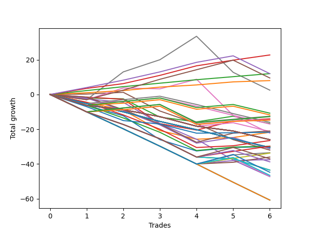

# Long Bulldog 003 DB 
- Symbol: TEST
- Date Range: 03/18/2022 - 07/15/2022
- Trading Period: 7:20-12:30
- Number of Trades: 6



| Name | Win Percent | Profit | Avg Profit / Trade | Avg Time / Trade |      | Name | Win Percent | Profit | Avg Profit / Trade | Avg Time / Trade |
| ---- | ----------- | ------ | ------------------ | ---------------- | ---- | ---- | ----------- | ------ | ------------------ | ---------------- |
| Sorted By <br> Profit | | | | | | Sorted By <br> Win Percentage ||||
| Eighty-Three | 100.00 | 11375.00 | 1895.83 | 79:36 |     | Eighty-Three | 100.00 | 11375.00 | 1895.83 | 79:36 |
| Eighty-Two | 100.00 | 6000.00 | 1000.00 | 40:07 |     | Eighty-Two | 100.00 | 6000.00 | 1000.00 | 40:07 |
| Eighty-Four | 83.33 | 6000.00 | 1000.00 | 117:27 |     | Eighty-One | 100.00 | 4000.00 | 666.67 | 38:37 |
| Eighty-Five | 66.67 | 4750.00 | 791.67 | 128:18 |     | Eighty-Four | 83.33 | 6000.00 | 1000.00 | 117:27 |
| Eighty-One | 100.00 | 4000.00 | 666.67 | 38:37 |     | Eighty-Five | 66.67 | 4750.00 | 791.67 | 128:18 |
| Seven | 50.00 | 1250.00 | 208.33 | 180:00 |     | One Hundred Twenty-Two | 66.67 | -6250.00 | -1041.67 | 09:50 |
| One Hundred Seventeen | 50.00 | -5375.00 | -895.83 | 05:07 |     | One Hundred Twenty-Seven | 66.67 | -6375.00 | -1062.50 | 16:38 |
| One Hundred Sixteen | 50.00 | -5875.00 | -979.17 | 04:51 |     | One Hundred Twenty-One | 66.67 | -7250.00 | -1208.33 | 08:46 |
| One Hundred Twenty-Two | 66.67 | -6250.00 | -1041.67 | 09:50 |     | One Hundred Twenty-Six | 66.67 | -7375.00 | -1229.17 | 15:34 |
| One Hundred Twenty-Seven | 66.67 | -6375.00 | -1062.50 | 16:38 |     | Seven | 50.00 | 1250.00 | 208.33 | 180:00 |
| Three | 33.33 | -7000.00 | -1166.67 | 40:51 |     | One Hundred Seventeen | 50.00 | -5375.00 | -895.83 | 05:07 |
| One Hundred Twenty-One | 66.67 | -7250.00 | -1208.33 | 08:46 |     | One Hundred Sixteen | 50.00 | -5875.00 | -979.17 | 04:51 |
| One Hundred Twenty-Six | 66.67 | -7375.00 | -1229.17 | 15:34 |     | Three | 33.33 | -7000.00 | -1166.67 | 40:51 |
| One Hundred Twelve | 33.33 | -8000.00 | -1333.33 | 03:06 |     | One Hundred Twelve | 33.33 | -8000.00 | -1333.33 | 03:06 |
| Two | 16.67 | -8375.00 | -1395.83 | 39:59 |     | One Hundred Eleven | 33.33 | -8500.00 | -1416.67 | 03:04 |
| One Hundred Eleven | 33.33 | -8500.00 | -1416.67 | 03:04 |     | Sixty-Seven | 33.33 | -10500.00 | -1750.00 | 24:50 |
| Sixty-Seven | 33.33 | -10500.00 | -1750.00 | 24:50 |     | Seventy-Three | 33.33 | -10875.00 | -1812.50 | 14:45 |
| Forty-Eight | 16.67 | -10625.00 | -1770.83 | 07:13 |     | One | 33.33 | -10875.00 | -1812.50 | 27:20 |
| Seventy-Three | 33.33 | -10875.00 | -1812.50 | 14:45 |     | Six | 33.33 | -11125.00 | -1854.17 | 161:10 |
| One | 33.33 | -10875.00 | -1812.50 | 27:20 |     | Sixty-Five | 33.33 | -13250.00 | -2208.33 | 18:15 |
| Six | 33.33 | -11125.00 | -1854.17 | 161:10 |     | One Hundred Twenty-Eight | 33.33 | -14875.00 | -2479.17 | 22:01 |
| One Hundred Twenty | 0.00 | -13000.00 | -2166.67 | 07:35 |     | Sixty-Four | 33.33 | -14875.00 | -2479.17 | 16:40 |
| One Hundred Ninteen | 0.00 | -13000.00 | -2166.67 | 07:35 |     | Zero | 33.33 | -15000.00 | -2500.00 | 24:06 |
| One Hundred Eighteen | 0.00 | -13000.00 | -2166.67 | 07:35 |     | Five | 33.33 | -16000.00 | -2666.67 | 91:14 |
| Fifty-Five | 0.00 | -13000.00 | -2166.67 | 07:35 |     | Fifty-Nine | 33.33 | -16750.00 | -2791.67 | 20:59 |
| Fifty-Four | 0.00 | -13000.00 | -2166.67 | 07:35 |     | One Hundred Twenty-Three | 33.33 | -16875.00 | -2812.50 | 15:34 |
| Fifty-Three | 0.00 | -13000.00 | -2166.67 | 07:35 |     | Fifty-Seven | 33.33 | -18000.00 | -3000.00 | 14:56 |
| Fifty-Two | 0.00 | -13000.00 | -2166.67 | 07:35 |     | Fifty-Six | 33.33 | -18750.00 | -3125.00 | 13:28 |
| Fifty-One | 0.00 | -13000.00 | -2166.67 | 07:35 |     | Two | 16.67 | -8375.00 | -1395.83 | 39:59 |
| Fifty | 0.00 | -13000.00 | -2166.67 | 07:35 |     | Forty-Eight | 16.67 | -10625.00 | -1770.83 | 07:13 |
| Forty-Nine | 0.00 | -13000.00 | -2166.67 | 07:35 |     | Sixty-Six | 16.67 | -15625.00 | -2604.17 | 24:30 |
| Sixty-Five | 33.33 | -13250.00 | -2208.33 | 18:15 |     | One Hundred Thirty | 16.67 | -18500.00 | -3083.33 | 27:26 |
| One Hundred Twenty-Eight | 33.33 | -14875.00 | -2479.17 | 22:01 |     | One Hundred Twenty-Nine | 16.67 | -19375.00 | -3229.17 | 27:24 |
| Sixty-Four | 33.33 | -14875.00 | -2479.17 | 16:40 |     | One Hundred Twenty-Five | 16.67 | -22375.00 | -3729.17 | 21:06 |
| Zero | 33.33 | -15000.00 | -2500.00 | 24:06 |     | One Hundred Twenty-Four | 16.67 | -23250.00 | -3875.00 | 21:04 |
| One Hundred Fifteen | 0.00 | -15250.00 | -2541.67 | 05:23 |     | Fifty-Eight | 16.67 | -23500.00 | -3916.67 | 20:51 |
| One Hundred Fourteen | 0.00 | -15250.00 | -2541.67 | 05:23 |     | One Hundred Twenty | 0.00 | -13000.00 | -2166.67 | 07:35 |
| One Hundred Thirteen | 0.00 | -15250.00 | -2541.67 | 05:23 |     | One Hundred Ninteen | 0.00 | -13000.00 | -2166.67 | 07:35 |
| Forty-Seven | 0.00 | -15250.00 | -2541.67 | 05:23 |     | One Hundred Eighteen | 0.00 | -13000.00 | -2166.67 | 07:35 |
| Forty-Six | 0.00 | -15250.00 | -2541.67 | 05:23 |     | Fifty-Five | 0.00 | -13000.00 | -2166.67 | 07:35 |
| Forty-Five | 0.00 | -15250.00 | -2541.67 | 05:23 |     | Fifty-Four | 0.00 | -13000.00 | -2166.67 | 07:35 |
| Forty-Four | 0.00 | -15250.00 | -2541.67 | 05:23 |     | Fifty-Three | 0.00 | -13000.00 | -2166.67 | 07:35 |
| Forty-Three | 0.00 | -15250.00 | -2541.67 | 05:23 |     | Fifty-Two | 0.00 | -13000.00 | -2166.67 | 07:35 |
| Forty-Two | 0.00 | -15250.00 | -2541.67 | 05:23 |     | Fifty-One | 0.00 | -13000.00 | -2166.67 | 07:35 |
| Forty-One | 0.00 | -15250.00 | -2541.67 | 05:23 |     | Fifty | 0.00 | -13000.00 | -2166.67 | 07:35 |
| Forty | 0.00 | -15250.00 | -2541.67 | 05:23 |     | Forty-Nine | 0.00 | -13000.00 | -2166.67 | 07:35 |
| Sixty-Six | 16.67 | -15625.00 | -2604.17 | 24:30 |     | One Hundred Fifteen | 0.00 | -15250.00 | -2541.67 | 05:23 |
| Five | 33.33 | -16000.00 | -2666.67 | 91:14 |     | One Hundred Fourteen | 0.00 | -15250.00 | -2541.67 | 05:23 |
| Fifty-Nine | 33.33 | -16750.00 | -2791.67 | 20:59 |     | One Hundred Thirteen | 0.00 | -15250.00 | -2541.67 | 05:23 |
| One Hundred Twenty-Three | 33.33 | -16875.00 | -2812.50 | 15:34 |     | Forty-Seven | 0.00 | -15250.00 | -2541.67 | 05:23 |
| Fifty-Seven | 33.33 | -18000.00 | -3000.00 | 14:56 |     | Forty-Six | 0.00 | -15250.00 | -2541.67 | 05:23 |
| One Hundred Thirty | 16.67 | -18500.00 | -3083.33 | 27:26 |     | Forty-Five | 0.00 | -15250.00 | -2541.67 | 05:23 |
| Fifty-Six | 33.33 | -18750.00 | -3125.00 | 13:28 |     | Forty-Four | 0.00 | -15250.00 | -2541.67 | 05:23 |
| One Hundred Twenty-Nine | 16.67 | -19375.00 | -3229.17 | 27:24 |     | Forty-Three | 0.00 | -15250.00 | -2541.67 | 05:23 |
| Seventy-One | 0.00 | -21750.00 | -3625.00 | 30:20 |     | Forty-Two | 0.00 | -15250.00 | -2541.67 | 05:23 |
| Seventy | 0.00 | -21750.00 | -3625.00 | 30:20 |     | Forty-One | 0.00 | -15250.00 | -2541.67 | 05:23 |
| Sixty-Nine | 0.00 | -21750.00 | -3625.00 | 30:20 |     | Forty | 0.00 | -15250.00 | -2541.67 | 05:23 |
| Sixty-Eight | 0.00 | -21750.00 | -3625.00 | 30:20 |     | Seventy-One | 0.00 | -21750.00 | -3625.00 | 30:20 |
| One Hundred Twenty-Five | 16.67 | -22375.00 | -3729.17 | 21:06 |     | Seventy | 0.00 | -21750.00 | -3625.00 | 30:20 |
| One Hundred Twenty-Four | 16.67 | -23250.00 | -3875.00 | 21:04 |     | Sixty-Nine | 0.00 | -21750.00 | -3625.00 | 30:20 |
| Fifty-Eight | 16.67 | -23500.00 | -3916.67 | 20:51 |     | Sixty-Eight | 0.00 | -21750.00 | -3625.00 | 30:20 |
| Four | 0.00 | -23625.00 | -3937.50 | 86:59 |     | Four | 0.00 | -23625.00 | -3937.50 | 86:59 |
| Sixty-Three | 0.00 | -30375.00 | -5062.50 | 24:22 |     | Sixty-Three | 0.00 | -30375.00 | -5062.50 | 24:22 |
| Sixty-Two | 0.00 | -30375.00 | -5062.50 | 24:22 |     | Sixty-Two | 0.00 | -30375.00 | -5062.50 | 24:22 |
| Sixty-One | 0.00 | -30375.00 | -5062.50 | 24:22 |     | Sixty-One | 0.00 | -30375.00 | -5062.50 | 24:22 |
| Sixty | 0.00 | -30375.00 | -5062.50 | 24:22 |     | Sixty | 0.00 | -30375.00 | -5062.50 | 24:22 |

## NO STOPLOSS

### Test Zero
* Sell when price hits the middle line of the 20p bollinger
* No Stoploss
* Results:
```
Total Trades: 6
Percent Up: 33.33
Percent Down: 66.67
Total Points Moved Up: -30.00
Potential Profit: -15000.00
Total Points Ups: 2.50 Count Ups: 2
Total Points Downs: -32.50 Count Downs: 4
```

<details><summary>Trades</summary>

<code>In: 2022-03-23 10:23:00		Out: 2022-03-23 10:51:10		Total Position Time: 28:10		Total Move Up: -6.25		Total to Date: -6.25</code> <br />
<code>In: 2022-03-25 08:14:00		Out: 2022-03-25 08:36:55		Total Position Time: 22:55		Total Move Up: -6.00		Total to Date: -12.25</code> <br />
<code>In: 2022-03-28 08:27:00		Out: 2022-03-28 09:02:00		Total Position Time: 35:00		Total Move Up: -13.75		Total to Date: -26.00</code> <br />
<code>In: 2022-04-18 08:26:00		Out: 2022-04-18 08:55:05		Total Position Time: 29:05		Total Move Up: -6.50		Total to Date: -32.50</code> <br />
<code>In: 2022-06-06 08:19:00		Out: 2022-06-06 08:33:05		Total Position Time: 14:05		Total Move Up: 2.00		Total to Date: -30.50</code> <br />
<code>In: 2022-06-08 09:41:00		Out: 2022-06-08 09:56:25		Total Position Time: 15:25		Total Move Up: 0.50		Total to Date: -30.00</code> <br />


</details>

### Test One
* Sell when the price hits the upper line of the 20p 1std bollinger
* No Stoploss
* Results:
```
Total Trades: 6
Percent Up: 33.33
Percent Down: 66.67
Total Points Moved Up: -21.75
Potential Profit: -10875.00
Total Points Ups: 4.00 Count Ups: 2
Total Points Downs: -25.75 Count Downs: 4
```

<details><summary>Trades</summary>

<code>In: 2022-03-23 10:23:00		Out: 2022-03-23 10:51:50		Total Position Time: 28:50		Total Move Up: -4.50		Total to Date: -4.50</code> <br />
<code>In: 2022-03-25 08:14:00		Out: 2022-03-25 08:41:10		Total Position Time: 27:10		Total Move Up: -4.50		Total to Date: -9.00</code> <br />
<code>In: 2022-03-28 08:27:00		Out: 2022-03-28 09:05:25		Total Position Time: 38:25		Total Move Up: -11.75		Total to Date: -20.75</code> <br />
<code>In: 2022-04-18 08:26:00		Out: 2022-04-18 08:57:20		Total Position Time: 31:20		Total Move Up: -5.00		Total to Date: -25.75</code> <br />
<code>In: 2022-06-06 08:19:00		Out: 2022-06-06 08:39:15		Total Position Time: 20:15		Total Move Up: 1.00		Total to Date: -24.75</code> <br />
<code>In: 2022-06-08 09:41:00		Out: 2022-06-08 09:59:05		Total Position Time: 18:05		Total Move Up: 3.00		Total to Date: -21.75</code> <br />


</details>

### Test Two
* Sell when the price hits the upper line of the 20p 2std bollinger
* No Stoploss
* Results:
```
Total Trades: 6
Percent Up: 16.67
Percent Down: 83.33
Total Points Moved Up: -16.75
Potential Profit: -8375.00
Total Points Ups: 3.25 Count Ups: 1
Total Points Downs: -20.00 Count Downs: 5
```

<details><summary>Trades</summary>

<code>In: 2022-03-23 10:23:00		Out: 2022-03-23 10:54:30		Total Position Time: 31:30		Total Move Up: -2.00		Total to Date: -2.00</code> <br />
<code>In: 2022-03-25 08:14:00		Out: 2022-03-25 08:41:55		Total Position Time: 27:55		Total Move Up: -0.50		Total to Date: -2.50</code> <br />
<code>In: 2022-03-28 08:27:00		Out: 2022-03-28 09:07:10		Total Position Time: 40:10		Total Move Up: -10.50		Total to Date: -13.00</code> <br />
<code>In: 2022-04-18 08:26:00		Out: 2022-04-18 08:59:35		Total Position Time: 33:35		Total Move Up: -2.75		Total to Date: -15.75</code> <br />
<code>In: 2022-06-06 08:19:00		Out: 2022-06-06 08:43:00		Total Position Time: 24:00		Total Move Up: 3.25		Total to Date: -12.50</code> <br />
<code>In: 2022-06-08 09:41:00		Out: 2022-06-08 11:03:45		Total Position Time: 82:45		Total Move Up: -4.25		Total to Date: -16.75</code> <br />


</details>

### Test Three
* Sell when price hits the middle line of the 50p bollinger
* No Stoploss
* Results:
```
Total Trades: 6
Percent Up: 33.33
Percent Down: 66.67
Total Points Moved Up: -14.00
Potential Profit: -7000.00
Total Points Ups: 6.50 Count Ups: 2
Total Points Downs: -20.50 Count Downs: 4
```

<details><summary>Trades</summary>

<code>In: 2022-03-23 10:23:00		Out: 2022-03-23 10:55:00		Total Position Time: 32:00		Total Move Up: -1.50		Total to Date: -1.50</code> <br />
<code>In: 2022-03-25 08:14:00		Out: 2022-03-25 08:53:00		Total Position Time: 39:00		Total Move Up: -1.25		Total to Date: -2.75</code> <br />
<code>In: 2022-03-28 08:27:00		Out: 2022-03-28 09:25:20		Total Position Time: 58:20		Total Move Up: -14.00		Total to Date: -16.75</code> <br />
<code>In: 2022-04-18 08:26:00		Out: 2022-04-18 09:07:15		Total Position Time: 41:15		Total Move Up: -3.75		Total to Date: -20.50</code> <br />
<code>In: 2022-06-06 08:19:00		Out: 2022-06-06 08:55:30		Total Position Time: 36:30		Total Move Up: 5.25		Total to Date: -15.25</code> <br />
<code>In: 2022-06-08 09:41:00		Out: 2022-06-08 10:19:05		Total Position Time: 38:05		Total Move Up: 1.25		Total to Date: -14.00</code> <br />


</details>

### Test Four
* Sell when the price hits the upper line of the 50p 1std bollinger
* No Stoploss
* Results:
```
Total Trades: 6
Percent Up: 0.00
Percent Down: 100.00
Total Points Moved Up: -47.25
Potential Profit: -23625.00
Total Points Ups: 0.00 Count Ups: 0
Total Points Downs: -47.25 Count Downs: 6
```

<details><summary>Trades</summary>

<code>In: 2022-03-23 10:23:00		Out: 2022-03-23 11:27:00		Total Position Time: 64:00		Total Move Up: -2.50		Total to Date: -2.50</code> <br />
<code>In: 2022-03-25 08:14:00		Out: 2022-03-25 09:08:25		Total Position Time: 54:25		Total Move Up: -2.00		Total to Date: -4.50</code> <br />
<code>In: 2022-03-28 08:27:00		Out: 2022-03-28 09:35:05		Total Position Time: 68:05		Total Move Up: -12.25		Total to Date: -16.75</code> <br />
<code>In: 2022-04-18 08:26:00		Out: 2022-04-18 09:53:35		Total Position Time: 87:35		Total Move Up: -9.00		Total to Date: -25.75</code> <br />
<code>In: 2022-06-06 08:19:00		Out: 2022-06-06 09:55:15		Total Position Time: 96:15		Total Move Up: -12.00		Total to Date: -37.75</code> <br />
<code>In: 2022-06-08 09:41:00		Out: 2022-06-08 12:12:35		Total Position Time: 151:35		Total Move Up: -9.50		Total to Date: -47.25</code> <br />


</details>

### Test Five
* Sell when the price hits the upper line of the 50p 2std bollinger
* No Stoploss
* Results:
```
Total Trades: 6
Percent Up: 33.33
Percent Down: 66.67
Total Points Moved Up: -32.00
Potential Profit: -16000.00
Total Points Ups: 1.25 Count Ups: 2
Total Points Downs: -33.25 Count Downs: 4
```

<details><summary>Trades</summary>

<code>In: 2022-03-23 10:23:00		Out: 2022-03-23 11:30:00		Total Position Time: 67:00		Total Move Up: 0.25		Total to Date: 0.25</code> <br />
<code>In: 2022-03-25 08:14:00		Out: 2022-03-25 09:11:40		Total Position Time: 57:40		Total Move Up: 1.00		Total to Date: 1.25</code> <br />
<code>In: 2022-03-28 08:27:00		Out: 2022-03-28 09:39:55		Total Position Time: 72:55		Total Move Up: -10.75		Total to Date: -9.50</code> <br />
<code>In: 2022-04-18 08:26:00		Out: 2022-04-18 09:58:15		Total Position Time: 92:15		Total Move Up: -7.25		Total to Date: -16.75</code> <br />
<code>In: 2022-06-06 08:19:00		Out: 2022-06-06 09:56:20		Total Position Time: 97:20		Total Move Up: -9.25		Total to Date: -26.00</code> <br />
<code>In: 2022-06-08 09:41:00		Out: 2022-06-08 12:21:15		Total Position Time: 160:15		Total Move Up: -6.00		Total to Date: -32.00</code> <br />


</details>

### Test Six
* Sell when the price hits the middle line of the 1std VWAP
* No Stoploss
* Results:
```
Total Trades: 6
Percent Up: 33.33
Percent Down: 66.67
Total Points Moved Up: -22.25
Potential Profit: -11125.00
Total Points Ups: 12.25 Count Ups: 2
Total Points Downs: -34.50 Count Downs: 4
```

<details><summary>Trades</summary>

<code>In: 2022-03-23 10:23:00		Out: 2022-03-23 12:47:00		Total Position Time: 144:00		Total Move Up: -3.00		Total to Date: -3.00</code> <br />
<code>In: 2022-03-25 08:14:00		Out: 2022-03-25 10:19:30		Total Position Time: 125:30		Total Move Up: 6.75		Total to Date: 3.75</code> <br />
<code>In: 2022-03-28 08:27:00		Out: 2022-03-28 10:24:25		Total Position Time: 117:25		Total Move Up: -0.50		Total to Date: 3.25</code> <br />
<code>In: 2022-04-18 08:26:00		Out: 2022-04-18 10:32:10		Total Position Time: 126:10		Total Move Up: 5.50		Total to Date: 8.75</code> <br />
<code>In: 2022-06-06 08:19:00		Out: 2022-06-06 12:47:00		Total Position Time: 268:00		Total Move Up: -20.75		Total to Date: -12.00</code> <br />
<code>In: 2022-06-08 09:41:00		Out: 2022-06-08 12:47:00		Total Position Time: 186:00		Total Move Up: -10.25		Total to Date: -22.25</code> <br />


</details>

### Test Seven
* Sell when the price hits the upper line of the 1std VWAP
* No Stoploss
* Results:
```
Total Trades: 6
Percent Up: 50.00
Percent Down: 50.00
Total Points Moved Up: 2.50
Potential Profit: 1250.00
Total Points Ups: 36.50 Count Ups: 3
Total Points Downs: -34.00 Count Downs: 3
```

<details><summary>Trades</summary>

<code>In: 2022-03-23 10:23:00		Out: 2022-03-23 12:47:00		Total Position Time: 144:00		Total Move Up: -3.00		Total to Date: -3.00</code> <br />
<code>In: 2022-03-25 08:14:00		Out: 2022-03-25 11:04:05		Total Position Time: 170:05		Total Move Up: 16.00		Total to Date: 13.00</code> <br />
<code>In: 2022-03-28 08:27:00		Out: 2022-03-28 11:29:05		Total Position Time: 182:05		Total Move Up: 7.00		Total to Date: 20.00</code> <br />
<code>In: 2022-04-18 08:26:00		Out: 2022-04-18 10:35:50		Total Position Time: 129:50		Total Move Up: 13.50		Total to Date: 33.50</code> <br />
<code>In: 2022-06-06 08:19:00		Out: 2022-06-06 12:47:00		Total Position Time: 268:00		Total Move Up: -20.75		Total to Date: 12.75</code> <br />
<code>In: 2022-06-08 09:41:00		Out: 2022-06-08 12:47:00		Total Position Time: 186:00		Total Move Up: -10.25		Total to Date: 2.50</code> <br />


</details>

## STOPLOSS OF 5

### Test Forty
* Sell when price hits the middle line of the 20p bollinger
* Stoploss is 5 points
* Results:
```
Total Trades: 6
Percent Up: 0.00
Percent Down: 100.00
Total Points Moved Up: -30.50
Potential Profit: -15250.00
Total Points Ups: 0.00 Count Ups: 0
Total Points Downs: -30.50 Count Downs: 6
```

<details><summary>Trades</summary>

<code>In: 2022-03-23 10:23:00		Out: 2022-03-23 10:25:30		Total Position Time: 02:30		Total Move Up: -5.25		Total to Date: -5.25</code> <br />
<code>In: 2022-03-25 08:14:00		Out: 2022-03-25 08:24:25		Total Position Time: 10:25		Total Move Up: -4.75		Total to Date: -10.00</code> <br />
<code>In: 2022-03-28 08:27:00		Out: 2022-03-28 08:33:30		Total Position Time: 06:30		Total Move Up: -5.50		Total to Date: -15.50</code> <br />
<code>In: 2022-04-18 08:26:00		Out: 2022-04-18 08:33:50		Total Position Time: 07:50		Total Move Up: -4.75		Total to Date: -20.25</code> <br />
<code>In: 2022-06-06 08:19:00		Out: 2022-06-06 08:20:20		Total Position Time: 01:20		Total Move Up: -5.25		Total to Date: -25.50</code> <br />
<code>In: 2022-06-08 09:41:00		Out: 2022-06-08 09:44:45		Total Position Time: 03:45		Total Move Up: -5.00		Total to Date: -30.50</code> <br />


</details>

### Test Forty-One
* Sell when the price hits the upper line of the 20p 1std bollinger
* Stoploss is 5 points
* Results:
```
Total Trades: 6
Percent Up: 0.00
Percent Down: 100.00
Total Points Moved Up: -30.50
Potential Profit: -15250.00
Total Points Ups: 0.00 Count Ups: 0
Total Points Downs: -30.50 Count Downs: 6
```

<details><summary>Trades</summary>

<code>In: 2022-03-23 10:23:00		Out: 2022-03-23 10:25:30		Total Position Time: 02:30		Total Move Up: -5.25		Total to Date: -5.25</code> <br />
<code>In: 2022-03-25 08:14:00		Out: 2022-03-25 08:24:25		Total Position Time: 10:25		Total Move Up: -4.75		Total to Date: -10.00</code> <br />
<code>In: 2022-03-28 08:27:00		Out: 2022-03-28 08:33:30		Total Position Time: 06:30		Total Move Up: -5.50		Total to Date: -15.50</code> <br />
<code>In: 2022-04-18 08:26:00		Out: 2022-04-18 08:33:50		Total Position Time: 07:50		Total Move Up: -4.75		Total to Date: -20.25</code> <br />
<code>In: 2022-06-06 08:19:00		Out: 2022-06-06 08:20:20		Total Position Time: 01:20		Total Move Up: -5.25		Total to Date: -25.50</code> <br />
<code>In: 2022-06-08 09:41:00		Out: 2022-06-08 09:44:45		Total Position Time: 03:45		Total Move Up: -5.00		Total to Date: -30.50</code> <br />


</details>

### Test Forty-Two
* Sell when the price hits the upper line of the 20p 2std bollinger
* Stoploss is 5 points
* Results:
```
Total Trades: 6
Percent Up: 0.00
Percent Down: 100.00
Total Points Moved Up: -30.50
Potential Profit: -15250.00
Total Points Ups: 0.00 Count Ups: 0
Total Points Downs: -30.50 Count Downs: 6
```

<details><summary>Trades</summary>

<code>In: 2022-03-23 10:23:00		Out: 2022-03-23 10:25:30		Total Position Time: 02:30		Total Move Up: -5.25		Total to Date: -5.25</code> <br />
<code>In: 2022-03-25 08:14:00		Out: 2022-03-25 08:24:25		Total Position Time: 10:25		Total Move Up: -4.75		Total to Date: -10.00</code> <br />
<code>In: 2022-03-28 08:27:00		Out: 2022-03-28 08:33:30		Total Position Time: 06:30		Total Move Up: -5.50		Total to Date: -15.50</code> <br />
<code>In: 2022-04-18 08:26:00		Out: 2022-04-18 08:33:50		Total Position Time: 07:50		Total Move Up: -4.75		Total to Date: -20.25</code> <br />
<code>In: 2022-06-06 08:19:00		Out: 2022-06-06 08:20:20		Total Position Time: 01:20		Total Move Up: -5.25		Total to Date: -25.50</code> <br />
<code>In: 2022-06-08 09:41:00		Out: 2022-06-08 09:44:45		Total Position Time: 03:45		Total Move Up: -5.00		Total to Date: -30.50</code> <br />


</details>

### Test Forty-Three
* Sell when price hits the middle line of the 50p bollinger
* Stoploss is 5 points
* Results:
```
Total Trades: 6
Percent Up: 0.00
Percent Down: 100.00
Total Points Moved Up: -30.50
Potential Profit: -15250.00
Total Points Ups: 0.00 Count Ups: 0
Total Points Downs: -30.50 Count Downs: 6
```

<details><summary>Trades</summary>

<code>In: 2022-03-23 10:23:00		Out: 2022-03-23 10:25:30		Total Position Time: 02:30		Total Move Up: -5.25		Total to Date: -5.25</code> <br />
<code>In: 2022-03-25 08:14:00		Out: 2022-03-25 08:24:25		Total Position Time: 10:25		Total Move Up: -4.75		Total to Date: -10.00</code> <br />
<code>In: 2022-03-28 08:27:00		Out: 2022-03-28 08:33:30		Total Position Time: 06:30		Total Move Up: -5.50		Total to Date: -15.50</code> <br />
<code>In: 2022-04-18 08:26:00		Out: 2022-04-18 08:33:50		Total Position Time: 07:50		Total Move Up: -4.75		Total to Date: -20.25</code> <br />
<code>In: 2022-06-06 08:19:00		Out: 2022-06-06 08:20:20		Total Position Time: 01:20		Total Move Up: -5.25		Total to Date: -25.50</code> <br />
<code>In: 2022-06-08 09:41:00		Out: 2022-06-08 09:44:45		Total Position Time: 03:45		Total Move Up: -5.00		Total to Date: -30.50</code> <br />


</details>

### Test Forty-Four
* Sell when the price hits the upper line of the 50p 1std bollinger
* Stoploss is 5 points
* Results:
```
Total Trades: 6
Percent Up: 0.00
Percent Down: 100.00
Total Points Moved Up: -30.50
Potential Profit: -15250.00
Total Points Ups: 0.00 Count Ups: 0
Total Points Downs: -30.50 Count Downs: 6
```

<details><summary>Trades</summary>

<code>In: 2022-03-23 10:23:00		Out: 2022-03-23 10:25:30		Total Position Time: 02:30		Total Move Up: -5.25		Total to Date: -5.25</code> <br />
<code>In: 2022-03-25 08:14:00		Out: 2022-03-25 08:24:25		Total Position Time: 10:25		Total Move Up: -4.75		Total to Date: -10.00</code> <br />
<code>In: 2022-03-28 08:27:00		Out: 2022-03-28 08:33:30		Total Position Time: 06:30		Total Move Up: -5.50		Total to Date: -15.50</code> <br />
<code>In: 2022-04-18 08:26:00		Out: 2022-04-18 08:33:50		Total Position Time: 07:50		Total Move Up: -4.75		Total to Date: -20.25</code> <br />
<code>In: 2022-06-06 08:19:00		Out: 2022-06-06 08:20:20		Total Position Time: 01:20		Total Move Up: -5.25		Total to Date: -25.50</code> <br />
<code>In: 2022-06-08 09:41:00		Out: 2022-06-08 09:44:45		Total Position Time: 03:45		Total Move Up: -5.00		Total to Date: -30.50</code> <br />


</details>

### Test Forty-Five
* Sell when the price hits the upper line of the 50p 2std bollinger
* Stoploss is 5 points
* Results:
```
Total Trades: 6
Percent Up: 0.00
Percent Down: 100.00
Total Points Moved Up: -30.50
Potential Profit: -15250.00
Total Points Ups: 0.00 Count Ups: 0
Total Points Downs: -30.50 Count Downs: 6
```

<details><summary>Trades</summary>

<code>In: 2022-03-23 10:23:00		Out: 2022-03-23 10:25:30		Total Position Time: 02:30		Total Move Up: -5.25		Total to Date: -5.25</code> <br />
<code>In: 2022-03-25 08:14:00		Out: 2022-03-25 08:24:25		Total Position Time: 10:25		Total Move Up: -4.75		Total to Date: -10.00</code> <br />
<code>In: 2022-03-28 08:27:00		Out: 2022-03-28 08:33:30		Total Position Time: 06:30		Total Move Up: -5.50		Total to Date: -15.50</code> <br />
<code>In: 2022-04-18 08:26:00		Out: 2022-04-18 08:33:50		Total Position Time: 07:50		Total Move Up: -4.75		Total to Date: -20.25</code> <br />
<code>In: 2022-06-06 08:19:00		Out: 2022-06-06 08:20:20		Total Position Time: 01:20		Total Move Up: -5.25		Total to Date: -25.50</code> <br />
<code>In: 2022-06-08 09:41:00		Out: 2022-06-08 09:44:45		Total Position Time: 03:45		Total Move Up: -5.00		Total to Date: -30.50</code> <br />


</details>

### Test Forty-Six
* Sell when the price hits the middle line of the 1std VWAP
* Stoploss is 5 points
* Results:
```
Total Trades: 6
Percent Up: 0.00
Percent Down: 100.00
Total Points Moved Up: -30.50
Potential Profit: -15250.00
Total Points Ups: 0.00 Count Ups: 0
Total Points Downs: -30.50 Count Downs: 6
```

<details><summary>Trades</summary>

<code>In: 2022-03-23 10:23:00		Out: 2022-03-23 10:25:30		Total Position Time: 02:30		Total Move Up: -5.25		Total to Date: -5.25</code> <br />
<code>In: 2022-03-25 08:14:00		Out: 2022-03-25 08:24:25		Total Position Time: 10:25		Total Move Up: -4.75		Total to Date: -10.00</code> <br />
<code>In: 2022-03-28 08:27:00		Out: 2022-03-28 08:33:30		Total Position Time: 06:30		Total Move Up: -5.50		Total to Date: -15.50</code> <br />
<code>In: 2022-04-18 08:26:00		Out: 2022-04-18 08:33:50		Total Position Time: 07:50		Total Move Up: -4.75		Total to Date: -20.25</code> <br />
<code>In: 2022-06-06 08:19:00		Out: 2022-06-06 08:20:20		Total Position Time: 01:20		Total Move Up: -5.25		Total to Date: -25.50</code> <br />
<code>In: 2022-06-08 09:41:00		Out: 2022-06-08 09:44:45		Total Position Time: 03:45		Total Move Up: -5.00		Total to Date: -30.50</code> <br />


</details>

### Test Forty-Seven
* Sell when the price hits the upper line of the 1std VWAP
* Stoploss is 5 points
* Results:
```
Total Trades: 6
Percent Up: 0.00
Percent Down: 100.00
Total Points Moved Up: -30.50
Potential Profit: -15250.00
Total Points Ups: 0.00 Count Ups: 0
Total Points Downs: -30.50 Count Downs: 6
```

<details><summary>Trades</summary>

<code>In: 2022-03-23 10:23:00		Out: 2022-03-23 10:25:30		Total Position Time: 02:30		Total Move Up: -5.25		Total to Date: -5.25</code> <br />
<code>In: 2022-03-25 08:14:00		Out: 2022-03-25 08:24:25		Total Position Time: 10:25		Total Move Up: -4.75		Total to Date: -10.00</code> <br />
<code>In: 2022-03-28 08:27:00		Out: 2022-03-28 08:33:30		Total Position Time: 06:30		Total Move Up: -5.50		Total to Date: -15.50</code> <br />
<code>In: 2022-04-18 08:26:00		Out: 2022-04-18 08:33:50		Total Position Time: 07:50		Total Move Up: -4.75		Total to Date: -20.25</code> <br />
<code>In: 2022-06-06 08:19:00		Out: 2022-06-06 08:20:20		Total Position Time: 01:20		Total Move Up: -5.25		Total to Date: -25.50</code> <br />
<code>In: 2022-06-08 09:41:00		Out: 2022-06-08 09:44:45		Total Position Time: 03:45		Total Move Up: -5.00		Total to Date: -30.50</code> <br />


</details>

## TRAIL STOP OF 5

### Test Forty-Eight
* Sell when price hits the middle line of the 20p bollinger
* Trailing Stop is 5 points
* Results:
```
Total Trades: 6
Percent Up: 16.67
Percent Down: 83.33
Total Points Moved Up: -21.25
Potential Profit: -10625.00
Total Points Ups: 2.00 Count Ups: 1
Total Points Downs: -23.25 Count Downs: 5
```

<details><summary>Trades</summary>

<code>In: 2022-03-23 10:23:00		Out: 2022-03-23 10:25:50		Total Position Time: 02:50		Total Move Up: -6.25		Total to Date: -6.25</code> <br />
<code>In: 2022-03-25 08:14:00		Out: 2022-03-25 08:20:40		Total Position Time: 06:40		Total Move Up: -2.50		Total to Date: -8.75</code> <br />
<code>In: 2022-03-28 08:27:00		Out: 2022-03-28 08:32:10		Total Position Time: 05:10		Total Move Up: -4.00		Total to Date: -12.75</code> <br />
<code>In: 2022-04-18 08:26:00		Out: 2022-04-18 08:36:50		Total Position Time: 10:50		Total Move Up: -5.50		Total to Date: -18.25</code> <br />
<code>In: 2022-06-06 08:19:00		Out: 2022-06-06 08:33:05		Total Position Time: 14:05		Total Move Up: 2.00		Total to Date: -16.25</code> <br />
<code>In: 2022-06-08 09:41:00		Out: 2022-06-08 09:44:45		Total Position Time: 03:45		Total Move Up: -5.00		Total to Date: -21.25</code> <br />


</details>

### Test Forty-Nine
* Sell when the price hits the upper line of the 20p 1std bollinger
* Trailing Stop is 5 points
* Results:
```
Total Trades: 6
Percent Up: 0.00
Percent Down: 100.00
Total Points Moved Up: -26.00
Potential Profit: -13000.00
Total Points Ups: 0.00 Count Ups: 0
Total Points Downs: -26.00 Count Downs: 6
```

<details><summary>Trades</summary>

<code>In: 2022-03-23 10:23:00		Out: 2022-03-23 10:25:50		Total Position Time: 02:50		Total Move Up: -6.25		Total to Date: -6.25</code> <br />
<code>In: 2022-03-25 08:14:00		Out: 2022-03-25 08:20:40		Total Position Time: 06:40		Total Move Up: -2.50		Total to Date: -8.75</code> <br />
<code>In: 2022-03-28 08:27:00		Out: 2022-03-28 08:32:10		Total Position Time: 05:10		Total Move Up: -4.00		Total to Date: -12.75</code> <br />
<code>In: 2022-04-18 08:26:00		Out: 2022-04-18 08:36:50		Total Position Time: 10:50		Total Move Up: -5.50		Total to Date: -18.25</code> <br />
<code>In: 2022-06-06 08:19:00		Out: 2022-06-06 08:35:15		Total Position Time: 16:15		Total Move Up: -2.75		Total to Date: -21.00</code> <br />
<code>In: 2022-06-08 09:41:00		Out: 2022-06-08 09:44:45		Total Position Time: 03:45		Total Move Up: -5.00		Total to Date: -26.00</code> <br />


</details>

### Test Fifty
* Sell when the price hits the upper line of the 20p 2std bollinger
* Trailing Stop is 5 points
* Results:
```
Total Trades: 6
Percent Up: 0.00
Percent Down: 100.00
Total Points Moved Up: -26.00
Potential Profit: -13000.00
Total Points Ups: 0.00 Count Ups: 0
Total Points Downs: -26.00 Count Downs: 6
```

<details><summary>Trades</summary>

<code>In: 2022-03-23 10:23:00		Out: 2022-03-23 10:25:50		Total Position Time: 02:50		Total Move Up: -6.25		Total to Date: -6.25</code> <br />
<code>In: 2022-03-25 08:14:00		Out: 2022-03-25 08:20:40		Total Position Time: 06:40		Total Move Up: -2.50		Total to Date: -8.75</code> <br />
<code>In: 2022-03-28 08:27:00		Out: 2022-03-28 08:32:10		Total Position Time: 05:10		Total Move Up: -4.00		Total to Date: -12.75</code> <br />
<code>In: 2022-04-18 08:26:00		Out: 2022-04-18 08:36:50		Total Position Time: 10:50		Total Move Up: -5.50		Total to Date: -18.25</code> <br />
<code>In: 2022-06-06 08:19:00		Out: 2022-06-06 08:35:15		Total Position Time: 16:15		Total Move Up: -2.75		Total to Date: -21.00</code> <br />
<code>In: 2022-06-08 09:41:00		Out: 2022-06-08 09:44:45		Total Position Time: 03:45		Total Move Up: -5.00		Total to Date: -26.00</code> <br />


</details>

### Test Fifty-One
* Sell when price hits the middle line of the 50p bollinger
* Trailing Stop is 5 points
* Results:
```
Total Trades: 6
Percent Up: 0.00
Percent Down: 100.00
Total Points Moved Up: -26.00
Potential Profit: -13000.00
Total Points Ups: 0.00 Count Ups: 0
Total Points Downs: -26.00 Count Downs: 6
```

<details><summary>Trades</summary>

<code>In: 2022-03-23 10:23:00		Out: 2022-03-23 10:25:50		Total Position Time: 02:50		Total Move Up: -6.25		Total to Date: -6.25</code> <br />
<code>In: 2022-03-25 08:14:00		Out: 2022-03-25 08:20:40		Total Position Time: 06:40		Total Move Up: -2.50		Total to Date: -8.75</code> <br />
<code>In: 2022-03-28 08:27:00		Out: 2022-03-28 08:32:10		Total Position Time: 05:10		Total Move Up: -4.00		Total to Date: -12.75</code> <br />
<code>In: 2022-04-18 08:26:00		Out: 2022-04-18 08:36:50		Total Position Time: 10:50		Total Move Up: -5.50		Total to Date: -18.25</code> <br />
<code>In: 2022-06-06 08:19:00		Out: 2022-06-06 08:35:15		Total Position Time: 16:15		Total Move Up: -2.75		Total to Date: -21.00</code> <br />
<code>In: 2022-06-08 09:41:00		Out: 2022-06-08 09:44:45		Total Position Time: 03:45		Total Move Up: -5.00		Total to Date: -26.00</code> <br />


</details>

### Test Fifty-Two
* Sell when the price hits the upper line of the 50p 1std bollinger
* Trailing Stop is 5 points
* Results:
```
Total Trades: 6
Percent Up: 0.00
Percent Down: 100.00
Total Points Moved Up: -26.00
Potential Profit: -13000.00
Total Points Ups: 0.00 Count Ups: 0
Total Points Downs: -26.00 Count Downs: 6
```

<details><summary>Trades</summary>

<code>In: 2022-03-23 10:23:00		Out: 2022-03-23 10:25:50		Total Position Time: 02:50		Total Move Up: -6.25		Total to Date: -6.25</code> <br />
<code>In: 2022-03-25 08:14:00		Out: 2022-03-25 08:20:40		Total Position Time: 06:40		Total Move Up: -2.50		Total to Date: -8.75</code> <br />
<code>In: 2022-03-28 08:27:00		Out: 2022-03-28 08:32:10		Total Position Time: 05:10		Total Move Up: -4.00		Total to Date: -12.75</code> <br />
<code>In: 2022-04-18 08:26:00		Out: 2022-04-18 08:36:50		Total Position Time: 10:50		Total Move Up: -5.50		Total to Date: -18.25</code> <br />
<code>In: 2022-06-06 08:19:00		Out: 2022-06-06 08:35:15		Total Position Time: 16:15		Total Move Up: -2.75		Total to Date: -21.00</code> <br />
<code>In: 2022-06-08 09:41:00		Out: 2022-06-08 09:44:45		Total Position Time: 03:45		Total Move Up: -5.00		Total to Date: -26.00</code> <br />


</details>

### Test Fifty-Three
* Sell when the price hits the upper line of the 50p 2std bollinger
* Trailing Stop is 5 points
* Results:
```
Total Trades: 6
Percent Up: 0.00
Percent Down: 100.00
Total Points Moved Up: -26.00
Potential Profit: -13000.00
Total Points Ups: 0.00 Count Ups: 0
Total Points Downs: -26.00 Count Downs: 6
```

<details><summary>Trades</summary>

<code>In: 2022-03-23 10:23:00		Out: 2022-03-23 10:25:50		Total Position Time: 02:50		Total Move Up: -6.25		Total to Date: -6.25</code> <br />
<code>In: 2022-03-25 08:14:00		Out: 2022-03-25 08:20:40		Total Position Time: 06:40		Total Move Up: -2.50		Total to Date: -8.75</code> <br />
<code>In: 2022-03-28 08:27:00		Out: 2022-03-28 08:32:10		Total Position Time: 05:10		Total Move Up: -4.00		Total to Date: -12.75</code> <br />
<code>In: 2022-04-18 08:26:00		Out: 2022-04-18 08:36:50		Total Position Time: 10:50		Total Move Up: -5.50		Total to Date: -18.25</code> <br />
<code>In: 2022-06-06 08:19:00		Out: 2022-06-06 08:35:15		Total Position Time: 16:15		Total Move Up: -2.75		Total to Date: -21.00</code> <br />
<code>In: 2022-06-08 09:41:00		Out: 2022-06-08 09:44:45		Total Position Time: 03:45		Total Move Up: -5.00		Total to Date: -26.00</code> <br />


</details>

### Test Fifty-Four
* Sell when the price hits the middle line of the 1std VWAP
* Trailing Stop is 5 points
* Results:
```
Total Trades: 6
Percent Up: 0.00
Percent Down: 100.00
Total Points Moved Up: -26.00
Potential Profit: -13000.00
Total Points Ups: 0.00 Count Ups: 0
Total Points Downs: -26.00 Count Downs: 6
```

<details><summary>Trades</summary>

<code>In: 2022-03-23 10:23:00		Out: 2022-03-23 10:25:50		Total Position Time: 02:50		Total Move Up: -6.25		Total to Date: -6.25</code> <br />
<code>In: 2022-03-25 08:14:00		Out: 2022-03-25 08:20:40		Total Position Time: 06:40		Total Move Up: -2.50		Total to Date: -8.75</code> <br />
<code>In: 2022-03-28 08:27:00		Out: 2022-03-28 08:32:10		Total Position Time: 05:10		Total Move Up: -4.00		Total to Date: -12.75</code> <br />
<code>In: 2022-04-18 08:26:00		Out: 2022-04-18 08:36:50		Total Position Time: 10:50		Total Move Up: -5.50		Total to Date: -18.25</code> <br />
<code>In: 2022-06-06 08:19:00		Out: 2022-06-06 08:35:15		Total Position Time: 16:15		Total Move Up: -2.75		Total to Date: -21.00</code> <br />
<code>In: 2022-06-08 09:41:00		Out: 2022-06-08 09:44:45		Total Position Time: 03:45		Total Move Up: -5.00		Total to Date: -26.00</code> <br />


</details>

### Test Fifty-Five
* Sell when the price hits the upper line of the 1std VWAP
* Trailing Stop is 5 points
* Results:
```
Total Trades: 6
Percent Up: 0.00
Percent Down: 100.00
Total Points Moved Up: -26.00
Potential Profit: -13000.00
Total Points Ups: 0.00 Count Ups: 0
Total Points Downs: -26.00 Count Downs: 6
```

<details><summary>Trades</summary>

<code>In: 2022-03-23 10:23:00		Out: 2022-03-23 10:25:50		Total Position Time: 02:50		Total Move Up: -6.25		Total to Date: -6.25</code> <br />
<code>In: 2022-03-25 08:14:00		Out: 2022-03-25 08:20:40		Total Position Time: 06:40		Total Move Up: -2.50		Total to Date: -8.75</code> <br />
<code>In: 2022-03-28 08:27:00		Out: 2022-03-28 08:32:10		Total Position Time: 05:10		Total Move Up: -4.00		Total to Date: -12.75</code> <br />
<code>In: 2022-04-18 08:26:00		Out: 2022-04-18 08:36:50		Total Position Time: 10:50		Total Move Up: -5.50		Total to Date: -18.25</code> <br />
<code>In: 2022-06-06 08:19:00		Out: 2022-06-06 08:35:15		Total Position Time: 16:15		Total Move Up: -2.75		Total to Date: -21.00</code> <br />
<code>In: 2022-06-08 09:41:00		Out: 2022-06-08 09:44:45		Total Position Time: 03:45		Total Move Up: -5.00		Total to Date: -26.00</code> <br />


</details>

## STOPLOSS OF 10

### Test Fifty-Six
* Sell when price hits the middle line of the 20p bollinger
* Stoploss is 10 points
* Results:
```
Total Trades: 6
Percent Up: 33.33
Percent Down: 66.67
Total Points Moved Up: -37.50
Potential Profit: -18750.00
Total Points Ups: 2.50 Count Ups: 2
Total Points Downs: -40.00 Count Downs: 4
```

<details><summary>Trades</summary>

<code>In: 2022-03-23 10:23:00		Out: 2022-03-23 10:30:15		Total Position Time: 07:15		Total Move Up: -10.00		Total to Date: -10.00</code> <br />
<code>In: 2022-03-25 08:14:00		Out: 2022-03-25 08:26:25		Total Position Time: 12:25		Total Move Up: -9.75		Total to Date: -19.75</code> <br />
<code>In: 2022-03-28 08:27:00		Out: 2022-03-28 08:36:20		Total Position Time: 09:20		Total Move Up: -10.00		Total to Date: -29.75</code> <br />
<code>In: 2022-04-18 08:26:00		Out: 2022-04-18 08:48:20		Total Position Time: 22:20		Total Move Up: -10.25		Total to Date: -40.00</code> <br />
<code>In: 2022-06-06 08:19:00		Out: 2022-06-06 08:33:05		Total Position Time: 14:05		Total Move Up: 2.00		Total to Date: -38.00</code> <br />
<code>In: 2022-06-08 09:41:00		Out: 2022-06-08 09:56:25		Total Position Time: 15:25		Total Move Up: 0.50		Total to Date: -37.50</code> <br />


</details>

### Test Fifty-Seven
* Sell when the price hits the upper line of the 20p 1std bollinger
* Stoploss is 10 points
* Results:
```
Total Trades: 6
Percent Up: 33.33
Percent Down: 66.67
Total Points Moved Up: -36.00
Potential Profit: -18000.00
Total Points Ups: 4.00 Count Ups: 2
Total Points Downs: -40.00 Count Downs: 4
```

<details><summary>Trades</summary>

<code>In: 2022-03-23 10:23:00		Out: 2022-03-23 10:30:15		Total Position Time: 07:15		Total Move Up: -10.00		Total to Date: -10.00</code> <br />
<code>In: 2022-03-25 08:14:00		Out: 2022-03-25 08:26:25		Total Position Time: 12:25		Total Move Up: -9.75		Total to Date: -19.75</code> <br />
<code>In: 2022-03-28 08:27:00		Out: 2022-03-28 08:36:20		Total Position Time: 09:20		Total Move Up: -10.00		Total to Date: -29.75</code> <br />
<code>In: 2022-04-18 08:26:00		Out: 2022-04-18 08:48:20		Total Position Time: 22:20		Total Move Up: -10.25		Total to Date: -40.00</code> <br />
<code>In: 2022-06-06 08:19:00		Out: 2022-06-06 08:39:15		Total Position Time: 20:15		Total Move Up: 1.00		Total to Date: -39.00</code> <br />
<code>In: 2022-06-08 09:41:00		Out: 2022-06-08 09:59:05		Total Position Time: 18:05		Total Move Up: 3.00		Total to Date: -36.00</code> <br />


</details>

### Test Fifty-Eight
* Sell when the price hits the upper line of the 20p 2std bollinger
* Stoploss is 10 points
* Results:
```
Total Trades: 6
Percent Up: 16.67
Percent Down: 83.33
Total Points Moved Up: -47.00
Potential Profit: -23500.00
Total Points Ups: 3.25 Count Ups: 1
Total Points Downs: -50.25 Count Downs: 5
```

<details><summary>Trades</summary>

<code>In: 2022-03-23 10:23:00		Out: 2022-03-23 10:30:15		Total Position Time: 07:15		Total Move Up: -10.00		Total to Date: -10.00</code> <br />
<code>In: 2022-03-25 08:14:00		Out: 2022-03-25 08:26:25		Total Position Time: 12:25		Total Move Up: -9.75		Total to Date: -19.75</code> <br />
<code>In: 2022-03-28 08:27:00		Out: 2022-03-28 08:36:20		Total Position Time: 09:20		Total Move Up: -10.00		Total to Date: -29.75</code> <br />
<code>In: 2022-04-18 08:26:00		Out: 2022-04-18 08:48:20		Total Position Time: 22:20		Total Move Up: -10.25		Total to Date: -40.00</code> <br />
<code>In: 2022-06-06 08:19:00		Out: 2022-06-06 08:43:00		Total Position Time: 24:00		Total Move Up: 3.25		Total to Date: -36.75</code> <br />
<code>In: 2022-06-08 09:41:00		Out: 2022-06-08 10:30:50		Total Position Time: 49:50		Total Move Up: -10.25		Total to Date: -47.00</code> <br />


</details>

### Test Fifty-Nine
* Sell when price hits the middle line of the 50p bollinger
* Stoploss is 10 points
* Results:
```
Total Trades: 6
Percent Up: 33.33
Percent Down: 66.67
Total Points Moved Up: -33.50
Potential Profit: -16750.00
Total Points Ups: 6.50 Count Ups: 2
Total Points Downs: -40.00 Count Downs: 4
```

<details><summary>Trades</summary>

<code>In: 2022-03-23 10:23:00		Out: 2022-03-23 10:30:15		Total Position Time: 07:15		Total Move Up: -10.00		Total to Date: -10.00</code> <br />
<code>In: 2022-03-25 08:14:00		Out: 2022-03-25 08:26:25		Total Position Time: 12:25		Total Move Up: -9.75		Total to Date: -19.75</code> <br />
<code>In: 2022-03-28 08:27:00		Out: 2022-03-28 08:36:20		Total Position Time: 09:20		Total Move Up: -10.00		Total to Date: -29.75</code> <br />
<code>In: 2022-04-18 08:26:00		Out: 2022-04-18 08:48:20		Total Position Time: 22:20		Total Move Up: -10.25		Total to Date: -40.00</code> <br />
<code>In: 2022-06-06 08:19:00		Out: 2022-06-06 08:55:30		Total Position Time: 36:30		Total Move Up: 5.25		Total to Date: -34.75</code> <br />
<code>In: 2022-06-08 09:41:00		Out: 2022-06-08 10:19:05		Total Position Time: 38:05		Total Move Up: 1.25		Total to Date: -33.50</code> <br />


</details>

### Test Sixty
* Sell when the price hits the upper line of the 50p 1std bollinger
* Stoploss is 10 points
* Results:
```
Total Trades: 6
Percent Up: 0.00
Percent Down: 100.00
Total Points Moved Up: -60.75
Potential Profit: -30375.00
Total Points Ups: 0.00 Count Ups: 0
Total Points Downs: -60.75 Count Downs: 6
```

<details><summary>Trades</summary>

<code>In: 2022-03-23 10:23:00		Out: 2022-03-23 10:30:15		Total Position Time: 07:15		Total Move Up: -10.00		Total to Date: -10.00</code> <br />
<code>In: 2022-03-25 08:14:00		Out: 2022-03-25 08:26:25		Total Position Time: 12:25		Total Move Up: -9.75		Total to Date: -19.75</code> <br />
<code>In: 2022-03-28 08:27:00		Out: 2022-03-28 08:36:20		Total Position Time: 09:20		Total Move Up: -10.00		Total to Date: -29.75</code> <br />
<code>In: 2022-04-18 08:26:00		Out: 2022-04-18 08:48:20		Total Position Time: 22:20		Total Move Up: -10.25		Total to Date: -40.00</code> <br />
<code>In: 2022-06-06 08:19:00		Out: 2022-06-06 09:04:05		Total Position Time: 45:05		Total Move Up: -10.50		Total to Date: -50.50</code> <br />
<code>In: 2022-06-08 09:41:00		Out: 2022-06-08 10:30:50		Total Position Time: 49:50		Total Move Up: -10.25		Total to Date: -60.75</code> <br />


</details>

### Test Sixty-One
* Sell when the price hits the upper line of the 50p 2std bollinger
* Stoploss is 10 points
* Results:
```
Total Trades: 6
Percent Up: 0.00
Percent Down: 100.00
Total Points Moved Up: -60.75
Potential Profit: -30375.00
Total Points Ups: 0.00 Count Ups: 0
Total Points Downs: -60.75 Count Downs: 6
```

<details><summary>Trades</summary>

<code>In: 2022-03-23 10:23:00		Out: 2022-03-23 10:30:15		Total Position Time: 07:15		Total Move Up: -10.00		Total to Date: -10.00</code> <br />
<code>In: 2022-03-25 08:14:00		Out: 2022-03-25 08:26:25		Total Position Time: 12:25		Total Move Up: -9.75		Total to Date: -19.75</code> <br />
<code>In: 2022-03-28 08:27:00		Out: 2022-03-28 08:36:20		Total Position Time: 09:20		Total Move Up: -10.00		Total to Date: -29.75</code> <br />
<code>In: 2022-04-18 08:26:00		Out: 2022-04-18 08:48:20		Total Position Time: 22:20		Total Move Up: -10.25		Total to Date: -40.00</code> <br />
<code>In: 2022-06-06 08:19:00		Out: 2022-06-06 09:04:05		Total Position Time: 45:05		Total Move Up: -10.50		Total to Date: -50.50</code> <br />
<code>In: 2022-06-08 09:41:00		Out: 2022-06-08 10:30:50		Total Position Time: 49:50		Total Move Up: -10.25		Total to Date: -60.75</code> <br />


</details>

### Test Sixty-Two
* Sell when the price hits the middle line of the 1std VWAP
* Stoploss is 10 points
* Results:
```
Total Trades: 6
Percent Up: 0.00
Percent Down: 100.00
Total Points Moved Up: -60.75
Potential Profit: -30375.00
Total Points Ups: 0.00 Count Ups: 0
Total Points Downs: -60.75 Count Downs: 6
```

<details><summary>Trades</summary>

<code>In: 2022-03-23 10:23:00		Out: 2022-03-23 10:30:15		Total Position Time: 07:15		Total Move Up: -10.00		Total to Date: -10.00</code> <br />
<code>In: 2022-03-25 08:14:00		Out: 2022-03-25 08:26:25		Total Position Time: 12:25		Total Move Up: -9.75		Total to Date: -19.75</code> <br />
<code>In: 2022-03-28 08:27:00		Out: 2022-03-28 08:36:20		Total Position Time: 09:20		Total Move Up: -10.00		Total to Date: -29.75</code> <br />
<code>In: 2022-04-18 08:26:00		Out: 2022-04-18 08:48:20		Total Position Time: 22:20		Total Move Up: -10.25		Total to Date: -40.00</code> <br />
<code>In: 2022-06-06 08:19:00		Out: 2022-06-06 09:04:05		Total Position Time: 45:05		Total Move Up: -10.50		Total to Date: -50.50</code> <br />
<code>In: 2022-06-08 09:41:00		Out: 2022-06-08 10:30:50		Total Position Time: 49:50		Total Move Up: -10.25		Total to Date: -60.75</code> <br />


</details>

### Test Sixty-Three
* Sell when the price hits the upper line of the 1std VWAP
* Stoploss is 10 points
* Results:
```
Total Trades: 6
Percent Up: 0.00
Percent Down: 100.00
Total Points Moved Up: -60.75
Potential Profit: -30375.00
Total Points Ups: 0.00 Count Ups: 0
Total Points Downs: -60.75 Count Downs: 6
```

<details><summary>Trades</summary>

<code>In: 2022-03-23 10:23:00		Out: 2022-03-23 10:30:15		Total Position Time: 07:15		Total Move Up: -10.00		Total to Date: -10.00</code> <br />
<code>In: 2022-03-25 08:14:00		Out: 2022-03-25 08:26:25		Total Position Time: 12:25		Total Move Up: -9.75		Total to Date: -19.75</code> <br />
<code>In: 2022-03-28 08:27:00		Out: 2022-03-28 08:36:20		Total Position Time: 09:20		Total Move Up: -10.00		Total to Date: -29.75</code> <br />
<code>In: 2022-04-18 08:26:00		Out: 2022-04-18 08:48:20		Total Position Time: 22:20		Total Move Up: -10.25		Total to Date: -40.00</code> <br />
<code>In: 2022-06-06 08:19:00		Out: 2022-06-06 09:04:05		Total Position Time: 45:05		Total Move Up: -10.50		Total to Date: -50.50</code> <br />
<code>In: 2022-06-08 09:41:00		Out: 2022-06-08 10:30:50		Total Position Time: 49:50		Total Move Up: -10.25		Total to Date: -60.75</code> <br />


</details>

## TRAIL STOP OF 10

### Test Sixty-Four
* Sell when price hits the middle line of the 20p bollinger
* Trailing Stop is 10 points
* Results:
```
Total Trades: 6
Percent Up: 33.33
Percent Down: 66.67
Total Points Moved Up: -29.75
Potential Profit: -14875.00
Total Points Ups: 2.50 Count Ups: 2
Total Points Downs: -32.25 Count Downs: 4
```

<details><summary>Trades</summary>

<code>In: 2022-03-23 10:23:00		Out: 2022-03-23 10:51:10		Total Position Time: 28:10		Total Move Up: -6.25		Total to Date: -6.25</code> <br />
<code>In: 2022-03-25 08:14:00		Out: 2022-03-25 08:25:00		Total Position Time: 11:00		Total Move Up: -7.25		Total to Date: -13.50</code> <br />
<code>In: 2022-03-28 08:27:00		Out: 2022-03-28 08:35:45		Total Position Time: 08:45		Total Move Up: -8.25		Total to Date: -21.75</code> <br />
<code>In: 2022-04-18 08:26:00		Out: 2022-04-18 08:48:40		Total Position Time: 22:40		Total Move Up: -10.50		Total to Date: -32.25</code> <br />
<code>In: 2022-06-06 08:19:00		Out: 2022-06-06 08:33:05		Total Position Time: 14:05		Total Move Up: 2.00		Total to Date: -30.25</code> <br />
<code>In: 2022-06-08 09:41:00		Out: 2022-06-08 09:56:25		Total Position Time: 15:25		Total Move Up: 0.50		Total to Date: -29.75</code> <br />


</details>

### Test Sixty-Five
* Sell when the price hits the upper line of the 20p 1std bollinger
* Trailing Stop is 10 points
* Results:
```
Total Trades: 6
Percent Up: 33.33
Percent Down: 66.67
Total Points Moved Up: -26.50
Potential Profit: -13250.00
Total Points Ups: 4.00 Count Ups: 2
Total Points Downs: -30.50 Count Downs: 4
```

<details><summary>Trades</summary>

<code>In: 2022-03-23 10:23:00		Out: 2022-03-23 10:51:50		Total Position Time: 28:50		Total Move Up: -4.50		Total to Date: -4.50</code> <br />
<code>In: 2022-03-25 08:14:00		Out: 2022-03-25 08:25:00		Total Position Time: 11:00		Total Move Up: -7.25		Total to Date: -11.75</code> <br />
<code>In: 2022-03-28 08:27:00		Out: 2022-03-28 08:35:45		Total Position Time: 08:45		Total Move Up: -8.25		Total to Date: -20.00</code> <br />
<code>In: 2022-04-18 08:26:00		Out: 2022-04-18 08:48:40		Total Position Time: 22:40		Total Move Up: -10.50		Total to Date: -30.50</code> <br />
<code>In: 2022-06-06 08:19:00		Out: 2022-06-06 08:39:15		Total Position Time: 20:15		Total Move Up: 1.00		Total to Date: -29.50</code> <br />
<code>In: 2022-06-08 09:41:00		Out: 2022-06-08 09:59:05		Total Position Time: 18:05		Total Move Up: 3.00		Total to Date: -26.50</code> <br />


</details>

### Test Sixty-Six
* Sell when the price hits the upper line of the 20p 2std bollinger
* Trailing Stop is 10 points
* Results:
```
Total Trades: 6
Percent Up: 16.67
Percent Down: 83.33
Total Points Moved Up: -31.25
Potential Profit: -15625.00
Total Points Ups: 3.25 Count Ups: 1
Total Points Downs: -34.50 Count Downs: 5
```

<details><summary>Trades</summary>

<code>In: 2022-03-23 10:23:00		Out: 2022-03-23 10:54:30		Total Position Time: 31:30		Total Move Up: -2.00		Total to Date: -2.00</code> <br />
<code>In: 2022-03-25 08:14:00		Out: 2022-03-25 08:25:00		Total Position Time: 11:00		Total Move Up: -7.25		Total to Date: -9.25</code> <br />
<code>In: 2022-03-28 08:27:00		Out: 2022-03-28 08:35:45		Total Position Time: 08:45		Total Move Up: -8.25		Total to Date: -17.50</code> <br />
<code>In: 2022-04-18 08:26:00		Out: 2022-04-18 08:48:40		Total Position Time: 22:40		Total Move Up: -10.50		Total to Date: -28.00</code> <br />
<code>In: 2022-06-06 08:19:00		Out: 2022-06-06 08:43:00		Total Position Time: 24:00		Total Move Up: 3.25		Total to Date: -24.75</code> <br />
<code>In: 2022-06-08 09:41:00		Out: 2022-06-08 10:30:05		Total Position Time: 49:05		Total Move Up: -6.50		Total to Date: -31.25</code> <br />


</details>

### Test Sixty-Seven
* Sell when price hits the middle line of the 50p bollinger
* Trailing Stop is 10 points
* Results:
```
Total Trades: 6
Percent Up: 33.33
Percent Down: 66.67
Total Points Moved Up: -21.00
Potential Profit: -10500.00
Total Points Ups: 6.50 Count Ups: 2
Total Points Downs: -27.50 Count Downs: 4
```

<details><summary>Trades</summary>

<code>In: 2022-03-23 10:23:00		Out: 2022-03-23 10:55:00		Total Position Time: 32:00		Total Move Up: -1.50		Total to Date: -1.50</code> <br />
<code>In: 2022-03-25 08:14:00		Out: 2022-03-25 08:25:00		Total Position Time: 11:00		Total Move Up: -7.25		Total to Date: -8.75</code> <br />
<code>In: 2022-03-28 08:27:00		Out: 2022-03-28 08:35:45		Total Position Time: 08:45		Total Move Up: -8.25		Total to Date: -17.00</code> <br />
<code>In: 2022-04-18 08:26:00		Out: 2022-04-18 08:48:40		Total Position Time: 22:40		Total Move Up: -10.50		Total to Date: -27.50</code> <br />
<code>In: 2022-06-06 08:19:00		Out: 2022-06-06 08:55:30		Total Position Time: 36:30		Total Move Up: 5.25		Total to Date: -22.25</code> <br />
<code>In: 2022-06-08 09:41:00		Out: 2022-06-08 10:19:05		Total Position Time: 38:05		Total Move Up: 1.25		Total to Date: -21.00</code> <br />


</details>

### Test Sixty-Eight
* Sell when the price hits the upper line of the 50p 1std bollinger
* Trailing Stop is 10 points
* Results:
```
Total Trades: 6
Percent Up: 0.00
Percent Down: 100.00
Total Points Moved Up: -43.50
Potential Profit: -21750.00
Total Points Ups: 0.00 Count Ups: 0
Total Points Downs: -43.50 Count Downs: 6
```

<details><summary>Trades</summary>

<code>In: 2022-03-23 10:23:00		Out: 2022-03-23 11:10:40		Total Position Time: 47:40		Total Move Up: -10.00		Total to Date: -10.00</code> <br />
<code>In: 2022-03-25 08:14:00		Out: 2022-03-25 08:25:00		Total Position Time: 11:00		Total Move Up: -7.25		Total to Date: -17.25</code> <br />
<code>In: 2022-03-28 08:27:00		Out: 2022-03-28 08:35:45		Total Position Time: 08:45		Total Move Up: -8.25		Total to Date: -25.50</code> <br />
<code>In: 2022-04-18 08:26:00		Out: 2022-04-18 08:48:40		Total Position Time: 22:40		Total Move Up: -10.50		Total to Date: -36.00</code> <br />
<code>In: 2022-06-06 08:19:00		Out: 2022-06-06 09:01:55		Total Position Time: 42:55		Total Move Up: -1.00		Total to Date: -37.00</code> <br />
<code>In: 2022-06-08 09:41:00		Out: 2022-06-08 10:30:05		Total Position Time: 49:05		Total Move Up: -6.50		Total to Date: -43.50</code> <br />


</details>

### Test Sixty-Nine
* Sell when the price hits the upper line of the 50p 2std bollinger
* Trailing Stop is 10 points
* Results:
```
Total Trades: 6
Percent Up: 0.00
Percent Down: 100.00
Total Points Moved Up: -43.50
Potential Profit: -21750.00
Total Points Ups: 0.00 Count Ups: 0
Total Points Downs: -43.50 Count Downs: 6
```

<details><summary>Trades</summary>

<code>In: 2022-03-23 10:23:00		Out: 2022-03-23 11:10:40		Total Position Time: 47:40		Total Move Up: -10.00		Total to Date: -10.00</code> <br />
<code>In: 2022-03-25 08:14:00		Out: 2022-03-25 08:25:00		Total Position Time: 11:00		Total Move Up: -7.25		Total to Date: -17.25</code> <br />
<code>In: 2022-03-28 08:27:00		Out: 2022-03-28 08:35:45		Total Position Time: 08:45		Total Move Up: -8.25		Total to Date: -25.50</code> <br />
<code>In: 2022-04-18 08:26:00		Out: 2022-04-18 08:48:40		Total Position Time: 22:40		Total Move Up: -10.50		Total to Date: -36.00</code> <br />
<code>In: 2022-06-06 08:19:00		Out: 2022-06-06 09:01:55		Total Position Time: 42:55		Total Move Up: -1.00		Total to Date: -37.00</code> <br />
<code>In: 2022-06-08 09:41:00		Out: 2022-06-08 10:30:05		Total Position Time: 49:05		Total Move Up: -6.50		Total to Date: -43.50</code> <br />


</details>

### Test Seventy
* Sell when the price hits the middle line of the 1std VWAP
* Trailing Stop is 10 points
* Results:
```
Total Trades: 6
Percent Up: 0.00
Percent Down: 100.00
Total Points Moved Up: -43.50
Potential Profit: -21750.00
Total Points Ups: 0.00 Count Ups: 0
Total Points Downs: -43.50 Count Downs: 6
```

<details><summary>Trades</summary>

<code>In: 2022-03-23 10:23:00		Out: 2022-03-23 11:10:40		Total Position Time: 47:40		Total Move Up: -10.00		Total to Date: -10.00</code> <br />
<code>In: 2022-03-25 08:14:00		Out: 2022-03-25 08:25:00		Total Position Time: 11:00		Total Move Up: -7.25		Total to Date: -17.25</code> <br />
<code>In: 2022-03-28 08:27:00		Out: 2022-03-28 08:35:45		Total Position Time: 08:45		Total Move Up: -8.25		Total to Date: -25.50</code> <br />
<code>In: 2022-04-18 08:26:00		Out: 2022-04-18 08:48:40		Total Position Time: 22:40		Total Move Up: -10.50		Total to Date: -36.00</code> <br />
<code>In: 2022-06-06 08:19:00		Out: 2022-06-06 09:01:55		Total Position Time: 42:55		Total Move Up: -1.00		Total to Date: -37.00</code> <br />
<code>In: 2022-06-08 09:41:00		Out: 2022-06-08 10:30:05		Total Position Time: 49:05		Total Move Up: -6.50		Total to Date: -43.50</code> <br />


</details>

### Test Seventy-One
* Sell when the price hits the upper line of the 1std VWAP
* Trailing Stop is 10 points
* Results:
```
Total Trades: 6
Percent Up: 0.00
Percent Down: 100.00
Total Points Moved Up: -43.50
Potential Profit: -21750.00
Total Points Ups: 0.00 Count Ups: 0
Total Points Downs: -43.50 Count Downs: 6
```

<details><summary>Trades</summary>

<code>In: 2022-03-23 10:23:00		Out: 2022-03-23 11:10:40		Total Position Time: 47:40		Total Move Up: -10.00		Total to Date: -10.00</code> <br />
<code>In: 2022-03-25 08:14:00		Out: 2022-03-25 08:25:00		Total Position Time: 11:00		Total Move Up: -7.25		Total to Date: -17.25</code> <br />
<code>In: 2022-03-28 08:27:00		Out: 2022-03-28 08:35:45		Total Position Time: 08:45		Total Move Up: -8.25		Total to Date: -25.50</code> <br />
<code>In: 2022-04-18 08:26:00		Out: 2022-04-18 08:48:40		Total Position Time: 22:40		Total Move Up: -10.50		Total to Date: -36.00</code> <br />
<code>In: 2022-06-06 08:19:00		Out: 2022-06-06 09:01:55		Total Position Time: 42:55		Total Move Up: -1.00		Total to Date: -37.00</code> <br />
<code>In: 2022-06-08 09:41:00		Out: 2022-06-08 10:30:05		Total Position Time: 49:05		Total Move Up: -6.50		Total to Date: -43.50</code> <br />


</details>

## SPECIAL EXIT CONDITIONS 

### Test Seventy-Three
* Sell when the linear regression slope changes to negative
* No Stoploss
* Results:
```
Total Trades: 6
Percent Up: 33.33
Percent Down: 66.67
Total Points Moved Up: -21.75
Potential Profit: -10875.00
Total Points Ups: 0.50 Count Ups: 2
Total Points Downs: -22.25 Count Downs: 4
```

<details><summary>Trades</summary>

<code>In: 2022-03-23 10:23:00		Out: 2022-03-23 10:43:05		Total Position Time: 20:05		Total Move Up: -7.00		Total to Date: -7.00</code> <br />
<code>In: 2022-03-25 08:14:00		Out: 2022-03-25 08:26:05		Total Position Time: 12:05		Total Move Up: -8.00		Total to Date: -15.00</code> <br />
<code>In: 2022-03-28 08:27:00		Out: 2022-03-28 08:33:05		Total Position Time: 06:05		Total Move Up: -2.00		Total to Date: -17.00</code> <br />
<code>In: 2022-04-18 08:26:00		Out: 2022-04-18 08:39:05		Total Position Time: 13:05		Total Move Up: -5.25		Total to Date: -22.25</code> <br />
<code>In: 2022-06-06 08:19:00		Out: 2022-06-06 08:36:05		Total Position Time: 17:05		Total Move Up: 0.25		Total to Date: -22.00</code> <br />
<code>In: 2022-06-08 09:41:00		Out: 2022-06-08 10:01:05		Total Position Time: 20:05		Total Move Up: 0.25		Total to Date: -21.75</code> <br />


</details>

## TAKE PROFIT

### Test Eighty-One
* Take Profit of 1 Point
* No Stoploss
* Results:
```
Total Trades: 6
Percent Up: 100.00
Percent Down: 0.00
Total Points Moved Up: 8.00
Potential Profit: 4000.00
Total Points Ups: 8.00 Count Ups: 6
Total Points Downs: 0.00 Count Downs: 0
```

<details><summary>Trades</summary>

<code>In: 2022-03-23 10:23:00		Out: 2022-03-23 11:46:05		Total Position Time: 83:05		Total Move Up: 1.00		Total to Date: 1.00</code> <br />
<code>In: 2022-03-25 08:14:00		Out: 2022-03-25 08:15:50		Total Position Time: 01:50		Total Move Up: 1.25		Total to Date: 2.25</code> <br />
<code>In: 2022-03-28 08:27:00		Out: 2022-03-28 08:28:10		Total Position Time: 01:10		Total Move Up: 2.00		Total to Date: 4.25</code> <br />
<code>In: 2022-04-18 08:26:00		Out: 2022-04-18 10:31:35		Total Position Time: 125:35		Total Move Up: 1.25		Total to Date: 5.50</code> <br />
<code>In: 2022-06-06 08:19:00		Out: 2022-06-06 08:27:45		Total Position Time: 08:45		Total Move Up: 1.75		Total to Date: 7.25</code> <br />
<code>In: 2022-06-08 09:41:00		Out: 2022-06-08 09:52:20		Total Position Time: 11:20		Total Move Up: 0.75		Total to Date: 8.00</code> <br />


</details>

### Test Eighty-Two
* Take Profit of 2 Point
* No Stoploss
* Results:
```
Total Trades: 6
Percent Up: 100.00
Percent Down: 0.00
Total Points Moved Up: 12.00
Potential Profit: 6000.00
Total Points Ups: 12.00 Count Ups: 6
Total Points Downs: 0.00 Count Downs: 0
```

<details><summary>Trades</summary>

<code>In: 2022-03-23 10:23:00		Out: 2022-03-23 11:48:35		Total Position Time: 85:35		Total Move Up: 2.25		Total to Date: 2.25</code> <br />
<code>In: 2022-03-25 08:14:00		Out: 2022-03-25 08:16:05		Total Position Time: 02:05		Total Move Up: 2.25		Total to Date: 4.50</code> <br />
<code>In: 2022-03-28 08:27:00		Out: 2022-03-28 08:28:10		Total Position Time: 01:10		Total Move Up: 2.00		Total to Date: 6.50</code> <br />
<code>In: 2022-04-18 08:26:00		Out: 2022-04-18 10:31:40		Total Position Time: 125:40		Total Move Up: 2.00		Total to Date: 8.50</code> <br />
<code>In: 2022-06-06 08:19:00		Out: 2022-06-06 08:29:05		Total Position Time: 10:05		Total Move Up: 1.75		Total to Date: 10.25</code> <br />
<code>In: 2022-06-08 09:41:00		Out: 2022-06-08 09:57:10		Total Position Time: 16:10		Total Move Up: 1.75		Total to Date: 12.00</code> <br />


</details>

### Test Eighty-Three
* Take Profit of 3 Point
* No Stoploss
* Results:
```
Total Trades: 6
Percent Up: 100.00
Percent Down: 0.00
Total Points Moved Up: 22.75
Potential Profit: 11375.00
Total Points Ups: 22.75 Count Ups: 6
Total Points Downs: 0.00 Count Downs: 0
```

<details><summary>Trades</summary>

<code>In: 2022-03-23 10:23:00		Out: 2022-03-23 11:49:00		Total Position Time: 86:00		Total Move Up: 3.50		Total to Date: 3.50</code> <br />
<code>In: 2022-03-25 08:14:00		Out: 2022-03-25 09:21:20		Total Position Time: 67:20		Total Move Up: 2.75		Total to Date: 6.25</code> <br />
<code>In: 2022-03-28 08:27:00		Out: 2022-03-28 11:03:05		Total Position Time: 156:05		Total Move Up: 4.75		Total to Date: 11.00</code> <br />
<code>In: 2022-04-18 08:26:00		Out: 2022-04-18 10:32:10		Total Position Time: 126:10		Total Move Up: 5.50		Total to Date: 16.50</code> <br />
<code>In: 2022-06-06 08:19:00		Out: 2022-06-06 08:43:00		Total Position Time: 24:00		Total Move Up: 3.25		Total to Date: 19.75</code> <br />
<code>In: 2022-06-08 09:41:00		Out: 2022-06-08 09:59:05		Total Position Time: 18:05		Total Move Up: 3.00		Total to Date: 22.75</code> <br />


</details>

### Test Eighty-Four
* Take Profit of 4 Point
* No Stoploss
* Results:
```
Total Trades: 6
Percent Up: 83.33
Percent Down: 16.67
Total Points Moved Up: 12.00
Potential Profit: 6000.00
Total Points Ups: 22.25 Count Ups: 5
Total Points Downs: -10.25 Count Downs: 1
```

<details><summary>Trades</summary>

<code>In: 2022-03-23 10:23:00		Out: 2022-03-23 11:49:35		Total Position Time: 86:35		Total Move Up: 4.00		Total to Date: 4.00</code> <br />
<code>In: 2022-03-25 08:14:00		Out: 2022-03-25 10:18:40		Total Position Time: 124:40		Total Move Up: 4.25		Total to Date: 8.25</code> <br />
<code>In: 2022-03-28 08:27:00		Out: 2022-03-28 11:03:05		Total Position Time: 156:05		Total Move Up: 4.75		Total to Date: 13.00</code> <br />
<code>In: 2022-04-18 08:26:00		Out: 2022-04-18 10:32:10		Total Position Time: 126:10		Total Move Up: 5.50		Total to Date: 18.50</code> <br />
<code>In: 2022-06-06 08:19:00		Out: 2022-06-06 08:44:15		Total Position Time: 25:15		Total Move Up: 3.75		Total to Date: 22.25</code> <br />
<code>In: 2022-06-08 09:41:00		Out: 2022-06-08 12:47:00		Total Position Time: 186:00		Total Move Up: -10.25		Total to Date: 12.00</code> <br />


</details>

### Test Eighty-Five
* Take Profit of 5 Point
* No Stoploss
* Results:
```
Total Trades: 6
Percent Up: 66.67
Percent Down: 33.33
Total Points Moved Up: 9.50
Potential Profit: 4750.00
Total Points Ups: 22.75 Count Ups: 4
Total Points Downs: -13.25 Count Downs: 2
```

<details><summary>Trades</summary>

<code>In: 2022-03-23 10:23:00		Out: 2022-03-23 12:47:00		Total Position Time: 144:00		Total Move Up: -3.00		Total to Date: -3.00</code> <br />
<code>In: 2022-03-25 08:14:00		Out: 2022-03-25 10:18:45		Total Position Time: 124:45		Total Move Up: 5.50		Total to Date: 2.50</code> <br />
<code>In: 2022-03-28 08:27:00		Out: 2022-03-28 11:10:25		Total Position Time: 163:25		Total Move Up: 6.25		Total to Date: 8.75</code> <br />
<code>In: 2022-04-18 08:26:00		Out: 2022-04-18 10:32:10		Total Position Time: 126:10		Total Move Up: 5.50		Total to Date: 14.25</code> <br />
<code>In: 2022-06-06 08:19:00		Out: 2022-06-06 08:44:30		Total Position Time: 25:30		Total Move Up: 5.50		Total to Date: 19.75</code> <br />
<code>In: 2022-06-08 09:41:00		Out: 2022-06-08 12:47:00		Total Position Time: 186:00		Total Move Up: -10.25		Total to Date: 9.50</code> <br />


</details>

## TAKE PROFIT Stoploss of Five

### Test One Hundred Eleven
* Take Profit of 1 Point
* Stoploss is 5 points
* Results:
```
Total Trades: 6
Percent Up: 33.33
Percent Down: 66.67
Total Points Moved Up: -17.00
Potential Profit: -8500.00
Total Points Ups: 3.25 Count Ups: 2
Total Points Downs: -20.25 Count Downs: 4
```

<details><summary>Trades</summary>

<code>In: 2022-03-23 10:23:00		Out: 2022-03-23 10:25:30		Total Position Time: 02:30		Total Move Up: -5.25		Total to Date: -5.25</code> <br />
<code>In: 2022-03-25 08:14:00		Out: 2022-03-25 08:15:50		Total Position Time: 01:50		Total Move Up: 1.25		Total to Date: -4.00</code> <br />
<code>In: 2022-03-28 08:27:00		Out: 2022-03-28 08:28:10		Total Position Time: 01:10		Total Move Up: 2.00		Total to Date: -2.00</code> <br />
<code>In: 2022-04-18 08:26:00		Out: 2022-04-18 08:33:50		Total Position Time: 07:50		Total Move Up: -4.75		Total to Date: -6.75</code> <br />
<code>In: 2022-06-06 08:19:00		Out: 2022-06-06 08:20:20		Total Position Time: 01:20		Total Move Up: -5.25		Total to Date: -12.00</code> <br />
<code>In: 2022-06-08 09:41:00		Out: 2022-06-08 09:44:45		Total Position Time: 03:45		Total Move Up: -5.00		Total to Date: -17.00</code> <br />


</details>

### Test One Hundred Twelve
* Take Profit of 2 Point
* Stoploss is 5 points
* Results:
```
Total Trades: 6
Percent Up: 33.33
Percent Down: 66.67
Total Points Moved Up: -16.00
Potential Profit: -8000.00
Total Points Ups: 4.25 Count Ups: 2
Total Points Downs: -20.25 Count Downs: 4
```

<details><summary>Trades</summary>

<code>In: 2022-03-23 10:23:00		Out: 2022-03-23 10:25:30		Total Position Time: 02:30		Total Move Up: -5.25		Total to Date: -5.25</code> <br />
<code>In: 2022-03-25 08:14:00		Out: 2022-03-25 08:16:05		Total Position Time: 02:05		Total Move Up: 2.25		Total to Date: -3.00</code> <br />
<code>In: 2022-03-28 08:27:00		Out: 2022-03-28 08:28:10		Total Position Time: 01:10		Total Move Up: 2.00		Total to Date: -1.00</code> <br />
<code>In: 2022-04-18 08:26:00		Out: 2022-04-18 08:33:50		Total Position Time: 07:50		Total Move Up: -4.75		Total to Date: -5.75</code> <br />
<code>In: 2022-06-06 08:19:00		Out: 2022-06-06 08:20:20		Total Position Time: 01:20		Total Move Up: -5.25		Total to Date: -11.00</code> <br />
<code>In: 2022-06-08 09:41:00		Out: 2022-06-08 09:44:45		Total Position Time: 03:45		Total Move Up: -5.00		Total to Date: -16.00</code> <br />


</details>

### Test One Hundred Thirteen
* Take Profit of 3 Point
* Stoploss is 5 points
* Results:
```
Total Trades: 6
Percent Up: 0.00
Percent Down: 100.00
Total Points Moved Up: -30.50
Potential Profit: -15250.00
Total Points Ups: 0.00 Count Ups: 0
Total Points Downs: -30.50 Count Downs: 6
```

<details><summary>Trades</summary>

<code>In: 2022-03-23 10:23:00		Out: 2022-03-23 10:25:30		Total Position Time: 02:30		Total Move Up: -5.25		Total to Date: -5.25</code> <br />
<code>In: 2022-03-25 08:14:00		Out: 2022-03-25 08:24:25		Total Position Time: 10:25		Total Move Up: -4.75		Total to Date: -10.00</code> <br />
<code>In: 2022-03-28 08:27:00		Out: 2022-03-28 08:33:30		Total Position Time: 06:30		Total Move Up: -5.50		Total to Date: -15.50</code> <br />
<code>In: 2022-04-18 08:26:00		Out: 2022-04-18 08:33:50		Total Position Time: 07:50		Total Move Up: -4.75		Total to Date: -20.25</code> <br />
<code>In: 2022-06-06 08:19:00		Out: 2022-06-06 08:20:20		Total Position Time: 01:20		Total Move Up: -5.25		Total to Date: -25.50</code> <br />
<code>In: 2022-06-08 09:41:00		Out: 2022-06-08 09:44:45		Total Position Time: 03:45		Total Move Up: -5.00		Total to Date: -30.50</code> <br />


</details>

### Test One Hundred Fourteen
* Take Profit of 4 Point
* Stoploss is 5 points
* Results:
```
Total Trades: 6
Percent Up: 0.00
Percent Down: 100.00
Total Points Moved Up: -30.50
Potential Profit: -15250.00
Total Points Ups: 0.00 Count Ups: 0
Total Points Downs: -30.50 Count Downs: 6
```

<details><summary>Trades</summary>

<code>In: 2022-03-23 10:23:00		Out: 2022-03-23 10:25:30		Total Position Time: 02:30		Total Move Up: -5.25		Total to Date: -5.25</code> <br />
<code>In: 2022-03-25 08:14:00		Out: 2022-03-25 08:24:25		Total Position Time: 10:25		Total Move Up: -4.75		Total to Date: -10.00</code> <br />
<code>In: 2022-03-28 08:27:00		Out: 2022-03-28 08:33:30		Total Position Time: 06:30		Total Move Up: -5.50		Total to Date: -15.50</code> <br />
<code>In: 2022-04-18 08:26:00		Out: 2022-04-18 08:33:50		Total Position Time: 07:50		Total Move Up: -4.75		Total to Date: -20.25</code> <br />
<code>In: 2022-06-06 08:19:00		Out: 2022-06-06 08:20:20		Total Position Time: 01:20		Total Move Up: -5.25		Total to Date: -25.50</code> <br />
<code>In: 2022-06-08 09:41:00		Out: 2022-06-08 09:44:45		Total Position Time: 03:45		Total Move Up: -5.00		Total to Date: -30.50</code> <br />


</details>

### Test One Hundred Fifteen
* Take Profit of 5 Point
* Stoploss is 5 points
* Results:
```
Total Trades: 6
Percent Up: 0.00
Percent Down: 100.00
Total Points Moved Up: -30.50
Potential Profit: -15250.00
Total Points Ups: 0.00 Count Ups: 0
Total Points Downs: -30.50 Count Downs: 6
```

<details><summary>Trades</summary>

<code>In: 2022-03-23 10:23:00		Out: 2022-03-23 10:25:30		Total Position Time: 02:30		Total Move Up: -5.25		Total to Date: -5.25</code> <br />
<code>In: 2022-03-25 08:14:00		Out: 2022-03-25 08:24:25		Total Position Time: 10:25		Total Move Up: -4.75		Total to Date: -10.00</code> <br />
<code>In: 2022-03-28 08:27:00		Out: 2022-03-28 08:33:30		Total Position Time: 06:30		Total Move Up: -5.50		Total to Date: -15.50</code> <br />
<code>In: 2022-04-18 08:26:00		Out: 2022-04-18 08:33:50		Total Position Time: 07:50		Total Move Up: -4.75		Total to Date: -20.25</code> <br />
<code>In: 2022-06-06 08:19:00		Out: 2022-06-06 08:20:20		Total Position Time: 01:20		Total Move Up: -5.25		Total to Date: -25.50</code> <br />
<code>In: 2022-06-08 09:41:00		Out: 2022-06-08 09:44:45		Total Position Time: 03:45		Total Move Up: -5.00		Total to Date: -30.50</code> <br />


</details>

## TAKE PROFIT Trailstop of Five

### Test One Hundred Sixteen
* Take Profit of 1 Point
* Trailing stop is 5 points
* Results:
```
Total Trades: 6
Percent Up: 50.00
Percent Down: 50.00
Total Points Moved Up: -11.75
Potential Profit: -5875.00
Total Points Ups: 5.00 Count Ups: 3
Total Points Downs: -16.75 Count Downs: 3
```

<details><summary>Trades</summary>

<code>In: 2022-03-23 10:23:00		Out: 2022-03-23 10:25:50		Total Position Time: 02:50		Total Move Up: -6.25		Total to Date: -6.25</code> <br />
<code>In: 2022-03-25 08:14:00		Out: 2022-03-25 08:15:50		Total Position Time: 01:50		Total Move Up: 1.25		Total to Date: -5.00</code> <br />
<code>In: 2022-03-28 08:27:00		Out: 2022-03-28 08:28:10		Total Position Time: 01:10		Total Move Up: 2.00		Total to Date: -3.00</code> <br />
<code>In: 2022-04-18 08:26:00		Out: 2022-04-18 08:36:50		Total Position Time: 10:50		Total Move Up: -5.50		Total to Date: -8.50</code> <br />
<code>In: 2022-06-06 08:19:00		Out: 2022-06-06 08:27:45		Total Position Time: 08:45		Total Move Up: 1.75		Total to Date: -6.75</code> <br />
<code>In: 2022-06-08 09:41:00		Out: 2022-06-08 09:44:45		Total Position Time: 03:45		Total Move Up: -5.00		Total to Date: -11.75</code> <br />


</details>

### Test One Hundred Seventeen
* Take Profit of 2 Point
* Trailing stop is 5 points
* Results:
```
Total Trades: 6
Percent Up: 50.00
Percent Down: 50.00
Total Points Moved Up: -10.75
Potential Profit: -5375.00
Total Points Ups: 6.00 Count Ups: 3
Total Points Downs: -16.75 Count Downs: 3
```

<details><summary>Trades</summary>

<code>In: 2022-03-23 10:23:00		Out: 2022-03-23 10:25:50		Total Position Time: 02:50		Total Move Up: -6.25		Total to Date: -6.25</code> <br />
<code>In: 2022-03-25 08:14:00		Out: 2022-03-25 08:16:05		Total Position Time: 02:05		Total Move Up: 2.25		Total to Date: -4.00</code> <br />
<code>In: 2022-03-28 08:27:00		Out: 2022-03-28 08:28:10		Total Position Time: 01:10		Total Move Up: 2.00		Total to Date: -2.00</code> <br />
<code>In: 2022-04-18 08:26:00		Out: 2022-04-18 08:36:50		Total Position Time: 10:50		Total Move Up: -5.50		Total to Date: -7.50</code> <br />
<code>In: 2022-06-06 08:19:00		Out: 2022-06-06 08:29:05		Total Position Time: 10:05		Total Move Up: 1.75		Total to Date: -5.75</code> <br />
<code>In: 2022-06-08 09:41:00		Out: 2022-06-08 09:44:45		Total Position Time: 03:45		Total Move Up: -5.00		Total to Date: -10.75</code> <br />


</details>

### Test One Hundred Eighteen
* Take Profit of 3 Point
* Trailing stop is 5 points
* Results:
```
Total Trades: 6
Percent Up: 0.00
Percent Down: 100.00
Total Points Moved Up: -26.00
Potential Profit: -13000.00
Total Points Ups: 0.00 Count Ups: 0
Total Points Downs: -26.00 Count Downs: 6
```

<details><summary>Trades</summary>

<code>In: 2022-03-23 10:23:00		Out: 2022-03-23 10:25:50		Total Position Time: 02:50		Total Move Up: -6.25		Total to Date: -6.25</code> <br />
<code>In: 2022-03-25 08:14:00		Out: 2022-03-25 08:20:40		Total Position Time: 06:40		Total Move Up: -2.50		Total to Date: -8.75</code> <br />
<code>In: 2022-03-28 08:27:00		Out: 2022-03-28 08:32:10		Total Position Time: 05:10		Total Move Up: -4.00		Total to Date: -12.75</code> <br />
<code>In: 2022-04-18 08:26:00		Out: 2022-04-18 08:36:50		Total Position Time: 10:50		Total Move Up: -5.50		Total to Date: -18.25</code> <br />
<code>In: 2022-06-06 08:19:00		Out: 2022-06-06 08:35:15		Total Position Time: 16:15		Total Move Up: -2.75		Total to Date: -21.00</code> <br />
<code>In: 2022-06-08 09:41:00		Out: 2022-06-08 09:44:45		Total Position Time: 03:45		Total Move Up: -5.00		Total to Date: -26.00</code> <br />


</details>

### Test One Hundred Ninteen
* Take Profit of 4 Point
* Trailing stop is 5 points
* Results:
```
Total Trades: 6
Percent Up: 0.00
Percent Down: 100.00
Total Points Moved Up: -26.00
Potential Profit: -13000.00
Total Points Ups: 0.00 Count Ups: 0
Total Points Downs: -26.00 Count Downs: 6
```

<details><summary>Trades</summary>

<code>In: 2022-03-23 10:23:00		Out: 2022-03-23 10:25:50		Total Position Time: 02:50		Total Move Up: -6.25		Total to Date: -6.25</code> <br />
<code>In: 2022-03-25 08:14:00		Out: 2022-03-25 08:20:40		Total Position Time: 06:40		Total Move Up: -2.50		Total to Date: -8.75</code> <br />
<code>In: 2022-03-28 08:27:00		Out: 2022-03-28 08:32:10		Total Position Time: 05:10		Total Move Up: -4.00		Total to Date: -12.75</code> <br />
<code>In: 2022-04-18 08:26:00		Out: 2022-04-18 08:36:50		Total Position Time: 10:50		Total Move Up: -5.50		Total to Date: -18.25</code> <br />
<code>In: 2022-06-06 08:19:00		Out: 2022-06-06 08:35:15		Total Position Time: 16:15		Total Move Up: -2.75		Total to Date: -21.00</code> <br />
<code>In: 2022-06-08 09:41:00		Out: 2022-06-08 09:44:45		Total Position Time: 03:45		Total Move Up: -5.00		Total to Date: -26.00</code> <br />


</details>

### Test One Hundred Twenty
* Take Profit of 5 Point
* Trailing stop is 5 points
* Results:
```
Total Trades: 6
Percent Up: 0.00
Percent Down: 100.00
Total Points Moved Up: -26.00
Potential Profit: -13000.00
Total Points Ups: 0.00 Count Ups: 0
Total Points Downs: -26.00 Count Downs: 6
```

<details><summary>Trades</summary>

<code>In: 2022-03-23 10:23:00		Out: 2022-03-23 10:25:50		Total Position Time: 02:50		Total Move Up: -6.25		Total to Date: -6.25</code> <br />
<code>In: 2022-03-25 08:14:00		Out: 2022-03-25 08:20:40		Total Position Time: 06:40		Total Move Up: -2.50		Total to Date: -8.75</code> <br />
<code>In: 2022-03-28 08:27:00		Out: 2022-03-28 08:32:10		Total Position Time: 05:10		Total Move Up: -4.00		Total to Date: -12.75</code> <br />
<code>In: 2022-04-18 08:26:00		Out: 2022-04-18 08:36:50		Total Position Time: 10:50		Total Move Up: -5.50		Total to Date: -18.25</code> <br />
<code>In: 2022-06-06 08:19:00		Out: 2022-06-06 08:35:15		Total Position Time: 16:15		Total Move Up: -2.75		Total to Date: -21.00</code> <br />
<code>In: 2022-06-08 09:41:00		Out: 2022-06-08 09:44:45		Total Position Time: 03:45		Total Move Up: -5.00		Total to Date: -26.00</code> <br />


</details>

## TAKE PROFIT Stoploss of Ten

### Test One Hundred Twenty-One
* Take Profit of 1 Point
* Stoploss is 10 points
* Results:
```
Total Trades: 6
Percent Up: 66.67
Percent Down: 33.33
Total Points Moved Up: -14.50
Potential Profit: -7250.00
Total Points Ups: 5.75 Count Ups: 4
Total Points Downs: -20.25 Count Downs: 2
```

<details><summary>Trades</summary>

<code>In: 2022-03-23 10:23:00		Out: 2022-03-23 10:30:15		Total Position Time: 07:15		Total Move Up: -10.00		Total to Date: -10.00</code> <br />
<code>In: 2022-03-25 08:14:00		Out: 2022-03-25 08:15:50		Total Position Time: 01:50		Total Move Up: 1.25		Total to Date: -8.75</code> <br />
<code>In: 2022-03-28 08:27:00		Out: 2022-03-28 08:28:10		Total Position Time: 01:10		Total Move Up: 2.00		Total to Date: -6.75</code> <br />
<code>In: 2022-04-18 08:26:00		Out: 2022-04-18 08:48:20		Total Position Time: 22:20		Total Move Up: -10.25		Total to Date: -17.00</code> <br />
<code>In: 2022-06-06 08:19:00		Out: 2022-06-06 08:27:45		Total Position Time: 08:45		Total Move Up: 1.75		Total to Date: -15.25</code> <br />
<code>In: 2022-06-08 09:41:00		Out: 2022-06-08 09:52:20		Total Position Time: 11:20		Total Move Up: 0.75		Total to Date: -14.50</code> <br />


</details>

### Test One Hundred Twenty-Two
* Take Profit of 2 Point
* Stoploss is 10 points
* Results:
```
Total Trades: 6
Percent Up: 66.67
Percent Down: 33.33
Total Points Moved Up: -12.50
Potential Profit: -6250.00
Total Points Ups: 7.75 Count Ups: 4
Total Points Downs: -20.25 Count Downs: 2
```

<details><summary>Trades</summary>

<code>In: 2022-03-23 10:23:00		Out: 2022-03-23 10:30:15		Total Position Time: 07:15		Total Move Up: -10.00		Total to Date: -10.00</code> <br />
<code>In: 2022-03-25 08:14:00		Out: 2022-03-25 08:16:05		Total Position Time: 02:05		Total Move Up: 2.25		Total to Date: -7.75</code> <br />
<code>In: 2022-03-28 08:27:00		Out: 2022-03-28 08:28:10		Total Position Time: 01:10		Total Move Up: 2.00		Total to Date: -5.75</code> <br />
<code>In: 2022-04-18 08:26:00		Out: 2022-04-18 08:48:20		Total Position Time: 22:20		Total Move Up: -10.25		Total to Date: -16.00</code> <br />
<code>In: 2022-06-06 08:19:00		Out: 2022-06-06 08:29:05		Total Position Time: 10:05		Total Move Up: 1.75		Total to Date: -14.25</code> <br />
<code>In: 2022-06-08 09:41:00		Out: 2022-06-08 09:57:10		Total Position Time: 16:10		Total Move Up: 1.75		Total to Date: -12.50</code> <br />


</details>

### Test One Hundred Twenty-Three
* Take Profit of 3 Point
* Stoploss is 10 points
* Results:
```
Total Trades: 6
Percent Up: 33.33
Percent Down: 66.67
Total Points Moved Up: -33.75
Potential Profit: -16875.00
Total Points Ups: 6.25 Count Ups: 2
Total Points Downs: -40.00 Count Downs: 4
```

<details><summary>Trades</summary>

<code>In: 2022-03-23 10:23:00		Out: 2022-03-23 10:30:15		Total Position Time: 07:15		Total Move Up: -10.00		Total to Date: -10.00</code> <br />
<code>In: 2022-03-25 08:14:00		Out: 2022-03-25 08:26:25		Total Position Time: 12:25		Total Move Up: -9.75		Total to Date: -19.75</code> <br />
<code>In: 2022-03-28 08:27:00		Out: 2022-03-28 08:36:20		Total Position Time: 09:20		Total Move Up: -10.00		Total to Date: -29.75</code> <br />
<code>In: 2022-04-18 08:26:00		Out: 2022-04-18 08:48:20		Total Position Time: 22:20		Total Move Up: -10.25		Total to Date: -40.00</code> <br />
<code>In: 2022-06-06 08:19:00		Out: 2022-06-06 08:43:00		Total Position Time: 24:00		Total Move Up: 3.25		Total to Date: -36.75</code> <br />
<code>In: 2022-06-08 09:41:00		Out: 2022-06-08 09:59:05		Total Position Time: 18:05		Total Move Up: 3.00		Total to Date: -33.75</code> <br />


</details>

### Test One Hundred Twenty-Four
* Take Profit of 4 Point
* Stoploss is 10 points
* Results:
```
Total Trades: 6
Percent Up: 16.67
Percent Down: 83.33
Total Points Moved Up: -46.50
Potential Profit: -23250.00
Total Points Ups: 3.75 Count Ups: 1
Total Points Downs: -50.25 Count Downs: 5
```

<details><summary>Trades</summary>

<code>In: 2022-03-23 10:23:00		Out: 2022-03-23 10:30:15		Total Position Time: 07:15		Total Move Up: -10.00		Total to Date: -10.00</code> <br />
<code>In: 2022-03-25 08:14:00		Out: 2022-03-25 08:26:25		Total Position Time: 12:25		Total Move Up: -9.75		Total to Date: -19.75</code> <br />
<code>In: 2022-03-28 08:27:00		Out: 2022-03-28 08:36:20		Total Position Time: 09:20		Total Move Up: -10.00		Total to Date: -29.75</code> <br />
<code>In: 2022-04-18 08:26:00		Out: 2022-04-18 08:48:20		Total Position Time: 22:20		Total Move Up: -10.25		Total to Date: -40.00</code> <br />
<code>In: 2022-06-06 08:19:00		Out: 2022-06-06 08:44:15		Total Position Time: 25:15		Total Move Up: 3.75		Total to Date: -36.25</code> <br />
<code>In: 2022-06-08 09:41:00		Out: 2022-06-08 10:30:50		Total Position Time: 49:50		Total Move Up: -10.25		Total to Date: -46.50</code> <br />


</details>

### Test One Hundred Twenty-Five
* Take Profit of 5 Point
* Stoploss is 10 points
* Results:
```
Total Trades: 6
Percent Up: 16.67
Percent Down: 83.33
Total Points Moved Up: -44.75
Potential Profit: -22375.00
Total Points Ups: 5.50 Count Ups: 1
Total Points Downs: -50.25 Count Downs: 5
```

<details><summary>Trades</summary>

<code>In: 2022-03-23 10:23:00		Out: 2022-03-23 10:30:15		Total Position Time: 07:15		Total Move Up: -10.00		Total to Date: -10.00</code> <br />
<code>In: 2022-03-25 08:14:00		Out: 2022-03-25 08:26:25		Total Position Time: 12:25		Total Move Up: -9.75		Total to Date: -19.75</code> <br />
<code>In: 2022-03-28 08:27:00		Out: 2022-03-28 08:36:20		Total Position Time: 09:20		Total Move Up: -10.00		Total to Date: -29.75</code> <br />
<code>In: 2022-04-18 08:26:00		Out: 2022-04-18 08:48:20		Total Position Time: 22:20		Total Move Up: -10.25		Total to Date: -40.00</code> <br />
<code>In: 2022-06-06 08:19:00		Out: 2022-06-06 08:44:30		Total Position Time: 25:30		Total Move Up: 5.50		Total to Date: -34.50</code> <br />
<code>In: 2022-06-08 09:41:00		Out: 2022-06-08 10:30:50		Total Position Time: 49:50		Total Move Up: -10.25		Total to Date: -44.75</code> <br />


</details>

## TAKE PROFIT Trailstop of Ten

### Test One Hundred Twenty-Six
* Take Profit of 1 Point
* Trailing stop is 10 points
* Results:
```
Total Trades: 6
Percent Up: 66.67
Percent Down: 33.33
Total Points Moved Up: -14.75
Potential Profit: -7375.00
Total Points Ups: 5.75 Count Ups: 4
Total Points Downs: -20.50 Count Downs: 2
```

<details><summary>Trades</summary>

<code>In: 2022-03-23 10:23:00		Out: 2022-03-23 11:10:40		Total Position Time: 47:40		Total Move Up: -10.00		Total to Date: -10.00</code> <br />
<code>In: 2022-03-25 08:14:00		Out: 2022-03-25 08:15:50		Total Position Time: 01:50		Total Move Up: 1.25		Total to Date: -8.75</code> <br />
<code>In: 2022-03-28 08:27:00		Out: 2022-03-28 08:28:10		Total Position Time: 01:10		Total Move Up: 2.00		Total to Date: -6.75</code> <br />
<code>In: 2022-04-18 08:26:00		Out: 2022-04-18 08:48:40		Total Position Time: 22:40		Total Move Up: -10.50		Total to Date: -17.25</code> <br />
<code>In: 2022-06-06 08:19:00		Out: 2022-06-06 08:27:45		Total Position Time: 08:45		Total Move Up: 1.75		Total to Date: -15.50</code> <br />
<code>In: 2022-06-08 09:41:00		Out: 2022-06-08 09:52:20		Total Position Time: 11:20		Total Move Up: 0.75		Total to Date: -14.75</code> <br />


</details>

### Test One Hundred Twenty-Seven
* Take Profit of 2 Point
* Trailing stop is 10 points
* Results:
```
Total Trades: 6
Percent Up: 66.67
Percent Down: 33.33
Total Points Moved Up: -12.75
Potential Profit: -6375.00
Total Points Ups: 7.75 Count Ups: 4
Total Points Downs: -20.50 Count Downs: 2
```

<details><summary>Trades</summary>

<code>In: 2022-03-23 10:23:00		Out: 2022-03-23 11:10:40		Total Position Time: 47:40		Total Move Up: -10.00		Total to Date: -10.00</code> <br />
<code>In: 2022-03-25 08:14:00		Out: 2022-03-25 08:16:05		Total Position Time: 02:05		Total Move Up: 2.25		Total to Date: -7.75</code> <br />
<code>In: 2022-03-28 08:27:00		Out: 2022-03-28 08:28:10		Total Position Time: 01:10		Total Move Up: 2.00		Total to Date: -5.75</code> <br />
<code>In: 2022-04-18 08:26:00		Out: 2022-04-18 08:48:40		Total Position Time: 22:40		Total Move Up: -10.50		Total to Date: -16.25</code> <br />
<code>In: 2022-06-06 08:19:00		Out: 2022-06-06 08:29:05		Total Position Time: 10:05		Total Move Up: 1.75		Total to Date: -14.50</code> <br />
<code>In: 2022-06-08 09:41:00		Out: 2022-06-08 09:57:10		Total Position Time: 16:10		Total Move Up: 1.75		Total to Date: -12.75</code> <br />


</details>

### Test One Hundred Twenty-Eight
* Take Profit of 3 Point
* Trailing stop is 10 points
* Results:
```
Total Trades: 6
Percent Up: 33.33
Percent Down: 66.67
Total Points Moved Up: -29.75
Potential Profit: -14875.00
Total Points Ups: 6.25 Count Ups: 2
Total Points Downs: -36.00 Count Downs: 4
```

<details><summary>Trades</summary>

<code>In: 2022-03-23 10:23:00		Out: 2022-03-23 11:10:40		Total Position Time: 47:40		Total Move Up: -10.00		Total to Date: -10.00</code> <br />
<code>In: 2022-03-25 08:14:00		Out: 2022-03-25 08:25:00		Total Position Time: 11:00		Total Move Up: -7.25		Total to Date: -17.25</code> <br />
<code>In: 2022-03-28 08:27:00		Out: 2022-03-28 08:35:45		Total Position Time: 08:45		Total Move Up: -8.25		Total to Date: -25.50</code> <br />
<code>In: 2022-04-18 08:26:00		Out: 2022-04-18 08:48:40		Total Position Time: 22:40		Total Move Up: -10.50		Total to Date: -36.00</code> <br />
<code>In: 2022-06-06 08:19:00		Out: 2022-06-06 08:43:00		Total Position Time: 24:00		Total Move Up: 3.25		Total to Date: -32.75</code> <br />
<code>In: 2022-06-08 09:41:00		Out: 2022-06-08 09:59:05		Total Position Time: 18:05		Total Move Up: 3.00		Total to Date: -29.75</code> <br />


</details>

### Test One Hundred Twenty-Nine
* Take Profit of 4 Point
* Trailing stop is 10 points
* Results:
```
Total Trades: 6
Percent Up: 16.67
Percent Down: 83.33
Total Points Moved Up: -38.75
Potential Profit: -19375.00
Total Points Ups: 3.75 Count Ups: 1
Total Points Downs: -42.50 Count Downs: 5
```

<details><summary>Trades</summary>

<code>In: 2022-03-23 10:23:00		Out: 2022-03-23 11:10:40		Total Position Time: 47:40		Total Move Up: -10.00		Total to Date: -10.00</code> <br />
<code>In: 2022-03-25 08:14:00		Out: 2022-03-25 08:25:00		Total Position Time: 11:00		Total Move Up: -7.25		Total to Date: -17.25</code> <br />
<code>In: 2022-03-28 08:27:00		Out: 2022-03-28 08:35:45		Total Position Time: 08:45		Total Move Up: -8.25		Total to Date: -25.50</code> <br />
<code>In: 2022-04-18 08:26:00		Out: 2022-04-18 08:48:40		Total Position Time: 22:40		Total Move Up: -10.50		Total to Date: -36.00</code> <br />
<code>In: 2022-06-06 08:19:00		Out: 2022-06-06 08:44:15		Total Position Time: 25:15		Total Move Up: 3.75		Total to Date: -32.25</code> <br />
<code>In: 2022-06-08 09:41:00		Out: 2022-06-08 10:30:05		Total Position Time: 49:05		Total Move Up: -6.50		Total to Date: -38.75</code> <br />


</details>

### Test One Hundred Thirty
* Take Profit of 5 Point
* Trailing stop is 10 points
* Results:
```
Total Trades: 6
Percent Up: 16.67
Percent Down: 83.33
Total Points Moved Up: -37.00
Potential Profit: -18500.00
Total Points Ups: 5.50 Count Ups: 1
Total Points Downs: -42.50 Count Downs: 5
```

<details><summary>Trades</summary>

<code>In: 2022-03-23 10:23:00		Out: 2022-03-23 11:10:40		Total Position Time: 47:40		Total Move Up: -10.00		Total to Date: -10.00</code> <br />
<code>In: 2022-03-25 08:14:00		Out: 2022-03-25 08:25:00		Total Position Time: 11:00		Total Move Up: -7.25		Total to Date: -17.25</code> <br />
<code>In: 2022-03-28 08:27:00		Out: 2022-03-28 08:35:45		Total Position Time: 08:45		Total Move Up: -8.25		Total to Date: -25.50</code> <br />
<code>In: 2022-04-18 08:26:00		Out: 2022-04-18 08:48:40		Total Position Time: 22:40		Total Move Up: -10.50		Total to Date: -36.00</code> <br />
<code>In: 2022-06-06 08:19:00		Out: 2022-06-06 08:44:30		Total Position Time: 25:30		Total Move Up: 5.50		Total to Date: -30.50</code> <br />
<code>In: 2022-06-08 09:41:00		Out: 2022-06-08 10:30:05		Total Position Time: 49:05		Total Move Up: -6.50		Total to Date: -37.00</code> <br />


</details>