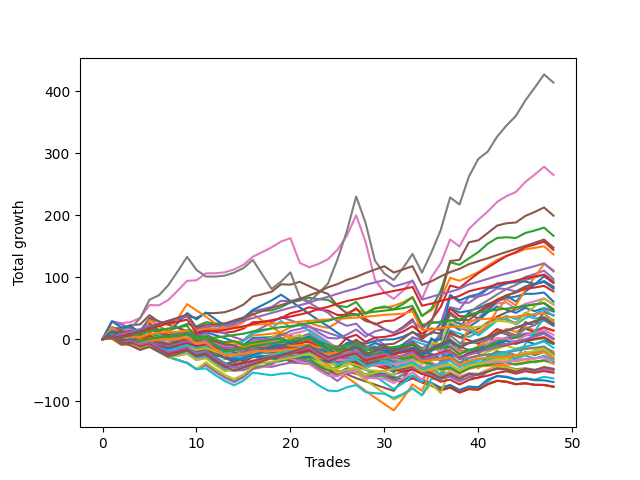

# Long Bulldog 003 
- Symbol: TEST
- Date Range: 07/08/2022 - 07/15/2022
- Trading Period: 7:20-12:30
- Number of Trades: 1



| Name | Win Percent | Profit | Avg Profit / Trade |     | Name | Win Percent | Profit | Avg Profit / Trade |
| ---- | ----------- | ------ | ------------------ | --- | ---- | ----------- | ------ | ------------------ |
| Sorted By <br> Profit | | | | | Sorted By <br> Win Percentage ||||
| Eighty-Five | 0.00 | -7625.00 | -7625.00 |     | Eighty-Five | 0.00 | -7625.00 | -7625.00 |
| Eighty-Four | 0.00 | -7625.00 | -7625.00 |     | Eighty-Four | 0.00 | -7625.00 | -7625.00 |
| Eighty-Three | 0.00 | -7625.00 | -7625.00 |     | Eighty-Three | 0.00 | -7625.00 | -7625.00 |
| Eighty-Two | 0.00 | -7625.00 | -7625.00 |     | Eighty-Two | 0.00 | -7625.00 | -7625.00 |
| Eighty-One | 0.00 | -7625.00 | -7625.00 |     | Eighty-One | 0.00 | -7625.00 | -7625.00 |
| Seventy-Three | 0.00 | -7625.00 | -7625.00 |     | Seventy-Three | 0.00 | -7625.00 | -7625.00 |

## SPECIAL EXIT CONDITIONS 

### Test Seventy-Three
* Sell when the linear regression slope changes to negative
* No Stoploss
* Results:
```
Total Trades: 1
Percent Up: 0.00
Percent Down: 100.00
Total Points Moved Up: -15.25
Potential Profit: -7625.00
Total Points Ups: 0.00 Count Ups: 0
Total Points Downs: -15.25 Count Downs: 1
```

<details><summary>Trades</summary>

<code>In: 2022-07-12 12:15:00		Out: 2022-07-12 12:44:55		Total Position Time: 29:55		Total Move Up: -15.25		Total to Date: -15.25</code> <br />


</details>

## TAKE PROFIT

### Test Eighty-One
* Take Profit of 1 Point
* No Stoploss
* Results:
```
Total Trades: 1
Percent Up: 0.00
Percent Down: 100.00
Total Points Moved Up: -15.25
Potential Profit: -7625.00
Total Points Ups: 0.00 Count Ups: 0
Total Points Downs: -15.25 Count Downs: 1
```

<details><summary>Trades</summary>

<code>In: 2022-07-12 12:15:00		Out: 2022-07-12 12:44:55		Total Position Time: 29:55		Total Move Up: -15.25		Total to Date: -15.25</code> <br />


</details>

### Test Eighty-Two
* Take Profit of 2 Point
* No Stoploss
* Results:
```
Total Trades: 1
Percent Up: 0.00
Percent Down: 100.00
Total Points Moved Up: -15.25
Potential Profit: -7625.00
Total Points Ups: 0.00 Count Ups: 0
Total Points Downs: -15.25 Count Downs: 1
```

<details><summary>Trades</summary>

<code>In: 2022-07-12 12:15:00		Out: 2022-07-12 12:44:55		Total Position Time: 29:55		Total Move Up: -15.25		Total to Date: -15.25</code> <br />


</details>

### Test Eighty-Three
* Take Profit of 3 Point
* No Stoploss
* Results:
```
Total Trades: 1
Percent Up: 0.00
Percent Down: 100.00
Total Points Moved Up: -15.25
Potential Profit: -7625.00
Total Points Ups: 0.00 Count Ups: 0
Total Points Downs: -15.25 Count Downs: 1
```

<details><summary>Trades</summary>

<code>In: 2022-07-12 12:15:00		Out: 2022-07-12 12:44:55		Total Position Time: 29:55		Total Move Up: -15.25		Total to Date: -15.25</code> <br />


</details>

### Test Eighty-Four
* Take Profit of 4 Point
* No Stoploss
* Results:
```
Total Trades: 1
Percent Up: 0.00
Percent Down: 100.00
Total Points Moved Up: -15.25
Potential Profit: -7625.00
Total Points Ups: 0.00 Count Ups: 0
Total Points Downs: -15.25 Count Downs: 1
```

<details><summary>Trades</summary>

<code>In: 2022-07-12 12:15:00		Out: 2022-07-12 12:44:55		Total Position Time: 29:55		Total Move Up: -15.25		Total to Date: -15.25</code> <br />


</details>

### Test Eighty-Five
* Take Profit of 5 Point
* No Stoploss
* Results:
```
Total Trades: 1
Percent Up: 0.00
Percent Down: 100.00
Total Points Moved Up: -15.25
Potential Profit: -7625.00
Total Points Ups: 0.00 Count Ups: 0
Total Points Downs: -15.25 Count Downs: 1
```

<details><summary>Trades</summary>

<code>In: 2022-07-12 12:15:00		Out: 2022-07-12 12:44:55		Total Position Time: 29:55		Total Move Up: -15.25		Total to Date: -15.25</code> <br />


</details>