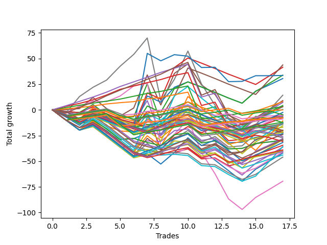

# Long Bulldog 005 DB 
- Symbol: TEST
- Date Range: 03/18/2022 - 07/15/2022
- Trading Period: 7:20-12:30
- Number of Trades: 17



| Name | Win Percent | Profit | Avg Profit / Trade | Avg Time / Trade |      | Name | Win Percent | Profit | Avg Profit / Trade | Avg Time / Trade |
| ---- | ----------- | ------ | ------------------ | ---------------- | ---- | ---- | ----------- | ------ | ------------------ | ---------------- |
| Sorted By <br> Profit | | | | | | Sorted By <br> Win Percentage ||||
| Forty-Seven | 35.29 | 21875.00 | 1286.76 | 19:21 |     | Eighty-Two | 94.12 | 1625.00 | 95.59 | 33:22 |
| Forty-Five | 35.29 | 20750.00 | 1220.59 | 18:14 |     | Eighty-One | 94.12 | -3625.00 | -213.24 | 31:05 |
| Forty-Four | 41.18 | 16875.00 | 992.65 | 13:36 |     | Eighty-Three | 88.24 | -2500.00 | -147.06 | 59:18 |
| Seventy-Three | 47.06 | 16750.00 | 985.29 | 16:26 |     | Eighty-Four | 82.35 | -2875.00 | -169.12 | 73:21 |
| Forty-Two | 41.18 | 15250.00 | 897.06 | 09:24 |     | One Hundred Twenty-Six | 82.35 | -3875.00 | -227.94 | 07:05 |
| Seven | 64.71 | 7125.00 | 419.12 | 128:04 |     | One Hundred Twenty-One | 82.35 | -4500.00 | -264.71 | 04:41 |
| Five | 58.82 | 4500.00 | 264.71 | 74:50 |     | Eighty-Five | 76.47 | 1500.00 | 88.24 | 78:28 |
| Forty-Three | 41.18 | 4000.00 | 235.29 | 10:42 |     | One Hundred Sixteen | 76.47 | 0.00 | 0.00 | 03:16 |
| Forty-Six | 41.18 | 3625.00 | 213.24 | 12:30 |     | One Hundred Twenty-Seven | 76.47 | -6000.00 | -352.94 | 08:08 |
| Two | 52.94 | 2125.00 | 125.00 | 34:28 |     | One Hundred Twenty-Two | 76.47 | -6750.00 | -397.06 | 05:45 |
| Eighty-Two | 94.12 | 1625.00 | 95.59 | 33:22 |     | One Hundred Eleven | 70.59 | -2625.00 | -154.41 | 02:38 |
| Eighty-Five | 76.47 | 1500.00 | 88.24 | 78:28 |     | Seven | 64.71 | 7125.00 | 419.12 | 128:04 |
| Forty-One | 41.18 | 250.00 | 14.71 | 08:26 |     | One Hundred Seventeen | 64.71 | -2375.00 | -139.71 | 03:48 |
| One Hundred Sixteen | 76.47 | 0.00 | 0.00 | 03:16 |     | One Hundred Twelve | 64.71 | -3375.00 | -198.53 | 03:11 |
| One Hundred Fifteen | 47.06 | -1250.00 | -73.53 | 06:30 |     | Five | 58.82 | 4500.00 | 264.71 | 74:50 |
| One Hundred Seventeen | 64.71 | -2375.00 | -139.71 | 03:48 |     | Zero | 58.82 | -11750.00 | -691.18 | 16:27 |
| Eighty-Three | 88.24 | -2500.00 | -147.06 | 59:18 |     | Fifty-Six | 58.82 | -14750.00 | -867.65 | 10:45 |
| Fifty-Eight | 47.06 | -2500.00 | -147.06 | 15:58 |     | One Hundred Twenty-Three | 58.82 | -20000.00 | -1176.47 | 08:44 |
| One Hundred Eleven | 70.59 | -2625.00 | -154.41 | 02:38 |     | Six | 58.82 | -34750.00 | -2044.12 | 107:35 |
| Eighty-Four | 82.35 | -2875.00 | -169.12 | 73:21 |     | Two | 52.94 | 2125.00 | 125.00 | 34:28 |
| One Hundred Twelve | 64.71 | -3375.00 | -198.53 | 03:11 |     | Three | 52.94 | -3875.00 | -227.94 | 34:03 |
| Eighty-One | 94.12 | -3625.00 | -213.24 | 31:05 |     | One | 52.94 | -6750.00 | -397.06 | 22:10 |
| One Hundred Twenty-Six | 82.35 | -3875.00 | -227.94 | 07:05 |     | Fifty-Nine | 52.94 | -7000.00 | -411.76 | 17:19 |
| Three | 52.94 | -3875.00 | -227.94 | 34:03 |     | Fifty-Seven | 52.94 | -12000.00 | -705.88 | 12:55 |
| One Hundred Twenty-One | 82.35 | -4500.00 | -264.71 | 04:41 |     | Sixty-Four | 52.94 | -14750.00 | -867.65 | 11:12 |
| Sixty-Three | 35.29 | -5375.00 | -316.18 | 27:23 |     | One Hundred Twenty-Five | 52.94 | -15875.00 | -933.82 | 12:37 |
| One Hundred Twenty-Seven | 76.47 | -6000.00 | -352.94 | 08:08 |     | One Hundred Twenty-Eight | 52.94 | -19500.00 | -1147.06 | 10:50 |
| Fifty-Four | 35.29 | -6125.00 | -360.29 | 05:58 |     | One Hundred Twenty-Four | 52.94 | -22000.00 | -1294.12 | 11:19 |
| One Hundred Fourteen | 47.06 | -6500.00 | -382.35 | 05:13 |     | Seventy-Three | 47.06 | 16750.00 | 985.29 | 16:26 |
| Sixty-One | 35.29 | -6500.00 | -382.35 | 26:16 |     | One Hundred Fifteen | 47.06 | -1250.00 | -73.53 | 06:30 |
| One Hundred Twenty-Two | 76.47 | -6750.00 | -397.06 | 05:45 |     | Fifty-Eight | 47.06 | -2500.00 | -147.06 | 15:58 |
| One | 52.94 | -6750.00 | -397.06 | 22:10 |     | One Hundred Fourteen | 47.06 | -6500.00 | -382.35 | 05:13 |
| Fifty-Nine | 52.94 | -7000.00 | -411.76 | 17:19 |     | Forty | 47.06 | -8500.00 | -500.00 | 07:10 |
| Sixty | 41.18 | -7750.00 | -455.88 | 21:25 |     | Sixty-Seven | 47.06 | -9875.00 | -580.88 | 17:20 |
| Forty | 47.06 | -8500.00 | -500.00 | 07:10 |     | One Hundred Thirteen | 47.06 | -10875.00 | -639.71 | 04:35 |
| Sixty-Seven | 47.06 | -9875.00 | -580.88 | 17:20 |     | One Hundred Thirty | 47.06 | -14500.00 | -852.94 | 14:31 |
| One Hundred Twenty | 29.41 | -10000.00 | -588.24 | 05:40 |     | Sixty-Five | 47.06 | -17250.00 | -1014.71 | 12:44 |
| Fifty-Three | 29.41 | -10125.00 | -595.59 | 07:07 |     | Four | 47.06 | -18125.00 | -1066.18 | 64:25 |
| Fifty | 29.41 | -10375.00 | -610.29 | 06:21 |     | One Hundred Twenty-Nine | 47.06 | -20250.00 | -1191.18 | 13:21 |
| One Hundred Thirteen | 47.06 | -10875.00 | -639.71 | 04:35 |     | Forty-Four | 41.18 | 16875.00 | 992.65 | 13:36 |
| Fifty-Five | 29.41 | -11000.00 | -647.06 | 06:46 |     | Forty-Two | 41.18 | 15250.00 | 897.06 | 09:24 |
| Fifty-Two | 29.41 | -11000.00 | -647.06 | 06:46 |     | Forty-Three | 41.18 | 4000.00 | 235.29 | 10:42 |
| Forty-Eight | 41.18 | -11375.00 | -669.12 | 05:32 |     | Forty-Six | 41.18 | 3625.00 | 213.24 | 12:30 |
| Fifty-One | 29.41 | -11375.00 | -669.12 | 06:12 |     | Forty-One | 41.18 | 250.00 | 14.71 | 08:26 |
| Zero | 58.82 | -11750.00 | -691.18 | 16:27 |     | Sixty | 41.18 | -7750.00 | -455.88 | 21:25 |
| Fifty-Seven | 52.94 | -12000.00 | -705.88 | 12:55 |     | Forty-Eight | 41.18 | -11375.00 | -669.12 | 05:32 |
| One Hundred Ninteen | 29.41 | -13000.00 | -764.71 | 05:07 |     | Sixty-Six | 41.18 | -14000.00 | -823.53 | 15:45 |
| Forty-Nine | 29.41 | -13625.00 | -801.47 | 06:02 |     | Sixty-Two | 41.18 | -21000.00 | -1235.29 | 20:19 |
| Sixty-Six | 41.18 | -14000.00 | -823.53 | 15:45 |     | Forty-Seven | 35.29 | 21875.00 | 1286.76 | 19:21 |
| One Hundred Thirty | 47.06 | -14500.00 | -852.94 | 14:31 |     | Forty-Five | 35.29 | 20750.00 | 1220.59 | 18:14 |
| Seventy | 35.29 | -14500.00 | -852.94 | 20:15 |     | Sixty-Three | 35.29 | -5375.00 | -316.18 | 27:23 |
| Fifty-Six | 58.82 | -14750.00 | -867.65 | 10:45 |     | Fifty-Four | 35.29 | -6125.00 | -360.29 | 05:58 |
| Sixty-Four | 52.94 | -14750.00 | -867.65 | 11:12 |     | Sixty-One | 35.29 | -6500.00 | -382.35 | 26:16 |
| One Hundred Eighteen | 29.41 | -15375.00 | -904.41 | 05:04 |     | Seventy | 35.29 | -14500.00 | -852.94 | 20:15 |
| One Hundred Twenty-Five | 52.94 | -15875.00 | -933.82 | 12:37 |     | Sixty-Eight | 35.29 | -20500.00 | -1205.88 | 21:17 |
| Sixty-Five | 47.06 | -17250.00 | -1014.71 | 12:44 |     | One Hundred Twenty | 29.41 | -10000.00 | -588.24 | 05:40 |
| Seventy-One | 29.41 | -17875.00 | -1051.47 | 22:36 |     | Fifty-Three | 29.41 | -10125.00 | -595.59 | 07:07 |
| Four | 47.06 | -18125.00 | -1066.18 | 64:25 |     | Fifty | 29.41 | -10375.00 | -610.29 | 06:21 |
| One Hundred Twenty-Eight | 52.94 | -19500.00 | -1147.06 | 10:50 |     | Fifty-Five | 29.41 | -11000.00 | -647.06 | 06:46 |
| One Hundred Twenty-Three | 58.82 | -20000.00 | -1176.47 | 08:44 |     | Fifty-Two | 29.41 | -11000.00 | -647.06 | 06:46 |
| One Hundred Twenty-Nine | 47.06 | -20250.00 | -1191.18 | 13:21 |     | Fifty-One | 29.41 | -11375.00 | -669.12 | 06:12 |
| Sixty-Eight | 35.29 | -20500.00 | -1205.88 | 21:17 |     | One Hundred Ninteen | 29.41 | -13000.00 | -764.71 | 05:07 |
| Sixty-Two | 41.18 | -21000.00 | -1235.29 | 20:19 |     | Forty-Nine | 29.41 | -13625.00 | -801.47 | 06:02 |
| One Hundred Twenty-Four | 52.94 | -22000.00 | -1294.12 | 11:19 |     | One Hundred Eighteen | 29.41 | -15375.00 | -904.41 | 05:04 |
| Sixty-Nine | 29.41 | -23000.00 | -1352.94 | 22:48 |     | Seventy-One | 29.41 | -17875.00 | -1051.47 | 22:36 |
| Six | 58.82 | -34750.00 | -2044.12 | 107:35 |     | Sixty-Nine | 29.41 | -23000.00 | -1352.94 | 22:48 |

## NO STOPLOSS

### Test Zero
* Sell when price hits the middle line of the 20p bollinger
* No Stoploss
* Results:
```
Total Trades: 17
Percent Up: 58.82
Percent Down: 41.18
Total Points Moved Up: -23.50
Potential Profit: -11750.00
Total Points Ups: 32.50 Count Ups: 10
Total Points Downs: -56.00 Count Downs: 7
```

<details><summary>Trades</summary>

<code>In: 2022-03-23 10:23:00		Out: 2022-03-23 10:51:10		Total Position Time: 28:10		Total Move Up: -6.25		Total to Date: -6.25</code> <br />
<code>In: 2022-03-25 08:14:00		Out: 2022-03-25 08:36:55		Total Position Time: 22:55		Total Move Up: -6.00		Total to Date: -12.25</code> <br />
<code>In: 2022-03-28 07:39:00		Out: 2022-03-28 07:43:00		Total Position Time: 04:00		Total Move Up: 3.50		Total to Date: -8.75</code> <br />
<code>In: 2022-03-28 08:27:00		Out: 2022-03-28 09:02:00		Total Position Time: 35:00		Total Move Up: -13.75		Total to Date: -22.50</code> <br />
<code>In: 2022-04-18 08:26:00		Out: 2022-04-18 08:55:05		Total Position Time: 29:05		Total Move Up: -6.50		Total to Date: -29.00</code> <br />
<code>In: 2022-04-20 11:38:00		Out: 2022-04-20 11:48:20		Total Position Time: 10:20		Total Move Up: 1.00		Total to Date: -28.00</code> <br />
<code>In: 2022-05-04 11:36:00		Out: 2022-05-04 11:40:45		Total Position Time: 04:45		Total Move Up: 5.25		Total to Date: -22.75</code> <br />
<code>In: 2022-05-11 09:32:00		Out: 2022-05-11 09:49:25		Total Position Time: 17:25		Total Move Up: -0.50		Total to Date: -23.25</code> <br />
<code>In: 2022-05-17 11:24:00		Out: 2022-05-17 11:31:40		Total Position Time: 07:40		Total Move Up: 10.50		Total to Date: -12.75</code> <br />
<code>In: 2022-05-25 09:29:00		Out: 2022-05-25 09:41:30		Total Position Time: 12:30		Total Move Up: 1.75		Total to Date: -11.00</code> <br />
<code>In: 2022-06-06 08:14:00		Out: 2022-06-06 08:33:05		Total Position Time: 19:05		Total Move Up: -9.25		Total to Date: -20.25</code> <br />
<code>In: 2022-06-06 08:19:00		Out: 2022-06-06 08:33:05		Total Position Time: 14:05		Total Move Up: 2.00		Total to Date: -18.25</code> <br />
<code>In: 2022-06-08 09:29:00		Out: 2022-06-08 09:56:25		Total Position Time: 27:25		Total Move Up: -13.75		Total to Date: -32.00</code> <br />
<code>In: 2022-06-08 09:41:00		Out: 2022-06-08 09:56:25		Total Position Time: 15:25		Total Move Up: 0.50		Total to Date: -31.50</code> <br />
<code>In: 2022-06-29 08:25:00		Out: 2022-06-29 08:32:10		Total Position Time: 07:10		Total Move Up: 4.75		Total to Date: -26.75</code> <br />
<code>In: 2022-07-05 08:02:00		Out: 2022-07-05 08:15:20		Total Position Time: 13:20		Total Move Up: 1.50		Total to Date: -25.25</code> <br />
<code>In: 2022-07-05 08:04:00		Out: 2022-07-05 08:15:20		Total Position Time: 11:20		Total Move Up: 1.75		Total to Date: -23.50</code> <br />


</details>

### Test One
* Sell when the price hits the upper line of the 20p 1std bollinger
* No Stoploss
* Results:
```
Total Trades: 17
Percent Up: 52.94
Percent Down: 47.06
Total Points Moved Up: -13.50
Potential Profit: -6750.00
Total Points Ups: 57.75 Count Ups: 9
Total Points Downs: -71.25 Count Downs: 8
```

<details><summary>Trades</summary>

<code>In: 2022-03-23 10:23:00		Out: 2022-03-23 10:51:50		Total Position Time: 28:50		Total Move Up: -4.50		Total to Date: -4.50</code> <br />
<code>In: 2022-03-25 08:14:00		Out: 2022-03-25 08:41:10		Total Position Time: 27:10		Total Move Up: -4.50		Total to Date: -9.00</code> <br />
<code>In: 2022-03-28 07:39:00		Out: 2022-03-28 07:45:05		Total Position Time: 06:05		Total Move Up: 5.25		Total to Date: -3.75</code> <br />
<code>In: 2022-03-28 08:27:00		Out: 2022-03-28 09:05:25		Total Position Time: 38:25		Total Move Up: -11.75		Total to Date: -15.50</code> <br />
<code>In: 2022-04-18 08:26:00		Out: 2022-04-18 08:57:20		Total Position Time: 31:20		Total Move Up: -5.00		Total to Date: -20.50</code> <br />
<code>In: 2022-04-20 11:38:00		Out: 2022-04-20 12:04:20		Total Position Time: 26:20		Total Move Up: -1.00		Total to Date: -21.50</code> <br />
<code>In: 2022-05-04 11:36:00		Out: 2022-05-04 11:41:40		Total Position Time: 05:40		Total Move Up: 17.25		Total to Date: -4.25</code> <br />
<code>In: 2022-05-11 09:32:00		Out: 2022-05-11 10:24:35		Total Position Time: 52:35		Total Move Up: -23.00		Total to Date: -27.25</code> <br />
<code>In: 2022-05-17 11:24:00		Out: 2022-05-17 11:39:45		Total Position Time: 15:45		Total Move Up: 10.75		Total to Date: -16.50</code> <br />
<code>In: 2022-05-25 09:29:00		Out: 2022-05-25 09:44:30		Total Position Time: 15:30		Total Move Up: 3.50		Total to Date: -13.00</code> <br />
<code>In: 2022-06-06 08:14:00		Out: 2022-06-06 08:39:15		Total Position Time: 25:15		Total Move Up: -10.25		Total to Date: -23.25</code> <br />
<code>In: 2022-06-06 08:19:00		Out: 2022-06-06 08:39:15		Total Position Time: 20:15		Total Move Up: 1.00		Total to Date: -22.25</code> <br />
<code>In: 2022-06-08 09:29:00		Out: 2022-06-08 09:59:05		Total Position Time: 30:05		Total Move Up: -11.25		Total to Date: -33.50</code> <br />
<code>In: 2022-06-08 09:41:00		Out: 2022-06-08 09:59:05		Total Position Time: 18:05		Total Move Up: 3.00		Total to Date: -30.50</code> <br />
<code>In: 2022-06-29 08:25:00		Out: 2022-06-29 08:33:05		Total Position Time: 08:05		Total Move Up: 7.75		Total to Date: -22.75</code> <br />
<code>In: 2022-07-05 08:02:00		Out: 2022-07-05 08:16:45		Total Position Time: 14:45		Total Move Up: 4.50		Total to Date: -18.25</code> <br />
<code>In: 2022-07-05 08:04:00		Out: 2022-07-05 08:16:45		Total Position Time: 12:45		Total Move Up: 4.75		Total to Date: -13.50</code> <br />


</details>

### Test Two
* Sell when the price hits the upper line of the 20p 2std bollinger
* No Stoploss
* Results:
```
Total Trades: 17
Percent Up: 52.94
Percent Down: 47.06
Total Points Moved Up: 4.25
Potential Profit: 2125.00
Total Points Ups: 88.25 Count Ups: 9
Total Points Downs: -84.00 Count Downs: 8
```

<details><summary>Trades</summary>

<code>In: 2022-03-23 10:23:00		Out: 2022-03-23 10:54:30		Total Position Time: 31:30		Total Move Up: -2.00		Total to Date: -2.00</code> <br />
<code>In: 2022-03-25 08:14:00		Out: 2022-03-25 08:41:55		Total Position Time: 27:55		Total Move Up: -0.50		Total to Date: -2.50</code> <br />
<code>In: 2022-03-28 07:39:00		Out: 2022-03-28 07:47:50		Total Position Time: 08:50		Total Move Up: 7.75		Total to Date: 5.25</code> <br />
<code>In: 2022-03-28 08:27:00		Out: 2022-03-28 09:07:10		Total Position Time: 40:10		Total Move Up: -10.50		Total to Date: -5.25</code> <br />
<code>In: 2022-04-18 08:26:00		Out: 2022-04-18 08:59:35		Total Position Time: 33:35		Total Move Up: -2.75		Total to Date: -8.00</code> <br />
<code>In: 2022-04-20 11:38:00		Out: 2022-04-20 12:12:35		Total Position Time: 34:35		Total Move Up: 1.25		Total to Date: -6.75</code> <br />
<code>In: 2022-05-04 11:36:00		Out: 2022-05-04 11:43:55		Total Position Time: 07:55		Total Move Up: 32.25		Total to Date: 25.50</code> <br />
<code>In: 2022-05-11 09:32:00		Out: 2022-05-11 11:04:55		Total Position Time: 92:55		Total Move Up: -37.50		Total to Date: -12.00</code> <br />
<code>In: 2022-05-17 11:24:00		Out: 2022-05-17 11:40:05		Total Position Time: 16:05		Total Move Up: 14.50		Total to Date: 2.50</code> <br />
<code>In: 2022-05-25 09:29:00		Out: 2022-05-25 09:45:20		Total Position Time: 16:20		Total Move Up: 5.25		Total to Date: 7.75</code> <br />
<code>In: 2022-06-06 08:14:00		Out: 2022-06-06 08:43:00		Total Position Time: 29:00		Total Move Up: -8.00		Total to Date: -0.25</code> <br />
<code>In: 2022-06-06 08:19:00		Out: 2022-06-06 08:43:00		Total Position Time: 24:00		Total Move Up: 3.25		Total to Date: 3.00</code> <br />
<code>In: 2022-06-08 09:29:00		Out: 2022-06-08 11:03:45		Total Position Time: 94:45		Total Move Up: -18.50		Total to Date: -15.50</code> <br />
<code>In: 2022-06-08 09:41:00		Out: 2022-06-08 11:03:45		Total Position Time: 82:45		Total Move Up: -4.25		Total to Date: -19.75</code> <br />
<code>In: 2022-06-29 08:25:00		Out: 2022-06-29 08:35:35		Total Position Time: 10:35		Total Move Up: 11.75		Total to Date: -8.00</code> <br />
<code>In: 2022-07-05 08:02:00		Out: 2022-07-05 08:20:35		Total Position Time: 18:35		Total Move Up: 6.00		Total to Date: -2.00</code> <br />
<code>In: 2022-07-05 08:04:00		Out: 2022-07-05 08:20:35		Total Position Time: 16:35		Total Move Up: 6.25		Total to Date: 4.25</code> <br />


</details>

### Test Three
* Sell when price hits the middle line of the 50p bollinger
* No Stoploss
* Results:
```
Total Trades: 17
Percent Up: 52.94
Percent Down: 47.06
Total Points Moved Up: -7.75
Potential Profit: -3875.00
Total Points Ups: 67.75 Count Ups: 9
Total Points Downs: -75.50 Count Downs: 8
```

<details><summary>Trades</summary>

<code>In: 2022-03-23 10:23:00		Out: 2022-03-23 10:55:00		Total Position Time: 32:00		Total Move Up: -1.50		Total to Date: -1.50</code> <br />
<code>In: 2022-03-25 08:14:00		Out: 2022-03-25 08:53:00		Total Position Time: 39:00		Total Move Up: -1.25		Total to Date: -2.75</code> <br />
<code>In: 2022-03-28 07:39:00		Out: 2022-03-28 07:45:10		Total Position Time: 06:10		Total Move Up: 5.75		Total to Date: 3.00</code> <br />
<code>In: 2022-03-28 08:27:00		Out: 2022-03-28 09:25:20		Total Position Time: 58:20		Total Move Up: -14.00		Total to Date: -11.00</code> <br />
<code>In: 2022-04-18 08:26:00		Out: 2022-04-18 09:07:15		Total Position Time: 41:15		Total Move Up: -3.75		Total to Date: -14.75</code> <br />
<code>In: 2022-04-20 11:38:00		Out: 2022-04-20 12:10:10		Total Position Time: 32:10		Total Move Up: -0.25		Total to Date: -15.00</code> <br />
<code>In: 2022-05-04 11:36:00		Out: 2022-05-04 11:41:15		Total Position Time: 05:15		Total Move Up: 11.75		Total to Date: -3.25</code> <br />
<code>In: 2022-05-11 09:32:00		Out: 2022-05-11 11:05:00		Total Position Time: 93:00		Total Move Up: -35.75		Total to Date: -39.00</code> <br />
<code>In: 2022-05-17 11:24:00		Out: 2022-05-17 11:40:05		Total Position Time: 16:05		Total Move Up: 14.50		Total to Date: -24.50</code> <br />
<code>In: 2022-05-25 09:29:00		Out: 2022-05-25 09:49:10		Total Position Time: 20:10		Total Move Up: 8.25		Total to Date: -16.25</code> <br />
<code>In: 2022-06-06 08:14:00		Out: 2022-06-06 08:55:30		Total Position Time: 41:30		Total Move Up: -6.00		Total to Date: -22.25</code> <br />
<code>In: 2022-06-06 08:19:00		Out: 2022-06-06 08:55:30		Total Position Time: 36:30		Total Move Up: 5.25		Total to Date: -17.00</code> <br />
<code>In: 2022-06-08 09:29:00		Out: 2022-06-08 10:19:05		Total Position Time: 50:05		Total Move Up: -13.00		Total to Date: -30.00</code> <br />
<code>In: 2022-06-08 09:41:00		Out: 2022-06-08 10:19:05		Total Position Time: 38:05		Total Move Up: 1.25		Total to Date: -28.75</code> <br />
<code>In: 2022-06-29 08:25:00		Out: 2022-06-29 08:35:35		Total Position Time: 10:35		Total Move Up: 11.75		Total to Date: -17.00</code> <br />
<code>In: 2022-07-05 08:02:00		Out: 2022-07-05 08:32:25		Total Position Time: 30:25		Total Move Up: 4.50		Total to Date: -12.50</code> <br />
<code>In: 2022-07-05 08:04:00		Out: 2022-07-05 08:32:25		Total Position Time: 28:25		Total Move Up: 4.75		Total to Date: -7.75</code> <br />


</details>

### Test Four
* Sell when the price hits the upper line of the 50p 1std bollinger
* No Stoploss
* Results:
```
Total Trades: 17
Percent Up: 47.06
Percent Down: 52.94
Total Points Moved Up: -36.25
Potential Profit: -18125.00
Total Points Ups: 91.50 Count Ups: 8
Total Points Downs: -127.75 Count Downs: 9
```

<details><summary>Trades</summary>

<code>In: 2022-03-23 10:23:00		Out: 2022-03-23 11:27:00		Total Position Time: 64:00		Total Move Up: -2.50		Total to Date: -2.50</code> <br />
<code>In: 2022-03-25 08:14:00		Out: 2022-03-25 09:08:25		Total Position Time: 54:25		Total Move Up: -2.00		Total to Date: -4.50</code> <br />
<code>In: 2022-03-28 07:39:00		Out: 2022-03-28 07:48:05		Total Position Time: 09:05		Total Move Up: 9.00		Total to Date: 4.50</code> <br />
<code>In: 2022-03-28 08:27:00		Out: 2022-03-28 09:35:05		Total Position Time: 68:05		Total Move Up: -12.25		Total to Date: -7.75</code> <br />
<code>In: 2022-04-18 08:26:00		Out: 2022-04-18 09:53:35		Total Position Time: 87:35		Total Move Up: -9.00		Total to Date: -16.75</code> <br />
<code>In: 2022-04-20 11:38:00		Out: 2022-04-20 12:13:35		Total Position Time: 35:35		Total Move Up: 4.50		Total to Date: -12.25</code> <br />
<code>In: 2022-05-04 11:36:00		Out: 2022-05-04 11:42:00		Total Position Time: 06:00		Total Move Up: 21.25		Total to Date: 9.00</code> <br />
<code>In: 2022-05-11 09:32:00		Out: 2022-05-11 11:18:20		Total Position Time: 106:20		Total Move Up: -33.50		Total to Date: -24.50</code> <br />
<code>In: 2022-05-17 11:24:00		Out: 2022-05-17 11:45:50		Total Position Time: 21:50		Total Move Up: 23.00		Total to Date: -1.50</code> <br />
<code>In: 2022-05-25 09:29:00		Out: 2022-05-25 10:10:05		Total Position Time: 41:05		Total Move Up: 6.50		Total to Date: 5.00</code> <br />
<code>In: 2022-06-06 08:14:00		Out: 2022-06-06 09:55:15		Total Position Time: 101:15		Total Move Up: -23.25		Total to Date: -18.25</code> <br />
<code>In: 2022-06-06 08:19:00		Out: 2022-06-06 09:55:15		Total Position Time: 96:15		Total Move Up: -12.00		Total to Date: -30.25</code> <br />
<code>In: 2022-06-08 09:29:00		Out: 2022-06-08 12:12:35		Total Position Time: 163:35		Total Move Up: -23.75		Total to Date: -54.00</code> <br />
<code>In: 2022-06-08 09:41:00		Out: 2022-06-08 12:12:35		Total Position Time: 151:35		Total Move Up: -9.50		Total to Date: -63.50</code> <br />
<code>In: 2022-06-29 08:25:00		Out: 2022-06-29 08:53:10		Total Position Time: 28:10		Total Move Up: 11.50		Total to Date: -52.00</code> <br />
<code>In: 2022-07-05 08:02:00		Out: 2022-07-05 08:33:10		Total Position Time: 31:10		Total Move Up: 7.75		Total to Date: -44.25</code> <br />
<code>In: 2022-07-05 08:04:00		Out: 2022-07-05 08:33:10		Total Position Time: 29:10		Total Move Up: 8.00		Total to Date: -36.25</code> <br />


</details>

### Test Five
* Sell when the price hits the upper line of the 50p 2std bollinger
* No Stoploss
* Results:
```
Total Trades: 17
Percent Up: 58.82
Percent Down: 41.18
Total Points Moved Up: 9.00
Potential Profit: 4500.00
Total Points Ups: 112.25 Count Ups: 10
Total Points Downs: -103.25 Count Downs: 7
```

<details><summary>Trades</summary>

<code>In: 2022-03-23 10:23:00		Out: 2022-03-23 11:30:00		Total Position Time: 67:00		Total Move Up: 0.25		Total to Date: 0.25</code> <br />
<code>In: 2022-03-25 08:14:00		Out: 2022-03-25 09:11:40		Total Position Time: 57:40		Total Move Up: 1.00		Total to Date: 1.25</code> <br />
<code>In: 2022-03-28 07:39:00		Out: 2022-03-28 07:53:50		Total Position Time: 14:50		Total Move Up: 10.75		Total to Date: 12.00</code> <br />
<code>In: 2022-03-28 08:27:00		Out: 2022-03-28 09:39:55		Total Position Time: 72:55		Total Move Up: -10.75		Total to Date: 1.25</code> <br />
<code>In: 2022-04-18 08:26:00		Out: 2022-04-18 09:58:15		Total Position Time: 92:15		Total Move Up: -7.25		Total to Date: -6.00</code> <br />
<code>In: 2022-04-20 11:38:00		Out: 2022-04-20 12:25:45		Total Position Time: 47:45		Total Move Up: 7.75		Total to Date: 1.75</code> <br />
<code>In: 2022-05-04 11:36:00		Out: 2022-05-04 11:43:55		Total Position Time: 07:55		Total Move Up: 32.25		Total to Date: 34.00</code> <br />
<code>In: 2022-05-11 09:32:00		Out: 2022-05-11 11:23:40		Total Position Time: 111:40		Total Move Up: -29.25		Total to Date: 4.75</code> <br />
<code>In: 2022-05-17 11:24:00		Out: 2022-05-17 11:48:40		Total Position Time: 24:40		Total Move Up: 30.75		Total to Date: 35.50</code> <br />
<code>In: 2022-05-25 09:29:00		Out: 2022-05-25 10:29:35		Total Position Time: 60:35		Total Move Up: 9.25		Total to Date: 44.75</code> <br />
<code>In: 2022-06-06 08:14:00		Out: 2022-06-06 09:56:20		Total Position Time: 102:20		Total Move Up: -20.50		Total to Date: 24.25</code> <br />
<code>In: 2022-06-06 08:19:00		Out: 2022-06-06 09:56:20		Total Position Time: 97:20		Total Move Up: -9.25		Total to Date: 15.00</code> <br />
<code>In: 2022-06-08 09:29:00		Out: 2022-06-08 12:21:15		Total Position Time: 172:15		Total Move Up: -20.25		Total to Date: -5.25</code> <br />
<code>In: 2022-06-08 09:41:00		Out: 2022-06-08 12:21:15		Total Position Time: 160:15		Total Move Up: -6.00		Total to Date: -11.25</code> <br />
<code>In: 2022-06-29 08:25:00		Out: 2022-06-29 10:09:35		Total Position Time: 104:35		Total Move Up: 3.50		Total to Date: -7.75</code> <br />
<code>In: 2022-07-05 08:02:00		Out: 2022-07-05 08:42:10		Total Position Time: 40:10		Total Move Up: 8.25		Total to Date: 0.50</code> <br />
<code>In: 2022-07-05 08:04:00		Out: 2022-07-05 08:42:10		Total Position Time: 38:10		Total Move Up: 8.50		Total to Date: 9.00</code> <br />


</details>

### Test Six
* Sell when the price hits the middle line of the 1std VWAP
* No Stoploss
* Results:
```
Total Trades: 17
Percent Up: 58.82
Percent Down: 41.18
Total Points Moved Up: -69.50
Potential Profit: -34750.00
Total Points Ups: 82.50 Count Ups: 10
Total Points Downs: -152.00 Count Downs: 7
```

<details><summary>Trades</summary>

<code>In: 2022-03-23 10:23:00		Out: 2022-03-23 12:47:00		Total Position Time: 144:00		Total Move Up: -3.00		Total to Date: -3.00</code> <br />
<code>In: 2022-03-25 08:14:00		Out: 2022-03-25 10:19:30		Total Position Time: 125:30		Total Move Up: 6.75		Total to Date: 3.75</code> <br />
<code>In: 2022-03-28 07:39:00		Out: 2022-03-28 07:43:15		Total Position Time: 04:15		Total Move Up: 4.75		Total to Date: 8.50</code> <br />
<code>In: 2022-03-28 08:27:00		Out: 2022-03-28 10:24:25		Total Position Time: 117:25		Total Move Up: -0.50		Total to Date: 8.00</code> <br />
<code>In: 2022-04-18 08:26:00		Out: 2022-04-18 10:32:10		Total Position Time: 126:10		Total Move Up: 5.50		Total to Date: 13.50</code> <br />
<code>In: 2022-04-20 11:38:00		Out: 2022-04-20 12:26:10		Total Position Time: 48:10		Total Move Up: 9.75		Total to Date: 23.25</code> <br />
<code>In: 2022-05-04 11:36:00		Out: 2022-05-04 11:37:10		Total Position Time: 01:10		Total Move Up: 2.75		Total to Date: 26.00</code> <br />
<code>In: 2022-05-11 09:32:00		Out: 2022-05-11 12:47:00		Total Position Time: 195:00		Total Move Up: -61.00		Total to Date: -35.00</code> <br />
<code>In: 2022-05-17 11:24:00		Out: 2022-05-17 11:27:25		Total Position Time: 03:25		Total Move Up: 11.25		Total to Date: -23.75</code> <br />
<code>In: 2022-05-25 09:29:00		Out: 2022-05-25 10:37:05		Total Position Time: 68:05		Total Move Up: 14.25		Total to Date: -9.50</code> <br />
<code>In: 2022-06-06 08:14:00		Out: 2022-06-06 12:47:00		Total Position Time: 273:00		Total Move Up: -32.00		Total to Date: -41.50</code> <br />
<code>In: 2022-06-06 08:19:00		Out: 2022-06-06 12:47:00		Total Position Time: 268:00		Total Move Up: -20.75		Total to Date: -62.25</code> <br />
<code>In: 2022-06-08 09:29:00		Out: 2022-06-08 12:47:00		Total Position Time: 198:00		Total Move Up: -24.50		Total to Date: -86.75</code> <br />
<code>In: 2022-06-08 09:41:00		Out: 2022-06-08 12:47:00		Total Position Time: 186:00		Total Move Up: -10.25		Total to Date: -97.00</code> <br />
<code>In: 2022-06-29 08:25:00		Out: 2022-06-29 08:35:35		Total Position Time: 10:35		Total Move Up: 11.75		Total to Date: -85.25</code> <br />
<code>In: 2022-07-05 08:02:00		Out: 2022-07-05 08:33:10		Total Position Time: 31:10		Total Move Up: 7.75		Total to Date: -77.50</code> <br />
<code>In: 2022-07-05 08:04:00		Out: 2022-07-05 08:33:10		Total Position Time: 29:10		Total Move Up: 8.00		Total to Date: -69.50</code> <br />


</details>

### Test Seven
* Sell when the price hits the upper line of the 1std VWAP
* No Stoploss
* Results:
```
Total Trades: 17
Percent Up: 64.71
Percent Down: 35.29
Total Points Moved Up: 14.25
Potential Profit: 7125.00
Total Points Ups: 165.75 Count Ups: 11
Total Points Downs: -151.50 Count Downs: 6
```

<details><summary>Trades</summary>

<code>In: 2022-03-23 10:23:00		Out: 2022-03-23 12:47:00		Total Position Time: 144:00		Total Move Up: -3.00		Total to Date: -3.00</code> <br />
<code>In: 2022-03-25 08:14:00		Out: 2022-03-25 11:04:05		Total Position Time: 170:05		Total Move Up: 16.00		Total to Date: 13.00</code> <br />
<code>In: 2022-03-28 07:39:00		Out: 2022-03-28 07:48:05		Total Position Time: 09:05		Total Move Up: 9.00		Total to Date: 22.00</code> <br />
<code>In: 2022-03-28 08:27:00		Out: 2022-03-28 11:29:05		Total Position Time: 182:05		Total Move Up: 7.00		Total to Date: 29.00</code> <br />
<code>In: 2022-04-18 08:26:00		Out: 2022-04-18 10:35:50		Total Position Time: 129:50		Total Move Up: 13.50		Total to Date: 42.50</code> <br />
<code>In: 2022-04-20 11:38:00		Out: 2022-04-20 12:47:00		Total Position Time: 69:00		Total Move Up: 11.50		Total to Date: 54.00</code> <br />
<code>In: 2022-05-04 11:36:00		Out: 2022-05-04 11:41:35		Total Position Time: 05:35		Total Move Up: 16.00		Total to Date: 70.00</code> <br />
<code>In: 2022-05-11 09:32:00		Out: 2022-05-11 12:47:00		Total Position Time: 195:00		Total Move Up: -61.00		Total to Date: 9.00</code> <br />
<code>In: 2022-05-17 11:24:00		Out: 2022-05-17 11:40:20		Total Position Time: 16:20		Total Move Up: 20.75		Total to Date: 29.75</code> <br />
<code>In: 2022-05-25 09:29:00		Out: 2022-05-25 11:02:25		Total Position Time: 93:25		Total Move Up: 27.50		Total to Date: 57.25</code> <br />
<code>In: 2022-06-06 08:14:00		Out: 2022-06-06 12:47:00		Total Position Time: 273:00		Total Move Up: -32.00		Total to Date: 25.25</code> <br />
<code>In: 2022-06-06 08:19:00		Out: 2022-06-06 12:47:00		Total Position Time: 268:00		Total Move Up: -20.75		Total to Date: 4.50</code> <br />
<code>In: 2022-06-08 09:29:00		Out: 2022-06-08 12:47:00		Total Position Time: 198:00		Total Move Up: -24.50		Total to Date: -20.00</code> <br />
<code>In: 2022-06-08 09:41:00		Out: 2022-06-08 12:47:00		Total Position Time: 186:00		Total Move Up: -10.25		Total to Date: -30.25</code> <br />
<code>In: 2022-06-29 08:25:00		Out: 2022-06-29 11:02:00		Total Position Time: 157:00		Total Move Up: 15.75		Total to Date: -14.50</code> <br />
<code>In: 2022-07-05 08:02:00		Out: 2022-07-05 08:43:25		Total Position Time: 41:25		Total Move Up: 14.25		Total to Date: -0.25</code> <br />
<code>In: 2022-07-05 08:04:00		Out: 2022-07-05 08:43:25		Total Position Time: 39:25		Total Move Up: 14.50		Total to Date: 14.25</code> <br />


</details>

## STOPLOSS OF 5

### Test Forty
* Sell when price hits the middle line of the 20p bollinger
* Stoploss is 5 points
* Results:
```
Total Trades: 17
Percent Up: 47.06
Percent Down: 52.94
Total Points Moved Up: -17.00
Potential Profit: -8500.00
Total Points Ups: 30.00 Count Ups: 8
Total Points Downs: -47.00 Count Downs: 9
```

<details><summary>Trades</summary>

<code>In: 2022-03-23 10:23:00		Out: 2022-03-23 10:25:30		Total Position Time: 02:30		Total Move Up: -5.25		Total to Date: -5.25</code> <br />
<code>In: 2022-03-25 08:14:00		Out: 2022-03-25 08:24:25		Total Position Time: 10:25		Total Move Up: -4.75		Total to Date: -10.00</code> <br />
<code>In: 2022-03-28 07:39:00		Out: 2022-03-28 07:43:00		Total Position Time: 04:00		Total Move Up: 3.50		Total to Date: -6.50</code> <br />
<code>In: 2022-03-28 08:27:00		Out: 2022-03-28 08:33:30		Total Position Time: 06:30		Total Move Up: -5.50		Total to Date: -12.00</code> <br />
<code>In: 2022-04-18 08:26:00		Out: 2022-04-18 08:33:50		Total Position Time: 07:50		Total Move Up: -4.75		Total to Date: -16.75</code> <br />
<code>In: 2022-04-20 11:38:00		Out: 2022-04-20 11:48:20		Total Position Time: 10:20		Total Move Up: 1.00		Total to Date: -15.75</code> <br />
<code>In: 2022-05-04 11:36:00		Out: 2022-05-04 11:40:45		Total Position Time: 04:45		Total Move Up: 5.25		Total to Date: -10.50</code> <br />
<code>In: 2022-05-11 09:32:00		Out: 2022-05-11 09:43:45		Total Position Time: 11:45		Total Move Up: -6.00		Total to Date: -16.50</code> <br />
<code>In: 2022-05-17 11:24:00		Out: 2022-05-17 11:31:40		Total Position Time: 07:40		Total Move Up: 10.50		Total to Date: -6.00</code> <br />
<code>In: 2022-05-25 09:29:00		Out: 2022-05-25 09:41:30		Total Position Time: 12:30		Total Move Up: 1.75		Total to Date: -4.25</code> <br />
<code>In: 2022-06-06 08:14:00		Out: 2022-06-06 08:16:45		Total Position Time: 02:45		Total Move Up: -5.00		Total to Date: -9.25</code> <br />
<code>In: 2022-06-06 08:19:00		Out: 2022-06-06 08:20:20		Total Position Time: 01:20		Total Move Up: -5.25		Total to Date: -14.50</code> <br />
<code>In: 2022-06-08 09:29:00		Out: 2022-06-08 09:33:00		Total Position Time: 04:00		Total Move Up: -5.50		Total to Date: -20.00</code> <br />
<code>In: 2022-06-08 09:41:00		Out: 2022-06-08 09:44:45		Total Position Time: 03:45		Total Move Up: -5.00		Total to Date: -25.00</code> <br />
<code>In: 2022-06-29 08:25:00		Out: 2022-06-29 08:32:10		Total Position Time: 07:10		Total Move Up: 4.75		Total to Date: -20.25</code> <br />
<code>In: 2022-07-05 08:02:00		Out: 2022-07-05 08:15:20		Total Position Time: 13:20		Total Move Up: 1.50		Total to Date: -18.75</code> <br />
<code>In: 2022-07-05 08:04:00		Out: 2022-07-05 08:15:20		Total Position Time: 11:20		Total Move Up: 1.75		Total to Date: -17.00</code> <br />


</details>

### Test Forty-One
* Sell when the price hits the upper line of the 20p 1std bollinger
* Stoploss is 5 points
* Results:
```
Total Trades: 17
Percent Up: 41.18
Percent Down: 58.82
Total Points Moved Up: 0.50
Potential Profit: 250.00
Total Points Ups: 53.75 Count Ups: 7
Total Points Downs: -53.25 Count Downs: 10
```

<details><summary>Trades</summary>

<code>In: 2022-03-23 10:23:00		Out: 2022-03-23 10:25:30		Total Position Time: 02:30		Total Move Up: -5.25		Total to Date: -5.25</code> <br />
<code>In: 2022-03-25 08:14:00		Out: 2022-03-25 08:24:25		Total Position Time: 10:25		Total Move Up: -4.75		Total to Date: -10.00</code> <br />
<code>In: 2022-03-28 07:39:00		Out: 2022-03-28 07:45:05		Total Position Time: 06:05		Total Move Up: 5.25		Total to Date: -4.75</code> <br />
<code>In: 2022-03-28 08:27:00		Out: 2022-03-28 08:33:30		Total Position Time: 06:30		Total Move Up: -5.50		Total to Date: -10.25</code> <br />
<code>In: 2022-04-18 08:26:00		Out: 2022-04-18 08:33:50		Total Position Time: 07:50		Total Move Up: -4.75		Total to Date: -15.00</code> <br />
<code>In: 2022-04-20 11:38:00		Out: 2022-04-20 11:52:05		Total Position Time: 14:05		Total Move Up: -6.25		Total to Date: -21.25</code> <br />
<code>In: 2022-05-04 11:36:00		Out: 2022-05-04 11:41:40		Total Position Time: 05:40		Total Move Up: 17.25		Total to Date: -4.00</code> <br />
<code>In: 2022-05-11 09:32:00		Out: 2022-05-11 09:43:45		Total Position Time: 11:45		Total Move Up: -6.00		Total to Date: -10.00</code> <br />
<code>In: 2022-05-17 11:24:00		Out: 2022-05-17 11:39:45		Total Position Time: 15:45		Total Move Up: 10.75		Total to Date: 0.75</code> <br />
<code>In: 2022-05-25 09:29:00		Out: 2022-05-25 09:44:30		Total Position Time: 15:30		Total Move Up: 3.50		Total to Date: 4.25</code> <br />
<code>In: 2022-06-06 08:14:00		Out: 2022-06-06 08:16:45		Total Position Time: 02:45		Total Move Up: -5.00		Total to Date: -0.75</code> <br />
<code>In: 2022-06-06 08:19:00		Out: 2022-06-06 08:20:20		Total Position Time: 01:20		Total Move Up: -5.25		Total to Date: -6.00</code> <br />
<code>In: 2022-06-08 09:29:00		Out: 2022-06-08 09:33:00		Total Position Time: 04:00		Total Move Up: -5.50		Total to Date: -11.50</code> <br />
<code>In: 2022-06-08 09:41:00		Out: 2022-06-08 09:44:45		Total Position Time: 03:45		Total Move Up: -5.00		Total to Date: -16.50</code> <br />
<code>In: 2022-06-29 08:25:00		Out: 2022-06-29 08:33:05		Total Position Time: 08:05		Total Move Up: 7.75		Total to Date: -8.75</code> <br />
<code>In: 2022-07-05 08:02:00		Out: 2022-07-05 08:16:45		Total Position Time: 14:45		Total Move Up: 4.50		Total to Date: -4.25</code> <br />
<code>In: 2022-07-05 08:04:00		Out: 2022-07-05 08:16:45		Total Position Time: 12:45		Total Move Up: 4.75		Total to Date: 0.50</code> <br />


</details>

### Test Forty-Two
* Sell when the price hits the upper line of the 20p 2std bollinger
* Stoploss is 5 points
* Results:
```
Total Trades: 17
Percent Up: 41.18
Percent Down: 58.82
Total Points Moved Up: 30.50
Potential Profit: 15250.00
Total Points Ups: 83.75 Count Ups: 7
Total Points Downs: -53.25 Count Downs: 10
```

<details><summary>Trades</summary>

<code>In: 2022-03-23 10:23:00		Out: 2022-03-23 10:25:30		Total Position Time: 02:30		Total Move Up: -5.25		Total to Date: -5.25</code> <br />
<code>In: 2022-03-25 08:14:00		Out: 2022-03-25 08:24:25		Total Position Time: 10:25		Total Move Up: -4.75		Total to Date: -10.00</code> <br />
<code>In: 2022-03-28 07:39:00		Out: 2022-03-28 07:47:50		Total Position Time: 08:50		Total Move Up: 7.75		Total to Date: -2.25</code> <br />
<code>In: 2022-03-28 08:27:00		Out: 2022-03-28 08:33:30		Total Position Time: 06:30		Total Move Up: -5.50		Total to Date: -7.75</code> <br />
<code>In: 2022-04-18 08:26:00		Out: 2022-04-18 08:33:50		Total Position Time: 07:50		Total Move Up: -4.75		Total to Date: -12.50</code> <br />
<code>In: 2022-04-20 11:38:00		Out: 2022-04-20 11:52:05		Total Position Time: 14:05		Total Move Up: -6.25		Total to Date: -18.75</code> <br />
<code>In: 2022-05-04 11:36:00		Out: 2022-05-04 11:43:55		Total Position Time: 07:55		Total Move Up: 32.25		Total to Date: 13.50</code> <br />
<code>In: 2022-05-11 09:32:00		Out: 2022-05-11 09:43:45		Total Position Time: 11:45		Total Move Up: -6.00		Total to Date: 7.50</code> <br />
<code>In: 2022-05-17 11:24:00		Out: 2022-05-17 11:40:05		Total Position Time: 16:05		Total Move Up: 14.50		Total to Date: 22.00</code> <br />
<code>In: 2022-05-25 09:29:00		Out: 2022-05-25 09:45:20		Total Position Time: 16:20		Total Move Up: 5.25		Total to Date: 27.25</code> <br />
<code>In: 2022-06-06 08:14:00		Out: 2022-06-06 08:16:45		Total Position Time: 02:45		Total Move Up: -5.00		Total to Date: 22.25</code> <br />
<code>In: 2022-06-06 08:19:00		Out: 2022-06-06 08:20:20		Total Position Time: 01:20		Total Move Up: -5.25		Total to Date: 17.00</code> <br />
<code>In: 2022-06-08 09:29:00		Out: 2022-06-08 09:33:00		Total Position Time: 04:00		Total Move Up: -5.50		Total to Date: 11.50</code> <br />
<code>In: 2022-06-08 09:41:00		Out: 2022-06-08 09:44:45		Total Position Time: 03:45		Total Move Up: -5.00		Total to Date: 6.50</code> <br />
<code>In: 2022-06-29 08:25:00		Out: 2022-06-29 08:35:35		Total Position Time: 10:35		Total Move Up: 11.75		Total to Date: 18.25</code> <br />
<code>In: 2022-07-05 08:02:00		Out: 2022-07-05 08:20:35		Total Position Time: 18:35		Total Move Up: 6.00		Total to Date: 24.25</code> <br />
<code>In: 2022-07-05 08:04:00		Out: 2022-07-05 08:20:35		Total Position Time: 16:35		Total Move Up: 6.25		Total to Date: 30.50</code> <br />


</details>

### Test Forty-Three
* Sell when price hits the middle line of the 50p bollinger
* Stoploss is 5 points
* Results:
```
Total Trades: 17
Percent Up: 41.18
Percent Down: 58.82
Total Points Moved Up: 8.00
Potential Profit: 4000.00
Total Points Ups: 61.25 Count Ups: 7
Total Points Downs: -53.25 Count Downs: 10
```

<details><summary>Trades</summary>

<code>In: 2022-03-23 10:23:00		Out: 2022-03-23 10:25:30		Total Position Time: 02:30		Total Move Up: -5.25		Total to Date: -5.25</code> <br />
<code>In: 2022-03-25 08:14:00		Out: 2022-03-25 08:24:25		Total Position Time: 10:25		Total Move Up: -4.75		Total to Date: -10.00</code> <br />
<code>In: 2022-03-28 07:39:00		Out: 2022-03-28 07:45:10		Total Position Time: 06:10		Total Move Up: 5.75		Total to Date: -4.25</code> <br />
<code>In: 2022-03-28 08:27:00		Out: 2022-03-28 08:33:30		Total Position Time: 06:30		Total Move Up: -5.50		Total to Date: -9.75</code> <br />
<code>In: 2022-04-18 08:26:00		Out: 2022-04-18 08:33:50		Total Position Time: 07:50		Total Move Up: -4.75		Total to Date: -14.50</code> <br />
<code>In: 2022-04-20 11:38:00		Out: 2022-04-20 11:52:05		Total Position Time: 14:05		Total Move Up: -6.25		Total to Date: -20.75</code> <br />
<code>In: 2022-05-04 11:36:00		Out: 2022-05-04 11:41:15		Total Position Time: 05:15		Total Move Up: 11.75		Total to Date: -9.00</code> <br />
<code>In: 2022-05-11 09:32:00		Out: 2022-05-11 09:43:45		Total Position Time: 11:45		Total Move Up: -6.00		Total to Date: -15.00</code> <br />
<code>In: 2022-05-17 11:24:00		Out: 2022-05-17 11:40:05		Total Position Time: 16:05		Total Move Up: 14.50		Total to Date: -0.50</code> <br />
<code>In: 2022-05-25 09:29:00		Out: 2022-05-25 09:49:10		Total Position Time: 20:10		Total Move Up: 8.25		Total to Date: 7.75</code> <br />
<code>In: 2022-06-06 08:14:00		Out: 2022-06-06 08:16:45		Total Position Time: 02:45		Total Move Up: -5.00		Total to Date: 2.75</code> <br />
<code>In: 2022-06-06 08:19:00		Out: 2022-06-06 08:20:20		Total Position Time: 01:20		Total Move Up: -5.25		Total to Date: -2.50</code> <br />
<code>In: 2022-06-08 09:29:00		Out: 2022-06-08 09:33:00		Total Position Time: 04:00		Total Move Up: -5.50		Total to Date: -8.00</code> <br />
<code>In: 2022-06-08 09:41:00		Out: 2022-06-08 09:44:45		Total Position Time: 03:45		Total Move Up: -5.00		Total to Date: -13.00</code> <br />
<code>In: 2022-06-29 08:25:00		Out: 2022-06-29 08:35:35		Total Position Time: 10:35		Total Move Up: 11.75		Total to Date: -1.25</code> <br />
<code>In: 2022-07-05 08:02:00		Out: 2022-07-05 08:32:25		Total Position Time: 30:25		Total Move Up: 4.50		Total to Date: 3.25</code> <br />
<code>In: 2022-07-05 08:04:00		Out: 2022-07-05 08:32:25		Total Position Time: 28:25		Total Move Up: 4.75		Total to Date: 8.00</code> <br />


</details>

### Test Forty-Four
* Sell when the price hits the upper line of the 50p 1std bollinger
* Stoploss is 5 points
* Results:
```
Total Trades: 17
Percent Up: 41.18
Percent Down: 58.82
Total Points Moved Up: 33.75
Potential Profit: 16875.00
Total Points Ups: 87.00 Count Ups: 7
Total Points Downs: -53.25 Count Downs: 10
```

<details><summary>Trades</summary>

<code>In: 2022-03-23 10:23:00		Out: 2022-03-23 10:25:30		Total Position Time: 02:30		Total Move Up: -5.25		Total to Date: -5.25</code> <br />
<code>In: 2022-03-25 08:14:00		Out: 2022-03-25 08:24:25		Total Position Time: 10:25		Total Move Up: -4.75		Total to Date: -10.00</code> <br />
<code>In: 2022-03-28 07:39:00		Out: 2022-03-28 07:48:05		Total Position Time: 09:05		Total Move Up: 9.00		Total to Date: -1.00</code> <br />
<code>In: 2022-03-28 08:27:00		Out: 2022-03-28 08:33:30		Total Position Time: 06:30		Total Move Up: -5.50		Total to Date: -6.50</code> <br />
<code>In: 2022-04-18 08:26:00		Out: 2022-04-18 08:33:50		Total Position Time: 07:50		Total Move Up: -4.75		Total to Date: -11.25</code> <br />
<code>In: 2022-04-20 11:38:00		Out: 2022-04-20 11:52:05		Total Position Time: 14:05		Total Move Up: -6.25		Total to Date: -17.50</code> <br />
<code>In: 2022-05-04 11:36:00		Out: 2022-05-04 11:42:00		Total Position Time: 06:00		Total Move Up: 21.25		Total to Date: 3.75</code> <br />
<code>In: 2022-05-11 09:32:00		Out: 2022-05-11 09:43:45		Total Position Time: 11:45		Total Move Up: -6.00		Total to Date: -2.25</code> <br />
<code>In: 2022-05-17 11:24:00		Out: 2022-05-17 11:45:50		Total Position Time: 21:50		Total Move Up: 23.00		Total to Date: 20.75</code> <br />
<code>In: 2022-05-25 09:29:00		Out: 2022-05-25 10:10:05		Total Position Time: 41:05		Total Move Up: 6.50		Total to Date: 27.25</code> <br />
<code>In: 2022-06-06 08:14:00		Out: 2022-06-06 08:16:45		Total Position Time: 02:45		Total Move Up: -5.00		Total to Date: 22.25</code> <br />
<code>In: 2022-06-06 08:19:00		Out: 2022-06-06 08:20:20		Total Position Time: 01:20		Total Move Up: -5.25		Total to Date: 17.00</code> <br />
<code>In: 2022-06-08 09:29:00		Out: 2022-06-08 09:33:00		Total Position Time: 04:00		Total Move Up: -5.50		Total to Date: 11.50</code> <br />
<code>In: 2022-06-08 09:41:00		Out: 2022-06-08 09:44:45		Total Position Time: 03:45		Total Move Up: -5.00		Total to Date: 6.50</code> <br />
<code>In: 2022-06-29 08:25:00		Out: 2022-06-29 08:53:10		Total Position Time: 28:10		Total Move Up: 11.50		Total to Date: 18.00</code> <br />
<code>In: 2022-07-05 08:02:00		Out: 2022-07-05 08:33:10		Total Position Time: 31:10		Total Move Up: 7.75		Total to Date: 25.75</code> <br />
<code>In: 2022-07-05 08:04:00		Out: 2022-07-05 08:33:10		Total Position Time: 29:10		Total Move Up: 8.00		Total to Date: 33.75</code> <br />


</details>

### Test Forty-Five
* Sell when the price hits the upper line of the 50p 2std bollinger
* Stoploss is 5 points
* Results:
```
Total Trades: 17
Percent Up: 35.29
Percent Down: 64.71
Total Points Moved Up: 41.50
Potential Profit: 20750.00
Total Points Ups: 99.75 Count Ups: 6
Total Points Downs: -58.25 Count Downs: 11
```

<details><summary>Trades</summary>

<code>In: 2022-03-23 10:23:00		Out: 2022-03-23 10:25:30		Total Position Time: 02:30		Total Move Up: -5.25		Total to Date: -5.25</code> <br />
<code>In: 2022-03-25 08:14:00		Out: 2022-03-25 08:24:25		Total Position Time: 10:25		Total Move Up: -4.75		Total to Date: -10.00</code> <br />
<code>In: 2022-03-28 07:39:00		Out: 2022-03-28 07:53:50		Total Position Time: 14:50		Total Move Up: 10.75		Total to Date: 0.75</code> <br />
<code>In: 2022-03-28 08:27:00		Out: 2022-03-28 08:33:30		Total Position Time: 06:30		Total Move Up: -5.50		Total to Date: -4.75</code> <br />
<code>In: 2022-04-18 08:26:00		Out: 2022-04-18 08:33:50		Total Position Time: 07:50		Total Move Up: -4.75		Total to Date: -9.50</code> <br />
<code>In: 2022-04-20 11:38:00		Out: 2022-04-20 11:52:05		Total Position Time: 14:05		Total Move Up: -6.25		Total to Date: -15.75</code> <br />
<code>In: 2022-05-04 11:36:00		Out: 2022-05-04 11:43:55		Total Position Time: 07:55		Total Move Up: 32.25		Total to Date: 16.50</code> <br />
<code>In: 2022-05-11 09:32:00		Out: 2022-05-11 09:43:45		Total Position Time: 11:45		Total Move Up: -6.00		Total to Date: 10.50</code> <br />
<code>In: 2022-05-17 11:24:00		Out: 2022-05-17 11:48:40		Total Position Time: 24:40		Total Move Up: 30.75		Total to Date: 41.25</code> <br />
<code>In: 2022-05-25 09:29:00		Out: 2022-05-25 10:29:35		Total Position Time: 60:35		Total Move Up: 9.25		Total to Date: 50.50</code> <br />
<code>In: 2022-06-06 08:14:00		Out: 2022-06-06 08:16:45		Total Position Time: 02:45		Total Move Up: -5.00		Total to Date: 45.50</code> <br />
<code>In: 2022-06-06 08:19:00		Out: 2022-06-06 08:20:20		Total Position Time: 01:20		Total Move Up: -5.25		Total to Date: 40.25</code> <br />
<code>In: 2022-06-08 09:29:00		Out: 2022-06-08 09:33:00		Total Position Time: 04:00		Total Move Up: -5.50		Total to Date: 34.75</code> <br />
<code>In: 2022-06-08 09:41:00		Out: 2022-06-08 09:44:45		Total Position Time: 03:45		Total Move Up: -5.00		Total to Date: 29.75</code> <br />
<code>In: 2022-06-29 08:25:00		Out: 2022-06-29 09:23:50		Total Position Time: 58:50		Total Move Up: -5.00		Total to Date: 24.75</code> <br />
<code>In: 2022-07-05 08:02:00		Out: 2022-07-05 08:42:10		Total Position Time: 40:10		Total Move Up: 8.25		Total to Date: 33.00</code> <br />
<code>In: 2022-07-05 08:04:00		Out: 2022-07-05 08:42:10		Total Position Time: 38:10		Total Move Up: 8.50		Total to Date: 41.50</code> <br />


</details>

### Test Forty-Six
* Sell when the price hits the middle line of the 1std VWAP
* Stoploss is 5 points
* Results:
```
Total Trades: 17
Percent Up: 41.18
Percent Down: 58.82
Total Points Moved Up: 7.25
Potential Profit: 3625.00
Total Points Ups: 60.50 Count Ups: 7
Total Points Downs: -53.25 Count Downs: 10
```

<details><summary>Trades</summary>

<code>In: 2022-03-23 10:23:00		Out: 2022-03-23 10:25:30		Total Position Time: 02:30		Total Move Up: -5.25		Total to Date: -5.25</code> <br />
<code>In: 2022-03-25 08:14:00		Out: 2022-03-25 08:24:25		Total Position Time: 10:25		Total Move Up: -4.75		Total to Date: -10.00</code> <br />
<code>In: 2022-03-28 07:39:00		Out: 2022-03-28 07:43:15		Total Position Time: 04:15		Total Move Up: 4.75		Total to Date: -5.25</code> <br />
<code>In: 2022-03-28 08:27:00		Out: 2022-03-28 08:33:30		Total Position Time: 06:30		Total Move Up: -5.50		Total to Date: -10.75</code> <br />
<code>In: 2022-04-18 08:26:00		Out: 2022-04-18 08:33:50		Total Position Time: 07:50		Total Move Up: -4.75		Total to Date: -15.50</code> <br />
<code>In: 2022-04-20 11:38:00		Out: 2022-04-20 11:52:05		Total Position Time: 14:05		Total Move Up: -6.25		Total to Date: -21.75</code> <br />
<code>In: 2022-05-04 11:36:00		Out: 2022-05-04 11:37:10		Total Position Time: 01:10		Total Move Up: 2.75		Total to Date: -19.00</code> <br />
<code>In: 2022-05-11 09:32:00		Out: 2022-05-11 09:43:45		Total Position Time: 11:45		Total Move Up: -6.00		Total to Date: -25.00</code> <br />
<code>In: 2022-05-17 11:24:00		Out: 2022-05-17 11:27:25		Total Position Time: 03:25		Total Move Up: 11.25		Total to Date: -13.75</code> <br />
<code>In: 2022-05-25 09:29:00		Out: 2022-05-25 10:37:05		Total Position Time: 68:05		Total Move Up: 14.25		Total to Date: 0.50</code> <br />
<code>In: 2022-06-06 08:14:00		Out: 2022-06-06 08:16:45		Total Position Time: 02:45		Total Move Up: -5.00		Total to Date: -4.50</code> <br />
<code>In: 2022-06-06 08:19:00		Out: 2022-06-06 08:20:20		Total Position Time: 01:20		Total Move Up: -5.25		Total to Date: -9.75</code> <br />
<code>In: 2022-06-08 09:29:00		Out: 2022-06-08 09:33:00		Total Position Time: 04:00		Total Move Up: -5.50		Total to Date: -15.25</code> <br />
<code>In: 2022-06-08 09:41:00		Out: 2022-06-08 09:44:45		Total Position Time: 03:45		Total Move Up: -5.00		Total to Date: -20.25</code> <br />
<code>In: 2022-06-29 08:25:00		Out: 2022-06-29 08:35:35		Total Position Time: 10:35		Total Move Up: 11.75		Total to Date: -8.50</code> <br />
<code>In: 2022-07-05 08:02:00		Out: 2022-07-05 08:33:10		Total Position Time: 31:10		Total Move Up: 7.75		Total to Date: -0.75</code> <br />
<code>In: 2022-07-05 08:04:00		Out: 2022-07-05 08:33:10		Total Position Time: 29:10		Total Move Up: 8.00		Total to Date: 7.25</code> <br />


</details>

### Test Forty-Seven
* Sell when the price hits the upper line of the 1std VWAP
* Stoploss is 5 points
* Results:
```
Total Trades: 17
Percent Up: 35.29
Percent Down: 64.71
Total Points Moved Up: 43.75
Potential Profit: 21875.00
Total Points Ups: 102.00 Count Ups: 6
Total Points Downs: -58.25 Count Downs: 11
```

<details><summary>Trades</summary>

<code>In: 2022-03-23 10:23:00		Out: 2022-03-23 10:25:30		Total Position Time: 02:30		Total Move Up: -5.25		Total to Date: -5.25</code> <br />
<code>In: 2022-03-25 08:14:00		Out: 2022-03-25 08:24:25		Total Position Time: 10:25		Total Move Up: -4.75		Total to Date: -10.00</code> <br />
<code>In: 2022-03-28 07:39:00		Out: 2022-03-28 07:48:05		Total Position Time: 09:05		Total Move Up: 9.00		Total to Date: -1.00</code> <br />
<code>In: 2022-03-28 08:27:00		Out: 2022-03-28 08:33:30		Total Position Time: 06:30		Total Move Up: -5.50		Total to Date: -6.50</code> <br />
<code>In: 2022-04-18 08:26:00		Out: 2022-04-18 08:33:50		Total Position Time: 07:50		Total Move Up: -4.75		Total to Date: -11.25</code> <br />
<code>In: 2022-04-20 11:38:00		Out: 2022-04-20 11:52:05		Total Position Time: 14:05		Total Move Up: -6.25		Total to Date: -17.50</code> <br />
<code>In: 2022-05-04 11:36:00		Out: 2022-05-04 11:41:35		Total Position Time: 05:35		Total Move Up: 16.00		Total to Date: -1.50</code> <br />
<code>In: 2022-05-11 09:32:00		Out: 2022-05-11 09:43:45		Total Position Time: 11:45		Total Move Up: -6.00		Total to Date: -7.50</code> <br />
<code>In: 2022-05-17 11:24:00		Out: 2022-05-17 11:40:20		Total Position Time: 16:20		Total Move Up: 20.75		Total to Date: 13.25</code> <br />
<code>In: 2022-05-25 09:29:00		Out: 2022-05-25 11:02:25		Total Position Time: 93:25		Total Move Up: 27.50		Total to Date: 40.75</code> <br />
<code>In: 2022-06-06 08:14:00		Out: 2022-06-06 08:16:45		Total Position Time: 02:45		Total Move Up: -5.00		Total to Date: 35.75</code> <br />
<code>In: 2022-06-06 08:19:00		Out: 2022-06-06 08:20:20		Total Position Time: 01:20		Total Move Up: -5.25		Total to Date: 30.50</code> <br />
<code>In: 2022-06-08 09:29:00		Out: 2022-06-08 09:33:00		Total Position Time: 04:00		Total Move Up: -5.50		Total to Date: 25.00</code> <br />
<code>In: 2022-06-08 09:41:00		Out: 2022-06-08 09:44:45		Total Position Time: 03:45		Total Move Up: -5.00		Total to Date: 20.00</code> <br />
<code>In: 2022-06-29 08:25:00		Out: 2022-06-29 09:23:50		Total Position Time: 58:50		Total Move Up: -5.00		Total to Date: 15.00</code> <br />
<code>In: 2022-07-05 08:02:00		Out: 2022-07-05 08:43:25		Total Position Time: 41:25		Total Move Up: 14.25		Total to Date: 29.25</code> <br />
<code>In: 2022-07-05 08:04:00		Out: 2022-07-05 08:43:25		Total Position Time: 39:25		Total Move Up: 14.50		Total to Date: 43.75</code> <br />


</details>

## TRAIL STOP OF 5

### Test Forty-Eight
* Sell when price hits the middle line of the 20p bollinger
* Trailing Stop is 5 points
* Results:
```
Total Trades: 17
Percent Up: 41.18
Percent Down: 58.82
Total Points Moved Up: -22.75
Potential Profit: -11375.00
Total Points Ups: 18.25 Count Ups: 7
Total Points Downs: -41.00 Count Downs: 10
```

<details><summary>Trades</summary>

<code>In: 2022-03-23 10:23:00		Out: 2022-03-23 10:25:50		Total Position Time: 02:50		Total Move Up: -6.25		Total to Date: -6.25</code> <br />
<code>In: 2022-03-25 08:14:00		Out: 2022-03-25 08:20:40		Total Position Time: 06:40		Total Move Up: -2.50		Total to Date: -8.75</code> <br />
<code>In: 2022-03-28 07:39:00		Out: 2022-03-28 07:43:00		Total Position Time: 04:00		Total Move Up: 3.50		Total to Date: -5.25</code> <br />
<code>In: 2022-03-28 08:27:00		Out: 2022-03-28 08:32:10		Total Position Time: 05:10		Total Move Up: -4.00		Total to Date: -9.25</code> <br />
<code>In: 2022-04-18 08:26:00		Out: 2022-04-18 08:36:50		Total Position Time: 10:50		Total Move Up: -5.50		Total to Date: -14.75</code> <br />
<code>In: 2022-04-20 11:38:00		Out: 2022-04-20 11:48:20		Total Position Time: 10:20		Total Move Up: 1.00		Total to Date: -13.75</code> <br />
<code>In: 2022-05-04 11:36:00		Out: 2022-05-04 11:37:15		Total Position Time: 01:15		Total Move Up: -4.00		Total to Date: -17.75</code> <br />
<code>In: 2022-05-11 09:32:00		Out: 2022-05-11 09:37:40		Total Position Time: 05:40		Total Move Up: 0.50		Total to Date: -17.25</code> <br />
<code>In: 2022-05-17 11:24:00		Out: 2022-05-17 11:29:15		Total Position Time: 05:15		Total Move Up: 6.50		Total to Date: -10.75</code> <br />
<code>In: 2022-05-25 09:29:00		Out: 2022-05-25 09:33:30		Total Position Time: 04:30		Total Move Up: 0.00		Total to Date: -10.75</code> <br />
<code>In: 2022-06-06 08:14:00		Out: 2022-06-06 08:16:45		Total Position Time: 02:45		Total Move Up: -5.00		Total to Date: -15.75</code> <br />
<code>In: 2022-06-06 08:19:00		Out: 2022-06-06 08:33:05		Total Position Time: 14:05		Total Move Up: 2.00		Total to Date: -13.75</code> <br />
<code>In: 2022-06-08 09:29:00		Out: 2022-06-08 09:32:50		Total Position Time: 03:50		Total Move Up: -2.75		Total to Date: -16.50</code> <br />
<code>In: 2022-06-08 09:41:00		Out: 2022-06-08 09:44:45		Total Position Time: 03:45		Total Move Up: -5.00		Total to Date: -21.50</code> <br />
<code>In: 2022-06-29 08:25:00		Out: 2022-06-29 08:32:10		Total Position Time: 07:10		Total Move Up: 4.75		Total to Date: -16.75</code> <br />
<code>In: 2022-07-05 08:02:00		Out: 2022-07-05 08:05:50		Total Position Time: 03:50		Total Move Up: -2.25		Total to Date: -19.00</code> <br />
<code>In: 2022-07-05 08:04:00		Out: 2022-07-05 08:06:20		Total Position Time: 02:20		Total Move Up: -3.75		Total to Date: -22.75</code> <br />


</details>

### Test Forty-Nine
* Sell when the price hits the upper line of the 20p 1std bollinger
* Trailing Stop is 5 points
* Results:
```
Total Trades: 17
Percent Up: 29.41
Percent Down: 70.59
Total Points Moved Up: -27.25
Potential Profit: -13625.00
Total Points Ups: 20.00 Count Ups: 5
Total Points Downs: -47.25 Count Downs: 12
```

<details><summary>Trades</summary>

<code>In: 2022-03-23 10:23:00		Out: 2022-03-23 10:25:50		Total Position Time: 02:50		Total Move Up: -6.25		Total to Date: -6.25</code> <br />
<code>In: 2022-03-25 08:14:00		Out: 2022-03-25 08:20:40		Total Position Time: 06:40		Total Move Up: -2.50		Total to Date: -8.75</code> <br />
<code>In: 2022-03-28 07:39:00		Out: 2022-03-28 07:45:05		Total Position Time: 06:05		Total Move Up: 5.25		Total to Date: -3.50</code> <br />
<code>In: 2022-03-28 08:27:00		Out: 2022-03-28 08:32:10		Total Position Time: 05:10		Total Move Up: -4.00		Total to Date: -7.50</code> <br />
<code>In: 2022-04-18 08:26:00		Out: 2022-04-18 08:36:50		Total Position Time: 10:50		Total Move Up: -5.50		Total to Date: -13.00</code> <br />
<code>In: 2022-04-20 11:38:00		Out: 2022-04-20 11:51:45		Total Position Time: 13:45		Total Move Up: -3.50		Total to Date: -16.50</code> <br />
<code>In: 2022-05-04 11:36:00		Out: 2022-05-04 11:37:15		Total Position Time: 01:15		Total Move Up: -4.00		Total to Date: -20.50</code> <br />
<code>In: 2022-05-11 09:32:00		Out: 2022-05-11 09:37:40		Total Position Time: 05:40		Total Move Up: 0.50		Total to Date: -20.00</code> <br />
<code>In: 2022-05-17 11:24:00		Out: 2022-05-17 11:29:15		Total Position Time: 05:15		Total Move Up: 6.50		Total to Date: -13.50</code> <br />
<code>In: 2022-05-25 09:29:00		Out: 2022-05-25 09:33:30		Total Position Time: 04:30		Total Move Up: 0.00		Total to Date: -13.50</code> <br />
<code>In: 2022-06-06 08:14:00		Out: 2022-06-06 08:16:45		Total Position Time: 02:45		Total Move Up: -5.00		Total to Date: -18.50</code> <br />
<code>In: 2022-06-06 08:19:00		Out: 2022-06-06 08:35:15		Total Position Time: 16:15		Total Move Up: -2.75		Total to Date: -21.25</code> <br />
<code>In: 2022-06-08 09:29:00		Out: 2022-06-08 09:32:50		Total Position Time: 03:50		Total Move Up: -2.75		Total to Date: -24.00</code> <br />
<code>In: 2022-06-08 09:41:00		Out: 2022-06-08 09:44:45		Total Position Time: 03:45		Total Move Up: -5.00		Total to Date: -29.00</code> <br />
<code>In: 2022-06-29 08:25:00		Out: 2022-06-29 08:33:05		Total Position Time: 08:05		Total Move Up: 7.75		Total to Date: -21.25</code> <br />
<code>In: 2022-07-05 08:02:00		Out: 2022-07-05 08:05:50		Total Position Time: 03:50		Total Move Up: -2.25		Total to Date: -23.50</code> <br />
<code>In: 2022-07-05 08:04:00		Out: 2022-07-05 08:06:20		Total Position Time: 02:20		Total Move Up: -3.75		Total to Date: -27.25</code> <br />


</details>

### Test Fifty
* Sell when the price hits the upper line of the 20p 2std bollinger
* Trailing Stop is 5 points
* Results:
```
Total Trades: 17
Percent Up: 29.41
Percent Down: 70.59
Total Points Moved Up: -20.75
Potential Profit: -10375.00
Total Points Ups: 26.50 Count Ups: 5
Total Points Downs: -47.25 Count Downs: 12
```

<details><summary>Trades</summary>

<code>In: 2022-03-23 10:23:00		Out: 2022-03-23 10:25:50		Total Position Time: 02:50		Total Move Up: -6.25		Total to Date: -6.25</code> <br />
<code>In: 2022-03-25 08:14:00		Out: 2022-03-25 08:20:40		Total Position Time: 06:40		Total Move Up: -2.50		Total to Date: -8.75</code> <br />
<code>In: 2022-03-28 07:39:00		Out: 2022-03-28 07:47:50		Total Position Time: 08:50		Total Move Up: 7.75		Total to Date: -1.00</code> <br />
<code>In: 2022-03-28 08:27:00		Out: 2022-03-28 08:32:10		Total Position Time: 05:10		Total Move Up: -4.00		Total to Date: -5.00</code> <br />
<code>In: 2022-04-18 08:26:00		Out: 2022-04-18 08:36:50		Total Position Time: 10:50		Total Move Up: -5.50		Total to Date: -10.50</code> <br />
<code>In: 2022-04-20 11:38:00		Out: 2022-04-20 11:51:45		Total Position Time: 13:45		Total Move Up: -3.50		Total to Date: -14.00</code> <br />
<code>In: 2022-05-04 11:36:00		Out: 2022-05-04 11:37:15		Total Position Time: 01:15		Total Move Up: -4.00		Total to Date: -18.00</code> <br />
<code>In: 2022-05-11 09:32:00		Out: 2022-05-11 09:37:40		Total Position Time: 05:40		Total Move Up: 0.50		Total to Date: -17.50</code> <br />
<code>In: 2022-05-17 11:24:00		Out: 2022-05-17 11:29:15		Total Position Time: 05:15		Total Move Up: 6.50		Total to Date: -11.00</code> <br />
<code>In: 2022-05-25 09:29:00		Out: 2022-05-25 09:33:30		Total Position Time: 04:30		Total Move Up: 0.00		Total to Date: -11.00</code> <br />
<code>In: 2022-06-06 08:14:00		Out: 2022-06-06 08:16:45		Total Position Time: 02:45		Total Move Up: -5.00		Total to Date: -16.00</code> <br />
<code>In: 2022-06-06 08:19:00		Out: 2022-06-06 08:35:15		Total Position Time: 16:15		Total Move Up: -2.75		Total to Date: -18.75</code> <br />
<code>In: 2022-06-08 09:29:00		Out: 2022-06-08 09:32:50		Total Position Time: 03:50		Total Move Up: -2.75		Total to Date: -21.50</code> <br />
<code>In: 2022-06-08 09:41:00		Out: 2022-06-08 09:44:45		Total Position Time: 03:45		Total Move Up: -5.00		Total to Date: -26.50</code> <br />
<code>In: 2022-06-29 08:25:00		Out: 2022-06-29 08:35:35		Total Position Time: 10:35		Total Move Up: 11.75		Total to Date: -14.75</code> <br />
<code>In: 2022-07-05 08:02:00		Out: 2022-07-05 08:05:50		Total Position Time: 03:50		Total Move Up: -2.25		Total to Date: -17.00</code> <br />
<code>In: 2022-07-05 08:04:00		Out: 2022-07-05 08:06:20		Total Position Time: 02:20		Total Move Up: -3.75		Total to Date: -20.75</code> <br />


</details>

### Test Fifty-One
* Sell when price hits the middle line of the 50p bollinger
* Trailing Stop is 5 points
* Results:
```
Total Trades: 17
Percent Up: 29.41
Percent Down: 70.59
Total Points Moved Up: -22.75
Potential Profit: -11375.00
Total Points Ups: 24.50 Count Ups: 5
Total Points Downs: -47.25 Count Downs: 12
```

<details><summary>Trades</summary>

<code>In: 2022-03-23 10:23:00		Out: 2022-03-23 10:25:50		Total Position Time: 02:50		Total Move Up: -6.25		Total to Date: -6.25</code> <br />
<code>In: 2022-03-25 08:14:00		Out: 2022-03-25 08:20:40		Total Position Time: 06:40		Total Move Up: -2.50		Total to Date: -8.75</code> <br />
<code>In: 2022-03-28 07:39:00		Out: 2022-03-28 07:45:10		Total Position Time: 06:10		Total Move Up: 5.75		Total to Date: -3.00</code> <br />
<code>In: 2022-03-28 08:27:00		Out: 2022-03-28 08:32:10		Total Position Time: 05:10		Total Move Up: -4.00		Total to Date: -7.00</code> <br />
<code>In: 2022-04-18 08:26:00		Out: 2022-04-18 08:36:50		Total Position Time: 10:50		Total Move Up: -5.50		Total to Date: -12.50</code> <br />
<code>In: 2022-04-20 11:38:00		Out: 2022-04-20 11:51:45		Total Position Time: 13:45		Total Move Up: -3.50		Total to Date: -16.00</code> <br />
<code>In: 2022-05-04 11:36:00		Out: 2022-05-04 11:37:15		Total Position Time: 01:15		Total Move Up: -4.00		Total to Date: -20.00</code> <br />
<code>In: 2022-05-11 09:32:00		Out: 2022-05-11 09:37:40		Total Position Time: 05:40		Total Move Up: 0.50		Total to Date: -19.50</code> <br />
<code>In: 2022-05-17 11:24:00		Out: 2022-05-17 11:29:15		Total Position Time: 05:15		Total Move Up: 6.50		Total to Date: -13.00</code> <br />
<code>In: 2022-05-25 09:29:00		Out: 2022-05-25 09:33:30		Total Position Time: 04:30		Total Move Up: 0.00		Total to Date: -13.00</code> <br />
<code>In: 2022-06-06 08:14:00		Out: 2022-06-06 08:16:45		Total Position Time: 02:45		Total Move Up: -5.00		Total to Date: -18.00</code> <br />
<code>In: 2022-06-06 08:19:00		Out: 2022-06-06 08:35:15		Total Position Time: 16:15		Total Move Up: -2.75		Total to Date: -20.75</code> <br />
<code>In: 2022-06-08 09:29:00		Out: 2022-06-08 09:32:50		Total Position Time: 03:50		Total Move Up: -2.75		Total to Date: -23.50</code> <br />
<code>In: 2022-06-08 09:41:00		Out: 2022-06-08 09:44:45		Total Position Time: 03:45		Total Move Up: -5.00		Total to Date: -28.50</code> <br />
<code>In: 2022-06-29 08:25:00		Out: 2022-06-29 08:35:35		Total Position Time: 10:35		Total Move Up: 11.75		Total to Date: -16.75</code> <br />
<code>In: 2022-07-05 08:02:00		Out: 2022-07-05 08:05:50		Total Position Time: 03:50		Total Move Up: -2.25		Total to Date: -19.00</code> <br />
<code>In: 2022-07-05 08:04:00		Out: 2022-07-05 08:06:20		Total Position Time: 02:20		Total Move Up: -3.75		Total to Date: -22.75</code> <br />


</details>

### Test Fifty-Two
* Sell when the price hits the upper line of the 50p 1std bollinger
* Trailing Stop is 5 points
* Results:
```
Total Trades: 17
Percent Up: 29.41
Percent Down: 70.59
Total Points Moved Up: -22.00
Potential Profit: -11000.00
Total Points Ups: 25.25 Count Ups: 5
Total Points Downs: -47.25 Count Downs: 12
```

<details><summary>Trades</summary>

<code>In: 2022-03-23 10:23:00		Out: 2022-03-23 10:25:50		Total Position Time: 02:50		Total Move Up: -6.25		Total to Date: -6.25</code> <br />
<code>In: 2022-03-25 08:14:00		Out: 2022-03-25 08:20:40		Total Position Time: 06:40		Total Move Up: -2.50		Total to Date: -8.75</code> <br />
<code>In: 2022-03-28 07:39:00		Out: 2022-03-28 07:48:05		Total Position Time: 09:05		Total Move Up: 9.00		Total to Date: 0.25</code> <br />
<code>In: 2022-03-28 08:27:00		Out: 2022-03-28 08:32:10		Total Position Time: 05:10		Total Move Up: -4.00		Total to Date: -3.75</code> <br />
<code>In: 2022-04-18 08:26:00		Out: 2022-04-18 08:36:50		Total Position Time: 10:50		Total Move Up: -5.50		Total to Date: -9.25</code> <br />
<code>In: 2022-04-20 11:38:00		Out: 2022-04-20 11:51:45		Total Position Time: 13:45		Total Move Up: -3.50		Total to Date: -12.75</code> <br />
<code>In: 2022-05-04 11:36:00		Out: 2022-05-04 11:37:15		Total Position Time: 01:15		Total Move Up: -4.00		Total to Date: -16.75</code> <br />
<code>In: 2022-05-11 09:32:00		Out: 2022-05-11 09:37:40		Total Position Time: 05:40		Total Move Up: 0.50		Total to Date: -16.25</code> <br />
<code>In: 2022-05-17 11:24:00		Out: 2022-05-17 11:29:15		Total Position Time: 05:15		Total Move Up: 6.50		Total to Date: -9.75</code> <br />
<code>In: 2022-05-25 09:29:00		Out: 2022-05-25 09:33:30		Total Position Time: 04:30		Total Move Up: 0.00		Total to Date: -9.75</code> <br />
<code>In: 2022-06-06 08:14:00		Out: 2022-06-06 08:16:45		Total Position Time: 02:45		Total Move Up: -5.00		Total to Date: -14.75</code> <br />
<code>In: 2022-06-06 08:19:00		Out: 2022-06-06 08:35:15		Total Position Time: 16:15		Total Move Up: -2.75		Total to Date: -17.50</code> <br />
<code>In: 2022-06-08 09:29:00		Out: 2022-06-08 09:32:50		Total Position Time: 03:50		Total Move Up: -2.75		Total to Date: -20.25</code> <br />
<code>In: 2022-06-08 09:41:00		Out: 2022-06-08 09:44:45		Total Position Time: 03:45		Total Move Up: -5.00		Total to Date: -25.25</code> <br />
<code>In: 2022-06-29 08:25:00		Out: 2022-06-29 08:42:30		Total Position Time: 17:30		Total Move Up: 9.25		Total to Date: -16.00</code> <br />
<code>In: 2022-07-05 08:02:00		Out: 2022-07-05 08:05:50		Total Position Time: 03:50		Total Move Up: -2.25		Total to Date: -18.25</code> <br />
<code>In: 2022-07-05 08:04:00		Out: 2022-07-05 08:06:20		Total Position Time: 02:20		Total Move Up: -3.75		Total to Date: -22.00</code> <br />


</details>

### Test Fifty-Three
* Sell when the price hits the upper line of the 50p 2std bollinger
* Trailing Stop is 5 points
* Results:
```
Total Trades: 17
Percent Up: 29.41
Percent Down: 70.59
Total Points Moved Up: -20.25
Potential Profit: -10125.00
Total Points Ups: 27.00 Count Ups: 5
Total Points Downs: -47.25 Count Downs: 12
```

<details><summary>Trades</summary>

<code>In: 2022-03-23 10:23:00		Out: 2022-03-23 10:25:50		Total Position Time: 02:50		Total Move Up: -6.25		Total to Date: -6.25</code> <br />
<code>In: 2022-03-25 08:14:00		Out: 2022-03-25 08:20:40		Total Position Time: 06:40		Total Move Up: -2.50		Total to Date: -8.75</code> <br />
<code>In: 2022-03-28 07:39:00		Out: 2022-03-28 07:53:50		Total Position Time: 14:50		Total Move Up: 10.75		Total to Date: 2.00</code> <br />
<code>In: 2022-03-28 08:27:00		Out: 2022-03-28 08:32:10		Total Position Time: 05:10		Total Move Up: -4.00		Total to Date: -2.00</code> <br />
<code>In: 2022-04-18 08:26:00		Out: 2022-04-18 08:36:50		Total Position Time: 10:50		Total Move Up: -5.50		Total to Date: -7.50</code> <br />
<code>In: 2022-04-20 11:38:00		Out: 2022-04-20 11:51:45		Total Position Time: 13:45		Total Move Up: -3.50		Total to Date: -11.00</code> <br />
<code>In: 2022-05-04 11:36:00		Out: 2022-05-04 11:37:15		Total Position Time: 01:15		Total Move Up: -4.00		Total to Date: -15.00</code> <br />
<code>In: 2022-05-11 09:32:00		Out: 2022-05-11 09:37:40		Total Position Time: 05:40		Total Move Up: 0.50		Total to Date: -14.50</code> <br />
<code>In: 2022-05-17 11:24:00		Out: 2022-05-17 11:29:15		Total Position Time: 05:15		Total Move Up: 6.50		Total to Date: -8.00</code> <br />
<code>In: 2022-05-25 09:29:00		Out: 2022-05-25 09:33:30		Total Position Time: 04:30		Total Move Up: 0.00		Total to Date: -8.00</code> <br />
<code>In: 2022-06-06 08:14:00		Out: 2022-06-06 08:16:45		Total Position Time: 02:45		Total Move Up: -5.00		Total to Date: -13.00</code> <br />
<code>In: 2022-06-06 08:19:00		Out: 2022-06-06 08:35:15		Total Position Time: 16:15		Total Move Up: -2.75		Total to Date: -15.75</code> <br />
<code>In: 2022-06-08 09:29:00		Out: 2022-06-08 09:32:50		Total Position Time: 03:50		Total Move Up: -2.75		Total to Date: -18.50</code> <br />
<code>In: 2022-06-08 09:41:00		Out: 2022-06-08 09:44:45		Total Position Time: 03:45		Total Move Up: -5.00		Total to Date: -23.50</code> <br />
<code>In: 2022-06-29 08:25:00		Out: 2022-06-29 08:42:30		Total Position Time: 17:30		Total Move Up: 9.25		Total to Date: -14.25</code> <br />
<code>In: 2022-07-05 08:02:00		Out: 2022-07-05 08:05:50		Total Position Time: 03:50		Total Move Up: -2.25		Total to Date: -16.50</code> <br />
<code>In: 2022-07-05 08:04:00		Out: 2022-07-05 08:06:20		Total Position Time: 02:20		Total Move Up: -3.75		Total to Date: -20.25</code> <br />


</details>

### Test Fifty-Four
* Sell when the price hits the middle line of the 1std VWAP
* Trailing Stop is 5 points
* Results:
```
Total Trades: 17
Percent Up: 35.29
Percent Down: 64.71
Total Points Moved Up: -12.25
Potential Profit: -6125.00
Total Points Ups: 31.00 Count Ups: 6
Total Points Downs: -43.25 Count Downs: 11
```

<details><summary>Trades</summary>

<code>In: 2022-03-23 10:23:00		Out: 2022-03-23 10:25:50		Total Position Time: 02:50		Total Move Up: -6.25		Total to Date: -6.25</code> <br />
<code>In: 2022-03-25 08:14:00		Out: 2022-03-25 08:20:40		Total Position Time: 06:40		Total Move Up: -2.50		Total to Date: -8.75</code> <br />
<code>In: 2022-03-28 07:39:00		Out: 2022-03-28 07:43:15		Total Position Time: 04:15		Total Move Up: 4.75		Total to Date: -4.00</code> <br />
<code>In: 2022-03-28 08:27:00		Out: 2022-03-28 08:32:10		Total Position Time: 05:10		Total Move Up: -4.00		Total to Date: -8.00</code> <br />
<code>In: 2022-04-18 08:26:00		Out: 2022-04-18 08:36:50		Total Position Time: 10:50		Total Move Up: -5.50		Total to Date: -13.50</code> <br />
<code>In: 2022-04-20 11:38:00		Out: 2022-04-20 11:51:45		Total Position Time: 13:45		Total Move Up: -3.50		Total to Date: -17.00</code> <br />
<code>In: 2022-05-04 11:36:00		Out: 2022-05-04 11:37:10		Total Position Time: 01:10		Total Move Up: 2.75		Total to Date: -14.25</code> <br />
<code>In: 2022-05-11 09:32:00		Out: 2022-05-11 09:37:40		Total Position Time: 05:40		Total Move Up: 0.50		Total to Date: -13.75</code> <br />
<code>In: 2022-05-17 11:24:00		Out: 2022-05-17 11:27:25		Total Position Time: 03:25		Total Move Up: 11.25		Total to Date: -2.50</code> <br />
<code>In: 2022-05-25 09:29:00		Out: 2022-05-25 09:33:30		Total Position Time: 04:30		Total Move Up: 0.00		Total to Date: -2.50</code> <br />
<code>In: 2022-06-06 08:14:00		Out: 2022-06-06 08:16:45		Total Position Time: 02:45		Total Move Up: -5.00		Total to Date: -7.50</code> <br />
<code>In: 2022-06-06 08:19:00		Out: 2022-06-06 08:35:15		Total Position Time: 16:15		Total Move Up: -2.75		Total to Date: -10.25</code> <br />
<code>In: 2022-06-08 09:29:00		Out: 2022-06-08 09:32:50		Total Position Time: 03:50		Total Move Up: -2.75		Total to Date: -13.00</code> <br />
<code>In: 2022-06-08 09:41:00		Out: 2022-06-08 09:44:45		Total Position Time: 03:45		Total Move Up: -5.00		Total to Date: -18.00</code> <br />
<code>In: 2022-06-29 08:25:00		Out: 2022-06-29 08:35:35		Total Position Time: 10:35		Total Move Up: 11.75		Total to Date: -6.25</code> <br />
<code>In: 2022-07-05 08:02:00		Out: 2022-07-05 08:05:50		Total Position Time: 03:50		Total Move Up: -2.25		Total to Date: -8.50</code> <br />
<code>In: 2022-07-05 08:04:00		Out: 2022-07-05 08:06:20		Total Position Time: 02:20		Total Move Up: -3.75		Total to Date: -12.25</code> <br />


</details>

### Test Fifty-Five
* Sell when the price hits the upper line of the 1std VWAP
* Trailing Stop is 5 points
* Results:
```
Total Trades: 17
Percent Up: 29.41
Percent Down: 70.59
Total Points Moved Up: -22.00
Potential Profit: -11000.00
Total Points Ups: 25.25 Count Ups: 5
Total Points Downs: -47.25 Count Downs: 12
```

<details><summary>Trades</summary>

<code>In: 2022-03-23 10:23:00		Out: 2022-03-23 10:25:50		Total Position Time: 02:50		Total Move Up: -6.25		Total to Date: -6.25</code> <br />
<code>In: 2022-03-25 08:14:00		Out: 2022-03-25 08:20:40		Total Position Time: 06:40		Total Move Up: -2.50		Total to Date: -8.75</code> <br />
<code>In: 2022-03-28 07:39:00		Out: 2022-03-28 07:48:05		Total Position Time: 09:05		Total Move Up: 9.00		Total to Date: 0.25</code> <br />
<code>In: 2022-03-28 08:27:00		Out: 2022-03-28 08:32:10		Total Position Time: 05:10		Total Move Up: -4.00		Total to Date: -3.75</code> <br />
<code>In: 2022-04-18 08:26:00		Out: 2022-04-18 08:36:50		Total Position Time: 10:50		Total Move Up: -5.50		Total to Date: -9.25</code> <br />
<code>In: 2022-04-20 11:38:00		Out: 2022-04-20 11:51:45		Total Position Time: 13:45		Total Move Up: -3.50		Total to Date: -12.75</code> <br />
<code>In: 2022-05-04 11:36:00		Out: 2022-05-04 11:37:15		Total Position Time: 01:15		Total Move Up: -4.00		Total to Date: -16.75</code> <br />
<code>In: 2022-05-11 09:32:00		Out: 2022-05-11 09:37:40		Total Position Time: 05:40		Total Move Up: 0.50		Total to Date: -16.25</code> <br />
<code>In: 2022-05-17 11:24:00		Out: 2022-05-17 11:29:15		Total Position Time: 05:15		Total Move Up: 6.50		Total to Date: -9.75</code> <br />
<code>In: 2022-05-25 09:29:00		Out: 2022-05-25 09:33:30		Total Position Time: 04:30		Total Move Up: 0.00		Total to Date: -9.75</code> <br />
<code>In: 2022-06-06 08:14:00		Out: 2022-06-06 08:16:45		Total Position Time: 02:45		Total Move Up: -5.00		Total to Date: -14.75</code> <br />
<code>In: 2022-06-06 08:19:00		Out: 2022-06-06 08:35:15		Total Position Time: 16:15		Total Move Up: -2.75		Total to Date: -17.50</code> <br />
<code>In: 2022-06-08 09:29:00		Out: 2022-06-08 09:32:50		Total Position Time: 03:50		Total Move Up: -2.75		Total to Date: -20.25</code> <br />
<code>In: 2022-06-08 09:41:00		Out: 2022-06-08 09:44:45		Total Position Time: 03:45		Total Move Up: -5.00		Total to Date: -25.25</code> <br />
<code>In: 2022-06-29 08:25:00		Out: 2022-06-29 08:42:30		Total Position Time: 17:30		Total Move Up: 9.25		Total to Date: -16.00</code> <br />
<code>In: 2022-07-05 08:02:00		Out: 2022-07-05 08:05:50		Total Position Time: 03:50		Total Move Up: -2.25		Total to Date: -18.25</code> <br />
<code>In: 2022-07-05 08:04:00		Out: 2022-07-05 08:06:20		Total Position Time: 02:20		Total Move Up: -3.75		Total to Date: -22.00</code> <br />


</details>

## STOPLOSS OF 10

### Test Fifty-Six
* Sell when price hits the middle line of the 20p bollinger
* Stoploss is 10 points
* Results:
```
Total Trades: 17
Percent Up: 58.82
Percent Down: 41.18
Total Points Moved Up: -29.50
Potential Profit: -14750.00
Total Points Ups: 32.50 Count Ups: 10
Total Points Downs: -62.00 Count Downs: 7
```

<details><summary>Trades</summary>

<code>In: 2022-03-23 10:23:00		Out: 2022-03-23 10:30:15		Total Position Time: 07:15		Total Move Up: -10.00		Total to Date: -10.00</code> <br />
<code>In: 2022-03-25 08:14:00		Out: 2022-03-25 08:26:25		Total Position Time: 12:25		Total Move Up: -9.75		Total to Date: -19.75</code> <br />
<code>In: 2022-03-28 07:39:00		Out: 2022-03-28 07:43:00		Total Position Time: 04:00		Total Move Up: 3.50		Total to Date: -16.25</code> <br />
<code>In: 2022-03-28 08:27:00		Out: 2022-03-28 08:36:20		Total Position Time: 09:20		Total Move Up: -10.00		Total to Date: -26.25</code> <br />
<code>In: 2022-04-18 08:26:00		Out: 2022-04-18 08:48:20		Total Position Time: 22:20		Total Move Up: -10.25		Total to Date: -36.50</code> <br />
<code>In: 2022-04-20 11:38:00		Out: 2022-04-20 11:48:20		Total Position Time: 10:20		Total Move Up: 1.00		Total to Date: -35.50</code> <br />
<code>In: 2022-05-04 11:36:00		Out: 2022-05-04 11:40:45		Total Position Time: 04:45		Total Move Up: 5.25		Total to Date: -30.25</code> <br />
<code>In: 2022-05-11 09:32:00		Out: 2022-05-11 09:49:25		Total Position Time: 17:25		Total Move Up: -0.50		Total to Date: -30.75</code> <br />
<code>In: 2022-05-17 11:24:00		Out: 2022-05-17 11:31:40		Total Position Time: 07:40		Total Move Up: 10.50		Total to Date: -20.25</code> <br />
<code>In: 2022-05-25 09:29:00		Out: 2022-05-25 09:41:30		Total Position Time: 12:30		Total Move Up: 1.75		Total to Date: -18.50</code> <br />
<code>In: 2022-06-06 08:14:00		Out: 2022-06-06 08:17:30		Total Position Time: 03:30		Total Move Up: -11.25		Total to Date: -29.75</code> <br />
<code>In: 2022-06-06 08:19:00		Out: 2022-06-06 08:33:05		Total Position Time: 14:05		Total Move Up: 2.00		Total to Date: -27.75</code> <br />
<code>In: 2022-06-08 09:29:00		Out: 2022-06-08 09:39:10		Total Position Time: 10:10		Total Move Up: -10.25		Total to Date: -38.00</code> <br />
<code>In: 2022-06-08 09:41:00		Out: 2022-06-08 09:56:25		Total Position Time: 15:25		Total Move Up: 0.50		Total to Date: -37.50</code> <br />
<code>In: 2022-06-29 08:25:00		Out: 2022-06-29 08:32:10		Total Position Time: 07:10		Total Move Up: 4.75		Total to Date: -32.75</code> <br />
<code>In: 2022-07-05 08:02:00		Out: 2022-07-05 08:15:20		Total Position Time: 13:20		Total Move Up: 1.50		Total to Date: -31.25</code> <br />
<code>In: 2022-07-05 08:04:00		Out: 2022-07-05 08:15:20		Total Position Time: 11:20		Total Move Up: 1.75		Total to Date: -29.50</code> <br />


</details>

### Test Fifty-Seven
* Sell when the price hits the upper line of the 20p 1std bollinger
* Stoploss is 10 points
* Results:
```
Total Trades: 17
Percent Up: 52.94
Percent Down: 47.06
Total Points Moved Up: -24.00
Potential Profit: -12000.00
Total Points Ups: 57.75 Count Ups: 9
Total Points Downs: -81.75 Count Downs: 8
```

<details><summary>Trades</summary>

<code>In: 2022-03-23 10:23:00		Out: 2022-03-23 10:30:15		Total Position Time: 07:15		Total Move Up: -10.00		Total to Date: -10.00</code> <br />
<code>In: 2022-03-25 08:14:00		Out: 2022-03-25 08:26:25		Total Position Time: 12:25		Total Move Up: -9.75		Total to Date: -19.75</code> <br />
<code>In: 2022-03-28 07:39:00		Out: 2022-03-28 07:45:05		Total Position Time: 06:05		Total Move Up: 5.25		Total to Date: -14.50</code> <br />
<code>In: 2022-03-28 08:27:00		Out: 2022-03-28 08:36:20		Total Position Time: 09:20		Total Move Up: -10.00		Total to Date: -24.50</code> <br />
<code>In: 2022-04-18 08:26:00		Out: 2022-04-18 08:48:20		Total Position Time: 22:20		Total Move Up: -10.25		Total to Date: -34.75</code> <br />
<code>In: 2022-04-20 11:38:00		Out: 2022-04-20 11:54:40		Total Position Time: 16:40		Total Move Up: -10.25		Total to Date: -45.00</code> <br />
<code>In: 2022-05-04 11:36:00		Out: 2022-05-04 11:41:40		Total Position Time: 05:40		Total Move Up: 17.25		Total to Date: -27.75</code> <br />
<code>In: 2022-05-11 09:32:00		Out: 2022-05-11 09:53:10		Total Position Time: 21:10		Total Move Up: -10.00		Total to Date: -37.75</code> <br />
<code>In: 2022-05-17 11:24:00		Out: 2022-05-17 11:39:45		Total Position Time: 15:45		Total Move Up: 10.75		Total to Date: -27.00</code> <br />
<code>In: 2022-05-25 09:29:00		Out: 2022-05-25 09:44:30		Total Position Time: 15:30		Total Move Up: 3.50		Total to Date: -23.50</code> <br />
<code>In: 2022-06-06 08:14:00		Out: 2022-06-06 08:17:30		Total Position Time: 03:30		Total Move Up: -11.25		Total to Date: -34.75</code> <br />
<code>In: 2022-06-06 08:19:00		Out: 2022-06-06 08:39:15		Total Position Time: 20:15		Total Move Up: 1.00		Total to Date: -33.75</code> <br />
<code>In: 2022-06-08 09:29:00		Out: 2022-06-08 09:39:10		Total Position Time: 10:10		Total Move Up: -10.25		Total to Date: -44.00</code> <br />
<code>In: 2022-06-08 09:41:00		Out: 2022-06-08 09:59:05		Total Position Time: 18:05		Total Move Up: 3.00		Total to Date: -41.00</code> <br />
<code>In: 2022-06-29 08:25:00		Out: 2022-06-29 08:33:05		Total Position Time: 08:05		Total Move Up: 7.75		Total to Date: -33.25</code> <br />
<code>In: 2022-07-05 08:02:00		Out: 2022-07-05 08:16:45		Total Position Time: 14:45		Total Move Up: 4.50		Total to Date: -28.75</code> <br />
<code>In: 2022-07-05 08:04:00		Out: 2022-07-05 08:16:45		Total Position Time: 12:45		Total Move Up: 4.75		Total to Date: -24.00</code> <br />


</details>

### Test Fifty-Eight
* Sell when the price hits the upper line of the 20p 2std bollinger
* Stoploss is 10 points
* Results:
```
Total Trades: 17
Percent Up: 47.06
Percent Down: 52.94
Total Points Moved Up: -5.00
Potential Profit: -2500.00
Total Points Ups: 87.00 Count Ups: 8
Total Points Downs: -92.00 Count Downs: 9
```

<details><summary>Trades</summary>

<code>In: 2022-03-23 10:23:00		Out: 2022-03-23 10:30:15		Total Position Time: 07:15		Total Move Up: -10.00		Total to Date: -10.00</code> <br />
<code>In: 2022-03-25 08:14:00		Out: 2022-03-25 08:26:25		Total Position Time: 12:25		Total Move Up: -9.75		Total to Date: -19.75</code> <br />
<code>In: 2022-03-28 07:39:00		Out: 2022-03-28 07:47:50		Total Position Time: 08:50		Total Move Up: 7.75		Total to Date: -12.00</code> <br />
<code>In: 2022-03-28 08:27:00		Out: 2022-03-28 08:36:20		Total Position Time: 09:20		Total Move Up: -10.00		Total to Date: -22.00</code> <br />
<code>In: 2022-04-18 08:26:00		Out: 2022-04-18 08:48:20		Total Position Time: 22:20		Total Move Up: -10.25		Total to Date: -32.25</code> <br />
<code>In: 2022-04-20 11:38:00		Out: 2022-04-20 11:54:40		Total Position Time: 16:40		Total Move Up: -10.25		Total to Date: -42.50</code> <br />
<code>In: 2022-05-04 11:36:00		Out: 2022-05-04 11:43:55		Total Position Time: 07:55		Total Move Up: 32.25		Total to Date: -10.25</code> <br />
<code>In: 2022-05-11 09:32:00		Out: 2022-05-11 09:53:10		Total Position Time: 21:10		Total Move Up: -10.00		Total to Date: -20.25</code> <br />
<code>In: 2022-05-17 11:24:00		Out: 2022-05-17 11:40:05		Total Position Time: 16:05		Total Move Up: 14.50		Total to Date: -5.75</code> <br />
<code>In: 2022-05-25 09:29:00		Out: 2022-05-25 09:45:20		Total Position Time: 16:20		Total Move Up: 5.25		Total to Date: -0.50</code> <br />
<code>In: 2022-06-06 08:14:00		Out: 2022-06-06 08:17:30		Total Position Time: 03:30		Total Move Up: -11.25		Total to Date: -11.75</code> <br />
<code>In: 2022-06-06 08:19:00		Out: 2022-06-06 08:43:00		Total Position Time: 24:00		Total Move Up: 3.25		Total to Date: -8.50</code> <br />
<code>In: 2022-06-08 09:29:00		Out: 2022-06-08 09:39:10		Total Position Time: 10:10		Total Move Up: -10.25		Total to Date: -18.75</code> <br />
<code>In: 2022-06-08 09:41:00		Out: 2022-06-08 10:30:50		Total Position Time: 49:50		Total Move Up: -10.25		Total to Date: -29.00</code> <br />
<code>In: 2022-06-29 08:25:00		Out: 2022-06-29 08:35:35		Total Position Time: 10:35		Total Move Up: 11.75		Total to Date: -17.25</code> <br />
<code>In: 2022-07-05 08:02:00		Out: 2022-07-05 08:20:35		Total Position Time: 18:35		Total Move Up: 6.00		Total to Date: -11.25</code> <br />
<code>In: 2022-07-05 08:04:00		Out: 2022-07-05 08:20:35		Total Position Time: 16:35		Total Move Up: 6.25		Total to Date: -5.00</code> <br />


</details>

### Test Fifty-Nine
* Sell when price hits the middle line of the 50p bollinger
* Stoploss is 10 points
* Results:
```
Total Trades: 17
Percent Up: 52.94
Percent Down: 47.06
Total Points Moved Up: -14.00
Potential Profit: -7000.00
Total Points Ups: 67.75 Count Ups: 9
Total Points Downs: -81.75 Count Downs: 8
```

<details><summary>Trades</summary>

<code>In: 2022-03-23 10:23:00		Out: 2022-03-23 10:30:15		Total Position Time: 07:15		Total Move Up: -10.00		Total to Date: -10.00</code> <br />
<code>In: 2022-03-25 08:14:00		Out: 2022-03-25 08:26:25		Total Position Time: 12:25		Total Move Up: -9.75		Total to Date: -19.75</code> <br />
<code>In: 2022-03-28 07:39:00		Out: 2022-03-28 07:45:10		Total Position Time: 06:10		Total Move Up: 5.75		Total to Date: -14.00</code> <br />
<code>In: 2022-03-28 08:27:00		Out: 2022-03-28 08:36:20		Total Position Time: 09:20		Total Move Up: -10.00		Total to Date: -24.00</code> <br />
<code>In: 2022-04-18 08:26:00		Out: 2022-04-18 08:48:20		Total Position Time: 22:20		Total Move Up: -10.25		Total to Date: -34.25</code> <br />
<code>In: 2022-04-20 11:38:00		Out: 2022-04-20 11:54:40		Total Position Time: 16:40		Total Move Up: -10.25		Total to Date: -44.50</code> <br />
<code>In: 2022-05-04 11:36:00		Out: 2022-05-04 11:41:15		Total Position Time: 05:15		Total Move Up: 11.75		Total to Date: -32.75</code> <br />
<code>In: 2022-05-11 09:32:00		Out: 2022-05-11 09:53:10		Total Position Time: 21:10		Total Move Up: -10.00		Total to Date: -42.75</code> <br />
<code>In: 2022-05-17 11:24:00		Out: 2022-05-17 11:40:05		Total Position Time: 16:05		Total Move Up: 14.50		Total to Date: -28.25</code> <br />
<code>In: 2022-05-25 09:29:00		Out: 2022-05-25 09:49:10		Total Position Time: 20:10		Total Move Up: 8.25		Total to Date: -20.00</code> <br />
<code>In: 2022-06-06 08:14:00		Out: 2022-06-06 08:17:30		Total Position Time: 03:30		Total Move Up: -11.25		Total to Date: -31.25</code> <br />
<code>In: 2022-06-06 08:19:00		Out: 2022-06-06 08:55:30		Total Position Time: 36:30		Total Move Up: 5.25		Total to Date: -26.00</code> <br />
<code>In: 2022-06-08 09:29:00		Out: 2022-06-08 09:39:10		Total Position Time: 10:10		Total Move Up: -10.25		Total to Date: -36.25</code> <br />
<code>In: 2022-06-08 09:41:00		Out: 2022-06-08 10:19:05		Total Position Time: 38:05		Total Move Up: 1.25		Total to Date: -35.00</code> <br />
<code>In: 2022-06-29 08:25:00		Out: 2022-06-29 08:35:35		Total Position Time: 10:35		Total Move Up: 11.75		Total to Date: -23.25</code> <br />
<code>In: 2022-07-05 08:02:00		Out: 2022-07-05 08:32:25		Total Position Time: 30:25		Total Move Up: 4.50		Total to Date: -18.75</code> <br />
<code>In: 2022-07-05 08:04:00		Out: 2022-07-05 08:32:25		Total Position Time: 28:25		Total Move Up: 4.75		Total to Date: -14.00</code> <br />


</details>

### Test Sixty
* Sell when the price hits the upper line of the 50p 1std bollinger
* Stoploss is 10 points
* Results:
```
Total Trades: 17
Percent Up: 41.18
Percent Down: 58.82
Total Points Moved Up: -15.50
Potential Profit: -7750.00
Total Points Ups: 87.00 Count Ups: 7
Total Points Downs: -102.50 Count Downs: 10
```

<details><summary>Trades</summary>

<code>In: 2022-03-23 10:23:00		Out: 2022-03-23 10:30:15		Total Position Time: 07:15		Total Move Up: -10.00		Total to Date: -10.00</code> <br />
<code>In: 2022-03-25 08:14:00		Out: 2022-03-25 08:26:25		Total Position Time: 12:25		Total Move Up: -9.75		Total to Date: -19.75</code> <br />
<code>In: 2022-03-28 07:39:00		Out: 2022-03-28 07:48:05		Total Position Time: 09:05		Total Move Up: 9.00		Total to Date: -10.75</code> <br />
<code>In: 2022-03-28 08:27:00		Out: 2022-03-28 08:36:20		Total Position Time: 09:20		Total Move Up: -10.00		Total to Date: -20.75</code> <br />
<code>In: 2022-04-18 08:26:00		Out: 2022-04-18 08:48:20		Total Position Time: 22:20		Total Move Up: -10.25		Total to Date: -31.00</code> <br />
<code>In: 2022-04-20 11:38:00		Out: 2022-04-20 11:54:40		Total Position Time: 16:40		Total Move Up: -10.25		Total to Date: -41.25</code> <br />
<code>In: 2022-05-04 11:36:00		Out: 2022-05-04 11:42:00		Total Position Time: 06:00		Total Move Up: 21.25		Total to Date: -20.00</code> <br />
<code>In: 2022-05-11 09:32:00		Out: 2022-05-11 09:53:10		Total Position Time: 21:10		Total Move Up: -10.00		Total to Date: -30.00</code> <br />
<code>In: 2022-05-17 11:24:00		Out: 2022-05-17 11:45:50		Total Position Time: 21:50		Total Move Up: 23.00		Total to Date: -7.00</code> <br />
<code>In: 2022-05-25 09:29:00		Out: 2022-05-25 10:10:05		Total Position Time: 41:05		Total Move Up: 6.50		Total to Date: -0.50</code> <br />
<code>In: 2022-06-06 08:14:00		Out: 2022-06-06 08:17:30		Total Position Time: 03:30		Total Move Up: -11.25		Total to Date: -11.75</code> <br />
<code>In: 2022-06-06 08:19:00		Out: 2022-06-06 09:04:05		Total Position Time: 45:05		Total Move Up: -10.50		Total to Date: -22.25</code> <br />
<code>In: 2022-06-08 09:29:00		Out: 2022-06-08 09:39:10		Total Position Time: 10:10		Total Move Up: -10.25		Total to Date: -32.50</code> <br />
<code>In: 2022-06-08 09:41:00		Out: 2022-06-08 10:30:50		Total Position Time: 49:50		Total Move Up: -10.25		Total to Date: -42.75</code> <br />
<code>In: 2022-06-29 08:25:00		Out: 2022-06-29 08:53:10		Total Position Time: 28:10		Total Move Up: 11.50		Total to Date: -31.25</code> <br />
<code>In: 2022-07-05 08:02:00		Out: 2022-07-05 08:33:10		Total Position Time: 31:10		Total Move Up: 7.75		Total to Date: -23.50</code> <br />
<code>In: 2022-07-05 08:04:00		Out: 2022-07-05 08:33:10		Total Position Time: 29:10		Total Move Up: 8.00		Total to Date: -15.50</code> <br />


</details>

### Test Sixty-One
* Sell when the price hits the upper line of the 50p 2std bollinger
* Stoploss is 10 points
* Results:
```
Total Trades: 17
Percent Up: 35.29
Percent Down: 64.71
Total Points Moved Up: -13.00
Potential Profit: -6500.00
Total Points Ups: 99.75 Count Ups: 6
Total Points Downs: -112.75 Count Downs: 11
```

<details><summary>Trades</summary>

<code>In: 2022-03-23 10:23:00		Out: 2022-03-23 10:30:15		Total Position Time: 07:15		Total Move Up: -10.00		Total to Date: -10.00</code> <br />
<code>In: 2022-03-25 08:14:00		Out: 2022-03-25 08:26:25		Total Position Time: 12:25		Total Move Up: -9.75		Total to Date: -19.75</code> <br />
<code>In: 2022-03-28 07:39:00		Out: 2022-03-28 07:53:50		Total Position Time: 14:50		Total Move Up: 10.75		Total to Date: -9.00</code> <br />
<code>In: 2022-03-28 08:27:00		Out: 2022-03-28 08:36:20		Total Position Time: 09:20		Total Move Up: -10.00		Total to Date: -19.00</code> <br />
<code>In: 2022-04-18 08:26:00		Out: 2022-04-18 08:48:20		Total Position Time: 22:20		Total Move Up: -10.25		Total to Date: -29.25</code> <br />
<code>In: 2022-04-20 11:38:00		Out: 2022-04-20 11:54:40		Total Position Time: 16:40		Total Move Up: -10.25		Total to Date: -39.50</code> <br />
<code>In: 2022-05-04 11:36:00		Out: 2022-05-04 11:43:55		Total Position Time: 07:55		Total Move Up: 32.25		Total to Date: -7.25</code> <br />
<code>In: 2022-05-11 09:32:00		Out: 2022-05-11 09:53:10		Total Position Time: 21:10		Total Move Up: -10.00		Total to Date: -17.25</code> <br />
<code>In: 2022-05-17 11:24:00		Out: 2022-05-17 11:48:40		Total Position Time: 24:40		Total Move Up: 30.75		Total to Date: 13.50</code> <br />
<code>In: 2022-05-25 09:29:00		Out: 2022-05-25 10:29:35		Total Position Time: 60:35		Total Move Up: 9.25		Total to Date: 22.75</code> <br />
<code>In: 2022-06-06 08:14:00		Out: 2022-06-06 08:17:30		Total Position Time: 03:30		Total Move Up: -11.25		Total to Date: 11.50</code> <br />
<code>In: 2022-06-06 08:19:00		Out: 2022-06-06 09:04:05		Total Position Time: 45:05		Total Move Up: -10.50		Total to Date: 1.00</code> <br />
<code>In: 2022-06-08 09:29:00		Out: 2022-06-08 09:39:10		Total Position Time: 10:10		Total Move Up: -10.25		Total to Date: -9.25</code> <br />
<code>In: 2022-06-08 09:41:00		Out: 2022-06-08 10:30:50		Total Position Time: 49:50		Total Move Up: -10.25		Total to Date: -19.50</code> <br />
<code>In: 2022-06-29 08:25:00		Out: 2022-06-29 09:27:40		Total Position Time: 62:40		Total Move Up: -10.25		Total to Date: -29.75</code> <br />
<code>In: 2022-07-05 08:02:00		Out: 2022-07-05 08:42:10		Total Position Time: 40:10		Total Move Up: 8.25		Total to Date: -21.50</code> <br />
<code>In: 2022-07-05 08:04:00		Out: 2022-07-05 08:42:10		Total Position Time: 38:10		Total Move Up: 8.50		Total to Date: -13.00</code> <br />


</details>

### Test Sixty-Two
* Sell when the price hits the middle line of the 1std VWAP
* Stoploss is 10 points
* Results:
```
Total Trades: 17
Percent Up: 41.18
Percent Down: 58.82
Total Points Moved Up: -42.00
Potential Profit: -21000.00
Total Points Ups: 60.50 Count Ups: 7
Total Points Downs: -102.50 Count Downs: 10
```

<details><summary>Trades</summary>

<code>In: 2022-03-23 10:23:00		Out: 2022-03-23 10:30:15		Total Position Time: 07:15		Total Move Up: -10.00		Total to Date: -10.00</code> <br />
<code>In: 2022-03-25 08:14:00		Out: 2022-03-25 08:26:25		Total Position Time: 12:25		Total Move Up: -9.75		Total to Date: -19.75</code> <br />
<code>In: 2022-03-28 07:39:00		Out: 2022-03-28 07:43:15		Total Position Time: 04:15		Total Move Up: 4.75		Total to Date: -15.00</code> <br />
<code>In: 2022-03-28 08:27:00		Out: 2022-03-28 08:36:20		Total Position Time: 09:20		Total Move Up: -10.00		Total to Date: -25.00</code> <br />
<code>In: 2022-04-18 08:26:00		Out: 2022-04-18 08:48:20		Total Position Time: 22:20		Total Move Up: -10.25		Total to Date: -35.25</code> <br />
<code>In: 2022-04-20 11:38:00		Out: 2022-04-20 11:54:40		Total Position Time: 16:40		Total Move Up: -10.25		Total to Date: -45.50</code> <br />
<code>In: 2022-05-04 11:36:00		Out: 2022-05-04 11:37:10		Total Position Time: 01:10		Total Move Up: 2.75		Total to Date: -42.75</code> <br />
<code>In: 2022-05-11 09:32:00		Out: 2022-05-11 09:53:10		Total Position Time: 21:10		Total Move Up: -10.00		Total to Date: -52.75</code> <br />
<code>In: 2022-05-17 11:24:00		Out: 2022-05-17 11:27:25		Total Position Time: 03:25		Total Move Up: 11.25		Total to Date: -41.50</code> <br />
<code>In: 2022-05-25 09:29:00		Out: 2022-05-25 10:37:05		Total Position Time: 68:05		Total Move Up: 14.25		Total to Date: -27.25</code> <br />
<code>In: 2022-06-06 08:14:00		Out: 2022-06-06 08:17:30		Total Position Time: 03:30		Total Move Up: -11.25		Total to Date: -38.50</code> <br />
<code>In: 2022-06-06 08:19:00		Out: 2022-06-06 09:04:05		Total Position Time: 45:05		Total Move Up: -10.50		Total to Date: -49.00</code> <br />
<code>In: 2022-06-08 09:29:00		Out: 2022-06-08 09:39:10		Total Position Time: 10:10		Total Move Up: -10.25		Total to Date: -59.25</code> <br />
<code>In: 2022-06-08 09:41:00		Out: 2022-06-08 10:30:50		Total Position Time: 49:50		Total Move Up: -10.25		Total to Date: -69.50</code> <br />
<code>In: 2022-06-29 08:25:00		Out: 2022-06-29 08:35:35		Total Position Time: 10:35		Total Move Up: 11.75		Total to Date: -57.75</code> <br />
<code>In: 2022-07-05 08:02:00		Out: 2022-07-05 08:33:10		Total Position Time: 31:10		Total Move Up: 7.75		Total to Date: -50.00</code> <br />
<code>In: 2022-07-05 08:04:00		Out: 2022-07-05 08:33:10		Total Position Time: 29:10		Total Move Up: 8.00		Total to Date: -42.00</code> <br />


</details>

### Test Sixty-Three
* Sell when the price hits the upper line of the 1std VWAP
* Stoploss is 10 points
* Results:
```
Total Trades: 17
Percent Up: 35.29
Percent Down: 64.71
Total Points Moved Up: -10.75
Potential Profit: -5375.00
Total Points Ups: 102.00 Count Ups: 6
Total Points Downs: -112.75 Count Downs: 11
```

<details><summary>Trades</summary>

<code>In: 2022-03-23 10:23:00		Out: 2022-03-23 10:30:15		Total Position Time: 07:15		Total Move Up: -10.00		Total to Date: -10.00</code> <br />
<code>In: 2022-03-25 08:14:00		Out: 2022-03-25 08:26:25		Total Position Time: 12:25		Total Move Up: -9.75		Total to Date: -19.75</code> <br />
<code>In: 2022-03-28 07:39:00		Out: 2022-03-28 07:48:05		Total Position Time: 09:05		Total Move Up: 9.00		Total to Date: -10.75</code> <br />
<code>In: 2022-03-28 08:27:00		Out: 2022-03-28 08:36:20		Total Position Time: 09:20		Total Move Up: -10.00		Total to Date: -20.75</code> <br />
<code>In: 2022-04-18 08:26:00		Out: 2022-04-18 08:48:20		Total Position Time: 22:20		Total Move Up: -10.25		Total to Date: -31.00</code> <br />
<code>In: 2022-04-20 11:38:00		Out: 2022-04-20 11:54:40		Total Position Time: 16:40		Total Move Up: -10.25		Total to Date: -41.25</code> <br />
<code>In: 2022-05-04 11:36:00		Out: 2022-05-04 11:41:35		Total Position Time: 05:35		Total Move Up: 16.00		Total to Date: -25.25</code> <br />
<code>In: 2022-05-11 09:32:00		Out: 2022-05-11 09:53:10		Total Position Time: 21:10		Total Move Up: -10.00		Total to Date: -35.25</code> <br />
<code>In: 2022-05-17 11:24:00		Out: 2022-05-17 11:40:20		Total Position Time: 16:20		Total Move Up: 20.75		Total to Date: -14.50</code> <br />
<code>In: 2022-05-25 09:29:00		Out: 2022-05-25 11:02:25		Total Position Time: 93:25		Total Move Up: 27.50		Total to Date: 13.00</code> <br />
<code>In: 2022-06-06 08:14:00		Out: 2022-06-06 08:17:30		Total Position Time: 03:30		Total Move Up: -11.25		Total to Date: 1.75</code> <br />
<code>In: 2022-06-06 08:19:00		Out: 2022-06-06 09:04:05		Total Position Time: 45:05		Total Move Up: -10.50		Total to Date: -8.75</code> <br />
<code>In: 2022-06-08 09:29:00		Out: 2022-06-08 09:39:10		Total Position Time: 10:10		Total Move Up: -10.25		Total to Date: -19.00</code> <br />
<code>In: 2022-06-08 09:41:00		Out: 2022-06-08 10:30:50		Total Position Time: 49:50		Total Move Up: -10.25		Total to Date: -29.25</code> <br />
<code>In: 2022-06-29 08:25:00		Out: 2022-06-29 09:27:40		Total Position Time: 62:40		Total Move Up: -10.25		Total to Date: -39.50</code> <br />
<code>In: 2022-07-05 08:02:00		Out: 2022-07-05 08:43:25		Total Position Time: 41:25		Total Move Up: 14.25		Total to Date: -25.25</code> <br />
<code>In: 2022-07-05 08:04:00		Out: 2022-07-05 08:43:25		Total Position Time: 39:25		Total Move Up: 14.50		Total to Date: -10.75</code> <br />


</details>

## TRAIL STOP OF 10

### Test Sixty-Four
* Sell when price hits the middle line of the 20p bollinger
* Trailing Stop is 10 points
* Results:
```
Total Trades: 17
Percent Up: 52.94
Percent Down: 47.06
Total Points Moved Up: -29.50
Potential Profit: -14750.00
Total Points Ups: 27.25 Count Ups: 9
Total Points Downs: -56.75 Count Downs: 8
```

<details><summary>Trades</summary>

<code>In: 2022-03-23 10:23:00		Out: 2022-03-23 10:51:10		Total Position Time: 28:10		Total Move Up: -6.25		Total to Date: -6.25</code> <br />
<code>In: 2022-03-25 08:14:00		Out: 2022-03-25 08:25:00		Total Position Time: 11:00		Total Move Up: -7.25		Total to Date: -13.50</code> <br />
<code>In: 2022-03-28 07:39:00		Out: 2022-03-28 07:43:00		Total Position Time: 04:00		Total Move Up: 3.50		Total to Date: -10.00</code> <br />
<code>In: 2022-03-28 08:27:00		Out: 2022-03-28 08:35:45		Total Position Time: 08:45		Total Move Up: -8.25		Total to Date: -18.25</code> <br />
<code>In: 2022-04-18 08:26:00		Out: 2022-04-18 08:48:40		Total Position Time: 22:40		Total Move Up: -10.50		Total to Date: -28.75</code> <br />
<code>In: 2022-04-20 11:38:00		Out: 2022-04-20 11:48:20		Total Position Time: 10:20		Total Move Up: 1.00		Total to Date: -27.75</code> <br />
<code>In: 2022-05-04 11:36:00		Out: 2022-05-04 11:37:15		Total Position Time: 01:15		Total Move Up: -4.00		Total to Date: -31.75</code> <br />
<code>In: 2022-05-11 09:32:00		Out: 2022-05-11 09:43:10		Total Position Time: 11:10		Total Move Up: -3.00		Total to Date: -34.75</code> <br />
<code>In: 2022-05-17 11:24:00		Out: 2022-05-17 11:31:40		Total Position Time: 07:40		Total Move Up: 10.50		Total to Date: -24.25</code> <br />
<code>In: 2022-05-25 09:29:00		Out: 2022-05-25 09:41:30		Total Position Time: 12:30		Total Move Up: 1.75		Total to Date: -22.50</code> <br />
<code>In: 2022-06-06 08:14:00		Out: 2022-06-06 08:17:25		Total Position Time: 03:25		Total Move Up: -9.75		Total to Date: -32.25</code> <br />
<code>In: 2022-06-06 08:19:00		Out: 2022-06-06 08:33:05		Total Position Time: 14:05		Total Move Up: 2.00		Total to Date: -30.25</code> <br />
<code>In: 2022-06-08 09:29:00		Out: 2022-06-08 09:37:15		Total Position Time: 08:15		Total Move Up: -7.75		Total to Date: -38.00</code> <br />
<code>In: 2022-06-08 09:41:00		Out: 2022-06-08 09:56:25		Total Position Time: 15:25		Total Move Up: 0.50		Total to Date: -37.50</code> <br />
<code>In: 2022-06-29 08:25:00		Out: 2022-06-29 08:32:10		Total Position Time: 07:10		Total Move Up: 4.75		Total to Date: -32.75</code> <br />
<code>In: 2022-07-05 08:02:00		Out: 2022-07-05 08:15:20		Total Position Time: 13:20		Total Move Up: 1.50		Total to Date: -31.25</code> <br />
<code>In: 2022-07-05 08:04:00		Out: 2022-07-05 08:15:20		Total Position Time: 11:20		Total Move Up: 1.75		Total to Date: -29.50</code> <br />


</details>

### Test Sixty-Five
* Sell when the price hits the upper line of the 20p 1std bollinger
* Trailing Stop is 10 points
* Results:
```
Total Trades: 17
Percent Up: 47.06
Percent Down: 52.94
Total Points Moved Up: -34.50
Potential Profit: -17250.00
Total Points Ups: 30.50 Count Ups: 8
Total Points Downs: -65.00 Count Downs: 9
```

<details><summary>Trades</summary>

<code>In: 2022-03-23 10:23:00		Out: 2022-03-23 10:51:50		Total Position Time: 28:50		Total Move Up: -4.50		Total to Date: -4.50</code> <br />
<code>In: 2022-03-25 08:14:00		Out: 2022-03-25 08:25:00		Total Position Time: 11:00		Total Move Up: -7.25		Total to Date: -11.75</code> <br />
<code>In: 2022-03-28 07:39:00		Out: 2022-03-28 07:45:05		Total Position Time: 06:05		Total Move Up: 5.25		Total to Date: -6.50</code> <br />
<code>In: 2022-03-28 08:27:00		Out: 2022-03-28 08:35:45		Total Position Time: 08:45		Total Move Up: -8.25		Total to Date: -14.75</code> <br />
<code>In: 2022-04-18 08:26:00		Out: 2022-04-18 08:48:40		Total Position Time: 22:40		Total Move Up: -10.50		Total to Date: -25.25</code> <br />
<code>In: 2022-04-20 11:38:00		Out: 2022-04-20 11:54:35		Total Position Time: 16:35		Total Move Up: -10.00		Total to Date: -35.25</code> <br />
<code>In: 2022-05-04 11:36:00		Out: 2022-05-04 11:37:15		Total Position Time: 01:15		Total Move Up: -4.00		Total to Date: -39.25</code> <br />
<code>In: 2022-05-11 09:32:00		Out: 2022-05-11 09:43:10		Total Position Time: 11:10		Total Move Up: -3.00		Total to Date: -42.25</code> <br />
<code>In: 2022-05-17 11:24:00		Out: 2022-05-17 11:33:15		Total Position Time: 09:15		Total Move Up: 0.75		Total to Date: -41.50</code> <br />
<code>In: 2022-05-25 09:29:00		Out: 2022-05-25 09:44:30		Total Position Time: 15:30		Total Move Up: 3.50		Total to Date: -38.00</code> <br />
<code>In: 2022-06-06 08:14:00		Out: 2022-06-06 08:17:25		Total Position Time: 03:25		Total Move Up: -9.75		Total to Date: -47.75</code> <br />
<code>In: 2022-06-06 08:19:00		Out: 2022-06-06 08:39:15		Total Position Time: 20:15		Total Move Up: 1.00		Total to Date: -46.75</code> <br />
<code>In: 2022-06-08 09:29:00		Out: 2022-06-08 09:37:15		Total Position Time: 08:15		Total Move Up: -7.75		Total to Date: -54.50</code> <br />
<code>In: 2022-06-08 09:41:00		Out: 2022-06-08 09:59:05		Total Position Time: 18:05		Total Move Up: 3.00		Total to Date: -51.50</code> <br />
<code>In: 2022-06-29 08:25:00		Out: 2022-06-29 08:33:05		Total Position Time: 08:05		Total Move Up: 7.75		Total to Date: -43.75</code> <br />
<code>In: 2022-07-05 08:02:00		Out: 2022-07-05 08:16:45		Total Position Time: 14:45		Total Move Up: 4.50		Total to Date: -39.25</code> <br />
<code>In: 2022-07-05 08:04:00		Out: 2022-07-05 08:16:45		Total Position Time: 12:45		Total Move Up: 4.75		Total to Date: -34.50</code> <br />


</details>

### Test Sixty-Six
* Sell when the price hits the upper line of the 20p 2std bollinger
* Trailing Stop is 10 points
* Results:
```
Total Trades: 17
Percent Up: 41.18
Percent Down: 58.82
Total Points Moved Up: -28.00
Potential Profit: -14000.00
Total Points Ups: 41.00 Count Ups: 7
Total Points Downs: -69.00 Count Downs: 10
```

<details><summary>Trades</summary>

<code>In: 2022-03-23 10:23:00		Out: 2022-03-23 10:54:30		Total Position Time: 31:30		Total Move Up: -2.00		Total to Date: -2.00</code> <br />
<code>In: 2022-03-25 08:14:00		Out: 2022-03-25 08:25:00		Total Position Time: 11:00		Total Move Up: -7.25		Total to Date: -9.25</code> <br />
<code>In: 2022-03-28 07:39:00		Out: 2022-03-28 07:47:50		Total Position Time: 08:50		Total Move Up: 7.75		Total to Date: -1.50</code> <br />
<code>In: 2022-03-28 08:27:00		Out: 2022-03-28 08:35:45		Total Position Time: 08:45		Total Move Up: -8.25		Total to Date: -9.75</code> <br />
<code>In: 2022-04-18 08:26:00		Out: 2022-04-18 08:48:40		Total Position Time: 22:40		Total Move Up: -10.50		Total to Date: -20.25</code> <br />
<code>In: 2022-04-20 11:38:00		Out: 2022-04-20 11:54:35		Total Position Time: 16:35		Total Move Up: -10.00		Total to Date: -30.25</code> <br />
<code>In: 2022-05-04 11:36:00		Out: 2022-05-04 11:37:15		Total Position Time: 01:15		Total Move Up: -4.00		Total to Date: -34.25</code> <br />
<code>In: 2022-05-11 09:32:00		Out: 2022-05-11 09:43:10		Total Position Time: 11:10		Total Move Up: -3.00		Total to Date: -37.25</code> <br />
<code>In: 2022-05-17 11:24:00		Out: 2022-05-17 11:33:15		Total Position Time: 09:15		Total Move Up: 0.75		Total to Date: -36.50</code> <br />
<code>In: 2022-05-25 09:29:00		Out: 2022-05-25 09:45:20		Total Position Time: 16:20		Total Move Up: 5.25		Total to Date: -31.25</code> <br />
<code>In: 2022-06-06 08:14:00		Out: 2022-06-06 08:17:25		Total Position Time: 03:25		Total Move Up: -9.75		Total to Date: -41.00</code> <br />
<code>In: 2022-06-06 08:19:00		Out: 2022-06-06 08:43:00		Total Position Time: 24:00		Total Move Up: 3.25		Total to Date: -37.75</code> <br />
<code>In: 2022-06-08 09:29:00		Out: 2022-06-08 09:37:15		Total Position Time: 08:15		Total Move Up: -7.75		Total to Date: -45.50</code> <br />
<code>In: 2022-06-08 09:41:00		Out: 2022-06-08 10:30:05		Total Position Time: 49:05		Total Move Up: -6.50		Total to Date: -52.00</code> <br />
<code>In: 2022-06-29 08:25:00		Out: 2022-06-29 08:35:35		Total Position Time: 10:35		Total Move Up: 11.75		Total to Date: -40.25</code> <br />
<code>In: 2022-07-05 08:02:00		Out: 2022-07-05 08:20:35		Total Position Time: 18:35		Total Move Up: 6.00		Total to Date: -34.25</code> <br />
<code>In: 2022-07-05 08:04:00		Out: 2022-07-05 08:20:35		Total Position Time: 16:35		Total Move Up: 6.25		Total to Date: -28.00</code> <br />


</details>

### Test Sixty-Seven
* Sell when price hits the middle line of the 50p bollinger
* Trailing Stop is 10 points
* Results:
```
Total Trades: 17
Percent Up: 47.06
Percent Down: 52.94
Total Points Moved Up: -19.75
Potential Profit: -9875.00
Total Points Ups: 42.25 Count Ups: 8
Total Points Downs: -62.00 Count Downs: 9
```

<details><summary>Trades</summary>

<code>In: 2022-03-23 10:23:00		Out: 2022-03-23 10:55:00		Total Position Time: 32:00		Total Move Up: -1.50		Total to Date: -1.50</code> <br />
<code>In: 2022-03-25 08:14:00		Out: 2022-03-25 08:25:00		Total Position Time: 11:00		Total Move Up: -7.25		Total to Date: -8.75</code> <br />
<code>In: 2022-03-28 07:39:00		Out: 2022-03-28 07:45:10		Total Position Time: 06:10		Total Move Up: 5.75		Total to Date: -3.00</code> <br />
<code>In: 2022-03-28 08:27:00		Out: 2022-03-28 08:35:45		Total Position Time: 08:45		Total Move Up: -8.25		Total to Date: -11.25</code> <br />
<code>In: 2022-04-18 08:26:00		Out: 2022-04-18 08:48:40		Total Position Time: 22:40		Total Move Up: -10.50		Total to Date: -21.75</code> <br />
<code>In: 2022-04-20 11:38:00		Out: 2022-04-20 11:54:35		Total Position Time: 16:35		Total Move Up: -10.00		Total to Date: -31.75</code> <br />
<code>In: 2022-05-04 11:36:00		Out: 2022-05-04 11:37:15		Total Position Time: 01:15		Total Move Up: -4.00		Total to Date: -35.75</code> <br />
<code>In: 2022-05-11 09:32:00		Out: 2022-05-11 09:43:10		Total Position Time: 11:10		Total Move Up: -3.00		Total to Date: -38.75</code> <br />
<code>In: 2022-05-17 11:24:00		Out: 2022-05-17 11:33:15		Total Position Time: 09:15		Total Move Up: 0.75		Total to Date: -38.00</code> <br />
<code>In: 2022-05-25 09:29:00		Out: 2022-05-25 09:49:10		Total Position Time: 20:10		Total Move Up: 8.25		Total to Date: -29.75</code> <br />
<code>In: 2022-06-06 08:14:00		Out: 2022-06-06 08:17:25		Total Position Time: 03:25		Total Move Up: -9.75		Total to Date: -39.50</code> <br />
<code>In: 2022-06-06 08:19:00		Out: 2022-06-06 08:55:30		Total Position Time: 36:30		Total Move Up: 5.25		Total to Date: -34.25</code> <br />
<code>In: 2022-06-08 09:29:00		Out: 2022-06-08 09:37:15		Total Position Time: 08:15		Total Move Up: -7.75		Total to Date: -42.00</code> <br />
<code>In: 2022-06-08 09:41:00		Out: 2022-06-08 10:19:05		Total Position Time: 38:05		Total Move Up: 1.25		Total to Date: -40.75</code> <br />
<code>In: 2022-06-29 08:25:00		Out: 2022-06-29 08:35:35		Total Position Time: 10:35		Total Move Up: 11.75		Total to Date: -29.00</code> <br />
<code>In: 2022-07-05 08:02:00		Out: 2022-07-05 08:32:25		Total Position Time: 30:25		Total Move Up: 4.50		Total to Date: -24.50</code> <br />
<code>In: 2022-07-05 08:04:00		Out: 2022-07-05 08:32:25		Total Position Time: 28:25		Total Move Up: 4.75		Total to Date: -19.75</code> <br />


</details>

### Test Sixty-Eight
* Sell when the price hits the upper line of the 50p 1std bollinger
* Trailing Stop is 10 points
* Results:
```
Total Trades: 17
Percent Up: 35.29
Percent Down: 64.71
Total Points Moved Up: -41.00
Potential Profit: -20500.00
Total Points Ups: 37.00 Count Ups: 6
Total Points Downs: -78.00 Count Downs: 11
```

<details><summary>Trades</summary>

<code>In: 2022-03-23 10:23:00		Out: 2022-03-23 11:10:40		Total Position Time: 47:40		Total Move Up: -10.00		Total to Date: -10.00</code> <br />
<code>In: 2022-03-25 08:14:00		Out: 2022-03-25 08:25:00		Total Position Time: 11:00		Total Move Up: -7.25		Total to Date: -17.25</code> <br />
<code>In: 2022-03-28 07:39:00		Out: 2022-03-28 07:48:05		Total Position Time: 09:05		Total Move Up: 9.00		Total to Date: -8.25</code> <br />
<code>In: 2022-03-28 08:27:00		Out: 2022-03-28 08:35:45		Total Position Time: 08:45		Total Move Up: -8.25		Total to Date: -16.50</code> <br />
<code>In: 2022-04-18 08:26:00		Out: 2022-04-18 08:48:40		Total Position Time: 22:40		Total Move Up: -10.50		Total to Date: -27.00</code> <br />
<code>In: 2022-04-20 11:38:00		Out: 2022-04-20 11:54:35		Total Position Time: 16:35		Total Move Up: -10.00		Total to Date: -37.00</code> <br />
<code>In: 2022-05-04 11:36:00		Out: 2022-05-04 11:37:15		Total Position Time: 01:15		Total Move Up: -4.00		Total to Date: -41.00</code> <br />
<code>In: 2022-05-11 09:32:00		Out: 2022-05-11 09:43:10		Total Position Time: 11:10		Total Move Up: -3.00		Total to Date: -44.00</code> <br />
<code>In: 2022-05-17 11:24:00		Out: 2022-05-17 11:33:15		Total Position Time: 09:15		Total Move Up: 0.75		Total to Date: -43.25</code> <br />
<code>In: 2022-05-25 09:29:00		Out: 2022-05-25 10:10:05		Total Position Time: 41:05		Total Move Up: 6.50		Total to Date: -36.75</code> <br />
<code>In: 2022-06-06 08:14:00		Out: 2022-06-06 08:17:25		Total Position Time: 03:25		Total Move Up: -9.75		Total to Date: -46.50</code> <br />
<code>In: 2022-06-06 08:19:00		Out: 2022-06-06 09:01:55		Total Position Time: 42:55		Total Move Up: -1.00		Total to Date: -47.50</code> <br />
<code>In: 2022-06-08 09:29:00		Out: 2022-06-08 09:37:15		Total Position Time: 08:15		Total Move Up: -7.75		Total to Date: -55.25</code> <br />
<code>In: 2022-06-08 09:41:00		Out: 2022-06-08 10:30:05		Total Position Time: 49:05		Total Move Up: -6.50		Total to Date: -61.75</code> <br />
<code>In: 2022-06-29 08:25:00		Out: 2022-06-29 08:44:20		Total Position Time: 19:20		Total Move Up: 5.00		Total to Date: -56.75</code> <br />
<code>In: 2022-07-05 08:02:00		Out: 2022-07-05 08:33:10		Total Position Time: 31:10		Total Move Up: 7.75		Total to Date: -49.00</code> <br />
<code>In: 2022-07-05 08:04:00		Out: 2022-07-05 08:33:10		Total Position Time: 29:10		Total Move Up: 8.00		Total to Date: -41.00</code> <br />


</details>

### Test Sixty-Nine
* Sell when the price hits the upper line of the 50p 2std bollinger
* Trailing Stop is 10 points
* Results:
```
Total Trades: 17
Percent Up: 29.41
Percent Down: 70.59
Total Points Moved Up: -46.00
Potential Profit: -23000.00
Total Points Ups: 33.25 Count Ups: 5
Total Points Downs: -79.25 Count Downs: 12
```

<details><summary>Trades</summary>

<code>In: 2022-03-23 10:23:00		Out: 2022-03-23 11:10:40		Total Position Time: 47:40		Total Move Up: -10.00		Total to Date: -10.00</code> <br />
<code>In: 2022-03-25 08:14:00		Out: 2022-03-25 08:25:00		Total Position Time: 11:00		Total Move Up: -7.25		Total to Date: -17.25</code> <br />
<code>In: 2022-03-28 07:39:00		Out: 2022-03-28 07:53:50		Total Position Time: 14:50		Total Move Up: 10.75		Total to Date: -6.50</code> <br />
<code>In: 2022-03-28 08:27:00		Out: 2022-03-28 08:35:45		Total Position Time: 08:45		Total Move Up: -8.25		Total to Date: -14.75</code> <br />
<code>In: 2022-04-18 08:26:00		Out: 2022-04-18 08:48:40		Total Position Time: 22:40		Total Move Up: -10.50		Total to Date: -25.25</code> <br />
<code>In: 2022-04-20 11:38:00		Out: 2022-04-20 11:54:35		Total Position Time: 16:35		Total Move Up: -10.00		Total to Date: -35.25</code> <br />
<code>In: 2022-05-04 11:36:00		Out: 2022-05-04 11:37:15		Total Position Time: 01:15		Total Move Up: -4.00		Total to Date: -39.25</code> <br />
<code>In: 2022-05-11 09:32:00		Out: 2022-05-11 09:43:10		Total Position Time: 11:10		Total Move Up: -3.00		Total to Date: -42.25</code> <br />
<code>In: 2022-05-17 11:24:00		Out: 2022-05-17 11:33:15		Total Position Time: 09:15		Total Move Up: 0.75		Total to Date: -41.50</code> <br />
<code>In: 2022-05-25 09:29:00		Out: 2022-05-25 10:12:10		Total Position Time: 43:10		Total Move Up: -1.25		Total to Date: -42.75</code> <br />
<code>In: 2022-06-06 08:14:00		Out: 2022-06-06 08:17:25		Total Position Time: 03:25		Total Move Up: -9.75		Total to Date: -52.50</code> <br />
<code>In: 2022-06-06 08:19:00		Out: 2022-06-06 09:01:55		Total Position Time: 42:55		Total Move Up: -1.00		Total to Date: -53.50</code> <br />
<code>In: 2022-06-08 09:29:00		Out: 2022-06-08 09:37:15		Total Position Time: 08:15		Total Move Up: -7.75		Total to Date: -61.25</code> <br />
<code>In: 2022-06-08 09:41:00		Out: 2022-06-08 10:30:05		Total Position Time: 49:05		Total Move Up: -6.50		Total to Date: -67.75</code> <br />
<code>In: 2022-06-29 08:25:00		Out: 2022-06-29 08:44:20		Total Position Time: 19:20		Total Move Up: 5.00		Total to Date: -62.75</code> <br />
<code>In: 2022-07-05 08:02:00		Out: 2022-07-05 08:42:10		Total Position Time: 40:10		Total Move Up: 8.25		Total to Date: -54.50</code> <br />
<code>In: 2022-07-05 08:04:00		Out: 2022-07-05 08:42:10		Total Position Time: 38:10		Total Move Up: 8.50		Total to Date: -46.00</code> <br />


</details>

### Test Seventy
* Sell when the price hits the middle line of the 1std VWAP
* Trailing Stop is 10 points
* Results:
```
Total Trades: 17
Percent Up: 35.29
Percent Down: 64.71
Total Points Moved Up: -29.00
Potential Profit: -14500.00
Total Points Ups: 46.25 Count Ups: 6
Total Points Downs: -75.25 Count Downs: 11
```

<details><summary>Trades</summary>

<code>In: 2022-03-23 10:23:00		Out: 2022-03-23 11:10:40		Total Position Time: 47:40		Total Move Up: -10.00		Total to Date: -10.00</code> <br />
<code>In: 2022-03-25 08:14:00		Out: 2022-03-25 08:25:00		Total Position Time: 11:00		Total Move Up: -7.25		Total to Date: -17.25</code> <br />
<code>In: 2022-03-28 07:39:00		Out: 2022-03-28 07:43:15		Total Position Time: 04:15		Total Move Up: 4.75		Total to Date: -12.50</code> <br />
<code>In: 2022-03-28 08:27:00		Out: 2022-03-28 08:35:45		Total Position Time: 08:45		Total Move Up: -8.25		Total to Date: -20.75</code> <br />
<code>In: 2022-04-18 08:26:00		Out: 2022-04-18 08:48:40		Total Position Time: 22:40		Total Move Up: -10.50		Total to Date: -31.25</code> <br />
<code>In: 2022-04-20 11:38:00		Out: 2022-04-20 11:54:35		Total Position Time: 16:35		Total Move Up: -10.00		Total to Date: -41.25</code> <br />
<code>In: 2022-05-04 11:36:00		Out: 2022-05-04 11:37:10		Total Position Time: 01:10		Total Move Up: 2.75		Total to Date: -38.50</code> <br />
<code>In: 2022-05-11 09:32:00		Out: 2022-05-11 09:43:10		Total Position Time: 11:10		Total Move Up: -3.00		Total to Date: -41.50</code> <br />
<code>In: 2022-05-17 11:24:00		Out: 2022-05-17 11:27:25		Total Position Time: 03:25		Total Move Up: 11.25		Total to Date: -30.25</code> <br />
<code>In: 2022-05-25 09:29:00		Out: 2022-05-25 10:12:10		Total Position Time: 43:10		Total Move Up: -1.25		Total to Date: -31.50</code> <br />
<code>In: 2022-06-06 08:14:00		Out: 2022-06-06 08:17:25		Total Position Time: 03:25		Total Move Up: -9.75		Total to Date: -41.25</code> <br />
<code>In: 2022-06-06 08:19:00		Out: 2022-06-06 09:01:55		Total Position Time: 42:55		Total Move Up: -1.00		Total to Date: -42.25</code> <br />
<code>In: 2022-06-08 09:29:00		Out: 2022-06-08 09:37:15		Total Position Time: 08:15		Total Move Up: -7.75		Total to Date: -50.00</code> <br />
<code>In: 2022-06-08 09:41:00		Out: 2022-06-08 10:30:05		Total Position Time: 49:05		Total Move Up: -6.50		Total to Date: -56.50</code> <br />
<code>In: 2022-06-29 08:25:00		Out: 2022-06-29 08:35:35		Total Position Time: 10:35		Total Move Up: 11.75		Total to Date: -44.75</code> <br />
<code>In: 2022-07-05 08:02:00		Out: 2022-07-05 08:33:10		Total Position Time: 31:10		Total Move Up: 7.75		Total to Date: -37.00</code> <br />
<code>In: 2022-07-05 08:04:00		Out: 2022-07-05 08:33:10		Total Position Time: 29:10		Total Move Up: 8.00		Total to Date: -29.00</code> <br />


</details>

### Test Seventy-One
* Sell when the price hits the upper line of the 1std VWAP
* Trailing Stop is 10 points
* Results:
```
Total Trades: 17
Percent Up: 29.41
Percent Down: 70.59
Total Points Moved Up: -35.75
Potential Profit: -17875.00
Total Points Ups: 43.50 Count Ups: 5
Total Points Downs: -79.25 Count Downs: 12
```

<details><summary>Trades</summary>

<code>In: 2022-03-23 10:23:00		Out: 2022-03-23 11:10:40		Total Position Time: 47:40		Total Move Up: -10.00		Total to Date: -10.00</code> <br />
<code>In: 2022-03-25 08:14:00		Out: 2022-03-25 08:25:00		Total Position Time: 11:00		Total Move Up: -7.25		Total to Date: -17.25</code> <br />
<code>In: 2022-03-28 07:39:00		Out: 2022-03-28 07:48:05		Total Position Time: 09:05		Total Move Up: 9.00		Total to Date: -8.25</code> <br />
<code>In: 2022-03-28 08:27:00		Out: 2022-03-28 08:35:45		Total Position Time: 08:45		Total Move Up: -8.25		Total to Date: -16.50</code> <br />
<code>In: 2022-04-18 08:26:00		Out: 2022-04-18 08:48:40		Total Position Time: 22:40		Total Move Up: -10.50		Total to Date: -27.00</code> <br />
<code>In: 2022-04-20 11:38:00		Out: 2022-04-20 11:54:35		Total Position Time: 16:35		Total Move Up: -10.00		Total to Date: -37.00</code> <br />
<code>In: 2022-05-04 11:36:00		Out: 2022-05-04 11:37:15		Total Position Time: 01:15		Total Move Up: -4.00		Total to Date: -41.00</code> <br />
<code>In: 2022-05-11 09:32:00		Out: 2022-05-11 09:43:10		Total Position Time: 11:10		Total Move Up: -3.00		Total to Date: -44.00</code> <br />
<code>In: 2022-05-17 11:24:00		Out: 2022-05-17 11:33:15		Total Position Time: 09:15		Total Move Up: 0.75		Total to Date: -43.25</code> <br />
<code>In: 2022-05-25 09:29:00		Out: 2022-05-25 10:12:10		Total Position Time: 43:10		Total Move Up: -1.25		Total to Date: -44.50</code> <br />
<code>In: 2022-06-06 08:14:00		Out: 2022-06-06 08:17:25		Total Position Time: 03:25		Total Move Up: -9.75		Total to Date: -54.25</code> <br />
<code>In: 2022-06-06 08:19:00		Out: 2022-06-06 09:01:55		Total Position Time: 42:55		Total Move Up: -1.00		Total to Date: -55.25</code> <br />
<code>In: 2022-06-08 09:29:00		Out: 2022-06-08 09:37:15		Total Position Time: 08:15		Total Move Up: -7.75		Total to Date: -63.00</code> <br />
<code>In: 2022-06-08 09:41:00		Out: 2022-06-08 10:30:05		Total Position Time: 49:05		Total Move Up: -6.50		Total to Date: -69.50</code> <br />
<code>In: 2022-06-29 08:25:00		Out: 2022-06-29 08:44:20		Total Position Time: 19:20		Total Move Up: 5.00		Total to Date: -64.50</code> <br />
<code>In: 2022-07-05 08:02:00		Out: 2022-07-05 08:43:25		Total Position Time: 41:25		Total Move Up: 14.25		Total to Date: -50.25</code> <br />
<code>In: 2022-07-05 08:04:00		Out: 2022-07-05 08:43:25		Total Position Time: 39:25		Total Move Up: 14.50		Total to Date: -35.75</code> <br />


</details>

## SPECIAL EXIT CONDITIONS 

### Test Seventy-Three
* Sell when the linear regression slope changes to negative
* No Stoploss
* Results:
```
Total Trades: 17
Percent Up: 47.06
Percent Down: 52.94
Total Points Moved Up: 33.50
Potential Profit: 16750.00
Total Points Ups: 96.25 Count Ups: 8
Total Points Downs: -62.75 Count Downs: 9
```

<details><summary>Trades</summary>

<code>In: 2022-03-23 10:23:00		Out: 2022-03-23 10:43:05		Total Position Time: 20:05		Total Move Up: -7.00		Total to Date: -7.00</code> <br />
<code>In: 2022-03-25 08:14:00		Out: 2022-03-25 08:26:05		Total Position Time: 12:05		Total Move Up: -8.00		Total to Date: -15.00</code> <br />
<code>In: 2022-03-28 07:39:00		Out: 2022-03-28 07:59:05		Total Position Time: 20:05		Total Move Up: 10.75		Total to Date: -4.25</code> <br />
<code>In: 2022-03-28 08:27:00		Out: 2022-03-28 08:33:05		Total Position Time: 06:05		Total Move Up: -2.00		Total to Date: -6.25</code> <br />
<code>In: 2022-04-18 08:26:00		Out: 2022-04-18 08:39:05		Total Position Time: 13:05		Total Move Up: -5.25		Total to Date: -11.50</code> <br />
<code>In: 2022-04-20 11:38:00		Out: 2022-04-20 11:54:05		Total Position Time: 16:05		Total Move Up: -6.75		Total to Date: -18.25</code> <br />
<code>In: 2022-05-04 11:36:00		Out: 2022-05-04 12:00:05		Total Position Time: 24:05		Total Move Up: 73.25		Total to Date: 55.00</code> <br />
<code>In: 2022-05-11 09:32:00		Out: 2022-05-11 09:46:05		Total Position Time: 14:05		Total Move Up: -7.25		Total to Date: 47.75</code> <br />
<code>In: 2022-05-17 11:24:00		Out: 2022-05-17 11:37:05		Total Position Time: 13:05		Total Move Up: 6.00		Total to Date: 53.75</code> <br />
<code>In: 2022-05-25 09:29:00		Out: 2022-05-25 09:38:05		Total Position Time: 09:05		Total Move Up: -1.50		Total to Date: 52.25</code> <br />
<code>In: 2022-06-06 08:14:00		Out: 2022-06-06 08:36:05		Total Position Time: 22:05		Total Move Up: -11.00		Total to Date: 41.25</code> <br />
<code>In: 2022-06-06 08:19:00		Out: 2022-06-06 08:36:05		Total Position Time: 17:05		Total Move Up: 0.25		Total to Date: 41.50</code> <br />
<code>In: 2022-06-08 09:29:00		Out: 2022-06-08 10:01:05		Total Position Time: 32:05		Total Move Up: -14.00		Total to Date: 27.50</code> <br />
<code>In: 2022-06-08 09:41:00		Out: 2022-06-08 10:01:05		Total Position Time: 20:05		Total Move Up: 0.25		Total to Date: 27.75</code> <br />
<code>In: 2022-06-29 08:25:00		Out: 2022-06-29 08:45:05		Total Position Time: 20:05		Total Move Up: 5.50		Total to Date: 33.25</code> <br />
<code>In: 2022-07-05 08:02:00		Out: 2022-07-05 08:13:05		Total Position Time: 11:05		Total Move Up: 0.00		Total to Date: 33.25</code> <br />
<code>In: 2022-07-05 08:04:00		Out: 2022-07-05 08:13:05		Total Position Time: 09:05		Total Move Up: 0.25		Total to Date: 33.50</code> <br />


</details>

## TAKE PROFIT

### Test Eighty-One
* Take Profit of 1 Point
* No Stoploss
* Results:
```
Total Trades: 17
Percent Up: 94.12
Percent Down: 5.88
Total Points Moved Up: -7.25
Potential Profit: -3625.00
Total Points Ups: 24.75 Count Ups: 16
Total Points Downs: -32.00 Count Downs: 1
```

<details><summary>Trades</summary>

<code>In: 2022-03-23 10:23:00		Out: 2022-03-23 11:46:05		Total Position Time: 83:05		Total Move Up: 1.00		Total to Date: 1.00</code> <br />
<code>In: 2022-03-25 08:14:00		Out: 2022-03-25 08:15:50		Total Position Time: 01:50		Total Move Up: 1.25		Total to Date: 2.25</code> <br />
<code>In: 2022-03-28 07:39:00		Out: 2022-03-28 07:40:10		Total Position Time: 01:10		Total Move Up: 1.50		Total to Date: 3.75</code> <br />
<code>In: 2022-03-28 08:27:00		Out: 2022-03-28 08:28:10		Total Position Time: 01:10		Total Move Up: 2.00		Total to Date: 5.75</code> <br />
<code>In: 2022-04-18 08:26:00		Out: 2022-04-18 10:31:35		Total Position Time: 125:35		Total Move Up: 1.25		Total to Date: 7.00</code> <br />
<code>In: 2022-04-20 11:38:00		Out: 2022-04-20 11:48:20		Total Position Time: 10:20		Total Move Up: 1.00		Total to Date: 8.00</code> <br />
<code>In: 2022-05-04 11:36:00		Out: 2022-05-04 11:37:10		Total Position Time: 01:10		Total Move Up: 2.75		Total to Date: 10.75</code> <br />
<code>In: 2022-05-11 09:32:00		Out: 2022-05-11 09:35:15		Total Position Time: 03:15		Total Move Up: 1.25		Total to Date: 12.00</code> <br />
<code>In: 2022-05-17 11:24:00		Out: 2022-05-17 11:25:10		Total Position Time: 01:10		Total Move Up: 2.75		Total to Date: 14.75</code> <br />
<code>In: 2022-05-25 09:29:00		Out: 2022-05-25 09:30:10		Total Position Time: 01:10		Total Move Up: 2.50		Total to Date: 17.25</code> <br />
<code>In: 2022-06-06 08:14:00		Out: 2022-06-06 12:47:00		Total Position Time: 273:00		Total Move Up: -32.00		Total to Date: -14.75</code> <br />
<code>In: 2022-06-06 08:19:00		Out: 2022-06-06 08:27:45		Total Position Time: 08:45		Total Move Up: 1.75		Total to Date: -13.00</code> <br />
<code>In: 2022-06-08 09:29:00		Out: 2022-06-08 09:30:10		Total Position Time: 01:10		Total Move Up: 1.50		Total to Date: -11.50</code> <br />
<code>In: 2022-06-08 09:41:00		Out: 2022-06-08 09:52:20		Total Position Time: 11:20		Total Move Up: 0.75		Total to Date: -10.75</code> <br />
<code>In: 2022-06-29 08:25:00		Out: 2022-06-29 08:26:10		Total Position Time: 01:10		Total Move Up: 1.75		Total to Date: -9.00</code> <br />
<code>In: 2022-07-05 08:02:00		Out: 2022-07-05 08:03:45		Total Position Time: 01:45		Total Move Up: 1.00		Total to Date: -8.00</code> <br />
<code>In: 2022-07-05 08:04:00		Out: 2022-07-05 08:05:20		Total Position Time: 01:20		Total Move Up: 0.75		Total to Date: -7.25</code> <br />


</details>

### Test Eighty-Two
* Take Profit of 2 Point
* No Stoploss
* Results:
```
Total Trades: 17
Percent Up: 94.12
Percent Down: 5.88
Total Points Moved Up: 3.25
Potential Profit: 1625.00
Total Points Ups: 35.25 Count Ups: 16
Total Points Downs: -32.00 Count Downs: 1
```

<details><summary>Trades</summary>

<code>In: 2022-03-23 10:23:00		Out: 2022-03-23 11:48:35		Total Position Time: 85:35		Total Move Up: 2.25		Total to Date: 2.25</code> <br />
<code>In: 2022-03-25 08:14:00		Out: 2022-03-25 08:16:05		Total Position Time: 02:05		Total Move Up: 2.25		Total to Date: 4.50</code> <br />
<code>In: 2022-03-28 07:39:00		Out: 2022-03-28 07:41:00		Total Position Time: 02:00		Total Move Up: 2.00		Total to Date: 6.50</code> <br />
<code>In: 2022-03-28 08:27:00		Out: 2022-03-28 08:28:10		Total Position Time: 01:10		Total Move Up: 2.00		Total to Date: 8.50</code> <br />
<code>In: 2022-04-18 08:26:00		Out: 2022-04-18 10:31:40		Total Position Time: 125:40		Total Move Up: 2.00		Total to Date: 10.50</code> <br />
<code>In: 2022-04-20 11:38:00		Out: 2022-04-20 12:12:50		Total Position Time: 34:50		Total Move Up: 2.75		Total to Date: 13.25</code> <br />
<code>In: 2022-05-04 11:36:00		Out: 2022-05-04 11:37:10		Total Position Time: 01:10		Total Move Up: 2.75		Total to Date: 16.00</code> <br />
<code>In: 2022-05-11 09:32:00		Out: 2022-05-11 09:35:20		Total Position Time: 03:20		Total Move Up: 2.00		Total to Date: 18.00</code> <br />
<code>In: 2022-05-17 11:24:00		Out: 2022-05-17 11:25:10		Total Position Time: 01:10		Total Move Up: 2.75		Total to Date: 20.75</code> <br />
<code>In: 2022-05-25 09:29:00		Out: 2022-05-25 09:30:10		Total Position Time: 01:10		Total Move Up: 2.50		Total to Date: 23.25</code> <br />
<code>In: 2022-06-06 08:14:00		Out: 2022-06-06 12:47:00		Total Position Time: 273:00		Total Move Up: -32.00		Total to Date: -8.75</code> <br />
<code>In: 2022-06-06 08:19:00		Out: 2022-06-06 08:29:05		Total Position Time: 10:05		Total Move Up: 1.75		Total to Date: -7.00</code> <br />
<code>In: 2022-06-08 09:29:00		Out: 2022-06-08 09:30:20		Total Position Time: 01:20		Total Move Up: 2.00		Total to Date: -5.00</code> <br />
<code>In: 2022-06-08 09:41:00		Out: 2022-06-08 09:57:10		Total Position Time: 16:10		Total Move Up: 1.75		Total to Date: -3.25</code> <br />
<code>In: 2022-06-29 08:25:00		Out: 2022-06-29 08:27:15		Total Position Time: 02:15		Total Move Up: 2.25		Total to Date: -1.00</code> <br />
<code>In: 2022-07-05 08:02:00		Out: 2022-07-05 08:04:40		Total Position Time: 02:40		Total Move Up: 2.00		Total to Date: 1.00</code> <br />
<code>In: 2022-07-05 08:04:00		Out: 2022-07-05 08:07:35		Total Position Time: 03:35		Total Move Up: 2.25		Total to Date: 3.25</code> <br />


</details>

### Test Eighty-Three
* Take Profit of 3 Point
* No Stoploss
* Results:
```
Total Trades: 17
Percent Up: 88.24
Percent Down: 11.76
Total Points Moved Up: -5.00
Potential Profit: -2500.00
Total Points Ups: 51.50 Count Ups: 15
Total Points Downs: -56.50 Count Downs: 2
```

<details><summary>Trades</summary>

<code>In: 2022-03-23 10:23:00		Out: 2022-03-23 11:49:00		Total Position Time: 86:00		Total Move Up: 3.50		Total to Date: 3.50</code> <br />
<code>In: 2022-03-25 08:14:00		Out: 2022-03-25 09:21:20		Total Position Time: 67:20		Total Move Up: 2.75		Total to Date: 6.25</code> <br />
<code>In: 2022-03-28 07:39:00		Out: 2022-03-28 07:43:00		Total Position Time: 04:00		Total Move Up: 3.50		Total to Date: 9.75</code> <br />
<code>In: 2022-03-28 08:27:00		Out: 2022-03-28 11:03:05		Total Position Time: 156:05		Total Move Up: 4.75		Total to Date: 14.50</code> <br />
<code>In: 2022-04-18 08:26:00		Out: 2022-04-18 10:32:10		Total Position Time: 126:10		Total Move Up: 5.50		Total to Date: 20.00</code> <br />
<code>In: 2022-04-20 11:38:00		Out: 2022-04-20 12:12:55		Total Position Time: 34:55		Total Move Up: 3.25		Total to Date: 23.25</code> <br />
<code>In: 2022-05-04 11:36:00		Out: 2022-05-04 11:38:00		Total Position Time: 02:00		Total Move Up: 3.25		Total to Date: 26.50</code> <br />
<code>In: 2022-05-11 09:32:00		Out: 2022-05-11 09:35:30		Total Position Time: 03:30		Total Move Up: 3.00		Total to Date: 29.50</code> <br />
<code>In: 2022-05-17 11:24:00		Out: 2022-05-17 11:25:15		Total Position Time: 01:15		Total Move Up: 4.00		Total to Date: 33.50</code> <br />
<code>In: 2022-05-25 09:29:00		Out: 2022-05-25 09:30:15		Total Position Time: 01:15		Total Move Up: 2.75		Total to Date: 36.25</code> <br />
<code>In: 2022-06-06 08:14:00		Out: 2022-06-06 12:47:00		Total Position Time: 273:00		Total Move Up: -32.00		Total to Date: 4.25</code> <br />
<code>In: 2022-06-06 08:19:00		Out: 2022-06-06 08:43:00		Total Position Time: 24:00		Total Move Up: 3.25		Total to Date: 7.50</code> <br />
<code>In: 2022-06-08 09:29:00		Out: 2022-06-08 12:47:00		Total Position Time: 198:00		Total Move Up: -24.50		Total to Date: -17.00</code> <br />
<code>In: 2022-06-08 09:41:00		Out: 2022-06-08 09:59:05		Total Position Time: 18:05		Total Move Up: 3.00		Total to Date: -14.00</code> <br />
<code>In: 2022-06-29 08:25:00		Out: 2022-06-29 08:28:05		Total Position Time: 03:05		Total Move Up: 3.25		Total to Date: -10.75</code> <br />
<code>In: 2022-07-05 08:02:00		Out: 2022-07-05 08:07:50		Total Position Time: 05:50		Total Move Up: 2.75		Total to Date: -8.00</code> <br />
<code>In: 2022-07-05 08:04:00		Out: 2022-07-05 08:07:50		Total Position Time: 03:50		Total Move Up: 3.00		Total to Date: -5.00</code> <br />


</details>

### Test Eighty-Four
* Take Profit of 4 Point
* No Stoploss
* Results:
```
Total Trades: 17
Percent Up: 82.35
Percent Down: 17.65
Total Points Moved Up: -5.75
Potential Profit: -2875.00
Total Points Ups: 61.00 Count Ups: 14
Total Points Downs: -66.75 Count Downs: 3
```

<details><summary>Trades</summary>

<code>In: 2022-03-23 10:23:00		Out: 2022-03-23 11:49:35		Total Position Time: 86:35		Total Move Up: 4.00		Total to Date: 4.00</code> <br />
<code>In: 2022-03-25 08:14:00		Out: 2022-03-25 10:18:40		Total Position Time: 124:40		Total Move Up: 4.25		Total to Date: 8.25</code> <br />
<code>In: 2022-03-28 07:39:00		Out: 2022-03-28 07:43:10		Total Position Time: 04:10		Total Move Up: 4.25		Total to Date: 12.50</code> <br />
<code>In: 2022-03-28 08:27:00		Out: 2022-03-28 11:03:05		Total Position Time: 156:05		Total Move Up: 4.75		Total to Date: 17.25</code> <br />
<code>In: 2022-04-18 08:26:00		Out: 2022-04-18 10:32:10		Total Position Time: 126:10		Total Move Up: 5.50		Total to Date: 22.75</code> <br />
<code>In: 2022-04-20 11:38:00		Out: 2022-04-20 12:13:35		Total Position Time: 35:35		Total Move Up: 4.50		Total to Date: 27.25</code> <br />
<code>In: 2022-05-04 11:36:00		Out: 2022-05-04 11:38:40		Total Position Time: 02:40		Total Move Up: 4.50		Total to Date: 31.75</code> <br />
<code>In: 2022-05-11 09:32:00		Out: 2022-05-11 09:35:50		Total Position Time: 03:50		Total Move Up: 4.75		Total to Date: 36.50</code> <br />
<code>In: 2022-05-17 11:24:00		Out: 2022-05-17 11:25:15		Total Position Time: 01:15		Total Move Up: 4.00		Total to Date: 40.50</code> <br />
<code>In: 2022-05-25 09:29:00		Out: 2022-05-25 09:30:30		Total Position Time: 01:30		Total Move Up: 4.00		Total to Date: 44.50</code> <br />
<code>In: 2022-06-06 08:14:00		Out: 2022-06-06 12:47:00		Total Position Time: 273:00		Total Move Up: -32.00		Total to Date: 12.50</code> <br />
<code>In: 2022-06-06 08:19:00		Out: 2022-06-06 08:44:15		Total Position Time: 25:15		Total Move Up: 3.75		Total to Date: 16.25</code> <br />
<code>In: 2022-06-08 09:29:00		Out: 2022-06-08 12:47:00		Total Position Time: 198:00		Total Move Up: -24.50		Total to Date: -8.25</code> <br />
<code>In: 2022-06-08 09:41:00		Out: 2022-06-08 12:47:00		Total Position Time: 186:00		Total Move Up: -10.25		Total to Date: -18.50</code> <br />
<code>In: 2022-06-29 08:25:00		Out: 2022-06-29 08:28:15		Total Position Time: 03:15		Total Move Up: 4.25		Total to Date: -14.25</code> <br />
<code>In: 2022-07-05 08:02:00		Out: 2022-07-05 08:16:45		Total Position Time: 14:45		Total Move Up: 4.50		Total to Date: -9.75</code> <br />
<code>In: 2022-07-05 08:04:00		Out: 2022-07-05 08:08:20		Total Position Time: 04:20		Total Move Up: 4.00		Total to Date: -5.75</code> <br />


</details>

### Test Eighty-Five
* Take Profit of 5 Point
* No Stoploss
* Results:
```
Total Trades: 17
Percent Up: 76.47
Percent Down: 23.53
Total Points Moved Up: 3.00
Potential Profit: 1500.00
Total Points Ups: 72.75 Count Ups: 13
Total Points Downs: -69.75 Count Downs: 4
```

<details><summary>Trades</summary>

<code>In: 2022-03-23 10:23:00		Out: 2022-03-23 12:47:00		Total Position Time: 144:00		Total Move Up: -3.00		Total to Date: -3.00</code> <br />
<code>In: 2022-03-25 08:14:00		Out: 2022-03-25 10:18:45		Total Position Time: 124:45		Total Move Up: 5.50		Total to Date: 2.50</code> <br />
<code>In: 2022-03-28 07:39:00		Out: 2022-03-28 07:44:55		Total Position Time: 05:55		Total Move Up: 5.00		Total to Date: 7.50</code> <br />
<code>In: 2022-03-28 08:27:00		Out: 2022-03-28 11:10:25		Total Position Time: 163:25		Total Move Up: 6.25		Total to Date: 13.75</code> <br />
<code>In: 2022-04-18 08:26:00		Out: 2022-04-18 10:32:10		Total Position Time: 126:10		Total Move Up: 5.50		Total to Date: 19.25</code> <br />
<code>In: 2022-04-20 11:38:00		Out: 2022-04-20 12:13:50		Total Position Time: 35:50		Total Move Up: 5.25		Total to Date: 24.50</code> <br />
<code>In: 2022-05-04 11:36:00		Out: 2022-05-04 11:40:45		Total Position Time: 04:45		Total Move Up: 5.25		Total to Date: 29.75</code> <br />
<code>In: 2022-05-11 09:32:00		Out: 2022-05-11 09:36:05		Total Position Time: 04:05		Total Move Up: 5.00		Total to Date: 34.75</code> <br />
<code>In: 2022-05-17 11:24:00		Out: 2022-05-17 11:26:40		Total Position Time: 02:40		Total Move Up: 6.50		Total to Date: 41.25</code> <br />
<code>In: 2022-05-25 09:29:00		Out: 2022-05-25 09:32:10		Total Position Time: 03:10		Total Move Up: 5.00		Total to Date: 46.25</code> <br />
<code>In: 2022-06-06 08:14:00		Out: 2022-06-06 12:47:00		Total Position Time: 273:00		Total Move Up: -32.00		Total to Date: 14.25</code> <br />
<code>In: 2022-06-06 08:19:00		Out: 2022-06-06 08:44:30		Total Position Time: 25:30		Total Move Up: 5.50		Total to Date: 19.75</code> <br />
<code>In: 2022-06-08 09:29:00		Out: 2022-06-08 12:47:00		Total Position Time: 198:00		Total Move Up: -24.50		Total to Date: -4.75</code> <br />
<code>In: 2022-06-08 09:41:00		Out: 2022-06-08 12:47:00		Total Position Time: 186:00		Total Move Up: -10.25		Total to Date: -15.00</code> <br />
<code>In: 2022-06-29 08:25:00		Out: 2022-06-29 08:32:15		Total Position Time: 07:15		Total Move Up: 5.75		Total to Date: -9.25</code> <br />
<code>In: 2022-07-05 08:02:00		Out: 2022-07-05 08:17:50		Total Position Time: 15:50		Total Move Up: 6.00		Total to Date: -3.25</code> <br />
<code>In: 2022-07-05 08:04:00		Out: 2022-07-05 08:17:50		Total Position Time: 13:50		Total Move Up: 6.25		Total to Date: 3.00</code> <br />


</details>

## TAKE PROFIT Stoploss of Five

### Test One Hundred Eleven
* Take Profit of 1 Point
* Stoploss is 5 points
* Results:
```
Total Trades: 17
Percent Up: 70.59
Percent Down: 29.41
Total Points Moved Up: -5.25
Potential Profit: -2625.00
Total Points Ups: 20.00 Count Ups: 12
Total Points Downs: -25.25 Count Downs: 5
```

<details><summary>Trades</summary>

<code>In: 2022-03-23 10:23:00		Out: 2022-03-23 10:25:30		Total Position Time: 02:30		Total Move Up: -5.25		Total to Date: -5.25</code> <br />
<code>In: 2022-03-25 08:14:00		Out: 2022-03-25 08:15:50		Total Position Time: 01:50		Total Move Up: 1.25		Total to Date: -4.00</code> <br />
<code>In: 2022-03-28 07:39:00		Out: 2022-03-28 07:40:10		Total Position Time: 01:10		Total Move Up: 1.50		Total to Date: -2.50</code> <br />
<code>In: 2022-03-28 08:27:00		Out: 2022-03-28 08:28:10		Total Position Time: 01:10		Total Move Up: 2.00		Total to Date: -0.50</code> <br />
<code>In: 2022-04-18 08:26:00		Out: 2022-04-18 08:33:50		Total Position Time: 07:50		Total Move Up: -4.75		Total to Date: -5.25</code> <br />
<code>In: 2022-04-20 11:38:00		Out: 2022-04-20 11:48:20		Total Position Time: 10:20		Total Move Up: 1.00		Total to Date: -4.25</code> <br />
<code>In: 2022-05-04 11:36:00		Out: 2022-05-04 11:37:10		Total Position Time: 01:10		Total Move Up: 2.75		Total to Date: -1.50</code> <br />
<code>In: 2022-05-11 09:32:00		Out: 2022-05-11 09:35:15		Total Position Time: 03:15		Total Move Up: 1.25		Total to Date: -0.25</code> <br />
<code>In: 2022-05-17 11:24:00		Out: 2022-05-17 11:25:10		Total Position Time: 01:10		Total Move Up: 2.75		Total to Date: 2.50</code> <br />
<code>In: 2022-05-25 09:29:00		Out: 2022-05-25 09:30:10		Total Position Time: 01:10		Total Move Up: 2.50		Total to Date: 5.00</code> <br />
<code>In: 2022-06-06 08:14:00		Out: 2022-06-06 08:16:45		Total Position Time: 02:45		Total Move Up: -5.00		Total to Date: 0.00</code> <br />
<code>In: 2022-06-06 08:19:00		Out: 2022-06-06 08:20:20		Total Position Time: 01:20		Total Move Up: -5.25		Total to Date: -5.25</code> <br />
<code>In: 2022-06-08 09:29:00		Out: 2022-06-08 09:30:10		Total Position Time: 01:10		Total Move Up: 1.50		Total to Date: -3.75</code> <br />
<code>In: 2022-06-08 09:41:00		Out: 2022-06-08 09:44:45		Total Position Time: 03:45		Total Move Up: -5.00		Total to Date: -8.75</code> <br />
<code>In: 2022-06-29 08:25:00		Out: 2022-06-29 08:26:10		Total Position Time: 01:10		Total Move Up: 1.75		Total to Date: -7.00</code> <br />
<code>In: 2022-07-05 08:02:00		Out: 2022-07-05 08:03:45		Total Position Time: 01:45		Total Move Up: 1.00		Total to Date: -6.00</code> <br />
<code>In: 2022-07-05 08:04:00		Out: 2022-07-05 08:05:20		Total Position Time: 01:20		Total Move Up: 0.75		Total to Date: -5.25</code> <br />


</details>

### Test One Hundred Twelve
* Take Profit of 2 Point
* Stoploss is 5 points
* Results:
```
Total Trades: 17
Percent Up: 64.71
Percent Down: 35.29
Total Points Moved Up: -6.75
Potential Profit: -3375.00
Total Points Ups: 24.75 Count Ups: 11
Total Points Downs: -31.50 Count Downs: 6
```

<details><summary>Trades</summary>

<code>In: 2022-03-23 10:23:00		Out: 2022-03-23 10:25:30		Total Position Time: 02:30		Total Move Up: -5.25		Total to Date: -5.25</code> <br />
<code>In: 2022-03-25 08:14:00		Out: 2022-03-25 08:16:05		Total Position Time: 02:05		Total Move Up: 2.25		Total to Date: -3.00</code> <br />
<code>In: 2022-03-28 07:39:00		Out: 2022-03-28 07:41:00		Total Position Time: 02:00		Total Move Up: 2.00		Total to Date: -1.00</code> <br />
<code>In: 2022-03-28 08:27:00		Out: 2022-03-28 08:28:10		Total Position Time: 01:10		Total Move Up: 2.00		Total to Date: 1.00</code> <br />
<code>In: 2022-04-18 08:26:00		Out: 2022-04-18 08:33:50		Total Position Time: 07:50		Total Move Up: -4.75		Total to Date: -3.75</code> <br />
<code>In: 2022-04-20 11:38:00		Out: 2022-04-20 11:52:05		Total Position Time: 14:05		Total Move Up: -6.25		Total to Date: -10.00</code> <br />
<code>In: 2022-05-04 11:36:00		Out: 2022-05-04 11:37:10		Total Position Time: 01:10		Total Move Up: 2.75		Total to Date: -7.25</code> <br />
<code>In: 2022-05-11 09:32:00		Out: 2022-05-11 09:35:20		Total Position Time: 03:20		Total Move Up: 2.00		Total to Date: -5.25</code> <br />
<code>In: 2022-05-17 11:24:00		Out: 2022-05-17 11:25:10		Total Position Time: 01:10		Total Move Up: 2.75		Total to Date: -2.50</code> <br />
<code>In: 2022-05-25 09:29:00		Out: 2022-05-25 09:30:10		Total Position Time: 01:10		Total Move Up: 2.50		Total to Date: 0.00</code> <br />
<code>In: 2022-06-06 08:14:00		Out: 2022-06-06 08:16:45		Total Position Time: 02:45		Total Move Up: -5.00		Total to Date: -5.00</code> <br />
<code>In: 2022-06-06 08:19:00		Out: 2022-06-06 08:20:20		Total Position Time: 01:20		Total Move Up: -5.25		Total to Date: -10.25</code> <br />
<code>In: 2022-06-08 09:29:00		Out: 2022-06-08 09:30:20		Total Position Time: 01:20		Total Move Up: 2.00		Total to Date: -8.25</code> <br />
<code>In: 2022-06-08 09:41:00		Out: 2022-06-08 09:44:45		Total Position Time: 03:45		Total Move Up: -5.00		Total to Date: -13.25</code> <br />
<code>In: 2022-06-29 08:25:00		Out: 2022-06-29 08:27:15		Total Position Time: 02:15		Total Move Up: 2.25		Total to Date: -11.00</code> <br />
<code>In: 2022-07-05 08:02:00		Out: 2022-07-05 08:04:40		Total Position Time: 02:40		Total Move Up: 2.00		Total to Date: -9.00</code> <br />
<code>In: 2022-07-05 08:04:00		Out: 2022-07-05 08:07:35		Total Position Time: 03:35		Total Move Up: 2.25		Total to Date: -6.75</code> <br />


</details>

### Test One Hundred Thirteen
* Take Profit of 3 Point
* Stoploss is 5 points
* Results:
```
Total Trades: 17
Percent Up: 47.06
Percent Down: 52.94
Total Points Moved Up: -21.75
Potential Profit: -10875.00
Total Points Ups: 25.50 Count Ups: 8
Total Points Downs: -47.25 Count Downs: 9
```

<details><summary>Trades</summary>

<code>In: 2022-03-23 10:23:00		Out: 2022-03-23 10:25:30		Total Position Time: 02:30		Total Move Up: -5.25		Total to Date: -5.25</code> <br />
<code>In: 2022-03-25 08:14:00		Out: 2022-03-25 08:24:25		Total Position Time: 10:25		Total Move Up: -4.75		Total to Date: -10.00</code> <br />
<code>In: 2022-03-28 07:39:00		Out: 2022-03-28 07:43:00		Total Position Time: 04:00		Total Move Up: 3.50		Total to Date: -6.50</code> <br />
<code>In: 2022-03-28 08:27:00		Out: 2022-03-28 08:33:30		Total Position Time: 06:30		Total Move Up: -5.50		Total to Date: -12.00</code> <br />
<code>In: 2022-04-18 08:26:00		Out: 2022-04-18 08:33:50		Total Position Time: 07:50		Total Move Up: -4.75		Total to Date: -16.75</code> <br />
<code>In: 2022-04-20 11:38:00		Out: 2022-04-20 11:52:05		Total Position Time: 14:05		Total Move Up: -6.25		Total to Date: -23.00</code> <br />
<code>In: 2022-05-04 11:36:00		Out: 2022-05-04 11:38:00		Total Position Time: 02:00		Total Move Up: 3.25		Total to Date: -19.75</code> <br />
<code>In: 2022-05-11 09:32:00		Out: 2022-05-11 09:35:30		Total Position Time: 03:30		Total Move Up: 3.00		Total to Date: -16.75</code> <br />
<code>In: 2022-05-17 11:24:00		Out: 2022-05-17 11:25:15		Total Position Time: 01:15		Total Move Up: 4.00		Total to Date: -12.75</code> <br />
<code>In: 2022-05-25 09:29:00		Out: 2022-05-25 09:30:15		Total Position Time: 01:15		Total Move Up: 2.75		Total to Date: -10.00</code> <br />
<code>In: 2022-06-06 08:14:00		Out: 2022-06-06 08:16:45		Total Position Time: 02:45		Total Move Up: -5.00		Total to Date: -15.00</code> <br />
<code>In: 2022-06-06 08:19:00		Out: 2022-06-06 08:20:20		Total Position Time: 01:20		Total Move Up: -5.25		Total to Date: -20.25</code> <br />
<code>In: 2022-06-08 09:29:00		Out: 2022-06-08 09:33:00		Total Position Time: 04:00		Total Move Up: -5.50		Total to Date: -25.75</code> <br />
<code>In: 2022-06-08 09:41:00		Out: 2022-06-08 09:44:45		Total Position Time: 03:45		Total Move Up: -5.00		Total to Date: -30.75</code> <br />
<code>In: 2022-06-29 08:25:00		Out: 2022-06-29 08:28:05		Total Position Time: 03:05		Total Move Up: 3.25		Total to Date: -27.50</code> <br />
<code>In: 2022-07-05 08:02:00		Out: 2022-07-05 08:07:50		Total Position Time: 05:50		Total Move Up: 2.75		Total to Date: -24.75</code> <br />
<code>In: 2022-07-05 08:04:00		Out: 2022-07-05 08:07:50		Total Position Time: 03:50		Total Move Up: 3.00		Total to Date: -21.75</code> <br />


</details>

### Test One Hundred Fourteen
* Take Profit of 4 Point
* Stoploss is 5 points
* Results:
```
Total Trades: 17
Percent Up: 47.06
Percent Down: 52.94
Total Points Moved Up: -13.00
Potential Profit: -6500.00
Total Points Ups: 34.25 Count Ups: 8
Total Points Downs: -47.25 Count Downs: 9
```

<details><summary>Trades</summary>

<code>In: 2022-03-23 10:23:00		Out: 2022-03-23 10:25:30		Total Position Time: 02:30		Total Move Up: -5.25		Total to Date: -5.25</code> <br />
<code>In: 2022-03-25 08:14:00		Out: 2022-03-25 08:24:25		Total Position Time: 10:25		Total Move Up: -4.75		Total to Date: -10.00</code> <br />
<code>In: 2022-03-28 07:39:00		Out: 2022-03-28 07:43:10		Total Position Time: 04:10		Total Move Up: 4.25		Total to Date: -5.75</code> <br />
<code>In: 2022-03-28 08:27:00		Out: 2022-03-28 08:33:30		Total Position Time: 06:30		Total Move Up: -5.50		Total to Date: -11.25</code> <br />
<code>In: 2022-04-18 08:26:00		Out: 2022-04-18 08:33:50		Total Position Time: 07:50		Total Move Up: -4.75		Total to Date: -16.00</code> <br />
<code>In: 2022-04-20 11:38:00		Out: 2022-04-20 11:52:05		Total Position Time: 14:05		Total Move Up: -6.25		Total to Date: -22.25</code> <br />
<code>In: 2022-05-04 11:36:00		Out: 2022-05-04 11:38:40		Total Position Time: 02:40		Total Move Up: 4.50		Total to Date: -17.75</code> <br />
<code>In: 2022-05-11 09:32:00		Out: 2022-05-11 09:35:50		Total Position Time: 03:50		Total Move Up: 4.75		Total to Date: -13.00</code> <br />
<code>In: 2022-05-17 11:24:00		Out: 2022-05-17 11:25:15		Total Position Time: 01:15		Total Move Up: 4.00		Total to Date: -9.00</code> <br />
<code>In: 2022-05-25 09:29:00		Out: 2022-05-25 09:30:30		Total Position Time: 01:30		Total Move Up: 4.00		Total to Date: -5.00</code> <br />
<code>In: 2022-06-06 08:14:00		Out: 2022-06-06 08:16:45		Total Position Time: 02:45		Total Move Up: -5.00		Total to Date: -10.00</code> <br />
<code>In: 2022-06-06 08:19:00		Out: 2022-06-06 08:20:20		Total Position Time: 01:20		Total Move Up: -5.25		Total to Date: -15.25</code> <br />
<code>In: 2022-06-08 09:29:00		Out: 2022-06-08 09:33:00		Total Position Time: 04:00		Total Move Up: -5.50		Total to Date: -20.75</code> <br />
<code>In: 2022-06-08 09:41:00		Out: 2022-06-08 09:44:45		Total Position Time: 03:45		Total Move Up: -5.00		Total to Date: -25.75</code> <br />
<code>In: 2022-06-29 08:25:00		Out: 2022-06-29 08:28:15		Total Position Time: 03:15		Total Move Up: 4.25		Total to Date: -21.50</code> <br />
<code>In: 2022-07-05 08:02:00		Out: 2022-07-05 08:16:45		Total Position Time: 14:45		Total Move Up: 4.50		Total to Date: -17.00</code> <br />
<code>In: 2022-07-05 08:04:00		Out: 2022-07-05 08:08:20		Total Position Time: 04:20		Total Move Up: 4.00		Total to Date: -13.00</code> <br />


</details>

### Test One Hundred Fifteen
* Take Profit of 5 Point
* Stoploss is 5 points
* Results:
```
Total Trades: 17
Percent Up: 47.06
Percent Down: 52.94
Total Points Moved Up: -2.50
Potential Profit: -1250.00
Total Points Ups: 44.75 Count Ups: 8
Total Points Downs: -47.25 Count Downs: 9
```

<details><summary>Trades</summary>

<code>In: 2022-03-23 10:23:00		Out: 2022-03-23 10:25:30		Total Position Time: 02:30		Total Move Up: -5.25		Total to Date: -5.25</code> <br />
<code>In: 2022-03-25 08:14:00		Out: 2022-03-25 08:24:25		Total Position Time: 10:25		Total Move Up: -4.75		Total to Date: -10.00</code> <br />
<code>In: 2022-03-28 07:39:00		Out: 2022-03-28 07:44:55		Total Position Time: 05:55		Total Move Up: 5.00		Total to Date: -5.00</code> <br />
<code>In: 2022-03-28 08:27:00		Out: 2022-03-28 08:33:30		Total Position Time: 06:30		Total Move Up: -5.50		Total to Date: -10.50</code> <br />
<code>In: 2022-04-18 08:26:00		Out: 2022-04-18 08:33:50		Total Position Time: 07:50		Total Move Up: -4.75		Total to Date: -15.25</code> <br />
<code>In: 2022-04-20 11:38:00		Out: 2022-04-20 11:52:05		Total Position Time: 14:05		Total Move Up: -6.25		Total to Date: -21.50</code> <br />
<code>In: 2022-05-04 11:36:00		Out: 2022-05-04 11:40:45		Total Position Time: 04:45		Total Move Up: 5.25		Total to Date: -16.25</code> <br />
<code>In: 2022-05-11 09:32:00		Out: 2022-05-11 09:36:05		Total Position Time: 04:05		Total Move Up: 5.00		Total to Date: -11.25</code> <br />
<code>In: 2022-05-17 11:24:00		Out: 2022-05-17 11:26:40		Total Position Time: 02:40		Total Move Up: 6.50		Total to Date: -4.75</code> <br />
<code>In: 2022-05-25 09:29:00		Out: 2022-05-25 09:32:10		Total Position Time: 03:10		Total Move Up: 5.00		Total to Date: 0.25</code> <br />
<code>In: 2022-06-06 08:14:00		Out: 2022-06-06 08:16:45		Total Position Time: 02:45		Total Move Up: -5.00		Total to Date: -4.75</code> <br />
<code>In: 2022-06-06 08:19:00		Out: 2022-06-06 08:20:20		Total Position Time: 01:20		Total Move Up: -5.25		Total to Date: -10.00</code> <br />
<code>In: 2022-06-08 09:29:00		Out: 2022-06-08 09:33:00		Total Position Time: 04:00		Total Move Up: -5.50		Total to Date: -15.50</code> <br />
<code>In: 2022-06-08 09:41:00		Out: 2022-06-08 09:44:45		Total Position Time: 03:45		Total Move Up: -5.00		Total to Date: -20.50</code> <br />
<code>In: 2022-06-29 08:25:00		Out: 2022-06-29 08:32:15		Total Position Time: 07:15		Total Move Up: 5.75		Total to Date: -14.75</code> <br />
<code>In: 2022-07-05 08:02:00		Out: 2022-07-05 08:17:50		Total Position Time: 15:50		Total Move Up: 6.00		Total to Date: -8.75</code> <br />
<code>In: 2022-07-05 08:04:00		Out: 2022-07-05 08:17:50		Total Position Time: 13:50		Total Move Up: 6.25		Total to Date: -2.50</code> <br />


</details>

## TAKE PROFIT Trailstop of Five

### Test One Hundred Sixteen
* Take Profit of 1 Point
* Trailing stop is 5 points
* Results:
```
Total Trades: 17
Percent Up: 76.47
Percent Down: 23.53
Total Points Moved Up: 0.00
Potential Profit: 0.00
Total Points Ups: 21.75 Count Ups: 13
Total Points Downs: -21.75 Count Downs: 4
```

<details><summary>Trades</summary>

<code>In: 2022-03-23 10:23:00		Out: 2022-03-23 10:25:50		Total Position Time: 02:50		Total Move Up: -6.25		Total to Date: -6.25</code> <br />
<code>In: 2022-03-25 08:14:00		Out: 2022-03-25 08:15:50		Total Position Time: 01:50		Total Move Up: 1.25		Total to Date: -5.00</code> <br />
<code>In: 2022-03-28 07:39:00		Out: 2022-03-28 07:40:10		Total Position Time: 01:10		Total Move Up: 1.50		Total to Date: -3.50</code> <br />
<code>In: 2022-03-28 08:27:00		Out: 2022-03-28 08:28:10		Total Position Time: 01:10		Total Move Up: 2.00		Total to Date: -1.50</code> <br />
<code>In: 2022-04-18 08:26:00		Out: 2022-04-18 08:36:50		Total Position Time: 10:50		Total Move Up: -5.50		Total to Date: -7.00</code> <br />
<code>In: 2022-04-20 11:38:00		Out: 2022-04-20 11:48:20		Total Position Time: 10:20		Total Move Up: 1.00		Total to Date: -6.00</code> <br />
<code>In: 2022-05-04 11:36:00		Out: 2022-05-04 11:37:10		Total Position Time: 01:10		Total Move Up: 2.75		Total to Date: -3.25</code> <br />
<code>In: 2022-05-11 09:32:00		Out: 2022-05-11 09:35:15		Total Position Time: 03:15		Total Move Up: 1.25		Total to Date: -2.00</code> <br />
<code>In: 2022-05-17 11:24:00		Out: 2022-05-17 11:25:10		Total Position Time: 01:10		Total Move Up: 2.75		Total to Date: 0.75</code> <br />
<code>In: 2022-05-25 09:29:00		Out: 2022-05-25 09:30:10		Total Position Time: 01:10		Total Move Up: 2.50		Total to Date: 3.25</code> <br />
<code>In: 2022-06-06 08:14:00		Out: 2022-06-06 08:16:45		Total Position Time: 02:45		Total Move Up: -5.00		Total to Date: -1.75</code> <br />
<code>In: 2022-06-06 08:19:00		Out: 2022-06-06 08:27:45		Total Position Time: 08:45		Total Move Up: 1.75		Total to Date: 0.00</code> <br />
<code>In: 2022-06-08 09:29:00		Out: 2022-06-08 09:30:10		Total Position Time: 01:10		Total Move Up: 1.50		Total to Date: 1.50</code> <br />
<code>In: 2022-06-08 09:41:00		Out: 2022-06-08 09:44:45		Total Position Time: 03:45		Total Move Up: -5.00		Total to Date: -3.50</code> <br />
<code>In: 2022-06-29 08:25:00		Out: 2022-06-29 08:26:10		Total Position Time: 01:10		Total Move Up: 1.75		Total to Date: -1.75</code> <br />
<code>In: 2022-07-05 08:02:00		Out: 2022-07-05 08:03:45		Total Position Time: 01:45		Total Move Up: 1.00		Total to Date: -0.75</code> <br />
<code>In: 2022-07-05 08:04:00		Out: 2022-07-05 08:05:20		Total Position Time: 01:20		Total Move Up: 0.75		Total to Date: 0.00</code> <br />


</details>

### Test One Hundred Seventeen
* Take Profit of 2 Point
* Trailing stop is 5 points
* Results:
```
Total Trades: 17
Percent Up: 64.71
Percent Down: 35.29
Total Points Moved Up: -4.75
Potential Profit: -2375.00
Total Points Ups: 24.25 Count Ups: 11
Total Points Downs: -29.00 Count Downs: 6
```

<details><summary>Trades</summary>

<code>In: 2022-03-23 10:23:00		Out: 2022-03-23 10:25:50		Total Position Time: 02:50		Total Move Up: -6.25		Total to Date: -6.25</code> <br />
<code>In: 2022-03-25 08:14:00		Out: 2022-03-25 08:16:05		Total Position Time: 02:05		Total Move Up: 2.25		Total to Date: -4.00</code> <br />
<code>In: 2022-03-28 07:39:00		Out: 2022-03-28 07:41:00		Total Position Time: 02:00		Total Move Up: 2.00		Total to Date: -2.00</code> <br />
<code>In: 2022-03-28 08:27:00		Out: 2022-03-28 08:28:10		Total Position Time: 01:10		Total Move Up: 2.00		Total to Date: 0.00</code> <br />
<code>In: 2022-04-18 08:26:00		Out: 2022-04-18 08:36:50		Total Position Time: 10:50		Total Move Up: -5.50		Total to Date: -5.50</code> <br />
<code>In: 2022-04-20 11:38:00		Out: 2022-04-20 11:51:45		Total Position Time: 13:45		Total Move Up: -3.50		Total to Date: -9.00</code> <br />
<code>In: 2022-05-04 11:36:00		Out: 2022-05-04 11:37:10		Total Position Time: 01:10		Total Move Up: 2.75		Total to Date: -6.25</code> <br />
<code>In: 2022-05-11 09:32:00		Out: 2022-05-11 09:35:20		Total Position Time: 03:20		Total Move Up: 2.00		Total to Date: -4.25</code> <br />
<code>In: 2022-05-17 11:24:00		Out: 2022-05-17 11:25:10		Total Position Time: 01:10		Total Move Up: 2.75		Total to Date: -1.50</code> <br />
<code>In: 2022-05-25 09:29:00		Out: 2022-05-25 09:30:10		Total Position Time: 01:10		Total Move Up: 2.50		Total to Date: 1.00</code> <br />
<code>In: 2022-06-06 08:14:00		Out: 2022-06-06 08:16:45		Total Position Time: 02:45		Total Move Up: -5.00		Total to Date: -4.00</code> <br />
<code>In: 2022-06-06 08:19:00		Out: 2022-06-06 08:29:05		Total Position Time: 10:05		Total Move Up: 1.75		Total to Date: -2.25</code> <br />
<code>In: 2022-06-08 09:29:00		Out: 2022-06-08 09:30:20		Total Position Time: 01:20		Total Move Up: 2.00		Total to Date: -0.25</code> <br />
<code>In: 2022-06-08 09:41:00		Out: 2022-06-08 09:44:45		Total Position Time: 03:45		Total Move Up: -5.00		Total to Date: -5.25</code> <br />
<code>In: 2022-06-29 08:25:00		Out: 2022-06-29 08:27:15		Total Position Time: 02:15		Total Move Up: 2.25		Total to Date: -3.00</code> <br />
<code>In: 2022-07-05 08:02:00		Out: 2022-07-05 08:04:40		Total Position Time: 02:40		Total Move Up: 2.00		Total to Date: -1.00</code> <br />
<code>In: 2022-07-05 08:04:00		Out: 2022-07-05 08:06:20		Total Position Time: 02:20		Total Move Up: -3.75		Total to Date: -4.75</code> <br />


</details>

### Test One Hundred Eighteen
* Take Profit of 3 Point
* Trailing stop is 5 points
* Results:
```
Total Trades: 17
Percent Up: 29.41
Percent Down: 70.59
Total Points Moved Up: -30.75
Potential Profit: -15375.00
Total Points Ups: 16.50 Count Ups: 5
Total Points Downs: -47.25 Count Downs: 12
```

<details><summary>Trades</summary>

<code>In: 2022-03-23 10:23:00		Out: 2022-03-23 10:25:50		Total Position Time: 02:50		Total Move Up: -6.25		Total to Date: -6.25</code> <br />
<code>In: 2022-03-25 08:14:00		Out: 2022-03-25 08:20:40		Total Position Time: 06:40		Total Move Up: -2.50		Total to Date: -8.75</code> <br />
<code>In: 2022-03-28 07:39:00		Out: 2022-03-28 07:43:00		Total Position Time: 04:00		Total Move Up: 3.50		Total to Date: -5.25</code> <br />
<code>In: 2022-03-28 08:27:00		Out: 2022-03-28 08:32:10		Total Position Time: 05:10		Total Move Up: -4.00		Total to Date: -9.25</code> <br />
<code>In: 2022-04-18 08:26:00		Out: 2022-04-18 08:36:50		Total Position Time: 10:50		Total Move Up: -5.50		Total to Date: -14.75</code> <br />
<code>In: 2022-04-20 11:38:00		Out: 2022-04-20 11:51:45		Total Position Time: 13:45		Total Move Up: -3.50		Total to Date: -18.25</code> <br />
<code>In: 2022-05-04 11:36:00		Out: 2022-05-04 11:37:15		Total Position Time: 01:15		Total Move Up: -4.00		Total to Date: -22.25</code> <br />
<code>In: 2022-05-11 09:32:00		Out: 2022-05-11 09:35:30		Total Position Time: 03:30		Total Move Up: 3.00		Total to Date: -19.25</code> <br />
<code>In: 2022-05-17 11:24:00		Out: 2022-05-17 11:25:15		Total Position Time: 01:15		Total Move Up: 4.00		Total to Date: -15.25</code> <br />
<code>In: 2022-05-25 09:29:00		Out: 2022-05-25 09:30:15		Total Position Time: 01:15		Total Move Up: 2.75		Total to Date: -12.50</code> <br />
<code>In: 2022-06-06 08:14:00		Out: 2022-06-06 08:16:45		Total Position Time: 02:45		Total Move Up: -5.00		Total to Date: -17.50</code> <br />
<code>In: 2022-06-06 08:19:00		Out: 2022-06-06 08:35:15		Total Position Time: 16:15		Total Move Up: -2.75		Total to Date: -20.25</code> <br />
<code>In: 2022-06-08 09:29:00		Out: 2022-06-08 09:32:50		Total Position Time: 03:50		Total Move Up: -2.75		Total to Date: -23.00</code> <br />
<code>In: 2022-06-08 09:41:00		Out: 2022-06-08 09:44:45		Total Position Time: 03:45		Total Move Up: -5.00		Total to Date: -28.00</code> <br />
<code>In: 2022-06-29 08:25:00		Out: 2022-06-29 08:28:05		Total Position Time: 03:05		Total Move Up: 3.25		Total to Date: -24.75</code> <br />
<code>In: 2022-07-05 08:02:00		Out: 2022-07-05 08:05:50		Total Position Time: 03:50		Total Move Up: -2.25		Total to Date: -27.00</code> <br />
<code>In: 2022-07-05 08:04:00		Out: 2022-07-05 08:06:20		Total Position Time: 02:20		Total Move Up: -3.75		Total to Date: -30.75</code> <br />


</details>

### Test One Hundred Ninteen
* Take Profit of 4 Point
* Trailing stop is 5 points
* Results:
```
Total Trades: 17
Percent Up: 29.41
Percent Down: 70.59
Total Points Moved Up: -26.00
Potential Profit: -13000.00
Total Points Ups: 21.25 Count Ups: 5
Total Points Downs: -47.25 Count Downs: 12
```

<details><summary>Trades</summary>

<code>In: 2022-03-23 10:23:00		Out: 2022-03-23 10:25:50		Total Position Time: 02:50		Total Move Up: -6.25		Total to Date: -6.25</code> <br />
<code>In: 2022-03-25 08:14:00		Out: 2022-03-25 08:20:40		Total Position Time: 06:40		Total Move Up: -2.50		Total to Date: -8.75</code> <br />
<code>In: 2022-03-28 07:39:00		Out: 2022-03-28 07:43:10		Total Position Time: 04:10		Total Move Up: 4.25		Total to Date: -4.50</code> <br />
<code>In: 2022-03-28 08:27:00		Out: 2022-03-28 08:32:10		Total Position Time: 05:10		Total Move Up: -4.00		Total to Date: -8.50</code> <br />
<code>In: 2022-04-18 08:26:00		Out: 2022-04-18 08:36:50		Total Position Time: 10:50		Total Move Up: -5.50		Total to Date: -14.00</code> <br />
<code>In: 2022-04-20 11:38:00		Out: 2022-04-20 11:51:45		Total Position Time: 13:45		Total Move Up: -3.50		Total to Date: -17.50</code> <br />
<code>In: 2022-05-04 11:36:00		Out: 2022-05-04 11:37:15		Total Position Time: 01:15		Total Move Up: -4.00		Total to Date: -21.50</code> <br />
<code>In: 2022-05-11 09:32:00		Out: 2022-05-11 09:35:50		Total Position Time: 03:50		Total Move Up: 4.75		Total to Date: -16.75</code> <br />
<code>In: 2022-05-17 11:24:00		Out: 2022-05-17 11:25:15		Total Position Time: 01:15		Total Move Up: 4.00		Total to Date: -12.75</code> <br />
<code>In: 2022-05-25 09:29:00		Out: 2022-05-25 09:30:30		Total Position Time: 01:30		Total Move Up: 4.00		Total to Date: -8.75</code> <br />
<code>In: 2022-06-06 08:14:00		Out: 2022-06-06 08:16:45		Total Position Time: 02:45		Total Move Up: -5.00		Total to Date: -13.75</code> <br />
<code>In: 2022-06-06 08:19:00		Out: 2022-06-06 08:35:15		Total Position Time: 16:15		Total Move Up: -2.75		Total to Date: -16.50</code> <br />
<code>In: 2022-06-08 09:29:00		Out: 2022-06-08 09:32:50		Total Position Time: 03:50		Total Move Up: -2.75		Total to Date: -19.25</code> <br />
<code>In: 2022-06-08 09:41:00		Out: 2022-06-08 09:44:45		Total Position Time: 03:45		Total Move Up: -5.00		Total to Date: -24.25</code> <br />
<code>In: 2022-06-29 08:25:00		Out: 2022-06-29 08:28:15		Total Position Time: 03:15		Total Move Up: 4.25		Total to Date: -20.00</code> <br />
<code>In: 2022-07-05 08:02:00		Out: 2022-07-05 08:05:50		Total Position Time: 03:50		Total Move Up: -2.25		Total to Date: -22.25</code> <br />
<code>In: 2022-07-05 08:04:00		Out: 2022-07-05 08:06:20		Total Position Time: 02:20		Total Move Up: -3.75		Total to Date: -26.00</code> <br />


</details>

### Test One Hundred Twenty
* Take Profit of 5 Point
* Trailing stop is 5 points
* Results:
```
Total Trades: 17
Percent Up: 29.41
Percent Down: 70.59
Total Points Moved Up: -20.00
Potential Profit: -10000.00
Total Points Ups: 27.25 Count Ups: 5
Total Points Downs: -47.25 Count Downs: 12
```

<details><summary>Trades</summary>

<code>In: 2022-03-23 10:23:00		Out: 2022-03-23 10:25:50		Total Position Time: 02:50		Total Move Up: -6.25		Total to Date: -6.25</code> <br />
<code>In: 2022-03-25 08:14:00		Out: 2022-03-25 08:20:40		Total Position Time: 06:40		Total Move Up: -2.50		Total to Date: -8.75</code> <br />
<code>In: 2022-03-28 07:39:00		Out: 2022-03-28 07:44:55		Total Position Time: 05:55		Total Move Up: 5.00		Total to Date: -3.75</code> <br />
<code>In: 2022-03-28 08:27:00		Out: 2022-03-28 08:32:10		Total Position Time: 05:10		Total Move Up: -4.00		Total to Date: -7.75</code> <br />
<code>In: 2022-04-18 08:26:00		Out: 2022-04-18 08:36:50		Total Position Time: 10:50		Total Move Up: -5.50		Total to Date: -13.25</code> <br />
<code>In: 2022-04-20 11:38:00		Out: 2022-04-20 11:51:45		Total Position Time: 13:45		Total Move Up: -3.50		Total to Date: -16.75</code> <br />
<code>In: 2022-05-04 11:36:00		Out: 2022-05-04 11:37:15		Total Position Time: 01:15		Total Move Up: -4.00		Total to Date: -20.75</code> <br />
<code>In: 2022-05-11 09:32:00		Out: 2022-05-11 09:36:05		Total Position Time: 04:05		Total Move Up: 5.00		Total to Date: -15.75</code> <br />
<code>In: 2022-05-17 11:24:00		Out: 2022-05-17 11:26:40		Total Position Time: 02:40		Total Move Up: 6.50		Total to Date: -9.25</code> <br />
<code>In: 2022-05-25 09:29:00		Out: 2022-05-25 09:32:10		Total Position Time: 03:10		Total Move Up: 5.00		Total to Date: -4.25</code> <br />
<code>In: 2022-06-06 08:14:00		Out: 2022-06-06 08:16:45		Total Position Time: 02:45		Total Move Up: -5.00		Total to Date: -9.25</code> <br />
<code>In: 2022-06-06 08:19:00		Out: 2022-06-06 08:35:15		Total Position Time: 16:15		Total Move Up: -2.75		Total to Date: -12.00</code> <br />
<code>In: 2022-06-08 09:29:00		Out: 2022-06-08 09:32:50		Total Position Time: 03:50		Total Move Up: -2.75		Total to Date: -14.75</code> <br />
<code>In: 2022-06-08 09:41:00		Out: 2022-06-08 09:44:45		Total Position Time: 03:45		Total Move Up: -5.00		Total to Date: -19.75</code> <br />
<code>In: 2022-06-29 08:25:00		Out: 2022-06-29 08:32:15		Total Position Time: 07:15		Total Move Up: 5.75		Total to Date: -14.00</code> <br />
<code>In: 2022-07-05 08:02:00		Out: 2022-07-05 08:05:50		Total Position Time: 03:50		Total Move Up: -2.25		Total to Date: -16.25</code> <br />
<code>In: 2022-07-05 08:04:00		Out: 2022-07-05 08:06:20		Total Position Time: 02:20		Total Move Up: -3.75		Total to Date: -20.00</code> <br />


</details>

## TAKE PROFIT Stoploss of Ten

### Test One Hundred Twenty-One
* Take Profit of 1 Point
* Stoploss is 10 points
* Results:
```
Total Trades: 17
Percent Up: 82.35
Percent Down: 17.65
Total Points Moved Up: -9.00
Potential Profit: -4500.00
Total Points Ups: 22.50 Count Ups: 14
Total Points Downs: -31.50 Count Downs: 3
```

<details><summary>Trades</summary>

<code>In: 2022-03-23 10:23:00		Out: 2022-03-23 10:30:15		Total Position Time: 07:15		Total Move Up: -10.00		Total to Date: -10.00</code> <br />
<code>In: 2022-03-25 08:14:00		Out: 2022-03-25 08:15:50		Total Position Time: 01:50		Total Move Up: 1.25		Total to Date: -8.75</code> <br />
<code>In: 2022-03-28 07:39:00		Out: 2022-03-28 07:40:10		Total Position Time: 01:10		Total Move Up: 1.50		Total to Date: -7.25</code> <br />
<code>In: 2022-03-28 08:27:00		Out: 2022-03-28 08:28:10		Total Position Time: 01:10		Total Move Up: 2.00		Total to Date: -5.25</code> <br />
<code>In: 2022-04-18 08:26:00		Out: 2022-04-18 08:48:20		Total Position Time: 22:20		Total Move Up: -10.25		Total to Date: -15.50</code> <br />
<code>In: 2022-04-20 11:38:00		Out: 2022-04-20 11:48:20		Total Position Time: 10:20		Total Move Up: 1.00		Total to Date: -14.50</code> <br />
<code>In: 2022-05-04 11:36:00		Out: 2022-05-04 11:37:10		Total Position Time: 01:10		Total Move Up: 2.75		Total to Date: -11.75</code> <br />
<code>In: 2022-05-11 09:32:00		Out: 2022-05-11 09:35:15		Total Position Time: 03:15		Total Move Up: 1.25		Total to Date: -10.50</code> <br />
<code>In: 2022-05-17 11:24:00		Out: 2022-05-17 11:25:10		Total Position Time: 01:10		Total Move Up: 2.75		Total to Date: -7.75</code> <br />
<code>In: 2022-05-25 09:29:00		Out: 2022-05-25 09:30:10		Total Position Time: 01:10		Total Move Up: 2.50		Total to Date: -5.25</code> <br />
<code>In: 2022-06-06 08:14:00		Out: 2022-06-06 08:17:30		Total Position Time: 03:30		Total Move Up: -11.25		Total to Date: -16.50</code> <br />
<code>In: 2022-06-06 08:19:00		Out: 2022-06-06 08:27:45		Total Position Time: 08:45		Total Move Up: 1.75		Total to Date: -14.75</code> <br />
<code>In: 2022-06-08 09:29:00		Out: 2022-06-08 09:30:10		Total Position Time: 01:10		Total Move Up: 1.50		Total to Date: -13.25</code> <br />
<code>In: 2022-06-08 09:41:00		Out: 2022-06-08 09:52:20		Total Position Time: 11:20		Total Move Up: 0.75		Total to Date: -12.50</code> <br />
<code>In: 2022-06-29 08:25:00		Out: 2022-06-29 08:26:10		Total Position Time: 01:10		Total Move Up: 1.75		Total to Date: -10.75</code> <br />
<code>In: 2022-07-05 08:02:00		Out: 2022-07-05 08:03:45		Total Position Time: 01:45		Total Move Up: 1.00		Total to Date: -9.75</code> <br />
<code>In: 2022-07-05 08:04:00		Out: 2022-07-05 08:05:20		Total Position Time: 01:20		Total Move Up: 0.75		Total to Date: -9.00</code> <br />


</details>

### Test One Hundred Twenty-Two
* Take Profit of 2 Point
* Stoploss is 10 points
* Results:
```
Total Trades: 17
Percent Up: 76.47
Percent Down: 23.53
Total Points Moved Up: -13.50
Potential Profit: -6750.00
Total Points Ups: 28.25 Count Ups: 13
Total Points Downs: -41.75 Count Downs: 4
```

<details><summary>Trades</summary>

<code>In: 2022-03-23 10:23:00		Out: 2022-03-23 10:30:15		Total Position Time: 07:15		Total Move Up: -10.00		Total to Date: -10.00</code> <br />
<code>In: 2022-03-25 08:14:00		Out: 2022-03-25 08:16:05		Total Position Time: 02:05		Total Move Up: 2.25		Total to Date: -7.75</code> <br />
<code>In: 2022-03-28 07:39:00		Out: 2022-03-28 07:41:00		Total Position Time: 02:00		Total Move Up: 2.00		Total to Date: -5.75</code> <br />
<code>In: 2022-03-28 08:27:00		Out: 2022-03-28 08:28:10		Total Position Time: 01:10		Total Move Up: 2.00		Total to Date: -3.75</code> <br />
<code>In: 2022-04-18 08:26:00		Out: 2022-04-18 08:48:20		Total Position Time: 22:20		Total Move Up: -10.25		Total to Date: -14.00</code> <br />
<code>In: 2022-04-20 11:38:00		Out: 2022-04-20 11:54:40		Total Position Time: 16:40		Total Move Up: -10.25		Total to Date: -24.25</code> <br />
<code>In: 2022-05-04 11:36:00		Out: 2022-05-04 11:37:10		Total Position Time: 01:10		Total Move Up: 2.75		Total to Date: -21.50</code> <br />
<code>In: 2022-05-11 09:32:00		Out: 2022-05-11 09:35:20		Total Position Time: 03:20		Total Move Up: 2.00		Total to Date: -19.50</code> <br />
<code>In: 2022-05-17 11:24:00		Out: 2022-05-17 11:25:10		Total Position Time: 01:10		Total Move Up: 2.75		Total to Date: -16.75</code> <br />
<code>In: 2022-05-25 09:29:00		Out: 2022-05-25 09:30:10		Total Position Time: 01:10		Total Move Up: 2.50		Total to Date: -14.25</code> <br />
<code>In: 2022-06-06 08:14:00		Out: 2022-06-06 08:17:30		Total Position Time: 03:30		Total Move Up: -11.25		Total to Date: -25.50</code> <br />
<code>In: 2022-06-06 08:19:00		Out: 2022-06-06 08:29:05		Total Position Time: 10:05		Total Move Up: 1.75		Total to Date: -23.75</code> <br />
<code>In: 2022-06-08 09:29:00		Out: 2022-06-08 09:30:20		Total Position Time: 01:20		Total Move Up: 2.00		Total to Date: -21.75</code> <br />
<code>In: 2022-06-08 09:41:00		Out: 2022-06-08 09:57:10		Total Position Time: 16:10		Total Move Up: 1.75		Total to Date: -20.00</code> <br />
<code>In: 2022-06-29 08:25:00		Out: 2022-06-29 08:27:15		Total Position Time: 02:15		Total Move Up: 2.25		Total to Date: -17.75</code> <br />
<code>In: 2022-07-05 08:02:00		Out: 2022-07-05 08:04:40		Total Position Time: 02:40		Total Move Up: 2.00		Total to Date: -15.75</code> <br />
<code>In: 2022-07-05 08:04:00		Out: 2022-07-05 08:07:35		Total Position Time: 03:35		Total Move Up: 2.25		Total to Date: -13.50</code> <br />


</details>

### Test One Hundred Twenty-Three
* Take Profit of 3 Point
* Stoploss is 10 points
* Results:
```
Total Trades: 17
Percent Up: 58.82
Percent Down: 41.18
Total Points Moved Up: -40.00
Potential Profit: -20000.00
Total Points Ups: 31.75 Count Ups: 10
Total Points Downs: -71.75 Count Downs: 7
```

<details><summary>Trades</summary>

<code>In: 2022-03-23 10:23:00		Out: 2022-03-23 10:30:15		Total Position Time: 07:15		Total Move Up: -10.00		Total to Date: -10.00</code> <br />
<code>In: 2022-03-25 08:14:00		Out: 2022-03-25 08:26:25		Total Position Time: 12:25		Total Move Up: -9.75		Total to Date: -19.75</code> <br />
<code>In: 2022-03-28 07:39:00		Out: 2022-03-28 07:43:00		Total Position Time: 04:00		Total Move Up: 3.50		Total to Date: -16.25</code> <br />
<code>In: 2022-03-28 08:27:00		Out: 2022-03-28 08:36:20		Total Position Time: 09:20		Total Move Up: -10.00		Total to Date: -26.25</code> <br />
<code>In: 2022-04-18 08:26:00		Out: 2022-04-18 08:48:20		Total Position Time: 22:20		Total Move Up: -10.25		Total to Date: -36.50</code> <br />
<code>In: 2022-04-20 11:38:00		Out: 2022-04-20 11:54:40		Total Position Time: 16:40		Total Move Up: -10.25		Total to Date: -46.75</code> <br />
<code>In: 2022-05-04 11:36:00		Out: 2022-05-04 11:38:00		Total Position Time: 02:00		Total Move Up: 3.25		Total to Date: -43.50</code> <br />
<code>In: 2022-05-11 09:32:00		Out: 2022-05-11 09:35:30		Total Position Time: 03:30		Total Move Up: 3.00		Total to Date: -40.50</code> <br />
<code>In: 2022-05-17 11:24:00		Out: 2022-05-17 11:25:15		Total Position Time: 01:15		Total Move Up: 4.00		Total to Date: -36.50</code> <br />
<code>In: 2022-05-25 09:29:00		Out: 2022-05-25 09:30:15		Total Position Time: 01:15		Total Move Up: 2.75		Total to Date: -33.75</code> <br />
<code>In: 2022-06-06 08:14:00		Out: 2022-06-06 08:17:30		Total Position Time: 03:30		Total Move Up: -11.25		Total to Date: -45.00</code> <br />
<code>In: 2022-06-06 08:19:00		Out: 2022-06-06 08:43:00		Total Position Time: 24:00		Total Move Up: 3.25		Total to Date: -41.75</code> <br />
<code>In: 2022-06-08 09:29:00		Out: 2022-06-08 09:39:10		Total Position Time: 10:10		Total Move Up: -10.25		Total to Date: -52.00</code> <br />
<code>In: 2022-06-08 09:41:00		Out: 2022-06-08 09:59:05		Total Position Time: 18:05		Total Move Up: 3.00		Total to Date: -49.00</code> <br />
<code>In: 2022-06-29 08:25:00		Out: 2022-06-29 08:28:05		Total Position Time: 03:05		Total Move Up: 3.25		Total to Date: -45.75</code> <br />
<code>In: 2022-07-05 08:02:00		Out: 2022-07-05 08:07:50		Total Position Time: 05:50		Total Move Up: 2.75		Total to Date: -43.00</code> <br />
<code>In: 2022-07-05 08:04:00		Out: 2022-07-05 08:07:50		Total Position Time: 03:50		Total Move Up: 3.00		Total to Date: -40.00</code> <br />


</details>

### Test One Hundred Twenty-Four
* Take Profit of 4 Point
* Stoploss is 10 points
* Results:
```
Total Trades: 17
Percent Up: 52.94
Percent Down: 47.06
Total Points Moved Up: -44.00
Potential Profit: -22000.00
Total Points Ups: 38.00 Count Ups: 9
Total Points Downs: -82.00 Count Downs: 8
```

<details><summary>Trades</summary>

<code>In: 2022-03-23 10:23:00		Out: 2022-03-23 10:30:15		Total Position Time: 07:15		Total Move Up: -10.00		Total to Date: -10.00</code> <br />
<code>In: 2022-03-25 08:14:00		Out: 2022-03-25 08:26:25		Total Position Time: 12:25		Total Move Up: -9.75		Total to Date: -19.75</code> <br />
<code>In: 2022-03-28 07:39:00		Out: 2022-03-28 07:43:10		Total Position Time: 04:10		Total Move Up: 4.25		Total to Date: -15.50</code> <br />
<code>In: 2022-03-28 08:27:00		Out: 2022-03-28 08:36:20		Total Position Time: 09:20		Total Move Up: -10.00		Total to Date: -25.50</code> <br />
<code>In: 2022-04-18 08:26:00		Out: 2022-04-18 08:48:20		Total Position Time: 22:20		Total Move Up: -10.25		Total to Date: -35.75</code> <br />
<code>In: 2022-04-20 11:38:00		Out: 2022-04-20 11:54:40		Total Position Time: 16:40		Total Move Up: -10.25		Total to Date: -46.00</code> <br />
<code>In: 2022-05-04 11:36:00		Out: 2022-05-04 11:38:40		Total Position Time: 02:40		Total Move Up: 4.50		Total to Date: -41.50</code> <br />
<code>In: 2022-05-11 09:32:00		Out: 2022-05-11 09:35:50		Total Position Time: 03:50		Total Move Up: 4.75		Total to Date: -36.75</code> <br />
<code>In: 2022-05-17 11:24:00		Out: 2022-05-17 11:25:15		Total Position Time: 01:15		Total Move Up: 4.00		Total to Date: -32.75</code> <br />
<code>In: 2022-05-25 09:29:00		Out: 2022-05-25 09:30:30		Total Position Time: 01:30		Total Move Up: 4.00		Total to Date: -28.75</code> <br />
<code>In: 2022-06-06 08:14:00		Out: 2022-06-06 08:17:30		Total Position Time: 03:30		Total Move Up: -11.25		Total to Date: -40.00</code> <br />
<code>In: 2022-06-06 08:19:00		Out: 2022-06-06 08:44:15		Total Position Time: 25:15		Total Move Up: 3.75		Total to Date: -36.25</code> <br />
<code>In: 2022-06-08 09:29:00		Out: 2022-06-08 09:39:10		Total Position Time: 10:10		Total Move Up: -10.25		Total to Date: -46.50</code> <br />
<code>In: 2022-06-08 09:41:00		Out: 2022-06-08 10:30:50		Total Position Time: 49:50		Total Move Up: -10.25		Total to Date: -56.75</code> <br />
<code>In: 2022-06-29 08:25:00		Out: 2022-06-29 08:28:15		Total Position Time: 03:15		Total Move Up: 4.25		Total to Date: -52.50</code> <br />
<code>In: 2022-07-05 08:02:00		Out: 2022-07-05 08:16:45		Total Position Time: 14:45		Total Move Up: 4.50		Total to Date: -48.00</code> <br />
<code>In: 2022-07-05 08:04:00		Out: 2022-07-05 08:08:20		Total Position Time: 04:20		Total Move Up: 4.00		Total to Date: -44.00</code> <br />


</details>

### Test One Hundred Twenty-Five
* Take Profit of 5 Point
* Stoploss is 10 points
* Results:
```
Total Trades: 17
Percent Up: 52.94
Percent Down: 47.06
Total Points Moved Up: -31.75
Potential Profit: -15875.00
Total Points Ups: 50.25 Count Ups: 9
Total Points Downs: -82.00 Count Downs: 8
```

<details><summary>Trades</summary>

<code>In: 2022-03-23 10:23:00		Out: 2022-03-23 10:30:15		Total Position Time: 07:15		Total Move Up: -10.00		Total to Date: -10.00</code> <br />
<code>In: 2022-03-25 08:14:00		Out: 2022-03-25 08:26:25		Total Position Time: 12:25		Total Move Up: -9.75		Total to Date: -19.75</code> <br />
<code>In: 2022-03-28 07:39:00		Out: 2022-03-28 07:44:55		Total Position Time: 05:55		Total Move Up: 5.00		Total to Date: -14.75</code> <br />
<code>In: 2022-03-28 08:27:00		Out: 2022-03-28 08:36:20		Total Position Time: 09:20		Total Move Up: -10.00		Total to Date: -24.75</code> <br />
<code>In: 2022-04-18 08:26:00		Out: 2022-04-18 08:48:20		Total Position Time: 22:20		Total Move Up: -10.25		Total to Date: -35.00</code> <br />
<code>In: 2022-04-20 11:38:00		Out: 2022-04-20 11:54:40		Total Position Time: 16:40		Total Move Up: -10.25		Total to Date: -45.25</code> <br />
<code>In: 2022-05-04 11:36:00		Out: 2022-05-04 11:40:45		Total Position Time: 04:45		Total Move Up: 5.25		Total to Date: -40.00</code> <br />
<code>In: 2022-05-11 09:32:00		Out: 2022-05-11 09:36:05		Total Position Time: 04:05		Total Move Up: 5.00		Total to Date: -35.00</code> <br />
<code>In: 2022-05-17 11:24:00		Out: 2022-05-17 11:26:40		Total Position Time: 02:40		Total Move Up: 6.50		Total to Date: -28.50</code> <br />
<code>In: 2022-05-25 09:29:00		Out: 2022-05-25 09:32:10		Total Position Time: 03:10		Total Move Up: 5.00		Total to Date: -23.50</code> <br />
<code>In: 2022-06-06 08:14:00		Out: 2022-06-06 08:17:30		Total Position Time: 03:30		Total Move Up: -11.25		Total to Date: -34.75</code> <br />
<code>In: 2022-06-06 08:19:00		Out: 2022-06-06 08:44:30		Total Position Time: 25:30		Total Move Up: 5.50		Total to Date: -29.25</code> <br />
<code>In: 2022-06-08 09:29:00		Out: 2022-06-08 09:39:10		Total Position Time: 10:10		Total Move Up: -10.25		Total to Date: -39.50</code> <br />
<code>In: 2022-06-08 09:41:00		Out: 2022-06-08 10:30:50		Total Position Time: 49:50		Total Move Up: -10.25		Total to Date: -49.75</code> <br />
<code>In: 2022-06-29 08:25:00		Out: 2022-06-29 08:32:15		Total Position Time: 07:15		Total Move Up: 5.75		Total to Date: -44.00</code> <br />
<code>In: 2022-07-05 08:02:00		Out: 2022-07-05 08:17:50		Total Position Time: 15:50		Total Move Up: 6.00		Total to Date: -38.00</code> <br />
<code>In: 2022-07-05 08:04:00		Out: 2022-07-05 08:17:50		Total Position Time: 13:50		Total Move Up: 6.25		Total to Date: -31.75</code> <br />


</details>

## TAKE PROFIT Trailstop of Ten

### Test One Hundred Twenty-Six
* Take Profit of 1 Point
* Trailing stop is 10 points
* Results:
```
Total Trades: 17
Percent Up: 82.35
Percent Down: 17.65
Total Points Moved Up: -7.75
Potential Profit: -3875.00
Total Points Ups: 22.50 Count Ups: 14
Total Points Downs: -30.25 Count Downs: 3
```

<details><summary>Trades</summary>

<code>In: 2022-03-23 10:23:00		Out: 2022-03-23 11:10:40		Total Position Time: 47:40		Total Move Up: -10.00		Total to Date: -10.00</code> <br />
<code>In: 2022-03-25 08:14:00		Out: 2022-03-25 08:15:50		Total Position Time: 01:50		Total Move Up: 1.25		Total to Date: -8.75</code> <br />
<code>In: 2022-03-28 07:39:00		Out: 2022-03-28 07:40:10		Total Position Time: 01:10		Total Move Up: 1.50		Total to Date: -7.25</code> <br />
<code>In: 2022-03-28 08:27:00		Out: 2022-03-28 08:28:10		Total Position Time: 01:10		Total Move Up: 2.00		Total to Date: -5.25</code> <br />
<code>In: 2022-04-18 08:26:00		Out: 2022-04-18 08:48:40		Total Position Time: 22:40		Total Move Up: -10.50		Total to Date: -15.75</code> <br />
<code>In: 2022-04-20 11:38:00		Out: 2022-04-20 11:48:20		Total Position Time: 10:20		Total Move Up: 1.00		Total to Date: -14.75</code> <br />
<code>In: 2022-05-04 11:36:00		Out: 2022-05-04 11:37:10		Total Position Time: 01:10		Total Move Up: 2.75		Total to Date: -12.00</code> <br />
<code>In: 2022-05-11 09:32:00		Out: 2022-05-11 09:35:15		Total Position Time: 03:15		Total Move Up: 1.25		Total to Date: -10.75</code> <br />
<code>In: 2022-05-17 11:24:00		Out: 2022-05-17 11:25:10		Total Position Time: 01:10		Total Move Up: 2.75		Total to Date: -8.00</code> <br />
<code>In: 2022-05-25 09:29:00		Out: 2022-05-25 09:30:10		Total Position Time: 01:10		Total Move Up: 2.50		Total to Date: -5.50</code> <br />
<code>In: 2022-06-06 08:14:00		Out: 2022-06-06 08:17:25		Total Position Time: 03:25		Total Move Up: -9.75		Total to Date: -15.25</code> <br />
<code>In: 2022-06-06 08:19:00		Out: 2022-06-06 08:27:45		Total Position Time: 08:45		Total Move Up: 1.75		Total to Date: -13.50</code> <br />
<code>In: 2022-06-08 09:29:00		Out: 2022-06-08 09:30:10		Total Position Time: 01:10		Total Move Up: 1.50		Total to Date: -12.00</code> <br />
<code>In: 2022-06-08 09:41:00		Out: 2022-06-08 09:52:20		Total Position Time: 11:20		Total Move Up: 0.75		Total to Date: -11.25</code> <br />
<code>In: 2022-06-29 08:25:00		Out: 2022-06-29 08:26:10		Total Position Time: 01:10		Total Move Up: 1.75		Total to Date: -9.50</code> <br />
<code>In: 2022-07-05 08:02:00		Out: 2022-07-05 08:03:45		Total Position Time: 01:45		Total Move Up: 1.00		Total to Date: -8.50</code> <br />
<code>In: 2022-07-05 08:04:00		Out: 2022-07-05 08:05:20		Total Position Time: 01:20		Total Move Up: 0.75		Total to Date: -7.75</code> <br />


</details>

### Test One Hundred Twenty-Seven
* Take Profit of 2 Point
* Trailing stop is 10 points
* Results:
```
Total Trades: 17
Percent Up: 76.47
Percent Down: 23.53
Total Points Moved Up: -12.00
Potential Profit: -6000.00
Total Points Ups: 28.25 Count Ups: 13
Total Points Downs: -40.25 Count Downs: 4
```

<details><summary>Trades</summary>

<code>In: 2022-03-23 10:23:00		Out: 2022-03-23 11:10:40		Total Position Time: 47:40		Total Move Up: -10.00		Total to Date: -10.00</code> <br />
<code>In: 2022-03-25 08:14:00		Out: 2022-03-25 08:16:05		Total Position Time: 02:05		Total Move Up: 2.25		Total to Date: -7.75</code> <br />
<code>In: 2022-03-28 07:39:00		Out: 2022-03-28 07:41:00		Total Position Time: 02:00		Total Move Up: 2.00		Total to Date: -5.75</code> <br />
<code>In: 2022-03-28 08:27:00		Out: 2022-03-28 08:28:10		Total Position Time: 01:10		Total Move Up: 2.00		Total to Date: -3.75</code> <br />
<code>In: 2022-04-18 08:26:00		Out: 2022-04-18 08:48:40		Total Position Time: 22:40		Total Move Up: -10.50		Total to Date: -14.25</code> <br />
<code>In: 2022-04-20 11:38:00		Out: 2022-04-20 11:54:35		Total Position Time: 16:35		Total Move Up: -10.00		Total to Date: -24.25</code> <br />
<code>In: 2022-05-04 11:36:00		Out: 2022-05-04 11:37:10		Total Position Time: 01:10		Total Move Up: 2.75		Total to Date: -21.50</code> <br />
<code>In: 2022-05-11 09:32:00		Out: 2022-05-11 09:35:20		Total Position Time: 03:20		Total Move Up: 2.00		Total to Date: -19.50</code> <br />
<code>In: 2022-05-17 11:24:00		Out: 2022-05-17 11:25:10		Total Position Time: 01:10		Total Move Up: 2.75		Total to Date: -16.75</code> <br />
<code>In: 2022-05-25 09:29:00		Out: 2022-05-25 09:30:10		Total Position Time: 01:10		Total Move Up: 2.50		Total to Date: -14.25</code> <br />
<code>In: 2022-06-06 08:14:00		Out: 2022-06-06 08:17:25		Total Position Time: 03:25		Total Move Up: -9.75		Total to Date: -24.00</code> <br />
<code>In: 2022-06-06 08:19:00		Out: 2022-06-06 08:29:05		Total Position Time: 10:05		Total Move Up: 1.75		Total to Date: -22.25</code> <br />
<code>In: 2022-06-08 09:29:00		Out: 2022-06-08 09:30:20		Total Position Time: 01:20		Total Move Up: 2.00		Total to Date: -20.25</code> <br />
<code>In: 2022-06-08 09:41:00		Out: 2022-06-08 09:57:10		Total Position Time: 16:10		Total Move Up: 1.75		Total to Date: -18.50</code> <br />
<code>In: 2022-06-29 08:25:00		Out: 2022-06-29 08:27:15		Total Position Time: 02:15		Total Move Up: 2.25		Total to Date: -16.25</code> <br />
<code>In: 2022-07-05 08:02:00		Out: 2022-07-05 08:04:40		Total Position Time: 02:40		Total Move Up: 2.00		Total to Date: -14.25</code> <br />
<code>In: 2022-07-05 08:04:00		Out: 2022-07-05 08:07:35		Total Position Time: 03:35		Total Move Up: 2.25		Total to Date: -12.00</code> <br />


</details>

### Test One Hundred Twenty-Eight
* Take Profit of 3 Point
* Trailing stop is 10 points
* Results:
```
Total Trades: 17
Percent Up: 52.94
Percent Down: 47.06
Total Points Moved Up: -39.00
Potential Profit: -19500.00
Total Points Ups: 28.50 Count Ups: 9
Total Points Downs: -67.50 Count Downs: 8
```

<details><summary>Trades</summary>

<code>In: 2022-03-23 10:23:00		Out: 2022-03-23 11:10:40		Total Position Time: 47:40		Total Move Up: -10.00		Total to Date: -10.00</code> <br />
<code>In: 2022-03-25 08:14:00		Out: 2022-03-25 08:25:00		Total Position Time: 11:00		Total Move Up: -7.25		Total to Date: -17.25</code> <br />
<code>In: 2022-03-28 07:39:00		Out: 2022-03-28 07:43:00		Total Position Time: 04:00		Total Move Up: 3.50		Total to Date: -13.75</code> <br />
<code>In: 2022-03-28 08:27:00		Out: 2022-03-28 08:35:45		Total Position Time: 08:45		Total Move Up: -8.25		Total to Date: -22.00</code> <br />
<code>In: 2022-04-18 08:26:00		Out: 2022-04-18 08:48:40		Total Position Time: 22:40		Total Move Up: -10.50		Total to Date: -32.50</code> <br />
<code>In: 2022-04-20 11:38:00		Out: 2022-04-20 11:54:35		Total Position Time: 16:35		Total Move Up: -10.00		Total to Date: -42.50</code> <br />
<code>In: 2022-05-04 11:36:00		Out: 2022-05-04 11:37:15		Total Position Time: 01:15		Total Move Up: -4.00		Total to Date: -46.50</code> <br />
<code>In: 2022-05-11 09:32:00		Out: 2022-05-11 09:35:30		Total Position Time: 03:30		Total Move Up: 3.00		Total to Date: -43.50</code> <br />
<code>In: 2022-05-17 11:24:00		Out: 2022-05-17 11:25:15		Total Position Time: 01:15		Total Move Up: 4.00		Total to Date: -39.50</code> <br />
<code>In: 2022-05-25 09:29:00		Out: 2022-05-25 09:30:15		Total Position Time: 01:15		Total Move Up: 2.75		Total to Date: -36.75</code> <br />
<code>In: 2022-06-06 08:14:00		Out: 2022-06-06 08:17:25		Total Position Time: 03:25		Total Move Up: -9.75		Total to Date: -46.50</code> <br />
<code>In: 2022-06-06 08:19:00		Out: 2022-06-06 08:43:00		Total Position Time: 24:00		Total Move Up: 3.25		Total to Date: -43.25</code> <br />
<code>In: 2022-06-08 09:29:00		Out: 2022-06-08 09:37:15		Total Position Time: 08:15		Total Move Up: -7.75		Total to Date: -51.00</code> <br />
<code>In: 2022-06-08 09:41:00		Out: 2022-06-08 09:59:05		Total Position Time: 18:05		Total Move Up: 3.00		Total to Date: -48.00</code> <br />
<code>In: 2022-06-29 08:25:00		Out: 2022-06-29 08:28:05		Total Position Time: 03:05		Total Move Up: 3.25		Total to Date: -44.75</code> <br />
<code>In: 2022-07-05 08:02:00		Out: 2022-07-05 08:07:50		Total Position Time: 05:50		Total Move Up: 2.75		Total to Date: -42.00</code> <br />
<code>In: 2022-07-05 08:04:00		Out: 2022-07-05 08:07:50		Total Position Time: 03:50		Total Move Up: 3.00		Total to Date: -39.00</code> <br />


</details>

### Test One Hundred Twenty-Nine
* Take Profit of 4 Point
* Trailing stop is 10 points
* Results:
```
Total Trades: 17
Percent Up: 47.06
Percent Down: 52.94
Total Points Moved Up: -40.50
Potential Profit: -20250.00
Total Points Ups: 33.50 Count Ups: 8
Total Points Downs: -74.00 Count Downs: 9
```

<details><summary>Trades</summary>

<code>In: 2022-03-23 10:23:00		Out: 2022-03-23 11:10:40		Total Position Time: 47:40		Total Move Up: -10.00		Total to Date: -10.00</code> <br />
<code>In: 2022-03-25 08:14:00		Out: 2022-03-25 08:25:00		Total Position Time: 11:00		Total Move Up: -7.25		Total to Date: -17.25</code> <br />
<code>In: 2022-03-28 07:39:00		Out: 2022-03-28 07:43:10		Total Position Time: 04:10		Total Move Up: 4.25		Total to Date: -13.00</code> <br />
<code>In: 2022-03-28 08:27:00		Out: 2022-03-28 08:35:45		Total Position Time: 08:45		Total Move Up: -8.25		Total to Date: -21.25</code> <br />
<code>In: 2022-04-18 08:26:00		Out: 2022-04-18 08:48:40		Total Position Time: 22:40		Total Move Up: -10.50		Total to Date: -31.75</code> <br />
<code>In: 2022-04-20 11:38:00		Out: 2022-04-20 11:54:35		Total Position Time: 16:35		Total Move Up: -10.00		Total to Date: -41.75</code> <br />
<code>In: 2022-05-04 11:36:00		Out: 2022-05-04 11:37:15		Total Position Time: 01:15		Total Move Up: -4.00		Total to Date: -45.75</code> <br />
<code>In: 2022-05-11 09:32:00		Out: 2022-05-11 09:35:50		Total Position Time: 03:50		Total Move Up: 4.75		Total to Date: -41.00</code> <br />
<code>In: 2022-05-17 11:24:00		Out: 2022-05-17 11:25:15		Total Position Time: 01:15		Total Move Up: 4.00		Total to Date: -37.00</code> <br />
<code>In: 2022-05-25 09:29:00		Out: 2022-05-25 09:30:30		Total Position Time: 01:30		Total Move Up: 4.00		Total to Date: -33.00</code> <br />
<code>In: 2022-06-06 08:14:00		Out: 2022-06-06 08:17:25		Total Position Time: 03:25		Total Move Up: -9.75		Total to Date: -42.75</code> <br />
<code>In: 2022-06-06 08:19:00		Out: 2022-06-06 08:44:15		Total Position Time: 25:15		Total Move Up: 3.75		Total to Date: -39.00</code> <br />
<code>In: 2022-06-08 09:29:00		Out: 2022-06-08 09:37:15		Total Position Time: 08:15		Total Move Up: -7.75		Total to Date: -46.75</code> <br />
<code>In: 2022-06-08 09:41:00		Out: 2022-06-08 10:30:05		Total Position Time: 49:05		Total Move Up: -6.50		Total to Date: -53.25</code> <br />
<code>In: 2022-06-29 08:25:00		Out: 2022-06-29 08:28:15		Total Position Time: 03:15		Total Move Up: 4.25		Total to Date: -49.00</code> <br />
<code>In: 2022-07-05 08:02:00		Out: 2022-07-05 08:16:45		Total Position Time: 14:45		Total Move Up: 4.50		Total to Date: -44.50</code> <br />
<code>In: 2022-07-05 08:04:00		Out: 2022-07-05 08:08:20		Total Position Time: 04:20		Total Move Up: 4.00		Total to Date: -40.50</code> <br />


</details>

### Test One Hundred Thirty
* Take Profit of 5 Point
* Trailing stop is 10 points
* Results:
```
Total Trades: 17
Percent Up: 47.06
Percent Down: 52.94
Total Points Moved Up: -29.00
Potential Profit: -14500.00
Total Points Ups: 45.00 Count Ups: 8
Total Points Downs: -74.00 Count Downs: 9
```

<details><summary>Trades</summary>

<code>In: 2022-03-23 10:23:00		Out: 2022-03-23 11:10:40		Total Position Time: 47:40		Total Move Up: -10.00		Total to Date: -10.00</code> <br />
<code>In: 2022-03-25 08:14:00		Out: 2022-03-25 08:25:00		Total Position Time: 11:00		Total Move Up: -7.25		Total to Date: -17.25</code> <br />
<code>In: 2022-03-28 07:39:00		Out: 2022-03-28 07:44:55		Total Position Time: 05:55		Total Move Up: 5.00		Total to Date: -12.25</code> <br />
<code>In: 2022-03-28 08:27:00		Out: 2022-03-28 08:35:45		Total Position Time: 08:45		Total Move Up: -8.25		Total to Date: -20.50</code> <br />
<code>In: 2022-04-18 08:26:00		Out: 2022-04-18 08:48:40		Total Position Time: 22:40		Total Move Up: -10.50		Total to Date: -31.00</code> <br />
<code>In: 2022-04-20 11:38:00		Out: 2022-04-20 11:54:35		Total Position Time: 16:35		Total Move Up: -10.00		Total to Date: -41.00</code> <br />
<code>In: 2022-05-04 11:36:00		Out: 2022-05-04 11:37:15		Total Position Time: 01:15		Total Move Up: -4.00		Total to Date: -45.00</code> <br />
<code>In: 2022-05-11 09:32:00		Out: 2022-05-11 09:36:05		Total Position Time: 04:05		Total Move Up: 5.00		Total to Date: -40.00</code> <br />
<code>In: 2022-05-17 11:24:00		Out: 2022-05-17 11:26:40		Total Position Time: 02:40		Total Move Up: 6.50		Total to Date: -33.50</code> <br />
<code>In: 2022-05-25 09:29:00		Out: 2022-05-25 09:32:10		Total Position Time: 03:10		Total Move Up: 5.00		Total to Date: -28.50</code> <br />
<code>In: 2022-06-06 08:14:00		Out: 2022-06-06 08:17:25		Total Position Time: 03:25		Total Move Up: -9.75		Total to Date: -38.25</code> <br />
<code>In: 2022-06-06 08:19:00		Out: 2022-06-06 08:44:30		Total Position Time: 25:30		Total Move Up: 5.50		Total to Date: -32.75</code> <br />
<code>In: 2022-06-08 09:29:00		Out: 2022-06-08 09:37:15		Total Position Time: 08:15		Total Move Up: -7.75		Total to Date: -40.50</code> <br />
<code>In: 2022-06-08 09:41:00		Out: 2022-06-08 10:30:05		Total Position Time: 49:05		Total Move Up: -6.50		Total to Date: -47.00</code> <br />
<code>In: 2022-06-29 08:25:00		Out: 2022-06-29 08:32:15		Total Position Time: 07:15		Total Move Up: 5.75		Total to Date: -41.25</code> <br />
<code>In: 2022-07-05 08:02:00		Out: 2022-07-05 08:17:50		Total Position Time: 15:50		Total Move Up: 6.00		Total to Date: -35.25</code> <br />
<code>In: 2022-07-05 08:04:00		Out: 2022-07-05 08:17:50		Total Position Time: 13:50		Total Move Up: 6.25		Total to Date: -29.00</code> <br />


</details>