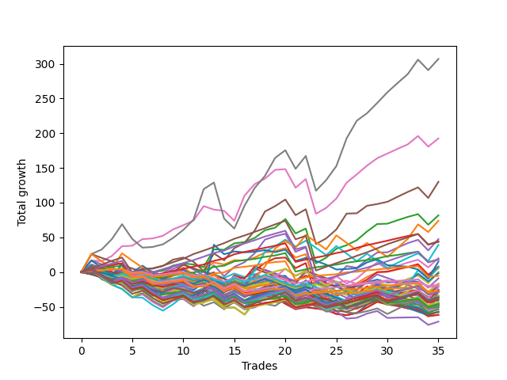

# Long Bulldog 006 
- Symbol: TEST
- Date Range: 06/24/2022 - 07/07/2022
- Trading Period: 7:20-12:30
- Number of Trades: 6



| Name | Win Percent | Profit | Avg Profit / Trade |     | Name | Win Percent | Profit | Avg Profit / Trade |
| ---- | ----------- | ------ | ------------------ | --- | ---- | ----------- | ------ | ------------------ |
| Sorted By <br> Profit | | | | | Sorted By <br> Win Percentage ||||
| Four | 83.33 | 16625.00 | 2770.83 |     | Three | 100.00 | 16125.00 | 2687.50 |
| Three | 100.00 | 16125.00 | 2687.50 |     | Two | 100.00 | 13625.00 | 2270.83 |
| Two | 100.00 | 13625.00 | 2270.83 |     | Sixty-Four | 100.00 | 8125.00 | 1354.17 |
| Six | 83.33 | 13000.00 | 2166.67 |     | Fifty-Six | 100.00 | 8125.00 | 1354.17 |
| Sixty-Seven | 83.33 | 11750.00 | 1958.33 |     | Zero | 100.00 | 8125.00 | 1354.17 |
| Sixty | 66.67 | 11250.00 | 1875.00 |     | Four | 83.33 | 16625.00 | 2770.83 |
| Fifty-Nine | 83.33 | 10750.00 | 1791.67 |     | Six | 83.33 | 13000.00 | 2166.67 |
| Seventy-Five | 83.33 | 10000.00 | 1666.67 |     | Sixty-Seven | 83.33 | 11750.00 | 1958.33 |
| Sixty-Six | 83.33 | 10000.00 | 1666.67 |     | Fifty-Nine | 83.33 | 10750.00 | 1791.67 |
| One | 83.33 | 9875.00 | 1645.83 |     | Seventy-Five | 83.33 | 10000.00 | 1666.67 |
| Seventy | 66.67 | 9375.00 | 1562.50 |     | Sixty-Six | 83.33 | 10000.00 | 1666.67 |
| Sixty-Eight | 66.67 | 9000.00 | 1500.00 |     | One | 83.33 | 9875.00 | 1645.83 |
| Seventy-Four | 83.33 | 8500.00 | 1416.67 |     | Seventy-Four | 83.33 | 8500.00 | 1416.67 |
| Seven | 83.33 | 8500.00 | 1416.67 |     | Seven | 83.33 | 8500.00 | 1416.67 |
| Five | 83.33 | 8500.00 | 1416.67 |     | Five | 83.33 | 8500.00 | 1416.67 |
| Fifty-Eight | 83.33 | 8250.00 | 1375.00 |     | Fifty-Eight | 83.33 | 8250.00 | 1375.00 |
| Sixty-Four | 100.00 | 8125.00 | 1354.17 |     | Sixty-Five | 83.33 | 7000.00 | 1166.67 |
| Fifty-Six | 100.00 | 8125.00 | 1354.17 |     | Fifty-Seven | 83.33 | 6000.00 | 1000.00 |
| Zero | 100.00 | 8125.00 | 1354.17 |     | Sixty | 66.67 | 11250.00 | 1875.00 |
| Sixty-Two | 66.67 | 7625.00 | 1270.83 |     | Seventy | 66.67 | 9375.00 | 1562.50 |
| Sixty-Five | 83.33 | 7000.00 | 1166.67 |     | Sixty-Eight | 66.67 | 9000.00 | 1500.00 |
| Fifty-Seven | 83.33 | 6000.00 | 1000.00 |     | Sixty-Two | 66.67 | 7625.00 | 1270.83 |
| Twelve | 33.33 | 5375.00 | 895.83 |     | Thirty-Two | 66.67 | 4875.00 | 812.50 |
| Thirty-Two | 66.67 | 4875.00 | 812.50 |     | Sixty-Three | 66.67 | 3125.00 | 520.83 |
| Twenty-Eight | 33.33 | 4750.00 | 791.67 |     | Sixty-One | 66.67 | 3125.00 | 520.83 |
| Seventy-Three | 33.33 | 4625.00 | 770.83 |     | Forty-Eight | 66.67 | 3000.00 | 500.00 |
| Eleven | 33.33 | 3750.00 | 625.00 |     | Sixten | 66.67 | 3000.00 | 500.00 |
| Seventy-Two | 50.00 | 3625.00 | 604.17 |     | Forty | 66.67 | 1625.00 | 270.83 |
| Thirty-Six | 33.33 | 3375.00 | 562.50 |     | Seventy-One | 66.67 | 1375.00 | 229.17 |
| Sixty-Three | 66.67 | 3125.00 | 520.83 |     | Sixty-Nine | 66.67 | 1375.00 | 229.17 |
| Sixty-One | 66.67 | 3125.00 | 520.83 |     | Seventy-Two | 50.00 | 3625.00 | 604.17 |
| twenty-Seven | 33.33 | 3125.00 | 520.83 |     | Nineteen | 50.00 | 1625.00 | 270.83 |
| Forty-Eight | 66.67 | 3000.00 | 500.00 |     | Eight | 50.00 | 1500.00 | 250.00 |
| Sixten | 66.67 | 3000.00 | 500.00 |     | Twenty-Four | 50.00 | 1250.00 | 208.33 |
| Fifty-Two | 33.33 | 3000.00 | 500.00 |     | Twenty-Three | 50.00 | 500.00 | 83.33 |
| Fifty-One | 33.33 | 2500.00 | 416.67 |     | Twenty-Two | 50.00 | 500.00 | 83.33 |
| Fifty-Four | 33.33 | 2375.00 | 395.83 |     | Twenty-One | 50.00 | 500.00 | 83.33 |
| Fifty | 33.33 | 2375.00 | 395.83 |     | Twenty | 50.00 | 500.00 | 83.33 |
| Thirty-Three | 33.33 | 2125.00 | 354.17 |     | Eighteen | 50.00 | 500.00 | 83.33 |
| Thirty-Nine | 33.33 | 2000.00 | 333.33 |     | Seventeen | 50.00 | 500.00 | 83.33 |
| Thirty-Eight | 33.33 | 2000.00 | 333.33 |     | Twelve | 33.33 | 5375.00 | 895.83 |
| Thirty-Seven | 33.33 | 2000.00 | 333.33 |     | Twenty-Eight | 33.33 | 4750.00 | 791.67 |
| Thirty-Four | 33.33 | 2000.00 | 333.33 |     | Seventy-Three | 33.33 | 4625.00 | 770.83 |
| Nine | 33.33 | 1750.00 | 291.67 |     | Eleven | 33.33 | 3750.00 | 625.00 |
| Forty | 66.67 | 1625.00 | 270.83 |     | Thirty-Six | 33.33 | 3375.00 | 562.50 |
| Nineteen | 50.00 | 1625.00 | 270.83 |     | twenty-Seven | 33.33 | 3125.00 | 520.83 |
| Thirty-Five | 33.33 | 1625.00 | 270.83 |     | Fifty-Two | 33.33 | 3000.00 | 500.00 |
| Eight | 50.00 | 1500.00 | 250.00 |     | Fifty-One | 33.33 | 2500.00 | 416.67 |
| Seventy-One | 66.67 | 1375.00 | 229.17 |     | Fifty-Four | 33.33 | 2375.00 | 395.83 |
| Sixty-Nine | 66.67 | 1375.00 | 229.17 |     | Fifty | 33.33 | 2375.00 | 395.83 |
| Twenty-Four | 50.00 | 1250.00 | 208.33 |     | Thirty-Three | 33.33 | 2125.00 | 354.17 |
| Fifty-Five | 33.33 | 1125.00 | 187.50 |     | Thirty-Nine | 33.33 | 2000.00 | 333.33 |
| Fifty-Three | 33.33 | 1125.00 | 187.50 |     | Thirty-Eight | 33.33 | 2000.00 | 333.33 |
| Twenty-Five | 33.33 | 1125.00 | 187.50 |     | Thirty-Seven | 33.33 | 2000.00 | 333.33 |
| Forty-Four | 33.33 | 750.00 | 125.00 |     | Thirty-Four | 33.33 | 2000.00 | 333.33 |
| Fifteen | 33.33 | 625.00 | 104.17 |     | Nine | 33.33 | 1750.00 | 291.67 |
| Thirteen | 33.33 | 625.00 | 104.17 |     | Thirty-Five | 33.33 | 1625.00 | 270.83 |
| Twenty-Three | 50.00 | 500.00 | 83.33 |     | Fifty-Five | 33.33 | 1125.00 | 187.50 |
| Twenty-Two | 50.00 | 500.00 | 83.33 |     | Fifty-Three | 33.33 | 1125.00 | 187.50 |
| Twenty-One | 50.00 | 500.00 | 83.33 |     | Twenty-Five | 33.33 | 1125.00 | 187.50 |
| Twenty | 50.00 | 500.00 | 83.33 |     | Forty-Four | 33.33 | 750.00 | 125.00 |
| Eighteen | 50.00 | 500.00 | 83.33 |     | Fifteen | 33.33 | 625.00 | 104.17 |
| Seventeen | 50.00 | 500.00 | 83.33 |     | Thirteen | 33.33 | 625.00 | 104.17 |
| Forty-Nine | 33.33 | 500.00 | 83.33 |     | Forty-Nine | 33.33 | 500.00 | 83.33 |
| Fourteen | 33.33 | 500.00 | 83.33 |     | Fourteen | 33.33 | 500.00 | 83.33 |
| Ten | 33.33 | 500.00 | 83.33 |     | Ten | 33.33 | 500.00 | 83.33 |
| Thirty-One | 33.33 | 0.00 | 0.00 |     | Thirty-One | 33.33 | 0.00 | 0.00 |
| Twenty-Nine | 33.33 | 0.00 | 0.00 |     | Twenty-Nine | 33.33 | 0.00 | 0.00 |
| Thirty | 33.33 | -125.00 | -20.83 |     | Thirty | 33.33 | -125.00 | -20.83 |
| Twenty-Six | 33.33 | -125.00 | -20.83 |     | Twenty-Six | 33.33 | -125.00 | -20.83 |
| Forty-Three | 33.33 | -875.00 | -145.83 |     | Forty-Three | 33.33 | -875.00 | -145.83 |
| Forty-One | 33.33 | -2875.00 | -479.17 |     | Forty-One | 33.33 | -2875.00 | -479.17 |
| Forty-Seven | 33.33 | -4000.00 | -666.67 |     | Forty-Seven | 33.33 | -4000.00 | -666.67 |
| Forty-Five | 33.33 | -4000.00 | -666.67 |     | Forty-Five | 33.33 | -4000.00 | -666.67 |
| Forty-Six | 33.33 | -4125.00 | -687.50 |     | Forty-Six | 33.33 | -4125.00 | -687.50 |
| Forty-Two | 33.33 | -4125.00 | -687.50 |     | Forty-Two | 33.33 | -4125.00 | -687.50 |

## NO STOPLOSS

### Test Zero
* Sell when price hits the middle line of the 20p bollinger
* No Stoploss
* Results:
```
Total Trades: 6
Percent Up: 100.00
Percent Down: 0.00
Total Points Moved Up: 16.25
Potential Profit: 8125.00
Total Points Ups: 16.25 Count Ups: 6
Total Points Downs: 0.00 Count Downs: 0
```

<details><summary>Trades</summary>

<code>In: 2022-06-27 12:08:00		Out: 2022-06-27 12:09:50		Total Position Time: 01:50		Total Move Up: 5.50		Total to Date: 5.50</code> <br />
<code>In: 2022-06-29 08:26:00		Out: 2022-06-29 08:29:10		Total Position Time: 03:10		Total Move Up: 4.00		Total to Date: 9.50</code> <br />
<code>In: 2022-06-29 09:16:00		Out: 2022-06-29 09:20:20		Total Position Time: 04:20		Total Move Up: 1.75		Total to Date: 11.25</code> <br />
<code>In: 2022-07-05 08:05:00		Out: 2022-07-05 08:08:15		Total Position Time: 03:15		Total Move Up: 2.50		Total to Date: 13.75</code> <br />
<code>In: 2022-07-05 08:08:00		Out: 2022-07-05 08:08:15		Total Position Time: 00:15		Total Move Up: 2.25		Total to Date: 16.00</code> <br />
<code>In: 2022-07-06 08:35:00		Out: 2022-07-06 08:46:30		Total Position Time: 11:30		Total Move Up: 0.25		Total to Date: 16.25</code> <br />


</details>

### Test One
* Sell when the price hits the upper line of the 20p 1std bollinger
* No Stoploss
* Results:
```
Total Trades: 6
Percent Up: 83.33
Percent Down: 16.67
Total Points Moved Up: 19.75
Potential Profit: 9875.00
Total Points Ups: 22.00 Count Ups: 5
Total Points Downs: -2.25 Count Downs: 1
```

<details><summary>Trades</summary>

<code>In: 2022-06-27 12:08:00		Out: 2022-06-27 12:12:10		Total Position Time: 04:10		Total Move Up: 9.00		Total to Date: 9.00</code> <br />
<code>In: 2022-06-29 08:26:00		Out: 2022-06-29 08:32:20		Total Position Time: 06:20		Total Move Up: 5.75		Total to Date: 14.75</code> <br />
<code>In: 2022-06-29 09:16:00		Out: 2022-06-29 09:37:10		Total Position Time: 21:10		Total Move Up: -2.25		Total to Date: 12.50</code> <br />
<code>In: 2022-07-05 08:05:00		Out: 2022-07-05 08:16:40		Total Position Time: 11:40		Total Move Up: 2.75		Total to Date: 15.25</code> <br />
<code>In: 2022-07-05 08:08:00		Out: 2022-07-05 08:16:40		Total Position Time: 08:40		Total Move Up: 2.50		Total to Date: 17.75</code> <br />
<code>In: 2022-07-06 08:35:00		Out: 2022-07-06 08:48:05		Total Position Time: 13:05		Total Move Up: 2.00		Total to Date: 19.75</code> <br />


</details>

### Test Two
* Sell when the price hits the upper line of the 20p 2std bollinger
* No Stoploss
* Results:
```
Total Trades: 6
Percent Up: 100.00
Percent Down: 0.00
Total Points Moved Up: 27.25
Potential Profit: 13625.00
Total Points Ups: 27.25 Count Ups: 6
Total Points Downs: 0.00 Count Downs: 0
```

<details><summary>Trades</summary>

<code>In: 2022-06-27 12:08:00		Out: 2022-06-27 12:37:55		Total Position Time: 29:55		Total Move Up: 1.50		Total to Date: 1.50</code> <br />
<code>In: 2022-06-29 08:26:00		Out: 2022-06-29 08:35:35		Total Position Time: 09:35		Total Move Up: 10.75		Total to Date: 12.25</code> <br />
<code>In: 2022-06-29 09:16:00		Out: 2022-06-29 09:45:55		Total Position Time: 29:55		Total Move Up: 0.75		Total to Date: 13.00</code> <br />
<code>In: 2022-07-05 08:05:00		Out: 2022-07-05 08:20:35		Total Position Time: 15:35		Total Move Up: 5.00		Total to Date: 18.00</code> <br />
<code>In: 2022-07-05 08:08:00		Out: 2022-07-05 08:20:35		Total Position Time: 12:35		Total Move Up: 4.75		Total to Date: 22.75</code> <br />
<code>In: 2022-07-06 08:35:00		Out: 2022-07-06 08:51:20		Total Position Time: 16:20		Total Move Up: 4.50		Total to Date: 27.25</code> <br />


</details>

### Test Three
* Sell when price hits the middle line of the 50p bollinger
* No Stoploss
* Results:
```
Total Trades: 6
Percent Up: 100.00
Percent Down: 0.00
Total Points Moved Up: 32.25
Potential Profit: 16125.00
Total Points Ups: 32.25 Count Ups: 6
Total Points Downs: 0.00 Count Downs: 0
```

<details><summary>Trades</summary>

<code>In: 2022-06-27 12:08:00		Out: 2022-06-27 12:10:30		Total Position Time: 02:30		Total Move Up: 8.00		Total to Date: 8.00</code> <br />
<code>In: 2022-06-29 08:26:00		Out: 2022-06-29 08:35:35		Total Position Time: 09:35		Total Move Up: 10.75		Total to Date: 18.75</code> <br />
<code>In: 2022-06-29 09:16:00		Out: 2022-06-29 09:38:30		Total Position Time: 22:30		Total Move Up: 0.75		Total to Date: 19.50</code> <br />
<code>In: 2022-07-05 08:05:00		Out: 2022-07-05 08:27:20		Total Position Time: 22:20		Total Move Up: 4.50		Total to Date: 24.00</code> <br />
<code>In: 2022-07-05 08:08:00		Out: 2022-07-05 08:27:20		Total Position Time: 19:20		Total Move Up: 4.25		Total to Date: 28.25</code> <br />
<code>In: 2022-07-06 08:35:00		Out: 2022-07-06 08:51:15		Total Position Time: 16:15		Total Move Up: 4.00		Total to Date: 32.25</code> <br />


</details>

### Test Four
* Sell when the price hits the upper line of the 50p 1std bollinger
* No Stoploss
* Results:
```
Total Trades: 6
Percent Up: 83.33
Percent Down: 16.67
Total Points Moved Up: 33.25
Potential Profit: 16625.00
Total Points Ups: 33.50 Count Ups: 5
Total Points Downs: -0.25 Count Downs: 1
```

<details><summary>Trades</summary>

<code>In: 2022-06-27 12:08:00		Out: 2022-06-27 12:15:30		Total Position Time: 07:30		Total Move Up: 11.50		Total to Date: 11.50</code> <br />
<code>In: 2022-06-29 08:26:00		Out: 2022-06-29 08:53:10		Total Position Time: 27:10		Total Move Up: 10.50		Total to Date: 22.00</code> <br />
<code>In: 2022-06-29 09:16:00		Out: 2022-06-29 09:45:55		Total Position Time: 29:55		Total Move Up: 0.75		Total to Date: 22.75</code> <br />
<code>In: 2022-07-05 08:05:00		Out: 2022-07-05 08:33:05		Total Position Time: 28:05		Total Move Up: 5.50		Total to Date: 28.25</code> <br />
<code>In: 2022-07-05 08:08:00		Out: 2022-07-05 08:33:05		Total Position Time: 25:05		Total Move Up: 5.25		Total to Date: 33.50</code> <br />
<code>In: 2022-07-06 08:35:00		Out: 2022-07-06 09:04:55		Total Position Time: 29:55		Total Move Up: -0.25		Total to Date: 33.25</code> <br />


</details>

### Test Five
* Sell when the price hits the upper line of the 50p 2std bollinger
* No Stoploss
* Results:
```
Total Trades: 6
Percent Up: 83.33
Percent Down: 16.67
Total Points Moved Up: 17.00
Potential Profit: 8500.00
Total Points Ups: 17.25 Count Ups: 5
Total Points Downs: -0.25 Count Downs: 1
```

<details><summary>Trades</summary>

<code>In: 2022-06-27 12:08:00		Out: 2022-06-27 12:37:55		Total Position Time: 29:55		Total Move Up: 1.50		Total to Date: 1.50</code> <br />
<code>In: 2022-06-29 08:26:00		Out: 2022-06-29 08:55:55		Total Position Time: 29:55		Total Move Up: 11.00		Total to Date: 12.50</code> <br />
<code>In: 2022-06-29 09:16:00		Out: 2022-06-29 09:45:55		Total Position Time: 29:55		Total Move Up: 0.75		Total to Date: 13.25</code> <br />
<code>In: 2022-07-05 08:05:00		Out: 2022-07-05 08:34:55		Total Position Time: 29:55		Total Move Up: 2.50		Total to Date: 15.75</code> <br />
<code>In: 2022-07-05 08:08:00		Out: 2022-07-05 08:37:55		Total Position Time: 29:55		Total Move Up: 1.50		Total to Date: 17.25</code> <br />
<code>In: 2022-07-06 08:35:00		Out: 2022-07-06 09:04:55		Total Position Time: 29:55		Total Move Up: -0.25		Total to Date: 17.00</code> <br />


</details>

### Test Six
* Sell when the price hits the middle line of the 1std VWAP
* No Stoploss
* Results:
```
Total Trades: 6
Percent Up: 83.33
Percent Down: 16.67
Total Points Moved Up: 26.00
Potential Profit: 13000.00
Total Points Ups: 26.25 Count Ups: 5
Total Points Downs: -0.25 Count Downs: 1
```

<details><summary>Trades</summary>

<code>In: 2022-06-27 12:08:00		Out: 2022-06-27 12:37:55		Total Position Time: 29:55		Total Move Up: 1.50		Total to Date: 1.50</code> <br />
<code>In: 2022-06-29 08:26:00		Out: 2022-06-29 08:35:35		Total Position Time: 09:35		Total Move Up: 10.75		Total to Date: 12.25</code> <br />
<code>In: 2022-06-29 09:16:00		Out: 2022-06-29 09:45:55		Total Position Time: 29:55		Total Move Up: 0.75		Total to Date: 13.00</code> <br />
<code>In: 2022-07-05 08:05:00		Out: 2022-07-05 08:33:10		Total Position Time: 28:10		Total Move Up: 6.75		Total to Date: 19.75</code> <br />
<code>In: 2022-07-05 08:08:00		Out: 2022-07-05 08:33:10		Total Position Time: 25:10		Total Move Up: 6.50		Total to Date: 26.25</code> <br />
<code>In: 2022-07-06 08:35:00		Out: 2022-07-06 09:04:55		Total Position Time: 29:55		Total Move Up: -0.25		Total to Date: 26.00</code> <br />


</details>

### Test Seven
* Sell when the price hits the upper line of the 1std VWAP
* No Stoploss
* Results:
```
Total Trades: 6
Percent Up: 83.33
Percent Down: 16.67
Total Points Moved Up: 17.00
Potential Profit: 8500.00
Total Points Ups: 17.25 Count Ups: 5
Total Points Downs: -0.25 Count Downs: 1
```

<details><summary>Trades</summary>

<code>In: 2022-06-27 12:08:00		Out: 2022-06-27 12:37:55		Total Position Time: 29:55		Total Move Up: 1.50		Total to Date: 1.50</code> <br />
<code>In: 2022-06-29 08:26:00		Out: 2022-06-29 08:55:55		Total Position Time: 29:55		Total Move Up: 11.00		Total to Date: 12.50</code> <br />
<code>In: 2022-06-29 09:16:00		Out: 2022-06-29 09:45:55		Total Position Time: 29:55		Total Move Up: 0.75		Total to Date: 13.25</code> <br />
<code>In: 2022-07-05 08:05:00		Out: 2022-07-05 08:34:55		Total Position Time: 29:55		Total Move Up: 2.50		Total to Date: 15.75</code> <br />
<code>In: 2022-07-05 08:08:00		Out: 2022-07-05 08:37:55		Total Position Time: 29:55		Total Move Up: 1.50		Total to Date: 17.25</code> <br />
<code>In: 2022-07-06 08:35:00		Out: 2022-07-06 09:04:55		Total Position Time: 29:55		Total Move Up: -0.25		Total to Date: 17.00</code> <br />


</details>

## STOPLOSS OF 2

### Test Eight
* Sell when price hits the middle line of the 20p bollinger
* Stoploss is 2 points
* Results:
```
Total Trades: 6
Percent Up: 50.00
Percent Down: 50.00
Total Points Moved Up: 3.00
Potential Profit: 1500.00
Total Points Ups: 11.75 Count Ups: 3
Total Points Downs: -8.75 Count Downs: 3
```

<details><summary>Trades</summary>

<code>In: 2022-06-27 12:08:00		Out: 2022-06-27 12:09:50		Total Position Time: 01:50		Total Move Up: 5.50		Total to Date: 5.50</code> <br />
<code>In: 2022-06-29 08:26:00		Out: 2022-06-29 08:29:10		Total Position Time: 03:10		Total Move Up: 4.00		Total to Date: 9.50</code> <br />
<code>In: 2022-06-29 09:16:00		Out: 2022-06-29 09:16:35		Total Position Time: 00:35		Total Move Up: -3.00		Total to Date: 6.50</code> <br />
<code>In: 2022-07-05 08:05:00		Out: 2022-07-05 08:05:50		Total Position Time: 00:50		Total Move Up: -3.25		Total to Date: 3.25</code> <br />
<code>In: 2022-07-05 08:08:00		Out: 2022-07-05 08:08:15		Total Position Time: 00:15		Total Move Up: 2.25		Total to Date: 5.50</code> <br />
<code>In: 2022-07-06 08:35:00		Out: 2022-07-06 08:41:35		Total Position Time: 06:35		Total Move Up: -2.50		Total to Date: 3.00</code> <br />


</details>

### Test Nine
* Sell when the price hits the upper line of the 20p 1std bollinger
* Stoploss is 2 points
* Results:
```
Total Trades: 6
Percent Up: 33.33
Percent Down: 66.67
Total Points Moved Up: 3.50
Potential Profit: 1750.00
Total Points Ups: 14.75 Count Ups: 2
Total Points Downs: -11.25 Count Downs: 4
```

<details><summary>Trades</summary>

<code>In: 2022-06-27 12:08:00		Out: 2022-06-27 12:12:10		Total Position Time: 04:10		Total Move Up: 9.00		Total to Date: 9.00</code> <br />
<code>In: 2022-06-29 08:26:00		Out: 2022-06-29 08:32:20		Total Position Time: 06:20		Total Move Up: 5.75		Total to Date: 14.75</code> <br />
<code>In: 2022-06-29 09:16:00		Out: 2022-06-29 09:16:35		Total Position Time: 00:35		Total Move Up: -3.00		Total to Date: 11.75</code> <br />
<code>In: 2022-07-05 08:05:00		Out: 2022-07-05 08:05:50		Total Position Time: 00:50		Total Move Up: -3.25		Total to Date: 8.50</code> <br />
<code>In: 2022-07-05 08:08:00		Out: 2022-07-05 08:09:10		Total Position Time: 01:10		Total Move Up: -2.50		Total to Date: 6.00</code> <br />
<code>In: 2022-07-06 08:35:00		Out: 2022-07-06 08:41:35		Total Position Time: 06:35		Total Move Up: -2.50		Total to Date: 3.50</code> <br />


</details>

### Test Ten
* Sell when the price hits the upper line of the 20p 2std bollinger
* Stoploss is 2 points
* Results:
```
Total Trades: 6
Percent Up: 33.33
Percent Down: 66.67
Total Points Moved Up: 1.00
Potential Profit: 500.00
Total Points Ups: 12.25 Count Ups: 2
Total Points Downs: -11.25 Count Downs: 4
```

<details><summary>Trades</summary>

<code>In: 2022-06-27 12:08:00		Out: 2022-06-27 12:37:55		Total Position Time: 29:55		Total Move Up: 1.50		Total to Date: 1.50</code> <br />
<code>In: 2022-06-29 08:26:00		Out: 2022-06-29 08:35:35		Total Position Time: 09:35		Total Move Up: 10.75		Total to Date: 12.25</code> <br />
<code>In: 2022-06-29 09:16:00		Out: 2022-06-29 09:16:35		Total Position Time: 00:35		Total Move Up: -3.00		Total to Date: 9.25</code> <br />
<code>In: 2022-07-05 08:05:00		Out: 2022-07-05 08:05:50		Total Position Time: 00:50		Total Move Up: -3.25		Total to Date: 6.00</code> <br />
<code>In: 2022-07-05 08:08:00		Out: 2022-07-05 08:09:10		Total Position Time: 01:10		Total Move Up: -2.50		Total to Date: 3.50</code> <br />
<code>In: 2022-07-06 08:35:00		Out: 2022-07-06 08:41:35		Total Position Time: 06:35		Total Move Up: -2.50		Total to Date: 1.00</code> <br />


</details>

### Test Eleven
* Sell when price hits the middle line of the 50p bollinger
* Stoploss is 2 points
* Results:
```
Total Trades: 6
Percent Up: 33.33
Percent Down: 66.67
Total Points Moved Up: 7.50
Potential Profit: 3750.00
Total Points Ups: 18.75 Count Ups: 2
Total Points Downs: -11.25 Count Downs: 4
```

<details><summary>Trades</summary>

<code>In: 2022-06-27 12:08:00		Out: 2022-06-27 12:10:30		Total Position Time: 02:30		Total Move Up: 8.00		Total to Date: 8.00</code> <br />
<code>In: 2022-06-29 08:26:00		Out: 2022-06-29 08:35:35		Total Position Time: 09:35		Total Move Up: 10.75		Total to Date: 18.75</code> <br />
<code>In: 2022-06-29 09:16:00		Out: 2022-06-29 09:16:35		Total Position Time: 00:35		Total Move Up: -3.00		Total to Date: 15.75</code> <br />
<code>In: 2022-07-05 08:05:00		Out: 2022-07-05 08:05:50		Total Position Time: 00:50		Total Move Up: -3.25		Total to Date: 12.50</code> <br />
<code>In: 2022-07-05 08:08:00		Out: 2022-07-05 08:09:10		Total Position Time: 01:10		Total Move Up: -2.50		Total to Date: 10.00</code> <br />
<code>In: 2022-07-06 08:35:00		Out: 2022-07-06 08:41:35		Total Position Time: 06:35		Total Move Up: -2.50		Total to Date: 7.50</code> <br />


</details>

### Test Twelve
* Sell when the price hits the upper line of the 50p 1std bollinger
* Stoploss is 2 points
* Results:
```
Total Trades: 6
Percent Up: 33.33
Percent Down: 66.67
Total Points Moved Up: 10.75
Potential Profit: 5375.00
Total Points Ups: 22.00 Count Ups: 2
Total Points Downs: -11.25 Count Downs: 4
```

<details><summary>Trades</summary>

<code>In: 2022-06-27 12:08:00		Out: 2022-06-27 12:15:30		Total Position Time: 07:30		Total Move Up: 11.50		Total to Date: 11.50</code> <br />
<code>In: 2022-06-29 08:26:00		Out: 2022-06-29 08:53:10		Total Position Time: 27:10		Total Move Up: 10.50		Total to Date: 22.00</code> <br />
<code>In: 2022-06-29 09:16:00		Out: 2022-06-29 09:16:35		Total Position Time: 00:35		Total Move Up: -3.00		Total to Date: 19.00</code> <br />
<code>In: 2022-07-05 08:05:00		Out: 2022-07-05 08:05:50		Total Position Time: 00:50		Total Move Up: -3.25		Total to Date: 15.75</code> <br />
<code>In: 2022-07-05 08:08:00		Out: 2022-07-05 08:09:10		Total Position Time: 01:10		Total Move Up: -2.50		Total to Date: 13.25</code> <br />
<code>In: 2022-07-06 08:35:00		Out: 2022-07-06 08:41:35		Total Position Time: 06:35		Total Move Up: -2.50		Total to Date: 10.75</code> <br />


</details>

### Test Thirteen
* Sell when the price hits the upper line of the 50p 2std bollinger
* Stoploss is 2 points
* Results:
```
Total Trades: 6
Percent Up: 33.33
Percent Down: 66.67
Total Points Moved Up: 1.25
Potential Profit: 625.00
Total Points Ups: 12.50 Count Ups: 2
Total Points Downs: -11.25 Count Downs: 4
```

<details><summary>Trades</summary>

<code>In: 2022-06-27 12:08:00		Out: 2022-06-27 12:37:55		Total Position Time: 29:55		Total Move Up: 1.50		Total to Date: 1.50</code> <br />
<code>In: 2022-06-29 08:26:00		Out: 2022-06-29 08:55:55		Total Position Time: 29:55		Total Move Up: 11.00		Total to Date: 12.50</code> <br />
<code>In: 2022-06-29 09:16:00		Out: 2022-06-29 09:16:35		Total Position Time: 00:35		Total Move Up: -3.00		Total to Date: 9.50</code> <br />
<code>In: 2022-07-05 08:05:00		Out: 2022-07-05 08:05:50		Total Position Time: 00:50		Total Move Up: -3.25		Total to Date: 6.25</code> <br />
<code>In: 2022-07-05 08:08:00		Out: 2022-07-05 08:09:10		Total Position Time: 01:10		Total Move Up: -2.50		Total to Date: 3.75</code> <br />
<code>In: 2022-07-06 08:35:00		Out: 2022-07-06 08:41:35		Total Position Time: 06:35		Total Move Up: -2.50		Total to Date: 1.25</code> <br />


</details>

### Test Fourteen
* Sell when the price hits the middle line of the 1std VWAP
* Stoploss is 2 points
* Results:
```
Total Trades: 6
Percent Up: 33.33
Percent Down: 66.67
Total Points Moved Up: 1.00
Potential Profit: 500.00
Total Points Ups: 12.25 Count Ups: 2
Total Points Downs: -11.25 Count Downs: 4
```

<details><summary>Trades</summary>

<code>In: 2022-06-27 12:08:00		Out: 2022-06-27 12:37:55		Total Position Time: 29:55		Total Move Up: 1.50		Total to Date: 1.50</code> <br />
<code>In: 2022-06-29 08:26:00		Out: 2022-06-29 08:35:35		Total Position Time: 09:35		Total Move Up: 10.75		Total to Date: 12.25</code> <br />
<code>In: 2022-06-29 09:16:00		Out: 2022-06-29 09:16:35		Total Position Time: 00:35		Total Move Up: -3.00		Total to Date: 9.25</code> <br />
<code>In: 2022-07-05 08:05:00		Out: 2022-07-05 08:05:50		Total Position Time: 00:50		Total Move Up: -3.25		Total to Date: 6.00</code> <br />
<code>In: 2022-07-05 08:08:00		Out: 2022-07-05 08:09:10		Total Position Time: 01:10		Total Move Up: -2.50		Total to Date: 3.50</code> <br />
<code>In: 2022-07-06 08:35:00		Out: 2022-07-06 08:41:35		Total Position Time: 06:35		Total Move Up: -2.50		Total to Date: 1.00</code> <br />


</details>

### Test Fifteen
* Sell when the price hits the upper line of the 1std VWAP
* Stoploss is 2 points
* Results:
```
Total Trades: 6
Percent Up: 33.33
Percent Down: 66.67
Total Points Moved Up: 1.25
Potential Profit: 625.00
Total Points Ups: 12.50 Count Ups: 2
Total Points Downs: -11.25 Count Downs: 4
```

<details><summary>Trades</summary>

<code>In: 2022-06-27 12:08:00		Out: 2022-06-27 12:37:55		Total Position Time: 29:55		Total Move Up: 1.50		Total to Date: 1.50</code> <br />
<code>In: 2022-06-29 08:26:00		Out: 2022-06-29 08:55:55		Total Position Time: 29:55		Total Move Up: 11.00		Total to Date: 12.50</code> <br />
<code>In: 2022-06-29 09:16:00		Out: 2022-06-29 09:16:35		Total Position Time: 00:35		Total Move Up: -3.00		Total to Date: 9.50</code> <br />
<code>In: 2022-07-05 08:05:00		Out: 2022-07-05 08:05:50		Total Position Time: 00:50		Total Move Up: -3.25		Total to Date: 6.25</code> <br />
<code>In: 2022-07-05 08:08:00		Out: 2022-07-05 08:09:10		Total Position Time: 01:10		Total Move Up: -2.50		Total to Date: 3.75</code> <br />
<code>In: 2022-07-06 08:35:00		Out: 2022-07-06 08:41:35		Total Position Time: 06:35		Total Move Up: -2.50		Total to Date: 1.25</code> <br />


</details>

## TRAIL STOP OF 2

### Test Sixten
* Sell when price hits the middle line of the 20p bollinger
* Trailing Stop is 2 points
* Results:
```
Total Trades: 6
Percent Up: 66.67
Percent Down: 33.33
Total Points Moved Up: 6.00
Potential Profit: 3000.00
Total Points Ups: 12.25 Count Ups: 4
Total Points Downs: -6.25 Count Downs: 2
```

<details><summary>Trades</summary>

<code>In: 2022-06-27 12:08:00		Out: 2022-06-27 12:09:50		Total Position Time: 01:50		Total Move Up: 5.50		Total to Date: 5.50</code> <br />
<code>In: 2022-06-29 08:26:00		Out: 2022-06-29 08:29:10		Total Position Time: 03:10		Total Move Up: 4.00		Total to Date: 9.50</code> <br />
<code>In: 2022-06-29 09:16:00		Out: 2022-06-29 09:16:35		Total Position Time: 00:35		Total Move Up: -3.00		Total to Date: 6.50</code> <br />
<code>In: 2022-07-05 08:05:00		Out: 2022-07-05 08:05:50		Total Position Time: 00:50		Total Move Up: -3.25		Total to Date: 3.25</code> <br />
<code>In: 2022-07-05 08:08:00		Out: 2022-07-05 08:08:15		Total Position Time: 00:15		Total Move Up: 2.25		Total to Date: 5.50</code> <br />
<code>In: 2022-07-06 08:35:00		Out: 2022-07-06 08:37:40		Total Position Time: 02:40		Total Move Up: 0.50		Total to Date: 6.00</code> <br />


</details>

### Test Seventeen
* Sell when the price hits the upper line of the 20p 1std bollinger
* Trailing Stop is 2 points
* Results:
```
Total Trades: 6
Percent Up: 50.00
Percent Down: 50.00
Total Points Moved Up: 1.00
Potential Profit: 500.00
Total Points Ups: 7.50 Count Ups: 3
Total Points Downs: -6.50 Count Downs: 3
```

<details><summary>Trades</summary>

<code>In: 2022-06-27 12:08:00		Out: 2022-06-27 12:10:40		Total Position Time: 02:40		Total Move Up: 5.75		Total to Date: 5.75</code> <br />
<code>In: 2022-06-29 08:26:00		Out: 2022-06-29 08:30:15		Total Position Time: 04:15		Total Move Up: 1.25		Total to Date: 7.00</code> <br />
<code>In: 2022-06-29 09:16:00		Out: 2022-06-29 09:16:35		Total Position Time: 00:35		Total Move Up: -3.00		Total to Date: 4.00</code> <br />
<code>In: 2022-07-05 08:05:00		Out: 2022-07-05 08:05:50		Total Position Time: 00:50		Total Move Up: -3.25		Total to Date: 0.75</code> <br />
<code>In: 2022-07-05 08:08:00		Out: 2022-07-05 08:08:35		Total Position Time: 00:35		Total Move Up: -0.25		Total to Date: 0.50</code> <br />
<code>In: 2022-07-06 08:35:00		Out: 2022-07-06 08:37:40		Total Position Time: 02:40		Total Move Up: 0.50		Total to Date: 1.00</code> <br />


</details>

### Test Eighteen
* Sell when the price hits the upper line of the 20p 2std bollinger
* Trailing Stop is 2 points
* Results:
```
Total Trades: 6
Percent Up: 50.00
Percent Down: 50.00
Total Points Moved Up: 1.00
Potential Profit: 500.00
Total Points Ups: 7.50 Count Ups: 3
Total Points Downs: -6.50 Count Downs: 3
```

<details><summary>Trades</summary>

<code>In: 2022-06-27 12:08:00		Out: 2022-06-27 12:10:40		Total Position Time: 02:40		Total Move Up: 5.75		Total to Date: 5.75</code> <br />
<code>In: 2022-06-29 08:26:00		Out: 2022-06-29 08:30:15		Total Position Time: 04:15		Total Move Up: 1.25		Total to Date: 7.00</code> <br />
<code>In: 2022-06-29 09:16:00		Out: 2022-06-29 09:16:35		Total Position Time: 00:35		Total Move Up: -3.00		Total to Date: 4.00</code> <br />
<code>In: 2022-07-05 08:05:00		Out: 2022-07-05 08:05:50		Total Position Time: 00:50		Total Move Up: -3.25		Total to Date: 0.75</code> <br />
<code>In: 2022-07-05 08:08:00		Out: 2022-07-05 08:08:35		Total Position Time: 00:35		Total Move Up: -0.25		Total to Date: 0.50</code> <br />
<code>In: 2022-07-06 08:35:00		Out: 2022-07-06 08:37:40		Total Position Time: 02:40		Total Move Up: 0.50		Total to Date: 1.00</code> <br />


</details>

### Test Nineteen
* Sell when price hits the middle line of the 50p bollinger
* Trailing Stop is 2 points
* Results:
```
Total Trades: 6
Percent Up: 50.00
Percent Down: 50.00
Total Points Moved Up: 3.25
Potential Profit: 1625.00
Total Points Ups: 9.75 Count Ups: 3
Total Points Downs: -6.50 Count Downs: 3
```

<details><summary>Trades</summary>

<code>In: 2022-06-27 12:08:00		Out: 2022-06-27 12:10:30		Total Position Time: 02:30		Total Move Up: 8.00		Total to Date: 8.00</code> <br />
<code>In: 2022-06-29 08:26:00		Out: 2022-06-29 08:30:15		Total Position Time: 04:15		Total Move Up: 1.25		Total to Date: 9.25</code> <br />
<code>In: 2022-06-29 09:16:00		Out: 2022-06-29 09:16:35		Total Position Time: 00:35		Total Move Up: -3.00		Total to Date: 6.25</code> <br />
<code>In: 2022-07-05 08:05:00		Out: 2022-07-05 08:05:50		Total Position Time: 00:50		Total Move Up: -3.25		Total to Date: 3.00</code> <br />
<code>In: 2022-07-05 08:08:00		Out: 2022-07-05 08:08:35		Total Position Time: 00:35		Total Move Up: -0.25		Total to Date: 2.75</code> <br />
<code>In: 2022-07-06 08:35:00		Out: 2022-07-06 08:37:40		Total Position Time: 02:40		Total Move Up: 0.50		Total to Date: 3.25</code> <br />


</details>

### Test Twenty
* Sell when the price hits the upper line of the 50p 1std bollinger
* Trailing Stop is 2 points
* Results:
```
Total Trades: 6
Percent Up: 50.00
Percent Down: 50.00
Total Points Moved Up: 1.00
Potential Profit: 500.00
Total Points Ups: 7.50 Count Ups: 3
Total Points Downs: -6.50 Count Downs: 3
```

<details><summary>Trades</summary>

<code>In: 2022-06-27 12:08:00		Out: 2022-06-27 12:10:40		Total Position Time: 02:40		Total Move Up: 5.75		Total to Date: 5.75</code> <br />
<code>In: 2022-06-29 08:26:00		Out: 2022-06-29 08:30:15		Total Position Time: 04:15		Total Move Up: 1.25		Total to Date: 7.00</code> <br />
<code>In: 2022-06-29 09:16:00		Out: 2022-06-29 09:16:35		Total Position Time: 00:35		Total Move Up: -3.00		Total to Date: 4.00</code> <br />
<code>In: 2022-07-05 08:05:00		Out: 2022-07-05 08:05:50		Total Position Time: 00:50		Total Move Up: -3.25		Total to Date: 0.75</code> <br />
<code>In: 2022-07-05 08:08:00		Out: 2022-07-05 08:08:35		Total Position Time: 00:35		Total Move Up: -0.25		Total to Date: 0.50</code> <br />
<code>In: 2022-07-06 08:35:00		Out: 2022-07-06 08:37:40		Total Position Time: 02:40		Total Move Up: 0.50		Total to Date: 1.00</code> <br />


</details>

### Test Twenty-One
* Sell when the price hits the upper line of the 50p 2std bollinger
* Trailing Stop is 2 points
* Results:
```
Total Trades: 6
Percent Up: 50.00
Percent Down: 50.00
Total Points Moved Up: 1.00
Potential Profit: 500.00
Total Points Ups: 7.50 Count Ups: 3
Total Points Downs: -6.50 Count Downs: 3
```

<details><summary>Trades</summary>

<code>In: 2022-06-27 12:08:00		Out: 2022-06-27 12:10:40		Total Position Time: 02:40		Total Move Up: 5.75		Total to Date: 5.75</code> <br />
<code>In: 2022-06-29 08:26:00		Out: 2022-06-29 08:30:15		Total Position Time: 04:15		Total Move Up: 1.25		Total to Date: 7.00</code> <br />
<code>In: 2022-06-29 09:16:00		Out: 2022-06-29 09:16:35		Total Position Time: 00:35		Total Move Up: -3.00		Total to Date: 4.00</code> <br />
<code>In: 2022-07-05 08:05:00		Out: 2022-07-05 08:05:50		Total Position Time: 00:50		Total Move Up: -3.25		Total to Date: 0.75</code> <br />
<code>In: 2022-07-05 08:08:00		Out: 2022-07-05 08:08:35		Total Position Time: 00:35		Total Move Up: -0.25		Total to Date: 0.50</code> <br />
<code>In: 2022-07-06 08:35:00		Out: 2022-07-06 08:37:40		Total Position Time: 02:40		Total Move Up: 0.50		Total to Date: 1.00</code> <br />


</details>

### Test Twenty-Two
* Sell when the price hits the middle line of the 1std VWAP
* Trailing Stop is 2 points
* Results:
```
Total Trades: 6
Percent Up: 50.00
Percent Down: 50.00
Total Points Moved Up: 1.00
Potential Profit: 500.00
Total Points Ups: 7.50 Count Ups: 3
Total Points Downs: -6.50 Count Downs: 3
```

<details><summary>Trades</summary>

<code>In: 2022-06-27 12:08:00		Out: 2022-06-27 12:10:40		Total Position Time: 02:40		Total Move Up: 5.75		Total to Date: 5.75</code> <br />
<code>In: 2022-06-29 08:26:00		Out: 2022-06-29 08:30:15		Total Position Time: 04:15		Total Move Up: 1.25		Total to Date: 7.00</code> <br />
<code>In: 2022-06-29 09:16:00		Out: 2022-06-29 09:16:35		Total Position Time: 00:35		Total Move Up: -3.00		Total to Date: 4.00</code> <br />
<code>In: 2022-07-05 08:05:00		Out: 2022-07-05 08:05:50		Total Position Time: 00:50		Total Move Up: -3.25		Total to Date: 0.75</code> <br />
<code>In: 2022-07-05 08:08:00		Out: 2022-07-05 08:08:35		Total Position Time: 00:35		Total Move Up: -0.25		Total to Date: 0.50</code> <br />
<code>In: 2022-07-06 08:35:00		Out: 2022-07-06 08:37:40		Total Position Time: 02:40		Total Move Up: 0.50		Total to Date: 1.00</code> <br />


</details>

### Test Twenty-Three
* Sell when the price hits the upper line of the 1std VWAP
* Trailing Stop is 2 points
* Results:
```
Total Trades: 6
Percent Up: 50.00
Percent Down: 50.00
Total Points Moved Up: 1.00
Potential Profit: 500.00
Total Points Ups: 7.50 Count Ups: 3
Total Points Downs: -6.50 Count Downs: 3
```

<details><summary>Trades</summary>

<code>In: 2022-06-27 12:08:00		Out: 2022-06-27 12:10:40		Total Position Time: 02:40		Total Move Up: 5.75		Total to Date: 5.75</code> <br />
<code>In: 2022-06-29 08:26:00		Out: 2022-06-29 08:30:15		Total Position Time: 04:15		Total Move Up: 1.25		Total to Date: 7.00</code> <br />
<code>In: 2022-06-29 09:16:00		Out: 2022-06-29 09:16:35		Total Position Time: 00:35		Total Move Up: -3.00		Total to Date: 4.00</code> <br />
<code>In: 2022-07-05 08:05:00		Out: 2022-07-05 08:05:50		Total Position Time: 00:50		Total Move Up: -3.25		Total to Date: 0.75</code> <br />
<code>In: 2022-07-05 08:08:00		Out: 2022-07-05 08:08:35		Total Position Time: 00:35		Total Move Up: -0.25		Total to Date: 0.50</code> <br />
<code>In: 2022-07-06 08:35:00		Out: 2022-07-06 08:37:40		Total Position Time: 02:40		Total Move Up: 0.50		Total to Date: 1.00</code> <br />


</details>

## STOPLOSS OF 3

### Test Twenty-Four
* Sell when price hits the middle line of the 20p bollinger
* Stoploss is 3 points
* Results:
```
Total Trades: 6
Percent Up: 50.00
Percent Down: 50.00
Total Points Moved Up: 2.50
Potential Profit: 1250.00
Total Points Ups: 11.75 Count Ups: 3
Total Points Downs: -9.25 Count Downs: 3
```

<details><summary>Trades</summary>

<code>In: 2022-06-27 12:08:00		Out: 2022-06-27 12:09:50		Total Position Time: 01:50		Total Move Up: 5.50		Total to Date: 5.50</code> <br />
<code>In: 2022-06-29 08:26:00		Out: 2022-06-29 08:29:10		Total Position Time: 03:10		Total Move Up: 4.00		Total to Date: 9.50</code> <br />
<code>In: 2022-06-29 09:16:00		Out: 2022-06-29 09:16:35		Total Position Time: 00:35		Total Move Up: -3.00		Total to Date: 6.50</code> <br />
<code>In: 2022-07-05 08:05:00		Out: 2022-07-05 08:05:50		Total Position Time: 00:50		Total Move Up: -3.25		Total to Date: 3.25</code> <br />
<code>In: 2022-07-05 08:08:00		Out: 2022-07-05 08:08:15		Total Position Time: 00:15		Total Move Up: 2.25		Total to Date: 5.50</code> <br />
<code>In: 2022-07-06 08:35:00		Out: 2022-07-06 08:42:20		Total Position Time: 07:20		Total Move Up: -3.00		Total to Date: 2.50</code> <br />


</details>

### Test Twenty-Five
* Sell when the price hits the upper line of the 20p 1std bollinger
* Stoploss is 3 points
* Results:
```
Total Trades: 6
Percent Up: 33.33
Percent Down: 66.67
Total Points Moved Up: 2.25
Potential Profit: 1125.00
Total Points Ups: 14.75 Count Ups: 2
Total Points Downs: -12.50 Count Downs: 4
```

<details><summary>Trades</summary>

<code>In: 2022-06-27 12:08:00		Out: 2022-06-27 12:12:10		Total Position Time: 04:10		Total Move Up: 9.00		Total to Date: 9.00</code> <br />
<code>In: 2022-06-29 08:26:00		Out: 2022-06-29 08:32:20		Total Position Time: 06:20		Total Move Up: 5.75		Total to Date: 14.75</code> <br />
<code>In: 2022-06-29 09:16:00		Out: 2022-06-29 09:16:35		Total Position Time: 00:35		Total Move Up: -3.00		Total to Date: 11.75</code> <br />
<code>In: 2022-07-05 08:05:00		Out: 2022-07-05 08:05:50		Total Position Time: 00:50		Total Move Up: -3.25		Total to Date: 8.50</code> <br />
<code>In: 2022-07-05 08:08:00		Out: 2022-07-05 08:11:50		Total Position Time: 03:50		Total Move Up: -3.25		Total to Date: 5.25</code> <br />
<code>In: 2022-07-06 08:35:00		Out: 2022-07-06 08:42:20		Total Position Time: 07:20		Total Move Up: -3.00		Total to Date: 2.25</code> <br />


</details>

### Test Twenty-Six
* Sell when the price hits the upper line of the 20p 2std bollinger
* Stoploss is 3 points
* Results:
```
Total Trades: 6
Percent Up: 33.33
Percent Down: 66.67
Total Points Moved Up: -0.25
Potential Profit: -125.00
Total Points Ups: 12.25 Count Ups: 2
Total Points Downs: -12.50 Count Downs: 4
```

<details><summary>Trades</summary>

<code>In: 2022-06-27 12:08:00		Out: 2022-06-27 12:37:55		Total Position Time: 29:55		Total Move Up: 1.50		Total to Date: 1.50</code> <br />
<code>In: 2022-06-29 08:26:00		Out: 2022-06-29 08:35:35		Total Position Time: 09:35		Total Move Up: 10.75		Total to Date: 12.25</code> <br />
<code>In: 2022-06-29 09:16:00		Out: 2022-06-29 09:16:35		Total Position Time: 00:35		Total Move Up: -3.00		Total to Date: 9.25</code> <br />
<code>In: 2022-07-05 08:05:00		Out: 2022-07-05 08:05:50		Total Position Time: 00:50		Total Move Up: -3.25		Total to Date: 6.00</code> <br />
<code>In: 2022-07-05 08:08:00		Out: 2022-07-05 08:11:50		Total Position Time: 03:50		Total Move Up: -3.25		Total to Date: 2.75</code> <br />
<code>In: 2022-07-06 08:35:00		Out: 2022-07-06 08:42:20		Total Position Time: 07:20		Total Move Up: -3.00		Total to Date: -0.25</code> <br />


</details>

### Test twenty-Seven
* Sell when price hits the middle line of the 50p bollinger
* Stoploss is 3 points
* Results:
```
Total Trades: 6
Percent Up: 33.33
Percent Down: 66.67
Total Points Moved Up: 6.25
Potential Profit: 3125.00
Total Points Ups: 18.75 Count Ups: 2
Total Points Downs: -12.50 Count Downs: 4
```

<details><summary>Trades</summary>

<code>In: 2022-06-27 12:08:00		Out: 2022-06-27 12:10:30		Total Position Time: 02:30		Total Move Up: 8.00		Total to Date: 8.00</code> <br />
<code>In: 2022-06-29 08:26:00		Out: 2022-06-29 08:35:35		Total Position Time: 09:35		Total Move Up: 10.75		Total to Date: 18.75</code> <br />
<code>In: 2022-06-29 09:16:00		Out: 2022-06-29 09:16:35		Total Position Time: 00:35		Total Move Up: -3.00		Total to Date: 15.75</code> <br />
<code>In: 2022-07-05 08:05:00		Out: 2022-07-05 08:05:50		Total Position Time: 00:50		Total Move Up: -3.25		Total to Date: 12.50</code> <br />
<code>In: 2022-07-05 08:08:00		Out: 2022-07-05 08:11:50		Total Position Time: 03:50		Total Move Up: -3.25		Total to Date: 9.25</code> <br />
<code>In: 2022-07-06 08:35:00		Out: 2022-07-06 08:42:20		Total Position Time: 07:20		Total Move Up: -3.00		Total to Date: 6.25</code> <br />


</details>

### Test Twenty-Eight
* Sell when the price hits the upper line of the 50p 1std bollinger
* Stoploss is 3 points
* Results:
```
Total Trades: 6
Percent Up: 33.33
Percent Down: 66.67
Total Points Moved Up: 9.50
Potential Profit: 4750.00
Total Points Ups: 22.00 Count Ups: 2
Total Points Downs: -12.50 Count Downs: 4
```

<details><summary>Trades</summary>

<code>In: 2022-06-27 12:08:00		Out: 2022-06-27 12:15:30		Total Position Time: 07:30		Total Move Up: 11.50		Total to Date: 11.50</code> <br />
<code>In: 2022-06-29 08:26:00		Out: 2022-06-29 08:53:10		Total Position Time: 27:10		Total Move Up: 10.50		Total to Date: 22.00</code> <br />
<code>In: 2022-06-29 09:16:00		Out: 2022-06-29 09:16:35		Total Position Time: 00:35		Total Move Up: -3.00		Total to Date: 19.00</code> <br />
<code>In: 2022-07-05 08:05:00		Out: 2022-07-05 08:05:50		Total Position Time: 00:50		Total Move Up: -3.25		Total to Date: 15.75</code> <br />
<code>In: 2022-07-05 08:08:00		Out: 2022-07-05 08:11:50		Total Position Time: 03:50		Total Move Up: -3.25		Total to Date: 12.50</code> <br />
<code>In: 2022-07-06 08:35:00		Out: 2022-07-06 08:42:20		Total Position Time: 07:20		Total Move Up: -3.00		Total to Date: 9.50</code> <br />


</details>

### Test Twenty-Nine
* Sell when the price hits the upper line of the 50p 2std bollinger
* Stoploss is 3 points
* Results:
```
Total Trades: 6
Percent Up: 33.33
Percent Down: 66.67
Total Points Moved Up: 0.00
Potential Profit: 0.00
Total Points Ups: 12.50 Count Ups: 2
Total Points Downs: -12.50 Count Downs: 4
```

<details><summary>Trades</summary>

<code>In: 2022-06-27 12:08:00		Out: 2022-06-27 12:37:55		Total Position Time: 29:55		Total Move Up: 1.50		Total to Date: 1.50</code> <br />
<code>In: 2022-06-29 08:26:00		Out: 2022-06-29 08:55:55		Total Position Time: 29:55		Total Move Up: 11.00		Total to Date: 12.50</code> <br />
<code>In: 2022-06-29 09:16:00		Out: 2022-06-29 09:16:35		Total Position Time: 00:35		Total Move Up: -3.00		Total to Date: 9.50</code> <br />
<code>In: 2022-07-05 08:05:00		Out: 2022-07-05 08:05:50		Total Position Time: 00:50		Total Move Up: -3.25		Total to Date: 6.25</code> <br />
<code>In: 2022-07-05 08:08:00		Out: 2022-07-05 08:11:50		Total Position Time: 03:50		Total Move Up: -3.25		Total to Date: 3.00</code> <br />
<code>In: 2022-07-06 08:35:00		Out: 2022-07-06 08:42:20		Total Position Time: 07:20		Total Move Up: -3.00		Total to Date: 0.00</code> <br />


</details>

### Test Thirty
* Sell when the price hits the middle line of the 1std VWAP
* Stoploss is 3 points
* Results:
```
Total Trades: 6
Percent Up: 33.33
Percent Down: 66.67
Total Points Moved Up: -0.25
Potential Profit: -125.00
Total Points Ups: 12.25 Count Ups: 2
Total Points Downs: -12.50 Count Downs: 4
```

<details><summary>Trades</summary>

<code>In: 2022-06-27 12:08:00		Out: 2022-06-27 12:37:55		Total Position Time: 29:55		Total Move Up: 1.50		Total to Date: 1.50</code> <br />
<code>In: 2022-06-29 08:26:00		Out: 2022-06-29 08:35:35		Total Position Time: 09:35		Total Move Up: 10.75		Total to Date: 12.25</code> <br />
<code>In: 2022-06-29 09:16:00		Out: 2022-06-29 09:16:35		Total Position Time: 00:35		Total Move Up: -3.00		Total to Date: 9.25</code> <br />
<code>In: 2022-07-05 08:05:00		Out: 2022-07-05 08:05:50		Total Position Time: 00:50		Total Move Up: -3.25		Total to Date: 6.00</code> <br />
<code>In: 2022-07-05 08:08:00		Out: 2022-07-05 08:11:50		Total Position Time: 03:50		Total Move Up: -3.25		Total to Date: 2.75</code> <br />
<code>In: 2022-07-06 08:35:00		Out: 2022-07-06 08:42:20		Total Position Time: 07:20		Total Move Up: -3.00		Total to Date: -0.25</code> <br />


</details>

### Test Thirty-One
* Sell when the price hits the upper line of the 1std VWAP
* Stoploss is 3 points
* Results:
```
Total Trades: 6
Percent Up: 33.33
Percent Down: 66.67
Total Points Moved Up: 0.00
Potential Profit: 0.00
Total Points Ups: 12.50 Count Ups: 2
Total Points Downs: -12.50 Count Downs: 4
```

<details><summary>Trades</summary>

<code>In: 2022-06-27 12:08:00		Out: 2022-06-27 12:37:55		Total Position Time: 29:55		Total Move Up: 1.50		Total to Date: 1.50</code> <br />
<code>In: 2022-06-29 08:26:00		Out: 2022-06-29 08:55:55		Total Position Time: 29:55		Total Move Up: 11.00		Total to Date: 12.50</code> <br />
<code>In: 2022-06-29 09:16:00		Out: 2022-06-29 09:16:35		Total Position Time: 00:35		Total Move Up: -3.00		Total to Date: 9.50</code> <br />
<code>In: 2022-07-05 08:05:00		Out: 2022-07-05 08:05:50		Total Position Time: 00:50		Total Move Up: -3.25		Total to Date: 6.25</code> <br />
<code>In: 2022-07-05 08:08:00		Out: 2022-07-05 08:11:50		Total Position Time: 03:50		Total Move Up: -3.25		Total to Date: 3.00</code> <br />
<code>In: 2022-07-06 08:35:00		Out: 2022-07-06 08:42:20		Total Position Time: 07:20		Total Move Up: -3.00		Total to Date: 0.00</code> <br />


</details>

## TRAIL STOP OF 3

### Test Thirty-Two
* Sell when price hits the middle line of the 20p bollinger
* Trailing Stop is 3 points
* Results:
```
Total Trades: 6
Percent Up: 66.67
Percent Down: 33.33
Total Points Moved Up: 9.75
Potential Profit: 4875.00
Total Points Ups: 13.50 Count Ups: 4
Total Points Downs: -3.75 Count Downs: 2
```

<details><summary>Trades</summary>

<code>In: 2022-06-27 12:08:00		Out: 2022-06-27 12:09:50		Total Position Time: 01:50		Total Move Up: 5.50		Total to Date: 5.50</code> <br />
<code>In: 2022-06-29 08:26:00		Out: 2022-06-29 08:29:10		Total Position Time: 03:10		Total Move Up: 4.00		Total to Date: 9.50</code> <br />
<code>In: 2022-06-29 09:16:00		Out: 2022-06-29 09:20:20		Total Position Time: 04:20		Total Move Up: 1.75		Total to Date: 11.25</code> <br />
<code>In: 2022-07-05 08:05:00		Out: 2022-07-05 08:05:50		Total Position Time: 00:50		Total Move Up: -3.25		Total to Date: 8.00</code> <br />
<code>In: 2022-07-05 08:08:00		Out: 2022-07-05 08:08:15		Total Position Time: 00:15		Total Move Up: 2.25		Total to Date: 10.25</code> <br />
<code>In: 2022-07-06 08:35:00		Out: 2022-07-06 08:40:10		Total Position Time: 05:10		Total Move Up: -0.50		Total to Date: 9.75</code> <br />


</details>

### Test Thirty-Three
* Sell when the price hits the upper line of the 20p 1std bollinger
* Trailing Stop is 3 points
* Results:
```
Total Trades: 6
Percent Up: 33.33
Percent Down: 66.67
Total Points Moved Up: 4.25
Potential Profit: 2125.00
Total Points Ups: 10.00 Count Ups: 2
Total Points Downs: -5.75 Count Downs: 4
```

<details><summary>Trades</summary>

<code>In: 2022-06-27 12:08:00		Out: 2022-06-27 12:12:10		Total Position Time: 04:10		Total Move Up: 9.00		Total to Date: 9.00</code> <br />
<code>In: 2022-06-29 08:26:00		Out: 2022-06-29 08:30:20		Total Position Time: 04:20		Total Move Up: 1.00		Total to Date: 10.00</code> <br />
<code>In: 2022-06-29 09:16:00		Out: 2022-06-29 09:22:20		Total Position Time: 06:20		Total Move Up: -1.75		Total to Date: 8.25</code> <br />
<code>In: 2022-07-05 08:05:00		Out: 2022-07-05 08:05:50		Total Position Time: 00:50		Total Move Up: -3.25		Total to Date: 5.00</code> <br />
<code>In: 2022-07-05 08:08:00		Out: 2022-07-05 08:08:35		Total Position Time: 00:35		Total Move Up: -0.25		Total to Date: 4.75</code> <br />
<code>In: 2022-07-06 08:35:00		Out: 2022-07-06 08:40:10		Total Position Time: 05:10		Total Move Up: -0.50		Total to Date: 4.25</code> <br />


</details>

### Test Thirty-Four
* Sell when the price hits the upper line of the 20p 2std bollinger
* Trailing Stop is 3 points
* Results:
```
Total Trades: 6
Percent Up: 33.33
Percent Down: 66.67
Total Points Moved Up: 4.00
Potential Profit: 2000.00
Total Points Ups: 9.75 Count Ups: 2
Total Points Downs: -5.75 Count Downs: 4
```

<details><summary>Trades</summary>

<code>In: 2022-06-27 12:08:00		Out: 2022-06-27 12:16:05		Total Position Time: 08:05		Total Move Up: 8.75		Total to Date: 8.75</code> <br />
<code>In: 2022-06-29 08:26:00		Out: 2022-06-29 08:30:20		Total Position Time: 04:20		Total Move Up: 1.00		Total to Date: 9.75</code> <br />
<code>In: 2022-06-29 09:16:00		Out: 2022-06-29 09:22:20		Total Position Time: 06:20		Total Move Up: -1.75		Total to Date: 8.00</code> <br />
<code>In: 2022-07-05 08:05:00		Out: 2022-07-05 08:05:50		Total Position Time: 00:50		Total Move Up: -3.25		Total to Date: 4.75</code> <br />
<code>In: 2022-07-05 08:08:00		Out: 2022-07-05 08:08:35		Total Position Time: 00:35		Total Move Up: -0.25		Total to Date: 4.50</code> <br />
<code>In: 2022-07-06 08:35:00		Out: 2022-07-06 08:40:10		Total Position Time: 05:10		Total Move Up: -0.50		Total to Date: 4.00</code> <br />


</details>

### Test Thirty-Five
* Sell when price hits the middle line of the 50p bollinger
* Trailing Stop is 3 points
* Results:
```
Total Trades: 6
Percent Up: 33.33
Percent Down: 66.67
Total Points Moved Up: 3.25
Potential Profit: 1625.00
Total Points Ups: 9.00 Count Ups: 2
Total Points Downs: -5.75 Count Downs: 4
```

<details><summary>Trades</summary>

<code>In: 2022-06-27 12:08:00		Out: 2022-06-27 12:10:30		Total Position Time: 02:30		Total Move Up: 8.00		Total to Date: 8.00</code> <br />
<code>In: 2022-06-29 08:26:00		Out: 2022-06-29 08:30:20		Total Position Time: 04:20		Total Move Up: 1.00		Total to Date: 9.00</code> <br />
<code>In: 2022-06-29 09:16:00		Out: 2022-06-29 09:22:20		Total Position Time: 06:20		Total Move Up: -1.75		Total to Date: 7.25</code> <br />
<code>In: 2022-07-05 08:05:00		Out: 2022-07-05 08:05:50		Total Position Time: 00:50		Total Move Up: -3.25		Total to Date: 4.00</code> <br />
<code>In: 2022-07-05 08:08:00		Out: 2022-07-05 08:08:35		Total Position Time: 00:35		Total Move Up: -0.25		Total to Date: 3.75</code> <br />
<code>In: 2022-07-06 08:35:00		Out: 2022-07-06 08:40:10		Total Position Time: 05:10		Total Move Up: -0.50		Total to Date: 3.25</code> <br />


</details>

### Test Thirty-Six
* Sell when the price hits the upper line of the 50p 1std bollinger
* Trailing Stop is 3 points
* Results:
```
Total Trades: 6
Percent Up: 33.33
Percent Down: 66.67
Total Points Moved Up: 6.75
Potential Profit: 3375.00
Total Points Ups: 12.50 Count Ups: 2
Total Points Downs: -5.75 Count Downs: 4
```

<details><summary>Trades</summary>

<code>In: 2022-06-27 12:08:00		Out: 2022-06-27 12:15:30		Total Position Time: 07:30		Total Move Up: 11.50		Total to Date: 11.50</code> <br />
<code>In: 2022-06-29 08:26:00		Out: 2022-06-29 08:30:20		Total Position Time: 04:20		Total Move Up: 1.00		Total to Date: 12.50</code> <br />
<code>In: 2022-06-29 09:16:00		Out: 2022-06-29 09:22:20		Total Position Time: 06:20		Total Move Up: -1.75		Total to Date: 10.75</code> <br />
<code>In: 2022-07-05 08:05:00		Out: 2022-07-05 08:05:50		Total Position Time: 00:50		Total Move Up: -3.25		Total to Date: 7.50</code> <br />
<code>In: 2022-07-05 08:08:00		Out: 2022-07-05 08:08:35		Total Position Time: 00:35		Total Move Up: -0.25		Total to Date: 7.25</code> <br />
<code>In: 2022-07-06 08:35:00		Out: 2022-07-06 08:40:10		Total Position Time: 05:10		Total Move Up: -0.50		Total to Date: 6.75</code> <br />


</details>

### Test Thirty-Seven
* Sell when the price hits the upper line of the 50p 2std bollinger
* Trailing Stop is 3 points
* Results:
```
Total Trades: 6
Percent Up: 33.33
Percent Down: 66.67
Total Points Moved Up: 4.00
Potential Profit: 2000.00
Total Points Ups: 9.75 Count Ups: 2
Total Points Downs: -5.75 Count Downs: 4
```

<details><summary>Trades</summary>

<code>In: 2022-06-27 12:08:00		Out: 2022-06-27 12:16:05		Total Position Time: 08:05		Total Move Up: 8.75		Total to Date: 8.75</code> <br />
<code>In: 2022-06-29 08:26:00		Out: 2022-06-29 08:30:20		Total Position Time: 04:20		Total Move Up: 1.00		Total to Date: 9.75</code> <br />
<code>In: 2022-06-29 09:16:00		Out: 2022-06-29 09:22:20		Total Position Time: 06:20		Total Move Up: -1.75		Total to Date: 8.00</code> <br />
<code>In: 2022-07-05 08:05:00		Out: 2022-07-05 08:05:50		Total Position Time: 00:50		Total Move Up: -3.25		Total to Date: 4.75</code> <br />
<code>In: 2022-07-05 08:08:00		Out: 2022-07-05 08:08:35		Total Position Time: 00:35		Total Move Up: -0.25		Total to Date: 4.50</code> <br />
<code>In: 2022-07-06 08:35:00		Out: 2022-07-06 08:40:10		Total Position Time: 05:10		Total Move Up: -0.50		Total to Date: 4.00</code> <br />


</details>

### Test Thirty-Eight
* Sell when the price hits the middle line of the 1std VWAP
* Trailing Stop is 3 points
* Results:
```
Total Trades: 6
Percent Up: 33.33
Percent Down: 66.67
Total Points Moved Up: 4.00
Potential Profit: 2000.00
Total Points Ups: 9.75 Count Ups: 2
Total Points Downs: -5.75 Count Downs: 4
```

<details><summary>Trades</summary>

<code>In: 2022-06-27 12:08:00		Out: 2022-06-27 12:16:05		Total Position Time: 08:05		Total Move Up: 8.75		Total to Date: 8.75</code> <br />
<code>In: 2022-06-29 08:26:00		Out: 2022-06-29 08:30:20		Total Position Time: 04:20		Total Move Up: 1.00		Total to Date: 9.75</code> <br />
<code>In: 2022-06-29 09:16:00		Out: 2022-06-29 09:22:20		Total Position Time: 06:20		Total Move Up: -1.75		Total to Date: 8.00</code> <br />
<code>In: 2022-07-05 08:05:00		Out: 2022-07-05 08:05:50		Total Position Time: 00:50		Total Move Up: -3.25		Total to Date: 4.75</code> <br />
<code>In: 2022-07-05 08:08:00		Out: 2022-07-05 08:08:35		Total Position Time: 00:35		Total Move Up: -0.25		Total to Date: 4.50</code> <br />
<code>In: 2022-07-06 08:35:00		Out: 2022-07-06 08:40:10		Total Position Time: 05:10		Total Move Up: -0.50		Total to Date: 4.00</code> <br />


</details>

### Test Thirty-Nine
* Sell when the price hits the upper line of the 1std VWAP
* Trailing Stop is 3 points
* Results:
```
Total Trades: 6
Percent Up: 33.33
Percent Down: 66.67
Total Points Moved Up: 4.00
Potential Profit: 2000.00
Total Points Ups: 9.75 Count Ups: 2
Total Points Downs: -5.75 Count Downs: 4
```

<details><summary>Trades</summary>

<code>In: 2022-06-27 12:08:00		Out: 2022-06-27 12:16:05		Total Position Time: 08:05		Total Move Up: 8.75		Total to Date: 8.75</code> <br />
<code>In: 2022-06-29 08:26:00		Out: 2022-06-29 08:30:20		Total Position Time: 04:20		Total Move Up: 1.00		Total to Date: 9.75</code> <br />
<code>In: 2022-06-29 09:16:00		Out: 2022-06-29 09:22:20		Total Position Time: 06:20		Total Move Up: -1.75		Total to Date: 8.00</code> <br />
<code>In: 2022-07-05 08:05:00		Out: 2022-07-05 08:05:50		Total Position Time: 00:50		Total Move Up: -3.25		Total to Date: 4.75</code> <br />
<code>In: 2022-07-05 08:08:00		Out: 2022-07-05 08:08:35		Total Position Time: 00:35		Total Move Up: -0.25		Total to Date: 4.50</code> <br />
<code>In: 2022-07-06 08:35:00		Out: 2022-07-06 08:40:10		Total Position Time: 05:10		Total Move Up: -0.50		Total to Date: 4.00</code> <br />


</details>

## STOPLOSS OF 5

### Test Forty
* Sell when price hits the middle line of the 20p bollinger
* Stoploss is 5 points
* Results:
```
Total Trades: 6
Percent Up: 66.67
Percent Down: 33.33
Total Points Moved Up: 3.25
Potential Profit: 1625.00
Total Points Ups: 13.50 Count Ups: 4
Total Points Downs: -10.25 Count Downs: 2
```

<details><summary>Trades</summary>

<code>In: 2022-06-27 12:08:00		Out: 2022-06-27 12:09:50		Total Position Time: 01:50		Total Move Up: 5.50		Total to Date: 5.50</code> <br />
<code>In: 2022-06-29 08:26:00		Out: 2022-06-29 08:29:10		Total Position Time: 03:10		Total Move Up: 4.00		Total to Date: 9.50</code> <br />
<code>In: 2022-06-29 09:16:00		Out: 2022-06-29 09:20:20		Total Position Time: 04:20		Total Move Up: 1.75		Total to Date: 11.25</code> <br />
<code>In: 2022-07-05 08:05:00		Out: 2022-07-05 08:06:20		Total Position Time: 01:20		Total Move Up: -5.00		Total to Date: 6.25</code> <br />
<code>In: 2022-07-05 08:08:00		Out: 2022-07-05 08:08:15		Total Position Time: 00:15		Total Move Up: 2.25		Total to Date: 8.50</code> <br />
<code>In: 2022-07-06 08:35:00		Out: 2022-07-06 08:45:15		Total Position Time: 10:15		Total Move Up: -5.25		Total to Date: 3.25</code> <br />


</details>

### Test Forty-One
* Sell when the price hits the upper line of the 20p 1std bollinger
* Stoploss is 5 points
* Results:
```
Total Trades: 6
Percent Up: 33.33
Percent Down: 66.67
Total Points Moved Up: -5.75
Potential Profit: -2875.00
Total Points Ups: 14.75 Count Ups: 2
Total Points Downs: -20.50 Count Downs: 4
```

<details><summary>Trades</summary>

<code>In: 2022-06-27 12:08:00		Out: 2022-06-27 12:12:10		Total Position Time: 04:10		Total Move Up: 9.00		Total to Date: 9.00</code> <br />
<code>In: 2022-06-29 08:26:00		Out: 2022-06-29 08:32:20		Total Position Time: 06:20		Total Move Up: 5.75		Total to Date: 14.75</code> <br />
<code>In: 2022-06-29 09:16:00		Out: 2022-06-29 09:23:45		Total Position Time: 07:45		Total Move Up: -5.25		Total to Date: 9.50</code> <br />
<code>In: 2022-07-05 08:05:00		Out: 2022-07-05 08:06:20		Total Position Time: 01:20		Total Move Up: -5.00		Total to Date: 4.50</code> <br />
<code>In: 2022-07-05 08:08:00		Out: 2022-07-05 08:12:10		Total Position Time: 04:10		Total Move Up: -5.00		Total to Date: -0.50</code> <br />
<code>In: 2022-07-06 08:35:00		Out: 2022-07-06 08:45:15		Total Position Time: 10:15		Total Move Up: -5.25		Total to Date: -5.75</code> <br />


</details>

### Test Forty-Two
* Sell when the price hits the upper line of the 20p 2std bollinger
* Stoploss is 5 points
* Results:
```
Total Trades: 6
Percent Up: 33.33
Percent Down: 66.67
Total Points Moved Up: -8.25
Potential Profit: -4125.00
Total Points Ups: 12.25 Count Ups: 2
Total Points Downs: -20.50 Count Downs: 4
```

<details><summary>Trades</summary>

<code>In: 2022-06-27 12:08:00		Out: 2022-06-27 12:37:55		Total Position Time: 29:55		Total Move Up: 1.50		Total to Date: 1.50</code> <br />
<code>In: 2022-06-29 08:26:00		Out: 2022-06-29 08:35:35		Total Position Time: 09:35		Total Move Up: 10.75		Total to Date: 12.25</code> <br />
<code>In: 2022-06-29 09:16:00		Out: 2022-06-29 09:23:45		Total Position Time: 07:45		Total Move Up: -5.25		Total to Date: 7.00</code> <br />
<code>In: 2022-07-05 08:05:00		Out: 2022-07-05 08:06:20		Total Position Time: 01:20		Total Move Up: -5.00		Total to Date: 2.00</code> <br />
<code>In: 2022-07-05 08:08:00		Out: 2022-07-05 08:12:10		Total Position Time: 04:10		Total Move Up: -5.00		Total to Date: -3.00</code> <br />
<code>In: 2022-07-06 08:35:00		Out: 2022-07-06 08:45:15		Total Position Time: 10:15		Total Move Up: -5.25		Total to Date: -8.25</code> <br />


</details>

### Test Forty-Three
* Sell when price hits the middle line of the 50p bollinger
* Stoploss is 5 points
* Results:
```
Total Trades: 6
Percent Up: 33.33
Percent Down: 66.67
Total Points Moved Up: -1.75
Potential Profit: -875.00
Total Points Ups: 18.75 Count Ups: 2
Total Points Downs: -20.50 Count Downs: 4
```

<details><summary>Trades</summary>

<code>In: 2022-06-27 12:08:00		Out: 2022-06-27 12:10:30		Total Position Time: 02:30		Total Move Up: 8.00		Total to Date: 8.00</code> <br />
<code>In: 2022-06-29 08:26:00		Out: 2022-06-29 08:35:35		Total Position Time: 09:35		Total Move Up: 10.75		Total to Date: 18.75</code> <br />
<code>In: 2022-06-29 09:16:00		Out: 2022-06-29 09:23:45		Total Position Time: 07:45		Total Move Up: -5.25		Total to Date: 13.50</code> <br />
<code>In: 2022-07-05 08:05:00		Out: 2022-07-05 08:06:20		Total Position Time: 01:20		Total Move Up: -5.00		Total to Date: 8.50</code> <br />
<code>In: 2022-07-05 08:08:00		Out: 2022-07-05 08:12:10		Total Position Time: 04:10		Total Move Up: -5.00		Total to Date: 3.50</code> <br />
<code>In: 2022-07-06 08:35:00		Out: 2022-07-06 08:45:15		Total Position Time: 10:15		Total Move Up: -5.25		Total to Date: -1.75</code> <br />


</details>

### Test Forty-Four
* Sell when the price hits the upper line of the 50p 1std bollinger
* Stoploss is 5 points
* Results:
```
Total Trades: 6
Percent Up: 33.33
Percent Down: 66.67
Total Points Moved Up: 1.50
Potential Profit: 750.00
Total Points Ups: 22.00 Count Ups: 2
Total Points Downs: -20.50 Count Downs: 4
```

<details><summary>Trades</summary>

<code>In: 2022-06-27 12:08:00		Out: 2022-06-27 12:15:30		Total Position Time: 07:30		Total Move Up: 11.50		Total to Date: 11.50</code> <br />
<code>In: 2022-06-29 08:26:00		Out: 2022-06-29 08:53:10		Total Position Time: 27:10		Total Move Up: 10.50		Total to Date: 22.00</code> <br />
<code>In: 2022-06-29 09:16:00		Out: 2022-06-29 09:23:45		Total Position Time: 07:45		Total Move Up: -5.25		Total to Date: 16.75</code> <br />
<code>In: 2022-07-05 08:05:00		Out: 2022-07-05 08:06:20		Total Position Time: 01:20		Total Move Up: -5.00		Total to Date: 11.75</code> <br />
<code>In: 2022-07-05 08:08:00		Out: 2022-07-05 08:12:10		Total Position Time: 04:10		Total Move Up: -5.00		Total to Date: 6.75</code> <br />
<code>In: 2022-07-06 08:35:00		Out: 2022-07-06 08:45:15		Total Position Time: 10:15		Total Move Up: -5.25		Total to Date: 1.50</code> <br />


</details>

### Test Forty-Five
* Sell when the price hits the upper line of the 50p 2std bollinger
* Stoploss is 5 points
* Results:
```
Total Trades: 6
Percent Up: 33.33
Percent Down: 66.67
Total Points Moved Up: -8.00
Potential Profit: -4000.00
Total Points Ups: 12.50 Count Ups: 2
Total Points Downs: -20.50 Count Downs: 4
```

<details><summary>Trades</summary>

<code>In: 2022-06-27 12:08:00		Out: 2022-06-27 12:37:55		Total Position Time: 29:55		Total Move Up: 1.50		Total to Date: 1.50</code> <br />
<code>In: 2022-06-29 08:26:00		Out: 2022-06-29 08:55:55		Total Position Time: 29:55		Total Move Up: 11.00		Total to Date: 12.50</code> <br />
<code>In: 2022-06-29 09:16:00		Out: 2022-06-29 09:23:45		Total Position Time: 07:45		Total Move Up: -5.25		Total to Date: 7.25</code> <br />
<code>In: 2022-07-05 08:05:00		Out: 2022-07-05 08:06:20		Total Position Time: 01:20		Total Move Up: -5.00		Total to Date: 2.25</code> <br />
<code>In: 2022-07-05 08:08:00		Out: 2022-07-05 08:12:10		Total Position Time: 04:10		Total Move Up: -5.00		Total to Date: -2.75</code> <br />
<code>In: 2022-07-06 08:35:00		Out: 2022-07-06 08:45:15		Total Position Time: 10:15		Total Move Up: -5.25		Total to Date: -8.00</code> <br />


</details>

### Test Forty-Six
* Sell when the price hits the middle line of the 1std VWAP
* Stoploss is 5 points
* Results:
```
Total Trades: 6
Percent Up: 33.33
Percent Down: 66.67
Total Points Moved Up: -8.25
Potential Profit: -4125.00
Total Points Ups: 12.25 Count Ups: 2
Total Points Downs: -20.50 Count Downs: 4
```

<details><summary>Trades</summary>

<code>In: 2022-06-27 12:08:00		Out: 2022-06-27 12:37:55		Total Position Time: 29:55		Total Move Up: 1.50		Total to Date: 1.50</code> <br />
<code>In: 2022-06-29 08:26:00		Out: 2022-06-29 08:35:35		Total Position Time: 09:35		Total Move Up: 10.75		Total to Date: 12.25</code> <br />
<code>In: 2022-06-29 09:16:00		Out: 2022-06-29 09:23:45		Total Position Time: 07:45		Total Move Up: -5.25		Total to Date: 7.00</code> <br />
<code>In: 2022-07-05 08:05:00		Out: 2022-07-05 08:06:20		Total Position Time: 01:20		Total Move Up: -5.00		Total to Date: 2.00</code> <br />
<code>In: 2022-07-05 08:08:00		Out: 2022-07-05 08:12:10		Total Position Time: 04:10		Total Move Up: -5.00		Total to Date: -3.00</code> <br />
<code>In: 2022-07-06 08:35:00		Out: 2022-07-06 08:45:15		Total Position Time: 10:15		Total Move Up: -5.25		Total to Date: -8.25</code> <br />


</details>

### Test Forty-Seven
* Sell when the price hits the upper line of the 1std VWAP
* Stoploss is 5 points
* Results:
```
Total Trades: 6
Percent Up: 33.33
Percent Down: 66.67
Total Points Moved Up: -8.00
Potential Profit: -4000.00
Total Points Ups: 12.50 Count Ups: 2
Total Points Downs: -20.50 Count Downs: 4
```

<details><summary>Trades</summary>

<code>In: 2022-06-27 12:08:00		Out: 2022-06-27 12:37:55		Total Position Time: 29:55		Total Move Up: 1.50		Total to Date: 1.50</code> <br />
<code>In: 2022-06-29 08:26:00		Out: 2022-06-29 08:55:55		Total Position Time: 29:55		Total Move Up: 11.00		Total to Date: 12.50</code> <br />
<code>In: 2022-06-29 09:16:00		Out: 2022-06-29 09:23:45		Total Position Time: 07:45		Total Move Up: -5.25		Total to Date: 7.25</code> <br />
<code>In: 2022-07-05 08:05:00		Out: 2022-07-05 08:06:20		Total Position Time: 01:20		Total Move Up: -5.00		Total to Date: 2.25</code> <br />
<code>In: 2022-07-05 08:08:00		Out: 2022-07-05 08:12:10		Total Position Time: 04:10		Total Move Up: -5.00		Total to Date: -2.75</code> <br />
<code>In: 2022-07-06 08:35:00		Out: 2022-07-06 08:45:15		Total Position Time: 10:15		Total Move Up: -5.25		Total to Date: -8.00</code> <br />


</details>

## TRAIL STOP OF 5

### Test Forty-Eight
* Sell when price hits the middle line of the 20p bollinger
* Trailing Stop is 5 points
* Results:
```
Total Trades: 6
Percent Up: 66.67
Percent Down: 33.33
Total Points Moved Up: 6.00
Potential Profit: 3000.00
Total Points Ups: 13.50 Count Ups: 4
Total Points Downs: -7.50 Count Downs: 2
```

<details><summary>Trades</summary>

<code>In: 2022-06-27 12:08:00		Out: 2022-06-27 12:09:50		Total Position Time: 01:50		Total Move Up: 5.50		Total to Date: 5.50</code> <br />
<code>In: 2022-06-29 08:26:00		Out: 2022-06-29 08:29:10		Total Position Time: 03:10		Total Move Up: 4.00		Total to Date: 9.50</code> <br />
<code>In: 2022-06-29 09:16:00		Out: 2022-06-29 09:20:20		Total Position Time: 04:20		Total Move Up: 1.75		Total to Date: 11.25</code> <br />
<code>In: 2022-07-05 08:05:00		Out: 2022-07-05 08:06:20		Total Position Time: 01:20		Total Move Up: -5.00		Total to Date: 6.25</code> <br />
<code>In: 2022-07-05 08:08:00		Out: 2022-07-05 08:08:15		Total Position Time: 00:15		Total Move Up: 2.25		Total to Date: 8.50</code> <br />
<code>In: 2022-07-06 08:35:00		Out: 2022-07-06 08:41:35		Total Position Time: 06:35		Total Move Up: -2.50		Total to Date: 6.00</code> <br />


</details>

### Test Forty-Nine
* Sell when the price hits the upper line of the 20p 1std bollinger
* Trailing Stop is 5 points
* Results:
```
Total Trades: 6
Percent Up: 33.33
Percent Down: 66.67
Total Points Moved Up: 1.00
Potential Profit: 500.00
Total Points Ups: 14.75 Count Ups: 2
Total Points Downs: -13.75 Count Downs: 4
```

<details><summary>Trades</summary>

<code>In: 2022-06-27 12:08:00		Out: 2022-06-27 12:12:10		Total Position Time: 04:10		Total Move Up: 9.00		Total to Date: 9.00</code> <br />
<code>In: 2022-06-29 08:26:00		Out: 2022-06-29 08:32:20		Total Position Time: 06:20		Total Move Up: 5.75		Total to Date: 14.75</code> <br />
<code>In: 2022-06-29 09:16:00		Out: 2022-06-29 09:23:30		Total Position Time: 07:30		Total Move Up: -3.75		Total to Date: 11.00</code> <br />
<code>In: 2022-07-05 08:05:00		Out: 2022-07-05 08:06:20		Total Position Time: 01:20		Total Move Up: -5.00		Total to Date: 6.00</code> <br />
<code>In: 2022-07-05 08:08:00		Out: 2022-07-05 08:11:35		Total Position Time: 03:35		Total Move Up: -2.50		Total to Date: 3.50</code> <br />
<code>In: 2022-07-06 08:35:00		Out: 2022-07-06 08:41:35		Total Position Time: 06:35		Total Move Up: -2.50		Total to Date: 1.00</code> <br />


</details>

### Test Fifty
* Sell when the price hits the upper line of the 20p 2std bollinger
* Trailing Stop is 5 points
* Results:
```
Total Trades: 6
Percent Up: 33.33
Percent Down: 66.67
Total Points Moved Up: 4.75
Potential Profit: 2375.00
Total Points Ups: 18.50 Count Ups: 2
Total Points Downs: -13.75 Count Downs: 4
```

<details><summary>Trades</summary>

<code>In: 2022-06-27 12:08:00		Out: 2022-06-27 12:21:40		Total Position Time: 13:40		Total Move Up: 7.75		Total to Date: 7.75</code> <br />
<code>In: 2022-06-29 08:26:00		Out: 2022-06-29 08:35:35		Total Position Time: 09:35		Total Move Up: 10.75		Total to Date: 18.50</code> <br />
<code>In: 2022-06-29 09:16:00		Out: 2022-06-29 09:23:30		Total Position Time: 07:30		Total Move Up: -3.75		Total to Date: 14.75</code> <br />
<code>In: 2022-07-05 08:05:00		Out: 2022-07-05 08:06:20		Total Position Time: 01:20		Total Move Up: -5.00		Total to Date: 9.75</code> <br />
<code>In: 2022-07-05 08:08:00		Out: 2022-07-05 08:11:35		Total Position Time: 03:35		Total Move Up: -2.50		Total to Date: 7.25</code> <br />
<code>In: 2022-07-06 08:35:00		Out: 2022-07-06 08:41:35		Total Position Time: 06:35		Total Move Up: -2.50		Total to Date: 4.75</code> <br />


</details>

### Test Fifty-One
* Sell when price hits the middle line of the 50p bollinger
* Trailing Stop is 5 points
* Results:
```
Total Trades: 6
Percent Up: 33.33
Percent Down: 66.67
Total Points Moved Up: 5.00
Potential Profit: 2500.00
Total Points Ups: 18.75 Count Ups: 2
Total Points Downs: -13.75 Count Downs: 4
```

<details><summary>Trades</summary>

<code>In: 2022-06-27 12:08:00		Out: 2022-06-27 12:10:30		Total Position Time: 02:30		Total Move Up: 8.00		Total to Date: 8.00</code> <br />
<code>In: 2022-06-29 08:26:00		Out: 2022-06-29 08:35:35		Total Position Time: 09:35		Total Move Up: 10.75		Total to Date: 18.75</code> <br />
<code>In: 2022-06-29 09:16:00		Out: 2022-06-29 09:23:30		Total Position Time: 07:30		Total Move Up: -3.75		Total to Date: 15.00</code> <br />
<code>In: 2022-07-05 08:05:00		Out: 2022-07-05 08:06:20		Total Position Time: 01:20		Total Move Up: -5.00		Total to Date: 10.00</code> <br />
<code>In: 2022-07-05 08:08:00		Out: 2022-07-05 08:11:35		Total Position Time: 03:35		Total Move Up: -2.50		Total to Date: 7.50</code> <br />
<code>In: 2022-07-06 08:35:00		Out: 2022-07-06 08:41:35		Total Position Time: 06:35		Total Move Up: -2.50		Total to Date: 5.00</code> <br />


</details>

### Test Fifty-Two
* Sell when the price hits the upper line of the 50p 1std bollinger
* Trailing Stop is 5 points
* Results:
```
Total Trades: 6
Percent Up: 33.33
Percent Down: 66.67
Total Points Moved Up: 6.00
Potential Profit: 3000.00
Total Points Ups: 19.75 Count Ups: 2
Total Points Downs: -13.75 Count Downs: 4
```

<details><summary>Trades</summary>

<code>In: 2022-06-27 12:08:00		Out: 2022-06-27 12:15:30		Total Position Time: 07:30		Total Move Up: 11.50		Total to Date: 11.50</code> <br />
<code>In: 2022-06-29 08:26:00		Out: 2022-06-29 08:42:30		Total Position Time: 16:30		Total Move Up: 8.25		Total to Date: 19.75</code> <br />
<code>In: 2022-06-29 09:16:00		Out: 2022-06-29 09:23:30		Total Position Time: 07:30		Total Move Up: -3.75		Total to Date: 16.00</code> <br />
<code>In: 2022-07-05 08:05:00		Out: 2022-07-05 08:06:20		Total Position Time: 01:20		Total Move Up: -5.00		Total to Date: 11.00</code> <br />
<code>In: 2022-07-05 08:08:00		Out: 2022-07-05 08:11:35		Total Position Time: 03:35		Total Move Up: -2.50		Total to Date: 8.50</code> <br />
<code>In: 2022-07-06 08:35:00		Out: 2022-07-06 08:41:35		Total Position Time: 06:35		Total Move Up: -2.50		Total to Date: 6.00</code> <br />


</details>

### Test Fifty-Three
* Sell when the price hits the upper line of the 50p 2std bollinger
* Trailing Stop is 5 points
* Results:
```
Total Trades: 6
Percent Up: 33.33
Percent Down: 66.67
Total Points Moved Up: 2.25
Potential Profit: 1125.00
Total Points Ups: 16.00 Count Ups: 2
Total Points Downs: -13.75 Count Downs: 4
```

<details><summary>Trades</summary>

<code>In: 2022-06-27 12:08:00		Out: 2022-06-27 12:21:40		Total Position Time: 13:40		Total Move Up: 7.75		Total to Date: 7.75</code> <br />
<code>In: 2022-06-29 08:26:00		Out: 2022-06-29 08:42:30		Total Position Time: 16:30		Total Move Up: 8.25		Total to Date: 16.00</code> <br />
<code>In: 2022-06-29 09:16:00		Out: 2022-06-29 09:23:30		Total Position Time: 07:30		Total Move Up: -3.75		Total to Date: 12.25</code> <br />
<code>In: 2022-07-05 08:05:00		Out: 2022-07-05 08:06:20		Total Position Time: 01:20		Total Move Up: -5.00		Total to Date: 7.25</code> <br />
<code>In: 2022-07-05 08:08:00		Out: 2022-07-05 08:11:35		Total Position Time: 03:35		Total Move Up: -2.50		Total to Date: 4.75</code> <br />
<code>In: 2022-07-06 08:35:00		Out: 2022-07-06 08:41:35		Total Position Time: 06:35		Total Move Up: -2.50		Total to Date: 2.25</code> <br />


</details>

### Test Fifty-Four
* Sell when the price hits the middle line of the 1std VWAP
* Trailing Stop is 5 points
* Results:
```
Total Trades: 6
Percent Up: 33.33
Percent Down: 66.67
Total Points Moved Up: 4.75
Potential Profit: 2375.00
Total Points Ups: 18.50 Count Ups: 2
Total Points Downs: -13.75 Count Downs: 4
```

<details><summary>Trades</summary>

<code>In: 2022-06-27 12:08:00		Out: 2022-06-27 12:21:40		Total Position Time: 13:40		Total Move Up: 7.75		Total to Date: 7.75</code> <br />
<code>In: 2022-06-29 08:26:00		Out: 2022-06-29 08:35:35		Total Position Time: 09:35		Total Move Up: 10.75		Total to Date: 18.50</code> <br />
<code>In: 2022-06-29 09:16:00		Out: 2022-06-29 09:23:30		Total Position Time: 07:30		Total Move Up: -3.75		Total to Date: 14.75</code> <br />
<code>In: 2022-07-05 08:05:00		Out: 2022-07-05 08:06:20		Total Position Time: 01:20		Total Move Up: -5.00		Total to Date: 9.75</code> <br />
<code>In: 2022-07-05 08:08:00		Out: 2022-07-05 08:11:35		Total Position Time: 03:35		Total Move Up: -2.50		Total to Date: 7.25</code> <br />
<code>In: 2022-07-06 08:35:00		Out: 2022-07-06 08:41:35		Total Position Time: 06:35		Total Move Up: -2.50		Total to Date: 4.75</code> <br />


</details>

### Test Fifty-Five
* Sell when the price hits the upper line of the 1std VWAP
* Trailing Stop is 5 points
* Results:
```
Total Trades: 6
Percent Up: 33.33
Percent Down: 66.67
Total Points Moved Up: 2.25
Potential Profit: 1125.00
Total Points Ups: 16.00 Count Ups: 2
Total Points Downs: -13.75 Count Downs: 4
```

<details><summary>Trades</summary>

<code>In: 2022-06-27 12:08:00		Out: 2022-06-27 12:21:40		Total Position Time: 13:40		Total Move Up: 7.75		Total to Date: 7.75</code> <br />
<code>In: 2022-06-29 08:26:00		Out: 2022-06-29 08:42:30		Total Position Time: 16:30		Total Move Up: 8.25		Total to Date: 16.00</code> <br />
<code>In: 2022-06-29 09:16:00		Out: 2022-06-29 09:23:30		Total Position Time: 07:30		Total Move Up: -3.75		Total to Date: 12.25</code> <br />
<code>In: 2022-07-05 08:05:00		Out: 2022-07-05 08:06:20		Total Position Time: 01:20		Total Move Up: -5.00		Total to Date: 7.25</code> <br />
<code>In: 2022-07-05 08:08:00		Out: 2022-07-05 08:11:35		Total Position Time: 03:35		Total Move Up: -2.50		Total to Date: 4.75</code> <br />
<code>In: 2022-07-06 08:35:00		Out: 2022-07-06 08:41:35		Total Position Time: 06:35		Total Move Up: -2.50		Total to Date: 2.25</code> <br />


</details>

## STOPLOSS OF 10

### Test Fifty-Six
* Sell when price hits the middle line of the 20p bollinger
* Stoploss is 10 points
* Results:
```
Total Trades: 6
Percent Up: 100.00
Percent Down: 0.00
Total Points Moved Up: 16.25
Potential Profit: 8125.00
Total Points Ups: 16.25 Count Ups: 6
Total Points Downs: 0.00 Count Downs: 0
```

<details><summary>Trades</summary>

<code>In: 2022-06-27 12:08:00		Out: 2022-06-27 12:09:50		Total Position Time: 01:50		Total Move Up: 5.50		Total to Date: 5.50</code> <br />
<code>In: 2022-06-29 08:26:00		Out: 2022-06-29 08:29:10		Total Position Time: 03:10		Total Move Up: 4.00		Total to Date: 9.50</code> <br />
<code>In: 2022-06-29 09:16:00		Out: 2022-06-29 09:20:20		Total Position Time: 04:20		Total Move Up: 1.75		Total to Date: 11.25</code> <br />
<code>In: 2022-07-05 08:05:00		Out: 2022-07-05 08:08:15		Total Position Time: 03:15		Total Move Up: 2.50		Total to Date: 13.75</code> <br />
<code>In: 2022-07-05 08:08:00		Out: 2022-07-05 08:08:15		Total Position Time: 00:15		Total Move Up: 2.25		Total to Date: 16.00</code> <br />
<code>In: 2022-07-06 08:35:00		Out: 2022-07-06 08:46:30		Total Position Time: 11:30		Total Move Up: 0.25		Total to Date: 16.25</code> <br />


</details>

### Test Fifty-Seven
* Sell when the price hits the upper line of the 20p 1std bollinger
* Stoploss is 10 points
* Results:
```
Total Trades: 6
Percent Up: 83.33
Percent Down: 16.67
Total Points Moved Up: 12.00
Potential Profit: 6000.00
Total Points Ups: 22.00 Count Ups: 5
Total Points Downs: -10.00 Count Downs: 1
```

<details><summary>Trades</summary>

<code>In: 2022-06-27 12:08:00		Out: 2022-06-27 12:12:10		Total Position Time: 04:10		Total Move Up: 9.00		Total to Date: 9.00</code> <br />
<code>In: 2022-06-29 08:26:00		Out: 2022-06-29 08:32:20		Total Position Time: 06:20		Total Move Up: 5.75		Total to Date: 14.75</code> <br />
<code>In: 2022-06-29 09:16:00		Out: 2022-06-29 09:27:25		Total Position Time: 11:25		Total Move Up: -10.00		Total to Date: 4.75</code> <br />
<code>In: 2022-07-05 08:05:00		Out: 2022-07-05 08:16:40		Total Position Time: 11:40		Total Move Up: 2.75		Total to Date: 7.50</code> <br />
<code>In: 2022-07-05 08:08:00		Out: 2022-07-05 08:16:40		Total Position Time: 08:40		Total Move Up: 2.50		Total to Date: 10.00</code> <br />
<code>In: 2022-07-06 08:35:00		Out: 2022-07-06 08:48:05		Total Position Time: 13:05		Total Move Up: 2.00		Total to Date: 12.00</code> <br />


</details>

### Test Fifty-Eight
* Sell when the price hits the upper line of the 20p 2std bollinger
* Stoploss is 10 points
* Results:
```
Total Trades: 6
Percent Up: 83.33
Percent Down: 16.67
Total Points Moved Up: 16.50
Potential Profit: 8250.00
Total Points Ups: 26.50 Count Ups: 5
Total Points Downs: -10.00 Count Downs: 1
```

<details><summary>Trades</summary>

<code>In: 2022-06-27 12:08:00		Out: 2022-06-27 12:37:55		Total Position Time: 29:55		Total Move Up: 1.50		Total to Date: 1.50</code> <br />
<code>In: 2022-06-29 08:26:00		Out: 2022-06-29 08:35:35		Total Position Time: 09:35		Total Move Up: 10.75		Total to Date: 12.25</code> <br />
<code>In: 2022-06-29 09:16:00		Out: 2022-06-29 09:27:25		Total Position Time: 11:25		Total Move Up: -10.00		Total to Date: 2.25</code> <br />
<code>In: 2022-07-05 08:05:00		Out: 2022-07-05 08:20:35		Total Position Time: 15:35		Total Move Up: 5.00		Total to Date: 7.25</code> <br />
<code>In: 2022-07-05 08:08:00		Out: 2022-07-05 08:20:35		Total Position Time: 12:35		Total Move Up: 4.75		Total to Date: 12.00</code> <br />
<code>In: 2022-07-06 08:35:00		Out: 2022-07-06 08:51:20		Total Position Time: 16:20		Total Move Up: 4.50		Total to Date: 16.50</code> <br />


</details>

### Test Fifty-Nine
* Sell when price hits the middle line of the 50p bollinger
* Stoploss is 10 points
* Results:
```
Total Trades: 6
Percent Up: 83.33
Percent Down: 16.67
Total Points Moved Up: 21.50
Potential Profit: 10750.00
Total Points Ups: 31.50 Count Ups: 5
Total Points Downs: -10.00 Count Downs: 1
```

<details><summary>Trades</summary>

<code>In: 2022-06-27 12:08:00		Out: 2022-06-27 12:10:30		Total Position Time: 02:30		Total Move Up: 8.00		Total to Date: 8.00</code> <br />
<code>In: 2022-06-29 08:26:00		Out: 2022-06-29 08:35:35		Total Position Time: 09:35		Total Move Up: 10.75		Total to Date: 18.75</code> <br />
<code>In: 2022-06-29 09:16:00		Out: 2022-06-29 09:27:25		Total Position Time: 11:25		Total Move Up: -10.00		Total to Date: 8.75</code> <br />
<code>In: 2022-07-05 08:05:00		Out: 2022-07-05 08:27:20		Total Position Time: 22:20		Total Move Up: 4.50		Total to Date: 13.25</code> <br />
<code>In: 2022-07-05 08:08:00		Out: 2022-07-05 08:27:20		Total Position Time: 19:20		Total Move Up: 4.25		Total to Date: 17.50</code> <br />
<code>In: 2022-07-06 08:35:00		Out: 2022-07-06 08:51:15		Total Position Time: 16:15		Total Move Up: 4.00		Total to Date: 21.50</code> <br />


</details>

### Test Sixty
* Sell when the price hits the upper line of the 50p 1std bollinger
* Stoploss is 10 points
* Results:
```
Total Trades: 6
Percent Up: 66.67
Percent Down: 33.33
Total Points Moved Up: 22.50
Potential Profit: 11250.00
Total Points Ups: 32.75 Count Ups: 4
Total Points Downs: -10.25 Count Downs: 2
```

<details><summary>Trades</summary>

<code>In: 2022-06-27 12:08:00		Out: 2022-06-27 12:15:30		Total Position Time: 07:30		Total Move Up: 11.50		Total to Date: 11.50</code> <br />
<code>In: 2022-06-29 08:26:00		Out: 2022-06-29 08:53:10		Total Position Time: 27:10		Total Move Up: 10.50		Total to Date: 22.00</code> <br />
<code>In: 2022-06-29 09:16:00		Out: 2022-06-29 09:27:25		Total Position Time: 11:25		Total Move Up: -10.00		Total to Date: 12.00</code> <br />
<code>In: 2022-07-05 08:05:00		Out: 2022-07-05 08:33:05		Total Position Time: 28:05		Total Move Up: 5.50		Total to Date: 17.50</code> <br />
<code>In: 2022-07-05 08:08:00		Out: 2022-07-05 08:33:05		Total Position Time: 25:05		Total Move Up: 5.25		Total to Date: 22.75</code> <br />
<code>In: 2022-07-06 08:35:00		Out: 2022-07-06 09:04:55		Total Position Time: 29:55		Total Move Up: -0.25		Total to Date: 22.50</code> <br />


</details>

### Test Sixty-One
* Sell when the price hits the upper line of the 50p 2std bollinger
* Stoploss is 10 points
* Results:
```
Total Trades: 6
Percent Up: 66.67
Percent Down: 33.33
Total Points Moved Up: 6.25
Potential Profit: 3125.00
Total Points Ups: 16.50 Count Ups: 4
Total Points Downs: -10.25 Count Downs: 2
```

<details><summary>Trades</summary>

<code>In: 2022-06-27 12:08:00		Out: 2022-06-27 12:37:55		Total Position Time: 29:55		Total Move Up: 1.50		Total to Date: 1.50</code> <br />
<code>In: 2022-06-29 08:26:00		Out: 2022-06-29 08:55:55		Total Position Time: 29:55		Total Move Up: 11.00		Total to Date: 12.50</code> <br />
<code>In: 2022-06-29 09:16:00		Out: 2022-06-29 09:27:25		Total Position Time: 11:25		Total Move Up: -10.00		Total to Date: 2.50</code> <br />
<code>In: 2022-07-05 08:05:00		Out: 2022-07-05 08:34:55		Total Position Time: 29:55		Total Move Up: 2.50		Total to Date: 5.00</code> <br />
<code>In: 2022-07-05 08:08:00		Out: 2022-07-05 08:37:55		Total Position Time: 29:55		Total Move Up: 1.50		Total to Date: 6.50</code> <br />
<code>In: 2022-07-06 08:35:00		Out: 2022-07-06 09:04:55		Total Position Time: 29:55		Total Move Up: -0.25		Total to Date: 6.25</code> <br />


</details>

### Test Sixty-Two
* Sell when the price hits the middle line of the 1std VWAP
* Stoploss is 10 points
* Results:
```
Total Trades: 6
Percent Up: 66.67
Percent Down: 33.33
Total Points Moved Up: 15.25
Potential Profit: 7625.00
Total Points Ups: 25.50 Count Ups: 4
Total Points Downs: -10.25 Count Downs: 2
```

<details><summary>Trades</summary>

<code>In: 2022-06-27 12:08:00		Out: 2022-06-27 12:37:55		Total Position Time: 29:55		Total Move Up: 1.50		Total to Date: 1.50</code> <br />
<code>In: 2022-06-29 08:26:00		Out: 2022-06-29 08:35:35		Total Position Time: 09:35		Total Move Up: 10.75		Total to Date: 12.25</code> <br />
<code>In: 2022-06-29 09:16:00		Out: 2022-06-29 09:27:25		Total Position Time: 11:25		Total Move Up: -10.00		Total to Date: 2.25</code> <br />
<code>In: 2022-07-05 08:05:00		Out: 2022-07-05 08:33:10		Total Position Time: 28:10		Total Move Up: 6.75		Total to Date: 9.00</code> <br />
<code>In: 2022-07-05 08:08:00		Out: 2022-07-05 08:33:10		Total Position Time: 25:10		Total Move Up: 6.50		Total to Date: 15.50</code> <br />
<code>In: 2022-07-06 08:35:00		Out: 2022-07-06 09:04:55		Total Position Time: 29:55		Total Move Up: -0.25		Total to Date: 15.25</code> <br />


</details>

### Test Sixty-Three
* Sell when the price hits the upper line of the 1std VWAP
* Stoploss is 10 points
* Results:
```
Total Trades: 6
Percent Up: 66.67
Percent Down: 33.33
Total Points Moved Up: 6.25
Potential Profit: 3125.00
Total Points Ups: 16.50 Count Ups: 4
Total Points Downs: -10.25 Count Downs: 2
```

<details><summary>Trades</summary>

<code>In: 2022-06-27 12:08:00		Out: 2022-06-27 12:37:55		Total Position Time: 29:55		Total Move Up: 1.50		Total to Date: 1.50</code> <br />
<code>In: 2022-06-29 08:26:00		Out: 2022-06-29 08:55:55		Total Position Time: 29:55		Total Move Up: 11.00		Total to Date: 12.50</code> <br />
<code>In: 2022-06-29 09:16:00		Out: 2022-06-29 09:27:25		Total Position Time: 11:25		Total Move Up: -10.00		Total to Date: 2.50</code> <br />
<code>In: 2022-07-05 08:05:00		Out: 2022-07-05 08:34:55		Total Position Time: 29:55		Total Move Up: 2.50		Total to Date: 5.00</code> <br />
<code>In: 2022-07-05 08:08:00		Out: 2022-07-05 08:37:55		Total Position Time: 29:55		Total Move Up: 1.50		Total to Date: 6.50</code> <br />
<code>In: 2022-07-06 08:35:00		Out: 2022-07-06 09:04:55		Total Position Time: 29:55		Total Move Up: -0.25		Total to Date: 6.25</code> <br />


</details>

## TRAIL STOP OF 10

### Test Sixty-Four
* Sell when price hits the middle line of the 20p bollinger
* Trailing Stop is 10 points
* Results:
```
Total Trades: 6
Percent Up: 100.00
Percent Down: 0.00
Total Points Moved Up: 16.25
Potential Profit: 8125.00
Total Points Ups: 16.25 Count Ups: 6
Total Points Downs: 0.00 Count Downs: 0
```

<details><summary>Trades</summary>

<code>In: 2022-06-27 12:08:00		Out: 2022-06-27 12:09:50		Total Position Time: 01:50		Total Move Up: 5.50		Total to Date: 5.50</code> <br />
<code>In: 2022-06-29 08:26:00		Out: 2022-06-29 08:29:10		Total Position Time: 03:10		Total Move Up: 4.00		Total to Date: 9.50</code> <br />
<code>In: 2022-06-29 09:16:00		Out: 2022-06-29 09:20:20		Total Position Time: 04:20		Total Move Up: 1.75		Total to Date: 11.25</code> <br />
<code>In: 2022-07-05 08:05:00		Out: 2022-07-05 08:08:15		Total Position Time: 03:15		Total Move Up: 2.50		Total to Date: 13.75</code> <br />
<code>In: 2022-07-05 08:08:00		Out: 2022-07-05 08:08:15		Total Position Time: 00:15		Total Move Up: 2.25		Total to Date: 16.00</code> <br />
<code>In: 2022-07-06 08:35:00		Out: 2022-07-06 08:46:30		Total Position Time: 11:30		Total Move Up: 0.25		Total to Date: 16.25</code> <br />


</details>

### Test Sixty-Five
* Sell when the price hits the upper line of the 20p 1std bollinger
* Trailing Stop is 10 points
* Results:
```
Total Trades: 6
Percent Up: 83.33
Percent Down: 16.67
Total Points Moved Up: 14.00
Potential Profit: 7000.00
Total Points Ups: 22.00 Count Ups: 5
Total Points Downs: -8.00 Count Downs: 1
```

<details><summary>Trades</summary>

<code>In: 2022-06-27 12:08:00		Out: 2022-06-27 12:12:10		Total Position Time: 04:10		Total Move Up: 9.00		Total to Date: 9.00</code> <br />
<code>In: 2022-06-29 08:26:00		Out: 2022-06-29 08:32:20		Total Position Time: 06:20		Total Move Up: 5.75		Total to Date: 14.75</code> <br />
<code>In: 2022-06-29 09:16:00		Out: 2022-06-29 09:24:40		Total Position Time: 08:40		Total Move Up: -8.00		Total to Date: 6.75</code> <br />
<code>In: 2022-07-05 08:05:00		Out: 2022-07-05 08:16:40		Total Position Time: 11:40		Total Move Up: 2.75		Total to Date: 9.50</code> <br />
<code>In: 2022-07-05 08:08:00		Out: 2022-07-05 08:16:40		Total Position Time: 08:40		Total Move Up: 2.50		Total to Date: 12.00</code> <br />
<code>In: 2022-07-06 08:35:00		Out: 2022-07-06 08:48:05		Total Position Time: 13:05		Total Move Up: 2.00		Total to Date: 14.00</code> <br />


</details>

### Test Sixty-Six
* Sell when the price hits the upper line of the 20p 2std bollinger
* Trailing Stop is 10 points
* Results:
```
Total Trades: 6
Percent Up: 83.33
Percent Down: 16.67
Total Points Moved Up: 20.00
Potential Profit: 10000.00
Total Points Ups: 28.00 Count Ups: 5
Total Points Downs: -8.00 Count Downs: 1
```

<details><summary>Trades</summary>

<code>In: 2022-06-27 12:08:00		Out: 2022-06-27 12:35:15		Total Position Time: 27:15		Total Move Up: 3.00		Total to Date: 3.00</code> <br />
<code>In: 2022-06-29 08:26:00		Out: 2022-06-29 08:35:35		Total Position Time: 09:35		Total Move Up: 10.75		Total to Date: 13.75</code> <br />
<code>In: 2022-06-29 09:16:00		Out: 2022-06-29 09:24:40		Total Position Time: 08:40		Total Move Up: -8.00		Total to Date: 5.75</code> <br />
<code>In: 2022-07-05 08:05:00		Out: 2022-07-05 08:20:35		Total Position Time: 15:35		Total Move Up: 5.00		Total to Date: 10.75</code> <br />
<code>In: 2022-07-05 08:08:00		Out: 2022-07-05 08:20:35		Total Position Time: 12:35		Total Move Up: 4.75		Total to Date: 15.50</code> <br />
<code>In: 2022-07-06 08:35:00		Out: 2022-07-06 08:51:20		Total Position Time: 16:20		Total Move Up: 4.50		Total to Date: 20.00</code> <br />


</details>

### Test Sixty-Seven
* Sell when price hits the middle line of the 50p bollinger
* Trailing Stop is 10 points
* Results:
```
Total Trades: 6
Percent Up: 83.33
Percent Down: 16.67
Total Points Moved Up: 23.50
Potential Profit: 11750.00
Total Points Ups: 31.50 Count Ups: 5
Total Points Downs: -8.00 Count Downs: 1
```

<details><summary>Trades</summary>

<code>In: 2022-06-27 12:08:00		Out: 2022-06-27 12:10:30		Total Position Time: 02:30		Total Move Up: 8.00		Total to Date: 8.00</code> <br />
<code>In: 2022-06-29 08:26:00		Out: 2022-06-29 08:35:35		Total Position Time: 09:35		Total Move Up: 10.75		Total to Date: 18.75</code> <br />
<code>In: 2022-06-29 09:16:00		Out: 2022-06-29 09:24:40		Total Position Time: 08:40		Total Move Up: -8.00		Total to Date: 10.75</code> <br />
<code>In: 2022-07-05 08:05:00		Out: 2022-07-05 08:27:20		Total Position Time: 22:20		Total Move Up: 4.50		Total to Date: 15.25</code> <br />
<code>In: 2022-07-05 08:08:00		Out: 2022-07-05 08:27:20		Total Position Time: 19:20		Total Move Up: 4.25		Total to Date: 19.50</code> <br />
<code>In: 2022-07-06 08:35:00		Out: 2022-07-06 08:51:15		Total Position Time: 16:15		Total Move Up: 4.00		Total to Date: 23.50</code> <br />


</details>

### Test Sixty-Eight
* Sell when the price hits the upper line of the 50p 1std bollinger
* Trailing Stop is 10 points
* Results:
```
Total Trades: 6
Percent Up: 66.67
Percent Down: 33.33
Total Points Moved Up: 18.00
Potential Profit: 9000.00
Total Points Ups: 26.25 Count Ups: 4
Total Points Downs: -8.25 Count Downs: 2
```

<details><summary>Trades</summary>

<code>In: 2022-06-27 12:08:00		Out: 2022-06-27 12:15:30		Total Position Time: 07:30		Total Move Up: 11.50		Total to Date: 11.50</code> <br />
<code>In: 2022-06-29 08:26:00		Out: 2022-06-29 08:44:20		Total Position Time: 18:20		Total Move Up: 4.00		Total to Date: 15.50</code> <br />
<code>In: 2022-06-29 09:16:00		Out: 2022-06-29 09:24:40		Total Position Time: 08:40		Total Move Up: -8.00		Total to Date: 7.50</code> <br />
<code>In: 2022-07-05 08:05:00		Out: 2022-07-05 08:33:05		Total Position Time: 28:05		Total Move Up: 5.50		Total to Date: 13.00</code> <br />
<code>In: 2022-07-05 08:08:00		Out: 2022-07-05 08:33:05		Total Position Time: 25:05		Total Move Up: 5.25		Total to Date: 18.25</code> <br />
<code>In: 2022-07-06 08:35:00		Out: 2022-07-06 09:04:55		Total Position Time: 29:55		Total Move Up: -0.25		Total to Date: 18.00</code> <br />


</details>

### Test Sixty-Nine
* Sell when the price hits the upper line of the 50p 2std bollinger
* Trailing Stop is 10 points
* Results:
```
Total Trades: 6
Percent Up: 66.67
Percent Down: 33.33
Total Points Moved Up: 2.75
Potential Profit: 1375.00
Total Points Ups: 11.00 Count Ups: 4
Total Points Downs: -8.25 Count Downs: 2
```

<details><summary>Trades</summary>

<code>In: 2022-06-27 12:08:00		Out: 2022-06-27 12:35:15		Total Position Time: 27:15		Total Move Up: 3.00		Total to Date: 3.00</code> <br />
<code>In: 2022-06-29 08:26:00		Out: 2022-06-29 08:44:20		Total Position Time: 18:20		Total Move Up: 4.00		Total to Date: 7.00</code> <br />
<code>In: 2022-06-29 09:16:00		Out: 2022-06-29 09:24:40		Total Position Time: 08:40		Total Move Up: -8.00		Total to Date: -1.00</code> <br />
<code>In: 2022-07-05 08:05:00		Out: 2022-07-05 08:34:55		Total Position Time: 29:55		Total Move Up: 2.50		Total to Date: 1.50</code> <br />
<code>In: 2022-07-05 08:08:00		Out: 2022-07-05 08:37:55		Total Position Time: 29:55		Total Move Up: 1.50		Total to Date: 3.00</code> <br />
<code>In: 2022-07-06 08:35:00		Out: 2022-07-06 09:04:55		Total Position Time: 29:55		Total Move Up: -0.25		Total to Date: 2.75</code> <br />


</details>

### Test Seventy
* Sell when the price hits the middle line of the 1std VWAP
* Trailing Stop is 10 points
* Results:
```
Total Trades: 6
Percent Up: 66.67
Percent Down: 33.33
Total Points Moved Up: 18.75
Potential Profit: 9375.00
Total Points Ups: 27.00 Count Ups: 4
Total Points Downs: -8.25 Count Downs: 2
```

<details><summary>Trades</summary>

<code>In: 2022-06-27 12:08:00		Out: 2022-06-27 12:35:15		Total Position Time: 27:15		Total Move Up: 3.00		Total to Date: 3.00</code> <br />
<code>In: 2022-06-29 08:26:00		Out: 2022-06-29 08:35:35		Total Position Time: 09:35		Total Move Up: 10.75		Total to Date: 13.75</code> <br />
<code>In: 2022-06-29 09:16:00		Out: 2022-06-29 09:24:40		Total Position Time: 08:40		Total Move Up: -8.00		Total to Date: 5.75</code> <br />
<code>In: 2022-07-05 08:05:00		Out: 2022-07-05 08:33:10		Total Position Time: 28:10		Total Move Up: 6.75		Total to Date: 12.50</code> <br />
<code>In: 2022-07-05 08:08:00		Out: 2022-07-05 08:33:10		Total Position Time: 25:10		Total Move Up: 6.50		Total to Date: 19.00</code> <br />
<code>In: 2022-07-06 08:35:00		Out: 2022-07-06 09:04:55		Total Position Time: 29:55		Total Move Up: -0.25		Total to Date: 18.75</code> <br />


</details>

### Test Seventy-One
* Sell when the price hits the upper line of the 1std VWAP
* Trailing Stop is 10 points
* Results:
```
Total Trades: 6
Percent Up: 66.67
Percent Down: 33.33
Total Points Moved Up: 2.75
Potential Profit: 1375.00
Total Points Ups: 11.00 Count Ups: 4
Total Points Downs: -8.25 Count Downs: 2
```

<details><summary>Trades</summary>

<code>In: 2022-06-27 12:08:00		Out: 2022-06-27 12:35:15		Total Position Time: 27:15		Total Move Up: 3.00		Total to Date: 3.00</code> <br />
<code>In: 2022-06-29 08:26:00		Out: 2022-06-29 08:44:20		Total Position Time: 18:20		Total Move Up: 4.00		Total to Date: 7.00</code> <br />
<code>In: 2022-06-29 09:16:00		Out: 2022-06-29 09:24:40		Total Position Time: 08:40		Total Move Up: -8.00		Total to Date: -1.00</code> <br />
<code>In: 2022-07-05 08:05:00		Out: 2022-07-05 08:34:55		Total Position Time: 29:55		Total Move Up: 2.50		Total to Date: 1.50</code> <br />
<code>In: 2022-07-05 08:08:00		Out: 2022-07-05 08:37:55		Total Position Time: 29:55		Total Move Up: 1.50		Total to Date: 3.00</code> <br />
<code>In: 2022-07-06 08:35:00		Out: 2022-07-06 09:04:55		Total Position Time: 29:55		Total Move Up: -0.25		Total to Date: 2.75</code> <br />


</details>

## SPECIAL EXIT CONDITIONS 

### Test Seventy-Two
* Sell when the linear regression slope is negative
* No Stoploss
* Results:
```
Total Trades: 6
Percent Up: 50.00
Percent Down: 50.00
Total Points Moved Up: 7.25
Potential Profit: 3625.00
Total Points Ups: 14.75 Count Ups: 3
Total Points Downs: -7.50 Count Downs: 3
```

<details><summary>Trades</summary>

<code>In: 2022-06-27 12:08:00		Out: 2022-06-27 12:21:05		Total Position Time: 13:05		Total Move Up: 8.75		Total to Date: 8.75</code> <br />
<code>In: 2022-06-29 08:26:00		Out: 2022-06-29 08:43:05		Total Position Time: 17:05		Total Move Up: 5.75		Total to Date: 14.50</code> <br />
<code>In: 2022-06-29 09:16:00		Out: 2022-06-29 09:23:05		Total Position Time: 07:05		Total Move Up: -2.00		Total to Date: 12.50</code> <br />
<code>In: 2022-07-05 08:05:00		Out: 2022-07-05 08:06:05		Total Position Time: 01:05		Total Move Up: -4.50		Total to Date: 8.00</code> <br />
<code>In: 2022-07-05 08:08:00		Out: 2022-07-05 08:11:05		Total Position Time: 03:05		Total Move Up: -1.00		Total to Date: 7.00</code> <br />
<code>In: 2022-07-06 08:35:00		Out: 2022-07-06 08:36:05		Total Position Time: 01:05		Total Move Up: 0.25		Total to Date: 7.25</code> <br />


</details>

### Test Seventy-Three
* Sell when the linear regression slope changes to negative
* No Stoploss
* Results:
```
Total Trades: 6
Percent Up: 33.33
Percent Down: 66.67
Total Points Moved Up: 9.25
Potential Profit: 4625.00
Total Points Ups: 14.50 Count Ups: 2
Total Points Downs: -5.25 Count Downs: 4
```

<details><summary>Trades</summary>

<code>In: 2022-06-27 12:08:00		Out: 2022-06-27 12:21:05		Total Position Time: 13:05		Total Move Up: 8.75		Total to Date: 8.75</code> <br />
<code>In: 2022-06-29 08:26:00		Out: 2022-06-29 08:43:05		Total Position Time: 17:05		Total Move Up: 5.75		Total to Date: 14.50</code> <br />
<code>In: 2022-06-29 09:16:00		Out: 2022-06-29 09:23:05		Total Position Time: 07:05		Total Move Up: -2.00		Total to Date: 12.50</code> <br />
<code>In: 2022-07-05 08:05:00		Out: 2022-07-05 08:11:05		Total Position Time: 06:05		Total Move Up: -0.75		Total to Date: 11.75</code> <br />
<code>In: 2022-07-05 08:08:00		Out: 2022-07-05 08:11:05		Total Position Time: 03:05		Total Move Up: -1.00		Total to Date: 10.75</code> <br />
<code>In: 2022-07-06 08:35:00		Out: 2022-07-06 08:42:05		Total Position Time: 07:05		Total Move Up: -1.50		Total to Date: 9.25</code> <br />


</details>

### Test Seventy-Four
* Sell when the bias changes to negative
* No Stoploss
* Results:
```
Total Trades: 6
Percent Up: 83.33
Percent Down: 16.67
Total Points Moved Up: 17.00
Potential Profit: 8500.00
Total Points Ups: 17.25 Count Ups: 5
Total Points Downs: -0.25 Count Downs: 1
```

<details><summary>Trades</summary>

<code>In: 2022-06-27 12:08:00		Out: 2022-06-27 12:37:55		Total Position Time: 29:55		Total Move Up: 1.50		Total to Date: 1.50</code> <br />
<code>In: 2022-06-29 08:26:00		Out: 2022-06-29 08:55:55		Total Position Time: 29:55		Total Move Up: 11.00		Total to Date: 12.50</code> <br />
<code>In: 2022-06-29 09:16:00		Out: 2022-06-29 09:45:55		Total Position Time: 29:55		Total Move Up: 0.75		Total to Date: 13.25</code> <br />
<code>In: 2022-07-05 08:05:00		Out: 2022-07-05 08:34:55		Total Position Time: 29:55		Total Move Up: 2.50		Total to Date: 15.75</code> <br />
<code>In: 2022-07-05 08:08:00		Out: 2022-07-05 08:37:55		Total Position Time: 29:55		Total Move Up: 1.50		Total to Date: 17.25</code> <br />
<code>In: 2022-07-06 08:35:00		Out: 2022-07-06 09:04:55		Total Position Time: 29:55		Total Move Up: -0.25		Total to Date: 17.00</code> <br />


</details>

### Test Seventy-Five
* Sell when the STDEV slope changes to negative
* No Stoploss
* Results:
```
Total Trades: 6
Percent Up: 83.33
Percent Down: 16.67
Total Points Moved Up: 20.00
Potential Profit: 10000.00
Total Points Ups: 20.25 Count Ups: 5
Total Points Downs: -0.25 Count Downs: 1
```

<details><summary>Trades</summary>

<code>In: 2022-06-27 12:08:00		Out: 2022-06-27 12:27:05		Total Position Time: 19:05		Total Move Up: 9.00		Total to Date: 9.00</code> <br />
<code>In: 2022-06-29 08:26:00		Out: 2022-06-29 08:43:05		Total Position Time: 17:05		Total Move Up: 5.75		Total to Date: 14.75</code> <br />
<code>In: 2022-06-29 09:16:00		Out: 2022-06-29 09:45:55		Total Position Time: 29:55		Total Move Up: 0.75		Total to Date: 15.50</code> <br />
<code>In: 2022-07-05 08:05:00		Out: 2022-07-05 08:34:55		Total Position Time: 29:55		Total Move Up: 2.50		Total to Date: 18.00</code> <br />
<code>In: 2022-07-05 08:08:00		Out: 2022-07-05 08:35:05		Total Position Time: 27:05		Total Move Up: 2.25		Total to Date: 20.25</code> <br />
<code>In: 2022-07-06 08:35:00		Out: 2022-07-06 09:04:55		Total Position Time: 29:55		Total Move Up: -0.25		Total to Date: 20.00</code> <br />


</details>