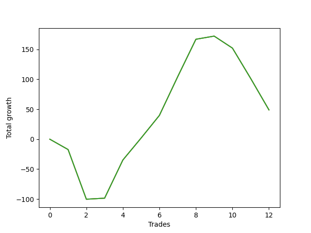

# Long Golden 003 
- Symbol: TEST
- Date Range: 3/19/22 - 5/22/22
- Trading Period: 7:20-12:30
- Number of Trades: 12



| Name | Win Percent | Profit | Avg Profit / Trade |     | Name | Win Percent | Profit | Avg Profit / Trade |
| ---- | ----------- | ------ | ------------------ | --- | ---- | ----------- | ------ | ------------------ |
| Sorted By <br> Profit | | | | | Sorted By <br> Win Percentage ||||
| Seventy-Five | 58.33 | 24500.00 | 2041.67 |     | Seventy-Five | 58.33 | 24500.00 | 2041.67 |
| Seventy-Four | 58.33 | 24500.00 | 2041.67 |     | Seventy-Four | 58.33 | 24500.00 | 2041.67 |
| Seventy-Three | 58.33 | 24500.00 | 2041.67 |     | Seventy-Three | 58.33 | 24500.00 | 2041.67 |

### Test Seventy-Three
* Sell when the linear regression slope changes to negative
* No Stoploss
* Results:
```
Total Trades: 12
Percent Up: 58.33
Percent Down: 41.67
Total Points Moved Up: 49.00
Potential Profit: 24500.00
Total Points Ups: 272.50 Count Ups: 7
Total Points Downs: -223.50 Count Downs: 5
```

<details><summary>Trades</summary>

<code>In: 2022-06-24 06:46:00		Out: 2022-06-24 06:30:10		Total Position Time: 1424:10		Total Move Up: -17.25		Total to Date: -17.25</code> <br />
<code>In: 2022-06-27 07:50:00		Out: 2022-06-24 06:30:10		Total Position Time: 1360:10		Total Move Up: -83.00		Total to Date: -100.25</code> <br />
<code>In: 2022-06-29 06:53:00		Out: 2022-06-24 06:30:10		Total Position Time: 1417:10		Total Move Up: 1.75		Total to Date: -98.50</code> <br />
<code>In: 2022-06-30 08:01:00		Out: 2022-06-24 06:30:10		Total Position Time: 1349:10		Total Move Up: 63.75		Total to Date: -34.75</code> <br />
<code>In: 2022-07-01 06:46:00		Out: 2022-06-24 06:30:10		Total Position Time: 1424:10		Total Move Up: 36.75		Total to Date: 2.00</code> <br />
<code>In: 2022-07-01 10:58:00		Out: 2022-06-24 06:30:10		Total Position Time: 1172:10		Total Move Up: 37.75		Total to Date: 39.75</code> <br />
<code>In: 2022-07-05 07:37:00		Out: 2022-06-24 06:30:10		Total Position Time: 1373:10		Total Move Up: 64.50		Total to Date: 104.25</code> <br />
<code>In: 2022-07-05 08:55:00		Out: 2022-06-24 06:30:10		Total Position Time: 1295:10		Total Move Up: 62.75		Total to Date: 167.00</code> <br />
<code>In: 2022-07-06 06:46:00		Out: 2022-06-24 06:30:10		Total Position Time: 1424:10		Total Move Up: 5.25		Total to Date: 172.25</code> <br />
<code>In: 2022-07-06 11:35:00		Out: 2022-06-24 06:30:10		Total Position Time: 1135:10		Total Move Up: -20.00		Total to Date: 152.25</code> <br />
<code>In: 2022-07-07 06:46:00		Out: 2022-06-24 06:30:10		Total Position Time: 1424:10		Total Move Up: -50.75		Total to Date: 101.50</code> <br />
<code>In: 2022-07-07 07:34:00		Out: 2022-06-24 06:30:10		Total Position Time: 1376:10		Total Move Up: -52.50		Total to Date: 49.00</code> <br />


</details>

### Test Seventy-Four
* Sell when the bias changes to negative
* No Stoploss
* Results:
```
Total Trades: 12
Percent Up: 58.33
Percent Down: 41.67
Total Points Moved Up: 49.00
Potential Profit: 24500.00
Total Points Ups: 272.50 Count Ups: 7
Total Points Downs: -223.50 Count Downs: 5
```

<details><summary>Trades</summary>

<code>In: 2022-06-24 06:46:00		Out: 2022-06-24 06:30:10		Total Position Time: 1424:10		Total Move Up: -17.25		Total to Date: -17.25</code> <br />
<code>In: 2022-06-27 07:50:00		Out: 2022-06-24 06:30:10		Total Position Time: 1360:10		Total Move Up: -83.00		Total to Date: -100.25</code> <br />
<code>In: 2022-06-29 06:53:00		Out: 2022-06-24 06:30:10		Total Position Time: 1417:10		Total Move Up: 1.75		Total to Date: -98.50</code> <br />
<code>In: 2022-06-30 08:01:00		Out: 2022-06-24 06:30:10		Total Position Time: 1349:10		Total Move Up: 63.75		Total to Date: -34.75</code> <br />
<code>In: 2022-07-01 06:46:00		Out: 2022-06-24 06:30:10		Total Position Time: 1424:10		Total Move Up: 36.75		Total to Date: 2.00</code> <br />
<code>In: 2022-07-01 10:58:00		Out: 2022-06-24 06:30:10		Total Position Time: 1172:10		Total Move Up: 37.75		Total to Date: 39.75</code> <br />
<code>In: 2022-07-05 07:37:00		Out: 2022-06-24 06:30:10		Total Position Time: 1373:10		Total Move Up: 64.50		Total to Date: 104.25</code> <br />
<code>In: 2022-07-05 08:55:00		Out: 2022-06-24 06:30:10		Total Position Time: 1295:10		Total Move Up: 62.75		Total to Date: 167.00</code> <br />
<code>In: 2022-07-06 06:46:00		Out: 2022-06-24 06:30:10		Total Position Time: 1424:10		Total Move Up: 5.25		Total to Date: 172.25</code> <br />
<code>In: 2022-07-06 11:35:00		Out: 2022-06-24 06:30:10		Total Position Time: 1135:10		Total Move Up: -20.00		Total to Date: 152.25</code> <br />
<code>In: 2022-07-07 06:46:00		Out: 2022-06-24 06:30:10		Total Position Time: 1424:10		Total Move Up: -50.75		Total to Date: 101.50</code> <br />
<code>In: 2022-07-07 07:34:00		Out: 2022-06-24 06:30:10		Total Position Time: 1376:10		Total Move Up: -52.50		Total to Date: 49.00</code> <br />


</details>

### Test Seventy-Five
* Sell when the STDEV slope changes to negative
* No Stoploss
* Results:
```
Total Trades: 12
Percent Up: 58.33
Percent Down: 41.67
Total Points Moved Up: 49.00
Potential Profit: 24500.00
Total Points Ups: 272.50 Count Ups: 7
Total Points Downs: -223.50 Count Downs: 5
```

<details><summary>Trades</summary>

<code>In: 2022-06-24 06:46:00		Out: 2022-06-24 06:30:10		Total Position Time: 1424:10		Total Move Up: -17.25		Total to Date: -17.25</code> <br />
<code>In: 2022-06-27 07:50:00		Out: 2022-06-24 06:30:10		Total Position Time: 1360:10		Total Move Up: -83.00		Total to Date: -100.25</code> <br />
<code>In: 2022-06-29 06:53:00		Out: 2022-06-24 06:30:10		Total Position Time: 1417:10		Total Move Up: 1.75		Total to Date: -98.50</code> <br />
<code>In: 2022-06-30 08:01:00		Out: 2022-06-24 06:30:10		Total Position Time: 1349:10		Total Move Up: 63.75		Total to Date: -34.75</code> <br />
<code>In: 2022-07-01 06:46:00		Out: 2022-06-24 06:30:10		Total Position Time: 1424:10		Total Move Up: 36.75		Total to Date: 2.00</code> <br />
<code>In: 2022-07-01 10:58:00		Out: 2022-06-24 06:30:10		Total Position Time: 1172:10		Total Move Up: 37.75		Total to Date: 39.75</code> <br />
<code>In: 2022-07-05 07:37:00		Out: 2022-06-24 06:30:10		Total Position Time: 1373:10		Total Move Up: 64.50		Total to Date: 104.25</code> <br />
<code>In: 2022-07-05 08:55:00		Out: 2022-06-24 06:30:10		Total Position Time: 1295:10		Total Move Up: 62.75		Total to Date: 167.00</code> <br />
<code>In: 2022-07-06 06:46:00		Out: 2022-06-24 06:30:10		Total Position Time: 1424:10		Total Move Up: 5.25		Total to Date: 172.25</code> <br />
<code>In: 2022-07-06 11:35:00		Out: 2022-06-24 06:30:10		Total Position Time: 1135:10		Total Move Up: -20.00		Total to Date: 152.25</code> <br />
<code>In: 2022-07-07 06:46:00		Out: 2022-06-24 06:30:10		Total Position Time: 1424:10		Total Move Up: -50.75		Total to Date: 101.50</code> <br />
<code>In: 2022-07-07 07:34:00		Out: 2022-06-24 06:30:10		Total Position Time: 1376:10		Total Move Up: -52.50		Total to Date: 49.00</code> <br />


</details>