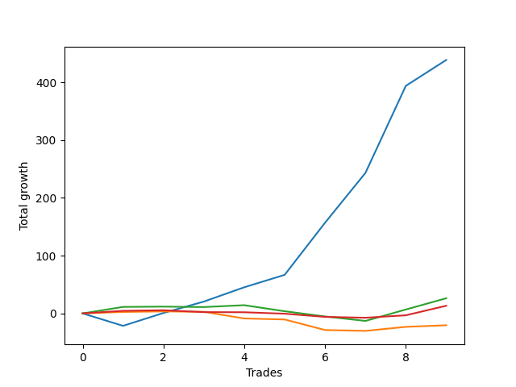

# Long Golden 003 
- Symbol: TEST
- Date Range: 3/19/22 - 5/22/22
- Trading Period: 7:20-12:30
- Number of Trades: 12



| Name | Win Percent | Profit | Avg Profit / Trade |     | Name | Win Percent | Profit | Avg Profit / Trade |
| ---- | ----------- | ------ | ------------------ | --- | ---- | ----------- | ------ | ------------------ |
| Sorted By <br> Profit | | | | | Sorted By <br> Win Percentage ||||
| Seventy-Four | 66.67 | 80000.00 | 6666.67 |     | Seventy-Four | 66.67 | 80000.00 | 6666.67 |
| Seventy-Five | 66.67 | 57500.00 | 4791.67 |     | Seventy-Five | 66.67 | 57500.00 | 4791.67 |
| Seventy-Three | 66.67 | 10750.00 | 895.83 |     | Seventy-Three | 66.67 | 10750.00 | 895.83 |

### Test Seventy-Three
* Sell when the linear regression slope changes to negative
* No Stoploss
* Results:
```
Total Trades: 12
Percent Up: 66.67
Percent Down: 33.33
Total Points Moved Up: 21.50
Potential Profit: 10750.00
Total Points Ups: 35.00 Count Ups: 8
Total Points Downs: -13.50 Count Downs: 4
```

<details><summary>Trades</summary>

<code>In: 2022-06-24 06:46:00		Out: 2022-06-24 06:56:05		Total Position Time: 10:05		Total Move Up: 5.25		Total to Date: 5.25</code> <br />
<code>In: 2022-06-27 07:50:00		Out: 2022-06-27 08:01:05		Total Position Time: 11:05		Total Move Up: 4.75		Total to Date: 10.00</code> <br />
<code>In: 2022-06-29 06:53:00		Out: 2022-06-29 07:00:05		Total Position Time: 07:05		Total Move Up: -5.25		Total to Date: 4.75</code> <br />
<code>In: 2022-06-30 08:01:00		Out: 2022-06-30 08:03:05		Total Position Time: 02:05		Total Move Up: -3.50		Total to Date: 1.25</code> <br />
<code>In: 2022-07-01 06:46:00		Out: 2022-07-01 06:55:05		Total Position Time: 09:05		Total Move Up: 10.00		Total to Date: 11.25</code> <br />
<code>In: 2022-07-01 10:58:00		Out: 2022-07-01 11:03:05		Total Position Time: 05:05		Total Move Up: 1.50		Total to Date: 12.75</code> <br />
<code>In: 2022-07-05 07:37:00		Out: 2022-07-05 07:44:05		Total Position Time: 07:05		Total Move Up: -2.50		Total to Date: 10.25</code> <br />
<code>In: 2022-07-05 08:55:00		Out: 2022-07-05 08:57:05		Total Position Time: 02:05		Total Move Up: 0.50		Total to Date: 10.75</code> <br />
<code>In: 2022-07-06 06:46:00		Out: 2022-07-06 06:51:05		Total Position Time: 05:05		Total Move Up: 1.50		Total to Date: 12.25</code> <br />
<code>In: 2022-07-06 11:35:00		Out: 2022-07-06 11:41:05		Total Position Time: 06:05		Total Move Up: 9.00		Total to Date: 21.25</code> <br />
<code>In: 2022-07-07 06:46:00		Out: 2022-07-07 06:48:05		Total Position Time: 02:05		Total Move Up: 2.50		Total to Date: 23.75</code> <br />
<code>In: 2022-07-07 07:34:00		Out: 2022-07-07 07:38:05		Total Position Time: 04:05		Total Move Up: -2.25		Total to Date: 21.50</code> <br />


</details>

### Test Seventy-Four
* Sell when the bias changes to negative
* No Stoploss
* Results:
```
Total Trades: 12
Percent Up: 66.67
Percent Down: 33.33
Total Points Moved Up: 160.00
Potential Profit: 80000.00
Total Points Ups: 240.50 Count Ups: 8
Total Points Downs: -80.50 Count Downs: 4
```

<details><summary>Trades</summary>

<code>In: 2022-06-24 06:46:00		Out: 2022-06-24 12:31:00		Total Position Time: 345:00		Total Move Up: 47.75		Total to Date: 47.75</code> <br />
<code>In: 2022-06-27 07:50:00		Out: 2022-06-27 11:12:05		Total Position Time: 202:05		Total Move Up: -15.50		Total to Date: 32.25</code> <br />
<code>In: 2022-06-29 06:53:00		Out: 2022-06-29 09:09:05		Total Position Time: 136:05		Total Move Up: -17.75		Total to Date: 14.50</code> <br />
<code>In: 2022-06-30 08:01:00		Out: 2022-06-30 12:31:00		Total Position Time: 270:00		Total Move Up: 18.25		Total to Date: 32.75</code> <br />
<code>In: 2022-07-01 06:46:00		Out: 2022-07-01 07:20:05		Total Position Time: 34:05		Total Move Up: -24.00		Total to Date: 8.75</code> <br />
<code>In: 2022-07-01 10:58:00		Out: 2022-07-01 12:31:00		Total Position Time: 93:00		Total Move Up: 24.00		Total to Date: 32.75</code> <br />
<code>In: 2022-07-05 07:37:00		Out: 2022-07-05 08:06:05		Total Position Time: 29:05		Total Move Up: -23.25		Total to Date: 9.50</code> <br />
<code>In: 2022-07-05 08:55:00		Out: 2022-07-05 12:31:00		Total Position Time: 216:00		Total Move Up: 54.50		Total to Date: 64.00</code> <br />
<code>In: 2022-07-06 06:46:00		Out: 2022-07-06 12:31:00		Total Position Time: 345:00		Total Move Up: 38.25		Total to Date: 102.25</code> <br />
<code>In: 2022-07-06 11:35:00		Out: 2022-07-06 12:31:00		Total Position Time: 56:00		Total Move Up: 13.00		Total to Date: 115.25</code> <br />
<code>In: 2022-07-07 06:46:00		Out: 2022-07-07 12:31:00		Total Position Time: 345:00		Total Move Up: 23.25		Total to Date: 138.50</code> <br />
<code>In: 2022-07-07 07:34:00		Out: 2022-07-07 12:31:00		Total Position Time: 297:00		Total Move Up: 21.50		Total to Date: 160.00</code> <br />


</details>

### Test Seventy-Five
* Sell when the STDEV slope changes to negative
* No Stoploss
* Results:
```
Total Trades: 12
Percent Up: 66.67
Percent Down: 33.33
Total Points Moved Up: 115.00
Potential Profit: 57500.00
Total Points Ups: 137.00 Count Ups: 8
Total Points Downs: -22.00 Count Downs: 4
```

<details><summary>Trades</summary>

<code>In: 2022-06-24 06:46:00		Out: 2022-06-24 07:00:05		Total Position Time: 14:05		Total Move Up: 10.25		Total to Date: 10.25</code> <br />
<code>In: 2022-06-27 07:50:00		Out: 2022-06-27 09:03:05		Total Position Time: 73:05		Total Move Up: 1.25		Total to Date: 11.50</code> <br />
<code>In: 2022-06-29 06:53:00		Out: 2022-06-29 07:16:05		Total Position Time: 23:05		Total Move Up: -4.50		Total to Date: 7.00</code> <br />
<code>In: 2022-06-30 08:01:00		Out: 2022-06-30 10:15:05		Total Position Time: 134:05		Total Move Up: 23.25		Total to Date: 30.25</code> <br />
<code>In: 2022-07-01 06:46:00		Out: 2022-07-01 07:01:05		Total Position Time: 15:05		Total Move Up: 9.50		Total to Date: 39.75</code> <br />
<code>In: 2022-07-01 10:58:00		Out: 2022-07-01 12:31:00		Total Position Time: 93:00		Total Move Up: 24.00		Total to Date: 63.75</code> <br />
<code>In: 2022-07-05 07:37:00		Out: 2022-07-05 07:47:05		Total Position Time: 10:05		Total Move Up: -14.00		Total to Date: 49.75</code> <br />
<code>In: 2022-07-05 08:55:00		Out: 2022-07-05 12:31:00		Total Position Time: 216:00		Total Move Up: 54.50		Total to Date: 104.25</code> <br />
<code>In: 2022-07-06 06:46:00		Out: 2022-07-06 06:47:05		Total Position Time: 01:05		Total Move Up: -0.50		Total to Date: 103.75</code> <br />
<code>In: 2022-07-06 11:35:00		Out: 2022-07-06 12:31:00		Total Position Time: 56:00		Total Move Up: 13.00		Total to Date: 116.75</code> <br />
<code>In: 2022-07-07 06:46:00		Out: 2022-07-07 06:54:05		Total Position Time: 08:05		Total Move Up: 1.25		Total to Date: 118.00</code> <br />
<code>In: 2022-07-07 07:34:00		Out: 2022-07-07 07:46:05		Total Position Time: 12:05		Total Move Up: -3.00		Total to Date: 115.00</code> <br />


</details>