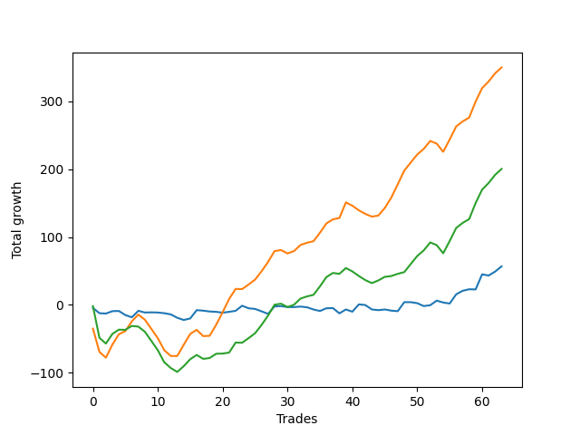

# Long Golden One 
- Symbol: TEST
- Date Range: 3/19/22 - 5/22/22
- Trading Period: 7:20-12:30
- Number of Trades: 64



| Name | Win Percent | Profit | Avg Profit / Trade |     | Name | Win Percent | Profit | Avg Profit / Trade |
| ---- | ----------- | ------ | ------------------ | --- | ---- | ----------- | ------ | ------------------ |
| Sorted By <br> Profit | | | | | Sorted By <br> Win Percentage ||||
| Thirty-Six | 73.44 | 174875.00 | 2732.42 |     | Three | 85.94 | 54125.00 | 845.70 |
| Thirty-Seven | 65.62 | 147750.00 | 2308.59 |     | Two | 84.38 | 15875.00 | 248.05 |
| Four | 60.94 | 69125.00 | 1080.08 |     | Twenty-Eight | 82.81 | 64750.00 | 1011.72 |
| Twenty-Eight | 82.81 | 64750.00 | 1011.72 |     | Twenty-Seven | 82.81 | 21250.00 | 332.03 |
| Three | 85.94 | 54125.00 | 845.70 |     | Twenty-Six | 82.81 | 20250.00 | 316.41 |
| Thirty | 57.81 | 50000.00 | 781.25 |     | Twenty-Nine | 75.00 | 45500.00 | 710.94 |
| Five | 56.25 | 48500.00 | 757.81 |     | Twenty-One | 75.00 | 19625.00 | 306.64 |
| Thirty-Two | 51.56 | 46500.00 | 726.56 |     | Twenty | 75.00 | 13000.00 | 203.12 |
| Twenty-Nine | 75.00 | 45500.00 | 710.94 |     | Thirty-Six | 73.44 | 174875.00 | 2732.42 |
| Thirty-One | 56.25 | 36500.00 | 570.31 |     | Fourteen | 70.31 | 15750.00 | 246.09 |
| Thirty-Three | 48.44 | 31375.00 | 490.23 |     | Thirty-Seven | 65.62 | 147750.00 | 2308.59 |
| Thirty-Five | 43.75 | 28375.00 | 443.36 |     | Eight | 65.62 | 12750.00 | 199.22 |
| Thirty-Four | 43.75 | 28375.00 | 443.36 |     | Nineteen | 64.06 | 9250.00 | 144.53 |
| Ten | 43.75 | 25875.00 | 404.30 |     | One | 64.06 | 4750.00 | 74.22 |
| Twenty-Two | 59.38 | 24000.00 | 375.00 |     | Eighteen | 64.06 | 4625.00 | 72.27 |
| Sixteen | 48.44 | 22375.00 | 349.61 |     | Twenty-Five | 64.06 | 250.00 | 3.91 |
| Twenty-Seven | 82.81 | 21250.00 | 332.03 |     | Twenty-Four | 64.06 | -500.00 | -7.81 |
| Twenty-Six | 82.81 | 20250.00 | 316.41 |     | Four | 60.94 | 69125.00 | 1080.08 |
| Twenty-One | 75.00 | 19625.00 | 306.64 |     | Twelve | 60.94 | 3000.00 | 46.88 |
| Two | 84.38 | 15875.00 | 248.05 |     | Fifteen | 60.94 | -750.00 | -11.72 |
| Fourteen | 70.31 | 15750.00 | 246.09 |     | Twenty-Two | 59.38 | 24000.00 | 375.00 |
| Twenty | 75.00 | 13000.00 | 203.12 |     | Thirteen | 59.38 | 1375.00 | 21.48 |
| Eight | 65.62 | 12750.00 | 199.22 |     | Thirty | 57.81 | 50000.00 | 781.25 |
| Twenty-Three | 53.12 | 12250.00 | 191.41 |     | Five | 56.25 | 48500.00 | 757.81 |
| Nineteen | 64.06 | 9250.00 | 144.53 |     | Thirty-One | 56.25 | 36500.00 | 570.31 |
| One | 64.06 | 4750.00 | 74.22 |     | Six | 56.25 | 750.00 | 11.72 |
| Eighteen | 64.06 | 4625.00 | 72.27 |     | Seven | 54.69 | -1125.00 | -17.58 |
| Twelve | 60.94 | 3000.00 | 46.88 |     | Nine | 54.69 | -5125.00 | -80.08 |
| Thirteen | 59.38 | 1375.00 | 21.48 |     | Twenty-Three | 53.12 | 12250.00 | 191.41 |
| Six | 56.25 | 750.00 | 11.72 |     | Thirty-Two | 51.56 | 46500.00 | 726.56 |
| Twenty-Five | 64.06 | 250.00 | 3.91 |     | Thirty-Three | 48.44 | 31375.00 | 490.23 |
| Twenty-Four | 64.06 | -500.00 | -7.81 |     | Sixteen | 48.44 | 22375.00 | 349.61 |
| Fifteen | 60.94 | -750.00 | -11.72 |     | Thirty-Five | 43.75 | 28375.00 | 443.36 |
| Seven | 54.69 | -1125.00 | -17.58 |     | Thirty-Four | 43.75 | 28375.00 | 443.36 |
| Nine | 54.69 | -5125.00 | -80.08 |     | Ten | 43.75 | 25875.00 | 404.30 |
| Seventeen | 35.94 | -16750.00 | -261.72 |     | Seventeen | 35.94 | -16750.00 | -261.72 |
| Eleven | 34.38 | -17375.00 | -271.48 |     | Eleven | 34.38 | -17375.00 | -271.48 |

### Test One
* Sell when price hits the middle line of the 20p bollinger
* No Stoploss
* Results:
```
Total Trades: 64
Percent Up: 64.06
Percent Down: 35.94
Total Points Moved Up: 9.50
Potential Profit: 4750.00
Total Points Ups: 46.75 Count Ups: 41
Total Points Downs: -37.25 Count Downs: 23
```

<details><summary>Trades</summary>

<code>In: 2022-07-01 06:56:00		Out: 2022-07-01 06:56:10		Total Position Time: 00:10		Total Move Up: -0.50		Total to Date: -0.50</code> <br />
<code>In: 2022-07-01 07:02:00		Out: 2022-07-01 07:02:15		Total Position Time: 00:15		Total Move Up: -3.00		Total to Date: -3.50</code> <br />
<code>In: 2022-07-01 07:22:00		Out: 2022-07-01 07:42:25		Total Position Time: 20:25		Total Move Up: -7.75		Total to Date: -11.25</code> <br />
<code>In: 2022-07-01 07:42:00		Out: 2022-07-01 07:42:25		Total Position Time: 00:25		Total Move Up: 4.00		Total to Date: -7.25</code> <br />
<code>In: 2022-07-01 07:54:00		Out: 2022-07-01 07:54:10		Total Position Time: 00:10		Total Move Up: 0.25		Total to Date: -7.00</code> <br />
<code>In: 2022-07-01 07:57:00		Out: 2022-07-01 07:57:10		Total Position Time: 00:10		Total Move Up: 2.75		Total to Date: -4.25</code> <br />
<code>In: 2022-07-01 08:02:00		Out: 2022-07-01 08:02:10		Total Position Time: 00:10		Total Move Up: 2.25		Total to Date: -2.00</code> <br />
<code>In: 2022-07-01 08:07:00		Out: 2022-07-01 08:07:10		Total Position Time: 00:10		Total Move Up: 1.00		Total to Date: -1.00</code> <br />
<code>In: 2022-07-01 08:21:00		Out: 2022-07-01 08:21:10		Total Position Time: 00:10		Total Move Up: -1.75		Total to Date: -2.75</code> <br />
<code>In: 2022-07-01 08:31:00		Out: 2022-07-01 08:31:10		Total Position Time: 00:10		Total Move Up: 0.00		Total to Date: -2.75</code> <br />
<code>In: 2022-07-01 08:41:00		Out: 2022-07-01 08:41:10		Total Position Time: 00:10		Total Move Up: 1.25		Total to Date: -1.50</code> <br />
<code>In: 2022-07-01 08:43:00		Out: 2022-07-01 08:43:10		Total Position Time: 00:10		Total Move Up: -1.75		Total to Date: -3.25</code> <br />
<code>In: 2022-07-01 08:48:00		Out: 2022-07-01 08:48:10		Total Position Time: 00:10		Total Move Up: 0.25		Total to Date: -3.00</code> <br />
<code>In: 2022-07-01 08:50:00		Out: 2022-07-01 09:07:50		Total Position Time: 17:50		Total Move Up: -9.75		Total to Date: -12.75</code> <br />
<code>In: 2022-07-01 09:02:00		Out: 2022-07-01 09:07:50		Total Position Time: 05:50		Total Move Up: 4.50		Total to Date: -8.25</code> <br />
<code>In: 2022-07-01 09:04:00		Out: 2022-07-01 09:07:50		Total Position Time: 03:50		Total Move Up: 6.25		Total to Date: -2.00</code> <br />
<code>In: 2022-07-01 09:14:00		Out: 2022-07-01 09:14:10		Total Position Time: 00:10		Total Move Up: 1.50		Total to Date: -0.50</code> <br />
<code>In: 2022-07-01 09:32:00		Out: 2022-07-01 09:32:10		Total Position Time: 00:10		Total Move Up: 0.50		Total to Date: 0.00</code> <br />
<code>In: 2022-07-01 09:50:00		Out: 2022-07-01 09:50:15		Total Position Time: 00:15		Total Move Up: 1.25		Total to Date: 1.25</code> <br />
<code>In: 2022-07-01 10:09:00		Out: 2022-07-01 10:11:00		Total Position Time: 02:00		Total Move Up: 3.00		Total to Date: 4.25</code> <br />
<code>In: 2022-07-01 10:19:00		Out: 2022-07-01 10:19:10		Total Position Time: 00:10		Total Move Up: -0.50		Total to Date: 3.75</code> <br />
<code>In: 2022-07-01 10:24:00		Out: 2022-07-01 10:24:10		Total Position Time: 00:10		Total Move Up: 0.25		Total to Date: 4.00</code> <br />
<code>In: 2022-07-01 10:28:00		Out: 2022-07-01 10:28:10		Total Position Time: 00:10		Total Move Up: 1.25		Total to Date: 5.25</code> <br />
<code>In: 2022-07-01 10:39:00		Out: 2022-07-01 10:39:10		Total Position Time: 00:10		Total Move Up: 2.00		Total to Date: 7.25</code> <br />
<code>In: 2022-07-01 10:53:00		Out: 2022-07-01 10:53:10		Total Position Time: 00:10		Total Move Up: 0.00		Total to Date: 7.25</code> <br />
<code>In: 2022-07-01 11:00:00		Out: 2022-07-01 11:00:10		Total Position Time: 00:10		Total Move Up: -1.00		Total to Date: 6.25</code> <br />
<code>In: 2022-07-01 11:03:00		Out: 2022-07-01 11:03:10		Total Position Time: 00:10		Total Move Up: -1.00		Total to Date: 5.25</code> <br />
<code>In: 2022-07-01 11:07:00		Out: 2022-07-01 11:07:10		Total Position Time: 00:10		Total Move Up: -0.50		Total to Date: 4.75</code> <br />
<code>In: 2022-07-01 11:15:00		Out: 2022-07-01 11:15:10		Total Position Time: 00:10		Total Move Up: -0.25		Total to Date: 4.50</code> <br />
<code>In: 2022-07-01 11:32:00		Out: 2022-07-01 11:32:10		Total Position Time: 00:10		Total Move Up: 0.00		Total to Date: 4.50</code> <br />
<code>In: 2022-07-01 11:34:00		Out: 2022-07-01 11:34:10		Total Position Time: 00:10		Total Move Up: -0.50		Total to Date: 4.00</code> <br />
<code>In: 2022-07-01 11:39:00		Out: 2022-07-01 11:39:10		Total Position Time: 00:10		Total Move Up: -0.50		Total to Date: 3.50</code> <br />
<code>In: 2022-07-01 11:46:00		Out: 2022-07-01 11:46:10		Total Position Time: 00:10		Total Move Up: 0.00		Total to Date: 3.50</code> <br />
<code>In: 2022-07-01 11:58:00		Out: 2022-07-01 11:58:10		Total Position Time: 00:10		Total Move Up: -0.25		Total to Date: 3.25</code> <br />
<code>In: 2022-07-01 12:00:00		Out: 2022-07-01 12:00:10		Total Position Time: 00:10		Total Move Up: -0.25		Total to Date: 3.00</code> <br />
<code>In: 2022-07-01 12:07:00		Out: 2022-07-01 12:07:10		Total Position Time: 00:10		Total Move Up: -0.50		Total to Date: 2.50</code> <br />
<code>In: 2022-07-01 12:09:00		Out: 2022-07-01 12:09:10		Total Position Time: 00:10		Total Move Up: 0.00		Total to Date: 2.50</code> <br />
<code>In: 2022-07-01 12:25:00		Out: 2022-07-01 12:25:10		Total Position Time: 00:10		Total Move Up: -0.25		Total to Date: 2.25</code> <br />
<code>In: 2022-07-05 07:02:00		Out: 2022-07-05 07:03:15		Total Position Time: 01:15		Total Move Up: 0.25		Total to Date: 2.50</code> <br />
<code>In: 2022-07-05 07:10:00		Out: 2022-07-05 07:10:30		Total Position Time: 00:30		Total Move Up: 0.25		Total to Date: 2.75</code> <br />
<code>In: 2022-07-05 07:28:00		Out: 2022-07-05 07:28:10		Total Position Time: 00:10		Total Move Up: 1.25		Total to Date: 4.00</code> <br />
<code>In: 2022-07-05 07:35:00		Out: 2022-07-05 07:35:30		Total Position Time: 00:30		Total Move Up: 1.25		Total to Date: 5.25</code> <br />
<code>In: 2022-07-05 07:54:00		Out: 2022-07-05 08:08:15		Total Position Time: 14:15		Total Move Up: -2.50		Total to Date: 2.75</code> <br />
<code>In: 2022-07-05 07:56:00		Out: 2022-07-05 08:08:15		Total Position Time: 12:15		Total Move Up: -1.25		Total to Date: 1.50</code> <br />
<code>In: 2022-07-05 08:08:00		Out: 2022-07-05 08:08:15		Total Position Time: 00:15		Total Move Up: 2.25		Total to Date: 3.75</code> <br />
<code>In: 2022-07-05 08:13:00		Out: 2022-07-05 08:15:20		Total Position Time: 02:20		Total Move Up: 1.50		Total to Date: 5.25</code> <br />
<code>In: 2022-07-05 08:29:00		Out: 2022-07-05 08:29:10		Total Position Time: 00:10		Total Move Up: 0.25		Total to Date: 5.50</code> <br />
<code>In: 2022-07-05 08:32:00		Out: 2022-07-05 08:32:10		Total Position Time: 00:10		Total Move Up: 0.50		Total to Date: 6.00</code> <br />
<code>In: 2022-07-05 08:41:00		Out: 2022-07-05 08:41:10		Total Position Time: 00:10		Total Move Up: 0.50		Total to Date: 6.50</code> <br />
<code>In: 2022-07-05 08:55:00		Out: 2022-07-05 08:55:10		Total Position Time: 00:10		Total Move Up: -0.75		Total to Date: 5.75</code> <br />
<code>In: 2022-07-05 08:57:00		Out: 2022-07-05 08:57:10		Total Position Time: 00:10		Total Move Up: 0.00		Total to Date: 5.75</code> <br />
<code>In: 2022-07-05 09:02:00		Out: 2022-07-05 09:02:10		Total Position Time: 00:10		Total Move Up: 0.00		Total to Date: 5.75</code> <br />
<code>In: 2022-07-05 09:08:00		Out: 2022-07-05 09:08:10		Total Position Time: 00:10		Total Move Up: 1.00		Total to Date: 6.75</code> <br />
<code>In: 2022-07-05 09:23:00		Out: 2022-07-05 09:23:10		Total Position Time: 00:10		Total Move Up: 0.50		Total to Date: 7.25</code> <br />
<code>In: 2022-07-05 09:38:00		Out: 2022-07-05 09:38:10		Total Position Time: 00:10		Total Move Up: 1.00		Total to Date: 8.25</code> <br />
<code>In: 2022-07-05 09:53:00		Out: 2022-07-05 10:01:05		Total Position Time: 08:05		Total Move Up: 0.00		Total to Date: 8.25</code> <br />
<code>In: 2022-07-05 10:09:00		Out: 2022-07-05 10:09:10		Total Position Time: 00:10		Total Move Up: -0.50		Total to Date: 7.75</code> <br />
<code>In: 2022-07-05 10:34:00		Out: 2022-07-05 10:34:10		Total Position Time: 00:10		Total Move Up: 0.75		Total to Date: 8.50</code> <br />
<code>In: 2022-07-05 10:52:00		Out: 2022-07-05 10:57:20		Total Position Time: 05:20		Total Move Up: 1.00		Total to Date: 9.50</code> <br />
<code>In: 2022-07-05 11:12:00		Out: 2022-07-05 11:12:10		Total Position Time: 00:10		Total Move Up: 1.00		Total to Date: 10.50</code> <br />
<code>In: 2022-07-05 11:18:00		Out: 2022-07-05 11:18:45		Total Position Time: 00:45		Total Move Up: 0.25		Total to Date: 10.75</code> <br />
<code>In: 2022-07-05 11:55:00		Out: 2022-07-05 11:56:30		Total Position Time: 01:30		Total Move Up: 1.00		Total to Date: 11.75</code> <br />
<code>In: 2022-07-05 12:06:00		Out: 2022-07-05 12:06:10		Total Position Time: 00:10		Total Move Up: -1.25		Total to Date: 10.50</code> <br />
<code>In: 2022-07-05 12:22:00		Out: 2022-07-05 12:22:10		Total Position Time: 00:10		Total Move Up: -1.00		Total to Date: 9.50</code> <br />


</details>

### Test Two
* Sell when the price hits the upper line of the 20p 1std bollinger
* No Stoploss
* Results:
```
Total Trades: 64
Percent Up: 84.38
Percent Down: 15.62
Total Points Moved Up: 31.75
Potential Profit: 15875.00
Total Points Ups: 100.50 Count Ups: 54
Total Points Downs: -68.75 Count Downs: 10
```

<details><summary>Trades</summary>

<code>In: 2022-07-01 06:56:00		Out: 2022-07-01 06:56:20		Total Position Time: 00:20		Total Move Up: 0.25		Total to Date: 0.25</code> <br />
<code>In: 2022-07-01 07:02:00		Out: 2022-07-01 07:31:55		Total Position Time: 29:55		Total Move Up: -46.75		Total to Date: -46.50</code> <br />
<code>In: 2022-07-01 07:22:00		Out: 2022-07-01 07:46:55		Total Position Time: 24:55		Total Move Up: -5.75		Total to Date: -52.25</code> <br />
<code>In: 2022-07-01 07:42:00		Out: 2022-07-01 07:46:55		Total Position Time: 04:55		Total Move Up: 6.00		Total to Date: -46.25</code> <br />
<code>In: 2022-07-01 07:54:00		Out: 2022-07-01 07:54:10		Total Position Time: 00:10		Total Move Up: 0.25		Total to Date: -46.00</code> <br />
<code>In: 2022-07-01 07:57:00		Out: 2022-07-01 07:57:10		Total Position Time: 00:10		Total Move Up: 2.75		Total to Date: -43.25</code> <br />
<code>In: 2022-07-01 08:02:00		Out: 2022-07-01 08:06:15		Total Position Time: 04:15		Total Move Up: 4.00		Total to Date: -39.25</code> <br />
<code>In: 2022-07-01 08:07:00		Out: 2022-07-01 08:07:10		Total Position Time: 00:10		Total Move Up: 1.00		Total to Date: -38.25</code> <br />
<code>In: 2022-07-01 08:21:00		Out: 2022-07-01 08:35:05		Total Position Time: 14:05		Total Move Up: 1.00		Total to Date: -37.25</code> <br />
<code>In: 2022-07-01 08:31:00		Out: 2022-07-01 08:35:05		Total Position Time: 04:05		Total Move Up: 3.75		Total to Date: -33.50</code> <br />
<code>In: 2022-07-01 08:41:00		Out: 2022-07-01 08:41:10		Total Position Time: 00:10		Total Move Up: 1.25		Total to Date: -32.25</code> <br />
<code>In: 2022-07-01 08:43:00		Out: 2022-07-01 08:43:10		Total Position Time: 00:10		Total Move Up: -1.75		Total to Date: -34.00</code> <br />
<code>In: 2022-07-01 08:48:00		Out: 2022-07-01 08:48:10		Total Position Time: 00:10		Total Move Up: 0.25		Total to Date: -33.75</code> <br />
<code>In: 2022-07-01 08:50:00		Out: 2022-07-01 09:09:15		Total Position Time: 19:15		Total Move Up: -9.50		Total to Date: -43.25</code> <br />
<code>In: 2022-07-01 09:02:00		Out: 2022-07-01 09:09:15		Total Position Time: 07:15		Total Move Up: 4.75		Total to Date: -38.50</code> <br />
<code>In: 2022-07-01 09:04:00		Out: 2022-07-01 09:09:15		Total Position Time: 05:15		Total Move Up: 6.50		Total to Date: -32.00</code> <br />
<code>In: 2022-07-01 09:14:00		Out: 2022-07-01 09:14:10		Total Position Time: 00:10		Total Move Up: 1.50		Total to Date: -30.50</code> <br />
<code>In: 2022-07-01 09:32:00		Out: 2022-07-01 09:32:10		Total Position Time: 00:10		Total Move Up: 0.50		Total to Date: -30.00</code> <br />
<code>In: 2022-07-01 09:50:00		Out: 2022-07-01 09:51:50		Total Position Time: 01:50		Total Move Up: 3.00		Total to Date: -27.00</code> <br />
<code>In: 2022-07-01 10:09:00		Out: 2022-07-01 10:15:05		Total Position Time: 06:05		Total Move Up: 4.25		Total to Date: -22.75</code> <br />
<code>In: 2022-07-01 10:19:00		Out: 2022-07-01 10:19:15		Total Position Time: 00:15		Total Move Up: 0.75		Total to Date: -22.00</code> <br />
<code>In: 2022-07-01 10:24:00		Out: 2022-07-01 10:24:15		Total Position Time: 00:15		Total Move Up: 0.75		Total to Date: -21.25</code> <br />
<code>In: 2022-07-01 10:28:00		Out: 2022-07-01 10:28:10		Total Position Time: 00:10		Total Move Up: 1.25		Total to Date: -20.00</code> <br />
<code>In: 2022-07-01 10:39:00		Out: 2022-07-01 10:39:10		Total Position Time: 00:10		Total Move Up: 2.00		Total to Date: -18.00</code> <br />
<code>In: 2022-07-01 10:53:00		Out: 2022-07-01 10:53:10		Total Position Time: 00:10		Total Move Up: 0.00		Total to Date: -18.00</code> <br />
<code>In: 2022-07-01 11:00:00		Out: 2022-07-01 11:00:20		Total Position Time: 00:20		Total Move Up: -0.25		Total to Date: -18.25</code> <br />
<code>In: 2022-07-01 11:03:00		Out: 2022-07-01 11:03:25		Total Position Time: 00:25		Total Move Up: -0.25		Total to Date: -18.50</code> <br />
<code>In: 2022-07-01 11:07:00		Out: 2022-07-01 11:15:25		Total Position Time: 08:25		Total Move Up: 1.00		Total to Date: -17.50</code> <br />
<code>In: 2022-07-01 11:15:00		Out: 2022-07-01 11:15:25		Total Position Time: 00:25		Total Move Up: 1.75		Total to Date: -15.75</code> <br />
<code>In: 2022-07-01 11:32:00		Out: 2022-07-01 11:32:10		Total Position Time: 00:10		Total Move Up: 0.00		Total to Date: -15.75</code> <br />
<code>In: 2022-07-01 11:34:00		Out: 2022-07-01 11:34:10		Total Position Time: 00:10		Total Move Up: -0.50		Total to Date: -16.25</code> <br />
<code>In: 2022-07-01 11:39:00		Out: 2022-07-01 11:39:50		Total Position Time: 00:50		Total Move Up: 1.00		Total to Date: -15.25</code> <br />
<code>In: 2022-07-01 11:46:00		Out: 2022-07-01 11:46:20		Total Position Time: 00:20		Total Move Up: 2.50		Total to Date: -12.75</code> <br />
<code>In: 2022-07-01 11:58:00		Out: 2022-07-01 11:58:30		Total Position Time: 00:30		Total Move Up: 0.25		Total to Date: -12.50</code> <br />
<code>In: 2022-07-01 12:00:00		Out: 2022-07-01 12:00:25		Total Position Time: 00:25		Total Move Up: 0.75		Total to Date: -11.75</code> <br />
<code>In: 2022-07-01 12:07:00		Out: 2022-07-01 12:09:35		Total Position Time: 02:35		Total Move Up: 1.75		Total to Date: -10.00</code> <br />
<code>In: 2022-07-01 12:09:00		Out: 2022-07-01 12:09:35		Total Position Time: 00:35		Total Move Up: 0.50		Total to Date: -9.50</code> <br />
<code>In: 2022-07-01 12:25:00		Out: 2022-07-01 12:31:10		Total Position Time: 06:10		Total Move Up: 2.75		Total to Date: -6.75</code> <br />
<code>In: 2022-07-05 07:02:00		Out: 2022-07-05 07:11:05		Total Position Time: 09:05		Total Move Up: 2.25		Total to Date: -4.50</code> <br />
<code>In: 2022-07-05 07:10:00		Out: 2022-07-05 07:11:05		Total Position Time: 01:05		Total Move Up: 5.75		Total to Date: 1.25</code> <br />
<code>In: 2022-07-05 07:28:00		Out: 2022-07-05 07:28:10		Total Position Time: 00:10		Total Move Up: 1.25		Total to Date: 2.50</code> <br />
<code>In: 2022-07-05 07:35:00		Out: 2022-07-05 07:35:45		Total Position Time: 00:45		Total Move Up: 3.00		Total to Date: 5.50</code> <br />
<code>In: 2022-07-05 07:54:00		Out: 2022-07-05 08:16:40		Total Position Time: 22:40		Total Move Up: -2.25		Total to Date: 3.25</code> <br />
<code>In: 2022-07-05 07:56:00		Out: 2022-07-05 08:16:40		Total Position Time: 20:40		Total Move Up: -1.00		Total to Date: 2.25</code> <br />
<code>In: 2022-07-05 08:08:00		Out: 2022-07-05 08:16:40		Total Position Time: 08:40		Total Move Up: 2.50		Total to Date: 4.75</code> <br />
<code>In: 2022-07-05 08:13:00		Out: 2022-07-05 08:16:40		Total Position Time: 03:40		Total Move Up: 3.75		Total to Date: 8.50</code> <br />
<code>In: 2022-07-05 08:29:00		Out: 2022-07-05 08:29:10		Total Position Time: 00:10		Total Move Up: 0.25		Total to Date: 8.75</code> <br />
<code>In: 2022-07-05 08:32:00		Out: 2022-07-05 08:32:25		Total Position Time: 00:25		Total Move Up: 2.50		Total to Date: 11.25</code> <br />
<code>In: 2022-07-05 08:41:00		Out: 2022-07-05 08:41:10		Total Position Time: 00:10		Total Move Up: 0.50		Total to Date: 11.75</code> <br />
<code>In: 2022-07-05 08:55:00		Out: 2022-07-05 08:55:10		Total Position Time: 00:10		Total Move Up: -0.75		Total to Date: 11.00</code> <br />
<code>In: 2022-07-05 08:57:00		Out: 2022-07-05 08:57:10		Total Position Time: 00:10		Total Move Up: 0.00		Total to Date: 11.00</code> <br />
<code>In: 2022-07-05 09:02:00		Out: 2022-07-05 09:02:10		Total Position Time: 00:10		Total Move Up: 0.00		Total to Date: 11.00</code> <br />
<code>In: 2022-07-05 09:08:00		Out: 2022-07-05 09:08:15		Total Position Time: 00:15		Total Move Up: 2.25		Total to Date: 13.25</code> <br />
<code>In: 2022-07-05 09:23:00		Out: 2022-07-05 09:23:10		Total Position Time: 00:10		Total Move Up: 0.50		Total to Date: 13.75</code> <br />
<code>In: 2022-07-05 09:38:00		Out: 2022-07-05 09:39:00		Total Position Time: 01:00		Total Move Up: 2.75		Total to Date: 16.50</code> <br />
<code>In: 2022-07-05 09:53:00		Out: 2022-07-05 10:03:05		Total Position Time: 10:05		Total Move Up: 1.25		Total to Date: 17.75</code> <br />
<code>In: 2022-07-05 10:09:00		Out: 2022-07-05 10:09:20		Total Position Time: 00:20		Total Move Up: 0.75		Total to Date: 18.50</code> <br />
<code>In: 2022-07-05 10:34:00		Out: 2022-07-05 10:34:55		Total Position Time: 00:55		Total Move Up: 1.75		Total to Date: 20.25</code> <br />
<code>In: 2022-07-05 10:52:00		Out: 2022-07-05 11:02:05		Total Position Time: 10:05		Total Move Up: 2.00		Total to Date: 22.25</code> <br />
<code>In: 2022-07-05 11:12:00		Out: 2022-07-05 11:12:10		Total Position Time: 00:10		Total Move Up: 1.00		Total to Date: 23.25</code> <br />
<code>In: 2022-07-05 11:18:00		Out: 2022-07-05 11:19:50		Total Position Time: 01:50		Total Move Up: 3.75		Total to Date: 27.00</code> <br />
<code>In: 2022-07-05 11:55:00		Out: 2022-07-05 12:05:10		Total Position Time: 10:10		Total Move Up: 1.50		Total to Date: 28.50</code> <br />
<code>In: 2022-07-05 12:06:00		Out: 2022-07-05 12:06:20		Total Position Time: 00:20		Total Move Up: 0.00		Total to Date: 28.50</code> <br />
<code>In: 2022-07-05 12:22:00		Out: 2022-07-05 12:23:05		Total Position Time: 01:05		Total Move Up: 3.25		Total to Date: 31.75</code> <br />


</details>

### Test Three
* Sell when the price hits the upper line of the 20p 2std bollinger
* No Stoploss
* Results:
```
Total Trades: 64
Percent Up: 85.94
Percent Down: 14.06
Total Points Moved Up: 108.25
Potential Profit: 54125.00
Total Points Ups: 249.75 Count Ups: 55
Total Points Downs: -141.50 Count Downs: 9
```

<details><summary>Trades</summary>

<code>In: 2022-07-01 06:56:00		Out: 2022-07-01 07:25:55		Total Position Time: 29:55		Total Move Up: -37.75		Total to Date: -37.75</code> <br />
<code>In: 2022-07-01 07:02:00		Out: 2022-07-01 07:31:55		Total Position Time: 29:55		Total Move Up: -46.75		Total to Date: -84.50</code> <br />
<code>In: 2022-07-01 07:22:00		Out: 2022-07-01 07:47:55		Total Position Time: 25:55		Total Move Up: -1.75		Total to Date: -86.25</code> <br />
<code>In: 2022-07-01 07:42:00		Out: 2022-07-01 07:47:55		Total Position Time: 05:55		Total Move Up: 10.00		Total to Date: -76.25</code> <br />
<code>In: 2022-07-01 07:54:00		Out: 2022-07-01 07:57:00		Total Position Time: 03:00		Total Move Up: 6.50		Total to Date: -69.75</code> <br />
<code>In: 2022-07-01 07:57:00		Out: 2022-07-01 07:57:10		Total Position Time: 00:10		Total Move Up: 2.75		Total to Date: -67.00</code> <br />
<code>In: 2022-07-01 08:02:00		Out: 2022-07-01 08:07:05		Total Position Time: 05:05		Total Move Up: 8.25		Total to Date: -58.75</code> <br />
<code>In: 2022-07-01 08:07:00		Out: 2022-07-01 08:07:10		Total Position Time: 00:10		Total Move Up: 1.00		Total to Date: -57.75</code> <br />
<code>In: 2022-07-01 08:21:00		Out: 2022-07-01 08:41:05		Total Position Time: 20:05		Total Move Up: 2.00		Total to Date: -55.75</code> <br />
<code>In: 2022-07-01 08:31:00		Out: 2022-07-01 08:41:05		Total Position Time: 10:05		Total Move Up: 4.75		Total to Date: -51.00</code> <br />
<code>In: 2022-07-01 08:41:00		Out: 2022-07-01 09:10:55		Total Position Time: 29:55		Total Move Up: -13.75		Total to Date: -64.75</code> <br />
<code>In: 2022-07-01 08:43:00		Out: 2022-07-01 09:12:55		Total Position Time: 29:55		Total Move Up: -17.75		Total to Date: -82.50</code> <br />
<code>In: 2022-07-01 08:48:00		Out: 2022-07-01 09:16:20		Total Position Time: 28:20		Total Move Up: -9.00		Total to Date: -91.50</code> <br />
<code>In: 2022-07-01 08:50:00		Out: 2022-07-01 09:16:20		Total Position Time: 26:20		Total Move Up: -6.25		Total to Date: -97.75</code> <br />
<code>In: 2022-07-01 09:02:00		Out: 2022-07-01 09:16:20		Total Position Time: 14:20		Total Move Up: 8.00		Total to Date: -89.75</code> <br />
<code>In: 2022-07-01 09:04:00		Out: 2022-07-01 09:16:20		Total Position Time: 12:20		Total Move Up: 9.75		Total to Date: -80.00</code> <br />
<code>In: 2022-07-01 09:14:00		Out: 2022-07-01 09:16:20		Total Position Time: 02:20		Total Move Up: 5.75		Total to Date: -74.25</code> <br />
<code>In: 2022-07-01 09:32:00		Out: 2022-07-01 09:55:15		Total Position Time: 23:15		Total Move Up: -2.00		Total to Date: -76.25</code> <br />
<code>In: 2022-07-01 09:50:00		Out: 2022-07-01 09:55:15		Total Position Time: 05:15		Total Move Up: 5.00		Total to Date: -71.25</code> <br />
<code>In: 2022-07-01 10:09:00		Out: 2022-07-01 10:15:40		Total Position Time: 06:40		Total Move Up: 6.50		Total to Date: -64.75</code> <br />
<code>In: 2022-07-01 10:19:00		Out: 2022-07-01 10:28:10		Total Position Time: 09:10		Total Move Up: 6.00		Total to Date: -58.75</code> <br />
<code>In: 2022-07-01 10:24:00		Out: 2022-07-01 10:28:10		Total Position Time: 04:10		Total Move Up: 5.00		Total to Date: -53.75</code> <br />
<code>In: 2022-07-01 10:28:00		Out: 2022-07-01 10:28:10		Total Position Time: 00:10		Total Move Up: 1.25		Total to Date: -52.50</code> <br />
<code>In: 2022-07-01 10:39:00		Out: 2022-07-01 10:39:10		Total Position Time: 00:10		Total Move Up: 2.00		Total to Date: -50.50</code> <br />
<code>In: 2022-07-01 10:53:00		Out: 2022-07-01 11:20:00		Total Position Time: 27:00		Total Move Up: 3.50		Total to Date: -47.00</code> <br />
<code>In: 2022-07-01 11:00:00		Out: 2022-07-01 11:20:00		Total Position Time: 20:00		Total Move Up: 3.75		Total to Date: -43.25</code> <br />
<code>In: 2022-07-01 11:03:00		Out: 2022-07-01 11:20:00		Total Position Time: 17:00		Total Move Up: 3.50		Total to Date: -39.75</code> <br />
<code>In: 2022-07-01 11:07:00		Out: 2022-07-01 11:20:00		Total Position Time: 13:00		Total Move Up: 5.25		Total to Date: -34.50</code> <br />
<code>In: 2022-07-01 11:15:00		Out: 2022-07-01 11:20:00		Total Position Time: 05:00		Total Move Up: 6.00		Total to Date: -28.50</code> <br />
<code>In: 2022-07-01 11:32:00		Out: 2022-07-01 11:46:20		Total Position Time: 14:20		Total Move Up: 5.00		Total to Date: -23.50</code> <br />
<code>In: 2022-07-01 11:34:00		Out: 2022-07-01 11:46:20		Total Position Time: 12:20		Total Move Up: 3.50		Total to Date: -20.00</code> <br />
<code>In: 2022-07-01 11:39:00		Out: 2022-07-01 11:46:20		Total Position Time: 07:20		Total Move Up: 4.00		Total to Date: -16.00</code> <br />
<code>In: 2022-07-01 11:46:00		Out: 2022-07-01 11:46:20		Total Position Time: 00:20		Total Move Up: 2.50		Total to Date: -13.50</code> <br />
<code>In: 2022-07-01 11:58:00		Out: 2022-07-01 12:10:40		Total Position Time: 12:40		Total Move Up: 3.75		Total to Date: -9.75</code> <br />
<code>In: 2022-07-01 12:00:00		Out: 2022-07-01 12:10:40		Total Position Time: 10:40		Total Move Up: 4.00		Total to Date: -5.75</code> <br />
<code>In: 2022-07-01 12:07:00		Out: 2022-07-01 12:10:40		Total Position Time: 03:40		Total Move Up: 5.50		Total to Date: -0.25</code> <br />
<code>In: 2022-07-01 12:09:00		Out: 2022-07-01 12:10:40		Total Position Time: 01:40		Total Move Up: 4.25		Total to Date: 4.00</code> <br />
<code>In: 2022-07-01 12:25:00		Out: 2022-07-01 12:31:35		Total Position Time: 06:35		Total Move Up: 6.00		Total to Date: 10.00</code> <br />
<code>In: 2022-07-05 07:02:00		Out: 2022-07-05 07:11:15		Total Position Time: 09:15		Total Move Up: 3.75		Total to Date: 13.75</code> <br />
<code>In: 2022-07-05 07:10:00		Out: 2022-07-05 07:11:15		Total Position Time: 01:15		Total Move Up: 7.25		Total to Date: 21.00</code> <br />
<code>In: 2022-07-05 07:28:00		Out: 2022-07-05 07:33:00		Total Position Time: 05:00		Total Move Up: 3.25		Total to Date: 24.25</code> <br />
<code>In: 2022-07-05 07:35:00		Out: 2022-07-05 07:36:15		Total Position Time: 01:15		Total Move Up: 8.50		Total to Date: 32.75</code> <br />
<code>In: 2022-07-05 07:54:00		Out: 2022-07-05 08:20:35		Total Position Time: 26:35		Total Move Up: 0.00		Total to Date: 32.75</code> <br />
<code>In: 2022-07-05 07:56:00		Out: 2022-07-05 08:20:35		Total Position Time: 24:35		Total Move Up: 1.25		Total to Date: 34.00</code> <br />
<code>In: 2022-07-05 08:08:00		Out: 2022-07-05 08:20:35		Total Position Time: 12:35		Total Move Up: 4.75		Total to Date: 38.75</code> <br />
<code>In: 2022-07-05 08:13:00		Out: 2022-07-05 08:20:35		Total Position Time: 07:35		Total Move Up: 6.00		Total to Date: 44.75</code> <br />
<code>In: 2022-07-05 08:29:00		Out: 2022-07-05 08:32:35		Total Position Time: 03:35		Total Move Up: 3.00		Total to Date: 47.75</code> <br />
<code>In: 2022-07-05 08:32:00		Out: 2022-07-05 08:32:35		Total Position Time: 00:35		Total Move Up: 5.00		Total to Date: 52.75</code> <br />
<code>In: 2022-07-05 08:41:00		Out: 2022-07-05 08:41:45		Total Position Time: 00:45		Total Move Up: 2.50		Total to Date: 55.25</code> <br />
<code>In: 2022-07-05 08:55:00		Out: 2022-07-05 09:10:50		Total Position Time: 15:50		Total Move Up: 3.50		Total to Date: 58.75</code> <br />
<code>In: 2022-07-05 08:57:00		Out: 2022-07-05 09:10:50		Total Position Time: 13:50		Total Move Up: 3.00		Total to Date: 61.75</code> <br />
<code>In: 2022-07-05 09:02:00		Out: 2022-07-05 09:10:50		Total Position Time: 08:50		Total Move Up: 3.00		Total to Date: 64.75</code> <br />
<code>In: 2022-07-05 09:08:00		Out: 2022-07-05 09:10:50		Total Position Time: 02:50		Total Move Up: 6.25		Total to Date: 71.00</code> <br />
<code>In: 2022-07-05 09:23:00		Out: 2022-07-05 09:23:25		Total Position Time: 00:25		Total Move Up: 4.50		Total to Date: 75.50</code> <br />
<code>In: 2022-07-05 09:38:00		Out: 2022-07-05 10:04:45		Total Position Time: 26:45		Total Move Up: -6.50		Total to Date: 69.00</code> <br />
<code>In: 2022-07-05 09:53:00		Out: 2022-07-05 10:04:45		Total Position Time: 11:45		Total Move Up: 4.00		Total to Date: 73.00</code> <br />
<code>In: 2022-07-05 10:09:00		Out: 2022-07-05 10:10:25		Total Position Time: 01:25		Total Move Up: 3.75		Total to Date: 76.75</code> <br />
<code>In: 2022-07-05 10:34:00		Out: 2022-07-05 10:36:35		Total Position Time: 02:35		Total Move Up: 5.00		Total to Date: 81.75</code> <br />
<code>In: 2022-07-05 10:52:00		Out: 2022-07-05 11:02:55		Total Position Time: 10:55		Total Move Up: 3.25		Total to Date: 85.00</code> <br />
<code>In: 2022-07-05 11:12:00		Out: 2022-07-05 11:24:40		Total Position Time: 12:40		Total Move Up: 5.00		Total to Date: 90.00</code> <br />
<code>In: 2022-07-05 11:18:00		Out: 2022-07-05 11:24:40		Total Position Time: 06:40		Total Move Up: 6.50		Total to Date: 96.50</code> <br />
<code>In: 2022-07-05 11:55:00		Out: 2022-07-05 12:05:45		Total Position Time: 10:45		Total Move Up: 3.50		Total to Date: 100.00</code> <br />
<code>In: 2022-07-05 12:06:00		Out: 2022-07-05 12:06:55		Total Position Time: 00:55		Total Move Up: 2.00		Total to Date: 102.00</code> <br />
<code>In: 2022-07-05 12:22:00		Out: 2022-07-05 12:25:20		Total Position Time: 03:20		Total Move Up: 6.25		Total to Date: 108.25</code> <br />


</details>

### Test Four
* Sell when the price hits the middle line of the 1std VWAP
* No Stoploss
* Results:
```
Total Trades: 64
Percent Up: 60.94
Percent Down: 39.06
Total Points Moved Up: 138.25
Potential Profit: 69125.00
Total Points Ups: 177.50 Count Ups: 39
Total Points Downs: -39.25 Count Downs: 25
```

<details><summary>Trades</summary>

<code>In: 2022-07-01 06:56:00		Out: 2022-07-01 06:56:10		Total Position Time: 00:10		Total Move Up: -0.50		Total to Date: -0.50</code> <br />
<code>In: 2022-07-01 07:02:00		Out: 2022-07-01 07:02:10		Total Position Time: 00:10		Total Move Up: -3.50		Total to Date: -4.00</code> <br />
<code>In: 2022-07-01 07:22:00		Out: 2022-07-01 07:51:55		Total Position Time: 29:55		Total Move Up: -8.50		Total to Date: -12.50</code> <br />
<code>In: 2022-07-01 07:42:00		Out: 2022-07-01 08:08:45		Total Position Time: 26:45		Total Move Up: 23.25		Total to Date: 10.75</code> <br />
<code>In: 2022-07-01 07:54:00		Out: 2022-07-01 08:08:45		Total Position Time: 14:45		Total Move Up: 15.25		Total to Date: 26.00</code> <br />
<code>In: 2022-07-01 07:57:00		Out: 2022-07-01 08:08:45		Total Position Time: 11:45		Total Move Up: 8.75		Total to Date: 34.75</code> <br />
<code>In: 2022-07-01 08:02:00		Out: 2022-07-01 08:08:45		Total Position Time: 06:45		Total Move Up: 14.50		Total to Date: 49.25</code> <br />
<code>In: 2022-07-01 08:07:00		Out: 2022-07-01 08:08:45		Total Position Time: 01:45		Total Move Up: 7.75		Total to Date: 57.00</code> <br />
<code>In: 2022-07-01 08:21:00		Out: 2022-07-01 08:21:10		Total Position Time: 00:10		Total Move Up: -1.75		Total to Date: 55.25</code> <br />
<code>In: 2022-07-01 08:31:00		Out: 2022-07-01 08:31:10		Total Position Time: 00:10		Total Move Up: 0.00		Total to Date: 55.25</code> <br />
<code>In: 2022-07-01 08:41:00		Out: 2022-07-01 08:41:10		Total Position Time: 00:10		Total Move Up: 1.25		Total to Date: 56.50</code> <br />
<code>In: 2022-07-01 08:43:00		Out: 2022-07-01 08:43:10		Total Position Time: 00:10		Total Move Up: -1.75		Total to Date: 54.75</code> <br />
<code>In: 2022-07-01 08:48:00		Out: 2022-07-01 08:48:10		Total Position Time: 00:10		Total Move Up: 0.25		Total to Date: 55.00</code> <br />
<code>In: 2022-07-01 08:50:00		Out: 2022-07-01 08:50:10		Total Position Time: 00:10		Total Move Up: -0.75		Total to Date: 54.25</code> <br />
<code>In: 2022-07-01 09:02:00		Out: 2022-07-01 09:19:45		Total Position Time: 17:45		Total Move Up: 15.00		Total to Date: 69.25</code> <br />
<code>In: 2022-07-01 09:04:00		Out: 2022-07-01 09:19:45		Total Position Time: 15:45		Total Move Up: 16.75		Total to Date: 86.00</code> <br />
<code>In: 2022-07-01 09:14:00		Out: 2022-07-01 09:19:45		Total Position Time: 05:45		Total Move Up: 12.75		Total to Date: 98.75</code> <br />
<code>In: 2022-07-01 09:32:00		Out: 2022-07-01 09:32:10		Total Position Time: 00:10		Total Move Up: 0.50		Total to Date: 99.25</code> <br />
<code>In: 2022-07-01 09:50:00		Out: 2022-07-01 09:51:45		Total Position Time: 01:45		Total Move Up: 2.75		Total to Date: 102.00</code> <br />
<code>In: 2022-07-01 10:09:00		Out: 2022-07-01 10:27:15		Total Position Time: 18:15		Total Move Up: 7.75		Total to Date: 109.75</code> <br />
<code>In: 2022-07-01 10:19:00		Out: 2022-07-01 10:27:15		Total Position Time: 08:15		Total Move Up: 3.75		Total to Date: 113.50</code> <br />
<code>In: 2022-07-01 10:24:00		Out: 2022-07-01 10:27:15		Total Position Time: 03:15		Total Move Up: 2.75		Total to Date: 116.25</code> <br />
<code>In: 2022-07-01 10:28:00		Out: 2022-07-01 10:28:10		Total Position Time: 00:10		Total Move Up: 1.25		Total to Date: 117.50</code> <br />
<code>In: 2022-07-01 10:39:00		Out: 2022-07-01 10:39:10		Total Position Time: 00:10		Total Move Up: 2.00		Total to Date: 119.50</code> <br />
<code>In: 2022-07-01 10:53:00		Out: 2022-07-01 10:53:10		Total Position Time: 00:10		Total Move Up: 0.00		Total to Date: 119.50</code> <br />
<code>In: 2022-07-01 11:00:00		Out: 2022-07-01 11:00:10		Total Position Time: 00:10		Total Move Up: -1.00		Total to Date: 118.50</code> <br />
<code>In: 2022-07-01 11:03:00		Out: 2022-07-01 11:03:10		Total Position Time: 00:10		Total Move Up: -1.00		Total to Date: 117.50</code> <br />
<code>In: 2022-07-01 11:07:00		Out: 2022-07-01 11:07:10		Total Position Time: 00:10		Total Move Up: -0.50		Total to Date: 117.00</code> <br />
<code>In: 2022-07-01 11:15:00		Out: 2022-07-01 11:15:10		Total Position Time: 00:10		Total Move Up: -0.25		Total to Date: 116.75</code> <br />
<code>In: 2022-07-01 11:32:00		Out: 2022-07-01 11:32:10		Total Position Time: 00:10		Total Move Up: 0.00		Total to Date: 116.75</code> <br />
<code>In: 2022-07-01 11:34:00		Out: 2022-07-01 11:34:10		Total Position Time: 00:10		Total Move Up: -0.50		Total to Date: 116.25</code> <br />
<code>In: 2022-07-01 11:39:00		Out: 2022-07-01 11:39:10		Total Position Time: 00:10		Total Move Up: -0.50		Total to Date: 115.75</code> <br />
<code>In: 2022-07-01 11:46:00		Out: 2022-07-01 11:46:10		Total Position Time: 00:10		Total Move Up: 0.00		Total to Date: 115.75</code> <br />
<code>In: 2022-07-01 11:58:00		Out: 2022-07-01 11:58:10		Total Position Time: 00:10		Total Move Up: -0.25		Total to Date: 115.50</code> <br />
<code>In: 2022-07-01 12:00:00		Out: 2022-07-01 12:00:10		Total Position Time: 00:10		Total Move Up: -0.25		Total to Date: 115.25</code> <br />
<code>In: 2022-07-01 12:07:00		Out: 2022-07-01 12:07:10		Total Position Time: 00:10		Total Move Up: -0.50		Total to Date: 114.75</code> <br />
<code>In: 2022-07-01 12:09:00		Out: 2022-07-01 12:09:10		Total Position Time: 00:10		Total Move Up: 0.00		Total to Date: 114.75</code> <br />
<code>In: 2022-07-01 12:25:00		Out: 2022-07-01 12:25:10		Total Position Time: 00:10		Total Move Up: -0.25		Total to Date: 114.50</code> <br />
<code>In: 2022-07-05 07:02:00		Out: 2022-07-05 07:11:05		Total Position Time: 09:05		Total Move Up: 2.25		Total to Date: 116.75</code> <br />
<code>In: 2022-07-05 07:10:00		Out: 2022-07-05 07:11:05		Total Position Time: 01:05		Total Move Up: 5.75		Total to Date: 122.50</code> <br />
<code>In: 2022-07-05 07:28:00		Out: 2022-07-05 07:28:10		Total Position Time: 00:10		Total Move Up: 1.25		Total to Date: 123.75</code> <br />
<code>In: 2022-07-05 07:35:00		Out: 2022-07-05 07:35:10		Total Position Time: 00:10		Total Move Up: 0.25		Total to Date: 124.00</code> <br />
<code>In: 2022-07-05 07:54:00		Out: 2022-07-05 08:23:55		Total Position Time: 29:55		Total Move Up: -6.00		Total to Date: 118.00</code> <br />
<code>In: 2022-07-05 07:56:00		Out: 2022-07-05 08:25:55		Total Position Time: 29:55		Total Move Up: -4.50		Total to Date: 113.50</code> <br />
<code>In: 2022-07-05 08:08:00		Out: 2022-07-05 08:33:10		Total Position Time: 25:10		Total Move Up: 6.50		Total to Date: 120.00</code> <br />
<code>In: 2022-07-05 08:13:00		Out: 2022-07-05 08:33:10		Total Position Time: 20:10		Total Move Up: 7.75		Total to Date: 127.75</code> <br />
<code>In: 2022-07-05 08:29:00		Out: 2022-07-05 08:33:10		Total Position Time: 04:10		Total Move Up: 3.75		Total to Date: 131.50</code> <br />
<code>In: 2022-07-05 08:32:00		Out: 2022-07-05 08:33:10		Total Position Time: 01:10		Total Move Up: 5.75		Total to Date: 137.25</code> <br />
<code>In: 2022-07-05 08:41:00		Out: 2022-07-05 08:42:10		Total Position Time: 01:10		Total Move Up: 3.50		Total to Date: 140.75</code> <br />
<code>In: 2022-07-05 08:55:00		Out: 2022-07-05 08:55:10		Total Position Time: 00:10		Total Move Up: -0.75		Total to Date: 140.00</code> <br />
<code>In: 2022-07-05 08:57:00		Out: 2022-07-05 08:57:10		Total Position Time: 00:10		Total Move Up: 0.00		Total to Date: 140.00</code> <br />
<code>In: 2022-07-05 09:02:00		Out: 2022-07-05 09:02:10		Total Position Time: 00:10		Total Move Up: 0.00		Total to Date: 140.00</code> <br />
<code>In: 2022-07-05 09:08:00		Out: 2022-07-05 09:08:10		Total Position Time: 00:10		Total Move Up: 1.00		Total to Date: 141.00</code> <br />
<code>In: 2022-07-05 09:23:00		Out: 2022-07-05 09:23:10		Total Position Time: 00:10		Total Move Up: 0.50		Total to Date: 141.50</code> <br />
<code>In: 2022-07-05 09:38:00		Out: 2022-07-05 09:38:10		Total Position Time: 00:10		Total Move Up: 1.00		Total to Date: 142.50</code> <br />
<code>In: 2022-07-05 09:53:00		Out: 2022-07-05 09:53:10		Total Position Time: 00:10		Total Move Up: -0.75		Total to Date: 141.75</code> <br />
<code>In: 2022-07-05 10:09:00		Out: 2022-07-05 10:09:10		Total Position Time: 00:10		Total Move Up: -0.50		Total to Date: 141.25</code> <br />
<code>In: 2022-07-05 10:34:00		Out: 2022-07-05 10:34:10		Total Position Time: 00:10		Total Move Up: 0.75		Total to Date: 142.00</code> <br />
<code>In: 2022-07-05 10:52:00		Out: 2022-07-05 10:52:10		Total Position Time: 00:10		Total Move Up: -0.75		Total to Date: 141.25</code> <br />
<code>In: 2022-07-05 11:12:00		Out: 2022-07-05 11:12:10		Total Position Time: 00:10		Total Move Up: 1.00		Total to Date: 142.25</code> <br />
<code>In: 2022-07-05 11:18:00		Out: 2022-07-05 11:18:10		Total Position Time: 00:10		Total Move Up: -2.00		Total to Date: 140.25</code> <br />
<code>In: 2022-07-05 11:55:00		Out: 2022-07-05 11:55:10		Total Position Time: 00:10		Total Move Up: 0.25		Total to Date: 140.50</code> <br />
<code>In: 2022-07-05 12:06:00		Out: 2022-07-05 12:06:10		Total Position Time: 00:10		Total Move Up: -1.25		Total to Date: 139.25</code> <br />
<code>In: 2022-07-05 12:22:00		Out: 2022-07-05 12:22:10		Total Position Time: 00:10		Total Move Up: -1.00		Total to Date: 138.25</code> <br />


</details>

### Test Five
* Sell when the price hits the upper line of the 1std VWAP
* No Stoploss
* Results:
```
Total Trades: 64
Percent Up: 56.25
Percent Down: 43.75
Total Points Moved Up: 97.00
Potential Profit: 48500.00
Total Points Ups: 245.50 Count Ups: 36
Total Points Downs: -148.50 Count Downs: 28
```

<details><summary>Trades</summary>

<code>In: 2022-07-01 06:56:00		Out: 2022-07-01 06:56:10		Total Position Time: 00:10		Total Move Up: -0.50		Total to Date: -0.50</code> <br />
<code>In: 2022-07-01 07:02:00		Out: 2022-07-01 07:31:55		Total Position Time: 29:55		Total Move Up: -46.75		Total to Date: -47.25</code> <br />
<code>In: 2022-07-01 07:22:00		Out: 2022-07-01 07:51:55		Total Position Time: 29:55		Total Move Up: -8.50		Total to Date: -55.75</code> <br />
<code>In: 2022-07-01 07:42:00		Out: 2022-07-01 08:11:55		Total Position Time: 29:55		Total Move Up: 19.25		Total to Date: -36.50</code> <br />
<code>In: 2022-07-01 07:54:00		Out: 2022-07-01 08:23:55		Total Position Time: 29:55		Total Move Up: 15.25		Total to Date: -21.25</code> <br />
<code>In: 2022-07-01 07:57:00		Out: 2022-07-01 08:26:55		Total Position Time: 29:55		Total Move Up: 4.75		Total to Date: -16.50</code> <br />
<code>In: 2022-07-01 08:02:00		Out: 2022-07-01 08:31:55		Total Position Time: 29:55		Total Move Up: 14.25		Total to Date: -2.25</code> <br />
<code>In: 2022-07-01 08:07:00		Out: 2022-07-01 08:36:55		Total Position Time: 29:55		Total Move Up: 10.00		Total to Date: 7.75</code> <br />
<code>In: 2022-07-01 08:21:00		Out: 2022-07-01 08:50:55		Total Position Time: 29:55		Total Move Up: -7.50		Total to Date: 0.25</code> <br />
<code>In: 2022-07-01 08:31:00		Out: 2022-07-01 09:00:55		Total Position Time: 29:55		Total Move Up: -13.50		Total to Date: -13.25</code> <br />
<code>In: 2022-07-01 08:41:00		Out: 2022-07-01 09:10:55		Total Position Time: 29:55		Total Move Up: -13.75		Total to Date: -27.00</code> <br />
<code>In: 2022-07-01 08:43:00		Out: 2022-07-01 09:12:55		Total Position Time: 29:55		Total Move Up: -17.75		Total to Date: -44.75</code> <br />
<code>In: 2022-07-01 08:48:00		Out: 2022-07-01 09:17:55		Total Position Time: 29:55		Total Move Up: -8.50		Total to Date: -53.25</code> <br />
<code>In: 2022-07-01 08:50:00		Out: 2022-07-01 09:19:55		Total Position Time: 29:55		Total Move Up: 0.00		Total to Date: -53.25</code> <br />
<code>In: 2022-07-01 09:02:00		Out: 2022-07-01 09:31:55		Total Position Time: 29:55		Total Move Up: 16.50		Total to Date: -36.75</code> <br />
<code>In: 2022-07-01 09:04:00		Out: 2022-07-01 09:33:55		Total Position Time: 29:55		Total Move Up: 16.00		Total to Date: -20.75</code> <br />
<code>In: 2022-07-01 09:14:00		Out: 2022-07-01 09:43:55		Total Position Time: 29:55		Total Move Up: 6.00		Total to Date: -14.75</code> <br />
<code>In: 2022-07-01 09:32:00		Out: 2022-07-01 10:01:55		Total Position Time: 29:55		Total Move Up: -9.25		Total to Date: -24.00</code> <br />
<code>In: 2022-07-01 09:50:00		Out: 2022-07-01 10:19:55		Total Position Time: 29:55		Total Move Up: 0.50		Total to Date: -23.50</code> <br />
<code>In: 2022-07-01 10:09:00		Out: 2022-07-01 10:38:55		Total Position Time: 29:55		Total Move Up: 16.25		Total to Date: -7.25</code> <br />
<code>In: 2022-07-01 10:19:00		Out: 2022-07-01 10:39:15		Total Position Time: 20:15		Total Move Up: 16.75		Total to Date: 9.50</code> <br />
<code>In: 2022-07-01 10:24:00		Out: 2022-07-01 10:39:15		Total Position Time: 15:15		Total Move Up: 15.75		Total to Date: 25.25</code> <br />
<code>In: 2022-07-01 10:28:00		Out: 2022-07-01 10:39:15		Total Position Time: 11:15		Total Move Up: 12.00		Total to Date: 37.25</code> <br />
<code>In: 2022-07-01 10:39:00		Out: 2022-07-01 10:39:15		Total Position Time: 00:15		Total Move Up: 3.00		Total to Date: 40.25</code> <br />
<code>In: 2022-07-01 10:53:00		Out: 2022-07-01 10:53:10		Total Position Time: 00:10		Total Move Up: 0.00		Total to Date: 40.25</code> <br />
<code>In: 2022-07-01 11:00:00		Out: 2022-07-01 11:00:10		Total Position Time: 00:10		Total Move Up: -1.00		Total to Date: 39.25</code> <br />
<code>In: 2022-07-01 11:03:00		Out: 2022-07-01 11:03:10		Total Position Time: 00:10		Total Move Up: -1.00		Total to Date: 38.25</code> <br />
<code>In: 2022-07-01 11:07:00		Out: 2022-07-01 11:07:10		Total Position Time: 00:10		Total Move Up: -0.50		Total to Date: 37.75</code> <br />
<code>In: 2022-07-01 11:15:00		Out: 2022-07-01 11:15:10		Total Position Time: 00:10		Total Move Up: -0.25		Total to Date: 37.50</code> <br />
<code>In: 2022-07-01 11:32:00		Out: 2022-07-01 11:32:10		Total Position Time: 00:10		Total Move Up: 0.00		Total to Date: 37.50</code> <br />
<code>In: 2022-07-01 11:34:00		Out: 2022-07-01 11:34:10		Total Position Time: 00:10		Total Move Up: -0.50		Total to Date: 37.00</code> <br />
<code>In: 2022-07-01 11:39:00		Out: 2022-07-01 11:39:10		Total Position Time: 00:10		Total Move Up: -0.50		Total to Date: 36.50</code> <br />
<code>In: 2022-07-01 11:46:00		Out: 2022-07-01 11:46:10		Total Position Time: 00:10		Total Move Up: 0.00		Total to Date: 36.50</code> <br />
<code>In: 2022-07-01 11:58:00		Out: 2022-07-01 11:58:10		Total Position Time: 00:10		Total Move Up: -0.25		Total to Date: 36.25</code> <br />
<code>In: 2022-07-01 12:00:00		Out: 2022-07-01 12:00:10		Total Position Time: 00:10		Total Move Up: -0.25		Total to Date: 36.00</code> <br />
<code>In: 2022-07-01 12:07:00		Out: 2022-07-01 12:07:10		Total Position Time: 00:10		Total Move Up: -0.50		Total to Date: 35.50</code> <br />
<code>In: 2022-07-01 12:09:00		Out: 2022-07-01 12:09:10		Total Position Time: 00:10		Total Move Up: 0.00		Total to Date: 35.50</code> <br />
<code>In: 2022-07-01 12:25:00		Out: 2022-07-01 12:25:10		Total Position Time: 00:10		Total Move Up: -0.25		Total to Date: 35.25</code> <br />
<code>In: 2022-07-05 07:02:00		Out: 2022-07-05 07:13:15		Total Position Time: 11:15		Total Move Up: 8.75		Total to Date: 44.00</code> <br />
<code>In: 2022-07-05 07:10:00		Out: 2022-07-05 07:13:15		Total Position Time: 03:15		Total Move Up: 12.25		Total to Date: 56.25</code> <br />
<code>In: 2022-07-05 07:28:00		Out: 2022-07-05 07:32:55		Total Position Time: 04:55		Total Move Up: 2.75		Total to Date: 59.00</code> <br />
<code>In: 2022-07-05 07:35:00		Out: 2022-07-05 07:36:10		Total Position Time: 01:10		Total Move Up: 6.25		Total to Date: 65.25</code> <br />
<code>In: 2022-07-05 07:54:00		Out: 2022-07-05 08:23:55		Total Position Time: 29:55		Total Move Up: -6.00		Total to Date: 59.25</code> <br />
<code>In: 2022-07-05 07:56:00		Out: 2022-07-05 08:25:55		Total Position Time: 29:55		Total Move Up: -4.50		Total to Date: 54.75</code> <br />
<code>In: 2022-07-05 08:08:00		Out: 2022-07-05 08:37:55		Total Position Time: 29:55		Total Move Up: 1.50		Total to Date: 56.25</code> <br />
<code>In: 2022-07-05 08:13:00		Out: 2022-07-05 08:42:55		Total Position Time: 29:55		Total Move Up: 11.25		Total to Date: 67.50</code> <br />
<code>In: 2022-07-05 08:29:00		Out: 2022-07-05 08:43:25		Total Position Time: 14:25		Total Move Up: 10.25		Total to Date: 77.75</code> <br />
<code>In: 2022-07-05 08:32:00		Out: 2022-07-05 08:43:25		Total Position Time: 11:25		Total Move Up: 12.25		Total to Date: 90.00</code> <br />
<code>In: 2022-07-05 08:41:00		Out: 2022-07-05 08:43:25		Total Position Time: 02:25		Total Move Up: 9.50		Total to Date: 99.50</code> <br />
<code>In: 2022-07-05 08:55:00		Out: 2022-07-05 08:55:10		Total Position Time: 00:10		Total Move Up: -0.75		Total to Date: 98.75</code> <br />
<code>In: 2022-07-05 08:57:00		Out: 2022-07-05 08:57:10		Total Position Time: 00:10		Total Move Up: 0.00		Total to Date: 98.75</code> <br />
<code>In: 2022-07-05 09:02:00		Out: 2022-07-05 09:02:10		Total Position Time: 00:10		Total Move Up: 0.00		Total to Date: 98.75</code> <br />
<code>In: 2022-07-05 09:08:00		Out: 2022-07-05 09:08:10		Total Position Time: 00:10		Total Move Up: 1.00		Total to Date: 99.75</code> <br />
<code>In: 2022-07-05 09:23:00		Out: 2022-07-05 09:23:10		Total Position Time: 00:10		Total Move Up: 0.50		Total to Date: 100.25</code> <br />
<code>In: 2022-07-05 09:38:00		Out: 2022-07-05 09:38:10		Total Position Time: 00:10		Total Move Up: 1.00		Total to Date: 101.25</code> <br />
<code>In: 2022-07-05 09:53:00		Out: 2022-07-05 09:53:10		Total Position Time: 00:10		Total Move Up: -0.75		Total to Date: 100.50</code> <br />
<code>In: 2022-07-05 10:09:00		Out: 2022-07-05 10:09:10		Total Position Time: 00:10		Total Move Up: -0.50		Total to Date: 100.00</code> <br />
<code>In: 2022-07-05 10:34:00		Out: 2022-07-05 10:34:10		Total Position Time: 00:10		Total Move Up: 0.75		Total to Date: 100.75</code> <br />
<code>In: 2022-07-05 10:52:00		Out: 2022-07-05 10:52:10		Total Position Time: 00:10		Total Move Up: -0.75		Total to Date: 100.00</code> <br />
<code>In: 2022-07-05 11:12:00		Out: 2022-07-05 11:12:10		Total Position Time: 00:10		Total Move Up: 1.00		Total to Date: 101.00</code> <br />
<code>In: 2022-07-05 11:18:00		Out: 2022-07-05 11:18:10		Total Position Time: 00:10		Total Move Up: -2.00		Total to Date: 99.00</code> <br />
<code>In: 2022-07-05 11:55:00		Out: 2022-07-05 11:55:10		Total Position Time: 00:10		Total Move Up: 0.25		Total to Date: 99.25</code> <br />
<code>In: 2022-07-05 12:06:00		Out: 2022-07-05 12:06:10		Total Position Time: 00:10		Total Move Up: -1.25		Total to Date: 98.00</code> <br />
<code>In: 2022-07-05 12:22:00		Out: 2022-07-05 12:22:10		Total Position Time: 00:10		Total Move Up: -1.00		Total to Date: 97.00</code> <br />


</details>

### Test Six
* Sell when the price hits the middle line of the 20p bollinger
* Stoploss is 2 points
* Results:
```
Total Trades: 64
Percent Up: 56.25
Percent Down: 43.75
Total Points Moved Up: 1.50
Potential Profit: 750.00
Total Points Ups: 39.50 Count Ups: 36
Total Points Downs: -38.00 Count Downs: 28
```

<details><summary>Trades</summary>

<code>In: 2022-07-01 06:56:00		Out: 2022-07-01 06:56:10		Total Position Time: 00:10		Total Move Up: -0.50		Total to Date: -0.50</code> <br />
<code>In: 2022-07-01 07:02:00		Out: 2022-07-01 07:02:10		Total Position Time: 00:10		Total Move Up: -3.50		Total to Date: -4.00</code> <br />
<code>In: 2022-07-01 07:22:00		Out: 2022-07-01 07:25:15		Total Position Time: 03:15		Total Move Up: -1.75		Total to Date: -5.75</code> <br />
<code>In: 2022-07-01 07:42:00		Out: 2022-07-01 07:42:25		Total Position Time: 00:25		Total Move Up: 4.00		Total to Date: -1.75</code> <br />
<code>In: 2022-07-01 07:54:00		Out: 2022-07-01 07:54:10		Total Position Time: 00:10		Total Move Up: 0.25		Total to Date: -1.50</code> <br />
<code>In: 2022-07-01 07:57:00		Out: 2022-07-01 07:57:10		Total Position Time: 00:10		Total Move Up: 2.75		Total to Date: 1.25</code> <br />
<code>In: 2022-07-01 08:02:00		Out: 2022-07-01 08:02:10		Total Position Time: 00:10		Total Move Up: 2.25		Total to Date: 3.50</code> <br />
<code>In: 2022-07-01 08:07:00		Out: 2022-07-01 08:07:10		Total Position Time: 00:10		Total Move Up: 1.00		Total to Date: 4.50</code> <br />
<code>In: 2022-07-01 08:21:00		Out: 2022-07-01 08:21:10		Total Position Time: 00:10		Total Move Up: -1.75		Total to Date: 2.75</code> <br />
<code>In: 2022-07-01 08:31:00		Out: 2022-07-01 08:31:10		Total Position Time: 00:10		Total Move Up: 0.00		Total to Date: 2.75</code> <br />
<code>In: 2022-07-01 08:41:00		Out: 2022-07-01 08:41:10		Total Position Time: 00:10		Total Move Up: 1.25		Total to Date: 4.00</code> <br />
<code>In: 2022-07-01 08:43:00		Out: 2022-07-01 08:43:10		Total Position Time: 00:10		Total Move Up: -1.75		Total to Date: 2.25</code> <br />
<code>In: 2022-07-01 08:48:00		Out: 2022-07-01 08:48:10		Total Position Time: 00:10		Total Move Up: 0.25		Total to Date: 2.50</code> <br />
<code>In: 2022-07-01 08:50:00		Out: 2022-07-01 08:50:25		Total Position Time: 00:25		Total Move Up: -3.50		Total to Date: -1.00</code> <br />
<code>In: 2022-07-01 09:02:00		Out: 2022-07-01 09:02:25		Total Position Time: 00:25		Total Move Up: -2.75		Total to Date: -3.75</code> <br />
<code>In: 2022-07-01 09:04:00		Out: 2022-07-01 09:07:50		Total Position Time: 03:50		Total Move Up: 6.25		Total to Date: 2.50</code> <br />
<code>In: 2022-07-01 09:14:00		Out: 2022-07-01 09:14:10		Total Position Time: 00:10		Total Move Up: 1.50		Total to Date: 4.00</code> <br />
<code>In: 2022-07-01 09:32:00		Out: 2022-07-01 09:32:10		Total Position Time: 00:10		Total Move Up: 0.50		Total to Date: 4.50</code> <br />
<code>In: 2022-07-01 09:50:00		Out: 2022-07-01 09:50:15		Total Position Time: 00:15		Total Move Up: 1.25		Total to Date: 5.75</code> <br />
<code>In: 2022-07-01 10:09:00		Out: 2022-07-01 10:11:00		Total Position Time: 02:00		Total Move Up: 3.00		Total to Date: 8.75</code> <br />
<code>In: 2022-07-01 10:19:00		Out: 2022-07-01 10:19:10		Total Position Time: 00:10		Total Move Up: -0.50		Total to Date: 8.25</code> <br />
<code>In: 2022-07-01 10:24:00		Out: 2022-07-01 10:24:10		Total Position Time: 00:10		Total Move Up: 0.25		Total to Date: 8.50</code> <br />
<code>In: 2022-07-01 10:28:00		Out: 2022-07-01 10:28:10		Total Position Time: 00:10		Total Move Up: 1.25		Total to Date: 9.75</code> <br />
<code>In: 2022-07-01 10:39:00		Out: 2022-07-01 10:39:10		Total Position Time: 00:10		Total Move Up: 2.00		Total to Date: 11.75</code> <br />
<code>In: 2022-07-01 10:53:00		Out: 2022-07-01 10:53:10		Total Position Time: 00:10		Total Move Up: 0.00		Total to Date: 11.75</code> <br />
<code>In: 2022-07-01 11:00:00		Out: 2022-07-01 11:00:10		Total Position Time: 00:10		Total Move Up: -1.00		Total to Date: 10.75</code> <br />
<code>In: 2022-07-01 11:03:00		Out: 2022-07-01 11:03:10		Total Position Time: 00:10		Total Move Up: -1.00		Total to Date: 9.75</code> <br />
<code>In: 2022-07-01 11:07:00		Out: 2022-07-01 11:07:10		Total Position Time: 00:10		Total Move Up: -0.50		Total to Date: 9.25</code> <br />
<code>In: 2022-07-01 11:15:00		Out: 2022-07-01 11:15:10		Total Position Time: 00:10		Total Move Up: -0.25		Total to Date: 9.00</code> <br />
<code>In: 2022-07-01 11:32:00		Out: 2022-07-01 11:32:10		Total Position Time: 00:10		Total Move Up: 0.00		Total to Date: 9.00</code> <br />
<code>In: 2022-07-01 11:34:00		Out: 2022-07-01 11:34:10		Total Position Time: 00:10		Total Move Up: -0.50		Total to Date: 8.50</code> <br />
<code>In: 2022-07-01 11:39:00		Out: 2022-07-01 11:39:10		Total Position Time: 00:10		Total Move Up: -0.50		Total to Date: 8.00</code> <br />
<code>In: 2022-07-01 11:46:00		Out: 2022-07-01 11:46:10		Total Position Time: 00:10		Total Move Up: 0.00		Total to Date: 8.00</code> <br />
<code>In: 2022-07-01 11:58:00		Out: 2022-07-01 11:58:10		Total Position Time: 00:10		Total Move Up: -0.25		Total to Date: 7.75</code> <br />
<code>In: 2022-07-01 12:00:00		Out: 2022-07-01 12:00:10		Total Position Time: 00:10		Total Move Up: -0.25		Total to Date: 7.50</code> <br />
<code>In: 2022-07-01 12:07:00		Out: 2022-07-01 12:07:10		Total Position Time: 00:10		Total Move Up: -0.50		Total to Date: 7.00</code> <br />
<code>In: 2022-07-01 12:09:00		Out: 2022-07-01 12:09:10		Total Position Time: 00:10		Total Move Up: 0.00		Total to Date: 7.00</code> <br />
<code>In: 2022-07-01 12:25:00		Out: 2022-07-01 12:25:10		Total Position Time: 00:10		Total Move Up: -0.25		Total to Date: 6.75</code> <br />
<code>In: 2022-07-05 07:02:00		Out: 2022-07-05 07:02:15		Total Position Time: 00:15		Total Move Up: -2.75		Total to Date: 4.00</code> <br />
<code>In: 2022-07-05 07:10:00		Out: 2022-07-05 07:10:30		Total Position Time: 00:30		Total Move Up: 0.25		Total to Date: 4.25</code> <br />
<code>In: 2022-07-05 07:28:00		Out: 2022-07-05 07:28:10		Total Position Time: 00:10		Total Move Up: 1.25		Total to Date: 5.50</code> <br />
<code>In: 2022-07-05 07:35:00		Out: 2022-07-05 07:35:30		Total Position Time: 00:30		Total Move Up: 1.25		Total to Date: 6.75</code> <br />
<code>In: 2022-07-05 07:54:00		Out: 2022-07-05 07:54:50		Total Position Time: 00:50		Total Move Up: -1.75		Total to Date: 5.00</code> <br />
<code>In: 2022-07-05 07:56:00		Out: 2022-07-05 07:56:45		Total Position Time: 00:45		Total Move Up: -2.00		Total to Date: 3.00</code> <br />
<code>In: 2022-07-05 08:08:00		Out: 2022-07-05 08:08:15		Total Position Time: 00:15		Total Move Up: 2.25		Total to Date: 5.25</code> <br />
<code>In: 2022-07-05 08:13:00		Out: 2022-07-05 08:13:45		Total Position Time: 00:45		Total Move Up: -2.50		Total to Date: 2.75</code> <br />
<code>In: 2022-07-05 08:29:00		Out: 2022-07-05 08:29:10		Total Position Time: 00:10		Total Move Up: 0.25		Total to Date: 3.00</code> <br />
<code>In: 2022-07-05 08:32:00		Out: 2022-07-05 08:32:10		Total Position Time: 00:10		Total Move Up: 0.50		Total to Date: 3.50</code> <br />
<code>In: 2022-07-05 08:41:00		Out: 2022-07-05 08:41:10		Total Position Time: 00:10		Total Move Up: 0.50		Total to Date: 4.00</code> <br />
<code>In: 2022-07-05 08:55:00		Out: 2022-07-05 08:55:10		Total Position Time: 00:10		Total Move Up: -0.75		Total to Date: 3.25</code> <br />
<code>In: 2022-07-05 08:57:00		Out: 2022-07-05 08:57:10		Total Position Time: 00:10		Total Move Up: 0.00		Total to Date: 3.25</code> <br />
<code>In: 2022-07-05 09:02:00		Out: 2022-07-05 09:02:10		Total Position Time: 00:10		Total Move Up: 0.00		Total to Date: 3.25</code> <br />
<code>In: 2022-07-05 09:08:00		Out: 2022-07-05 09:08:10		Total Position Time: 00:10		Total Move Up: 1.00		Total to Date: 4.25</code> <br />
<code>In: 2022-07-05 09:23:00		Out: 2022-07-05 09:23:10		Total Position Time: 00:10		Total Move Up: 0.50		Total to Date: 4.75</code> <br />
<code>In: 2022-07-05 09:38:00		Out: 2022-07-05 09:38:10		Total Position Time: 00:10		Total Move Up: 1.00		Total to Date: 5.75</code> <br />
<code>In: 2022-07-05 09:53:00		Out: 2022-07-05 09:56:15		Total Position Time: 03:15		Total Move Up: -2.75		Total to Date: 3.00</code> <br />
<code>In: 2022-07-05 10:09:00		Out: 2022-07-05 10:09:10		Total Position Time: 00:10		Total Move Up: -0.50		Total to Date: 2.50</code> <br />
<code>In: 2022-07-05 10:34:00		Out: 2022-07-05 10:34:10		Total Position Time: 00:10		Total Move Up: 0.75		Total to Date: 3.25</code> <br />
<code>In: 2022-07-05 10:52:00		Out: 2022-07-05 10:56:25		Total Position Time: 04:25		Total Move Up: -1.75		Total to Date: 1.50</code> <br />
<code>In: 2022-07-05 11:12:00		Out: 2022-07-05 11:12:10		Total Position Time: 00:10		Total Move Up: 1.00		Total to Date: 2.50</code> <br />
<code>In: 2022-07-05 11:18:00		Out: 2022-07-05 11:18:45		Total Position Time: 00:45		Total Move Up: 0.25		Total to Date: 2.75</code> <br />
<code>In: 2022-07-05 11:55:00		Out: 2022-07-05 11:56:30		Total Position Time: 01:30		Total Move Up: 1.00		Total to Date: 3.75</code> <br />
<code>In: 2022-07-05 12:06:00		Out: 2022-07-05 12:06:10		Total Position Time: 00:10		Total Move Up: -1.25		Total to Date: 2.50</code> <br />
<code>In: 2022-07-05 12:22:00		Out: 2022-07-05 12:22:10		Total Position Time: 00:10		Total Move Up: -1.00		Total to Date: 1.50</code> <br />


</details>

### Test Seven
* Sell when the price hits the middle line of the 20p bollinger
* Trailing Stop is 2 points
* Results:
```
Total Trades: 64
Percent Up: 54.69
Percent Down: 45.31
Total Points Moved Up: -2.25
Potential Profit: -1125.00
Total Points Ups: 34.25 Count Ups: 35
Total Points Downs: -36.50 Count Downs: 29
```

<details><summary>Trades</summary>

<code>In: 2022-07-01 06:56:00		Out: 2022-07-01 06:56:10		Total Position Time: 00:10		Total Move Up: -0.50		Total to Date: -0.50</code> <br />
<code>In: 2022-07-01 07:02:00		Out: 2022-07-01 07:02:15		Total Position Time: 00:15		Total Move Up: -3.00		Total to Date: -3.50</code> <br />
<code>In: 2022-07-01 07:22:00		Out: 2022-07-01 07:22:50		Total Position Time: 00:50		Total Move Up: 2.00		Total to Date: -1.50</code> <br />
<code>In: 2022-07-01 07:42:00		Out: 2022-07-01 07:42:25		Total Position Time: 00:25		Total Move Up: 4.00		Total to Date: 2.50</code> <br />
<code>In: 2022-07-01 07:54:00		Out: 2022-07-01 07:54:10		Total Position Time: 00:10		Total Move Up: 0.25		Total to Date: 2.75</code> <br />
<code>In: 2022-07-01 07:57:00		Out: 2022-07-01 07:57:10		Total Position Time: 00:10		Total Move Up: 2.75		Total to Date: 5.50</code> <br />
<code>In: 2022-07-01 08:02:00		Out: 2022-07-01 08:02:10		Total Position Time: 00:10		Total Move Up: 2.25		Total to Date: 7.75</code> <br />
<code>In: 2022-07-01 08:07:00		Out: 2022-07-01 08:07:10		Total Position Time: 00:10		Total Move Up: 1.00		Total to Date: 8.75</code> <br />
<code>In: 2022-07-01 08:21:00		Out: 2022-07-01 08:21:10		Total Position Time: 00:10		Total Move Up: -1.75		Total to Date: 7.00</code> <br />
<code>In: 2022-07-01 08:31:00		Out: 2022-07-01 08:31:10		Total Position Time: 00:10		Total Move Up: 0.00		Total to Date: 7.00</code> <br />
<code>In: 2022-07-01 08:41:00		Out: 2022-07-01 08:41:10		Total Position Time: 00:10		Total Move Up: 1.25		Total to Date: 8.25</code> <br />
<code>In: 2022-07-01 08:43:00		Out: 2022-07-01 08:43:10		Total Position Time: 00:10		Total Move Up: -1.75		Total to Date: 6.50</code> <br />
<code>In: 2022-07-01 08:48:00		Out: 2022-07-01 08:48:10		Total Position Time: 00:10		Total Move Up: 0.25		Total to Date: 6.75</code> <br />
<code>In: 2022-07-01 08:50:00		Out: 2022-07-01 08:50:25		Total Position Time: 00:25		Total Move Up: -3.50		Total to Date: 3.25</code> <br />
<code>In: 2022-07-01 09:02:00		Out: 2022-07-01 09:02:55		Total Position Time: 00:55		Total Move Up: -3.00		Total to Date: 0.25</code> <br />
<code>In: 2022-07-01 09:04:00		Out: 2022-07-01 09:04:10		Total Position Time: 00:10		Total Move Up: 0.50		Total to Date: 0.75</code> <br />
<code>In: 2022-07-01 09:14:00		Out: 2022-07-01 09:14:10		Total Position Time: 00:10		Total Move Up: 1.50		Total to Date: 2.25</code> <br />
<code>In: 2022-07-01 09:32:00		Out: 2022-07-01 09:32:10		Total Position Time: 00:10		Total Move Up: 0.50		Total to Date: 2.75</code> <br />
<code>In: 2022-07-01 09:50:00		Out: 2022-07-01 09:50:15		Total Position Time: 00:15		Total Move Up: 1.25		Total to Date: 4.00</code> <br />
<code>In: 2022-07-01 10:09:00		Out: 2022-07-01 10:11:00		Total Position Time: 02:00		Total Move Up: 3.00		Total to Date: 7.00</code> <br />
<code>In: 2022-07-01 10:19:00		Out: 2022-07-01 10:19:10		Total Position Time: 00:10		Total Move Up: -0.50		Total to Date: 6.50</code> <br />
<code>In: 2022-07-01 10:24:00		Out: 2022-07-01 10:24:10		Total Position Time: 00:10		Total Move Up: 0.25		Total to Date: 6.75</code> <br />
<code>In: 2022-07-01 10:28:00		Out: 2022-07-01 10:28:10		Total Position Time: 00:10		Total Move Up: 1.25		Total to Date: 8.00</code> <br />
<code>In: 2022-07-01 10:39:00		Out: 2022-07-01 10:39:10		Total Position Time: 00:10		Total Move Up: 2.00		Total to Date: 10.00</code> <br />
<code>In: 2022-07-01 10:53:00		Out: 2022-07-01 10:53:10		Total Position Time: 00:10		Total Move Up: 0.00		Total to Date: 10.00</code> <br />
<code>In: 2022-07-01 11:00:00		Out: 2022-07-01 11:00:10		Total Position Time: 00:10		Total Move Up: -1.00		Total to Date: 9.00</code> <br />
<code>In: 2022-07-01 11:03:00		Out: 2022-07-01 11:03:10		Total Position Time: 00:10		Total Move Up: -1.00		Total to Date: 8.00</code> <br />
<code>In: 2022-07-01 11:07:00		Out: 2022-07-01 11:07:10		Total Position Time: 00:10		Total Move Up: -0.50		Total to Date: 7.50</code> <br />
<code>In: 2022-07-01 11:15:00		Out: 2022-07-01 11:15:10		Total Position Time: 00:10		Total Move Up: -0.25		Total to Date: 7.25</code> <br />
<code>In: 2022-07-01 11:32:00		Out: 2022-07-01 11:32:10		Total Position Time: 00:10		Total Move Up: 0.00		Total to Date: 7.25</code> <br />
<code>In: 2022-07-01 11:34:00		Out: 2022-07-01 11:34:10		Total Position Time: 00:10		Total Move Up: -0.50		Total to Date: 6.75</code> <br />
<code>In: 2022-07-01 11:39:00		Out: 2022-07-01 11:39:10		Total Position Time: 00:10		Total Move Up: -0.50		Total to Date: 6.25</code> <br />
<code>In: 2022-07-01 11:46:00		Out: 2022-07-01 11:46:10		Total Position Time: 00:10		Total Move Up: 0.00		Total to Date: 6.25</code> <br />
<code>In: 2022-07-01 11:58:00		Out: 2022-07-01 11:58:10		Total Position Time: 00:10		Total Move Up: -0.25		Total to Date: 6.00</code> <br />
<code>In: 2022-07-01 12:00:00		Out: 2022-07-01 12:00:10		Total Position Time: 00:10		Total Move Up: -0.25		Total to Date: 5.75</code> <br />
<code>In: 2022-07-01 12:07:00		Out: 2022-07-01 12:07:10		Total Position Time: 00:10		Total Move Up: -0.50		Total to Date: 5.25</code> <br />
<code>In: 2022-07-01 12:09:00		Out: 2022-07-01 12:09:10		Total Position Time: 00:10		Total Move Up: 0.00		Total to Date: 5.25</code> <br />
<code>In: 2022-07-01 12:25:00		Out: 2022-07-01 12:25:10		Total Position Time: 00:10		Total Move Up: -0.25		Total to Date: 5.00</code> <br />
<code>In: 2022-07-05 07:02:00		Out: 2022-07-05 07:02:15		Total Position Time: 00:15		Total Move Up: -2.75		Total to Date: 2.25</code> <br />
<code>In: 2022-07-05 07:10:00		Out: 2022-07-05 07:10:10		Total Position Time: 00:10		Total Move Up: -1.00		Total to Date: 1.25</code> <br />
<code>In: 2022-07-05 07:28:00		Out: 2022-07-05 07:28:10		Total Position Time: 00:10		Total Move Up: 1.25		Total to Date: 2.50</code> <br />
<code>In: 2022-07-05 07:35:00		Out: 2022-07-05 07:35:10		Total Position Time: 00:10		Total Move Up: 0.25		Total to Date: 2.75</code> <br />
<code>In: 2022-07-05 07:54:00		Out: 2022-07-05 07:54:55		Total Position Time: 00:55		Total Move Up: -2.00		Total to Date: 0.75</code> <br />
<code>In: 2022-07-05 07:56:00		Out: 2022-07-05 07:56:35		Total Position Time: 00:35		Total Move Up: -0.75		Total to Date: 0.00</code> <br />
<code>In: 2022-07-05 08:08:00		Out: 2022-07-05 08:08:15		Total Position Time: 00:15		Total Move Up: 2.25		Total to Date: 2.25</code> <br />
<code>In: 2022-07-05 08:13:00		Out: 2022-07-05 08:13:40		Total Position Time: 00:40		Total Move Up: -1.75		Total to Date: 0.50</code> <br />
<code>In: 2022-07-05 08:29:00		Out: 2022-07-05 08:29:10		Total Position Time: 00:10		Total Move Up: 0.25		Total to Date: 0.75</code> <br />
<code>In: 2022-07-05 08:32:00		Out: 2022-07-05 08:32:10		Total Position Time: 00:10		Total Move Up: 0.50		Total to Date: 1.25</code> <br />
<code>In: 2022-07-05 08:41:00		Out: 2022-07-05 08:41:10		Total Position Time: 00:10		Total Move Up: 0.50		Total to Date: 1.75</code> <br />
<code>In: 2022-07-05 08:55:00		Out: 2022-07-05 08:55:10		Total Position Time: 00:10		Total Move Up: -0.75		Total to Date: 1.00</code> <br />
<code>In: 2022-07-05 08:57:00		Out: 2022-07-05 08:57:10		Total Position Time: 00:10		Total Move Up: 0.00		Total to Date: 1.00</code> <br />
<code>In: 2022-07-05 09:02:00		Out: 2022-07-05 09:02:10		Total Position Time: 00:10		Total Move Up: 0.00		Total to Date: 1.00</code> <br />
<code>In: 2022-07-05 09:08:00		Out: 2022-07-05 09:08:10		Total Position Time: 00:10		Total Move Up: 1.00		Total to Date: 2.00</code> <br />
<code>In: 2022-07-05 09:23:00		Out: 2022-07-05 09:23:10		Total Position Time: 00:10		Total Move Up: 0.50		Total to Date: 2.50</code> <br />
<code>In: 2022-07-05 09:38:00		Out: 2022-07-05 09:38:10		Total Position Time: 00:10		Total Move Up: 1.00		Total to Date: 3.50</code> <br />
<code>In: 2022-07-05 09:53:00		Out: 2022-07-05 09:54:05		Total Position Time: 01:05		Total Move Up: -2.00		Total to Date: 1.50</code> <br />
<code>In: 2022-07-05 10:09:00		Out: 2022-07-05 10:09:10		Total Position Time: 00:10		Total Move Up: -0.50		Total to Date: 1.00</code> <br />
<code>In: 2022-07-05 10:34:00		Out: 2022-07-05 10:34:10		Total Position Time: 00:10		Total Move Up: 0.75		Total to Date: 1.75</code> <br />
<code>In: 2022-07-05 10:52:00		Out: 2022-07-05 10:56:25		Total Position Time: 04:25		Total Move Up: -1.75		Total to Date: 0.00</code> <br />
<code>In: 2022-07-05 11:12:00		Out: 2022-07-05 11:12:10		Total Position Time: 00:10		Total Move Up: 1.00		Total to Date: 1.00</code> <br />
<code>In: 2022-07-05 11:18:00		Out: 2022-07-05 11:18:10		Total Position Time: 00:10		Total Move Up: -2.00		Total to Date: -1.00</code> <br />
<code>In: 2022-07-05 11:55:00		Out: 2022-07-05 11:56:30		Total Position Time: 01:30		Total Move Up: 1.00		Total to Date: 0.00</code> <br />
<code>In: 2022-07-05 12:06:00		Out: 2022-07-05 12:06:10		Total Position Time: 00:10		Total Move Up: -1.25		Total to Date: -1.25</code> <br />
<code>In: 2022-07-05 12:22:00		Out: 2022-07-05 12:22:10		Total Position Time: 00:10		Total Move Up: -1.00		Total to Date: -2.25</code> <br />


</details>

### Test Eight
* Sell when the price hits the upper line of the 20p 1std bollinger
* Stoploss is 2 points
* Results:
```
Total Trades: 64
Percent Up: 65.62
Percent Down: 34.38
Total Points Moved Up: 25.50
Potential Profit: 12750.00
Total Points Ups: 72.00 Count Ups: 42
Total Points Downs: -46.50 Count Downs: 22
```

<details><summary>Trades</summary>

<code>In: 2022-07-01 06:56:00		Out: 2022-07-01 06:56:20		Total Position Time: 00:20		Total Move Up: 0.25		Total to Date: 0.25</code> <br />
<code>In: 2022-07-01 07:02:00		Out: 2022-07-01 07:02:10		Total Position Time: 00:10		Total Move Up: -3.50		Total to Date: -3.25</code> <br />
<code>In: 2022-07-01 07:22:00		Out: 2022-07-01 07:25:15		Total Position Time: 03:15		Total Move Up: -1.75		Total to Date: -5.00</code> <br />
<code>In: 2022-07-01 07:42:00		Out: 2022-07-01 07:46:55		Total Position Time: 04:55		Total Move Up: 6.00		Total to Date: 1.00</code> <br />
<code>In: 2022-07-01 07:54:00		Out: 2022-07-01 07:54:10		Total Position Time: 00:10		Total Move Up: 0.25		Total to Date: 1.25</code> <br />
<code>In: 2022-07-01 07:57:00		Out: 2022-07-01 07:57:10		Total Position Time: 00:10		Total Move Up: 2.75		Total to Date: 4.00</code> <br />
<code>In: 2022-07-01 08:02:00		Out: 2022-07-01 08:03:25		Total Position Time: 01:25		Total Move Up: -2.75		Total to Date: 1.25</code> <br />
<code>In: 2022-07-01 08:07:00		Out: 2022-07-01 08:07:10		Total Position Time: 00:10		Total Move Up: 1.00		Total to Date: 2.25</code> <br />
<code>In: 2022-07-01 08:21:00		Out: 2022-07-01 08:21:15		Total Position Time: 00:15		Total Move Up: -2.00		Total to Date: 0.25</code> <br />
<code>In: 2022-07-01 08:31:00		Out: 2022-07-01 08:35:05		Total Position Time: 04:05		Total Move Up: 3.75		Total to Date: 4.00</code> <br />
<code>In: 2022-07-01 08:41:00		Out: 2022-07-01 08:41:10		Total Position Time: 00:10		Total Move Up: 1.25		Total to Date: 5.25</code> <br />
<code>In: 2022-07-01 08:43:00		Out: 2022-07-01 08:43:10		Total Position Time: 00:10		Total Move Up: -1.75		Total to Date: 3.50</code> <br />
<code>In: 2022-07-01 08:48:00		Out: 2022-07-01 08:48:10		Total Position Time: 00:10		Total Move Up: 0.25		Total to Date: 3.75</code> <br />
<code>In: 2022-07-01 08:50:00		Out: 2022-07-01 08:50:25		Total Position Time: 00:25		Total Move Up: -3.50		Total to Date: 0.25</code> <br />
<code>In: 2022-07-01 09:02:00		Out: 2022-07-01 09:02:25		Total Position Time: 00:25		Total Move Up: -2.75		Total to Date: -2.50</code> <br />
<code>In: 2022-07-01 09:04:00		Out: 2022-07-01 09:09:15		Total Position Time: 05:15		Total Move Up: 6.50		Total to Date: 4.00</code> <br />
<code>In: 2022-07-01 09:14:00		Out: 2022-07-01 09:14:10		Total Position Time: 00:10		Total Move Up: 1.50		Total to Date: 5.50</code> <br />
<code>In: 2022-07-01 09:32:00		Out: 2022-07-01 09:32:10		Total Position Time: 00:10		Total Move Up: 0.50		Total to Date: 6.00</code> <br />
<code>In: 2022-07-01 09:50:00		Out: 2022-07-01 09:51:50		Total Position Time: 01:50		Total Move Up: 3.00		Total to Date: 9.00</code> <br />
<code>In: 2022-07-01 10:09:00		Out: 2022-07-01 10:15:05		Total Position Time: 06:05		Total Move Up: 4.25		Total to Date: 13.25</code> <br />
<code>In: 2022-07-01 10:19:00		Out: 2022-07-01 10:19:15		Total Position Time: 00:15		Total Move Up: 0.75		Total to Date: 14.00</code> <br />
<code>In: 2022-07-01 10:24:00		Out: 2022-07-01 10:24:15		Total Position Time: 00:15		Total Move Up: 0.75		Total to Date: 14.75</code> <br />
<code>In: 2022-07-01 10:28:00		Out: 2022-07-01 10:28:10		Total Position Time: 00:10		Total Move Up: 1.25		Total to Date: 16.00</code> <br />
<code>In: 2022-07-01 10:39:00		Out: 2022-07-01 10:39:10		Total Position Time: 00:10		Total Move Up: 2.00		Total to Date: 18.00</code> <br />
<code>In: 2022-07-01 10:53:00		Out: 2022-07-01 10:53:10		Total Position Time: 00:10		Total Move Up: 0.00		Total to Date: 18.00</code> <br />
<code>In: 2022-07-01 11:00:00		Out: 2022-07-01 11:00:20		Total Position Time: 00:20		Total Move Up: -0.25		Total to Date: 17.75</code> <br />
<code>In: 2022-07-01 11:03:00		Out: 2022-07-01 11:03:25		Total Position Time: 00:25		Total Move Up: -0.25		Total to Date: 17.50</code> <br />
<code>In: 2022-07-01 11:07:00		Out: 2022-07-01 11:07:50		Total Position Time: 00:50		Total Move Up: -3.00		Total to Date: 14.50</code> <br />
<code>In: 2022-07-01 11:15:00		Out: 2022-07-01 11:15:25		Total Position Time: 00:25		Total Move Up: 1.75		Total to Date: 16.25</code> <br />
<code>In: 2022-07-01 11:32:00		Out: 2022-07-01 11:32:10		Total Position Time: 00:10		Total Move Up: 0.00		Total to Date: 16.25</code> <br />
<code>In: 2022-07-01 11:34:00		Out: 2022-07-01 11:34:10		Total Position Time: 00:10		Total Move Up: -0.50		Total to Date: 15.75</code> <br />
<code>In: 2022-07-01 11:39:00		Out: 2022-07-01 11:39:50		Total Position Time: 00:50		Total Move Up: 1.00		Total to Date: 16.75</code> <br />
<code>In: 2022-07-01 11:46:00		Out: 2022-07-01 11:46:20		Total Position Time: 00:20		Total Move Up: 2.50		Total to Date: 19.25</code> <br />
<code>In: 2022-07-01 11:58:00		Out: 2022-07-01 11:58:30		Total Position Time: 00:30		Total Move Up: 0.25		Total to Date: 19.50</code> <br />
<code>In: 2022-07-01 12:00:00		Out: 2022-07-01 12:00:25		Total Position Time: 00:25		Total Move Up: 0.75		Total to Date: 20.25</code> <br />
<code>In: 2022-07-01 12:07:00		Out: 2022-07-01 12:07:50		Total Position Time: 00:50		Total Move Up: -3.25		Total to Date: 17.00</code> <br />
<code>In: 2022-07-01 12:09:00		Out: 2022-07-01 12:09:35		Total Position Time: 00:35		Total Move Up: 0.50		Total to Date: 17.50</code> <br />
<code>In: 2022-07-01 12:25:00		Out: 2022-07-01 12:26:25		Total Position Time: 01:25		Total Move Up: -2.00		Total to Date: 15.50</code> <br />
<code>In: 2022-07-05 07:02:00		Out: 2022-07-05 07:02:15		Total Position Time: 00:15		Total Move Up: -2.75		Total to Date: 12.75</code> <br />
<code>In: 2022-07-05 07:10:00		Out: 2022-07-05 07:11:05		Total Position Time: 01:05		Total Move Up: 5.75		Total to Date: 18.50</code> <br />
<code>In: 2022-07-05 07:28:00		Out: 2022-07-05 07:28:10		Total Position Time: 00:10		Total Move Up: 1.25		Total to Date: 19.75</code> <br />
<code>In: 2022-07-05 07:35:00		Out: 2022-07-05 07:35:45		Total Position Time: 00:45		Total Move Up: 3.00		Total to Date: 22.75</code> <br />
<code>In: 2022-07-05 07:54:00		Out: 2022-07-05 07:54:50		Total Position Time: 00:50		Total Move Up: -1.75		Total to Date: 21.00</code> <br />
<code>In: 2022-07-05 07:56:00		Out: 2022-07-05 07:56:45		Total Position Time: 00:45		Total Move Up: -2.00		Total to Date: 19.00</code> <br />
<code>In: 2022-07-05 08:08:00		Out: 2022-07-05 08:09:10		Total Position Time: 01:10		Total Move Up: -2.50		Total to Date: 16.50</code> <br />
<code>In: 2022-07-05 08:13:00		Out: 2022-07-05 08:13:45		Total Position Time: 00:45		Total Move Up: -2.50		Total to Date: 14.00</code> <br />
<code>In: 2022-07-05 08:29:00		Out: 2022-07-05 08:29:10		Total Position Time: 00:10		Total Move Up: 0.25		Total to Date: 14.25</code> <br />
<code>In: 2022-07-05 08:32:00		Out: 2022-07-05 08:32:25		Total Position Time: 00:25		Total Move Up: 2.50		Total to Date: 16.75</code> <br />
<code>In: 2022-07-05 08:41:00		Out: 2022-07-05 08:41:10		Total Position Time: 00:10		Total Move Up: 0.50		Total to Date: 17.25</code> <br />
<code>In: 2022-07-05 08:55:00		Out: 2022-07-05 08:55:10		Total Position Time: 00:10		Total Move Up: -0.75		Total to Date: 16.50</code> <br />
<code>In: 2022-07-05 08:57:00		Out: 2022-07-05 08:57:10		Total Position Time: 00:10		Total Move Up: 0.00		Total to Date: 16.50</code> <br />
<code>In: 2022-07-05 09:02:00		Out: 2022-07-05 09:02:10		Total Position Time: 00:10		Total Move Up: 0.00		Total to Date: 16.50</code> <br />
<code>In: 2022-07-05 09:08:00		Out: 2022-07-05 09:08:15		Total Position Time: 00:15		Total Move Up: 2.25		Total to Date: 18.75</code> <br />
<code>In: 2022-07-05 09:23:00		Out: 2022-07-05 09:23:10		Total Position Time: 00:10		Total Move Up: 0.50		Total to Date: 19.25</code> <br />
<code>In: 2022-07-05 09:38:00		Out: 2022-07-05 09:39:00		Total Position Time: 01:00		Total Move Up: 2.75		Total to Date: 22.00</code> <br />
<code>In: 2022-07-05 09:53:00		Out: 2022-07-05 09:56:15		Total Position Time: 03:15		Total Move Up: -2.75		Total to Date: 19.25</code> <br />
<code>In: 2022-07-05 10:09:00		Out: 2022-07-05 10:09:20		Total Position Time: 00:20		Total Move Up: 0.75		Total to Date: 20.00</code> <br />
<code>In: 2022-07-05 10:34:00		Out: 2022-07-05 10:34:55		Total Position Time: 00:55		Total Move Up: 1.75		Total to Date: 21.75</code> <br />
<code>In: 2022-07-05 10:52:00		Out: 2022-07-05 10:56:25		Total Position Time: 04:25		Total Move Up: -1.75		Total to Date: 20.00</code> <br />
<code>In: 2022-07-05 11:12:00		Out: 2022-07-05 11:12:10		Total Position Time: 00:10		Total Move Up: 1.00		Total to Date: 21.00</code> <br />
<code>In: 2022-07-05 11:18:00		Out: 2022-07-05 11:19:50		Total Position Time: 01:50		Total Move Up: 3.75		Total to Date: 24.75</code> <br />
<code>In: 2022-07-05 11:55:00		Out: 2022-07-05 12:01:15		Total Position Time: 06:15		Total Move Up: -2.50		Total to Date: 22.25</code> <br />
<code>In: 2022-07-05 12:06:00		Out: 2022-07-05 12:06:20		Total Position Time: 00:20		Total Move Up: 0.00		Total to Date: 22.25</code> <br />
<code>In: 2022-07-05 12:22:00		Out: 2022-07-05 12:23:05		Total Position Time: 01:05		Total Move Up: 3.25		Total to Date: 25.50</code> <br />


</details>

### Test Nine
* Sell when the price hits the upper line of the 20p 1std bollinger
* Trailing Stop is 2 points
* Results:
```
Total Trades: 64
Percent Up: 54.69
Percent Down: 45.31
Total Points Moved Up: -10.25
Potential Profit: -5125.00
Total Points Ups: 34.00 Count Ups: 35
Total Points Downs: -44.25 Count Downs: 29
```

<details><summary>Trades</summary>

<code>In: 2022-07-01 06:56:00		Out: 2022-07-01 06:56:20		Total Position Time: 00:20		Total Move Up: 0.25		Total to Date: 0.25</code> <br />
<code>In: 2022-07-01 07:02:00		Out: 2022-07-01 07:02:35		Total Position Time: 00:35		Total Move Up: -4.75		Total to Date: -4.50</code> <br />
<code>In: 2022-07-01 07:22:00		Out: 2022-07-01 07:22:50		Total Position Time: 00:50		Total Move Up: 2.00		Total to Date: -2.50</code> <br />
<code>In: 2022-07-01 07:42:00		Out: 2022-07-01 07:42:45		Total Position Time: 00:45		Total Move Up: 2.25		Total to Date: -0.25</code> <br />
<code>In: 2022-07-01 07:54:00		Out: 2022-07-01 07:54:10		Total Position Time: 00:10		Total Move Up: 0.25		Total to Date: 0.00</code> <br />
<code>In: 2022-07-01 07:57:00		Out: 2022-07-01 07:57:10		Total Position Time: 00:10		Total Move Up: 2.75		Total to Date: 2.75</code> <br />
<code>In: 2022-07-01 08:02:00		Out: 2022-07-01 08:02:40		Total Position Time: 00:40		Total Move Up: -0.75		Total to Date: 2.00</code> <br />
<code>In: 2022-07-01 08:07:00		Out: 2022-07-01 08:07:10		Total Position Time: 00:10		Total Move Up: 1.00		Total to Date: 3.00</code> <br />
<code>In: 2022-07-01 08:21:00		Out: 2022-07-01 08:21:55		Total Position Time: 00:55		Total Move Up: -2.75		Total to Date: 0.25</code> <br />
<code>In: 2022-07-01 08:31:00		Out: 2022-07-01 08:32:30		Total Position Time: 01:30		Total Move Up: -1.00		Total to Date: -0.75</code> <br />
<code>In: 2022-07-01 08:41:00		Out: 2022-07-01 08:41:10		Total Position Time: 00:10		Total Move Up: 1.25		Total to Date: 0.50</code> <br />
<code>In: 2022-07-01 08:43:00		Out: 2022-07-01 08:43:10		Total Position Time: 00:10		Total Move Up: -1.75		Total to Date: -1.25</code> <br />
<code>In: 2022-07-01 08:48:00		Out: 2022-07-01 08:48:10		Total Position Time: 00:10		Total Move Up: 0.25		Total to Date: -1.00</code> <br />
<code>In: 2022-07-01 08:50:00		Out: 2022-07-01 08:50:25		Total Position Time: 00:25		Total Move Up: -3.50		Total to Date: -4.50</code> <br />
<code>In: 2022-07-01 09:02:00		Out: 2022-07-01 09:02:55		Total Position Time: 00:55		Total Move Up: -3.00		Total to Date: -7.50</code> <br />
<code>In: 2022-07-01 09:04:00		Out: 2022-07-01 09:04:10		Total Position Time: 00:10		Total Move Up: 0.50		Total to Date: -7.00</code> <br />
<code>In: 2022-07-01 09:14:00		Out: 2022-07-01 09:14:10		Total Position Time: 00:10		Total Move Up: 1.50		Total to Date: -5.50</code> <br />
<code>In: 2022-07-01 09:32:00		Out: 2022-07-01 09:32:10		Total Position Time: 00:10		Total Move Up: 0.50		Total to Date: -5.00</code> <br />
<code>In: 2022-07-01 09:50:00		Out: 2022-07-01 09:51:50		Total Position Time: 01:50		Total Move Up: 3.00		Total to Date: -2.00</code> <br />
<code>In: 2022-07-01 10:09:00		Out: 2022-07-01 10:11:15		Total Position Time: 02:15		Total Move Up: 1.00		Total to Date: -1.00</code> <br />
<code>In: 2022-07-01 10:19:00		Out: 2022-07-01 10:19:10		Total Position Time: 00:10		Total Move Up: -0.50		Total to Date: -1.50</code> <br />
<code>In: 2022-07-01 10:24:00		Out: 2022-07-01 10:24:15		Total Position Time: 00:15		Total Move Up: 0.75		Total to Date: -0.75</code> <br />
<code>In: 2022-07-01 10:28:00		Out: 2022-07-01 10:28:10		Total Position Time: 00:10		Total Move Up: 1.25		Total to Date: 0.50</code> <br />
<code>In: 2022-07-01 10:39:00		Out: 2022-07-01 10:39:10		Total Position Time: 00:10		Total Move Up: 2.00		Total to Date: 2.50</code> <br />
<code>In: 2022-07-01 10:53:00		Out: 2022-07-01 10:53:10		Total Position Time: 00:10		Total Move Up: 0.00		Total to Date: 2.50</code> <br />
<code>In: 2022-07-01 11:00:00		Out: 2022-07-01 11:00:20		Total Position Time: 00:20		Total Move Up: -0.25		Total to Date: 2.25</code> <br />
<code>In: 2022-07-01 11:03:00		Out: 2022-07-01 11:03:25		Total Position Time: 00:25		Total Move Up: -0.25		Total to Date: 2.00</code> <br />
<code>In: 2022-07-01 11:07:00		Out: 2022-07-01 11:07:50		Total Position Time: 00:50		Total Move Up: -3.00		Total to Date: -1.00</code> <br />
<code>In: 2022-07-01 11:15:00		Out: 2022-07-01 11:15:25		Total Position Time: 00:25		Total Move Up: 1.75		Total to Date: 0.75</code> <br />
<code>In: 2022-07-01 11:32:00		Out: 2022-07-01 11:32:10		Total Position Time: 00:10		Total Move Up: 0.00		Total to Date: 0.75</code> <br />
<code>In: 2022-07-01 11:34:00		Out: 2022-07-01 11:34:10		Total Position Time: 00:10		Total Move Up: -0.50		Total to Date: 0.25</code> <br />
<code>In: 2022-07-01 11:39:00		Out: 2022-07-01 11:39:10		Total Position Time: 00:10		Total Move Up: -0.50		Total to Date: -0.25</code> <br />
<code>In: 2022-07-01 11:46:00		Out: 2022-07-01 11:46:10		Total Position Time: 00:10		Total Move Up: 0.00		Total to Date: -0.25</code> <br />
<code>In: 2022-07-01 11:58:00		Out: 2022-07-01 11:58:30		Total Position Time: 00:30		Total Move Up: 0.25		Total to Date: 0.00</code> <br />
<code>In: 2022-07-01 12:00:00		Out: 2022-07-01 12:00:25		Total Position Time: 00:25		Total Move Up: 0.75		Total to Date: 0.75</code> <br />
<code>In: 2022-07-01 12:07:00		Out: 2022-07-01 12:07:50		Total Position Time: 00:50		Total Move Up: -3.25		Total to Date: -2.50</code> <br />
<code>In: 2022-07-01 12:09:00		Out: 2022-07-01 12:09:10		Total Position Time: 00:10		Total Move Up: 0.00		Total to Date: -2.50</code> <br />
<code>In: 2022-07-01 12:25:00		Out: 2022-07-01 12:25:55		Total Position Time: 00:55		Total Move Up: -1.00		Total to Date: -3.50</code> <br />
<code>In: 2022-07-05 07:02:00		Out: 2022-07-05 07:02:15		Total Position Time: 00:15		Total Move Up: -2.75		Total to Date: -6.25</code> <br />
<code>In: 2022-07-05 07:10:00		Out: 2022-07-05 07:10:10		Total Position Time: 00:10		Total Move Up: -1.00		Total to Date: -7.25</code> <br />
<code>In: 2022-07-05 07:28:00		Out: 2022-07-05 07:28:10		Total Position Time: 00:10		Total Move Up: 1.25		Total to Date: -6.00</code> <br />
<code>In: 2022-07-05 07:35:00		Out: 2022-07-05 07:35:10		Total Position Time: 00:10		Total Move Up: 0.25		Total to Date: -5.75</code> <br />
<code>In: 2022-07-05 07:54:00		Out: 2022-07-05 07:54:55		Total Position Time: 00:55		Total Move Up: -2.00		Total to Date: -7.75</code> <br />
<code>In: 2022-07-05 07:56:00		Out: 2022-07-05 07:56:35		Total Position Time: 00:35		Total Move Up: -0.75		Total to Date: -8.50</code> <br />
<code>In: 2022-07-05 08:08:00		Out: 2022-07-05 08:08:35		Total Position Time: 00:35		Total Move Up: -0.25		Total to Date: -8.75</code> <br />
<code>In: 2022-07-05 08:13:00		Out: 2022-07-05 08:13:40		Total Position Time: 00:40		Total Move Up: -1.75		Total to Date: -10.50</code> <br />
<code>In: 2022-07-05 08:29:00		Out: 2022-07-05 08:29:10		Total Position Time: 00:10		Total Move Up: 0.25		Total to Date: -10.25</code> <br />
<code>In: 2022-07-05 08:32:00		Out: 2022-07-05 08:32:10		Total Position Time: 00:10		Total Move Up: 0.50		Total to Date: -9.75</code> <br />
<code>In: 2022-07-05 08:41:00		Out: 2022-07-05 08:41:10		Total Position Time: 00:10		Total Move Up: 0.50		Total to Date: -9.25</code> <br />
<code>In: 2022-07-05 08:55:00		Out: 2022-07-05 08:55:10		Total Position Time: 00:10		Total Move Up: -0.75		Total to Date: -10.00</code> <br />
<code>In: 2022-07-05 08:57:00		Out: 2022-07-05 08:57:10		Total Position Time: 00:10		Total Move Up: 0.00		Total to Date: -10.00</code> <br />
<code>In: 2022-07-05 09:02:00		Out: 2022-07-05 09:02:10		Total Position Time: 00:10		Total Move Up: 0.00		Total to Date: -10.00</code> <br />
<code>In: 2022-07-05 09:08:00		Out: 2022-07-05 09:08:15		Total Position Time: 00:15		Total Move Up: 2.25		Total to Date: -7.75</code> <br />
<code>In: 2022-07-05 09:23:00		Out: 2022-07-05 09:23:10		Total Position Time: 00:10		Total Move Up: 0.50		Total to Date: -7.25</code> <br />
<code>In: 2022-07-05 09:38:00		Out: 2022-07-05 09:38:10		Total Position Time: 00:10		Total Move Up: 1.00		Total to Date: -6.25</code> <br />
<code>In: 2022-07-05 09:53:00		Out: 2022-07-05 09:54:05		Total Position Time: 01:05		Total Move Up: -2.00		Total to Date: -8.25</code> <br />
<code>In: 2022-07-05 10:09:00		Out: 2022-07-05 10:09:10		Total Position Time: 00:10		Total Move Up: -0.50		Total to Date: -8.75</code> <br />
<code>In: 2022-07-05 10:34:00		Out: 2022-07-05 10:34:30		Total Position Time: 00:30		Total Move Up: -0.50		Total to Date: -9.25</code> <br />
<code>In: 2022-07-05 10:52:00		Out: 2022-07-05 10:56:25		Total Position Time: 04:25		Total Move Up: -1.75		Total to Date: -11.00</code> <br />
<code>In: 2022-07-05 11:12:00		Out: 2022-07-05 11:12:10		Total Position Time: 00:10		Total Move Up: 1.00		Total to Date: -10.00</code> <br />
<code>In: 2022-07-05 11:18:00		Out: 2022-07-05 11:18:10		Total Position Time: 00:10		Total Move Up: -2.00		Total to Date: -12.00</code> <br />
<code>In: 2022-07-05 11:55:00		Out: 2022-07-05 11:57:10		Total Position Time: 02:10		Total Move Up: -0.25		Total to Date: -12.25</code> <br />
<code>In: 2022-07-05 12:06:00		Out: 2022-07-05 12:06:10		Total Position Time: 00:10		Total Move Up: -1.25		Total to Date: -13.50</code> <br />
<code>In: 2022-07-05 12:22:00		Out: 2022-07-05 12:23:05		Total Position Time: 01:05		Total Move Up: 3.25		Total to Date: -10.25</code> <br />


</details>

### Test Ten
* Sell when the price hits the upper line of the 20p 2std bollinger
* Stoploss is 2 points
* Results:
```
Total Trades: 64
Percent Up: 43.75
Percent Down: 56.25
Total Points Moved Up: 51.75
Potential Profit: 25875.00
Total Points Ups: 139.00 Count Ups: 28
Total Points Downs: -87.25 Count Downs: 36
```

<details><summary>Trades</summary>

<code>In: 2022-07-01 06:56:00		Out: 2022-07-01 06:58:30		Total Position Time: 02:30		Total Move Up: -2.00		Total to Date: -2.00</code> <br />
<code>In: 2022-07-01 07:02:00		Out: 2022-07-01 07:02:10		Total Position Time: 00:10		Total Move Up: -3.50		Total to Date: -5.50</code> <br />
<code>In: 2022-07-01 07:22:00		Out: 2022-07-01 07:25:15		Total Position Time: 03:15		Total Move Up: -1.75		Total to Date: -7.25</code> <br />
<code>In: 2022-07-01 07:42:00		Out: 2022-07-01 07:47:55		Total Position Time: 05:55		Total Move Up: 10.00		Total to Date: 2.75</code> <br />
<code>In: 2022-07-01 07:54:00		Out: 2022-07-01 07:55:20		Total Position Time: 01:20		Total Move Up: -2.25		Total to Date: 0.50</code> <br />
<code>In: 2022-07-01 07:57:00		Out: 2022-07-01 07:57:10		Total Position Time: 00:10		Total Move Up: 2.75		Total to Date: 3.25</code> <br />
<code>In: 2022-07-01 08:02:00		Out: 2022-07-01 08:03:25		Total Position Time: 01:25		Total Move Up: -2.75		Total to Date: 0.50</code> <br />
<code>In: 2022-07-01 08:07:00		Out: 2022-07-01 08:07:10		Total Position Time: 00:10		Total Move Up: 1.00		Total to Date: 1.50</code> <br />
<code>In: 2022-07-01 08:21:00		Out: 2022-07-01 08:21:15		Total Position Time: 00:15		Total Move Up: -2.00		Total to Date: -0.50</code> <br />
<code>In: 2022-07-01 08:31:00		Out: 2022-07-01 08:41:05		Total Position Time: 10:05		Total Move Up: 4.75		Total to Date: 4.25</code> <br />
<code>In: 2022-07-01 08:41:00		Out: 2022-07-01 08:44:20		Total Position Time: 03:20		Total Move Up: -2.25		Total to Date: 2.00</code> <br />
<code>In: 2022-07-01 08:43:00		Out: 2022-07-01 08:43:15		Total Position Time: 00:15		Total Move Up: -2.75		Total to Date: -0.75</code> <br />
<code>In: 2022-07-01 08:48:00		Out: 2022-07-01 08:49:10		Total Position Time: 01:10		Total Move Up: -2.25		Total to Date: -3.00</code> <br />
<code>In: 2022-07-01 08:50:00		Out: 2022-07-01 08:50:25		Total Position Time: 00:25		Total Move Up: -3.50		Total to Date: -6.50</code> <br />
<code>In: 2022-07-01 09:02:00		Out: 2022-07-01 09:02:25		Total Position Time: 00:25		Total Move Up: -2.75		Total to Date: -9.25</code> <br />
<code>In: 2022-07-01 09:04:00		Out: 2022-07-01 09:16:20		Total Position Time: 12:20		Total Move Up: 9.75		Total to Date: 0.50</code> <br />
<code>In: 2022-07-01 09:14:00		Out: 2022-07-01 09:16:20		Total Position Time: 02:20		Total Move Up: 5.75		Total to Date: 6.25</code> <br />
<code>In: 2022-07-01 09:32:00		Out: 2022-07-01 09:33:15		Total Position Time: 01:15		Total Move Up: -2.00		Total to Date: 4.25</code> <br />
<code>In: 2022-07-01 09:50:00		Out: 2022-07-01 09:55:15		Total Position Time: 05:15		Total Move Up: 5.00		Total to Date: 9.25</code> <br />
<code>In: 2022-07-01 10:09:00		Out: 2022-07-01 10:15:40		Total Position Time: 06:40		Total Move Up: 6.50		Total to Date: 15.75</code> <br />
<code>In: 2022-07-01 10:19:00		Out: 2022-07-01 10:28:10		Total Position Time: 09:10		Total Move Up: 6.00		Total to Date: 21.75</code> <br />
<code>In: 2022-07-01 10:24:00		Out: 2022-07-01 10:28:10		Total Position Time: 04:10		Total Move Up: 5.00		Total to Date: 26.75</code> <br />
<code>In: 2022-07-01 10:28:00		Out: 2022-07-01 10:28:10		Total Position Time: 00:10		Total Move Up: 1.25		Total to Date: 28.00</code> <br />
<code>In: 2022-07-01 10:39:00		Out: 2022-07-01 10:39:10		Total Position Time: 00:10		Total Move Up: 2.00		Total to Date: 30.00</code> <br />
<code>In: 2022-07-01 10:53:00		Out: 2022-07-01 10:54:15		Total Position Time: 01:15		Total Move Up: -1.75		Total to Date: 28.25</code> <br />
<code>In: 2022-07-01 11:00:00		Out: 2022-07-01 11:02:10		Total Position Time: 02:10		Total Move Up: -2.00		Total to Date: 26.25</code> <br />
<code>In: 2022-07-01 11:03:00		Out: 2022-07-01 11:03:50		Total Position Time: 00:50		Total Move Up: -2.25		Total to Date: 24.00</code> <br />
<code>In: 2022-07-01 11:07:00		Out: 2022-07-01 11:07:50		Total Position Time: 00:50		Total Move Up: -3.00		Total to Date: 21.00</code> <br />
<code>In: 2022-07-01 11:15:00		Out: 2022-07-01 11:20:00		Total Position Time: 05:00		Total Move Up: 6.00		Total to Date: 27.00</code> <br />
<code>In: 2022-07-01 11:32:00		Out: 2022-07-01 11:46:20		Total Position Time: 14:20		Total Move Up: 5.00		Total to Date: 32.00</code> <br />
<code>In: 2022-07-01 11:34:00		Out: 2022-07-01 11:37:15		Total Position Time: 03:15		Total Move Up: -3.50		Total to Date: 28.50</code> <br />
<code>In: 2022-07-01 11:39:00		Out: 2022-07-01 11:46:20		Total Position Time: 07:20		Total Move Up: 4.00		Total to Date: 32.50</code> <br />
<code>In: 2022-07-01 11:46:00		Out: 2022-07-01 11:46:20		Total Position Time: 00:20		Total Move Up: 2.50		Total to Date: 35.00</code> <br />
<code>In: 2022-07-01 11:58:00		Out: 2022-07-01 12:01:05		Total Position Time: 03:05		Total Move Up: -2.75		Total to Date: 32.25</code> <br />
<code>In: 2022-07-01 12:00:00		Out: 2022-07-01 12:01:05		Total Position Time: 01:05		Total Move Up: -2.50		Total to Date: 29.75</code> <br />
<code>In: 2022-07-01 12:07:00		Out: 2022-07-01 12:07:50		Total Position Time: 00:50		Total Move Up: -3.25		Total to Date: 26.50</code> <br />
<code>In: 2022-07-01 12:09:00		Out: 2022-07-01 12:10:40		Total Position Time: 01:40		Total Move Up: 4.25		Total to Date: 30.75</code> <br />
<code>In: 2022-07-01 12:25:00		Out: 2022-07-01 12:26:25		Total Position Time: 01:25		Total Move Up: -2.00		Total to Date: 28.75</code> <br />
<code>In: 2022-07-05 07:02:00		Out: 2022-07-05 07:02:15		Total Position Time: 00:15		Total Move Up: -2.75		Total to Date: 26.00</code> <br />
<code>In: 2022-07-05 07:10:00		Out: 2022-07-05 07:11:15		Total Position Time: 01:15		Total Move Up: 7.25		Total to Date: 33.25</code> <br />
<code>In: 2022-07-05 07:28:00		Out: 2022-07-05 07:29:00		Total Position Time: 01:00		Total Move Up: -3.50		Total to Date: 29.75</code> <br />
<code>In: 2022-07-05 07:35:00		Out: 2022-07-05 07:36:15		Total Position Time: 01:15		Total Move Up: 8.50		Total to Date: 38.25</code> <br />
<code>In: 2022-07-05 07:54:00		Out: 2022-07-05 07:54:50		Total Position Time: 00:50		Total Move Up: -1.75		Total to Date: 36.50</code> <br />
<code>In: 2022-07-05 07:56:00		Out: 2022-07-05 07:56:45		Total Position Time: 00:45		Total Move Up: -2.00		Total to Date: 34.50</code> <br />
<code>In: 2022-07-05 08:08:00		Out: 2022-07-05 08:09:10		Total Position Time: 01:10		Total Move Up: -2.50		Total to Date: 32.00</code> <br />
<code>In: 2022-07-05 08:13:00		Out: 2022-07-05 08:13:45		Total Position Time: 00:45		Total Move Up: -2.50		Total to Date: 29.50</code> <br />
<code>In: 2022-07-05 08:29:00		Out: 2022-07-05 08:30:00		Total Position Time: 01:00		Total Move Up: -2.00		Total to Date: 27.50</code> <br />
<code>In: 2022-07-05 08:32:00		Out: 2022-07-05 08:32:35		Total Position Time: 00:35		Total Move Up: 5.00		Total to Date: 32.50</code> <br />
<code>In: 2022-07-05 08:41:00		Out: 2022-07-05 08:41:45		Total Position Time: 00:45		Total Move Up: 2.50		Total to Date: 35.00</code> <br />
<code>In: 2022-07-05 08:55:00		Out: 2022-07-05 08:57:55		Total Position Time: 02:55		Total Move Up: -2.00		Total to Date: 33.00</code> <br />
<code>In: 2022-07-05 08:57:00		Out: 2022-07-05 08:57:45		Total Position Time: 00:45		Total Move Up: -2.00		Total to Date: 31.00</code> <br />
<code>In: 2022-07-05 09:02:00		Out: 2022-07-05 09:02:30		Total Position Time: 00:30		Total Move Up: -2.00		Total to Date: 29.00</code> <br />
<code>In: 2022-07-05 09:08:00		Out: 2022-07-05 09:10:50		Total Position Time: 02:50		Total Move Up: 6.25		Total to Date: 35.25</code> <br />
<code>In: 2022-07-05 09:23:00		Out: 2022-07-05 09:23:25		Total Position Time: 00:25		Total Move Up: 4.50		Total to Date: 39.75</code> <br />
<code>In: 2022-07-05 09:38:00		Out: 2022-07-05 09:41:45		Total Position Time: 03:45		Total Move Up: -2.50		Total to Date: 37.25</code> <br />
<code>In: 2022-07-05 09:53:00		Out: 2022-07-05 09:56:15		Total Position Time: 03:15		Total Move Up: -2.75		Total to Date: 34.50</code> <br />
<code>In: 2022-07-05 10:09:00		Out: 2022-07-05 10:10:25		Total Position Time: 01:25		Total Move Up: 3.75		Total to Date: 38.25</code> <br />
<code>In: 2022-07-05 10:34:00		Out: 2022-07-05 10:36:35		Total Position Time: 02:35		Total Move Up: 5.00		Total to Date: 43.25</code> <br />
<code>In: 2022-07-05 10:52:00		Out: 2022-07-05 10:56:25		Total Position Time: 04:25		Total Move Up: -1.75		Total to Date: 41.50</code> <br />
<code>In: 2022-07-05 11:12:00		Out: 2022-07-05 11:15:45		Total Position Time: 03:45		Total Move Up: -2.00		Total to Date: 39.50</code> <br />
<code>In: 2022-07-05 11:18:00		Out: 2022-07-05 11:24:40		Total Position Time: 06:40		Total Move Up: 6.50		Total to Date: 46.00</code> <br />
<code>In: 2022-07-05 11:55:00		Out: 2022-07-05 12:01:15		Total Position Time: 06:15		Total Move Up: -2.50		Total to Date: 43.50</code> <br />
<code>In: 2022-07-05 12:06:00		Out: 2022-07-05 12:06:55		Total Position Time: 00:55		Total Move Up: 2.00		Total to Date: 45.50</code> <br />
<code>In: 2022-07-05 12:22:00		Out: 2022-07-05 12:25:20		Total Position Time: 03:20		Total Move Up: 6.25		Total to Date: 51.75</code> <br />


</details>

### Test Eleven
* Sell when the price hits the upper line of the 20p 2std bollinger
* Trailing Stop is 2 points
* Results:
```
Total Trades: 64
Percent Up: 34.38
Percent Down: 65.62
Total Points Moved Up: -34.75
Potential Profit: -17375.00
Total Points Ups: 31.25 Count Ups: 22
Total Points Downs: -66.00 Count Downs: 42
```

<details><summary>Trades</summary>

<code>In: 2022-07-01 06:56:00		Out: 2022-07-01 06:57:40		Total Position Time: 01:40		Total Move Up: 1.25		Total to Date: 1.25</code> <br />
<code>In: 2022-07-01 07:02:00		Out: 2022-07-01 07:02:35		Total Position Time: 00:35		Total Move Up: -4.75		Total to Date: -3.50</code> <br />
<code>In: 2022-07-01 07:22:00		Out: 2022-07-01 07:22:50		Total Position Time: 00:50		Total Move Up: 2.00		Total to Date: -1.50</code> <br />
<code>In: 2022-07-01 07:42:00		Out: 2022-07-01 07:42:45		Total Position Time: 00:45		Total Move Up: 2.25		Total to Date: 0.75</code> <br />
<code>In: 2022-07-01 07:54:00		Out: 2022-07-01 07:55:00		Total Position Time: 01:00		Total Move Up: 0.00		Total to Date: 0.75</code> <br />
<code>In: 2022-07-01 07:57:00		Out: 2022-07-01 07:57:10		Total Position Time: 00:10		Total Move Up: 2.75		Total to Date: 3.50</code> <br />
<code>In: 2022-07-01 08:02:00		Out: 2022-07-01 08:02:40		Total Position Time: 00:40		Total Move Up: -0.75		Total to Date: 2.75</code> <br />
<code>In: 2022-07-01 08:07:00		Out: 2022-07-01 08:07:10		Total Position Time: 00:10		Total Move Up: 1.00		Total to Date: 3.75</code> <br />
<code>In: 2022-07-01 08:21:00		Out: 2022-07-01 08:21:55		Total Position Time: 00:55		Total Move Up: -2.75		Total to Date: 1.00</code> <br />
<code>In: 2022-07-01 08:31:00		Out: 2022-07-01 08:32:30		Total Position Time: 01:30		Total Move Up: -1.00		Total to Date: 0.00</code> <br />
<code>In: 2022-07-01 08:41:00		Out: 2022-07-01 08:41:35		Total Position Time: 00:35		Total Move Up: -1.50		Total to Date: -1.50</code> <br />
<code>In: 2022-07-01 08:43:00		Out: 2022-07-01 08:44:20		Total Position Time: 01:20		Total Move Up: -3.50		Total to Date: -5.00</code> <br />
<code>In: 2022-07-01 08:48:00		Out: 2022-07-01 08:48:30		Total Position Time: 00:30		Total Move Up: -1.50		Total to Date: -6.50</code> <br />
<code>In: 2022-07-01 08:50:00		Out: 2022-07-01 08:50:25		Total Position Time: 00:25		Total Move Up: -3.50		Total to Date: -10.00</code> <br />
<code>In: 2022-07-01 09:02:00		Out: 2022-07-01 09:02:55		Total Position Time: 00:55		Total Move Up: -3.00		Total to Date: -13.00</code> <br />
<code>In: 2022-07-01 09:04:00		Out: 2022-07-01 09:04:10		Total Position Time: 00:10		Total Move Up: 0.50		Total to Date: -12.50</code> <br />
<code>In: 2022-07-01 09:14:00		Out: 2022-07-01 09:14:50		Total Position Time: 00:50		Total Move Up: 0.25		Total to Date: -12.25</code> <br />
<code>In: 2022-07-01 09:32:00		Out: 2022-07-01 09:32:55		Total Position Time: 00:55		Total Move Up: -0.25		Total to Date: -12.50</code> <br />
<code>In: 2022-07-01 09:50:00		Out: 2022-07-01 09:55:15		Total Position Time: 05:15		Total Move Up: 5.00		Total to Date: -7.50</code> <br />
<code>In: 2022-07-01 10:09:00		Out: 2022-07-01 10:11:15		Total Position Time: 02:15		Total Move Up: 1.00		Total to Date: -6.50</code> <br />
<code>In: 2022-07-01 10:19:00		Out: 2022-07-01 10:19:10		Total Position Time: 00:10		Total Move Up: -0.50		Total to Date: -7.00</code> <br />
<code>In: 2022-07-01 10:24:00		Out: 2022-07-01 10:28:10		Total Position Time: 04:10		Total Move Up: 5.00		Total to Date: -2.00</code> <br />
<code>In: 2022-07-01 10:28:00		Out: 2022-07-01 10:28:10		Total Position Time: 00:10		Total Move Up: 1.25		Total to Date: -0.75</code> <br />
<code>In: 2022-07-01 10:39:00		Out: 2022-07-01 10:39:10		Total Position Time: 00:10		Total Move Up: 2.00		Total to Date: 1.25</code> <br />
<code>In: 2022-07-01 10:53:00		Out: 2022-07-01 10:54:00		Total Position Time: 01:00		Total Move Up: -1.25		Total to Date: 0.00</code> <br />
<code>In: 2022-07-01 11:00:00		Out: 2022-07-01 11:02:10		Total Position Time: 02:10		Total Move Up: -2.00		Total to Date: -2.00</code> <br />
<code>In: 2022-07-01 11:03:00		Out: 2022-07-01 11:03:50		Total Position Time: 00:50		Total Move Up: -2.25		Total to Date: -4.25</code> <br />
<code>In: 2022-07-01 11:07:00		Out: 2022-07-01 11:07:50		Total Position Time: 00:50		Total Move Up: -3.00		Total to Date: -7.25</code> <br />
<code>In: 2022-07-01 11:15:00		Out: 2022-07-01 11:15:55		Total Position Time: 00:55		Total Move Up: -1.00		Total to Date: -8.25</code> <br />
<code>In: 2022-07-01 11:32:00		Out: 2022-07-01 11:35:35		Total Position Time: 03:35		Total Move Up: 0.50		Total to Date: -7.75</code> <br />
<code>In: 2022-07-01 11:34:00		Out: 2022-07-01 11:35:35		Total Position Time: 01:35		Total Move Up: -1.00		Total to Date: -8.75</code> <br />
<code>In: 2022-07-01 11:39:00		Out: 2022-07-01 11:39:10		Total Position Time: 00:10		Total Move Up: -0.50		Total to Date: -9.25</code> <br />
<code>In: 2022-07-01 11:46:00		Out: 2022-07-01 11:46:10		Total Position Time: 00:10		Total Move Up: 0.00		Total to Date: -9.25</code> <br />
<code>In: 2022-07-01 11:58:00		Out: 2022-07-01 12:01:00		Total Position Time: 03:00		Total Move Up: -1.00		Total to Date: -10.25</code> <br />
<code>In: 2022-07-01 12:00:00		Out: 2022-07-01 12:01:00		Total Position Time: 01:00		Total Move Up: -0.75		Total to Date: -11.00</code> <br />
<code>In: 2022-07-01 12:07:00		Out: 2022-07-01 12:07:50		Total Position Time: 00:50		Total Move Up: -3.25		Total to Date: -14.25</code> <br />
<code>In: 2022-07-01 12:09:00		Out: 2022-07-01 12:09:10		Total Position Time: 00:10		Total Move Up: 0.00		Total to Date: -14.25</code> <br />
<code>In: 2022-07-01 12:25:00		Out: 2022-07-01 12:25:55		Total Position Time: 00:55		Total Move Up: -1.00		Total to Date: -15.25</code> <br />
<code>In: 2022-07-05 07:02:00		Out: 2022-07-05 07:02:15		Total Position Time: 00:15		Total Move Up: -2.75		Total to Date: -18.00</code> <br />
<code>In: 2022-07-05 07:10:00		Out: 2022-07-05 07:10:10		Total Position Time: 00:10		Total Move Up: -1.00		Total to Date: -19.00</code> <br />
<code>In: 2022-07-05 07:28:00		Out: 2022-07-05 07:28:45		Total Position Time: 00:45		Total Move Up: -1.50		Total to Date: -20.50</code> <br />
<code>In: 2022-07-05 07:35:00		Out: 2022-07-05 07:35:10		Total Position Time: 00:10		Total Move Up: 0.25		Total to Date: -20.25</code> <br />
<code>In: 2022-07-05 07:54:00		Out: 2022-07-05 07:54:55		Total Position Time: 00:55		Total Move Up: -2.00		Total to Date: -22.25</code> <br />
<code>In: 2022-07-05 07:56:00		Out: 2022-07-05 07:56:35		Total Position Time: 00:35		Total Move Up: -0.75		Total to Date: -23.00</code> <br />
<code>In: 2022-07-05 08:08:00		Out: 2022-07-05 08:08:35		Total Position Time: 00:35		Total Move Up: -0.25		Total to Date: -23.25</code> <br />
<code>In: 2022-07-05 08:13:00		Out: 2022-07-05 08:13:40		Total Position Time: 00:40		Total Move Up: -1.75		Total to Date: -25.00</code> <br />
<code>In: 2022-07-05 08:29:00		Out: 2022-07-05 08:29:40		Total Position Time: 00:40		Total Move Up: -1.75		Total to Date: -26.75</code> <br />
<code>In: 2022-07-05 08:32:00		Out: 2022-07-05 08:32:10		Total Position Time: 00:10		Total Move Up: 0.50		Total to Date: -26.25</code> <br />
<code>In: 2022-07-05 08:41:00		Out: 2022-07-05 08:41:15		Total Position Time: 00:15		Total Move Up: -0.50		Total to Date: -26.75</code> <br />
<code>In: 2022-07-05 08:55:00		Out: 2022-07-05 08:57:45		Total Position Time: 02:45		Total Move Up: -1.50		Total to Date: -28.25</code> <br />
<code>In: 2022-07-05 08:57:00		Out: 2022-07-05 08:57:45		Total Position Time: 00:45		Total Move Up: -2.00		Total to Date: -30.25</code> <br />
<code>In: 2022-07-05 09:02:00		Out: 2022-07-05 09:02:25		Total Position Time: 00:25		Total Move Up: -1.50		Total to Date: -31.75</code> <br />
<code>In: 2022-07-05 09:08:00		Out: 2022-07-05 09:09:15		Total Position Time: 01:15		Total Move Up: 1.25		Total to Date: -30.50</code> <br />
<code>In: 2022-07-05 09:23:00		Out: 2022-07-05 09:23:10		Total Position Time: 00:10		Total Move Up: 0.50		Total to Date: -30.00</code> <br />
<code>In: 2022-07-05 09:38:00		Out: 2022-07-05 09:38:10		Total Position Time: 00:10		Total Move Up: 1.00		Total to Date: -29.00</code> <br />
<code>In: 2022-07-05 09:53:00		Out: 2022-07-05 09:54:05		Total Position Time: 01:05		Total Move Up: -2.00		Total to Date: -31.00</code> <br />
<code>In: 2022-07-05 10:09:00		Out: 2022-07-05 10:09:10		Total Position Time: 00:10		Total Move Up: -0.50		Total to Date: -31.50</code> <br />
<code>In: 2022-07-05 10:34:00		Out: 2022-07-05 10:34:30		Total Position Time: 00:30		Total Move Up: -0.50		Total to Date: -32.00</code> <br />
<code>In: 2022-07-05 10:52:00		Out: 2022-07-05 10:56:25		Total Position Time: 04:25		Total Move Up: -1.75		Total to Date: -33.75</code> <br />
<code>In: 2022-07-05 11:12:00		Out: 2022-07-05 11:14:15		Total Position Time: 02:15		Total Move Up: -0.50		Total to Date: -34.25</code> <br />
<code>In: 2022-07-05 11:18:00		Out: 2022-07-05 11:18:10		Total Position Time: 00:10		Total Move Up: -2.00		Total to Date: -36.25</code> <br />
<code>In: 2022-07-05 11:55:00		Out: 2022-07-05 11:57:10		Total Position Time: 02:10		Total Move Up: -0.25		Total to Date: -36.50</code> <br />
<code>In: 2022-07-05 12:06:00		Out: 2022-07-05 12:06:10		Total Position Time: 00:10		Total Move Up: -1.25		Total to Date: -37.75</code> <br />
<code>In: 2022-07-05 12:22:00		Out: 2022-07-05 12:24:30		Total Position Time: 02:30		Total Move Up: 3.00		Total to Date: -34.75</code> <br />


</details>

### Test Twelve
* Sell when the price hits the middle line of the 20p bollinger
* Stoploss is 3 points
* Results:
```
Total Trades: 64
Percent Up: 60.94
Percent Down: 39.06
Total Points Moved Up: 6.00
Potential Profit: 3000.00
Total Points Ups: 42.25 Count Ups: 39
Total Points Downs: -36.25 Count Downs: 25
```

<details><summary>Trades</summary>

<code>In: 2022-07-01 06:56:00		Out: 2022-07-01 06:56:10		Total Position Time: 00:10		Total Move Up: -0.50		Total to Date: -0.50</code> <br />
<code>In: 2022-07-01 07:02:00		Out: 2022-07-01 07:02:10		Total Position Time: 00:10		Total Move Up: -3.50		Total to Date: -4.00</code> <br />
<code>In: 2022-07-01 07:22:00		Out: 2022-07-01 07:25:30		Total Position Time: 03:30		Total Move Up: -3.00		Total to Date: -7.00</code> <br />
<code>In: 2022-07-01 07:42:00		Out: 2022-07-01 07:42:25		Total Position Time: 00:25		Total Move Up: 4.00		Total to Date: -3.00</code> <br />
<code>In: 2022-07-01 07:54:00		Out: 2022-07-01 07:54:10		Total Position Time: 00:10		Total Move Up: 0.25		Total to Date: -2.75</code> <br />
<code>In: 2022-07-01 07:57:00		Out: 2022-07-01 07:57:10		Total Position Time: 00:10		Total Move Up: 2.75		Total to Date: 0.00</code> <br />
<code>In: 2022-07-01 08:02:00		Out: 2022-07-01 08:02:10		Total Position Time: 00:10		Total Move Up: 2.25		Total to Date: 2.25</code> <br />
<code>In: 2022-07-01 08:07:00		Out: 2022-07-01 08:07:10		Total Position Time: 00:10		Total Move Up: 1.00		Total to Date: 3.25</code> <br />
<code>In: 2022-07-01 08:21:00		Out: 2022-07-01 08:21:10		Total Position Time: 00:10		Total Move Up: -1.75		Total to Date: 1.50</code> <br />
<code>In: 2022-07-01 08:31:00		Out: 2022-07-01 08:31:10		Total Position Time: 00:10		Total Move Up: 0.00		Total to Date: 1.50</code> <br />
<code>In: 2022-07-01 08:41:00		Out: 2022-07-01 08:41:10		Total Position Time: 00:10		Total Move Up: 1.25		Total to Date: 2.75</code> <br />
<code>In: 2022-07-01 08:43:00		Out: 2022-07-01 08:43:10		Total Position Time: 00:10		Total Move Up: -1.75		Total to Date: 1.00</code> <br />
<code>In: 2022-07-01 08:48:00		Out: 2022-07-01 08:48:10		Total Position Time: 00:10		Total Move Up: 0.25		Total to Date: 1.25</code> <br />
<code>In: 2022-07-01 08:50:00		Out: 2022-07-01 08:50:25		Total Position Time: 00:25		Total Move Up: -3.50		Total to Date: -2.25</code> <br />
<code>In: 2022-07-01 09:02:00		Out: 2022-07-01 09:02:55		Total Position Time: 00:55		Total Move Up: -3.00		Total to Date: -5.25</code> <br />
<code>In: 2022-07-01 09:04:00		Out: 2022-07-01 09:07:50		Total Position Time: 03:50		Total Move Up: 6.25		Total to Date: 1.00</code> <br />
<code>In: 2022-07-01 09:14:00		Out: 2022-07-01 09:14:10		Total Position Time: 00:10		Total Move Up: 1.50		Total to Date: 2.50</code> <br />
<code>In: 2022-07-01 09:32:00		Out: 2022-07-01 09:32:10		Total Position Time: 00:10		Total Move Up: 0.50		Total to Date: 3.00</code> <br />
<code>In: 2022-07-01 09:50:00		Out: 2022-07-01 09:50:15		Total Position Time: 00:15		Total Move Up: 1.25		Total to Date: 4.25</code> <br />
<code>In: 2022-07-01 10:09:00		Out: 2022-07-01 10:11:00		Total Position Time: 02:00		Total Move Up: 3.00		Total to Date: 7.25</code> <br />
<code>In: 2022-07-01 10:19:00		Out: 2022-07-01 10:19:10		Total Position Time: 00:10		Total Move Up: -0.50		Total to Date: 6.75</code> <br />
<code>In: 2022-07-01 10:24:00		Out: 2022-07-01 10:24:10		Total Position Time: 00:10		Total Move Up: 0.25		Total to Date: 7.00</code> <br />
<code>In: 2022-07-01 10:28:00		Out: 2022-07-01 10:28:10		Total Position Time: 00:10		Total Move Up: 1.25		Total to Date: 8.25</code> <br />
<code>In: 2022-07-01 10:39:00		Out: 2022-07-01 10:39:10		Total Position Time: 00:10		Total Move Up: 2.00		Total to Date: 10.25</code> <br />
<code>In: 2022-07-01 10:53:00		Out: 2022-07-01 10:53:10		Total Position Time: 00:10		Total Move Up: 0.00		Total to Date: 10.25</code> <br />
<code>In: 2022-07-01 11:00:00		Out: 2022-07-01 11:00:10		Total Position Time: 00:10		Total Move Up: -1.00		Total to Date: 9.25</code> <br />
<code>In: 2022-07-01 11:03:00		Out: 2022-07-01 11:03:10		Total Position Time: 00:10		Total Move Up: -1.00		Total to Date: 8.25</code> <br />
<code>In: 2022-07-01 11:07:00		Out: 2022-07-01 11:07:10		Total Position Time: 00:10		Total Move Up: -0.50		Total to Date: 7.75</code> <br />
<code>In: 2022-07-01 11:15:00		Out: 2022-07-01 11:15:10		Total Position Time: 00:10		Total Move Up: -0.25		Total to Date: 7.50</code> <br />
<code>In: 2022-07-01 11:32:00		Out: 2022-07-01 11:32:10		Total Position Time: 00:10		Total Move Up: 0.00		Total to Date: 7.50</code> <br />
<code>In: 2022-07-01 11:34:00		Out: 2022-07-01 11:34:10		Total Position Time: 00:10		Total Move Up: -0.50		Total to Date: 7.00</code> <br />
<code>In: 2022-07-01 11:39:00		Out: 2022-07-01 11:39:10		Total Position Time: 00:10		Total Move Up: -0.50		Total to Date: 6.50</code> <br />
<code>In: 2022-07-01 11:46:00		Out: 2022-07-01 11:46:10		Total Position Time: 00:10		Total Move Up: 0.00		Total to Date: 6.50</code> <br />
<code>In: 2022-07-01 11:58:00		Out: 2022-07-01 11:58:10		Total Position Time: 00:10		Total Move Up: -0.25		Total to Date: 6.25</code> <br />
<code>In: 2022-07-01 12:00:00		Out: 2022-07-01 12:00:10		Total Position Time: 00:10		Total Move Up: -0.25		Total to Date: 6.00</code> <br />
<code>In: 2022-07-01 12:07:00		Out: 2022-07-01 12:07:10		Total Position Time: 00:10		Total Move Up: -0.50		Total to Date: 5.50</code> <br />
<code>In: 2022-07-01 12:09:00		Out: 2022-07-01 12:09:10		Total Position Time: 00:10		Total Move Up: 0.00		Total to Date: 5.50</code> <br />
<code>In: 2022-07-01 12:25:00		Out: 2022-07-01 12:25:10		Total Position Time: 00:10		Total Move Up: -0.25		Total to Date: 5.25</code> <br />
<code>In: 2022-07-05 07:02:00		Out: 2022-07-05 07:03:15		Total Position Time: 01:15		Total Move Up: 0.25		Total to Date: 5.50</code> <br />
<code>In: 2022-07-05 07:10:00		Out: 2022-07-05 07:10:30		Total Position Time: 00:30		Total Move Up: 0.25		Total to Date: 5.75</code> <br />
<code>In: 2022-07-05 07:28:00		Out: 2022-07-05 07:28:10		Total Position Time: 00:10		Total Move Up: 1.25		Total to Date: 7.00</code> <br />
<code>In: 2022-07-05 07:35:00		Out: 2022-07-05 07:35:30		Total Position Time: 00:30		Total Move Up: 1.25		Total to Date: 8.25</code> <br />
<code>In: 2022-07-05 07:54:00		Out: 2022-07-05 07:56:40		Total Position Time: 02:40		Total Move Up: -3.00		Total to Date: 5.25</code> <br />
<code>In: 2022-07-05 07:56:00		Out: 2022-07-05 08:00:30		Total Position Time: 04:30		Total Move Up: -4.50		Total to Date: 0.75</code> <br />
<code>In: 2022-07-05 08:08:00		Out: 2022-07-05 08:08:15		Total Position Time: 00:15		Total Move Up: 2.25		Total to Date: 3.00</code> <br />
<code>In: 2022-07-05 08:13:00		Out: 2022-07-05 08:15:20		Total Position Time: 02:20		Total Move Up: 1.50		Total to Date: 4.50</code> <br />
<code>In: 2022-07-05 08:29:00		Out: 2022-07-05 08:29:10		Total Position Time: 00:10		Total Move Up: 0.25		Total to Date: 4.75</code> <br />
<code>In: 2022-07-05 08:32:00		Out: 2022-07-05 08:32:10		Total Position Time: 00:10		Total Move Up: 0.50		Total to Date: 5.25</code> <br />
<code>In: 2022-07-05 08:41:00		Out: 2022-07-05 08:41:10		Total Position Time: 00:10		Total Move Up: 0.50		Total to Date: 5.75</code> <br />
<code>In: 2022-07-05 08:55:00		Out: 2022-07-05 08:55:10		Total Position Time: 00:10		Total Move Up: -0.75		Total to Date: 5.00</code> <br />
<code>In: 2022-07-05 08:57:00		Out: 2022-07-05 08:57:10		Total Position Time: 00:10		Total Move Up: 0.00		Total to Date: 5.00</code> <br />
<code>In: 2022-07-05 09:02:00		Out: 2022-07-05 09:02:10		Total Position Time: 00:10		Total Move Up: 0.00		Total to Date: 5.00</code> <br />
<code>In: 2022-07-05 09:08:00		Out: 2022-07-05 09:08:10		Total Position Time: 00:10		Total Move Up: 1.00		Total to Date: 6.00</code> <br />
<code>In: 2022-07-05 09:23:00		Out: 2022-07-05 09:23:10		Total Position Time: 00:10		Total Move Up: 0.50		Total to Date: 6.50</code> <br />
<code>In: 2022-07-05 09:38:00		Out: 2022-07-05 09:38:10		Total Position Time: 00:10		Total Move Up: 1.00		Total to Date: 7.50</code> <br />
<code>In: 2022-07-05 09:53:00		Out: 2022-07-05 09:56:25		Total Position Time: 03:25		Total Move Up: -2.75		Total to Date: 4.75</code> <br />
<code>In: 2022-07-05 10:09:00		Out: 2022-07-05 10:09:10		Total Position Time: 00:10		Total Move Up: -0.50		Total to Date: 4.25</code> <br />
<code>In: 2022-07-05 10:34:00		Out: 2022-07-05 10:34:10		Total Position Time: 00:10		Total Move Up: 0.75		Total to Date: 5.00</code> <br />
<code>In: 2022-07-05 10:52:00		Out: 2022-07-05 10:57:20		Total Position Time: 05:20		Total Move Up: 1.00		Total to Date: 6.00</code> <br />
<code>In: 2022-07-05 11:12:00		Out: 2022-07-05 11:12:10		Total Position Time: 00:10		Total Move Up: 1.00		Total to Date: 7.00</code> <br />
<code>In: 2022-07-05 11:18:00		Out: 2022-07-05 11:18:45		Total Position Time: 00:45		Total Move Up: 0.25		Total to Date: 7.25</code> <br />
<code>In: 2022-07-05 11:55:00		Out: 2022-07-05 11:56:30		Total Position Time: 01:30		Total Move Up: 1.00		Total to Date: 8.25</code> <br />
<code>In: 2022-07-05 12:06:00		Out: 2022-07-05 12:06:10		Total Position Time: 00:10		Total Move Up: -1.25		Total to Date: 7.00</code> <br />
<code>In: 2022-07-05 12:22:00		Out: 2022-07-05 12:22:10		Total Position Time: 00:10		Total Move Up: -1.00		Total to Date: 6.00</code> <br />


</details>

### Test Thirteen
* Sell when the price hits the middle line of the 20p bollinger
* Trailing Stop is 3 points
* Results:
```
Total Trades: 64
Percent Up: 59.38
Percent Down: 40.62
Total Points Moved Up: 2.75
Potential Profit: 1375.00
Total Points Ups: 35.50 Count Ups: 38
Total Points Downs: -32.75 Count Downs: 26
```

<details><summary>Trades</summary>

<code>In: 2022-07-01 06:56:00		Out: 2022-07-01 06:56:10		Total Position Time: 00:10		Total Move Up: -0.50		Total to Date: -0.50</code> <br />
<code>In: 2022-07-01 07:02:00		Out: 2022-07-01 07:02:15		Total Position Time: 00:15		Total Move Up: -3.00		Total to Date: -3.50</code> <br />
<code>In: 2022-07-01 07:22:00		Out: 2022-07-01 07:23:05		Total Position Time: 01:05		Total Move Up: 0.75		Total to Date: -2.75</code> <br />
<code>In: 2022-07-01 07:42:00		Out: 2022-07-01 07:42:25		Total Position Time: 00:25		Total Move Up: 4.00		Total to Date: 1.25</code> <br />
<code>In: 2022-07-01 07:54:00		Out: 2022-07-01 07:54:10		Total Position Time: 00:10		Total Move Up: 0.25		Total to Date: 1.50</code> <br />
<code>In: 2022-07-01 07:57:00		Out: 2022-07-01 07:57:10		Total Position Time: 00:10		Total Move Up: 2.75		Total to Date: 4.25</code> <br />
<code>In: 2022-07-01 08:02:00		Out: 2022-07-01 08:02:10		Total Position Time: 00:10		Total Move Up: 2.25		Total to Date: 6.50</code> <br />
<code>In: 2022-07-01 08:07:00		Out: 2022-07-01 08:07:10		Total Position Time: 00:10		Total Move Up: 1.00		Total to Date: 7.50</code> <br />
<code>In: 2022-07-01 08:21:00		Out: 2022-07-01 08:21:10		Total Position Time: 00:10		Total Move Up: -1.75		Total to Date: 5.75</code> <br />
<code>In: 2022-07-01 08:31:00		Out: 2022-07-01 08:31:10		Total Position Time: 00:10		Total Move Up: 0.00		Total to Date: 5.75</code> <br />
<code>In: 2022-07-01 08:41:00		Out: 2022-07-01 08:41:10		Total Position Time: 00:10		Total Move Up: 1.25		Total to Date: 7.00</code> <br />
<code>In: 2022-07-01 08:43:00		Out: 2022-07-01 08:43:10		Total Position Time: 00:10		Total Move Up: -1.75		Total to Date: 5.25</code> <br />
<code>In: 2022-07-01 08:48:00		Out: 2022-07-01 08:48:10		Total Position Time: 00:10		Total Move Up: 0.25		Total to Date: 5.50</code> <br />
<code>In: 2022-07-01 08:50:00		Out: 2022-07-01 08:50:25		Total Position Time: 00:25		Total Move Up: -3.50		Total to Date: 2.00</code> <br />
<code>In: 2022-07-01 09:02:00		Out: 2022-07-01 09:03:15		Total Position Time: 01:15		Total Move Up: -4.00		Total to Date: -2.00</code> <br />
<code>In: 2022-07-01 09:04:00		Out: 2022-07-01 09:04:25		Total Position Time: 00:25		Total Move Up: -1.25		Total to Date: -3.25</code> <br />
<code>In: 2022-07-01 09:14:00		Out: 2022-07-01 09:14:10		Total Position Time: 00:10		Total Move Up: 1.50		Total to Date: -1.75</code> <br />
<code>In: 2022-07-01 09:32:00		Out: 2022-07-01 09:32:10		Total Position Time: 00:10		Total Move Up: 0.50		Total to Date: -1.25</code> <br />
<code>In: 2022-07-01 09:50:00		Out: 2022-07-01 09:50:15		Total Position Time: 00:15		Total Move Up: 1.25		Total to Date: 0.00</code> <br />
<code>In: 2022-07-01 10:09:00		Out: 2022-07-01 10:11:00		Total Position Time: 02:00		Total Move Up: 3.00		Total to Date: 3.00</code> <br />
<code>In: 2022-07-01 10:19:00		Out: 2022-07-01 10:19:10		Total Position Time: 00:10		Total Move Up: -0.50		Total to Date: 2.50</code> <br />
<code>In: 2022-07-01 10:24:00		Out: 2022-07-01 10:24:10		Total Position Time: 00:10		Total Move Up: 0.25		Total to Date: 2.75</code> <br />
<code>In: 2022-07-01 10:28:00		Out: 2022-07-01 10:28:10		Total Position Time: 00:10		Total Move Up: 1.25		Total to Date: 4.00</code> <br />
<code>In: 2022-07-01 10:39:00		Out: 2022-07-01 10:39:10		Total Position Time: 00:10		Total Move Up: 2.00		Total to Date: 6.00</code> <br />
<code>In: 2022-07-01 10:53:00		Out: 2022-07-01 10:53:10		Total Position Time: 00:10		Total Move Up: 0.00		Total to Date: 6.00</code> <br />
<code>In: 2022-07-01 11:00:00		Out: 2022-07-01 11:00:10		Total Position Time: 00:10		Total Move Up: -1.00		Total to Date: 5.00</code> <br />
<code>In: 2022-07-01 11:03:00		Out: 2022-07-01 11:03:10		Total Position Time: 00:10		Total Move Up: -1.00		Total to Date: 4.00</code> <br />
<code>In: 2022-07-01 11:07:00		Out: 2022-07-01 11:07:10		Total Position Time: 00:10		Total Move Up: -0.50		Total to Date: 3.50</code> <br />
<code>In: 2022-07-01 11:15:00		Out: 2022-07-01 11:15:10		Total Position Time: 00:10		Total Move Up: -0.25		Total to Date: 3.25</code> <br />
<code>In: 2022-07-01 11:32:00		Out: 2022-07-01 11:32:10		Total Position Time: 00:10		Total Move Up: 0.00		Total to Date: 3.25</code> <br />
<code>In: 2022-07-01 11:34:00		Out: 2022-07-01 11:34:10		Total Position Time: 00:10		Total Move Up: -0.50		Total to Date: 2.75</code> <br />
<code>In: 2022-07-01 11:39:00		Out: 2022-07-01 11:39:10		Total Position Time: 00:10		Total Move Up: -0.50		Total to Date: 2.25</code> <br />
<code>In: 2022-07-01 11:46:00		Out: 2022-07-01 11:46:10		Total Position Time: 00:10		Total Move Up: 0.00		Total to Date: 2.25</code> <br />
<code>In: 2022-07-01 11:58:00		Out: 2022-07-01 11:58:10		Total Position Time: 00:10		Total Move Up: -0.25		Total to Date: 2.00</code> <br />
<code>In: 2022-07-01 12:00:00		Out: 2022-07-01 12:00:10		Total Position Time: 00:10		Total Move Up: -0.25		Total to Date: 1.75</code> <br />
<code>In: 2022-07-01 12:07:00		Out: 2022-07-01 12:07:10		Total Position Time: 00:10		Total Move Up: -0.50		Total to Date: 1.25</code> <br />
<code>In: 2022-07-01 12:09:00		Out: 2022-07-01 12:09:10		Total Position Time: 00:10		Total Move Up: 0.00		Total to Date: 1.25</code> <br />
<code>In: 2022-07-01 12:25:00		Out: 2022-07-01 12:25:10		Total Position Time: 00:10		Total Move Up: -0.25		Total to Date: 1.00</code> <br />
<code>In: 2022-07-05 07:02:00		Out: 2022-07-05 07:03:15		Total Position Time: 01:15		Total Move Up: 0.25		Total to Date: 1.25</code> <br />
<code>In: 2022-07-05 07:10:00		Out: 2022-07-05 07:10:30		Total Position Time: 00:30		Total Move Up: 0.25		Total to Date: 1.50</code> <br />
<code>In: 2022-07-05 07:28:00		Out: 2022-07-05 07:28:10		Total Position Time: 00:10		Total Move Up: 1.25		Total to Date: 2.75</code> <br />
<code>In: 2022-07-05 07:35:00		Out: 2022-07-05 07:35:20		Total Position Time: 00:20		Total Move Up: -0.50		Total to Date: 2.25</code> <br />
<code>In: 2022-07-05 07:54:00		Out: 2022-07-05 07:56:40		Total Position Time: 02:40		Total Move Up: -3.00		Total to Date: -0.75</code> <br />
<code>In: 2022-07-05 07:56:00		Out: 2022-07-05 07:56:40		Total Position Time: 00:40		Total Move Up: -1.75		Total to Date: -2.50</code> <br />
<code>In: 2022-07-05 08:08:00		Out: 2022-07-05 08:08:15		Total Position Time: 00:15		Total Move Up: 2.25		Total to Date: -0.25</code> <br />
<code>In: 2022-07-05 08:13:00		Out: 2022-07-05 08:15:20		Total Position Time: 02:20		Total Move Up: 1.50		Total to Date: 1.25</code> <br />
<code>In: 2022-07-05 08:29:00		Out: 2022-07-05 08:29:10		Total Position Time: 00:10		Total Move Up: 0.25		Total to Date: 1.50</code> <br />
<code>In: 2022-07-05 08:32:00		Out: 2022-07-05 08:32:10		Total Position Time: 00:10		Total Move Up: 0.50		Total to Date: 2.00</code> <br />
<code>In: 2022-07-05 08:41:00		Out: 2022-07-05 08:41:10		Total Position Time: 00:10		Total Move Up: 0.50		Total to Date: 2.50</code> <br />
<code>In: 2022-07-05 08:55:00		Out: 2022-07-05 08:55:10		Total Position Time: 00:10		Total Move Up: -0.75		Total to Date: 1.75</code> <br />
<code>In: 2022-07-05 08:57:00		Out: 2022-07-05 08:57:10		Total Position Time: 00:10		Total Move Up: 0.00		Total to Date: 1.75</code> <br />
<code>In: 2022-07-05 09:02:00		Out: 2022-07-05 09:02:10		Total Position Time: 00:10		Total Move Up: 0.00		Total to Date: 1.75</code> <br />
<code>In: 2022-07-05 09:08:00		Out: 2022-07-05 09:08:10		Total Position Time: 00:10		Total Move Up: 1.00		Total to Date: 2.75</code> <br />
<code>In: 2022-07-05 09:23:00		Out: 2022-07-05 09:23:10		Total Position Time: 00:10		Total Move Up: 0.50		Total to Date: 3.25</code> <br />
<code>In: 2022-07-05 09:38:00		Out: 2022-07-05 09:38:10		Total Position Time: 00:10		Total Move Up: 1.00		Total to Date: 4.25</code> <br />
<code>In: 2022-07-05 09:53:00		Out: 2022-07-05 09:56:15		Total Position Time: 03:15		Total Move Up: -2.75		Total to Date: 1.50</code> <br />
<code>In: 2022-07-05 10:09:00		Out: 2022-07-05 10:09:10		Total Position Time: 00:10		Total Move Up: -0.50		Total to Date: 1.00</code> <br />
<code>In: 2022-07-05 10:34:00		Out: 2022-07-05 10:34:10		Total Position Time: 00:10		Total Move Up: 0.75		Total to Date: 1.75</code> <br />
<code>In: 2022-07-05 10:52:00		Out: 2022-07-05 10:57:20		Total Position Time: 05:20		Total Move Up: 1.00		Total to Date: 2.75</code> <br />
<code>In: 2022-07-05 11:12:00		Out: 2022-07-05 11:12:10		Total Position Time: 00:10		Total Move Up: 1.00		Total to Date: 3.75</code> <br />
<code>In: 2022-07-05 11:18:00		Out: 2022-07-05 11:18:45		Total Position Time: 00:45		Total Move Up: 0.25		Total to Date: 4.00</code> <br />
<code>In: 2022-07-05 11:55:00		Out: 2022-07-05 11:56:30		Total Position Time: 01:30		Total Move Up: 1.00		Total to Date: 5.00</code> <br />
<code>In: 2022-07-05 12:06:00		Out: 2022-07-05 12:06:10		Total Position Time: 00:10		Total Move Up: -1.25		Total to Date: 3.75</code> <br />
<code>In: 2022-07-05 12:22:00		Out: 2022-07-05 12:22:10		Total Position Time: 00:10		Total Move Up: -1.00		Total to Date: 2.75</code> <br />


</details>

### Test Fourteen
* Sell when the price hits the upper line of the 20p 1std bollinger
* Stoploss is 3 points
* Results:
```
Total Trades: 64
Percent Up: 70.31
Percent Down: 29.69
Total Points Moved Up: 31.50
Potential Profit: 15750.00
Total Points Ups: 80.50 Count Ups: 45
Total Points Downs: -49.00 Count Downs: 19
```

<details><summary>Trades</summary>

<code>In: 2022-07-01 06:56:00		Out: 2022-07-01 06:56:20		Total Position Time: 00:20		Total Move Up: 0.25		Total to Date: 0.25</code> <br />
<code>In: 2022-07-01 07:02:00		Out: 2022-07-01 07:02:10		Total Position Time: 00:10		Total Move Up: -3.50		Total to Date: -3.25</code> <br />
<code>In: 2022-07-01 07:22:00		Out: 2022-07-01 07:25:30		Total Position Time: 03:30		Total Move Up: -3.00		Total to Date: -6.25</code> <br />
<code>In: 2022-07-01 07:42:00		Out: 2022-07-01 07:46:55		Total Position Time: 04:55		Total Move Up: 6.00		Total to Date: -0.25</code> <br />
<code>In: 2022-07-01 07:54:00		Out: 2022-07-01 07:54:10		Total Position Time: 00:10		Total Move Up: 0.25		Total to Date: 0.00</code> <br />
<code>In: 2022-07-01 07:57:00		Out: 2022-07-01 07:57:10		Total Position Time: 00:10		Total Move Up: 2.75		Total to Date: 2.75</code> <br />
<code>In: 2022-07-01 08:02:00		Out: 2022-07-01 08:04:05		Total Position Time: 02:05		Total Move Up: -3.25		Total to Date: -0.50</code> <br />
<code>In: 2022-07-01 08:07:00		Out: 2022-07-01 08:07:10		Total Position Time: 00:10		Total Move Up: 1.00		Total to Date: 0.50</code> <br />
<code>In: 2022-07-01 08:21:00		Out: 2022-07-01 08:22:00		Total Position Time: 01:00		Total Move Up: -3.00		Total to Date: -2.50</code> <br />
<code>In: 2022-07-01 08:31:00		Out: 2022-07-01 08:35:05		Total Position Time: 04:05		Total Move Up: 3.75		Total to Date: 1.25</code> <br />
<code>In: 2022-07-01 08:41:00		Out: 2022-07-01 08:41:10		Total Position Time: 00:10		Total Move Up: 1.25		Total to Date: 2.50</code> <br />
<code>In: 2022-07-01 08:43:00		Out: 2022-07-01 08:43:10		Total Position Time: 00:10		Total Move Up: -1.75		Total to Date: 0.75</code> <br />
<code>In: 2022-07-01 08:48:00		Out: 2022-07-01 08:48:10		Total Position Time: 00:10		Total Move Up: 0.25		Total to Date: 1.00</code> <br />
<code>In: 2022-07-01 08:50:00		Out: 2022-07-01 08:50:25		Total Position Time: 00:25		Total Move Up: -3.50		Total to Date: -2.50</code> <br />
<code>In: 2022-07-01 09:02:00		Out: 2022-07-01 09:02:55		Total Position Time: 00:55		Total Move Up: -3.00		Total to Date: -5.50</code> <br />
<code>In: 2022-07-01 09:04:00		Out: 2022-07-01 09:09:15		Total Position Time: 05:15		Total Move Up: 6.50		Total to Date: 1.00</code> <br />
<code>In: 2022-07-01 09:14:00		Out: 2022-07-01 09:14:10		Total Position Time: 00:10		Total Move Up: 1.50		Total to Date: 2.50</code> <br />
<code>In: 2022-07-01 09:32:00		Out: 2022-07-01 09:32:10		Total Position Time: 00:10		Total Move Up: 0.50		Total to Date: 3.00</code> <br />
<code>In: 2022-07-01 09:50:00		Out: 2022-07-01 09:51:50		Total Position Time: 01:50		Total Move Up: 3.00		Total to Date: 6.00</code> <br />
<code>In: 2022-07-01 10:09:00		Out: 2022-07-01 10:15:05		Total Position Time: 06:05		Total Move Up: 4.25		Total to Date: 10.25</code> <br />
<code>In: 2022-07-01 10:19:00		Out: 2022-07-01 10:19:15		Total Position Time: 00:15		Total Move Up: 0.75		Total to Date: 11.00</code> <br />
<code>In: 2022-07-01 10:24:00		Out: 2022-07-01 10:24:15		Total Position Time: 00:15		Total Move Up: 0.75		Total to Date: 11.75</code> <br />
<code>In: 2022-07-01 10:28:00		Out: 2022-07-01 10:28:10		Total Position Time: 00:10		Total Move Up: 1.25		Total to Date: 13.00</code> <br />
<code>In: 2022-07-01 10:39:00		Out: 2022-07-01 10:39:10		Total Position Time: 00:10		Total Move Up: 2.00		Total to Date: 15.00</code> <br />
<code>In: 2022-07-01 10:53:00		Out: 2022-07-01 10:53:10		Total Position Time: 00:10		Total Move Up: 0.00		Total to Date: 15.00</code> <br />
<code>In: 2022-07-01 11:00:00		Out: 2022-07-01 11:00:20		Total Position Time: 00:20		Total Move Up: -0.25		Total to Date: 14.75</code> <br />
<code>In: 2022-07-01 11:03:00		Out: 2022-07-01 11:03:25		Total Position Time: 00:25		Total Move Up: -0.25		Total to Date: 14.50</code> <br />
<code>In: 2022-07-01 11:07:00		Out: 2022-07-01 11:07:50		Total Position Time: 00:50		Total Move Up: -3.00		Total to Date: 11.50</code> <br />
<code>In: 2022-07-01 11:15:00		Out: 2022-07-01 11:15:25		Total Position Time: 00:25		Total Move Up: 1.75		Total to Date: 13.25</code> <br />
<code>In: 2022-07-01 11:32:00		Out: 2022-07-01 11:32:10		Total Position Time: 00:10		Total Move Up: 0.00		Total to Date: 13.25</code> <br />
<code>In: 2022-07-01 11:34:00		Out: 2022-07-01 11:34:10		Total Position Time: 00:10		Total Move Up: -0.50		Total to Date: 12.75</code> <br />
<code>In: 2022-07-01 11:39:00		Out: 2022-07-01 11:39:50		Total Position Time: 00:50		Total Move Up: 1.00		Total to Date: 13.75</code> <br />
<code>In: 2022-07-01 11:46:00		Out: 2022-07-01 11:46:20		Total Position Time: 00:20		Total Move Up: 2.50		Total to Date: 16.25</code> <br />
<code>In: 2022-07-01 11:58:00		Out: 2022-07-01 11:58:30		Total Position Time: 00:30		Total Move Up: 0.25		Total to Date: 16.50</code> <br />
<code>In: 2022-07-01 12:00:00		Out: 2022-07-01 12:00:25		Total Position Time: 00:25		Total Move Up: 0.75		Total to Date: 17.25</code> <br />
<code>In: 2022-07-01 12:07:00		Out: 2022-07-01 12:07:50		Total Position Time: 00:50		Total Move Up: -3.25		Total to Date: 14.00</code> <br />
<code>In: 2022-07-01 12:09:00		Out: 2022-07-01 12:09:35		Total Position Time: 00:35		Total Move Up: 0.50		Total to Date: 14.50</code> <br />
<code>In: 2022-07-01 12:25:00		Out: 2022-07-01 12:31:10		Total Position Time: 06:10		Total Move Up: 2.75		Total to Date: 17.25</code> <br />
<code>In: 2022-07-05 07:02:00		Out: 2022-07-05 07:03:45		Total Position Time: 01:45		Total Move Up: -3.75		Total to Date: 13.50</code> <br />
<code>In: 2022-07-05 07:10:00		Out: 2022-07-05 07:11:05		Total Position Time: 01:05		Total Move Up: 5.75		Total to Date: 19.25</code> <br />
<code>In: 2022-07-05 07:28:00		Out: 2022-07-05 07:28:10		Total Position Time: 00:10		Total Move Up: 1.25		Total to Date: 20.50</code> <br />
<code>In: 2022-07-05 07:35:00		Out: 2022-07-05 07:35:45		Total Position Time: 00:45		Total Move Up: 3.00		Total to Date: 23.50</code> <br />
<code>In: 2022-07-05 07:54:00		Out: 2022-07-05 07:56:40		Total Position Time: 02:40		Total Move Up: -3.00		Total to Date: 20.50</code> <br />
<code>In: 2022-07-05 07:56:00		Out: 2022-07-05 08:00:30		Total Position Time: 04:30		Total Move Up: -4.50		Total to Date: 16.00</code> <br />
<code>In: 2022-07-05 08:08:00		Out: 2022-07-05 08:11:50		Total Position Time: 03:50		Total Move Up: -3.25		Total to Date: 12.75</code> <br />
<code>In: 2022-07-05 08:13:00		Out: 2022-07-05 08:16:40		Total Position Time: 03:40		Total Move Up: 3.75		Total to Date: 16.50</code> <br />
<code>In: 2022-07-05 08:29:00		Out: 2022-07-05 08:29:10		Total Position Time: 00:10		Total Move Up: 0.25		Total to Date: 16.75</code> <br />
<code>In: 2022-07-05 08:32:00		Out: 2022-07-05 08:32:25		Total Position Time: 00:25		Total Move Up: 2.50		Total to Date: 19.25</code> <br />
<code>In: 2022-07-05 08:41:00		Out: 2022-07-05 08:41:10		Total Position Time: 00:10		Total Move Up: 0.50		Total to Date: 19.75</code> <br />
<code>In: 2022-07-05 08:55:00		Out: 2022-07-05 08:55:10		Total Position Time: 00:10		Total Move Up: -0.75		Total to Date: 19.00</code> <br />
<code>In: 2022-07-05 08:57:00		Out: 2022-07-05 08:57:10		Total Position Time: 00:10		Total Move Up: 0.00		Total to Date: 19.00</code> <br />
<code>In: 2022-07-05 09:02:00		Out: 2022-07-05 09:02:10		Total Position Time: 00:10		Total Move Up: 0.00		Total to Date: 19.00</code> <br />
<code>In: 2022-07-05 09:08:00		Out: 2022-07-05 09:08:15		Total Position Time: 00:15		Total Move Up: 2.25		Total to Date: 21.25</code> <br />
<code>In: 2022-07-05 09:23:00		Out: 2022-07-05 09:23:10		Total Position Time: 00:10		Total Move Up: 0.50		Total to Date: 21.75</code> <br />
<code>In: 2022-07-05 09:38:00		Out: 2022-07-05 09:39:00		Total Position Time: 01:00		Total Move Up: 2.75		Total to Date: 24.50</code> <br />
<code>In: 2022-07-05 09:53:00		Out: 2022-07-05 09:56:25		Total Position Time: 03:25		Total Move Up: -2.75		Total to Date: 21.75</code> <br />
<code>In: 2022-07-05 10:09:00		Out: 2022-07-05 10:09:20		Total Position Time: 00:20		Total Move Up: 0.75		Total to Date: 22.50</code> <br />
<code>In: 2022-07-05 10:34:00		Out: 2022-07-05 10:34:55		Total Position Time: 00:55		Total Move Up: 1.75		Total to Date: 24.25</code> <br />
<code>In: 2022-07-05 10:52:00		Out: 2022-07-05 11:02:05		Total Position Time: 10:05		Total Move Up: 2.00		Total to Date: 26.25</code> <br />
<code>In: 2022-07-05 11:12:00		Out: 2022-07-05 11:12:10		Total Position Time: 00:10		Total Move Up: 1.00		Total to Date: 27.25</code> <br />
<code>In: 2022-07-05 11:18:00		Out: 2022-07-05 11:19:50		Total Position Time: 01:50		Total Move Up: 3.75		Total to Date: 31.00</code> <br />
<code>In: 2022-07-05 11:55:00		Out: 2022-07-05 12:01:25		Total Position Time: 06:25		Total Move Up: -2.75		Total to Date: 28.25</code> <br />
<code>In: 2022-07-05 12:06:00		Out: 2022-07-05 12:06:20		Total Position Time: 00:20		Total Move Up: 0.00		Total to Date: 28.25</code> <br />
<code>In: 2022-07-05 12:22:00		Out: 2022-07-05 12:23:05		Total Position Time: 01:05		Total Move Up: 3.25		Total to Date: 31.50</code> <br />


</details>

### Test Fifteen
* Sell when the price hits the upper line of the 20p 1std bollinger
* Trailing Stop is 3 points
* Results:
```
Total Trades: 64
Percent Up: 60.94
Percent Down: 39.06
Total Points Moved Up: -1.50
Potential Profit: -750.00
Total Points Ups: 47.75 Count Ups: 39
Total Points Downs: -49.25 Count Downs: 25
```

<details><summary>Trades</summary>

<code>In: 2022-07-01 06:56:00		Out: 2022-07-01 06:56:20		Total Position Time: 00:20		Total Move Up: 0.25		Total to Date: 0.25</code> <br />
<code>In: 2022-07-01 07:02:00		Out: 2022-07-01 07:02:40		Total Position Time: 00:40		Total Move Up: -6.50		Total to Date: -6.25</code> <br />
<code>In: 2022-07-01 07:22:00		Out: 2022-07-01 07:23:05		Total Position Time: 01:05		Total Move Up: 0.75		Total to Date: -5.50</code> <br />
<code>In: 2022-07-01 07:42:00		Out: 2022-07-01 07:43:00		Total Position Time: 01:00		Total Move Up: 1.25		Total to Date: -4.25</code> <br />
<code>In: 2022-07-01 07:54:00		Out: 2022-07-01 07:54:10		Total Position Time: 00:10		Total Move Up: 0.25		Total to Date: -4.00</code> <br />
<code>In: 2022-07-01 07:57:00		Out: 2022-07-01 07:57:10		Total Position Time: 00:10		Total Move Up: 2.75		Total to Date: -1.25</code> <br />
<code>In: 2022-07-01 08:02:00		Out: 2022-07-01 08:02:45		Total Position Time: 00:45		Total Move Up: -1.00		Total to Date: -2.25</code> <br />
<code>In: 2022-07-01 08:07:00		Out: 2022-07-01 08:07:10		Total Position Time: 00:10		Total Move Up: 1.00		Total to Date: -1.25</code> <br />
<code>In: 2022-07-01 08:21:00		Out: 2022-07-01 08:23:55		Total Position Time: 02:55		Total Move Up: -3.50		Total to Date: -4.75</code> <br />
<code>In: 2022-07-01 08:31:00		Out: 2022-07-01 08:35:05		Total Position Time: 04:05		Total Move Up: 3.75		Total to Date: -1.00</code> <br />
<code>In: 2022-07-01 08:41:00		Out: 2022-07-01 08:41:10		Total Position Time: 00:10		Total Move Up: 1.25		Total to Date: 0.25</code> <br />
<code>In: 2022-07-01 08:43:00		Out: 2022-07-01 08:43:10		Total Position Time: 00:10		Total Move Up: -1.75		Total to Date: -1.50</code> <br />
<code>In: 2022-07-01 08:48:00		Out: 2022-07-01 08:48:10		Total Position Time: 00:10		Total Move Up: 0.25		Total to Date: -1.25</code> <br />
<code>In: 2022-07-01 08:50:00		Out: 2022-07-01 08:50:25		Total Position Time: 00:25		Total Move Up: -3.50		Total to Date: -4.75</code> <br />
<code>In: 2022-07-01 09:02:00		Out: 2022-07-01 09:03:15		Total Position Time: 01:15		Total Move Up: -4.00		Total to Date: -8.75</code> <br />
<code>In: 2022-07-01 09:04:00		Out: 2022-07-01 09:04:25		Total Position Time: 00:25		Total Move Up: -1.25		Total to Date: -10.00</code> <br />
<code>In: 2022-07-01 09:14:00		Out: 2022-07-01 09:14:10		Total Position Time: 00:10		Total Move Up: 1.50		Total to Date: -8.50</code> <br />
<code>In: 2022-07-01 09:32:00		Out: 2022-07-01 09:32:10		Total Position Time: 00:10		Total Move Up: 0.50		Total to Date: -8.00</code> <br />
<code>In: 2022-07-01 09:50:00		Out: 2022-07-01 09:51:50		Total Position Time: 01:50		Total Move Up: 3.00		Total to Date: -5.00</code> <br />
<code>In: 2022-07-01 10:09:00		Out: 2022-07-01 10:11:25		Total Position Time: 02:25		Total Move Up: -0.25		Total to Date: -5.25</code> <br />
<code>In: 2022-07-01 10:19:00		Out: 2022-07-01 10:19:15		Total Position Time: 00:15		Total Move Up: 0.75		Total to Date: -4.50</code> <br />
<code>In: 2022-07-01 10:24:00		Out: 2022-07-01 10:24:15		Total Position Time: 00:15		Total Move Up: 0.75		Total to Date: -3.75</code> <br />
<code>In: 2022-07-01 10:28:00		Out: 2022-07-01 10:28:10		Total Position Time: 00:10		Total Move Up: 1.25		Total to Date: -2.50</code> <br />
<code>In: 2022-07-01 10:39:00		Out: 2022-07-01 10:39:10		Total Position Time: 00:10		Total Move Up: 2.00		Total to Date: -0.50</code> <br />
<code>In: 2022-07-01 10:53:00		Out: 2022-07-01 10:53:10		Total Position Time: 00:10		Total Move Up: 0.00		Total to Date: -0.50</code> <br />
<code>In: 2022-07-01 11:00:00		Out: 2022-07-01 11:00:20		Total Position Time: 00:20		Total Move Up: -0.25		Total to Date: -0.75</code> <br />
<code>In: 2022-07-01 11:03:00		Out: 2022-07-01 11:03:25		Total Position Time: 00:25		Total Move Up: -0.25		Total to Date: -1.00</code> <br />
<code>In: 2022-07-01 11:07:00		Out: 2022-07-01 11:07:55		Total Position Time: 00:55		Total Move Up: -4.25		Total to Date: -5.25</code> <br />
<code>In: 2022-07-01 11:15:00		Out: 2022-07-01 11:15:25		Total Position Time: 00:25		Total Move Up: 1.75		Total to Date: -3.50</code> <br />
<code>In: 2022-07-01 11:32:00		Out: 2022-07-01 11:32:10		Total Position Time: 00:10		Total Move Up: 0.00		Total to Date: -3.50</code> <br />
<code>In: 2022-07-01 11:34:00		Out: 2022-07-01 11:34:10		Total Position Time: 00:10		Total Move Up: -0.50		Total to Date: -4.00</code> <br />
<code>In: 2022-07-01 11:39:00		Out: 2022-07-01 11:39:50		Total Position Time: 00:50		Total Move Up: 1.00		Total to Date: -3.00</code> <br />
<code>In: 2022-07-01 11:46:00		Out: 2022-07-01 11:46:10		Total Position Time: 00:10		Total Move Up: 0.00		Total to Date: -3.00</code> <br />
<code>In: 2022-07-01 11:58:00		Out: 2022-07-01 11:58:30		Total Position Time: 00:30		Total Move Up: 0.25		Total to Date: -2.75</code> <br />
<code>In: 2022-07-01 12:00:00		Out: 2022-07-01 12:00:25		Total Position Time: 00:25		Total Move Up: 0.75		Total to Date: -2.00</code> <br />
<code>In: 2022-07-01 12:07:00		Out: 2022-07-01 12:07:50		Total Position Time: 00:50		Total Move Up: -3.25		Total to Date: -5.25</code> <br />
<code>In: 2022-07-01 12:09:00		Out: 2022-07-01 12:09:35		Total Position Time: 00:35		Total Move Up: 0.50		Total to Date: -4.75</code> <br />
<code>In: 2022-07-01 12:25:00		Out: 2022-07-01 12:26:00		Total Position Time: 01:00		Total Move Up: -1.25		Total to Date: -6.00</code> <br />
<code>In: 2022-07-05 07:02:00		Out: 2022-07-05 07:03:45		Total Position Time: 01:45		Total Move Up: -3.75		Total to Date: -9.75</code> <br />
<code>In: 2022-07-05 07:10:00		Out: 2022-07-05 07:10:50		Total Position Time: 00:50		Total Move Up: -1.75		Total to Date: -11.50</code> <br />
<code>In: 2022-07-05 07:28:00		Out: 2022-07-05 07:28:10		Total Position Time: 00:10		Total Move Up: 1.25		Total to Date: -10.25</code> <br />
<code>In: 2022-07-05 07:35:00		Out: 2022-07-05 07:35:20		Total Position Time: 00:20		Total Move Up: -0.50		Total to Date: -10.75</code> <br />
<code>In: 2022-07-05 07:54:00		Out: 2022-07-05 07:56:40		Total Position Time: 02:40		Total Move Up: -3.00		Total to Date: -13.75</code> <br />
<code>In: 2022-07-05 07:56:00		Out: 2022-07-05 07:56:40		Total Position Time: 00:40		Total Move Up: -1.75		Total to Date: -15.50</code> <br />
<code>In: 2022-07-05 08:08:00		Out: 2022-07-05 08:08:35		Total Position Time: 00:35		Total Move Up: -0.25		Total to Date: -15.75</code> <br />
<code>In: 2022-07-05 08:13:00		Out: 2022-07-05 08:16:40		Total Position Time: 03:40		Total Move Up: 3.75		Total to Date: -12.00</code> <br />
<code>In: 2022-07-05 08:29:00		Out: 2022-07-05 08:29:10		Total Position Time: 00:10		Total Move Up: 0.25		Total to Date: -11.75</code> <br />
<code>In: 2022-07-05 08:32:00		Out: 2022-07-05 08:32:10		Total Position Time: 00:10		Total Move Up: 0.50		Total to Date: -11.25</code> <br />
<code>In: 2022-07-05 08:41:00		Out: 2022-07-05 08:41:10		Total Position Time: 00:10		Total Move Up: 0.50		Total to Date: -10.75</code> <br />
<code>In: 2022-07-05 08:55:00		Out: 2022-07-05 08:55:10		Total Position Time: 00:10		Total Move Up: -0.75		Total to Date: -11.50</code> <br />
<code>In: 2022-07-05 08:57:00		Out: 2022-07-05 08:57:10		Total Position Time: 00:10		Total Move Up: 0.00		Total to Date: -11.50</code> <br />
<code>In: 2022-07-05 09:02:00		Out: 2022-07-05 09:02:10		Total Position Time: 00:10		Total Move Up: 0.00		Total to Date: -11.50</code> <br />
<code>In: 2022-07-05 09:08:00		Out: 2022-07-05 09:08:15		Total Position Time: 00:15		Total Move Up: 2.25		Total to Date: -9.25</code> <br />
<code>In: 2022-07-05 09:23:00		Out: 2022-07-05 09:23:10		Total Position Time: 00:10		Total Move Up: 0.50		Total to Date: -8.75</code> <br />
<code>In: 2022-07-05 09:38:00		Out: 2022-07-05 09:39:00		Total Position Time: 01:00		Total Move Up: 2.75		Total to Date: -6.00</code> <br />
<code>In: 2022-07-05 09:53:00		Out: 2022-07-05 09:56:15		Total Position Time: 03:15		Total Move Up: -2.75		Total to Date: -8.75</code> <br />
<code>In: 2022-07-05 10:09:00		Out: 2022-07-05 10:09:20		Total Position Time: 00:20		Total Move Up: 0.75		Total to Date: -8.00</code> <br />
<code>In: 2022-07-05 10:34:00		Out: 2022-07-05 10:34:55		Total Position Time: 00:55		Total Move Up: 1.75		Total to Date: -6.25</code> <br />
<code>In: 2022-07-05 10:52:00		Out: 2022-07-05 10:58:45		Total Position Time: 06:45		Total Move Up: -1.50		Total to Date: -7.75</code> <br />
<code>In: 2022-07-05 11:12:00		Out: 2022-07-05 11:12:10		Total Position Time: 00:10		Total Move Up: 1.00		Total to Date: -6.75</code> <br />
<code>In: 2022-07-05 11:18:00		Out: 2022-07-05 11:19:50		Total Position Time: 01:50		Total Move Up: 3.75		Total to Date: -3.00</code> <br />
<code>In: 2022-07-05 11:55:00		Out: 2022-07-05 12:00:15		Total Position Time: 05:15		Total Move Up: -0.50		Total to Date: -3.50</code> <br />
<code>In: 2022-07-05 12:06:00		Out: 2022-07-05 12:06:10		Total Position Time: 00:10		Total Move Up: -1.25		Total to Date: -4.75</code> <br />
<code>In: 2022-07-05 12:22:00		Out: 2022-07-05 12:23:05		Total Position Time: 01:05		Total Move Up: 3.25		Total to Date: -1.50</code> <br />


</details>

### Test Sixteen
* Sell when the price hits the upper line of the 20p 2std bollinger
* Stoploss is 3 points
* Results:
```
Total Trades: 64
Percent Up: 48.44
Percent Down: 51.56
Total Points Moved Up: 44.75
Potential Profit: 22375.00
Total Points Ups: 154.25 Count Ups: 31
Total Points Downs: -109.50 Count Downs: 33
```

<details><summary>Trades</summary>

<code>In: 2022-07-01 06:56:00		Out: 2022-07-01 06:58:35		Total Position Time: 02:35		Total Move Up: -2.75		Total to Date: -2.75</code> <br />
<code>In: 2022-07-01 07:02:00		Out: 2022-07-01 07:02:10		Total Position Time: 00:10		Total Move Up: -3.50		Total to Date: -6.25</code> <br />
<code>In: 2022-07-01 07:22:00		Out: 2022-07-01 07:25:30		Total Position Time: 03:30		Total Move Up: -3.00		Total to Date: -9.25</code> <br />
<code>In: 2022-07-01 07:42:00		Out: 2022-07-01 07:47:55		Total Position Time: 05:55		Total Move Up: 10.00		Total to Date: 0.75</code> <br />
<code>In: 2022-07-01 07:54:00		Out: 2022-07-01 07:55:35		Total Position Time: 01:35		Total Move Up: -3.25		Total to Date: -2.50</code> <br />
<code>In: 2022-07-01 07:57:00		Out: 2022-07-01 07:57:10		Total Position Time: 00:10		Total Move Up: 2.75		Total to Date: 0.25</code> <br />
<code>In: 2022-07-01 08:02:00		Out: 2022-07-01 08:04:05		Total Position Time: 02:05		Total Move Up: -3.25		Total to Date: -3.00</code> <br />
<code>In: 2022-07-01 08:07:00		Out: 2022-07-01 08:07:10		Total Position Time: 00:10		Total Move Up: 1.00		Total to Date: -2.00</code> <br />
<code>In: 2022-07-01 08:21:00		Out: 2022-07-01 08:22:00		Total Position Time: 01:00		Total Move Up: -3.00		Total to Date: -5.00</code> <br />
<code>In: 2022-07-01 08:31:00		Out: 2022-07-01 08:41:05		Total Position Time: 10:05		Total Move Up: 4.75		Total to Date: -0.25</code> <br />
<code>In: 2022-07-01 08:41:00		Out: 2022-07-01 08:44:25		Total Position Time: 03:25		Total Move Up: -3.25		Total to Date: -3.50</code> <br />
<code>In: 2022-07-01 08:43:00		Out: 2022-07-01 08:44:20		Total Position Time: 01:20		Total Move Up: -3.50		Total to Date: -7.00</code> <br />
<code>In: 2022-07-01 08:48:00		Out: 2022-07-01 08:49:35		Total Position Time: 01:35		Total Move Up: -3.25		Total to Date: -10.25</code> <br />
<code>In: 2022-07-01 08:50:00		Out: 2022-07-01 08:50:25		Total Position Time: 00:25		Total Move Up: -3.50		Total to Date: -13.75</code> <br />
<code>In: 2022-07-01 09:02:00		Out: 2022-07-01 09:02:55		Total Position Time: 00:55		Total Move Up: -3.00		Total to Date: -16.75</code> <br />
<code>In: 2022-07-01 09:04:00		Out: 2022-07-01 09:16:20		Total Position Time: 12:20		Total Move Up: 9.75		Total to Date: -7.00</code> <br />
<code>In: 2022-07-01 09:14:00		Out: 2022-07-01 09:16:20		Total Position Time: 02:20		Total Move Up: 5.75		Total to Date: -1.25</code> <br />
<code>In: 2022-07-01 09:32:00		Out: 2022-07-01 09:33:35		Total Position Time: 01:35		Total Move Up: -3.00		Total to Date: -4.25</code> <br />
<code>In: 2022-07-01 09:50:00		Out: 2022-07-01 09:55:15		Total Position Time: 05:15		Total Move Up: 5.00		Total to Date: 0.75</code> <br />
<code>In: 2022-07-01 10:09:00		Out: 2022-07-01 10:15:40		Total Position Time: 06:40		Total Move Up: 6.50		Total to Date: 7.25</code> <br />
<code>In: 2022-07-01 10:19:00		Out: 2022-07-01 10:28:10		Total Position Time: 09:10		Total Move Up: 6.00		Total to Date: 13.25</code> <br />
<code>In: 2022-07-01 10:24:00		Out: 2022-07-01 10:28:10		Total Position Time: 04:10		Total Move Up: 5.00		Total to Date: 18.25</code> <br />
<code>In: 2022-07-01 10:28:00		Out: 2022-07-01 10:28:10		Total Position Time: 00:10		Total Move Up: 1.25		Total to Date: 19.50</code> <br />
<code>In: 2022-07-01 10:39:00		Out: 2022-07-01 10:39:10		Total Position Time: 00:10		Total Move Up: 2.00		Total to Date: 21.50</code> <br />
<code>In: 2022-07-01 10:53:00		Out: 2022-07-01 10:54:40		Total Position Time: 01:40		Total Move Up: -3.00		Total to Date: 18.50</code> <br />
<code>In: 2022-07-01 11:00:00		Out: 2022-07-01 11:04:20		Total Position Time: 04:20		Total Move Up: -3.25		Total to Date: 15.25</code> <br />
<code>In: 2022-07-01 11:03:00		Out: 2022-07-01 11:04:20		Total Position Time: 01:20		Total Move Up: -3.50		Total to Date: 11.75</code> <br />
<code>In: 2022-07-01 11:07:00		Out: 2022-07-01 11:07:50		Total Position Time: 00:50		Total Move Up: -3.00		Total to Date: 8.75</code> <br />
<code>In: 2022-07-01 11:15:00		Out: 2022-07-01 11:20:00		Total Position Time: 05:00		Total Move Up: 6.00		Total to Date: 14.75</code> <br />
<code>In: 2022-07-01 11:32:00		Out: 2022-07-01 11:46:20		Total Position Time: 14:20		Total Move Up: 5.00		Total to Date: 19.75</code> <br />
<code>In: 2022-07-01 11:34:00		Out: 2022-07-01 11:37:15		Total Position Time: 03:15		Total Move Up: -3.50		Total to Date: 16.25</code> <br />
<code>In: 2022-07-01 11:39:00		Out: 2022-07-01 11:46:20		Total Position Time: 07:20		Total Move Up: 4.00		Total to Date: 20.25</code> <br />
<code>In: 2022-07-01 11:46:00		Out: 2022-07-01 11:46:20		Total Position Time: 00:20		Total Move Up: 2.50		Total to Date: 22.75</code> <br />
<code>In: 2022-07-01 11:58:00		Out: 2022-07-01 12:01:20		Total Position Time: 03:20		Total Move Up: -3.00		Total to Date: 19.75</code> <br />
<code>In: 2022-07-01 12:00:00		Out: 2022-07-01 12:01:25		Total Position Time: 01:25		Total Move Up: -4.25		Total to Date: 15.50</code> <br />
<code>In: 2022-07-01 12:07:00		Out: 2022-07-01 12:07:50		Total Position Time: 00:50		Total Move Up: -3.25		Total to Date: 12.25</code> <br />
<code>In: 2022-07-01 12:09:00		Out: 2022-07-01 12:10:40		Total Position Time: 01:40		Total Move Up: 4.25		Total to Date: 16.50</code> <br />
<code>In: 2022-07-01 12:25:00		Out: 2022-07-01 12:31:35		Total Position Time: 06:35		Total Move Up: 6.00		Total to Date: 22.50</code> <br />
<code>In: 2022-07-05 07:02:00		Out: 2022-07-05 07:03:45		Total Position Time: 01:45		Total Move Up: -3.75		Total to Date: 18.75</code> <br />
<code>In: 2022-07-05 07:10:00		Out: 2022-07-05 07:11:15		Total Position Time: 01:15		Total Move Up: 7.25		Total to Date: 26.00</code> <br />
<code>In: 2022-07-05 07:28:00		Out: 2022-07-05 07:29:00		Total Position Time: 01:00		Total Move Up: -3.50		Total to Date: 22.50</code> <br />
<code>In: 2022-07-05 07:35:00		Out: 2022-07-05 07:36:15		Total Position Time: 01:15		Total Move Up: 8.50		Total to Date: 31.00</code> <br />
<code>In: 2022-07-05 07:54:00		Out: 2022-07-05 07:56:40		Total Position Time: 02:40		Total Move Up: -3.00		Total to Date: 28.00</code> <br />
<code>In: 2022-07-05 07:56:00		Out: 2022-07-05 08:00:30		Total Position Time: 04:30		Total Move Up: -4.50		Total to Date: 23.50</code> <br />
<code>In: 2022-07-05 08:08:00		Out: 2022-07-05 08:11:50		Total Position Time: 03:50		Total Move Up: -3.25		Total to Date: 20.25</code> <br />
<code>In: 2022-07-05 08:13:00		Out: 2022-07-05 08:20:35		Total Position Time: 07:35		Total Move Up: 6.00		Total to Date: 26.25</code> <br />
<code>In: 2022-07-05 08:29:00		Out: 2022-07-05 08:30:15		Total Position Time: 01:15		Total Move Up: -4.50		Total to Date: 21.75</code> <br />
<code>In: 2022-07-05 08:32:00		Out: 2022-07-05 08:32:35		Total Position Time: 00:35		Total Move Up: 5.00		Total to Date: 26.75</code> <br />
<code>In: 2022-07-05 08:41:00		Out: 2022-07-05 08:41:45		Total Position Time: 00:45		Total Move Up: 2.50		Total to Date: 29.25</code> <br />
<code>In: 2022-07-05 08:55:00		Out: 2022-07-05 08:58:40		Total Position Time: 03:40		Total Move Up: -3.25		Total to Date: 26.00</code> <br />
<code>In: 2022-07-05 08:57:00		Out: 2022-07-05 08:58:20		Total Position Time: 01:20		Total Move Up: -2.75		Total to Date: 23.25</code> <br />
<code>In: 2022-07-05 09:02:00		Out: 2022-07-05 09:02:55		Total Position Time: 00:55		Total Move Up: -3.50		Total to Date: 19.75</code> <br />
<code>In: 2022-07-05 09:08:00		Out: 2022-07-05 09:10:50		Total Position Time: 02:50		Total Move Up: 6.25		Total to Date: 26.00</code> <br />
<code>In: 2022-07-05 09:23:00		Out: 2022-07-05 09:23:25		Total Position Time: 00:25		Total Move Up: 4.50		Total to Date: 30.50</code> <br />
<code>In: 2022-07-05 09:38:00		Out: 2022-07-05 09:42:00		Total Position Time: 04:00		Total Move Up: -3.75		Total to Date: 26.75</code> <br />
<code>In: 2022-07-05 09:53:00		Out: 2022-07-05 09:56:25		Total Position Time: 03:25		Total Move Up: -2.75		Total to Date: 24.00</code> <br />
<code>In: 2022-07-05 10:09:00		Out: 2022-07-05 10:10:25		Total Position Time: 01:25		Total Move Up: 3.75		Total to Date: 27.75</code> <br />
<code>In: 2022-07-05 10:34:00		Out: 2022-07-05 10:36:35		Total Position Time: 02:35		Total Move Up: 5.00		Total to Date: 32.75</code> <br />
<code>In: 2022-07-05 10:52:00		Out: 2022-07-05 11:02:55		Total Position Time: 10:55		Total Move Up: 3.25		Total to Date: 36.00</code> <br />
<code>In: 2022-07-05 11:12:00		Out: 2022-07-05 11:16:10		Total Position Time: 04:10		Total Move Up: -3.25		Total to Date: 32.75</code> <br />
<code>In: 2022-07-05 11:18:00		Out: 2022-07-05 11:24:40		Total Position Time: 06:40		Total Move Up: 6.50		Total to Date: 39.25</code> <br />
<code>In: 2022-07-05 11:55:00		Out: 2022-07-05 12:01:25		Total Position Time: 06:25		Total Move Up: -2.75		Total to Date: 36.50</code> <br />
<code>In: 2022-07-05 12:06:00		Out: 2022-07-05 12:06:55		Total Position Time: 00:55		Total Move Up: 2.00		Total to Date: 38.50</code> <br />
<code>In: 2022-07-05 12:22:00		Out: 2022-07-05 12:25:20		Total Position Time: 03:20		Total Move Up: 6.25		Total to Date: 44.75</code> <br />


</details>

### Test Seventeen
* Sell when the price hits the upper line of the 20p 2std bollinger
* Trailing Stop is 3 points
* Results:
```
Total Trades: 64
Percent Up: 35.94
Percent Down: 64.06
Total Points Moved Up: -33.50
Potential Profit: -16750.00
Total Points Ups: 57.00 Count Ups: 23
Total Points Downs: -90.50 Count Downs: 41
```

<details><summary>Trades</summary>

<code>In: 2022-07-01 06:56:00		Out: 2022-07-01 06:57:40		Total Position Time: 01:40		Total Move Up: 1.25		Total to Date: 1.25</code> <br />
<code>In: 2022-07-01 07:02:00		Out: 2022-07-01 07:02:40		Total Position Time: 00:40		Total Move Up: -6.50		Total to Date: -5.25</code> <br />
<code>In: 2022-07-01 07:22:00		Out: 2022-07-01 07:23:05		Total Position Time: 01:05		Total Move Up: 0.75		Total to Date: -4.50</code> <br />
<code>In: 2022-07-01 07:42:00		Out: 2022-07-01 07:43:00		Total Position Time: 01:00		Total Move Up: 1.25		Total to Date: -3.25</code> <br />
<code>In: 2022-07-01 07:54:00		Out: 2022-07-01 07:55:15		Total Position Time: 01:15		Total Move Up: -1.50		Total to Date: -4.75</code> <br />
<code>In: 2022-07-01 07:57:00		Out: 2022-07-01 07:57:10		Total Position Time: 00:10		Total Move Up: 2.75		Total to Date: -2.00</code> <br />
<code>In: 2022-07-01 08:02:00		Out: 2022-07-01 08:02:45		Total Position Time: 00:45		Total Move Up: -1.00		Total to Date: -3.00</code> <br />
<code>In: 2022-07-01 08:07:00		Out: 2022-07-01 08:07:10		Total Position Time: 00:10		Total Move Up: 1.00		Total to Date: -2.00</code> <br />
<code>In: 2022-07-01 08:21:00		Out: 2022-07-01 08:23:55		Total Position Time: 02:55		Total Move Up: -3.50		Total to Date: -5.50</code> <br />
<code>In: 2022-07-01 08:31:00		Out: 2022-07-01 08:35:35		Total Position Time: 04:35		Total Move Up: 1.00		Total to Date: -4.50</code> <br />
<code>In: 2022-07-01 08:41:00		Out: 2022-07-01 08:41:40		Total Position Time: 00:40		Total Move Up: -1.75		Total to Date: -6.25</code> <br />
<code>In: 2022-07-01 08:43:00		Out: 2022-07-01 08:44:25		Total Position Time: 01:25		Total Move Up: -4.50		Total to Date: -10.75</code> <br />
<code>In: 2022-07-01 08:48:00		Out: 2022-07-01 08:49:20		Total Position Time: 01:20		Total Move Up: -2.50		Total to Date: -13.25</code> <br />
<code>In: 2022-07-01 08:50:00		Out: 2022-07-01 08:50:25		Total Position Time: 00:25		Total Move Up: -3.50		Total to Date: -16.75</code> <br />
<code>In: 2022-07-01 09:02:00		Out: 2022-07-01 09:03:15		Total Position Time: 01:15		Total Move Up: -4.00		Total to Date: -20.75</code> <br />
<code>In: 2022-07-01 09:04:00		Out: 2022-07-01 09:04:25		Total Position Time: 00:25		Total Move Up: -1.25		Total to Date: -22.00</code> <br />
<code>In: 2022-07-01 09:14:00		Out: 2022-07-01 09:15:15		Total Position Time: 01:15		Total Move Up: -1.25		Total to Date: -23.25</code> <br />
<code>In: 2022-07-01 09:32:00		Out: 2022-07-01 09:33:10		Total Position Time: 01:10		Total Move Up: -1.50		Total to Date: -24.75</code> <br />
<code>In: 2022-07-01 09:50:00		Out: 2022-07-01 09:55:15		Total Position Time: 05:15		Total Move Up: 5.00		Total to Date: -19.75</code> <br />
<code>In: 2022-07-01 10:09:00		Out: 2022-07-01 10:11:25		Total Position Time: 02:25		Total Move Up: -0.25		Total to Date: -20.00</code> <br />
<code>In: 2022-07-01 10:19:00		Out: 2022-07-01 10:22:50		Total Position Time: 03:50		Total Move Up: -0.25		Total to Date: -20.25</code> <br />
<code>In: 2022-07-01 10:24:00		Out: 2022-07-01 10:28:10		Total Position Time: 04:10		Total Move Up: 5.00		Total to Date: -15.25</code> <br />
<code>In: 2022-07-01 10:28:00		Out: 2022-07-01 10:28:10		Total Position Time: 00:10		Total Move Up: 1.25		Total to Date: -14.00</code> <br />
<code>In: 2022-07-01 10:39:00		Out: 2022-07-01 10:39:10		Total Position Time: 00:10		Total Move Up: 2.00		Total to Date: -12.00</code> <br />
<code>In: 2022-07-01 10:53:00		Out: 2022-07-01 10:54:30		Total Position Time: 01:30		Total Move Up: -2.25		Total to Date: -14.25</code> <br />
<code>In: 2022-07-01 11:00:00		Out: 2022-07-01 11:04:20		Total Position Time: 04:20		Total Move Up: -3.25		Total to Date: -17.50</code> <br />
<code>In: 2022-07-01 11:03:00		Out: 2022-07-01 11:04:20		Total Position Time: 01:20		Total Move Up: -3.50		Total to Date: -21.00</code> <br />
<code>In: 2022-07-01 11:07:00		Out: 2022-07-01 11:07:55		Total Position Time: 00:55		Total Move Up: -4.25		Total to Date: -25.25</code> <br />
<code>In: 2022-07-01 11:15:00		Out: 2022-07-01 11:16:05		Total Position Time: 01:05		Total Move Up: -1.50		Total to Date: -26.75</code> <br />
<code>In: 2022-07-01 11:32:00		Out: 2022-07-01 11:37:00		Total Position Time: 05:00		Total Move Up: 0.00		Total to Date: -26.75</code> <br />
<code>In: 2022-07-01 11:34:00		Out: 2022-07-01 11:37:00		Total Position Time: 03:00		Total Move Up: -1.50		Total to Date: -28.25</code> <br />
<code>In: 2022-07-01 11:39:00		Out: 2022-07-01 11:46:20		Total Position Time: 07:20		Total Move Up: 4.00		Total to Date: -24.25</code> <br />
<code>In: 2022-07-01 11:46:00		Out: 2022-07-01 11:46:10		Total Position Time: 00:10		Total Move Up: 0.00		Total to Date: -24.25</code> <br />
<code>In: 2022-07-01 11:58:00		Out: 2022-07-01 12:01:05		Total Position Time: 03:05		Total Move Up: -2.75		Total to Date: -27.00</code> <br />
<code>In: 2022-07-01 12:00:00		Out: 2022-07-01 12:01:05		Total Position Time: 01:05		Total Move Up: -2.50		Total to Date: -29.50</code> <br />
<code>In: 2022-07-01 12:07:00		Out: 2022-07-01 12:07:50		Total Position Time: 00:50		Total Move Up: -3.25		Total to Date: -32.75</code> <br />
<code>In: 2022-07-01 12:09:00		Out: 2022-07-01 12:10:40		Total Position Time: 01:40		Total Move Up: 4.25		Total to Date: -28.50</code> <br />
<code>In: 2022-07-01 12:25:00		Out: 2022-07-01 12:26:00		Total Position Time: 01:00		Total Move Up: -1.25		Total to Date: -29.75</code> <br />
<code>In: 2022-07-05 07:02:00		Out: 2022-07-05 07:03:45		Total Position Time: 01:45		Total Move Up: -3.75		Total to Date: -33.50</code> <br />
<code>In: 2022-07-05 07:10:00		Out: 2022-07-05 07:10:50		Total Position Time: 00:50		Total Move Up: -1.75		Total to Date: -35.25</code> <br />
<code>In: 2022-07-05 07:28:00		Out: 2022-07-05 07:28:45		Total Position Time: 00:45		Total Move Up: -1.50		Total to Date: -36.75</code> <br />
<code>In: 2022-07-05 07:35:00		Out: 2022-07-05 07:35:20		Total Position Time: 00:20		Total Move Up: -0.50		Total to Date: -37.25</code> <br />
<code>In: 2022-07-05 07:54:00		Out: 2022-07-05 07:56:40		Total Position Time: 02:40		Total Move Up: -3.00		Total to Date: -40.25</code> <br />
<code>In: 2022-07-05 07:56:00		Out: 2022-07-05 07:56:40		Total Position Time: 00:40		Total Move Up: -1.75		Total to Date: -42.00</code> <br />
<code>In: 2022-07-05 08:08:00		Out: 2022-07-05 08:08:35		Total Position Time: 00:35		Total Move Up: -0.25		Total to Date: -42.25</code> <br />
<code>In: 2022-07-05 08:13:00		Out: 2022-07-05 08:17:20		Total Position Time: 04:20		Total Move Up: 1.75		Total to Date: -40.50</code> <br />
<code>In: 2022-07-05 08:29:00		Out: 2022-07-05 08:30:10		Total Position Time: 01:10		Total Move Up: -2.50		Total to Date: -43.00</code> <br />
<code>In: 2022-07-05 08:32:00		Out: 2022-07-05 08:32:10		Total Position Time: 00:10		Total Move Up: 0.50		Total to Date: -42.50</code> <br />
<code>In: 2022-07-05 08:41:00		Out: 2022-07-05 08:41:45		Total Position Time: 00:45		Total Move Up: 2.50		Total to Date: -40.00</code> <br />
<code>In: 2022-07-05 08:55:00		Out: 2022-07-05 08:58:20		Total Position Time: 03:20		Total Move Up: -2.25		Total to Date: -42.25</code> <br />
<code>In: 2022-07-05 08:57:00		Out: 2022-07-05 08:58:20		Total Position Time: 01:20		Total Move Up: -2.75		Total to Date: -45.00</code> <br />
<code>In: 2022-07-05 09:02:00		Out: 2022-07-05 09:02:55		Total Position Time: 00:55		Total Move Up: -3.50		Total to Date: -48.50</code> <br />
<code>In: 2022-07-05 09:08:00		Out: 2022-07-05 09:10:50		Total Position Time: 02:50		Total Move Up: 6.25		Total to Date: -42.25</code> <br />
<code>In: 2022-07-05 09:23:00		Out: 2022-07-05 09:23:10		Total Position Time: 00:10		Total Move Up: 0.50		Total to Date: -41.75</code> <br />
<code>In: 2022-07-05 09:38:00		Out: 2022-07-05 09:39:50		Total Position Time: 01:50		Total Move Up: -0.50		Total to Date: -42.25</code> <br />
<code>In: 2022-07-05 09:53:00		Out: 2022-07-05 09:56:15		Total Position Time: 03:15		Total Move Up: -2.75		Total to Date: -45.00</code> <br />
<code>In: 2022-07-05 10:09:00		Out: 2022-07-05 10:10:25		Total Position Time: 01:25		Total Move Up: 3.75		Total to Date: -41.25</code> <br />
<code>In: 2022-07-05 10:34:00		Out: 2022-07-05 10:36:35		Total Position Time: 02:35		Total Move Up: 5.00		Total to Date: -36.25</code> <br />
<code>In: 2022-07-05 10:52:00		Out: 2022-07-05 10:58:45		Total Position Time: 06:45		Total Move Up: -1.50		Total to Date: -37.75</code> <br />
<code>In: 2022-07-05 11:12:00		Out: 2022-07-05 11:15:30		Total Position Time: 03:30		Total Move Up: -1.25		Total to Date: -39.00</code> <br />
<code>In: 2022-07-05 11:18:00		Out: 2022-07-05 11:21:15		Total Position Time: 03:15		Total Move Up: 1.00		Total to Date: -38.00</code> <br />
<code>In: 2022-07-05 11:55:00		Out: 2022-07-05 12:00:15		Total Position Time: 05:15		Total Move Up: -0.50		Total to Date: -38.50</code> <br />
<code>In: 2022-07-05 12:06:00		Out: 2022-07-05 12:06:10		Total Position Time: 00:10		Total Move Up: -1.25		Total to Date: -39.75</code> <br />
<code>In: 2022-07-05 12:22:00		Out: 2022-07-05 12:25:20		Total Position Time: 03:20		Total Move Up: 6.25		Total to Date: -33.50</code> <br />


</details>

### Test Eighteen
* Sell when the price hits the middle line of the 20p bollinger
* Stoploss is 5 points
* Results:
```
Total Trades: 64
Percent Up: 64.06
Percent Down: 35.94
Total Points Moved Up: 9.25
Potential Profit: 4625.00
Total Points Ups: 46.75 Count Ups: 41
Total Points Downs: -37.50 Count Downs: 23
```

<details><summary>Trades</summary>

<code>In: 2022-07-01 06:56:00		Out: 2022-07-01 06:56:10		Total Position Time: 00:10		Total Move Up: -0.50		Total to Date: -0.50</code> <br />
<code>In: 2022-07-01 07:02:00		Out: 2022-07-01 07:02:15		Total Position Time: 00:15		Total Move Up: -3.00		Total to Date: -3.50</code> <br />
<code>In: 2022-07-01 07:22:00		Out: 2022-07-01 07:26:15		Total Position Time: 04:15		Total Move Up: -5.00		Total to Date: -8.50</code> <br />
<code>In: 2022-07-01 07:42:00		Out: 2022-07-01 07:42:25		Total Position Time: 00:25		Total Move Up: 4.00		Total to Date: -4.50</code> <br />
<code>In: 2022-07-01 07:54:00		Out: 2022-07-01 07:54:10		Total Position Time: 00:10		Total Move Up: 0.25		Total to Date: -4.25</code> <br />
<code>In: 2022-07-01 07:57:00		Out: 2022-07-01 07:57:10		Total Position Time: 00:10		Total Move Up: 2.75		Total to Date: -1.50</code> <br />
<code>In: 2022-07-01 08:02:00		Out: 2022-07-01 08:02:10		Total Position Time: 00:10		Total Move Up: 2.25		Total to Date: 0.75</code> <br />
<code>In: 2022-07-01 08:07:00		Out: 2022-07-01 08:07:10		Total Position Time: 00:10		Total Move Up: 1.00		Total to Date: 1.75</code> <br />
<code>In: 2022-07-01 08:21:00		Out: 2022-07-01 08:21:10		Total Position Time: 00:10		Total Move Up: -1.75		Total to Date: 0.00</code> <br />
<code>In: 2022-07-01 08:31:00		Out: 2022-07-01 08:31:10		Total Position Time: 00:10		Total Move Up: 0.00		Total to Date: 0.00</code> <br />
<code>In: 2022-07-01 08:41:00		Out: 2022-07-01 08:41:10		Total Position Time: 00:10		Total Move Up: 1.25		Total to Date: 1.25</code> <br />
<code>In: 2022-07-01 08:43:00		Out: 2022-07-01 08:43:10		Total Position Time: 00:10		Total Move Up: -1.75		Total to Date: -0.50</code> <br />
<code>In: 2022-07-01 08:48:00		Out: 2022-07-01 08:48:10		Total Position Time: 00:10		Total Move Up: 0.25		Total to Date: -0.25</code> <br />
<code>In: 2022-07-01 08:50:00		Out: 2022-07-01 08:50:35		Total Position Time: 00:35		Total Move Up: -5.50		Total to Date: -5.75</code> <br />
<code>In: 2022-07-01 09:02:00		Out: 2022-07-01 09:07:50		Total Position Time: 05:50		Total Move Up: 4.50		Total to Date: -1.25</code> <br />
<code>In: 2022-07-01 09:04:00		Out: 2022-07-01 09:07:50		Total Position Time: 03:50		Total Move Up: 6.25		Total to Date: 5.00</code> <br />
<code>In: 2022-07-01 09:14:00		Out: 2022-07-01 09:14:10		Total Position Time: 00:10		Total Move Up: 1.50		Total to Date: 6.50</code> <br />
<code>In: 2022-07-01 09:32:00		Out: 2022-07-01 09:32:10		Total Position Time: 00:10		Total Move Up: 0.50		Total to Date: 7.00</code> <br />
<code>In: 2022-07-01 09:50:00		Out: 2022-07-01 09:50:15		Total Position Time: 00:15		Total Move Up: 1.25		Total to Date: 8.25</code> <br />
<code>In: 2022-07-01 10:09:00		Out: 2022-07-01 10:11:00		Total Position Time: 02:00		Total Move Up: 3.00		Total to Date: 11.25</code> <br />
<code>In: 2022-07-01 10:19:00		Out: 2022-07-01 10:19:10		Total Position Time: 00:10		Total Move Up: -0.50		Total to Date: 10.75</code> <br />
<code>In: 2022-07-01 10:24:00		Out: 2022-07-01 10:24:10		Total Position Time: 00:10		Total Move Up: 0.25		Total to Date: 11.00</code> <br />
<code>In: 2022-07-01 10:28:00		Out: 2022-07-01 10:28:10		Total Position Time: 00:10		Total Move Up: 1.25		Total to Date: 12.25</code> <br />
<code>In: 2022-07-01 10:39:00		Out: 2022-07-01 10:39:10		Total Position Time: 00:10		Total Move Up: 2.00		Total to Date: 14.25</code> <br />
<code>In: 2022-07-01 10:53:00		Out: 2022-07-01 10:53:10		Total Position Time: 00:10		Total Move Up: 0.00		Total to Date: 14.25</code> <br />
<code>In: 2022-07-01 11:00:00		Out: 2022-07-01 11:00:10		Total Position Time: 00:10		Total Move Up: -1.00		Total to Date: 13.25</code> <br />
<code>In: 2022-07-01 11:03:00		Out: 2022-07-01 11:03:10		Total Position Time: 00:10		Total Move Up: -1.00		Total to Date: 12.25</code> <br />
<code>In: 2022-07-01 11:07:00		Out: 2022-07-01 11:07:10		Total Position Time: 00:10		Total Move Up: -0.50		Total to Date: 11.75</code> <br />
<code>In: 2022-07-01 11:15:00		Out: 2022-07-01 11:15:10		Total Position Time: 00:10		Total Move Up: -0.25		Total to Date: 11.50</code> <br />
<code>In: 2022-07-01 11:32:00		Out: 2022-07-01 11:32:10		Total Position Time: 00:10		Total Move Up: 0.00		Total to Date: 11.50</code> <br />
<code>In: 2022-07-01 11:34:00		Out: 2022-07-01 11:34:10		Total Position Time: 00:10		Total Move Up: -0.50		Total to Date: 11.00</code> <br />
<code>In: 2022-07-01 11:39:00		Out: 2022-07-01 11:39:10		Total Position Time: 00:10		Total Move Up: -0.50		Total to Date: 10.50</code> <br />
<code>In: 2022-07-01 11:46:00		Out: 2022-07-01 11:46:10		Total Position Time: 00:10		Total Move Up: 0.00		Total to Date: 10.50</code> <br />
<code>In: 2022-07-01 11:58:00		Out: 2022-07-01 11:58:10		Total Position Time: 00:10		Total Move Up: -0.25		Total to Date: 10.25</code> <br />
<code>In: 2022-07-01 12:00:00		Out: 2022-07-01 12:00:10		Total Position Time: 00:10		Total Move Up: -0.25		Total to Date: 10.00</code> <br />
<code>In: 2022-07-01 12:07:00		Out: 2022-07-01 12:07:10		Total Position Time: 00:10		Total Move Up: -0.50		Total to Date: 9.50</code> <br />
<code>In: 2022-07-01 12:09:00		Out: 2022-07-01 12:09:10		Total Position Time: 00:10		Total Move Up: 0.00		Total to Date: 9.50</code> <br />
<code>In: 2022-07-01 12:25:00		Out: 2022-07-01 12:25:10		Total Position Time: 00:10		Total Move Up: -0.25		Total to Date: 9.25</code> <br />
<code>In: 2022-07-05 07:02:00		Out: 2022-07-05 07:03:15		Total Position Time: 01:15		Total Move Up: 0.25		Total to Date: 9.50</code> <br />
<code>In: 2022-07-05 07:10:00		Out: 2022-07-05 07:10:30		Total Position Time: 00:30		Total Move Up: 0.25		Total to Date: 9.75</code> <br />
<code>In: 2022-07-05 07:28:00		Out: 2022-07-05 07:28:10		Total Position Time: 00:10		Total Move Up: 1.25		Total to Date: 11.00</code> <br />
<code>In: 2022-07-05 07:35:00		Out: 2022-07-05 07:35:30		Total Position Time: 00:30		Total Move Up: 1.25		Total to Date: 12.25</code> <br />
<code>In: 2022-07-05 07:54:00		Out: 2022-07-05 08:00:30		Total Position Time: 06:30		Total Move Up: -5.75		Total to Date: 6.50</code> <br />
<code>In: 2022-07-05 07:56:00		Out: 2022-07-05 08:00:40		Total Position Time: 04:40		Total Move Up: -5.25		Total to Date: 1.25</code> <br />
<code>In: 2022-07-05 08:08:00		Out: 2022-07-05 08:08:15		Total Position Time: 00:15		Total Move Up: 2.25		Total to Date: 3.50</code> <br />
<code>In: 2022-07-05 08:13:00		Out: 2022-07-05 08:15:20		Total Position Time: 02:20		Total Move Up: 1.50		Total to Date: 5.00</code> <br />
<code>In: 2022-07-05 08:29:00		Out: 2022-07-05 08:29:10		Total Position Time: 00:10		Total Move Up: 0.25		Total to Date: 5.25</code> <br />
<code>In: 2022-07-05 08:32:00		Out: 2022-07-05 08:32:10		Total Position Time: 00:10		Total Move Up: 0.50		Total to Date: 5.75</code> <br />
<code>In: 2022-07-05 08:41:00		Out: 2022-07-05 08:41:10		Total Position Time: 00:10		Total Move Up: 0.50		Total to Date: 6.25</code> <br />
<code>In: 2022-07-05 08:55:00		Out: 2022-07-05 08:55:10		Total Position Time: 00:10		Total Move Up: -0.75		Total to Date: 5.50</code> <br />
<code>In: 2022-07-05 08:57:00		Out: 2022-07-05 08:57:10		Total Position Time: 00:10		Total Move Up: 0.00		Total to Date: 5.50</code> <br />
<code>In: 2022-07-05 09:02:00		Out: 2022-07-05 09:02:10		Total Position Time: 00:10		Total Move Up: 0.00		Total to Date: 5.50</code> <br />
<code>In: 2022-07-05 09:08:00		Out: 2022-07-05 09:08:10		Total Position Time: 00:10		Total Move Up: 1.00		Total to Date: 6.50</code> <br />
<code>In: 2022-07-05 09:23:00		Out: 2022-07-05 09:23:10		Total Position Time: 00:10		Total Move Up: 0.50		Total to Date: 7.00</code> <br />
<code>In: 2022-07-05 09:38:00		Out: 2022-07-05 09:38:10		Total Position Time: 00:10		Total Move Up: 1.00		Total to Date: 8.00</code> <br />
<code>In: 2022-07-05 09:53:00		Out: 2022-07-05 10:01:05		Total Position Time: 08:05		Total Move Up: 0.00		Total to Date: 8.00</code> <br />
<code>In: 2022-07-05 10:09:00		Out: 2022-07-05 10:09:10		Total Position Time: 00:10		Total Move Up: -0.50		Total to Date: 7.50</code> <br />
<code>In: 2022-07-05 10:34:00		Out: 2022-07-05 10:34:10		Total Position Time: 00:10		Total Move Up: 0.75		Total to Date: 8.25</code> <br />
<code>In: 2022-07-05 10:52:00		Out: 2022-07-05 10:57:20		Total Position Time: 05:20		Total Move Up: 1.00		Total to Date: 9.25</code> <br />
<code>In: 2022-07-05 11:12:00		Out: 2022-07-05 11:12:10		Total Position Time: 00:10		Total Move Up: 1.00		Total to Date: 10.25</code> <br />
<code>In: 2022-07-05 11:18:00		Out: 2022-07-05 11:18:45		Total Position Time: 00:45		Total Move Up: 0.25		Total to Date: 10.50</code> <br />
<code>In: 2022-07-05 11:55:00		Out: 2022-07-05 11:56:30		Total Position Time: 01:30		Total Move Up: 1.00		Total to Date: 11.50</code> <br />
<code>In: 2022-07-05 12:06:00		Out: 2022-07-05 12:06:10		Total Position Time: 00:10		Total Move Up: -1.25		Total to Date: 10.25</code> <br />
<code>In: 2022-07-05 12:22:00		Out: 2022-07-05 12:22:10		Total Position Time: 00:10		Total Move Up: -1.00		Total to Date: 9.25</code> <br />


</details>

### Test Nineteen
* Sell when the price hits the middle line of the 20p bollinger
* Trailing Stop is 5 points
* Results:
```
Total Trades: 64
Percent Up: 64.06
Percent Down: 35.94
Total Points Moved Up: 18.50
Potential Profit: 9250.00
Total Points Ups: 46.75 Count Ups: 41
Total Points Downs: -28.25 Count Downs: 23
```

<details><summary>Trades</summary>

<code>In: 2022-07-01 06:56:00		Out: 2022-07-01 06:56:10		Total Position Time: 00:10		Total Move Up: -0.50		Total to Date: -0.50</code> <br />
<code>In: 2022-07-01 07:02:00		Out: 2022-07-01 07:02:15		Total Position Time: 00:15		Total Move Up: -3.00		Total to Date: -3.50</code> <br />
<code>In: 2022-07-01 07:22:00		Out: 2022-07-01 07:25:10		Total Position Time: 03:10		Total Move Up: -1.00		Total to Date: -4.50</code> <br />
<code>In: 2022-07-01 07:42:00		Out: 2022-07-01 07:42:25		Total Position Time: 00:25		Total Move Up: 4.00		Total to Date: -0.50</code> <br />
<code>In: 2022-07-01 07:54:00		Out: 2022-07-01 07:54:10		Total Position Time: 00:10		Total Move Up: 0.25		Total to Date: -0.25</code> <br />
<code>In: 2022-07-01 07:57:00		Out: 2022-07-01 07:57:10		Total Position Time: 00:10		Total Move Up: 2.75		Total to Date: 2.50</code> <br />
<code>In: 2022-07-01 08:02:00		Out: 2022-07-01 08:02:10		Total Position Time: 00:10		Total Move Up: 2.25		Total to Date: 4.75</code> <br />
<code>In: 2022-07-01 08:07:00		Out: 2022-07-01 08:07:10		Total Position Time: 00:10		Total Move Up: 1.00		Total to Date: 5.75</code> <br />
<code>In: 2022-07-01 08:21:00		Out: 2022-07-01 08:21:10		Total Position Time: 00:10		Total Move Up: -1.75		Total to Date: 4.00</code> <br />
<code>In: 2022-07-01 08:31:00		Out: 2022-07-01 08:31:10		Total Position Time: 00:10		Total Move Up: 0.00		Total to Date: 4.00</code> <br />
<code>In: 2022-07-01 08:41:00		Out: 2022-07-01 08:41:10		Total Position Time: 00:10		Total Move Up: 1.25		Total to Date: 5.25</code> <br />
<code>In: 2022-07-01 08:43:00		Out: 2022-07-01 08:43:10		Total Position Time: 00:10		Total Move Up: -1.75		Total to Date: 3.50</code> <br />
<code>In: 2022-07-01 08:48:00		Out: 2022-07-01 08:48:10		Total Position Time: 00:10		Total Move Up: 0.25		Total to Date: 3.75</code> <br />
<code>In: 2022-07-01 08:50:00		Out: 2022-07-01 08:50:40		Total Position Time: 00:40		Total Move Up: -5.00		Total to Date: -1.25</code> <br />
<code>In: 2022-07-01 09:02:00		Out: 2022-07-01 09:07:50		Total Position Time: 05:50		Total Move Up: 4.50		Total to Date: 3.25</code> <br />
<code>In: 2022-07-01 09:04:00		Out: 2022-07-01 09:07:50		Total Position Time: 03:50		Total Move Up: 6.25		Total to Date: 9.50</code> <br />
<code>In: 2022-07-01 09:14:00		Out: 2022-07-01 09:14:10		Total Position Time: 00:10		Total Move Up: 1.50		Total to Date: 11.00</code> <br />
<code>In: 2022-07-01 09:32:00		Out: 2022-07-01 09:32:10		Total Position Time: 00:10		Total Move Up: 0.50		Total to Date: 11.50</code> <br />
<code>In: 2022-07-01 09:50:00		Out: 2022-07-01 09:50:15		Total Position Time: 00:15		Total Move Up: 1.25		Total to Date: 12.75</code> <br />
<code>In: 2022-07-01 10:09:00		Out: 2022-07-01 10:11:00		Total Position Time: 02:00		Total Move Up: 3.00		Total to Date: 15.75</code> <br />
<code>In: 2022-07-01 10:19:00		Out: 2022-07-01 10:19:10		Total Position Time: 00:10		Total Move Up: -0.50		Total to Date: 15.25</code> <br />
<code>In: 2022-07-01 10:24:00		Out: 2022-07-01 10:24:10		Total Position Time: 00:10		Total Move Up: 0.25		Total to Date: 15.50</code> <br />
<code>In: 2022-07-01 10:28:00		Out: 2022-07-01 10:28:10		Total Position Time: 00:10		Total Move Up: 1.25		Total to Date: 16.75</code> <br />
<code>In: 2022-07-01 10:39:00		Out: 2022-07-01 10:39:10		Total Position Time: 00:10		Total Move Up: 2.00		Total to Date: 18.75</code> <br />
<code>In: 2022-07-01 10:53:00		Out: 2022-07-01 10:53:10		Total Position Time: 00:10		Total Move Up: 0.00		Total to Date: 18.75</code> <br />
<code>In: 2022-07-01 11:00:00		Out: 2022-07-01 11:00:10		Total Position Time: 00:10		Total Move Up: -1.00		Total to Date: 17.75</code> <br />
<code>In: 2022-07-01 11:03:00		Out: 2022-07-01 11:03:10		Total Position Time: 00:10		Total Move Up: -1.00		Total to Date: 16.75</code> <br />
<code>In: 2022-07-01 11:07:00		Out: 2022-07-01 11:07:10		Total Position Time: 00:10		Total Move Up: -0.50		Total to Date: 16.25</code> <br />
<code>In: 2022-07-01 11:15:00		Out: 2022-07-01 11:15:10		Total Position Time: 00:10		Total Move Up: -0.25		Total to Date: 16.00</code> <br />
<code>In: 2022-07-01 11:32:00		Out: 2022-07-01 11:32:10		Total Position Time: 00:10		Total Move Up: 0.00		Total to Date: 16.00</code> <br />
<code>In: 2022-07-01 11:34:00		Out: 2022-07-01 11:34:10		Total Position Time: 00:10		Total Move Up: -0.50		Total to Date: 15.50</code> <br />
<code>In: 2022-07-01 11:39:00		Out: 2022-07-01 11:39:10		Total Position Time: 00:10		Total Move Up: -0.50		Total to Date: 15.00</code> <br />
<code>In: 2022-07-01 11:46:00		Out: 2022-07-01 11:46:10		Total Position Time: 00:10		Total Move Up: 0.00		Total to Date: 15.00</code> <br />
<code>In: 2022-07-01 11:58:00		Out: 2022-07-01 11:58:10		Total Position Time: 00:10		Total Move Up: -0.25		Total to Date: 14.75</code> <br />
<code>In: 2022-07-01 12:00:00		Out: 2022-07-01 12:00:10		Total Position Time: 00:10		Total Move Up: -0.25		Total to Date: 14.50</code> <br />
<code>In: 2022-07-01 12:07:00		Out: 2022-07-01 12:07:10		Total Position Time: 00:10		Total Move Up: -0.50		Total to Date: 14.00</code> <br />
<code>In: 2022-07-01 12:09:00		Out: 2022-07-01 12:09:10		Total Position Time: 00:10		Total Move Up: 0.00		Total to Date: 14.00</code> <br />
<code>In: 2022-07-01 12:25:00		Out: 2022-07-01 12:25:10		Total Position Time: 00:10		Total Move Up: -0.25		Total to Date: 13.75</code> <br />
<code>In: 2022-07-05 07:02:00		Out: 2022-07-05 07:03:15		Total Position Time: 01:15		Total Move Up: 0.25		Total to Date: 14.00</code> <br />
<code>In: 2022-07-05 07:10:00		Out: 2022-07-05 07:10:30		Total Position Time: 00:30		Total Move Up: 0.25		Total to Date: 14.25</code> <br />
<code>In: 2022-07-05 07:28:00		Out: 2022-07-05 07:28:10		Total Position Time: 00:10		Total Move Up: 1.25		Total to Date: 15.50</code> <br />
<code>In: 2022-07-05 07:35:00		Out: 2022-07-05 07:35:30		Total Position Time: 00:30		Total Move Up: 1.25		Total to Date: 16.75</code> <br />
<code>In: 2022-07-05 07:54:00		Out: 2022-07-05 08:00:15		Total Position Time: 06:15		Total Move Up: -3.75		Total to Date: 13.00</code> <br />
<code>In: 2022-07-05 07:56:00		Out: 2022-07-05 08:00:15		Total Position Time: 04:15		Total Move Up: -2.50		Total to Date: 10.50</code> <br />
<code>In: 2022-07-05 08:08:00		Out: 2022-07-05 08:08:15		Total Position Time: 00:15		Total Move Up: 2.25		Total to Date: 12.75</code> <br />
<code>In: 2022-07-05 08:13:00		Out: 2022-07-05 08:15:20		Total Position Time: 02:20		Total Move Up: 1.50		Total to Date: 14.25</code> <br />
<code>In: 2022-07-05 08:29:00		Out: 2022-07-05 08:29:10		Total Position Time: 00:10		Total Move Up: 0.25		Total to Date: 14.50</code> <br />
<code>In: 2022-07-05 08:32:00		Out: 2022-07-05 08:32:10		Total Position Time: 00:10		Total Move Up: 0.50		Total to Date: 15.00</code> <br />
<code>In: 2022-07-05 08:41:00		Out: 2022-07-05 08:41:10		Total Position Time: 00:10		Total Move Up: 0.50		Total to Date: 15.50</code> <br />
<code>In: 2022-07-05 08:55:00		Out: 2022-07-05 08:55:10		Total Position Time: 00:10		Total Move Up: -0.75		Total to Date: 14.75</code> <br />
<code>In: 2022-07-05 08:57:00		Out: 2022-07-05 08:57:10		Total Position Time: 00:10		Total Move Up: 0.00		Total to Date: 14.75</code> <br />
<code>In: 2022-07-05 09:02:00		Out: 2022-07-05 09:02:10		Total Position Time: 00:10		Total Move Up: 0.00		Total to Date: 14.75</code> <br />
<code>In: 2022-07-05 09:08:00		Out: 2022-07-05 09:08:10		Total Position Time: 00:10		Total Move Up: 1.00		Total to Date: 15.75</code> <br />
<code>In: 2022-07-05 09:23:00		Out: 2022-07-05 09:23:10		Total Position Time: 00:10		Total Move Up: 0.50		Total to Date: 16.25</code> <br />
<code>In: 2022-07-05 09:38:00		Out: 2022-07-05 09:38:10		Total Position Time: 00:10		Total Move Up: 1.00		Total to Date: 17.25</code> <br />
<code>In: 2022-07-05 09:53:00		Out: 2022-07-05 10:01:05		Total Position Time: 08:05		Total Move Up: 0.00		Total to Date: 17.25</code> <br />
<code>In: 2022-07-05 10:09:00		Out: 2022-07-05 10:09:10		Total Position Time: 00:10		Total Move Up: -0.50		Total to Date: 16.75</code> <br />
<code>In: 2022-07-05 10:34:00		Out: 2022-07-05 10:34:10		Total Position Time: 00:10		Total Move Up: 0.75		Total to Date: 17.50</code> <br />
<code>In: 2022-07-05 10:52:00		Out: 2022-07-05 10:57:20		Total Position Time: 05:20		Total Move Up: 1.00		Total to Date: 18.50</code> <br />
<code>In: 2022-07-05 11:12:00		Out: 2022-07-05 11:12:10		Total Position Time: 00:10		Total Move Up: 1.00		Total to Date: 19.50</code> <br />
<code>In: 2022-07-05 11:18:00		Out: 2022-07-05 11:18:45		Total Position Time: 00:45		Total Move Up: 0.25		Total to Date: 19.75</code> <br />
<code>In: 2022-07-05 11:55:00		Out: 2022-07-05 11:56:30		Total Position Time: 01:30		Total Move Up: 1.00		Total to Date: 20.75</code> <br />
<code>In: 2022-07-05 12:06:00		Out: 2022-07-05 12:06:10		Total Position Time: 00:10		Total Move Up: -1.25		Total to Date: 19.50</code> <br />
<code>In: 2022-07-05 12:22:00		Out: 2022-07-05 12:22:10		Total Position Time: 00:10		Total Move Up: -1.00		Total to Date: 18.50</code> <br />


</details>

### Test Twenty
* Sell when the price hits the upper line of the 20p 1std bollinger
* Stoploss is 5 points
* Results:
```
Total Trades: 64
Percent Up: 75.00
Percent Down: 25.00
Total Points Moved Up: 26.00
Potential Profit: 13000.00
Total Points Ups: 88.25 Count Ups: 48
Total Points Downs: -62.25 Count Downs: 16
```

<details><summary>Trades</summary>

<code>In: 2022-07-01 06:56:00		Out: 2022-07-01 06:56:20		Total Position Time: 00:20		Total Move Up: 0.25		Total to Date: 0.25</code> <br />
<code>In: 2022-07-01 07:02:00		Out: 2022-07-01 07:02:35		Total Position Time: 00:35		Total Move Up: -4.75		Total to Date: -4.50</code> <br />
<code>In: 2022-07-01 07:22:00		Out: 2022-07-01 07:26:15		Total Position Time: 04:15		Total Move Up: -5.00		Total to Date: -9.50</code> <br />
<code>In: 2022-07-01 07:42:00		Out: 2022-07-01 07:46:55		Total Position Time: 04:55		Total Move Up: 6.00		Total to Date: -3.50</code> <br />
<code>In: 2022-07-01 07:54:00		Out: 2022-07-01 07:54:10		Total Position Time: 00:10		Total Move Up: 0.25		Total to Date: -3.25</code> <br />
<code>In: 2022-07-01 07:57:00		Out: 2022-07-01 07:57:10		Total Position Time: 00:10		Total Move Up: 2.75		Total to Date: -0.50</code> <br />
<code>In: 2022-07-01 08:02:00		Out: 2022-07-01 08:04:15		Total Position Time: 02:15		Total Move Up: -5.25		Total to Date: -5.75</code> <br />
<code>In: 2022-07-01 08:07:00		Out: 2022-07-01 08:07:10		Total Position Time: 00:10		Total Move Up: 1.00		Total to Date: -4.75</code> <br />
<code>In: 2022-07-01 08:21:00		Out: 2022-07-01 08:24:20		Total Position Time: 03:20		Total Move Up: -6.00		Total to Date: -10.75</code> <br />
<code>In: 2022-07-01 08:31:00		Out: 2022-07-01 08:35:05		Total Position Time: 04:05		Total Move Up: 3.75		Total to Date: -7.00</code> <br />
<code>In: 2022-07-01 08:41:00		Out: 2022-07-01 08:41:10		Total Position Time: 00:10		Total Move Up: 1.25		Total to Date: -5.75</code> <br />
<code>In: 2022-07-01 08:43:00		Out: 2022-07-01 08:43:10		Total Position Time: 00:10		Total Move Up: -1.75		Total to Date: -7.50</code> <br />
<code>In: 2022-07-01 08:48:00		Out: 2022-07-01 08:48:10		Total Position Time: 00:10		Total Move Up: 0.25		Total to Date: -7.25</code> <br />
<code>In: 2022-07-01 08:50:00		Out: 2022-07-01 08:50:35		Total Position Time: 00:35		Total Move Up: -5.50		Total to Date: -12.75</code> <br />
<code>In: 2022-07-01 09:02:00		Out: 2022-07-01 09:09:15		Total Position Time: 07:15		Total Move Up: 4.75		Total to Date: -8.00</code> <br />
<code>In: 2022-07-01 09:04:00		Out: 2022-07-01 09:09:15		Total Position Time: 05:15		Total Move Up: 6.50		Total to Date: -1.50</code> <br />
<code>In: 2022-07-01 09:14:00		Out: 2022-07-01 09:14:10		Total Position Time: 00:10		Total Move Up: 1.50		Total to Date: 0.00</code> <br />
<code>In: 2022-07-01 09:32:00		Out: 2022-07-01 09:32:10		Total Position Time: 00:10		Total Move Up: 0.50		Total to Date: 0.50</code> <br />
<code>In: 2022-07-01 09:50:00		Out: 2022-07-01 09:51:50		Total Position Time: 01:50		Total Move Up: 3.00		Total to Date: 3.50</code> <br />
<code>In: 2022-07-01 10:09:00		Out: 2022-07-01 10:15:05		Total Position Time: 06:05		Total Move Up: 4.25		Total to Date: 7.75</code> <br />
<code>In: 2022-07-01 10:19:00		Out: 2022-07-01 10:19:15		Total Position Time: 00:15		Total Move Up: 0.75		Total to Date: 8.50</code> <br />
<code>In: 2022-07-01 10:24:00		Out: 2022-07-01 10:24:15		Total Position Time: 00:15		Total Move Up: 0.75		Total to Date: 9.25</code> <br />
<code>In: 2022-07-01 10:28:00		Out: 2022-07-01 10:28:10		Total Position Time: 00:10		Total Move Up: 1.25		Total to Date: 10.50</code> <br />
<code>In: 2022-07-01 10:39:00		Out: 2022-07-01 10:39:10		Total Position Time: 00:10		Total Move Up: 2.00		Total to Date: 12.50</code> <br />
<code>In: 2022-07-01 10:53:00		Out: 2022-07-01 10:53:10		Total Position Time: 00:10		Total Move Up: 0.00		Total to Date: 12.50</code> <br />
<code>In: 2022-07-01 11:00:00		Out: 2022-07-01 11:00:20		Total Position Time: 00:20		Total Move Up: -0.25		Total to Date: 12.25</code> <br />
<code>In: 2022-07-01 11:03:00		Out: 2022-07-01 11:03:25		Total Position Time: 00:25		Total Move Up: -0.25		Total to Date: 12.00</code> <br />
<code>In: 2022-07-01 11:07:00		Out: 2022-07-01 11:08:30		Total Position Time: 01:30		Total Move Up: -5.25		Total to Date: 6.75</code> <br />
<code>In: 2022-07-01 11:15:00		Out: 2022-07-01 11:15:25		Total Position Time: 00:25		Total Move Up: 1.75		Total to Date: 8.50</code> <br />
<code>In: 2022-07-01 11:32:00		Out: 2022-07-01 11:32:10		Total Position Time: 00:10		Total Move Up: 0.00		Total to Date: 8.50</code> <br />
<code>In: 2022-07-01 11:34:00		Out: 2022-07-01 11:34:10		Total Position Time: 00:10		Total Move Up: -0.50		Total to Date: 8.00</code> <br />
<code>In: 2022-07-01 11:39:00		Out: 2022-07-01 11:39:50		Total Position Time: 00:50		Total Move Up: 1.00		Total to Date: 9.00</code> <br />
<code>In: 2022-07-01 11:46:00		Out: 2022-07-01 11:46:20		Total Position Time: 00:20		Total Move Up: 2.50		Total to Date: 11.50</code> <br />
<code>In: 2022-07-01 11:58:00		Out: 2022-07-01 11:58:30		Total Position Time: 00:30		Total Move Up: 0.25		Total to Date: 11.75</code> <br />
<code>In: 2022-07-01 12:00:00		Out: 2022-07-01 12:00:25		Total Position Time: 00:25		Total Move Up: 0.75		Total to Date: 12.50</code> <br />
<code>In: 2022-07-01 12:07:00		Out: 2022-07-01 12:09:35		Total Position Time: 02:35		Total Move Up: 1.75		Total to Date: 14.25</code> <br />
<code>In: 2022-07-01 12:09:00		Out: 2022-07-01 12:09:35		Total Position Time: 00:35		Total Move Up: 0.50		Total to Date: 14.75</code> <br />
<code>In: 2022-07-01 12:25:00		Out: 2022-07-01 12:31:10		Total Position Time: 06:10		Total Move Up: 2.75		Total to Date: 17.50</code> <br />
<code>In: 2022-07-05 07:02:00		Out: 2022-07-05 07:04:00		Total Position Time: 02:00		Total Move Up: -5.75		Total to Date: 11.75</code> <br />
<code>In: 2022-07-05 07:10:00		Out: 2022-07-05 07:11:05		Total Position Time: 01:05		Total Move Up: 5.75		Total to Date: 17.50</code> <br />
<code>In: 2022-07-05 07:28:00		Out: 2022-07-05 07:28:10		Total Position Time: 00:10		Total Move Up: 1.25		Total to Date: 18.75</code> <br />
<code>In: 2022-07-05 07:35:00		Out: 2022-07-05 07:35:45		Total Position Time: 00:45		Total Move Up: 3.00		Total to Date: 21.75</code> <br />
<code>In: 2022-07-05 07:54:00		Out: 2022-07-05 08:00:30		Total Position Time: 06:30		Total Move Up: -5.75		Total to Date: 16.00</code> <br />
<code>In: 2022-07-05 07:56:00		Out: 2022-07-05 08:00:40		Total Position Time: 04:40		Total Move Up: -5.25		Total to Date: 10.75</code> <br />
<code>In: 2022-07-05 08:08:00		Out: 2022-07-05 08:12:10		Total Position Time: 04:10		Total Move Up: -5.00		Total to Date: 5.75</code> <br />
<code>In: 2022-07-05 08:13:00		Out: 2022-07-05 08:16:40		Total Position Time: 03:40		Total Move Up: 3.75		Total to Date: 9.50</code> <br />
<code>In: 2022-07-05 08:29:00		Out: 2022-07-05 08:29:10		Total Position Time: 00:10		Total Move Up: 0.25		Total to Date: 9.75</code> <br />
<code>In: 2022-07-05 08:32:00		Out: 2022-07-05 08:32:25		Total Position Time: 00:25		Total Move Up: 2.50		Total to Date: 12.25</code> <br />
<code>In: 2022-07-05 08:41:00		Out: 2022-07-05 08:41:10		Total Position Time: 00:10		Total Move Up: 0.50		Total to Date: 12.75</code> <br />
<code>In: 2022-07-05 08:55:00		Out: 2022-07-05 08:55:10		Total Position Time: 00:10		Total Move Up: -0.75		Total to Date: 12.00</code> <br />
<code>In: 2022-07-05 08:57:00		Out: 2022-07-05 08:57:10		Total Position Time: 00:10		Total Move Up: 0.00		Total to Date: 12.00</code> <br />
<code>In: 2022-07-05 09:02:00		Out: 2022-07-05 09:02:10		Total Position Time: 00:10		Total Move Up: 0.00		Total to Date: 12.00</code> <br />
<code>In: 2022-07-05 09:08:00		Out: 2022-07-05 09:08:15		Total Position Time: 00:15		Total Move Up: 2.25		Total to Date: 14.25</code> <br />
<code>In: 2022-07-05 09:23:00		Out: 2022-07-05 09:23:10		Total Position Time: 00:10		Total Move Up: 0.50		Total to Date: 14.75</code> <br />
<code>In: 2022-07-05 09:38:00		Out: 2022-07-05 09:39:00		Total Position Time: 01:00		Total Move Up: 2.75		Total to Date: 17.50</code> <br />
<code>In: 2022-07-05 09:53:00		Out: 2022-07-05 10:03:05		Total Position Time: 10:05		Total Move Up: 1.25		Total to Date: 18.75</code> <br />
<code>In: 2022-07-05 10:09:00		Out: 2022-07-05 10:09:20		Total Position Time: 00:20		Total Move Up: 0.75		Total to Date: 19.50</code> <br />
<code>In: 2022-07-05 10:34:00		Out: 2022-07-05 10:34:55		Total Position Time: 00:55		Total Move Up: 1.75		Total to Date: 21.25</code> <br />
<code>In: 2022-07-05 10:52:00		Out: 2022-07-05 11:02:05		Total Position Time: 10:05		Total Move Up: 2.00		Total to Date: 23.25</code> <br />
<code>In: 2022-07-05 11:12:00		Out: 2022-07-05 11:12:10		Total Position Time: 00:10		Total Move Up: 1.00		Total to Date: 24.25</code> <br />
<code>In: 2022-07-05 11:18:00		Out: 2022-07-05 11:19:50		Total Position Time: 01:50		Total Move Up: 3.75		Total to Date: 28.00</code> <br />
<code>In: 2022-07-05 11:55:00		Out: 2022-07-05 12:02:00		Total Position Time: 07:00		Total Move Up: -5.25		Total to Date: 22.75</code> <br />
<code>In: 2022-07-05 12:06:00		Out: 2022-07-05 12:06:20		Total Position Time: 00:20		Total Move Up: 0.00		Total to Date: 22.75</code> <br />
<code>In: 2022-07-05 12:22:00		Out: 2022-07-05 12:23:05		Total Position Time: 01:05		Total Move Up: 3.25		Total to Date: 26.00</code> <br />


</details>

### Test Twenty-One
* Sell when the price hits the upper line of the 20p 1std bollinger
* Trailing Stop is 5 points
* Results:
```
Total Trades: 64
Percent Up: 75.00
Percent Down: 25.00
Total Points Moved Up: 39.25
Potential Profit: 19625.00
Total Points Ups: 88.25 Count Ups: 48
Total Points Downs: -49.00 Count Downs: 16
```

<details><summary>Trades</summary>

<code>In: 2022-07-01 06:56:00		Out: 2022-07-01 06:56:20		Total Position Time: 00:20		Total Move Up: 0.25		Total to Date: 0.25</code> <br />
<code>In: 2022-07-01 07:02:00		Out: 2022-07-01 07:02:45		Total Position Time: 00:45		Total Move Up: -8.25		Total to Date: -8.00</code> <br />
<code>In: 2022-07-01 07:22:00		Out: 2022-07-01 07:25:10		Total Position Time: 03:10		Total Move Up: -1.00		Total to Date: -9.00</code> <br />
<code>In: 2022-07-01 07:42:00		Out: 2022-07-01 07:46:55		Total Position Time: 04:55		Total Move Up: 6.00		Total to Date: -3.00</code> <br />
<code>In: 2022-07-01 07:54:00		Out: 2022-07-01 07:54:10		Total Position Time: 00:10		Total Move Up: 0.25		Total to Date: -2.75</code> <br />
<code>In: 2022-07-01 07:57:00		Out: 2022-07-01 07:57:10		Total Position Time: 00:10		Total Move Up: 2.75		Total to Date: 0.00</code> <br />
<code>In: 2022-07-01 08:02:00		Out: 2022-07-01 08:03:30		Total Position Time: 01:30		Total Move Up: -3.00		Total to Date: -3.00</code> <br />
<code>In: 2022-07-01 08:07:00		Out: 2022-07-01 08:07:10		Total Position Time: 00:10		Total Move Up: 1.00		Total to Date: -2.00</code> <br />
<code>In: 2022-07-01 08:21:00		Out: 2022-07-01 08:24:20		Total Position Time: 03:20		Total Move Up: -6.00		Total to Date: -8.00</code> <br />
<code>In: 2022-07-01 08:31:00		Out: 2022-07-01 08:35:05		Total Position Time: 04:05		Total Move Up: 3.75		Total to Date: -4.25</code> <br />
<code>In: 2022-07-01 08:41:00		Out: 2022-07-01 08:41:10		Total Position Time: 00:10		Total Move Up: 1.25		Total to Date: -3.00</code> <br />
<code>In: 2022-07-01 08:43:00		Out: 2022-07-01 08:43:10		Total Position Time: 00:10		Total Move Up: -1.75		Total to Date: -4.75</code> <br />
<code>In: 2022-07-01 08:48:00		Out: 2022-07-01 08:48:10		Total Position Time: 00:10		Total Move Up: 0.25		Total to Date: -4.50</code> <br />
<code>In: 2022-07-01 08:50:00		Out: 2022-07-01 08:50:40		Total Position Time: 00:40		Total Move Up: -5.00		Total to Date: -9.50</code> <br />
<code>In: 2022-07-01 09:02:00		Out: 2022-07-01 09:09:15		Total Position Time: 07:15		Total Move Up: 4.75		Total to Date: -4.75</code> <br />
<code>In: 2022-07-01 09:04:00		Out: 2022-07-01 09:09:15		Total Position Time: 05:15		Total Move Up: 6.50		Total to Date: 1.75</code> <br />
<code>In: 2022-07-01 09:14:00		Out: 2022-07-01 09:14:10		Total Position Time: 00:10		Total Move Up: 1.50		Total to Date: 3.25</code> <br />
<code>In: 2022-07-01 09:32:00		Out: 2022-07-01 09:32:10		Total Position Time: 00:10		Total Move Up: 0.50		Total to Date: 3.75</code> <br />
<code>In: 2022-07-01 09:50:00		Out: 2022-07-01 09:51:50		Total Position Time: 01:50		Total Move Up: 3.00		Total to Date: 6.75</code> <br />
<code>In: 2022-07-01 10:09:00		Out: 2022-07-01 10:15:05		Total Position Time: 06:05		Total Move Up: 4.25		Total to Date: 11.00</code> <br />
<code>In: 2022-07-01 10:19:00		Out: 2022-07-01 10:19:15		Total Position Time: 00:15		Total Move Up: 0.75		Total to Date: 11.75</code> <br />
<code>In: 2022-07-01 10:24:00		Out: 2022-07-01 10:24:15		Total Position Time: 00:15		Total Move Up: 0.75		Total to Date: 12.50</code> <br />
<code>In: 2022-07-01 10:28:00		Out: 2022-07-01 10:28:10		Total Position Time: 00:10		Total Move Up: 1.25		Total to Date: 13.75</code> <br />
<code>In: 2022-07-01 10:39:00		Out: 2022-07-01 10:39:10		Total Position Time: 00:10		Total Move Up: 2.00		Total to Date: 15.75</code> <br />
<code>In: 2022-07-01 10:53:00		Out: 2022-07-01 10:53:10		Total Position Time: 00:10		Total Move Up: 0.00		Total to Date: 15.75</code> <br />
<code>In: 2022-07-01 11:00:00		Out: 2022-07-01 11:00:20		Total Position Time: 00:20		Total Move Up: -0.25		Total to Date: 15.50</code> <br />
<code>In: 2022-07-01 11:03:00		Out: 2022-07-01 11:03:25		Total Position Time: 00:25		Total Move Up: -0.25		Total to Date: 15.25</code> <br />
<code>In: 2022-07-01 11:07:00		Out: 2022-07-01 11:08:30		Total Position Time: 01:30		Total Move Up: -5.25		Total to Date: 10.00</code> <br />
<code>In: 2022-07-01 11:15:00		Out: 2022-07-01 11:15:25		Total Position Time: 00:25		Total Move Up: 1.75		Total to Date: 11.75</code> <br />
<code>In: 2022-07-01 11:32:00		Out: 2022-07-01 11:32:10		Total Position Time: 00:10		Total Move Up: 0.00		Total to Date: 11.75</code> <br />
<code>In: 2022-07-01 11:34:00		Out: 2022-07-01 11:34:10		Total Position Time: 00:10		Total Move Up: -0.50		Total to Date: 11.25</code> <br />
<code>In: 2022-07-01 11:39:00		Out: 2022-07-01 11:39:50		Total Position Time: 00:50		Total Move Up: 1.00		Total to Date: 12.25</code> <br />
<code>In: 2022-07-01 11:46:00		Out: 2022-07-01 11:46:20		Total Position Time: 00:20		Total Move Up: 2.50		Total to Date: 14.75</code> <br />
<code>In: 2022-07-01 11:58:00		Out: 2022-07-01 11:58:30		Total Position Time: 00:30		Total Move Up: 0.25		Total to Date: 15.00</code> <br />
<code>In: 2022-07-01 12:00:00		Out: 2022-07-01 12:00:25		Total Position Time: 00:25		Total Move Up: 0.75		Total to Date: 15.75</code> <br />
<code>In: 2022-07-01 12:07:00		Out: 2022-07-01 12:09:35		Total Position Time: 02:35		Total Move Up: 1.75		Total to Date: 17.50</code> <br />
<code>In: 2022-07-01 12:09:00		Out: 2022-07-01 12:09:35		Total Position Time: 00:35		Total Move Up: 0.50		Total to Date: 18.00</code> <br />
<code>In: 2022-07-01 12:25:00		Out: 2022-07-01 12:31:10		Total Position Time: 06:10		Total Move Up: 2.75		Total to Date: 20.75</code> <br />
<code>In: 2022-07-05 07:02:00		Out: 2022-07-05 07:04:00		Total Position Time: 02:00		Total Move Up: -5.75		Total to Date: 15.00</code> <br />
<code>In: 2022-07-05 07:10:00		Out: 2022-07-05 07:11:05		Total Position Time: 01:05		Total Move Up: 5.75		Total to Date: 20.75</code> <br />
<code>In: 2022-07-05 07:28:00		Out: 2022-07-05 07:28:10		Total Position Time: 00:10		Total Move Up: 1.25		Total to Date: 22.00</code> <br />
<code>In: 2022-07-05 07:35:00		Out: 2022-07-05 07:35:45		Total Position Time: 00:45		Total Move Up: 3.00		Total to Date: 25.00</code> <br />
<code>In: 2022-07-05 07:54:00		Out: 2022-07-05 08:00:15		Total Position Time: 06:15		Total Move Up: -3.75		Total to Date: 21.25</code> <br />
<code>In: 2022-07-05 07:56:00		Out: 2022-07-05 08:00:15		Total Position Time: 04:15		Total Move Up: -2.50		Total to Date: 18.75</code> <br />
<code>In: 2022-07-05 08:08:00		Out: 2022-07-05 08:11:35		Total Position Time: 03:35		Total Move Up: -2.50		Total to Date: 16.25</code> <br />
<code>In: 2022-07-05 08:13:00		Out: 2022-07-05 08:16:40		Total Position Time: 03:40		Total Move Up: 3.75		Total to Date: 20.00</code> <br />
<code>In: 2022-07-05 08:29:00		Out: 2022-07-05 08:29:10		Total Position Time: 00:10		Total Move Up: 0.25		Total to Date: 20.25</code> <br />
<code>In: 2022-07-05 08:32:00		Out: 2022-07-05 08:32:25		Total Position Time: 00:25		Total Move Up: 2.50		Total to Date: 22.75</code> <br />
<code>In: 2022-07-05 08:41:00		Out: 2022-07-05 08:41:10		Total Position Time: 00:10		Total Move Up: 0.50		Total to Date: 23.25</code> <br />
<code>In: 2022-07-05 08:55:00		Out: 2022-07-05 08:55:10		Total Position Time: 00:10		Total Move Up: -0.75		Total to Date: 22.50</code> <br />
<code>In: 2022-07-05 08:57:00		Out: 2022-07-05 08:57:10		Total Position Time: 00:10		Total Move Up: 0.00		Total to Date: 22.50</code> <br />
<code>In: 2022-07-05 09:02:00		Out: 2022-07-05 09:02:10		Total Position Time: 00:10		Total Move Up: 0.00		Total to Date: 22.50</code> <br />
<code>In: 2022-07-05 09:08:00		Out: 2022-07-05 09:08:15		Total Position Time: 00:15		Total Move Up: 2.25		Total to Date: 24.75</code> <br />
<code>In: 2022-07-05 09:23:00		Out: 2022-07-05 09:23:10		Total Position Time: 00:10		Total Move Up: 0.50		Total to Date: 25.25</code> <br />
<code>In: 2022-07-05 09:38:00		Out: 2022-07-05 09:39:00		Total Position Time: 01:00		Total Move Up: 2.75		Total to Date: 28.00</code> <br />
<code>In: 2022-07-05 09:53:00		Out: 2022-07-05 10:03:05		Total Position Time: 10:05		Total Move Up: 1.25		Total to Date: 29.25</code> <br />
<code>In: 2022-07-05 10:09:00		Out: 2022-07-05 10:09:20		Total Position Time: 00:20		Total Move Up: 0.75		Total to Date: 30.00</code> <br />
<code>In: 2022-07-05 10:34:00		Out: 2022-07-05 10:34:55		Total Position Time: 00:55		Total Move Up: 1.75		Total to Date: 31.75</code> <br />
<code>In: 2022-07-05 10:52:00		Out: 2022-07-05 11:02:05		Total Position Time: 10:05		Total Move Up: 2.00		Total to Date: 33.75</code> <br />
<code>In: 2022-07-05 11:12:00		Out: 2022-07-05 11:12:10		Total Position Time: 00:10		Total Move Up: 1.00		Total to Date: 34.75</code> <br />
<code>In: 2022-07-05 11:18:00		Out: 2022-07-05 11:19:50		Total Position Time: 01:50		Total Move Up: 3.75		Total to Date: 38.50</code> <br />
<code>In: 2022-07-05 11:55:00		Out: 2022-07-05 12:01:15		Total Position Time: 06:15		Total Move Up: -2.50		Total to Date: 36.00</code> <br />
<code>In: 2022-07-05 12:06:00		Out: 2022-07-05 12:06:20		Total Position Time: 00:20		Total Move Up: 0.00		Total to Date: 36.00</code> <br />
<code>In: 2022-07-05 12:22:00		Out: 2022-07-05 12:23:05		Total Position Time: 01:05		Total Move Up: 3.25		Total to Date: 39.25</code> <br />


</details>

### Test Twenty-Two
* Sell when the price hits the upper line of the 20p 2std bollinger
* Stoploss is 5 points
* Results:
```
Total Trades: 64
Percent Up: 59.38
Percent Down: 40.62
Total Points Moved Up: 48.00
Potential Profit: 24000.00
Total Points Ups: 188.00 Count Ups: 38
Total Points Downs: -140.00 Count Downs: 26
```

<details><summary>Trades</summary>

<code>In: 2022-07-01 06:56:00		Out: 2022-07-01 06:59:10		Total Position Time: 03:10		Total Move Up: -5.75		Total to Date: -5.75</code> <br />
<code>In: 2022-07-01 07:02:00		Out: 2022-07-01 07:02:35		Total Position Time: 00:35		Total Move Up: -4.75		Total to Date: -10.50</code> <br />
<code>In: 2022-07-01 07:22:00		Out: 2022-07-01 07:26:15		Total Position Time: 04:15		Total Move Up: -5.00		Total to Date: -15.50</code> <br />
<code>In: 2022-07-01 07:42:00		Out: 2022-07-01 07:47:55		Total Position Time: 05:55		Total Move Up: 10.00		Total to Date: -5.50</code> <br />
<code>In: 2022-07-01 07:54:00		Out: 2022-07-01 07:57:00		Total Position Time: 03:00		Total Move Up: 6.50		Total to Date: 1.00</code> <br />
<code>In: 2022-07-01 07:57:00		Out: 2022-07-01 07:57:10		Total Position Time: 00:10		Total Move Up: 2.75		Total to Date: 3.75</code> <br />
<code>In: 2022-07-01 08:02:00		Out: 2022-07-01 08:04:15		Total Position Time: 02:15		Total Move Up: -5.25		Total to Date: -1.50</code> <br />
<code>In: 2022-07-01 08:07:00		Out: 2022-07-01 08:07:10		Total Position Time: 00:10		Total Move Up: 1.00		Total to Date: -0.50</code> <br />
<code>In: 2022-07-01 08:21:00		Out: 2022-07-01 08:24:20		Total Position Time: 03:20		Total Move Up: -6.00		Total to Date: -6.50</code> <br />
<code>In: 2022-07-01 08:31:00		Out: 2022-07-01 08:41:05		Total Position Time: 10:05		Total Move Up: 4.75		Total to Date: -1.75</code> <br />
<code>In: 2022-07-01 08:41:00		Out: 2022-07-01 08:45:00		Total Position Time: 04:00		Total Move Up: -5.25		Total to Date: -7.00</code> <br />
<code>In: 2022-07-01 08:43:00		Out: 2022-07-01 08:44:30		Total Position Time: 01:30		Total Move Up: -5.00		Total to Date: -12.00</code> <br />
<code>In: 2022-07-01 08:48:00		Out: 2022-07-01 08:50:25		Total Position Time: 02:25		Total Move Up: -6.25		Total to Date: -18.25</code> <br />
<code>In: 2022-07-01 08:50:00		Out: 2022-07-01 08:50:35		Total Position Time: 00:35		Total Move Up: -5.50		Total to Date: -23.75</code> <br />
<code>In: 2022-07-01 09:02:00		Out: 2022-07-01 09:16:20		Total Position Time: 14:20		Total Move Up: 8.00		Total to Date: -15.75</code> <br />
<code>In: 2022-07-01 09:04:00		Out: 2022-07-01 09:16:20		Total Position Time: 12:20		Total Move Up: 9.75		Total to Date: -6.00</code> <br />
<code>In: 2022-07-01 09:14:00		Out: 2022-07-01 09:16:20		Total Position Time: 02:20		Total Move Up: 5.75		Total to Date: -0.25</code> <br />
<code>In: 2022-07-01 09:32:00		Out: 2022-07-01 09:34:15		Total Position Time: 02:15		Total Move Up: -5.25		Total to Date: -5.50</code> <br />
<code>In: 2022-07-01 09:50:00		Out: 2022-07-01 09:55:15		Total Position Time: 05:15		Total Move Up: 5.00		Total to Date: -0.50</code> <br />
<code>In: 2022-07-01 10:09:00		Out: 2022-07-01 10:15:40		Total Position Time: 06:40		Total Move Up: 6.50		Total to Date: 6.00</code> <br />
<code>In: 2022-07-01 10:19:00		Out: 2022-07-01 10:28:10		Total Position Time: 09:10		Total Move Up: 6.00		Total to Date: 12.00</code> <br />
<code>In: 2022-07-01 10:24:00		Out: 2022-07-01 10:28:10		Total Position Time: 04:10		Total Move Up: 5.00		Total to Date: 17.00</code> <br />
<code>In: 2022-07-01 10:28:00		Out: 2022-07-01 10:28:10		Total Position Time: 00:10		Total Move Up: 1.25		Total to Date: 18.25</code> <br />
<code>In: 2022-07-01 10:39:00		Out: 2022-07-01 10:39:10		Total Position Time: 00:10		Total Move Up: 2.00		Total to Date: 20.25</code> <br />
<code>In: 2022-07-01 10:53:00		Out: 2022-07-01 11:07:55		Total Position Time: 14:55		Total Move Up: -6.00		Total to Date: 14.25</code> <br />
<code>In: 2022-07-01 11:00:00		Out: 2022-07-01 11:07:55		Total Position Time: 07:55		Total Move Up: -5.75		Total to Date: 8.50</code> <br />
<code>In: 2022-07-01 11:03:00		Out: 2022-07-01 11:07:55		Total Position Time: 04:55		Total Move Up: -6.00		Total to Date: 2.50</code> <br />
<code>In: 2022-07-01 11:07:00		Out: 2022-07-01 11:08:30		Total Position Time: 01:30		Total Move Up: -5.25		Total to Date: -2.75</code> <br />
<code>In: 2022-07-01 11:15:00		Out: 2022-07-01 11:20:00		Total Position Time: 05:00		Total Move Up: 6.00		Total to Date: 3.25</code> <br />
<code>In: 2022-07-01 11:32:00		Out: 2022-07-01 11:46:20		Total Position Time: 14:20		Total Move Up: 5.00		Total to Date: 8.25</code> <br />
<code>In: 2022-07-01 11:34:00		Out: 2022-07-01 11:46:20		Total Position Time: 12:20		Total Move Up: 3.50		Total to Date: 11.75</code> <br />
<code>In: 2022-07-01 11:39:00		Out: 2022-07-01 11:46:20		Total Position Time: 07:20		Total Move Up: 4.00		Total to Date: 15.75</code> <br />
<code>In: 2022-07-01 11:46:00		Out: 2022-07-01 11:46:20		Total Position Time: 00:20		Total Move Up: 2.50		Total to Date: 18.25</code> <br />
<code>In: 2022-07-01 11:58:00		Out: 2022-07-01 12:01:30		Total Position Time: 03:30		Total Move Up: -4.75		Total to Date: 13.50</code> <br />
<code>In: 2022-07-01 12:00:00		Out: 2022-07-01 12:03:00		Total Position Time: 03:00		Total Move Up: -5.00		Total to Date: 8.50</code> <br />
<code>In: 2022-07-01 12:07:00		Out: 2022-07-01 12:10:40		Total Position Time: 03:40		Total Move Up: 5.50		Total to Date: 14.00</code> <br />
<code>In: 2022-07-01 12:09:00		Out: 2022-07-01 12:10:40		Total Position Time: 01:40		Total Move Up: 4.25		Total to Date: 18.25</code> <br />
<code>In: 2022-07-01 12:25:00		Out: 2022-07-01 12:31:35		Total Position Time: 06:35		Total Move Up: 6.00		Total to Date: 24.25</code> <br />
<code>In: 2022-07-05 07:02:00		Out: 2022-07-05 07:04:00		Total Position Time: 02:00		Total Move Up: -5.75		Total to Date: 18.50</code> <br />
<code>In: 2022-07-05 07:10:00		Out: 2022-07-05 07:11:15		Total Position Time: 01:15		Total Move Up: 7.25		Total to Date: 25.75</code> <br />
<code>In: 2022-07-05 07:28:00		Out: 2022-07-05 07:33:00		Total Position Time: 05:00		Total Move Up: 3.25		Total to Date: 29.00</code> <br />
<code>In: 2022-07-05 07:35:00		Out: 2022-07-05 07:36:15		Total Position Time: 01:15		Total Move Up: 8.50		Total to Date: 37.50</code> <br />
<code>In: 2022-07-05 07:54:00		Out: 2022-07-05 08:00:30		Total Position Time: 06:30		Total Move Up: -5.75		Total to Date: 31.75</code> <br />
<code>In: 2022-07-05 07:56:00		Out: 2022-07-05 08:00:40		Total Position Time: 04:40		Total Move Up: -5.25		Total to Date: 26.50</code> <br />
<code>In: 2022-07-05 08:08:00		Out: 2022-07-05 08:12:10		Total Position Time: 04:10		Total Move Up: -5.00		Total to Date: 21.50</code> <br />
<code>In: 2022-07-05 08:13:00		Out: 2022-07-05 08:20:35		Total Position Time: 07:35		Total Move Up: 6.00		Total to Date: 27.50</code> <br />
<code>In: 2022-07-05 08:29:00		Out: 2022-07-05 08:32:35		Total Position Time: 03:35		Total Move Up: 3.00		Total to Date: 30.50</code> <br />
<code>In: 2022-07-05 08:32:00		Out: 2022-07-05 08:32:35		Total Position Time: 00:35		Total Move Up: 5.00		Total to Date: 35.50</code> <br />
<code>In: 2022-07-05 08:41:00		Out: 2022-07-05 08:41:45		Total Position Time: 00:45		Total Move Up: 2.50		Total to Date: 38.00</code> <br />
<code>In: 2022-07-05 08:55:00		Out: 2022-07-05 08:59:25		Total Position Time: 04:25		Total Move Up: -5.00		Total to Date: 33.00</code> <br />
<code>In: 2022-07-05 08:57:00		Out: 2022-07-05 08:59:20		Total Position Time: 02:20		Total Move Up: -5.25		Total to Date: 27.75</code> <br />
<code>In: 2022-07-05 09:02:00		Out: 2022-07-05 09:03:25		Total Position Time: 01:25		Total Move Up: -5.75		Total to Date: 22.00</code> <br />
<code>In: 2022-07-05 09:08:00		Out: 2022-07-05 09:10:50		Total Position Time: 02:50		Total Move Up: 6.25		Total to Date: 28.25</code> <br />
<code>In: 2022-07-05 09:23:00		Out: 2022-07-05 09:23:25		Total Position Time: 00:25		Total Move Up: 4.50		Total to Date: 32.75</code> <br />
<code>In: 2022-07-05 09:38:00		Out: 2022-07-05 09:42:35		Total Position Time: 04:35		Total Move Up: -5.25		Total to Date: 27.50</code> <br />
<code>In: 2022-07-05 09:53:00		Out: 2022-07-05 10:04:45		Total Position Time: 11:45		Total Move Up: 4.00		Total to Date: 31.50</code> <br />
<code>In: 2022-07-05 10:09:00		Out: 2022-07-05 10:10:25		Total Position Time: 01:25		Total Move Up: 3.75		Total to Date: 35.25</code> <br />
<code>In: 2022-07-05 10:34:00		Out: 2022-07-05 10:36:35		Total Position Time: 02:35		Total Move Up: 5.00		Total to Date: 40.25</code> <br />
<code>In: 2022-07-05 10:52:00		Out: 2022-07-05 11:02:55		Total Position Time: 10:55		Total Move Up: 3.25		Total to Date: 43.50</code> <br />
<code>In: 2022-07-05 11:12:00		Out: 2022-07-05 11:16:35		Total Position Time: 04:35		Total Move Up: -5.00		Total to Date: 38.50</code> <br />
<code>In: 2022-07-05 11:18:00		Out: 2022-07-05 11:24:40		Total Position Time: 06:40		Total Move Up: 6.50		Total to Date: 45.00</code> <br />
<code>In: 2022-07-05 11:55:00		Out: 2022-07-05 12:02:00		Total Position Time: 07:00		Total Move Up: -5.25		Total to Date: 39.75</code> <br />
<code>In: 2022-07-05 12:06:00		Out: 2022-07-05 12:06:55		Total Position Time: 00:55		Total Move Up: 2.00		Total to Date: 41.75</code> <br />
<code>In: 2022-07-05 12:22:00		Out: 2022-07-05 12:25:20		Total Position Time: 03:20		Total Move Up: 6.25		Total to Date: 48.00</code> <br />


</details>

### Test Twenty-Three
* Sell when the price hits the upper line of the 20p 2std bollinger
* Trailing Stop is 5 points
* Results:
```
Total Trades: 64
Percent Up: 53.12
Percent Down: 46.88
Total Points Moved Up: 24.50
Potential Profit: 12250.00
Total Points Ups: 146.00 Count Ups: 34
Total Points Downs: -121.50 Count Downs: 30
```

<details><summary>Trades</summary>

<code>In: 2022-07-01 06:56:00		Out: 2022-07-01 06:58:25		Total Position Time: 02:25		Total Move Up: -1.25		Total to Date: -1.25</code> <br />
<code>In: 2022-07-01 07:02:00		Out: 2022-07-01 07:02:45		Total Position Time: 00:45		Total Move Up: -8.25		Total to Date: -9.50</code> <br />
<code>In: 2022-07-01 07:22:00		Out: 2022-07-01 07:25:10		Total Position Time: 03:10		Total Move Up: -1.00		Total to Date: -10.50</code> <br />
<code>In: 2022-07-01 07:42:00		Out: 2022-07-01 07:47:55		Total Position Time: 05:55		Total Move Up: 10.00		Total to Date: -0.50</code> <br />
<code>In: 2022-07-01 07:54:00		Out: 2022-07-01 07:55:20		Total Position Time: 01:20		Total Move Up: -2.25		Total to Date: -2.75</code> <br />
<code>In: 2022-07-01 07:57:00		Out: 2022-07-01 07:57:10		Total Position Time: 00:10		Total Move Up: 2.75		Total to Date: 0.00</code> <br />
<code>In: 2022-07-01 08:02:00		Out: 2022-07-01 08:03:30		Total Position Time: 01:30		Total Move Up: -3.00		Total to Date: -3.00</code> <br />
<code>In: 2022-07-01 08:07:00		Out: 2022-07-01 08:07:10		Total Position Time: 00:10		Total Move Up: 1.00		Total to Date: -2.00</code> <br />
<code>In: 2022-07-01 08:21:00		Out: 2022-07-01 08:24:20		Total Position Time: 03:20		Total Move Up: -6.00		Total to Date: -8.00</code> <br />
<code>In: 2022-07-01 08:31:00		Out: 2022-07-01 08:37:00		Total Position Time: 06:00		Total Move Up: -1.00		Total to Date: -9.00</code> <br />
<code>In: 2022-07-01 08:41:00		Out: 2022-07-01 08:44:30		Total Position Time: 03:30		Total Move Up: -3.75		Total to Date: -12.75</code> <br />
<code>In: 2022-07-01 08:43:00		Out: 2022-07-01 08:45:00		Total Position Time: 02:00		Total Move Up: -6.50		Total to Date: -19.25</code> <br />
<code>In: 2022-07-01 08:48:00		Out: 2022-07-01 08:50:20		Total Position Time: 02:20		Total Move Up: -4.50		Total to Date: -23.75</code> <br />
<code>In: 2022-07-01 08:50:00		Out: 2022-07-01 08:50:40		Total Position Time: 00:40		Total Move Up: -5.00		Total to Date: -28.75</code> <br />
<code>In: 2022-07-01 09:02:00		Out: 2022-07-01 09:11:15		Total Position Time: 09:15		Total Move Up: 0.50		Total to Date: -28.25</code> <br />
<code>In: 2022-07-01 09:04:00		Out: 2022-07-01 09:11:15		Total Position Time: 07:15		Total Move Up: 2.25		Total to Date: -26.00</code> <br />
<code>In: 2022-07-01 09:14:00		Out: 2022-07-01 09:16:20		Total Position Time: 02:20		Total Move Up: 5.75		Total to Date: -20.25</code> <br />
<code>In: 2022-07-01 09:32:00		Out: 2022-07-01 09:34:05		Total Position Time: 02:05		Total Move Up: -4.00		Total to Date: -24.25</code> <br />
<code>In: 2022-07-01 09:50:00		Out: 2022-07-01 09:55:15		Total Position Time: 05:15		Total Move Up: 5.00		Total to Date: -19.25</code> <br />
<code>In: 2022-07-01 10:09:00		Out: 2022-07-01 10:15:40		Total Position Time: 06:40		Total Move Up: 6.50		Total to Date: -12.75</code> <br />
<code>In: 2022-07-01 10:19:00		Out: 2022-07-01 10:28:10		Total Position Time: 09:10		Total Move Up: 6.00		Total to Date: -6.75</code> <br />
<code>In: 2022-07-01 10:24:00		Out: 2022-07-01 10:28:10		Total Position Time: 04:10		Total Move Up: 5.00		Total to Date: -1.75</code> <br />
<code>In: 2022-07-01 10:28:00		Out: 2022-07-01 10:28:10		Total Position Time: 00:10		Total Move Up: 1.25		Total to Date: -0.50</code> <br />
<code>In: 2022-07-01 10:39:00		Out: 2022-07-01 10:39:10		Total Position Time: 00:10		Total Move Up: 2.00		Total to Date: 1.50</code> <br />
<code>In: 2022-07-01 10:53:00		Out: 2022-07-01 11:04:55		Total Position Time: 11:55		Total Move Up: -4.50		Total to Date: -3.00</code> <br />
<code>In: 2022-07-01 11:00:00		Out: 2022-07-01 11:05:25		Total Position Time: 05:25		Total Move Up: -4.00		Total to Date: -7.00</code> <br />
<code>In: 2022-07-01 11:03:00		Out: 2022-07-01 11:07:55		Total Position Time: 04:55		Total Move Up: -6.00		Total to Date: -13.00</code> <br />
<code>In: 2022-07-01 11:07:00		Out: 2022-07-01 11:08:30		Total Position Time: 01:30		Total Move Up: -5.25		Total to Date: -18.25</code> <br />
<code>In: 2022-07-01 11:15:00		Out: 2022-07-01 11:20:00		Total Position Time: 05:00		Total Move Up: 6.00		Total to Date: -12.25</code> <br />
<code>In: 2022-07-01 11:32:00		Out: 2022-07-01 11:46:20		Total Position Time: 14:20		Total Move Up: 5.00		Total to Date: -7.25</code> <br />
<code>In: 2022-07-01 11:34:00		Out: 2022-07-01 11:46:20		Total Position Time: 12:20		Total Move Up: 3.50		Total to Date: -3.75</code> <br />
<code>In: 2022-07-01 11:39:00		Out: 2022-07-01 11:46:20		Total Position Time: 07:20		Total Move Up: 4.00		Total to Date: 0.25</code> <br />
<code>In: 2022-07-01 11:46:00		Out: 2022-07-01 11:46:20		Total Position Time: 00:20		Total Move Up: 2.50		Total to Date: 2.75</code> <br />
<code>In: 2022-07-01 11:58:00		Out: 2022-07-01 12:01:25		Total Position Time: 03:25		Total Move Up: -4.50		Total to Date: -1.75</code> <br />
<code>In: 2022-07-01 12:00:00		Out: 2022-07-01 12:01:25		Total Position Time: 01:25		Total Move Up: -4.25		Total to Date: -6.00</code> <br />
<code>In: 2022-07-01 12:07:00		Out: 2022-07-01 12:10:40		Total Position Time: 03:40		Total Move Up: 5.50		Total to Date: -0.50</code> <br />
<code>In: 2022-07-01 12:09:00		Out: 2022-07-01 12:10:40		Total Position Time: 01:40		Total Move Up: 4.25		Total to Date: 3.75</code> <br />
<code>In: 2022-07-01 12:25:00		Out: 2022-07-01 12:31:35		Total Position Time: 06:35		Total Move Up: 6.00		Total to Date: 9.75</code> <br />
<code>In: 2022-07-05 07:02:00		Out: 2022-07-05 07:04:00		Total Position Time: 02:00		Total Move Up: -5.75		Total to Date: 4.00</code> <br />
<code>In: 2022-07-05 07:10:00		Out: 2022-07-05 07:11:15		Total Position Time: 01:15		Total Move Up: 7.25		Total to Date: 11.25</code> <br />
<code>In: 2022-07-05 07:28:00		Out: 2022-07-05 07:29:05		Total Position Time: 01:05		Total Move Up: -4.25		Total to Date: 7.00</code> <br />
<code>In: 2022-07-05 07:35:00		Out: 2022-07-05 07:36:15		Total Position Time: 01:15		Total Move Up: 8.50		Total to Date: 15.50</code> <br />
<code>In: 2022-07-05 07:54:00		Out: 2022-07-05 08:00:15		Total Position Time: 06:15		Total Move Up: -3.75		Total to Date: 11.75</code> <br />
<code>In: 2022-07-05 07:56:00		Out: 2022-07-05 08:00:15		Total Position Time: 04:15		Total Move Up: -2.50		Total to Date: 9.25</code> <br />
<code>In: 2022-07-05 08:08:00		Out: 2022-07-05 08:11:35		Total Position Time: 03:35		Total Move Up: -2.50		Total to Date: 6.75</code> <br />
<code>In: 2022-07-05 08:13:00		Out: 2022-07-05 08:19:15		Total Position Time: 06:15		Total Move Up: 0.50		Total to Date: 7.25</code> <br />
<code>In: 2022-07-05 08:29:00		Out: 2022-07-05 08:30:50		Total Position Time: 01:50		Total Move Up: -4.25		Total to Date: 3.00</code> <br />
<code>In: 2022-07-05 08:32:00		Out: 2022-07-05 08:32:35		Total Position Time: 00:35		Total Move Up: 5.00		Total to Date: 8.00</code> <br />
<code>In: 2022-07-05 08:41:00		Out: 2022-07-05 08:41:45		Total Position Time: 00:45		Total Move Up: 2.50		Total to Date: 10.50</code> <br />
<code>In: 2022-07-05 08:55:00		Out: 2022-07-05 08:59:15		Total Position Time: 04:15		Total Move Up: -4.25		Total to Date: 6.25</code> <br />
<code>In: 2022-07-05 08:57:00		Out: 2022-07-05 08:59:20		Total Position Time: 02:20		Total Move Up: -5.25		Total to Date: 1.00</code> <br />
<code>In: 2022-07-05 09:02:00		Out: 2022-07-05 09:03:00		Total Position Time: 01:00		Total Move Up: -5.00		Total to Date: -4.00</code> <br />
<code>In: 2022-07-05 09:08:00		Out: 2022-07-05 09:10:50		Total Position Time: 02:50		Total Move Up: 6.25		Total to Date: 2.25</code> <br />
<code>In: 2022-07-05 09:23:00		Out: 2022-07-05 09:23:10		Total Position Time: 00:10		Total Move Up: 0.50		Total to Date: 2.75</code> <br />
<code>In: 2022-07-05 09:38:00		Out: 2022-07-05 09:41:45		Total Position Time: 03:45		Total Move Up: -2.50		Total to Date: 0.25</code> <br />
<code>In: 2022-07-05 09:53:00		Out: 2022-07-05 10:04:45		Total Position Time: 11:45		Total Move Up: 4.00		Total to Date: 4.25</code> <br />
<code>In: 2022-07-05 10:09:00		Out: 2022-07-05 10:10:25		Total Position Time: 01:25		Total Move Up: 3.75		Total to Date: 8.00</code> <br />
<code>In: 2022-07-05 10:34:00		Out: 2022-07-05 10:36:35		Total Position Time: 02:35		Total Move Up: 5.00		Total to Date: 13.00</code> <br />
<code>In: 2022-07-05 10:52:00		Out: 2022-07-05 11:02:55		Total Position Time: 10:55		Total Move Up: 3.25		Total to Date: 16.25</code> <br />
<code>In: 2022-07-05 11:12:00		Out: 2022-07-05 11:16:15		Total Position Time: 04:15		Total Move Up: -4.00		Total to Date: 12.25</code> <br />
<code>In: 2022-07-05 11:18:00		Out: 2022-07-05 11:24:40		Total Position Time: 06:40		Total Move Up: 6.50		Total to Date: 18.75</code> <br />
<code>In: 2022-07-05 11:55:00		Out: 2022-07-05 12:01:15		Total Position Time: 06:15		Total Move Up: -2.50		Total to Date: 16.25</code> <br />
<code>In: 2022-07-05 12:06:00		Out: 2022-07-05 12:06:55		Total Position Time: 00:55		Total Move Up: 2.00		Total to Date: 18.25</code> <br />
<code>In: 2022-07-05 12:22:00		Out: 2022-07-05 12:25:20		Total Position Time: 03:20		Total Move Up: 6.25		Total to Date: 24.50</code> <br />


</details>

### Test Twenty-Four
* Sell when the price hits the middle line of the 20p bollinger
* Stoploss is 10 points
* Results:
```
Total Trades: 64
Percent Up: 64.06
Percent Down: 35.94
Total Points Moved Up: -1.00
Potential Profit: -500.00
Total Points Ups: 46.75 Count Ups: 41
Total Points Downs: -47.75 Count Downs: 23
```

<details><summary>Trades</summary>

<code>In: 2022-07-01 06:56:00		Out: 2022-07-01 06:56:10		Total Position Time: 00:10		Total Move Up: -0.50		Total to Date: -0.50</code> <br />
<code>In: 2022-07-01 07:02:00		Out: 2022-07-01 07:02:15		Total Position Time: 00:15		Total Move Up: -3.00		Total to Date: -3.50</code> <br />
<code>In: 2022-07-01 07:22:00		Out: 2022-07-01 07:31:45		Total Position Time: 09:45		Total Move Up: -10.25		Total to Date: -13.75</code> <br />
<code>In: 2022-07-01 07:42:00		Out: 2022-07-01 07:42:25		Total Position Time: 00:25		Total Move Up: 4.00		Total to Date: -9.75</code> <br />
<code>In: 2022-07-01 07:54:00		Out: 2022-07-01 07:54:10		Total Position Time: 00:10		Total Move Up: 0.25		Total to Date: -9.50</code> <br />
<code>In: 2022-07-01 07:57:00		Out: 2022-07-01 07:57:10		Total Position Time: 00:10		Total Move Up: 2.75		Total to Date: -6.75</code> <br />
<code>In: 2022-07-01 08:02:00		Out: 2022-07-01 08:02:10		Total Position Time: 00:10		Total Move Up: 2.25		Total to Date: -4.50</code> <br />
<code>In: 2022-07-01 08:07:00		Out: 2022-07-01 08:07:10		Total Position Time: 00:10		Total Move Up: 1.00		Total to Date: -3.50</code> <br />
<code>In: 2022-07-01 08:21:00		Out: 2022-07-01 08:21:10		Total Position Time: 00:10		Total Move Up: -1.75		Total to Date: -5.25</code> <br />
<code>In: 2022-07-01 08:31:00		Out: 2022-07-01 08:31:10		Total Position Time: 00:10		Total Move Up: 0.00		Total to Date: -5.25</code> <br />
<code>In: 2022-07-01 08:41:00		Out: 2022-07-01 08:41:10		Total Position Time: 00:10		Total Move Up: 1.25		Total to Date: -4.00</code> <br />
<code>In: 2022-07-01 08:43:00		Out: 2022-07-01 08:43:10		Total Position Time: 00:10		Total Move Up: -1.75		Total to Date: -5.75</code> <br />
<code>In: 2022-07-01 08:48:00		Out: 2022-07-01 08:48:10		Total Position Time: 00:10		Total Move Up: 0.25		Total to Date: -5.50</code> <br />
<code>In: 2022-07-01 08:50:00		Out: 2022-07-01 08:53:05		Total Position Time: 03:05		Total Move Up: -10.25		Total to Date: -15.75</code> <br />
<code>In: 2022-07-01 09:02:00		Out: 2022-07-01 09:07:50		Total Position Time: 05:50		Total Move Up: 4.50		Total to Date: -11.25</code> <br />
<code>In: 2022-07-01 09:04:00		Out: 2022-07-01 09:07:50		Total Position Time: 03:50		Total Move Up: 6.25		Total to Date: -5.00</code> <br />
<code>In: 2022-07-01 09:14:00		Out: 2022-07-01 09:14:10		Total Position Time: 00:10		Total Move Up: 1.50		Total to Date: -3.50</code> <br />
<code>In: 2022-07-01 09:32:00		Out: 2022-07-01 09:32:10		Total Position Time: 00:10		Total Move Up: 0.50		Total to Date: -3.00</code> <br />
<code>In: 2022-07-01 09:50:00		Out: 2022-07-01 09:50:15		Total Position Time: 00:15		Total Move Up: 1.25		Total to Date: -1.75</code> <br />
<code>In: 2022-07-01 10:09:00		Out: 2022-07-01 10:11:00		Total Position Time: 02:00		Total Move Up: 3.00		Total to Date: 1.25</code> <br />
<code>In: 2022-07-01 10:19:00		Out: 2022-07-01 10:19:10		Total Position Time: 00:10		Total Move Up: -0.50		Total to Date: 0.75</code> <br />
<code>In: 2022-07-01 10:24:00		Out: 2022-07-01 10:24:10		Total Position Time: 00:10		Total Move Up: 0.25		Total to Date: 1.00</code> <br />
<code>In: 2022-07-01 10:28:00		Out: 2022-07-01 10:28:10		Total Position Time: 00:10		Total Move Up: 1.25		Total to Date: 2.25</code> <br />
<code>In: 2022-07-01 10:39:00		Out: 2022-07-01 10:39:10		Total Position Time: 00:10		Total Move Up: 2.00		Total to Date: 4.25</code> <br />
<code>In: 2022-07-01 10:53:00		Out: 2022-07-01 10:53:10		Total Position Time: 00:10		Total Move Up: 0.00		Total to Date: 4.25</code> <br />
<code>In: 2022-07-01 11:00:00		Out: 2022-07-01 11:00:10		Total Position Time: 00:10		Total Move Up: -1.00		Total to Date: 3.25</code> <br />
<code>In: 2022-07-01 11:03:00		Out: 2022-07-01 11:03:10		Total Position Time: 00:10		Total Move Up: -1.00		Total to Date: 2.25</code> <br />
<code>In: 2022-07-01 11:07:00		Out: 2022-07-01 11:07:10		Total Position Time: 00:10		Total Move Up: -0.50		Total to Date: 1.75</code> <br />
<code>In: 2022-07-01 11:15:00		Out: 2022-07-01 11:15:10		Total Position Time: 00:10		Total Move Up: -0.25		Total to Date: 1.50</code> <br />
<code>In: 2022-07-01 11:32:00		Out: 2022-07-01 11:32:10		Total Position Time: 00:10		Total Move Up: 0.00		Total to Date: 1.50</code> <br />
<code>In: 2022-07-01 11:34:00		Out: 2022-07-01 11:34:10		Total Position Time: 00:10		Total Move Up: -0.50		Total to Date: 1.00</code> <br />
<code>In: 2022-07-01 11:39:00		Out: 2022-07-01 11:39:10		Total Position Time: 00:10		Total Move Up: -0.50		Total to Date: 0.50</code> <br />
<code>In: 2022-07-01 11:46:00		Out: 2022-07-01 11:46:10		Total Position Time: 00:10		Total Move Up: 0.00		Total to Date: 0.50</code> <br />
<code>In: 2022-07-01 11:58:00		Out: 2022-07-01 11:58:10		Total Position Time: 00:10		Total Move Up: -0.25		Total to Date: 0.25</code> <br />
<code>In: 2022-07-01 12:00:00		Out: 2022-07-01 12:00:10		Total Position Time: 00:10		Total Move Up: -0.25		Total to Date: 0.00</code> <br />
<code>In: 2022-07-01 12:07:00		Out: 2022-07-01 12:07:10		Total Position Time: 00:10		Total Move Up: -0.50		Total to Date: -0.50</code> <br />
<code>In: 2022-07-01 12:09:00		Out: 2022-07-01 12:09:10		Total Position Time: 00:10		Total Move Up: 0.00		Total to Date: -0.50</code> <br />
<code>In: 2022-07-01 12:25:00		Out: 2022-07-01 12:25:10		Total Position Time: 00:10		Total Move Up: -0.25		Total to Date: -0.75</code> <br />
<code>In: 2022-07-05 07:02:00		Out: 2022-07-05 07:03:15		Total Position Time: 01:15		Total Move Up: 0.25		Total to Date: -0.50</code> <br />
<code>In: 2022-07-05 07:10:00		Out: 2022-07-05 07:10:30		Total Position Time: 00:30		Total Move Up: 0.25		Total to Date: -0.25</code> <br />
<code>In: 2022-07-05 07:28:00		Out: 2022-07-05 07:28:10		Total Position Time: 00:10		Total Move Up: 1.25		Total to Date: 1.00</code> <br />
<code>In: 2022-07-05 07:35:00		Out: 2022-07-05 07:35:30		Total Position Time: 00:30		Total Move Up: 1.25		Total to Date: 2.25</code> <br />
<code>In: 2022-07-05 07:54:00		Out: 2022-07-05 08:06:20		Total Position Time: 12:20		Total Move Up: -10.00		Total to Date: -7.75</code> <br />
<code>In: 2022-07-05 07:56:00		Out: 2022-07-05 08:08:15		Total Position Time: 12:15		Total Move Up: -1.25		Total to Date: -9.00</code> <br />
<code>In: 2022-07-05 08:08:00		Out: 2022-07-05 08:08:15		Total Position Time: 00:15		Total Move Up: 2.25		Total to Date: -6.75</code> <br />
<code>In: 2022-07-05 08:13:00		Out: 2022-07-05 08:15:20		Total Position Time: 02:20		Total Move Up: 1.50		Total to Date: -5.25</code> <br />
<code>In: 2022-07-05 08:29:00		Out: 2022-07-05 08:29:10		Total Position Time: 00:10		Total Move Up: 0.25		Total to Date: -5.00</code> <br />
<code>In: 2022-07-05 08:32:00		Out: 2022-07-05 08:32:10		Total Position Time: 00:10		Total Move Up: 0.50		Total to Date: -4.50</code> <br />
<code>In: 2022-07-05 08:41:00		Out: 2022-07-05 08:41:10		Total Position Time: 00:10		Total Move Up: 0.50		Total to Date: -4.00</code> <br />
<code>In: 2022-07-05 08:55:00		Out: 2022-07-05 08:55:10		Total Position Time: 00:10		Total Move Up: -0.75		Total to Date: -4.75</code> <br />
<code>In: 2022-07-05 08:57:00		Out: 2022-07-05 08:57:10		Total Position Time: 00:10		Total Move Up: 0.00		Total to Date: -4.75</code> <br />
<code>In: 2022-07-05 09:02:00		Out: 2022-07-05 09:02:10		Total Position Time: 00:10		Total Move Up: 0.00		Total to Date: -4.75</code> <br />
<code>In: 2022-07-05 09:08:00		Out: 2022-07-05 09:08:10		Total Position Time: 00:10		Total Move Up: 1.00		Total to Date: -3.75</code> <br />
<code>In: 2022-07-05 09:23:00		Out: 2022-07-05 09:23:10		Total Position Time: 00:10		Total Move Up: 0.50		Total to Date: -3.25</code> <br />
<code>In: 2022-07-05 09:38:00		Out: 2022-07-05 09:38:10		Total Position Time: 00:10		Total Move Up: 1.00		Total to Date: -2.25</code> <br />
<code>In: 2022-07-05 09:53:00		Out: 2022-07-05 10:01:05		Total Position Time: 08:05		Total Move Up: 0.00		Total to Date: -2.25</code> <br />
<code>In: 2022-07-05 10:09:00		Out: 2022-07-05 10:09:10		Total Position Time: 00:10		Total Move Up: -0.50		Total to Date: -2.75</code> <br />
<code>In: 2022-07-05 10:34:00		Out: 2022-07-05 10:34:10		Total Position Time: 00:10		Total Move Up: 0.75		Total to Date: -2.00</code> <br />
<code>In: 2022-07-05 10:52:00		Out: 2022-07-05 10:57:20		Total Position Time: 05:20		Total Move Up: 1.00		Total to Date: -1.00</code> <br />
<code>In: 2022-07-05 11:12:00		Out: 2022-07-05 11:12:10		Total Position Time: 00:10		Total Move Up: 1.00		Total to Date: 0.00</code> <br />
<code>In: 2022-07-05 11:18:00		Out: 2022-07-05 11:18:45		Total Position Time: 00:45		Total Move Up: 0.25		Total to Date: 0.25</code> <br />
<code>In: 2022-07-05 11:55:00		Out: 2022-07-05 11:56:30		Total Position Time: 01:30		Total Move Up: 1.00		Total to Date: 1.25</code> <br />
<code>In: 2022-07-05 12:06:00		Out: 2022-07-05 12:06:10		Total Position Time: 00:10		Total Move Up: -1.25		Total to Date: 0.00</code> <br />
<code>In: 2022-07-05 12:22:00		Out: 2022-07-05 12:22:10		Total Position Time: 00:10		Total Move Up: -1.00		Total to Date: -1.00</code> <br />


</details>

### Test Twenty-Five
* Sell when the price hits the middle line of the 20p bollinger
* Trailing Stop is 10 points
* Results:
```
Total Trades: 64
Percent Up: 64.06
Percent Down: 35.94
Total Points Moved Up: 0.50
Potential Profit: 250.00
Total Points Ups: 46.75 Count Ups: 41
Total Points Downs: -46.25 Count Downs: 23
```

<details><summary>Trades</summary>

<code>In: 2022-07-01 06:56:00		Out: 2022-07-01 06:56:10		Total Position Time: 00:10		Total Move Up: -0.50		Total to Date: -0.50</code> <br />
<code>In: 2022-07-01 07:02:00		Out: 2022-07-01 07:02:15		Total Position Time: 00:15		Total Move Up: -3.00		Total to Date: -3.50</code> <br />
<code>In: 2022-07-01 07:22:00		Out: 2022-07-01 07:26:15		Total Position Time: 04:15		Total Move Up: -5.00		Total to Date: -8.50</code> <br />
<code>In: 2022-07-01 07:42:00		Out: 2022-07-01 07:42:25		Total Position Time: 00:25		Total Move Up: 4.00		Total to Date: -4.50</code> <br />
<code>In: 2022-07-01 07:54:00		Out: 2022-07-01 07:54:10		Total Position Time: 00:10		Total Move Up: 0.25		Total to Date: -4.25</code> <br />
<code>In: 2022-07-01 07:57:00		Out: 2022-07-01 07:57:10		Total Position Time: 00:10		Total Move Up: 2.75		Total to Date: -1.50</code> <br />
<code>In: 2022-07-01 08:02:00		Out: 2022-07-01 08:02:10		Total Position Time: 00:10		Total Move Up: 2.25		Total to Date: 0.75</code> <br />
<code>In: 2022-07-01 08:07:00		Out: 2022-07-01 08:07:10		Total Position Time: 00:10		Total Move Up: 1.00		Total to Date: 1.75</code> <br />
<code>In: 2022-07-01 08:21:00		Out: 2022-07-01 08:21:10		Total Position Time: 00:10		Total Move Up: -1.75		Total to Date: 0.00</code> <br />
<code>In: 2022-07-01 08:31:00		Out: 2022-07-01 08:31:10		Total Position Time: 00:10		Total Move Up: 0.00		Total to Date: 0.00</code> <br />
<code>In: 2022-07-01 08:41:00		Out: 2022-07-01 08:41:10		Total Position Time: 00:10		Total Move Up: 1.25		Total to Date: 1.25</code> <br />
<code>In: 2022-07-01 08:43:00		Out: 2022-07-01 08:43:10		Total Position Time: 00:10		Total Move Up: -1.75		Total to Date: -0.50</code> <br />
<code>In: 2022-07-01 08:48:00		Out: 2022-07-01 08:48:10		Total Position Time: 00:10		Total Move Up: 0.25		Total to Date: -0.25</code> <br />
<code>In: 2022-07-01 08:50:00		Out: 2022-07-01 08:53:10		Total Position Time: 03:10		Total Move Up: -11.00		Total to Date: -11.25</code> <br />
<code>In: 2022-07-01 09:02:00		Out: 2022-07-01 09:07:50		Total Position Time: 05:50		Total Move Up: 4.50		Total to Date: -6.75</code> <br />
<code>In: 2022-07-01 09:04:00		Out: 2022-07-01 09:07:50		Total Position Time: 03:50		Total Move Up: 6.25		Total to Date: -0.50</code> <br />
<code>In: 2022-07-01 09:14:00		Out: 2022-07-01 09:14:10		Total Position Time: 00:10		Total Move Up: 1.50		Total to Date: 1.00</code> <br />
<code>In: 2022-07-01 09:32:00		Out: 2022-07-01 09:32:10		Total Position Time: 00:10		Total Move Up: 0.50		Total to Date: 1.50</code> <br />
<code>In: 2022-07-01 09:50:00		Out: 2022-07-01 09:50:15		Total Position Time: 00:15		Total Move Up: 1.25		Total to Date: 2.75</code> <br />
<code>In: 2022-07-01 10:09:00		Out: 2022-07-01 10:11:00		Total Position Time: 02:00		Total Move Up: 3.00		Total to Date: 5.75</code> <br />
<code>In: 2022-07-01 10:19:00		Out: 2022-07-01 10:19:10		Total Position Time: 00:10		Total Move Up: -0.50		Total to Date: 5.25</code> <br />
<code>In: 2022-07-01 10:24:00		Out: 2022-07-01 10:24:10		Total Position Time: 00:10		Total Move Up: 0.25		Total to Date: 5.50</code> <br />
<code>In: 2022-07-01 10:28:00		Out: 2022-07-01 10:28:10		Total Position Time: 00:10		Total Move Up: 1.25		Total to Date: 6.75</code> <br />
<code>In: 2022-07-01 10:39:00		Out: 2022-07-01 10:39:10		Total Position Time: 00:10		Total Move Up: 2.00		Total to Date: 8.75</code> <br />
<code>In: 2022-07-01 10:53:00		Out: 2022-07-01 10:53:10		Total Position Time: 00:10		Total Move Up: 0.00		Total to Date: 8.75</code> <br />
<code>In: 2022-07-01 11:00:00		Out: 2022-07-01 11:00:10		Total Position Time: 00:10		Total Move Up: -1.00		Total to Date: 7.75</code> <br />
<code>In: 2022-07-01 11:03:00		Out: 2022-07-01 11:03:10		Total Position Time: 00:10		Total Move Up: -1.00		Total to Date: 6.75</code> <br />
<code>In: 2022-07-01 11:07:00		Out: 2022-07-01 11:07:10		Total Position Time: 00:10		Total Move Up: -0.50		Total to Date: 6.25</code> <br />
<code>In: 2022-07-01 11:15:00		Out: 2022-07-01 11:15:10		Total Position Time: 00:10		Total Move Up: -0.25		Total to Date: 6.00</code> <br />
<code>In: 2022-07-01 11:32:00		Out: 2022-07-01 11:32:10		Total Position Time: 00:10		Total Move Up: 0.00		Total to Date: 6.00</code> <br />
<code>In: 2022-07-01 11:34:00		Out: 2022-07-01 11:34:10		Total Position Time: 00:10		Total Move Up: -0.50		Total to Date: 5.50</code> <br />
<code>In: 2022-07-01 11:39:00		Out: 2022-07-01 11:39:10		Total Position Time: 00:10		Total Move Up: -0.50		Total to Date: 5.00</code> <br />
<code>In: 2022-07-01 11:46:00		Out: 2022-07-01 11:46:10		Total Position Time: 00:10		Total Move Up: 0.00		Total to Date: 5.00</code> <br />
<code>In: 2022-07-01 11:58:00		Out: 2022-07-01 11:58:10		Total Position Time: 00:10		Total Move Up: -0.25		Total to Date: 4.75</code> <br />
<code>In: 2022-07-01 12:00:00		Out: 2022-07-01 12:00:10		Total Position Time: 00:10		Total Move Up: -0.25		Total to Date: 4.50</code> <br />
<code>In: 2022-07-01 12:07:00		Out: 2022-07-01 12:07:10		Total Position Time: 00:10		Total Move Up: -0.50		Total to Date: 4.00</code> <br />
<code>In: 2022-07-01 12:09:00		Out: 2022-07-01 12:09:10		Total Position Time: 00:10		Total Move Up: 0.00		Total to Date: 4.00</code> <br />
<code>In: 2022-07-01 12:25:00		Out: 2022-07-01 12:25:10		Total Position Time: 00:10		Total Move Up: -0.25		Total to Date: 3.75</code> <br />
<code>In: 2022-07-05 07:02:00		Out: 2022-07-05 07:03:15		Total Position Time: 01:15		Total Move Up: 0.25		Total to Date: 4.00</code> <br />
<code>In: 2022-07-05 07:10:00		Out: 2022-07-05 07:10:30		Total Position Time: 00:30		Total Move Up: 0.25		Total to Date: 4.25</code> <br />
<code>In: 2022-07-05 07:28:00		Out: 2022-07-05 07:28:10		Total Position Time: 00:10		Total Move Up: 1.25		Total to Date: 5.50</code> <br />
<code>In: 2022-07-05 07:35:00		Out: 2022-07-05 07:35:30		Total Position Time: 00:30		Total Move Up: 1.25		Total to Date: 6.75</code> <br />
<code>In: 2022-07-05 07:54:00		Out: 2022-07-05 08:01:05		Total Position Time: 07:05		Total Move Up: -7.75		Total to Date: -1.00</code> <br />
<code>In: 2022-07-05 07:56:00		Out: 2022-07-05 08:01:05		Total Position Time: 05:05		Total Move Up: -6.50		Total to Date: -7.50</code> <br />
<code>In: 2022-07-05 08:08:00		Out: 2022-07-05 08:08:15		Total Position Time: 00:15		Total Move Up: 2.25		Total to Date: -5.25</code> <br />
<code>In: 2022-07-05 08:13:00		Out: 2022-07-05 08:15:20		Total Position Time: 02:20		Total Move Up: 1.50		Total to Date: -3.75</code> <br />
<code>In: 2022-07-05 08:29:00		Out: 2022-07-05 08:29:10		Total Position Time: 00:10		Total Move Up: 0.25		Total to Date: -3.50</code> <br />
<code>In: 2022-07-05 08:32:00		Out: 2022-07-05 08:32:10		Total Position Time: 00:10		Total Move Up: 0.50		Total to Date: -3.00</code> <br />
<code>In: 2022-07-05 08:41:00		Out: 2022-07-05 08:41:10		Total Position Time: 00:10		Total Move Up: 0.50		Total to Date: -2.50</code> <br />
<code>In: 2022-07-05 08:55:00		Out: 2022-07-05 08:55:10		Total Position Time: 00:10		Total Move Up: -0.75		Total to Date: -3.25</code> <br />
<code>In: 2022-07-05 08:57:00		Out: 2022-07-05 08:57:10		Total Position Time: 00:10		Total Move Up: 0.00		Total to Date: -3.25</code> <br />
<code>In: 2022-07-05 09:02:00		Out: 2022-07-05 09:02:10		Total Position Time: 00:10		Total Move Up: 0.00		Total to Date: -3.25</code> <br />
<code>In: 2022-07-05 09:08:00		Out: 2022-07-05 09:08:10		Total Position Time: 00:10		Total Move Up: 1.00		Total to Date: -2.25</code> <br />
<code>In: 2022-07-05 09:23:00		Out: 2022-07-05 09:23:10		Total Position Time: 00:10		Total Move Up: 0.50		Total to Date: -1.75</code> <br />
<code>In: 2022-07-05 09:38:00		Out: 2022-07-05 09:38:10		Total Position Time: 00:10		Total Move Up: 1.00		Total to Date: -0.75</code> <br />
<code>In: 2022-07-05 09:53:00		Out: 2022-07-05 10:01:05		Total Position Time: 08:05		Total Move Up: 0.00		Total to Date: -0.75</code> <br />
<code>In: 2022-07-05 10:09:00		Out: 2022-07-05 10:09:10		Total Position Time: 00:10		Total Move Up: -0.50		Total to Date: -1.25</code> <br />
<code>In: 2022-07-05 10:34:00		Out: 2022-07-05 10:34:10		Total Position Time: 00:10		Total Move Up: 0.75		Total to Date: -0.50</code> <br />
<code>In: 2022-07-05 10:52:00		Out: 2022-07-05 10:57:20		Total Position Time: 05:20		Total Move Up: 1.00		Total to Date: 0.50</code> <br />
<code>In: 2022-07-05 11:12:00		Out: 2022-07-05 11:12:10		Total Position Time: 00:10		Total Move Up: 1.00		Total to Date: 1.50</code> <br />
<code>In: 2022-07-05 11:18:00		Out: 2022-07-05 11:18:45		Total Position Time: 00:45		Total Move Up: 0.25		Total to Date: 1.75</code> <br />
<code>In: 2022-07-05 11:55:00		Out: 2022-07-05 11:56:30		Total Position Time: 01:30		Total Move Up: 1.00		Total to Date: 2.75</code> <br />
<code>In: 2022-07-05 12:06:00		Out: 2022-07-05 12:06:10		Total Position Time: 00:10		Total Move Up: -1.25		Total to Date: 1.50</code> <br />
<code>In: 2022-07-05 12:22:00		Out: 2022-07-05 12:22:10		Total Position Time: 00:10		Total Move Up: -1.00		Total to Date: 0.50</code> <br />


</details>

### Test Twenty-Six
* Sell when the price hits the upper line of the 20p 1std bollinger
* Stoploss is 10 points
* Results:
```
Total Trades: 64
Percent Up: 82.81
Percent Down: 17.19
Total Points Moved Up: 40.50
Potential Profit: 20250.00
Total Points Ups: 98.25 Count Ups: 53
Total Points Downs: -57.75 Count Downs: 11
```

<details><summary>Trades</summary>

<code>In: 2022-07-01 06:56:00		Out: 2022-07-01 06:56:20		Total Position Time: 00:20		Total Move Up: 0.25		Total to Date: 0.25</code> <br />
<code>In: 2022-07-01 07:02:00		Out: 2022-07-01 07:03:30		Total Position Time: 01:30		Total Move Up: -11.75		Total to Date: -11.50</code> <br />
<code>In: 2022-07-01 07:22:00		Out: 2022-07-01 07:31:45		Total Position Time: 09:45		Total Move Up: -10.25		Total to Date: -21.75</code> <br />
<code>In: 2022-07-01 07:42:00		Out: 2022-07-01 07:46:55		Total Position Time: 04:55		Total Move Up: 6.00		Total to Date: -15.75</code> <br />
<code>In: 2022-07-01 07:54:00		Out: 2022-07-01 07:54:10		Total Position Time: 00:10		Total Move Up: 0.25		Total to Date: -15.50</code> <br />
<code>In: 2022-07-01 07:57:00		Out: 2022-07-01 07:57:10		Total Position Time: 00:10		Total Move Up: 2.75		Total to Date: -12.75</code> <br />
<code>In: 2022-07-01 08:02:00		Out: 2022-07-01 08:06:15		Total Position Time: 04:15		Total Move Up: 4.00		Total to Date: -8.75</code> <br />
<code>In: 2022-07-01 08:07:00		Out: 2022-07-01 08:07:10		Total Position Time: 00:10		Total Move Up: 1.00		Total to Date: -7.75</code> <br />
<code>In: 2022-07-01 08:21:00		Out: 2022-07-01 08:35:05		Total Position Time: 14:05		Total Move Up: 1.00		Total to Date: -6.75</code> <br />
<code>In: 2022-07-01 08:31:00		Out: 2022-07-01 08:35:05		Total Position Time: 04:05		Total Move Up: 3.75		Total to Date: -3.00</code> <br />
<code>In: 2022-07-01 08:41:00		Out: 2022-07-01 08:41:10		Total Position Time: 00:10		Total Move Up: 1.25		Total to Date: -1.75</code> <br />
<code>In: 2022-07-01 08:43:00		Out: 2022-07-01 08:43:10		Total Position Time: 00:10		Total Move Up: -1.75		Total to Date: -3.50</code> <br />
<code>In: 2022-07-01 08:48:00		Out: 2022-07-01 08:48:10		Total Position Time: 00:10		Total Move Up: 0.25		Total to Date: -3.25</code> <br />
<code>In: 2022-07-01 08:50:00		Out: 2022-07-01 08:53:05		Total Position Time: 03:05		Total Move Up: -10.25		Total to Date: -13.50</code> <br />
<code>In: 2022-07-01 09:02:00		Out: 2022-07-01 09:09:15		Total Position Time: 07:15		Total Move Up: 4.75		Total to Date: -8.75</code> <br />
<code>In: 2022-07-01 09:04:00		Out: 2022-07-01 09:09:15		Total Position Time: 05:15		Total Move Up: 6.50		Total to Date: -2.25</code> <br />
<code>In: 2022-07-01 09:14:00		Out: 2022-07-01 09:14:10		Total Position Time: 00:10		Total Move Up: 1.50		Total to Date: -0.75</code> <br />
<code>In: 2022-07-01 09:32:00		Out: 2022-07-01 09:32:10		Total Position Time: 00:10		Total Move Up: 0.50		Total to Date: -0.25</code> <br />
<code>In: 2022-07-01 09:50:00		Out: 2022-07-01 09:51:50		Total Position Time: 01:50		Total Move Up: 3.00		Total to Date: 2.75</code> <br />
<code>In: 2022-07-01 10:09:00		Out: 2022-07-01 10:15:05		Total Position Time: 06:05		Total Move Up: 4.25		Total to Date: 7.00</code> <br />
<code>In: 2022-07-01 10:19:00		Out: 2022-07-01 10:19:15		Total Position Time: 00:15		Total Move Up: 0.75		Total to Date: 7.75</code> <br />
<code>In: 2022-07-01 10:24:00		Out: 2022-07-01 10:24:15		Total Position Time: 00:15		Total Move Up: 0.75		Total to Date: 8.50</code> <br />
<code>In: 2022-07-01 10:28:00		Out: 2022-07-01 10:28:10		Total Position Time: 00:10		Total Move Up: 1.25		Total to Date: 9.75</code> <br />
<code>In: 2022-07-01 10:39:00		Out: 2022-07-01 10:39:10		Total Position Time: 00:10		Total Move Up: 2.00		Total to Date: 11.75</code> <br />
<code>In: 2022-07-01 10:53:00		Out: 2022-07-01 10:53:10		Total Position Time: 00:10		Total Move Up: 0.00		Total to Date: 11.75</code> <br />
<code>In: 2022-07-01 11:00:00		Out: 2022-07-01 11:00:20		Total Position Time: 00:20		Total Move Up: -0.25		Total to Date: 11.50</code> <br />
<code>In: 2022-07-01 11:03:00		Out: 2022-07-01 11:03:25		Total Position Time: 00:25		Total Move Up: -0.25		Total to Date: 11.25</code> <br />
<code>In: 2022-07-01 11:07:00		Out: 2022-07-01 11:15:25		Total Position Time: 08:25		Total Move Up: 1.00		Total to Date: 12.25</code> <br />
<code>In: 2022-07-01 11:15:00		Out: 2022-07-01 11:15:25		Total Position Time: 00:25		Total Move Up: 1.75		Total to Date: 14.00</code> <br />
<code>In: 2022-07-01 11:32:00		Out: 2022-07-01 11:32:10		Total Position Time: 00:10		Total Move Up: 0.00		Total to Date: 14.00</code> <br />
<code>In: 2022-07-01 11:34:00		Out: 2022-07-01 11:34:10		Total Position Time: 00:10		Total Move Up: -0.50		Total to Date: 13.50</code> <br />
<code>In: 2022-07-01 11:39:00		Out: 2022-07-01 11:39:50		Total Position Time: 00:50		Total Move Up: 1.00		Total to Date: 14.50</code> <br />
<code>In: 2022-07-01 11:46:00		Out: 2022-07-01 11:46:20		Total Position Time: 00:20		Total Move Up: 2.50		Total to Date: 17.00</code> <br />
<code>In: 2022-07-01 11:58:00		Out: 2022-07-01 11:58:30		Total Position Time: 00:30		Total Move Up: 0.25		Total to Date: 17.25</code> <br />
<code>In: 2022-07-01 12:00:00		Out: 2022-07-01 12:00:25		Total Position Time: 00:25		Total Move Up: 0.75		Total to Date: 18.00</code> <br />
<code>In: 2022-07-01 12:07:00		Out: 2022-07-01 12:09:35		Total Position Time: 02:35		Total Move Up: 1.75		Total to Date: 19.75</code> <br />
<code>In: 2022-07-01 12:09:00		Out: 2022-07-01 12:09:35		Total Position Time: 00:35		Total Move Up: 0.50		Total to Date: 20.25</code> <br />
<code>In: 2022-07-01 12:25:00		Out: 2022-07-01 12:31:10		Total Position Time: 06:10		Total Move Up: 2.75		Total to Date: 23.00</code> <br />
<code>In: 2022-07-05 07:02:00		Out: 2022-07-05 07:04:45		Total Position Time: 02:45		Total Move Up: -11.00		Total to Date: 12.00</code> <br />
<code>In: 2022-07-05 07:10:00		Out: 2022-07-05 07:11:05		Total Position Time: 01:05		Total Move Up: 5.75		Total to Date: 17.75</code> <br />
<code>In: 2022-07-05 07:28:00		Out: 2022-07-05 07:28:10		Total Position Time: 00:10		Total Move Up: 1.25		Total to Date: 19.00</code> <br />
<code>In: 2022-07-05 07:35:00		Out: 2022-07-05 07:35:45		Total Position Time: 00:45		Total Move Up: 3.00		Total to Date: 22.00</code> <br />
<code>In: 2022-07-05 07:54:00		Out: 2022-07-05 08:06:20		Total Position Time: 12:20		Total Move Up: -10.00		Total to Date: 12.00</code> <br />
<code>In: 2022-07-05 07:56:00		Out: 2022-07-05 08:16:40		Total Position Time: 20:40		Total Move Up: -1.00		Total to Date: 11.00</code> <br />
<code>In: 2022-07-05 08:08:00		Out: 2022-07-05 08:16:40		Total Position Time: 08:40		Total Move Up: 2.50		Total to Date: 13.50</code> <br />
<code>In: 2022-07-05 08:13:00		Out: 2022-07-05 08:16:40		Total Position Time: 03:40		Total Move Up: 3.75		Total to Date: 17.25</code> <br />
<code>In: 2022-07-05 08:29:00		Out: 2022-07-05 08:29:10		Total Position Time: 00:10		Total Move Up: 0.25		Total to Date: 17.50</code> <br />
<code>In: 2022-07-05 08:32:00		Out: 2022-07-05 08:32:25		Total Position Time: 00:25		Total Move Up: 2.50		Total to Date: 20.00</code> <br />
<code>In: 2022-07-05 08:41:00		Out: 2022-07-05 08:41:10		Total Position Time: 00:10		Total Move Up: 0.50		Total to Date: 20.50</code> <br />
<code>In: 2022-07-05 08:55:00		Out: 2022-07-05 08:55:10		Total Position Time: 00:10		Total Move Up: -0.75		Total to Date: 19.75</code> <br />
<code>In: 2022-07-05 08:57:00		Out: 2022-07-05 08:57:10		Total Position Time: 00:10		Total Move Up: 0.00		Total to Date: 19.75</code> <br />
<code>In: 2022-07-05 09:02:00		Out: 2022-07-05 09:02:10		Total Position Time: 00:10		Total Move Up: 0.00		Total to Date: 19.75</code> <br />
<code>In: 2022-07-05 09:08:00		Out: 2022-07-05 09:08:15		Total Position Time: 00:15		Total Move Up: 2.25		Total to Date: 22.00</code> <br />
<code>In: 2022-07-05 09:23:00		Out: 2022-07-05 09:23:10		Total Position Time: 00:10		Total Move Up: 0.50		Total to Date: 22.50</code> <br />
<code>In: 2022-07-05 09:38:00		Out: 2022-07-05 09:39:00		Total Position Time: 01:00		Total Move Up: 2.75		Total to Date: 25.25</code> <br />
<code>In: 2022-07-05 09:53:00		Out: 2022-07-05 10:03:05		Total Position Time: 10:05		Total Move Up: 1.25		Total to Date: 26.50</code> <br />
<code>In: 2022-07-05 10:09:00		Out: 2022-07-05 10:09:20		Total Position Time: 00:20		Total Move Up: 0.75		Total to Date: 27.25</code> <br />
<code>In: 2022-07-05 10:34:00		Out: 2022-07-05 10:34:55		Total Position Time: 00:55		Total Move Up: 1.75		Total to Date: 29.00</code> <br />
<code>In: 2022-07-05 10:52:00		Out: 2022-07-05 11:02:05		Total Position Time: 10:05		Total Move Up: 2.00		Total to Date: 31.00</code> <br />
<code>In: 2022-07-05 11:12:00		Out: 2022-07-05 11:12:10		Total Position Time: 00:10		Total Move Up: 1.00		Total to Date: 32.00</code> <br />
<code>In: 2022-07-05 11:18:00		Out: 2022-07-05 11:19:50		Total Position Time: 01:50		Total Move Up: 3.75		Total to Date: 35.75</code> <br />
<code>In: 2022-07-05 11:55:00		Out: 2022-07-05 12:05:10		Total Position Time: 10:10		Total Move Up: 1.50		Total to Date: 37.25</code> <br />
<code>In: 2022-07-05 12:06:00		Out: 2022-07-05 12:06:20		Total Position Time: 00:20		Total Move Up: 0.00		Total to Date: 37.25</code> <br />
<code>In: 2022-07-05 12:22:00		Out: 2022-07-05 12:23:05		Total Position Time: 01:05		Total Move Up: 3.25		Total to Date: 40.50</code> <br />


</details>

### Test Twenty-Seven
* Sell when the price hits the upper line of the 20p 1std bollinger
* Trailing Stop is 10 points
* Results:
```
Total Trades: 64
Percent Up: 82.81
Percent Down: 17.19
Total Points Moved Up: 42.50
Potential Profit: 21250.00
Total Points Ups: 98.25 Count Ups: 53
Total Points Downs: -55.75 Count Downs: 11
```

<details><summary>Trades</summary>

<code>In: 2022-07-01 06:56:00		Out: 2022-07-01 06:56:20		Total Position Time: 00:20		Total Move Up: 0.25		Total to Date: 0.25</code> <br />
<code>In: 2022-07-01 07:02:00		Out: 2022-07-01 07:03:55		Total Position Time: 01:55		Total Move Up: -12.50		Total to Date: -12.25</code> <br />
<code>In: 2022-07-01 07:22:00		Out: 2022-07-01 07:26:15		Total Position Time: 04:15		Total Move Up: -5.00		Total to Date: -17.25</code> <br />
<code>In: 2022-07-01 07:42:00		Out: 2022-07-01 07:46:55		Total Position Time: 04:55		Total Move Up: 6.00		Total to Date: -11.25</code> <br />
<code>In: 2022-07-01 07:54:00		Out: 2022-07-01 07:54:10		Total Position Time: 00:10		Total Move Up: 0.25		Total to Date: -11.00</code> <br />
<code>In: 2022-07-01 07:57:00		Out: 2022-07-01 07:57:10		Total Position Time: 00:10		Total Move Up: 2.75		Total to Date: -8.25</code> <br />
<code>In: 2022-07-01 08:02:00		Out: 2022-07-01 08:06:15		Total Position Time: 04:15		Total Move Up: 4.00		Total to Date: -4.25</code> <br />
<code>In: 2022-07-01 08:07:00		Out: 2022-07-01 08:07:10		Total Position Time: 00:10		Total Move Up: 1.00		Total to Date: -3.25</code> <br />
<code>In: 2022-07-01 08:21:00		Out: 2022-07-01 08:35:05		Total Position Time: 14:05		Total Move Up: 1.00		Total to Date: -2.25</code> <br />
<code>In: 2022-07-01 08:31:00		Out: 2022-07-01 08:35:05		Total Position Time: 04:05		Total Move Up: 3.75		Total to Date: 1.50</code> <br />
<code>In: 2022-07-01 08:41:00		Out: 2022-07-01 08:41:10		Total Position Time: 00:10		Total Move Up: 1.25		Total to Date: 2.75</code> <br />
<code>In: 2022-07-01 08:43:00		Out: 2022-07-01 08:43:10		Total Position Time: 00:10		Total Move Up: -1.75		Total to Date: 1.00</code> <br />
<code>In: 2022-07-01 08:48:00		Out: 2022-07-01 08:48:10		Total Position Time: 00:10		Total Move Up: 0.25		Total to Date: 1.25</code> <br />
<code>In: 2022-07-01 08:50:00		Out: 2022-07-01 08:53:10		Total Position Time: 03:10		Total Move Up: -11.00		Total to Date: -9.75</code> <br />
<code>In: 2022-07-01 09:02:00		Out: 2022-07-01 09:09:15		Total Position Time: 07:15		Total Move Up: 4.75		Total to Date: -5.00</code> <br />
<code>In: 2022-07-01 09:04:00		Out: 2022-07-01 09:09:15		Total Position Time: 05:15		Total Move Up: 6.50		Total to Date: 1.50</code> <br />
<code>In: 2022-07-01 09:14:00		Out: 2022-07-01 09:14:10		Total Position Time: 00:10		Total Move Up: 1.50		Total to Date: 3.00</code> <br />
<code>In: 2022-07-01 09:32:00		Out: 2022-07-01 09:32:10		Total Position Time: 00:10		Total Move Up: 0.50		Total to Date: 3.50</code> <br />
<code>In: 2022-07-01 09:50:00		Out: 2022-07-01 09:51:50		Total Position Time: 01:50		Total Move Up: 3.00		Total to Date: 6.50</code> <br />
<code>In: 2022-07-01 10:09:00		Out: 2022-07-01 10:15:05		Total Position Time: 06:05		Total Move Up: 4.25		Total to Date: 10.75</code> <br />
<code>In: 2022-07-01 10:19:00		Out: 2022-07-01 10:19:15		Total Position Time: 00:15		Total Move Up: 0.75		Total to Date: 11.50</code> <br />
<code>In: 2022-07-01 10:24:00		Out: 2022-07-01 10:24:15		Total Position Time: 00:15		Total Move Up: 0.75		Total to Date: 12.25</code> <br />
<code>In: 2022-07-01 10:28:00		Out: 2022-07-01 10:28:10		Total Position Time: 00:10		Total Move Up: 1.25		Total to Date: 13.50</code> <br />
<code>In: 2022-07-01 10:39:00		Out: 2022-07-01 10:39:10		Total Position Time: 00:10		Total Move Up: 2.00		Total to Date: 15.50</code> <br />
<code>In: 2022-07-01 10:53:00		Out: 2022-07-01 10:53:10		Total Position Time: 00:10		Total Move Up: 0.00		Total to Date: 15.50</code> <br />
<code>In: 2022-07-01 11:00:00		Out: 2022-07-01 11:00:20		Total Position Time: 00:20		Total Move Up: -0.25		Total to Date: 15.25</code> <br />
<code>In: 2022-07-01 11:03:00		Out: 2022-07-01 11:03:25		Total Position Time: 00:25		Total Move Up: -0.25		Total to Date: 15.00</code> <br />
<code>In: 2022-07-01 11:07:00		Out: 2022-07-01 11:15:25		Total Position Time: 08:25		Total Move Up: 1.00		Total to Date: 16.00</code> <br />
<code>In: 2022-07-01 11:15:00		Out: 2022-07-01 11:15:25		Total Position Time: 00:25		Total Move Up: 1.75		Total to Date: 17.75</code> <br />
<code>In: 2022-07-01 11:32:00		Out: 2022-07-01 11:32:10		Total Position Time: 00:10		Total Move Up: 0.00		Total to Date: 17.75</code> <br />
<code>In: 2022-07-01 11:34:00		Out: 2022-07-01 11:34:10		Total Position Time: 00:10		Total Move Up: -0.50		Total to Date: 17.25</code> <br />
<code>In: 2022-07-01 11:39:00		Out: 2022-07-01 11:39:50		Total Position Time: 00:50		Total Move Up: 1.00		Total to Date: 18.25</code> <br />
<code>In: 2022-07-01 11:46:00		Out: 2022-07-01 11:46:20		Total Position Time: 00:20		Total Move Up: 2.50		Total to Date: 20.75</code> <br />
<code>In: 2022-07-01 11:58:00		Out: 2022-07-01 11:58:30		Total Position Time: 00:30		Total Move Up: 0.25		Total to Date: 21.00</code> <br />
<code>In: 2022-07-01 12:00:00		Out: 2022-07-01 12:00:25		Total Position Time: 00:25		Total Move Up: 0.75		Total to Date: 21.75</code> <br />
<code>In: 2022-07-01 12:07:00		Out: 2022-07-01 12:09:35		Total Position Time: 02:35		Total Move Up: 1.75		Total to Date: 23.50</code> <br />
<code>In: 2022-07-01 12:09:00		Out: 2022-07-01 12:09:35		Total Position Time: 00:35		Total Move Up: 0.50		Total to Date: 24.00</code> <br />
<code>In: 2022-07-01 12:25:00		Out: 2022-07-01 12:31:10		Total Position Time: 06:10		Total Move Up: 2.75		Total to Date: 26.75</code> <br />
<code>In: 2022-07-05 07:02:00		Out: 2022-07-05 07:04:40		Total Position Time: 02:40		Total Move Up: -9.50		Total to Date: 17.25</code> <br />
<code>In: 2022-07-05 07:10:00		Out: 2022-07-05 07:11:05		Total Position Time: 01:05		Total Move Up: 5.75		Total to Date: 23.00</code> <br />
<code>In: 2022-07-05 07:28:00		Out: 2022-07-05 07:28:10		Total Position Time: 00:10		Total Move Up: 1.25		Total to Date: 24.25</code> <br />
<code>In: 2022-07-05 07:35:00		Out: 2022-07-05 07:35:45		Total Position Time: 00:45		Total Move Up: 3.00		Total to Date: 27.25</code> <br />
<code>In: 2022-07-05 07:54:00		Out: 2022-07-05 08:01:05		Total Position Time: 07:05		Total Move Up: -7.75		Total to Date: 19.50</code> <br />
<code>In: 2022-07-05 07:56:00		Out: 2022-07-05 08:01:05		Total Position Time: 05:05		Total Move Up: -6.50		Total to Date: 13.00</code> <br />
<code>In: 2022-07-05 08:08:00		Out: 2022-07-05 08:16:40		Total Position Time: 08:40		Total Move Up: 2.50		Total to Date: 15.50</code> <br />
<code>In: 2022-07-05 08:13:00		Out: 2022-07-05 08:16:40		Total Position Time: 03:40		Total Move Up: 3.75		Total to Date: 19.25</code> <br />
<code>In: 2022-07-05 08:29:00		Out: 2022-07-05 08:29:10		Total Position Time: 00:10		Total Move Up: 0.25		Total to Date: 19.50</code> <br />
<code>In: 2022-07-05 08:32:00		Out: 2022-07-05 08:32:25		Total Position Time: 00:25		Total Move Up: 2.50		Total to Date: 22.00</code> <br />
<code>In: 2022-07-05 08:41:00		Out: 2022-07-05 08:41:10		Total Position Time: 00:10		Total Move Up: 0.50		Total to Date: 22.50</code> <br />
<code>In: 2022-07-05 08:55:00		Out: 2022-07-05 08:55:10		Total Position Time: 00:10		Total Move Up: -0.75		Total to Date: 21.75</code> <br />
<code>In: 2022-07-05 08:57:00		Out: 2022-07-05 08:57:10		Total Position Time: 00:10		Total Move Up: 0.00		Total to Date: 21.75</code> <br />
<code>In: 2022-07-05 09:02:00		Out: 2022-07-05 09:02:10		Total Position Time: 00:10		Total Move Up: 0.00		Total to Date: 21.75</code> <br />
<code>In: 2022-07-05 09:08:00		Out: 2022-07-05 09:08:15		Total Position Time: 00:15		Total Move Up: 2.25		Total to Date: 24.00</code> <br />
<code>In: 2022-07-05 09:23:00		Out: 2022-07-05 09:23:10		Total Position Time: 00:10		Total Move Up: 0.50		Total to Date: 24.50</code> <br />
<code>In: 2022-07-05 09:38:00		Out: 2022-07-05 09:39:00		Total Position Time: 01:00		Total Move Up: 2.75		Total to Date: 27.25</code> <br />
<code>In: 2022-07-05 09:53:00		Out: 2022-07-05 10:03:05		Total Position Time: 10:05		Total Move Up: 1.25		Total to Date: 28.50</code> <br />
<code>In: 2022-07-05 10:09:00		Out: 2022-07-05 10:09:20		Total Position Time: 00:20		Total Move Up: 0.75		Total to Date: 29.25</code> <br />
<code>In: 2022-07-05 10:34:00		Out: 2022-07-05 10:34:55		Total Position Time: 00:55		Total Move Up: 1.75		Total to Date: 31.00</code> <br />
<code>In: 2022-07-05 10:52:00		Out: 2022-07-05 11:02:05		Total Position Time: 10:05		Total Move Up: 2.00		Total to Date: 33.00</code> <br />
<code>In: 2022-07-05 11:12:00		Out: 2022-07-05 11:12:10		Total Position Time: 00:10		Total Move Up: 1.00		Total to Date: 34.00</code> <br />
<code>In: 2022-07-05 11:18:00		Out: 2022-07-05 11:19:50		Total Position Time: 01:50		Total Move Up: 3.75		Total to Date: 37.75</code> <br />
<code>In: 2022-07-05 11:55:00		Out: 2022-07-05 12:05:10		Total Position Time: 10:10		Total Move Up: 1.50		Total to Date: 39.25</code> <br />
<code>In: 2022-07-05 12:06:00		Out: 2022-07-05 12:06:20		Total Position Time: 00:20		Total Move Up: 0.00		Total to Date: 39.25</code> <br />
<code>In: 2022-07-05 12:22:00		Out: 2022-07-05 12:23:05		Total Position Time: 01:05		Total Move Up: 3.25		Total to Date: 42.50</code> <br />


</details>

### Test Twenty-Eight
* Sell when the price hits the upper line of the 20p 2std bollinger
* Stoploss is 10 points
* Results:
```
Total Trades: 64
Percent Up: 82.81
Percent Down: 17.19
Total Points Moved Up: 129.50
Potential Profit: 64750.00
Total Points Ups: 246.00 Count Ups: 53
Total Points Downs: -116.50 Count Downs: 11
```

<details><summary>Trades</summary>

<code>In: 2022-07-01 06:56:00		Out: 2022-07-01 07:03:30		Total Position Time: 07:30		Total Move Up: -12.50		Total to Date: -12.50</code> <br />
<code>In: 2022-07-01 07:02:00		Out: 2022-07-01 07:03:30		Total Position Time: 01:30		Total Move Up: -11.75		Total to Date: -24.25</code> <br />
<code>In: 2022-07-01 07:22:00		Out: 2022-07-01 07:31:45		Total Position Time: 09:45		Total Move Up: -10.25		Total to Date: -34.50</code> <br />
<code>In: 2022-07-01 07:42:00		Out: 2022-07-01 07:47:55		Total Position Time: 05:55		Total Move Up: 10.00		Total to Date: -24.50</code> <br />
<code>In: 2022-07-01 07:54:00		Out: 2022-07-01 07:57:00		Total Position Time: 03:00		Total Move Up: 6.50		Total to Date: -18.00</code> <br />
<code>In: 2022-07-01 07:57:00		Out: 2022-07-01 07:57:10		Total Position Time: 00:10		Total Move Up: 2.75		Total to Date: -15.25</code> <br />
<code>In: 2022-07-01 08:02:00		Out: 2022-07-01 08:07:05		Total Position Time: 05:05		Total Move Up: 8.25		Total to Date: -7.00</code> <br />
<code>In: 2022-07-01 08:07:00		Out: 2022-07-01 08:07:10		Total Position Time: 00:10		Total Move Up: 1.00		Total to Date: -6.00</code> <br />
<code>In: 2022-07-01 08:21:00		Out: 2022-07-01 08:41:05		Total Position Time: 20:05		Total Move Up: 2.00		Total to Date: -4.00</code> <br />
<code>In: 2022-07-01 08:31:00		Out: 2022-07-01 08:41:05		Total Position Time: 10:05		Total Move Up: 4.75		Total to Date: 0.75</code> <br />
<code>In: 2022-07-01 08:41:00		Out: 2022-07-01 08:51:15		Total Position Time: 10:15		Total Move Up: -10.50		Total to Date: -9.75</code> <br />
<code>In: 2022-07-01 08:43:00		Out: 2022-07-01 08:50:40		Total Position Time: 07:40		Total Move Up: -9.50		Total to Date: -19.25</code> <br />
<code>In: 2022-07-01 08:48:00		Out: 2022-07-01 08:51:15		Total Position Time: 03:15		Total Move Up: -10.00		Total to Date: -29.25</code> <br />
<code>In: 2022-07-01 08:50:00		Out: 2022-07-01 08:53:05		Total Position Time: 03:05		Total Move Up: -10.25		Total to Date: -39.50</code> <br />
<code>In: 2022-07-01 09:02:00		Out: 2022-07-01 09:16:20		Total Position Time: 14:20		Total Move Up: 8.00		Total to Date: -31.50</code> <br />
<code>In: 2022-07-01 09:04:00		Out: 2022-07-01 09:16:20		Total Position Time: 12:20		Total Move Up: 9.75		Total to Date: -21.75</code> <br />
<code>In: 2022-07-01 09:14:00		Out: 2022-07-01 09:16:20		Total Position Time: 02:20		Total Move Up: 5.75		Total to Date: -16.00</code> <br />
<code>In: 2022-07-01 09:32:00		Out: 2022-07-01 09:45:05		Total Position Time: 13:05		Total Move Up: -10.50		Total to Date: -26.50</code> <br />
<code>In: 2022-07-01 09:50:00		Out: 2022-07-01 09:55:15		Total Position Time: 05:15		Total Move Up: 5.00		Total to Date: -21.50</code> <br />
<code>In: 2022-07-01 10:09:00		Out: 2022-07-01 10:15:40		Total Position Time: 06:40		Total Move Up: 6.50		Total to Date: -15.00</code> <br />
<code>In: 2022-07-01 10:19:00		Out: 2022-07-01 10:28:10		Total Position Time: 09:10		Total Move Up: 6.00		Total to Date: -9.00</code> <br />
<code>In: 2022-07-01 10:24:00		Out: 2022-07-01 10:28:10		Total Position Time: 04:10		Total Move Up: 5.00		Total to Date: -4.00</code> <br />
<code>In: 2022-07-01 10:28:00		Out: 2022-07-01 10:28:10		Total Position Time: 00:10		Total Move Up: 1.25		Total to Date: -2.75</code> <br />
<code>In: 2022-07-01 10:39:00		Out: 2022-07-01 10:39:10		Total Position Time: 00:10		Total Move Up: 2.00		Total to Date: -0.75</code> <br />
<code>In: 2022-07-01 10:53:00		Out: 2022-07-01 11:20:00		Total Position Time: 27:00		Total Move Up: 3.50		Total to Date: 2.75</code> <br />
<code>In: 2022-07-01 11:00:00		Out: 2022-07-01 11:20:00		Total Position Time: 20:00		Total Move Up: 3.75		Total to Date: 6.50</code> <br />
<code>In: 2022-07-01 11:03:00		Out: 2022-07-01 11:20:00		Total Position Time: 17:00		Total Move Up: 3.50		Total to Date: 10.00</code> <br />
<code>In: 2022-07-01 11:07:00		Out: 2022-07-01 11:20:00		Total Position Time: 13:00		Total Move Up: 5.25		Total to Date: 15.25</code> <br />
<code>In: 2022-07-01 11:15:00		Out: 2022-07-01 11:20:00		Total Position Time: 05:00		Total Move Up: 6.00		Total to Date: 21.25</code> <br />
<code>In: 2022-07-01 11:32:00		Out: 2022-07-01 11:46:20		Total Position Time: 14:20		Total Move Up: 5.00		Total to Date: 26.25</code> <br />
<code>In: 2022-07-01 11:34:00		Out: 2022-07-01 11:46:20		Total Position Time: 12:20		Total Move Up: 3.50		Total to Date: 29.75</code> <br />
<code>In: 2022-07-01 11:39:00		Out: 2022-07-01 11:46:20		Total Position Time: 07:20		Total Move Up: 4.00		Total to Date: 33.75</code> <br />
<code>In: 2022-07-01 11:46:00		Out: 2022-07-01 11:46:20		Total Position Time: 00:20		Total Move Up: 2.50		Total to Date: 36.25</code> <br />
<code>In: 2022-07-01 11:58:00		Out: 2022-07-01 12:10:40		Total Position Time: 12:40		Total Move Up: 3.75		Total to Date: 40.00</code> <br />
<code>In: 2022-07-01 12:00:00		Out: 2022-07-01 12:10:40		Total Position Time: 10:40		Total Move Up: 4.00		Total to Date: 44.00</code> <br />
<code>In: 2022-07-01 12:07:00		Out: 2022-07-01 12:10:40		Total Position Time: 03:40		Total Move Up: 5.50		Total to Date: 49.50</code> <br />
<code>In: 2022-07-01 12:09:00		Out: 2022-07-01 12:10:40		Total Position Time: 01:40		Total Move Up: 4.25		Total to Date: 53.75</code> <br />
<code>In: 2022-07-01 12:25:00		Out: 2022-07-01 12:31:35		Total Position Time: 06:35		Total Move Up: 6.00		Total to Date: 59.75</code> <br />
<code>In: 2022-07-05 07:02:00		Out: 2022-07-05 07:04:45		Total Position Time: 02:45		Total Move Up: -11.00		Total to Date: 48.75</code> <br />
<code>In: 2022-07-05 07:10:00		Out: 2022-07-05 07:11:15		Total Position Time: 01:15		Total Move Up: 7.25		Total to Date: 56.00</code> <br />
<code>In: 2022-07-05 07:28:00		Out: 2022-07-05 07:33:00		Total Position Time: 05:00		Total Move Up: 3.25		Total to Date: 59.25</code> <br />
<code>In: 2022-07-05 07:35:00		Out: 2022-07-05 07:36:15		Total Position Time: 01:15		Total Move Up: 8.50		Total to Date: 67.75</code> <br />
<code>In: 2022-07-05 07:54:00		Out: 2022-07-05 08:06:20		Total Position Time: 12:20		Total Move Up: -10.00		Total to Date: 57.75</code> <br />
<code>In: 2022-07-05 07:56:00		Out: 2022-07-05 08:20:35		Total Position Time: 24:35		Total Move Up: 1.25		Total to Date: 59.00</code> <br />
<code>In: 2022-07-05 08:08:00		Out: 2022-07-05 08:20:35		Total Position Time: 12:35		Total Move Up: 4.75		Total to Date: 63.75</code> <br />
<code>In: 2022-07-05 08:13:00		Out: 2022-07-05 08:20:35		Total Position Time: 07:35		Total Move Up: 6.00		Total to Date: 69.75</code> <br />
<code>In: 2022-07-05 08:29:00		Out: 2022-07-05 08:32:35		Total Position Time: 03:35		Total Move Up: 3.00		Total to Date: 72.75</code> <br />
<code>In: 2022-07-05 08:32:00		Out: 2022-07-05 08:32:35		Total Position Time: 00:35		Total Move Up: 5.00		Total to Date: 77.75</code> <br />
<code>In: 2022-07-05 08:41:00		Out: 2022-07-05 08:41:45		Total Position Time: 00:45		Total Move Up: 2.50		Total to Date: 80.25</code> <br />
<code>In: 2022-07-05 08:55:00		Out: 2022-07-05 09:10:50		Total Position Time: 15:50		Total Move Up: 3.50		Total to Date: 83.75</code> <br />
<code>In: 2022-07-05 08:57:00		Out: 2022-07-05 09:10:50		Total Position Time: 13:50		Total Move Up: 3.00		Total to Date: 86.75</code> <br />
<code>In: 2022-07-05 09:02:00		Out: 2022-07-05 09:10:50		Total Position Time: 08:50		Total Move Up: 3.00		Total to Date: 89.75</code> <br />
<code>In: 2022-07-05 09:08:00		Out: 2022-07-05 09:10:50		Total Position Time: 02:50		Total Move Up: 6.25		Total to Date: 96.00</code> <br />
<code>In: 2022-07-05 09:23:00		Out: 2022-07-05 09:23:25		Total Position Time: 00:25		Total Move Up: 4.50		Total to Date: 100.50</code> <br />
<code>In: 2022-07-05 09:38:00		Out: 2022-07-05 09:46:30		Total Position Time: 08:30		Total Move Up: -10.25		Total to Date: 90.25</code> <br />
<code>In: 2022-07-05 09:53:00		Out: 2022-07-05 10:04:45		Total Position Time: 11:45		Total Move Up: 4.00		Total to Date: 94.25</code> <br />
<code>In: 2022-07-05 10:09:00		Out: 2022-07-05 10:10:25		Total Position Time: 01:25		Total Move Up: 3.75		Total to Date: 98.00</code> <br />
<code>In: 2022-07-05 10:34:00		Out: 2022-07-05 10:36:35		Total Position Time: 02:35		Total Move Up: 5.00		Total to Date: 103.00</code> <br />
<code>In: 2022-07-05 10:52:00		Out: 2022-07-05 11:02:55		Total Position Time: 10:55		Total Move Up: 3.25		Total to Date: 106.25</code> <br />
<code>In: 2022-07-05 11:12:00		Out: 2022-07-05 11:24:40		Total Position Time: 12:40		Total Move Up: 5.00		Total to Date: 111.25</code> <br />
<code>In: 2022-07-05 11:18:00		Out: 2022-07-05 11:24:40		Total Position Time: 06:40		Total Move Up: 6.50		Total to Date: 117.75</code> <br />
<code>In: 2022-07-05 11:55:00		Out: 2022-07-05 12:05:45		Total Position Time: 10:45		Total Move Up: 3.50		Total to Date: 121.25</code> <br />
<code>In: 2022-07-05 12:06:00		Out: 2022-07-05 12:06:55		Total Position Time: 00:55		Total Move Up: 2.00		Total to Date: 123.25</code> <br />
<code>In: 2022-07-05 12:22:00		Out: 2022-07-05 12:25:20		Total Position Time: 03:20		Total Move Up: 6.25		Total to Date: 129.50</code> <br />


</details>

### Test Twenty-Nine
* Sell when the price hits the upper line of the 20p 2std bollinger
* Trailing Stop is 10 points
* Results:
```
Total Trades: 64
Percent Up: 75.00
Percent Down: 25.00
Total Points Moved Up: 91.00
Potential Profit: 45500.00
Total Points Ups: 229.75 Count Ups: 48
Total Points Downs: -138.75 Count Downs: 16
```

<details><summary>Trades</summary>

<code>In: 2022-07-01 06:56:00		Out: 2022-07-01 06:59:10		Total Position Time: 03:10		Total Move Up: -5.75		Total to Date: -5.75</code> <br />
<code>In: 2022-07-01 07:02:00		Out: 2022-07-01 07:03:55		Total Position Time: 01:55		Total Move Up: -12.50		Total to Date: -18.25</code> <br />
<code>In: 2022-07-01 07:22:00		Out: 2022-07-01 07:26:15		Total Position Time: 04:15		Total Move Up: -5.00		Total to Date: -23.25</code> <br />
<code>In: 2022-07-01 07:42:00		Out: 2022-07-01 07:47:55		Total Position Time: 05:55		Total Move Up: 10.00		Total to Date: -13.25</code> <br />
<code>In: 2022-07-01 07:54:00		Out: 2022-07-01 07:57:00		Total Position Time: 03:00		Total Move Up: 6.50		Total to Date: -6.75</code> <br />
<code>In: 2022-07-01 07:57:00		Out: 2022-07-01 07:57:10		Total Position Time: 00:10		Total Move Up: 2.75		Total to Date: -4.00</code> <br />
<code>In: 2022-07-01 08:02:00		Out: 2022-07-01 08:07:05		Total Position Time: 05:05		Total Move Up: 8.25		Total to Date: 4.25</code> <br />
<code>In: 2022-07-01 08:07:00		Out: 2022-07-01 08:07:10		Total Position Time: 00:10		Total Move Up: 1.00		Total to Date: 5.25</code> <br />
<code>In: 2022-07-01 08:21:00		Out: 2022-07-01 08:41:05		Total Position Time: 20:05		Total Move Up: 2.00		Total to Date: 7.25</code> <br />
<code>In: 2022-07-01 08:31:00		Out: 2022-07-01 08:41:05		Total Position Time: 10:05		Total Move Up: 4.75		Total to Date: 12.00</code> <br />
<code>In: 2022-07-01 08:41:00		Out: 2022-07-01 08:50:40		Total Position Time: 09:40		Total Move Up: -8.25		Total to Date: 3.75</code> <br />
<code>In: 2022-07-01 08:43:00		Out: 2022-07-01 08:51:10		Total Position Time: 08:10		Total Move Up: -11.00		Total to Date: -7.25</code> <br />
<code>In: 2022-07-01 08:48:00		Out: 2022-07-01 08:51:15		Total Position Time: 03:15		Total Move Up: -10.00		Total to Date: -17.25</code> <br />
<code>In: 2022-07-01 08:50:00		Out: 2022-07-01 08:53:10		Total Position Time: 03:10		Total Move Up: -11.00		Total to Date: -28.25</code> <br />
<code>In: 2022-07-01 09:02:00		Out: 2022-07-01 09:16:20		Total Position Time: 14:20		Total Move Up: 8.00		Total to Date: -20.25</code> <br />
<code>In: 2022-07-01 09:04:00		Out: 2022-07-01 09:16:20		Total Position Time: 12:20		Total Move Up: 9.75		Total to Date: -10.50</code> <br />
<code>In: 2022-07-01 09:14:00		Out: 2022-07-01 09:16:20		Total Position Time: 02:20		Total Move Up: 5.75		Total to Date: -4.75</code> <br />
<code>In: 2022-07-01 09:32:00		Out: 2022-07-01 09:38:25		Total Position Time: 06:25		Total Move Up: -8.25		Total to Date: -13.00</code> <br />
<code>In: 2022-07-01 09:50:00		Out: 2022-07-01 09:55:15		Total Position Time: 05:15		Total Move Up: 5.00		Total to Date: -8.00</code> <br />
<code>In: 2022-07-01 10:09:00		Out: 2022-07-01 10:15:40		Total Position Time: 06:40		Total Move Up: 6.50		Total to Date: -1.50</code> <br />
<code>In: 2022-07-01 10:19:00		Out: 2022-07-01 10:28:10		Total Position Time: 09:10		Total Move Up: 6.00		Total to Date: 4.50</code> <br />
<code>In: 2022-07-01 10:24:00		Out: 2022-07-01 10:28:10		Total Position Time: 04:10		Total Move Up: 5.00		Total to Date: 9.50</code> <br />
<code>In: 2022-07-01 10:28:00		Out: 2022-07-01 10:28:10		Total Position Time: 00:10		Total Move Up: 1.25		Total to Date: 10.75</code> <br />
<code>In: 2022-07-01 10:39:00		Out: 2022-07-01 10:39:10		Total Position Time: 00:10		Total Move Up: 2.00		Total to Date: 12.75</code> <br />
<code>In: 2022-07-01 10:53:00		Out: 2022-07-01 11:12:00		Total Position Time: 19:00		Total Move Up: -9.25		Total to Date: 3.50</code> <br />
<code>In: 2022-07-01 11:00:00		Out: 2022-07-01 11:12:05		Total Position Time: 12:05		Total Move Up: -9.25		Total to Date: -5.75</code> <br />
<code>In: 2022-07-01 11:03:00		Out: 2022-07-01 11:20:00		Total Position Time: 17:00		Total Move Up: 3.50		Total to Date: -2.25</code> <br />
<code>In: 2022-07-01 11:07:00		Out: 2022-07-01 11:20:00		Total Position Time: 13:00		Total Move Up: 5.25		Total to Date: 3.00</code> <br />
<code>In: 2022-07-01 11:15:00		Out: 2022-07-01 11:20:00		Total Position Time: 05:00		Total Move Up: 6.00		Total to Date: 9.00</code> <br />
<code>In: 2022-07-01 11:32:00		Out: 2022-07-01 11:46:20		Total Position Time: 14:20		Total Move Up: 5.00		Total to Date: 14.00</code> <br />
<code>In: 2022-07-01 11:34:00		Out: 2022-07-01 11:46:20		Total Position Time: 12:20		Total Move Up: 3.50		Total to Date: 17.50</code> <br />
<code>In: 2022-07-01 11:39:00		Out: 2022-07-01 11:46:20		Total Position Time: 07:20		Total Move Up: 4.00		Total to Date: 21.50</code> <br />
<code>In: 2022-07-01 11:46:00		Out: 2022-07-01 11:46:20		Total Position Time: 00:20		Total Move Up: 2.50		Total to Date: 24.00</code> <br />
<code>In: 2022-07-01 11:58:00		Out: 2022-07-01 12:04:00		Total Position Time: 06:00		Total Move Up: -8.50		Total to Date: 15.50</code> <br />
<code>In: 2022-07-01 12:00:00		Out: 2022-07-01 12:04:00		Total Position Time: 04:00		Total Move Up: -8.25		Total to Date: 7.25</code> <br />
<code>In: 2022-07-01 12:07:00		Out: 2022-07-01 12:10:40		Total Position Time: 03:40		Total Move Up: 5.50		Total to Date: 12.75</code> <br />
<code>In: 2022-07-01 12:09:00		Out: 2022-07-01 12:10:40		Total Position Time: 01:40		Total Move Up: 4.25		Total to Date: 17.00</code> <br />
<code>In: 2022-07-01 12:25:00		Out: 2022-07-01 12:31:35		Total Position Time: 06:35		Total Move Up: 6.00		Total to Date: 23.00</code> <br />
<code>In: 2022-07-05 07:02:00		Out: 2022-07-05 07:04:40		Total Position Time: 02:40		Total Move Up: -9.50		Total to Date: 13.50</code> <br />
<code>In: 2022-07-05 07:10:00		Out: 2022-07-05 07:11:15		Total Position Time: 01:15		Total Move Up: 7.25		Total to Date: 20.75</code> <br />
<code>In: 2022-07-05 07:28:00		Out: 2022-07-05 07:33:00		Total Position Time: 05:00		Total Move Up: 3.25		Total to Date: 24.00</code> <br />
<code>In: 2022-07-05 07:35:00		Out: 2022-07-05 07:36:15		Total Position Time: 01:15		Total Move Up: 8.50		Total to Date: 32.50</code> <br />
<code>In: 2022-07-05 07:54:00		Out: 2022-07-05 08:01:05		Total Position Time: 07:05		Total Move Up: -7.75		Total to Date: 24.75</code> <br />
<code>In: 2022-07-05 07:56:00		Out: 2022-07-05 08:01:05		Total Position Time: 05:05		Total Move Up: -6.50		Total to Date: 18.25</code> <br />
<code>In: 2022-07-05 08:08:00		Out: 2022-07-05 08:20:35		Total Position Time: 12:35		Total Move Up: 4.75		Total to Date: 23.00</code> <br />
<code>In: 2022-07-05 08:13:00		Out: 2022-07-05 08:20:35		Total Position Time: 07:35		Total Move Up: 6.00		Total to Date: 29.00</code> <br />
<code>In: 2022-07-05 08:29:00		Out: 2022-07-05 08:32:35		Total Position Time: 03:35		Total Move Up: 3.00		Total to Date: 32.00</code> <br />
<code>In: 2022-07-05 08:32:00		Out: 2022-07-05 08:32:35		Total Position Time: 00:35		Total Move Up: 5.00		Total to Date: 37.00</code> <br />
<code>In: 2022-07-05 08:41:00		Out: 2022-07-05 08:41:45		Total Position Time: 00:45		Total Move Up: 2.50		Total to Date: 39.50</code> <br />
<code>In: 2022-07-05 08:55:00		Out: 2022-07-05 09:10:50		Total Position Time: 15:50		Total Move Up: 3.50		Total to Date: 43.00</code> <br />
<code>In: 2022-07-05 08:57:00		Out: 2022-07-05 09:10:50		Total Position Time: 13:50		Total Move Up: 3.00		Total to Date: 46.00</code> <br />
<code>In: 2022-07-05 09:02:00		Out: 2022-07-05 09:10:50		Total Position Time: 08:50		Total Move Up: 3.00		Total to Date: 49.00</code> <br />
<code>In: 2022-07-05 09:08:00		Out: 2022-07-05 09:10:50		Total Position Time: 02:50		Total Move Up: 6.25		Total to Date: 55.25</code> <br />
<code>In: 2022-07-05 09:23:00		Out: 2022-07-05 09:23:25		Total Position Time: 00:25		Total Move Up: 4.50		Total to Date: 59.75</code> <br />
<code>In: 2022-07-05 09:38:00		Out: 2022-07-05 09:43:40		Total Position Time: 05:40		Total Move Up: -8.00		Total to Date: 51.75</code> <br />
<code>In: 2022-07-05 09:53:00		Out: 2022-07-05 10:04:45		Total Position Time: 11:45		Total Move Up: 4.00		Total to Date: 55.75</code> <br />
<code>In: 2022-07-05 10:09:00		Out: 2022-07-05 10:10:25		Total Position Time: 01:25		Total Move Up: 3.75		Total to Date: 59.50</code> <br />
<code>In: 2022-07-05 10:34:00		Out: 2022-07-05 10:36:35		Total Position Time: 02:35		Total Move Up: 5.00		Total to Date: 64.50</code> <br />
<code>In: 2022-07-05 10:52:00		Out: 2022-07-05 11:02:55		Total Position Time: 10:55		Total Move Up: 3.25		Total to Date: 67.75</code> <br />
<code>In: 2022-07-05 11:12:00		Out: 2022-07-05 11:24:40		Total Position Time: 12:40		Total Move Up: 5.00		Total to Date: 72.75</code> <br />
<code>In: 2022-07-05 11:18:00		Out: 2022-07-05 11:24:40		Total Position Time: 06:40		Total Move Up: 6.50		Total to Date: 79.25</code> <br />
<code>In: 2022-07-05 11:55:00		Out: 2022-07-05 12:05:45		Total Position Time: 10:45		Total Move Up: 3.50		Total to Date: 82.75</code> <br />
<code>In: 2022-07-05 12:06:00		Out: 2022-07-05 12:06:55		Total Position Time: 00:55		Total Move Up: 2.00		Total to Date: 84.75</code> <br />
<code>In: 2022-07-05 12:22:00		Out: 2022-07-05 12:25:20		Total Position Time: 03:20		Total Move Up: 6.25		Total to Date: 91.00</code> <br />


</details>

### Test Thirty
* Sell when the price hits the middle line of the 1std VWAP
* Stoploss is 10 points
* Results:
```
Total Trades: 64
Percent Up: 57.81
Percent Down: 42.19
Total Points Moved Up: 100.00
Potential Profit: 50000.00
Total Points Ups: 166.50 Count Ups: 37
Total Points Downs: -66.50 Count Downs: 27
```

<details><summary>Trades</summary>

<code>In: 2022-07-01 06:56:00		Out: 2022-07-01 06:56:10		Total Position Time: 00:10		Total Move Up: -0.50		Total to Date: -0.50</code> <br />
<code>In: 2022-07-01 07:02:00		Out: 2022-07-01 07:02:10		Total Position Time: 00:10		Total Move Up: -3.50		Total to Date: -4.00</code> <br />
<code>In: 2022-07-01 07:22:00		Out: 2022-07-01 07:31:45		Total Position Time: 09:45		Total Move Up: -10.25		Total to Date: -14.25</code> <br />
<code>In: 2022-07-01 07:42:00		Out: 2022-07-01 08:08:45		Total Position Time: 26:45		Total Move Up: 23.25		Total to Date: 9.00</code> <br />
<code>In: 2022-07-01 07:54:00		Out: 2022-07-01 08:08:45		Total Position Time: 14:45		Total Move Up: 15.25		Total to Date: 24.25</code> <br />
<code>In: 2022-07-01 07:57:00		Out: 2022-07-01 08:04:10		Total Position Time: 07:10		Total Move Up: -10.50		Total to Date: 13.75</code> <br />
<code>In: 2022-07-01 08:02:00		Out: 2022-07-01 08:08:45		Total Position Time: 06:45		Total Move Up: 14.50		Total to Date: 28.25</code> <br />
<code>In: 2022-07-01 08:07:00		Out: 2022-07-01 08:08:45		Total Position Time: 01:45		Total Move Up: 7.75		Total to Date: 36.00</code> <br />
<code>In: 2022-07-01 08:21:00		Out: 2022-07-01 08:21:10		Total Position Time: 00:10		Total Move Up: -1.75		Total to Date: 34.25</code> <br />
<code>In: 2022-07-01 08:31:00		Out: 2022-07-01 08:31:10		Total Position Time: 00:10		Total Move Up: 0.00		Total to Date: 34.25</code> <br />
<code>In: 2022-07-01 08:41:00		Out: 2022-07-01 08:41:10		Total Position Time: 00:10		Total Move Up: 1.25		Total to Date: 35.50</code> <br />
<code>In: 2022-07-01 08:43:00		Out: 2022-07-01 08:43:10		Total Position Time: 00:10		Total Move Up: -1.75		Total to Date: 33.75</code> <br />
<code>In: 2022-07-01 08:48:00		Out: 2022-07-01 08:48:10		Total Position Time: 00:10		Total Move Up: 0.25		Total to Date: 34.00</code> <br />
<code>In: 2022-07-01 08:50:00		Out: 2022-07-01 08:50:10		Total Position Time: 00:10		Total Move Up: -0.75		Total to Date: 33.25</code> <br />
<code>In: 2022-07-01 09:02:00		Out: 2022-07-01 09:19:45		Total Position Time: 17:45		Total Move Up: 15.00		Total to Date: 48.25</code> <br />
<code>In: 2022-07-01 09:04:00		Out: 2022-07-01 09:19:45		Total Position Time: 15:45		Total Move Up: 16.75		Total to Date: 65.00</code> <br />
<code>In: 2022-07-01 09:14:00		Out: 2022-07-01 09:19:45		Total Position Time: 05:45		Total Move Up: 12.75		Total to Date: 77.75</code> <br />
<code>In: 2022-07-01 09:32:00		Out: 2022-07-01 09:32:10		Total Position Time: 00:10		Total Move Up: 0.50		Total to Date: 78.25</code> <br />
<code>In: 2022-07-01 09:50:00		Out: 2022-07-01 09:51:45		Total Position Time: 01:45		Total Move Up: 2.75		Total to Date: 81.00</code> <br />
<code>In: 2022-07-01 10:09:00		Out: 2022-07-01 10:27:15		Total Position Time: 18:15		Total Move Up: 7.75		Total to Date: 88.75</code> <br />
<code>In: 2022-07-01 10:19:00		Out: 2022-07-01 10:27:15		Total Position Time: 08:15		Total Move Up: 3.75		Total to Date: 92.50</code> <br />
<code>In: 2022-07-01 10:24:00		Out: 2022-07-01 10:27:15		Total Position Time: 03:15		Total Move Up: 2.75		Total to Date: 95.25</code> <br />
<code>In: 2022-07-01 10:28:00		Out: 2022-07-01 10:28:10		Total Position Time: 00:10		Total Move Up: 1.25		Total to Date: 96.50</code> <br />
<code>In: 2022-07-01 10:39:00		Out: 2022-07-01 10:39:10		Total Position Time: 00:10		Total Move Up: 2.00		Total to Date: 98.50</code> <br />
<code>In: 2022-07-01 10:53:00		Out: 2022-07-01 10:53:10		Total Position Time: 00:10		Total Move Up: 0.00		Total to Date: 98.50</code> <br />
<code>In: 2022-07-01 11:00:00		Out: 2022-07-01 11:00:10		Total Position Time: 00:10		Total Move Up: -1.00		Total to Date: 97.50</code> <br />
<code>In: 2022-07-01 11:03:00		Out: 2022-07-01 11:03:10		Total Position Time: 00:10		Total Move Up: -1.00		Total to Date: 96.50</code> <br />
<code>In: 2022-07-01 11:07:00		Out: 2022-07-01 11:07:10		Total Position Time: 00:10		Total Move Up: -0.50		Total to Date: 96.00</code> <br />
<code>In: 2022-07-01 11:15:00		Out: 2022-07-01 11:15:10		Total Position Time: 00:10		Total Move Up: -0.25		Total to Date: 95.75</code> <br />
<code>In: 2022-07-01 11:32:00		Out: 2022-07-01 11:32:10		Total Position Time: 00:10		Total Move Up: 0.00		Total to Date: 95.75</code> <br />
<code>In: 2022-07-01 11:34:00		Out: 2022-07-01 11:34:10		Total Position Time: 00:10		Total Move Up: -0.50		Total to Date: 95.25</code> <br />
<code>In: 2022-07-01 11:39:00		Out: 2022-07-01 11:39:10		Total Position Time: 00:10		Total Move Up: -0.50		Total to Date: 94.75</code> <br />
<code>In: 2022-07-01 11:46:00		Out: 2022-07-01 11:46:10		Total Position Time: 00:10		Total Move Up: 0.00		Total to Date: 94.75</code> <br />
<code>In: 2022-07-01 11:58:00		Out: 2022-07-01 11:58:10		Total Position Time: 00:10		Total Move Up: -0.25		Total to Date: 94.50</code> <br />
<code>In: 2022-07-01 12:00:00		Out: 2022-07-01 12:00:10		Total Position Time: 00:10		Total Move Up: -0.25		Total to Date: 94.25</code> <br />
<code>In: 2022-07-01 12:07:00		Out: 2022-07-01 12:07:10		Total Position Time: 00:10		Total Move Up: -0.50		Total to Date: 93.75</code> <br />
<code>In: 2022-07-01 12:09:00		Out: 2022-07-01 12:09:10		Total Position Time: 00:10		Total Move Up: 0.00		Total to Date: 93.75</code> <br />
<code>In: 2022-07-01 12:25:00		Out: 2022-07-01 12:25:10		Total Position Time: 00:10		Total Move Up: -0.25		Total to Date: 93.50</code> <br />
<code>In: 2022-07-05 07:02:00		Out: 2022-07-05 07:04:45		Total Position Time: 02:45		Total Move Up: -11.00		Total to Date: 82.50</code> <br />
<code>In: 2022-07-05 07:10:00		Out: 2022-07-05 07:11:05		Total Position Time: 01:05		Total Move Up: 5.75		Total to Date: 88.25</code> <br />
<code>In: 2022-07-05 07:28:00		Out: 2022-07-05 07:28:10		Total Position Time: 00:10		Total Move Up: 1.25		Total to Date: 89.50</code> <br />
<code>In: 2022-07-05 07:35:00		Out: 2022-07-05 07:35:10		Total Position Time: 00:10		Total Move Up: 0.25		Total to Date: 89.75</code> <br />
<code>In: 2022-07-05 07:54:00		Out: 2022-07-05 08:06:20		Total Position Time: 12:20		Total Move Up: -10.00		Total to Date: 79.75</code> <br />
<code>In: 2022-07-05 07:56:00		Out: 2022-07-05 08:25:55		Total Position Time: 29:55		Total Move Up: -4.50		Total to Date: 75.25</code> <br />
<code>In: 2022-07-05 08:08:00		Out: 2022-07-05 08:33:10		Total Position Time: 25:10		Total Move Up: 6.50		Total to Date: 81.75</code> <br />
<code>In: 2022-07-05 08:13:00		Out: 2022-07-05 08:33:10		Total Position Time: 20:10		Total Move Up: 7.75		Total to Date: 89.50</code> <br />
<code>In: 2022-07-05 08:29:00		Out: 2022-07-05 08:33:10		Total Position Time: 04:10		Total Move Up: 3.75		Total to Date: 93.25</code> <br />
<code>In: 2022-07-05 08:32:00		Out: 2022-07-05 08:33:10		Total Position Time: 01:10		Total Move Up: 5.75		Total to Date: 99.00</code> <br />
<code>In: 2022-07-05 08:41:00		Out: 2022-07-05 08:42:10		Total Position Time: 01:10		Total Move Up: 3.50		Total to Date: 102.50</code> <br />
<code>In: 2022-07-05 08:55:00		Out: 2022-07-05 08:55:10		Total Position Time: 00:10		Total Move Up: -0.75		Total to Date: 101.75</code> <br />
<code>In: 2022-07-05 08:57:00		Out: 2022-07-05 08:57:10		Total Position Time: 00:10		Total Move Up: 0.00		Total to Date: 101.75</code> <br />
<code>In: 2022-07-05 09:02:00		Out: 2022-07-05 09:02:10		Total Position Time: 00:10		Total Move Up: 0.00		Total to Date: 101.75</code> <br />
<code>In: 2022-07-05 09:08:00		Out: 2022-07-05 09:08:10		Total Position Time: 00:10		Total Move Up: 1.00		Total to Date: 102.75</code> <br />
<code>In: 2022-07-05 09:23:00		Out: 2022-07-05 09:23:10		Total Position Time: 00:10		Total Move Up: 0.50		Total to Date: 103.25</code> <br />
<code>In: 2022-07-05 09:38:00		Out: 2022-07-05 09:38:10		Total Position Time: 00:10		Total Move Up: 1.00		Total to Date: 104.25</code> <br />
<code>In: 2022-07-05 09:53:00		Out: 2022-07-05 09:53:10		Total Position Time: 00:10		Total Move Up: -0.75		Total to Date: 103.50</code> <br />
<code>In: 2022-07-05 10:09:00		Out: 2022-07-05 10:09:10		Total Position Time: 00:10		Total Move Up: -0.50		Total to Date: 103.00</code> <br />
<code>In: 2022-07-05 10:34:00		Out: 2022-07-05 10:34:10		Total Position Time: 00:10		Total Move Up: 0.75		Total to Date: 103.75</code> <br />
<code>In: 2022-07-05 10:52:00		Out: 2022-07-05 10:52:10		Total Position Time: 00:10		Total Move Up: -0.75		Total to Date: 103.00</code> <br />
<code>In: 2022-07-05 11:12:00		Out: 2022-07-05 11:12:10		Total Position Time: 00:10		Total Move Up: 1.00		Total to Date: 104.00</code> <br />
<code>In: 2022-07-05 11:18:00		Out: 2022-07-05 11:18:10		Total Position Time: 00:10		Total Move Up: -2.00		Total to Date: 102.00</code> <br />
<code>In: 2022-07-05 11:55:00		Out: 2022-07-05 11:55:10		Total Position Time: 00:10		Total Move Up: 0.25		Total to Date: 102.25</code> <br />
<code>In: 2022-07-05 12:06:00		Out: 2022-07-05 12:06:10		Total Position Time: 00:10		Total Move Up: -1.25		Total to Date: 101.00</code> <br />
<code>In: 2022-07-05 12:22:00		Out: 2022-07-05 12:22:10		Total Position Time: 00:10		Total Move Up: -1.00		Total to Date: 100.00</code> <br />


</details>

### Test Thirty-One
* Sell when the price hits the middle line of the 1std VWAP
* Trailing Stop is 10 points
* Results:
```
Total Trades: 64
Percent Up: 56.25
Percent Down: 43.75
Total Points Moved Up: 73.00
Potential Profit: 36500.00
Total Points Ups: 130.00 Count Ups: 36
Total Points Downs: -57.00 Count Downs: 28
```

<details><summary>Trades</summary>

<code>In: 2022-07-01 06:56:00		Out: 2022-07-01 06:56:10		Total Position Time: 00:10		Total Move Up: -0.50		Total to Date: -0.50</code> <br />
<code>In: 2022-07-01 07:02:00		Out: 2022-07-01 07:02:10		Total Position Time: 00:10		Total Move Up: -3.50		Total to Date: -4.00</code> <br />
<code>In: 2022-07-01 07:22:00		Out: 2022-07-01 07:26:15		Total Position Time: 04:15		Total Move Up: -5.00		Total to Date: -9.00</code> <br />
<code>In: 2022-07-01 07:42:00		Out: 2022-07-01 07:51:15		Total Position Time: 09:15		Total Move Up: 2.00		Total to Date: -7.00</code> <br />
<code>In: 2022-07-01 07:54:00		Out: 2022-07-01 08:00:10		Total Position Time: 06:10		Total Move Up: -0.75		Total to Date: -7.75</code> <br />
<code>In: 2022-07-01 07:57:00		Out: 2022-07-01 08:00:10		Total Position Time: 03:10		Total Move Up: -7.25		Total to Date: -15.00</code> <br />
<code>In: 2022-07-01 08:02:00		Out: 2022-07-01 08:08:45		Total Position Time: 06:45		Total Move Up: 14.50		Total to Date: -0.50</code> <br />
<code>In: 2022-07-01 08:07:00		Out: 2022-07-01 08:08:45		Total Position Time: 01:45		Total Move Up: 7.75		Total to Date: 7.25</code> <br />
<code>In: 2022-07-01 08:21:00		Out: 2022-07-01 08:21:10		Total Position Time: 00:10		Total Move Up: -1.75		Total to Date: 5.50</code> <br />
<code>In: 2022-07-01 08:31:00		Out: 2022-07-01 08:31:10		Total Position Time: 00:10		Total Move Up: 0.00		Total to Date: 5.50</code> <br />
<code>In: 2022-07-01 08:41:00		Out: 2022-07-01 08:41:10		Total Position Time: 00:10		Total Move Up: 1.25		Total to Date: 6.75</code> <br />
<code>In: 2022-07-01 08:43:00		Out: 2022-07-01 08:43:10		Total Position Time: 00:10		Total Move Up: -1.75		Total to Date: 5.00</code> <br />
<code>In: 2022-07-01 08:48:00		Out: 2022-07-01 08:48:10		Total Position Time: 00:10		Total Move Up: 0.25		Total to Date: 5.25</code> <br />
<code>In: 2022-07-01 08:50:00		Out: 2022-07-01 08:50:10		Total Position Time: 00:10		Total Move Up: -0.75		Total to Date: 4.50</code> <br />
<code>In: 2022-07-01 09:02:00		Out: 2022-07-01 09:19:45		Total Position Time: 17:45		Total Move Up: 15.00		Total to Date: 19.50</code> <br />
<code>In: 2022-07-01 09:04:00		Out: 2022-07-01 09:19:45		Total Position Time: 15:45		Total Move Up: 16.75		Total to Date: 36.25</code> <br />
<code>In: 2022-07-01 09:14:00		Out: 2022-07-01 09:19:45		Total Position Time: 05:45		Total Move Up: 12.75		Total to Date: 49.00</code> <br />
<code>In: 2022-07-01 09:32:00		Out: 2022-07-01 09:32:10		Total Position Time: 00:10		Total Move Up: 0.50		Total to Date: 49.50</code> <br />
<code>In: 2022-07-01 09:50:00		Out: 2022-07-01 09:51:45		Total Position Time: 01:45		Total Move Up: 2.75		Total to Date: 52.25</code> <br />
<code>In: 2022-07-01 10:09:00		Out: 2022-07-01 10:27:15		Total Position Time: 18:15		Total Move Up: 7.75		Total to Date: 60.00</code> <br />
<code>In: 2022-07-01 10:19:00		Out: 2022-07-01 10:27:15		Total Position Time: 08:15		Total Move Up: 3.75		Total to Date: 63.75</code> <br />
<code>In: 2022-07-01 10:24:00		Out: 2022-07-01 10:27:15		Total Position Time: 03:15		Total Move Up: 2.75		Total to Date: 66.50</code> <br />
<code>In: 2022-07-01 10:28:00		Out: 2022-07-01 10:28:10		Total Position Time: 00:10		Total Move Up: 1.25		Total to Date: 67.75</code> <br />
<code>In: 2022-07-01 10:39:00		Out: 2022-07-01 10:39:10		Total Position Time: 00:10		Total Move Up: 2.00		Total to Date: 69.75</code> <br />
<code>In: 2022-07-01 10:53:00		Out: 2022-07-01 10:53:10		Total Position Time: 00:10		Total Move Up: 0.00		Total to Date: 69.75</code> <br />
<code>In: 2022-07-01 11:00:00		Out: 2022-07-01 11:00:10		Total Position Time: 00:10		Total Move Up: -1.00		Total to Date: 68.75</code> <br />
<code>In: 2022-07-01 11:03:00		Out: 2022-07-01 11:03:10		Total Position Time: 00:10		Total Move Up: -1.00		Total to Date: 67.75</code> <br />
<code>In: 2022-07-01 11:07:00		Out: 2022-07-01 11:07:10		Total Position Time: 00:10		Total Move Up: -0.50		Total to Date: 67.25</code> <br />
<code>In: 2022-07-01 11:15:00		Out: 2022-07-01 11:15:10		Total Position Time: 00:10		Total Move Up: -0.25		Total to Date: 67.00</code> <br />
<code>In: 2022-07-01 11:32:00		Out: 2022-07-01 11:32:10		Total Position Time: 00:10		Total Move Up: 0.00		Total to Date: 67.00</code> <br />
<code>In: 2022-07-01 11:34:00		Out: 2022-07-01 11:34:10		Total Position Time: 00:10		Total Move Up: -0.50		Total to Date: 66.50</code> <br />
<code>In: 2022-07-01 11:39:00		Out: 2022-07-01 11:39:10		Total Position Time: 00:10		Total Move Up: -0.50		Total to Date: 66.00</code> <br />
<code>In: 2022-07-01 11:46:00		Out: 2022-07-01 11:46:10		Total Position Time: 00:10		Total Move Up: 0.00		Total to Date: 66.00</code> <br />
<code>In: 2022-07-01 11:58:00		Out: 2022-07-01 11:58:10		Total Position Time: 00:10		Total Move Up: -0.25		Total to Date: 65.75</code> <br />
<code>In: 2022-07-01 12:00:00		Out: 2022-07-01 12:00:10		Total Position Time: 00:10		Total Move Up: -0.25		Total to Date: 65.50</code> <br />
<code>In: 2022-07-01 12:07:00		Out: 2022-07-01 12:07:10		Total Position Time: 00:10		Total Move Up: -0.50		Total to Date: 65.00</code> <br />
<code>In: 2022-07-01 12:09:00		Out: 2022-07-01 12:09:10		Total Position Time: 00:10		Total Move Up: 0.00		Total to Date: 65.00</code> <br />
<code>In: 2022-07-01 12:25:00		Out: 2022-07-01 12:25:10		Total Position Time: 00:10		Total Move Up: -0.25		Total to Date: 64.75</code> <br />
<code>In: 2022-07-05 07:02:00		Out: 2022-07-05 07:04:40		Total Position Time: 02:40		Total Move Up: -9.50		Total to Date: 55.25</code> <br />
<code>In: 2022-07-05 07:10:00		Out: 2022-07-05 07:11:05		Total Position Time: 01:05		Total Move Up: 5.75		Total to Date: 61.00</code> <br />
<code>In: 2022-07-05 07:28:00		Out: 2022-07-05 07:28:10		Total Position Time: 00:10		Total Move Up: 1.25		Total to Date: 62.25</code> <br />
<code>In: 2022-07-05 07:35:00		Out: 2022-07-05 07:35:10		Total Position Time: 00:10		Total Move Up: 0.25		Total to Date: 62.50</code> <br />
<code>In: 2022-07-05 07:54:00		Out: 2022-07-05 08:01:05		Total Position Time: 07:05		Total Move Up: -7.75		Total to Date: 54.75</code> <br />
<code>In: 2022-07-05 07:56:00		Out: 2022-07-05 08:01:05		Total Position Time: 05:05		Total Move Up: -6.50		Total to Date: 48.25</code> <br />
<code>In: 2022-07-05 08:08:00		Out: 2022-07-05 08:33:10		Total Position Time: 25:10		Total Move Up: 6.50		Total to Date: 54.75</code> <br />
<code>In: 2022-07-05 08:13:00		Out: 2022-07-05 08:33:10		Total Position Time: 20:10		Total Move Up: 7.75		Total to Date: 62.50</code> <br />
<code>In: 2022-07-05 08:29:00		Out: 2022-07-05 08:33:10		Total Position Time: 04:10		Total Move Up: 3.75		Total to Date: 66.25</code> <br />
<code>In: 2022-07-05 08:32:00		Out: 2022-07-05 08:33:10		Total Position Time: 01:10		Total Move Up: 5.75		Total to Date: 72.00</code> <br />
<code>In: 2022-07-05 08:41:00		Out: 2022-07-05 08:42:10		Total Position Time: 01:10		Total Move Up: 3.50		Total to Date: 75.50</code> <br />
<code>In: 2022-07-05 08:55:00		Out: 2022-07-05 08:55:10		Total Position Time: 00:10		Total Move Up: -0.75		Total to Date: 74.75</code> <br />
<code>In: 2022-07-05 08:57:00		Out: 2022-07-05 08:57:10		Total Position Time: 00:10		Total Move Up: 0.00		Total to Date: 74.75</code> <br />
<code>In: 2022-07-05 09:02:00		Out: 2022-07-05 09:02:10		Total Position Time: 00:10		Total Move Up: 0.00		Total to Date: 74.75</code> <br />
<code>In: 2022-07-05 09:08:00		Out: 2022-07-05 09:08:10		Total Position Time: 00:10		Total Move Up: 1.00		Total to Date: 75.75</code> <br />
<code>In: 2022-07-05 09:23:00		Out: 2022-07-05 09:23:10		Total Position Time: 00:10		Total Move Up: 0.50		Total to Date: 76.25</code> <br />
<code>In: 2022-07-05 09:38:00		Out: 2022-07-05 09:38:10		Total Position Time: 00:10		Total Move Up: 1.00		Total to Date: 77.25</code> <br />
<code>In: 2022-07-05 09:53:00		Out: 2022-07-05 09:53:10		Total Position Time: 00:10		Total Move Up: -0.75		Total to Date: 76.50</code> <br />
<code>In: 2022-07-05 10:09:00		Out: 2022-07-05 10:09:10		Total Position Time: 00:10		Total Move Up: -0.50		Total to Date: 76.00</code> <br />
<code>In: 2022-07-05 10:34:00		Out: 2022-07-05 10:34:10		Total Position Time: 00:10		Total Move Up: 0.75		Total to Date: 76.75</code> <br />
<code>In: 2022-07-05 10:52:00		Out: 2022-07-05 10:52:10		Total Position Time: 00:10		Total Move Up: -0.75		Total to Date: 76.00</code> <br />
<code>In: 2022-07-05 11:12:00		Out: 2022-07-05 11:12:10		Total Position Time: 00:10		Total Move Up: 1.00		Total to Date: 77.00</code> <br />
<code>In: 2022-07-05 11:18:00		Out: 2022-07-05 11:18:10		Total Position Time: 00:10		Total Move Up: -2.00		Total to Date: 75.00</code> <br />
<code>In: 2022-07-05 11:55:00		Out: 2022-07-05 11:55:10		Total Position Time: 00:10		Total Move Up: 0.25		Total to Date: 75.25</code> <br />
<code>In: 2022-07-05 12:06:00		Out: 2022-07-05 12:06:10		Total Position Time: 00:10		Total Move Up: -1.25		Total to Date: 74.00</code> <br />
<code>In: 2022-07-05 12:22:00		Out: 2022-07-05 12:22:10		Total Position Time: 00:10		Total Move Up: -1.00		Total to Date: 73.00</code> <br />


</details>

### Test Thirty-Two
* Sell when the price hits the upper line of the 1std VWAP
* Stoploss is 10 points
* Results:
```
Total Trades: 64
Percent Up: 51.56
Percent Down: 48.44
Total Points Moved Up: 93.00
Potential Profit: 46500.00
Total Points Ups: 232.00 Count Ups: 33
Total Points Downs: -139.00 Count Downs: 31
```

<details><summary>Trades</summary>

<code>In: 2022-07-01 06:56:00		Out: 2022-07-01 06:56:10		Total Position Time: 00:10		Total Move Up: -0.50		Total to Date: -0.50</code> <br />
<code>In: 2022-07-01 07:02:00		Out: 2022-07-01 07:03:30		Total Position Time: 01:30		Total Move Up: -11.75		Total to Date: -12.25</code> <br />
<code>In: 2022-07-01 07:22:00		Out: 2022-07-01 07:31:45		Total Position Time: 09:45		Total Move Up: -10.25		Total to Date: -22.50</code> <br />
<code>In: 2022-07-01 07:42:00		Out: 2022-07-01 08:11:55		Total Position Time: 29:55		Total Move Up: 19.25		Total to Date: -3.25</code> <br />
<code>In: 2022-07-01 07:54:00		Out: 2022-07-01 08:23:55		Total Position Time: 29:55		Total Move Up: 15.25		Total to Date: 12.00</code> <br />
<code>In: 2022-07-01 07:57:00		Out: 2022-07-01 08:04:10		Total Position Time: 07:10		Total Move Up: -10.50		Total to Date: 1.50</code> <br />
<code>In: 2022-07-01 08:02:00		Out: 2022-07-01 08:31:55		Total Position Time: 29:55		Total Move Up: 14.25		Total to Date: 15.75</code> <br />
<code>In: 2022-07-01 08:07:00		Out: 2022-07-01 08:36:55		Total Position Time: 29:55		Total Move Up: 10.00		Total to Date: 25.75</code> <br />
<code>In: 2022-07-01 08:21:00		Out: 2022-07-01 08:50:55		Total Position Time: 29:55		Total Move Up: -7.50		Total to Date: 18.25</code> <br />
<code>In: 2022-07-01 08:31:00		Out: 2022-07-01 08:53:05		Total Position Time: 22:05		Total Move Up: -10.25		Total to Date: 8.00</code> <br />
<code>In: 2022-07-01 08:41:00		Out: 2022-07-01 08:51:15		Total Position Time: 10:15		Total Move Up: -10.50		Total to Date: -2.50</code> <br />
<code>In: 2022-07-01 08:43:00		Out: 2022-07-01 08:50:40		Total Position Time: 07:40		Total Move Up: -9.50		Total to Date: -12.00</code> <br />
<code>In: 2022-07-01 08:48:00		Out: 2022-07-01 08:51:15		Total Position Time: 03:15		Total Move Up: -10.00		Total to Date: -22.00</code> <br />
<code>In: 2022-07-01 08:50:00		Out: 2022-07-01 08:53:05		Total Position Time: 03:05		Total Move Up: -10.25		Total to Date: -32.25</code> <br />
<code>In: 2022-07-01 09:02:00		Out: 2022-07-01 09:31:55		Total Position Time: 29:55		Total Move Up: 16.50		Total to Date: -15.75</code> <br />
<code>In: 2022-07-01 09:04:00		Out: 2022-07-01 09:33:55		Total Position Time: 29:55		Total Move Up: 16.00		Total to Date: 0.25</code> <br />
<code>In: 2022-07-01 09:14:00		Out: 2022-07-01 09:43:55		Total Position Time: 29:55		Total Move Up: 6.00		Total to Date: 6.25</code> <br />
<code>In: 2022-07-01 09:32:00		Out: 2022-07-01 09:45:05		Total Position Time: 13:05		Total Move Up: -10.50		Total to Date: -4.25</code> <br />
<code>In: 2022-07-01 09:50:00		Out: 2022-07-01 10:19:55		Total Position Time: 29:55		Total Move Up: 0.50		Total to Date: -3.75</code> <br />
<code>In: 2022-07-01 10:09:00		Out: 2022-07-01 10:38:55		Total Position Time: 29:55		Total Move Up: 16.25		Total to Date: 12.50</code> <br />
<code>In: 2022-07-01 10:19:00		Out: 2022-07-01 10:39:15		Total Position Time: 20:15		Total Move Up: 16.75		Total to Date: 29.25</code> <br />
<code>In: 2022-07-01 10:24:00		Out: 2022-07-01 10:39:15		Total Position Time: 15:15		Total Move Up: 15.75		Total to Date: 45.00</code> <br />
<code>In: 2022-07-01 10:28:00		Out: 2022-07-01 10:39:15		Total Position Time: 11:15		Total Move Up: 12.00		Total to Date: 57.00</code> <br />
<code>In: 2022-07-01 10:39:00		Out: 2022-07-01 10:39:15		Total Position Time: 00:15		Total Move Up: 3.00		Total to Date: 60.00</code> <br />
<code>In: 2022-07-01 10:53:00		Out: 2022-07-01 10:53:10		Total Position Time: 00:10		Total Move Up: 0.00		Total to Date: 60.00</code> <br />
<code>In: 2022-07-01 11:00:00		Out: 2022-07-01 11:00:10		Total Position Time: 00:10		Total Move Up: -1.00		Total to Date: 59.00</code> <br />
<code>In: 2022-07-01 11:03:00		Out: 2022-07-01 11:03:10		Total Position Time: 00:10		Total Move Up: -1.00		Total to Date: 58.00</code> <br />
<code>In: 2022-07-01 11:07:00		Out: 2022-07-01 11:07:10		Total Position Time: 00:10		Total Move Up: -0.50		Total to Date: 57.50</code> <br />
<code>In: 2022-07-01 11:15:00		Out: 2022-07-01 11:15:10		Total Position Time: 00:10		Total Move Up: -0.25		Total to Date: 57.25</code> <br />
<code>In: 2022-07-01 11:32:00		Out: 2022-07-01 11:32:10		Total Position Time: 00:10		Total Move Up: 0.00		Total to Date: 57.25</code> <br />
<code>In: 2022-07-01 11:34:00		Out: 2022-07-01 11:34:10		Total Position Time: 00:10		Total Move Up: -0.50		Total to Date: 56.75</code> <br />
<code>In: 2022-07-01 11:39:00		Out: 2022-07-01 11:39:10		Total Position Time: 00:10		Total Move Up: -0.50		Total to Date: 56.25</code> <br />
<code>In: 2022-07-01 11:46:00		Out: 2022-07-01 11:46:10		Total Position Time: 00:10		Total Move Up: 0.00		Total to Date: 56.25</code> <br />
<code>In: 2022-07-01 11:58:00		Out: 2022-07-01 11:58:10		Total Position Time: 00:10		Total Move Up: -0.25		Total to Date: 56.00</code> <br />
<code>In: 2022-07-01 12:00:00		Out: 2022-07-01 12:00:10		Total Position Time: 00:10		Total Move Up: -0.25		Total to Date: 55.75</code> <br />
<code>In: 2022-07-01 12:07:00		Out: 2022-07-01 12:07:10		Total Position Time: 00:10		Total Move Up: -0.50		Total to Date: 55.25</code> <br />
<code>In: 2022-07-01 12:09:00		Out: 2022-07-01 12:09:10		Total Position Time: 00:10		Total Move Up: 0.00		Total to Date: 55.25</code> <br />
<code>In: 2022-07-01 12:25:00		Out: 2022-07-01 12:25:10		Total Position Time: 00:10		Total Move Up: -0.25		Total to Date: 55.00</code> <br />
<code>In: 2022-07-05 07:02:00		Out: 2022-07-05 07:04:45		Total Position Time: 02:45		Total Move Up: -11.00		Total to Date: 44.00</code> <br />
<code>In: 2022-07-05 07:10:00		Out: 2022-07-05 07:13:15		Total Position Time: 03:15		Total Move Up: 12.25		Total to Date: 56.25</code> <br />
<code>In: 2022-07-05 07:28:00		Out: 2022-07-05 07:32:55		Total Position Time: 04:55		Total Move Up: 2.75		Total to Date: 59.00</code> <br />
<code>In: 2022-07-05 07:35:00		Out: 2022-07-05 07:36:10		Total Position Time: 01:10		Total Move Up: 6.25		Total to Date: 65.25</code> <br />
<code>In: 2022-07-05 07:54:00		Out: 2022-07-05 08:06:20		Total Position Time: 12:20		Total Move Up: -10.00		Total to Date: 55.25</code> <br />
<code>In: 2022-07-05 07:56:00		Out: 2022-07-05 08:25:55		Total Position Time: 29:55		Total Move Up: -4.50		Total to Date: 50.75</code> <br />
<code>In: 2022-07-05 08:08:00		Out: 2022-07-05 08:37:55		Total Position Time: 29:55		Total Move Up: 1.50		Total to Date: 52.25</code> <br />
<code>In: 2022-07-05 08:13:00		Out: 2022-07-05 08:42:55		Total Position Time: 29:55		Total Move Up: 11.25		Total to Date: 63.50</code> <br />
<code>In: 2022-07-05 08:29:00		Out: 2022-07-05 08:43:25		Total Position Time: 14:25		Total Move Up: 10.25		Total to Date: 73.75</code> <br />
<code>In: 2022-07-05 08:32:00		Out: 2022-07-05 08:43:25		Total Position Time: 11:25		Total Move Up: 12.25		Total to Date: 86.00</code> <br />
<code>In: 2022-07-05 08:41:00		Out: 2022-07-05 08:43:25		Total Position Time: 02:25		Total Move Up: 9.50		Total to Date: 95.50</code> <br />
<code>In: 2022-07-05 08:55:00		Out: 2022-07-05 08:55:10		Total Position Time: 00:10		Total Move Up: -0.75		Total to Date: 94.75</code> <br />
<code>In: 2022-07-05 08:57:00		Out: 2022-07-05 08:57:10		Total Position Time: 00:10		Total Move Up: 0.00		Total to Date: 94.75</code> <br />
<code>In: 2022-07-05 09:02:00		Out: 2022-07-05 09:02:10		Total Position Time: 00:10		Total Move Up: 0.00		Total to Date: 94.75</code> <br />
<code>In: 2022-07-05 09:08:00		Out: 2022-07-05 09:08:10		Total Position Time: 00:10		Total Move Up: 1.00		Total to Date: 95.75</code> <br />
<code>In: 2022-07-05 09:23:00		Out: 2022-07-05 09:23:10		Total Position Time: 00:10		Total Move Up: 0.50		Total to Date: 96.25</code> <br />
<code>In: 2022-07-05 09:38:00		Out: 2022-07-05 09:38:10		Total Position Time: 00:10		Total Move Up: 1.00		Total to Date: 97.25</code> <br />
<code>In: 2022-07-05 09:53:00		Out: 2022-07-05 09:53:10		Total Position Time: 00:10		Total Move Up: -0.75		Total to Date: 96.50</code> <br />
<code>In: 2022-07-05 10:09:00		Out: 2022-07-05 10:09:10		Total Position Time: 00:10		Total Move Up: -0.50		Total to Date: 96.00</code> <br />
<code>In: 2022-07-05 10:34:00		Out: 2022-07-05 10:34:10		Total Position Time: 00:10		Total Move Up: 0.75		Total to Date: 96.75</code> <br />
<code>In: 2022-07-05 10:52:00		Out: 2022-07-05 10:52:10		Total Position Time: 00:10		Total Move Up: -0.75		Total to Date: 96.00</code> <br />
<code>In: 2022-07-05 11:12:00		Out: 2022-07-05 11:12:10		Total Position Time: 00:10		Total Move Up: 1.00		Total to Date: 97.00</code> <br />
<code>In: 2022-07-05 11:18:00		Out: 2022-07-05 11:18:10		Total Position Time: 00:10		Total Move Up: -2.00		Total to Date: 95.00</code> <br />
<code>In: 2022-07-05 11:55:00		Out: 2022-07-05 11:55:10		Total Position Time: 00:10		Total Move Up: 0.25		Total to Date: 95.25</code> <br />
<code>In: 2022-07-05 12:06:00		Out: 2022-07-05 12:06:10		Total Position Time: 00:10		Total Move Up: -1.25		Total to Date: 94.00</code> <br />
<code>In: 2022-07-05 12:22:00		Out: 2022-07-05 12:22:10		Total Position Time: 00:10		Total Move Up: -1.00		Total to Date: 93.00</code> <br />


</details>

### Test Thirty-Three
* Sell when the price hits the upper line of the 1std VWAP
* Trailing Stop is 10 points
* Results:
```
Total Trades: 64
Percent Up: 48.44
Percent Down: 51.56
Total Points Moved Up: 62.75
Potential Profit: 31375.00
Total Points Ups: 192.25 Count Ups: 31
Total Points Downs: -129.50 Count Downs: 33
```

<details><summary>Trades</summary>

<code>In: 2022-07-01 06:56:00		Out: 2022-07-01 06:56:10		Total Position Time: 00:10		Total Move Up: -0.50		Total to Date: -0.50</code> <br />
<code>In: 2022-07-01 07:02:00		Out: 2022-07-01 07:03:55		Total Position Time: 01:55		Total Move Up: -12.50		Total to Date: -13.00</code> <br />
<code>In: 2022-07-01 07:22:00		Out: 2022-07-01 07:26:15		Total Position Time: 04:15		Total Move Up: -5.00		Total to Date: -18.00</code> <br />
<code>In: 2022-07-01 07:42:00		Out: 2022-07-01 07:51:15		Total Position Time: 09:15		Total Move Up: 2.00		Total to Date: -16.00</code> <br />
<code>In: 2022-07-01 07:54:00		Out: 2022-07-01 08:00:10		Total Position Time: 06:10		Total Move Up: -0.75		Total to Date: -16.75</code> <br />
<code>In: 2022-07-01 07:57:00		Out: 2022-07-01 08:00:10		Total Position Time: 03:10		Total Move Up: -7.25		Total to Date: -24.00</code> <br />
<code>In: 2022-07-01 08:02:00		Out: 2022-07-01 08:24:20		Total Position Time: 22:20		Total Move Up: 12.00		Total to Date: -12.00</code> <br />
<code>In: 2022-07-01 08:07:00		Out: 2022-07-01 08:24:20		Total Position Time: 17:20		Total Move Up: 5.25		Total to Date: -6.75</code> <br />
<code>In: 2022-07-01 08:21:00		Out: 2022-07-01 08:50:35		Total Position Time: 29:35		Total Move Up: -8.25		Total to Date: -15.00</code> <br />
<code>In: 2022-07-01 08:31:00		Out: 2022-07-01 08:50:35		Total Position Time: 19:35		Total Move Up: -5.50		Total to Date: -20.50</code> <br />
<code>In: 2022-07-01 08:41:00		Out: 2022-07-01 08:50:40		Total Position Time: 09:40		Total Move Up: -8.25		Total to Date: -28.75</code> <br />
<code>In: 2022-07-01 08:43:00		Out: 2022-07-01 08:51:10		Total Position Time: 08:10		Total Move Up: -11.00		Total to Date: -39.75</code> <br />
<code>In: 2022-07-01 08:48:00		Out: 2022-07-01 08:51:15		Total Position Time: 03:15		Total Move Up: -10.00		Total to Date: -49.75</code> <br />
<code>In: 2022-07-01 08:50:00		Out: 2022-07-01 08:53:10		Total Position Time: 03:10		Total Move Up: -11.00		Total to Date: -60.75</code> <br />
<code>In: 2022-07-01 09:02:00		Out: 2022-07-01 09:31:55		Total Position Time: 29:55		Total Move Up: 16.50		Total to Date: -44.25</code> <br />
<code>In: 2022-07-01 09:04:00		Out: 2022-07-01 09:33:55		Total Position Time: 29:55		Total Move Up: 16.00		Total to Date: -28.25</code> <br />
<code>In: 2022-07-01 09:14:00		Out: 2022-07-01 09:38:25		Total Position Time: 24:25		Total Move Up: 6.25		Total to Date: -22.00</code> <br />
<code>In: 2022-07-01 09:32:00		Out: 2022-07-01 09:38:25		Total Position Time: 06:25		Total Move Up: -8.25		Total to Date: -30.25</code> <br />
<code>In: 2022-07-01 09:50:00		Out: 2022-07-01 09:59:50		Total Position Time: 09:50		Total Move Up: -5.50		Total to Date: -35.75</code> <br />
<code>In: 2022-07-01 10:09:00		Out: 2022-07-01 10:38:55		Total Position Time: 29:55		Total Move Up: 16.25		Total to Date: -19.50</code> <br />
<code>In: 2022-07-01 10:19:00		Out: 2022-07-01 10:39:15		Total Position Time: 20:15		Total Move Up: 16.75		Total to Date: -2.75</code> <br />
<code>In: 2022-07-01 10:24:00		Out: 2022-07-01 10:39:15		Total Position Time: 15:15		Total Move Up: 15.75		Total to Date: 13.00</code> <br />
<code>In: 2022-07-01 10:28:00		Out: 2022-07-01 10:39:15		Total Position Time: 11:15		Total Move Up: 12.00		Total to Date: 25.00</code> <br />
<code>In: 2022-07-01 10:39:00		Out: 2022-07-01 10:39:15		Total Position Time: 00:15		Total Move Up: 3.00		Total to Date: 28.00</code> <br />
<code>In: 2022-07-01 10:53:00		Out: 2022-07-01 10:53:10		Total Position Time: 00:10		Total Move Up: 0.00		Total to Date: 28.00</code> <br />
<code>In: 2022-07-01 11:00:00		Out: 2022-07-01 11:00:10		Total Position Time: 00:10		Total Move Up: -1.00		Total to Date: 27.00</code> <br />
<code>In: 2022-07-01 11:03:00		Out: 2022-07-01 11:03:10		Total Position Time: 00:10		Total Move Up: -1.00		Total to Date: 26.00</code> <br />
<code>In: 2022-07-01 11:07:00		Out: 2022-07-01 11:07:10		Total Position Time: 00:10		Total Move Up: -0.50		Total to Date: 25.50</code> <br />
<code>In: 2022-07-01 11:15:00		Out: 2022-07-01 11:15:10		Total Position Time: 00:10		Total Move Up: -0.25		Total to Date: 25.25</code> <br />
<code>In: 2022-07-01 11:32:00		Out: 2022-07-01 11:32:10		Total Position Time: 00:10		Total Move Up: 0.00		Total to Date: 25.25</code> <br />
<code>In: 2022-07-01 11:34:00		Out: 2022-07-01 11:34:10		Total Position Time: 00:10		Total Move Up: -0.50		Total to Date: 24.75</code> <br />
<code>In: 2022-07-01 11:39:00		Out: 2022-07-01 11:39:10		Total Position Time: 00:10		Total Move Up: -0.50		Total to Date: 24.25</code> <br />
<code>In: 2022-07-01 11:46:00		Out: 2022-07-01 11:46:10		Total Position Time: 00:10		Total Move Up: 0.00		Total to Date: 24.25</code> <br />
<code>In: 2022-07-01 11:58:00		Out: 2022-07-01 11:58:10		Total Position Time: 00:10		Total Move Up: -0.25		Total to Date: 24.00</code> <br />
<code>In: 2022-07-01 12:00:00		Out: 2022-07-01 12:00:10		Total Position Time: 00:10		Total Move Up: -0.25		Total to Date: 23.75</code> <br />
<code>In: 2022-07-01 12:07:00		Out: 2022-07-01 12:07:10		Total Position Time: 00:10		Total Move Up: -0.50		Total to Date: 23.25</code> <br />
<code>In: 2022-07-01 12:09:00		Out: 2022-07-01 12:09:10		Total Position Time: 00:10		Total Move Up: 0.00		Total to Date: 23.25</code> <br />
<code>In: 2022-07-01 12:25:00		Out: 2022-07-01 12:25:10		Total Position Time: 00:10		Total Move Up: -0.25		Total to Date: 23.00</code> <br />
<code>In: 2022-07-05 07:02:00		Out: 2022-07-05 07:04:40		Total Position Time: 02:40		Total Move Up: -9.50		Total to Date: 13.50</code> <br />
<code>In: 2022-07-05 07:10:00		Out: 2022-07-05 07:13:15		Total Position Time: 03:15		Total Move Up: 12.25		Total to Date: 25.75</code> <br />
<code>In: 2022-07-05 07:28:00		Out: 2022-07-05 07:32:55		Total Position Time: 04:55		Total Move Up: 2.75		Total to Date: 28.50</code> <br />
<code>In: 2022-07-05 07:35:00		Out: 2022-07-05 07:36:10		Total Position Time: 01:10		Total Move Up: 6.25		Total to Date: 34.75</code> <br />
<code>In: 2022-07-05 07:54:00		Out: 2022-07-05 08:01:05		Total Position Time: 07:05		Total Move Up: -7.75		Total to Date: 27.00</code> <br />
<code>In: 2022-07-05 07:56:00		Out: 2022-07-05 08:01:05		Total Position Time: 05:05		Total Move Up: -6.50		Total to Date: 20.50</code> <br />
<code>In: 2022-07-05 08:08:00		Out: 2022-07-05 08:37:55		Total Position Time: 29:55		Total Move Up: 1.50		Total to Date: 22.00</code> <br />
<code>In: 2022-07-05 08:13:00		Out: 2022-07-05 08:42:55		Total Position Time: 29:55		Total Move Up: 11.25		Total to Date: 33.25</code> <br />
<code>In: 2022-07-05 08:29:00		Out: 2022-07-05 08:43:25		Total Position Time: 14:25		Total Move Up: 10.25		Total to Date: 43.50</code> <br />
<code>In: 2022-07-05 08:32:00		Out: 2022-07-05 08:43:25		Total Position Time: 11:25		Total Move Up: 12.25		Total to Date: 55.75</code> <br />
<code>In: 2022-07-05 08:41:00		Out: 2022-07-05 08:43:25		Total Position Time: 02:25		Total Move Up: 9.50		Total to Date: 65.25</code> <br />
<code>In: 2022-07-05 08:55:00		Out: 2022-07-05 08:55:10		Total Position Time: 00:10		Total Move Up: -0.75		Total to Date: 64.50</code> <br />
<code>In: 2022-07-05 08:57:00		Out: 2022-07-05 08:57:10		Total Position Time: 00:10		Total Move Up: 0.00		Total to Date: 64.50</code> <br />
<code>In: 2022-07-05 09:02:00		Out: 2022-07-05 09:02:10		Total Position Time: 00:10		Total Move Up: 0.00		Total to Date: 64.50</code> <br />
<code>In: 2022-07-05 09:08:00		Out: 2022-07-05 09:08:10		Total Position Time: 00:10		Total Move Up: 1.00		Total to Date: 65.50</code> <br />
<code>In: 2022-07-05 09:23:00		Out: 2022-07-05 09:23:10		Total Position Time: 00:10		Total Move Up: 0.50		Total to Date: 66.00</code> <br />
<code>In: 2022-07-05 09:38:00		Out: 2022-07-05 09:38:10		Total Position Time: 00:10		Total Move Up: 1.00		Total to Date: 67.00</code> <br />
<code>In: 2022-07-05 09:53:00		Out: 2022-07-05 09:53:10		Total Position Time: 00:10		Total Move Up: -0.75		Total to Date: 66.25</code> <br />
<code>In: 2022-07-05 10:09:00		Out: 2022-07-05 10:09:10		Total Position Time: 00:10		Total Move Up: -0.50		Total to Date: 65.75</code> <br />
<code>In: 2022-07-05 10:34:00		Out: 2022-07-05 10:34:10		Total Position Time: 00:10		Total Move Up: 0.75		Total to Date: 66.50</code> <br />
<code>In: 2022-07-05 10:52:00		Out: 2022-07-05 10:52:10		Total Position Time: 00:10		Total Move Up: -0.75		Total to Date: 65.75</code> <br />
<code>In: 2022-07-05 11:12:00		Out: 2022-07-05 11:12:10		Total Position Time: 00:10		Total Move Up: 1.00		Total to Date: 66.75</code> <br />
<code>In: 2022-07-05 11:18:00		Out: 2022-07-05 11:18:10		Total Position Time: 00:10		Total Move Up: -2.00		Total to Date: 64.75</code> <br />
<code>In: 2022-07-05 11:55:00		Out: 2022-07-05 11:55:10		Total Position Time: 00:10		Total Move Up: 0.25		Total to Date: 65.00</code> <br />
<code>In: 2022-07-05 12:06:00		Out: 2022-07-05 12:06:10		Total Position Time: 00:10		Total Move Up: -1.25		Total to Date: 63.75</code> <br />
<code>In: 2022-07-05 12:22:00		Out: 2022-07-05 12:22:10		Total Position Time: 00:10		Total Move Up: -1.00		Total to Date: 62.75</code> <br />


</details>

### Test Thirty-Four
* Sell when the linear regression slope is negative
* No Stoploss
* Results:
```
Total Trades: 64
Percent Up: 43.75
Percent Down: 56.25
Total Points Moved Up: 56.75
Potential Profit: 28375.00
Total Points Ups: 150.25 Count Ups: 28
Total Points Downs: -93.50 Count Downs: 36
```

<details><summary>Trades</summary>

<code>In: 2022-07-01 06:56:00		Out: 2022-07-01 06:59:05		Total Position Time: 03:05		Total Move Up: -4.50		Total to Date: -4.50</code> <br />
<code>In: 2022-07-01 07:02:00		Out: 2022-07-01 07:03:05		Total Position Time: 01:05		Total Move Up: -7.75		Total to Date: -12.25</code> <br />
<code>In: 2022-07-01 07:22:00		Out: 2022-07-01 07:26:05		Total Position Time: 04:05		Total Move Up: -0.50		Total to Date: -12.75</code> <br />
<code>In: 2022-07-01 07:42:00		Out: 2022-07-01 07:52:05		Total Position Time: 10:05		Total Move Up: 3.50		Total to Date: -9.25</code> <br />
<code>In: 2022-07-01 07:54:00		Out: 2022-07-01 07:55:05		Total Position Time: 01:05		Total Move Up: 0.25		Total to Date: -9.00</code> <br />
<code>In: 2022-07-01 07:57:00		Out: 2022-07-01 08:00:05		Total Position Time: 03:05		Total Move Up: -6.00		Total to Date: -15.00</code> <br />
<code>In: 2022-07-01 08:02:00		Out: 2022-07-01 08:04:05		Total Position Time: 02:05		Total Move Up: -3.25		Total to Date: -18.25</code> <br />
<code>In: 2022-07-01 08:07:00		Out: 2022-07-01 08:20:05		Total Position Time: 13:05		Total Move Up: 9.50		Total to Date: -8.75</code> <br />
<code>In: 2022-07-01 08:21:00		Out: 2022-07-01 08:22:05		Total Position Time: 01:05		Total Move Up: -2.50		Total to Date: -11.25</code> <br />
<code>In: 2022-07-01 08:31:00		Out: 2022-07-01 08:40:05		Total Position Time: 09:05		Total Move Up: 0.25		Total to Date: -11.00</code> <br />
<code>In: 2022-07-01 08:41:00		Out: 2022-07-01 08:42:05		Total Position Time: 01:05		Total Move Up: -0.25		Total to Date: -11.25</code> <br />
<code>In: 2022-07-01 08:43:00		Out: 2022-07-01 08:44:05		Total Position Time: 01:05		Total Move Up: -1.00		Total to Date: -12.25</code> <br />
<code>In: 2022-07-01 08:48:00		Out: 2022-07-01 08:49:05		Total Position Time: 01:05		Total Move Up: -1.75		Total to Date: -14.00</code> <br />
<code>In: 2022-07-01 08:50:00		Out: 2022-07-01 08:51:05		Total Position Time: 01:05		Total Move Up: -5.00		Total to Date: -19.00</code> <br />
<code>In: 2022-07-01 09:02:00		Out: 2022-07-01 09:03:05		Total Position Time: 01:05		Total Move Up: -3.25		Total to Date: -22.25</code> <br />
<code>In: 2022-07-01 09:04:00		Out: 2022-07-01 09:13:05		Total Position Time: 09:05		Total Move Up: 2.25		Total to Date: -20.00</code> <br />
<code>In: 2022-07-01 09:14:00		Out: 2022-07-01 09:27:05		Total Position Time: 13:05		Total Move Up: 12.25		Total to Date: -7.75</code> <br />
<code>In: 2022-07-01 09:32:00		Out: 2022-07-01 09:33:05		Total Position Time: 01:05		Total Move Up: -0.75		Total to Date: -8.50</code> <br />
<code>In: 2022-07-01 09:50:00		Out: 2022-07-01 09:57:05		Total Position Time: 07:05		Total Move Up: -1.25		Total to Date: -9.75</code> <br />
<code>In: 2022-07-01 10:09:00		Out: 2022-07-01 10:18:05		Total Position Time: 09:05		Total Move Up: -0.50		Total to Date: -10.25</code> <br />
<code>In: 2022-07-01 10:19:00		Out: 2022-07-01 10:23:05		Total Position Time: 04:05		Total Move Up: -1.25		Total to Date: -11.50</code> <br />
<code>In: 2022-07-01 10:24:00		Out: 2022-07-01 10:27:05		Total Position Time: 03:05		Total Move Up: 1.25		Total to Date: -10.25</code> <br />
<code>In: 2022-07-01 10:28:00		Out: 2022-07-01 10:36:05		Total Position Time: 08:05		Total Move Up: 1.50		Total to Date: -8.75</code> <br />
<code>In: 2022-07-01 10:39:00		Out: 2022-07-01 10:52:05		Total Position Time: 13:05		Total Move Up: 7.50		Total to Date: -1.25</code> <br />
<code>In: 2022-07-01 10:53:00		Out: 2022-07-01 10:55:05		Total Position Time: 02:05		Total Move Up: -3.75		Total to Date: -5.00</code> <br />
<code>In: 2022-07-01 11:00:00		Out: 2022-07-01 11:02:05		Total Position Time: 02:05		Total Move Up: -1.00		Total to Date: -6.00</code> <br />
<code>In: 2022-07-01 11:03:00		Out: 2022-07-01 11:05:05		Total Position Time: 02:05		Total Move Up: -3.50		Total to Date: -9.50</code> <br />
<code>In: 2022-07-01 11:07:00		Out: 2022-07-01 11:08:05		Total Position Time: 01:05		Total Move Up: -3.75		Total to Date: -13.25</code> <br />
<code>In: 2022-07-01 11:15:00		Out: 2022-07-01 11:30:05		Total Position Time: 15:05		Total Move Up: 11.00		Total to Date: -2.25</code> <br />
<code>In: 2022-07-01 11:32:00		Out: 2022-07-01 11:33:05		Total Position Time: 01:05		Total Move Up: 0.50		Total to Date: -1.75</code> <br />
<code>In: 2022-07-01 11:34:00		Out: 2022-07-01 11:37:05		Total Position Time: 03:05		Total Move Up: -1.50		Total to Date: -3.25</code> <br />
<code>In: 2022-07-01 11:39:00		Out: 2022-07-01 11:43:05		Total Position Time: 04:05		Total Move Up: 0.00		Total to Date: -3.25</code> <br />
<code>In: 2022-07-01 11:46:00		Out: 2022-07-01 11:53:05		Total Position Time: 07:05		Total Move Up: 0.75		Total to Date: -2.50</code> <br />
<code>In: 2022-07-01 11:58:00		Out: 2022-07-01 11:59:05		Total Position Time: 01:05		Total Move Up: -1.00		Total to Date: -3.50</code> <br />
<code>In: 2022-07-01 12:00:00		Out: 2022-07-01 12:02:05		Total Position Time: 02:05		Total Move Up: -3.25		Total to Date: -6.75</code> <br />
<code>In: 2022-07-01 12:07:00		Out: 2022-07-01 12:08:05		Total Position Time: 01:05		Total Move Up: -2.25		Total to Date: -9.00</code> <br />
<code>In: 2022-07-01 12:09:00		Out: 2022-07-01 12:18:05		Total Position Time: 09:05		Total Move Up: 4.00		Total to Date: -5.00</code> <br />
<code>In: 2022-07-01 12:25:00		Out: 2022-07-01 12:26:05		Total Position Time: 01:05		Total Move Up: 0.25		Total to Date: -4.75</code> <br />
<code>In: 2022-07-05 07:02:00		Out: 2022-07-05 07:04:05		Total Position Time: 02:05		Total Move Up: -7.75		Total to Date: -12.50</code> <br />
<code>In: 2022-07-05 07:10:00		Out: 2022-07-05 07:19:05		Total Position Time: 09:05		Total Move Up: 5.75		Total to Date: -6.75</code> <br />
<code>In: 2022-07-05 07:28:00		Out: 2022-07-05 07:34:05		Total Position Time: 06:05		Total Move Up: -3.25		Total to Date: -10.00</code> <br />
<code>In: 2022-07-05 07:35:00		Out: 2022-07-05 07:43:05		Total Position Time: 08:05		Total Move Up: 10.75		Total to Date: 0.75</code> <br />
<code>In: 2022-07-05 07:54:00		Out: 2022-07-05 07:55:05		Total Position Time: 01:05		Total Move Up: -1.00		Total to Date: -0.25</code> <br />
<code>In: 2022-07-05 07:56:00		Out: 2022-07-05 08:01:05		Total Position Time: 05:05		Total Move Up: -6.50		Total to Date: -6.75</code> <br />
<code>In: 2022-07-05 08:08:00		Out: 2022-07-05 08:11:05		Total Position Time: 03:05		Total Move Up: -1.00		Total to Date: -7.75</code> <br />
<code>In: 2022-07-05 08:13:00		Out: 2022-07-05 08:23:05		Total Position Time: 10:05		Total Move Up: 1.00		Total to Date: -6.75</code> <br />
<code>In: 2022-07-05 08:29:00		Out: 2022-07-05 08:30:05		Total Position Time: 01:05		Total Move Up: -1.75		Total to Date: -8.50</code> <br />
<code>In: 2022-07-05 08:32:00		Out: 2022-07-05 08:37:05		Total Position Time: 05:05		Total Move Up: -0.75		Total to Date: -9.25</code> <br />
<code>In: 2022-07-05 08:41:00		Out: 2022-07-05 08:53:05		Total Position Time: 12:05		Total Move Up: 13.25		Total to Date: 4.00</code> <br />
<code>In: 2022-07-05 08:55:00		Out: 2022-07-05 08:56:05		Total Position Time: 01:05		Total Move Up: 0.00		Total to Date: 4.00</code> <br />
<code>In: 2022-07-05 08:57:00		Out: 2022-07-05 08:58:05		Total Position Time: 01:05		Total Move Up: -1.50		Total to Date: 2.50</code> <br />
<code>In: 2022-07-05 09:02:00		Out: 2022-07-05 09:03:05		Total Position Time: 01:05		Total Move Up: -4.25		Total to Date: -1.75</code> <br />
<code>In: 2022-07-05 09:08:00		Out: 2022-07-05 09:14:05		Total Position Time: 06:05		Total Move Up: 1.25		Total to Date: -0.50</code> <br />
<code>In: 2022-07-05 09:23:00		Out: 2022-07-05 09:31:05		Total Position Time: 08:05		Total Move Up: 6.75		Total to Date: 6.25</code> <br />
<code>In: 2022-07-05 09:38:00		Out: 2022-07-05 09:42:05		Total Position Time: 04:05		Total Move Up: -2.75		Total to Date: 3.50</code> <br />
<code>In: 2022-07-05 09:53:00		Out: 2022-07-05 10:08:05		Total Position Time: 15:05		Total Move Up: -1.50		Total to Date: 2.00</code> <br />
<code>In: 2022-07-05 10:09:00		Out: 2022-07-05 10:28:05		Total Position Time: 19:05		Total Move Up: 13.50		Total to Date: 15.50</code> <br />
<code>In: 2022-07-05 10:34:00		Out: 2022-07-05 10:44:05		Total Position Time: 10:05		Total Move Up: 5.25		Total to Date: 20.75</code> <br />
<code>In: 2022-07-05 10:52:00		Out: 2022-07-05 11:09:05		Total Position Time: 17:05		Total Move Up: 2.25		Total to Date: 23.00</code> <br />
<code>In: 2022-07-05 11:12:00		Out: 2022-07-05 11:15:05		Total Position Time: 03:05		Total Move Up: -0.25		Total to Date: 22.75</code> <br />
<code>In: 2022-07-05 11:18:00		Out: 2022-07-05 11:43:05		Total Position Time: 25:05		Total Move Up: 22.25		Total to Date: 45.00</code> <br />
<code>In: 2022-07-05 11:55:00		Out: 2022-07-05 12:01:05		Total Position Time: 06:05		Total Move Up: -1.75		Total to Date: 43.25</code> <br />
<code>In: 2022-07-05 12:06:00		Out: 2022-07-05 12:16:05		Total Position Time: 10:05		Total Move Up: 5.75		Total to Date: 49.00</code> <br />
<code>In: 2022-07-05 12:22:00		Out: 2022-07-05 12:34:05		Total Position Time: 12:05		Total Move Up: 7.75		Total to Date: 56.75</code> <br />


</details>

### Test Thirty-Five
* Sell when the linear regression slope changes to negative
* No Stoploss
* Results:
```
Total Trades: 64
Percent Up: 43.75
Percent Down: 56.25
Total Points Moved Up: 56.75
Potential Profit: 28375.00
Total Points Ups: 150.25 Count Ups: 28
Total Points Downs: -93.50 Count Downs: 36
```

<details><summary>Trades</summary>

<code>In: 2022-07-01 06:56:00		Out: 2022-07-01 06:59:05		Total Position Time: 03:05		Total Move Up: -4.50		Total to Date: -4.50</code> <br />
<code>In: 2022-07-01 07:02:00		Out: 2022-07-01 07:03:05		Total Position Time: 01:05		Total Move Up: -7.75		Total to Date: -12.25</code> <br />
<code>In: 2022-07-01 07:22:00		Out: 2022-07-01 07:26:05		Total Position Time: 04:05		Total Move Up: -0.50		Total to Date: -12.75</code> <br />
<code>In: 2022-07-01 07:42:00		Out: 2022-07-01 07:52:05		Total Position Time: 10:05		Total Move Up: 3.50		Total to Date: -9.25</code> <br />
<code>In: 2022-07-01 07:54:00		Out: 2022-07-01 07:55:05		Total Position Time: 01:05		Total Move Up: 0.25		Total to Date: -9.00</code> <br />
<code>In: 2022-07-01 07:57:00		Out: 2022-07-01 08:00:05		Total Position Time: 03:05		Total Move Up: -6.00		Total to Date: -15.00</code> <br />
<code>In: 2022-07-01 08:02:00		Out: 2022-07-01 08:04:05		Total Position Time: 02:05		Total Move Up: -3.25		Total to Date: -18.25</code> <br />
<code>In: 2022-07-01 08:07:00		Out: 2022-07-01 08:20:05		Total Position Time: 13:05		Total Move Up: 9.50		Total to Date: -8.75</code> <br />
<code>In: 2022-07-01 08:21:00		Out: 2022-07-01 08:22:05		Total Position Time: 01:05		Total Move Up: -2.50		Total to Date: -11.25</code> <br />
<code>In: 2022-07-01 08:31:00		Out: 2022-07-01 08:40:05		Total Position Time: 09:05		Total Move Up: 0.25		Total to Date: -11.00</code> <br />
<code>In: 2022-07-01 08:41:00		Out: 2022-07-01 08:42:05		Total Position Time: 01:05		Total Move Up: -0.25		Total to Date: -11.25</code> <br />
<code>In: 2022-07-01 08:43:00		Out: 2022-07-01 08:44:05		Total Position Time: 01:05		Total Move Up: -1.00		Total to Date: -12.25</code> <br />
<code>In: 2022-07-01 08:48:00		Out: 2022-07-01 08:49:05		Total Position Time: 01:05		Total Move Up: -1.75		Total to Date: -14.00</code> <br />
<code>In: 2022-07-01 08:50:00		Out: 2022-07-01 08:51:05		Total Position Time: 01:05		Total Move Up: -5.00		Total to Date: -19.00</code> <br />
<code>In: 2022-07-01 09:02:00		Out: 2022-07-01 09:03:05		Total Position Time: 01:05		Total Move Up: -3.25		Total to Date: -22.25</code> <br />
<code>In: 2022-07-01 09:04:00		Out: 2022-07-01 09:13:05		Total Position Time: 09:05		Total Move Up: 2.25		Total to Date: -20.00</code> <br />
<code>In: 2022-07-01 09:14:00		Out: 2022-07-01 09:27:05		Total Position Time: 13:05		Total Move Up: 12.25		Total to Date: -7.75</code> <br />
<code>In: 2022-07-01 09:32:00		Out: 2022-07-01 09:33:05		Total Position Time: 01:05		Total Move Up: -0.75		Total to Date: -8.50</code> <br />
<code>In: 2022-07-01 09:50:00		Out: 2022-07-01 09:57:05		Total Position Time: 07:05		Total Move Up: -1.25		Total to Date: -9.75</code> <br />
<code>In: 2022-07-01 10:09:00		Out: 2022-07-01 10:18:05		Total Position Time: 09:05		Total Move Up: -0.50		Total to Date: -10.25</code> <br />
<code>In: 2022-07-01 10:19:00		Out: 2022-07-01 10:23:05		Total Position Time: 04:05		Total Move Up: -1.25		Total to Date: -11.50</code> <br />
<code>In: 2022-07-01 10:24:00		Out: 2022-07-01 10:27:05		Total Position Time: 03:05		Total Move Up: 1.25		Total to Date: -10.25</code> <br />
<code>In: 2022-07-01 10:28:00		Out: 2022-07-01 10:36:05		Total Position Time: 08:05		Total Move Up: 1.50		Total to Date: -8.75</code> <br />
<code>In: 2022-07-01 10:39:00		Out: 2022-07-01 10:52:05		Total Position Time: 13:05		Total Move Up: 7.50		Total to Date: -1.25</code> <br />
<code>In: 2022-07-01 10:53:00		Out: 2022-07-01 10:55:05		Total Position Time: 02:05		Total Move Up: -3.75		Total to Date: -5.00</code> <br />
<code>In: 2022-07-01 11:00:00		Out: 2022-07-01 11:02:05		Total Position Time: 02:05		Total Move Up: -1.00		Total to Date: -6.00</code> <br />
<code>In: 2022-07-01 11:03:00		Out: 2022-07-01 11:05:05		Total Position Time: 02:05		Total Move Up: -3.50		Total to Date: -9.50</code> <br />
<code>In: 2022-07-01 11:07:00		Out: 2022-07-01 11:08:05		Total Position Time: 01:05		Total Move Up: -3.75		Total to Date: -13.25</code> <br />
<code>In: 2022-07-01 11:15:00		Out: 2022-07-01 11:30:05		Total Position Time: 15:05		Total Move Up: 11.00		Total to Date: -2.25</code> <br />
<code>In: 2022-07-01 11:32:00		Out: 2022-07-01 11:33:05		Total Position Time: 01:05		Total Move Up: 0.50		Total to Date: -1.75</code> <br />
<code>In: 2022-07-01 11:34:00		Out: 2022-07-01 11:37:05		Total Position Time: 03:05		Total Move Up: -1.50		Total to Date: -3.25</code> <br />
<code>In: 2022-07-01 11:39:00		Out: 2022-07-01 11:43:05		Total Position Time: 04:05		Total Move Up: 0.00		Total to Date: -3.25</code> <br />
<code>In: 2022-07-01 11:46:00		Out: 2022-07-01 11:53:05		Total Position Time: 07:05		Total Move Up: 0.75		Total to Date: -2.50</code> <br />
<code>In: 2022-07-01 11:58:00		Out: 2022-07-01 11:59:05		Total Position Time: 01:05		Total Move Up: -1.00		Total to Date: -3.50</code> <br />
<code>In: 2022-07-01 12:00:00		Out: 2022-07-01 12:02:05		Total Position Time: 02:05		Total Move Up: -3.25		Total to Date: -6.75</code> <br />
<code>In: 2022-07-01 12:07:00		Out: 2022-07-01 12:08:05		Total Position Time: 01:05		Total Move Up: -2.25		Total to Date: -9.00</code> <br />
<code>In: 2022-07-01 12:09:00		Out: 2022-07-01 12:18:05		Total Position Time: 09:05		Total Move Up: 4.00		Total to Date: -5.00</code> <br />
<code>In: 2022-07-01 12:25:00		Out: 2022-07-01 12:26:05		Total Position Time: 01:05		Total Move Up: 0.25		Total to Date: -4.75</code> <br />
<code>In: 2022-07-05 07:02:00		Out: 2022-07-05 07:04:05		Total Position Time: 02:05		Total Move Up: -7.75		Total to Date: -12.50</code> <br />
<code>In: 2022-07-05 07:10:00		Out: 2022-07-05 07:19:05		Total Position Time: 09:05		Total Move Up: 5.75		Total to Date: -6.75</code> <br />
<code>In: 2022-07-05 07:28:00		Out: 2022-07-05 07:34:05		Total Position Time: 06:05		Total Move Up: -3.25		Total to Date: -10.00</code> <br />
<code>In: 2022-07-05 07:35:00		Out: 2022-07-05 07:43:05		Total Position Time: 08:05		Total Move Up: 10.75		Total to Date: 0.75</code> <br />
<code>In: 2022-07-05 07:54:00		Out: 2022-07-05 07:55:05		Total Position Time: 01:05		Total Move Up: -1.00		Total to Date: -0.25</code> <br />
<code>In: 2022-07-05 07:56:00		Out: 2022-07-05 08:01:05		Total Position Time: 05:05		Total Move Up: -6.50		Total to Date: -6.75</code> <br />
<code>In: 2022-07-05 08:08:00		Out: 2022-07-05 08:11:05		Total Position Time: 03:05		Total Move Up: -1.00		Total to Date: -7.75</code> <br />
<code>In: 2022-07-05 08:13:00		Out: 2022-07-05 08:23:05		Total Position Time: 10:05		Total Move Up: 1.00		Total to Date: -6.75</code> <br />
<code>In: 2022-07-05 08:29:00		Out: 2022-07-05 08:30:05		Total Position Time: 01:05		Total Move Up: -1.75		Total to Date: -8.50</code> <br />
<code>In: 2022-07-05 08:32:00		Out: 2022-07-05 08:37:05		Total Position Time: 05:05		Total Move Up: -0.75		Total to Date: -9.25</code> <br />
<code>In: 2022-07-05 08:41:00		Out: 2022-07-05 08:53:05		Total Position Time: 12:05		Total Move Up: 13.25		Total to Date: 4.00</code> <br />
<code>In: 2022-07-05 08:55:00		Out: 2022-07-05 08:56:05		Total Position Time: 01:05		Total Move Up: 0.00		Total to Date: 4.00</code> <br />
<code>In: 2022-07-05 08:57:00		Out: 2022-07-05 08:58:05		Total Position Time: 01:05		Total Move Up: -1.50		Total to Date: 2.50</code> <br />
<code>In: 2022-07-05 09:02:00		Out: 2022-07-05 09:03:05		Total Position Time: 01:05		Total Move Up: -4.25		Total to Date: -1.75</code> <br />
<code>In: 2022-07-05 09:08:00		Out: 2022-07-05 09:14:05		Total Position Time: 06:05		Total Move Up: 1.25		Total to Date: -0.50</code> <br />
<code>In: 2022-07-05 09:23:00		Out: 2022-07-05 09:31:05		Total Position Time: 08:05		Total Move Up: 6.75		Total to Date: 6.25</code> <br />
<code>In: 2022-07-05 09:38:00		Out: 2022-07-05 09:42:05		Total Position Time: 04:05		Total Move Up: -2.75		Total to Date: 3.50</code> <br />
<code>In: 2022-07-05 09:53:00		Out: 2022-07-05 10:08:05		Total Position Time: 15:05		Total Move Up: -1.50		Total to Date: 2.00</code> <br />
<code>In: 2022-07-05 10:09:00		Out: 2022-07-05 10:28:05		Total Position Time: 19:05		Total Move Up: 13.50		Total to Date: 15.50</code> <br />
<code>In: 2022-07-05 10:34:00		Out: 2022-07-05 10:44:05		Total Position Time: 10:05		Total Move Up: 5.25		Total to Date: 20.75</code> <br />
<code>In: 2022-07-05 10:52:00		Out: 2022-07-05 11:09:05		Total Position Time: 17:05		Total Move Up: 2.25		Total to Date: 23.00</code> <br />
<code>In: 2022-07-05 11:12:00		Out: 2022-07-05 11:15:05		Total Position Time: 03:05		Total Move Up: -0.25		Total to Date: 22.75</code> <br />
<code>In: 2022-07-05 11:18:00		Out: 2022-07-05 11:43:05		Total Position Time: 25:05		Total Move Up: 22.25		Total to Date: 45.00</code> <br />
<code>In: 2022-07-05 11:55:00		Out: 2022-07-05 12:01:05		Total Position Time: 06:05		Total Move Up: -1.75		Total to Date: 43.25</code> <br />
<code>In: 2022-07-05 12:06:00		Out: 2022-07-05 12:16:05		Total Position Time: 10:05		Total Move Up: 5.75		Total to Date: 49.00</code> <br />
<code>In: 2022-07-05 12:22:00		Out: 2022-07-05 12:34:05		Total Position Time: 12:05		Total Move Up: 7.75		Total to Date: 56.75</code> <br />


</details>

### Test Thirty-Six
* Sell when the bias changes to negative
* No Stoploss
* Results:
```
Total Trades: 64
Percent Up: 73.44
Percent Down: 26.56
Total Points Moved Up: 349.75
Potential Profit: 174875.00
Total Points Ups: 540.00 Count Ups: 47
Total Points Downs: -190.25 Count Downs: 17
```

<details><summary>Trades</summary>

<code>In: 2022-07-01 06:56:00		Out: 2022-07-01 07:19:05		Total Position Time: 23:05		Total Move Up: -35.00		Total to Date: -35.00</code> <br />
<code>In: 2022-07-01 07:02:00		Out: 2022-07-01 07:19:05		Total Position Time: 17:05		Total Move Up: -34.25		Total to Date: -69.25</code> <br />
<code>In: 2022-07-01 07:22:00		Out: 2022-07-01 07:51:55		Total Position Time: 29:55		Total Move Up: -8.50		Total to Date: -77.75</code> <br />
<code>In: 2022-07-01 07:42:00		Out: 2022-07-01 08:11:55		Total Position Time: 29:55		Total Move Up: 19.25		Total to Date: -58.50</code> <br />
<code>In: 2022-07-01 07:54:00		Out: 2022-07-01 08:23:55		Total Position Time: 29:55		Total Move Up: 15.25		Total to Date: -43.25</code> <br />
<code>In: 2022-07-01 07:57:00		Out: 2022-07-01 08:26:55		Total Position Time: 29:55		Total Move Up: 4.75		Total to Date: -38.50</code> <br />
<code>In: 2022-07-01 08:02:00		Out: 2022-07-01 08:31:55		Total Position Time: 29:55		Total Move Up: 14.25		Total to Date: -24.25</code> <br />
<code>In: 2022-07-01 08:07:00		Out: 2022-07-01 08:36:55		Total Position Time: 29:55		Total Move Up: 10.00		Total to Date: -14.25</code> <br />
<code>In: 2022-07-01 08:21:00		Out: 2022-07-01 08:50:55		Total Position Time: 29:55		Total Move Up: -7.50		Total to Date: -21.75</code> <br />
<code>In: 2022-07-01 08:31:00		Out: 2022-07-01 09:00:55		Total Position Time: 29:55		Total Move Up: -13.50		Total to Date: -35.25</code> <br />
<code>In: 2022-07-01 08:41:00		Out: 2022-07-01 09:10:55		Total Position Time: 29:55		Total Move Up: -13.75		Total to Date: -49.00</code> <br />
<code>In: 2022-07-01 08:43:00		Out: 2022-07-01 09:12:55		Total Position Time: 29:55		Total Move Up: -17.75		Total to Date: -66.75</code> <br />
<code>In: 2022-07-01 08:48:00		Out: 2022-07-01 09:17:55		Total Position Time: 29:55		Total Move Up: -8.50		Total to Date: -75.25</code> <br />
<code>In: 2022-07-01 08:50:00		Out: 2022-07-01 09:19:55		Total Position Time: 29:55		Total Move Up: 0.00		Total to Date: -75.25</code> <br />
<code>In: 2022-07-01 09:02:00		Out: 2022-07-01 09:31:55		Total Position Time: 29:55		Total Move Up: 16.50		Total to Date: -58.75</code> <br />
<code>In: 2022-07-01 09:04:00		Out: 2022-07-01 09:33:55		Total Position Time: 29:55		Total Move Up: 16.00		Total to Date: -42.75</code> <br />
<code>In: 2022-07-01 09:14:00		Out: 2022-07-01 09:43:55		Total Position Time: 29:55		Total Move Up: 6.00		Total to Date: -36.75</code> <br />
<code>In: 2022-07-01 09:32:00		Out: 2022-07-01 10:01:55		Total Position Time: 29:55		Total Move Up: -9.25		Total to Date: -46.00</code> <br />
<code>In: 2022-07-01 09:50:00		Out: 2022-07-01 10:19:55		Total Position Time: 29:55		Total Move Up: 0.50		Total to Date: -45.50</code> <br />
<code>In: 2022-07-01 10:09:00		Out: 2022-07-01 10:38:55		Total Position Time: 29:55		Total Move Up: 16.25		Total to Date: -29.25</code> <br />
<code>In: 2022-07-01 10:19:00		Out: 2022-07-01 10:48:55		Total Position Time: 29:55		Total Move Up: 18.50		Total to Date: -10.75</code> <br />
<code>In: 2022-07-01 10:24:00		Out: 2022-07-01 10:53:55		Total Position Time: 29:55		Total Move Up: 19.50		Total to Date: 8.75</code> <br />
<code>In: 2022-07-01 10:28:00		Out: 2022-07-01 10:57:55		Total Position Time: 29:55		Total Move Up: 14.75		Total to Date: 23.50</code> <br />
<code>In: 2022-07-01 10:39:00		Out: 2022-07-01 11:08:55		Total Position Time: 29:55		Total Move Up: -0.25		Total to Date: 23.25</code> <br />
<code>In: 2022-07-01 10:53:00		Out: 2022-07-01 11:22:55		Total Position Time: 29:55		Total Move Up: 6.75		Total to Date: 30.00</code> <br />
<code>In: 2022-07-01 11:00:00		Out: 2022-07-01 11:29:55		Total Position Time: 29:55		Total Move Up: 7.25		Total to Date: 37.25</code> <br />
<code>In: 2022-07-01 11:03:00		Out: 2022-07-01 11:32:55		Total Position Time: 29:55		Total Move Up: 12.25		Total to Date: 49.50</code> <br />
<code>In: 2022-07-01 11:07:00		Out: 2022-07-01 11:36:55		Total Position Time: 29:55		Total Move Up: 13.75		Total to Date: 63.25</code> <br />
<code>In: 2022-07-01 11:15:00		Out: 2022-07-01 11:44:55		Total Position Time: 29:55		Total Move Up: 16.00		Total to Date: 79.25</code> <br />
<code>In: 2022-07-01 11:32:00		Out: 2022-07-01 12:01:55		Total Position Time: 29:55		Total Move Up: 1.50		Total to Date: 80.75</code> <br />
<code>In: 2022-07-01 11:34:00		Out: 2022-07-01 12:03:55		Total Position Time: 29:55		Total Move Up: -5.00		Total to Date: 75.75</code> <br />
<code>In: 2022-07-01 11:39:00		Out: 2022-07-01 12:08:55		Total Position Time: 29:55		Total Move Up: 3.50		Total to Date: 79.25</code> <br />
<code>In: 2022-07-01 11:46:00		Out: 2022-07-01 12:15:55		Total Position Time: 29:55		Total Move Up: 9.00		Total to Date: 88.25</code> <br />
<code>In: 2022-07-01 11:58:00		Out: 2022-07-01 12:27:55		Total Position Time: 29:55		Total Move Up: 3.25		Total to Date: 91.50</code> <br />
<code>In: 2022-07-01 12:00:00		Out: 2022-07-01 12:29:55		Total Position Time: 29:55		Total Move Up: 2.25		Total to Date: 93.75</code> <br />
<code>In: 2022-07-01 12:07:00		Out: 2022-07-01 12:36:55		Total Position Time: 29:55		Total Move Up: 12.50		Total to Date: 106.25</code> <br />
<code>In: 2022-07-01 12:09:00		Out: 2022-07-01 12:38:55		Total Position Time: 29:55		Total Move Up: 13.75		Total to Date: 120.00</code> <br />
<code>In: 2022-07-01 12:25:00		Out: 2022-07-01 12:54:55		Total Position Time: 29:55		Total Move Up: 6.00		Total to Date: 126.00</code> <br />
<code>In: 2022-07-05 07:02:00		Out: 2022-07-05 07:31:55		Total Position Time: 29:55		Total Move Up: 2.00		Total to Date: 128.00</code> <br />
<code>In: 2022-07-05 07:10:00		Out: 2022-07-05 07:39:55		Total Position Time: 29:55		Total Move Up: 23.00		Total to Date: 151.00</code> <br />
<code>In: 2022-07-05 07:28:00		Out: 2022-07-05 07:57:55		Total Position Time: 29:55		Total Move Up: -5.00		Total to Date: 146.00</code> <br />
<code>In: 2022-07-05 07:35:00		Out: 2022-07-05 08:04:55		Total Position Time: 29:55		Total Move Up: -6.75		Total to Date: 139.25</code> <br />
<code>In: 2022-07-05 07:54:00		Out: 2022-07-05 08:05:05		Total Position Time: 11:05		Total Move Up: -5.25		Total to Date: 134.00</code> <br />
<code>In: 2022-07-05 07:56:00		Out: 2022-07-05 08:05:05		Total Position Time: 09:05		Total Move Up: -4.00		Total to Date: 130.00</code> <br />
<code>In: 2022-07-05 08:08:00		Out: 2022-07-05 08:37:55		Total Position Time: 29:55		Total Move Up: 1.50		Total to Date: 131.50</code> <br />
<code>In: 2022-07-05 08:13:00		Out: 2022-07-05 08:42:55		Total Position Time: 29:55		Total Move Up: 11.25		Total to Date: 142.75</code> <br />
<code>In: 2022-07-05 08:29:00		Out: 2022-07-05 08:58:55		Total Position Time: 29:55		Total Move Up: 15.25		Total to Date: 158.00</code> <br />
<code>In: 2022-07-05 08:32:00		Out: 2022-07-05 09:01:55		Total Position Time: 29:55		Total Move Up: 19.75		Total to Date: 177.75</code> <br />
<code>In: 2022-07-05 08:41:00		Out: 2022-07-05 09:10:55		Total Position Time: 29:55		Total Move Up: 20.00		Total to Date: 197.75</code> <br />
<code>In: 2022-07-05 08:55:00		Out: 2022-07-05 09:24:55		Total Position Time: 29:55		Total Move Up: 12.00		Total to Date: 209.75</code> <br />
<code>In: 2022-07-05 08:57:00		Out: 2022-07-05 09:26:55		Total Position Time: 29:55		Total Move Up: 11.75		Total to Date: 221.50</code> <br />
<code>In: 2022-07-05 09:02:00		Out: 2022-07-05 09:31:55		Total Position Time: 29:55		Total Move Up: 8.25		Total to Date: 229.75</code> <br />
<code>In: 2022-07-05 09:08:00		Out: 2022-07-05 09:37:55		Total Position Time: 29:55		Total Move Up: 11.75		Total to Date: 241.50</code> <br />
<code>In: 2022-07-05 09:23:00		Out: 2022-07-05 09:52:55		Total Position Time: 29:55		Total Move Up: -4.00		Total to Date: 237.50</code> <br />
<code>In: 2022-07-05 09:38:00		Out: 2022-07-05 10:07:55		Total Position Time: 29:55		Total Move Up: -12.00		Total to Date: 225.50</code> <br />
<code>In: 2022-07-05 09:53:00		Out: 2022-07-05 10:22:55		Total Position Time: 29:55		Total Move Up: 18.00		Total to Date: 243.50</code> <br />
<code>In: 2022-07-05 10:09:00		Out: 2022-07-05 10:38:55		Total Position Time: 29:55		Total Move Up: 19.25		Total to Date: 262.75</code> <br />
<code>In: 2022-07-05 10:34:00		Out: 2022-07-05 11:03:55		Total Position Time: 29:55		Total Move Up: 7.50		Total to Date: 270.25</code> <br />
<code>In: 2022-07-05 10:52:00		Out: 2022-07-05 11:21:55		Total Position Time: 29:55		Total Move Up: 5.50		Total to Date: 275.75</code> <br />
<code>In: 2022-07-05 11:12:00		Out: 2022-07-05 11:41:55		Total Position Time: 29:55		Total Move Up: 23.75		Total to Date: 299.50</code> <br />
<code>In: 2022-07-05 11:18:00		Out: 2022-07-05 11:47:55		Total Position Time: 29:55		Total Move Up: 19.75		Total to Date: 319.25</code> <br />
<code>In: 2022-07-05 11:55:00		Out: 2022-07-05 12:24:55		Total Position Time: 29:55		Total Move Up: 9.75		Total to Date: 329.00</code> <br />
<code>In: 2022-07-05 12:06:00		Out: 2022-07-05 12:35:55		Total Position Time: 29:55		Total Move Up: 12.00		Total to Date: 341.00</code> <br />
<code>In: 2022-07-05 12:22:00		Out: 2022-07-05 12:51:55		Total Position Time: 29:55		Total Move Up: 8.75		Total to Date: 349.75</code> <br />


</details>

### Test Thirty-Seven
* Sell when the STDEV slope changes to negative
* No Stoploss
* Results:
```
Total Trades: 64
Percent Up: 65.62
Percent Down: 34.38
Total Points Moved Up: 295.50
Potential Profit: 147750.00
Total Points Ups: 436.25 Count Ups: 42
Total Points Downs: -140.75 Count Downs: 22
```

<details><summary>Trades</summary>

<code>In: 2022-07-01 06:56:00		Out: 2022-07-01 07:00:05		Total Position Time: 04:05		Total Move Up: 2.25		Total to Date: 2.25</code> <br />
<code>In: 2022-07-01 07:02:00		Out: 2022-07-01 07:03:05		Total Position Time: 01:05		Total Move Up: -7.75		Total to Date: -5.50</code> <br />
<code>In: 2022-07-01 07:22:00		Out: 2022-07-01 07:51:55		Total Position Time: 29:55		Total Move Up: -8.50		Total to Date: -14.00</code> <br />
<code>In: 2022-07-01 07:42:00		Out: 2022-07-01 08:00:05		Total Position Time: 18:05		Total Move Up: 8.50		Total to Date: -5.50</code> <br />
<code>In: 2022-07-01 07:54:00		Out: 2022-07-01 08:00:05		Total Position Time: 06:05		Total Move Up: 0.50		Total to Date: -5.00</code> <br />
<code>In: 2022-07-01 07:57:00		Out: 2022-07-01 08:00:05		Total Position Time: 03:05		Total Move Up: -6.00		Total to Date: -11.00</code> <br />
<code>In: 2022-07-01 08:02:00		Out: 2022-07-01 08:31:55		Total Position Time: 29:55		Total Move Up: 14.25		Total to Date: 3.25</code> <br />
<code>In: 2022-07-01 08:07:00		Out: 2022-07-01 08:36:55		Total Position Time: 29:55		Total Move Up: 10.00		Total to Date: 13.25</code> <br />
<code>In: 2022-07-01 08:21:00		Out: 2022-07-01 08:50:55		Total Position Time: 29:55		Total Move Up: -7.50		Total to Date: 5.75</code> <br />
<code>In: 2022-07-01 08:31:00		Out: 2022-07-01 08:52:05		Total Position Time: 21:05		Total Move Up: -8.75		Total to Date: -3.00</code> <br />
<code>In: 2022-07-01 08:41:00		Out: 2022-07-01 08:52:05		Total Position Time: 11:05		Total Move Up: -12.00		Total to Date: -15.00</code> <br />
<code>In: 2022-07-01 08:43:00		Out: 2022-07-01 08:52:05		Total Position Time: 09:05		Total Move Up: -13.25		Total to Date: -28.25</code> <br />
<code>In: 2022-07-01 08:48:00		Out: 2022-07-01 08:52:05		Total Position Time: 04:05		Total Move Up: -11.50		Total to Date: -39.75</code> <br />
<code>In: 2022-07-01 08:50:00		Out: 2022-07-01 08:52:05		Total Position Time: 02:05		Total Move Up: -8.75		Total to Date: -48.50</code> <br />
<code>In: 2022-07-01 09:02:00		Out: 2022-07-01 09:31:55		Total Position Time: 29:55		Total Move Up: 16.50		Total to Date: -32.00</code> <br />
<code>In: 2022-07-01 09:04:00		Out: 2022-07-01 09:33:55		Total Position Time: 29:55		Total Move Up: 16.00		Total to Date: -16.00</code> <br />
<code>In: 2022-07-01 09:14:00		Out: 2022-07-01 09:43:55		Total Position Time: 29:55		Total Move Up: 6.00		Total to Date: -10.00</code> <br />
<code>In: 2022-07-01 09:32:00		Out: 2022-07-01 09:46:05		Total Position Time: 14:05		Total Move Up: -11.00		Total to Date: -21.00</code> <br />
<code>In: 2022-07-01 09:50:00		Out: 2022-07-01 09:59:05		Total Position Time: 09:05		Total Move Up: -3.50		Total to Date: -24.50</code> <br />
<code>In: 2022-07-01 10:09:00		Out: 2022-07-01 10:18:05		Total Position Time: 09:05		Total Move Up: -0.50		Total to Date: -25.00</code> <br />
<code>In: 2022-07-01 10:19:00		Out: 2022-07-01 10:23:05		Total Position Time: 04:05		Total Move Up: -1.25		Total to Date: -26.25</code> <br />
<code>In: 2022-07-01 10:24:00		Out: 2022-07-01 10:53:55		Total Position Time: 29:55		Total Move Up: 19.50		Total to Date: -6.75</code> <br />
<code>In: 2022-07-01 10:28:00		Out: 2022-07-01 10:57:55		Total Position Time: 29:55		Total Move Up: 14.75		Total to Date: 8.00</code> <br />
<code>In: 2022-07-01 10:39:00		Out: 2022-07-01 11:08:55		Total Position Time: 29:55		Total Move Up: -0.25		Total to Date: 7.75</code> <br />
<code>In: 2022-07-01 10:53:00		Out: 2022-07-01 11:22:55		Total Position Time: 29:55		Total Move Up: 6.75		Total to Date: 14.50</code> <br />
<code>In: 2022-07-01 11:00:00		Out: 2022-07-01 11:29:55		Total Position Time: 29:55		Total Move Up: 7.25		Total to Date: 21.75</code> <br />
<code>In: 2022-07-01 11:03:00		Out: 2022-07-01 11:32:55		Total Position Time: 29:55		Total Move Up: 12.25		Total to Date: 34.00</code> <br />
<code>In: 2022-07-01 11:07:00		Out: 2022-07-01 11:36:55		Total Position Time: 29:55		Total Move Up: 13.75		Total to Date: 47.75</code> <br />
<code>In: 2022-07-01 11:15:00		Out: 2022-07-01 11:44:55		Total Position Time: 29:55		Total Move Up: 16.00		Total to Date: 63.75</code> <br />
<code>In: 2022-07-01 11:32:00		Out: 2022-07-01 12:01:55		Total Position Time: 29:55		Total Move Up: 1.50		Total to Date: 65.25</code> <br />
<code>In: 2022-07-01 11:34:00		Out: 2022-07-01 12:03:55		Total Position Time: 29:55		Total Move Up: -5.00		Total to Date: 60.25</code> <br />
<code>In: 2022-07-01 11:39:00		Out: 2022-07-01 12:08:55		Total Position Time: 29:55		Total Move Up: 3.50		Total to Date: 63.75</code> <br />
<code>In: 2022-07-01 11:46:00		Out: 2022-07-01 12:15:55		Total Position Time: 29:55		Total Move Up: 9.00		Total to Date: 72.75</code> <br />
<code>In: 2022-07-01 11:58:00		Out: 2022-07-01 12:27:55		Total Position Time: 29:55		Total Move Up: 3.25		Total to Date: 76.00</code> <br />
<code>In: 2022-07-01 12:00:00		Out: 2022-07-01 12:29:55		Total Position Time: 29:55		Total Move Up: 2.25		Total to Date: 78.25</code> <br />
<code>In: 2022-07-01 12:07:00		Out: 2022-07-01 12:36:55		Total Position Time: 29:55		Total Move Up: 12.50		Total to Date: 90.75</code> <br />
<code>In: 2022-07-01 12:09:00		Out: 2022-07-01 12:38:55		Total Position Time: 29:55		Total Move Up: 13.75		Total to Date: 104.50</code> <br />
<code>In: 2022-07-01 12:25:00		Out: 2022-07-01 12:54:55		Total Position Time: 29:55		Total Move Up: 6.00		Total to Date: 110.50</code> <br />
<code>In: 2022-07-05 07:02:00		Out: 2022-07-05 07:04:05		Total Position Time: 02:05		Total Move Up: -7.75		Total to Date: 102.75</code> <br />
<code>In: 2022-07-05 07:10:00		Out: 2022-07-05 07:39:55		Total Position Time: 29:55		Total Move Up: 23.00		Total to Date: 125.75</code> <br />
<code>In: 2022-07-05 07:28:00		Out: 2022-07-05 07:46:05		Total Position Time: 18:05		Total Move Up: -0.50		Total to Date: 125.25</code> <br />
<code>In: 2022-07-05 07:35:00		Out: 2022-07-05 07:46:05		Total Position Time: 11:05		Total Move Up: 2.00		Total to Date: 127.25</code> <br />
<code>In: 2022-07-05 07:54:00		Out: 2022-07-05 08:23:55		Total Position Time: 29:55		Total Move Up: -6.00		Total to Date: 121.25</code> <br />
<code>In: 2022-07-05 07:56:00		Out: 2022-07-05 08:25:55		Total Position Time: 29:55		Total Move Up: -4.50		Total to Date: 116.75</code> <br />
<code>In: 2022-07-05 08:08:00		Out: 2022-07-05 08:35:05		Total Position Time: 27:05		Total Move Up: 2.25		Total to Date: 119.00</code> <br />
<code>In: 2022-07-05 08:13:00		Out: 2022-07-05 08:35:05		Total Position Time: 22:05		Total Move Up: 3.50		Total to Date: 122.50</code> <br />
<code>In: 2022-07-05 08:29:00		Out: 2022-07-05 08:35:05		Total Position Time: 06:05		Total Move Up: -0.50		Total to Date: 122.00</code> <br />
<code>In: 2022-07-05 08:32:00		Out: 2022-07-05 08:35:05		Total Position Time: 03:05		Total Move Up: 1.50		Total to Date: 123.50</code> <br />
<code>In: 2022-07-05 08:41:00		Out: 2022-07-05 09:10:55		Total Position Time: 29:55		Total Move Up: 20.00		Total to Date: 143.50</code> <br />
<code>In: 2022-07-05 08:55:00		Out: 2022-07-05 09:24:55		Total Position Time: 29:55		Total Move Up: 12.00		Total to Date: 155.50</code> <br />
<code>In: 2022-07-05 08:57:00		Out: 2022-07-05 09:26:55		Total Position Time: 29:55		Total Move Up: 11.75		Total to Date: 167.25</code> <br />
<code>In: 2022-07-05 09:02:00		Out: 2022-07-05 09:31:55		Total Position Time: 29:55		Total Move Up: 8.25		Total to Date: 175.50</code> <br />
<code>In: 2022-07-05 09:08:00		Out: 2022-07-05 09:37:55		Total Position Time: 29:55		Total Move Up: 11.75		Total to Date: 187.25</code> <br />
<code>In: 2022-07-05 09:23:00		Out: 2022-07-05 09:52:55		Total Position Time: 29:55		Total Move Up: -4.00		Total to Date: 183.25</code> <br />
<code>In: 2022-07-05 09:38:00		Out: 2022-07-05 10:07:55		Total Position Time: 29:55		Total Move Up: -12.00		Total to Date: 171.25</code> <br />
<code>In: 2022-07-05 09:53:00		Out: 2022-07-05 10:22:55		Total Position Time: 29:55		Total Move Up: 18.00		Total to Date: 189.25</code> <br />
<code>In: 2022-07-05 10:09:00		Out: 2022-07-05 10:38:55		Total Position Time: 29:55		Total Move Up: 19.25		Total to Date: 208.50</code> <br />
<code>In: 2022-07-05 10:34:00		Out: 2022-07-05 11:03:55		Total Position Time: 29:55		Total Move Up: 7.50		Total to Date: 216.00</code> <br />
<code>In: 2022-07-05 10:52:00		Out: 2022-07-05 11:21:55		Total Position Time: 29:55		Total Move Up: 5.50		Total to Date: 221.50</code> <br />
<code>In: 2022-07-05 11:12:00		Out: 2022-07-05 11:41:55		Total Position Time: 29:55		Total Move Up: 23.75		Total to Date: 245.25</code> <br />
<code>In: 2022-07-05 11:18:00		Out: 2022-07-05 11:47:55		Total Position Time: 29:55		Total Move Up: 19.75		Total to Date: 265.00</code> <br />
<code>In: 2022-07-05 11:55:00		Out: 2022-07-05 12:24:55		Total Position Time: 29:55		Total Move Up: 9.75		Total to Date: 274.75</code> <br />
<code>In: 2022-07-05 12:06:00		Out: 2022-07-05 12:35:55		Total Position Time: 29:55		Total Move Up: 12.00		Total to Date: 286.75</code> <br />
<code>In: 2022-07-05 12:22:00		Out: 2022-07-05 12:51:55		Total Position Time: 29:55		Total Move Up: 8.75		Total to Date: 295.50</code> <br />


</details>