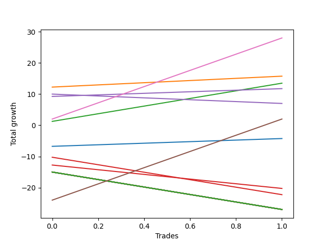

# Long Golden Two 
- Symbol: TEST
- Date Range: 3/19/22 - 5/22/22
- Trading Period: 7:20-12:30
- Number of Trades: 5



| Name | Win Percent | Profit | Avg Profit / Trade |     | Name | Win Percent | Profit | Avg Profit / Trade |
| ---- | ----------- | ------ | ------------------ | --- | ---- | ----------- | ------ | ------------------ |
| Sorted By <br> Profit | | | | | Sorted By <br> Win Percentage ||||
| Seventy-Five | 40.00 | -42875.00 | -8575.00 |     | Seventy-Five | 40.00 | -42875.00 | -8575.00 |
| Seventy-Four | 40.00 | -42875.00 | -8575.00 |     | Seventy-Four | 40.00 | -42875.00 | -8575.00 |
| Seventy-Three | 40.00 | -42875.00 | -8575.00 |     | Seventy-Three | 40.00 | -42875.00 | -8575.00 |

### Test Seventy-Three
* Sell when the price hits the upper line of the 50p 2std bollinger
* No Stoploss
* Results:
```
Total Trades: 5
Percent Up: 40.00
Percent Down: 60.00
Total Points Moved Up: -85.75
Potential Profit: -42875.00
Total Points Ups: 18.75 Count Ups: 2
Total Points Downs: -104.50 Count Downs: 3
```

<details><summary>Trades</summary>

<code>In: 2022-07-01 06:46:00		Out: 2022-07-01 06:30:10		Total Position Time: 1424:10		Total Move Up: -15.00		Total to Date: -15.00</code> <br />
<code>In: 2022-07-01 11:05:00		Out: 2022-07-01 06:30:10		Total Position Time: 1165:10		Total Move Up: -12.00		Total to Date: -27.00</code> <br />
<code>In: 2022-07-05 07:39:00		Out: 2022-07-01 06:30:10		Total Position Time: 1371:10		Total Move Up: 6.50		Total to Date: -20.50</code> <br />
<code>In: 2022-07-05 08:59:00		Out: 2022-07-01 06:30:10		Total Position Time: 1291:10		Total Move Up: 12.25		Total to Date: -8.25</code> <br />
<code>In: 2022-07-06 11:48:00		Out: 2022-07-01 06:30:10		Total Position Time: 1122:10		Total Move Up: -77.50		Total to Date: -85.75</code> <br />


</details>

### Test Seventy-Four
* Sell when the price hits the middle line of the 1std VWAP
* No Stoploss
* Results:
```
Total Trades: 5
Percent Up: 40.00
Percent Down: 60.00
Total Points Moved Up: -85.75
Potential Profit: -42875.00
Total Points Ups: 18.75 Count Ups: 2
Total Points Downs: -104.50 Count Downs: 3
```

<details><summary>Trades</summary>

<code>In: 2022-07-01 06:46:00		Out: 2022-07-01 06:30:10		Total Position Time: 1424:10		Total Move Up: -15.00		Total to Date: -15.00</code> <br />
<code>In: 2022-07-01 11:05:00		Out: 2022-07-01 06:30:10		Total Position Time: 1165:10		Total Move Up: -12.00		Total to Date: -27.00</code> <br />
<code>In: 2022-07-05 07:39:00		Out: 2022-07-01 06:30:10		Total Position Time: 1371:10		Total Move Up: 6.50		Total to Date: -20.50</code> <br />
<code>In: 2022-07-05 08:59:00		Out: 2022-07-01 06:30:10		Total Position Time: 1291:10		Total Move Up: 12.25		Total to Date: -8.25</code> <br />
<code>In: 2022-07-06 11:48:00		Out: 2022-07-01 06:30:10		Total Position Time: 1122:10		Total Move Up: -77.50		Total to Date: -85.75</code> <br />


</details>

### Test Seventy-Five
* Sell when the price hits the upper line of the 1std VWAP
* No Stoploss
* Results:
```
Total Trades: 5
Percent Up: 40.00
Percent Down: 60.00
Total Points Moved Up: -85.75
Potential Profit: -42875.00
Total Points Ups: 18.75 Count Ups: 2
Total Points Downs: -104.50 Count Downs: 3
```

<details><summary>Trades</summary>

<code>In: 2022-07-01 06:46:00		Out: 2022-07-01 06:30:10		Total Position Time: 1424:10		Total Move Up: -15.00		Total to Date: -15.00</code> <br />
<code>In: 2022-07-01 11:05:00		Out: 2022-07-01 06:30:10		Total Position Time: 1165:10		Total Move Up: -12.00		Total to Date: -27.00</code> <br />
<code>In: 2022-07-05 07:39:00		Out: 2022-07-01 06:30:10		Total Position Time: 1371:10		Total Move Up: 6.50		Total to Date: -20.50</code> <br />
<code>In: 2022-07-05 08:59:00		Out: 2022-07-01 06:30:10		Total Position Time: 1291:10		Total Move Up: 12.25		Total to Date: -8.25</code> <br />
<code>In: 2022-07-06 11:48:00		Out: 2022-07-01 06:30:10		Total Position Time: 1122:10		Total Move Up: -77.50		Total to Date: -85.75</code> <br />


</details>