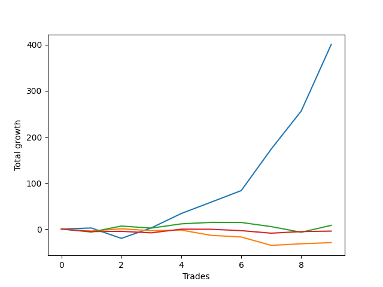

# Long Golden Two 
- Symbol: TEST
- Date Range: 3/19/22 - 5/22/22
- Trading Period: 7:20-12:30
- Number of Trades: 10



| Name | Win Percent | Profit | Avg Profit / Trade |     | Name | Win Percent | Profit | Avg Profit / Trade |
| ---- | ----------- | ------ | ------------------ | --- | ---- | ----------- | ------ | ------------------ |
| Sorted By <br> Profit | | | | | Sorted By <br> Win Percentage ||||
| Seventy-Five | 60.00 | 13500.00 | 1350.00 |     | Seventy-Five | 60.00 | 13500.00 | 1350.00 |
| Seventy-Four | 60.00 | 13500.00 | 1350.00 |     | Seventy-Four | 60.00 | 13500.00 | 1350.00 |
| Seventy-Three | 60.00 | 13500.00 | 1350.00 |     | Seventy-Three | 60.00 | 13500.00 | 1350.00 |

### Test Seventy-Three
* Sell when the linear regression slope changes to negative
* No Stoploss
* Results:
```
Total Trades: 10
Percent Up: 60.00
Percent Down: 40.00
Total Points Moved Up: 27.00
Potential Profit: 13500.00
Total Points Ups: 264.75 Count Ups: 6
Total Points Downs: -237.75 Count Downs: 4
```

<details><summary>Trades</summary>

<code>In: 2022-06-24 06:46:00		Out: 2022-06-24 06:30:10		Total Position Time: 1424:10		Total Move Up: -17.25		Total to Date: -17.25</code> <br />
<code>In: 2022-06-27 07:53:00		Out: 2022-06-24 06:30:10		Total Position Time: 1357:10		Total Move Up: -87.75		Total to Date: -105.00</code> <br />
<code>In: 2022-06-28 06:46:00		Out: 2022-06-24 06:30:10		Total Position Time: 1424:10		Total Move Up: -107.00		Total to Date: -212.00</code> <br />
<code>In: 2022-06-29 06:55:00		Out: 2022-06-24 06:30:10		Total Position Time: 1415:10		Total Move Up: 1.00		Total to Date: -211.00</code> <br />
<code>In: 2022-06-30 08:07:00		Out: 2022-06-24 06:30:10		Total Position Time: 1343:10		Total Move Up: 65.00		Total to Date: -146.00</code> <br />
<code>In: 2022-07-01 06:46:00		Out: 2022-06-24 06:30:10		Total Position Time: 1424:10		Total Move Up: 36.75		Total to Date: -109.25</code> <br />
<code>In: 2022-07-01 11:05:00		Out: 2022-06-24 06:30:10		Total Position Time: 1165:10		Total Move Up: 39.75		Total to Date: -69.50</code> <br />
<code>In: 2022-07-05 07:39:00		Out: 2022-06-24 06:30:10		Total Position Time: 1371:10		Total Move Up: 58.25		Total to Date: -11.25</code> <br />
<code>In: 2022-07-05 08:59:00		Out: 2022-06-24 06:30:10		Total Position Time: 1291:10		Total Move Up: 64.00		Total to Date: 52.75</code> <br />
<code>In: 2022-07-06 11:48:00		Out: 2022-06-24 06:30:10		Total Position Time: 1122:10		Total Move Up: -25.75		Total to Date: 27.00</code> <br />


</details>

### Test Seventy-Four
* Sell when the bias changes to negative
* No Stoploss
* Results:
```
Total Trades: 10
Percent Up: 60.00
Percent Down: 40.00
Total Points Moved Up: 27.00
Potential Profit: 13500.00
Total Points Ups: 264.75 Count Ups: 6
Total Points Downs: -237.75 Count Downs: 4
```

<details><summary>Trades</summary>

<code>In: 2022-06-24 06:46:00		Out: 2022-06-24 06:30:10		Total Position Time: 1424:10		Total Move Up: -17.25		Total to Date: -17.25</code> <br />
<code>In: 2022-06-27 07:53:00		Out: 2022-06-24 06:30:10		Total Position Time: 1357:10		Total Move Up: -87.75		Total to Date: -105.00</code> <br />
<code>In: 2022-06-28 06:46:00		Out: 2022-06-24 06:30:10		Total Position Time: 1424:10		Total Move Up: -107.00		Total to Date: -212.00</code> <br />
<code>In: 2022-06-29 06:55:00		Out: 2022-06-24 06:30:10		Total Position Time: 1415:10		Total Move Up: 1.00		Total to Date: -211.00</code> <br />
<code>In: 2022-06-30 08:07:00		Out: 2022-06-24 06:30:10		Total Position Time: 1343:10		Total Move Up: 65.00		Total to Date: -146.00</code> <br />
<code>In: 2022-07-01 06:46:00		Out: 2022-06-24 06:30:10		Total Position Time: 1424:10		Total Move Up: 36.75		Total to Date: -109.25</code> <br />
<code>In: 2022-07-01 11:05:00		Out: 2022-06-24 06:30:10		Total Position Time: 1165:10		Total Move Up: 39.75		Total to Date: -69.50</code> <br />
<code>In: 2022-07-05 07:39:00		Out: 2022-06-24 06:30:10		Total Position Time: 1371:10		Total Move Up: 58.25		Total to Date: -11.25</code> <br />
<code>In: 2022-07-05 08:59:00		Out: 2022-06-24 06:30:10		Total Position Time: 1291:10		Total Move Up: 64.00		Total to Date: 52.75</code> <br />
<code>In: 2022-07-06 11:48:00		Out: 2022-06-24 06:30:10		Total Position Time: 1122:10		Total Move Up: -25.75		Total to Date: 27.00</code> <br />


</details>

### Test Seventy-Five
* Sell when the STDEV slope changes to negative
* No Stoploss
* Results:
```
Total Trades: 10
Percent Up: 60.00
Percent Down: 40.00
Total Points Moved Up: 27.00
Potential Profit: 13500.00
Total Points Ups: 264.75 Count Ups: 6
Total Points Downs: -237.75 Count Downs: 4
```

<details><summary>Trades</summary>

<code>In: 2022-06-24 06:46:00		Out: 2022-06-24 06:30:10		Total Position Time: 1424:10		Total Move Up: -17.25		Total to Date: -17.25</code> <br />
<code>In: 2022-06-27 07:53:00		Out: 2022-06-24 06:30:10		Total Position Time: 1357:10		Total Move Up: -87.75		Total to Date: -105.00</code> <br />
<code>In: 2022-06-28 06:46:00		Out: 2022-06-24 06:30:10		Total Position Time: 1424:10		Total Move Up: -107.00		Total to Date: -212.00</code> <br />
<code>In: 2022-06-29 06:55:00		Out: 2022-06-24 06:30:10		Total Position Time: 1415:10		Total Move Up: 1.00		Total to Date: -211.00</code> <br />
<code>In: 2022-06-30 08:07:00		Out: 2022-06-24 06:30:10		Total Position Time: 1343:10		Total Move Up: 65.00		Total to Date: -146.00</code> <br />
<code>In: 2022-07-01 06:46:00		Out: 2022-06-24 06:30:10		Total Position Time: 1424:10		Total Move Up: 36.75		Total to Date: -109.25</code> <br />
<code>In: 2022-07-01 11:05:00		Out: 2022-06-24 06:30:10		Total Position Time: 1165:10		Total Move Up: 39.75		Total to Date: -69.50</code> <br />
<code>In: 2022-07-05 07:39:00		Out: 2022-06-24 06:30:10		Total Position Time: 1371:10		Total Move Up: 58.25		Total to Date: -11.25</code> <br />
<code>In: 2022-07-05 08:59:00		Out: 2022-06-24 06:30:10		Total Position Time: 1291:10		Total Move Up: 64.00		Total to Date: 52.75</code> <br />
<code>In: 2022-07-06 11:48:00		Out: 2022-06-24 06:30:10		Total Position Time: 1122:10		Total Move Up: -25.75		Total to Date: 27.00</code> <br />


</details>