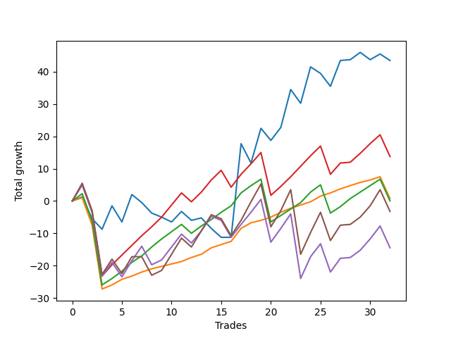

# Long Golden One 
- Symbol: TEST
- Date Range: 07/08/2022 - 07/15/2022
- Trading Period: 7:20-12:30
- Number of Trades: 32



| Name | Win Percent | Profit | Avg Profit / Trade |     | Name | Win Percent | Profit | Avg Profit / Trade |
| ---- | ----------- | ------ | ------------------ | --- | ---- | ----------- | ------ | ------------------ |
| Sorted By <br> Profit | | | | | Sorted By <br> Win Percentage ||||
| Seventy-Three | 46.88 | 21750.00 | 679.69 |     | Eighty-One | 90.62 | 375.00 | 11.72 |
| Eighty-Three | 78.12 | 6875.00 | 214.84 |     | Eighty-Two | 81.25 | 0.00 | 0.00 |
| Eighty-One | 90.62 | 375.00 | 11.72 |     | Eighty-Three | 78.12 | 6875.00 | 214.84 |
| Eighty-Two | 81.25 | 0.00 | 0.00 |     | Eighty-Five | 65.62 | -1625.00 | -50.78 |
| Eighty-Five | 65.62 | -1625.00 | -50.78 |     | Eighty-Four | 65.62 | -7250.00 | -226.56 |
| Eighty-Four | 65.62 | -7250.00 | -226.56 |     | Seventy-Three | 46.88 | 21750.00 | 679.69 |

## SPECIAL EXIT CONDITIONS 

### Test Seventy-Three
* Sell when the linear regression slope changes to negative
* No Stoploss
* Results:
```
Total Trades: 32
Percent Up: 46.88
Percent Down: 53.12
Total Points Moved Up: 43.50
Potential Profit: 21750.00
Total Points Ups: 100.00 Count Ups: 15
Total Points Downs: -56.50 Count Downs: 17
```

<details><summary>Trades</summary>

<code>In: 2022-07-08 07:45:00		Out: 2022-07-08 08:14:55		Total Position Time: 29:55		Total Move Up: 1.25		Total to Date: 1.25</code> <br />
<code>In: 2022-07-08 08:35:00		Out: 2022-07-08 08:45:05		Total Position Time: 10:05		Total Move Up: -6.75		Total to Date: -5.50</code> <br />
<code>In: 2022-07-08 09:00:00		Out: 2022-07-08 09:05:05		Total Position Time: 05:05		Total Move Up: -3.25		Total to Date: -8.75</code> <br />
<code>In: 2022-07-08 10:10:00		Out: 2022-07-08 10:39:55		Total Position Time: 29:55		Total Move Up: 7.25		Total to Date: -1.50</code> <br />
<code>In: 2022-07-08 12:00:00		Out: 2022-07-08 12:10:05		Total Position Time: 10:05		Total Move Up: -5.00		Total to Date: -6.50</code> <br />
<code>In: 2022-07-11 07:25:00		Out: 2022-07-11 07:54:55		Total Position Time: 29:55		Total Move Up: 8.50		Total to Date: 2.00</code> <br />
<code>In: 2022-07-11 08:10:00		Out: 2022-07-11 08:25:05		Total Position Time: 15:05		Total Move Up: -2.50		Total to Date: -0.50</code> <br />
<code>In: 2022-07-11 08:30:00		Out: 2022-07-11 08:35:05		Total Position Time: 05:05		Total Move Up: -3.25		Total to Date: -3.75</code> <br />
<code>In: 2022-07-11 09:00:00		Out: 2022-07-11 09:05:05		Total Position Time: 05:05		Total Move Up: -1.25		Total to Date: -5.00</code> <br />
<code>In: 2022-07-11 09:20:00		Out: 2022-07-11 09:25:05		Total Position Time: 05:05		Total Move Up: -1.50		Total to Date: -6.50</code> <br />
<code>In: 2022-07-11 09:30:00		Out: 2022-07-11 09:59:55		Total Position Time: 29:55		Total Move Up: 3.25		Total to Date: -3.25</code> <br />
<code>In: 2022-07-12 07:35:00		Out: 2022-07-12 08:04:55		Total Position Time: 29:55		Total Move Up: -2.75		Total to Date: -6.00</code> <br />
<code>In: 2022-07-12 09:25:00		Out: 2022-07-12 09:54:55		Total Position Time: 29:55		Total Move Up: 0.75		Total to Date: -5.25</code> <br />
<code>In: 2022-07-12 10:00:00		Out: 2022-07-12 10:05:05		Total Position Time: 05:05		Total Move Up: -3.25		Total to Date: -8.50</code> <br />
<code>In: 2022-07-12 10:45:00		Out: 2022-07-12 11:05:05		Total Position Time: 20:05		Total Move Up: -2.75		Total to Date: -11.25</code> <br />
<code>In: 2022-07-12 11:10:00		Out: 2022-07-12 11:20:05		Total Position Time: 10:05		Total Move Up: 0.00		Total to Date: -11.25</code> <br />
<code>In: 2022-07-13 07:30:00		Out: 2022-07-13 07:59:55		Total Position Time: 29:55		Total Move Up: 29.00		Total to Date: 17.75</code> <br />
<code>In: 2022-07-13 09:05:00		Out: 2022-07-13 09:15:05		Total Position Time: 10:05		Total Move Up: -6.00		Total to Date: 11.75</code> <br />
<code>In: 2022-07-13 09:20:00		Out: 2022-07-13 09:49:55		Total Position Time: 29:55		Total Move Up: 10.75		Total to Date: 22.50</code> <br />
<code>In: 2022-07-13 10:50:00		Out: 2022-07-13 10:55:05		Total Position Time: 05:05		Total Move Up: -3.75		Total to Date: 18.75</code> <br />
<code>In: 2022-07-13 11:25:00		Out: 2022-07-13 11:54:55		Total Position Time: 29:55		Total Move Up: 4.00		Total to Date: 22.75</code> <br />
<code>In: 2022-07-14 07:25:00		Out: 2022-07-14 07:54:55		Total Position Time: 29:55		Total Move Up: 11.75		Total to Date: 34.50</code> <br />
<code>In: 2022-07-14 09:20:00		Out: 2022-07-14 09:25:05		Total Position Time: 05:05		Total Move Up: -4.25		Total to Date: 30.25</code> <br />
<code>In: 2022-07-14 10:10:00		Out: 2022-07-14 10:39:55		Total Position Time: 29:55		Total Move Up: 11.25		Total to Date: 41.50</code> <br />
<code>In: 2022-07-14 12:00:00		Out: 2022-07-14 12:05:05		Total Position Time: 05:05		Total Move Up: -2.00		Total to Date: 39.50</code> <br />
<code>In: 2022-07-14 12:25:00		Out: 2022-07-14 12:35:05		Total Position Time: 10:05		Total Move Up: -4.00		Total to Date: 35.50</code> <br />
<code>In: 2022-07-15 07:45:00		Out: 2022-07-15 08:05:05		Total Position Time: 20:05		Total Move Up: 8.00		Total to Date: 43.50</code> <br />
<code>In: 2022-07-15 08:10:00		Out: 2022-07-15 08:39:55		Total Position Time: 29:55		Total Move Up: 0.25		Total to Date: 43.75</code> <br />
<code>In: 2022-07-15 09:50:00		Out: 2022-07-15 10:19:55		Total Position Time: 29:55		Total Move Up: 2.25		Total to Date: 46.00</code> <br />
<code>In: 2022-07-15 11:20:00		Out: 2022-07-15 11:25:05		Total Position Time: 05:05		Total Move Up: -2.25		Total to Date: 43.75</code> <br />
<code>In: 2022-07-15 11:40:00		Out: 2022-07-15 12:05:05		Total Position Time: 25:05		Total Move Up: 1.75		Total to Date: 45.50</code> <br />
<code>In: 2022-07-15 12:10:00		Out: 2022-07-15 12:15:05		Total Position Time: 05:05		Total Move Up: -2.00		Total to Date: 43.50</code> <br />


</details>

## TAKE PROFIT

### Test Eighty-One
* Take Profit of 1 Point
* No Stoploss
* Results:
```
Total Trades: 32
Percent Up: 90.62
Percent Down: 9.38
Total Points Moved Up: 0.75
Potential Profit: 375.00
Total Points Ups: 35.75 Count Ups: 29
Total Points Downs: -35.00 Count Downs: 3
```

<details><summary>Trades</summary>

<code>In: 2022-07-08 07:45:00		Out: 2022-07-08 07:45:20		Total Position Time: 00:20		Total Move Up: 1.00		Total to Date: 1.00</code> <br />
<code>In: 2022-07-08 08:35:00		Out: 2022-07-08 09:04:55		Total Position Time: 29:55		Total Move Up: -8.50		Total to Date: -7.50</code> <br />
<code>In: 2022-07-08 09:00:00		Out: 2022-07-08 09:29:55		Total Position Time: 29:55		Total Move Up: -19.75		Total to Date: -27.25</code> <br />
<code>In: 2022-07-08 10:10:00		Out: 2022-07-08 10:11:15		Total Position Time: 01:15		Total Move Up: 1.25		Total to Date: -26.00</code> <br />
<code>In: 2022-07-08 12:00:00		Out: 2022-07-08 12:04:05		Total Position Time: 04:05		Total Move Up: 1.75		Total to Date: -24.25</code> <br />
<code>In: 2022-07-11 07:25:00		Out: 2022-07-11 07:25:10		Total Position Time: 00:10		Total Move Up: 1.00		Total to Date: -23.25</code> <br />
<code>In: 2022-07-11 08:10:00		Out: 2022-07-11 08:11:25		Total Position Time: 01:25		Total Move Up: 1.25		Total to Date: -22.00</code> <br />
<code>In: 2022-07-11 08:30:00		Out: 2022-07-11 08:30:10		Total Position Time: 00:10		Total Move Up: 1.00		Total to Date: -21.00</code> <br />
<code>In: 2022-07-11 09:00:00		Out: 2022-07-11 09:00:10		Total Position Time: 00:10		Total Move Up: 0.75		Total to Date: -20.25</code> <br />
<code>In: 2022-07-11 09:20:00		Out: 2022-07-11 09:33:10		Total Position Time: 13:10		Total Move Up: 0.75		Total to Date: -19.50</code> <br />
<code>In: 2022-07-11 09:30:00		Out: 2022-07-11 09:33:10		Total Position Time: 03:10		Total Move Up: 0.75		Total to Date: -18.75</code> <br />
<code>In: 2022-07-12 07:35:00		Out: 2022-07-12 07:56:35		Total Position Time: 21:35		Total Move Up: 1.25		Total to Date: -17.50</code> <br />
<code>In: 2022-07-12 09:25:00		Out: 2022-07-12 09:26:15		Total Position Time: 01:15		Total Move Up: 1.00		Total to Date: -16.50</code> <br />
<code>In: 2022-07-12 10:00:00		Out: 2022-07-12 10:00:40		Total Position Time: 00:40		Total Move Up: 2.00		Total to Date: -14.50</code> <br />
<code>In: 2022-07-12 10:45:00		Out: 2022-07-12 10:53:20		Total Position Time: 08:20		Total Move Up: 1.00		Total to Date: -13.50</code> <br />
<code>In: 2022-07-12 11:10:00		Out: 2022-07-12 11:11:40		Total Position Time: 01:40		Total Move Up: 1.00		Total to Date: -12.50</code> <br />
<code>In: 2022-07-13 07:30:00		Out: 2022-07-13 07:31:20		Total Position Time: 01:20		Total Move Up: 4.00		Total to Date: -8.50</code> <br />
<code>In: 2022-07-13 09:05:00		Out: 2022-07-13 09:08:10		Total Position Time: 03:10		Total Move Up: 1.75		Total to Date: -6.75</code> <br />
<code>In: 2022-07-13 09:20:00		Out: 2022-07-13 09:20:20		Total Position Time: 00:20		Total Move Up: 0.75		Total to Date: -6.00</code> <br />
<code>In: 2022-07-13 10:50:00		Out: 2022-07-13 10:50:35		Total Position Time: 00:35		Total Move Up: 1.00		Total to Date: -5.00</code> <br />
<code>In: 2022-07-13 11:25:00		Out: 2022-07-13 11:28:50		Total Position Time: 03:50		Total Move Up: 1.50		Total to Date: -3.50</code> <br />
<code>In: 2022-07-14 07:25:00		Out: 2022-07-14 07:26:10		Total Position Time: 01:10		Total Move Up: 1.25		Total to Date: -2.25</code> <br />
<code>In: 2022-07-14 09:20:00		Out: 2022-07-14 09:20:15		Total Position Time: 00:15		Total Move Up: 1.00		Total to Date: -1.25</code> <br />
<code>In: 2022-07-14 10:10:00		Out: 2022-07-14 10:17:25		Total Position Time: 07:25		Total Move Up: 1.00		Total to Date: -0.25</code> <br />
<code>In: 2022-07-14 12:00:00		Out: 2022-07-14 12:00:15		Total Position Time: 00:15		Total Move Up: 1.75		Total to Date: 1.50</code> <br />
<code>In: 2022-07-14 12:25:00		Out: 2022-07-14 12:30:00		Total Position Time: 05:00		Total Move Up: 1.00		Total to Date: 2.50</code> <br />
<code>In: 2022-07-15 07:45:00		Out: 2022-07-15 07:47:50		Total Position Time: 02:50		Total Move Up: 1.25		Total to Date: 3.75</code> <br />
<code>In: 2022-07-15 08:10:00		Out: 2022-07-15 08:15:40		Total Position Time: 05:40		Total Move Up: 1.00		Total to Date: 4.75</code> <br />
<code>In: 2022-07-15 09:50:00		Out: 2022-07-15 10:02:15		Total Position Time: 12:15		Total Move Up: 1.00		Total to Date: 5.75</code> <br />
<code>In: 2022-07-15 11:20:00		Out: 2022-07-15 11:44:45		Total Position Time: 24:45		Total Move Up: 0.75		Total to Date: 6.50</code> <br />
<code>In: 2022-07-15 11:40:00		Out: 2022-07-15 11:41:10		Total Position Time: 01:10		Total Move Up: 1.00		Total to Date: 7.50</code> <br />
<code>In: 2022-07-15 12:10:00		Out: 2022-07-15 12:39:55		Total Position Time: 29:55		Total Move Up: -6.75		Total to Date: 0.75</code> <br />


</details>

### Test Eighty-Two
* Take Profit of 2 Point
* No Stoploss
* Results:
```
Total Trades: 32
Percent Up: 81.25
Percent Down: 18.75
Total Points Moved Up: 0.00
Potential Profit: 0.00
Total Points Ups: 59.75 Count Ups: 26
Total Points Downs: -59.75 Count Downs: 6
```

<details><summary>Trades</summary>

<code>In: 2022-07-08 07:45:00		Out: 2022-07-08 08:09:10		Total Position Time: 24:10		Total Move Up: 2.25		Total to Date: 2.25</code> <br />
<code>In: 2022-07-08 08:35:00		Out: 2022-07-08 09:04:55		Total Position Time: 29:55		Total Move Up: -8.50		Total to Date: -6.25</code> <br />
<code>In: 2022-07-08 09:00:00		Out: 2022-07-08 09:29:55		Total Position Time: 29:55		Total Move Up: -19.75		Total to Date: -26.00</code> <br />
<code>In: 2022-07-08 10:10:00		Out: 2022-07-08 10:12:00		Total Position Time: 02:00		Total Move Up: 2.00		Total to Date: -24.00</code> <br />
<code>In: 2022-07-08 12:00:00		Out: 2022-07-08 12:04:10		Total Position Time: 04:10		Total Move Up: 2.25		Total to Date: -21.75</code> <br />
<code>In: 2022-07-11 07:25:00		Out: 2022-07-11 07:25:15		Total Position Time: 00:15		Total Move Up: 2.75		Total to Date: -19.00</code> <br />
<code>In: 2022-07-11 08:10:00		Out: 2022-07-11 08:12:05		Total Position Time: 02:05		Total Move Up: 2.00		Total to Date: -17.00</code> <br />
<code>In: 2022-07-11 08:30:00		Out: 2022-07-11 08:39:10		Total Position Time: 09:10		Total Move Up: 2.75		Total to Date: -14.25</code> <br />
<code>In: 2022-07-11 09:00:00		Out: 2022-07-11 09:10:15		Total Position Time: 10:15		Total Move Up: 2.50		Total to Date: -11.75</code> <br />
<code>In: 2022-07-11 09:20:00		Out: 2022-07-11 09:35:35		Total Position Time: 15:35		Total Move Up: 2.25		Total to Date: -9.50</code> <br />
<code>In: 2022-07-11 09:30:00		Out: 2022-07-11 09:35:35		Total Position Time: 05:35		Total Move Up: 2.25		Total to Date: -7.25</code> <br />
<code>In: 2022-07-12 07:35:00		Out: 2022-07-12 08:04:55		Total Position Time: 29:55		Total Move Up: -2.75		Total to Date: -10.00</code> <br />
<code>In: 2022-07-12 09:25:00		Out: 2022-07-12 09:30:30		Total Position Time: 05:30		Total Move Up: 2.25		Total to Date: -7.75</code> <br />
<code>In: 2022-07-12 10:00:00		Out: 2022-07-12 10:00:40		Total Position Time: 00:40		Total Move Up: 2.00		Total to Date: -5.75</code> <br />
<code>In: 2022-07-12 10:45:00		Out: 2022-07-12 10:54:15		Total Position Time: 09:15		Total Move Up: 2.25		Total to Date: -3.50</code> <br />
<code>In: 2022-07-12 11:10:00		Out: 2022-07-12 11:12:25		Total Position Time: 02:25		Total Move Up: 2.00		Total to Date: -1.50</code> <br />
<code>In: 2022-07-13 07:30:00		Out: 2022-07-13 07:31:20		Total Position Time: 01:20		Total Move Up: 4.00		Total to Date: 2.50</code> <br />
<code>In: 2022-07-13 09:05:00		Out: 2022-07-13 09:08:20		Total Position Time: 03:20		Total Move Up: 2.25		Total to Date: 4.75</code> <br />
<code>In: 2022-07-13 09:20:00		Out: 2022-07-13 09:21:15		Total Position Time: 01:15		Total Move Up: 2.00		Total to Date: 6.75</code> <br />
<code>In: 2022-07-13 10:50:00		Out: 2022-07-13 11:19:55		Total Position Time: 29:55		Total Move Up: -13.25		Total to Date: -6.50</code> <br />
<code>In: 2022-07-13 11:25:00		Out: 2022-07-13 11:29:10		Total Position Time: 04:10		Total Move Up: 2.00		Total to Date: -4.50</code> <br />
<code>In: 2022-07-14 07:25:00		Out: 2022-07-14 07:26:20		Total Position Time: 01:20		Total Move Up: 2.00		Total to Date: -2.50</code> <br />
<code>In: 2022-07-14 09:20:00		Out: 2022-07-14 09:20:35		Total Position Time: 00:35		Total Move Up: 2.00		Total to Date: -0.50</code> <br />
<code>In: 2022-07-14 10:10:00		Out: 2022-07-14 10:17:35		Total Position Time: 07:35		Total Move Up: 3.25		Total to Date: 2.75</code> <br />
<code>In: 2022-07-14 12:00:00		Out: 2022-07-14 12:00:20		Total Position Time: 00:20		Total Move Up: 2.25		Total to Date: 5.00</code> <br />
<code>In: 2022-07-14 12:25:00		Out: 2022-07-14 12:50:00		Total Position Time: 25:00		Total Move Up: -8.75		Total to Date: -3.75</code> <br />
<code>In: 2022-07-15 07:45:00		Out: 2022-07-15 07:48:15		Total Position Time: 03:15		Total Move Up: 2.00		Total to Date: -1.75</code> <br />
<code>In: 2022-07-15 08:10:00		Out: 2022-07-15 08:16:05		Total Position Time: 06:05		Total Move Up: 2.50		Total to Date: 0.75</code> <br />
<code>In: 2022-07-15 09:50:00		Out: 2022-07-15 10:05:40		Total Position Time: 15:40		Total Move Up: 2.00		Total to Date: 2.75</code> <br />
<code>In: 2022-07-15 11:20:00		Out: 2022-07-15 11:45:35		Total Position Time: 25:35		Total Move Up: 2.00		Total to Date: 4.75</code> <br />
<code>In: 2022-07-15 11:40:00		Out: 2022-07-15 11:42:10		Total Position Time: 02:10		Total Move Up: 2.00		Total to Date: 6.75</code> <br />
<code>In: 2022-07-15 12:10:00		Out: 2022-07-15 12:39:55		Total Position Time: 29:55		Total Move Up: -6.75		Total to Date: 0.00</code> <br />


</details>

### Test Eighty-Three
* Take Profit of 3 Point
* No Stoploss
* Results:
```
Total Trades: 32
Percent Up: 78.12
Percent Down: 21.88
Total Points Moved Up: 13.75
Potential Profit: 6875.00
Total Points Ups: 78.75 Count Ups: 25
Total Points Downs: -65.00 Count Downs: 7
```

<details><summary>Trades</summary>

<code>In: 2022-07-08 07:45:00		Out: 2022-07-08 08:09:15		Total Position Time: 24:15		Total Move Up: 5.00		Total to Date: 5.00</code> <br />
<code>In: 2022-07-08 08:35:00		Out: 2022-07-08 09:04:55		Total Position Time: 29:55		Total Move Up: -8.50		Total to Date: -3.50</code> <br />
<code>In: 2022-07-08 09:00:00		Out: 2022-07-08 09:29:55		Total Position Time: 29:55		Total Move Up: -19.75		Total to Date: -23.25</code> <br />
<code>In: 2022-07-08 10:10:00		Out: 2022-07-08 10:27:00		Total Position Time: 17:00		Total Move Up: 3.50		Total to Date: -19.75</code> <br />
<code>In: 2022-07-08 12:00:00		Out: 2022-07-08 12:04:50		Total Position Time: 04:50		Total Move Up: 3.00		Total to Date: -16.75</code> <br />
<code>In: 2022-07-11 07:25:00		Out: 2022-07-11 07:25:20		Total Position Time: 00:20		Total Move Up: 3.00		Total to Date: -13.75</code> <br />
<code>In: 2022-07-11 08:10:00		Out: 2022-07-11 08:12:35		Total Position Time: 02:35		Total Move Up: 3.00		Total to Date: -10.75</code> <br />
<code>In: 2022-07-11 08:30:00		Out: 2022-07-11 08:39:10		Total Position Time: 09:10		Total Move Up: 2.75		Total to Date: -8.00</code> <br />
<code>In: 2022-07-11 09:00:00		Out: 2022-07-11 09:11:20		Total Position Time: 11:20		Total Move Up: 3.00		Total to Date: -5.00</code> <br />
<code>In: 2022-07-11 09:20:00		Out: 2022-07-11 09:38:35		Total Position Time: 18:35		Total Move Up: 3.75		Total to Date: -1.25</code> <br />
<code>In: 2022-07-11 09:30:00		Out: 2022-07-11 09:38:35		Total Position Time: 08:35		Total Move Up: 3.75		Total to Date: 2.50</code> <br />
<code>In: 2022-07-12 07:35:00		Out: 2022-07-12 08:04:55		Total Position Time: 29:55		Total Move Up: -2.75		Total to Date: -0.25</code> <br />
<code>In: 2022-07-12 09:25:00		Out: 2022-07-12 09:34:20		Total Position Time: 09:20		Total Move Up: 3.00		Total to Date: 2.75</code> <br />
<code>In: 2022-07-12 10:00:00		Out: 2022-07-12 10:01:05		Total Position Time: 01:05		Total Move Up: 3.75		Total to Date: 6.50</code> <br />
<code>In: 2022-07-12 10:45:00		Out: 2022-07-12 10:55:00		Total Position Time: 10:00		Total Move Up: 3.00		Total to Date: 9.50</code> <br />
<code>In: 2022-07-12 11:10:00		Out: 2022-07-12 11:39:55		Total Position Time: 29:55		Total Move Up: -5.25		Total to Date: 4.25</code> <br />
<code>In: 2022-07-13 07:30:00		Out: 2022-07-13 07:31:20		Total Position Time: 01:20		Total Move Up: 4.00		Total to Date: 8.25</code> <br />
<code>In: 2022-07-13 09:05:00		Out: 2022-07-13 09:08:30		Total Position Time: 03:30		Total Move Up: 3.25		Total to Date: 11.50</code> <br />
<code>In: 2022-07-13 09:20:00		Out: 2022-07-13 09:24:40		Total Position Time: 04:40		Total Move Up: 3.50		Total to Date: 15.00</code> <br />
<code>In: 2022-07-13 10:50:00		Out: 2022-07-13 11:19:55		Total Position Time: 29:55		Total Move Up: -13.25		Total to Date: 1.75</code> <br />
<code>In: 2022-07-13 11:25:00		Out: 2022-07-13 11:29:40		Total Position Time: 04:40		Total Move Up: 2.75		Total to Date: 4.50</code> <br />
<code>In: 2022-07-14 07:25:00		Out: 2022-07-14 07:26:35		Total Position Time: 01:35		Total Move Up: 3.00		Total to Date: 7.50</code> <br />
<code>In: 2022-07-14 09:20:00		Out: 2022-07-14 09:20:40		Total Position Time: 00:40		Total Move Up: 3.25		Total to Date: 10.75</code> <br />
<code>In: 2022-07-14 10:10:00		Out: 2022-07-14 10:17:35		Total Position Time: 07:35		Total Move Up: 3.25		Total to Date: 14.00</code> <br />
<code>In: 2022-07-14 12:00:00		Out: 2022-07-14 12:00:45		Total Position Time: 00:45		Total Move Up: 3.00		Total to Date: 17.00</code> <br />
<code>In: 2022-07-14 12:25:00		Out: 2022-07-14 12:50:00		Total Position Time: 25:00		Total Move Up: -8.75		Total to Date: 8.25</code> <br />
<code>In: 2022-07-15 07:45:00		Out: 2022-07-15 07:56:40		Total Position Time: 11:40		Total Move Up: 3.50		Total to Date: 11.75</code> <br />
<code>In: 2022-07-15 08:10:00		Out: 2022-07-15 08:39:55		Total Position Time: 29:55		Total Move Up: 0.25		Total to Date: 12.00</code> <br />
<code>In: 2022-07-15 09:50:00		Out: 2022-07-15 10:08:40		Total Position Time: 18:40		Total Move Up: 2.75		Total to Date: 14.75</code> <br />
<code>In: 2022-07-15 11:20:00		Out: 2022-07-15 11:46:35		Total Position Time: 26:35		Total Move Up: 3.00		Total to Date: 17.75</code> <br />
<code>In: 2022-07-15 11:40:00		Out: 2022-07-15 11:44:45		Total Position Time: 04:45		Total Move Up: 2.75		Total to Date: 20.50</code> <br />
<code>In: 2022-07-15 12:10:00		Out: 2022-07-15 12:39:55		Total Position Time: 29:55		Total Move Up: -6.75		Total to Date: 13.75</code> <br />


</details>

### Test Eighty-Four
* Take Profit of 4 Point
* No Stoploss
* Results:
```
Total Trades: 32
Percent Up: 65.62
Percent Down: 34.38
Total Points Moved Up: -14.50
Potential Profit: -7250.00
Total Points Ups: 82.00 Count Ups: 21
Total Points Downs: -96.50 Count Downs: 11
```

<details><summary>Trades</summary>

<code>In: 2022-07-08 07:45:00		Out: 2022-07-08 08:09:15		Total Position Time: 24:15		Total Move Up: 5.00		Total to Date: 5.00</code> <br />
<code>In: 2022-07-08 08:35:00		Out: 2022-07-08 09:04:55		Total Position Time: 29:55		Total Move Up: -8.50		Total to Date: -3.50</code> <br />
<code>In: 2022-07-08 09:00:00		Out: 2022-07-08 09:29:55		Total Position Time: 29:55		Total Move Up: -19.75		Total to Date: -23.25</code> <br />
<code>In: 2022-07-08 10:10:00		Out: 2022-07-08 10:28:10		Total Position Time: 18:10		Total Move Up: 4.25		Total to Date: -19.00</code> <br />
<code>In: 2022-07-08 12:00:00		Out: 2022-07-08 12:29:55		Total Position Time: 29:55		Total Move Up: -4.50		Total to Date: -23.50</code> <br />
<code>In: 2022-07-11 07:25:00		Out: 2022-07-11 07:26:55		Total Position Time: 01:55		Total Move Up: 5.00		Total to Date: -18.50</code> <br />
<code>In: 2022-07-11 08:10:00		Out: 2022-07-11 08:39:10		Total Position Time: 29:10		Total Move Up: 4.50		Total to Date: -14.00</code> <br />
<code>In: 2022-07-11 08:30:00		Out: 2022-07-11 08:59:55		Total Position Time: 29:55		Total Move Up: -5.75		Total to Date: -19.75</code> <br />
<code>In: 2022-07-11 09:00:00		Out: 2022-07-11 09:29:55		Total Position Time: 29:55		Total Move Up: 1.50		Total to Date: -18.25</code> <br />
<code>In: 2022-07-11 09:20:00		Out: 2022-07-11 09:38:55		Total Position Time: 18:55		Total Move Up: 4.00		Total to Date: -14.25</code> <br />
<code>In: 2022-07-11 09:30:00		Out: 2022-07-11 09:38:55		Total Position Time: 08:55		Total Move Up: 4.00		Total to Date: -10.25</code> <br />
<code>In: 2022-07-12 07:35:00		Out: 2022-07-12 08:04:55		Total Position Time: 29:55		Total Move Up: -2.75		Total to Date: -13.00</code> <br />
<code>In: 2022-07-12 09:25:00		Out: 2022-07-12 09:34:35		Total Position Time: 09:35		Total Move Up: 3.75		Total to Date: -9.25</code> <br />
<code>In: 2022-07-12 10:00:00		Out: 2022-07-12 10:01:10		Total Position Time: 01:10		Total Move Up: 4.50		Total to Date: -4.75</code> <br />
<code>In: 2022-07-12 10:45:00		Out: 2022-07-12 11:14:55		Total Position Time: 29:55		Total Move Up: -1.25		Total to Date: -6.00</code> <br />
<code>In: 2022-07-12 11:10:00		Out: 2022-07-12 11:39:55		Total Position Time: 29:55		Total Move Up: -5.25		Total to Date: -11.25</code> <br />
<code>In: 2022-07-13 07:30:00		Out: 2022-07-13 07:31:20		Total Position Time: 01:20		Total Move Up: 4.00		Total to Date: -7.25</code> <br />
<code>In: 2022-07-13 09:05:00		Out: 2022-07-13 09:29:20		Total Position Time: 24:20		Total Move Up: 3.75		Total to Date: -3.50</code> <br />
<code>In: 2022-07-13 09:20:00		Out: 2022-07-13 09:24:45		Total Position Time: 04:45		Total Move Up: 4.00		Total to Date: 0.50</code> <br />
<code>In: 2022-07-13 10:50:00		Out: 2022-07-13 11:19:55		Total Position Time: 29:55		Total Move Up: -13.25		Total to Date: -12.75</code> <br />
<code>In: 2022-07-13 11:25:00		Out: 2022-07-13 11:30:05		Total Position Time: 05:05		Total Move Up: 4.25		Total to Date: -8.50</code> <br />
<code>In: 2022-07-14 07:25:00		Out: 2022-07-14 07:33:20		Total Position Time: 08:20		Total Move Up: 4.50		Total to Date: -4.00</code> <br />
<code>In: 2022-07-14 09:20:00		Out: 2022-07-14 09:49:55		Total Position Time: 29:55		Total Move Up: -20.00		Total to Date: -24.00</code> <br />
<code>In: 2022-07-14 10:10:00		Out: 2022-07-14 10:18:15		Total Position Time: 08:15		Total Move Up: 6.75		Total to Date: -17.25</code> <br />
<code>In: 2022-07-14 12:00:00		Out: 2022-07-14 12:24:05		Total Position Time: 24:05		Total Move Up: 4.00		Total to Date: -13.25</code> <br />
<code>In: 2022-07-14 12:25:00		Out: 2022-07-14 12:50:00		Total Position Time: 25:00		Total Move Up: -8.75		Total to Date: -22.00</code> <br />
<code>In: 2022-07-15 07:45:00		Out: 2022-07-15 07:57:45		Total Position Time: 12:45		Total Move Up: 4.25		Total to Date: -17.75</code> <br />
<code>In: 2022-07-15 08:10:00		Out: 2022-07-15 08:39:55		Total Position Time: 29:55		Total Move Up: 0.25		Total to Date: -17.50</code> <br />
<code>In: 2022-07-15 09:50:00		Out: 2022-07-15 10:19:55		Total Position Time: 29:55		Total Move Up: 2.25		Total to Date: -15.25</code> <br />
<code>In: 2022-07-15 11:20:00		Out: 2022-07-15 11:49:55		Total Position Time: 29:55		Total Move Up: 3.50		Total to Date: -11.75</code> <br />
<code>In: 2022-07-15 11:40:00		Out: 2022-07-15 11:45:35		Total Position Time: 05:35		Total Move Up: 4.00		Total to Date: -7.75</code> <br />
<code>In: 2022-07-15 12:10:00		Out: 2022-07-15 12:39:55		Total Position Time: 29:55		Total Move Up: -6.75		Total to Date: -14.50</code> <br />


</details>

### Test Eighty-Five
* Take Profit of 5 Point
* No Stoploss
* Results:
```
Total Trades: 32
Percent Up: 65.62
Percent Down: 34.38
Total Points Moved Up: -3.25
Potential Profit: -1625.00
Total Points Ups: 93.25 Count Ups: 21
Total Points Downs: -96.50 Count Downs: 11
```

<details><summary>Trades</summary>

<code>In: 2022-07-08 07:45:00		Out: 2022-07-08 08:09:25		Total Position Time: 24:25		Total Move Up: 5.50		Total to Date: 5.50</code> <br />
<code>In: 2022-07-08 08:35:00		Out: 2022-07-08 09:04:55		Total Position Time: 29:55		Total Move Up: -8.50		Total to Date: -3.00</code> <br />
<code>In: 2022-07-08 09:00:00		Out: 2022-07-08 09:29:55		Total Position Time: 29:55		Total Move Up: -19.75		Total to Date: -22.75</code> <br />
<code>In: 2022-07-08 10:10:00		Out: 2022-07-08 10:28:30		Total Position Time: 18:30		Total Move Up: 4.75		Total to Date: -18.00</code> <br />
<code>In: 2022-07-08 12:00:00		Out: 2022-07-08 12:29:55		Total Position Time: 29:55		Total Move Up: -4.50		Total to Date: -22.50</code> <br />
<code>In: 2022-07-11 07:25:00		Out: 2022-07-11 07:27:00		Total Position Time: 02:00		Total Move Up: 5.25		Total to Date: -17.25</code> <br />
<code>In: 2022-07-11 08:10:00		Out: 2022-07-11 08:39:55		Total Position Time: 29:55		Total Move Up: 0.00		Total to Date: -17.25</code> <br />
<code>In: 2022-07-11 08:30:00		Out: 2022-07-11 08:59:55		Total Position Time: 29:55		Total Move Up: -5.75		Total to Date: -23.00</code> <br />
<code>In: 2022-07-11 09:00:00		Out: 2022-07-11 09:29:55		Total Position Time: 29:55		Total Move Up: 1.50		Total to Date: -21.50</code> <br />
<code>In: 2022-07-11 09:20:00		Out: 2022-07-11 09:39:35		Total Position Time: 19:35		Total Move Up: 5.00		Total to Date: -16.50</code> <br />
<code>In: 2022-07-11 09:30:00		Out: 2022-07-11 09:39:35		Total Position Time: 09:35		Total Move Up: 5.00		Total to Date: -11.50</code> <br />
<code>In: 2022-07-12 07:35:00		Out: 2022-07-12 08:04:55		Total Position Time: 29:55		Total Move Up: -2.75		Total to Date: -14.25</code> <br />
<code>In: 2022-07-12 09:25:00		Out: 2022-07-12 09:36:20		Total Position Time: 11:20		Total Move Up: 5.00		Total to Date: -9.25</code> <br />
<code>In: 2022-07-12 10:00:00		Out: 2022-07-12 10:01:15		Total Position Time: 01:15		Total Move Up: 5.00		Total to Date: -4.25</code> <br />
<code>In: 2022-07-12 10:45:00		Out: 2022-07-12 11:14:55		Total Position Time: 29:55		Total Move Up: -1.25		Total to Date: -5.50</code> <br />
<code>In: 2022-07-12 11:10:00		Out: 2022-07-12 11:39:55		Total Position Time: 29:55		Total Move Up: -5.25		Total to Date: -10.75</code> <br />
<code>In: 2022-07-13 07:30:00		Out: 2022-07-13 07:31:25		Total Position Time: 01:25		Total Move Up: 4.75		Total to Date: -6.00</code> <br />
<code>In: 2022-07-13 09:05:00		Out: 2022-07-13 09:32:20		Total Position Time: 27:20		Total Move Up: 5.75		Total to Date: -0.25</code> <br />
<code>In: 2022-07-13 09:20:00		Out: 2022-07-13 09:26:15		Total Position Time: 06:15		Total Move Up: 5.50		Total to Date: 5.25</code> <br />
<code>In: 2022-07-13 10:50:00		Out: 2022-07-13 11:19:55		Total Position Time: 29:55		Total Move Up: -13.25		Total to Date: -8.00</code> <br />
<code>In: 2022-07-13 11:25:00		Out: 2022-07-13 11:30:40		Total Position Time: 05:40		Total Move Up: 5.00		Total to Date: -3.00</code> <br />
<code>In: 2022-07-14 07:25:00		Out: 2022-07-14 07:33:25		Total Position Time: 08:25		Total Move Up: 6.50		Total to Date: 3.50</code> <br />
<code>In: 2022-07-14 09:20:00		Out: 2022-07-14 09:49:55		Total Position Time: 29:55		Total Move Up: -20.00		Total to Date: -16.50</code> <br />
<code>In: 2022-07-14 10:10:00		Out: 2022-07-14 10:18:15		Total Position Time: 08:15		Total Move Up: 6.75		Total to Date: -9.75</code> <br />
<code>In: 2022-07-14 12:00:00		Out: 2022-07-14 12:24:20		Total Position Time: 24:20		Total Move Up: 6.25		Total to Date: -3.50</code> <br />
<code>In: 2022-07-14 12:25:00		Out: 2022-07-14 12:50:00		Total Position Time: 25:00		Total Move Up: -8.75		Total to Date: -12.25</code> <br />
<code>In: 2022-07-15 07:45:00		Out: 2022-07-15 07:58:55		Total Position Time: 13:55		Total Move Up: 4.75		Total to Date: -7.50</code> <br />
<code>In: 2022-07-15 08:10:00		Out: 2022-07-15 08:39:55		Total Position Time: 29:55		Total Move Up: 0.25		Total to Date: -7.25</code> <br />
<code>In: 2022-07-15 09:50:00		Out: 2022-07-15 10:19:55		Total Position Time: 29:55		Total Move Up: 2.25		Total to Date: -5.00</code> <br />
<code>In: 2022-07-15 11:20:00		Out: 2022-07-15 11:49:55		Total Position Time: 29:55		Total Move Up: 3.50		Total to Date: -1.50</code> <br />
<code>In: 2022-07-15 11:40:00		Out: 2022-07-15 11:46:35		Total Position Time: 06:35		Total Move Up: 5.00		Total to Date: 3.50</code> <br />
<code>In: 2022-07-15 12:10:00		Out: 2022-07-15 12:39:55		Total Position Time: 29:55		Total Move Up: -6.75		Total to Date: -3.25</code> <br />


</details>