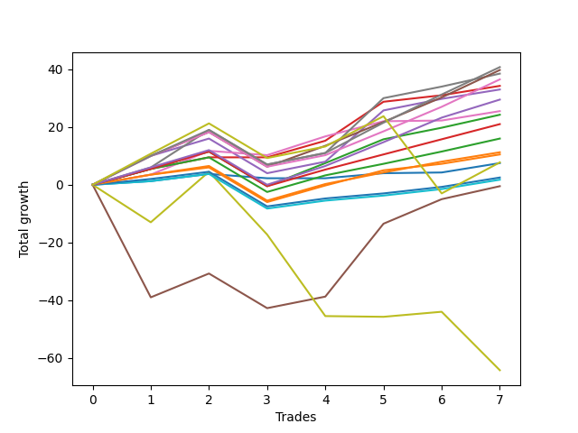

# Long Pointer 001 DB 
- Symbol: TEST
- Date Range: 07/25/2022 - 08/05/2022
- Trading Period: 7:20-12:30
- Number of Trades: 10



| Name | Win Percent | Profit | Avg Profit / Trade | Avg Time / Trade |      | Name | Win Percent | Profit | Avg Profit / Trade | Avg Time / Trade |
| ---- | ----------- | ------ | ------------------ | ---------------- | ---- | ---- | ----------- | ------ | ------------------ | ---------------- |
| Sorted By <br> Profit | | | | | | Sorted By <br> Win Percentage ||||
| Seven | 80.00 | 26250.00 | 2625.00 | 436:42 |     | Three | 90.00 | 20125.00 | 2012.50 | 56:36 |
| Four | 80.00 | 24875.00 | 2487.50 | 436:42 |     | Seven | 80.00 | 26250.00 | 2625.00 | 436:42 |
| Eighty-Nine | 80.00 | 24000.00 | 2400.00 | 317:54 |     | Four | 80.00 | 24875.00 | 2487.50 | 436:42 |
| Eighty-Seven | 80.00 | 22000.00 | 2200.00 | 191:18 |     | Eighty-Nine | 80.00 | 24000.00 | 2400.00 | 317:54 |
| Eighty-Eight | 80.00 | 20250.00 | 2025.00 | 316:12 |     | Eighty-Seven | 80.00 | 22000.00 | 2200.00 | 191:18 |
| Three | 90.00 | 20125.00 | 2012.50 | 56:36 |     | Eighty-Eight | 80.00 | 20250.00 | 2025.00 | 316:12 |
| Eighty-Six | 80.00 | 16875.00 | 1687.50 | 189:12 |     | Eighty-Six | 80.00 | 16875.00 | 1687.50 | 189:12 |
| Two | 80.00 | 15125.00 | 1512.50 | 187:30 |     | Two | 80.00 | 15125.00 | 1512.50 | 187:30 |
| Six | 80.00 | 14875.00 | 1487.50 | 48:18 |     | Six | 80.00 | 14875.00 | 1487.50 | 48:18 |
| Eighty-Five | 80.00 | 12625.00 | 1262.50 | 188:18 |     | Eighty-Five | 80.00 | 12625.00 | 1262.50 | 188:18 |
| Five | 70.00 | 11875.00 | 1187.50 | 570:18 |     | Eighty-Four | 80.00 | 10125.00 | 1012.50 | 178:18 |
| Eighty-Four | 80.00 | 10125.00 | 1012.50 | 178:18 |     | Eighty-Three | 80.00 | 7750.00 | 775.00 | 175:18 |
| Ninety | 70.00 | 7875.00 | 787.50 | 445:54 |     | One | 80.00 | 7375.00 | 737.50 | 175:06 |
| Eighty-Three | 80.00 | 7750.00 | 775.00 | 175:18 |     | Zero | 80.00 | 5875.00 | 587.50 | 50:12 |
| One | 80.00 | 7375.00 | 737.50 | 175:06 |     | Eighty-Two | 80.00 | 3375.00 | 337.50 | 174:36 |
| Zero | 80.00 | 5875.00 | 587.50 | 50:12 |     | Eighty-One | 80.00 | 3000.00 | 300.00 | 174:18 |
| Eighty-Two | 80.00 | 3375.00 | 337.50 | 174:36 |     | Five | 70.00 | 11875.00 | 1187.50 | 570:18 |
| Eighty-One | 80.00 | 3000.00 | 300.00 | 174:18 |     | Ninety | 70.00 | 7875.00 | 787.50 | 445:54 |
| Seventy-Three | 40.00 | -16500.00 | -1650.00 | 325:12 |     | Seventy-Three | 40.00 | -16500.00 | -1650.00 | 325:12 |

## NO STOPLOSS

### Test Zero
* Sell when price hits the middle line of the 20p bollinger
* No Stoploss
* Results:
```
Total Trades: 10
Percent Up: 80.00
Percent Down: 20.00
Total Points Moved Up: 11.75
Potential Profit: 5875.00
Total Points Ups: 25.25 Count Ups: 8
Total Points Downs: -13.50 Count Downs: 2
```

<details><summary>Trades</summary>

<code>In: 2022-07-25 10:44:00		Out: 2022-07-25 12:52:00		Total Position Time: 128:00		Total Move Up: 1.25		Total to Date: 1.25</code> <br />
<code>In: 2022-07-25 11:23:00		Out: 2022-07-25 11:36:00		Total Position Time: 13:00		Total Move Up: 2.50		Total to Date: 3.75</code> <br />
<code>In: 2022-07-29 08:29:00		Out: 2022-07-29 08:42:00		Total Position Time: 13:00		Total Move Up: 8.25		Total to Date: 12.00</code> <br />
<code>In: 2022-08-01 09:58:00		Out: 2022-08-01 11:59:00		Total Position Time: 121:00		Total Move Up: -1.50		Total to Date: 10.50</code> <br />
<code>In: 2022-08-01 10:23:00		Out: 2022-08-01 11:56:00		Total Position Time: 93:00		Total Move Up: 0.00		Total to Date: 10.50</code> <br />
<code>In: 2022-08-02 10:53:00		Out: 2022-08-02 11:06:00		Total Position Time: 13:00		Total Move Up: 1.75		Total to Date: 12.25</code> <br />
<code>In: 2022-08-03 07:38:00		Out: 2022-08-03 07:51:00		Total Position Time: 13:00		Total Move Up: 8.00		Total to Date: 20.25</code> <br />
<code>In: 2022-08-04 11:13:00		Out: 2022-08-04 11:27:00		Total Position Time: 14:00		Total Move Up: 0.25		Total to Date: 20.50</code> <br />
<code>In: 2022-08-04 11:43:00		Out: 2022-08-04 11:56:00		Total Position Time: 13:00		Total Move Up: 3.25		Total to Date: 23.75</code> <br />
<code>In: 2022-08-05 08:10:00		Out: 2022-08-05 09:31:00		Total Position Time: 81:00		Total Move Up: -12.00		Total to Date: 11.75</code> <br />


</details>

### Test One
* Sell when the price hits the upper line of the 20p 1std bollinger
* No Stoploss
* Results:
```
Total Trades: 10
Percent Up: 80.00
Percent Down: 20.00
Total Points Moved Up: 14.75
Potential Profit: 7375.00
Total Points Ups: 38.75 Count Ups: 8
Total Points Downs: -24.00 Count Downs: 2
```

<details><summary>Trades</summary>

<code>In: 2022-07-25 10:44:00		Out: 2022-07-25 12:56:00		Total Position Time: 132:00		Total Move Up: 3.50		Total to Date: 3.50</code> <br />
<code>In: 2022-07-25 11:23:00		Out: 2022-07-25 11:36:00		Total Position Time: 13:00		Total Move Up: 2.50		Total to Date: 6.00</code> <br />
<code>In: 2022-07-29 08:29:00		Out: 2022-07-29 08:42:00		Total Position Time: 13:00		Total Move Up: 8.25		Total to Date: 14.25</code> <br />
<code>In: 2022-08-01 09:58:00		Out: 2022-08-02 08:38:00		Total Position Time: 1360:00		Total Move Up: -12.00		Total to Date: 2.25</code> <br />
<code>In: 2022-08-01 10:23:00		Out: 2022-08-01 11:58:00		Total Position Time: 95:00		Total Move Up: 5.75		Total to Date: 8.00</code> <br />
<code>In: 2022-08-02 10:53:00		Out: 2022-08-02 11:08:00		Total Position Time: 15:00		Total Move Up: 5.25		Total to Date: 13.25</code> <br />
<code>In: 2022-08-03 07:38:00		Out: 2022-08-03 07:51:00		Total Position Time: 13:00		Total Move Up: 8.00		Total to Date: 21.25</code> <br />
<code>In: 2022-08-04 11:13:00		Out: 2022-08-04 11:29:00		Total Position Time: 16:00		Total Move Up: 2.25		Total to Date: 23.50</code> <br />
<code>In: 2022-08-04 11:43:00		Out: 2022-08-04 11:56:00		Total Position Time: 13:00		Total Move Up: 3.25		Total to Date: 26.75</code> <br />
<code>In: 2022-08-05 08:10:00		Out: 2022-08-05 09:31:00		Total Position Time: 81:00		Total Move Up: -12.00		Total to Date: 14.75</code> <br />


</details>

### Test Two
* Sell when the price hits the upper line of the 20p 2std bollinger
* No Stoploss
* Results:
```
Total Trades: 10
Percent Up: 80.00
Percent Down: 20.00
Total Points Moved Up: 30.25
Potential Profit: 15125.00
Total Points Ups: 54.25 Count Ups: 8
Total Points Downs: -24.00 Count Downs: 2
```

<details><summary>Trades</summary>

<code>In: 2022-07-25 10:44:00		Out: 2022-07-25 12:57:00		Total Position Time: 133:00		Total Move Up: 5.50		Total to Date: 5.50</code> <br />
<code>In: 2022-07-25 11:23:00		Out: 2022-07-25 12:51:00		Total Position Time: 88:00		Total Move Up: 6.00		Total to Date: 11.50</code> <br />
<code>In: 2022-07-29 08:29:00		Out: 2022-07-29 08:45:00		Total Position Time: 16:00		Total Move Up: 10.00		Total to Date: 21.50</code> <br />
<code>In: 2022-08-01 09:58:00		Out: 2022-08-02 08:38:00		Total Position Time: 1360:00		Total Move Up: -12.00		Total to Date: 9.50</code> <br />
<code>In: 2022-08-01 10:23:00		Out: 2022-08-01 12:16:00		Total Position Time: 113:00		Total Move Up: 8.00		Total to Date: 17.50</code> <br />
<code>In: 2022-08-02 10:53:00		Out: 2022-08-02 11:09:00		Total Position Time: 16:00		Total Move Up: 8.25		Total to Date: 25.75</code> <br />
<code>In: 2022-08-03 07:38:00		Out: 2022-08-03 07:51:00		Total Position Time: 13:00		Total Move Up: 8.00		Total to Date: 33.75</code> <br />
<code>In: 2022-08-04 11:13:00		Out: 2022-08-04 11:53:00		Total Position Time: 40:00		Total Move Up: 4.00		Total to Date: 37.75</code> <br />
<code>In: 2022-08-04 11:43:00		Out: 2022-08-04 11:58:00		Total Position Time: 15:00		Total Move Up: 4.50		Total to Date: 42.25</code> <br />
<code>In: 2022-08-05 08:10:00		Out: 2022-08-05 09:31:00		Total Position Time: 81:00		Total Move Up: -12.00		Total to Date: 30.25</code> <br />


</details>

### Test Three
* Sell when price hits the middle line of the 50p bollinger
* No Stoploss
* Results:
```
Total Trades: 10
Percent Up: 90.00
Percent Down: 10.00
Total Points Moved Up: 40.25
Potential Profit: 20125.00
Total Points Ups: 52.25 Count Ups: 9
Total Points Downs: -12.00 Count Downs: 1
```

<details><summary>Trades</summary>

<code>In: 2022-07-25 10:44:00		Out: 2022-07-25 12:57:00		Total Position Time: 133:00		Total Move Up: 5.50		Total to Date: 5.50</code> <br />
<code>In: 2022-07-25 11:23:00		Out: 2022-07-25 11:42:00		Total Position Time: 19:00		Total Move Up: 4.00		Total to Date: 9.50</code> <br />
<code>In: 2022-07-29 08:29:00		Out: 2022-07-29 08:45:00		Total Position Time: 16:00		Total Move Up: 10.00		Total to Date: 19.50</code> <br />
<code>In: 2022-08-01 09:58:00		Out: 2022-08-01 12:17:00		Total Position Time: 139:00		Total Move Up: 0.00		Total to Date: 19.50</code> <br />
<code>In: 2022-08-01 10:23:00		Out: 2022-08-01 11:58:00		Total Position Time: 95:00		Total Move Up: 5.75		Total to Date: 25.25</code> <br />
<code>In: 2022-08-02 10:53:00		Out: 2022-08-02 11:34:00		Total Position Time: 41:00		Total Move Up: 13.50		Total to Date: 38.75</code> <br />
<code>In: 2022-08-03 07:38:00		Out: 2022-08-03 07:51:00		Total Position Time: 13:00		Total Move Up: 8.00		Total to Date: 46.75</code> <br />
<code>In: 2022-08-04 11:13:00		Out: 2022-08-04 11:29:00		Total Position Time: 16:00		Total Move Up: 2.25		Total to Date: 49.00</code> <br />
<code>In: 2022-08-04 11:43:00		Out: 2022-08-04 11:56:00		Total Position Time: 13:00		Total Move Up: 3.25		Total to Date: 52.25</code> <br />
<code>In: 2022-08-05 08:10:00		Out: 2022-08-05 09:31:00		Total Position Time: 81:00		Total Move Up: -12.00		Total to Date: 40.25</code> <br />


</details>

### Test Four
* Sell when the price hits the upper line of the 50p 1std bollinger
* No Stoploss
* Results:
```
Total Trades: 10
Percent Up: 80.00
Percent Down: 20.00
Total Points Moved Up: 49.75
Potential Profit: 24875.00
Total Points Ups: 73.75 Count Ups: 8
Total Points Downs: -24.00 Count Downs: 2
```

<details><summary>Trades</summary>

<code>In: 2022-07-25 10:44:00		Out: 2022-07-25 13:01:00		Total Position Time: 137:00		Total Move Up: 10.00		Total to Date: 10.00</code> <br />
<code>In: 2022-07-25 11:23:00		Out: 2022-07-25 12:51:00		Total Position Time: 88:00		Total Move Up: 6.00		Total to Date: 16.00</code> <br />
<code>In: 2022-07-29 08:29:00		Out: 2022-07-29 09:49:00		Total Position Time: 80:00		Total Move Up: 18.00		Total to Date: 34.00</code> <br />
<code>In: 2022-08-01 09:58:00		Out: 2022-08-02 08:38:00		Total Position Time: 1360:00		Total Move Up: -12.00		Total to Date: 22.00</code> <br />
<code>In: 2022-08-01 10:23:00		Out: 2022-08-02 09:03:00		Total Position Time: 1360:00		Total Move Up: 4.00		Total to Date: 26.00</code> <br />
<code>In: 2022-08-02 10:53:00		Out: 2022-08-03 06:37:00		Total Position Time: 1184:00		Total Move Up: 17.75		Total to Date: 43.75</code> <br />
<code>In: 2022-08-03 07:38:00		Out: 2022-08-03 08:02:00		Total Position Time: 24:00		Total Move Up: 10.75		Total to Date: 54.50</code> <br />
<code>In: 2022-08-04 11:13:00		Out: 2022-08-04 11:53:00		Total Position Time: 40:00		Total Move Up: 4.00		Total to Date: 58.50</code> <br />
<code>In: 2022-08-04 11:43:00		Out: 2022-08-04 11:56:00		Total Position Time: 13:00		Total Move Up: 3.25		Total to Date: 61.75</code> <br />
<code>In: 2022-08-05 08:10:00		Out: 2022-08-05 09:31:00		Total Position Time: 81:00		Total Move Up: -12.00		Total to Date: 49.75</code> <br />


</details>

### Test Five
* Sell when the price hits the upper line of the 50p 2std bollinger
* No Stoploss
* Results:
```
Total Trades: 10
Percent Up: 70.00
Percent Down: 30.00
Total Points Moved Up: 23.75
Potential Profit: 11875.00
Total Points Ups: 86.75 Count Ups: 7
Total Points Downs: -63.00 Count Downs: 3
```

<details><summary>Trades</summary>

<code>In: 2022-07-25 10:44:00		Out: 2022-07-26 09:24:00		Total Position Time: 1360:00		Total Move Up: -39.00		Total to Date: -39.00</code> <br />
<code>In: 2022-07-25 11:23:00		Out: 2022-07-25 12:52:00		Total Position Time: 89:00		Total Move Up: 8.25		Total to Date: -30.75</code> <br />
<code>In: 2022-07-29 08:29:00		Out: 2022-07-29 10:40:00		Total Position Time: 131:00		Total Move Up: 19.75		Total to Date: -11.00</code> <br />
<code>In: 2022-08-01 09:58:00		Out: 2022-08-02 08:38:00		Total Position Time: 1360:00		Total Move Up: -12.00		Total to Date: -23.00</code> <br />
<code>In: 2022-08-01 10:23:00		Out: 2022-08-02 09:03:00		Total Position Time: 1360:00		Total Move Up: 4.00		Total to Date: -19.00</code> <br />
<code>In: 2022-08-02 10:53:00		Out: 2022-08-03 07:04:00		Total Position Time: 1211:00		Total Move Up: 25.25		Total to Date: 6.25</code> <br />
<code>In: 2022-08-03 07:38:00		Out: 2022-08-03 08:13:00		Total Position Time: 35:00		Total Move Up: 16.50		Total to Date: 22.75</code> <br />
<code>In: 2022-08-04 11:13:00		Out: 2022-08-04 12:14:00		Total Position Time: 61:00		Total Move Up: 8.50		Total to Date: 31.25</code> <br />
<code>In: 2022-08-04 11:43:00		Out: 2022-08-04 11:58:00		Total Position Time: 15:00		Total Move Up: 4.50		Total to Date: 35.75</code> <br />
<code>In: 2022-08-05 08:10:00		Out: 2022-08-05 09:31:00		Total Position Time: 81:00		Total Move Up: -12.00		Total to Date: 23.75</code> <br />


</details>

### Test Six
* Sell when the price hits the middle line of the 1std VWAP
* No Stoploss
* Results:
```
Total Trades: 10
Percent Up: 80.00
Percent Down: 20.00
Total Points Moved Up: 29.75
Potential Profit: 14875.00
Total Points Ups: 43.25 Count Ups: 8
Total Points Downs: -13.50 Count Downs: 2
```

<details><summary>Trades</summary>

<code>In: 2022-07-25 10:44:00		Out: 2022-07-25 12:56:00		Total Position Time: 132:00		Total Move Up: 3.50		Total to Date: 3.50</code> <br />
<code>In: 2022-07-25 11:23:00		Out: 2022-07-25 12:52:00		Total Position Time: 89:00		Total Move Up: 8.25		Total to Date: 11.75</code> <br />
<code>In: 2022-07-29 08:29:00		Out: 2022-07-29 08:42:00		Total Position Time: 13:00		Total Move Up: 8.25		Total to Date: 20.00</code> <br />
<code>In: 2022-08-01 09:58:00		Out: 2022-08-01 10:16:00		Total Position Time: 18:00		Total Move Up: -1.50		Total to Date: 18.50</code> <br />
<code>In: 2022-08-01 10:23:00		Out: 2022-08-01 11:59:00		Total Position Time: 96:00		Total Move Up: 6.50		Total to Date: 25.00</code> <br />
<code>In: 2022-08-02 10:53:00		Out: 2022-08-02 11:08:00		Total Position Time: 15:00		Total Move Up: 5.25		Total to Date: 30.25</code> <br />
<code>In: 2022-08-03 07:38:00		Out: 2022-08-03 07:51:00		Total Position Time: 13:00		Total Move Up: 8.00		Total to Date: 38.25</code> <br />
<code>In: 2022-08-04 11:13:00		Out: 2022-08-04 11:26:00		Total Position Time: 13:00		Total Move Up: 0.25		Total to Date: 38.50</code> <br />
<code>In: 2022-08-04 11:43:00		Out: 2022-08-04 11:56:00		Total Position Time: 13:00		Total Move Up: 3.25		Total to Date: 41.75</code> <br />
<code>In: 2022-08-05 08:10:00		Out: 2022-08-05 09:31:00		Total Position Time: 81:00		Total Move Up: -12.00		Total to Date: 29.75</code> <br />


</details>

### Test Seven
* Sell when the price hits the upper line of the 1std VWAP
* No Stoploss
* Results:
```
Total Trades: 10
Percent Up: 80.00
Percent Down: 20.00
Total Points Moved Up: 52.50
Potential Profit: 26250.00
Total Points Ups: 76.50 Count Ups: 8
Total Points Downs: -24.00 Count Downs: 2
```

<details><summary>Trades</summary>

<code>In: 2022-07-25 10:44:00		Out: 2022-07-25 13:00:00		Total Position Time: 136:00		Total Move Up: 6.00		Total to Date: 6.00</code> <br />
<code>In: 2022-07-25 11:23:00		Out: 2022-07-25 13:00:00		Total Position Time: 97:00		Total Move Up: 13.00		Total to Date: 19.00</code> <br />
<code>In: 2022-07-29 08:29:00		Out: 2022-07-29 09:49:00		Total Position Time: 80:00		Total Move Up: 18.00		Total to Date: 37.00</code> <br />
<code>In: 2022-08-01 09:58:00		Out: 2022-08-02 08:38:00		Total Position Time: 1360:00		Total Move Up: -12.00		Total to Date: 25.00</code> <br />
<code>In: 2022-08-01 10:23:00		Out: 2022-08-02 09:03:00		Total Position Time: 1360:00		Total Move Up: 4.00		Total to Date: 29.00</code> <br />
<code>In: 2022-08-02 10:53:00		Out: 2022-08-03 06:38:00		Total Position Time: 1185:00		Total Move Up: 19.00		Total to Date: 48.00</code> <br />
<code>In: 2022-08-03 07:38:00		Out: 2022-08-03 07:51:00		Total Position Time: 13:00		Total Move Up: 8.00		Total to Date: 56.00</code> <br />
<code>In: 2022-08-04 11:13:00		Out: 2022-08-04 11:53:00		Total Position Time: 40:00		Total Move Up: 4.00		Total to Date: 60.00</code> <br />
<code>In: 2022-08-04 11:43:00		Out: 2022-08-04 11:58:00		Total Position Time: 15:00		Total Move Up: 4.50		Total to Date: 64.50</code> <br />
<code>In: 2022-08-05 08:10:00		Out: 2022-08-05 09:31:00		Total Position Time: 81:00		Total Move Up: -12.00		Total to Date: 52.50</code> <br />


</details>

## SPECIAL EXIT CONDITIONS 

### Test Seventy-Three
* Sell when the linear regression slope changes to negative
* No Stoploss
* Results:
```
Total Trades: 10
Percent Up: 40.00
Percent Down: 60.00
Total Points Moved Up: -33.00
Potential Profit: -16500.00
Total Points Ups: 68.75 Count Ups: 4
Total Points Downs: -101.75 Count Downs: 6
```

<details><summary>Trades</summary>

<code>In: 2022-07-25 10:44:00		Out: 2022-07-25 12:20:00		Total Position Time: 96:00		Total Move Up: -13.00		Total to Date: -13.00</code> <br />
<code>In: 2022-07-25 11:23:00		Out: 2022-07-25 13:11:00		Total Position Time: 108:00		Total Move Up: 17.50		Total to Date: 4.50</code> <br />
<code>In: 2022-07-29 08:29:00		Out: 2022-07-29 09:29:00		Total Position Time: 60:00		Total Move Up: 10.50		Total to Date: 15.00</code> <br />
<code>In: 2022-08-01 09:58:00		Out: 2022-08-01 10:58:00		Total Position Time: 60:00		Total Move Up: -21.75		Total to Date: -6.75</code> <br />
<code>In: 2022-08-01 10:23:00		Out: 2022-08-02 07:17:00		Total Position Time: 1254:00		Total Move Up: -28.25		Total to Date: -35.00</code> <br />
<code>In: 2022-08-02 10:53:00		Out: 2022-08-02 12:41:00		Total Position Time: 108:00		Total Move Up: -0.25		Total to Date: -35.25</code> <br />
<code>In: 2022-08-03 07:38:00		Out: 2022-08-03 11:14:00		Total Position Time: 216:00		Total Move Up: 39.00		Total to Date: 3.75</code> <br />
<code>In: 2022-08-04 11:13:00		Out: 2022-08-04 13:49:00		Total Position Time: 156:00		Total Move Up: 1.75		Total to Date: 5.50</code> <br />
<code>In: 2022-08-04 11:43:00		Out: 2022-08-05 07:01:00		Total Position Time: 1158:00		Total Move Up: -20.25		Total to Date: -14.75</code> <br />
<code>In: 2022-08-05 08:10:00		Out: 2022-08-05 08:46:00		Total Position Time: 36:00		Total Move Up: -18.25		Total to Date: -33.00</code> <br />


</details>

## TAKE PROFIT

### Test Eighty-One
* Take Profit of 1 Point
* No Stoploss
* Results:
```
Total Trades: 10
Percent Up: 80.00
Percent Down: 20.00
Total Points Moved Up: 6.00
Potential Profit: 3000.00
Total Points Ups: 30.00 Count Ups: 8
Total Points Downs: -24.00 Count Downs: 2
```

<details><summary>Trades</summary>

<code>In: 2022-07-25 10:44:00		Out: 2022-07-25 12:52:00		Total Position Time: 128:00		Total Move Up: 1.25		Total to Date: 1.25</code> <br />
<code>In: 2022-07-25 11:23:00		Out: 2022-07-25 11:36:00		Total Position Time: 13:00		Total Move Up: 2.50		Total to Date: 3.75</code> <br />
<code>In: 2022-07-29 08:29:00		Out: 2022-07-29 08:42:00		Total Position Time: 13:00		Total Move Up: 8.25		Total to Date: 12.00</code> <br />
<code>In: 2022-08-01 09:58:00		Out: 2022-08-02 08:38:00		Total Position Time: 1360:00		Total Move Up: -12.00		Total to Date: 0.00</code> <br />
<code>In: 2022-08-01 10:23:00		Out: 2022-08-01 11:57:00		Total Position Time: 94:00		Total Move Up: 2.75		Total to Date: 2.75</code> <br />
<code>In: 2022-08-02 10:53:00		Out: 2022-08-02 11:06:00		Total Position Time: 13:00		Total Move Up: 1.75		Total to Date: 4.50</code> <br />
<code>In: 2022-08-03 07:38:00		Out: 2022-08-03 07:51:00		Total Position Time: 13:00		Total Move Up: 8.00		Total to Date: 12.50</code> <br />
<code>In: 2022-08-04 11:13:00		Out: 2022-08-04 11:28:00		Total Position Time: 15:00		Total Move Up: 2.25		Total to Date: 14.75</code> <br />
<code>In: 2022-08-04 11:43:00		Out: 2022-08-04 11:56:00		Total Position Time: 13:00		Total Move Up: 3.25		Total to Date: 18.00</code> <br />
<code>In: 2022-08-05 08:10:00		Out: 2022-08-05 09:31:00		Total Position Time: 81:00		Total Move Up: -12.00		Total to Date: 6.00</code> <br />


</details>

### Test Eighty-Two
* Take Profit of 2 Point
* No Stoploss
* Results:
```
Total Trades: 10
Percent Up: 80.00
Percent Down: 20.00
Total Points Moved Up: 6.75
Potential Profit: 3375.00
Total Points Ups: 30.75 Count Ups: 8
Total Points Downs: -24.00 Count Downs: 2
```

<details><summary>Trades</summary>

<code>In: 2022-07-25 10:44:00		Out: 2022-07-25 12:55:00		Total Position Time: 131:00		Total Move Up: 2.00		Total to Date: 2.00</code> <br />
<code>In: 2022-07-25 11:23:00		Out: 2022-07-25 11:36:00		Total Position Time: 13:00		Total Move Up: 2.50		Total to Date: 4.50</code> <br />
<code>In: 2022-07-29 08:29:00		Out: 2022-07-29 08:42:00		Total Position Time: 13:00		Total Move Up: 8.25		Total to Date: 12.75</code> <br />
<code>In: 2022-08-01 09:58:00		Out: 2022-08-02 08:38:00		Total Position Time: 1360:00		Total Move Up: -12.00		Total to Date: 0.75</code> <br />
<code>In: 2022-08-01 10:23:00		Out: 2022-08-01 11:57:00		Total Position Time: 94:00		Total Move Up: 2.75		Total to Date: 3.50</code> <br />
<code>In: 2022-08-02 10:53:00		Out: 2022-08-02 11:06:00		Total Position Time: 13:00		Total Move Up: 1.75		Total to Date: 5.25</code> <br />
<code>In: 2022-08-03 07:38:00		Out: 2022-08-03 07:51:00		Total Position Time: 13:00		Total Move Up: 8.00		Total to Date: 13.25</code> <br />
<code>In: 2022-08-04 11:13:00		Out: 2022-08-04 11:28:00		Total Position Time: 15:00		Total Move Up: 2.25		Total to Date: 15.50</code> <br />
<code>In: 2022-08-04 11:43:00		Out: 2022-08-04 11:56:00		Total Position Time: 13:00		Total Move Up: 3.25		Total to Date: 18.75</code> <br />
<code>In: 2022-08-05 08:10:00		Out: 2022-08-05 09:31:00		Total Position Time: 81:00		Total Move Up: -12.00		Total to Date: 6.75</code> <br />


</details>

### Test Eighty-Three
* Take Profit of 3 Point
* No Stoploss
* Results:
```
Total Trades: 10
Percent Up: 80.00
Percent Down: 20.00
Total Points Moved Up: 15.50
Potential Profit: 7750.00
Total Points Ups: 39.50 Count Ups: 8
Total Points Downs: -24.00 Count Downs: 2
```

<details><summary>Trades</summary>

<code>In: 2022-07-25 10:44:00		Out: 2022-07-25 12:56:00		Total Position Time: 132:00		Total Move Up: 3.50		Total to Date: 3.50</code> <br />
<code>In: 2022-07-25 11:23:00		Out: 2022-07-25 11:37:00		Total Position Time: 14:00		Total Move Up: 3.00		Total to Date: 6.50</code> <br />
<code>In: 2022-07-29 08:29:00		Out: 2022-07-29 08:42:00		Total Position Time: 13:00		Total Move Up: 8.25		Total to Date: 14.75</code> <br />
<code>In: 2022-08-01 09:58:00		Out: 2022-08-02 08:38:00		Total Position Time: 1360:00		Total Move Up: -12.00		Total to Date: 2.75</code> <br />
<code>In: 2022-08-01 10:23:00		Out: 2022-08-01 11:58:00		Total Position Time: 95:00		Total Move Up: 5.75		Total to Date: 8.50</code> <br />
<code>In: 2022-08-02 10:53:00		Out: 2022-08-02 11:07:00		Total Position Time: 14:00		Total Move Up: 4.00		Total to Date: 12.50</code> <br />
<code>In: 2022-08-03 07:38:00		Out: 2022-08-03 07:51:00		Total Position Time: 13:00		Total Move Up: 8.00		Total to Date: 20.50</code> <br />
<code>In: 2022-08-04 11:13:00		Out: 2022-08-04 11:31:00		Total Position Time: 18:00		Total Move Up: 3.75		Total to Date: 24.25</code> <br />
<code>In: 2022-08-04 11:43:00		Out: 2022-08-04 11:56:00		Total Position Time: 13:00		Total Move Up: 3.25		Total to Date: 27.50</code> <br />
<code>In: 2022-08-05 08:10:00		Out: 2022-08-05 09:31:00		Total Position Time: 81:00		Total Move Up: -12.00		Total to Date: 15.50</code> <br />


</details>

### Test Eighty-Four
* Take Profit of 4 Point
* No Stoploss
* Results:
```
Total Trades: 10
Percent Up: 80.00
Percent Down: 20.00
Total Points Moved Up: 20.25
Potential Profit: 10125.00
Total Points Ups: 44.25 Count Ups: 8
Total Points Downs: -24.00 Count Downs: 2
```

<details><summary>Trades</summary>

<code>In: 2022-07-25 10:44:00		Out: 2022-07-25 12:57:00		Total Position Time: 133:00		Total Move Up: 5.50		Total to Date: 5.50</code> <br />
<code>In: 2022-07-25 11:23:00		Out: 2022-07-25 11:42:00		Total Position Time: 19:00		Total Move Up: 4.00		Total to Date: 9.50</code> <br />
<code>In: 2022-07-29 08:29:00		Out: 2022-07-29 08:42:00		Total Position Time: 13:00		Total Move Up: 8.25		Total to Date: 17.75</code> <br />
<code>In: 2022-08-01 09:58:00		Out: 2022-08-02 08:38:00		Total Position Time: 1360:00		Total Move Up: -12.00		Total to Date: 5.75</code> <br />
<code>In: 2022-08-01 10:23:00		Out: 2022-08-01 11:58:00		Total Position Time: 95:00		Total Move Up: 5.75		Total to Date: 11.50</code> <br />
<code>In: 2022-08-02 10:53:00		Out: 2022-08-02 11:07:00		Total Position Time: 14:00		Total Move Up: 4.00		Total to Date: 15.50</code> <br />
<code>In: 2022-08-03 07:38:00		Out: 2022-08-03 07:51:00		Total Position Time: 13:00		Total Move Up: 8.00		Total to Date: 23.50</code> <br />
<code>In: 2022-08-04 11:13:00		Out: 2022-08-04 11:54:00		Total Position Time: 41:00		Total Move Up: 4.25		Total to Date: 27.75</code> <br />
<code>In: 2022-08-04 11:43:00		Out: 2022-08-04 11:57:00		Total Position Time: 14:00		Total Move Up: 4.50		Total to Date: 32.25</code> <br />
<code>In: 2022-08-05 08:10:00		Out: 2022-08-05 09:31:00		Total Position Time: 81:00		Total Move Up: -12.00		Total to Date: 20.25</code> <br />


</details>

### Test Eighty-Five
* Take Profit of 5 Point
* No Stoploss
* Results:
```
Total Trades: 10
Percent Up: 80.00
Percent Down: 20.00
Total Points Moved Up: 25.25
Potential Profit: 12625.00
Total Points Ups: 49.25 Count Ups: 8
Total Points Downs: -24.00 Count Downs: 2
```

<details><summary>Trades</summary>

<code>In: 2022-07-25 10:44:00		Out: 2022-07-25 12:57:00		Total Position Time: 133:00		Total Move Up: 5.50		Total to Date: 5.50</code> <br />
<code>In: 2022-07-25 11:23:00		Out: 2022-07-25 12:51:00		Total Position Time: 88:00		Total Move Up: 6.00		Total to Date: 11.50</code> <br />
<code>In: 2022-07-29 08:29:00		Out: 2022-07-29 08:42:00		Total Position Time: 13:00		Total Move Up: 8.25		Total to Date: 19.75</code> <br />
<code>In: 2022-08-01 09:58:00		Out: 2022-08-02 08:38:00		Total Position Time: 1360:00		Total Move Up: -12.00		Total to Date: 7.75</code> <br />
<code>In: 2022-08-01 10:23:00		Out: 2022-08-01 11:58:00		Total Position Time: 95:00		Total Move Up: 5.75		Total to Date: 13.50</code> <br />
<code>In: 2022-08-02 10:53:00		Out: 2022-08-02 11:08:00		Total Position Time: 15:00		Total Move Up: 5.25		Total to Date: 18.75</code> <br />
<code>In: 2022-08-03 07:38:00		Out: 2022-08-03 07:51:00		Total Position Time: 13:00		Total Move Up: 8.00		Total to Date: 26.75</code> <br />
<code>In: 2022-08-04 11:13:00		Out: 2022-08-04 12:11:00		Total Position Time: 58:00		Total Move Up: 5.25		Total to Date: 32.00</code> <br />
<code>In: 2022-08-04 11:43:00		Out: 2022-08-04 12:10:00		Total Position Time: 27:00		Total Move Up: 5.25		Total to Date: 37.25</code> <br />
<code>In: 2022-08-05 08:10:00		Out: 2022-08-05 09:31:00		Total Position Time: 81:00		Total Move Up: -12.00		Total to Date: 25.25</code> <br />


</details>

### Test Eighty-Six
* Take Profit of 6 Point
* No Stoploss
* Results:
```
Total Trades: 10
Percent Up: 80.00
Percent Down: 20.00
Total Points Moved Up: 33.75
Potential Profit: 16875.00
Total Points Ups: 57.75 Count Ups: 8
Total Points Downs: -24.00 Count Downs: 2
```

<details><summary>Trades</summary>

<code>In: 2022-07-25 10:44:00		Out: 2022-07-25 13:00:00		Total Position Time: 136:00		Total Move Up: 6.00		Total to Date: 6.00</code> <br />
<code>In: 2022-07-25 11:23:00		Out: 2022-07-25 12:51:00		Total Position Time: 88:00		Total Move Up: 6.00		Total to Date: 12.00</code> <br />
<code>In: 2022-07-29 08:29:00		Out: 2022-07-29 08:42:00		Total Position Time: 13:00		Total Move Up: 8.25		Total to Date: 20.25</code> <br />
<code>In: 2022-08-01 09:58:00		Out: 2022-08-02 08:38:00		Total Position Time: 1360:00		Total Move Up: -12.00		Total to Date: 8.25</code> <br />
<code>In: 2022-08-01 10:23:00		Out: 2022-08-01 11:59:00		Total Position Time: 96:00		Total Move Up: 6.50		Total to Date: 14.75</code> <br />
<code>In: 2022-08-02 10:53:00		Out: 2022-08-02 11:09:00		Total Position Time: 16:00		Total Move Up: 8.25		Total to Date: 23.00</code> <br />
<code>In: 2022-08-03 07:38:00		Out: 2022-08-03 07:51:00		Total Position Time: 13:00		Total Move Up: 8.00		Total to Date: 31.00</code> <br />
<code>In: 2022-08-04 11:13:00		Out: 2022-08-04 12:14:00		Total Position Time: 61:00		Total Move Up: 8.50		Total to Date: 39.50</code> <br />
<code>In: 2022-08-04 11:43:00		Out: 2022-08-04 12:11:00		Total Position Time: 28:00		Total Move Up: 6.25		Total to Date: 45.75</code> <br />
<code>In: 2022-08-05 08:10:00		Out: 2022-08-05 09:31:00		Total Position Time: 81:00		Total Move Up: -12.00		Total to Date: 33.75</code> <br />


</details>

### Test Eighty-Seven
* Take Profit of 7 Point
* No Stoploss
* Results:
```
Total Trades: 10
Percent Up: 80.00
Percent Down: 20.00
Total Points Moved Up: 44.00
Potential Profit: 22000.00
Total Points Ups: 68.00 Count Ups: 8
Total Points Downs: -24.00 Count Downs: 2
```

<details><summary>Trades</summary>

<code>In: 2022-07-25 10:44:00		Out: 2022-07-25 13:01:00		Total Position Time: 137:00		Total Move Up: 10.00		Total to Date: 10.00</code> <br />
<code>In: 2022-07-25 11:23:00		Out: 2022-07-25 12:52:00		Total Position Time: 89:00		Total Move Up: 8.25		Total to Date: 18.25</code> <br />
<code>In: 2022-07-29 08:29:00		Out: 2022-07-29 08:42:00		Total Position Time: 13:00		Total Move Up: 8.25		Total to Date: 26.50</code> <br />
<code>In: 2022-08-01 09:58:00		Out: 2022-08-02 08:38:00		Total Position Time: 1360:00		Total Move Up: -12.00		Total to Date: 14.50</code> <br />
<code>In: 2022-08-01 10:23:00		Out: 2022-08-01 12:15:00		Total Position Time: 112:00		Total Move Up: 7.25		Total to Date: 21.75</code> <br />
<code>In: 2022-08-02 10:53:00		Out: 2022-08-02 11:09:00		Total Position Time: 16:00		Total Move Up: 8.25		Total to Date: 30.00</code> <br />
<code>In: 2022-08-03 07:38:00		Out: 2022-08-03 07:51:00		Total Position Time: 13:00		Total Move Up: 8.00		Total to Date: 38.00</code> <br />
<code>In: 2022-08-04 11:13:00		Out: 2022-08-04 12:14:00		Total Position Time: 61:00		Total Move Up: 8.50		Total to Date: 46.50</code> <br />
<code>In: 2022-08-04 11:43:00		Out: 2022-08-04 12:14:00		Total Position Time: 31:00		Total Move Up: 9.50		Total to Date: 56.00</code> <br />
<code>In: 2022-08-05 08:10:00		Out: 2022-08-05 09:31:00		Total Position Time: 81:00		Total Move Up: -12.00		Total to Date: 44.00</code> <br />


</details>

### Test Eighty-Eight
* Take Profit of 8 Point
* No Stoploss
* Results:
```
Total Trades: 10
Percent Up: 80.00
Percent Down: 20.00
Total Points Moved Up: 40.50
Potential Profit: 20250.00
Total Points Ups: 64.50 Count Ups: 8
Total Points Downs: -24.00 Count Downs: 2
```

<details><summary>Trades</summary>

<code>In: 2022-07-25 10:44:00		Out: 2022-07-25 13:01:00		Total Position Time: 137:00		Total Move Up: 10.00		Total to Date: 10.00</code> <br />
<code>In: 2022-07-25 11:23:00		Out: 2022-07-25 12:52:00		Total Position Time: 89:00		Total Move Up: 8.25		Total to Date: 18.25</code> <br />
<code>In: 2022-07-29 08:29:00		Out: 2022-07-29 08:42:00		Total Position Time: 13:00		Total Move Up: 8.25		Total to Date: 26.50</code> <br />
<code>In: 2022-08-01 09:58:00		Out: 2022-08-02 08:38:00		Total Position Time: 1360:00		Total Move Up: -12.00		Total to Date: 14.50</code> <br />
<code>In: 2022-08-01 10:23:00		Out: 2022-08-02 09:03:00		Total Position Time: 1360:00		Total Move Up: 4.00		Total to Date: 18.50</code> <br />
<code>In: 2022-08-02 10:53:00		Out: 2022-08-02 11:09:00		Total Position Time: 16:00		Total Move Up: 8.25		Total to Date: 26.75</code> <br />
<code>In: 2022-08-03 07:38:00		Out: 2022-08-03 07:52:00		Total Position Time: 14:00		Total Move Up: 7.75		Total to Date: 34.50</code> <br />
<code>In: 2022-08-04 11:13:00		Out: 2022-08-04 12:14:00		Total Position Time: 61:00		Total Move Up: 8.50		Total to Date: 43.00</code> <br />
<code>In: 2022-08-04 11:43:00		Out: 2022-08-04 12:14:00		Total Position Time: 31:00		Total Move Up: 9.50		Total to Date: 52.50</code> <br />
<code>In: 2022-08-05 08:10:00		Out: 2022-08-05 09:31:00		Total Position Time: 81:00		Total Move Up: -12.00		Total to Date: 40.50</code> <br />


</details>

### Test Eighty-Nine
* Take Profit of 9 Point
* No Stoploss
* Results:
```
Total Trades: 10
Percent Up: 80.00
Percent Down: 20.00
Total Points Moved Up: 48.00
Potential Profit: 24000.00
Total Points Ups: 72.00 Count Ups: 8
Total Points Downs: -24.00 Count Downs: 2
```

<details><summary>Trades</summary>

<code>In: 2022-07-25 10:44:00		Out: 2022-07-25 13:01:00		Total Position Time: 137:00		Total Move Up: 10.00		Total to Date: 10.00</code> <br />
<code>In: 2022-07-25 11:23:00		Out: 2022-07-25 12:55:00		Total Position Time: 92:00		Total Move Up: 9.00		Total to Date: 19.00</code> <br />
<code>In: 2022-07-29 08:29:00		Out: 2022-07-29 08:44:00		Total Position Time: 15:00		Total Move Up: 9.25		Total to Date: 28.25</code> <br />
<code>In: 2022-08-01 09:58:00		Out: 2022-08-02 08:38:00		Total Position Time: 1360:00		Total Move Up: -12.00		Total to Date: 16.25</code> <br />
<code>In: 2022-08-01 10:23:00		Out: 2022-08-02 09:03:00		Total Position Time: 1360:00		Total Move Up: 4.00		Total to Date: 20.25</code> <br />
<code>In: 2022-08-02 10:53:00		Out: 2022-08-02 11:10:00		Total Position Time: 17:00		Total Move Up: 10.50		Total to Date: 30.75</code> <br />
<code>In: 2022-08-03 07:38:00		Out: 2022-08-03 08:01:00		Total Position Time: 23:00		Total Move Up: 10.00		Total to Date: 40.75</code> <br />
<code>In: 2022-08-04 11:13:00		Out: 2022-08-04 12:16:00		Total Position Time: 63:00		Total Move Up: 9.75		Total to Date: 50.50</code> <br />
<code>In: 2022-08-04 11:43:00		Out: 2022-08-04 12:14:00		Total Position Time: 31:00		Total Move Up: 9.50		Total to Date: 60.00</code> <br />
<code>In: 2022-08-05 08:10:00		Out: 2022-08-05 09:31:00		Total Position Time: 81:00		Total Move Up: -12.00		Total to Date: 48.00</code> <br />


</details>

### Test Ninety
* Take Profit of 10 Point
* No Stoploss
* Results:
```
Total Trades: 10
Percent Up: 70.00
Percent Down: 30.00
Total Points Moved Up: 15.75
Potential Profit: 7875.00
Total Points Ups: 66.50 Count Ups: 7
Total Points Downs: -50.75 Count Downs: 3
```

<details><summary>Trades</summary>

<code>In: 2022-07-25 10:44:00		Out: 2022-07-25 13:02:00		Total Position Time: 138:00		Total Move Up: 10.75		Total to Date: 10.75</code> <br />
<code>In: 2022-07-25 11:23:00		Out: 2022-07-25 12:56:00		Total Position Time: 93:00		Total Move Up: 10.50		Total to Date: 21.25</code> <br />
<code>In: 2022-07-29 08:29:00		Out: 2022-07-29 08:45:00		Total Position Time: 16:00		Total Move Up: 10.00		Total to Date: 31.25</code> <br />
<code>In: 2022-08-01 09:58:00		Out: 2022-08-02 08:38:00		Total Position Time: 1360:00		Total Move Up: -12.00		Total to Date: 19.25</code> <br />
<code>In: 2022-08-01 10:23:00		Out: 2022-08-02 09:03:00		Total Position Time: 1360:00		Total Move Up: 4.00		Total to Date: 23.25</code> <br />
<code>In: 2022-08-02 10:53:00		Out: 2022-08-02 11:10:00		Total Position Time: 17:00		Total Move Up: 10.50		Total to Date: 33.75</code> <br />
<code>In: 2022-08-03 07:38:00		Out: 2022-08-03 08:01:00		Total Position Time: 23:00		Total Move Up: 10.00		Total to Date: 43.75</code> <br />
<code>In: 2022-08-04 11:13:00		Out: 2022-08-05 09:31:00		Total Position Time: 1338:00		Total Move Up: -26.75		Total to Date: 17.00</code> <br />
<code>In: 2022-08-04 11:43:00		Out: 2022-08-04 12:16:00		Total Position Time: 33:00		Total Move Up: 10.75		Total to Date: 27.75</code> <br />
<code>In: 2022-08-05 08:10:00		Out: 2022-08-05 09:31:00		Total Position Time: 81:00		Total Move Up: -12.00		Total to Date: 15.75</code> <br />


</details>