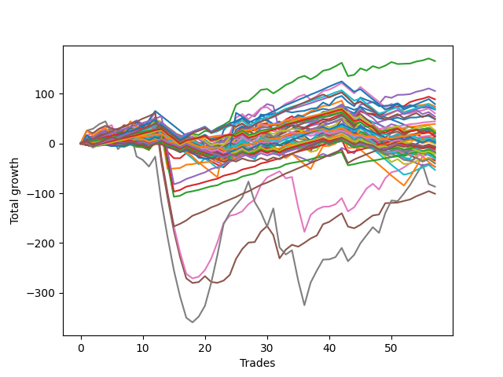

# Long Pointer 001 
- Symbol: TEST
- Date Range: 03/18/2022 - 07/15/2022
- Trading Period: 7:20-12:30
- Number of Trades: 57



| Name | Win Percent | Profit | Avg Profit / Trade | Avg Time / Trade |      | Name | Win Percent | Profit | Avg Profit / Trade | Avg Time / Trade |
| ---- | ----------- | ------ | ------------------ | ---------------- | ---- | ---- | ----------- | ------ | ------------------ | ---------------- |
| Sorted By <br> Profit | | | | | | Sorted By <br> Win Percentage ||||
| Two | 73.68 | 83000.00 | 1456.14 | 23:36 |     | Eighty-One | 96.49 | 6250.00 | 109.65 | 11:22 |
| Four | 71.93 | 52875.00 | 927.63 | 38:58 |     | Eighty-Four | 92.98 | 35875.00 | 629.39 | 23:55 |
| Three | 70.18 | 44500.00 | 780.70 | 23:22 |     | Eighty-Three | 92.98 | 9250.00 | 162.28 | 20:52 |
| One Hundred Twenty-Five | 73.68 | 39750.00 | 697.37 | 13:52 |     | Eighty-Two | 92.98 | -9375.00 | -164.47 | 17:38 |
| One | 68.42 | 37375.00 | 655.70 | 14:38 |     | Eighty-Five | 91.23 | 12750.00 | 223.68 | 31:53 |
| Eighty-Four | 92.98 | 35875.00 | 629.39 | 23:55 |     | One Hundred Twenty-One | 89.47 | 22375.00 | 392.54 | 05:01 |
| One Hundred Twenty-Four | 77.19 | 34625.00 | 607.46 | 10:33 |     | One Hundred Twenty-Six | 89.47 | 19750.00 | 346.49 | 05:17 |
| Seventy-Three | 50.88 | 34125.00 | 598.68 | 09:43 |     | One Hundred Twenty-Seven | 80.70 | 10750.00 | 188.60 | 06:43 |
| Fifty-Eight | 63.16 | 30375.00 | 532.89 | 13:47 |     | One Hundred Twenty-Two | 80.70 | 10375.00 | 182.02 | 06:41 |
| One Hundred Twenty-Nine | 73.68 | 27125.00 | 475.88 | 10:20 |     | One Hundred Twenty-Four | 77.19 | 34625.00 | 607.46 | 10:33 |
| One Hundred Thirty | 66.67 | 24750.00 | 434.21 | 12:05 |     | One Hundred Twenty-Three | 77.19 | 13250.00 | 232.46 | 08:50 |
| Zero | 66.67 | 24500.00 | 429.82 | 08:47 |     | One Hundred Sixteen | 77.19 | 11375.00 | 199.56 | 02:41 |
| One Hundred Twenty-One | 89.47 | 22375.00 | 392.54 | 05:01 |     | Six | 75.44 | -10875.00 | -190.79 | 76:33 |
| One Hundred Twenty-Six | 89.47 | 19750.00 | 346.49 | 05:17 |     | Two | 73.68 | 83000.00 | 1456.14 | 23:36 |
| One Hundred Twenty-Three | 77.19 | 13250.00 | 232.46 | 08:50 |     | One Hundred Twenty-Five | 73.68 | 39750.00 | 697.37 | 13:52 |
| Eighty-Five | 91.23 | 12750.00 | 223.68 | 31:53 |     | One Hundred Twenty-Nine | 73.68 | 27125.00 | 475.88 | 10:20 |
| One Hundred Sixteen | 77.19 | 11375.00 | 199.56 | 02:41 |     | One Hundred Eleven | 73.68 | 8375.00 | 146.93 | 02:30 |
| Forty-One | 49.12 | 11125.00 | 195.18 | 05:41 |     | One Hundred Twenty-Eight | 73.68 | 7000.00 | 122.81 | 08:39 |
| Forty-Two | 40.35 | 11000.00 | 192.98 | 08:35 |     | Four | 71.93 | 52875.00 | 927.63 | 38:58 |
| One Hundred Twenty-Seven | 80.70 | 10750.00 | 188.60 | 06:43 |     | Three | 70.18 | 44500.00 | 780.70 | 23:22 |
| Fifty-Seven | 63.16 | 10625.00 | 186.40 | 08:59 |     | Five | 70.18 | -50500.00 | -885.96 | 66:59 |
| One Hundred Twenty-Two | 80.70 | 10375.00 | 182.02 | 06:41 |     | One | 68.42 | 37375.00 | 655.70 | 14:38 |
| Eighty-Three | 92.98 | 9250.00 | 162.28 | 20:52 |     | One Hundred Thirty | 66.67 | 24750.00 | 434.21 | 12:05 |
| One Hundred Eleven | 73.68 | 8375.00 | 146.93 | 02:30 |     | Zero | 66.67 | 24500.00 | 429.82 | 08:47 |
| Sixty-Six | 52.63 | 8125.00 | 142.54 | 11:35 |     | Fifty-Six | 66.67 | -8750.00 | -153.51 | 06:19 |
| Sixty-Seven | 52.63 | 7625.00 | 133.77 | 11:32 |     | Fifty-Eight | 63.16 | 30375.00 | 532.89 | 13:47 |
| Fifty-Nine | 57.89 | 7500.00 | 131.58 | 13:21 |     | Fifty-Seven | 63.16 | 10625.00 | 186.40 | 08:59 |
| One Hundred Twenty-Eight | 73.68 | 7000.00 | 122.81 | 08:39 |     | Sixty-Four | 63.16 | -13375.00 | -234.65 | 06:11 |
| Eighty-One | 96.49 | 6250.00 | 109.65 | 11:22 |     | One Hundred Seventeen | 61.40 | -3875.00 | -67.98 | 03:10 |
| Fifty-One | 38.60 | 4375.00 | 76.75 | 06:02 |     | One Hundred Twelve | 61.40 | -6750.00 | -118.42 | 03:03 |
| Forty-Nine | 43.86 | 3875.00 | 67.98 | 04:54 |     | Seven | 59.65 | -43375.00 | -760.96 | 129:53 |
| One Hundred Fourteen | 54.39 | 3000.00 | 52.63 | 05:21 |     | Fifty-Nine | 57.89 | 7500.00 | 131.58 | 13:21 |
| Sixty-Five | 57.89 | 2625.00 | 46.05 | 08:26 |     | Sixty-Five | 57.89 | 2625.00 | 46.05 | 08:26 |
| Fifty-Four | 40.35 | 1375.00 | 24.12 | 07:11 |     | One Hundred Fourteen | 54.39 | 3000.00 | 52.63 | 05:21 |
| Fifty | 40.35 | 1250.00 | 21.93 | 06:17 |     | One Hundred Thirteen | 54.39 | -10375.00 | -182.02 | 04:13 |
| One Hundred Fifteen | 49.12 | 1125.00 | 19.74 | 06:40 |     | Sixty-Six | 52.63 | 8125.00 | 142.54 | 11:35 |
| Sixty-Two | 49.12 | 0.00 | 0.00 | 32:24 |     | Sixty-Seven | 52.63 | 7625.00 | 133.77 | 11:32 |
| Forty-Three | 40.35 | -375.00 | -6.58 | 07:53 |     | One Hundred Eighteen | 52.63 | -5250.00 | -92.11 | 04:02 |
| Seventy | 45.61 | -625.00 | -10.96 | 19:05 |     | Forty | 52.63 | -13250.00 | -232.46 | 04:02 |
| Fifty-Three | 38.60 | -2875.00 | -50.44 | 07:39 |     | Sixty | 52.63 | -19250.00 | -337.72 | 21:03 |
| One Hundred Twenty | 40.35 | -3250.00 | -57.02 | 05:22 |     | Seventy-Three | 50.88 | 34125.00 | 598.68 | 09:43 |
| Fifty-Two | 38.60 | -3250.00 | -57.02 | 07:06 |     | Forty-Eight | 50.88 | -9625.00 | -168.86 | 03:38 |
| One Hundred Ninteen | 47.37 | -3375.00 | -59.21 | 04:32 |     | Forty-One | 49.12 | 11125.00 | 195.18 | 05:41 |
| One Hundred Seventeen | 61.40 | -3875.00 | -67.98 | 03:10 |     | One Hundred Fifteen | 49.12 | 1125.00 | 19.74 | 06:40 |
| Fifty-Five | 38.60 | -3875.00 | -67.98 | 08:13 |     | Sixty-Two | 49.12 | 0.00 | 0.00 | 32:24 |
| One Hundred Eighteen | 52.63 | -5250.00 | -92.11 | 04:02 |     | One Hundred Ninteen | 47.37 | -3375.00 | -59.21 | 04:32 |
| One Hundred Twelve | 61.40 | -6750.00 | -118.42 | 03:03 |     | Seventy | 45.61 | -625.00 | -10.96 | 19:05 |
| Forty-Four | 33.33 | -8375.00 | -146.93 | 11:31 |     | Sixty-Eight | 45.61 | -15500.00 | -271.93 | 15:58 |
| Fifty-Six | 66.67 | -8750.00 | -153.51 | 06:19 |     | Sixty-One | 45.61 | -26500.00 | -464.91 | 27:45 |
| Eighty-Two | 92.98 | -9375.00 | -164.47 | 17:38 |     | Forty-Nine | 43.86 | 3875.00 | 67.98 | 04:54 |
| Forty-Eight | 50.88 | -9625.00 | -168.86 | 03:38 |     | Forty-Two | 40.35 | 11000.00 | 192.98 | 08:35 |
| One Hundred Thirteen | 54.39 | -10375.00 | -182.02 | 04:13 |     | Fifty-Four | 40.35 | 1375.00 | 24.12 | 07:11 |
| Six | 75.44 | -10875.00 | -190.79 | 76:33 |     | Fifty | 40.35 | 1250.00 | 21.93 | 06:17 |
| Forty | 52.63 | -13250.00 | -232.46 | 04:02 |     | Forty-Three | 40.35 | -375.00 | -6.58 | 07:53 |
| Sixty-Four | 63.16 | -13375.00 | -234.65 | 06:11 |     | One Hundred Twenty | 40.35 | -3250.00 | -57.02 | 05:22 |
| Forty-Seven | 22.81 | -14375.00 | -252.19 | 23:58 |     | Sixty-Nine | 40.35 | -20125.00 | -353.07 | 18:36 |
| Seventy-One | 36.84 | -15250.00 | -267.54 | 24:30 |     | Fifty-One | 38.60 | 4375.00 | 76.75 | 06:02 |
| Sixty-Eight | 45.61 | -15500.00 | -271.93 | 15:58 |     | Fifty-Three | 38.60 | -2875.00 | -50.44 | 07:39 |
| Forty-Five | 26.32 | -17000.00 | -298.25 | 14:26 |     | Fifty-Two | 38.60 | -3250.00 | -57.02 | 07:06 |
| Sixty | 52.63 | -19250.00 | -337.72 | 21:03 |     | Fifty-Five | 38.60 | -3875.00 | -67.98 | 08:13 |
| Sixty-Nine | 40.35 | -20125.00 | -353.07 | 18:36 |     | Seventy-One | 36.84 | -15250.00 | -267.54 | 24:30 |
| Forty-Six | 29.82 | -23125.00 | -405.70 | 15:33 |     | Forty-Four | 33.33 | -8375.00 | -146.93 | 11:31 |
| Sixty-Three | 33.33 | -23625.00 | -414.47 | 51:32 |     | Sixty-Three | 33.33 | -23625.00 | -414.47 | 51:32 |
| Sixty-One | 45.61 | -26500.00 | -464.91 | 27:45 |     | Forty-Six | 29.82 | -23125.00 | -405.70 | 15:33 |
| Seven | 59.65 | -43375.00 | -760.96 | 129:53 |     | Forty-Five | 26.32 | -17000.00 | -298.25 | 14:26 |
| Five | 70.18 | -50500.00 | -885.96 | 66:59 |     | Forty-Seven | 22.81 | -14375.00 | -252.19 | 23:58 |

## NO STOPLOSS

### Test Zero
* Sell when price hits the middle line of the 20p bollinger
* No Stoploss
* Results:
```
Total Trades: 57
Percent Up: 66.67
Percent Down: 33.33
Total Points Moved Up: 49.00
Potential Profit: 24500.00
Total Points Ups: 128.00 Count Ups: 38
Total Points Downs: -79.00 Count Downs: 19
```

<details><summary>Trades</summary>

<code>In: 2022-03-25 08:30:00		Out: 2022-03-25 08:36:55		Total Position Time: 06:55		Total Move Up: 4.00		Total to Date: 4.00</code> <br />
<code>In: 2022-03-30 12:14:00		Out: 2022-03-30 12:28:50		Total Position Time: 14:50		Total Move Up: -2.75		Total to Date: 1.25</code> <br />
<code>In: 2022-03-30 12:27:00		Out: 2022-03-30 12:28:50		Total Position Time: 01:50		Total Move Up: 2.75		Total to Date: 4.00</code> <br />
<code>In: 2022-03-31 08:37:00		Out: 2022-03-31 08:38:15		Total Position Time: 01:15		Total Move Up: 2.00		Total to Date: 6.00</code> <br />
<code>In: 2022-03-31 10:02:00		Out: 2022-03-31 10:19:05		Total Position Time: 17:05		Total Move Up: -2.50		Total to Date: 3.50</code> <br />
<code>In: 2022-04-05 09:04:00		Out: 2022-04-05 09:06:10		Total Position Time: 02:10		Total Move Up: 3.25		Total to Date: 6.75</code> <br />
<code>In: 2022-04-06 09:23:00		Out: 2022-04-06 09:31:15		Total Position Time: 08:15		Total Move Up: 1.50		Total to Date: 8.25</code> <br />
<code>In: 2022-04-07 08:56:00		Out: 2022-04-07 09:00:25		Total Position Time: 04:25		Total Move Up: 2.25		Total to Date: 10.50</code> <br />
<code>In: 2022-04-12 07:53:00		Out: 2022-04-12 08:02:05		Total Position Time: 09:05		Total Move Up: 0.75		Total to Date: 11.25</code> <br />
<code>In: 2022-04-12 11:35:00		Out: 2022-04-12 11:36:10		Total Position Time: 01:10		Total Move Up: 1.50		Total to Date: 12.75</code> <br />
<code>In: 2022-04-14 09:32:00		Out: 2022-04-14 09:56:15		Total Position Time: 24:15		Total Move Up: -4.75		Total to Date: 8.00</code> <br />
<code>In: 2022-04-20 11:58:00		Out: 2022-04-20 12:01:15		Total Position Time: 03:15		Total Move Up: 4.75		Total to Date: 12.75</code> <br />
<code>In: 2022-04-21 08:25:00		Out: 2022-04-21 08:26:10		Total Position Time: 01:10		Total Move Up: 2.50		Total to Date: 15.25</code> <br />
<code>In: 2022-04-21 09:02:00		Out: 2022-04-21 09:19:05		Total Position Time: 17:05		Total Move Up: -5.25		Total to Date: 10.00</code> <br />
<code>In: 2022-04-21 09:12:00		Out: 2022-04-21 09:19:05		Total Position Time: 07:05		Total Move Up: 0.25		Total to Date: 10.25</code> <br />
<code>In: 2022-04-21 09:56:00		Out: 2022-04-21 10:13:45		Total Position Time: 17:45		Total Move Up: -5.50		Total to Date: 4.75</code> <br />
<code>In: 2022-04-21 10:21:00		Out: 2022-04-21 10:22:10		Total Position Time: 01:10		Total Move Up: 6.75		Total to Date: 11.50</code> <br />
<code>In: 2022-04-21 12:06:00		Out: 2022-04-21 12:18:15		Total Position Time: 12:15		Total Move Up: -1.75		Total to Date: 9.75</code> <br />
<code>In: 2022-05-02 08:07:00		Out: 2022-05-02 08:14:50		Total Position Time: 07:50		Total Move Up: 2.75		Total to Date: 12.50</code> <br />
<code>In: 2022-05-02 08:22:00		Out: 2022-05-02 08:26:10		Total Position Time: 04:10		Total Move Up: 5.25		Total to Date: 17.75</code> <br />
<code>In: 2022-05-02 10:37:00		Out: 2022-05-02 10:59:50		Total Position Time: 22:50		Total Move Up: -7.75		Total to Date: 10.00</code> <br />
<code>In: 2022-05-02 10:51:00		Out: 2022-05-02 10:59:50		Total Position Time: 08:50		Total Move Up: 2.25		Total to Date: 12.25</code> <br />
<code>In: 2022-05-02 11:46:00		Out: 2022-05-02 11:47:10		Total Position Time: 01:10		Total Move Up: -1.00		Total to Date: 11.25</code> <br />
<code>In: 2022-05-04 08:37:00		Out: 2022-05-04 08:39:25		Total Position Time: 02:25		Total Move Up: 2.75		Total to Date: 14.00</code> <br />
<code>In: 2022-05-04 11:36:00		Out: 2022-05-04 11:40:45		Total Position Time: 04:45		Total Move Up: 5.25		Total to Date: 19.25</code> <br />
<code>In: 2022-05-06 09:03:00		Out: 2022-05-06 09:04:10		Total Position Time: 01:10		Total Move Up: 6.25		Total to Date: 25.50</code> <br />
<code>In: 2022-05-06 11:28:00		Out: 2022-05-06 11:40:25		Total Position Time: 12:25		Total Move Up: -1.75		Total to Date: 23.75</code> <br />
<code>In: 2022-05-09 07:42:00		Out: 2022-05-09 07:45:00		Total Position Time: 03:00		Total Move Up: 3.50		Total to Date: 27.25</code> <br />
<code>In: 2022-05-09 08:34:00		Out: 2022-05-09 08:35:10		Total Position Time: 01:10		Total Move Up: 6.25		Total to Date: 33.50</code> <br />
<code>In: 2022-05-09 10:03:00		Out: 2022-05-09 10:17:30		Total Position Time: 14:30		Total Move Up: -0.75		Total to Date: 32.75</code> <br />
<code>In: 2022-05-10 07:52:00		Out: 2022-05-10 08:02:25		Total Position Time: 10:25		Total Move Up: 3.75		Total to Date: 36.50</code> <br />
<code>In: 2022-05-11 09:14:00		Out: 2022-05-11 09:21:05		Total Position Time: 07:05		Total Move Up: 2.50		Total to Date: 39.00</code> <br />
<code>In: 2022-05-11 11:01:00		Out: 2022-05-11 11:02:10		Total Position Time: 01:10		Total Move Up: 6.25		Total to Date: 45.25</code> <br />
<code>In: 2022-05-16 09:47:00		Out: 2022-05-16 09:48:15		Total Position Time: 01:15		Total Move Up: 4.00		Total to Date: 49.25</code> <br />
<code>In: 2022-05-18 08:32:00		Out: 2022-05-18 08:37:35		Total Position Time: 05:35		Total Move Up: 4.75		Total to Date: 54.00</code> <br />
<code>In: 2022-05-18 09:12:00		Out: 2022-05-18 09:14:50		Total Position Time: 02:50		Total Move Up: 2.75		Total to Date: 56.75</code> <br />
<code>In: 2022-05-20 09:48:00		Out: 2022-05-20 09:52:30		Total Position Time: 04:30		Total Move Up: 6.00		Total to Date: 62.75</code> <br />
<code>In: 2022-05-25 10:15:00		Out: 2022-05-25 10:16:10		Total Position Time: 01:10		Total Move Up: 3.25		Total to Date: 66.00</code> <br />
<code>In: 2022-05-31 12:05:00		Out: 2022-05-31 12:07:45		Total Position Time: 02:45		Total Move Up: 4.00		Total to Date: 70.00</code> <br />
<code>In: 2022-06-08 11:31:00		Out: 2022-06-08 11:41:35		Total Position Time: 10:35		Total Move Up: -2.50		Total to Date: 67.50</code> <br />
<code>In: 2022-06-08 12:11:00		Out: 2022-06-08 12:12:10		Total Position Time: 01:10		Total Move Up: 3.75		Total to Date: 71.25</code> <br />
<code>In: 2022-06-09 08:10:00		Out: 2022-06-09 08:11:10		Total Position Time: 01:10		Total Move Up: 3.25		Total to Date: 74.50</code> <br />
<code>In: 2022-06-13 12:17:00		Out: 2022-06-13 12:20:15		Total Position Time: 03:15		Total Move Up: -1.50		Total to Date: 73.00</code> <br />
<code>In: 2022-06-14 07:32:00		Out: 2022-06-14 07:47:00		Total Position Time: 15:00		Total Move Up: -5.25		Total to Date: 67.75</code> <br />
<code>In: 2022-06-14 07:45:00		Out: 2022-06-14 07:47:00		Total Position Time: 02:00		Total Move Up: 5.25		Total to Date: 73.00</code> <br />
<code>In: 2022-06-14 11:52:00		Out: 2022-06-14 12:26:30		Total Position Time: 34:30		Total Move Up: -11.75		Total to Date: 61.25</code> <br />
<code>In: 2022-06-15 07:57:00		Out: 2022-06-15 08:34:25		Total Position Time: 37:25		Total Move Up: -3.50		Total to Date: 57.75</code> <br />
<code>In: 2022-06-16 11:02:00		Out: 2022-06-16 11:40:20		Total Position Time: 38:20		Total Move Up: -7.00		Total to Date: 50.75</code> <br />
<code>In: 2022-06-17 07:38:00		Out: 2022-06-17 07:55:05		Total Position Time: 17:05		Total Move Up: -2.75		Total to Date: 48.00</code> <br />
<code>In: 2022-06-23 09:07:00		Out: 2022-06-23 09:17:45		Total Position Time: 10:45		Total Move Up: 1.25		Total to Date: 49.25</code> <br />
<code>In: 2022-06-27 10:10:00		Out: 2022-06-27 10:11:25		Total Position Time: 01:25		Total Move Up: 3.00		Total to Date: 52.25</code> <br />
<code>In: 2022-06-29 09:16:00		Out: 2022-06-29 09:36:40		Total Position Time: 20:40		Total Move Up: -4.25		Total to Date: 48.00</code> <br />
<code>In: 2022-07-06 08:12:00		Out: 2022-07-06 08:15:05		Total Position Time: 03:05		Total Move Up: 4.25		Total to Date: 52.25</code> <br />
<code>In: 2022-07-06 08:35:00		Out: 2022-07-06 08:46:30		Total Position Time: 11:30		Total Move Up: 0.25		Total to Date: 52.50</code> <br />
<code>In: 2022-07-08 09:48:00		Out: 2022-07-08 09:49:10		Total Position Time: 01:10		Total Move Up: 2.25		Total to Date: 54.75</code> <br />
<code>In: 2022-07-12 10:28:00		Out: 2022-07-12 10:29:10		Total Position Time: 01:10		Total Move Up: 1.00		Total to Date: 55.75</code> <br />
<code>In: 2022-07-12 12:27:00		Out: 2022-07-12 12:45:35		Total Position Time: 18:35		Total Move Up: -6.75		Total to Date: 49.00</code> <br />


</details>

### Test One
* Sell when the price hits the upper line of the 20p 1std bollinger
* No Stoploss
* Results:
```
Total Trades: 57
Percent Up: 68.42
Percent Down: 31.58
Total Points Moved Up: 74.75
Potential Profit: 37375.00
Total Points Ups: 194.75 Count Ups: 39
Total Points Downs: -120.00 Count Downs: 18
```

<details><summary>Trades</summary>

<code>In: 2022-03-25 08:30:00		Out: 2022-03-25 08:41:10		Total Position Time: 11:10		Total Move Up: 5.50		Total to Date: 5.50</code> <br />
<code>In: 2022-03-30 12:14:00		Out: 2022-03-30 12:32:20		Total Position Time: 18:20		Total Move Up: -0.75		Total to Date: 4.75</code> <br />
<code>In: 2022-03-30 12:27:00		Out: 2022-03-30 12:32:20		Total Position Time: 05:20		Total Move Up: 4.75		Total to Date: 9.50</code> <br />
<code>In: 2022-03-31 08:37:00		Out: 2022-03-31 08:40:40		Total Position Time: 03:40		Total Move Up: 3.75		Total to Date: 13.25</code> <br />
<code>In: 2022-03-31 10:02:00		Out: 2022-03-31 10:19:40		Total Position Time: 17:40		Total Move Up: -0.50		Total to Date: 12.75</code> <br />
<code>In: 2022-04-05 09:04:00		Out: 2022-04-05 09:13:55		Total Position Time: 09:55		Total Move Up: 4.25		Total to Date: 17.00</code> <br />
<code>In: 2022-04-06 09:23:00		Out: 2022-04-06 09:34:25		Total Position Time: 11:25		Total Move Up: 2.75		Total to Date: 19.75</code> <br />
<code>In: 2022-04-07 08:56:00		Out: 2022-04-07 09:02:50		Total Position Time: 06:50		Total Move Up: 3.25		Total to Date: 23.00</code> <br />
<code>In: 2022-04-12 07:53:00		Out: 2022-04-12 08:02:35		Total Position Time: 09:35		Total Move Up: 2.75		Total to Date: 25.75</code> <br />
<code>In: 2022-04-12 11:35:00		Out: 2022-04-12 11:37:30		Total Position Time: 02:30		Total Move Up: 3.75		Total to Date: 29.50</code> <br />
<code>In: 2022-04-14 09:32:00		Out: 2022-04-14 09:58:40		Total Position Time: 26:40		Total Move Up: -3.25		Total to Date: 26.25</code> <br />
<code>In: 2022-04-20 11:58:00		Out: 2022-04-20 12:04:20		Total Position Time: 06:20		Total Move Up: 7.50		Total to Date: 33.75</code> <br />
<code>In: 2022-04-21 08:25:00		Out: 2022-04-21 09:34:10		Total Position Time: 69:10		Total Move Up: -27.50		Total to Date: 6.25</code> <br />
<code>In: 2022-04-21 09:02:00		Out: 2022-04-21 09:34:10		Total Position Time: 32:10		Total Move Up: -7.25		Total to Date: -1.00</code> <br />
<code>In: 2022-04-21 09:12:00		Out: 2022-04-21 09:34:10		Total Position Time: 22:10		Total Move Up: -1.75		Total to Date: -2.75</code> <br />
<code>In: 2022-04-21 09:56:00		Out: 2022-04-21 10:21:25		Total Position Time: 25:25		Total Move Up: -4.00		Total to Date: -6.75</code> <br />
<code>In: 2022-04-21 10:21:00		Out: 2022-04-21 10:22:10		Total Position Time: 01:10		Total Move Up: 6.75		Total to Date: 0.00</code> <br />
<code>In: 2022-04-21 12:06:00		Out: 2022-04-21 12:23:10		Total Position Time: 17:10		Total Move Up: -1.00		Total to Date: -1.00</code> <br />
<code>In: 2022-05-02 08:07:00		Out: 2022-05-02 08:36:15		Total Position Time: 29:15		Total Move Up: -7.00		Total to Date: -8.00</code> <br />
<code>In: 2022-05-02 08:22:00		Out: 2022-05-02 08:36:15		Total Position Time: 14:15		Total Move Up: 3.25		Total to Date: -4.75</code> <br />
<code>In: 2022-05-02 10:37:00		Out: 2022-05-02 11:02:45		Total Position Time: 25:45		Total Move Up: -5.25		Total to Date: -10.00</code> <br />
<code>In: 2022-05-02 10:51:00		Out: 2022-05-02 11:02:45		Total Position Time: 11:45		Total Move Up: 4.75		Total to Date: -5.25</code> <br />
<code>In: 2022-05-02 11:46:00		Out: 2022-05-02 11:47:10		Total Position Time: 01:10		Total Move Up: -1.00		Total to Date: -6.25</code> <br />
<code>In: 2022-05-04 08:37:00		Out: 2022-05-04 08:40:55		Total Position Time: 03:55		Total Move Up: 5.00		Total to Date: -1.25</code> <br />
<code>In: 2022-05-04 11:36:00		Out: 2022-05-04 11:41:40		Total Position Time: 05:40		Total Move Up: 17.25		Total to Date: 16.00</code> <br />
<code>In: 2022-05-06 09:03:00		Out: 2022-05-06 09:04:10		Total Position Time: 01:10		Total Move Up: 6.25		Total to Date: 22.25</code> <br />
<code>In: 2022-05-06 11:28:00		Out: 2022-05-06 11:49:10		Total Position Time: 21:10		Total Move Up: 0.50		Total to Date: 22.75</code> <br />
<code>In: 2022-05-09 07:42:00		Out: 2022-05-09 07:46:10		Total Position Time: 04:10		Total Move Up: 8.25		Total to Date: 31.00</code> <br />
<code>In: 2022-05-09 08:34:00		Out: 2022-05-09 08:38:55		Total Position Time: 04:55		Total Move Up: 9.00		Total to Date: 40.00</code> <br />
<code>In: 2022-05-09 10:03:00		Out: 2022-05-09 10:18:05		Total Position Time: 15:05		Total Move Up: 1.25		Total to Date: 41.25</code> <br />
<code>In: 2022-05-10 07:52:00		Out: 2022-05-10 08:37:10		Total Position Time: 45:10		Total Move Up: -15.00		Total to Date: 26.25</code> <br />
<code>In: 2022-05-11 09:14:00		Out: 2022-05-11 09:23:15		Total Position Time: 09:15		Total Move Up: 6.25		Total to Date: 32.50</code> <br />
<code>In: 2022-05-11 11:01:00		Out: 2022-05-11 11:02:10		Total Position Time: 01:10		Total Move Up: 6.25		Total to Date: 38.75</code> <br />
<code>In: 2022-05-16 09:47:00		Out: 2022-05-16 09:50:05		Total Position Time: 03:05		Total Move Up: 6.75		Total to Date: 45.50</code> <br />
<code>In: 2022-05-18 08:32:00		Out: 2022-05-18 08:41:20		Total Position Time: 09:20		Total Move Up: 7.00		Total to Date: 52.50</code> <br />
<code>In: 2022-05-18 09:12:00		Out: 2022-05-18 09:16:30		Total Position Time: 04:30		Total Move Up: 5.25		Total to Date: 57.75</code> <br />
<code>In: 2022-05-20 09:48:00		Out: 2022-05-20 09:56:15		Total Position Time: 08:15		Total Move Up: 7.50		Total to Date: 65.25</code> <br />
<code>In: 2022-05-25 10:15:00		Out: 2022-05-25 10:16:20		Total Position Time: 01:20		Total Move Up: 4.25		Total to Date: 69.50</code> <br />
<code>In: 2022-05-31 12:05:00		Out: 2022-05-31 12:09:20		Total Position Time: 04:20		Total Move Up: 6.25		Total to Date: 75.75</code> <br />
<code>In: 2022-06-08 11:31:00		Out: 2022-06-08 11:43:20		Total Position Time: 12:20		Total Move Up: 0.75		Total to Date: 76.50</code> <br />
<code>In: 2022-06-08 12:11:00		Out: 2022-06-08 12:12:20		Total Position Time: 01:20		Total Move Up: 5.00		Total to Date: 81.50</code> <br />
<code>In: 2022-06-09 08:10:00		Out: 2022-06-09 08:21:10		Total Position Time: 11:10		Total Move Up: 4.75		Total to Date: 86.25</code> <br />
<code>In: 2022-06-13 12:17:00		Out: 2022-06-13 12:47:00		Total Position Time: 30:00		Total Move Up: -26.75		Total to Date: 59.50</code> <br />
<code>In: 2022-06-14 07:32:00		Out: 2022-06-14 07:47:15		Total Position Time: 15:15		Total Move Up: -1.00		Total to Date: 58.50</code> <br />
<code>In: 2022-06-14 07:45:00		Out: 2022-06-14 07:47:15		Total Position Time: 02:15		Total Move Up: 9.50		Total to Date: 68.00</code> <br />
<code>In: 2022-06-14 11:52:00		Out: 2022-06-14 12:27:20		Total Position Time: 35:20		Total Move Up: -7.75		Total to Date: 60.25</code> <br />
<code>In: 2022-06-15 07:57:00		Out: 2022-06-15 08:38:55		Total Position Time: 41:55		Total Move Up: -0.25		Total to Date: 60.00</code> <br />
<code>In: 2022-06-16 11:02:00		Out: 2022-06-16 11:40:30		Total Position Time: 38:30		Total Move Up: -4.75		Total to Date: 55.25</code> <br />
<code>In: 2022-06-17 07:38:00		Out: 2022-06-17 07:56:20		Total Position Time: 18:20		Total Move Up: 1.00		Total to Date: 56.25</code> <br />
<code>In: 2022-06-23 09:07:00		Out: 2022-06-23 09:18:25		Total Position Time: 11:25		Total Move Up: 4.75		Total to Date: 61.00</code> <br />
<code>In: 2022-06-27 10:10:00		Out: 2022-06-27 10:16:10		Total Position Time: 06:10		Total Move Up: 6.25		Total to Date: 67.25</code> <br />
<code>In: 2022-06-29 09:16:00		Out: 2022-06-29 09:38:30		Total Position Time: 22:30		Total Move Up: 0.75		Total to Date: 68.00</code> <br />
<code>In: 2022-07-06 08:12:00		Out: 2022-07-06 08:21:05		Total Position Time: 09:05		Total Move Up: 6.25		Total to Date: 74.25</code> <br />
<code>In: 2022-07-06 08:35:00		Out: 2022-07-06 08:48:25		Total Position Time: 13:25		Total Move Up: 2.00		Total to Date: 76.25</code> <br />
<code>In: 2022-07-08 09:48:00		Out: 2022-07-08 10:09:40		Total Position Time: 21:40		Total Move Up: 1.25		Total to Date: 77.50</code> <br />
<code>In: 2022-07-12 10:28:00		Out: 2022-07-12 10:30:50		Total Position Time: 02:50		Total Move Up: 2.50		Total to Date: 80.00</code> <br />
<code>In: 2022-07-12 12:27:00		Out: 2022-07-12 12:47:00		Total Position Time: 20:00		Total Move Up: -5.25		Total to Date: 74.75</code> <br />


</details>

### Test Two
* Sell when the price hits the upper line of the 20p 2std bollinger
* No Stoploss
* Results:
```
Total Trades: 57
Percent Up: 73.68
Percent Down: 26.32
Total Points Moved Up: 166.00
Potential Profit: 83000.00
Total Points Ups: 269.00 Count Ups: 42
Total Points Downs: -103.00 Count Downs: 15
```

<details><summary>Trades</summary>

<code>In: 2022-03-25 08:30:00		Out: 2022-03-25 08:41:55		Total Position Time: 11:55		Total Move Up: 9.50		Total to Date: 9.50</code> <br />
<code>In: 2022-03-30 12:14:00		Out: 2022-03-30 12:36:20		Total Position Time: 22:20		Total Move Up: 2.00		Total to Date: 11.50</code> <br />
<code>In: 2022-03-30 12:27:00		Out: 2022-03-30 12:36:20		Total Position Time: 09:20		Total Move Up: 7.50		Total to Date: 19.00</code> <br />
<code>In: 2022-03-31 08:37:00		Out: 2022-03-31 08:41:10		Total Position Time: 04:10		Total Move Up: 5.75		Total to Date: 24.75</code> <br />
<code>In: 2022-03-31 10:02:00		Out: 2022-03-31 10:27:50		Total Position Time: 25:50		Total Move Up: -1.25		Total to Date: 23.50</code> <br />
<code>In: 2022-04-05 09:04:00		Out: 2022-04-05 09:39:50		Total Position Time: 35:50		Total Move Up: -2.00		Total to Date: 21.50</code> <br />
<code>In: 2022-04-06 09:23:00		Out: 2022-04-06 09:41:10		Total Position Time: 18:10		Total Move Up: 3.00		Total to Date: 24.50</code> <br />
<code>In: 2022-04-07 08:56:00		Out: 2022-04-07 09:09:05		Total Position Time: 13:05		Total Move Up: 4.75		Total to Date: 29.25</code> <br />
<code>In: 2022-04-12 07:53:00		Out: 2022-04-12 08:15:40		Total Position Time: 22:40		Total Move Up: 3.00		Total to Date: 32.25</code> <br />
<code>In: 2022-04-12 11:35:00		Out: 2022-04-12 11:47:00		Total Position Time: 12:00		Total Move Up: 4.50		Total to Date: 36.75</code> <br />
<code>In: 2022-04-14 09:32:00		Out: 2022-04-14 09:59:15		Total Position Time: 27:15		Total Move Up: -1.75		Total to Date: 35.00</code> <br />
<code>In: 2022-04-20 11:58:00		Out: 2022-04-20 12:12:35		Total Position Time: 14:35		Total Move Up: 9.75		Total to Date: 44.75</code> <br />
<code>In: 2022-04-21 08:25:00		Out: 2022-04-21 09:35:55		Total Position Time: 70:55		Total Move Up: -25.25		Total to Date: 19.50</code> <br />
<code>In: 2022-04-21 09:02:00		Out: 2022-04-21 09:35:55		Total Position Time: 33:55		Total Move Up: -5.00		Total to Date: 14.50</code> <br />
<code>In: 2022-04-21 09:12:00		Out: 2022-04-21 09:35:55		Total Position Time: 23:55		Total Move Up: 0.50		Total to Date: 15.00</code> <br />
<code>In: 2022-04-21 09:56:00		Out: 2022-04-21 10:22:15		Total Position Time: 26:15		Total Move Up: -3.50		Total to Date: 11.50</code> <br />
<code>In: 2022-04-21 10:21:00		Out: 2022-04-21 10:22:15		Total Position Time: 01:15		Total Move Up: 6.75		Total to Date: 18.25</code> <br />
<code>In: 2022-04-21 12:06:00		Out: 2022-04-21 12:24:30		Total Position Time: 18:30		Total Move Up: 1.00		Total to Date: 19.25</code> <br />
<code>In: 2022-05-02 08:07:00		Out: 2022-05-02 08:36:45		Total Position Time: 29:45		Total Move Up: -2.00		Total to Date: 17.25</code> <br />
<code>In: 2022-05-02 08:22:00		Out: 2022-05-02 08:36:45		Total Position Time: 14:45		Total Move Up: 8.25		Total to Date: 25.50</code> <br />
<code>In: 2022-05-02 10:37:00		Out: 2022-05-02 11:03:55		Total Position Time: 26:55		Total Move Up: -2.00		Total to Date: 23.50</code> <br />
<code>In: 2022-05-02 10:51:00		Out: 2022-05-02 11:03:55		Total Position Time: 12:55		Total Move Up: 8.00		Total to Date: 31.50</code> <br />
<code>In: 2022-05-02 11:46:00		Out: 2022-05-02 11:53:35		Total Position Time: 07:35		Total Move Up: 6.00		Total to Date: 37.50</code> <br />
<code>In: 2022-05-04 08:37:00		Out: 2022-05-04 08:47:05		Total Position Time: 10:05		Total Move Up: 8.00		Total to Date: 45.50</code> <br />
<code>In: 2022-05-04 11:36:00		Out: 2022-05-04 11:43:55		Total Position Time: 07:55		Total Move Up: 32.25		Total to Date: 77.75</code> <br />
<code>In: 2022-05-06 09:03:00		Out: 2022-05-06 09:05:00		Total Position Time: 02:00		Total Move Up: 7.25		Total to Date: 85.00</code> <br />
<code>In: 2022-05-06 11:28:00		Out: 2022-05-06 11:49:10		Total Position Time: 21:10		Total Move Up: 0.50		Total to Date: 85.50</code> <br />
<code>In: 2022-05-09 07:42:00		Out: 2022-05-09 07:49:10		Total Position Time: 07:10		Total Move Up: 10.50		Total to Date: 96.00</code> <br />
<code>In: 2022-05-09 08:34:00		Out: 2022-05-09 08:39:15		Total Position Time: 05:15		Total Move Up: 12.00		Total to Date: 108.00</code> <br />
<code>In: 2022-05-09 10:03:00		Out: 2022-05-09 10:19:05		Total Position Time: 16:05		Total Move Up: 1.75		Total to Date: 109.75</code> <br />
<code>In: 2022-05-10 07:52:00		Out: 2022-05-10 08:39:10		Total Position Time: 47:10		Total Move Up: -8.75		Total to Date: 101.00</code> <br />
<code>In: 2022-05-11 09:14:00		Out: 2022-05-11 09:23:40		Total Position Time: 09:40		Total Move Up: 7.75		Total to Date: 108.75</code> <br />
<code>In: 2022-05-11 11:01:00		Out: 2022-05-11 11:04:55		Total Position Time: 03:55		Total Move Up: 9.25		Total to Date: 118.00</code> <br />
<code>In: 2022-05-16 09:47:00		Out: 2022-05-16 10:07:00		Total Position Time: 20:00		Total Move Up: 5.25		Total to Date: 123.25</code> <br />
<code>In: 2022-05-18 08:32:00		Out: 2022-05-18 08:42:55		Total Position Time: 10:55		Total Move Up: 8.75		Total to Date: 132.00</code> <br />
<code>In: 2022-05-18 09:12:00		Out: 2022-05-18 09:47:55		Total Position Time: 35:55		Total Move Up: 4.25		Total to Date: 136.25</code> <br />
<code>In: 2022-05-20 09:48:00		Out: 2022-05-20 10:33:20		Total Position Time: 45:20		Total Move Up: -7.00		Total to Date: 129.25</code> <br />
<code>In: 2022-05-25 10:15:00		Out: 2022-05-25 10:29:45		Total Position Time: 14:45		Total Move Up: 7.00		Total to Date: 136.25</code> <br />
<code>In: 2022-05-31 12:05:00		Out: 2022-05-31 12:15:05		Total Position Time: 10:05		Total Move Up: 10.25		Total to Date: 146.50</code> <br />
<code>In: 2022-06-08 11:31:00		Out: 2022-06-08 11:44:05		Total Position Time: 13:05		Total Move Up: 2.75		Total to Date: 149.25</code> <br />
<code>In: 2022-06-08 12:11:00		Out: 2022-06-08 12:13:30		Total Position Time: 02:30		Total Move Up: 6.25		Total to Date: 155.50</code> <br />
<code>In: 2022-06-09 08:10:00		Out: 2022-06-09 08:22:35		Total Position Time: 12:35		Total Move Up: 7.00		Total to Date: 162.50</code> <br />
<code>In: 2022-06-13 12:17:00		Out: 2022-06-13 12:47:00		Total Position Time: 30:00		Total Move Up: -26.75		Total to Date: 135.75</code> <br />
<code>In: 2022-06-14 07:32:00		Out: 2022-06-14 07:48:40		Total Position Time: 16:40		Total Move Up: 2.50		Total to Date: 138.25</code> <br />
<code>In: 2022-06-14 07:45:00		Out: 2022-06-14 07:48:40		Total Position Time: 03:40		Total Move Up: 13.00		Total to Date: 151.25</code> <br />
<code>In: 2022-06-14 11:52:00		Out: 2022-06-14 12:29:20		Total Position Time: 37:20		Total Move Up: -4.50		Total to Date: 146.75</code> <br />
<code>In: 2022-06-15 07:57:00		Out: 2022-06-15 10:58:15		Total Position Time: 181:15		Total Move Up: 9.00		Total to Date: 155.75</code> <br />
<code>In: 2022-06-16 11:02:00		Out: 2022-06-16 11:41:05		Total Position Time: 39:05		Total Move Up: -4.00		Total to Date: 151.75</code> <br />
<code>In: 2022-06-17 07:38:00		Out: 2022-06-17 08:02:25		Total Position Time: 24:25		Total Move Up: 5.00		Total to Date: 156.75</code> <br />
<code>In: 2022-06-23 09:07:00		Out: 2022-06-23 09:19:10		Total Position Time: 12:10		Total Move Up: 7.25		Total to Date: 164.00</code> <br />
<code>In: 2022-06-27 10:10:00		Out: 2022-06-27 11:13:35		Total Position Time: 63:35		Total Move Up: -4.00		Total to Date: 160.00</code> <br />
<code>In: 2022-06-29 09:16:00		Out: 2022-06-29 10:01:45		Total Position Time: 45:45		Total Move Up: 0.50		Total to Date: 160.50</code> <br />
<code>In: 2022-07-06 08:12:00		Out: 2022-07-06 08:51:15		Total Position Time: 39:15		Total Move Up: 0.50		Total to Date: 161.00</code> <br />
<code>In: 2022-07-06 08:35:00		Out: 2022-07-06 08:51:15		Total Position Time: 16:15		Total Move Up: 4.00		Total to Date: 165.00</code> <br />
<code>In: 2022-07-08 09:48:00		Out: 2022-07-08 10:11:05		Total Position Time: 23:05		Total Move Up: 2.25		Total to Date: 167.25</code> <br />
<code>In: 2022-07-12 10:28:00		Out: 2022-07-12 10:41:40		Total Position Time: 13:40		Total Move Up: 4.00		Total to Date: 171.25</code> <br />
<code>In: 2022-07-12 12:27:00		Out: 2022-07-12 12:47:00		Total Position Time: 20:00		Total Move Up: -5.25		Total to Date: 166.00</code> <br />


</details>

### Test Three
* Sell when price hits the middle line of the 50p bollinger
* No Stoploss
* Results:
```
Total Trades: 57
Percent Up: 70.18
Percent Down: 29.82
Total Points Moved Up: 89.00
Potential Profit: 44500.00
Total Points Ups: 240.75 Count Ups: 40
Total Points Downs: -151.75 Count Downs: 17
```

<details><summary>Trades</summary>

<code>In: 2022-03-25 08:30:00		Out: 2022-03-25 08:53:00		Total Position Time: 23:00		Total Move Up: 8.75		Total to Date: 8.75</code> <br />
<code>In: 2022-03-30 12:14:00		Out: 2022-03-30 12:33:40		Total Position Time: 19:40		Total Move Up: 1.00		Total to Date: 9.75</code> <br />
<code>In: 2022-03-30 12:27:00		Out: 2022-03-30 12:33:40		Total Position Time: 06:40		Total Move Up: 6.50		Total to Date: 16.25</code> <br />
<code>In: 2022-03-31 08:37:00		Out: 2022-03-31 08:41:05		Total Position Time: 04:05		Total Move Up: 4.25		Total to Date: 20.50</code> <br />
<code>In: 2022-03-31 10:02:00		Out: 2022-03-31 10:28:00		Total Position Time: 26:00		Total Move Up: -1.00		Total to Date: 19.50</code> <br />
<code>In: 2022-04-05 09:04:00		Out: 2022-04-05 09:49:15		Total Position Time: 45:15		Total Move Up: -2.00		Total to Date: 17.50</code> <br />
<code>In: 2022-04-06 09:23:00		Out: 2022-04-06 09:55:05		Total Position Time: 32:05		Total Move Up: 2.25		Total to Date: 19.75</code> <br />
<code>In: 2022-04-07 08:56:00		Out: 2022-04-07 09:06:05		Total Position Time: 10:05		Total Move Up: 3.75		Total to Date: 23.50</code> <br />
<code>In: 2022-04-12 07:53:00		Out: 2022-04-12 08:16:15		Total Position Time: 23:15		Total Move Up: 2.75		Total to Date: 26.25</code> <br />
<code>In: 2022-04-12 11:35:00		Out: 2022-04-12 11:47:05		Total Position Time: 12:05		Total Move Up: 6.00		Total to Date: 32.25</code> <br />
<code>In: 2022-04-14 09:32:00		Out: 2022-04-14 10:00:05		Total Position Time: 28:05		Total Move Up: -0.50		Total to Date: 31.75</code> <br />
<code>In: 2022-04-20 11:58:00		Out: 2022-04-20 12:10:10		Total Position Time: 12:10		Total Move Up: 8.25		Total to Date: 40.00</code> <br />
<code>In: 2022-04-21 08:25:00		Out: 2022-04-21 10:22:35		Total Position Time: 117:35		Total Move Up: -38.50		Total to Date: 1.50</code> <br />
<code>In: 2022-04-21 09:02:00		Out: 2022-04-21 10:22:35		Total Position Time: 80:35		Total Move Up: -18.25		Total to Date: -16.75</code> <br />
<code>In: 2022-04-21 09:12:00		Out: 2022-04-21 10:22:35		Total Position Time: 70:35		Total Move Up: -12.75		Total to Date: -29.50</code> <br />
<code>In: 2022-04-21 09:56:00		Out: 2022-04-21 10:22:35		Total Position Time: 26:35		Total Move Up: 0.00		Total to Date: -29.50</code> <br />
<code>In: 2022-04-21 10:21:00		Out: 2022-04-21 10:22:35		Total Position Time: 01:35		Total Move Up: 10.25		Total to Date: -19.25</code> <br />
<code>In: 2022-04-21 12:06:00		Out: 2022-04-21 12:29:40		Total Position Time: 23:40		Total Move Up: 4.25		Total to Date: -15.00</code> <br />
<code>In: 2022-05-02 08:07:00		Out: 2022-05-02 08:38:15		Total Position Time: 31:15		Total Move Up: -0.25		Total to Date: -15.25</code> <br />
<code>In: 2022-05-02 08:22:00		Out: 2022-05-02 08:38:15		Total Position Time: 16:15		Total Move Up: 10.00		Total to Date: -5.25</code> <br />
<code>In: 2022-05-02 10:37:00		Out: 2022-05-02 11:05:00		Total Position Time: 28:00		Total Move Up: 0.50		Total to Date: -4.75</code> <br />
<code>In: 2022-05-02 10:51:00		Out: 2022-05-02 11:05:00		Total Position Time: 14:00		Total Move Up: 10.50		Total to Date: 5.75</code> <br />
<code>In: 2022-05-02 11:46:00		Out: 2022-05-02 11:49:15		Total Position Time: 03:15		Total Move Up: -0.50		Total to Date: 5.25</code> <br />
<code>In: 2022-05-04 08:37:00		Out: 2022-05-04 08:41:50		Total Position Time: 04:50		Total Move Up: 5.25		Total to Date: 10.50</code> <br />
<code>In: 2022-05-04 11:36:00		Out: 2022-05-04 11:41:15		Total Position Time: 05:15		Total Move Up: 11.75		Total to Date: 22.25</code> <br />
<code>In: 2022-05-06 09:03:00		Out: 2022-05-06 09:06:05		Total Position Time: 03:05		Total Move Up: 10.25		Total to Date: 32.50</code> <br />
<code>In: 2022-05-06 11:28:00		Out: 2022-05-06 11:49:25		Total Position Time: 21:25		Total Move Up: 3.00		Total to Date: 35.50</code> <br />
<code>In: 2022-05-09 07:42:00		Out: 2022-05-09 08:39:00		Total Position Time: 57:00		Total Move Up: -9.50		Total to Date: 26.00</code> <br />
<code>In: 2022-05-09 08:34:00		Out: 2022-05-09 08:39:00		Total Position Time: 05:00		Total Move Up: 10.50		Total to Date: 36.50</code> <br />
<code>In: 2022-05-09 10:03:00		Out: 2022-05-09 10:25:40		Total Position Time: 22:40		Total Move Up: 4.50		Total to Date: 41.00</code> <br />
<code>In: 2022-05-10 07:52:00		Out: 2022-05-10 08:38:55		Total Position Time: 46:55		Total Move Up: -13.25		Total to Date: 27.75</code> <br />
<code>In: 2022-05-11 09:14:00		Out: 2022-05-11 09:24:05		Total Position Time: 10:05		Total Move Up: 9.50		Total to Date: 37.25</code> <br />
<code>In: 2022-05-11 11:01:00		Out: 2022-05-11 11:05:00		Total Position Time: 04:00		Total Move Up: 11.00		Total to Date: 48.25</code> <br />
<code>In: 2022-05-16 09:47:00		Out: 2022-05-16 09:50:05		Total Position Time: 03:05		Total Move Up: 6.75		Total to Date: 55.00</code> <br />
<code>In: 2022-05-18 08:32:00		Out: 2022-05-18 09:36:20		Total Position Time: 64:20		Total Move Up: -8.75		Total to Date: 46.25</code> <br />
<code>In: 2022-05-18 09:12:00		Out: 2022-05-18 09:36:20		Total Position Time: 24:20		Total Move Up: 2.75		Total to Date: 49.00</code> <br />
<code>In: 2022-05-20 09:48:00		Out: 2022-05-20 10:33:25		Total Position Time: 45:25		Total Move Up: -5.50		Total to Date: 43.50</code> <br />
<code>In: 2022-05-25 10:15:00		Out: 2022-05-25 10:16:10		Total Position Time: 01:10		Total Move Up: 3.25		Total to Date: 46.75</code> <br />
<code>In: 2022-05-31 12:05:00		Out: 2022-05-31 12:15:15		Total Position Time: 10:15		Total Move Up: 12.25		Total to Date: 59.00</code> <br />
<code>In: 2022-06-08 11:31:00		Out: 2022-06-08 11:43:30		Total Position Time: 12:30		Total Move Up: 2.00		Total to Date: 61.00</code> <br />
<code>In: 2022-06-08 12:11:00		Out: 2022-06-08 12:12:10		Total Position Time: 01:10		Total Move Up: 3.75		Total to Date: 64.75</code> <br />
<code>In: 2022-06-09 08:10:00		Out: 2022-06-09 08:25:35		Total Position Time: 15:35		Total Move Up: 7.25		Total to Date: 72.00</code> <br />
<code>In: 2022-06-13 12:17:00		Out: 2022-06-13 12:47:00		Total Position Time: 30:00		Total Move Up: -26.75		Total to Date: 45.25</code> <br />
<code>In: 2022-06-14 07:32:00		Out: 2022-06-14 07:50:20		Total Position Time: 18:20		Total Move Up: 4.50		Total to Date: 49.75</code> <br />
<code>In: 2022-06-14 07:45:00		Out: 2022-06-14 07:50:20		Total Position Time: 05:20		Total Move Up: 15.00		Total to Date: 64.75</code> <br />
<code>In: 2022-06-14 11:52:00		Out: 2022-06-14 12:29:10		Total Position Time: 37:10		Total Move Up: -4.75		Total to Date: 60.00</code> <br />
<code>In: 2022-06-15 07:57:00		Out: 2022-06-15 08:38:55		Total Position Time: 41:55		Total Move Up: -0.25		Total to Date: 59.75</code> <br />
<code>In: 2022-06-16 11:02:00		Out: 2022-06-16 11:41:05		Total Position Time: 39:05		Total Move Up: -4.00		Total to Date: 55.75</code> <br />
<code>In: 2022-06-17 07:38:00		Out: 2022-06-17 08:02:30		Total Position Time: 24:30		Total Move Up: 7.00		Total to Date: 62.75</code> <br />
<code>In: 2022-06-23 09:07:00		Out: 2022-06-23 09:22:00		Total Position Time: 15:00		Total Move Up: 8.75		Total to Date: 71.50</code> <br />
<code>In: 2022-06-27 10:10:00		Out: 2022-06-27 10:11:25		Total Position Time: 01:25		Total Move Up: 3.00		Total to Date: 74.50</code> <br />
<code>In: 2022-06-29 09:16:00		Out: 2022-06-29 09:38:30		Total Position Time: 22:30		Total Move Up: 0.75		Total to Date: 75.25</code> <br />
<code>In: 2022-07-06 08:12:00		Out: 2022-07-06 08:21:40		Total Position Time: 09:40		Total Move Up: 8.25		Total to Date: 83.50</code> <br />
<code>In: 2022-07-06 08:35:00		Out: 2022-07-06 08:51:15		Total Position Time: 16:15		Total Move Up: 4.00		Total to Date: 87.50</code> <br />
<code>In: 2022-07-08 09:48:00		Out: 2022-07-08 10:11:15		Total Position Time: 23:15		Total Move Up: 2.75		Total to Date: 90.25</code> <br />
<code>In: 2022-07-12 10:28:00		Out: 2022-07-12 10:41:40		Total Position Time: 13:40		Total Move Up: 4.00		Total to Date: 94.25</code> <br />
<code>In: 2022-07-12 12:27:00		Out: 2022-07-12 12:47:00		Total Position Time: 20:00		Total Move Up: -5.25		Total to Date: 89.00</code> <br />


</details>

### Test Four
* Sell when the price hits the upper line of the 50p 1std bollinger
* No Stoploss
* Results:
```
Total Trades: 57
Percent Up: 71.93
Percent Down: 28.07
Total Points Moved Up: 105.75
Potential Profit: 52875.00
Total Points Ups: 296.00 Count Ups: 41
Total Points Downs: -190.25 Count Downs: 16
```

<details><summary>Trades</summary>

<code>In: 2022-03-25 08:30:00		Out: 2022-03-25 09:08:25		Total Position Time: 38:25		Total Move Up: 8.00		Total to Date: 8.00</code> <br />
<code>In: 2022-03-30 12:14:00		Out: 2022-03-30 12:46:25		Total Position Time: 32:25		Total Move Up: 4.25		Total to Date: 12.25</code> <br />
<code>In: 2022-03-30 12:27:00		Out: 2022-03-30 12:46:25		Total Position Time: 19:25		Total Move Up: 9.75		Total to Date: 22.00</code> <br />
<code>In: 2022-03-31 08:37:00		Out: 2022-03-31 09:00:40		Total Position Time: 23:40		Total Move Up: 5.00		Total to Date: 27.00</code> <br />
<code>In: 2022-03-31 10:02:00		Out: 2022-03-31 10:29:50		Total Position Time: 27:50		Total Move Up: 1.50		Total to Date: 28.50</code> <br />
<code>In: 2022-04-05 09:04:00		Out: 2022-04-05 09:57:05		Total Position Time: 53:05		Total Move Up: 1.00		Total to Date: 29.50</code> <br />
<code>In: 2022-04-06 09:23:00		Out: 2022-04-06 10:00:20		Total Position Time: 37:20		Total Move Up: 3.50		Total to Date: 33.00</code> <br />
<code>In: 2022-04-07 08:56:00		Out: 2022-04-07 09:10:45		Total Position Time: 14:45		Total Move Up: 7.00		Total to Date: 40.00</code> <br />
<code>In: 2022-04-12 07:53:00		Out: 2022-04-12 08:19:50		Total Position Time: 26:50		Total Move Up: 6.50		Total to Date: 46.50</code> <br />
<code>In: 2022-04-12 11:35:00		Out: 2022-04-12 12:47:00		Total Position Time: 72:00		Total Move Up: -7.00		Total to Date: 39.50</code> <br />
<code>In: 2022-04-14 09:32:00		Out: 2022-04-14 10:30:10		Total Position Time: 58:10		Total Move Up: -2.00		Total to Date: 37.50</code> <br />
<code>In: 2022-04-20 11:58:00		Out: 2022-04-20 12:13:35		Total Position Time: 15:35		Total Move Up: 13.00		Total to Date: 50.50</code> <br />
<code>In: 2022-04-21 08:25:00		Out: 2022-04-21 10:31:15		Total Position Time: 126:15		Total Move Up: -34.50		Total to Date: 16.00</code> <br />
<code>In: 2022-04-21 09:02:00		Out: 2022-04-21 10:31:15		Total Position Time: 89:15		Total Move Up: -14.25		Total to Date: 1.75</code> <br />
<code>In: 2022-04-21 09:12:00		Out: 2022-04-21 10:31:15		Total Position Time: 79:15		Total Move Up: -8.75		Total to Date: -7.00</code> <br />
<code>In: 2022-04-21 09:56:00		Out: 2022-04-21 10:31:15		Total Position Time: 35:15		Total Move Up: 4.00		Total to Date: -3.00</code> <br />
<code>In: 2022-04-21 10:21:00		Out: 2022-04-21 10:31:15		Total Position Time: 10:15		Total Move Up: 14.25		Total to Date: 11.25</code> <br />
<code>In: 2022-04-21 12:06:00		Out: 2022-04-21 12:47:00		Total Position Time: 41:00		Total Move Up: -9.25		Total to Date: 2.00</code> <br />
<code>In: 2022-05-02 08:07:00		Out: 2022-05-02 08:55:55		Total Position Time: 48:55		Total Move Up: -3.25		Total to Date: -1.25</code> <br />
<code>In: 2022-05-02 08:22:00		Out: 2022-05-02 08:55:55		Total Position Time: 33:55		Total Move Up: 7.00		Total to Date: 5.75</code> <br />
<code>In: 2022-05-02 10:37:00		Out: 2022-05-02 11:53:40		Total Position Time: 76:40		Total Move Up: -6.75		Total to Date: -1.00</code> <br />
<code>In: 2022-05-02 10:51:00		Out: 2022-05-02 11:53:40		Total Position Time: 62:40		Total Move Up: 3.25		Total to Date: 2.25</code> <br />
<code>In: 2022-05-02 11:46:00		Out: 2022-05-02 11:53:40		Total Position Time: 07:40		Total Move Up: 9.50		Total to Date: 11.75</code> <br />
<code>In: 2022-05-04 08:37:00		Out: 2022-05-04 08:47:05		Total Position Time: 10:05		Total Move Up: 8.00		Total to Date: 19.75</code> <br />
<code>In: 2022-05-04 11:36:00		Out: 2022-05-04 11:42:00		Total Position Time: 06:00		Total Move Up: 21.25		Total to Date: 41.00</code> <br />
<code>In: 2022-05-06 09:03:00		Out: 2022-05-06 09:23:10		Total Position Time: 20:10		Total Move Up: 9.25		Total to Date: 50.25</code> <br />
<code>In: 2022-05-06 11:28:00		Out: 2022-05-06 11:50:10		Total Position Time: 22:10		Total Move Up: 8.75		Total to Date: 59.00</code> <br />
<code>In: 2022-05-09 07:42:00		Out: 2022-05-09 08:41:35		Total Position Time: 59:35		Total Move Up: -4.50		Total to Date: 54.50</code> <br />
<code>In: 2022-05-09 08:34:00		Out: 2022-05-09 08:41:35		Total Position Time: 07:35		Total Move Up: 15.50		Total to Date: 70.00</code> <br />
<code>In: 2022-05-09 10:03:00		Out: 2022-05-09 10:29:30		Total Position Time: 26:30		Total Move Up: 9.50		Total to Date: 79.50</code> <br />
<code>In: 2022-05-10 07:52:00		Out: 2022-05-10 08:40:30		Total Position Time: 48:30		Total Move Up: -3.75		Total to Date: 75.75</code> <br />
<code>In: 2022-05-11 09:14:00		Out: 2022-05-11 11:18:20		Total Position Time: 124:20		Total Move Up: -51.00		Total to Date: 24.75</code> <br />
<code>In: 2022-05-11 11:01:00		Out: 2022-05-11 11:18:20		Total Position Time: 17:20		Total Move Up: 13.25		Total to Date: 38.00</code> <br />
<code>In: 2022-05-16 09:47:00		Out: 2022-05-16 10:07:25		Total Position Time: 20:25		Total Move Up: 6.25		Total to Date: 44.25</code> <br />
<code>In: 2022-05-18 08:32:00		Out: 2022-05-18 09:47:55		Total Position Time: 75:55		Total Move Up: -7.25		Total to Date: 37.00</code> <br />
<code>In: 2022-05-18 09:12:00		Out: 2022-05-18 09:47:55		Total Position Time: 35:55		Total Move Up: 4.25		Total to Date: 41.25</code> <br />
<code>In: 2022-05-20 09:48:00		Out: 2022-05-20 10:34:55		Total Position Time: 46:55		Total Move Up: 1.75		Total to Date: 43.00</code> <br />
<code>In: 2022-05-25 10:15:00		Out: 2022-05-25 10:16:10		Total Position Time: 01:10		Total Move Up: 3.25		Total to Date: 46.25</code> <br />
<code>In: 2022-05-31 12:05:00		Out: 2022-05-31 12:28:25		Total Position Time: 23:25		Total Move Up: 17.25		Total to Date: 63.50</code> <br />
<code>In: 2022-06-08 11:31:00		Out: 2022-06-08 12:12:35		Total Position Time: 41:35		Total Move Up: 1.25		Total to Date: 64.75</code> <br />
<code>In: 2022-06-08 12:11:00		Out: 2022-06-08 12:12:35		Total Position Time: 01:35		Total Move Up: 5.25		Total to Date: 70.00</code> <br />
<code>In: 2022-06-09 08:10:00		Out: 2022-06-09 08:40:10		Total Position Time: 30:10		Total Move Up: 6.25		Total to Date: 76.25</code> <br />
<code>In: 2022-06-13 12:17:00		Out: 2022-06-13 12:47:00		Total Position Time: 30:00		Total Move Up: -26.75		Total to Date: 49.50</code> <br />
<code>In: 2022-06-14 07:32:00		Out: 2022-06-14 08:02:25		Total Position Time: 30:25		Total Move Up: 9.00		Total to Date: 58.50</code> <br />
<code>In: 2022-06-14 07:45:00		Out: 2022-06-14 08:02:25		Total Position Time: 17:25		Total Move Up: 19.50		Total to Date: 78.00</code> <br />
<code>In: 2022-06-14 11:52:00		Out: 2022-06-14 12:30:55		Total Position Time: 38:55		Total Move Up: 2.50		Total to Date: 80.50</code> <br />
<code>In: 2022-06-15 07:57:00		Out: 2022-06-15 08:57:35		Total Position Time: 60:35		Total Move Up: 2.75		Total to Date: 83.25</code> <br />
<code>In: 2022-06-16 11:02:00		Out: 2022-06-16 12:04:10		Total Position Time: 62:10		Total Move Up: -3.50		Total to Date: 79.75</code> <br />
<code>In: 2022-06-17 07:38:00		Out: 2022-06-17 08:06:05		Total Position Time: 28:05		Total Move Up: 14.75		Total to Date: 94.50</code> <br />
<code>In: 2022-06-23 09:07:00		Out: 2022-06-23 10:18:10		Total Position Time: 71:10		Total Move Up: -2.50		Total to Date: 92.00</code> <br />
<code>In: 2022-06-27 10:10:00		Out: 2022-06-27 10:15:55		Total Position Time: 05:55		Total Move Up: 6.00		Total to Date: 98.00</code> <br />
<code>In: 2022-06-29 09:16:00		Out: 2022-06-29 09:59:30		Total Position Time: 43:30		Total Move Up: 0.25		Total to Date: 98.25</code> <br />
<code>In: 2022-07-06 08:12:00		Out: 2022-07-06 09:13:30		Total Position Time: 61:30		Total Move Up: 1.25		Total to Date: 99.50</code> <br />
<code>In: 2022-07-06 08:35:00		Out: 2022-07-06 09:13:30		Total Position Time: 38:30		Total Move Up: 4.75		Total to Date: 104.25</code> <br />
<code>In: 2022-07-08 09:48:00		Out: 2022-07-08 10:26:30		Total Position Time: 38:30		Total Move Up: 2.75		Total to Date: 107.00</code> <br />
<code>In: 2022-07-12 10:28:00		Out: 2022-07-12 10:53:20		Total Position Time: 25:20		Total Move Up: 4.00		Total to Date: 111.00</code> <br />
<code>In: 2022-07-12 12:27:00		Out: 2022-07-12 12:47:00		Total Position Time: 20:00		Total Move Up: -5.25		Total to Date: 105.75</code> <br />


</details>

### Test Five
* Sell when the price hits the upper line of the 50p 2std bollinger
* No Stoploss
* Results:
```
Total Trades: 57
Percent Up: 70.18
Percent Down: 29.82
Total Points Moved Up: -101.00
Potential Profit: -50500.00
Total Points Ups: 362.25 Count Ups: 40
Total Points Downs: -463.25 Count Downs: 17
```

<details><summary>Trades</summary>

<code>In: 2022-03-25 08:30:00		Out: 2022-03-25 09:11:40		Total Position Time: 41:40		Total Move Up: 11.00		Total to Date: 11.00</code> <br />
<code>In: 2022-03-30 12:14:00		Out: 2022-03-30 12:47:00		Total Position Time: 33:00		Total Move Up: 3.75		Total to Date: 14.75</code> <br />
<code>In: 2022-03-30 12:27:00		Out: 2022-03-30 12:47:00		Total Position Time: 20:00		Total Move Up: 9.25		Total to Date: 24.00</code> <br />
<code>In: 2022-03-31 08:37:00		Out: 2022-03-31 10:46:00		Total Position Time: 129:00		Total Move Up: -4.75		Total to Date: 19.25</code> <br />
<code>In: 2022-03-31 10:02:00		Out: 2022-03-31 10:46:00		Total Position Time: 44:00		Total Move Up: 2.00		Total to Date: 21.25</code> <br />
<code>In: 2022-04-05 09:04:00		Out: 2022-04-05 10:06:45		Total Position Time: 62:45		Total Move Up: 2.75		Total to Date: 24.00</code> <br />
<code>In: 2022-04-06 09:23:00		Out: 2022-04-06 10:07:15		Total Position Time: 44:15		Total Move Up: 3.00		Total to Date: 27.00</code> <br />
<code>In: 2022-04-07 08:56:00		Out: 2022-04-07 09:22:05		Total Position Time: 26:05		Total Move Up: 7.00		Total to Date: 34.00</code> <br />
<code>In: 2022-04-12 07:53:00		Out: 2022-04-12 08:23:15		Total Position Time: 30:15		Total Move Up: 10.00		Total to Date: 44.00</code> <br />
<code>In: 2022-04-12 11:35:00		Out: 2022-04-12 12:47:00		Total Position Time: 72:00		Total Move Up: -7.00		Total to Date: 37.00</code> <br />
<code>In: 2022-04-14 09:32:00		Out: 2022-04-14 10:32:30		Total Position Time: 60:30		Total Move Up: -0.25		Total to Date: 36.75</code> <br />
<code>In: 2022-04-20 11:58:00		Out: 2022-04-20 12:25:45		Total Position Time: 27:45		Total Move Up: 16.25		Total to Date: 53.00</code> <br />
<code>In: 2022-04-21 08:25:00		Out: 2022-04-21 12:47:00		Total Position Time: 262:00		Total Move Up: -91.50		Total to Date: -38.50</code> <br />
<code>In: 2022-04-21 09:02:00		Out: 2022-04-21 12:47:00		Total Position Time: 225:00		Total Move Up: -71.25		Total to Date: -109.75</code> <br />
<code>In: 2022-04-21 09:12:00		Out: 2022-04-21 12:47:00		Total Position Time: 215:00		Total Move Up: -65.75		Total to Date: -175.50</code> <br />
<code>In: 2022-04-21 09:56:00		Out: 2022-04-21 12:47:00		Total Position Time: 171:00		Total Move Up: -53.00		Total to Date: -228.50</code> <br />
<code>In: 2022-04-21 10:21:00		Out: 2022-04-21 12:47:00		Total Position Time: 146:00		Total Move Up: -42.75		Total to Date: -271.25</code> <br />
<code>In: 2022-04-21 12:06:00		Out: 2022-04-21 12:47:00		Total Position Time: 41:00		Total Move Up: -9.25		Total to Date: -280.50</code> <br />
<code>In: 2022-05-02 08:07:00		Out: 2022-05-02 09:00:45		Total Position Time: 53:45		Total Move Up: 1.75		Total to Date: -278.75</code> <br />
<code>In: 2022-05-02 08:22:00		Out: 2022-05-02 09:00:45		Total Position Time: 38:45		Total Move Up: 12.00		Total to Date: -266.75</code> <br />
<code>In: 2022-05-02 10:37:00		Out: 2022-05-02 12:03:30		Total Position Time: 86:30		Total Move Up: -11.75		Total to Date: -278.50</code> <br />
<code>In: 2022-05-02 10:51:00		Out: 2022-05-02 12:03:30		Total Position Time: 72:30		Total Move Up: -1.75		Total to Date: -280.25</code> <br />
<code>In: 2022-05-02 11:46:00		Out: 2022-05-02 12:03:30		Total Position Time: 17:30		Total Move Up: 4.50		Total to Date: -275.75</code> <br />
<code>In: 2022-05-04 08:37:00		Out: 2022-05-04 08:49:05		Total Position Time: 12:05		Total Move Up: 11.50		Total to Date: -264.25</code> <br />
<code>In: 2022-05-04 11:36:00		Out: 2022-05-04 11:43:55		Total Position Time: 07:55		Total Move Up: 32.25		Total to Date: -232.00</code> <br />
<code>In: 2022-05-06 09:03:00		Out: 2022-05-06 09:36:15		Total Position Time: 33:15		Total Move Up: 19.75		Total to Date: -212.25</code> <br />
<code>In: 2022-05-06 11:28:00		Out: 2022-05-06 11:54:15		Total Position Time: 26:15		Total Move Up: 13.00		Total to Date: -199.25</code> <br />
<code>In: 2022-05-09 07:42:00		Out: 2022-05-09 08:43:15		Total Position Time: 61:15		Total Move Up: 1.00		Total to Date: -198.25</code> <br />
<code>In: 2022-05-09 08:34:00		Out: 2022-05-09 08:43:15		Total Position Time: 09:15		Total Move Up: 21.00		Total to Date: -177.25</code> <br />
<code>In: 2022-05-09 10:03:00		Out: 2022-05-09 10:30:40		Total Position Time: 27:40		Total Move Up: 11.25		Total to Date: -166.00</code> <br />
<code>In: 2022-05-10 07:52:00		Out: 2022-05-10 10:04:15		Total Position Time: 132:15		Total Move Up: -18.25		Total to Date: -184.25</code> <br />
<code>In: 2022-05-11 09:14:00		Out: 2022-05-11 11:23:40		Total Position Time: 129:40		Total Move Up: -46.75		Total to Date: -231.00</code> <br />
<code>In: 2022-05-11 11:01:00		Out: 2022-05-11 11:23:40		Total Position Time: 22:40		Total Move Up: 17.50		Total to Date: -213.50</code> <br />
<code>In: 2022-05-16 09:47:00		Out: 2022-05-16 10:11:25		Total Position Time: 24:25		Total Move Up: 9.75		Total to Date: -203.75</code> <br />
<code>In: 2022-05-18 08:32:00		Out: 2022-05-18 09:50:35		Total Position Time: 78:35		Total Move Up: -3.75		Total to Date: -207.50</code> <br />
<code>In: 2022-05-18 09:12:00		Out: 2022-05-18 09:50:35		Total Position Time: 38:35		Total Move Up: 7.75		Total to Date: -199.75</code> <br />
<code>In: 2022-05-20 09:48:00		Out: 2022-05-20 10:46:15		Total Position Time: 58:15		Total Move Up: 8.75		Total to Date: -191.00</code> <br />
<code>In: 2022-05-25 10:15:00		Out: 2022-05-25 10:29:35		Total Position Time: 14:35		Total Move Up: 6.00		Total to Date: -185.00</code> <br />
<code>In: 2022-05-31 12:05:00		Out: 2022-05-31 12:31:05		Total Position Time: 26:05		Total Move Up: 22.75		Total to Date: -162.25</code> <br />
<code>In: 2022-06-08 11:31:00		Out: 2022-06-08 12:21:15		Total Position Time: 50:15		Total Move Up: 4.75		Total to Date: -157.50</code> <br />
<code>In: 2022-06-08 12:11:00		Out: 2022-06-08 12:21:15		Total Position Time: 10:15		Total Move Up: 8.75		Total to Date: -148.75</code> <br />
<code>In: 2022-06-09 08:10:00		Out: 2022-06-09 08:41:45		Total Position Time: 31:45		Total Move Up: 8.50		Total to Date: -140.25</code> <br />
<code>In: 2022-06-13 12:17:00		Out: 2022-06-13 12:47:00		Total Position Time: 30:00		Total Move Up: -26.75		Total to Date: -167.00</code> <br />
<code>In: 2022-06-14 07:32:00		Out: 2022-06-14 10:08:30		Total Position Time: 156:30		Total Move Up: -3.50		Total to Date: -170.50</code> <br />
<code>In: 2022-06-14 07:45:00		Out: 2022-06-14 10:08:30		Total Position Time: 143:30		Total Move Up: 7.00		Total to Date: -163.50</code> <br />
<code>In: 2022-06-14 11:52:00		Out: 2022-06-14 12:37:50		Total Position Time: 45:50		Total Move Up: 9.75		Total to Date: -153.75</code> <br />
<code>In: 2022-06-15 07:57:00		Out: 2022-06-15 10:58:15		Total Position Time: 181:15		Total Move Up: 9.00		Total to Date: -144.75</code> <br />
<code>In: 2022-06-16 11:02:00		Out: 2022-06-16 12:10:00		Total Position Time: 68:00		Total Move Up: 2.00		Total to Date: -142.75</code> <br />
<code>In: 2022-06-17 07:38:00		Out: 2022-06-17 08:07:55		Total Position Time: 29:55		Total Move Up: 22.75		Total to Date: -120.00</code> <br />
<code>In: 2022-06-23 09:07:00		Out: 2022-06-23 10:23:20		Total Position Time: 76:20		Total Move Up: 0.50		Total to Date: -119.50</code> <br />
<code>In: 2022-06-27 10:10:00		Out: 2022-06-27 11:38:15		Total Position Time: 88:15		Total Move Up: 0.75		Total to Date: -118.75</code> <br />
<code>In: 2022-06-29 09:16:00		Out: 2022-06-29 10:09:35		Total Position Time: 53:35		Total Move Up: 3.25		Total to Date: -115.50</code> <br />
<code>In: 2022-07-06 08:12:00		Out: 2022-07-06 09:35:55		Total Position Time: 83:55		Total Move Up: 3.00		Total to Date: -112.50</code> <br />
<code>In: 2022-07-06 08:35:00		Out: 2022-07-06 09:35:55		Total Position Time: 60:55		Total Move Up: 6.50		Total to Date: -106.00</code> <br />
<code>In: 2022-07-08 09:48:00		Out: 2022-07-08 10:27:00		Total Position Time: 39:00		Total Move Up: 5.00		Total to Date: -101.00</code> <br />
<code>In: 2022-07-12 10:28:00		Out: 2022-07-12 10:54:15		Total Position Time: 26:15		Total Move Up: 5.25		Total to Date: -95.75</code> <br />
<code>In: 2022-07-12 12:27:00		Out: 2022-07-12 12:47:00		Total Position Time: 20:00		Total Move Up: -5.25		Total to Date: -101.00</code> <br />


</details>

### Test Six
* Sell when the price hits the middle line of the 1std VWAP
* No Stoploss
* Results:
```
Total Trades: 57
Percent Up: 75.44
Percent Down: 24.56
Total Points Moved Up: -21.75
Potential Profit: -10875.00
Total Points Ups: 517.75 Count Ups: 43
Total Points Downs: -539.50 Count Downs: 14
```

<details><summary>Trades</summary>

<code>In: 2022-03-25 08:30:00		Out: 2022-03-25 10:19:30		Total Position Time: 109:30		Total Move Up: 16.75		Total to Date: 16.75</code> <br />
<code>In: 2022-03-30 12:14:00		Out: 2022-03-30 12:47:00		Total Position Time: 33:00		Total Move Up: 3.75		Total to Date: 20.50</code> <br />
<code>In: 2022-03-30 12:27:00		Out: 2022-03-30 12:47:00		Total Position Time: 20:00		Total Move Up: 9.25		Total to Date: 29.75</code> <br />
<code>In: 2022-03-31 08:37:00		Out: 2022-03-31 08:38:10		Total Position Time: 01:10		Total Move Up: 1.75		Total to Date: 31.50</code> <br />
<code>In: 2022-03-31 10:02:00		Out: 2022-03-31 10:52:05		Total Position Time: 50:05		Total Move Up: 5.75		Total to Date: 37.25</code> <br />
<code>In: 2022-04-05 09:04:00		Out: 2022-04-05 12:47:00		Total Position Time: 223:00		Total Move Up: -30.75		Total to Date: 6.50</code> <br />
<code>In: 2022-04-06 09:23:00		Out: 2022-04-06 10:22:30		Total Position Time: 59:30		Total Move Up: 6.00		Total to Date: 12.50</code> <br />
<code>In: 2022-04-07 08:56:00		Out: 2022-04-07 10:12:10		Total Position Time: 76:10		Total Move Up: 13.00		Total to Date: 25.50</code> <br />
<code>In: 2022-04-12 07:53:00		Out: 2022-04-12 08:23:15		Total Position Time: 30:15		Total Move Up: 10.00		Total to Date: 35.50</code> <br />
<code>In: 2022-04-12 11:35:00		Out: 2022-04-12 12:47:00		Total Position Time: 72:00		Total Move Up: -7.00		Total to Date: 28.50</code> <br />
<code>In: 2022-04-14 09:32:00		Out: 2022-04-14 11:04:15		Total Position Time: 92:15		Total Move Up: 15.50		Total to Date: 44.00</code> <br />
<code>In: 2022-04-20 11:58:00		Out: 2022-04-20 12:26:10		Total Position Time: 28:10		Total Move Up: 18.25		Total to Date: 62.25</code> <br />
<code>In: 2022-04-21 08:25:00		Out: 2022-04-21 12:47:00		Total Position Time: 262:00		Total Move Up: -91.50		Total to Date: -29.25</code> <br />
<code>In: 2022-04-21 09:02:00		Out: 2022-04-21 12:47:00		Total Position Time: 225:00		Total Move Up: -71.25		Total to Date: -100.50</code> <br />
<code>In: 2022-04-21 09:12:00		Out: 2022-04-21 12:47:00		Total Position Time: 215:00		Total Move Up: -65.75		Total to Date: -166.25</code> <br />
<code>In: 2022-04-21 09:56:00		Out: 2022-04-21 12:47:00		Total Position Time: 171:00		Total Move Up: -53.00		Total to Date: -219.25</code> <br />
<code>In: 2022-04-21 10:21:00		Out: 2022-04-21 12:47:00		Total Position Time: 146:00		Total Move Up: -42.75		Total to Date: -262.00</code> <br />
<code>In: 2022-04-21 12:06:00		Out: 2022-04-21 12:47:00		Total Position Time: 41:00		Total Move Up: -9.25		Total to Date: -271.25</code> <br />
<code>In: 2022-05-02 08:07:00		Out: 2022-05-02 09:00:50		Total Position Time: 53:50		Total Move Up: 3.25		Total to Date: -268.00</code> <br />
<code>In: 2022-05-02 08:22:00		Out: 2022-05-02 09:00:50		Total Position Time: 38:50		Total Move Up: 13.50		Total to Date: -254.50</code> <br />
<code>In: 2022-05-02 10:37:00		Out: 2022-05-02 12:16:15		Total Position Time: 99:15		Total Move Up: 22.75		Total to Date: -231.75</code> <br />
<code>In: 2022-05-02 10:51:00		Out: 2022-05-02 12:16:15		Total Position Time: 85:15		Total Move Up: 32.75		Total to Date: -199.00</code> <br />
<code>In: 2022-05-02 11:46:00		Out: 2022-05-02 12:16:15		Total Position Time: 30:15		Total Move Up: 39.00		Total to Date: -160.00</code> <br />
<code>In: 2022-05-04 08:37:00		Out: 2022-05-04 08:54:25		Total Position Time: 17:25		Total Move Up: 14.75		Total to Date: -145.25</code> <br />
<code>In: 2022-05-04 11:36:00		Out: 2022-05-04 11:37:10		Total Position Time: 01:10		Total Move Up: 2.75		Total to Date: -142.50</code> <br />
<code>In: 2022-05-06 09:03:00		Out: 2022-05-06 09:04:10		Total Position Time: 01:10		Total Move Up: 6.25		Total to Date: -136.25</code> <br />
<code>In: 2022-05-06 11:28:00		Out: 2022-05-06 11:55:05		Total Position Time: 27:05		Total Move Up: 14.25		Total to Date: -122.00</code> <br />
<code>In: 2022-05-09 07:42:00		Out: 2022-05-09 09:07:50		Total Position Time: 85:50		Total Move Up: 9.25		Total to Date: -112.75</code> <br />
<code>In: 2022-05-09 08:34:00		Out: 2022-05-09 09:07:50		Total Position Time: 33:50		Total Move Up: 29.25		Total to Date: -83.50</code> <br />
<code>In: 2022-05-09 10:03:00		Out: 2022-05-09 12:07:40		Total Position Time: 124:40		Total Move Up: 15.25		Total to Date: -68.25</code> <br />
<code>In: 2022-05-10 07:52:00		Out: 2022-05-10 10:35:05		Total Position Time: 163:05		Total Move Up: 6.25		Total to Date: -62.00</code> <br />
<code>In: 2022-05-11 09:14:00		Out: 2022-05-11 09:23:15		Total Position Time: 09:15		Total Move Up: 6.25		Total to Date: -55.75</code> <br />
<code>In: 2022-05-11 11:01:00		Out: 2022-05-11 12:47:00		Total Position Time: 106:00		Total Move Up: -14.25		Total to Date: -70.00</code> <br />
<code>In: 2022-05-16 09:47:00		Out: 2022-05-16 09:48:10		Total Position Time: 01:10		Total Move Up: 2.75		Total to Date: -67.25</code> <br />
<code>In: 2022-05-18 08:32:00		Out: 2022-05-18 12:47:00		Total Position Time: 255:00		Total Move Up: -61.00		Total to Date: -128.25</code> <br />
<code>In: 2022-05-18 09:12:00		Out: 2022-05-18 12:47:00		Total Position Time: 215:00		Total Move Up: -49.50		Total to Date: -177.75</code> <br />
<code>In: 2022-05-20 09:48:00		Out: 2022-05-20 12:34:05		Total Position Time: 166:05		Total Move Up: 34.00		Total to Date: -143.75</code> <br />
<code>In: 2022-05-25 10:15:00		Out: 2022-05-25 10:37:05		Total Position Time: 22:05		Total Move Up: 11.00		Total to Date: -132.75</code> <br />
<code>In: 2022-05-31 12:05:00		Out: 2022-05-31 12:07:55		Total Position Time: 02:55		Total Move Up: 5.50		Total to Date: -127.25</code> <br />
<code>In: 2022-06-08 11:31:00		Out: 2022-06-08 12:47:00		Total Position Time: 76:00		Total Move Up: 0.50		Total to Date: -126.75</code> <br />
<code>In: 2022-06-08 12:11:00		Out: 2022-06-08 12:47:00		Total Position Time: 36:00		Total Move Up: 4.50		Total to Date: -122.25</code> <br />
<code>In: 2022-06-09 08:10:00		Out: 2022-06-09 08:42:55		Total Position Time: 32:55		Total Move Up: 12.50		Total to Date: -109.75</code> <br />
<code>In: 2022-06-13 12:17:00		Out: 2022-06-13 12:47:00		Total Position Time: 30:00		Total Move Up: -26.75		Total to Date: -136.50</code> <br />
<code>In: 2022-06-14 07:32:00		Out: 2022-06-14 07:51:40		Total Position Time: 19:40		Total Move Up: 8.25		Total to Date: -128.25</code> <br />
<code>In: 2022-06-14 07:45:00		Out: 2022-06-14 07:51:40		Total Position Time: 06:40		Total Move Up: 18.75		Total to Date: -109.50</code> <br />
<code>In: 2022-06-14 11:52:00		Out: 2022-06-14 12:42:00		Total Position Time: 50:00		Total Move Up: 19.00		Total to Date: -90.50</code> <br />
<code>In: 2022-06-15 07:57:00		Out: 2022-06-15 09:22:15		Total Position Time: 85:15		Total Move Up: 9.50		Total to Date: -81.00</code> <br />
<code>In: 2022-06-16 11:02:00		Out: 2022-06-16 12:47:00		Total Position Time: 105:00		Total Move Up: -11.50		Total to Date: -92.50</code> <br />
<code>In: 2022-06-17 07:38:00		Out: 2022-06-17 08:07:55		Total Position Time: 29:55		Total Move Up: 22.75		Total to Date: -69.75</code> <br />
<code>In: 2022-06-23 09:07:00		Out: 2022-06-23 11:30:55		Total Position Time: 143:55		Total Move Up: 12.00		Total to Date: -57.75</code> <br />
<code>In: 2022-06-27 10:10:00		Out: 2022-06-27 10:11:25		Total Position Time: 01:25		Total Move Up: 3.00		Total to Date: -54.75</code> <br />
<code>In: 2022-06-29 09:16:00		Out: 2022-06-29 10:45:25		Total Position Time: 89:25		Total Move Up: 6.75		Total to Date: -48.00</code> <br />
<code>In: 2022-07-06 08:12:00		Out: 2022-07-06 10:03:05		Total Position Time: 111:05		Total Move Up: 8.50		Total to Date: -39.50</code> <br />
<code>In: 2022-07-06 08:35:00		Out: 2022-07-06 10:03:05		Total Position Time: 88:05		Total Move Up: 12.00		Total to Date: -27.50</code> <br />
<code>In: 2022-07-08 09:48:00		Out: 2022-07-08 10:29:10		Total Position Time: 41:10		Total Move Up: 8.00		Total to Date: -19.50</code> <br />
<code>In: 2022-07-12 10:28:00		Out: 2022-07-12 10:31:15		Total Position Time: 03:15		Total Move Up: 3.00		Total to Date: -16.50</code> <br />
<code>In: 2022-07-12 12:27:00		Out: 2022-07-12 12:47:00		Total Position Time: 20:00		Total Move Up: -5.25		Total to Date: -21.75</code> <br />


</details>

### Test Seven
* Sell when the price hits the upper line of the 1std VWAP
* No Stoploss
* Results:
```
Total Trades: 57
Percent Up: 59.65
Percent Down: 40.35
Total Points Moved Up: -86.75
Potential Profit: -43375.00
Total Points Ups: 750.00 Count Ups: 34
Total Points Downs: -836.75 Count Downs: 23
```

<details><summary>Trades</summary>

<code>In: 2022-03-25 08:30:00		Out: 2022-03-25 11:04:05		Total Position Time: 154:05		Total Move Up: 26.00		Total to Date: 26.00</code> <br />
<code>In: 2022-03-30 12:14:00		Out: 2022-03-30 12:47:00		Total Position Time: 33:00		Total Move Up: 3.75		Total to Date: 29.75</code> <br />
<code>In: 2022-03-30 12:27:00		Out: 2022-03-30 12:47:00		Total Position Time: 20:00		Total Move Up: 9.25		Total to Date: 39.00</code> <br />
<code>In: 2022-03-31 08:37:00		Out: 2022-03-31 08:41:10		Total Position Time: 04:10		Total Move Up: 5.75		Total to Date: 44.75</code> <br />
<code>In: 2022-03-31 10:02:00		Out: 2022-03-31 12:47:00		Total Position Time: 165:00		Total Move Up: -25.25		Total to Date: 19.50</code> <br />
<code>In: 2022-04-05 09:04:00		Out: 2022-04-05 12:47:00		Total Position Time: 223:00		Total Move Up: -30.75		Total to Date: -11.25</code> <br />
<code>In: 2022-04-06 09:23:00		Out: 2022-04-06 10:33:45		Total Position Time: 70:45		Total Move Up: 11.50		Total to Date: 0.25</code> <br />
<code>In: 2022-04-07 08:56:00		Out: 2022-04-07 10:20:30		Total Position Time: 84:30		Total Move Up: 22.50		Total to Date: 22.75</code> <br />
<code>In: 2022-04-12 07:53:00		Out: 2022-04-12 12:47:00		Total Position Time: 294:00		Total Move Up: -48.75		Total to Date: -26.00</code> <br />
<code>In: 2022-04-12 11:35:00		Out: 2022-04-12 12:47:00		Total Position Time: 72:00		Total Move Up: -7.00		Total to Date: -33.00</code> <br />
<code>In: 2022-04-14 09:32:00		Out: 2022-04-14 12:47:00		Total Position Time: 195:00		Total Move Up: -13.25		Total to Date: -46.25</code> <br />
<code>In: 2022-04-20 11:58:00		Out: 2022-04-20 12:47:00		Total Position Time: 49:00		Total Move Up: 20.00		Total to Date: -26.25</code> <br />
<code>In: 2022-04-21 08:25:00		Out: 2022-04-21 12:47:00		Total Position Time: 262:00		Total Move Up: -91.50		Total to Date: -117.75</code> <br />
<code>In: 2022-04-21 09:02:00		Out: 2022-04-21 12:47:00		Total Position Time: 225:00		Total Move Up: -71.25		Total to Date: -189.00</code> <br />
<code>In: 2022-04-21 09:12:00		Out: 2022-04-21 12:47:00		Total Position Time: 215:00		Total Move Up: -65.75		Total to Date: -254.75</code> <br />
<code>In: 2022-04-21 09:56:00		Out: 2022-04-21 12:47:00		Total Position Time: 171:00		Total Move Up: -53.00		Total to Date: -307.75</code> <br />
<code>In: 2022-04-21 10:21:00		Out: 2022-04-21 12:47:00		Total Position Time: 146:00		Total Move Up: -42.75		Total to Date: -350.50</code> <br />
<code>In: 2022-04-21 12:06:00		Out: 2022-04-21 12:47:00		Total Position Time: 41:00		Total Move Up: -9.25		Total to Date: -359.75</code> <br />
<code>In: 2022-05-02 08:07:00		Out: 2022-05-02 12:30:30		Total Position Time: 263:30		Total Move Up: 11.50		Total to Date: -348.25</code> <br />
<code>In: 2022-05-02 08:22:00		Out: 2022-05-02 12:30:30		Total Position Time: 248:30		Total Move Up: 21.75		Total to Date: -326.50</code> <br />
<code>In: 2022-05-02 10:37:00		Out: 2022-05-02 12:30:30		Total Position Time: 113:30		Total Move Up: 46.00		Total to Date: -280.50</code> <br />
<code>In: 2022-05-02 10:51:00		Out: 2022-05-02 12:30:30		Total Position Time: 99:30		Total Move Up: 56.00		Total to Date: -224.50</code> <br />
<code>In: 2022-05-02 11:46:00		Out: 2022-05-02 12:30:30		Total Position Time: 44:30		Total Move Up: 62.25		Total to Date: -162.25</code> <br />
<code>In: 2022-05-04 08:37:00		Out: 2022-05-04 09:21:05		Total Position Time: 44:05		Total Move Up: 23.00		Total to Date: -139.25</code> <br />
<code>In: 2022-05-04 11:36:00		Out: 2022-05-04 11:41:35		Total Position Time: 05:35		Total Move Up: 16.00		Total to Date: -123.25</code> <br />
<code>In: 2022-05-06 09:03:00		Out: 2022-05-06 09:06:45		Total Position Time: 03:45		Total Move Up: 14.75		Total to Date: -108.50</code> <br />
<code>In: 2022-05-06 11:28:00		Out: 2022-05-06 12:46:35		Total Position Time: 78:35		Total Move Up: 32.00		Total to Date: -76.50</code> <br />
<code>In: 2022-05-09 07:42:00		Out: 2022-05-09 12:47:00		Total Position Time: 305:00		Total Move Up: -41.00		Total to Date: -117.50</code> <br />
<code>In: 2022-05-09 08:34:00		Out: 2022-05-09 12:47:00		Total Position Time: 253:00		Total Move Up: -21.00		Total to Date: -138.50</code> <br />
<code>In: 2022-05-09 10:03:00		Out: 2022-05-09 12:47:00		Total Position Time: 164:00		Total Move Up: -28.50		Total to Date: -167.00</code> <br />
<code>In: 2022-05-10 07:52:00		Out: 2022-05-10 10:59:35		Total Position Time: 187:35		Total Move Up: 36.50		Total to Date: -130.50</code> <br />
<code>In: 2022-05-11 09:14:00		Out: 2022-05-11 12:47:00		Total Position Time: 213:00		Total Move Up: -78.50		Total to Date: -209.00</code> <br />
<code>In: 2022-05-11 11:01:00		Out: 2022-05-11 12:47:00		Total Position Time: 106:00		Total Move Up: -14.25		Total to Date: -223.25</code> <br />
<code>In: 2022-05-16 09:47:00		Out: 2022-05-16 10:07:35		Total Position Time: 20:35		Total Move Up: 8.50		Total to Date: -214.75</code> <br />
<code>In: 2022-05-18 08:32:00		Out: 2022-05-18 12:47:00		Total Position Time: 255:00		Total Move Up: -61.00		Total to Date: -275.75</code> <br />
<code>In: 2022-05-18 09:12:00		Out: 2022-05-18 12:47:00		Total Position Time: 215:00		Total Move Up: -49.50		Total to Date: -325.25</code> <br />
<code>In: 2022-05-20 09:48:00		Out: 2022-05-20 12:47:00		Total Position Time: 179:00		Total Move Up: 45.50		Total to Date: -279.75</code> <br />
<code>In: 2022-05-25 10:15:00		Out: 2022-05-25 11:02:25		Total Position Time: 47:25		Total Move Up: 24.25		Total to Date: -255.50</code> <br />
<code>In: 2022-05-31 12:05:00		Out: 2022-05-31 12:31:00		Total Position Time: 26:00		Total Move Up: 22.00		Total to Date: -233.50</code> <br />
<code>In: 2022-06-08 11:31:00		Out: 2022-06-08 12:47:00		Total Position Time: 76:00		Total Move Up: 0.50		Total to Date: -233.00</code> <br />
<code>In: 2022-06-08 12:11:00		Out: 2022-06-08 12:47:00		Total Position Time: 36:00		Total Move Up: 4.50		Total to Date: -228.50</code> <br />
<code>In: 2022-06-09 08:10:00		Out: 2022-06-09 09:59:40		Total Position Time: 109:40		Total Move Up: 18.50		Total to Date: -210.00</code> <br />
<code>In: 2022-06-13 12:17:00		Out: 2022-06-13 12:47:00		Total Position Time: 30:00		Total Move Up: -26.75		Total to Date: -236.75</code> <br />
<code>In: 2022-06-14 07:32:00		Out: 2022-06-14 10:23:00		Total Position Time: 171:00		Total Move Up: 12.75		Total to Date: -224.00</code> <br />
<code>In: 2022-06-14 07:45:00		Out: 2022-06-14 10:23:00		Total Position Time: 158:00		Total Move Up: 23.25		Total to Date: -200.75</code> <br />
<code>In: 2022-06-14 11:52:00		Out: 2022-06-14 12:47:00		Total Position Time: 55:00		Total Move Up: 16.25		Total to Date: -184.50</code> <br />
<code>In: 2022-06-15 07:57:00		Out: 2022-06-15 11:00:30		Total Position Time: 183:30		Total Move Up: 16.25		Total to Date: -168.25</code> <br />
<code>In: 2022-06-16 11:02:00		Out: 2022-06-16 12:47:00		Total Position Time: 105:00		Total Move Up: -11.50		Total to Date: -179.75</code> <br />
<code>In: 2022-06-17 07:38:00		Out: 2022-06-17 10:07:35		Total Position Time: 149:35		Total Move Up: 39.75		Total to Date: -140.00</code> <br />
<code>In: 2022-06-23 09:07:00		Out: 2022-06-23 12:27:35		Total Position Time: 200:35		Total Move Up: 25.50		Total to Date: -114.50</code> <br />
<code>In: 2022-06-27 10:10:00		Out: 2022-06-27 12:47:00		Total Position Time: 157:00		Total Move Up: -1.50		Total to Date: -116.00</code> <br />
<code>In: 2022-06-29 09:16:00		Out: 2022-06-29 11:02:00		Total Position Time: 106:00		Total Move Up: 15.50		Total to Date: -100.50</code> <br />
<code>In: 2022-07-06 08:12:00		Out: 2022-07-06 11:00:25		Total Position Time: 168:25		Total Move Up: 17.25		Total to Date: -83.25</code> <br />
<code>In: 2022-07-06 08:35:00		Out: 2022-07-06 11:00:25		Total Position Time: 145:25		Total Move Up: 20.75		Total to Date: -62.50</code> <br />
<code>In: 2022-07-08 09:48:00		Out: 2022-07-08 11:24:00		Total Position Time: 96:00		Total Move Up: 20.50		Total to Date: -42.00</code> <br />
<code>In: 2022-07-12 10:28:00		Out: 2022-07-12 12:47:00		Total Position Time: 139:00		Total Move Up: -39.50		Total to Date: -81.50</code> <br />
<code>In: 2022-07-12 12:27:00		Out: 2022-07-12 12:47:00		Total Position Time: 20:00		Total Move Up: -5.25		Total to Date: -86.75</code> <br />


</details>

## STOPLOSS OF 5

### Test Forty
* Sell when price hits the middle line of the 20p bollinger
* Stoploss is 5 points
* Results:
```
Total Trades: 57
Percent Up: 52.63
Percent Down: 47.37
Total Points Moved Up: -26.50
Potential Profit: -13250.00
Total Points Ups: 111.25 Count Ups: 30
Total Points Downs: -137.75 Count Downs: 27
```

<details><summary>Trades</summary>

<code>In: 2022-03-25 08:30:00		Out: 2022-03-25 08:36:55		Total Position Time: 06:55		Total Move Up: 4.00		Total to Date: 4.00</code> <br />
<code>In: 2022-03-30 12:14:00		Out: 2022-03-30 12:19:15		Total Position Time: 05:15		Total Move Up: -5.25		Total to Date: -1.25</code> <br />
<code>In: 2022-03-30 12:27:00		Out: 2022-03-30 12:28:50		Total Position Time: 01:50		Total Move Up: 2.75		Total to Date: 1.50</code> <br />
<code>In: 2022-03-31 08:37:00		Out: 2022-03-31 08:38:15		Total Position Time: 01:15		Total Move Up: 2.00		Total to Date: 3.50</code> <br />
<code>In: 2022-03-31 10:02:00		Out: 2022-03-31 10:15:15		Total Position Time: 13:15		Total Move Up: -5.00		Total to Date: -1.50</code> <br />
<code>In: 2022-04-05 09:04:00		Out: 2022-04-05 09:06:10		Total Position Time: 02:10		Total Move Up: 3.25		Total to Date: 1.75</code> <br />
<code>In: 2022-04-06 09:23:00		Out: 2022-04-06 09:31:15		Total Position Time: 08:15		Total Move Up: 1.50		Total to Date: 3.25</code> <br />
<code>In: 2022-04-07 08:56:00		Out: 2022-04-07 09:00:25		Total Position Time: 04:25		Total Move Up: 2.25		Total to Date: 5.50</code> <br />
<code>In: 2022-04-12 07:53:00		Out: 2022-04-12 08:00:35		Total Position Time: 07:35		Total Move Up: -4.75		Total to Date: 0.75</code> <br />
<code>In: 2022-04-12 11:35:00		Out: 2022-04-12 11:36:10		Total Position Time: 01:10		Total Move Up: 1.50		Total to Date: 2.25</code> <br />
<code>In: 2022-04-14 09:32:00		Out: 2022-04-14 09:41:25		Total Position Time: 09:25		Total Move Up: -4.75		Total to Date: -2.50</code> <br />
<code>In: 2022-04-20 11:58:00		Out: 2022-04-20 12:01:15		Total Position Time: 03:15		Total Move Up: 4.75		Total to Date: 2.25</code> <br />
<code>In: 2022-04-21 08:25:00		Out: 2022-04-21 08:26:10		Total Position Time: 01:10		Total Move Up: 2.50		Total to Date: 4.75</code> <br />
<code>In: 2022-04-21 09:02:00		Out: 2022-04-21 09:03:55		Total Position Time: 01:55		Total Move Up: -5.00		Total to Date: -0.25</code> <br />
<code>In: 2022-04-21 09:12:00		Out: 2022-04-21 09:13:45		Total Position Time: 01:45		Total Move Up: -5.00		Total to Date: -5.25</code> <br />
<code>In: 2022-04-21 09:56:00		Out: 2022-04-21 10:01:40		Total Position Time: 05:40		Total Move Up: -5.25		Total to Date: -10.50</code> <br />
<code>In: 2022-04-21 10:21:00		Out: 2022-04-21 10:22:10		Total Position Time: 01:10		Total Move Up: 6.75		Total to Date: -3.75</code> <br />
<code>In: 2022-04-21 12:06:00		Out: 2022-04-21 12:09:00		Total Position Time: 03:00		Total Move Up: -5.50		Total to Date: -9.25</code> <br />
<code>In: 2022-05-02 08:07:00		Out: 2022-05-02 08:10:50		Total Position Time: 03:50		Total Move Up: -5.00		Total to Date: -14.25</code> <br />
<code>In: 2022-05-02 08:22:00		Out: 2022-05-02 08:25:25		Total Position Time: 03:25		Total Move Up: -5.50		Total to Date: -19.75</code> <br />
<code>In: 2022-05-02 10:37:00		Out: 2022-05-02 10:39:35		Total Position Time: 02:35		Total Move Up: -5.00		Total to Date: -24.75</code> <br />
<code>In: 2022-05-02 10:51:00		Out: 2022-05-02 10:59:50		Total Position Time: 08:50		Total Move Up: 2.25		Total to Date: -22.50</code> <br />
<code>In: 2022-05-02 11:46:00		Out: 2022-05-02 11:47:10		Total Position Time: 01:10		Total Move Up: -1.00		Total to Date: -23.50</code> <br />
<code>In: 2022-05-04 08:37:00		Out: 2022-05-04 08:39:25		Total Position Time: 02:25		Total Move Up: 2.75		Total to Date: -20.75</code> <br />
<code>In: 2022-05-04 11:36:00		Out: 2022-05-04 11:40:45		Total Position Time: 04:45		Total Move Up: 5.25		Total to Date: -15.50</code> <br />
<code>In: 2022-05-06 09:03:00		Out: 2022-05-06 09:04:10		Total Position Time: 01:10		Total Move Up: 6.25		Total to Date: -9.25</code> <br />
<code>In: 2022-05-06 11:28:00		Out: 2022-05-06 11:32:05		Total Position Time: 04:05		Total Move Up: -7.00		Total to Date: -16.25</code> <br />
<code>In: 2022-05-09 07:42:00		Out: 2022-05-09 07:45:00		Total Position Time: 03:00		Total Move Up: 3.50		Total to Date: -12.75</code> <br />
<code>In: 2022-05-09 08:34:00		Out: 2022-05-09 08:35:10		Total Position Time: 01:10		Total Move Up: 6.25		Total to Date: -6.50</code> <br />
<code>In: 2022-05-09 10:03:00		Out: 2022-05-09 10:10:20		Total Position Time: 07:20		Total Move Up: -5.00		Total to Date: -11.50</code> <br />
<code>In: 2022-05-10 07:52:00		Out: 2022-05-10 08:01:00		Total Position Time: 09:00		Total Move Up: -6.00		Total to Date: -17.50</code> <br />
<code>In: 2022-05-11 09:14:00		Out: 2022-05-11 09:19:05		Total Position Time: 05:05		Total Move Up: -5.25		Total to Date: -22.75</code> <br />
<code>In: 2022-05-11 11:01:00		Out: 2022-05-11 11:02:10		Total Position Time: 01:10		Total Move Up: 6.25		Total to Date: -16.50</code> <br />
<code>In: 2022-05-16 09:47:00		Out: 2022-05-16 09:48:15		Total Position Time: 01:15		Total Move Up: 4.00		Total to Date: -12.50</code> <br />
<code>In: 2022-05-18 08:32:00		Out: 2022-05-18 08:37:35		Total Position Time: 05:35		Total Move Up: 4.75		Total to Date: -7.75</code> <br />
<code>In: 2022-05-18 09:12:00		Out: 2022-05-18 09:14:50		Total Position Time: 02:50		Total Move Up: 2.75		Total to Date: -5.00</code> <br />
<code>In: 2022-05-20 09:48:00		Out: 2022-05-20 09:52:30		Total Position Time: 04:30		Total Move Up: 6.00		Total to Date: 1.00</code> <br />
<code>In: 2022-05-25 10:15:00		Out: 2022-05-25 10:16:10		Total Position Time: 01:10		Total Move Up: 3.25		Total to Date: 4.25</code> <br />
<code>In: 2022-05-31 12:05:00		Out: 2022-05-31 12:07:45		Total Position Time: 02:45		Total Move Up: 4.00		Total to Date: 8.25</code> <br />
<code>In: 2022-06-08 11:31:00		Out: 2022-06-08 11:34:35		Total Position Time: 03:35		Total Move Up: -5.00		Total to Date: 3.25</code> <br />
<code>In: 2022-06-08 12:11:00		Out: 2022-06-08 12:12:10		Total Position Time: 01:10		Total Move Up: 3.75		Total to Date: 7.00</code> <br />
<code>In: 2022-06-09 08:10:00		Out: 2022-06-09 08:11:10		Total Position Time: 01:10		Total Move Up: 3.25		Total to Date: 10.25</code> <br />
<code>In: 2022-06-13 12:17:00		Out: 2022-06-13 12:18:25		Total Position Time: 01:25		Total Move Up: -5.25		Total to Date: 5.00</code> <br />
<code>In: 2022-06-14 07:32:00		Out: 2022-06-14 07:33:15		Total Position Time: 01:15		Total Move Up: -5.75		Total to Date: -0.75</code> <br />
<code>In: 2022-06-14 07:45:00		Out: 2022-06-14 07:47:00		Total Position Time: 02:00		Total Move Up: 5.25		Total to Date: 4.50</code> <br />
<code>In: 2022-06-14 11:52:00		Out: 2022-06-14 11:54:45		Total Position Time: 02:45		Total Move Up: -5.25		Total to Date: -0.75</code> <br />
<code>In: 2022-06-15 07:57:00		Out: 2022-06-15 08:10:15		Total Position Time: 13:15		Total Move Up: -4.75		Total to Date: -5.50</code> <br />
<code>In: 2022-06-16 11:02:00		Out: 2022-06-16 11:05:50		Total Position Time: 03:50		Total Move Up: -5.50		Total to Date: -11.00</code> <br />
<code>In: 2022-06-17 07:38:00		Out: 2022-06-17 07:47:40		Total Position Time: 09:40		Total Move Up: -5.75		Total to Date: -16.75</code> <br />
<code>In: 2022-06-23 09:07:00		Out: 2022-06-23 09:09:30		Total Position Time: 02:30		Total Move Up: -4.50		Total to Date: -21.25</code> <br />
<code>In: 2022-06-27 10:10:00		Out: 2022-06-27 10:11:25		Total Position Time: 01:25		Total Move Up: 3.00		Total to Date: -18.25</code> <br />
<code>In: 2022-06-29 09:16:00		Out: 2022-06-29 09:23:45		Total Position Time: 07:45		Total Move Up: -5.25		Total to Date: -23.50</code> <br />
<code>In: 2022-07-06 08:12:00		Out: 2022-07-06 08:15:05		Total Position Time: 03:05		Total Move Up: 4.25		Total to Date: -19.25</code> <br />
<code>In: 2022-07-06 08:35:00		Out: 2022-07-06 08:45:15		Total Position Time: 10:15		Total Move Up: -5.25		Total to Date: -24.50</code> <br />
<code>In: 2022-07-08 09:48:00		Out: 2022-07-08 09:49:10		Total Position Time: 01:10		Total Move Up: 2.25		Total to Date: -22.25</code> <br />
<code>In: 2022-07-12 10:28:00		Out: 2022-07-12 10:29:10		Total Position Time: 01:10		Total Move Up: 1.00		Total to Date: -21.25</code> <br />
<code>In: 2022-07-12 12:27:00		Out: 2022-07-12 12:33:00		Total Position Time: 06:00		Total Move Up: -5.25		Total to Date: -26.50</code> <br />


</details>

### Test Forty-One
* Sell when the price hits the upper line of the 20p 1std bollinger
* Stoploss is 5 points
* Results:
```
Total Trades: 57
Percent Up: 49.12
Percent Down: 50.88
Total Points Moved Up: 22.25
Potential Profit: 11125.00
Total Points Ups: 170.25 Count Ups: 28
Total Points Downs: -148.00 Count Downs: 29
```

<details><summary>Trades</summary>

<code>In: 2022-03-25 08:30:00		Out: 2022-03-25 08:41:10		Total Position Time: 11:10		Total Move Up: 5.50		Total to Date: 5.50</code> <br />
<code>In: 2022-03-30 12:14:00		Out: 2022-03-30 12:19:15		Total Position Time: 05:15		Total Move Up: -5.25		Total to Date: 0.25</code> <br />
<code>In: 2022-03-30 12:27:00		Out: 2022-03-30 12:32:20		Total Position Time: 05:20		Total Move Up: 4.75		Total to Date: 5.00</code> <br />
<code>In: 2022-03-31 08:37:00		Out: 2022-03-31 08:40:40		Total Position Time: 03:40		Total Move Up: 3.75		Total to Date: 8.75</code> <br />
<code>In: 2022-03-31 10:02:00		Out: 2022-03-31 10:15:15		Total Position Time: 13:15		Total Move Up: -5.00		Total to Date: 3.75</code> <br />
<code>In: 2022-04-05 09:04:00		Out: 2022-04-05 09:13:55		Total Position Time: 09:55		Total Move Up: 4.25		Total to Date: 8.00</code> <br />
<code>In: 2022-04-06 09:23:00		Out: 2022-04-06 09:34:25		Total Position Time: 11:25		Total Move Up: 2.75		Total to Date: 10.75</code> <br />
<code>In: 2022-04-07 08:56:00		Out: 2022-04-07 09:02:50		Total Position Time: 06:50		Total Move Up: 3.25		Total to Date: 14.00</code> <br />
<code>In: 2022-04-12 07:53:00		Out: 2022-04-12 08:00:35		Total Position Time: 07:35		Total Move Up: -4.75		Total to Date: 9.25</code> <br />
<code>In: 2022-04-12 11:35:00		Out: 2022-04-12 11:37:30		Total Position Time: 02:30		Total Move Up: 3.75		Total to Date: 13.00</code> <br />
<code>In: 2022-04-14 09:32:00		Out: 2022-04-14 09:41:25		Total Position Time: 09:25		Total Move Up: -4.75		Total to Date: 8.25</code> <br />
<code>In: 2022-04-20 11:58:00		Out: 2022-04-20 12:04:20		Total Position Time: 06:20		Total Move Up: 7.50		Total to Date: 15.75</code> <br />
<code>In: 2022-04-21 08:25:00		Out: 2022-04-21 08:32:30		Total Position Time: 07:30		Total Move Up: -5.50		Total to Date: 10.25</code> <br />
<code>In: 2022-04-21 09:02:00		Out: 2022-04-21 09:03:55		Total Position Time: 01:55		Total Move Up: -5.00		Total to Date: 5.25</code> <br />
<code>In: 2022-04-21 09:12:00		Out: 2022-04-21 09:13:45		Total Position Time: 01:45		Total Move Up: -5.00		Total to Date: 0.25</code> <br />
<code>In: 2022-04-21 09:56:00		Out: 2022-04-21 10:01:40		Total Position Time: 05:40		Total Move Up: -5.25		Total to Date: -5.00</code> <br />
<code>In: 2022-04-21 10:21:00		Out: 2022-04-21 10:22:10		Total Position Time: 01:10		Total Move Up: 6.75		Total to Date: 1.75</code> <br />
<code>In: 2022-04-21 12:06:00		Out: 2022-04-21 12:09:00		Total Position Time: 03:00		Total Move Up: -5.50		Total to Date: -3.75</code> <br />
<code>In: 2022-05-02 08:07:00		Out: 2022-05-02 08:10:50		Total Position Time: 03:50		Total Move Up: -5.00		Total to Date: -8.75</code> <br />
<code>In: 2022-05-02 08:22:00		Out: 2022-05-02 08:25:25		Total Position Time: 03:25		Total Move Up: -5.50		Total to Date: -14.25</code> <br />
<code>In: 2022-05-02 10:37:00		Out: 2022-05-02 10:39:35		Total Position Time: 02:35		Total Move Up: -5.00		Total to Date: -19.25</code> <br />
<code>In: 2022-05-02 10:51:00		Out: 2022-05-02 11:02:45		Total Position Time: 11:45		Total Move Up: 4.75		Total to Date: -14.50</code> <br />
<code>In: 2022-05-02 11:46:00		Out: 2022-05-02 11:47:10		Total Position Time: 01:10		Total Move Up: -1.00		Total to Date: -15.50</code> <br />
<code>In: 2022-05-04 08:37:00		Out: 2022-05-04 08:40:55		Total Position Time: 03:55		Total Move Up: 5.00		Total to Date: -10.50</code> <br />
<code>In: 2022-05-04 11:36:00		Out: 2022-05-04 11:41:40		Total Position Time: 05:40		Total Move Up: 17.25		Total to Date: 6.75</code> <br />
<code>In: 2022-05-06 09:03:00		Out: 2022-05-06 09:04:10		Total Position Time: 01:10		Total Move Up: 6.25		Total to Date: 13.00</code> <br />
<code>In: 2022-05-06 11:28:00		Out: 2022-05-06 11:32:05		Total Position Time: 04:05		Total Move Up: -7.00		Total to Date: 6.00</code> <br />
<code>In: 2022-05-09 07:42:00		Out: 2022-05-09 07:46:10		Total Position Time: 04:10		Total Move Up: 8.25		Total to Date: 14.25</code> <br />
<code>In: 2022-05-09 08:34:00		Out: 2022-05-09 08:38:55		Total Position Time: 04:55		Total Move Up: 9.00		Total to Date: 23.25</code> <br />
<code>In: 2022-05-09 10:03:00		Out: 2022-05-09 10:10:20		Total Position Time: 07:20		Total Move Up: -5.00		Total to Date: 18.25</code> <br />
<code>In: 2022-05-10 07:52:00		Out: 2022-05-10 08:01:00		Total Position Time: 09:00		Total Move Up: -6.00		Total to Date: 12.25</code> <br />
<code>In: 2022-05-11 09:14:00		Out: 2022-05-11 09:19:05		Total Position Time: 05:05		Total Move Up: -5.25		Total to Date: 7.00</code> <br />
<code>In: 2022-05-11 11:01:00		Out: 2022-05-11 11:02:10		Total Position Time: 01:10		Total Move Up: 6.25		Total to Date: 13.25</code> <br />
<code>In: 2022-05-16 09:47:00		Out: 2022-05-16 09:50:05		Total Position Time: 03:05		Total Move Up: 6.75		Total to Date: 20.00</code> <br />
<code>In: 2022-05-18 08:32:00		Out: 2022-05-18 08:41:20		Total Position Time: 09:20		Total Move Up: 7.00		Total to Date: 27.00</code> <br />
<code>In: 2022-05-18 09:12:00		Out: 2022-05-18 09:16:30		Total Position Time: 04:30		Total Move Up: 5.25		Total to Date: 32.25</code> <br />
<code>In: 2022-05-20 09:48:00		Out: 2022-05-20 09:56:15		Total Position Time: 08:15		Total Move Up: 7.50		Total to Date: 39.75</code> <br />
<code>In: 2022-05-25 10:15:00		Out: 2022-05-25 10:16:20		Total Position Time: 01:20		Total Move Up: 4.25		Total to Date: 44.00</code> <br />
<code>In: 2022-05-31 12:05:00		Out: 2022-05-31 12:09:20		Total Position Time: 04:20		Total Move Up: 6.25		Total to Date: 50.25</code> <br />
<code>In: 2022-06-08 11:31:00		Out: 2022-06-08 11:34:35		Total Position Time: 03:35		Total Move Up: -5.00		Total to Date: 45.25</code> <br />
<code>In: 2022-06-08 12:11:00		Out: 2022-06-08 12:12:20		Total Position Time: 01:20		Total Move Up: 5.00		Total to Date: 50.25</code> <br />
<code>In: 2022-06-09 08:10:00		Out: 2022-06-09 08:21:10		Total Position Time: 11:10		Total Move Up: 4.75		Total to Date: 55.00</code> <br />
<code>In: 2022-06-13 12:17:00		Out: 2022-06-13 12:18:25		Total Position Time: 01:25		Total Move Up: -5.25		Total to Date: 49.75</code> <br />
<code>In: 2022-06-14 07:32:00		Out: 2022-06-14 07:33:15		Total Position Time: 01:15		Total Move Up: -5.75		Total to Date: 44.00</code> <br />
<code>In: 2022-06-14 07:45:00		Out: 2022-06-14 07:47:15		Total Position Time: 02:15		Total Move Up: 9.50		Total to Date: 53.50</code> <br />
<code>In: 2022-06-14 11:52:00		Out: 2022-06-14 11:54:45		Total Position Time: 02:45		Total Move Up: -5.25		Total to Date: 48.25</code> <br />
<code>In: 2022-06-15 07:57:00		Out: 2022-06-15 08:10:15		Total Position Time: 13:15		Total Move Up: -4.75		Total to Date: 43.50</code> <br />
<code>In: 2022-06-16 11:02:00		Out: 2022-06-16 11:05:50		Total Position Time: 03:50		Total Move Up: -5.50		Total to Date: 38.00</code> <br />
<code>In: 2022-06-17 07:38:00		Out: 2022-06-17 07:47:40		Total Position Time: 09:40		Total Move Up: -5.75		Total to Date: 32.25</code> <br />
<code>In: 2022-06-23 09:07:00		Out: 2022-06-23 09:09:30		Total Position Time: 02:30		Total Move Up: -4.50		Total to Date: 27.75</code> <br />
<code>In: 2022-06-27 10:10:00		Out: 2022-06-27 10:16:10		Total Position Time: 06:10		Total Move Up: 6.25		Total to Date: 34.00</code> <br />
<code>In: 2022-06-29 09:16:00		Out: 2022-06-29 09:23:45		Total Position Time: 07:45		Total Move Up: -5.25		Total to Date: 28.75</code> <br />
<code>In: 2022-07-06 08:12:00		Out: 2022-07-06 08:21:05		Total Position Time: 09:05		Total Move Up: 6.25		Total to Date: 35.00</code> <br />
<code>In: 2022-07-06 08:35:00		Out: 2022-07-06 08:45:15		Total Position Time: 10:15		Total Move Up: -5.25		Total to Date: 29.75</code> <br />
<code>In: 2022-07-08 09:48:00		Out: 2022-07-08 10:04:00		Total Position Time: 16:00		Total Move Up: -4.75		Total to Date: 25.00</code> <br />
<code>In: 2022-07-12 10:28:00		Out: 2022-07-12 10:30:50		Total Position Time: 02:50		Total Move Up: 2.50		Total to Date: 27.50</code> <br />
<code>In: 2022-07-12 12:27:00		Out: 2022-07-12 12:33:00		Total Position Time: 06:00		Total Move Up: -5.25		Total to Date: 22.25</code> <br />


</details>

### Test Forty-Two
* Sell when the price hits the upper line of the 20p 2std bollinger
* Stoploss is 5 points
* Results:
```
Total Trades: 57
Percent Up: 40.35
Percent Down: 59.65
Total Points Moved Up: 22.00
Potential Profit: 11000.00
Total Points Ups: 200.25 Count Ups: 23
Total Points Downs: -178.25 Count Downs: 34
```

<details><summary>Trades</summary>

<code>In: 2022-03-25 08:30:00		Out: 2022-03-25 08:41:55		Total Position Time: 11:55		Total Move Up: 9.50		Total to Date: 9.50</code> <br />
<code>In: 2022-03-30 12:14:00		Out: 2022-03-30 12:19:15		Total Position Time: 05:15		Total Move Up: -5.25		Total to Date: 4.25</code> <br />
<code>In: 2022-03-30 12:27:00		Out: 2022-03-30 12:36:20		Total Position Time: 09:20		Total Move Up: 7.50		Total to Date: 11.75</code> <br />
<code>In: 2022-03-31 08:37:00		Out: 2022-03-31 08:41:10		Total Position Time: 04:10		Total Move Up: 5.75		Total to Date: 17.50</code> <br />
<code>In: 2022-03-31 10:02:00		Out: 2022-03-31 10:15:15		Total Position Time: 13:15		Total Move Up: -5.00		Total to Date: 12.50</code> <br />
<code>In: 2022-04-05 09:04:00		Out: 2022-04-05 09:22:20		Total Position Time: 18:20		Total Move Up: -5.00		Total to Date: 7.50</code> <br />
<code>In: 2022-04-06 09:23:00		Out: 2022-04-06 09:41:10		Total Position Time: 18:10		Total Move Up: 3.00		Total to Date: 10.50</code> <br />
<code>In: 2022-04-07 08:56:00		Out: 2022-04-07 09:09:05		Total Position Time: 13:05		Total Move Up: 4.75		Total to Date: 15.25</code> <br />
<code>In: 2022-04-12 07:53:00		Out: 2022-04-12 08:00:35		Total Position Time: 07:35		Total Move Up: -4.75		Total to Date: 10.50</code> <br />
<code>In: 2022-04-12 11:35:00		Out: 2022-04-12 11:47:00		Total Position Time: 12:00		Total Move Up: 4.50		Total to Date: 15.00</code> <br />
<code>In: 2022-04-14 09:32:00		Out: 2022-04-14 09:41:25		Total Position Time: 09:25		Total Move Up: -4.75		Total to Date: 10.25</code> <br />
<code>In: 2022-04-20 11:58:00		Out: 2022-04-20 12:12:35		Total Position Time: 14:35		Total Move Up: 9.75		Total to Date: 20.00</code> <br />
<code>In: 2022-04-21 08:25:00		Out: 2022-04-21 08:32:30		Total Position Time: 07:30		Total Move Up: -5.50		Total to Date: 14.50</code> <br />
<code>In: 2022-04-21 09:02:00		Out: 2022-04-21 09:03:55		Total Position Time: 01:55		Total Move Up: -5.00		Total to Date: 9.50</code> <br />
<code>In: 2022-04-21 09:12:00		Out: 2022-04-21 09:13:45		Total Position Time: 01:45		Total Move Up: -5.00		Total to Date: 4.50</code> <br />
<code>In: 2022-04-21 09:56:00		Out: 2022-04-21 10:01:40		Total Position Time: 05:40		Total Move Up: -5.25		Total to Date: -0.75</code> <br />
<code>In: 2022-04-21 10:21:00		Out: 2022-04-21 10:22:15		Total Position Time: 01:15		Total Move Up: 6.75		Total to Date: 6.00</code> <br />
<code>In: 2022-04-21 12:06:00		Out: 2022-04-21 12:09:00		Total Position Time: 03:00		Total Move Up: -5.50		Total to Date: 0.50</code> <br />
<code>In: 2022-05-02 08:07:00		Out: 2022-05-02 08:10:50		Total Position Time: 03:50		Total Move Up: -5.00		Total to Date: -4.50</code> <br />
<code>In: 2022-05-02 08:22:00		Out: 2022-05-02 08:25:25		Total Position Time: 03:25		Total Move Up: -5.50		Total to Date: -10.00</code> <br />
<code>In: 2022-05-02 10:37:00		Out: 2022-05-02 10:39:35		Total Position Time: 02:35		Total Move Up: -5.00		Total to Date: -15.00</code> <br />
<code>In: 2022-05-02 10:51:00		Out: 2022-05-02 11:03:55		Total Position Time: 12:55		Total Move Up: 8.00		Total to Date: -7.00</code> <br />
<code>In: 2022-05-02 11:46:00		Out: 2022-05-02 11:50:55		Total Position Time: 04:55		Total Move Up: -5.50		Total to Date: -12.50</code> <br />
<code>In: 2022-05-04 08:37:00		Out: 2022-05-04 08:47:05		Total Position Time: 10:05		Total Move Up: 8.00		Total to Date: -4.50</code> <br />
<code>In: 2022-05-04 11:36:00		Out: 2022-05-04 11:43:55		Total Position Time: 07:55		Total Move Up: 32.25		Total to Date: 27.75</code> <br />
<code>In: 2022-05-06 09:03:00		Out: 2022-05-06 09:05:00		Total Position Time: 02:00		Total Move Up: 7.25		Total to Date: 35.00</code> <br />
<code>In: 2022-05-06 11:28:00		Out: 2022-05-06 11:32:05		Total Position Time: 04:05		Total Move Up: -7.00		Total to Date: 28.00</code> <br />
<code>In: 2022-05-09 07:42:00		Out: 2022-05-09 07:49:10		Total Position Time: 07:10		Total Move Up: 10.50		Total to Date: 38.50</code> <br />
<code>In: 2022-05-09 08:34:00		Out: 2022-05-09 08:39:15		Total Position Time: 05:15		Total Move Up: 12.00		Total to Date: 50.50</code> <br />
<code>In: 2022-05-09 10:03:00		Out: 2022-05-09 10:10:20		Total Position Time: 07:20		Total Move Up: -5.00		Total to Date: 45.50</code> <br />
<code>In: 2022-05-10 07:52:00		Out: 2022-05-10 08:01:00		Total Position Time: 09:00		Total Move Up: -6.00		Total to Date: 39.50</code> <br />
<code>In: 2022-05-11 09:14:00		Out: 2022-05-11 09:19:05		Total Position Time: 05:05		Total Move Up: -5.25		Total to Date: 34.25</code> <br />
<code>In: 2022-05-11 11:01:00		Out: 2022-05-11 11:04:55		Total Position Time: 03:55		Total Move Up: 9.25		Total to Date: 43.50</code> <br />
<code>In: 2022-05-16 09:47:00		Out: 2022-05-16 10:07:00		Total Position Time: 20:00		Total Move Up: 5.25		Total to Date: 48.75</code> <br />
<code>In: 2022-05-18 08:32:00		Out: 2022-05-18 08:42:55		Total Position Time: 10:55		Total Move Up: 8.75		Total to Date: 57.50</code> <br />
<code>In: 2022-05-18 09:12:00		Out: 2022-05-18 09:23:25		Total Position Time: 11:25		Total Move Up: -5.00		Total to Date: 52.50</code> <br />
<code>In: 2022-05-20 09:48:00		Out: 2022-05-20 10:02:15		Total Position Time: 14:15		Total Move Up: -6.00		Total to Date: 46.50</code> <br />
<code>In: 2022-05-25 10:15:00		Out: 2022-05-25 10:29:45		Total Position Time: 14:45		Total Move Up: 7.00		Total to Date: 53.50</code> <br />
<code>In: 2022-05-31 12:05:00		Out: 2022-05-31 12:15:05		Total Position Time: 10:05		Total Move Up: 10.25		Total to Date: 63.75</code> <br />
<code>In: 2022-06-08 11:31:00		Out: 2022-06-08 11:34:35		Total Position Time: 03:35		Total Move Up: -5.00		Total to Date: 58.75</code> <br />
<code>In: 2022-06-08 12:11:00		Out: 2022-06-08 12:13:30		Total Position Time: 02:30		Total Move Up: 6.25		Total to Date: 65.00</code> <br />
<code>In: 2022-06-09 08:10:00		Out: 2022-06-09 08:22:35		Total Position Time: 12:35		Total Move Up: 7.00		Total to Date: 72.00</code> <br />
<code>In: 2022-06-13 12:17:00		Out: 2022-06-13 12:18:25		Total Position Time: 01:25		Total Move Up: -5.25		Total to Date: 66.75</code> <br />
<code>In: 2022-06-14 07:32:00		Out: 2022-06-14 07:33:15		Total Position Time: 01:15		Total Move Up: -5.75		Total to Date: 61.00</code> <br />
<code>In: 2022-06-14 07:45:00		Out: 2022-06-14 07:48:40		Total Position Time: 03:40		Total Move Up: 13.00		Total to Date: 74.00</code> <br />
<code>In: 2022-06-14 11:52:00		Out: 2022-06-14 11:54:45		Total Position Time: 02:45		Total Move Up: -5.25		Total to Date: 68.75</code> <br />
<code>In: 2022-06-15 07:57:00		Out: 2022-06-15 08:10:15		Total Position Time: 13:15		Total Move Up: -4.75		Total to Date: 64.00</code> <br />
<code>In: 2022-06-16 11:02:00		Out: 2022-06-16 11:05:50		Total Position Time: 03:50		Total Move Up: -5.50		Total to Date: 58.50</code> <br />
<code>In: 2022-06-17 07:38:00		Out: 2022-06-17 07:47:40		Total Position Time: 09:40		Total Move Up: -5.75		Total to Date: 52.75</code> <br />
<code>In: 2022-06-23 09:07:00		Out: 2022-06-23 09:09:30		Total Position Time: 02:30		Total Move Up: -4.50		Total to Date: 48.25</code> <br />
<code>In: 2022-06-27 10:10:00		Out: 2022-06-27 10:41:20		Total Position Time: 31:20		Total Move Up: -4.75		Total to Date: 43.50</code> <br />
<code>In: 2022-06-29 09:16:00		Out: 2022-06-29 09:23:45		Total Position Time: 07:45		Total Move Up: -5.25		Total to Date: 38.25</code> <br />
<code>In: 2022-07-06 08:12:00		Out: 2022-07-06 08:31:00		Total Position Time: 19:00		Total Move Up: -5.00		Total to Date: 33.25</code> <br />
<code>In: 2022-07-06 08:35:00		Out: 2022-07-06 08:45:15		Total Position Time: 10:15		Total Move Up: -5.25		Total to Date: 28.00</code> <br />
<code>In: 2022-07-08 09:48:00		Out: 2022-07-08 10:04:00		Total Position Time: 16:00		Total Move Up: -4.75		Total to Date: 23.25</code> <br />
<code>In: 2022-07-12 10:28:00		Out: 2022-07-12 10:41:40		Total Position Time: 13:40		Total Move Up: 4.00		Total to Date: 27.25</code> <br />
<code>In: 2022-07-12 12:27:00		Out: 2022-07-12 12:33:00		Total Position Time: 06:00		Total Move Up: -5.25		Total to Date: 22.00</code> <br />


</details>

### Test Forty-Three
* Sell when price hits the middle line of the 50p bollinger
* Stoploss is 5 points
* Results:
```
Total Trades: 57
Percent Up: 40.35
Percent Down: 59.65
Total Points Moved Up: -0.75
Potential Profit: -375.00
Total Points Ups: 172.75 Count Ups: 23
Total Points Downs: -173.50 Count Downs: 34
```

<details><summary>Trades</summary>

<code>In: 2022-03-25 08:30:00		Out: 2022-03-25 08:53:00		Total Position Time: 23:00		Total Move Up: 8.75		Total to Date: 8.75</code> <br />
<code>In: 2022-03-30 12:14:00		Out: 2022-03-30 12:19:15		Total Position Time: 05:15		Total Move Up: -5.25		Total to Date: 3.50</code> <br />
<code>In: 2022-03-30 12:27:00		Out: 2022-03-30 12:33:40		Total Position Time: 06:40		Total Move Up: 6.50		Total to Date: 10.00</code> <br />
<code>In: 2022-03-31 08:37:00		Out: 2022-03-31 08:41:05		Total Position Time: 04:05		Total Move Up: 4.25		Total to Date: 14.25</code> <br />
<code>In: 2022-03-31 10:02:00		Out: 2022-03-31 10:15:15		Total Position Time: 13:15		Total Move Up: -5.00		Total to Date: 9.25</code> <br />
<code>In: 2022-04-05 09:04:00		Out: 2022-04-05 09:22:20		Total Position Time: 18:20		Total Move Up: -5.00		Total to Date: 4.25</code> <br />
<code>In: 2022-04-06 09:23:00		Out: 2022-04-06 09:55:05		Total Position Time: 32:05		Total Move Up: 2.25		Total to Date: 6.50</code> <br />
<code>In: 2022-04-07 08:56:00		Out: 2022-04-07 09:06:05		Total Position Time: 10:05		Total Move Up: 3.75		Total to Date: 10.25</code> <br />
<code>In: 2022-04-12 07:53:00		Out: 2022-04-12 08:00:35		Total Position Time: 07:35		Total Move Up: -4.75		Total to Date: 5.50</code> <br />
<code>In: 2022-04-12 11:35:00		Out: 2022-04-12 11:47:05		Total Position Time: 12:05		Total Move Up: 6.00		Total to Date: 11.50</code> <br />
<code>In: 2022-04-14 09:32:00		Out: 2022-04-14 09:41:25		Total Position Time: 09:25		Total Move Up: -4.75		Total to Date: 6.75</code> <br />
<code>In: 2022-04-20 11:58:00		Out: 2022-04-20 12:10:10		Total Position Time: 12:10		Total Move Up: 8.25		Total to Date: 15.00</code> <br />
<code>In: 2022-04-21 08:25:00		Out: 2022-04-21 08:32:30		Total Position Time: 07:30		Total Move Up: -5.50		Total to Date: 9.50</code> <br />
<code>In: 2022-04-21 09:02:00		Out: 2022-04-21 09:03:55		Total Position Time: 01:55		Total Move Up: -5.00		Total to Date: 4.50</code> <br />
<code>In: 2022-04-21 09:12:00		Out: 2022-04-21 09:13:45		Total Position Time: 01:45		Total Move Up: -5.00		Total to Date: -0.50</code> <br />
<code>In: 2022-04-21 09:56:00		Out: 2022-04-21 10:01:40		Total Position Time: 05:40		Total Move Up: -5.25		Total to Date: -5.75</code> <br />
<code>In: 2022-04-21 10:21:00		Out: 2022-04-21 10:22:35		Total Position Time: 01:35		Total Move Up: 10.25		Total to Date: 4.50</code> <br />
<code>In: 2022-04-21 12:06:00		Out: 2022-04-21 12:09:00		Total Position Time: 03:00		Total Move Up: -5.50		Total to Date: -1.00</code> <br />
<code>In: 2022-05-02 08:07:00		Out: 2022-05-02 08:10:50		Total Position Time: 03:50		Total Move Up: -5.00		Total to Date: -6.00</code> <br />
<code>In: 2022-05-02 08:22:00		Out: 2022-05-02 08:25:25		Total Position Time: 03:25		Total Move Up: -5.50		Total to Date: -11.50</code> <br />
<code>In: 2022-05-02 10:37:00		Out: 2022-05-02 10:39:35		Total Position Time: 02:35		Total Move Up: -5.00		Total to Date: -16.50</code> <br />
<code>In: 2022-05-02 10:51:00		Out: 2022-05-02 11:05:00		Total Position Time: 14:00		Total Move Up: 10.50		Total to Date: -6.00</code> <br />
<code>In: 2022-05-02 11:46:00		Out: 2022-05-02 11:49:15		Total Position Time: 03:15		Total Move Up: -0.50		Total to Date: -6.50</code> <br />
<code>In: 2022-05-04 08:37:00		Out: 2022-05-04 08:41:50		Total Position Time: 04:50		Total Move Up: 5.25		Total to Date: -1.25</code> <br />
<code>In: 2022-05-04 11:36:00		Out: 2022-05-04 11:41:15		Total Position Time: 05:15		Total Move Up: 11.75		Total to Date: 10.50</code> <br />
<code>In: 2022-05-06 09:03:00		Out: 2022-05-06 09:06:05		Total Position Time: 03:05		Total Move Up: 10.25		Total to Date: 20.75</code> <br />
<code>In: 2022-05-06 11:28:00		Out: 2022-05-06 11:32:05		Total Position Time: 04:05		Total Move Up: -7.00		Total to Date: 13.75</code> <br />
<code>In: 2022-05-09 07:42:00		Out: 2022-05-09 07:54:10		Total Position Time: 12:10		Total Move Up: -5.00		Total to Date: 8.75</code> <br />
<code>In: 2022-05-09 08:34:00		Out: 2022-05-09 08:39:00		Total Position Time: 05:00		Total Move Up: 10.50		Total to Date: 19.25</code> <br />
<code>In: 2022-05-09 10:03:00		Out: 2022-05-09 10:10:20		Total Position Time: 07:20		Total Move Up: -5.00		Total to Date: 14.25</code> <br />
<code>In: 2022-05-10 07:52:00		Out: 2022-05-10 08:01:00		Total Position Time: 09:00		Total Move Up: -6.00		Total to Date: 8.25</code> <br />
<code>In: 2022-05-11 09:14:00		Out: 2022-05-11 09:19:05		Total Position Time: 05:05		Total Move Up: -5.25		Total to Date: 3.00</code> <br />
<code>In: 2022-05-11 11:01:00		Out: 2022-05-11 11:05:00		Total Position Time: 04:00		Total Move Up: 11.00		Total to Date: 14.00</code> <br />
<code>In: 2022-05-16 09:47:00		Out: 2022-05-16 09:50:05		Total Position Time: 03:05		Total Move Up: 6.75		Total to Date: 20.75</code> <br />
<code>In: 2022-05-18 08:32:00		Out: 2022-05-18 08:54:35		Total Position Time: 22:35		Total Move Up: -5.00		Total to Date: 15.75</code> <br />
<code>In: 2022-05-18 09:12:00		Out: 2022-05-18 09:23:25		Total Position Time: 11:25		Total Move Up: -5.00		Total to Date: 10.75</code> <br />
<code>In: 2022-05-20 09:48:00		Out: 2022-05-20 10:02:15		Total Position Time: 14:15		Total Move Up: -6.00		Total to Date: 4.75</code> <br />
<code>In: 2022-05-25 10:15:00		Out: 2022-05-25 10:16:10		Total Position Time: 01:10		Total Move Up: 3.25		Total to Date: 8.00</code> <br />
<code>In: 2022-05-31 12:05:00		Out: 2022-05-31 12:15:15		Total Position Time: 10:15		Total Move Up: 12.25		Total to Date: 20.25</code> <br />
<code>In: 2022-06-08 11:31:00		Out: 2022-06-08 11:34:35		Total Position Time: 03:35		Total Move Up: -5.00		Total to Date: 15.25</code> <br />
<code>In: 2022-06-08 12:11:00		Out: 2022-06-08 12:12:10		Total Position Time: 01:10		Total Move Up: 3.75		Total to Date: 19.00</code> <br />
<code>In: 2022-06-09 08:10:00		Out: 2022-06-09 08:25:35		Total Position Time: 15:35		Total Move Up: 7.25		Total to Date: 26.25</code> <br />
<code>In: 2022-06-13 12:17:00		Out: 2022-06-13 12:18:25		Total Position Time: 01:25		Total Move Up: -5.25		Total to Date: 21.00</code> <br />
<code>In: 2022-06-14 07:32:00		Out: 2022-06-14 07:33:15		Total Position Time: 01:15		Total Move Up: -5.75		Total to Date: 15.25</code> <br />
<code>In: 2022-06-14 07:45:00		Out: 2022-06-14 07:50:20		Total Position Time: 05:20		Total Move Up: 15.00		Total to Date: 30.25</code> <br />
<code>In: 2022-06-14 11:52:00		Out: 2022-06-14 11:54:45		Total Position Time: 02:45		Total Move Up: -5.25		Total to Date: 25.00</code> <br />
<code>In: 2022-06-15 07:57:00		Out: 2022-06-15 08:10:15		Total Position Time: 13:15		Total Move Up: -4.75		Total to Date: 20.25</code> <br />
<code>In: 2022-06-16 11:02:00		Out: 2022-06-16 11:05:50		Total Position Time: 03:50		Total Move Up: -5.50		Total to Date: 14.75</code> <br />
<code>In: 2022-06-17 07:38:00		Out: 2022-06-17 07:47:40		Total Position Time: 09:40		Total Move Up: -5.75		Total to Date: 9.00</code> <br />
<code>In: 2022-06-23 09:07:00		Out: 2022-06-23 09:09:30		Total Position Time: 02:30		Total Move Up: -4.50		Total to Date: 4.50</code> <br />
<code>In: 2022-06-27 10:10:00		Out: 2022-06-27 10:11:25		Total Position Time: 01:25		Total Move Up: 3.00		Total to Date: 7.50</code> <br />
<code>In: 2022-06-29 09:16:00		Out: 2022-06-29 09:23:45		Total Position Time: 07:45		Total Move Up: -5.25		Total to Date: 2.25</code> <br />
<code>In: 2022-07-06 08:12:00		Out: 2022-07-06 08:21:40		Total Position Time: 09:40		Total Move Up: 8.25		Total to Date: 10.50</code> <br />
<code>In: 2022-07-06 08:35:00		Out: 2022-07-06 08:45:15		Total Position Time: 10:15		Total Move Up: -5.25		Total to Date: 5.25</code> <br />
<code>In: 2022-07-08 09:48:00		Out: 2022-07-08 10:04:00		Total Position Time: 16:00		Total Move Up: -4.75		Total to Date: 0.50</code> <br />
<code>In: 2022-07-12 10:28:00		Out: 2022-07-12 10:41:40		Total Position Time: 13:40		Total Move Up: 4.00		Total to Date: 4.50</code> <br />
<code>In: 2022-07-12 12:27:00		Out: 2022-07-12 12:33:00		Total Position Time: 06:00		Total Move Up: -5.25		Total to Date: -0.75</code> <br />


</details>

### Test Forty-Four
* Sell when the price hits the upper line of the 50p 1std bollinger
* Stoploss is 5 points
* Results:
```
Total Trades: 57
Percent Up: 33.33
Percent Down: 66.67
Total Points Moved Up: -16.75
Potential Profit: -8375.00
Total Points Ups: 186.25 Count Ups: 19
Total Points Downs: -203.00 Count Downs: 38
```

<details><summary>Trades</summary>

<code>In: 2022-03-25 08:30:00		Out: 2022-03-25 09:08:25		Total Position Time: 38:25		Total Move Up: 8.00		Total to Date: 8.00</code> <br />
<code>In: 2022-03-30 12:14:00		Out: 2022-03-30 12:19:15		Total Position Time: 05:15		Total Move Up: -5.25		Total to Date: 2.75</code> <br />
<code>In: 2022-03-30 12:27:00		Out: 2022-03-30 12:46:25		Total Position Time: 19:25		Total Move Up: 9.75		Total to Date: 12.50</code> <br />
<code>In: 2022-03-31 08:37:00		Out: 2022-03-31 09:00:40		Total Position Time: 23:40		Total Move Up: 5.00		Total to Date: 17.50</code> <br />
<code>In: 2022-03-31 10:02:00		Out: 2022-03-31 10:15:15		Total Position Time: 13:15		Total Move Up: -5.00		Total to Date: 12.50</code> <br />
<code>In: 2022-04-05 09:04:00		Out: 2022-04-05 09:22:20		Total Position Time: 18:20		Total Move Up: -5.00		Total to Date: 7.50</code> <br />
<code>In: 2022-04-06 09:23:00		Out: 2022-04-06 10:00:20		Total Position Time: 37:20		Total Move Up: 3.50		Total to Date: 11.00</code> <br />
<code>In: 2022-04-07 08:56:00		Out: 2022-04-07 09:10:45		Total Position Time: 14:45		Total Move Up: 7.00		Total to Date: 18.00</code> <br />
<code>In: 2022-04-12 07:53:00		Out: 2022-04-12 08:00:35		Total Position Time: 07:35		Total Move Up: -4.75		Total to Date: 13.25</code> <br />
<code>In: 2022-04-12 11:35:00		Out: 2022-04-12 12:03:05		Total Position Time: 28:05		Total Move Up: -5.25		Total to Date: 8.00</code> <br />
<code>In: 2022-04-14 09:32:00		Out: 2022-04-14 09:41:25		Total Position Time: 09:25		Total Move Up: -4.75		Total to Date: 3.25</code> <br />
<code>In: 2022-04-20 11:58:00		Out: 2022-04-20 12:13:35		Total Position Time: 15:35		Total Move Up: 13.00		Total to Date: 16.25</code> <br />
<code>In: 2022-04-21 08:25:00		Out: 2022-04-21 08:32:30		Total Position Time: 07:30		Total Move Up: -5.50		Total to Date: 10.75</code> <br />
<code>In: 2022-04-21 09:02:00		Out: 2022-04-21 09:03:55		Total Position Time: 01:55		Total Move Up: -5.00		Total to Date: 5.75</code> <br />
<code>In: 2022-04-21 09:12:00		Out: 2022-04-21 09:13:45		Total Position Time: 01:45		Total Move Up: -5.00		Total to Date: 0.75</code> <br />
<code>In: 2022-04-21 09:56:00		Out: 2022-04-21 10:01:40		Total Position Time: 05:40		Total Move Up: -5.25		Total to Date: -4.50</code> <br />
<code>In: 2022-04-21 10:21:00		Out: 2022-04-21 10:31:15		Total Position Time: 10:15		Total Move Up: 14.25		Total to Date: 9.75</code> <br />
<code>In: 2022-04-21 12:06:00		Out: 2022-04-21 12:09:00		Total Position Time: 03:00		Total Move Up: -5.50		Total to Date: 4.25</code> <br />
<code>In: 2022-05-02 08:07:00		Out: 2022-05-02 08:10:50		Total Position Time: 03:50		Total Move Up: -5.00		Total to Date: -0.75</code> <br />
<code>In: 2022-05-02 08:22:00		Out: 2022-05-02 08:25:25		Total Position Time: 03:25		Total Move Up: -5.50		Total to Date: -6.25</code> <br />
<code>In: 2022-05-02 10:37:00		Out: 2022-05-02 10:39:35		Total Position Time: 02:35		Total Move Up: -5.00		Total to Date: -11.25</code> <br />
<code>In: 2022-05-02 10:51:00		Out: 2022-05-02 11:12:30		Total Position Time: 21:30		Total Move Up: -6.75		Total to Date: -18.00</code> <br />
<code>In: 2022-05-02 11:46:00		Out: 2022-05-02 11:50:55		Total Position Time: 04:55		Total Move Up: -5.50		Total to Date: -23.50</code> <br />
<code>In: 2022-05-04 08:37:00		Out: 2022-05-04 08:47:05		Total Position Time: 10:05		Total Move Up: 8.00		Total to Date: -15.50</code> <br />
<code>In: 2022-05-04 11:36:00		Out: 2022-05-04 11:42:00		Total Position Time: 06:00		Total Move Up: 21.25		Total to Date: 5.75</code> <br />
<code>In: 2022-05-06 09:03:00		Out: 2022-05-06 09:13:15		Total Position Time: 10:15		Total Move Up: -7.50		Total to Date: -1.75</code> <br />
<code>In: 2022-05-06 11:28:00		Out: 2022-05-06 11:32:05		Total Position Time: 04:05		Total Move Up: -7.00		Total to Date: -8.75</code> <br />
<code>In: 2022-05-09 07:42:00		Out: 2022-05-09 07:54:10		Total Position Time: 12:10		Total Move Up: -5.00		Total to Date: -13.75</code> <br />
<code>In: 2022-05-09 08:34:00		Out: 2022-05-09 08:41:35		Total Position Time: 07:35		Total Move Up: 15.50		Total to Date: 1.75</code> <br />
<code>In: 2022-05-09 10:03:00		Out: 2022-05-09 10:10:20		Total Position Time: 07:20		Total Move Up: -5.00		Total to Date: -3.25</code> <br />
<code>In: 2022-05-10 07:52:00		Out: 2022-05-10 08:01:00		Total Position Time: 09:00		Total Move Up: -6.00		Total to Date: -9.25</code> <br />
<code>In: 2022-05-11 09:14:00		Out: 2022-05-11 09:19:05		Total Position Time: 05:05		Total Move Up: -5.25		Total to Date: -14.50</code> <br />
<code>In: 2022-05-11 11:01:00		Out: 2022-05-11 11:18:20		Total Position Time: 17:20		Total Move Up: 13.25		Total to Date: -1.25</code> <br />
<code>In: 2022-05-16 09:47:00		Out: 2022-05-16 10:07:25		Total Position Time: 20:25		Total Move Up: 6.25		Total to Date: 5.00</code> <br />
<code>In: 2022-05-18 08:32:00		Out: 2022-05-18 08:54:35		Total Position Time: 22:35		Total Move Up: -5.00		Total to Date: 0.00</code> <br />
<code>In: 2022-05-18 09:12:00		Out: 2022-05-18 09:23:25		Total Position Time: 11:25		Total Move Up: -5.00		Total to Date: -5.00</code> <br />
<code>In: 2022-05-20 09:48:00		Out: 2022-05-20 10:02:15		Total Position Time: 14:15		Total Move Up: -6.00		Total to Date: -11.00</code> <br />
<code>In: 2022-05-25 10:15:00		Out: 2022-05-25 10:16:10		Total Position Time: 01:10		Total Move Up: 3.25		Total to Date: -7.75</code> <br />
<code>In: 2022-05-31 12:05:00		Out: 2022-05-31 12:28:25		Total Position Time: 23:25		Total Move Up: 17.25		Total to Date: 9.50</code> <br />
<code>In: 2022-06-08 11:31:00		Out: 2022-06-08 11:34:35		Total Position Time: 03:35		Total Move Up: -5.00		Total to Date: 4.50</code> <br />
<code>In: 2022-06-08 12:11:00		Out: 2022-06-08 12:12:35		Total Position Time: 01:35		Total Move Up: 5.25		Total to Date: 9.75</code> <br />
<code>In: 2022-06-09 08:10:00		Out: 2022-06-09 08:40:10		Total Position Time: 30:10		Total Move Up: 6.25		Total to Date: 16.00</code> <br />
<code>In: 2022-06-13 12:17:00		Out: 2022-06-13 12:18:25		Total Position Time: 01:25		Total Move Up: -5.25		Total to Date: 10.75</code> <br />
<code>In: 2022-06-14 07:32:00		Out: 2022-06-14 07:33:15		Total Position Time: 01:15		Total Move Up: -5.75		Total to Date: 5.00</code> <br />
<code>In: 2022-06-14 07:45:00		Out: 2022-06-14 08:02:25		Total Position Time: 17:25		Total Move Up: 19.50		Total to Date: 24.50</code> <br />
<code>In: 2022-06-14 11:52:00		Out: 2022-06-14 11:54:45		Total Position Time: 02:45		Total Move Up: -5.25		Total to Date: 19.25</code> <br />
<code>In: 2022-06-15 07:57:00		Out: 2022-06-15 08:10:15		Total Position Time: 13:15		Total Move Up: -4.75		Total to Date: 14.50</code> <br />
<code>In: 2022-06-16 11:02:00		Out: 2022-06-16 11:05:50		Total Position Time: 03:50		Total Move Up: -5.50		Total to Date: 9.00</code> <br />
<code>In: 2022-06-17 07:38:00		Out: 2022-06-17 07:47:40		Total Position Time: 09:40		Total Move Up: -5.75		Total to Date: 3.25</code> <br />
<code>In: 2022-06-23 09:07:00		Out: 2022-06-23 09:09:30		Total Position Time: 02:30		Total Move Up: -4.50		Total to Date: -1.25</code> <br />
<code>In: 2022-06-27 10:10:00		Out: 2022-06-27 10:15:55		Total Position Time: 05:55		Total Move Up: 6.00		Total to Date: 4.75</code> <br />
<code>In: 2022-06-29 09:16:00		Out: 2022-06-29 09:23:45		Total Position Time: 07:45		Total Move Up: -5.25		Total to Date: -0.50</code> <br />
<code>In: 2022-07-06 08:12:00		Out: 2022-07-06 08:31:00		Total Position Time: 19:00		Total Move Up: -5.00		Total to Date: -5.50</code> <br />
<code>In: 2022-07-06 08:35:00		Out: 2022-07-06 08:45:15		Total Position Time: 10:15		Total Move Up: -5.25		Total to Date: -10.75</code> <br />
<code>In: 2022-07-08 09:48:00		Out: 2022-07-08 10:04:00		Total Position Time: 16:00		Total Move Up: -4.75		Total to Date: -15.50</code> <br />
<code>In: 2022-07-12 10:28:00		Out: 2022-07-12 10:53:20		Total Position Time: 25:20		Total Move Up: 4.00		Total to Date: -11.50</code> <br />
<code>In: 2022-07-12 12:27:00		Out: 2022-07-12 12:33:00		Total Position Time: 06:00		Total Move Up: -5.25		Total to Date: -16.75</code> <br />


</details>

### Test Forty-Five
* Sell when the price hits the upper line of the 50p 2std bollinger
* Stoploss is 5 points
* Results:
```
Total Trades: 57
Percent Up: 26.32
Percent Down: 73.68
Total Points Moved Up: -34.00
Potential Profit: -17000.00
Total Points Ups: 189.75 Count Ups: 15
Total Points Downs: -223.75 Count Downs: 42
```

<details><summary>Trades</summary>

<code>In: 2022-03-25 08:30:00		Out: 2022-03-25 09:11:40		Total Position Time: 41:40		Total Move Up: 11.00		Total to Date: 11.00</code> <br />
<code>In: 2022-03-30 12:14:00		Out: 2022-03-30 12:19:15		Total Position Time: 05:15		Total Move Up: -5.25		Total to Date: 5.75</code> <br />
<code>In: 2022-03-30 12:27:00		Out: 2022-03-30 12:47:00		Total Position Time: 20:00		Total Move Up: 9.25		Total to Date: 15.00</code> <br />
<code>In: 2022-03-31 08:37:00		Out: 2022-03-31 09:21:55		Total Position Time: 44:55		Total Move Up: -5.00		Total to Date: 10.00</code> <br />
<code>In: 2022-03-31 10:02:00		Out: 2022-03-31 10:15:15		Total Position Time: 13:15		Total Move Up: -5.00		Total to Date: 5.00</code> <br />
<code>In: 2022-04-05 09:04:00		Out: 2022-04-05 09:22:20		Total Position Time: 18:20		Total Move Up: -5.00		Total to Date: 0.00</code> <br />
<code>In: 2022-04-06 09:23:00		Out: 2022-04-06 10:07:15		Total Position Time: 44:15		Total Move Up: 3.00		Total to Date: 3.00</code> <br />
<code>In: 2022-04-07 08:56:00		Out: 2022-04-07 09:22:05		Total Position Time: 26:05		Total Move Up: 7.00		Total to Date: 10.00</code> <br />
<code>In: 2022-04-12 07:53:00		Out: 2022-04-12 08:00:35		Total Position Time: 07:35		Total Move Up: -4.75		Total to Date: 5.25</code> <br />
<code>In: 2022-04-12 11:35:00		Out: 2022-04-12 12:03:05		Total Position Time: 28:05		Total Move Up: -5.25		Total to Date: 0.00</code> <br />
<code>In: 2022-04-14 09:32:00		Out: 2022-04-14 09:41:25		Total Position Time: 09:25		Total Move Up: -4.75		Total to Date: -4.75</code> <br />
<code>In: 2022-04-20 11:58:00		Out: 2022-04-20 12:25:45		Total Position Time: 27:45		Total Move Up: 16.25		Total to Date: 11.50</code> <br />
<code>In: 2022-04-21 08:25:00		Out: 2022-04-21 08:32:30		Total Position Time: 07:30		Total Move Up: -5.50		Total to Date: 6.00</code> <br />
<code>In: 2022-04-21 09:02:00		Out: 2022-04-21 09:03:55		Total Position Time: 01:55		Total Move Up: -5.00		Total to Date: 1.00</code> <br />
<code>In: 2022-04-21 09:12:00		Out: 2022-04-21 09:13:45		Total Position Time: 01:45		Total Move Up: -5.00		Total to Date: -4.00</code> <br />
<code>In: 2022-04-21 09:56:00		Out: 2022-04-21 10:01:40		Total Position Time: 05:40		Total Move Up: -5.25		Total to Date: -9.25</code> <br />
<code>In: 2022-04-21 10:21:00		Out: 2022-04-21 11:00:10		Total Position Time: 39:10		Total Move Up: -5.50		Total to Date: -14.75</code> <br />
<code>In: 2022-04-21 12:06:00		Out: 2022-04-21 12:09:00		Total Position Time: 03:00		Total Move Up: -5.50		Total to Date: -20.25</code> <br />
<code>In: 2022-05-02 08:07:00		Out: 2022-05-02 08:10:50		Total Position Time: 03:50		Total Move Up: -5.00		Total to Date: -25.25</code> <br />
<code>In: 2022-05-02 08:22:00		Out: 2022-05-02 08:25:25		Total Position Time: 03:25		Total Move Up: -5.50		Total to Date: -30.75</code> <br />
<code>In: 2022-05-02 10:37:00		Out: 2022-05-02 10:39:35		Total Position Time: 02:35		Total Move Up: -5.00		Total to Date: -35.75</code> <br />
<code>In: 2022-05-02 10:51:00		Out: 2022-05-02 11:12:30		Total Position Time: 21:30		Total Move Up: -6.75		Total to Date: -42.50</code> <br />
<code>In: 2022-05-02 11:46:00		Out: 2022-05-02 11:50:55		Total Position Time: 04:55		Total Move Up: -5.50		Total to Date: -48.00</code> <br />
<code>In: 2022-05-04 08:37:00		Out: 2022-05-04 08:49:05		Total Position Time: 12:05		Total Move Up: 11.50		Total to Date: -36.50</code> <br />
<code>In: 2022-05-04 11:36:00		Out: 2022-05-04 11:43:55		Total Position Time: 07:55		Total Move Up: 32.25		Total to Date: -4.25</code> <br />
<code>In: 2022-05-06 09:03:00		Out: 2022-05-06 09:13:15		Total Position Time: 10:15		Total Move Up: -7.50		Total to Date: -11.75</code> <br />
<code>In: 2022-05-06 11:28:00		Out: 2022-05-06 11:32:05		Total Position Time: 04:05		Total Move Up: -7.00		Total to Date: -18.75</code> <br />
<code>In: 2022-05-09 07:42:00		Out: 2022-05-09 07:54:10		Total Position Time: 12:10		Total Move Up: -5.00		Total to Date: -23.75</code> <br />
<code>In: 2022-05-09 08:34:00		Out: 2022-05-09 08:43:15		Total Position Time: 09:15		Total Move Up: 21.00		Total to Date: -2.75</code> <br />
<code>In: 2022-05-09 10:03:00		Out: 2022-05-09 10:10:20		Total Position Time: 07:20		Total Move Up: -5.00		Total to Date: -7.75</code> <br />
<code>In: 2022-05-10 07:52:00		Out: 2022-05-10 08:01:00		Total Position Time: 09:00		Total Move Up: -6.00		Total to Date: -13.75</code> <br />
<code>In: 2022-05-11 09:14:00		Out: 2022-05-11 09:19:05		Total Position Time: 05:05		Total Move Up: -5.25		Total to Date: -19.00</code> <br />
<code>In: 2022-05-11 11:01:00		Out: 2022-05-11 11:23:40		Total Position Time: 22:40		Total Move Up: 17.50		Total to Date: -1.50</code> <br />
<code>In: 2022-05-16 09:47:00		Out: 2022-05-16 10:11:25		Total Position Time: 24:25		Total Move Up: 9.75		Total to Date: 8.25</code> <br />
<code>In: 2022-05-18 08:32:00		Out: 2022-05-18 08:54:35		Total Position Time: 22:35		Total Move Up: -5.00		Total to Date: 3.25</code> <br />
<code>In: 2022-05-18 09:12:00		Out: 2022-05-18 09:23:25		Total Position Time: 11:25		Total Move Up: -5.00		Total to Date: -1.75</code> <br />
<code>In: 2022-05-20 09:48:00		Out: 2022-05-20 10:02:15		Total Position Time: 14:15		Total Move Up: -6.00		Total to Date: -7.75</code> <br />
<code>In: 2022-05-25 10:15:00		Out: 2022-05-25 10:29:35		Total Position Time: 14:35		Total Move Up: 6.00		Total to Date: -1.75</code> <br />
<code>In: 2022-05-31 12:05:00		Out: 2022-05-31 12:31:05		Total Position Time: 26:05		Total Move Up: 22.75		Total to Date: 21.00</code> <br />
<code>In: 2022-06-08 11:31:00		Out: 2022-06-08 11:34:35		Total Position Time: 03:35		Total Move Up: -5.00		Total to Date: 16.00</code> <br />
<code>In: 2022-06-08 12:11:00		Out: 2022-06-08 12:21:15		Total Position Time: 10:15		Total Move Up: 8.75		Total to Date: 24.75</code> <br />
<code>In: 2022-06-09 08:10:00		Out: 2022-06-09 08:41:45		Total Position Time: 31:45		Total Move Up: 8.50		Total to Date: 33.25</code> <br />
<code>In: 2022-06-13 12:17:00		Out: 2022-06-13 12:18:25		Total Position Time: 01:25		Total Move Up: -5.25		Total to Date: 28.00</code> <br />
<code>In: 2022-06-14 07:32:00		Out: 2022-06-14 07:33:15		Total Position Time: 01:15		Total Move Up: -5.75		Total to Date: 22.25</code> <br />
<code>In: 2022-06-14 07:45:00		Out: 2022-06-14 08:16:00		Total Position Time: 31:00		Total Move Up: -5.50		Total to Date: 16.75</code> <br />
<code>In: 2022-06-14 11:52:00		Out: 2022-06-14 11:54:45		Total Position Time: 02:45		Total Move Up: -5.25		Total to Date: 11.50</code> <br />
<code>In: 2022-06-15 07:57:00		Out: 2022-06-15 08:10:15		Total Position Time: 13:15		Total Move Up: -4.75		Total to Date: 6.75</code> <br />
<code>In: 2022-06-16 11:02:00		Out: 2022-06-16 11:05:50		Total Position Time: 03:50		Total Move Up: -5.50		Total to Date: 1.25</code> <br />
<code>In: 2022-06-17 07:38:00		Out: 2022-06-17 07:47:40		Total Position Time: 09:40		Total Move Up: -5.75		Total to Date: -4.50</code> <br />
<code>In: 2022-06-23 09:07:00		Out: 2022-06-23 09:09:30		Total Position Time: 02:30		Total Move Up: -4.50		Total to Date: -9.00</code> <br />
<code>In: 2022-06-27 10:10:00		Out: 2022-06-27 10:41:20		Total Position Time: 31:20		Total Move Up: -4.75		Total to Date: -13.75</code> <br />
<code>In: 2022-06-29 09:16:00		Out: 2022-06-29 09:23:45		Total Position Time: 07:45		Total Move Up: -5.25		Total to Date: -19.00</code> <br />
<code>In: 2022-07-06 08:12:00		Out: 2022-07-06 08:31:00		Total Position Time: 19:00		Total Move Up: -5.00		Total to Date: -24.00</code> <br />
<code>In: 2022-07-06 08:35:00		Out: 2022-07-06 08:45:15		Total Position Time: 10:15		Total Move Up: -5.25		Total to Date: -29.25</code> <br />
<code>In: 2022-07-08 09:48:00		Out: 2022-07-08 10:04:00		Total Position Time: 16:00		Total Move Up: -4.75		Total to Date: -34.00</code> <br />
<code>In: 2022-07-12 10:28:00		Out: 2022-07-12 10:54:15		Total Position Time: 26:15		Total Move Up: 5.25		Total to Date: -28.75</code> <br />
<code>In: 2022-07-12 12:27:00		Out: 2022-07-12 12:33:00		Total Position Time: 06:00		Total Move Up: -5.25		Total to Date: -34.00</code> <br />


</details>

### Test Forty-Six
* Sell when the price hits the middle line of the 1std VWAP
* Stoploss is 5 points
* Results:
```
Total Trades: 57
Percent Up: 29.82
Percent Down: 70.18
Total Points Moved Up: -46.25
Potential Profit: -23125.00
Total Points Ups: 166.00 Count Ups: 17
Total Points Downs: -212.25 Count Downs: 40
```

<details><summary>Trades</summary>

<code>In: 2022-03-25 08:30:00		Out: 2022-03-25 10:19:30		Total Position Time: 109:30		Total Move Up: 16.75		Total to Date: 16.75</code> <br />
<code>In: 2022-03-30 12:14:00		Out: 2022-03-30 12:19:15		Total Position Time: 05:15		Total Move Up: -5.25		Total to Date: 11.50</code> <br />
<code>In: 2022-03-30 12:27:00		Out: 2022-03-30 12:47:00		Total Position Time: 20:00		Total Move Up: 9.25		Total to Date: 20.75</code> <br />
<code>In: 2022-03-31 08:37:00		Out: 2022-03-31 08:38:10		Total Position Time: 01:10		Total Move Up: 1.75		Total to Date: 22.50</code> <br />
<code>In: 2022-03-31 10:02:00		Out: 2022-03-31 10:15:15		Total Position Time: 13:15		Total Move Up: -5.00		Total to Date: 17.50</code> <br />
<code>In: 2022-04-05 09:04:00		Out: 2022-04-05 09:22:20		Total Position Time: 18:20		Total Move Up: -5.00		Total to Date: 12.50</code> <br />
<code>In: 2022-04-06 09:23:00		Out: 2022-04-06 10:22:30		Total Position Time: 59:30		Total Move Up: 6.00		Total to Date: 18.50</code> <br />
<code>In: 2022-04-07 08:56:00		Out: 2022-04-07 09:49:15		Total Position Time: 53:15		Total Move Up: -5.25		Total to Date: 13.25</code> <br />
<code>In: 2022-04-12 07:53:00		Out: 2022-04-12 08:00:35		Total Position Time: 07:35		Total Move Up: -4.75		Total to Date: 8.50</code> <br />
<code>In: 2022-04-12 11:35:00		Out: 2022-04-12 12:03:05		Total Position Time: 28:05		Total Move Up: -5.25		Total to Date: 3.25</code> <br />
<code>In: 2022-04-14 09:32:00		Out: 2022-04-14 09:41:25		Total Position Time: 09:25		Total Move Up: -4.75		Total to Date: -1.50</code> <br />
<code>In: 2022-04-20 11:58:00		Out: 2022-04-20 12:26:10		Total Position Time: 28:10		Total Move Up: 18.25		Total to Date: 16.75</code> <br />
<code>In: 2022-04-21 08:25:00		Out: 2022-04-21 08:32:30		Total Position Time: 07:30		Total Move Up: -5.50		Total to Date: 11.25</code> <br />
<code>In: 2022-04-21 09:02:00		Out: 2022-04-21 09:03:55		Total Position Time: 01:55		Total Move Up: -5.00		Total to Date: 6.25</code> <br />
<code>In: 2022-04-21 09:12:00		Out: 2022-04-21 09:13:45		Total Position Time: 01:45		Total Move Up: -5.00		Total to Date: 1.25</code> <br />
<code>In: 2022-04-21 09:56:00		Out: 2022-04-21 10:01:40		Total Position Time: 05:40		Total Move Up: -5.25		Total to Date: -4.00</code> <br />
<code>In: 2022-04-21 10:21:00		Out: 2022-04-21 11:00:10		Total Position Time: 39:10		Total Move Up: -5.50		Total to Date: -9.50</code> <br />
<code>In: 2022-04-21 12:06:00		Out: 2022-04-21 12:09:00		Total Position Time: 03:00		Total Move Up: -5.50		Total to Date: -15.00</code> <br />
<code>In: 2022-05-02 08:07:00		Out: 2022-05-02 08:10:50		Total Position Time: 03:50		Total Move Up: -5.00		Total to Date: -20.00</code> <br />
<code>In: 2022-05-02 08:22:00		Out: 2022-05-02 08:25:25		Total Position Time: 03:25		Total Move Up: -5.50		Total to Date: -25.50</code> <br />
<code>In: 2022-05-02 10:37:00		Out: 2022-05-02 10:39:35		Total Position Time: 02:35		Total Move Up: -5.00		Total to Date: -30.50</code> <br />
<code>In: 2022-05-02 10:51:00		Out: 2022-05-02 11:12:30		Total Position Time: 21:30		Total Move Up: -6.75		Total to Date: -37.25</code> <br />
<code>In: 2022-05-02 11:46:00		Out: 2022-05-02 11:50:55		Total Position Time: 04:55		Total Move Up: -5.50		Total to Date: -42.75</code> <br />
<code>In: 2022-05-04 08:37:00		Out: 2022-05-04 08:54:25		Total Position Time: 17:25		Total Move Up: 14.75		Total to Date: -28.00</code> <br />
<code>In: 2022-05-04 11:36:00		Out: 2022-05-04 11:37:10		Total Position Time: 01:10		Total Move Up: 2.75		Total to Date: -25.25</code> <br />
<code>In: 2022-05-06 09:03:00		Out: 2022-05-06 09:04:10		Total Position Time: 01:10		Total Move Up: 6.25		Total to Date: -19.00</code> <br />
<code>In: 2022-05-06 11:28:00		Out: 2022-05-06 11:32:05		Total Position Time: 04:05		Total Move Up: -7.00		Total to Date: -26.00</code> <br />
<code>In: 2022-05-09 07:42:00		Out: 2022-05-09 07:54:10		Total Position Time: 12:10		Total Move Up: -5.00		Total to Date: -31.00</code> <br />
<code>In: 2022-05-09 08:34:00		Out: 2022-05-09 09:07:50		Total Position Time: 33:50		Total Move Up: 29.25		Total to Date: -1.75</code> <br />
<code>In: 2022-05-09 10:03:00		Out: 2022-05-09 10:10:20		Total Position Time: 07:20		Total Move Up: -5.00		Total to Date: -6.75</code> <br />
<code>In: 2022-05-10 07:52:00		Out: 2022-05-10 08:01:00		Total Position Time: 09:00		Total Move Up: -6.00		Total to Date: -12.75</code> <br />
<code>In: 2022-05-11 09:14:00		Out: 2022-05-11 09:19:05		Total Position Time: 05:05		Total Move Up: -5.25		Total to Date: -18.00</code> <br />
<code>In: 2022-05-11 11:01:00		Out: 2022-05-11 12:35:50		Total Position Time: 94:50		Total Move Up: -6.00		Total to Date: -24.00</code> <br />
<code>In: 2022-05-16 09:47:00		Out: 2022-05-16 09:48:10		Total Position Time: 01:10		Total Move Up: 2.75		Total to Date: -21.25</code> <br />
<code>In: 2022-05-18 08:32:00		Out: 2022-05-18 08:54:35		Total Position Time: 22:35		Total Move Up: -5.00		Total to Date: -26.25</code> <br />
<code>In: 2022-05-18 09:12:00		Out: 2022-05-18 09:23:25		Total Position Time: 11:25		Total Move Up: -5.00		Total to Date: -31.25</code> <br />
<code>In: 2022-05-20 09:48:00		Out: 2022-05-20 10:02:15		Total Position Time: 14:15		Total Move Up: -6.00		Total to Date: -37.25</code> <br />
<code>In: 2022-05-25 10:15:00		Out: 2022-05-25 10:37:05		Total Position Time: 22:05		Total Move Up: 11.00		Total to Date: -26.25</code> <br />
<code>In: 2022-05-31 12:05:00		Out: 2022-05-31 12:07:55		Total Position Time: 02:55		Total Move Up: 5.50		Total to Date: -20.75</code> <br />
<code>In: 2022-06-08 11:31:00		Out: 2022-06-08 11:34:35		Total Position Time: 03:35		Total Move Up: -5.00		Total to Date: -25.75</code> <br />
<code>In: 2022-06-08 12:11:00		Out: 2022-06-08 12:47:00		Total Position Time: 36:00		Total Move Up: 4.50		Total to Date: -21.25</code> <br />
<code>In: 2022-06-09 08:10:00		Out: 2022-06-09 08:42:55		Total Position Time: 32:55		Total Move Up: 12.50		Total to Date: -8.75</code> <br />
<code>In: 2022-06-13 12:17:00		Out: 2022-06-13 12:18:25		Total Position Time: 01:25		Total Move Up: -5.25		Total to Date: -14.00</code> <br />
<code>In: 2022-06-14 07:32:00		Out: 2022-06-14 07:33:15		Total Position Time: 01:15		Total Move Up: -5.75		Total to Date: -19.75</code> <br />
<code>In: 2022-06-14 07:45:00		Out: 2022-06-14 07:51:40		Total Position Time: 06:40		Total Move Up: 18.75		Total to Date: -1.00</code> <br />
<code>In: 2022-06-14 11:52:00		Out: 2022-06-14 11:54:45		Total Position Time: 02:45		Total Move Up: -5.25		Total to Date: -6.25</code> <br />
<code>In: 2022-06-15 07:57:00		Out: 2022-06-15 08:10:15		Total Position Time: 13:15		Total Move Up: -4.75		Total to Date: -11.00</code> <br />
<code>In: 2022-06-16 11:02:00		Out: 2022-06-16 11:05:50		Total Position Time: 03:50		Total Move Up: -5.50		Total to Date: -16.50</code> <br />
<code>In: 2022-06-17 07:38:00		Out: 2022-06-17 07:47:40		Total Position Time: 09:40		Total Move Up: -5.75		Total to Date: -22.25</code> <br />
<code>In: 2022-06-23 09:07:00		Out: 2022-06-23 09:09:30		Total Position Time: 02:30		Total Move Up: -4.50		Total to Date: -26.75</code> <br />
<code>In: 2022-06-27 10:10:00		Out: 2022-06-27 10:11:25		Total Position Time: 01:25		Total Move Up: 3.00		Total to Date: -23.75</code> <br />
<code>In: 2022-06-29 09:16:00		Out: 2022-06-29 09:23:45		Total Position Time: 07:45		Total Move Up: -5.25		Total to Date: -29.00</code> <br />
<code>In: 2022-07-06 08:12:00		Out: 2022-07-06 08:31:00		Total Position Time: 19:00		Total Move Up: -5.00		Total to Date: -34.00</code> <br />
<code>In: 2022-07-06 08:35:00		Out: 2022-07-06 08:45:15		Total Position Time: 10:15		Total Move Up: -5.25		Total to Date: -39.25</code> <br />
<code>In: 2022-07-08 09:48:00		Out: 2022-07-08 10:04:00		Total Position Time: 16:00		Total Move Up: -4.75		Total to Date: -44.00</code> <br />
<code>In: 2022-07-12 10:28:00		Out: 2022-07-12 10:31:15		Total Position Time: 03:15		Total Move Up: 3.00		Total to Date: -41.00</code> <br />
<code>In: 2022-07-12 12:27:00		Out: 2022-07-12 12:33:00		Total Position Time: 06:00		Total Move Up: -5.25		Total to Date: -46.25</code> <br />


</details>

### Test Forty-Seven
* Sell when the price hits the upper line of the 1std VWAP
* Stoploss is 5 points
* Results:
```
Total Trades: 57
Percent Up: 22.81
Percent Down: 77.19
Total Points Moved Up: -28.75
Potential Profit: -14375.00
Total Points Ups: 204.00 Count Ups: 13
Total Points Downs: -232.75 Count Downs: 44
```

<details><summary>Trades</summary>

<code>In: 2022-03-25 08:30:00		Out: 2022-03-25 11:04:05		Total Position Time: 154:05		Total Move Up: 26.00		Total to Date: 26.00</code> <br />
<code>In: 2022-03-30 12:14:00		Out: 2022-03-30 12:19:15		Total Position Time: 05:15		Total Move Up: -5.25		Total to Date: 20.75</code> <br />
<code>In: 2022-03-30 12:27:00		Out: 2022-03-30 12:47:00		Total Position Time: 20:00		Total Move Up: 9.25		Total to Date: 30.00</code> <br />
<code>In: 2022-03-31 08:37:00		Out: 2022-03-31 08:41:10		Total Position Time: 04:10		Total Move Up: 5.75		Total to Date: 35.75</code> <br />
<code>In: 2022-03-31 10:02:00		Out: 2022-03-31 10:15:15		Total Position Time: 13:15		Total Move Up: -5.00		Total to Date: 30.75</code> <br />
<code>In: 2022-04-05 09:04:00		Out: 2022-04-05 09:22:20		Total Position Time: 18:20		Total Move Up: -5.00		Total to Date: 25.75</code> <br />
<code>In: 2022-04-06 09:23:00		Out: 2022-04-06 10:33:45		Total Position Time: 70:45		Total Move Up: 11.50		Total to Date: 37.25</code> <br />
<code>In: 2022-04-07 08:56:00		Out: 2022-04-07 09:49:15		Total Position Time: 53:15		Total Move Up: -5.25		Total to Date: 32.00</code> <br />
<code>In: 2022-04-12 07:53:00		Out: 2022-04-12 08:00:35		Total Position Time: 07:35		Total Move Up: -4.75		Total to Date: 27.25</code> <br />
<code>In: 2022-04-12 11:35:00		Out: 2022-04-12 12:03:05		Total Position Time: 28:05		Total Move Up: -5.25		Total to Date: 22.00</code> <br />
<code>In: 2022-04-14 09:32:00		Out: 2022-04-14 09:41:25		Total Position Time: 09:25		Total Move Up: -4.75		Total to Date: 17.25</code> <br />
<code>In: 2022-04-20 11:58:00		Out: 2022-04-20 12:47:00		Total Position Time: 49:00		Total Move Up: 20.00		Total to Date: 37.25</code> <br />
<code>In: 2022-04-21 08:25:00		Out: 2022-04-21 08:32:30		Total Position Time: 07:30		Total Move Up: -5.50		Total to Date: 31.75</code> <br />
<code>In: 2022-04-21 09:02:00		Out: 2022-04-21 09:03:55		Total Position Time: 01:55		Total Move Up: -5.00		Total to Date: 26.75</code> <br />
<code>In: 2022-04-21 09:12:00		Out: 2022-04-21 09:13:45		Total Position Time: 01:45		Total Move Up: -5.00		Total to Date: 21.75</code> <br />
<code>In: 2022-04-21 09:56:00		Out: 2022-04-21 10:01:40		Total Position Time: 05:40		Total Move Up: -5.25		Total to Date: 16.50</code> <br />
<code>In: 2022-04-21 10:21:00		Out: 2022-04-21 11:00:10		Total Position Time: 39:10		Total Move Up: -5.50		Total to Date: 11.00</code> <br />
<code>In: 2022-04-21 12:06:00		Out: 2022-04-21 12:09:00		Total Position Time: 03:00		Total Move Up: -5.50		Total to Date: 5.50</code> <br />
<code>In: 2022-05-02 08:07:00		Out: 2022-05-02 08:10:50		Total Position Time: 03:50		Total Move Up: -5.00		Total to Date: 0.50</code> <br />
<code>In: 2022-05-02 08:22:00		Out: 2022-05-02 08:25:25		Total Position Time: 03:25		Total Move Up: -5.50		Total to Date: -5.00</code> <br />
<code>In: 2022-05-02 10:37:00		Out: 2022-05-02 10:39:35		Total Position Time: 02:35		Total Move Up: -5.00		Total to Date: -10.00</code> <br />
<code>In: 2022-05-02 10:51:00		Out: 2022-05-02 11:12:30		Total Position Time: 21:30		Total Move Up: -6.75		Total to Date: -16.75</code> <br />
<code>In: 2022-05-02 11:46:00		Out: 2022-05-02 11:50:55		Total Position Time: 04:55		Total Move Up: -5.50		Total to Date: -22.25</code> <br />
<code>In: 2022-05-04 08:37:00		Out: 2022-05-04 09:21:05		Total Position Time: 44:05		Total Move Up: 23.00		Total to Date: 0.75</code> <br />
<code>In: 2022-05-04 11:36:00		Out: 2022-05-04 11:41:35		Total Position Time: 05:35		Total Move Up: 16.00		Total to Date: 16.75</code> <br />
<code>In: 2022-05-06 09:03:00		Out: 2022-05-06 09:06:45		Total Position Time: 03:45		Total Move Up: 14.75		Total to Date: 31.50</code> <br />
<code>In: 2022-05-06 11:28:00		Out: 2022-05-06 11:32:05		Total Position Time: 04:05		Total Move Up: -7.00		Total to Date: 24.50</code> <br />
<code>In: 2022-05-09 07:42:00		Out: 2022-05-09 07:54:10		Total Position Time: 12:10		Total Move Up: -5.00		Total to Date: 19.50</code> <br />
<code>In: 2022-05-09 08:34:00		Out: 2022-05-09 10:54:10		Total Position Time: 140:10		Total Move Up: -5.25		Total to Date: 14.25</code> <br />
<code>In: 2022-05-09 10:03:00		Out: 2022-05-09 10:10:20		Total Position Time: 07:20		Total Move Up: -5.00		Total to Date: 9.25</code> <br />
<code>In: 2022-05-10 07:52:00		Out: 2022-05-10 08:01:00		Total Position Time: 09:00		Total Move Up: -6.00		Total to Date: 3.25</code> <br />
<code>In: 2022-05-11 09:14:00		Out: 2022-05-11 09:19:05		Total Position Time: 05:05		Total Move Up: -5.25		Total to Date: -2.00</code> <br />
<code>In: 2022-05-11 11:01:00		Out: 2022-05-11 12:35:50		Total Position Time: 94:50		Total Move Up: -6.00		Total to Date: -8.00</code> <br />
<code>In: 2022-05-16 09:47:00		Out: 2022-05-16 10:07:35		Total Position Time: 20:35		Total Move Up: 8.50		Total to Date: 0.50</code> <br />
<code>In: 2022-05-18 08:32:00		Out: 2022-05-18 08:54:35		Total Position Time: 22:35		Total Move Up: -5.00		Total to Date: -4.50</code> <br />
<code>In: 2022-05-18 09:12:00		Out: 2022-05-18 09:23:25		Total Position Time: 11:25		Total Move Up: -5.00		Total to Date: -9.50</code> <br />
<code>In: 2022-05-20 09:48:00		Out: 2022-05-20 10:02:15		Total Position Time: 14:15		Total Move Up: -6.00		Total to Date: -15.50</code> <br />
<code>In: 2022-05-25 10:15:00		Out: 2022-05-25 11:02:25		Total Position Time: 47:25		Total Move Up: 24.25		Total to Date: 8.75</code> <br />
<code>In: 2022-05-31 12:05:00		Out: 2022-05-31 12:31:00		Total Position Time: 26:00		Total Move Up: 22.00		Total to Date: 30.75</code> <br />
<code>In: 2022-06-08 11:31:00		Out: 2022-06-08 11:34:35		Total Position Time: 03:35		Total Move Up: -5.00		Total to Date: 25.75</code> <br />
<code>In: 2022-06-08 12:11:00		Out: 2022-06-08 12:47:00		Total Position Time: 36:00		Total Move Up: 4.50		Total to Date: 30.25</code> <br />
<code>In: 2022-06-09 08:10:00		Out: 2022-06-09 09:59:40		Total Position Time: 109:40		Total Move Up: 18.50		Total to Date: 48.75</code> <br />
<code>In: 2022-06-13 12:17:00		Out: 2022-06-13 12:18:25		Total Position Time: 01:25		Total Move Up: -5.25		Total to Date: 43.50</code> <br />
<code>In: 2022-06-14 07:32:00		Out: 2022-06-14 07:33:15		Total Position Time: 01:15		Total Move Up: -5.75		Total to Date: 37.75</code> <br />
<code>In: 2022-06-14 07:45:00		Out: 2022-06-14 08:16:00		Total Position Time: 31:00		Total Move Up: -5.50		Total to Date: 32.25</code> <br />
<code>In: 2022-06-14 11:52:00		Out: 2022-06-14 11:54:45		Total Position Time: 02:45		Total Move Up: -5.25		Total to Date: 27.00</code> <br />
<code>In: 2022-06-15 07:57:00		Out: 2022-06-15 08:10:15		Total Position Time: 13:15		Total Move Up: -4.75		Total to Date: 22.25</code> <br />
<code>In: 2022-06-16 11:02:00		Out: 2022-06-16 11:05:50		Total Position Time: 03:50		Total Move Up: -5.50		Total to Date: 16.75</code> <br />
<code>In: 2022-06-17 07:38:00		Out: 2022-06-17 07:47:40		Total Position Time: 09:40		Total Move Up: -5.75		Total to Date: 11.00</code> <br />
<code>In: 2022-06-23 09:07:00		Out: 2022-06-23 09:09:30		Total Position Time: 02:30		Total Move Up: -4.50		Total to Date: 6.50</code> <br />
<code>In: 2022-06-27 10:10:00		Out: 2022-06-27 10:41:20		Total Position Time: 31:20		Total Move Up: -4.75		Total to Date: 1.75</code> <br />
<code>In: 2022-06-29 09:16:00		Out: 2022-06-29 09:23:45		Total Position Time: 07:45		Total Move Up: -5.25		Total to Date: -3.50</code> <br />
<code>In: 2022-07-06 08:12:00		Out: 2022-07-06 08:31:00		Total Position Time: 19:00		Total Move Up: -5.00		Total to Date: -8.50</code> <br />
<code>In: 2022-07-06 08:35:00		Out: 2022-07-06 08:45:15		Total Position Time: 10:15		Total Move Up: -5.25		Total to Date: -13.75</code> <br />
<code>In: 2022-07-08 09:48:00		Out: 2022-07-08 10:04:00		Total Position Time: 16:00		Total Move Up: -4.75		Total to Date: -18.50</code> <br />
<code>In: 2022-07-12 10:28:00		Out: 2022-07-12 11:32:50		Total Position Time: 64:50		Total Move Up: -5.00		Total to Date: -23.50</code> <br />
<code>In: 2022-07-12 12:27:00		Out: 2022-07-12 12:33:00		Total Position Time: 06:00		Total Move Up: -5.25		Total to Date: -28.75</code> <br />


</details>

## TRAIL STOP OF 5

### Test Forty-Eight
* Sell when price hits the middle line of the 20p bollinger
* Trailing Stop is 5 points
* Results:
```
Total Trades: 57
Percent Up: 50.88
Percent Down: 49.12
Total Points Moved Up: -19.25
Potential Profit: -9625.00
Total Points Ups: 95.75 Count Ups: 29
Total Points Downs: -115.00 Count Downs: 28
```

<details><summary>Trades</summary>

<code>In: 2022-03-25 08:30:00		Out: 2022-03-25 08:32:30		Total Position Time: 02:30		Total Move Up: -3.00		Total to Date: -3.00</code> <br />
<code>In: 2022-03-30 12:14:00		Out: 2022-03-30 12:17:40		Total Position Time: 03:40		Total Move Up: -2.50		Total to Date: -5.50</code> <br />
<code>In: 2022-03-30 12:27:00		Out: 2022-03-30 12:28:50		Total Position Time: 01:50		Total Move Up: 2.75		Total to Date: -2.75</code> <br />
<code>In: 2022-03-31 08:37:00		Out: 2022-03-31 08:38:15		Total Position Time: 01:15		Total Move Up: 2.00		Total to Date: -0.75</code> <br />
<code>In: 2022-03-31 10:02:00		Out: 2022-03-31 10:11:55		Total Position Time: 09:55		Total Move Up: -4.00		Total to Date: -4.75</code> <br />
<code>In: 2022-04-05 09:04:00		Out: 2022-04-05 09:06:10		Total Position Time: 02:10		Total Move Up: 3.25		Total to Date: -1.50</code> <br />
<code>In: 2022-04-06 09:23:00		Out: 2022-04-06 09:31:15		Total Position Time: 08:15		Total Move Up: 1.50		Total to Date: 0.00</code> <br />
<code>In: 2022-04-07 08:56:00		Out: 2022-04-07 09:00:25		Total Position Time: 04:25		Total Move Up: 2.25		Total to Date: 2.25</code> <br />
<code>In: 2022-04-12 07:53:00		Out: 2022-04-12 08:00:35		Total Position Time: 07:35		Total Move Up: -4.75		Total to Date: -2.50</code> <br />
<code>In: 2022-04-12 11:35:00		Out: 2022-04-12 11:36:10		Total Position Time: 01:10		Total Move Up: 1.50		Total to Date: -1.00</code> <br />
<code>In: 2022-04-14 09:32:00		Out: 2022-04-14 09:41:40		Total Position Time: 09:40		Total Move Up: -5.50		Total to Date: -6.50</code> <br />
<code>In: 2022-04-20 11:58:00		Out: 2022-04-20 12:01:15		Total Position Time: 03:15		Total Move Up: 4.75		Total to Date: -1.75</code> <br />
<code>In: 2022-04-21 08:25:00		Out: 2022-04-21 08:26:10		Total Position Time: 01:10		Total Move Up: 2.50		Total to Date: 0.75</code> <br />
<code>In: 2022-04-21 09:02:00		Out: 2022-04-21 09:04:00		Total Position Time: 02:00		Total Move Up: -6.00		Total to Date: -5.25</code> <br />
<code>In: 2022-04-21 09:12:00		Out: 2022-04-21 09:19:05		Total Position Time: 07:05		Total Move Up: 0.25		Total to Date: -5.00</code> <br />
<code>In: 2022-04-21 09:56:00		Out: 2022-04-21 10:01:45		Total Position Time: 05:45		Total Move Up: -5.75		Total to Date: -10.75</code> <br />
<code>In: 2022-04-21 10:21:00		Out: 2022-04-21 10:22:10		Total Position Time: 01:10		Total Move Up: 6.75		Total to Date: -4.00</code> <br />
<code>In: 2022-04-21 12:06:00		Out: 2022-04-21 12:09:05		Total Position Time: 03:05		Total Move Up: -5.50		Total to Date: -9.50</code> <br />
<code>In: 2022-05-02 08:07:00		Out: 2022-05-02 08:11:40		Total Position Time: 04:40		Total Move Up: -5.50		Total to Date: -15.00</code> <br />
<code>In: 2022-05-02 08:22:00		Out: 2022-05-02 08:25:20		Total Position Time: 03:20		Total Move Up: -3.50		Total to Date: -18.50</code> <br />
<code>In: 2022-05-02 10:37:00		Out: 2022-05-02 10:39:25		Total Position Time: 02:25		Total Move Up: -4.00		Total to Date: -22.50</code> <br />
<code>In: 2022-05-02 10:51:00		Out: 2022-05-02 10:59:50		Total Position Time: 08:50		Total Move Up: 2.25		Total to Date: -20.25</code> <br />
<code>In: 2022-05-02 11:46:00		Out: 2022-05-02 11:47:10		Total Position Time: 01:10		Total Move Up: -1.00		Total to Date: -21.25</code> <br />
<code>In: 2022-05-04 08:37:00		Out: 2022-05-04 08:39:25		Total Position Time: 02:25		Total Move Up: 2.75		Total to Date: -18.50</code> <br />
<code>In: 2022-05-04 11:36:00		Out: 2022-05-04 11:37:15		Total Position Time: 01:15		Total Move Up: -4.00		Total to Date: -22.50</code> <br />
<code>In: 2022-05-06 09:03:00		Out: 2022-05-06 09:04:10		Total Position Time: 01:10		Total Move Up: 6.25		Total to Date: -16.25</code> <br />
<code>In: 2022-05-06 11:28:00		Out: 2022-05-06 11:30:45		Total Position Time: 02:45		Total Move Up: -4.25		Total to Date: -20.50</code> <br />
<code>In: 2022-05-09 07:42:00		Out: 2022-05-09 07:44:15		Total Position Time: 02:15		Total Move Up: -1.25		Total to Date: -21.75</code> <br />
<code>In: 2022-05-09 08:34:00		Out: 2022-05-09 08:35:10		Total Position Time: 01:10		Total Move Up: 6.25		Total to Date: -15.50</code> <br />
<code>In: 2022-05-09 10:03:00		Out: 2022-05-09 10:10:15		Total Position Time: 07:15		Total Move Up: -4.50		Total to Date: -20.00</code> <br />
<code>In: 2022-05-10 07:52:00		Out: 2022-05-10 07:55:20		Total Position Time: 03:20		Total Move Up: -0.25		Total to Date: -20.25</code> <br />
<code>In: 2022-05-11 09:14:00		Out: 2022-05-11 09:18:55		Total Position Time: 04:55		Total Move Up: -3.50		Total to Date: -23.75</code> <br />
<code>In: 2022-05-11 11:01:00		Out: 2022-05-11 11:02:10		Total Position Time: 01:10		Total Move Up: 6.25		Total to Date: -17.50</code> <br />
<code>In: 2022-05-16 09:47:00		Out: 2022-05-16 09:48:15		Total Position Time: 01:15		Total Move Up: 4.00		Total to Date: -13.50</code> <br />
<code>In: 2022-05-18 08:32:00		Out: 2022-05-18 08:37:35		Total Position Time: 05:35		Total Move Up: 4.75		Total to Date: -8.75</code> <br />
<code>In: 2022-05-18 09:12:00		Out: 2022-05-18 09:14:50		Total Position Time: 02:50		Total Move Up: 2.75		Total to Date: -6.00</code> <br />
<code>In: 2022-05-20 09:48:00		Out: 2022-05-20 09:52:05		Total Position Time: 04:05		Total Move Up: 1.75		Total to Date: -4.25</code> <br />
<code>In: 2022-05-25 10:15:00		Out: 2022-05-25 10:16:10		Total Position Time: 01:10		Total Move Up: 3.25		Total to Date: -1.00</code> <br />
<code>In: 2022-05-31 12:05:00		Out: 2022-05-31 12:07:45		Total Position Time: 02:45		Total Move Up: 4.00		Total to Date: 3.00</code> <br />
<code>In: 2022-06-08 11:31:00		Out: 2022-06-08 11:34:35		Total Position Time: 03:35		Total Move Up: -5.00		Total to Date: -2.00</code> <br />
<code>In: 2022-06-08 12:11:00		Out: 2022-06-08 12:12:10		Total Position Time: 01:10		Total Move Up: 3.75		Total to Date: 1.75</code> <br />
<code>In: 2022-06-09 08:10:00		Out: 2022-06-09 08:11:10		Total Position Time: 01:10		Total Move Up: 3.25		Total to Date: 5.00</code> <br />
<code>In: 2022-06-13 12:17:00		Out: 2022-06-13 12:18:35		Total Position Time: 01:35		Total Move Up: -6.50		Total to Date: -1.50</code> <br />
<code>In: 2022-06-14 07:32:00		Out: 2022-06-14 07:33:25		Total Position Time: 01:25		Total Move Up: -7.50		Total to Date: -9.00</code> <br />
<code>In: 2022-06-14 07:45:00		Out: 2022-06-14 07:47:00		Total Position Time: 02:00		Total Move Up: 5.25		Total to Date: -3.75</code> <br />
<code>In: 2022-06-14 11:52:00		Out: 2022-06-14 11:54:35		Total Position Time: 02:35		Total Move Up: -4.25		Total to Date: -8.00</code> <br />
<code>In: 2022-06-15 07:57:00		Out: 2022-06-15 08:05:25		Total Position Time: 08:25		Total Move Up: -2.75		Total to Date: -10.75</code> <br />
<code>In: 2022-06-16 11:02:00		Out: 2022-06-16 11:07:05		Total Position Time: 05:05		Total Move Up: -8.00		Total to Date: -18.75</code> <br />
<code>In: 2022-06-17 07:38:00		Out: 2022-06-17 07:40:50		Total Position Time: 02:50		Total Move Up: -1.75		Total to Date: -20.50</code> <br />
<code>In: 2022-06-23 09:07:00		Out: 2022-06-23 09:17:45		Total Position Time: 10:45		Total Move Up: 1.25		Total to Date: -19.25</code> <br />
<code>In: 2022-06-27 10:10:00		Out: 2022-06-27 10:11:25		Total Position Time: 01:25		Total Move Up: 3.00		Total to Date: -16.25</code> <br />
<code>In: 2022-06-29 09:16:00		Out: 2022-06-29 09:23:30		Total Position Time: 07:30		Total Move Up: -3.75		Total to Date: -20.00</code> <br />
<code>In: 2022-07-06 08:12:00		Out: 2022-07-06 08:15:05		Total Position Time: 03:05		Total Move Up: 4.25		Total to Date: -15.75</code> <br />
<code>In: 2022-07-06 08:35:00		Out: 2022-07-06 08:41:35		Total Position Time: 06:35		Total Move Up: -2.50		Total to Date: -18.25</code> <br />
<code>In: 2022-07-08 09:48:00		Out: 2022-07-08 09:49:10		Total Position Time: 01:10		Total Move Up: 2.25		Total to Date: -16.00</code> <br />
<code>In: 2022-07-12 10:28:00		Out: 2022-07-12 10:29:10		Total Position Time: 01:10		Total Move Up: 1.00		Total to Date: -15.00</code> <br />
<code>In: 2022-07-12 12:27:00		Out: 2022-07-12 12:31:15		Total Position Time: 04:15		Total Move Up: -4.25		Total to Date: -19.25</code> <br />


</details>

### Test Forty-Nine
* Sell when the price hits the upper line of the 20p 1std bollinger
* Trailing Stop is 5 points
* Results:
```
Total Trades: 57
Percent Up: 43.86
Percent Down: 56.14
Total Points Moved Up: 7.75
Potential Profit: 3875.00
Total Points Ups: 133.50 Count Ups: 25
Total Points Downs: -125.75 Count Downs: 32
```

<details><summary>Trades</summary>

<code>In: 2022-03-25 08:30:00		Out: 2022-03-25 08:32:30		Total Position Time: 02:30		Total Move Up: -3.00		Total to Date: -3.00</code> <br />
<code>In: 2022-03-30 12:14:00		Out: 2022-03-30 12:17:40		Total Position Time: 03:40		Total Move Up: -2.50		Total to Date: -5.50</code> <br />
<code>In: 2022-03-30 12:27:00		Out: 2022-03-30 12:32:20		Total Position Time: 05:20		Total Move Up: 4.75		Total to Date: -0.75</code> <br />
<code>In: 2022-03-31 08:37:00		Out: 2022-03-31 08:40:40		Total Position Time: 03:40		Total Move Up: 3.75		Total to Date: 3.00</code> <br />
<code>In: 2022-03-31 10:02:00		Out: 2022-03-31 10:11:55		Total Position Time: 09:55		Total Move Up: -4.00		Total to Date: -1.00</code> <br />
<code>In: 2022-04-05 09:04:00		Out: 2022-04-05 09:13:55		Total Position Time: 09:55		Total Move Up: 4.25		Total to Date: 3.25</code> <br />
<code>In: 2022-04-06 09:23:00		Out: 2022-04-06 09:34:25		Total Position Time: 11:25		Total Move Up: 2.75		Total to Date: 6.00</code> <br />
<code>In: 2022-04-07 08:56:00		Out: 2022-04-07 09:02:50		Total Position Time: 06:50		Total Move Up: 3.25		Total to Date: 9.25</code> <br />
<code>In: 2022-04-12 07:53:00		Out: 2022-04-12 08:00:35		Total Position Time: 07:35		Total Move Up: -4.75		Total to Date: 4.50</code> <br />
<code>In: 2022-04-12 11:35:00		Out: 2022-04-12 11:37:30		Total Position Time: 02:30		Total Move Up: 3.75		Total to Date: 8.25</code> <br />
<code>In: 2022-04-14 09:32:00		Out: 2022-04-14 09:41:40		Total Position Time: 09:40		Total Move Up: -5.50		Total to Date: 2.75</code> <br />
<code>In: 2022-04-20 11:58:00		Out: 2022-04-20 12:04:20		Total Position Time: 06:20		Total Move Up: 7.50		Total to Date: 10.25</code> <br />
<code>In: 2022-04-21 08:25:00		Out: 2022-04-21 08:29:05		Total Position Time: 04:05		Total Move Up: -1.00		Total to Date: 9.25</code> <br />
<code>In: 2022-04-21 09:02:00		Out: 2022-04-21 09:04:00		Total Position Time: 02:00		Total Move Up: -6.00		Total to Date: 3.25</code> <br />
<code>In: 2022-04-21 09:12:00		Out: 2022-04-21 09:21:55		Total Position Time: 09:55		Total Move Up: -4.00		Total to Date: -0.75</code> <br />
<code>In: 2022-04-21 09:56:00		Out: 2022-04-21 10:01:45		Total Position Time: 05:45		Total Move Up: -5.75		Total to Date: -6.50</code> <br />
<code>In: 2022-04-21 10:21:00		Out: 2022-04-21 10:22:10		Total Position Time: 01:10		Total Move Up: 6.75		Total to Date: 0.25</code> <br />
<code>In: 2022-04-21 12:06:00		Out: 2022-04-21 12:09:05		Total Position Time: 03:05		Total Move Up: -5.50		Total to Date: -5.25</code> <br />
<code>In: 2022-05-02 08:07:00		Out: 2022-05-02 08:11:40		Total Position Time: 04:40		Total Move Up: -5.50		Total to Date: -10.75</code> <br />
<code>In: 2022-05-02 08:22:00		Out: 2022-05-02 08:25:20		Total Position Time: 03:20		Total Move Up: -3.50		Total to Date: -14.25</code> <br />
<code>In: 2022-05-02 10:37:00		Out: 2022-05-02 10:39:25		Total Position Time: 02:25		Total Move Up: -4.00		Total to Date: -18.25</code> <br />
<code>In: 2022-05-02 10:51:00		Out: 2022-05-02 11:00:30		Total Position Time: 09:30		Total Move Up: -2.50		Total to Date: -20.75</code> <br />
<code>In: 2022-05-02 11:46:00		Out: 2022-05-02 11:47:10		Total Position Time: 01:10		Total Move Up: -1.00		Total to Date: -21.75</code> <br />
<code>In: 2022-05-04 08:37:00		Out: 2022-05-04 08:40:55		Total Position Time: 03:55		Total Move Up: 5.00		Total to Date: -16.75</code> <br />
<code>In: 2022-05-04 11:36:00		Out: 2022-05-04 11:37:15		Total Position Time: 01:15		Total Move Up: -4.00		Total to Date: -20.75</code> <br />
<code>In: 2022-05-06 09:03:00		Out: 2022-05-06 09:04:10		Total Position Time: 01:10		Total Move Up: 6.25		Total to Date: -14.50</code> <br />
<code>In: 2022-05-06 11:28:00		Out: 2022-05-06 11:30:45		Total Position Time: 02:45		Total Move Up: -4.25		Total to Date: -18.75</code> <br />
<code>In: 2022-05-09 07:42:00		Out: 2022-05-09 07:44:15		Total Position Time: 02:15		Total Move Up: -1.25		Total to Date: -20.00</code> <br />
<code>In: 2022-05-09 08:34:00		Out: 2022-05-09 08:38:55		Total Position Time: 04:55		Total Move Up: 9.00		Total to Date: -11.00</code> <br />
<code>In: 2022-05-09 10:03:00		Out: 2022-05-09 10:10:15		Total Position Time: 07:15		Total Move Up: -4.50		Total to Date: -15.50</code> <br />
<code>In: 2022-05-10 07:52:00		Out: 2022-05-10 07:55:20		Total Position Time: 03:20		Total Move Up: -0.25		Total to Date: -15.75</code> <br />
<code>In: 2022-05-11 09:14:00		Out: 2022-05-11 09:18:55		Total Position Time: 04:55		Total Move Up: -3.50		Total to Date: -19.25</code> <br />
<code>In: 2022-05-11 11:01:00		Out: 2022-05-11 11:02:10		Total Position Time: 01:10		Total Move Up: 6.25		Total to Date: -13.00</code> <br />
<code>In: 2022-05-16 09:47:00		Out: 2022-05-16 09:50:05		Total Position Time: 03:05		Total Move Up: 6.75		Total to Date: -6.25</code> <br />
<code>In: 2022-05-18 08:32:00		Out: 2022-05-18 08:41:20		Total Position Time: 09:20		Total Move Up: 7.00		Total to Date: 0.75</code> <br />
<code>In: 2022-05-18 09:12:00		Out: 2022-05-18 09:16:30		Total Position Time: 04:30		Total Move Up: 5.25		Total to Date: 6.00</code> <br />
<code>In: 2022-05-20 09:48:00		Out: 2022-05-20 09:52:05		Total Position Time: 04:05		Total Move Up: 1.75		Total to Date: 7.75</code> <br />
<code>In: 2022-05-25 10:15:00		Out: 2022-05-25 10:16:20		Total Position Time: 01:20		Total Move Up: 4.25		Total to Date: 12.00</code> <br />
<code>In: 2022-05-31 12:05:00		Out: 2022-05-31 12:09:20		Total Position Time: 04:20		Total Move Up: 6.25		Total to Date: 18.25</code> <br />
<code>In: 2022-06-08 11:31:00		Out: 2022-06-08 11:34:35		Total Position Time: 03:35		Total Move Up: -5.00		Total to Date: 13.25</code> <br />
<code>In: 2022-06-08 12:11:00		Out: 2022-06-08 12:12:20		Total Position Time: 01:20		Total Move Up: 5.00		Total to Date: 18.25</code> <br />
<code>In: 2022-06-09 08:10:00		Out: 2022-06-09 08:21:10		Total Position Time: 11:10		Total Move Up: 4.75		Total to Date: 23.00</code> <br />
<code>In: 2022-06-13 12:17:00		Out: 2022-06-13 12:18:35		Total Position Time: 01:35		Total Move Up: -6.50		Total to Date: 16.50</code> <br />
<code>In: 2022-06-14 07:32:00		Out: 2022-06-14 07:33:25		Total Position Time: 01:25		Total Move Up: -7.50		Total to Date: 9.00</code> <br />
<code>In: 2022-06-14 07:45:00		Out: 2022-06-14 07:47:15		Total Position Time: 02:15		Total Move Up: 9.50		Total to Date: 18.50</code> <br />
<code>In: 2022-06-14 11:52:00		Out: 2022-06-14 11:54:35		Total Position Time: 02:35		Total Move Up: -4.25		Total to Date: 14.25</code> <br />
<code>In: 2022-06-15 07:57:00		Out: 2022-06-15 08:05:25		Total Position Time: 08:25		Total Move Up: -2.75		Total to Date: 11.50</code> <br />
<code>In: 2022-06-16 11:02:00		Out: 2022-06-16 11:07:05		Total Position Time: 05:05		Total Move Up: -8.00		Total to Date: 3.50</code> <br />
<code>In: 2022-06-17 07:38:00		Out: 2022-06-17 07:40:50		Total Position Time: 02:50		Total Move Up: -1.75		Total to Date: 1.75</code> <br />
<code>In: 2022-06-23 09:07:00		Out: 2022-06-23 09:18:25		Total Position Time: 11:25		Total Move Up: 4.75		Total to Date: 6.50</code> <br />
<code>In: 2022-06-27 10:10:00		Out: 2022-06-27 10:16:10		Total Position Time: 06:10		Total Move Up: 6.25		Total to Date: 12.75</code> <br />
<code>In: 2022-06-29 09:16:00		Out: 2022-06-29 09:23:30		Total Position Time: 07:30		Total Move Up: -3.75		Total to Date: 9.00</code> <br />
<code>In: 2022-07-06 08:12:00		Out: 2022-07-06 08:21:05		Total Position Time: 09:05		Total Move Up: 6.25		Total to Date: 15.25</code> <br />
<code>In: 2022-07-06 08:35:00		Out: 2022-07-06 08:41:35		Total Position Time: 06:35		Total Move Up: -2.50		Total to Date: 12.75</code> <br />
<code>In: 2022-07-08 09:48:00		Out: 2022-07-08 09:54:00		Total Position Time: 06:00		Total Move Up: -3.25		Total to Date: 9.50</code> <br />
<code>In: 2022-07-12 10:28:00		Out: 2022-07-12 10:30:50		Total Position Time: 02:50		Total Move Up: 2.50		Total to Date: 12.00</code> <br />
<code>In: 2022-07-12 12:27:00		Out: 2022-07-12 12:31:15		Total Position Time: 04:15		Total Move Up: -4.25		Total to Date: 7.75</code> <br />


</details>

### Test Fifty
* Sell when the price hits the upper line of the 20p 2std bollinger
* Trailing Stop is 5 points
* Results:
```
Total Trades: 57
Percent Up: 40.35
Percent Down: 59.65
Total Points Moved Up: 2.50
Potential Profit: 1250.00
Total Points Ups: 133.75 Count Ups: 23
Total Points Downs: -131.25 Count Downs: 34
```

<details><summary>Trades</summary>

<code>In: 2022-03-25 08:30:00		Out: 2022-03-25 08:32:30		Total Position Time: 02:30		Total Move Up: -3.00		Total to Date: -3.00</code> <br />
<code>In: 2022-03-30 12:14:00		Out: 2022-03-30 12:17:40		Total Position Time: 03:40		Total Move Up: -2.50		Total to Date: -5.50</code> <br />
<code>In: 2022-03-30 12:27:00		Out: 2022-03-30 12:36:20		Total Position Time: 09:20		Total Move Up: 7.50		Total to Date: 2.00</code> <br />
<code>In: 2022-03-31 08:37:00		Out: 2022-03-31 08:41:10		Total Position Time: 04:10		Total Move Up: 5.75		Total to Date: 7.75</code> <br />
<code>In: 2022-03-31 10:02:00		Out: 2022-03-31 10:11:55		Total Position Time: 09:55		Total Move Up: -4.00		Total to Date: 3.75</code> <br />
<code>In: 2022-04-05 09:04:00		Out: 2022-04-05 09:17:20		Total Position Time: 13:20		Total Move Up: -0.25		Total to Date: 3.50</code> <br />
<code>In: 2022-04-06 09:23:00		Out: 2022-04-06 09:41:10		Total Position Time: 18:10		Total Move Up: 3.00		Total to Date: 6.50</code> <br />
<code>In: 2022-04-07 08:56:00		Out: 2022-04-07 09:09:05		Total Position Time: 13:05		Total Move Up: 4.75		Total to Date: 11.25</code> <br />
<code>In: 2022-04-12 07:53:00		Out: 2022-04-12 08:00:35		Total Position Time: 07:35		Total Move Up: -4.75		Total to Date: 6.50</code> <br />
<code>In: 2022-04-12 11:35:00		Out: 2022-04-12 11:40:05		Total Position Time: 05:05		Total Move Up: -0.75		Total to Date: 5.75</code> <br />
<code>In: 2022-04-14 09:32:00		Out: 2022-04-14 09:41:40		Total Position Time: 09:40		Total Move Up: -5.50		Total to Date: 0.25</code> <br />
<code>In: 2022-04-20 11:58:00		Out: 2022-04-20 12:12:35		Total Position Time: 14:35		Total Move Up: 9.75		Total to Date: 10.00</code> <br />
<code>In: 2022-04-21 08:25:00		Out: 2022-04-21 08:29:05		Total Position Time: 04:05		Total Move Up: -1.00		Total to Date: 9.00</code> <br />
<code>In: 2022-04-21 09:02:00		Out: 2022-04-21 09:04:00		Total Position Time: 02:00		Total Move Up: -6.00		Total to Date: 3.00</code> <br />
<code>In: 2022-04-21 09:12:00		Out: 2022-04-21 09:21:55		Total Position Time: 09:55		Total Move Up: -4.00		Total to Date: -1.00</code> <br />
<code>In: 2022-04-21 09:56:00		Out: 2022-04-21 10:01:45		Total Position Time: 05:45		Total Move Up: -5.75		Total to Date: -6.75</code> <br />
<code>In: 2022-04-21 10:21:00		Out: 2022-04-21 10:22:15		Total Position Time: 01:15		Total Move Up: 6.75		Total to Date: 0.00</code> <br />
<code>In: 2022-04-21 12:06:00		Out: 2022-04-21 12:09:05		Total Position Time: 03:05		Total Move Up: -5.50		Total to Date: -5.50</code> <br />
<code>In: 2022-05-02 08:07:00		Out: 2022-05-02 08:11:40		Total Position Time: 04:40		Total Move Up: -5.50		Total to Date: -11.00</code> <br />
<code>In: 2022-05-02 08:22:00		Out: 2022-05-02 08:25:20		Total Position Time: 03:20		Total Move Up: -3.50		Total to Date: -14.50</code> <br />
<code>In: 2022-05-02 10:37:00		Out: 2022-05-02 10:39:25		Total Position Time: 02:25		Total Move Up: -4.00		Total to Date: -18.50</code> <br />
<code>In: 2022-05-02 10:51:00		Out: 2022-05-02 11:00:30		Total Position Time: 09:30		Total Move Up: -2.50		Total to Date: -21.00</code> <br />
<code>In: 2022-05-02 11:46:00		Out: 2022-05-02 11:50:55		Total Position Time: 04:55		Total Move Up: -5.50		Total to Date: -26.50</code> <br />
<code>In: 2022-05-04 08:37:00		Out: 2022-05-04 08:47:05		Total Position Time: 10:05		Total Move Up: 8.00		Total to Date: -18.50</code> <br />
<code>In: 2022-05-04 11:36:00		Out: 2022-05-04 11:37:15		Total Position Time: 01:15		Total Move Up: -4.00		Total to Date: -22.50</code> <br />
<code>In: 2022-05-06 09:03:00		Out: 2022-05-06 09:05:00		Total Position Time: 02:00		Total Move Up: 7.25		Total to Date: -15.25</code> <br />
<code>In: 2022-05-06 11:28:00		Out: 2022-05-06 11:30:45		Total Position Time: 02:45		Total Move Up: -4.25		Total to Date: -19.50</code> <br />
<code>In: 2022-05-09 07:42:00		Out: 2022-05-09 07:44:15		Total Position Time: 02:15		Total Move Up: -1.25		Total to Date: -20.75</code> <br />
<code>In: 2022-05-09 08:34:00		Out: 2022-05-09 08:39:15		Total Position Time: 05:15		Total Move Up: 12.00		Total to Date: -8.75</code> <br />
<code>In: 2022-05-09 10:03:00		Out: 2022-05-09 10:10:15		Total Position Time: 07:15		Total Move Up: -4.50		Total to Date: -13.25</code> <br />
<code>In: 2022-05-10 07:52:00		Out: 2022-05-10 07:55:20		Total Position Time: 03:20		Total Move Up: -0.25		Total to Date: -13.50</code> <br />
<code>In: 2022-05-11 09:14:00		Out: 2022-05-11 09:18:55		Total Position Time: 04:55		Total Move Up: -3.50		Total to Date: -17.00</code> <br />
<code>In: 2022-05-11 11:01:00		Out: 2022-05-11 11:04:55		Total Position Time: 03:55		Total Move Up: 9.25		Total to Date: -7.75</code> <br />
<code>In: 2022-05-16 09:47:00		Out: 2022-05-16 09:51:35		Total Position Time: 04:35		Total Move Up: 2.25		Total to Date: -5.50</code> <br />
<code>In: 2022-05-18 08:32:00		Out: 2022-05-18 08:42:55		Total Position Time: 10:55		Total Move Up: 8.75		Total to Date: 3.25</code> <br />
<code>In: 2022-05-18 09:12:00		Out: 2022-05-18 09:20:55		Total Position Time: 08:55		Total Move Up: 2.25		Total to Date: 5.50</code> <br />
<code>In: 2022-05-20 09:48:00		Out: 2022-05-20 09:52:05		Total Position Time: 04:05		Total Move Up: 1.75		Total to Date: 7.25</code> <br />
<code>In: 2022-05-25 10:15:00		Out: 2022-05-25 10:20:35		Total Position Time: 05:35		Total Move Up: 0.00		Total to Date: 7.25</code> <br />
<code>In: 2022-05-31 12:05:00		Out: 2022-05-31 12:12:20		Total Position Time: 07:20		Total Move Up: 3.25		Total to Date: 10.50</code> <br />
<code>In: 2022-06-08 11:31:00		Out: 2022-06-08 11:34:35		Total Position Time: 03:35		Total Move Up: -5.00		Total to Date: 5.50</code> <br />
<code>In: 2022-06-08 12:11:00		Out: 2022-06-08 12:13:30		Total Position Time: 02:30		Total Move Up: 6.25		Total to Date: 11.75</code> <br />
<code>In: 2022-06-09 08:10:00		Out: 2022-06-09 08:22:35		Total Position Time: 12:35		Total Move Up: 7.00		Total to Date: 18.75</code> <br />
<code>In: 2022-06-13 12:17:00		Out: 2022-06-13 12:18:35		Total Position Time: 01:35		Total Move Up: -6.50		Total to Date: 12.25</code> <br />
<code>In: 2022-06-14 07:32:00		Out: 2022-06-14 07:33:25		Total Position Time: 01:25		Total Move Up: -7.50		Total to Date: 4.75</code> <br />
<code>In: 2022-06-14 07:45:00		Out: 2022-06-14 07:48:40		Total Position Time: 03:40		Total Move Up: 13.00		Total to Date: 17.75</code> <br />
<code>In: 2022-06-14 11:52:00		Out: 2022-06-14 11:54:35		Total Position Time: 02:35		Total Move Up: -4.25		Total to Date: 13.50</code> <br />
<code>In: 2022-06-15 07:57:00		Out: 2022-06-15 08:05:25		Total Position Time: 08:25		Total Move Up: -2.75		Total to Date: 10.75</code> <br />
<code>In: 2022-06-16 11:02:00		Out: 2022-06-16 11:07:05		Total Position Time: 05:05		Total Move Up: -8.00		Total to Date: 2.75</code> <br />
<code>In: 2022-06-17 07:38:00		Out: 2022-06-17 07:40:50		Total Position Time: 02:50		Total Move Up: -1.75		Total to Date: 1.00</code> <br />
<code>In: 2022-06-23 09:07:00		Out: 2022-06-23 09:19:10		Total Position Time: 12:10		Total Move Up: 7.25		Total to Date: 8.25</code> <br />
<code>In: 2022-06-27 10:10:00		Out: 2022-06-27 10:17:30		Total Position Time: 07:30		Total Move Up: 1.00		Total to Date: 9.25</code> <br />
<code>In: 2022-06-29 09:16:00		Out: 2022-06-29 09:23:30		Total Position Time: 07:30		Total Move Up: -3.75		Total to Date: 5.50</code> <br />
<code>In: 2022-07-06 08:12:00		Out: 2022-07-06 08:22:35		Total Position Time: 10:35		Total Move Up: 3.00		Total to Date: 8.50</code> <br />
<code>In: 2022-07-06 08:35:00		Out: 2022-07-06 08:41:35		Total Position Time: 06:35		Total Move Up: -2.50		Total to Date: 6.00</code> <br />
<code>In: 2022-07-08 09:48:00		Out: 2022-07-08 09:54:00		Total Position Time: 06:00		Total Move Up: -3.25		Total to Date: 2.75</code> <br />
<code>In: 2022-07-12 10:28:00		Out: 2022-07-12 10:41:40		Total Position Time: 13:40		Total Move Up: 4.00		Total to Date: 6.75</code> <br />
<code>In: 2022-07-12 12:27:00		Out: 2022-07-12 12:31:15		Total Position Time: 04:15		Total Move Up: -4.25		Total to Date: 2.50</code> <br />


</details>

### Test Fifty-One
* Sell when price hits the middle line of the 50p bollinger
* Trailing Stop is 5 points
* Results:
```
Total Trades: 57
Percent Up: 38.60
Percent Down: 61.40
Total Points Moved Up: 8.75
Potential Profit: 4375.00
Total Points Ups: 137.00 Count Ups: 22
Total Points Downs: -128.25 Count Downs: 35
```

<details><summary>Trades</summary>

<code>In: 2022-03-25 08:30:00		Out: 2022-03-25 08:32:30		Total Position Time: 02:30		Total Move Up: -3.00		Total to Date: -3.00</code> <br />
<code>In: 2022-03-30 12:14:00		Out: 2022-03-30 12:17:40		Total Position Time: 03:40		Total Move Up: -2.50		Total to Date: -5.50</code> <br />
<code>In: 2022-03-30 12:27:00		Out: 2022-03-30 12:33:40		Total Position Time: 06:40		Total Move Up: 6.50		Total to Date: 1.00</code> <br />
<code>In: 2022-03-31 08:37:00		Out: 2022-03-31 08:41:05		Total Position Time: 04:05		Total Move Up: 4.25		Total to Date: 5.25</code> <br />
<code>In: 2022-03-31 10:02:00		Out: 2022-03-31 10:11:55		Total Position Time: 09:55		Total Move Up: -4.00		Total to Date: 1.25</code> <br />
<code>In: 2022-04-05 09:04:00		Out: 2022-04-05 09:17:20		Total Position Time: 13:20		Total Move Up: -0.25		Total to Date: 1.00</code> <br />
<code>In: 2022-04-06 09:23:00		Out: 2022-04-06 09:46:35		Total Position Time: 23:35		Total Move Up: -2.00		Total to Date: -1.00</code> <br />
<code>In: 2022-04-07 08:56:00		Out: 2022-04-07 09:06:05		Total Position Time: 10:05		Total Move Up: 3.75		Total to Date: 2.75</code> <br />
<code>In: 2022-04-12 07:53:00		Out: 2022-04-12 08:00:35		Total Position Time: 07:35		Total Move Up: -4.75		Total to Date: -2.00</code> <br />
<code>In: 2022-04-12 11:35:00		Out: 2022-04-12 11:40:05		Total Position Time: 05:05		Total Move Up: -0.75		Total to Date: -2.75</code> <br />
<code>In: 2022-04-14 09:32:00		Out: 2022-04-14 09:41:40		Total Position Time: 09:40		Total Move Up: -5.50		Total to Date: -8.25</code> <br />
<code>In: 2022-04-20 11:58:00		Out: 2022-04-20 12:10:10		Total Position Time: 12:10		Total Move Up: 8.25		Total to Date: 0.00</code> <br />
<code>In: 2022-04-21 08:25:00		Out: 2022-04-21 08:29:05		Total Position Time: 04:05		Total Move Up: -1.00		Total to Date: -1.00</code> <br />
<code>In: 2022-04-21 09:02:00		Out: 2022-04-21 09:04:00		Total Position Time: 02:00		Total Move Up: -6.00		Total to Date: -7.00</code> <br />
<code>In: 2022-04-21 09:12:00		Out: 2022-04-21 09:21:55		Total Position Time: 09:55		Total Move Up: -4.00		Total to Date: -11.00</code> <br />
<code>In: 2022-04-21 09:56:00		Out: 2022-04-21 10:01:45		Total Position Time: 05:45		Total Move Up: -5.75		Total to Date: -16.75</code> <br />
<code>In: 2022-04-21 10:21:00		Out: 2022-04-21 10:22:35		Total Position Time: 01:35		Total Move Up: 10.25		Total to Date: -6.50</code> <br />
<code>In: 2022-04-21 12:06:00		Out: 2022-04-21 12:09:05		Total Position Time: 03:05		Total Move Up: -5.50		Total to Date: -12.00</code> <br />
<code>In: 2022-05-02 08:07:00		Out: 2022-05-02 08:11:40		Total Position Time: 04:40		Total Move Up: -5.50		Total to Date: -17.50</code> <br />
<code>In: 2022-05-02 08:22:00		Out: 2022-05-02 08:25:20		Total Position Time: 03:20		Total Move Up: -3.50		Total to Date: -21.00</code> <br />
<code>In: 2022-05-02 10:37:00		Out: 2022-05-02 10:39:25		Total Position Time: 02:25		Total Move Up: -4.00		Total to Date: -25.00</code> <br />
<code>In: 2022-05-02 10:51:00		Out: 2022-05-02 11:00:30		Total Position Time: 09:30		Total Move Up: -2.50		Total to Date: -27.50</code> <br />
<code>In: 2022-05-02 11:46:00		Out: 2022-05-02 11:49:15		Total Position Time: 03:15		Total Move Up: -0.50		Total to Date: -28.00</code> <br />
<code>In: 2022-05-04 08:37:00		Out: 2022-05-04 08:41:50		Total Position Time: 04:50		Total Move Up: 5.25		Total to Date: -22.75</code> <br />
<code>In: 2022-05-04 11:36:00		Out: 2022-05-04 11:37:15		Total Position Time: 01:15		Total Move Up: -4.00		Total to Date: -26.75</code> <br />
<code>In: 2022-05-06 09:03:00		Out: 2022-05-06 09:06:05		Total Position Time: 03:05		Total Move Up: 10.25		Total to Date: -16.50</code> <br />
<code>In: 2022-05-06 11:28:00		Out: 2022-05-06 11:30:45		Total Position Time: 02:45		Total Move Up: -4.25		Total to Date: -20.75</code> <br />
<code>In: 2022-05-09 07:42:00		Out: 2022-05-09 07:44:15		Total Position Time: 02:15		Total Move Up: -1.25		Total to Date: -22.00</code> <br />
<code>In: 2022-05-09 08:34:00		Out: 2022-05-09 08:39:00		Total Position Time: 05:00		Total Move Up: 10.50		Total to Date: -11.50</code> <br />
<code>In: 2022-05-09 10:03:00		Out: 2022-05-09 10:10:15		Total Position Time: 07:15		Total Move Up: -4.50		Total to Date: -16.00</code> <br />
<code>In: 2022-05-10 07:52:00		Out: 2022-05-10 07:55:20		Total Position Time: 03:20		Total Move Up: -0.25		Total to Date: -16.25</code> <br />
<code>In: 2022-05-11 09:14:00		Out: 2022-05-11 09:18:55		Total Position Time: 04:55		Total Move Up: -3.50		Total to Date: -19.75</code> <br />
<code>In: 2022-05-11 11:01:00		Out: 2022-05-11 11:05:00		Total Position Time: 04:00		Total Move Up: 11.00		Total to Date: -8.75</code> <br />
<code>In: 2022-05-16 09:47:00		Out: 2022-05-16 09:50:05		Total Position Time: 03:05		Total Move Up: 6.75		Total to Date: -2.00</code> <br />
<code>In: 2022-05-18 08:32:00		Out: 2022-05-18 08:45:55		Total Position Time: 13:55		Total Move Up: 4.25		Total to Date: 2.25</code> <br />
<code>In: 2022-05-18 09:12:00		Out: 2022-05-18 09:20:55		Total Position Time: 08:55		Total Move Up: 2.25		Total to Date: 4.50</code> <br />
<code>In: 2022-05-20 09:48:00		Out: 2022-05-20 09:52:05		Total Position Time: 04:05		Total Move Up: 1.75		Total to Date: 6.25</code> <br />
<code>In: 2022-05-25 10:15:00		Out: 2022-05-25 10:16:10		Total Position Time: 01:10		Total Move Up: 3.25		Total to Date: 9.50</code> <br />
<code>In: 2022-05-31 12:05:00		Out: 2022-05-31 12:12:20		Total Position Time: 07:20		Total Move Up: 3.25		Total to Date: 12.75</code> <br />
<code>In: 2022-06-08 11:31:00		Out: 2022-06-08 11:34:35		Total Position Time: 03:35		Total Move Up: -5.00		Total to Date: 7.75</code> <br />
<code>In: 2022-06-08 12:11:00		Out: 2022-06-08 12:12:10		Total Position Time: 01:10		Total Move Up: 3.75		Total to Date: 11.50</code> <br />
<code>In: 2022-06-09 08:10:00		Out: 2022-06-09 08:23:40		Total Position Time: 13:40		Total Move Up: 2.75		Total to Date: 14.25</code> <br />
<code>In: 2022-06-13 12:17:00		Out: 2022-06-13 12:18:35		Total Position Time: 01:35		Total Move Up: -6.50		Total to Date: 7.75</code> <br />
<code>In: 2022-06-14 07:32:00		Out: 2022-06-14 07:33:25		Total Position Time: 01:25		Total Move Up: -7.50		Total to Date: 0.25</code> <br />
<code>In: 2022-06-14 07:45:00		Out: 2022-06-14 07:50:20		Total Position Time: 05:20		Total Move Up: 15.00		Total to Date: 15.25</code> <br />
<code>In: 2022-06-14 11:52:00		Out: 2022-06-14 11:54:35		Total Position Time: 02:35		Total Move Up: -4.25		Total to Date: 11.00</code> <br />
<code>In: 2022-06-15 07:57:00		Out: 2022-06-15 08:05:25		Total Position Time: 08:25		Total Move Up: -2.75		Total to Date: 8.25</code> <br />
<code>In: 2022-06-16 11:02:00		Out: 2022-06-16 11:07:05		Total Position Time: 05:05		Total Move Up: -8.00		Total to Date: 0.25</code> <br />
<code>In: 2022-06-17 07:38:00		Out: 2022-06-17 07:40:50		Total Position Time: 02:50		Total Move Up: -1.75		Total to Date: -1.50</code> <br />
<code>In: 2022-06-23 09:07:00		Out: 2022-06-23 09:22:00		Total Position Time: 15:00		Total Move Up: 8.75		Total to Date: 7.25</code> <br />
<code>In: 2022-06-27 10:10:00		Out: 2022-06-27 10:11:25		Total Position Time: 01:25		Total Move Up: 3.00		Total to Date: 10.25</code> <br />
<code>In: 2022-06-29 09:16:00		Out: 2022-06-29 09:23:30		Total Position Time: 07:30		Total Move Up: -3.75		Total to Date: 6.50</code> <br />
<code>In: 2022-07-06 08:12:00		Out: 2022-07-06 08:21:40		Total Position Time: 09:40		Total Move Up: 8.25		Total to Date: 14.75</code> <br />
<code>In: 2022-07-06 08:35:00		Out: 2022-07-06 08:41:35		Total Position Time: 06:35		Total Move Up: -2.50		Total to Date: 12.25</code> <br />
<code>In: 2022-07-08 09:48:00		Out: 2022-07-08 09:54:00		Total Position Time: 06:00		Total Move Up: -3.25		Total to Date: 9.00</code> <br />
<code>In: 2022-07-12 10:28:00		Out: 2022-07-12 10:41:40		Total Position Time: 13:40		Total Move Up: 4.00		Total to Date: 13.00</code> <br />
<code>In: 2022-07-12 12:27:00		Out: 2022-07-12 12:31:15		Total Position Time: 04:15		Total Move Up: -4.25		Total to Date: 8.75</code> <br />


</details>

### Test Fifty-Two
* Sell when the price hits the upper line of the 50p 1std bollinger
* Trailing Stop is 5 points
* Results:
```
Total Trades: 57
Percent Up: 38.60
Percent Down: 61.40
Total Points Moved Up: -6.50
Potential Profit: -3250.00
Total Points Ups: 126.75 Count Ups: 22
Total Points Downs: -133.25 Count Downs: 35
```

<details><summary>Trades</summary>

<code>In: 2022-03-25 08:30:00		Out: 2022-03-25 08:32:30		Total Position Time: 02:30		Total Move Up: -3.00		Total to Date: -3.00</code> <br />
<code>In: 2022-03-30 12:14:00		Out: 2022-03-30 12:17:40		Total Position Time: 03:40		Total Move Up: -2.50		Total to Date: -5.50</code> <br />
<code>In: 2022-03-30 12:27:00		Out: 2022-03-30 12:38:50		Total Position Time: 11:50		Total Move Up: 3.75		Total to Date: -1.75</code> <br />
<code>In: 2022-03-31 08:37:00		Out: 2022-03-31 08:47:20		Total Position Time: 10:20		Total Move Up: 1.50		Total to Date: -0.25</code> <br />
<code>In: 2022-03-31 10:02:00		Out: 2022-03-31 10:11:55		Total Position Time: 09:55		Total Move Up: -4.00		Total to Date: -4.25</code> <br />
<code>In: 2022-04-05 09:04:00		Out: 2022-04-05 09:17:20		Total Position Time: 13:20		Total Move Up: -0.25		Total to Date: -4.50</code> <br />
<code>In: 2022-04-06 09:23:00		Out: 2022-04-06 09:46:35		Total Position Time: 23:35		Total Move Up: -2.00		Total to Date: -6.50</code> <br />
<code>In: 2022-04-07 08:56:00		Out: 2022-04-07 09:10:45		Total Position Time: 14:45		Total Move Up: 7.00		Total to Date: 0.50</code> <br />
<code>In: 2022-04-12 07:53:00		Out: 2022-04-12 08:00:35		Total Position Time: 07:35		Total Move Up: -4.75		Total to Date: -4.25</code> <br />
<code>In: 2022-04-12 11:35:00		Out: 2022-04-12 11:40:05		Total Position Time: 05:05		Total Move Up: -0.75		Total to Date: -5.00</code> <br />
<code>In: 2022-04-14 09:32:00		Out: 2022-04-14 09:41:40		Total Position Time: 09:40		Total Move Up: -5.50		Total to Date: -10.50</code> <br />
<code>In: 2022-04-20 11:58:00		Out: 2022-04-20 12:13:35		Total Position Time: 15:35		Total Move Up: 13.00		Total to Date: 2.50</code> <br />
<code>In: 2022-04-21 08:25:00		Out: 2022-04-21 08:29:05		Total Position Time: 04:05		Total Move Up: -1.00		Total to Date: 1.50</code> <br />
<code>In: 2022-04-21 09:02:00		Out: 2022-04-21 09:04:00		Total Position Time: 02:00		Total Move Up: -6.00		Total to Date: -4.50</code> <br />
<code>In: 2022-04-21 09:12:00		Out: 2022-04-21 09:21:55		Total Position Time: 09:55		Total Move Up: -4.00		Total to Date: -8.50</code> <br />
<code>In: 2022-04-21 09:56:00		Out: 2022-04-21 10:01:45		Total Position Time: 05:45		Total Move Up: -5.75		Total to Date: -14.25</code> <br />
<code>In: 2022-04-21 10:21:00		Out: 2022-04-21 10:25:05		Total Position Time: 04:05		Total Move Up: 4.75		Total to Date: -9.50</code> <br />
<code>In: 2022-04-21 12:06:00		Out: 2022-04-21 12:09:05		Total Position Time: 03:05		Total Move Up: -5.50		Total to Date: -15.00</code> <br />
<code>In: 2022-05-02 08:07:00		Out: 2022-05-02 08:11:40		Total Position Time: 04:40		Total Move Up: -5.50		Total to Date: -20.50</code> <br />
<code>In: 2022-05-02 08:22:00		Out: 2022-05-02 08:25:20		Total Position Time: 03:20		Total Move Up: -3.50		Total to Date: -24.00</code> <br />
<code>In: 2022-05-02 10:37:00		Out: 2022-05-02 10:39:25		Total Position Time: 02:25		Total Move Up: -4.00		Total to Date: -28.00</code> <br />
<code>In: 2022-05-02 10:51:00		Out: 2022-05-02 11:00:30		Total Position Time: 09:30		Total Move Up: -2.50		Total to Date: -30.50</code> <br />
<code>In: 2022-05-02 11:46:00		Out: 2022-05-02 11:50:55		Total Position Time: 04:55		Total Move Up: -5.50		Total to Date: -36.00</code> <br />
<code>In: 2022-05-04 08:37:00		Out: 2022-05-04 08:47:05		Total Position Time: 10:05		Total Move Up: 8.00		Total to Date: -28.00</code> <br />
<code>In: 2022-05-04 11:36:00		Out: 2022-05-04 11:37:15		Total Position Time: 01:15		Total Move Up: -4.00		Total to Date: -32.00</code> <br />
<code>In: 2022-05-06 09:03:00		Out: 2022-05-06 09:08:55		Total Position Time: 05:55		Total Move Up: 16.75		Total to Date: -15.25</code> <br />
<code>In: 2022-05-06 11:28:00		Out: 2022-05-06 11:30:45		Total Position Time: 02:45		Total Move Up: -4.25		Total to Date: -19.50</code> <br />
<code>In: 2022-05-09 07:42:00		Out: 2022-05-09 07:44:15		Total Position Time: 02:15		Total Move Up: -1.25		Total to Date: -20.75</code> <br />
<code>In: 2022-05-09 08:34:00		Out: 2022-05-09 08:40:55		Total Position Time: 06:55		Total Move Up: 10.25		Total to Date: -10.50</code> <br />
<code>In: 2022-05-09 10:03:00		Out: 2022-05-09 10:10:15		Total Position Time: 07:15		Total Move Up: -4.50		Total to Date: -15.00</code> <br />
<code>In: 2022-05-10 07:52:00		Out: 2022-05-10 07:55:20		Total Position Time: 03:20		Total Move Up: -0.25		Total to Date: -15.25</code> <br />
<code>In: 2022-05-11 09:14:00		Out: 2022-05-11 09:18:55		Total Position Time: 04:55		Total Move Up: -3.50		Total to Date: -18.75</code> <br />
<code>In: 2022-05-11 11:01:00		Out: 2022-05-11 11:06:55		Total Position Time: 05:55		Total Move Up: 4.50		Total to Date: -14.25</code> <br />
<code>In: 2022-05-16 09:47:00		Out: 2022-05-16 09:51:35		Total Position Time: 04:35		Total Move Up: 2.25		Total to Date: -12.00</code> <br />
<code>In: 2022-05-18 08:32:00		Out: 2022-05-18 08:45:55		Total Position Time: 13:55		Total Move Up: 4.25		Total to Date: -7.75</code> <br />
<code>In: 2022-05-18 09:12:00		Out: 2022-05-18 09:20:55		Total Position Time: 08:55		Total Move Up: 2.25		Total to Date: -5.50</code> <br />
<code>In: 2022-05-20 09:48:00		Out: 2022-05-20 09:52:05		Total Position Time: 04:05		Total Move Up: 1.75		Total to Date: -3.75</code> <br />
<code>In: 2022-05-25 10:15:00		Out: 2022-05-25 10:16:10		Total Position Time: 01:10		Total Move Up: 3.25		Total to Date: -0.50</code> <br />
<code>In: 2022-05-31 12:05:00		Out: 2022-05-31 12:12:20		Total Position Time: 07:20		Total Move Up: 3.25		Total to Date: 2.75</code> <br />
<code>In: 2022-06-08 11:31:00		Out: 2022-06-08 11:34:35		Total Position Time: 03:35		Total Move Up: -5.00		Total to Date: -2.25</code> <br />
<code>In: 2022-06-08 12:11:00		Out: 2022-06-08 12:12:35		Total Position Time: 01:35		Total Move Up: 5.25		Total to Date: 3.00</code> <br />
<code>In: 2022-06-09 08:10:00		Out: 2022-06-09 08:23:40		Total Position Time: 13:40		Total Move Up: 2.75		Total to Date: 5.75</code> <br />
<code>In: 2022-06-13 12:17:00		Out: 2022-06-13 12:18:35		Total Position Time: 01:35		Total Move Up: -6.50		Total to Date: -0.75</code> <br />
<code>In: 2022-06-14 07:32:00		Out: 2022-06-14 07:33:25		Total Position Time: 01:25		Total Move Up: -7.50		Total to Date: -8.25</code> <br />
<code>In: 2022-06-14 07:45:00		Out: 2022-06-14 07:54:15		Total Position Time: 09:15		Total Move Up: 16.00		Total to Date: 7.75</code> <br />
<code>In: 2022-06-14 11:52:00		Out: 2022-06-14 11:54:35		Total Position Time: 02:35		Total Move Up: -4.25		Total to Date: 3.50</code> <br />
<code>In: 2022-06-15 07:57:00		Out: 2022-06-15 08:05:25		Total Position Time: 08:25		Total Move Up: -2.75		Total to Date: 0.75</code> <br />
<code>In: 2022-06-16 11:02:00		Out: 2022-06-16 11:07:05		Total Position Time: 05:05		Total Move Up: -8.00		Total to Date: -7.25</code> <br />
<code>In: 2022-06-17 07:38:00		Out: 2022-06-17 07:40:50		Total Position Time: 02:50		Total Move Up: -1.75		Total to Date: -9.00</code> <br />
<code>In: 2022-06-23 09:07:00		Out: 2022-06-23 09:23:55		Total Position Time: 16:55		Total Move Up: 3.25		Total to Date: -5.75</code> <br />
<code>In: 2022-06-27 10:10:00		Out: 2022-06-27 10:15:55		Total Position Time: 05:55		Total Move Up: 6.00		Total to Date: 0.25</code> <br />
<code>In: 2022-06-29 09:16:00		Out: 2022-06-29 09:23:30		Total Position Time: 07:30		Total Move Up: -3.75		Total to Date: -3.50</code> <br />
<code>In: 2022-07-06 08:12:00		Out: 2022-07-06 08:22:35		Total Position Time: 10:35		Total Move Up: 3.00		Total to Date: -0.50</code> <br />
<code>In: 2022-07-06 08:35:00		Out: 2022-07-06 08:41:35		Total Position Time: 06:35		Total Move Up: -2.50		Total to Date: -3.00</code> <br />
<code>In: 2022-07-08 09:48:00		Out: 2022-07-08 09:54:00		Total Position Time: 06:00		Total Move Up: -3.25		Total to Date: -6.25</code> <br />
<code>In: 2022-07-12 10:28:00		Out: 2022-07-12 10:53:20		Total Position Time: 25:20		Total Move Up: 4.00		Total to Date: -2.25</code> <br />
<code>In: 2022-07-12 12:27:00		Out: 2022-07-12 12:31:15		Total Position Time: 04:15		Total Move Up: -4.25		Total to Date: -6.50</code> <br />


</details>

### Test Fifty-Three
* Sell when the price hits the upper line of the 50p 2std bollinger
* Trailing Stop is 5 points
* Results:
```
Total Trades: 57
Percent Up: 38.60
Percent Down: 61.40
Total Points Moved Up: -5.75
Potential Profit: -2875.00
Total Points Ups: 127.50 Count Ups: 22
Total Points Downs: -133.25 Count Downs: 35
```

<details><summary>Trades</summary>

<code>In: 2022-03-25 08:30:00		Out: 2022-03-25 08:32:30		Total Position Time: 02:30		Total Move Up: -3.00		Total to Date: -3.00</code> <br />
<code>In: 2022-03-30 12:14:00		Out: 2022-03-30 12:17:40		Total Position Time: 03:40		Total Move Up: -2.50		Total to Date: -5.50</code> <br />
<code>In: 2022-03-30 12:27:00		Out: 2022-03-30 12:38:50		Total Position Time: 11:50		Total Move Up: 3.75		Total to Date: -1.75</code> <br />
<code>In: 2022-03-31 08:37:00		Out: 2022-03-31 08:47:20		Total Position Time: 10:20		Total Move Up: 1.50		Total to Date: -0.25</code> <br />
<code>In: 2022-03-31 10:02:00		Out: 2022-03-31 10:11:55		Total Position Time: 09:55		Total Move Up: -4.00		Total to Date: -4.25</code> <br />
<code>In: 2022-04-05 09:04:00		Out: 2022-04-05 09:17:20		Total Position Time: 13:20		Total Move Up: -0.25		Total to Date: -4.50</code> <br />
<code>In: 2022-04-06 09:23:00		Out: 2022-04-06 09:46:35		Total Position Time: 23:35		Total Move Up: -2.00		Total to Date: -6.50</code> <br />
<code>In: 2022-04-07 08:56:00		Out: 2022-04-07 09:12:35		Total Position Time: 16:35		Total Move Up: 4.50		Total to Date: -2.00</code> <br />
<code>In: 2022-04-12 07:53:00		Out: 2022-04-12 08:00:35		Total Position Time: 07:35		Total Move Up: -4.75		Total to Date: -6.75</code> <br />
<code>In: 2022-04-12 11:35:00		Out: 2022-04-12 11:40:05		Total Position Time: 05:05		Total Move Up: -0.75		Total to Date: -7.50</code> <br />
<code>In: 2022-04-14 09:32:00		Out: 2022-04-14 09:41:40		Total Position Time: 09:40		Total Move Up: -5.50		Total to Date: -13.00</code> <br />
<code>In: 2022-04-20 11:58:00		Out: 2022-04-20 12:25:45		Total Position Time: 27:45		Total Move Up: 16.25		Total to Date: 3.25</code> <br />
<code>In: 2022-04-21 08:25:00		Out: 2022-04-21 08:29:05		Total Position Time: 04:05		Total Move Up: -1.00		Total to Date: 2.25</code> <br />
<code>In: 2022-04-21 09:02:00		Out: 2022-04-21 09:04:00		Total Position Time: 02:00		Total Move Up: -6.00		Total to Date: -3.75</code> <br />
<code>In: 2022-04-21 09:12:00		Out: 2022-04-21 09:21:55		Total Position Time: 09:55		Total Move Up: -4.00		Total to Date: -7.75</code> <br />
<code>In: 2022-04-21 09:56:00		Out: 2022-04-21 10:01:45		Total Position Time: 05:45		Total Move Up: -5.75		Total to Date: -13.50</code> <br />
<code>In: 2022-04-21 10:21:00		Out: 2022-04-21 10:25:05		Total Position Time: 04:05		Total Move Up: 4.75		Total to Date: -8.75</code> <br />
<code>In: 2022-04-21 12:06:00		Out: 2022-04-21 12:09:05		Total Position Time: 03:05		Total Move Up: -5.50		Total to Date: -14.25</code> <br />
<code>In: 2022-05-02 08:07:00		Out: 2022-05-02 08:11:40		Total Position Time: 04:40		Total Move Up: -5.50		Total to Date: -19.75</code> <br />
<code>In: 2022-05-02 08:22:00		Out: 2022-05-02 08:25:20		Total Position Time: 03:20		Total Move Up: -3.50		Total to Date: -23.25</code> <br />
<code>In: 2022-05-02 10:37:00		Out: 2022-05-02 10:39:25		Total Position Time: 02:25		Total Move Up: -4.00		Total to Date: -27.25</code> <br />
<code>In: 2022-05-02 10:51:00		Out: 2022-05-02 11:00:30		Total Position Time: 09:30		Total Move Up: -2.50		Total to Date: -29.75</code> <br />
<code>In: 2022-05-02 11:46:00		Out: 2022-05-02 11:50:55		Total Position Time: 04:55		Total Move Up: -5.50		Total to Date: -35.25</code> <br />
<code>In: 2022-05-04 08:37:00		Out: 2022-05-04 08:49:05		Total Position Time: 12:05		Total Move Up: 11.50		Total to Date: -23.75</code> <br />
<code>In: 2022-05-04 11:36:00		Out: 2022-05-04 11:37:15		Total Position Time: 01:15		Total Move Up: -4.00		Total to Date: -27.75</code> <br />
<code>In: 2022-05-06 09:03:00		Out: 2022-05-06 09:08:55		Total Position Time: 05:55		Total Move Up: 16.75		Total to Date: -11.00</code> <br />
<code>In: 2022-05-06 11:28:00		Out: 2022-05-06 11:30:45		Total Position Time: 02:45		Total Move Up: -4.25		Total to Date: -15.25</code> <br />
<code>In: 2022-05-09 07:42:00		Out: 2022-05-09 07:44:15		Total Position Time: 02:15		Total Move Up: -1.25		Total to Date: -16.50</code> <br />
<code>In: 2022-05-09 08:34:00		Out: 2022-05-09 08:40:55		Total Position Time: 06:55		Total Move Up: 10.25		Total to Date: -6.25</code> <br />
<code>In: 2022-05-09 10:03:00		Out: 2022-05-09 10:10:15		Total Position Time: 07:15		Total Move Up: -4.50		Total to Date: -10.75</code> <br />
<code>In: 2022-05-10 07:52:00		Out: 2022-05-10 07:55:20		Total Position Time: 03:20		Total Move Up: -0.25		Total to Date: -11.00</code> <br />
<code>In: 2022-05-11 09:14:00		Out: 2022-05-11 09:18:55		Total Position Time: 04:55		Total Move Up: -3.50		Total to Date: -14.50</code> <br />
<code>In: 2022-05-11 11:01:00		Out: 2022-05-11 11:06:55		Total Position Time: 05:55		Total Move Up: 4.50		Total to Date: -10.00</code> <br />
<code>In: 2022-05-16 09:47:00		Out: 2022-05-16 09:51:35		Total Position Time: 04:35		Total Move Up: 2.25		Total to Date: -7.75</code> <br />
<code>In: 2022-05-18 08:32:00		Out: 2022-05-18 08:45:55		Total Position Time: 13:55		Total Move Up: 4.25		Total to Date: -3.50</code> <br />
<code>In: 2022-05-18 09:12:00		Out: 2022-05-18 09:20:55		Total Position Time: 08:55		Total Move Up: 2.25		Total to Date: -1.25</code> <br />
<code>In: 2022-05-20 09:48:00		Out: 2022-05-20 09:52:05		Total Position Time: 04:05		Total Move Up: 1.75		Total to Date: 0.50</code> <br />
<code>In: 2022-05-25 10:15:00		Out: 2022-05-25 10:20:35		Total Position Time: 05:35		Total Move Up: 0.00		Total to Date: 0.50</code> <br />
<code>In: 2022-05-31 12:05:00		Out: 2022-05-31 12:12:20		Total Position Time: 07:20		Total Move Up: 3.25		Total to Date: 3.75</code> <br />
<code>In: 2022-06-08 11:31:00		Out: 2022-06-08 11:34:35		Total Position Time: 03:35		Total Move Up: -5.00		Total to Date: -1.25</code> <br />
<code>In: 2022-06-08 12:11:00		Out: 2022-06-08 12:21:15		Total Position Time: 10:15		Total Move Up: 8.75		Total to Date: 7.50</code> <br />
<code>In: 2022-06-09 08:10:00		Out: 2022-06-09 08:23:40		Total Position Time: 13:40		Total Move Up: 2.75		Total to Date: 10.25</code> <br />
<code>In: 2022-06-13 12:17:00		Out: 2022-06-13 12:18:35		Total Position Time: 01:35		Total Move Up: -6.50		Total to Date: 3.75</code> <br />
<code>In: 2022-06-14 07:32:00		Out: 2022-06-14 07:33:25		Total Position Time: 01:25		Total Move Up: -7.50		Total to Date: -3.75</code> <br />
<code>In: 2022-06-14 07:45:00		Out: 2022-06-14 07:54:15		Total Position Time: 09:15		Total Move Up: 16.00		Total to Date: 12.25</code> <br />
<code>In: 2022-06-14 11:52:00		Out: 2022-06-14 11:54:35		Total Position Time: 02:35		Total Move Up: -4.25		Total to Date: 8.00</code> <br />
<code>In: 2022-06-15 07:57:00		Out: 2022-06-15 08:05:25		Total Position Time: 08:25		Total Move Up: -2.75		Total to Date: 5.25</code> <br />
<code>In: 2022-06-16 11:02:00		Out: 2022-06-16 11:07:05		Total Position Time: 05:05		Total Move Up: -8.00		Total to Date: -2.75</code> <br />
<code>In: 2022-06-17 07:38:00		Out: 2022-06-17 07:40:50		Total Position Time: 02:50		Total Move Up: -1.75		Total to Date: -4.50</code> <br />
<code>In: 2022-06-23 09:07:00		Out: 2022-06-23 09:23:55		Total Position Time: 16:55		Total Move Up: 3.25		Total to Date: -1.25</code> <br />
<code>In: 2022-06-27 10:10:00		Out: 2022-06-27 10:17:30		Total Position Time: 07:30		Total Move Up: 1.00		Total to Date: -0.25</code> <br />
<code>In: 2022-06-29 09:16:00		Out: 2022-06-29 09:23:30		Total Position Time: 07:30		Total Move Up: -3.75		Total to Date: -4.00</code> <br />
<code>In: 2022-07-06 08:12:00		Out: 2022-07-06 08:22:35		Total Position Time: 10:35		Total Move Up: 3.00		Total to Date: -1.00</code> <br />
<code>In: 2022-07-06 08:35:00		Out: 2022-07-06 08:41:35		Total Position Time: 06:35		Total Move Up: -2.50		Total to Date: -3.50</code> <br />
<code>In: 2022-07-08 09:48:00		Out: 2022-07-08 09:54:00		Total Position Time: 06:00		Total Move Up: -3.25		Total to Date: -6.75</code> <br />
<code>In: 2022-07-12 10:28:00		Out: 2022-07-12 10:54:15		Total Position Time: 26:15		Total Move Up: 5.25		Total to Date: -1.50</code> <br />
<code>In: 2022-07-12 12:27:00		Out: 2022-07-12 12:31:15		Total Position Time: 04:15		Total Move Up: -4.25		Total to Date: -5.75</code> <br />


</details>

### Test Fifty-Four
* Sell when the price hits the middle line of the 1std VWAP
* Trailing Stop is 5 points
* Results:
```
Total Trades: 57
Percent Up: 40.35
Percent Down: 59.65
Total Points Moved Up: 2.75
Potential Profit: 1375.00
Total Points Ups: 132.00 Count Ups: 23
Total Points Downs: -129.25 Count Downs: 34
```

<details><summary>Trades</summary>

<code>In: 2022-03-25 08:30:00		Out: 2022-03-25 08:32:30		Total Position Time: 02:30		Total Move Up: -3.00		Total to Date: -3.00</code> <br />
<code>In: 2022-03-30 12:14:00		Out: 2022-03-30 12:17:40		Total Position Time: 03:40		Total Move Up: -2.50		Total to Date: -5.50</code> <br />
<code>In: 2022-03-30 12:27:00		Out: 2022-03-30 12:38:50		Total Position Time: 11:50		Total Move Up: 3.75		Total to Date: -1.75</code> <br />
<code>In: 2022-03-31 08:37:00		Out: 2022-03-31 08:38:10		Total Position Time: 01:10		Total Move Up: 1.75		Total to Date: 0.00</code> <br />
<code>In: 2022-03-31 10:02:00		Out: 2022-03-31 10:11:55		Total Position Time: 09:55		Total Move Up: -4.00		Total to Date: -4.00</code> <br />
<code>In: 2022-04-05 09:04:00		Out: 2022-04-05 09:17:20		Total Position Time: 13:20		Total Move Up: -0.25		Total to Date: -4.25</code> <br />
<code>In: 2022-04-06 09:23:00		Out: 2022-04-06 09:46:35		Total Position Time: 23:35		Total Move Up: -2.00		Total to Date: -6.25</code> <br />
<code>In: 2022-04-07 08:56:00		Out: 2022-04-07 09:12:35		Total Position Time: 16:35		Total Move Up: 4.50		Total to Date: -1.75</code> <br />
<code>In: 2022-04-12 07:53:00		Out: 2022-04-12 08:00:35		Total Position Time: 07:35		Total Move Up: -4.75		Total to Date: -6.50</code> <br />
<code>In: 2022-04-12 11:35:00		Out: 2022-04-12 11:40:05		Total Position Time: 05:05		Total Move Up: -0.75		Total to Date: -7.25</code> <br />
<code>In: 2022-04-14 09:32:00		Out: 2022-04-14 09:41:40		Total Position Time: 09:40		Total Move Up: -5.50		Total to Date: -12.75</code> <br />
<code>In: 2022-04-20 11:58:00		Out: 2022-04-20 12:26:10		Total Position Time: 28:10		Total Move Up: 18.25		Total to Date: 5.50</code> <br />
<code>In: 2022-04-21 08:25:00		Out: 2022-04-21 08:29:05		Total Position Time: 04:05		Total Move Up: -1.00		Total to Date: 4.50</code> <br />
<code>In: 2022-04-21 09:02:00		Out: 2022-04-21 09:04:00		Total Position Time: 02:00		Total Move Up: -6.00		Total to Date: -1.50</code> <br />
<code>In: 2022-04-21 09:12:00		Out: 2022-04-21 09:21:55		Total Position Time: 09:55		Total Move Up: -4.00		Total to Date: -5.50</code> <br />
<code>In: 2022-04-21 09:56:00		Out: 2022-04-21 10:01:45		Total Position Time: 05:45		Total Move Up: -5.75		Total to Date: -11.25</code> <br />
<code>In: 2022-04-21 10:21:00		Out: 2022-04-21 10:25:05		Total Position Time: 04:05		Total Move Up: 4.75		Total to Date: -6.50</code> <br />
<code>In: 2022-04-21 12:06:00		Out: 2022-04-21 12:09:05		Total Position Time: 03:05		Total Move Up: -5.50		Total to Date: -12.00</code> <br />
<code>In: 2022-05-02 08:07:00		Out: 2022-05-02 08:11:40		Total Position Time: 04:40		Total Move Up: -5.50		Total to Date: -17.50</code> <br />
<code>In: 2022-05-02 08:22:00		Out: 2022-05-02 08:25:20		Total Position Time: 03:20		Total Move Up: -3.50		Total to Date: -21.00</code> <br />
<code>In: 2022-05-02 10:37:00		Out: 2022-05-02 10:39:25		Total Position Time: 02:25		Total Move Up: -4.00		Total to Date: -25.00</code> <br />
<code>In: 2022-05-02 10:51:00		Out: 2022-05-02 11:00:30		Total Position Time: 09:30		Total Move Up: -2.50		Total to Date: -27.50</code> <br />
<code>In: 2022-05-02 11:46:00		Out: 2022-05-02 11:50:55		Total Position Time: 04:55		Total Move Up: -5.50		Total to Date: -33.00</code> <br />
<code>In: 2022-05-04 08:37:00		Out: 2022-05-04 08:54:25		Total Position Time: 17:25		Total Move Up: 14.75		Total to Date: -18.25</code> <br />
<code>In: 2022-05-04 11:36:00		Out: 2022-05-04 11:37:10		Total Position Time: 01:10		Total Move Up: 2.75		Total to Date: -15.50</code> <br />
<code>In: 2022-05-06 09:03:00		Out: 2022-05-06 09:04:10		Total Position Time: 01:10		Total Move Up: 6.25		Total to Date: -9.25</code> <br />
<code>In: 2022-05-06 11:28:00		Out: 2022-05-06 11:30:45		Total Position Time: 02:45		Total Move Up: -4.25		Total to Date: -13.50</code> <br />
<code>In: 2022-05-09 07:42:00		Out: 2022-05-09 07:44:15		Total Position Time: 02:15		Total Move Up: -1.25		Total to Date: -14.75</code> <br />
<code>In: 2022-05-09 08:34:00		Out: 2022-05-09 08:40:55		Total Position Time: 06:55		Total Move Up: 10.25		Total to Date: -4.50</code> <br />
<code>In: 2022-05-09 10:03:00		Out: 2022-05-09 10:10:15		Total Position Time: 07:15		Total Move Up: -4.50		Total to Date: -9.00</code> <br />
<code>In: 2022-05-10 07:52:00		Out: 2022-05-10 07:55:20		Total Position Time: 03:20		Total Move Up: -0.25		Total to Date: -9.25</code> <br />
<code>In: 2022-05-11 09:14:00		Out: 2022-05-11 09:18:55		Total Position Time: 04:55		Total Move Up: -3.50		Total to Date: -12.75</code> <br />
<code>In: 2022-05-11 11:01:00		Out: 2022-05-11 11:06:55		Total Position Time: 05:55		Total Move Up: 4.50		Total to Date: -8.25</code> <br />
<code>In: 2022-05-16 09:47:00		Out: 2022-05-16 09:48:10		Total Position Time: 01:10		Total Move Up: 2.75		Total to Date: -5.50</code> <br />
<code>In: 2022-05-18 08:32:00		Out: 2022-05-18 08:45:55		Total Position Time: 13:55		Total Move Up: 4.25		Total to Date: -1.25</code> <br />
<code>In: 2022-05-18 09:12:00		Out: 2022-05-18 09:20:55		Total Position Time: 08:55		Total Move Up: 2.25		Total to Date: 1.00</code> <br />
<code>In: 2022-05-20 09:48:00		Out: 2022-05-20 09:52:05		Total Position Time: 04:05		Total Move Up: 1.75		Total to Date: 2.75</code> <br />
<code>In: 2022-05-25 10:15:00		Out: 2022-05-25 10:20:35		Total Position Time: 05:35		Total Move Up: 0.00		Total to Date: 2.75</code> <br />
<code>In: 2022-05-31 12:05:00		Out: 2022-05-31 12:07:55		Total Position Time: 02:55		Total Move Up: 5.50		Total to Date: 8.25</code> <br />
<code>In: 2022-06-08 11:31:00		Out: 2022-06-08 11:34:35		Total Position Time: 03:35		Total Move Up: -5.00		Total to Date: 3.25</code> <br />
<code>In: 2022-06-08 12:11:00		Out: 2022-06-08 12:41:45		Total Position Time: 30:45		Total Move Up: 10.25		Total to Date: 13.50</code> <br />
<code>In: 2022-06-09 08:10:00		Out: 2022-06-09 08:23:40		Total Position Time: 13:40		Total Move Up: 2.75		Total to Date: 16.25</code> <br />
<code>In: 2022-06-13 12:17:00		Out: 2022-06-13 12:18:35		Total Position Time: 01:35		Total Move Up: -6.50		Total to Date: 9.75</code> <br />
<code>In: 2022-06-14 07:32:00		Out: 2022-06-14 07:33:25		Total Position Time: 01:25		Total Move Up: -7.50		Total to Date: 2.25</code> <br />
<code>In: 2022-06-14 07:45:00		Out: 2022-06-14 07:51:40		Total Position Time: 06:40		Total Move Up: 18.75		Total to Date: 21.00</code> <br />
<code>In: 2022-06-14 11:52:00		Out: 2022-06-14 11:54:35		Total Position Time: 02:35		Total Move Up: -4.25		Total to Date: 16.75</code> <br />
<code>In: 2022-06-15 07:57:00		Out: 2022-06-15 08:05:25		Total Position Time: 08:25		Total Move Up: -2.75		Total to Date: 14.00</code> <br />
<code>In: 2022-06-16 11:02:00		Out: 2022-06-16 11:07:05		Total Position Time: 05:05		Total Move Up: -8.00		Total to Date: 6.00</code> <br />
<code>In: 2022-06-17 07:38:00		Out: 2022-06-17 07:40:50		Total Position Time: 02:50		Total Move Up: -1.75		Total to Date: 4.25</code> <br />
<code>In: 2022-06-23 09:07:00		Out: 2022-06-23 09:23:55		Total Position Time: 16:55		Total Move Up: 3.25		Total to Date: 7.50</code> <br />
<code>In: 2022-06-27 10:10:00		Out: 2022-06-27 10:11:25		Total Position Time: 01:25		Total Move Up: 3.00		Total to Date: 10.50</code> <br />
<code>In: 2022-06-29 09:16:00		Out: 2022-06-29 09:23:30		Total Position Time: 07:30		Total Move Up: -3.75		Total to Date: 6.75</code> <br />
<code>In: 2022-07-06 08:12:00		Out: 2022-07-06 08:22:35		Total Position Time: 10:35		Total Move Up: 3.00		Total to Date: 9.75</code> <br />
<code>In: 2022-07-06 08:35:00		Out: 2022-07-06 08:41:35		Total Position Time: 06:35		Total Move Up: -2.50		Total to Date: 7.25</code> <br />
<code>In: 2022-07-08 09:48:00		Out: 2022-07-08 09:54:00		Total Position Time: 06:00		Total Move Up: -3.25		Total to Date: 4.00</code> <br />
<code>In: 2022-07-12 10:28:00		Out: 2022-07-12 10:31:15		Total Position Time: 03:15		Total Move Up: 3.00		Total to Date: 7.00</code> <br />
<code>In: 2022-07-12 12:27:00		Out: 2022-07-12 12:31:15		Total Position Time: 04:15		Total Move Up: -4.25		Total to Date: 2.75</code> <br />


</details>

### Test Fifty-Five
* Sell when the price hits the upper line of the 1std VWAP
* Trailing Stop is 5 points
* Results:
```
Total Trades: 57
Percent Up: 38.60
Percent Down: 61.40
Total Points Moved Up: -7.75
Potential Profit: -3875.00
Total Points Ups: 125.50 Count Ups: 22
Total Points Downs: -133.25 Count Downs: 35
```

<details><summary>Trades</summary>

<code>In: 2022-03-25 08:30:00		Out: 2022-03-25 08:32:30		Total Position Time: 02:30		Total Move Up: -3.00		Total to Date: -3.00</code> <br />
<code>In: 2022-03-30 12:14:00		Out: 2022-03-30 12:17:40		Total Position Time: 03:40		Total Move Up: -2.50		Total to Date: -5.50</code> <br />
<code>In: 2022-03-30 12:27:00		Out: 2022-03-30 12:38:50		Total Position Time: 11:50		Total Move Up: 3.75		Total to Date: -1.75</code> <br />
<code>In: 2022-03-31 08:37:00		Out: 2022-03-31 08:41:10		Total Position Time: 04:10		Total Move Up: 5.75		Total to Date: 4.00</code> <br />
<code>In: 2022-03-31 10:02:00		Out: 2022-03-31 10:11:55		Total Position Time: 09:55		Total Move Up: -4.00		Total to Date: 0.00</code> <br />
<code>In: 2022-04-05 09:04:00		Out: 2022-04-05 09:17:20		Total Position Time: 13:20		Total Move Up: -0.25		Total to Date: -0.25</code> <br />
<code>In: 2022-04-06 09:23:00		Out: 2022-04-06 09:46:35		Total Position Time: 23:35		Total Move Up: -2.00		Total to Date: -2.25</code> <br />
<code>In: 2022-04-07 08:56:00		Out: 2022-04-07 09:12:35		Total Position Time: 16:35		Total Move Up: 4.50		Total to Date: 2.25</code> <br />
<code>In: 2022-04-12 07:53:00		Out: 2022-04-12 08:00:35		Total Position Time: 07:35		Total Move Up: -4.75		Total to Date: -2.50</code> <br />
<code>In: 2022-04-12 11:35:00		Out: 2022-04-12 11:40:05		Total Position Time: 05:05		Total Move Up: -0.75		Total to Date: -3.25</code> <br />
<code>In: 2022-04-14 09:32:00		Out: 2022-04-14 09:41:40		Total Position Time: 09:40		Total Move Up: -5.50		Total to Date: -8.75</code> <br />
<code>In: 2022-04-20 11:58:00		Out: 2022-04-20 12:28:15		Total Position Time: 30:15		Total Move Up: 13.75		Total to Date: 5.00</code> <br />
<code>In: 2022-04-21 08:25:00		Out: 2022-04-21 08:29:05		Total Position Time: 04:05		Total Move Up: -1.00		Total to Date: 4.00</code> <br />
<code>In: 2022-04-21 09:02:00		Out: 2022-04-21 09:04:00		Total Position Time: 02:00		Total Move Up: -6.00		Total to Date: -2.00</code> <br />
<code>In: 2022-04-21 09:12:00		Out: 2022-04-21 09:21:55		Total Position Time: 09:55		Total Move Up: -4.00		Total to Date: -6.00</code> <br />
<code>In: 2022-04-21 09:56:00		Out: 2022-04-21 10:01:45		Total Position Time: 05:45		Total Move Up: -5.75		Total to Date: -11.75</code> <br />
<code>In: 2022-04-21 10:21:00		Out: 2022-04-21 10:25:05		Total Position Time: 04:05		Total Move Up: 4.75		Total to Date: -7.00</code> <br />
<code>In: 2022-04-21 12:06:00		Out: 2022-04-21 12:09:05		Total Position Time: 03:05		Total Move Up: -5.50		Total to Date: -12.50</code> <br />
<code>In: 2022-05-02 08:07:00		Out: 2022-05-02 08:11:40		Total Position Time: 04:40		Total Move Up: -5.50		Total to Date: -18.00</code> <br />
<code>In: 2022-05-02 08:22:00		Out: 2022-05-02 08:25:20		Total Position Time: 03:20		Total Move Up: -3.50		Total to Date: -21.50</code> <br />
<code>In: 2022-05-02 10:37:00		Out: 2022-05-02 10:39:25		Total Position Time: 02:25		Total Move Up: -4.00		Total to Date: -25.50</code> <br />
<code>In: 2022-05-02 10:51:00		Out: 2022-05-02 11:00:30		Total Position Time: 09:30		Total Move Up: -2.50		Total to Date: -28.00</code> <br />
<code>In: 2022-05-02 11:46:00		Out: 2022-05-02 11:50:55		Total Position Time: 04:55		Total Move Up: -5.50		Total to Date: -33.50</code> <br />
<code>In: 2022-05-04 08:37:00		Out: 2022-05-04 08:57:30		Total Position Time: 20:30		Total Move Up: 12.00		Total to Date: -21.50</code> <br />
<code>In: 2022-05-04 11:36:00		Out: 2022-05-04 11:37:15		Total Position Time: 01:15		Total Move Up: -4.00		Total to Date: -25.50</code> <br />
<code>In: 2022-05-06 09:03:00		Out: 2022-05-06 09:06:45		Total Position Time: 03:45		Total Move Up: 14.75		Total to Date: -10.75</code> <br />
<code>In: 2022-05-06 11:28:00		Out: 2022-05-06 11:30:45		Total Position Time: 02:45		Total Move Up: -4.25		Total to Date: -15.00</code> <br />
<code>In: 2022-05-09 07:42:00		Out: 2022-05-09 07:44:15		Total Position Time: 02:15		Total Move Up: -1.25		Total to Date: -16.25</code> <br />
<code>In: 2022-05-09 08:34:00		Out: 2022-05-09 08:40:55		Total Position Time: 06:55		Total Move Up: 10.25		Total to Date: -6.00</code> <br />
<code>In: 2022-05-09 10:03:00		Out: 2022-05-09 10:10:15		Total Position Time: 07:15		Total Move Up: -4.50		Total to Date: -10.50</code> <br />
<code>In: 2022-05-10 07:52:00		Out: 2022-05-10 07:55:20		Total Position Time: 03:20		Total Move Up: -0.25		Total to Date: -10.75</code> <br />
<code>In: 2022-05-11 09:14:00		Out: 2022-05-11 09:18:55		Total Position Time: 04:55		Total Move Up: -3.50		Total to Date: -14.25</code> <br />
<code>In: 2022-05-11 11:01:00		Out: 2022-05-11 11:06:55		Total Position Time: 05:55		Total Move Up: 4.50		Total to Date: -9.75</code> <br />
<code>In: 2022-05-16 09:47:00		Out: 2022-05-16 09:51:35		Total Position Time: 04:35		Total Move Up: 2.25		Total to Date: -7.50</code> <br />
<code>In: 2022-05-18 08:32:00		Out: 2022-05-18 08:45:55		Total Position Time: 13:55		Total Move Up: 4.25		Total to Date: -3.25</code> <br />
<code>In: 2022-05-18 09:12:00		Out: 2022-05-18 09:20:55		Total Position Time: 08:55		Total Move Up: 2.25		Total to Date: -1.00</code> <br />
<code>In: 2022-05-20 09:48:00		Out: 2022-05-20 09:52:05		Total Position Time: 04:05		Total Move Up: 1.75		Total to Date: 0.75</code> <br />
<code>In: 2022-05-25 10:15:00		Out: 2022-05-25 10:20:35		Total Position Time: 05:35		Total Move Up: 0.00		Total to Date: 0.75</code> <br />
<code>In: 2022-05-31 12:05:00		Out: 2022-05-31 12:12:20		Total Position Time: 07:20		Total Move Up: 3.25		Total to Date: 4.00</code> <br />
<code>In: 2022-06-08 11:31:00		Out: 2022-06-08 11:34:35		Total Position Time: 03:35		Total Move Up: -5.00		Total to Date: -1.00</code> <br />
<code>In: 2022-06-08 12:11:00		Out: 2022-06-08 12:41:45		Total Position Time: 30:45		Total Move Up: 10.25		Total to Date: 9.25</code> <br />
<code>In: 2022-06-09 08:10:00		Out: 2022-06-09 08:23:40		Total Position Time: 13:40		Total Move Up: 2.75		Total to Date: 12.00</code> <br />
<code>In: 2022-06-13 12:17:00		Out: 2022-06-13 12:18:35		Total Position Time: 01:35		Total Move Up: -6.50		Total to Date: 5.50</code> <br />
<code>In: 2022-06-14 07:32:00		Out: 2022-06-14 07:33:25		Total Position Time: 01:25		Total Move Up: -7.50		Total to Date: -2.00</code> <br />
<code>In: 2022-06-14 07:45:00		Out: 2022-06-14 07:54:15		Total Position Time: 09:15		Total Move Up: 16.00		Total to Date: 14.00</code> <br />
<code>In: 2022-06-14 11:52:00		Out: 2022-06-14 11:54:35		Total Position Time: 02:35		Total Move Up: -4.25		Total to Date: 9.75</code> <br />
<code>In: 2022-06-15 07:57:00		Out: 2022-06-15 08:05:25		Total Position Time: 08:25		Total Move Up: -2.75		Total to Date: 7.00</code> <br />
<code>In: 2022-06-16 11:02:00		Out: 2022-06-16 11:07:05		Total Position Time: 05:05		Total Move Up: -8.00		Total to Date: -1.00</code> <br />
<code>In: 2022-06-17 07:38:00		Out: 2022-06-17 07:40:50		Total Position Time: 02:50		Total Move Up: -1.75		Total to Date: -2.75</code> <br />
<code>In: 2022-06-23 09:07:00		Out: 2022-06-23 09:23:55		Total Position Time: 16:55		Total Move Up: 3.25		Total to Date: 0.50</code> <br />
<code>In: 2022-06-27 10:10:00		Out: 2022-06-27 10:17:30		Total Position Time: 07:30		Total Move Up: 1.00		Total to Date: 1.50</code> <br />
<code>In: 2022-06-29 09:16:00		Out: 2022-06-29 09:23:30		Total Position Time: 07:30		Total Move Up: -3.75		Total to Date: -2.25</code> <br />
<code>In: 2022-07-06 08:12:00		Out: 2022-07-06 08:22:35		Total Position Time: 10:35		Total Move Up: 3.00		Total to Date: 0.75</code> <br />
<code>In: 2022-07-06 08:35:00		Out: 2022-07-06 08:41:35		Total Position Time: 06:35		Total Move Up: -2.50		Total to Date: -1.75</code> <br />
<code>In: 2022-07-08 09:48:00		Out: 2022-07-08 09:54:00		Total Position Time: 06:00		Total Move Up: -3.25		Total to Date: -5.00</code> <br />
<code>In: 2022-07-12 10:28:00		Out: 2022-07-12 11:03:05		Total Position Time: 35:05		Total Move Up: 1.50		Total to Date: -3.50</code> <br />
<code>In: 2022-07-12 12:27:00		Out: 2022-07-12 12:31:15		Total Position Time: 04:15		Total Move Up: -4.25		Total to Date: -7.75</code> <br />


</details>

## STOPLOSS OF 10

### Test Fifty-Six
* Sell when price hits the middle line of the 20p bollinger
* Stoploss is 10 points
* Results:
```
Total Trades: 57
Percent Up: 66.67
Percent Down: 33.33
Total Points Moved Up: -17.50
Potential Profit: -8750.00
Total Points Ups: 128.00 Count Ups: 38
Total Points Downs: -145.50 Count Downs: 19
```

<details><summary>Trades</summary>

<code>In: 2022-03-25 08:30:00		Out: 2022-03-25 08:36:55		Total Position Time: 06:55		Total Move Up: 4.00		Total to Date: 4.00</code> <br />
<code>In: 2022-03-30 12:14:00		Out: 2022-03-30 12:24:40		Total Position Time: 10:40		Total Move Up: -10.50		Total to Date: -6.50</code> <br />
<code>In: 2022-03-30 12:27:00		Out: 2022-03-30 12:28:50		Total Position Time: 01:50		Total Move Up: 2.75		Total to Date: -3.75</code> <br />
<code>In: 2022-03-31 08:37:00		Out: 2022-03-31 08:38:15		Total Position Time: 01:15		Total Move Up: 2.00		Total to Date: -1.75</code> <br />
<code>In: 2022-03-31 10:02:00		Out: 2022-03-31 10:19:05		Total Position Time: 17:05		Total Move Up: -2.50		Total to Date: -4.25</code> <br />
<code>In: 2022-04-05 09:04:00		Out: 2022-04-05 09:06:10		Total Position Time: 02:10		Total Move Up: 3.25		Total to Date: -1.00</code> <br />
<code>In: 2022-04-06 09:23:00		Out: 2022-04-06 09:31:15		Total Position Time: 08:15		Total Move Up: 1.50		Total to Date: 0.50</code> <br />
<code>In: 2022-04-07 08:56:00		Out: 2022-04-07 09:00:25		Total Position Time: 04:25		Total Move Up: 2.25		Total to Date: 2.75</code> <br />
<code>In: 2022-04-12 07:53:00		Out: 2022-04-12 08:02:05		Total Position Time: 09:05		Total Move Up: 0.75		Total to Date: 3.50</code> <br />
<code>In: 2022-04-12 11:35:00		Out: 2022-04-12 11:36:10		Total Position Time: 01:10		Total Move Up: 1.50		Total to Date: 5.00</code> <br />
<code>In: 2022-04-14 09:32:00		Out: 2022-04-14 09:56:15		Total Position Time: 24:15		Total Move Up: -4.75		Total to Date: 0.25</code> <br />
<code>In: 2022-04-20 11:58:00		Out: 2022-04-20 12:01:15		Total Position Time: 03:15		Total Move Up: 4.75		Total to Date: 5.00</code> <br />
<code>In: 2022-04-21 08:25:00		Out: 2022-04-21 08:26:10		Total Position Time: 01:10		Total Move Up: 2.50		Total to Date: 7.50</code> <br />
<code>In: 2022-04-21 09:02:00		Out: 2022-04-21 09:10:40		Total Position Time: 08:40		Total Move Up: -9.75		Total to Date: -2.25</code> <br />
<code>In: 2022-04-21 09:12:00		Out: 2022-04-21 09:19:05		Total Position Time: 07:05		Total Move Up: 0.25		Total to Date: -2.00</code> <br />
<code>In: 2022-04-21 09:56:00		Out: 2022-04-21 10:04:25		Total Position Time: 08:25		Total Move Up: -10.00		Total to Date: -12.00</code> <br />
<code>In: 2022-04-21 10:21:00		Out: 2022-04-21 10:22:10		Total Position Time: 01:10		Total Move Up: 6.75		Total to Date: -5.25</code> <br />
<code>In: 2022-04-21 12:06:00		Out: 2022-04-21 12:18:15		Total Position Time: 12:15		Total Move Up: -1.75		Total to Date: -7.00</code> <br />
<code>In: 2022-05-02 08:07:00		Out: 2022-05-02 08:14:50		Total Position Time: 07:50		Total Move Up: 2.75		Total to Date: -4.25</code> <br />
<code>In: 2022-05-02 08:22:00		Out: 2022-05-02 08:26:10		Total Position Time: 04:10		Total Move Up: 5.25		Total to Date: 1.00</code> <br />
<code>In: 2022-05-02 10:37:00		Out: 2022-05-02 10:46:10		Total Position Time: 09:10		Total Move Up: -9.75		Total to Date: -8.75</code> <br />
<code>In: 2022-05-02 10:51:00		Out: 2022-05-02 10:59:50		Total Position Time: 08:50		Total Move Up: 2.25		Total to Date: -6.50</code> <br />
<code>In: 2022-05-02 11:46:00		Out: 2022-05-02 11:47:10		Total Position Time: 01:10		Total Move Up: -1.00		Total to Date: -7.50</code> <br />
<code>In: 2022-05-04 08:37:00		Out: 2022-05-04 08:39:25		Total Position Time: 02:25		Total Move Up: 2.75		Total to Date: -4.75</code> <br />
<code>In: 2022-05-04 11:36:00		Out: 2022-05-04 11:40:45		Total Position Time: 04:45		Total Move Up: 5.25		Total to Date: 0.50</code> <br />
<code>In: 2022-05-06 09:03:00		Out: 2022-05-06 09:04:10		Total Position Time: 01:10		Total Move Up: 6.25		Total to Date: 6.75</code> <br />
<code>In: 2022-05-06 11:28:00		Out: 2022-05-06 11:39:25		Total Position Time: 11:25		Total Move Up: -10.25		Total to Date: -3.50</code> <br />
<code>In: 2022-05-09 07:42:00		Out: 2022-05-09 07:45:00		Total Position Time: 03:00		Total Move Up: 3.50		Total to Date: 0.00</code> <br />
<code>In: 2022-05-09 08:34:00		Out: 2022-05-09 08:35:10		Total Position Time: 01:10		Total Move Up: 6.25		Total to Date: 6.25</code> <br />
<code>In: 2022-05-09 10:03:00		Out: 2022-05-09 10:17:30		Total Position Time: 14:30		Total Move Up: -0.75		Total to Date: 5.50</code> <br />
<code>In: 2022-05-10 07:52:00		Out: 2022-05-10 08:02:25		Total Position Time: 10:25		Total Move Up: 3.75		Total to Date: 9.25</code> <br />
<code>In: 2022-05-11 09:14:00		Out: 2022-05-11 09:21:05		Total Position Time: 07:05		Total Move Up: 2.50		Total to Date: 11.75</code> <br />
<code>In: 2022-05-11 11:01:00		Out: 2022-05-11 11:02:10		Total Position Time: 01:10		Total Move Up: 6.25		Total to Date: 18.00</code> <br />
<code>In: 2022-05-16 09:47:00		Out: 2022-05-16 09:48:15		Total Position Time: 01:15		Total Move Up: 4.00		Total to Date: 22.00</code> <br />
<code>In: 2022-05-18 08:32:00		Out: 2022-05-18 08:37:35		Total Position Time: 05:35		Total Move Up: 4.75		Total to Date: 26.75</code> <br />
<code>In: 2022-05-18 09:12:00		Out: 2022-05-18 09:14:50		Total Position Time: 02:50		Total Move Up: 2.75		Total to Date: 29.50</code> <br />
<code>In: 2022-05-20 09:48:00		Out: 2022-05-20 09:52:30		Total Position Time: 04:30		Total Move Up: 6.00		Total to Date: 35.50</code> <br />
<code>In: 2022-05-25 10:15:00		Out: 2022-05-25 10:16:10		Total Position Time: 01:10		Total Move Up: 3.25		Total to Date: 38.75</code> <br />
<code>In: 2022-05-31 12:05:00		Out: 2022-05-31 12:07:45		Total Position Time: 02:45		Total Move Up: 4.00		Total to Date: 42.75</code> <br />
<code>In: 2022-06-08 11:31:00		Out: 2022-06-08 11:41:35		Total Position Time: 10:35		Total Move Up: -2.50		Total to Date: 40.25</code> <br />
<code>In: 2022-06-08 12:11:00		Out: 2022-06-08 12:12:10		Total Position Time: 01:10		Total Move Up: 3.75		Total to Date: 44.00</code> <br />
<code>In: 2022-06-09 08:10:00		Out: 2022-06-09 08:11:10		Total Position Time: 01:10		Total Move Up: 3.25		Total to Date: 47.25</code> <br />
<code>In: 2022-06-13 12:17:00		Out: 2022-06-13 12:19:25		Total Position Time: 02:25		Total Move Up: -10.50		Total to Date: 36.75</code> <br />
<code>In: 2022-06-14 07:32:00		Out: 2022-06-14 07:39:40		Total Position Time: 07:40		Total Move Up: -10.25		Total to Date: 26.50</code> <br />
<code>In: 2022-06-14 07:45:00		Out: 2022-06-14 07:47:00		Total Position Time: 02:00		Total Move Up: 5.25		Total to Date: 31.75</code> <br />
<code>In: 2022-06-14 11:52:00		Out: 2022-06-14 12:08:20		Total Position Time: 16:20		Total Move Up: -10.50		Total to Date: 21.25</code> <br />
<code>In: 2022-06-15 07:57:00		Out: 2022-06-15 08:15:20		Total Position Time: 18:20		Total Move Up: -10.00		Total to Date: 11.25</code> <br />
<code>In: 2022-06-16 11:02:00		Out: 2022-06-16 11:08:05		Total Position Time: 06:05		Total Move Up: -10.00		Total to Date: 1.25</code> <br />
<code>In: 2022-06-17 07:38:00		Out: 2022-06-17 07:48:40		Total Position Time: 10:40		Total Move Up: -10.75		Total to Date: -9.50</code> <br />
<code>In: 2022-06-23 09:07:00		Out: 2022-06-23 09:17:45		Total Position Time: 10:45		Total Move Up: 1.25		Total to Date: -8.25</code> <br />
<code>In: 2022-06-27 10:10:00		Out: 2022-06-27 10:11:25		Total Position Time: 01:25		Total Move Up: 3.00		Total to Date: -5.25</code> <br />
<code>In: 2022-06-29 09:16:00		Out: 2022-06-29 09:27:25		Total Position Time: 11:25		Total Move Up: -10.00		Total to Date: -15.25</code> <br />
<code>In: 2022-07-06 08:12:00		Out: 2022-07-06 08:15:05		Total Position Time: 03:05		Total Move Up: 4.25		Total to Date: -11.00</code> <br />
<code>In: 2022-07-06 08:35:00		Out: 2022-07-06 08:46:30		Total Position Time: 11:30		Total Move Up: 0.25		Total to Date: -10.75</code> <br />
<code>In: 2022-07-08 09:48:00		Out: 2022-07-08 09:49:10		Total Position Time: 01:10		Total Move Up: 2.25		Total to Date: -8.50</code> <br />
<code>In: 2022-07-12 10:28:00		Out: 2022-07-12 10:29:10		Total Position Time: 01:10		Total Move Up: 1.00		Total to Date: -7.50</code> <br />
<code>In: 2022-07-12 12:27:00		Out: 2022-07-12 12:35:20		Total Position Time: 08:20		Total Move Up: -10.00		Total to Date: -17.50</code> <br />


</details>

### Test Fifty-Seven
* Sell when the price hits the upper line of the 20p 1std bollinger
* Stoploss is 10 points
* Results:
```
Total Trades: 57
Percent Up: 63.16
Percent Down: 36.84
Total Points Moved Up: 21.25
Potential Profit: 10625.00
Total Points Ups: 192.50 Count Ups: 36
Total Points Downs: -171.25 Count Downs: 21
```

<details><summary>Trades</summary>

<code>In: 2022-03-25 08:30:00		Out: 2022-03-25 08:41:10		Total Position Time: 11:10		Total Move Up: 5.50		Total to Date: 5.50</code> <br />
<code>In: 2022-03-30 12:14:00		Out: 2022-03-30 12:24:40		Total Position Time: 10:40		Total Move Up: -10.50		Total to Date: -5.00</code> <br />
<code>In: 2022-03-30 12:27:00		Out: 2022-03-30 12:32:20		Total Position Time: 05:20		Total Move Up: 4.75		Total to Date: -0.25</code> <br />
<code>In: 2022-03-31 08:37:00		Out: 2022-03-31 08:40:40		Total Position Time: 03:40		Total Move Up: 3.75		Total to Date: 3.50</code> <br />
<code>In: 2022-03-31 10:02:00		Out: 2022-03-31 10:19:40		Total Position Time: 17:40		Total Move Up: -0.50		Total to Date: 3.00</code> <br />
<code>In: 2022-04-05 09:04:00		Out: 2022-04-05 09:13:55		Total Position Time: 09:55		Total Move Up: 4.25		Total to Date: 7.25</code> <br />
<code>In: 2022-04-06 09:23:00		Out: 2022-04-06 09:34:25		Total Position Time: 11:25		Total Move Up: 2.75		Total to Date: 10.00</code> <br />
<code>In: 2022-04-07 08:56:00		Out: 2022-04-07 09:02:50		Total Position Time: 06:50		Total Move Up: 3.25		Total to Date: 13.25</code> <br />
<code>In: 2022-04-12 07:53:00		Out: 2022-04-12 08:02:35		Total Position Time: 09:35		Total Move Up: 2.75		Total to Date: 16.00</code> <br />
<code>In: 2022-04-12 11:35:00		Out: 2022-04-12 11:37:30		Total Position Time: 02:30		Total Move Up: 3.75		Total to Date: 19.75</code> <br />
<code>In: 2022-04-14 09:32:00		Out: 2022-04-14 09:58:40		Total Position Time: 26:40		Total Move Up: -3.25		Total to Date: 16.50</code> <br />
<code>In: 2022-04-20 11:58:00		Out: 2022-04-20 12:04:20		Total Position Time: 06:20		Total Move Up: 7.50		Total to Date: 24.00</code> <br />
<code>In: 2022-04-21 08:25:00		Out: 2022-04-21 08:39:20		Total Position Time: 14:20		Total Move Up: -10.00		Total to Date: 14.00</code> <br />
<code>In: 2022-04-21 09:02:00		Out: 2022-04-21 09:10:40		Total Position Time: 08:40		Total Move Up: -9.75		Total to Date: 4.25</code> <br />
<code>In: 2022-04-21 09:12:00		Out: 2022-04-21 09:34:10		Total Position Time: 22:10		Total Move Up: -1.75		Total to Date: 2.50</code> <br />
<code>In: 2022-04-21 09:56:00		Out: 2022-04-21 10:04:25		Total Position Time: 08:25		Total Move Up: -10.00		Total to Date: -7.50</code> <br />
<code>In: 2022-04-21 10:21:00		Out: 2022-04-21 10:22:10		Total Position Time: 01:10		Total Move Up: 6.75		Total to Date: -0.75</code> <br />
<code>In: 2022-04-21 12:06:00		Out: 2022-04-21 12:23:10		Total Position Time: 17:10		Total Move Up: -1.00		Total to Date: -1.75</code> <br />
<code>In: 2022-05-02 08:07:00		Out: 2022-05-02 08:17:15		Total Position Time: 10:15		Total Move Up: -11.50		Total to Date: -13.25</code> <br />
<code>In: 2022-05-02 08:22:00		Out: 2022-05-02 08:36:15		Total Position Time: 14:15		Total Move Up: 3.25		Total to Date: -10.00</code> <br />
<code>In: 2022-05-02 10:37:00		Out: 2022-05-02 10:46:10		Total Position Time: 09:10		Total Move Up: -9.75		Total to Date: -19.75</code> <br />
<code>In: 2022-05-02 10:51:00		Out: 2022-05-02 11:02:45		Total Position Time: 11:45		Total Move Up: 4.75		Total to Date: -15.00</code> <br />
<code>In: 2022-05-02 11:46:00		Out: 2022-05-02 11:47:10		Total Position Time: 01:10		Total Move Up: -1.00		Total to Date: -16.00</code> <br />
<code>In: 2022-05-04 08:37:00		Out: 2022-05-04 08:40:55		Total Position Time: 03:55		Total Move Up: 5.00		Total to Date: -11.00</code> <br />
<code>In: 2022-05-04 11:36:00		Out: 2022-05-04 11:41:40		Total Position Time: 05:40		Total Move Up: 17.25		Total to Date: 6.25</code> <br />
<code>In: 2022-05-06 09:03:00		Out: 2022-05-06 09:04:10		Total Position Time: 01:10		Total Move Up: 6.25		Total to Date: 12.50</code> <br />
<code>In: 2022-05-06 11:28:00		Out: 2022-05-06 11:39:25		Total Position Time: 11:25		Total Move Up: -10.25		Total to Date: 2.25</code> <br />
<code>In: 2022-05-09 07:42:00		Out: 2022-05-09 07:46:10		Total Position Time: 04:10		Total Move Up: 8.25		Total to Date: 10.50</code> <br />
<code>In: 2022-05-09 08:34:00		Out: 2022-05-09 08:38:55		Total Position Time: 04:55		Total Move Up: 9.00		Total to Date: 19.50</code> <br />
<code>In: 2022-05-09 10:03:00		Out: 2022-05-09 10:18:05		Total Position Time: 15:05		Total Move Up: 1.25		Total to Date: 20.75</code> <br />
<code>In: 2022-05-10 07:52:00		Out: 2022-05-10 08:04:00		Total Position Time: 12:00		Total Move Up: -10.00		Total to Date: 10.75</code> <br />
<code>In: 2022-05-11 09:14:00		Out: 2022-05-11 09:23:15		Total Position Time: 09:15		Total Move Up: 6.25		Total to Date: 17.00</code> <br />
<code>In: 2022-05-11 11:01:00		Out: 2022-05-11 11:02:10		Total Position Time: 01:10		Total Move Up: 6.25		Total to Date: 23.25</code> <br />
<code>In: 2022-05-16 09:47:00		Out: 2022-05-16 09:50:05		Total Position Time: 03:05		Total Move Up: 6.75		Total to Date: 30.00</code> <br />
<code>In: 2022-05-18 08:32:00		Out: 2022-05-18 08:41:20		Total Position Time: 09:20		Total Move Up: 7.00		Total to Date: 37.00</code> <br />
<code>In: 2022-05-18 09:12:00		Out: 2022-05-18 09:16:30		Total Position Time: 04:30		Total Move Up: 5.25		Total to Date: 42.25</code> <br />
<code>In: 2022-05-20 09:48:00		Out: 2022-05-20 09:56:15		Total Position Time: 08:15		Total Move Up: 7.50		Total to Date: 49.75</code> <br />
<code>In: 2022-05-25 10:15:00		Out: 2022-05-25 10:16:20		Total Position Time: 01:20		Total Move Up: 4.25		Total to Date: 54.00</code> <br />
<code>In: 2022-05-31 12:05:00		Out: 2022-05-31 12:09:20		Total Position Time: 04:20		Total Move Up: 6.25		Total to Date: 60.25</code> <br />
<code>In: 2022-06-08 11:31:00		Out: 2022-06-08 11:43:20		Total Position Time: 12:20		Total Move Up: 0.75		Total to Date: 61.00</code> <br />
<code>In: 2022-06-08 12:11:00		Out: 2022-06-08 12:12:20		Total Position Time: 01:20		Total Move Up: 5.00		Total to Date: 66.00</code> <br />
<code>In: 2022-06-09 08:10:00		Out: 2022-06-09 08:21:10		Total Position Time: 11:10		Total Move Up: 4.75		Total to Date: 70.75</code> <br />
<code>In: 2022-06-13 12:17:00		Out: 2022-06-13 12:19:25		Total Position Time: 02:25		Total Move Up: -10.50		Total to Date: 60.25</code> <br />
<code>In: 2022-06-14 07:32:00		Out: 2022-06-14 07:39:40		Total Position Time: 07:40		Total Move Up: -10.25		Total to Date: 50.00</code> <br />
<code>In: 2022-06-14 07:45:00		Out: 2022-06-14 07:47:15		Total Position Time: 02:15		Total Move Up: 9.50		Total to Date: 59.50</code> <br />
<code>In: 2022-06-14 11:52:00		Out: 2022-06-14 12:08:20		Total Position Time: 16:20		Total Move Up: -10.50		Total to Date: 49.00</code> <br />
<code>In: 2022-06-15 07:57:00		Out: 2022-06-15 08:15:20		Total Position Time: 18:20		Total Move Up: -10.00		Total to Date: 39.00</code> <br />
<code>In: 2022-06-16 11:02:00		Out: 2022-06-16 11:08:05		Total Position Time: 06:05		Total Move Up: -10.00		Total to Date: 29.00</code> <br />
<code>In: 2022-06-17 07:38:00		Out: 2022-06-17 07:48:40		Total Position Time: 10:40		Total Move Up: -10.75		Total to Date: 18.25</code> <br />
<code>In: 2022-06-23 09:07:00		Out: 2022-06-23 09:18:25		Total Position Time: 11:25		Total Move Up: 4.75		Total to Date: 23.00</code> <br />
<code>In: 2022-06-27 10:10:00		Out: 2022-06-27 10:16:10		Total Position Time: 06:10		Total Move Up: 6.25		Total to Date: 29.25</code> <br />
<code>In: 2022-06-29 09:16:00		Out: 2022-06-29 09:27:25		Total Position Time: 11:25		Total Move Up: -10.00		Total to Date: 19.25</code> <br />
<code>In: 2022-07-06 08:12:00		Out: 2022-07-06 08:21:05		Total Position Time: 09:05		Total Move Up: 6.25		Total to Date: 25.50</code> <br />
<code>In: 2022-07-06 08:35:00		Out: 2022-07-06 08:48:25		Total Position Time: 13:25		Total Move Up: 2.00		Total to Date: 27.50</code> <br />
<code>In: 2022-07-08 09:48:00		Out: 2022-07-08 10:09:40		Total Position Time: 21:40		Total Move Up: 1.25		Total to Date: 28.75</code> <br />
<code>In: 2022-07-12 10:28:00		Out: 2022-07-12 10:30:50		Total Position Time: 02:50		Total Move Up: 2.50		Total to Date: 31.25</code> <br />
<code>In: 2022-07-12 12:27:00		Out: 2022-07-12 12:35:20		Total Position Time: 08:20		Total Move Up: -10.00		Total to Date: 21.25</code> <br />


</details>

### Test Fifty-Eight
* Sell when the price hits the upper line of the 20p 2std bollinger
* Stoploss is 10 points
* Results:
```
Total Trades: 57
Percent Up: 63.16
Percent Down: 36.84
Total Points Moved Up: 60.75
Potential Profit: 30375.00
Total Points Ups: 249.50 Count Ups: 36
Total Points Downs: -188.75 Count Downs: 21
```

<details><summary>Trades</summary>

<code>In: 2022-03-25 08:30:00		Out: 2022-03-25 08:41:55		Total Position Time: 11:55		Total Move Up: 9.50		Total to Date: 9.50</code> <br />
<code>In: 2022-03-30 12:14:00		Out: 2022-03-30 12:24:40		Total Position Time: 10:40		Total Move Up: -10.50		Total to Date: -1.00</code> <br />
<code>In: 2022-03-30 12:27:00		Out: 2022-03-30 12:36:20		Total Position Time: 09:20		Total Move Up: 7.50		Total to Date: 6.50</code> <br />
<code>In: 2022-03-31 08:37:00		Out: 2022-03-31 08:41:10		Total Position Time: 04:10		Total Move Up: 5.75		Total to Date: 12.25</code> <br />
<code>In: 2022-03-31 10:02:00		Out: 2022-03-31 10:27:50		Total Position Time: 25:50		Total Move Up: -1.25		Total to Date: 11.00</code> <br />
<code>In: 2022-04-05 09:04:00		Out: 2022-04-05 09:39:50		Total Position Time: 35:50		Total Move Up: -2.00		Total to Date: 9.00</code> <br />
<code>In: 2022-04-06 09:23:00		Out: 2022-04-06 09:41:10		Total Position Time: 18:10		Total Move Up: 3.00		Total to Date: 12.00</code> <br />
<code>In: 2022-04-07 08:56:00		Out: 2022-04-07 09:09:05		Total Position Time: 13:05		Total Move Up: 4.75		Total to Date: 16.75</code> <br />
<code>In: 2022-04-12 07:53:00		Out: 2022-04-12 08:15:40		Total Position Time: 22:40		Total Move Up: 3.00		Total to Date: 19.75</code> <br />
<code>In: 2022-04-12 11:35:00		Out: 2022-04-12 11:47:00		Total Position Time: 12:00		Total Move Up: 4.50		Total to Date: 24.25</code> <br />
<code>In: 2022-04-14 09:32:00		Out: 2022-04-14 09:59:15		Total Position Time: 27:15		Total Move Up: -1.75		Total to Date: 22.50</code> <br />
<code>In: 2022-04-20 11:58:00		Out: 2022-04-20 12:12:35		Total Position Time: 14:35		Total Move Up: 9.75		Total to Date: 32.25</code> <br />
<code>In: 2022-04-21 08:25:00		Out: 2022-04-21 08:39:20		Total Position Time: 14:20		Total Move Up: -10.00		Total to Date: 22.25</code> <br />
<code>In: 2022-04-21 09:02:00		Out: 2022-04-21 09:10:40		Total Position Time: 08:40		Total Move Up: -9.75		Total to Date: 12.50</code> <br />
<code>In: 2022-04-21 09:12:00		Out: 2022-04-21 09:35:55		Total Position Time: 23:55		Total Move Up: 0.50		Total to Date: 13.00</code> <br />
<code>In: 2022-04-21 09:56:00		Out: 2022-04-21 10:04:25		Total Position Time: 08:25		Total Move Up: -10.00		Total to Date: 3.00</code> <br />
<code>In: 2022-04-21 10:21:00		Out: 2022-04-21 10:22:15		Total Position Time: 01:15		Total Move Up: 6.75		Total to Date: 9.75</code> <br />
<code>In: 2022-04-21 12:06:00		Out: 2022-04-21 12:24:30		Total Position Time: 18:30		Total Move Up: 1.00		Total to Date: 10.75</code> <br />
<code>In: 2022-05-02 08:07:00		Out: 2022-05-02 08:17:15		Total Position Time: 10:15		Total Move Up: -11.50		Total to Date: -0.75</code> <br />
<code>In: 2022-05-02 08:22:00		Out: 2022-05-02 08:36:45		Total Position Time: 14:45		Total Move Up: 8.25		Total to Date: 7.50</code> <br />
<code>In: 2022-05-02 10:37:00		Out: 2022-05-02 10:46:10		Total Position Time: 09:10		Total Move Up: -9.75		Total to Date: -2.25</code> <br />
<code>In: 2022-05-02 10:51:00		Out: 2022-05-02 11:03:55		Total Position Time: 12:55		Total Move Up: 8.00		Total to Date: 5.75</code> <br />
<code>In: 2022-05-02 11:46:00		Out: 2022-05-02 11:53:35		Total Position Time: 07:35		Total Move Up: 6.00		Total to Date: 11.75</code> <br />
<code>In: 2022-05-04 08:37:00		Out: 2022-05-04 08:47:05		Total Position Time: 10:05		Total Move Up: 8.00		Total to Date: 19.75</code> <br />
<code>In: 2022-05-04 11:36:00		Out: 2022-05-04 11:43:55		Total Position Time: 07:55		Total Move Up: 32.25		Total to Date: 52.00</code> <br />
<code>In: 2022-05-06 09:03:00		Out: 2022-05-06 09:05:00		Total Position Time: 02:00		Total Move Up: 7.25		Total to Date: 59.25</code> <br />
<code>In: 2022-05-06 11:28:00		Out: 2022-05-06 11:39:25		Total Position Time: 11:25		Total Move Up: -10.25		Total to Date: 49.00</code> <br />
<code>In: 2022-05-09 07:42:00		Out: 2022-05-09 07:49:10		Total Position Time: 07:10		Total Move Up: 10.50		Total to Date: 59.50</code> <br />
<code>In: 2022-05-09 08:34:00		Out: 2022-05-09 08:39:15		Total Position Time: 05:15		Total Move Up: 12.00		Total to Date: 71.50</code> <br />
<code>In: 2022-05-09 10:03:00		Out: 2022-05-09 10:19:05		Total Position Time: 16:05		Total Move Up: 1.75		Total to Date: 73.25</code> <br />
<code>In: 2022-05-10 07:52:00		Out: 2022-05-10 08:04:00		Total Position Time: 12:00		Total Move Up: -10.00		Total to Date: 63.25</code> <br />
<code>In: 2022-05-11 09:14:00		Out: 2022-05-11 09:23:40		Total Position Time: 09:40		Total Move Up: 7.75		Total to Date: 71.00</code> <br />
<code>In: 2022-05-11 11:01:00		Out: 2022-05-11 11:04:55		Total Position Time: 03:55		Total Move Up: 9.25		Total to Date: 80.25</code> <br />
<code>In: 2022-05-16 09:47:00		Out: 2022-05-16 10:07:00		Total Position Time: 20:00		Total Move Up: 5.25		Total to Date: 85.50</code> <br />
<code>In: 2022-05-18 08:32:00		Out: 2022-05-18 08:42:55		Total Position Time: 10:55		Total Move Up: 8.75		Total to Date: 94.25</code> <br />
<code>In: 2022-05-18 09:12:00		Out: 2022-05-18 09:47:55		Total Position Time: 35:55		Total Move Up: 4.25		Total to Date: 98.50</code> <br />
<code>In: 2022-05-20 09:48:00		Out: 2022-05-20 10:08:40		Total Position Time: 20:40		Total Move Up: -10.00		Total to Date: 88.50</code> <br />
<code>In: 2022-05-25 10:15:00		Out: 2022-05-25 10:29:45		Total Position Time: 14:45		Total Move Up: 7.00		Total to Date: 95.50</code> <br />
<code>In: 2022-05-31 12:05:00		Out: 2022-05-31 12:15:05		Total Position Time: 10:05		Total Move Up: 10.25		Total to Date: 105.75</code> <br />
<code>In: 2022-06-08 11:31:00		Out: 2022-06-08 11:44:05		Total Position Time: 13:05		Total Move Up: 2.75		Total to Date: 108.50</code> <br />
<code>In: 2022-06-08 12:11:00		Out: 2022-06-08 12:13:30		Total Position Time: 02:30		Total Move Up: 6.25		Total to Date: 114.75</code> <br />
<code>In: 2022-06-09 08:10:00		Out: 2022-06-09 08:22:35		Total Position Time: 12:35		Total Move Up: 7.00		Total to Date: 121.75</code> <br />
<code>In: 2022-06-13 12:17:00		Out: 2022-06-13 12:19:25		Total Position Time: 02:25		Total Move Up: -10.50		Total to Date: 111.25</code> <br />
<code>In: 2022-06-14 07:32:00		Out: 2022-06-14 07:39:40		Total Position Time: 07:40		Total Move Up: -10.25		Total to Date: 101.00</code> <br />
<code>In: 2022-06-14 07:45:00		Out: 2022-06-14 07:48:40		Total Position Time: 03:40		Total Move Up: 13.00		Total to Date: 114.00</code> <br />
<code>In: 2022-06-14 11:52:00		Out: 2022-06-14 12:08:20		Total Position Time: 16:20		Total Move Up: -10.50		Total to Date: 103.50</code> <br />
<code>In: 2022-06-15 07:57:00		Out: 2022-06-15 08:15:20		Total Position Time: 18:20		Total Move Up: -10.00		Total to Date: 93.50</code> <br />
<code>In: 2022-06-16 11:02:00		Out: 2022-06-16 11:08:05		Total Position Time: 06:05		Total Move Up: -10.00		Total to Date: 83.50</code> <br />
<code>In: 2022-06-17 07:38:00		Out: 2022-06-17 07:48:40		Total Position Time: 10:40		Total Move Up: -10.75		Total to Date: 72.75</code> <br />
<code>In: 2022-06-23 09:07:00		Out: 2022-06-23 09:19:10		Total Position Time: 12:10		Total Move Up: 7.25		Total to Date: 80.00</code> <br />
<code>In: 2022-06-27 10:10:00		Out: 2022-06-27 10:45:55		Total Position Time: 35:55		Total Move Up: -10.00		Total to Date: 70.00</code> <br />
<code>In: 2022-06-29 09:16:00		Out: 2022-06-29 09:27:25		Total Position Time: 11:25		Total Move Up: -10.00		Total to Date: 60.00</code> <br />
<code>In: 2022-07-06 08:12:00		Out: 2022-07-06 08:51:15		Total Position Time: 39:15		Total Move Up: 0.50		Total to Date: 60.50</code> <br />
<code>In: 2022-07-06 08:35:00		Out: 2022-07-06 08:51:15		Total Position Time: 16:15		Total Move Up: 4.00		Total to Date: 64.50</code> <br />
<code>In: 2022-07-08 09:48:00		Out: 2022-07-08 10:11:05		Total Position Time: 23:05		Total Move Up: 2.25		Total to Date: 66.75</code> <br />
<code>In: 2022-07-12 10:28:00		Out: 2022-07-12 10:41:40		Total Position Time: 13:40		Total Move Up: 4.00		Total to Date: 70.75</code> <br />
<code>In: 2022-07-12 12:27:00		Out: 2022-07-12 12:35:20		Total Position Time: 08:20		Total Move Up: -10.00		Total to Date: 60.75</code> <br />


</details>

### Test Fifty-Nine
* Sell when price hits the middle line of the 50p bollinger
* Stoploss is 10 points
* Results:
```
Total Trades: 57
Percent Up: 57.89
Percent Down: 42.11
Total Points Moved Up: 15.00
Potential Profit: 7500.00
Total Points Ups: 224.00 Count Ups: 33
Total Points Downs: -209.00 Count Downs: 24
```

<details><summary>Trades</summary>

<code>In: 2022-03-25 08:30:00		Out: 2022-03-25 08:53:00		Total Position Time: 23:00		Total Move Up: 8.75		Total to Date: 8.75</code> <br />
<code>In: 2022-03-30 12:14:00		Out: 2022-03-30 12:24:40		Total Position Time: 10:40		Total Move Up: -10.50		Total to Date: -1.75</code> <br />
<code>In: 2022-03-30 12:27:00		Out: 2022-03-30 12:33:40		Total Position Time: 06:40		Total Move Up: 6.50		Total to Date: 4.75</code> <br />
<code>In: 2022-03-31 08:37:00		Out: 2022-03-31 08:41:05		Total Position Time: 04:05		Total Move Up: 4.25		Total to Date: 9.00</code> <br />
<code>In: 2022-03-31 10:02:00		Out: 2022-03-31 10:28:00		Total Position Time: 26:00		Total Move Up: -1.00		Total to Date: 8.00</code> <br />
<code>In: 2022-04-05 09:04:00		Out: 2022-04-05 09:49:15		Total Position Time: 45:15		Total Move Up: -2.00		Total to Date: 6.00</code> <br />
<code>In: 2022-04-06 09:23:00		Out: 2022-04-06 09:55:05		Total Position Time: 32:05		Total Move Up: 2.25		Total to Date: 8.25</code> <br />
<code>In: 2022-04-07 08:56:00		Out: 2022-04-07 09:06:05		Total Position Time: 10:05		Total Move Up: 3.75		Total to Date: 12.00</code> <br />
<code>In: 2022-04-12 07:53:00		Out: 2022-04-12 08:16:15		Total Position Time: 23:15		Total Move Up: 2.75		Total to Date: 14.75</code> <br />
<code>In: 2022-04-12 11:35:00		Out: 2022-04-12 11:47:05		Total Position Time: 12:05		Total Move Up: 6.00		Total to Date: 20.75</code> <br />
<code>In: 2022-04-14 09:32:00		Out: 2022-04-14 10:00:05		Total Position Time: 28:05		Total Move Up: -0.50		Total to Date: 20.25</code> <br />
<code>In: 2022-04-20 11:58:00		Out: 2022-04-20 12:10:10		Total Position Time: 12:10		Total Move Up: 8.25		Total to Date: 28.50</code> <br />
<code>In: 2022-04-21 08:25:00		Out: 2022-04-21 08:39:20		Total Position Time: 14:20		Total Move Up: -10.00		Total to Date: 18.50</code> <br />
<code>In: 2022-04-21 09:02:00		Out: 2022-04-21 09:10:40		Total Position Time: 08:40		Total Move Up: -9.75		Total to Date: 8.75</code> <br />
<code>In: 2022-04-21 09:12:00		Out: 2022-04-21 09:49:25		Total Position Time: 37:25		Total Move Up: -10.00		Total to Date: -1.25</code> <br />
<code>In: 2022-04-21 09:56:00		Out: 2022-04-21 10:04:25		Total Position Time: 08:25		Total Move Up: -10.00		Total to Date: -11.25</code> <br />
<code>In: 2022-04-21 10:21:00		Out: 2022-04-21 10:22:35		Total Position Time: 01:35		Total Move Up: 10.25		Total to Date: -1.00</code> <br />
<code>In: 2022-04-21 12:06:00		Out: 2022-04-21 12:29:40		Total Position Time: 23:40		Total Move Up: 4.25		Total to Date: 3.25</code> <br />
<code>In: 2022-05-02 08:07:00		Out: 2022-05-02 08:17:15		Total Position Time: 10:15		Total Move Up: -11.50		Total to Date: -8.25</code> <br />
<code>In: 2022-05-02 08:22:00		Out: 2022-05-02 08:38:15		Total Position Time: 16:15		Total Move Up: 10.00		Total to Date: 1.75</code> <br />
<code>In: 2022-05-02 10:37:00		Out: 2022-05-02 10:46:10		Total Position Time: 09:10		Total Move Up: -9.75		Total to Date: -8.00</code> <br />
<code>In: 2022-05-02 10:51:00		Out: 2022-05-02 11:05:00		Total Position Time: 14:00		Total Move Up: 10.50		Total to Date: 2.50</code> <br />
<code>In: 2022-05-02 11:46:00		Out: 2022-05-02 11:49:15		Total Position Time: 03:15		Total Move Up: -0.50		Total to Date: 2.00</code> <br />
<code>In: 2022-05-04 08:37:00		Out: 2022-05-04 08:41:50		Total Position Time: 04:50		Total Move Up: 5.25		Total to Date: 7.25</code> <br />
<code>In: 2022-05-04 11:36:00		Out: 2022-05-04 11:41:15		Total Position Time: 05:15		Total Move Up: 11.75		Total to Date: 19.00</code> <br />
<code>In: 2022-05-06 09:03:00		Out: 2022-05-06 09:06:05		Total Position Time: 03:05		Total Move Up: 10.25		Total to Date: 29.25</code> <br />
<code>In: 2022-05-06 11:28:00		Out: 2022-05-06 11:39:25		Total Position Time: 11:25		Total Move Up: -10.25		Total to Date: 19.00</code> <br />
<code>In: 2022-05-09 07:42:00		Out: 2022-05-09 07:56:20		Total Position Time: 14:20		Total Move Up: -10.50		Total to Date: 8.50</code> <br />
<code>In: 2022-05-09 08:34:00		Out: 2022-05-09 08:39:00		Total Position Time: 05:00		Total Move Up: 10.50		Total to Date: 19.00</code> <br />
<code>In: 2022-05-09 10:03:00		Out: 2022-05-09 10:25:40		Total Position Time: 22:40		Total Move Up: 4.50		Total to Date: 23.50</code> <br />
<code>In: 2022-05-10 07:52:00		Out: 2022-05-10 08:04:00		Total Position Time: 12:00		Total Move Up: -10.00		Total to Date: 13.50</code> <br />
<code>In: 2022-05-11 09:14:00		Out: 2022-05-11 09:24:05		Total Position Time: 10:05		Total Move Up: 9.50		Total to Date: 23.00</code> <br />
<code>In: 2022-05-11 11:01:00		Out: 2022-05-11 11:05:00		Total Position Time: 04:00		Total Move Up: 11.00		Total to Date: 34.00</code> <br />
<code>In: 2022-05-16 09:47:00		Out: 2022-05-16 09:50:05		Total Position Time: 03:05		Total Move Up: 6.75		Total to Date: 40.75</code> <br />
<code>In: 2022-05-18 08:32:00		Out: 2022-05-18 09:05:35		Total Position Time: 33:35		Total Move Up: -10.75		Total to Date: 30.00</code> <br />
<code>In: 2022-05-18 09:12:00		Out: 2022-05-18 09:36:20		Total Position Time: 24:20		Total Move Up: 2.75		Total to Date: 32.75</code> <br />
<code>In: 2022-05-20 09:48:00		Out: 2022-05-20 10:08:40		Total Position Time: 20:40		Total Move Up: -10.00		Total to Date: 22.75</code> <br />
<code>In: 2022-05-25 10:15:00		Out: 2022-05-25 10:16:10		Total Position Time: 01:10		Total Move Up: 3.25		Total to Date: 26.00</code> <br />
<code>In: 2022-05-31 12:05:00		Out: 2022-05-31 12:15:15		Total Position Time: 10:15		Total Move Up: 12.25		Total to Date: 38.25</code> <br />
<code>In: 2022-06-08 11:31:00		Out: 2022-06-08 11:43:30		Total Position Time: 12:30		Total Move Up: 2.00		Total to Date: 40.25</code> <br />
<code>In: 2022-06-08 12:11:00		Out: 2022-06-08 12:12:10		Total Position Time: 01:10		Total Move Up: 3.75		Total to Date: 44.00</code> <br />
<code>In: 2022-06-09 08:10:00		Out: 2022-06-09 08:25:35		Total Position Time: 15:35		Total Move Up: 7.25		Total to Date: 51.25</code> <br />
<code>In: 2022-06-13 12:17:00		Out: 2022-06-13 12:19:25		Total Position Time: 02:25		Total Move Up: -10.50		Total to Date: 40.75</code> <br />
<code>In: 2022-06-14 07:32:00		Out: 2022-06-14 07:39:40		Total Position Time: 07:40		Total Move Up: -10.25		Total to Date: 30.50</code> <br />
<code>In: 2022-06-14 07:45:00		Out: 2022-06-14 07:50:20		Total Position Time: 05:20		Total Move Up: 15.00		Total to Date: 45.50</code> <br />
<code>In: 2022-06-14 11:52:00		Out: 2022-06-14 12:08:20		Total Position Time: 16:20		Total Move Up: -10.50		Total to Date: 35.00</code> <br />
<code>In: 2022-06-15 07:57:00		Out: 2022-06-15 08:15:20		Total Position Time: 18:20		Total Move Up: -10.00		Total to Date: 25.00</code> <br />
<code>In: 2022-06-16 11:02:00		Out: 2022-06-16 11:08:05		Total Position Time: 06:05		Total Move Up: -10.00		Total to Date: 15.00</code> <br />
<code>In: 2022-06-17 07:38:00		Out: 2022-06-17 07:48:40		Total Position Time: 10:40		Total Move Up: -10.75		Total to Date: 4.25</code> <br />
<code>In: 2022-06-23 09:07:00		Out: 2022-06-23 09:22:00		Total Position Time: 15:00		Total Move Up: 8.75		Total to Date: 13.00</code> <br />
<code>In: 2022-06-27 10:10:00		Out: 2022-06-27 10:11:25		Total Position Time: 01:25		Total Move Up: 3.00		Total to Date: 16.00</code> <br />
<code>In: 2022-06-29 09:16:00		Out: 2022-06-29 09:27:25		Total Position Time: 11:25		Total Move Up: -10.00		Total to Date: 6.00</code> <br />
<code>In: 2022-07-06 08:12:00		Out: 2022-07-06 08:21:40		Total Position Time: 09:40		Total Move Up: 8.25		Total to Date: 14.25</code> <br />
<code>In: 2022-07-06 08:35:00		Out: 2022-07-06 08:51:15		Total Position Time: 16:15		Total Move Up: 4.00		Total to Date: 18.25</code> <br />
<code>In: 2022-07-08 09:48:00		Out: 2022-07-08 10:11:15		Total Position Time: 23:15		Total Move Up: 2.75		Total to Date: 21.00</code> <br />
<code>In: 2022-07-12 10:28:00		Out: 2022-07-12 10:41:40		Total Position Time: 13:40		Total Move Up: 4.00		Total to Date: 25.00</code> <br />
<code>In: 2022-07-12 12:27:00		Out: 2022-07-12 12:35:20		Total Position Time: 08:20		Total Move Up: -10.00		Total to Date: 15.00</code> <br />


</details>

### Test Sixty
* Sell when the price hits the upper line of the 50p 1std bollinger
* Stoploss is 10 points
* Results:
```
Total Trades: 57
Percent Up: 52.63
Percent Down: 47.37
Total Points Moved Up: -38.50
Potential Profit: -19250.00
Total Points Ups: 235.50 Count Ups: 30
Total Points Downs: -274.00 Count Downs: 27
```

<details><summary>Trades</summary>

<code>In: 2022-03-25 08:30:00		Out: 2022-03-25 09:08:25		Total Position Time: 38:25		Total Move Up: 8.00		Total to Date: 8.00</code> <br />
<code>In: 2022-03-30 12:14:00		Out: 2022-03-30 12:24:40		Total Position Time: 10:40		Total Move Up: -10.50		Total to Date: -2.50</code> <br />
<code>In: 2022-03-30 12:27:00		Out: 2022-03-30 12:46:25		Total Position Time: 19:25		Total Move Up: 9.75		Total to Date: 7.25</code> <br />
<code>In: 2022-03-31 08:37:00		Out: 2022-03-31 09:00:40		Total Position Time: 23:40		Total Move Up: 5.00		Total to Date: 12.25</code> <br />
<code>In: 2022-03-31 10:02:00		Out: 2022-03-31 10:29:50		Total Position Time: 27:50		Total Move Up: 1.50		Total to Date: 13.75</code> <br />
<code>In: 2022-04-05 09:04:00		Out: 2022-04-05 09:57:05		Total Position Time: 53:05		Total Move Up: 1.00		Total to Date: 14.75</code> <br />
<code>In: 2022-04-06 09:23:00		Out: 2022-04-06 10:00:20		Total Position Time: 37:20		Total Move Up: 3.50		Total to Date: 18.25</code> <br />
<code>In: 2022-04-07 08:56:00		Out: 2022-04-07 09:10:45		Total Position Time: 14:45		Total Move Up: 7.00		Total to Date: 25.25</code> <br />
<code>In: 2022-04-12 07:53:00		Out: 2022-04-12 08:19:50		Total Position Time: 26:50		Total Move Up: 6.50		Total to Date: 31.75</code> <br />
<code>In: 2022-04-12 11:35:00		Out: 2022-04-12 12:08:25		Total Position Time: 33:25		Total Move Up: -10.50		Total to Date: 21.25</code> <br />
<code>In: 2022-04-14 09:32:00		Out: 2022-04-14 10:30:10		Total Position Time: 58:10		Total Move Up: -2.00		Total to Date: 19.25</code> <br />
<code>In: 2022-04-20 11:58:00		Out: 2022-04-20 12:13:35		Total Position Time: 15:35		Total Move Up: 13.00		Total to Date: 32.25</code> <br />
<code>In: 2022-04-21 08:25:00		Out: 2022-04-21 08:39:20		Total Position Time: 14:20		Total Move Up: -10.00		Total to Date: 22.25</code> <br />
<code>In: 2022-04-21 09:02:00		Out: 2022-04-21 09:10:40		Total Position Time: 08:40		Total Move Up: -9.75		Total to Date: 12.50</code> <br />
<code>In: 2022-04-21 09:12:00		Out: 2022-04-21 09:49:25		Total Position Time: 37:25		Total Move Up: -10.00		Total to Date: 2.50</code> <br />
<code>In: 2022-04-21 09:56:00		Out: 2022-04-21 10:04:25		Total Position Time: 08:25		Total Move Up: -10.00		Total to Date: -7.50</code> <br />
<code>In: 2022-04-21 10:21:00		Out: 2022-04-21 10:31:15		Total Position Time: 10:15		Total Move Up: 14.25		Total to Date: 6.75</code> <br />
<code>In: 2022-04-21 12:06:00		Out: 2022-04-21 12:36:10		Total Position Time: 30:10		Total Move Up: -10.25		Total to Date: -3.50</code> <br />
<code>In: 2022-05-02 08:07:00		Out: 2022-05-02 08:17:15		Total Position Time: 10:15		Total Move Up: -11.50		Total to Date: -15.00</code> <br />
<code>In: 2022-05-02 08:22:00		Out: 2022-05-02 08:55:55		Total Position Time: 33:55		Total Move Up: 7.00		Total to Date: -8.00</code> <br />
<code>In: 2022-05-02 10:37:00		Out: 2022-05-02 10:46:10		Total Position Time: 09:10		Total Move Up: -9.75		Total to Date: -17.75</code> <br />
<code>In: 2022-05-02 10:51:00		Out: 2022-05-02 11:13:35		Total Position Time: 22:35		Total Move Up: -10.00		Total to Date: -27.75</code> <br />
<code>In: 2022-05-02 11:46:00		Out: 2022-05-02 11:53:40		Total Position Time: 07:40		Total Move Up: 9.50		Total to Date: -18.25</code> <br />
<code>In: 2022-05-04 08:37:00		Out: 2022-05-04 08:47:05		Total Position Time: 10:05		Total Move Up: 8.00		Total to Date: -10.25</code> <br />
<code>In: 2022-05-04 11:36:00		Out: 2022-05-04 11:42:00		Total Position Time: 06:00		Total Move Up: 21.25		Total to Date: 11.00</code> <br />
<code>In: 2022-05-06 09:03:00		Out: 2022-05-06 09:15:15		Total Position Time: 12:15		Total Move Up: -9.75		Total to Date: 1.25</code> <br />
<code>In: 2022-05-06 11:28:00		Out: 2022-05-06 11:39:25		Total Position Time: 11:25		Total Move Up: -10.25		Total to Date: -9.00</code> <br />
<code>In: 2022-05-09 07:42:00		Out: 2022-05-09 07:56:20		Total Position Time: 14:20		Total Move Up: -10.50		Total to Date: -19.50</code> <br />
<code>In: 2022-05-09 08:34:00		Out: 2022-05-09 08:41:35		Total Position Time: 07:35		Total Move Up: 15.50		Total to Date: -4.00</code> <br />
<code>In: 2022-05-09 10:03:00		Out: 2022-05-09 10:29:30		Total Position Time: 26:30		Total Move Up: 9.50		Total to Date: 5.50</code> <br />
<code>In: 2022-05-10 07:52:00		Out: 2022-05-10 08:04:00		Total Position Time: 12:00		Total Move Up: -10.00		Total to Date: -4.50</code> <br />
<code>In: 2022-05-11 09:14:00		Out: 2022-05-11 09:29:15		Total Position Time: 15:15		Total Move Up: -15.50		Total to Date: -20.00</code> <br />
<code>In: 2022-05-11 11:01:00		Out: 2022-05-11 11:18:20		Total Position Time: 17:20		Total Move Up: 13.25		Total to Date: -6.75</code> <br />
<code>In: 2022-05-16 09:47:00		Out: 2022-05-16 10:07:25		Total Position Time: 20:25		Total Move Up: 6.25		Total to Date: -0.50</code> <br />
<code>In: 2022-05-18 08:32:00		Out: 2022-05-18 09:05:35		Total Position Time: 33:35		Total Move Up: -10.75		Total to Date: -11.25</code> <br />
<code>In: 2022-05-18 09:12:00		Out: 2022-05-18 09:47:55		Total Position Time: 35:55		Total Move Up: 4.25		Total to Date: -7.00</code> <br />
<code>In: 2022-05-20 09:48:00		Out: 2022-05-20 10:08:40		Total Position Time: 20:40		Total Move Up: -10.00		Total to Date: -17.00</code> <br />
<code>In: 2022-05-25 10:15:00		Out: 2022-05-25 10:16:10		Total Position Time: 01:10		Total Move Up: 3.25		Total to Date: -13.75</code> <br />
<code>In: 2022-05-31 12:05:00		Out: 2022-05-31 12:28:25		Total Position Time: 23:25		Total Move Up: 17.25		Total to Date: 3.50</code> <br />
<code>In: 2022-06-08 11:31:00		Out: 2022-06-08 12:12:35		Total Position Time: 41:35		Total Move Up: 1.25		Total to Date: 4.75</code> <br />
<code>In: 2022-06-08 12:11:00		Out: 2022-06-08 12:12:35		Total Position Time: 01:35		Total Move Up: 5.25		Total to Date: 10.00</code> <br />
<code>In: 2022-06-09 08:10:00		Out: 2022-06-09 08:40:10		Total Position Time: 30:10		Total Move Up: 6.25		Total to Date: 16.25</code> <br />
<code>In: 2022-06-13 12:17:00		Out: 2022-06-13 12:19:25		Total Position Time: 02:25		Total Move Up: -10.50		Total to Date: 5.75</code> <br />
<code>In: 2022-06-14 07:32:00		Out: 2022-06-14 07:39:40		Total Position Time: 07:40		Total Move Up: -10.25		Total to Date: -4.50</code> <br />
<code>In: 2022-06-14 07:45:00		Out: 2022-06-14 08:02:25		Total Position Time: 17:25		Total Move Up: 19.50		Total to Date: 15.00</code> <br />
<code>In: 2022-06-14 11:52:00		Out: 2022-06-14 12:08:20		Total Position Time: 16:20		Total Move Up: -10.50		Total to Date: 4.50</code> <br />
<code>In: 2022-06-15 07:57:00		Out: 2022-06-15 08:15:20		Total Position Time: 18:20		Total Move Up: -10.00		Total to Date: -5.50</code> <br />
<code>In: 2022-06-16 11:02:00		Out: 2022-06-16 11:08:05		Total Position Time: 06:05		Total Move Up: -10.00		Total to Date: -15.50</code> <br />
<code>In: 2022-06-17 07:38:00		Out: 2022-06-17 07:48:40		Total Position Time: 10:40		Total Move Up: -10.75		Total to Date: -26.25</code> <br />
<code>In: 2022-06-23 09:07:00		Out: 2022-06-23 09:45:45		Total Position Time: 38:45		Total Move Up: -11.00		Total to Date: -37.25</code> <br />
<code>In: 2022-06-27 10:10:00		Out: 2022-06-27 10:15:55		Total Position Time: 05:55		Total Move Up: 6.00		Total to Date: -31.25</code> <br />
<code>In: 2022-06-29 09:16:00		Out: 2022-06-29 09:27:25		Total Position Time: 11:25		Total Move Up: -10.00		Total to Date: -41.25</code> <br />
<code>In: 2022-07-06 08:12:00		Out: 2022-07-06 09:13:30		Total Position Time: 61:30		Total Move Up: 1.25		Total to Date: -40.00</code> <br />
<code>In: 2022-07-06 08:35:00		Out: 2022-07-06 09:13:30		Total Position Time: 38:30		Total Move Up: 4.75		Total to Date: -35.25</code> <br />
<code>In: 2022-07-08 09:48:00		Out: 2022-07-08 10:26:30		Total Position Time: 38:30		Total Move Up: 2.75		Total to Date: -32.50</code> <br />
<code>In: 2022-07-12 10:28:00		Out: 2022-07-12 10:53:20		Total Position Time: 25:20		Total Move Up: 4.00		Total to Date: -28.50</code> <br />
<code>In: 2022-07-12 12:27:00		Out: 2022-07-12 12:35:20		Total Position Time: 08:20		Total Move Up: -10.00		Total to Date: -38.50</code> <br />


</details>

### Test Sixty-One
* Sell when the price hits the upper line of the 50p 2std bollinger
* Stoploss is 10 points
* Results:
```
Total Trades: 57
Percent Up: 45.61
Percent Down: 54.39
Total Points Moved Up: -53.00
Potential Profit: -26500.00
Total Points Ups: 259.25 Count Ups: 26
Total Points Downs: -312.25 Count Downs: 31
```

<details><summary>Trades</summary>

<code>In: 2022-03-25 08:30:00		Out: 2022-03-25 09:11:40		Total Position Time: 41:40		Total Move Up: 11.00		Total to Date: 11.00</code> <br />
<code>In: 2022-03-30 12:14:00		Out: 2022-03-30 12:24:40		Total Position Time: 10:40		Total Move Up: -10.50		Total to Date: 0.50</code> <br />
<code>In: 2022-03-30 12:27:00		Out: 2022-03-30 12:47:00		Total Position Time: 20:00		Total Move Up: 9.25		Total to Date: 9.75</code> <br />
<code>In: 2022-03-31 08:37:00		Out: 2022-03-31 10:06:45		Total Position Time: 89:45		Total Move Up: -10.00		Total to Date: -0.25</code> <br />
<code>In: 2022-03-31 10:02:00		Out: 2022-03-31 10:46:00		Total Position Time: 44:00		Total Move Up: 2.00		Total to Date: 1.75</code> <br />
<code>In: 2022-04-05 09:04:00		Out: 2022-04-05 10:06:45		Total Position Time: 62:45		Total Move Up: 2.75		Total to Date: 4.50</code> <br />
<code>In: 2022-04-06 09:23:00		Out: 2022-04-06 10:07:15		Total Position Time: 44:15		Total Move Up: 3.00		Total to Date: 7.50</code> <br />
<code>In: 2022-04-07 08:56:00		Out: 2022-04-07 09:22:05		Total Position Time: 26:05		Total Move Up: 7.00		Total to Date: 14.50</code> <br />
<code>In: 2022-04-12 07:53:00		Out: 2022-04-12 08:23:15		Total Position Time: 30:15		Total Move Up: 10.00		Total to Date: 24.50</code> <br />
<code>In: 2022-04-12 11:35:00		Out: 2022-04-12 12:08:25		Total Position Time: 33:25		Total Move Up: -10.50		Total to Date: 14.00</code> <br />
<code>In: 2022-04-14 09:32:00		Out: 2022-04-14 10:32:30		Total Position Time: 60:30		Total Move Up: -0.25		Total to Date: 13.75</code> <br />
<code>In: 2022-04-20 11:58:00		Out: 2022-04-20 12:25:45		Total Position Time: 27:45		Total Move Up: 16.25		Total to Date: 30.00</code> <br />
<code>In: 2022-04-21 08:25:00		Out: 2022-04-21 08:39:20		Total Position Time: 14:20		Total Move Up: -10.00		Total to Date: 20.00</code> <br />
<code>In: 2022-04-21 09:02:00		Out: 2022-04-21 09:10:40		Total Position Time: 08:40		Total Move Up: -9.75		Total to Date: 10.25</code> <br />
<code>In: 2022-04-21 09:12:00		Out: 2022-04-21 09:49:25		Total Position Time: 37:25		Total Move Up: -10.00		Total to Date: 0.25</code> <br />
<code>In: 2022-04-21 09:56:00		Out: 2022-04-21 10:04:25		Total Position Time: 08:25		Total Move Up: -10.00		Total to Date: -9.75</code> <br />
<code>In: 2022-04-21 10:21:00		Out: 2022-04-21 11:03:05		Total Position Time: 42:05		Total Move Up: -10.25		Total to Date: -20.00</code> <br />
<code>In: 2022-04-21 12:06:00		Out: 2022-04-21 12:36:10		Total Position Time: 30:10		Total Move Up: -10.25		Total to Date: -30.25</code> <br />
<code>In: 2022-05-02 08:07:00		Out: 2022-05-02 08:17:15		Total Position Time: 10:15		Total Move Up: -11.50		Total to Date: -41.75</code> <br />
<code>In: 2022-05-02 08:22:00		Out: 2022-05-02 09:00:45		Total Position Time: 38:45		Total Move Up: 12.00		Total to Date: -29.75</code> <br />
<code>In: 2022-05-02 10:37:00		Out: 2022-05-02 10:46:10		Total Position Time: 09:10		Total Move Up: -9.75		Total to Date: -39.50</code> <br />
<code>In: 2022-05-02 10:51:00		Out: 2022-05-02 11:13:35		Total Position Time: 22:35		Total Move Up: -10.00		Total to Date: -49.50</code> <br />
<code>In: 2022-05-02 11:46:00		Out: 2022-05-02 12:03:30		Total Position Time: 17:30		Total Move Up: 4.50		Total to Date: -45.00</code> <br />
<code>In: 2022-05-04 08:37:00		Out: 2022-05-04 08:49:05		Total Position Time: 12:05		Total Move Up: 11.50		Total to Date: -33.50</code> <br />
<code>In: 2022-05-04 11:36:00		Out: 2022-05-04 11:43:55		Total Position Time: 07:55		Total Move Up: 32.25		Total to Date: -1.25</code> <br />
<code>In: 2022-05-06 09:03:00		Out: 2022-05-06 09:15:15		Total Position Time: 12:15		Total Move Up: -9.75		Total to Date: -11.00</code> <br />
<code>In: 2022-05-06 11:28:00		Out: 2022-05-06 11:39:25		Total Position Time: 11:25		Total Move Up: -10.25		Total to Date: -21.25</code> <br />
<code>In: 2022-05-09 07:42:00		Out: 2022-05-09 07:56:20		Total Position Time: 14:20		Total Move Up: -10.50		Total to Date: -31.75</code> <br />
<code>In: 2022-05-09 08:34:00		Out: 2022-05-09 08:43:15		Total Position Time: 09:15		Total Move Up: 21.00		Total to Date: -10.75</code> <br />
<code>In: 2022-05-09 10:03:00		Out: 2022-05-09 10:30:40		Total Position Time: 27:40		Total Move Up: 11.25		Total to Date: 0.50</code> <br />
<code>In: 2022-05-10 07:52:00		Out: 2022-05-10 08:04:00		Total Position Time: 12:00		Total Move Up: -10.00		Total to Date: -9.50</code> <br />
<code>In: 2022-05-11 09:14:00		Out: 2022-05-11 09:29:15		Total Position Time: 15:15		Total Move Up: -15.50		Total to Date: -25.00</code> <br />
<code>In: 2022-05-11 11:01:00		Out: 2022-05-11 11:23:40		Total Position Time: 22:40		Total Move Up: 17.50		Total to Date: -7.50</code> <br />
<code>In: 2022-05-16 09:47:00		Out: 2022-05-16 10:11:25		Total Position Time: 24:25		Total Move Up: 9.75		Total to Date: 2.25</code> <br />
<code>In: 2022-05-18 08:32:00		Out: 2022-05-18 09:05:35		Total Position Time: 33:35		Total Move Up: -10.75		Total to Date: -8.50</code> <br />
<code>In: 2022-05-18 09:12:00		Out: 2022-05-18 09:50:35		Total Position Time: 38:35		Total Move Up: 7.75		Total to Date: -0.75</code> <br />
<code>In: 2022-05-20 09:48:00		Out: 2022-05-20 10:08:40		Total Position Time: 20:40		Total Move Up: -10.00		Total to Date: -10.75</code> <br />
<code>In: 2022-05-25 10:15:00		Out: 2022-05-25 10:29:35		Total Position Time: 14:35		Total Move Up: 6.00		Total to Date: -4.75</code> <br />
<code>In: 2022-05-31 12:05:00		Out: 2022-05-31 12:31:05		Total Position Time: 26:05		Total Move Up: 22.75		Total to Date: 18.00</code> <br />
<code>In: 2022-06-08 11:31:00		Out: 2022-06-08 12:21:15		Total Position Time: 50:15		Total Move Up: 4.75		Total to Date: 22.75</code> <br />
<code>In: 2022-06-08 12:11:00		Out: 2022-06-08 12:21:15		Total Position Time: 10:15		Total Move Up: 8.75		Total to Date: 31.50</code> <br />
<code>In: 2022-06-09 08:10:00		Out: 2022-06-09 08:41:45		Total Position Time: 31:45		Total Move Up: 8.50		Total to Date: 40.00</code> <br />
<code>In: 2022-06-13 12:17:00		Out: 2022-06-13 12:19:25		Total Position Time: 02:25		Total Move Up: -10.50		Total to Date: 29.50</code> <br />
<code>In: 2022-06-14 07:32:00		Out: 2022-06-14 07:39:40		Total Position Time: 07:40		Total Move Up: -10.25		Total to Date: 19.25</code> <br />
<code>In: 2022-06-14 07:45:00		Out: 2022-06-14 09:15:35		Total Position Time: 90:35		Total Move Up: -9.75		Total to Date: 9.50</code> <br />
<code>In: 2022-06-14 11:52:00		Out: 2022-06-14 12:08:20		Total Position Time: 16:20		Total Move Up: -10.50		Total to Date: -1.00</code> <br />
<code>In: 2022-06-15 07:57:00		Out: 2022-06-15 08:15:20		Total Position Time: 18:20		Total Move Up: -10.00		Total to Date: -11.00</code> <br />
<code>In: 2022-06-16 11:02:00		Out: 2022-06-16 11:08:05		Total Position Time: 06:05		Total Move Up: -10.00		Total to Date: -21.00</code> <br />
<code>In: 2022-06-17 07:38:00		Out: 2022-06-17 07:48:40		Total Position Time: 10:40		Total Move Up: -10.75		Total to Date: -31.75</code> <br />
<code>In: 2022-06-23 09:07:00		Out: 2022-06-23 09:45:45		Total Position Time: 38:45		Total Move Up: -11.00		Total to Date: -42.75</code> <br />
<code>In: 2022-06-27 10:10:00		Out: 2022-06-27 10:45:55		Total Position Time: 35:55		Total Move Up: -10.00		Total to Date: -52.75</code> <br />
<code>In: 2022-06-29 09:16:00		Out: 2022-06-29 09:27:25		Total Position Time: 11:25		Total Move Up: -10.00		Total to Date: -62.75</code> <br />
<code>In: 2022-07-06 08:12:00		Out: 2022-07-06 09:35:55		Total Position Time: 83:55		Total Move Up: 3.00		Total to Date: -59.75</code> <br />
<code>In: 2022-07-06 08:35:00		Out: 2022-07-06 09:35:55		Total Position Time: 60:55		Total Move Up: 6.50		Total to Date: -53.25</code> <br />
<code>In: 2022-07-08 09:48:00		Out: 2022-07-08 10:27:00		Total Position Time: 39:00		Total Move Up: 5.00		Total to Date: -48.25</code> <br />
<code>In: 2022-07-12 10:28:00		Out: 2022-07-12 10:54:15		Total Position Time: 26:15		Total Move Up: 5.25		Total to Date: -43.00</code> <br />
<code>In: 2022-07-12 12:27:00		Out: 2022-07-12 12:35:20		Total Position Time: 08:20		Total Move Up: -10.00		Total to Date: -53.00</code> <br />


</details>

### Test Sixty-Two
* Sell when the price hits the middle line of the 1std VWAP
* Stoploss is 10 points
* Results:
```
Total Trades: 57
Percent Up: 49.12
Percent Down: 50.88
Total Points Moved Up: 0.00
Potential Profit: 0.00
Total Points Ups: 298.00 Count Ups: 28
Total Points Downs: -298.00 Count Downs: 29
```

<details><summary>Trades</summary>

<code>In: 2022-03-25 08:30:00		Out: 2022-03-25 10:19:30		Total Position Time: 109:30		Total Move Up: 16.75		Total to Date: 16.75</code> <br />
<code>In: 2022-03-30 12:14:00		Out: 2022-03-30 12:24:40		Total Position Time: 10:40		Total Move Up: -10.50		Total to Date: 6.25</code> <br />
<code>In: 2022-03-30 12:27:00		Out: 2022-03-30 12:47:00		Total Position Time: 20:00		Total Move Up: 9.25		Total to Date: 15.50</code> <br />
<code>In: 2022-03-31 08:37:00		Out: 2022-03-31 08:38:10		Total Position Time: 01:10		Total Move Up: 1.75		Total to Date: 17.25</code> <br />
<code>In: 2022-03-31 10:02:00		Out: 2022-03-31 10:52:05		Total Position Time: 50:05		Total Move Up: 5.75		Total to Date: 23.00</code> <br />
<code>In: 2022-04-05 09:04:00		Out: 2022-04-05 11:59:05		Total Position Time: 175:05		Total Move Up: -9.75		Total to Date: 13.25</code> <br />
<code>In: 2022-04-06 09:23:00		Out: 2022-04-06 10:22:30		Total Position Time: 59:30		Total Move Up: 6.00		Total to Date: 19.25</code> <br />
<code>In: 2022-04-07 08:56:00		Out: 2022-04-07 10:12:10		Total Position Time: 76:10		Total Move Up: 13.00		Total to Date: 32.25</code> <br />
<code>In: 2022-04-12 07:53:00		Out: 2022-04-12 08:23:15		Total Position Time: 30:15		Total Move Up: 10.00		Total to Date: 42.25</code> <br />
<code>In: 2022-04-12 11:35:00		Out: 2022-04-12 12:08:25		Total Position Time: 33:25		Total Move Up: -10.50		Total to Date: 31.75</code> <br />
<code>In: 2022-04-14 09:32:00		Out: 2022-04-14 11:04:15		Total Position Time: 92:15		Total Move Up: 15.50		Total to Date: 47.25</code> <br />
<code>In: 2022-04-20 11:58:00		Out: 2022-04-20 12:26:10		Total Position Time: 28:10		Total Move Up: 18.25		Total to Date: 65.50</code> <br />
<code>In: 2022-04-21 08:25:00		Out: 2022-04-21 08:39:20		Total Position Time: 14:20		Total Move Up: -10.00		Total to Date: 55.50</code> <br />
<code>In: 2022-04-21 09:02:00		Out: 2022-04-21 09:10:40		Total Position Time: 08:40		Total Move Up: -9.75		Total to Date: 45.75</code> <br />
<code>In: 2022-04-21 09:12:00		Out: 2022-04-21 09:49:25		Total Position Time: 37:25		Total Move Up: -10.00		Total to Date: 35.75</code> <br />
<code>In: 2022-04-21 09:56:00		Out: 2022-04-21 10:04:25		Total Position Time: 08:25		Total Move Up: -10.00		Total to Date: 25.75</code> <br />
<code>In: 2022-04-21 10:21:00		Out: 2022-04-21 11:03:05		Total Position Time: 42:05		Total Move Up: -10.25		Total to Date: 15.50</code> <br />
<code>In: 2022-04-21 12:06:00		Out: 2022-04-21 12:36:10		Total Position Time: 30:10		Total Move Up: -10.25		Total to Date: 5.25</code> <br />
<code>In: 2022-05-02 08:07:00		Out: 2022-05-02 08:17:15		Total Position Time: 10:15		Total Move Up: -11.50		Total to Date: -6.25</code> <br />
<code>In: 2022-05-02 08:22:00		Out: 2022-05-02 09:00:50		Total Position Time: 38:50		Total Move Up: 13.50		Total to Date: 7.25</code> <br />
<code>In: 2022-05-02 10:37:00		Out: 2022-05-02 10:46:10		Total Position Time: 09:10		Total Move Up: -9.75		Total to Date: -2.50</code> <br />
<code>In: 2022-05-02 10:51:00		Out: 2022-05-02 11:13:35		Total Position Time: 22:35		Total Move Up: -10.00		Total to Date: -12.50</code> <br />
<code>In: 2022-05-02 11:46:00		Out: 2022-05-02 12:16:15		Total Position Time: 30:15		Total Move Up: 39.00		Total to Date: 26.50</code> <br />
<code>In: 2022-05-04 08:37:00		Out: 2022-05-04 08:54:25		Total Position Time: 17:25		Total Move Up: 14.75		Total to Date: 41.25</code> <br />
<code>In: 2022-05-04 11:36:00		Out: 2022-05-04 11:37:10		Total Position Time: 01:10		Total Move Up: 2.75		Total to Date: 44.00</code> <br />
<code>In: 2022-05-06 09:03:00		Out: 2022-05-06 09:04:10		Total Position Time: 01:10		Total Move Up: 6.25		Total to Date: 50.25</code> <br />
<code>In: 2022-05-06 11:28:00		Out: 2022-05-06 11:39:25		Total Position Time: 11:25		Total Move Up: -10.25		Total to Date: 40.00</code> <br />
<code>In: 2022-05-09 07:42:00		Out: 2022-05-09 07:56:20		Total Position Time: 14:20		Total Move Up: -10.50		Total to Date: 29.50</code> <br />
<code>In: 2022-05-09 08:34:00		Out: 2022-05-09 09:07:50		Total Position Time: 33:50		Total Move Up: 29.25		Total to Date: 58.75</code> <br />
<code>In: 2022-05-09 10:03:00		Out: 2022-05-09 10:52:55		Total Position Time: 49:55		Total Move Up: -10.50		Total to Date: 48.25</code> <br />
<code>In: 2022-05-10 07:52:00		Out: 2022-05-10 08:04:00		Total Position Time: 12:00		Total Move Up: -10.00		Total to Date: 38.25</code> <br />
<code>In: 2022-05-11 09:14:00		Out: 2022-05-11 09:23:15		Total Position Time: 09:15		Total Move Up: 6.25		Total to Date: 44.50</code> <br />
<code>In: 2022-05-11 11:01:00		Out: 2022-05-11 12:45:05		Total Position Time: 104:05		Total Move Up: -10.75		Total to Date: 33.75</code> <br />
<code>In: 2022-05-16 09:47:00		Out: 2022-05-16 09:48:10		Total Position Time: 01:10		Total Move Up: 2.75		Total to Date: 36.50</code> <br />
<code>In: 2022-05-18 08:32:00		Out: 2022-05-18 09:05:35		Total Position Time: 33:35		Total Move Up: -10.75		Total to Date: 25.75</code> <br />
<code>In: 2022-05-18 09:12:00		Out: 2022-05-18 10:09:10		Total Position Time: 57:10		Total Move Up: -10.00		Total to Date: 15.75</code> <br />
<code>In: 2022-05-20 09:48:00		Out: 2022-05-20 10:08:40		Total Position Time: 20:40		Total Move Up: -10.00		Total to Date: 5.75</code> <br />
<code>In: 2022-05-25 10:15:00		Out: 2022-05-25 10:37:05		Total Position Time: 22:05		Total Move Up: 11.00		Total to Date: 16.75</code> <br />
<code>In: 2022-05-31 12:05:00		Out: 2022-05-31 12:07:55		Total Position Time: 02:55		Total Move Up: 5.50		Total to Date: 22.25</code> <br />
<code>In: 2022-06-08 11:31:00		Out: 2022-06-08 12:47:00		Total Position Time: 76:00		Total Move Up: 0.50		Total to Date: 22.75</code> <br />
<code>In: 2022-06-08 12:11:00		Out: 2022-06-08 12:47:00		Total Position Time: 36:00		Total Move Up: 4.50		Total to Date: 27.25</code> <br />
<code>In: 2022-06-09 08:10:00		Out: 2022-06-09 08:42:55		Total Position Time: 32:55		Total Move Up: 12.50		Total to Date: 39.75</code> <br />
<code>In: 2022-06-13 12:17:00		Out: 2022-06-13 12:19:25		Total Position Time: 02:25		Total Move Up: -10.50		Total to Date: 29.25</code> <br />
<code>In: 2022-06-14 07:32:00		Out: 2022-06-14 07:39:40		Total Position Time: 07:40		Total Move Up: -10.25		Total to Date: 19.00</code> <br />
<code>In: 2022-06-14 07:45:00		Out: 2022-06-14 07:51:40		Total Position Time: 06:40		Total Move Up: 18.75		Total to Date: 37.75</code> <br />
<code>In: 2022-06-14 11:52:00		Out: 2022-06-14 12:08:20		Total Position Time: 16:20		Total Move Up: -10.50		Total to Date: 27.25</code> <br />
<code>In: 2022-06-15 07:57:00		Out: 2022-06-15 08:15:20		Total Position Time: 18:20		Total Move Up: -10.00		Total to Date: 17.25</code> <br />
<code>In: 2022-06-16 11:02:00		Out: 2022-06-16 11:08:05		Total Position Time: 06:05		Total Move Up: -10.00		Total to Date: 7.25</code> <br />
<code>In: 2022-06-17 07:38:00		Out: 2022-06-17 07:48:40		Total Position Time: 10:40		Total Move Up: -10.75		Total to Date: -3.50</code> <br />
<code>In: 2022-06-23 09:07:00		Out: 2022-06-23 09:45:45		Total Position Time: 38:45		Total Move Up: -11.00		Total to Date: -14.50</code> <br />
<code>In: 2022-06-27 10:10:00		Out: 2022-06-27 10:11:25		Total Position Time: 01:25		Total Move Up: 3.00		Total to Date: -11.50</code> <br />
<code>In: 2022-06-29 09:16:00		Out: 2022-06-29 09:27:25		Total Position Time: 11:25		Total Move Up: -10.00		Total to Date: -21.50</code> <br />
<code>In: 2022-07-06 08:12:00		Out: 2022-07-06 10:03:05		Total Position Time: 111:05		Total Move Up: 8.50		Total to Date: -13.00</code> <br />
<code>In: 2022-07-06 08:35:00		Out: 2022-07-06 10:03:05		Total Position Time: 88:05		Total Move Up: 12.00		Total to Date: -1.00</code> <br />
<code>In: 2022-07-08 09:48:00		Out: 2022-07-08 10:29:10		Total Position Time: 41:10		Total Move Up: 8.00		Total to Date: 7.00</code> <br />
<code>In: 2022-07-12 10:28:00		Out: 2022-07-12 10:31:15		Total Position Time: 03:15		Total Move Up: 3.00		Total to Date: 10.00</code> <br />
<code>In: 2022-07-12 12:27:00		Out: 2022-07-12 12:35:20		Total Position Time: 08:20		Total Move Up: -10.00		Total to Date: 0.00</code> <br />


</details>

### Test Sixty-Three
* Sell when the price hits the upper line of the 1std VWAP
* Stoploss is 10 points
* Results:
```
Total Trades: 57
Percent Up: 33.33
Percent Down: 66.67
Total Points Moved Up: -47.25
Potential Profit: -23625.00
Total Points Ups: 347.75 Count Ups: 19
Total Points Downs: -395.00 Count Downs: 38
```

<details><summary>Trades</summary>

<code>In: 2022-03-25 08:30:00		Out: 2022-03-25 11:04:05		Total Position Time: 154:05		Total Move Up: 26.00		Total to Date: 26.00</code> <br />
<code>In: 2022-03-30 12:14:00		Out: 2022-03-30 12:24:40		Total Position Time: 10:40		Total Move Up: -10.50		Total to Date: 15.50</code> <br />
<code>In: 2022-03-30 12:27:00		Out: 2022-03-30 12:47:00		Total Position Time: 20:00		Total Move Up: 9.25		Total to Date: 24.75</code> <br />
<code>In: 2022-03-31 08:37:00		Out: 2022-03-31 08:41:10		Total Position Time: 04:10		Total Move Up: 5.75		Total to Date: 30.50</code> <br />
<code>In: 2022-03-31 10:02:00		Out: 2022-03-31 11:45:55		Total Position Time: 103:55		Total Move Up: -10.00		Total to Date: 20.50</code> <br />
<code>In: 2022-04-05 09:04:00		Out: 2022-04-05 11:59:05		Total Position Time: 175:05		Total Move Up: -9.75		Total to Date: 10.75</code> <br />
<code>In: 2022-04-06 09:23:00		Out: 2022-04-06 10:33:45		Total Position Time: 70:45		Total Move Up: 11.50		Total to Date: 22.25</code> <br />
<code>In: 2022-04-07 08:56:00		Out: 2022-04-07 10:20:30		Total Position Time: 84:30		Total Move Up: 22.50		Total to Date: 44.75</code> <br />
<code>In: 2022-04-12 07:53:00		Out: 2022-04-12 09:26:25		Total Position Time: 93:25		Total Move Up: -10.50		Total to Date: 34.25</code> <br />
<code>In: 2022-04-12 11:35:00		Out: 2022-04-12 12:08:25		Total Position Time: 33:25		Total Move Up: -10.50		Total to Date: 23.75</code> <br />
<code>In: 2022-04-14 09:32:00		Out: 2022-04-14 12:01:05		Total Position Time: 149:05		Total Move Up: -10.00		Total to Date: 13.75</code> <br />
<code>In: 2022-04-20 11:58:00		Out: 2022-04-20 12:47:00		Total Position Time: 49:00		Total Move Up: 20.00		Total to Date: 33.75</code> <br />
<code>In: 2022-04-21 08:25:00		Out: 2022-04-21 08:39:20		Total Position Time: 14:20		Total Move Up: -10.00		Total to Date: 23.75</code> <br />
<code>In: 2022-04-21 09:02:00		Out: 2022-04-21 09:10:40		Total Position Time: 08:40		Total Move Up: -9.75		Total to Date: 14.00</code> <br />
<code>In: 2022-04-21 09:12:00		Out: 2022-04-21 09:49:25		Total Position Time: 37:25		Total Move Up: -10.00		Total to Date: 4.00</code> <br />
<code>In: 2022-04-21 09:56:00		Out: 2022-04-21 10:04:25		Total Position Time: 08:25		Total Move Up: -10.00		Total to Date: -6.00</code> <br />
<code>In: 2022-04-21 10:21:00		Out: 2022-04-21 11:03:05		Total Position Time: 42:05		Total Move Up: -10.25		Total to Date: -16.25</code> <br />
<code>In: 2022-04-21 12:06:00		Out: 2022-04-21 12:36:10		Total Position Time: 30:10		Total Move Up: -10.25		Total to Date: -26.50</code> <br />
<code>In: 2022-05-02 08:07:00		Out: 2022-05-02 08:17:15		Total Position Time: 10:15		Total Move Up: -11.50		Total to Date: -38.00</code> <br />
<code>In: 2022-05-02 08:22:00		Out: 2022-05-02 09:54:00		Total Position Time: 92:00		Total Move Up: -10.00		Total to Date: -48.00</code> <br />
<code>In: 2022-05-02 10:37:00		Out: 2022-05-02 10:46:10		Total Position Time: 09:10		Total Move Up: -9.75		Total to Date: -57.75</code> <br />
<code>In: 2022-05-02 10:51:00		Out: 2022-05-02 11:13:35		Total Position Time: 22:35		Total Move Up: -10.00		Total to Date: -67.75</code> <br />
<code>In: 2022-05-02 11:46:00		Out: 2022-05-02 12:30:30		Total Position Time: 44:30		Total Move Up: 62.25		Total to Date: -5.50</code> <br />
<code>In: 2022-05-04 08:37:00		Out: 2022-05-04 09:21:05		Total Position Time: 44:05		Total Move Up: 23.00		Total to Date: 17.50</code> <br />
<code>In: 2022-05-04 11:36:00		Out: 2022-05-04 11:41:35		Total Position Time: 05:35		Total Move Up: 16.00		Total to Date: 33.50</code> <br />
<code>In: 2022-05-06 09:03:00		Out: 2022-05-06 09:06:45		Total Position Time: 03:45		Total Move Up: 14.75		Total to Date: 48.25</code> <br />
<code>In: 2022-05-06 11:28:00		Out: 2022-05-06 11:39:25		Total Position Time: 11:25		Total Move Up: -10.25		Total to Date: 38.00</code> <br />
<code>In: 2022-05-09 07:42:00		Out: 2022-05-09 07:56:20		Total Position Time: 14:20		Total Move Up: -10.50		Total to Date: 27.50</code> <br />
<code>In: 2022-05-09 08:34:00		Out: 2022-05-09 12:32:00		Total Position Time: 238:00		Total Move Up: -10.00		Total to Date: 17.50</code> <br />
<code>In: 2022-05-09 10:03:00		Out: 2022-05-09 10:52:55		Total Position Time: 49:55		Total Move Up: -10.50		Total to Date: 7.00</code> <br />
<code>In: 2022-05-10 07:52:00		Out: 2022-05-10 08:04:00		Total Position Time: 12:00		Total Move Up: -10.00		Total to Date: -3.00</code> <br />
<code>In: 2022-05-11 09:14:00		Out: 2022-05-11 09:29:15		Total Position Time: 15:15		Total Move Up: -15.50		Total to Date: -18.50</code> <br />
<code>In: 2022-05-11 11:01:00		Out: 2022-05-11 12:45:05		Total Position Time: 104:05		Total Move Up: -10.75		Total to Date: -29.25</code> <br />
<code>In: 2022-05-16 09:47:00		Out: 2022-05-16 10:07:35		Total Position Time: 20:35		Total Move Up: 8.50		Total to Date: -20.75</code> <br />
<code>In: 2022-05-18 08:32:00		Out: 2022-05-18 09:05:35		Total Position Time: 33:35		Total Move Up: -10.75		Total to Date: -31.50</code> <br />
<code>In: 2022-05-18 09:12:00		Out: 2022-05-18 10:09:10		Total Position Time: 57:10		Total Move Up: -10.00		Total to Date: -41.50</code> <br />
<code>In: 2022-05-20 09:48:00		Out: 2022-05-20 10:08:40		Total Position Time: 20:40		Total Move Up: -10.00		Total to Date: -51.50</code> <br />
<code>In: 2022-05-25 10:15:00		Out: 2022-05-25 11:02:25		Total Position Time: 47:25		Total Move Up: 24.25		Total to Date: -27.25</code> <br />
<code>In: 2022-05-31 12:05:00		Out: 2022-05-31 12:31:00		Total Position Time: 26:00		Total Move Up: 22.00		Total to Date: -5.25</code> <br />
<code>In: 2022-06-08 11:31:00		Out: 2022-06-08 12:47:00		Total Position Time: 76:00		Total Move Up: 0.50		Total to Date: -4.75</code> <br />
<code>In: 2022-06-08 12:11:00		Out: 2022-06-08 12:47:00		Total Position Time: 36:00		Total Move Up: 4.50		Total to Date: -0.25</code> <br />
<code>In: 2022-06-09 08:10:00		Out: 2022-06-09 09:59:40		Total Position Time: 109:40		Total Move Up: 18.50		Total to Date: 18.25</code> <br />
<code>In: 2022-06-13 12:17:00		Out: 2022-06-13 12:19:25		Total Position Time: 02:25		Total Move Up: -10.50		Total to Date: 7.75</code> <br />
<code>In: 2022-06-14 07:32:00		Out: 2022-06-14 07:39:40		Total Position Time: 07:40		Total Move Up: -10.25		Total to Date: -2.50</code> <br />
<code>In: 2022-06-14 07:45:00		Out: 2022-06-14 09:15:35		Total Position Time: 90:35		Total Move Up: -9.75		Total to Date: -12.25</code> <br />
<code>In: 2022-06-14 11:52:00		Out: 2022-06-14 12:08:20		Total Position Time: 16:20		Total Move Up: -10.50		Total to Date: -22.75</code> <br />
<code>In: 2022-06-15 07:57:00		Out: 2022-06-15 08:15:20		Total Position Time: 18:20		Total Move Up: -10.00		Total to Date: -32.75</code> <br />
<code>In: 2022-06-16 11:02:00		Out: 2022-06-16 11:08:05		Total Position Time: 06:05		Total Move Up: -10.00		Total to Date: -42.75</code> <br />
<code>In: 2022-06-17 07:38:00		Out: 2022-06-17 07:48:40		Total Position Time: 10:40		Total Move Up: -10.75		Total to Date: -53.50</code> <br />
<code>In: 2022-06-23 09:07:00		Out: 2022-06-23 09:45:45		Total Position Time: 38:45		Total Move Up: -11.00		Total to Date: -64.50</code> <br />
<code>In: 2022-06-27 10:10:00		Out: 2022-06-27 10:45:55		Total Position Time: 35:55		Total Move Up: -10.00		Total to Date: -74.50</code> <br />
<code>In: 2022-06-29 09:16:00		Out: 2022-06-29 09:27:25		Total Position Time: 11:25		Total Move Up: -10.00		Total to Date: -84.50</code> <br />
<code>In: 2022-07-06 08:12:00		Out: 2022-07-06 11:00:25		Total Position Time: 168:25		Total Move Up: 17.25		Total to Date: -67.25</code> <br />
<code>In: 2022-07-06 08:35:00		Out: 2022-07-06 11:00:25		Total Position Time: 145:25		Total Move Up: 20.75		Total to Date: -46.50</code> <br />
<code>In: 2022-07-08 09:48:00		Out: 2022-07-08 11:24:00		Total Position Time: 96:00		Total Move Up: 20.50		Total to Date: -26.00</code> <br />
<code>In: 2022-07-12 10:28:00		Out: 2022-07-12 11:56:05		Total Position Time: 88:05		Total Move Up: -11.25		Total to Date: -37.25</code> <br />
<code>In: 2022-07-12 12:27:00		Out: 2022-07-12 12:35:20		Total Position Time: 08:20		Total Move Up: -10.00		Total to Date: -47.25</code> <br />


</details>

## TRAIL STOP OF 10

### Test Sixty-Four
* Sell when price hits the middle line of the 20p bollinger
* Trailing Stop is 10 points
* Results:
```
Total Trades: 57
Percent Up: 63.16
Percent Down: 36.84
Total Points Moved Up: -26.75
Potential Profit: -13375.00
Total Points Ups: 119.00 Count Ups: 36
Total Points Downs: -145.75 Count Downs: 21
```

<details><summary>Trades</summary>

<code>In: 2022-03-25 08:30:00		Out: 2022-03-25 08:36:55		Total Position Time: 06:55		Total Move Up: 4.00		Total to Date: 4.00</code> <br />
<code>In: 2022-03-30 12:14:00		Out: 2022-03-30 12:23:10		Total Position Time: 09:10		Total Move Up: -8.00		Total to Date: -4.00</code> <br />
<code>In: 2022-03-30 12:27:00		Out: 2022-03-30 12:28:50		Total Position Time: 01:50		Total Move Up: 2.75		Total to Date: -1.25</code> <br />
<code>In: 2022-03-31 08:37:00		Out: 2022-03-31 08:38:15		Total Position Time: 01:15		Total Move Up: 2.00		Total to Date: 0.75</code> <br />
<code>In: 2022-03-31 10:02:00		Out: 2022-03-31 10:19:05		Total Position Time: 17:05		Total Move Up: -2.50		Total to Date: -1.75</code> <br />
<code>In: 2022-04-05 09:04:00		Out: 2022-04-05 09:06:10		Total Position Time: 02:10		Total Move Up: 3.25		Total to Date: 1.50</code> <br />
<code>In: 2022-04-06 09:23:00		Out: 2022-04-06 09:31:15		Total Position Time: 08:15		Total Move Up: 1.50		Total to Date: 3.00</code> <br />
<code>In: 2022-04-07 08:56:00		Out: 2022-04-07 09:00:25		Total Position Time: 04:25		Total Move Up: 2.25		Total to Date: 5.25</code> <br />
<code>In: 2022-04-12 07:53:00		Out: 2022-04-12 08:02:05		Total Position Time: 09:05		Total Move Up: 0.75		Total to Date: 6.00</code> <br />
<code>In: 2022-04-12 11:35:00		Out: 2022-04-12 11:36:10		Total Position Time: 01:10		Total Move Up: 1.50		Total to Date: 7.50</code> <br />
<code>In: 2022-04-14 09:32:00		Out: 2022-04-14 09:56:15		Total Position Time: 24:15		Total Move Up: -4.75		Total to Date: 2.75</code> <br />
<code>In: 2022-04-20 11:58:00		Out: 2022-04-20 12:01:15		Total Position Time: 03:15		Total Move Up: 4.75		Total to Date: 7.50</code> <br />
<code>In: 2022-04-21 08:25:00		Out: 2022-04-21 08:26:10		Total Position Time: 01:10		Total Move Up: 2.50		Total to Date: 10.00</code> <br />
<code>In: 2022-04-21 09:02:00		Out: 2022-04-21 09:13:45		Total Position Time: 11:45		Total Move Up: -10.50		Total to Date: -0.50</code> <br />
<code>In: 2022-04-21 09:12:00		Out: 2022-04-21 09:19:05		Total Position Time: 07:05		Total Move Up: 0.25		Total to Date: -0.25</code> <br />
<code>In: 2022-04-21 09:56:00		Out: 2022-04-21 10:04:30		Total Position Time: 08:30		Total Move Up: -10.50		Total to Date: -10.75</code> <br />
<code>In: 2022-04-21 10:21:00		Out: 2022-04-21 10:22:10		Total Position Time: 01:10		Total Move Up: 6.75		Total to Date: -4.00</code> <br />
<code>In: 2022-04-21 12:06:00		Out: 2022-04-21 12:18:15		Total Position Time: 12:15		Total Move Up: -1.75		Total to Date: -5.75</code> <br />
<code>In: 2022-05-02 08:07:00		Out: 2022-05-02 08:14:50		Total Position Time: 07:50		Total Move Up: 2.75		Total to Date: -3.00</code> <br />
<code>In: 2022-05-02 08:22:00		Out: 2022-05-02 08:26:10		Total Position Time: 04:10		Total Move Up: 5.25		Total to Date: 2.25</code> <br />
<code>In: 2022-05-02 10:37:00		Out: 2022-05-02 10:45:45		Total Position Time: 08:45		Total Move Up: -9.25		Total to Date: -7.00</code> <br />
<code>In: 2022-05-02 10:51:00		Out: 2022-05-02 10:59:50		Total Position Time: 08:50		Total Move Up: 2.25		Total to Date: -4.75</code> <br />
<code>In: 2022-05-02 11:46:00		Out: 2022-05-02 11:47:10		Total Position Time: 01:10		Total Move Up: -1.00		Total to Date: -5.75</code> <br />
<code>In: 2022-05-04 08:37:00		Out: 2022-05-04 08:39:25		Total Position Time: 02:25		Total Move Up: 2.75		Total to Date: -3.00</code> <br />
<code>In: 2022-05-04 11:36:00		Out: 2022-05-04 11:37:15		Total Position Time: 01:15		Total Move Up: -4.00		Total to Date: -7.00</code> <br />
<code>In: 2022-05-06 09:03:00		Out: 2022-05-06 09:04:10		Total Position Time: 01:10		Total Move Up: 6.25		Total to Date: -0.75</code> <br />
<code>In: 2022-05-06 11:28:00		Out: 2022-05-06 11:32:40		Total Position Time: 04:40		Total Move Up: -8.75		Total to Date: -9.50</code> <br />
<code>In: 2022-05-09 07:42:00		Out: 2022-05-09 07:45:00		Total Position Time: 03:00		Total Move Up: 3.50		Total to Date: -6.00</code> <br />
<code>In: 2022-05-09 08:34:00		Out: 2022-05-09 08:35:10		Total Position Time: 01:10		Total Move Up: 6.25		Total to Date: 0.25</code> <br />
<code>In: 2022-05-09 10:03:00		Out: 2022-05-09 10:17:30		Total Position Time: 14:30		Total Move Up: -0.75		Total to Date: -0.50</code> <br />
<code>In: 2022-05-10 07:52:00		Out: 2022-05-10 07:59:35		Total Position Time: 07:35		Total Move Up: -4.50		Total to Date: -5.00</code> <br />
<code>In: 2022-05-11 09:14:00		Out: 2022-05-11 09:21:05		Total Position Time: 07:05		Total Move Up: 2.50		Total to Date: -2.50</code> <br />
<code>In: 2022-05-11 11:01:00		Out: 2022-05-11 11:02:10		Total Position Time: 01:10		Total Move Up: 6.25		Total to Date: 3.75</code> <br />
<code>In: 2022-05-16 09:47:00		Out: 2022-05-16 09:48:15		Total Position Time: 01:15		Total Move Up: 4.00		Total to Date: 7.75</code> <br />
<code>In: 2022-05-18 08:32:00		Out: 2022-05-18 08:37:35		Total Position Time: 05:35		Total Move Up: 4.75		Total to Date: 12.50</code> <br />
<code>In: 2022-05-18 09:12:00		Out: 2022-05-18 09:14:50		Total Position Time: 02:50		Total Move Up: 2.75		Total to Date: 15.25</code> <br />
<code>In: 2022-05-20 09:48:00		Out: 2022-05-20 09:52:30		Total Position Time: 04:30		Total Move Up: 6.00		Total to Date: 21.25</code> <br />
<code>In: 2022-05-25 10:15:00		Out: 2022-05-25 10:16:10		Total Position Time: 01:10		Total Move Up: 3.25		Total to Date: 24.50</code> <br />
<code>In: 2022-05-31 12:05:00		Out: 2022-05-31 12:07:45		Total Position Time: 02:45		Total Move Up: 4.00		Total to Date: 28.50</code> <br />
<code>In: 2022-06-08 11:31:00		Out: 2022-06-08 11:41:35		Total Position Time: 10:35		Total Move Up: -2.50		Total to Date: 26.00</code> <br />
<code>In: 2022-06-08 12:11:00		Out: 2022-06-08 12:12:10		Total Position Time: 01:10		Total Move Up: 3.75		Total to Date: 29.75</code> <br />
<code>In: 2022-06-09 08:10:00		Out: 2022-06-09 08:11:10		Total Position Time: 01:10		Total Move Up: 3.25		Total to Date: 33.00</code> <br />
<code>In: 2022-06-13 12:17:00		Out: 2022-06-13 12:19:35		Total Position Time: 02:35		Total Move Up: -11.25		Total to Date: 21.75</code> <br />
<code>In: 2022-06-14 07:32:00		Out: 2022-06-14 07:41:30		Total Position Time: 09:30		Total Move Up: -12.50		Total to Date: 9.25</code> <br />
<code>In: 2022-06-14 07:45:00		Out: 2022-06-14 07:47:00		Total Position Time: 02:00		Total Move Up: 5.25		Total to Date: 14.50</code> <br />
<code>In: 2022-06-14 11:52:00		Out: 2022-06-14 12:03:10		Total Position Time: 11:10		Total Move Up: -9.00		Total to Date: 5.50</code> <br />
<code>In: 2022-06-15 07:57:00		Out: 2022-06-15 08:11:30		Total Position Time: 14:30		Total Move Up: -7.75		Total to Date: -2.25</code> <br />
<code>In: 2022-06-16 11:02:00		Out: 2022-06-16 11:23:40		Total Position Time: 21:40		Total Move Up: -12.50		Total to Date: -14.75</code> <br />
<code>In: 2022-06-17 07:38:00		Out: 2022-06-17 07:47:45		Total Position Time: 09:45		Total Move Up: -7.00		Total to Date: -21.75</code> <br />
<code>In: 2022-06-23 09:07:00		Out: 2022-06-23 09:17:45		Total Position Time: 10:45		Total Move Up: 1.25		Total to Date: -20.50</code> <br />
<code>In: 2022-06-27 10:10:00		Out: 2022-06-27 10:11:25		Total Position Time: 01:25		Total Move Up: 3.00		Total to Date: -17.50</code> <br />
<code>In: 2022-06-29 09:16:00		Out: 2022-06-29 09:24:40		Total Position Time: 08:40		Total Move Up: -8.00		Total to Date: -25.50</code> <br />
<code>In: 2022-07-06 08:12:00		Out: 2022-07-06 08:15:05		Total Position Time: 03:05		Total Move Up: 4.25		Total to Date: -21.25</code> <br />
<code>In: 2022-07-06 08:35:00		Out: 2022-07-06 08:46:30		Total Position Time: 11:30		Total Move Up: 0.25		Total to Date: -21.00</code> <br />
<code>In: 2022-07-08 09:48:00		Out: 2022-07-08 09:49:10		Total Position Time: 01:10		Total Move Up: 2.25		Total to Date: -18.75</code> <br />
<code>In: 2022-07-12 10:28:00		Out: 2022-07-12 10:29:10		Total Position Time: 01:10		Total Move Up: 1.00		Total to Date: -17.75</code> <br />
<code>In: 2022-07-12 12:27:00		Out: 2022-07-12 12:34:55		Total Position Time: 07:55		Total Move Up: -9.00		Total to Date: -26.75</code> <br />


</details>

### Test Sixty-Five
* Sell when the price hits the upper line of the 20p 1std bollinger
* Trailing Stop is 10 points
* Results:
```
Total Trades: 57
Percent Up: 57.89
Percent Down: 42.11
Total Points Moved Up: 5.25
Potential Profit: 2625.00
Total Points Ups: 170.75 Count Ups: 33
Total Points Downs: -165.50 Count Downs: 24
```

<details><summary>Trades</summary>

<code>In: 2022-03-25 08:30:00		Out: 2022-03-25 08:41:10		Total Position Time: 11:10		Total Move Up: 5.50		Total to Date: 5.50</code> <br />
<code>In: 2022-03-30 12:14:00		Out: 2022-03-30 12:23:10		Total Position Time: 09:10		Total Move Up: -8.00		Total to Date: -2.50</code> <br />
<code>In: 2022-03-30 12:27:00		Out: 2022-03-30 12:32:20		Total Position Time: 05:20		Total Move Up: 4.75		Total to Date: 2.25</code> <br />
<code>In: 2022-03-31 08:37:00		Out: 2022-03-31 08:40:40		Total Position Time: 03:40		Total Move Up: 3.75		Total to Date: 6.00</code> <br />
<code>In: 2022-03-31 10:02:00		Out: 2022-03-31 10:19:40		Total Position Time: 17:40		Total Move Up: -0.50		Total to Date: 5.50</code> <br />
<code>In: 2022-04-05 09:04:00		Out: 2022-04-05 09:13:55		Total Position Time: 09:55		Total Move Up: 4.25		Total to Date: 9.75</code> <br />
<code>In: 2022-04-06 09:23:00		Out: 2022-04-06 09:34:25		Total Position Time: 11:25		Total Move Up: 2.75		Total to Date: 12.50</code> <br />
<code>In: 2022-04-07 08:56:00		Out: 2022-04-07 09:02:50		Total Position Time: 06:50		Total Move Up: 3.25		Total to Date: 15.75</code> <br />
<code>In: 2022-04-12 07:53:00		Out: 2022-04-12 08:02:35		Total Position Time: 09:35		Total Move Up: 2.75		Total to Date: 18.50</code> <br />
<code>In: 2022-04-12 11:35:00		Out: 2022-04-12 11:37:30		Total Position Time: 02:30		Total Move Up: 3.75		Total to Date: 22.25</code> <br />
<code>In: 2022-04-14 09:32:00		Out: 2022-04-14 09:58:40		Total Position Time: 26:40		Total Move Up: -3.25		Total to Date: 19.00</code> <br />
<code>In: 2022-04-20 11:58:00		Out: 2022-04-20 12:04:20		Total Position Time: 06:20		Total Move Up: 7.50		Total to Date: 26.50</code> <br />
<code>In: 2022-04-21 08:25:00		Out: 2022-04-21 08:32:30		Total Position Time: 07:30		Total Move Up: -5.50		Total to Date: 21.00</code> <br />
<code>In: 2022-04-21 09:02:00		Out: 2022-04-21 09:13:45		Total Position Time: 11:45		Total Move Up: -10.50		Total to Date: 10.50</code> <br />
<code>In: 2022-04-21 09:12:00		Out: 2022-04-21 09:34:10		Total Position Time: 22:10		Total Move Up: -1.75		Total to Date: 8.75</code> <br />
<code>In: 2022-04-21 09:56:00		Out: 2022-04-21 10:04:30		Total Position Time: 08:30		Total Move Up: -10.50		Total to Date: -1.75</code> <br />
<code>In: 2022-04-21 10:21:00		Out: 2022-04-21 10:22:10		Total Position Time: 01:10		Total Move Up: 6.75		Total to Date: 5.00</code> <br />
<code>In: 2022-04-21 12:06:00		Out: 2022-04-21 12:23:10		Total Position Time: 17:10		Total Move Up: -1.00		Total to Date: 4.00</code> <br />
<code>In: 2022-05-02 08:07:00		Out: 2022-05-02 08:16:30		Total Position Time: 09:30		Total Move Up: -5.25		Total to Date: -1.25</code> <br />
<code>In: 2022-05-02 08:22:00		Out: 2022-05-02 08:27:15		Total Position Time: 05:15		Total Move Up: -6.75		Total to Date: -8.00</code> <br />
<code>In: 2022-05-02 10:37:00		Out: 2022-05-02 10:45:45		Total Position Time: 08:45		Total Move Up: -9.25		Total to Date: -17.25</code> <br />
<code>In: 2022-05-02 10:51:00		Out: 2022-05-02 11:02:45		Total Position Time: 11:45		Total Move Up: 4.75		Total to Date: -12.50</code> <br />
<code>In: 2022-05-02 11:46:00		Out: 2022-05-02 11:47:10		Total Position Time: 01:10		Total Move Up: -1.00		Total to Date: -13.50</code> <br />
<code>In: 2022-05-04 08:37:00		Out: 2022-05-04 08:40:55		Total Position Time: 03:55		Total Move Up: 5.00		Total to Date: -8.50</code> <br />
<code>In: 2022-05-04 11:36:00		Out: 2022-05-04 11:37:15		Total Position Time: 01:15		Total Move Up: -4.00		Total to Date: -12.50</code> <br />
<code>In: 2022-05-06 09:03:00		Out: 2022-05-06 09:04:10		Total Position Time: 01:10		Total Move Up: 6.25		Total to Date: -6.25</code> <br />
<code>In: 2022-05-06 11:28:00		Out: 2022-05-06 11:32:40		Total Position Time: 04:40		Total Move Up: -8.75		Total to Date: -15.00</code> <br />
<code>In: 2022-05-09 07:42:00		Out: 2022-05-09 07:46:10		Total Position Time: 04:10		Total Move Up: 8.25		Total to Date: -6.75</code> <br />
<code>In: 2022-05-09 08:34:00		Out: 2022-05-09 08:38:55		Total Position Time: 04:55		Total Move Up: 9.00		Total to Date: 2.25</code> <br />
<code>In: 2022-05-09 10:03:00		Out: 2022-05-09 10:18:05		Total Position Time: 15:05		Total Move Up: 1.25		Total to Date: 3.50</code> <br />
<code>In: 2022-05-10 07:52:00		Out: 2022-05-10 07:59:35		Total Position Time: 07:35		Total Move Up: -4.50		Total to Date: -1.00</code> <br />
<code>In: 2022-05-11 09:14:00		Out: 2022-05-11 09:23:15		Total Position Time: 09:15		Total Move Up: 6.25		Total to Date: 5.25</code> <br />
<code>In: 2022-05-11 11:01:00		Out: 2022-05-11 11:02:10		Total Position Time: 01:10		Total Move Up: 6.25		Total to Date: 11.50</code> <br />
<code>In: 2022-05-16 09:47:00		Out: 2022-05-16 09:50:05		Total Position Time: 03:05		Total Move Up: 6.75		Total to Date: 18.25</code> <br />
<code>In: 2022-05-18 08:32:00		Out: 2022-05-18 08:41:20		Total Position Time: 09:20		Total Move Up: 7.00		Total to Date: 25.25</code> <br />
<code>In: 2022-05-18 09:12:00		Out: 2022-05-18 09:16:30		Total Position Time: 04:30		Total Move Up: 5.25		Total to Date: 30.50</code> <br />
<code>In: 2022-05-20 09:48:00		Out: 2022-05-20 09:56:15		Total Position Time: 08:15		Total Move Up: 7.50		Total to Date: 38.00</code> <br />
<code>In: 2022-05-25 10:15:00		Out: 2022-05-25 10:16:20		Total Position Time: 01:20		Total Move Up: 4.25		Total to Date: 42.25</code> <br />
<code>In: 2022-05-31 12:05:00		Out: 2022-05-31 12:09:20		Total Position Time: 04:20		Total Move Up: 6.25		Total to Date: 48.50</code> <br />
<code>In: 2022-06-08 11:31:00		Out: 2022-06-08 11:43:20		Total Position Time: 12:20		Total Move Up: 0.75		Total to Date: 49.25</code> <br />
<code>In: 2022-06-08 12:11:00		Out: 2022-06-08 12:12:20		Total Position Time: 01:20		Total Move Up: 5.00		Total to Date: 54.25</code> <br />
<code>In: 2022-06-09 08:10:00		Out: 2022-06-09 08:21:10		Total Position Time: 11:10		Total Move Up: 4.75		Total to Date: 59.00</code> <br />
<code>In: 2022-06-13 12:17:00		Out: 2022-06-13 12:19:35		Total Position Time: 02:35		Total Move Up: -11.25		Total to Date: 47.75</code> <br />
<code>In: 2022-06-14 07:32:00		Out: 2022-06-14 07:41:30		Total Position Time: 09:30		Total Move Up: -12.50		Total to Date: 35.25</code> <br />
<code>In: 2022-06-14 07:45:00		Out: 2022-06-14 07:47:15		Total Position Time: 02:15		Total Move Up: 9.50		Total to Date: 44.75</code> <br />
<code>In: 2022-06-14 11:52:00		Out: 2022-06-14 12:03:10		Total Position Time: 11:10		Total Move Up: -9.00		Total to Date: 35.75</code> <br />
<code>In: 2022-06-15 07:57:00		Out: 2022-06-15 08:11:30		Total Position Time: 14:30		Total Move Up: -7.75		Total to Date: 28.00</code> <br />
<code>In: 2022-06-16 11:02:00		Out: 2022-06-16 11:23:40		Total Position Time: 21:40		Total Move Up: -12.50		Total to Date: 15.50</code> <br />
<code>In: 2022-06-17 07:38:00		Out: 2022-06-17 07:47:45		Total Position Time: 09:45		Total Move Up: -7.00		Total to Date: 8.50</code> <br />
<code>In: 2022-06-23 09:07:00		Out: 2022-06-23 09:18:25		Total Position Time: 11:25		Total Move Up: 4.75		Total to Date: 13.25</code> <br />
<code>In: 2022-06-27 10:10:00		Out: 2022-06-27 10:16:10		Total Position Time: 06:10		Total Move Up: 6.25		Total to Date: 19.50</code> <br />
<code>In: 2022-06-29 09:16:00		Out: 2022-06-29 09:24:40		Total Position Time: 08:40		Total Move Up: -8.00		Total to Date: 11.50</code> <br />
<code>In: 2022-07-06 08:12:00		Out: 2022-07-06 08:21:05		Total Position Time: 09:05		Total Move Up: 6.25		Total to Date: 17.75</code> <br />
<code>In: 2022-07-06 08:35:00		Out: 2022-07-06 08:48:25		Total Position Time: 13:25		Total Move Up: 2.00		Total to Date: 19.75</code> <br />
<code>In: 2022-07-08 09:48:00		Out: 2022-07-08 10:04:30		Total Position Time: 16:30		Total Move Up: -8.00		Total to Date: 11.75</code> <br />
<code>In: 2022-07-12 10:28:00		Out: 2022-07-12 10:30:50		Total Position Time: 02:50		Total Move Up: 2.50		Total to Date: 14.25</code> <br />
<code>In: 2022-07-12 12:27:00		Out: 2022-07-12 12:34:55		Total Position Time: 07:55		Total Move Up: -9.00		Total to Date: 5.25</code> <br />


</details>

### Test Sixty-Six
* Sell when the price hits the upper line of the 20p 2std bollinger
* Trailing Stop is 10 points
* Results:
```
Total Trades: 57
Percent Up: 52.63
Percent Down: 47.37
Total Points Moved Up: 16.25
Potential Profit: 8125.00
Total Points Ups: 196.75 Count Ups: 30
Total Points Downs: -180.50 Count Downs: 27
```

<details><summary>Trades</summary>

<code>In: 2022-03-25 08:30:00		Out: 2022-03-25 08:41:55		Total Position Time: 11:55		Total Move Up: 9.50		Total to Date: 9.50</code> <br />
<code>In: 2022-03-30 12:14:00		Out: 2022-03-30 12:23:10		Total Position Time: 09:10		Total Move Up: -8.00		Total to Date: 1.50</code> <br />
<code>In: 2022-03-30 12:27:00		Out: 2022-03-30 12:36:20		Total Position Time: 09:20		Total Move Up: 7.50		Total to Date: 9.00</code> <br />
<code>In: 2022-03-31 08:37:00		Out: 2022-03-31 08:41:10		Total Position Time: 04:10		Total Move Up: 5.75		Total to Date: 14.75</code> <br />
<code>In: 2022-03-31 10:02:00		Out: 2022-03-31 10:27:50		Total Position Time: 25:50		Total Move Up: -1.25		Total to Date: 13.50</code> <br />
<code>In: 2022-04-05 09:04:00		Out: 2022-04-05 09:22:25		Total Position Time: 18:25		Total Move Up: -5.00		Total to Date: 8.50</code> <br />
<code>In: 2022-04-06 09:23:00		Out: 2022-04-06 09:41:10		Total Position Time: 18:10		Total Move Up: 3.00		Total to Date: 11.50</code> <br />
<code>In: 2022-04-07 08:56:00		Out: 2022-04-07 09:09:05		Total Position Time: 13:05		Total Move Up: 4.75		Total to Date: 16.25</code> <br />
<code>In: 2022-04-12 07:53:00		Out: 2022-04-12 08:15:40		Total Position Time: 22:40		Total Move Up: 3.00		Total to Date: 19.25</code> <br />
<code>In: 2022-04-12 11:35:00		Out: 2022-04-12 11:47:00		Total Position Time: 12:00		Total Move Up: 4.50		Total to Date: 23.75</code> <br />
<code>In: 2022-04-14 09:32:00		Out: 2022-04-14 09:59:15		Total Position Time: 27:15		Total Move Up: -1.75		Total to Date: 22.00</code> <br />
<code>In: 2022-04-20 11:58:00		Out: 2022-04-20 12:12:35		Total Position Time: 14:35		Total Move Up: 9.75		Total to Date: 31.75</code> <br />
<code>In: 2022-04-21 08:25:00		Out: 2022-04-21 08:32:30		Total Position Time: 07:30		Total Move Up: -5.50		Total to Date: 26.25</code> <br />
<code>In: 2022-04-21 09:02:00		Out: 2022-04-21 09:13:45		Total Position Time: 11:45		Total Move Up: -10.50		Total to Date: 15.75</code> <br />
<code>In: 2022-04-21 09:12:00		Out: 2022-04-21 09:35:55		Total Position Time: 23:55		Total Move Up: 0.50		Total to Date: 16.25</code> <br />
<code>In: 2022-04-21 09:56:00		Out: 2022-04-21 10:04:30		Total Position Time: 08:30		Total Move Up: -10.50		Total to Date: 5.75</code> <br />
<code>In: 2022-04-21 10:21:00		Out: 2022-04-21 10:22:15		Total Position Time: 01:15		Total Move Up: 6.75		Total to Date: 12.50</code> <br />
<code>In: 2022-04-21 12:06:00		Out: 2022-04-21 12:24:30		Total Position Time: 18:30		Total Move Up: 1.00		Total to Date: 13.50</code> <br />
<code>In: 2022-05-02 08:07:00		Out: 2022-05-02 08:16:30		Total Position Time: 09:30		Total Move Up: -5.25		Total to Date: 8.25</code> <br />
<code>In: 2022-05-02 08:22:00		Out: 2022-05-02 08:27:15		Total Position Time: 05:15		Total Move Up: -6.75		Total to Date: 1.50</code> <br />
<code>In: 2022-05-02 10:37:00		Out: 2022-05-02 10:45:45		Total Position Time: 08:45		Total Move Up: -9.25		Total to Date: -7.75</code> <br />
<code>In: 2022-05-02 10:51:00		Out: 2022-05-02 11:03:55		Total Position Time: 12:55		Total Move Up: 8.00		Total to Date: 0.25</code> <br />
<code>In: 2022-05-02 11:46:00		Out: 2022-05-02 11:53:35		Total Position Time: 07:35		Total Move Up: 6.00		Total to Date: 6.25</code> <br />
<code>In: 2022-05-04 08:37:00		Out: 2022-05-04 08:47:05		Total Position Time: 10:05		Total Move Up: 8.00		Total to Date: 14.25</code> <br />
<code>In: 2022-05-04 11:36:00		Out: 2022-05-04 11:37:15		Total Position Time: 01:15		Total Move Up: -4.00		Total to Date: 10.25</code> <br />
<code>In: 2022-05-06 09:03:00		Out: 2022-05-06 09:05:00		Total Position Time: 02:00		Total Move Up: 7.25		Total to Date: 17.50</code> <br />
<code>In: 2022-05-06 11:28:00		Out: 2022-05-06 11:32:40		Total Position Time: 04:40		Total Move Up: -8.75		Total to Date: 8.75</code> <br />
<code>In: 2022-05-09 07:42:00		Out: 2022-05-09 07:49:10		Total Position Time: 07:10		Total Move Up: 10.50		Total to Date: 19.25</code> <br />
<code>In: 2022-05-09 08:34:00		Out: 2022-05-09 08:39:15		Total Position Time: 05:15		Total Move Up: 12.00		Total to Date: 31.25</code> <br />
<code>In: 2022-05-09 10:03:00		Out: 2022-05-09 10:19:05		Total Position Time: 16:05		Total Move Up: 1.75		Total to Date: 33.00</code> <br />
<code>In: 2022-05-10 07:52:00		Out: 2022-05-10 07:59:35		Total Position Time: 07:35		Total Move Up: -4.50		Total to Date: 28.50</code> <br />
<code>In: 2022-05-11 09:14:00		Out: 2022-05-11 09:23:40		Total Position Time: 09:40		Total Move Up: 7.75		Total to Date: 36.25</code> <br />
<code>In: 2022-05-11 11:01:00		Out: 2022-05-11 11:04:55		Total Position Time: 03:55		Total Move Up: 9.25		Total to Date: 45.50</code> <br />
<code>In: 2022-05-16 09:47:00		Out: 2022-05-16 09:55:10		Total Position Time: 08:10		Total Move Up: -3.00		Total to Date: 42.50</code> <br />
<code>In: 2022-05-18 08:32:00		Out: 2022-05-18 08:42:55		Total Position Time: 10:55		Total Move Up: 8.75		Total to Date: 51.25</code> <br />
<code>In: 2022-05-18 09:12:00		Out: 2022-05-18 09:22:00		Total Position Time: 10:00		Total Move Up: -2.50		Total to Date: 48.75</code> <br />
<code>In: 2022-05-20 09:48:00		Out: 2022-05-20 10:01:40		Total Position Time: 13:40		Total Move Up: -3.25		Total to Date: 45.50</code> <br />
<code>In: 2022-05-25 10:15:00		Out: 2022-05-25 10:29:45		Total Position Time: 14:45		Total Move Up: 7.00		Total to Date: 52.50</code> <br />
<code>In: 2022-05-31 12:05:00		Out: 2022-05-31 12:15:05		Total Position Time: 10:05		Total Move Up: 10.25		Total to Date: 62.75</code> <br />
<code>In: 2022-06-08 11:31:00		Out: 2022-06-08 11:44:05		Total Position Time: 13:05		Total Move Up: 2.75		Total to Date: 65.50</code> <br />
<code>In: 2022-06-08 12:11:00		Out: 2022-06-08 12:13:30		Total Position Time: 02:30		Total Move Up: 6.25		Total to Date: 71.75</code> <br />
<code>In: 2022-06-09 08:10:00		Out: 2022-06-09 08:22:35		Total Position Time: 12:35		Total Move Up: 7.00		Total to Date: 78.75</code> <br />
<code>In: 2022-06-13 12:17:00		Out: 2022-06-13 12:19:35		Total Position Time: 02:35		Total Move Up: -11.25		Total to Date: 67.50</code> <br />
<code>In: 2022-06-14 07:32:00		Out: 2022-06-14 07:41:30		Total Position Time: 09:30		Total Move Up: -12.50		Total to Date: 55.00</code> <br />
<code>In: 2022-06-14 07:45:00		Out: 2022-06-14 07:48:40		Total Position Time: 03:40		Total Move Up: 13.00		Total to Date: 68.00</code> <br />
<code>In: 2022-06-14 11:52:00		Out: 2022-06-14 12:03:10		Total Position Time: 11:10		Total Move Up: -9.00		Total to Date: 59.00</code> <br />
<code>In: 2022-06-15 07:57:00		Out: 2022-06-15 08:11:30		Total Position Time: 14:30		Total Move Up: -7.75		Total to Date: 51.25</code> <br />
<code>In: 2022-06-16 11:02:00		Out: 2022-06-16 11:23:40		Total Position Time: 21:40		Total Move Up: -12.50		Total to Date: 38.75</code> <br />
<code>In: 2022-06-17 07:38:00		Out: 2022-06-17 07:47:45		Total Position Time: 09:45		Total Move Up: -7.00		Total to Date: 31.75</code> <br />
<code>In: 2022-06-23 09:07:00		Out: 2022-06-23 09:19:10		Total Position Time: 12:10		Total Move Up: 7.25		Total to Date: 39.00</code> <br />
<code>In: 2022-06-27 10:10:00		Out: 2022-06-27 10:38:10		Total Position Time: 28:10		Total Move Up: -3.75		Total to Date: 35.25</code> <br />
<code>In: 2022-06-29 09:16:00		Out: 2022-06-29 09:24:40		Total Position Time: 08:40		Total Move Up: -8.00		Total to Date: 27.25</code> <br />
<code>In: 2022-07-06 08:12:00		Out: 2022-07-06 08:30:45		Total Position Time: 18:45		Total Move Up: -2.00		Total to Date: 25.25</code> <br />
<code>In: 2022-07-06 08:35:00		Out: 2022-07-06 08:51:15		Total Position Time: 16:15		Total Move Up: 4.00		Total to Date: 29.25</code> <br />
<code>In: 2022-07-08 09:48:00		Out: 2022-07-08 10:04:30		Total Position Time: 16:30		Total Move Up: -8.00		Total to Date: 21.25</code> <br />
<code>In: 2022-07-12 10:28:00		Out: 2022-07-12 10:41:40		Total Position Time: 13:40		Total Move Up: 4.00		Total to Date: 25.25</code> <br />
<code>In: 2022-07-12 12:27:00		Out: 2022-07-12 12:34:55		Total Position Time: 07:55		Total Move Up: -9.00		Total to Date: 16.25</code> <br />


</details>

### Test Sixty-Seven
* Sell when price hits the middle line of the 50p bollinger
* Trailing Stop is 10 points
* Results:
```
Total Trades: 57
Percent Up: 52.63
Percent Down: 47.37
Total Points Moved Up: 15.25
Potential Profit: 7625.00
Total Points Ups: 196.75 Count Ups: 30
Total Points Downs: -181.50 Count Downs: 27
```

<details><summary>Trades</summary>

<code>In: 2022-03-25 08:30:00		Out: 2022-03-25 08:53:00		Total Position Time: 23:00		Total Move Up: 8.75		Total to Date: 8.75</code> <br />
<code>In: 2022-03-30 12:14:00		Out: 2022-03-30 12:23:10		Total Position Time: 09:10		Total Move Up: -8.00		Total to Date: 0.75</code> <br />
<code>In: 2022-03-30 12:27:00		Out: 2022-03-30 12:33:40		Total Position Time: 06:40		Total Move Up: 6.50		Total to Date: 7.25</code> <br />
<code>In: 2022-03-31 08:37:00		Out: 2022-03-31 08:41:05		Total Position Time: 04:05		Total Move Up: 4.25		Total to Date: 11.50</code> <br />
<code>In: 2022-03-31 10:02:00		Out: 2022-03-31 10:28:00		Total Position Time: 26:00		Total Move Up: -1.00		Total to Date: 10.50</code> <br />
<code>In: 2022-04-05 09:04:00		Out: 2022-04-05 09:22:25		Total Position Time: 18:25		Total Move Up: -5.00		Total to Date: 5.50</code> <br />
<code>In: 2022-04-06 09:23:00		Out: 2022-04-06 09:55:05		Total Position Time: 32:05		Total Move Up: 2.25		Total to Date: 7.75</code> <br />
<code>In: 2022-04-07 08:56:00		Out: 2022-04-07 09:06:05		Total Position Time: 10:05		Total Move Up: 3.75		Total to Date: 11.50</code> <br />
<code>In: 2022-04-12 07:53:00		Out: 2022-04-12 08:16:15		Total Position Time: 23:15		Total Move Up: 2.75		Total to Date: 14.25</code> <br />
<code>In: 2022-04-12 11:35:00		Out: 2022-04-12 11:47:05		Total Position Time: 12:05		Total Move Up: 6.00		Total to Date: 20.25</code> <br />
<code>In: 2022-04-14 09:32:00		Out: 2022-04-14 10:00:05		Total Position Time: 28:05		Total Move Up: -0.50		Total to Date: 19.75</code> <br />
<code>In: 2022-04-20 11:58:00		Out: 2022-04-20 12:10:10		Total Position Time: 12:10		Total Move Up: 8.25		Total to Date: 28.00</code> <br />
<code>In: 2022-04-21 08:25:00		Out: 2022-04-21 08:32:30		Total Position Time: 07:30		Total Move Up: -5.50		Total to Date: 22.50</code> <br />
<code>In: 2022-04-21 09:02:00		Out: 2022-04-21 09:13:45		Total Position Time: 11:45		Total Move Up: -10.50		Total to Date: 12.00</code> <br />
<code>In: 2022-04-21 09:12:00		Out: 2022-04-21 09:46:20		Total Position Time: 34:20		Total Move Up: -9.00		Total to Date: 3.00</code> <br />
<code>In: 2022-04-21 09:56:00		Out: 2022-04-21 10:04:30		Total Position Time: 08:30		Total Move Up: -10.50		Total to Date: -7.50</code> <br />
<code>In: 2022-04-21 10:21:00		Out: 2022-04-21 10:22:35		Total Position Time: 01:35		Total Move Up: 10.25		Total to Date: 2.75</code> <br />
<code>In: 2022-04-21 12:06:00		Out: 2022-04-21 12:29:40		Total Position Time: 23:40		Total Move Up: 4.25		Total to Date: 7.00</code> <br />
<code>In: 2022-05-02 08:07:00		Out: 2022-05-02 08:16:30		Total Position Time: 09:30		Total Move Up: -5.25		Total to Date: 1.75</code> <br />
<code>In: 2022-05-02 08:22:00		Out: 2022-05-02 08:27:15		Total Position Time: 05:15		Total Move Up: -6.75		Total to Date: -5.00</code> <br />
<code>In: 2022-05-02 10:37:00		Out: 2022-05-02 10:45:45		Total Position Time: 08:45		Total Move Up: -9.25		Total to Date: -14.25</code> <br />
<code>In: 2022-05-02 10:51:00		Out: 2022-05-02 11:05:00		Total Position Time: 14:00		Total Move Up: 10.50		Total to Date: -3.75</code> <br />
<code>In: 2022-05-02 11:46:00		Out: 2022-05-02 11:49:15		Total Position Time: 03:15		Total Move Up: -0.50		Total to Date: -4.25</code> <br />
<code>In: 2022-05-04 08:37:00		Out: 2022-05-04 08:41:50		Total Position Time: 04:50		Total Move Up: 5.25		Total to Date: 1.00</code> <br />
<code>In: 2022-05-04 11:36:00		Out: 2022-05-04 11:37:15		Total Position Time: 01:15		Total Move Up: -4.00		Total to Date: -3.00</code> <br />
<code>In: 2022-05-06 09:03:00		Out: 2022-05-06 09:06:05		Total Position Time: 03:05		Total Move Up: 10.25		Total to Date: 7.25</code> <br />
<code>In: 2022-05-06 11:28:00		Out: 2022-05-06 11:32:40		Total Position Time: 04:40		Total Move Up: -8.75		Total to Date: -1.50</code> <br />
<code>In: 2022-05-09 07:42:00		Out: 2022-05-09 07:51:30		Total Position Time: 09:30		Total Move Up: 0.00		Total to Date: -1.50</code> <br />
<code>In: 2022-05-09 08:34:00		Out: 2022-05-09 08:39:00		Total Position Time: 05:00		Total Move Up: 10.50		Total to Date: 9.00</code> <br />
<code>In: 2022-05-09 10:03:00		Out: 2022-05-09 10:25:40		Total Position Time: 22:40		Total Move Up: 4.50		Total to Date: 13.50</code> <br />
<code>In: 2022-05-10 07:52:00		Out: 2022-05-10 07:59:35		Total Position Time: 07:35		Total Move Up: -4.50		Total to Date: 9.00</code> <br />
<code>In: 2022-05-11 09:14:00		Out: 2022-05-11 09:24:05		Total Position Time: 10:05		Total Move Up: 9.50		Total to Date: 18.50</code> <br />
<code>In: 2022-05-11 11:01:00		Out: 2022-05-11 11:05:00		Total Position Time: 04:00		Total Move Up: 11.00		Total to Date: 29.50</code> <br />
<code>In: 2022-05-16 09:47:00		Out: 2022-05-16 09:50:05		Total Position Time: 03:05		Total Move Up: 6.75		Total to Date: 36.25</code> <br />
<code>In: 2022-05-18 08:32:00		Out: 2022-05-18 08:53:20		Total Position Time: 21:20		Total Move Up: -1.75		Total to Date: 34.50</code> <br />
<code>In: 2022-05-18 09:12:00		Out: 2022-05-18 09:22:00		Total Position Time: 10:00		Total Move Up: -2.50		Total to Date: 32.00</code> <br />
<code>In: 2022-05-20 09:48:00		Out: 2022-05-20 10:01:40		Total Position Time: 13:40		Total Move Up: -3.25		Total to Date: 28.75</code> <br />
<code>In: 2022-05-25 10:15:00		Out: 2022-05-25 10:16:10		Total Position Time: 01:10		Total Move Up: 3.25		Total to Date: 32.00</code> <br />
<code>In: 2022-05-31 12:05:00		Out: 2022-05-31 12:15:15		Total Position Time: 10:15		Total Move Up: 12.25		Total to Date: 44.25</code> <br />
<code>In: 2022-06-08 11:31:00		Out: 2022-06-08 11:43:30		Total Position Time: 12:30		Total Move Up: 2.00		Total to Date: 46.25</code> <br />
<code>In: 2022-06-08 12:11:00		Out: 2022-06-08 12:12:10		Total Position Time: 01:10		Total Move Up: 3.75		Total to Date: 50.00</code> <br />
<code>In: 2022-06-09 08:10:00		Out: 2022-06-09 08:25:35		Total Position Time: 15:35		Total Move Up: 7.25		Total to Date: 57.25</code> <br />
<code>In: 2022-06-13 12:17:00		Out: 2022-06-13 12:19:35		Total Position Time: 02:35		Total Move Up: -11.25		Total to Date: 46.00</code> <br />
<code>In: 2022-06-14 07:32:00		Out: 2022-06-14 07:41:30		Total Position Time: 09:30		Total Move Up: -12.50		Total to Date: 33.50</code> <br />
<code>In: 2022-06-14 07:45:00		Out: 2022-06-14 07:50:20		Total Position Time: 05:20		Total Move Up: 15.00		Total to Date: 48.50</code> <br />
<code>In: 2022-06-14 11:52:00		Out: 2022-06-14 12:03:10		Total Position Time: 11:10		Total Move Up: -9.00		Total to Date: 39.50</code> <br />
<code>In: 2022-06-15 07:57:00		Out: 2022-06-15 08:11:30		Total Position Time: 14:30		Total Move Up: -7.75		Total to Date: 31.75</code> <br />
<code>In: 2022-06-16 11:02:00		Out: 2022-06-16 11:23:40		Total Position Time: 21:40		Total Move Up: -12.50		Total to Date: 19.25</code> <br />
<code>In: 2022-06-17 07:38:00		Out: 2022-06-17 07:47:45		Total Position Time: 09:45		Total Move Up: -7.00		Total to Date: 12.25</code> <br />
<code>In: 2022-06-23 09:07:00		Out: 2022-06-23 09:22:00		Total Position Time: 15:00		Total Move Up: 8.75		Total to Date: 21.00</code> <br />
<code>In: 2022-06-27 10:10:00		Out: 2022-06-27 10:11:25		Total Position Time: 01:25		Total Move Up: 3.00		Total to Date: 24.00</code> <br />
<code>In: 2022-06-29 09:16:00		Out: 2022-06-29 09:24:40		Total Position Time: 08:40		Total Move Up: -8.00		Total to Date: 16.00</code> <br />
<code>In: 2022-07-06 08:12:00		Out: 2022-07-06 08:21:40		Total Position Time: 09:40		Total Move Up: 8.25		Total to Date: 24.25</code> <br />
<code>In: 2022-07-06 08:35:00		Out: 2022-07-06 08:51:15		Total Position Time: 16:15		Total Move Up: 4.00		Total to Date: 28.25</code> <br />
<code>In: 2022-07-08 09:48:00		Out: 2022-07-08 10:04:30		Total Position Time: 16:30		Total Move Up: -8.00		Total to Date: 20.25</code> <br />
<code>In: 2022-07-12 10:28:00		Out: 2022-07-12 10:41:40		Total Position Time: 13:40		Total Move Up: 4.00		Total to Date: 24.25</code> <br />
<code>In: 2022-07-12 12:27:00		Out: 2022-07-12 12:34:55		Total Position Time: 07:55		Total Move Up: -9.00		Total to Date: 15.25</code> <br />


</details>

### Test Sixty-Eight
* Sell when the price hits the upper line of the 50p 1std bollinger
* Trailing Stop is 10 points
* Results:
```
Total Trades: 57
Percent Up: 45.61
Percent Down: 54.39
Total Points Moved Up: -31.00
Potential Profit: -15500.00
Total Points Ups: 167.00 Count Ups: 26
Total Points Downs: -198.00 Count Downs: 31
```

<details><summary>Trades</summary>

<code>In: 2022-03-25 08:30:00		Out: 2022-03-25 08:57:05		Total Position Time: 27:05		Total Move Up: 0.00		Total to Date: 0.00</code> <br />
<code>In: 2022-03-30 12:14:00		Out: 2022-03-30 12:23:10		Total Position Time: 09:10		Total Move Up: -8.00		Total to Date: -8.00</code> <br />
<code>In: 2022-03-30 12:27:00		Out: 2022-03-30 12:46:25		Total Position Time: 19:25		Total Move Up: 9.75		Total to Date: 1.75</code> <br />
<code>In: 2022-03-31 08:37:00		Out: 2022-03-31 09:00:40		Total Position Time: 23:40		Total Move Up: 5.00		Total to Date: 6.75</code> <br />
<code>In: 2022-03-31 10:02:00		Out: 2022-03-31 10:29:50		Total Position Time: 27:50		Total Move Up: 1.50		Total to Date: 8.25</code> <br />
<code>In: 2022-04-05 09:04:00		Out: 2022-04-05 09:22:25		Total Position Time: 18:25		Total Move Up: -5.00		Total to Date: 3.25</code> <br />
<code>In: 2022-04-06 09:23:00		Out: 2022-04-06 10:00:20		Total Position Time: 37:20		Total Move Up: 3.50		Total to Date: 6.75</code> <br />
<code>In: 2022-04-07 08:56:00		Out: 2022-04-07 09:10:45		Total Position Time: 14:45		Total Move Up: 7.00		Total to Date: 13.75</code> <br />
<code>In: 2022-04-12 07:53:00		Out: 2022-04-12 08:19:50		Total Position Time: 26:50		Total Move Up: 6.50		Total to Date: 20.25</code> <br />
<code>In: 2022-04-12 11:35:00		Out: 2022-04-12 12:02:50		Total Position Time: 27:50		Total Move Up: -3.75		Total to Date: 16.50</code> <br />
<code>In: 2022-04-14 09:32:00		Out: 2022-04-14 10:30:10		Total Position Time: 58:10		Total Move Up: -2.00		Total to Date: 14.50</code> <br />
<code>In: 2022-04-20 11:58:00		Out: 2022-04-20 12:13:35		Total Position Time: 15:35		Total Move Up: 13.00		Total to Date: 27.50</code> <br />
<code>In: 2022-04-21 08:25:00		Out: 2022-04-21 08:32:30		Total Position Time: 07:30		Total Move Up: -5.50		Total to Date: 22.00</code> <br />
<code>In: 2022-04-21 09:02:00		Out: 2022-04-21 09:13:45		Total Position Time: 11:45		Total Move Up: -10.50		Total to Date: 11.50</code> <br />
<code>In: 2022-04-21 09:12:00		Out: 2022-04-21 09:46:20		Total Position Time: 34:20		Total Move Up: -9.00		Total to Date: 2.50</code> <br />
<code>In: 2022-04-21 09:56:00		Out: 2022-04-21 10:04:30		Total Position Time: 08:30		Total Move Up: -10.50		Total to Date: -8.00</code> <br />
<code>In: 2022-04-21 10:21:00		Out: 2022-04-21 10:31:15		Total Position Time: 10:15		Total Move Up: 14.25		Total to Date: 6.25</code> <br />
<code>In: 2022-04-21 12:06:00		Out: 2022-04-21 12:33:55		Total Position Time: 27:55		Total Move Up: -0.75		Total to Date: 5.50</code> <br />
<code>In: 2022-05-02 08:07:00		Out: 2022-05-02 08:16:30		Total Position Time: 09:30		Total Move Up: -5.25		Total to Date: 0.25</code> <br />
<code>In: 2022-05-02 08:22:00		Out: 2022-05-02 08:27:15		Total Position Time: 05:15		Total Move Up: -6.75		Total to Date: -6.50</code> <br />
<code>In: 2022-05-02 10:37:00		Out: 2022-05-02 10:45:45		Total Position Time: 08:45		Total Move Up: -9.25		Total to Date: -15.75</code> <br />
<code>In: 2022-05-02 10:51:00		Out: 2022-05-02 11:09:25		Total Position Time: 18:25		Total Move Up: 3.50		Total to Date: -12.25</code> <br />
<code>In: 2022-05-02 11:46:00		Out: 2022-05-02 11:53:40		Total Position Time: 07:40		Total Move Up: 9.50		Total to Date: -2.75</code> <br />
<code>In: 2022-05-04 08:37:00		Out: 2022-05-04 08:47:05		Total Position Time: 10:05		Total Move Up: 8.00		Total to Date: 5.25</code> <br />
<code>In: 2022-05-04 11:36:00		Out: 2022-05-04 11:37:15		Total Position Time: 01:15		Total Move Up: -4.00		Total to Date: 1.25</code> <br />
<code>In: 2022-05-06 09:03:00		Out: 2022-05-06 09:09:50		Total Position Time: 06:50		Total Move Up: 11.75		Total to Date: 13.00</code> <br />
<code>In: 2022-05-06 11:28:00		Out: 2022-05-06 11:32:40		Total Position Time: 04:40		Total Move Up: -8.75		Total to Date: 4.25</code> <br />
<code>In: 2022-05-09 07:42:00		Out: 2022-05-09 07:51:30		Total Position Time: 09:30		Total Move Up: 0.00		Total to Date: 4.25</code> <br />
<code>In: 2022-05-09 08:34:00		Out: 2022-05-09 08:41:35		Total Position Time: 07:35		Total Move Up: 15.50		Total to Date: 19.75</code> <br />
<code>In: 2022-05-09 10:03:00		Out: 2022-05-09 10:29:30		Total Position Time: 26:30		Total Move Up: 9.50		Total to Date: 29.25</code> <br />
<code>In: 2022-05-10 07:52:00		Out: 2022-05-10 07:59:35		Total Position Time: 07:35		Total Move Up: -4.50		Total to Date: 24.75</code> <br />
<code>In: 2022-05-11 09:14:00		Out: 2022-05-11 09:28:00		Total Position Time: 14:00		Total Move Up: 0.00		Total to Date: 24.75</code> <br />
<code>In: 2022-05-11 11:01:00		Out: 2022-05-11 11:10:00		Total Position Time: 09:00		Total Move Up: 1.00		Total to Date: 25.75</code> <br />
<code>In: 2022-05-16 09:47:00		Out: 2022-05-16 09:55:10		Total Position Time: 08:10		Total Move Up: -3.00		Total to Date: 22.75</code> <br />
<code>In: 2022-05-18 08:32:00		Out: 2022-05-18 08:53:20		Total Position Time: 21:20		Total Move Up: -1.75		Total to Date: 21.00</code> <br />
<code>In: 2022-05-18 09:12:00		Out: 2022-05-18 09:22:00		Total Position Time: 10:00		Total Move Up: -2.50		Total to Date: 18.50</code> <br />
<code>In: 2022-05-20 09:48:00		Out: 2022-05-20 10:01:40		Total Position Time: 13:40		Total Move Up: -3.25		Total to Date: 15.25</code> <br />
<code>In: 2022-05-25 10:15:00		Out: 2022-05-25 10:16:10		Total Position Time: 01:10		Total Move Up: 3.25		Total to Date: 18.50</code> <br />
<code>In: 2022-05-31 12:05:00		Out: 2022-05-31 12:19:50		Total Position Time: 14:50		Total Move Up: 7.75		Total to Date: 26.25</code> <br />
<code>In: 2022-06-08 11:31:00		Out: 2022-06-08 12:01:50		Total Position Time: 30:50		Total Move Up: -5.75		Total to Date: 20.50</code> <br />
<code>In: 2022-06-08 12:11:00		Out: 2022-06-08 12:12:35		Total Position Time: 01:35		Total Move Up: 5.25		Total to Date: 25.75</code> <br />
<code>In: 2022-06-09 08:10:00		Out: 2022-06-09 08:40:10		Total Position Time: 30:10		Total Move Up: 6.25		Total to Date: 32.00</code> <br />
<code>In: 2022-06-13 12:17:00		Out: 2022-06-13 12:19:35		Total Position Time: 02:35		Total Move Up: -11.25		Total to Date: 20.75</code> <br />
<code>In: 2022-06-14 07:32:00		Out: 2022-06-14 07:41:30		Total Position Time: 09:30		Total Move Up: -12.50		Total to Date: 8.25</code> <br />
<code>In: 2022-06-14 07:45:00		Out: 2022-06-14 07:55:10		Total Position Time: 10:10		Total Move Up: 10.50		Total to Date: 18.75</code> <br />
<code>In: 2022-06-14 11:52:00		Out: 2022-06-14 12:03:10		Total Position Time: 11:10		Total Move Up: -9.00		Total to Date: 9.75</code> <br />
<code>In: 2022-06-15 07:57:00		Out: 2022-06-15 08:11:30		Total Position Time: 14:30		Total Move Up: -7.75		Total to Date: 2.00</code> <br />
<code>In: 2022-06-16 11:02:00		Out: 2022-06-16 11:23:40		Total Position Time: 21:40		Total Move Up: -12.50		Total to Date: -10.50</code> <br />
<code>In: 2022-06-17 07:38:00		Out: 2022-06-17 07:47:45		Total Position Time: 09:45		Total Move Up: -7.00		Total to Date: -17.50</code> <br />
<code>In: 2022-06-23 09:07:00		Out: 2022-06-23 09:32:00		Total Position Time: 25:00		Total Move Up: -1.25		Total to Date: -18.75</code> <br />
<code>In: 2022-06-27 10:10:00		Out: 2022-06-27 10:15:55		Total Position Time: 05:55		Total Move Up: 6.00		Total to Date: -12.75</code> <br />
<code>In: 2022-06-29 09:16:00		Out: 2022-06-29 09:24:40		Total Position Time: 08:40		Total Move Up: -8.00		Total to Date: -20.75</code> <br />
<code>In: 2022-07-06 08:12:00		Out: 2022-07-06 08:30:45		Total Position Time: 18:45		Total Move Up: -2.00		Total to Date: -22.75</code> <br />
<code>In: 2022-07-06 08:35:00		Out: 2022-07-06 09:13:30		Total Position Time: 38:30		Total Move Up: 4.75		Total to Date: -18.00</code> <br />
<code>In: 2022-07-08 09:48:00		Out: 2022-07-08 10:04:30		Total Position Time: 16:30		Total Move Up: -8.00		Total to Date: -26.00</code> <br />
<code>In: 2022-07-12 10:28:00		Out: 2022-07-12 10:53:20		Total Position Time: 25:20		Total Move Up: 4.00		Total to Date: -22.00</code> <br />
<code>In: 2022-07-12 12:27:00		Out: 2022-07-12 12:34:55		Total Position Time: 07:55		Total Move Up: -9.00		Total to Date: -31.00</code> <br />


</details>

### Test Sixty-Nine
* Sell when the price hits the upper line of the 50p 2std bollinger
* Trailing Stop is 10 points
* Results:
```
Total Trades: 57
Percent Up: 40.35
Percent Down: 59.65
Total Points Moved Up: -40.25
Potential Profit: -20125.00
Total Points Ups: 165.50 Count Ups: 23
Total Points Downs: -205.75 Count Downs: 34
```

<details><summary>Trades</summary>

<code>In: 2022-03-25 08:30:00		Out: 2022-03-25 08:57:05		Total Position Time: 27:05		Total Move Up: 0.00		Total to Date: 0.00</code> <br />
<code>In: 2022-03-30 12:14:00		Out: 2022-03-30 12:23:10		Total Position Time: 09:10		Total Move Up: -8.00		Total to Date: -8.00</code> <br />
<code>In: 2022-03-30 12:27:00		Out: 2022-03-30 12:47:00		Total Position Time: 20:00		Total Move Up: 9.25		Total to Date: 1.25</code> <br />
<code>In: 2022-03-31 08:37:00		Out: 2022-03-31 09:15:10		Total Position Time: 38:10		Total Move Up: -3.50		Total to Date: -2.25</code> <br />
<code>In: 2022-03-31 10:02:00		Out: 2022-03-31 10:46:00		Total Position Time: 44:00		Total Move Up: 2.00		Total to Date: -0.25</code> <br />
<code>In: 2022-04-05 09:04:00		Out: 2022-04-05 09:22:25		Total Position Time: 18:25		Total Move Up: -5.00		Total to Date: -5.25</code> <br />
<code>In: 2022-04-06 09:23:00		Out: 2022-04-06 10:07:15		Total Position Time: 44:15		Total Move Up: 3.00		Total to Date: -2.25</code> <br />
<code>In: 2022-04-07 08:56:00		Out: 2022-04-07 09:22:05		Total Position Time: 26:05		Total Move Up: 7.00		Total to Date: 4.75</code> <br />
<code>In: 2022-04-12 07:53:00		Out: 2022-04-12 08:23:15		Total Position Time: 30:15		Total Move Up: 10.00		Total to Date: 14.75</code> <br />
<code>In: 2022-04-12 11:35:00		Out: 2022-04-12 12:02:50		Total Position Time: 27:50		Total Move Up: -3.75		Total to Date: 11.00</code> <br />
<code>In: 2022-04-14 09:32:00		Out: 2022-04-14 10:32:30		Total Position Time: 60:30		Total Move Up: -0.25		Total to Date: 10.75</code> <br />
<code>In: 2022-04-20 11:58:00		Out: 2022-04-20 12:25:45		Total Position Time: 27:45		Total Move Up: 16.25		Total to Date: 27.00</code> <br />
<code>In: 2022-04-21 08:25:00		Out: 2022-04-21 08:32:30		Total Position Time: 07:30		Total Move Up: -5.50		Total to Date: 21.50</code> <br />
<code>In: 2022-04-21 09:02:00		Out: 2022-04-21 09:13:45		Total Position Time: 11:45		Total Move Up: -10.50		Total to Date: 11.00</code> <br />
<code>In: 2022-04-21 09:12:00		Out: 2022-04-21 09:46:20		Total Position Time: 34:20		Total Move Up: -9.00		Total to Date: 2.00</code> <br />
<code>In: 2022-04-21 09:56:00		Out: 2022-04-21 10:04:30		Total Position Time: 08:30		Total Move Up: -10.50		Total to Date: -8.50</code> <br />
<code>In: 2022-04-21 10:21:00		Out: 2022-04-21 10:36:45		Total Position Time: 15:45		Total Move Up: 4.75		Total to Date: -3.75</code> <br />
<code>In: 2022-04-21 12:06:00		Out: 2022-04-21 12:33:55		Total Position Time: 27:55		Total Move Up: -0.75		Total to Date: -4.50</code> <br />
<code>In: 2022-05-02 08:07:00		Out: 2022-05-02 08:16:30		Total Position Time: 09:30		Total Move Up: -5.25		Total to Date: -9.75</code> <br />
<code>In: 2022-05-02 08:22:00		Out: 2022-05-02 08:27:15		Total Position Time: 05:15		Total Move Up: -6.75		Total to Date: -16.50</code> <br />
<code>In: 2022-05-02 10:37:00		Out: 2022-05-02 10:45:45		Total Position Time: 08:45		Total Move Up: -9.25		Total to Date: -25.75</code> <br />
<code>In: 2022-05-02 10:51:00		Out: 2022-05-02 11:09:25		Total Position Time: 18:25		Total Move Up: 3.50		Total to Date: -22.25</code> <br />
<code>In: 2022-05-02 11:46:00		Out: 2022-05-02 11:56:35		Total Position Time: 10:35		Total Move Up: -2.25		Total to Date: -24.50</code> <br />
<code>In: 2022-05-04 08:37:00		Out: 2022-05-04 08:49:05		Total Position Time: 12:05		Total Move Up: 11.50		Total to Date: -13.00</code> <br />
<code>In: 2022-05-04 11:36:00		Out: 2022-05-04 11:37:15		Total Position Time: 01:15		Total Move Up: -4.00		Total to Date: -17.00</code> <br />
<code>In: 2022-05-06 09:03:00		Out: 2022-05-06 09:09:50		Total Position Time: 06:50		Total Move Up: 11.75		Total to Date: -5.25</code> <br />
<code>In: 2022-05-06 11:28:00		Out: 2022-05-06 11:32:40		Total Position Time: 04:40		Total Move Up: -8.75		Total to Date: -14.00</code> <br />
<code>In: 2022-05-09 07:42:00		Out: 2022-05-09 07:51:30		Total Position Time: 09:30		Total Move Up: 0.00		Total to Date: -14.00</code> <br />
<code>In: 2022-05-09 08:34:00		Out: 2022-05-09 08:43:15		Total Position Time: 09:15		Total Move Up: 21.00		Total to Date: 7.00</code> <br />
<code>In: 2022-05-09 10:03:00		Out: 2022-05-09 10:30:40		Total Position Time: 27:40		Total Move Up: 11.25		Total to Date: 18.25</code> <br />
<code>In: 2022-05-10 07:52:00		Out: 2022-05-10 07:59:35		Total Position Time: 07:35		Total Move Up: -4.50		Total to Date: 13.75</code> <br />
<code>In: 2022-05-11 09:14:00		Out: 2022-05-11 09:28:00		Total Position Time: 14:00		Total Move Up: 0.00		Total to Date: 13.75</code> <br />
<code>In: 2022-05-11 11:01:00		Out: 2022-05-11 11:10:00		Total Position Time: 09:00		Total Move Up: 1.00		Total to Date: 14.75</code> <br />
<code>In: 2022-05-16 09:47:00		Out: 2022-05-16 09:55:10		Total Position Time: 08:10		Total Move Up: -3.00		Total to Date: 11.75</code> <br />
<code>In: 2022-05-18 08:32:00		Out: 2022-05-18 08:53:20		Total Position Time: 21:20		Total Move Up: -1.75		Total to Date: 10.00</code> <br />
<code>In: 2022-05-18 09:12:00		Out: 2022-05-18 09:22:00		Total Position Time: 10:00		Total Move Up: -2.50		Total to Date: 7.50</code> <br />
<code>In: 2022-05-20 09:48:00		Out: 2022-05-20 10:01:40		Total Position Time: 13:40		Total Move Up: -3.25		Total to Date: 4.25</code> <br />
<code>In: 2022-05-25 10:15:00		Out: 2022-05-25 10:29:35		Total Position Time: 14:35		Total Move Up: 6.00		Total to Date: 10.25</code> <br />
<code>In: 2022-05-31 12:05:00		Out: 2022-05-31 12:19:50		Total Position Time: 14:50		Total Move Up: 7.75		Total to Date: 18.00</code> <br />
<code>In: 2022-06-08 11:31:00		Out: 2022-06-08 12:01:50		Total Position Time: 30:50		Total Move Up: -5.75		Total to Date: 12.25</code> <br />
<code>In: 2022-06-08 12:11:00		Out: 2022-06-08 12:21:15		Total Position Time: 10:15		Total Move Up: 8.75		Total to Date: 21.00</code> <br />
<code>In: 2022-06-09 08:10:00		Out: 2022-06-09 08:41:45		Total Position Time: 31:45		Total Move Up: 8.50		Total to Date: 29.50</code> <br />
<code>In: 2022-06-13 12:17:00		Out: 2022-06-13 12:19:35		Total Position Time: 02:35		Total Move Up: -11.25		Total to Date: 18.25</code> <br />
<code>In: 2022-06-14 07:32:00		Out: 2022-06-14 07:41:30		Total Position Time: 09:30		Total Move Up: -12.50		Total to Date: 5.75</code> <br />
<code>In: 2022-06-14 07:45:00		Out: 2022-06-14 07:55:10		Total Position Time: 10:10		Total Move Up: 10.50		Total to Date: 16.25</code> <br />
<code>In: 2022-06-14 11:52:00		Out: 2022-06-14 12:03:10		Total Position Time: 11:10		Total Move Up: -9.00		Total to Date: 7.25</code> <br />
<code>In: 2022-06-15 07:57:00		Out: 2022-06-15 08:11:30		Total Position Time: 14:30		Total Move Up: -7.75		Total to Date: -0.50</code> <br />
<code>In: 2022-06-16 11:02:00		Out: 2022-06-16 11:23:40		Total Position Time: 21:40		Total Move Up: -12.50		Total to Date: -13.00</code> <br />
<code>In: 2022-06-17 07:38:00		Out: 2022-06-17 07:47:45		Total Position Time: 09:45		Total Move Up: -7.00		Total to Date: -20.00</code> <br />
<code>In: 2022-06-23 09:07:00		Out: 2022-06-23 09:32:00		Total Position Time: 25:00		Total Move Up: -1.25		Total to Date: -21.25</code> <br />
<code>In: 2022-06-27 10:10:00		Out: 2022-06-27 10:38:10		Total Position Time: 28:10		Total Move Up: -3.75		Total to Date: -25.00</code> <br />
<code>In: 2022-06-29 09:16:00		Out: 2022-06-29 09:24:40		Total Position Time: 08:40		Total Move Up: -8.00		Total to Date: -33.00</code> <br />
<code>In: 2022-07-06 08:12:00		Out: 2022-07-06 08:30:45		Total Position Time: 18:45		Total Move Up: -2.00		Total to Date: -35.00</code> <br />
<code>In: 2022-07-06 08:35:00		Out: 2022-07-06 09:35:55		Total Position Time: 60:55		Total Move Up: 6.50		Total to Date: -28.50</code> <br />
<code>In: 2022-07-08 09:48:00		Out: 2022-07-08 10:04:30		Total Position Time: 16:30		Total Move Up: -8.00		Total to Date: -36.50</code> <br />
<code>In: 2022-07-12 10:28:00		Out: 2022-07-12 10:54:15		Total Position Time: 26:15		Total Move Up: 5.25		Total to Date: -31.25</code> <br />
<code>In: 2022-07-12 12:27:00		Out: 2022-07-12 12:34:55		Total Position Time: 07:55		Total Move Up: -9.00		Total to Date: -40.25</code> <br />


</details>

### Test Seventy
* Sell when the price hits the middle line of the 1std VWAP
* Trailing Stop is 10 points
* Results:
```
Total Trades: 57
Percent Up: 45.61
Percent Down: 54.39
Total Points Moved Up: -1.25
Potential Profit: -625.00
Total Points Ups: 192.50 Count Ups: 26
Total Points Downs: -193.75 Count Downs: 31
```

<details><summary>Trades</summary>

<code>In: 2022-03-25 08:30:00		Out: 2022-03-25 08:57:05		Total Position Time: 27:05		Total Move Up: 0.00		Total to Date: 0.00</code> <br />
<code>In: 2022-03-30 12:14:00		Out: 2022-03-30 12:23:10		Total Position Time: 09:10		Total Move Up: -8.00		Total to Date: -8.00</code> <br />
<code>In: 2022-03-30 12:27:00		Out: 2022-03-30 12:47:00		Total Position Time: 20:00		Total Move Up: 9.25		Total to Date: 1.25</code> <br />
<code>In: 2022-03-31 08:37:00		Out: 2022-03-31 08:38:10		Total Position Time: 01:10		Total Move Up: 1.75		Total to Date: 3.00</code> <br />
<code>In: 2022-03-31 10:02:00		Out: 2022-03-31 10:52:05		Total Position Time: 50:05		Total Move Up: 5.75		Total to Date: 8.75</code> <br />
<code>In: 2022-04-05 09:04:00		Out: 2022-04-05 09:22:25		Total Position Time: 18:25		Total Move Up: -5.00		Total to Date: 3.75</code> <br />
<code>In: 2022-04-06 09:23:00		Out: 2022-04-06 10:22:30		Total Position Time: 59:30		Total Move Up: 6.00		Total to Date: 9.75</code> <br />
<code>In: 2022-04-07 08:56:00		Out: 2022-04-07 09:29:05		Total Position Time: 33:05		Total Move Up: -0.75		Total to Date: 9.00</code> <br />
<code>In: 2022-04-12 07:53:00		Out: 2022-04-12 08:23:15		Total Position Time: 30:15		Total Move Up: 10.00		Total to Date: 19.00</code> <br />
<code>In: 2022-04-12 11:35:00		Out: 2022-04-12 12:02:50		Total Position Time: 27:50		Total Move Up: -3.75		Total to Date: 15.25</code> <br />
<code>In: 2022-04-14 09:32:00		Out: 2022-04-14 11:04:15		Total Position Time: 92:15		Total Move Up: 15.50		Total to Date: 30.75</code> <br />
<code>In: 2022-04-20 11:58:00		Out: 2022-04-20 12:26:10		Total Position Time: 28:10		Total Move Up: 18.25		Total to Date: 49.00</code> <br />
<code>In: 2022-04-21 08:25:00		Out: 2022-04-21 08:32:30		Total Position Time: 07:30		Total Move Up: -5.50		Total to Date: 43.50</code> <br />
<code>In: 2022-04-21 09:02:00		Out: 2022-04-21 09:13:45		Total Position Time: 11:45		Total Move Up: -10.50		Total to Date: 33.00</code> <br />
<code>In: 2022-04-21 09:12:00		Out: 2022-04-21 09:46:20		Total Position Time: 34:20		Total Move Up: -9.00		Total to Date: 24.00</code> <br />
<code>In: 2022-04-21 09:56:00		Out: 2022-04-21 10:04:30		Total Position Time: 08:30		Total Move Up: -10.50		Total to Date: 13.50</code> <br />
<code>In: 2022-04-21 10:21:00		Out: 2022-04-21 10:36:45		Total Position Time: 15:45		Total Move Up: 4.75		Total to Date: 18.25</code> <br />
<code>In: 2022-04-21 12:06:00		Out: 2022-04-21 12:33:55		Total Position Time: 27:55		Total Move Up: -0.75		Total to Date: 17.50</code> <br />
<code>In: 2022-05-02 08:07:00		Out: 2022-05-02 08:16:30		Total Position Time: 09:30		Total Move Up: -5.25		Total to Date: 12.25</code> <br />
<code>In: 2022-05-02 08:22:00		Out: 2022-05-02 08:27:15		Total Position Time: 05:15		Total Move Up: -6.75		Total to Date: 5.50</code> <br />
<code>In: 2022-05-02 10:37:00		Out: 2022-05-02 10:45:45		Total Position Time: 08:45		Total Move Up: -9.25		Total to Date: -3.75</code> <br />
<code>In: 2022-05-02 10:51:00		Out: 2022-05-02 11:09:25		Total Position Time: 18:25		Total Move Up: 3.50		Total to Date: -0.25</code> <br />
<code>In: 2022-05-02 11:46:00		Out: 2022-05-02 11:56:35		Total Position Time: 10:35		Total Move Up: -2.25		Total to Date: -2.50</code> <br />
<code>In: 2022-05-04 08:37:00		Out: 2022-05-04 08:54:25		Total Position Time: 17:25		Total Move Up: 14.75		Total to Date: 12.25</code> <br />
<code>In: 2022-05-04 11:36:00		Out: 2022-05-04 11:37:10		Total Position Time: 01:10		Total Move Up: 2.75		Total to Date: 15.00</code> <br />
<code>In: 2022-05-06 09:03:00		Out: 2022-05-06 09:04:10		Total Position Time: 01:10		Total Move Up: 6.25		Total to Date: 21.25</code> <br />
<code>In: 2022-05-06 11:28:00		Out: 2022-05-06 11:32:40		Total Position Time: 04:40		Total Move Up: -8.75		Total to Date: 12.50</code> <br />
<code>In: 2022-05-09 07:42:00		Out: 2022-05-09 07:51:30		Total Position Time: 09:30		Total Move Up: 0.00		Total to Date: 12.50</code> <br />
<code>In: 2022-05-09 08:34:00		Out: 2022-05-09 09:01:00		Total Position Time: 27:00		Total Move Up: 13.00		Total to Date: 25.50</code> <br />
<code>In: 2022-05-09 10:03:00		Out: 2022-05-09 10:33:05		Total Position Time: 30:05		Total Move Up: -1.75		Total to Date: 23.75</code> <br />
<code>In: 2022-05-10 07:52:00		Out: 2022-05-10 07:59:35		Total Position Time: 07:35		Total Move Up: -4.50		Total to Date: 19.25</code> <br />
<code>In: 2022-05-11 09:14:00		Out: 2022-05-11 09:23:15		Total Position Time: 09:15		Total Move Up: 6.25		Total to Date: 25.50</code> <br />
<code>In: 2022-05-11 11:01:00		Out: 2022-05-11 11:10:00		Total Position Time: 09:00		Total Move Up: 1.00		Total to Date: 26.50</code> <br />
<code>In: 2022-05-16 09:47:00		Out: 2022-05-16 09:48:10		Total Position Time: 01:10		Total Move Up: 2.75		Total to Date: 29.25</code> <br />
<code>In: 2022-05-18 08:32:00		Out: 2022-05-18 08:53:20		Total Position Time: 21:20		Total Move Up: -1.75		Total to Date: 27.50</code> <br />
<code>In: 2022-05-18 09:12:00		Out: 2022-05-18 09:22:00		Total Position Time: 10:00		Total Move Up: -2.50		Total to Date: 25.00</code> <br />
<code>In: 2022-05-20 09:48:00		Out: 2022-05-20 10:01:40		Total Position Time: 13:40		Total Move Up: -3.25		Total to Date: 21.75</code> <br />
<code>In: 2022-05-25 10:15:00		Out: 2022-05-25 10:37:05		Total Position Time: 22:05		Total Move Up: 11.00		Total to Date: 32.75</code> <br />
<code>In: 2022-05-31 12:05:00		Out: 2022-05-31 12:07:55		Total Position Time: 02:55		Total Move Up: 5.50		Total to Date: 38.25</code> <br />
<code>In: 2022-06-08 11:31:00		Out: 2022-06-08 12:01:50		Total Position Time: 30:50		Total Move Up: -5.75		Total to Date: 32.50</code> <br />
<code>In: 2022-06-08 12:11:00		Out: 2022-06-08 12:46:25		Total Position Time: 35:25		Total Move Up: 5.25		Total to Date: 37.75</code> <br />
<code>In: 2022-06-09 08:10:00		Out: 2022-06-09 08:42:55		Total Position Time: 32:55		Total Move Up: 12.50		Total to Date: 50.25</code> <br />
<code>In: 2022-06-13 12:17:00		Out: 2022-06-13 12:19:35		Total Position Time: 02:35		Total Move Up: -11.25		Total to Date: 39.00</code> <br />
<code>In: 2022-06-14 07:32:00		Out: 2022-06-14 07:41:30		Total Position Time: 09:30		Total Move Up: -12.50		Total to Date: 26.50</code> <br />
<code>In: 2022-06-14 07:45:00		Out: 2022-06-14 07:51:40		Total Position Time: 06:40		Total Move Up: 18.75		Total to Date: 45.25</code> <br />
<code>In: 2022-06-14 11:52:00		Out: 2022-06-14 12:03:10		Total Position Time: 11:10		Total Move Up: -9.00		Total to Date: 36.25</code> <br />
<code>In: 2022-06-15 07:57:00		Out: 2022-06-15 08:11:30		Total Position Time: 14:30		Total Move Up: -7.75		Total to Date: 28.50</code> <br />
<code>In: 2022-06-16 11:02:00		Out: 2022-06-16 11:23:40		Total Position Time: 21:40		Total Move Up: -12.50		Total to Date: 16.00</code> <br />
<code>In: 2022-06-17 07:38:00		Out: 2022-06-17 07:47:45		Total Position Time: 09:45		Total Move Up: -7.00		Total to Date: 9.00</code> <br />
<code>In: 2022-06-23 09:07:00		Out: 2022-06-23 09:32:00		Total Position Time: 25:00		Total Move Up: -1.25		Total to Date: 7.75</code> <br />
<code>In: 2022-06-27 10:10:00		Out: 2022-06-27 10:11:25		Total Position Time: 01:25		Total Move Up: 3.00		Total to Date: 10.75</code> <br />
<code>In: 2022-06-29 09:16:00		Out: 2022-06-29 09:24:40		Total Position Time: 08:40		Total Move Up: -8.00		Total to Date: 2.75</code> <br />
<code>In: 2022-07-06 08:12:00		Out: 2022-07-06 08:30:45		Total Position Time: 18:45		Total Move Up: -2.00		Total to Date: 0.75</code> <br />
<code>In: 2022-07-06 08:35:00		Out: 2022-07-06 10:03:05		Total Position Time: 88:05		Total Move Up: 12.00		Total to Date: 12.75</code> <br />
<code>In: 2022-07-08 09:48:00		Out: 2022-07-08 10:04:30		Total Position Time: 16:30		Total Move Up: -8.00		Total to Date: 4.75</code> <br />
<code>In: 2022-07-12 10:28:00		Out: 2022-07-12 10:31:15		Total Position Time: 03:15		Total Move Up: 3.00		Total to Date: 7.75</code> <br />
<code>In: 2022-07-12 12:27:00		Out: 2022-07-12 12:34:55		Total Position Time: 07:55		Total Move Up: -9.00		Total to Date: -1.25</code> <br />


</details>

### Test Seventy-One
* Sell when the price hits the upper line of the 1std VWAP
* Trailing Stop is 10 points
* Results:
```
Total Trades: 57
Percent Up: 36.84
Percent Down: 63.16
Total Points Moved Up: -30.50
Potential Profit: -15250.00
Total Points Ups: 181.75 Count Ups: 21
Total Points Downs: -212.25 Count Downs: 36
```

<details><summary>Trades</summary>

<code>In: 2022-03-25 08:30:00		Out: 2022-03-25 08:57:05		Total Position Time: 27:05		Total Move Up: 0.00		Total to Date: 0.00</code> <br />
<code>In: 2022-03-30 12:14:00		Out: 2022-03-30 12:23:10		Total Position Time: 09:10		Total Move Up: -8.00		Total to Date: -8.00</code> <br />
<code>In: 2022-03-30 12:27:00		Out: 2022-03-30 12:47:00		Total Position Time: 20:00		Total Move Up: 9.25		Total to Date: 1.25</code> <br />
<code>In: 2022-03-31 08:37:00		Out: 2022-03-31 08:41:10		Total Position Time: 04:10		Total Move Up: 5.75		Total to Date: 7.00</code> <br />
<code>In: 2022-03-31 10:02:00		Out: 2022-03-31 11:03:20		Total Position Time: 61:20		Total Move Up: -4.00		Total to Date: 3.00</code> <br />
<code>In: 2022-04-05 09:04:00		Out: 2022-04-05 09:22:25		Total Position Time: 18:25		Total Move Up: -5.00		Total to Date: -2.00</code> <br />
<code>In: 2022-04-06 09:23:00		Out: 2022-04-06 10:33:45		Total Position Time: 70:45		Total Move Up: 11.50		Total to Date: 9.50</code> <br />
<code>In: 2022-04-07 08:56:00		Out: 2022-04-07 09:29:05		Total Position Time: 33:05		Total Move Up: -0.75		Total to Date: 8.75</code> <br />
<code>In: 2022-04-12 07:53:00		Out: 2022-04-12 08:50:30		Total Position Time: 57:30		Total Move Up: 7.00		Total to Date: 15.75</code> <br />
<code>In: 2022-04-12 11:35:00		Out: 2022-04-12 12:02:50		Total Position Time: 27:50		Total Move Up: -3.75		Total to Date: 12.00</code> <br />
<code>In: 2022-04-14 09:32:00		Out: 2022-04-14 11:20:10		Total Position Time: 108:10		Total Move Up: 5.75		Total to Date: 17.75</code> <br />
<code>In: 2022-04-20 11:58:00		Out: 2022-04-20 12:35:15		Total Position Time: 37:15		Total Move Up: 8.50		Total to Date: 26.25</code> <br />
<code>In: 2022-04-21 08:25:00		Out: 2022-04-21 08:32:30		Total Position Time: 07:30		Total Move Up: -5.50		Total to Date: 20.75</code> <br />
<code>In: 2022-04-21 09:02:00		Out: 2022-04-21 09:13:45		Total Position Time: 11:45		Total Move Up: -10.50		Total to Date: 10.25</code> <br />
<code>In: 2022-04-21 09:12:00		Out: 2022-04-21 09:46:20		Total Position Time: 34:20		Total Move Up: -9.00		Total to Date: 1.25</code> <br />
<code>In: 2022-04-21 09:56:00		Out: 2022-04-21 10:04:30		Total Position Time: 08:30		Total Move Up: -10.50		Total to Date: -9.25</code> <br />
<code>In: 2022-04-21 10:21:00		Out: 2022-04-21 10:36:45		Total Position Time: 15:45		Total Move Up: 4.75		Total to Date: -4.50</code> <br />
<code>In: 2022-04-21 12:06:00		Out: 2022-04-21 12:33:55		Total Position Time: 27:55		Total Move Up: -0.75		Total to Date: -5.25</code> <br />
<code>In: 2022-05-02 08:07:00		Out: 2022-05-02 08:16:30		Total Position Time: 09:30		Total Move Up: -5.25		Total to Date: -10.50</code> <br />
<code>In: 2022-05-02 08:22:00		Out: 2022-05-02 08:27:15		Total Position Time: 05:15		Total Move Up: -6.75		Total to Date: -17.25</code> <br />
<code>In: 2022-05-02 10:37:00		Out: 2022-05-02 10:45:45		Total Position Time: 08:45		Total Move Up: -9.25		Total to Date: -26.50</code> <br />
<code>In: 2022-05-02 10:51:00		Out: 2022-05-02 11:09:25		Total Position Time: 18:25		Total Move Up: 3.50		Total to Date: -23.00</code> <br />
<code>In: 2022-05-02 11:46:00		Out: 2022-05-02 11:56:35		Total Position Time: 10:35		Total Move Up: -2.25		Total to Date: -25.25</code> <br />
<code>In: 2022-05-04 08:37:00		Out: 2022-05-04 09:21:05		Total Position Time: 44:05		Total Move Up: 23.00		Total to Date: -2.25</code> <br />
<code>In: 2022-05-04 11:36:00		Out: 2022-05-04 11:37:15		Total Position Time: 01:15		Total Move Up: -4.00		Total to Date: -6.25</code> <br />
<code>In: 2022-05-06 09:03:00		Out: 2022-05-06 09:06:45		Total Position Time: 03:45		Total Move Up: 14.75		Total to Date: 8.50</code> <br />
<code>In: 2022-05-06 11:28:00		Out: 2022-05-06 11:32:40		Total Position Time: 04:40		Total Move Up: -8.75		Total to Date: -0.25</code> <br />
<code>In: 2022-05-09 07:42:00		Out: 2022-05-09 07:51:30		Total Position Time: 09:30		Total Move Up: 0.00		Total to Date: -0.25</code> <br />
<code>In: 2022-05-09 08:34:00		Out: 2022-05-09 09:01:00		Total Position Time: 27:00		Total Move Up: 13.00		Total to Date: 12.75</code> <br />
<code>In: 2022-05-09 10:03:00		Out: 2022-05-09 10:33:05		Total Position Time: 30:05		Total Move Up: -1.75		Total to Date: 11.00</code> <br />
<code>In: 2022-05-10 07:52:00		Out: 2022-05-10 07:59:35		Total Position Time: 07:35		Total Move Up: -4.50		Total to Date: 6.50</code> <br />
<code>In: 2022-05-11 09:14:00		Out: 2022-05-11 09:28:00		Total Position Time: 14:00		Total Move Up: 0.00		Total to Date: 6.50</code> <br />
<code>In: 2022-05-11 11:01:00		Out: 2022-05-11 11:10:00		Total Position Time: 09:00		Total Move Up: 1.00		Total to Date: 7.50</code> <br />
<code>In: 2022-05-16 09:47:00		Out: 2022-05-16 09:55:10		Total Position Time: 08:10		Total Move Up: -3.00		Total to Date: 4.50</code> <br />
<code>In: 2022-05-18 08:32:00		Out: 2022-05-18 08:53:20		Total Position Time: 21:20		Total Move Up: -1.75		Total to Date: 2.75</code> <br />
<code>In: 2022-05-18 09:12:00		Out: 2022-05-18 09:22:00		Total Position Time: 10:00		Total Move Up: -2.50		Total to Date: 0.25</code> <br />
<code>In: 2022-05-20 09:48:00		Out: 2022-05-20 10:01:40		Total Position Time: 13:40		Total Move Up: -3.25		Total to Date: -3.00</code> <br />
<code>In: 2022-05-25 10:15:00		Out: 2022-05-25 11:02:25		Total Position Time: 47:25		Total Move Up: 24.25		Total to Date: 21.25</code> <br />
<code>In: 2022-05-31 12:05:00		Out: 2022-05-31 12:19:50		Total Position Time: 14:50		Total Move Up: 7.75		Total to Date: 29.00</code> <br />
<code>In: 2022-06-08 11:31:00		Out: 2022-06-08 12:01:50		Total Position Time: 30:50		Total Move Up: -5.75		Total to Date: 23.25</code> <br />
<code>In: 2022-06-08 12:11:00		Out: 2022-06-08 12:46:25		Total Position Time: 35:25		Total Move Up: 5.25		Total to Date: 28.50</code> <br />
<code>In: 2022-06-09 08:10:00		Out: 2022-06-09 08:48:20		Total Position Time: 38:20		Total Move Up: 5.50		Total to Date: 34.00</code> <br />
<code>In: 2022-06-13 12:17:00		Out: 2022-06-13 12:19:35		Total Position Time: 02:35		Total Move Up: -11.25		Total to Date: 22.75</code> <br />
<code>In: 2022-06-14 07:32:00		Out: 2022-06-14 07:41:30		Total Position Time: 09:30		Total Move Up: -12.50		Total to Date: 10.25</code> <br />
<code>In: 2022-06-14 07:45:00		Out: 2022-06-14 07:55:10		Total Position Time: 10:10		Total Move Up: 10.50		Total to Date: 20.75</code> <br />
<code>In: 2022-06-14 11:52:00		Out: 2022-06-14 12:03:10		Total Position Time: 11:10		Total Move Up: -9.00		Total to Date: 11.75</code> <br />
<code>In: 2022-06-15 07:57:00		Out: 2022-06-15 08:11:30		Total Position Time: 14:30		Total Move Up: -7.75		Total to Date: 4.00</code> <br />
<code>In: 2022-06-16 11:02:00		Out: 2022-06-16 11:23:40		Total Position Time: 21:40		Total Move Up: -12.50		Total to Date: -8.50</code> <br />
<code>In: 2022-06-17 07:38:00		Out: 2022-06-17 07:47:45		Total Position Time: 09:45		Total Move Up: -7.00		Total to Date: -15.50</code> <br />
<code>In: 2022-06-23 09:07:00		Out: 2022-06-23 09:32:00		Total Position Time: 25:00		Total Move Up: -1.25		Total to Date: -16.75</code> <br />
<code>In: 2022-06-27 10:10:00		Out: 2022-06-27 10:38:10		Total Position Time: 28:10		Total Move Up: -3.75		Total to Date: -20.50</code> <br />
<code>In: 2022-06-29 09:16:00		Out: 2022-06-29 09:24:40		Total Position Time: 08:40		Total Move Up: -8.00		Total to Date: -28.50</code> <br />
<code>In: 2022-07-06 08:12:00		Out: 2022-07-06 08:30:45		Total Position Time: 18:45		Total Move Up: -2.00		Total to Date: -30.50</code> <br />
<code>In: 2022-07-06 08:35:00		Out: 2022-07-06 11:00:25		Total Position Time: 145:25		Total Move Up: 20.75		Total to Date: -9.75</code> <br />
<code>In: 2022-07-08 09:48:00		Out: 2022-07-08 10:04:30		Total Position Time: 16:30		Total Move Up: -8.00		Total to Date: -17.75</code> <br />
<code>In: 2022-07-12 10:28:00		Out: 2022-07-12 11:31:35		Total Position Time: 63:35		Total Move Up: -3.75		Total to Date: -21.50</code> <br />
<code>In: 2022-07-12 12:27:00		Out: 2022-07-12 12:34:55		Total Position Time: 07:55		Total Move Up: -9.00		Total to Date: -30.50</code> <br />


</details>

## SPECIAL EXIT CONDITIONS 

### Test Seventy-Three
* Sell when the linear regression slope changes to negative
* No Stoploss
* Results:
```
Total Trades: 57
Percent Up: 50.88
Percent Down: 49.12
Total Points Moved Up: 68.25
Potential Profit: 34125.00
Total Points Ups: 203.25 Count Ups: 29
Total Points Downs: -135.00 Count Downs: 28
```

<details><summary>Trades</summary>

<code>In: 2022-03-25 08:30:00		Out: 2022-03-25 08:34:05		Total Position Time: 04:05		Total Move Up: -0.75		Total to Date: -0.75</code> <br />
<code>In: 2022-03-30 12:14:00		Out: 2022-03-30 12:19:05		Total Position Time: 05:05		Total Move Up: -4.75		Total to Date: -5.50</code> <br />
<code>In: 2022-03-30 12:27:00		Out: 2022-03-30 12:41:05		Total Position Time: 14:05		Total Move Up: 1.25		Total to Date: -4.25</code> <br />
<code>In: 2022-03-31 08:37:00		Out: 2022-03-31 08:50:05		Total Position Time: 13:05		Total Move Up: 1.50		Total to Date: -2.75</code> <br />
<code>In: 2022-03-31 10:02:00		Out: 2022-03-31 10:07:05		Total Position Time: 05:05		Total Move Up: -2.50		Total to Date: -5.25</code> <br />
<code>In: 2022-04-05 09:04:00		Out: 2022-04-05 09:18:05		Total Position Time: 14:05		Total Move Up: 0.50		Total to Date: -4.75</code> <br />
<code>In: 2022-04-06 09:23:00		Out: 2022-04-06 09:26:05		Total Position Time: 03:05		Total Move Up: 0.00		Total to Date: -4.75</code> <br />
<code>In: 2022-04-07 08:56:00		Out: 2022-04-07 09:09:05		Total Position Time: 13:05		Total Move Up: 4.75		Total to Date: 0.00</code> <br />
<code>In: 2022-04-12 07:53:00		Out: 2022-04-12 08:00:05		Total Position Time: 07:05		Total Move Up: -1.75		Total to Date: -1.75</code> <br />
<code>In: 2022-04-12 11:35:00		Out: 2022-04-12 11:42:05		Total Position Time: 07:05		Total Move Up: 1.00		Total to Date: -0.75</code> <br />
<code>In: 2022-04-14 09:32:00		Out: 2022-04-14 09:35:05		Total Position Time: 03:05		Total Move Up: -1.50		Total to Date: -2.25</code> <br />
<code>In: 2022-04-20 11:58:00		Out: 2022-04-20 12:11:05		Total Position Time: 13:05		Total Move Up: 6.25		Total to Date: 4.00</code> <br />
<code>In: 2022-04-21 08:25:00		Out: 2022-04-21 08:32:05		Total Position Time: 07:05		Total Move Up: -3.25		Total to Date: 0.75</code> <br />
<code>In: 2022-04-21 09:02:00		Out: 2022-04-21 09:12:05		Total Position Time: 10:05		Total Move Up: -5.25		Total to Date: -4.50</code> <br />
<code>In: 2022-04-21 09:12:00		Out: 2022-04-21 09:15:05		Total Position Time: 03:05		Total Move Up: -2.75		Total to Date: -7.25</code> <br />
<code>In: 2022-04-21 09:56:00		Out: 2022-04-21 10:06:05		Total Position Time: 10:05		Total Move Up: -10.25		Total to Date: -17.50</code> <br />
<code>In: 2022-04-21 10:21:00		Out: 2022-04-21 10:28:05		Total Position Time: 07:05		Total Move Up: 3.50		Total to Date: -14.00</code> <br />
<code>In: 2022-04-21 12:06:00		Out: 2022-04-21 12:18:05		Total Position Time: 12:05		Total Move Up: -3.00		Total to Date: -17.00</code> <br />
<code>In: 2022-05-02 08:07:00		Out: 2022-05-02 08:19:05		Total Position Time: 12:05		Total Move Up: -11.75		Total to Date: -28.75</code> <br />
<code>In: 2022-05-02 08:22:00		Out: 2022-05-02 08:27:05		Total Position Time: 05:05		Total Move Up: -1.25		Total to Date: -30.00</code> <br />
<code>In: 2022-05-02 10:37:00		Out: 2022-05-02 10:41:05		Total Position Time: 04:05		Total Move Up: -0.50		Total to Date: -30.50</code> <br />
<code>In: 2022-05-02 10:51:00		Out: 2022-05-02 11:03:05		Total Position Time: 12:05		Total Move Up: 5.00		Total to Date: -25.50</code> <br />
<code>In: 2022-05-02 11:46:00		Out: 2022-05-02 11:53:05		Total Position Time: 07:05		Total Move Up: 1.25		Total to Date: -24.25</code> <br />
<code>In: 2022-05-04 08:37:00		Out: 2022-05-04 09:00:05		Total Position Time: 23:05		Total Move Up: 12.75		Total to Date: -11.50</code> <br />
<code>In: 2022-05-04 11:36:00		Out: 2022-05-04 12:00:05		Total Position Time: 24:05		Total Move Up: 73.25		Total to Date: 61.75</code> <br />
<code>In: 2022-05-06 09:03:00		Out: 2022-05-06 09:14:05		Total Position Time: 11:05		Total Move Up: -7.50		Total to Date: 54.25</code> <br />
<code>In: 2022-05-06 11:28:00		Out: 2022-05-06 11:33:05		Total Position Time: 05:05		Total Move Up: -9.00		Total to Date: 45.25</code> <br />
<code>In: 2022-05-09 07:42:00		Out: 2022-05-09 07:54:05		Total Position Time: 12:05		Total Move Up: -3.50		Total to Date: 41.75</code> <br />
<code>In: 2022-05-09 08:34:00		Out: 2022-05-09 08:50:05		Total Position Time: 16:05		Total Move Up: 16.25		Total to Date: 58.00</code> <br />
<code>In: 2022-05-09 10:03:00		Out: 2022-05-09 10:07:05		Total Position Time: 04:05		Total Move Up: -0.50		Total to Date: 57.50</code> <br />
<code>In: 2022-05-10 07:52:00		Out: 2022-05-10 07:58:05		Total Position Time: 06:05		Total Move Up: 2.50		Total to Date: 60.00</code> <br />
<code>In: 2022-05-11 09:14:00		Out: 2022-05-11 09:17:05		Total Position Time: 03:05		Total Move Up: 1.25		Total to Date: 61.25</code> <br />
<code>In: 2022-05-11 11:01:00		Out: 2022-05-11 11:12:05		Total Position Time: 11:05		Total Move Up: 4.00		Total to Date: 65.25</code> <br />
<code>In: 2022-05-16 09:47:00		Out: 2022-05-16 09:56:05		Total Position Time: 09:05		Total Move Up: -2.75		Total to Date: 62.50</code> <br />
<code>In: 2022-05-18 08:32:00		Out: 2022-05-18 08:48:05		Total Position Time: 16:05		Total Move Up: 2.25		Total to Date: 64.75</code> <br />
<code>In: 2022-05-18 09:12:00		Out: 2022-05-18 09:15:05		Total Position Time: 03:05		Total Move Up: 1.00		Total to Date: 65.75</code> <br />
<code>In: 2022-05-20 09:48:00		Out: 2022-05-20 09:56:05		Total Position Time: 08:05		Total Move Up: 4.25		Total to Date: 70.00</code> <br />
<code>In: 2022-05-25 10:15:00		Out: 2022-05-25 10:23:05		Total Position Time: 08:05		Total Move Up: 1.50		Total to Date: 71.50</code> <br />
<code>In: 2022-05-31 12:05:00		Out: 2022-05-31 12:22:05		Total Position Time: 17:05		Total Move Up: 11.00		Total to Date: 82.50</code> <br />
<code>In: 2022-06-08 11:31:00		Out: 2022-06-08 11:35:05		Total Position Time: 04:05		Total Move Up: -5.75		Total to Date: 76.75</code> <br />
<code>In: 2022-06-08 12:11:00		Out: 2022-06-08 12:34:05		Total Position Time: 23:05		Total Move Up: 14.50		Total to Date: 91.25</code> <br />
<code>In: 2022-06-09 08:10:00		Out: 2022-06-09 08:24:05		Total Position Time: 14:05		Total Move Up: 4.50		Total to Date: 95.75</code> <br />
<code>In: 2022-06-13 12:17:00		Out: 2022-06-13 12:25:05		Total Position Time: 08:05		Total Move Up: -12.25		Total to Date: 83.50</code> <br />
<code>In: 2022-06-14 07:32:00		Out: 2022-06-14 07:36:05		Total Position Time: 04:05		Total Move Up: -8.25		Total to Date: 75.25</code> <br />
<code>In: 2022-06-14 07:45:00		Out: 2022-06-14 07:58:05		Total Position Time: 13:05		Total Move Up: 17.25		Total to Date: 92.50</code> <br />
<code>In: 2022-06-14 11:52:00		Out: 2022-06-14 11:57:05		Total Position Time: 05:05		Total Move Up: -5.00		Total to Date: 87.50</code> <br />
<code>In: 2022-06-15 07:57:00		Out: 2022-06-15 08:10:05		Total Position Time: 13:05		Total Move Up: -4.25		Total to Date: 83.25</code> <br />
<code>In: 2022-06-16 11:02:00		Out: 2022-06-16 11:07:05		Total Position Time: 05:05		Total Move Up: -8.00		Total to Date: 75.25</code> <br />
<code>In: 2022-06-17 07:38:00		Out: 2022-06-17 07:43:05		Total Position Time: 05:05		Total Move Up: 0.75		Total to Date: 76.00</code> <br />
<code>In: 2022-06-23 09:07:00		Out: 2022-06-23 09:14:05		Total Position Time: 07:05		Total Move Up: 1.00		Total to Date: 77.00</code> <br />
<code>In: 2022-06-27 10:10:00		Out: 2022-06-27 10:23:05		Total Position Time: 13:05		Total Move Up: 4.00		Total to Date: 81.00</code> <br />
<code>In: 2022-06-29 09:16:00		Out: 2022-06-29 09:25:05		Total Position Time: 09:05		Total Move Up: -8.50		Total to Date: 72.50</code> <br />
<code>In: 2022-07-06 08:12:00		Out: 2022-07-06 08:25:05		Total Position Time: 13:05		Total Move Up: 5.00		Total to Date: 77.50</code> <br />
<code>In: 2022-07-06 08:35:00		Out: 2022-07-06 08:44:05		Total Position Time: 09:05		Total Move Up: -4.00		Total to Date: 73.50</code> <br />
<code>In: 2022-07-08 09:48:00		Out: 2022-07-08 09:55:05		Total Position Time: 07:05		Total Move Up: -1.25		Total to Date: 72.25</code> <br />
<code>In: 2022-07-12 10:28:00		Out: 2022-07-12 10:40:05		Total Position Time: 12:05		Total Move Up: 1.25		Total to Date: 73.50</code> <br />
<code>In: 2022-07-12 12:27:00		Out: 2022-07-12 12:47:00		Total Position Time: 20:00		Total Move Up: -5.25		Total to Date: 68.25</code> <br />


</details>

## TAKE PROFIT

### Test Eighty-One
* Take Profit of 1 Point
* No Stoploss
* Results:
```
Total Trades: 57
Percent Up: 96.49
Percent Down: 3.51
Total Points Moved Up: 12.50
Potential Profit: 6250.00
Total Points Ups: 110.50 Count Ups: 55
Total Points Downs: -98.00 Count Downs: 2
```

<details><summary>Trades</summary>

<code>In: 2022-03-25 08:30:00		Out: 2022-03-25 08:31:10		Total Position Time: 01:10		Total Move Up: 1.75		Total to Date: 1.75</code> <br />
<code>In: 2022-03-30 12:14:00		Out: 2022-03-30 12:15:10		Total Position Time: 01:10		Total Move Up: 1.25		Total to Date: 3.00</code> <br />
<code>In: 2022-03-30 12:27:00		Out: 2022-03-30 12:28:10		Total Position Time: 01:10		Total Move Up: 2.25		Total to Date: 5.25</code> <br />
<code>In: 2022-03-31 08:37:00		Out: 2022-03-31 08:38:10		Total Position Time: 01:10		Total Move Up: 1.75		Total to Date: 7.00</code> <br />
<code>In: 2022-03-31 10:02:00		Out: 2022-03-31 10:29:40		Total Position Time: 27:40		Total Move Up: 0.75		Total to Date: 7.75</code> <br />
<code>In: 2022-04-05 09:04:00		Out: 2022-04-05 09:05:10		Total Position Time: 01:10		Total Move Up: 1.50		Total to Date: 9.25</code> <br />
<code>In: 2022-04-06 09:23:00		Out: 2022-04-06 09:31:15		Total Position Time: 08:15		Total Move Up: 1.50		Total to Date: 10.75</code> <br />
<code>In: 2022-04-07 08:56:00		Out: 2022-04-07 09:00:00		Total Position Time: 04:00		Total Move Up: 1.00		Total to Date: 11.75</code> <br />
<code>In: 2022-04-12 07:53:00		Out: 2022-04-12 07:57:25		Total Position Time: 04:25		Total Move Up: 1.00		Total to Date: 12.75</code> <br />
<code>In: 2022-04-12 11:35:00		Out: 2022-04-12 11:36:10		Total Position Time: 01:10		Total Move Up: 1.50		Total to Date: 14.25</code> <br />
<code>In: 2022-04-14 09:32:00		Out: 2022-04-14 10:35:25		Total Position Time: 63:25		Total Move Up: 1.25		Total to Date: 15.50</code> <br />
<code>In: 2022-04-20 11:58:00		Out: 2022-04-20 12:00:15		Total Position Time: 02:15		Total Move Up: 2.00		Total to Date: 17.50</code> <br />
<code>In: 2022-04-21 08:25:00		Out: 2022-04-21 08:26:10		Total Position Time: 01:10		Total Move Up: 2.50		Total to Date: 20.00</code> <br />
<code>In: 2022-04-21 09:02:00		Out: 2022-04-21 12:47:00		Total Position Time: 225:00		Total Move Up: -71.25		Total to Date: -51.25</code> <br />
<code>In: 2022-04-21 09:12:00		Out: 2022-04-21 09:20:35		Total Position Time: 08:35		Total Move Up: 1.00		Total to Date: -50.25</code> <br />
<code>In: 2022-04-21 09:56:00		Out: 2022-04-21 10:29:15		Total Position Time: 33:15		Total Move Up: 1.00		Total to Date: -49.25</code> <br />
<code>In: 2022-04-21 10:21:00		Out: 2022-04-21 10:22:10		Total Position Time: 01:10		Total Move Up: 6.75		Total to Date: -42.50</code> <br />
<code>In: 2022-04-21 12:06:00		Out: 2022-04-21 12:24:30		Total Position Time: 18:30		Total Move Up: 1.00		Total to Date: -41.50</code> <br />
<code>In: 2022-05-02 08:07:00		Out: 2022-05-02 08:13:20		Total Position Time: 06:20		Total Move Up: 2.75		Total to Date: -38.75</code> <br />
<code>In: 2022-05-02 08:22:00		Out: 2022-05-02 08:23:15		Total Position Time: 01:15		Total Move Up: 1.00		Total to Date: -37.75</code> <br />
<code>In: 2022-05-02 10:37:00		Out: 2022-05-02 10:41:25		Total Position Time: 04:25		Total Move Up: 1.00		Total to Date: -36.75</code> <br />
<code>In: 2022-05-02 10:51:00		Out: 2022-05-02 10:55:45		Total Position Time: 04:45		Total Move Up: 2.00		Total to Date: -34.75</code> <br />
<code>In: 2022-05-02 11:46:00		Out: 2022-05-02 11:52:55		Total Position Time: 06:55		Total Move Up: 1.25		Total to Date: -33.50</code> <br />
<code>In: 2022-05-04 08:37:00		Out: 2022-05-04 08:38:10		Total Position Time: 01:10		Total Move Up: 1.00		Total to Date: -32.50</code> <br />
<code>In: 2022-05-04 11:36:00		Out: 2022-05-04 11:37:10		Total Position Time: 01:10		Total Move Up: 2.75		Total to Date: -29.75</code> <br />
<code>In: 2022-05-06 09:03:00		Out: 2022-05-06 09:04:10		Total Position Time: 01:10		Total Move Up: 6.25		Total to Date: -23.50</code> <br />
<code>In: 2022-05-06 11:28:00		Out: 2022-05-06 11:30:35		Total Position Time: 02:35		Total Move Up: 0.75		Total to Date: -22.75</code> <br />
<code>In: 2022-05-09 07:42:00		Out: 2022-05-09 07:43:10		Total Position Time: 01:10		Total Move Up: 3.00		Total to Date: -19.75</code> <br />
<code>In: 2022-05-09 08:34:00		Out: 2022-05-09 08:35:10		Total Position Time: 01:10		Total Move Up: 6.25		Total to Date: -13.50</code> <br />
<code>In: 2022-05-09 10:03:00		Out: 2022-05-09 10:09:25		Total Position Time: 06:25		Total Move Up: 1.00		Total to Date: -12.50</code> <br />
<code>In: 2022-05-10 07:52:00		Out: 2022-05-10 07:54:05		Total Position Time: 02:05		Total Move Up: 1.50		Total to Date: -11.00</code> <br />
<code>In: 2022-05-11 09:14:00		Out: 2022-05-11 09:16:15		Total Position Time: 02:15		Total Move Up: 1.25		Total to Date: -9.75</code> <br />
<code>In: 2022-05-11 11:01:00		Out: 2022-05-11 11:02:10		Total Position Time: 01:10		Total Move Up: 6.25		Total to Date: -3.50</code> <br />
<code>In: 2022-05-16 09:47:00		Out: 2022-05-16 09:48:10		Total Position Time: 01:10		Total Move Up: 2.75		Total to Date: -0.75</code> <br />
<code>In: 2022-05-18 08:32:00		Out: 2022-05-18 08:33:20		Total Position Time: 01:20		Total Move Up: 1.25		Total to Date: 0.50</code> <br />
<code>In: 2022-05-18 09:12:00		Out: 2022-05-18 09:13:10		Total Position Time: 01:10		Total Move Up: 0.75		Total to Date: 1.25</code> <br />
<code>In: 2022-05-20 09:48:00		Out: 2022-05-20 09:49:10		Total Position Time: 01:10		Total Move Up: 3.00		Total to Date: 4.25</code> <br />
<code>In: 2022-05-25 10:15:00		Out: 2022-05-25 10:16:10		Total Position Time: 01:10		Total Move Up: 3.25		Total to Date: 7.50</code> <br />
<code>In: 2022-05-31 12:05:00		Out: 2022-05-31 12:07:05		Total Position Time: 02:05		Total Move Up: 1.25		Total to Date: 8.75</code> <br />
<code>In: 2022-06-08 11:31:00		Out: 2022-06-08 11:43:30		Total Position Time: 12:30		Total Move Up: 2.00		Total to Date: 10.75</code> <br />
<code>In: 2022-06-08 12:11:00		Out: 2022-06-08 12:12:10		Total Position Time: 01:10		Total Move Up: 3.75		Total to Date: 14.50</code> <br />
<code>In: 2022-06-09 08:10:00		Out: 2022-06-09 08:11:10		Total Position Time: 01:10		Total Move Up: 3.25		Total to Date: 17.75</code> <br />
<code>In: 2022-06-13 12:17:00		Out: 2022-06-13 12:47:00		Total Position Time: 30:00		Total Move Up: -26.75		Total to Date: -9.00</code> <br />
<code>In: 2022-06-14 07:32:00		Out: 2022-06-14 07:48:25		Total Position Time: 16:25		Total Move Up: 0.75		Total to Date: -8.25</code> <br />
<code>In: 2022-06-14 07:45:00		Out: 2022-06-14 07:46:15		Total Position Time: 01:15		Total Move Up: 1.00		Total to Date: -7.25</code> <br />
<code>In: 2022-06-14 11:52:00		Out: 2022-06-14 12:30:35		Total Position Time: 38:35		Total Move Up: 2.00		Total to Date: -5.25</code> <br />
<code>In: 2022-06-15 07:57:00		Out: 2022-06-15 07:59:05		Total Position Time: 02:05		Total Move Up: 1.25		Total to Date: -4.00</code> <br />
<code>In: 2022-06-16 11:02:00		Out: 2022-06-16 12:09:50		Total Position Time: 67:50		Total Move Up: 1.00		Total to Date: -3.00</code> <br />
<code>In: 2022-06-17 07:38:00		Out: 2022-06-17 07:39:10		Total Position Time: 01:10		Total Move Up: 2.75		Total to Date: -0.25</code> <br />
<code>In: 2022-06-23 09:07:00		Out: 2022-06-23 09:13:50		Total Position Time: 06:50		Total Move Up: 0.75		Total to Date: 0.50</code> <br />
<code>In: 2022-06-27 10:10:00		Out: 2022-06-27 10:11:10		Total Position Time: 01:10		Total Move Up: 2.00		Total to Date: 2.50</code> <br />
<code>In: 2022-06-29 09:16:00		Out: 2022-06-29 09:20:20		Total Position Time: 04:20		Total Move Up: 1.75		Total to Date: 4.25</code> <br />
<code>In: 2022-07-06 08:12:00		Out: 2022-07-06 08:13:10		Total Position Time: 01:10		Total Move Up: 2.50		Total to Date: 6.75</code> <br />
<code>In: 2022-07-06 08:35:00		Out: 2022-07-06 08:36:55		Total Position Time: 01:55		Total Move Up: 1.00		Total to Date: 7.75</code> <br />
<code>In: 2022-07-08 09:48:00		Out: 2022-07-08 09:49:10		Total Position Time: 01:10		Total Move Up: 2.25		Total to Date: 10.00</code> <br />
<code>In: 2022-07-12 10:28:00		Out: 2022-07-12 10:29:15		Total Position Time: 01:15		Total Move Up: 1.25		Total to Date: 11.25</code> <br />
<code>In: 2022-07-12 12:27:00		Out: 2022-07-12 12:28:15		Total Position Time: 01:15		Total Move Up: 1.25		Total to Date: 12.50</code> <br />


</details>

### Test Eighty-Two
* Take Profit of 2 Point
* No Stoploss
* Results:
```
Total Trades: 57
Percent Up: 92.98
Percent Down: 7.02
Total Points Moved Up: -18.75
Potential Profit: -9375.00
Total Points Ups: 150.25 Count Ups: 53
Total Points Downs: -169.00 Count Downs: 4
```

<details><summary>Trades</summary>

<code>In: 2022-03-25 08:30:00		Out: 2022-03-25 08:35:05		Total Position Time: 05:05		Total Move Up: 3.00		Total to Date: 3.00</code> <br />
<code>In: 2022-03-30 12:14:00		Out: 2022-03-30 12:15:20		Total Position Time: 01:20		Total Move Up: 2.00		Total to Date: 5.00</code> <br />
<code>In: 2022-03-30 12:27:00		Out: 2022-03-30 12:28:10		Total Position Time: 01:10		Total Move Up: 2.25		Total to Date: 7.25</code> <br />
<code>In: 2022-03-31 08:37:00		Out: 2022-03-31 08:38:15		Total Position Time: 01:15		Total Move Up: 2.00		Total to Date: 9.25</code> <br />
<code>In: 2022-03-31 10:02:00		Out: 2022-03-31 10:31:20		Total Position Time: 29:20		Total Move Up: 2.25		Total to Date: 11.50</code> <br />
<code>In: 2022-04-05 09:04:00		Out: 2022-04-05 09:05:20		Total Position Time: 01:20		Total Move Up: 2.25		Total to Date: 13.75</code> <br />
<code>In: 2022-04-06 09:23:00		Out: 2022-04-06 09:31:25		Total Position Time: 08:25		Total Move Up: 2.25		Total to Date: 16.00</code> <br />
<code>In: 2022-04-07 08:56:00		Out: 2022-04-07 09:00:25		Total Position Time: 04:25		Total Move Up: 2.25		Total to Date: 18.25</code> <br />
<code>In: 2022-04-12 07:53:00		Out: 2022-04-12 08:02:35		Total Position Time: 09:35		Total Move Up: 2.75		Total to Date: 21.00</code> <br />
<code>In: 2022-04-12 11:35:00		Out: 2022-04-12 11:36:15		Total Position Time: 01:15		Total Move Up: 2.50		Total to Date: 23.50</code> <br />
<code>In: 2022-04-14 09:32:00		Out: 2022-04-14 10:35:40		Total Position Time: 63:40		Total Move Up: 2.00		Total to Date: 25.50</code> <br />
<code>In: 2022-04-20 11:58:00		Out: 2022-04-20 12:00:15		Total Position Time: 02:15		Total Move Up: 2.00		Total to Date: 27.50</code> <br />
<code>In: 2022-04-21 08:25:00		Out: 2022-04-21 08:26:10		Total Position Time: 01:10		Total Move Up: 2.50		Total to Date: 30.00</code> <br />
<code>In: 2022-04-21 09:02:00		Out: 2022-04-21 12:47:00		Total Position Time: 225:00		Total Move Up: -71.25		Total to Date: -41.25</code> <br />
<code>In: 2022-04-21 09:12:00		Out: 2022-04-21 12:47:00		Total Position Time: 215:00		Total Move Up: -65.75		Total to Date: -107.00</code> <br />
<code>In: 2022-04-21 09:56:00		Out: 2022-04-21 10:29:30		Total Position Time: 33:30		Total Move Up: 2.00		Total to Date: -105.00</code> <br />
<code>In: 2022-04-21 10:21:00		Out: 2022-04-21 10:22:10		Total Position Time: 01:10		Total Move Up: 6.75		Total to Date: -98.25</code> <br />
<code>In: 2022-04-21 12:06:00		Out: 2022-04-21 12:24:40		Total Position Time: 18:40		Total Move Up: 2.25		Total to Date: -96.00</code> <br />
<code>In: 2022-05-02 08:07:00		Out: 2022-05-02 08:13:20		Total Position Time: 06:20		Total Move Up: 2.75		Total to Date: -93.25</code> <br />
<code>In: 2022-05-02 08:22:00		Out: 2022-05-02 08:26:00		Total Position Time: 04:00		Total Move Up: 3.75		Total to Date: -89.50</code> <br />
<code>In: 2022-05-02 10:37:00		Out: 2022-05-02 11:07:05		Total Position Time: 30:05		Total Move Up: 3.50		Total to Date: -86.00</code> <br />
<code>In: 2022-05-02 10:51:00		Out: 2022-05-02 10:55:45		Total Position Time: 04:45		Total Move Up: 2.00		Total to Date: -84.00</code> <br />
<code>In: 2022-05-02 11:46:00		Out: 2022-05-02 11:53:35		Total Position Time: 07:35		Total Move Up: 6.00		Total to Date: -78.00</code> <br />
<code>In: 2022-05-04 08:37:00		Out: 2022-05-04 08:39:25		Total Position Time: 02:25		Total Move Up: 2.75		Total to Date: -75.25</code> <br />
<code>In: 2022-05-04 11:36:00		Out: 2022-05-04 11:37:10		Total Position Time: 01:10		Total Move Up: 2.75		Total to Date: -72.50</code> <br />
<code>In: 2022-05-06 09:03:00		Out: 2022-05-06 09:04:10		Total Position Time: 01:10		Total Move Up: 6.25		Total to Date: -66.25</code> <br />
<code>In: 2022-05-06 11:28:00		Out: 2022-05-06 11:49:25		Total Position Time: 21:25		Total Move Up: 3.00		Total to Date: -63.25</code> <br />
<code>In: 2022-05-09 07:42:00		Out: 2022-05-09 07:43:10		Total Position Time: 01:10		Total Move Up: 3.00		Total to Date: -60.25</code> <br />
<code>In: 2022-05-09 08:34:00		Out: 2022-05-09 08:35:10		Total Position Time: 01:10		Total Move Up: 6.25		Total to Date: -54.00</code> <br />
<code>In: 2022-05-09 10:03:00		Out: 2022-05-09 10:19:05		Total Position Time: 16:05		Total Move Up: 1.75		Total to Date: -52.25</code> <br />
<code>In: 2022-05-10 07:52:00		Out: 2022-05-10 07:54:10		Total Position Time: 02:10		Total Move Up: 1.75		Total to Date: -50.50</code> <br />
<code>In: 2022-05-11 09:14:00		Out: 2022-05-11 09:21:05		Total Position Time: 07:05		Total Move Up: 2.50		Total to Date: -48.00</code> <br />
<code>In: 2022-05-11 11:01:00		Out: 2022-05-11 11:02:10		Total Position Time: 01:10		Total Move Up: 6.25		Total to Date: -41.75</code> <br />
<code>In: 2022-05-16 09:47:00		Out: 2022-05-16 09:48:10		Total Position Time: 01:10		Total Move Up: 2.75		Total to Date: -39.00</code> <br />
<code>In: 2022-05-18 08:32:00		Out: 2022-05-18 08:35:00		Total Position Time: 03:00		Total Move Up: 2.25		Total to Date: -36.75</code> <br />
<code>In: 2022-05-18 09:12:00		Out: 2022-05-18 09:14:45		Total Position Time: 02:45		Total Move Up: 2.25		Total to Date: -34.50</code> <br />
<code>In: 2022-05-20 09:48:00		Out: 2022-05-20 09:49:10		Total Position Time: 01:10		Total Move Up: 3.00		Total to Date: -31.50</code> <br />
<code>In: 2022-05-25 10:15:00		Out: 2022-05-25 10:16:10		Total Position Time: 01:10		Total Move Up: 3.25		Total to Date: -28.25</code> <br />
<code>In: 2022-05-31 12:05:00		Out: 2022-05-31 12:07:20		Total Position Time: 02:20		Total Move Up: 2.25		Total to Date: -26.00</code> <br />
<code>In: 2022-06-08 11:31:00		Out: 2022-06-08 11:43:30		Total Position Time: 12:30		Total Move Up: 2.00		Total to Date: -24.00</code> <br />
<code>In: 2022-06-08 12:11:00		Out: 2022-06-08 12:12:10		Total Position Time: 01:10		Total Move Up: 3.75		Total to Date: -20.25</code> <br />
<code>In: 2022-06-09 08:10:00		Out: 2022-06-09 08:11:10		Total Position Time: 01:10		Total Move Up: 3.25		Total to Date: -17.00</code> <br />
<code>In: 2022-06-13 12:17:00		Out: 2022-06-13 12:47:00		Total Position Time: 30:00		Total Move Up: -26.75		Total to Date: -43.75</code> <br />
<code>In: 2022-06-14 07:32:00		Out: 2022-06-14 07:48:30		Total Position Time: 16:30		Total Move Up: 2.25		Total to Date: -41.50</code> <br />
<code>In: 2022-06-14 07:45:00		Out: 2022-06-14 07:46:35		Total Position Time: 01:35		Total Move Up: 3.00		Total to Date: -38.50</code> <br />
<code>In: 2022-06-14 11:52:00		Out: 2022-06-14 12:30:55		Total Position Time: 38:55		Total Move Up: 2.50		Total to Date: -36.00</code> <br />
<code>In: 2022-06-15 07:57:00		Out: 2022-06-15 08:00:20		Total Position Time: 03:20		Total Move Up: 1.75		Total to Date: -34.25</code> <br />
<code>In: 2022-06-16 11:02:00		Out: 2022-06-16 12:10:00		Total Position Time: 68:00		Total Move Up: 2.00		Total to Date: -32.25</code> <br />
<code>In: 2022-06-17 07:38:00		Out: 2022-06-17 07:39:10		Total Position Time: 01:10		Total Move Up: 2.75		Total to Date: -29.50</code> <br />
<code>In: 2022-06-23 09:07:00		Out: 2022-06-23 09:14:30		Total Position Time: 07:30		Total Move Up: 2.00		Total to Date: -27.50</code> <br />
<code>In: 2022-06-27 10:10:00		Out: 2022-06-27 10:11:10		Total Position Time: 01:10		Total Move Up: 2.00		Total to Date: -25.50</code> <br />
<code>In: 2022-06-29 09:16:00		Out: 2022-06-29 10:09:35		Total Position Time: 53:35		Total Move Up: 3.25		Total to Date: -22.25</code> <br />
<code>In: 2022-07-06 08:12:00		Out: 2022-07-06 08:13:10		Total Position Time: 01:10		Total Move Up: 2.50		Total to Date: -19.75</code> <br />
<code>In: 2022-07-06 08:35:00		Out: 2022-07-06 08:37:05		Total Position Time: 02:05		Total Move Up: 2.25		Total to Date: -17.50</code> <br />
<code>In: 2022-07-08 09:48:00		Out: 2022-07-08 09:49:10		Total Position Time: 01:10		Total Move Up: 2.25		Total to Date: -15.25</code> <br />
<code>In: 2022-07-12 10:28:00		Out: 2022-07-12 10:30:05		Total Position Time: 02:05		Total Move Up: 1.75		Total to Date: -13.50</code> <br />
<code>In: 2022-07-12 12:27:00		Out: 2022-07-12 12:47:00		Total Position Time: 20:00		Total Move Up: -5.25		Total to Date: -18.75</code> <br />


</details>

### Test Eighty-Three
* Take Profit of 3 Point
* No Stoploss
* Results:
```
Total Trades: 57
Percent Up: 92.98
Percent Down: 7.02
Total Points Moved Up: 18.50
Potential Profit: 9250.00
Total Points Ups: 187.50 Count Ups: 53
Total Points Downs: -169.00 Count Downs: 4
```

<details><summary>Trades</summary>

<code>In: 2022-03-25 08:30:00		Out: 2022-03-25 08:35:05		Total Position Time: 05:05		Total Move Up: 3.00		Total to Date: 3.00</code> <br />
<code>In: 2022-03-30 12:14:00		Out: 2022-03-30 12:36:55		Total Position Time: 22:55		Total Move Up: 3.00		Total to Date: 6.00</code> <br />
<code>In: 2022-03-30 12:27:00		Out: 2022-03-30 12:31:35		Total Position Time: 04:35		Total Move Up: 3.50		Total to Date: 9.50</code> <br />
<code>In: 2022-03-31 08:37:00		Out: 2022-03-31 08:40:35		Total Position Time: 03:35		Total Move Up: 3.25		Total to Date: 12.75</code> <br />
<code>In: 2022-03-31 10:02:00		Out: 2022-03-31 10:50:05		Total Position Time: 48:05		Total Move Up: 3.00		Total to Date: 15.75</code> <br />
<code>In: 2022-04-05 09:04:00		Out: 2022-04-05 09:06:10		Total Position Time: 02:10		Total Move Up: 3.25		Total to Date: 19.00</code> <br />
<code>In: 2022-04-06 09:23:00		Out: 2022-04-06 09:41:10		Total Position Time: 18:10		Total Move Up: 3.00		Total to Date: 22.00</code> <br />
<code>In: 2022-04-07 08:56:00		Out: 2022-04-07 09:02:45		Total Position Time: 06:45		Total Move Up: 3.00		Total to Date: 25.00</code> <br />
<code>In: 2022-04-12 07:53:00		Out: 2022-04-12 08:02:55		Total Position Time: 09:55		Total Move Up: 2.75		Total to Date: 27.75</code> <br />
<code>In: 2022-04-12 11:35:00		Out: 2022-04-12 11:37:20		Total Position Time: 02:20		Total Move Up: 3.50		Total to Date: 31.25</code> <br />
<code>In: 2022-04-14 09:32:00		Out: 2022-04-14 10:42:15		Total Position Time: 70:15		Total Move Up: 3.00		Total to Date: 34.25</code> <br />
<code>In: 2022-04-20 11:58:00		Out: 2022-04-20 12:01:10		Total Position Time: 03:10		Total Move Up: 3.50		Total to Date: 37.75</code> <br />
<code>In: 2022-04-21 08:25:00		Out: 2022-04-21 08:26:45		Total Position Time: 01:45		Total Move Up: 2.50		Total to Date: 40.25</code> <br />
<code>In: 2022-04-21 09:02:00		Out: 2022-04-21 12:47:00		Total Position Time: 225:00		Total Move Up: -71.25		Total to Date: -31.00</code> <br />
<code>In: 2022-04-21 09:12:00		Out: 2022-04-21 12:47:00		Total Position Time: 215:00		Total Move Up: -65.75		Total to Date: -96.75</code> <br />
<code>In: 2022-04-21 09:56:00		Out: 2022-04-21 10:31:05		Total Position Time: 35:05		Total Move Up: 3.25		Total to Date: -93.50</code> <br />
<code>In: 2022-04-21 10:21:00		Out: 2022-04-21 10:22:10		Total Position Time: 01:10		Total Move Up: 6.75		Total to Date: -86.75</code> <br />
<code>In: 2022-04-21 12:06:00		Out: 2022-04-21 12:25:00		Total Position Time: 19:00		Total Move Up: 3.00		Total to Date: -83.75</code> <br />
<code>In: 2022-05-02 08:07:00		Out: 2022-05-02 08:14:55		Total Position Time: 07:55		Total Move Up: 2.75		Total to Date: -81.00</code> <br />
<code>In: 2022-05-02 08:22:00		Out: 2022-05-02 08:26:00		Total Position Time: 04:00		Total Move Up: 3.75		Total to Date: -77.25</code> <br />
<code>In: 2022-05-02 10:37:00		Out: 2022-05-02 11:07:05		Total Position Time: 30:05		Total Move Up: 3.50		Total to Date: -73.75</code> <br />
<code>In: 2022-05-02 10:51:00		Out: 2022-05-02 11:00:05		Total Position Time: 09:05		Total Move Up: 3.00		Total to Date: -70.75</code> <br />
<code>In: 2022-05-02 11:46:00		Out: 2022-05-02 11:53:35		Total Position Time: 07:35		Total Move Up: 6.00		Total to Date: -64.75</code> <br />
<code>In: 2022-05-04 08:37:00		Out: 2022-05-04 08:39:30		Total Position Time: 02:30		Total Move Up: 3.00		Total to Date: -61.75</code> <br />
<code>In: 2022-05-04 11:36:00		Out: 2022-05-04 11:38:00		Total Position Time: 02:00		Total Move Up: 3.25		Total to Date: -58.50</code> <br />
<code>In: 2022-05-06 09:03:00		Out: 2022-05-06 09:04:10		Total Position Time: 01:10		Total Move Up: 6.25		Total to Date: -52.25</code> <br />
<code>In: 2022-05-06 11:28:00		Out: 2022-05-06 11:49:25		Total Position Time: 21:25		Total Move Up: 3.00		Total to Date: -49.25</code> <br />
<code>In: 2022-05-09 07:42:00		Out: 2022-05-09 07:43:10		Total Position Time: 01:10		Total Move Up: 3.00		Total to Date: -46.25</code> <br />
<code>In: 2022-05-09 08:34:00		Out: 2022-05-09 08:35:10		Total Position Time: 01:10		Total Move Up: 6.25		Total to Date: -40.00</code> <br />
<code>In: 2022-05-09 10:03:00		Out: 2022-05-09 10:19:10		Total Position Time: 16:10		Total Move Up: 2.75		Total to Date: -37.25</code> <br />
<code>In: 2022-05-10 07:52:00		Out: 2022-05-10 07:54:15		Total Position Time: 02:15		Total Move Up: 4.00		Total to Date: -33.25</code> <br />
<code>In: 2022-05-11 09:14:00		Out: 2022-05-11 09:22:05		Total Position Time: 08:05		Total Move Up: 3.00		Total to Date: -30.25</code> <br />
<code>In: 2022-05-11 11:01:00		Out: 2022-05-11 11:02:10		Total Position Time: 01:10		Total Move Up: 6.25		Total to Date: -24.00</code> <br />
<code>In: 2022-05-16 09:47:00		Out: 2022-05-16 09:48:15		Total Position Time: 01:15		Total Move Up: 4.00		Total to Date: -20.00</code> <br />
<code>In: 2022-05-18 08:32:00		Out: 2022-05-18 08:35:30		Total Position Time: 03:30		Total Move Up: 3.75		Total to Date: -16.25</code> <br />
<code>In: 2022-05-18 09:12:00		Out: 2022-05-18 09:15:20		Total Position Time: 03:20		Total Move Up: 3.50		Total to Date: -12.75</code> <br />
<code>In: 2022-05-20 09:48:00		Out: 2022-05-20 09:49:10		Total Position Time: 01:10		Total Move Up: 3.00		Total to Date: -9.75</code> <br />
<code>In: 2022-05-25 10:15:00		Out: 2022-05-25 10:16:10		Total Position Time: 01:10		Total Move Up: 3.25		Total to Date: -6.50</code> <br />
<code>In: 2022-05-31 12:05:00		Out: 2022-05-31 12:07:45		Total Position Time: 02:45		Total Move Up: 4.00		Total to Date: -2.50</code> <br />
<code>In: 2022-06-08 11:31:00		Out: 2022-06-08 11:45:20		Total Position Time: 14:20		Total Move Up: 3.25		Total to Date: 0.75</code> <br />
<code>In: 2022-06-08 12:11:00		Out: 2022-06-08 12:12:10		Total Position Time: 01:10		Total Move Up: 3.75		Total to Date: 4.50</code> <br />
<code>In: 2022-06-09 08:10:00		Out: 2022-06-09 08:11:10		Total Position Time: 01:10		Total Move Up: 3.25		Total to Date: 7.75</code> <br />
<code>In: 2022-06-13 12:17:00		Out: 2022-06-13 12:47:00		Total Position Time: 30:00		Total Move Up: -26.75		Total to Date: -19.00</code> <br />
<code>In: 2022-06-14 07:32:00		Out: 2022-06-14 07:48:50		Total Position Time: 16:50		Total Move Up: 3.00		Total to Date: -16.00</code> <br />
<code>In: 2022-06-14 07:45:00		Out: 2022-06-14 07:46:40		Total Position Time: 01:40		Total Move Up: 3.75		Total to Date: -12.25</code> <br />
<code>In: 2022-06-14 11:52:00		Out: 2022-06-14 12:32:10		Total Position Time: 40:10		Total Move Up: 3.00		Total to Date: -9.25</code> <br />
<code>In: 2022-06-15 07:57:00		Out: 2022-06-15 09:01:05		Total Position Time: 64:05		Total Move Up: 3.00		Total to Date: -6.25</code> <br />
<code>In: 2022-06-16 11:02:00		Out: 2022-06-16 12:10:05		Total Position Time: 68:05		Total Move Up: 4.50		Total to Date: -1.75</code> <br />
<code>In: 2022-06-17 07:38:00		Out: 2022-06-17 07:39:10		Total Position Time: 01:10		Total Move Up: 2.75		Total to Date: 1.00</code> <br />
<code>In: 2022-06-23 09:07:00		Out: 2022-06-23 09:18:25		Total Position Time: 11:25		Total Move Up: 4.75		Total to Date: 5.75</code> <br />
<code>In: 2022-06-27 10:10:00		Out: 2022-06-27 10:11:25		Total Position Time: 01:25		Total Move Up: 3.00		Total to Date: 8.75</code> <br />
<code>In: 2022-06-29 09:16:00		Out: 2022-06-29 10:09:35		Total Position Time: 53:35		Total Move Up: 3.25		Total to Date: 12.00</code> <br />
<code>In: 2022-07-06 08:12:00		Out: 2022-07-06 08:13:15		Total Position Time: 01:15		Total Move Up: 3.25		Total to Date: 15.25</code> <br />
<code>In: 2022-07-06 08:35:00		Out: 2022-07-06 08:49:20		Total Position Time: 14:20		Total Move Up: 2.75		Total to Date: 18.00</code> <br />
<code>In: 2022-07-08 09:48:00		Out: 2022-07-08 10:11:20		Total Position Time: 23:20		Total Move Up: 2.75		Total to Date: 20.75</code> <br />
<code>In: 2022-07-12 10:28:00		Out: 2022-07-12 10:31:15		Total Position Time: 03:15		Total Move Up: 3.00		Total to Date: 23.75</code> <br />
<code>In: 2022-07-12 12:27:00		Out: 2022-07-12 12:47:00		Total Position Time: 20:00		Total Move Up: -5.25		Total to Date: 18.50</code> <br />


</details>

### Test Eighty-Four
* Take Profit of 4 Point
* No Stoploss
* Results:
```
Total Trades: 57
Percent Up: 92.98
Percent Down: 7.02
Total Points Moved Up: 71.75
Potential Profit: 35875.00
Total Points Ups: 240.75 Count Ups: 53
Total Points Downs: -169.00 Count Downs: 4
```

<details><summary>Trades</summary>

<code>In: 2022-03-25 08:30:00		Out: 2022-03-25 08:36:55		Total Position Time: 06:55		Total Move Up: 4.00		Total to Date: 4.00</code> <br />
<code>In: 2022-03-30 12:14:00		Out: 2022-03-30 12:46:25		Total Position Time: 32:25		Total Move Up: 4.25		Total to Date: 8.25</code> <br />
<code>In: 2022-03-30 12:27:00		Out: 2022-03-30 12:32:15		Total Position Time: 05:15		Total Move Up: 4.25		Total to Date: 12.50</code> <br />
<code>In: 2022-03-31 08:37:00		Out: 2022-03-31 08:41:05		Total Position Time: 04:05		Total Move Up: 4.25		Total to Date: 16.75</code> <br />
<code>In: 2022-03-31 10:02:00		Out: 2022-03-31 10:50:50		Total Position Time: 48:50		Total Move Up: 4.25		Total to Date: 21.00</code> <br />
<code>In: 2022-04-05 09:04:00		Out: 2022-04-05 09:07:10		Total Position Time: 03:10		Total Move Up: 3.75		Total to Date: 24.75</code> <br />
<code>In: 2022-04-06 09:23:00		Out: 2022-04-06 10:16:15		Total Position Time: 53:15		Total Move Up: 4.50		Total to Date: 29.25</code> <br />
<code>In: 2022-04-07 08:56:00		Out: 2022-04-07 09:06:15		Total Position Time: 10:15		Total Move Up: 4.00		Total to Date: 33.25</code> <br />
<code>In: 2022-04-12 07:53:00		Out: 2022-04-12 08:18:50		Total Position Time: 25:50		Total Move Up: 4.25		Total to Date: 37.50</code> <br />
<code>In: 2022-04-12 11:35:00		Out: 2022-04-12 11:37:35		Total Position Time: 02:35		Total Move Up: 4.00		Total to Date: 41.50</code> <br />
<code>In: 2022-04-14 09:32:00		Out: 2022-04-14 10:43:35		Total Position Time: 71:35		Total Move Up: 4.00		Total to Date: 45.50</code> <br />
<code>In: 2022-04-20 11:58:00		Out: 2022-04-20 12:01:15		Total Position Time: 03:15		Total Move Up: 4.75		Total to Date: 50.25</code> <br />
<code>In: 2022-04-21 08:25:00		Out: 2022-04-21 08:27:10		Total Position Time: 02:10		Total Move Up: 4.75		Total to Date: 55.00</code> <br />
<code>In: 2022-04-21 09:02:00		Out: 2022-04-21 12:47:00		Total Position Time: 225:00		Total Move Up: -71.25		Total to Date: -16.25</code> <br />
<code>In: 2022-04-21 09:12:00		Out: 2022-04-21 12:47:00		Total Position Time: 215:00		Total Move Up: -65.75		Total to Date: -82.00</code> <br />
<code>In: 2022-04-21 09:56:00		Out: 2022-04-21 10:31:15		Total Position Time: 35:15		Total Move Up: 4.00		Total to Date: -78.00</code> <br />
<code>In: 2022-04-21 10:21:00		Out: 2022-04-21 10:22:10		Total Position Time: 01:10		Total Move Up: 6.75		Total to Date: -71.25</code> <br />
<code>In: 2022-04-21 12:06:00		Out: 2022-04-21 12:29:40		Total Position Time: 23:40		Total Move Up: 4.25		Total to Date: -67.00</code> <br />
<code>In: 2022-05-02 08:07:00		Out: 2022-05-02 08:15:00		Total Position Time: 08:00		Total Move Up: 4.75		Total to Date: -62.25</code> <br />
<code>In: 2022-05-02 08:22:00		Out: 2022-05-02 08:26:05		Total Position Time: 04:05		Total Move Up: 4.25		Total to Date: -58.00</code> <br />
<code>In: 2022-05-02 10:37:00		Out: 2022-05-02 12:09:40		Total Position Time: 92:40		Total Move Up: 6.75		Total to Date: -51.25</code> <br />
<code>In: 2022-05-02 10:51:00		Out: 2022-05-02 11:02:40		Total Position Time: 11:40		Total Move Up: 3.75		Total to Date: -47.50</code> <br />
<code>In: 2022-05-02 11:46:00		Out: 2022-05-02 11:53:35		Total Position Time: 07:35		Total Move Up: 6.00		Total to Date: -41.50</code> <br />
<code>In: 2022-05-04 08:37:00		Out: 2022-05-04 08:40:55		Total Position Time: 03:55		Total Move Up: 5.00		Total to Date: -36.50</code> <br />
<code>In: 2022-05-04 11:36:00		Out: 2022-05-04 11:38:40		Total Position Time: 02:40		Total Move Up: 4.50		Total to Date: -32.00</code> <br />
<code>In: 2022-05-06 09:03:00		Out: 2022-05-06 09:04:10		Total Position Time: 01:10		Total Move Up: 6.25		Total to Date: -25.75</code> <br />
<code>In: 2022-05-06 11:28:00		Out: 2022-05-06 11:49:30		Total Position Time: 21:30		Total Move Up: 4.00		Total to Date: -21.75</code> <br />
<code>In: 2022-05-09 07:42:00		Out: 2022-05-09 07:45:05		Total Position Time: 03:05		Total Move Up: 6.75		Total to Date: -15.00</code> <br />
<code>In: 2022-05-09 08:34:00		Out: 2022-05-09 08:35:10		Total Position Time: 01:10		Total Move Up: 6.25		Total to Date: -8.75</code> <br />
<code>In: 2022-05-09 10:03:00		Out: 2022-05-09 10:25:40		Total Position Time: 22:40		Total Move Up: 4.50		Total to Date: -4.25</code> <br />
<code>In: 2022-05-10 07:52:00		Out: 2022-05-10 07:54:15		Total Position Time: 02:15		Total Move Up: 4.00		Total to Date: -0.25</code> <br />
<code>In: 2022-05-11 09:14:00		Out: 2022-05-11 09:23:15		Total Position Time: 09:15		Total Move Up: 6.25		Total to Date: 6.00</code> <br />
<code>In: 2022-05-11 11:01:00		Out: 2022-05-11 11:02:10		Total Position Time: 01:10		Total Move Up: 6.25		Total to Date: 12.25</code> <br />
<code>In: 2022-05-16 09:47:00		Out: 2022-05-16 09:48:15		Total Position Time: 01:15		Total Move Up: 4.00		Total to Date: 16.25</code> <br />
<code>In: 2022-05-18 08:32:00		Out: 2022-05-18 08:35:35		Total Position Time: 03:35		Total Move Up: 3.75		Total to Date: 20.00</code> <br />
<code>In: 2022-05-18 09:12:00		Out: 2022-05-18 09:15:25		Total Position Time: 03:25		Total Move Up: 4.00		Total to Date: 24.00</code> <br />
<code>In: 2022-05-20 09:48:00		Out: 2022-05-20 09:49:20		Total Position Time: 01:20		Total Move Up: 3.75		Total to Date: 27.75</code> <br />
<code>In: 2022-05-25 10:15:00		Out: 2022-05-25 10:16:20		Total Position Time: 01:20		Total Move Up: 4.25		Total to Date: 32.00</code> <br />
<code>In: 2022-05-31 12:05:00		Out: 2022-05-31 12:07:45		Total Position Time: 02:45		Total Move Up: 4.00		Total to Date: 36.00</code> <br />
<code>In: 2022-06-08 11:31:00		Out: 2022-06-08 11:45:30		Total Position Time: 14:30		Total Move Up: 4.25		Total to Date: 40.25</code> <br />
<code>In: 2022-06-08 12:11:00		Out: 2022-06-08 12:12:20		Total Position Time: 01:20		Total Move Up: 5.00		Total to Date: 45.25</code> <br />
<code>In: 2022-06-09 08:10:00		Out: 2022-06-09 08:11:30		Total Position Time: 01:30		Total Move Up: 4.00		Total to Date: 49.25</code> <br />
<code>In: 2022-06-13 12:17:00		Out: 2022-06-13 12:47:00		Total Position Time: 30:00		Total Move Up: -26.75		Total to Date: 22.50</code> <br />
<code>In: 2022-06-14 07:32:00		Out: 2022-06-14 07:50:00		Total Position Time: 18:00		Total Move Up: 4.50		Total to Date: 27.00</code> <br />
<code>In: 2022-06-14 07:45:00		Out: 2022-06-14 07:46:50		Total Position Time: 01:50		Total Move Up: 4.50		Total to Date: 31.50</code> <br />
<code>In: 2022-06-14 11:52:00		Out: 2022-06-14 12:32:30		Total Position Time: 40:30		Total Move Up: 3.75		Total to Date: 35.25</code> <br />
<code>In: 2022-06-15 07:57:00		Out: 2022-06-15 09:02:35		Total Position Time: 65:35		Total Move Up: 3.75		Total to Date: 39.00</code> <br />
<code>In: 2022-06-16 11:02:00		Out: 2022-06-16 12:10:05		Total Position Time: 68:05		Total Move Up: 4.50		Total to Date: 43.50</code> <br />
<code>In: 2022-06-17 07:38:00		Out: 2022-06-17 07:39:15		Total Position Time: 01:15		Total Move Up: 3.75		Total to Date: 47.25</code> <br />
<code>In: 2022-06-23 09:07:00		Out: 2022-06-23 09:18:25		Total Position Time: 11:25		Total Move Up: 4.75		Total to Date: 52.00</code> <br />
<code>In: 2022-06-27 10:10:00		Out: 2022-06-27 10:12:00		Total Position Time: 02:00		Total Move Up: 4.25		Total to Date: 56.25</code> <br />
<code>In: 2022-06-29 09:16:00		Out: 2022-06-29 10:09:45		Total Position Time: 53:45		Total Move Up: 4.50		Total to Date: 60.75</code> <br />
<code>In: 2022-07-06 08:12:00		Out: 2022-07-06 08:15:05		Total Position Time: 03:05		Total Move Up: 4.25		Total to Date: 65.00</code> <br />
<code>In: 2022-07-06 08:35:00		Out: 2022-07-06 08:51:15		Total Position Time: 16:15		Total Move Up: 4.00		Total to Date: 69.00</code> <br />
<code>In: 2022-07-08 09:48:00		Out: 2022-07-08 10:12:25		Total Position Time: 24:25		Total Move Up: 4.00		Total to Date: 73.00</code> <br />
<code>In: 2022-07-12 10:28:00		Out: 2022-07-12 10:41:40		Total Position Time: 13:40		Total Move Up: 4.00		Total to Date: 77.00</code> <br />
<code>In: 2022-07-12 12:27:00		Out: 2022-07-12 12:47:00		Total Position Time: 20:00		Total Move Up: -5.25		Total to Date: 71.75</code> <br />


</details>

### Test Eighty-Five
* Take Profit of 5 Point
* No Stoploss
* Results:
```
Total Trades: 57
Percent Up: 91.23
Percent Down: 8.77
Total Points Moved Up: 25.50
Potential Profit: 12750.00
Total Points Ups: 286.00 Count Ups: 52
Total Points Downs: -260.50 Count Downs: 5
```

<details><summary>Trades</summary>

<code>In: 2022-03-25 08:30:00		Out: 2022-03-25 08:40:40		Total Position Time: 10:40		Total Move Up: 5.00		Total to Date: 5.00</code> <br />
<code>In: 2022-03-30 12:14:00		Out: 2022-03-30 12:47:00		Total Position Time: 33:00		Total Move Up: 3.75		Total to Date: 8.75</code> <br />
<code>In: 2022-03-30 12:27:00		Out: 2022-03-30 12:32:25		Total Position Time: 05:25		Total Move Up: 5.00		Total to Date: 13.75</code> <br />
<code>In: 2022-03-31 08:37:00		Out: 2022-03-31 08:41:10		Total Position Time: 04:10		Total Move Up: 5.75		Total to Date: 19.50</code> <br />
<code>In: 2022-03-31 10:02:00		Out: 2022-03-31 10:52:00		Total Position Time: 50:00		Total Move Up: 5.50		Total to Date: 25.00</code> <br />
<code>In: 2022-04-05 09:04:00		Out: 2022-04-05 10:07:00		Total Position Time: 63:00		Total Move Up: 4.75		Total to Date: 29.75</code> <br />
<code>In: 2022-04-06 09:23:00		Out: 2022-04-06 10:16:20		Total Position Time: 53:20		Total Move Up: 5.00		Total to Date: 34.75</code> <br />
<code>In: 2022-04-07 08:56:00		Out: 2022-04-07 09:09:05		Total Position Time: 13:05		Total Move Up: 4.75		Total to Date: 39.50</code> <br />
<code>In: 2022-04-12 07:53:00		Out: 2022-04-12 08:19:00		Total Position Time: 26:00		Total Move Up: 4.75		Total to Date: 44.25</code> <br />
<code>In: 2022-04-12 11:35:00		Out: 2022-04-12 11:47:05		Total Position Time: 12:05		Total Move Up: 6.00		Total to Date: 50.25</code> <br />
<code>In: 2022-04-14 09:32:00		Out: 2022-04-14 10:44:10		Total Position Time: 72:10		Total Move Up: 5.00		Total to Date: 55.25</code> <br />
<code>In: 2022-04-20 11:58:00		Out: 2022-04-20 12:01:20		Total Position Time: 03:20		Total Move Up: 6.50		Total to Date: 61.75</code> <br />
<code>In: 2022-04-21 08:25:00		Out: 2022-04-21 12:47:00		Total Position Time: 262:00		Total Move Up: -91.50		Total to Date: -29.75</code> <br />
<code>In: 2022-04-21 09:02:00		Out: 2022-04-21 12:47:00		Total Position Time: 225:00		Total Move Up: -71.25		Total to Date: -101.00</code> <br />
<code>In: 2022-04-21 09:12:00		Out: 2022-04-21 12:47:00		Total Position Time: 215:00		Total Move Up: -65.75		Total to Date: -166.75</code> <br />
<code>In: 2022-04-21 09:56:00		Out: 2022-04-21 10:31:50		Total Position Time: 35:50		Total Move Up: 5.25		Total to Date: -161.50</code> <br />
<code>In: 2022-04-21 10:21:00		Out: 2022-04-21 10:22:10		Total Position Time: 01:10		Total Move Up: 6.75		Total to Date: -154.75</code> <br />
<code>In: 2022-04-21 12:06:00		Out: 2022-04-21 12:29:55		Total Position Time: 23:55		Total Move Up: 9.50		Total to Date: -145.25</code> <br />
<code>In: 2022-05-02 08:07:00		Out: 2022-05-02 08:15:00		Total Position Time: 08:00		Total Move Up: 4.75		Total to Date: -140.50</code> <br />
<code>In: 2022-05-02 08:22:00		Out: 2022-05-02 08:26:10		Total Position Time: 04:10		Total Move Up: 5.25		Total to Date: -135.25</code> <br />
<code>In: 2022-05-02 10:37:00		Out: 2022-05-02 12:09:40		Total Position Time: 92:40		Total Move Up: 6.75		Total to Date: -128.50</code> <br />
<code>In: 2022-05-02 10:51:00		Out: 2022-05-02 11:02:45		Total Position Time: 11:45		Total Move Up: 4.75		Total to Date: -123.75</code> <br />
<code>In: 2022-05-02 11:46:00		Out: 2022-05-02 11:53:35		Total Position Time: 07:35		Total Move Up: 6.00		Total to Date: -117.75</code> <br />
<code>In: 2022-05-04 08:37:00		Out: 2022-05-04 08:40:55		Total Position Time: 03:55		Total Move Up: 5.00		Total to Date: -112.75</code> <br />
<code>In: 2022-05-04 11:36:00		Out: 2022-05-04 11:40:45		Total Position Time: 04:45		Total Move Up: 5.25		Total to Date: -107.50</code> <br />
<code>In: 2022-05-06 09:03:00		Out: 2022-05-06 09:04:10		Total Position Time: 01:10		Total Move Up: 6.25		Total to Date: -101.25</code> <br />
<code>In: 2022-05-06 11:28:00		Out: 2022-05-06 11:50:05		Total Position Time: 22:05		Total Move Up: 5.00		Total to Date: -96.25</code> <br />
<code>In: 2022-05-09 07:42:00		Out: 2022-05-09 07:45:05		Total Position Time: 03:05		Total Move Up: 6.75		Total to Date: -89.50</code> <br />
<code>In: 2022-05-09 08:34:00		Out: 2022-05-09 08:35:10		Total Position Time: 01:10		Total Move Up: 6.25		Total to Date: -83.25</code> <br />
<code>In: 2022-05-09 10:03:00		Out: 2022-05-09 10:26:00		Total Position Time: 23:00		Total Move Up: 4.75		Total to Date: -78.50</code> <br />
<code>In: 2022-05-10 07:52:00		Out: 2022-05-10 07:54:20		Total Position Time: 02:20		Total Move Up: 5.75		Total to Date: -72.75</code> <br />
<code>In: 2022-05-11 09:14:00		Out: 2022-05-11 09:23:15		Total Position Time: 09:15		Total Move Up: 6.25		Total to Date: -66.50</code> <br />
<code>In: 2022-05-11 11:01:00		Out: 2022-05-11 11:02:10		Total Position Time: 01:10		Total Move Up: 6.25		Total to Date: -60.25</code> <br />
<code>In: 2022-05-16 09:47:00		Out: 2022-05-16 09:48:45		Total Position Time: 01:45		Total Move Up: 5.00		Total to Date: -55.25</code> <br />
<code>In: 2022-05-18 08:32:00		Out: 2022-05-18 08:37:40		Total Position Time: 05:40		Total Move Up: 5.50		Total to Date: -49.75</code> <br />
<code>In: 2022-05-18 09:12:00		Out: 2022-05-18 09:16:30		Total Position Time: 04:30		Total Move Up: 5.25		Total to Date: -44.50</code> <br />
<code>In: 2022-05-20 09:48:00		Out: 2022-05-20 09:49:30		Total Position Time: 01:30		Total Move Up: 5.50		Total to Date: -39.00</code> <br />
<code>In: 2022-05-25 10:15:00		Out: 2022-05-25 10:16:25		Total Position Time: 01:25		Total Move Up: 5.00		Total to Date: -34.00</code> <br />
<code>In: 2022-05-31 12:05:00		Out: 2022-05-31 12:07:55		Total Position Time: 02:55		Total Move Up: 5.50		Total to Date: -28.50</code> <br />
<code>In: 2022-06-08 11:31:00		Out: 2022-06-08 12:21:20		Total Position Time: 50:20		Total Move Up: 5.75		Total to Date: -22.75</code> <br />
<code>In: 2022-06-08 12:11:00		Out: 2022-06-08 12:12:35		Total Position Time: 01:35		Total Move Up: 5.25		Total to Date: -17.50</code> <br />
<code>In: 2022-06-09 08:10:00		Out: 2022-06-09 08:21:15		Total Position Time: 11:15		Total Move Up: 5.00		Total to Date: -12.50</code> <br />
<code>In: 2022-06-13 12:17:00		Out: 2022-06-13 12:47:00		Total Position Time: 30:00		Total Move Up: -26.75		Total to Date: -39.25</code> <br />
<code>In: 2022-06-14 07:32:00		Out: 2022-06-14 07:51:00		Total Position Time: 19:00		Total Move Up: 7.25		Total to Date: -32.00</code> <br />
<code>In: 2022-06-14 07:45:00		Out: 2022-06-14 07:47:00		Total Position Time: 02:00		Total Move Up: 5.25		Total to Date: -26.75</code> <br />
<code>In: 2022-06-14 11:52:00		Out: 2022-06-14 12:32:40		Total Position Time: 40:40		Total Move Up: 5.25		Total to Date: -21.50</code> <br />
<code>In: 2022-06-15 07:57:00		Out: 2022-06-15 09:03:05		Total Position Time: 66:05		Total Move Up: 4.75		Total to Date: -16.75</code> <br />
<code>In: 2022-06-16 11:02:00		Out: 2022-06-16 12:10:10		Total Position Time: 68:10		Total Move Up: 5.25		Total to Date: -11.50</code> <br />
<code>In: 2022-06-17 07:38:00		Out: 2022-06-17 08:02:25		Total Position Time: 24:25		Total Move Up: 5.00		Total to Date: -6.50</code> <br />
<code>In: 2022-06-23 09:07:00		Out: 2022-06-23 09:18:40		Total Position Time: 11:40		Total Move Up: 5.50		Total to Date: -1.00</code> <br />
<code>In: 2022-06-27 10:10:00		Out: 2022-06-27 10:12:55		Total Position Time: 02:55		Total Move Up: 5.25		Total to Date: 4.25</code> <br />
<code>In: 2022-06-29 09:16:00		Out: 2022-06-29 10:10:10		Total Position Time: 54:10		Total Move Up: 6.00		Total to Date: 10.25</code> <br />
<code>In: 2022-07-06 08:12:00		Out: 2022-07-06 08:15:15		Total Position Time: 03:15		Total Move Up: 5.00		Total to Date: 15.25</code> <br />
<code>In: 2022-07-06 08:35:00		Out: 2022-07-06 08:58:10		Total Position Time: 23:10		Total Move Up: 5.00		Total to Date: 20.25</code> <br />
<code>In: 2022-07-08 09:48:00		Out: 2022-07-08 10:28:05		Total Position Time: 40:05		Total Move Up: 5.25		Total to Date: 25.50</code> <br />
<code>In: 2022-07-12 10:28:00		Out: 2022-07-12 10:54:15		Total Position Time: 26:15		Total Move Up: 5.25		Total to Date: 30.75</code> <br />
<code>In: 2022-07-12 12:27:00		Out: 2022-07-12 12:47:00		Total Position Time: 20:00		Total Move Up: -5.25		Total to Date: 25.50</code> <br />


</details>

## TAKE PROFIT Stoploss of Five

### Test One Hundred Eleven
* Take Profit of 1 Point
* Stoploss is 5 points
* Results:
```
Total Trades: 57
Percent Up: 73.68
Percent Down: 26.32
Total Points Moved Up: 16.75
Potential Profit: 8375.00
Total Points Ups: 94.00 Count Ups: 42
Total Points Downs: -77.25 Count Downs: 15
```

<details><summary>Trades</summary>

<code>In: 2022-03-25 08:30:00		Out: 2022-03-25 08:31:10		Total Position Time: 01:10		Total Move Up: 1.75		Total to Date: 1.75</code> <br />
<code>In: 2022-03-30 12:14:00		Out: 2022-03-30 12:15:10		Total Position Time: 01:10		Total Move Up: 1.25		Total to Date: 3.00</code> <br />
<code>In: 2022-03-30 12:27:00		Out: 2022-03-30 12:28:10		Total Position Time: 01:10		Total Move Up: 2.25		Total to Date: 5.25</code> <br />
<code>In: 2022-03-31 08:37:00		Out: 2022-03-31 08:38:10		Total Position Time: 01:10		Total Move Up: 1.75		Total to Date: 7.00</code> <br />
<code>In: 2022-03-31 10:02:00		Out: 2022-03-31 10:15:15		Total Position Time: 13:15		Total Move Up: -5.00		Total to Date: 2.00</code> <br />
<code>In: 2022-04-05 09:04:00		Out: 2022-04-05 09:05:10		Total Position Time: 01:10		Total Move Up: 1.50		Total to Date: 3.50</code> <br />
<code>In: 2022-04-06 09:23:00		Out: 2022-04-06 09:31:15		Total Position Time: 08:15		Total Move Up: 1.50		Total to Date: 5.00</code> <br />
<code>In: 2022-04-07 08:56:00		Out: 2022-04-07 09:00:00		Total Position Time: 04:00		Total Move Up: 1.00		Total to Date: 6.00</code> <br />
<code>In: 2022-04-12 07:53:00		Out: 2022-04-12 07:57:25		Total Position Time: 04:25		Total Move Up: 1.00		Total to Date: 7.00</code> <br />
<code>In: 2022-04-12 11:35:00		Out: 2022-04-12 11:36:10		Total Position Time: 01:10		Total Move Up: 1.50		Total to Date: 8.50</code> <br />
<code>In: 2022-04-14 09:32:00		Out: 2022-04-14 09:41:25		Total Position Time: 09:25		Total Move Up: -4.75		Total to Date: 3.75</code> <br />
<code>In: 2022-04-20 11:58:00		Out: 2022-04-20 12:00:15		Total Position Time: 02:15		Total Move Up: 2.00		Total to Date: 5.75</code> <br />
<code>In: 2022-04-21 08:25:00		Out: 2022-04-21 08:26:10		Total Position Time: 01:10		Total Move Up: 2.50		Total to Date: 8.25</code> <br />
<code>In: 2022-04-21 09:02:00		Out: 2022-04-21 09:03:55		Total Position Time: 01:55		Total Move Up: -5.00		Total to Date: 3.25</code> <br />
<code>In: 2022-04-21 09:12:00		Out: 2022-04-21 09:13:45		Total Position Time: 01:45		Total Move Up: -5.00		Total to Date: -1.75</code> <br />
<code>In: 2022-04-21 09:56:00		Out: 2022-04-21 10:01:40		Total Position Time: 05:40		Total Move Up: -5.25		Total to Date: -7.00</code> <br />
<code>In: 2022-04-21 10:21:00		Out: 2022-04-21 10:22:10		Total Position Time: 01:10		Total Move Up: 6.75		Total to Date: -0.25</code> <br />
<code>In: 2022-04-21 12:06:00		Out: 2022-04-21 12:09:00		Total Position Time: 03:00		Total Move Up: -5.50		Total to Date: -5.75</code> <br />
<code>In: 2022-05-02 08:07:00		Out: 2022-05-02 08:10:50		Total Position Time: 03:50		Total Move Up: -5.00		Total to Date: -10.75</code> <br />
<code>In: 2022-05-02 08:22:00		Out: 2022-05-02 08:23:15		Total Position Time: 01:15		Total Move Up: 1.00		Total to Date: -9.75</code> <br />
<code>In: 2022-05-02 10:37:00		Out: 2022-05-02 10:39:35		Total Position Time: 02:35		Total Move Up: -5.00		Total to Date: -14.75</code> <br />
<code>In: 2022-05-02 10:51:00		Out: 2022-05-02 10:55:45		Total Position Time: 04:45		Total Move Up: 2.00		Total to Date: -12.75</code> <br />
<code>In: 2022-05-02 11:46:00		Out: 2022-05-02 11:50:55		Total Position Time: 04:55		Total Move Up: -5.50		Total to Date: -18.25</code> <br />
<code>In: 2022-05-04 08:37:00		Out: 2022-05-04 08:38:10		Total Position Time: 01:10		Total Move Up: 1.00		Total to Date: -17.25</code> <br />
<code>In: 2022-05-04 11:36:00		Out: 2022-05-04 11:37:10		Total Position Time: 01:10		Total Move Up: 2.75		Total to Date: -14.50</code> <br />
<code>In: 2022-05-06 09:03:00		Out: 2022-05-06 09:04:10		Total Position Time: 01:10		Total Move Up: 6.25		Total to Date: -8.25</code> <br />
<code>In: 2022-05-06 11:28:00		Out: 2022-05-06 11:30:35		Total Position Time: 02:35		Total Move Up: 0.75		Total to Date: -7.50</code> <br />
<code>In: 2022-05-09 07:42:00		Out: 2022-05-09 07:43:10		Total Position Time: 01:10		Total Move Up: 3.00		Total to Date: -4.50</code> <br />
<code>In: 2022-05-09 08:34:00		Out: 2022-05-09 08:35:10		Total Position Time: 01:10		Total Move Up: 6.25		Total to Date: 1.75</code> <br />
<code>In: 2022-05-09 10:03:00		Out: 2022-05-09 10:09:25		Total Position Time: 06:25		Total Move Up: 1.00		Total to Date: 2.75</code> <br />
<code>In: 2022-05-10 07:52:00		Out: 2022-05-10 07:54:05		Total Position Time: 02:05		Total Move Up: 1.50		Total to Date: 4.25</code> <br />
<code>In: 2022-05-11 09:14:00		Out: 2022-05-11 09:16:15		Total Position Time: 02:15		Total Move Up: 1.25		Total to Date: 5.50</code> <br />
<code>In: 2022-05-11 11:01:00		Out: 2022-05-11 11:02:10		Total Position Time: 01:10		Total Move Up: 6.25		Total to Date: 11.75</code> <br />
<code>In: 2022-05-16 09:47:00		Out: 2022-05-16 09:48:10		Total Position Time: 01:10		Total Move Up: 2.75		Total to Date: 14.50</code> <br />
<code>In: 2022-05-18 08:32:00		Out: 2022-05-18 08:33:20		Total Position Time: 01:20		Total Move Up: 1.25		Total to Date: 15.75</code> <br />
<code>In: 2022-05-18 09:12:00		Out: 2022-05-18 09:13:10		Total Position Time: 01:10		Total Move Up: 0.75		Total to Date: 16.50</code> <br />
<code>In: 2022-05-20 09:48:00		Out: 2022-05-20 09:49:10		Total Position Time: 01:10		Total Move Up: 3.00		Total to Date: 19.50</code> <br />
<code>In: 2022-05-25 10:15:00		Out: 2022-05-25 10:16:10		Total Position Time: 01:10		Total Move Up: 3.25		Total to Date: 22.75</code> <br />
<code>In: 2022-05-31 12:05:00		Out: 2022-05-31 12:07:05		Total Position Time: 02:05		Total Move Up: 1.25		Total to Date: 24.00</code> <br />
<code>In: 2022-06-08 11:31:00		Out: 2022-06-08 11:34:35		Total Position Time: 03:35		Total Move Up: -5.00		Total to Date: 19.00</code> <br />
<code>In: 2022-06-08 12:11:00		Out: 2022-06-08 12:12:10		Total Position Time: 01:10		Total Move Up: 3.75		Total to Date: 22.75</code> <br />
<code>In: 2022-06-09 08:10:00		Out: 2022-06-09 08:11:10		Total Position Time: 01:10		Total Move Up: 3.25		Total to Date: 26.00</code> <br />
<code>In: 2022-06-13 12:17:00		Out: 2022-06-13 12:18:25		Total Position Time: 01:25		Total Move Up: -5.25		Total to Date: 20.75</code> <br />
<code>In: 2022-06-14 07:32:00		Out: 2022-06-14 07:33:15		Total Position Time: 01:15		Total Move Up: -5.75		Total to Date: 15.00</code> <br />
<code>In: 2022-06-14 07:45:00		Out: 2022-06-14 07:46:15		Total Position Time: 01:15		Total Move Up: 1.00		Total to Date: 16.00</code> <br />
<code>In: 2022-06-14 11:52:00		Out: 2022-06-14 11:54:45		Total Position Time: 02:45		Total Move Up: -5.25		Total to Date: 10.75</code> <br />
<code>In: 2022-06-15 07:57:00		Out: 2022-06-15 07:59:05		Total Position Time: 02:05		Total Move Up: 1.25		Total to Date: 12.00</code> <br />
<code>In: 2022-06-16 11:02:00		Out: 2022-06-16 11:05:50		Total Position Time: 03:50		Total Move Up: -5.50		Total to Date: 6.50</code> <br />
<code>In: 2022-06-17 07:38:00		Out: 2022-06-17 07:39:10		Total Position Time: 01:10		Total Move Up: 2.75		Total to Date: 9.25</code> <br />
<code>In: 2022-06-23 09:07:00		Out: 2022-06-23 09:09:30		Total Position Time: 02:30		Total Move Up: -4.50		Total to Date: 4.75</code> <br />
<code>In: 2022-06-27 10:10:00		Out: 2022-06-27 10:11:10		Total Position Time: 01:10		Total Move Up: 2.00		Total to Date: 6.75</code> <br />
<code>In: 2022-06-29 09:16:00		Out: 2022-06-29 09:20:20		Total Position Time: 04:20		Total Move Up: 1.75		Total to Date: 8.50</code> <br />
<code>In: 2022-07-06 08:12:00		Out: 2022-07-06 08:13:10		Total Position Time: 01:10		Total Move Up: 2.50		Total to Date: 11.00</code> <br />
<code>In: 2022-07-06 08:35:00		Out: 2022-07-06 08:36:55		Total Position Time: 01:55		Total Move Up: 1.00		Total to Date: 12.00</code> <br />
<code>In: 2022-07-08 09:48:00		Out: 2022-07-08 09:49:10		Total Position Time: 01:10		Total Move Up: 2.25		Total to Date: 14.25</code> <br />
<code>In: 2022-07-12 10:28:00		Out: 2022-07-12 10:29:15		Total Position Time: 01:15		Total Move Up: 1.25		Total to Date: 15.50</code> <br />
<code>In: 2022-07-12 12:27:00		Out: 2022-07-12 12:28:15		Total Position Time: 01:15		Total Move Up: 1.25		Total to Date: 16.75</code> <br />


</details>

### Test One Hundred Twelve
* Take Profit of 2 Point
* Stoploss is 5 points
* Results:
```
Total Trades: 57
Percent Up: 61.40
Percent Down: 38.60
Total Points Moved Up: -13.50
Potential Profit: -6750.00
Total Points Ups: 101.75 Count Ups: 35
Total Points Downs: -115.25 Count Downs: 22
```

<details><summary>Trades</summary>

<code>In: 2022-03-25 08:30:00		Out: 2022-03-25 08:35:05		Total Position Time: 05:05		Total Move Up: 3.00		Total to Date: 3.00</code> <br />
<code>In: 2022-03-30 12:14:00		Out: 2022-03-30 12:15:20		Total Position Time: 01:20		Total Move Up: 2.00		Total to Date: 5.00</code> <br />
<code>In: 2022-03-30 12:27:00		Out: 2022-03-30 12:28:10		Total Position Time: 01:10		Total Move Up: 2.25		Total to Date: 7.25</code> <br />
<code>In: 2022-03-31 08:37:00		Out: 2022-03-31 08:38:15		Total Position Time: 01:15		Total Move Up: 2.00		Total to Date: 9.25</code> <br />
<code>In: 2022-03-31 10:02:00		Out: 2022-03-31 10:15:15		Total Position Time: 13:15		Total Move Up: -5.00		Total to Date: 4.25</code> <br />
<code>In: 2022-04-05 09:04:00		Out: 2022-04-05 09:05:20		Total Position Time: 01:20		Total Move Up: 2.25		Total to Date: 6.50</code> <br />
<code>In: 2022-04-06 09:23:00		Out: 2022-04-06 09:31:25		Total Position Time: 08:25		Total Move Up: 2.25		Total to Date: 8.75</code> <br />
<code>In: 2022-04-07 08:56:00		Out: 2022-04-07 09:00:25		Total Position Time: 04:25		Total Move Up: 2.25		Total to Date: 11.00</code> <br />
<code>In: 2022-04-12 07:53:00		Out: 2022-04-12 08:00:35		Total Position Time: 07:35		Total Move Up: -4.75		Total to Date: 6.25</code> <br />
<code>In: 2022-04-12 11:35:00		Out: 2022-04-12 11:36:15		Total Position Time: 01:15		Total Move Up: 2.50		Total to Date: 8.75</code> <br />
<code>In: 2022-04-14 09:32:00		Out: 2022-04-14 09:41:25		Total Position Time: 09:25		Total Move Up: -4.75		Total to Date: 4.00</code> <br />
<code>In: 2022-04-20 11:58:00		Out: 2022-04-20 12:00:15		Total Position Time: 02:15		Total Move Up: 2.00		Total to Date: 6.00</code> <br />
<code>In: 2022-04-21 08:25:00		Out: 2022-04-21 08:26:10		Total Position Time: 01:10		Total Move Up: 2.50		Total to Date: 8.50</code> <br />
<code>In: 2022-04-21 09:02:00		Out: 2022-04-21 09:03:55		Total Position Time: 01:55		Total Move Up: -5.00		Total to Date: 3.50</code> <br />
<code>In: 2022-04-21 09:12:00		Out: 2022-04-21 09:13:45		Total Position Time: 01:45		Total Move Up: -5.00		Total to Date: -1.50</code> <br />
<code>In: 2022-04-21 09:56:00		Out: 2022-04-21 10:01:40		Total Position Time: 05:40		Total Move Up: -5.25		Total to Date: -6.75</code> <br />
<code>In: 2022-04-21 10:21:00		Out: 2022-04-21 10:22:10		Total Position Time: 01:10		Total Move Up: 6.75		Total to Date: 0.00</code> <br />
<code>In: 2022-04-21 12:06:00		Out: 2022-04-21 12:09:00		Total Position Time: 03:00		Total Move Up: -5.50		Total to Date: -5.50</code> <br />
<code>In: 2022-05-02 08:07:00		Out: 2022-05-02 08:10:50		Total Position Time: 03:50		Total Move Up: -5.00		Total to Date: -10.50</code> <br />
<code>In: 2022-05-02 08:22:00		Out: 2022-05-02 08:25:25		Total Position Time: 03:25		Total Move Up: -5.50		Total to Date: -16.00</code> <br />
<code>In: 2022-05-02 10:37:00		Out: 2022-05-02 10:39:35		Total Position Time: 02:35		Total Move Up: -5.00		Total to Date: -21.00</code> <br />
<code>In: 2022-05-02 10:51:00		Out: 2022-05-02 10:55:45		Total Position Time: 04:45		Total Move Up: 2.00		Total to Date: -19.00</code> <br />
<code>In: 2022-05-02 11:46:00		Out: 2022-05-02 11:50:55		Total Position Time: 04:55		Total Move Up: -5.50		Total to Date: -24.50</code> <br />
<code>In: 2022-05-04 08:37:00		Out: 2022-05-04 08:39:25		Total Position Time: 02:25		Total Move Up: 2.75		Total to Date: -21.75</code> <br />
<code>In: 2022-05-04 11:36:00		Out: 2022-05-04 11:37:10		Total Position Time: 01:10		Total Move Up: 2.75		Total to Date: -19.00</code> <br />
<code>In: 2022-05-06 09:03:00		Out: 2022-05-06 09:04:10		Total Position Time: 01:10		Total Move Up: 6.25		Total to Date: -12.75</code> <br />
<code>In: 2022-05-06 11:28:00		Out: 2022-05-06 11:32:05		Total Position Time: 04:05		Total Move Up: -7.00		Total to Date: -19.75</code> <br />
<code>In: 2022-05-09 07:42:00		Out: 2022-05-09 07:43:10		Total Position Time: 01:10		Total Move Up: 3.00		Total to Date: -16.75</code> <br />
<code>In: 2022-05-09 08:34:00		Out: 2022-05-09 08:35:10		Total Position Time: 01:10		Total Move Up: 6.25		Total to Date: -10.50</code> <br />
<code>In: 2022-05-09 10:03:00		Out: 2022-05-09 10:10:20		Total Position Time: 07:20		Total Move Up: -5.00		Total to Date: -15.50</code> <br />
<code>In: 2022-05-10 07:52:00		Out: 2022-05-10 07:54:10		Total Position Time: 02:10		Total Move Up: 1.75		Total to Date: -13.75</code> <br />
<code>In: 2022-05-11 09:14:00		Out: 2022-05-11 09:19:05		Total Position Time: 05:05		Total Move Up: -5.25		Total to Date: -19.00</code> <br />
<code>In: 2022-05-11 11:01:00		Out: 2022-05-11 11:02:10		Total Position Time: 01:10		Total Move Up: 6.25		Total to Date: -12.75</code> <br />
<code>In: 2022-05-16 09:47:00		Out: 2022-05-16 09:48:10		Total Position Time: 01:10		Total Move Up: 2.75		Total to Date: -10.00</code> <br />
<code>In: 2022-05-18 08:32:00		Out: 2022-05-18 08:35:00		Total Position Time: 03:00		Total Move Up: 2.25		Total to Date: -7.75</code> <br />
<code>In: 2022-05-18 09:12:00		Out: 2022-05-18 09:14:45		Total Position Time: 02:45		Total Move Up: 2.25		Total to Date: -5.50</code> <br />
<code>In: 2022-05-20 09:48:00		Out: 2022-05-20 09:49:10		Total Position Time: 01:10		Total Move Up: 3.00		Total to Date: -2.50</code> <br />
<code>In: 2022-05-25 10:15:00		Out: 2022-05-25 10:16:10		Total Position Time: 01:10		Total Move Up: 3.25		Total to Date: 0.75</code> <br />
<code>In: 2022-05-31 12:05:00		Out: 2022-05-31 12:07:20		Total Position Time: 02:20		Total Move Up: 2.25		Total to Date: 3.00</code> <br />
<code>In: 2022-06-08 11:31:00		Out: 2022-06-08 11:34:35		Total Position Time: 03:35		Total Move Up: -5.00		Total to Date: -2.00</code> <br />
<code>In: 2022-06-08 12:11:00		Out: 2022-06-08 12:12:10		Total Position Time: 01:10		Total Move Up: 3.75		Total to Date: 1.75</code> <br />
<code>In: 2022-06-09 08:10:00		Out: 2022-06-09 08:11:10		Total Position Time: 01:10		Total Move Up: 3.25		Total to Date: 5.00</code> <br />
<code>In: 2022-06-13 12:17:00		Out: 2022-06-13 12:18:25		Total Position Time: 01:25		Total Move Up: -5.25		Total to Date: -0.25</code> <br />
<code>In: 2022-06-14 07:32:00		Out: 2022-06-14 07:33:15		Total Position Time: 01:15		Total Move Up: -5.75		Total to Date: -6.00</code> <br />
<code>In: 2022-06-14 07:45:00		Out: 2022-06-14 07:46:35		Total Position Time: 01:35		Total Move Up: 3.00		Total to Date: -3.00</code> <br />
<code>In: 2022-06-14 11:52:00		Out: 2022-06-14 11:54:45		Total Position Time: 02:45		Total Move Up: -5.25		Total to Date: -8.25</code> <br />
<code>In: 2022-06-15 07:57:00		Out: 2022-06-15 08:00:20		Total Position Time: 03:20		Total Move Up: 1.75		Total to Date: -6.50</code> <br />
<code>In: 2022-06-16 11:02:00		Out: 2022-06-16 11:05:50		Total Position Time: 03:50		Total Move Up: -5.50		Total to Date: -12.00</code> <br />
<code>In: 2022-06-17 07:38:00		Out: 2022-06-17 07:39:10		Total Position Time: 01:10		Total Move Up: 2.75		Total to Date: -9.25</code> <br />
<code>In: 2022-06-23 09:07:00		Out: 2022-06-23 09:09:30		Total Position Time: 02:30		Total Move Up: -4.50		Total to Date: -13.75</code> <br />
<code>In: 2022-06-27 10:10:00		Out: 2022-06-27 10:11:10		Total Position Time: 01:10		Total Move Up: 2.00		Total to Date: -11.75</code> <br />
<code>In: 2022-06-29 09:16:00		Out: 2022-06-29 09:23:45		Total Position Time: 07:45		Total Move Up: -5.25		Total to Date: -17.00</code> <br />
<code>In: 2022-07-06 08:12:00		Out: 2022-07-06 08:13:10		Total Position Time: 01:10		Total Move Up: 2.50		Total to Date: -14.50</code> <br />
<code>In: 2022-07-06 08:35:00		Out: 2022-07-06 08:37:05		Total Position Time: 02:05		Total Move Up: 2.25		Total to Date: -12.25</code> <br />
<code>In: 2022-07-08 09:48:00		Out: 2022-07-08 09:49:10		Total Position Time: 01:10		Total Move Up: 2.25		Total to Date: -10.00</code> <br />
<code>In: 2022-07-12 10:28:00		Out: 2022-07-12 10:30:05		Total Position Time: 02:05		Total Move Up: 1.75		Total to Date: -8.25</code> <br />
<code>In: 2022-07-12 12:27:00		Out: 2022-07-12 12:33:00		Total Position Time: 06:00		Total Move Up: -5.25		Total to Date: -13.50</code> <br />


</details>

### Test One Hundred Thirteen
* Take Profit of 3 Point
* Stoploss is 5 points
* Results:
```
Total Trades: 57
Percent Up: 54.39
Percent Down: 45.61
Total Points Moved Up: -20.75
Potential Profit: -10375.00
Total Points Ups: 114.50 Count Ups: 31
Total Points Downs: -135.25 Count Downs: 26
```

<details><summary>Trades</summary>

<code>In: 2022-03-25 08:30:00		Out: 2022-03-25 08:35:05		Total Position Time: 05:05		Total Move Up: 3.00		Total to Date: 3.00</code> <br />
<code>In: 2022-03-30 12:14:00		Out: 2022-03-30 12:19:15		Total Position Time: 05:15		Total Move Up: -5.25		Total to Date: -2.25</code> <br />
<code>In: 2022-03-30 12:27:00		Out: 2022-03-30 12:31:35		Total Position Time: 04:35		Total Move Up: 3.50		Total to Date: 1.25</code> <br />
<code>In: 2022-03-31 08:37:00		Out: 2022-03-31 08:40:35		Total Position Time: 03:35		Total Move Up: 3.25		Total to Date: 4.50</code> <br />
<code>In: 2022-03-31 10:02:00		Out: 2022-03-31 10:15:15		Total Position Time: 13:15		Total Move Up: -5.00		Total to Date: -0.50</code> <br />
<code>In: 2022-04-05 09:04:00		Out: 2022-04-05 09:06:10		Total Position Time: 02:10		Total Move Up: 3.25		Total to Date: 2.75</code> <br />
<code>In: 2022-04-06 09:23:00		Out: 2022-04-06 09:41:10		Total Position Time: 18:10		Total Move Up: 3.00		Total to Date: 5.75</code> <br />
<code>In: 2022-04-07 08:56:00		Out: 2022-04-07 09:02:45		Total Position Time: 06:45		Total Move Up: 3.00		Total to Date: 8.75</code> <br />
<code>In: 2022-04-12 07:53:00		Out: 2022-04-12 08:00:35		Total Position Time: 07:35		Total Move Up: -4.75		Total to Date: 4.00</code> <br />
<code>In: 2022-04-12 11:35:00		Out: 2022-04-12 11:37:20		Total Position Time: 02:20		Total Move Up: 3.50		Total to Date: 7.50</code> <br />
<code>In: 2022-04-14 09:32:00		Out: 2022-04-14 09:41:25		Total Position Time: 09:25		Total Move Up: -4.75		Total to Date: 2.75</code> <br />
<code>In: 2022-04-20 11:58:00		Out: 2022-04-20 12:01:10		Total Position Time: 03:10		Total Move Up: 3.50		Total to Date: 6.25</code> <br />
<code>In: 2022-04-21 08:25:00		Out: 2022-04-21 08:26:45		Total Position Time: 01:45		Total Move Up: 2.50		Total to Date: 8.75</code> <br />
<code>In: 2022-04-21 09:02:00		Out: 2022-04-21 09:03:55		Total Position Time: 01:55		Total Move Up: -5.00		Total to Date: 3.75</code> <br />
<code>In: 2022-04-21 09:12:00		Out: 2022-04-21 09:13:45		Total Position Time: 01:45		Total Move Up: -5.00		Total to Date: -1.25</code> <br />
<code>In: 2022-04-21 09:56:00		Out: 2022-04-21 10:01:40		Total Position Time: 05:40		Total Move Up: -5.25		Total to Date: -6.50</code> <br />
<code>In: 2022-04-21 10:21:00		Out: 2022-04-21 10:22:10		Total Position Time: 01:10		Total Move Up: 6.75		Total to Date: 0.25</code> <br />
<code>In: 2022-04-21 12:06:00		Out: 2022-04-21 12:09:00		Total Position Time: 03:00		Total Move Up: -5.50		Total to Date: -5.25</code> <br />
<code>In: 2022-05-02 08:07:00		Out: 2022-05-02 08:10:50		Total Position Time: 03:50		Total Move Up: -5.00		Total to Date: -10.25</code> <br />
<code>In: 2022-05-02 08:22:00		Out: 2022-05-02 08:25:25		Total Position Time: 03:25		Total Move Up: -5.50		Total to Date: -15.75</code> <br />
<code>In: 2022-05-02 10:37:00		Out: 2022-05-02 10:39:35		Total Position Time: 02:35		Total Move Up: -5.00		Total to Date: -20.75</code> <br />
<code>In: 2022-05-02 10:51:00		Out: 2022-05-02 11:00:05		Total Position Time: 09:05		Total Move Up: 3.00		Total to Date: -17.75</code> <br />
<code>In: 2022-05-02 11:46:00		Out: 2022-05-02 11:50:55		Total Position Time: 04:55		Total Move Up: -5.50		Total to Date: -23.25</code> <br />
<code>In: 2022-05-04 08:37:00		Out: 2022-05-04 08:39:30		Total Position Time: 02:30		Total Move Up: 3.00		Total to Date: -20.25</code> <br />
<code>In: 2022-05-04 11:36:00		Out: 2022-05-04 11:38:00		Total Position Time: 02:00		Total Move Up: 3.25		Total to Date: -17.00</code> <br />
<code>In: 2022-05-06 09:03:00		Out: 2022-05-06 09:04:10		Total Position Time: 01:10		Total Move Up: 6.25		Total to Date: -10.75</code> <br />
<code>In: 2022-05-06 11:28:00		Out: 2022-05-06 11:32:05		Total Position Time: 04:05		Total Move Up: -7.00		Total to Date: -17.75</code> <br />
<code>In: 2022-05-09 07:42:00		Out: 2022-05-09 07:43:10		Total Position Time: 01:10		Total Move Up: 3.00		Total to Date: -14.75</code> <br />
<code>In: 2022-05-09 08:34:00		Out: 2022-05-09 08:35:10		Total Position Time: 01:10		Total Move Up: 6.25		Total to Date: -8.50</code> <br />
<code>In: 2022-05-09 10:03:00		Out: 2022-05-09 10:10:20		Total Position Time: 07:20		Total Move Up: -5.00		Total to Date: -13.50</code> <br />
<code>In: 2022-05-10 07:52:00		Out: 2022-05-10 07:54:15		Total Position Time: 02:15		Total Move Up: 4.00		Total to Date: -9.50</code> <br />
<code>In: 2022-05-11 09:14:00		Out: 2022-05-11 09:19:05		Total Position Time: 05:05		Total Move Up: -5.25		Total to Date: -14.75</code> <br />
<code>In: 2022-05-11 11:01:00		Out: 2022-05-11 11:02:10		Total Position Time: 01:10		Total Move Up: 6.25		Total to Date: -8.50</code> <br />
<code>In: 2022-05-16 09:47:00		Out: 2022-05-16 09:48:15		Total Position Time: 01:15		Total Move Up: 4.00		Total to Date: -4.50</code> <br />
<code>In: 2022-05-18 08:32:00		Out: 2022-05-18 08:35:30		Total Position Time: 03:30		Total Move Up: 3.75		Total to Date: -0.75</code> <br />
<code>In: 2022-05-18 09:12:00		Out: 2022-05-18 09:15:20		Total Position Time: 03:20		Total Move Up: 3.50		Total to Date: 2.75</code> <br />
<code>In: 2022-05-20 09:48:00		Out: 2022-05-20 09:49:10		Total Position Time: 01:10		Total Move Up: 3.00		Total to Date: 5.75</code> <br />
<code>In: 2022-05-25 10:15:00		Out: 2022-05-25 10:16:10		Total Position Time: 01:10		Total Move Up: 3.25		Total to Date: 9.00</code> <br />
<code>In: 2022-05-31 12:05:00		Out: 2022-05-31 12:07:45		Total Position Time: 02:45		Total Move Up: 4.00		Total to Date: 13.00</code> <br />
<code>In: 2022-06-08 11:31:00		Out: 2022-06-08 11:34:35		Total Position Time: 03:35		Total Move Up: -5.00		Total to Date: 8.00</code> <br />
<code>In: 2022-06-08 12:11:00		Out: 2022-06-08 12:12:10		Total Position Time: 01:10		Total Move Up: 3.75		Total to Date: 11.75</code> <br />
<code>In: 2022-06-09 08:10:00		Out: 2022-06-09 08:11:10		Total Position Time: 01:10		Total Move Up: 3.25		Total to Date: 15.00</code> <br />
<code>In: 2022-06-13 12:17:00		Out: 2022-06-13 12:18:25		Total Position Time: 01:25		Total Move Up: -5.25		Total to Date: 9.75</code> <br />
<code>In: 2022-06-14 07:32:00		Out: 2022-06-14 07:33:15		Total Position Time: 01:15		Total Move Up: -5.75		Total to Date: 4.00</code> <br />
<code>In: 2022-06-14 07:45:00		Out: 2022-06-14 07:46:40		Total Position Time: 01:40		Total Move Up: 3.75		Total to Date: 7.75</code> <br />
<code>In: 2022-06-14 11:52:00		Out: 2022-06-14 11:54:45		Total Position Time: 02:45		Total Move Up: -5.25		Total to Date: 2.50</code> <br />
<code>In: 2022-06-15 07:57:00		Out: 2022-06-15 08:10:15		Total Position Time: 13:15		Total Move Up: -4.75		Total to Date: -2.25</code> <br />
<code>In: 2022-06-16 11:02:00		Out: 2022-06-16 11:05:50		Total Position Time: 03:50		Total Move Up: -5.50		Total to Date: -7.75</code> <br />
<code>In: 2022-06-17 07:38:00		Out: 2022-06-17 07:39:10		Total Position Time: 01:10		Total Move Up: 2.75		Total to Date: -5.00</code> <br />
<code>In: 2022-06-23 09:07:00		Out: 2022-06-23 09:09:30		Total Position Time: 02:30		Total Move Up: -4.50		Total to Date: -9.50</code> <br />
<code>In: 2022-06-27 10:10:00		Out: 2022-06-27 10:11:25		Total Position Time: 01:25		Total Move Up: 3.00		Total to Date: -6.50</code> <br />
<code>In: 2022-06-29 09:16:00		Out: 2022-06-29 09:23:45		Total Position Time: 07:45		Total Move Up: -5.25		Total to Date: -11.75</code> <br />
<code>In: 2022-07-06 08:12:00		Out: 2022-07-06 08:13:15		Total Position Time: 01:15		Total Move Up: 3.25		Total to Date: -8.50</code> <br />
<code>In: 2022-07-06 08:35:00		Out: 2022-07-06 08:45:15		Total Position Time: 10:15		Total Move Up: -5.25		Total to Date: -13.75</code> <br />
<code>In: 2022-07-08 09:48:00		Out: 2022-07-08 10:04:00		Total Position Time: 16:00		Total Move Up: -4.75		Total to Date: -18.50</code> <br />
<code>In: 2022-07-12 10:28:00		Out: 2022-07-12 10:31:15		Total Position Time: 03:15		Total Move Up: 3.00		Total to Date: -15.50</code> <br />
<code>In: 2022-07-12 12:27:00		Out: 2022-07-12 12:33:00		Total Position Time: 06:00		Total Move Up: -5.25		Total to Date: -20.75</code> <br />


</details>

### Test One Hundred Fourteen
* Take Profit of 4 Point
* Stoploss is 5 points
* Results:
```
Total Trades: 57
Percent Up: 54.39
Percent Down: 45.61
Total Points Moved Up: 6.00
Potential Profit: 3000.00
Total Points Ups: 141.25 Count Ups: 31
Total Points Downs: -135.25 Count Downs: 26
```

<details><summary>Trades</summary>

<code>In: 2022-03-25 08:30:00		Out: 2022-03-25 08:36:55		Total Position Time: 06:55		Total Move Up: 4.00		Total to Date: 4.00</code> <br />
<code>In: 2022-03-30 12:14:00		Out: 2022-03-30 12:19:15		Total Position Time: 05:15		Total Move Up: -5.25		Total to Date: -1.25</code> <br />
<code>In: 2022-03-30 12:27:00		Out: 2022-03-30 12:32:15		Total Position Time: 05:15		Total Move Up: 4.25		Total to Date: 3.00</code> <br />
<code>In: 2022-03-31 08:37:00		Out: 2022-03-31 08:41:05		Total Position Time: 04:05		Total Move Up: 4.25		Total to Date: 7.25</code> <br />
<code>In: 2022-03-31 10:02:00		Out: 2022-03-31 10:15:15		Total Position Time: 13:15		Total Move Up: -5.00		Total to Date: 2.25</code> <br />
<code>In: 2022-04-05 09:04:00		Out: 2022-04-05 09:07:10		Total Position Time: 03:10		Total Move Up: 3.75		Total to Date: 6.00</code> <br />
<code>In: 2022-04-06 09:23:00		Out: 2022-04-06 10:16:15		Total Position Time: 53:15		Total Move Up: 4.50		Total to Date: 10.50</code> <br />
<code>In: 2022-04-07 08:56:00		Out: 2022-04-07 09:06:15		Total Position Time: 10:15		Total Move Up: 4.00		Total to Date: 14.50</code> <br />
<code>In: 2022-04-12 07:53:00		Out: 2022-04-12 08:00:35		Total Position Time: 07:35		Total Move Up: -4.75		Total to Date: 9.75</code> <br />
<code>In: 2022-04-12 11:35:00		Out: 2022-04-12 11:37:35		Total Position Time: 02:35		Total Move Up: 4.00		Total to Date: 13.75</code> <br />
<code>In: 2022-04-14 09:32:00		Out: 2022-04-14 09:41:25		Total Position Time: 09:25		Total Move Up: -4.75		Total to Date: 9.00</code> <br />
<code>In: 2022-04-20 11:58:00		Out: 2022-04-20 12:01:15		Total Position Time: 03:15		Total Move Up: 4.75		Total to Date: 13.75</code> <br />
<code>In: 2022-04-21 08:25:00		Out: 2022-04-21 08:27:10		Total Position Time: 02:10		Total Move Up: 4.75		Total to Date: 18.50</code> <br />
<code>In: 2022-04-21 09:02:00		Out: 2022-04-21 09:03:55		Total Position Time: 01:55		Total Move Up: -5.00		Total to Date: 13.50</code> <br />
<code>In: 2022-04-21 09:12:00		Out: 2022-04-21 09:13:45		Total Position Time: 01:45		Total Move Up: -5.00		Total to Date: 8.50</code> <br />
<code>In: 2022-04-21 09:56:00		Out: 2022-04-21 10:01:40		Total Position Time: 05:40		Total Move Up: -5.25		Total to Date: 3.25</code> <br />
<code>In: 2022-04-21 10:21:00		Out: 2022-04-21 10:22:10		Total Position Time: 01:10		Total Move Up: 6.75		Total to Date: 10.00</code> <br />
<code>In: 2022-04-21 12:06:00		Out: 2022-04-21 12:09:00		Total Position Time: 03:00		Total Move Up: -5.50		Total to Date: 4.50</code> <br />
<code>In: 2022-05-02 08:07:00		Out: 2022-05-02 08:10:50		Total Position Time: 03:50		Total Move Up: -5.00		Total to Date: -0.50</code> <br />
<code>In: 2022-05-02 08:22:00		Out: 2022-05-02 08:25:25		Total Position Time: 03:25		Total Move Up: -5.50		Total to Date: -6.00</code> <br />
<code>In: 2022-05-02 10:37:00		Out: 2022-05-02 10:39:35		Total Position Time: 02:35		Total Move Up: -5.00		Total to Date: -11.00</code> <br />
<code>In: 2022-05-02 10:51:00		Out: 2022-05-02 11:02:40		Total Position Time: 11:40		Total Move Up: 3.75		Total to Date: -7.25</code> <br />
<code>In: 2022-05-02 11:46:00		Out: 2022-05-02 11:50:55		Total Position Time: 04:55		Total Move Up: -5.50		Total to Date: -12.75</code> <br />
<code>In: 2022-05-04 08:37:00		Out: 2022-05-04 08:40:55		Total Position Time: 03:55		Total Move Up: 5.00		Total to Date: -7.75</code> <br />
<code>In: 2022-05-04 11:36:00		Out: 2022-05-04 11:38:40		Total Position Time: 02:40		Total Move Up: 4.50		Total to Date: -3.25</code> <br />
<code>In: 2022-05-06 09:03:00		Out: 2022-05-06 09:04:10		Total Position Time: 01:10		Total Move Up: 6.25		Total to Date: 3.00</code> <br />
<code>In: 2022-05-06 11:28:00		Out: 2022-05-06 11:32:05		Total Position Time: 04:05		Total Move Up: -7.00		Total to Date: -4.00</code> <br />
<code>In: 2022-05-09 07:42:00		Out: 2022-05-09 07:45:05		Total Position Time: 03:05		Total Move Up: 6.75		Total to Date: 2.75</code> <br />
<code>In: 2022-05-09 08:34:00		Out: 2022-05-09 08:35:10		Total Position Time: 01:10		Total Move Up: 6.25		Total to Date: 9.00</code> <br />
<code>In: 2022-05-09 10:03:00		Out: 2022-05-09 10:10:20		Total Position Time: 07:20		Total Move Up: -5.00		Total to Date: 4.00</code> <br />
<code>In: 2022-05-10 07:52:00		Out: 2022-05-10 07:54:15		Total Position Time: 02:15		Total Move Up: 4.00		Total to Date: 8.00</code> <br />
<code>In: 2022-05-11 09:14:00		Out: 2022-05-11 09:19:05		Total Position Time: 05:05		Total Move Up: -5.25		Total to Date: 2.75</code> <br />
<code>In: 2022-05-11 11:01:00		Out: 2022-05-11 11:02:10		Total Position Time: 01:10		Total Move Up: 6.25		Total to Date: 9.00</code> <br />
<code>In: 2022-05-16 09:47:00		Out: 2022-05-16 09:48:15		Total Position Time: 01:15		Total Move Up: 4.00		Total to Date: 13.00</code> <br />
<code>In: 2022-05-18 08:32:00		Out: 2022-05-18 08:35:35		Total Position Time: 03:35		Total Move Up: 3.75		Total to Date: 16.75</code> <br />
<code>In: 2022-05-18 09:12:00		Out: 2022-05-18 09:15:25		Total Position Time: 03:25		Total Move Up: 4.00		Total to Date: 20.75</code> <br />
<code>In: 2022-05-20 09:48:00		Out: 2022-05-20 09:49:20		Total Position Time: 01:20		Total Move Up: 3.75		Total to Date: 24.50</code> <br />
<code>In: 2022-05-25 10:15:00		Out: 2022-05-25 10:16:20		Total Position Time: 01:20		Total Move Up: 4.25		Total to Date: 28.75</code> <br />
<code>In: 2022-05-31 12:05:00		Out: 2022-05-31 12:07:45		Total Position Time: 02:45		Total Move Up: 4.00		Total to Date: 32.75</code> <br />
<code>In: 2022-06-08 11:31:00		Out: 2022-06-08 11:34:35		Total Position Time: 03:35		Total Move Up: -5.00		Total to Date: 27.75</code> <br />
<code>In: 2022-06-08 12:11:00		Out: 2022-06-08 12:12:20		Total Position Time: 01:20		Total Move Up: 5.00		Total to Date: 32.75</code> <br />
<code>In: 2022-06-09 08:10:00		Out: 2022-06-09 08:11:30		Total Position Time: 01:30		Total Move Up: 4.00		Total to Date: 36.75</code> <br />
<code>In: 2022-06-13 12:17:00		Out: 2022-06-13 12:18:25		Total Position Time: 01:25		Total Move Up: -5.25		Total to Date: 31.50</code> <br />
<code>In: 2022-06-14 07:32:00		Out: 2022-06-14 07:33:15		Total Position Time: 01:15		Total Move Up: -5.75		Total to Date: 25.75</code> <br />
<code>In: 2022-06-14 07:45:00		Out: 2022-06-14 07:46:50		Total Position Time: 01:50		Total Move Up: 4.50		Total to Date: 30.25</code> <br />
<code>In: 2022-06-14 11:52:00		Out: 2022-06-14 11:54:45		Total Position Time: 02:45		Total Move Up: -5.25		Total to Date: 25.00</code> <br />
<code>In: 2022-06-15 07:57:00		Out: 2022-06-15 08:10:15		Total Position Time: 13:15		Total Move Up: -4.75		Total to Date: 20.25</code> <br />
<code>In: 2022-06-16 11:02:00		Out: 2022-06-16 11:05:50		Total Position Time: 03:50		Total Move Up: -5.50		Total to Date: 14.75</code> <br />
<code>In: 2022-06-17 07:38:00		Out: 2022-06-17 07:39:15		Total Position Time: 01:15		Total Move Up: 3.75		Total to Date: 18.50</code> <br />
<code>In: 2022-06-23 09:07:00		Out: 2022-06-23 09:09:30		Total Position Time: 02:30		Total Move Up: -4.50		Total to Date: 14.00</code> <br />
<code>In: 2022-06-27 10:10:00		Out: 2022-06-27 10:12:00		Total Position Time: 02:00		Total Move Up: 4.25		Total to Date: 18.25</code> <br />
<code>In: 2022-06-29 09:16:00		Out: 2022-06-29 09:23:45		Total Position Time: 07:45		Total Move Up: -5.25		Total to Date: 13.00</code> <br />
<code>In: 2022-07-06 08:12:00		Out: 2022-07-06 08:15:05		Total Position Time: 03:05		Total Move Up: 4.25		Total to Date: 17.25</code> <br />
<code>In: 2022-07-06 08:35:00		Out: 2022-07-06 08:45:15		Total Position Time: 10:15		Total Move Up: -5.25		Total to Date: 12.00</code> <br />
<code>In: 2022-07-08 09:48:00		Out: 2022-07-08 10:04:00		Total Position Time: 16:00		Total Move Up: -4.75		Total to Date: 7.25</code> <br />
<code>In: 2022-07-12 10:28:00		Out: 2022-07-12 10:41:40		Total Position Time: 13:40		Total Move Up: 4.00		Total to Date: 11.25</code> <br />
<code>In: 2022-07-12 12:27:00		Out: 2022-07-12 12:33:00		Total Position Time: 06:00		Total Move Up: -5.25		Total to Date: 6.00</code> <br />


</details>

### Test One Hundred Fifteen
* Take Profit of 5 Point
* Stoploss is 5 points
* Results:
```
Total Trades: 57
Percent Up: 49.12
Percent Down: 50.88
Total Points Moved Up: 2.25
Potential Profit: 1125.00
Total Points Ups: 153.75 Count Ups: 28
Total Points Downs: -151.50 Count Downs: 29
```

<details><summary>Trades</summary>

<code>In: 2022-03-25 08:30:00		Out: 2022-03-25 08:40:40		Total Position Time: 10:40		Total Move Up: 5.00		Total to Date: 5.00</code> <br />
<code>In: 2022-03-30 12:14:00		Out: 2022-03-30 12:19:15		Total Position Time: 05:15		Total Move Up: -5.25		Total to Date: -0.25</code> <br />
<code>In: 2022-03-30 12:27:00		Out: 2022-03-30 12:32:25		Total Position Time: 05:25		Total Move Up: 5.00		Total to Date: 4.75</code> <br />
<code>In: 2022-03-31 08:37:00		Out: 2022-03-31 08:41:10		Total Position Time: 04:10		Total Move Up: 5.75		Total to Date: 10.50</code> <br />
<code>In: 2022-03-31 10:02:00		Out: 2022-03-31 10:15:15		Total Position Time: 13:15		Total Move Up: -5.00		Total to Date: 5.50</code> <br />
<code>In: 2022-04-05 09:04:00		Out: 2022-04-05 09:22:20		Total Position Time: 18:20		Total Move Up: -5.00		Total to Date: 0.50</code> <br />
<code>In: 2022-04-06 09:23:00		Out: 2022-04-06 10:16:20		Total Position Time: 53:20		Total Move Up: 5.00		Total to Date: 5.50</code> <br />
<code>In: 2022-04-07 08:56:00		Out: 2022-04-07 09:09:05		Total Position Time: 13:05		Total Move Up: 4.75		Total to Date: 10.25</code> <br />
<code>In: 2022-04-12 07:53:00		Out: 2022-04-12 08:00:35		Total Position Time: 07:35		Total Move Up: -4.75		Total to Date: 5.50</code> <br />
<code>In: 2022-04-12 11:35:00		Out: 2022-04-12 11:47:05		Total Position Time: 12:05		Total Move Up: 6.00		Total to Date: 11.50</code> <br />
<code>In: 2022-04-14 09:32:00		Out: 2022-04-14 09:41:25		Total Position Time: 09:25		Total Move Up: -4.75		Total to Date: 6.75</code> <br />
<code>In: 2022-04-20 11:58:00		Out: 2022-04-20 12:01:20		Total Position Time: 03:20		Total Move Up: 6.50		Total to Date: 13.25</code> <br />
<code>In: 2022-04-21 08:25:00		Out: 2022-04-21 08:32:30		Total Position Time: 07:30		Total Move Up: -5.50		Total to Date: 7.75</code> <br />
<code>In: 2022-04-21 09:02:00		Out: 2022-04-21 09:03:55		Total Position Time: 01:55		Total Move Up: -5.00		Total to Date: 2.75</code> <br />
<code>In: 2022-04-21 09:12:00		Out: 2022-04-21 09:13:45		Total Position Time: 01:45		Total Move Up: -5.00		Total to Date: -2.25</code> <br />
<code>In: 2022-04-21 09:56:00		Out: 2022-04-21 10:01:40		Total Position Time: 05:40		Total Move Up: -5.25		Total to Date: -7.50</code> <br />
<code>In: 2022-04-21 10:21:00		Out: 2022-04-21 10:22:10		Total Position Time: 01:10		Total Move Up: 6.75		Total to Date: -0.75</code> <br />
<code>In: 2022-04-21 12:06:00		Out: 2022-04-21 12:09:00		Total Position Time: 03:00		Total Move Up: -5.50		Total to Date: -6.25</code> <br />
<code>In: 2022-05-02 08:07:00		Out: 2022-05-02 08:10:50		Total Position Time: 03:50		Total Move Up: -5.00		Total to Date: -11.25</code> <br />
<code>In: 2022-05-02 08:22:00		Out: 2022-05-02 08:25:25		Total Position Time: 03:25		Total Move Up: -5.50		Total to Date: -16.75</code> <br />
<code>In: 2022-05-02 10:37:00		Out: 2022-05-02 10:39:35		Total Position Time: 02:35		Total Move Up: -5.00		Total to Date: -21.75</code> <br />
<code>In: 2022-05-02 10:51:00		Out: 2022-05-02 11:02:45		Total Position Time: 11:45		Total Move Up: 4.75		Total to Date: -17.00</code> <br />
<code>In: 2022-05-02 11:46:00		Out: 2022-05-02 11:50:55		Total Position Time: 04:55		Total Move Up: -5.50		Total to Date: -22.50</code> <br />
<code>In: 2022-05-04 08:37:00		Out: 2022-05-04 08:40:55		Total Position Time: 03:55		Total Move Up: 5.00		Total to Date: -17.50</code> <br />
<code>In: 2022-05-04 11:36:00		Out: 2022-05-04 11:40:45		Total Position Time: 04:45		Total Move Up: 5.25		Total to Date: -12.25</code> <br />
<code>In: 2022-05-06 09:03:00		Out: 2022-05-06 09:04:10		Total Position Time: 01:10		Total Move Up: 6.25		Total to Date: -6.00</code> <br />
<code>In: 2022-05-06 11:28:00		Out: 2022-05-06 11:32:05		Total Position Time: 04:05		Total Move Up: -7.00		Total to Date: -13.00</code> <br />
<code>In: 2022-05-09 07:42:00		Out: 2022-05-09 07:45:05		Total Position Time: 03:05		Total Move Up: 6.75		Total to Date: -6.25</code> <br />
<code>In: 2022-05-09 08:34:00		Out: 2022-05-09 08:35:10		Total Position Time: 01:10		Total Move Up: 6.25		Total to Date: 0.00</code> <br />
<code>In: 2022-05-09 10:03:00		Out: 2022-05-09 10:10:20		Total Position Time: 07:20		Total Move Up: -5.00		Total to Date: -5.00</code> <br />
<code>In: 2022-05-10 07:52:00		Out: 2022-05-10 07:54:20		Total Position Time: 02:20		Total Move Up: 5.75		Total to Date: 0.75</code> <br />
<code>In: 2022-05-11 09:14:00		Out: 2022-05-11 09:19:05		Total Position Time: 05:05		Total Move Up: -5.25		Total to Date: -4.50</code> <br />
<code>In: 2022-05-11 11:01:00		Out: 2022-05-11 11:02:10		Total Position Time: 01:10		Total Move Up: 6.25		Total to Date: 1.75</code> <br />
<code>In: 2022-05-16 09:47:00		Out: 2022-05-16 09:48:45		Total Position Time: 01:45		Total Move Up: 5.00		Total to Date: 6.75</code> <br />
<code>In: 2022-05-18 08:32:00		Out: 2022-05-18 08:37:40		Total Position Time: 05:40		Total Move Up: 5.50		Total to Date: 12.25</code> <br />
<code>In: 2022-05-18 09:12:00		Out: 2022-05-18 09:16:30		Total Position Time: 04:30		Total Move Up: 5.25		Total to Date: 17.50</code> <br />
<code>In: 2022-05-20 09:48:00		Out: 2022-05-20 09:49:30		Total Position Time: 01:30		Total Move Up: 5.50		Total to Date: 23.00</code> <br />
<code>In: 2022-05-25 10:15:00		Out: 2022-05-25 10:16:25		Total Position Time: 01:25		Total Move Up: 5.00		Total to Date: 28.00</code> <br />
<code>In: 2022-05-31 12:05:00		Out: 2022-05-31 12:07:55		Total Position Time: 02:55		Total Move Up: 5.50		Total to Date: 33.50</code> <br />
<code>In: 2022-06-08 11:31:00		Out: 2022-06-08 11:34:35		Total Position Time: 03:35		Total Move Up: -5.00		Total to Date: 28.50</code> <br />
<code>In: 2022-06-08 12:11:00		Out: 2022-06-08 12:12:35		Total Position Time: 01:35		Total Move Up: 5.25		Total to Date: 33.75</code> <br />
<code>In: 2022-06-09 08:10:00		Out: 2022-06-09 08:21:15		Total Position Time: 11:15		Total Move Up: 5.00		Total to Date: 38.75</code> <br />
<code>In: 2022-06-13 12:17:00		Out: 2022-06-13 12:18:25		Total Position Time: 01:25		Total Move Up: -5.25		Total to Date: 33.50</code> <br />
<code>In: 2022-06-14 07:32:00		Out: 2022-06-14 07:33:15		Total Position Time: 01:15		Total Move Up: -5.75		Total to Date: 27.75</code> <br />
<code>In: 2022-06-14 07:45:00		Out: 2022-06-14 07:47:00		Total Position Time: 02:00		Total Move Up: 5.25		Total to Date: 33.00</code> <br />
<code>In: 2022-06-14 11:52:00		Out: 2022-06-14 11:54:45		Total Position Time: 02:45		Total Move Up: -5.25		Total to Date: 27.75</code> <br />
<code>In: 2022-06-15 07:57:00		Out: 2022-06-15 08:10:15		Total Position Time: 13:15		Total Move Up: -4.75		Total to Date: 23.00</code> <br />
<code>In: 2022-06-16 11:02:00		Out: 2022-06-16 11:05:50		Total Position Time: 03:50		Total Move Up: -5.50		Total to Date: 17.50</code> <br />
<code>In: 2022-06-17 07:38:00		Out: 2022-06-17 07:47:40		Total Position Time: 09:40		Total Move Up: -5.75		Total to Date: 11.75</code> <br />
<code>In: 2022-06-23 09:07:00		Out: 2022-06-23 09:09:30		Total Position Time: 02:30		Total Move Up: -4.50		Total to Date: 7.25</code> <br />
<code>In: 2022-06-27 10:10:00		Out: 2022-06-27 10:12:55		Total Position Time: 02:55		Total Move Up: 5.25		Total to Date: 12.50</code> <br />
<code>In: 2022-06-29 09:16:00		Out: 2022-06-29 09:23:45		Total Position Time: 07:45		Total Move Up: -5.25		Total to Date: 7.25</code> <br />
<code>In: 2022-07-06 08:12:00		Out: 2022-07-06 08:15:15		Total Position Time: 03:15		Total Move Up: 5.00		Total to Date: 12.25</code> <br />
<code>In: 2022-07-06 08:35:00		Out: 2022-07-06 08:45:15		Total Position Time: 10:15		Total Move Up: -5.25		Total to Date: 7.00</code> <br />
<code>In: 2022-07-08 09:48:00		Out: 2022-07-08 10:04:00		Total Position Time: 16:00		Total Move Up: -4.75		Total to Date: 2.25</code> <br />
<code>In: 2022-07-12 10:28:00		Out: 2022-07-12 10:54:15		Total Position Time: 26:15		Total Move Up: 5.25		Total to Date: 7.50</code> <br />
<code>In: 2022-07-12 12:27:00		Out: 2022-07-12 12:33:00		Total Position Time: 06:00		Total Move Up: -5.25		Total to Date: 2.25</code> <br />


</details>

## TAKE PROFIT Trailstop of Five

### Test One Hundred Sixteen
* Take Profit of 1 Point
* Trailing stop is 5 points
* Results:
```
Total Trades: 57
Percent Up: 77.19
Percent Down: 22.81
Total Points Moved Up: 22.75
Potential Profit: 11375.00
Total Points Ups: 95.75 Count Ups: 44
Total Points Downs: -73.00 Count Downs: 13
```

<details><summary>Trades</summary>

<code>In: 2022-03-25 08:30:00		Out: 2022-03-25 08:31:10		Total Position Time: 01:10		Total Move Up: 1.75		Total to Date: 1.75</code> <br />
<code>In: 2022-03-30 12:14:00		Out: 2022-03-30 12:15:10		Total Position Time: 01:10		Total Move Up: 1.25		Total to Date: 3.00</code> <br />
<code>In: 2022-03-30 12:27:00		Out: 2022-03-30 12:28:10		Total Position Time: 01:10		Total Move Up: 2.25		Total to Date: 5.25</code> <br />
<code>In: 2022-03-31 08:37:00		Out: 2022-03-31 08:38:10		Total Position Time: 01:10		Total Move Up: 1.75		Total to Date: 7.00</code> <br />
<code>In: 2022-03-31 10:02:00		Out: 2022-03-31 10:11:55		Total Position Time: 09:55		Total Move Up: -4.00		Total to Date: 3.00</code> <br />
<code>In: 2022-04-05 09:04:00		Out: 2022-04-05 09:05:10		Total Position Time: 01:10		Total Move Up: 1.50		Total to Date: 4.50</code> <br />
<code>In: 2022-04-06 09:23:00		Out: 2022-04-06 09:31:15		Total Position Time: 08:15		Total Move Up: 1.50		Total to Date: 6.00</code> <br />
<code>In: 2022-04-07 08:56:00		Out: 2022-04-07 09:00:00		Total Position Time: 04:00		Total Move Up: 1.00		Total to Date: 7.00</code> <br />
<code>In: 2022-04-12 07:53:00		Out: 2022-04-12 07:57:25		Total Position Time: 04:25		Total Move Up: 1.00		Total to Date: 8.00</code> <br />
<code>In: 2022-04-12 11:35:00		Out: 2022-04-12 11:36:10		Total Position Time: 01:10		Total Move Up: 1.50		Total to Date: 9.50</code> <br />
<code>In: 2022-04-14 09:32:00		Out: 2022-04-14 09:41:40		Total Position Time: 09:40		Total Move Up: -5.50		Total to Date: 4.00</code> <br />
<code>In: 2022-04-20 11:58:00		Out: 2022-04-20 12:00:15		Total Position Time: 02:15		Total Move Up: 2.00		Total to Date: 6.00</code> <br />
<code>In: 2022-04-21 08:25:00		Out: 2022-04-21 08:26:10		Total Position Time: 01:10		Total Move Up: 2.50		Total to Date: 8.50</code> <br />
<code>In: 2022-04-21 09:02:00		Out: 2022-04-21 09:04:00		Total Position Time: 02:00		Total Move Up: -6.00		Total to Date: 2.50</code> <br />
<code>In: 2022-04-21 09:12:00		Out: 2022-04-21 09:20:35		Total Position Time: 08:35		Total Move Up: 1.00		Total to Date: 3.50</code> <br />
<code>In: 2022-04-21 09:56:00		Out: 2022-04-21 10:01:45		Total Position Time: 05:45		Total Move Up: -5.75		Total to Date: -2.25</code> <br />
<code>In: 2022-04-21 10:21:00		Out: 2022-04-21 10:22:10		Total Position Time: 01:10		Total Move Up: 6.75		Total to Date: 4.50</code> <br />
<code>In: 2022-04-21 12:06:00		Out: 2022-04-21 12:09:05		Total Position Time: 03:05		Total Move Up: -5.50		Total to Date: -1.00</code> <br />
<code>In: 2022-05-02 08:07:00		Out: 2022-05-02 08:11:40		Total Position Time: 04:40		Total Move Up: -5.50		Total to Date: -6.50</code> <br />
<code>In: 2022-05-02 08:22:00		Out: 2022-05-02 08:23:15		Total Position Time: 01:15		Total Move Up: 1.00		Total to Date: -5.50</code> <br />
<code>In: 2022-05-02 10:37:00		Out: 2022-05-02 10:39:25		Total Position Time: 02:25		Total Move Up: -4.00		Total to Date: -9.50</code> <br />
<code>In: 2022-05-02 10:51:00		Out: 2022-05-02 10:55:45		Total Position Time: 04:45		Total Move Up: 2.00		Total to Date: -7.50</code> <br />
<code>In: 2022-05-02 11:46:00		Out: 2022-05-02 11:50:55		Total Position Time: 04:55		Total Move Up: -5.50		Total to Date: -13.00</code> <br />
<code>In: 2022-05-04 08:37:00		Out: 2022-05-04 08:38:10		Total Position Time: 01:10		Total Move Up: 1.00		Total to Date: -12.00</code> <br />
<code>In: 2022-05-04 11:36:00		Out: 2022-05-04 11:37:10		Total Position Time: 01:10		Total Move Up: 2.75		Total to Date: -9.25</code> <br />
<code>In: 2022-05-06 09:03:00		Out: 2022-05-06 09:04:10		Total Position Time: 01:10		Total Move Up: 6.25		Total to Date: -3.00</code> <br />
<code>In: 2022-05-06 11:28:00		Out: 2022-05-06 11:30:35		Total Position Time: 02:35		Total Move Up: 0.75		Total to Date: -2.25</code> <br />
<code>In: 2022-05-09 07:42:00		Out: 2022-05-09 07:43:10		Total Position Time: 01:10		Total Move Up: 3.00		Total to Date: 0.75</code> <br />
<code>In: 2022-05-09 08:34:00		Out: 2022-05-09 08:35:10		Total Position Time: 01:10		Total Move Up: 6.25		Total to Date: 7.00</code> <br />
<code>In: 2022-05-09 10:03:00		Out: 2022-05-09 10:09:25		Total Position Time: 06:25		Total Move Up: 1.00		Total to Date: 8.00</code> <br />
<code>In: 2022-05-10 07:52:00		Out: 2022-05-10 07:54:05		Total Position Time: 02:05		Total Move Up: 1.50		Total to Date: 9.50</code> <br />
<code>In: 2022-05-11 09:14:00		Out: 2022-05-11 09:16:15		Total Position Time: 02:15		Total Move Up: 1.25		Total to Date: 10.75</code> <br />
<code>In: 2022-05-11 11:01:00		Out: 2022-05-11 11:02:10		Total Position Time: 01:10		Total Move Up: 6.25		Total to Date: 17.00</code> <br />
<code>In: 2022-05-16 09:47:00		Out: 2022-05-16 09:48:10		Total Position Time: 01:10		Total Move Up: 2.75		Total to Date: 19.75</code> <br />
<code>In: 2022-05-18 08:32:00		Out: 2022-05-18 08:33:20		Total Position Time: 01:20		Total Move Up: 1.25		Total to Date: 21.00</code> <br />
<code>In: 2022-05-18 09:12:00		Out: 2022-05-18 09:13:10		Total Position Time: 01:10		Total Move Up: 0.75		Total to Date: 21.75</code> <br />
<code>In: 2022-05-20 09:48:00		Out: 2022-05-20 09:49:10		Total Position Time: 01:10		Total Move Up: 3.00		Total to Date: 24.75</code> <br />
<code>In: 2022-05-25 10:15:00		Out: 2022-05-25 10:16:10		Total Position Time: 01:10		Total Move Up: 3.25		Total to Date: 28.00</code> <br />
<code>In: 2022-05-31 12:05:00		Out: 2022-05-31 12:07:05		Total Position Time: 02:05		Total Move Up: 1.25		Total to Date: 29.25</code> <br />
<code>In: 2022-06-08 11:31:00		Out: 2022-06-08 11:34:35		Total Position Time: 03:35		Total Move Up: -5.00		Total to Date: 24.25</code> <br />
<code>In: 2022-06-08 12:11:00		Out: 2022-06-08 12:12:10		Total Position Time: 01:10		Total Move Up: 3.75		Total to Date: 28.00</code> <br />
<code>In: 2022-06-09 08:10:00		Out: 2022-06-09 08:11:10		Total Position Time: 01:10		Total Move Up: 3.25		Total to Date: 31.25</code> <br />
<code>In: 2022-06-13 12:17:00		Out: 2022-06-13 12:18:35		Total Position Time: 01:35		Total Move Up: -6.50		Total to Date: 24.75</code> <br />
<code>In: 2022-06-14 07:32:00		Out: 2022-06-14 07:33:25		Total Position Time: 01:25		Total Move Up: -7.50		Total to Date: 17.25</code> <br />
<code>In: 2022-06-14 07:45:00		Out: 2022-06-14 07:46:15		Total Position Time: 01:15		Total Move Up: 1.00		Total to Date: 18.25</code> <br />
<code>In: 2022-06-14 11:52:00		Out: 2022-06-14 11:54:35		Total Position Time: 02:35		Total Move Up: -4.25		Total to Date: 14.00</code> <br />
<code>In: 2022-06-15 07:57:00		Out: 2022-06-15 07:59:05		Total Position Time: 02:05		Total Move Up: 1.25		Total to Date: 15.25</code> <br />
<code>In: 2022-06-16 11:02:00		Out: 2022-06-16 11:07:05		Total Position Time: 05:05		Total Move Up: -8.00		Total to Date: 7.25</code> <br />
<code>In: 2022-06-17 07:38:00		Out: 2022-06-17 07:39:10		Total Position Time: 01:10		Total Move Up: 2.75		Total to Date: 10.00</code> <br />
<code>In: 2022-06-23 09:07:00		Out: 2022-06-23 09:13:50		Total Position Time: 06:50		Total Move Up: 0.75		Total to Date: 10.75</code> <br />
<code>In: 2022-06-27 10:10:00		Out: 2022-06-27 10:11:10		Total Position Time: 01:10		Total Move Up: 2.00		Total to Date: 12.75</code> <br />
<code>In: 2022-06-29 09:16:00		Out: 2022-06-29 09:20:20		Total Position Time: 04:20		Total Move Up: 1.75		Total to Date: 14.50</code> <br />
<code>In: 2022-07-06 08:12:00		Out: 2022-07-06 08:13:10		Total Position Time: 01:10		Total Move Up: 2.50		Total to Date: 17.00</code> <br />
<code>In: 2022-07-06 08:35:00		Out: 2022-07-06 08:36:55		Total Position Time: 01:55		Total Move Up: 1.00		Total to Date: 18.00</code> <br />
<code>In: 2022-07-08 09:48:00		Out: 2022-07-08 09:49:10		Total Position Time: 01:10		Total Move Up: 2.25		Total to Date: 20.25</code> <br />
<code>In: 2022-07-12 10:28:00		Out: 2022-07-12 10:29:15		Total Position Time: 01:15		Total Move Up: 1.25		Total to Date: 21.50</code> <br />
<code>In: 2022-07-12 12:27:00		Out: 2022-07-12 12:28:15		Total Position Time: 01:15		Total Move Up: 1.25		Total to Date: 22.75</code> <br />


</details>

### Test One Hundred Seventeen
* Take Profit of 2 Point
* Trailing stop is 5 points
* Results:
```
Total Trades: 57
Percent Up: 61.40
Percent Down: 38.60
Total Points Moved Up: -7.75
Potential Profit: -3875.00
Total Points Ups: 100.75 Count Ups: 35
Total Points Downs: -108.50 Count Downs: 22
```

<details><summary>Trades</summary>

<code>In: 2022-03-25 08:30:00		Out: 2022-03-25 08:32:30		Total Position Time: 02:30		Total Move Up: -3.00		Total to Date: -3.00</code> <br />
<code>In: 2022-03-30 12:14:00		Out: 2022-03-30 12:15:20		Total Position Time: 01:20		Total Move Up: 2.00		Total to Date: -1.00</code> <br />
<code>In: 2022-03-30 12:27:00		Out: 2022-03-30 12:28:10		Total Position Time: 01:10		Total Move Up: 2.25		Total to Date: 1.25</code> <br />
<code>In: 2022-03-31 08:37:00		Out: 2022-03-31 08:38:15		Total Position Time: 01:15		Total Move Up: 2.00		Total to Date: 3.25</code> <br />
<code>In: 2022-03-31 10:02:00		Out: 2022-03-31 10:11:55		Total Position Time: 09:55		Total Move Up: -4.00		Total to Date: -0.75</code> <br />
<code>In: 2022-04-05 09:04:00		Out: 2022-04-05 09:05:20		Total Position Time: 01:20		Total Move Up: 2.25		Total to Date: 1.50</code> <br />
<code>In: 2022-04-06 09:23:00		Out: 2022-04-06 09:31:25		Total Position Time: 08:25		Total Move Up: 2.25		Total to Date: 3.75</code> <br />
<code>In: 2022-04-07 08:56:00		Out: 2022-04-07 09:00:25		Total Position Time: 04:25		Total Move Up: 2.25		Total to Date: 6.00</code> <br />
<code>In: 2022-04-12 07:53:00		Out: 2022-04-12 08:00:35		Total Position Time: 07:35		Total Move Up: -4.75		Total to Date: 1.25</code> <br />
<code>In: 2022-04-12 11:35:00		Out: 2022-04-12 11:36:15		Total Position Time: 01:15		Total Move Up: 2.50		Total to Date: 3.75</code> <br />
<code>In: 2022-04-14 09:32:00		Out: 2022-04-14 09:41:40		Total Position Time: 09:40		Total Move Up: -5.50		Total to Date: -1.75</code> <br />
<code>In: 2022-04-20 11:58:00		Out: 2022-04-20 12:00:15		Total Position Time: 02:15		Total Move Up: 2.00		Total to Date: 0.25</code> <br />
<code>In: 2022-04-21 08:25:00		Out: 2022-04-21 08:26:10		Total Position Time: 01:10		Total Move Up: 2.50		Total to Date: 2.75</code> <br />
<code>In: 2022-04-21 09:02:00		Out: 2022-04-21 09:04:00		Total Position Time: 02:00		Total Move Up: -6.00		Total to Date: -3.25</code> <br />
<code>In: 2022-04-21 09:12:00		Out: 2022-04-21 09:21:55		Total Position Time: 09:55		Total Move Up: -4.00		Total to Date: -7.25</code> <br />
<code>In: 2022-04-21 09:56:00		Out: 2022-04-21 10:01:45		Total Position Time: 05:45		Total Move Up: -5.75		Total to Date: -13.00</code> <br />
<code>In: 2022-04-21 10:21:00		Out: 2022-04-21 10:22:10		Total Position Time: 01:10		Total Move Up: 6.75		Total to Date: -6.25</code> <br />
<code>In: 2022-04-21 12:06:00		Out: 2022-04-21 12:09:05		Total Position Time: 03:05		Total Move Up: -5.50		Total to Date: -11.75</code> <br />
<code>In: 2022-05-02 08:07:00		Out: 2022-05-02 08:11:40		Total Position Time: 04:40		Total Move Up: -5.50		Total to Date: -17.25</code> <br />
<code>In: 2022-05-02 08:22:00		Out: 2022-05-02 08:25:20		Total Position Time: 03:20		Total Move Up: -3.50		Total to Date: -20.75</code> <br />
<code>In: 2022-05-02 10:37:00		Out: 2022-05-02 10:39:25		Total Position Time: 02:25		Total Move Up: -4.00		Total to Date: -24.75</code> <br />
<code>In: 2022-05-02 10:51:00		Out: 2022-05-02 10:55:45		Total Position Time: 04:45		Total Move Up: 2.00		Total to Date: -22.75</code> <br />
<code>In: 2022-05-02 11:46:00		Out: 2022-05-02 11:50:55		Total Position Time: 04:55		Total Move Up: -5.50		Total to Date: -28.25</code> <br />
<code>In: 2022-05-04 08:37:00		Out: 2022-05-04 08:39:25		Total Position Time: 02:25		Total Move Up: 2.75		Total to Date: -25.50</code> <br />
<code>In: 2022-05-04 11:36:00		Out: 2022-05-04 11:37:10		Total Position Time: 01:10		Total Move Up: 2.75		Total to Date: -22.75</code> <br />
<code>In: 2022-05-06 09:03:00		Out: 2022-05-06 09:04:10		Total Position Time: 01:10		Total Move Up: 6.25		Total to Date: -16.50</code> <br />
<code>In: 2022-05-06 11:28:00		Out: 2022-05-06 11:30:45		Total Position Time: 02:45		Total Move Up: -4.25		Total to Date: -20.75</code> <br />
<code>In: 2022-05-09 07:42:00		Out: 2022-05-09 07:43:10		Total Position Time: 01:10		Total Move Up: 3.00		Total to Date: -17.75</code> <br />
<code>In: 2022-05-09 08:34:00		Out: 2022-05-09 08:35:10		Total Position Time: 01:10		Total Move Up: 6.25		Total to Date: -11.50</code> <br />
<code>In: 2022-05-09 10:03:00		Out: 2022-05-09 10:10:15		Total Position Time: 07:15		Total Move Up: -4.50		Total to Date: -16.00</code> <br />
<code>In: 2022-05-10 07:52:00		Out: 2022-05-10 07:54:10		Total Position Time: 02:10		Total Move Up: 1.75		Total to Date: -14.25</code> <br />
<code>In: 2022-05-11 09:14:00		Out: 2022-05-11 09:18:55		Total Position Time: 04:55		Total Move Up: -3.50		Total to Date: -17.75</code> <br />
<code>In: 2022-05-11 11:01:00		Out: 2022-05-11 11:02:10		Total Position Time: 01:10		Total Move Up: 6.25		Total to Date: -11.50</code> <br />
<code>In: 2022-05-16 09:47:00		Out: 2022-05-16 09:48:10		Total Position Time: 01:10		Total Move Up: 2.75		Total to Date: -8.75</code> <br />
<code>In: 2022-05-18 08:32:00		Out: 2022-05-18 08:35:00		Total Position Time: 03:00		Total Move Up: 2.25		Total to Date: -6.50</code> <br />
<code>In: 2022-05-18 09:12:00		Out: 2022-05-18 09:14:45		Total Position Time: 02:45		Total Move Up: 2.25		Total to Date: -4.25</code> <br />
<code>In: 2022-05-20 09:48:00		Out: 2022-05-20 09:49:10		Total Position Time: 01:10		Total Move Up: 3.00		Total to Date: -1.25</code> <br />
<code>In: 2022-05-25 10:15:00		Out: 2022-05-25 10:16:10		Total Position Time: 01:10		Total Move Up: 3.25		Total to Date: 2.00</code> <br />
<code>In: 2022-05-31 12:05:00		Out: 2022-05-31 12:07:20		Total Position Time: 02:20		Total Move Up: 2.25		Total to Date: 4.25</code> <br />
<code>In: 2022-06-08 11:31:00		Out: 2022-06-08 11:34:35		Total Position Time: 03:35		Total Move Up: -5.00		Total to Date: -0.75</code> <br />
<code>In: 2022-06-08 12:11:00		Out: 2022-06-08 12:12:10		Total Position Time: 01:10		Total Move Up: 3.75		Total to Date: 3.00</code> <br />
<code>In: 2022-06-09 08:10:00		Out: 2022-06-09 08:11:10		Total Position Time: 01:10		Total Move Up: 3.25		Total to Date: 6.25</code> <br />
<code>In: 2022-06-13 12:17:00		Out: 2022-06-13 12:18:35		Total Position Time: 01:35		Total Move Up: -6.50		Total to Date: -0.25</code> <br />
<code>In: 2022-06-14 07:32:00		Out: 2022-06-14 07:33:25		Total Position Time: 01:25		Total Move Up: -7.50		Total to Date: -7.75</code> <br />
<code>In: 2022-06-14 07:45:00		Out: 2022-06-14 07:46:35		Total Position Time: 01:35		Total Move Up: 3.00		Total to Date: -4.75</code> <br />
<code>In: 2022-06-14 11:52:00		Out: 2022-06-14 11:54:35		Total Position Time: 02:35		Total Move Up: -4.25		Total to Date: -9.00</code> <br />
<code>In: 2022-06-15 07:57:00		Out: 2022-06-15 08:00:20		Total Position Time: 03:20		Total Move Up: 1.75		Total to Date: -7.25</code> <br />
<code>In: 2022-06-16 11:02:00		Out: 2022-06-16 11:07:05		Total Position Time: 05:05		Total Move Up: -8.00		Total to Date: -15.25</code> <br />
<code>In: 2022-06-17 07:38:00		Out: 2022-06-17 07:39:10		Total Position Time: 01:10		Total Move Up: 2.75		Total to Date: -12.50</code> <br />
<code>In: 2022-06-23 09:07:00		Out: 2022-06-23 09:14:30		Total Position Time: 07:30		Total Move Up: 2.00		Total to Date: -10.50</code> <br />
<code>In: 2022-06-27 10:10:00		Out: 2022-06-27 10:11:10		Total Position Time: 01:10		Total Move Up: 2.00		Total to Date: -8.50</code> <br />
<code>In: 2022-06-29 09:16:00		Out: 2022-06-29 09:23:30		Total Position Time: 07:30		Total Move Up: -3.75		Total to Date: -12.25</code> <br />
<code>In: 2022-07-06 08:12:00		Out: 2022-07-06 08:13:10		Total Position Time: 01:10		Total Move Up: 2.50		Total to Date: -9.75</code> <br />
<code>In: 2022-07-06 08:35:00		Out: 2022-07-06 08:37:05		Total Position Time: 02:05		Total Move Up: 2.25		Total to Date: -7.50</code> <br />
<code>In: 2022-07-08 09:48:00		Out: 2022-07-08 09:49:10		Total Position Time: 01:10		Total Move Up: 2.25		Total to Date: -5.25</code> <br />
<code>In: 2022-07-12 10:28:00		Out: 2022-07-12 10:30:05		Total Position Time: 02:05		Total Move Up: 1.75		Total to Date: -3.50</code> <br />
<code>In: 2022-07-12 12:27:00		Out: 2022-07-12 12:31:15		Total Position Time: 04:15		Total Move Up: -4.25		Total to Date: -7.75</code> <br />


</details>

### Test One Hundred Eighteen
* Take Profit of 3 Point
* Trailing stop is 5 points
* Results:
```
Total Trades: 57
Percent Up: 52.63
Percent Down: 47.37
Total Points Moved Up: -10.50
Potential Profit: -5250.00
Total Points Ups: 113.00 Count Ups: 30
Total Points Downs: -123.50 Count Downs: 27
```

<details><summary>Trades</summary>

<code>In: 2022-03-25 08:30:00		Out: 2022-03-25 08:32:30		Total Position Time: 02:30		Total Move Up: -3.00		Total to Date: -3.00</code> <br />
<code>In: 2022-03-30 12:14:00		Out: 2022-03-30 12:17:40		Total Position Time: 03:40		Total Move Up: -2.50		Total to Date: -5.50</code> <br />
<code>In: 2022-03-30 12:27:00		Out: 2022-03-30 12:31:35		Total Position Time: 04:35		Total Move Up: 3.50		Total to Date: -2.00</code> <br />
<code>In: 2022-03-31 08:37:00		Out: 2022-03-31 08:40:35		Total Position Time: 03:35		Total Move Up: 3.25		Total to Date: 1.25</code> <br />
<code>In: 2022-03-31 10:02:00		Out: 2022-03-31 10:11:55		Total Position Time: 09:55		Total Move Up: -4.00		Total to Date: -2.75</code> <br />
<code>In: 2022-04-05 09:04:00		Out: 2022-04-05 09:06:10		Total Position Time: 02:10		Total Move Up: 3.25		Total to Date: 0.50</code> <br />
<code>In: 2022-04-06 09:23:00		Out: 2022-04-06 09:41:10		Total Position Time: 18:10		Total Move Up: 3.00		Total to Date: 3.50</code> <br />
<code>In: 2022-04-07 08:56:00		Out: 2022-04-07 09:02:45		Total Position Time: 06:45		Total Move Up: 3.00		Total to Date: 6.50</code> <br />
<code>In: 2022-04-12 07:53:00		Out: 2022-04-12 08:00:35		Total Position Time: 07:35		Total Move Up: -4.75		Total to Date: 1.75</code> <br />
<code>In: 2022-04-12 11:35:00		Out: 2022-04-12 11:37:20		Total Position Time: 02:20		Total Move Up: 3.50		Total to Date: 5.25</code> <br />
<code>In: 2022-04-14 09:32:00		Out: 2022-04-14 09:41:40		Total Position Time: 09:40		Total Move Up: -5.50		Total to Date: -0.25</code> <br />
<code>In: 2022-04-20 11:58:00		Out: 2022-04-20 12:01:10		Total Position Time: 03:10		Total Move Up: 3.50		Total to Date: 3.25</code> <br />
<code>In: 2022-04-21 08:25:00		Out: 2022-04-21 08:26:45		Total Position Time: 01:45		Total Move Up: 2.50		Total to Date: 5.75</code> <br />
<code>In: 2022-04-21 09:02:00		Out: 2022-04-21 09:04:00		Total Position Time: 02:00		Total Move Up: -6.00		Total to Date: -0.25</code> <br />
<code>In: 2022-04-21 09:12:00		Out: 2022-04-21 09:21:55		Total Position Time: 09:55		Total Move Up: -4.00		Total to Date: -4.25</code> <br />
<code>In: 2022-04-21 09:56:00		Out: 2022-04-21 10:01:45		Total Position Time: 05:45		Total Move Up: -5.75		Total to Date: -10.00</code> <br />
<code>In: 2022-04-21 10:21:00		Out: 2022-04-21 10:22:10		Total Position Time: 01:10		Total Move Up: 6.75		Total to Date: -3.25</code> <br />
<code>In: 2022-04-21 12:06:00		Out: 2022-04-21 12:09:05		Total Position Time: 03:05		Total Move Up: -5.50		Total to Date: -8.75</code> <br />
<code>In: 2022-05-02 08:07:00		Out: 2022-05-02 08:11:40		Total Position Time: 04:40		Total Move Up: -5.50		Total to Date: -14.25</code> <br />
<code>In: 2022-05-02 08:22:00		Out: 2022-05-02 08:25:20		Total Position Time: 03:20		Total Move Up: -3.50		Total to Date: -17.75</code> <br />
<code>In: 2022-05-02 10:37:00		Out: 2022-05-02 10:39:25		Total Position Time: 02:25		Total Move Up: -4.00		Total to Date: -21.75</code> <br />
<code>In: 2022-05-02 10:51:00		Out: 2022-05-02 11:00:05		Total Position Time: 09:05		Total Move Up: 3.00		Total to Date: -18.75</code> <br />
<code>In: 2022-05-02 11:46:00		Out: 2022-05-02 11:50:55		Total Position Time: 04:55		Total Move Up: -5.50		Total to Date: -24.25</code> <br />
<code>In: 2022-05-04 08:37:00		Out: 2022-05-04 08:39:30		Total Position Time: 02:30		Total Move Up: 3.00		Total to Date: -21.25</code> <br />
<code>In: 2022-05-04 11:36:00		Out: 2022-05-04 11:37:15		Total Position Time: 01:15		Total Move Up: -4.00		Total to Date: -25.25</code> <br />
<code>In: 2022-05-06 09:03:00		Out: 2022-05-06 09:04:10		Total Position Time: 01:10		Total Move Up: 6.25		Total to Date: -19.00</code> <br />
<code>In: 2022-05-06 11:28:00		Out: 2022-05-06 11:30:45		Total Position Time: 02:45		Total Move Up: -4.25		Total to Date: -23.25</code> <br />
<code>In: 2022-05-09 07:42:00		Out: 2022-05-09 07:43:10		Total Position Time: 01:10		Total Move Up: 3.00		Total to Date: -20.25</code> <br />
<code>In: 2022-05-09 08:34:00		Out: 2022-05-09 08:35:10		Total Position Time: 01:10		Total Move Up: 6.25		Total to Date: -14.00</code> <br />
<code>In: 2022-05-09 10:03:00		Out: 2022-05-09 10:10:15		Total Position Time: 07:15		Total Move Up: -4.50		Total to Date: -18.50</code> <br />
<code>In: 2022-05-10 07:52:00		Out: 2022-05-10 07:54:15		Total Position Time: 02:15		Total Move Up: 4.00		Total to Date: -14.50</code> <br />
<code>In: 2022-05-11 09:14:00		Out: 2022-05-11 09:18:55		Total Position Time: 04:55		Total Move Up: -3.50		Total to Date: -18.00</code> <br />
<code>In: 2022-05-11 11:01:00		Out: 2022-05-11 11:02:10		Total Position Time: 01:10		Total Move Up: 6.25		Total to Date: -11.75</code> <br />
<code>In: 2022-05-16 09:47:00		Out: 2022-05-16 09:48:15		Total Position Time: 01:15		Total Move Up: 4.00		Total to Date: -7.75</code> <br />
<code>In: 2022-05-18 08:32:00		Out: 2022-05-18 08:35:30		Total Position Time: 03:30		Total Move Up: 3.75		Total to Date: -4.00</code> <br />
<code>In: 2022-05-18 09:12:00		Out: 2022-05-18 09:15:20		Total Position Time: 03:20		Total Move Up: 3.50		Total to Date: -0.50</code> <br />
<code>In: 2022-05-20 09:48:00		Out: 2022-05-20 09:49:10		Total Position Time: 01:10		Total Move Up: 3.00		Total to Date: 2.50</code> <br />
<code>In: 2022-05-25 10:15:00		Out: 2022-05-25 10:16:10		Total Position Time: 01:10		Total Move Up: 3.25		Total to Date: 5.75</code> <br />
<code>In: 2022-05-31 12:05:00		Out: 2022-05-31 12:07:45		Total Position Time: 02:45		Total Move Up: 4.00		Total to Date: 9.75</code> <br />
<code>In: 2022-06-08 11:31:00		Out: 2022-06-08 11:34:35		Total Position Time: 03:35		Total Move Up: -5.00		Total to Date: 4.75</code> <br />
<code>In: 2022-06-08 12:11:00		Out: 2022-06-08 12:12:10		Total Position Time: 01:10		Total Move Up: 3.75		Total to Date: 8.50</code> <br />
<code>In: 2022-06-09 08:10:00		Out: 2022-06-09 08:11:10		Total Position Time: 01:10		Total Move Up: 3.25		Total to Date: 11.75</code> <br />
<code>In: 2022-06-13 12:17:00		Out: 2022-06-13 12:18:35		Total Position Time: 01:35		Total Move Up: -6.50		Total to Date: 5.25</code> <br />
<code>In: 2022-06-14 07:32:00		Out: 2022-06-14 07:33:25		Total Position Time: 01:25		Total Move Up: -7.50		Total to Date: -2.25</code> <br />
<code>In: 2022-06-14 07:45:00		Out: 2022-06-14 07:46:40		Total Position Time: 01:40		Total Move Up: 3.75		Total to Date: 1.50</code> <br />
<code>In: 2022-06-14 11:52:00		Out: 2022-06-14 11:54:35		Total Position Time: 02:35		Total Move Up: -4.25		Total to Date: -2.75</code> <br />
<code>In: 2022-06-15 07:57:00		Out: 2022-06-15 08:05:25		Total Position Time: 08:25		Total Move Up: -2.75		Total to Date: -5.50</code> <br />
<code>In: 2022-06-16 11:02:00		Out: 2022-06-16 11:07:05		Total Position Time: 05:05		Total Move Up: -8.00		Total to Date: -13.50</code> <br />
<code>In: 2022-06-17 07:38:00		Out: 2022-06-17 07:39:10		Total Position Time: 01:10		Total Move Up: 2.75		Total to Date: -10.75</code> <br />
<code>In: 2022-06-23 09:07:00		Out: 2022-06-23 09:18:25		Total Position Time: 11:25		Total Move Up: 4.75		Total to Date: -6.00</code> <br />
<code>In: 2022-06-27 10:10:00		Out: 2022-06-27 10:11:25		Total Position Time: 01:25		Total Move Up: 3.00		Total to Date: -3.00</code> <br />
<code>In: 2022-06-29 09:16:00		Out: 2022-06-29 09:23:30		Total Position Time: 07:30		Total Move Up: -3.75		Total to Date: -6.75</code> <br />
<code>In: 2022-07-06 08:12:00		Out: 2022-07-06 08:13:15		Total Position Time: 01:15		Total Move Up: 3.25		Total to Date: -3.50</code> <br />
<code>In: 2022-07-06 08:35:00		Out: 2022-07-06 08:41:35		Total Position Time: 06:35		Total Move Up: -2.50		Total to Date: -6.00</code> <br />
<code>In: 2022-07-08 09:48:00		Out: 2022-07-08 09:54:00		Total Position Time: 06:00		Total Move Up: -3.25		Total to Date: -9.25</code> <br />
<code>In: 2022-07-12 10:28:00		Out: 2022-07-12 10:31:15		Total Position Time: 03:15		Total Move Up: 3.00		Total to Date: -6.25</code> <br />
<code>In: 2022-07-12 12:27:00		Out: 2022-07-12 12:31:15		Total Position Time: 04:15		Total Move Up: -4.25		Total to Date: -10.50</code> <br />


</details>

### Test One Hundred Ninteen
* Take Profit of 4 Point
* Trailing stop is 5 points
* Results:
```
Total Trades: 57
Percent Up: 47.37
Percent Down: 52.63
Total Points Moved Up: -6.75
Potential Profit: -3375.00
Total Points Ups: 122.50 Count Ups: 27
Total Points Downs: -129.25 Count Downs: 30
```

<details><summary>Trades</summary>

<code>In: 2022-03-25 08:30:00		Out: 2022-03-25 08:32:30		Total Position Time: 02:30		Total Move Up: -3.00		Total to Date: -3.00</code> <br />
<code>In: 2022-03-30 12:14:00		Out: 2022-03-30 12:17:40		Total Position Time: 03:40		Total Move Up: -2.50		Total to Date: -5.50</code> <br />
<code>In: 2022-03-30 12:27:00		Out: 2022-03-30 12:32:15		Total Position Time: 05:15		Total Move Up: 4.25		Total to Date: -1.25</code> <br />
<code>In: 2022-03-31 08:37:00		Out: 2022-03-31 08:41:05		Total Position Time: 04:05		Total Move Up: 4.25		Total to Date: 3.00</code> <br />
<code>In: 2022-03-31 10:02:00		Out: 2022-03-31 10:11:55		Total Position Time: 09:55		Total Move Up: -4.00		Total to Date: -1.00</code> <br />
<code>In: 2022-04-05 09:04:00		Out: 2022-04-05 09:07:10		Total Position Time: 03:10		Total Move Up: 3.75		Total to Date: 2.75</code> <br />
<code>In: 2022-04-06 09:23:00		Out: 2022-04-06 09:46:35		Total Position Time: 23:35		Total Move Up: -2.00		Total to Date: 0.75</code> <br />
<code>In: 2022-04-07 08:56:00		Out: 2022-04-07 09:06:15		Total Position Time: 10:15		Total Move Up: 4.00		Total to Date: 4.75</code> <br />
<code>In: 2022-04-12 07:53:00		Out: 2022-04-12 08:00:35		Total Position Time: 07:35		Total Move Up: -4.75		Total to Date: 0.00</code> <br />
<code>In: 2022-04-12 11:35:00		Out: 2022-04-12 11:37:35		Total Position Time: 02:35		Total Move Up: 4.00		Total to Date: 4.00</code> <br />
<code>In: 2022-04-14 09:32:00		Out: 2022-04-14 09:41:40		Total Position Time: 09:40		Total Move Up: -5.50		Total to Date: -1.50</code> <br />
<code>In: 2022-04-20 11:58:00		Out: 2022-04-20 12:01:15		Total Position Time: 03:15		Total Move Up: 4.75		Total to Date: 3.25</code> <br />
<code>In: 2022-04-21 08:25:00		Out: 2022-04-21 08:27:10		Total Position Time: 02:10		Total Move Up: 4.75		Total to Date: 8.00</code> <br />
<code>In: 2022-04-21 09:02:00		Out: 2022-04-21 09:04:00		Total Position Time: 02:00		Total Move Up: -6.00		Total to Date: 2.00</code> <br />
<code>In: 2022-04-21 09:12:00		Out: 2022-04-21 09:21:55		Total Position Time: 09:55		Total Move Up: -4.00		Total to Date: -2.00</code> <br />
<code>In: 2022-04-21 09:56:00		Out: 2022-04-21 10:01:45		Total Position Time: 05:45		Total Move Up: -5.75		Total to Date: -7.75</code> <br />
<code>In: 2022-04-21 10:21:00		Out: 2022-04-21 10:22:10		Total Position Time: 01:10		Total Move Up: 6.75		Total to Date: -1.00</code> <br />
<code>In: 2022-04-21 12:06:00		Out: 2022-04-21 12:09:05		Total Position Time: 03:05		Total Move Up: -5.50		Total to Date: -6.50</code> <br />
<code>In: 2022-05-02 08:07:00		Out: 2022-05-02 08:11:40		Total Position Time: 04:40		Total Move Up: -5.50		Total to Date: -12.00</code> <br />
<code>In: 2022-05-02 08:22:00		Out: 2022-05-02 08:25:20		Total Position Time: 03:20		Total Move Up: -3.50		Total to Date: -15.50</code> <br />
<code>In: 2022-05-02 10:37:00		Out: 2022-05-02 10:39:25		Total Position Time: 02:25		Total Move Up: -4.00		Total to Date: -19.50</code> <br />
<code>In: 2022-05-02 10:51:00		Out: 2022-05-02 11:00:30		Total Position Time: 09:30		Total Move Up: -2.50		Total to Date: -22.00</code> <br />
<code>In: 2022-05-02 11:46:00		Out: 2022-05-02 11:50:55		Total Position Time: 04:55		Total Move Up: -5.50		Total to Date: -27.50</code> <br />
<code>In: 2022-05-04 08:37:00		Out: 2022-05-04 08:40:55		Total Position Time: 03:55		Total Move Up: 5.00		Total to Date: -22.50</code> <br />
<code>In: 2022-05-04 11:36:00		Out: 2022-05-04 11:37:15		Total Position Time: 01:15		Total Move Up: -4.00		Total to Date: -26.50</code> <br />
<code>In: 2022-05-06 09:03:00		Out: 2022-05-06 09:04:10		Total Position Time: 01:10		Total Move Up: 6.25		Total to Date: -20.25</code> <br />
<code>In: 2022-05-06 11:28:00		Out: 2022-05-06 11:30:45		Total Position Time: 02:45		Total Move Up: -4.25		Total to Date: -24.50</code> <br />
<code>In: 2022-05-09 07:42:00		Out: 2022-05-09 07:44:15		Total Position Time: 02:15		Total Move Up: -1.25		Total to Date: -25.75</code> <br />
<code>In: 2022-05-09 08:34:00		Out: 2022-05-09 08:35:10		Total Position Time: 01:10		Total Move Up: 6.25		Total to Date: -19.50</code> <br />
<code>In: 2022-05-09 10:03:00		Out: 2022-05-09 10:10:15		Total Position Time: 07:15		Total Move Up: -4.50		Total to Date: -24.00</code> <br />
<code>In: 2022-05-10 07:52:00		Out: 2022-05-10 07:54:15		Total Position Time: 02:15		Total Move Up: 4.00		Total to Date: -20.00</code> <br />
<code>In: 2022-05-11 09:14:00		Out: 2022-05-11 09:18:55		Total Position Time: 04:55		Total Move Up: -3.50		Total to Date: -23.50</code> <br />
<code>In: 2022-05-11 11:01:00		Out: 2022-05-11 11:02:10		Total Position Time: 01:10		Total Move Up: 6.25		Total to Date: -17.25</code> <br />
<code>In: 2022-05-16 09:47:00		Out: 2022-05-16 09:48:15		Total Position Time: 01:15		Total Move Up: 4.00		Total to Date: -13.25</code> <br />
<code>In: 2022-05-18 08:32:00		Out: 2022-05-18 08:35:35		Total Position Time: 03:35		Total Move Up: 3.75		Total to Date: -9.50</code> <br />
<code>In: 2022-05-18 09:12:00		Out: 2022-05-18 09:15:25		Total Position Time: 03:25		Total Move Up: 4.00		Total to Date: -5.50</code> <br />
<code>In: 2022-05-20 09:48:00		Out: 2022-05-20 09:49:20		Total Position Time: 01:20		Total Move Up: 3.75		Total to Date: -1.75</code> <br />
<code>In: 2022-05-25 10:15:00		Out: 2022-05-25 10:16:20		Total Position Time: 01:20		Total Move Up: 4.25		Total to Date: 2.50</code> <br />
<code>In: 2022-05-31 12:05:00		Out: 2022-05-31 12:07:45		Total Position Time: 02:45		Total Move Up: 4.00		Total to Date: 6.50</code> <br />
<code>In: 2022-06-08 11:31:00		Out: 2022-06-08 11:34:35		Total Position Time: 03:35		Total Move Up: -5.00		Total to Date: 1.50</code> <br />
<code>In: 2022-06-08 12:11:00		Out: 2022-06-08 12:12:20		Total Position Time: 01:20		Total Move Up: 5.00		Total to Date: 6.50</code> <br />
<code>In: 2022-06-09 08:10:00		Out: 2022-06-09 08:11:30		Total Position Time: 01:30		Total Move Up: 4.00		Total to Date: 10.50</code> <br />
<code>In: 2022-06-13 12:17:00		Out: 2022-06-13 12:18:35		Total Position Time: 01:35		Total Move Up: -6.50		Total to Date: 4.00</code> <br />
<code>In: 2022-06-14 07:32:00		Out: 2022-06-14 07:33:25		Total Position Time: 01:25		Total Move Up: -7.50		Total to Date: -3.50</code> <br />
<code>In: 2022-06-14 07:45:00		Out: 2022-06-14 07:46:50		Total Position Time: 01:50		Total Move Up: 4.50		Total to Date: 1.00</code> <br />
<code>In: 2022-06-14 11:52:00		Out: 2022-06-14 11:54:35		Total Position Time: 02:35		Total Move Up: -4.25		Total to Date: -3.25</code> <br />
<code>In: 2022-06-15 07:57:00		Out: 2022-06-15 08:05:25		Total Position Time: 08:25		Total Move Up: -2.75		Total to Date: -6.00</code> <br />
<code>In: 2022-06-16 11:02:00		Out: 2022-06-16 11:07:05		Total Position Time: 05:05		Total Move Up: -8.00		Total to Date: -14.00</code> <br />
<code>In: 2022-06-17 07:38:00		Out: 2022-06-17 07:39:15		Total Position Time: 01:15		Total Move Up: 3.75		Total to Date: -10.25</code> <br />
<code>In: 2022-06-23 09:07:00		Out: 2022-06-23 09:18:25		Total Position Time: 11:25		Total Move Up: 4.75		Total to Date: -5.50</code> <br />
<code>In: 2022-06-27 10:10:00		Out: 2022-06-27 10:12:00		Total Position Time: 02:00		Total Move Up: 4.25		Total to Date: -1.25</code> <br />
<code>In: 2022-06-29 09:16:00		Out: 2022-06-29 09:23:30		Total Position Time: 07:30		Total Move Up: -3.75		Total to Date: -5.00</code> <br />
<code>In: 2022-07-06 08:12:00		Out: 2022-07-06 08:15:05		Total Position Time: 03:05		Total Move Up: 4.25		Total to Date: -0.75</code> <br />
<code>In: 2022-07-06 08:35:00		Out: 2022-07-06 08:41:35		Total Position Time: 06:35		Total Move Up: -2.50		Total to Date: -3.25</code> <br />
<code>In: 2022-07-08 09:48:00		Out: 2022-07-08 09:54:00		Total Position Time: 06:00		Total Move Up: -3.25		Total to Date: -6.50</code> <br />
<code>In: 2022-07-12 10:28:00		Out: 2022-07-12 10:41:40		Total Position Time: 13:40		Total Move Up: 4.00		Total to Date: -2.50</code> <br />
<code>In: 2022-07-12 12:27:00		Out: 2022-07-12 12:31:15		Total Position Time: 04:15		Total Move Up: -4.25		Total to Date: -6.75</code> <br />


</details>

### Test One Hundred Twenty
* Take Profit of 5 Point
* Trailing stop is 5 points
* Results:
```
Total Trades: 57
Percent Up: 40.35
Percent Down: 59.65
Total Points Moved Up: -6.50
Potential Profit: -3250.00
Total Points Ups: 126.50 Count Ups: 23
Total Points Downs: -133.00 Count Downs: 34
```

<details><summary>Trades</summary>

<code>In: 2022-03-25 08:30:00		Out: 2022-03-25 08:32:30		Total Position Time: 02:30		Total Move Up: -3.00		Total to Date: -3.00</code> <br />
<code>In: 2022-03-30 12:14:00		Out: 2022-03-30 12:17:40		Total Position Time: 03:40		Total Move Up: -2.50		Total to Date: -5.50</code> <br />
<code>In: 2022-03-30 12:27:00		Out: 2022-03-30 12:32:25		Total Position Time: 05:25		Total Move Up: 5.00		Total to Date: -0.50</code> <br />
<code>In: 2022-03-31 08:37:00		Out: 2022-03-31 08:41:10		Total Position Time: 04:10		Total Move Up: 5.75		Total to Date: 5.25</code> <br />
<code>In: 2022-03-31 10:02:00		Out: 2022-03-31 10:11:55		Total Position Time: 09:55		Total Move Up: -4.00		Total to Date: 1.25</code> <br />
<code>In: 2022-04-05 09:04:00		Out: 2022-04-05 09:17:20		Total Position Time: 13:20		Total Move Up: -0.25		Total to Date: 1.00</code> <br />
<code>In: 2022-04-06 09:23:00		Out: 2022-04-06 09:46:35		Total Position Time: 23:35		Total Move Up: -2.00		Total to Date: -1.00</code> <br />
<code>In: 2022-04-07 08:56:00		Out: 2022-04-07 09:09:05		Total Position Time: 13:05		Total Move Up: 4.75		Total to Date: 3.75</code> <br />
<code>In: 2022-04-12 07:53:00		Out: 2022-04-12 08:00:35		Total Position Time: 07:35		Total Move Up: -4.75		Total to Date: -1.00</code> <br />
<code>In: 2022-04-12 11:35:00		Out: 2022-04-12 11:40:05		Total Position Time: 05:05		Total Move Up: -0.75		Total to Date: -1.75</code> <br />
<code>In: 2022-04-14 09:32:00		Out: 2022-04-14 09:41:40		Total Position Time: 09:40		Total Move Up: -5.50		Total to Date: -7.25</code> <br />
<code>In: 2022-04-20 11:58:00		Out: 2022-04-20 12:01:20		Total Position Time: 03:20		Total Move Up: 6.50		Total to Date: -0.75</code> <br />
<code>In: 2022-04-21 08:25:00		Out: 2022-04-21 08:29:05		Total Position Time: 04:05		Total Move Up: -1.00		Total to Date: -1.75</code> <br />
<code>In: 2022-04-21 09:02:00		Out: 2022-04-21 09:04:00		Total Position Time: 02:00		Total Move Up: -6.00		Total to Date: -7.75</code> <br />
<code>In: 2022-04-21 09:12:00		Out: 2022-04-21 09:21:55		Total Position Time: 09:55		Total Move Up: -4.00		Total to Date: -11.75</code> <br />
<code>In: 2022-04-21 09:56:00		Out: 2022-04-21 10:01:45		Total Position Time: 05:45		Total Move Up: -5.75		Total to Date: -17.50</code> <br />
<code>In: 2022-04-21 10:21:00		Out: 2022-04-21 10:22:10		Total Position Time: 01:10		Total Move Up: 6.75		Total to Date: -10.75</code> <br />
<code>In: 2022-04-21 12:06:00		Out: 2022-04-21 12:09:05		Total Position Time: 03:05		Total Move Up: -5.50		Total to Date: -16.25</code> <br />
<code>In: 2022-05-02 08:07:00		Out: 2022-05-02 08:11:40		Total Position Time: 04:40		Total Move Up: -5.50		Total to Date: -21.75</code> <br />
<code>In: 2022-05-02 08:22:00		Out: 2022-05-02 08:25:20		Total Position Time: 03:20		Total Move Up: -3.50		Total to Date: -25.25</code> <br />
<code>In: 2022-05-02 10:37:00		Out: 2022-05-02 10:39:25		Total Position Time: 02:25		Total Move Up: -4.00		Total to Date: -29.25</code> <br />
<code>In: 2022-05-02 10:51:00		Out: 2022-05-02 11:00:30		Total Position Time: 09:30		Total Move Up: -2.50		Total to Date: -31.75</code> <br />
<code>In: 2022-05-02 11:46:00		Out: 2022-05-02 11:50:55		Total Position Time: 04:55		Total Move Up: -5.50		Total to Date: -37.25</code> <br />
<code>In: 2022-05-04 08:37:00		Out: 2022-05-04 08:40:55		Total Position Time: 03:55		Total Move Up: 5.00		Total to Date: -32.25</code> <br />
<code>In: 2022-05-04 11:36:00		Out: 2022-05-04 11:37:15		Total Position Time: 01:15		Total Move Up: -4.00		Total to Date: -36.25</code> <br />
<code>In: 2022-05-06 09:03:00		Out: 2022-05-06 09:04:10		Total Position Time: 01:10		Total Move Up: 6.25		Total to Date: -30.00</code> <br />
<code>In: 2022-05-06 11:28:00		Out: 2022-05-06 11:30:45		Total Position Time: 02:45		Total Move Up: -4.25		Total to Date: -34.25</code> <br />
<code>In: 2022-05-09 07:42:00		Out: 2022-05-09 07:44:15		Total Position Time: 02:15		Total Move Up: -1.25		Total to Date: -35.50</code> <br />
<code>In: 2022-05-09 08:34:00		Out: 2022-05-09 08:35:10		Total Position Time: 01:10		Total Move Up: 6.25		Total to Date: -29.25</code> <br />
<code>In: 2022-05-09 10:03:00		Out: 2022-05-09 10:10:15		Total Position Time: 07:15		Total Move Up: -4.50		Total to Date: -33.75</code> <br />
<code>In: 2022-05-10 07:52:00		Out: 2022-05-10 07:54:20		Total Position Time: 02:20		Total Move Up: 5.75		Total to Date: -28.00</code> <br />
<code>In: 2022-05-11 09:14:00		Out: 2022-05-11 09:18:55		Total Position Time: 04:55		Total Move Up: -3.50		Total to Date: -31.50</code> <br />
<code>In: 2022-05-11 11:01:00		Out: 2022-05-11 11:02:10		Total Position Time: 01:10		Total Move Up: 6.25		Total to Date: -25.25</code> <br />
<code>In: 2022-05-16 09:47:00		Out: 2022-05-16 09:48:45		Total Position Time: 01:45		Total Move Up: 5.00		Total to Date: -20.25</code> <br />
<code>In: 2022-05-18 08:32:00		Out: 2022-05-18 08:37:40		Total Position Time: 05:40		Total Move Up: 5.50		Total to Date: -14.75</code> <br />
<code>In: 2022-05-18 09:12:00		Out: 2022-05-18 09:16:30		Total Position Time: 04:30		Total Move Up: 5.25		Total to Date: -9.50</code> <br />
<code>In: 2022-05-20 09:48:00		Out: 2022-05-20 09:49:30		Total Position Time: 01:30		Total Move Up: 5.50		Total to Date: -4.00</code> <br />
<code>In: 2022-05-25 10:15:00		Out: 2022-05-25 10:16:25		Total Position Time: 01:25		Total Move Up: 5.00		Total to Date: 1.00</code> <br />
<code>In: 2022-05-31 12:05:00		Out: 2022-05-31 12:07:55		Total Position Time: 02:55		Total Move Up: 5.50		Total to Date: 6.50</code> <br />
<code>In: 2022-06-08 11:31:00		Out: 2022-06-08 11:34:35		Total Position Time: 03:35		Total Move Up: -5.00		Total to Date: 1.50</code> <br />
<code>In: 2022-06-08 12:11:00		Out: 2022-06-08 12:12:35		Total Position Time: 01:35		Total Move Up: 5.25		Total to Date: 6.75</code> <br />
<code>In: 2022-06-09 08:10:00		Out: 2022-06-09 08:21:15		Total Position Time: 11:15		Total Move Up: 5.00		Total to Date: 11.75</code> <br />
<code>In: 2022-06-13 12:17:00		Out: 2022-06-13 12:18:35		Total Position Time: 01:35		Total Move Up: -6.50		Total to Date: 5.25</code> <br />
<code>In: 2022-06-14 07:32:00		Out: 2022-06-14 07:33:25		Total Position Time: 01:25		Total Move Up: -7.50		Total to Date: -2.25</code> <br />
<code>In: 2022-06-14 07:45:00		Out: 2022-06-14 07:47:00		Total Position Time: 02:00		Total Move Up: 5.25		Total to Date: 3.00</code> <br />
<code>In: 2022-06-14 11:52:00		Out: 2022-06-14 11:54:35		Total Position Time: 02:35		Total Move Up: -4.25		Total to Date: -1.25</code> <br />
<code>In: 2022-06-15 07:57:00		Out: 2022-06-15 08:05:25		Total Position Time: 08:25		Total Move Up: -2.75		Total to Date: -4.00</code> <br />
<code>In: 2022-06-16 11:02:00		Out: 2022-06-16 11:07:05		Total Position Time: 05:05		Total Move Up: -8.00		Total to Date: -12.00</code> <br />
<code>In: 2022-06-17 07:38:00		Out: 2022-06-17 07:40:50		Total Position Time: 02:50		Total Move Up: -1.75		Total to Date: -13.75</code> <br />
<code>In: 2022-06-23 09:07:00		Out: 2022-06-23 09:18:40		Total Position Time: 11:40		Total Move Up: 5.50		Total to Date: -8.25</code> <br />
<code>In: 2022-06-27 10:10:00		Out: 2022-06-27 10:12:55		Total Position Time: 02:55		Total Move Up: 5.25		Total to Date: -3.00</code> <br />
<code>In: 2022-06-29 09:16:00		Out: 2022-06-29 09:23:30		Total Position Time: 07:30		Total Move Up: -3.75		Total to Date: -6.75</code> <br />
<code>In: 2022-07-06 08:12:00		Out: 2022-07-06 08:15:15		Total Position Time: 03:15		Total Move Up: 5.00		Total to Date: -1.75</code> <br />
<code>In: 2022-07-06 08:35:00		Out: 2022-07-06 08:41:35		Total Position Time: 06:35		Total Move Up: -2.50		Total to Date: -4.25</code> <br />
<code>In: 2022-07-08 09:48:00		Out: 2022-07-08 09:54:00		Total Position Time: 06:00		Total Move Up: -3.25		Total to Date: -7.50</code> <br />
<code>In: 2022-07-12 10:28:00		Out: 2022-07-12 10:54:15		Total Position Time: 26:15		Total Move Up: 5.25		Total to Date: -2.25</code> <br />
<code>In: 2022-07-12 12:27:00		Out: 2022-07-12 12:31:15		Total Position Time: 04:15		Total Move Up: -4.25		Total to Date: -6.50</code> <br />


</details>

## TAKE PROFIT Stoploss of Ten

### Test One Hundred Twenty-One
* Take Profit of 1 Point
* Stoploss is 10 points
* Results:
```
Total Trades: 57
Percent Up: 89.47
Percent Down: 10.53
Total Points Moved Up: 44.75
Potential Profit: 22375.00
Total Points Ups: 105.75 Count Ups: 51
Total Points Downs: -61.00 Count Downs: 6
```

<details><summary>Trades</summary>

<code>In: 2022-03-25 08:30:00		Out: 2022-03-25 08:31:10		Total Position Time: 01:10		Total Move Up: 1.75		Total to Date: 1.75</code> <br />
<code>In: 2022-03-30 12:14:00		Out: 2022-03-30 12:15:10		Total Position Time: 01:10		Total Move Up: 1.25		Total to Date: 3.00</code> <br />
<code>In: 2022-03-30 12:27:00		Out: 2022-03-30 12:28:10		Total Position Time: 01:10		Total Move Up: 2.25		Total to Date: 5.25</code> <br />
<code>In: 2022-03-31 08:37:00		Out: 2022-03-31 08:38:10		Total Position Time: 01:10		Total Move Up: 1.75		Total to Date: 7.00</code> <br />
<code>In: 2022-03-31 10:02:00		Out: 2022-03-31 10:29:40		Total Position Time: 27:40		Total Move Up: 0.75		Total to Date: 7.75</code> <br />
<code>In: 2022-04-05 09:04:00		Out: 2022-04-05 09:05:10		Total Position Time: 01:10		Total Move Up: 1.50		Total to Date: 9.25</code> <br />
<code>In: 2022-04-06 09:23:00		Out: 2022-04-06 09:31:15		Total Position Time: 08:15		Total Move Up: 1.50		Total to Date: 10.75</code> <br />
<code>In: 2022-04-07 08:56:00		Out: 2022-04-07 09:00:00		Total Position Time: 04:00		Total Move Up: 1.00		Total to Date: 11.75</code> <br />
<code>In: 2022-04-12 07:53:00		Out: 2022-04-12 07:57:25		Total Position Time: 04:25		Total Move Up: 1.00		Total to Date: 12.75</code> <br />
<code>In: 2022-04-12 11:35:00		Out: 2022-04-12 11:36:10		Total Position Time: 01:10		Total Move Up: 1.50		Total to Date: 14.25</code> <br />
<code>In: 2022-04-14 09:32:00		Out: 2022-04-14 10:35:25		Total Position Time: 63:25		Total Move Up: 1.25		Total to Date: 15.50</code> <br />
<code>In: 2022-04-20 11:58:00		Out: 2022-04-20 12:00:15		Total Position Time: 02:15		Total Move Up: 2.00		Total to Date: 17.50</code> <br />
<code>In: 2022-04-21 08:25:00		Out: 2022-04-21 08:26:10		Total Position Time: 01:10		Total Move Up: 2.50		Total to Date: 20.00</code> <br />
<code>In: 2022-04-21 09:02:00		Out: 2022-04-21 09:10:40		Total Position Time: 08:40		Total Move Up: -9.75		Total to Date: 10.25</code> <br />
<code>In: 2022-04-21 09:12:00		Out: 2022-04-21 09:20:35		Total Position Time: 08:35		Total Move Up: 1.00		Total to Date: 11.25</code> <br />
<code>In: 2022-04-21 09:56:00		Out: 2022-04-21 10:04:25		Total Position Time: 08:25		Total Move Up: -10.00		Total to Date: 1.25</code> <br />
<code>In: 2022-04-21 10:21:00		Out: 2022-04-21 10:22:10		Total Position Time: 01:10		Total Move Up: 6.75		Total to Date: 8.00</code> <br />
<code>In: 2022-04-21 12:06:00		Out: 2022-04-21 12:24:30		Total Position Time: 18:30		Total Move Up: 1.00		Total to Date: 9.00</code> <br />
<code>In: 2022-05-02 08:07:00		Out: 2022-05-02 08:13:20		Total Position Time: 06:20		Total Move Up: 2.75		Total to Date: 11.75</code> <br />
<code>In: 2022-05-02 08:22:00		Out: 2022-05-02 08:23:15		Total Position Time: 01:15		Total Move Up: 1.00		Total to Date: 12.75</code> <br />
<code>In: 2022-05-02 10:37:00		Out: 2022-05-02 10:41:25		Total Position Time: 04:25		Total Move Up: 1.00		Total to Date: 13.75</code> <br />
<code>In: 2022-05-02 10:51:00		Out: 2022-05-02 10:55:45		Total Position Time: 04:45		Total Move Up: 2.00		Total to Date: 15.75</code> <br />
<code>In: 2022-05-02 11:46:00		Out: 2022-05-02 11:52:55		Total Position Time: 06:55		Total Move Up: 1.25		Total to Date: 17.00</code> <br />
<code>In: 2022-05-04 08:37:00		Out: 2022-05-04 08:38:10		Total Position Time: 01:10		Total Move Up: 1.00		Total to Date: 18.00</code> <br />
<code>In: 2022-05-04 11:36:00		Out: 2022-05-04 11:37:10		Total Position Time: 01:10		Total Move Up: 2.75		Total to Date: 20.75</code> <br />
<code>In: 2022-05-06 09:03:00		Out: 2022-05-06 09:04:10		Total Position Time: 01:10		Total Move Up: 6.25		Total to Date: 27.00</code> <br />
<code>In: 2022-05-06 11:28:00		Out: 2022-05-06 11:30:35		Total Position Time: 02:35		Total Move Up: 0.75		Total to Date: 27.75</code> <br />
<code>In: 2022-05-09 07:42:00		Out: 2022-05-09 07:43:10		Total Position Time: 01:10		Total Move Up: 3.00		Total to Date: 30.75</code> <br />
<code>In: 2022-05-09 08:34:00		Out: 2022-05-09 08:35:10		Total Position Time: 01:10		Total Move Up: 6.25		Total to Date: 37.00</code> <br />
<code>In: 2022-05-09 10:03:00		Out: 2022-05-09 10:09:25		Total Position Time: 06:25		Total Move Up: 1.00		Total to Date: 38.00</code> <br />
<code>In: 2022-05-10 07:52:00		Out: 2022-05-10 07:54:05		Total Position Time: 02:05		Total Move Up: 1.50		Total to Date: 39.50</code> <br />
<code>In: 2022-05-11 09:14:00		Out: 2022-05-11 09:16:15		Total Position Time: 02:15		Total Move Up: 1.25		Total to Date: 40.75</code> <br />
<code>In: 2022-05-11 11:01:00		Out: 2022-05-11 11:02:10		Total Position Time: 01:10		Total Move Up: 6.25		Total to Date: 47.00</code> <br />
<code>In: 2022-05-16 09:47:00		Out: 2022-05-16 09:48:10		Total Position Time: 01:10		Total Move Up: 2.75		Total to Date: 49.75</code> <br />
<code>In: 2022-05-18 08:32:00		Out: 2022-05-18 08:33:20		Total Position Time: 01:20		Total Move Up: 1.25		Total to Date: 51.00</code> <br />
<code>In: 2022-05-18 09:12:00		Out: 2022-05-18 09:13:10		Total Position Time: 01:10		Total Move Up: 0.75		Total to Date: 51.75</code> <br />
<code>In: 2022-05-20 09:48:00		Out: 2022-05-20 09:49:10		Total Position Time: 01:10		Total Move Up: 3.00		Total to Date: 54.75</code> <br />
<code>In: 2022-05-25 10:15:00		Out: 2022-05-25 10:16:10		Total Position Time: 01:10		Total Move Up: 3.25		Total to Date: 58.00</code> <br />
<code>In: 2022-05-31 12:05:00		Out: 2022-05-31 12:07:05		Total Position Time: 02:05		Total Move Up: 1.25		Total to Date: 59.25</code> <br />
<code>In: 2022-06-08 11:31:00		Out: 2022-06-08 11:43:30		Total Position Time: 12:30		Total Move Up: 2.00		Total to Date: 61.25</code> <br />
<code>In: 2022-06-08 12:11:00		Out: 2022-06-08 12:12:10		Total Position Time: 01:10		Total Move Up: 3.75		Total to Date: 65.00</code> <br />
<code>In: 2022-06-09 08:10:00		Out: 2022-06-09 08:11:10		Total Position Time: 01:10		Total Move Up: 3.25		Total to Date: 68.25</code> <br />
<code>In: 2022-06-13 12:17:00		Out: 2022-06-13 12:19:25		Total Position Time: 02:25		Total Move Up: -10.50		Total to Date: 57.75</code> <br />
<code>In: 2022-06-14 07:32:00		Out: 2022-06-14 07:39:40		Total Position Time: 07:40		Total Move Up: -10.25		Total to Date: 47.50</code> <br />
<code>In: 2022-06-14 07:45:00		Out: 2022-06-14 07:46:15		Total Position Time: 01:15		Total Move Up: 1.00		Total to Date: 48.50</code> <br />
<code>In: 2022-06-14 11:52:00		Out: 2022-06-14 12:08:20		Total Position Time: 16:20		Total Move Up: -10.50		Total to Date: 38.00</code> <br />
<code>In: 2022-06-15 07:57:00		Out: 2022-06-15 07:59:05		Total Position Time: 02:05		Total Move Up: 1.25		Total to Date: 39.25</code> <br />
<code>In: 2022-06-16 11:02:00		Out: 2022-06-16 11:08:05		Total Position Time: 06:05		Total Move Up: -10.00		Total to Date: 29.25</code> <br />
<code>In: 2022-06-17 07:38:00		Out: 2022-06-17 07:39:10		Total Position Time: 01:10		Total Move Up: 2.75		Total to Date: 32.00</code> <br />
<code>In: 2022-06-23 09:07:00		Out: 2022-06-23 09:13:50		Total Position Time: 06:50		Total Move Up: 0.75		Total to Date: 32.75</code> <br />
<code>In: 2022-06-27 10:10:00		Out: 2022-06-27 10:11:10		Total Position Time: 01:10		Total Move Up: 2.00		Total to Date: 34.75</code> <br />
<code>In: 2022-06-29 09:16:00		Out: 2022-06-29 09:20:20		Total Position Time: 04:20		Total Move Up: 1.75		Total to Date: 36.50</code> <br />
<code>In: 2022-07-06 08:12:00		Out: 2022-07-06 08:13:10		Total Position Time: 01:10		Total Move Up: 2.50		Total to Date: 39.00</code> <br />
<code>In: 2022-07-06 08:35:00		Out: 2022-07-06 08:36:55		Total Position Time: 01:55		Total Move Up: 1.00		Total to Date: 40.00</code> <br />
<code>In: 2022-07-08 09:48:00		Out: 2022-07-08 09:49:10		Total Position Time: 01:10		Total Move Up: 2.25		Total to Date: 42.25</code> <br />
<code>In: 2022-07-12 10:28:00		Out: 2022-07-12 10:29:15		Total Position Time: 01:15		Total Move Up: 1.25		Total to Date: 43.50</code> <br />
<code>In: 2022-07-12 12:27:00		Out: 2022-07-12 12:28:15		Total Position Time: 01:15		Total Move Up: 1.25		Total to Date: 44.75</code> <br />


</details>

### Test One Hundred Twenty-Two
* Take Profit of 2 Point
* Stoploss is 10 points
* Results:
```
Total Trades: 57
Percent Up: 80.70
Percent Down: 19.30
Total Points Moved Up: 20.75
Potential Profit: 10375.00
Total Points Ups: 131.75 Count Ups: 46
Total Points Downs: -111.00 Count Downs: 11
```

<details><summary>Trades</summary>

<code>In: 2022-03-25 08:30:00		Out: 2022-03-25 08:35:05		Total Position Time: 05:05		Total Move Up: 3.00		Total to Date: 3.00</code> <br />
<code>In: 2022-03-30 12:14:00		Out: 2022-03-30 12:15:20		Total Position Time: 01:20		Total Move Up: 2.00		Total to Date: 5.00</code> <br />
<code>In: 2022-03-30 12:27:00		Out: 2022-03-30 12:28:10		Total Position Time: 01:10		Total Move Up: 2.25		Total to Date: 7.25</code> <br />
<code>In: 2022-03-31 08:37:00		Out: 2022-03-31 08:38:15		Total Position Time: 01:15		Total Move Up: 2.00		Total to Date: 9.25</code> <br />
<code>In: 2022-03-31 10:02:00		Out: 2022-03-31 10:31:20		Total Position Time: 29:20		Total Move Up: 2.25		Total to Date: 11.50</code> <br />
<code>In: 2022-04-05 09:04:00		Out: 2022-04-05 09:05:20		Total Position Time: 01:20		Total Move Up: 2.25		Total to Date: 13.75</code> <br />
<code>In: 2022-04-06 09:23:00		Out: 2022-04-06 09:31:25		Total Position Time: 08:25		Total Move Up: 2.25		Total to Date: 16.00</code> <br />
<code>In: 2022-04-07 08:56:00		Out: 2022-04-07 09:00:25		Total Position Time: 04:25		Total Move Up: 2.25		Total to Date: 18.25</code> <br />
<code>In: 2022-04-12 07:53:00		Out: 2022-04-12 08:02:35		Total Position Time: 09:35		Total Move Up: 2.75		Total to Date: 21.00</code> <br />
<code>In: 2022-04-12 11:35:00		Out: 2022-04-12 11:36:15		Total Position Time: 01:15		Total Move Up: 2.50		Total to Date: 23.50</code> <br />
<code>In: 2022-04-14 09:32:00		Out: 2022-04-14 10:35:40		Total Position Time: 63:40		Total Move Up: 2.00		Total to Date: 25.50</code> <br />
<code>In: 2022-04-20 11:58:00		Out: 2022-04-20 12:00:15		Total Position Time: 02:15		Total Move Up: 2.00		Total to Date: 27.50</code> <br />
<code>In: 2022-04-21 08:25:00		Out: 2022-04-21 08:26:10		Total Position Time: 01:10		Total Move Up: 2.50		Total to Date: 30.00</code> <br />
<code>In: 2022-04-21 09:02:00		Out: 2022-04-21 09:10:40		Total Position Time: 08:40		Total Move Up: -9.75		Total to Date: 20.25</code> <br />
<code>In: 2022-04-21 09:12:00		Out: 2022-04-21 09:49:25		Total Position Time: 37:25		Total Move Up: -10.00		Total to Date: 10.25</code> <br />
<code>In: 2022-04-21 09:56:00		Out: 2022-04-21 10:04:25		Total Position Time: 08:25		Total Move Up: -10.00		Total to Date: 0.25</code> <br />
<code>In: 2022-04-21 10:21:00		Out: 2022-04-21 10:22:10		Total Position Time: 01:10		Total Move Up: 6.75		Total to Date: 7.00</code> <br />
<code>In: 2022-04-21 12:06:00		Out: 2022-04-21 12:24:40		Total Position Time: 18:40		Total Move Up: 2.25		Total to Date: 9.25</code> <br />
<code>In: 2022-05-02 08:07:00		Out: 2022-05-02 08:13:20		Total Position Time: 06:20		Total Move Up: 2.75		Total to Date: 12.00</code> <br />
<code>In: 2022-05-02 08:22:00		Out: 2022-05-02 08:26:00		Total Position Time: 04:00		Total Move Up: 3.75		Total to Date: 15.75</code> <br />
<code>In: 2022-05-02 10:37:00		Out: 2022-05-02 10:46:10		Total Position Time: 09:10		Total Move Up: -9.75		Total to Date: 6.00</code> <br />
<code>In: 2022-05-02 10:51:00		Out: 2022-05-02 10:55:45		Total Position Time: 04:45		Total Move Up: 2.00		Total to Date: 8.00</code> <br />
<code>In: 2022-05-02 11:46:00		Out: 2022-05-02 11:53:35		Total Position Time: 07:35		Total Move Up: 6.00		Total to Date: 14.00</code> <br />
<code>In: 2022-05-04 08:37:00		Out: 2022-05-04 08:39:25		Total Position Time: 02:25		Total Move Up: 2.75		Total to Date: 16.75</code> <br />
<code>In: 2022-05-04 11:36:00		Out: 2022-05-04 11:37:10		Total Position Time: 01:10		Total Move Up: 2.75		Total to Date: 19.50</code> <br />
<code>In: 2022-05-06 09:03:00		Out: 2022-05-06 09:04:10		Total Position Time: 01:10		Total Move Up: 6.25		Total to Date: 25.75</code> <br />
<code>In: 2022-05-06 11:28:00		Out: 2022-05-06 11:39:25		Total Position Time: 11:25		Total Move Up: -10.25		Total to Date: 15.50</code> <br />
<code>In: 2022-05-09 07:42:00		Out: 2022-05-09 07:43:10		Total Position Time: 01:10		Total Move Up: 3.00		Total to Date: 18.50</code> <br />
<code>In: 2022-05-09 08:34:00		Out: 2022-05-09 08:35:10		Total Position Time: 01:10		Total Move Up: 6.25		Total to Date: 24.75</code> <br />
<code>In: 2022-05-09 10:03:00		Out: 2022-05-09 10:19:05		Total Position Time: 16:05		Total Move Up: 1.75		Total to Date: 26.50</code> <br />
<code>In: 2022-05-10 07:52:00		Out: 2022-05-10 07:54:10		Total Position Time: 02:10		Total Move Up: 1.75		Total to Date: 28.25</code> <br />
<code>In: 2022-05-11 09:14:00		Out: 2022-05-11 09:21:05		Total Position Time: 07:05		Total Move Up: 2.50		Total to Date: 30.75</code> <br />
<code>In: 2022-05-11 11:01:00		Out: 2022-05-11 11:02:10		Total Position Time: 01:10		Total Move Up: 6.25		Total to Date: 37.00</code> <br />
<code>In: 2022-05-16 09:47:00		Out: 2022-05-16 09:48:10		Total Position Time: 01:10		Total Move Up: 2.75		Total to Date: 39.75</code> <br />
<code>In: 2022-05-18 08:32:00		Out: 2022-05-18 08:35:00		Total Position Time: 03:00		Total Move Up: 2.25		Total to Date: 42.00</code> <br />
<code>In: 2022-05-18 09:12:00		Out: 2022-05-18 09:14:45		Total Position Time: 02:45		Total Move Up: 2.25		Total to Date: 44.25</code> <br />
<code>In: 2022-05-20 09:48:00		Out: 2022-05-20 09:49:10		Total Position Time: 01:10		Total Move Up: 3.00		Total to Date: 47.25</code> <br />
<code>In: 2022-05-25 10:15:00		Out: 2022-05-25 10:16:10		Total Position Time: 01:10		Total Move Up: 3.25		Total to Date: 50.50</code> <br />
<code>In: 2022-05-31 12:05:00		Out: 2022-05-31 12:07:20		Total Position Time: 02:20		Total Move Up: 2.25		Total to Date: 52.75</code> <br />
<code>In: 2022-06-08 11:31:00		Out: 2022-06-08 11:43:30		Total Position Time: 12:30		Total Move Up: 2.00		Total to Date: 54.75</code> <br />
<code>In: 2022-06-08 12:11:00		Out: 2022-06-08 12:12:10		Total Position Time: 01:10		Total Move Up: 3.75		Total to Date: 58.50</code> <br />
<code>In: 2022-06-09 08:10:00		Out: 2022-06-09 08:11:10		Total Position Time: 01:10		Total Move Up: 3.25		Total to Date: 61.75</code> <br />
<code>In: 2022-06-13 12:17:00		Out: 2022-06-13 12:19:25		Total Position Time: 02:25		Total Move Up: -10.50		Total to Date: 51.25</code> <br />
<code>In: 2022-06-14 07:32:00		Out: 2022-06-14 07:39:40		Total Position Time: 07:40		Total Move Up: -10.25		Total to Date: 41.00</code> <br />
<code>In: 2022-06-14 07:45:00		Out: 2022-06-14 07:46:35		Total Position Time: 01:35		Total Move Up: 3.00		Total to Date: 44.00</code> <br />
<code>In: 2022-06-14 11:52:00		Out: 2022-06-14 12:08:20		Total Position Time: 16:20		Total Move Up: -10.50		Total to Date: 33.50</code> <br />
<code>In: 2022-06-15 07:57:00		Out: 2022-06-15 08:00:20		Total Position Time: 03:20		Total Move Up: 1.75		Total to Date: 35.25</code> <br />
<code>In: 2022-06-16 11:02:00		Out: 2022-06-16 11:08:05		Total Position Time: 06:05		Total Move Up: -10.00		Total to Date: 25.25</code> <br />
<code>In: 2022-06-17 07:38:00		Out: 2022-06-17 07:39:10		Total Position Time: 01:10		Total Move Up: 2.75		Total to Date: 28.00</code> <br />
<code>In: 2022-06-23 09:07:00		Out: 2022-06-23 09:14:30		Total Position Time: 07:30		Total Move Up: 2.00		Total to Date: 30.00</code> <br />
<code>In: 2022-06-27 10:10:00		Out: 2022-06-27 10:11:10		Total Position Time: 01:10		Total Move Up: 2.00		Total to Date: 32.00</code> <br />
<code>In: 2022-06-29 09:16:00		Out: 2022-06-29 09:27:25		Total Position Time: 11:25		Total Move Up: -10.00		Total to Date: 22.00</code> <br />
<code>In: 2022-07-06 08:12:00		Out: 2022-07-06 08:13:10		Total Position Time: 01:10		Total Move Up: 2.50		Total to Date: 24.50</code> <br />
<code>In: 2022-07-06 08:35:00		Out: 2022-07-06 08:37:05		Total Position Time: 02:05		Total Move Up: 2.25		Total to Date: 26.75</code> <br />
<code>In: 2022-07-08 09:48:00		Out: 2022-07-08 09:49:10		Total Position Time: 01:10		Total Move Up: 2.25		Total to Date: 29.00</code> <br />
<code>In: 2022-07-12 10:28:00		Out: 2022-07-12 10:30:05		Total Position Time: 02:05		Total Move Up: 1.75		Total to Date: 30.75</code> <br />
<code>In: 2022-07-12 12:27:00		Out: 2022-07-12 12:35:20		Total Position Time: 08:20		Total Move Up: -10.00		Total to Date: 20.75</code> <br />


</details>

### Test One Hundred Twenty-Three
* Take Profit of 3 Point
* Stoploss is 10 points
* Results:
```
Total Trades: 57
Percent Up: 77.19
Percent Down: 22.81
Total Points Moved Up: 26.50
Potential Profit: 13250.00
Total Points Ups: 158.00 Count Ups: 44
Total Points Downs: -131.50 Count Downs: 13
```

<details><summary>Trades</summary>

<code>In: 2022-03-25 08:30:00		Out: 2022-03-25 08:35:05		Total Position Time: 05:05		Total Move Up: 3.00		Total to Date: 3.00</code> <br />
<code>In: 2022-03-30 12:14:00		Out: 2022-03-30 12:24:40		Total Position Time: 10:40		Total Move Up: -10.50		Total to Date: -7.50</code> <br />
<code>In: 2022-03-30 12:27:00		Out: 2022-03-30 12:31:35		Total Position Time: 04:35		Total Move Up: 3.50		Total to Date: -4.00</code> <br />
<code>In: 2022-03-31 08:37:00		Out: 2022-03-31 08:40:35		Total Position Time: 03:35		Total Move Up: 3.25		Total to Date: -0.75</code> <br />
<code>In: 2022-03-31 10:02:00		Out: 2022-03-31 10:50:05		Total Position Time: 48:05		Total Move Up: 3.00		Total to Date: 2.25</code> <br />
<code>In: 2022-04-05 09:04:00		Out: 2022-04-05 09:06:10		Total Position Time: 02:10		Total Move Up: 3.25		Total to Date: 5.50</code> <br />
<code>In: 2022-04-06 09:23:00		Out: 2022-04-06 09:41:10		Total Position Time: 18:10		Total Move Up: 3.00		Total to Date: 8.50</code> <br />
<code>In: 2022-04-07 08:56:00		Out: 2022-04-07 09:02:45		Total Position Time: 06:45		Total Move Up: 3.00		Total to Date: 11.50</code> <br />
<code>In: 2022-04-12 07:53:00		Out: 2022-04-12 08:02:55		Total Position Time: 09:55		Total Move Up: 2.75		Total to Date: 14.25</code> <br />
<code>In: 2022-04-12 11:35:00		Out: 2022-04-12 11:37:20		Total Position Time: 02:20		Total Move Up: 3.50		Total to Date: 17.75</code> <br />
<code>In: 2022-04-14 09:32:00		Out: 2022-04-14 10:42:15		Total Position Time: 70:15		Total Move Up: 3.00		Total to Date: 20.75</code> <br />
<code>In: 2022-04-20 11:58:00		Out: 2022-04-20 12:01:10		Total Position Time: 03:10		Total Move Up: 3.50		Total to Date: 24.25</code> <br />
<code>In: 2022-04-21 08:25:00		Out: 2022-04-21 08:26:45		Total Position Time: 01:45		Total Move Up: 2.50		Total to Date: 26.75</code> <br />
<code>In: 2022-04-21 09:02:00		Out: 2022-04-21 09:10:40		Total Position Time: 08:40		Total Move Up: -9.75		Total to Date: 17.00</code> <br />
<code>In: 2022-04-21 09:12:00		Out: 2022-04-21 09:49:25		Total Position Time: 37:25		Total Move Up: -10.00		Total to Date: 7.00</code> <br />
<code>In: 2022-04-21 09:56:00		Out: 2022-04-21 10:04:25		Total Position Time: 08:25		Total Move Up: -10.00		Total to Date: -3.00</code> <br />
<code>In: 2022-04-21 10:21:00		Out: 2022-04-21 10:22:10		Total Position Time: 01:10		Total Move Up: 6.75		Total to Date: 3.75</code> <br />
<code>In: 2022-04-21 12:06:00		Out: 2022-04-21 12:25:00		Total Position Time: 19:00		Total Move Up: 3.00		Total to Date: 6.75</code> <br />
<code>In: 2022-05-02 08:07:00		Out: 2022-05-02 08:14:55		Total Position Time: 07:55		Total Move Up: 2.75		Total to Date: 9.50</code> <br />
<code>In: 2022-05-02 08:22:00		Out: 2022-05-02 08:26:00		Total Position Time: 04:00		Total Move Up: 3.75		Total to Date: 13.25</code> <br />
<code>In: 2022-05-02 10:37:00		Out: 2022-05-02 10:46:10		Total Position Time: 09:10		Total Move Up: -9.75		Total to Date: 3.50</code> <br />
<code>In: 2022-05-02 10:51:00		Out: 2022-05-02 11:00:05		Total Position Time: 09:05		Total Move Up: 3.00		Total to Date: 6.50</code> <br />
<code>In: 2022-05-02 11:46:00		Out: 2022-05-02 11:53:35		Total Position Time: 07:35		Total Move Up: 6.00		Total to Date: 12.50</code> <br />
<code>In: 2022-05-04 08:37:00		Out: 2022-05-04 08:39:30		Total Position Time: 02:30		Total Move Up: 3.00		Total to Date: 15.50</code> <br />
<code>In: 2022-05-04 11:36:00		Out: 2022-05-04 11:38:00		Total Position Time: 02:00		Total Move Up: 3.25		Total to Date: 18.75</code> <br />
<code>In: 2022-05-06 09:03:00		Out: 2022-05-06 09:04:10		Total Position Time: 01:10		Total Move Up: 6.25		Total to Date: 25.00</code> <br />
<code>In: 2022-05-06 11:28:00		Out: 2022-05-06 11:39:25		Total Position Time: 11:25		Total Move Up: -10.25		Total to Date: 14.75</code> <br />
<code>In: 2022-05-09 07:42:00		Out: 2022-05-09 07:43:10		Total Position Time: 01:10		Total Move Up: 3.00		Total to Date: 17.75</code> <br />
<code>In: 2022-05-09 08:34:00		Out: 2022-05-09 08:35:10		Total Position Time: 01:10		Total Move Up: 6.25		Total to Date: 24.00</code> <br />
<code>In: 2022-05-09 10:03:00		Out: 2022-05-09 10:19:10		Total Position Time: 16:10		Total Move Up: 2.75		Total to Date: 26.75</code> <br />
<code>In: 2022-05-10 07:52:00		Out: 2022-05-10 07:54:15		Total Position Time: 02:15		Total Move Up: 4.00		Total to Date: 30.75</code> <br />
<code>In: 2022-05-11 09:14:00		Out: 2022-05-11 09:22:05		Total Position Time: 08:05		Total Move Up: 3.00		Total to Date: 33.75</code> <br />
<code>In: 2022-05-11 11:01:00		Out: 2022-05-11 11:02:10		Total Position Time: 01:10		Total Move Up: 6.25		Total to Date: 40.00</code> <br />
<code>In: 2022-05-16 09:47:00		Out: 2022-05-16 09:48:15		Total Position Time: 01:15		Total Move Up: 4.00		Total to Date: 44.00</code> <br />
<code>In: 2022-05-18 08:32:00		Out: 2022-05-18 08:35:30		Total Position Time: 03:30		Total Move Up: 3.75		Total to Date: 47.75</code> <br />
<code>In: 2022-05-18 09:12:00		Out: 2022-05-18 09:15:20		Total Position Time: 03:20		Total Move Up: 3.50		Total to Date: 51.25</code> <br />
<code>In: 2022-05-20 09:48:00		Out: 2022-05-20 09:49:10		Total Position Time: 01:10		Total Move Up: 3.00		Total to Date: 54.25</code> <br />
<code>In: 2022-05-25 10:15:00		Out: 2022-05-25 10:16:10		Total Position Time: 01:10		Total Move Up: 3.25		Total to Date: 57.50</code> <br />
<code>In: 2022-05-31 12:05:00		Out: 2022-05-31 12:07:45		Total Position Time: 02:45		Total Move Up: 4.00		Total to Date: 61.50</code> <br />
<code>In: 2022-06-08 11:31:00		Out: 2022-06-08 11:45:20		Total Position Time: 14:20		Total Move Up: 3.25		Total to Date: 64.75</code> <br />
<code>In: 2022-06-08 12:11:00		Out: 2022-06-08 12:12:10		Total Position Time: 01:10		Total Move Up: 3.75		Total to Date: 68.50</code> <br />
<code>In: 2022-06-09 08:10:00		Out: 2022-06-09 08:11:10		Total Position Time: 01:10		Total Move Up: 3.25		Total to Date: 71.75</code> <br />
<code>In: 2022-06-13 12:17:00		Out: 2022-06-13 12:19:25		Total Position Time: 02:25		Total Move Up: -10.50		Total to Date: 61.25</code> <br />
<code>In: 2022-06-14 07:32:00		Out: 2022-06-14 07:39:40		Total Position Time: 07:40		Total Move Up: -10.25		Total to Date: 51.00</code> <br />
<code>In: 2022-06-14 07:45:00		Out: 2022-06-14 07:46:40		Total Position Time: 01:40		Total Move Up: 3.75		Total to Date: 54.75</code> <br />
<code>In: 2022-06-14 11:52:00		Out: 2022-06-14 12:08:20		Total Position Time: 16:20		Total Move Up: -10.50		Total to Date: 44.25</code> <br />
<code>In: 2022-06-15 07:57:00		Out: 2022-06-15 08:15:20		Total Position Time: 18:20		Total Move Up: -10.00		Total to Date: 34.25</code> <br />
<code>In: 2022-06-16 11:02:00		Out: 2022-06-16 11:08:05		Total Position Time: 06:05		Total Move Up: -10.00		Total to Date: 24.25</code> <br />
<code>In: 2022-06-17 07:38:00		Out: 2022-06-17 07:39:10		Total Position Time: 01:10		Total Move Up: 2.75		Total to Date: 27.00</code> <br />
<code>In: 2022-06-23 09:07:00		Out: 2022-06-23 09:18:25		Total Position Time: 11:25		Total Move Up: 4.75		Total to Date: 31.75</code> <br />
<code>In: 2022-06-27 10:10:00		Out: 2022-06-27 10:11:25		Total Position Time: 01:25		Total Move Up: 3.00		Total to Date: 34.75</code> <br />
<code>In: 2022-06-29 09:16:00		Out: 2022-06-29 09:27:25		Total Position Time: 11:25		Total Move Up: -10.00		Total to Date: 24.75</code> <br />
<code>In: 2022-07-06 08:12:00		Out: 2022-07-06 08:13:15		Total Position Time: 01:15		Total Move Up: 3.25		Total to Date: 28.00</code> <br />
<code>In: 2022-07-06 08:35:00		Out: 2022-07-06 08:49:20		Total Position Time: 14:20		Total Move Up: 2.75		Total to Date: 30.75</code> <br />
<code>In: 2022-07-08 09:48:00		Out: 2022-07-08 10:11:20		Total Position Time: 23:20		Total Move Up: 2.75		Total to Date: 33.50</code> <br />
<code>In: 2022-07-12 10:28:00		Out: 2022-07-12 10:31:15		Total Position Time: 03:15		Total Move Up: 3.00		Total to Date: 36.50</code> <br />
<code>In: 2022-07-12 12:27:00		Out: 2022-07-12 12:35:20		Total Position Time: 08:20		Total Move Up: -10.00		Total to Date: 26.50</code> <br />


</details>

### Test One Hundred Twenty-Four
* Take Profit of 4 Point
* Stoploss is 10 points
* Results:
```
Total Trades: 57
Percent Up: 77.19
Percent Down: 22.81
Total Points Moved Up: 69.25
Potential Profit: 34625.00
Total Points Ups: 200.75 Count Ups: 44
Total Points Downs: -131.50 Count Downs: 13
```

<details><summary>Trades</summary>

<code>In: 2022-03-25 08:30:00		Out: 2022-03-25 08:36:55		Total Position Time: 06:55		Total Move Up: 4.00		Total to Date: 4.00</code> <br />
<code>In: 2022-03-30 12:14:00		Out: 2022-03-30 12:24:40		Total Position Time: 10:40		Total Move Up: -10.50		Total to Date: -6.50</code> <br />
<code>In: 2022-03-30 12:27:00		Out: 2022-03-30 12:32:15		Total Position Time: 05:15		Total Move Up: 4.25		Total to Date: -2.25</code> <br />
<code>In: 2022-03-31 08:37:00		Out: 2022-03-31 08:41:05		Total Position Time: 04:05		Total Move Up: 4.25		Total to Date: 2.00</code> <br />
<code>In: 2022-03-31 10:02:00		Out: 2022-03-31 10:50:50		Total Position Time: 48:50		Total Move Up: 4.25		Total to Date: 6.25</code> <br />
<code>In: 2022-04-05 09:04:00		Out: 2022-04-05 09:07:10		Total Position Time: 03:10		Total Move Up: 3.75		Total to Date: 10.00</code> <br />
<code>In: 2022-04-06 09:23:00		Out: 2022-04-06 10:16:15		Total Position Time: 53:15		Total Move Up: 4.50		Total to Date: 14.50</code> <br />
<code>In: 2022-04-07 08:56:00		Out: 2022-04-07 09:06:15		Total Position Time: 10:15		Total Move Up: 4.00		Total to Date: 18.50</code> <br />
<code>In: 2022-04-12 07:53:00		Out: 2022-04-12 08:18:50		Total Position Time: 25:50		Total Move Up: 4.25		Total to Date: 22.75</code> <br />
<code>In: 2022-04-12 11:35:00		Out: 2022-04-12 11:37:35		Total Position Time: 02:35		Total Move Up: 4.00		Total to Date: 26.75</code> <br />
<code>In: 2022-04-14 09:32:00		Out: 2022-04-14 10:43:35		Total Position Time: 71:35		Total Move Up: 4.00		Total to Date: 30.75</code> <br />
<code>In: 2022-04-20 11:58:00		Out: 2022-04-20 12:01:15		Total Position Time: 03:15		Total Move Up: 4.75		Total to Date: 35.50</code> <br />
<code>In: 2022-04-21 08:25:00		Out: 2022-04-21 08:27:10		Total Position Time: 02:10		Total Move Up: 4.75		Total to Date: 40.25</code> <br />
<code>In: 2022-04-21 09:02:00		Out: 2022-04-21 09:10:40		Total Position Time: 08:40		Total Move Up: -9.75		Total to Date: 30.50</code> <br />
<code>In: 2022-04-21 09:12:00		Out: 2022-04-21 09:49:25		Total Position Time: 37:25		Total Move Up: -10.00		Total to Date: 20.50</code> <br />
<code>In: 2022-04-21 09:56:00		Out: 2022-04-21 10:04:25		Total Position Time: 08:25		Total Move Up: -10.00		Total to Date: 10.50</code> <br />
<code>In: 2022-04-21 10:21:00		Out: 2022-04-21 10:22:10		Total Position Time: 01:10		Total Move Up: 6.75		Total to Date: 17.25</code> <br />
<code>In: 2022-04-21 12:06:00		Out: 2022-04-21 12:29:40		Total Position Time: 23:40		Total Move Up: 4.25		Total to Date: 21.50</code> <br />
<code>In: 2022-05-02 08:07:00		Out: 2022-05-02 08:15:00		Total Position Time: 08:00		Total Move Up: 4.75		Total to Date: 26.25</code> <br />
<code>In: 2022-05-02 08:22:00		Out: 2022-05-02 08:26:05		Total Position Time: 04:05		Total Move Up: 4.25		Total to Date: 30.50</code> <br />
<code>In: 2022-05-02 10:37:00		Out: 2022-05-02 10:46:10		Total Position Time: 09:10		Total Move Up: -9.75		Total to Date: 20.75</code> <br />
<code>In: 2022-05-02 10:51:00		Out: 2022-05-02 11:02:40		Total Position Time: 11:40		Total Move Up: 3.75		Total to Date: 24.50</code> <br />
<code>In: 2022-05-02 11:46:00		Out: 2022-05-02 11:53:35		Total Position Time: 07:35		Total Move Up: 6.00		Total to Date: 30.50</code> <br />
<code>In: 2022-05-04 08:37:00		Out: 2022-05-04 08:40:55		Total Position Time: 03:55		Total Move Up: 5.00		Total to Date: 35.50</code> <br />
<code>In: 2022-05-04 11:36:00		Out: 2022-05-04 11:38:40		Total Position Time: 02:40		Total Move Up: 4.50		Total to Date: 40.00</code> <br />
<code>In: 2022-05-06 09:03:00		Out: 2022-05-06 09:04:10		Total Position Time: 01:10		Total Move Up: 6.25		Total to Date: 46.25</code> <br />
<code>In: 2022-05-06 11:28:00		Out: 2022-05-06 11:39:25		Total Position Time: 11:25		Total Move Up: -10.25		Total to Date: 36.00</code> <br />
<code>In: 2022-05-09 07:42:00		Out: 2022-05-09 07:45:05		Total Position Time: 03:05		Total Move Up: 6.75		Total to Date: 42.75</code> <br />
<code>In: 2022-05-09 08:34:00		Out: 2022-05-09 08:35:10		Total Position Time: 01:10		Total Move Up: 6.25		Total to Date: 49.00</code> <br />
<code>In: 2022-05-09 10:03:00		Out: 2022-05-09 10:25:40		Total Position Time: 22:40		Total Move Up: 4.50		Total to Date: 53.50</code> <br />
<code>In: 2022-05-10 07:52:00		Out: 2022-05-10 07:54:15		Total Position Time: 02:15		Total Move Up: 4.00		Total to Date: 57.50</code> <br />
<code>In: 2022-05-11 09:14:00		Out: 2022-05-11 09:23:15		Total Position Time: 09:15		Total Move Up: 6.25		Total to Date: 63.75</code> <br />
<code>In: 2022-05-11 11:01:00		Out: 2022-05-11 11:02:10		Total Position Time: 01:10		Total Move Up: 6.25		Total to Date: 70.00</code> <br />
<code>In: 2022-05-16 09:47:00		Out: 2022-05-16 09:48:15		Total Position Time: 01:15		Total Move Up: 4.00		Total to Date: 74.00</code> <br />
<code>In: 2022-05-18 08:32:00		Out: 2022-05-18 08:35:35		Total Position Time: 03:35		Total Move Up: 3.75		Total to Date: 77.75</code> <br />
<code>In: 2022-05-18 09:12:00		Out: 2022-05-18 09:15:25		Total Position Time: 03:25		Total Move Up: 4.00		Total to Date: 81.75</code> <br />
<code>In: 2022-05-20 09:48:00		Out: 2022-05-20 09:49:20		Total Position Time: 01:20		Total Move Up: 3.75		Total to Date: 85.50</code> <br />
<code>In: 2022-05-25 10:15:00		Out: 2022-05-25 10:16:20		Total Position Time: 01:20		Total Move Up: 4.25		Total to Date: 89.75</code> <br />
<code>In: 2022-05-31 12:05:00		Out: 2022-05-31 12:07:45		Total Position Time: 02:45		Total Move Up: 4.00		Total to Date: 93.75</code> <br />
<code>In: 2022-06-08 11:31:00		Out: 2022-06-08 11:45:30		Total Position Time: 14:30		Total Move Up: 4.25		Total to Date: 98.00</code> <br />
<code>In: 2022-06-08 12:11:00		Out: 2022-06-08 12:12:20		Total Position Time: 01:20		Total Move Up: 5.00		Total to Date: 103.00</code> <br />
<code>In: 2022-06-09 08:10:00		Out: 2022-06-09 08:11:30		Total Position Time: 01:30		Total Move Up: 4.00		Total to Date: 107.00</code> <br />
<code>In: 2022-06-13 12:17:00		Out: 2022-06-13 12:19:25		Total Position Time: 02:25		Total Move Up: -10.50		Total to Date: 96.50</code> <br />
<code>In: 2022-06-14 07:32:00		Out: 2022-06-14 07:39:40		Total Position Time: 07:40		Total Move Up: -10.25		Total to Date: 86.25</code> <br />
<code>In: 2022-06-14 07:45:00		Out: 2022-06-14 07:46:50		Total Position Time: 01:50		Total Move Up: 4.50		Total to Date: 90.75</code> <br />
<code>In: 2022-06-14 11:52:00		Out: 2022-06-14 12:08:20		Total Position Time: 16:20		Total Move Up: -10.50		Total to Date: 80.25</code> <br />
<code>In: 2022-06-15 07:57:00		Out: 2022-06-15 08:15:20		Total Position Time: 18:20		Total Move Up: -10.00		Total to Date: 70.25</code> <br />
<code>In: 2022-06-16 11:02:00		Out: 2022-06-16 11:08:05		Total Position Time: 06:05		Total Move Up: -10.00		Total to Date: 60.25</code> <br />
<code>In: 2022-06-17 07:38:00		Out: 2022-06-17 07:39:15		Total Position Time: 01:15		Total Move Up: 3.75		Total to Date: 64.00</code> <br />
<code>In: 2022-06-23 09:07:00		Out: 2022-06-23 09:18:25		Total Position Time: 11:25		Total Move Up: 4.75		Total to Date: 68.75</code> <br />
<code>In: 2022-06-27 10:10:00		Out: 2022-06-27 10:12:00		Total Position Time: 02:00		Total Move Up: 4.25		Total to Date: 73.00</code> <br />
<code>In: 2022-06-29 09:16:00		Out: 2022-06-29 09:27:25		Total Position Time: 11:25		Total Move Up: -10.00		Total to Date: 63.00</code> <br />
<code>In: 2022-07-06 08:12:00		Out: 2022-07-06 08:15:05		Total Position Time: 03:05		Total Move Up: 4.25		Total to Date: 67.25</code> <br />
<code>In: 2022-07-06 08:35:00		Out: 2022-07-06 08:51:15		Total Position Time: 16:15		Total Move Up: 4.00		Total to Date: 71.25</code> <br />
<code>In: 2022-07-08 09:48:00		Out: 2022-07-08 10:12:25		Total Position Time: 24:25		Total Move Up: 4.00		Total to Date: 75.25</code> <br />
<code>In: 2022-07-12 10:28:00		Out: 2022-07-12 10:41:40		Total Position Time: 13:40		Total Move Up: 4.00		Total to Date: 79.25</code> <br />
<code>In: 2022-07-12 12:27:00		Out: 2022-07-12 12:35:20		Total Position Time: 08:20		Total Move Up: -10.00		Total to Date: 69.25</code> <br />


</details>

### Test One Hundred Twenty-Five
* Take Profit of 5 Point
* Stoploss is 10 points
* Results:
```
Total Trades: 57
Percent Up: 73.68
Percent Down: 26.32
Total Points Moved Up: 79.50
Potential Profit: 39750.00
Total Points Ups: 231.75 Count Ups: 42
Total Points Downs: -152.25 Count Downs: 15
```

<details><summary>Trades</summary>

<code>In: 2022-03-25 08:30:00		Out: 2022-03-25 08:40:40		Total Position Time: 10:40		Total Move Up: 5.00		Total to Date: 5.00</code> <br />
<code>In: 2022-03-30 12:14:00		Out: 2022-03-30 12:24:40		Total Position Time: 10:40		Total Move Up: -10.50		Total to Date: -5.50</code> <br />
<code>In: 2022-03-30 12:27:00		Out: 2022-03-30 12:32:25		Total Position Time: 05:25		Total Move Up: 5.00		Total to Date: -0.50</code> <br />
<code>In: 2022-03-31 08:37:00		Out: 2022-03-31 08:41:10		Total Position Time: 04:10		Total Move Up: 5.75		Total to Date: 5.25</code> <br />
<code>In: 2022-03-31 10:02:00		Out: 2022-03-31 10:52:00		Total Position Time: 50:00		Total Move Up: 5.50		Total to Date: 10.75</code> <br />
<code>In: 2022-04-05 09:04:00		Out: 2022-04-05 10:07:00		Total Position Time: 63:00		Total Move Up: 4.75		Total to Date: 15.50</code> <br />
<code>In: 2022-04-06 09:23:00		Out: 2022-04-06 10:16:20		Total Position Time: 53:20		Total Move Up: 5.00		Total to Date: 20.50</code> <br />
<code>In: 2022-04-07 08:56:00		Out: 2022-04-07 09:09:05		Total Position Time: 13:05		Total Move Up: 4.75		Total to Date: 25.25</code> <br />
<code>In: 2022-04-12 07:53:00		Out: 2022-04-12 08:19:00		Total Position Time: 26:00		Total Move Up: 4.75		Total to Date: 30.00</code> <br />
<code>In: 2022-04-12 11:35:00		Out: 2022-04-12 11:47:05		Total Position Time: 12:05		Total Move Up: 6.00		Total to Date: 36.00</code> <br />
<code>In: 2022-04-14 09:32:00		Out: 2022-04-14 10:44:10		Total Position Time: 72:10		Total Move Up: 5.00		Total to Date: 41.00</code> <br />
<code>In: 2022-04-20 11:58:00		Out: 2022-04-20 12:01:20		Total Position Time: 03:20		Total Move Up: 6.50		Total to Date: 47.50</code> <br />
<code>In: 2022-04-21 08:25:00		Out: 2022-04-21 08:39:20		Total Position Time: 14:20		Total Move Up: -10.00		Total to Date: 37.50</code> <br />
<code>In: 2022-04-21 09:02:00		Out: 2022-04-21 09:10:40		Total Position Time: 08:40		Total Move Up: -9.75		Total to Date: 27.75</code> <br />
<code>In: 2022-04-21 09:12:00		Out: 2022-04-21 09:49:25		Total Position Time: 37:25		Total Move Up: -10.00		Total to Date: 17.75</code> <br />
<code>In: 2022-04-21 09:56:00		Out: 2022-04-21 10:04:25		Total Position Time: 08:25		Total Move Up: -10.00		Total to Date: 7.75</code> <br />
<code>In: 2022-04-21 10:21:00		Out: 2022-04-21 10:22:10		Total Position Time: 01:10		Total Move Up: 6.75		Total to Date: 14.50</code> <br />
<code>In: 2022-04-21 12:06:00		Out: 2022-04-21 12:29:55		Total Position Time: 23:55		Total Move Up: 9.50		Total to Date: 24.00</code> <br />
<code>In: 2022-05-02 08:07:00		Out: 2022-05-02 08:15:00		Total Position Time: 08:00		Total Move Up: 4.75		Total to Date: 28.75</code> <br />
<code>In: 2022-05-02 08:22:00		Out: 2022-05-02 08:26:10		Total Position Time: 04:10		Total Move Up: 5.25		Total to Date: 34.00</code> <br />
<code>In: 2022-05-02 10:37:00		Out: 2022-05-02 10:46:10		Total Position Time: 09:10		Total Move Up: -9.75		Total to Date: 24.25</code> <br />
<code>In: 2022-05-02 10:51:00		Out: 2022-05-02 11:02:45		Total Position Time: 11:45		Total Move Up: 4.75		Total to Date: 29.00</code> <br />
<code>In: 2022-05-02 11:46:00		Out: 2022-05-02 11:53:35		Total Position Time: 07:35		Total Move Up: 6.00		Total to Date: 35.00</code> <br />
<code>In: 2022-05-04 08:37:00		Out: 2022-05-04 08:40:55		Total Position Time: 03:55		Total Move Up: 5.00		Total to Date: 40.00</code> <br />
<code>In: 2022-05-04 11:36:00		Out: 2022-05-04 11:40:45		Total Position Time: 04:45		Total Move Up: 5.25		Total to Date: 45.25</code> <br />
<code>In: 2022-05-06 09:03:00		Out: 2022-05-06 09:04:10		Total Position Time: 01:10		Total Move Up: 6.25		Total to Date: 51.50</code> <br />
<code>In: 2022-05-06 11:28:00		Out: 2022-05-06 11:39:25		Total Position Time: 11:25		Total Move Up: -10.25		Total to Date: 41.25</code> <br />
<code>In: 2022-05-09 07:42:00		Out: 2022-05-09 07:45:05		Total Position Time: 03:05		Total Move Up: 6.75		Total to Date: 48.00</code> <br />
<code>In: 2022-05-09 08:34:00		Out: 2022-05-09 08:35:10		Total Position Time: 01:10		Total Move Up: 6.25		Total to Date: 54.25</code> <br />
<code>In: 2022-05-09 10:03:00		Out: 2022-05-09 10:26:00		Total Position Time: 23:00		Total Move Up: 4.75		Total to Date: 59.00</code> <br />
<code>In: 2022-05-10 07:52:00		Out: 2022-05-10 07:54:20		Total Position Time: 02:20		Total Move Up: 5.75		Total to Date: 64.75</code> <br />
<code>In: 2022-05-11 09:14:00		Out: 2022-05-11 09:23:15		Total Position Time: 09:15		Total Move Up: 6.25		Total to Date: 71.00</code> <br />
<code>In: 2022-05-11 11:01:00		Out: 2022-05-11 11:02:10		Total Position Time: 01:10		Total Move Up: 6.25		Total to Date: 77.25</code> <br />
<code>In: 2022-05-16 09:47:00		Out: 2022-05-16 09:48:45		Total Position Time: 01:45		Total Move Up: 5.00		Total to Date: 82.25</code> <br />
<code>In: 2022-05-18 08:32:00		Out: 2022-05-18 08:37:40		Total Position Time: 05:40		Total Move Up: 5.50		Total to Date: 87.75</code> <br />
<code>In: 2022-05-18 09:12:00		Out: 2022-05-18 09:16:30		Total Position Time: 04:30		Total Move Up: 5.25		Total to Date: 93.00</code> <br />
<code>In: 2022-05-20 09:48:00		Out: 2022-05-20 09:49:30		Total Position Time: 01:30		Total Move Up: 5.50		Total to Date: 98.50</code> <br />
<code>In: 2022-05-25 10:15:00		Out: 2022-05-25 10:16:25		Total Position Time: 01:25		Total Move Up: 5.00		Total to Date: 103.50</code> <br />
<code>In: 2022-05-31 12:05:00		Out: 2022-05-31 12:07:55		Total Position Time: 02:55		Total Move Up: 5.50		Total to Date: 109.00</code> <br />
<code>In: 2022-06-08 11:31:00		Out: 2022-06-08 12:21:20		Total Position Time: 50:20		Total Move Up: 5.75		Total to Date: 114.75</code> <br />
<code>In: 2022-06-08 12:11:00		Out: 2022-06-08 12:12:35		Total Position Time: 01:35		Total Move Up: 5.25		Total to Date: 120.00</code> <br />
<code>In: 2022-06-09 08:10:00		Out: 2022-06-09 08:21:15		Total Position Time: 11:15		Total Move Up: 5.00		Total to Date: 125.00</code> <br />
<code>In: 2022-06-13 12:17:00		Out: 2022-06-13 12:19:25		Total Position Time: 02:25		Total Move Up: -10.50		Total to Date: 114.50</code> <br />
<code>In: 2022-06-14 07:32:00		Out: 2022-06-14 07:39:40		Total Position Time: 07:40		Total Move Up: -10.25		Total to Date: 104.25</code> <br />
<code>In: 2022-06-14 07:45:00		Out: 2022-06-14 07:47:00		Total Position Time: 02:00		Total Move Up: 5.25		Total to Date: 109.50</code> <br />
<code>In: 2022-06-14 11:52:00		Out: 2022-06-14 12:08:20		Total Position Time: 16:20		Total Move Up: -10.50		Total to Date: 99.00</code> <br />
<code>In: 2022-06-15 07:57:00		Out: 2022-06-15 08:15:20		Total Position Time: 18:20		Total Move Up: -10.00		Total to Date: 89.00</code> <br />
<code>In: 2022-06-16 11:02:00		Out: 2022-06-16 11:08:05		Total Position Time: 06:05		Total Move Up: -10.00		Total to Date: 79.00</code> <br />
<code>In: 2022-06-17 07:38:00		Out: 2022-06-17 07:48:40		Total Position Time: 10:40		Total Move Up: -10.75		Total to Date: 68.25</code> <br />
<code>In: 2022-06-23 09:07:00		Out: 2022-06-23 09:18:40		Total Position Time: 11:40		Total Move Up: 5.50		Total to Date: 73.75</code> <br />
<code>In: 2022-06-27 10:10:00		Out: 2022-06-27 10:12:55		Total Position Time: 02:55		Total Move Up: 5.25		Total to Date: 79.00</code> <br />
<code>In: 2022-06-29 09:16:00		Out: 2022-06-29 09:27:25		Total Position Time: 11:25		Total Move Up: -10.00		Total to Date: 69.00</code> <br />
<code>In: 2022-07-06 08:12:00		Out: 2022-07-06 08:15:15		Total Position Time: 03:15		Total Move Up: 5.00		Total to Date: 74.00</code> <br />
<code>In: 2022-07-06 08:35:00		Out: 2022-07-06 08:58:10		Total Position Time: 23:10		Total Move Up: 5.00		Total to Date: 79.00</code> <br />
<code>In: 2022-07-08 09:48:00		Out: 2022-07-08 10:28:05		Total Position Time: 40:05		Total Move Up: 5.25		Total to Date: 84.25</code> <br />
<code>In: 2022-07-12 10:28:00		Out: 2022-07-12 10:54:15		Total Position Time: 26:15		Total Move Up: 5.25		Total to Date: 89.50</code> <br />
<code>In: 2022-07-12 12:27:00		Out: 2022-07-12 12:35:20		Total Position Time: 08:20		Total Move Up: -10.00		Total to Date: 79.50</code> <br />


</details>

## TAKE PROFIT Trailstop of Ten

### Test One Hundred Twenty-Six
* Take Profit of 1 Point
* Trailing stop is 10 points
* Results:
```
Total Trades: 57
Percent Up: 89.47
Percent Down: 10.53
Total Points Moved Up: 39.50
Potential Profit: 19750.00
Total Points Ups: 105.75 Count Ups: 51
Total Points Downs: -66.25 Count Downs: 6
```

<details><summary>Trades</summary>

<code>In: 2022-03-25 08:30:00		Out: 2022-03-25 08:31:10		Total Position Time: 01:10		Total Move Up: 1.75		Total to Date: 1.75</code> <br />
<code>In: 2022-03-30 12:14:00		Out: 2022-03-30 12:15:10		Total Position Time: 01:10		Total Move Up: 1.25		Total to Date: 3.00</code> <br />
<code>In: 2022-03-30 12:27:00		Out: 2022-03-30 12:28:10		Total Position Time: 01:10		Total Move Up: 2.25		Total to Date: 5.25</code> <br />
<code>In: 2022-03-31 08:37:00		Out: 2022-03-31 08:38:10		Total Position Time: 01:10		Total Move Up: 1.75		Total to Date: 7.00</code> <br />
<code>In: 2022-03-31 10:02:00		Out: 2022-03-31 10:29:40		Total Position Time: 27:40		Total Move Up: 0.75		Total to Date: 7.75</code> <br />
<code>In: 2022-04-05 09:04:00		Out: 2022-04-05 09:05:10		Total Position Time: 01:10		Total Move Up: 1.50		Total to Date: 9.25</code> <br />
<code>In: 2022-04-06 09:23:00		Out: 2022-04-06 09:31:15		Total Position Time: 08:15		Total Move Up: 1.50		Total to Date: 10.75</code> <br />
<code>In: 2022-04-07 08:56:00		Out: 2022-04-07 09:00:00		Total Position Time: 04:00		Total Move Up: 1.00		Total to Date: 11.75</code> <br />
<code>In: 2022-04-12 07:53:00		Out: 2022-04-12 07:57:25		Total Position Time: 04:25		Total Move Up: 1.00		Total to Date: 12.75</code> <br />
<code>In: 2022-04-12 11:35:00		Out: 2022-04-12 11:36:10		Total Position Time: 01:10		Total Move Up: 1.50		Total to Date: 14.25</code> <br />
<code>In: 2022-04-14 09:32:00		Out: 2022-04-14 10:35:25		Total Position Time: 63:25		Total Move Up: 1.25		Total to Date: 15.50</code> <br />
<code>In: 2022-04-20 11:58:00		Out: 2022-04-20 12:00:15		Total Position Time: 02:15		Total Move Up: 2.00		Total to Date: 17.50</code> <br />
<code>In: 2022-04-21 08:25:00		Out: 2022-04-21 08:26:10		Total Position Time: 01:10		Total Move Up: 2.50		Total to Date: 20.00</code> <br />
<code>In: 2022-04-21 09:02:00		Out: 2022-04-21 09:13:45		Total Position Time: 11:45		Total Move Up: -10.50		Total to Date: 9.50</code> <br />
<code>In: 2022-04-21 09:12:00		Out: 2022-04-21 09:20:35		Total Position Time: 08:35		Total Move Up: 1.00		Total to Date: 10.50</code> <br />
<code>In: 2022-04-21 09:56:00		Out: 2022-04-21 10:04:30		Total Position Time: 08:30		Total Move Up: -10.50		Total to Date: 0.00</code> <br />
<code>In: 2022-04-21 10:21:00		Out: 2022-04-21 10:22:10		Total Position Time: 01:10		Total Move Up: 6.75		Total to Date: 6.75</code> <br />
<code>In: 2022-04-21 12:06:00		Out: 2022-04-21 12:24:30		Total Position Time: 18:30		Total Move Up: 1.00		Total to Date: 7.75</code> <br />
<code>In: 2022-05-02 08:07:00		Out: 2022-05-02 08:13:20		Total Position Time: 06:20		Total Move Up: 2.75		Total to Date: 10.50</code> <br />
<code>In: 2022-05-02 08:22:00		Out: 2022-05-02 08:23:15		Total Position Time: 01:15		Total Move Up: 1.00		Total to Date: 11.50</code> <br />
<code>In: 2022-05-02 10:37:00		Out: 2022-05-02 10:41:25		Total Position Time: 04:25		Total Move Up: 1.00		Total to Date: 12.50</code> <br />
<code>In: 2022-05-02 10:51:00		Out: 2022-05-02 10:55:45		Total Position Time: 04:45		Total Move Up: 2.00		Total to Date: 14.50</code> <br />
<code>In: 2022-05-02 11:46:00		Out: 2022-05-02 11:52:55		Total Position Time: 06:55		Total Move Up: 1.25		Total to Date: 15.75</code> <br />
<code>In: 2022-05-04 08:37:00		Out: 2022-05-04 08:38:10		Total Position Time: 01:10		Total Move Up: 1.00		Total to Date: 16.75</code> <br />
<code>In: 2022-05-04 11:36:00		Out: 2022-05-04 11:37:10		Total Position Time: 01:10		Total Move Up: 2.75		Total to Date: 19.50</code> <br />
<code>In: 2022-05-06 09:03:00		Out: 2022-05-06 09:04:10		Total Position Time: 01:10		Total Move Up: 6.25		Total to Date: 25.75</code> <br />
<code>In: 2022-05-06 11:28:00		Out: 2022-05-06 11:30:35		Total Position Time: 02:35		Total Move Up: 0.75		Total to Date: 26.50</code> <br />
<code>In: 2022-05-09 07:42:00		Out: 2022-05-09 07:43:10		Total Position Time: 01:10		Total Move Up: 3.00		Total to Date: 29.50</code> <br />
<code>In: 2022-05-09 08:34:00		Out: 2022-05-09 08:35:10		Total Position Time: 01:10		Total Move Up: 6.25		Total to Date: 35.75</code> <br />
<code>In: 2022-05-09 10:03:00		Out: 2022-05-09 10:09:25		Total Position Time: 06:25		Total Move Up: 1.00		Total to Date: 36.75</code> <br />
<code>In: 2022-05-10 07:52:00		Out: 2022-05-10 07:54:05		Total Position Time: 02:05		Total Move Up: 1.50		Total to Date: 38.25</code> <br />
<code>In: 2022-05-11 09:14:00		Out: 2022-05-11 09:16:15		Total Position Time: 02:15		Total Move Up: 1.25		Total to Date: 39.50</code> <br />
<code>In: 2022-05-11 11:01:00		Out: 2022-05-11 11:02:10		Total Position Time: 01:10		Total Move Up: 6.25		Total to Date: 45.75</code> <br />
<code>In: 2022-05-16 09:47:00		Out: 2022-05-16 09:48:10		Total Position Time: 01:10		Total Move Up: 2.75		Total to Date: 48.50</code> <br />
<code>In: 2022-05-18 08:32:00		Out: 2022-05-18 08:33:20		Total Position Time: 01:20		Total Move Up: 1.25		Total to Date: 49.75</code> <br />
<code>In: 2022-05-18 09:12:00		Out: 2022-05-18 09:13:10		Total Position Time: 01:10		Total Move Up: 0.75		Total to Date: 50.50</code> <br />
<code>In: 2022-05-20 09:48:00		Out: 2022-05-20 09:49:10		Total Position Time: 01:10		Total Move Up: 3.00		Total to Date: 53.50</code> <br />
<code>In: 2022-05-25 10:15:00		Out: 2022-05-25 10:16:10		Total Position Time: 01:10		Total Move Up: 3.25		Total to Date: 56.75</code> <br />
<code>In: 2022-05-31 12:05:00		Out: 2022-05-31 12:07:05		Total Position Time: 02:05		Total Move Up: 1.25		Total to Date: 58.00</code> <br />
<code>In: 2022-06-08 11:31:00		Out: 2022-06-08 11:43:30		Total Position Time: 12:30		Total Move Up: 2.00		Total to Date: 60.00</code> <br />
<code>In: 2022-06-08 12:11:00		Out: 2022-06-08 12:12:10		Total Position Time: 01:10		Total Move Up: 3.75		Total to Date: 63.75</code> <br />
<code>In: 2022-06-09 08:10:00		Out: 2022-06-09 08:11:10		Total Position Time: 01:10		Total Move Up: 3.25		Total to Date: 67.00</code> <br />
<code>In: 2022-06-13 12:17:00		Out: 2022-06-13 12:19:35		Total Position Time: 02:35		Total Move Up: -11.25		Total to Date: 55.75</code> <br />
<code>In: 2022-06-14 07:32:00		Out: 2022-06-14 07:41:30		Total Position Time: 09:30		Total Move Up: -12.50		Total to Date: 43.25</code> <br />
<code>In: 2022-06-14 07:45:00		Out: 2022-06-14 07:46:15		Total Position Time: 01:15		Total Move Up: 1.00		Total to Date: 44.25</code> <br />
<code>In: 2022-06-14 11:52:00		Out: 2022-06-14 12:03:10		Total Position Time: 11:10		Total Move Up: -9.00		Total to Date: 35.25</code> <br />
<code>In: 2022-06-15 07:57:00		Out: 2022-06-15 07:59:05		Total Position Time: 02:05		Total Move Up: 1.25		Total to Date: 36.50</code> <br />
<code>In: 2022-06-16 11:02:00		Out: 2022-06-16 11:23:40		Total Position Time: 21:40		Total Move Up: -12.50		Total to Date: 24.00</code> <br />
<code>In: 2022-06-17 07:38:00		Out: 2022-06-17 07:39:10		Total Position Time: 01:10		Total Move Up: 2.75		Total to Date: 26.75</code> <br />
<code>In: 2022-06-23 09:07:00		Out: 2022-06-23 09:13:50		Total Position Time: 06:50		Total Move Up: 0.75		Total to Date: 27.50</code> <br />
<code>In: 2022-06-27 10:10:00		Out: 2022-06-27 10:11:10		Total Position Time: 01:10		Total Move Up: 2.00		Total to Date: 29.50</code> <br />
<code>In: 2022-06-29 09:16:00		Out: 2022-06-29 09:20:20		Total Position Time: 04:20		Total Move Up: 1.75		Total to Date: 31.25</code> <br />
<code>In: 2022-07-06 08:12:00		Out: 2022-07-06 08:13:10		Total Position Time: 01:10		Total Move Up: 2.50		Total to Date: 33.75</code> <br />
<code>In: 2022-07-06 08:35:00		Out: 2022-07-06 08:36:55		Total Position Time: 01:55		Total Move Up: 1.00		Total to Date: 34.75</code> <br />
<code>In: 2022-07-08 09:48:00		Out: 2022-07-08 09:49:10		Total Position Time: 01:10		Total Move Up: 2.25		Total to Date: 37.00</code> <br />
<code>In: 2022-07-12 10:28:00		Out: 2022-07-12 10:29:15		Total Position Time: 01:15		Total Move Up: 1.25		Total to Date: 38.25</code> <br />
<code>In: 2022-07-12 12:27:00		Out: 2022-07-12 12:28:15		Total Position Time: 01:15		Total Move Up: 1.25		Total to Date: 39.50</code> <br />


</details>

### Test One Hundred Twenty-Seven
* Take Profit of 2 Point
* Trailing stop is 10 points
* Results:
```
Total Trades: 57
Percent Up: 80.70
Percent Down: 19.30
Total Points Moved Up: 21.50
Potential Profit: 10750.00
Total Points Ups: 131.75 Count Ups: 46
Total Points Downs: -110.25 Count Downs: 11
```

<details><summary>Trades</summary>

<code>In: 2022-03-25 08:30:00		Out: 2022-03-25 08:35:05		Total Position Time: 05:05		Total Move Up: 3.00		Total to Date: 3.00</code> <br />
<code>In: 2022-03-30 12:14:00		Out: 2022-03-30 12:15:20		Total Position Time: 01:20		Total Move Up: 2.00		Total to Date: 5.00</code> <br />
<code>In: 2022-03-30 12:27:00		Out: 2022-03-30 12:28:10		Total Position Time: 01:10		Total Move Up: 2.25		Total to Date: 7.25</code> <br />
<code>In: 2022-03-31 08:37:00		Out: 2022-03-31 08:38:15		Total Position Time: 01:15		Total Move Up: 2.00		Total to Date: 9.25</code> <br />
<code>In: 2022-03-31 10:02:00		Out: 2022-03-31 10:31:20		Total Position Time: 29:20		Total Move Up: 2.25		Total to Date: 11.50</code> <br />
<code>In: 2022-04-05 09:04:00		Out: 2022-04-05 09:05:20		Total Position Time: 01:20		Total Move Up: 2.25		Total to Date: 13.75</code> <br />
<code>In: 2022-04-06 09:23:00		Out: 2022-04-06 09:31:25		Total Position Time: 08:25		Total Move Up: 2.25		Total to Date: 16.00</code> <br />
<code>In: 2022-04-07 08:56:00		Out: 2022-04-07 09:00:25		Total Position Time: 04:25		Total Move Up: 2.25		Total to Date: 18.25</code> <br />
<code>In: 2022-04-12 07:53:00		Out: 2022-04-12 08:02:35		Total Position Time: 09:35		Total Move Up: 2.75		Total to Date: 21.00</code> <br />
<code>In: 2022-04-12 11:35:00		Out: 2022-04-12 11:36:15		Total Position Time: 01:15		Total Move Up: 2.50		Total to Date: 23.50</code> <br />
<code>In: 2022-04-14 09:32:00		Out: 2022-04-14 10:35:40		Total Position Time: 63:40		Total Move Up: 2.00		Total to Date: 25.50</code> <br />
<code>In: 2022-04-20 11:58:00		Out: 2022-04-20 12:00:15		Total Position Time: 02:15		Total Move Up: 2.00		Total to Date: 27.50</code> <br />
<code>In: 2022-04-21 08:25:00		Out: 2022-04-21 08:26:10		Total Position Time: 01:10		Total Move Up: 2.50		Total to Date: 30.00</code> <br />
<code>In: 2022-04-21 09:02:00		Out: 2022-04-21 09:13:45		Total Position Time: 11:45		Total Move Up: -10.50		Total to Date: 19.50</code> <br />
<code>In: 2022-04-21 09:12:00		Out: 2022-04-21 09:46:20		Total Position Time: 34:20		Total Move Up: -9.00		Total to Date: 10.50</code> <br />
<code>In: 2022-04-21 09:56:00		Out: 2022-04-21 10:04:30		Total Position Time: 08:30		Total Move Up: -10.50		Total to Date: 0.00</code> <br />
<code>In: 2022-04-21 10:21:00		Out: 2022-04-21 10:22:10		Total Position Time: 01:10		Total Move Up: 6.75		Total to Date: 6.75</code> <br />
<code>In: 2022-04-21 12:06:00		Out: 2022-04-21 12:24:40		Total Position Time: 18:40		Total Move Up: 2.25		Total to Date: 9.00</code> <br />
<code>In: 2022-05-02 08:07:00		Out: 2022-05-02 08:13:20		Total Position Time: 06:20		Total Move Up: 2.75		Total to Date: 11.75</code> <br />
<code>In: 2022-05-02 08:22:00		Out: 2022-05-02 08:26:00		Total Position Time: 04:00		Total Move Up: 3.75		Total to Date: 15.50</code> <br />
<code>In: 2022-05-02 10:37:00		Out: 2022-05-02 10:45:45		Total Position Time: 08:45		Total Move Up: -9.25		Total to Date: 6.25</code> <br />
<code>In: 2022-05-02 10:51:00		Out: 2022-05-02 10:55:45		Total Position Time: 04:45		Total Move Up: 2.00		Total to Date: 8.25</code> <br />
<code>In: 2022-05-02 11:46:00		Out: 2022-05-02 11:53:35		Total Position Time: 07:35		Total Move Up: 6.00		Total to Date: 14.25</code> <br />
<code>In: 2022-05-04 08:37:00		Out: 2022-05-04 08:39:25		Total Position Time: 02:25		Total Move Up: 2.75		Total to Date: 17.00</code> <br />
<code>In: 2022-05-04 11:36:00		Out: 2022-05-04 11:37:10		Total Position Time: 01:10		Total Move Up: 2.75		Total to Date: 19.75</code> <br />
<code>In: 2022-05-06 09:03:00		Out: 2022-05-06 09:04:10		Total Position Time: 01:10		Total Move Up: 6.25		Total to Date: 26.00</code> <br />
<code>In: 2022-05-06 11:28:00		Out: 2022-05-06 11:32:40		Total Position Time: 04:40		Total Move Up: -8.75		Total to Date: 17.25</code> <br />
<code>In: 2022-05-09 07:42:00		Out: 2022-05-09 07:43:10		Total Position Time: 01:10		Total Move Up: 3.00		Total to Date: 20.25</code> <br />
<code>In: 2022-05-09 08:34:00		Out: 2022-05-09 08:35:10		Total Position Time: 01:10		Total Move Up: 6.25		Total to Date: 26.50</code> <br />
<code>In: 2022-05-09 10:03:00		Out: 2022-05-09 10:19:05		Total Position Time: 16:05		Total Move Up: 1.75		Total to Date: 28.25</code> <br />
<code>In: 2022-05-10 07:52:00		Out: 2022-05-10 07:54:10		Total Position Time: 02:10		Total Move Up: 1.75		Total to Date: 30.00</code> <br />
<code>In: 2022-05-11 09:14:00		Out: 2022-05-11 09:21:05		Total Position Time: 07:05		Total Move Up: 2.50		Total to Date: 32.50</code> <br />
<code>In: 2022-05-11 11:01:00		Out: 2022-05-11 11:02:10		Total Position Time: 01:10		Total Move Up: 6.25		Total to Date: 38.75</code> <br />
<code>In: 2022-05-16 09:47:00		Out: 2022-05-16 09:48:10		Total Position Time: 01:10		Total Move Up: 2.75		Total to Date: 41.50</code> <br />
<code>In: 2022-05-18 08:32:00		Out: 2022-05-18 08:35:00		Total Position Time: 03:00		Total Move Up: 2.25		Total to Date: 43.75</code> <br />
<code>In: 2022-05-18 09:12:00		Out: 2022-05-18 09:14:45		Total Position Time: 02:45		Total Move Up: 2.25		Total to Date: 46.00</code> <br />
<code>In: 2022-05-20 09:48:00		Out: 2022-05-20 09:49:10		Total Position Time: 01:10		Total Move Up: 3.00		Total to Date: 49.00</code> <br />
<code>In: 2022-05-25 10:15:00		Out: 2022-05-25 10:16:10		Total Position Time: 01:10		Total Move Up: 3.25		Total to Date: 52.25</code> <br />
<code>In: 2022-05-31 12:05:00		Out: 2022-05-31 12:07:20		Total Position Time: 02:20		Total Move Up: 2.25		Total to Date: 54.50</code> <br />
<code>In: 2022-06-08 11:31:00		Out: 2022-06-08 11:43:30		Total Position Time: 12:30		Total Move Up: 2.00		Total to Date: 56.50</code> <br />
<code>In: 2022-06-08 12:11:00		Out: 2022-06-08 12:12:10		Total Position Time: 01:10		Total Move Up: 3.75		Total to Date: 60.25</code> <br />
<code>In: 2022-06-09 08:10:00		Out: 2022-06-09 08:11:10		Total Position Time: 01:10		Total Move Up: 3.25		Total to Date: 63.50</code> <br />
<code>In: 2022-06-13 12:17:00		Out: 2022-06-13 12:19:35		Total Position Time: 02:35		Total Move Up: -11.25		Total to Date: 52.25</code> <br />
<code>In: 2022-06-14 07:32:00		Out: 2022-06-14 07:41:30		Total Position Time: 09:30		Total Move Up: -12.50		Total to Date: 39.75</code> <br />
<code>In: 2022-06-14 07:45:00		Out: 2022-06-14 07:46:35		Total Position Time: 01:35		Total Move Up: 3.00		Total to Date: 42.75</code> <br />
<code>In: 2022-06-14 11:52:00		Out: 2022-06-14 12:03:10		Total Position Time: 11:10		Total Move Up: -9.00		Total to Date: 33.75</code> <br />
<code>In: 2022-06-15 07:57:00		Out: 2022-06-15 08:00:20		Total Position Time: 03:20		Total Move Up: 1.75		Total to Date: 35.50</code> <br />
<code>In: 2022-06-16 11:02:00		Out: 2022-06-16 11:23:40		Total Position Time: 21:40		Total Move Up: -12.50		Total to Date: 23.00</code> <br />
<code>In: 2022-06-17 07:38:00		Out: 2022-06-17 07:39:10		Total Position Time: 01:10		Total Move Up: 2.75		Total to Date: 25.75</code> <br />
<code>In: 2022-06-23 09:07:00		Out: 2022-06-23 09:14:30		Total Position Time: 07:30		Total Move Up: 2.00		Total to Date: 27.75</code> <br />
<code>In: 2022-06-27 10:10:00		Out: 2022-06-27 10:11:10		Total Position Time: 01:10		Total Move Up: 2.00		Total to Date: 29.75</code> <br />
<code>In: 2022-06-29 09:16:00		Out: 2022-06-29 09:24:40		Total Position Time: 08:40		Total Move Up: -8.00		Total to Date: 21.75</code> <br />
<code>In: 2022-07-06 08:12:00		Out: 2022-07-06 08:13:10		Total Position Time: 01:10		Total Move Up: 2.50		Total to Date: 24.25</code> <br />
<code>In: 2022-07-06 08:35:00		Out: 2022-07-06 08:37:05		Total Position Time: 02:05		Total Move Up: 2.25		Total to Date: 26.50</code> <br />
<code>In: 2022-07-08 09:48:00		Out: 2022-07-08 09:49:10		Total Position Time: 01:10		Total Move Up: 2.25		Total to Date: 28.75</code> <br />
<code>In: 2022-07-12 10:28:00		Out: 2022-07-12 10:30:05		Total Position Time: 02:05		Total Move Up: 1.75		Total to Date: 30.50</code> <br />
<code>In: 2022-07-12 12:27:00		Out: 2022-07-12 12:34:55		Total Position Time: 07:55		Total Move Up: -9.00		Total to Date: 21.50</code> <br />


</details>

### Test One Hundred Twenty-Eight
* Take Profit of 3 Point
* Trailing stop is 10 points
* Results:
```
Total Trades: 57
Percent Up: 73.68
Percent Down: 26.32
Total Points Moved Up: 14.00
Potential Profit: 7000.00
Total Points Ups: 152.00 Count Ups: 42
Total Points Downs: -138.00 Count Downs: 15
```

<details><summary>Trades</summary>

<code>In: 2022-03-25 08:30:00		Out: 2022-03-25 08:35:05		Total Position Time: 05:05		Total Move Up: 3.00		Total to Date: 3.00</code> <br />
<code>In: 2022-03-30 12:14:00		Out: 2022-03-30 12:23:10		Total Position Time: 09:10		Total Move Up: -8.00		Total to Date: -5.00</code> <br />
<code>In: 2022-03-30 12:27:00		Out: 2022-03-30 12:31:35		Total Position Time: 04:35		Total Move Up: 3.50		Total to Date: -1.50</code> <br />
<code>In: 2022-03-31 08:37:00		Out: 2022-03-31 08:40:35		Total Position Time: 03:35		Total Move Up: 3.25		Total to Date: 1.75</code> <br />
<code>In: 2022-03-31 10:02:00		Out: 2022-03-31 10:50:05		Total Position Time: 48:05		Total Move Up: 3.00		Total to Date: 4.75</code> <br />
<code>In: 2022-04-05 09:04:00		Out: 2022-04-05 09:06:10		Total Position Time: 02:10		Total Move Up: 3.25		Total to Date: 8.00</code> <br />
<code>In: 2022-04-06 09:23:00		Out: 2022-04-06 09:41:10		Total Position Time: 18:10		Total Move Up: 3.00		Total to Date: 11.00</code> <br />
<code>In: 2022-04-07 08:56:00		Out: 2022-04-07 09:02:45		Total Position Time: 06:45		Total Move Up: 3.00		Total to Date: 14.00</code> <br />
<code>In: 2022-04-12 07:53:00		Out: 2022-04-12 08:02:55		Total Position Time: 09:55		Total Move Up: 2.75		Total to Date: 16.75</code> <br />
<code>In: 2022-04-12 11:35:00		Out: 2022-04-12 11:37:20		Total Position Time: 02:20		Total Move Up: 3.50		Total to Date: 20.25</code> <br />
<code>In: 2022-04-14 09:32:00		Out: 2022-04-14 10:42:15		Total Position Time: 70:15		Total Move Up: 3.00		Total to Date: 23.25</code> <br />
<code>In: 2022-04-20 11:58:00		Out: 2022-04-20 12:01:10		Total Position Time: 03:10		Total Move Up: 3.50		Total to Date: 26.75</code> <br />
<code>In: 2022-04-21 08:25:00		Out: 2022-04-21 08:26:45		Total Position Time: 01:45		Total Move Up: 2.50		Total to Date: 29.25</code> <br />
<code>In: 2022-04-21 09:02:00		Out: 2022-04-21 09:13:45		Total Position Time: 11:45		Total Move Up: -10.50		Total to Date: 18.75</code> <br />
<code>In: 2022-04-21 09:12:00		Out: 2022-04-21 09:46:20		Total Position Time: 34:20		Total Move Up: -9.00		Total to Date: 9.75</code> <br />
<code>In: 2022-04-21 09:56:00		Out: 2022-04-21 10:04:30		Total Position Time: 08:30		Total Move Up: -10.50		Total to Date: -0.75</code> <br />
<code>In: 2022-04-21 10:21:00		Out: 2022-04-21 10:22:10		Total Position Time: 01:10		Total Move Up: 6.75		Total to Date: 6.00</code> <br />
<code>In: 2022-04-21 12:06:00		Out: 2022-04-21 12:25:00		Total Position Time: 19:00		Total Move Up: 3.00		Total to Date: 9.00</code> <br />
<code>In: 2022-05-02 08:07:00		Out: 2022-05-02 08:14:55		Total Position Time: 07:55		Total Move Up: 2.75		Total to Date: 11.75</code> <br />
<code>In: 2022-05-02 08:22:00		Out: 2022-05-02 08:26:00		Total Position Time: 04:00		Total Move Up: 3.75		Total to Date: 15.50</code> <br />
<code>In: 2022-05-02 10:37:00		Out: 2022-05-02 10:45:45		Total Position Time: 08:45		Total Move Up: -9.25		Total to Date: 6.25</code> <br />
<code>In: 2022-05-02 10:51:00		Out: 2022-05-02 11:00:05		Total Position Time: 09:05		Total Move Up: 3.00		Total to Date: 9.25</code> <br />
<code>In: 2022-05-02 11:46:00		Out: 2022-05-02 11:53:35		Total Position Time: 07:35		Total Move Up: 6.00		Total to Date: 15.25</code> <br />
<code>In: 2022-05-04 08:37:00		Out: 2022-05-04 08:39:30		Total Position Time: 02:30		Total Move Up: 3.00		Total to Date: 18.25</code> <br />
<code>In: 2022-05-04 11:36:00		Out: 2022-05-04 11:37:15		Total Position Time: 01:15		Total Move Up: -4.00		Total to Date: 14.25</code> <br />
<code>In: 2022-05-06 09:03:00		Out: 2022-05-06 09:04:10		Total Position Time: 01:10		Total Move Up: 6.25		Total to Date: 20.50</code> <br />
<code>In: 2022-05-06 11:28:00		Out: 2022-05-06 11:32:40		Total Position Time: 04:40		Total Move Up: -8.75		Total to Date: 11.75</code> <br />
<code>In: 2022-05-09 07:42:00		Out: 2022-05-09 07:43:10		Total Position Time: 01:10		Total Move Up: 3.00		Total to Date: 14.75</code> <br />
<code>In: 2022-05-09 08:34:00		Out: 2022-05-09 08:35:10		Total Position Time: 01:10		Total Move Up: 6.25		Total to Date: 21.00</code> <br />
<code>In: 2022-05-09 10:03:00		Out: 2022-05-09 10:19:10		Total Position Time: 16:10		Total Move Up: 2.75		Total to Date: 23.75</code> <br />
<code>In: 2022-05-10 07:52:00		Out: 2022-05-10 07:54:15		Total Position Time: 02:15		Total Move Up: 4.00		Total to Date: 27.75</code> <br />
<code>In: 2022-05-11 09:14:00		Out: 2022-05-11 09:22:05		Total Position Time: 08:05		Total Move Up: 3.00		Total to Date: 30.75</code> <br />
<code>In: 2022-05-11 11:01:00		Out: 2022-05-11 11:02:10		Total Position Time: 01:10		Total Move Up: 6.25		Total to Date: 37.00</code> <br />
<code>In: 2022-05-16 09:47:00		Out: 2022-05-16 09:48:15		Total Position Time: 01:15		Total Move Up: 4.00		Total to Date: 41.00</code> <br />
<code>In: 2022-05-18 08:32:00		Out: 2022-05-18 08:35:30		Total Position Time: 03:30		Total Move Up: 3.75		Total to Date: 44.75</code> <br />
<code>In: 2022-05-18 09:12:00		Out: 2022-05-18 09:15:20		Total Position Time: 03:20		Total Move Up: 3.50		Total to Date: 48.25</code> <br />
<code>In: 2022-05-20 09:48:00		Out: 2022-05-20 09:49:10		Total Position Time: 01:10		Total Move Up: 3.00		Total to Date: 51.25</code> <br />
<code>In: 2022-05-25 10:15:00		Out: 2022-05-25 10:16:10		Total Position Time: 01:10		Total Move Up: 3.25		Total to Date: 54.50</code> <br />
<code>In: 2022-05-31 12:05:00		Out: 2022-05-31 12:07:45		Total Position Time: 02:45		Total Move Up: 4.00		Total to Date: 58.50</code> <br />
<code>In: 2022-06-08 11:31:00		Out: 2022-06-08 11:45:20		Total Position Time: 14:20		Total Move Up: 3.25		Total to Date: 61.75</code> <br />
<code>In: 2022-06-08 12:11:00		Out: 2022-06-08 12:12:10		Total Position Time: 01:10		Total Move Up: 3.75		Total to Date: 65.50</code> <br />
<code>In: 2022-06-09 08:10:00		Out: 2022-06-09 08:11:10		Total Position Time: 01:10		Total Move Up: 3.25		Total to Date: 68.75</code> <br />
<code>In: 2022-06-13 12:17:00		Out: 2022-06-13 12:19:35		Total Position Time: 02:35		Total Move Up: -11.25		Total to Date: 57.50</code> <br />
<code>In: 2022-06-14 07:32:00		Out: 2022-06-14 07:41:30		Total Position Time: 09:30		Total Move Up: -12.50		Total to Date: 45.00</code> <br />
<code>In: 2022-06-14 07:45:00		Out: 2022-06-14 07:46:40		Total Position Time: 01:40		Total Move Up: 3.75		Total to Date: 48.75</code> <br />
<code>In: 2022-06-14 11:52:00		Out: 2022-06-14 12:03:10		Total Position Time: 11:10		Total Move Up: -9.00		Total to Date: 39.75</code> <br />
<code>In: 2022-06-15 07:57:00		Out: 2022-06-15 08:11:30		Total Position Time: 14:30		Total Move Up: -7.75		Total to Date: 32.00</code> <br />
<code>In: 2022-06-16 11:02:00		Out: 2022-06-16 11:23:40		Total Position Time: 21:40		Total Move Up: -12.50		Total to Date: 19.50</code> <br />
<code>In: 2022-06-17 07:38:00		Out: 2022-06-17 07:39:10		Total Position Time: 01:10		Total Move Up: 2.75		Total to Date: 22.25</code> <br />
<code>In: 2022-06-23 09:07:00		Out: 2022-06-23 09:18:25		Total Position Time: 11:25		Total Move Up: 4.75		Total to Date: 27.00</code> <br />
<code>In: 2022-06-27 10:10:00		Out: 2022-06-27 10:11:25		Total Position Time: 01:25		Total Move Up: 3.00		Total to Date: 30.00</code> <br />
<code>In: 2022-06-29 09:16:00		Out: 2022-06-29 09:24:40		Total Position Time: 08:40		Total Move Up: -8.00		Total to Date: 22.00</code> <br />
<code>In: 2022-07-06 08:12:00		Out: 2022-07-06 08:13:15		Total Position Time: 01:15		Total Move Up: 3.25		Total to Date: 25.25</code> <br />
<code>In: 2022-07-06 08:35:00		Out: 2022-07-06 08:49:20		Total Position Time: 14:20		Total Move Up: 2.75		Total to Date: 28.00</code> <br />
<code>In: 2022-07-08 09:48:00		Out: 2022-07-08 10:04:30		Total Position Time: 16:30		Total Move Up: -8.00		Total to Date: 20.00</code> <br />
<code>In: 2022-07-12 10:28:00		Out: 2022-07-12 10:31:15		Total Position Time: 03:15		Total Move Up: 3.00		Total to Date: 23.00</code> <br />
<code>In: 2022-07-12 12:27:00		Out: 2022-07-12 12:34:55		Total Position Time: 07:55		Total Move Up: -9.00		Total to Date: 14.00</code> <br />


</details>

### Test One Hundred Twenty-Nine
* Take Profit of 4 Point
* Trailing stop is 10 points
* Results:
```
Total Trades: 57
Percent Up: 73.68
Percent Down: 26.32
Total Points Moved Up: 54.25
Potential Profit: 27125.00
Total Points Ups: 192.25 Count Ups: 42
Total Points Downs: -138.00 Count Downs: 15
```

<details><summary>Trades</summary>

<code>In: 2022-03-25 08:30:00		Out: 2022-03-25 08:36:55		Total Position Time: 06:55		Total Move Up: 4.00		Total to Date: 4.00</code> <br />
<code>In: 2022-03-30 12:14:00		Out: 2022-03-30 12:23:10		Total Position Time: 09:10		Total Move Up: -8.00		Total to Date: -4.00</code> <br />
<code>In: 2022-03-30 12:27:00		Out: 2022-03-30 12:32:15		Total Position Time: 05:15		Total Move Up: 4.25		Total to Date: 0.25</code> <br />
<code>In: 2022-03-31 08:37:00		Out: 2022-03-31 08:41:05		Total Position Time: 04:05		Total Move Up: 4.25		Total to Date: 4.50</code> <br />
<code>In: 2022-03-31 10:02:00		Out: 2022-03-31 10:50:50		Total Position Time: 48:50		Total Move Up: 4.25		Total to Date: 8.75</code> <br />
<code>In: 2022-04-05 09:04:00		Out: 2022-04-05 09:07:10		Total Position Time: 03:10		Total Move Up: 3.75		Total to Date: 12.50</code> <br />
<code>In: 2022-04-06 09:23:00		Out: 2022-04-06 10:16:15		Total Position Time: 53:15		Total Move Up: 4.50		Total to Date: 17.00</code> <br />
<code>In: 2022-04-07 08:56:00		Out: 2022-04-07 09:06:15		Total Position Time: 10:15		Total Move Up: 4.00		Total to Date: 21.00</code> <br />
<code>In: 2022-04-12 07:53:00		Out: 2022-04-12 08:18:50		Total Position Time: 25:50		Total Move Up: 4.25		Total to Date: 25.25</code> <br />
<code>In: 2022-04-12 11:35:00		Out: 2022-04-12 11:37:35		Total Position Time: 02:35		Total Move Up: 4.00		Total to Date: 29.25</code> <br />
<code>In: 2022-04-14 09:32:00		Out: 2022-04-14 10:43:35		Total Position Time: 71:35		Total Move Up: 4.00		Total to Date: 33.25</code> <br />
<code>In: 2022-04-20 11:58:00		Out: 2022-04-20 12:01:15		Total Position Time: 03:15		Total Move Up: 4.75		Total to Date: 38.00</code> <br />
<code>In: 2022-04-21 08:25:00		Out: 2022-04-21 08:27:10		Total Position Time: 02:10		Total Move Up: 4.75		Total to Date: 42.75</code> <br />
<code>In: 2022-04-21 09:02:00		Out: 2022-04-21 09:13:45		Total Position Time: 11:45		Total Move Up: -10.50		Total to Date: 32.25</code> <br />
<code>In: 2022-04-21 09:12:00		Out: 2022-04-21 09:46:20		Total Position Time: 34:20		Total Move Up: -9.00		Total to Date: 23.25</code> <br />
<code>In: 2022-04-21 09:56:00		Out: 2022-04-21 10:04:30		Total Position Time: 08:30		Total Move Up: -10.50		Total to Date: 12.75</code> <br />
<code>In: 2022-04-21 10:21:00		Out: 2022-04-21 10:22:10		Total Position Time: 01:10		Total Move Up: 6.75		Total to Date: 19.50</code> <br />
<code>In: 2022-04-21 12:06:00		Out: 2022-04-21 12:29:40		Total Position Time: 23:40		Total Move Up: 4.25		Total to Date: 23.75</code> <br />
<code>In: 2022-05-02 08:07:00		Out: 2022-05-02 08:15:00		Total Position Time: 08:00		Total Move Up: 4.75		Total to Date: 28.50</code> <br />
<code>In: 2022-05-02 08:22:00		Out: 2022-05-02 08:26:05		Total Position Time: 04:05		Total Move Up: 4.25		Total to Date: 32.75</code> <br />
<code>In: 2022-05-02 10:37:00		Out: 2022-05-02 10:45:45		Total Position Time: 08:45		Total Move Up: -9.25		Total to Date: 23.50</code> <br />
<code>In: 2022-05-02 10:51:00		Out: 2022-05-02 11:02:40		Total Position Time: 11:40		Total Move Up: 3.75		Total to Date: 27.25</code> <br />
<code>In: 2022-05-02 11:46:00		Out: 2022-05-02 11:53:35		Total Position Time: 07:35		Total Move Up: 6.00		Total to Date: 33.25</code> <br />
<code>In: 2022-05-04 08:37:00		Out: 2022-05-04 08:40:55		Total Position Time: 03:55		Total Move Up: 5.00		Total to Date: 38.25</code> <br />
<code>In: 2022-05-04 11:36:00		Out: 2022-05-04 11:37:15		Total Position Time: 01:15		Total Move Up: -4.00		Total to Date: 34.25</code> <br />
<code>In: 2022-05-06 09:03:00		Out: 2022-05-06 09:04:10		Total Position Time: 01:10		Total Move Up: 6.25		Total to Date: 40.50</code> <br />
<code>In: 2022-05-06 11:28:00		Out: 2022-05-06 11:32:40		Total Position Time: 04:40		Total Move Up: -8.75		Total to Date: 31.75</code> <br />
<code>In: 2022-05-09 07:42:00		Out: 2022-05-09 07:45:05		Total Position Time: 03:05		Total Move Up: 6.75		Total to Date: 38.50</code> <br />
<code>In: 2022-05-09 08:34:00		Out: 2022-05-09 08:35:10		Total Position Time: 01:10		Total Move Up: 6.25		Total to Date: 44.75</code> <br />
<code>In: 2022-05-09 10:03:00		Out: 2022-05-09 10:25:40		Total Position Time: 22:40		Total Move Up: 4.50		Total to Date: 49.25</code> <br />
<code>In: 2022-05-10 07:52:00		Out: 2022-05-10 07:54:15		Total Position Time: 02:15		Total Move Up: 4.00		Total to Date: 53.25</code> <br />
<code>In: 2022-05-11 09:14:00		Out: 2022-05-11 09:23:15		Total Position Time: 09:15		Total Move Up: 6.25		Total to Date: 59.50</code> <br />
<code>In: 2022-05-11 11:01:00		Out: 2022-05-11 11:02:10		Total Position Time: 01:10		Total Move Up: 6.25		Total to Date: 65.75</code> <br />
<code>In: 2022-05-16 09:47:00		Out: 2022-05-16 09:48:15		Total Position Time: 01:15		Total Move Up: 4.00		Total to Date: 69.75</code> <br />
<code>In: 2022-05-18 08:32:00		Out: 2022-05-18 08:35:35		Total Position Time: 03:35		Total Move Up: 3.75		Total to Date: 73.50</code> <br />
<code>In: 2022-05-18 09:12:00		Out: 2022-05-18 09:15:25		Total Position Time: 03:25		Total Move Up: 4.00		Total to Date: 77.50</code> <br />
<code>In: 2022-05-20 09:48:00		Out: 2022-05-20 09:49:20		Total Position Time: 01:20		Total Move Up: 3.75		Total to Date: 81.25</code> <br />
<code>In: 2022-05-25 10:15:00		Out: 2022-05-25 10:16:20		Total Position Time: 01:20		Total Move Up: 4.25		Total to Date: 85.50</code> <br />
<code>In: 2022-05-31 12:05:00		Out: 2022-05-31 12:07:45		Total Position Time: 02:45		Total Move Up: 4.00		Total to Date: 89.50</code> <br />
<code>In: 2022-06-08 11:31:00		Out: 2022-06-08 11:45:30		Total Position Time: 14:30		Total Move Up: 4.25		Total to Date: 93.75</code> <br />
<code>In: 2022-06-08 12:11:00		Out: 2022-06-08 12:12:20		Total Position Time: 01:20		Total Move Up: 5.00		Total to Date: 98.75</code> <br />
<code>In: 2022-06-09 08:10:00		Out: 2022-06-09 08:11:30		Total Position Time: 01:30		Total Move Up: 4.00		Total to Date: 102.75</code> <br />
<code>In: 2022-06-13 12:17:00		Out: 2022-06-13 12:19:35		Total Position Time: 02:35		Total Move Up: -11.25		Total to Date: 91.50</code> <br />
<code>In: 2022-06-14 07:32:00		Out: 2022-06-14 07:41:30		Total Position Time: 09:30		Total Move Up: -12.50		Total to Date: 79.00</code> <br />
<code>In: 2022-06-14 07:45:00		Out: 2022-06-14 07:46:50		Total Position Time: 01:50		Total Move Up: 4.50		Total to Date: 83.50</code> <br />
<code>In: 2022-06-14 11:52:00		Out: 2022-06-14 12:03:10		Total Position Time: 11:10		Total Move Up: -9.00		Total to Date: 74.50</code> <br />
<code>In: 2022-06-15 07:57:00		Out: 2022-06-15 08:11:30		Total Position Time: 14:30		Total Move Up: -7.75		Total to Date: 66.75</code> <br />
<code>In: 2022-06-16 11:02:00		Out: 2022-06-16 11:23:40		Total Position Time: 21:40		Total Move Up: -12.50		Total to Date: 54.25</code> <br />
<code>In: 2022-06-17 07:38:00		Out: 2022-06-17 07:39:15		Total Position Time: 01:15		Total Move Up: 3.75		Total to Date: 58.00</code> <br />
<code>In: 2022-06-23 09:07:00		Out: 2022-06-23 09:18:25		Total Position Time: 11:25		Total Move Up: 4.75		Total to Date: 62.75</code> <br />
<code>In: 2022-06-27 10:10:00		Out: 2022-06-27 10:12:00		Total Position Time: 02:00		Total Move Up: 4.25		Total to Date: 67.00</code> <br />
<code>In: 2022-06-29 09:16:00		Out: 2022-06-29 09:24:40		Total Position Time: 08:40		Total Move Up: -8.00		Total to Date: 59.00</code> <br />
<code>In: 2022-07-06 08:12:00		Out: 2022-07-06 08:15:05		Total Position Time: 03:05		Total Move Up: 4.25		Total to Date: 63.25</code> <br />
<code>In: 2022-07-06 08:35:00		Out: 2022-07-06 08:51:15		Total Position Time: 16:15		Total Move Up: 4.00		Total to Date: 67.25</code> <br />
<code>In: 2022-07-08 09:48:00		Out: 2022-07-08 10:04:30		Total Position Time: 16:30		Total Move Up: -8.00		Total to Date: 59.25</code> <br />
<code>In: 2022-07-12 10:28:00		Out: 2022-07-12 10:41:40		Total Position Time: 13:40		Total Move Up: 4.00		Total to Date: 63.25</code> <br />
<code>In: 2022-07-12 12:27:00		Out: 2022-07-12 12:34:55		Total Position Time: 07:55		Total Move Up: -9.00		Total to Date: 54.25</code> <br />


</details>

### Test One Hundred Thirty
* Take Profit of 5 Point
* Trailing stop is 10 points
* Results:
```
Total Trades: 57
Percent Up: 66.67
Percent Down: 33.33
Total Points Moved Up: 49.50
Potential Profit: 24750.00
Total Points Ups: 210.75 Count Ups: 38
Total Points Downs: -161.25 Count Downs: 19
```

<details><summary>Trades</summary>

<code>In: 2022-03-25 08:30:00		Out: 2022-03-25 08:40:40		Total Position Time: 10:40		Total Move Up: 5.00		Total to Date: 5.00</code> <br />
<code>In: 2022-03-30 12:14:00		Out: 2022-03-30 12:23:10		Total Position Time: 09:10		Total Move Up: -8.00		Total to Date: -3.00</code> <br />
<code>In: 2022-03-30 12:27:00		Out: 2022-03-30 12:32:25		Total Position Time: 05:25		Total Move Up: 5.00		Total to Date: 2.00</code> <br />
<code>In: 2022-03-31 08:37:00		Out: 2022-03-31 08:41:10		Total Position Time: 04:10		Total Move Up: 5.75		Total to Date: 7.75</code> <br />
<code>In: 2022-03-31 10:02:00		Out: 2022-03-31 10:52:00		Total Position Time: 50:00		Total Move Up: 5.50		Total to Date: 13.25</code> <br />
<code>In: 2022-04-05 09:04:00		Out: 2022-04-05 09:22:25		Total Position Time: 18:25		Total Move Up: -5.00		Total to Date: 8.25</code> <br />
<code>In: 2022-04-06 09:23:00		Out: 2022-04-06 10:16:20		Total Position Time: 53:20		Total Move Up: 5.00		Total to Date: 13.25</code> <br />
<code>In: 2022-04-07 08:56:00		Out: 2022-04-07 09:09:05		Total Position Time: 13:05		Total Move Up: 4.75		Total to Date: 18.00</code> <br />
<code>In: 2022-04-12 07:53:00		Out: 2022-04-12 08:19:00		Total Position Time: 26:00		Total Move Up: 4.75		Total to Date: 22.75</code> <br />
<code>In: 2022-04-12 11:35:00		Out: 2022-04-12 11:47:05		Total Position Time: 12:05		Total Move Up: 6.00		Total to Date: 28.75</code> <br />
<code>In: 2022-04-14 09:32:00		Out: 2022-04-14 10:44:10		Total Position Time: 72:10		Total Move Up: 5.00		Total to Date: 33.75</code> <br />
<code>In: 2022-04-20 11:58:00		Out: 2022-04-20 12:01:20		Total Position Time: 03:20		Total Move Up: 6.50		Total to Date: 40.25</code> <br />
<code>In: 2022-04-21 08:25:00		Out: 2022-04-21 08:32:30		Total Position Time: 07:30		Total Move Up: -5.50		Total to Date: 34.75</code> <br />
<code>In: 2022-04-21 09:02:00		Out: 2022-04-21 09:13:45		Total Position Time: 11:45		Total Move Up: -10.50		Total to Date: 24.25</code> <br />
<code>In: 2022-04-21 09:12:00		Out: 2022-04-21 09:46:20		Total Position Time: 34:20		Total Move Up: -9.00		Total to Date: 15.25</code> <br />
<code>In: 2022-04-21 09:56:00		Out: 2022-04-21 10:04:30		Total Position Time: 08:30		Total Move Up: -10.50		Total to Date: 4.75</code> <br />
<code>In: 2022-04-21 10:21:00		Out: 2022-04-21 10:22:10		Total Position Time: 01:10		Total Move Up: 6.75		Total to Date: 11.50</code> <br />
<code>In: 2022-04-21 12:06:00		Out: 2022-04-21 12:29:55		Total Position Time: 23:55		Total Move Up: 9.50		Total to Date: 21.00</code> <br />
<code>In: 2022-05-02 08:07:00		Out: 2022-05-02 08:15:00		Total Position Time: 08:00		Total Move Up: 4.75		Total to Date: 25.75</code> <br />
<code>In: 2022-05-02 08:22:00		Out: 2022-05-02 08:26:10		Total Position Time: 04:10		Total Move Up: 5.25		Total to Date: 31.00</code> <br />
<code>In: 2022-05-02 10:37:00		Out: 2022-05-02 10:45:45		Total Position Time: 08:45		Total Move Up: -9.25		Total to Date: 21.75</code> <br />
<code>In: 2022-05-02 10:51:00		Out: 2022-05-02 11:02:45		Total Position Time: 11:45		Total Move Up: 4.75		Total to Date: 26.50</code> <br />
<code>In: 2022-05-02 11:46:00		Out: 2022-05-02 11:53:35		Total Position Time: 07:35		Total Move Up: 6.00		Total to Date: 32.50</code> <br />
<code>In: 2022-05-04 08:37:00		Out: 2022-05-04 08:40:55		Total Position Time: 03:55		Total Move Up: 5.00		Total to Date: 37.50</code> <br />
<code>In: 2022-05-04 11:36:00		Out: 2022-05-04 11:37:15		Total Position Time: 01:15		Total Move Up: -4.00		Total to Date: 33.50</code> <br />
<code>In: 2022-05-06 09:03:00		Out: 2022-05-06 09:04:10		Total Position Time: 01:10		Total Move Up: 6.25		Total to Date: 39.75</code> <br />
<code>In: 2022-05-06 11:28:00		Out: 2022-05-06 11:32:40		Total Position Time: 04:40		Total Move Up: -8.75		Total to Date: 31.00</code> <br />
<code>In: 2022-05-09 07:42:00		Out: 2022-05-09 07:45:05		Total Position Time: 03:05		Total Move Up: 6.75		Total to Date: 37.75</code> <br />
<code>In: 2022-05-09 08:34:00		Out: 2022-05-09 08:35:10		Total Position Time: 01:10		Total Move Up: 6.25		Total to Date: 44.00</code> <br />
<code>In: 2022-05-09 10:03:00		Out: 2022-05-09 10:26:00		Total Position Time: 23:00		Total Move Up: 4.75		Total to Date: 48.75</code> <br />
<code>In: 2022-05-10 07:52:00		Out: 2022-05-10 07:54:20		Total Position Time: 02:20		Total Move Up: 5.75		Total to Date: 54.50</code> <br />
<code>In: 2022-05-11 09:14:00		Out: 2022-05-11 09:23:15		Total Position Time: 09:15		Total Move Up: 6.25		Total to Date: 60.75</code> <br />
<code>In: 2022-05-11 11:01:00		Out: 2022-05-11 11:02:10		Total Position Time: 01:10		Total Move Up: 6.25		Total to Date: 67.00</code> <br />
<code>In: 2022-05-16 09:47:00		Out: 2022-05-16 09:48:45		Total Position Time: 01:45		Total Move Up: 5.00		Total to Date: 72.00</code> <br />
<code>In: 2022-05-18 08:32:00		Out: 2022-05-18 08:37:40		Total Position Time: 05:40		Total Move Up: 5.50		Total to Date: 77.50</code> <br />
<code>In: 2022-05-18 09:12:00		Out: 2022-05-18 09:16:30		Total Position Time: 04:30		Total Move Up: 5.25		Total to Date: 82.75</code> <br />
<code>In: 2022-05-20 09:48:00		Out: 2022-05-20 09:49:30		Total Position Time: 01:30		Total Move Up: 5.50		Total to Date: 88.25</code> <br />
<code>In: 2022-05-25 10:15:00		Out: 2022-05-25 10:16:25		Total Position Time: 01:25		Total Move Up: 5.00		Total to Date: 93.25</code> <br />
<code>In: 2022-05-31 12:05:00		Out: 2022-05-31 12:07:55		Total Position Time: 02:55		Total Move Up: 5.50		Total to Date: 98.75</code> <br />
<code>In: 2022-06-08 11:31:00		Out: 2022-06-08 12:01:50		Total Position Time: 30:50		Total Move Up: -5.75		Total to Date: 93.00</code> <br />
<code>In: 2022-06-08 12:11:00		Out: 2022-06-08 12:12:35		Total Position Time: 01:35		Total Move Up: 5.25		Total to Date: 98.25</code> <br />
<code>In: 2022-06-09 08:10:00		Out: 2022-06-09 08:21:15		Total Position Time: 11:15		Total Move Up: 5.00		Total to Date: 103.25</code> <br />
<code>In: 2022-06-13 12:17:00		Out: 2022-06-13 12:19:35		Total Position Time: 02:35		Total Move Up: -11.25		Total to Date: 92.00</code> <br />
<code>In: 2022-06-14 07:32:00		Out: 2022-06-14 07:41:30		Total Position Time: 09:30		Total Move Up: -12.50		Total to Date: 79.50</code> <br />
<code>In: 2022-06-14 07:45:00		Out: 2022-06-14 07:47:00		Total Position Time: 02:00		Total Move Up: 5.25		Total to Date: 84.75</code> <br />
<code>In: 2022-06-14 11:52:00		Out: 2022-06-14 12:03:10		Total Position Time: 11:10		Total Move Up: -9.00		Total to Date: 75.75</code> <br />
<code>In: 2022-06-15 07:57:00		Out: 2022-06-15 08:11:30		Total Position Time: 14:30		Total Move Up: -7.75		Total to Date: 68.00</code> <br />
<code>In: 2022-06-16 11:02:00		Out: 2022-06-16 11:23:40		Total Position Time: 21:40		Total Move Up: -12.50		Total to Date: 55.50</code> <br />
<code>In: 2022-06-17 07:38:00		Out: 2022-06-17 07:47:45		Total Position Time: 09:45		Total Move Up: -7.00		Total to Date: 48.50</code> <br />
<code>In: 2022-06-23 09:07:00		Out: 2022-06-23 09:18:40		Total Position Time: 11:40		Total Move Up: 5.50		Total to Date: 54.00</code> <br />
<code>In: 2022-06-27 10:10:00		Out: 2022-06-27 10:12:55		Total Position Time: 02:55		Total Move Up: 5.25		Total to Date: 59.25</code> <br />
<code>In: 2022-06-29 09:16:00		Out: 2022-06-29 09:24:40		Total Position Time: 08:40		Total Move Up: -8.00		Total to Date: 51.25</code> <br />
<code>In: 2022-07-06 08:12:00		Out: 2022-07-06 08:15:15		Total Position Time: 03:15		Total Move Up: 5.00		Total to Date: 56.25</code> <br />
<code>In: 2022-07-06 08:35:00		Out: 2022-07-06 08:58:10		Total Position Time: 23:10		Total Move Up: 5.00		Total to Date: 61.25</code> <br />
<code>In: 2022-07-08 09:48:00		Out: 2022-07-08 10:04:30		Total Position Time: 16:30		Total Move Up: -8.00		Total to Date: 53.25</code> <br />
<code>In: 2022-07-12 10:28:00		Out: 2022-07-12 10:54:15		Total Position Time: 26:15		Total Move Up: 5.25		Total to Date: 58.50</code> <br />
<code>In: 2022-07-12 12:27:00		Out: 2022-07-12 12:34:55		Total Position Time: 07:55		Total Move Up: -9.00		Total to Date: 49.50</code> <br />


</details>