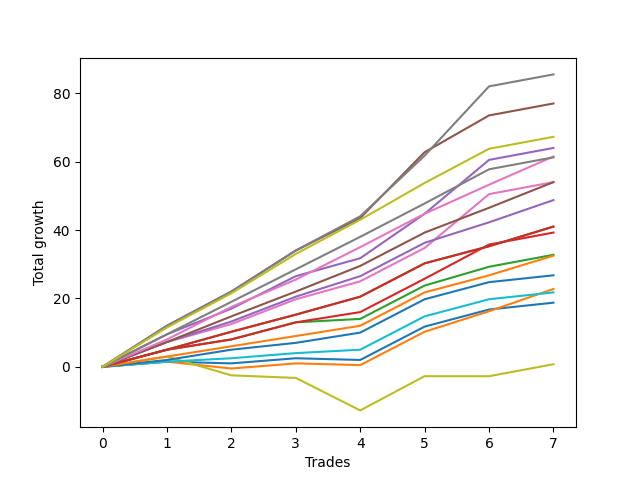

# Long Shepard 003 DB 
- Symbol: TEST
- Date Range: 07/25/2022 - 08/05/2022
- Trading Period: 7:20-12:30
- Number of Trades: 7



| Name | Win Percent | Profit | Avg Profit / Trade | Avg Time / Trade |      | Name | Win Percent | Profit | Avg Profit / Trade | Avg Time / Trade |
| ---- | ----------- | ------ | ------------------ | ---------------- | ---- | ---- | ----------- | ------ | ------------------ | ---------------- |
| Sorted By <br> Profit | | | | | | Sorted By <br> Win Percentage ||||
| Seven | 100.00 | 42750.00 | 6107.14 | 277:17 |     | Seven | 100.00 | 42750.00 | 6107.14 | 277:17 |
| Five | 100.00 | 38500.00 | 5500.00 | 274:51 |     | Five | 100.00 | 38500.00 | 5500.00 | 274:51 |
| Ninety | 100.00 | 33625.00 | 4803.57 | 85:25 |     | Ninety | 100.00 | 33625.00 | 4803.57 | 85:25 |
| Four | 100.00 | 32000.00 | 4571.43 | 90:42 |     | Four | 100.00 | 32000.00 | 4571.43 | 90:42 |
| Eighty-Eight | 100.00 | 30750.00 | 4392.86 | 78:34 |     | Eighty-Eight | 100.00 | 30750.00 | 4392.86 | 78:34 |
| Eighty-Nine | 100.00 | 30625.00 | 4375.00 | 82:51 |     | Eighty-Nine | 100.00 | 30625.00 | 4375.00 | 82:51 |
| Eighty-Seven | 100.00 | 27000.00 | 3857.14 | 73:51 |     | Eighty-Seven | 100.00 | 27000.00 | 3857.14 | 73:51 |
| Six | 100.00 | 27000.00 | 3857.14 | 80:34 |     | Six | 100.00 | 27000.00 | 3857.14 | 80:34 |
| Eighty-Six | 100.00 | 24375.00 | 3482.14 | 73:17 |     | Eighty-Six | 100.00 | 24375.00 | 3482.14 | 73:17 |
| Eighty-Five | 100.00 | 20500.00 | 2928.57 | 70:34 |     | Eighty-Five | 100.00 | 20500.00 | 2928.57 | 70:34 |
| Eighty-Four | 100.00 | 20500.00 | 2928.57 | 70:34 |     | Eighty-Four | 100.00 | 20500.00 | 2928.57 | 70:34 |
| Three | 100.00 | 19625.00 | 2803.57 | 79:42 |     | Three | 100.00 | 19625.00 | 2803.57 | 79:42 |
| Two | 100.00 | 16375.00 | 2339.29 | 67:25 |     | Two | 100.00 | 16375.00 | 2339.29 | 67:25 |
| Eighty-Three | 100.00 | 16250.00 | 2321.43 | 50:34 |     | Eighty-Three | 100.00 | 16250.00 | 2321.43 | 50:34 |
| Eighty-Two | 100.00 | 13375.00 | 1910.71 | 48:51 |     | Eighty-Two | 100.00 | 13375.00 | 1910.71 | 48:51 |
| One | 71.43 | 11375.00 | 1625.00 | 40:25 |     | Eighty-One | 100.00 | 10875.00 | 1553.57 | 28:51 |
| Eighty-One | 100.00 | 10875.00 | 1553.57 | 28:51 |     | One | 71.43 | 11375.00 | 1625.00 | 40:25 |
| Zero | 71.43 | 9375.00 | 1339.29 | 27:08 |     | Zero | 71.43 | 9375.00 | 1339.29 | 27:08 |
| Seventy-Three | 57.14 | 375.00 | 53.57 | 56:17 |     | Seventy-Three | 57.14 | 375.00 | 53.57 | 56:17 |

## NO STOPLOSS

### Test Zero
* Sell when price hits the middle line of the 20p bollinger
* No Stoploss
* Results:
```
Total Trades: 7
Percent Up: 71.43
Percent Down: 28.57
Total Points Moved Up: 18.75
Potential Profit: 9375.00
Total Points Ups: 19.75 Count Ups: 5
Total Points Downs: -1.00 Count Downs: 2
```

<details><summary>Trades</summary>

<code>In: 2022-07-25 11:06:00		Out: 2022-07-25 11:36:00		Total Position Time: 30:00		Total Move Up: 1.50		Total to Date: 1.50</code> <br />
<code>In: 2022-07-25 11:07:00		Out: 2022-07-25 11:36:00		Total Position Time: 29:00		Total Move Up: -0.50		Total to Date: 1.00</code> <br />
<code>In: 2022-07-25 11:10:00		Out: 2022-07-25 11:36:00		Total Position Time: 26:00		Total Move Up: 1.50		Total to Date: 2.50</code> <br />
<code>In: 2022-07-25 11:11:00		Out: 2022-07-25 11:36:00		Total Position Time: 25:00		Total Move Up: -0.50		Total to Date: 2.00</code> <br />
<code>In: 2022-07-29 08:32:00		Out: 2022-07-29 08:45:00		Total Position Time: 13:00		Total Move Up: 9.75		Total to Date: 11.75</code> <br />
<code>In: 2022-08-01 10:39:00		Out: 2022-08-01 11:15:00		Total Position Time: 36:00		Total Move Up: 5.00		Total to Date: 16.75</code> <br />
<code>In: 2022-08-05 08:33:00		Out: 2022-08-05 09:04:00		Total Position Time: 31:00		Total Move Up: 2.00		Total to Date: 18.75</code> <br />


</details>

### Test One
* Sell when the price hits the upper line of the 20p 1std bollinger
* No Stoploss
* Results:
```
Total Trades: 7
Percent Up: 71.43
Percent Down: 28.57
Total Points Moved Up: 22.75
Potential Profit: 11375.00
Total Points Ups: 25.25 Count Ups: 5
Total Points Downs: -2.50 Count Downs: 2
```

<details><summary>Trades</summary>

<code>In: 2022-07-25 11:06:00		Out: 2022-07-25 12:49:00		Total Position Time: 103:00		Total Move Up: 1.50		Total to Date: 1.50</code> <br />
<code>In: 2022-07-25 11:07:00		Out: 2022-07-25 11:43:00		Total Position Time: 36:00		Total Move Up: -2.00		Total to Date: -0.50</code> <br />
<code>In: 2022-07-25 11:10:00		Out: 2022-07-25 11:36:00		Total Position Time: 26:00		Total Move Up: 1.50		Total to Date: 1.00</code> <br />
<code>In: 2022-07-25 11:11:00		Out: 2022-07-25 11:36:00		Total Position Time: 25:00		Total Move Up: -0.50		Total to Date: 0.50</code> <br />
<code>In: 2022-07-29 08:32:00		Out: 2022-07-29 08:45:00		Total Position Time: 13:00		Total Move Up: 9.75		Total to Date: 10.25</code> <br />
<code>In: 2022-08-01 10:39:00		Out: 2022-08-01 11:16:00		Total Position Time: 37:00		Total Move Up: 6.00		Total to Date: 16.25</code> <br />
<code>In: 2022-08-05 08:33:00		Out: 2022-08-05 09:16:00		Total Position Time: 43:00		Total Move Up: 6.50		Total to Date: 22.75</code> <br />


</details>

### Test Two
* Sell when the price hits the upper line of the 20p 2std bollinger
* No Stoploss
* Results:
```
Total Trades: 7
Percent Up: 100.00
Percent Down: 0.00
Total Points Moved Up: 32.75
Potential Profit: 16375.00
Total Points Ups: 32.75 Count Ups: 7
Total Points Downs: 0.00 Count Downs: 0
```

<details><summary>Trades</summary>

<code>In: 2022-07-25 11:06:00		Out: 2022-07-25 12:51:00		Total Position Time: 105:00		Total Move Up: 5.00		Total to Date: 5.00</code> <br />
<code>In: 2022-07-25 11:07:00		Out: 2022-07-25 12:51:00		Total Position Time: 104:00		Total Move Up: 3.00		Total to Date: 8.00</code> <br />
<code>In: 2022-07-25 11:10:00		Out: 2022-07-25 12:51:00		Total Position Time: 101:00		Total Move Up: 5.00		Total to Date: 13.00</code> <br />
<code>In: 2022-07-25 11:11:00		Out: 2022-07-25 11:42:00		Total Position Time: 31:00		Total Move Up: 1.00		Total to Date: 14.00</code> <br />
<code>In: 2022-07-29 08:32:00		Out: 2022-07-29 08:45:00		Total Position Time: 13:00		Total Move Up: 9.75		Total to Date: 23.75</code> <br />
<code>In: 2022-08-01 10:39:00		Out: 2022-08-01 11:39:00		Total Position Time: 60:00		Total Move Up: 5.50		Total to Date: 29.25</code> <br />
<code>In: 2022-08-05 08:33:00		Out: 2022-08-05 09:31:00		Total Position Time: 58:00		Total Move Up: 3.50		Total to Date: 32.75</code> <br />


</details>

### Test Three
* Sell when price hits the middle line of the 50p bollinger
* No Stoploss
* Results:
```
Total Trades: 7
Percent Up: 100.00
Percent Down: 0.00
Total Points Moved Up: 39.25
Potential Profit: 19625.00
Total Points Ups: 39.25 Count Ups: 7
Total Points Downs: 0.00 Count Downs: 0
```

<details><summary>Trades</summary>

<code>In: 2022-07-25 11:06:00		Out: 2022-07-25 12:51:00		Total Position Time: 105:00		Total Move Up: 5.00		Total to Date: 5.00</code> <br />
<code>In: 2022-07-25 11:07:00		Out: 2022-07-25 12:51:00		Total Position Time: 104:00		Total Move Up: 3.00		Total to Date: 8.00</code> <br />
<code>In: 2022-07-25 11:10:00		Out: 2022-07-25 12:51:00		Total Position Time: 101:00		Total Move Up: 5.00		Total to Date: 13.00</code> <br />
<code>In: 2022-07-25 11:11:00		Out: 2022-07-25 12:51:00		Total Position Time: 100:00		Total Move Up: 3.00		Total to Date: 16.00</code> <br />
<code>In: 2022-07-29 08:32:00		Out: 2022-07-29 08:45:00		Total Position Time: 13:00		Total Move Up: 9.75		Total to Date: 25.75</code> <br />
<code>In: 2022-08-01 10:39:00		Out: 2022-08-01 11:56:00		Total Position Time: 77:00		Total Move Up: 10.00		Total to Date: 35.75</code> <br />
<code>In: 2022-08-05 08:33:00		Out: 2022-08-05 09:31:00		Total Position Time: 58:00		Total Move Up: 3.50		Total to Date: 39.25</code> <br />


</details>

### Test Four
* Sell when the price hits the upper line of the 50p 1std bollinger
* No Stoploss
* Results:
```
Total Trades: 7
Percent Up: 100.00
Percent Down: 0.00
Total Points Moved Up: 64.00
Potential Profit: 32000.00
Total Points Ups: 64.00 Count Ups: 7
Total Points Downs: 0.00 Count Downs: 0
```

<details><summary>Trades</summary>

<code>In: 2022-07-25 11:06:00		Out: 2022-07-25 12:56:00		Total Position Time: 110:00		Total Move Up: 9.50		Total to Date: 9.50</code> <br />
<code>In: 2022-07-25 11:07:00		Out: 2022-07-25 12:56:00		Total Position Time: 109:00		Total Move Up: 7.50		Total to Date: 17.00</code> <br />
<code>In: 2022-07-25 11:10:00		Out: 2022-07-25 12:56:00		Total Position Time: 106:00		Total Move Up: 9.50		Total to Date: 26.50</code> <br />
<code>In: 2022-07-25 11:11:00		Out: 2022-07-25 12:52:00		Total Position Time: 101:00		Total Move Up: 5.25		Total to Date: 31.75</code> <br />
<code>In: 2022-07-29 08:32:00		Out: 2022-07-29 09:44:00		Total Position Time: 72:00		Total Move Up: 13.00		Total to Date: 44.75</code> <br />
<code>In: 2022-08-01 10:39:00		Out: 2022-08-01 11:58:00		Total Position Time: 79:00		Total Move Up: 15.75		Total to Date: 60.50</code> <br />
<code>In: 2022-08-05 08:33:00		Out: 2022-08-05 09:31:00		Total Position Time: 58:00		Total Move Up: 3.50		Total to Date: 64.00</code> <br />


</details>

### Test Five
* Sell when the price hits the upper line of the 50p 2std bollinger
* No Stoploss
* Results:
```
Total Trades: 7
Percent Up: 100.00
Percent Down: 0.00
Total Points Moved Up: 77.00
Potential Profit: 38500.00
Total Points Ups: 77.00 Count Ups: 7
Total Points Downs: 0.00 Count Downs: 0
```

<details><summary>Trades</summary>

<code>In: 2022-07-25 11:06:00		Out: 2022-07-25 13:00:00		Total Position Time: 114:00		Total Move Up: 12.00		Total to Date: 12.00</code> <br />
<code>In: 2022-07-25 11:07:00		Out: 2022-07-25 13:00:00		Total Position Time: 113:00		Total Move Up: 10.00		Total to Date: 22.00</code> <br />
<code>In: 2022-07-25 11:10:00		Out: 2022-07-25 13:00:00		Total Position Time: 110:00		Total Move Up: 12.00		Total to Date: 34.00</code> <br />
<code>In: 2022-07-25 11:11:00		Out: 2022-07-25 12:59:00		Total Position Time: 108:00		Total Move Up: 9.50		Total to Date: 43.50</code> <br />
<code>In: 2022-07-29 08:32:00		Out: 2022-07-29 09:54:00		Total Position Time: 82:00		Total Move Up: 19.25		Total to Date: 62.75</code> <br />
<code>In: 2022-08-01 10:39:00		Out: 2022-08-02 08:58:00		Total Position Time: 1339:00		Total Move Up: 10.75		Total to Date: 73.50</code> <br />
<code>In: 2022-08-05 08:33:00		Out: 2022-08-05 09:31:00		Total Position Time: 58:00		Total Move Up: 3.50		Total to Date: 77.00</code> <br />


</details>

### Test Six
* Sell when the price hits the middle line of the 1std VWAP
* No Stoploss
* Results:
```
Total Trades: 7
Percent Up: 100.00
Percent Down: 0.00
Total Points Moved Up: 54.00
Potential Profit: 27000.00
Total Points Ups: 54.00 Count Ups: 7
Total Points Downs: 0.00 Count Downs: 0
```

<details><summary>Trades</summary>

<code>In: 2022-07-25 11:06:00		Out: 2022-07-25 12:52:00		Total Position Time: 106:00		Total Move Up: 7.25		Total to Date: 7.25</code> <br />
<code>In: 2022-07-25 11:07:00		Out: 2022-07-25 12:52:00		Total Position Time: 105:00		Total Move Up: 5.25		Total to Date: 12.50</code> <br />
<code>In: 2022-07-25 11:10:00		Out: 2022-07-25 12:52:00		Total Position Time: 102:00		Total Move Up: 7.25		Total to Date: 19.75</code> <br />
<code>In: 2022-07-25 11:11:00		Out: 2022-07-25 12:52:00		Total Position Time: 101:00		Total Move Up: 5.25		Total to Date: 25.00</code> <br />
<code>In: 2022-07-29 08:32:00		Out: 2022-07-29 08:45:00		Total Position Time: 13:00		Total Move Up: 9.75		Total to Date: 34.75</code> <br />
<code>In: 2022-08-01 10:39:00		Out: 2022-08-01 11:58:00		Total Position Time: 79:00		Total Move Up: 15.75		Total to Date: 50.50</code> <br />
<code>In: 2022-08-05 08:33:00		Out: 2022-08-05 09:31:00		Total Position Time: 58:00		Total Move Up: 3.50		Total to Date: 54.00</code> <br />


</details>

### Test Seven
* Sell when the price hits the upper line of the 1std VWAP
* No Stoploss
* Results:
```
Total Trades: 7
Percent Up: 100.00
Percent Down: 0.00
Total Points Moved Up: 85.50
Potential Profit: 42750.00
Total Points Ups: 85.50 Count Ups: 7
Total Points Downs: 0.00 Count Downs: 0
```

<details><summary>Trades</summary>

<code>In: 2022-07-25 11:06:00		Out: 2022-07-25 13:00:00		Total Position Time: 114:00		Total Move Up: 12.00		Total to Date: 12.00</code> <br />
<code>In: 2022-07-25 11:07:00		Out: 2022-07-25 13:00:00		Total Position Time: 113:00		Total Move Up: 10.00		Total to Date: 22.00</code> <br />
<code>In: 2022-07-25 11:10:00		Out: 2022-07-25 13:00:00		Total Position Time: 110:00		Total Move Up: 12.00		Total to Date: 34.00</code> <br />
<code>In: 2022-07-25 11:11:00		Out: 2022-07-25 13:00:00		Total Position Time: 109:00		Total Move Up: 10.00		Total to Date: 44.00</code> <br />
<code>In: 2022-07-29 08:32:00		Out: 2022-07-29 09:49:00		Total Position Time: 77:00		Total Move Up: 17.75		Total to Date: 61.75</code> <br />
<code>In: 2022-08-01 10:39:00		Out: 2022-08-02 09:19:00		Total Position Time: 1360:00		Total Move Up: 20.25		Total to Date: 82.00</code> <br />
<code>In: 2022-08-05 08:33:00		Out: 2022-08-05 09:31:00		Total Position Time: 58:00		Total Move Up: 3.50		Total to Date: 85.50</code> <br />


</details>

## SPECIAL EXIT CONDITIONS 

### Test Seventy-Three
* Sell when the linear regression slope changes to negative
* No Stoploss
* Results:
```
Total Trades: 7
Percent Up: 57.14
Percent Down: 42.86
Total Points Moved Up: 0.75
Potential Profit: 375.00
Total Points Ups: 16.50 Count Ups: 4
Total Points Downs: -15.75 Count Downs: 3
```

<details><summary>Trades</summary>

<code>In: 2022-07-25 11:06:00		Out: 2022-07-25 11:42:00		Total Position Time: 36:00		Total Move Up: 3.00		Total to Date: 3.00</code> <br />
<code>In: 2022-07-25 11:07:00		Out: 2022-07-25 11:31:00		Total Position Time: 24:00		Total Move Up: -5.50		Total to Date: -2.50</code> <br />
<code>In: 2022-07-25 11:10:00		Out: 2022-07-25 12:46:00		Total Position Time: 96:00		Total Move Up: -0.75		Total to Date: -3.25</code> <br />
<code>In: 2022-07-25 11:11:00		Out: 2022-07-25 12:35:00		Total Position Time: 84:00		Total Move Up: -9.50		Total to Date: -12.75</code> <br />
<code>In: 2022-07-29 08:32:00		Out: 2022-07-29 08:56:00		Total Position Time: 24:00		Total Move Up: 10.00		Total to Date: -2.75</code> <br />
<code>In: 2022-08-01 10:39:00		Out: 2022-08-01 11:51:00		Total Position Time: 72:00		Total Move Up: 0.00		Total to Date: -2.75</code> <br />
<code>In: 2022-08-05 08:33:00		Out: 2022-08-05 09:31:00		Total Position Time: 58:00		Total Move Up: 3.50		Total to Date: 0.75</code> <br />


</details>

## TAKE PROFIT

### Test Eighty-One
* Take Profit of 1 Point
* No Stoploss
* Results:
```
Total Trades: 7
Percent Up: 100.00
Percent Down: 0.00
Total Points Moved Up: 21.75
Potential Profit: 10875.00
Total Points Ups: 21.75 Count Ups: 7
Total Points Downs: 0.00 Count Downs: 0
```

<details><summary>Trades</summary>

<code>In: 2022-07-25 11:06:00		Out: 2022-07-25 11:36:00		Total Position Time: 30:00		Total Move Up: 1.50		Total to Date: 1.50</code> <br />
<code>In: 2022-07-25 11:07:00		Out: 2022-07-25 11:42:00		Total Position Time: 35:00		Total Move Up: 1.00		Total to Date: 2.50</code> <br />
<code>In: 2022-07-25 11:10:00		Out: 2022-07-25 11:36:00		Total Position Time: 26:00		Total Move Up: 1.50		Total to Date: 4.00</code> <br />
<code>In: 2022-07-25 11:11:00		Out: 2022-07-25 11:42:00		Total Position Time: 31:00		Total Move Up: 1.00		Total to Date: 5.00</code> <br />
<code>In: 2022-07-29 08:32:00		Out: 2022-07-29 08:45:00		Total Position Time: 13:00		Total Move Up: 9.75		Total to Date: 14.75</code> <br />
<code>In: 2022-08-01 10:39:00		Out: 2022-08-01 11:15:00		Total Position Time: 36:00		Total Move Up: 5.00		Total to Date: 19.75</code> <br />
<code>In: 2022-08-05 08:33:00		Out: 2022-08-05 09:04:00		Total Position Time: 31:00		Total Move Up: 2.00		Total to Date: 21.75</code> <br />


</details>

### Test Eighty-Two
* Take Profit of 2 Point
* No Stoploss
* Results:
```
Total Trades: 7
Percent Up: 100.00
Percent Down: 0.00
Total Points Moved Up: 26.75
Potential Profit: 13375.00
Total Points Ups: 26.75 Count Ups: 7
Total Points Downs: 0.00 Count Downs: 0
```

<details><summary>Trades</summary>

<code>In: 2022-07-25 11:06:00		Out: 2022-07-25 11:37:00		Total Position Time: 31:00		Total Move Up: 2.00		Total to Date: 2.00</code> <br />
<code>In: 2022-07-25 11:07:00		Out: 2022-07-25 12:51:00		Total Position Time: 104:00		Total Move Up: 3.00		Total to Date: 5.00</code> <br />
<code>In: 2022-07-25 11:10:00		Out: 2022-07-25 11:37:00		Total Position Time: 27:00		Total Move Up: 2.00		Total to Date: 7.00</code> <br />
<code>In: 2022-07-25 11:11:00		Out: 2022-07-25 12:51:00		Total Position Time: 100:00		Total Move Up: 3.00		Total to Date: 10.00</code> <br />
<code>In: 2022-07-29 08:32:00		Out: 2022-07-29 08:45:00		Total Position Time: 13:00		Total Move Up: 9.75		Total to Date: 19.75</code> <br />
<code>In: 2022-08-01 10:39:00		Out: 2022-08-01 11:15:00		Total Position Time: 36:00		Total Move Up: 5.00		Total to Date: 24.75</code> <br />
<code>In: 2022-08-05 08:33:00		Out: 2022-08-05 09:04:00		Total Position Time: 31:00		Total Move Up: 2.00		Total to Date: 26.75</code> <br />


</details>

### Test Eighty-Three
* Take Profit of 3 Point
* No Stoploss
* Results:
```
Total Trades: 7
Percent Up: 100.00
Percent Down: 0.00
Total Points Moved Up: 32.50
Potential Profit: 16250.00
Total Points Ups: 32.50 Count Ups: 7
Total Points Downs: 0.00 Count Downs: 0
```

<details><summary>Trades</summary>

<code>In: 2022-07-25 11:06:00		Out: 2022-07-25 11:42:00		Total Position Time: 36:00		Total Move Up: 3.00		Total to Date: 3.00</code> <br />
<code>In: 2022-07-25 11:07:00		Out: 2022-07-25 12:51:00		Total Position Time: 104:00		Total Move Up: 3.00		Total to Date: 6.00</code> <br />
<code>In: 2022-07-25 11:10:00		Out: 2022-07-25 11:42:00		Total Position Time: 32:00		Total Move Up: 3.00		Total to Date: 9.00</code> <br />
<code>In: 2022-07-25 11:11:00		Out: 2022-07-25 12:51:00		Total Position Time: 100:00		Total Move Up: 3.00		Total to Date: 12.00</code> <br />
<code>In: 2022-07-29 08:32:00		Out: 2022-07-29 08:45:00		Total Position Time: 13:00		Total Move Up: 9.75		Total to Date: 21.75</code> <br />
<code>In: 2022-08-01 10:39:00		Out: 2022-08-01 11:15:00		Total Position Time: 36:00		Total Move Up: 5.00		Total to Date: 26.75</code> <br />
<code>In: 2022-08-05 08:33:00		Out: 2022-08-05 09:06:00		Total Position Time: 33:00		Total Move Up: 5.75		Total to Date: 32.50</code> <br />


</details>

### Test Eighty-Four
* Take Profit of 4 Point
* No Stoploss
* Results:
```
Total Trades: 7
Percent Up: 100.00
Percent Down: 0.00
Total Points Moved Up: 41.00
Potential Profit: 20500.00
Total Points Ups: 41.00 Count Ups: 7
Total Points Downs: 0.00 Count Downs: 0
```

<details><summary>Trades</summary>

<code>In: 2022-07-25 11:06:00		Out: 2022-07-25 12:51:00		Total Position Time: 105:00		Total Move Up: 5.00		Total to Date: 5.00</code> <br />
<code>In: 2022-07-25 11:07:00		Out: 2022-07-25 12:52:00		Total Position Time: 105:00		Total Move Up: 5.25		Total to Date: 10.25</code> <br />
<code>In: 2022-07-25 11:10:00		Out: 2022-07-25 12:51:00		Total Position Time: 101:00		Total Move Up: 5.00		Total to Date: 15.25</code> <br />
<code>In: 2022-07-25 11:11:00		Out: 2022-07-25 12:52:00		Total Position Time: 101:00		Total Move Up: 5.25		Total to Date: 20.50</code> <br />
<code>In: 2022-07-29 08:32:00		Out: 2022-07-29 08:45:00		Total Position Time: 13:00		Total Move Up: 9.75		Total to Date: 30.25</code> <br />
<code>In: 2022-08-01 10:39:00		Out: 2022-08-01 11:15:00		Total Position Time: 36:00		Total Move Up: 5.00		Total to Date: 35.25</code> <br />
<code>In: 2022-08-05 08:33:00		Out: 2022-08-05 09:06:00		Total Position Time: 33:00		Total Move Up: 5.75		Total to Date: 41.00</code> <br />


</details>

### Test Eighty-Five
* Take Profit of 5 Point
* No Stoploss
* Results:
```
Total Trades: 7
Percent Up: 100.00
Percent Down: 0.00
Total Points Moved Up: 41.00
Potential Profit: 20500.00
Total Points Ups: 41.00 Count Ups: 7
Total Points Downs: 0.00 Count Downs: 0
```

<details><summary>Trades</summary>

<code>In: 2022-07-25 11:06:00		Out: 2022-07-25 12:51:00		Total Position Time: 105:00		Total Move Up: 5.00		Total to Date: 5.00</code> <br />
<code>In: 2022-07-25 11:07:00		Out: 2022-07-25 12:52:00		Total Position Time: 105:00		Total Move Up: 5.25		Total to Date: 10.25</code> <br />
<code>In: 2022-07-25 11:10:00		Out: 2022-07-25 12:51:00		Total Position Time: 101:00		Total Move Up: 5.00		Total to Date: 15.25</code> <br />
<code>In: 2022-07-25 11:11:00		Out: 2022-07-25 12:52:00		Total Position Time: 101:00		Total Move Up: 5.25		Total to Date: 20.50</code> <br />
<code>In: 2022-07-29 08:32:00		Out: 2022-07-29 08:45:00		Total Position Time: 13:00		Total Move Up: 9.75		Total to Date: 30.25</code> <br />
<code>In: 2022-08-01 10:39:00		Out: 2022-08-01 11:15:00		Total Position Time: 36:00		Total Move Up: 5.00		Total to Date: 35.25</code> <br />
<code>In: 2022-08-05 08:33:00		Out: 2022-08-05 09:06:00		Total Position Time: 33:00		Total Move Up: 5.75		Total to Date: 41.00</code> <br />


</details>

### Test Eighty-Six
* Take Profit of 6 Point
* No Stoploss
* Results:
```
Total Trades: 7
Percent Up: 100.00
Percent Down: 0.00
Total Points Moved Up: 48.75
Potential Profit: 24375.00
Total Points Ups: 48.75 Count Ups: 7
Total Points Downs: 0.00 Count Downs: 0
```

<details><summary>Trades</summary>

<code>In: 2022-07-25 11:06:00		Out: 2022-07-25 12:52:00		Total Position Time: 106:00		Total Move Up: 7.25		Total to Date: 7.25</code> <br />
<code>In: 2022-07-25 11:07:00		Out: 2022-07-25 12:55:00		Total Position Time: 108:00		Total Move Up: 6.00		Total to Date: 13.25</code> <br />
<code>In: 2022-07-25 11:10:00		Out: 2022-07-25 12:52:00		Total Position Time: 102:00		Total Move Up: 7.25		Total to Date: 20.50</code> <br />
<code>In: 2022-07-25 11:11:00		Out: 2022-07-25 12:55:00		Total Position Time: 104:00		Total Move Up: 6.00		Total to Date: 26.50</code> <br />
<code>In: 2022-07-29 08:32:00		Out: 2022-07-29 08:45:00		Total Position Time: 13:00		Total Move Up: 9.75		Total to Date: 36.25</code> <br />
<code>In: 2022-08-01 10:39:00		Out: 2022-08-01 11:16:00		Total Position Time: 37:00		Total Move Up: 6.00		Total to Date: 42.25</code> <br />
<code>In: 2022-08-05 08:33:00		Out: 2022-08-05 09:16:00		Total Position Time: 43:00		Total Move Up: 6.50		Total to Date: 48.75</code> <br />


</details>

### Test Eighty-Seven
* Take Profit of 7 Point
* No Stoploss
* Results:
```
Total Trades: 7
Percent Up: 100.00
Percent Down: 0.00
Total Points Moved Up: 54.00
Potential Profit: 27000.00
Total Points Ups: 54.00 Count Ups: 7
Total Points Downs: 0.00 Count Downs: 0
```

<details><summary>Trades</summary>

<code>In: 2022-07-25 11:06:00		Out: 2022-07-25 12:52:00		Total Position Time: 106:00		Total Move Up: 7.25		Total to Date: 7.25</code> <br />
<code>In: 2022-07-25 11:07:00		Out: 2022-07-25 12:56:00		Total Position Time: 109:00		Total Move Up: 7.50		Total to Date: 14.75</code> <br />
<code>In: 2022-07-25 11:10:00		Out: 2022-07-25 12:52:00		Total Position Time: 102:00		Total Move Up: 7.25		Total to Date: 22.00</code> <br />
<code>In: 2022-07-25 11:11:00		Out: 2022-07-25 12:56:00		Total Position Time: 105:00		Total Move Up: 7.50		Total to Date: 29.50</code> <br />
<code>In: 2022-07-29 08:32:00		Out: 2022-07-29 08:45:00		Total Position Time: 13:00		Total Move Up: 9.75		Total to Date: 39.25</code> <br />
<code>In: 2022-08-01 10:39:00		Out: 2022-08-01 11:17:00		Total Position Time: 38:00		Total Move Up: 7.25		Total to Date: 46.50</code> <br />
<code>In: 2022-08-05 08:33:00		Out: 2022-08-05 09:17:00		Total Position Time: 44:00		Total Move Up: 7.50		Total to Date: 54.00</code> <br />


</details>

### Test Eighty-Eight
* Take Profit of 8 Point
* No Stoploss
* Results:
```
Total Trades: 7
Percent Up: 100.00
Percent Down: 0.00
Total Points Moved Up: 61.50
Potential Profit: 30750.00
Total Points Ups: 61.50 Count Ups: 7
Total Points Downs: 0.00 Count Downs: 0
```

<details><summary>Trades</summary>

<code>In: 2022-07-25 11:06:00		Out: 2022-07-25 12:55:00		Total Position Time: 109:00		Total Move Up: 8.00		Total to Date: 8.00</code> <br />
<code>In: 2022-07-25 11:07:00		Out: 2022-07-25 12:57:00		Total Position Time: 110:00		Total Move Up: 9.50		Total to Date: 17.50</code> <br />
<code>In: 2022-07-25 11:10:00		Out: 2022-07-25 12:55:00		Total Position Time: 105:00		Total Move Up: 8.00		Total to Date: 25.50</code> <br />
<code>In: 2022-07-25 11:11:00		Out: 2022-07-25 12:57:00		Total Position Time: 106:00		Total Move Up: 9.50		Total to Date: 35.00</code> <br />
<code>In: 2022-07-29 08:32:00		Out: 2022-07-29 08:45:00		Total Position Time: 13:00		Total Move Up: 9.75		Total to Date: 44.75</code> <br />
<code>In: 2022-08-01 10:39:00		Out: 2022-08-01 11:41:00		Total Position Time: 62:00		Total Move Up: 8.50		Total to Date: 53.25</code> <br />
<code>In: 2022-08-05 08:33:00		Out: 2022-08-05 09:18:00		Total Position Time: 45:00		Total Move Up: 8.25		Total to Date: 61.50</code> <br />


</details>

### Test Eighty-Nine
* Take Profit of 9 Point
* No Stoploss
* Results:
```
Total Trades: 7
Percent Up: 100.00
Percent Down: 0.00
Total Points Moved Up: 61.25
Potential Profit: 30625.00
Total Points Ups: 61.25 Count Ups: 7
Total Points Downs: 0.00 Count Downs: 0
```

<details><summary>Trades</summary>

<code>In: 2022-07-25 11:06:00		Out: 2022-07-25 12:56:00		Total Position Time: 110:00		Total Move Up: 9.50		Total to Date: 9.50</code> <br />
<code>In: 2022-07-25 11:07:00		Out: 2022-07-25 12:57:00		Total Position Time: 110:00		Total Move Up: 9.50		Total to Date: 19.00</code> <br />
<code>In: 2022-07-25 11:10:00		Out: 2022-07-25 12:56:00		Total Position Time: 106:00		Total Move Up: 9.50		Total to Date: 28.50</code> <br />
<code>In: 2022-07-25 11:11:00		Out: 2022-07-25 12:57:00		Total Position Time: 106:00		Total Move Up: 9.50		Total to Date: 38.00</code> <br />
<code>In: 2022-07-29 08:32:00		Out: 2022-07-29 08:45:00		Total Position Time: 13:00		Total Move Up: 9.75		Total to Date: 47.75</code> <br />
<code>In: 2022-08-01 10:39:00		Out: 2022-08-01 11:56:00		Total Position Time: 77:00		Total Move Up: 10.00		Total to Date: 57.75</code> <br />
<code>In: 2022-08-05 08:33:00		Out: 2022-08-05 09:31:00		Total Position Time: 58:00		Total Move Up: 3.50		Total to Date: 61.25</code> <br />


</details>

### Test Ninety
* Take Profit of 10 Point
* No Stoploss
* Results:
```
Total Trades: 7
Percent Up: 100.00
Percent Down: 0.00
Total Points Moved Up: 67.25
Potential Profit: 33625.00
Total Points Ups: 67.25 Count Ups: 7
Total Points Downs: 0.00 Count Downs: 0
```

<details><summary>Trades</summary>

<code>In: 2022-07-25 11:06:00		Out: 2022-07-25 12:57:00		Total Position Time: 111:00		Total Move Up: 11.50		Total to Date: 11.50</code> <br />
<code>In: 2022-07-25 11:07:00		Out: 2022-07-25 13:00:00		Total Position Time: 113:00		Total Move Up: 10.00		Total to Date: 21.50</code> <br />
<code>In: 2022-07-25 11:10:00		Out: 2022-07-25 12:57:00		Total Position Time: 107:00		Total Move Up: 11.50		Total to Date: 33.00</code> <br />
<code>In: 2022-07-25 11:11:00		Out: 2022-07-25 13:00:00		Total Position Time: 109:00		Total Move Up: 10.00		Total to Date: 43.00</code> <br />
<code>In: 2022-07-29 08:32:00		Out: 2022-07-29 08:55:00		Total Position Time: 23:00		Total Move Up: 10.75		Total to Date: 53.75</code> <br />
<code>In: 2022-08-01 10:39:00		Out: 2022-08-01 11:56:00		Total Position Time: 77:00		Total Move Up: 10.00		Total to Date: 63.75</code> <br />
<code>In: 2022-08-05 08:33:00		Out: 2022-08-05 09:31:00		Total Position Time: 58:00		Total Move Up: 3.50		Total to Date: 67.25</code> <br />


</details>