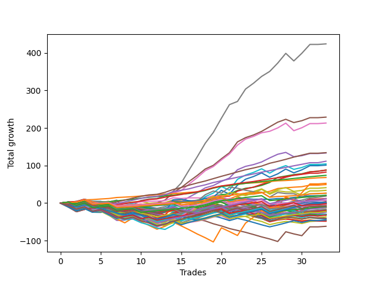

# Long Shepard 003 
- Symbol: TEST
- Date Range: 03/18/2022 - 07/15/2022
- Trading Period: 7:20-12:30
- Number of Trades: 33



| Name | Win Percent | Profit | Avg Profit / Trade | Avg Time / Trade |      | Name | Win Percent | Profit | Avg Profit / Trade | Avg Time / Trade |
| ---- | ----------- | ------ | ------------------ | ---------------- | ---- | ---- | ----------- | ------ | ------------------ | ---------------- |
| Sorted By <br> Profit | | | | | | Sorted By <br> Win Percentage ||||
| Seven | 87.88 | 212125.00 | 6428.03 | 82:44 |     | Eighty-One | 100.00 | 34000.00 | 1030.30 | 11:05 |
| Five | 81.82 | 114500.00 | 3469.70 | 40:05 |     | Eighty-Two | 96.97 | 36875.00 | 1117.42 | 18:29 |
| Six | 84.85 | 106625.00 | 3231.06 | 44:14 |     | Eighty-Five | 93.94 | 67125.00 | 2034.09 | 41:25 |
| Eighty-Five | 93.94 | 67125.00 | 2034.09 | 41:25 |     | Eighty-Four | 93.94 | 55750.00 | 1689.39 | 36:18 |
| Four | 78.79 | 66750.00 | 2022.73 | 32:40 |     | Eighty-Three | 93.94 | 41250.00 | 1250.00 | 32:18 |
| Eighty-Four | 93.94 | 55750.00 | 1689.39 | 36:18 |     | One Hundred Twenty-Six | 90.91 | 13125.00 | 397.73 | 03:58 |
| Sixty-One | 63.64 | 52125.00 | 1579.55 | 24:29 |     | Seven | 87.88 | 212125.00 | 6428.03 | 82:44 |
| Sixty-Two | 63.64 | 50500.00 | 1530.30 | 18:38 |     | Six | 84.85 | 106625.00 | 3231.06 | 44:14 |
| Three | 78.79 | 44000.00 | 1333.33 | 18:01 |     | Two | 84.85 | 43875.00 | 1329.55 | 18:04 |
| Two | 84.85 | 43875.00 | 1329.55 | 18:04 |     | One Hundred Twenty-Seven | 84.85 | 10375.00 | 314.39 | 05:35 |
| Eighty-Three | 93.94 | 41250.00 | 1250.00 | 32:18 |     | One Hundred Twenty-One | 84.85 | 3875.00 | 117.42 | 03:35 |
| Eighty-Two | 96.97 | 36875.00 | 1117.42 | 18:29 |     | Five | 81.82 | 114500.00 | 3469.70 | 40:05 |
| Eighty-One | 100.00 | 34000.00 | 1030.30 | 11:05 |     | Four | 78.79 | 66750.00 | 2022.73 | 32:40 |
| Sixty-Three | 45.45 | 26250.00 | 795.45 | 35:56 |     | Three | 78.79 | 44000.00 | 1333.33 | 18:01 |
| One | 78.79 | 24625.00 | 746.21 | 11:35 |     | One | 78.79 | 24625.00 | 746.21 | 11:35 |
| Sixty | 63.64 | 20500.00 | 621.21 | 18:58 |     | One Hundred Twenty-Two | 78.79 | -625.00 | -18.94 | 05:12 |
| Seventy | 48.48 | 16875.00 | 511.36 | 13:50 |     | Zero | 75.76 | 10000.00 | 303.03 | 05:10 |
| One Hundred Twenty-Six | 90.91 | 13125.00 | 397.73 | 03:58 |     | Fifty-Six | 75.76 | 3500.00 | 106.06 | 03:41 |
| Sixty-Nine | 42.42 | 13125.00 | 397.73 | 18:10 |     | One Hundred Sixteen | 75.76 | -1000.00 | -30.30 | 02:39 |
| One Hundred Twenty-Seven | 84.85 | 10375.00 | 314.39 | 05:35 |     | One Hundred Twenty-Eight | 72.73 | -750.00 | -22.73 | 08:52 |
| Zero | 75.76 | 10000.00 | 303.03 | 05:10 |     | One Hundred Twenty-Nine | 69.70 | 5875.00 | 178.03 | 11:09 |
| Fifty-Nine | 66.67 | 9250.00 | 280.30 | 11:18 |     | One Hundred Twenty-Four | 69.70 | 125.00 | 3.79 | 12:07 |
| Forty-Five | 33.33 | 6000.00 | 181.82 | 15:35 |     | One Hundred Eleven | 69.70 | -2125.00 | -64.39 | 02:21 |
| One Hundred Twenty-Nine | 69.70 | 5875.00 | 178.03 | 11:09 |     | Sixty-Four | 69.70 | -2500.00 | -75.76 | 03:54 |
| One Hundred Twenty-One | 84.85 | 3875.00 | 117.42 | 03:35 |     | Fifty-Seven | 69.70 | -5750.00 | -174.24 | 08:03 |
| Fifty-Six | 75.76 | 3500.00 | 106.06 | 03:41 |     | One Hundred Twenty-Three | 69.70 | -11125.00 | -337.12 | 08:48 |
| Sixty-Seven | 60.61 | 1875.00 | 56.82 | 10:05 |     | Fifty-Nine | 66.67 | 9250.00 | 280.30 | 11:18 |
| Seventy-Three | 45.45 | 750.00 | 22.73 | 07:06 |     | Forty-Eight | 66.67 | 375.00 | 11.36 | 02:55 |
| Forty-Eight | 66.67 | 375.00 | 11.36 | 02:55 |     | One Hundred Twenty-Five | 66.67 | 125.00 | 3.79 | 14:33 |
| One Hundred Twenty-Four | 69.70 | 125.00 | 3.79 | 12:07 |     | Fifty-Eight | 66.67 | 125.00 | 3.79 | 11:42 |
| One Hundred Twenty-Five | 66.67 | 125.00 | 3.79 | 14:33 |     | One Hundred Seventeen | 66.67 | -4625.00 | -140.15 | 03:25 |
| Fifty-Eight | 66.67 | 125.00 | 3.79 | 11:42 |     | Sixty-One | 63.64 | 52125.00 | 1579.55 | 24:29 |
| Sixty-Eight | 45.45 | -375.00 | -11.36 | 15:51 |     | Sixty-Two | 63.64 | 50500.00 | 1530.30 | 18:38 |
| One Hundred Twenty-Two | 78.79 | -625.00 | -18.94 | 05:12 |     | Sixty | 63.64 | 20500.00 | 621.21 | 18:58 |
| One Hundred Twenty-Eight | 72.73 | -750.00 | -22.73 | 08:52 |     | Sixty-Seven | 60.61 | 1875.00 | 56.82 | 10:05 |
| One Hundred Sixteen | 75.76 | -1000.00 | -30.30 | 02:39 |     | One Hundred Thirty | 60.61 | -3750.00 | -113.64 | 12:07 |
| Forty-Six | 36.36 | -1000.00 | -30.30 | 11:36 |     | Sixty-Six | 60.61 | -5750.00 | -174.24 | 10:26 |
| Seventy-One | 42.42 | -1500.00 | -45.45 | 20:11 |     | Forty | 60.61 | -6375.00 | -193.18 | 02:46 |
| One Hundred Eleven | 69.70 | -2125.00 | -64.39 | 02:21 |     | One Hundred Twelve | 60.61 | -8250.00 | -250.00 | 03:10 |
| Sixty-Four | 69.70 | -2500.00 | -75.76 | 03:54 |     | Sixty-Five | 60.61 | -10000.00 | -303.03 | 07:20 |
| One Hundred Thirty | 60.61 | -3750.00 | -113.64 | 12:07 |     | Seventy | 48.48 | 16875.00 | 511.36 | 13:50 |
| Forty-Three | 45.45 | -4250.00 | -128.79 | 07:40 |     | Forty-One | 48.48 | -12000.00 | -363.64 | 05:19 |
| One Hundred Seventeen | 66.67 | -4625.00 | -140.15 | 03:25 |     | One Hundred Thirteen | 48.48 | -18125.00 | -549.24 | 05:41 |
| Fifty-Seven | 69.70 | -5750.00 | -174.24 | 08:03 |     | Sixty-Three | 45.45 | 26250.00 | 795.45 | 35:56 |
| Sixty-Six | 60.61 | -5750.00 | -174.24 | 10:26 |     | Seventy-Three | 45.45 | 750.00 | 22.73 | 07:06 |
| Forty | 60.61 | -6375.00 | -193.18 | 02:46 |     | Sixty-Eight | 45.45 | -375.00 | -11.36 | 15:51 |
| One Hundred Twelve | 60.61 | -8250.00 | -250.00 | 03:10 |     | Forty-Three | 45.45 | -4250.00 | -128.79 | 07:40 |
| Forty-Two | 42.42 | -9000.00 | -272.73 | 07:35 |     | One Hundred Fourteen | 45.45 | -15125.00 | -458.33 | 07:15 |
| Sixty-Five | 60.61 | -10000.00 | -303.03 | 07:20 |     | One Hundred Eighteen | 45.45 | -15875.00 | -481.06 | 04:46 |
| One Hundred Twenty-Three | 69.70 | -11125.00 | -337.12 | 08:48 |     | Sixty-Nine | 42.42 | 13125.00 | 397.73 | 18:10 |
| Forty-Four | 33.33 | -11250.00 | -340.91 | 11:40 |     | Seventy-One | 42.42 | -1500.00 | -45.45 | 20:11 |
| Forty-One | 48.48 | -12000.00 | -363.64 | 05:19 |     | Forty-Two | 42.42 | -9000.00 | -272.73 | 07:35 |
| One Hundred Ninteen | 42.42 | -12250.00 | -371.21 | 05:14 |     | One Hundred Ninteen | 42.42 | -12250.00 | -371.21 | 05:14 |
| Forty-Nine | 42.42 | -14750.00 | -446.97 | 04:56 |     | Forty-Nine | 42.42 | -14750.00 | -446.97 | 04:56 |
| One Hundred Fourteen | 45.45 | -15125.00 | -458.33 | 07:15 |     | One Hundred Fifteen | 39.39 | -22625.00 | -685.61 | 08:06 |
| Fifty-One | 36.36 | -15250.00 | -462.12 | 05:27 |     | Forty-Six | 36.36 | -1000.00 | -30.30 | 11:36 |
| One Hundred Eighteen | 45.45 | -15875.00 | -481.06 | 04:46 |     | Fifty-One | 36.36 | -15250.00 | -462.12 | 05:27 |
| Fifty-Four | 33.33 | -16000.00 | -484.85 | 05:58 |     | Fifty | 36.36 | -22375.00 | -678.03 | 05:27 |
| One Hundred Thirteen | 48.48 | -18125.00 | -549.24 | 05:41 |     | Forty-Five | 33.33 | 6000.00 | 181.82 | 15:35 |
| One Hundred Twenty | 30.30 | -20250.00 | -613.64 | 05:37 |     | Forty-Four | 33.33 | -11250.00 | -340.91 | 11:40 |
| Fifty-Two | 30.30 | -20875.00 | -632.58 | 06:52 |     | Fifty-Four | 33.33 | -16000.00 | -484.85 | 05:58 |
| Fifty | 36.36 | -22375.00 | -678.03 | 05:27 |     | One Hundred Twenty | 30.30 | -20250.00 | -613.64 | 05:37 |
| One Hundred Fifteen | 39.39 | -22625.00 | -685.61 | 08:06 |     | Fifty-Two | 30.30 | -20875.00 | -632.58 | 06:52 |
| Fifty-Three | 30.30 | -23750.00 | -719.70 | 07:11 |     | Fifty-Three | 30.30 | -23750.00 | -719.70 | 07:11 |
| Fifty-Five | 30.30 | -24250.00 | -734.85 | 07:05 |     | Fifty-Five | 30.30 | -24250.00 | -734.85 | 07:05 |
| Forty-Seven | 21.21 | -31000.00 | -939.39 | 20:33 |     | Forty-Seven | 21.21 | -31000.00 | -939.39 | 20:33 |

## NO STOPLOSS

### Test Zero
* Sell when price hits the middle line of the 20p bollinger
* No Stoploss
* Results:
```
Total Trades: 33
Percent Up: 75.76
Percent Down: 24.24
Total Points Moved Up: 20.00
Potential Profit: 10000.00
Total Points Ups: 53.50 Count Ups: 25
Total Points Downs: -33.50 Count Downs: 8
```

<details><summary>Trades</summary>

<code>In: 2022-03-23 09:49:00		Out: 2022-03-23 09:55:35		Total Position Time: 06:35		Total Move Up: 1.50		Total to Date: 1.50</code> <br />
<code>In: 2022-03-23 09:53:00		Out: 2022-03-23 09:55:35		Total Position Time: 02:35		Total Move Up: 0.00		Total to Date: 1.50</code> <br />
<code>In: 2022-03-24 07:32:00		Out: 2022-03-24 07:33:10		Total Position Time: 01:10		Total Move Up: 6.00		Total to Date: 7.50</code> <br />
<code>In: 2022-03-25 08:18:00		Out: 2022-03-25 08:36:55		Total Position Time: 18:55		Total Move Up: -8.75		Total to Date: -1.25</code> <br />
<code>In: 2022-03-28 07:30:00		Out: 2022-03-28 07:31:10		Total Position Time: 01:10		Total Move Up: -0.25		Total to Date: -1.50</code> <br />
<code>In: 2022-03-28 08:11:00		Out: 2022-03-28 08:13:30		Total Position Time: 02:30		Total Move Up: 2.75		Total to Date: 1.25</code> <br />
<code>In: 2022-03-28 08:30:00		Out: 2022-03-28 09:02:00		Total Position Time: 32:00		Total Move Up: -15.75		Total to Date: -14.50</code> <br />
<code>In: 2022-03-31 09:30:00		Out: 2022-03-31 09:32:50		Total Position Time: 02:50		Total Move Up: 2.00		Total to Date: -12.50</code> <br />
<code>In: 2022-04-20 08:27:00		Out: 2022-04-20 08:29:05		Total Position Time: 02:05		Total Move Up: 2.00		Total to Date: -10.50</code> <br />
<code>In: 2022-04-20 11:48:00		Out: 2022-04-20 11:49:10		Total Position Time: 01:10		Total Move Up: 1.75		Total to Date: -8.75</code> <br />
<code>In: 2022-04-27 12:11:00		Out: 2022-04-27 12:15:05		Total Position Time: 04:05		Total Move Up: 2.00		Total to Date: -6.75</code> <br />
<code>In: 2022-04-27 12:14:00		Out: 2022-04-27 12:15:10		Total Position Time: 01:10		Total Move Up: 0.00		Total to Date: -6.75</code> <br />
<code>In: 2022-04-27 12:24:00		Out: 2022-04-27 12:25:10		Total Position Time: 01:10		Total Move Up: 1.50		Total to Date: -5.25</code> <br />
<code>In: 2022-05-03 07:51:00		Out: 2022-05-03 07:54:05		Total Position Time: 03:05		Total Move Up: 7.50		Total to Date: 2.25</code> <br />
<code>In: 2022-05-03 11:45:00		Out: 2022-05-03 11:46:10		Total Position Time: 01:10		Total Move Up: -2.00		Total to Date: 0.25</code> <br />
<code>In: 2022-05-06 11:36:00		Out: 2022-05-06 11:40:25		Total Position Time: 04:25		Total Move Up: 1.75		Total to Date: 2.00</code> <br />
<code>In: 2022-05-06 11:41:00		Out: 2022-05-06 11:42:20		Total Position Time: 01:20		Total Move Up: 0.00		Total to Date: 2.00</code> <br />
<code>In: 2022-05-06 11:47:00		Out: 2022-05-06 11:49:05		Total Position Time: 02:05		Total Move Up: -0.50		Total to Date: 1.50</code> <br />
<code>In: 2022-05-06 11:50:00		Out: 2022-05-06 11:51:10		Total Position Time: 01:10		Total Move Up: 6.25		Total to Date: 7.75</code> <br />
<code>In: 2022-05-06 12:12:00		Out: 2022-05-06 12:19:15		Total Position Time: 07:15		Total Move Up: 2.25		Total to Date: 10.00</code> <br />
<code>In: 2022-05-06 12:20:00		Out: 2022-05-06 12:27:55		Total Position Time: 07:55		Total Move Up: -4.00		Total to Date: 6.00</code> <br />
<code>In: 2022-05-12 09:04:00		Out: 2022-05-12 09:08:55		Total Position Time: 04:55		Total Move Up: 5.75		Total to Date: 11.75</code> <br />
<code>In: 2022-05-13 11:10:00		Out: 2022-05-13 11:19:15		Total Position Time: 09:15		Total Move Up: 0.25		Total to Date: 12.00</code> <br />
<code>In: 2022-05-16 07:58:00		Out: 2022-05-16 08:09:35		Total Position Time: 11:35		Total Move Up: -2.00		Total to Date: 10.00</code> <br />
<code>In: 2022-05-16 08:02:00		Out: 2022-05-16 08:09:35		Total Position Time: 07:35		Total Move Up: 0.25		Total to Date: 10.25</code> <br />
<code>In: 2022-05-19 07:47:00		Out: 2022-05-19 07:53:50		Total Position Time: 06:50		Total Move Up: -0.25		Total to Date: 10.00</code> <br />
<code>In: 2022-05-19 10:19:00		Out: 2022-05-19 10:20:10		Total Position Time: 01:10		Total Move Up: 2.00		Total to Date: 12.00</code> <br />
<code>In: 2022-05-25 09:39:00		Out: 2022-05-25 09:41:30		Total Position Time: 02:30		Total Move Up: 0.25		Total to Date: 12.25</code> <br />
<code>In: 2022-06-06 08:24:00		Out: 2022-06-06 08:33:05		Total Position Time: 09:05		Total Move Up: 2.50		Total to Date: 14.75</code> <br />
<code>In: 2022-07-08 09:48:00		Out: 2022-07-08 09:49:10		Total Position Time: 01:10		Total Move Up: 2.25		Total to Date: 17.00</code> <br />
<code>In: 2022-07-08 10:06:00		Out: 2022-07-08 10:07:10		Total Position Time: 01:10		Total Move Up: 2.25		Total to Date: 19.25</code> <br />
<code>In: 2022-07-11 12:15:00		Out: 2022-07-11 12:22:10		Total Position Time: 07:10		Total Move Up: 0.00		Total to Date: 19.25</code> <br />
<code>In: 2022-07-11 12:25:00		Out: 2022-07-11 12:27:35		Total Position Time: 02:35		Total Move Up: 0.75		Total to Date: 20.00</code> <br />


</details>

### Test One
* Sell when the price hits the upper line of the 20p 1std bollinger
* No Stoploss
* Results:
```
Total Trades: 33
Percent Up: 78.79
Percent Down: 21.21
Total Points Moved Up: 49.25
Potential Profit: 24625.00
Total Points Ups: 89.50 Count Ups: 26
Total Points Downs: -40.25 Count Downs: 7
```

<details><summary>Trades</summary>

<code>In: 2022-03-23 09:49:00		Out: 2022-03-23 10:00:45		Total Position Time: 11:45		Total Move Up: 2.75		Total to Date: 2.75</code> <br />
<code>In: 2022-03-23 09:53:00		Out: 2022-03-23 10:00:45		Total Position Time: 07:45		Total Move Up: 1.25		Total to Date: 4.00</code> <br />
<code>In: 2022-03-24 07:32:00		Out: 2022-03-24 07:33:10		Total Position Time: 01:10		Total Move Up: 6.00		Total to Date: 10.00</code> <br />
<code>In: 2022-03-25 08:18:00		Out: 2022-03-25 08:41:10		Total Position Time: 23:10		Total Move Up: -7.25		Total to Date: 2.75</code> <br />
<code>In: 2022-03-28 07:30:00		Out: 2022-03-28 07:31:10		Total Position Time: 01:10		Total Move Up: -0.25		Total to Date: 2.50</code> <br />
<code>In: 2022-03-28 08:11:00		Out: 2022-03-28 09:05:25		Total Position Time: 54:25		Total Move Up: -15.00		Total to Date: -12.50</code> <br />
<code>In: 2022-03-28 08:30:00		Out: 2022-03-28 09:05:25		Total Position Time: 35:25		Total Move Up: -13.75		Total to Date: -26.25</code> <br />
<code>In: 2022-03-31 09:30:00		Out: 2022-03-31 09:41:05		Total Position Time: 11:05		Total Move Up: 1.75		Total to Date: -24.50</code> <br />
<code>In: 2022-04-20 08:27:00		Out: 2022-04-20 08:30:40		Total Position Time: 03:40		Total Move Up: 3.75		Total to Date: -20.75</code> <br />
<code>In: 2022-04-20 11:48:00		Out: 2022-04-20 12:04:20		Total Position Time: 16:20		Total Move Up: -0.75		Total to Date: -21.50</code> <br />
<code>In: 2022-04-27 12:11:00		Out: 2022-04-27 12:27:15		Total Position Time: 16:15		Total Move Up: 0.50		Total to Date: -21.00</code> <br />
<code>In: 2022-04-27 12:14:00		Out: 2022-04-27 12:27:15		Total Position Time: 13:15		Total Move Up: -1.75		Total to Date: -22.75</code> <br />
<code>In: 2022-04-27 12:24:00		Out: 2022-04-27 12:27:15		Total Position Time: 03:15		Total Move Up: 4.50		Total to Date: -18.25</code> <br />
<code>In: 2022-05-03 07:51:00		Out: 2022-05-03 07:57:15		Total Position Time: 06:15		Total Move Up: 8.75		Total to Date: -9.50</code> <br />
<code>In: 2022-05-03 11:45:00		Out: 2022-05-03 11:49:20		Total Position Time: 04:20		Total Move Up: 3.50		Total to Date: -6.00</code> <br />
<code>In: 2022-05-06 11:36:00		Out: 2022-05-06 11:49:10		Total Position Time: 13:10		Total Move Up: 4.00		Total to Date: -2.00</code> <br />
<code>In: 2022-05-06 11:41:00		Out: 2022-05-06 11:49:10		Total Position Time: 08:10		Total Move Up: 3.25		Total to Date: 1.25</code> <br />
<code>In: 2022-05-06 11:47:00		Out: 2022-05-06 11:49:10		Total Position Time: 02:10		Total Move Up: 4.75		Total to Date: 6.00</code> <br />
<code>In: 2022-05-06 11:50:00		Out: 2022-05-06 11:51:10		Total Position Time: 01:10		Total Move Up: 6.25		Total to Date: 12.25</code> <br />
<code>In: 2022-05-06 12:12:00		Out: 2022-05-06 12:28:05		Total Position Time: 16:05		Total Move Up: 0.00		Total to Date: 12.25</code> <br />
<code>In: 2022-05-06 12:20:00		Out: 2022-05-06 12:28:05		Total Position Time: 08:05		Total Move Up: -1.50		Total to Date: 10.75</code> <br />
<code>In: 2022-05-12 09:04:00		Out: 2022-05-12 09:11:15		Total Position Time: 07:15		Total Move Up: 8.75		Total to Date: 19.50</code> <br />
<code>In: 2022-05-13 11:10:00		Out: 2022-05-13 11:30:55		Total Position Time: 20:55		Total Move Up: 3.00		Total to Date: 22.50</code> <br />
<code>In: 2022-05-16 07:58:00		Out: 2022-05-16 08:09:55		Total Position Time: 11:55		Total Move Up: 1.25		Total to Date: 23.75</code> <br />
<code>In: 2022-05-16 08:02:00		Out: 2022-05-16 08:09:55		Total Position Time: 07:55		Total Move Up: 3.50		Total to Date: 27.25</code> <br />
<code>In: 2022-05-19 07:47:00		Out: 2022-05-19 07:55:05		Total Position Time: 08:05		Total Move Up: 4.00		Total to Date: 31.25</code> <br />
<code>In: 2022-05-19 10:19:00		Out: 2022-05-19 10:22:50		Total Position Time: 03:50		Total Move Up: 7.50		Total to Date: 38.75</code> <br />
<code>In: 2022-05-25 09:39:00		Out: 2022-05-25 09:44:30		Total Position Time: 05:30		Total Move Up: 2.00		Total to Date: 40.75</code> <br />
<code>In: 2022-06-06 08:24:00		Out: 2022-06-06 08:39:15		Total Position Time: 15:15		Total Move Up: 1.50		Total to Date: 42.25</code> <br />
<code>In: 2022-07-08 09:48:00		Out: 2022-07-08 10:09:40		Total Position Time: 21:40		Total Move Up: 1.25		Total to Date: 43.50</code> <br />
<code>In: 2022-07-08 10:06:00		Out: 2022-07-08 10:09:40		Total Position Time: 03:40		Total Move Up: 4.25		Total to Date: 47.75</code> <br />
<code>In: 2022-07-11 12:15:00		Out: 2022-07-11 12:29:20		Total Position Time: 14:20		Total Move Up: 0.00		Total to Date: 47.75</code> <br />
<code>In: 2022-07-11 12:25:00		Out: 2022-07-11 12:29:20		Total Position Time: 04:20		Total Move Up: 1.50		Total to Date: 49.25</code> <br />


</details>

### Test Two
* Sell when the price hits the upper line of the 20p 2std bollinger
* No Stoploss
* Results:
```
Total Trades: 33
Percent Up: 84.85
Percent Down: 15.15
Total Points Moved Up: 87.75
Potential Profit: 43875.00
Total Points Ups: 138.25 Count Ups: 28
Total Points Downs: -50.50 Count Downs: 5
```

<details><summary>Trades</summary>

<code>In: 2022-03-23 09:49:00		Out: 2022-03-23 10:54:30		Total Position Time: 65:30		Total Move Up: -9.75		Total to Date: -9.75</code> <br />
<code>In: 2022-03-23 09:53:00		Out: 2022-03-23 10:54:30		Total Position Time: 61:30		Total Move Up: -11.25		Total to Date: -21.00</code> <br />
<code>In: 2022-03-24 07:32:00		Out: 2022-03-24 07:34:35		Total Position Time: 02:35		Total Move Up: 9.50		Total to Date: -11.50</code> <br />
<code>In: 2022-03-25 08:18:00		Out: 2022-03-25 08:41:55		Total Position Time: 23:55		Total Move Up: -3.25		Total to Date: -14.75</code> <br />
<code>In: 2022-03-28 07:30:00		Out: 2022-03-28 07:47:50		Total Position Time: 17:50		Total Move Up: 0.25		Total to Date: -14.50</code> <br />
<code>In: 2022-03-28 08:11:00		Out: 2022-03-28 09:07:10		Total Position Time: 56:10		Total Move Up: -13.75		Total to Date: -28.25</code> <br />
<code>In: 2022-03-28 08:30:00		Out: 2022-03-28 09:07:10		Total Position Time: 37:10		Total Move Up: -12.50		Total to Date: -40.75</code> <br />
<code>In: 2022-03-31 09:30:00		Out: 2022-03-31 09:44:20		Total Position Time: 14:20		Total Move Up: 2.50		Total to Date: -38.25</code> <br />
<code>In: 2022-04-20 08:27:00		Out: 2022-04-20 08:31:25		Total Position Time: 04:25		Total Move Up: 6.00		Total to Date: -32.25</code> <br />
<code>In: 2022-04-20 11:48:00		Out: 2022-04-20 12:12:35		Total Position Time: 24:35		Total Move Up: 1.50		Total to Date: -30.75</code> <br />
<code>In: 2022-04-27 12:11:00		Out: 2022-04-27 12:31:20		Total Position Time: 20:20		Total Move Up: 2.50		Total to Date: -28.25</code> <br />
<code>In: 2022-04-27 12:14:00		Out: 2022-04-27 12:31:20		Total Position Time: 17:20		Total Move Up: 0.25		Total to Date: -28.00</code> <br />
<code>In: 2022-04-27 12:24:00		Out: 2022-04-27 12:31:20		Total Position Time: 07:20		Total Move Up: 6.50		Total to Date: -21.50</code> <br />
<code>In: 2022-05-03 07:51:00		Out: 2022-05-03 08:02:10		Total Position Time: 11:10		Total Move Up: 11.25		Total to Date: -10.25</code> <br />
<code>In: 2022-05-03 11:45:00		Out: 2022-05-03 11:52:05		Total Position Time: 07:05		Total Move Up: 10.75		Total to Date: 0.50</code> <br />
<code>In: 2022-05-06 11:36:00		Out: 2022-05-06 11:49:10		Total Position Time: 13:10		Total Move Up: 4.00		Total to Date: 4.50</code> <br />
<code>In: 2022-05-06 11:41:00		Out: 2022-05-06 11:49:10		Total Position Time: 08:10		Total Move Up: 3.25		Total to Date: 7.75</code> <br />
<code>In: 2022-05-06 11:47:00		Out: 2022-05-06 11:49:10		Total Position Time: 02:10		Total Move Up: 4.75		Total to Date: 12.50</code> <br />
<code>In: 2022-05-06 11:50:00		Out: 2022-05-06 11:51:10		Total Position Time: 01:10		Total Move Up: 6.25		Total to Date: 18.75</code> <br />
<code>In: 2022-05-06 12:12:00		Out: 2022-05-06 12:28:50		Total Position Time: 16:50		Total Move Up: 3.50		Total to Date: 22.25</code> <br />
<code>In: 2022-05-06 12:20:00		Out: 2022-05-06 12:28:50		Total Position Time: 08:50		Total Move Up: 2.00		Total to Date: 24.25</code> <br />
<code>In: 2022-05-12 09:04:00		Out: 2022-05-12 09:21:15		Total Position Time: 17:15		Total Move Up: 9.25		Total to Date: 33.50</code> <br />
<code>In: 2022-05-13 11:10:00		Out: 2022-05-13 11:31:20		Total Position Time: 21:20		Total Move Up: 5.75		Total to Date: 39.25</code> <br />
<code>In: 2022-05-16 07:58:00		Out: 2022-05-16 08:12:00		Total Position Time: 14:00		Total Move Up: 2.75		Total to Date: 42.00</code> <br />
<code>In: 2022-05-16 08:02:00		Out: 2022-05-16 08:12:00		Total Position Time: 10:00		Total Move Up: 5.00		Total to Date: 47.00</code> <br />
<code>In: 2022-05-19 07:47:00		Out: 2022-05-19 08:01:35		Total Position Time: 14:35		Total Move Up: 7.75		Total to Date: 54.75</code> <br />
<code>In: 2022-05-19 10:19:00		Out: 2022-05-19 10:44:05		Total Position Time: 25:05		Total Move Up: 13.50		Total to Date: 68.25</code> <br />
<code>In: 2022-05-25 09:39:00		Out: 2022-05-25 09:45:20		Total Position Time: 06:20		Total Move Up: 3.75		Total to Date: 72.00</code> <br />
<code>In: 2022-06-06 08:24:00		Out: 2022-06-06 08:43:00		Total Position Time: 19:00		Total Move Up: 3.75		Total to Date: 75.75</code> <br />
<code>In: 2022-07-08 09:48:00		Out: 2022-07-08 10:11:05		Total Position Time: 23:05		Total Move Up: 2.25		Total to Date: 78.00</code> <br />
<code>In: 2022-07-08 10:06:00		Out: 2022-07-08 10:11:05		Total Position Time: 05:05		Total Move Up: 5.25		Total to Date: 83.25</code> <br />
<code>In: 2022-07-11 12:15:00		Out: 2022-07-11 12:29:40		Total Position Time: 14:40		Total Move Up: 1.50		Total to Date: 84.75</code> <br />
<code>In: 2022-07-11 12:25:00		Out: 2022-07-11 12:29:40		Total Position Time: 04:40		Total Move Up: 3.00		Total to Date: 87.75</code> <br />


</details>

### Test Three
* Sell when price hits the middle line of the 50p bollinger
* No Stoploss
* Results:
```
Total Trades: 33
Percent Up: 78.79
Percent Down: 21.21
Total Points Moved Up: 88.00
Potential Profit: 44000.00
Total Points Ups: 132.50 Count Ups: 26
Total Points Downs: -44.50 Count Downs: 7
```

<details><summary>Trades</summary>

<code>In: 2022-03-23 09:49:00		Out: 2022-03-23 10:55:00		Total Position Time: 66:00		Total Move Up: -9.25		Total to Date: -9.25</code> <br />
<code>In: 2022-03-23 09:53:00		Out: 2022-03-23 10:55:00		Total Position Time: 62:00		Total Move Up: -10.75		Total to Date: -20.00</code> <br />
<code>In: 2022-03-24 07:32:00		Out: 2022-03-24 07:33:10		Total Position Time: 01:10		Total Move Up: 6.00		Total to Date: -14.00</code> <br />
<code>In: 2022-03-25 08:18:00		Out: 2022-03-25 08:53:00		Total Position Time: 35:00		Total Move Up: -4.00		Total to Date: -18.00</code> <br />
<code>In: 2022-03-28 07:30:00		Out: 2022-03-28 07:31:10		Total Position Time: 01:10		Total Move Up: -0.25		Total to Date: -18.25</code> <br />
<code>In: 2022-03-28 08:11:00		Out: 2022-03-28 08:12:10		Total Position Time: 01:10		Total Move Up: 1.25		Total to Date: -17.00</code> <br />
<code>In: 2022-03-28 08:30:00		Out: 2022-03-28 09:25:20		Total Position Time: 55:20		Total Move Up: -16.00		Total to Date: -33.00</code> <br />
<code>In: 2022-03-31 09:30:00		Out: 2022-03-31 09:46:15		Total Position Time: 16:15		Total Move Up: 3.25		Total to Date: -29.75</code> <br />
<code>In: 2022-04-20 08:27:00		Out: 2022-04-20 08:36:10		Total Position Time: 09:10		Total Move Up: 7.75		Total to Date: -22.00</code> <br />
<code>In: 2022-04-20 11:48:00		Out: 2022-04-20 12:10:10		Total Position Time: 22:10		Total Move Up: 0.00		Total to Date: -22.00</code> <br />
<code>In: 2022-04-27 12:11:00		Out: 2022-04-27 12:44:20		Total Position Time: 33:20		Total Move Up: -1.00		Total to Date: -23.00</code> <br />
<code>In: 2022-04-27 12:14:00		Out: 2022-04-27 12:44:20		Total Position Time: 30:20		Total Move Up: -3.25		Total to Date: -26.25</code> <br />
<code>In: 2022-04-27 12:24:00		Out: 2022-04-27 12:44:20		Total Position Time: 20:20		Total Move Up: 3.00		Total to Date: -23.25</code> <br />
<code>In: 2022-05-03 07:51:00		Out: 2022-05-03 07:54:05		Total Position Time: 03:05		Total Move Up: 7.50		Total to Date: -15.75</code> <br />
<code>In: 2022-05-03 11:45:00		Out: 2022-05-03 11:48:15		Total Position Time: 03:15		Total Move Up: 2.75		Total to Date: -13.00</code> <br />
<code>In: 2022-05-06 11:36:00		Out: 2022-05-06 11:49:25		Total Position Time: 13:25		Total Move Up: 6.50		Total to Date: -6.50</code> <br />
<code>In: 2022-05-06 11:41:00		Out: 2022-05-06 11:49:25		Total Position Time: 08:25		Total Move Up: 5.75		Total to Date: -0.75</code> <br />
<code>In: 2022-05-06 11:47:00		Out: 2022-05-06 11:49:25		Total Position Time: 02:25		Total Move Up: 7.25		Total to Date: 6.50</code> <br />
<code>In: 2022-05-06 11:50:00		Out: 2022-05-06 11:51:10		Total Position Time: 01:10		Total Move Up: 6.25		Total to Date: 12.75</code> <br />
<code>In: 2022-05-06 12:12:00		Out: 2022-05-06 12:13:10		Total Position Time: 01:10		Total Move Up: 4.50		Total to Date: 17.25</code> <br />
<code>In: 2022-05-06 12:20:00		Out: 2022-05-06 12:28:25		Total Position Time: 08:25		Total Move Up: 1.00		Total to Date: 18.25</code> <br />
<code>In: 2022-05-12 09:04:00		Out: 2022-05-12 09:25:15		Total Position Time: 21:15		Total Move Up: 13.50		Total to Date: 31.75</code> <br />
<code>In: 2022-05-13 11:10:00		Out: 2022-05-13 11:31:20		Total Position Time: 21:20		Total Move Up: 5.75		Total to Date: 37.50</code> <br />
<code>In: 2022-05-16 07:58:00		Out: 2022-05-16 08:17:20		Total Position Time: 19:20		Total Move Up: 5.00		Total to Date: 42.50</code> <br />
<code>In: 2022-05-16 08:02:00		Out: 2022-05-16 08:17:20		Total Position Time: 15:20		Total Move Up: 7.25		Total to Date: 49.75</code> <br />
<code>In: 2022-05-19 07:47:00		Out: 2022-05-19 07:55:40		Total Position Time: 08:40		Total Move Up: 7.50		Total to Date: 57.25</code> <br />
<code>In: 2022-05-19 10:19:00		Out: 2022-05-19 10:21:25		Total Position Time: 02:25		Total Move Up: 4.75		Total to Date: 62.00</code> <br />
<code>In: 2022-05-25 09:39:00		Out: 2022-05-25 09:49:10		Total Position Time: 10:10		Total Move Up: 6.75		Total to Date: 68.75</code> <br />
<code>In: 2022-06-06 08:24:00		Out: 2022-06-06 08:55:30		Total Position Time: 31:30		Total Move Up: 5.75		Total to Date: 74.50</code> <br />
<code>In: 2022-07-08 09:48:00		Out: 2022-07-08 10:11:15		Total Position Time: 23:15		Total Move Up: 2.75		Total to Date: 77.25</code> <br />
<code>In: 2022-07-08 10:06:00		Out: 2022-07-08 10:11:15		Total Position Time: 05:15		Total Move Up: 5.75		Total to Date: 83.00</code> <br />
<code>In: 2022-07-11 12:15:00		Out: 2022-07-11 12:40:45		Total Position Time: 25:45		Total Move Up: 1.75		Total to Date: 84.75</code> <br />
<code>In: 2022-07-11 12:25:00		Out: 2022-07-11 12:40:45		Total Position Time: 15:45		Total Move Up: 3.25		Total to Date: 88.00</code> <br />


</details>

### Test Four
* Sell when the price hits the upper line of the 50p 1std bollinger
* No Stoploss
* Results:
```
Total Trades: 33
Percent Up: 78.79
Percent Down: 21.21
Total Points Moved Up: 133.50
Potential Profit: 66750.00
Total Points Ups: 201.75 Count Ups: 26
Total Points Downs: -68.25 Count Downs: 7
```

<details><summary>Trades</summary>

<code>In: 2022-03-23 09:49:00		Out: 2022-03-23 11:27:00		Total Position Time: 98:00		Total Move Up: -10.25		Total to Date: -10.25</code> <br />
<code>In: 2022-03-23 09:53:00		Out: 2022-03-23 11:27:00		Total Position Time: 94:00		Total Move Up: -11.75		Total to Date: -22.00</code> <br />
<code>In: 2022-03-24 07:32:00		Out: 2022-03-24 07:34:15		Total Position Time: 02:15		Total Move Up: 8.75		Total to Date: -13.25</code> <br />
<code>In: 2022-03-25 08:18:00		Out: 2022-03-25 09:08:25		Total Position Time: 50:25		Total Move Up: -4.75		Total to Date: -18.00</code> <br />
<code>In: 2022-03-28 07:30:00		Out: 2022-03-28 07:48:05		Total Position Time: 18:05		Total Move Up: 1.50		Total to Date: -16.50</code> <br />
<code>In: 2022-03-28 08:11:00		Out: 2022-03-28 09:35:05		Total Position Time: 84:05		Total Move Up: -15.50		Total to Date: -32.00</code> <br />
<code>In: 2022-03-28 08:30:00		Out: 2022-03-28 09:35:05		Total Position Time: 65:05		Total Move Up: -14.25		Total to Date: -46.25</code> <br />
<code>In: 2022-03-31 09:30:00		Out: 2022-03-31 10:29:50		Total Position Time: 59:50		Total Move Up: 0.75		Total to Date: -45.50</code> <br />
<code>In: 2022-04-20 08:27:00		Out: 2022-04-20 08:45:25		Total Position Time: 18:25		Total Move Up: 12.75		Total to Date: -32.75</code> <br />
<code>In: 2022-04-20 11:48:00		Out: 2022-04-20 12:13:35		Total Position Time: 25:35		Total Move Up: 4.75		Total to Date: -28.00</code> <br />
<code>In: 2022-04-27 12:11:00		Out: 2022-04-27 12:46:10		Total Position Time: 35:10		Total Move Up: 2.00		Total to Date: -26.00</code> <br />
<code>In: 2022-04-27 12:14:00		Out: 2022-04-27 12:46:10		Total Position Time: 32:10		Total Move Up: -0.25		Total to Date: -26.25</code> <br />
<code>In: 2022-04-27 12:24:00		Out: 2022-04-27 12:46:10		Total Position Time: 22:10		Total Move Up: 6.00		Total to Date: -20.25</code> <br />
<code>In: 2022-05-03 07:51:00		Out: 2022-05-03 08:02:25		Total Position Time: 11:25		Total Move Up: 13.25		Total to Date: -7.00</code> <br />
<code>In: 2022-05-03 11:45:00		Out: 2022-05-03 11:52:05		Total Position Time: 07:05		Total Move Up: 10.75		Total to Date: 3.75</code> <br />
<code>In: 2022-05-06 11:36:00		Out: 2022-05-06 11:50:10		Total Position Time: 14:10		Total Move Up: 12.25		Total to Date: 16.00</code> <br />
<code>In: 2022-05-06 11:41:00		Out: 2022-05-06 11:50:10		Total Position Time: 09:10		Total Move Up: 11.50		Total to Date: 27.50</code> <br />
<code>In: 2022-05-06 11:47:00		Out: 2022-05-06 11:50:10		Total Position Time: 03:10		Total Move Up: 13.00		Total to Date: 40.50</code> <br />
<code>In: 2022-05-06 11:50:00		Out: 2022-05-06 11:51:10		Total Position Time: 01:10		Total Move Up: 6.25		Total to Date: 46.75</code> <br />
<code>In: 2022-05-06 12:12:00		Out: 2022-05-06 12:30:30		Total Position Time: 18:30		Total Move Up: 10.75		Total to Date: 57.50</code> <br />
<code>In: 2022-05-06 12:20:00		Out: 2022-05-06 12:30:30		Total Position Time: 10:30		Total Move Up: 9.25		Total to Date: 66.75</code> <br />
<code>In: 2022-05-12 09:04:00		Out: 2022-05-12 09:31:05		Total Position Time: 27:05		Total Move Up: 22.00		Total to Date: 88.75</code> <br />
<code>In: 2022-05-13 11:10:00		Out: 2022-05-13 11:43:10		Total Position Time: 33:10		Total Move Up: 9.00		Total to Date: 97.75</code> <br />
<code>In: 2022-05-16 07:58:00		Out: 2022-05-16 08:34:55		Total Position Time: 36:55		Total Move Up: 4.75		Total to Date: 102.50</code> <br />
<code>In: 2022-05-16 08:02:00		Out: 2022-05-16 08:34:55		Total Position Time: 32:55		Total Move Up: 7.00		Total to Date: 109.50</code> <br />
<code>In: 2022-05-19 07:47:00		Out: 2022-05-19 08:12:25		Total Position Time: 25:25		Total Move Up: 10.75		Total to Date: 120.25</code> <br />
<code>In: 2022-05-19 10:19:00		Out: 2022-05-19 10:25:50		Total Position Time: 06:50		Total Move Up: 9.75		Total to Date: 130.00</code> <br />
<code>In: 2022-05-25 09:39:00		Out: 2022-05-25 10:10:05		Total Position Time: 31:05		Total Move Up: 5.00		Total to Date: 135.00</code> <br />
<code>In: 2022-06-06 08:24:00		Out: 2022-06-06 09:55:15		Total Position Time: 91:15		Total Move Up: -11.50		Total to Date: 123.50</code> <br />
<code>In: 2022-07-08 09:48:00		Out: 2022-07-08 10:26:30		Total Position Time: 38:30		Total Move Up: 2.75		Total to Date: 126.25</code> <br />
<code>In: 2022-07-08 10:06:00		Out: 2022-07-08 10:26:30		Total Position Time: 20:30		Total Move Up: 5.75		Total to Date: 132.00</code> <br />
<code>In: 2022-07-11 12:15:00		Out: 2022-07-11 12:47:00		Total Position Time: 32:00		Total Move Up: 0.00		Total to Date: 132.00</code> <br />
<code>In: 2022-07-11 12:25:00		Out: 2022-07-11 12:47:00		Total Position Time: 22:00		Total Move Up: 1.50		Total to Date: 133.50</code> <br />


</details>

### Test Five
* Sell when the price hits the upper line of the 50p 2std bollinger
* No Stoploss
* Results:
```
Total Trades: 33
Percent Up: 81.82
Percent Down: 18.18
Total Points Moved Up: 229.00
Potential Profit: 114500.00
Total Points Ups: 282.75 Count Ups: 27
Total Points Downs: -53.75 Count Downs: 6
```

<details><summary>Trades</summary>

<code>In: 2022-03-23 09:49:00		Out: 2022-03-23 11:30:00		Total Position Time: 101:00		Total Move Up: -7.50		Total to Date: -7.50</code> <br />
<code>In: 2022-03-23 09:53:00		Out: 2022-03-23 11:30:00		Total Position Time: 97:00		Total Move Up: -9.00		Total to Date: -16.50</code> <br />
<code>In: 2022-03-24 07:32:00		Out: 2022-03-24 08:01:10		Total Position Time: 29:10		Total Move Up: 15.25		Total to Date: -1.25</code> <br />
<code>In: 2022-03-25 08:18:00		Out: 2022-03-25 09:11:40		Total Position Time: 53:40		Total Move Up: -1.75		Total to Date: -3.00</code> <br />
<code>In: 2022-03-28 07:30:00		Out: 2022-03-28 07:53:50		Total Position Time: 23:50		Total Move Up: 3.25		Total to Date: 0.25</code> <br />
<code>In: 2022-03-28 08:11:00		Out: 2022-03-28 09:39:55		Total Position Time: 88:55		Total Move Up: -14.00		Total to Date: -13.75</code> <br />
<code>In: 2022-03-28 08:30:00		Out: 2022-03-28 09:39:55		Total Position Time: 69:55		Total Move Up: -12.75		Total to Date: -26.50</code> <br />
<code>In: 2022-03-31 09:30:00		Out: 2022-03-31 10:46:00		Total Position Time: 76:00		Total Move Up: 1.25		Total to Date: -25.25</code> <br />
<code>In: 2022-04-20 08:27:00		Out: 2022-04-20 09:50:25		Total Position Time: 83:25		Total Move Up: 12.25		Total to Date: -13.00</code> <br />
<code>In: 2022-04-20 11:48:00		Out: 2022-04-20 12:25:45		Total Position Time: 37:45		Total Move Up: 8.00		Total to Date: -5.00</code> <br />
<code>In: 2022-04-27 12:11:00		Out: 2022-04-27 12:47:00		Total Position Time: 36:00		Total Move Up: 3.75		Total to Date: -1.25</code> <br />
<code>In: 2022-04-27 12:14:00		Out: 2022-04-27 12:47:00		Total Position Time: 33:00		Total Move Up: 1.50		Total to Date: 0.25</code> <br />
<code>In: 2022-04-27 12:24:00		Out: 2022-04-27 12:47:00		Total Position Time: 23:00		Total Move Up: 7.75		Total to Date: 8.00</code> <br />
<code>In: 2022-05-03 07:51:00		Out: 2022-05-03 08:05:00		Total Position Time: 14:00		Total Move Up: 19.50		Total to Date: 27.50</code> <br />
<code>In: 2022-05-03 11:45:00		Out: 2022-05-03 11:56:50		Total Position Time: 11:50		Total Move Up: 13.75		Total to Date: 41.25</code> <br />
<code>In: 2022-05-06 11:36:00		Out: 2022-05-06 11:54:15		Total Position Time: 18:15		Total Move Up: 16.50		Total to Date: 57.75</code> <br />
<code>In: 2022-05-06 11:41:00		Out: 2022-05-06 11:54:15		Total Position Time: 13:15		Total Move Up: 15.75		Total to Date: 73.50</code> <br />
<code>In: 2022-05-06 11:47:00		Out: 2022-05-06 11:54:15		Total Position Time: 07:15		Total Move Up: 17.25		Total to Date: 90.75</code> <br />
<code>In: 2022-05-06 11:50:00		Out: 2022-05-06 11:54:15		Total Position Time: 04:15		Total Move Up: 9.75		Total to Date: 100.50</code> <br />
<code>In: 2022-05-06 12:12:00		Out: 2022-05-06 12:35:40		Total Position Time: 23:40		Total Move Up: 17.50		Total to Date: 118.00</code> <br />
<code>In: 2022-05-06 12:20:00		Out: 2022-05-06 12:35:40		Total Position Time: 15:40		Total Move Up: 16.00		Total to Date: 134.00</code> <br />
<code>In: 2022-05-12 09:04:00		Out: 2022-05-12 09:32:50		Total Position Time: 28:50		Total Move Up: 29.00		Total to Date: 163.00</code> <br />
<code>In: 2022-05-13 11:10:00		Out: 2022-05-13 11:51:25		Total Position Time: 41:25		Total Move Up: 11.25		Total to Date: 174.25</code> <br />
<code>In: 2022-05-16 07:58:00		Out: 2022-05-16 08:38:55		Total Position Time: 40:55		Total Move Up: 7.25		Total to Date: 181.50</code> <br />
<code>In: 2022-05-16 08:02:00		Out: 2022-05-16 08:38:55		Total Position Time: 36:55		Total Move Up: 9.50		Total to Date: 191.00</code> <br />
<code>In: 2022-05-19 07:47:00		Out: 2022-05-19 08:31:40		Total Position Time: 44:40		Total Move Up: 12.25		Total to Date: 203.25</code> <br />
<code>In: 2022-05-19 10:19:00		Out: 2022-05-19 10:31:30		Total Position Time: 12:30		Total Move Up: 12.25		Total to Date: 215.50</code> <br />
<code>In: 2022-05-25 09:39:00		Out: 2022-05-25 10:29:35		Total Position Time: 50:35		Total Move Up: 7.75		Total to Date: 223.25</code> <br />
<code>In: 2022-06-06 08:24:00		Out: 2022-06-06 09:56:20		Total Position Time: 92:20		Total Move Up: -8.75		Total to Date: 214.50</code> <br />
<code>In: 2022-07-08 09:48:00		Out: 2022-07-08 10:27:00		Total Position Time: 39:00		Total Move Up: 5.00		Total to Date: 219.50</code> <br />
<code>In: 2022-07-08 10:06:00		Out: 2022-07-08 10:27:00		Total Position Time: 21:00		Total Move Up: 8.00		Total to Date: 227.50</code> <br />
<code>In: 2022-07-11 12:15:00		Out: 2022-07-11 12:47:00		Total Position Time: 32:00		Total Move Up: 0.00		Total to Date: 227.50</code> <br />
<code>In: 2022-07-11 12:25:00		Out: 2022-07-11 12:47:00		Total Position Time: 22:00		Total Move Up: 1.50		Total to Date: 229.00</code> <br />


</details>

### Test Six
* Sell when the price hits the middle line of the 1std VWAP
* No Stoploss
* Results:
```
Total Trades: 33
Percent Up: 84.85
Percent Down: 15.15
Total Points Moved Up: 213.25
Potential Profit: 106625.00
Total Points Ups: 259.25 Count Ups: 28
Total Points Downs: -46.00 Count Downs: 5
```

<details><summary>Trades</summary>

<code>In: 2022-03-23 09:49:00		Out: 2022-03-23 12:47:00		Total Position Time: 178:00		Total Move Up: -10.75		Total to Date: -10.75</code> <br />
<code>In: 2022-03-23 09:53:00		Out: 2022-03-23 12:47:00		Total Position Time: 174:00		Total Move Up: -12.25		Total to Date: -23.00</code> <br />
<code>In: 2022-03-24 07:32:00		Out: 2022-03-24 07:33:10		Total Position Time: 01:10		Total Move Up: 6.00		Total to Date: -17.00</code> <br />
<code>In: 2022-03-25 08:18:00		Out: 2022-03-25 10:19:30		Total Position Time: 121:30		Total Move Up: 4.00		Total to Date: -13.00</code> <br />
<code>In: 2022-03-28 07:30:00		Out: 2022-03-28 07:31:10		Total Position Time: 01:10		Total Move Up: -0.25		Total to Date: -13.25</code> <br />
<code>In: 2022-03-28 08:11:00		Out: 2022-03-28 08:12:10		Total Position Time: 01:10		Total Move Up: 1.25		Total to Date: -12.00</code> <br />
<code>In: 2022-03-28 08:30:00		Out: 2022-03-28 10:24:25		Total Position Time: 114:25		Total Move Up: -2.50		Total to Date: -14.50</code> <br />
<code>In: 2022-03-31 09:30:00		Out: 2022-03-31 10:52:05		Total Position Time: 82:05		Total Move Up: 5.00		Total to Date: -9.50</code> <br />
<code>In: 2022-04-20 08:27:00		Out: 2022-04-20 08:31:55		Total Position Time: 04:55		Total Move Up: 5.75		Total to Date: -3.75</code> <br />
<code>In: 2022-04-20 11:48:00		Out: 2022-04-20 12:26:10		Total Position Time: 38:10		Total Move Up: 10.00		Total to Date: 6.25</code> <br />
<code>In: 2022-04-27 12:11:00		Out: 2022-04-27 12:47:00		Total Position Time: 36:00		Total Move Up: 3.75		Total to Date: 10.00</code> <br />
<code>In: 2022-04-27 12:14:00		Out: 2022-04-27 12:47:00		Total Position Time: 33:00		Total Move Up: 1.50		Total to Date: 11.50</code> <br />
<code>In: 2022-04-27 12:24:00		Out: 2022-04-27 12:47:00		Total Position Time: 23:00		Total Move Up: 7.75		Total to Date: 19.25</code> <br />
<code>In: 2022-05-03 07:51:00		Out: 2022-05-03 07:54:05		Total Position Time: 03:05		Total Move Up: 7.50		Total to Date: 26.75</code> <br />
<code>In: 2022-05-03 11:45:00		Out: 2022-05-03 11:50:50		Total Position Time: 05:50		Total Move Up: 6.25		Total to Date: 33.00</code> <br />
<code>In: 2022-05-06 11:36:00		Out: 2022-05-06 11:55:05		Total Position Time: 19:05		Total Move Up: 17.75		Total to Date: 50.75</code> <br />
<code>In: 2022-05-06 11:41:00		Out: 2022-05-06 11:55:05		Total Position Time: 14:05		Total Move Up: 17.00		Total to Date: 67.75</code> <br />
<code>In: 2022-05-06 11:47:00		Out: 2022-05-06 11:55:05		Total Position Time: 08:05		Total Move Up: 18.50		Total to Date: 86.25</code> <br />
<code>In: 2022-05-06 11:50:00		Out: 2022-05-06 11:55:05		Total Position Time: 05:05		Total Move Up: 11.00		Total to Date: 97.25</code> <br />
<code>In: 2022-05-06 12:12:00		Out: 2022-05-06 12:35:40		Total Position Time: 23:40		Total Move Up: 17.50		Total to Date: 114.75</code> <br />
<code>In: 2022-05-06 12:20:00		Out: 2022-05-06 12:35:40		Total Position Time: 15:40		Total Move Up: 16.00		Total to Date: 130.75</code> <br />
<code>In: 2022-05-12 09:04:00		Out: 2022-05-12 09:31:15		Total Position Time: 27:15		Total Move Up: 23.75		Total to Date: 154.50</code> <br />
<code>In: 2022-05-13 11:10:00		Out: 2022-05-13 11:52:35		Total Position Time: 42:35		Total Move Up: 16.00		Total to Date: 170.50</code> <br />
<code>In: 2022-05-16 07:58:00		Out: 2022-05-16 08:17:40		Total Position Time: 19:40		Total Move Up: 7.25		Total to Date: 177.75</code> <br />
<code>In: 2022-05-16 08:02:00		Out: 2022-05-16 08:17:40		Total Position Time: 15:40		Total Move Up: 9.50		Total to Date: 187.25</code> <br />
<code>In: 2022-05-19 07:47:00		Out: 2022-05-19 07:55:05		Total Position Time: 08:05		Total Move Up: 4.00		Total to Date: 191.25</code> <br />
<code>In: 2022-05-19 10:19:00		Out: 2022-05-19 10:23:20		Total Position Time: 04:20		Total Move Up: 9.00		Total to Date: 200.25</code> <br />
<code>In: 2022-05-25 09:39:00		Out: 2022-05-25 10:37:05		Total Position Time: 58:05		Total Move Up: 12.75		Total to Date: 213.00</code> <br />
<code>In: 2022-06-06 08:24:00		Out: 2022-06-06 12:47:00		Total Position Time: 263:00		Total Move Up: -20.25		Total to Date: 192.75</code> <br />
<code>In: 2022-07-08 09:48:00		Out: 2022-07-08 10:29:10		Total Position Time: 41:10		Total Move Up: 8.00		Total to Date: 200.75</code> <br />
<code>In: 2022-07-08 10:06:00		Out: 2022-07-08 10:29:10		Total Position Time: 23:10		Total Move Up: 11.00		Total to Date: 211.75</code> <br />
<code>In: 2022-07-11 12:15:00		Out: 2022-07-11 12:47:00		Total Position Time: 32:00		Total Move Up: 0.00		Total to Date: 211.75</code> <br />
<code>In: 2022-07-11 12:25:00		Out: 2022-07-11 12:47:00		Total Position Time: 22:00		Total Move Up: 1.50		Total to Date: 213.25</code> <br />


</details>

### Test Seven
* Sell when the price hits the upper line of the 1std VWAP
* No Stoploss
* Results:
```
Total Trades: 33
Percent Up: 87.88
Percent Down: 12.12
Total Points Moved Up: 424.25
Potential Profit: 212125.00
Total Points Ups: 493.50 Count Ups: 29
Total Points Downs: -69.25 Count Downs: 4
```

<details><summary>Trades</summary>

<code>In: 2022-03-23 09:49:00		Out: 2022-03-23 12:47:00		Total Position Time: 178:00		Total Move Up: -10.75		Total to Date: -10.75</code> <br />
<code>In: 2022-03-23 09:53:00		Out: 2022-03-23 12:47:00		Total Position Time: 174:00		Total Move Up: -12.25		Total to Date: -23.00</code> <br />
<code>In: 2022-03-24 07:32:00		Out: 2022-03-24 07:33:25		Total Position Time: 01:25		Total Move Up: 7.25		Total to Date: -15.75</code> <br />
<code>In: 2022-03-25 08:18:00		Out: 2022-03-25 11:04:05		Total Position Time: 166:05		Total Move Up: 13.25		Total to Date: -2.50</code> <br />
<code>In: 2022-03-28 07:30:00		Out: 2022-03-28 07:48:05		Total Position Time: 18:05		Total Move Up: 1.50		Total to Date: -1.00</code> <br />
<code>In: 2022-03-28 08:11:00		Out: 2022-03-28 11:29:05		Total Position Time: 198:05		Total Move Up: 3.75		Total to Date: 2.75</code> <br />
<code>In: 2022-03-28 08:30:00		Out: 2022-03-28 11:29:05		Total Position Time: 179:05		Total Move Up: 5.00		Total to Date: 7.75</code> <br />
<code>In: 2022-03-31 09:30:00		Out: 2022-03-31 12:47:00		Total Position Time: 197:00		Total Move Up: -26.00		Total to Date: -18.25</code> <br />
<code>In: 2022-04-20 08:27:00		Out: 2022-04-20 09:52:35		Total Position Time: 85:35		Total Move Up: 13.25		Total to Date: -5.00</code> <br />
<code>In: 2022-04-20 11:48:00		Out: 2022-04-20 12:47:00		Total Position Time: 59:00		Total Move Up: 11.75		Total to Date: 6.75</code> <br />
<code>In: 2022-04-27 12:11:00		Out: 2022-04-27 12:47:00		Total Position Time: 36:00		Total Move Up: 3.75		Total to Date: 10.50</code> <br />
<code>In: 2022-04-27 12:14:00		Out: 2022-04-27 12:47:00		Total Position Time: 33:00		Total Move Up: 1.50		Total to Date: 12.00</code> <br />
<code>In: 2022-04-27 12:24:00		Out: 2022-04-27 12:47:00		Total Position Time: 23:00		Total Move Up: 7.75		Total to Date: 19.75</code> <br />
<code>In: 2022-05-03 07:51:00		Out: 2022-05-03 08:02:10		Total Position Time: 11:10		Total Move Up: 11.25		Total to Date: 31.00</code> <br />
<code>In: 2022-05-03 11:45:00		Out: 2022-05-03 12:06:40		Total Position Time: 21:40		Total Move Up: 22.00		Total to Date: 53.00</code> <br />
<code>In: 2022-05-06 11:36:00		Out: 2022-05-06 12:46:35		Total Position Time: 70:35		Total Move Up: 35.50		Total to Date: 88.50</code> <br />
<code>In: 2022-05-06 11:41:00		Out: 2022-05-06 12:46:35		Total Position Time: 65:35		Total Move Up: 34.75		Total to Date: 123.25</code> <br />
<code>In: 2022-05-06 11:47:00		Out: 2022-05-06 12:46:35		Total Position Time: 59:35		Total Move Up: 36.25		Total to Date: 159.50</code> <br />
<code>In: 2022-05-06 11:50:00		Out: 2022-05-06 12:46:35		Total Position Time: 56:35		Total Move Up: 28.75		Total to Date: 188.25</code> <br />
<code>In: 2022-05-06 12:12:00		Out: 2022-05-06 12:46:35		Total Position Time: 34:35		Total Move Up: 37.75		Total to Date: 226.00</code> <br />
<code>In: 2022-05-06 12:20:00		Out: 2022-05-06 12:46:35		Total Position Time: 26:35		Total Move Up: 36.25		Total to Date: 262.25</code> <br />
<code>In: 2022-05-12 09:04:00		Out: 2022-05-12 12:47:00		Total Position Time: 223:00		Total Move Up: 8.50		Total to Date: 270.75</code> <br />
<code>In: 2022-05-13 11:10:00		Out: 2022-05-13 12:14:40		Total Position Time: 64:40		Total Move Up: 33.00		Total to Date: 303.75</code> <br />
<code>In: 2022-05-16 07:58:00		Out: 2022-05-16 08:45:00		Total Position Time: 47:00		Total Move Up: 15.75		Total to Date: 319.50</code> <br />
<code>In: 2022-05-16 08:02:00		Out: 2022-05-16 08:45:00		Total Position Time: 43:00		Total Move Up: 18.00		Total to Date: 337.50</code> <br />
<code>In: 2022-05-19 07:47:00		Out: 2022-05-19 08:33:45		Total Position Time: 46:45		Total Move Up: 13.25		Total to Date: 350.75</code> <br />
<code>In: 2022-05-19 10:19:00		Out: 2022-05-19 10:56:05		Total Position Time: 37:05		Total Move Up: 22.25		Total to Date: 373.00</code> <br />
<code>In: 2022-05-25 09:39:00		Out: 2022-05-25 11:02:25		Total Position Time: 83:25		Total Move Up: 26.00		Total to Date: 399.00</code> <br />
<code>In: 2022-06-06 08:24:00		Out: 2022-06-06 12:47:00		Total Position Time: 263:00		Total Move Up: -20.25		Total to Date: 378.75</code> <br />
<code>In: 2022-07-08 09:48:00		Out: 2022-07-08 11:24:00		Total Position Time: 96:00		Total Move Up: 20.50		Total to Date: 399.25</code> <br />
<code>In: 2022-07-08 10:06:00		Out: 2022-07-08 11:24:00		Total Position Time: 78:00		Total Move Up: 23.50		Total to Date: 422.75</code> <br />
<code>In: 2022-07-11 12:15:00		Out: 2022-07-11 12:47:00		Total Position Time: 32:00		Total Move Up: 0.00		Total to Date: 422.75</code> <br />
<code>In: 2022-07-11 12:25:00		Out: 2022-07-11 12:47:00		Total Position Time: 22:00		Total Move Up: 1.50		Total to Date: 424.25</code> <br />


</details>

## STOPLOSS OF 5

### Test Forty
* Sell when price hits the middle line of the 20p bollinger
* Stoploss is 5 points
* Results:
```
Total Trades: 33
Percent Up: 60.61
Percent Down: 39.39
Total Points Moved Up: -12.75
Potential Profit: -6375.00
Total Points Ups: 47.00 Count Ups: 20
Total Points Downs: -59.75 Count Downs: 13
```

<details><summary>Trades</summary>

<code>In: 2022-03-23 09:49:00		Out: 2022-03-23 09:55:35		Total Position Time: 06:35		Total Move Up: 1.50		Total to Date: 1.50</code> <br />
<code>In: 2022-03-23 09:53:00		Out: 2022-03-23 09:55:35		Total Position Time: 02:35		Total Move Up: 0.00		Total to Date: 1.50</code> <br />
<code>In: 2022-03-24 07:32:00		Out: 2022-03-24 07:33:10		Total Position Time: 01:10		Total Move Up: 6.00		Total to Date: 7.50</code> <br />
<code>In: 2022-03-25 08:18:00		Out: 2022-03-25 08:20:40		Total Position Time: 02:40		Total Move Up: -5.25		Total to Date: 2.25</code> <br />
<code>In: 2022-03-28 07:30:00		Out: 2022-03-28 07:31:10		Total Position Time: 01:10		Total Move Up: -0.25		Total to Date: 2.00</code> <br />
<code>In: 2022-03-28 08:11:00		Out: 2022-03-28 08:13:30		Total Position Time: 02:30		Total Move Up: 2.75		Total to Date: 4.75</code> <br />
<code>In: 2022-03-28 08:30:00		Out: 2022-03-28 08:32:10		Total Position Time: 02:10		Total Move Up: -6.00		Total to Date: -1.25</code> <br />
<code>In: 2022-03-31 09:30:00		Out: 2022-03-31 09:32:50		Total Position Time: 02:50		Total Move Up: 2.00		Total to Date: 0.75</code> <br />
<code>In: 2022-04-20 08:27:00		Out: 2022-04-20 08:29:05		Total Position Time: 02:05		Total Move Up: 2.00		Total to Date: 2.75</code> <br />
<code>In: 2022-04-20 11:48:00		Out: 2022-04-20 11:49:10		Total Position Time: 01:10		Total Move Up: 1.75		Total to Date: 4.50</code> <br />
<code>In: 2022-04-27 12:11:00		Out: 2022-04-27 12:12:30		Total Position Time: 01:30		Total Move Up: -5.00		Total to Date: -0.50</code> <br />
<code>In: 2022-04-27 12:14:00		Out: 2022-04-27 12:15:10		Total Position Time: 01:10		Total Move Up: 0.00		Total to Date: -0.50</code> <br />
<code>In: 2022-04-27 12:24:00		Out: 2022-04-27 12:25:10		Total Position Time: 01:10		Total Move Up: 1.50		Total to Date: 1.00</code> <br />
<code>In: 2022-05-03 07:51:00		Out: 2022-05-03 07:54:05		Total Position Time: 03:05		Total Move Up: 7.50		Total to Date: 8.50</code> <br />
<code>In: 2022-05-03 11:45:00		Out: 2022-05-03 11:46:10		Total Position Time: 01:10		Total Move Up: -2.00		Total to Date: 6.50</code> <br />
<code>In: 2022-05-06 11:36:00		Out: 2022-05-06 11:38:55		Total Position Time: 02:55		Total Move Up: -5.25		Total to Date: 1.25</code> <br />
<code>In: 2022-05-06 11:41:00		Out: 2022-05-06 11:42:20		Total Position Time: 01:20		Total Move Up: 0.00		Total to Date: 1.25</code> <br />
<code>In: 2022-05-06 11:47:00		Out: 2022-05-06 11:49:05		Total Position Time: 02:05		Total Move Up: -0.50		Total to Date: 0.75</code> <br />
<code>In: 2022-05-06 11:50:00		Out: 2022-05-06 11:51:10		Total Position Time: 01:10		Total Move Up: 6.25		Total to Date: 7.00</code> <br />
<code>In: 2022-05-06 12:12:00		Out: 2022-05-06 12:18:40		Total Position Time: 06:40		Total Move Up: -5.75		Total to Date: 1.25</code> <br />
<code>In: 2022-05-06 12:20:00		Out: 2022-05-06 12:21:10		Total Position Time: 01:10		Total Move Up: -7.00		Total to Date: -5.75</code> <br />
<code>In: 2022-05-12 09:04:00		Out: 2022-05-12 09:08:55		Total Position Time: 04:55		Total Move Up: 5.75		Total to Date: 0.00</code> <br />
<code>In: 2022-05-13 11:10:00		Out: 2022-05-13 11:15:50		Total Position Time: 05:50		Total Move Up: -5.00		Total to Date: -5.00</code> <br />
<code>In: 2022-05-16 07:58:00		Out: 2022-05-16 08:00:05		Total Position Time: 02:05		Total Move Up: -6.00		Total to Date: -11.00</code> <br />
<code>In: 2022-05-16 08:02:00		Out: 2022-05-16 08:06:15		Total Position Time: 04:15		Total Move Up: -6.25		Total to Date: -17.25</code> <br />
<code>In: 2022-05-19 07:47:00		Out: 2022-05-19 07:48:20		Total Position Time: 01:20		Total Move Up: -5.50		Total to Date: -22.75</code> <br />
<code>In: 2022-05-19 10:19:00		Out: 2022-05-19 10:20:10		Total Position Time: 01:10		Total Move Up: 2.00		Total to Date: -20.75</code> <br />
<code>In: 2022-05-25 09:39:00		Out: 2022-05-25 09:41:30		Total Position Time: 02:30		Total Move Up: 0.25		Total to Date: -20.50</code> <br />
<code>In: 2022-06-06 08:24:00		Out: 2022-06-06 08:33:05		Total Position Time: 09:05		Total Move Up: 2.50		Total to Date: -18.00</code> <br />
<code>In: 2022-07-08 09:48:00		Out: 2022-07-08 09:49:10		Total Position Time: 01:10		Total Move Up: 2.25		Total to Date: -15.75</code> <br />
<code>In: 2022-07-08 10:06:00		Out: 2022-07-08 10:07:10		Total Position Time: 01:10		Total Move Up: 2.25		Total to Date: -13.50</code> <br />
<code>In: 2022-07-11 12:15:00		Out: 2022-07-11 12:22:10		Total Position Time: 07:10		Total Move Up: 0.00		Total to Date: -13.50</code> <br />
<code>In: 2022-07-11 12:25:00		Out: 2022-07-11 12:27:35		Total Position Time: 02:35		Total Move Up: 0.75		Total to Date: -12.75</code> <br />


</details>

### Test Forty-One
* Sell when the price hits the upper line of the 20p 1std bollinger
* Stoploss is 5 points
* Results:
```
Total Trades: 33
Percent Up: 48.48
Percent Down: 51.52
Total Points Moved Up: -24.00
Potential Profit: -12000.00
Total Points Ups: 65.25 Count Ups: 16
Total Points Downs: -89.25 Count Downs: 17
```

<details><summary>Trades</summary>

<code>In: 2022-03-23 09:49:00		Out: 2022-03-23 10:00:45		Total Position Time: 11:45		Total Move Up: 2.75		Total to Date: 2.75</code> <br />
<code>In: 2022-03-23 09:53:00		Out: 2022-03-23 10:00:45		Total Position Time: 07:45		Total Move Up: 1.25		Total to Date: 4.00</code> <br />
<code>In: 2022-03-24 07:32:00		Out: 2022-03-24 07:33:10		Total Position Time: 01:10		Total Move Up: 6.00		Total to Date: 10.00</code> <br />
<code>In: 2022-03-25 08:18:00		Out: 2022-03-25 08:20:40		Total Position Time: 02:40		Total Move Up: -5.25		Total to Date: 4.75</code> <br />
<code>In: 2022-03-28 07:30:00		Out: 2022-03-28 07:31:10		Total Position Time: 01:10		Total Move Up: -0.25		Total to Date: 4.50</code> <br />
<code>In: 2022-03-28 08:11:00		Out: 2022-03-28 08:25:50		Total Position Time: 14:50		Total Move Up: -5.75		Total to Date: -1.25</code> <br />
<code>In: 2022-03-28 08:30:00		Out: 2022-03-28 08:32:10		Total Position Time: 02:10		Total Move Up: -6.00		Total to Date: -7.25</code> <br />
<code>In: 2022-03-31 09:30:00		Out: 2022-03-31 09:41:05		Total Position Time: 11:05		Total Move Up: 1.75		Total to Date: -5.50</code> <br />
<code>In: 2022-04-20 08:27:00		Out: 2022-04-20 08:30:40		Total Position Time: 03:40		Total Move Up: 3.75		Total to Date: -1.75</code> <br />
<code>In: 2022-04-20 11:48:00		Out: 2022-04-20 11:52:05		Total Position Time: 04:05		Total Move Up: -6.00		Total to Date: -7.75</code> <br />
<code>In: 2022-04-27 12:11:00		Out: 2022-04-27 12:12:30		Total Position Time: 01:30		Total Move Up: -5.00		Total to Date: -12.75</code> <br />
<code>In: 2022-04-27 12:14:00		Out: 2022-04-27 12:15:55		Total Position Time: 01:55		Total Move Up: -5.25		Total to Date: -18.00</code> <br />
<code>In: 2022-04-27 12:24:00		Out: 2022-04-27 12:27:15		Total Position Time: 03:15		Total Move Up: 4.50		Total to Date: -13.50</code> <br />
<code>In: 2022-05-03 07:51:00		Out: 2022-05-03 07:57:15		Total Position Time: 06:15		Total Move Up: 8.75		Total to Date: -4.75</code> <br />
<code>In: 2022-05-03 11:45:00		Out: 2022-05-03 11:46:20		Total Position Time: 01:20		Total Move Up: -5.25		Total to Date: -10.00</code> <br />
<code>In: 2022-05-06 11:36:00		Out: 2022-05-06 11:38:55		Total Position Time: 02:55		Total Move Up: -5.25		Total to Date: -15.25</code> <br />
<code>In: 2022-05-06 11:41:00		Out: 2022-05-06 11:44:25		Total Position Time: 03:25		Total Move Up: -5.00		Total to Date: -20.25</code> <br />
<code>In: 2022-05-06 11:47:00		Out: 2022-05-06 11:49:10		Total Position Time: 02:10		Total Move Up: 4.75		Total to Date: -15.50</code> <br />
<code>In: 2022-05-06 11:50:00		Out: 2022-05-06 11:51:10		Total Position Time: 01:10		Total Move Up: 6.25		Total to Date: -9.25</code> <br />
<code>In: 2022-05-06 12:12:00		Out: 2022-05-06 12:18:40		Total Position Time: 06:40		Total Move Up: -5.75		Total to Date: -15.00</code> <br />
<code>In: 2022-05-06 12:20:00		Out: 2022-05-06 12:21:10		Total Position Time: 01:10		Total Move Up: -7.00		Total to Date: -22.00</code> <br />
<code>In: 2022-05-12 09:04:00		Out: 2022-05-12 09:11:15		Total Position Time: 07:15		Total Move Up: 8.75		Total to Date: -13.25</code> <br />
<code>In: 2022-05-13 11:10:00		Out: 2022-05-13 11:15:50		Total Position Time: 05:50		Total Move Up: -5.00		Total to Date: -18.25</code> <br />
<code>In: 2022-05-16 07:58:00		Out: 2022-05-16 08:00:05		Total Position Time: 02:05		Total Move Up: -6.00		Total to Date: -24.25</code> <br />
<code>In: 2022-05-16 08:02:00		Out: 2022-05-16 08:06:15		Total Position Time: 04:15		Total Move Up: -6.25		Total to Date: -30.50</code> <br />
<code>In: 2022-05-19 07:47:00		Out: 2022-05-19 07:48:20		Total Position Time: 01:20		Total Move Up: -5.50		Total to Date: -36.00</code> <br />
<code>In: 2022-05-19 10:19:00		Out: 2022-05-19 10:22:50		Total Position Time: 03:50		Total Move Up: 7.50		Total to Date: -28.50</code> <br />
<code>In: 2022-05-25 09:39:00		Out: 2022-05-25 09:44:30		Total Position Time: 05:30		Total Move Up: 2.00		Total to Date: -26.50</code> <br />
<code>In: 2022-06-06 08:24:00		Out: 2022-06-06 08:39:15		Total Position Time: 15:15		Total Move Up: 1.50		Total to Date: -25.00</code> <br />
<code>In: 2022-07-08 09:48:00		Out: 2022-07-08 10:04:00		Total Position Time: 16:00		Total Move Up: -4.75		Total to Date: -29.75</code> <br />
<code>In: 2022-07-08 10:06:00		Out: 2022-07-08 10:09:40		Total Position Time: 03:40		Total Move Up: 4.25		Total to Date: -25.50</code> <br />
<code>In: 2022-07-11 12:15:00		Out: 2022-07-11 12:29:20		Total Position Time: 14:20		Total Move Up: 0.00		Total to Date: -25.50</code> <br />
<code>In: 2022-07-11 12:25:00		Out: 2022-07-11 12:29:20		Total Position Time: 04:20		Total Move Up: 1.50		Total to Date: -24.00</code> <br />


</details>

### Test Forty-Two
* Sell when the price hits the upper line of the 20p 2std bollinger
* Stoploss is 5 points
* Results:
```
Total Trades: 33
Percent Up: 42.42
Percent Down: 57.58
Total Points Moved Up: -18.00
Potential Profit: -9000.00
Total Points Ups: 86.75 Count Ups: 14
Total Points Downs: -104.75 Count Downs: 19
```

<details><summary>Trades</summary>

<code>In: 2022-03-23 09:49:00		Out: 2022-03-23 10:17:20		Total Position Time: 28:20		Total Move Up: -5.50		Total to Date: -5.50</code> <br />
<code>In: 2022-03-23 09:53:00		Out: 2022-03-23 10:04:50		Total Position Time: 11:50		Total Move Up: -5.25		Total to Date: -10.75</code> <br />
<code>In: 2022-03-24 07:32:00		Out: 2022-03-24 07:34:35		Total Position Time: 02:35		Total Move Up: 9.50		Total to Date: -1.25</code> <br />
<code>In: 2022-03-25 08:18:00		Out: 2022-03-25 08:20:40		Total Position Time: 02:40		Total Move Up: -5.25		Total to Date: -6.50</code> <br />
<code>In: 2022-03-28 07:30:00		Out: 2022-03-28 07:33:10		Total Position Time: 03:10		Total Move Up: -5.00		Total to Date: -11.50</code> <br />
<code>In: 2022-03-28 08:11:00		Out: 2022-03-28 08:25:50		Total Position Time: 14:50		Total Move Up: -5.75		Total to Date: -17.25</code> <br />
<code>In: 2022-03-28 08:30:00		Out: 2022-03-28 08:32:10		Total Position Time: 02:10		Total Move Up: -6.00		Total to Date: -23.25</code> <br />
<code>In: 2022-03-31 09:30:00		Out: 2022-03-31 09:44:20		Total Position Time: 14:20		Total Move Up: 2.50		Total to Date: -20.75</code> <br />
<code>In: 2022-04-20 08:27:00		Out: 2022-04-20 08:31:25		Total Position Time: 04:25		Total Move Up: 6.00		Total to Date: -14.75</code> <br />
<code>In: 2022-04-20 11:48:00		Out: 2022-04-20 11:52:05		Total Position Time: 04:05		Total Move Up: -6.00		Total to Date: -20.75</code> <br />
<code>In: 2022-04-27 12:11:00		Out: 2022-04-27 12:12:30		Total Position Time: 01:30		Total Move Up: -5.00		Total to Date: -25.75</code> <br />
<code>In: 2022-04-27 12:14:00		Out: 2022-04-27 12:15:55		Total Position Time: 01:55		Total Move Up: -5.25		Total to Date: -31.00</code> <br />
<code>In: 2022-04-27 12:24:00		Out: 2022-04-27 12:31:20		Total Position Time: 07:20		Total Move Up: 6.50		Total to Date: -24.50</code> <br />
<code>In: 2022-05-03 07:51:00		Out: 2022-05-03 08:02:10		Total Position Time: 11:10		Total Move Up: 11.25		Total to Date: -13.25</code> <br />
<code>In: 2022-05-03 11:45:00		Out: 2022-05-03 11:46:20		Total Position Time: 01:20		Total Move Up: -5.25		Total to Date: -18.50</code> <br />
<code>In: 2022-05-06 11:36:00		Out: 2022-05-06 11:38:55		Total Position Time: 02:55		Total Move Up: -5.25		Total to Date: -23.75</code> <br />
<code>In: 2022-05-06 11:41:00		Out: 2022-05-06 11:44:25		Total Position Time: 03:25		Total Move Up: -5.00		Total to Date: -28.75</code> <br />
<code>In: 2022-05-06 11:47:00		Out: 2022-05-06 11:49:10		Total Position Time: 02:10		Total Move Up: 4.75		Total to Date: -24.00</code> <br />
<code>In: 2022-05-06 11:50:00		Out: 2022-05-06 11:51:10		Total Position Time: 01:10		Total Move Up: 6.25		Total to Date: -17.75</code> <br />
<code>In: 2022-05-06 12:12:00		Out: 2022-05-06 12:18:40		Total Position Time: 06:40		Total Move Up: -5.75		Total to Date: -23.50</code> <br />
<code>In: 2022-05-06 12:20:00		Out: 2022-05-06 12:21:10		Total Position Time: 01:10		Total Move Up: -7.00		Total to Date: -30.50</code> <br />
<code>In: 2022-05-12 09:04:00		Out: 2022-05-12 09:21:15		Total Position Time: 17:15		Total Move Up: 9.25		Total to Date: -21.25</code> <br />
<code>In: 2022-05-13 11:10:00		Out: 2022-05-13 11:15:50		Total Position Time: 05:50		Total Move Up: -5.00		Total to Date: -26.25</code> <br />
<code>In: 2022-05-16 07:58:00		Out: 2022-05-16 08:00:05		Total Position Time: 02:05		Total Move Up: -6.00		Total to Date: -32.25</code> <br />
<code>In: 2022-05-16 08:02:00		Out: 2022-05-16 08:06:15		Total Position Time: 04:15		Total Move Up: -6.25		Total to Date: -38.50</code> <br />
<code>In: 2022-05-19 07:47:00		Out: 2022-05-19 07:48:20		Total Position Time: 01:20		Total Move Up: -5.50		Total to Date: -44.00</code> <br />
<code>In: 2022-05-19 10:19:00		Out: 2022-05-19 10:44:05		Total Position Time: 25:05		Total Move Up: 13.50		Total to Date: -30.50</code> <br />
<code>In: 2022-05-25 09:39:00		Out: 2022-05-25 09:45:20		Total Position Time: 06:20		Total Move Up: 3.75		Total to Date: -26.75</code> <br />
<code>In: 2022-06-06 08:24:00		Out: 2022-06-06 08:43:00		Total Position Time: 19:00		Total Move Up: 3.75		Total to Date: -23.00</code> <br />
<code>In: 2022-07-08 09:48:00		Out: 2022-07-08 10:04:00		Total Position Time: 16:00		Total Move Up: -4.75		Total to Date: -27.75</code> <br />
<code>In: 2022-07-08 10:06:00		Out: 2022-07-08 10:11:05		Total Position Time: 05:05		Total Move Up: 5.25		Total to Date: -22.50</code> <br />
<code>In: 2022-07-11 12:15:00		Out: 2022-07-11 12:29:40		Total Position Time: 14:40		Total Move Up: 1.50		Total to Date: -21.00</code> <br />
<code>In: 2022-07-11 12:25:00		Out: 2022-07-11 12:29:40		Total Position Time: 04:40		Total Move Up: 3.00		Total to Date: -18.00</code> <br />


</details>

### Test Forty-Three
* Sell when price hits the middle line of the 50p bollinger
* Stoploss is 5 points
* Results:
```
Total Trades: 33
Percent Up: 45.45
Percent Down: 54.55
Total Points Moved Up: -8.50
Potential Profit: -4250.00
Total Points Ups: 85.25 Count Ups: 15
Total Points Downs: -93.75 Count Downs: 18
```

<details><summary>Trades</summary>

<code>In: 2022-03-23 09:49:00		Out: 2022-03-23 10:17:20		Total Position Time: 28:20		Total Move Up: -5.50		Total to Date: -5.50</code> <br />
<code>In: 2022-03-23 09:53:00		Out: 2022-03-23 10:04:50		Total Position Time: 11:50		Total Move Up: -5.25		Total to Date: -10.75</code> <br />
<code>In: 2022-03-24 07:32:00		Out: 2022-03-24 07:33:10		Total Position Time: 01:10		Total Move Up: 6.00		Total to Date: -4.75</code> <br />
<code>In: 2022-03-25 08:18:00		Out: 2022-03-25 08:20:40		Total Position Time: 02:40		Total Move Up: -5.25		Total to Date: -10.00</code> <br />
<code>In: 2022-03-28 07:30:00		Out: 2022-03-28 07:31:10		Total Position Time: 01:10		Total Move Up: -0.25		Total to Date: -10.25</code> <br />
<code>In: 2022-03-28 08:11:00		Out: 2022-03-28 08:12:10		Total Position Time: 01:10		Total Move Up: 1.25		Total to Date: -9.00</code> <br />
<code>In: 2022-03-28 08:30:00		Out: 2022-03-28 08:32:10		Total Position Time: 02:10		Total Move Up: -6.00		Total to Date: -15.00</code> <br />
<code>In: 2022-03-31 09:30:00		Out: 2022-03-31 09:46:15		Total Position Time: 16:15		Total Move Up: 3.25		Total to Date: -11.75</code> <br />
<code>In: 2022-04-20 08:27:00		Out: 2022-04-20 08:36:10		Total Position Time: 09:10		Total Move Up: 7.75		Total to Date: -4.00</code> <br />
<code>In: 2022-04-20 11:48:00		Out: 2022-04-20 11:52:05		Total Position Time: 04:05		Total Move Up: -6.00		Total to Date: -10.00</code> <br />
<code>In: 2022-04-27 12:11:00		Out: 2022-04-27 12:12:30		Total Position Time: 01:30		Total Move Up: -5.00		Total to Date: -15.00</code> <br />
<code>In: 2022-04-27 12:14:00		Out: 2022-04-27 12:15:55		Total Position Time: 01:55		Total Move Up: -5.25		Total to Date: -20.25</code> <br />
<code>In: 2022-04-27 12:24:00		Out: 2022-04-27 12:37:30		Total Position Time: 13:30		Total Move Up: -5.25		Total to Date: -25.50</code> <br />
<code>In: 2022-05-03 07:51:00		Out: 2022-05-03 07:54:05		Total Position Time: 03:05		Total Move Up: 7.50		Total to Date: -18.00</code> <br />
<code>In: 2022-05-03 11:45:00		Out: 2022-05-03 11:46:20		Total Position Time: 01:20		Total Move Up: -5.25		Total to Date: -23.25</code> <br />
<code>In: 2022-05-06 11:36:00		Out: 2022-05-06 11:38:55		Total Position Time: 02:55		Total Move Up: -5.25		Total to Date: -28.50</code> <br />
<code>In: 2022-05-06 11:41:00		Out: 2022-05-06 11:44:25		Total Position Time: 03:25		Total Move Up: -5.00		Total to Date: -33.50</code> <br />
<code>In: 2022-05-06 11:47:00		Out: 2022-05-06 11:49:25		Total Position Time: 02:25		Total Move Up: 7.25		Total to Date: -26.25</code> <br />
<code>In: 2022-05-06 11:50:00		Out: 2022-05-06 11:51:10		Total Position Time: 01:10		Total Move Up: 6.25		Total to Date: -20.00</code> <br />
<code>In: 2022-05-06 12:12:00		Out: 2022-05-06 12:13:10		Total Position Time: 01:10		Total Move Up: 4.50		Total to Date: -15.50</code> <br />
<code>In: 2022-05-06 12:20:00		Out: 2022-05-06 12:21:10		Total Position Time: 01:10		Total Move Up: -7.00		Total to Date: -22.50</code> <br />
<code>In: 2022-05-12 09:04:00		Out: 2022-05-12 09:25:15		Total Position Time: 21:15		Total Move Up: 13.50		Total to Date: -9.00</code> <br />
<code>In: 2022-05-13 11:10:00		Out: 2022-05-13 11:15:50		Total Position Time: 05:50		Total Move Up: -5.00		Total to Date: -14.00</code> <br />
<code>In: 2022-05-16 07:58:00		Out: 2022-05-16 08:00:05		Total Position Time: 02:05		Total Move Up: -6.00		Total to Date: -20.00</code> <br />
<code>In: 2022-05-16 08:02:00		Out: 2022-05-16 08:06:15		Total Position Time: 04:15		Total Move Up: -6.25		Total to Date: -26.25</code> <br />
<code>In: 2022-05-19 07:47:00		Out: 2022-05-19 07:48:20		Total Position Time: 01:20		Total Move Up: -5.50		Total to Date: -31.75</code> <br />
<code>In: 2022-05-19 10:19:00		Out: 2022-05-19 10:21:25		Total Position Time: 02:25		Total Move Up: 4.75		Total to Date: -27.00</code> <br />
<code>In: 2022-05-25 09:39:00		Out: 2022-05-25 09:49:10		Total Position Time: 10:10		Total Move Up: 6.75		Total to Date: -20.25</code> <br />
<code>In: 2022-06-06 08:24:00		Out: 2022-06-06 08:55:30		Total Position Time: 31:30		Total Move Up: 5.75		Total to Date: -14.50</code> <br />
<code>In: 2022-07-08 09:48:00		Out: 2022-07-08 10:04:00		Total Position Time: 16:00		Total Move Up: -4.75		Total to Date: -19.25</code> <br />
<code>In: 2022-07-08 10:06:00		Out: 2022-07-08 10:11:15		Total Position Time: 05:15		Total Move Up: 5.75		Total to Date: -13.50</code> <br />
<code>In: 2022-07-11 12:15:00		Out: 2022-07-11 12:40:45		Total Position Time: 25:45		Total Move Up: 1.75		Total to Date: -11.75</code> <br />
<code>In: 2022-07-11 12:25:00		Out: 2022-07-11 12:40:45		Total Position Time: 15:45		Total Move Up: 3.25		Total to Date: -8.50</code> <br />


</details>

### Test Forty-Four
* Sell when the price hits the upper line of the 50p 1std bollinger
* Stoploss is 5 points
* Results:
```
Total Trades: 33
Percent Up: 33.33
Percent Down: 66.67
Total Points Moved Up: -22.50
Potential Profit: -11250.00
Total Points Ups: 98.00 Count Ups: 11
Total Points Downs: -120.50 Count Downs: 22
```

<details><summary>Trades</summary>

<code>In: 2022-03-23 09:49:00		Out: 2022-03-23 10:17:20		Total Position Time: 28:20		Total Move Up: -5.50		Total to Date: -5.50</code> <br />
<code>In: 2022-03-23 09:53:00		Out: 2022-03-23 10:04:50		Total Position Time: 11:50		Total Move Up: -5.25		Total to Date: -10.75</code> <br />
<code>In: 2022-03-24 07:32:00		Out: 2022-03-24 07:34:15		Total Position Time: 02:15		Total Move Up: 8.75		Total to Date: -2.00</code> <br />
<code>In: 2022-03-25 08:18:00		Out: 2022-03-25 08:20:40		Total Position Time: 02:40		Total Move Up: -5.25		Total to Date: -7.25</code> <br />
<code>In: 2022-03-28 07:30:00		Out: 2022-03-28 07:33:10		Total Position Time: 03:10		Total Move Up: -5.00		Total to Date: -12.25</code> <br />
<code>In: 2022-03-28 08:11:00		Out: 2022-03-28 08:25:50		Total Position Time: 14:50		Total Move Up: -5.75		Total to Date: -18.00</code> <br />
<code>In: 2022-03-28 08:30:00		Out: 2022-03-28 08:32:10		Total Position Time: 02:10		Total Move Up: -6.00		Total to Date: -24.00</code> <br />
<code>In: 2022-03-31 09:30:00		Out: 2022-03-31 10:11:55		Total Position Time: 41:55		Total Move Up: -4.75		Total to Date: -28.75</code> <br />
<code>In: 2022-04-20 08:27:00		Out: 2022-04-20 08:45:25		Total Position Time: 18:25		Total Move Up: 12.75		Total to Date: -16.00</code> <br />
<code>In: 2022-04-20 11:48:00		Out: 2022-04-20 11:52:05		Total Position Time: 04:05		Total Move Up: -6.00		Total to Date: -22.00</code> <br />
<code>In: 2022-04-27 12:11:00		Out: 2022-04-27 12:12:30		Total Position Time: 01:30		Total Move Up: -5.00		Total to Date: -27.00</code> <br />
<code>In: 2022-04-27 12:14:00		Out: 2022-04-27 12:15:55		Total Position Time: 01:55		Total Move Up: -5.25		Total to Date: -32.25</code> <br />
<code>In: 2022-04-27 12:24:00		Out: 2022-04-27 12:37:30		Total Position Time: 13:30		Total Move Up: -5.25		Total to Date: -37.50</code> <br />
<code>In: 2022-05-03 07:51:00		Out: 2022-05-03 08:02:25		Total Position Time: 11:25		Total Move Up: 13.25		Total to Date: -24.25</code> <br />
<code>In: 2022-05-03 11:45:00		Out: 2022-05-03 11:46:20		Total Position Time: 01:20		Total Move Up: -5.25		Total to Date: -29.50</code> <br />
<code>In: 2022-05-06 11:36:00		Out: 2022-05-06 11:38:55		Total Position Time: 02:55		Total Move Up: -5.25		Total to Date: -34.75</code> <br />
<code>In: 2022-05-06 11:41:00		Out: 2022-05-06 11:44:25		Total Position Time: 03:25		Total Move Up: -5.00		Total to Date: -39.75</code> <br />
<code>In: 2022-05-06 11:47:00		Out: 2022-05-06 11:50:10		Total Position Time: 03:10		Total Move Up: 13.00		Total to Date: -26.75</code> <br />
<code>In: 2022-05-06 11:50:00		Out: 2022-05-06 11:51:10		Total Position Time: 01:10		Total Move Up: 6.25		Total to Date: -20.50</code> <br />
<code>In: 2022-05-06 12:12:00		Out: 2022-05-06 12:18:40		Total Position Time: 06:40		Total Move Up: -5.75		Total to Date: -26.25</code> <br />
<code>In: 2022-05-06 12:20:00		Out: 2022-05-06 12:21:10		Total Position Time: 01:10		Total Move Up: -7.00		Total to Date: -33.25</code> <br />
<code>In: 2022-05-12 09:04:00		Out: 2022-05-12 09:31:05		Total Position Time: 27:05		Total Move Up: 22.00		Total to Date: -11.25</code> <br />
<code>In: 2022-05-13 11:10:00		Out: 2022-05-13 11:15:50		Total Position Time: 05:50		Total Move Up: -5.00		Total to Date: -16.25</code> <br />
<code>In: 2022-05-16 07:58:00		Out: 2022-05-16 08:00:05		Total Position Time: 02:05		Total Move Up: -6.00		Total to Date: -22.25</code> <br />
<code>In: 2022-05-16 08:02:00		Out: 2022-05-16 08:06:15		Total Position Time: 04:15		Total Move Up: -6.25		Total to Date: -28.50</code> <br />
<code>In: 2022-05-19 07:47:00		Out: 2022-05-19 07:48:20		Total Position Time: 01:20		Total Move Up: -5.50		Total to Date: -34.00</code> <br />
<code>In: 2022-05-19 10:19:00		Out: 2022-05-19 10:25:50		Total Position Time: 06:50		Total Move Up: 9.75		Total to Date: -24.25</code> <br />
<code>In: 2022-05-25 09:39:00		Out: 2022-05-25 10:10:05		Total Position Time: 31:05		Total Move Up: 5.00		Total to Date: -19.25</code> <br />
<code>In: 2022-06-06 08:24:00		Out: 2022-06-06 09:02:40		Total Position Time: 38:40		Total Move Up: -5.75		Total to Date: -25.00</code> <br />
<code>In: 2022-07-08 09:48:00		Out: 2022-07-08 10:04:00		Total Position Time: 16:00		Total Move Up: -4.75		Total to Date: -29.75</code> <br />
<code>In: 2022-07-08 10:06:00		Out: 2022-07-08 10:26:30		Total Position Time: 20:30		Total Move Up: 5.75		Total to Date: -24.00</code> <br />
<code>In: 2022-07-11 12:15:00		Out: 2022-07-11 12:47:00		Total Position Time: 32:00		Total Move Up: 0.00		Total to Date: -24.00</code> <br />
<code>In: 2022-07-11 12:25:00		Out: 2022-07-11 12:47:00		Total Position Time: 22:00		Total Move Up: 1.50		Total to Date: -22.50</code> <br />


</details>

### Test Forty-Five
* Sell when the price hits the upper line of the 50p 2std bollinger
* Stoploss is 5 points
* Results:
```
Total Trades: 33
Percent Up: 33.33
Percent Down: 66.67
Total Points Moved Up: 12.00
Potential Profit: 6000.00
Total Points Ups: 132.50 Count Ups: 11
Total Points Downs: -120.50 Count Downs: 22
```

<details><summary>Trades</summary>

<code>In: 2022-03-23 09:49:00		Out: 2022-03-23 10:17:20		Total Position Time: 28:20		Total Move Up: -5.50		Total to Date: -5.50</code> <br />
<code>In: 2022-03-23 09:53:00		Out: 2022-03-23 10:04:50		Total Position Time: 11:50		Total Move Up: -5.25		Total to Date: -10.75</code> <br />
<code>In: 2022-03-24 07:32:00		Out: 2022-03-24 08:01:10		Total Position Time: 29:10		Total Move Up: 15.25		Total to Date: 4.50</code> <br />
<code>In: 2022-03-25 08:18:00		Out: 2022-03-25 08:20:40		Total Position Time: 02:40		Total Move Up: -5.25		Total to Date: -0.75</code> <br />
<code>In: 2022-03-28 07:30:00		Out: 2022-03-28 07:33:10		Total Position Time: 03:10		Total Move Up: -5.00		Total to Date: -5.75</code> <br />
<code>In: 2022-03-28 08:11:00		Out: 2022-03-28 08:25:50		Total Position Time: 14:50		Total Move Up: -5.75		Total to Date: -11.50</code> <br />
<code>In: 2022-03-28 08:30:00		Out: 2022-03-28 08:32:10		Total Position Time: 02:10		Total Move Up: -6.00		Total to Date: -17.50</code> <br />
<code>In: 2022-03-31 09:30:00		Out: 2022-03-31 10:11:55		Total Position Time: 41:55		Total Move Up: -4.75		Total to Date: -22.25</code> <br />
<code>In: 2022-04-20 08:27:00		Out: 2022-04-20 09:50:25		Total Position Time: 83:25		Total Move Up: 12.25		Total to Date: -10.00</code> <br />
<code>In: 2022-04-20 11:48:00		Out: 2022-04-20 11:52:05		Total Position Time: 04:05		Total Move Up: -6.00		Total to Date: -16.00</code> <br />
<code>In: 2022-04-27 12:11:00		Out: 2022-04-27 12:12:30		Total Position Time: 01:30		Total Move Up: -5.00		Total to Date: -21.00</code> <br />
<code>In: 2022-04-27 12:14:00		Out: 2022-04-27 12:15:55		Total Position Time: 01:55		Total Move Up: -5.25		Total to Date: -26.25</code> <br />
<code>In: 2022-04-27 12:24:00		Out: 2022-04-27 12:37:30		Total Position Time: 13:30		Total Move Up: -5.25		Total to Date: -31.50</code> <br />
<code>In: 2022-05-03 07:51:00		Out: 2022-05-03 08:05:00		Total Position Time: 14:00		Total Move Up: 19.50		Total to Date: -12.00</code> <br />
<code>In: 2022-05-03 11:45:00		Out: 2022-05-03 11:46:20		Total Position Time: 01:20		Total Move Up: -5.25		Total to Date: -17.25</code> <br />
<code>In: 2022-05-06 11:36:00		Out: 2022-05-06 11:38:55		Total Position Time: 02:55		Total Move Up: -5.25		Total to Date: -22.50</code> <br />
<code>In: 2022-05-06 11:41:00		Out: 2022-05-06 11:44:25		Total Position Time: 03:25		Total Move Up: -5.00		Total to Date: -27.50</code> <br />
<code>In: 2022-05-06 11:47:00		Out: 2022-05-06 11:54:15		Total Position Time: 07:15		Total Move Up: 17.25		Total to Date: -10.25</code> <br />
<code>In: 2022-05-06 11:50:00		Out: 2022-05-06 11:54:15		Total Position Time: 04:15		Total Move Up: 9.75		Total to Date: -0.50</code> <br />
<code>In: 2022-05-06 12:12:00		Out: 2022-05-06 12:18:40		Total Position Time: 06:40		Total Move Up: -5.75		Total to Date: -6.25</code> <br />
<code>In: 2022-05-06 12:20:00		Out: 2022-05-06 12:21:10		Total Position Time: 01:10		Total Move Up: -7.00		Total to Date: -13.25</code> <br />
<code>In: 2022-05-12 09:04:00		Out: 2022-05-12 09:32:50		Total Position Time: 28:50		Total Move Up: 29.00		Total to Date: 15.75</code> <br />
<code>In: 2022-05-13 11:10:00		Out: 2022-05-13 11:15:50		Total Position Time: 05:50		Total Move Up: -5.00		Total to Date: 10.75</code> <br />
<code>In: 2022-05-16 07:58:00		Out: 2022-05-16 08:00:05		Total Position Time: 02:05		Total Move Up: -6.00		Total to Date: 4.75</code> <br />
<code>In: 2022-05-16 08:02:00		Out: 2022-05-16 08:06:15		Total Position Time: 04:15		Total Move Up: -6.25		Total to Date: -1.50</code> <br />
<code>In: 2022-05-19 07:47:00		Out: 2022-05-19 07:48:20		Total Position Time: 01:20		Total Move Up: -5.50		Total to Date: -7.00</code> <br />
<code>In: 2022-05-19 10:19:00		Out: 2022-05-19 10:31:30		Total Position Time: 12:30		Total Move Up: 12.25		Total to Date: 5.25</code> <br />
<code>In: 2022-05-25 09:39:00		Out: 2022-05-25 10:29:35		Total Position Time: 50:35		Total Move Up: 7.75		Total to Date: 13.00</code> <br />
<code>In: 2022-06-06 08:24:00		Out: 2022-06-06 09:02:40		Total Position Time: 38:40		Total Move Up: -5.75		Total to Date: 7.25</code> <br />
<code>In: 2022-07-08 09:48:00		Out: 2022-07-08 10:04:00		Total Position Time: 16:00		Total Move Up: -4.75		Total to Date: 2.50</code> <br />
<code>In: 2022-07-08 10:06:00		Out: 2022-07-08 10:27:00		Total Position Time: 21:00		Total Move Up: 8.00		Total to Date: 10.50</code> <br />
<code>In: 2022-07-11 12:15:00		Out: 2022-07-11 12:47:00		Total Position Time: 32:00		Total Move Up: 0.00		Total to Date: 10.50</code> <br />
<code>In: 2022-07-11 12:25:00		Out: 2022-07-11 12:47:00		Total Position Time: 22:00		Total Move Up: 1.50		Total to Date: 12.00</code> <br />


</details>

### Test Forty-Six
* Sell when the price hits the middle line of the 1std VWAP
* Stoploss is 5 points
* Results:
```
Total Trades: 33
Percent Up: 36.36
Percent Down: 63.64
Total Points Moved Up: -2.00
Potential Profit: -1000.00
Total Points Ups: 108.00 Count Ups: 12
Total Points Downs: -110.00 Count Downs: 21
```

<details><summary>Trades</summary>

<code>In: 2022-03-23 09:49:00		Out: 2022-03-23 10:17:20		Total Position Time: 28:20		Total Move Up: -5.50		Total to Date: -5.50</code> <br />
<code>In: 2022-03-23 09:53:00		Out: 2022-03-23 10:04:50		Total Position Time: 11:50		Total Move Up: -5.25		Total to Date: -10.75</code> <br />
<code>In: 2022-03-24 07:32:00		Out: 2022-03-24 07:33:10		Total Position Time: 01:10		Total Move Up: 6.00		Total to Date: -4.75</code> <br />
<code>In: 2022-03-25 08:18:00		Out: 2022-03-25 08:20:40		Total Position Time: 02:40		Total Move Up: -5.25		Total to Date: -10.00</code> <br />
<code>In: 2022-03-28 07:30:00		Out: 2022-03-28 07:31:10		Total Position Time: 01:10		Total Move Up: -0.25		Total to Date: -10.25</code> <br />
<code>In: 2022-03-28 08:11:00		Out: 2022-03-28 08:12:10		Total Position Time: 01:10		Total Move Up: 1.25		Total to Date: -9.00</code> <br />
<code>In: 2022-03-28 08:30:00		Out: 2022-03-28 08:32:10		Total Position Time: 02:10		Total Move Up: -6.00		Total to Date: -15.00</code> <br />
<code>In: 2022-03-31 09:30:00		Out: 2022-03-31 10:11:55		Total Position Time: 41:55		Total Move Up: -4.75		Total to Date: -19.75</code> <br />
<code>In: 2022-04-20 08:27:00		Out: 2022-04-20 08:31:55		Total Position Time: 04:55		Total Move Up: 5.75		Total to Date: -14.00</code> <br />
<code>In: 2022-04-20 11:48:00		Out: 2022-04-20 11:52:05		Total Position Time: 04:05		Total Move Up: -6.00		Total to Date: -20.00</code> <br />
<code>In: 2022-04-27 12:11:00		Out: 2022-04-27 12:12:30		Total Position Time: 01:30		Total Move Up: -5.00		Total to Date: -25.00</code> <br />
<code>In: 2022-04-27 12:14:00		Out: 2022-04-27 12:15:55		Total Position Time: 01:55		Total Move Up: -5.25		Total to Date: -30.25</code> <br />
<code>In: 2022-04-27 12:24:00		Out: 2022-04-27 12:37:30		Total Position Time: 13:30		Total Move Up: -5.25		Total to Date: -35.50</code> <br />
<code>In: 2022-05-03 07:51:00		Out: 2022-05-03 07:54:05		Total Position Time: 03:05		Total Move Up: 7.50		Total to Date: -28.00</code> <br />
<code>In: 2022-05-03 11:45:00		Out: 2022-05-03 11:46:20		Total Position Time: 01:20		Total Move Up: -5.25		Total to Date: -33.25</code> <br />
<code>In: 2022-05-06 11:36:00		Out: 2022-05-06 11:38:55		Total Position Time: 02:55		Total Move Up: -5.25		Total to Date: -38.50</code> <br />
<code>In: 2022-05-06 11:41:00		Out: 2022-05-06 11:44:25		Total Position Time: 03:25		Total Move Up: -5.00		Total to Date: -43.50</code> <br />
<code>In: 2022-05-06 11:47:00		Out: 2022-05-06 11:55:05		Total Position Time: 08:05		Total Move Up: 18.50		Total to Date: -25.00</code> <br />
<code>In: 2022-05-06 11:50:00		Out: 2022-05-06 11:55:05		Total Position Time: 05:05		Total Move Up: 11.00		Total to Date: -14.00</code> <br />
<code>In: 2022-05-06 12:12:00		Out: 2022-05-06 12:18:40		Total Position Time: 06:40		Total Move Up: -5.75		Total to Date: -19.75</code> <br />
<code>In: 2022-05-06 12:20:00		Out: 2022-05-06 12:21:10		Total Position Time: 01:10		Total Move Up: -7.00		Total to Date: -26.75</code> <br />
<code>In: 2022-05-12 09:04:00		Out: 2022-05-12 09:31:15		Total Position Time: 27:15		Total Move Up: 23.75		Total to Date: -3.00</code> <br />
<code>In: 2022-05-13 11:10:00		Out: 2022-05-13 11:15:50		Total Position Time: 05:50		Total Move Up: -5.00		Total to Date: -8.00</code> <br />
<code>In: 2022-05-16 07:58:00		Out: 2022-05-16 08:00:05		Total Position Time: 02:05		Total Move Up: -6.00		Total to Date: -14.00</code> <br />
<code>In: 2022-05-16 08:02:00		Out: 2022-05-16 08:06:15		Total Position Time: 04:15		Total Move Up: -6.25		Total to Date: -20.25</code> <br />
<code>In: 2022-05-19 07:47:00		Out: 2022-05-19 07:48:20		Total Position Time: 01:20		Total Move Up: -5.50		Total to Date: -25.75</code> <br />
<code>In: 2022-05-19 10:19:00		Out: 2022-05-19 10:23:20		Total Position Time: 04:20		Total Move Up: 9.00		Total to Date: -16.75</code> <br />
<code>In: 2022-05-25 09:39:00		Out: 2022-05-25 10:37:05		Total Position Time: 58:05		Total Move Up: 12.75		Total to Date: -4.00</code> <br />
<code>In: 2022-06-06 08:24:00		Out: 2022-06-06 09:02:40		Total Position Time: 38:40		Total Move Up: -5.75		Total to Date: -9.75</code> <br />
<code>In: 2022-07-08 09:48:00		Out: 2022-07-08 10:04:00		Total Position Time: 16:00		Total Move Up: -4.75		Total to Date: -14.50</code> <br />
<code>In: 2022-07-08 10:06:00		Out: 2022-07-08 10:29:10		Total Position Time: 23:10		Total Move Up: 11.00		Total to Date: -3.50</code> <br />
<code>In: 2022-07-11 12:15:00		Out: 2022-07-11 12:47:00		Total Position Time: 32:00		Total Move Up: 0.00		Total to Date: -3.50</code> <br />
<code>In: 2022-07-11 12:25:00		Out: 2022-07-11 12:47:00		Total Position Time: 22:00		Total Move Up: 1.50		Total to Date: -2.00</code> <br />


</details>

### Test Forty-Seven
* Sell when the price hits the upper line of the 1std VWAP
* Stoploss is 5 points
* Results:
```
Total Trades: 33
Percent Up: 21.21
Percent Down: 78.79
Total Points Moved Up: -62.00
Potential Profit: -31000.00
Total Points Ups: 82.75 Count Ups: 7
Total Points Downs: -144.75 Count Downs: 26
```

<details><summary>Trades</summary>

<code>In: 2022-03-23 09:49:00		Out: 2022-03-23 10:17:20		Total Position Time: 28:20		Total Move Up: -5.50		Total to Date: -5.50</code> <br />
<code>In: 2022-03-23 09:53:00		Out: 2022-03-23 10:04:50		Total Position Time: 11:50		Total Move Up: -5.25		Total to Date: -10.75</code> <br />
<code>In: 2022-03-24 07:32:00		Out: 2022-03-24 07:33:25		Total Position Time: 01:25		Total Move Up: 7.25		Total to Date: -3.50</code> <br />
<code>In: 2022-03-25 08:18:00		Out: 2022-03-25 08:20:40		Total Position Time: 02:40		Total Move Up: -5.25		Total to Date: -8.75</code> <br />
<code>In: 2022-03-28 07:30:00		Out: 2022-03-28 07:33:10		Total Position Time: 03:10		Total Move Up: -5.00		Total to Date: -13.75</code> <br />
<code>In: 2022-03-28 08:11:00		Out: 2022-03-28 08:25:50		Total Position Time: 14:50		Total Move Up: -5.75		Total to Date: -19.50</code> <br />
<code>In: 2022-03-28 08:30:00		Out: 2022-03-28 08:32:10		Total Position Time: 02:10		Total Move Up: -6.00		Total to Date: -25.50</code> <br />
<code>In: 2022-03-31 09:30:00		Out: 2022-03-31 10:11:55		Total Position Time: 41:55		Total Move Up: -4.75		Total to Date: -30.25</code> <br />
<code>In: 2022-04-20 08:27:00		Out: 2022-04-20 09:52:35		Total Position Time: 85:35		Total Move Up: 13.25		Total to Date: -17.00</code> <br />
<code>In: 2022-04-20 11:48:00		Out: 2022-04-20 11:52:05		Total Position Time: 04:05		Total Move Up: -6.00		Total to Date: -23.00</code> <br />
<code>In: 2022-04-27 12:11:00		Out: 2022-04-27 12:12:30		Total Position Time: 01:30		Total Move Up: -5.00		Total to Date: -28.00</code> <br />
<code>In: 2022-04-27 12:14:00		Out: 2022-04-27 12:15:55		Total Position Time: 01:55		Total Move Up: -5.25		Total to Date: -33.25</code> <br />
<code>In: 2022-04-27 12:24:00		Out: 2022-04-27 12:37:30		Total Position Time: 13:30		Total Move Up: -5.25		Total to Date: -38.50</code> <br />
<code>In: 2022-05-03 07:51:00		Out: 2022-05-03 08:02:10		Total Position Time: 11:10		Total Move Up: 11.25		Total to Date: -27.25</code> <br />
<code>In: 2022-05-03 11:45:00		Out: 2022-05-03 11:46:20		Total Position Time: 01:20		Total Move Up: -5.25		Total to Date: -32.50</code> <br />
<code>In: 2022-05-06 11:36:00		Out: 2022-05-06 11:38:55		Total Position Time: 02:55		Total Move Up: -5.25		Total to Date: -37.75</code> <br />
<code>In: 2022-05-06 11:41:00		Out: 2022-05-06 11:44:25		Total Position Time: 03:25		Total Move Up: -5.00		Total to Date: -42.75</code> <br />
<code>In: 2022-05-06 11:47:00		Out: 2022-05-06 12:08:10		Total Position Time: 21:10		Total Move Up: -5.00		Total to Date: -47.75</code> <br />
<code>In: 2022-05-06 11:50:00		Out: 2022-05-06 12:00:15		Total Position Time: 10:15		Total Move Up: -7.50		Total to Date: -55.25</code> <br />
<code>In: 2022-05-06 12:12:00		Out: 2022-05-06 12:18:40		Total Position Time: 06:40		Total Move Up: -5.75		Total to Date: -61.00</code> <br />
<code>In: 2022-05-06 12:20:00		Out: 2022-05-06 12:21:10		Total Position Time: 01:10		Total Move Up: -7.00		Total to Date: -68.00</code> <br />
<code>In: 2022-05-12 09:04:00		Out: 2022-05-12 10:37:10		Total Position Time: 93:10		Total Move Up: -5.00		Total to Date: -73.00</code> <br />
<code>In: 2022-05-13 11:10:00		Out: 2022-05-13 11:15:50		Total Position Time: 05:50		Total Move Up: -5.00		Total to Date: -78.00</code> <br />
<code>In: 2022-05-16 07:58:00		Out: 2022-05-16 08:00:05		Total Position Time: 02:05		Total Move Up: -6.00		Total to Date: -84.00</code> <br />
<code>In: 2022-05-16 08:02:00		Out: 2022-05-16 08:06:15		Total Position Time: 04:15		Total Move Up: -6.25		Total to Date: -90.25</code> <br />
<code>In: 2022-05-19 07:47:00		Out: 2022-05-19 07:48:20		Total Position Time: 01:20		Total Move Up: -5.50		Total to Date: -95.75</code> <br />
<code>In: 2022-05-19 10:19:00		Out: 2022-05-19 10:49:45		Total Position Time: 30:45		Total Move Up: -6.75		Total to Date: -102.50</code> <br />
<code>In: 2022-05-25 09:39:00		Out: 2022-05-25 11:02:25		Total Position Time: 83:25		Total Move Up: 26.00		Total to Date: -76.50</code> <br />
<code>In: 2022-06-06 08:24:00		Out: 2022-06-06 09:02:40		Total Position Time: 38:40		Total Move Up: -5.75		Total to Date: -82.25</code> <br />
<code>In: 2022-07-08 09:48:00		Out: 2022-07-08 10:04:00		Total Position Time: 16:00		Total Move Up: -4.75		Total to Date: -87.00</code> <br />
<code>In: 2022-07-08 10:06:00		Out: 2022-07-08 11:24:00		Total Position Time: 78:00		Total Move Up: 23.50		Total to Date: -63.50</code> <br />
<code>In: 2022-07-11 12:15:00		Out: 2022-07-11 12:47:00		Total Position Time: 32:00		Total Move Up: 0.00		Total to Date: -63.50</code> <br />
<code>In: 2022-07-11 12:25:00		Out: 2022-07-11 12:47:00		Total Position Time: 22:00		Total Move Up: 1.50		Total to Date: -62.00</code> <br />


</details>

## TRAIL STOP OF 5

### Test Forty-Eight
* Sell when price hits the middle line of the 20p bollinger
* Trailing Stop is 5 points
* Results:
```
Total Trades: 33
Percent Up: 66.67
Percent Down: 33.33
Total Points Moved Up: 0.75
Potential Profit: 375.00
Total Points Ups: 50.75 Count Ups: 22
Total Points Downs: -50.00 Count Downs: 11
```

<details><summary>Trades</summary>

<code>In: 2022-03-23 09:49:00		Out: 2022-03-23 09:55:35		Total Position Time: 06:35		Total Move Up: 1.50		Total to Date: 1.50</code> <br />
<code>In: 2022-03-23 09:53:00		Out: 2022-03-23 09:55:35		Total Position Time: 02:35		Total Move Up: 0.00		Total to Date: 1.50</code> <br />
<code>In: 2022-03-24 07:32:00		Out: 2022-03-24 07:33:10		Total Position Time: 01:10		Total Move Up: 6.00		Total to Date: 7.50</code> <br />
<code>In: 2022-03-25 08:18:00		Out: 2022-03-25 08:20:45		Total Position Time: 02:45		Total Move Up: -5.75		Total to Date: 1.75</code> <br />
<code>In: 2022-03-28 07:30:00		Out: 2022-03-28 07:31:10		Total Position Time: 01:10		Total Move Up: -0.25		Total to Date: 1.50</code> <br />
<code>In: 2022-03-28 08:11:00		Out: 2022-03-28 08:13:30		Total Position Time: 02:30		Total Move Up: 2.75		Total to Date: 4.25</code> <br />
<code>In: 2022-03-28 08:30:00		Out: 2022-03-28 08:33:25		Total Position Time: 03:25		Total Move Up: -7.00		Total to Date: -2.75</code> <br />
<code>In: 2022-03-31 09:30:00		Out: 2022-03-31 09:32:50		Total Position Time: 02:50		Total Move Up: 2.00		Total to Date: -0.75</code> <br />
<code>In: 2022-04-20 08:27:00		Out: 2022-04-20 08:29:05		Total Position Time: 02:05		Total Move Up: 2.00		Total to Date: 1.25</code> <br />
<code>In: 2022-04-20 11:48:00		Out: 2022-04-20 11:49:10		Total Position Time: 01:10		Total Move Up: 1.75		Total to Date: 3.00</code> <br />
<code>In: 2022-04-27 12:11:00		Out: 2022-04-27 12:15:05		Total Position Time: 04:05		Total Move Up: 2.00		Total to Date: 5.00</code> <br />
<code>In: 2022-04-27 12:14:00		Out: 2022-04-27 12:15:10		Total Position Time: 01:10		Total Move Up: 0.00		Total to Date: 5.00</code> <br />
<code>In: 2022-04-27 12:24:00		Out: 2022-04-27 12:25:10		Total Position Time: 01:10		Total Move Up: 1.50		Total to Date: 6.50</code> <br />
<code>In: 2022-05-03 07:51:00		Out: 2022-05-03 07:54:05		Total Position Time: 03:05		Total Move Up: 7.50		Total to Date: 14.00</code> <br />
<code>In: 2022-05-03 11:45:00		Out: 2022-05-03 11:46:10		Total Position Time: 01:10		Total Move Up: -2.00		Total to Date: 12.00</code> <br />
<code>In: 2022-05-06 11:36:00		Out: 2022-05-06 11:40:25		Total Position Time: 04:25		Total Move Up: 1.75		Total to Date: 13.75</code> <br />
<code>In: 2022-05-06 11:41:00		Out: 2022-05-06 11:42:20		Total Position Time: 01:20		Total Move Up: 0.00		Total to Date: 13.75</code> <br />
<code>In: 2022-05-06 11:47:00		Out: 2022-05-06 11:49:05		Total Position Time: 02:05		Total Move Up: -0.50		Total to Date: 13.25</code> <br />
<code>In: 2022-05-06 11:50:00		Out: 2022-05-06 11:51:10		Total Position Time: 01:10		Total Move Up: 6.25		Total to Date: 19.50</code> <br />
<code>In: 2022-05-06 12:12:00		Out: 2022-05-06 12:14:40		Total Position Time: 02:40		Total Move Up: -0.75		Total to Date: 18.75</code> <br />
<code>In: 2022-05-06 12:20:00		Out: 2022-05-06 12:26:20		Total Position Time: 06:20		Total Move Up: -11.00		Total to Date: 7.75</code> <br />
<code>In: 2022-05-12 09:04:00		Out: 2022-05-12 09:08:55		Total Position Time: 04:55		Total Move Up: 5.75		Total to Date: 13.50</code> <br />
<code>In: 2022-05-13 11:10:00		Out: 2022-05-13 11:13:40		Total Position Time: 03:40		Total Move Up: -1.00		Total to Date: 12.50</code> <br />
<code>In: 2022-05-16 07:58:00		Out: 2022-05-16 08:00:35		Total Position Time: 02:35		Total Move Up: -8.50		Total to Date: 4.00</code> <br />
<code>In: 2022-05-16 08:02:00		Out: 2022-05-16 08:06:10		Total Position Time: 04:10		Total Move Up: -4.75		Total to Date: -0.75</code> <br />
<code>In: 2022-05-19 07:47:00		Out: 2022-05-19 07:48:35		Total Position Time: 01:35		Total Move Up: -8.50		Total to Date: -9.25</code> <br />
<code>In: 2022-05-19 10:19:00		Out: 2022-05-19 10:20:10		Total Position Time: 01:10		Total Move Up: 2.00		Total to Date: -7.25</code> <br />
<code>In: 2022-05-25 09:39:00		Out: 2022-05-25 09:41:30		Total Position Time: 02:30		Total Move Up: 0.25		Total to Date: -7.00</code> <br />
<code>In: 2022-06-06 08:24:00		Out: 2022-06-06 08:33:05		Total Position Time: 09:05		Total Move Up: 2.50		Total to Date: -4.50</code> <br />
<code>In: 2022-07-08 09:48:00		Out: 2022-07-08 09:49:10		Total Position Time: 01:10		Total Move Up: 2.25		Total to Date: -2.25</code> <br />
<code>In: 2022-07-08 10:06:00		Out: 2022-07-08 10:07:10		Total Position Time: 01:10		Total Move Up: 2.25		Total to Date: 0.00</code> <br />
<code>In: 2022-07-11 12:15:00		Out: 2022-07-11 12:22:10		Total Position Time: 07:10		Total Move Up: 0.00		Total to Date: 0.00</code> <br />
<code>In: 2022-07-11 12:25:00		Out: 2022-07-11 12:27:35		Total Position Time: 02:35		Total Move Up: 0.75		Total to Date: 0.75</code> <br />


</details>

### Test Forty-Nine
* Sell when the price hits the upper line of the 20p 1std bollinger
* Trailing Stop is 5 points
* Results:
```
Total Trades: 33
Percent Up: 42.42
Percent Down: 57.58
Total Points Moved Up: -29.50
Potential Profit: -14750.00
Total Points Ups: 54.50 Count Ups: 14
Total Points Downs: -84.00 Count Downs: 19
```

<details><summary>Trades</summary>

<code>In: 2022-03-23 09:49:00		Out: 2022-03-23 10:00:45		Total Position Time: 11:45		Total Move Up: 2.75		Total to Date: 2.75</code> <br />
<code>In: 2022-03-23 09:53:00		Out: 2022-03-23 10:00:45		Total Position Time: 07:45		Total Move Up: 1.25		Total to Date: 4.00</code> <br />
<code>In: 2022-03-24 07:32:00		Out: 2022-03-24 07:33:10		Total Position Time: 01:10		Total Move Up: 6.00		Total to Date: 10.00</code> <br />
<code>In: 2022-03-25 08:18:00		Out: 2022-03-25 08:20:45		Total Position Time: 02:45		Total Move Up: -5.75		Total to Date: 4.25</code> <br />
<code>In: 2022-03-28 07:30:00		Out: 2022-03-28 07:31:10		Total Position Time: 01:10		Total Move Up: -0.25		Total to Date: 4.00</code> <br />
<code>In: 2022-03-28 08:11:00		Out: 2022-03-28 08:24:45		Total Position Time: 13:45		Total Move Up: -2.25		Total to Date: 1.75</code> <br />
<code>In: 2022-03-28 08:30:00		Out: 2022-03-28 08:33:25		Total Position Time: 03:25		Total Move Up: -7.00		Total to Date: -5.25</code> <br />
<code>In: 2022-03-31 09:30:00		Out: 2022-03-31 09:35:20		Total Position Time: 05:20		Total Move Up: -3.00		Total to Date: -8.25</code> <br />
<code>In: 2022-04-20 08:27:00		Out: 2022-04-20 08:30:40		Total Position Time: 03:40		Total Move Up: 3.75		Total to Date: -4.50</code> <br />
<code>In: 2022-04-20 11:48:00		Out: 2022-04-20 11:51:45		Total Position Time: 03:45		Total Move Up: -3.25		Total to Date: -7.75</code> <br />
<code>In: 2022-04-27 12:11:00		Out: 2022-04-27 12:15:45		Total Position Time: 04:45		Total Move Up: -2.00		Total to Date: -9.75</code> <br />
<code>In: 2022-04-27 12:14:00		Out: 2022-04-27 12:15:45		Total Position Time: 01:45		Total Move Up: -4.25		Total to Date: -14.00</code> <br />
<code>In: 2022-04-27 12:24:00		Out: 2022-04-27 12:27:15		Total Position Time: 03:15		Total Move Up: 4.50		Total to Date: -9.50</code> <br />
<code>In: 2022-05-03 07:51:00		Out: 2022-05-03 07:57:15		Total Position Time: 06:15		Total Move Up: 8.75		Total to Date: -0.75</code> <br />
<code>In: 2022-05-03 11:45:00		Out: 2022-05-03 11:46:25		Total Position Time: 01:25		Total Move Up: -7.00		Total to Date: -7.75</code> <br />
<code>In: 2022-05-06 11:36:00		Out: 2022-05-06 11:44:25		Total Position Time: 08:25		Total Move Up: -4.25		Total to Date: -12.00</code> <br />
<code>In: 2022-05-06 11:41:00		Out: 2022-05-06 11:44:25		Total Position Time: 03:25		Total Move Up: -5.00		Total to Date: -17.00</code> <br />
<code>In: 2022-05-06 11:47:00		Out: 2022-05-06 11:49:10		Total Position Time: 02:10		Total Move Up: 4.75		Total to Date: -12.25</code> <br />
<code>In: 2022-05-06 11:50:00		Out: 2022-05-06 11:51:10		Total Position Time: 01:10		Total Move Up: 6.25		Total to Date: -6.00</code> <br />
<code>In: 2022-05-06 12:12:00		Out: 2022-05-06 12:14:40		Total Position Time: 02:40		Total Move Up: -0.75		Total to Date: -6.75</code> <br />
<code>In: 2022-05-06 12:20:00		Out: 2022-05-06 12:26:20		Total Position Time: 06:20		Total Move Up: -11.00		Total to Date: -17.75</code> <br />
<code>In: 2022-05-12 09:04:00		Out: 2022-05-12 09:10:10		Total Position Time: 06:10		Total Move Up: 1.25		Total to Date: -16.50</code> <br />
<code>In: 2022-05-13 11:10:00		Out: 2022-05-13 11:13:40		Total Position Time: 03:40		Total Move Up: -1.00		Total to Date: -17.50</code> <br />
<code>In: 2022-05-16 07:58:00		Out: 2022-05-16 08:00:35		Total Position Time: 02:35		Total Move Up: -8.50		Total to Date: -26.00</code> <br />
<code>In: 2022-05-16 08:02:00		Out: 2022-05-16 08:06:10		Total Position Time: 04:10		Total Move Up: -4.75		Total to Date: -30.75</code> <br />
<code>In: 2022-05-19 07:47:00		Out: 2022-05-19 07:48:35		Total Position Time: 01:35		Total Move Up: -8.50		Total to Date: -39.25</code> <br />
<code>In: 2022-05-19 10:19:00		Out: 2022-05-19 10:22:50		Total Position Time: 03:50		Total Move Up: 7.50		Total to Date: -31.75</code> <br />
<code>In: 2022-05-25 09:39:00		Out: 2022-05-25 09:44:30		Total Position Time: 05:30		Total Move Up: 2.00		Total to Date: -29.75</code> <br />
<code>In: 2022-06-06 08:24:00		Out: 2022-06-06 08:35:15		Total Position Time: 11:15		Total Move Up: -2.25		Total to Date: -32.00</code> <br />
<code>In: 2022-07-08 09:48:00		Out: 2022-07-08 09:54:00		Total Position Time: 06:00		Total Move Up: -3.25		Total to Date: -35.25</code> <br />
<code>In: 2022-07-08 10:06:00		Out: 2022-07-08 10:09:40		Total Position Time: 03:40		Total Move Up: 4.25		Total to Date: -31.00</code> <br />
<code>In: 2022-07-11 12:15:00		Out: 2022-07-11 12:29:20		Total Position Time: 14:20		Total Move Up: 0.00		Total to Date: -31.00</code> <br />
<code>In: 2022-07-11 12:25:00		Out: 2022-07-11 12:29:20		Total Position Time: 04:20		Total Move Up: 1.50		Total to Date: -29.50</code> <br />


</details>

### Test Fifty
* Sell when the price hits the upper line of the 20p 2std bollinger
* Trailing Stop is 5 points
* Results:
```
Total Trades: 33
Percent Up: 36.36
Percent Down: 63.64
Total Points Moved Up: -44.75
Potential Profit: -22375.00
Total Points Ups: 50.00 Count Ups: 12
Total Points Downs: -94.75 Count Downs: 21
```

<details><summary>Trades</summary>

<code>In: 2022-03-23 09:49:00		Out: 2022-03-23 10:03:15		Total Position Time: 14:15		Total Move Up: -2.25		Total to Date: -2.25</code> <br />
<code>In: 2022-03-23 09:53:00		Out: 2022-03-23 10:03:15		Total Position Time: 10:15		Total Move Up: -3.75		Total to Date: -6.00</code> <br />
<code>In: 2022-03-24 07:32:00		Out: 2022-03-24 07:34:35		Total Position Time: 02:35		Total Move Up: 9.50		Total to Date: 3.50</code> <br />
<code>In: 2022-03-25 08:18:00		Out: 2022-03-25 08:20:45		Total Position Time: 02:45		Total Move Up: -5.75		Total to Date: -2.25</code> <br />
<code>In: 2022-03-28 07:30:00		Out: 2022-03-28 07:33:10		Total Position Time: 03:10		Total Move Up: -5.00		Total to Date: -7.25</code> <br />
<code>In: 2022-03-28 08:11:00		Out: 2022-03-28 08:24:45		Total Position Time: 13:45		Total Move Up: -2.25		Total to Date: -9.50</code> <br />
<code>In: 2022-03-28 08:30:00		Out: 2022-03-28 08:33:25		Total Position Time: 03:25		Total Move Up: -7.00		Total to Date: -16.50</code> <br />
<code>In: 2022-03-31 09:30:00		Out: 2022-03-31 09:35:20		Total Position Time: 05:20		Total Move Up: -3.00		Total to Date: -19.50</code> <br />
<code>In: 2022-04-20 08:27:00		Out: 2022-04-20 08:31:25		Total Position Time: 04:25		Total Move Up: 6.00		Total to Date: -13.50</code> <br />
<code>In: 2022-04-20 11:48:00		Out: 2022-04-20 11:51:45		Total Position Time: 03:45		Total Move Up: -3.25		Total to Date: -16.75</code> <br />
<code>In: 2022-04-27 12:11:00		Out: 2022-04-27 12:15:45		Total Position Time: 04:45		Total Move Up: -2.00		Total to Date: -18.75</code> <br />
<code>In: 2022-04-27 12:14:00		Out: 2022-04-27 12:15:45		Total Position Time: 01:45		Total Move Up: -4.25		Total to Date: -23.00</code> <br />
<code>In: 2022-04-27 12:24:00		Out: 2022-04-27 12:29:25		Total Position Time: 05:25		Total Move Up: 0.00		Total to Date: -23.00</code> <br />
<code>In: 2022-05-03 07:51:00		Out: 2022-05-03 07:58:05		Total Position Time: 07:05		Total Move Up: 4.00		Total to Date: -19.00</code> <br />
<code>In: 2022-05-03 11:45:00		Out: 2022-05-03 11:46:25		Total Position Time: 01:25		Total Move Up: -7.00		Total to Date: -26.00</code> <br />
<code>In: 2022-05-06 11:36:00		Out: 2022-05-06 11:44:25		Total Position Time: 08:25		Total Move Up: -4.25		Total to Date: -30.25</code> <br />
<code>In: 2022-05-06 11:41:00		Out: 2022-05-06 11:44:25		Total Position Time: 03:25		Total Move Up: -5.00		Total to Date: -35.25</code> <br />
<code>In: 2022-05-06 11:47:00		Out: 2022-05-06 11:49:10		Total Position Time: 02:10		Total Move Up: 4.75		Total to Date: -30.50</code> <br />
<code>In: 2022-05-06 11:50:00		Out: 2022-05-06 11:51:10		Total Position Time: 01:10		Total Move Up: 6.25		Total to Date: -24.25</code> <br />
<code>In: 2022-05-06 12:12:00		Out: 2022-05-06 12:14:40		Total Position Time: 02:40		Total Move Up: -0.75		Total to Date: -25.00</code> <br />
<code>In: 2022-05-06 12:20:00		Out: 2022-05-06 12:26:20		Total Position Time: 06:20		Total Move Up: -11.00		Total to Date: -36.00</code> <br />
<code>In: 2022-05-12 09:04:00		Out: 2022-05-12 09:10:10		Total Position Time: 06:10		Total Move Up: 1.25		Total to Date: -34.75</code> <br />
<code>In: 2022-05-13 11:10:00		Out: 2022-05-13 11:13:40		Total Position Time: 03:40		Total Move Up: -1.00		Total to Date: -35.75</code> <br />
<code>In: 2022-05-16 07:58:00		Out: 2022-05-16 08:00:35		Total Position Time: 02:35		Total Move Up: -8.50		Total to Date: -44.25</code> <br />
<code>In: 2022-05-16 08:02:00		Out: 2022-05-16 08:06:10		Total Position Time: 04:10		Total Move Up: -4.75		Total to Date: -49.00</code> <br />
<code>In: 2022-05-19 07:47:00		Out: 2022-05-19 07:48:35		Total Position Time: 01:35		Total Move Up: -8.50		Total to Date: -57.50</code> <br />
<code>In: 2022-05-19 10:19:00		Out: 2022-05-19 10:24:40		Total Position Time: 05:40		Total Move Up: 4.75		Total to Date: -52.75</code> <br />
<code>In: 2022-05-25 09:39:00		Out: 2022-05-25 09:45:20		Total Position Time: 06:20		Total Move Up: 3.75		Total to Date: -49.00</code> <br />
<code>In: 2022-06-06 08:24:00		Out: 2022-06-06 08:35:15		Total Position Time: 11:15		Total Move Up: -2.25		Total to Date: -51.25</code> <br />
<code>In: 2022-07-08 09:48:00		Out: 2022-07-08 09:54:00		Total Position Time: 06:00		Total Move Up: -3.25		Total to Date: -54.50</code> <br />
<code>In: 2022-07-08 10:06:00		Out: 2022-07-08 10:11:05		Total Position Time: 05:05		Total Move Up: 5.25		Total to Date: -49.25</code> <br />
<code>In: 2022-07-11 12:15:00		Out: 2022-07-11 12:29:40		Total Position Time: 14:40		Total Move Up: 1.50		Total to Date: -47.75</code> <br />
<code>In: 2022-07-11 12:25:00		Out: 2022-07-11 12:29:40		Total Position Time: 04:40		Total Move Up: 3.00		Total to Date: -44.75</code> <br />


</details>

### Test Fifty-One
* Sell when price hits the middle line of the 50p bollinger
* Trailing Stop is 5 points
* Results:
```
Total Trades: 33
Percent Up: 36.36
Percent Down: 63.64
Total Points Moved Up: -30.50
Potential Profit: -15250.00
Total Points Ups: 59.00 Count Ups: 12
Total Points Downs: -89.50 Count Downs: 21
```

<details><summary>Trades</summary>

<code>In: 2022-03-23 09:49:00		Out: 2022-03-23 10:03:15		Total Position Time: 14:15		Total Move Up: -2.25		Total to Date: -2.25</code> <br />
<code>In: 2022-03-23 09:53:00		Out: 2022-03-23 10:03:15		Total Position Time: 10:15		Total Move Up: -3.75		Total to Date: -6.00</code> <br />
<code>In: 2022-03-24 07:32:00		Out: 2022-03-24 07:33:10		Total Position Time: 01:10		Total Move Up: 6.00		Total to Date: 0.00</code> <br />
<code>In: 2022-03-25 08:18:00		Out: 2022-03-25 08:20:45		Total Position Time: 02:45		Total Move Up: -5.75		Total to Date: -5.75</code> <br />
<code>In: 2022-03-28 07:30:00		Out: 2022-03-28 07:31:10		Total Position Time: 01:10		Total Move Up: -0.25		Total to Date: -6.00</code> <br />
<code>In: 2022-03-28 08:11:00		Out: 2022-03-28 08:12:10		Total Position Time: 01:10		Total Move Up: 1.25		Total to Date: -4.75</code> <br />
<code>In: 2022-03-28 08:30:00		Out: 2022-03-28 08:33:25		Total Position Time: 03:25		Total Move Up: -7.00		Total to Date: -11.75</code> <br />
<code>In: 2022-03-31 09:30:00		Out: 2022-03-31 09:35:20		Total Position Time: 05:20		Total Move Up: -3.00		Total to Date: -14.75</code> <br />
<code>In: 2022-04-20 08:27:00		Out: 2022-04-20 08:36:10		Total Position Time: 09:10		Total Move Up: 7.75		Total to Date: -7.00</code> <br />
<code>In: 2022-04-20 11:48:00		Out: 2022-04-20 11:51:45		Total Position Time: 03:45		Total Move Up: -3.25		Total to Date: -10.25</code> <br />
<code>In: 2022-04-27 12:11:00		Out: 2022-04-27 12:15:45		Total Position Time: 04:45		Total Move Up: -2.00		Total to Date: -12.25</code> <br />
<code>In: 2022-04-27 12:14:00		Out: 2022-04-27 12:15:45		Total Position Time: 01:45		Total Move Up: -4.25		Total to Date: -16.50</code> <br />
<code>In: 2022-04-27 12:24:00		Out: 2022-04-27 12:29:25		Total Position Time: 05:25		Total Move Up: 0.00		Total to Date: -16.50</code> <br />
<code>In: 2022-05-03 07:51:00		Out: 2022-05-03 07:54:05		Total Position Time: 03:05		Total Move Up: 7.50		Total to Date: -9.00</code> <br />
<code>In: 2022-05-03 11:45:00		Out: 2022-05-03 11:46:25		Total Position Time: 01:25		Total Move Up: -7.00		Total to Date: -16.00</code> <br />
<code>In: 2022-05-06 11:36:00		Out: 2022-05-06 11:44:25		Total Position Time: 08:25		Total Move Up: -4.25		Total to Date: -20.25</code> <br />
<code>In: 2022-05-06 11:41:00		Out: 2022-05-06 11:44:25		Total Position Time: 03:25		Total Move Up: -5.00		Total to Date: -25.25</code> <br />
<code>In: 2022-05-06 11:47:00		Out: 2022-05-06 11:49:25		Total Position Time: 02:25		Total Move Up: 7.25		Total to Date: -18.00</code> <br />
<code>In: 2022-05-06 11:50:00		Out: 2022-05-06 11:51:10		Total Position Time: 01:10		Total Move Up: 6.25		Total to Date: -11.75</code> <br />
<code>In: 2022-05-06 12:12:00		Out: 2022-05-06 12:13:10		Total Position Time: 01:10		Total Move Up: 4.50		Total to Date: -7.25</code> <br />
<code>In: 2022-05-06 12:20:00		Out: 2022-05-06 12:26:20		Total Position Time: 06:20		Total Move Up: -11.00		Total to Date: -18.25</code> <br />
<code>In: 2022-05-12 09:04:00		Out: 2022-05-12 09:10:10		Total Position Time: 06:10		Total Move Up: 1.25		Total to Date: -17.00</code> <br />
<code>In: 2022-05-13 11:10:00		Out: 2022-05-13 11:13:40		Total Position Time: 03:40		Total Move Up: -1.00		Total to Date: -18.00</code> <br />
<code>In: 2022-05-16 07:58:00		Out: 2022-05-16 08:00:35		Total Position Time: 02:35		Total Move Up: -8.50		Total to Date: -26.50</code> <br />
<code>In: 2022-05-16 08:02:00		Out: 2022-05-16 08:06:10		Total Position Time: 04:10		Total Move Up: -4.75		Total to Date: -31.25</code> <br />
<code>In: 2022-05-19 07:47:00		Out: 2022-05-19 07:48:35		Total Position Time: 01:35		Total Move Up: -8.50		Total to Date: -39.75</code> <br />
<code>In: 2022-05-19 10:19:00		Out: 2022-05-19 10:21:25		Total Position Time: 02:25		Total Move Up: 4.75		Total to Date: -35.00</code> <br />
<code>In: 2022-05-25 09:39:00		Out: 2022-05-25 09:49:10		Total Position Time: 10:10		Total Move Up: 6.75		Total to Date: -28.25</code> <br />
<code>In: 2022-06-06 08:24:00		Out: 2022-06-06 08:35:15		Total Position Time: 11:15		Total Move Up: -2.25		Total to Date: -30.50</code> <br />
<code>In: 2022-07-08 09:48:00		Out: 2022-07-08 09:54:00		Total Position Time: 06:00		Total Move Up: -3.25		Total to Date: -33.75</code> <br />
<code>In: 2022-07-08 10:06:00		Out: 2022-07-08 10:11:15		Total Position Time: 05:15		Total Move Up: 5.75		Total to Date: -28.00</code> <br />
<code>In: 2022-07-11 12:15:00		Out: 2022-07-11 12:37:40		Total Position Time: 22:40		Total Move Up: -2.00		Total to Date: -30.00</code> <br />
<code>In: 2022-07-11 12:25:00		Out: 2022-07-11 12:37:40		Total Position Time: 12:40		Total Move Up: -0.50		Total to Date: -30.50</code> <br />


</details>

### Test Fifty-Two
* Sell when the price hits the upper line of the 50p 1std bollinger
* Trailing Stop is 5 points
* Results:
```
Total Trades: 33
Percent Up: 30.30
Percent Down: 69.70
Total Points Moved Up: -41.75
Potential Profit: -20875.00
Total Points Ups: 55.50 Count Ups: 10
Total Points Downs: -97.25 Count Downs: 23
```

<details><summary>Trades</summary>

<code>In: 2022-03-23 09:49:00		Out: 2022-03-23 10:03:15		Total Position Time: 14:15		Total Move Up: -2.25		Total to Date: -2.25</code> <br />
<code>In: 2022-03-23 09:53:00		Out: 2022-03-23 10:03:15		Total Position Time: 10:15		Total Move Up: -3.75		Total to Date: -6.00</code> <br />
<code>In: 2022-03-24 07:32:00		Out: 2022-03-24 07:34:15		Total Position Time: 02:15		Total Move Up: 8.75		Total to Date: 2.75</code> <br />
<code>In: 2022-03-25 08:18:00		Out: 2022-03-25 08:20:45		Total Position Time: 02:45		Total Move Up: -5.75		Total to Date: -3.00</code> <br />
<code>In: 2022-03-28 07:30:00		Out: 2022-03-28 07:33:10		Total Position Time: 03:10		Total Move Up: -5.00		Total to Date: -8.00</code> <br />
<code>In: 2022-03-28 08:11:00		Out: 2022-03-28 08:24:45		Total Position Time: 13:45		Total Move Up: -2.25		Total to Date: -10.25</code> <br />
<code>In: 2022-03-28 08:30:00		Out: 2022-03-28 08:33:25		Total Position Time: 03:25		Total Move Up: -7.00		Total to Date: -17.25</code> <br />
<code>In: 2022-03-31 09:30:00		Out: 2022-03-31 09:35:20		Total Position Time: 05:20		Total Move Up: -3.00		Total to Date: -20.25</code> <br />
<code>In: 2022-04-20 08:27:00		Out: 2022-04-20 08:45:25		Total Position Time: 18:25		Total Move Up: 12.75		Total to Date: -7.50</code> <br />
<code>In: 2022-04-20 11:48:00		Out: 2022-04-20 11:51:45		Total Position Time: 03:45		Total Move Up: -3.25		Total to Date: -10.75</code> <br />
<code>In: 2022-04-27 12:11:00		Out: 2022-04-27 12:15:45		Total Position Time: 04:45		Total Move Up: -2.00		Total to Date: -12.75</code> <br />
<code>In: 2022-04-27 12:14:00		Out: 2022-04-27 12:15:45		Total Position Time: 01:45		Total Move Up: -4.25		Total to Date: -17.00</code> <br />
<code>In: 2022-04-27 12:24:00		Out: 2022-04-27 12:29:25		Total Position Time: 05:25		Total Move Up: 0.00		Total to Date: -17.00</code> <br />
<code>In: 2022-05-03 07:51:00		Out: 2022-05-03 07:58:05		Total Position Time: 07:05		Total Move Up: 4.00		Total to Date: -13.00</code> <br />
<code>In: 2022-05-03 11:45:00		Out: 2022-05-03 11:46:25		Total Position Time: 01:25		Total Move Up: -7.00		Total to Date: -20.00</code> <br />
<code>In: 2022-05-06 11:36:00		Out: 2022-05-06 11:44:25		Total Position Time: 08:25		Total Move Up: -4.25		Total to Date: -24.25</code> <br />
<code>In: 2022-05-06 11:41:00		Out: 2022-05-06 11:44:25		Total Position Time: 03:25		Total Move Up: -5.00		Total to Date: -29.25</code> <br />
<code>In: 2022-05-06 11:47:00		Out: 2022-05-06 11:50:10		Total Position Time: 03:10		Total Move Up: 13.00		Total to Date: -16.25</code> <br />
<code>In: 2022-05-06 11:50:00		Out: 2022-05-06 11:51:10		Total Position Time: 01:10		Total Move Up: 6.25		Total to Date: -10.00</code> <br />
<code>In: 2022-05-06 12:12:00		Out: 2022-05-06 12:14:40		Total Position Time: 02:40		Total Move Up: -0.75		Total to Date: -10.75</code> <br />
<code>In: 2022-05-06 12:20:00		Out: 2022-05-06 12:26:20		Total Position Time: 06:20		Total Move Up: -11.00		Total to Date: -21.75</code> <br />
<code>In: 2022-05-12 09:04:00		Out: 2022-05-12 09:10:10		Total Position Time: 06:10		Total Move Up: 1.25		Total to Date: -20.50</code> <br />
<code>In: 2022-05-13 11:10:00		Out: 2022-05-13 11:13:40		Total Position Time: 03:40		Total Move Up: -1.00		Total to Date: -21.50</code> <br />
<code>In: 2022-05-16 07:58:00		Out: 2022-05-16 08:00:35		Total Position Time: 02:35		Total Move Up: -8.50		Total to Date: -30.00</code> <br />
<code>In: 2022-05-16 08:02:00		Out: 2022-05-16 08:06:10		Total Position Time: 04:10		Total Move Up: -4.75		Total to Date: -34.75</code> <br />
<code>In: 2022-05-19 07:47:00		Out: 2022-05-19 07:48:35		Total Position Time: 01:35		Total Move Up: -8.50		Total to Date: -43.25</code> <br />
<code>In: 2022-05-19 10:19:00		Out: 2022-05-19 10:24:40		Total Position Time: 05:40		Total Move Up: 4.75		Total to Date: -38.50</code> <br />
<code>In: 2022-05-25 09:39:00		Out: 2022-05-25 09:53:15		Total Position Time: 14:15		Total Move Up: 2.50		Total to Date: -36.00</code> <br />
<code>In: 2022-06-06 08:24:00		Out: 2022-06-06 08:35:15		Total Position Time: 11:15		Total Move Up: -2.25		Total to Date: -38.25</code> <br />
<code>In: 2022-07-08 09:48:00		Out: 2022-07-08 09:54:00		Total Position Time: 06:00		Total Move Up: -3.25		Total to Date: -41.50</code> <br />
<code>In: 2022-07-08 10:06:00		Out: 2022-07-08 10:19:15		Total Position Time: 13:15		Total Move Up: 2.25		Total to Date: -39.25</code> <br />
<code>In: 2022-07-11 12:15:00		Out: 2022-07-11 12:37:40		Total Position Time: 22:40		Total Move Up: -2.00		Total to Date: -41.25</code> <br />
<code>In: 2022-07-11 12:25:00		Out: 2022-07-11 12:37:40		Total Position Time: 12:40		Total Move Up: -0.50		Total to Date: -41.75</code> <br />


</details>

### Test Fifty-Three
* Sell when the price hits the upper line of the 50p 2std bollinger
* Trailing Stop is 5 points
* Results:
```
Total Trades: 33
Percent Up: 30.30
Percent Down: 69.70
Total Points Moved Up: -47.50
Potential Profit: -23750.00
Total Points Ups: 49.75 Count Ups: 10
Total Points Downs: -97.25 Count Downs: 23
```

<details><summary>Trades</summary>

<code>In: 2022-03-23 09:49:00		Out: 2022-03-23 10:03:15		Total Position Time: 14:15		Total Move Up: -2.25		Total to Date: -2.25</code> <br />
<code>In: 2022-03-23 09:53:00		Out: 2022-03-23 10:03:15		Total Position Time: 10:15		Total Move Up: -3.75		Total to Date: -6.00</code> <br />
<code>In: 2022-03-24 07:32:00		Out: 2022-03-24 07:38:20		Total Position Time: 06:20		Total Move Up: 5.50		Total to Date: -0.50</code> <br />
<code>In: 2022-03-25 08:18:00		Out: 2022-03-25 08:20:45		Total Position Time: 02:45		Total Move Up: -5.75		Total to Date: -6.25</code> <br />
<code>In: 2022-03-28 07:30:00		Out: 2022-03-28 07:33:10		Total Position Time: 03:10		Total Move Up: -5.00		Total to Date: -11.25</code> <br />
<code>In: 2022-03-28 08:11:00		Out: 2022-03-28 08:24:45		Total Position Time: 13:45		Total Move Up: -2.25		Total to Date: -13.50</code> <br />
<code>In: 2022-03-28 08:30:00		Out: 2022-03-28 08:33:25		Total Position Time: 03:25		Total Move Up: -7.00		Total to Date: -20.50</code> <br />
<code>In: 2022-03-31 09:30:00		Out: 2022-03-31 09:35:20		Total Position Time: 05:20		Total Move Up: -3.00		Total to Date: -23.50</code> <br />
<code>In: 2022-04-20 08:27:00		Out: 2022-04-20 08:47:50		Total Position Time: 20:50		Total Move Up: 8.00		Total to Date: -15.50</code> <br />
<code>In: 2022-04-20 11:48:00		Out: 2022-04-20 11:51:45		Total Position Time: 03:45		Total Move Up: -3.25		Total to Date: -18.75</code> <br />
<code>In: 2022-04-27 12:11:00		Out: 2022-04-27 12:15:45		Total Position Time: 04:45		Total Move Up: -2.00		Total to Date: -20.75</code> <br />
<code>In: 2022-04-27 12:14:00		Out: 2022-04-27 12:15:45		Total Position Time: 01:45		Total Move Up: -4.25		Total to Date: -25.00</code> <br />
<code>In: 2022-04-27 12:24:00		Out: 2022-04-27 12:29:25		Total Position Time: 05:25		Total Move Up: 0.00		Total to Date: -25.00</code> <br />
<code>In: 2022-05-03 07:51:00		Out: 2022-05-03 07:58:05		Total Position Time: 07:05		Total Move Up: 4.00		Total to Date: -21.00</code> <br />
<code>In: 2022-05-03 11:45:00		Out: 2022-05-03 11:46:25		Total Position Time: 01:25		Total Move Up: -7.00		Total to Date: -28.00</code> <br />
<code>In: 2022-05-06 11:36:00		Out: 2022-05-06 11:44:25		Total Position Time: 08:25		Total Move Up: -4.25		Total to Date: -32.25</code> <br />
<code>In: 2022-05-06 11:41:00		Out: 2022-05-06 11:44:25		Total Position Time: 03:25		Total Move Up: -5.00		Total to Date: -37.25</code> <br />
<code>In: 2022-05-06 11:47:00		Out: 2022-05-06 11:51:15		Total Position Time: 04:15		Total Move Up: 11.75		Total to Date: -25.50</code> <br />
<code>In: 2022-05-06 11:50:00		Out: 2022-05-06 11:54:15		Total Position Time: 04:15		Total Move Up: 9.75		Total to Date: -15.75</code> <br />
<code>In: 2022-05-06 12:12:00		Out: 2022-05-06 12:14:40		Total Position Time: 02:40		Total Move Up: -0.75		Total to Date: -16.50</code> <br />
<code>In: 2022-05-06 12:20:00		Out: 2022-05-06 12:26:20		Total Position Time: 06:20		Total Move Up: -11.00		Total to Date: -27.50</code> <br />
<code>In: 2022-05-12 09:04:00		Out: 2022-05-12 09:10:10		Total Position Time: 06:10		Total Move Up: 1.25		Total to Date: -26.25</code> <br />
<code>In: 2022-05-13 11:10:00		Out: 2022-05-13 11:13:40		Total Position Time: 03:40		Total Move Up: -1.00		Total to Date: -27.25</code> <br />
<code>In: 2022-05-16 07:58:00		Out: 2022-05-16 08:00:35		Total Position Time: 02:35		Total Move Up: -8.50		Total to Date: -35.75</code> <br />
<code>In: 2022-05-16 08:02:00		Out: 2022-05-16 08:06:10		Total Position Time: 04:10		Total Move Up: -4.75		Total to Date: -40.50</code> <br />
<code>In: 2022-05-19 07:47:00		Out: 2022-05-19 07:48:35		Total Position Time: 01:35		Total Move Up: -8.50		Total to Date: -49.00</code> <br />
<code>In: 2022-05-19 10:19:00		Out: 2022-05-19 10:24:40		Total Position Time: 05:40		Total Move Up: 4.75		Total to Date: -44.25</code> <br />
<code>In: 2022-05-25 09:39:00		Out: 2022-05-25 09:53:15		Total Position Time: 14:15		Total Move Up: 2.50		Total to Date: -41.75</code> <br />
<code>In: 2022-06-06 08:24:00		Out: 2022-06-06 08:35:15		Total Position Time: 11:15		Total Move Up: -2.25		Total to Date: -44.00</code> <br />
<code>In: 2022-07-08 09:48:00		Out: 2022-07-08 09:54:00		Total Position Time: 06:00		Total Move Up: -3.25		Total to Date: -47.25</code> <br />
<code>In: 2022-07-08 10:06:00		Out: 2022-07-08 10:19:15		Total Position Time: 13:15		Total Move Up: 2.25		Total to Date: -45.00</code> <br />
<code>In: 2022-07-11 12:15:00		Out: 2022-07-11 12:37:40		Total Position Time: 22:40		Total Move Up: -2.00		Total to Date: -47.00</code> <br />
<code>In: 2022-07-11 12:25:00		Out: 2022-07-11 12:37:40		Total Position Time: 12:40		Total Move Up: -0.50		Total to Date: -47.50</code> <br />


</details>

### Test Fifty-Four
* Sell when the price hits the middle line of the 1std VWAP
* Trailing Stop is 5 points
* Results:
```
Total Trades: 33
Percent Up: 33.33
Percent Down: 66.67
Total Points Moved Up: -32.00
Potential Profit: -16000.00
Total Points Ups: 58.25 Count Ups: 11
Total Points Downs: -90.25 Count Downs: 22
```

<details><summary>Trades</summary>

<code>In: 2022-03-23 09:49:00		Out: 2022-03-23 10:03:15		Total Position Time: 14:15		Total Move Up: -2.25		Total to Date: -2.25</code> <br />
<code>In: 2022-03-23 09:53:00		Out: 2022-03-23 10:03:15		Total Position Time: 10:15		Total Move Up: -3.75		Total to Date: -6.00</code> <br />
<code>In: 2022-03-24 07:32:00		Out: 2022-03-24 07:33:10		Total Position Time: 01:10		Total Move Up: 6.00		Total to Date: 0.00</code> <br />
<code>In: 2022-03-25 08:18:00		Out: 2022-03-25 08:20:45		Total Position Time: 02:45		Total Move Up: -5.75		Total to Date: -5.75</code> <br />
<code>In: 2022-03-28 07:30:00		Out: 2022-03-28 07:31:10		Total Position Time: 01:10		Total Move Up: -0.25		Total to Date: -6.00</code> <br />
<code>In: 2022-03-28 08:11:00		Out: 2022-03-28 08:12:10		Total Position Time: 01:10		Total Move Up: 1.25		Total to Date: -4.75</code> <br />
<code>In: 2022-03-28 08:30:00		Out: 2022-03-28 08:33:25		Total Position Time: 03:25		Total Move Up: -7.00		Total to Date: -11.75</code> <br />
<code>In: 2022-03-31 09:30:00		Out: 2022-03-31 09:35:20		Total Position Time: 05:20		Total Move Up: -3.00		Total to Date: -14.75</code> <br />
<code>In: 2022-04-20 08:27:00		Out: 2022-04-20 08:31:55		Total Position Time: 04:55		Total Move Up: 5.75		Total to Date: -9.00</code> <br />
<code>In: 2022-04-20 11:48:00		Out: 2022-04-20 11:51:45		Total Position Time: 03:45		Total Move Up: -3.25		Total to Date: -12.25</code> <br />
<code>In: 2022-04-27 12:11:00		Out: 2022-04-27 12:15:45		Total Position Time: 04:45		Total Move Up: -2.00		Total to Date: -14.25</code> <br />
<code>In: 2022-04-27 12:14:00		Out: 2022-04-27 12:15:45		Total Position Time: 01:45		Total Move Up: -4.25		Total to Date: -18.50</code> <br />
<code>In: 2022-04-27 12:24:00		Out: 2022-04-27 12:29:25		Total Position Time: 05:25		Total Move Up: 0.00		Total to Date: -18.50</code> <br />
<code>In: 2022-05-03 07:51:00		Out: 2022-05-03 07:54:05		Total Position Time: 03:05		Total Move Up: 7.50		Total to Date: -11.00</code> <br />
<code>In: 2022-05-03 11:45:00		Out: 2022-05-03 11:46:25		Total Position Time: 01:25		Total Move Up: -7.00		Total to Date: -18.00</code> <br />
<code>In: 2022-05-06 11:36:00		Out: 2022-05-06 11:44:25		Total Position Time: 08:25		Total Move Up: -4.25		Total to Date: -22.25</code> <br />
<code>In: 2022-05-06 11:41:00		Out: 2022-05-06 11:44:25		Total Position Time: 03:25		Total Move Up: -5.00		Total to Date: -27.25</code> <br />
<code>In: 2022-05-06 11:47:00		Out: 2022-05-06 11:51:15		Total Position Time: 04:15		Total Move Up: 11.75		Total to Date: -15.50</code> <br />
<code>In: 2022-05-06 11:50:00		Out: 2022-05-06 11:55:05		Total Position Time: 05:05		Total Move Up: 11.00		Total to Date: -4.50</code> <br />
<code>In: 2022-05-06 12:12:00		Out: 2022-05-06 12:14:40		Total Position Time: 02:40		Total Move Up: -0.75		Total to Date: -5.25</code> <br />
<code>In: 2022-05-06 12:20:00		Out: 2022-05-06 12:26:20		Total Position Time: 06:20		Total Move Up: -11.00		Total to Date: -16.25</code> <br />
<code>In: 2022-05-12 09:04:00		Out: 2022-05-12 09:10:10		Total Position Time: 06:10		Total Move Up: 1.25		Total to Date: -15.00</code> <br />
<code>In: 2022-05-13 11:10:00		Out: 2022-05-13 11:13:40		Total Position Time: 03:40		Total Move Up: -1.00		Total to Date: -16.00</code> <br />
<code>In: 2022-05-16 07:58:00		Out: 2022-05-16 08:00:35		Total Position Time: 02:35		Total Move Up: -8.50		Total to Date: -24.50</code> <br />
<code>In: 2022-05-16 08:02:00		Out: 2022-05-16 08:06:10		Total Position Time: 04:10		Total Move Up: -4.75		Total to Date: -29.25</code> <br />
<code>In: 2022-05-19 07:47:00		Out: 2022-05-19 07:48:35		Total Position Time: 01:35		Total Move Up: -8.50		Total to Date: -37.75</code> <br />
<code>In: 2022-05-19 10:19:00		Out: 2022-05-19 10:23:20		Total Position Time: 04:20		Total Move Up: 9.00		Total to Date: -28.75</code> <br />
<code>In: 2022-05-25 09:39:00		Out: 2022-05-25 09:53:15		Total Position Time: 14:15		Total Move Up: 2.50		Total to Date: -26.25</code> <br />
<code>In: 2022-06-06 08:24:00		Out: 2022-06-06 08:35:15		Total Position Time: 11:15		Total Move Up: -2.25		Total to Date: -28.50</code> <br />
<code>In: 2022-07-08 09:48:00		Out: 2022-07-08 09:54:00		Total Position Time: 06:00		Total Move Up: -3.25		Total to Date: -31.75</code> <br />
<code>In: 2022-07-08 10:06:00		Out: 2022-07-08 10:19:15		Total Position Time: 13:15		Total Move Up: 2.25		Total to Date: -29.50</code> <br />
<code>In: 2022-07-11 12:15:00		Out: 2022-07-11 12:37:40		Total Position Time: 22:40		Total Move Up: -2.00		Total to Date: -31.50</code> <br />
<code>In: 2022-07-11 12:25:00		Out: 2022-07-11 12:37:40		Total Position Time: 12:40		Total Move Up: -0.50		Total to Date: -32.00</code> <br />


</details>

### Test Fifty-Five
* Sell when the price hits the upper line of the 1std VWAP
* Trailing Stop is 5 points
* Results:
```
Total Trades: 33
Percent Up: 30.30
Percent Down: 69.70
Total Points Moved Up: -48.50
Potential Profit: -24250.00
Total Points Ups: 48.75 Count Ups: 10
Total Points Downs: -97.25 Count Downs: 23
```

<details><summary>Trades</summary>

<code>In: 2022-03-23 09:49:00		Out: 2022-03-23 10:03:15		Total Position Time: 14:15		Total Move Up: -2.25		Total to Date: -2.25</code> <br />
<code>In: 2022-03-23 09:53:00		Out: 2022-03-23 10:03:15		Total Position Time: 10:15		Total Move Up: -3.75		Total to Date: -6.00</code> <br />
<code>In: 2022-03-24 07:32:00		Out: 2022-03-24 07:33:25		Total Position Time: 01:25		Total Move Up: 7.25		Total to Date: 1.25</code> <br />
<code>In: 2022-03-25 08:18:00		Out: 2022-03-25 08:20:45		Total Position Time: 02:45		Total Move Up: -5.75		Total to Date: -4.50</code> <br />
<code>In: 2022-03-28 07:30:00		Out: 2022-03-28 07:33:10		Total Position Time: 03:10		Total Move Up: -5.00		Total to Date: -9.50</code> <br />
<code>In: 2022-03-28 08:11:00		Out: 2022-03-28 08:24:45		Total Position Time: 13:45		Total Move Up: -2.25		Total to Date: -11.75</code> <br />
<code>In: 2022-03-28 08:30:00		Out: 2022-03-28 08:33:25		Total Position Time: 03:25		Total Move Up: -7.00		Total to Date: -18.75</code> <br />
<code>In: 2022-03-31 09:30:00		Out: 2022-03-31 09:35:20		Total Position Time: 05:20		Total Move Up: -3.00		Total to Date: -21.75</code> <br />
<code>In: 2022-04-20 08:27:00		Out: 2022-04-20 08:47:50		Total Position Time: 20:50		Total Move Up: 8.00		Total to Date: -13.75</code> <br />
<code>In: 2022-04-20 11:48:00		Out: 2022-04-20 11:51:45		Total Position Time: 03:45		Total Move Up: -3.25		Total to Date: -17.00</code> <br />
<code>In: 2022-04-27 12:11:00		Out: 2022-04-27 12:15:45		Total Position Time: 04:45		Total Move Up: -2.00		Total to Date: -19.00</code> <br />
<code>In: 2022-04-27 12:14:00		Out: 2022-04-27 12:15:45		Total Position Time: 01:45		Total Move Up: -4.25		Total to Date: -23.25</code> <br />
<code>In: 2022-04-27 12:24:00		Out: 2022-04-27 12:29:25		Total Position Time: 05:25		Total Move Up: 0.00		Total to Date: -23.25</code> <br />
<code>In: 2022-05-03 07:51:00		Out: 2022-05-03 07:58:05		Total Position Time: 07:05		Total Move Up: 4.00		Total to Date: -19.25</code> <br />
<code>In: 2022-05-03 11:45:00		Out: 2022-05-03 11:46:25		Total Position Time: 01:25		Total Move Up: -7.00		Total to Date: -26.25</code> <br />
<code>In: 2022-05-06 11:36:00		Out: 2022-05-06 11:44:25		Total Position Time: 08:25		Total Move Up: -4.25		Total to Date: -30.50</code> <br />
<code>In: 2022-05-06 11:41:00		Out: 2022-05-06 11:44:25		Total Position Time: 03:25		Total Move Up: -5.00		Total to Date: -35.50</code> <br />
<code>In: 2022-05-06 11:47:00		Out: 2022-05-06 11:51:15		Total Position Time: 04:15		Total Move Up: 11.75		Total to Date: -23.75</code> <br />
<code>In: 2022-05-06 11:50:00		Out: 2022-05-06 11:55:35		Total Position Time: 05:35		Total Move Up: 7.00		Total to Date: -16.75</code> <br />
<code>In: 2022-05-06 12:12:00		Out: 2022-05-06 12:14:40		Total Position Time: 02:40		Total Move Up: -0.75		Total to Date: -17.50</code> <br />
<code>In: 2022-05-06 12:20:00		Out: 2022-05-06 12:26:20		Total Position Time: 06:20		Total Move Up: -11.00		Total to Date: -28.50</code> <br />
<code>In: 2022-05-12 09:04:00		Out: 2022-05-12 09:10:10		Total Position Time: 06:10		Total Move Up: 1.25		Total to Date: -27.25</code> <br />
<code>In: 2022-05-13 11:10:00		Out: 2022-05-13 11:13:40		Total Position Time: 03:40		Total Move Up: -1.00		Total to Date: -28.25</code> <br />
<code>In: 2022-05-16 07:58:00		Out: 2022-05-16 08:00:35		Total Position Time: 02:35		Total Move Up: -8.50		Total to Date: -36.75</code> <br />
<code>In: 2022-05-16 08:02:00		Out: 2022-05-16 08:06:10		Total Position Time: 04:10		Total Move Up: -4.75		Total to Date: -41.50</code> <br />
<code>In: 2022-05-19 07:47:00		Out: 2022-05-19 07:48:35		Total Position Time: 01:35		Total Move Up: -8.50		Total to Date: -50.00</code> <br />
<code>In: 2022-05-19 10:19:00		Out: 2022-05-19 10:24:40		Total Position Time: 05:40		Total Move Up: 4.75		Total to Date: -45.25</code> <br />
<code>In: 2022-05-25 09:39:00		Out: 2022-05-25 09:53:15		Total Position Time: 14:15		Total Move Up: 2.50		Total to Date: -42.75</code> <br />
<code>In: 2022-06-06 08:24:00		Out: 2022-06-06 08:35:15		Total Position Time: 11:15		Total Move Up: -2.25		Total to Date: -45.00</code> <br />
<code>In: 2022-07-08 09:48:00		Out: 2022-07-08 09:54:00		Total Position Time: 06:00		Total Move Up: -3.25		Total to Date: -48.25</code> <br />
<code>In: 2022-07-08 10:06:00		Out: 2022-07-08 10:19:15		Total Position Time: 13:15		Total Move Up: 2.25		Total to Date: -46.00</code> <br />
<code>In: 2022-07-11 12:15:00		Out: 2022-07-11 12:37:40		Total Position Time: 22:40		Total Move Up: -2.00		Total to Date: -48.00</code> <br />
<code>In: 2022-07-11 12:25:00		Out: 2022-07-11 12:37:40		Total Position Time: 12:40		Total Move Up: -0.50		Total to Date: -48.50</code> <br />


</details>

## STOPLOSS OF 10

### Test Fifty-Six
* Sell when price hits the middle line of the 20p bollinger
* Stoploss is 10 points
* Results:
```
Total Trades: 33
Percent Up: 75.76
Percent Down: 24.24
Total Points Moved Up: 7.00
Potential Profit: 3500.00
Total Points Ups: 53.50 Count Ups: 25
Total Points Downs: -46.50 Count Downs: 8
```

<details><summary>Trades</summary>

<code>In: 2022-03-23 09:49:00		Out: 2022-03-23 09:55:35		Total Position Time: 06:35		Total Move Up: 1.50		Total to Date: 1.50</code> <br />
<code>In: 2022-03-23 09:53:00		Out: 2022-03-23 09:55:35		Total Position Time: 02:35		Total Move Up: 0.00		Total to Date: 1.50</code> <br />
<code>In: 2022-03-24 07:32:00		Out: 2022-03-24 07:33:10		Total Position Time: 01:10		Total Move Up: 6.00		Total to Date: 7.50</code> <br />
<code>In: 2022-03-25 08:18:00		Out: 2022-03-25 08:25:00		Total Position Time: 07:00		Total Move Up: -10.00		Total to Date: -2.50</code> <br />
<code>In: 2022-03-28 07:30:00		Out: 2022-03-28 07:31:10		Total Position Time: 01:10		Total Move Up: -0.25		Total to Date: -2.75</code> <br />
<code>In: 2022-03-28 08:11:00		Out: 2022-03-28 08:13:30		Total Position Time: 02:30		Total Move Up: 2.75		Total to Date: 0.00</code> <br />
<code>In: 2022-03-28 08:30:00		Out: 2022-03-28 08:35:45		Total Position Time: 05:45		Total Move Up: -10.25		Total to Date: -10.25</code> <br />
<code>In: 2022-03-31 09:30:00		Out: 2022-03-31 09:32:50		Total Position Time: 02:50		Total Move Up: 2.00		Total to Date: -8.25</code> <br />
<code>In: 2022-04-20 08:27:00		Out: 2022-04-20 08:29:05		Total Position Time: 02:05		Total Move Up: 2.00		Total to Date: -6.25</code> <br />
<code>In: 2022-04-20 11:48:00		Out: 2022-04-20 11:49:10		Total Position Time: 01:10		Total Move Up: 1.75		Total to Date: -4.50</code> <br />
<code>In: 2022-04-27 12:11:00		Out: 2022-04-27 12:15:05		Total Position Time: 04:05		Total Move Up: 2.00		Total to Date: -2.50</code> <br />
<code>In: 2022-04-27 12:14:00		Out: 2022-04-27 12:15:10		Total Position Time: 01:10		Total Move Up: 0.00		Total to Date: -2.50</code> <br />
<code>In: 2022-04-27 12:24:00		Out: 2022-04-27 12:25:10		Total Position Time: 01:10		Total Move Up: 1.50		Total to Date: -1.00</code> <br />
<code>In: 2022-05-03 07:51:00		Out: 2022-05-03 07:54:05		Total Position Time: 03:05		Total Move Up: 7.50		Total to Date: 6.50</code> <br />
<code>In: 2022-05-03 11:45:00		Out: 2022-05-03 11:46:10		Total Position Time: 01:10		Total Move Up: -2.00		Total to Date: 4.50</code> <br />
<code>In: 2022-05-06 11:36:00		Out: 2022-05-06 11:40:25		Total Position Time: 04:25		Total Move Up: 1.75		Total to Date: 6.25</code> <br />
<code>In: 2022-05-06 11:41:00		Out: 2022-05-06 11:42:20		Total Position Time: 01:20		Total Move Up: 0.00		Total to Date: 6.25</code> <br />
<code>In: 2022-05-06 11:47:00		Out: 2022-05-06 11:49:05		Total Position Time: 02:05		Total Move Up: -0.50		Total to Date: 5.75</code> <br />
<code>In: 2022-05-06 11:50:00		Out: 2022-05-06 11:51:10		Total Position Time: 01:10		Total Move Up: 6.25		Total to Date: 12.00</code> <br />
<code>In: 2022-05-06 12:12:00		Out: 2022-05-06 12:19:15		Total Position Time: 07:15		Total Move Up: 2.25		Total to Date: 14.25</code> <br />
<code>In: 2022-05-06 12:20:00		Out: 2022-05-06 12:21:40		Total Position Time: 01:40		Total Move Up: -10.00		Total to Date: 4.25</code> <br />
<code>In: 2022-05-12 09:04:00		Out: 2022-05-12 09:08:55		Total Position Time: 04:55		Total Move Up: 5.75		Total to Date: 10.00</code> <br />
<code>In: 2022-05-13 11:10:00		Out: 2022-05-13 11:19:15		Total Position Time: 09:15		Total Move Up: 0.25		Total to Date: 10.25</code> <br />
<code>In: 2022-05-16 07:58:00		Out: 2022-05-16 08:09:35		Total Position Time: 11:35		Total Move Up: -2.00		Total to Date: 8.25</code> <br />
<code>In: 2022-05-16 08:02:00		Out: 2022-05-16 08:09:35		Total Position Time: 07:35		Total Move Up: 0.25		Total to Date: 8.50</code> <br />
<code>In: 2022-05-19 07:47:00		Out: 2022-05-19 07:49:20		Total Position Time: 02:20		Total Move Up: -11.50		Total to Date: -3.00</code> <br />
<code>In: 2022-05-19 10:19:00		Out: 2022-05-19 10:20:10		Total Position Time: 01:10		Total Move Up: 2.00		Total to Date: -1.00</code> <br />
<code>In: 2022-05-25 09:39:00		Out: 2022-05-25 09:41:30		Total Position Time: 02:30		Total Move Up: 0.25		Total to Date: -0.75</code> <br />
<code>In: 2022-06-06 08:24:00		Out: 2022-06-06 08:33:05		Total Position Time: 09:05		Total Move Up: 2.50		Total to Date: 1.75</code> <br />
<code>In: 2022-07-08 09:48:00		Out: 2022-07-08 09:49:10		Total Position Time: 01:10		Total Move Up: 2.25		Total to Date: 4.00</code> <br />
<code>In: 2022-07-08 10:06:00		Out: 2022-07-08 10:07:10		Total Position Time: 01:10		Total Move Up: 2.25		Total to Date: 6.25</code> <br />
<code>In: 2022-07-11 12:15:00		Out: 2022-07-11 12:22:10		Total Position Time: 07:10		Total Move Up: 0.00		Total to Date: 6.25</code> <br />
<code>In: 2022-07-11 12:25:00		Out: 2022-07-11 12:27:35		Total Position Time: 02:35		Total Move Up: 0.75		Total to Date: 7.00</code> <br />


</details>

### Test Fifty-Seven
* Sell when the price hits the upper line of the 20p 1std bollinger
* Stoploss is 10 points
* Results:
```
Total Trades: 33
Percent Up: 69.70
Percent Down: 30.30
Total Points Moved Up: -11.50
Potential Profit: -5750.00
Total Points Ups: 81.50 Count Ups: 23
Total Points Downs: -93.00 Count Downs: 10
```

<details><summary>Trades</summary>

<code>In: 2022-03-23 09:49:00		Out: 2022-03-23 10:00:45		Total Position Time: 11:45		Total Move Up: 2.75		Total to Date: 2.75</code> <br />
<code>In: 2022-03-23 09:53:00		Out: 2022-03-23 10:00:45		Total Position Time: 07:45		Total Move Up: 1.25		Total to Date: 4.00</code> <br />
<code>In: 2022-03-24 07:32:00		Out: 2022-03-24 07:33:10		Total Position Time: 01:10		Total Move Up: 6.00		Total to Date: 10.00</code> <br />
<code>In: 2022-03-25 08:18:00		Out: 2022-03-25 08:25:00		Total Position Time: 07:00		Total Move Up: -10.00		Total to Date: 0.00</code> <br />
<code>In: 2022-03-28 07:30:00		Out: 2022-03-28 07:31:10		Total Position Time: 01:10		Total Move Up: -0.25		Total to Date: -0.25</code> <br />
<code>In: 2022-03-28 08:11:00		Out: 2022-03-28 08:35:05		Total Position Time: 24:05		Total Move Up: -10.75		Total to Date: -11.00</code> <br />
<code>In: 2022-03-28 08:30:00		Out: 2022-03-28 08:35:45		Total Position Time: 05:45		Total Move Up: -10.25		Total to Date: -21.25</code> <br />
<code>In: 2022-03-31 09:30:00		Out: 2022-03-31 09:41:05		Total Position Time: 11:05		Total Move Up: 1.75		Total to Date: -19.50</code> <br />
<code>In: 2022-04-20 08:27:00		Out: 2022-04-20 08:30:40		Total Position Time: 03:40		Total Move Up: 3.75		Total to Date: -15.75</code> <br />
<code>In: 2022-04-20 11:48:00		Out: 2022-04-20 11:54:40		Total Position Time: 06:40		Total Move Up: -10.00		Total to Date: -25.75</code> <br />
<code>In: 2022-04-27 12:11:00		Out: 2022-04-27 12:21:25		Total Position Time: 10:25		Total Move Up: -10.00		Total to Date: -35.75</code> <br />
<code>In: 2022-04-27 12:14:00		Out: 2022-04-27 12:17:00		Total Position Time: 03:00		Total Move Up: -10.25		Total to Date: -46.00</code> <br />
<code>In: 2022-04-27 12:24:00		Out: 2022-04-27 12:27:15		Total Position Time: 03:15		Total Move Up: 4.50		Total to Date: -41.50</code> <br />
<code>In: 2022-05-03 07:51:00		Out: 2022-05-03 07:57:15		Total Position Time: 06:15		Total Move Up: 8.75		Total to Date: -32.75</code> <br />
<code>In: 2022-05-03 11:45:00		Out: 2022-05-03 11:46:50		Total Position Time: 01:50		Total Move Up: -10.00		Total to Date: -42.75</code> <br />
<code>In: 2022-05-06 11:36:00		Out: 2022-05-06 11:49:10		Total Position Time: 13:10		Total Move Up: 4.00		Total to Date: -38.75</code> <br />
<code>In: 2022-05-06 11:41:00		Out: 2022-05-06 11:49:10		Total Position Time: 08:10		Total Move Up: 3.25		Total to Date: -35.50</code> <br />
<code>In: 2022-05-06 11:47:00		Out: 2022-05-06 11:49:10		Total Position Time: 02:10		Total Move Up: 4.75		Total to Date: -30.75</code> <br />
<code>In: 2022-05-06 11:50:00		Out: 2022-05-06 11:51:10		Total Position Time: 01:10		Total Move Up: 6.25		Total to Date: -24.50</code> <br />
<code>In: 2022-05-06 12:12:00		Out: 2022-05-06 12:28:05		Total Position Time: 16:05		Total Move Up: 0.00		Total to Date: -24.50</code> <br />
<code>In: 2022-05-06 12:20:00		Out: 2022-05-06 12:21:40		Total Position Time: 01:40		Total Move Up: -10.00		Total to Date: -34.50</code> <br />
<code>In: 2022-05-12 09:04:00		Out: 2022-05-12 09:11:15		Total Position Time: 07:15		Total Move Up: 8.75		Total to Date: -25.75</code> <br />
<code>In: 2022-05-13 11:10:00		Out: 2022-05-13 11:30:55		Total Position Time: 20:55		Total Move Up: 3.00		Total to Date: -22.75</code> <br />
<code>In: 2022-05-16 07:58:00		Out: 2022-05-16 08:09:55		Total Position Time: 11:55		Total Move Up: 1.25		Total to Date: -21.50</code> <br />
<code>In: 2022-05-16 08:02:00		Out: 2022-05-16 08:09:55		Total Position Time: 07:55		Total Move Up: 3.50		Total to Date: -18.00</code> <br />
<code>In: 2022-05-19 07:47:00		Out: 2022-05-19 07:49:20		Total Position Time: 02:20		Total Move Up: -11.50		Total to Date: -29.50</code> <br />
<code>In: 2022-05-19 10:19:00		Out: 2022-05-19 10:22:50		Total Position Time: 03:50		Total Move Up: 7.50		Total to Date: -22.00</code> <br />
<code>In: 2022-05-25 09:39:00		Out: 2022-05-25 09:44:30		Total Position Time: 05:30		Total Move Up: 2.00		Total to Date: -20.00</code> <br />
<code>In: 2022-06-06 08:24:00		Out: 2022-06-06 08:39:15		Total Position Time: 15:15		Total Move Up: 1.50		Total to Date: -18.50</code> <br />
<code>In: 2022-07-08 09:48:00		Out: 2022-07-08 10:09:40		Total Position Time: 21:40		Total Move Up: 1.25		Total to Date: -17.25</code> <br />
<code>In: 2022-07-08 10:06:00		Out: 2022-07-08 10:09:40		Total Position Time: 03:40		Total Move Up: 4.25		Total to Date: -13.00</code> <br />
<code>In: 2022-07-11 12:15:00		Out: 2022-07-11 12:29:20		Total Position Time: 14:20		Total Move Up: 0.00		Total to Date: -13.00</code> <br />
<code>In: 2022-07-11 12:25:00		Out: 2022-07-11 12:29:20		Total Position Time: 04:20		Total Move Up: 1.50		Total to Date: -11.50</code> <br />


</details>

### Test Fifty-Eight
* Sell when the price hits the upper line of the 20p 2std bollinger
* Stoploss is 10 points
* Results:
```
Total Trades: 33
Percent Up: 66.67
Percent Down: 33.33
Total Points Moved Up: 0.25
Potential Profit: 125.00
Total Points Ups: 113.50 Count Ups: 22
Total Points Downs: -113.25 Count Downs: 11
```

<details><summary>Trades</summary>

<code>In: 2022-03-23 09:49:00		Out: 2022-03-23 10:24:05		Total Position Time: 35:05		Total Move Up: -10.50		Total to Date: -10.50</code> <br />
<code>In: 2022-03-23 09:53:00		Out: 2022-03-23 10:22:00		Total Position Time: 29:00		Total Move Up: -10.00		Total to Date: -20.50</code> <br />
<code>In: 2022-03-24 07:32:00		Out: 2022-03-24 07:34:35		Total Position Time: 02:35		Total Move Up: 9.50		Total to Date: -11.00</code> <br />
<code>In: 2022-03-25 08:18:00		Out: 2022-03-25 08:25:00		Total Position Time: 07:00		Total Move Up: -10.00		Total to Date: -21.00</code> <br />
<code>In: 2022-03-28 07:30:00		Out: 2022-03-28 07:47:50		Total Position Time: 17:50		Total Move Up: 0.25		Total to Date: -20.75</code> <br />
<code>In: 2022-03-28 08:11:00		Out: 2022-03-28 08:35:05		Total Position Time: 24:05		Total Move Up: -10.75		Total to Date: -31.50</code> <br />
<code>In: 2022-03-28 08:30:00		Out: 2022-03-28 08:35:45		Total Position Time: 05:45		Total Move Up: -10.25		Total to Date: -41.75</code> <br />
<code>In: 2022-03-31 09:30:00		Out: 2022-03-31 09:44:20		Total Position Time: 14:20		Total Move Up: 2.50		Total to Date: -39.25</code> <br />
<code>In: 2022-04-20 08:27:00		Out: 2022-04-20 08:31:25		Total Position Time: 04:25		Total Move Up: 6.00		Total to Date: -33.25</code> <br />
<code>In: 2022-04-20 11:48:00		Out: 2022-04-20 11:54:40		Total Position Time: 06:40		Total Move Up: -10.00		Total to Date: -43.25</code> <br />
<code>In: 2022-04-27 12:11:00		Out: 2022-04-27 12:21:25		Total Position Time: 10:25		Total Move Up: -10.00		Total to Date: -53.25</code> <br />
<code>In: 2022-04-27 12:14:00		Out: 2022-04-27 12:17:00		Total Position Time: 03:00		Total Move Up: -10.25		Total to Date: -63.50</code> <br />
<code>In: 2022-04-27 12:24:00		Out: 2022-04-27 12:31:20		Total Position Time: 07:20		Total Move Up: 6.50		Total to Date: -57.00</code> <br />
<code>In: 2022-05-03 07:51:00		Out: 2022-05-03 08:02:10		Total Position Time: 11:10		Total Move Up: 11.25		Total to Date: -45.75</code> <br />
<code>In: 2022-05-03 11:45:00		Out: 2022-05-03 11:46:50		Total Position Time: 01:50		Total Move Up: -10.00		Total to Date: -55.75</code> <br />
<code>In: 2022-05-06 11:36:00		Out: 2022-05-06 11:49:10		Total Position Time: 13:10		Total Move Up: 4.00		Total to Date: -51.75</code> <br />
<code>In: 2022-05-06 11:41:00		Out: 2022-05-06 11:49:10		Total Position Time: 08:10		Total Move Up: 3.25		Total to Date: -48.50</code> <br />
<code>In: 2022-05-06 11:47:00		Out: 2022-05-06 11:49:10		Total Position Time: 02:10		Total Move Up: 4.75		Total to Date: -43.75</code> <br />
<code>In: 2022-05-06 11:50:00		Out: 2022-05-06 11:51:10		Total Position Time: 01:10		Total Move Up: 6.25		Total to Date: -37.50</code> <br />
<code>In: 2022-05-06 12:12:00		Out: 2022-05-06 12:28:50		Total Position Time: 16:50		Total Move Up: 3.50		Total to Date: -34.00</code> <br />
<code>In: 2022-05-06 12:20:00		Out: 2022-05-06 12:21:40		Total Position Time: 01:40		Total Move Up: -10.00		Total to Date: -44.00</code> <br />
<code>In: 2022-05-12 09:04:00		Out: 2022-05-12 09:21:15		Total Position Time: 17:15		Total Move Up: 9.25		Total to Date: -34.75</code> <br />
<code>In: 2022-05-13 11:10:00		Out: 2022-05-13 11:31:20		Total Position Time: 21:20		Total Move Up: 5.75		Total to Date: -29.00</code> <br />
<code>In: 2022-05-16 07:58:00		Out: 2022-05-16 08:12:00		Total Position Time: 14:00		Total Move Up: 2.75		Total to Date: -26.25</code> <br />
<code>In: 2022-05-16 08:02:00		Out: 2022-05-16 08:12:00		Total Position Time: 10:00		Total Move Up: 5.00		Total to Date: -21.25</code> <br />
<code>In: 2022-05-19 07:47:00		Out: 2022-05-19 07:49:20		Total Position Time: 02:20		Total Move Up: -11.50		Total to Date: -32.75</code> <br />
<code>In: 2022-05-19 10:19:00		Out: 2022-05-19 10:44:05		Total Position Time: 25:05		Total Move Up: 13.50		Total to Date: -19.25</code> <br />
<code>In: 2022-05-25 09:39:00		Out: 2022-05-25 09:45:20		Total Position Time: 06:20		Total Move Up: 3.75		Total to Date: -15.50</code> <br />
<code>In: 2022-06-06 08:24:00		Out: 2022-06-06 08:43:00		Total Position Time: 19:00		Total Move Up: 3.75		Total to Date: -11.75</code> <br />
<code>In: 2022-07-08 09:48:00		Out: 2022-07-08 10:11:05		Total Position Time: 23:05		Total Move Up: 2.25		Total to Date: -9.50</code> <br />
<code>In: 2022-07-08 10:06:00		Out: 2022-07-08 10:11:05		Total Position Time: 05:05		Total Move Up: 5.25		Total to Date: -4.25</code> <br />
<code>In: 2022-07-11 12:15:00		Out: 2022-07-11 12:29:40		Total Position Time: 14:40		Total Move Up: 1.50		Total to Date: -2.75</code> <br />
<code>In: 2022-07-11 12:25:00		Out: 2022-07-11 12:29:40		Total Position Time: 04:40		Total Move Up: 3.00		Total to Date: 0.25</code> <br />


</details>

### Test Fifty-Nine
* Sell when price hits the middle line of the 50p bollinger
* Stoploss is 10 points
* Results:
```
Total Trades: 33
Percent Up: 66.67
Percent Down: 33.33
Total Points Moved Up: 18.50
Potential Profit: 9250.00
Total Points Ups: 121.25 Count Ups: 22
Total Points Downs: -102.75 Count Downs: 11
```

<details><summary>Trades</summary>

<code>In: 2022-03-23 09:49:00		Out: 2022-03-23 10:24:05		Total Position Time: 35:05		Total Move Up: -10.50		Total to Date: -10.50</code> <br />
<code>In: 2022-03-23 09:53:00		Out: 2022-03-23 10:22:00		Total Position Time: 29:00		Total Move Up: -10.00		Total to Date: -20.50</code> <br />
<code>In: 2022-03-24 07:32:00		Out: 2022-03-24 07:33:10		Total Position Time: 01:10		Total Move Up: 6.00		Total to Date: -14.50</code> <br />
<code>In: 2022-03-25 08:18:00		Out: 2022-03-25 08:25:00		Total Position Time: 07:00		Total Move Up: -10.00		Total to Date: -24.50</code> <br />
<code>In: 2022-03-28 07:30:00		Out: 2022-03-28 07:31:10		Total Position Time: 01:10		Total Move Up: -0.25		Total to Date: -24.75</code> <br />
<code>In: 2022-03-28 08:11:00		Out: 2022-03-28 08:12:10		Total Position Time: 01:10		Total Move Up: 1.25		Total to Date: -23.50</code> <br />
<code>In: 2022-03-28 08:30:00		Out: 2022-03-28 08:35:45		Total Position Time: 05:45		Total Move Up: -10.25		Total to Date: -33.75</code> <br />
<code>In: 2022-03-31 09:30:00		Out: 2022-03-31 09:46:15		Total Position Time: 16:15		Total Move Up: 3.25		Total to Date: -30.50</code> <br />
<code>In: 2022-04-20 08:27:00		Out: 2022-04-20 08:36:10		Total Position Time: 09:10		Total Move Up: 7.75		Total to Date: -22.75</code> <br />
<code>In: 2022-04-20 11:48:00		Out: 2022-04-20 11:54:40		Total Position Time: 06:40		Total Move Up: -10.00		Total to Date: -32.75</code> <br />
<code>In: 2022-04-27 12:11:00		Out: 2022-04-27 12:21:25		Total Position Time: 10:25		Total Move Up: -10.00		Total to Date: -42.75</code> <br />
<code>In: 2022-04-27 12:14:00		Out: 2022-04-27 12:17:00		Total Position Time: 03:00		Total Move Up: -10.25		Total to Date: -53.00</code> <br />
<code>In: 2022-04-27 12:24:00		Out: 2022-04-27 12:44:20		Total Position Time: 20:20		Total Move Up: 3.00		Total to Date: -50.00</code> <br />
<code>In: 2022-05-03 07:51:00		Out: 2022-05-03 07:54:05		Total Position Time: 03:05		Total Move Up: 7.50		Total to Date: -42.50</code> <br />
<code>In: 2022-05-03 11:45:00		Out: 2022-05-03 11:46:50		Total Position Time: 01:50		Total Move Up: -10.00		Total to Date: -52.50</code> <br />
<code>In: 2022-05-06 11:36:00		Out: 2022-05-06 11:49:25		Total Position Time: 13:25		Total Move Up: 6.50		Total to Date: -46.00</code> <br />
<code>In: 2022-05-06 11:41:00		Out: 2022-05-06 11:49:25		Total Position Time: 08:25		Total Move Up: 5.75		Total to Date: -40.25</code> <br />
<code>In: 2022-05-06 11:47:00		Out: 2022-05-06 11:49:25		Total Position Time: 02:25		Total Move Up: 7.25		Total to Date: -33.00</code> <br />
<code>In: 2022-05-06 11:50:00		Out: 2022-05-06 11:51:10		Total Position Time: 01:10		Total Move Up: 6.25		Total to Date: -26.75</code> <br />
<code>In: 2022-05-06 12:12:00		Out: 2022-05-06 12:13:10		Total Position Time: 01:10		Total Move Up: 4.50		Total to Date: -22.25</code> <br />
<code>In: 2022-05-06 12:20:00		Out: 2022-05-06 12:21:40		Total Position Time: 01:40		Total Move Up: -10.00		Total to Date: -32.25</code> <br />
<code>In: 2022-05-12 09:04:00		Out: 2022-05-12 09:25:15		Total Position Time: 21:15		Total Move Up: 13.50		Total to Date: -18.75</code> <br />
<code>In: 2022-05-13 11:10:00		Out: 2022-05-13 11:31:20		Total Position Time: 21:20		Total Move Up: 5.75		Total to Date: -13.00</code> <br />
<code>In: 2022-05-16 07:58:00		Out: 2022-05-16 08:17:20		Total Position Time: 19:20		Total Move Up: 5.00		Total to Date: -8.00</code> <br />
<code>In: 2022-05-16 08:02:00		Out: 2022-05-16 08:17:20		Total Position Time: 15:20		Total Move Up: 7.25		Total to Date: -0.75</code> <br />
<code>In: 2022-05-19 07:47:00		Out: 2022-05-19 07:49:20		Total Position Time: 02:20		Total Move Up: -11.50		Total to Date: -12.25</code> <br />
<code>In: 2022-05-19 10:19:00		Out: 2022-05-19 10:21:25		Total Position Time: 02:25		Total Move Up: 4.75		Total to Date: -7.50</code> <br />
<code>In: 2022-05-25 09:39:00		Out: 2022-05-25 09:49:10		Total Position Time: 10:10		Total Move Up: 6.75		Total to Date: -0.75</code> <br />
<code>In: 2022-06-06 08:24:00		Out: 2022-06-06 08:55:30		Total Position Time: 31:30		Total Move Up: 5.75		Total to Date: 5.00</code> <br />
<code>In: 2022-07-08 09:48:00		Out: 2022-07-08 10:11:15		Total Position Time: 23:15		Total Move Up: 2.75		Total to Date: 7.75</code> <br />
<code>In: 2022-07-08 10:06:00		Out: 2022-07-08 10:11:15		Total Position Time: 05:15		Total Move Up: 5.75		Total to Date: 13.50</code> <br />
<code>In: 2022-07-11 12:15:00		Out: 2022-07-11 12:40:45		Total Position Time: 25:45		Total Move Up: 1.75		Total to Date: 15.25</code> <br />
<code>In: 2022-07-11 12:25:00		Out: 2022-07-11 12:40:45		Total Position Time: 15:45		Total Move Up: 3.25		Total to Date: 18.50</code> <br />


</details>

### Test Sixty
* Sell when the price hits the upper line of the 50p 1std bollinger
* Stoploss is 10 points
* Results:
```
Total Trades: 33
Percent Up: 63.64
Percent Down: 36.36
Total Points Moved Up: 41.00
Potential Profit: 20500.00
Total Points Ups: 164.25 Count Ups: 21
Total Points Downs: -123.25 Count Downs: 12
```

<details><summary>Trades</summary>

<code>In: 2022-03-23 09:49:00		Out: 2022-03-23 10:24:05		Total Position Time: 35:05		Total Move Up: -10.50		Total to Date: -10.50</code> <br />
<code>In: 2022-03-23 09:53:00		Out: 2022-03-23 10:22:00		Total Position Time: 29:00		Total Move Up: -10.00		Total to Date: -20.50</code> <br />
<code>In: 2022-03-24 07:32:00		Out: 2022-03-24 07:34:15		Total Position Time: 02:15		Total Move Up: 8.75		Total to Date: -11.75</code> <br />
<code>In: 2022-03-25 08:18:00		Out: 2022-03-25 08:25:00		Total Position Time: 07:00		Total Move Up: -10.00		Total to Date: -21.75</code> <br />
<code>In: 2022-03-28 07:30:00		Out: 2022-03-28 07:48:05		Total Position Time: 18:05		Total Move Up: 1.50		Total to Date: -20.25</code> <br />
<code>In: 2022-03-28 08:11:00		Out: 2022-03-28 08:35:05		Total Position Time: 24:05		Total Move Up: -10.75		Total to Date: -31.00</code> <br />
<code>In: 2022-03-28 08:30:00		Out: 2022-03-28 08:35:45		Total Position Time: 05:45		Total Move Up: -10.25		Total to Date: -41.25</code> <br />
<code>In: 2022-03-31 09:30:00		Out: 2022-03-31 10:29:50		Total Position Time: 59:50		Total Move Up: 0.75		Total to Date: -40.50</code> <br />
<code>In: 2022-04-20 08:27:00		Out: 2022-04-20 08:45:25		Total Position Time: 18:25		Total Move Up: 12.75		Total to Date: -27.75</code> <br />
<code>In: 2022-04-20 11:48:00		Out: 2022-04-20 11:54:40		Total Position Time: 06:40		Total Move Up: -10.00		Total to Date: -37.75</code> <br />
<code>In: 2022-04-27 12:11:00		Out: 2022-04-27 12:21:25		Total Position Time: 10:25		Total Move Up: -10.00		Total to Date: -47.75</code> <br />
<code>In: 2022-04-27 12:14:00		Out: 2022-04-27 12:17:00		Total Position Time: 03:00		Total Move Up: -10.25		Total to Date: -58.00</code> <br />
<code>In: 2022-04-27 12:24:00		Out: 2022-04-27 12:46:10		Total Position Time: 22:10		Total Move Up: 6.00		Total to Date: -52.00</code> <br />
<code>In: 2022-05-03 07:51:00		Out: 2022-05-03 08:02:25		Total Position Time: 11:25		Total Move Up: 13.25		Total to Date: -38.75</code> <br />
<code>In: 2022-05-03 11:45:00		Out: 2022-05-03 11:46:50		Total Position Time: 01:50		Total Move Up: -10.00		Total to Date: -48.75</code> <br />
<code>In: 2022-05-06 11:36:00		Out: 2022-05-06 11:50:10		Total Position Time: 14:10		Total Move Up: 12.25		Total to Date: -36.50</code> <br />
<code>In: 2022-05-06 11:41:00		Out: 2022-05-06 11:50:10		Total Position Time: 09:10		Total Move Up: 11.50		Total to Date: -25.00</code> <br />
<code>In: 2022-05-06 11:47:00		Out: 2022-05-06 11:50:10		Total Position Time: 03:10		Total Move Up: 13.00		Total to Date: -12.00</code> <br />
<code>In: 2022-05-06 11:50:00		Out: 2022-05-06 11:51:10		Total Position Time: 01:10		Total Move Up: 6.25		Total to Date: -5.75</code> <br />
<code>In: 2022-05-06 12:12:00		Out: 2022-05-06 12:30:30		Total Position Time: 18:30		Total Move Up: 10.75		Total to Date: 5.00</code> <br />
<code>In: 2022-05-06 12:20:00		Out: 2022-05-06 12:21:40		Total Position Time: 01:40		Total Move Up: -10.00		Total to Date: -5.00</code> <br />
<code>In: 2022-05-12 09:04:00		Out: 2022-05-12 09:31:05		Total Position Time: 27:05		Total Move Up: 22.00		Total to Date: 17.00</code> <br />
<code>In: 2022-05-13 11:10:00		Out: 2022-05-13 11:43:10		Total Position Time: 33:10		Total Move Up: 9.00		Total to Date: 26.00</code> <br />
<code>In: 2022-05-16 07:58:00		Out: 2022-05-16 08:34:55		Total Position Time: 36:55		Total Move Up: 4.75		Total to Date: 30.75</code> <br />
<code>In: 2022-05-16 08:02:00		Out: 2022-05-16 08:34:55		Total Position Time: 32:55		Total Move Up: 7.00		Total to Date: 37.75</code> <br />
<code>In: 2022-05-19 07:47:00		Out: 2022-05-19 07:49:20		Total Position Time: 02:20		Total Move Up: -11.50		Total to Date: 26.25</code> <br />
<code>In: 2022-05-19 10:19:00		Out: 2022-05-19 10:25:50		Total Position Time: 06:50		Total Move Up: 9.75		Total to Date: 36.00</code> <br />
<code>In: 2022-05-25 09:39:00		Out: 2022-05-25 10:10:05		Total Position Time: 31:05		Total Move Up: 5.00		Total to Date: 41.00</code> <br />
<code>In: 2022-06-06 08:24:00		Out: 2022-06-06 09:04:05		Total Position Time: 40:05		Total Move Up: -10.00		Total to Date: 31.00</code> <br />
<code>In: 2022-07-08 09:48:00		Out: 2022-07-08 10:26:30		Total Position Time: 38:30		Total Move Up: 2.75		Total to Date: 33.75</code> <br />
<code>In: 2022-07-08 10:06:00		Out: 2022-07-08 10:26:30		Total Position Time: 20:30		Total Move Up: 5.75		Total to Date: 39.50</code> <br />
<code>In: 2022-07-11 12:15:00		Out: 2022-07-11 12:47:00		Total Position Time: 32:00		Total Move Up: 0.00		Total to Date: 39.50</code> <br />
<code>In: 2022-07-11 12:25:00		Out: 2022-07-11 12:47:00		Total Position Time: 22:00		Total Move Up: 1.50		Total to Date: 41.00</code> <br />


</details>

### Test Sixty-One
* Sell when the price hits the upper line of the 50p 2std bollinger
* Stoploss is 10 points
* Results:
```
Total Trades: 33
Percent Up: 63.64
Percent Down: 36.36
Total Points Moved Up: 104.25
Potential Profit: 52125.00
Total Points Ups: 227.50 Count Ups: 21
Total Points Downs: -123.25 Count Downs: 12
```

<details><summary>Trades</summary>

<code>In: 2022-03-23 09:49:00		Out: 2022-03-23 10:24:05		Total Position Time: 35:05		Total Move Up: -10.50		Total to Date: -10.50</code> <br />
<code>In: 2022-03-23 09:53:00		Out: 2022-03-23 10:22:00		Total Position Time: 29:00		Total Move Up: -10.00		Total to Date: -20.50</code> <br />
<code>In: 2022-03-24 07:32:00		Out: 2022-03-24 08:01:10		Total Position Time: 29:10		Total Move Up: 15.25		Total to Date: -5.25</code> <br />
<code>In: 2022-03-25 08:18:00		Out: 2022-03-25 08:25:00		Total Position Time: 07:00		Total Move Up: -10.00		Total to Date: -15.25</code> <br />
<code>In: 2022-03-28 07:30:00		Out: 2022-03-28 07:53:50		Total Position Time: 23:50		Total Move Up: 3.25		Total to Date: -12.00</code> <br />
<code>In: 2022-03-28 08:11:00		Out: 2022-03-28 08:35:05		Total Position Time: 24:05		Total Move Up: -10.75		Total to Date: -22.75</code> <br />
<code>In: 2022-03-28 08:30:00		Out: 2022-03-28 08:35:45		Total Position Time: 05:45		Total Move Up: -10.25		Total to Date: -33.00</code> <br />
<code>In: 2022-03-31 09:30:00		Out: 2022-03-31 10:46:00		Total Position Time: 76:00		Total Move Up: 1.25		Total to Date: -31.75</code> <br />
<code>In: 2022-04-20 08:27:00		Out: 2022-04-20 09:50:25		Total Position Time: 83:25		Total Move Up: 12.25		Total to Date: -19.50</code> <br />
<code>In: 2022-04-20 11:48:00		Out: 2022-04-20 11:54:40		Total Position Time: 06:40		Total Move Up: -10.00		Total to Date: -29.50</code> <br />
<code>In: 2022-04-27 12:11:00		Out: 2022-04-27 12:21:25		Total Position Time: 10:25		Total Move Up: -10.00		Total to Date: -39.50</code> <br />
<code>In: 2022-04-27 12:14:00		Out: 2022-04-27 12:17:00		Total Position Time: 03:00		Total Move Up: -10.25		Total to Date: -49.75</code> <br />
<code>In: 2022-04-27 12:24:00		Out: 2022-04-27 12:47:00		Total Position Time: 23:00		Total Move Up: 7.75		Total to Date: -42.00</code> <br />
<code>In: 2022-05-03 07:51:00		Out: 2022-05-03 08:05:00		Total Position Time: 14:00		Total Move Up: 19.50		Total to Date: -22.50</code> <br />
<code>In: 2022-05-03 11:45:00		Out: 2022-05-03 11:46:50		Total Position Time: 01:50		Total Move Up: -10.00		Total to Date: -32.50</code> <br />
<code>In: 2022-05-06 11:36:00		Out: 2022-05-06 11:54:15		Total Position Time: 18:15		Total Move Up: 16.50		Total to Date: -16.00</code> <br />
<code>In: 2022-05-06 11:41:00		Out: 2022-05-06 11:54:15		Total Position Time: 13:15		Total Move Up: 15.75		Total to Date: -0.25</code> <br />
<code>In: 2022-05-06 11:47:00		Out: 2022-05-06 11:54:15		Total Position Time: 07:15		Total Move Up: 17.25		Total to Date: 17.00</code> <br />
<code>In: 2022-05-06 11:50:00		Out: 2022-05-06 11:54:15		Total Position Time: 04:15		Total Move Up: 9.75		Total to Date: 26.75</code> <br />
<code>In: 2022-05-06 12:12:00		Out: 2022-05-06 12:35:40		Total Position Time: 23:40		Total Move Up: 17.50		Total to Date: 44.25</code> <br />
<code>In: 2022-05-06 12:20:00		Out: 2022-05-06 12:21:40		Total Position Time: 01:40		Total Move Up: -10.00		Total to Date: 34.25</code> <br />
<code>In: 2022-05-12 09:04:00		Out: 2022-05-12 09:32:50		Total Position Time: 28:50		Total Move Up: 29.00		Total to Date: 63.25</code> <br />
<code>In: 2022-05-13 11:10:00		Out: 2022-05-13 11:51:25		Total Position Time: 41:25		Total Move Up: 11.25		Total to Date: 74.50</code> <br />
<code>In: 2022-05-16 07:58:00		Out: 2022-05-16 08:38:55		Total Position Time: 40:55		Total Move Up: 7.25		Total to Date: 81.75</code> <br />
<code>In: 2022-05-16 08:02:00		Out: 2022-05-16 08:38:55		Total Position Time: 36:55		Total Move Up: 9.50		Total to Date: 91.25</code> <br />
<code>In: 2022-05-19 07:47:00		Out: 2022-05-19 07:49:20		Total Position Time: 02:20		Total Move Up: -11.50		Total to Date: 79.75</code> <br />
<code>In: 2022-05-19 10:19:00		Out: 2022-05-19 10:31:30		Total Position Time: 12:30		Total Move Up: 12.25		Total to Date: 92.00</code> <br />
<code>In: 2022-05-25 09:39:00		Out: 2022-05-25 10:29:35		Total Position Time: 50:35		Total Move Up: 7.75		Total to Date: 99.75</code> <br />
<code>In: 2022-06-06 08:24:00		Out: 2022-06-06 09:04:05		Total Position Time: 40:05		Total Move Up: -10.00		Total to Date: 89.75</code> <br />
<code>In: 2022-07-08 09:48:00		Out: 2022-07-08 10:27:00		Total Position Time: 39:00		Total Move Up: 5.00		Total to Date: 94.75</code> <br />
<code>In: 2022-07-08 10:06:00		Out: 2022-07-08 10:27:00		Total Position Time: 21:00		Total Move Up: 8.00		Total to Date: 102.75</code> <br />
<code>In: 2022-07-11 12:15:00		Out: 2022-07-11 12:47:00		Total Position Time: 32:00		Total Move Up: 0.00		Total to Date: 102.75</code> <br />
<code>In: 2022-07-11 12:25:00		Out: 2022-07-11 12:47:00		Total Position Time: 22:00		Total Move Up: 1.50		Total to Date: 104.25</code> <br />


</details>

### Test Sixty-Two
* Sell when the price hits the middle line of the 1std VWAP
* Stoploss is 10 points
* Results:
```
Total Trades: 33
Percent Up: 63.64
Percent Down: 36.36
Total Points Moved Up: 101.00
Potential Profit: 50500.00
Total Points Ups: 213.75 Count Ups: 21
Total Points Downs: -112.75 Count Downs: 12
```

<details><summary>Trades</summary>

<code>In: 2022-03-23 09:49:00		Out: 2022-03-23 10:24:05		Total Position Time: 35:05		Total Move Up: -10.50		Total to Date: -10.50</code> <br />
<code>In: 2022-03-23 09:53:00		Out: 2022-03-23 10:22:00		Total Position Time: 29:00		Total Move Up: -10.00		Total to Date: -20.50</code> <br />
<code>In: 2022-03-24 07:32:00		Out: 2022-03-24 07:33:10		Total Position Time: 01:10		Total Move Up: 6.00		Total to Date: -14.50</code> <br />
<code>In: 2022-03-25 08:18:00		Out: 2022-03-25 08:25:00		Total Position Time: 07:00		Total Move Up: -10.00		Total to Date: -24.50</code> <br />
<code>In: 2022-03-28 07:30:00		Out: 2022-03-28 07:31:10		Total Position Time: 01:10		Total Move Up: -0.25		Total to Date: -24.75</code> <br />
<code>In: 2022-03-28 08:11:00		Out: 2022-03-28 08:12:10		Total Position Time: 01:10		Total Move Up: 1.25		Total to Date: -23.50</code> <br />
<code>In: 2022-03-28 08:30:00		Out: 2022-03-28 08:35:45		Total Position Time: 05:45		Total Move Up: -10.25		Total to Date: -33.75</code> <br />
<code>In: 2022-03-31 09:30:00		Out: 2022-03-31 10:52:05		Total Position Time: 82:05		Total Move Up: 5.00		Total to Date: -28.75</code> <br />
<code>In: 2022-04-20 08:27:00		Out: 2022-04-20 08:31:55		Total Position Time: 04:55		Total Move Up: 5.75		Total to Date: -23.00</code> <br />
<code>In: 2022-04-20 11:48:00		Out: 2022-04-20 11:54:40		Total Position Time: 06:40		Total Move Up: -10.00		Total to Date: -33.00</code> <br />
<code>In: 2022-04-27 12:11:00		Out: 2022-04-27 12:21:25		Total Position Time: 10:25		Total Move Up: -10.00		Total to Date: -43.00</code> <br />
<code>In: 2022-04-27 12:14:00		Out: 2022-04-27 12:17:00		Total Position Time: 03:00		Total Move Up: -10.25		Total to Date: -53.25</code> <br />
<code>In: 2022-04-27 12:24:00		Out: 2022-04-27 12:47:00		Total Position Time: 23:00		Total Move Up: 7.75		Total to Date: -45.50</code> <br />
<code>In: 2022-05-03 07:51:00		Out: 2022-05-03 07:54:05		Total Position Time: 03:05		Total Move Up: 7.50		Total to Date: -38.00</code> <br />
<code>In: 2022-05-03 11:45:00		Out: 2022-05-03 11:46:50		Total Position Time: 01:50		Total Move Up: -10.00		Total to Date: -48.00</code> <br />
<code>In: 2022-05-06 11:36:00		Out: 2022-05-06 11:55:05		Total Position Time: 19:05		Total Move Up: 17.75		Total to Date: -30.25</code> <br />
<code>In: 2022-05-06 11:41:00		Out: 2022-05-06 11:55:05		Total Position Time: 14:05		Total Move Up: 17.00		Total to Date: -13.25</code> <br />
<code>In: 2022-05-06 11:47:00		Out: 2022-05-06 11:55:05		Total Position Time: 08:05		Total Move Up: 18.50		Total to Date: 5.25</code> <br />
<code>In: 2022-05-06 11:50:00		Out: 2022-05-06 11:55:05		Total Position Time: 05:05		Total Move Up: 11.00		Total to Date: 16.25</code> <br />
<code>In: 2022-05-06 12:12:00		Out: 2022-05-06 12:35:40		Total Position Time: 23:40		Total Move Up: 17.50		Total to Date: 33.75</code> <br />
<code>In: 2022-05-06 12:20:00		Out: 2022-05-06 12:21:40		Total Position Time: 01:40		Total Move Up: -10.00		Total to Date: 23.75</code> <br />
<code>In: 2022-05-12 09:04:00		Out: 2022-05-12 09:31:15		Total Position Time: 27:15		Total Move Up: 23.75		Total to Date: 47.50</code> <br />
<code>In: 2022-05-13 11:10:00		Out: 2022-05-13 11:52:35		Total Position Time: 42:35		Total Move Up: 16.00		Total to Date: 63.50</code> <br />
<code>In: 2022-05-16 07:58:00		Out: 2022-05-16 08:17:40		Total Position Time: 19:40		Total Move Up: 7.25		Total to Date: 70.75</code> <br />
<code>In: 2022-05-16 08:02:00		Out: 2022-05-16 08:17:40		Total Position Time: 15:40		Total Move Up: 9.50		Total to Date: 80.25</code> <br />
<code>In: 2022-05-19 07:47:00		Out: 2022-05-19 07:49:20		Total Position Time: 02:20		Total Move Up: -11.50		Total to Date: 68.75</code> <br />
<code>In: 2022-05-19 10:19:00		Out: 2022-05-19 10:23:20		Total Position Time: 04:20		Total Move Up: 9.00		Total to Date: 77.75</code> <br />
<code>In: 2022-05-25 09:39:00		Out: 2022-05-25 10:37:05		Total Position Time: 58:05		Total Move Up: 12.75		Total to Date: 90.50</code> <br />
<code>In: 2022-06-06 08:24:00		Out: 2022-06-06 09:04:05		Total Position Time: 40:05		Total Move Up: -10.00		Total to Date: 80.50</code> <br />
<code>In: 2022-07-08 09:48:00		Out: 2022-07-08 10:29:10		Total Position Time: 41:10		Total Move Up: 8.00		Total to Date: 88.50</code> <br />
<code>In: 2022-07-08 10:06:00		Out: 2022-07-08 10:29:10		Total Position Time: 23:10		Total Move Up: 11.00		Total to Date: 99.50</code> <br />
<code>In: 2022-07-11 12:15:00		Out: 2022-07-11 12:47:00		Total Position Time: 32:00		Total Move Up: 0.00		Total to Date: 99.50</code> <br />
<code>In: 2022-07-11 12:25:00		Out: 2022-07-11 12:47:00		Total Position Time: 22:00		Total Move Up: 1.50		Total to Date: 101.00</code> <br />


</details>

### Test Sixty-Three
* Sell when the price hits the upper line of the 1std VWAP
* Stoploss is 10 points
* Results:
```
Total Trades: 33
Percent Up: 45.45
Percent Down: 54.55
Total Points Moved Up: 52.50
Potential Profit: 26250.00
Total Points Ups: 239.25 Count Ups: 15
Total Points Downs: -186.75 Count Downs: 18
```

<details><summary>Trades</summary>

<code>In: 2022-03-23 09:49:00		Out: 2022-03-23 10:24:05		Total Position Time: 35:05		Total Move Up: -10.50		Total to Date: -10.50</code> <br />
<code>In: 2022-03-23 09:53:00		Out: 2022-03-23 10:22:00		Total Position Time: 29:00		Total Move Up: -10.00		Total to Date: -20.50</code> <br />
<code>In: 2022-03-24 07:32:00		Out: 2022-03-24 07:33:25		Total Position Time: 01:25		Total Move Up: 7.25		Total to Date: -13.25</code> <br />
<code>In: 2022-03-25 08:18:00		Out: 2022-03-25 08:25:00		Total Position Time: 07:00		Total Move Up: -10.00		Total to Date: -23.25</code> <br />
<code>In: 2022-03-28 07:30:00		Out: 2022-03-28 07:48:05		Total Position Time: 18:05		Total Move Up: 1.50		Total to Date: -21.75</code> <br />
<code>In: 2022-03-28 08:11:00		Out: 2022-03-28 08:35:05		Total Position Time: 24:05		Total Move Up: -10.75		Total to Date: -32.50</code> <br />
<code>In: 2022-03-28 08:30:00		Out: 2022-03-28 08:35:45		Total Position Time: 05:45		Total Move Up: -10.25		Total to Date: -42.75</code> <br />
<code>In: 2022-03-31 09:30:00		Out: 2022-03-31 11:16:45		Total Position Time: 106:45		Total Move Up: -10.00		Total to Date: -52.75</code> <br />
<code>In: 2022-04-20 08:27:00		Out: 2022-04-20 09:52:35		Total Position Time: 85:35		Total Move Up: 13.25		Total to Date: -39.50</code> <br />
<code>In: 2022-04-20 11:48:00		Out: 2022-04-20 11:54:40		Total Position Time: 06:40		Total Move Up: -10.00		Total to Date: -49.50</code> <br />
<code>In: 2022-04-27 12:11:00		Out: 2022-04-27 12:21:25		Total Position Time: 10:25		Total Move Up: -10.00		Total to Date: -59.50</code> <br />
<code>In: 2022-04-27 12:14:00		Out: 2022-04-27 12:17:00		Total Position Time: 03:00		Total Move Up: -10.25		Total to Date: -69.75</code> <br />
<code>In: 2022-04-27 12:24:00		Out: 2022-04-27 12:47:00		Total Position Time: 23:00		Total Move Up: 7.75		Total to Date: -62.00</code> <br />
<code>In: 2022-05-03 07:51:00		Out: 2022-05-03 08:02:10		Total Position Time: 11:10		Total Move Up: 11.25		Total to Date: -50.75</code> <br />
<code>In: 2022-05-03 11:45:00		Out: 2022-05-03 11:46:50		Total Position Time: 01:50		Total Move Up: -10.00		Total to Date: -60.75</code> <br />
<code>In: 2022-05-06 11:36:00		Out: 2022-05-06 12:21:35		Total Position Time: 45:35		Total Move Up: -10.50		Total to Date: -71.25</code> <br />
<code>In: 2022-05-06 11:41:00		Out: 2022-05-06 12:21:35		Total Position Time: 40:35		Total Move Up: -11.25		Total to Date: -82.50</code> <br />
<code>In: 2022-05-06 11:47:00		Out: 2022-05-06 12:21:40		Total Position Time: 34:40		Total Move Up: -10.00		Total to Date: -92.50</code> <br />
<code>In: 2022-05-06 11:50:00		Out: 2022-05-06 12:06:35		Total Position Time: 16:35		Total Move Up: -11.25		Total to Date: -103.75</code> <br />
<code>In: 2022-05-06 12:12:00		Out: 2022-05-06 12:46:35		Total Position Time: 34:35		Total Move Up: 37.75		Total to Date: -66.00</code> <br />
<code>In: 2022-05-06 12:20:00		Out: 2022-05-06 12:21:40		Total Position Time: 01:40		Total Move Up: -10.00		Total to Date: -76.00</code> <br />
<code>In: 2022-05-12 09:04:00		Out: 2022-05-12 10:42:15		Total Position Time: 98:15		Total Move Up: -10.50		Total to Date: -86.50</code> <br />
<code>In: 2022-05-13 11:10:00		Out: 2022-05-13 12:14:40		Total Position Time: 64:40		Total Move Up: 33.00		Total to Date: -53.50</code> <br />
<code>In: 2022-05-16 07:58:00		Out: 2022-05-16 08:45:00		Total Position Time: 47:00		Total Move Up: 15.75		Total to Date: -37.75</code> <br />
<code>In: 2022-05-16 08:02:00		Out: 2022-05-16 08:45:00		Total Position Time: 43:00		Total Move Up: 18.00		Total to Date: -19.75</code> <br />
<code>In: 2022-05-19 07:47:00		Out: 2022-05-19 07:49:20		Total Position Time: 02:20		Total Move Up: -11.50		Total to Date: -31.25</code> <br />
<code>In: 2022-05-19 10:19:00		Out: 2022-05-19 10:56:05		Total Position Time: 37:05		Total Move Up: 22.25		Total to Date: -9.00</code> <br />
<code>In: 2022-05-25 09:39:00		Out: 2022-05-25 11:02:25		Total Position Time: 83:25		Total Move Up: 26.00		Total to Date: 17.00</code> <br />
<code>In: 2022-06-06 08:24:00		Out: 2022-06-06 09:04:05		Total Position Time: 40:05		Total Move Up: -10.00		Total to Date: 7.00</code> <br />
<code>In: 2022-07-08 09:48:00		Out: 2022-07-08 11:24:00		Total Position Time: 96:00		Total Move Up: 20.50		Total to Date: 27.50</code> <br />
<code>In: 2022-07-08 10:06:00		Out: 2022-07-08 11:24:00		Total Position Time: 78:00		Total Move Up: 23.50		Total to Date: 51.00</code> <br />
<code>In: 2022-07-11 12:15:00		Out: 2022-07-11 12:47:00		Total Position Time: 32:00		Total Move Up: 0.00		Total to Date: 51.00</code> <br />
<code>In: 2022-07-11 12:25:00		Out: 2022-07-11 12:47:00		Total Position Time: 22:00		Total Move Up: 1.50		Total to Date: 52.50</code> <br />


</details>

## TRAIL STOP OF 10

### Test Sixty-Four
* Sell when price hits the middle line of the 20p bollinger
* Trailing Stop is 10 points
* Results:
```
Total Trades: 33
Percent Up: 69.70
Percent Down: 30.30
Total Points Moved Up: -5.00
Potential Profit: -2500.00
Total Points Ups: 51.00 Count Ups: 23
Total Points Downs: -56.00 Count Downs: 10
```

<details><summary>Trades</summary>

<code>In: 2022-03-23 09:49:00		Out: 2022-03-23 09:55:35		Total Position Time: 06:35		Total Move Up: 1.50		Total to Date: 1.50</code> <br />
<code>In: 2022-03-23 09:53:00		Out: 2022-03-23 09:55:35		Total Position Time: 02:35		Total Move Up: 0.00		Total to Date: 1.50</code> <br />
<code>In: 2022-03-24 07:32:00		Out: 2022-03-24 07:33:10		Total Position Time: 01:10		Total Move Up: 6.00		Total to Date: 7.50</code> <br />
<code>In: 2022-03-25 08:18:00		Out: 2022-03-25 08:26:20		Total Position Time: 08:20		Total Move Up: -11.75		Total to Date: -4.25</code> <br />
<code>In: 2022-03-28 07:30:00		Out: 2022-03-28 07:31:10		Total Position Time: 01:10		Total Move Up: -0.25		Total to Date: -4.50</code> <br />
<code>In: 2022-03-28 08:11:00		Out: 2022-03-28 08:13:30		Total Position Time: 02:30		Total Move Up: 2.75		Total to Date: -1.75</code> <br />
<code>In: 2022-03-28 08:30:00		Out: 2022-03-28 08:36:10		Total Position Time: 06:10		Total Move Up: -11.25		Total to Date: -13.00</code> <br />
<code>In: 2022-03-31 09:30:00		Out: 2022-03-31 09:32:50		Total Position Time: 02:50		Total Move Up: 2.00		Total to Date: -11.00</code> <br />
<code>In: 2022-04-20 08:27:00		Out: 2022-04-20 08:29:05		Total Position Time: 02:05		Total Move Up: 2.00		Total to Date: -9.00</code> <br />
<code>In: 2022-04-20 11:48:00		Out: 2022-04-20 11:49:10		Total Position Time: 01:10		Total Move Up: 1.75		Total to Date: -7.25</code> <br />
<code>In: 2022-04-27 12:11:00		Out: 2022-04-27 12:15:05		Total Position Time: 04:05		Total Move Up: 2.00		Total to Date: -5.25</code> <br />
<code>In: 2022-04-27 12:14:00		Out: 2022-04-27 12:15:10		Total Position Time: 01:10		Total Move Up: 0.00		Total to Date: -5.25</code> <br />
<code>In: 2022-04-27 12:24:00		Out: 2022-04-27 12:25:10		Total Position Time: 01:10		Total Move Up: 1.50		Total to Date: -3.75</code> <br />
<code>In: 2022-05-03 07:51:00		Out: 2022-05-03 07:54:05		Total Position Time: 03:05		Total Move Up: 7.50		Total to Date: 3.75</code> <br />
<code>In: 2022-05-03 11:45:00		Out: 2022-05-03 11:46:10		Total Position Time: 01:10		Total Move Up: -2.00		Total to Date: 1.75</code> <br />
<code>In: 2022-05-06 11:36:00		Out: 2022-05-06 11:40:25		Total Position Time: 04:25		Total Move Up: 1.75		Total to Date: 3.50</code> <br />
<code>In: 2022-05-06 11:41:00		Out: 2022-05-06 11:42:20		Total Position Time: 01:20		Total Move Up: 0.00		Total to Date: 3.50</code> <br />
<code>In: 2022-05-06 11:47:00		Out: 2022-05-06 11:49:05		Total Position Time: 02:05		Total Move Up: -0.50		Total to Date: 3.00</code> <br />
<code>In: 2022-05-06 11:50:00		Out: 2022-05-06 11:51:10		Total Position Time: 01:10		Total Move Up: 6.25		Total to Date: 9.25</code> <br />
<code>In: 2022-05-06 12:12:00		Out: 2022-05-06 12:18:40		Total Position Time: 06:40		Total Move Up: -5.75		Total to Date: 3.50</code> <br />
<code>In: 2022-05-06 12:20:00		Out: 2022-05-06 12:27:55		Total Position Time: 07:55		Total Move Up: -4.00		Total to Date: -0.50</code> <br />
<code>In: 2022-05-12 09:04:00		Out: 2022-05-12 09:08:55		Total Position Time: 04:55		Total Move Up: 5.75		Total to Date: 5.25</code> <br />
<code>In: 2022-05-13 11:10:00		Out: 2022-05-13 11:16:05		Total Position Time: 06:05		Total Move Up: -5.50		Total to Date: -0.25</code> <br />
<code>In: 2022-05-16 07:58:00		Out: 2022-05-16 08:09:35		Total Position Time: 11:35		Total Move Up: -2.00		Total to Date: -2.25</code> <br />
<code>In: 2022-05-16 08:02:00		Out: 2022-05-16 08:09:35		Total Position Time: 07:35		Total Move Up: 0.25		Total to Date: -2.00</code> <br />
<code>In: 2022-05-19 07:47:00		Out: 2022-05-19 07:51:55		Total Position Time: 04:55		Total Move Up: -13.00		Total to Date: -15.00</code> <br />
<code>In: 2022-05-19 10:19:00		Out: 2022-05-19 10:20:10		Total Position Time: 01:10		Total Move Up: 2.00		Total to Date: -13.00</code> <br />
<code>In: 2022-05-25 09:39:00		Out: 2022-05-25 09:41:30		Total Position Time: 02:30		Total Move Up: 0.25		Total to Date: -12.75</code> <br />
<code>In: 2022-06-06 08:24:00		Out: 2022-06-06 08:33:05		Total Position Time: 09:05		Total Move Up: 2.50		Total to Date: -10.25</code> <br />
<code>In: 2022-07-08 09:48:00		Out: 2022-07-08 09:49:10		Total Position Time: 01:10		Total Move Up: 2.25		Total to Date: -8.00</code> <br />
<code>In: 2022-07-08 10:06:00		Out: 2022-07-08 10:07:10		Total Position Time: 01:10		Total Move Up: 2.25		Total to Date: -5.75</code> <br />
<code>In: 2022-07-11 12:15:00		Out: 2022-07-11 12:22:10		Total Position Time: 07:10		Total Move Up: 0.00		Total to Date: -5.75</code> <br />
<code>In: 2022-07-11 12:25:00		Out: 2022-07-11 12:27:35		Total Position Time: 02:35		Total Move Up: 0.75		Total to Date: -5.00</code> <br />


</details>

### Test Sixty-Five
* Sell when the price hits the upper line of the 20p 1std bollinger
* Trailing Stop is 10 points
* Results:
```
Total Trades: 33
Percent Up: 60.61
Percent Down: 39.39
Total Points Moved Up: -20.00
Potential Profit: -10000.00
Total Points Ups: 72.00 Count Ups: 20
Total Points Downs: -92.00 Count Downs: 13
```

<details><summary>Trades</summary>

<code>In: 2022-03-23 09:49:00		Out: 2022-03-23 10:00:45		Total Position Time: 11:45		Total Move Up: 2.75		Total to Date: 2.75</code> <br />
<code>In: 2022-03-23 09:53:00		Out: 2022-03-23 10:00:45		Total Position Time: 07:45		Total Move Up: 1.25		Total to Date: 4.00</code> <br />
<code>In: 2022-03-24 07:32:00		Out: 2022-03-24 07:33:10		Total Position Time: 01:10		Total Move Up: 6.00		Total to Date: 10.00</code> <br />
<code>In: 2022-03-25 08:18:00		Out: 2022-03-25 08:26:20		Total Position Time: 08:20		Total Move Up: -11.75		Total to Date: -1.75</code> <br />
<code>In: 2022-03-28 07:30:00		Out: 2022-03-28 07:31:10		Total Position Time: 01:10		Total Move Up: -0.25		Total to Date: -2.00</code> <br />
<code>In: 2022-03-28 08:11:00		Out: 2022-03-28 08:33:25		Total Position Time: 22:25		Total Move Up: -8.25		Total to Date: -10.25</code> <br />
<code>In: 2022-03-28 08:30:00		Out: 2022-03-28 08:36:10		Total Position Time: 06:10		Total Move Up: -11.25		Total to Date: -21.50</code> <br />
<code>In: 2022-03-31 09:30:00		Out: 2022-03-31 09:41:05		Total Position Time: 11:05		Total Move Up: 1.75		Total to Date: -19.75</code> <br />
<code>In: 2022-04-20 08:27:00		Out: 2022-04-20 08:30:40		Total Position Time: 03:40		Total Move Up: 3.75		Total to Date: -16.00</code> <br />
<code>In: 2022-04-20 11:48:00		Out: 2022-04-20 11:54:35		Total Position Time: 06:35		Total Move Up: -9.75		Total to Date: -25.75</code> <br />
<code>In: 2022-04-27 12:11:00		Out: 2022-04-27 12:16:30		Total Position Time: 05:30		Total Move Up: -6.00		Total to Date: -31.75</code> <br />
<code>In: 2022-04-27 12:14:00		Out: 2022-04-27 12:16:30		Total Position Time: 02:30		Total Move Up: -8.25		Total to Date: -40.00</code> <br />
<code>In: 2022-04-27 12:24:00		Out: 2022-04-27 12:27:15		Total Position Time: 03:15		Total Move Up: 4.50		Total to Date: -35.50</code> <br />
<code>In: 2022-05-03 07:51:00		Out: 2022-05-03 07:57:15		Total Position Time: 06:15		Total Move Up: 8.75		Total to Date: -26.75</code> <br />
<code>In: 2022-05-03 11:45:00		Out: 2022-05-03 11:49:20		Total Position Time: 04:20		Total Move Up: 3.50		Total to Date: -23.25</code> <br />
<code>In: 2022-05-06 11:36:00		Out: 2022-05-06 11:49:10		Total Position Time: 13:10		Total Move Up: 4.00		Total to Date: -19.25</code> <br />
<code>In: 2022-05-06 11:41:00		Out: 2022-05-06 11:49:10		Total Position Time: 08:10		Total Move Up: 3.25		Total to Date: -16.00</code> <br />
<code>In: 2022-05-06 11:47:00		Out: 2022-05-06 11:49:10		Total Position Time: 02:10		Total Move Up: 4.75		Total to Date: -11.25</code> <br />
<code>In: 2022-05-06 11:50:00		Out: 2022-05-06 11:51:10		Total Position Time: 01:10		Total Move Up: 6.25		Total to Date: -5.00</code> <br />
<code>In: 2022-05-06 12:12:00		Out: 2022-05-06 12:18:40		Total Position Time: 06:40		Total Move Up: -5.75		Total to Date: -10.75</code> <br />
<code>In: 2022-05-06 12:20:00		Out: 2022-05-06 12:28:05		Total Position Time: 08:05		Total Move Up: -1.50		Total to Date: -12.25</code> <br />
<code>In: 2022-05-12 09:04:00		Out: 2022-05-12 09:10:30		Total Position Time: 06:30		Total Move Up: -2.75		Total to Date: -15.00</code> <br />
<code>In: 2022-05-13 11:10:00		Out: 2022-05-13 11:16:05		Total Position Time: 06:05		Total Move Up: -5.50		Total to Date: -20.50</code> <br />
<code>In: 2022-05-16 07:58:00		Out: 2022-05-16 08:09:55		Total Position Time: 11:55		Total Move Up: 1.25		Total to Date: -19.25</code> <br />
<code>In: 2022-05-16 08:02:00		Out: 2022-05-16 08:09:55		Total Position Time: 07:55		Total Move Up: 3.50		Total to Date: -15.75</code> <br />
<code>In: 2022-05-19 07:47:00		Out: 2022-05-19 07:51:55		Total Position Time: 04:55		Total Move Up: -13.00		Total to Date: -28.75</code> <br />
<code>In: 2022-05-19 10:19:00		Out: 2022-05-19 10:22:50		Total Position Time: 03:50		Total Move Up: 7.50		Total to Date: -21.25</code> <br />
<code>In: 2022-05-25 09:39:00		Out: 2022-05-25 09:44:30		Total Position Time: 05:30		Total Move Up: 2.00		Total to Date: -19.25</code> <br />
<code>In: 2022-06-06 08:24:00		Out: 2022-06-06 08:39:15		Total Position Time: 15:15		Total Move Up: 1.50		Total to Date: -17.75</code> <br />
<code>In: 2022-07-08 09:48:00		Out: 2022-07-08 10:04:30		Total Position Time: 16:30		Total Move Up: -8.00		Total to Date: -25.75</code> <br />
<code>In: 2022-07-08 10:06:00		Out: 2022-07-08 10:09:40		Total Position Time: 03:40		Total Move Up: 4.25		Total to Date: -21.50</code> <br />
<code>In: 2022-07-11 12:15:00		Out: 2022-07-11 12:29:20		Total Position Time: 14:20		Total Move Up: 0.00		Total to Date: -21.50</code> <br />
<code>In: 2022-07-11 12:25:00		Out: 2022-07-11 12:29:20		Total Position Time: 04:20		Total Move Up: 1.50		Total to Date: -20.00</code> <br />


</details>

### Test Sixty-Six
* Sell when the price hits the upper line of the 20p 2std bollinger
* Trailing Stop is 10 points
* Results:
```
Total Trades: 33
Percent Up: 60.61
Percent Down: 39.39
Total Points Moved Up: -11.50
Potential Profit: -5750.00
Total Points Ups: 94.75 Count Ups: 20
Total Points Downs: -106.25 Count Downs: 13
```

<details><summary>Trades</summary>

<code>In: 2022-03-23 09:49:00		Out: 2022-03-23 10:21:30		Total Position Time: 32:30		Total Move Up: -7.25		Total to Date: -7.25</code> <br />
<code>In: 2022-03-23 09:53:00		Out: 2022-03-23 10:21:30		Total Position Time: 28:30		Total Move Up: -8.75		Total to Date: -16.00</code> <br />
<code>In: 2022-03-24 07:32:00		Out: 2022-03-24 07:34:35		Total Position Time: 02:35		Total Move Up: 9.50		Total to Date: -6.50</code> <br />
<code>In: 2022-03-25 08:18:00		Out: 2022-03-25 08:26:20		Total Position Time: 08:20		Total Move Up: -11.75		Total to Date: -18.25</code> <br />
<code>In: 2022-03-28 07:30:00		Out: 2022-03-28 07:47:50		Total Position Time: 17:50		Total Move Up: 0.25		Total to Date: -18.00</code> <br />
<code>In: 2022-03-28 08:11:00		Out: 2022-03-28 08:33:25		Total Position Time: 22:25		Total Move Up: -8.25		Total to Date: -26.25</code> <br />
<code>In: 2022-03-28 08:30:00		Out: 2022-03-28 08:36:10		Total Position Time: 06:10		Total Move Up: -11.25		Total to Date: -37.50</code> <br />
<code>In: 2022-03-31 09:30:00		Out: 2022-03-31 09:44:20		Total Position Time: 14:20		Total Move Up: 2.50		Total to Date: -35.00</code> <br />
<code>In: 2022-04-20 08:27:00		Out: 2022-04-20 08:31:25		Total Position Time: 04:25		Total Move Up: 6.00		Total to Date: -29.00</code> <br />
<code>In: 2022-04-20 11:48:00		Out: 2022-04-20 11:54:35		Total Position Time: 06:35		Total Move Up: -9.75		Total to Date: -38.75</code> <br />
<code>In: 2022-04-27 12:11:00		Out: 2022-04-27 12:16:30		Total Position Time: 05:30		Total Move Up: -6.00		Total to Date: -44.75</code> <br />
<code>In: 2022-04-27 12:14:00		Out: 2022-04-27 12:16:30		Total Position Time: 02:30		Total Move Up: -8.25		Total to Date: -53.00</code> <br />
<code>In: 2022-04-27 12:24:00		Out: 2022-04-27 12:31:20		Total Position Time: 07:20		Total Move Up: 6.50		Total to Date: -46.50</code> <br />
<code>In: 2022-05-03 07:51:00		Out: 2022-05-03 08:02:10		Total Position Time: 11:10		Total Move Up: 11.25		Total to Date: -35.25</code> <br />
<code>In: 2022-05-03 11:45:00		Out: 2022-05-03 11:52:05		Total Position Time: 07:05		Total Move Up: 10.75		Total to Date: -24.50</code> <br />
<code>In: 2022-05-06 11:36:00		Out: 2022-05-06 11:49:10		Total Position Time: 13:10		Total Move Up: 4.00		Total to Date: -20.50</code> <br />
<code>In: 2022-05-06 11:41:00		Out: 2022-05-06 11:49:10		Total Position Time: 08:10		Total Move Up: 3.25		Total to Date: -17.25</code> <br />
<code>In: 2022-05-06 11:47:00		Out: 2022-05-06 11:49:10		Total Position Time: 02:10		Total Move Up: 4.75		Total to Date: -12.50</code> <br />
<code>In: 2022-05-06 11:50:00		Out: 2022-05-06 11:51:10		Total Position Time: 01:10		Total Move Up: 6.25		Total to Date: -6.25</code> <br />
<code>In: 2022-05-06 12:12:00		Out: 2022-05-06 12:18:40		Total Position Time: 06:40		Total Move Up: -5.75		Total to Date: -12.00</code> <br />
<code>In: 2022-05-06 12:20:00		Out: 2022-05-06 12:28:50		Total Position Time: 08:50		Total Move Up: 2.00		Total to Date: -10.00</code> <br />
<code>In: 2022-05-12 09:04:00		Out: 2022-05-12 09:10:30		Total Position Time: 06:30		Total Move Up: -2.75		Total to Date: -12.75</code> <br />
<code>In: 2022-05-13 11:10:00		Out: 2022-05-13 11:16:05		Total Position Time: 06:05		Total Move Up: -5.50		Total to Date: -18.25</code> <br />
<code>In: 2022-05-16 07:58:00		Out: 2022-05-16 08:12:00		Total Position Time: 14:00		Total Move Up: 2.75		Total to Date: -15.50</code> <br />
<code>In: 2022-05-16 08:02:00		Out: 2022-05-16 08:12:00		Total Position Time: 10:00		Total Move Up: 5.00		Total to Date: -10.50</code> <br />
<code>In: 2022-05-19 07:47:00		Out: 2022-05-19 07:51:55		Total Position Time: 04:55		Total Move Up: -13.00		Total to Date: -23.50</code> <br />
<code>In: 2022-05-19 10:19:00		Out: 2022-05-19 10:38:20		Total Position Time: 19:20		Total Move Up: 2.75		Total to Date: -20.75</code> <br />
<code>In: 2022-05-25 09:39:00		Out: 2022-05-25 09:45:20		Total Position Time: 06:20		Total Move Up: 3.75		Total to Date: -17.00</code> <br />
<code>In: 2022-06-06 08:24:00		Out: 2022-06-06 08:43:00		Total Position Time: 19:00		Total Move Up: 3.75		Total to Date: -13.25</code> <br />
<code>In: 2022-07-08 09:48:00		Out: 2022-07-08 10:04:30		Total Position Time: 16:30		Total Move Up: -8.00		Total to Date: -21.25</code> <br />
<code>In: 2022-07-08 10:06:00		Out: 2022-07-08 10:11:05		Total Position Time: 05:05		Total Move Up: 5.25		Total to Date: -16.00</code> <br />
<code>In: 2022-07-11 12:15:00		Out: 2022-07-11 12:29:40		Total Position Time: 14:40		Total Move Up: 1.50		Total to Date: -14.50</code> <br />
<code>In: 2022-07-11 12:25:00		Out: 2022-07-11 12:29:40		Total Position Time: 04:40		Total Move Up: 3.00		Total to Date: -11.50</code> <br />


</details>

### Test Sixty-Seven
* Sell when price hits the middle line of the 50p bollinger
* Trailing Stop is 10 points
* Results:
```
Total Trades: 33
Percent Up: 60.61
Percent Down: 39.39
Total Points Moved Up: 3.75
Potential Profit: 1875.00
Total Points Ups: 100.00 Count Ups: 20
Total Points Downs: -96.25 Count Downs: 13
```

<details><summary>Trades</summary>

<code>In: 2022-03-23 09:49:00		Out: 2022-03-23 10:21:30		Total Position Time: 32:30		Total Move Up: -7.25		Total to Date: -7.25</code> <br />
<code>In: 2022-03-23 09:53:00		Out: 2022-03-23 10:21:30		Total Position Time: 28:30		Total Move Up: -8.75		Total to Date: -16.00</code> <br />
<code>In: 2022-03-24 07:32:00		Out: 2022-03-24 07:33:10		Total Position Time: 01:10		Total Move Up: 6.00		Total to Date: -10.00</code> <br />
<code>In: 2022-03-25 08:18:00		Out: 2022-03-25 08:26:20		Total Position Time: 08:20		Total Move Up: -11.75		Total to Date: -21.75</code> <br />
<code>In: 2022-03-28 07:30:00		Out: 2022-03-28 07:31:10		Total Position Time: 01:10		Total Move Up: -0.25		Total to Date: -22.00</code> <br />
<code>In: 2022-03-28 08:11:00		Out: 2022-03-28 08:12:10		Total Position Time: 01:10		Total Move Up: 1.25		Total to Date: -20.75</code> <br />
<code>In: 2022-03-28 08:30:00		Out: 2022-03-28 08:36:10		Total Position Time: 06:10		Total Move Up: -11.25		Total to Date: -32.00</code> <br />
<code>In: 2022-03-31 09:30:00		Out: 2022-03-31 09:46:15		Total Position Time: 16:15		Total Move Up: 3.25		Total to Date: -28.75</code> <br />
<code>In: 2022-04-20 08:27:00		Out: 2022-04-20 08:36:10		Total Position Time: 09:10		Total Move Up: 7.75		Total to Date: -21.00</code> <br />
<code>In: 2022-04-20 11:48:00		Out: 2022-04-20 11:54:35		Total Position Time: 06:35		Total Move Up: -9.75		Total to Date: -30.75</code> <br />
<code>In: 2022-04-27 12:11:00		Out: 2022-04-27 12:16:30		Total Position Time: 05:30		Total Move Up: -6.00		Total to Date: -36.75</code> <br />
<code>In: 2022-04-27 12:14:00		Out: 2022-04-27 12:16:30		Total Position Time: 02:30		Total Move Up: -8.25		Total to Date: -45.00</code> <br />
<code>In: 2022-04-27 12:24:00		Out: 2022-04-27 12:37:05		Total Position Time: 13:05		Total Move Up: -3.75		Total to Date: -48.75</code> <br />
<code>In: 2022-05-03 07:51:00		Out: 2022-05-03 07:54:05		Total Position Time: 03:05		Total Move Up: 7.50		Total to Date: -41.25</code> <br />
<code>In: 2022-05-03 11:45:00		Out: 2022-05-03 11:48:15		Total Position Time: 03:15		Total Move Up: 2.75		Total to Date: -38.50</code> <br />
<code>In: 2022-05-06 11:36:00		Out: 2022-05-06 11:49:25		Total Position Time: 13:25		Total Move Up: 6.50		Total to Date: -32.00</code> <br />
<code>In: 2022-05-06 11:41:00		Out: 2022-05-06 11:49:25		Total Position Time: 08:25		Total Move Up: 5.75		Total to Date: -26.25</code> <br />
<code>In: 2022-05-06 11:47:00		Out: 2022-05-06 11:49:25		Total Position Time: 02:25		Total Move Up: 7.25		Total to Date: -19.00</code> <br />
<code>In: 2022-05-06 11:50:00		Out: 2022-05-06 11:51:10		Total Position Time: 01:10		Total Move Up: 6.25		Total to Date: -12.75</code> <br />
<code>In: 2022-05-06 12:12:00		Out: 2022-05-06 12:13:10		Total Position Time: 01:10		Total Move Up: 4.50		Total to Date: -8.25</code> <br />
<code>In: 2022-05-06 12:20:00		Out: 2022-05-06 12:28:25		Total Position Time: 08:25		Total Move Up: 1.00		Total to Date: -7.25</code> <br />
<code>In: 2022-05-12 09:04:00		Out: 2022-05-12 09:10:30		Total Position Time: 06:30		Total Move Up: -2.75		Total to Date: -10.00</code> <br />
<code>In: 2022-05-13 11:10:00		Out: 2022-05-13 11:16:05		Total Position Time: 06:05		Total Move Up: -5.50		Total to Date: -15.50</code> <br />
<code>In: 2022-05-16 07:58:00		Out: 2022-05-16 08:17:20		Total Position Time: 19:20		Total Move Up: 5.00		Total to Date: -10.50</code> <br />
<code>In: 2022-05-16 08:02:00		Out: 2022-05-16 08:17:20		Total Position Time: 15:20		Total Move Up: 7.25		Total to Date: -3.25</code> <br />
<code>In: 2022-05-19 07:47:00		Out: 2022-05-19 07:51:55		Total Position Time: 04:55		Total Move Up: -13.00		Total to Date: -16.25</code> <br />
<code>In: 2022-05-19 10:19:00		Out: 2022-05-19 10:21:25		Total Position Time: 02:25		Total Move Up: 4.75		Total to Date: -11.50</code> <br />
<code>In: 2022-05-25 09:39:00		Out: 2022-05-25 09:49:10		Total Position Time: 10:10		Total Move Up: 6.75		Total to Date: -4.75</code> <br />
<code>In: 2022-06-06 08:24:00		Out: 2022-06-06 08:55:30		Total Position Time: 31:30		Total Move Up: 5.75		Total to Date: 1.00</code> <br />
<code>In: 2022-07-08 09:48:00		Out: 2022-07-08 10:04:30		Total Position Time: 16:30		Total Move Up: -8.00		Total to Date: -7.00</code> <br />
<code>In: 2022-07-08 10:06:00		Out: 2022-07-08 10:11:15		Total Position Time: 05:15		Total Move Up: 5.75		Total to Date: -1.25</code> <br />
<code>In: 2022-07-11 12:15:00		Out: 2022-07-11 12:40:45		Total Position Time: 25:45		Total Move Up: 1.75		Total to Date: 0.50</code> <br />
<code>In: 2022-07-11 12:25:00		Out: 2022-07-11 12:40:45		Total Position Time: 15:45		Total Move Up: 3.25		Total to Date: 3.75</code> <br />


</details>

### Test Sixty-Eight
* Sell when the price hits the upper line of the 50p 1std bollinger
* Trailing Stop is 10 points
* Results:
```
Total Trades: 33
Percent Up: 45.45
Percent Down: 54.55
Total Points Moved Up: -0.75
Potential Profit: -375.00
Total Points Ups: 121.25 Count Ups: 15
Total Points Downs: -122.00 Count Downs: 18
```

<details><summary>Trades</summary>

<code>In: 2022-03-23 09:49:00		Out: 2022-03-23 10:21:30		Total Position Time: 32:30		Total Move Up: -7.25		Total to Date: -7.25</code> <br />
<code>In: 2022-03-23 09:53:00		Out: 2022-03-23 10:21:30		Total Position Time: 28:30		Total Move Up: -8.75		Total to Date: -16.00</code> <br />
<code>In: 2022-03-24 07:32:00		Out: 2022-03-24 07:34:15		Total Position Time: 02:15		Total Move Up: 8.75		Total to Date: -7.25</code> <br />
<code>In: 2022-03-25 08:18:00		Out: 2022-03-25 08:26:20		Total Position Time: 08:20		Total Move Up: -11.75		Total to Date: -19.00</code> <br />
<code>In: 2022-03-28 07:30:00		Out: 2022-03-28 07:48:05		Total Position Time: 18:05		Total Move Up: 1.50		Total to Date: -17.50</code> <br />
<code>In: 2022-03-28 08:11:00		Out: 2022-03-28 08:33:25		Total Position Time: 22:25		Total Move Up: -8.25		Total to Date: -25.75</code> <br />
<code>In: 2022-03-28 08:30:00		Out: 2022-03-28 08:36:10		Total Position Time: 06:10		Total Move Up: -11.25		Total to Date: -37.00</code> <br />
<code>In: 2022-03-31 09:30:00		Out: 2022-03-31 10:15:40		Total Position Time: 45:40		Total Move Up: -6.25		Total to Date: -43.25</code> <br />
<code>In: 2022-04-20 08:27:00		Out: 2022-04-20 08:45:25		Total Position Time: 18:25		Total Move Up: 12.75		Total to Date: -30.50</code> <br />
<code>In: 2022-04-20 11:48:00		Out: 2022-04-20 11:54:35		Total Position Time: 06:35		Total Move Up: -9.75		Total to Date: -40.25</code> <br />
<code>In: 2022-04-27 12:11:00		Out: 2022-04-27 12:16:30		Total Position Time: 05:30		Total Move Up: -6.00		Total to Date: -46.25</code> <br />
<code>In: 2022-04-27 12:14:00		Out: 2022-04-27 12:16:30		Total Position Time: 02:30		Total Move Up: -8.25		Total to Date: -54.50</code> <br />
<code>In: 2022-04-27 12:24:00		Out: 2022-04-27 12:37:05		Total Position Time: 13:05		Total Move Up: -3.75		Total to Date: -58.25</code> <br />
<code>In: 2022-05-03 07:51:00		Out: 2022-05-03 08:02:25		Total Position Time: 11:25		Total Move Up: 13.25		Total to Date: -45.00</code> <br />
<code>In: 2022-05-03 11:45:00		Out: 2022-05-03 11:52:05		Total Position Time: 07:05		Total Move Up: 10.75		Total to Date: -34.25</code> <br />
<code>In: 2022-05-06 11:36:00		Out: 2022-05-06 11:50:10		Total Position Time: 14:10		Total Move Up: 12.25		Total to Date: -22.00</code> <br />
<code>In: 2022-05-06 11:41:00		Out: 2022-05-06 11:50:10		Total Position Time: 09:10		Total Move Up: 11.50		Total to Date: -10.50</code> <br />
<code>In: 2022-05-06 11:47:00		Out: 2022-05-06 11:50:10		Total Position Time: 03:10		Total Move Up: 13.00		Total to Date: 2.50</code> <br />
<code>In: 2022-05-06 11:50:00		Out: 2022-05-06 11:51:10		Total Position Time: 01:10		Total Move Up: 6.25		Total to Date: 8.75</code> <br />
<code>In: 2022-05-06 12:12:00		Out: 2022-05-06 12:18:40		Total Position Time: 06:40		Total Move Up: -5.75		Total to Date: 3.00</code> <br />
<code>In: 2022-05-06 12:20:00		Out: 2022-05-06 12:30:30		Total Position Time: 10:30		Total Move Up: 9.25		Total to Date: 12.25</code> <br />
<code>In: 2022-05-12 09:04:00		Out: 2022-05-12 09:10:30		Total Position Time: 06:30		Total Move Up: -2.75		Total to Date: 9.50</code> <br />
<code>In: 2022-05-13 11:10:00		Out: 2022-05-13 11:16:05		Total Position Time: 06:05		Total Move Up: -5.50		Total to Date: 4.00</code> <br />
<code>In: 2022-05-16 07:58:00		Out: 2022-05-16 08:32:55		Total Position Time: 34:55		Total Move Up: -3.75		Total to Date: 0.25</code> <br />
<code>In: 2022-05-16 08:02:00		Out: 2022-05-16 08:32:55		Total Position Time: 30:55		Total Move Up: -1.50		Total to Date: -1.25</code> <br />
<code>In: 2022-05-19 07:47:00		Out: 2022-05-19 07:51:55		Total Position Time: 04:55		Total Move Up: -13.00		Total to Date: -14.25</code> <br />
<code>In: 2022-05-19 10:19:00		Out: 2022-05-19 10:25:50		Total Position Time: 06:50		Total Move Up: 9.75		Total to Date: -4.50</code> <br />
<code>In: 2022-05-25 09:39:00		Out: 2022-05-25 10:10:05		Total Position Time: 31:05		Total Move Up: 5.00		Total to Date: 0.50</code> <br />
<code>In: 2022-06-06 08:24:00		Out: 2022-06-06 09:01:55		Total Position Time: 37:55		Total Move Up: -0.50		Total to Date: 0.00</code> <br />
<code>In: 2022-07-08 09:48:00		Out: 2022-07-08 10:04:30		Total Position Time: 16:30		Total Move Up: -8.00		Total to Date: -8.00</code> <br />
<code>In: 2022-07-08 10:06:00		Out: 2022-07-08 10:26:30		Total Position Time: 20:30		Total Move Up: 5.75		Total to Date: -2.25</code> <br />
<code>In: 2022-07-11 12:15:00		Out: 2022-07-11 12:47:00		Total Position Time: 32:00		Total Move Up: 0.00		Total to Date: -2.25</code> <br />
<code>In: 2022-07-11 12:25:00		Out: 2022-07-11 12:47:00		Total Position Time: 22:00		Total Move Up: 1.50		Total to Date: -0.75</code> <br />


</details>

### Test Sixty-Nine
* Sell when the price hits the upper line of the 50p 2std bollinger
* Trailing Stop is 10 points
* Results:
```
Total Trades: 33
Percent Up: 42.42
Percent Down: 57.58
Total Points Moved Up: 26.25
Potential Profit: 13125.00
Total Points Ups: 151.00 Count Ups: 14
Total Points Downs: -124.75 Count Downs: 19
```

<details><summary>Trades</summary>

<code>In: 2022-03-23 09:49:00		Out: 2022-03-23 10:21:30		Total Position Time: 32:30		Total Move Up: -7.25		Total to Date: -7.25</code> <br />
<code>In: 2022-03-23 09:53:00		Out: 2022-03-23 10:21:30		Total Position Time: 28:30		Total Move Up: -8.75		Total to Date: -16.00</code> <br />
<code>In: 2022-03-24 07:32:00		Out: 2022-03-24 08:01:10		Total Position Time: 29:10		Total Move Up: 15.25		Total to Date: -0.75</code> <br />
<code>In: 2022-03-25 08:18:00		Out: 2022-03-25 08:26:20		Total Position Time: 08:20		Total Move Up: -11.75		Total to Date: -12.50</code> <br />
<code>In: 2022-03-28 07:30:00		Out: 2022-03-28 07:53:50		Total Position Time: 23:50		Total Move Up: 3.25		Total to Date: -9.25</code> <br />
<code>In: 2022-03-28 08:11:00		Out: 2022-03-28 08:33:25		Total Position Time: 22:25		Total Move Up: -8.25		Total to Date: -17.50</code> <br />
<code>In: 2022-03-28 08:30:00		Out: 2022-03-28 08:36:10		Total Position Time: 06:10		Total Move Up: -11.25		Total to Date: -28.75</code> <br />
<code>In: 2022-03-31 09:30:00		Out: 2022-03-31 10:15:40		Total Position Time: 45:40		Total Move Up: -6.25		Total to Date: -35.00</code> <br />
<code>In: 2022-04-20 08:27:00		Out: 2022-04-20 08:53:05		Total Position Time: 26:05		Total Move Up: 2.25		Total to Date: -32.75</code> <br />
<code>In: 2022-04-20 11:48:00		Out: 2022-04-20 11:54:35		Total Position Time: 06:35		Total Move Up: -9.75		Total to Date: -42.50</code> <br />
<code>In: 2022-04-27 12:11:00		Out: 2022-04-27 12:16:30		Total Position Time: 05:30		Total Move Up: -6.00		Total to Date: -48.50</code> <br />
<code>In: 2022-04-27 12:14:00		Out: 2022-04-27 12:16:30		Total Position Time: 02:30		Total Move Up: -8.25		Total to Date: -56.75</code> <br />
<code>In: 2022-04-27 12:24:00		Out: 2022-04-27 12:37:05		Total Position Time: 13:05		Total Move Up: -3.75		Total to Date: -60.50</code> <br />
<code>In: 2022-05-03 07:51:00		Out: 2022-05-03 08:05:00		Total Position Time: 14:00		Total Move Up: 19.50		Total to Date: -41.00</code> <br />
<code>In: 2022-05-03 11:45:00		Out: 2022-05-03 11:56:50		Total Position Time: 11:50		Total Move Up: 13.75		Total to Date: -27.25</code> <br />
<code>In: 2022-05-06 11:36:00		Out: 2022-05-06 11:54:15		Total Position Time: 18:15		Total Move Up: 16.50		Total to Date: -10.75</code> <br />
<code>In: 2022-05-06 11:41:00		Out: 2022-05-06 11:54:15		Total Position Time: 13:15		Total Move Up: 15.75		Total to Date: 5.00</code> <br />
<code>In: 2022-05-06 11:47:00		Out: 2022-05-06 11:54:15		Total Position Time: 07:15		Total Move Up: 17.25		Total to Date: 22.25</code> <br />
<code>In: 2022-05-06 11:50:00		Out: 2022-05-06 11:54:15		Total Position Time: 04:15		Total Move Up: 9.75		Total to Date: 32.00</code> <br />
<code>In: 2022-05-06 12:12:00		Out: 2022-05-06 12:18:40		Total Position Time: 06:40		Total Move Up: -5.75		Total to Date: 26.25</code> <br />
<code>In: 2022-05-06 12:20:00		Out: 2022-05-06 12:35:40		Total Position Time: 15:40		Total Move Up: 16.00		Total to Date: 42.25</code> <br />
<code>In: 2022-05-12 09:04:00		Out: 2022-05-12 09:10:30		Total Position Time: 06:30		Total Move Up: -2.75		Total to Date: 39.50</code> <br />
<code>In: 2022-05-13 11:10:00		Out: 2022-05-13 11:16:05		Total Position Time: 06:05		Total Move Up: -5.50		Total to Date: 34.00</code> <br />
<code>In: 2022-05-16 07:58:00		Out: 2022-05-16 08:32:55		Total Position Time: 34:55		Total Move Up: -3.75		Total to Date: 30.25</code> <br />
<code>In: 2022-05-16 08:02:00		Out: 2022-05-16 08:32:55		Total Position Time: 30:55		Total Move Up: -1.50		Total to Date: 28.75</code> <br />
<code>In: 2022-05-19 07:47:00		Out: 2022-05-19 07:51:55		Total Position Time: 04:55		Total Move Up: -13.00		Total to Date: 15.75</code> <br />
<code>In: 2022-05-19 10:19:00		Out: 2022-05-19 10:31:30		Total Position Time: 12:30		Total Move Up: 12.25		Total to Date: 28.00</code> <br />
<code>In: 2022-05-25 09:39:00		Out: 2022-05-25 10:12:10		Total Position Time: 33:10		Total Move Up: -2.75		Total to Date: 25.25</code> <br />
<code>In: 2022-06-06 08:24:00		Out: 2022-06-06 09:01:55		Total Position Time: 37:55		Total Move Up: -0.50		Total to Date: 24.75</code> <br />
<code>In: 2022-07-08 09:48:00		Out: 2022-07-08 10:04:30		Total Position Time: 16:30		Total Move Up: -8.00		Total to Date: 16.75</code> <br />
<code>In: 2022-07-08 10:06:00		Out: 2022-07-08 10:27:00		Total Position Time: 21:00		Total Move Up: 8.00		Total to Date: 24.75</code> <br />
<code>In: 2022-07-11 12:15:00		Out: 2022-07-11 12:47:00		Total Position Time: 32:00		Total Move Up: 0.00		Total to Date: 24.75</code> <br />
<code>In: 2022-07-11 12:25:00		Out: 2022-07-11 12:47:00		Total Position Time: 22:00		Total Move Up: 1.50		Total to Date: 26.25</code> <br />


</details>

### Test Seventy
* Sell when the price hits the middle line of the 1std VWAP
* Trailing Stop is 10 points
* Results:
```
Total Trades: 33
Percent Up: 48.48
Percent Down: 51.52
Total Points Moved Up: 33.75
Potential Profit: 16875.00
Total Points Ups: 145.25 Count Ups: 16
Total Points Downs: -111.50 Count Downs: 17
```

<details><summary>Trades</summary>

<code>In: 2022-03-23 09:49:00		Out: 2022-03-23 10:21:30		Total Position Time: 32:30		Total Move Up: -7.25		Total to Date: -7.25</code> <br />
<code>In: 2022-03-23 09:53:00		Out: 2022-03-23 10:21:30		Total Position Time: 28:30		Total Move Up: -8.75		Total to Date: -16.00</code> <br />
<code>In: 2022-03-24 07:32:00		Out: 2022-03-24 07:33:10		Total Position Time: 01:10		Total Move Up: 6.00		Total to Date: -10.00</code> <br />
<code>In: 2022-03-25 08:18:00		Out: 2022-03-25 08:26:20		Total Position Time: 08:20		Total Move Up: -11.75		Total to Date: -21.75</code> <br />
<code>In: 2022-03-28 07:30:00		Out: 2022-03-28 07:31:10		Total Position Time: 01:10		Total Move Up: -0.25		Total to Date: -22.00</code> <br />
<code>In: 2022-03-28 08:11:00		Out: 2022-03-28 08:12:10		Total Position Time: 01:10		Total Move Up: 1.25		Total to Date: -20.75</code> <br />
<code>In: 2022-03-28 08:30:00		Out: 2022-03-28 08:36:10		Total Position Time: 06:10		Total Move Up: -11.25		Total to Date: -32.00</code> <br />
<code>In: 2022-03-31 09:30:00		Out: 2022-03-31 10:15:40		Total Position Time: 45:40		Total Move Up: -6.25		Total to Date: -38.25</code> <br />
<code>In: 2022-04-20 08:27:00		Out: 2022-04-20 08:31:55		Total Position Time: 04:55		Total Move Up: 5.75		Total to Date: -32.50</code> <br />
<code>In: 2022-04-20 11:48:00		Out: 2022-04-20 11:54:35		Total Position Time: 06:35		Total Move Up: -9.75		Total to Date: -42.25</code> <br />
<code>In: 2022-04-27 12:11:00		Out: 2022-04-27 12:16:30		Total Position Time: 05:30		Total Move Up: -6.00		Total to Date: -48.25</code> <br />
<code>In: 2022-04-27 12:14:00		Out: 2022-04-27 12:16:30		Total Position Time: 02:30		Total Move Up: -8.25		Total to Date: -56.50</code> <br />
<code>In: 2022-04-27 12:24:00		Out: 2022-04-27 12:37:05		Total Position Time: 13:05		Total Move Up: -3.75		Total to Date: -60.25</code> <br />
<code>In: 2022-05-03 07:51:00		Out: 2022-05-03 07:54:05		Total Position Time: 03:05		Total Move Up: 7.50		Total to Date: -52.75</code> <br />
<code>In: 2022-05-03 11:45:00		Out: 2022-05-03 11:50:50		Total Position Time: 05:50		Total Move Up: 6.25		Total to Date: -46.50</code> <br />
<code>In: 2022-05-06 11:36:00		Out: 2022-05-06 11:55:05		Total Position Time: 19:05		Total Move Up: 17.75		Total to Date: -28.75</code> <br />
<code>In: 2022-05-06 11:41:00		Out: 2022-05-06 11:55:05		Total Position Time: 14:05		Total Move Up: 17.00		Total to Date: -11.75</code> <br />
<code>In: 2022-05-06 11:47:00		Out: 2022-05-06 11:55:05		Total Position Time: 08:05		Total Move Up: 18.50		Total to Date: 6.75</code> <br />
<code>In: 2022-05-06 11:50:00		Out: 2022-05-06 11:55:05		Total Position Time: 05:05		Total Move Up: 11.00		Total to Date: 17.75</code> <br />
<code>In: 2022-05-06 12:12:00		Out: 2022-05-06 12:18:40		Total Position Time: 06:40		Total Move Up: -5.75		Total to Date: 12.00</code> <br />
<code>In: 2022-05-06 12:20:00		Out: 2022-05-06 12:35:40		Total Position Time: 15:40		Total Move Up: 16.00		Total to Date: 28.00</code> <br />
<code>In: 2022-05-12 09:04:00		Out: 2022-05-12 09:10:30		Total Position Time: 06:30		Total Move Up: -2.75		Total to Date: 25.25</code> <br />
<code>In: 2022-05-13 11:10:00		Out: 2022-05-13 11:16:05		Total Position Time: 06:05		Total Move Up: -5.50		Total to Date: 19.75</code> <br />
<code>In: 2022-05-16 07:58:00		Out: 2022-05-16 08:17:40		Total Position Time: 19:40		Total Move Up: 7.25		Total to Date: 27.00</code> <br />
<code>In: 2022-05-16 08:02:00		Out: 2022-05-16 08:17:40		Total Position Time: 15:40		Total Move Up: 9.50		Total to Date: 36.50</code> <br />
<code>In: 2022-05-19 07:47:00		Out: 2022-05-19 07:51:55		Total Position Time: 04:55		Total Move Up: -13.00		Total to Date: 23.50</code> <br />
<code>In: 2022-05-19 10:19:00		Out: 2022-05-19 10:23:20		Total Position Time: 04:20		Total Move Up: 9.00		Total to Date: 32.50</code> <br />
<code>In: 2022-05-25 09:39:00		Out: 2022-05-25 10:12:10		Total Position Time: 33:10		Total Move Up: -2.75		Total to Date: 29.75</code> <br />
<code>In: 2022-06-06 08:24:00		Out: 2022-06-06 09:01:55		Total Position Time: 37:55		Total Move Up: -0.50		Total to Date: 29.25</code> <br />
<code>In: 2022-07-08 09:48:00		Out: 2022-07-08 10:04:30		Total Position Time: 16:30		Total Move Up: -8.00		Total to Date: 21.25</code> <br />
<code>In: 2022-07-08 10:06:00		Out: 2022-07-08 10:29:10		Total Position Time: 23:10		Total Move Up: 11.00		Total to Date: 32.25</code> <br />
<code>In: 2022-07-11 12:15:00		Out: 2022-07-11 12:47:00		Total Position Time: 32:00		Total Move Up: 0.00		Total to Date: 32.25</code> <br />
<code>In: 2022-07-11 12:25:00		Out: 2022-07-11 12:47:00		Total Position Time: 22:00		Total Move Up: 1.50		Total to Date: 33.75</code> <br />


</details>

### Test Seventy-One
* Sell when the price hits the upper line of the 1std VWAP
* Trailing Stop is 10 points
* Results:
```
Total Trades: 33
Percent Up: 42.42
Percent Down: 57.58
Total Points Moved Up: -3.00
Potential Profit: -1500.00
Total Points Ups: 121.75 Count Ups: 14
Total Points Downs: -124.75 Count Downs: 19
```

<details><summary>Trades</summary>

<code>In: 2022-03-23 09:49:00		Out: 2022-03-23 10:21:30		Total Position Time: 32:30		Total Move Up: -7.25		Total to Date: -7.25</code> <br />
<code>In: 2022-03-23 09:53:00		Out: 2022-03-23 10:21:30		Total Position Time: 28:30		Total Move Up: -8.75		Total to Date: -16.00</code> <br />
<code>In: 2022-03-24 07:32:00		Out: 2022-03-24 07:33:25		Total Position Time: 01:25		Total Move Up: 7.25		Total to Date: -8.75</code> <br />
<code>In: 2022-03-25 08:18:00		Out: 2022-03-25 08:26:20		Total Position Time: 08:20		Total Move Up: -11.75		Total to Date: -20.50</code> <br />
<code>In: 2022-03-28 07:30:00		Out: 2022-03-28 07:48:05		Total Position Time: 18:05		Total Move Up: 1.50		Total to Date: -19.00</code> <br />
<code>In: 2022-03-28 08:11:00		Out: 2022-03-28 08:33:25		Total Position Time: 22:25		Total Move Up: -8.25		Total to Date: -27.25</code> <br />
<code>In: 2022-03-28 08:30:00		Out: 2022-03-28 08:36:10		Total Position Time: 06:10		Total Move Up: -11.25		Total to Date: -38.50</code> <br />
<code>In: 2022-03-31 09:30:00		Out: 2022-03-31 10:15:40		Total Position Time: 45:40		Total Move Up: -6.25		Total to Date: -44.75</code> <br />
<code>In: 2022-04-20 08:27:00		Out: 2022-04-20 08:53:05		Total Position Time: 26:05		Total Move Up: 2.25		Total to Date: -42.50</code> <br />
<code>In: 2022-04-20 11:48:00		Out: 2022-04-20 11:54:35		Total Position Time: 06:35		Total Move Up: -9.75		Total to Date: -52.25</code> <br />
<code>In: 2022-04-27 12:11:00		Out: 2022-04-27 12:16:30		Total Position Time: 05:30		Total Move Up: -6.00		Total to Date: -58.25</code> <br />
<code>In: 2022-04-27 12:14:00		Out: 2022-04-27 12:16:30		Total Position Time: 02:30		Total Move Up: -8.25		Total to Date: -66.50</code> <br />
<code>In: 2022-04-27 12:24:00		Out: 2022-04-27 12:37:05		Total Position Time: 13:05		Total Move Up: -3.75		Total to Date: -70.25</code> <br />
<code>In: 2022-05-03 07:51:00		Out: 2022-05-03 08:02:10		Total Position Time: 11:10		Total Move Up: 11.25		Total to Date: -59.00</code> <br />
<code>In: 2022-05-03 11:45:00		Out: 2022-05-03 12:06:40		Total Position Time: 21:40		Total Move Up: 22.00		Total to Date: -37.00</code> <br />
<code>In: 2022-05-06 11:36:00		Out: 2022-05-06 11:59:35		Total Position Time: 23:35		Total Move Up: 7.75		Total to Date: -29.25</code> <br />
<code>In: 2022-05-06 11:41:00		Out: 2022-05-06 11:59:35		Total Position Time: 18:35		Total Move Up: 7.00		Total to Date: -22.25</code> <br />
<code>In: 2022-05-06 11:47:00		Out: 2022-05-06 11:59:35		Total Position Time: 12:35		Total Move Up: 8.50		Total to Date: -13.75</code> <br />
<code>In: 2022-05-06 11:50:00		Out: 2022-05-06 11:59:35		Total Position Time: 09:35		Total Move Up: 1.00		Total to Date: -12.75</code> <br />
<code>In: 2022-05-06 12:12:00		Out: 2022-05-06 12:18:40		Total Position Time: 06:40		Total Move Up: -5.75		Total to Date: -18.50</code> <br />
<code>In: 2022-05-06 12:20:00		Out: 2022-05-06 12:43:25		Total Position Time: 23:25		Total Move Up: 25.50		Total to Date: 7.00</code> <br />
<code>In: 2022-05-12 09:04:00		Out: 2022-05-12 09:10:30		Total Position Time: 06:30		Total Move Up: -2.75		Total to Date: 4.25</code> <br />
<code>In: 2022-05-13 11:10:00		Out: 2022-05-13 11:16:05		Total Position Time: 06:05		Total Move Up: -5.50		Total to Date: -1.25</code> <br />
<code>In: 2022-05-16 07:58:00		Out: 2022-05-16 08:32:55		Total Position Time: 34:55		Total Move Up: -3.75		Total to Date: -5.00</code> <br />
<code>In: 2022-05-16 08:02:00		Out: 2022-05-16 08:32:55		Total Position Time: 30:55		Total Move Up: -1.50		Total to Date: -6.50</code> <br />
<code>In: 2022-05-19 07:47:00		Out: 2022-05-19 07:51:55		Total Position Time: 04:55		Total Move Up: -13.00		Total to Date: -19.50</code> <br />
<code>In: 2022-05-19 10:19:00		Out: 2022-05-19 10:38:20		Total Position Time: 19:20		Total Move Up: 2.75		Total to Date: -16.75</code> <br />
<code>In: 2022-05-25 09:39:00		Out: 2022-05-25 10:12:10		Total Position Time: 33:10		Total Move Up: -2.75		Total to Date: -19.50</code> <br />
<code>In: 2022-06-06 08:24:00		Out: 2022-06-06 09:01:55		Total Position Time: 37:55		Total Move Up: -0.50		Total to Date: -20.00</code> <br />
<code>In: 2022-07-08 09:48:00		Out: 2022-07-08 10:04:30		Total Position Time: 16:30		Total Move Up: -8.00		Total to Date: -28.00</code> <br />
<code>In: 2022-07-08 10:06:00		Out: 2022-07-08 11:24:00		Total Position Time: 78:00		Total Move Up: 23.50		Total to Date: -4.50</code> <br />
<code>In: 2022-07-11 12:15:00		Out: 2022-07-11 12:47:00		Total Position Time: 32:00		Total Move Up: 0.00		Total to Date: -4.50</code> <br />
<code>In: 2022-07-11 12:25:00		Out: 2022-07-11 12:47:00		Total Position Time: 22:00		Total Move Up: 1.50		Total to Date: -3.00</code> <br />


</details>

## SPECIAL EXIT CONDITIONS 

### Test Seventy-Three
* Sell when the linear regression slope changes to negative
* No Stoploss
* Results:
```
Total Trades: 33
Percent Up: 45.45
Percent Down: 54.55
Total Points Moved Up: 1.50
Potential Profit: 750.00
Total Points Ups: 74.50 Count Ups: 15
Total Points Downs: -73.00 Count Downs: 18
```

<details><summary>Trades</summary>

<code>In: 2022-03-23 09:49:00		Out: 2022-03-23 09:52:05		Total Position Time: 03:05		Total Move Up: -1.50		Total to Date: -1.50</code> <br />
<code>In: 2022-03-23 09:53:00		Out: 2022-03-23 10:04:05		Total Position Time: 11:05		Total Move Up: -2.75		Total to Date: -4.25</code> <br />
<code>In: 2022-03-24 07:32:00		Out: 2022-03-24 07:43:05		Total Position Time: 11:05		Total Move Up: 4.75		Total to Date: 0.50</code> <br />
<code>In: 2022-03-25 08:18:00		Out: 2022-03-25 08:26:05		Total Position Time: 08:05		Total Move Up: -10.75		Total to Date: -10.25</code> <br />
<code>In: 2022-03-28 07:30:00		Out: 2022-03-28 07:36:05		Total Position Time: 06:05		Total Move Up: -4.00		Total to Date: -14.25</code> <br />
<code>In: 2022-03-28 08:11:00		Out: 2022-03-28 08:22:05		Total Position Time: 11:05		Total Move Up: 1.25		Total to Date: -13.00</code> <br />
<code>In: 2022-03-28 08:30:00		Out: 2022-03-28 08:33:05		Total Position Time: 03:05		Total Move Up: -4.00		Total to Date: -17.00</code> <br />
<code>In: 2022-03-31 09:30:00		Out: 2022-03-31 09:37:05		Total Position Time: 07:05		Total Move Up: 1.00		Total to Date: -16.00</code> <br />
<code>In: 2022-04-20 08:27:00		Out: 2022-04-20 08:30:05		Total Position Time: 03:05		Total Move Up: 2.75		Total to Date: -13.25</code> <br />
<code>In: 2022-04-20 11:48:00		Out: 2022-04-20 11:54:05		Total Position Time: 06:05		Total Move Up: -6.50		Total to Date: -19.75</code> <br />
<code>In: 2022-04-27 12:11:00		Out: 2022-04-27 12:14:05		Total Position Time: 03:05		Total Move Up: 0.50		Total to Date: -19.25</code> <br />
<code>In: 2022-04-27 12:14:00		Out: 2022-04-27 12:19:05		Total Position Time: 05:05		Total Move Up: -7.00		Total to Date: -26.25</code> <br />
<code>In: 2022-04-27 12:24:00		Out: 2022-04-27 12:36:05		Total Position Time: 12:05		Total Move Up: 2.00		Total to Date: -24.25</code> <br />
<code>In: 2022-05-03 07:51:00		Out: 2022-05-03 08:16:05		Total Position Time: 25:05		Total Move Up: 32.75		Total to Date: 8.50</code> <br />
<code>In: 2022-05-03 11:45:00		Out: 2022-05-03 11:48:05		Total Position Time: 03:05		Total Move Up: 1.75		Total to Date: 10.25</code> <br />
<code>In: 2022-05-06 11:36:00		Out: 2022-05-06 11:39:05		Total Position Time: 03:05		Total Move Up: -4.25		Total to Date: 6.00</code> <br />
<code>In: 2022-05-06 11:41:00		Out: 2022-05-06 11:47:05		Total Position Time: 06:05		Total Move Up: -2.50		Total to Date: 3.50</code> <br />
<code>In: 2022-05-06 11:47:00		Out: 2022-05-06 11:50:05		Total Position Time: 03:05		Total Move Up: 9.25		Total to Date: 12.75</code> <br />
<code>In: 2022-05-06 11:50:00		Out: 2022-05-06 12:02:05		Total Position Time: 12:05		Total Move Up: -7.25		Total to Date: 5.50</code> <br />
<code>In: 2022-05-06 12:12:00		Out: 2022-05-06 12:17:05		Total Position Time: 05:05		Total Move Up: -3.00		Total to Date: 2.50</code> <br />
<code>In: 2022-05-06 12:20:00		Out: 2022-05-06 12:23:05		Total Position Time: 03:05		Total Move Up: -6.50		Total to Date: -4.00</code> <br />
<code>In: 2022-05-12 09:04:00		Out: 2022-05-12 09:08:05		Total Position Time: 04:05		Total Move Up: 3.00		Total to Date: -1.00</code> <br />
<code>In: 2022-05-13 11:10:00		Out: 2022-05-13 11:20:05		Total Position Time: 10:05		Total Move Up: 2.25		Total to Date: 1.25</code> <br />
<code>In: 2022-05-16 07:58:00		Out: 2022-05-16 08:01:05		Total Position Time: 03:05		Total Move Up: -4.75		Total to Date: -3.50</code> <br />
<code>In: 2022-05-16 08:02:00		Out: 2022-05-16 08:05:05		Total Position Time: 03:05		Total Move Up: -1.50		Total to Date: -5.00</code> <br />
<code>In: 2022-05-19 07:47:00		Out: 2022-05-19 07:54:05		Total Position Time: 07:05		Total Move Up: -3.50		Total to Date: -8.50</code> <br />
<code>In: 2022-05-19 10:19:00		Out: 2022-05-19 10:31:05		Total Position Time: 12:05		Total Move Up: 8.25		Total to Date: -0.25</code> <br />
<code>In: 2022-05-25 09:39:00		Out: 2022-05-25 09:42:05		Total Position Time: 03:05		Total Move Up: 0.25		Total to Date: 0.00</code> <br />
<code>In: 2022-06-06 08:24:00		Out: 2022-06-06 08:36:05		Total Position Time: 12:05		Total Move Up: 0.75		Total to Date: 0.75</code> <br />
<code>In: 2022-07-08 09:48:00		Out: 2022-07-08 09:55:05		Total Position Time: 07:05		Total Move Up: -1.25		Total to Date: -0.50</code> <br />
<code>In: 2022-07-08 10:06:00		Out: 2022-07-08 10:20:05		Total Position Time: 14:05		Total Move Up: 4.00		Total to Date: 3.50</code> <br />
<code>In: 2022-07-11 12:15:00		Out: 2022-07-11 12:19:05		Total Position Time: 04:05		Total Move Up: -1.50		Total to Date: 2.00</code> <br />
<code>In: 2022-07-11 12:25:00		Out: 2022-07-11 12:29:05		Total Position Time: 04:05		Total Move Up: -0.50		Total to Date: 1.50</code> <br />


</details>

## TAKE PROFIT

### Test Eighty-One
* Take Profit of 1 Point
* No Stoploss
* Results:
```
Total Trades: 33
Percent Up: 100.00
Percent Down: 0.00
Total Points Moved Up: 68.00
Potential Profit: 34000.00
Total Points Ups: 68.00 Count Ups: 33
Total Points Downs: 0.00 Count Downs: 0
```

<details><summary>Trades</summary>

<code>In: 2022-03-23 09:49:00		Out: 2022-03-23 09:52:50		Total Position Time: 03:50		Total Move Up: 1.50		Total to Date: 1.50</code> <br />
<code>In: 2022-03-23 09:53:00		Out: 2022-03-23 09:59:10		Total Position Time: 06:10		Total Move Up: 1.00		Total to Date: 2.50</code> <br />
<code>In: 2022-03-24 07:32:00		Out: 2022-03-24 07:33:10		Total Position Time: 01:10		Total Move Up: 6.00		Total to Date: 8.50</code> <br />
<code>In: 2022-03-25 08:18:00		Out: 2022-03-25 09:51:50		Total Position Time: 93:50		Total Move Up: 0.75		Total to Date: 9.25</code> <br />
<code>In: 2022-03-28 07:30:00		Out: 2022-03-28 07:48:05		Total Position Time: 18:05		Total Move Up: 1.50		Total to Date: 10.75</code> <br />
<code>In: 2022-03-28 08:11:00		Out: 2022-03-28 08:12:10		Total Position Time: 01:10		Total Move Up: 1.25		Total to Date: 12.00</code> <br />
<code>In: 2022-03-28 08:30:00		Out: 2022-03-28 11:03:05		Total Position Time: 153:05		Total Move Up: 2.75		Total to Date: 14.75</code> <br />
<code>In: 2022-03-31 09:30:00		Out: 2022-03-31 09:31:10		Total Position Time: 01:10		Total Move Up: 1.00		Total to Date: 15.75</code> <br />
<code>In: 2022-04-20 08:27:00		Out: 2022-04-20 08:28:50		Total Position Time: 01:50		Total Move Up: 1.25		Total to Date: 17.00</code> <br />
<code>In: 2022-04-20 11:48:00		Out: 2022-04-20 11:49:10		Total Position Time: 01:10		Total Move Up: 1.75		Total to Date: 18.75</code> <br />
<code>In: 2022-04-27 12:11:00		Out: 2022-04-27 12:13:55		Total Position Time: 02:55		Total Move Up: 1.50		Total to Date: 20.25</code> <br />
<code>In: 2022-04-27 12:14:00		Out: 2022-04-27 12:15:20		Total Position Time: 01:20		Total Move Up: 2.00		Total to Date: 22.25</code> <br />
<code>In: 2022-04-27 12:24:00		Out: 2022-04-27 12:25:10		Total Position Time: 01:10		Total Move Up: 1.50		Total to Date: 23.75</code> <br />
<code>In: 2022-05-03 07:51:00		Out: 2022-05-03 07:52:10		Total Position Time: 01:10		Total Move Up: 1.25		Total to Date: 25.00</code> <br />
<code>In: 2022-05-03 11:45:00		Out: 2022-05-03 11:48:05		Total Position Time: 03:05		Total Move Up: 1.75		Total to Date: 26.75</code> <br />
<code>In: 2022-05-06 11:36:00		Out: 2022-05-06 11:40:25		Total Position Time: 04:25		Total Move Up: 1.75		Total to Date: 28.50</code> <br />
<code>In: 2022-05-06 11:41:00		Out: 2022-05-06 11:42:45		Total Position Time: 01:45		Total Move Up: 1.25		Total to Date: 29.75</code> <br />
<code>In: 2022-05-06 11:47:00		Out: 2022-05-06 11:49:10		Total Position Time: 02:10		Total Move Up: 4.75		Total to Date: 34.50</code> <br />
<code>In: 2022-05-06 11:50:00		Out: 2022-05-06 11:51:10		Total Position Time: 01:10		Total Move Up: 6.25		Total to Date: 40.75</code> <br />
<code>In: 2022-05-06 12:12:00		Out: 2022-05-06 12:13:10		Total Position Time: 01:10		Total Move Up: 4.50		Total to Date: 45.25</code> <br />
<code>In: 2022-05-06 12:20:00		Out: 2022-05-06 12:28:25		Total Position Time: 08:25		Total Move Up: 1.00		Total to Date: 46.25</code> <br />
<code>In: 2022-05-12 09:04:00		Out: 2022-05-12 09:05:10		Total Position Time: 01:10		Total Move Up: 3.50		Total to Date: 49.75</code> <br />
<code>In: 2022-05-13 11:10:00		Out: 2022-05-13 11:11:10		Total Position Time: 01:10		Total Move Up: 2.75		Total to Date: 52.50</code> <br />
<code>In: 2022-05-16 07:58:00		Out: 2022-05-16 08:09:55		Total Position Time: 11:55		Total Move Up: 1.25		Total to Date: 53.75</code> <br />
<code>In: 2022-05-16 08:02:00		Out: 2022-05-16 08:09:40		Total Position Time: 07:40		Total Move Up: 1.25		Total to Date: 55.00</code> <br />
<code>In: 2022-05-19 07:47:00		Out: 2022-05-19 07:54:45		Total Position Time: 07:45		Total Move Up: 2.25		Total to Date: 57.25</code> <br />
<code>In: 2022-05-19 10:19:00		Out: 2022-05-19 10:20:10		Total Position Time: 01:10		Total Move Up: 2.00		Total to Date: 59.25</code> <br />
<code>In: 2022-05-25 09:39:00		Out: 2022-05-25 09:42:00		Total Position Time: 03:00		Total Move Up: 0.75		Total to Date: 60.00</code> <br />
<code>In: 2022-06-06 08:24:00		Out: 2022-06-06 08:26:35		Total Position Time: 02:35		Total Move Up: 1.25		Total to Date: 61.25</code> <br />
<code>In: 2022-07-08 09:48:00		Out: 2022-07-08 09:49:10		Total Position Time: 01:10		Total Move Up: 2.25		Total to Date: 63.50</code> <br />
<code>In: 2022-07-08 10:06:00		Out: 2022-07-08 10:07:10		Total Position Time: 01:10		Total Move Up: 2.25		Total to Date: 65.75</code> <br />
<code>In: 2022-07-11 12:15:00		Out: 2022-07-11 12:29:40		Total Position Time: 14:40		Total Move Up: 1.50		Total to Date: 67.25</code> <br />
<code>In: 2022-07-11 12:25:00		Out: 2022-07-11 12:27:35		Total Position Time: 02:35		Total Move Up: 0.75		Total to Date: 68.00</code> <br />


</details>

### Test Eighty-Two
* Take Profit of 2 Point
* No Stoploss
* Results:
```
Total Trades: 33
Percent Up: 96.97
Percent Down: 3.03
Total Points Moved Up: 73.75
Potential Profit: 36875.00
Total Points Ups: 86.00 Count Ups: 32
Total Points Downs: -12.25 Count Downs: 1
```

<details><summary>Trades</summary>

<code>In: 2022-03-23 09:49:00		Out: 2022-03-23 09:59:10		Total Position Time: 10:10		Total Move Up: 2.50		Total to Date: 2.50</code> <br />
<code>In: 2022-03-23 09:53:00		Out: 2022-03-23 12:47:00		Total Position Time: 174:00		Total Move Up: -12.25		Total to Date: -9.75</code> <br />
<code>In: 2022-03-24 07:32:00		Out: 2022-03-24 07:33:10		Total Position Time: 01:10		Total Move Up: 6.00		Total to Date: -3.75</code> <br />
<code>In: 2022-03-25 08:18:00		Out: 2022-03-25 10:18:45		Total Position Time: 120:45		Total Move Up: 2.75		Total to Date: -1.00</code> <br />
<code>In: 2022-03-28 07:30:00		Out: 2022-03-28 07:48:15		Total Position Time: 18:15		Total Move Up: 2.25		Total to Date: 1.25</code> <br />
<code>In: 2022-03-28 08:11:00		Out: 2022-03-28 08:13:15		Total Position Time: 02:15		Total Move Up: 2.00		Total to Date: 3.25</code> <br />
<code>In: 2022-03-28 08:30:00		Out: 2022-03-28 11:03:05		Total Position Time: 153:05		Total Move Up: 2.75		Total to Date: 6.00</code> <br />
<code>In: 2022-03-31 09:30:00		Out: 2022-03-31 09:32:50		Total Position Time: 02:50		Total Move Up: 2.00		Total to Date: 8.00</code> <br />
<code>In: 2022-04-20 08:27:00		Out: 2022-04-20 08:29:05		Total Position Time: 02:05		Total Move Up: 2.00		Total to Date: 10.00</code> <br />
<code>In: 2022-04-20 11:48:00		Out: 2022-04-20 12:12:50		Total Position Time: 24:50		Total Move Up: 3.00		Total to Date: 13.00</code> <br />
<code>In: 2022-04-27 12:11:00		Out: 2022-04-27 12:14:00		Total Position Time: 03:00		Total Move Up: 2.25		Total to Date: 15.25</code> <br />
<code>In: 2022-04-27 12:14:00		Out: 2022-04-27 12:15:20		Total Position Time: 01:20		Total Move Up: 2.00		Total to Date: 17.25</code> <br />
<code>In: 2022-04-27 12:24:00		Out: 2022-04-27 12:25:15		Total Position Time: 01:15		Total Move Up: 1.75		Total to Date: 19.00</code> <br />
<code>In: 2022-05-03 07:51:00		Out: 2022-05-03 07:52:20		Total Position Time: 01:20		Total Move Up: 2.00		Total to Date: 21.00</code> <br />
<code>In: 2022-05-03 11:45:00		Out: 2022-05-03 11:48:15		Total Position Time: 03:15		Total Move Up: 2.75		Total to Date: 23.75</code> <br />
<code>In: 2022-05-06 11:36:00		Out: 2022-05-06 11:40:25		Total Position Time: 04:25		Total Move Up: 1.75		Total to Date: 25.50</code> <br />
<code>In: 2022-05-06 11:41:00		Out: 2022-05-06 11:49:10		Total Position Time: 08:10		Total Move Up: 3.25		Total to Date: 28.75</code> <br />
<code>In: 2022-05-06 11:47:00		Out: 2022-05-06 11:49:10		Total Position Time: 02:10		Total Move Up: 4.75		Total to Date: 33.50</code> <br />
<code>In: 2022-05-06 11:50:00		Out: 2022-05-06 11:51:10		Total Position Time: 01:10		Total Move Up: 6.25		Total to Date: 39.75</code> <br />
<code>In: 2022-05-06 12:12:00		Out: 2022-05-06 12:13:10		Total Position Time: 01:10		Total Move Up: 4.50		Total to Date: 44.25</code> <br />
<code>In: 2022-05-06 12:20:00		Out: 2022-05-06 12:28:50		Total Position Time: 08:50		Total Move Up: 2.00		Total to Date: 46.25</code> <br />
<code>In: 2022-05-12 09:04:00		Out: 2022-05-12 09:05:10		Total Position Time: 01:10		Total Move Up: 3.50		Total to Date: 49.75</code> <br />
<code>In: 2022-05-13 11:10:00		Out: 2022-05-13 11:11:10		Total Position Time: 01:10		Total Move Up: 2.75		Total to Date: 52.50</code> <br />
<code>In: 2022-05-16 07:58:00		Out: 2022-05-16 08:11:15		Total Position Time: 13:15		Total Move Up: 2.50		Total to Date: 55.00</code> <br />
<code>In: 2022-05-16 08:02:00		Out: 2022-05-16 08:09:50		Total Position Time: 07:50		Total Move Up: 2.25		Total to Date: 57.25</code> <br />
<code>In: 2022-05-19 07:47:00		Out: 2022-05-19 07:54:45		Total Position Time: 07:45		Total Move Up: 2.25		Total to Date: 59.50</code> <br />
<code>In: 2022-05-19 10:19:00		Out: 2022-05-19 10:20:20		Total Position Time: 01:20		Total Move Up: 1.75		Total to Date: 61.25</code> <br />
<code>In: 2022-05-25 09:39:00		Out: 2022-05-25 09:44:30		Total Position Time: 05:30		Total Move Up: 2.00		Total to Date: 63.25</code> <br />
<code>In: 2022-06-06 08:24:00		Out: 2022-06-06 08:27:45		Total Position Time: 03:45		Total Move Up: 2.25		Total to Date: 65.50</code> <br />
<code>In: 2022-07-08 09:48:00		Out: 2022-07-08 09:49:10		Total Position Time: 01:10		Total Move Up: 2.25		Total to Date: 67.75</code> <br />
<code>In: 2022-07-08 10:06:00		Out: 2022-07-08 10:07:10		Total Position Time: 01:10		Total Move Up: 2.25		Total to Date: 70.00</code> <br />
<code>In: 2022-07-11 12:15:00		Out: 2022-07-11 12:31:10		Total Position Time: 16:10		Total Move Up: 2.00		Total to Date: 72.00</code> <br />
<code>In: 2022-07-11 12:25:00		Out: 2022-07-11 12:29:25		Total Position Time: 04:25		Total Move Up: 1.75		Total to Date: 73.75</code> <br />


</details>

### Test Eighty-Three
* Take Profit of 3 Point
* No Stoploss
* Results:
```
Total Trades: 33
Percent Up: 93.94
Percent Down: 6.06
Total Points Moved Up: 82.50
Potential Profit: 41250.00
Total Points Ups: 105.50 Count Ups: 31
Total Points Downs: -23.00 Count Downs: 2
```

<details><summary>Trades</summary>

<code>In: 2022-03-23 09:49:00		Out: 2022-03-23 12:47:00		Total Position Time: 178:00		Total Move Up: -10.75		Total to Date: -10.75</code> <br />
<code>In: 2022-03-23 09:53:00		Out: 2022-03-23 12:47:00		Total Position Time: 174:00		Total Move Up: -12.25		Total to Date: -23.00</code> <br />
<code>In: 2022-03-24 07:32:00		Out: 2022-03-24 07:33:10		Total Position Time: 01:10		Total Move Up: 6.00		Total to Date: -17.00</code> <br />
<code>In: 2022-03-25 08:18:00		Out: 2022-03-25 10:18:45		Total Position Time: 120:45		Total Move Up: 2.75		Total to Date: -14.25</code> <br />
<code>In: 2022-03-28 07:30:00		Out: 2022-03-28 07:48:35		Total Position Time: 18:35		Total Move Up: 2.75		Total to Date: -11.50</code> <br />
<code>In: 2022-03-28 08:11:00		Out: 2022-03-28 11:10:35		Total Position Time: 179:35		Total Move Up: 2.75		Total to Date: -8.75</code> <br />
<code>In: 2022-03-28 08:30:00		Out: 2022-03-28 11:10:25		Total Position Time: 160:25		Total Move Up: 4.25		Total to Date: -4.50</code> <br />
<code>In: 2022-03-31 09:30:00		Out: 2022-03-31 09:44:50		Total Position Time: 14:50		Total Move Up: 3.00		Total to Date: -1.50</code> <br />
<code>In: 2022-04-20 08:27:00		Out: 2022-04-20 08:29:30		Total Position Time: 02:30		Total Move Up: 3.25		Total to Date: 1.75</code> <br />
<code>In: 2022-04-20 11:48:00		Out: 2022-04-20 12:12:55		Total Position Time: 24:55		Total Move Up: 3.50		Total to Date: 5.25</code> <br />
<code>In: 2022-04-27 12:11:00		Out: 2022-04-27 12:15:20		Total Position Time: 04:20		Total Move Up: 4.25		Total to Date: 9.50</code> <br />
<code>In: 2022-04-27 12:14:00		Out: 2022-04-27 12:47:00		Total Position Time: 33:00		Total Move Up: 1.50		Total to Date: 11.00</code> <br />
<code>In: 2022-04-27 12:24:00		Out: 2022-04-27 12:27:15		Total Position Time: 03:15		Total Move Up: 4.50		Total to Date: 15.50</code> <br />
<code>In: 2022-05-03 07:51:00		Out: 2022-05-03 07:52:25		Total Position Time: 01:25		Total Move Up: 3.75		Total to Date: 19.25</code> <br />
<code>In: 2022-05-03 11:45:00		Out: 2022-05-03 11:49:20		Total Position Time: 04:20		Total Move Up: 3.50		Total to Date: 22.75</code> <br />
<code>In: 2022-05-06 11:36:00		Out: 2022-05-06 11:49:10		Total Position Time: 13:10		Total Move Up: 4.00		Total to Date: 26.75</code> <br />
<code>In: 2022-05-06 11:41:00		Out: 2022-05-06 11:49:10		Total Position Time: 08:10		Total Move Up: 3.25		Total to Date: 30.00</code> <br />
<code>In: 2022-05-06 11:47:00		Out: 2022-05-06 11:49:10		Total Position Time: 02:10		Total Move Up: 4.75		Total to Date: 34.75</code> <br />
<code>In: 2022-05-06 11:50:00		Out: 2022-05-06 11:51:10		Total Position Time: 01:10		Total Move Up: 6.25		Total to Date: 41.00</code> <br />
<code>In: 2022-05-06 12:12:00		Out: 2022-05-06 12:13:10		Total Position Time: 01:10		Total Move Up: 4.50		Total to Date: 45.50</code> <br />
<code>In: 2022-05-06 12:20:00		Out: 2022-05-06 12:28:55		Total Position Time: 08:55		Total Move Up: 3.00		Total to Date: 48.50</code> <br />
<code>In: 2022-05-12 09:04:00		Out: 2022-05-12 09:05:10		Total Position Time: 01:10		Total Move Up: 3.50		Total to Date: 52.00</code> <br />
<code>In: 2022-05-13 11:10:00		Out: 2022-05-13 11:11:10		Total Position Time: 01:10		Total Move Up: 2.75		Total to Date: 54.75</code> <br />
<code>In: 2022-05-16 07:58:00		Out: 2022-05-16 08:12:00		Total Position Time: 14:00		Total Move Up: 2.75		Total to Date: 57.50</code> <br />
<code>In: 2022-05-16 08:02:00		Out: 2022-05-16 08:09:55		Total Position Time: 07:55		Total Move Up: 3.50		Total to Date: 61.00</code> <br />
<code>In: 2022-05-19 07:47:00		Out: 2022-05-19 07:54:50		Total Position Time: 07:50		Total Move Up: 3.25		Total to Date: 64.25</code> <br />
<code>In: 2022-05-19 10:19:00		Out: 2022-05-19 10:20:55		Total Position Time: 01:55		Total Move Up: 3.25		Total to Date: 67.50</code> <br />
<code>In: 2022-05-25 09:39:00		Out: 2022-05-25 09:45:15		Total Position Time: 06:15		Total Move Up: 3.00		Total to Date: 70.50</code> <br />
<code>In: 2022-06-06 08:24:00		Out: 2022-06-06 08:31:35		Total Position Time: 07:35		Total Move Up: 3.25		Total to Date: 73.75</code> <br />
<code>In: 2022-07-08 09:48:00		Out: 2022-07-08 10:11:20		Total Position Time: 23:20		Total Move Up: 2.75		Total to Date: 76.50</code> <br />
<code>In: 2022-07-08 10:06:00		Out: 2022-07-08 10:08:25		Total Position Time: 02:25		Total Move Up: 3.00		Total to Date: 79.50</code> <br />
<code>In: 2022-07-11 12:15:00		Out: 2022-07-11 12:47:00		Total Position Time: 32:00		Total Move Up: 0.00		Total to Date: 79.50</code> <br />
<code>In: 2022-07-11 12:25:00		Out: 2022-07-11 12:29:40		Total Position Time: 04:40		Total Move Up: 3.00		Total to Date: 82.50</code> <br />


</details>

### Test Eighty-Four
* Take Profit of 4 Point
* No Stoploss
* Results:
```
Total Trades: 33
Percent Up: 93.94
Percent Down: 6.06
Total Points Moved Up: 111.50
Potential Profit: 55750.00
Total Points Ups: 134.50 Count Ups: 31
Total Points Downs: -23.00 Count Downs: 2
```

<details><summary>Trades</summary>

<code>In: 2022-03-23 09:49:00		Out: 2022-03-23 12:47:00		Total Position Time: 178:00		Total Move Up: -10.75		Total to Date: -10.75</code> <br />
<code>In: 2022-03-23 09:53:00		Out: 2022-03-23 12:47:00		Total Position Time: 174:00		Total Move Up: -12.25		Total to Date: -23.00</code> <br />
<code>In: 2022-03-24 07:32:00		Out: 2022-03-24 07:33:10		Total Position Time: 01:10		Total Move Up: 6.00		Total to Date: -17.00</code> <br />
<code>In: 2022-03-25 08:18:00		Out: 2022-03-25 10:19:30		Total Position Time: 121:30		Total Move Up: 4.00		Total to Date: -13.00</code> <br />
<code>In: 2022-03-28 07:30:00		Out: 2022-03-28 08:00:05		Total Position Time: 30:05		Total Move Up: 4.00		Total to Date: -9.00</code> <br />
<code>In: 2022-03-28 08:11:00		Out: 2022-03-28 11:29:10		Total Position Time: 198:10		Total Move Up: 3.75		Total to Date: -5.25</code> <br />
<code>In: 2022-03-28 08:30:00		Out: 2022-03-28 11:10:25		Total Position Time: 160:25		Total Move Up: 4.25		Total to Date: -1.00</code> <br />
<code>In: 2022-03-31 09:30:00		Out: 2022-03-31 10:51:00		Total Position Time: 81:00		Total Move Up: 4.00		Total to Date: 3.00</code> <br />
<code>In: 2022-04-20 08:27:00		Out: 2022-04-20 08:30:50		Total Position Time: 03:50		Total Move Up: 4.50		Total to Date: 7.50</code> <br />
<code>In: 2022-04-20 11:48:00		Out: 2022-04-20 12:13:35		Total Position Time: 25:35		Total Move Up: 4.75		Total to Date: 12.25</code> <br />
<code>In: 2022-04-27 12:11:00		Out: 2022-04-27 12:15:20		Total Position Time: 04:20		Total Move Up: 4.25		Total to Date: 16.50</code> <br />
<code>In: 2022-04-27 12:14:00		Out: 2022-04-27 12:47:00		Total Position Time: 33:00		Total Move Up: 1.50		Total to Date: 18.00</code> <br />
<code>In: 2022-04-27 12:24:00		Out: 2022-04-27 12:27:15		Total Position Time: 03:15		Total Move Up: 4.50		Total to Date: 22.50</code> <br />
<code>In: 2022-05-03 07:51:00		Out: 2022-05-03 07:54:05		Total Position Time: 03:05		Total Move Up: 7.50		Total to Date: 30.00</code> <br />
<code>In: 2022-05-03 11:45:00		Out: 2022-05-03 11:50:40		Total Position Time: 05:40		Total Move Up: 4.00		Total to Date: 34.00</code> <br />
<code>In: 2022-05-06 11:36:00		Out: 2022-05-06 11:49:10		Total Position Time: 13:10		Total Move Up: 4.00		Total to Date: 38.00</code> <br />
<code>In: 2022-05-06 11:41:00		Out: 2022-05-06 11:49:25		Total Position Time: 08:25		Total Move Up: 5.75		Total to Date: 43.75</code> <br />
<code>In: 2022-05-06 11:47:00		Out: 2022-05-06 11:49:10		Total Position Time: 02:10		Total Move Up: 4.75		Total to Date: 48.50</code> <br />
<code>In: 2022-05-06 11:50:00		Out: 2022-05-06 11:51:10		Total Position Time: 01:10		Total Move Up: 6.25		Total to Date: 54.75</code> <br />
<code>In: 2022-05-06 12:12:00		Out: 2022-05-06 12:13:10		Total Position Time: 01:10		Total Move Up: 4.50		Total to Date: 59.25</code> <br />
<code>In: 2022-05-06 12:20:00		Out: 2022-05-06 12:30:15		Total Position Time: 10:15		Total Move Up: 4.75		Total to Date: 64.00</code> <br />
<code>In: 2022-05-12 09:04:00		Out: 2022-05-12 09:06:20		Total Position Time: 02:20		Total Move Up: 4.75		Total to Date: 68.75</code> <br />
<code>In: 2022-05-13 11:10:00		Out: 2022-05-13 11:12:25		Total Position Time: 02:25		Total Move Up: 4.50		Total to Date: 73.25</code> <br />
<code>In: 2022-05-16 07:58:00		Out: 2022-05-16 08:16:25		Total Position Time: 18:25		Total Move Up: 4.25		Total to Date: 77.50</code> <br />
<code>In: 2022-05-16 08:02:00		Out: 2022-05-16 08:11:15		Total Position Time: 09:15		Total Move Up: 4.75		Total to Date: 82.25</code> <br />
<code>In: 2022-05-19 07:47:00		Out: 2022-05-19 07:55:05		Total Position Time: 08:05		Total Move Up: 4.00		Total to Date: 86.25</code> <br />
<code>In: 2022-05-19 10:19:00		Out: 2022-05-19 10:21:15		Total Position Time: 02:15		Total Move Up: 4.50		Total to Date: 90.75</code> <br />
<code>In: 2022-05-25 09:39:00		Out: 2022-05-25 09:48:10		Total Position Time: 09:10		Total Move Up: 4.25		Total to Date: 95.00</code> <br />
<code>In: 2022-06-06 08:24:00		Out: 2022-06-06 08:44:10		Total Position Time: 20:10		Total Move Up: 4.25		Total to Date: 99.25</code> <br />
<code>In: 2022-07-08 09:48:00		Out: 2022-07-08 10:12:25		Total Position Time: 24:25		Total Move Up: 4.00		Total to Date: 103.25</code> <br />
<code>In: 2022-07-08 10:06:00		Out: 2022-07-08 10:09:40		Total Position Time: 03:40		Total Move Up: 4.25		Total to Date: 107.50</code> <br />
<code>In: 2022-07-11 12:15:00		Out: 2022-07-11 12:47:00		Total Position Time: 32:00		Total Move Up: 0.00		Total to Date: 107.50</code> <br />
<code>In: 2022-07-11 12:25:00		Out: 2022-07-11 12:31:50		Total Position Time: 06:50		Total Move Up: 4.00		Total to Date: 111.50</code> <br />


</details>

### Test Eighty-Five
* Take Profit of 5 Point
* No Stoploss
* Results:
```
Total Trades: 33
Percent Up: 93.94
Percent Down: 6.06
Total Points Moved Up: 134.25
Potential Profit: 67125.00
Total Points Ups: 157.25 Count Ups: 31
Total Points Downs: -23.00 Count Downs: 2
```

<details><summary>Trades</summary>

<code>In: 2022-03-23 09:49:00		Out: 2022-03-23 12:47:00		Total Position Time: 178:00		Total Move Up: -10.75		Total to Date: -10.75</code> <br />
<code>In: 2022-03-23 09:53:00		Out: 2022-03-23 12:47:00		Total Position Time: 174:00		Total Move Up: -12.25		Total to Date: -23.00</code> <br />
<code>In: 2022-03-24 07:32:00		Out: 2022-03-24 07:33:10		Total Position Time: 01:10		Total Move Up: 6.00		Total to Date: -17.00</code> <br />
<code>In: 2022-03-25 08:18:00		Out: 2022-03-25 10:51:00		Total Position Time: 153:00		Total Move Up: 5.00		Total to Date: -12.00</code> <br />
<code>In: 2022-03-28 07:30:00		Out: 2022-03-28 08:01:15		Total Position Time: 31:15		Total Move Up: 5.00		Total to Date: -7.00</code> <br />
<code>In: 2022-03-28 08:11:00		Out: 2022-03-28 11:40:50		Total Position Time: 209:50		Total Move Up: 5.00		Total to Date: -2.00</code> <br />
<code>In: 2022-03-28 08:30:00		Out: 2022-03-28 11:29:05		Total Position Time: 179:05		Total Move Up: 5.00		Total to Date: 3.00</code> <br />
<code>In: 2022-03-31 09:30:00		Out: 2022-03-31 10:52:05		Total Position Time: 82:05		Total Move Up: 5.00		Total to Date: 8.00</code> <br />
<code>In: 2022-04-20 08:27:00		Out: 2022-04-20 08:30:55		Total Position Time: 03:55		Total Move Up: 5.00		Total to Date: 13.00</code> <br />
<code>In: 2022-04-20 11:48:00		Out: 2022-04-20 12:13:40		Total Position Time: 25:40		Total Move Up: 5.00		Total to Date: 18.00</code> <br />
<code>In: 2022-04-27 12:11:00		Out: 2022-04-27 12:47:00		Total Position Time: 36:00		Total Move Up: 3.75		Total to Date: 21.75</code> <br />
<code>In: 2022-04-27 12:14:00		Out: 2022-04-27 12:47:00		Total Position Time: 33:00		Total Move Up: 1.50		Total to Date: 23.25</code> <br />
<code>In: 2022-04-27 12:24:00		Out: 2022-04-27 12:27:35		Total Position Time: 03:35		Total Move Up: 5.25		Total to Date: 28.50</code> <br />
<code>In: 2022-05-03 07:51:00		Out: 2022-05-03 07:54:05		Total Position Time: 03:05		Total Move Up: 7.50		Total to Date: 36.00</code> <br />
<code>In: 2022-05-03 11:45:00		Out: 2022-05-03 11:50:45		Total Position Time: 05:45		Total Move Up: 5.25		Total to Date: 41.25</code> <br />
<code>In: 2022-05-06 11:36:00		Out: 2022-05-06 11:49:25		Total Position Time: 13:25		Total Move Up: 6.50		Total to Date: 47.75</code> <br />
<code>In: 2022-05-06 11:41:00		Out: 2022-05-06 11:49:25		Total Position Time: 08:25		Total Move Up: 5.75		Total to Date: 53.50</code> <br />
<code>In: 2022-05-06 11:47:00		Out: 2022-05-06 11:49:20		Total Position Time: 02:20		Total Move Up: 5.25		Total to Date: 58.75</code> <br />
<code>In: 2022-05-06 11:50:00		Out: 2022-05-06 11:51:10		Total Position Time: 01:10		Total Move Up: 6.25		Total to Date: 65.00</code> <br />
<code>In: 2022-05-06 12:12:00		Out: 2022-05-06 12:30:15		Total Position Time: 18:15		Total Move Up: 6.25		Total to Date: 71.25</code> <br />
<code>In: 2022-05-06 12:20:00		Out: 2022-05-06 12:30:20		Total Position Time: 10:20		Total Move Up: 5.75		Total to Date: 77.00</code> <br />
<code>In: 2022-05-12 09:04:00		Out: 2022-05-12 09:07:35		Total Position Time: 03:35		Total Move Up: 6.00		Total to Date: 83.00</code> <br />
<code>In: 2022-05-13 11:10:00		Out: 2022-05-13 11:31:20		Total Position Time: 21:20		Total Move Up: 5.75		Total to Date: 88.75</code> <br />
<code>In: 2022-05-16 07:58:00		Out: 2022-05-16 08:17:00		Total Position Time: 19:00		Total Move Up: 4.75		Total to Date: 93.50</code> <br />
<code>In: 2022-05-16 08:02:00		Out: 2022-05-16 08:11:35		Total Position Time: 09:35		Total Move Up: 5.00		Total to Date: 98.50</code> <br />
<code>In: 2022-05-19 07:47:00		Out: 2022-05-19 07:55:40		Total Position Time: 08:40		Total Move Up: 7.50		Total to Date: 106.00</code> <br />
<code>In: 2022-05-19 10:19:00		Out: 2022-05-19 10:21:35		Total Position Time: 02:35		Total Move Up: 5.00		Total to Date: 111.00</code> <br />
<code>In: 2022-05-25 09:39:00		Out: 2022-05-25 09:48:50		Total Position Time: 09:50		Total Move Up: 5.50		Total to Date: 116.50</code> <br />
<code>In: 2022-06-06 08:24:00		Out: 2022-06-06 08:44:30		Total Position Time: 20:30		Total Move Up: 6.00		Total to Date: 122.50</code> <br />
<code>In: 2022-07-08 09:48:00		Out: 2022-07-08 10:28:05		Total Position Time: 40:05		Total Move Up: 5.25		Total to Date: 127.75</code> <br />
<code>In: 2022-07-08 10:06:00		Out: 2022-07-08 10:10:20		Total Position Time: 04:20		Total Move Up: 5.00		Total to Date: 132.75</code> <br />
<code>In: 2022-07-11 12:15:00		Out: 2022-07-11 12:47:00		Total Position Time: 32:00		Total Move Up: 0.00		Total to Date: 132.75</code> <br />
<code>In: 2022-07-11 12:25:00		Out: 2022-07-11 12:47:00		Total Position Time: 22:00		Total Move Up: 1.50		Total to Date: 134.25</code> <br />


</details>

## TAKE PROFIT Stoploss of Five

### Test One Hundred Eleven
* Take Profit of 1 Point
* Stoploss is 5 points
* Results:
```
Total Trades: 33
Percent Up: 69.70
Percent Down: 30.30
Total Points Moved Up: -4.25
Potential Profit: -2125.00
Total Points Ups: 52.25 Count Ups: 23
Total Points Downs: -56.50 Count Downs: 10
```

<details><summary>Trades</summary>

<code>In: 2022-03-23 09:49:00		Out: 2022-03-23 09:52:50		Total Position Time: 03:50		Total Move Up: 1.50		Total to Date: 1.50</code> <br />
<code>In: 2022-03-23 09:53:00		Out: 2022-03-23 09:59:10		Total Position Time: 06:10		Total Move Up: 1.00		Total to Date: 2.50</code> <br />
<code>In: 2022-03-24 07:32:00		Out: 2022-03-24 07:33:10		Total Position Time: 01:10		Total Move Up: 6.00		Total to Date: 8.50</code> <br />
<code>In: 2022-03-25 08:18:00		Out: 2022-03-25 08:20:40		Total Position Time: 02:40		Total Move Up: -5.25		Total to Date: 3.25</code> <br />
<code>In: 2022-03-28 07:30:00		Out: 2022-03-28 07:33:10		Total Position Time: 03:10		Total Move Up: -5.00		Total to Date: -1.75</code> <br />
<code>In: 2022-03-28 08:11:00		Out: 2022-03-28 08:12:10		Total Position Time: 01:10		Total Move Up: 1.25		Total to Date: -0.50</code> <br />
<code>In: 2022-03-28 08:30:00		Out: 2022-03-28 08:32:10		Total Position Time: 02:10		Total Move Up: -6.00		Total to Date: -6.50</code> <br />
<code>In: 2022-03-31 09:30:00		Out: 2022-03-31 09:31:10		Total Position Time: 01:10		Total Move Up: 1.00		Total to Date: -5.50</code> <br />
<code>In: 2022-04-20 08:27:00		Out: 2022-04-20 08:28:50		Total Position Time: 01:50		Total Move Up: 1.25		Total to Date: -4.25</code> <br />
<code>In: 2022-04-20 11:48:00		Out: 2022-04-20 11:49:10		Total Position Time: 01:10		Total Move Up: 1.75		Total to Date: -2.50</code> <br />
<code>In: 2022-04-27 12:11:00		Out: 2022-04-27 12:12:30		Total Position Time: 01:30		Total Move Up: -5.00		Total to Date: -7.50</code> <br />
<code>In: 2022-04-27 12:14:00		Out: 2022-04-27 12:15:20		Total Position Time: 01:20		Total Move Up: 2.00		Total to Date: -5.50</code> <br />
<code>In: 2022-04-27 12:24:00		Out: 2022-04-27 12:25:10		Total Position Time: 01:10		Total Move Up: 1.50		Total to Date: -4.00</code> <br />
<code>In: 2022-05-03 07:51:00		Out: 2022-05-03 07:52:10		Total Position Time: 01:10		Total Move Up: 1.25		Total to Date: -2.75</code> <br />
<code>In: 2022-05-03 11:45:00		Out: 2022-05-03 11:46:20		Total Position Time: 01:20		Total Move Up: -5.25		Total to Date: -8.00</code> <br />
<code>In: 2022-05-06 11:36:00		Out: 2022-05-06 11:38:55		Total Position Time: 02:55		Total Move Up: -5.25		Total to Date: -13.25</code> <br />
<code>In: 2022-05-06 11:41:00		Out: 2022-05-06 11:42:45		Total Position Time: 01:45		Total Move Up: 1.25		Total to Date: -12.00</code> <br />
<code>In: 2022-05-06 11:47:00		Out: 2022-05-06 11:49:10		Total Position Time: 02:10		Total Move Up: 4.75		Total to Date: -7.25</code> <br />
<code>In: 2022-05-06 11:50:00		Out: 2022-05-06 11:51:10		Total Position Time: 01:10		Total Move Up: 6.25		Total to Date: -1.00</code> <br />
<code>In: 2022-05-06 12:12:00		Out: 2022-05-06 12:13:10		Total Position Time: 01:10		Total Move Up: 4.50		Total to Date: 3.50</code> <br />
<code>In: 2022-05-06 12:20:00		Out: 2022-05-06 12:21:10		Total Position Time: 01:10		Total Move Up: -7.00		Total to Date: -3.50</code> <br />
<code>In: 2022-05-12 09:04:00		Out: 2022-05-12 09:05:10		Total Position Time: 01:10		Total Move Up: 3.50		Total to Date: 0.00</code> <br />
<code>In: 2022-05-13 11:10:00		Out: 2022-05-13 11:11:10		Total Position Time: 01:10		Total Move Up: 2.75		Total to Date: 2.75</code> <br />
<code>In: 2022-05-16 07:58:00		Out: 2022-05-16 08:00:05		Total Position Time: 02:05		Total Move Up: -6.00		Total to Date: -3.25</code> <br />
<code>In: 2022-05-16 08:02:00		Out: 2022-05-16 08:06:15		Total Position Time: 04:15		Total Move Up: -6.25		Total to Date: -9.50</code> <br />
<code>In: 2022-05-19 07:47:00		Out: 2022-05-19 07:48:20		Total Position Time: 01:20		Total Move Up: -5.50		Total to Date: -15.00</code> <br />
<code>In: 2022-05-19 10:19:00		Out: 2022-05-19 10:20:10		Total Position Time: 01:10		Total Move Up: 2.00		Total to Date: -13.00</code> <br />
<code>In: 2022-05-25 09:39:00		Out: 2022-05-25 09:42:00		Total Position Time: 03:00		Total Move Up: 0.75		Total to Date: -12.25</code> <br />
<code>In: 2022-06-06 08:24:00		Out: 2022-06-06 08:26:35		Total Position Time: 02:35		Total Move Up: 1.25		Total to Date: -11.00</code> <br />
<code>In: 2022-07-08 09:48:00		Out: 2022-07-08 09:49:10		Total Position Time: 01:10		Total Move Up: 2.25		Total to Date: -8.75</code> <br />
<code>In: 2022-07-08 10:06:00		Out: 2022-07-08 10:07:10		Total Position Time: 01:10		Total Move Up: 2.25		Total to Date: -6.50</code> <br />
<code>In: 2022-07-11 12:15:00		Out: 2022-07-11 12:29:40		Total Position Time: 14:40		Total Move Up: 1.50		Total to Date: -5.00</code> <br />
<code>In: 2022-07-11 12:25:00		Out: 2022-07-11 12:27:35		Total Position Time: 02:35		Total Move Up: 0.75		Total to Date: -4.25</code> <br />


</details>

### Test One Hundred Twelve
* Take Profit of 2 Point
* Stoploss is 5 points
* Results:
```
Total Trades: 33
Percent Up: 60.61
Percent Down: 39.39
Total Points Moved Up: -16.50
Potential Profit: -8250.00
Total Points Ups: 56.25 Count Ups: 20
Total Points Downs: -72.75 Count Downs: 13
```

<details><summary>Trades</summary>

<code>In: 2022-03-23 09:49:00		Out: 2022-03-23 09:59:10		Total Position Time: 10:10		Total Move Up: 2.50		Total to Date: 2.50</code> <br />
<code>In: 2022-03-23 09:53:00		Out: 2022-03-23 10:04:50		Total Position Time: 11:50		Total Move Up: -5.25		Total to Date: -2.75</code> <br />
<code>In: 2022-03-24 07:32:00		Out: 2022-03-24 07:33:10		Total Position Time: 01:10		Total Move Up: 6.00		Total to Date: 3.25</code> <br />
<code>In: 2022-03-25 08:18:00		Out: 2022-03-25 08:20:40		Total Position Time: 02:40		Total Move Up: -5.25		Total to Date: -2.00</code> <br />
<code>In: 2022-03-28 07:30:00		Out: 2022-03-28 07:33:10		Total Position Time: 03:10		Total Move Up: -5.00		Total to Date: -7.00</code> <br />
<code>In: 2022-03-28 08:11:00		Out: 2022-03-28 08:13:15		Total Position Time: 02:15		Total Move Up: 2.00		Total to Date: -5.00</code> <br />
<code>In: 2022-03-28 08:30:00		Out: 2022-03-28 08:32:10		Total Position Time: 02:10		Total Move Up: -6.00		Total to Date: -11.00</code> <br />
<code>In: 2022-03-31 09:30:00		Out: 2022-03-31 09:32:50		Total Position Time: 02:50		Total Move Up: 2.00		Total to Date: -9.00</code> <br />
<code>In: 2022-04-20 08:27:00		Out: 2022-04-20 08:29:05		Total Position Time: 02:05		Total Move Up: 2.00		Total to Date: -7.00</code> <br />
<code>In: 2022-04-20 11:48:00		Out: 2022-04-20 11:52:05		Total Position Time: 04:05		Total Move Up: -6.00		Total to Date: -13.00</code> <br />
<code>In: 2022-04-27 12:11:00		Out: 2022-04-27 12:12:30		Total Position Time: 01:30		Total Move Up: -5.00		Total to Date: -18.00</code> <br />
<code>In: 2022-04-27 12:14:00		Out: 2022-04-27 12:15:20		Total Position Time: 01:20		Total Move Up: 2.00		Total to Date: -16.00</code> <br />
<code>In: 2022-04-27 12:24:00		Out: 2022-04-27 12:25:15		Total Position Time: 01:15		Total Move Up: 1.75		Total to Date: -14.25</code> <br />
<code>In: 2022-05-03 07:51:00		Out: 2022-05-03 07:52:20		Total Position Time: 01:20		Total Move Up: 2.00		Total to Date: -12.25</code> <br />
<code>In: 2022-05-03 11:45:00		Out: 2022-05-03 11:46:20		Total Position Time: 01:20		Total Move Up: -5.25		Total to Date: -17.50</code> <br />
<code>In: 2022-05-06 11:36:00		Out: 2022-05-06 11:38:55		Total Position Time: 02:55		Total Move Up: -5.25		Total to Date: -22.75</code> <br />
<code>In: 2022-05-06 11:41:00		Out: 2022-05-06 11:44:25		Total Position Time: 03:25		Total Move Up: -5.00		Total to Date: -27.75</code> <br />
<code>In: 2022-05-06 11:47:00		Out: 2022-05-06 11:49:10		Total Position Time: 02:10		Total Move Up: 4.75		Total to Date: -23.00</code> <br />
<code>In: 2022-05-06 11:50:00		Out: 2022-05-06 11:51:10		Total Position Time: 01:10		Total Move Up: 6.25		Total to Date: -16.75</code> <br />
<code>In: 2022-05-06 12:12:00		Out: 2022-05-06 12:13:10		Total Position Time: 01:10		Total Move Up: 4.50		Total to Date: -12.25</code> <br />
<code>In: 2022-05-06 12:20:00		Out: 2022-05-06 12:21:10		Total Position Time: 01:10		Total Move Up: -7.00		Total to Date: -19.25</code> <br />
<code>In: 2022-05-12 09:04:00		Out: 2022-05-12 09:05:10		Total Position Time: 01:10		Total Move Up: 3.50		Total to Date: -15.75</code> <br />
<code>In: 2022-05-13 11:10:00		Out: 2022-05-13 11:11:10		Total Position Time: 01:10		Total Move Up: 2.75		Total to Date: -13.00</code> <br />
<code>In: 2022-05-16 07:58:00		Out: 2022-05-16 08:00:05		Total Position Time: 02:05		Total Move Up: -6.00		Total to Date: -19.00</code> <br />
<code>In: 2022-05-16 08:02:00		Out: 2022-05-16 08:06:15		Total Position Time: 04:15		Total Move Up: -6.25		Total to Date: -25.25</code> <br />
<code>In: 2022-05-19 07:47:00		Out: 2022-05-19 07:48:20		Total Position Time: 01:20		Total Move Up: -5.50		Total to Date: -30.75</code> <br />
<code>In: 2022-05-19 10:19:00		Out: 2022-05-19 10:20:20		Total Position Time: 01:20		Total Move Up: 1.75		Total to Date: -29.00</code> <br />
<code>In: 2022-05-25 09:39:00		Out: 2022-05-25 09:44:30		Total Position Time: 05:30		Total Move Up: 2.00		Total to Date: -27.00</code> <br />
<code>In: 2022-06-06 08:24:00		Out: 2022-06-06 08:27:45		Total Position Time: 03:45		Total Move Up: 2.25		Total to Date: -24.75</code> <br />
<code>In: 2022-07-08 09:48:00		Out: 2022-07-08 09:49:10		Total Position Time: 01:10		Total Move Up: 2.25		Total to Date: -22.50</code> <br />
<code>In: 2022-07-08 10:06:00		Out: 2022-07-08 10:07:10		Total Position Time: 01:10		Total Move Up: 2.25		Total to Date: -20.25</code> <br />
<code>In: 2022-07-11 12:15:00		Out: 2022-07-11 12:31:10		Total Position Time: 16:10		Total Move Up: 2.00		Total to Date: -18.25</code> <br />
<code>In: 2022-07-11 12:25:00		Out: 2022-07-11 12:29:25		Total Position Time: 04:25		Total Move Up: 1.75		Total to Date: -16.50</code> <br />


</details>

### Test One Hundred Thirteen
* Take Profit of 3 Point
* Stoploss is 5 points
* Results:
```
Total Trades: 33
Percent Up: 48.48
Percent Down: 51.52
Total Points Moved Up: -36.25
Potential Profit: -18125.00
Total Points Ups: 57.75 Count Ups: 16
Total Points Downs: -94.00 Count Downs: 17
```

<details><summary>Trades</summary>

<code>In: 2022-03-23 09:49:00		Out: 2022-03-23 10:17:20		Total Position Time: 28:20		Total Move Up: -5.50		Total to Date: -5.50</code> <br />
<code>In: 2022-03-23 09:53:00		Out: 2022-03-23 10:04:50		Total Position Time: 11:50		Total Move Up: -5.25		Total to Date: -10.75</code> <br />
<code>In: 2022-03-24 07:32:00		Out: 2022-03-24 07:33:10		Total Position Time: 01:10		Total Move Up: 6.00		Total to Date: -4.75</code> <br />
<code>In: 2022-03-25 08:18:00		Out: 2022-03-25 08:20:40		Total Position Time: 02:40		Total Move Up: -5.25		Total to Date: -10.00</code> <br />
<code>In: 2022-03-28 07:30:00		Out: 2022-03-28 07:33:10		Total Position Time: 03:10		Total Move Up: -5.00		Total to Date: -15.00</code> <br />
<code>In: 2022-03-28 08:11:00		Out: 2022-03-28 08:25:50		Total Position Time: 14:50		Total Move Up: -5.75		Total to Date: -20.75</code> <br />
<code>In: 2022-03-28 08:30:00		Out: 2022-03-28 08:32:10		Total Position Time: 02:10		Total Move Up: -6.00		Total to Date: -26.75</code> <br />
<code>In: 2022-03-31 09:30:00		Out: 2022-03-31 09:44:50		Total Position Time: 14:50		Total Move Up: 3.00		Total to Date: -23.75</code> <br />
<code>In: 2022-04-20 08:27:00		Out: 2022-04-20 08:29:30		Total Position Time: 02:30		Total Move Up: 3.25		Total to Date: -20.50</code> <br />
<code>In: 2022-04-20 11:48:00		Out: 2022-04-20 11:52:05		Total Position Time: 04:05		Total Move Up: -6.00		Total to Date: -26.50</code> <br />
<code>In: 2022-04-27 12:11:00		Out: 2022-04-27 12:12:30		Total Position Time: 01:30		Total Move Up: -5.00		Total to Date: -31.50</code> <br />
<code>In: 2022-04-27 12:14:00		Out: 2022-04-27 12:15:55		Total Position Time: 01:55		Total Move Up: -5.25		Total to Date: -36.75</code> <br />
<code>In: 2022-04-27 12:24:00		Out: 2022-04-27 12:27:15		Total Position Time: 03:15		Total Move Up: 4.50		Total to Date: -32.25</code> <br />
<code>In: 2022-05-03 07:51:00		Out: 2022-05-03 07:52:25		Total Position Time: 01:25		Total Move Up: 3.75		Total to Date: -28.50</code> <br />
<code>In: 2022-05-03 11:45:00		Out: 2022-05-03 11:46:20		Total Position Time: 01:20		Total Move Up: -5.25		Total to Date: -33.75</code> <br />
<code>In: 2022-05-06 11:36:00		Out: 2022-05-06 11:38:55		Total Position Time: 02:55		Total Move Up: -5.25		Total to Date: -39.00</code> <br />
<code>In: 2022-05-06 11:41:00		Out: 2022-05-06 11:44:25		Total Position Time: 03:25		Total Move Up: -5.00		Total to Date: -44.00</code> <br />
<code>In: 2022-05-06 11:47:00		Out: 2022-05-06 11:49:10		Total Position Time: 02:10		Total Move Up: 4.75		Total to Date: -39.25</code> <br />
<code>In: 2022-05-06 11:50:00		Out: 2022-05-06 11:51:10		Total Position Time: 01:10		Total Move Up: 6.25		Total to Date: -33.00</code> <br />
<code>In: 2022-05-06 12:12:00		Out: 2022-05-06 12:13:10		Total Position Time: 01:10		Total Move Up: 4.50		Total to Date: -28.50</code> <br />
<code>In: 2022-05-06 12:20:00		Out: 2022-05-06 12:21:10		Total Position Time: 01:10		Total Move Up: -7.00		Total to Date: -35.50</code> <br />
<code>In: 2022-05-12 09:04:00		Out: 2022-05-12 09:05:10		Total Position Time: 01:10		Total Move Up: 3.50		Total to Date: -32.00</code> <br />
<code>In: 2022-05-13 11:10:00		Out: 2022-05-13 11:11:10		Total Position Time: 01:10		Total Move Up: 2.75		Total to Date: -29.25</code> <br />
<code>In: 2022-05-16 07:58:00		Out: 2022-05-16 08:00:05		Total Position Time: 02:05		Total Move Up: -6.00		Total to Date: -35.25</code> <br />
<code>In: 2022-05-16 08:02:00		Out: 2022-05-16 08:06:15		Total Position Time: 04:15		Total Move Up: -6.25		Total to Date: -41.50</code> <br />
<code>In: 2022-05-19 07:47:00		Out: 2022-05-19 07:48:20		Total Position Time: 01:20		Total Move Up: -5.50		Total to Date: -47.00</code> <br />
<code>In: 2022-05-19 10:19:00		Out: 2022-05-19 10:20:55		Total Position Time: 01:55		Total Move Up: 3.25		Total to Date: -43.75</code> <br />
<code>In: 2022-05-25 09:39:00		Out: 2022-05-25 09:45:15		Total Position Time: 06:15		Total Move Up: 3.00		Total to Date: -40.75</code> <br />
<code>In: 2022-06-06 08:24:00		Out: 2022-06-06 08:31:35		Total Position Time: 07:35		Total Move Up: 3.25		Total to Date: -37.50</code> <br />
<code>In: 2022-07-08 09:48:00		Out: 2022-07-08 10:04:00		Total Position Time: 16:00		Total Move Up: -4.75		Total to Date: -42.25</code> <br />
<code>In: 2022-07-08 10:06:00		Out: 2022-07-08 10:08:25		Total Position Time: 02:25		Total Move Up: 3.00		Total to Date: -39.25</code> <br />
<code>In: 2022-07-11 12:15:00		Out: 2022-07-11 12:47:00		Total Position Time: 32:00		Total Move Up: 0.00		Total to Date: -39.25</code> <br />
<code>In: 2022-07-11 12:25:00		Out: 2022-07-11 12:29:40		Total Position Time: 04:40		Total Move Up: 3.00		Total to Date: -36.25</code> <br />


</details>

### Test One Hundred Fourteen
* Take Profit of 4 Point
* Stoploss is 5 points
* Results:
```
Total Trades: 33
Percent Up: 45.45
Percent Down: 54.55
Total Points Moved Up: -30.25
Potential Profit: -15125.00
Total Points Ups: 68.50 Count Ups: 15
Total Points Downs: -98.75 Count Downs: 18
```

<details><summary>Trades</summary>

<code>In: 2022-03-23 09:49:00		Out: 2022-03-23 10:17:20		Total Position Time: 28:20		Total Move Up: -5.50		Total to Date: -5.50</code> <br />
<code>In: 2022-03-23 09:53:00		Out: 2022-03-23 10:04:50		Total Position Time: 11:50		Total Move Up: -5.25		Total to Date: -10.75</code> <br />
<code>In: 2022-03-24 07:32:00		Out: 2022-03-24 07:33:10		Total Position Time: 01:10		Total Move Up: 6.00		Total to Date: -4.75</code> <br />
<code>In: 2022-03-25 08:18:00		Out: 2022-03-25 08:20:40		Total Position Time: 02:40		Total Move Up: -5.25		Total to Date: -10.00</code> <br />
<code>In: 2022-03-28 07:30:00		Out: 2022-03-28 07:33:10		Total Position Time: 03:10		Total Move Up: -5.00		Total to Date: -15.00</code> <br />
<code>In: 2022-03-28 08:11:00		Out: 2022-03-28 08:25:50		Total Position Time: 14:50		Total Move Up: -5.75		Total to Date: -20.75</code> <br />
<code>In: 2022-03-28 08:30:00		Out: 2022-03-28 08:32:10		Total Position Time: 02:10		Total Move Up: -6.00		Total to Date: -26.75</code> <br />
<code>In: 2022-03-31 09:30:00		Out: 2022-03-31 10:11:55		Total Position Time: 41:55		Total Move Up: -4.75		Total to Date: -31.50</code> <br />
<code>In: 2022-04-20 08:27:00		Out: 2022-04-20 08:30:50		Total Position Time: 03:50		Total Move Up: 4.50		Total to Date: -27.00</code> <br />
<code>In: 2022-04-20 11:48:00		Out: 2022-04-20 11:52:05		Total Position Time: 04:05		Total Move Up: -6.00		Total to Date: -33.00</code> <br />
<code>In: 2022-04-27 12:11:00		Out: 2022-04-27 12:12:30		Total Position Time: 01:30		Total Move Up: -5.00		Total to Date: -38.00</code> <br />
<code>In: 2022-04-27 12:14:00		Out: 2022-04-27 12:15:55		Total Position Time: 01:55		Total Move Up: -5.25		Total to Date: -43.25</code> <br />
<code>In: 2022-04-27 12:24:00		Out: 2022-04-27 12:27:15		Total Position Time: 03:15		Total Move Up: 4.50		Total to Date: -38.75</code> <br />
<code>In: 2022-05-03 07:51:00		Out: 2022-05-03 07:54:05		Total Position Time: 03:05		Total Move Up: 7.50		Total to Date: -31.25</code> <br />
<code>In: 2022-05-03 11:45:00		Out: 2022-05-03 11:46:20		Total Position Time: 01:20		Total Move Up: -5.25		Total to Date: -36.50</code> <br />
<code>In: 2022-05-06 11:36:00		Out: 2022-05-06 11:38:55		Total Position Time: 02:55		Total Move Up: -5.25		Total to Date: -41.75</code> <br />
<code>In: 2022-05-06 11:41:00		Out: 2022-05-06 11:44:25		Total Position Time: 03:25		Total Move Up: -5.00		Total to Date: -46.75</code> <br />
<code>In: 2022-05-06 11:47:00		Out: 2022-05-06 11:49:10		Total Position Time: 02:10		Total Move Up: 4.75		Total to Date: -42.00</code> <br />
<code>In: 2022-05-06 11:50:00		Out: 2022-05-06 11:51:10		Total Position Time: 01:10		Total Move Up: 6.25		Total to Date: -35.75</code> <br />
<code>In: 2022-05-06 12:12:00		Out: 2022-05-06 12:13:10		Total Position Time: 01:10		Total Move Up: 4.50		Total to Date: -31.25</code> <br />
<code>In: 2022-05-06 12:20:00		Out: 2022-05-06 12:21:10		Total Position Time: 01:10		Total Move Up: -7.00		Total to Date: -38.25</code> <br />
<code>In: 2022-05-12 09:04:00		Out: 2022-05-12 09:06:20		Total Position Time: 02:20		Total Move Up: 4.75		Total to Date: -33.50</code> <br />
<code>In: 2022-05-13 11:10:00		Out: 2022-05-13 11:12:25		Total Position Time: 02:25		Total Move Up: 4.50		Total to Date: -29.00</code> <br />
<code>In: 2022-05-16 07:58:00		Out: 2022-05-16 08:00:05		Total Position Time: 02:05		Total Move Up: -6.00		Total to Date: -35.00</code> <br />
<code>In: 2022-05-16 08:02:00		Out: 2022-05-16 08:06:15		Total Position Time: 04:15		Total Move Up: -6.25		Total to Date: -41.25</code> <br />
<code>In: 2022-05-19 07:47:00		Out: 2022-05-19 07:48:20		Total Position Time: 01:20		Total Move Up: -5.50		Total to Date: -46.75</code> <br />
<code>In: 2022-05-19 10:19:00		Out: 2022-05-19 10:21:15		Total Position Time: 02:15		Total Move Up: 4.50		Total to Date: -42.25</code> <br />
<code>In: 2022-05-25 09:39:00		Out: 2022-05-25 09:48:10		Total Position Time: 09:10		Total Move Up: 4.25		Total to Date: -38.00</code> <br />
<code>In: 2022-06-06 08:24:00		Out: 2022-06-06 08:44:10		Total Position Time: 20:10		Total Move Up: 4.25		Total to Date: -33.75</code> <br />
<code>In: 2022-07-08 09:48:00		Out: 2022-07-08 10:04:00		Total Position Time: 16:00		Total Move Up: -4.75		Total to Date: -38.50</code> <br />
<code>In: 2022-07-08 10:06:00		Out: 2022-07-08 10:09:40		Total Position Time: 03:40		Total Move Up: 4.25		Total to Date: -34.25</code> <br />
<code>In: 2022-07-11 12:15:00		Out: 2022-07-11 12:47:00		Total Position Time: 32:00		Total Move Up: 0.00		Total to Date: -34.25</code> <br />
<code>In: 2022-07-11 12:25:00		Out: 2022-07-11 12:31:50		Total Position Time: 06:50		Total Move Up: 4.00		Total to Date: -30.25</code> <br />


</details>

### Test One Hundred Fifteen
* Take Profit of 5 Point
* Stoploss is 5 points
* Results:
```
Total Trades: 33
Percent Up: 39.39
Percent Down: 60.61
Total Points Moved Up: -45.25
Potential Profit: -22625.00
Total Points Ups: 64.25 Count Ups: 13
Total Points Downs: -109.50 Count Downs: 20
```

<details><summary>Trades</summary>

<code>In: 2022-03-23 09:49:00		Out: 2022-03-23 10:17:20		Total Position Time: 28:20		Total Move Up: -5.50		Total to Date: -5.50</code> <br />
<code>In: 2022-03-23 09:53:00		Out: 2022-03-23 10:04:50		Total Position Time: 11:50		Total Move Up: -5.25		Total to Date: -10.75</code> <br />
<code>In: 2022-03-24 07:32:00		Out: 2022-03-24 07:33:10		Total Position Time: 01:10		Total Move Up: 6.00		Total to Date: -4.75</code> <br />
<code>In: 2022-03-25 08:18:00		Out: 2022-03-25 08:20:40		Total Position Time: 02:40		Total Move Up: -5.25		Total to Date: -10.00</code> <br />
<code>In: 2022-03-28 07:30:00		Out: 2022-03-28 07:33:10		Total Position Time: 03:10		Total Move Up: -5.00		Total to Date: -15.00</code> <br />
<code>In: 2022-03-28 08:11:00		Out: 2022-03-28 08:25:50		Total Position Time: 14:50		Total Move Up: -5.75		Total to Date: -20.75</code> <br />
<code>In: 2022-03-28 08:30:00		Out: 2022-03-28 08:32:10		Total Position Time: 02:10		Total Move Up: -6.00		Total to Date: -26.75</code> <br />
<code>In: 2022-03-31 09:30:00		Out: 2022-03-31 10:11:55		Total Position Time: 41:55		Total Move Up: -4.75		Total to Date: -31.50</code> <br />
<code>In: 2022-04-20 08:27:00		Out: 2022-04-20 08:30:55		Total Position Time: 03:55		Total Move Up: 5.00		Total to Date: -26.50</code> <br />
<code>In: 2022-04-20 11:48:00		Out: 2022-04-20 11:52:05		Total Position Time: 04:05		Total Move Up: -6.00		Total to Date: -32.50</code> <br />
<code>In: 2022-04-27 12:11:00		Out: 2022-04-27 12:12:30		Total Position Time: 01:30		Total Move Up: -5.00		Total to Date: -37.50</code> <br />
<code>In: 2022-04-27 12:14:00		Out: 2022-04-27 12:15:55		Total Position Time: 01:55		Total Move Up: -5.25		Total to Date: -42.75</code> <br />
<code>In: 2022-04-27 12:24:00		Out: 2022-04-27 12:27:35		Total Position Time: 03:35		Total Move Up: 5.25		Total to Date: -37.50</code> <br />
<code>In: 2022-05-03 07:51:00		Out: 2022-05-03 07:54:05		Total Position Time: 03:05		Total Move Up: 7.50		Total to Date: -30.00</code> <br />
<code>In: 2022-05-03 11:45:00		Out: 2022-05-03 11:46:20		Total Position Time: 01:20		Total Move Up: -5.25		Total to Date: -35.25</code> <br />
<code>In: 2022-05-06 11:36:00		Out: 2022-05-06 11:38:55		Total Position Time: 02:55		Total Move Up: -5.25		Total to Date: -40.50</code> <br />
<code>In: 2022-05-06 11:41:00		Out: 2022-05-06 11:44:25		Total Position Time: 03:25		Total Move Up: -5.00		Total to Date: -45.50</code> <br />
<code>In: 2022-05-06 11:47:00		Out: 2022-05-06 11:49:20		Total Position Time: 02:20		Total Move Up: 5.25		Total to Date: -40.25</code> <br />
<code>In: 2022-05-06 11:50:00		Out: 2022-05-06 11:51:10		Total Position Time: 01:10		Total Move Up: 6.25		Total to Date: -34.00</code> <br />
<code>In: 2022-05-06 12:12:00		Out: 2022-05-06 12:18:40		Total Position Time: 06:40		Total Move Up: -5.75		Total to Date: -39.75</code> <br />
<code>In: 2022-05-06 12:20:00		Out: 2022-05-06 12:21:10		Total Position Time: 01:10		Total Move Up: -7.00		Total to Date: -46.75</code> <br />
<code>In: 2022-05-12 09:04:00		Out: 2022-05-12 09:07:35		Total Position Time: 03:35		Total Move Up: 6.00		Total to Date: -40.75</code> <br />
<code>In: 2022-05-13 11:10:00		Out: 2022-05-13 11:15:50		Total Position Time: 05:50		Total Move Up: -5.00		Total to Date: -45.75</code> <br />
<code>In: 2022-05-16 07:58:00		Out: 2022-05-16 08:00:05		Total Position Time: 02:05		Total Move Up: -6.00		Total to Date: -51.75</code> <br />
<code>In: 2022-05-16 08:02:00		Out: 2022-05-16 08:06:15		Total Position Time: 04:15		Total Move Up: -6.25		Total to Date: -58.00</code> <br />
<code>In: 2022-05-19 07:47:00		Out: 2022-05-19 07:48:20		Total Position Time: 01:20		Total Move Up: -5.50		Total to Date: -63.50</code> <br />
<code>In: 2022-05-19 10:19:00		Out: 2022-05-19 10:21:35		Total Position Time: 02:35		Total Move Up: 5.00		Total to Date: -58.50</code> <br />
<code>In: 2022-05-25 09:39:00		Out: 2022-05-25 09:48:50		Total Position Time: 09:50		Total Move Up: 5.50		Total to Date: -53.00</code> <br />
<code>In: 2022-06-06 08:24:00		Out: 2022-06-06 08:44:30		Total Position Time: 20:30		Total Move Up: 6.00		Total to Date: -47.00</code> <br />
<code>In: 2022-07-08 09:48:00		Out: 2022-07-08 10:04:00		Total Position Time: 16:00		Total Move Up: -4.75		Total to Date: -51.75</code> <br />
<code>In: 2022-07-08 10:06:00		Out: 2022-07-08 10:10:20		Total Position Time: 04:20		Total Move Up: 5.00		Total to Date: -46.75</code> <br />
<code>In: 2022-07-11 12:15:00		Out: 2022-07-11 12:47:00		Total Position Time: 32:00		Total Move Up: 0.00		Total to Date: -46.75</code> <br />
<code>In: 2022-07-11 12:25:00		Out: 2022-07-11 12:47:00		Total Position Time: 22:00		Total Move Up: 1.50		Total to Date: -45.25</code> <br />


</details>

## TAKE PROFIT Trailstop of Five

### Test One Hundred Sixteen
* Take Profit of 1 Point
* Trailing stop is 5 points
* Results:
```
Total Trades: 33
Percent Up: 75.76
Percent Down: 24.24
Total Points Moved Up: -2.00
Potential Profit: -1000.00
Total Points Ups: 55.50 Count Ups: 25
Total Points Downs: -57.50 Count Downs: 8
```

<details><summary>Trades</summary>

<code>In: 2022-03-23 09:49:00		Out: 2022-03-23 09:52:50		Total Position Time: 03:50		Total Move Up: 1.50		Total to Date: 1.50</code> <br />
<code>In: 2022-03-23 09:53:00		Out: 2022-03-23 09:59:10		Total Position Time: 06:10		Total Move Up: 1.00		Total to Date: 2.50</code> <br />
<code>In: 2022-03-24 07:32:00		Out: 2022-03-24 07:33:10		Total Position Time: 01:10		Total Move Up: 6.00		Total to Date: 8.50</code> <br />
<code>In: 2022-03-25 08:18:00		Out: 2022-03-25 08:20:45		Total Position Time: 02:45		Total Move Up: -5.75		Total to Date: 2.75</code> <br />
<code>In: 2022-03-28 07:30:00		Out: 2022-03-28 07:33:10		Total Position Time: 03:10		Total Move Up: -5.00		Total to Date: -2.25</code> <br />
<code>In: 2022-03-28 08:11:00		Out: 2022-03-28 08:12:10		Total Position Time: 01:10		Total Move Up: 1.25		Total to Date: -1.00</code> <br />
<code>In: 2022-03-28 08:30:00		Out: 2022-03-28 08:33:25		Total Position Time: 03:25		Total Move Up: -7.00		Total to Date: -8.00</code> <br />
<code>In: 2022-03-31 09:30:00		Out: 2022-03-31 09:31:10		Total Position Time: 01:10		Total Move Up: 1.00		Total to Date: -7.00</code> <br />
<code>In: 2022-04-20 08:27:00		Out: 2022-04-20 08:28:50		Total Position Time: 01:50		Total Move Up: 1.25		Total to Date: -5.75</code> <br />
<code>In: 2022-04-20 11:48:00		Out: 2022-04-20 11:49:10		Total Position Time: 01:10		Total Move Up: 1.75		Total to Date: -4.00</code> <br />
<code>In: 2022-04-27 12:11:00		Out: 2022-04-27 12:13:55		Total Position Time: 02:55		Total Move Up: 1.50		Total to Date: -2.50</code> <br />
<code>In: 2022-04-27 12:14:00		Out: 2022-04-27 12:15:20		Total Position Time: 01:20		Total Move Up: 2.00		Total to Date: -0.50</code> <br />
<code>In: 2022-04-27 12:24:00		Out: 2022-04-27 12:25:10		Total Position Time: 01:10		Total Move Up: 1.50		Total to Date: 1.00</code> <br />
<code>In: 2022-05-03 07:51:00		Out: 2022-05-03 07:52:10		Total Position Time: 01:10		Total Move Up: 1.25		Total to Date: 2.25</code> <br />
<code>In: 2022-05-03 11:45:00		Out: 2022-05-03 11:46:25		Total Position Time: 01:25		Total Move Up: -7.00		Total to Date: -4.75</code> <br />
<code>In: 2022-05-06 11:36:00		Out: 2022-05-06 11:40:25		Total Position Time: 04:25		Total Move Up: 1.75		Total to Date: -3.00</code> <br />
<code>In: 2022-05-06 11:41:00		Out: 2022-05-06 11:42:45		Total Position Time: 01:45		Total Move Up: 1.25		Total to Date: -1.75</code> <br />
<code>In: 2022-05-06 11:47:00		Out: 2022-05-06 11:49:10		Total Position Time: 02:10		Total Move Up: 4.75		Total to Date: 3.00</code> <br />
<code>In: 2022-05-06 11:50:00		Out: 2022-05-06 11:51:10		Total Position Time: 01:10		Total Move Up: 6.25		Total to Date: 9.25</code> <br />
<code>In: 2022-05-06 12:12:00		Out: 2022-05-06 12:13:10		Total Position Time: 01:10		Total Move Up: 4.50		Total to Date: 13.75</code> <br />
<code>In: 2022-05-06 12:20:00		Out: 2022-05-06 12:26:20		Total Position Time: 06:20		Total Move Up: -11.00		Total to Date: 2.75</code> <br />
<code>In: 2022-05-12 09:04:00		Out: 2022-05-12 09:05:10		Total Position Time: 01:10		Total Move Up: 3.50		Total to Date: 6.25</code> <br />
<code>In: 2022-05-13 11:10:00		Out: 2022-05-13 11:11:10		Total Position Time: 01:10		Total Move Up: 2.75		Total to Date: 9.00</code> <br />
<code>In: 2022-05-16 07:58:00		Out: 2022-05-16 08:00:35		Total Position Time: 02:35		Total Move Up: -8.50		Total to Date: 0.50</code> <br />
<code>In: 2022-05-16 08:02:00		Out: 2022-05-16 08:06:10		Total Position Time: 04:10		Total Move Up: -4.75		Total to Date: -4.25</code> <br />
<code>In: 2022-05-19 07:47:00		Out: 2022-05-19 07:48:35		Total Position Time: 01:35		Total Move Up: -8.50		Total to Date: -12.75</code> <br />
<code>In: 2022-05-19 10:19:00		Out: 2022-05-19 10:20:10		Total Position Time: 01:10		Total Move Up: 2.00		Total to Date: -10.75</code> <br />
<code>In: 2022-05-25 09:39:00		Out: 2022-05-25 09:42:00		Total Position Time: 03:00		Total Move Up: 0.75		Total to Date: -10.00</code> <br />
<code>In: 2022-06-06 08:24:00		Out: 2022-06-06 08:26:35		Total Position Time: 02:35		Total Move Up: 1.25		Total to Date: -8.75</code> <br />
<code>In: 2022-07-08 09:48:00		Out: 2022-07-08 09:49:10		Total Position Time: 01:10		Total Move Up: 2.25		Total to Date: -6.50</code> <br />
<code>In: 2022-07-08 10:06:00		Out: 2022-07-08 10:07:10		Total Position Time: 01:10		Total Move Up: 2.25		Total to Date: -4.25</code> <br />
<code>In: 2022-07-11 12:15:00		Out: 2022-07-11 12:29:40		Total Position Time: 14:40		Total Move Up: 1.50		Total to Date: -2.75</code> <br />
<code>In: 2022-07-11 12:25:00		Out: 2022-07-11 12:27:35		Total Position Time: 02:35		Total Move Up: 0.75		Total to Date: -2.00</code> <br />


</details>

### Test One Hundred Seventeen
* Take Profit of 2 Point
* Trailing stop is 5 points
* Results:
```
Total Trades: 33
Percent Up: 66.67
Percent Down: 33.33
Total Points Moved Up: -9.25
Potential Profit: -4625.00
Total Points Ups: 60.25 Count Ups: 22
Total Points Downs: -69.50 Count Downs: 11
```

<details><summary>Trades</summary>

<code>In: 2022-03-23 09:49:00		Out: 2022-03-23 09:59:10		Total Position Time: 10:10		Total Move Up: 2.50		Total to Date: 2.50</code> <br />
<code>In: 2022-03-23 09:53:00		Out: 2022-03-23 10:03:15		Total Position Time: 10:15		Total Move Up: -3.75		Total to Date: -1.25</code> <br />
<code>In: 2022-03-24 07:32:00		Out: 2022-03-24 07:33:10		Total Position Time: 01:10		Total Move Up: 6.00		Total to Date: 4.75</code> <br />
<code>In: 2022-03-25 08:18:00		Out: 2022-03-25 08:20:45		Total Position Time: 02:45		Total Move Up: -5.75		Total to Date: -1.00</code> <br />
<code>In: 2022-03-28 07:30:00		Out: 2022-03-28 07:33:10		Total Position Time: 03:10		Total Move Up: -5.00		Total to Date: -6.00</code> <br />
<code>In: 2022-03-28 08:11:00		Out: 2022-03-28 08:13:15		Total Position Time: 02:15		Total Move Up: 2.00		Total to Date: -4.00</code> <br />
<code>In: 2022-03-28 08:30:00		Out: 2022-03-28 08:33:25		Total Position Time: 03:25		Total Move Up: -7.00		Total to Date: -11.00</code> <br />
<code>In: 2022-03-31 09:30:00		Out: 2022-03-31 09:32:50		Total Position Time: 02:50		Total Move Up: 2.00		Total to Date: -9.00</code> <br />
<code>In: 2022-04-20 08:27:00		Out: 2022-04-20 08:29:05		Total Position Time: 02:05		Total Move Up: 2.00		Total to Date: -7.00</code> <br />
<code>In: 2022-04-20 11:48:00		Out: 2022-04-20 11:51:45		Total Position Time: 03:45		Total Move Up: -3.25		Total to Date: -10.25</code> <br />
<code>In: 2022-04-27 12:11:00		Out: 2022-04-27 12:14:00		Total Position Time: 03:00		Total Move Up: 2.25		Total to Date: -8.00</code> <br />
<code>In: 2022-04-27 12:14:00		Out: 2022-04-27 12:15:20		Total Position Time: 01:20		Total Move Up: 2.00		Total to Date: -6.00</code> <br />
<code>In: 2022-04-27 12:24:00		Out: 2022-04-27 12:25:15		Total Position Time: 01:15		Total Move Up: 1.75		Total to Date: -4.25</code> <br />
<code>In: 2022-05-03 07:51:00		Out: 2022-05-03 07:52:20		Total Position Time: 01:20		Total Move Up: 2.00		Total to Date: -2.25</code> <br />
<code>In: 2022-05-03 11:45:00		Out: 2022-05-03 11:46:25		Total Position Time: 01:25		Total Move Up: -7.00		Total to Date: -9.25</code> <br />
<code>In: 2022-05-06 11:36:00		Out: 2022-05-06 11:40:25		Total Position Time: 04:25		Total Move Up: 1.75		Total to Date: -7.50</code> <br />
<code>In: 2022-05-06 11:41:00		Out: 2022-05-06 11:44:25		Total Position Time: 03:25		Total Move Up: -5.00		Total to Date: -12.50</code> <br />
<code>In: 2022-05-06 11:47:00		Out: 2022-05-06 11:49:10		Total Position Time: 02:10		Total Move Up: 4.75		Total to Date: -7.75</code> <br />
<code>In: 2022-05-06 11:50:00		Out: 2022-05-06 11:51:10		Total Position Time: 01:10		Total Move Up: 6.25		Total to Date: -1.50</code> <br />
<code>In: 2022-05-06 12:12:00		Out: 2022-05-06 12:13:10		Total Position Time: 01:10		Total Move Up: 4.50		Total to Date: 3.00</code> <br />
<code>In: 2022-05-06 12:20:00		Out: 2022-05-06 12:26:20		Total Position Time: 06:20		Total Move Up: -11.00		Total to Date: -8.00</code> <br />
<code>In: 2022-05-12 09:04:00		Out: 2022-05-12 09:05:10		Total Position Time: 01:10		Total Move Up: 3.50		Total to Date: -4.50</code> <br />
<code>In: 2022-05-13 11:10:00		Out: 2022-05-13 11:11:10		Total Position Time: 01:10		Total Move Up: 2.75		Total to Date: -1.75</code> <br />
<code>In: 2022-05-16 07:58:00		Out: 2022-05-16 08:00:35		Total Position Time: 02:35		Total Move Up: -8.50		Total to Date: -10.25</code> <br />
<code>In: 2022-05-16 08:02:00		Out: 2022-05-16 08:06:10		Total Position Time: 04:10		Total Move Up: -4.75		Total to Date: -15.00</code> <br />
<code>In: 2022-05-19 07:47:00		Out: 2022-05-19 07:48:35		Total Position Time: 01:35		Total Move Up: -8.50		Total to Date: -23.50</code> <br />
<code>In: 2022-05-19 10:19:00		Out: 2022-05-19 10:20:20		Total Position Time: 01:20		Total Move Up: 1.75		Total to Date: -21.75</code> <br />
<code>In: 2022-05-25 09:39:00		Out: 2022-05-25 09:44:30		Total Position Time: 05:30		Total Move Up: 2.00		Total to Date: -19.75</code> <br />
<code>In: 2022-06-06 08:24:00		Out: 2022-06-06 08:27:45		Total Position Time: 03:45		Total Move Up: 2.25		Total to Date: -17.50</code> <br />
<code>In: 2022-07-08 09:48:00		Out: 2022-07-08 09:49:10		Total Position Time: 01:10		Total Move Up: 2.25		Total to Date: -15.25</code> <br />
<code>In: 2022-07-08 10:06:00		Out: 2022-07-08 10:07:10		Total Position Time: 01:10		Total Move Up: 2.25		Total to Date: -13.00</code> <br />
<code>In: 2022-07-11 12:15:00		Out: 2022-07-11 12:31:10		Total Position Time: 16:10		Total Move Up: 2.00		Total to Date: -11.00</code> <br />
<code>In: 2022-07-11 12:25:00		Out: 2022-07-11 12:29:25		Total Position Time: 04:25		Total Move Up: 1.75		Total to Date: -9.25</code> <br />


</details>

### Test One Hundred Eighteen
* Take Profit of 3 Point
* Trailing stop is 5 points
* Results:
```
Total Trades: 33
Percent Up: 45.45
Percent Down: 54.55
Total Points Moved Up: -31.75
Potential Profit: -15875.00
Total Points Ups: 59.00 Count Ups: 15
Total Points Downs: -90.75 Count Downs: 18
```

<details><summary>Trades</summary>

<code>In: 2022-03-23 09:49:00		Out: 2022-03-23 10:03:15		Total Position Time: 14:15		Total Move Up: -2.25		Total to Date: -2.25</code> <br />
<code>In: 2022-03-23 09:53:00		Out: 2022-03-23 10:03:15		Total Position Time: 10:15		Total Move Up: -3.75		Total to Date: -6.00</code> <br />
<code>In: 2022-03-24 07:32:00		Out: 2022-03-24 07:33:10		Total Position Time: 01:10		Total Move Up: 6.00		Total to Date: 0.00</code> <br />
<code>In: 2022-03-25 08:18:00		Out: 2022-03-25 08:20:45		Total Position Time: 02:45		Total Move Up: -5.75		Total to Date: -5.75</code> <br />
<code>In: 2022-03-28 07:30:00		Out: 2022-03-28 07:33:10		Total Position Time: 03:10		Total Move Up: -5.00		Total to Date: -10.75</code> <br />
<code>In: 2022-03-28 08:11:00		Out: 2022-03-28 08:24:45		Total Position Time: 13:45		Total Move Up: -2.25		Total to Date: -13.00</code> <br />
<code>In: 2022-03-28 08:30:00		Out: 2022-03-28 08:33:25		Total Position Time: 03:25		Total Move Up: -7.00		Total to Date: -20.00</code> <br />
<code>In: 2022-03-31 09:30:00		Out: 2022-03-31 09:35:20		Total Position Time: 05:20		Total Move Up: -3.00		Total to Date: -23.00</code> <br />
<code>In: 2022-04-20 08:27:00		Out: 2022-04-20 08:29:30		Total Position Time: 02:30		Total Move Up: 3.25		Total to Date: -19.75</code> <br />
<code>In: 2022-04-20 11:48:00		Out: 2022-04-20 11:51:45		Total Position Time: 03:45		Total Move Up: -3.25		Total to Date: -23.00</code> <br />
<code>In: 2022-04-27 12:11:00		Out: 2022-04-27 12:15:20		Total Position Time: 04:20		Total Move Up: 4.25		Total to Date: -18.75</code> <br />
<code>In: 2022-04-27 12:14:00		Out: 2022-04-27 12:15:45		Total Position Time: 01:45		Total Move Up: -4.25		Total to Date: -23.00</code> <br />
<code>In: 2022-04-27 12:24:00		Out: 2022-04-27 12:27:15		Total Position Time: 03:15		Total Move Up: 4.50		Total to Date: -18.50</code> <br />
<code>In: 2022-05-03 07:51:00		Out: 2022-05-03 07:52:25		Total Position Time: 01:25		Total Move Up: 3.75		Total to Date: -14.75</code> <br />
<code>In: 2022-05-03 11:45:00		Out: 2022-05-03 11:46:25		Total Position Time: 01:25		Total Move Up: -7.00		Total to Date: -21.75</code> <br />
<code>In: 2022-05-06 11:36:00		Out: 2022-05-06 11:44:25		Total Position Time: 08:25		Total Move Up: -4.25		Total to Date: -26.00</code> <br />
<code>In: 2022-05-06 11:41:00		Out: 2022-05-06 11:44:25		Total Position Time: 03:25		Total Move Up: -5.00		Total to Date: -31.00</code> <br />
<code>In: 2022-05-06 11:47:00		Out: 2022-05-06 11:49:10		Total Position Time: 02:10		Total Move Up: 4.75		Total to Date: -26.25</code> <br />
<code>In: 2022-05-06 11:50:00		Out: 2022-05-06 11:51:10		Total Position Time: 01:10		Total Move Up: 6.25		Total to Date: -20.00</code> <br />
<code>In: 2022-05-06 12:12:00		Out: 2022-05-06 12:13:10		Total Position Time: 01:10		Total Move Up: 4.50		Total to Date: -15.50</code> <br />
<code>In: 2022-05-06 12:20:00		Out: 2022-05-06 12:26:20		Total Position Time: 06:20		Total Move Up: -11.00		Total to Date: -26.50</code> <br />
<code>In: 2022-05-12 09:04:00		Out: 2022-05-12 09:05:10		Total Position Time: 01:10		Total Move Up: 3.50		Total to Date: -23.00</code> <br />
<code>In: 2022-05-13 11:10:00		Out: 2022-05-13 11:11:10		Total Position Time: 01:10		Total Move Up: 2.75		Total to Date: -20.25</code> <br />
<code>In: 2022-05-16 07:58:00		Out: 2022-05-16 08:00:35		Total Position Time: 02:35		Total Move Up: -8.50		Total to Date: -28.75</code> <br />
<code>In: 2022-05-16 08:02:00		Out: 2022-05-16 08:06:10		Total Position Time: 04:10		Total Move Up: -4.75		Total to Date: -33.50</code> <br />
<code>In: 2022-05-19 07:47:00		Out: 2022-05-19 07:48:35		Total Position Time: 01:35		Total Move Up: -8.50		Total to Date: -42.00</code> <br />
<code>In: 2022-05-19 10:19:00		Out: 2022-05-19 10:20:55		Total Position Time: 01:55		Total Move Up: 3.25		Total to Date: -38.75</code> <br />
<code>In: 2022-05-25 09:39:00		Out: 2022-05-25 09:45:15		Total Position Time: 06:15		Total Move Up: 3.00		Total to Date: -35.75</code> <br />
<code>In: 2022-06-06 08:24:00		Out: 2022-06-06 08:31:35		Total Position Time: 07:35		Total Move Up: 3.25		Total to Date: -32.50</code> <br />
<code>In: 2022-07-08 09:48:00		Out: 2022-07-08 09:54:00		Total Position Time: 06:00		Total Move Up: -3.25		Total to Date: -35.75</code> <br />
<code>In: 2022-07-08 10:06:00		Out: 2022-07-08 10:08:25		Total Position Time: 02:25		Total Move Up: 3.00		Total to Date: -32.75</code> <br />
<code>In: 2022-07-11 12:15:00		Out: 2022-07-11 12:37:40		Total Position Time: 22:40		Total Move Up: -2.00		Total to Date: -34.75</code> <br />
<code>In: 2022-07-11 12:25:00		Out: 2022-07-11 12:29:40		Total Position Time: 04:40		Total Move Up: 3.00		Total to Date: -31.75</code> <br />


</details>

### Test One Hundred Ninteen
* Take Profit of 4 Point
* Trailing stop is 5 points
* Results:
```
Total Trades: 33
Percent Up: 42.42
Percent Down: 57.58
Total Points Moved Up: -24.50
Potential Profit: -12250.00
Total Points Ups: 68.50 Count Ups: 14
Total Points Downs: -93.00 Count Downs: 19
```

<details><summary>Trades</summary>

<code>In: 2022-03-23 09:49:00		Out: 2022-03-23 10:03:15		Total Position Time: 14:15		Total Move Up: -2.25		Total to Date: -2.25</code> <br />
<code>In: 2022-03-23 09:53:00		Out: 2022-03-23 10:03:15		Total Position Time: 10:15		Total Move Up: -3.75		Total to Date: -6.00</code> <br />
<code>In: 2022-03-24 07:32:00		Out: 2022-03-24 07:33:10		Total Position Time: 01:10		Total Move Up: 6.00		Total to Date: 0.00</code> <br />
<code>In: 2022-03-25 08:18:00		Out: 2022-03-25 08:20:45		Total Position Time: 02:45		Total Move Up: -5.75		Total to Date: -5.75</code> <br />
<code>In: 2022-03-28 07:30:00		Out: 2022-03-28 07:33:10		Total Position Time: 03:10		Total Move Up: -5.00		Total to Date: -10.75</code> <br />
<code>In: 2022-03-28 08:11:00		Out: 2022-03-28 08:24:45		Total Position Time: 13:45		Total Move Up: -2.25		Total to Date: -13.00</code> <br />
<code>In: 2022-03-28 08:30:00		Out: 2022-03-28 08:33:25		Total Position Time: 03:25		Total Move Up: -7.00		Total to Date: -20.00</code> <br />
<code>In: 2022-03-31 09:30:00		Out: 2022-03-31 09:35:20		Total Position Time: 05:20		Total Move Up: -3.00		Total to Date: -23.00</code> <br />
<code>In: 2022-04-20 08:27:00		Out: 2022-04-20 08:30:50		Total Position Time: 03:50		Total Move Up: 4.50		Total to Date: -18.50</code> <br />
<code>In: 2022-04-20 11:48:00		Out: 2022-04-20 11:51:45		Total Position Time: 03:45		Total Move Up: -3.25		Total to Date: -21.75</code> <br />
<code>In: 2022-04-27 12:11:00		Out: 2022-04-27 12:15:20		Total Position Time: 04:20		Total Move Up: 4.25		Total to Date: -17.50</code> <br />
<code>In: 2022-04-27 12:14:00		Out: 2022-04-27 12:15:45		Total Position Time: 01:45		Total Move Up: -4.25		Total to Date: -21.75</code> <br />
<code>In: 2022-04-27 12:24:00		Out: 2022-04-27 12:27:15		Total Position Time: 03:15		Total Move Up: 4.50		Total to Date: -17.25</code> <br />
<code>In: 2022-05-03 07:51:00		Out: 2022-05-03 07:54:05		Total Position Time: 03:05		Total Move Up: 7.50		Total to Date: -9.75</code> <br />
<code>In: 2022-05-03 11:45:00		Out: 2022-05-03 11:46:25		Total Position Time: 01:25		Total Move Up: -7.00		Total to Date: -16.75</code> <br />
<code>In: 2022-05-06 11:36:00		Out: 2022-05-06 11:44:25		Total Position Time: 08:25		Total Move Up: -4.25		Total to Date: -21.00</code> <br />
<code>In: 2022-05-06 11:41:00		Out: 2022-05-06 11:44:25		Total Position Time: 03:25		Total Move Up: -5.00		Total to Date: -26.00</code> <br />
<code>In: 2022-05-06 11:47:00		Out: 2022-05-06 11:49:10		Total Position Time: 02:10		Total Move Up: 4.75		Total to Date: -21.25</code> <br />
<code>In: 2022-05-06 11:50:00		Out: 2022-05-06 11:51:10		Total Position Time: 01:10		Total Move Up: 6.25		Total to Date: -15.00</code> <br />
<code>In: 2022-05-06 12:12:00		Out: 2022-05-06 12:13:10		Total Position Time: 01:10		Total Move Up: 4.50		Total to Date: -10.50</code> <br />
<code>In: 2022-05-06 12:20:00		Out: 2022-05-06 12:26:20		Total Position Time: 06:20		Total Move Up: -11.00		Total to Date: -21.50</code> <br />
<code>In: 2022-05-12 09:04:00		Out: 2022-05-12 09:06:20		Total Position Time: 02:20		Total Move Up: 4.75		Total to Date: -16.75</code> <br />
<code>In: 2022-05-13 11:10:00		Out: 2022-05-13 11:12:25		Total Position Time: 02:25		Total Move Up: 4.50		Total to Date: -12.25</code> <br />
<code>In: 2022-05-16 07:58:00		Out: 2022-05-16 08:00:35		Total Position Time: 02:35		Total Move Up: -8.50		Total to Date: -20.75</code> <br />
<code>In: 2022-05-16 08:02:00		Out: 2022-05-16 08:06:10		Total Position Time: 04:10		Total Move Up: -4.75		Total to Date: -25.50</code> <br />
<code>In: 2022-05-19 07:47:00		Out: 2022-05-19 07:48:35		Total Position Time: 01:35		Total Move Up: -8.50		Total to Date: -34.00</code> <br />
<code>In: 2022-05-19 10:19:00		Out: 2022-05-19 10:21:15		Total Position Time: 02:15		Total Move Up: 4.50		Total to Date: -29.50</code> <br />
<code>In: 2022-05-25 09:39:00		Out: 2022-05-25 09:48:10		Total Position Time: 09:10		Total Move Up: 4.25		Total to Date: -25.25</code> <br />
<code>In: 2022-06-06 08:24:00		Out: 2022-06-06 08:35:15		Total Position Time: 11:15		Total Move Up: -2.25		Total to Date: -27.50</code> <br />
<code>In: 2022-07-08 09:48:00		Out: 2022-07-08 09:54:00		Total Position Time: 06:00		Total Move Up: -3.25		Total to Date: -30.75</code> <br />
<code>In: 2022-07-08 10:06:00		Out: 2022-07-08 10:09:40		Total Position Time: 03:40		Total Move Up: 4.25		Total to Date: -26.50</code> <br />
<code>In: 2022-07-11 12:15:00		Out: 2022-07-11 12:37:40		Total Position Time: 22:40		Total Move Up: -2.00		Total to Date: -28.50</code> <br />
<code>In: 2022-07-11 12:25:00		Out: 2022-07-11 12:31:50		Total Position Time: 06:50		Total Move Up: 4.00		Total to Date: -24.50</code> <br />


</details>

### Test One Hundred Twenty
* Take Profit of 5 Point
* Trailing stop is 5 points
* Results:
```
Total Trades: 33
Percent Up: 30.30
Percent Down: 69.70
Total Points Moved Up: -40.50
Potential Profit: -20250.00
Total Points Ups: 56.75 Count Ups: 10
Total Points Downs: -97.25 Count Downs: 23
```

<details><summary>Trades</summary>

<code>In: 2022-03-23 09:49:00		Out: 2022-03-23 10:03:15		Total Position Time: 14:15		Total Move Up: -2.25		Total to Date: -2.25</code> <br />
<code>In: 2022-03-23 09:53:00		Out: 2022-03-23 10:03:15		Total Position Time: 10:15		Total Move Up: -3.75		Total to Date: -6.00</code> <br />
<code>In: 2022-03-24 07:32:00		Out: 2022-03-24 07:33:10		Total Position Time: 01:10		Total Move Up: 6.00		Total to Date: 0.00</code> <br />
<code>In: 2022-03-25 08:18:00		Out: 2022-03-25 08:20:45		Total Position Time: 02:45		Total Move Up: -5.75		Total to Date: -5.75</code> <br />
<code>In: 2022-03-28 07:30:00		Out: 2022-03-28 07:33:10		Total Position Time: 03:10		Total Move Up: -5.00		Total to Date: -10.75</code> <br />
<code>In: 2022-03-28 08:11:00		Out: 2022-03-28 08:24:45		Total Position Time: 13:45		Total Move Up: -2.25		Total to Date: -13.00</code> <br />
<code>In: 2022-03-28 08:30:00		Out: 2022-03-28 08:33:25		Total Position Time: 03:25		Total Move Up: -7.00		Total to Date: -20.00</code> <br />
<code>In: 2022-03-31 09:30:00		Out: 2022-03-31 09:35:20		Total Position Time: 05:20		Total Move Up: -3.00		Total to Date: -23.00</code> <br />
<code>In: 2022-04-20 08:27:00		Out: 2022-04-20 08:30:55		Total Position Time: 03:55		Total Move Up: 5.00		Total to Date: -18.00</code> <br />
<code>In: 2022-04-20 11:48:00		Out: 2022-04-20 11:51:45		Total Position Time: 03:45		Total Move Up: -3.25		Total to Date: -21.25</code> <br />
<code>In: 2022-04-27 12:11:00		Out: 2022-04-27 12:15:45		Total Position Time: 04:45		Total Move Up: -2.00		Total to Date: -23.25</code> <br />
<code>In: 2022-04-27 12:14:00		Out: 2022-04-27 12:15:45		Total Position Time: 01:45		Total Move Up: -4.25		Total to Date: -27.50</code> <br />
<code>In: 2022-04-27 12:24:00		Out: 2022-04-27 12:27:35		Total Position Time: 03:35		Total Move Up: 5.25		Total to Date: -22.25</code> <br />
<code>In: 2022-05-03 07:51:00		Out: 2022-05-03 07:54:05		Total Position Time: 03:05		Total Move Up: 7.50		Total to Date: -14.75</code> <br />
<code>In: 2022-05-03 11:45:00		Out: 2022-05-03 11:46:25		Total Position Time: 01:25		Total Move Up: -7.00		Total to Date: -21.75</code> <br />
<code>In: 2022-05-06 11:36:00		Out: 2022-05-06 11:44:25		Total Position Time: 08:25		Total Move Up: -4.25		Total to Date: -26.00</code> <br />
<code>In: 2022-05-06 11:41:00		Out: 2022-05-06 11:44:25		Total Position Time: 03:25		Total Move Up: -5.00		Total to Date: -31.00</code> <br />
<code>In: 2022-05-06 11:47:00		Out: 2022-05-06 11:49:20		Total Position Time: 02:20		Total Move Up: 5.25		Total to Date: -25.75</code> <br />
<code>In: 2022-05-06 11:50:00		Out: 2022-05-06 11:51:10		Total Position Time: 01:10		Total Move Up: 6.25		Total to Date: -19.50</code> <br />
<code>In: 2022-05-06 12:12:00		Out: 2022-05-06 12:14:40		Total Position Time: 02:40		Total Move Up: -0.75		Total to Date: -20.25</code> <br />
<code>In: 2022-05-06 12:20:00		Out: 2022-05-06 12:26:20		Total Position Time: 06:20		Total Move Up: -11.00		Total to Date: -31.25</code> <br />
<code>In: 2022-05-12 09:04:00		Out: 2022-05-12 09:07:35		Total Position Time: 03:35		Total Move Up: 6.00		Total to Date: -25.25</code> <br />
<code>In: 2022-05-13 11:10:00		Out: 2022-05-13 11:13:40		Total Position Time: 03:40		Total Move Up: -1.00		Total to Date: -26.25</code> <br />
<code>In: 2022-05-16 07:58:00		Out: 2022-05-16 08:00:35		Total Position Time: 02:35		Total Move Up: -8.50		Total to Date: -34.75</code> <br />
<code>In: 2022-05-16 08:02:00		Out: 2022-05-16 08:06:10		Total Position Time: 04:10		Total Move Up: -4.75		Total to Date: -39.50</code> <br />
<code>In: 2022-05-19 07:47:00		Out: 2022-05-19 07:48:35		Total Position Time: 01:35		Total Move Up: -8.50		Total to Date: -48.00</code> <br />
<code>In: 2022-05-19 10:19:00		Out: 2022-05-19 10:21:35		Total Position Time: 02:35		Total Move Up: 5.00		Total to Date: -43.00</code> <br />
<code>In: 2022-05-25 09:39:00		Out: 2022-05-25 09:48:50		Total Position Time: 09:50		Total Move Up: 5.50		Total to Date: -37.50</code> <br />
<code>In: 2022-06-06 08:24:00		Out: 2022-06-06 08:35:15		Total Position Time: 11:15		Total Move Up: -2.25		Total to Date: -39.75</code> <br />
<code>In: 2022-07-08 09:48:00		Out: 2022-07-08 09:54:00		Total Position Time: 06:00		Total Move Up: -3.25		Total to Date: -43.00</code> <br />
<code>In: 2022-07-08 10:06:00		Out: 2022-07-08 10:10:20		Total Position Time: 04:20		Total Move Up: 5.00		Total to Date: -38.00</code> <br />
<code>In: 2022-07-11 12:15:00		Out: 2022-07-11 12:37:40		Total Position Time: 22:40		Total Move Up: -2.00		Total to Date: -40.00</code> <br />
<code>In: 2022-07-11 12:25:00		Out: 2022-07-11 12:37:40		Total Position Time: 12:40		Total Move Up: -0.50		Total to Date: -40.50</code> <br />


</details>

## TAKE PROFIT Stoploss of Ten

### Test One Hundred Twenty-One
* Take Profit of 1 Point
* Stoploss is 10 points
* Results:
```
Total Trades: 33
Percent Up: 84.85
Percent Down: 15.15
Total Points Moved Up: 7.75
Potential Profit: 3875.00
Total Points Ups: 59.50 Count Ups: 28
Total Points Downs: -51.75 Count Downs: 5
```

<details><summary>Trades</summary>

<code>In: 2022-03-23 09:49:00		Out: 2022-03-23 09:52:50		Total Position Time: 03:50		Total Move Up: 1.50		Total to Date: 1.50</code> <br />
<code>In: 2022-03-23 09:53:00		Out: 2022-03-23 09:59:10		Total Position Time: 06:10		Total Move Up: 1.00		Total to Date: 2.50</code> <br />
<code>In: 2022-03-24 07:32:00		Out: 2022-03-24 07:33:10		Total Position Time: 01:10		Total Move Up: 6.00		Total to Date: 8.50</code> <br />
<code>In: 2022-03-25 08:18:00		Out: 2022-03-25 08:25:00		Total Position Time: 07:00		Total Move Up: -10.00		Total to Date: -1.50</code> <br />
<code>In: 2022-03-28 07:30:00		Out: 2022-03-28 07:48:05		Total Position Time: 18:05		Total Move Up: 1.50		Total to Date: 0.00</code> <br />
<code>In: 2022-03-28 08:11:00		Out: 2022-03-28 08:12:10		Total Position Time: 01:10		Total Move Up: 1.25		Total to Date: 1.25</code> <br />
<code>In: 2022-03-28 08:30:00		Out: 2022-03-28 08:35:45		Total Position Time: 05:45		Total Move Up: -10.25		Total to Date: -9.00</code> <br />
<code>In: 2022-03-31 09:30:00		Out: 2022-03-31 09:31:10		Total Position Time: 01:10		Total Move Up: 1.00		Total to Date: -8.00</code> <br />
<code>In: 2022-04-20 08:27:00		Out: 2022-04-20 08:28:50		Total Position Time: 01:50		Total Move Up: 1.25		Total to Date: -6.75</code> <br />
<code>In: 2022-04-20 11:48:00		Out: 2022-04-20 11:49:10		Total Position Time: 01:10		Total Move Up: 1.75		Total to Date: -5.00</code> <br />
<code>In: 2022-04-27 12:11:00		Out: 2022-04-27 12:13:55		Total Position Time: 02:55		Total Move Up: 1.50		Total to Date: -3.50</code> <br />
<code>In: 2022-04-27 12:14:00		Out: 2022-04-27 12:15:20		Total Position Time: 01:20		Total Move Up: 2.00		Total to Date: -1.50</code> <br />
<code>In: 2022-04-27 12:24:00		Out: 2022-04-27 12:25:10		Total Position Time: 01:10		Total Move Up: 1.50		Total to Date: 0.00</code> <br />
<code>In: 2022-05-03 07:51:00		Out: 2022-05-03 07:52:10		Total Position Time: 01:10		Total Move Up: 1.25		Total to Date: 1.25</code> <br />
<code>In: 2022-05-03 11:45:00		Out: 2022-05-03 11:46:50		Total Position Time: 01:50		Total Move Up: -10.00		Total to Date: -8.75</code> <br />
<code>In: 2022-05-06 11:36:00		Out: 2022-05-06 11:40:25		Total Position Time: 04:25		Total Move Up: 1.75		Total to Date: -7.00</code> <br />
<code>In: 2022-05-06 11:41:00		Out: 2022-05-06 11:42:45		Total Position Time: 01:45		Total Move Up: 1.25		Total to Date: -5.75</code> <br />
<code>In: 2022-05-06 11:47:00		Out: 2022-05-06 11:49:10		Total Position Time: 02:10		Total Move Up: 4.75		Total to Date: -1.00</code> <br />
<code>In: 2022-05-06 11:50:00		Out: 2022-05-06 11:51:10		Total Position Time: 01:10		Total Move Up: 6.25		Total to Date: 5.25</code> <br />
<code>In: 2022-05-06 12:12:00		Out: 2022-05-06 12:13:10		Total Position Time: 01:10		Total Move Up: 4.50		Total to Date: 9.75</code> <br />
<code>In: 2022-05-06 12:20:00		Out: 2022-05-06 12:21:40		Total Position Time: 01:40		Total Move Up: -10.00		Total to Date: -0.25</code> <br />
<code>In: 2022-05-12 09:04:00		Out: 2022-05-12 09:05:10		Total Position Time: 01:10		Total Move Up: 3.50		Total to Date: 3.25</code> <br />
<code>In: 2022-05-13 11:10:00		Out: 2022-05-13 11:11:10		Total Position Time: 01:10		Total Move Up: 2.75		Total to Date: 6.00</code> <br />
<code>In: 2022-05-16 07:58:00		Out: 2022-05-16 08:09:55		Total Position Time: 11:55		Total Move Up: 1.25		Total to Date: 7.25</code> <br />
<code>In: 2022-05-16 08:02:00		Out: 2022-05-16 08:09:40		Total Position Time: 07:40		Total Move Up: 1.25		Total to Date: 8.50</code> <br />
<code>In: 2022-05-19 07:47:00		Out: 2022-05-19 07:49:20		Total Position Time: 02:20		Total Move Up: -11.50		Total to Date: -3.00</code> <br />
<code>In: 2022-05-19 10:19:00		Out: 2022-05-19 10:20:10		Total Position Time: 01:10		Total Move Up: 2.00		Total to Date: -1.00</code> <br />
<code>In: 2022-05-25 09:39:00		Out: 2022-05-25 09:42:00		Total Position Time: 03:00		Total Move Up: 0.75		Total to Date: -0.25</code> <br />
<code>In: 2022-06-06 08:24:00		Out: 2022-06-06 08:26:35		Total Position Time: 02:35		Total Move Up: 1.25		Total to Date: 1.00</code> <br />
<code>In: 2022-07-08 09:48:00		Out: 2022-07-08 09:49:10		Total Position Time: 01:10		Total Move Up: 2.25		Total to Date: 3.25</code> <br />
<code>In: 2022-07-08 10:06:00		Out: 2022-07-08 10:07:10		Total Position Time: 01:10		Total Move Up: 2.25		Total to Date: 5.50</code> <br />
<code>In: 2022-07-11 12:15:00		Out: 2022-07-11 12:29:40		Total Position Time: 14:40		Total Move Up: 1.50		Total to Date: 7.00</code> <br />
<code>In: 2022-07-11 12:25:00		Out: 2022-07-11 12:27:35		Total Position Time: 02:35		Total Move Up: 0.75		Total to Date: 7.75</code> <br />


</details>

### Test One Hundred Twenty-Two
* Take Profit of 2 Point
* Stoploss is 10 points
* Results:
```
Total Trades: 33
Percent Up: 78.79
Percent Down: 21.21
Total Points Moved Up: -1.25
Potential Profit: -625.00
Total Points Ups: 70.50 Count Ups: 26
Total Points Downs: -71.75 Count Downs: 7
```

<details><summary>Trades</summary>

<code>In: 2022-03-23 09:49:00		Out: 2022-03-23 09:59:10		Total Position Time: 10:10		Total Move Up: 2.50		Total to Date: 2.50</code> <br />
<code>In: 2022-03-23 09:53:00		Out: 2022-03-23 10:22:00		Total Position Time: 29:00		Total Move Up: -10.00		Total to Date: -7.50</code> <br />
<code>In: 2022-03-24 07:32:00		Out: 2022-03-24 07:33:10		Total Position Time: 01:10		Total Move Up: 6.00		Total to Date: -1.50</code> <br />
<code>In: 2022-03-25 08:18:00		Out: 2022-03-25 08:25:00		Total Position Time: 07:00		Total Move Up: -10.00		Total to Date: -11.50</code> <br />
<code>In: 2022-03-28 07:30:00		Out: 2022-03-28 07:48:15		Total Position Time: 18:15		Total Move Up: 2.25		Total to Date: -9.25</code> <br />
<code>In: 2022-03-28 08:11:00		Out: 2022-03-28 08:13:15		Total Position Time: 02:15		Total Move Up: 2.00		Total to Date: -7.25</code> <br />
<code>In: 2022-03-28 08:30:00		Out: 2022-03-28 08:35:45		Total Position Time: 05:45		Total Move Up: -10.25		Total to Date: -17.50</code> <br />
<code>In: 2022-03-31 09:30:00		Out: 2022-03-31 09:32:50		Total Position Time: 02:50		Total Move Up: 2.00		Total to Date: -15.50</code> <br />
<code>In: 2022-04-20 08:27:00		Out: 2022-04-20 08:29:05		Total Position Time: 02:05		Total Move Up: 2.00		Total to Date: -13.50</code> <br />
<code>In: 2022-04-20 11:48:00		Out: 2022-04-20 11:54:40		Total Position Time: 06:40		Total Move Up: -10.00		Total to Date: -23.50</code> <br />
<code>In: 2022-04-27 12:11:00		Out: 2022-04-27 12:14:00		Total Position Time: 03:00		Total Move Up: 2.25		Total to Date: -21.25</code> <br />
<code>In: 2022-04-27 12:14:00		Out: 2022-04-27 12:15:20		Total Position Time: 01:20		Total Move Up: 2.00		Total to Date: -19.25</code> <br />
<code>In: 2022-04-27 12:24:00		Out: 2022-04-27 12:25:15		Total Position Time: 01:15		Total Move Up: 1.75		Total to Date: -17.50</code> <br />
<code>In: 2022-05-03 07:51:00		Out: 2022-05-03 07:52:20		Total Position Time: 01:20		Total Move Up: 2.00		Total to Date: -15.50</code> <br />
<code>In: 2022-05-03 11:45:00		Out: 2022-05-03 11:46:50		Total Position Time: 01:50		Total Move Up: -10.00		Total to Date: -25.50</code> <br />
<code>In: 2022-05-06 11:36:00		Out: 2022-05-06 11:40:25		Total Position Time: 04:25		Total Move Up: 1.75		Total to Date: -23.75</code> <br />
<code>In: 2022-05-06 11:41:00		Out: 2022-05-06 11:49:10		Total Position Time: 08:10		Total Move Up: 3.25		Total to Date: -20.50</code> <br />
<code>In: 2022-05-06 11:47:00		Out: 2022-05-06 11:49:10		Total Position Time: 02:10		Total Move Up: 4.75		Total to Date: -15.75</code> <br />
<code>In: 2022-05-06 11:50:00		Out: 2022-05-06 11:51:10		Total Position Time: 01:10		Total Move Up: 6.25		Total to Date: -9.50</code> <br />
<code>In: 2022-05-06 12:12:00		Out: 2022-05-06 12:13:10		Total Position Time: 01:10		Total Move Up: 4.50		Total to Date: -5.00</code> <br />
<code>In: 2022-05-06 12:20:00		Out: 2022-05-06 12:21:40		Total Position Time: 01:40		Total Move Up: -10.00		Total to Date: -15.00</code> <br />
<code>In: 2022-05-12 09:04:00		Out: 2022-05-12 09:05:10		Total Position Time: 01:10		Total Move Up: 3.50		Total to Date: -11.50</code> <br />
<code>In: 2022-05-13 11:10:00		Out: 2022-05-13 11:11:10		Total Position Time: 01:10		Total Move Up: 2.75		Total to Date: -8.75</code> <br />
<code>In: 2022-05-16 07:58:00		Out: 2022-05-16 08:11:15		Total Position Time: 13:15		Total Move Up: 2.50		Total to Date: -6.25</code> <br />
<code>In: 2022-05-16 08:02:00		Out: 2022-05-16 08:09:50		Total Position Time: 07:50		Total Move Up: 2.25		Total to Date: -4.00</code> <br />
<code>In: 2022-05-19 07:47:00		Out: 2022-05-19 07:49:20		Total Position Time: 02:20		Total Move Up: -11.50		Total to Date: -15.50</code> <br />
<code>In: 2022-05-19 10:19:00		Out: 2022-05-19 10:20:20		Total Position Time: 01:20		Total Move Up: 1.75		Total to Date: -13.75</code> <br />
<code>In: 2022-05-25 09:39:00		Out: 2022-05-25 09:44:30		Total Position Time: 05:30		Total Move Up: 2.00		Total to Date: -11.75</code> <br />
<code>In: 2022-06-06 08:24:00		Out: 2022-06-06 08:27:45		Total Position Time: 03:45		Total Move Up: 2.25		Total to Date: -9.50</code> <br />
<code>In: 2022-07-08 09:48:00		Out: 2022-07-08 09:49:10		Total Position Time: 01:10		Total Move Up: 2.25		Total to Date: -7.25</code> <br />
<code>In: 2022-07-08 10:06:00		Out: 2022-07-08 10:07:10		Total Position Time: 01:10		Total Move Up: 2.25		Total to Date: -5.00</code> <br />
<code>In: 2022-07-11 12:15:00		Out: 2022-07-11 12:31:10		Total Position Time: 16:10		Total Move Up: 2.00		Total to Date: -3.00</code> <br />
<code>In: 2022-07-11 12:25:00		Out: 2022-07-11 12:29:25		Total Position Time: 04:25		Total Move Up: 1.75		Total to Date: -1.25</code> <br />


</details>

### Test One Hundred Twenty-Three
* Take Profit of 3 Point
* Stoploss is 10 points
* Results:
```
Total Trades: 33
Percent Up: 69.70
Percent Down: 30.30
Total Points Moved Up: -22.25
Potential Profit: -11125.00
Total Points Ups: 81.00 Count Ups: 23
Total Points Downs: -103.25 Count Downs: 10
```

<details><summary>Trades</summary>

<code>In: 2022-03-23 09:49:00		Out: 2022-03-23 10:24:05		Total Position Time: 35:05		Total Move Up: -10.50		Total to Date: -10.50</code> <br />
<code>In: 2022-03-23 09:53:00		Out: 2022-03-23 10:22:00		Total Position Time: 29:00		Total Move Up: -10.00		Total to Date: -20.50</code> <br />
<code>In: 2022-03-24 07:32:00		Out: 2022-03-24 07:33:10		Total Position Time: 01:10		Total Move Up: 6.00		Total to Date: -14.50</code> <br />
<code>In: 2022-03-25 08:18:00		Out: 2022-03-25 08:25:00		Total Position Time: 07:00		Total Move Up: -10.00		Total to Date: -24.50</code> <br />
<code>In: 2022-03-28 07:30:00		Out: 2022-03-28 07:48:35		Total Position Time: 18:35		Total Move Up: 2.75		Total to Date: -21.75</code> <br />
<code>In: 2022-03-28 08:11:00		Out: 2022-03-28 08:35:05		Total Position Time: 24:05		Total Move Up: -10.75		Total to Date: -32.50</code> <br />
<code>In: 2022-03-28 08:30:00		Out: 2022-03-28 08:35:45		Total Position Time: 05:45		Total Move Up: -10.25		Total to Date: -42.75</code> <br />
<code>In: 2022-03-31 09:30:00		Out: 2022-03-31 09:44:50		Total Position Time: 14:50		Total Move Up: 3.00		Total to Date: -39.75</code> <br />
<code>In: 2022-04-20 08:27:00		Out: 2022-04-20 08:29:30		Total Position Time: 02:30		Total Move Up: 3.25		Total to Date: -36.50</code> <br />
<code>In: 2022-04-20 11:48:00		Out: 2022-04-20 11:54:40		Total Position Time: 06:40		Total Move Up: -10.00		Total to Date: -46.50</code> <br />
<code>In: 2022-04-27 12:11:00		Out: 2022-04-27 12:15:20		Total Position Time: 04:20		Total Move Up: 4.25		Total to Date: -42.25</code> <br />
<code>In: 2022-04-27 12:14:00		Out: 2022-04-27 12:17:00		Total Position Time: 03:00		Total Move Up: -10.25		Total to Date: -52.50</code> <br />
<code>In: 2022-04-27 12:24:00		Out: 2022-04-27 12:27:15		Total Position Time: 03:15		Total Move Up: 4.50		Total to Date: -48.00</code> <br />
<code>In: 2022-05-03 07:51:00		Out: 2022-05-03 07:52:25		Total Position Time: 01:25		Total Move Up: 3.75		Total to Date: -44.25</code> <br />
<code>In: 2022-05-03 11:45:00		Out: 2022-05-03 11:46:50		Total Position Time: 01:50		Total Move Up: -10.00		Total to Date: -54.25</code> <br />
<code>In: 2022-05-06 11:36:00		Out: 2022-05-06 11:49:10		Total Position Time: 13:10		Total Move Up: 4.00		Total to Date: -50.25</code> <br />
<code>In: 2022-05-06 11:41:00		Out: 2022-05-06 11:49:10		Total Position Time: 08:10		Total Move Up: 3.25		Total to Date: -47.00</code> <br />
<code>In: 2022-05-06 11:47:00		Out: 2022-05-06 11:49:10		Total Position Time: 02:10		Total Move Up: 4.75		Total to Date: -42.25</code> <br />
<code>In: 2022-05-06 11:50:00		Out: 2022-05-06 11:51:10		Total Position Time: 01:10		Total Move Up: 6.25		Total to Date: -36.00</code> <br />
<code>In: 2022-05-06 12:12:00		Out: 2022-05-06 12:13:10		Total Position Time: 01:10		Total Move Up: 4.50		Total to Date: -31.50</code> <br />
<code>In: 2022-05-06 12:20:00		Out: 2022-05-06 12:21:40		Total Position Time: 01:40		Total Move Up: -10.00		Total to Date: -41.50</code> <br />
<code>In: 2022-05-12 09:04:00		Out: 2022-05-12 09:05:10		Total Position Time: 01:10		Total Move Up: 3.50		Total to Date: -38.00</code> <br />
<code>In: 2022-05-13 11:10:00		Out: 2022-05-13 11:11:10		Total Position Time: 01:10		Total Move Up: 2.75		Total to Date: -35.25</code> <br />
<code>In: 2022-05-16 07:58:00		Out: 2022-05-16 08:12:00		Total Position Time: 14:00		Total Move Up: 2.75		Total to Date: -32.50</code> <br />
<code>In: 2022-05-16 08:02:00		Out: 2022-05-16 08:09:55		Total Position Time: 07:55		Total Move Up: 3.50		Total to Date: -29.00</code> <br />
<code>In: 2022-05-19 07:47:00		Out: 2022-05-19 07:49:20		Total Position Time: 02:20		Total Move Up: -11.50		Total to Date: -40.50</code> <br />
<code>In: 2022-05-19 10:19:00		Out: 2022-05-19 10:20:55		Total Position Time: 01:55		Total Move Up: 3.25		Total to Date: -37.25</code> <br />
<code>In: 2022-05-25 09:39:00		Out: 2022-05-25 09:45:15		Total Position Time: 06:15		Total Move Up: 3.00		Total to Date: -34.25</code> <br />
<code>In: 2022-06-06 08:24:00		Out: 2022-06-06 08:31:35		Total Position Time: 07:35		Total Move Up: 3.25		Total to Date: -31.00</code> <br />
<code>In: 2022-07-08 09:48:00		Out: 2022-07-08 10:11:20		Total Position Time: 23:20		Total Move Up: 2.75		Total to Date: -28.25</code> <br />
<code>In: 2022-07-08 10:06:00		Out: 2022-07-08 10:08:25		Total Position Time: 02:25		Total Move Up: 3.00		Total to Date: -25.25</code> <br />
<code>In: 2022-07-11 12:15:00		Out: 2022-07-11 12:47:00		Total Position Time: 32:00		Total Move Up: 0.00		Total to Date: -25.25</code> <br />
<code>In: 2022-07-11 12:25:00		Out: 2022-07-11 12:29:40		Total Position Time: 04:40		Total Move Up: 3.00		Total to Date: -22.25</code> <br />


</details>

### Test One Hundred Twenty-Four
* Take Profit of 4 Point
* Stoploss is 10 points
* Results:
```
Total Trades: 33
Percent Up: 69.70
Percent Down: 30.30
Total Points Moved Up: 0.25
Potential Profit: 125.00
Total Points Ups: 103.50 Count Ups: 23
Total Points Downs: -103.25 Count Downs: 10
```

<details><summary>Trades</summary>

<code>In: 2022-03-23 09:49:00		Out: 2022-03-23 10:24:05		Total Position Time: 35:05		Total Move Up: -10.50		Total to Date: -10.50</code> <br />
<code>In: 2022-03-23 09:53:00		Out: 2022-03-23 10:22:00		Total Position Time: 29:00		Total Move Up: -10.00		Total to Date: -20.50</code> <br />
<code>In: 2022-03-24 07:32:00		Out: 2022-03-24 07:33:10		Total Position Time: 01:10		Total Move Up: 6.00		Total to Date: -14.50</code> <br />
<code>In: 2022-03-25 08:18:00		Out: 2022-03-25 08:25:00		Total Position Time: 07:00		Total Move Up: -10.00		Total to Date: -24.50</code> <br />
<code>In: 2022-03-28 07:30:00		Out: 2022-03-28 08:00:05		Total Position Time: 30:05		Total Move Up: 4.00		Total to Date: -20.50</code> <br />
<code>In: 2022-03-28 08:11:00		Out: 2022-03-28 08:35:05		Total Position Time: 24:05		Total Move Up: -10.75		Total to Date: -31.25</code> <br />
<code>In: 2022-03-28 08:30:00		Out: 2022-03-28 08:35:45		Total Position Time: 05:45		Total Move Up: -10.25		Total to Date: -41.50</code> <br />
<code>In: 2022-03-31 09:30:00		Out: 2022-03-31 10:51:00		Total Position Time: 81:00		Total Move Up: 4.00		Total to Date: -37.50</code> <br />
<code>In: 2022-04-20 08:27:00		Out: 2022-04-20 08:30:50		Total Position Time: 03:50		Total Move Up: 4.50		Total to Date: -33.00</code> <br />
<code>In: 2022-04-20 11:48:00		Out: 2022-04-20 11:54:40		Total Position Time: 06:40		Total Move Up: -10.00		Total to Date: -43.00</code> <br />
<code>In: 2022-04-27 12:11:00		Out: 2022-04-27 12:15:20		Total Position Time: 04:20		Total Move Up: 4.25		Total to Date: -38.75</code> <br />
<code>In: 2022-04-27 12:14:00		Out: 2022-04-27 12:17:00		Total Position Time: 03:00		Total Move Up: -10.25		Total to Date: -49.00</code> <br />
<code>In: 2022-04-27 12:24:00		Out: 2022-04-27 12:27:15		Total Position Time: 03:15		Total Move Up: 4.50		Total to Date: -44.50</code> <br />
<code>In: 2022-05-03 07:51:00		Out: 2022-05-03 07:54:05		Total Position Time: 03:05		Total Move Up: 7.50		Total to Date: -37.00</code> <br />
<code>In: 2022-05-03 11:45:00		Out: 2022-05-03 11:46:50		Total Position Time: 01:50		Total Move Up: -10.00		Total to Date: -47.00</code> <br />
<code>In: 2022-05-06 11:36:00		Out: 2022-05-06 11:49:10		Total Position Time: 13:10		Total Move Up: 4.00		Total to Date: -43.00</code> <br />
<code>In: 2022-05-06 11:41:00		Out: 2022-05-06 11:49:25		Total Position Time: 08:25		Total Move Up: 5.75		Total to Date: -37.25</code> <br />
<code>In: 2022-05-06 11:47:00		Out: 2022-05-06 11:49:10		Total Position Time: 02:10		Total Move Up: 4.75		Total to Date: -32.50</code> <br />
<code>In: 2022-05-06 11:50:00		Out: 2022-05-06 11:51:10		Total Position Time: 01:10		Total Move Up: 6.25		Total to Date: -26.25</code> <br />
<code>In: 2022-05-06 12:12:00		Out: 2022-05-06 12:13:10		Total Position Time: 01:10		Total Move Up: 4.50		Total to Date: -21.75</code> <br />
<code>In: 2022-05-06 12:20:00		Out: 2022-05-06 12:21:40		Total Position Time: 01:40		Total Move Up: -10.00		Total to Date: -31.75</code> <br />
<code>In: 2022-05-12 09:04:00		Out: 2022-05-12 09:06:20		Total Position Time: 02:20		Total Move Up: 4.75		Total to Date: -27.00</code> <br />
<code>In: 2022-05-13 11:10:00		Out: 2022-05-13 11:12:25		Total Position Time: 02:25		Total Move Up: 4.50		Total to Date: -22.50</code> <br />
<code>In: 2022-05-16 07:58:00		Out: 2022-05-16 08:16:25		Total Position Time: 18:25		Total Move Up: 4.25		Total to Date: -18.25</code> <br />
<code>In: 2022-05-16 08:02:00		Out: 2022-05-16 08:11:15		Total Position Time: 09:15		Total Move Up: 4.75		Total to Date: -13.50</code> <br />
<code>In: 2022-05-19 07:47:00		Out: 2022-05-19 07:49:20		Total Position Time: 02:20		Total Move Up: -11.50		Total to Date: -25.00</code> <br />
<code>In: 2022-05-19 10:19:00		Out: 2022-05-19 10:21:15		Total Position Time: 02:15		Total Move Up: 4.50		Total to Date: -20.50</code> <br />
<code>In: 2022-05-25 09:39:00		Out: 2022-05-25 09:48:10		Total Position Time: 09:10		Total Move Up: 4.25		Total to Date: -16.25</code> <br />
<code>In: 2022-06-06 08:24:00		Out: 2022-06-06 08:44:10		Total Position Time: 20:10		Total Move Up: 4.25		Total to Date: -12.00</code> <br />
<code>In: 2022-07-08 09:48:00		Out: 2022-07-08 10:12:25		Total Position Time: 24:25		Total Move Up: 4.00		Total to Date: -8.00</code> <br />
<code>In: 2022-07-08 10:06:00		Out: 2022-07-08 10:09:40		Total Position Time: 03:40		Total Move Up: 4.25		Total to Date: -3.75</code> <br />
<code>In: 2022-07-11 12:15:00		Out: 2022-07-11 12:47:00		Total Position Time: 32:00		Total Move Up: 0.00		Total to Date: -3.75</code> <br />
<code>In: 2022-07-11 12:25:00		Out: 2022-07-11 12:31:50		Total Position Time: 06:50		Total Move Up: 4.00		Total to Date: 0.25</code> <br />


</details>

### Test One Hundred Twenty-Five
* Take Profit of 5 Point
* Stoploss is 10 points
* Results:
```
Total Trades: 33
Percent Up: 66.67
Percent Down: 33.33
Total Points Moved Up: 0.25
Potential Profit: 125.00
Total Points Ups: 113.50 Count Ups: 22
Total Points Downs: -113.25 Count Downs: 11
```

<details><summary>Trades</summary>

<code>In: 2022-03-23 09:49:00		Out: 2022-03-23 10:24:05		Total Position Time: 35:05		Total Move Up: -10.50		Total to Date: -10.50</code> <br />
<code>In: 2022-03-23 09:53:00		Out: 2022-03-23 10:22:00		Total Position Time: 29:00		Total Move Up: -10.00		Total to Date: -20.50</code> <br />
<code>In: 2022-03-24 07:32:00		Out: 2022-03-24 07:33:10		Total Position Time: 01:10		Total Move Up: 6.00		Total to Date: -14.50</code> <br />
<code>In: 2022-03-25 08:18:00		Out: 2022-03-25 08:25:00		Total Position Time: 07:00		Total Move Up: -10.00		Total to Date: -24.50</code> <br />
<code>In: 2022-03-28 07:30:00		Out: 2022-03-28 08:01:15		Total Position Time: 31:15		Total Move Up: 5.00		Total to Date: -19.50</code> <br />
<code>In: 2022-03-28 08:11:00		Out: 2022-03-28 08:35:05		Total Position Time: 24:05		Total Move Up: -10.75		Total to Date: -30.25</code> <br />
<code>In: 2022-03-28 08:30:00		Out: 2022-03-28 08:35:45		Total Position Time: 05:45		Total Move Up: -10.25		Total to Date: -40.50</code> <br />
<code>In: 2022-03-31 09:30:00		Out: 2022-03-31 10:52:05		Total Position Time: 82:05		Total Move Up: 5.00		Total to Date: -35.50</code> <br />
<code>In: 2022-04-20 08:27:00		Out: 2022-04-20 08:30:55		Total Position Time: 03:55		Total Move Up: 5.00		Total to Date: -30.50</code> <br />
<code>In: 2022-04-20 11:48:00		Out: 2022-04-20 11:54:40		Total Position Time: 06:40		Total Move Up: -10.00		Total to Date: -40.50</code> <br />
<code>In: 2022-04-27 12:11:00		Out: 2022-04-27 12:21:25		Total Position Time: 10:25		Total Move Up: -10.00		Total to Date: -50.50</code> <br />
<code>In: 2022-04-27 12:14:00		Out: 2022-04-27 12:17:00		Total Position Time: 03:00		Total Move Up: -10.25		Total to Date: -60.75</code> <br />
<code>In: 2022-04-27 12:24:00		Out: 2022-04-27 12:27:35		Total Position Time: 03:35		Total Move Up: 5.25		Total to Date: -55.50</code> <br />
<code>In: 2022-05-03 07:51:00		Out: 2022-05-03 07:54:05		Total Position Time: 03:05		Total Move Up: 7.50		Total to Date: -48.00</code> <br />
<code>In: 2022-05-03 11:45:00		Out: 2022-05-03 11:46:50		Total Position Time: 01:50		Total Move Up: -10.00		Total to Date: -58.00</code> <br />
<code>In: 2022-05-06 11:36:00		Out: 2022-05-06 11:49:25		Total Position Time: 13:25		Total Move Up: 6.50		Total to Date: -51.50</code> <br />
<code>In: 2022-05-06 11:41:00		Out: 2022-05-06 11:49:25		Total Position Time: 08:25		Total Move Up: 5.75		Total to Date: -45.75</code> <br />
<code>In: 2022-05-06 11:47:00		Out: 2022-05-06 11:49:20		Total Position Time: 02:20		Total Move Up: 5.25		Total to Date: -40.50</code> <br />
<code>In: 2022-05-06 11:50:00		Out: 2022-05-06 11:51:10		Total Position Time: 01:10		Total Move Up: 6.25		Total to Date: -34.25</code> <br />
<code>In: 2022-05-06 12:12:00		Out: 2022-05-06 12:30:15		Total Position Time: 18:15		Total Move Up: 6.25		Total to Date: -28.00</code> <br />
<code>In: 2022-05-06 12:20:00		Out: 2022-05-06 12:21:40		Total Position Time: 01:40		Total Move Up: -10.00		Total to Date: -38.00</code> <br />
<code>In: 2022-05-12 09:04:00		Out: 2022-05-12 09:07:35		Total Position Time: 03:35		Total Move Up: 6.00		Total to Date: -32.00</code> <br />
<code>In: 2022-05-13 11:10:00		Out: 2022-05-13 11:31:20		Total Position Time: 21:20		Total Move Up: 5.75		Total to Date: -26.25</code> <br />
<code>In: 2022-05-16 07:58:00		Out: 2022-05-16 08:17:00		Total Position Time: 19:00		Total Move Up: 4.75		Total to Date: -21.50</code> <br />
<code>In: 2022-05-16 08:02:00		Out: 2022-05-16 08:11:35		Total Position Time: 09:35		Total Move Up: 5.00		Total to Date: -16.50</code> <br />
<code>In: 2022-05-19 07:47:00		Out: 2022-05-19 07:49:20		Total Position Time: 02:20		Total Move Up: -11.50		Total to Date: -28.00</code> <br />
<code>In: 2022-05-19 10:19:00		Out: 2022-05-19 10:21:35		Total Position Time: 02:35		Total Move Up: 5.00		Total to Date: -23.00</code> <br />
<code>In: 2022-05-25 09:39:00		Out: 2022-05-25 09:48:50		Total Position Time: 09:50		Total Move Up: 5.50		Total to Date: -17.50</code> <br />
<code>In: 2022-06-06 08:24:00		Out: 2022-06-06 08:44:30		Total Position Time: 20:30		Total Move Up: 6.00		Total to Date: -11.50</code> <br />
<code>In: 2022-07-08 09:48:00		Out: 2022-07-08 10:28:05		Total Position Time: 40:05		Total Move Up: 5.25		Total to Date: -6.25</code> <br />
<code>In: 2022-07-08 10:06:00		Out: 2022-07-08 10:10:20		Total Position Time: 04:20		Total Move Up: 5.00		Total to Date: -1.25</code> <br />
<code>In: 2022-07-11 12:15:00		Out: 2022-07-11 12:47:00		Total Position Time: 32:00		Total Move Up: 0.00		Total to Date: -1.25</code> <br />
<code>In: 2022-07-11 12:25:00		Out: 2022-07-11 12:47:00		Total Position Time: 22:00		Total Move Up: 1.50		Total to Date: 0.25</code> <br />


</details>

## TAKE PROFIT Trailstop of Ten

### Test One Hundred Twenty-Six
* Take Profit of 1 Point
* Trailing stop is 10 points
* Results:
```
Total Trades: 33
Percent Up: 90.91
Percent Down: 9.09
Total Points Moved Up: 26.25
Potential Profit: 13125.00
Total Points Ups: 62.25 Count Ups: 30
Total Points Downs: -36.00 Count Downs: 3
```

<details><summary>Trades</summary>

<code>In: 2022-03-23 09:49:00		Out: 2022-03-23 09:52:50		Total Position Time: 03:50		Total Move Up: 1.50		Total to Date: 1.50</code> <br />
<code>In: 2022-03-23 09:53:00		Out: 2022-03-23 09:59:10		Total Position Time: 06:10		Total Move Up: 1.00		Total to Date: 2.50</code> <br />
<code>In: 2022-03-24 07:32:00		Out: 2022-03-24 07:33:10		Total Position Time: 01:10		Total Move Up: 6.00		Total to Date: 8.50</code> <br />
<code>In: 2022-03-25 08:18:00		Out: 2022-03-25 08:26:20		Total Position Time: 08:20		Total Move Up: -11.75		Total to Date: -3.25</code> <br />
<code>In: 2022-03-28 07:30:00		Out: 2022-03-28 07:48:05		Total Position Time: 18:05		Total Move Up: 1.50		Total to Date: -1.75</code> <br />
<code>In: 2022-03-28 08:11:00		Out: 2022-03-28 08:12:10		Total Position Time: 01:10		Total Move Up: 1.25		Total to Date: -0.50</code> <br />
<code>In: 2022-03-28 08:30:00		Out: 2022-03-28 08:36:10		Total Position Time: 06:10		Total Move Up: -11.25		Total to Date: -11.75</code> <br />
<code>In: 2022-03-31 09:30:00		Out: 2022-03-31 09:31:10		Total Position Time: 01:10		Total Move Up: 1.00		Total to Date: -10.75</code> <br />
<code>In: 2022-04-20 08:27:00		Out: 2022-04-20 08:28:50		Total Position Time: 01:50		Total Move Up: 1.25		Total to Date: -9.50</code> <br />
<code>In: 2022-04-20 11:48:00		Out: 2022-04-20 11:49:10		Total Position Time: 01:10		Total Move Up: 1.75		Total to Date: -7.75</code> <br />
<code>In: 2022-04-27 12:11:00		Out: 2022-04-27 12:13:55		Total Position Time: 02:55		Total Move Up: 1.50		Total to Date: -6.25</code> <br />
<code>In: 2022-04-27 12:14:00		Out: 2022-04-27 12:15:20		Total Position Time: 01:20		Total Move Up: 2.00		Total to Date: -4.25</code> <br />
<code>In: 2022-04-27 12:24:00		Out: 2022-04-27 12:25:10		Total Position Time: 01:10		Total Move Up: 1.50		Total to Date: -2.75</code> <br />
<code>In: 2022-05-03 07:51:00		Out: 2022-05-03 07:52:10		Total Position Time: 01:10		Total Move Up: 1.25		Total to Date: -1.50</code> <br />
<code>In: 2022-05-03 11:45:00		Out: 2022-05-03 11:48:05		Total Position Time: 03:05		Total Move Up: 1.75		Total to Date: 0.25</code> <br />
<code>In: 2022-05-06 11:36:00		Out: 2022-05-06 11:40:25		Total Position Time: 04:25		Total Move Up: 1.75		Total to Date: 2.00</code> <br />
<code>In: 2022-05-06 11:41:00		Out: 2022-05-06 11:42:45		Total Position Time: 01:45		Total Move Up: 1.25		Total to Date: 3.25</code> <br />
<code>In: 2022-05-06 11:47:00		Out: 2022-05-06 11:49:10		Total Position Time: 02:10		Total Move Up: 4.75		Total to Date: 8.00</code> <br />
<code>In: 2022-05-06 11:50:00		Out: 2022-05-06 11:51:10		Total Position Time: 01:10		Total Move Up: 6.25		Total to Date: 14.25</code> <br />
<code>In: 2022-05-06 12:12:00		Out: 2022-05-06 12:13:10		Total Position Time: 01:10		Total Move Up: 4.50		Total to Date: 18.75</code> <br />
<code>In: 2022-05-06 12:20:00		Out: 2022-05-06 12:28:25		Total Position Time: 08:25		Total Move Up: 1.00		Total to Date: 19.75</code> <br />
<code>In: 2022-05-12 09:04:00		Out: 2022-05-12 09:05:10		Total Position Time: 01:10		Total Move Up: 3.50		Total to Date: 23.25</code> <br />
<code>In: 2022-05-13 11:10:00		Out: 2022-05-13 11:11:10		Total Position Time: 01:10		Total Move Up: 2.75		Total to Date: 26.00</code> <br />
<code>In: 2022-05-16 07:58:00		Out: 2022-05-16 08:09:55		Total Position Time: 11:55		Total Move Up: 1.25		Total to Date: 27.25</code> <br />
<code>In: 2022-05-16 08:02:00		Out: 2022-05-16 08:09:40		Total Position Time: 07:40		Total Move Up: 1.25		Total to Date: 28.50</code> <br />
<code>In: 2022-05-19 07:47:00		Out: 2022-05-19 07:51:55		Total Position Time: 04:55		Total Move Up: -13.00		Total to Date: 15.50</code> <br />
<code>In: 2022-05-19 10:19:00		Out: 2022-05-19 10:20:10		Total Position Time: 01:10		Total Move Up: 2.00		Total to Date: 17.50</code> <br />
<code>In: 2022-05-25 09:39:00		Out: 2022-05-25 09:42:00		Total Position Time: 03:00		Total Move Up: 0.75		Total to Date: 18.25</code> <br />
<code>In: 2022-06-06 08:24:00		Out: 2022-06-06 08:26:35		Total Position Time: 02:35		Total Move Up: 1.25		Total to Date: 19.50</code> <br />
<code>In: 2022-07-08 09:48:00		Out: 2022-07-08 09:49:10		Total Position Time: 01:10		Total Move Up: 2.25		Total to Date: 21.75</code> <br />
<code>In: 2022-07-08 10:06:00		Out: 2022-07-08 10:07:10		Total Position Time: 01:10		Total Move Up: 2.25		Total to Date: 24.00</code> <br />
<code>In: 2022-07-11 12:15:00		Out: 2022-07-11 12:29:40		Total Position Time: 14:40		Total Move Up: 1.50		Total to Date: 25.50</code> <br />
<code>In: 2022-07-11 12:25:00		Out: 2022-07-11 12:27:35		Total Position Time: 02:35		Total Move Up: 0.75		Total to Date: 26.25</code> <br />


</details>

### Test One Hundred Twenty-Seven
* Take Profit of 2 Point
* Trailing stop is 10 points
* Results:
```
Total Trades: 33
Percent Up: 84.85
Percent Down: 15.15
Total Points Moved Up: 20.75
Potential Profit: 10375.00
Total Points Ups: 75.25 Count Ups: 28
Total Points Downs: -54.50 Count Downs: 5
```

<details><summary>Trades</summary>

<code>In: 2022-03-23 09:49:00		Out: 2022-03-23 09:59:10		Total Position Time: 10:10		Total Move Up: 2.50		Total to Date: 2.50</code> <br />
<code>In: 2022-03-23 09:53:00		Out: 2022-03-23 10:21:30		Total Position Time: 28:30		Total Move Up: -8.75		Total to Date: -6.25</code> <br />
<code>In: 2022-03-24 07:32:00		Out: 2022-03-24 07:33:10		Total Position Time: 01:10		Total Move Up: 6.00		Total to Date: -0.25</code> <br />
<code>In: 2022-03-25 08:18:00		Out: 2022-03-25 08:26:20		Total Position Time: 08:20		Total Move Up: -11.75		Total to Date: -12.00</code> <br />
<code>In: 2022-03-28 07:30:00		Out: 2022-03-28 07:48:15		Total Position Time: 18:15		Total Move Up: 2.25		Total to Date: -9.75</code> <br />
<code>In: 2022-03-28 08:11:00		Out: 2022-03-28 08:13:15		Total Position Time: 02:15		Total Move Up: 2.00		Total to Date: -7.75</code> <br />
<code>In: 2022-03-28 08:30:00		Out: 2022-03-28 08:36:10		Total Position Time: 06:10		Total Move Up: -11.25		Total to Date: -19.00</code> <br />
<code>In: 2022-03-31 09:30:00		Out: 2022-03-31 09:32:50		Total Position Time: 02:50		Total Move Up: 2.00		Total to Date: -17.00</code> <br />
<code>In: 2022-04-20 08:27:00		Out: 2022-04-20 08:29:05		Total Position Time: 02:05		Total Move Up: 2.00		Total to Date: -15.00</code> <br />
<code>In: 2022-04-20 11:48:00		Out: 2022-04-20 11:54:35		Total Position Time: 06:35		Total Move Up: -9.75		Total to Date: -24.75</code> <br />
<code>In: 2022-04-27 12:11:00		Out: 2022-04-27 12:14:00		Total Position Time: 03:00		Total Move Up: 2.25		Total to Date: -22.50</code> <br />
<code>In: 2022-04-27 12:14:00		Out: 2022-04-27 12:15:20		Total Position Time: 01:20		Total Move Up: 2.00		Total to Date: -20.50</code> <br />
<code>In: 2022-04-27 12:24:00		Out: 2022-04-27 12:25:15		Total Position Time: 01:15		Total Move Up: 1.75		Total to Date: -18.75</code> <br />
<code>In: 2022-05-03 07:51:00		Out: 2022-05-03 07:52:20		Total Position Time: 01:20		Total Move Up: 2.00		Total to Date: -16.75</code> <br />
<code>In: 2022-05-03 11:45:00		Out: 2022-05-03 11:48:15		Total Position Time: 03:15		Total Move Up: 2.75		Total to Date: -14.00</code> <br />
<code>In: 2022-05-06 11:36:00		Out: 2022-05-06 11:40:25		Total Position Time: 04:25		Total Move Up: 1.75		Total to Date: -12.25</code> <br />
<code>In: 2022-05-06 11:41:00		Out: 2022-05-06 11:49:10		Total Position Time: 08:10		Total Move Up: 3.25		Total to Date: -9.00</code> <br />
<code>In: 2022-05-06 11:47:00		Out: 2022-05-06 11:49:10		Total Position Time: 02:10		Total Move Up: 4.75		Total to Date: -4.25</code> <br />
<code>In: 2022-05-06 11:50:00		Out: 2022-05-06 11:51:10		Total Position Time: 01:10		Total Move Up: 6.25		Total to Date: 2.00</code> <br />
<code>In: 2022-05-06 12:12:00		Out: 2022-05-06 12:13:10		Total Position Time: 01:10		Total Move Up: 4.50		Total to Date: 6.50</code> <br />
<code>In: 2022-05-06 12:20:00		Out: 2022-05-06 12:28:50		Total Position Time: 08:50		Total Move Up: 2.00		Total to Date: 8.50</code> <br />
<code>In: 2022-05-12 09:04:00		Out: 2022-05-12 09:05:10		Total Position Time: 01:10		Total Move Up: 3.50		Total to Date: 12.00</code> <br />
<code>In: 2022-05-13 11:10:00		Out: 2022-05-13 11:11:10		Total Position Time: 01:10		Total Move Up: 2.75		Total to Date: 14.75</code> <br />
<code>In: 2022-05-16 07:58:00		Out: 2022-05-16 08:11:15		Total Position Time: 13:15		Total Move Up: 2.50		Total to Date: 17.25</code> <br />
<code>In: 2022-05-16 08:02:00		Out: 2022-05-16 08:09:50		Total Position Time: 07:50		Total Move Up: 2.25		Total to Date: 19.50</code> <br />
<code>In: 2022-05-19 07:47:00		Out: 2022-05-19 07:51:55		Total Position Time: 04:55		Total Move Up: -13.00		Total to Date: 6.50</code> <br />
<code>In: 2022-05-19 10:19:00		Out: 2022-05-19 10:20:20		Total Position Time: 01:20		Total Move Up: 1.75		Total to Date: 8.25</code> <br />
<code>In: 2022-05-25 09:39:00		Out: 2022-05-25 09:44:30		Total Position Time: 05:30		Total Move Up: 2.00		Total to Date: 10.25</code> <br />
<code>In: 2022-06-06 08:24:00		Out: 2022-06-06 08:27:45		Total Position Time: 03:45		Total Move Up: 2.25		Total to Date: 12.50</code> <br />
<code>In: 2022-07-08 09:48:00		Out: 2022-07-08 09:49:10		Total Position Time: 01:10		Total Move Up: 2.25		Total to Date: 14.75</code> <br />
<code>In: 2022-07-08 10:06:00		Out: 2022-07-08 10:07:10		Total Position Time: 01:10		Total Move Up: 2.25		Total to Date: 17.00</code> <br />
<code>In: 2022-07-11 12:15:00		Out: 2022-07-11 12:31:10		Total Position Time: 16:10		Total Move Up: 2.00		Total to Date: 19.00</code> <br />
<code>In: 2022-07-11 12:25:00		Out: 2022-07-11 12:29:25		Total Position Time: 04:25		Total Move Up: 1.75		Total to Date: 20.75</code> <br />


</details>

### Test One Hundred Twenty-Eight
* Take Profit of 3 Point
* Trailing stop is 10 points
* Results:
```
Total Trades: 33
Percent Up: 72.73
Percent Down: 27.27
Total Points Moved Up: -1.50
Potential Profit: -750.00
Total Points Ups: 84.75 Count Ups: 24
Total Points Downs: -86.25 Count Downs: 9
```

<details><summary>Trades</summary>

<code>In: 2022-03-23 09:49:00		Out: 2022-03-23 10:21:30		Total Position Time: 32:30		Total Move Up: -7.25		Total to Date: -7.25</code> <br />
<code>In: 2022-03-23 09:53:00		Out: 2022-03-23 10:21:30		Total Position Time: 28:30		Total Move Up: -8.75		Total to Date: -16.00</code> <br />
<code>In: 2022-03-24 07:32:00		Out: 2022-03-24 07:33:10		Total Position Time: 01:10		Total Move Up: 6.00		Total to Date: -10.00</code> <br />
<code>In: 2022-03-25 08:18:00		Out: 2022-03-25 08:26:20		Total Position Time: 08:20		Total Move Up: -11.75		Total to Date: -21.75</code> <br />
<code>In: 2022-03-28 07:30:00		Out: 2022-03-28 07:48:35		Total Position Time: 18:35		Total Move Up: 2.75		Total to Date: -19.00</code> <br />
<code>In: 2022-03-28 08:11:00		Out: 2022-03-28 08:33:25		Total Position Time: 22:25		Total Move Up: -8.25		Total to Date: -27.25</code> <br />
<code>In: 2022-03-28 08:30:00		Out: 2022-03-28 08:36:10		Total Position Time: 06:10		Total Move Up: -11.25		Total to Date: -38.50</code> <br />
<code>In: 2022-03-31 09:30:00		Out: 2022-03-31 09:44:50		Total Position Time: 14:50		Total Move Up: 3.00		Total to Date: -35.50</code> <br />
<code>In: 2022-04-20 08:27:00		Out: 2022-04-20 08:29:30		Total Position Time: 02:30		Total Move Up: 3.25		Total to Date: -32.25</code> <br />
<code>In: 2022-04-20 11:48:00		Out: 2022-04-20 11:54:35		Total Position Time: 06:35		Total Move Up: -9.75		Total to Date: -42.00</code> <br />
<code>In: 2022-04-27 12:11:00		Out: 2022-04-27 12:15:20		Total Position Time: 04:20		Total Move Up: 4.25		Total to Date: -37.75</code> <br />
<code>In: 2022-04-27 12:14:00		Out: 2022-04-27 12:16:30		Total Position Time: 02:30		Total Move Up: -8.25		Total to Date: -46.00</code> <br />
<code>In: 2022-04-27 12:24:00		Out: 2022-04-27 12:27:15		Total Position Time: 03:15		Total Move Up: 4.50		Total to Date: -41.50</code> <br />
<code>In: 2022-05-03 07:51:00		Out: 2022-05-03 07:52:25		Total Position Time: 01:25		Total Move Up: 3.75		Total to Date: -37.75</code> <br />
<code>In: 2022-05-03 11:45:00		Out: 2022-05-03 11:49:20		Total Position Time: 04:20		Total Move Up: 3.50		Total to Date: -34.25</code> <br />
<code>In: 2022-05-06 11:36:00		Out: 2022-05-06 11:49:10		Total Position Time: 13:10		Total Move Up: 4.00		Total to Date: -30.25</code> <br />
<code>In: 2022-05-06 11:41:00		Out: 2022-05-06 11:49:10		Total Position Time: 08:10		Total Move Up: 3.25		Total to Date: -27.00</code> <br />
<code>In: 2022-05-06 11:47:00		Out: 2022-05-06 11:49:10		Total Position Time: 02:10		Total Move Up: 4.75		Total to Date: -22.25</code> <br />
<code>In: 2022-05-06 11:50:00		Out: 2022-05-06 11:51:10		Total Position Time: 01:10		Total Move Up: 6.25		Total to Date: -16.00</code> <br />
<code>In: 2022-05-06 12:12:00		Out: 2022-05-06 12:13:10		Total Position Time: 01:10		Total Move Up: 4.50		Total to Date: -11.50</code> <br />
<code>In: 2022-05-06 12:20:00		Out: 2022-05-06 12:28:55		Total Position Time: 08:55		Total Move Up: 3.00		Total to Date: -8.50</code> <br />
<code>In: 2022-05-12 09:04:00		Out: 2022-05-12 09:05:10		Total Position Time: 01:10		Total Move Up: 3.50		Total to Date: -5.00</code> <br />
<code>In: 2022-05-13 11:10:00		Out: 2022-05-13 11:11:10		Total Position Time: 01:10		Total Move Up: 2.75		Total to Date: -2.25</code> <br />
<code>In: 2022-05-16 07:58:00		Out: 2022-05-16 08:12:00		Total Position Time: 14:00		Total Move Up: 2.75		Total to Date: 0.50</code> <br />
<code>In: 2022-05-16 08:02:00		Out: 2022-05-16 08:09:55		Total Position Time: 07:55		Total Move Up: 3.50		Total to Date: 4.00</code> <br />
<code>In: 2022-05-19 07:47:00		Out: 2022-05-19 07:51:55		Total Position Time: 04:55		Total Move Up: -13.00		Total to Date: -9.00</code> <br />
<code>In: 2022-05-19 10:19:00		Out: 2022-05-19 10:20:55		Total Position Time: 01:55		Total Move Up: 3.25		Total to Date: -5.75</code> <br />
<code>In: 2022-05-25 09:39:00		Out: 2022-05-25 09:45:15		Total Position Time: 06:15		Total Move Up: 3.00		Total to Date: -2.75</code> <br />
<code>In: 2022-06-06 08:24:00		Out: 2022-06-06 08:31:35		Total Position Time: 07:35		Total Move Up: 3.25		Total to Date: 0.50</code> <br />
<code>In: 2022-07-08 09:48:00		Out: 2022-07-08 10:04:30		Total Position Time: 16:30		Total Move Up: -8.00		Total to Date: -7.50</code> <br />
<code>In: 2022-07-08 10:06:00		Out: 2022-07-08 10:08:25		Total Position Time: 02:25		Total Move Up: 3.00		Total to Date: -4.50</code> <br />
<code>In: 2022-07-11 12:15:00		Out: 2022-07-11 12:47:00		Total Position Time: 32:00		Total Move Up: 0.00		Total to Date: -4.50</code> <br />
<code>In: 2022-07-11 12:25:00		Out: 2022-07-11 12:29:40		Total Position Time: 04:40		Total Move Up: 3.00		Total to Date: -1.50</code> <br />


</details>

### Test One Hundred Twenty-Nine
* Take Profit of 4 Point
* Trailing stop is 10 points
* Results:
```
Total Trades: 33
Percent Up: 69.70
Percent Down: 30.30
Total Points Moved Up: 11.75
Potential Profit: 5875.00
Total Points Ups: 104.25 Count Ups: 23
Total Points Downs: -92.50 Count Downs: 10
```

<details><summary>Trades</summary>

<code>In: 2022-03-23 09:49:00		Out: 2022-03-23 10:21:30		Total Position Time: 32:30		Total Move Up: -7.25		Total to Date: -7.25</code> <br />
<code>In: 2022-03-23 09:53:00		Out: 2022-03-23 10:21:30		Total Position Time: 28:30		Total Move Up: -8.75		Total to Date: -16.00</code> <br />
<code>In: 2022-03-24 07:32:00		Out: 2022-03-24 07:33:10		Total Position Time: 01:10		Total Move Up: 6.00		Total to Date: -10.00</code> <br />
<code>In: 2022-03-25 08:18:00		Out: 2022-03-25 08:26:20		Total Position Time: 08:20		Total Move Up: -11.75		Total to Date: -21.75</code> <br />
<code>In: 2022-03-28 07:30:00		Out: 2022-03-28 08:00:05		Total Position Time: 30:05		Total Move Up: 4.00		Total to Date: -17.75</code> <br />
<code>In: 2022-03-28 08:11:00		Out: 2022-03-28 08:33:25		Total Position Time: 22:25		Total Move Up: -8.25		Total to Date: -26.00</code> <br />
<code>In: 2022-03-28 08:30:00		Out: 2022-03-28 08:36:10		Total Position Time: 06:10		Total Move Up: -11.25		Total to Date: -37.25</code> <br />
<code>In: 2022-03-31 09:30:00		Out: 2022-03-31 10:15:40		Total Position Time: 45:40		Total Move Up: -6.25		Total to Date: -43.50</code> <br />
<code>In: 2022-04-20 08:27:00		Out: 2022-04-20 08:30:50		Total Position Time: 03:50		Total Move Up: 4.50		Total to Date: -39.00</code> <br />
<code>In: 2022-04-20 11:48:00		Out: 2022-04-20 11:54:35		Total Position Time: 06:35		Total Move Up: -9.75		Total to Date: -48.75</code> <br />
<code>In: 2022-04-27 12:11:00		Out: 2022-04-27 12:15:20		Total Position Time: 04:20		Total Move Up: 4.25		Total to Date: -44.50</code> <br />
<code>In: 2022-04-27 12:14:00		Out: 2022-04-27 12:16:30		Total Position Time: 02:30		Total Move Up: -8.25		Total to Date: -52.75</code> <br />
<code>In: 2022-04-27 12:24:00		Out: 2022-04-27 12:27:15		Total Position Time: 03:15		Total Move Up: 4.50		Total to Date: -48.25</code> <br />
<code>In: 2022-05-03 07:51:00		Out: 2022-05-03 07:54:05		Total Position Time: 03:05		Total Move Up: 7.50		Total to Date: -40.75</code> <br />
<code>In: 2022-05-03 11:45:00		Out: 2022-05-03 11:50:40		Total Position Time: 05:40		Total Move Up: 4.00		Total to Date: -36.75</code> <br />
<code>In: 2022-05-06 11:36:00		Out: 2022-05-06 11:49:10		Total Position Time: 13:10		Total Move Up: 4.00		Total to Date: -32.75</code> <br />
<code>In: 2022-05-06 11:41:00		Out: 2022-05-06 11:49:25		Total Position Time: 08:25		Total Move Up: 5.75		Total to Date: -27.00</code> <br />
<code>In: 2022-05-06 11:47:00		Out: 2022-05-06 11:49:10		Total Position Time: 02:10		Total Move Up: 4.75		Total to Date: -22.25</code> <br />
<code>In: 2022-05-06 11:50:00		Out: 2022-05-06 11:51:10		Total Position Time: 01:10		Total Move Up: 6.25		Total to Date: -16.00</code> <br />
<code>In: 2022-05-06 12:12:00		Out: 2022-05-06 12:13:10		Total Position Time: 01:10		Total Move Up: 4.50		Total to Date: -11.50</code> <br />
<code>In: 2022-05-06 12:20:00		Out: 2022-05-06 12:30:15		Total Position Time: 10:15		Total Move Up: 4.75		Total to Date: -6.75</code> <br />
<code>In: 2022-05-12 09:04:00		Out: 2022-05-12 09:06:20		Total Position Time: 02:20		Total Move Up: 4.75		Total to Date: -2.00</code> <br />
<code>In: 2022-05-13 11:10:00		Out: 2022-05-13 11:12:25		Total Position Time: 02:25		Total Move Up: 4.50		Total to Date: 2.50</code> <br />
<code>In: 2022-05-16 07:58:00		Out: 2022-05-16 08:16:25		Total Position Time: 18:25		Total Move Up: 4.25		Total to Date: 6.75</code> <br />
<code>In: 2022-05-16 08:02:00		Out: 2022-05-16 08:11:15		Total Position Time: 09:15		Total Move Up: 4.75		Total to Date: 11.50</code> <br />
<code>In: 2022-05-19 07:47:00		Out: 2022-05-19 07:51:55		Total Position Time: 04:55		Total Move Up: -13.00		Total to Date: -1.50</code> <br />
<code>In: 2022-05-19 10:19:00		Out: 2022-05-19 10:21:15		Total Position Time: 02:15		Total Move Up: 4.50		Total to Date: 3.00</code> <br />
<code>In: 2022-05-25 09:39:00		Out: 2022-05-25 09:48:10		Total Position Time: 09:10		Total Move Up: 4.25		Total to Date: 7.25</code> <br />
<code>In: 2022-06-06 08:24:00		Out: 2022-06-06 08:44:10		Total Position Time: 20:10		Total Move Up: 4.25		Total to Date: 11.50</code> <br />
<code>In: 2022-07-08 09:48:00		Out: 2022-07-08 10:04:30		Total Position Time: 16:30		Total Move Up: -8.00		Total to Date: 3.50</code> <br />
<code>In: 2022-07-08 10:06:00		Out: 2022-07-08 10:09:40		Total Position Time: 03:40		Total Move Up: 4.25		Total to Date: 7.75</code> <br />
<code>In: 2022-07-11 12:15:00		Out: 2022-07-11 12:47:00		Total Position Time: 32:00		Total Move Up: 0.00		Total to Date: 7.75</code> <br />
<code>In: 2022-07-11 12:25:00		Out: 2022-07-11 12:31:50		Total Position Time: 06:50		Total Move Up: 4.00		Total to Date: 11.75</code> <br />


</details>

### Test One Hundred Thirty
* Take Profit of 5 Point
* Trailing stop is 10 points
* Results:
```
Total Trades: 33
Percent Up: 60.61
Percent Down: 39.39
Total Points Moved Up: -7.50
Potential Profit: -3750.00
Total Points Ups: 102.25 Count Ups: 20
Total Points Downs: -109.75 Count Downs: 13
```

<details><summary>Trades</summary>

<code>In: 2022-03-23 09:49:00		Out: 2022-03-23 10:21:30		Total Position Time: 32:30		Total Move Up: -7.25		Total to Date: -7.25</code> <br />
<code>In: 2022-03-23 09:53:00		Out: 2022-03-23 10:21:30		Total Position Time: 28:30		Total Move Up: -8.75		Total to Date: -16.00</code> <br />
<code>In: 2022-03-24 07:32:00		Out: 2022-03-24 07:33:10		Total Position Time: 01:10		Total Move Up: 6.00		Total to Date: -10.00</code> <br />
<code>In: 2022-03-25 08:18:00		Out: 2022-03-25 08:26:20		Total Position Time: 08:20		Total Move Up: -11.75		Total to Date: -21.75</code> <br />
<code>In: 2022-03-28 07:30:00		Out: 2022-03-28 08:01:15		Total Position Time: 31:15		Total Move Up: 5.00		Total to Date: -16.75</code> <br />
<code>In: 2022-03-28 08:11:00		Out: 2022-03-28 08:33:25		Total Position Time: 22:25		Total Move Up: -8.25		Total to Date: -25.00</code> <br />
<code>In: 2022-03-28 08:30:00		Out: 2022-03-28 08:36:10		Total Position Time: 06:10		Total Move Up: -11.25		Total to Date: -36.25</code> <br />
<code>In: 2022-03-31 09:30:00		Out: 2022-03-31 10:15:40		Total Position Time: 45:40		Total Move Up: -6.25		Total to Date: -42.50</code> <br />
<code>In: 2022-04-20 08:27:00		Out: 2022-04-20 08:30:55		Total Position Time: 03:55		Total Move Up: 5.00		Total to Date: -37.50</code> <br />
<code>In: 2022-04-20 11:48:00		Out: 2022-04-20 11:54:35		Total Position Time: 06:35		Total Move Up: -9.75		Total to Date: -47.25</code> <br />
<code>In: 2022-04-27 12:11:00		Out: 2022-04-27 12:16:30		Total Position Time: 05:30		Total Move Up: -6.00		Total to Date: -53.25</code> <br />
<code>In: 2022-04-27 12:14:00		Out: 2022-04-27 12:16:30		Total Position Time: 02:30		Total Move Up: -8.25		Total to Date: -61.50</code> <br />
<code>In: 2022-04-27 12:24:00		Out: 2022-04-27 12:27:35		Total Position Time: 03:35		Total Move Up: 5.25		Total to Date: -56.25</code> <br />
<code>In: 2022-05-03 07:51:00		Out: 2022-05-03 07:54:05		Total Position Time: 03:05		Total Move Up: 7.50		Total to Date: -48.75</code> <br />
<code>In: 2022-05-03 11:45:00		Out: 2022-05-03 11:50:45		Total Position Time: 05:45		Total Move Up: 5.25		Total to Date: -43.50</code> <br />
<code>In: 2022-05-06 11:36:00		Out: 2022-05-06 11:49:25		Total Position Time: 13:25		Total Move Up: 6.50		Total to Date: -37.00</code> <br />
<code>In: 2022-05-06 11:41:00		Out: 2022-05-06 11:49:25		Total Position Time: 08:25		Total Move Up: 5.75		Total to Date: -31.25</code> <br />
<code>In: 2022-05-06 11:47:00		Out: 2022-05-06 11:49:20		Total Position Time: 02:20		Total Move Up: 5.25		Total to Date: -26.00</code> <br />
<code>In: 2022-05-06 11:50:00		Out: 2022-05-06 11:51:10		Total Position Time: 01:10		Total Move Up: 6.25		Total to Date: -19.75</code> <br />
<code>In: 2022-05-06 12:12:00		Out: 2022-05-06 12:18:40		Total Position Time: 06:40		Total Move Up: -5.75		Total to Date: -25.50</code> <br />
<code>In: 2022-05-06 12:20:00		Out: 2022-05-06 12:30:20		Total Position Time: 10:20		Total Move Up: 5.75		Total to Date: -19.75</code> <br />
<code>In: 2022-05-12 09:04:00		Out: 2022-05-12 09:07:35		Total Position Time: 03:35		Total Move Up: 6.00		Total to Date: -13.75</code> <br />
<code>In: 2022-05-13 11:10:00		Out: 2022-05-13 11:16:05		Total Position Time: 06:05		Total Move Up: -5.50		Total to Date: -19.25</code> <br />
<code>In: 2022-05-16 07:58:00		Out: 2022-05-16 08:17:00		Total Position Time: 19:00		Total Move Up: 4.75		Total to Date: -14.50</code> <br />
<code>In: 2022-05-16 08:02:00		Out: 2022-05-16 08:11:35		Total Position Time: 09:35		Total Move Up: 5.00		Total to Date: -9.50</code> <br />
<code>In: 2022-05-19 07:47:00		Out: 2022-05-19 07:51:55		Total Position Time: 04:55		Total Move Up: -13.00		Total to Date: -22.50</code> <br />
<code>In: 2022-05-19 10:19:00		Out: 2022-05-19 10:21:35		Total Position Time: 02:35		Total Move Up: 5.00		Total to Date: -17.50</code> <br />
<code>In: 2022-05-25 09:39:00		Out: 2022-05-25 09:48:50		Total Position Time: 09:50		Total Move Up: 5.50		Total to Date: -12.00</code> <br />
<code>In: 2022-06-06 08:24:00		Out: 2022-06-06 08:44:30		Total Position Time: 20:30		Total Move Up: 6.00		Total to Date: -6.00</code> <br />
<code>In: 2022-07-08 09:48:00		Out: 2022-07-08 10:04:30		Total Position Time: 16:30		Total Move Up: -8.00		Total to Date: -14.00</code> <br />
<code>In: 2022-07-08 10:06:00		Out: 2022-07-08 10:10:20		Total Position Time: 04:20		Total Move Up: 5.00		Total to Date: -9.00</code> <br />
<code>In: 2022-07-11 12:15:00		Out: 2022-07-11 12:47:00		Total Position Time: 32:00		Total Move Up: 0.00		Total to Date: -9.00</code> <br />
<code>In: 2022-07-11 12:25:00		Out: 2022-07-11 12:47:00		Total Position Time: 22:00		Total Move Up: 1.50		Total to Date: -7.50</code> <br />


</details>