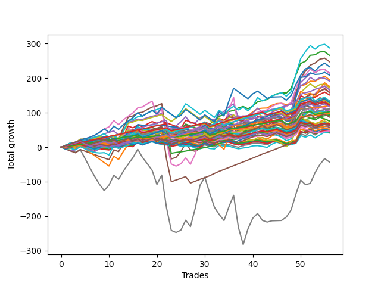

# Long Shepard 004 
- Symbol: TEST
- Date Range: 03/18/2022 - 07/15/2022
- Trading Period: 7:20-12:30
- Number of Trades: 56



| Name | Win Percent | Profit | Avg Profit / Trade | Avg Time / Trade |      | Name | Win Percent | Profit | Avg Profit / Trade | Avg Time / Trade |
| ---- | ----------- | ------ | ------------------ | ---------------- | ---- | ---- | ----------- | ------ | ------------------ | ---------------- |
| Sorted By <br> Profit | | | | | | Sorted By <br> Win Percentage ||||
| Sixty-One | 67.86 | 143875.00 | 2569.20 | 34:52 |     | Eighty-One | 100.00 | 60125.00 | 1073.66 | 04:39 |
| Two | 87.50 | 133125.00 | 2377.23 | 19:54 |     | Eighty-Two | 98.21 | 46625.00 | 832.59 | 10:36 |
| Five | 78.57 | 123875.00 | 2212.05 | 56:55 |     | Eighty-Three | 96.43 | 62250.00 | 1111.61 | 17:39 |
| Sixty-Two | 62.50 | 116625.00 | 2082.59 | 52:36 |     | One Hundred Twenty-Six | 96.43 | 48875.00 | 872.77 | 04:10 |
| Four | 80.36 | 107500.00 | 1919.64 | 38:05 |     | One Hundred Twenty-One | 96.43 | 48875.00 | 872.77 | 04:10 |
| Fifty-Eight | 82.14 | 107250.00 | 1915.18 | 17:26 |     | Eighty-Four | 94.64 | 83000.00 | 1482.14 | 24:24 |
| Seventy-Three | 58.93 | 104375.00 | 1863.84 | 09:25 |     | One Hundred Twenty-Two | 92.86 | 55500.00 | 991.07 | 06:51 |
| One | 87.50 | 97625.00 | 1743.30 | 10:55 |     | One Hundred Twenty-Seven | 91.07 | 51250.00 | 915.18 | 06:33 |
| Sixty-Six | 73.21 | 95750.00 | 1709.82 | 13:24 |     | One Hundred Twenty-Three | 89.29 | 63250.00 | 1129.46 | 11:15 |
| Sixty-Three | 44.64 | 88125.00 | 1573.66 | 70:56 |     | Eighty-Five | 89.29 | 28375.00 | 506.70 | 35:11 |
| Sixty | 69.64 | 86125.00 | 1537.95 | 26:13 |     | Two | 87.50 | 133125.00 | 2377.23 | 19:54 |
| Six | 78.57 | 83875.00 | 1497.77 | 92:21 |     | One | 87.50 | 97625.00 | 1743.30 | 10:55 |
| Eighty-Four | 94.64 | 83000.00 | 1482.14 | 24:24 |     | One Hundred Twenty-Eight | 87.50 | 61000.00 | 1089.29 | 09:23 |
| Three | 80.36 | 79750.00 | 1424.11 | 21:32 |     | Fifty-Seven | 83.93 | 79125.00 | 1412.95 | 09:46 |
| Fifty-Seven | 83.93 | 79125.00 | 1412.95 | 09:46 |     | One Hundred Twenty-Four | 83.93 | 67000.00 | 1196.43 | 15:19 |
| Sixty-Five | 80.36 | 75750.00 | 1352.68 | 09:10 |     | One Hundred Sixteen | 83.93 | 31375.00 | 560.27 | 03:21 |
| Sixty-Seven | 67.86 | 67125.00 | 1198.66 | 12:33 |     | Fifty-Eight | 82.14 | 107250.00 | 1915.18 | 17:26 |
| One Hundred Twenty-Four | 83.93 | 67000.00 | 1196.43 | 15:19 |     | Four | 80.36 | 107500.00 | 1919.64 | 38:05 |
| Forty-Five | 33.93 | 66125.00 | 1180.80 | 19:46 |     | Three | 80.36 | 79750.00 | 1424.11 | 21:32 |
| One Hundred Twenty-Five | 78.57 | 64750.00 | 1156.25 | 19:12 |     | Sixty-Five | 80.36 | 75750.00 | 1352.68 | 09:10 |
| Sixty-Nine | 46.43 | 63500.00 | 1133.93 | 21:37 |     | One Hundred Eleven | 80.36 | 23500.00 | 419.64 | 03:07 |
| One Hundred Twenty-Three | 89.29 | 63250.00 | 1129.46 | 11:15 |     | Five | 78.57 | 123875.00 | 2212.05 | 56:55 |
| Fifty-Nine | 73.21 | 63000.00 | 1125.00 | 14:52 |     | Six | 78.57 | 83875.00 | 1497.77 | 92:21 |
| Eighty-Three | 96.43 | 62250.00 | 1111.61 | 17:39 |     | One Hundred Twenty-Five | 78.57 | 64750.00 | 1156.25 | 19:12 |
| One Hundred Twenty-Eight | 87.50 | 61000.00 | 1089.29 | 09:23 |     | One Hundred Twenty-Nine | 78.57 | 58625.00 | 1046.88 | 11:52 |
| Forty-Seven | 23.21 | 60750.00 | 1084.82 | 29:59 |     | One Hundred Seventeen | 76.79 | 34500.00 | 616.07 | 04:38 |
| Eighty-One | 100.00 | 60125.00 | 1073.66 | 04:39 |     | One Hundred Twelve | 76.79 | 30750.00 | 549.11 | 04:28 |
| Zero | 75.00 | 59375.00 | 1060.27 | 06:21 |     | Zero | 75.00 | 59375.00 | 1060.27 | 06:21 |
| One Hundred Twenty-Nine | 78.57 | 58625.00 | 1046.88 | 11:52 |     | Fifty-Six | 75.00 | 49375.00 | 881.70 | 05:42 |
| One Hundred Twenty-Two | 92.86 | 55500.00 | 991.07 | 06:51 |     | Sixty-Six | 73.21 | 95750.00 | 1709.82 | 13:24 |
| Forty-Two | 57.14 | 54000.00 | 964.29 | 12:01 |     | Fifty-Nine | 73.21 | 63000.00 | 1125.00 | 14:52 |
| Sixty-Eight | 48.21 | 53500.00 | 955.36 | 18:54 |     | Sixty-Four | 73.21 | 45875.00 | 819.20 | 05:24 |
| Forty-Six | 32.14 | 52500.00 | 937.50 | 23:54 |     | One Hundred Thirteen | 71.43 | 34750.00 | 620.54 | 06:34 |
| Forty-One | 67.86 | 51750.00 | 924.11 | 07:38 |     | Sixty | 69.64 | 86125.00 | 1537.95 | 26:13 |
| One Hundred Twenty-Seven | 91.07 | 51250.00 | 915.18 | 06:33 |     | Forty | 69.64 | 34625.00 | 618.30 | 04:34 |
| Fifty-Six | 75.00 | 49375.00 | 881.70 | 05:42 |     | Sixty-One | 67.86 | 143875.00 | 2569.20 | 34:52 |
| One Hundred Twenty-Six | 96.43 | 48875.00 | 872.77 | 04:10 |     | Sixty-Seven | 67.86 | 67125.00 | 1198.66 | 12:33 |
| One Hundred Twenty-One | 96.43 | 48875.00 | 872.77 | 04:10 |     | Forty-One | 67.86 | 51750.00 | 924.11 | 07:38 |
| Seventy-One | 39.29 | 47250.00 | 843.75 | 27:24 |     | One Hundred Thirty | 67.86 | 43750.00 | 781.25 | 13:55 |
| Eighty-Two | 98.21 | 46625.00 | 832.59 | 10:36 |     | Forty-Eight | 67.86 | 29000.00 | 517.86 | 04:20 |
| Sixty-Four | 73.21 | 45875.00 | 819.20 | 05:24 |     | One Hundred Eighteen | 66.07 | 33500.00 | 598.21 | 06:04 |
| Seventy | 44.64 | 45875.00 | 819.20 | 24:41 |     | Sixty-Two | 62.50 | 116625.00 | 2082.59 | 52:36 |
| One Hundred Thirty | 67.86 | 43750.00 | 781.25 | 13:55 |     | One Hundred Fourteen | 62.50 | 32625.00 | 582.59 | 08:45 |
| Forty-Four | 39.29 | 38000.00 | 678.57 | 15:56 |     | Seventy-Three | 58.93 | 104375.00 | 1863.84 | 09:25 |
| Forty-Three | 53.57 | 37875.00 | 676.34 | 10:19 |     | Forty-Two | 57.14 | 54000.00 | 964.29 | 12:01 |
| One Hundred Thirteen | 71.43 | 34750.00 | 620.54 | 06:34 |     | One Hundred Fifteen | 57.14 | 31625.00 | 564.73 | 10:05 |
| Forty | 69.64 | 34625.00 | 618.30 | 04:34 |     | Forty-Nine | 57.14 | 23750.00 | 424.11 | 06:29 |
| One Hundred Seventeen | 76.79 | 34500.00 | 616.07 | 04:38 |     | One Hundred Ninteen | 55.36 | 31625.00 | 564.73 | 06:58 |
| One Hundred Eighteen | 66.07 | 33500.00 | 598.21 | 06:04 |     | Seven | 55.36 | -21625.00 | -386.16 | 136:59 |
| One Hundred Fourteen | 62.50 | 32625.00 | 582.59 | 08:45 |     | Forty-Three | 53.57 | 37875.00 | 676.34 | 10:19 |
| One Hundred Twenty | 48.21 | 31875.00 | 569.20 | 07:40 |     | Fifty | 53.57 | 25000.00 | 446.43 | 08:14 |
| One Hundred Fifteen | 57.14 | 31625.00 | 564.73 | 10:05 |     | Fifty-One | 50.00 | 20500.00 | 366.07 | 07:29 |
| One Hundred Ninteen | 55.36 | 31625.00 | 564.73 | 06:58 |     | Sixty-Eight | 48.21 | 53500.00 | 955.36 | 18:54 |
| One Hundred Sixteen | 83.93 | 31375.00 | 560.27 | 03:21 |     | One Hundred Twenty | 48.21 | 31875.00 | 569.20 | 07:40 |
| One Hundred Twelve | 76.79 | 30750.00 | 549.11 | 04:28 |     | Sixty-Nine | 46.43 | 63500.00 | 1133.93 | 21:37 |
| Forty-Eight | 67.86 | 29000.00 | 517.86 | 04:20 |     | Fifty-Three | 46.43 | 26125.00 | 466.52 | 09:43 |
| Eighty-Five | 89.29 | 28375.00 | 506.70 | 35:11 |     | Fifty-Two | 46.43 | 24625.00 | 439.73 | 09:04 |
| Fifty-Three | 46.43 | 26125.00 | 466.52 | 09:43 |     | Fifty-Five | 46.43 | 22375.00 | 399.55 | 10:32 |
| Fifty | 53.57 | 25000.00 | 446.43 | 08:14 |     | Fifty-Four | 46.43 | 21875.00 | 390.62 | 10:15 |
| Fifty-Two | 46.43 | 24625.00 | 439.73 | 09:04 |     | Sixty-Three | 44.64 | 88125.00 | 1573.66 | 70:56 |
| Forty-Nine | 57.14 | 23750.00 | 424.11 | 06:29 |     | Seventy | 44.64 | 45875.00 | 819.20 | 24:41 |
| One Hundred Eleven | 80.36 | 23500.00 | 419.64 | 03:07 |     | Seventy-One | 39.29 | 47250.00 | 843.75 | 27:24 |
| Fifty-Five | 46.43 | 22375.00 | 399.55 | 10:32 |     | Forty-Four | 39.29 | 38000.00 | 678.57 | 15:56 |
| Fifty-Four | 46.43 | 21875.00 | 390.62 | 10:15 |     | Forty-Five | 33.93 | 66125.00 | 1180.80 | 19:46 |
| Fifty-One | 50.00 | 20500.00 | 366.07 | 07:29 |     | Forty-Six | 32.14 | 52500.00 | 937.50 | 23:54 |
| Seven | 55.36 | -21625.00 | -386.16 | 136:59 |     | Forty-Seven | 23.21 | 60750.00 | 1084.82 | 29:59 |

## NO STOPLOSS

### Test Zero
* Sell when price hits the middle line of the 20p bollinger
* No Stoploss
* Results:
```
Total Trades: 56
Percent Up: 75.00
Percent Down: 25.00
Total Points Moved Up: 118.75
Potential Profit: 59375.00
Total Points Ups: 152.00 Count Ups: 42
Total Points Downs: -33.25 Count Downs: 14
```

<details><summary>Trades</summary>

<code>In: 2022-03-23 10:32:00		Out: 2022-03-23 10:51:10		Total Position Time: 19:10		Total Move Up: -1.00		Total to Date: -1.00</code> <br />
<code>In: 2022-03-23 11:17:00		Out: 2022-03-23 11:18:30		Total Position Time: 01:30		Total Move Up: 2.25		Total to Date: 1.25</code> <br />
<code>In: 2022-03-30 07:35:00		Out: 2022-03-30 07:36:25		Total Position Time: 01:25		Total Move Up: 2.00		Total to Date: 3.25</code> <br />
<code>In: 2022-03-30 12:27:00		Out: 2022-03-30 12:28:50		Total Position Time: 01:50		Total Move Up: 2.75		Total to Date: 6.00</code> <br />
<code>In: 2022-03-31 09:30:00		Out: 2022-03-31 09:32:50		Total Position Time: 02:50		Total Move Up: 2.00		Total to Date: 8.00</code> <br />
<code>In: 2022-03-31 09:37:00		Out: 2022-03-31 09:38:10		Total Position Time: 01:10		Total Move Up: 0.50		Total to Date: 8.50</code> <br />
<code>In: 2022-03-31 10:02:00		Out: 2022-03-31 10:19:05		Total Position Time: 17:05		Total Move Up: -2.50		Total to Date: 6.00</code> <br />
<code>In: 2022-03-31 10:19:00		Out: 2022-03-31 10:20:10		Total Position Time: 01:10		Total Move Up: 0.25		Total to Date: 6.25</code> <br />
<code>In: 2022-03-31 11:21:00		Out: 2022-03-31 11:23:30		Total Position Time: 02:30		Total Move Up: 0.75		Total to Date: 7.00</code> <br />
<code>In: 2022-04-01 08:48:00		Out: 2022-04-01 08:53:10		Total Position Time: 05:10		Total Move Up: 0.50		Total to Date: 7.50</code> <br />
<code>In: 2022-04-01 10:23:00		Out: 2022-04-01 10:24:10		Total Position Time: 01:10		Total Move Up: 2.75		Total to Date: 10.25</code> <br />
<code>In: 2022-04-05 12:17:00		Out: 2022-04-05 12:23:40		Total Position Time: 06:40		Total Move Up: 1.25		Total to Date: 11.50</code> <br />
<code>In: 2022-04-06 11:21:00		Out: 2022-04-06 11:25:45		Total Position Time: 04:45		Total Move Up: 8.25		Total to Date: 19.75</code> <br />
<code>In: 2022-04-06 11:22:00		Out: 2022-04-06 11:25:45		Total Position Time: 03:45		Total Move Up: 4.50		Total to Date: 24.25</code> <br />
<code>In: 2022-04-07 08:36:00		Out: 2022-04-07 08:37:20		Total Position Time: 01:20		Total Move Up: 2.25		Total to Date: 26.50</code> <br />
<code>In: 2022-04-07 09:52:00		Out: 2022-04-07 09:53:10		Total Position Time: 01:10		Total Move Up: 1.25		Total to Date: 27.75</code> <br />
<code>In: 2022-04-11 07:39:00		Out: 2022-04-11 07:51:45		Total Position Time: 12:45		Total Move Up: -0.75		Total to Date: 27.00</code> <br />
<code>In: 2022-04-11 08:18:00		Out: 2022-04-11 08:26:40		Total Position Time: 08:40		Total Move Up: 0.75		Total to Date: 27.75</code> <br />
<code>In: 2022-04-11 08:27:00		Out: 2022-04-11 08:28:10		Total Position Time: 01:10		Total Move Up: -0.25		Total to Date: 27.50</code> <br />
<code>In: 2022-04-12 09:32:00		Out: 2022-04-12 09:49:40		Total Position Time: 17:40		Total Move Up: -1.50		Total to Date: 26.00</code> <br />
<code>In: 2022-04-18 09:21:00		Out: 2022-04-18 09:32:05		Total Position Time: 11:05		Total Move Up: 0.00		Total to Date: 26.00</code> <br />
<code>In: 2022-04-21 07:58:00		Out: 2022-04-21 08:01:15		Total Position Time: 03:15		Total Move Up: 2.75		Total to Date: 28.75</code> <br />
<code>In: 2022-04-21 09:12:00		Out: 2022-04-21 09:19:05		Total Position Time: 07:05		Total Move Up: 0.25		Total to Date: 29.00</code> <br />
<code>In: 2022-04-22 11:07:00		Out: 2022-04-22 11:17:15		Total Position Time: 10:15		Total Move Up: 1.00		Total to Date: 30.00</code> <br />
<code>In: 2022-04-22 12:00:00		Out: 2022-04-22 12:07:50		Total Position Time: 07:50		Total Move Up: -0.25		Total to Date: 29.75</code> <br />
<code>In: 2022-04-28 07:43:00		Out: 2022-04-28 07:45:30		Total Position Time: 02:30		Total Move Up: 3.75		Total to Date: 33.50</code> <br />
<code>In: 2022-04-29 11:58:00		Out: 2022-04-29 11:59:10		Total Position Time: 01:10		Total Move Up: 3.00		Total to Date: 36.50</code> <br />
<code>In: 2022-05-02 10:56:00		Out: 2022-05-02 10:59:50		Total Position Time: 03:50		Total Move Up: -0.50		Total to Date: 36.00</code> <br />
<code>In: 2022-05-02 11:22:00		Out: 2022-05-02 11:31:05		Total Position Time: 09:05		Total Move Up: 2.00		Total to Date: 38.00</code> <br />
<code>In: 2022-05-04 08:37:00		Out: 2022-05-04 08:39:25		Total Position Time: 02:25		Total Move Up: 2.75		Total to Date: 40.75</code> <br />
<code>In: 2022-05-09 07:35:00		Out: 2022-05-09 07:42:30		Total Position Time: 07:30		Total Move Up: -0.50		Total to Date: 40.25</code> <br />
<code>In: 2022-05-09 07:42:00		Out: 2022-05-09 07:45:00		Total Position Time: 03:00		Total Move Up: 3.50		Total to Date: 43.75</code> <br />
<code>In: 2022-05-09 08:34:00		Out: 2022-05-09 08:35:10		Total Position Time: 01:10		Total Move Up: 6.25		Total to Date: 50.00</code> <br />
<code>In: 2022-05-11 10:50:00		Out: 2022-05-11 11:01:10		Total Position Time: 11:10		Total Move Up: -1.75		Total to Date: 48.25</code> <br />
<code>In: 2022-05-12 11:45:00		Out: 2022-05-12 11:46:10		Total Position Time: 01:10		Total Move Up: 5.50		Total to Date: 53.75</code> <br />
<code>In: 2022-05-12 11:46:00		Out: 2022-05-12 11:48:05		Total Position Time: 02:05		Total Move Up: 0.00		Total to Date: 53.75</code> <br />
<code>In: 2022-05-18 07:40:00		Out: 2022-05-18 07:46:15		Total Position Time: 06:15		Total Move Up: 2.00		Total to Date: 55.75</code> <br />
<code>In: 2022-05-18 09:12:00		Out: 2022-05-18 09:14:50		Total Position Time: 02:50		Total Move Up: 2.75		Total to Date: 58.50</code> <br />
<code>In: 2022-05-20 09:48:00		Out: 2022-05-20 09:52:30		Total Position Time: 04:30		Total Move Up: 6.00		Total to Date: 64.50</code> <br />
<code>In: 2022-05-24 07:21:00		Out: 2022-05-24 07:27:35		Total Position Time: 06:35		Total Move Up: 7.00		Total to Date: 71.50</code> <br />
<code>In: 2022-06-02 07:30:00		Out: 2022-06-02 07:34:25		Total Position Time: 04:25		Total Move Up: 7.75		Total to Date: 79.25</code> <br />
<code>In: 2022-06-06 08:24:00		Out: 2022-06-06 08:33:05		Total Position Time: 09:05		Total Move Up: 2.50		Total to Date: 81.75</code> <br />
<code>In: 2022-06-06 09:17:00		Out: 2022-06-06 09:34:45		Total Position Time: 17:45		Total Move Up: -1.75		Total to Date: 80.00</code> <br />
<code>In: 2022-06-08 10:41:00		Out: 2022-06-08 10:43:10		Total Position Time: 02:10		Total Move Up: 4.75		Total to Date: 84.75</code> <br />
<code>In: 2022-06-08 10:42:00		Out: 2022-06-08 10:43:10		Total Position Time: 01:10		Total Move Up: 1.50		Total to Date: 86.25</code> <br />
<code>In: 2022-06-08 11:31:00		Out: 2022-06-08 11:41:35		Total Position Time: 10:35		Total Move Up: -2.50		Total to Date: 83.75</code> <br />
<code>In: 2022-06-14 07:23:00		Out: 2022-06-14 07:47:00		Total Position Time: 24:00		Total Move Up: -8.00		Total to Date: 75.75</code> <br />
<code>In: 2022-06-15 08:23:00		Out: 2022-06-15 08:34:25		Total Position Time: 11:25		Total Move Up: 0.75		Total to Date: 76.50</code> <br />
<code>In: 2022-06-15 11:36:00		Out: 2022-06-15 11:38:05		Total Position Time: 02:05		Total Move Up: 18.25		Total to Date: 94.75</code> <br />
<code>In: 2022-06-15 11:37:00		Out: 2022-06-15 11:38:10		Total Position Time: 01:10		Total Move Up: 22.50		Total to Date: 117.25</code> <br />
<code>In: 2022-06-16 07:55:00		Out: 2022-06-16 08:01:55		Total Position Time: 06:55		Total Move Up: 2.25		Total to Date: 119.50</code> <br />
<code>In: 2022-06-16 11:57:00		Out: 2022-06-16 12:00:35		Total Position Time: 03:35		Total Move Up: 3.50		Total to Date: 123.00</code> <br />
<code>In: 2022-06-23 09:49:00		Out: 2022-06-23 09:54:10		Total Position Time: 05:10		Total Move Up: -0.25		Total to Date: 122.75</code> <br />
<code>In: 2022-06-29 09:32:00		Out: 2022-06-29 09:36:40		Total Position Time: 04:40		Total Move Up: 3.50		Total to Date: 126.25</code> <br />
<code>In: 2022-07-06 08:12:00		Out: 2022-07-06 08:15:05		Total Position Time: 03:05		Total Move Up: 4.25		Total to Date: 130.50</code> <br />
<code>In: 2022-07-12 12:14:00		Out: 2022-07-12 12:45:35		Total Position Time: 31:35		Total Move Up: -11.75		Total to Date: 118.75</code> <br />


</details>

### Test One
* Sell when the price hits the upper line of the 20p 1std bollinger
* No Stoploss
* Results:
```
Total Trades: 56
Percent Up: 87.50
Percent Down: 12.50
Total Points Moved Up: 195.25
Potential Profit: 97625.00
Total Points Ups: 228.00 Count Ups: 49
Total Points Downs: -32.75 Count Downs: 7
```

<details><summary>Trades</summary>

<code>In: 2022-03-23 10:32:00		Out: 2022-03-23 10:51:50		Total Position Time: 19:50		Total Move Up: 0.75		Total to Date: 0.75</code> <br />
<code>In: 2022-03-23 11:17:00		Out: 2022-03-23 11:26:45		Total Position Time: 09:45		Total Move Up: 2.50		Total to Date: 3.25</code> <br />
<code>In: 2022-03-30 07:35:00		Out: 2022-03-30 07:40:05		Total Position Time: 05:05		Total Move Up: 3.00		Total to Date: 6.25</code> <br />
<code>In: 2022-03-30 12:27:00		Out: 2022-03-30 12:32:20		Total Position Time: 05:20		Total Move Up: 4.75		Total to Date: 11.00</code> <br />
<code>In: 2022-03-31 09:30:00		Out: 2022-03-31 09:41:05		Total Position Time: 11:05		Total Move Up: 1.75		Total to Date: 12.75</code> <br />
<code>In: 2022-03-31 09:37:00		Out: 2022-03-31 09:41:05		Total Position Time: 04:05		Total Move Up: 1.25		Total to Date: 14.00</code> <br />
<code>In: 2022-03-31 10:02:00		Out: 2022-03-31 10:19:40		Total Position Time: 17:40		Total Move Up: -0.50		Total to Date: 13.50</code> <br />
<code>In: 2022-03-31 10:19:00		Out: 2022-03-31 10:26:35		Total Position Time: 07:35		Total Move Up: 0.50		Total to Date: 14.00</code> <br />
<code>In: 2022-03-31 11:21:00		Out: 2022-03-31 11:29:15		Total Position Time: 08:15		Total Move Up: 1.00		Total to Date: 15.00</code> <br />
<code>In: 2022-04-01 08:48:00		Out: 2022-04-01 08:54:15		Total Position Time: 06:15		Total Move Up: 2.75		Total to Date: 17.75</code> <br />
<code>In: 2022-04-01 10:23:00		Out: 2022-04-01 10:30:20		Total Position Time: 07:20		Total Move Up: 2.50		Total to Date: 20.25</code> <br />
<code>In: 2022-04-05 12:17:00		Out: 2022-04-05 12:47:00		Total Position Time: 30:00		Total Move Up: -12.00		Total to Date: 8.25</code> <br />
<code>In: 2022-04-06 11:21:00		Out: 2022-04-06 11:31:20		Total Position Time: 10:20		Total Move Up: 7.50		Total to Date: 15.75</code> <br />
<code>In: 2022-04-06 11:22:00		Out: 2022-04-06 11:31:20		Total Position Time: 09:20		Total Move Up: 3.75		Total to Date: 19.50</code> <br />
<code>In: 2022-04-07 08:36:00		Out: 2022-04-07 08:47:30		Total Position Time: 11:30		Total Move Up: 3.25		Total to Date: 22.75</code> <br />
<code>In: 2022-04-07 09:52:00		Out: 2022-04-07 09:59:10		Total Position Time: 07:10		Total Move Up: 2.50		Total to Date: 25.25</code> <br />
<code>In: 2022-04-11 07:39:00		Out: 2022-04-11 07:54:05		Total Position Time: 15:05		Total Move Up: 0.25		Total to Date: 25.50</code> <br />
<code>In: 2022-04-11 08:18:00		Out: 2022-04-11 08:30:15		Total Position Time: 12:15		Total Move Up: 1.25		Total to Date: 26.75</code> <br />
<code>In: 2022-04-11 08:27:00		Out: 2022-04-11 08:30:15		Total Position Time: 03:15		Total Move Up: 0.25		Total to Date: 27.00</code> <br />
<code>In: 2022-04-12 09:32:00		Out: 2022-04-12 09:50:15		Total Position Time: 18:15		Total Move Up: 2.25		Total to Date: 29.25</code> <br />
<code>In: 2022-04-18 09:21:00		Out: 2022-04-18 09:35:20		Total Position Time: 14:20		Total Move Up: 0.50		Total to Date: 29.75</code> <br />
<code>In: 2022-04-21 07:58:00		Out: 2022-04-21 08:11:25		Total Position Time: 13:25		Total Move Up: 2.50		Total to Date: 32.25</code> <br />
<code>In: 2022-04-21 09:12:00		Out: 2022-04-21 09:34:10		Total Position Time: 22:10		Total Move Up: -1.75		Total to Date: 30.50</code> <br />
<code>In: 2022-04-22 11:07:00		Out: 2022-04-22 11:17:15		Total Position Time: 10:15		Total Move Up: 1.00		Total to Date: 31.50</code> <br />
<code>In: 2022-04-22 12:00:00		Out: 2022-04-22 12:11:50		Total Position Time: 11:50		Total Move Up: 2.00		Total to Date: 33.50</code> <br />
<code>In: 2022-04-28 07:43:00		Out: 2022-04-28 07:47:10		Total Position Time: 04:10		Total Move Up: 5.50		Total to Date: 39.00</code> <br />
<code>In: 2022-04-29 11:58:00		Out: 2022-04-29 12:25:30		Total Position Time: 27:30		Total Move Up: -4.00		Total to Date: 35.00</code> <br />
<code>In: 2022-05-02 10:56:00		Out: 2022-05-02 11:02:45		Total Position Time: 06:45		Total Move Up: 2.00		Total to Date: 37.00</code> <br />
<code>In: 2022-05-02 11:22:00		Out: 2022-05-02 11:33:10		Total Position Time: 11:10		Total Move Up: 2.00		Total to Date: 39.00</code> <br />
<code>In: 2022-05-04 08:37:00		Out: 2022-05-04 08:40:55		Total Position Time: 03:55		Total Move Up: 5.00		Total to Date: 44.00</code> <br />
<code>In: 2022-05-09 07:35:00		Out: 2022-05-09 07:46:10		Total Position Time: 11:10		Total Move Up: 3.00		Total to Date: 47.00</code> <br />
<code>In: 2022-05-09 07:42:00		Out: 2022-05-09 07:46:10		Total Position Time: 04:10		Total Move Up: 8.25		Total to Date: 55.25</code> <br />
<code>In: 2022-05-09 08:34:00		Out: 2022-05-09 08:38:55		Total Position Time: 04:55		Total Move Up: 9.00		Total to Date: 64.25</code> <br />
<code>In: 2022-05-11 10:50:00		Out: 2022-05-11 11:01:30		Total Position Time: 11:30		Total Move Up: 2.25		Total to Date: 66.50</code> <br />
<code>In: 2022-05-12 11:45:00		Out: 2022-05-12 11:52:55		Total Position Time: 07:55		Total Move Up: 5.75		Total to Date: 72.25</code> <br />
<code>In: 2022-05-12 11:46:00		Out: 2022-05-12 11:52:55		Total Position Time: 06:55		Total Move Up: 1.00		Total to Date: 73.25</code> <br />
<code>In: 2022-05-18 07:40:00		Out: 2022-05-18 07:48:35		Total Position Time: 08:35		Total Move Up: 5.50		Total to Date: 78.75</code> <br />
<code>In: 2022-05-18 09:12:00		Out: 2022-05-18 09:16:30		Total Position Time: 04:30		Total Move Up: 5.25		Total to Date: 84.00</code> <br />
<code>In: 2022-05-20 09:48:00		Out: 2022-05-20 09:56:15		Total Position Time: 08:15		Total Move Up: 7.50		Total to Date: 91.50</code> <br />
<code>In: 2022-05-24 07:21:00		Out: 2022-05-24 07:29:50		Total Position Time: 08:50		Total Move Up: 10.75		Total to Date: 102.25</code> <br />
<code>In: 2022-06-02 07:30:00		Out: 2022-06-02 07:39:50		Total Position Time: 09:50		Total Move Up: 9.25		Total to Date: 111.50</code> <br />
<code>In: 2022-06-06 08:24:00		Out: 2022-06-06 08:39:15		Total Position Time: 15:15		Total Move Up: 1.50		Total to Date: 113.00</code> <br />
<code>In: 2022-06-06 09:17:00		Out: 2022-06-06 09:37:35		Total Position Time: 20:35		Total Move Up: 0.50		Total to Date: 113.50</code> <br />
<code>In: 2022-06-08 10:41:00		Out: 2022-06-08 10:47:05		Total Position Time: 06:05		Total Move Up: 8.00		Total to Date: 121.50</code> <br />
<code>In: 2022-06-08 10:42:00		Out: 2022-06-08 10:47:05		Total Position Time: 05:05		Total Move Up: 4.75		Total to Date: 126.25</code> <br />
<code>In: 2022-06-08 11:31:00		Out: 2022-06-08 11:43:20		Total Position Time: 12:20		Total Move Up: 0.75		Total to Date: 127.00</code> <br />
<code>In: 2022-06-14 07:23:00		Out: 2022-06-14 07:47:15		Total Position Time: 24:15		Total Move Up: -3.75		Total to Date: 123.25</code> <br />
<code>In: 2022-06-15 08:23:00		Out: 2022-06-15 08:38:55		Total Position Time: 15:55		Total Move Up: 4.00		Total to Date: 127.25</code> <br />
<code>In: 2022-06-15 11:36:00		Out: 2022-06-15 11:38:10		Total Position Time: 02:10		Total Move Up: 27.50		Total to Date: 154.75</code> <br />
<code>In: 2022-06-15 11:37:00		Out: 2022-06-15 11:38:10		Total Position Time: 01:10		Total Move Up: 22.50		Total to Date: 177.25</code> <br />
<code>In: 2022-06-16 07:55:00		Out: 2022-06-16 08:11:30		Total Position Time: 16:30		Total Move Up: 4.25		Total to Date: 181.50</code> <br />
<code>In: 2022-06-16 11:57:00		Out: 2022-06-16 12:01:55		Total Position Time: 04:55		Total Move Up: 9.75		Total to Date: 191.25</code> <br />
<code>In: 2022-06-23 09:49:00		Out: 2022-06-23 09:56:15		Total Position Time: 07:15		Total Move Up: -0.50		Total to Date: 190.75</code> <br />
<code>In: 2022-06-29 09:32:00		Out: 2022-06-29 09:38:30		Total Position Time: 06:30		Total Move Up: 8.50		Total to Date: 199.25</code> <br />
<code>In: 2022-07-06 08:12:00		Out: 2022-07-06 08:21:05		Total Position Time: 09:05		Total Move Up: 6.25		Total to Date: 205.50</code> <br />
<code>In: 2022-07-12 12:14:00		Out: 2022-07-12 12:47:00		Total Position Time: 33:00		Total Move Up: -10.25		Total to Date: 195.25</code> <br />


</details>

### Test Two
* Sell when the price hits the upper line of the 20p 2std bollinger
* No Stoploss
* Results:
```
Total Trades: 56
Percent Up: 87.50
Percent Down: 12.50
Total Points Moved Up: 266.25
Potential Profit: 133125.00
Total Points Ups: 320.75 Count Ups: 49
Total Points Downs: -54.50 Count Downs: 7
```

<details><summary>Trades</summary>

<code>In: 2022-03-23 10:32:00		Out: 2022-03-23 10:54:30		Total Position Time: 22:30		Total Move Up: 3.25		Total to Date: 3.25</code> <br />
<code>In: 2022-03-23 11:17:00		Out: 2022-03-23 11:27:45		Total Position Time: 10:45		Total Move Up: 4.50		Total to Date: 7.75</code> <br />
<code>In: 2022-03-30 07:35:00		Out: 2022-03-30 07:46:00		Total Position Time: 11:00		Total Move Up: 3.75		Total to Date: 11.50</code> <br />
<code>In: 2022-03-30 12:27:00		Out: 2022-03-30 12:36:20		Total Position Time: 09:20		Total Move Up: 7.50		Total to Date: 19.00</code> <br />
<code>In: 2022-03-31 09:30:00		Out: 2022-03-31 09:44:20		Total Position Time: 14:20		Total Move Up: 2.50		Total to Date: 21.50</code> <br />
<code>In: 2022-03-31 09:37:00		Out: 2022-03-31 09:44:20		Total Position Time: 07:20		Total Move Up: 2.00		Total to Date: 23.50</code> <br />
<code>In: 2022-03-31 10:02:00		Out: 2022-03-31 10:27:50		Total Position Time: 25:50		Total Move Up: -1.25		Total to Date: 22.25</code> <br />
<code>In: 2022-03-31 10:19:00		Out: 2022-03-31 10:27:50		Total Position Time: 08:50		Total Move Up: 1.25		Total to Date: 23.50</code> <br />
<code>In: 2022-03-31 11:21:00		Out: 2022-03-31 11:29:25		Total Position Time: 08:25		Total Move Up: 2.00		Total to Date: 25.50</code> <br />
<code>In: 2022-04-01 08:48:00		Out: 2022-04-01 09:23:15		Total Position Time: 35:15		Total Move Up: -5.25		Total to Date: 20.25</code> <br />
<code>In: 2022-04-01 10:23:00		Out: 2022-04-01 10:31:45		Total Position Time: 08:45		Total Move Up: 3.50		Total to Date: 23.75</code> <br />
<code>In: 2022-04-05 12:17:00		Out: 2022-04-05 12:47:00		Total Position Time: 30:00		Total Move Up: -12.00		Total to Date: 11.75</code> <br />
<code>In: 2022-04-06 11:21:00		Out: 2022-04-06 11:32:05		Total Position Time: 11:05		Total Move Up: 9.75		Total to Date: 21.50</code> <br />
<code>In: 2022-04-06 11:22:00		Out: 2022-04-06 11:32:05		Total Position Time: 10:05		Total Move Up: 6.00		Total to Date: 27.50</code> <br />
<code>In: 2022-04-07 08:36:00		Out: 2022-04-07 08:48:15		Total Position Time: 12:15		Total Move Up: 4.00		Total to Date: 31.50</code> <br />
<code>In: 2022-04-07 09:52:00		Out: 2022-04-07 10:02:15		Total Position Time: 10:15		Total Move Up: 5.50		Total to Date: 37.00</code> <br />
<code>In: 2022-04-11 07:39:00		Out: 2022-04-11 07:56:35		Total Position Time: 17:35		Total Move Up: 1.25		Total to Date: 38.25</code> <br />
<code>In: 2022-04-11 08:18:00		Out: 2022-04-11 08:30:50		Total Position Time: 12:50		Total Move Up: 2.00		Total to Date: 40.25</code> <br />
<code>In: 2022-04-11 08:27:00		Out: 2022-04-11 08:30:50		Total Position Time: 03:50		Total Move Up: 1.00		Total to Date: 41.25</code> <br />
<code>In: 2022-04-12 09:32:00		Out: 2022-04-12 09:50:15		Total Position Time: 18:15		Total Move Up: 2.25		Total to Date: 43.50</code> <br />
<code>In: 2022-04-18 09:21:00		Out: 2022-04-18 09:42:50		Total Position Time: 21:50		Total Move Up: 1.25		Total to Date: 44.75</code> <br />
<code>In: 2022-04-21 07:58:00		Out: 2022-04-21 08:11:45		Total Position Time: 13:45		Total Move Up: 4.00		Total to Date: 48.75</code> <br />
<code>In: 2022-04-21 09:12:00		Out: 2022-04-21 09:35:55		Total Position Time: 23:55		Total Move Up: 0.50		Total to Date: 49.25</code> <br />
<code>In: 2022-04-22 11:07:00		Out: 2022-04-22 11:17:45		Total Position Time: 10:45		Total Move Up: 3.00		Total to Date: 52.25</code> <br />
<code>In: 2022-04-22 12:00:00		Out: 2022-04-22 12:12:00		Total Position Time: 12:00		Total Move Up: 2.25		Total to Date: 54.50</code> <br />
<code>In: 2022-04-28 07:43:00		Out: 2022-04-28 07:55:45		Total Position Time: 12:45		Total Move Up: 7.50		Total to Date: 62.00</code> <br />
<code>In: 2022-04-29 11:58:00		Out: 2022-04-29 12:47:00		Total Position Time: 49:00		Total Move Up: -18.50		Total to Date: 43.50</code> <br />
<code>In: 2022-05-02 10:56:00		Out: 2022-05-02 11:03:55		Total Position Time: 07:55		Total Move Up: 5.25		Total to Date: 48.75</code> <br />
<code>In: 2022-05-02 11:22:00		Out: 2022-05-02 11:33:40		Total Position Time: 11:40		Total Move Up: 4.75		Total to Date: 53.50</code> <br />
<code>In: 2022-05-04 08:37:00		Out: 2022-05-04 08:47:05		Total Position Time: 10:05		Total Move Up: 8.00		Total to Date: 61.50</code> <br />
<code>In: 2022-05-09 07:35:00		Out: 2022-05-09 07:49:10		Total Position Time: 14:10		Total Move Up: 5.25		Total to Date: 66.75</code> <br />
<code>In: 2022-05-09 07:42:00		Out: 2022-05-09 07:49:10		Total Position Time: 07:10		Total Move Up: 10.50		Total to Date: 77.25</code> <br />
<code>In: 2022-05-09 08:34:00		Out: 2022-05-09 08:39:15		Total Position Time: 05:15		Total Move Up: 12.00		Total to Date: 89.25</code> <br />
<code>In: 2022-05-11 10:50:00		Out: 2022-05-11 11:04:55		Total Position Time: 14:55		Total Move Up: 6.00		Total to Date: 95.25</code> <br />
<code>In: 2022-05-12 11:45:00		Out: 2022-05-12 11:53:25		Total Position Time: 08:25		Total Move Up: 8.00		Total to Date: 103.25</code> <br />
<code>In: 2022-05-12 11:46:00		Out: 2022-05-12 11:53:25		Total Position Time: 07:25		Total Move Up: 3.25		Total to Date: 106.50</code> <br />
<code>In: 2022-05-18 07:40:00		Out: 2022-05-18 07:48:45		Total Position Time: 08:45		Total Move Up: 7.25		Total to Date: 113.75</code> <br />
<code>In: 2022-05-18 09:12:00		Out: 2022-05-18 09:47:55		Total Position Time: 35:55		Total Move Up: 4.25		Total to Date: 118.00</code> <br />
<code>In: 2022-05-20 09:48:00		Out: 2022-05-20 10:33:20		Total Position Time: 45:20		Total Move Up: -7.00		Total to Date: 111.00</code> <br />
<code>In: 2022-05-24 07:21:00		Out: 2022-05-24 08:16:35		Total Position Time: 55:35		Total Move Up: 8.50		Total to Date: 119.50</code> <br />
<code>In: 2022-06-02 07:30:00		Out: 2022-06-02 07:42:35		Total Position Time: 12:35		Total Move Up: 11.75		Total to Date: 131.25</code> <br />
<code>In: 2022-06-06 08:24:00		Out: 2022-06-06 08:43:00		Total Position Time: 19:00		Total Move Up: 3.75		Total to Date: 135.00</code> <br />
<code>In: 2022-06-06 09:17:00		Out: 2022-06-06 09:41:50		Total Position Time: 24:50		Total Move Up: 3.25		Total to Date: 138.25</code> <br />
<code>In: 2022-06-08 10:41:00		Out: 2022-06-08 11:03:45		Total Position Time: 22:45		Total Move Up: 9.75		Total to Date: 148.00</code> <br />
<code>In: 2022-06-08 10:42:00		Out: 2022-06-08 11:03:45		Total Position Time: 21:45		Total Move Up: 6.50		Total to Date: 154.50</code> <br />
<code>In: 2022-06-08 11:31:00		Out: 2022-06-08 11:44:05		Total Position Time: 13:05		Total Move Up: 2.75		Total to Date: 157.25</code> <br />
<code>In: 2022-06-14 07:23:00		Out: 2022-06-14 07:48:40		Total Position Time: 25:40		Total Move Up: -0.25		Total to Date: 157.00</code> <br />
<code>In: 2022-06-15 08:23:00		Out: 2022-06-15 10:58:15		Total Position Time: 155:15		Total Move Up: 13.25		Total to Date: 170.25</code> <br />
<code>In: 2022-06-15 11:36:00		Out: 2022-06-15 11:38:55		Total Position Time: 02:55		Total Move Up: 38.75		Total to Date: 209.00</code> <br />
<code>In: 2022-06-15 11:37:00		Out: 2022-06-15 11:38:55		Total Position Time: 01:55		Total Move Up: 33.75		Total to Date: 242.75</code> <br />
<code>In: 2022-06-16 07:55:00		Out: 2022-06-16 08:11:45		Total Position Time: 16:45		Total Move Up: 6.25		Total to Date: 249.00</code> <br />
<code>In: 2022-06-16 11:57:00		Out: 2022-06-16 12:10:00		Total Position Time: 13:00		Total Move Up: 17.25		Total to Date: 266.25</code> <br />
<code>In: 2022-06-23 09:49:00		Out: 2022-06-23 10:07:40		Total Position Time: 18:40		Total Move Up: 1.50		Total to Date: 267.75</code> <br />
<code>In: 2022-06-29 09:32:00		Out: 2022-06-29 10:01:45		Total Position Time: 29:45		Total Move Up: 8.25		Total to Date: 276.00</code> <br />
<code>In: 2022-07-06 08:12:00		Out: 2022-07-06 08:51:15		Total Position Time: 39:15		Total Move Up: 0.50		Total to Date: 276.50</code> <br />
<code>In: 2022-07-12 12:14:00		Out: 2022-07-12 12:47:00		Total Position Time: 33:00		Total Move Up: -10.25		Total to Date: 266.25</code> <br />


</details>

### Test Three
* Sell when price hits the middle line of the 50p bollinger
* No Stoploss
* Results:
```
Total Trades: 56
Percent Up: 80.36
Percent Down: 19.64
Total Points Moved Up: 159.50
Potential Profit: 79750.00
Total Points Ups: 279.75 Count Ups: 45
Total Points Downs: -120.25 Count Downs: 11
```

<details><summary>Trades</summary>

<code>In: 2022-03-23 10:32:00		Out: 2022-03-23 10:55:00		Total Position Time: 23:00		Total Move Up: 3.75		Total to Date: 3.75</code> <br />
<code>In: 2022-03-23 11:17:00		Out: 2022-03-23 11:18:15		Total Position Time: 01:15		Total Move Up: 1.75		Total to Date: 5.50</code> <br />
<code>In: 2022-03-30 07:35:00		Out: 2022-03-30 07:46:00		Total Position Time: 11:00		Total Move Up: 3.75		Total to Date: 9.25</code> <br />
<code>In: 2022-03-30 12:27:00		Out: 2022-03-30 12:33:40		Total Position Time: 06:40		Total Move Up: 6.50		Total to Date: 15.75</code> <br />
<code>In: 2022-03-31 09:30:00		Out: 2022-03-31 09:46:15		Total Position Time: 16:15		Total Move Up: 3.25		Total to Date: 19.00</code> <br />
<code>In: 2022-03-31 09:37:00		Out: 2022-03-31 09:46:15		Total Position Time: 09:15		Total Move Up: 2.75		Total to Date: 21.75</code> <br />
<code>In: 2022-03-31 10:02:00		Out: 2022-03-31 10:28:00		Total Position Time: 26:00		Total Move Up: -1.00		Total to Date: 20.75</code> <br />
<code>In: 2022-03-31 10:19:00		Out: 2022-03-31 10:28:00		Total Position Time: 09:00		Total Move Up: 1.50		Total to Date: 22.25</code> <br />
<code>In: 2022-03-31 11:21:00		Out: 2022-03-31 11:49:05		Total Position Time: 28:05		Total Move Up: 0.25		Total to Date: 22.50</code> <br />
<code>In: 2022-04-01 08:48:00		Out: 2022-04-01 09:25:45		Total Position Time: 37:45		Total Move Up: -4.00		Total to Date: 18.50</code> <br />
<code>In: 2022-04-01 10:23:00		Out: 2022-04-01 10:31:50		Total Position Time: 08:50		Total Move Up: 4.50		Total to Date: 23.00</code> <br />
<code>In: 2022-04-05 12:17:00		Out: 2022-04-05 12:47:00		Total Position Time: 30:00		Total Move Up: -12.00		Total to Date: 11.00</code> <br />
<code>In: 2022-04-06 11:21:00		Out: 2022-04-06 11:32:40		Total Position Time: 11:40		Total Move Up: 18.75		Total to Date: 29.75</code> <br />
<code>In: 2022-04-06 11:22:00		Out: 2022-04-06 11:32:40		Total Position Time: 10:40		Total Move Up: 15.00		Total to Date: 44.75</code> <br />
<code>In: 2022-04-07 08:36:00		Out: 2022-04-07 08:47:35		Total Position Time: 11:35		Total Move Up: 3.50		Total to Date: 48.25</code> <br />
<code>In: 2022-04-07 09:52:00		Out: 2022-04-07 10:01:10		Total Position Time: 09:10		Total Move Up: 2.75		Total to Date: 51.00</code> <br />
<code>In: 2022-04-11 07:39:00		Out: 2022-04-11 08:31:05		Total Position Time: 52:05		Total Move Up: -3.25		Total to Date: 47.75</code> <br />
<code>In: 2022-04-11 08:18:00		Out: 2022-04-11 08:31:05		Total Position Time: 13:05		Total Move Up: 2.75		Total to Date: 50.50</code> <br />
<code>In: 2022-04-11 08:27:00		Out: 2022-04-11 08:31:05		Total Position Time: 04:05		Total Move Up: 1.75		Total to Date: 52.25</code> <br />
<code>In: 2022-04-12 09:32:00		Out: 2022-04-12 10:00:40		Total Position Time: 28:40		Total Move Up: 2.75		Total to Date: 55.00</code> <br />
<code>In: 2022-04-18 09:21:00		Out: 2022-04-18 09:46:00		Total Position Time: 25:00		Total Move Up: 2.75		Total to Date: 57.75</code> <br />
<code>In: 2022-04-21 07:58:00		Out: 2022-04-21 10:22:35		Total Position Time: 144:35		Total Move Up: -41.50		Total to Date: 16.25</code> <br />
<code>In: 2022-04-21 09:12:00		Out: 2022-04-21 10:22:35		Total Position Time: 70:35		Total Move Up: -12.75		Total to Date: 3.50</code> <br />
<code>In: 2022-04-22 11:07:00		Out: 2022-04-22 11:17:55		Total Position Time: 10:55		Total Move Up: 5.00		Total to Date: 8.50</code> <br />
<code>In: 2022-04-22 12:00:00		Out: 2022-04-22 12:13:00		Total Position Time: 13:00		Total Move Up: 4.75		Total to Date: 13.25</code> <br />
<code>In: 2022-04-28 07:43:00		Out: 2022-04-28 07:56:00		Total Position Time: 13:00		Total Move Up: 8.75		Total to Date: 22.00</code> <br />
<code>In: 2022-04-29 11:58:00		Out: 2022-04-29 12:39:35		Total Position Time: 41:35		Total Move Up: -5.75		Total to Date: 16.25</code> <br />
<code>In: 2022-05-02 10:56:00		Out: 2022-05-02 11:05:00		Total Position Time: 09:00		Total Move Up: 7.75		Total to Date: 24.00</code> <br />
<code>In: 2022-05-02 11:22:00		Out: 2022-05-02 11:46:00		Total Position Time: 24:00		Total Move Up: 4.75		Total to Date: 28.75</code> <br />
<code>In: 2022-05-04 08:37:00		Out: 2022-05-04 08:41:50		Total Position Time: 04:50		Total Move Up: 5.25		Total to Date: 34.00</code> <br />
<code>In: 2022-05-09 07:35:00		Out: 2022-05-09 08:39:00		Total Position Time: 64:00		Total Move Up: -14.75		Total to Date: 19.25</code> <br />
<code>In: 2022-05-09 07:42:00		Out: 2022-05-09 08:39:00		Total Position Time: 57:00		Total Move Up: -9.50		Total to Date: 9.75</code> <br />
<code>In: 2022-05-09 08:34:00		Out: 2022-05-09 08:39:00		Total Position Time: 05:00		Total Move Up: 10.50		Total to Date: 20.25</code> <br />
<code>In: 2022-05-11 10:50:00		Out: 2022-05-11 11:05:00		Total Position Time: 15:00		Total Move Up: 7.75		Total to Date: 28.00</code> <br />
<code>In: 2022-05-12 11:45:00		Out: 2022-05-12 11:53:25		Total Position Time: 08:25		Total Move Up: 8.00		Total to Date: 36.00</code> <br />
<code>In: 2022-05-12 11:46:00		Out: 2022-05-12 11:53:25		Total Position Time: 07:25		Total Move Up: 3.25		Total to Date: 39.25</code> <br />
<code>In: 2022-05-18 07:40:00		Out: 2022-05-18 07:48:45		Total Position Time: 08:45		Total Move Up: 7.25		Total to Date: 46.50</code> <br />
<code>In: 2022-05-18 09:12:00		Out: 2022-05-18 09:36:20		Total Position Time: 24:20		Total Move Up: 2.75		Total to Date: 49.25</code> <br />
<code>In: 2022-05-20 09:48:00		Out: 2022-05-20 10:33:25		Total Position Time: 45:25		Total Move Up: -5.50		Total to Date: 43.75</code> <br />
<code>In: 2022-05-24 07:21:00		Out: 2022-05-24 08:01:05		Total Position Time: 40:05		Total Move Up: 2.75		Total to Date: 46.50</code> <br />
<code>In: 2022-06-02 07:30:00		Out: 2022-06-02 07:34:10		Total Position Time: 04:10		Total Move Up: 6.25		Total to Date: 52.75</code> <br />
<code>In: 2022-06-06 08:24:00		Out: 2022-06-06 08:55:30		Total Position Time: 31:30		Total Move Up: 5.75		Total to Date: 58.50</code> <br />
<code>In: 2022-06-06 09:17:00		Out: 2022-06-06 09:43:15		Total Position Time: 26:15		Total Move Up: 4.25		Total to Date: 62.75</code> <br />
<code>In: 2022-06-08 10:41:00		Out: 2022-06-08 10:48:35		Total Position Time: 07:35		Total Move Up: 9.25		Total to Date: 72.00</code> <br />
<code>In: 2022-06-08 10:42:00		Out: 2022-06-08 10:48:35		Total Position Time: 06:35		Total Move Up: 6.00		Total to Date: 78.00</code> <br />
<code>In: 2022-06-08 11:31:00		Out: 2022-06-08 11:43:30		Total Position Time: 12:30		Total Move Up: 2.00		Total to Date: 80.00</code> <br />
<code>In: 2022-06-14 07:23:00		Out: 2022-06-14 07:50:20		Total Position Time: 27:20		Total Move Up: 1.75		Total to Date: 81.75</code> <br />
<code>In: 2022-06-15 08:23:00		Out: 2022-06-15 08:38:55		Total Position Time: 15:55		Total Move Up: 4.00		Total to Date: 85.75</code> <br />
<code>In: 2022-06-15 11:36:00		Out: 2022-06-15 11:38:10		Total Position Time: 02:10		Total Move Up: 27.50		Total to Date: 113.25</code> <br />
<code>In: 2022-06-15 11:37:00		Out: 2022-06-15 11:38:10		Total Position Time: 01:10		Total Move Up: 22.50		Total to Date: 135.75</code> <br />
<code>In: 2022-06-16 07:55:00		Out: 2022-06-16 08:13:55		Total Position Time: 18:55		Total Move Up: 9.50		Total to Date: 145.25</code> <br />
<code>In: 2022-06-16 11:57:00		Out: 2022-06-16 12:01:35		Total Position Time: 04:35		Total Move Up: 6.25		Total to Date: 151.50</code> <br />
<code>In: 2022-06-23 09:49:00		Out: 2022-06-23 10:07:40		Total Position Time: 18:40		Total Move Up: 1.50		Total to Date: 153.00</code> <br />
<code>In: 2022-06-29 09:32:00		Out: 2022-06-29 09:38:30		Total Position Time: 06:30		Total Move Up: 8.50		Total to Date: 161.50</code> <br />
<code>In: 2022-07-06 08:12:00		Out: 2022-07-06 08:21:40		Total Position Time: 09:40		Total Move Up: 8.25		Total to Date: 169.75</code> <br />
<code>In: 2022-07-12 12:14:00		Out: 2022-07-12 12:47:00		Total Position Time: 33:00		Total Move Up: -10.25		Total to Date: 159.50</code> <br />


</details>

### Test Four
* Sell when the price hits the upper line of the 50p 1std bollinger
* No Stoploss
* Results:
```
Total Trades: 56
Percent Up: 80.36
Percent Down: 19.64
Total Points Moved Up: 215.00
Potential Profit: 107500.00
Total Points Ups: 373.25 Count Ups: 45
Total Points Downs: -158.25 Count Downs: 11
```

<details><summary>Trades</summary>

<code>In: 2022-03-23 10:32:00		Out: 2022-03-23 11:27:00		Total Position Time: 55:00		Total Move Up: 2.75		Total to Date: 2.75</code> <br />
<code>In: 2022-03-23 11:17:00		Out: 2022-03-23 11:27:00		Total Position Time: 10:00		Total Move Up: 4.50		Total to Date: 7.25</code> <br />
<code>In: 2022-03-30 07:35:00		Out: 2022-03-30 07:51:20		Total Position Time: 16:20		Total Move Up: 6.00		Total to Date: 13.25</code> <br />
<code>In: 2022-03-30 12:27:00		Out: 2022-03-30 12:46:25		Total Position Time: 19:25		Total Move Up: 9.75		Total to Date: 23.00</code> <br />
<code>In: 2022-03-31 09:30:00		Out: 2022-03-31 10:29:50		Total Position Time: 59:50		Total Move Up: 0.75		Total to Date: 23.75</code> <br />
<code>In: 2022-03-31 09:37:00		Out: 2022-03-31 10:29:50		Total Position Time: 52:50		Total Move Up: 0.25		Total to Date: 24.00</code> <br />
<code>In: 2022-03-31 10:02:00		Out: 2022-03-31 10:29:50		Total Position Time: 27:50		Total Move Up: 1.50		Total to Date: 25.50</code> <br />
<code>In: 2022-03-31 10:19:00		Out: 2022-03-31 10:29:50		Total Position Time: 10:50		Total Move Up: 4.00		Total to Date: 29.50</code> <br />
<code>In: 2022-03-31 11:21:00		Out: 2022-03-31 11:56:10		Total Position Time: 35:10		Total Move Up: 1.25		Total to Date: 30.75</code> <br />
<code>In: 2022-04-01 08:48:00		Out: 2022-04-01 09:48:25		Total Position Time: 60:25		Total Move Up: -5.00		Total to Date: 25.75</code> <br />
<code>In: 2022-04-01 10:23:00		Out: 2022-04-01 10:36:50		Total Position Time: 13:50		Total Move Up: 6.25		Total to Date: 32.00</code> <br />
<code>In: 2022-04-05 12:17:00		Out: 2022-04-05 12:47:00		Total Position Time: 30:00		Total Move Up: -12.00		Total to Date: 20.00</code> <br />
<code>In: 2022-04-06 11:21:00		Out: 2022-04-06 11:34:30		Total Position Time: 13:30		Total Move Up: 28.00		Total to Date: 48.00</code> <br />
<code>In: 2022-04-06 11:22:00		Out: 2022-04-06 11:34:30		Total Position Time: 12:30		Total Move Up: 24.25		Total to Date: 72.25</code> <br />
<code>In: 2022-04-07 08:36:00		Out: 2022-04-07 09:10:45		Total Position Time: 34:45		Total Move Up: 3.75		Total to Date: 76.00</code> <br />
<code>In: 2022-04-07 09:52:00		Out: 2022-04-07 10:02:15		Total Position Time: 10:15		Total Move Up: 5.50		Total to Date: 81.50</code> <br />
<code>In: 2022-04-11 07:39:00		Out: 2022-04-11 08:33:00		Total Position Time: 54:00		Total Move Up: -1.00		Total to Date: 80.50</code> <br />
<code>In: 2022-04-11 08:18:00		Out: 2022-04-11 08:33:00		Total Position Time: 15:00		Total Move Up: 5.00		Total to Date: 85.50</code> <br />
<code>In: 2022-04-11 08:27:00		Out: 2022-04-11 08:33:00		Total Position Time: 06:00		Total Move Up: 4.00		Total to Date: 89.50</code> <br />
<code>In: 2022-04-12 09:32:00		Out: 2022-04-12 10:13:30		Total Position Time: 41:30		Total Move Up: 3.50		Total to Date: 93.00</code> <br />
<code>In: 2022-04-18 09:21:00		Out: 2022-04-18 09:53:35		Total Position Time: 32:35		Total Move Up: 4.75		Total to Date: 97.75</code> <br />
<code>In: 2022-04-21 07:58:00		Out: 2022-04-21 10:31:15		Total Position Time: 153:15		Total Move Up: -37.50		Total to Date: 60.25</code> <br />
<code>In: 2022-04-21 09:12:00		Out: 2022-04-21 10:31:15		Total Position Time: 79:15		Total Move Up: -8.75		Total to Date: 51.50</code> <br />
<code>In: 2022-04-22 11:07:00		Out: 2022-04-22 11:21:05		Total Position Time: 14:05		Total Move Up: 10.25		Total to Date: 61.75</code> <br />
<code>In: 2022-04-22 12:00:00		Out: 2022-04-22 12:14:10		Total Position Time: 14:10		Total Move Up: 12.00		Total to Date: 73.75</code> <br />
<code>In: 2022-04-28 07:43:00		Out: 2022-04-28 08:03:00		Total Position Time: 20:00		Total Move Up: 14.75		Total to Date: 88.50</code> <br />
<code>In: 2022-04-29 11:58:00		Out: 2022-04-29 12:47:00		Total Position Time: 49:00		Total Move Up: -18.50		Total to Date: 70.00</code> <br />
<code>In: 2022-05-02 10:56:00		Out: 2022-05-02 11:53:40		Total Position Time: 57:40		Total Move Up: 0.50		Total to Date: 70.50</code> <br />
<code>In: 2022-05-02 11:22:00		Out: 2022-05-02 11:53:40		Total Position Time: 31:40		Total Move Up: 14.25		Total to Date: 84.75</code> <br />
<code>In: 2022-05-04 08:37:00		Out: 2022-05-04 08:47:05		Total Position Time: 10:05		Total Move Up: 8.00		Total to Date: 92.75</code> <br />
<code>In: 2022-05-09 07:35:00		Out: 2022-05-09 08:41:35		Total Position Time: 66:35		Total Move Up: -9.75		Total to Date: 83.00</code> <br />
<code>In: 2022-05-09 07:42:00		Out: 2022-05-09 08:41:35		Total Position Time: 59:35		Total Move Up: -4.50		Total to Date: 78.50</code> <br />
<code>In: 2022-05-09 08:34:00		Out: 2022-05-09 08:41:35		Total Position Time: 07:35		Total Move Up: 15.50		Total to Date: 94.00</code> <br />
<code>In: 2022-05-11 10:50:00		Out: 2022-05-11 11:18:20		Total Position Time: 28:20		Total Move Up: 10.00		Total to Date: 104.00</code> <br />
<code>In: 2022-05-12 11:45:00		Out: 2022-05-12 12:04:10		Total Position Time: 19:10		Total Move Up: 13.00		Total to Date: 117.00</code> <br />
<code>In: 2022-05-12 11:46:00		Out: 2022-05-12 12:04:10		Total Position Time: 18:10		Total Move Up: 8.25		Total to Date: 125.25</code> <br />
<code>In: 2022-05-18 07:40:00		Out: 2022-05-18 09:47:55		Total Position Time: 127:55		Total Move Up: -39.50		Total to Date: 85.75</code> <br />
<code>In: 2022-05-18 09:12:00		Out: 2022-05-18 09:47:55		Total Position Time: 35:55		Total Move Up: 4.25		Total to Date: 90.00</code> <br />
<code>In: 2022-05-20 09:48:00		Out: 2022-05-20 10:34:55		Total Position Time: 46:55		Total Move Up: 1.75		Total to Date: 91.75</code> <br />
<code>In: 2022-05-24 07:21:00		Out: 2022-05-24 08:03:30		Total Position Time: 42:30		Total Move Up: 7.00		Total to Date: 98.75</code> <br />
<code>In: 2022-06-02 07:30:00		Out: 2022-06-02 07:48:10		Total Position Time: 18:10		Total Move Up: 14.25		Total to Date: 113.00</code> <br />
<code>In: 2022-06-06 08:24:00		Out: 2022-06-06 09:55:15		Total Position Time: 91:15		Total Move Up: -11.50		Total to Date: 101.50</code> <br />
<code>In: 2022-06-06 09:17:00		Out: 2022-06-06 09:55:15		Total Position Time: 38:15		Total Move Up: 3.75		Total to Date: 105.25</code> <br />
<code>In: 2022-06-08 10:41:00		Out: 2022-06-08 12:12:35		Total Position Time: 91:35		Total Move Up: 4.50		Total to Date: 109.75</code> <br />
<code>In: 2022-06-08 10:42:00		Out: 2022-06-08 12:12:35		Total Position Time: 90:35		Total Move Up: 1.25		Total to Date: 111.00</code> <br />
<code>In: 2022-06-08 11:31:00		Out: 2022-06-08 12:12:35		Total Position Time: 41:35		Total Move Up: 1.25		Total to Date: 112.25</code> <br />
<code>In: 2022-06-14 07:23:00		Out: 2022-06-14 08:02:25		Total Position Time: 39:25		Total Move Up: 6.25		Total to Date: 118.50</code> <br />
<code>In: 2022-06-15 08:23:00		Out: 2022-06-15 08:57:35		Total Position Time: 34:35		Total Move Up: 7.00		Total to Date: 125.50</code> <br />
<code>In: 2022-06-15 11:36:00		Out: 2022-06-15 11:38:50		Total Position Time: 02:50		Total Move Up: 33.50		Total to Date: 159.00</code> <br />
<code>In: 2022-06-15 11:37:00		Out: 2022-06-15 11:38:50		Total Position Time: 01:50		Total Move Up: 28.50		Total to Date: 187.50</code> <br />
<code>In: 2022-06-16 07:55:00		Out: 2022-06-16 08:26:05		Total Position Time: 31:05		Total Move Up: 13.50		Total to Date: 201.00</code> <br />
<code>In: 2022-06-16 11:57:00		Out: 2022-06-16 12:04:10		Total Position Time: 07:10		Total Move Up: 11.75		Total to Date: 212.75</code> <br />
<code>In: 2022-06-23 09:49:00		Out: 2022-06-23 10:18:10		Total Position Time: 29:10		Total Move Up: 3.25		Total to Date: 216.00</code> <br />
<code>In: 2022-06-29 09:32:00		Out: 2022-06-29 09:59:30		Total Position Time: 27:30		Total Move Up: 8.00		Total to Date: 224.00</code> <br />
<code>In: 2022-07-06 08:12:00		Out: 2022-07-06 09:13:30		Total Position Time: 61:30		Total Move Up: 1.25		Total to Date: 225.25</code> <br />
<code>In: 2022-07-12 12:14:00		Out: 2022-07-12 12:47:00		Total Position Time: 33:00		Total Move Up: -10.25		Total to Date: 215.00</code> <br />


</details>

### Test Five
* Sell when the price hits the upper line of the 50p 2std bollinger
* No Stoploss
* Results:
```
Total Trades: 56
Percent Up: 78.57
Percent Down: 21.43
Total Points Moved Up: 247.75
Potential Profit: 123875.00
Total Points Ups: 515.50 Count Ups: 44
Total Points Downs: -267.75 Count Downs: 12
```

<details><summary>Trades</summary>

<code>In: 2022-03-23 10:32:00		Out: 2022-03-23 11:30:00		Total Position Time: 58:00		Total Move Up: 5.50		Total to Date: 5.50</code> <br />
<code>In: 2022-03-23 11:17:00		Out: 2022-03-23 11:30:00		Total Position Time: 13:00		Total Move Up: 7.25		Total to Date: 12.75</code> <br />
<code>In: 2022-03-30 07:35:00		Out: 2022-03-30 09:00:25		Total Position Time: 85:25		Total Move Up: -3.75		Total to Date: 9.00</code> <br />
<code>In: 2022-03-30 12:27:00		Out: 2022-03-30 12:47:00		Total Position Time: 20:00		Total Move Up: 9.25		Total to Date: 18.25</code> <br />
<code>In: 2022-03-31 09:30:00		Out: 2022-03-31 10:46:00		Total Position Time: 76:00		Total Move Up: 1.25		Total to Date: 19.50</code> <br />
<code>In: 2022-03-31 09:37:00		Out: 2022-03-31 10:46:00		Total Position Time: 69:00		Total Move Up: 0.75		Total to Date: 20.25</code> <br />
<code>In: 2022-03-31 10:02:00		Out: 2022-03-31 10:46:00		Total Position Time: 44:00		Total Move Up: 2.00		Total to Date: 22.25</code> <br />
<code>In: 2022-03-31 10:19:00		Out: 2022-03-31 10:46:00		Total Position Time: 27:00		Total Move Up: 4.50		Total to Date: 26.75</code> <br />
<code>In: 2022-03-31 11:21:00		Out: 2022-03-31 11:57:50		Total Position Time: 36:50		Total Move Up: 2.00		Total to Date: 28.75</code> <br />
<code>In: 2022-04-01 08:48:00		Out: 2022-04-01 10:37:40		Total Position Time: 109:40		Total Move Up: -3.25		Total to Date: 25.50</code> <br />
<code>In: 2022-04-01 10:23:00		Out: 2022-04-01 10:37:40		Total Position Time: 14:40		Total Move Up: 9.25		Total to Date: 34.75</code> <br />
<code>In: 2022-04-05 12:17:00		Out: 2022-04-05 12:47:00		Total Position Time: 30:00		Total Move Up: -12.00		Total to Date: 22.75</code> <br />
<code>In: 2022-04-06 11:21:00		Out: 2022-04-06 11:55:15		Total Position Time: 34:15		Total Move Up: 34.00		Total to Date: 56.75</code> <br />
<code>In: 2022-04-06 11:22:00		Out: 2022-04-06 11:55:15		Total Position Time: 33:15		Total Move Up: 30.25		Total to Date: 87.00</code> <br />
<code>In: 2022-04-07 08:36:00		Out: 2022-04-07 09:22:05		Total Position Time: 46:05		Total Move Up: 3.75		Total to Date: 90.75</code> <br />
<code>In: 2022-04-07 09:52:00		Out: 2022-04-07 10:03:20		Total Position Time: 11:20		Total Move Up: 8.50		Total to Date: 99.25</code> <br />
<code>In: 2022-04-11 07:39:00		Out: 2022-04-11 08:36:10		Total Position Time: 57:10		Total Move Up: 2.00		Total to Date: 101.25</code> <br />
<code>In: 2022-04-11 08:18:00		Out: 2022-04-11 08:36:10		Total Position Time: 18:10		Total Move Up: 8.00		Total to Date: 109.25</code> <br />
<code>In: 2022-04-11 08:27:00		Out: 2022-04-11 08:36:10		Total Position Time: 09:10		Total Move Up: 7.00		Total to Date: 116.25</code> <br />
<code>In: 2022-04-12 09:32:00		Out: 2022-04-12 10:20:10		Total Position Time: 48:10		Total Move Up: 3.50		Total to Date: 119.75</code> <br />
<code>In: 2022-04-18 09:21:00		Out: 2022-04-18 09:58:15		Total Position Time: 37:15		Total Move Up: 6.50		Total to Date: 126.25</code> <br />
<code>In: 2022-04-21 07:58:00		Out: 2022-04-21 12:47:00		Total Position Time: 289:00		Total Move Up: -94.50		Total to Date: 31.75</code> <br />
<code>In: 2022-04-21 09:12:00		Out: 2022-04-21 12:47:00		Total Position Time: 215:00		Total Move Up: -65.75		Total to Date: -34.00</code> <br />
<code>In: 2022-04-22 11:07:00		Out: 2022-04-22 12:16:50		Total Position Time: 69:50		Total Move Up: 4.50		Total to Date: -29.50</code> <br />
<code>In: 2022-04-22 12:00:00		Out: 2022-04-22 12:16:50		Total Position Time: 16:50		Total Move Up: 17.25		Total to Date: -12.25</code> <br />
<code>In: 2022-04-28 07:43:00		Out: 2022-04-28 08:07:15		Total Position Time: 24:15		Total Move Up: 23.25		Total to Date: 11.00</code> <br />
<code>In: 2022-04-29 11:58:00		Out: 2022-04-29 12:47:00		Total Position Time: 49:00		Total Move Up: -18.50		Total to Date: -7.50</code> <br />
<code>In: 2022-05-02 10:56:00		Out: 2022-05-02 12:03:30		Total Position Time: 67:30		Total Move Up: -4.50		Total to Date: -12.00</code> <br />
<code>In: 2022-05-02 11:22:00		Out: 2022-05-02 12:03:30		Total Position Time: 41:30		Total Move Up: 9.25		Total to Date: -2.75</code> <br />
<code>In: 2022-05-04 08:37:00		Out: 2022-05-04 08:49:05		Total Position Time: 12:05		Total Move Up: 11.50		Total to Date: 8.75</code> <br />
<code>In: 2022-05-09 07:35:00		Out: 2022-05-09 08:43:15		Total Position Time: 68:15		Total Move Up: -4.25		Total to Date: 4.50</code> <br />
<code>In: 2022-05-09 07:42:00		Out: 2022-05-09 08:43:15		Total Position Time: 61:15		Total Move Up: 1.00		Total to Date: 5.50</code> <br />
<code>In: 2022-05-09 08:34:00		Out: 2022-05-09 08:43:15		Total Position Time: 09:15		Total Move Up: 21.00		Total to Date: 26.50</code> <br />
<code>In: 2022-05-11 10:50:00		Out: 2022-05-11 11:23:40		Total Position Time: 33:40		Total Move Up: 14.25		Total to Date: 40.75</code> <br />
<code>In: 2022-05-12 11:45:00		Out: 2022-05-12 12:17:40		Total Position Time: 32:40		Total Move Up: 13.75		Total to Date: 54.50</code> <br />
<code>In: 2022-05-12 11:46:00		Out: 2022-05-12 12:17:40		Total Position Time: 31:40		Total Move Up: 9.00		Total to Date: 63.50</code> <br />
<code>In: 2022-05-18 07:40:00		Out: 2022-05-18 09:50:35		Total Position Time: 130:35		Total Move Up: -36.00		Total to Date: 27.50</code> <br />
<code>In: 2022-05-18 09:12:00		Out: 2022-05-18 09:50:35		Total Position Time: 38:35		Total Move Up: 7.75		Total to Date: 35.25</code> <br />
<code>In: 2022-05-20 09:48:00		Out: 2022-05-20 10:46:15		Total Position Time: 58:15		Total Move Up: 8.75		Total to Date: 44.00</code> <br />
<code>In: 2022-05-24 07:21:00		Out: 2022-05-24 08:43:15		Total Position Time: 82:15		Total Move Up: 13.25		Total to Date: 57.25</code> <br />
<code>In: 2022-06-02 07:30:00		Out: 2022-06-02 08:02:20		Total Position Time: 32:20		Total Move Up: 25.00		Total to Date: 82.25</code> <br />
<code>In: 2022-06-06 08:24:00		Out: 2022-06-06 09:56:20		Total Position Time: 92:20		Total Move Up: -8.75		Total to Date: 73.50</code> <br />
<code>In: 2022-06-06 09:17:00		Out: 2022-06-06 09:56:20		Total Position Time: 39:20		Total Move Up: 6.50		Total to Date: 80.00</code> <br />
<code>In: 2022-06-08 10:41:00		Out: 2022-06-08 12:21:15		Total Position Time: 100:15		Total Move Up: 8.00		Total to Date: 88.00</code> <br />
<code>In: 2022-06-08 10:42:00		Out: 2022-06-08 12:21:15		Total Position Time: 99:15		Total Move Up: 4.75		Total to Date: 92.75</code> <br />
<code>In: 2022-06-08 11:31:00		Out: 2022-06-08 12:21:15		Total Position Time: 50:15		Total Move Up: 4.75		Total to Date: 97.50</code> <br />
<code>In: 2022-06-14 07:23:00		Out: 2022-06-14 10:08:30		Total Position Time: 165:30		Total Move Up: -6.25		Total to Date: 91.25</code> <br />
<code>In: 2022-06-15 08:23:00		Out: 2022-06-15 10:58:15		Total Position Time: 155:15		Total Move Up: 13.25		Total to Date: 104.50</code> <br />
<code>In: 2022-06-15 11:36:00		Out: 2022-06-15 11:41:00		Total Position Time: 05:00		Total Move Up: 50.25		Total to Date: 154.75</code> <br />
<code>In: 2022-06-15 11:37:00		Out: 2022-06-15 11:41:00		Total Position Time: 04:00		Total Move Up: 45.25		Total to Date: 200.00</code> <br />
<code>In: 2022-06-16 07:55:00		Out: 2022-06-16 08:27:40		Total Position Time: 32:40		Total Move Up: 20.50		Total to Date: 220.50</code> <br />
<code>In: 2022-06-16 11:57:00		Out: 2022-06-16 12:10:00		Total Position Time: 13:00		Total Move Up: 17.25		Total to Date: 237.75</code> <br />
<code>In: 2022-06-23 09:49:00		Out: 2022-06-23 10:23:20		Total Position Time: 34:20		Total Move Up: 6.25		Total to Date: 244.00</code> <br />
<code>In: 2022-06-29 09:32:00		Out: 2022-06-29 10:09:35		Total Position Time: 37:35		Total Move Up: 11.00		Total to Date: 255.00</code> <br />
<code>In: 2022-07-06 08:12:00		Out: 2022-07-06 09:35:55		Total Position Time: 83:55		Total Move Up: 3.00		Total to Date: 258.00</code> <br />
<code>In: 2022-07-12 12:14:00		Out: 2022-07-12 12:47:00		Total Position Time: 33:00		Total Move Up: -10.25		Total to Date: 247.75</code> <br />


</details>

### Test Six
* Sell when the price hits the middle line of the 1std VWAP
* No Stoploss
* Results:
```
Total Trades: 56
Percent Up: 78.57
Percent Down: 21.43
Total Points Moved Up: 167.75
Potential Profit: 83875.00
Total Points Ups: 601.25 Count Ups: 44
Total Points Downs: -433.50 Count Downs: 12
```

<details><summary>Trades</summary>

<code>In: 2022-03-23 10:32:00		Out: 2022-03-23 12:47:00		Total Position Time: 135:00		Total Move Up: 2.25		Total to Date: 2.25</code> <br />
<code>In: 2022-03-23 11:17:00		Out: 2022-03-23 12:47:00		Total Position Time: 90:00		Total Move Up: 4.00		Total to Date: 6.25</code> <br />
<code>In: 2022-03-30 07:35:00		Out: 2022-03-30 07:46:00		Total Position Time: 11:00		Total Move Up: 3.75		Total to Date: 10.00</code> <br />
<code>In: 2022-03-30 12:27:00		Out: 2022-03-30 12:47:00		Total Position Time: 20:00		Total Move Up: 9.25		Total to Date: 19.25</code> <br />
<code>In: 2022-03-31 09:30:00		Out: 2022-03-31 10:52:05		Total Position Time: 82:05		Total Move Up: 5.00		Total to Date: 24.25</code> <br />
<code>In: 2022-03-31 09:37:00		Out: 2022-03-31 10:52:05		Total Position Time: 75:05		Total Move Up: 4.50		Total to Date: 28.75</code> <br />
<code>In: 2022-03-31 10:02:00		Out: 2022-03-31 10:52:05		Total Position Time: 50:05		Total Move Up: 5.75		Total to Date: 34.50</code> <br />
<code>In: 2022-03-31 10:19:00		Out: 2022-03-31 10:52:05		Total Position Time: 33:05		Total Move Up: 8.25		Total to Date: 42.75</code> <br />
<code>In: 2022-03-31 11:21:00		Out: 2022-03-31 12:02:25		Total Position Time: 41:25		Total Move Up: 10.25		Total to Date: 53.00</code> <br />
<code>In: 2022-04-01 08:48:00		Out: 2022-04-01 11:05:00		Total Position Time: 137:00		Total Move Up: 6.00		Total to Date: 59.00</code> <br />
<code>In: 2022-04-01 10:23:00		Out: 2022-04-01 11:05:00		Total Position Time: 42:00		Total Move Up: 18.50		Total to Date: 77.50</code> <br />
<code>In: 2022-04-05 12:17:00		Out: 2022-04-05 12:47:00		Total Position Time: 30:00		Total Move Up: -12.00		Total to Date: 65.50</code> <br />
<code>In: 2022-04-06 11:21:00		Out: 2022-04-06 11:32:25		Total Position Time: 11:25		Total Move Up: 14.00		Total to Date: 79.50</code> <br />
<code>In: 2022-04-06 11:22:00		Out: 2022-04-06 11:32:25		Total Position Time: 10:25		Total Move Up: 10.25		Total to Date: 89.75</code> <br />
<code>In: 2022-04-07 08:36:00		Out: 2022-04-07 10:12:10		Total Position Time: 96:10		Total Move Up: 9.75		Total to Date: 99.50</code> <br />
<code>In: 2022-04-07 09:52:00		Out: 2022-04-07 10:12:10		Total Position Time: 20:10		Total Move Up: 14.50		Total to Date: 114.00</code> <br />
<code>In: 2022-04-11 07:39:00		Out: 2022-04-11 11:52:05		Total Position Time: 253:05		Total Move Up: 2.75		Total to Date: 116.75</code> <br />
<code>In: 2022-04-11 08:18:00		Out: 2022-04-11 11:52:05		Total Position Time: 214:05		Total Move Up: 8.75		Total to Date: 125.50</code> <br />
<code>In: 2022-04-11 08:27:00		Out: 2022-04-11 11:52:05		Total Position Time: 205:05		Total Move Up: 7.75		Total to Date: 133.25</code> <br />
<code>In: 2022-04-12 09:32:00		Out: 2022-04-12 12:47:00		Total Position Time: 195:00		Total Move Up: -41.00		Total to Date: 92.25</code> <br />
<code>In: 2022-04-18 09:21:00		Out: 2022-04-18 10:32:10		Total Position Time: 71:10		Total Move Up: 19.25		Total to Date: 111.50</code> <br />
<code>In: 2022-04-21 07:58:00		Out: 2022-04-21 12:47:00		Total Position Time: 289:00		Total Move Up: -94.50		Total to Date: 17.00</code> <br />
<code>In: 2022-04-21 09:12:00		Out: 2022-04-21 12:47:00		Total Position Time: 215:00		Total Move Up: -65.75		Total to Date: -48.75</code> <br />
<code>In: 2022-04-22 11:07:00		Out: 2022-04-22 12:47:00		Total Position Time: 100:00		Total Move Up: -6.00		Total to Date: -54.75</code> <br />
<code>In: 2022-04-22 12:00:00		Out: 2022-04-22 12:47:00		Total Position Time: 47:00		Total Move Up: 6.75		Total to Date: -48.00</code> <br />
<code>In: 2022-04-28 07:43:00		Out: 2022-04-28 08:03:40		Total Position Time: 20:40		Total Move Up: 17.00		Total to Date: -31.00</code> <br />
<code>In: 2022-04-29 11:58:00		Out: 2022-04-29 12:47:00		Total Position Time: 49:00		Total Move Up: -18.50		Total to Date: -49.50</code> <br />
<code>In: 2022-05-02 10:56:00		Out: 2022-05-02 12:16:15		Total Position Time: 80:15		Total Move Up: 30.00		Total to Date: -19.50</code> <br />
<code>In: 2022-05-02 11:22:00		Out: 2022-05-02 12:16:15		Total Position Time: 54:15		Total Move Up: 43.75		Total to Date: 24.25</code> <br />
<code>In: 2022-05-04 08:37:00		Out: 2022-05-04 08:54:25		Total Position Time: 17:25		Total Move Up: 14.75		Total to Date: 39.00</code> <br />
<code>In: 2022-05-09 07:35:00		Out: 2022-05-09 09:07:50		Total Position Time: 92:50		Total Move Up: 4.00		Total to Date: 43.00</code> <br />
<code>In: 2022-05-09 07:42:00		Out: 2022-05-09 09:07:50		Total Position Time: 85:50		Total Move Up: 9.25		Total to Date: 52.25</code> <br />
<code>In: 2022-05-09 08:34:00		Out: 2022-05-09 09:07:50		Total Position Time: 33:50		Total Move Up: 29.25		Total to Date: 81.50</code> <br />
<code>In: 2022-05-11 10:50:00		Out: 2022-05-11 12:47:00		Total Position Time: 117:00		Total Move Up: -17.50		Total to Date: 64.00</code> <br />
<code>In: 2022-05-12 11:45:00		Out: 2022-05-12 12:23:20		Total Position Time: 38:20		Total Move Up: 42.50		Total to Date: 106.50</code> <br />
<code>In: 2022-05-12 11:46:00		Out: 2022-05-12 12:23:20		Total Position Time: 37:20		Total Move Up: 37.75		Total to Date: 144.25</code> <br />
<code>In: 2022-05-18 07:40:00		Out: 2022-05-18 12:47:00		Total Position Time: 307:00		Total Move Up: -93.25		Total to Date: 51.00</code> <br />
<code>In: 2022-05-18 09:12:00		Out: 2022-05-18 12:47:00		Total Position Time: 215:00		Total Move Up: -49.50		Total to Date: 1.50</code> <br />
<code>In: 2022-05-20 09:48:00		Out: 2022-05-20 12:34:05		Total Position Time: 166:05		Total Move Up: 34.00		Total to Date: 35.50</code> <br />
<code>In: 2022-05-24 07:21:00		Out: 2022-05-24 08:44:50		Total Position Time: 83:50		Total Move Up: 14.25		Total to Date: 49.75</code> <br />
<code>In: 2022-06-02 07:30:00		Out: 2022-06-02 07:34:25		Total Position Time: 04:25		Total Move Up: 7.75		Total to Date: 57.50</code> <br />
<code>In: 2022-06-06 08:24:00		Out: 2022-06-06 12:47:00		Total Position Time: 263:00		Total Move Up: -20.25		Total to Date: 37.25</code> <br />
<code>In: 2022-06-06 09:17:00		Out: 2022-06-06 12:47:00		Total Position Time: 210:00		Total Move Up: -5.00		Total to Date: 32.25</code> <br />
<code>In: 2022-06-08 10:41:00		Out: 2022-06-08 12:47:00		Total Position Time: 126:00		Total Move Up: 3.75		Total to Date: 36.00</code> <br />
<code>In: 2022-06-08 10:42:00		Out: 2022-06-08 12:47:00		Total Position Time: 125:00		Total Move Up: 0.50		Total to Date: 36.50</code> <br />
<code>In: 2022-06-08 11:31:00		Out: 2022-06-08 12:47:00		Total Position Time: 76:00		Total Move Up: 0.50		Total to Date: 37.00</code> <br />
<code>In: 2022-06-14 07:23:00		Out: 2022-06-14 07:51:40		Total Position Time: 28:40		Total Move Up: 5.50		Total to Date: 42.50</code> <br />
<code>In: 2022-06-15 08:23:00		Out: 2022-06-15 09:22:15		Total Position Time: 59:15		Total Move Up: 13.75		Total to Date: 56.25</code> <br />
<code>In: 2022-06-15 11:36:00		Out: 2022-06-15 11:38:45		Total Position Time: 02:45		Total Move Up: 31.75		Total to Date: 88.00</code> <br />
<code>In: 2022-06-15 11:37:00		Out: 2022-06-15 11:38:45		Total Position Time: 01:45		Total Move Up: 26.75		Total to Date: 114.75</code> <br />
<code>In: 2022-06-16 07:55:00		Out: 2022-06-16 08:27:25		Total Position Time: 32:25		Total Move Up: 18.75		Total to Date: 133.50</code> <br />
<code>In: 2022-06-16 11:57:00		Out: 2022-06-16 12:47:00		Total Position Time: 50:00		Total Move Up: 3.75		Total to Date: 137.25</code> <br />
<code>In: 2022-06-23 09:49:00		Out: 2022-06-23 11:30:55		Total Position Time: 101:55		Total Move Up: 17.75		Total to Date: 155.00</code> <br />
<code>In: 2022-06-29 09:32:00		Out: 2022-06-29 10:45:25		Total Position Time: 73:25		Total Move Up: 14.50		Total to Date: 169.50</code> <br />
<code>In: 2022-07-06 08:12:00		Out: 2022-07-06 10:03:05		Total Position Time: 111:05		Total Move Up: 8.50		Total to Date: 178.00</code> <br />
<code>In: 2022-07-12 12:14:00		Out: 2022-07-12 12:47:00		Total Position Time: 33:00		Total Move Up: -10.25		Total to Date: 167.75</code> <br />


</details>

### Test Seven
* Sell when the price hits the upper line of the 1std VWAP
* No Stoploss
* Results:
```
Total Trades: 56
Percent Up: 55.36
Percent Down: 44.64
Total Points Moved Up: -43.25
Potential Profit: -21625.00
Total Points Ups: 714.25 Count Ups: 31
Total Points Downs: -757.50 Count Downs: 25
```

<details><summary>Trades</summary>

<code>In: 2022-03-23 10:32:00		Out: 2022-03-23 12:47:00		Total Position Time: 135:00		Total Move Up: 2.25		Total to Date: 2.25</code> <br />
<code>In: 2022-03-23 11:17:00		Out: 2022-03-23 12:47:00		Total Position Time: 90:00		Total Move Up: 4.00		Total to Date: 6.25</code> <br />
<code>In: 2022-03-30 07:35:00		Out: 2022-03-30 12:47:00		Total Position Time: 312:00		Total Move Up: -22.25		Total to Date: -16.00</code> <br />
<code>In: 2022-03-30 12:27:00		Out: 2022-03-30 12:47:00		Total Position Time: 20:00		Total Move Up: 9.25		Total to Date: -6.75</code> <br />
<code>In: 2022-03-31 09:30:00		Out: 2022-03-31 12:47:00		Total Position Time: 197:00		Total Move Up: -26.00		Total to Date: -32.75</code> <br />
<code>In: 2022-03-31 09:37:00		Out: 2022-03-31 12:47:00		Total Position Time: 190:00		Total Move Up: -26.50		Total to Date: -59.25</code> <br />
<code>In: 2022-03-31 10:02:00		Out: 2022-03-31 12:47:00		Total Position Time: 165:00		Total Move Up: -25.25		Total to Date: -84.50</code> <br />
<code>In: 2022-03-31 10:19:00		Out: 2022-03-31 12:47:00		Total Position Time: 148:00		Total Move Up: -22.75		Total to Date: -107.25</code> <br />
<code>In: 2022-03-31 11:21:00		Out: 2022-03-31 12:47:00		Total Position Time: 86:00		Total Move Up: -18.75		Total to Date: -126.00</code> <br />
<code>In: 2022-04-01 08:48:00		Out: 2022-04-01 11:30:30		Total Position Time: 162:30		Total Move Up: 16.25		Total to Date: -109.75</code> <br />
<code>In: 2022-04-01 10:23:00		Out: 2022-04-01 11:30:30		Total Position Time: 67:30		Total Move Up: 28.75		Total to Date: -81.00</code> <br />
<code>In: 2022-04-05 12:17:00		Out: 2022-04-05 12:47:00		Total Position Time: 30:00		Total Move Up: -12.00		Total to Date: -93.00</code> <br />
<code>In: 2022-04-06 11:21:00		Out: 2022-04-06 11:34:00		Total Position Time: 13:00		Total Move Up: 23.75		Total to Date: -69.25</code> <br />
<code>In: 2022-04-06 11:22:00		Out: 2022-04-06 11:34:00		Total Position Time: 12:00		Total Move Up: 20.00		Total to Date: -49.25</code> <br />
<code>In: 2022-04-07 08:36:00		Out: 2022-04-07 10:20:30		Total Position Time: 104:30		Total Move Up: 19.25		Total to Date: -30.00</code> <br />
<code>In: 2022-04-07 09:52:00		Out: 2022-04-07 10:20:30		Total Position Time: 28:30		Total Move Up: 24.00		Total to Date: -6.00</code> <br />
<code>In: 2022-04-11 07:39:00		Out: 2022-04-11 12:47:00		Total Position Time: 308:00		Total Move Up: -24.00		Total to Date: -30.00</code> <br />
<code>In: 2022-04-11 08:18:00		Out: 2022-04-11 12:47:00		Total Position Time: 269:00		Total Move Up: -18.00		Total to Date: -48.00</code> <br />
<code>In: 2022-04-11 08:27:00		Out: 2022-04-11 12:47:00		Total Position Time: 260:00		Total Move Up: -19.00		Total to Date: -67.00</code> <br />
<code>In: 2022-04-12 09:32:00		Out: 2022-04-12 12:47:00		Total Position Time: 195:00		Total Move Up: -41.00		Total to Date: -108.00</code> <br />
<code>In: 2022-04-18 09:21:00		Out: 2022-04-18 10:35:50		Total Position Time: 74:50		Total Move Up: 27.25		Total to Date: -80.75</code> <br />
<code>In: 2022-04-21 07:58:00		Out: 2022-04-21 12:47:00		Total Position Time: 289:00		Total Move Up: -94.50		Total to Date: -175.25</code> <br />
<code>In: 2022-04-21 09:12:00		Out: 2022-04-21 12:47:00		Total Position Time: 215:00		Total Move Up: -65.75		Total to Date: -241.00</code> <br />
<code>In: 2022-04-22 11:07:00		Out: 2022-04-22 12:47:00		Total Position Time: 100:00		Total Move Up: -6.00		Total to Date: -247.00</code> <br />
<code>In: 2022-04-22 12:00:00		Out: 2022-04-22 12:47:00		Total Position Time: 47:00		Total Move Up: 6.75		Total to Date: -240.25</code> <br />
<code>In: 2022-04-28 07:43:00		Out: 2022-04-28 08:15:05		Total Position Time: 32:05		Total Move Up: 28.75		Total to Date: -211.50</code> <br />
<code>In: 2022-04-29 11:58:00		Out: 2022-04-29 12:47:00		Total Position Time: 49:00		Total Move Up: -18.50		Total to Date: -230.00</code> <br />
<code>In: 2022-05-02 10:56:00		Out: 2022-05-02 12:30:30		Total Position Time: 94:30		Total Move Up: 53.25		Total to Date: -176.75</code> <br />
<code>In: 2022-05-02 11:22:00		Out: 2022-05-02 12:30:30		Total Position Time: 68:30		Total Move Up: 67.00		Total to Date: -109.75</code> <br />
<code>In: 2022-05-04 08:37:00		Out: 2022-05-04 09:21:05		Total Position Time: 44:05		Total Move Up: 23.00		Total to Date: -86.75</code> <br />
<code>In: 2022-05-09 07:35:00		Out: 2022-05-09 12:47:00		Total Position Time: 312:00		Total Move Up: -46.25		Total to Date: -133.00</code> <br />
<code>In: 2022-05-09 07:42:00		Out: 2022-05-09 12:47:00		Total Position Time: 305:00		Total Move Up: -41.00		Total to Date: -174.00</code> <br />
<code>In: 2022-05-09 08:34:00		Out: 2022-05-09 12:47:00		Total Position Time: 253:00		Total Move Up: -21.00		Total to Date: -195.00</code> <br />
<code>In: 2022-05-11 10:50:00		Out: 2022-05-11 12:47:00		Total Position Time: 117:00		Total Move Up: -17.50		Total to Date: -212.50</code> <br />
<code>In: 2022-05-12 11:45:00		Out: 2022-05-12 12:47:00		Total Position Time: 62:00		Total Move Up: 39.00		Total to Date: -173.50</code> <br />
<code>In: 2022-05-12 11:46:00		Out: 2022-05-12 12:47:00		Total Position Time: 61:00		Total Move Up: 34.25		Total to Date: -139.25</code> <br />
<code>In: 2022-05-18 07:40:00		Out: 2022-05-18 12:47:00		Total Position Time: 307:00		Total Move Up: -93.25		Total to Date: -232.50</code> <br />
<code>In: 2022-05-18 09:12:00		Out: 2022-05-18 12:47:00		Total Position Time: 215:00		Total Move Up: -49.50		Total to Date: -282.00</code> <br />
<code>In: 2022-05-20 09:48:00		Out: 2022-05-20 12:47:00		Total Position Time: 179:00		Total Move Up: 45.50		Total to Date: -236.50</code> <br />
<code>In: 2022-05-24 07:21:00		Out: 2022-05-24 08:59:15		Total Position Time: 98:15		Total Move Up: 30.75		Total to Date: -205.75</code> <br />
<code>In: 2022-06-02 07:30:00		Out: 2022-06-02 07:47:05		Total Position Time: 17:05		Total Move Up: 14.00		Total to Date: -191.75</code> <br />
<code>In: 2022-06-06 08:24:00		Out: 2022-06-06 12:47:00		Total Position Time: 263:00		Total Move Up: -20.25		Total to Date: -212.00</code> <br />
<code>In: 2022-06-06 09:17:00		Out: 2022-06-06 12:47:00		Total Position Time: 210:00		Total Move Up: -5.00		Total to Date: -217.00</code> <br />
<code>In: 2022-06-08 10:41:00		Out: 2022-06-08 12:47:00		Total Position Time: 126:00		Total Move Up: 3.75		Total to Date: -213.25</code> <br />
<code>In: 2022-06-08 10:42:00		Out: 2022-06-08 12:47:00		Total Position Time: 125:00		Total Move Up: 0.50		Total to Date: -212.75</code> <br />
<code>In: 2022-06-08 11:31:00		Out: 2022-06-08 12:47:00		Total Position Time: 76:00		Total Move Up: 0.50		Total to Date: -212.25</code> <br />
<code>In: 2022-06-14 07:23:00		Out: 2022-06-14 10:23:00		Total Position Time: 180:00		Total Move Up: 10.00		Total to Date: -202.25</code> <br />
<code>In: 2022-06-15 08:23:00		Out: 2022-06-15 11:00:30		Total Position Time: 157:30		Total Move Up: 20.50		Total to Date: -181.75</code> <br />
<code>In: 2022-06-15 11:36:00		Out: 2022-06-15 11:40:55		Total Position Time: 04:55		Total Move Up: 45.75		Total to Date: -136.00</code> <br />
<code>In: 2022-06-15 11:37:00		Out: 2022-06-15 11:40:55		Total Position Time: 03:55		Total Move Up: 40.75		Total to Date: -95.25</code> <br />
<code>In: 2022-06-16 07:55:00		Out: 2022-06-16 12:47:00		Total Position Time: 292:00		Total Move Up: -13.25		Total to Date: -108.50</code> <br />
<code>In: 2022-06-16 11:57:00		Out: 2022-06-16 12:47:00		Total Position Time: 50:00		Total Move Up: 3.75		Total to Date: -104.75</code> <br />
<code>In: 2022-06-23 09:49:00		Out: 2022-06-23 12:27:35		Total Position Time: 158:35		Total Move Up: 31.25		Total to Date: -73.50</code> <br />
<code>In: 2022-06-29 09:32:00		Out: 2022-06-29 11:02:00		Total Position Time: 90:00		Total Move Up: 23.25		Total to Date: -50.25</code> <br />
<code>In: 2022-07-06 08:12:00		Out: 2022-07-06 11:00:25		Total Position Time: 168:25		Total Move Up: 17.25		Total to Date: -33.00</code> <br />
<code>In: 2022-07-12 12:14:00		Out: 2022-07-12 12:47:00		Total Position Time: 33:00		Total Move Up: -10.25		Total to Date: -43.25</code> <br />


</details>

## STOPLOSS OF 5

### Test Forty
* Sell when price hits the middle line of the 20p bollinger
* Stoploss is 5 points
* Results:
```
Total Trades: 56
Percent Up: 69.64
Percent Down: 30.36
Total Points Moved Up: 69.25
Potential Profit: 34625.00
Total Points Ups: 146.00 Count Ups: 39
Total Points Downs: -76.75 Count Downs: 17
```

<details><summary>Trades</summary>

<code>In: 2022-03-23 10:32:00		Out: 2022-03-23 10:47:40		Total Position Time: 15:40		Total Move Up: -5.25		Total to Date: -5.25</code> <br />
<code>In: 2022-03-23 11:17:00		Out: 2022-03-23 11:18:30		Total Position Time: 01:30		Total Move Up: 2.25		Total to Date: -3.00</code> <br />
<code>In: 2022-03-30 07:35:00		Out: 2022-03-30 07:36:25		Total Position Time: 01:25		Total Move Up: 2.00		Total to Date: -1.00</code> <br />
<code>In: 2022-03-30 12:27:00		Out: 2022-03-30 12:28:50		Total Position Time: 01:50		Total Move Up: 2.75		Total to Date: 1.75</code> <br />
<code>In: 2022-03-31 09:30:00		Out: 2022-03-31 09:32:50		Total Position Time: 02:50		Total Move Up: 2.00		Total to Date: 3.75</code> <br />
<code>In: 2022-03-31 09:37:00		Out: 2022-03-31 09:38:10		Total Position Time: 01:10		Total Move Up: 0.50		Total to Date: 4.25</code> <br />
<code>In: 2022-03-31 10:02:00		Out: 2022-03-31 10:15:15		Total Position Time: 13:15		Total Move Up: -5.00		Total to Date: -0.75</code> <br />
<code>In: 2022-03-31 10:19:00		Out: 2022-03-31 10:20:10		Total Position Time: 01:10		Total Move Up: 0.25		Total to Date: -0.50</code> <br />
<code>In: 2022-03-31 11:21:00		Out: 2022-03-31 11:23:30		Total Position Time: 02:30		Total Move Up: 0.75		Total to Date: 0.25</code> <br />
<code>In: 2022-04-01 08:48:00		Out: 2022-04-01 08:53:10		Total Position Time: 05:10		Total Move Up: 0.50		Total to Date: 0.75</code> <br />
<code>In: 2022-04-01 10:23:00		Out: 2022-04-01 10:24:10		Total Position Time: 01:10		Total Move Up: 2.75		Total to Date: 3.50</code> <br />
<code>In: 2022-04-05 12:17:00		Out: 2022-04-05 12:23:40		Total Position Time: 06:40		Total Move Up: 1.25		Total to Date: 4.75</code> <br />
<code>In: 2022-04-06 11:21:00		Out: 2022-04-06 11:25:45		Total Position Time: 04:45		Total Move Up: 8.25		Total to Date: 13.00</code> <br />
<code>In: 2022-04-06 11:22:00		Out: 2022-04-06 11:25:45		Total Position Time: 03:45		Total Move Up: 4.50		Total to Date: 17.50</code> <br />
<code>In: 2022-04-07 08:36:00		Out: 2022-04-07 08:37:20		Total Position Time: 01:20		Total Move Up: 2.25		Total to Date: 19.75</code> <br />
<code>In: 2022-04-07 09:52:00		Out: 2022-04-07 09:53:10		Total Position Time: 01:10		Total Move Up: 1.25		Total to Date: 21.00</code> <br />
<code>In: 2022-04-11 07:39:00		Out: 2022-04-11 07:51:45		Total Position Time: 12:45		Total Move Up: -0.75		Total to Date: 20.25</code> <br />
<code>In: 2022-04-11 08:18:00		Out: 2022-04-11 08:26:40		Total Position Time: 08:40		Total Move Up: 0.75		Total to Date: 21.00</code> <br />
<code>In: 2022-04-11 08:27:00		Out: 2022-04-11 08:28:10		Total Position Time: 01:10		Total Move Up: -0.25		Total to Date: 20.75</code> <br />
<code>In: 2022-04-12 09:32:00		Out: 2022-04-12 09:43:05		Total Position Time: 11:05		Total Move Up: -5.25		Total to Date: 15.50</code> <br />
<code>In: 2022-04-18 09:21:00		Out: 2022-04-18 09:32:05		Total Position Time: 11:05		Total Move Up: 0.00		Total to Date: 15.50</code> <br />
<code>In: 2022-04-21 07:58:00		Out: 2022-04-21 08:01:15		Total Position Time: 03:15		Total Move Up: 2.75		Total to Date: 18.25</code> <br />
<code>In: 2022-04-21 09:12:00		Out: 2022-04-21 09:13:45		Total Position Time: 01:45		Total Move Up: -5.00		Total to Date: 13.25</code> <br />
<code>In: 2022-04-22 11:07:00		Out: 2022-04-22 11:17:15		Total Position Time: 10:15		Total Move Up: 1.00		Total to Date: 14.25</code> <br />
<code>In: 2022-04-22 12:00:00		Out: 2022-04-22 12:03:10		Total Position Time: 03:10		Total Move Up: -5.25		Total to Date: 9.00</code> <br />
<code>In: 2022-04-28 07:43:00		Out: 2022-04-28 07:45:30		Total Position Time: 02:30		Total Move Up: 3.75		Total to Date: 12.75</code> <br />
<code>In: 2022-04-29 11:58:00		Out: 2022-04-29 11:59:10		Total Position Time: 01:10		Total Move Up: 3.00		Total to Date: 15.75</code> <br />
<code>In: 2022-05-02 10:56:00		Out: 2022-05-02 10:59:50		Total Position Time: 03:50		Total Move Up: -0.50		Total to Date: 15.25</code> <br />
<code>In: 2022-05-02 11:22:00		Out: 2022-05-02 11:31:05		Total Position Time: 09:05		Total Move Up: 2.00		Total to Date: 17.25</code> <br />
<code>In: 2022-05-04 08:37:00		Out: 2022-05-04 08:39:25		Total Position Time: 02:25		Total Move Up: 2.75		Total to Date: 20.00</code> <br />
<code>In: 2022-05-09 07:35:00		Out: 2022-05-09 07:37:30		Total Position Time: 02:30		Total Move Up: -6.25		Total to Date: 13.75</code> <br />
<code>In: 2022-05-09 07:42:00		Out: 2022-05-09 07:45:00		Total Position Time: 03:00		Total Move Up: 3.50		Total to Date: 17.25</code> <br />
<code>In: 2022-05-09 08:34:00		Out: 2022-05-09 08:35:10		Total Position Time: 01:10		Total Move Up: 6.25		Total to Date: 23.50</code> <br />
<code>In: 2022-05-11 10:50:00		Out: 2022-05-11 10:54:25		Total Position Time: 04:25		Total Move Up: -5.00		Total to Date: 18.50</code> <br />
<code>In: 2022-05-12 11:45:00		Out: 2022-05-12 11:46:10		Total Position Time: 01:10		Total Move Up: 5.50		Total to Date: 24.00</code> <br />
<code>In: 2022-05-12 11:46:00		Out: 2022-05-12 11:48:05		Total Position Time: 02:05		Total Move Up: 0.00		Total to Date: 24.00</code> <br />
<code>In: 2022-05-18 07:40:00		Out: 2022-05-18 07:46:15		Total Position Time: 06:15		Total Move Up: 2.00		Total to Date: 26.00</code> <br />
<code>In: 2022-05-18 09:12:00		Out: 2022-05-18 09:14:50		Total Position Time: 02:50		Total Move Up: 2.75		Total to Date: 28.75</code> <br />
<code>In: 2022-05-20 09:48:00		Out: 2022-05-20 09:52:30		Total Position Time: 04:30		Total Move Up: 6.00		Total to Date: 34.75</code> <br />
<code>In: 2022-05-24 07:21:00		Out: 2022-05-24 07:27:35		Total Position Time: 06:35		Total Move Up: 7.00		Total to Date: 41.75</code> <br />
<code>In: 2022-06-02 07:30:00		Out: 2022-06-02 07:34:25		Total Position Time: 04:25		Total Move Up: 7.75		Total to Date: 49.50</code> <br />
<code>In: 2022-06-06 08:24:00		Out: 2022-06-06 08:33:05		Total Position Time: 09:05		Total Move Up: 2.50		Total to Date: 52.00</code> <br />
<code>In: 2022-06-06 09:17:00		Out: 2022-06-06 09:28:30		Total Position Time: 11:30		Total Move Up: -4.75		Total to Date: 47.25</code> <br />
<code>In: 2022-06-08 10:41:00		Out: 2022-06-08 10:43:10		Total Position Time: 02:10		Total Move Up: 4.75		Total to Date: 52.00</code> <br />
<code>In: 2022-06-08 10:42:00		Out: 2022-06-08 10:43:10		Total Position Time: 01:10		Total Move Up: 1.50		Total to Date: 53.50</code> <br />
<code>In: 2022-06-08 11:31:00		Out: 2022-06-08 11:34:35		Total Position Time: 03:35		Total Move Up: -5.00		Total to Date: 48.50</code> <br />
<code>In: 2022-06-14 07:23:00		Out: 2022-06-14 07:25:05		Total Position Time: 02:05		Total Move Up: -5.75		Total to Date: 42.75</code> <br />
<code>In: 2022-06-15 08:23:00		Out: 2022-06-15 08:34:25		Total Position Time: 11:25		Total Move Up: 0.75		Total to Date: 43.50</code> <br />
<code>In: 2022-06-15 11:36:00		Out: 2022-06-15 11:38:05		Total Position Time: 02:05		Total Move Up: 18.25		Total to Date: 61.75</code> <br />
<code>In: 2022-06-15 11:37:00		Out: 2022-06-15 11:38:10		Total Position Time: 01:10		Total Move Up: 22.50		Total to Date: 84.25</code> <br />
<code>In: 2022-06-16 07:55:00		Out: 2022-06-16 07:59:20		Total Position Time: 04:20		Total Move Up: -5.50		Total to Date: 78.75</code> <br />
<code>In: 2022-06-16 11:57:00		Out: 2022-06-16 11:58:10		Total Position Time: 01:10		Total Move Up: -6.25		Total to Date: 72.50</code> <br />
<code>In: 2022-06-23 09:49:00		Out: 2022-06-23 09:51:40		Total Position Time: 02:40		Total Move Up: -5.00		Total to Date: 67.50</code> <br />
<code>In: 2022-06-29 09:32:00		Out: 2022-06-29 09:36:40		Total Position Time: 04:40		Total Move Up: 3.50		Total to Date: 71.00</code> <br />
<code>In: 2022-07-06 08:12:00		Out: 2022-07-06 08:15:05		Total Position Time: 03:05		Total Move Up: 4.25		Total to Date: 75.25</code> <br />
<code>In: 2022-07-12 12:14:00		Out: 2022-07-12 12:23:55		Total Position Time: 09:55		Total Move Up: -6.00		Total to Date: 69.25</code> <br />


</details>

### Test Forty-One
* Sell when the price hits the upper line of the 20p 1std bollinger
* Stoploss is 5 points
* Results:
```
Total Trades: 56
Percent Up: 67.86
Percent Down: 32.14
Total Points Moved Up: 103.50
Potential Profit: 51750.00
Total Points Ups: 199.50 Count Ups: 38
Total Points Downs: -96.00 Count Downs: 18
```

<details><summary>Trades</summary>

<code>In: 2022-03-23 10:32:00		Out: 2022-03-23 10:47:40		Total Position Time: 15:40		Total Move Up: -5.25		Total to Date: -5.25</code> <br />
<code>In: 2022-03-23 11:17:00		Out: 2022-03-23 11:26:45		Total Position Time: 09:45		Total Move Up: 2.50		Total to Date: -2.75</code> <br />
<code>In: 2022-03-30 07:35:00		Out: 2022-03-30 07:40:05		Total Position Time: 05:05		Total Move Up: 3.00		Total to Date: 0.25</code> <br />
<code>In: 2022-03-30 12:27:00		Out: 2022-03-30 12:32:20		Total Position Time: 05:20		Total Move Up: 4.75		Total to Date: 5.00</code> <br />
<code>In: 2022-03-31 09:30:00		Out: 2022-03-31 09:41:05		Total Position Time: 11:05		Total Move Up: 1.75		Total to Date: 6.75</code> <br />
<code>In: 2022-03-31 09:37:00		Out: 2022-03-31 09:41:05		Total Position Time: 04:05		Total Move Up: 1.25		Total to Date: 8.00</code> <br />
<code>In: 2022-03-31 10:02:00		Out: 2022-03-31 10:15:15		Total Position Time: 13:15		Total Move Up: -5.00		Total to Date: 3.00</code> <br />
<code>In: 2022-03-31 10:19:00		Out: 2022-03-31 10:26:35		Total Position Time: 07:35		Total Move Up: 0.50		Total to Date: 3.50</code> <br />
<code>In: 2022-03-31 11:21:00		Out: 2022-03-31 11:29:15		Total Position Time: 08:15		Total Move Up: 1.00		Total to Date: 4.50</code> <br />
<code>In: 2022-04-01 08:48:00		Out: 2022-04-01 08:54:15		Total Position Time: 06:15		Total Move Up: 2.75		Total to Date: 7.25</code> <br />
<code>In: 2022-04-01 10:23:00		Out: 2022-04-01 10:30:20		Total Position Time: 07:20		Total Move Up: 2.50		Total to Date: 9.75</code> <br />
<code>In: 2022-04-05 12:17:00		Out: 2022-04-05 12:31:20		Total Position Time: 14:20		Total Move Up: -5.25		Total to Date: 4.50</code> <br />
<code>In: 2022-04-06 11:21:00		Out: 2022-04-06 11:31:20		Total Position Time: 10:20		Total Move Up: 7.50		Total to Date: 12.00</code> <br />
<code>In: 2022-04-06 11:22:00		Out: 2022-04-06 11:31:20		Total Position Time: 09:20		Total Move Up: 3.75		Total to Date: 15.75</code> <br />
<code>In: 2022-04-07 08:36:00		Out: 2022-04-07 08:47:30		Total Position Time: 11:30		Total Move Up: 3.25		Total to Date: 19.00</code> <br />
<code>In: 2022-04-07 09:52:00		Out: 2022-04-07 09:59:10		Total Position Time: 07:10		Total Move Up: 2.50		Total to Date: 21.50</code> <br />
<code>In: 2022-04-11 07:39:00		Out: 2022-04-11 07:54:05		Total Position Time: 15:05		Total Move Up: 0.25		Total to Date: 21.75</code> <br />
<code>In: 2022-04-11 08:18:00		Out: 2022-04-11 08:30:15		Total Position Time: 12:15		Total Move Up: 1.25		Total to Date: 23.00</code> <br />
<code>In: 2022-04-11 08:27:00		Out: 2022-04-11 08:30:15		Total Position Time: 03:15		Total Move Up: 0.25		Total to Date: 23.25</code> <br />
<code>In: 2022-04-12 09:32:00		Out: 2022-04-12 09:43:05		Total Position Time: 11:05		Total Move Up: -5.25		Total to Date: 18.00</code> <br />
<code>In: 2022-04-18 09:21:00		Out: 2022-04-18 09:35:20		Total Position Time: 14:20		Total Move Up: 0.50		Total to Date: 18.50</code> <br />
<code>In: 2022-04-21 07:58:00		Out: 2022-04-21 08:11:25		Total Position Time: 13:25		Total Move Up: 2.50		Total to Date: 21.00</code> <br />
<code>In: 2022-04-21 09:12:00		Out: 2022-04-21 09:13:45		Total Position Time: 01:45		Total Move Up: -5.00		Total to Date: 16.00</code> <br />
<code>In: 2022-04-22 11:07:00		Out: 2022-04-22 11:17:15		Total Position Time: 10:15		Total Move Up: 1.00		Total to Date: 17.00</code> <br />
<code>In: 2022-04-22 12:00:00		Out: 2022-04-22 12:03:10		Total Position Time: 03:10		Total Move Up: -5.25		Total to Date: 11.75</code> <br />
<code>In: 2022-04-28 07:43:00		Out: 2022-04-28 07:47:10		Total Position Time: 04:10		Total Move Up: 5.50		Total to Date: 17.25</code> <br />
<code>In: 2022-04-29 11:58:00		Out: 2022-04-29 12:06:35		Total Position Time: 08:35		Total Move Up: -5.25		Total to Date: 12.00</code> <br />
<code>In: 2022-05-02 10:56:00		Out: 2022-05-02 11:00:30		Total Position Time: 04:30		Total Move Up: -5.25		Total to Date: 6.75</code> <br />
<code>In: 2022-05-02 11:22:00		Out: 2022-05-02 11:33:10		Total Position Time: 11:10		Total Move Up: 2.00		Total to Date: 8.75</code> <br />
<code>In: 2022-05-04 08:37:00		Out: 2022-05-04 08:40:55		Total Position Time: 03:55		Total Move Up: 5.00		Total to Date: 13.75</code> <br />
<code>In: 2022-05-09 07:35:00		Out: 2022-05-09 07:37:30		Total Position Time: 02:30		Total Move Up: -6.25		Total to Date: 7.50</code> <br />
<code>In: 2022-05-09 07:42:00		Out: 2022-05-09 07:46:10		Total Position Time: 04:10		Total Move Up: 8.25		Total to Date: 15.75</code> <br />
<code>In: 2022-05-09 08:34:00		Out: 2022-05-09 08:38:55		Total Position Time: 04:55		Total Move Up: 9.00		Total to Date: 24.75</code> <br />
<code>In: 2022-05-11 10:50:00		Out: 2022-05-11 10:54:25		Total Position Time: 04:25		Total Move Up: -5.00		Total to Date: 19.75</code> <br />
<code>In: 2022-05-12 11:45:00		Out: 2022-05-12 11:52:55		Total Position Time: 07:55		Total Move Up: 5.75		Total to Date: 25.50</code> <br />
<code>In: 2022-05-12 11:46:00		Out: 2022-05-12 11:50:00		Total Position Time: 04:00		Total Move Up: -5.00		Total to Date: 20.50</code> <br />
<code>In: 2022-05-18 07:40:00		Out: 2022-05-18 07:48:35		Total Position Time: 08:35		Total Move Up: 5.50		Total to Date: 26.00</code> <br />
<code>In: 2022-05-18 09:12:00		Out: 2022-05-18 09:16:30		Total Position Time: 04:30		Total Move Up: 5.25		Total to Date: 31.25</code> <br />
<code>In: 2022-05-20 09:48:00		Out: 2022-05-20 09:56:15		Total Position Time: 08:15		Total Move Up: 7.50		Total to Date: 38.75</code> <br />
<code>In: 2022-05-24 07:21:00		Out: 2022-05-24 07:29:50		Total Position Time: 08:50		Total Move Up: 10.75		Total to Date: 49.50</code> <br />
<code>In: 2022-06-02 07:30:00		Out: 2022-06-02 07:39:50		Total Position Time: 09:50		Total Move Up: 9.25		Total to Date: 58.75</code> <br />
<code>In: 2022-06-06 08:24:00		Out: 2022-06-06 08:39:15		Total Position Time: 15:15		Total Move Up: 1.50		Total to Date: 60.25</code> <br />
<code>In: 2022-06-06 09:17:00		Out: 2022-06-06 09:28:30		Total Position Time: 11:30		Total Move Up: -4.75		Total to Date: 55.50</code> <br />
<code>In: 2022-06-08 10:41:00		Out: 2022-06-08 10:47:05		Total Position Time: 06:05		Total Move Up: 8.00		Total to Date: 63.50</code> <br />
<code>In: 2022-06-08 10:42:00		Out: 2022-06-08 10:47:05		Total Position Time: 05:05		Total Move Up: 4.75		Total to Date: 68.25</code> <br />
<code>In: 2022-06-08 11:31:00		Out: 2022-06-08 11:34:35		Total Position Time: 03:35		Total Move Up: -5.00		Total to Date: 63.25</code> <br />
<code>In: 2022-06-14 07:23:00		Out: 2022-06-14 07:25:05		Total Position Time: 02:05		Total Move Up: -5.75		Total to Date: 57.50</code> <br />
<code>In: 2022-06-15 08:23:00		Out: 2022-06-15 08:38:55		Total Position Time: 15:55		Total Move Up: 4.00		Total to Date: 61.50</code> <br />
<code>In: 2022-06-15 11:36:00		Out: 2022-06-15 11:38:10		Total Position Time: 02:10		Total Move Up: 27.50		Total to Date: 89.00</code> <br />
<code>In: 2022-06-15 11:37:00		Out: 2022-06-15 11:38:10		Total Position Time: 01:10		Total Move Up: 22.50		Total to Date: 111.50</code> <br />
<code>In: 2022-06-16 07:55:00		Out: 2022-06-16 07:59:20		Total Position Time: 04:20		Total Move Up: -5.50		Total to Date: 106.00</code> <br />
<code>In: 2022-06-16 11:57:00		Out: 2022-06-16 11:58:10		Total Position Time: 01:10		Total Move Up: -6.25		Total to Date: 99.75</code> <br />
<code>In: 2022-06-23 09:49:00		Out: 2022-06-23 09:51:40		Total Position Time: 02:40		Total Move Up: -5.00		Total to Date: 94.75</code> <br />
<code>In: 2022-06-29 09:32:00		Out: 2022-06-29 09:38:30		Total Position Time: 06:30		Total Move Up: 8.50		Total to Date: 103.25</code> <br />
<code>In: 2022-07-06 08:12:00		Out: 2022-07-06 08:21:05		Total Position Time: 09:05		Total Move Up: 6.25		Total to Date: 109.50</code> <br />
<code>In: 2022-07-12 12:14:00		Out: 2022-07-12 12:23:55		Total Position Time: 09:55		Total Move Up: -6.00		Total to Date: 103.50</code> <br />


</details>

### Test Forty-Two
* Sell when the price hits the upper line of the 20p 2std bollinger
* Stoploss is 5 points
* Results:
```
Total Trades: 56
Percent Up: 57.14
Percent Down: 42.86
Total Points Moved Up: 108.00
Potential Profit: 54000.00
Total Points Ups: 235.25 Count Ups: 32
Total Points Downs: -127.25 Count Downs: 24
```

<details><summary>Trades</summary>

<code>In: 2022-03-23 10:32:00		Out: 2022-03-23 10:47:40		Total Position Time: 15:40		Total Move Up: -5.25		Total to Date: -5.25</code> <br />
<code>In: 2022-03-23 11:17:00		Out: 2022-03-23 11:27:45		Total Position Time: 10:45		Total Move Up: 4.50		Total to Date: -0.75</code> <br />
<code>In: 2022-03-30 07:35:00		Out: 2022-03-30 07:46:00		Total Position Time: 11:00		Total Move Up: 3.75		Total to Date: 3.00</code> <br />
<code>In: 2022-03-30 12:27:00		Out: 2022-03-30 12:36:20		Total Position Time: 09:20		Total Move Up: 7.50		Total to Date: 10.50</code> <br />
<code>In: 2022-03-31 09:30:00		Out: 2022-03-31 09:44:20		Total Position Time: 14:20		Total Move Up: 2.50		Total to Date: 13.00</code> <br />
<code>In: 2022-03-31 09:37:00		Out: 2022-03-31 09:44:20		Total Position Time: 07:20		Total Move Up: 2.00		Total to Date: 15.00</code> <br />
<code>In: 2022-03-31 10:02:00		Out: 2022-03-31 10:15:15		Total Position Time: 13:15		Total Move Up: -5.00		Total to Date: 10.00</code> <br />
<code>In: 2022-03-31 10:19:00		Out: 2022-03-31 10:27:50		Total Position Time: 08:50		Total Move Up: 1.25		Total to Date: 11.25</code> <br />
<code>In: 2022-03-31 11:21:00		Out: 2022-03-31 11:29:25		Total Position Time: 08:25		Total Move Up: 2.00		Total to Date: 13.25</code> <br />
<code>In: 2022-04-01 08:48:00		Out: 2022-04-01 08:57:10		Total Position Time: 09:10		Total Move Up: -5.00		Total to Date: 8.25</code> <br />
<code>In: 2022-04-01 10:23:00		Out: 2022-04-01 10:31:45		Total Position Time: 08:45		Total Move Up: 3.50		Total to Date: 11.75</code> <br />
<code>In: 2022-04-05 12:17:00		Out: 2022-04-05 12:31:20		Total Position Time: 14:20		Total Move Up: -5.25		Total to Date: 6.50</code> <br />
<code>In: 2022-04-06 11:21:00		Out: 2022-04-06 11:32:05		Total Position Time: 11:05		Total Move Up: 9.75		Total to Date: 16.25</code> <br />
<code>In: 2022-04-06 11:22:00		Out: 2022-04-06 11:32:05		Total Position Time: 10:05		Total Move Up: 6.00		Total to Date: 22.25</code> <br />
<code>In: 2022-04-07 08:36:00		Out: 2022-04-07 08:48:15		Total Position Time: 12:15		Total Move Up: 4.00		Total to Date: 26.25</code> <br />
<code>In: 2022-04-07 09:52:00		Out: 2022-04-07 10:02:15		Total Position Time: 10:15		Total Move Up: 5.50		Total to Date: 31.75</code> <br />
<code>In: 2022-04-11 07:39:00		Out: 2022-04-11 07:56:35		Total Position Time: 17:35		Total Move Up: 1.25		Total to Date: 33.00</code> <br />
<code>In: 2022-04-11 08:18:00		Out: 2022-04-11 08:30:50		Total Position Time: 12:50		Total Move Up: 2.00		Total to Date: 35.00</code> <br />
<code>In: 2022-04-11 08:27:00		Out: 2022-04-11 08:30:50		Total Position Time: 03:50		Total Move Up: 1.00		Total to Date: 36.00</code> <br />
<code>In: 2022-04-12 09:32:00		Out: 2022-04-12 09:43:05		Total Position Time: 11:05		Total Move Up: -5.25		Total to Date: 30.75</code> <br />
<code>In: 2022-04-18 09:21:00		Out: 2022-04-18 09:42:50		Total Position Time: 21:50		Total Move Up: 1.25		Total to Date: 32.00</code> <br />
<code>In: 2022-04-21 07:58:00		Out: 2022-04-21 08:11:45		Total Position Time: 13:45		Total Move Up: 4.00		Total to Date: 36.00</code> <br />
<code>In: 2022-04-21 09:12:00		Out: 2022-04-21 09:13:45		Total Position Time: 01:45		Total Move Up: -5.00		Total to Date: 31.00</code> <br />
<code>In: 2022-04-22 11:07:00		Out: 2022-04-22 11:17:45		Total Position Time: 10:45		Total Move Up: 3.00		Total to Date: 34.00</code> <br />
<code>In: 2022-04-22 12:00:00		Out: 2022-04-22 12:03:10		Total Position Time: 03:10		Total Move Up: -5.25		Total to Date: 28.75</code> <br />
<code>In: 2022-04-28 07:43:00		Out: 2022-04-28 07:55:45		Total Position Time: 12:45		Total Move Up: 7.50		Total to Date: 36.25</code> <br />
<code>In: 2022-04-29 11:58:00		Out: 2022-04-29 12:06:35		Total Position Time: 08:35		Total Move Up: -5.25		Total to Date: 31.00</code> <br />
<code>In: 2022-05-02 10:56:00		Out: 2022-05-02 11:00:30		Total Position Time: 04:30		Total Move Up: -5.25		Total to Date: 25.75</code> <br />
<code>In: 2022-05-02 11:22:00		Out: 2022-05-02 11:33:40		Total Position Time: 11:40		Total Move Up: 4.75		Total to Date: 30.50</code> <br />
<code>In: 2022-05-04 08:37:00		Out: 2022-05-04 08:47:05		Total Position Time: 10:05		Total Move Up: 8.00		Total to Date: 38.50</code> <br />
<code>In: 2022-05-09 07:35:00		Out: 2022-05-09 07:37:30		Total Position Time: 02:30		Total Move Up: -6.25		Total to Date: 32.25</code> <br />
<code>In: 2022-05-09 07:42:00		Out: 2022-05-09 07:49:10		Total Position Time: 07:10		Total Move Up: 10.50		Total to Date: 42.75</code> <br />
<code>In: 2022-05-09 08:34:00		Out: 2022-05-09 08:39:15		Total Position Time: 05:15		Total Move Up: 12.00		Total to Date: 54.75</code> <br />
<code>In: 2022-05-11 10:50:00		Out: 2022-05-11 10:54:25		Total Position Time: 04:25		Total Move Up: -5.00		Total to Date: 49.75</code> <br />
<code>In: 2022-05-12 11:45:00		Out: 2022-05-12 11:53:25		Total Position Time: 08:25		Total Move Up: 8.00		Total to Date: 57.75</code> <br />
<code>In: 2022-05-12 11:46:00		Out: 2022-05-12 11:50:00		Total Position Time: 04:00		Total Move Up: -5.00		Total to Date: 52.75</code> <br />
<code>In: 2022-05-18 07:40:00		Out: 2022-05-18 07:48:45		Total Position Time: 08:45		Total Move Up: 7.25		Total to Date: 60.00</code> <br />
<code>In: 2022-05-18 09:12:00		Out: 2022-05-18 09:23:25		Total Position Time: 11:25		Total Move Up: -5.00		Total to Date: 55.00</code> <br />
<code>In: 2022-05-20 09:48:00		Out: 2022-05-20 10:02:15		Total Position Time: 14:15		Total Move Up: -6.00		Total to Date: 49.00</code> <br />
<code>In: 2022-05-24 07:21:00		Out: 2022-05-24 07:48:55		Total Position Time: 27:55		Total Move Up: -5.25		Total to Date: 43.75</code> <br />
<code>In: 2022-06-02 07:30:00		Out: 2022-06-02 07:42:35		Total Position Time: 12:35		Total Move Up: 11.75		Total to Date: 55.50</code> <br />
<code>In: 2022-06-06 08:24:00		Out: 2022-06-06 08:43:00		Total Position Time: 19:00		Total Move Up: 3.75		Total to Date: 59.25</code> <br />
<code>In: 2022-06-06 09:17:00		Out: 2022-06-06 09:28:30		Total Position Time: 11:30		Total Move Up: -4.75		Total to Date: 54.50</code> <br />
<code>In: 2022-06-08 10:41:00		Out: 2022-06-08 11:03:45		Total Position Time: 22:45		Total Move Up: 9.75		Total to Date: 64.25</code> <br />
<code>In: 2022-06-08 10:42:00		Out: 2022-06-08 11:03:45		Total Position Time: 21:45		Total Move Up: 6.50		Total to Date: 70.75</code> <br />
<code>In: 2022-06-08 11:31:00		Out: 2022-06-08 11:34:35		Total Position Time: 03:35		Total Move Up: -5.00		Total to Date: 65.75</code> <br />
<code>In: 2022-06-14 07:23:00		Out: 2022-06-14 07:25:05		Total Position Time: 02:05		Total Move Up: -5.75		Total to Date: 60.00</code> <br />
<code>In: 2022-06-15 08:23:00		Out: 2022-06-15 09:58:00		Total Position Time: 95:00		Total Move Up: -5.00		Total to Date: 55.00</code> <br />
<code>In: 2022-06-15 11:36:00		Out: 2022-06-15 11:38:55		Total Position Time: 02:55		Total Move Up: 38.75		Total to Date: 93.75</code> <br />
<code>In: 2022-06-15 11:37:00		Out: 2022-06-15 11:38:55		Total Position Time: 01:55		Total Move Up: 33.75		Total to Date: 127.50</code> <br />
<code>In: 2022-06-16 07:55:00		Out: 2022-06-16 07:59:20		Total Position Time: 04:20		Total Move Up: -5.50		Total to Date: 122.00</code> <br />
<code>In: 2022-06-16 11:57:00		Out: 2022-06-16 11:58:10		Total Position Time: 01:10		Total Move Up: -6.25		Total to Date: 115.75</code> <br />
<code>In: 2022-06-23 09:49:00		Out: 2022-06-23 09:51:40		Total Position Time: 02:40		Total Move Up: -5.00		Total to Date: 110.75</code> <br />
<code>In: 2022-06-29 09:32:00		Out: 2022-06-29 10:01:45		Total Position Time: 29:45		Total Move Up: 8.25		Total to Date: 119.00</code> <br />
<code>In: 2022-07-06 08:12:00		Out: 2022-07-06 08:31:00		Total Position Time: 19:00		Total Move Up: -5.00		Total to Date: 114.00</code> <br />
<code>In: 2022-07-12 12:14:00		Out: 2022-07-12 12:23:55		Total Position Time: 09:55		Total Move Up: -6.00		Total to Date: 108.00</code> <br />


</details>

### Test Forty-Three
* Sell when price hits the middle line of the 50p bollinger
* Stoploss is 5 points
* Results:
```
Total Trades: 56
Percent Up: 53.57
Percent Down: 46.43
Total Points Moved Up: 75.75
Potential Profit: 37875.00
Total Points Ups: 214.25 Count Ups: 30
Total Points Downs: -138.50 Count Downs: 26
```

<details><summary>Trades</summary>

<code>In: 2022-03-23 10:32:00		Out: 2022-03-23 10:47:40		Total Position Time: 15:40		Total Move Up: -5.25		Total to Date: -5.25</code> <br />
<code>In: 2022-03-23 11:17:00		Out: 2022-03-23 11:18:15		Total Position Time: 01:15		Total Move Up: 1.75		Total to Date: -3.50</code> <br />
<code>In: 2022-03-30 07:35:00		Out: 2022-03-30 07:46:00		Total Position Time: 11:00		Total Move Up: 3.75		Total to Date: 0.25</code> <br />
<code>In: 2022-03-30 12:27:00		Out: 2022-03-30 12:33:40		Total Position Time: 06:40		Total Move Up: 6.50		Total to Date: 6.75</code> <br />
<code>In: 2022-03-31 09:30:00		Out: 2022-03-31 09:46:15		Total Position Time: 16:15		Total Move Up: 3.25		Total to Date: 10.00</code> <br />
<code>In: 2022-03-31 09:37:00		Out: 2022-03-31 09:46:15		Total Position Time: 09:15		Total Move Up: 2.75		Total to Date: 12.75</code> <br />
<code>In: 2022-03-31 10:02:00		Out: 2022-03-31 10:15:15		Total Position Time: 13:15		Total Move Up: -5.00		Total to Date: 7.75</code> <br />
<code>In: 2022-03-31 10:19:00		Out: 2022-03-31 10:28:00		Total Position Time: 09:00		Total Move Up: 1.50		Total to Date: 9.25</code> <br />
<code>In: 2022-03-31 11:21:00		Out: 2022-03-31 11:49:05		Total Position Time: 28:05		Total Move Up: 0.25		Total to Date: 9.50</code> <br />
<code>In: 2022-04-01 08:48:00		Out: 2022-04-01 08:57:10		Total Position Time: 09:10		Total Move Up: -5.00		Total to Date: 4.50</code> <br />
<code>In: 2022-04-01 10:23:00		Out: 2022-04-01 10:31:50		Total Position Time: 08:50		Total Move Up: 4.50		Total to Date: 9.00</code> <br />
<code>In: 2022-04-05 12:17:00		Out: 2022-04-05 12:31:20		Total Position Time: 14:20		Total Move Up: -5.25		Total to Date: 3.75</code> <br />
<code>In: 2022-04-06 11:21:00		Out: 2022-04-06 11:32:40		Total Position Time: 11:40		Total Move Up: 18.75		Total to Date: 22.50</code> <br />
<code>In: 2022-04-06 11:22:00		Out: 2022-04-06 11:32:40		Total Position Time: 10:40		Total Move Up: 15.00		Total to Date: 37.50</code> <br />
<code>In: 2022-04-07 08:36:00		Out: 2022-04-07 08:47:35		Total Position Time: 11:35		Total Move Up: 3.50		Total to Date: 41.00</code> <br />
<code>In: 2022-04-07 09:52:00		Out: 2022-04-07 10:01:10		Total Position Time: 09:10		Total Move Up: 2.75		Total to Date: 43.75</code> <br />
<code>In: 2022-04-11 07:39:00		Out: 2022-04-11 08:07:55		Total Position Time: 28:55		Total Move Up: -5.25		Total to Date: 38.50</code> <br />
<code>In: 2022-04-11 08:18:00		Out: 2022-04-11 08:31:05		Total Position Time: 13:05		Total Move Up: 2.75		Total to Date: 41.25</code> <br />
<code>In: 2022-04-11 08:27:00		Out: 2022-04-11 08:31:05		Total Position Time: 04:05		Total Move Up: 1.75		Total to Date: 43.00</code> <br />
<code>In: 2022-04-12 09:32:00		Out: 2022-04-12 09:43:05		Total Position Time: 11:05		Total Move Up: -5.25		Total to Date: 37.75</code> <br />
<code>In: 2022-04-18 09:21:00		Out: 2022-04-18 09:46:00		Total Position Time: 25:00		Total Move Up: 2.75		Total to Date: 40.50</code> <br />
<code>In: 2022-04-21 07:58:00		Out: 2022-04-21 08:21:05		Total Position Time: 23:05		Total Move Up: -5.00		Total to Date: 35.50</code> <br />
<code>In: 2022-04-21 09:12:00		Out: 2022-04-21 09:13:45		Total Position Time: 01:45		Total Move Up: -5.00		Total to Date: 30.50</code> <br />
<code>In: 2022-04-22 11:07:00		Out: 2022-04-22 11:17:55		Total Position Time: 10:55		Total Move Up: 5.00		Total to Date: 35.50</code> <br />
<code>In: 2022-04-22 12:00:00		Out: 2022-04-22 12:03:10		Total Position Time: 03:10		Total Move Up: -5.25		Total to Date: 30.25</code> <br />
<code>In: 2022-04-28 07:43:00		Out: 2022-04-28 07:56:00		Total Position Time: 13:00		Total Move Up: 8.75		Total to Date: 39.00</code> <br />
<code>In: 2022-04-29 11:58:00		Out: 2022-04-29 12:06:35		Total Position Time: 08:35		Total Move Up: -5.25		Total to Date: 33.75</code> <br />
<code>In: 2022-05-02 10:56:00		Out: 2022-05-02 11:00:30		Total Position Time: 04:30		Total Move Up: -5.25		Total to Date: 28.50</code> <br />
<code>In: 2022-05-02 11:22:00		Out: 2022-05-02 11:42:50		Total Position Time: 20:50		Total Move Up: -6.00		Total to Date: 22.50</code> <br />
<code>In: 2022-05-04 08:37:00		Out: 2022-05-04 08:41:50		Total Position Time: 04:50		Total Move Up: 5.25		Total to Date: 27.75</code> <br />
<code>In: 2022-05-09 07:35:00		Out: 2022-05-09 07:37:30		Total Position Time: 02:30		Total Move Up: -6.25		Total to Date: 21.50</code> <br />
<code>In: 2022-05-09 07:42:00		Out: 2022-05-09 07:54:10		Total Position Time: 12:10		Total Move Up: -5.00		Total to Date: 16.50</code> <br />
<code>In: 2022-05-09 08:34:00		Out: 2022-05-09 08:39:00		Total Position Time: 05:00		Total Move Up: 10.50		Total to Date: 27.00</code> <br />
<code>In: 2022-05-11 10:50:00		Out: 2022-05-11 10:54:25		Total Position Time: 04:25		Total Move Up: -5.00		Total to Date: 22.00</code> <br />
<code>In: 2022-05-12 11:45:00		Out: 2022-05-12 11:53:25		Total Position Time: 08:25		Total Move Up: 8.00		Total to Date: 30.00</code> <br />
<code>In: 2022-05-12 11:46:00		Out: 2022-05-12 11:50:00		Total Position Time: 04:00		Total Move Up: -5.00		Total to Date: 25.00</code> <br />
<code>In: 2022-05-18 07:40:00		Out: 2022-05-18 07:48:45		Total Position Time: 08:45		Total Move Up: 7.25		Total to Date: 32.25</code> <br />
<code>In: 2022-05-18 09:12:00		Out: 2022-05-18 09:23:25		Total Position Time: 11:25		Total Move Up: -5.00		Total to Date: 27.25</code> <br />
<code>In: 2022-05-20 09:48:00		Out: 2022-05-20 10:02:15		Total Position Time: 14:15		Total Move Up: -6.00		Total to Date: 21.25</code> <br />
<code>In: 2022-05-24 07:21:00		Out: 2022-05-24 07:48:55		Total Position Time: 27:55		Total Move Up: -5.25		Total to Date: 16.00</code> <br />
<code>In: 2022-06-02 07:30:00		Out: 2022-06-02 07:34:10		Total Position Time: 04:10		Total Move Up: 6.25		Total to Date: 22.25</code> <br />
<code>In: 2022-06-06 08:24:00		Out: 2022-06-06 08:55:30		Total Position Time: 31:30		Total Move Up: 5.75		Total to Date: 28.00</code> <br />
<code>In: 2022-06-06 09:17:00		Out: 2022-06-06 09:28:30		Total Position Time: 11:30		Total Move Up: -4.75		Total to Date: 23.25</code> <br />
<code>In: 2022-06-08 10:41:00		Out: 2022-06-08 10:48:35		Total Position Time: 07:35		Total Move Up: 9.25		Total to Date: 32.50</code> <br />
<code>In: 2022-06-08 10:42:00		Out: 2022-06-08 10:48:35		Total Position Time: 06:35		Total Move Up: 6.00		Total to Date: 38.50</code> <br />
<code>In: 2022-06-08 11:31:00		Out: 2022-06-08 11:34:35		Total Position Time: 03:35		Total Move Up: -5.00		Total to Date: 33.50</code> <br />
<code>In: 2022-06-14 07:23:00		Out: 2022-06-14 07:25:05		Total Position Time: 02:05		Total Move Up: -5.75		Total to Date: 27.75</code> <br />
<code>In: 2022-06-15 08:23:00		Out: 2022-06-15 08:38:55		Total Position Time: 15:55		Total Move Up: 4.00		Total to Date: 31.75</code> <br />
<code>In: 2022-06-15 11:36:00		Out: 2022-06-15 11:38:10		Total Position Time: 02:10		Total Move Up: 27.50		Total to Date: 59.25</code> <br />
<code>In: 2022-06-15 11:37:00		Out: 2022-06-15 11:38:10		Total Position Time: 01:10		Total Move Up: 22.50		Total to Date: 81.75</code> <br />
<code>In: 2022-06-16 07:55:00		Out: 2022-06-16 07:59:20		Total Position Time: 04:20		Total Move Up: -5.50		Total to Date: 76.25</code> <br />
<code>In: 2022-06-16 11:57:00		Out: 2022-06-16 11:58:10		Total Position Time: 01:10		Total Move Up: -6.25		Total to Date: 70.00</code> <br />
<code>In: 2022-06-23 09:49:00		Out: 2022-06-23 09:51:40		Total Position Time: 02:40		Total Move Up: -5.00		Total to Date: 65.00</code> <br />
<code>In: 2022-06-29 09:32:00		Out: 2022-06-29 09:38:30		Total Position Time: 06:30		Total Move Up: 8.50		Total to Date: 73.50</code> <br />
<code>In: 2022-07-06 08:12:00		Out: 2022-07-06 08:21:40		Total Position Time: 09:40		Total Move Up: 8.25		Total to Date: 81.75</code> <br />
<code>In: 2022-07-12 12:14:00		Out: 2022-07-12 12:23:55		Total Position Time: 09:55		Total Move Up: -6.00		Total to Date: 75.75</code> <br />


</details>

### Test Forty-Four
* Sell when the price hits the upper line of the 50p 1std bollinger
* Stoploss is 5 points
* Results:
```
Total Trades: 56
Percent Up: 39.29
Percent Down: 60.71
Total Points Moved Up: 76.00
Potential Profit: 38000.00
Total Points Ups: 256.00 Count Ups: 22
Total Points Downs: -180.00 Count Downs: 34
```

<details><summary>Trades</summary>

<code>In: 2022-03-23 10:32:00		Out: 2022-03-23 10:47:40		Total Position Time: 15:40		Total Move Up: -5.25		Total to Date: -5.25</code> <br />
<code>In: 2022-03-23 11:17:00		Out: 2022-03-23 11:27:00		Total Position Time: 10:00		Total Move Up: 4.50		Total to Date: -0.75</code> <br />
<code>In: 2022-03-30 07:35:00		Out: 2022-03-30 07:51:20		Total Position Time: 16:20		Total Move Up: 6.00		Total to Date: 5.25</code> <br />
<code>In: 2022-03-30 12:27:00		Out: 2022-03-30 12:46:25		Total Position Time: 19:25		Total Move Up: 9.75		Total to Date: 15.00</code> <br />
<code>In: 2022-03-31 09:30:00		Out: 2022-03-31 10:11:55		Total Position Time: 41:55		Total Move Up: -4.75		Total to Date: 10.25</code> <br />
<code>In: 2022-03-31 09:37:00		Out: 2022-03-31 10:11:25		Total Position Time: 34:25		Total Move Up: -5.00		Total to Date: 5.25</code> <br />
<code>In: 2022-03-31 10:02:00		Out: 2022-03-31 10:15:15		Total Position Time: 13:15		Total Move Up: -5.00		Total to Date: 0.25</code> <br />
<code>In: 2022-03-31 10:19:00		Out: 2022-03-31 10:29:50		Total Position Time: 10:50		Total Move Up: 4.00		Total to Date: 4.25</code> <br />
<code>In: 2022-03-31 11:21:00		Out: 2022-03-31 11:56:10		Total Position Time: 35:10		Total Move Up: 1.25		Total to Date: 5.50</code> <br />
<code>In: 2022-04-01 08:48:00		Out: 2022-04-01 08:57:10		Total Position Time: 09:10		Total Move Up: -5.00		Total to Date: 0.50</code> <br />
<code>In: 2022-04-01 10:23:00		Out: 2022-04-01 10:36:50		Total Position Time: 13:50		Total Move Up: 6.25		Total to Date: 6.75</code> <br />
<code>In: 2022-04-05 12:17:00		Out: 2022-04-05 12:31:20		Total Position Time: 14:20		Total Move Up: -5.25		Total to Date: 1.50</code> <br />
<code>In: 2022-04-06 11:21:00		Out: 2022-04-06 11:34:30		Total Position Time: 13:30		Total Move Up: 28.00		Total to Date: 29.50</code> <br />
<code>In: 2022-04-06 11:22:00		Out: 2022-04-06 11:34:30		Total Position Time: 12:30		Total Move Up: 24.25		Total to Date: 53.75</code> <br />
<code>In: 2022-04-07 08:36:00		Out: 2022-04-07 08:54:25		Total Position Time: 18:25		Total Move Up: -5.25		Total to Date: 48.50</code> <br />
<code>In: 2022-04-07 09:52:00		Out: 2022-04-07 10:02:15		Total Position Time: 10:15		Total Move Up: 5.50		Total to Date: 54.00</code> <br />
<code>In: 2022-04-11 07:39:00		Out: 2022-04-11 08:07:55		Total Position Time: 28:55		Total Move Up: -5.25		Total to Date: 48.75</code> <br />
<code>In: 2022-04-11 08:18:00		Out: 2022-04-11 08:33:00		Total Position Time: 15:00		Total Move Up: 5.00		Total to Date: 53.75</code> <br />
<code>In: 2022-04-11 08:27:00		Out: 2022-04-11 08:33:00		Total Position Time: 06:00		Total Move Up: 4.00		Total to Date: 57.75</code> <br />
<code>In: 2022-04-12 09:32:00		Out: 2022-04-12 09:43:05		Total Position Time: 11:05		Total Move Up: -5.25		Total to Date: 52.50</code> <br />
<code>In: 2022-04-18 09:21:00		Out: 2022-04-18 09:53:35		Total Position Time: 32:35		Total Move Up: 4.75		Total to Date: 57.25</code> <br />
<code>In: 2022-04-21 07:58:00		Out: 2022-04-21 08:21:05		Total Position Time: 23:05		Total Move Up: -5.00		Total to Date: 52.25</code> <br />
<code>In: 2022-04-21 09:12:00		Out: 2022-04-21 09:13:45		Total Position Time: 01:45		Total Move Up: -5.00		Total to Date: 47.25</code> <br />
<code>In: 2022-04-22 11:07:00		Out: 2022-04-22 11:21:05		Total Position Time: 14:05		Total Move Up: 10.25		Total to Date: 57.50</code> <br />
<code>In: 2022-04-22 12:00:00		Out: 2022-04-22 12:03:10		Total Position Time: 03:10		Total Move Up: -5.25		Total to Date: 52.25</code> <br />
<code>In: 2022-04-28 07:43:00		Out: 2022-04-28 08:03:00		Total Position Time: 20:00		Total Move Up: 14.75		Total to Date: 67.00</code> <br />
<code>In: 2022-04-29 11:58:00		Out: 2022-04-29 12:06:35		Total Position Time: 08:35		Total Move Up: -5.25		Total to Date: 61.75</code> <br />
<code>In: 2022-05-02 10:56:00		Out: 2022-05-02 11:00:30		Total Position Time: 04:30		Total Move Up: -5.25		Total to Date: 56.50</code> <br />
<code>In: 2022-05-02 11:22:00		Out: 2022-05-02 11:42:50		Total Position Time: 20:50		Total Move Up: -6.00		Total to Date: 50.50</code> <br />
<code>In: 2022-05-04 08:37:00		Out: 2022-05-04 08:47:05		Total Position Time: 10:05		Total Move Up: 8.00		Total to Date: 58.50</code> <br />
<code>In: 2022-05-09 07:35:00		Out: 2022-05-09 07:37:30		Total Position Time: 02:30		Total Move Up: -6.25		Total to Date: 52.25</code> <br />
<code>In: 2022-05-09 07:42:00		Out: 2022-05-09 07:54:10		Total Position Time: 12:10		Total Move Up: -5.00		Total to Date: 47.25</code> <br />
<code>In: 2022-05-09 08:34:00		Out: 2022-05-09 08:41:35		Total Position Time: 07:35		Total Move Up: 15.50		Total to Date: 62.75</code> <br />
<code>In: 2022-05-11 10:50:00		Out: 2022-05-11 10:54:25		Total Position Time: 04:25		Total Move Up: -5.00		Total to Date: 57.75</code> <br />
<code>In: 2022-05-12 11:45:00		Out: 2022-05-12 12:04:10		Total Position Time: 19:10		Total Move Up: 13.00		Total to Date: 70.75</code> <br />
<code>In: 2022-05-12 11:46:00		Out: 2022-05-12 11:50:00		Total Position Time: 04:00		Total Move Up: -5.00		Total to Date: 65.75</code> <br />
<code>In: 2022-05-18 07:40:00		Out: 2022-05-18 08:03:00		Total Position Time: 23:00		Total Move Up: -5.25		Total to Date: 60.50</code> <br />
<code>In: 2022-05-18 09:12:00		Out: 2022-05-18 09:23:25		Total Position Time: 11:25		Total Move Up: -5.00		Total to Date: 55.50</code> <br />
<code>In: 2022-05-20 09:48:00		Out: 2022-05-20 10:02:15		Total Position Time: 14:15		Total Move Up: -6.00		Total to Date: 49.50</code> <br />
<code>In: 2022-05-24 07:21:00		Out: 2022-05-24 07:48:55		Total Position Time: 27:55		Total Move Up: -5.25		Total to Date: 44.25</code> <br />
<code>In: 2022-06-02 07:30:00		Out: 2022-06-02 07:48:10		Total Position Time: 18:10		Total Move Up: 14.25		Total to Date: 58.50</code> <br />
<code>In: 2022-06-06 08:24:00		Out: 2022-06-06 09:02:40		Total Position Time: 38:40		Total Move Up: -5.75		Total to Date: 52.75</code> <br />
<code>In: 2022-06-06 09:17:00		Out: 2022-06-06 09:28:30		Total Position Time: 11:30		Total Move Up: -4.75		Total to Date: 48.00</code> <br />
<code>In: 2022-06-08 10:41:00		Out: 2022-06-08 11:35:50		Total Position Time: 54:50		Total Move Up: -5.50		Total to Date: 42.50</code> <br />
<code>In: 2022-06-08 10:42:00		Out: 2022-06-08 11:27:15		Total Position Time: 45:15		Total Move Up: -5.00		Total to Date: 37.50</code> <br />
<code>In: 2022-06-08 11:31:00		Out: 2022-06-08 11:34:35		Total Position Time: 03:35		Total Move Up: -5.00		Total to Date: 32.50</code> <br />
<code>In: 2022-06-14 07:23:00		Out: 2022-06-14 07:25:05		Total Position Time: 02:05		Total Move Up: -5.75		Total to Date: 26.75</code> <br />
<code>In: 2022-06-15 08:23:00		Out: 2022-06-15 08:57:35		Total Position Time: 34:35		Total Move Up: 7.00		Total to Date: 33.75</code> <br />
<code>In: 2022-06-15 11:36:00		Out: 2022-06-15 11:38:50		Total Position Time: 02:50		Total Move Up: 33.50		Total to Date: 67.25</code> <br />
<code>In: 2022-06-15 11:37:00		Out: 2022-06-15 11:38:50		Total Position Time: 01:50		Total Move Up: 28.50		Total to Date: 95.75</code> <br />
<code>In: 2022-06-16 07:55:00		Out: 2022-06-16 07:59:20		Total Position Time: 04:20		Total Move Up: -5.50		Total to Date: 90.25</code> <br />
<code>In: 2022-06-16 11:57:00		Out: 2022-06-16 11:58:10		Total Position Time: 01:10		Total Move Up: -6.25		Total to Date: 84.00</code> <br />
<code>In: 2022-06-23 09:49:00		Out: 2022-06-23 09:51:40		Total Position Time: 02:40		Total Move Up: -5.00		Total to Date: 79.00</code> <br />
<code>In: 2022-06-29 09:32:00		Out: 2022-06-29 09:59:30		Total Position Time: 27:30		Total Move Up: 8.00		Total to Date: 87.00</code> <br />
<code>In: 2022-07-06 08:12:00		Out: 2022-07-06 08:31:00		Total Position Time: 19:00		Total Move Up: -5.00		Total to Date: 82.00</code> <br />
<code>In: 2022-07-12 12:14:00		Out: 2022-07-12 12:23:55		Total Position Time: 09:55		Total Move Up: -6.00		Total to Date: 76.00</code> <br />


</details>

### Test Forty-Five
* Sell when the price hits the upper line of the 50p 2std bollinger
* Stoploss is 5 points
* Results:
```
Total Trades: 56
Percent Up: 33.93
Percent Down: 66.07
Total Points Moved Up: 132.25
Potential Profit: 66125.00
Total Points Ups: 327.50 Count Ups: 19
Total Points Downs: -195.25 Count Downs: 37
```

<details><summary>Trades</summary>

<code>In: 2022-03-23 10:32:00		Out: 2022-03-23 10:47:40		Total Position Time: 15:40		Total Move Up: -5.25		Total to Date: -5.25</code> <br />
<code>In: 2022-03-23 11:17:00		Out: 2022-03-23 11:30:00		Total Position Time: 13:00		Total Move Up: 7.25		Total to Date: 2.00</code> <br />
<code>In: 2022-03-30 07:35:00		Out: 2022-03-30 08:06:10		Total Position Time: 31:10		Total Move Up: -5.00		Total to Date: -3.00</code> <br />
<code>In: 2022-03-30 12:27:00		Out: 2022-03-30 12:47:00		Total Position Time: 20:00		Total Move Up: 9.25		Total to Date: 6.25</code> <br />
<code>In: 2022-03-31 09:30:00		Out: 2022-03-31 10:11:55		Total Position Time: 41:55		Total Move Up: -4.75		Total to Date: 1.50</code> <br />
<code>In: 2022-03-31 09:37:00		Out: 2022-03-31 10:11:25		Total Position Time: 34:25		Total Move Up: -5.00		Total to Date: -3.50</code> <br />
<code>In: 2022-03-31 10:02:00		Out: 2022-03-31 10:15:15		Total Position Time: 13:15		Total Move Up: -5.00		Total to Date: -8.50</code> <br />
<code>In: 2022-03-31 10:19:00		Out: 2022-03-31 10:46:00		Total Position Time: 27:00		Total Move Up: 4.50		Total to Date: -4.00</code> <br />
<code>In: 2022-03-31 11:21:00		Out: 2022-03-31 11:57:50		Total Position Time: 36:50		Total Move Up: 2.00		Total to Date: -2.00</code> <br />
<code>In: 2022-04-01 08:48:00		Out: 2022-04-01 08:57:10		Total Position Time: 09:10		Total Move Up: -5.00		Total to Date: -7.00</code> <br />
<code>In: 2022-04-01 10:23:00		Out: 2022-04-01 10:37:40		Total Position Time: 14:40		Total Move Up: 9.25		Total to Date: 2.25</code> <br />
<code>In: 2022-04-05 12:17:00		Out: 2022-04-05 12:31:20		Total Position Time: 14:20		Total Move Up: -5.25		Total to Date: -3.00</code> <br />
<code>In: 2022-04-06 11:21:00		Out: 2022-04-06 11:55:15		Total Position Time: 34:15		Total Move Up: 34.00		Total to Date: 31.00</code> <br />
<code>In: 2022-04-06 11:22:00		Out: 2022-04-06 11:55:15		Total Position Time: 33:15		Total Move Up: 30.25		Total to Date: 61.25</code> <br />
<code>In: 2022-04-07 08:36:00		Out: 2022-04-07 08:54:25		Total Position Time: 18:25		Total Move Up: -5.25		Total to Date: 56.00</code> <br />
<code>In: 2022-04-07 09:52:00		Out: 2022-04-07 10:03:20		Total Position Time: 11:20		Total Move Up: 8.50		Total to Date: 64.50</code> <br />
<code>In: 2022-04-11 07:39:00		Out: 2022-04-11 08:07:55		Total Position Time: 28:55		Total Move Up: -5.25		Total to Date: 59.25</code> <br />
<code>In: 2022-04-11 08:18:00		Out: 2022-04-11 08:36:10		Total Position Time: 18:10		Total Move Up: 8.00		Total to Date: 67.25</code> <br />
<code>In: 2022-04-11 08:27:00		Out: 2022-04-11 08:36:10		Total Position Time: 09:10		Total Move Up: 7.00		Total to Date: 74.25</code> <br />
<code>In: 2022-04-12 09:32:00		Out: 2022-04-12 09:43:05		Total Position Time: 11:05		Total Move Up: -5.25		Total to Date: 69.00</code> <br />
<code>In: 2022-04-18 09:21:00		Out: 2022-04-18 09:58:15		Total Position Time: 37:15		Total Move Up: 6.50		Total to Date: 75.50</code> <br />
<code>In: 2022-04-21 07:58:00		Out: 2022-04-21 08:21:05		Total Position Time: 23:05		Total Move Up: -5.00		Total to Date: 70.50</code> <br />
<code>In: 2022-04-21 09:12:00		Out: 2022-04-21 09:13:45		Total Position Time: 01:45		Total Move Up: -5.00		Total to Date: 65.50</code> <br />
<code>In: 2022-04-22 11:07:00		Out: 2022-04-22 11:34:45		Total Position Time: 27:45		Total Move Up: -5.25		Total to Date: 60.25</code> <br />
<code>In: 2022-04-22 12:00:00		Out: 2022-04-22 12:03:10		Total Position Time: 03:10		Total Move Up: -5.25		Total to Date: 55.00</code> <br />
<code>In: 2022-04-28 07:43:00		Out: 2022-04-28 08:07:15		Total Position Time: 24:15		Total Move Up: 23.25		Total to Date: 78.25</code> <br />
<code>In: 2022-04-29 11:58:00		Out: 2022-04-29 12:06:35		Total Position Time: 08:35		Total Move Up: -5.25		Total to Date: 73.00</code> <br />
<code>In: 2022-05-02 10:56:00		Out: 2022-05-02 11:00:30		Total Position Time: 04:30		Total Move Up: -5.25		Total to Date: 67.75</code> <br />
<code>In: 2022-05-02 11:22:00		Out: 2022-05-02 11:42:50		Total Position Time: 20:50		Total Move Up: -6.00		Total to Date: 61.75</code> <br />
<code>In: 2022-05-04 08:37:00		Out: 2022-05-04 08:49:05		Total Position Time: 12:05		Total Move Up: 11.50		Total to Date: 73.25</code> <br />
<code>In: 2022-05-09 07:35:00		Out: 2022-05-09 07:37:30		Total Position Time: 02:30		Total Move Up: -6.25		Total to Date: 67.00</code> <br />
<code>In: 2022-05-09 07:42:00		Out: 2022-05-09 07:54:10		Total Position Time: 12:10		Total Move Up: -5.00		Total to Date: 62.00</code> <br />
<code>In: 2022-05-09 08:34:00		Out: 2022-05-09 08:43:15		Total Position Time: 09:15		Total Move Up: 21.00		Total to Date: 83.00</code> <br />
<code>In: 2022-05-11 10:50:00		Out: 2022-05-11 10:54:25		Total Position Time: 04:25		Total Move Up: -5.00		Total to Date: 78.00</code> <br />
<code>In: 2022-05-12 11:45:00		Out: 2022-05-12 12:17:40		Total Position Time: 32:40		Total Move Up: 13.75		Total to Date: 91.75</code> <br />
<code>In: 2022-05-12 11:46:00		Out: 2022-05-12 11:50:00		Total Position Time: 04:00		Total Move Up: -5.00		Total to Date: 86.75</code> <br />
<code>In: 2022-05-18 07:40:00		Out: 2022-05-18 08:03:00		Total Position Time: 23:00		Total Move Up: -5.25		Total to Date: 81.50</code> <br />
<code>In: 2022-05-18 09:12:00		Out: 2022-05-18 09:23:25		Total Position Time: 11:25		Total Move Up: -5.00		Total to Date: 76.50</code> <br />
<code>In: 2022-05-20 09:48:00		Out: 2022-05-20 10:02:15		Total Position Time: 14:15		Total Move Up: -6.00		Total to Date: 70.50</code> <br />
<code>In: 2022-05-24 07:21:00		Out: 2022-05-24 07:48:55		Total Position Time: 27:55		Total Move Up: -5.25		Total to Date: 65.25</code> <br />
<code>In: 2022-06-02 07:30:00		Out: 2022-06-02 08:02:20		Total Position Time: 32:20		Total Move Up: 25.00		Total to Date: 90.25</code> <br />
<code>In: 2022-06-06 08:24:00		Out: 2022-06-06 09:02:40		Total Position Time: 38:40		Total Move Up: -5.75		Total to Date: 84.50</code> <br />
<code>In: 2022-06-06 09:17:00		Out: 2022-06-06 09:28:30		Total Position Time: 11:30		Total Move Up: -4.75		Total to Date: 79.75</code> <br />
<code>In: 2022-06-08 10:41:00		Out: 2022-06-08 11:35:50		Total Position Time: 54:50		Total Move Up: -5.50		Total to Date: 74.25</code> <br />
<code>In: 2022-06-08 10:42:00		Out: 2022-06-08 11:27:15		Total Position Time: 45:15		Total Move Up: -5.00		Total to Date: 69.25</code> <br />
<code>In: 2022-06-08 11:31:00		Out: 2022-06-08 11:34:35		Total Position Time: 03:35		Total Move Up: -5.00		Total to Date: 64.25</code> <br />
<code>In: 2022-06-14 07:23:00		Out: 2022-06-14 07:25:05		Total Position Time: 02:05		Total Move Up: -5.75		Total to Date: 58.50</code> <br />
<code>In: 2022-06-15 08:23:00		Out: 2022-06-15 09:58:00		Total Position Time: 95:00		Total Move Up: -5.00		Total to Date: 53.50</code> <br />
<code>In: 2022-06-15 11:36:00		Out: 2022-06-15 11:41:00		Total Position Time: 05:00		Total Move Up: 50.25		Total to Date: 103.75</code> <br />
<code>In: 2022-06-15 11:37:00		Out: 2022-06-15 11:41:00		Total Position Time: 04:00		Total Move Up: 45.25		Total to Date: 149.00</code> <br />
<code>In: 2022-06-16 07:55:00		Out: 2022-06-16 07:59:20		Total Position Time: 04:20		Total Move Up: -5.50		Total to Date: 143.50</code> <br />
<code>In: 2022-06-16 11:57:00		Out: 2022-06-16 11:58:10		Total Position Time: 01:10		Total Move Up: -6.25		Total to Date: 137.25</code> <br />
<code>In: 2022-06-23 09:49:00		Out: 2022-06-23 09:51:40		Total Position Time: 02:40		Total Move Up: -5.00		Total to Date: 132.25</code> <br />
<code>In: 2022-06-29 09:32:00		Out: 2022-06-29 10:09:35		Total Position Time: 37:35		Total Move Up: 11.00		Total to Date: 143.25</code> <br />
<code>In: 2022-07-06 08:12:00		Out: 2022-07-06 08:31:00		Total Position Time: 19:00		Total Move Up: -5.00		Total to Date: 138.25</code> <br />
<code>In: 2022-07-12 12:14:00		Out: 2022-07-12 12:23:55		Total Position Time: 09:55		Total Move Up: -6.00		Total to Date: 132.25</code> <br />


</details>

### Test Forty-Six
* Sell when the price hits the middle line of the 1std VWAP
* Stoploss is 5 points
* Results:
```
Total Trades: 56
Percent Up: 32.14
Percent Down: 67.86
Total Points Moved Up: 105.00
Potential Profit: 52500.00
Total Points Ups: 306.00 Count Ups: 18
Total Points Downs: -201.00 Count Downs: 38
```

<details><summary>Trades</summary>

<code>In: 2022-03-23 10:32:00		Out: 2022-03-23 10:47:40		Total Position Time: 15:40		Total Move Up: -5.25		Total to Date: -5.25</code> <br />
<code>In: 2022-03-23 11:17:00		Out: 2022-03-23 12:41:10		Total Position Time: 84:10		Total Move Up: -5.75		Total to Date: -11.00</code> <br />
<code>In: 2022-03-30 07:35:00		Out: 2022-03-30 07:46:00		Total Position Time: 11:00		Total Move Up: 3.75		Total to Date: -7.25</code> <br />
<code>In: 2022-03-30 12:27:00		Out: 2022-03-30 12:47:00		Total Position Time: 20:00		Total Move Up: 9.25		Total to Date: 2.00</code> <br />
<code>In: 2022-03-31 09:30:00		Out: 2022-03-31 10:11:55		Total Position Time: 41:55		Total Move Up: -4.75		Total to Date: -2.75</code> <br />
<code>In: 2022-03-31 09:37:00		Out: 2022-03-31 10:11:25		Total Position Time: 34:25		Total Move Up: -5.00		Total to Date: -7.75</code> <br />
<code>In: 2022-03-31 10:02:00		Out: 2022-03-31 10:15:15		Total Position Time: 13:15		Total Move Up: -5.00		Total to Date: -12.75</code> <br />
<code>In: 2022-03-31 10:19:00		Out: 2022-03-31 10:52:05		Total Position Time: 33:05		Total Move Up: 8.25		Total to Date: -4.50</code> <br />
<code>In: 2022-03-31 11:21:00		Out: 2022-03-31 12:02:25		Total Position Time: 41:25		Total Move Up: 10.25		Total to Date: 5.75</code> <br />
<code>In: 2022-04-01 08:48:00		Out: 2022-04-01 08:57:10		Total Position Time: 09:10		Total Move Up: -5.00		Total to Date: 0.75</code> <br />
<code>In: 2022-04-01 10:23:00		Out: 2022-04-01 11:05:00		Total Position Time: 42:00		Total Move Up: 18.50		Total to Date: 19.25</code> <br />
<code>In: 2022-04-05 12:17:00		Out: 2022-04-05 12:31:20		Total Position Time: 14:20		Total Move Up: -5.25		Total to Date: 14.00</code> <br />
<code>In: 2022-04-06 11:21:00		Out: 2022-04-06 11:32:25		Total Position Time: 11:25		Total Move Up: 14.00		Total to Date: 28.00</code> <br />
<code>In: 2022-04-06 11:22:00		Out: 2022-04-06 11:32:25		Total Position Time: 10:25		Total Move Up: 10.25		Total to Date: 38.25</code> <br />
<code>In: 2022-04-07 08:36:00		Out: 2022-04-07 08:54:25		Total Position Time: 18:25		Total Move Up: -5.25		Total to Date: 33.00</code> <br />
<code>In: 2022-04-07 09:52:00		Out: 2022-04-07 10:12:10		Total Position Time: 20:10		Total Move Up: 14.50		Total to Date: 47.50</code> <br />
<code>In: 2022-04-11 07:39:00		Out: 2022-04-11 08:07:55		Total Position Time: 28:55		Total Move Up: -5.25		Total to Date: 42.25</code> <br />
<code>In: 2022-04-11 08:18:00		Out: 2022-04-11 09:54:20		Total Position Time: 96:20		Total Move Up: -5.00		Total to Date: 37.25</code> <br />
<code>In: 2022-04-11 08:27:00		Out: 2022-04-11 09:43:25		Total Position Time: 76:25		Total Move Up: -5.00		Total to Date: 32.25</code> <br />
<code>In: 2022-04-12 09:32:00		Out: 2022-04-12 09:43:05		Total Position Time: 11:05		Total Move Up: -5.25		Total to Date: 27.00</code> <br />
<code>In: 2022-04-18 09:21:00		Out: 2022-04-18 10:32:10		Total Position Time: 71:10		Total Move Up: 19.25		Total to Date: 46.25</code> <br />
<code>In: 2022-04-21 07:58:00		Out: 2022-04-21 08:21:05		Total Position Time: 23:05		Total Move Up: -5.00		Total to Date: 41.25</code> <br />
<code>In: 2022-04-21 09:12:00		Out: 2022-04-21 09:13:45		Total Position Time: 01:45		Total Move Up: -5.00		Total to Date: 36.25</code> <br />
<code>In: 2022-04-22 11:07:00		Out: 2022-04-22 11:34:45		Total Position Time: 27:45		Total Move Up: -5.25		Total to Date: 31.00</code> <br />
<code>In: 2022-04-22 12:00:00		Out: 2022-04-22 12:03:10		Total Position Time: 03:10		Total Move Up: -5.25		Total to Date: 25.75</code> <br />
<code>In: 2022-04-28 07:43:00		Out: 2022-04-28 08:03:40		Total Position Time: 20:40		Total Move Up: 17.00		Total to Date: 42.75</code> <br />
<code>In: 2022-04-29 11:58:00		Out: 2022-04-29 12:06:35		Total Position Time: 08:35		Total Move Up: -5.25		Total to Date: 37.50</code> <br />
<code>In: 2022-05-02 10:56:00		Out: 2022-05-02 11:00:30		Total Position Time: 04:30		Total Move Up: -5.25		Total to Date: 32.25</code> <br />
<code>In: 2022-05-02 11:22:00		Out: 2022-05-02 11:42:50		Total Position Time: 20:50		Total Move Up: -6.00		Total to Date: 26.25</code> <br />
<code>In: 2022-05-04 08:37:00		Out: 2022-05-04 08:54:25		Total Position Time: 17:25		Total Move Up: 14.75		Total to Date: 41.00</code> <br />
<code>In: 2022-05-09 07:35:00		Out: 2022-05-09 07:37:30		Total Position Time: 02:30		Total Move Up: -6.25		Total to Date: 34.75</code> <br />
<code>In: 2022-05-09 07:42:00		Out: 2022-05-09 07:54:10		Total Position Time: 12:10		Total Move Up: -5.00		Total to Date: 29.75</code> <br />
<code>In: 2022-05-09 08:34:00		Out: 2022-05-09 09:07:50		Total Position Time: 33:50		Total Move Up: 29.25		Total to Date: 59.00</code> <br />
<code>In: 2022-05-11 10:50:00		Out: 2022-05-11 10:54:25		Total Position Time: 04:25		Total Move Up: -5.00		Total to Date: 54.00</code> <br />
<code>In: 2022-05-12 11:45:00		Out: 2022-05-12 12:23:20		Total Position Time: 38:20		Total Move Up: 42.50		Total to Date: 96.50</code> <br />
<code>In: 2022-05-12 11:46:00		Out: 2022-05-12 11:50:00		Total Position Time: 04:00		Total Move Up: -5.00		Total to Date: 91.50</code> <br />
<code>In: 2022-05-18 07:40:00		Out: 2022-05-18 08:03:00		Total Position Time: 23:00		Total Move Up: -5.25		Total to Date: 86.25</code> <br />
<code>In: 2022-05-18 09:12:00		Out: 2022-05-18 09:23:25		Total Position Time: 11:25		Total Move Up: -5.00		Total to Date: 81.25</code> <br />
<code>In: 2022-05-20 09:48:00		Out: 2022-05-20 10:02:15		Total Position Time: 14:15		Total Move Up: -6.00		Total to Date: 75.25</code> <br />
<code>In: 2022-05-24 07:21:00		Out: 2022-05-24 07:48:55		Total Position Time: 27:55		Total Move Up: -5.25		Total to Date: 70.00</code> <br />
<code>In: 2022-06-02 07:30:00		Out: 2022-06-02 07:34:25		Total Position Time: 04:25		Total Move Up: 7.75		Total to Date: 77.75</code> <br />
<code>In: 2022-06-06 08:24:00		Out: 2022-06-06 09:02:40		Total Position Time: 38:40		Total Move Up: -5.75		Total to Date: 72.00</code> <br />
<code>In: 2022-06-06 09:17:00		Out: 2022-06-06 09:28:30		Total Position Time: 11:30		Total Move Up: -4.75		Total to Date: 67.25</code> <br />
<code>In: 2022-06-08 10:41:00		Out: 2022-06-08 11:35:50		Total Position Time: 54:50		Total Move Up: -5.50		Total to Date: 61.75</code> <br />
<code>In: 2022-06-08 10:42:00		Out: 2022-06-08 11:27:15		Total Position Time: 45:15		Total Move Up: -5.00		Total to Date: 56.75</code> <br />
<code>In: 2022-06-08 11:31:00		Out: 2022-06-08 11:34:35		Total Position Time: 03:35		Total Move Up: -5.00		Total to Date: 51.75</code> <br />
<code>In: 2022-06-14 07:23:00		Out: 2022-06-14 07:25:05		Total Position Time: 02:05		Total Move Up: -5.75		Total to Date: 46.00</code> <br />
<code>In: 2022-06-15 08:23:00		Out: 2022-06-15 09:22:15		Total Position Time: 59:15		Total Move Up: 13.75		Total to Date: 59.75</code> <br />
<code>In: 2022-06-15 11:36:00		Out: 2022-06-15 11:38:45		Total Position Time: 02:45		Total Move Up: 31.75		Total to Date: 91.50</code> <br />
<code>In: 2022-06-15 11:37:00		Out: 2022-06-15 11:38:45		Total Position Time: 01:45		Total Move Up: 26.75		Total to Date: 118.25</code> <br />
<code>In: 2022-06-16 07:55:00		Out: 2022-06-16 07:59:20		Total Position Time: 04:20		Total Move Up: -5.50		Total to Date: 112.75</code> <br />
<code>In: 2022-06-16 11:57:00		Out: 2022-06-16 11:58:10		Total Position Time: 01:10		Total Move Up: -6.25		Total to Date: 106.50</code> <br />
<code>In: 2022-06-23 09:49:00		Out: 2022-06-23 09:51:40		Total Position Time: 02:40		Total Move Up: -5.00		Total to Date: 101.50</code> <br />
<code>In: 2022-06-29 09:32:00		Out: 2022-06-29 10:45:25		Total Position Time: 73:25		Total Move Up: 14.50		Total to Date: 116.00</code> <br />
<code>In: 2022-07-06 08:12:00		Out: 2022-07-06 08:31:00		Total Position Time: 19:00		Total Move Up: -5.00		Total to Date: 111.00</code> <br />
<code>In: 2022-07-12 12:14:00		Out: 2022-07-12 12:23:55		Total Position Time: 09:55		Total Move Up: -6.00		Total to Date: 105.00</code> <br />


</details>

### Test Forty-Seven
* Sell when the price hits the upper line of the 1std VWAP
* Stoploss is 5 points
* Results:
```
Total Trades: 56
Percent Up: 23.21
Percent Down: 76.79
Total Points Moved Up: 121.50
Potential Profit: 60750.00
Total Points Ups: 347.50 Count Ups: 13
Total Points Downs: -226.00 Count Downs: 43
```

<details><summary>Trades</summary>

<code>In: 2022-03-23 10:32:00		Out: 2022-03-23 10:47:40		Total Position Time: 15:40		Total Move Up: -5.25		Total to Date: -5.25</code> <br />
<code>In: 2022-03-23 11:17:00		Out: 2022-03-23 12:41:10		Total Position Time: 84:10		Total Move Up: -5.75		Total to Date: -11.00</code> <br />
<code>In: 2022-03-30 07:35:00		Out: 2022-03-30 08:06:10		Total Position Time: 31:10		Total Move Up: -5.00		Total to Date: -16.00</code> <br />
<code>In: 2022-03-30 12:27:00		Out: 2022-03-30 12:47:00		Total Position Time: 20:00		Total Move Up: 9.25		Total to Date: -6.75</code> <br />
<code>In: 2022-03-31 09:30:00		Out: 2022-03-31 10:11:55		Total Position Time: 41:55		Total Move Up: -4.75		Total to Date: -11.50</code> <br />
<code>In: 2022-03-31 09:37:00		Out: 2022-03-31 10:11:25		Total Position Time: 34:25		Total Move Up: -5.00		Total to Date: -16.50</code> <br />
<code>In: 2022-03-31 10:02:00		Out: 2022-03-31 10:15:15		Total Position Time: 13:15		Total Move Up: -5.00		Total to Date: -21.50</code> <br />
<code>In: 2022-03-31 10:19:00		Out: 2022-03-31 11:14:55		Total Position Time: 55:55		Total Move Up: -5.00		Total to Date: -26.50</code> <br />
<code>In: 2022-03-31 11:21:00		Out: 2022-03-31 12:21:50		Total Position Time: 60:50		Total Move Up: -4.75		Total to Date: -31.25</code> <br />
<code>In: 2022-04-01 08:48:00		Out: 2022-04-01 08:57:10		Total Position Time: 09:10		Total Move Up: -5.00		Total to Date: -36.25</code> <br />
<code>In: 2022-04-01 10:23:00		Out: 2022-04-01 11:30:30		Total Position Time: 67:30		Total Move Up: 28.75		Total to Date: -7.50</code> <br />
<code>In: 2022-04-05 12:17:00		Out: 2022-04-05 12:31:20		Total Position Time: 14:20		Total Move Up: -5.25		Total to Date: -12.75</code> <br />
<code>In: 2022-04-06 11:21:00		Out: 2022-04-06 11:34:00		Total Position Time: 13:00		Total Move Up: 23.75		Total to Date: 11.00</code> <br />
<code>In: 2022-04-06 11:22:00		Out: 2022-04-06 11:34:00		Total Position Time: 12:00		Total Move Up: 20.00		Total to Date: 31.00</code> <br />
<code>In: 2022-04-07 08:36:00		Out: 2022-04-07 08:54:25		Total Position Time: 18:25		Total Move Up: -5.25		Total to Date: 25.75</code> <br />
<code>In: 2022-04-07 09:52:00		Out: 2022-04-07 10:20:30		Total Position Time: 28:30		Total Move Up: 24.00		Total to Date: 49.75</code> <br />
<code>In: 2022-04-11 07:39:00		Out: 2022-04-11 08:07:55		Total Position Time: 28:55		Total Move Up: -5.25		Total to Date: 44.50</code> <br />
<code>In: 2022-04-11 08:18:00		Out: 2022-04-11 09:54:20		Total Position Time: 96:20		Total Move Up: -5.00		Total to Date: 39.50</code> <br />
<code>In: 2022-04-11 08:27:00		Out: 2022-04-11 09:43:25		Total Position Time: 76:25		Total Move Up: -5.00		Total to Date: 34.50</code> <br />
<code>In: 2022-04-12 09:32:00		Out: 2022-04-12 09:43:05		Total Position Time: 11:05		Total Move Up: -5.25		Total to Date: 29.25</code> <br />
<code>In: 2022-04-18 09:21:00		Out: 2022-04-18 10:35:50		Total Position Time: 74:50		Total Move Up: 27.25		Total to Date: 56.50</code> <br />
<code>In: 2022-04-21 07:58:00		Out: 2022-04-21 08:21:05		Total Position Time: 23:05		Total Move Up: -5.00		Total to Date: 51.50</code> <br />
<code>In: 2022-04-21 09:12:00		Out: 2022-04-21 09:13:45		Total Position Time: 01:45		Total Move Up: -5.00		Total to Date: 46.50</code> <br />
<code>In: 2022-04-22 11:07:00		Out: 2022-04-22 11:34:45		Total Position Time: 27:45		Total Move Up: -5.25		Total to Date: 41.25</code> <br />
<code>In: 2022-04-22 12:00:00		Out: 2022-04-22 12:03:10		Total Position Time: 03:10		Total Move Up: -5.25		Total to Date: 36.00</code> <br />
<code>In: 2022-04-28 07:43:00		Out: 2022-04-28 08:15:05		Total Position Time: 32:05		Total Move Up: 28.75		Total to Date: 64.75</code> <br />
<code>In: 2022-04-29 11:58:00		Out: 2022-04-29 12:06:35		Total Position Time: 08:35		Total Move Up: -5.25		Total to Date: 59.50</code> <br />
<code>In: 2022-05-02 10:56:00		Out: 2022-05-02 11:00:30		Total Position Time: 04:30		Total Move Up: -5.25		Total to Date: 54.25</code> <br />
<code>In: 2022-05-02 11:22:00		Out: 2022-05-02 11:42:50		Total Position Time: 20:50		Total Move Up: -6.00		Total to Date: 48.25</code> <br />
<code>In: 2022-05-04 08:37:00		Out: 2022-05-04 09:21:05		Total Position Time: 44:05		Total Move Up: 23.00		Total to Date: 71.25</code> <br />
<code>In: 2022-05-09 07:35:00		Out: 2022-05-09 07:37:30		Total Position Time: 02:30		Total Move Up: -6.25		Total to Date: 65.00</code> <br />
<code>In: 2022-05-09 07:42:00		Out: 2022-05-09 07:54:10		Total Position Time: 12:10		Total Move Up: -5.00		Total to Date: 60.00</code> <br />
<code>In: 2022-05-09 08:34:00		Out: 2022-05-09 10:54:10		Total Position Time: 140:10		Total Move Up: -5.25		Total to Date: 54.75</code> <br />
<code>In: 2022-05-11 10:50:00		Out: 2022-05-11 10:54:25		Total Position Time: 04:25		Total Move Up: -5.00		Total to Date: 49.75</code> <br />
<code>In: 2022-05-12 11:45:00		Out: 2022-05-12 12:47:00		Total Position Time: 62:00		Total Move Up: 39.00		Total to Date: 88.75</code> <br />
<code>In: 2022-05-12 11:46:00		Out: 2022-05-12 11:50:00		Total Position Time: 04:00		Total Move Up: -5.00		Total to Date: 83.75</code> <br />
<code>In: 2022-05-18 07:40:00		Out: 2022-05-18 08:03:00		Total Position Time: 23:00		Total Move Up: -5.25		Total to Date: 78.50</code> <br />
<code>In: 2022-05-18 09:12:00		Out: 2022-05-18 09:23:25		Total Position Time: 11:25		Total Move Up: -5.00		Total to Date: 73.50</code> <br />
<code>In: 2022-05-20 09:48:00		Out: 2022-05-20 10:02:15		Total Position Time: 14:15		Total Move Up: -6.00		Total to Date: 67.50</code> <br />
<code>In: 2022-05-24 07:21:00		Out: 2022-05-24 07:48:55		Total Position Time: 27:55		Total Move Up: -5.25		Total to Date: 62.25</code> <br />
<code>In: 2022-06-02 07:30:00		Out: 2022-06-02 07:47:05		Total Position Time: 17:05		Total Move Up: 14.00		Total to Date: 76.25</code> <br />
<code>In: 2022-06-06 08:24:00		Out: 2022-06-06 09:02:40		Total Position Time: 38:40		Total Move Up: -5.75		Total to Date: 70.50</code> <br />
<code>In: 2022-06-06 09:17:00		Out: 2022-06-06 09:28:30		Total Position Time: 11:30		Total Move Up: -4.75		Total to Date: 65.75</code> <br />
<code>In: 2022-06-08 10:41:00		Out: 2022-06-08 11:35:50		Total Position Time: 54:50		Total Move Up: -5.50		Total to Date: 60.25</code> <br />
<code>In: 2022-06-08 10:42:00		Out: 2022-06-08 11:27:15		Total Position Time: 45:15		Total Move Up: -5.00		Total to Date: 55.25</code> <br />
<code>In: 2022-06-08 11:31:00		Out: 2022-06-08 11:34:35		Total Position Time: 03:35		Total Move Up: -5.00		Total to Date: 50.25</code> <br />
<code>In: 2022-06-14 07:23:00		Out: 2022-06-14 07:25:05		Total Position Time: 02:05		Total Move Up: -5.75		Total to Date: 44.50</code> <br />
<code>In: 2022-06-15 08:23:00		Out: 2022-06-15 09:58:00		Total Position Time: 95:00		Total Move Up: -5.00		Total to Date: 39.50</code> <br />
<code>In: 2022-06-15 11:36:00		Out: 2022-06-15 11:40:55		Total Position Time: 04:55		Total Move Up: 45.75		Total to Date: 85.25</code> <br />
<code>In: 2022-06-15 11:37:00		Out: 2022-06-15 11:40:55		Total Position Time: 03:55		Total Move Up: 40.75		Total to Date: 126.00</code> <br />
<code>In: 2022-06-16 07:55:00		Out: 2022-06-16 07:59:20		Total Position Time: 04:20		Total Move Up: -5.50		Total to Date: 120.50</code> <br />
<code>In: 2022-06-16 11:57:00		Out: 2022-06-16 11:58:10		Total Position Time: 01:10		Total Move Up: -6.25		Total to Date: 114.25</code> <br />
<code>In: 2022-06-23 09:49:00		Out: 2022-06-23 09:51:40		Total Position Time: 02:40		Total Move Up: -5.00		Total to Date: 109.25</code> <br />
<code>In: 2022-06-29 09:32:00		Out: 2022-06-29 11:02:00		Total Position Time: 90:00		Total Move Up: 23.25		Total to Date: 132.50</code> <br />
<code>In: 2022-07-06 08:12:00		Out: 2022-07-06 08:31:00		Total Position Time: 19:00		Total Move Up: -5.00		Total to Date: 127.50</code> <br />
<code>In: 2022-07-12 12:14:00		Out: 2022-07-12 12:23:55		Total Position Time: 09:55		Total Move Up: -6.00		Total to Date: 121.50</code> <br />


</details>

## TRAIL STOP OF 5

### Test Forty-Eight
* Sell when price hits the middle line of the 20p bollinger
* Trailing Stop is 5 points
* Results:
```
Total Trades: 56
Percent Up: 67.86
Percent Down: 32.14
Total Points Moved Up: 58.00
Potential Profit: 29000.00
Total Points Ups: 112.75 Count Ups: 38
Total Points Downs: -54.75 Count Downs: 18
```

<details><summary>Trades</summary>

<code>In: 2022-03-23 10:32:00		Out: 2022-03-23 10:44:25		Total Position Time: 12:25		Total Move Up: -3.00		Total to Date: -3.00</code> <br />
<code>In: 2022-03-23 11:17:00		Out: 2022-03-23 11:18:30		Total Position Time: 01:30		Total Move Up: 2.25		Total to Date: -0.75</code> <br />
<code>In: 2022-03-30 07:35:00		Out: 2022-03-30 07:36:25		Total Position Time: 01:25		Total Move Up: 2.00		Total to Date: 1.25</code> <br />
<code>In: 2022-03-30 12:27:00		Out: 2022-03-30 12:28:50		Total Position Time: 01:50		Total Move Up: 2.75		Total to Date: 4.00</code> <br />
<code>In: 2022-03-31 09:30:00		Out: 2022-03-31 09:32:50		Total Position Time: 02:50		Total Move Up: 2.00		Total to Date: 6.00</code> <br />
<code>In: 2022-03-31 09:37:00		Out: 2022-03-31 09:38:10		Total Position Time: 01:10		Total Move Up: 0.50		Total to Date: 6.50</code> <br />
<code>In: 2022-03-31 10:02:00		Out: 2022-03-31 10:11:55		Total Position Time: 09:55		Total Move Up: -4.00		Total to Date: 2.50</code> <br />
<code>In: 2022-03-31 10:19:00		Out: 2022-03-31 10:20:10		Total Position Time: 01:10		Total Move Up: 0.25		Total to Date: 2.75</code> <br />
<code>In: 2022-03-31 11:21:00		Out: 2022-03-31 11:23:30		Total Position Time: 02:30		Total Move Up: 0.75		Total to Date: 3.50</code> <br />
<code>In: 2022-04-01 08:48:00		Out: 2022-04-01 08:53:10		Total Position Time: 05:10		Total Move Up: 0.50		Total to Date: 4.00</code> <br />
<code>In: 2022-04-01 10:23:00		Out: 2022-04-01 10:24:10		Total Position Time: 01:10		Total Move Up: 2.75		Total to Date: 6.75</code> <br />
<code>In: 2022-04-05 12:17:00		Out: 2022-04-05 12:23:40		Total Position Time: 06:40		Total Move Up: 1.25		Total to Date: 8.00</code> <br />
<code>In: 2022-04-06 11:21:00		Out: 2022-04-06 11:25:45		Total Position Time: 04:45		Total Move Up: 8.25		Total to Date: 16.25</code> <br />
<code>In: 2022-04-06 11:22:00		Out: 2022-04-06 11:25:45		Total Position Time: 03:45		Total Move Up: 4.50		Total to Date: 20.75</code> <br />
<code>In: 2022-04-07 08:36:00		Out: 2022-04-07 08:37:20		Total Position Time: 01:20		Total Move Up: 2.25		Total to Date: 23.00</code> <br />
<code>In: 2022-04-07 09:52:00		Out: 2022-04-07 09:53:10		Total Position Time: 01:10		Total Move Up: 1.25		Total to Date: 24.25</code> <br />
<code>In: 2022-04-11 07:39:00		Out: 2022-04-11 07:51:45		Total Position Time: 12:45		Total Move Up: -0.75		Total to Date: 23.50</code> <br />
<code>In: 2022-04-11 08:18:00		Out: 2022-04-11 08:26:40		Total Position Time: 08:40		Total Move Up: 0.75		Total to Date: 24.25</code> <br />
<code>In: 2022-04-11 08:27:00		Out: 2022-04-11 08:28:10		Total Position Time: 01:10		Total Move Up: -0.25		Total to Date: 24.00</code> <br />
<code>In: 2022-04-12 09:32:00		Out: 2022-04-12 09:43:00		Total Position Time: 11:00		Total Move Up: -4.00		Total to Date: 20.00</code> <br />
<code>In: 2022-04-18 09:21:00		Out: 2022-04-18 09:32:05		Total Position Time: 11:05		Total Move Up: 0.00		Total to Date: 20.00</code> <br />
<code>In: 2022-04-21 07:58:00		Out: 2022-04-21 08:01:15		Total Position Time: 03:15		Total Move Up: 2.75		Total to Date: 22.75</code> <br />
<code>In: 2022-04-21 09:12:00		Out: 2022-04-21 09:19:05		Total Position Time: 07:05		Total Move Up: 0.25		Total to Date: 23.00</code> <br />
<code>In: 2022-04-22 11:07:00		Out: 2022-04-22 11:17:15		Total Position Time: 10:15		Total Move Up: 1.00		Total to Date: 24.00</code> <br />
<code>In: 2022-04-22 12:00:00		Out: 2022-04-22 12:07:50		Total Position Time: 07:50		Total Move Up: -0.25		Total to Date: 23.75</code> <br />
<code>In: 2022-04-28 07:43:00		Out: 2022-04-28 07:45:30		Total Position Time: 02:30		Total Move Up: 3.75		Total to Date: 27.50</code> <br />
<code>In: 2022-04-29 11:58:00		Out: 2022-04-29 11:59:10		Total Position Time: 01:10		Total Move Up: 3.00		Total to Date: 30.50</code> <br />
<code>In: 2022-05-02 10:56:00		Out: 2022-05-02 10:59:50		Total Position Time: 03:50		Total Move Up: -0.50		Total to Date: 30.00</code> <br />
<code>In: 2022-05-02 11:22:00		Out: 2022-05-02 11:25:25		Total Position Time: 03:25		Total Move Up: -2.25		Total to Date: 27.75</code> <br />
<code>In: 2022-05-04 08:37:00		Out: 2022-05-04 08:39:25		Total Position Time: 02:25		Total Move Up: 2.75		Total to Date: 30.50</code> <br />
<code>In: 2022-05-09 07:35:00		Out: 2022-05-09 07:37:25		Total Position Time: 02:25		Total Move Up: -4.50		Total to Date: 26.00</code> <br />
<code>In: 2022-05-09 07:42:00		Out: 2022-05-09 07:44:15		Total Position Time: 02:15		Total Move Up: -1.25		Total to Date: 24.75</code> <br />
<code>In: 2022-05-09 08:34:00		Out: 2022-05-09 08:35:10		Total Position Time: 01:10		Total Move Up: 6.25		Total to Date: 31.00</code> <br />
<code>In: 2022-05-11 10:50:00		Out: 2022-05-11 10:53:40		Total Position Time: 03:40		Total Move Up: -2.25		Total to Date: 28.75</code> <br />
<code>In: 2022-05-12 11:45:00		Out: 2022-05-12 11:46:10		Total Position Time: 01:10		Total Move Up: 5.50		Total to Date: 34.25</code> <br />
<code>In: 2022-05-12 11:46:00		Out: 2022-05-12 11:48:05		Total Position Time: 02:05		Total Move Up: 0.00		Total to Date: 34.25</code> <br />
<code>In: 2022-05-18 07:40:00		Out: 2022-05-18 07:45:50		Total Position Time: 05:50		Total Move Up: -3.00		Total to Date: 31.25</code> <br />
<code>In: 2022-05-18 09:12:00		Out: 2022-05-18 09:14:50		Total Position Time: 02:50		Total Move Up: 2.75		Total to Date: 34.00</code> <br />
<code>In: 2022-05-20 09:48:00		Out: 2022-05-20 09:52:05		Total Position Time: 04:05		Total Move Up: 1.75		Total to Date: 35.75</code> <br />
<code>In: 2022-05-24 07:21:00		Out: 2022-05-24 07:23:50		Total Position Time: 02:50		Total Move Up: 4.25		Total to Date: 40.00</code> <br />
<code>In: 2022-06-02 07:30:00		Out: 2022-06-02 07:32:10		Total Position Time: 02:10		Total Move Up: 0.75		Total to Date: 40.75</code> <br />
<code>In: 2022-06-06 08:24:00		Out: 2022-06-06 08:33:05		Total Position Time: 09:05		Total Move Up: 2.50		Total to Date: 43.25</code> <br />
<code>In: 2022-06-06 09:17:00		Out: 2022-06-06 09:24:50		Total Position Time: 07:50		Total Move Up: -2.75		Total to Date: 40.50</code> <br />
<code>In: 2022-06-08 10:41:00		Out: 2022-06-08 10:43:10		Total Position Time: 02:10		Total Move Up: 4.75		Total to Date: 45.25</code> <br />
<code>In: 2022-06-08 10:42:00		Out: 2022-06-08 10:43:10		Total Position Time: 01:10		Total Move Up: 1.50		Total to Date: 46.75</code> <br />
<code>In: 2022-06-08 11:31:00		Out: 2022-06-08 11:34:35		Total Position Time: 03:35		Total Move Up: -5.00		Total to Date: 41.75</code> <br />
<code>In: 2022-06-14 07:23:00		Out: 2022-06-14 07:25:05		Total Position Time: 02:05		Total Move Up: -5.75		Total to Date: 36.00</code> <br />
<code>In: 2022-06-15 08:23:00		Out: 2022-06-15 08:34:25		Total Position Time: 11:25		Total Move Up: 0.75		Total to Date: 36.75</code> <br />
<code>In: 2022-06-15 11:36:00		Out: 2022-06-15 11:37:50		Total Position Time: 01:50		Total Move Up: 2.75		Total to Date: 39.50</code> <br />
<code>In: 2022-06-15 11:37:00		Out: 2022-06-15 11:38:10		Total Position Time: 01:10		Total Move Up: 22.50		Total to Date: 62.00</code> <br />
<code>In: 2022-06-16 07:55:00		Out: 2022-06-16 07:57:55		Total Position Time: 02:55		Total Move Up: -4.25		Total to Date: 57.75</code> <br />
<code>In: 2022-06-16 11:57:00		Out: 2022-06-16 12:00:35		Total Position Time: 03:35		Total Move Up: 3.50		Total to Date: 61.25</code> <br />
<code>In: 2022-06-23 09:49:00		Out: 2022-06-23 09:53:35		Total Position Time: 04:35		Total Move Up: -8.25		Total to Date: 53.00</code> <br />
<code>In: 2022-06-29 09:32:00		Out: 2022-06-29 09:36:40		Total Position Time: 04:40		Total Move Up: 3.50		Total to Date: 56.50</code> <br />
<code>In: 2022-07-06 08:12:00		Out: 2022-07-06 08:15:05		Total Position Time: 03:05		Total Move Up: 4.25		Total to Date: 60.75</code> <br />
<code>In: 2022-07-12 12:14:00		Out: 2022-07-12 12:22:05		Total Position Time: 08:05		Total Move Up: -2.75		Total to Date: 58.00</code> <br />


</details>

### Test Forty-Nine
* Sell when the price hits the upper line of the 20p 1std bollinger
* Trailing Stop is 5 points
* Results:
```
Total Trades: 56
Percent Up: 57.14
Percent Down: 42.86
Total Points Moved Up: 47.50
Potential Profit: 23750.00
Total Points Ups: 129.00 Count Ups: 32
Total Points Downs: -81.50 Count Downs: 24
```

<details><summary>Trades</summary>

<code>In: 2022-03-23 10:32:00		Out: 2022-03-23 10:44:25		Total Position Time: 12:25		Total Move Up: -3.00		Total to Date: -3.00</code> <br />
<code>In: 2022-03-23 11:17:00		Out: 2022-03-23 11:26:45		Total Position Time: 09:45		Total Move Up: 2.50		Total to Date: -0.50</code> <br />
<code>In: 2022-03-30 07:35:00		Out: 2022-03-30 07:40:05		Total Position Time: 05:05		Total Move Up: 3.00		Total to Date: 2.50</code> <br />
<code>In: 2022-03-30 12:27:00		Out: 2022-03-30 12:32:20		Total Position Time: 05:20		Total Move Up: 4.75		Total to Date: 7.25</code> <br />
<code>In: 2022-03-31 09:30:00		Out: 2022-03-31 09:35:20		Total Position Time: 05:20		Total Move Up: -3.00		Total to Date: 4.25</code> <br />
<code>In: 2022-03-31 09:37:00		Out: 2022-03-31 09:41:05		Total Position Time: 04:05		Total Move Up: 1.25		Total to Date: 5.50</code> <br />
<code>In: 2022-03-31 10:02:00		Out: 2022-03-31 10:11:55		Total Position Time: 09:55		Total Move Up: -4.00		Total to Date: 1.50</code> <br />
<code>In: 2022-03-31 10:19:00		Out: 2022-03-31 10:26:35		Total Position Time: 07:35		Total Move Up: 0.50		Total to Date: 2.00</code> <br />
<code>In: 2022-03-31 11:21:00		Out: 2022-03-31 11:29:15		Total Position Time: 08:15		Total Move Up: 1.00		Total to Date: 3.00</code> <br />
<code>In: 2022-04-01 08:48:00		Out: 2022-04-01 08:54:15		Total Position Time: 06:15		Total Move Up: 2.75		Total to Date: 5.75</code> <br />
<code>In: 2022-04-01 10:23:00		Out: 2022-04-01 10:30:20		Total Position Time: 07:20		Total Move Up: 2.50		Total to Date: 8.25</code> <br />
<code>In: 2022-04-05 12:17:00		Out: 2022-04-05 12:26:35		Total Position Time: 09:35		Total Move Up: -1.75		Total to Date: 6.50</code> <br />
<code>In: 2022-04-06 11:21:00		Out: 2022-04-06 11:27:30		Total Position Time: 06:30		Total Move Up: 3.50		Total to Date: 10.00</code> <br />
<code>In: 2022-04-06 11:22:00		Out: 2022-04-06 11:27:30		Total Position Time: 05:30		Total Move Up: -0.25		Total to Date: 9.75</code> <br />
<code>In: 2022-04-07 08:36:00		Out: 2022-04-07 08:47:30		Total Position Time: 11:30		Total Move Up: 3.25		Total to Date: 13.00</code> <br />
<code>In: 2022-04-07 09:52:00		Out: 2022-04-07 09:59:10		Total Position Time: 07:10		Total Move Up: 2.50		Total to Date: 15.50</code> <br />
<code>In: 2022-04-11 07:39:00		Out: 2022-04-11 07:54:05		Total Position Time: 15:05		Total Move Up: 0.25		Total to Date: 15.75</code> <br />
<code>In: 2022-04-11 08:18:00		Out: 2022-04-11 08:30:15		Total Position Time: 12:15		Total Move Up: 1.25		Total to Date: 17.00</code> <br />
<code>In: 2022-04-11 08:27:00		Out: 2022-04-11 08:30:15		Total Position Time: 03:15		Total Move Up: 0.25		Total to Date: 17.25</code> <br />
<code>In: 2022-04-12 09:32:00		Out: 2022-04-12 09:43:00		Total Position Time: 11:00		Total Move Up: -4.00		Total to Date: 13.25</code> <br />
<code>In: 2022-04-18 09:21:00		Out: 2022-04-18 09:35:20		Total Position Time: 14:20		Total Move Up: 0.50		Total to Date: 13.75</code> <br />
<code>In: 2022-04-21 07:58:00		Out: 2022-04-21 08:06:00		Total Position Time: 08:00		Total Move Up: -0.75		Total to Date: 13.00</code> <br />
<code>In: 2022-04-21 09:12:00		Out: 2022-04-21 09:21:55		Total Position Time: 09:55		Total Move Up: -4.00		Total to Date: 9.00</code> <br />
<code>In: 2022-04-22 11:07:00		Out: 2022-04-22 11:17:15		Total Position Time: 10:15		Total Move Up: 1.00		Total to Date: 10.00</code> <br />
<code>In: 2022-04-22 12:00:00		Out: 2022-04-22 12:09:55		Total Position Time: 09:55		Total Move Up: -5.00		Total to Date: 5.00</code> <br />
<code>In: 2022-04-28 07:43:00		Out: 2022-04-28 07:47:10		Total Position Time: 04:10		Total Move Up: 5.50		Total to Date: 10.50</code> <br />
<code>In: 2022-04-29 11:58:00		Out: 2022-04-29 12:00:30		Total Position Time: 02:30		Total Move Up: -1.25		Total to Date: 9.25</code> <br />
<code>In: 2022-05-02 10:56:00		Out: 2022-05-02 11:00:30		Total Position Time: 04:30		Total Move Up: -5.25		Total to Date: 4.00</code> <br />
<code>In: 2022-05-02 11:22:00		Out: 2022-05-02 11:25:25		Total Position Time: 03:25		Total Move Up: -2.25		Total to Date: 1.75</code> <br />
<code>In: 2022-05-04 08:37:00		Out: 2022-05-04 08:40:55		Total Position Time: 03:55		Total Move Up: 5.00		Total to Date: 6.75</code> <br />
<code>In: 2022-05-09 07:35:00		Out: 2022-05-09 07:37:25		Total Position Time: 02:25		Total Move Up: -4.50		Total to Date: 2.25</code> <br />
<code>In: 2022-05-09 07:42:00		Out: 2022-05-09 07:44:15		Total Position Time: 02:15		Total Move Up: -1.25		Total to Date: 1.00</code> <br />
<code>In: 2022-05-09 08:34:00		Out: 2022-05-09 08:38:55		Total Position Time: 04:55		Total Move Up: 9.00		Total to Date: 10.00</code> <br />
<code>In: 2022-05-11 10:50:00		Out: 2022-05-11 10:53:40		Total Position Time: 03:40		Total Move Up: -2.25		Total to Date: 7.75</code> <br />
<code>In: 2022-05-12 11:45:00		Out: 2022-05-12 11:46:45		Total Position Time: 01:45		Total Move Up: 0.25		Total to Date: 8.00</code> <br />
<code>In: 2022-05-12 11:46:00		Out: 2022-05-12 11:50:00		Total Position Time: 04:00		Total Move Up: -5.00		Total to Date: 3.00</code> <br />
<code>In: 2022-05-18 07:40:00		Out: 2022-05-18 07:45:50		Total Position Time: 05:50		Total Move Up: -3.00		Total to Date: 0.00</code> <br />
<code>In: 2022-05-18 09:12:00		Out: 2022-05-18 09:16:30		Total Position Time: 04:30		Total Move Up: 5.25		Total to Date: 5.25</code> <br />
<code>In: 2022-05-20 09:48:00		Out: 2022-05-20 09:52:05		Total Position Time: 04:05		Total Move Up: 1.75		Total to Date: 7.00</code> <br />
<code>In: 2022-05-24 07:21:00		Out: 2022-05-24 07:23:50		Total Position Time: 02:50		Total Move Up: 4.25		Total to Date: 11.25</code> <br />
<code>In: 2022-06-02 07:30:00		Out: 2022-06-02 07:32:10		Total Position Time: 02:10		Total Move Up: 0.75		Total to Date: 12.00</code> <br />
<code>In: 2022-06-06 08:24:00		Out: 2022-06-06 08:35:15		Total Position Time: 11:15		Total Move Up: -2.25		Total to Date: 9.75</code> <br />
<code>In: 2022-06-06 09:17:00		Out: 2022-06-06 09:24:50		Total Position Time: 07:50		Total Move Up: -2.75		Total to Date: 7.00</code> <br />
<code>In: 2022-06-08 10:41:00		Out: 2022-06-08 10:47:05		Total Position Time: 06:05		Total Move Up: 8.00		Total to Date: 15.00</code> <br />
<code>In: 2022-06-08 10:42:00		Out: 2022-06-08 10:47:05		Total Position Time: 05:05		Total Move Up: 4.75		Total to Date: 19.75</code> <br />
<code>In: 2022-06-08 11:31:00		Out: 2022-06-08 11:34:35		Total Position Time: 03:35		Total Move Up: -5.00		Total to Date: 14.75</code> <br />
<code>In: 2022-06-14 07:23:00		Out: 2022-06-14 07:25:05		Total Position Time: 02:05		Total Move Up: -5.75		Total to Date: 9.00</code> <br />
<code>In: 2022-06-15 08:23:00		Out: 2022-06-15 08:38:55		Total Position Time: 15:55		Total Move Up: 4.00		Total to Date: 13.00</code> <br />
<code>In: 2022-06-15 11:36:00		Out: 2022-06-15 11:37:50		Total Position Time: 01:50		Total Move Up: 2.75		Total to Date: 15.75</code> <br />
<code>In: 2022-06-15 11:37:00		Out: 2022-06-15 11:38:10		Total Position Time: 01:10		Total Move Up: 22.50		Total to Date: 38.25</code> <br />
<code>In: 2022-06-16 07:55:00		Out: 2022-06-16 07:57:55		Total Position Time: 02:55		Total Move Up: -4.25		Total to Date: 34.00</code> <br />
<code>In: 2022-06-16 11:57:00		Out: 2022-06-16 12:01:55		Total Position Time: 04:55		Total Move Up: 9.75		Total to Date: 43.75</code> <br />
<code>In: 2022-06-23 09:49:00		Out: 2022-06-23 09:53:35		Total Position Time: 04:35		Total Move Up: -8.25		Total to Date: 35.50</code> <br />
<code>In: 2022-06-29 09:32:00		Out: 2022-06-29 09:38:30		Total Position Time: 06:30		Total Move Up: 8.50		Total to Date: 44.00</code> <br />
<code>In: 2022-07-06 08:12:00		Out: 2022-07-06 08:21:05		Total Position Time: 09:05		Total Move Up: 6.25		Total to Date: 50.25</code> <br />
<code>In: 2022-07-12 12:14:00		Out: 2022-07-12 12:22:05		Total Position Time: 08:05		Total Move Up: -2.75		Total to Date: 47.50</code> <br />


</details>

### Test Fifty
* Sell when the price hits the upper line of the 20p 2std bollinger
* Trailing Stop is 5 points
* Results:
```
Total Trades: 56
Percent Up: 53.57
Percent Down: 46.43
Total Points Moved Up: 50.00
Potential Profit: 25000.00
Total Points Ups: 137.25 Count Ups: 30
Total Points Downs: -87.25 Count Downs: 26
```

<details><summary>Trades</summary>

<code>In: 2022-03-23 10:32:00		Out: 2022-03-23 10:44:25		Total Position Time: 12:25		Total Move Up: -3.00		Total to Date: -3.00</code> <br />
<code>In: 2022-03-23 11:17:00		Out: 2022-03-23 11:27:45		Total Position Time: 10:45		Total Move Up: 4.50		Total to Date: 1.50</code> <br />
<code>In: 2022-03-30 07:35:00		Out: 2022-03-30 07:46:00		Total Position Time: 11:00		Total Move Up: 3.75		Total to Date: 5.25</code> <br />
<code>In: 2022-03-30 12:27:00		Out: 2022-03-30 12:36:20		Total Position Time: 09:20		Total Move Up: 7.50		Total to Date: 12.75</code> <br />
<code>In: 2022-03-31 09:30:00		Out: 2022-03-31 09:35:20		Total Position Time: 05:20		Total Move Up: -3.00		Total to Date: 9.75</code> <br />
<code>In: 2022-03-31 09:37:00		Out: 2022-03-31 09:44:20		Total Position Time: 07:20		Total Move Up: 2.00		Total to Date: 11.75</code> <br />
<code>In: 2022-03-31 10:02:00		Out: 2022-03-31 10:11:55		Total Position Time: 09:55		Total Move Up: -4.00		Total to Date: 7.75</code> <br />
<code>In: 2022-03-31 10:19:00		Out: 2022-03-31 10:27:50		Total Position Time: 08:50		Total Move Up: 1.25		Total to Date: 9.00</code> <br />
<code>In: 2022-03-31 11:21:00		Out: 2022-03-31 11:29:25		Total Position Time: 08:25		Total Move Up: 2.00		Total to Date: 11.00</code> <br />
<code>In: 2022-04-01 08:48:00		Out: 2022-04-01 08:56:10		Total Position Time: 08:10		Total Move Up: -1.50		Total to Date: 9.50</code> <br />
<code>In: 2022-04-01 10:23:00		Out: 2022-04-01 10:31:45		Total Position Time: 08:45		Total Move Up: 3.50		Total to Date: 13.00</code> <br />
<code>In: 2022-04-05 12:17:00		Out: 2022-04-05 12:26:35		Total Position Time: 09:35		Total Move Up: -1.75		Total to Date: 11.25</code> <br />
<code>In: 2022-04-06 11:21:00		Out: 2022-04-06 11:27:30		Total Position Time: 06:30		Total Move Up: 3.50		Total to Date: 14.75</code> <br />
<code>In: 2022-04-06 11:22:00		Out: 2022-04-06 11:27:30		Total Position Time: 05:30		Total Move Up: -0.25		Total to Date: 14.50</code> <br />
<code>In: 2022-04-07 08:36:00		Out: 2022-04-07 08:48:15		Total Position Time: 12:15		Total Move Up: 4.00		Total to Date: 18.50</code> <br />
<code>In: 2022-04-07 09:52:00		Out: 2022-04-07 10:02:15		Total Position Time: 10:15		Total Move Up: 5.50		Total to Date: 24.00</code> <br />
<code>In: 2022-04-11 07:39:00		Out: 2022-04-11 07:56:35		Total Position Time: 17:35		Total Move Up: 1.25		Total to Date: 25.25</code> <br />
<code>In: 2022-04-11 08:18:00		Out: 2022-04-11 08:30:50		Total Position Time: 12:50		Total Move Up: 2.00		Total to Date: 27.25</code> <br />
<code>In: 2022-04-11 08:27:00		Out: 2022-04-11 08:30:50		Total Position Time: 03:50		Total Move Up: 1.00		Total to Date: 28.25</code> <br />
<code>In: 2022-04-12 09:32:00		Out: 2022-04-12 09:43:00		Total Position Time: 11:00		Total Move Up: -4.00		Total to Date: 24.25</code> <br />
<code>In: 2022-04-18 09:21:00		Out: 2022-04-18 09:41:05		Total Position Time: 20:05		Total Move Up: -4.25		Total to Date: 20.00</code> <br />
<code>In: 2022-04-21 07:58:00		Out: 2022-04-21 08:06:00		Total Position Time: 08:00		Total Move Up: -0.75		Total to Date: 19.25</code> <br />
<code>In: 2022-04-21 09:12:00		Out: 2022-04-21 09:21:55		Total Position Time: 09:55		Total Move Up: -4.00		Total to Date: 15.25</code> <br />
<code>In: 2022-04-22 11:07:00		Out: 2022-04-22 11:17:45		Total Position Time: 10:45		Total Move Up: 3.00		Total to Date: 18.25</code> <br />
<code>In: 2022-04-22 12:00:00		Out: 2022-04-22 12:09:55		Total Position Time: 09:55		Total Move Up: -5.00		Total to Date: 13.25</code> <br />
<code>In: 2022-04-28 07:43:00		Out: 2022-04-28 07:49:55		Total Position Time: 06:55		Total Move Up: 1.75		Total to Date: 15.00</code> <br />
<code>In: 2022-04-29 11:58:00		Out: 2022-04-29 12:00:30		Total Position Time: 02:30		Total Move Up: -1.25		Total to Date: 13.75</code> <br />
<code>In: 2022-05-02 10:56:00		Out: 2022-05-02 11:00:30		Total Position Time: 04:30		Total Move Up: -5.25		Total to Date: 8.50</code> <br />
<code>In: 2022-05-02 11:22:00		Out: 2022-05-02 11:25:25		Total Position Time: 03:25		Total Move Up: -2.25		Total to Date: 6.25</code> <br />
<code>In: 2022-05-04 08:37:00		Out: 2022-05-04 08:47:05		Total Position Time: 10:05		Total Move Up: 8.00		Total to Date: 14.25</code> <br />
<code>In: 2022-05-09 07:35:00		Out: 2022-05-09 07:37:25		Total Position Time: 02:25		Total Move Up: -4.50		Total to Date: 9.75</code> <br />
<code>In: 2022-05-09 07:42:00		Out: 2022-05-09 07:44:15		Total Position Time: 02:15		Total Move Up: -1.25		Total to Date: 8.50</code> <br />
<code>In: 2022-05-09 08:34:00		Out: 2022-05-09 08:39:15		Total Position Time: 05:15		Total Move Up: 12.00		Total to Date: 20.50</code> <br />
<code>In: 2022-05-11 10:50:00		Out: 2022-05-11 10:53:40		Total Position Time: 03:40		Total Move Up: -2.25		Total to Date: 18.25</code> <br />
<code>In: 2022-05-12 11:45:00		Out: 2022-05-12 11:46:45		Total Position Time: 01:45		Total Move Up: 0.25		Total to Date: 18.50</code> <br />
<code>In: 2022-05-12 11:46:00		Out: 2022-05-12 11:50:00		Total Position Time: 04:00		Total Move Up: -5.00		Total to Date: 13.50</code> <br />
<code>In: 2022-05-18 07:40:00		Out: 2022-05-18 07:45:50		Total Position Time: 05:50		Total Move Up: -3.00		Total to Date: 10.50</code> <br />
<code>In: 2022-05-18 09:12:00		Out: 2022-05-18 09:20:55		Total Position Time: 08:55		Total Move Up: 2.25		Total to Date: 12.75</code> <br />
<code>In: 2022-05-20 09:48:00		Out: 2022-05-20 09:52:05		Total Position Time: 04:05		Total Move Up: 1.75		Total to Date: 14.50</code> <br />
<code>In: 2022-05-24 07:21:00		Out: 2022-05-24 07:23:50		Total Position Time: 02:50		Total Move Up: 4.25		Total to Date: 18.75</code> <br />
<code>In: 2022-06-02 07:30:00		Out: 2022-06-02 07:32:10		Total Position Time: 02:10		Total Move Up: 0.75		Total to Date: 19.50</code> <br />
<code>In: 2022-06-06 08:24:00		Out: 2022-06-06 08:35:15		Total Position Time: 11:15		Total Move Up: -2.25		Total to Date: 17.25</code> <br />
<code>In: 2022-06-06 09:17:00		Out: 2022-06-06 09:24:50		Total Position Time: 07:50		Total Move Up: -2.75		Total to Date: 14.50</code> <br />
<code>In: 2022-06-08 10:41:00		Out: 2022-06-08 10:52:05		Total Position Time: 11:05		Total Move Up: 4.50		Total to Date: 19.00</code> <br />
<code>In: 2022-06-08 10:42:00		Out: 2022-06-08 10:52:05		Total Position Time: 10:05		Total Move Up: 1.25		Total to Date: 20.25</code> <br />
<code>In: 2022-06-08 11:31:00		Out: 2022-06-08 11:34:35		Total Position Time: 03:35		Total Move Up: -5.00		Total to Date: 15.25</code> <br />
<code>In: 2022-06-14 07:23:00		Out: 2022-06-14 07:25:05		Total Position Time: 02:05		Total Move Up: -5.75		Total to Date: 9.50</code> <br />
<code>In: 2022-06-15 08:23:00		Out: 2022-06-15 09:06:25		Total Position Time: 43:25		Total Move Up: 4.75		Total to Date: 14.25</code> <br />
<code>In: 2022-06-15 11:36:00		Out: 2022-06-15 11:37:50		Total Position Time: 01:50		Total Move Up: 2.75		Total to Date: 17.00</code> <br />
<code>In: 2022-06-15 11:37:00		Out: 2022-06-15 11:38:55		Total Position Time: 01:55		Total Move Up: 33.75		Total to Date: 50.75</code> <br />
<code>In: 2022-06-16 07:55:00		Out: 2022-06-16 07:57:55		Total Position Time: 02:55		Total Move Up: -4.25		Total to Date: 46.50</code> <br />
<code>In: 2022-06-16 11:57:00		Out: 2022-06-16 12:05:05		Total Position Time: 08:05		Total Move Up: 7.00		Total to Date: 53.50</code> <br />
<code>In: 2022-06-23 09:49:00		Out: 2022-06-23 09:53:35		Total Position Time: 04:35		Total Move Up: -8.25		Total to Date: 45.25</code> <br />
<code>In: 2022-06-29 09:32:00		Out: 2022-06-29 09:47:30		Total Position Time: 15:30		Total Move Up: 4.50		Total to Date: 49.75</code> <br />
<code>In: 2022-07-06 08:12:00		Out: 2022-07-06 08:22:35		Total Position Time: 10:35		Total Move Up: 3.00		Total to Date: 52.75</code> <br />
<code>In: 2022-07-12 12:14:00		Out: 2022-07-12 12:22:05		Total Position Time: 08:05		Total Move Up: -2.75		Total to Date: 50.00</code> <br />


</details>

### Test Fifty-One
* Sell when price hits the middle line of the 50p bollinger
* Trailing Stop is 5 points
* Results:
```
Total Trades: 56
Percent Up: 50.00
Percent Down: 50.00
Total Points Moved Up: 41.00
Potential Profit: 20500.00
Total Points Ups: 134.25 Count Ups: 28
Total Points Downs: -93.25 Count Downs: 28
```

<details><summary>Trades</summary>

<code>In: 2022-03-23 10:32:00		Out: 2022-03-23 10:44:25		Total Position Time: 12:25		Total Move Up: -3.00		Total to Date: -3.00</code> <br />
<code>In: 2022-03-23 11:17:00		Out: 2022-03-23 11:18:15		Total Position Time: 01:15		Total Move Up: 1.75		Total to Date: -1.25</code> <br />
<code>In: 2022-03-30 07:35:00		Out: 2022-03-30 07:46:00		Total Position Time: 11:00		Total Move Up: 3.75		Total to Date: 2.50</code> <br />
<code>In: 2022-03-30 12:27:00		Out: 2022-03-30 12:33:40		Total Position Time: 06:40		Total Move Up: 6.50		Total to Date: 9.00</code> <br />
<code>In: 2022-03-31 09:30:00		Out: 2022-03-31 09:35:20		Total Position Time: 05:20		Total Move Up: -3.00		Total to Date: 6.00</code> <br />
<code>In: 2022-03-31 09:37:00		Out: 2022-03-31 09:46:15		Total Position Time: 09:15		Total Move Up: 2.75		Total to Date: 8.75</code> <br />
<code>In: 2022-03-31 10:02:00		Out: 2022-03-31 10:11:55		Total Position Time: 09:55		Total Move Up: -4.00		Total to Date: 4.75</code> <br />
<code>In: 2022-03-31 10:19:00		Out: 2022-03-31 10:28:00		Total Position Time: 09:00		Total Move Up: 1.50		Total to Date: 6.25</code> <br />
<code>In: 2022-03-31 11:21:00		Out: 2022-03-31 11:42:40		Total Position Time: 21:40		Total Move Up: -2.50		Total to Date: 3.75</code> <br />
<code>In: 2022-04-01 08:48:00		Out: 2022-04-01 08:56:10		Total Position Time: 08:10		Total Move Up: -1.50		Total to Date: 2.25</code> <br />
<code>In: 2022-04-01 10:23:00		Out: 2022-04-01 10:31:50		Total Position Time: 08:50		Total Move Up: 4.50		Total to Date: 6.75</code> <br />
<code>In: 2022-04-05 12:17:00		Out: 2022-04-05 12:26:35		Total Position Time: 09:35		Total Move Up: -1.75		Total to Date: 5.00</code> <br />
<code>In: 2022-04-06 11:21:00		Out: 2022-04-06 11:27:30		Total Position Time: 06:30		Total Move Up: 3.50		Total to Date: 8.50</code> <br />
<code>In: 2022-04-06 11:22:00		Out: 2022-04-06 11:27:30		Total Position Time: 05:30		Total Move Up: -0.25		Total to Date: 8.25</code> <br />
<code>In: 2022-04-07 08:36:00		Out: 2022-04-07 08:47:35		Total Position Time: 11:35		Total Move Up: 3.50		Total to Date: 11.75</code> <br />
<code>In: 2022-04-07 09:52:00		Out: 2022-04-07 10:01:10		Total Position Time: 09:10		Total Move Up: 2.75		Total to Date: 14.50</code> <br />
<code>In: 2022-04-11 07:39:00		Out: 2022-04-11 08:06:30		Total Position Time: 27:30		Total Move Up: -3.50		Total to Date: 11.00</code> <br />
<code>In: 2022-04-11 08:18:00		Out: 2022-04-11 08:31:05		Total Position Time: 13:05		Total Move Up: 2.75		Total to Date: 13.75</code> <br />
<code>In: 2022-04-11 08:27:00		Out: 2022-04-11 08:31:05		Total Position Time: 04:05		Total Move Up: 1.75		Total to Date: 15.50</code> <br />
<code>In: 2022-04-12 09:32:00		Out: 2022-04-12 09:43:00		Total Position Time: 11:00		Total Move Up: -4.00		Total to Date: 11.50</code> <br />
<code>In: 2022-04-18 09:21:00		Out: 2022-04-18 09:41:05		Total Position Time: 20:05		Total Move Up: -4.25		Total to Date: 7.25</code> <br />
<code>In: 2022-04-21 07:58:00		Out: 2022-04-21 08:06:00		Total Position Time: 08:00		Total Move Up: -0.75		Total to Date: 6.50</code> <br />
<code>In: 2022-04-21 09:12:00		Out: 2022-04-21 09:21:55		Total Position Time: 09:55		Total Move Up: -4.00		Total to Date: 2.50</code> <br />
<code>In: 2022-04-22 11:07:00		Out: 2022-04-22 11:17:55		Total Position Time: 10:55		Total Move Up: 5.00		Total to Date: 7.50</code> <br />
<code>In: 2022-04-22 12:00:00		Out: 2022-04-22 12:09:55		Total Position Time: 09:55		Total Move Up: -5.00		Total to Date: 2.50</code> <br />
<code>In: 2022-04-28 07:43:00		Out: 2022-04-28 07:49:55		Total Position Time: 06:55		Total Move Up: 1.75		Total to Date: 4.25</code> <br />
<code>In: 2022-04-29 11:58:00		Out: 2022-04-29 12:00:30		Total Position Time: 02:30		Total Move Up: -1.25		Total to Date: 3.00</code> <br />
<code>In: 2022-05-02 10:56:00		Out: 2022-05-02 11:00:30		Total Position Time: 04:30		Total Move Up: -5.25		Total to Date: -2.25</code> <br />
<code>In: 2022-05-02 11:22:00		Out: 2022-05-02 11:25:25		Total Position Time: 03:25		Total Move Up: -2.25		Total to Date: -4.50</code> <br />
<code>In: 2022-05-04 08:37:00		Out: 2022-05-04 08:41:50		Total Position Time: 04:50		Total Move Up: 5.25		Total to Date: 0.75</code> <br />
<code>In: 2022-05-09 07:35:00		Out: 2022-05-09 07:37:25		Total Position Time: 02:25		Total Move Up: -4.50		Total to Date: -3.75</code> <br />
<code>In: 2022-05-09 07:42:00		Out: 2022-05-09 07:44:15		Total Position Time: 02:15		Total Move Up: -1.25		Total to Date: -5.00</code> <br />
<code>In: 2022-05-09 08:34:00		Out: 2022-05-09 08:39:00		Total Position Time: 05:00		Total Move Up: 10.50		Total to Date: 5.50</code> <br />
<code>In: 2022-05-11 10:50:00		Out: 2022-05-11 10:53:40		Total Position Time: 03:40		Total Move Up: -2.25		Total to Date: 3.25</code> <br />
<code>In: 2022-05-12 11:45:00		Out: 2022-05-12 11:46:45		Total Position Time: 01:45		Total Move Up: 0.25		Total to Date: 3.50</code> <br />
<code>In: 2022-05-12 11:46:00		Out: 2022-05-12 11:50:00		Total Position Time: 04:00		Total Move Up: -5.00		Total to Date: -1.50</code> <br />
<code>In: 2022-05-18 07:40:00		Out: 2022-05-18 07:45:50		Total Position Time: 05:50		Total Move Up: -3.00		Total to Date: -4.50</code> <br />
<code>In: 2022-05-18 09:12:00		Out: 2022-05-18 09:20:55		Total Position Time: 08:55		Total Move Up: 2.25		Total to Date: -2.25</code> <br />
<code>In: 2022-05-20 09:48:00		Out: 2022-05-20 09:52:05		Total Position Time: 04:05		Total Move Up: 1.75		Total to Date: -0.50</code> <br />
<code>In: 2022-05-24 07:21:00		Out: 2022-05-24 07:23:50		Total Position Time: 02:50		Total Move Up: 4.25		Total to Date: 3.75</code> <br />
<code>In: 2022-06-02 07:30:00		Out: 2022-06-02 07:32:10		Total Position Time: 02:10		Total Move Up: 0.75		Total to Date: 4.50</code> <br />
<code>In: 2022-06-06 08:24:00		Out: 2022-06-06 08:35:15		Total Position Time: 11:15		Total Move Up: -2.25		Total to Date: 2.25</code> <br />
<code>In: 2022-06-06 09:17:00		Out: 2022-06-06 09:24:50		Total Position Time: 07:50		Total Move Up: -2.75		Total to Date: -0.50</code> <br />
<code>In: 2022-06-08 10:41:00		Out: 2022-06-08 10:48:35		Total Position Time: 07:35		Total Move Up: 9.25		Total to Date: 8.75</code> <br />
<code>In: 2022-06-08 10:42:00		Out: 2022-06-08 10:48:35		Total Position Time: 06:35		Total Move Up: 6.00		Total to Date: 14.75</code> <br />
<code>In: 2022-06-08 11:31:00		Out: 2022-06-08 11:34:35		Total Position Time: 03:35		Total Move Up: -5.00		Total to Date: 9.75</code> <br />
<code>In: 2022-06-14 07:23:00		Out: 2022-06-14 07:25:05		Total Position Time: 02:05		Total Move Up: -5.75		Total to Date: 4.00</code> <br />
<code>In: 2022-06-15 08:23:00		Out: 2022-06-15 08:38:55		Total Position Time: 15:55		Total Move Up: 4.00		Total to Date: 8.00</code> <br />
<code>In: 2022-06-15 11:36:00		Out: 2022-06-15 11:37:50		Total Position Time: 01:50		Total Move Up: 2.75		Total to Date: 10.75</code> <br />
<code>In: 2022-06-15 11:37:00		Out: 2022-06-15 11:38:10		Total Position Time: 01:10		Total Move Up: 22.50		Total to Date: 33.25</code> <br />
<code>In: 2022-06-16 07:55:00		Out: 2022-06-16 07:57:55		Total Position Time: 02:55		Total Move Up: -4.25		Total to Date: 29.00</code> <br />
<code>In: 2022-06-16 11:57:00		Out: 2022-06-16 12:01:35		Total Position Time: 04:35		Total Move Up: 6.25		Total to Date: 35.25</code> <br />
<code>In: 2022-06-23 09:49:00		Out: 2022-06-23 09:53:35		Total Position Time: 04:35		Total Move Up: -8.25		Total to Date: 27.00</code> <br />
<code>In: 2022-06-29 09:32:00		Out: 2022-06-29 09:38:30		Total Position Time: 06:30		Total Move Up: 8.50		Total to Date: 35.50</code> <br />
<code>In: 2022-07-06 08:12:00		Out: 2022-07-06 08:21:40		Total Position Time: 09:40		Total Move Up: 8.25		Total to Date: 43.75</code> <br />
<code>In: 2022-07-12 12:14:00		Out: 2022-07-12 12:22:05		Total Position Time: 08:05		Total Move Up: -2.75		Total to Date: 41.00</code> <br />


</details>

### Test Fifty-Two
* Sell when the price hits the upper line of the 50p 1std bollinger
* Trailing Stop is 5 points
* Results:
```
Total Trades: 56
Percent Up: 46.43
Percent Down: 53.57
Total Points Moved Up: 49.25
Potential Profit: 24625.00
Total Points Ups: 145.25 Count Ups: 26
Total Points Downs: -96.00 Count Downs: 30
```

<details><summary>Trades</summary>

<code>In: 2022-03-23 10:32:00		Out: 2022-03-23 10:44:25		Total Position Time: 12:25		Total Move Up: -3.00		Total to Date: -3.00</code> <br />
<code>In: 2022-03-23 11:17:00		Out: 2022-03-23 11:27:00		Total Position Time: 10:00		Total Move Up: 4.50		Total to Date: 1.50</code> <br />
<code>In: 2022-03-30 07:35:00		Out: 2022-03-30 07:51:20		Total Position Time: 16:20		Total Move Up: 6.00		Total to Date: 7.50</code> <br />
<code>In: 2022-03-30 12:27:00		Out: 2022-03-30 12:38:50		Total Position Time: 11:50		Total Move Up: 3.75		Total to Date: 11.25</code> <br />
<code>In: 2022-03-31 09:30:00		Out: 2022-03-31 09:35:20		Total Position Time: 05:20		Total Move Up: -3.00		Total to Date: 8.25</code> <br />
<code>In: 2022-03-31 09:37:00		Out: 2022-03-31 09:52:45		Total Position Time: 15:45		Total Move Up: -1.75		Total to Date: 6.50</code> <br />
<code>In: 2022-03-31 10:02:00		Out: 2022-03-31 10:11:55		Total Position Time: 09:55		Total Move Up: -4.00		Total to Date: 2.50</code> <br />
<code>In: 2022-03-31 10:19:00		Out: 2022-03-31 10:29:50		Total Position Time: 10:50		Total Move Up: 4.00		Total to Date: 6.50</code> <br />
<code>In: 2022-03-31 11:21:00		Out: 2022-03-31 11:42:40		Total Position Time: 21:40		Total Move Up: -2.50		Total to Date: 4.00</code> <br />
<code>In: 2022-04-01 08:48:00		Out: 2022-04-01 08:56:10		Total Position Time: 08:10		Total Move Up: -1.50		Total to Date: 2.50</code> <br />
<code>In: 2022-04-01 10:23:00		Out: 2022-04-01 10:36:50		Total Position Time: 13:50		Total Move Up: 6.25		Total to Date: 8.75</code> <br />
<code>In: 2022-04-05 12:17:00		Out: 2022-04-05 12:26:35		Total Position Time: 09:35		Total Move Up: -1.75		Total to Date: 7.00</code> <br />
<code>In: 2022-04-06 11:21:00		Out: 2022-04-06 11:27:30		Total Position Time: 06:30		Total Move Up: 3.50		Total to Date: 10.50</code> <br />
<code>In: 2022-04-06 11:22:00		Out: 2022-04-06 11:27:30		Total Position Time: 05:30		Total Move Up: -0.25		Total to Date: 10.25</code> <br />
<code>In: 2022-04-07 08:36:00		Out: 2022-04-07 08:49:20		Total Position Time: 13:20		Total Move Up: -1.00		Total to Date: 9.25</code> <br />
<code>In: 2022-04-07 09:52:00		Out: 2022-04-07 10:02:15		Total Position Time: 10:15		Total Move Up: 5.50		Total to Date: 14.75</code> <br />
<code>In: 2022-04-11 07:39:00		Out: 2022-04-11 08:06:30		Total Position Time: 27:30		Total Move Up: -3.50		Total to Date: 11.25</code> <br />
<code>In: 2022-04-11 08:18:00		Out: 2022-04-11 08:33:00		Total Position Time: 15:00		Total Move Up: 5.00		Total to Date: 16.25</code> <br />
<code>In: 2022-04-11 08:27:00		Out: 2022-04-11 08:33:00		Total Position Time: 06:00		Total Move Up: 4.00		Total to Date: 20.25</code> <br />
<code>In: 2022-04-12 09:32:00		Out: 2022-04-12 09:43:00		Total Position Time: 11:00		Total Move Up: -4.00		Total to Date: 16.25</code> <br />
<code>In: 2022-04-18 09:21:00		Out: 2022-04-18 09:41:05		Total Position Time: 20:05		Total Move Up: -4.25		Total to Date: 12.00</code> <br />
<code>In: 2022-04-21 07:58:00		Out: 2022-04-21 08:06:00		Total Position Time: 08:00		Total Move Up: -0.75		Total to Date: 11.25</code> <br />
<code>In: 2022-04-21 09:12:00		Out: 2022-04-21 09:21:55		Total Position Time: 09:55		Total Move Up: -4.00		Total to Date: 7.25</code> <br />
<code>In: 2022-04-22 11:07:00		Out: 2022-04-22 11:21:05		Total Position Time: 14:05		Total Move Up: 10.25		Total to Date: 17.50</code> <br />
<code>In: 2022-04-22 12:00:00		Out: 2022-04-22 12:09:55		Total Position Time: 09:55		Total Move Up: -5.00		Total to Date: 12.50</code> <br />
<code>In: 2022-04-28 07:43:00		Out: 2022-04-28 07:49:55		Total Position Time: 06:55		Total Move Up: 1.75		Total to Date: 14.25</code> <br />
<code>In: 2022-04-29 11:58:00		Out: 2022-04-29 12:00:30		Total Position Time: 02:30		Total Move Up: -1.25		Total to Date: 13.00</code> <br />
<code>In: 2022-05-02 10:56:00		Out: 2022-05-02 11:00:30		Total Position Time: 04:30		Total Move Up: -5.25		Total to Date: 7.75</code> <br />
<code>In: 2022-05-02 11:22:00		Out: 2022-05-02 11:25:25		Total Position Time: 03:25		Total Move Up: -2.25		Total to Date: 5.50</code> <br />
<code>In: 2022-05-04 08:37:00		Out: 2022-05-04 08:47:05		Total Position Time: 10:05		Total Move Up: 8.00		Total to Date: 13.50</code> <br />
<code>In: 2022-05-09 07:35:00		Out: 2022-05-09 07:37:25		Total Position Time: 02:25		Total Move Up: -4.50		Total to Date: 9.00</code> <br />
<code>In: 2022-05-09 07:42:00		Out: 2022-05-09 07:44:15		Total Position Time: 02:15		Total Move Up: -1.25		Total to Date: 7.75</code> <br />
<code>In: 2022-05-09 08:34:00		Out: 2022-05-09 08:40:55		Total Position Time: 06:55		Total Move Up: 10.25		Total to Date: 18.00</code> <br />
<code>In: 2022-05-11 10:50:00		Out: 2022-05-11 10:53:40		Total Position Time: 03:40		Total Move Up: -2.25		Total to Date: 15.75</code> <br />
<code>In: 2022-05-12 11:45:00		Out: 2022-05-12 11:46:45		Total Position Time: 01:45		Total Move Up: 0.25		Total to Date: 16.00</code> <br />
<code>In: 2022-05-12 11:46:00		Out: 2022-05-12 11:50:00		Total Position Time: 04:00		Total Move Up: -5.00		Total to Date: 11.00</code> <br />
<code>In: 2022-05-18 07:40:00		Out: 2022-05-18 07:45:50		Total Position Time: 05:50		Total Move Up: -3.00		Total to Date: 8.00</code> <br />
<code>In: 2022-05-18 09:12:00		Out: 2022-05-18 09:20:55		Total Position Time: 08:55		Total Move Up: 2.25		Total to Date: 10.25</code> <br />
<code>In: 2022-05-20 09:48:00		Out: 2022-05-20 09:52:05		Total Position Time: 04:05		Total Move Up: 1.75		Total to Date: 12.00</code> <br />
<code>In: 2022-05-24 07:21:00		Out: 2022-05-24 07:23:50		Total Position Time: 02:50		Total Move Up: 4.25		Total to Date: 16.25</code> <br />
<code>In: 2022-06-02 07:30:00		Out: 2022-06-02 07:32:10		Total Position Time: 02:10		Total Move Up: 0.75		Total to Date: 17.00</code> <br />
<code>In: 2022-06-06 08:24:00		Out: 2022-06-06 08:35:15		Total Position Time: 11:15		Total Move Up: -2.25		Total to Date: 14.75</code> <br />
<code>In: 2022-06-06 09:17:00		Out: 2022-06-06 09:24:50		Total Position Time: 07:50		Total Move Up: -2.75		Total to Date: 12.00</code> <br />
<code>In: 2022-06-08 10:41:00		Out: 2022-06-08 10:52:05		Total Position Time: 11:05		Total Move Up: 4.50		Total to Date: 16.50</code> <br />
<code>In: 2022-06-08 10:42:00		Out: 2022-06-08 10:52:05		Total Position Time: 10:05		Total Move Up: 1.25		Total to Date: 17.75</code> <br />
<code>In: 2022-06-08 11:31:00		Out: 2022-06-08 11:34:35		Total Position Time: 03:35		Total Move Up: -5.00		Total to Date: 12.75</code> <br />
<code>In: 2022-06-14 07:23:00		Out: 2022-06-14 07:25:05		Total Position Time: 02:05		Total Move Up: -5.75		Total to Date: 7.00</code> <br />
<code>In: 2022-06-15 08:23:00		Out: 2022-06-15 08:57:35		Total Position Time: 34:35		Total Move Up: 7.00		Total to Date: 14.00</code> <br />
<code>In: 2022-06-15 11:36:00		Out: 2022-06-15 11:37:50		Total Position Time: 01:50		Total Move Up: 2.75		Total to Date: 16.75</code> <br />
<code>In: 2022-06-15 11:37:00		Out: 2022-06-15 11:38:50		Total Position Time: 01:50		Total Move Up: 28.50		Total to Date: 45.25</code> <br />
<code>In: 2022-06-16 07:55:00		Out: 2022-06-16 07:57:55		Total Position Time: 02:55		Total Move Up: -4.25		Total to Date: 41.00</code> <br />
<code>In: 2022-06-16 11:57:00		Out: 2022-06-16 12:04:10		Total Position Time: 07:10		Total Move Up: 11.75		Total to Date: 52.75</code> <br />
<code>In: 2022-06-23 09:49:00		Out: 2022-06-23 09:53:35		Total Position Time: 04:35		Total Move Up: -8.25		Total to Date: 44.50</code> <br />
<code>In: 2022-06-29 09:32:00		Out: 2022-06-29 09:47:30		Total Position Time: 15:30		Total Move Up: 4.50		Total to Date: 49.00</code> <br />
<code>In: 2022-07-06 08:12:00		Out: 2022-07-06 08:22:35		Total Position Time: 10:35		Total Move Up: 3.00		Total to Date: 52.00</code> <br />
<code>In: 2022-07-12 12:14:00		Out: 2022-07-12 12:22:05		Total Position Time: 08:05		Total Move Up: -2.75		Total to Date: 49.25</code> <br />


</details>

### Test Fifty-Three
* Sell when the price hits the upper line of the 50p 2std bollinger
* Trailing Stop is 5 points
* Results:
```
Total Trades: 56
Percent Up: 46.43
Percent Down: 53.57
Total Points Moved Up: 52.25
Potential Profit: 26125.00
Total Points Ups: 148.25 Count Ups: 26
Total Points Downs: -96.00 Count Downs: 30
```

<details><summary>Trades</summary>

<code>In: 2022-03-23 10:32:00		Out: 2022-03-23 10:44:25		Total Position Time: 12:25		Total Move Up: -3.00		Total to Date: -3.00</code> <br />
<code>In: 2022-03-23 11:17:00		Out: 2022-03-23 11:30:00		Total Position Time: 13:00		Total Move Up: 7.25		Total to Date: 4.25</code> <br />
<code>In: 2022-03-30 07:35:00		Out: 2022-03-30 07:54:30		Total Position Time: 19:30		Total Move Up: 1.00		Total to Date: 5.25</code> <br />
<code>In: 2022-03-30 12:27:00		Out: 2022-03-30 12:38:50		Total Position Time: 11:50		Total Move Up: 3.75		Total to Date: 9.00</code> <br />
<code>In: 2022-03-31 09:30:00		Out: 2022-03-31 09:35:20		Total Position Time: 05:20		Total Move Up: -3.00		Total to Date: 6.00</code> <br />
<code>In: 2022-03-31 09:37:00		Out: 2022-03-31 09:52:45		Total Position Time: 15:45		Total Move Up: -1.75		Total to Date: 4.25</code> <br />
<code>In: 2022-03-31 10:02:00		Out: 2022-03-31 10:11:55		Total Position Time: 09:55		Total Move Up: -4.00		Total to Date: 0.25</code> <br />
<code>In: 2022-03-31 10:19:00		Out: 2022-03-31 10:39:20		Total Position Time: 20:20		Total Move Up: 0.25		Total to Date: 0.50</code> <br />
<code>In: 2022-03-31 11:21:00		Out: 2022-03-31 11:42:40		Total Position Time: 21:40		Total Move Up: -2.50		Total to Date: -2.00</code> <br />
<code>In: 2022-04-01 08:48:00		Out: 2022-04-01 08:56:10		Total Position Time: 08:10		Total Move Up: -1.50		Total to Date: -3.50</code> <br />
<code>In: 2022-04-01 10:23:00		Out: 2022-04-01 10:37:40		Total Position Time: 14:40		Total Move Up: 9.25		Total to Date: 5.75</code> <br />
<code>In: 2022-04-05 12:17:00		Out: 2022-04-05 12:26:35		Total Position Time: 09:35		Total Move Up: -1.75		Total to Date: 4.00</code> <br />
<code>In: 2022-04-06 11:21:00		Out: 2022-04-06 11:27:30		Total Position Time: 06:30		Total Move Up: 3.50		Total to Date: 7.50</code> <br />
<code>In: 2022-04-06 11:22:00		Out: 2022-04-06 11:27:30		Total Position Time: 05:30		Total Move Up: -0.25		Total to Date: 7.25</code> <br />
<code>In: 2022-04-07 08:36:00		Out: 2022-04-07 08:49:20		Total Position Time: 13:20		Total Move Up: -1.00		Total to Date: 6.25</code> <br />
<code>In: 2022-04-07 09:52:00		Out: 2022-04-07 10:03:20		Total Position Time: 11:20		Total Move Up: 8.50		Total to Date: 14.75</code> <br />
<code>In: 2022-04-11 07:39:00		Out: 2022-04-11 08:06:30		Total Position Time: 27:30		Total Move Up: -3.50		Total to Date: 11.25</code> <br />
<code>In: 2022-04-11 08:18:00		Out: 2022-04-11 08:36:10		Total Position Time: 18:10		Total Move Up: 8.00		Total to Date: 19.25</code> <br />
<code>In: 2022-04-11 08:27:00		Out: 2022-04-11 08:36:10		Total Position Time: 09:10		Total Move Up: 7.00		Total to Date: 26.25</code> <br />
<code>In: 2022-04-12 09:32:00		Out: 2022-04-12 09:43:00		Total Position Time: 11:00		Total Move Up: -4.00		Total to Date: 22.25</code> <br />
<code>In: 2022-04-18 09:21:00		Out: 2022-04-18 09:41:05		Total Position Time: 20:05		Total Move Up: -4.25		Total to Date: 18.00</code> <br />
<code>In: 2022-04-21 07:58:00		Out: 2022-04-21 08:06:00		Total Position Time: 08:00		Total Move Up: -0.75		Total to Date: 17.25</code> <br />
<code>In: 2022-04-21 09:12:00		Out: 2022-04-21 09:21:55		Total Position Time: 09:55		Total Move Up: -4.00		Total to Date: 13.25</code> <br />
<code>In: 2022-04-22 11:07:00		Out: 2022-04-22 11:22:05		Total Position Time: 15:05		Total Move Up: 6.75		Total to Date: 20.00</code> <br />
<code>In: 2022-04-22 12:00:00		Out: 2022-04-22 12:09:55		Total Position Time: 09:55		Total Move Up: -5.00		Total to Date: 15.00</code> <br />
<code>In: 2022-04-28 07:43:00		Out: 2022-04-28 07:49:55		Total Position Time: 06:55		Total Move Up: 1.75		Total to Date: 16.75</code> <br />
<code>In: 2022-04-29 11:58:00		Out: 2022-04-29 12:00:30		Total Position Time: 02:30		Total Move Up: -1.25		Total to Date: 15.50</code> <br />
<code>In: 2022-05-02 10:56:00		Out: 2022-05-02 11:00:30		Total Position Time: 04:30		Total Move Up: -5.25		Total to Date: 10.25</code> <br />
<code>In: 2022-05-02 11:22:00		Out: 2022-05-02 11:25:25		Total Position Time: 03:25		Total Move Up: -2.25		Total to Date: 8.00</code> <br />
<code>In: 2022-05-04 08:37:00		Out: 2022-05-04 08:49:05		Total Position Time: 12:05		Total Move Up: 11.50		Total to Date: 19.50</code> <br />
<code>In: 2022-05-09 07:35:00		Out: 2022-05-09 07:37:25		Total Position Time: 02:25		Total Move Up: -4.50		Total to Date: 15.00</code> <br />
<code>In: 2022-05-09 07:42:00		Out: 2022-05-09 07:44:15		Total Position Time: 02:15		Total Move Up: -1.25		Total to Date: 13.75</code> <br />
<code>In: 2022-05-09 08:34:00		Out: 2022-05-09 08:40:55		Total Position Time: 06:55		Total Move Up: 10.25		Total to Date: 24.00</code> <br />
<code>In: 2022-05-11 10:50:00		Out: 2022-05-11 10:53:40		Total Position Time: 03:40		Total Move Up: -2.25		Total to Date: 21.75</code> <br />
<code>In: 2022-05-12 11:45:00		Out: 2022-05-12 11:46:45		Total Position Time: 01:45		Total Move Up: 0.25		Total to Date: 22.00</code> <br />
<code>In: 2022-05-12 11:46:00		Out: 2022-05-12 11:50:00		Total Position Time: 04:00		Total Move Up: -5.00		Total to Date: 17.00</code> <br />
<code>In: 2022-05-18 07:40:00		Out: 2022-05-18 07:45:50		Total Position Time: 05:50		Total Move Up: -3.00		Total to Date: 14.00</code> <br />
<code>In: 2022-05-18 09:12:00		Out: 2022-05-18 09:20:55		Total Position Time: 08:55		Total Move Up: 2.25		Total to Date: 16.25</code> <br />
<code>In: 2022-05-20 09:48:00		Out: 2022-05-20 09:52:05		Total Position Time: 04:05		Total Move Up: 1.75		Total to Date: 18.00</code> <br />
<code>In: 2022-05-24 07:21:00		Out: 2022-05-24 07:23:50		Total Position Time: 02:50		Total Move Up: 4.25		Total to Date: 22.25</code> <br />
<code>In: 2022-06-02 07:30:00		Out: 2022-06-02 07:32:10		Total Position Time: 02:10		Total Move Up: 0.75		Total to Date: 23.00</code> <br />
<code>In: 2022-06-06 08:24:00		Out: 2022-06-06 08:35:15		Total Position Time: 11:15		Total Move Up: -2.25		Total to Date: 20.75</code> <br />
<code>In: 2022-06-06 09:17:00		Out: 2022-06-06 09:24:50		Total Position Time: 07:50		Total Move Up: -2.75		Total to Date: 18.00</code> <br />
<code>In: 2022-06-08 10:41:00		Out: 2022-06-08 10:52:05		Total Position Time: 11:05		Total Move Up: 4.50		Total to Date: 22.50</code> <br />
<code>In: 2022-06-08 10:42:00		Out: 2022-06-08 10:52:05		Total Position Time: 10:05		Total Move Up: 1.25		Total to Date: 23.75</code> <br />
<code>In: 2022-06-08 11:31:00		Out: 2022-06-08 11:34:35		Total Position Time: 03:35		Total Move Up: -5.00		Total to Date: 18.75</code> <br />
<code>In: 2022-06-14 07:23:00		Out: 2022-06-14 07:25:05		Total Position Time: 02:05		Total Move Up: -5.75		Total to Date: 13.00</code> <br />
<code>In: 2022-06-15 08:23:00		Out: 2022-06-15 09:06:25		Total Position Time: 43:25		Total Move Up: 4.75		Total to Date: 17.75</code> <br />
<code>In: 2022-06-15 11:36:00		Out: 2022-06-15 11:37:50		Total Position Time: 01:50		Total Move Up: 2.75		Total to Date: 20.50</code> <br />
<code>In: 2022-06-15 11:37:00		Out: 2022-06-15 11:39:05		Total Position Time: 02:05		Total Move Up: 32.50		Total to Date: 53.00</code> <br />
<code>In: 2022-06-16 07:55:00		Out: 2022-06-16 07:57:55		Total Position Time: 02:55		Total Move Up: -4.25		Total to Date: 48.75</code> <br />
<code>In: 2022-06-16 11:57:00		Out: 2022-06-16 12:05:05		Total Position Time: 08:05		Total Move Up: 7.00		Total to Date: 55.75</code> <br />
<code>In: 2022-06-23 09:49:00		Out: 2022-06-23 09:53:35		Total Position Time: 04:35		Total Move Up: -8.25		Total to Date: 47.50</code> <br />
<code>In: 2022-06-29 09:32:00		Out: 2022-06-29 09:47:30		Total Position Time: 15:30		Total Move Up: 4.50		Total to Date: 52.00</code> <br />
<code>In: 2022-07-06 08:12:00		Out: 2022-07-06 08:22:35		Total Position Time: 10:35		Total Move Up: 3.00		Total to Date: 55.00</code> <br />
<code>In: 2022-07-12 12:14:00		Out: 2022-07-12 12:22:05		Total Position Time: 08:05		Total Move Up: -2.75		Total to Date: 52.25</code> <br />


</details>

### Test Fifty-Four
* Sell when the price hits the middle line of the 1std VWAP
* Trailing Stop is 5 points
* Results:
```
Total Trades: 56
Percent Up: 46.43
Percent Down: 53.57
Total Points Moved Up: 43.75
Potential Profit: 21875.00
Total Points Ups: 139.75 Count Ups: 26
Total Points Downs: -96.00 Count Downs: 30
```

<details><summary>Trades</summary>

<code>In: 2022-03-23 10:32:00		Out: 2022-03-23 10:44:25		Total Position Time: 12:25		Total Move Up: -3.00		Total to Date: -3.00</code> <br />
<code>In: 2022-03-23 11:17:00		Out: 2022-03-23 11:34:40		Total Position Time: 17:40		Total Move Up: 2.75		Total to Date: -0.25</code> <br />
<code>In: 2022-03-30 07:35:00		Out: 2022-03-30 07:46:00		Total Position Time: 11:00		Total Move Up: 3.75		Total to Date: 3.50</code> <br />
<code>In: 2022-03-30 12:27:00		Out: 2022-03-30 12:38:50		Total Position Time: 11:50		Total Move Up: 3.75		Total to Date: 7.25</code> <br />
<code>In: 2022-03-31 09:30:00		Out: 2022-03-31 09:35:20		Total Position Time: 05:20		Total Move Up: -3.00		Total to Date: 4.25</code> <br />
<code>In: 2022-03-31 09:37:00		Out: 2022-03-31 09:52:45		Total Position Time: 15:45		Total Move Up: -1.75		Total to Date: 2.50</code> <br />
<code>In: 2022-03-31 10:02:00		Out: 2022-03-31 10:11:55		Total Position Time: 09:55		Total Move Up: -4.00		Total to Date: -1.50</code> <br />
<code>In: 2022-03-31 10:19:00		Out: 2022-03-31 10:39:20		Total Position Time: 20:20		Total Move Up: 0.25		Total to Date: -1.25</code> <br />
<code>In: 2022-03-31 11:21:00		Out: 2022-03-31 11:42:40		Total Position Time: 21:40		Total Move Up: -2.50		Total to Date: -3.75</code> <br />
<code>In: 2022-04-01 08:48:00		Out: 2022-04-01 08:56:10		Total Position Time: 08:10		Total Move Up: -1.50		Total to Date: -5.25</code> <br />
<code>In: 2022-04-01 10:23:00		Out: 2022-04-01 10:49:05		Total Position Time: 26:05		Total Move Up: 9.00		Total to Date: 3.75</code> <br />
<code>In: 2022-04-05 12:17:00		Out: 2022-04-05 12:26:35		Total Position Time: 09:35		Total Move Up: -1.75		Total to Date: 2.00</code> <br />
<code>In: 2022-04-06 11:21:00		Out: 2022-04-06 11:27:30		Total Position Time: 06:30		Total Move Up: 3.50		Total to Date: 5.50</code> <br />
<code>In: 2022-04-06 11:22:00		Out: 2022-04-06 11:27:30		Total Position Time: 05:30		Total Move Up: -0.25		Total to Date: 5.25</code> <br />
<code>In: 2022-04-07 08:36:00		Out: 2022-04-07 08:49:20		Total Position Time: 13:20		Total Move Up: -1.00		Total to Date: 4.25</code> <br />
<code>In: 2022-04-07 09:52:00		Out: 2022-04-07 10:12:10		Total Position Time: 20:10		Total Move Up: 14.50		Total to Date: 18.75</code> <br />
<code>In: 2022-04-11 07:39:00		Out: 2022-04-11 08:06:30		Total Position Time: 27:30		Total Move Up: -3.50		Total to Date: 15.25</code> <br />
<code>In: 2022-04-11 08:18:00		Out: 2022-04-11 08:40:05		Total Position Time: 22:05		Total Move Up: 3.00		Total to Date: 18.25</code> <br />
<code>In: 2022-04-11 08:27:00		Out: 2022-04-11 08:40:05		Total Position Time: 13:05		Total Move Up: 2.00		Total to Date: 20.25</code> <br />
<code>In: 2022-04-12 09:32:00		Out: 2022-04-12 09:43:00		Total Position Time: 11:00		Total Move Up: -4.00		Total to Date: 16.25</code> <br />
<code>In: 2022-04-18 09:21:00		Out: 2022-04-18 09:41:05		Total Position Time: 20:05		Total Move Up: -4.25		Total to Date: 12.00</code> <br />
<code>In: 2022-04-21 07:58:00		Out: 2022-04-21 08:06:00		Total Position Time: 08:00		Total Move Up: -0.75		Total to Date: 11.25</code> <br />
<code>In: 2022-04-21 09:12:00		Out: 2022-04-21 09:21:55		Total Position Time: 09:55		Total Move Up: -4.00		Total to Date: 7.25</code> <br />
<code>In: 2022-04-22 11:07:00		Out: 2022-04-22 11:22:05		Total Position Time: 15:05		Total Move Up: 6.75		Total to Date: 14.00</code> <br />
<code>In: 2022-04-22 12:00:00		Out: 2022-04-22 12:09:55		Total Position Time: 09:55		Total Move Up: -5.00		Total to Date: 9.00</code> <br />
<code>In: 2022-04-28 07:43:00		Out: 2022-04-28 07:49:55		Total Position Time: 06:55		Total Move Up: 1.75		Total to Date: 10.75</code> <br />
<code>In: 2022-04-29 11:58:00		Out: 2022-04-29 12:00:30		Total Position Time: 02:30		Total Move Up: -1.25		Total to Date: 9.50</code> <br />
<code>In: 2022-05-02 10:56:00		Out: 2022-05-02 11:00:30		Total Position Time: 04:30		Total Move Up: -5.25		Total to Date: 4.25</code> <br />
<code>In: 2022-05-02 11:22:00		Out: 2022-05-02 11:25:25		Total Position Time: 03:25		Total Move Up: -2.25		Total to Date: 2.00</code> <br />
<code>In: 2022-05-04 08:37:00		Out: 2022-05-04 08:54:25		Total Position Time: 17:25		Total Move Up: 14.75		Total to Date: 16.75</code> <br />
<code>In: 2022-05-09 07:35:00		Out: 2022-05-09 07:37:25		Total Position Time: 02:25		Total Move Up: -4.50		Total to Date: 12.25</code> <br />
<code>In: 2022-05-09 07:42:00		Out: 2022-05-09 07:44:15		Total Position Time: 02:15		Total Move Up: -1.25		Total to Date: 11.00</code> <br />
<code>In: 2022-05-09 08:34:00		Out: 2022-05-09 08:40:55		Total Position Time: 06:55		Total Move Up: 10.25		Total to Date: 21.25</code> <br />
<code>In: 2022-05-11 10:50:00		Out: 2022-05-11 10:53:40		Total Position Time: 03:40		Total Move Up: -2.25		Total to Date: 19.00</code> <br />
<code>In: 2022-05-12 11:45:00		Out: 2022-05-12 11:46:45		Total Position Time: 01:45		Total Move Up: 0.25		Total to Date: 19.25</code> <br />
<code>In: 2022-05-12 11:46:00		Out: 2022-05-12 11:50:00		Total Position Time: 04:00		Total Move Up: -5.00		Total to Date: 14.25</code> <br />
<code>In: 2022-05-18 07:40:00		Out: 2022-05-18 07:45:50		Total Position Time: 05:50		Total Move Up: -3.00		Total to Date: 11.25</code> <br />
<code>In: 2022-05-18 09:12:00		Out: 2022-05-18 09:20:55		Total Position Time: 08:55		Total Move Up: 2.25		Total to Date: 13.50</code> <br />
<code>In: 2022-05-20 09:48:00		Out: 2022-05-20 09:52:05		Total Position Time: 04:05		Total Move Up: 1.75		Total to Date: 15.25</code> <br />
<code>In: 2022-05-24 07:21:00		Out: 2022-05-24 07:23:50		Total Position Time: 02:50		Total Move Up: 4.25		Total to Date: 19.50</code> <br />
<code>In: 2022-06-02 07:30:00		Out: 2022-06-02 07:32:10		Total Position Time: 02:10		Total Move Up: 0.75		Total to Date: 20.25</code> <br />
<code>In: 2022-06-06 08:24:00		Out: 2022-06-06 08:35:15		Total Position Time: 11:15		Total Move Up: -2.25		Total to Date: 18.00</code> <br />
<code>In: 2022-06-06 09:17:00		Out: 2022-06-06 09:24:50		Total Position Time: 07:50		Total Move Up: -2.75		Total to Date: 15.25</code> <br />
<code>In: 2022-06-08 10:41:00		Out: 2022-06-08 10:52:05		Total Position Time: 11:05		Total Move Up: 4.50		Total to Date: 19.75</code> <br />
<code>In: 2022-06-08 10:42:00		Out: 2022-06-08 10:52:05		Total Position Time: 10:05		Total Move Up: 1.25		Total to Date: 21.00</code> <br />
<code>In: 2022-06-08 11:31:00		Out: 2022-06-08 11:34:35		Total Position Time: 03:35		Total Move Up: -5.00		Total to Date: 16.00</code> <br />
<code>In: 2022-06-14 07:23:00		Out: 2022-06-14 07:25:05		Total Position Time: 02:05		Total Move Up: -5.75		Total to Date: 10.25</code> <br />
<code>In: 2022-06-15 08:23:00		Out: 2022-06-15 09:06:25		Total Position Time: 43:25		Total Move Up: 4.75		Total to Date: 15.00</code> <br />
<code>In: 2022-06-15 11:36:00		Out: 2022-06-15 11:37:50		Total Position Time: 01:50		Total Move Up: 2.75		Total to Date: 17.75</code> <br />
<code>In: 2022-06-15 11:37:00		Out: 2022-06-15 11:38:45		Total Position Time: 01:45		Total Move Up: 26.75		Total to Date: 44.50</code> <br />
<code>In: 2022-06-16 07:55:00		Out: 2022-06-16 07:57:55		Total Position Time: 02:55		Total Move Up: -4.25		Total to Date: 40.25</code> <br />
<code>In: 2022-06-16 11:57:00		Out: 2022-06-16 12:05:05		Total Position Time: 08:05		Total Move Up: 7.00		Total to Date: 47.25</code> <br />
<code>In: 2022-06-23 09:49:00		Out: 2022-06-23 09:53:35		Total Position Time: 04:35		Total Move Up: -8.25		Total to Date: 39.00</code> <br />
<code>In: 2022-06-29 09:32:00		Out: 2022-06-29 09:47:30		Total Position Time: 15:30		Total Move Up: 4.50		Total to Date: 43.50</code> <br />
<code>In: 2022-07-06 08:12:00		Out: 2022-07-06 08:22:35		Total Position Time: 10:35		Total Move Up: 3.00		Total to Date: 46.50</code> <br />
<code>In: 2022-07-12 12:14:00		Out: 2022-07-12 12:22:05		Total Position Time: 08:05		Total Move Up: -2.75		Total to Date: 43.75</code> <br />


</details>

### Test Fifty-Five
* Sell when the price hits the upper line of the 1std VWAP
* Trailing Stop is 5 points
* Results:
```
Total Trades: 56
Percent Up: 46.43
Percent Down: 53.57
Total Points Moved Up: 44.75
Potential Profit: 22375.00
Total Points Ups: 140.75 Count Ups: 26
Total Points Downs: -96.00 Count Downs: 30
```

<details><summary>Trades</summary>

<code>In: 2022-03-23 10:32:00		Out: 2022-03-23 10:44:25		Total Position Time: 12:25		Total Move Up: -3.00		Total to Date: -3.00</code> <br />
<code>In: 2022-03-23 11:17:00		Out: 2022-03-23 11:34:40		Total Position Time: 17:40		Total Move Up: 2.75		Total to Date: -0.25</code> <br />
<code>In: 2022-03-30 07:35:00		Out: 2022-03-30 07:54:30		Total Position Time: 19:30		Total Move Up: 1.00		Total to Date: 0.75</code> <br />
<code>In: 2022-03-30 12:27:00		Out: 2022-03-30 12:38:50		Total Position Time: 11:50		Total Move Up: 3.75		Total to Date: 4.50</code> <br />
<code>In: 2022-03-31 09:30:00		Out: 2022-03-31 09:35:20		Total Position Time: 05:20		Total Move Up: -3.00		Total to Date: 1.50</code> <br />
<code>In: 2022-03-31 09:37:00		Out: 2022-03-31 09:52:45		Total Position Time: 15:45		Total Move Up: -1.75		Total to Date: -0.25</code> <br />
<code>In: 2022-03-31 10:02:00		Out: 2022-03-31 10:11:55		Total Position Time: 09:55		Total Move Up: -4.00		Total to Date: -4.25</code> <br />
<code>In: 2022-03-31 10:19:00		Out: 2022-03-31 10:39:20		Total Position Time: 20:20		Total Move Up: 0.25		Total to Date: -4.00</code> <br />
<code>In: 2022-03-31 11:21:00		Out: 2022-03-31 11:42:40		Total Position Time: 21:40		Total Move Up: -2.50		Total to Date: -6.50</code> <br />
<code>In: 2022-04-01 08:48:00		Out: 2022-04-01 08:56:10		Total Position Time: 08:10		Total Move Up: -1.50		Total to Date: -8.00</code> <br />
<code>In: 2022-04-01 10:23:00		Out: 2022-04-01 10:49:05		Total Position Time: 26:05		Total Move Up: 9.00		Total to Date: 1.00</code> <br />
<code>In: 2022-04-05 12:17:00		Out: 2022-04-05 12:26:35		Total Position Time: 09:35		Total Move Up: -1.75		Total to Date: -0.75</code> <br />
<code>In: 2022-04-06 11:21:00		Out: 2022-04-06 11:27:30		Total Position Time: 06:30		Total Move Up: 3.50		Total to Date: 2.75</code> <br />
<code>In: 2022-04-06 11:22:00		Out: 2022-04-06 11:27:30		Total Position Time: 05:30		Total Move Up: -0.25		Total to Date: 2.50</code> <br />
<code>In: 2022-04-07 08:36:00		Out: 2022-04-07 08:49:20		Total Position Time: 13:20		Total Move Up: -1.00		Total to Date: 1.50</code> <br />
<code>In: 2022-04-07 09:52:00		Out: 2022-04-07 10:16:25		Total Position Time: 24:25		Total Move Up: 15.25		Total to Date: 16.75</code> <br />
<code>In: 2022-04-11 07:39:00		Out: 2022-04-11 08:06:30		Total Position Time: 27:30		Total Move Up: -3.50		Total to Date: 13.25</code> <br />
<code>In: 2022-04-11 08:18:00		Out: 2022-04-11 08:40:05		Total Position Time: 22:05		Total Move Up: 3.00		Total to Date: 16.25</code> <br />
<code>In: 2022-04-11 08:27:00		Out: 2022-04-11 08:40:05		Total Position Time: 13:05		Total Move Up: 2.00		Total to Date: 18.25</code> <br />
<code>In: 2022-04-12 09:32:00		Out: 2022-04-12 09:43:00		Total Position Time: 11:00		Total Move Up: -4.00		Total to Date: 14.25</code> <br />
<code>In: 2022-04-18 09:21:00		Out: 2022-04-18 09:41:05		Total Position Time: 20:05		Total Move Up: -4.25		Total to Date: 10.00</code> <br />
<code>In: 2022-04-21 07:58:00		Out: 2022-04-21 08:06:00		Total Position Time: 08:00		Total Move Up: -0.75		Total to Date: 9.25</code> <br />
<code>In: 2022-04-21 09:12:00		Out: 2022-04-21 09:21:55		Total Position Time: 09:55		Total Move Up: -4.00		Total to Date: 5.25</code> <br />
<code>In: 2022-04-22 11:07:00		Out: 2022-04-22 11:22:05		Total Position Time: 15:05		Total Move Up: 6.75		Total to Date: 12.00</code> <br />
<code>In: 2022-04-22 12:00:00		Out: 2022-04-22 12:09:55		Total Position Time: 09:55		Total Move Up: -5.00		Total to Date: 7.00</code> <br />
<code>In: 2022-04-28 07:43:00		Out: 2022-04-28 07:49:55		Total Position Time: 06:55		Total Move Up: 1.75		Total to Date: 8.75</code> <br />
<code>In: 2022-04-29 11:58:00		Out: 2022-04-29 12:00:30		Total Position Time: 02:30		Total Move Up: -1.25		Total to Date: 7.50</code> <br />
<code>In: 2022-05-02 10:56:00		Out: 2022-05-02 11:00:30		Total Position Time: 04:30		Total Move Up: -5.25		Total to Date: 2.25</code> <br />
<code>In: 2022-05-02 11:22:00		Out: 2022-05-02 11:25:25		Total Position Time: 03:25		Total Move Up: -2.25		Total to Date: 0.00</code> <br />
<code>In: 2022-05-04 08:37:00		Out: 2022-05-04 08:57:30		Total Position Time: 20:30		Total Move Up: 12.00		Total to Date: 12.00</code> <br />
<code>In: 2022-05-09 07:35:00		Out: 2022-05-09 07:37:25		Total Position Time: 02:25		Total Move Up: -4.50		Total to Date: 7.50</code> <br />
<code>In: 2022-05-09 07:42:00		Out: 2022-05-09 07:44:15		Total Position Time: 02:15		Total Move Up: -1.25		Total to Date: 6.25</code> <br />
<code>In: 2022-05-09 08:34:00		Out: 2022-05-09 08:40:55		Total Position Time: 06:55		Total Move Up: 10.25		Total to Date: 16.50</code> <br />
<code>In: 2022-05-11 10:50:00		Out: 2022-05-11 10:53:40		Total Position Time: 03:40		Total Move Up: -2.25		Total to Date: 14.25</code> <br />
<code>In: 2022-05-12 11:45:00		Out: 2022-05-12 11:46:45		Total Position Time: 01:45		Total Move Up: 0.25		Total to Date: 14.50</code> <br />
<code>In: 2022-05-12 11:46:00		Out: 2022-05-12 11:50:00		Total Position Time: 04:00		Total Move Up: -5.00		Total to Date: 9.50</code> <br />
<code>In: 2022-05-18 07:40:00		Out: 2022-05-18 07:45:50		Total Position Time: 05:50		Total Move Up: -3.00		Total to Date: 6.50</code> <br />
<code>In: 2022-05-18 09:12:00		Out: 2022-05-18 09:20:55		Total Position Time: 08:55		Total Move Up: 2.25		Total to Date: 8.75</code> <br />
<code>In: 2022-05-20 09:48:00		Out: 2022-05-20 09:52:05		Total Position Time: 04:05		Total Move Up: 1.75		Total to Date: 10.50</code> <br />
<code>In: 2022-05-24 07:21:00		Out: 2022-05-24 07:23:50		Total Position Time: 02:50		Total Move Up: 4.25		Total to Date: 14.75</code> <br />
<code>In: 2022-06-02 07:30:00		Out: 2022-06-02 07:32:10		Total Position Time: 02:10		Total Move Up: 0.75		Total to Date: 15.50</code> <br />
<code>In: 2022-06-06 08:24:00		Out: 2022-06-06 08:35:15		Total Position Time: 11:15		Total Move Up: -2.25		Total to Date: 13.25</code> <br />
<code>In: 2022-06-06 09:17:00		Out: 2022-06-06 09:24:50		Total Position Time: 07:50		Total Move Up: -2.75		Total to Date: 10.50</code> <br />
<code>In: 2022-06-08 10:41:00		Out: 2022-06-08 10:52:05		Total Position Time: 11:05		Total Move Up: 4.50		Total to Date: 15.00</code> <br />
<code>In: 2022-06-08 10:42:00		Out: 2022-06-08 10:52:05		Total Position Time: 10:05		Total Move Up: 1.25		Total to Date: 16.25</code> <br />
<code>In: 2022-06-08 11:31:00		Out: 2022-06-08 11:34:35		Total Position Time: 03:35		Total Move Up: -5.00		Total to Date: 11.25</code> <br />
<code>In: 2022-06-14 07:23:00		Out: 2022-06-14 07:25:05		Total Position Time: 02:05		Total Move Up: -5.75		Total to Date: 5.50</code> <br />
<code>In: 2022-06-15 08:23:00		Out: 2022-06-15 09:06:25		Total Position Time: 43:25		Total Move Up: 4.75		Total to Date: 10.25</code> <br />
<code>In: 2022-06-15 11:36:00		Out: 2022-06-15 11:37:50		Total Position Time: 01:50		Total Move Up: 2.75		Total to Date: 13.00</code> <br />
<code>In: 2022-06-15 11:37:00		Out: 2022-06-15 11:39:05		Total Position Time: 02:05		Total Move Up: 32.50		Total to Date: 45.50</code> <br />
<code>In: 2022-06-16 07:55:00		Out: 2022-06-16 07:57:55		Total Position Time: 02:55		Total Move Up: -4.25		Total to Date: 41.25</code> <br />
<code>In: 2022-06-16 11:57:00		Out: 2022-06-16 12:05:05		Total Position Time: 08:05		Total Move Up: 7.00		Total to Date: 48.25</code> <br />
<code>In: 2022-06-23 09:49:00		Out: 2022-06-23 09:53:35		Total Position Time: 04:35		Total Move Up: -8.25		Total to Date: 40.00</code> <br />
<code>In: 2022-06-29 09:32:00		Out: 2022-06-29 09:47:30		Total Position Time: 15:30		Total Move Up: 4.50		Total to Date: 44.50</code> <br />
<code>In: 2022-07-06 08:12:00		Out: 2022-07-06 08:22:35		Total Position Time: 10:35		Total Move Up: 3.00		Total to Date: 47.50</code> <br />
<code>In: 2022-07-12 12:14:00		Out: 2022-07-12 12:22:05		Total Position Time: 08:05		Total Move Up: -2.75		Total to Date: 44.75</code> <br />


</details>

## STOPLOSS OF 10

### Test Fifty-Six
* Sell when price hits the middle line of the 20p bollinger
* Stoploss is 10 points
* Results:
```
Total Trades: 56
Percent Up: 75.00
Percent Down: 25.00
Total Points Moved Up: 98.75
Potential Profit: 49375.00
Total Points Ups: 152.00 Count Ups: 42
Total Points Downs: -53.25 Count Downs: 14
```

<details><summary>Trades</summary>

<code>In: 2022-03-23 10:32:00		Out: 2022-03-23 10:51:10		Total Position Time: 19:10		Total Move Up: -1.00		Total to Date: -1.00</code> <br />
<code>In: 2022-03-23 11:17:00		Out: 2022-03-23 11:18:30		Total Position Time: 01:30		Total Move Up: 2.25		Total to Date: 1.25</code> <br />
<code>In: 2022-03-30 07:35:00		Out: 2022-03-30 07:36:25		Total Position Time: 01:25		Total Move Up: 2.00		Total to Date: 3.25</code> <br />
<code>In: 2022-03-30 12:27:00		Out: 2022-03-30 12:28:50		Total Position Time: 01:50		Total Move Up: 2.75		Total to Date: 6.00</code> <br />
<code>In: 2022-03-31 09:30:00		Out: 2022-03-31 09:32:50		Total Position Time: 02:50		Total Move Up: 2.00		Total to Date: 8.00</code> <br />
<code>In: 2022-03-31 09:37:00		Out: 2022-03-31 09:38:10		Total Position Time: 01:10		Total Move Up: 0.50		Total to Date: 8.50</code> <br />
<code>In: 2022-03-31 10:02:00		Out: 2022-03-31 10:19:05		Total Position Time: 17:05		Total Move Up: -2.50		Total to Date: 6.00</code> <br />
<code>In: 2022-03-31 10:19:00		Out: 2022-03-31 10:20:10		Total Position Time: 01:10		Total Move Up: 0.25		Total to Date: 6.25</code> <br />
<code>In: 2022-03-31 11:21:00		Out: 2022-03-31 11:23:30		Total Position Time: 02:30		Total Move Up: 0.75		Total to Date: 7.00</code> <br />
<code>In: 2022-04-01 08:48:00		Out: 2022-04-01 08:53:10		Total Position Time: 05:10		Total Move Up: 0.50		Total to Date: 7.50</code> <br />
<code>In: 2022-04-01 10:23:00		Out: 2022-04-01 10:24:10		Total Position Time: 01:10		Total Move Up: 2.75		Total to Date: 10.25</code> <br />
<code>In: 2022-04-05 12:17:00		Out: 2022-04-05 12:23:40		Total Position Time: 06:40		Total Move Up: 1.25		Total to Date: 11.50</code> <br />
<code>In: 2022-04-06 11:21:00		Out: 2022-04-06 11:25:45		Total Position Time: 04:45		Total Move Up: 8.25		Total to Date: 19.75</code> <br />
<code>In: 2022-04-06 11:22:00		Out: 2022-04-06 11:25:45		Total Position Time: 03:45		Total Move Up: 4.50		Total to Date: 24.25</code> <br />
<code>In: 2022-04-07 08:36:00		Out: 2022-04-07 08:37:20		Total Position Time: 01:20		Total Move Up: 2.25		Total to Date: 26.50</code> <br />
<code>In: 2022-04-07 09:52:00		Out: 2022-04-07 09:53:10		Total Position Time: 01:10		Total Move Up: 1.25		Total to Date: 27.75</code> <br />
<code>In: 2022-04-11 07:39:00		Out: 2022-04-11 07:51:45		Total Position Time: 12:45		Total Move Up: -0.75		Total to Date: 27.00</code> <br />
<code>In: 2022-04-11 08:18:00		Out: 2022-04-11 08:26:40		Total Position Time: 08:40		Total Move Up: 0.75		Total to Date: 27.75</code> <br />
<code>In: 2022-04-11 08:27:00		Out: 2022-04-11 08:28:10		Total Position Time: 01:10		Total Move Up: -0.25		Total to Date: 27.50</code> <br />
<code>In: 2022-04-12 09:32:00		Out: 2022-04-12 09:49:40		Total Position Time: 17:40		Total Move Up: -1.50		Total to Date: 26.00</code> <br />
<code>In: 2022-04-18 09:21:00		Out: 2022-04-18 09:32:05		Total Position Time: 11:05		Total Move Up: 0.00		Total to Date: 26.00</code> <br />
<code>In: 2022-04-21 07:58:00		Out: 2022-04-21 08:01:15		Total Position Time: 03:15		Total Move Up: 2.75		Total to Date: 28.75</code> <br />
<code>In: 2022-04-21 09:12:00		Out: 2022-04-21 09:19:05		Total Position Time: 07:05		Total Move Up: 0.25		Total to Date: 29.00</code> <br />
<code>In: 2022-04-22 11:07:00		Out: 2022-04-22 11:17:15		Total Position Time: 10:15		Total Move Up: 1.00		Total to Date: 30.00</code> <br />
<code>In: 2022-04-22 12:00:00		Out: 2022-04-22 12:07:50		Total Position Time: 07:50		Total Move Up: -0.25		Total to Date: 29.75</code> <br />
<code>In: 2022-04-28 07:43:00		Out: 2022-04-28 07:45:30		Total Position Time: 02:30		Total Move Up: 3.75		Total to Date: 33.50</code> <br />
<code>In: 2022-04-29 11:58:00		Out: 2022-04-29 11:59:10		Total Position Time: 01:10		Total Move Up: 3.00		Total to Date: 36.50</code> <br />
<code>In: 2022-05-02 10:56:00		Out: 2022-05-02 10:59:50		Total Position Time: 03:50		Total Move Up: -0.50		Total to Date: 36.00</code> <br />
<code>In: 2022-05-02 11:22:00		Out: 2022-05-02 11:31:05		Total Position Time: 09:05		Total Move Up: 2.00		Total to Date: 38.00</code> <br />
<code>In: 2022-05-04 08:37:00		Out: 2022-05-04 08:39:25		Total Position Time: 02:25		Total Move Up: 2.75		Total to Date: 40.75</code> <br />
<code>In: 2022-05-09 07:35:00		Out: 2022-05-09 07:39:15		Total Position Time: 04:15		Total Move Up: -10.25		Total to Date: 30.50</code> <br />
<code>In: 2022-05-09 07:42:00		Out: 2022-05-09 07:45:00		Total Position Time: 03:00		Total Move Up: 3.50		Total to Date: 34.00</code> <br />
<code>In: 2022-05-09 08:34:00		Out: 2022-05-09 08:35:10		Total Position Time: 01:10		Total Move Up: 6.25		Total to Date: 40.25</code> <br />
<code>In: 2022-05-11 10:50:00		Out: 2022-05-11 10:58:40		Total Position Time: 08:40		Total Move Up: -11.50		Total to Date: 28.75</code> <br />
<code>In: 2022-05-12 11:45:00		Out: 2022-05-12 11:46:10		Total Position Time: 01:10		Total Move Up: 5.50		Total to Date: 34.25</code> <br />
<code>In: 2022-05-12 11:46:00		Out: 2022-05-12 11:48:05		Total Position Time: 02:05		Total Move Up: 0.00		Total to Date: 34.25</code> <br />
<code>In: 2022-05-18 07:40:00		Out: 2022-05-18 07:46:15		Total Position Time: 06:15		Total Move Up: 2.00		Total to Date: 36.25</code> <br />
<code>In: 2022-05-18 09:12:00		Out: 2022-05-18 09:14:50		Total Position Time: 02:50		Total Move Up: 2.75		Total to Date: 39.00</code> <br />
<code>In: 2022-05-20 09:48:00		Out: 2022-05-20 09:52:30		Total Position Time: 04:30		Total Move Up: 6.00		Total to Date: 45.00</code> <br />
<code>In: 2022-05-24 07:21:00		Out: 2022-05-24 07:27:35		Total Position Time: 06:35		Total Move Up: 7.00		Total to Date: 52.00</code> <br />
<code>In: 2022-06-02 07:30:00		Out: 2022-06-02 07:34:25		Total Position Time: 04:25		Total Move Up: 7.75		Total to Date: 59.75</code> <br />
<code>In: 2022-06-06 08:24:00		Out: 2022-06-06 08:33:05		Total Position Time: 09:05		Total Move Up: 2.50		Total to Date: 62.25</code> <br />
<code>In: 2022-06-06 09:17:00		Out: 2022-06-06 09:34:45		Total Position Time: 17:45		Total Move Up: -1.75		Total to Date: 60.50</code> <br />
<code>In: 2022-06-08 10:41:00		Out: 2022-06-08 10:43:10		Total Position Time: 02:10		Total Move Up: 4.75		Total to Date: 65.25</code> <br />
<code>In: 2022-06-08 10:42:00		Out: 2022-06-08 10:43:10		Total Position Time: 01:10		Total Move Up: 1.50		Total to Date: 66.75</code> <br />
<code>In: 2022-06-08 11:31:00		Out: 2022-06-08 11:41:35		Total Position Time: 10:35		Total Move Up: -2.50		Total to Date: 64.25</code> <br />
<code>In: 2022-06-14 07:23:00		Out: 2022-06-14 07:28:55		Total Position Time: 05:55		Total Move Up: -10.00		Total to Date: 54.25</code> <br />
<code>In: 2022-06-15 08:23:00		Out: 2022-06-15 08:34:25		Total Position Time: 11:25		Total Move Up: 0.75		Total to Date: 55.00</code> <br />
<code>In: 2022-06-15 11:36:00		Out: 2022-06-15 11:38:05		Total Position Time: 02:05		Total Move Up: 18.25		Total to Date: 73.25</code> <br />
<code>In: 2022-06-15 11:37:00		Out: 2022-06-15 11:38:10		Total Position Time: 01:10		Total Move Up: 22.50		Total to Date: 95.75</code> <br />
<code>In: 2022-06-16 07:55:00		Out: 2022-06-16 08:01:55		Total Position Time: 06:55		Total Move Up: 2.25		Total to Date: 98.00</code> <br />
<code>In: 2022-06-16 11:57:00		Out: 2022-06-16 12:00:35		Total Position Time: 03:35		Total Move Up: 3.50		Total to Date: 101.50</code> <br />
<code>In: 2022-06-23 09:49:00		Out: 2022-06-23 09:54:10		Total Position Time: 05:10		Total Move Up: -0.25		Total to Date: 101.25</code> <br />
<code>In: 2022-06-29 09:32:00		Out: 2022-06-29 09:36:40		Total Position Time: 04:40		Total Move Up: 3.50		Total to Date: 104.75</code> <br />
<code>In: 2022-07-06 08:12:00		Out: 2022-07-06 08:15:05		Total Position Time: 03:05		Total Move Up: 4.25		Total to Date: 109.00</code> <br />
<code>In: 2022-07-12 12:14:00		Out: 2022-07-12 12:33:00		Total Position Time: 19:00		Total Move Up: -10.25		Total to Date: 98.75</code> <br />


</details>

### Test Fifty-Seven
* Sell when the price hits the upper line of the 20p 1std bollinger
* Stoploss is 10 points
* Results:
```
Total Trades: 56
Percent Up: 83.93
Percent Down: 16.07
Total Points Moved Up: 158.25
Potential Profit: 79125.00
Total Points Ups: 222.75 Count Ups: 47
Total Points Downs: -64.50 Count Downs: 9
```

<details><summary>Trades</summary>

<code>In: 2022-03-23 10:32:00		Out: 2022-03-23 10:51:50		Total Position Time: 19:50		Total Move Up: 0.75		Total to Date: 0.75</code> <br />
<code>In: 2022-03-23 11:17:00		Out: 2022-03-23 11:26:45		Total Position Time: 09:45		Total Move Up: 2.50		Total to Date: 3.25</code> <br />
<code>In: 2022-03-30 07:35:00		Out: 2022-03-30 07:40:05		Total Position Time: 05:05		Total Move Up: 3.00		Total to Date: 6.25</code> <br />
<code>In: 2022-03-30 12:27:00		Out: 2022-03-30 12:32:20		Total Position Time: 05:20		Total Move Up: 4.75		Total to Date: 11.00</code> <br />
<code>In: 2022-03-31 09:30:00		Out: 2022-03-31 09:41:05		Total Position Time: 11:05		Total Move Up: 1.75		Total to Date: 12.75</code> <br />
<code>In: 2022-03-31 09:37:00		Out: 2022-03-31 09:41:05		Total Position Time: 04:05		Total Move Up: 1.25		Total to Date: 14.00</code> <br />
<code>In: 2022-03-31 10:02:00		Out: 2022-03-31 10:19:40		Total Position Time: 17:40		Total Move Up: -0.50		Total to Date: 13.50</code> <br />
<code>In: 2022-03-31 10:19:00		Out: 2022-03-31 10:26:35		Total Position Time: 07:35		Total Move Up: 0.50		Total to Date: 14.00</code> <br />
<code>In: 2022-03-31 11:21:00		Out: 2022-03-31 11:29:15		Total Position Time: 08:15		Total Move Up: 1.00		Total to Date: 15.00</code> <br />
<code>In: 2022-04-01 08:48:00		Out: 2022-04-01 08:54:15		Total Position Time: 06:15		Total Move Up: 2.75		Total to Date: 17.75</code> <br />
<code>In: 2022-04-01 10:23:00		Out: 2022-04-01 10:30:20		Total Position Time: 07:20		Total Move Up: 2.50		Total to Date: 20.25</code> <br />
<code>In: 2022-04-05 12:17:00		Out: 2022-04-05 12:39:25		Total Position Time: 22:25		Total Move Up: -10.00		Total to Date: 10.25</code> <br />
<code>In: 2022-04-06 11:21:00		Out: 2022-04-06 11:31:20		Total Position Time: 10:20		Total Move Up: 7.50		Total to Date: 17.75</code> <br />
<code>In: 2022-04-06 11:22:00		Out: 2022-04-06 11:31:20		Total Position Time: 09:20		Total Move Up: 3.75		Total to Date: 21.50</code> <br />
<code>In: 2022-04-07 08:36:00		Out: 2022-04-07 08:47:30		Total Position Time: 11:30		Total Move Up: 3.25		Total to Date: 24.75</code> <br />
<code>In: 2022-04-07 09:52:00		Out: 2022-04-07 09:59:10		Total Position Time: 07:10		Total Move Up: 2.50		Total to Date: 27.25</code> <br />
<code>In: 2022-04-11 07:39:00		Out: 2022-04-11 07:54:05		Total Position Time: 15:05		Total Move Up: 0.25		Total to Date: 27.50</code> <br />
<code>In: 2022-04-11 08:18:00		Out: 2022-04-11 08:30:15		Total Position Time: 12:15		Total Move Up: 1.25		Total to Date: 28.75</code> <br />
<code>In: 2022-04-11 08:27:00		Out: 2022-04-11 08:30:15		Total Position Time: 03:15		Total Move Up: 0.25		Total to Date: 29.00</code> <br />
<code>In: 2022-04-12 09:32:00		Out: 2022-04-12 09:50:15		Total Position Time: 18:15		Total Move Up: 2.25		Total to Date: 31.25</code> <br />
<code>In: 2022-04-18 09:21:00		Out: 2022-04-18 09:35:20		Total Position Time: 14:20		Total Move Up: 0.50		Total to Date: 31.75</code> <br />
<code>In: 2022-04-21 07:58:00		Out: 2022-04-21 08:11:25		Total Position Time: 13:25		Total Move Up: 2.50		Total to Date: 34.25</code> <br />
<code>In: 2022-04-21 09:12:00		Out: 2022-04-21 09:34:10		Total Position Time: 22:10		Total Move Up: -1.75		Total to Date: 32.50</code> <br />
<code>In: 2022-04-22 11:07:00		Out: 2022-04-22 11:17:15		Total Position Time: 10:15		Total Move Up: 1.00		Total to Date: 33.50</code> <br />
<code>In: 2022-04-22 12:00:00		Out: 2022-04-22 12:11:50		Total Position Time: 11:50		Total Move Up: 2.00		Total to Date: 35.50</code> <br />
<code>In: 2022-04-28 07:43:00		Out: 2022-04-28 07:47:10		Total Position Time: 04:10		Total Move Up: 5.50		Total to Date: 41.00</code> <br />
<code>In: 2022-04-29 11:58:00		Out: 2022-04-29 12:10:40		Total Position Time: 12:40		Total Move Up: -9.75		Total to Date: 31.25</code> <br />
<code>In: 2022-05-02 10:56:00		Out: 2022-05-02 11:02:45		Total Position Time: 06:45		Total Move Up: 2.00		Total to Date: 33.25</code> <br />
<code>In: 2022-05-02 11:22:00		Out: 2022-05-02 11:33:10		Total Position Time: 11:10		Total Move Up: 2.00		Total to Date: 35.25</code> <br />
<code>In: 2022-05-04 08:37:00		Out: 2022-05-04 08:40:55		Total Position Time: 03:55		Total Move Up: 5.00		Total to Date: 40.25</code> <br />
<code>In: 2022-05-09 07:35:00		Out: 2022-05-09 07:39:15		Total Position Time: 04:15		Total Move Up: -10.25		Total to Date: 30.00</code> <br />
<code>In: 2022-05-09 07:42:00		Out: 2022-05-09 07:46:10		Total Position Time: 04:10		Total Move Up: 8.25		Total to Date: 38.25</code> <br />
<code>In: 2022-05-09 08:34:00		Out: 2022-05-09 08:38:55		Total Position Time: 04:55		Total Move Up: 9.00		Total to Date: 47.25</code> <br />
<code>In: 2022-05-11 10:50:00		Out: 2022-05-11 10:58:40		Total Position Time: 08:40		Total Move Up: -11.50		Total to Date: 35.75</code> <br />
<code>In: 2022-05-12 11:45:00		Out: 2022-05-12 11:52:55		Total Position Time: 07:55		Total Move Up: 5.75		Total to Date: 41.50</code> <br />
<code>In: 2022-05-12 11:46:00		Out: 2022-05-12 11:52:55		Total Position Time: 06:55		Total Move Up: 1.00		Total to Date: 42.50</code> <br />
<code>In: 2022-05-18 07:40:00		Out: 2022-05-18 07:48:35		Total Position Time: 08:35		Total Move Up: 5.50		Total to Date: 48.00</code> <br />
<code>In: 2022-05-18 09:12:00		Out: 2022-05-18 09:16:30		Total Position Time: 04:30		Total Move Up: 5.25		Total to Date: 53.25</code> <br />
<code>In: 2022-05-20 09:48:00		Out: 2022-05-20 09:56:15		Total Position Time: 08:15		Total Move Up: 7.50		Total to Date: 60.75</code> <br />
<code>In: 2022-05-24 07:21:00		Out: 2022-05-24 07:29:50		Total Position Time: 08:50		Total Move Up: 10.75		Total to Date: 71.50</code> <br />
<code>In: 2022-06-02 07:30:00		Out: 2022-06-02 07:39:50		Total Position Time: 09:50		Total Move Up: 9.25		Total to Date: 80.75</code> <br />
<code>In: 2022-06-06 08:24:00		Out: 2022-06-06 08:39:15		Total Position Time: 15:15		Total Move Up: 1.50		Total to Date: 82.25</code> <br />
<code>In: 2022-06-06 09:17:00		Out: 2022-06-06 09:37:35		Total Position Time: 20:35		Total Move Up: 0.50		Total to Date: 82.75</code> <br />
<code>In: 2022-06-08 10:41:00		Out: 2022-06-08 10:47:05		Total Position Time: 06:05		Total Move Up: 8.00		Total to Date: 90.75</code> <br />
<code>In: 2022-06-08 10:42:00		Out: 2022-06-08 10:47:05		Total Position Time: 05:05		Total Move Up: 4.75		Total to Date: 95.50</code> <br />
<code>In: 2022-06-08 11:31:00		Out: 2022-06-08 11:43:20		Total Position Time: 12:20		Total Move Up: 0.75		Total to Date: 96.25</code> <br />
<code>In: 2022-06-14 07:23:00		Out: 2022-06-14 07:28:55		Total Position Time: 05:55		Total Move Up: -10.00		Total to Date: 86.25</code> <br />
<code>In: 2022-06-15 08:23:00		Out: 2022-06-15 08:38:55		Total Position Time: 15:55		Total Move Up: 4.00		Total to Date: 90.25</code> <br />
<code>In: 2022-06-15 11:36:00		Out: 2022-06-15 11:38:10		Total Position Time: 02:10		Total Move Up: 27.50		Total to Date: 117.75</code> <br />
<code>In: 2022-06-15 11:37:00		Out: 2022-06-15 11:38:10		Total Position Time: 01:10		Total Move Up: 22.50		Total to Date: 140.25</code> <br />
<code>In: 2022-06-16 07:55:00		Out: 2022-06-16 08:11:30		Total Position Time: 16:30		Total Move Up: 4.25		Total to Date: 144.50</code> <br />
<code>In: 2022-06-16 11:57:00		Out: 2022-06-16 12:01:55		Total Position Time: 04:55		Total Move Up: 9.75		Total to Date: 154.25</code> <br />
<code>In: 2022-06-23 09:49:00		Out: 2022-06-23 09:56:15		Total Position Time: 07:15		Total Move Up: -0.50		Total to Date: 153.75</code> <br />
<code>In: 2022-06-29 09:32:00		Out: 2022-06-29 09:38:30		Total Position Time: 06:30		Total Move Up: 8.50		Total to Date: 162.25</code> <br />
<code>In: 2022-07-06 08:12:00		Out: 2022-07-06 08:21:05		Total Position Time: 09:05		Total Move Up: 6.25		Total to Date: 168.50</code> <br />
<code>In: 2022-07-12 12:14:00		Out: 2022-07-12 12:33:00		Total Position Time: 19:00		Total Move Up: -10.25		Total to Date: 158.25</code> <br />


</details>

### Test Fifty-Eight
* Sell when the price hits the upper line of the 20p 2std bollinger
* Stoploss is 10 points
* Results:
```
Total Trades: 56
Percent Up: 82.14
Percent Down: 17.86
Total Points Moved Up: 214.50
Potential Profit: 107250.00
Total Points Ups: 308.00 Count Ups: 46
Total Points Downs: -93.50 Count Downs: 10
```

<details><summary>Trades</summary>

<code>In: 2022-03-23 10:32:00		Out: 2022-03-23 10:54:30		Total Position Time: 22:30		Total Move Up: 3.25		Total to Date: 3.25</code> <br />
<code>In: 2022-03-23 11:17:00		Out: 2022-03-23 11:27:45		Total Position Time: 10:45		Total Move Up: 4.50		Total to Date: 7.75</code> <br />
<code>In: 2022-03-30 07:35:00		Out: 2022-03-30 07:46:00		Total Position Time: 11:00		Total Move Up: 3.75		Total to Date: 11.50</code> <br />
<code>In: 2022-03-30 12:27:00		Out: 2022-03-30 12:36:20		Total Position Time: 09:20		Total Move Up: 7.50		Total to Date: 19.00</code> <br />
<code>In: 2022-03-31 09:30:00		Out: 2022-03-31 09:44:20		Total Position Time: 14:20		Total Move Up: 2.50		Total to Date: 21.50</code> <br />
<code>In: 2022-03-31 09:37:00		Out: 2022-03-31 09:44:20		Total Position Time: 07:20		Total Move Up: 2.00		Total to Date: 23.50</code> <br />
<code>In: 2022-03-31 10:02:00		Out: 2022-03-31 10:27:50		Total Position Time: 25:50		Total Move Up: -1.25		Total to Date: 22.25</code> <br />
<code>In: 2022-03-31 10:19:00		Out: 2022-03-31 10:27:50		Total Position Time: 08:50		Total Move Up: 1.25		Total to Date: 23.50</code> <br />
<code>In: 2022-03-31 11:21:00		Out: 2022-03-31 11:29:25		Total Position Time: 08:25		Total Move Up: 2.00		Total to Date: 25.50</code> <br />
<code>In: 2022-04-01 08:48:00		Out: 2022-04-01 09:06:50		Total Position Time: 18:50		Total Move Up: -10.00		Total to Date: 15.50</code> <br />
<code>In: 2022-04-01 10:23:00		Out: 2022-04-01 10:31:45		Total Position Time: 08:45		Total Move Up: 3.50		Total to Date: 19.00</code> <br />
<code>In: 2022-04-05 12:17:00		Out: 2022-04-05 12:39:25		Total Position Time: 22:25		Total Move Up: -10.00		Total to Date: 9.00</code> <br />
<code>In: 2022-04-06 11:21:00		Out: 2022-04-06 11:32:05		Total Position Time: 11:05		Total Move Up: 9.75		Total to Date: 18.75</code> <br />
<code>In: 2022-04-06 11:22:00		Out: 2022-04-06 11:32:05		Total Position Time: 10:05		Total Move Up: 6.00		Total to Date: 24.75</code> <br />
<code>In: 2022-04-07 08:36:00		Out: 2022-04-07 08:48:15		Total Position Time: 12:15		Total Move Up: 4.00		Total to Date: 28.75</code> <br />
<code>In: 2022-04-07 09:52:00		Out: 2022-04-07 10:02:15		Total Position Time: 10:15		Total Move Up: 5.50		Total to Date: 34.25</code> <br />
<code>In: 2022-04-11 07:39:00		Out: 2022-04-11 07:56:35		Total Position Time: 17:35		Total Move Up: 1.25		Total to Date: 35.50</code> <br />
<code>In: 2022-04-11 08:18:00		Out: 2022-04-11 08:30:50		Total Position Time: 12:50		Total Move Up: 2.00		Total to Date: 37.50</code> <br />
<code>In: 2022-04-11 08:27:00		Out: 2022-04-11 08:30:50		Total Position Time: 03:50		Total Move Up: 1.00		Total to Date: 38.50</code> <br />
<code>In: 2022-04-12 09:32:00		Out: 2022-04-12 09:50:15		Total Position Time: 18:15		Total Move Up: 2.25		Total to Date: 40.75</code> <br />
<code>In: 2022-04-18 09:21:00		Out: 2022-04-18 09:42:50		Total Position Time: 21:50		Total Move Up: 1.25		Total to Date: 42.00</code> <br />
<code>In: 2022-04-21 07:58:00		Out: 2022-04-21 08:11:45		Total Position Time: 13:45		Total Move Up: 4.00		Total to Date: 46.00</code> <br />
<code>In: 2022-04-21 09:12:00		Out: 2022-04-21 09:35:55		Total Position Time: 23:55		Total Move Up: 0.50		Total to Date: 46.50</code> <br />
<code>In: 2022-04-22 11:07:00		Out: 2022-04-22 11:17:45		Total Position Time: 10:45		Total Move Up: 3.00		Total to Date: 49.50</code> <br />
<code>In: 2022-04-22 12:00:00		Out: 2022-04-22 12:12:00		Total Position Time: 12:00		Total Move Up: 2.25		Total to Date: 51.75</code> <br />
<code>In: 2022-04-28 07:43:00		Out: 2022-04-28 07:55:45		Total Position Time: 12:45		Total Move Up: 7.50		Total to Date: 59.25</code> <br />
<code>In: 2022-04-29 11:58:00		Out: 2022-04-29 12:10:40		Total Position Time: 12:40		Total Move Up: -9.75		Total to Date: 49.50</code> <br />
<code>In: 2022-05-02 10:56:00		Out: 2022-05-02 11:03:55		Total Position Time: 07:55		Total Move Up: 5.25		Total to Date: 54.75</code> <br />
<code>In: 2022-05-02 11:22:00		Out: 2022-05-02 11:33:40		Total Position Time: 11:40		Total Move Up: 4.75		Total to Date: 59.50</code> <br />
<code>In: 2022-05-04 08:37:00		Out: 2022-05-04 08:47:05		Total Position Time: 10:05		Total Move Up: 8.00		Total to Date: 67.50</code> <br />
<code>In: 2022-05-09 07:35:00		Out: 2022-05-09 07:39:15		Total Position Time: 04:15		Total Move Up: -10.25		Total to Date: 57.25</code> <br />
<code>In: 2022-05-09 07:42:00		Out: 2022-05-09 07:49:10		Total Position Time: 07:10		Total Move Up: 10.50		Total to Date: 67.75</code> <br />
<code>In: 2022-05-09 08:34:00		Out: 2022-05-09 08:39:15		Total Position Time: 05:15		Total Move Up: 12.00		Total to Date: 79.75</code> <br />
<code>In: 2022-05-11 10:50:00		Out: 2022-05-11 10:58:40		Total Position Time: 08:40		Total Move Up: -11.50		Total to Date: 68.25</code> <br />
<code>In: 2022-05-12 11:45:00		Out: 2022-05-12 11:53:25		Total Position Time: 08:25		Total Move Up: 8.00		Total to Date: 76.25</code> <br />
<code>In: 2022-05-12 11:46:00		Out: 2022-05-12 11:53:25		Total Position Time: 07:25		Total Move Up: 3.25		Total to Date: 79.50</code> <br />
<code>In: 2022-05-18 07:40:00		Out: 2022-05-18 07:48:45		Total Position Time: 08:45		Total Move Up: 7.25		Total to Date: 86.75</code> <br />
<code>In: 2022-05-18 09:12:00		Out: 2022-05-18 09:47:55		Total Position Time: 35:55		Total Move Up: 4.25		Total to Date: 91.00</code> <br />
<code>In: 2022-05-20 09:48:00		Out: 2022-05-20 10:08:40		Total Position Time: 20:40		Total Move Up: -10.00		Total to Date: 81.00</code> <br />
<code>In: 2022-05-24 07:21:00		Out: 2022-05-24 08:16:35		Total Position Time: 55:35		Total Move Up: 8.50		Total to Date: 89.50</code> <br />
<code>In: 2022-06-02 07:30:00		Out: 2022-06-02 07:42:35		Total Position Time: 12:35		Total Move Up: 11.75		Total to Date: 101.25</code> <br />
<code>In: 2022-06-06 08:24:00		Out: 2022-06-06 08:43:00		Total Position Time: 19:00		Total Move Up: 3.75		Total to Date: 105.00</code> <br />
<code>In: 2022-06-06 09:17:00		Out: 2022-06-06 09:41:50		Total Position Time: 24:50		Total Move Up: 3.25		Total to Date: 108.25</code> <br />
<code>In: 2022-06-08 10:41:00		Out: 2022-06-08 11:03:45		Total Position Time: 22:45		Total Move Up: 9.75		Total to Date: 118.00</code> <br />
<code>In: 2022-06-08 10:42:00		Out: 2022-06-08 11:03:45		Total Position Time: 21:45		Total Move Up: 6.50		Total to Date: 124.50</code> <br />
<code>In: 2022-06-08 11:31:00		Out: 2022-06-08 11:44:05		Total Position Time: 13:05		Total Move Up: 2.75		Total to Date: 127.25</code> <br />
<code>In: 2022-06-14 07:23:00		Out: 2022-06-14 07:28:55		Total Position Time: 05:55		Total Move Up: -10.00		Total to Date: 117.25</code> <br />
<code>In: 2022-06-15 08:23:00		Out: 2022-06-15 10:58:15		Total Position Time: 155:15		Total Move Up: 13.25		Total to Date: 130.50</code> <br />
<code>In: 2022-06-15 11:36:00		Out: 2022-06-15 11:38:55		Total Position Time: 02:55		Total Move Up: 38.75		Total to Date: 169.25</code> <br />
<code>In: 2022-06-15 11:37:00		Out: 2022-06-15 11:38:55		Total Position Time: 01:55		Total Move Up: 33.75		Total to Date: 203.00</code> <br />
<code>In: 2022-06-16 07:55:00		Out: 2022-06-16 08:11:45		Total Position Time: 16:45		Total Move Up: 6.25		Total to Date: 209.25</code> <br />
<code>In: 2022-06-16 11:57:00		Out: 2022-06-16 12:10:00		Total Position Time: 13:00		Total Move Up: 17.25		Total to Date: 226.50</code> <br />
<code>In: 2022-06-23 09:49:00		Out: 2022-06-23 10:03:50		Total Position Time: 14:50		Total Move Up: -10.50		Total to Date: 216.00</code> <br />
<code>In: 2022-06-29 09:32:00		Out: 2022-06-29 10:01:45		Total Position Time: 29:45		Total Move Up: 8.25		Total to Date: 224.25</code> <br />
<code>In: 2022-07-06 08:12:00		Out: 2022-07-06 08:51:15		Total Position Time: 39:15		Total Move Up: 0.50		Total to Date: 224.75</code> <br />
<code>In: 2022-07-12 12:14:00		Out: 2022-07-12 12:33:00		Total Position Time: 19:00		Total Move Up: -10.25		Total to Date: 214.50</code> <br />


</details>

### Test Fifty-Nine
* Sell when price hits the middle line of the 50p bollinger
* Stoploss is 10 points
* Results:
```
Total Trades: 56
Percent Up: 73.21
Percent Down: 26.79
Total Points Moved Up: 126.00
Potential Profit: 63000.00
Total Points Ups: 264.00 Count Ups: 41
Total Points Downs: -138.00 Count Downs: 15
```

<details><summary>Trades</summary>

<code>In: 2022-03-23 10:32:00		Out: 2022-03-23 10:55:00		Total Position Time: 23:00		Total Move Up: 3.75		Total to Date: 3.75</code> <br />
<code>In: 2022-03-23 11:17:00		Out: 2022-03-23 11:18:15		Total Position Time: 01:15		Total Move Up: 1.75		Total to Date: 5.50</code> <br />
<code>In: 2022-03-30 07:35:00		Out: 2022-03-30 07:46:00		Total Position Time: 11:00		Total Move Up: 3.75		Total to Date: 9.25</code> <br />
<code>In: 2022-03-30 12:27:00		Out: 2022-03-30 12:33:40		Total Position Time: 06:40		Total Move Up: 6.50		Total to Date: 15.75</code> <br />
<code>In: 2022-03-31 09:30:00		Out: 2022-03-31 09:46:15		Total Position Time: 16:15		Total Move Up: 3.25		Total to Date: 19.00</code> <br />
<code>In: 2022-03-31 09:37:00		Out: 2022-03-31 09:46:15		Total Position Time: 09:15		Total Move Up: 2.75		Total to Date: 21.75</code> <br />
<code>In: 2022-03-31 10:02:00		Out: 2022-03-31 10:28:00		Total Position Time: 26:00		Total Move Up: -1.00		Total to Date: 20.75</code> <br />
<code>In: 2022-03-31 10:19:00		Out: 2022-03-31 10:28:00		Total Position Time: 09:00		Total Move Up: 1.50		Total to Date: 22.25</code> <br />
<code>In: 2022-03-31 11:21:00		Out: 2022-03-31 11:49:05		Total Position Time: 28:05		Total Move Up: 0.25		Total to Date: 22.50</code> <br />
<code>In: 2022-04-01 08:48:00		Out: 2022-04-01 09:06:50		Total Position Time: 18:50		Total Move Up: -10.00		Total to Date: 12.50</code> <br />
<code>In: 2022-04-01 10:23:00		Out: 2022-04-01 10:31:50		Total Position Time: 08:50		Total Move Up: 4.50		Total to Date: 17.00</code> <br />
<code>In: 2022-04-05 12:17:00		Out: 2022-04-05 12:39:25		Total Position Time: 22:25		Total Move Up: -10.00		Total to Date: 7.00</code> <br />
<code>In: 2022-04-06 11:21:00		Out: 2022-04-06 11:32:40		Total Position Time: 11:40		Total Move Up: 18.75		Total to Date: 25.75</code> <br />
<code>In: 2022-04-06 11:22:00		Out: 2022-04-06 11:32:40		Total Position Time: 10:40		Total Move Up: 15.00		Total to Date: 40.75</code> <br />
<code>In: 2022-04-07 08:36:00		Out: 2022-04-07 08:47:35		Total Position Time: 11:35		Total Move Up: 3.50		Total to Date: 44.25</code> <br />
<code>In: 2022-04-07 09:52:00		Out: 2022-04-07 10:01:10		Total Position Time: 09:10		Total Move Up: 2.75		Total to Date: 47.00</code> <br />
<code>In: 2022-04-11 07:39:00		Out: 2022-04-11 08:31:05		Total Position Time: 52:05		Total Move Up: -3.25		Total to Date: 43.75</code> <br />
<code>In: 2022-04-11 08:18:00		Out: 2022-04-11 08:31:05		Total Position Time: 13:05		Total Move Up: 2.75		Total to Date: 46.50</code> <br />
<code>In: 2022-04-11 08:27:00		Out: 2022-04-11 08:31:05		Total Position Time: 04:05		Total Move Up: 1.75		Total to Date: 48.25</code> <br />
<code>In: 2022-04-12 09:32:00		Out: 2022-04-12 10:00:40		Total Position Time: 28:40		Total Move Up: 2.75		Total to Date: 51.00</code> <br />
<code>In: 2022-04-18 09:21:00		Out: 2022-04-18 09:46:00		Total Position Time: 25:00		Total Move Up: 2.75		Total to Date: 53.75</code> <br />
<code>In: 2022-04-21 07:58:00		Out: 2022-04-21 08:32:45		Total Position Time: 34:45		Total Move Up: -10.25		Total to Date: 43.50</code> <br />
<code>In: 2022-04-21 09:12:00		Out: 2022-04-21 09:49:25		Total Position Time: 37:25		Total Move Up: -10.00		Total to Date: 33.50</code> <br />
<code>In: 2022-04-22 11:07:00		Out: 2022-04-22 11:17:55		Total Position Time: 10:55		Total Move Up: 5.00		Total to Date: 38.50</code> <br />
<code>In: 2022-04-22 12:00:00		Out: 2022-04-22 12:13:00		Total Position Time: 13:00		Total Move Up: 4.75		Total to Date: 43.25</code> <br />
<code>In: 2022-04-28 07:43:00		Out: 2022-04-28 07:56:00		Total Position Time: 13:00		Total Move Up: 8.75		Total to Date: 52.00</code> <br />
<code>In: 2022-04-29 11:58:00		Out: 2022-04-29 12:10:40		Total Position Time: 12:40		Total Move Up: -9.75		Total to Date: 42.25</code> <br />
<code>In: 2022-05-02 10:56:00		Out: 2022-05-02 11:05:00		Total Position Time: 09:00		Total Move Up: 7.75		Total to Date: 50.00</code> <br />
<code>In: 2022-05-02 11:22:00		Out: 2022-05-02 11:43:25		Total Position Time: 21:25		Total Move Up: -10.75		Total to Date: 39.25</code> <br />
<code>In: 2022-05-04 08:37:00		Out: 2022-05-04 08:41:50		Total Position Time: 04:50		Total Move Up: 5.25		Total to Date: 44.50</code> <br />
<code>In: 2022-05-09 07:35:00		Out: 2022-05-09 07:39:15		Total Position Time: 04:15		Total Move Up: -10.25		Total to Date: 34.25</code> <br />
<code>In: 2022-05-09 07:42:00		Out: 2022-05-09 07:56:20		Total Position Time: 14:20		Total Move Up: -10.50		Total to Date: 23.75</code> <br />
<code>In: 2022-05-09 08:34:00		Out: 2022-05-09 08:39:00		Total Position Time: 05:00		Total Move Up: 10.50		Total to Date: 34.25</code> <br />
<code>In: 2022-05-11 10:50:00		Out: 2022-05-11 10:58:40		Total Position Time: 08:40		Total Move Up: -11.50		Total to Date: 22.75</code> <br />
<code>In: 2022-05-12 11:45:00		Out: 2022-05-12 11:53:25		Total Position Time: 08:25		Total Move Up: 8.00		Total to Date: 30.75</code> <br />
<code>In: 2022-05-12 11:46:00		Out: 2022-05-12 11:53:25		Total Position Time: 07:25		Total Move Up: 3.25		Total to Date: 34.00</code> <br />
<code>In: 2022-05-18 07:40:00		Out: 2022-05-18 07:48:45		Total Position Time: 08:45		Total Move Up: 7.25		Total to Date: 41.25</code> <br />
<code>In: 2022-05-18 09:12:00		Out: 2022-05-18 09:36:20		Total Position Time: 24:20		Total Move Up: 2.75		Total to Date: 44.00</code> <br />
<code>In: 2022-05-20 09:48:00		Out: 2022-05-20 10:08:40		Total Position Time: 20:40		Total Move Up: -10.00		Total to Date: 34.00</code> <br />
<code>In: 2022-05-24 07:21:00		Out: 2022-05-24 08:01:05		Total Position Time: 40:05		Total Move Up: 2.75		Total to Date: 36.75</code> <br />
<code>In: 2022-06-02 07:30:00		Out: 2022-06-02 07:34:10		Total Position Time: 04:10		Total Move Up: 6.25		Total to Date: 43.00</code> <br />
<code>In: 2022-06-06 08:24:00		Out: 2022-06-06 08:55:30		Total Position Time: 31:30		Total Move Up: 5.75		Total to Date: 48.75</code> <br />
<code>In: 2022-06-06 09:17:00		Out: 2022-06-06 09:43:15		Total Position Time: 26:15		Total Move Up: 4.25		Total to Date: 53.00</code> <br />
<code>In: 2022-06-08 10:41:00		Out: 2022-06-08 10:48:35		Total Position Time: 07:35		Total Move Up: 9.25		Total to Date: 62.25</code> <br />
<code>In: 2022-06-08 10:42:00		Out: 2022-06-08 10:48:35		Total Position Time: 06:35		Total Move Up: 6.00		Total to Date: 68.25</code> <br />
<code>In: 2022-06-08 11:31:00		Out: 2022-06-08 11:43:30		Total Position Time: 12:30		Total Move Up: 2.00		Total to Date: 70.25</code> <br />
<code>In: 2022-06-14 07:23:00		Out: 2022-06-14 07:28:55		Total Position Time: 05:55		Total Move Up: -10.00		Total to Date: 60.25</code> <br />
<code>In: 2022-06-15 08:23:00		Out: 2022-06-15 08:38:55		Total Position Time: 15:55		Total Move Up: 4.00		Total to Date: 64.25</code> <br />
<code>In: 2022-06-15 11:36:00		Out: 2022-06-15 11:38:10		Total Position Time: 02:10		Total Move Up: 27.50		Total to Date: 91.75</code> <br />
<code>In: 2022-06-15 11:37:00		Out: 2022-06-15 11:38:10		Total Position Time: 01:10		Total Move Up: 22.50		Total to Date: 114.25</code> <br />
<code>In: 2022-06-16 07:55:00		Out: 2022-06-16 08:13:55		Total Position Time: 18:55		Total Move Up: 9.50		Total to Date: 123.75</code> <br />
<code>In: 2022-06-16 11:57:00		Out: 2022-06-16 12:01:35		Total Position Time: 04:35		Total Move Up: 6.25		Total to Date: 130.00</code> <br />
<code>In: 2022-06-23 09:49:00		Out: 2022-06-23 10:03:50		Total Position Time: 14:50		Total Move Up: -10.50		Total to Date: 119.50</code> <br />
<code>In: 2022-06-29 09:32:00		Out: 2022-06-29 09:38:30		Total Position Time: 06:30		Total Move Up: 8.50		Total to Date: 128.00</code> <br />
<code>In: 2022-07-06 08:12:00		Out: 2022-07-06 08:21:40		Total Position Time: 09:40		Total Move Up: 8.25		Total to Date: 136.25</code> <br />
<code>In: 2022-07-12 12:14:00		Out: 2022-07-12 12:33:00		Total Position Time: 19:00		Total Move Up: -10.25		Total to Date: 126.00</code> <br />


</details>

### Test Sixty
* Sell when the price hits the upper line of the 50p 1std bollinger
* Stoploss is 10 points
* Results:
```
Total Trades: 56
Percent Up: 69.64
Percent Down: 30.36
Total Points Moved Up: 172.25
Potential Profit: 86125.00
Total Points Ups: 337.25 Count Ups: 39
Total Points Downs: -165.00 Count Downs: 17
```

<details><summary>Trades</summary>

<code>In: 2022-03-23 10:32:00		Out: 2022-03-23 11:27:00		Total Position Time: 55:00		Total Move Up: 2.75		Total to Date: 2.75</code> <br />
<code>In: 2022-03-23 11:17:00		Out: 2022-03-23 11:27:00		Total Position Time: 10:00		Total Move Up: 4.50		Total to Date: 7.25</code> <br />
<code>In: 2022-03-30 07:35:00		Out: 2022-03-30 07:51:20		Total Position Time: 16:20		Total Move Up: 6.00		Total to Date: 13.25</code> <br />
<code>In: 2022-03-30 12:27:00		Out: 2022-03-30 12:46:25		Total Position Time: 19:25		Total Move Up: 9.75		Total to Date: 23.00</code> <br />
<code>In: 2022-03-31 09:30:00		Out: 2022-03-31 10:29:50		Total Position Time: 59:50		Total Move Up: 0.75		Total to Date: 23.75</code> <br />
<code>In: 2022-03-31 09:37:00		Out: 2022-03-31 10:29:50		Total Position Time: 52:50		Total Move Up: 0.25		Total to Date: 24.00</code> <br />
<code>In: 2022-03-31 10:02:00		Out: 2022-03-31 10:29:50		Total Position Time: 27:50		Total Move Up: 1.50		Total to Date: 25.50</code> <br />
<code>In: 2022-03-31 10:19:00		Out: 2022-03-31 10:29:50		Total Position Time: 10:50		Total Move Up: 4.00		Total to Date: 29.50</code> <br />
<code>In: 2022-03-31 11:21:00		Out: 2022-03-31 11:56:10		Total Position Time: 35:10		Total Move Up: 1.25		Total to Date: 30.75</code> <br />
<code>In: 2022-04-01 08:48:00		Out: 2022-04-01 09:06:50		Total Position Time: 18:50		Total Move Up: -10.00		Total to Date: 20.75</code> <br />
<code>In: 2022-04-01 10:23:00		Out: 2022-04-01 10:36:50		Total Position Time: 13:50		Total Move Up: 6.25		Total to Date: 27.00</code> <br />
<code>In: 2022-04-05 12:17:00		Out: 2022-04-05 12:39:25		Total Position Time: 22:25		Total Move Up: -10.00		Total to Date: 17.00</code> <br />
<code>In: 2022-04-06 11:21:00		Out: 2022-04-06 11:34:30		Total Position Time: 13:30		Total Move Up: 28.00		Total to Date: 45.00</code> <br />
<code>In: 2022-04-06 11:22:00		Out: 2022-04-06 11:34:30		Total Position Time: 12:30		Total Move Up: 24.25		Total to Date: 69.25</code> <br />
<code>In: 2022-04-07 08:36:00		Out: 2022-04-07 09:10:45		Total Position Time: 34:45		Total Move Up: 3.75		Total to Date: 73.00</code> <br />
<code>In: 2022-04-07 09:52:00		Out: 2022-04-07 10:02:15		Total Position Time: 10:15		Total Move Up: 5.50		Total to Date: 78.50</code> <br />
<code>In: 2022-04-11 07:39:00		Out: 2022-04-11 08:33:00		Total Position Time: 54:00		Total Move Up: -1.00		Total to Date: 77.50</code> <br />
<code>In: 2022-04-11 08:18:00		Out: 2022-04-11 08:33:00		Total Position Time: 15:00		Total Move Up: 5.00		Total to Date: 82.50</code> <br />
<code>In: 2022-04-11 08:27:00		Out: 2022-04-11 08:33:00		Total Position Time: 06:00		Total Move Up: 4.00		Total to Date: 86.50</code> <br />
<code>In: 2022-04-12 09:32:00		Out: 2022-04-12 10:13:30		Total Position Time: 41:30		Total Move Up: 3.50		Total to Date: 90.00</code> <br />
<code>In: 2022-04-18 09:21:00		Out: 2022-04-18 09:53:35		Total Position Time: 32:35		Total Move Up: 4.75		Total to Date: 94.75</code> <br />
<code>In: 2022-04-21 07:58:00		Out: 2022-04-21 08:32:45		Total Position Time: 34:45		Total Move Up: -10.25		Total to Date: 84.50</code> <br />
<code>In: 2022-04-21 09:12:00		Out: 2022-04-21 09:49:25		Total Position Time: 37:25		Total Move Up: -10.00		Total to Date: 74.50</code> <br />
<code>In: 2022-04-22 11:07:00		Out: 2022-04-22 11:21:05		Total Position Time: 14:05		Total Move Up: 10.25		Total to Date: 84.75</code> <br />
<code>In: 2022-04-22 12:00:00		Out: 2022-04-22 12:14:10		Total Position Time: 14:10		Total Move Up: 12.00		Total to Date: 96.75</code> <br />
<code>In: 2022-04-28 07:43:00		Out: 2022-04-28 08:03:00		Total Position Time: 20:00		Total Move Up: 14.75		Total to Date: 111.50</code> <br />
<code>In: 2022-04-29 11:58:00		Out: 2022-04-29 12:10:40		Total Position Time: 12:40		Total Move Up: -9.75		Total to Date: 101.75</code> <br />
<code>In: 2022-05-02 10:56:00		Out: 2022-05-02 11:13:10		Total Position Time: 17:10		Total Move Up: -10.00		Total to Date: 91.75</code> <br />
<code>In: 2022-05-02 11:22:00		Out: 2022-05-02 11:43:25		Total Position Time: 21:25		Total Move Up: -10.75		Total to Date: 81.00</code> <br />
<code>In: 2022-05-04 08:37:00		Out: 2022-05-04 08:47:05		Total Position Time: 10:05		Total Move Up: 8.00		Total to Date: 89.00</code> <br />
<code>In: 2022-05-09 07:35:00		Out: 2022-05-09 07:39:15		Total Position Time: 04:15		Total Move Up: -10.25		Total to Date: 78.75</code> <br />
<code>In: 2022-05-09 07:42:00		Out: 2022-05-09 07:56:20		Total Position Time: 14:20		Total Move Up: -10.50		Total to Date: 68.25</code> <br />
<code>In: 2022-05-09 08:34:00		Out: 2022-05-09 08:41:35		Total Position Time: 07:35		Total Move Up: 15.50		Total to Date: 83.75</code> <br />
<code>In: 2022-05-11 10:50:00		Out: 2022-05-11 10:58:40		Total Position Time: 08:40		Total Move Up: -11.50		Total to Date: 72.25</code> <br />
<code>In: 2022-05-12 11:45:00		Out: 2022-05-12 12:04:10		Total Position Time: 19:10		Total Move Up: 13.00		Total to Date: 85.25</code> <br />
<code>In: 2022-05-12 11:46:00		Out: 2022-05-12 12:04:10		Total Position Time: 18:10		Total Move Up: 8.25		Total to Date: 93.50</code> <br />
<code>In: 2022-05-18 07:40:00		Out: 2022-05-18 08:07:00		Total Position Time: 27:00		Total Move Up: -10.25		Total to Date: 83.25</code> <br />
<code>In: 2022-05-18 09:12:00		Out: 2022-05-18 09:47:55		Total Position Time: 35:55		Total Move Up: 4.25		Total to Date: 87.50</code> <br />
<code>In: 2022-05-20 09:48:00		Out: 2022-05-20 10:08:40		Total Position Time: 20:40		Total Move Up: -10.00		Total to Date: 77.50</code> <br />
<code>In: 2022-05-24 07:21:00		Out: 2022-05-24 08:03:30		Total Position Time: 42:30		Total Move Up: 7.00		Total to Date: 84.50</code> <br />
<code>In: 2022-06-02 07:30:00		Out: 2022-06-02 07:48:10		Total Position Time: 18:10		Total Move Up: 14.25		Total to Date: 98.75</code> <br />
<code>In: 2022-06-06 08:24:00		Out: 2022-06-06 09:04:05		Total Position Time: 40:05		Total Move Up: -10.00		Total to Date: 88.75</code> <br />
<code>In: 2022-06-06 09:17:00		Out: 2022-06-06 09:55:15		Total Position Time: 38:15		Total Move Up: 3.75		Total to Date: 92.50</code> <br />
<code>In: 2022-06-08 10:41:00		Out: 2022-06-08 12:12:35		Total Position Time: 91:35		Total Move Up: 4.50		Total to Date: 97.00</code> <br />
<code>In: 2022-06-08 10:42:00		Out: 2022-06-08 12:12:35		Total Position Time: 90:35		Total Move Up: 1.25		Total to Date: 98.25</code> <br />
<code>In: 2022-06-08 11:31:00		Out: 2022-06-08 12:12:35		Total Position Time: 41:35		Total Move Up: 1.25		Total to Date: 99.50</code> <br />
<code>In: 2022-06-14 07:23:00		Out: 2022-06-14 07:28:55		Total Position Time: 05:55		Total Move Up: -10.00		Total to Date: 89.50</code> <br />
<code>In: 2022-06-15 08:23:00		Out: 2022-06-15 08:57:35		Total Position Time: 34:35		Total Move Up: 7.00		Total to Date: 96.50</code> <br />
<code>In: 2022-06-15 11:36:00		Out: 2022-06-15 11:38:50		Total Position Time: 02:50		Total Move Up: 33.50		Total to Date: 130.00</code> <br />
<code>In: 2022-06-15 11:37:00		Out: 2022-06-15 11:38:50		Total Position Time: 01:50		Total Move Up: 28.50		Total to Date: 158.50</code> <br />
<code>In: 2022-06-16 07:55:00		Out: 2022-06-16 08:26:05		Total Position Time: 31:05		Total Move Up: 13.50		Total to Date: 172.00</code> <br />
<code>In: 2022-06-16 11:57:00		Out: 2022-06-16 12:04:10		Total Position Time: 07:10		Total Move Up: 11.75		Total to Date: 183.75</code> <br />
<code>In: 2022-06-23 09:49:00		Out: 2022-06-23 10:03:50		Total Position Time: 14:50		Total Move Up: -10.50		Total to Date: 173.25</code> <br />
<code>In: 2022-06-29 09:32:00		Out: 2022-06-29 09:59:30		Total Position Time: 27:30		Total Move Up: 8.00		Total to Date: 181.25</code> <br />
<code>In: 2022-07-06 08:12:00		Out: 2022-07-06 09:13:30		Total Position Time: 61:30		Total Move Up: 1.25		Total to Date: 182.50</code> <br />
<code>In: 2022-07-12 12:14:00		Out: 2022-07-12 12:33:00		Total Position Time: 19:00		Total Move Up: -10.25		Total to Date: 172.25</code> <br />


</details>

### Test Sixty-One
* Sell when the price hits the upper line of the 50p 2std bollinger
* Stoploss is 10 points
* Results:
```
Total Trades: 56
Percent Up: 67.86
Percent Down: 32.14
Total Points Moved Up: 287.75
Potential Profit: 143875.00
Total Points Ups: 471.50 Count Ups: 38
Total Points Downs: -183.75 Count Downs: 18
```

<details><summary>Trades</summary>

<code>In: 2022-03-23 10:32:00		Out: 2022-03-23 11:30:00		Total Position Time: 58:00		Total Move Up: 5.50		Total to Date: 5.50</code> <br />
<code>In: 2022-03-23 11:17:00		Out: 2022-03-23 11:30:00		Total Position Time: 13:00		Total Move Up: 7.25		Total to Date: 12.75</code> <br />
<code>In: 2022-03-30 07:35:00		Out: 2022-03-30 08:10:45		Total Position Time: 35:45		Total Move Up: -9.75		Total to Date: 3.00</code> <br />
<code>In: 2022-03-30 12:27:00		Out: 2022-03-30 12:47:00		Total Position Time: 20:00		Total Move Up: 9.25		Total to Date: 12.25</code> <br />
<code>In: 2022-03-31 09:30:00		Out: 2022-03-31 10:46:00		Total Position Time: 76:00		Total Move Up: 1.25		Total to Date: 13.50</code> <br />
<code>In: 2022-03-31 09:37:00		Out: 2022-03-31 10:46:00		Total Position Time: 69:00		Total Move Up: 0.75		Total to Date: 14.25</code> <br />
<code>In: 2022-03-31 10:02:00		Out: 2022-03-31 10:46:00		Total Position Time: 44:00		Total Move Up: 2.00		Total to Date: 16.25</code> <br />
<code>In: 2022-03-31 10:19:00		Out: 2022-03-31 10:46:00		Total Position Time: 27:00		Total Move Up: 4.50		Total to Date: 20.75</code> <br />
<code>In: 2022-03-31 11:21:00		Out: 2022-03-31 11:57:50		Total Position Time: 36:50		Total Move Up: 2.00		Total to Date: 22.75</code> <br />
<code>In: 2022-04-01 08:48:00		Out: 2022-04-01 09:06:50		Total Position Time: 18:50		Total Move Up: -10.00		Total to Date: 12.75</code> <br />
<code>In: 2022-04-01 10:23:00		Out: 2022-04-01 10:37:40		Total Position Time: 14:40		Total Move Up: 9.25		Total to Date: 22.00</code> <br />
<code>In: 2022-04-05 12:17:00		Out: 2022-04-05 12:39:25		Total Position Time: 22:25		Total Move Up: -10.00		Total to Date: 12.00</code> <br />
<code>In: 2022-04-06 11:21:00		Out: 2022-04-06 11:55:15		Total Position Time: 34:15		Total Move Up: 34.00		Total to Date: 46.00</code> <br />
<code>In: 2022-04-06 11:22:00		Out: 2022-04-06 11:55:15		Total Position Time: 33:15		Total Move Up: 30.25		Total to Date: 76.25</code> <br />
<code>In: 2022-04-07 08:36:00		Out: 2022-04-07 09:22:05		Total Position Time: 46:05		Total Move Up: 3.75		Total to Date: 80.00</code> <br />
<code>In: 2022-04-07 09:52:00		Out: 2022-04-07 10:03:20		Total Position Time: 11:20		Total Move Up: 8.50		Total to Date: 88.50</code> <br />
<code>In: 2022-04-11 07:39:00		Out: 2022-04-11 08:36:10		Total Position Time: 57:10		Total Move Up: 2.00		Total to Date: 90.50</code> <br />
<code>In: 2022-04-11 08:18:00		Out: 2022-04-11 08:36:10		Total Position Time: 18:10		Total Move Up: 8.00		Total to Date: 98.50</code> <br />
<code>In: 2022-04-11 08:27:00		Out: 2022-04-11 08:36:10		Total Position Time: 09:10		Total Move Up: 7.00		Total to Date: 105.50</code> <br />
<code>In: 2022-04-12 09:32:00		Out: 2022-04-12 10:20:10		Total Position Time: 48:10		Total Move Up: 3.50		Total to Date: 109.00</code> <br />
<code>In: 2022-04-18 09:21:00		Out: 2022-04-18 09:58:15		Total Position Time: 37:15		Total Move Up: 6.50		Total to Date: 115.50</code> <br />
<code>In: 2022-04-21 07:58:00		Out: 2022-04-21 08:32:45		Total Position Time: 34:45		Total Move Up: -10.25		Total to Date: 105.25</code> <br />
<code>In: 2022-04-21 09:12:00		Out: 2022-04-21 09:49:25		Total Position Time: 37:25		Total Move Up: -10.00		Total to Date: 95.25</code> <br />
<code>In: 2022-04-22 11:07:00		Out: 2022-04-22 11:51:10		Total Position Time: 44:10		Total Move Up: -10.00		Total to Date: 85.25</code> <br />
<code>In: 2022-04-22 12:00:00		Out: 2022-04-22 12:16:50		Total Position Time: 16:50		Total Move Up: 17.25		Total to Date: 102.50</code> <br />
<code>In: 2022-04-28 07:43:00		Out: 2022-04-28 08:07:15		Total Position Time: 24:15		Total Move Up: 23.25		Total to Date: 125.75</code> <br />
<code>In: 2022-04-29 11:58:00		Out: 2022-04-29 12:10:40		Total Position Time: 12:40		Total Move Up: -9.75		Total to Date: 116.00</code> <br />
<code>In: 2022-05-02 10:56:00		Out: 2022-05-02 11:13:10		Total Position Time: 17:10		Total Move Up: -10.00		Total to Date: 106.00</code> <br />
<code>In: 2022-05-02 11:22:00		Out: 2022-05-02 11:43:25		Total Position Time: 21:25		Total Move Up: -10.75		Total to Date: 95.25</code> <br />
<code>In: 2022-05-04 08:37:00		Out: 2022-05-04 08:49:05		Total Position Time: 12:05		Total Move Up: 11.50		Total to Date: 106.75</code> <br />
<code>In: 2022-05-09 07:35:00		Out: 2022-05-09 07:39:15		Total Position Time: 04:15		Total Move Up: -10.25		Total to Date: 96.50</code> <br />
<code>In: 2022-05-09 07:42:00		Out: 2022-05-09 07:56:20		Total Position Time: 14:20		Total Move Up: -10.50		Total to Date: 86.00</code> <br />
<code>In: 2022-05-09 08:34:00		Out: 2022-05-09 08:43:15		Total Position Time: 09:15		Total Move Up: 21.00		Total to Date: 107.00</code> <br />
<code>In: 2022-05-11 10:50:00		Out: 2022-05-11 10:58:40		Total Position Time: 08:40		Total Move Up: -11.50		Total to Date: 95.50</code> <br />
<code>In: 2022-05-12 11:45:00		Out: 2022-05-12 12:17:40		Total Position Time: 32:40		Total Move Up: 13.75		Total to Date: 109.25</code> <br />
<code>In: 2022-05-12 11:46:00		Out: 2022-05-12 12:17:40		Total Position Time: 31:40		Total Move Up: 9.00		Total to Date: 118.25</code> <br />
<code>In: 2022-05-18 07:40:00		Out: 2022-05-18 08:07:00		Total Position Time: 27:00		Total Move Up: -10.25		Total to Date: 108.00</code> <br />
<code>In: 2022-05-18 09:12:00		Out: 2022-05-18 09:50:35		Total Position Time: 38:35		Total Move Up: 7.75		Total to Date: 115.75</code> <br />
<code>In: 2022-05-20 09:48:00		Out: 2022-05-20 10:08:40		Total Position Time: 20:40		Total Move Up: -10.00		Total to Date: 105.75</code> <br />
<code>In: 2022-05-24 07:21:00		Out: 2022-05-24 08:43:15		Total Position Time: 82:15		Total Move Up: 13.25		Total to Date: 119.00</code> <br />
<code>In: 2022-06-02 07:30:00		Out: 2022-06-02 08:02:20		Total Position Time: 32:20		Total Move Up: 25.00		Total to Date: 144.00</code> <br />
<code>In: 2022-06-06 08:24:00		Out: 2022-06-06 09:04:05		Total Position Time: 40:05		Total Move Up: -10.00		Total to Date: 134.00</code> <br />
<code>In: 2022-06-06 09:17:00		Out: 2022-06-06 09:56:20		Total Position Time: 39:20		Total Move Up: 6.50		Total to Date: 140.50</code> <br />
<code>In: 2022-06-08 10:41:00		Out: 2022-06-08 12:21:15		Total Position Time: 100:15		Total Move Up: 8.00		Total to Date: 148.50</code> <br />
<code>In: 2022-06-08 10:42:00		Out: 2022-06-08 12:21:15		Total Position Time: 99:15		Total Move Up: 4.75		Total to Date: 153.25</code> <br />
<code>In: 2022-06-08 11:31:00		Out: 2022-06-08 12:21:15		Total Position Time: 50:15		Total Move Up: 4.75		Total to Date: 158.00</code> <br />
<code>In: 2022-06-14 07:23:00		Out: 2022-06-14 07:28:55		Total Position Time: 05:55		Total Move Up: -10.00		Total to Date: 148.00</code> <br />
<code>In: 2022-06-15 08:23:00		Out: 2022-06-15 10:58:15		Total Position Time: 155:15		Total Move Up: 13.25		Total to Date: 161.25</code> <br />
<code>In: 2022-06-15 11:36:00		Out: 2022-06-15 11:41:00		Total Position Time: 05:00		Total Move Up: 50.25		Total to Date: 211.50</code> <br />
<code>In: 2022-06-15 11:37:00		Out: 2022-06-15 11:41:00		Total Position Time: 04:00		Total Move Up: 45.25		Total to Date: 256.75</code> <br />
<code>In: 2022-06-16 07:55:00		Out: 2022-06-16 08:27:40		Total Position Time: 32:40		Total Move Up: 20.50		Total to Date: 277.25</code> <br />
<code>In: 2022-06-16 11:57:00		Out: 2022-06-16 12:10:00		Total Position Time: 13:00		Total Move Up: 17.25		Total to Date: 294.50</code> <br />
<code>In: 2022-06-23 09:49:00		Out: 2022-06-23 10:03:50		Total Position Time: 14:50		Total Move Up: -10.50		Total to Date: 284.00</code> <br />
<code>In: 2022-06-29 09:32:00		Out: 2022-06-29 10:09:35		Total Position Time: 37:35		Total Move Up: 11.00		Total to Date: 295.00</code> <br />
<code>In: 2022-07-06 08:12:00		Out: 2022-07-06 09:35:55		Total Position Time: 83:55		Total Move Up: 3.00		Total to Date: 298.00</code> <br />
<code>In: 2022-07-12 12:14:00		Out: 2022-07-12 12:33:00		Total Position Time: 19:00		Total Move Up: -10.25		Total to Date: 287.75</code> <br />


</details>

### Test Sixty-Two
* Sell when the price hits the middle line of the 1std VWAP
* Stoploss is 10 points
* Results:
```
Total Trades: 56
Percent Up: 62.50
Percent Down: 37.50
Total Points Moved Up: 233.25
Potential Profit: 116625.00
Total Points Ups: 448.25 Count Ups: 35
Total Points Downs: -215.00 Count Downs: 21
```

<details><summary>Trades</summary>

<code>In: 2022-03-23 10:32:00		Out: 2022-03-23 12:47:00		Total Position Time: 135:00		Total Move Up: 2.25		Total to Date: 2.25</code> <br />
<code>In: 2022-03-23 11:17:00		Out: 2022-03-23 12:47:00		Total Position Time: 90:00		Total Move Up: 4.00		Total to Date: 6.25</code> <br />
<code>In: 2022-03-30 07:35:00		Out: 2022-03-30 07:46:00		Total Position Time: 11:00		Total Move Up: 3.75		Total to Date: 10.00</code> <br />
<code>In: 2022-03-30 12:27:00		Out: 2022-03-30 12:47:00		Total Position Time: 20:00		Total Move Up: 9.25		Total to Date: 19.25</code> <br />
<code>In: 2022-03-31 09:30:00		Out: 2022-03-31 10:52:05		Total Position Time: 82:05		Total Move Up: 5.00		Total to Date: 24.25</code> <br />
<code>In: 2022-03-31 09:37:00		Out: 2022-03-31 10:52:05		Total Position Time: 75:05		Total Move Up: 4.50		Total to Date: 28.75</code> <br />
<code>In: 2022-03-31 10:02:00		Out: 2022-03-31 10:52:05		Total Position Time: 50:05		Total Move Up: 5.75		Total to Date: 34.50</code> <br />
<code>In: 2022-03-31 10:19:00		Out: 2022-03-31 10:52:05		Total Position Time: 33:05		Total Move Up: 8.25		Total to Date: 42.75</code> <br />
<code>In: 2022-03-31 11:21:00		Out: 2022-03-31 12:02:25		Total Position Time: 41:25		Total Move Up: 10.25		Total to Date: 53.00</code> <br />
<code>In: 2022-04-01 08:48:00		Out: 2022-04-01 09:06:50		Total Position Time: 18:50		Total Move Up: -10.00		Total to Date: 43.00</code> <br />
<code>In: 2022-04-01 10:23:00		Out: 2022-04-01 11:05:00		Total Position Time: 42:00		Total Move Up: 18.50		Total to Date: 61.50</code> <br />
<code>In: 2022-04-05 12:17:00		Out: 2022-04-05 12:39:25		Total Position Time: 22:25		Total Move Up: -10.00		Total to Date: 51.50</code> <br />
<code>In: 2022-04-06 11:21:00		Out: 2022-04-06 11:32:25		Total Position Time: 11:25		Total Move Up: 14.00		Total to Date: 65.50</code> <br />
<code>In: 2022-04-06 11:22:00		Out: 2022-04-06 11:32:25		Total Position Time: 10:25		Total Move Up: 10.25		Total to Date: 75.75</code> <br />
<code>In: 2022-04-07 08:36:00		Out: 2022-04-07 10:12:10		Total Position Time: 96:10		Total Move Up: 9.75		Total to Date: 85.50</code> <br />
<code>In: 2022-04-07 09:52:00		Out: 2022-04-07 10:12:10		Total Position Time: 20:10		Total Move Up: 14.50		Total to Date: 100.00</code> <br />
<code>In: 2022-04-11 07:39:00		Out: 2022-04-11 09:43:25		Total Position Time: 124:25		Total Move Up: -10.00		Total to Date: 90.00</code> <br />
<code>In: 2022-04-11 08:18:00		Out: 2022-04-11 11:52:05		Total Position Time: 214:05		Total Move Up: 8.75		Total to Date: 98.75</code> <br />
<code>In: 2022-04-11 08:27:00		Out: 2022-04-11 11:52:05		Total Position Time: 205:05		Total Move Up: 7.75		Total to Date: 106.50</code> <br />
<code>In: 2022-04-12 09:32:00		Out: 2022-04-12 10:41:20		Total Position Time: 69:20		Total Move Up: -10.00		Total to Date: 96.50</code> <br />
<code>In: 2022-04-18 09:21:00		Out: 2022-04-18 10:32:10		Total Position Time: 71:10		Total Move Up: 19.25		Total to Date: 115.75</code> <br />
<code>In: 2022-04-21 07:58:00		Out: 2022-04-21 08:32:45		Total Position Time: 34:45		Total Move Up: -10.25		Total to Date: 105.50</code> <br />
<code>In: 2022-04-21 09:12:00		Out: 2022-04-21 09:49:25		Total Position Time: 37:25		Total Move Up: -10.00		Total to Date: 95.50</code> <br />
<code>In: 2022-04-22 11:07:00		Out: 2022-04-22 11:51:10		Total Position Time: 44:10		Total Move Up: -10.00		Total to Date: 85.50</code> <br />
<code>In: 2022-04-22 12:00:00		Out: 2022-04-22 12:47:00		Total Position Time: 47:00		Total Move Up: 6.75		Total to Date: 92.25</code> <br />
<code>In: 2022-04-28 07:43:00		Out: 2022-04-28 08:03:40		Total Position Time: 20:40		Total Move Up: 17.00		Total to Date: 109.25</code> <br />
<code>In: 2022-04-29 11:58:00		Out: 2022-04-29 12:10:40		Total Position Time: 12:40		Total Move Up: -9.75		Total to Date: 99.50</code> <br />
<code>In: 2022-05-02 10:56:00		Out: 2022-05-02 11:13:10		Total Position Time: 17:10		Total Move Up: -10.00		Total to Date: 89.50</code> <br />
<code>In: 2022-05-02 11:22:00		Out: 2022-05-02 11:43:25		Total Position Time: 21:25		Total Move Up: -10.75		Total to Date: 78.75</code> <br />
<code>In: 2022-05-04 08:37:00		Out: 2022-05-04 08:54:25		Total Position Time: 17:25		Total Move Up: 14.75		Total to Date: 93.50</code> <br />
<code>In: 2022-05-09 07:35:00		Out: 2022-05-09 07:39:15		Total Position Time: 04:15		Total Move Up: -10.25		Total to Date: 83.25</code> <br />
<code>In: 2022-05-09 07:42:00		Out: 2022-05-09 07:56:20		Total Position Time: 14:20		Total Move Up: -10.50		Total to Date: 72.75</code> <br />
<code>In: 2022-05-09 08:34:00		Out: 2022-05-09 09:07:50		Total Position Time: 33:50		Total Move Up: 29.25		Total to Date: 102.00</code> <br />
<code>In: 2022-05-11 10:50:00		Out: 2022-05-11 10:58:40		Total Position Time: 08:40		Total Move Up: -11.50		Total to Date: 90.50</code> <br />
<code>In: 2022-05-12 11:45:00		Out: 2022-05-12 12:23:20		Total Position Time: 38:20		Total Move Up: 42.50		Total to Date: 133.00</code> <br />
<code>In: 2022-05-12 11:46:00		Out: 2022-05-12 12:23:20		Total Position Time: 37:20		Total Move Up: 37.75		Total to Date: 170.75</code> <br />
<code>In: 2022-05-18 07:40:00		Out: 2022-05-18 08:07:00		Total Position Time: 27:00		Total Move Up: -10.25		Total to Date: 160.50</code> <br />
<code>In: 2022-05-18 09:12:00		Out: 2022-05-18 10:09:10		Total Position Time: 57:10		Total Move Up: -10.00		Total to Date: 150.50</code> <br />
<code>In: 2022-05-20 09:48:00		Out: 2022-05-20 10:08:40		Total Position Time: 20:40		Total Move Up: -10.00		Total to Date: 140.50</code> <br />
<code>In: 2022-05-24 07:21:00		Out: 2022-05-24 08:44:50		Total Position Time: 83:50		Total Move Up: 14.25		Total to Date: 154.75</code> <br />
<code>In: 2022-06-02 07:30:00		Out: 2022-06-02 07:34:25		Total Position Time: 04:25		Total Move Up: 7.75		Total to Date: 162.50</code> <br />
<code>In: 2022-06-06 08:24:00		Out: 2022-06-06 09:04:05		Total Position Time: 40:05		Total Move Up: -10.00		Total to Date: 152.50</code> <br />
<code>In: 2022-06-06 09:17:00		Out: 2022-06-06 12:20:10		Total Position Time: 183:10		Total Move Up: -11.00		Total to Date: 141.50</code> <br />
<code>In: 2022-06-08 10:41:00		Out: 2022-06-08 12:47:00		Total Position Time: 126:00		Total Move Up: 3.75		Total to Date: 145.25</code> <br />
<code>In: 2022-06-08 10:42:00		Out: 2022-06-08 12:47:00		Total Position Time: 125:00		Total Move Up: 0.50		Total to Date: 145.75</code> <br />
<code>In: 2022-06-08 11:31:00		Out: 2022-06-08 12:47:00		Total Position Time: 76:00		Total Move Up: 0.50		Total to Date: 146.25</code> <br />
<code>In: 2022-06-14 07:23:00		Out: 2022-06-14 07:28:55		Total Position Time: 05:55		Total Move Up: -10.00		Total to Date: 136.25</code> <br />
<code>In: 2022-06-15 08:23:00		Out: 2022-06-15 09:22:15		Total Position Time: 59:15		Total Move Up: 13.75		Total to Date: 150.00</code> <br />
<code>In: 2022-06-15 11:36:00		Out: 2022-06-15 11:38:45		Total Position Time: 02:45		Total Move Up: 31.75		Total to Date: 181.75</code> <br />
<code>In: 2022-06-15 11:37:00		Out: 2022-06-15 11:38:45		Total Position Time: 01:45		Total Move Up: 26.75		Total to Date: 208.50</code> <br />
<code>In: 2022-06-16 07:55:00		Out: 2022-06-16 08:27:25		Total Position Time: 32:25		Total Move Up: 18.75		Total to Date: 227.25</code> <br />
<code>In: 2022-06-16 11:57:00		Out: 2022-06-16 12:47:00		Total Position Time: 50:00		Total Move Up: 3.75		Total to Date: 231.00</code> <br />
<code>In: 2022-06-23 09:49:00		Out: 2022-06-23 10:03:50		Total Position Time: 14:50		Total Move Up: -10.50		Total to Date: 220.50</code> <br />
<code>In: 2022-06-29 09:32:00		Out: 2022-06-29 10:45:25		Total Position Time: 73:25		Total Move Up: 14.50		Total to Date: 235.00</code> <br />
<code>In: 2022-07-06 08:12:00		Out: 2022-07-06 10:03:05		Total Position Time: 111:05		Total Move Up: 8.50		Total to Date: 243.50</code> <br />
<code>In: 2022-07-12 12:14:00		Out: 2022-07-12 12:33:00		Total Position Time: 19:00		Total Move Up: -10.25		Total to Date: 233.25</code> <br />


</details>

### Test Sixty-Three
* Sell when the price hits the upper line of the 1std VWAP
* Stoploss is 10 points
* Results:
```
Total Trades: 56
Percent Up: 44.64
Percent Down: 55.36
Total Points Moved Up: 176.25
Potential Profit: 88125.00
Total Points Ups: 491.00 Count Ups: 25
Total Points Downs: -314.75 Count Downs: 31
```

<details><summary>Trades</summary>

<code>In: 2022-03-23 10:32:00		Out: 2022-03-23 12:47:00		Total Position Time: 135:00		Total Move Up: 2.25		Total to Date: 2.25</code> <br />
<code>In: 2022-03-23 11:17:00		Out: 2022-03-23 12:47:00		Total Position Time: 90:00		Total Move Up: 4.00		Total to Date: 6.25</code> <br />
<code>In: 2022-03-30 07:35:00		Out: 2022-03-30 08:10:45		Total Position Time: 35:45		Total Move Up: -9.75		Total to Date: -3.50</code> <br />
<code>In: 2022-03-30 12:27:00		Out: 2022-03-30 12:47:00		Total Position Time: 20:00		Total Move Up: 9.25		Total to Date: 5.75</code> <br />
<code>In: 2022-03-31 09:30:00		Out: 2022-03-31 11:16:45		Total Position Time: 106:45		Total Move Up: -10.00		Total to Date: -4.25</code> <br />
<code>In: 2022-03-31 09:37:00		Out: 2022-03-31 11:16:25		Total Position Time: 99:25		Total Move Up: -10.25		Total to Date: -14.50</code> <br />
<code>In: 2022-03-31 10:02:00		Out: 2022-03-31 11:45:55		Total Position Time: 103:55		Total Move Up: -10.00		Total to Date: -24.50</code> <br />
<code>In: 2022-03-31 10:19:00		Out: 2022-03-31 12:24:05		Total Position Time: 125:05		Total Move Up: -10.00		Total to Date: -34.50</code> <br />
<code>In: 2022-03-31 11:21:00		Out: 2022-03-31 12:32:05		Total Position Time: 71:05		Total Move Up: -10.00		Total to Date: -44.50</code> <br />
<code>In: 2022-04-01 08:48:00		Out: 2022-04-01 09:06:50		Total Position Time: 18:50		Total Move Up: -10.00		Total to Date: -54.50</code> <br />
<code>In: 2022-04-01 10:23:00		Out: 2022-04-01 11:30:30		Total Position Time: 67:30		Total Move Up: 28.75		Total to Date: -25.75</code> <br />
<code>In: 2022-04-05 12:17:00		Out: 2022-04-05 12:39:25		Total Position Time: 22:25		Total Move Up: -10.00		Total to Date: -35.75</code> <br />
<code>In: 2022-04-06 11:21:00		Out: 2022-04-06 11:34:00		Total Position Time: 13:00		Total Move Up: 23.75		Total to Date: -12.00</code> <br />
<code>In: 2022-04-06 11:22:00		Out: 2022-04-06 11:34:00		Total Position Time: 12:00		Total Move Up: 20.00		Total to Date: 8.00</code> <br />
<code>In: 2022-04-07 08:36:00		Out: 2022-04-07 10:20:30		Total Position Time: 104:30		Total Move Up: 19.25		Total to Date: 27.25</code> <br />
<code>In: 2022-04-07 09:52:00		Out: 2022-04-07 10:20:30		Total Position Time: 28:30		Total Move Up: 24.00		Total to Date: 51.25</code> <br />
<code>In: 2022-04-11 07:39:00		Out: 2022-04-11 09:43:25		Total Position Time: 124:25		Total Move Up: -10.00		Total to Date: 41.25</code> <br />
<code>In: 2022-04-11 08:18:00		Out: 2022-04-11 12:30:35		Total Position Time: 252:35		Total Move Up: -10.00		Total to Date: 31.25</code> <br />
<code>In: 2022-04-11 08:27:00		Out: 2022-04-11 12:28:25		Total Position Time: 241:25		Total Move Up: -10.00		Total to Date: 21.25</code> <br />
<code>In: 2022-04-12 09:32:00		Out: 2022-04-12 10:41:20		Total Position Time: 69:20		Total Move Up: -10.00		Total to Date: 11.25</code> <br />
<code>In: 2022-04-18 09:21:00		Out: 2022-04-18 10:35:50		Total Position Time: 74:50		Total Move Up: 27.25		Total to Date: 38.50</code> <br />
<code>In: 2022-04-21 07:58:00		Out: 2022-04-21 08:32:45		Total Position Time: 34:45		Total Move Up: -10.25		Total to Date: 28.25</code> <br />
<code>In: 2022-04-21 09:12:00		Out: 2022-04-21 09:49:25		Total Position Time: 37:25		Total Move Up: -10.00		Total to Date: 18.25</code> <br />
<code>In: 2022-04-22 11:07:00		Out: 2022-04-22 11:51:10		Total Position Time: 44:10		Total Move Up: -10.00		Total to Date: 8.25</code> <br />
<code>In: 2022-04-22 12:00:00		Out: 2022-04-22 12:47:00		Total Position Time: 47:00		Total Move Up: 6.75		Total to Date: 15.00</code> <br />
<code>In: 2022-04-28 07:43:00		Out: 2022-04-28 08:15:05		Total Position Time: 32:05		Total Move Up: 28.75		Total to Date: 43.75</code> <br />
<code>In: 2022-04-29 11:58:00		Out: 2022-04-29 12:10:40		Total Position Time: 12:40		Total Move Up: -9.75		Total to Date: 34.00</code> <br />
<code>In: 2022-05-02 10:56:00		Out: 2022-05-02 11:13:10		Total Position Time: 17:10		Total Move Up: -10.00		Total to Date: 24.00</code> <br />
<code>In: 2022-05-02 11:22:00		Out: 2022-05-02 11:43:25		Total Position Time: 21:25		Total Move Up: -10.75		Total to Date: 13.25</code> <br />
<code>In: 2022-05-04 08:37:00		Out: 2022-05-04 09:21:05		Total Position Time: 44:05		Total Move Up: 23.00		Total to Date: 36.25</code> <br />
<code>In: 2022-05-09 07:35:00		Out: 2022-05-09 07:39:15		Total Position Time: 04:15		Total Move Up: -10.25		Total to Date: 26.00</code> <br />
<code>In: 2022-05-09 07:42:00		Out: 2022-05-09 07:56:20		Total Position Time: 14:20		Total Move Up: -10.50		Total to Date: 15.50</code> <br />
<code>In: 2022-05-09 08:34:00		Out: 2022-05-09 12:32:00		Total Position Time: 238:00		Total Move Up: -10.00		Total to Date: 5.50</code> <br />
<code>In: 2022-05-11 10:50:00		Out: 2022-05-11 10:58:40		Total Position Time: 08:40		Total Move Up: -11.50		Total to Date: -6.00</code> <br />
<code>In: 2022-05-12 11:45:00		Out: 2022-05-12 12:47:00		Total Position Time: 62:00		Total Move Up: 39.00		Total to Date: 33.00</code> <br />
<code>In: 2022-05-12 11:46:00		Out: 2022-05-12 12:47:00		Total Position Time: 61:00		Total Move Up: 34.25		Total to Date: 67.25</code> <br />
<code>In: 2022-05-18 07:40:00		Out: 2022-05-18 08:07:00		Total Position Time: 27:00		Total Move Up: -10.25		Total to Date: 57.00</code> <br />
<code>In: 2022-05-18 09:12:00		Out: 2022-05-18 10:09:10		Total Position Time: 57:10		Total Move Up: -10.00		Total to Date: 47.00</code> <br />
<code>In: 2022-05-20 09:48:00		Out: 2022-05-20 10:08:40		Total Position Time: 20:40		Total Move Up: -10.00		Total to Date: 37.00</code> <br />
<code>In: 2022-05-24 07:21:00		Out: 2022-05-24 08:59:15		Total Position Time: 98:15		Total Move Up: 30.75		Total to Date: 67.75</code> <br />
<code>In: 2022-06-02 07:30:00		Out: 2022-06-02 07:47:05		Total Position Time: 17:05		Total Move Up: 14.00		Total to Date: 81.75</code> <br />
<code>In: 2022-06-06 08:24:00		Out: 2022-06-06 09:04:05		Total Position Time: 40:05		Total Move Up: -10.00		Total to Date: 71.75</code> <br />
<code>In: 2022-06-06 09:17:00		Out: 2022-06-06 12:20:10		Total Position Time: 183:10		Total Move Up: -11.00		Total to Date: 60.75</code> <br />
<code>In: 2022-06-08 10:41:00		Out: 2022-06-08 12:47:00		Total Position Time: 126:00		Total Move Up: 3.75		Total to Date: 64.50</code> <br />
<code>In: 2022-06-08 10:42:00		Out: 2022-06-08 12:47:00		Total Position Time: 125:00		Total Move Up: 0.50		Total to Date: 65.00</code> <br />
<code>In: 2022-06-08 11:31:00		Out: 2022-06-08 12:47:00		Total Position Time: 76:00		Total Move Up: 0.50		Total to Date: 65.50</code> <br />
<code>In: 2022-06-14 07:23:00		Out: 2022-06-14 07:28:55		Total Position Time: 05:55		Total Move Up: -10.00		Total to Date: 55.50</code> <br />
<code>In: 2022-06-15 08:23:00		Out: 2022-06-15 11:00:30		Total Position Time: 157:30		Total Move Up: 20.50		Total to Date: 76.00</code> <br />
<code>In: 2022-06-15 11:36:00		Out: 2022-06-15 11:40:55		Total Position Time: 04:55		Total Move Up: 45.75		Total to Date: 121.75</code> <br />
<code>In: 2022-06-15 11:37:00		Out: 2022-06-15 11:40:55		Total Position Time: 03:55		Total Move Up: 40.75		Total to Date: 162.50</code> <br />
<code>In: 2022-06-16 07:55:00		Out: 2022-06-16 11:07:05		Total Position Time: 192:05		Total Move Up: -9.75		Total to Date: 152.75</code> <br />
<code>In: 2022-06-16 11:57:00		Out: 2022-06-16 12:47:00		Total Position Time: 50:00		Total Move Up: 3.75		Total to Date: 156.50</code> <br />
<code>In: 2022-06-23 09:49:00		Out: 2022-06-23 10:03:50		Total Position Time: 14:50		Total Move Up: -10.50		Total to Date: 146.00</code> <br />
<code>In: 2022-06-29 09:32:00		Out: 2022-06-29 11:02:00		Total Position Time: 90:00		Total Move Up: 23.25		Total to Date: 169.25</code> <br />
<code>In: 2022-07-06 08:12:00		Out: 2022-07-06 11:00:25		Total Position Time: 168:25		Total Move Up: 17.25		Total to Date: 186.50</code> <br />
<code>In: 2022-07-12 12:14:00		Out: 2022-07-12 12:33:00		Total Position Time: 19:00		Total Move Up: -10.25		Total to Date: 176.25</code> <br />


</details>

## TRAIL STOP OF 10

### Test Sixty-Four
* Sell when price hits the middle line of the 20p bollinger
* Trailing Stop is 10 points
* Results:
```
Total Trades: 56
Percent Up: 73.21
Percent Down: 26.79
Total Points Moved Up: 91.75
Potential Profit: 45875.00
Total Points Ups: 145.00 Count Ups: 41
Total Points Downs: -53.25 Count Downs: 15
```

<details><summary>Trades</summary>

<code>In: 2022-03-23 10:32:00		Out: 2022-03-23 10:51:10		Total Position Time: 19:10		Total Move Up: -1.00		Total to Date: -1.00</code> <br />
<code>In: 2022-03-23 11:17:00		Out: 2022-03-23 11:18:30		Total Position Time: 01:30		Total Move Up: 2.25		Total to Date: 1.25</code> <br />
<code>In: 2022-03-30 07:35:00		Out: 2022-03-30 07:36:25		Total Position Time: 01:25		Total Move Up: 2.00		Total to Date: 3.25</code> <br />
<code>In: 2022-03-30 12:27:00		Out: 2022-03-30 12:28:50		Total Position Time: 01:50		Total Move Up: 2.75		Total to Date: 6.00</code> <br />
<code>In: 2022-03-31 09:30:00		Out: 2022-03-31 09:32:50		Total Position Time: 02:50		Total Move Up: 2.00		Total to Date: 8.00</code> <br />
<code>In: 2022-03-31 09:37:00		Out: 2022-03-31 09:38:10		Total Position Time: 01:10		Total Move Up: 0.50		Total to Date: 8.50</code> <br />
<code>In: 2022-03-31 10:02:00		Out: 2022-03-31 10:19:05		Total Position Time: 17:05		Total Move Up: -2.50		Total to Date: 6.00</code> <br />
<code>In: 2022-03-31 10:19:00		Out: 2022-03-31 10:20:10		Total Position Time: 01:10		Total Move Up: 0.25		Total to Date: 6.25</code> <br />
<code>In: 2022-03-31 11:21:00		Out: 2022-03-31 11:23:30		Total Position Time: 02:30		Total Move Up: 0.75		Total to Date: 7.00</code> <br />
<code>In: 2022-04-01 08:48:00		Out: 2022-04-01 08:53:10		Total Position Time: 05:10		Total Move Up: 0.50		Total to Date: 7.50</code> <br />
<code>In: 2022-04-01 10:23:00		Out: 2022-04-01 10:24:10		Total Position Time: 01:10		Total Move Up: 2.75		Total to Date: 10.25</code> <br />
<code>In: 2022-04-05 12:17:00		Out: 2022-04-05 12:23:40		Total Position Time: 06:40		Total Move Up: 1.25		Total to Date: 11.50</code> <br />
<code>In: 2022-04-06 11:21:00		Out: 2022-04-06 11:25:45		Total Position Time: 04:45		Total Move Up: 8.25		Total to Date: 19.75</code> <br />
<code>In: 2022-04-06 11:22:00		Out: 2022-04-06 11:25:45		Total Position Time: 03:45		Total Move Up: 4.50		Total to Date: 24.25</code> <br />
<code>In: 2022-04-07 08:36:00		Out: 2022-04-07 08:37:20		Total Position Time: 01:20		Total Move Up: 2.25		Total to Date: 26.50</code> <br />
<code>In: 2022-04-07 09:52:00		Out: 2022-04-07 09:53:10		Total Position Time: 01:10		Total Move Up: 1.25		Total to Date: 27.75</code> <br />
<code>In: 2022-04-11 07:39:00		Out: 2022-04-11 07:51:45		Total Position Time: 12:45		Total Move Up: -0.75		Total to Date: 27.00</code> <br />
<code>In: 2022-04-11 08:18:00		Out: 2022-04-11 08:26:40		Total Position Time: 08:40		Total Move Up: 0.75		Total to Date: 27.75</code> <br />
<code>In: 2022-04-11 08:27:00		Out: 2022-04-11 08:28:10		Total Position Time: 01:10		Total Move Up: -0.25		Total to Date: 27.50</code> <br />
<code>In: 2022-04-12 09:32:00		Out: 2022-04-12 09:49:40		Total Position Time: 17:40		Total Move Up: -1.50		Total to Date: 26.00</code> <br />
<code>In: 2022-04-18 09:21:00		Out: 2022-04-18 09:32:05		Total Position Time: 11:05		Total Move Up: 0.00		Total to Date: 26.00</code> <br />
<code>In: 2022-04-21 07:58:00		Out: 2022-04-21 08:01:15		Total Position Time: 03:15		Total Move Up: 2.75		Total to Date: 28.75</code> <br />
<code>In: 2022-04-21 09:12:00		Out: 2022-04-21 09:19:05		Total Position Time: 07:05		Total Move Up: 0.25		Total to Date: 29.00</code> <br />
<code>In: 2022-04-22 11:07:00		Out: 2022-04-22 11:17:15		Total Position Time: 10:15		Total Move Up: 1.00		Total to Date: 30.00</code> <br />
<code>In: 2022-04-22 12:00:00		Out: 2022-04-22 12:07:50		Total Position Time: 07:50		Total Move Up: -0.25		Total to Date: 29.75</code> <br />
<code>In: 2022-04-28 07:43:00		Out: 2022-04-28 07:45:30		Total Position Time: 02:30		Total Move Up: 3.75		Total to Date: 33.50</code> <br />
<code>In: 2022-04-29 11:58:00		Out: 2022-04-29 11:59:10		Total Position Time: 01:10		Total Move Up: 3.00		Total to Date: 36.50</code> <br />
<code>In: 2022-05-02 10:56:00		Out: 2022-05-02 10:59:50		Total Position Time: 03:50		Total Move Up: -0.50		Total to Date: 36.00</code> <br />
<code>In: 2022-05-02 11:22:00		Out: 2022-05-02 11:31:05		Total Position Time: 09:05		Total Move Up: 2.00		Total to Date: 38.00</code> <br />
<code>In: 2022-05-04 08:37:00		Out: 2022-05-04 08:39:25		Total Position Time: 02:25		Total Move Up: 2.75		Total to Date: 40.75</code> <br />
<code>In: 2022-05-09 07:35:00		Out: 2022-05-09 07:39:15		Total Position Time: 04:15		Total Move Up: -10.25		Total to Date: 30.50</code> <br />
<code>In: 2022-05-09 07:42:00		Out: 2022-05-09 07:45:00		Total Position Time: 03:00		Total Move Up: 3.50		Total to Date: 34.00</code> <br />
<code>In: 2022-05-09 08:34:00		Out: 2022-05-09 08:35:10		Total Position Time: 01:10		Total Move Up: 6.25		Total to Date: 40.25</code> <br />
<code>In: 2022-05-11 10:50:00		Out: 2022-05-11 10:56:20		Total Position Time: 06:20		Total Move Up: -6.75		Total to Date: 33.50</code> <br />
<code>In: 2022-05-12 11:45:00		Out: 2022-05-12 11:46:10		Total Position Time: 01:10		Total Move Up: 5.50		Total to Date: 39.00</code> <br />
<code>In: 2022-05-12 11:46:00		Out: 2022-05-12 11:48:05		Total Position Time: 02:05		Total Move Up: 0.00		Total to Date: 39.00</code> <br />
<code>In: 2022-05-18 07:40:00		Out: 2022-05-18 07:46:15		Total Position Time: 06:15		Total Move Up: 2.00		Total to Date: 41.00</code> <br />
<code>In: 2022-05-18 09:12:00		Out: 2022-05-18 09:14:50		Total Position Time: 02:50		Total Move Up: 2.75		Total to Date: 43.75</code> <br />
<code>In: 2022-05-20 09:48:00		Out: 2022-05-20 09:52:30		Total Position Time: 04:30		Total Move Up: 6.00		Total to Date: 49.75</code> <br />
<code>In: 2022-05-24 07:21:00		Out: 2022-05-24 07:26:00		Total Position Time: 05:00		Total Move Up: -1.25		Total to Date: 48.50</code> <br />
<code>In: 2022-06-02 07:30:00		Out: 2022-06-02 07:34:25		Total Position Time: 04:25		Total Move Up: 7.75		Total to Date: 56.25</code> <br />
<code>In: 2022-06-06 08:24:00		Out: 2022-06-06 08:33:05		Total Position Time: 09:05		Total Move Up: 2.50		Total to Date: 58.75</code> <br />
<code>In: 2022-06-06 09:17:00		Out: 2022-06-06 09:30:25		Total Position Time: 13:25		Total Move Up: -7.50		Total to Date: 51.25</code> <br />
<code>In: 2022-06-08 10:41:00		Out: 2022-06-08 10:43:10		Total Position Time: 02:10		Total Move Up: 4.75		Total to Date: 56.00</code> <br />
<code>In: 2022-06-08 10:42:00		Out: 2022-06-08 10:43:10		Total Position Time: 01:10		Total Move Up: 1.50		Total to Date: 57.50</code> <br />
<code>In: 2022-06-08 11:31:00		Out: 2022-06-08 11:41:35		Total Position Time: 10:35		Total Move Up: -2.50		Total to Date: 55.00</code> <br />
<code>In: 2022-06-14 07:23:00		Out: 2022-06-14 07:28:55		Total Position Time: 05:55		Total Move Up: -10.00		Total to Date: 45.00</code> <br />
<code>In: 2022-06-15 08:23:00		Out: 2022-06-15 08:34:25		Total Position Time: 11:25		Total Move Up: 0.75		Total to Date: 45.75</code> <br />
<code>In: 2022-06-15 11:36:00		Out: 2022-06-15 11:38:05		Total Position Time: 02:05		Total Move Up: 18.25		Total to Date: 64.00</code> <br />
<code>In: 2022-06-15 11:37:00		Out: 2022-06-15 11:38:10		Total Position Time: 01:10		Total Move Up: 22.50		Total to Date: 86.50</code> <br />
<code>In: 2022-06-16 07:55:00		Out: 2022-06-16 08:01:55		Total Position Time: 06:55		Total Move Up: 2.25		Total to Date: 88.75</code> <br />
<code>In: 2022-06-16 11:57:00		Out: 2022-06-16 12:00:35		Total Position Time: 03:35		Total Move Up: 3.50		Total to Date: 92.25</code> <br />
<code>In: 2022-06-23 09:49:00		Out: 2022-06-23 09:54:10		Total Position Time: 05:10		Total Move Up: -0.25		Total to Date: 92.00</code> <br />
<code>In: 2022-06-29 09:32:00		Out: 2022-06-29 09:36:40		Total Position Time: 04:40		Total Move Up: 3.50		Total to Date: 95.50</code> <br />
<code>In: 2022-07-06 08:12:00		Out: 2022-07-06 08:15:05		Total Position Time: 03:05		Total Move Up: 4.25		Total to Date: 99.75</code> <br />
<code>In: 2022-07-12 12:14:00		Out: 2022-07-12 12:24:05		Total Position Time: 10:05		Total Move Up: -8.00		Total to Date: 91.75</code> <br />


</details>

### Test Sixty-Five
* Sell when the price hits the upper line of the 20p 1std bollinger
* Trailing Stop is 10 points
* Results:
```
Total Trades: 56
Percent Up: 80.36
Percent Down: 19.64
Total Points Moved Up: 151.50
Potential Profit: 75750.00
Total Points Ups: 211.50 Count Ups: 45
Total Points Downs: -60.00 Count Downs: 11
```

<details><summary>Trades</summary>

<code>In: 2022-03-23 10:32:00		Out: 2022-03-23 10:51:50		Total Position Time: 19:50		Total Move Up: 0.75		Total to Date: 0.75</code> <br />
<code>In: 2022-03-23 11:17:00		Out: 2022-03-23 11:26:45		Total Position Time: 09:45		Total Move Up: 2.50		Total to Date: 3.25</code> <br />
<code>In: 2022-03-30 07:35:00		Out: 2022-03-30 07:40:05		Total Position Time: 05:05		Total Move Up: 3.00		Total to Date: 6.25</code> <br />
<code>In: 2022-03-30 12:27:00		Out: 2022-03-30 12:32:20		Total Position Time: 05:20		Total Move Up: 4.75		Total to Date: 11.00</code> <br />
<code>In: 2022-03-31 09:30:00		Out: 2022-03-31 09:41:05		Total Position Time: 11:05		Total Move Up: 1.75		Total to Date: 12.75</code> <br />
<code>In: 2022-03-31 09:37:00		Out: 2022-03-31 09:41:05		Total Position Time: 04:05		Total Move Up: 1.25		Total to Date: 14.00</code> <br />
<code>In: 2022-03-31 10:02:00		Out: 2022-03-31 10:19:40		Total Position Time: 17:40		Total Move Up: -0.50		Total to Date: 13.50</code> <br />
<code>In: 2022-03-31 10:19:00		Out: 2022-03-31 10:26:35		Total Position Time: 07:35		Total Move Up: 0.50		Total to Date: 14.00</code> <br />
<code>In: 2022-03-31 11:21:00		Out: 2022-03-31 11:29:15		Total Position Time: 08:15		Total Move Up: 1.00		Total to Date: 15.00</code> <br />
<code>In: 2022-04-01 08:48:00		Out: 2022-04-01 08:54:15		Total Position Time: 06:15		Total Move Up: 2.75		Total to Date: 17.75</code> <br />
<code>In: 2022-04-01 10:23:00		Out: 2022-04-01 10:30:20		Total Position Time: 07:20		Total Move Up: 2.50		Total to Date: 20.25</code> <br />
<code>In: 2022-04-05 12:17:00		Out: 2022-04-05 12:31:45		Total Position Time: 14:45		Total Move Up: -7.50		Total to Date: 12.75</code> <br />
<code>In: 2022-04-06 11:21:00		Out: 2022-04-06 11:31:20		Total Position Time: 10:20		Total Move Up: 7.50		Total to Date: 20.25</code> <br />
<code>In: 2022-04-06 11:22:00		Out: 2022-04-06 11:31:20		Total Position Time: 09:20		Total Move Up: 3.75		Total to Date: 24.00</code> <br />
<code>In: 2022-04-07 08:36:00		Out: 2022-04-07 08:47:30		Total Position Time: 11:30		Total Move Up: 3.25		Total to Date: 27.25</code> <br />
<code>In: 2022-04-07 09:52:00		Out: 2022-04-07 09:59:10		Total Position Time: 07:10		Total Move Up: 2.50		Total to Date: 29.75</code> <br />
<code>In: 2022-04-11 07:39:00		Out: 2022-04-11 07:54:05		Total Position Time: 15:05		Total Move Up: 0.25		Total to Date: 30.00</code> <br />
<code>In: 2022-04-11 08:18:00		Out: 2022-04-11 08:30:15		Total Position Time: 12:15		Total Move Up: 1.25		Total to Date: 31.25</code> <br />
<code>In: 2022-04-11 08:27:00		Out: 2022-04-11 08:30:15		Total Position Time: 03:15		Total Move Up: 0.25		Total to Date: 31.50</code> <br />
<code>In: 2022-04-12 09:32:00		Out: 2022-04-12 09:50:15		Total Position Time: 18:15		Total Move Up: 2.25		Total to Date: 33.75</code> <br />
<code>In: 2022-04-18 09:21:00		Out: 2022-04-18 09:35:20		Total Position Time: 14:20		Total Move Up: 0.50		Total to Date: 34.25</code> <br />
<code>In: 2022-04-21 07:58:00		Out: 2022-04-21 08:11:25		Total Position Time: 13:25		Total Move Up: 2.50		Total to Date: 36.75</code> <br />
<code>In: 2022-04-21 09:12:00		Out: 2022-04-21 09:34:10		Total Position Time: 22:10		Total Move Up: -1.75		Total to Date: 35.00</code> <br />
<code>In: 2022-04-22 11:07:00		Out: 2022-04-22 11:17:15		Total Position Time: 10:15		Total Move Up: 1.00		Total to Date: 36.00</code> <br />
<code>In: 2022-04-22 12:00:00		Out: 2022-04-22 12:11:50		Total Position Time: 11:50		Total Move Up: 2.00		Total to Date: 38.00</code> <br />
<code>In: 2022-04-28 07:43:00		Out: 2022-04-28 07:47:10		Total Position Time: 04:10		Total Move Up: 5.50		Total to Date: 43.50</code> <br />
<code>In: 2022-04-29 11:58:00		Out: 2022-04-29 12:07:25		Total Position Time: 09:25		Total Move Up: -6.00		Total to Date: 37.50</code> <br />
<code>In: 2022-05-02 10:56:00		Out: 2022-05-02 11:02:45		Total Position Time: 06:45		Total Move Up: 2.00		Total to Date: 39.50</code> <br />
<code>In: 2022-05-02 11:22:00		Out: 2022-05-02 11:33:10		Total Position Time: 11:10		Total Move Up: 2.00		Total to Date: 41.50</code> <br />
<code>In: 2022-05-04 08:37:00		Out: 2022-05-04 08:40:55		Total Position Time: 03:55		Total Move Up: 5.00		Total to Date: 46.50</code> <br />
<code>In: 2022-05-09 07:35:00		Out: 2022-05-09 07:39:15		Total Position Time: 04:15		Total Move Up: -10.25		Total to Date: 36.25</code> <br />
<code>In: 2022-05-09 07:42:00		Out: 2022-05-09 07:46:10		Total Position Time: 04:10		Total Move Up: 8.25		Total to Date: 44.50</code> <br />
<code>In: 2022-05-09 08:34:00		Out: 2022-05-09 08:38:55		Total Position Time: 04:55		Total Move Up: 9.00		Total to Date: 53.50</code> <br />
<code>In: 2022-05-11 10:50:00		Out: 2022-05-11 10:56:20		Total Position Time: 06:20		Total Move Up: -6.75		Total to Date: 46.75</code> <br />
<code>In: 2022-05-12 11:45:00		Out: 2022-05-12 11:52:55		Total Position Time: 07:55		Total Move Up: 5.75		Total to Date: 52.50</code> <br />
<code>In: 2022-05-12 11:46:00		Out: 2022-05-12 11:52:55		Total Position Time: 06:55		Total Move Up: 1.00		Total to Date: 53.50</code> <br />
<code>In: 2022-05-18 07:40:00		Out: 2022-05-18 07:48:35		Total Position Time: 08:35		Total Move Up: 5.50		Total to Date: 59.00</code> <br />
<code>In: 2022-05-18 09:12:00		Out: 2022-05-18 09:16:30		Total Position Time: 04:30		Total Move Up: 5.25		Total to Date: 64.25</code> <br />
<code>In: 2022-05-20 09:48:00		Out: 2022-05-20 09:56:15		Total Position Time: 08:15		Total Move Up: 7.50		Total to Date: 71.75</code> <br />
<code>In: 2022-05-24 07:21:00		Out: 2022-05-24 07:26:00		Total Position Time: 05:00		Total Move Up: -1.25		Total to Date: 70.50</code> <br />
<code>In: 2022-06-02 07:30:00		Out: 2022-06-02 07:39:50		Total Position Time: 09:50		Total Move Up: 9.25		Total to Date: 79.75</code> <br />
<code>In: 2022-06-06 08:24:00		Out: 2022-06-06 08:39:15		Total Position Time: 15:15		Total Move Up: 1.50		Total to Date: 81.25</code> <br />
<code>In: 2022-06-06 09:17:00		Out: 2022-06-06 09:30:25		Total Position Time: 13:25		Total Move Up: -7.50		Total to Date: 73.75</code> <br />
<code>In: 2022-06-08 10:41:00		Out: 2022-06-08 10:47:05		Total Position Time: 06:05		Total Move Up: 8.00		Total to Date: 81.75</code> <br />
<code>In: 2022-06-08 10:42:00		Out: 2022-06-08 10:47:05		Total Position Time: 05:05		Total Move Up: 4.75		Total to Date: 86.50</code> <br />
<code>In: 2022-06-08 11:31:00		Out: 2022-06-08 11:43:20		Total Position Time: 12:20		Total Move Up: 0.75		Total to Date: 87.25</code> <br />
<code>In: 2022-06-14 07:23:00		Out: 2022-06-14 07:28:55		Total Position Time: 05:55		Total Move Up: -10.00		Total to Date: 77.25</code> <br />
<code>In: 2022-06-15 08:23:00		Out: 2022-06-15 08:38:55		Total Position Time: 15:55		Total Move Up: 4.00		Total to Date: 81.25</code> <br />
<code>In: 2022-06-15 11:36:00		Out: 2022-06-15 11:38:10		Total Position Time: 02:10		Total Move Up: 27.50		Total to Date: 108.75</code> <br />
<code>In: 2022-06-15 11:37:00		Out: 2022-06-15 11:38:10		Total Position Time: 01:10		Total Move Up: 22.50		Total to Date: 131.25</code> <br />
<code>In: 2022-06-16 07:55:00		Out: 2022-06-16 08:11:30		Total Position Time: 16:30		Total Move Up: 4.25		Total to Date: 135.50</code> <br />
<code>In: 2022-06-16 11:57:00		Out: 2022-06-16 12:01:55		Total Position Time: 04:55		Total Move Up: 9.75		Total to Date: 145.25</code> <br />
<code>In: 2022-06-23 09:49:00		Out: 2022-06-23 09:56:15		Total Position Time: 07:15		Total Move Up: -0.50		Total to Date: 144.75</code> <br />
<code>In: 2022-06-29 09:32:00		Out: 2022-06-29 09:38:30		Total Position Time: 06:30		Total Move Up: 8.50		Total to Date: 153.25</code> <br />
<code>In: 2022-07-06 08:12:00		Out: 2022-07-06 08:21:05		Total Position Time: 09:05		Total Move Up: 6.25		Total to Date: 159.50</code> <br />
<code>In: 2022-07-12 12:14:00		Out: 2022-07-12 12:24:05		Total Position Time: 10:05		Total Move Up: -8.00		Total to Date: 151.50</code> <br />


</details>

### Test Sixty-Six
* Sell when the price hits the upper line of the 20p 2std bollinger
* Trailing Stop is 10 points
* Results:
```
Total Trades: 56
Percent Up: 73.21
Percent Down: 26.79
Total Points Moved Up: 191.50
Potential Profit: 95750.00
Total Points Ups: 276.50 Count Ups: 41
Total Points Downs: -85.00 Count Downs: 15
```

<details><summary>Trades</summary>

<code>In: 2022-03-23 10:32:00		Out: 2022-03-23 10:54:30		Total Position Time: 22:30		Total Move Up: 3.25		Total to Date: 3.25</code> <br />
<code>In: 2022-03-23 11:17:00		Out: 2022-03-23 11:27:45		Total Position Time: 10:45		Total Move Up: 4.50		Total to Date: 7.75</code> <br />
<code>In: 2022-03-30 07:35:00		Out: 2022-03-30 07:46:00		Total Position Time: 11:00		Total Move Up: 3.75		Total to Date: 11.50</code> <br />
<code>In: 2022-03-30 12:27:00		Out: 2022-03-30 12:36:20		Total Position Time: 09:20		Total Move Up: 7.50		Total to Date: 19.00</code> <br />
<code>In: 2022-03-31 09:30:00		Out: 2022-03-31 09:44:20		Total Position Time: 14:20		Total Move Up: 2.50		Total to Date: 21.50</code> <br />
<code>In: 2022-03-31 09:37:00		Out: 2022-03-31 09:44:20		Total Position Time: 07:20		Total Move Up: 2.00		Total to Date: 23.50</code> <br />
<code>In: 2022-03-31 10:02:00		Out: 2022-03-31 10:27:50		Total Position Time: 25:50		Total Move Up: -1.25		Total to Date: 22.25</code> <br />
<code>In: 2022-03-31 10:19:00		Out: 2022-03-31 10:27:50		Total Position Time: 08:50		Total Move Up: 1.25		Total to Date: 23.50</code> <br />
<code>In: 2022-03-31 11:21:00		Out: 2022-03-31 11:29:25		Total Position Time: 08:25		Total Move Up: 2.00		Total to Date: 25.50</code> <br />
<code>In: 2022-04-01 08:48:00		Out: 2022-04-01 09:01:00		Total Position Time: 13:00		Total Move Up: -6.75		Total to Date: 18.75</code> <br />
<code>In: 2022-04-01 10:23:00		Out: 2022-04-01 10:31:45		Total Position Time: 08:45		Total Move Up: 3.50		Total to Date: 22.25</code> <br />
<code>In: 2022-04-05 12:17:00		Out: 2022-04-05 12:31:45		Total Position Time: 14:45		Total Move Up: -7.50		Total to Date: 14.75</code> <br />
<code>In: 2022-04-06 11:21:00		Out: 2022-04-06 11:32:05		Total Position Time: 11:05		Total Move Up: 9.75		Total to Date: 24.50</code> <br />
<code>In: 2022-04-06 11:22:00		Out: 2022-04-06 11:32:05		Total Position Time: 10:05		Total Move Up: 6.00		Total to Date: 30.50</code> <br />
<code>In: 2022-04-07 08:36:00		Out: 2022-04-07 08:48:15		Total Position Time: 12:15		Total Move Up: 4.00		Total to Date: 34.50</code> <br />
<code>In: 2022-04-07 09:52:00		Out: 2022-04-07 10:02:15		Total Position Time: 10:15		Total Move Up: 5.50		Total to Date: 40.00</code> <br />
<code>In: 2022-04-11 07:39:00		Out: 2022-04-11 07:56:35		Total Position Time: 17:35		Total Move Up: 1.25		Total to Date: 41.25</code> <br />
<code>In: 2022-04-11 08:18:00		Out: 2022-04-11 08:30:50		Total Position Time: 12:50		Total Move Up: 2.00		Total to Date: 43.25</code> <br />
<code>In: 2022-04-11 08:27:00		Out: 2022-04-11 08:30:50		Total Position Time: 03:50		Total Move Up: 1.00		Total to Date: 44.25</code> <br />
<code>In: 2022-04-12 09:32:00		Out: 2022-04-12 09:50:15		Total Position Time: 18:15		Total Move Up: 2.25		Total to Date: 46.50</code> <br />
<code>In: 2022-04-18 09:21:00		Out: 2022-04-18 09:42:50		Total Position Time: 21:50		Total Move Up: 1.25		Total to Date: 47.75</code> <br />
<code>In: 2022-04-21 07:58:00		Out: 2022-04-21 08:11:45		Total Position Time: 13:45		Total Move Up: 4.00		Total to Date: 51.75</code> <br />
<code>In: 2022-04-21 09:12:00		Out: 2022-04-21 09:35:55		Total Position Time: 23:55		Total Move Up: 0.50		Total to Date: 52.25</code> <br />
<code>In: 2022-04-22 11:07:00		Out: 2022-04-22 11:17:45		Total Position Time: 10:45		Total Move Up: 3.00		Total to Date: 55.25</code> <br />
<code>In: 2022-04-22 12:00:00		Out: 2022-04-22 12:12:00		Total Position Time: 12:00		Total Move Up: 2.25		Total to Date: 57.50</code> <br />
<code>In: 2022-04-28 07:43:00		Out: 2022-04-28 07:52:20		Total Position Time: 09:20		Total Move Up: -3.00		Total to Date: 54.50</code> <br />
<code>In: 2022-04-29 11:58:00		Out: 2022-04-29 12:07:25		Total Position Time: 09:25		Total Move Up: -6.00		Total to Date: 48.50</code> <br />
<code>In: 2022-05-02 10:56:00		Out: 2022-05-02 11:03:55		Total Position Time: 07:55		Total Move Up: 5.25		Total to Date: 53.75</code> <br />
<code>In: 2022-05-02 11:22:00		Out: 2022-05-02 11:33:40		Total Position Time: 11:40		Total Move Up: 4.75		Total to Date: 58.50</code> <br />
<code>In: 2022-05-04 08:37:00		Out: 2022-05-04 08:47:05		Total Position Time: 10:05		Total Move Up: 8.00		Total to Date: 66.50</code> <br />
<code>In: 2022-05-09 07:35:00		Out: 2022-05-09 07:39:15		Total Position Time: 04:15		Total Move Up: -10.25		Total to Date: 56.25</code> <br />
<code>In: 2022-05-09 07:42:00		Out: 2022-05-09 07:49:10		Total Position Time: 07:10		Total Move Up: 10.50		Total to Date: 66.75</code> <br />
<code>In: 2022-05-09 08:34:00		Out: 2022-05-09 08:39:15		Total Position Time: 05:15		Total Move Up: 12.00		Total to Date: 78.75</code> <br />
<code>In: 2022-05-11 10:50:00		Out: 2022-05-11 10:56:20		Total Position Time: 06:20		Total Move Up: -6.75		Total to Date: 72.00</code> <br />
<code>In: 2022-05-12 11:45:00		Out: 2022-05-12 11:53:25		Total Position Time: 08:25		Total Move Up: 8.00		Total to Date: 80.00</code> <br />
<code>In: 2022-05-12 11:46:00		Out: 2022-05-12 11:53:25		Total Position Time: 07:25		Total Move Up: 3.25		Total to Date: 83.25</code> <br />
<code>In: 2022-05-18 07:40:00		Out: 2022-05-18 07:48:45		Total Position Time: 08:45		Total Move Up: 7.25		Total to Date: 90.50</code> <br />
<code>In: 2022-05-18 09:12:00		Out: 2022-05-18 09:22:00		Total Position Time: 10:00		Total Move Up: -2.50		Total to Date: 88.00</code> <br />
<code>In: 2022-05-20 09:48:00		Out: 2022-05-20 10:01:40		Total Position Time: 13:40		Total Move Up: -3.25		Total to Date: 84.75</code> <br />
<code>In: 2022-05-24 07:21:00		Out: 2022-05-24 07:26:00		Total Position Time: 05:00		Total Move Up: -1.25		Total to Date: 83.50</code> <br />
<code>In: 2022-06-02 07:30:00		Out: 2022-06-02 07:42:35		Total Position Time: 12:35		Total Move Up: 11.75		Total to Date: 95.25</code> <br />
<code>In: 2022-06-06 08:24:00		Out: 2022-06-06 08:43:00		Total Position Time: 19:00		Total Move Up: 3.75		Total to Date: 99.00</code> <br />
<code>In: 2022-06-06 09:17:00		Out: 2022-06-06 09:30:25		Total Position Time: 13:25		Total Move Up: -7.50		Total to Date: 91.50</code> <br />
<code>In: 2022-06-08 10:41:00		Out: 2022-06-08 11:03:45		Total Position Time: 22:45		Total Move Up: 9.75		Total to Date: 101.25</code> <br />
<code>In: 2022-06-08 10:42:00		Out: 2022-06-08 11:03:45		Total Position Time: 21:45		Total Move Up: 6.50		Total to Date: 107.75</code> <br />
<code>In: 2022-06-08 11:31:00		Out: 2022-06-08 11:44:05		Total Position Time: 13:05		Total Move Up: 2.75		Total to Date: 110.50</code> <br />
<code>In: 2022-06-14 07:23:00		Out: 2022-06-14 07:28:55		Total Position Time: 05:55		Total Move Up: -10.00		Total to Date: 100.50</code> <br />
<code>In: 2022-06-15 08:23:00		Out: 2022-06-15 09:41:40		Total Position Time: 78:40		Total Move Up: 5.75		Total to Date: 106.25</code> <br />
<code>In: 2022-06-15 11:36:00		Out: 2022-06-15 11:38:55		Total Position Time: 02:55		Total Move Up: 38.75		Total to Date: 145.00</code> <br />
<code>In: 2022-06-15 11:37:00		Out: 2022-06-15 11:38:55		Total Position Time: 01:55		Total Move Up: 33.75		Total to Date: 178.75</code> <br />
<code>In: 2022-06-16 07:55:00		Out: 2022-06-16 08:11:45		Total Position Time: 16:45		Total Move Up: 6.25		Total to Date: 185.00</code> <br />
<code>In: 2022-06-16 11:57:00		Out: 2022-06-16 12:10:00		Total Position Time: 13:00		Total Move Up: 17.25		Total to Date: 202.25</code> <br />
<code>In: 2022-06-23 09:49:00		Out: 2022-06-23 10:01:15		Total Position Time: 12:15		Total Move Up: -9.00		Total to Date: 193.25</code> <br />
<code>In: 2022-06-29 09:32:00		Out: 2022-06-29 10:01:45		Total Position Time: 29:45		Total Move Up: 8.25		Total to Date: 201.50</code> <br />
<code>In: 2022-07-06 08:12:00		Out: 2022-07-06 08:30:45		Total Position Time: 18:45		Total Move Up: -2.00		Total to Date: 199.50</code> <br />
<code>In: 2022-07-12 12:14:00		Out: 2022-07-12 12:24:05		Total Position Time: 10:05		Total Move Up: -8.00		Total to Date: 191.50</code> <br />


</details>

### Test Sixty-Seven
* Sell when price hits the middle line of the 50p bollinger
* Trailing Stop is 10 points
* Results:
```
Total Trades: 56
Percent Up: 67.86
Percent Down: 32.14
Total Points Moved Up: 134.25
Potential Profit: 67125.00
Total Points Ups: 245.50 Count Ups: 38
Total Points Downs: -111.25 Count Downs: 18
```

<details><summary>Trades</summary>

<code>In: 2022-03-23 10:32:00		Out: 2022-03-23 10:55:00		Total Position Time: 23:00		Total Move Up: 3.75		Total to Date: 3.75</code> <br />
<code>In: 2022-03-23 11:17:00		Out: 2022-03-23 11:18:15		Total Position Time: 01:15		Total Move Up: 1.75		Total to Date: 5.50</code> <br />
<code>In: 2022-03-30 07:35:00		Out: 2022-03-30 07:46:00		Total Position Time: 11:00		Total Move Up: 3.75		Total to Date: 9.25</code> <br />
<code>In: 2022-03-30 12:27:00		Out: 2022-03-30 12:33:40		Total Position Time: 06:40		Total Move Up: 6.50		Total to Date: 15.75</code> <br />
<code>In: 2022-03-31 09:30:00		Out: 2022-03-31 09:46:15		Total Position Time: 16:15		Total Move Up: 3.25		Total to Date: 19.00</code> <br />
<code>In: 2022-03-31 09:37:00		Out: 2022-03-31 09:46:15		Total Position Time: 09:15		Total Move Up: 2.75		Total to Date: 21.75</code> <br />
<code>In: 2022-03-31 10:02:00		Out: 2022-03-31 10:28:00		Total Position Time: 26:00		Total Move Up: -1.00		Total to Date: 20.75</code> <br />
<code>In: 2022-03-31 10:19:00		Out: 2022-03-31 10:28:00		Total Position Time: 09:00		Total Move Up: 1.50		Total to Date: 22.25</code> <br />
<code>In: 2022-03-31 11:21:00		Out: 2022-03-31 11:49:05		Total Position Time: 28:05		Total Move Up: 0.25		Total to Date: 22.50</code> <br />
<code>In: 2022-04-01 08:48:00		Out: 2022-04-01 09:01:00		Total Position Time: 13:00		Total Move Up: -6.75		Total to Date: 15.75</code> <br />
<code>In: 2022-04-01 10:23:00		Out: 2022-04-01 10:31:50		Total Position Time: 08:50		Total Move Up: 4.50		Total to Date: 20.25</code> <br />
<code>In: 2022-04-05 12:17:00		Out: 2022-04-05 12:31:45		Total Position Time: 14:45		Total Move Up: -7.50		Total to Date: 12.75</code> <br />
<code>In: 2022-04-06 11:21:00		Out: 2022-04-06 11:32:40		Total Position Time: 11:40		Total Move Up: 18.75		Total to Date: 31.50</code> <br />
<code>In: 2022-04-06 11:22:00		Out: 2022-04-06 11:32:40		Total Position Time: 10:40		Total Move Up: 15.00		Total to Date: 46.50</code> <br />
<code>In: 2022-04-07 08:36:00		Out: 2022-04-07 08:47:35		Total Position Time: 11:35		Total Move Up: 3.50		Total to Date: 50.00</code> <br />
<code>In: 2022-04-07 09:52:00		Out: 2022-04-07 10:01:10		Total Position Time: 09:10		Total Move Up: 2.75		Total to Date: 52.75</code> <br />
<code>In: 2022-04-11 07:39:00		Out: 2022-04-11 08:25:15		Total Position Time: 46:15		Total Move Up: -9.00		Total to Date: 43.75</code> <br />
<code>In: 2022-04-11 08:18:00		Out: 2022-04-11 08:31:05		Total Position Time: 13:05		Total Move Up: 2.75		Total to Date: 46.50</code> <br />
<code>In: 2022-04-11 08:27:00		Out: 2022-04-11 08:31:05		Total Position Time: 04:05		Total Move Up: 1.75		Total to Date: 48.25</code> <br />
<code>In: 2022-04-12 09:32:00		Out: 2022-04-12 10:00:40		Total Position Time: 28:40		Total Move Up: 2.75		Total to Date: 51.00</code> <br />
<code>In: 2022-04-18 09:21:00		Out: 2022-04-18 09:46:00		Total Position Time: 25:00		Total Move Up: 2.75		Total to Date: 53.75</code> <br />
<code>In: 2022-04-21 07:58:00		Out: 2022-04-21 08:21:15		Total Position Time: 23:15		Total Move Up: -6.00		Total to Date: 47.75</code> <br />
<code>In: 2022-04-21 09:12:00		Out: 2022-04-21 09:46:20		Total Position Time: 34:20		Total Move Up: -9.00		Total to Date: 38.75</code> <br />
<code>In: 2022-04-22 11:07:00		Out: 2022-04-22 11:17:55		Total Position Time: 10:55		Total Move Up: 5.00		Total to Date: 43.75</code> <br />
<code>In: 2022-04-22 12:00:00		Out: 2022-04-22 12:13:00		Total Position Time: 13:00		Total Move Up: 4.75		Total to Date: 48.50</code> <br />
<code>In: 2022-04-28 07:43:00		Out: 2022-04-28 07:52:20		Total Position Time: 09:20		Total Move Up: -3.00		Total to Date: 45.50</code> <br />
<code>In: 2022-04-29 11:58:00		Out: 2022-04-29 12:07:25		Total Position Time: 09:25		Total Move Up: -6.00		Total to Date: 39.50</code> <br />
<code>In: 2022-05-02 10:56:00		Out: 2022-05-02 11:05:00		Total Position Time: 09:00		Total Move Up: 7.75		Total to Date: 47.25</code> <br />
<code>In: 2022-05-02 11:22:00		Out: 2022-05-02 11:42:40		Total Position Time: 20:40		Total Move Up: -4.50		Total to Date: 42.75</code> <br />
<code>In: 2022-05-04 08:37:00		Out: 2022-05-04 08:41:50		Total Position Time: 04:50		Total Move Up: 5.25		Total to Date: 48.00</code> <br />
<code>In: 2022-05-09 07:35:00		Out: 2022-05-09 07:39:15		Total Position Time: 04:15		Total Move Up: -10.25		Total to Date: 37.75</code> <br />
<code>In: 2022-05-09 07:42:00		Out: 2022-05-09 07:51:30		Total Position Time: 09:30		Total Move Up: 0.00		Total to Date: 37.75</code> <br />
<code>In: 2022-05-09 08:34:00		Out: 2022-05-09 08:39:00		Total Position Time: 05:00		Total Move Up: 10.50		Total to Date: 48.25</code> <br />
<code>In: 2022-05-11 10:50:00		Out: 2022-05-11 10:56:20		Total Position Time: 06:20		Total Move Up: -6.75		Total to Date: 41.50</code> <br />
<code>In: 2022-05-12 11:45:00		Out: 2022-05-12 11:53:25		Total Position Time: 08:25		Total Move Up: 8.00		Total to Date: 49.50</code> <br />
<code>In: 2022-05-12 11:46:00		Out: 2022-05-12 11:53:25		Total Position Time: 07:25		Total Move Up: 3.25		Total to Date: 52.75</code> <br />
<code>In: 2022-05-18 07:40:00		Out: 2022-05-18 07:48:45		Total Position Time: 08:45		Total Move Up: 7.25		Total to Date: 60.00</code> <br />
<code>In: 2022-05-18 09:12:00		Out: 2022-05-18 09:22:00		Total Position Time: 10:00		Total Move Up: -2.50		Total to Date: 57.50</code> <br />
<code>In: 2022-05-20 09:48:00		Out: 2022-05-20 10:01:40		Total Position Time: 13:40		Total Move Up: -3.25		Total to Date: 54.25</code> <br />
<code>In: 2022-05-24 07:21:00		Out: 2022-05-24 07:26:00		Total Position Time: 05:00		Total Move Up: -1.25		Total to Date: 53.00</code> <br />
<code>In: 2022-06-02 07:30:00		Out: 2022-06-02 07:34:10		Total Position Time: 04:10		Total Move Up: 6.25		Total to Date: 59.25</code> <br />
<code>In: 2022-06-06 08:24:00		Out: 2022-06-06 08:55:30		Total Position Time: 31:30		Total Move Up: 5.75		Total to Date: 65.00</code> <br />
<code>In: 2022-06-06 09:17:00		Out: 2022-06-06 09:30:25		Total Position Time: 13:25		Total Move Up: -7.50		Total to Date: 57.50</code> <br />
<code>In: 2022-06-08 10:41:00		Out: 2022-06-08 10:48:35		Total Position Time: 07:35		Total Move Up: 9.25		Total to Date: 66.75</code> <br />
<code>In: 2022-06-08 10:42:00		Out: 2022-06-08 10:48:35		Total Position Time: 06:35		Total Move Up: 6.00		Total to Date: 72.75</code> <br />
<code>In: 2022-06-08 11:31:00		Out: 2022-06-08 11:43:30		Total Position Time: 12:30		Total Move Up: 2.00		Total to Date: 74.75</code> <br />
<code>In: 2022-06-14 07:23:00		Out: 2022-06-14 07:28:55		Total Position Time: 05:55		Total Move Up: -10.00		Total to Date: 64.75</code> <br />
<code>In: 2022-06-15 08:23:00		Out: 2022-06-15 08:38:55		Total Position Time: 15:55		Total Move Up: 4.00		Total to Date: 68.75</code> <br />
<code>In: 2022-06-15 11:36:00		Out: 2022-06-15 11:38:10		Total Position Time: 02:10		Total Move Up: 27.50		Total to Date: 96.25</code> <br />
<code>In: 2022-06-15 11:37:00		Out: 2022-06-15 11:38:10		Total Position Time: 01:10		Total Move Up: 22.50		Total to Date: 118.75</code> <br />
<code>In: 2022-06-16 07:55:00		Out: 2022-06-16 08:13:55		Total Position Time: 18:55		Total Move Up: 9.50		Total to Date: 128.25</code> <br />
<code>In: 2022-06-16 11:57:00		Out: 2022-06-16 12:01:35		Total Position Time: 04:35		Total Move Up: 6.25		Total to Date: 134.50</code> <br />
<code>In: 2022-06-23 09:49:00		Out: 2022-06-23 10:01:15		Total Position Time: 12:15		Total Move Up: -9.00		Total to Date: 125.50</code> <br />
<code>In: 2022-06-29 09:32:00		Out: 2022-06-29 09:38:30		Total Position Time: 06:30		Total Move Up: 8.50		Total to Date: 134.00</code> <br />
<code>In: 2022-07-06 08:12:00		Out: 2022-07-06 08:21:40		Total Position Time: 09:40		Total Move Up: 8.25		Total to Date: 142.25</code> <br />
<code>In: 2022-07-12 12:14:00		Out: 2022-07-12 12:24:05		Total Position Time: 10:05		Total Move Up: -8.00		Total to Date: 134.25</code> <br />


</details>

### Test Sixty-Eight
* Sell when the price hits the upper line of the 50p 1std bollinger
* Trailing Stop is 10 points
* Results:
```
Total Trades: 56
Percent Up: 48.21
Percent Down: 51.79
Total Points Moved Up: 107.00
Potential Profit: 53500.00
Total Points Ups: 268.25 Count Ups: 27
Total Points Downs: -161.25 Count Downs: 29
```

<details><summary>Trades</summary>

<code>In: 2022-03-23 10:32:00		Out: 2022-03-23 11:10:40		Total Position Time: 38:40		Total Move Up: -4.75		Total to Date: -4.75</code> <br />
<code>In: 2022-03-23 11:17:00		Out: 2022-03-23 11:27:00		Total Position Time: 10:00		Total Move Up: 4.50		Total to Date: -0.25</code> <br />
<code>In: 2022-03-30 07:35:00		Out: 2022-03-30 07:51:20		Total Position Time: 16:20		Total Move Up: 6.00		Total to Date: 5.75</code> <br />
<code>In: 2022-03-30 12:27:00		Out: 2022-03-30 12:46:25		Total Position Time: 19:25		Total Move Up: 9.75		Total to Date: 15.50</code> <br />
<code>In: 2022-03-31 09:30:00		Out: 2022-03-31 10:15:40		Total Position Time: 45:40		Total Move Up: -6.25		Total to Date: 9.25</code> <br />
<code>In: 2022-03-31 09:37:00		Out: 2022-03-31 10:15:40		Total Position Time: 38:40		Total Move Up: -6.75		Total to Date: 2.50</code> <br />
<code>In: 2022-03-31 10:02:00		Out: 2022-03-31 10:29:50		Total Position Time: 27:50		Total Move Up: 1.50		Total to Date: 4.00</code> <br />
<code>In: 2022-03-31 10:19:00		Out: 2022-03-31 10:29:50		Total Position Time: 10:50		Total Move Up: 4.00		Total to Date: 8.00</code> <br />
<code>In: 2022-03-31 11:21:00		Out: 2022-03-31 11:56:10		Total Position Time: 35:10		Total Move Up: 1.25		Total to Date: 9.25</code> <br />
<code>In: 2022-04-01 08:48:00		Out: 2022-04-01 09:01:00		Total Position Time: 13:00		Total Move Up: -6.75		Total to Date: 2.50</code> <br />
<code>In: 2022-04-01 10:23:00		Out: 2022-04-01 10:36:50		Total Position Time: 13:50		Total Move Up: 6.25		Total to Date: 8.75</code> <br />
<code>In: 2022-04-05 12:17:00		Out: 2022-04-05 12:31:45		Total Position Time: 14:45		Total Move Up: -7.50		Total to Date: 1.25</code> <br />
<code>In: 2022-04-06 11:21:00		Out: 2022-04-06 11:34:30		Total Position Time: 13:30		Total Move Up: 28.00		Total to Date: 29.25</code> <br />
<code>In: 2022-04-06 11:22:00		Out: 2022-04-06 11:34:30		Total Position Time: 12:30		Total Move Up: 24.25		Total to Date: 53.50</code> <br />
<code>In: 2022-04-07 08:36:00		Out: 2022-04-07 08:54:45		Total Position Time: 18:45		Total Move Up: -6.00		Total to Date: 47.50</code> <br />
<code>In: 2022-04-07 09:52:00		Out: 2022-04-07 10:02:15		Total Position Time: 10:15		Total Move Up: 5.50		Total to Date: 53.00</code> <br />
<code>In: 2022-04-11 07:39:00		Out: 2022-04-11 08:25:15		Total Position Time: 46:15		Total Move Up: -9.00		Total to Date: 44.00</code> <br />
<code>In: 2022-04-11 08:18:00		Out: 2022-04-11 08:33:00		Total Position Time: 15:00		Total Move Up: 5.00		Total to Date: 49.00</code> <br />
<code>In: 2022-04-11 08:27:00		Out: 2022-04-11 08:33:00		Total Position Time: 06:00		Total Move Up: 4.00		Total to Date: 53.00</code> <br />
<code>In: 2022-04-12 09:32:00		Out: 2022-04-12 10:02:50		Total Position Time: 30:50		Total Move Up: -6.50		Total to Date: 46.50</code> <br />
<code>In: 2022-04-18 09:21:00		Out: 2022-04-18 09:53:35		Total Position Time: 32:35		Total Move Up: 4.75		Total to Date: 51.25</code> <br />
<code>In: 2022-04-21 07:58:00		Out: 2022-04-21 08:21:15		Total Position Time: 23:15		Total Move Up: -6.00		Total to Date: 45.25</code> <br />
<code>In: 2022-04-21 09:12:00		Out: 2022-04-21 09:46:20		Total Position Time: 34:20		Total Move Up: -9.00		Total to Date: 36.25</code> <br />
<code>In: 2022-04-22 11:07:00		Out: 2022-04-22 11:21:05		Total Position Time: 14:05		Total Move Up: 10.25		Total to Date: 46.50</code> <br />
<code>In: 2022-04-22 12:00:00		Out: 2022-04-22 12:14:10		Total Position Time: 14:10		Total Move Up: 12.00		Total to Date: 58.50</code> <br />
<code>In: 2022-04-28 07:43:00		Out: 2022-04-28 07:52:20		Total Position Time: 09:20		Total Move Up: -3.00		Total to Date: 55.50</code> <br />
<code>In: 2022-04-29 11:58:00		Out: 2022-04-29 12:07:25		Total Position Time: 09:25		Total Move Up: -6.00		Total to Date: 49.50</code> <br />
<code>In: 2022-05-02 10:56:00		Out: 2022-05-02 11:09:25		Total Position Time: 13:25		Total Move Up: 0.75		Total to Date: 50.25</code> <br />
<code>In: 2022-05-02 11:22:00		Out: 2022-05-02 11:42:40		Total Position Time: 20:40		Total Move Up: -4.50		Total to Date: 45.75</code> <br />
<code>In: 2022-05-04 08:37:00		Out: 2022-05-04 08:47:05		Total Position Time: 10:05		Total Move Up: 8.00		Total to Date: 53.75</code> <br />
<code>In: 2022-05-09 07:35:00		Out: 2022-05-09 07:39:15		Total Position Time: 04:15		Total Move Up: -10.25		Total to Date: 43.50</code> <br />
<code>In: 2022-05-09 07:42:00		Out: 2022-05-09 07:51:30		Total Position Time: 09:30		Total Move Up: 0.00		Total to Date: 43.50</code> <br />
<code>In: 2022-05-09 08:34:00		Out: 2022-05-09 08:41:35		Total Position Time: 07:35		Total Move Up: 15.50		Total to Date: 59.00</code> <br />
<code>In: 2022-05-11 10:50:00		Out: 2022-05-11 10:56:20		Total Position Time: 06:20		Total Move Up: -6.75		Total to Date: 52.25</code> <br />
<code>In: 2022-05-12 11:45:00		Out: 2022-05-12 11:58:00		Total Position Time: 13:00		Total Move Up: -1.25		Total to Date: 51.00</code> <br />
<code>In: 2022-05-12 11:46:00		Out: 2022-05-12 11:58:00		Total Position Time: 12:00		Total Move Up: -6.00		Total to Date: 45.00</code> <br />
<code>In: 2022-05-18 07:40:00		Out: 2022-05-18 07:56:15		Total Position Time: 16:15		Total Move Up: -2.50		Total to Date: 42.50</code> <br />
<code>In: 2022-05-18 09:12:00		Out: 2022-05-18 09:22:00		Total Position Time: 10:00		Total Move Up: -2.50		Total to Date: 40.00</code> <br />
<code>In: 2022-05-20 09:48:00		Out: 2022-05-20 10:01:40		Total Position Time: 13:40		Total Move Up: -3.25		Total to Date: 36.75</code> <br />
<code>In: 2022-05-24 07:21:00		Out: 2022-05-24 07:26:00		Total Position Time: 05:00		Total Move Up: -1.25		Total to Date: 35.50</code> <br />
<code>In: 2022-06-02 07:30:00		Out: 2022-06-02 07:48:10		Total Position Time: 18:10		Total Move Up: 14.25		Total to Date: 49.75</code> <br />
<code>In: 2022-06-06 08:24:00		Out: 2022-06-06 09:01:55		Total Position Time: 37:55		Total Move Up: -0.50		Total to Date: 49.25</code> <br />
<code>In: 2022-06-06 09:17:00		Out: 2022-06-06 09:30:25		Total Position Time: 13:25		Total Move Up: -7.50		Total to Date: 41.75</code> <br />
<code>In: 2022-06-08 10:41:00		Out: 2022-06-08 11:26:40		Total Position Time: 45:40		Total Move Up: 0.50		Total to Date: 42.25</code> <br />
<code>In: 2022-06-08 10:42:00		Out: 2022-06-08 11:26:40		Total Position Time: 44:40		Total Move Up: -2.75		Total to Date: 39.50</code> <br />
<code>In: 2022-06-08 11:31:00		Out: 2022-06-08 12:01:50		Total Position Time: 30:50		Total Move Up: -5.75		Total to Date: 33.75</code> <br />
<code>In: 2022-06-14 07:23:00		Out: 2022-06-14 07:28:55		Total Position Time: 05:55		Total Move Up: -10.00		Total to Date: 23.75</code> <br />
<code>In: 2022-06-15 08:23:00		Out: 2022-06-15 08:57:35		Total Position Time: 34:35		Total Move Up: 7.00		Total to Date: 30.75</code> <br />
<code>In: 2022-06-15 11:36:00		Out: 2022-06-15 11:38:50		Total Position Time: 02:50		Total Move Up: 33.50		Total to Date: 64.25</code> <br />
<code>In: 2022-06-15 11:37:00		Out: 2022-06-15 11:38:50		Total Position Time: 01:50		Total Move Up: 28.50		Total to Date: 92.75</code> <br />
<code>In: 2022-06-16 07:55:00		Out: 2022-06-16 08:26:05		Total Position Time: 31:05		Total Move Up: 13.50		Total to Date: 106.25</code> <br />
<code>In: 2022-06-16 11:57:00		Out: 2022-06-16 12:04:10		Total Position Time: 07:10		Total Move Up: 11.75		Total to Date: 118.00</code> <br />
<code>In: 2022-06-23 09:49:00		Out: 2022-06-23 10:01:15		Total Position Time: 12:15		Total Move Up: -9.00		Total to Date: 109.00</code> <br />
<code>In: 2022-06-29 09:32:00		Out: 2022-06-29 09:59:30		Total Position Time: 27:30		Total Move Up: 8.00		Total to Date: 117.00</code> <br />
<code>In: 2022-07-06 08:12:00		Out: 2022-07-06 08:30:45		Total Position Time: 18:45		Total Move Up: -2.00		Total to Date: 115.00</code> <br />
<code>In: 2022-07-12 12:14:00		Out: 2022-07-12 12:24:05		Total Position Time: 10:05		Total Move Up: -8.00		Total to Date: 107.00</code> <br />


</details>

### Test Sixty-Nine
* Sell when the price hits the upper line of the 50p 2std bollinger
* Trailing Stop is 10 points
* Results:
```
Total Trades: 56
Percent Up: 46.43
Percent Down: 53.57
Total Points Moved Up: 127.00
Potential Profit: 63500.00
Total Points Ups: 292.25 Count Ups: 26
Total Points Downs: -165.25 Count Downs: 30
```

<details><summary>Trades</summary>

<code>In: 2022-03-23 10:32:00		Out: 2022-03-23 11:10:40		Total Position Time: 38:40		Total Move Up: -4.75		Total to Date: -4.75</code> <br />
<code>In: 2022-03-23 11:17:00		Out: 2022-03-23 11:30:00		Total Position Time: 13:00		Total Move Up: 7.25		Total to Date: 2.50</code> <br />
<code>In: 2022-03-30 07:35:00		Out: 2022-03-30 08:00:10		Total Position Time: 25:10		Total Move Up: -4.00		Total to Date: -1.50</code> <br />
<code>In: 2022-03-30 12:27:00		Out: 2022-03-30 12:47:00		Total Position Time: 20:00		Total Move Up: 9.25		Total to Date: 7.75</code> <br />
<code>In: 2022-03-31 09:30:00		Out: 2022-03-31 10:15:40		Total Position Time: 45:40		Total Move Up: -6.25		Total to Date: 1.50</code> <br />
<code>In: 2022-03-31 09:37:00		Out: 2022-03-31 10:15:40		Total Position Time: 38:40		Total Move Up: -6.75		Total to Date: -5.25</code> <br />
<code>In: 2022-03-31 10:02:00		Out: 2022-03-31 10:46:00		Total Position Time: 44:00		Total Move Up: 2.00		Total to Date: -3.25</code> <br />
<code>In: 2022-03-31 10:19:00		Out: 2022-03-31 10:46:00		Total Position Time: 27:00		Total Move Up: 4.50		Total to Date: 1.25</code> <br />
<code>In: 2022-03-31 11:21:00		Out: 2022-03-31 11:57:50		Total Position Time: 36:50		Total Move Up: 2.00		Total to Date: 3.25</code> <br />
<code>In: 2022-04-01 08:48:00		Out: 2022-04-01 09:01:00		Total Position Time: 13:00		Total Move Up: -6.75		Total to Date: -3.50</code> <br />
<code>In: 2022-04-01 10:23:00		Out: 2022-04-01 10:37:40		Total Position Time: 14:40		Total Move Up: 9.25		Total to Date: 5.75</code> <br />
<code>In: 2022-04-05 12:17:00		Out: 2022-04-05 12:31:45		Total Position Time: 14:45		Total Move Up: -7.50		Total to Date: -1.75</code> <br />
<code>In: 2022-04-06 11:21:00		Out: 2022-04-06 11:36:35		Total Position Time: 15:35		Total Move Up: 19.75		Total to Date: 18.00</code> <br />
<code>In: 2022-04-06 11:22:00		Out: 2022-04-06 11:36:35		Total Position Time: 14:35		Total Move Up: 16.00		Total to Date: 34.00</code> <br />
<code>In: 2022-04-07 08:36:00		Out: 2022-04-07 08:54:45		Total Position Time: 18:45		Total Move Up: -6.00		Total to Date: 28.00</code> <br />
<code>In: 2022-04-07 09:52:00		Out: 2022-04-07 10:03:20		Total Position Time: 11:20		Total Move Up: 8.50		Total to Date: 36.50</code> <br />
<code>In: 2022-04-11 07:39:00		Out: 2022-04-11 08:25:15		Total Position Time: 46:15		Total Move Up: -9.00		Total to Date: 27.50</code> <br />
<code>In: 2022-04-11 08:18:00		Out: 2022-04-11 08:36:10		Total Position Time: 18:10		Total Move Up: 8.00		Total to Date: 35.50</code> <br />
<code>In: 2022-04-11 08:27:00		Out: 2022-04-11 08:36:10		Total Position Time: 09:10		Total Move Up: 7.00		Total to Date: 42.50</code> <br />
<code>In: 2022-04-12 09:32:00		Out: 2022-04-12 10:02:50		Total Position Time: 30:50		Total Move Up: -6.50		Total to Date: 36.00</code> <br />
<code>In: 2022-04-18 09:21:00		Out: 2022-04-18 09:58:15		Total Position Time: 37:15		Total Move Up: 6.50		Total to Date: 42.50</code> <br />
<code>In: 2022-04-21 07:58:00		Out: 2022-04-21 08:21:15		Total Position Time: 23:15		Total Move Up: -6.00		Total to Date: 36.50</code> <br />
<code>In: 2022-04-21 09:12:00		Out: 2022-04-21 09:46:20		Total Position Time: 34:20		Total Move Up: -9.00		Total to Date: 27.50</code> <br />
<code>In: 2022-04-22 11:07:00		Out: 2022-04-22 11:27:05		Total Position Time: 20:05		Total Move Up: 1.75		Total to Date: 29.25</code> <br />
<code>In: 2022-04-22 12:00:00		Out: 2022-04-22 12:16:50		Total Position Time: 16:50		Total Move Up: 17.25		Total to Date: 46.50</code> <br />
<code>In: 2022-04-28 07:43:00		Out: 2022-04-28 07:52:20		Total Position Time: 09:20		Total Move Up: -3.00		Total to Date: 43.50</code> <br />
<code>In: 2022-04-29 11:58:00		Out: 2022-04-29 12:07:25		Total Position Time: 09:25		Total Move Up: -6.00		Total to Date: 37.50</code> <br />
<code>In: 2022-05-02 10:56:00		Out: 2022-05-02 11:09:25		Total Position Time: 13:25		Total Move Up: 0.75		Total to Date: 38.25</code> <br />
<code>In: 2022-05-02 11:22:00		Out: 2022-05-02 11:42:40		Total Position Time: 20:40		Total Move Up: -4.50		Total to Date: 33.75</code> <br />
<code>In: 2022-05-04 08:37:00		Out: 2022-05-04 08:49:05		Total Position Time: 12:05		Total Move Up: 11.50		Total to Date: 45.25</code> <br />
<code>In: 2022-05-09 07:35:00		Out: 2022-05-09 07:39:15		Total Position Time: 04:15		Total Move Up: -10.25		Total to Date: 35.00</code> <br />
<code>In: 2022-05-09 07:42:00		Out: 2022-05-09 07:51:30		Total Position Time: 09:30		Total Move Up: 0.00		Total to Date: 35.00</code> <br />
<code>In: 2022-05-09 08:34:00		Out: 2022-05-09 08:43:15		Total Position Time: 09:15		Total Move Up: 21.00		Total to Date: 56.00</code> <br />
<code>In: 2022-05-11 10:50:00		Out: 2022-05-11 10:56:20		Total Position Time: 06:20		Total Move Up: -6.75		Total to Date: 49.25</code> <br />
<code>In: 2022-05-12 11:45:00		Out: 2022-05-12 11:58:00		Total Position Time: 13:00		Total Move Up: -1.25		Total to Date: 48.00</code> <br />
<code>In: 2022-05-12 11:46:00		Out: 2022-05-12 11:58:00		Total Position Time: 12:00		Total Move Up: -6.00		Total to Date: 42.00</code> <br />
<code>In: 2022-05-18 07:40:00		Out: 2022-05-18 07:56:15		Total Position Time: 16:15		Total Move Up: -2.50		Total to Date: 39.50</code> <br />
<code>In: 2022-05-18 09:12:00		Out: 2022-05-18 09:22:00		Total Position Time: 10:00		Total Move Up: -2.50		Total to Date: 37.00</code> <br />
<code>In: 2022-05-20 09:48:00		Out: 2022-05-20 10:01:40		Total Position Time: 13:40		Total Move Up: -3.25		Total to Date: 33.75</code> <br />
<code>In: 2022-05-24 07:21:00		Out: 2022-05-24 07:26:00		Total Position Time: 05:00		Total Move Up: -1.25		Total to Date: 32.50</code> <br />
<code>In: 2022-06-02 07:30:00		Out: 2022-06-02 08:02:20		Total Position Time: 32:20		Total Move Up: 25.00		Total to Date: 57.50</code> <br />
<code>In: 2022-06-06 08:24:00		Out: 2022-06-06 09:01:55		Total Position Time: 37:55		Total Move Up: -0.50		Total to Date: 57.00</code> <br />
<code>In: 2022-06-06 09:17:00		Out: 2022-06-06 09:30:25		Total Position Time: 13:25		Total Move Up: -7.50		Total to Date: 49.50</code> <br />
<code>In: 2022-06-08 10:41:00		Out: 2022-06-08 11:26:40		Total Position Time: 45:40		Total Move Up: 0.50		Total to Date: 50.00</code> <br />
<code>In: 2022-06-08 10:42:00		Out: 2022-06-08 11:26:40		Total Position Time: 44:40		Total Move Up: -2.75		Total to Date: 47.25</code> <br />
<code>In: 2022-06-08 11:31:00		Out: 2022-06-08 12:01:50		Total Position Time: 30:50		Total Move Up: -5.75		Total to Date: 41.50</code> <br />
<code>In: 2022-06-14 07:23:00		Out: 2022-06-14 07:28:55		Total Position Time: 05:55		Total Move Up: -10.00		Total to Date: 31.50</code> <br />
<code>In: 2022-06-15 08:23:00		Out: 2022-06-15 09:41:40		Total Position Time: 78:40		Total Move Up: 5.75		Total to Date: 37.25</code> <br />
<code>In: 2022-06-15 11:36:00		Out: 2022-06-15 11:39:20		Total Position Time: 03:20		Total Move Up: 32.50		Total to Date: 69.75</code> <br />
<code>In: 2022-06-15 11:37:00		Out: 2022-06-15 11:39:20		Total Position Time: 02:20		Total Move Up: 27.50		Total to Date: 97.25</code> <br />
<code>In: 2022-06-16 07:55:00		Out: 2022-06-16 08:27:40		Total Position Time: 32:40		Total Move Up: 20.50		Total to Date: 117.75</code> <br />
<code>In: 2022-06-16 11:57:00		Out: 2022-06-16 12:10:00		Total Position Time: 13:00		Total Move Up: 17.25		Total to Date: 135.00</code> <br />
<code>In: 2022-06-23 09:49:00		Out: 2022-06-23 10:01:15		Total Position Time: 12:15		Total Move Up: -9.00		Total to Date: 126.00</code> <br />
<code>In: 2022-06-29 09:32:00		Out: 2022-06-29 10:09:35		Total Position Time: 37:35		Total Move Up: 11.00		Total to Date: 137.00</code> <br />
<code>In: 2022-07-06 08:12:00		Out: 2022-07-06 08:30:45		Total Position Time: 18:45		Total Move Up: -2.00		Total to Date: 135.00</code> <br />
<code>In: 2022-07-12 12:14:00		Out: 2022-07-12 12:24:05		Total Position Time: 10:05		Total Move Up: -8.00		Total to Date: 127.00</code> <br />


</details>

### Test Seventy
* Sell when the price hits the middle line of the 1std VWAP
* Trailing Stop is 10 points
* Results:
```
Total Trades: 56
Percent Up: 44.64
Percent Down: 55.36
Total Points Moved Up: 91.75
Potential Profit: 45875.00
Total Points Ups: 256.50 Count Ups: 25
Total Points Downs: -164.75 Count Downs: 31
```

<details><summary>Trades</summary>

<code>In: 2022-03-23 10:32:00		Out: 2022-03-23 11:10:40		Total Position Time: 38:40		Total Move Up: -4.75		Total to Date: -4.75</code> <br />
<code>In: 2022-03-23 11:17:00		Out: 2022-03-23 11:59:55		Total Position Time: 42:55		Total Move Up: 1.25		Total to Date: -3.50</code> <br />
<code>In: 2022-03-30 07:35:00		Out: 2022-03-30 07:46:00		Total Position Time: 11:00		Total Move Up: 3.75		Total to Date: 0.25</code> <br />
<code>In: 2022-03-30 12:27:00		Out: 2022-03-30 12:47:00		Total Position Time: 20:00		Total Move Up: 9.25		Total to Date: 9.50</code> <br />
<code>In: 2022-03-31 09:30:00		Out: 2022-03-31 10:15:40		Total Position Time: 45:40		Total Move Up: -6.25		Total to Date: 3.25</code> <br />
<code>In: 2022-03-31 09:37:00		Out: 2022-03-31 10:15:40		Total Position Time: 38:40		Total Move Up: -6.75		Total to Date: -3.50</code> <br />
<code>In: 2022-03-31 10:02:00		Out: 2022-03-31 10:52:05		Total Position Time: 50:05		Total Move Up: 5.75		Total to Date: 2.25</code> <br />
<code>In: 2022-03-31 10:19:00		Out: 2022-03-31 10:52:05		Total Position Time: 33:05		Total Move Up: 8.25		Total to Date: 10.50</code> <br />
<code>In: 2022-03-31 11:21:00		Out: 2022-03-31 12:02:25		Total Position Time: 41:25		Total Move Up: 10.25		Total to Date: 20.75</code> <br />
<code>In: 2022-04-01 08:48:00		Out: 2022-04-01 09:01:00		Total Position Time: 13:00		Total Move Up: -6.75		Total to Date: 14.00</code> <br />
<code>In: 2022-04-01 10:23:00		Out: 2022-04-01 11:05:00		Total Position Time: 42:00		Total Move Up: 18.50		Total to Date: 32.50</code> <br />
<code>In: 2022-04-05 12:17:00		Out: 2022-04-05 12:31:45		Total Position Time: 14:45		Total Move Up: -7.50		Total to Date: 25.00</code> <br />
<code>In: 2022-04-06 11:21:00		Out: 2022-04-06 11:32:25		Total Position Time: 11:25		Total Move Up: 14.00		Total to Date: 39.00</code> <br />
<code>In: 2022-04-06 11:22:00		Out: 2022-04-06 11:32:25		Total Position Time: 10:25		Total Move Up: 10.25		Total to Date: 49.25</code> <br />
<code>In: 2022-04-07 08:36:00		Out: 2022-04-07 08:54:45		Total Position Time: 18:45		Total Move Up: -6.00		Total to Date: 43.25</code> <br />
<code>In: 2022-04-07 09:52:00		Out: 2022-04-07 10:12:10		Total Position Time: 20:10		Total Move Up: 14.50		Total to Date: 57.75</code> <br />
<code>In: 2022-04-11 07:39:00		Out: 2022-04-11 08:25:15		Total Position Time: 46:15		Total Move Up: -9.00		Total to Date: 48.75</code> <br />
<code>In: 2022-04-11 08:18:00		Out: 2022-04-11 09:26:15		Total Position Time: 68:15		Total Move Up: -1.25		Total to Date: 47.50</code> <br />
<code>In: 2022-04-11 08:27:00		Out: 2022-04-11 09:26:15		Total Position Time: 59:15		Total Move Up: -2.25		Total to Date: 45.25</code> <br />
<code>In: 2022-04-12 09:32:00		Out: 2022-04-12 10:02:50		Total Position Time: 30:50		Total Move Up: -6.50		Total to Date: 38.75</code> <br />
<code>In: 2022-04-18 09:21:00		Out: 2022-04-18 10:19:40		Total Position Time: 58:40		Total Move Up: 4.75		Total to Date: 43.50</code> <br />
<code>In: 2022-04-21 07:58:00		Out: 2022-04-21 08:21:15		Total Position Time: 23:15		Total Move Up: -6.00		Total to Date: 37.50</code> <br />
<code>In: 2022-04-21 09:12:00		Out: 2022-04-21 09:46:20		Total Position Time: 34:20		Total Move Up: -9.00		Total to Date: 28.50</code> <br />
<code>In: 2022-04-22 11:07:00		Out: 2022-04-22 11:27:05		Total Position Time: 20:05		Total Move Up: 1.75		Total to Date: 30.25</code> <br />
<code>In: 2022-04-22 12:00:00		Out: 2022-04-22 12:24:15		Total Position Time: 24:15		Total Move Up: 8.25		Total to Date: 38.50</code> <br />
<code>In: 2022-04-28 07:43:00		Out: 2022-04-28 07:52:20		Total Position Time: 09:20		Total Move Up: -3.00		Total to Date: 35.50</code> <br />
<code>In: 2022-04-29 11:58:00		Out: 2022-04-29 12:07:25		Total Position Time: 09:25		Total Move Up: -6.00		Total to Date: 29.50</code> <br />
<code>In: 2022-05-02 10:56:00		Out: 2022-05-02 11:09:25		Total Position Time: 13:25		Total Move Up: 0.75		Total to Date: 30.25</code> <br />
<code>In: 2022-05-02 11:22:00		Out: 2022-05-02 11:42:40		Total Position Time: 20:40		Total Move Up: -4.50		Total to Date: 25.75</code> <br />
<code>In: 2022-05-04 08:37:00		Out: 2022-05-04 08:54:25		Total Position Time: 17:25		Total Move Up: 14.75		Total to Date: 40.50</code> <br />
<code>In: 2022-05-09 07:35:00		Out: 2022-05-09 07:39:15		Total Position Time: 04:15		Total Move Up: -10.25		Total to Date: 30.25</code> <br />
<code>In: 2022-05-09 07:42:00		Out: 2022-05-09 07:51:30		Total Position Time: 09:30		Total Move Up: 0.00		Total to Date: 30.25</code> <br />
<code>In: 2022-05-09 08:34:00		Out: 2022-05-09 09:01:00		Total Position Time: 27:00		Total Move Up: 13.00		Total to Date: 43.25</code> <br />
<code>In: 2022-05-11 10:50:00		Out: 2022-05-11 10:56:20		Total Position Time: 06:20		Total Move Up: -6.75		Total to Date: 36.50</code> <br />
<code>In: 2022-05-12 11:45:00		Out: 2022-05-12 11:58:00		Total Position Time: 13:00		Total Move Up: -1.25		Total to Date: 35.25</code> <br />
<code>In: 2022-05-12 11:46:00		Out: 2022-05-12 11:58:00		Total Position Time: 12:00		Total Move Up: -6.00		Total to Date: 29.25</code> <br />
<code>In: 2022-05-18 07:40:00		Out: 2022-05-18 07:56:15		Total Position Time: 16:15		Total Move Up: -2.50		Total to Date: 26.75</code> <br />
<code>In: 2022-05-18 09:12:00		Out: 2022-05-18 09:22:00		Total Position Time: 10:00		Total Move Up: -2.50		Total to Date: 24.25</code> <br />
<code>In: 2022-05-20 09:48:00		Out: 2022-05-20 10:01:40		Total Position Time: 13:40		Total Move Up: -3.25		Total to Date: 21.00</code> <br />
<code>In: 2022-05-24 07:21:00		Out: 2022-05-24 07:26:00		Total Position Time: 05:00		Total Move Up: -1.25		Total to Date: 19.75</code> <br />
<code>In: 2022-06-02 07:30:00		Out: 2022-06-02 07:34:25		Total Position Time: 04:25		Total Move Up: 7.75		Total to Date: 27.50</code> <br />
<code>In: 2022-06-06 08:24:00		Out: 2022-06-06 09:01:55		Total Position Time: 37:55		Total Move Up: -0.50		Total to Date: 27.00</code> <br />
<code>In: 2022-06-06 09:17:00		Out: 2022-06-06 09:30:25		Total Position Time: 13:25		Total Move Up: -7.50		Total to Date: 19.50</code> <br />
<code>In: 2022-06-08 10:41:00		Out: 2022-06-08 11:26:40		Total Position Time: 45:40		Total Move Up: 0.50		Total to Date: 20.00</code> <br />
<code>In: 2022-06-08 10:42:00		Out: 2022-06-08 11:26:40		Total Position Time: 44:40		Total Move Up: -2.75		Total to Date: 17.25</code> <br />
<code>In: 2022-06-08 11:31:00		Out: 2022-06-08 12:01:50		Total Position Time: 30:50		Total Move Up: -5.75		Total to Date: 11.50</code> <br />
<code>In: 2022-06-14 07:23:00		Out: 2022-06-14 07:28:55		Total Position Time: 05:55		Total Move Up: -10.00		Total to Date: 1.50</code> <br />
<code>In: 2022-06-15 08:23:00		Out: 2022-06-15 09:22:15		Total Position Time: 59:15		Total Move Up: 13.75		Total to Date: 15.25</code> <br />
<code>In: 2022-06-15 11:36:00		Out: 2022-06-15 11:38:45		Total Position Time: 02:45		Total Move Up: 31.75		Total to Date: 47.00</code> <br />
<code>In: 2022-06-15 11:37:00		Out: 2022-06-15 11:38:45		Total Position Time: 01:45		Total Move Up: 26.75		Total to Date: 73.75</code> <br />
<code>In: 2022-06-16 07:55:00		Out: 2022-06-16 08:27:25		Total Position Time: 32:25		Total Move Up: 18.75		Total to Date: 92.50</code> <br />
<code>In: 2022-06-16 11:57:00		Out: 2022-06-16 12:12:55		Total Position Time: 15:55		Total Move Up: 13.25		Total to Date: 105.75</code> <br />
<code>In: 2022-06-23 09:49:00		Out: 2022-06-23 10:01:15		Total Position Time: 12:15		Total Move Up: -9.00		Total to Date: 96.75</code> <br />
<code>In: 2022-06-29 09:32:00		Out: 2022-06-29 10:13:55		Total Position Time: 41:55		Total Move Up: 5.00		Total to Date: 101.75</code> <br />
<code>In: 2022-07-06 08:12:00		Out: 2022-07-06 08:30:45		Total Position Time: 18:45		Total Move Up: -2.00		Total to Date: 99.75</code> <br />
<code>In: 2022-07-12 12:14:00		Out: 2022-07-12 12:24:05		Total Position Time: 10:05		Total Move Up: -8.00		Total to Date: 91.75</code> <br />


</details>

### Test Seventy-One
* Sell when the price hits the upper line of the 1std VWAP
* Trailing Stop is 10 points
* Results:
```
Total Trades: 56
Percent Up: 39.29
Percent Down: 60.71
Total Points Moved Up: 94.50
Potential Profit: 47250.00
Total Points Ups: 268.75 Count Ups: 22
Total Points Downs: -174.25 Count Downs: 34
```

<details><summary>Trades</summary>

<code>In: 2022-03-23 10:32:00		Out: 2022-03-23 11:10:40		Total Position Time: 38:40		Total Move Up: -4.75		Total to Date: -4.75</code> <br />
<code>In: 2022-03-23 11:17:00		Out: 2022-03-23 11:59:55		Total Position Time: 42:55		Total Move Up: 1.25		Total to Date: -3.50</code> <br />
<code>In: 2022-03-30 07:35:00		Out: 2022-03-30 08:00:10		Total Position Time: 25:10		Total Move Up: -4.00		Total to Date: -7.50</code> <br />
<code>In: 2022-03-30 12:27:00		Out: 2022-03-30 12:47:00		Total Position Time: 20:00		Total Move Up: 9.25		Total to Date: 1.75</code> <br />
<code>In: 2022-03-31 09:30:00		Out: 2022-03-31 10:15:40		Total Position Time: 45:40		Total Move Up: -6.25		Total to Date: -4.50</code> <br />
<code>In: 2022-03-31 09:37:00		Out: 2022-03-31 10:15:40		Total Position Time: 38:40		Total Move Up: -6.75		Total to Date: -11.25</code> <br />
<code>In: 2022-03-31 10:02:00		Out: 2022-03-31 11:03:20		Total Position Time: 61:20		Total Move Up: -4.00		Total to Date: -15.25</code> <br />
<code>In: 2022-03-31 10:19:00		Out: 2022-03-31 11:03:20		Total Position Time: 44:20		Total Move Up: -1.50		Total to Date: -16.75</code> <br />
<code>In: 2022-03-31 11:21:00		Out: 2022-03-31 12:18:10		Total Position Time: 57:10		Total Move Up: 1.00		Total to Date: -15.75</code> <br />
<code>In: 2022-04-01 08:48:00		Out: 2022-04-01 09:01:00		Total Position Time: 13:00		Total Move Up: -6.75		Total to Date: -22.50</code> <br />
<code>In: 2022-04-01 10:23:00		Out: 2022-04-01 11:30:30		Total Position Time: 67:30		Total Move Up: 28.75		Total to Date: 6.25</code> <br />
<code>In: 2022-04-05 12:17:00		Out: 2022-04-05 12:31:45		Total Position Time: 14:45		Total Move Up: -7.50		Total to Date: -1.25</code> <br />
<code>In: 2022-04-06 11:21:00		Out: 2022-04-06 11:34:00		Total Position Time: 13:00		Total Move Up: 23.75		Total to Date: 22.50</code> <br />
<code>In: 2022-04-06 11:22:00		Out: 2022-04-06 11:34:00		Total Position Time: 12:00		Total Move Up: 20.00		Total to Date: 42.50</code> <br />
<code>In: 2022-04-07 08:36:00		Out: 2022-04-07 08:54:45		Total Position Time: 18:45		Total Move Up: -6.00		Total to Date: 36.50</code> <br />
<code>In: 2022-04-07 09:52:00		Out: 2022-04-07 10:20:30		Total Position Time: 28:30		Total Move Up: 24.00		Total to Date: 60.50</code> <br />
<code>In: 2022-04-11 07:39:00		Out: 2022-04-11 08:25:15		Total Position Time: 46:15		Total Move Up: -9.00		Total to Date: 51.50</code> <br />
<code>In: 2022-04-11 08:18:00		Out: 2022-04-11 09:26:15		Total Position Time: 68:15		Total Move Up: -1.25		Total to Date: 50.25</code> <br />
<code>In: 2022-04-11 08:27:00		Out: 2022-04-11 09:26:15		Total Position Time: 59:15		Total Move Up: -2.25		Total to Date: 48.00</code> <br />
<code>In: 2022-04-12 09:32:00		Out: 2022-04-12 10:02:50		Total Position Time: 30:50		Total Move Up: -6.50		Total to Date: 41.50</code> <br />
<code>In: 2022-04-18 09:21:00		Out: 2022-04-18 10:19:40		Total Position Time: 58:40		Total Move Up: 4.75		Total to Date: 46.25</code> <br />
<code>In: 2022-04-21 07:58:00		Out: 2022-04-21 08:21:15		Total Position Time: 23:15		Total Move Up: -6.00		Total to Date: 40.25</code> <br />
<code>In: 2022-04-21 09:12:00		Out: 2022-04-21 09:46:20		Total Position Time: 34:20		Total Move Up: -9.00		Total to Date: 31.25</code> <br />
<code>In: 2022-04-22 11:07:00		Out: 2022-04-22 11:27:05		Total Position Time: 20:05		Total Move Up: 1.75		Total to Date: 33.00</code> <br />
<code>In: 2022-04-22 12:00:00		Out: 2022-04-22 12:24:15		Total Position Time: 24:15		Total Move Up: 8.25		Total to Date: 41.25</code> <br />
<code>In: 2022-04-28 07:43:00		Out: 2022-04-28 07:52:20		Total Position Time: 09:20		Total Move Up: -3.00		Total to Date: 38.25</code> <br />
<code>In: 2022-04-29 11:58:00		Out: 2022-04-29 12:07:25		Total Position Time: 09:25		Total Move Up: -6.00		Total to Date: 32.25</code> <br />
<code>In: 2022-05-02 10:56:00		Out: 2022-05-02 11:09:25		Total Position Time: 13:25		Total Move Up: 0.75		Total to Date: 33.00</code> <br />
<code>In: 2022-05-02 11:22:00		Out: 2022-05-02 11:42:40		Total Position Time: 20:40		Total Move Up: -4.50		Total to Date: 28.50</code> <br />
<code>In: 2022-05-04 08:37:00		Out: 2022-05-04 09:21:05		Total Position Time: 44:05		Total Move Up: 23.00		Total to Date: 51.50</code> <br />
<code>In: 2022-05-09 07:35:00		Out: 2022-05-09 07:39:15		Total Position Time: 04:15		Total Move Up: -10.25		Total to Date: 41.25</code> <br />
<code>In: 2022-05-09 07:42:00		Out: 2022-05-09 07:51:30		Total Position Time: 09:30		Total Move Up: 0.00		Total to Date: 41.25</code> <br />
<code>In: 2022-05-09 08:34:00		Out: 2022-05-09 09:01:00		Total Position Time: 27:00		Total Move Up: 13.00		Total to Date: 54.25</code> <br />
<code>In: 2022-05-11 10:50:00		Out: 2022-05-11 10:56:20		Total Position Time: 06:20		Total Move Up: -6.75		Total to Date: 47.50</code> <br />
<code>In: 2022-05-12 11:45:00		Out: 2022-05-12 11:58:00		Total Position Time: 13:00		Total Move Up: -1.25		Total to Date: 46.25</code> <br />
<code>In: 2022-05-12 11:46:00		Out: 2022-05-12 11:58:00		Total Position Time: 12:00		Total Move Up: -6.00		Total to Date: 40.25</code> <br />
<code>In: 2022-05-18 07:40:00		Out: 2022-05-18 07:56:15		Total Position Time: 16:15		Total Move Up: -2.50		Total to Date: 37.75</code> <br />
<code>In: 2022-05-18 09:12:00		Out: 2022-05-18 09:22:00		Total Position Time: 10:00		Total Move Up: -2.50		Total to Date: 35.25</code> <br />
<code>In: 2022-05-20 09:48:00		Out: 2022-05-20 10:01:40		Total Position Time: 13:40		Total Move Up: -3.25		Total to Date: 32.00</code> <br />
<code>In: 2022-05-24 07:21:00		Out: 2022-05-24 07:26:00		Total Position Time: 05:00		Total Move Up: -1.25		Total to Date: 30.75</code> <br />
<code>In: 2022-06-02 07:30:00		Out: 2022-06-02 07:47:05		Total Position Time: 17:05		Total Move Up: 14.00		Total to Date: 44.75</code> <br />
<code>In: 2022-06-06 08:24:00		Out: 2022-06-06 09:01:55		Total Position Time: 37:55		Total Move Up: -0.50		Total to Date: 44.25</code> <br />
<code>In: 2022-06-06 09:17:00		Out: 2022-06-06 09:30:25		Total Position Time: 13:25		Total Move Up: -7.50		Total to Date: 36.75</code> <br />
<code>In: 2022-06-08 10:41:00		Out: 2022-06-08 11:26:40		Total Position Time: 45:40		Total Move Up: 0.50		Total to Date: 37.25</code> <br />
<code>In: 2022-06-08 10:42:00		Out: 2022-06-08 11:26:40		Total Position Time: 44:40		Total Move Up: -2.75		Total to Date: 34.50</code> <br />
<code>In: 2022-06-08 11:31:00		Out: 2022-06-08 12:01:50		Total Position Time: 30:50		Total Move Up: -5.75		Total to Date: 28.75</code> <br />
<code>In: 2022-06-14 07:23:00		Out: 2022-06-14 07:28:55		Total Position Time: 05:55		Total Move Up: -10.00		Total to Date: 18.75</code> <br />
<code>In: 2022-06-15 08:23:00		Out: 2022-06-15 09:41:40		Total Position Time: 78:40		Total Move Up: 5.75		Total to Date: 24.50</code> <br />
<code>In: 2022-06-15 11:36:00		Out: 2022-06-15 11:39:20		Total Position Time: 03:20		Total Move Up: 32.50		Total to Date: 57.00</code> <br />
<code>In: 2022-06-15 11:37:00		Out: 2022-06-15 11:39:20		Total Position Time: 02:20		Total Move Up: 27.50		Total to Date: 84.50</code> <br />
<code>In: 2022-06-16 07:55:00		Out: 2022-06-16 08:30:45		Total Position Time: 35:45		Total Move Up: 10.75		Total to Date: 95.25</code> <br />
<code>In: 2022-06-16 11:57:00		Out: 2022-06-16 12:12:55		Total Position Time: 15:55		Total Move Up: 13.25		Total to Date: 108.50</code> <br />
<code>In: 2022-06-23 09:49:00		Out: 2022-06-23 10:01:15		Total Position Time: 12:15		Total Move Up: -9.00		Total to Date: 99.50</code> <br />
<code>In: 2022-06-29 09:32:00		Out: 2022-06-29 10:13:55		Total Position Time: 41:55		Total Move Up: 5.00		Total to Date: 104.50</code> <br />
<code>In: 2022-07-06 08:12:00		Out: 2022-07-06 08:30:45		Total Position Time: 18:45		Total Move Up: -2.00		Total to Date: 102.50</code> <br />
<code>In: 2022-07-12 12:14:00		Out: 2022-07-12 12:24:05		Total Position Time: 10:05		Total Move Up: -8.00		Total to Date: 94.50</code> <br />


</details>

## SPECIAL EXIT CONDITIONS 

### Test Seventy-Three
* Sell when the linear regression slope changes to negative
* No Stoploss
* Results:
```
Total Trades: 56
Percent Up: 58.93
Percent Down: 41.07
Total Points Moved Up: 208.75
Potential Profit: 104375.00
Total Points Ups: 282.00 Count Ups: 33
Total Points Downs: -73.25 Count Downs: 23
```

<details><summary>Trades</summary>

<code>In: 2022-03-23 10:32:00		Out: 2022-03-23 10:43:05		Total Position Time: 11:05		Total Move Up: -1.75		Total to Date: -1.75</code> <br />
<code>In: 2022-03-23 11:17:00		Out: 2022-03-23 11:27:05		Total Position Time: 10:05		Total Move Up: 4.00		Total to Date: 2.25</code> <br />
<code>In: 2022-03-30 07:35:00		Out: 2022-03-30 07:38:05		Total Position Time: 03:05		Total Move Up: 1.75		Total to Date: 4.00</code> <br />
<code>In: 2022-03-30 12:27:00		Out: 2022-03-30 12:41:05		Total Position Time: 14:05		Total Move Up: 1.25		Total to Date: 5.25</code> <br />
<code>In: 2022-03-31 09:30:00		Out: 2022-03-31 09:37:05		Total Position Time: 07:05		Total Move Up: 1.00		Total to Date: 6.25</code> <br />
<code>In: 2022-03-31 09:37:00		Out: 2022-03-31 09:41:05		Total Position Time: 04:05		Total Move Up: 1.25		Total to Date: 7.50</code> <br />
<code>In: 2022-03-31 10:02:00		Out: 2022-03-31 10:07:05		Total Position Time: 05:05		Total Move Up: -2.50		Total to Date: 5.00</code> <br />
<code>In: 2022-03-31 10:19:00		Out: 2022-03-31 10:26:05		Total Position Time: 07:05		Total Move Up: 0.00		Total to Date: 5.00</code> <br />
<code>In: 2022-03-31 11:21:00		Out: 2022-03-31 11:30:05		Total Position Time: 09:05		Total Move Up: 1.25		Total to Date: 6.25</code> <br />
<code>In: 2022-04-01 08:48:00		Out: 2022-04-01 08:53:05		Total Position Time: 05:05		Total Move Up: 0.00		Total to Date: 6.25</code> <br />
<code>In: 2022-04-01 10:23:00		Out: 2022-04-01 10:37:05		Total Position Time: 14:05		Total Move Up: 7.50		Total to Date: 13.75</code> <br />
<code>In: 2022-04-05 12:17:00		Out: 2022-04-05 12:21:05		Total Position Time: 04:05		Total Move Up: -2.50		Total to Date: 11.25</code> <br />
<code>In: 2022-04-06 11:21:00		Out: 2022-04-06 11:40:05		Total Position Time: 19:05		Total Move Up: 17.50		Total to Date: 28.75</code> <br />
<code>In: 2022-04-06 11:22:00		Out: 2022-04-06 11:40:05		Total Position Time: 18:05		Total Move Up: 13.75		Total to Date: 42.50</code> <br />
<code>In: 2022-04-07 08:36:00		Out: 2022-04-07 08:47:05		Total Position Time: 11:05		Total Move Up: 1.50		Total to Date: 44.00</code> <br />
<code>In: 2022-04-07 09:52:00		Out: 2022-04-07 10:27:05		Total Position Time: 35:05		Total Move Up: 21.75		Total to Date: 65.75</code> <br />
<code>In: 2022-04-11 07:39:00		Out: 2022-04-11 07:43:05		Total Position Time: 04:05		Total Move Up: -2.25		Total to Date: 63.50</code> <br />
<code>In: 2022-04-11 08:18:00		Out: 2022-04-11 08:23:05		Total Position Time: 05:05		Total Move Up: -0.25		Total to Date: 63.25</code> <br />
<code>In: 2022-04-11 08:27:00		Out: 2022-04-11 08:31:05		Total Position Time: 04:05		Total Move Up: 1.75		Total to Date: 65.00</code> <br />
<code>In: 2022-04-12 09:32:00		Out: 2022-04-12 09:37:05		Total Position Time: 05:05		Total Move Up: -0.25		Total to Date: 64.75</code> <br />
<code>In: 2022-04-18 09:21:00		Out: 2022-04-18 09:28:05		Total Position Time: 07:05		Total Move Up: -1.50		Total to Date: 63.25</code> <br />
<code>In: 2022-04-21 07:58:00		Out: 2022-04-21 08:08:05		Total Position Time: 10:05		Total Move Up: -1.25		Total to Date: 62.00</code> <br />
<code>In: 2022-04-21 09:12:00		Out: 2022-04-21 09:15:05		Total Position Time: 03:05		Total Move Up: -2.75		Total to Date: 59.25</code> <br />
<code>In: 2022-04-22 11:07:00		Out: 2022-04-22 11:11:05		Total Position Time: 04:05		Total Move Up: -1.25		Total to Date: 58.00</code> <br />
<code>In: 2022-04-22 12:00:00		Out: 2022-04-22 12:03:05		Total Position Time: 03:05		Total Move Up: -4.75		Total to Date: 53.25</code> <br />
<code>In: 2022-04-28 07:43:00		Out: 2022-04-28 07:51:05		Total Position Time: 08:05		Total Move Up: 0.75		Total to Date: 54.00</code> <br />
<code>In: 2022-04-29 11:58:00		Out: 2022-04-29 12:08:05		Total Position Time: 10:05		Total Move Up: -7.25		Total to Date: 46.75</code> <br />
<code>In: 2022-05-02 10:56:00		Out: 2022-05-02 11:03:05		Total Position Time: 07:05		Total Move Up: 2.25		Total to Date: 49.00</code> <br />
<code>In: 2022-05-02 11:22:00		Out: 2022-05-02 11:32:05		Total Position Time: 10:05		Total Move Up: 1.50		Total to Date: 50.50</code> <br />
<code>In: 2022-05-04 08:37:00		Out: 2022-05-04 09:00:05		Total Position Time: 23:05		Total Move Up: 12.75		Total to Date: 63.25</code> <br />
<code>In: 2022-05-09 07:35:00		Out: 2022-05-09 07:39:05		Total Position Time: 04:05		Total Move Up: -8.00		Total to Date: 55.25</code> <br />
<code>In: 2022-05-09 07:42:00		Out: 2022-05-09 07:54:05		Total Position Time: 12:05		Total Move Up: -3.50		Total to Date: 51.75</code> <br />
<code>In: 2022-05-09 08:34:00		Out: 2022-05-09 08:50:05		Total Position Time: 16:05		Total Move Up: 16.25		Total to Date: 68.00</code> <br />
<code>In: 2022-05-11 10:50:00		Out: 2022-05-11 10:56:05		Total Position Time: 06:05		Total Move Up: -5.25		Total to Date: 62.75</code> <br />
<code>In: 2022-05-12 11:45:00		Out: 2022-05-12 11:52:05		Total Position Time: 07:05		Total Move Up: 3.25		Total to Date: 66.00</code> <br />
<code>In: 2022-05-12 11:46:00		Out: 2022-05-12 11:52:05		Total Position Time: 06:05		Total Move Up: -1.50		Total to Date: 64.50</code> <br />
<code>In: 2022-05-18 07:40:00		Out: 2022-05-18 07:53:05		Total Position Time: 13:05		Total Move Up: -1.50		Total to Date: 63.00</code> <br />
<code>In: 2022-05-18 09:12:00		Out: 2022-05-18 09:15:05		Total Position Time: 03:05		Total Move Up: 1.00		Total to Date: 64.00</code> <br />
<code>In: 2022-05-20 09:48:00		Out: 2022-05-20 09:56:05		Total Position Time: 08:05		Total Move Up: 4.25		Total to Date: 68.25</code> <br />
<code>In: 2022-05-24 07:21:00		Out: 2022-05-24 07:35:05		Total Position Time: 14:05		Total Move Up: 3.50		Total to Date: 71.75</code> <br />
<code>In: 2022-06-02 07:30:00		Out: 2022-06-02 07:44:05		Total Position Time: 14:05		Total Move Up: 9.50		Total to Date: 81.25</code> <br />
<code>In: 2022-06-06 08:24:00		Out: 2022-06-06 08:36:05		Total Position Time: 12:05		Total Move Up: 0.75		Total to Date: 82.00</code> <br />
<code>In: 2022-06-06 09:17:00		Out: 2022-06-06 09:20:05		Total Position Time: 03:05		Total Move Up: -0.50		Total to Date: 81.50</code> <br />
<code>In: 2022-06-08 10:41:00		Out: 2022-06-08 10:54:05		Total Position Time: 13:05		Total Move Up: 6.50		Total to Date: 88.00</code> <br />
<code>In: 2022-06-08 10:42:00		Out: 2022-06-08 10:54:05		Total Position Time: 12:05		Total Move Up: 3.25		Total to Date: 91.25</code> <br />
<code>In: 2022-06-08 11:31:00		Out: 2022-06-08 11:35:05		Total Position Time: 04:05		Total Move Up: -5.75		Total to Date: 85.50</code> <br />
<code>In: 2022-06-14 07:23:00		Out: 2022-06-14 07:27:05		Total Position Time: 04:05		Total Move Up: -4.00		Total to Date: 81.50</code> <br />
<code>In: 2022-06-15 08:23:00		Out: 2022-06-15 08:33:05		Total Position Time: 10:05		Total Move Up: -2.25		Total to Date: 79.25</code> <br />
<code>In: 2022-06-15 11:36:00		Out: 2022-06-15 11:50:05		Total Position Time: 14:05		Total Move Up: 64.00		Total to Date: 143.25</code> <br />
<code>In: 2022-06-15 11:37:00		Out: 2022-06-15 11:50:05		Total Position Time: 13:05		Total Move Up: 59.00		Total to Date: 202.25</code> <br />
<code>In: 2022-06-16 07:55:00		Out: 2022-06-16 08:02:05		Total Position Time: 07:05		Total Move Up: 1.75		Total to Date: 204.00</code> <br />
<code>In: 2022-06-16 11:57:00		Out: 2022-06-16 12:15:05		Total Position Time: 18:05		Total Move Up: 11.50		Total to Date: 215.50</code> <br />
<code>In: 2022-06-23 09:49:00		Out: 2022-06-23 09:53:05		Total Position Time: 04:05		Total Move Up: -4.75		Total to Date: 210.75</code> <br />
<code>In: 2022-06-29 09:32:00		Out: 2022-06-29 09:36:05		Total Position Time: 04:05		Total Move Up: 1.00		Total to Date: 211.75</code> <br />
<code>In: 2022-07-06 08:12:00		Out: 2022-07-06 08:25:05		Total Position Time: 13:05		Total Move Up: 5.00		Total to Date: 216.75</code> <br />
<code>In: 2022-07-12 12:14:00		Out: 2022-07-12 12:24:05		Total Position Time: 10:05		Total Move Up: -8.00		Total to Date: 208.75</code> <br />


</details>

## TAKE PROFIT

### Test Eighty-One
* Take Profit of 1 Point
* No Stoploss
* Results:
```
Total Trades: 56
Percent Up: 100.00
Percent Down: 0.00
Total Points Moved Up: 120.25
Potential Profit: 60125.00
Total Points Ups: 120.25 Count Ups: 56
Total Points Downs: 0.00 Count Downs: 0
```

<details><summary>Trades</summary>

<code>In: 2022-03-23 10:32:00		Out: 2022-03-23 10:33:40		Total Position Time: 01:40		Total Move Up: 1.00		Total to Date: 1.00</code> <br />
<code>In: 2022-03-23 11:17:00		Out: 2022-03-23 11:18:10		Total Position Time: 01:10		Total Move Up: 1.25		Total to Date: 2.25</code> <br />
<code>In: 2022-03-30 07:35:00		Out: 2022-03-30 07:36:25		Total Position Time: 01:25		Total Move Up: 2.00		Total to Date: 4.25</code> <br />
<code>In: 2022-03-30 12:27:00		Out: 2022-03-30 12:28:10		Total Position Time: 01:10		Total Move Up: 2.25		Total to Date: 6.50</code> <br />
<code>In: 2022-03-31 09:30:00		Out: 2022-03-31 09:31:10		Total Position Time: 01:10		Total Move Up: 1.00		Total to Date: 7.50</code> <br />
<code>In: 2022-03-31 09:37:00		Out: 2022-03-31 09:40:45		Total Position Time: 03:45		Total Move Up: 1.00		Total to Date: 8.50</code> <br />
<code>In: 2022-03-31 10:02:00		Out: 2022-03-31 10:29:40		Total Position Time: 27:40		Total Move Up: 0.75		Total to Date: 9.25</code> <br />
<code>In: 2022-03-31 10:19:00		Out: 2022-03-31 10:26:55		Total Position Time: 07:55		Total Move Up: 1.25		Total to Date: 10.50</code> <br />
<code>In: 2022-03-31 11:21:00		Out: 2022-03-31 11:23:30		Total Position Time: 02:30		Total Move Up: 0.75		Total to Date: 11.25</code> <br />
<code>In: 2022-04-01 08:48:00		Out: 2022-04-01 08:53:15		Total Position Time: 05:15		Total Move Up: 1.00		Total to Date: 12.25</code> <br />
<code>In: 2022-04-01 10:23:00		Out: 2022-04-01 10:24:10		Total Position Time: 01:10		Total Move Up: 2.75		Total to Date: 15.00</code> <br />
<code>In: 2022-04-05 12:17:00		Out: 2022-04-05 12:23:40		Total Position Time: 06:40		Total Move Up: 1.25		Total to Date: 16.25</code> <br />
<code>In: 2022-04-06 11:21:00		Out: 2022-04-06 11:22:10		Total Position Time: 01:10		Total Move Up: 3.25		Total to Date: 19.50</code> <br />
<code>In: 2022-04-06 11:22:00		Out: 2022-04-06 11:25:25		Total Position Time: 03:25		Total Move Up: 1.75		Total to Date: 21.25</code> <br />
<code>In: 2022-04-07 08:36:00		Out: 2022-04-07 08:37:10		Total Position Time: 01:10		Total Move Up: 0.75		Total to Date: 22.00</code> <br />
<code>In: 2022-04-07 09:52:00		Out: 2022-04-07 09:53:10		Total Position Time: 01:10		Total Move Up: 1.25		Total to Date: 23.25</code> <br />
<code>In: 2022-04-11 07:39:00		Out: 2022-04-11 07:54:25		Total Position Time: 15:25		Total Move Up: 1.50		Total to Date: 24.75</code> <br />
<code>In: 2022-04-11 08:18:00		Out: 2022-04-11 08:30:00		Total Position Time: 12:00		Total Move Up: 1.00		Total to Date: 25.75</code> <br />
<code>In: 2022-04-11 08:27:00		Out: 2022-04-11 08:30:50		Total Position Time: 03:50		Total Move Up: 1.00		Total to Date: 26.75</code> <br />
<code>In: 2022-04-12 09:32:00		Out: 2022-04-12 09:33:30		Total Position Time: 01:30		Total Move Up: 1.25		Total to Date: 28.00</code> <br />
<code>In: 2022-04-18 09:21:00		Out: 2022-04-18 09:25:00		Total Position Time: 04:00		Total Move Up: 0.75		Total to Date: 28.75</code> <br />
<code>In: 2022-04-21 07:58:00		Out: 2022-04-21 07:59:10		Total Position Time: 01:10		Total Move Up: 2.25		Total to Date: 31.00</code> <br />
<code>In: 2022-04-21 09:12:00		Out: 2022-04-21 09:20:35		Total Position Time: 08:35		Total Move Up: 1.00		Total to Date: 32.00</code> <br />
<code>In: 2022-04-22 11:07:00		Out: 2022-04-22 11:17:15		Total Position Time: 10:15		Total Move Up: 1.00		Total to Date: 33.00</code> <br />
<code>In: 2022-04-22 12:00:00		Out: 2022-04-22 12:11:50		Total Position Time: 11:50		Total Move Up: 2.00		Total to Date: 35.00</code> <br />
<code>In: 2022-04-28 07:43:00		Out: 2022-04-28 07:44:10		Total Position Time: 01:10		Total Move Up: 2.00		Total to Date: 37.00</code> <br />
<code>In: 2022-04-29 11:58:00		Out: 2022-04-29 11:59:10		Total Position Time: 01:10		Total Move Up: 3.00		Total to Date: 40.00</code> <br />
<code>In: 2022-05-02 10:56:00		Out: 2022-05-02 11:02:25		Total Position Time: 06:25		Total Move Up: 0.75		Total to Date: 40.75</code> <br />
<code>In: 2022-05-02 11:22:00		Out: 2022-05-02 11:23:25		Total Position Time: 01:25		Total Move Up: 1.25		Total to Date: 42.00</code> <br />
<code>In: 2022-05-04 08:37:00		Out: 2022-05-04 08:38:10		Total Position Time: 01:10		Total Move Up: 1.00		Total to Date: 43.00</code> <br />
<code>In: 2022-05-09 07:35:00		Out: 2022-05-09 07:45:05		Total Position Time: 10:05		Total Move Up: 1.50		Total to Date: 44.50</code> <br />
<code>In: 2022-05-09 07:42:00		Out: 2022-05-09 07:43:10		Total Position Time: 01:10		Total Move Up: 3.00		Total to Date: 47.50</code> <br />
<code>In: 2022-05-09 08:34:00		Out: 2022-05-09 08:35:10		Total Position Time: 01:10		Total Move Up: 6.25		Total to Date: 53.75</code> <br />
<code>In: 2022-05-11 10:50:00		Out: 2022-05-11 10:51:10		Total Position Time: 01:10		Total Move Up: 1.75		Total to Date: 55.50</code> <br />
<code>In: 2022-05-12 11:45:00		Out: 2022-05-12 11:46:10		Total Position Time: 01:10		Total Move Up: 5.50		Total to Date: 61.00</code> <br />
<code>In: 2022-05-12 11:46:00		Out: 2022-05-12 11:52:55		Total Position Time: 06:55		Total Move Up: 1.00		Total to Date: 62.00</code> <br />
<code>In: 2022-05-18 07:40:00		Out: 2022-05-18 07:42:00		Total Position Time: 02:00		Total Move Up: 1.75		Total to Date: 63.75</code> <br />
<code>In: 2022-05-18 09:12:00		Out: 2022-05-18 09:13:10		Total Position Time: 01:10		Total Move Up: 0.75		Total to Date: 64.50</code> <br />
<code>In: 2022-05-20 09:48:00		Out: 2022-05-20 09:49:10		Total Position Time: 01:10		Total Move Up: 3.00		Total to Date: 67.50</code> <br />
<code>In: 2022-05-24 07:21:00		Out: 2022-05-24 07:22:10		Total Position Time: 01:10		Total Move Up: 1.00		Total to Date: 68.50</code> <br />
<code>In: 2022-06-02 07:30:00		Out: 2022-06-02 07:31:10		Total Position Time: 01:10		Total Move Up: 2.00		Total to Date: 70.50</code> <br />
<code>In: 2022-06-06 08:24:00		Out: 2022-06-06 08:26:35		Total Position Time: 02:35		Total Move Up: 1.25		Total to Date: 71.75</code> <br />
<code>In: 2022-06-06 09:17:00		Out: 2022-06-06 09:18:40		Total Position Time: 01:40		Total Move Up: 1.00		Total to Date: 72.75</code> <br />
<code>In: 2022-06-08 10:41:00		Out: 2022-06-08 10:42:10		Total Position Time: 01:10		Total Move Up: 4.00		Total to Date: 76.75</code> <br />
<code>In: 2022-06-08 10:42:00		Out: 2022-06-08 10:43:10		Total Position Time: 01:10		Total Move Up: 1.50		Total to Date: 78.25</code> <br />
<code>In: 2022-06-08 11:31:00		Out: 2022-06-08 11:43:30		Total Position Time: 12:30		Total Move Up: 2.00		Total to Date: 80.25</code> <br />
<code>In: 2022-06-14 07:23:00		Out: 2022-06-14 07:49:55		Total Position Time: 26:55		Total Move Up: 0.75		Total to Date: 81.00</code> <br />
<code>In: 2022-06-15 08:23:00		Out: 2022-06-15 08:34:30		Total Position Time: 11:30		Total Move Up: 0.75		Total to Date: 81.75</code> <br />
<code>In: 2022-06-15 11:36:00		Out: 2022-06-15 11:37:10		Total Position Time: 01:10		Total Move Up: 6.25		Total to Date: 88.00</code> <br />
<code>In: 2022-06-15 11:37:00		Out: 2022-06-15 11:38:10		Total Position Time: 01:10		Total Move Up: 22.50		Total to Date: 110.50</code> <br />
<code>In: 2022-06-16 07:55:00		Out: 2022-06-16 08:01:20		Total Position Time: 06:20		Total Move Up: 0.75		Total to Date: 111.25</code> <br />
<code>In: 2022-06-16 11:57:00		Out: 2022-06-16 12:00:25		Total Position Time: 03:25		Total Move Up: 2.50		Total to Date: 113.75</code> <br />
<code>In: 2022-06-23 09:49:00		Out: 2022-06-23 09:56:50		Total Position Time: 07:50		Total Move Up: 1.00		Total to Date: 114.75</code> <br />
<code>In: 2022-06-29 09:32:00		Out: 2022-06-29 09:36:05		Total Position Time: 04:05		Total Move Up: 1.00		Total to Date: 115.75</code> <br />
<code>In: 2022-07-06 08:12:00		Out: 2022-07-06 08:13:10		Total Position Time: 01:10		Total Move Up: 2.50		Total to Date: 118.25</code> <br />
<code>In: 2022-07-12 12:14:00		Out: 2022-07-12 12:15:15		Total Position Time: 01:15		Total Move Up: 2.00		Total to Date: 120.25</code> <br />


</details>

### Test Eighty-Two
* Take Profit of 2 Point
* No Stoploss
* Results:
```
Total Trades: 56
Percent Up: 98.21
Percent Down: 1.79
Total Points Moved Up: 93.25
Potential Profit: 46625.00
Total Points Ups: 159.00 Count Ups: 55
Total Points Downs: -65.75 Count Downs: 1
```

<details><summary>Trades</summary>

<code>In: 2022-03-23 10:32:00		Out: 2022-03-23 10:34:40		Total Position Time: 02:40		Total Move Up: 2.00		Total to Date: 2.00</code> <br />
<code>In: 2022-03-23 11:17:00		Out: 2022-03-23 11:18:15		Total Position Time: 01:15		Total Move Up: 1.75		Total to Date: 3.75</code> <br />
<code>In: 2022-03-30 07:35:00		Out: 2022-03-30 07:36:25		Total Position Time: 01:25		Total Move Up: 2.00		Total to Date: 5.75</code> <br />
<code>In: 2022-03-30 12:27:00		Out: 2022-03-30 12:28:10		Total Position Time: 01:10		Total Move Up: 2.25		Total to Date: 8.00</code> <br />
<code>In: 2022-03-31 09:30:00		Out: 2022-03-31 09:32:50		Total Position Time: 02:50		Total Move Up: 2.00		Total to Date: 10.00</code> <br />
<code>In: 2022-03-31 09:37:00		Out: 2022-03-31 09:44:20		Total Position Time: 07:20		Total Move Up: 2.00		Total to Date: 12.00</code> <br />
<code>In: 2022-03-31 10:02:00		Out: 2022-03-31 10:31:20		Total Position Time: 29:20		Total Move Up: 2.25		Total to Date: 14.25</code> <br />
<code>In: 2022-03-31 10:19:00		Out: 2022-03-31 10:29:10		Total Position Time: 10:10		Total Move Up: 2.00		Total to Date: 16.25</code> <br />
<code>In: 2022-03-31 11:21:00		Out: 2022-03-31 11:29:25		Total Position Time: 08:25		Total Move Up: 2.00		Total to Date: 18.25</code> <br />
<code>In: 2022-04-01 08:48:00		Out: 2022-04-01 08:53:40		Total Position Time: 05:40		Total Move Up: 2.50		Total to Date: 20.75</code> <br />
<code>In: 2022-04-01 10:23:00		Out: 2022-04-01 10:24:10		Total Position Time: 01:10		Total Move Up: 2.75		Total to Date: 23.50</code> <br />
<code>In: 2022-04-05 12:17:00		Out: 2022-04-05 12:24:35		Total Position Time: 07:35		Total Move Up: 2.00		Total to Date: 25.50</code> <br />
<code>In: 2022-04-06 11:21:00		Out: 2022-04-06 11:22:10		Total Position Time: 01:10		Total Move Up: 3.25		Total to Date: 28.75</code> <br />
<code>In: 2022-04-06 11:22:00		Out: 2022-04-06 11:25:30		Total Position Time: 03:30		Total Move Up: 2.00		Total to Date: 30.75</code> <br />
<code>In: 2022-04-07 08:36:00		Out: 2022-04-07 08:37:20		Total Position Time: 01:20		Total Move Up: 2.25		Total to Date: 33.00</code> <br />
<code>In: 2022-04-07 09:52:00		Out: 2022-04-07 09:59:10		Total Position Time: 07:10		Total Move Up: 2.50		Total to Date: 35.50</code> <br />
<code>In: 2022-04-11 07:39:00		Out: 2022-04-11 08:36:10		Total Position Time: 57:10		Total Move Up: 2.00		Total to Date: 37.50</code> <br />
<code>In: 2022-04-11 08:18:00		Out: 2022-04-11 08:30:50		Total Position Time: 12:50		Total Move Up: 2.00		Total to Date: 39.50</code> <br />
<code>In: 2022-04-11 08:27:00		Out: 2022-04-11 08:32:20		Total Position Time: 05:20		Total Move Up: 2.25		Total to Date: 41.75</code> <br />
<code>In: 2022-04-12 09:32:00		Out: 2022-04-12 09:50:15		Total Position Time: 18:15		Total Move Up: 2.25		Total to Date: 44.00</code> <br />
<code>In: 2022-04-18 09:21:00		Out: 2022-04-18 09:44:35		Total Position Time: 23:35		Total Move Up: 2.00		Total to Date: 46.00</code> <br />
<code>In: 2022-04-21 07:58:00		Out: 2022-04-21 07:59:10		Total Position Time: 01:10		Total Move Up: 2.25		Total to Date: 48.25</code> <br />
<code>In: 2022-04-21 09:12:00		Out: 2022-04-21 12:47:00		Total Position Time: 215:00		Total Move Up: -65.75		Total to Date: -17.50</code> <br />
<code>In: 2022-04-22 11:07:00		Out: 2022-04-22 11:17:40		Total Position Time: 10:40		Total Move Up: 2.25		Total to Date: -15.25</code> <br />
<code>In: 2022-04-22 12:00:00		Out: 2022-04-22 12:11:50		Total Position Time: 11:50		Total Move Up: 2.00		Total to Date: -13.25</code> <br />
<code>In: 2022-04-28 07:43:00		Out: 2022-04-28 07:44:10		Total Position Time: 01:10		Total Move Up: 2.00		Total to Date: -11.25</code> <br />
<code>In: 2022-04-29 11:58:00		Out: 2022-04-29 11:59:10		Total Position Time: 01:10		Total Move Up: 3.00		Total to Date: -8.25</code> <br />
<code>In: 2022-05-02 10:56:00		Out: 2022-05-02 11:02:45		Total Position Time: 06:45		Total Move Up: 2.00		Total to Date: -6.25</code> <br />
<code>In: 2022-05-02 11:22:00		Out: 2022-05-02 11:23:30		Total Position Time: 01:30		Total Move Up: 2.50		Total to Date: -3.75</code> <br />
<code>In: 2022-05-04 08:37:00		Out: 2022-05-04 08:39:25		Total Position Time: 02:25		Total Move Up: 2.75		Total to Date: -1.00</code> <br />
<code>In: 2022-05-09 07:35:00		Out: 2022-05-09 07:46:10		Total Position Time: 11:10		Total Move Up: 3.00		Total to Date: 2.00</code> <br />
<code>In: 2022-05-09 07:42:00		Out: 2022-05-09 07:43:10		Total Position Time: 01:10		Total Move Up: 3.00		Total to Date: 5.00</code> <br />
<code>In: 2022-05-09 08:34:00		Out: 2022-05-09 08:35:10		Total Position Time: 01:10		Total Move Up: 6.25		Total to Date: 11.25</code> <br />
<code>In: 2022-05-11 10:50:00		Out: 2022-05-11 10:51:15		Total Position Time: 01:15		Total Move Up: 2.25		Total to Date: 13.50</code> <br />
<code>In: 2022-05-12 11:45:00		Out: 2022-05-12 11:46:10		Total Position Time: 01:10		Total Move Up: 5.50		Total to Date: 19.00</code> <br />
<code>In: 2022-05-12 11:46:00		Out: 2022-05-12 11:53:25		Total Position Time: 07:25		Total Move Up: 3.25		Total to Date: 22.25</code> <br />
<code>In: 2022-05-18 07:40:00		Out: 2022-05-18 07:42:00		Total Position Time: 02:00		Total Move Up: 1.75		Total to Date: 24.00</code> <br />
<code>In: 2022-05-18 09:12:00		Out: 2022-05-18 09:14:45		Total Position Time: 02:45		Total Move Up: 2.25		Total to Date: 26.25</code> <br />
<code>In: 2022-05-20 09:48:00		Out: 2022-05-20 09:49:10		Total Position Time: 01:10		Total Move Up: 3.00		Total to Date: 29.25</code> <br />
<code>In: 2022-05-24 07:21:00		Out: 2022-05-24 07:22:15		Total Position Time: 01:15		Total Move Up: 2.00		Total to Date: 31.25</code> <br />
<code>In: 2022-06-02 07:30:00		Out: 2022-06-02 07:31:10		Total Position Time: 01:10		Total Move Up: 2.00		Total to Date: 33.25</code> <br />
<code>In: 2022-06-06 08:24:00		Out: 2022-06-06 08:27:45		Total Position Time: 03:45		Total Move Up: 2.25		Total to Date: 35.50</code> <br />
<code>In: 2022-06-06 09:17:00		Out: 2022-06-06 09:19:45		Total Position Time: 02:45		Total Move Up: 2.25		Total to Date: 37.75</code> <br />
<code>In: 2022-06-08 10:41:00		Out: 2022-06-08 10:42:10		Total Position Time: 01:10		Total Move Up: 4.00		Total to Date: 41.75</code> <br />
<code>In: 2022-06-08 10:42:00		Out: 2022-06-08 10:44:00		Total Position Time: 02:00		Total Move Up: 1.75		Total to Date: 43.50</code> <br />
<code>In: 2022-06-08 11:31:00		Out: 2022-06-08 11:43:30		Total Position Time: 12:30		Total Move Up: 2.00		Total to Date: 45.50</code> <br />
<code>In: 2022-06-14 07:23:00		Out: 2022-06-14 07:50:55		Total Position Time: 27:55		Total Move Up: 2.25		Total to Date: 47.75</code> <br />
<code>In: 2022-06-15 08:23:00		Out: 2022-06-15 08:36:00		Total Position Time: 13:00		Total Move Up: 2.00		Total to Date: 49.75</code> <br />
<code>In: 2022-06-15 11:36:00		Out: 2022-06-15 11:37:10		Total Position Time: 01:10		Total Move Up: 6.25		Total to Date: 56.00</code> <br />
<code>In: 2022-06-15 11:37:00		Out: 2022-06-15 11:38:10		Total Position Time: 01:10		Total Move Up: 22.50		Total to Date: 78.50</code> <br />
<code>In: 2022-06-16 07:55:00		Out: 2022-06-16 08:01:50		Total Position Time: 06:50		Total Move Up: 2.25		Total to Date: 80.75</code> <br />
<code>In: 2022-06-16 11:57:00		Out: 2022-06-16 12:00:25		Total Position Time: 03:25		Total Move Up: 2.50		Total to Date: 83.25</code> <br />
<code>In: 2022-06-23 09:49:00		Out: 2022-06-23 10:07:45		Total Position Time: 18:45		Total Move Up: 2.00		Total to Date: 85.25</code> <br />
<code>In: 2022-06-29 09:32:00		Out: 2022-06-29 09:36:40		Total Position Time: 04:40		Total Move Up: 3.50		Total to Date: 88.75</code> <br />
<code>In: 2022-07-06 08:12:00		Out: 2022-07-06 08:13:10		Total Position Time: 01:10		Total Move Up: 2.50		Total to Date: 91.25</code> <br />
<code>In: 2022-07-12 12:14:00		Out: 2022-07-12 12:15:15		Total Position Time: 01:15		Total Move Up: 2.00		Total to Date: 93.25</code> <br />


</details>

### Test Eighty-Three
* Take Profit of 3 Point
* No Stoploss
* Results:
```
Total Trades: 56
Percent Up: 96.43
Percent Down: 3.57
Total Points Moved Up: 124.50
Potential Profit: 62250.00
Total Points Ups: 200.50 Count Ups: 54
Total Points Downs: -76.00 Count Downs: 2
```

<details><summary>Trades</summary>

<code>In: 2022-03-23 10:32:00		Out: 2022-03-23 10:54:30		Total Position Time: 22:30		Total Move Up: 3.25		Total to Date: 3.25</code> <br />
<code>In: 2022-03-23 11:17:00		Out: 2022-03-23 11:20:50		Total Position Time: 03:50		Total Move Up: 3.00		Total to Date: 6.25</code> <br />
<code>In: 2022-03-30 07:35:00		Out: 2022-03-30 07:38:35		Total Position Time: 03:35		Total Move Up: 3.25		Total to Date: 9.50</code> <br />
<code>In: 2022-03-30 12:27:00		Out: 2022-03-30 12:31:35		Total Position Time: 04:35		Total Move Up: 3.50		Total to Date: 13.00</code> <br />
<code>In: 2022-03-31 09:30:00		Out: 2022-03-31 09:44:50		Total Position Time: 14:50		Total Move Up: 3.00		Total to Date: 16.00</code> <br />
<code>In: 2022-03-31 09:37:00		Out: 2022-03-31 09:46:15		Total Position Time: 09:15		Total Move Up: 2.75		Total to Date: 18.75</code> <br />
<code>In: 2022-03-31 10:02:00		Out: 2022-03-31 10:50:05		Total Position Time: 48:05		Total Move Up: 3.00		Total to Date: 21.75</code> <br />
<code>In: 2022-03-31 10:19:00		Out: 2022-03-31 10:29:20		Total Position Time: 10:20		Total Move Up: 3.00		Total to Date: 24.75</code> <br />
<code>In: 2022-03-31 11:21:00		Out: 2022-03-31 11:59:20		Total Position Time: 38:20		Total Move Up: 3.25		Total to Date: 28.00</code> <br />
<code>In: 2022-04-01 08:48:00		Out: 2022-04-01 08:54:15		Total Position Time: 06:15		Total Move Up: 2.75		Total to Date: 30.75</code> <br />
<code>In: 2022-04-01 10:23:00		Out: 2022-04-01 10:24:15		Total Position Time: 01:15		Total Move Up: 3.00		Total to Date: 33.75</code> <br />
<code>In: 2022-04-05 12:17:00		Out: 2022-04-05 12:25:00		Total Position Time: 08:00		Total Move Up: 2.75		Total to Date: 36.50</code> <br />
<code>In: 2022-04-06 11:21:00		Out: 2022-04-06 11:22:10		Total Position Time: 01:10		Total Move Up: 3.25		Total to Date: 39.75</code> <br />
<code>In: 2022-04-06 11:22:00		Out: 2022-04-06 11:25:40		Total Position Time: 03:40		Total Move Up: 3.75		Total to Date: 43.50</code> <br />
<code>In: 2022-04-07 08:36:00		Out: 2022-04-07 08:47:30		Total Position Time: 11:30		Total Move Up: 3.25		Total to Date: 46.75</code> <br />
<code>In: 2022-04-07 09:52:00		Out: 2022-04-07 10:01:25		Total Position Time: 09:25		Total Move Up: 3.50		Total to Date: 50.25</code> <br />
<code>In: 2022-04-11 07:39:00		Out: 2022-04-11 11:52:05		Total Position Time: 253:05		Total Move Up: 2.75		Total to Date: 53.00</code> <br />
<code>In: 2022-04-11 08:18:00		Out: 2022-04-11 08:32:20		Total Position Time: 14:20		Total Move Up: 3.25		Total to Date: 56.25</code> <br />
<code>In: 2022-04-11 08:27:00		Out: 2022-04-11 08:32:50		Total Position Time: 05:50		Total Move Up: 3.00		Total to Date: 59.25</code> <br />
<code>In: 2022-04-12 09:32:00		Out: 2022-04-12 09:50:35		Total Position Time: 18:35		Total Move Up: 3.25		Total to Date: 62.50</code> <br />
<code>In: 2022-04-18 09:21:00		Out: 2022-04-18 09:46:00		Total Position Time: 25:00		Total Move Up: 2.75		Total to Date: 65.25</code> <br />
<code>In: 2022-04-21 07:58:00		Out: 2022-04-21 08:01:15		Total Position Time: 03:15		Total Move Up: 2.75		Total to Date: 68.00</code> <br />
<code>In: 2022-04-21 09:12:00		Out: 2022-04-21 12:47:00		Total Position Time: 215:00		Total Move Up: -65.75		Total to Date: 2.25</code> <br />
<code>In: 2022-04-22 11:07:00		Out: 2022-04-22 11:17:45		Total Position Time: 10:45		Total Move Up: 3.00		Total to Date: 5.25</code> <br />
<code>In: 2022-04-22 12:00:00		Out: 2022-04-22 12:12:50		Total Position Time: 12:50		Total Move Up: 3.50		Total to Date: 8.75</code> <br />
<code>In: 2022-04-28 07:43:00		Out: 2022-04-28 07:45:30		Total Position Time: 02:30		Total Move Up: 3.75		Total to Date: 12.50</code> <br />
<code>In: 2022-04-29 11:58:00		Out: 2022-04-29 11:59:15		Total Position Time: 01:15		Total Move Up: 3.00		Total to Date: 15.50</code> <br />
<code>In: 2022-05-02 10:56:00		Out: 2022-05-02 11:03:45		Total Position Time: 07:45		Total Move Up: 3.50		Total to Date: 19.00</code> <br />
<code>In: 2022-05-02 11:22:00		Out: 2022-05-02 11:23:40		Total Position Time: 01:40		Total Move Up: 3.25		Total to Date: 22.25</code> <br />
<code>In: 2022-05-04 08:37:00		Out: 2022-05-04 08:39:30		Total Position Time: 02:30		Total Move Up: 3.00		Total to Date: 25.25</code> <br />
<code>In: 2022-05-09 07:35:00		Out: 2022-05-09 07:46:10		Total Position Time: 11:10		Total Move Up: 3.00		Total to Date: 28.25</code> <br />
<code>In: 2022-05-09 07:42:00		Out: 2022-05-09 07:43:10		Total Position Time: 01:10		Total Move Up: 3.00		Total to Date: 31.25</code> <br />
<code>In: 2022-05-09 08:34:00		Out: 2022-05-09 08:35:10		Total Position Time: 01:10		Total Move Up: 6.25		Total to Date: 37.50</code> <br />
<code>In: 2022-05-11 10:50:00		Out: 2022-05-11 10:52:55		Total Position Time: 02:55		Total Move Up: 3.25		Total to Date: 40.75</code> <br />
<code>In: 2022-05-12 11:45:00		Out: 2022-05-12 11:46:10		Total Position Time: 01:10		Total Move Up: 5.50		Total to Date: 46.25</code> <br />
<code>In: 2022-05-12 11:46:00		Out: 2022-05-12 11:53:25		Total Position Time: 07:25		Total Move Up: 3.25		Total to Date: 49.50</code> <br />
<code>In: 2022-05-18 07:40:00		Out: 2022-05-18 07:46:35		Total Position Time: 06:35		Total Move Up: 3.00		Total to Date: 52.50</code> <br />
<code>In: 2022-05-18 09:12:00		Out: 2022-05-18 09:15:20		Total Position Time: 03:20		Total Move Up: 3.50		Total to Date: 56.00</code> <br />
<code>In: 2022-05-20 09:48:00		Out: 2022-05-20 09:49:10		Total Position Time: 01:10		Total Move Up: 3.00		Total to Date: 59.00</code> <br />
<code>In: 2022-05-24 07:21:00		Out: 2022-05-24 07:22:20		Total Position Time: 01:20		Total Move Up: 4.00		Total to Date: 63.00</code> <br />
<code>In: 2022-06-02 07:30:00		Out: 2022-06-02 07:31:15		Total Position Time: 01:15		Total Move Up: 3.50		Total to Date: 66.50</code> <br />
<code>In: 2022-06-06 08:24:00		Out: 2022-06-06 08:31:35		Total Position Time: 07:35		Total Move Up: 3.25		Total to Date: 69.75</code> <br />
<code>In: 2022-06-06 09:17:00		Out: 2022-06-06 09:41:45		Total Position Time: 24:45		Total Move Up: 2.75		Total to Date: 72.50</code> <br />
<code>In: 2022-06-08 10:41:00		Out: 2022-06-08 10:42:10		Total Position Time: 01:10		Total Move Up: 4.00		Total to Date: 76.50</code> <br />
<code>In: 2022-06-08 10:42:00		Out: 2022-06-08 10:44:05		Total Position Time: 02:05		Total Move Up: 2.75		Total to Date: 79.25</code> <br />
<code>In: 2022-06-08 11:31:00		Out: 2022-06-08 11:45:20		Total Position Time: 14:20		Total Move Up: 3.25		Total to Date: 82.50</code> <br />
<code>In: 2022-06-14 07:23:00		Out: 2022-06-14 07:51:00		Total Position Time: 28:00		Total Move Up: 4.50		Total to Date: 87.00</code> <br />
<code>In: 2022-06-15 08:23:00		Out: 2022-06-15 08:38:50		Total Position Time: 15:50		Total Move Up: 3.00		Total to Date: 90.00</code> <br />
<code>In: 2022-06-15 11:36:00		Out: 2022-06-15 11:37:10		Total Position Time: 01:10		Total Move Up: 6.25		Total to Date: 96.25</code> <br />
<code>In: 2022-06-15 11:37:00		Out: 2022-06-15 11:38:10		Total Position Time: 01:10		Total Move Up: 22.50		Total to Date: 118.75</code> <br />
<code>In: 2022-06-16 07:55:00		Out: 2022-06-16 08:11:25		Total Position Time: 16:25		Total Move Up: 3.00		Total to Date: 121.75</code> <br />
<code>In: 2022-06-16 11:57:00		Out: 2022-06-16 12:00:35		Total Position Time: 03:35		Total Move Up: 3.50		Total to Date: 125.25</code> <br />
<code>In: 2022-06-23 09:49:00		Out: 2022-06-23 10:13:00		Total Position Time: 24:00		Total Move Up: 2.75		Total to Date: 128.00</code> <br />
<code>In: 2022-06-29 09:32:00		Out: 2022-06-29 09:36:40		Total Position Time: 04:40		Total Move Up: 3.50		Total to Date: 131.50</code> <br />
<code>In: 2022-07-06 08:12:00		Out: 2022-07-06 08:13:15		Total Position Time: 01:15		Total Move Up: 3.25		Total to Date: 134.75</code> <br />
<code>In: 2022-07-12 12:14:00		Out: 2022-07-12 12:47:00		Total Position Time: 33:00		Total Move Up: -10.25		Total to Date: 124.50</code> <br />


</details>

### Test Eighty-Four
* Take Profit of 4 Point
* No Stoploss
* Results:
```
Total Trades: 56
Percent Up: 94.64
Percent Down: 5.36
Total Points Moved Up: 166.00
Potential Profit: 83000.00
Total Points Ups: 254.00 Count Ups: 53
Total Points Downs: -88.00 Count Downs: 3
```

<details><summary>Trades</summary>

<code>In: 2022-03-23 10:32:00		Out: 2022-03-23 10:55:00		Total Position Time: 23:00		Total Move Up: 3.75		Total to Date: 3.75</code> <br />
<code>In: 2022-03-23 11:17:00		Out: 2022-03-23 11:26:55		Total Position Time: 09:55		Total Move Up: 4.25		Total to Date: 8.00</code> <br />
<code>In: 2022-03-30 07:35:00		Out: 2022-03-30 07:46:25		Total Position Time: 11:25		Total Move Up: 4.25		Total to Date: 12.25</code> <br />
<code>In: 2022-03-30 12:27:00		Out: 2022-03-30 12:32:15		Total Position Time: 05:15		Total Move Up: 4.25		Total to Date: 16.50</code> <br />
<code>In: 2022-03-31 09:30:00		Out: 2022-03-31 10:51:00		Total Position Time: 81:00		Total Move Up: 4.00		Total to Date: 20.50</code> <br />
<code>In: 2022-03-31 09:37:00		Out: 2022-03-31 10:52:00		Total Position Time: 75:00		Total Move Up: 4.25		Total to Date: 24.75</code> <br />
<code>In: 2022-03-31 10:02:00		Out: 2022-03-31 10:50:50		Total Position Time: 48:50		Total Move Up: 4.25		Total to Date: 29.00</code> <br />
<code>In: 2022-03-31 10:19:00		Out: 2022-03-31 10:29:50		Total Position Time: 10:50		Total Move Up: 4.00		Total to Date: 33.00</code> <br />
<code>In: 2022-03-31 11:21:00		Out: 2022-03-31 12:00:05		Total Position Time: 39:05		Total Move Up: 5.75		Total to Date: 38.75</code> <br />
<code>In: 2022-04-01 08:48:00		Out: 2022-04-01 11:04:05		Total Position Time: 136:05		Total Move Up: 4.00		Total to Date: 42.75</code> <br />
<code>In: 2022-04-01 10:23:00		Out: 2022-04-01 10:31:50		Total Position Time: 08:50		Total Move Up: 4.50		Total to Date: 47.25</code> <br />
<code>In: 2022-04-05 12:17:00		Out: 2022-04-05 12:47:00		Total Position Time: 30:00		Total Move Up: -12.00		Total to Date: 35.25</code> <br />
<code>In: 2022-04-06 11:21:00		Out: 2022-04-06 11:25:10		Total Position Time: 04:10		Total Move Up: 4.25		Total to Date: 39.50</code> <br />
<code>In: 2022-04-06 11:22:00		Out: 2022-04-06 11:25:45		Total Position Time: 03:45		Total Move Up: 4.50		Total to Date: 44.00</code> <br />
<code>In: 2022-04-07 08:36:00		Out: 2022-04-07 08:48:15		Total Position Time: 12:15		Total Move Up: 4.00		Total to Date: 48.00</code> <br />
<code>In: 2022-04-07 09:52:00		Out: 2022-04-07 10:02:15		Total Position Time: 10:15		Total Move Up: 5.50		Total to Date: 53.50</code> <br />
<code>In: 2022-04-11 07:39:00		Out: 2022-04-11 12:02:05		Total Position Time: 263:05		Total Move Up: 4.50		Total to Date: 58.00</code> <br />
<code>In: 2022-04-11 08:18:00		Out: 2022-04-11 08:32:50		Total Position Time: 14:50		Total Move Up: 4.00		Total to Date: 62.00</code> <br />
<code>In: 2022-04-11 08:27:00		Out: 2022-04-11 08:33:00		Total Position Time: 06:00		Total Move Up: 4.00		Total to Date: 66.00</code> <br />
<code>In: 2022-04-12 09:32:00		Out: 2022-04-12 09:50:40		Total Position Time: 18:40		Total Move Up: 4.00		Total to Date: 70.00</code> <br />
<code>In: 2022-04-18 09:21:00		Out: 2022-04-18 09:53:15		Total Position Time: 32:15		Total Move Up: 3.75		Total to Date: 73.75</code> <br />
<code>In: 2022-04-21 07:58:00		Out: 2022-04-21 08:02:00		Total Position Time: 04:00		Total Move Up: 4.25		Total to Date: 78.00</code> <br />
<code>In: 2022-04-21 09:12:00		Out: 2022-04-21 12:47:00		Total Position Time: 215:00		Total Move Up: -65.75		Total to Date: 12.25</code> <br />
<code>In: 2022-04-22 11:07:00		Out: 2022-04-22 11:17:50		Total Position Time: 10:50		Total Move Up: 4.25		Total to Date: 16.50</code> <br />
<code>In: 2022-04-22 12:00:00		Out: 2022-04-22 12:12:55		Total Position Time: 12:55		Total Move Up: 4.25		Total to Date: 20.75</code> <br />
<code>In: 2022-04-28 07:43:00		Out: 2022-04-28 07:45:30		Total Position Time: 02:30		Total Move Up: 3.75		Total to Date: 24.50</code> <br />
<code>In: 2022-04-29 11:58:00		Out: 2022-04-29 11:59:40		Total Position Time: 01:40		Total Move Up: 4.00		Total to Date: 28.50</code> <br />
<code>In: 2022-05-02 10:56:00		Out: 2022-05-02 11:03:55		Total Position Time: 07:55		Total Move Up: 5.25		Total to Date: 33.75</code> <br />
<code>In: 2022-05-02 11:22:00		Out: 2022-05-02 11:23:45		Total Position Time: 01:45		Total Move Up: 4.25		Total to Date: 38.00</code> <br />
<code>In: 2022-05-04 08:37:00		Out: 2022-05-04 08:40:55		Total Position Time: 03:55		Total Move Up: 5.00		Total to Date: 43.00</code> <br />
<code>In: 2022-05-09 07:35:00		Out: 2022-05-09 07:48:00		Total Position Time: 13:00		Total Move Up: 4.00		Total to Date: 47.00</code> <br />
<code>In: 2022-05-09 07:42:00		Out: 2022-05-09 07:45:05		Total Position Time: 03:05		Total Move Up: 6.75		Total to Date: 53.75</code> <br />
<code>In: 2022-05-09 08:34:00		Out: 2022-05-09 08:35:10		Total Position Time: 01:10		Total Move Up: 6.25		Total to Date: 60.00</code> <br />
<code>In: 2022-05-11 10:50:00		Out: 2022-05-11 11:01:40		Total Position Time: 11:40		Total Move Up: 4.25		Total to Date: 64.25</code> <br />
<code>In: 2022-05-12 11:45:00		Out: 2022-05-12 11:46:10		Total Position Time: 01:10		Total Move Up: 5.50		Total to Date: 69.75</code> <br />
<code>In: 2022-05-12 11:46:00		Out: 2022-05-12 11:54:20		Total Position Time: 08:20		Total Move Up: 4.25		Total to Date: 74.00</code> <br />
<code>In: 2022-05-18 07:40:00		Out: 2022-05-18 07:48:35		Total Position Time: 08:35		Total Move Up: 5.50		Total to Date: 79.50</code> <br />
<code>In: 2022-05-18 09:12:00		Out: 2022-05-18 09:15:25		Total Position Time: 03:25		Total Move Up: 4.00		Total to Date: 83.50</code> <br />
<code>In: 2022-05-20 09:48:00		Out: 2022-05-20 09:49:20		Total Position Time: 01:20		Total Move Up: 3.75		Total to Date: 87.25</code> <br />
<code>In: 2022-05-24 07:21:00		Out: 2022-05-24 07:22:20		Total Position Time: 01:20		Total Move Up: 4.00		Total to Date: 91.25</code> <br />
<code>In: 2022-06-02 07:30:00		Out: 2022-06-02 07:31:20		Total Position Time: 01:20		Total Move Up: 4.25		Total to Date: 95.50</code> <br />
<code>In: 2022-06-06 08:24:00		Out: 2022-06-06 08:44:10		Total Position Time: 20:10		Total Move Up: 4.25		Total to Date: 99.75</code> <br />
<code>In: 2022-06-06 09:17:00		Out: 2022-06-06 09:43:15		Total Position Time: 26:15		Total Move Up: 4.25		Total to Date: 104.00</code> <br />
<code>In: 2022-06-08 10:41:00		Out: 2022-06-08 10:42:10		Total Position Time: 01:10		Total Move Up: 4.00		Total to Date: 108.00</code> <br />
<code>In: 2022-06-08 10:42:00		Out: 2022-06-08 10:45:20		Total Position Time: 03:20		Total Move Up: 4.00		Total to Date: 112.00</code> <br />
<code>In: 2022-06-08 11:31:00		Out: 2022-06-08 11:45:30		Total Position Time: 14:30		Total Move Up: 4.25		Total to Date: 116.25</code> <br />
<code>In: 2022-06-14 07:23:00		Out: 2022-06-14 07:51:00		Total Position Time: 28:00		Total Move Up: 4.50		Total to Date: 120.75</code> <br />
<code>In: 2022-06-15 08:23:00		Out: 2022-06-15 08:38:55		Total Position Time: 15:55		Total Move Up: 4.00		Total to Date: 124.75</code> <br />
<code>In: 2022-06-15 11:36:00		Out: 2022-06-15 11:37:10		Total Position Time: 01:10		Total Move Up: 6.25		Total to Date: 131.00</code> <br />
<code>In: 2022-06-15 11:37:00		Out: 2022-06-15 11:38:10		Total Position Time: 01:10		Total Move Up: 22.50		Total to Date: 153.50</code> <br />
<code>In: 2022-06-16 07:55:00		Out: 2022-06-16 08:11:30		Total Position Time: 16:30		Total Move Up: 4.25		Total to Date: 157.75</code> <br />
<code>In: 2022-06-16 11:57:00		Out: 2022-06-16 12:00:40		Total Position Time: 03:40		Total Move Up: 3.75		Total to Date: 161.50</code> <br />
<code>In: 2022-06-23 09:49:00		Out: 2022-06-23 10:23:20		Total Position Time: 34:20		Total Move Up: 6.25		Total to Date: 167.75</code> <br />
<code>In: 2022-06-29 09:32:00		Out: 2022-06-29 09:36:45		Total Position Time: 04:45		Total Move Up: 4.25		Total to Date: 172.00</code> <br />
<code>In: 2022-07-06 08:12:00		Out: 2022-07-06 08:15:05		Total Position Time: 03:05		Total Move Up: 4.25		Total to Date: 176.25</code> <br />
<code>In: 2022-07-12 12:14:00		Out: 2022-07-12 12:47:00		Total Position Time: 33:00		Total Move Up: -10.25		Total to Date: 166.00</code> <br />


</details>

### Test Eighty-Five
* Take Profit of 5 Point
* No Stoploss
* Results:
```
Total Trades: 56
Percent Up: 89.29
Percent Down: 10.71
Total Points Moved Up: 56.75
Potential Profit: 28375.00
Total Points Ups: 284.25 Count Ups: 50
Total Points Downs: -227.50 Count Downs: 6
```

<details><summary>Trades</summary>

<code>In: 2022-03-23 10:32:00		Out: 2022-03-23 10:58:45		Total Position Time: 26:45		Total Move Up: 4.75		Total to Date: 4.75</code> <br />
<code>In: 2022-03-23 11:17:00		Out: 2022-03-23 11:27:50		Total Position Time: 10:50		Total Move Up: 5.00		Total to Date: 9.75</code> <br />
<code>In: 2022-03-30 07:35:00		Out: 2022-03-30 07:47:55		Total Position Time: 12:55		Total Move Up: 5.00		Total to Date: 14.75</code> <br />
<code>In: 2022-03-30 12:27:00		Out: 2022-03-30 12:32:25		Total Position Time: 05:25		Total Move Up: 5.00		Total to Date: 19.75</code> <br />
<code>In: 2022-03-31 09:30:00		Out: 2022-03-31 10:52:05		Total Position Time: 82:05		Total Move Up: 5.00		Total to Date: 24.75</code> <br />
<code>In: 2022-03-31 09:37:00		Out: 2022-03-31 12:47:00		Total Position Time: 190:00		Total Move Up: -26.50		Total to Date: -1.75</code> <br />
<code>In: 2022-03-31 10:02:00		Out: 2022-03-31 10:52:00		Total Position Time: 50:00		Total Move Up: 5.50		Total to Date: 3.75</code> <br />
<code>In: 2022-03-31 10:19:00		Out: 2022-03-31 10:31:40		Total Position Time: 12:40		Total Move Up: 5.00		Total to Date: 8.75</code> <br />
<code>In: 2022-03-31 11:21:00		Out: 2022-03-31 12:00:05		Total Position Time: 39:05		Total Move Up: 5.75		Total to Date: 14.50</code> <br />
<code>In: 2022-04-01 08:48:00		Out: 2022-04-01 11:04:50		Total Position Time: 136:50		Total Move Up: 5.25		Total to Date: 19.75</code> <br />
<code>In: 2022-04-01 10:23:00		Out: 2022-04-01 10:36:15		Total Position Time: 13:15		Total Move Up: 5.25		Total to Date: 25.00</code> <br />
<code>In: 2022-04-05 12:17:00		Out: 2022-04-05 12:47:00		Total Position Time: 30:00		Total Move Up: -12.00		Total to Date: 13.00</code> <br />
<code>In: 2022-04-06 11:21:00		Out: 2022-04-06 11:25:25		Total Position Time: 04:25		Total Move Up: 5.50		Total to Date: 18.50</code> <br />
<code>In: 2022-04-06 11:22:00		Out: 2022-04-06 11:25:50		Total Position Time: 03:50		Total Move Up: 5.25		Total to Date: 23.75</code> <br />
<code>In: 2022-04-07 08:36:00		Out: 2022-04-07 09:10:55		Total Position Time: 34:55		Total Move Up: 5.75		Total to Date: 29.50</code> <br />
<code>In: 2022-04-07 09:52:00		Out: 2022-04-07 10:02:15		Total Position Time: 10:15		Total Move Up: 5.50		Total to Date: 35.00</code> <br />
<code>In: 2022-04-11 07:39:00		Out: 2022-04-11 12:02:10		Total Position Time: 263:10		Total Move Up: 5.25		Total to Date: 40.25</code> <br />
<code>In: 2022-04-11 08:18:00		Out: 2022-04-11 08:33:00		Total Position Time: 15:00		Total Move Up: 5.00		Total to Date: 45.25</code> <br />
<code>In: 2022-04-11 08:27:00		Out: 2022-04-11 08:33:15		Total Position Time: 06:15		Total Move Up: 5.00		Total to Date: 50.25</code> <br />
<code>In: 2022-04-12 09:32:00		Out: 2022-04-12 10:20:30		Total Position Time: 48:30		Total Move Up: 4.75		Total to Date: 55.00</code> <br />
<code>In: 2022-04-18 09:21:00		Out: 2022-04-18 09:54:20		Total Position Time: 33:20		Total Move Up: 5.25		Total to Date: 60.25</code> <br />
<code>In: 2022-04-21 07:58:00		Out: 2022-04-21 12:47:00		Total Position Time: 289:00		Total Move Up: -94.50		Total to Date: -34.25</code> <br />
<code>In: 2022-04-21 09:12:00		Out: 2022-04-21 12:47:00		Total Position Time: 215:00		Total Move Up: -65.75		Total to Date: -100.00</code> <br />
<code>In: 2022-04-22 11:07:00		Out: 2022-04-22 11:17:55		Total Position Time: 10:55		Total Move Up: 5.00		Total to Date: -95.00</code> <br />
<code>In: 2022-04-22 12:00:00		Out: 2022-04-22 12:13:00		Total Position Time: 13:00		Total Move Up: 4.75		Total to Date: -90.25</code> <br />
<code>In: 2022-04-28 07:43:00		Out: 2022-04-28 07:45:35		Total Position Time: 02:35		Total Move Up: 5.00		Total to Date: -85.25</code> <br />
<code>In: 2022-04-29 11:58:00		Out: 2022-04-29 12:47:00		Total Position Time: 49:00		Total Move Up: -18.50		Total to Date: -103.75</code> <br />
<code>In: 2022-05-02 10:56:00		Out: 2022-05-02 11:03:55		Total Position Time: 07:55		Total Move Up: 5.25		Total to Date: -98.50</code> <br />
<code>In: 2022-05-02 11:22:00		Out: 2022-05-02 11:33:45		Total Position Time: 11:45		Total Move Up: 5.50		Total to Date: -93.00</code> <br />
<code>In: 2022-05-04 08:37:00		Out: 2022-05-04 08:40:55		Total Position Time: 03:55		Total Move Up: 5.00		Total to Date: -88.00</code> <br />
<code>In: 2022-05-09 07:35:00		Out: 2022-05-09 07:49:10		Total Position Time: 14:10		Total Move Up: 5.25		Total to Date: -82.75</code> <br />
<code>In: 2022-05-09 07:42:00		Out: 2022-05-09 07:45:05		Total Position Time: 03:05		Total Move Up: 6.75		Total to Date: -76.00</code> <br />
<code>In: 2022-05-09 08:34:00		Out: 2022-05-09 08:35:10		Total Position Time: 01:10		Total Move Up: 6.25		Total to Date: -69.75</code> <br />
<code>In: 2022-05-11 10:50:00		Out: 2022-05-11 11:04:50		Total Position Time: 14:50		Total Move Up: 5.25		Total to Date: -64.50</code> <br />
<code>In: 2022-05-12 11:45:00		Out: 2022-05-12 11:46:10		Total Position Time: 01:10		Total Move Up: 5.50		Total to Date: -59.00</code> <br />
<code>In: 2022-05-12 11:46:00		Out: 2022-05-12 12:03:45		Total Position Time: 17:45		Total Move Up: 5.50		Total to Date: -53.50</code> <br />
<code>In: 2022-05-18 07:40:00		Out: 2022-05-18 07:48:35		Total Position Time: 08:35		Total Move Up: 5.50		Total to Date: -48.00</code> <br />
<code>In: 2022-05-18 09:12:00		Out: 2022-05-18 09:16:30		Total Position Time: 04:30		Total Move Up: 5.25		Total to Date: -42.75</code> <br />
<code>In: 2022-05-20 09:48:00		Out: 2022-05-20 09:49:30		Total Position Time: 01:30		Total Move Up: 5.50		Total to Date: -37.25</code> <br />
<code>In: 2022-05-24 07:21:00		Out: 2022-05-24 07:22:50		Total Position Time: 01:50		Total Move Up: 5.75		Total to Date: -31.50</code> <br />
<code>In: 2022-06-02 07:30:00		Out: 2022-06-02 07:31:30		Total Position Time: 01:30		Total Move Up: 5.75		Total to Date: -25.75</code> <br />
<code>In: 2022-06-06 08:24:00		Out: 2022-06-06 08:44:30		Total Position Time: 20:30		Total Move Up: 6.00		Total to Date: -19.75</code> <br />
<code>In: 2022-06-06 09:17:00		Out: 2022-06-06 09:46:55		Total Position Time: 29:55		Total Move Up: 5.00		Total to Date: -14.75</code> <br />
<code>In: 2022-06-08 10:41:00		Out: 2022-06-08 10:42:15		Total Position Time: 01:15		Total Move Up: 5.00		Total to Date: -9.75</code> <br />
<code>In: 2022-06-08 10:42:00		Out: 2022-06-08 10:47:10		Total Position Time: 05:10		Total Move Up: 5.50		Total to Date: -4.25</code> <br />
<code>In: 2022-06-08 11:31:00		Out: 2022-06-08 12:21:20		Total Position Time: 50:20		Total Move Up: 5.75		Total to Date: 1.50</code> <br />
<code>In: 2022-06-14 07:23:00		Out: 2022-06-14 07:51:05		Total Position Time: 28:05		Total Move Up: 4.75		Total to Date: 6.25</code> <br />
<code>In: 2022-06-15 08:23:00		Out: 2022-06-15 08:56:45		Total Position Time: 33:45		Total Move Up: 5.00		Total to Date: 11.25</code> <br />
<code>In: 2022-06-15 11:36:00		Out: 2022-06-15 11:37:10		Total Position Time: 01:10		Total Move Up: 6.25		Total to Date: 17.50</code> <br />
<code>In: 2022-06-15 11:37:00		Out: 2022-06-15 11:38:10		Total Position Time: 01:10		Total Move Up: 22.50		Total to Date: 40.00</code> <br />
<code>In: 2022-06-16 07:55:00		Out: 2022-06-16 08:11:40		Total Position Time: 16:40		Total Move Up: 6.00		Total to Date: 46.00</code> <br />
<code>In: 2022-06-16 11:57:00		Out: 2022-06-16 12:01:00		Total Position Time: 04:00		Total Move Up: 4.75		Total to Date: 50.75</code> <br />
<code>In: 2022-06-23 09:49:00		Out: 2022-06-23 10:23:20		Total Position Time: 34:20		Total Move Up: 6.25		Total to Date: 57.00</code> <br />
<code>In: 2022-06-29 09:32:00		Out: 2022-06-29 09:37:05		Total Position Time: 05:05		Total Move Up: 5.00		Total to Date: 62.00</code> <br />
<code>In: 2022-07-06 08:12:00		Out: 2022-07-06 08:15:15		Total Position Time: 03:15		Total Move Up: 5.00		Total to Date: 67.00</code> <br />
<code>In: 2022-07-12 12:14:00		Out: 2022-07-12 12:47:00		Total Position Time: 33:00		Total Move Up: -10.25		Total to Date: 56.75</code> <br />


</details>

## TAKE PROFIT Stoploss of Five

### Test One Hundred Eleven
* Take Profit of 1 Point
* Stoploss is 5 points
* Results:
```
Total Trades: 56
Percent Up: 80.36
Percent Down: 19.64
Total Points Moved Up: 47.00
Potential Profit: 23500.00
Total Points Ups: 106.25 Count Ups: 45
Total Points Downs: -59.25 Count Downs: 11
```

<details><summary>Trades</summary>

<code>In: 2022-03-23 10:32:00		Out: 2022-03-23 10:33:40		Total Position Time: 01:40		Total Move Up: 1.00		Total to Date: 1.00</code> <br />
<code>In: 2022-03-23 11:17:00		Out: 2022-03-23 11:18:10		Total Position Time: 01:10		Total Move Up: 1.25		Total to Date: 2.25</code> <br />
<code>In: 2022-03-30 07:35:00		Out: 2022-03-30 07:36:25		Total Position Time: 01:25		Total Move Up: 2.00		Total to Date: 4.25</code> <br />
<code>In: 2022-03-30 12:27:00		Out: 2022-03-30 12:28:10		Total Position Time: 01:10		Total Move Up: 2.25		Total to Date: 6.50</code> <br />
<code>In: 2022-03-31 09:30:00		Out: 2022-03-31 09:31:10		Total Position Time: 01:10		Total Move Up: 1.00		Total to Date: 7.50</code> <br />
<code>In: 2022-03-31 09:37:00		Out: 2022-03-31 09:40:45		Total Position Time: 03:45		Total Move Up: 1.00		Total to Date: 8.50</code> <br />
<code>In: 2022-03-31 10:02:00		Out: 2022-03-31 10:15:15		Total Position Time: 13:15		Total Move Up: -5.00		Total to Date: 3.50</code> <br />
<code>In: 2022-03-31 10:19:00		Out: 2022-03-31 10:26:55		Total Position Time: 07:55		Total Move Up: 1.25		Total to Date: 4.75</code> <br />
<code>In: 2022-03-31 11:21:00		Out: 2022-03-31 11:23:30		Total Position Time: 02:30		Total Move Up: 0.75		Total to Date: 5.50</code> <br />
<code>In: 2022-04-01 08:48:00		Out: 2022-04-01 08:53:15		Total Position Time: 05:15		Total Move Up: 1.00		Total to Date: 6.50</code> <br />
<code>In: 2022-04-01 10:23:00		Out: 2022-04-01 10:24:10		Total Position Time: 01:10		Total Move Up: 2.75		Total to Date: 9.25</code> <br />
<code>In: 2022-04-05 12:17:00		Out: 2022-04-05 12:23:40		Total Position Time: 06:40		Total Move Up: 1.25		Total to Date: 10.50</code> <br />
<code>In: 2022-04-06 11:21:00		Out: 2022-04-06 11:22:10		Total Position Time: 01:10		Total Move Up: 3.25		Total to Date: 13.75</code> <br />
<code>In: 2022-04-06 11:22:00		Out: 2022-04-06 11:25:25		Total Position Time: 03:25		Total Move Up: 1.75		Total to Date: 15.50</code> <br />
<code>In: 2022-04-07 08:36:00		Out: 2022-04-07 08:37:10		Total Position Time: 01:10		Total Move Up: 0.75		Total to Date: 16.25</code> <br />
<code>In: 2022-04-07 09:52:00		Out: 2022-04-07 09:53:10		Total Position Time: 01:10		Total Move Up: 1.25		Total to Date: 17.50</code> <br />
<code>In: 2022-04-11 07:39:00		Out: 2022-04-11 07:54:25		Total Position Time: 15:25		Total Move Up: 1.50		Total to Date: 19.00</code> <br />
<code>In: 2022-04-11 08:18:00		Out: 2022-04-11 08:30:00		Total Position Time: 12:00		Total Move Up: 1.00		Total to Date: 20.00</code> <br />
<code>In: 2022-04-11 08:27:00		Out: 2022-04-11 08:30:50		Total Position Time: 03:50		Total Move Up: 1.00		Total to Date: 21.00</code> <br />
<code>In: 2022-04-12 09:32:00		Out: 2022-04-12 09:33:30		Total Position Time: 01:30		Total Move Up: 1.25		Total to Date: 22.25</code> <br />
<code>In: 2022-04-18 09:21:00		Out: 2022-04-18 09:25:00		Total Position Time: 04:00		Total Move Up: 0.75		Total to Date: 23.00</code> <br />
<code>In: 2022-04-21 07:58:00		Out: 2022-04-21 07:59:10		Total Position Time: 01:10		Total Move Up: 2.25		Total to Date: 25.25</code> <br />
<code>In: 2022-04-21 09:12:00		Out: 2022-04-21 09:13:45		Total Position Time: 01:45		Total Move Up: -5.00		Total to Date: 20.25</code> <br />
<code>In: 2022-04-22 11:07:00		Out: 2022-04-22 11:17:15		Total Position Time: 10:15		Total Move Up: 1.00		Total to Date: 21.25</code> <br />
<code>In: 2022-04-22 12:00:00		Out: 2022-04-22 12:03:10		Total Position Time: 03:10		Total Move Up: -5.25		Total to Date: 16.00</code> <br />
<code>In: 2022-04-28 07:43:00		Out: 2022-04-28 07:44:10		Total Position Time: 01:10		Total Move Up: 2.00		Total to Date: 18.00</code> <br />
<code>In: 2022-04-29 11:58:00		Out: 2022-04-29 11:59:10		Total Position Time: 01:10		Total Move Up: 3.00		Total to Date: 21.00</code> <br />
<code>In: 2022-05-02 10:56:00		Out: 2022-05-02 11:00:30		Total Position Time: 04:30		Total Move Up: -5.25		Total to Date: 15.75</code> <br />
<code>In: 2022-05-02 11:22:00		Out: 2022-05-02 11:23:25		Total Position Time: 01:25		Total Move Up: 1.25		Total to Date: 17.00</code> <br />
<code>In: 2022-05-04 08:37:00		Out: 2022-05-04 08:38:10		Total Position Time: 01:10		Total Move Up: 1.00		Total to Date: 18.00</code> <br />
<code>In: 2022-05-09 07:35:00		Out: 2022-05-09 07:37:30		Total Position Time: 02:30		Total Move Up: -6.25		Total to Date: 11.75</code> <br />
<code>In: 2022-05-09 07:42:00		Out: 2022-05-09 07:43:10		Total Position Time: 01:10		Total Move Up: 3.00		Total to Date: 14.75</code> <br />
<code>In: 2022-05-09 08:34:00		Out: 2022-05-09 08:35:10		Total Position Time: 01:10		Total Move Up: 6.25		Total to Date: 21.00</code> <br />
<code>In: 2022-05-11 10:50:00		Out: 2022-05-11 10:51:10		Total Position Time: 01:10		Total Move Up: 1.75		Total to Date: 22.75</code> <br />
<code>In: 2022-05-12 11:45:00		Out: 2022-05-12 11:46:10		Total Position Time: 01:10		Total Move Up: 5.50		Total to Date: 28.25</code> <br />
<code>In: 2022-05-12 11:46:00		Out: 2022-05-12 11:50:00		Total Position Time: 04:00		Total Move Up: -5.00		Total to Date: 23.25</code> <br />
<code>In: 2022-05-18 07:40:00		Out: 2022-05-18 07:42:00		Total Position Time: 02:00		Total Move Up: 1.75		Total to Date: 25.00</code> <br />
<code>In: 2022-05-18 09:12:00		Out: 2022-05-18 09:13:10		Total Position Time: 01:10		Total Move Up: 0.75		Total to Date: 25.75</code> <br />
<code>In: 2022-05-20 09:48:00		Out: 2022-05-20 09:49:10		Total Position Time: 01:10		Total Move Up: 3.00		Total to Date: 28.75</code> <br />
<code>In: 2022-05-24 07:21:00		Out: 2022-05-24 07:22:10		Total Position Time: 01:10		Total Move Up: 1.00		Total to Date: 29.75</code> <br />
<code>In: 2022-06-02 07:30:00		Out: 2022-06-02 07:31:10		Total Position Time: 01:10		Total Move Up: 2.00		Total to Date: 31.75</code> <br />
<code>In: 2022-06-06 08:24:00		Out: 2022-06-06 08:26:35		Total Position Time: 02:35		Total Move Up: 1.25		Total to Date: 33.00</code> <br />
<code>In: 2022-06-06 09:17:00		Out: 2022-06-06 09:18:40		Total Position Time: 01:40		Total Move Up: 1.00		Total to Date: 34.00</code> <br />
<code>In: 2022-06-08 10:41:00		Out: 2022-06-08 10:42:10		Total Position Time: 01:10		Total Move Up: 4.00		Total to Date: 38.00</code> <br />
<code>In: 2022-06-08 10:42:00		Out: 2022-06-08 10:43:10		Total Position Time: 01:10		Total Move Up: 1.50		Total to Date: 39.50</code> <br />
<code>In: 2022-06-08 11:31:00		Out: 2022-06-08 11:34:35		Total Position Time: 03:35		Total Move Up: -5.00		Total to Date: 34.50</code> <br />
<code>In: 2022-06-14 07:23:00		Out: 2022-06-14 07:25:05		Total Position Time: 02:05		Total Move Up: -5.75		Total to Date: 28.75</code> <br />
<code>In: 2022-06-15 08:23:00		Out: 2022-06-15 08:34:30		Total Position Time: 11:30		Total Move Up: 0.75		Total to Date: 29.50</code> <br />
<code>In: 2022-06-15 11:36:00		Out: 2022-06-15 11:37:10		Total Position Time: 01:10		Total Move Up: 6.25		Total to Date: 35.75</code> <br />
<code>In: 2022-06-15 11:37:00		Out: 2022-06-15 11:38:10		Total Position Time: 01:10		Total Move Up: 22.50		Total to Date: 58.25</code> <br />
<code>In: 2022-06-16 07:55:00		Out: 2022-06-16 07:59:20		Total Position Time: 04:20		Total Move Up: -5.50		Total to Date: 52.75</code> <br />
<code>In: 2022-06-16 11:57:00		Out: 2022-06-16 11:58:10		Total Position Time: 01:10		Total Move Up: -6.25		Total to Date: 46.50</code> <br />
<code>In: 2022-06-23 09:49:00		Out: 2022-06-23 09:51:40		Total Position Time: 02:40		Total Move Up: -5.00		Total to Date: 41.50</code> <br />
<code>In: 2022-06-29 09:32:00		Out: 2022-06-29 09:36:05		Total Position Time: 04:05		Total Move Up: 1.00		Total to Date: 42.50</code> <br />
<code>In: 2022-07-06 08:12:00		Out: 2022-07-06 08:13:10		Total Position Time: 01:10		Total Move Up: 2.50		Total to Date: 45.00</code> <br />
<code>In: 2022-07-12 12:14:00		Out: 2022-07-12 12:15:15		Total Position Time: 01:15		Total Move Up: 2.00		Total to Date: 47.00</code> <br />


</details>

### Test One Hundred Twelve
* Take Profit of 2 Point
* Stoploss is 5 points
* Results:
```
Total Trades: 56
Percent Up: 76.79
Percent Down: 23.21
Total Points Moved Up: 61.50
Potential Profit: 30750.00
Total Points Ups: 131.25 Count Ups: 43
Total Points Downs: -69.75 Count Downs: 13
```

<details><summary>Trades</summary>

<code>In: 2022-03-23 10:32:00		Out: 2022-03-23 10:34:40		Total Position Time: 02:40		Total Move Up: 2.00		Total to Date: 2.00</code> <br />
<code>In: 2022-03-23 11:17:00		Out: 2022-03-23 11:18:15		Total Position Time: 01:15		Total Move Up: 1.75		Total to Date: 3.75</code> <br />
<code>In: 2022-03-30 07:35:00		Out: 2022-03-30 07:36:25		Total Position Time: 01:25		Total Move Up: 2.00		Total to Date: 5.75</code> <br />
<code>In: 2022-03-30 12:27:00		Out: 2022-03-30 12:28:10		Total Position Time: 01:10		Total Move Up: 2.25		Total to Date: 8.00</code> <br />
<code>In: 2022-03-31 09:30:00		Out: 2022-03-31 09:32:50		Total Position Time: 02:50		Total Move Up: 2.00		Total to Date: 10.00</code> <br />
<code>In: 2022-03-31 09:37:00		Out: 2022-03-31 09:44:20		Total Position Time: 07:20		Total Move Up: 2.00		Total to Date: 12.00</code> <br />
<code>In: 2022-03-31 10:02:00		Out: 2022-03-31 10:15:15		Total Position Time: 13:15		Total Move Up: -5.00		Total to Date: 7.00</code> <br />
<code>In: 2022-03-31 10:19:00		Out: 2022-03-31 10:29:10		Total Position Time: 10:10		Total Move Up: 2.00		Total to Date: 9.00</code> <br />
<code>In: 2022-03-31 11:21:00		Out: 2022-03-31 11:29:25		Total Position Time: 08:25		Total Move Up: 2.00		Total to Date: 11.00</code> <br />
<code>In: 2022-04-01 08:48:00		Out: 2022-04-01 08:53:40		Total Position Time: 05:40		Total Move Up: 2.50		Total to Date: 13.50</code> <br />
<code>In: 2022-04-01 10:23:00		Out: 2022-04-01 10:24:10		Total Position Time: 01:10		Total Move Up: 2.75		Total to Date: 16.25</code> <br />
<code>In: 2022-04-05 12:17:00		Out: 2022-04-05 12:24:35		Total Position Time: 07:35		Total Move Up: 2.00		Total to Date: 18.25</code> <br />
<code>In: 2022-04-06 11:21:00		Out: 2022-04-06 11:22:10		Total Position Time: 01:10		Total Move Up: 3.25		Total to Date: 21.50</code> <br />
<code>In: 2022-04-06 11:22:00		Out: 2022-04-06 11:25:30		Total Position Time: 03:30		Total Move Up: 2.00		Total to Date: 23.50</code> <br />
<code>In: 2022-04-07 08:36:00		Out: 2022-04-07 08:37:20		Total Position Time: 01:20		Total Move Up: 2.25		Total to Date: 25.75</code> <br />
<code>In: 2022-04-07 09:52:00		Out: 2022-04-07 09:59:10		Total Position Time: 07:10		Total Move Up: 2.50		Total to Date: 28.25</code> <br />
<code>In: 2022-04-11 07:39:00		Out: 2022-04-11 08:07:55		Total Position Time: 28:55		Total Move Up: -5.25		Total to Date: 23.00</code> <br />
<code>In: 2022-04-11 08:18:00		Out: 2022-04-11 08:30:50		Total Position Time: 12:50		Total Move Up: 2.00		Total to Date: 25.00</code> <br />
<code>In: 2022-04-11 08:27:00		Out: 2022-04-11 08:32:20		Total Position Time: 05:20		Total Move Up: 2.25		Total to Date: 27.25</code> <br />
<code>In: 2022-04-12 09:32:00		Out: 2022-04-12 09:43:05		Total Position Time: 11:05		Total Move Up: -5.25		Total to Date: 22.00</code> <br />
<code>In: 2022-04-18 09:21:00		Out: 2022-04-18 09:44:35		Total Position Time: 23:35		Total Move Up: 2.00		Total to Date: 24.00</code> <br />
<code>In: 2022-04-21 07:58:00		Out: 2022-04-21 07:59:10		Total Position Time: 01:10		Total Move Up: 2.25		Total to Date: 26.25</code> <br />
<code>In: 2022-04-21 09:12:00		Out: 2022-04-21 09:13:45		Total Position Time: 01:45		Total Move Up: -5.00		Total to Date: 21.25</code> <br />
<code>In: 2022-04-22 11:07:00		Out: 2022-04-22 11:17:40		Total Position Time: 10:40		Total Move Up: 2.25		Total to Date: 23.50</code> <br />
<code>In: 2022-04-22 12:00:00		Out: 2022-04-22 12:03:10		Total Position Time: 03:10		Total Move Up: -5.25		Total to Date: 18.25</code> <br />
<code>In: 2022-04-28 07:43:00		Out: 2022-04-28 07:44:10		Total Position Time: 01:10		Total Move Up: 2.00		Total to Date: 20.25</code> <br />
<code>In: 2022-04-29 11:58:00		Out: 2022-04-29 11:59:10		Total Position Time: 01:10		Total Move Up: 3.00		Total to Date: 23.25</code> <br />
<code>In: 2022-05-02 10:56:00		Out: 2022-05-02 11:00:30		Total Position Time: 04:30		Total Move Up: -5.25		Total to Date: 18.00</code> <br />
<code>In: 2022-05-02 11:22:00		Out: 2022-05-02 11:23:30		Total Position Time: 01:30		Total Move Up: 2.50		Total to Date: 20.50</code> <br />
<code>In: 2022-05-04 08:37:00		Out: 2022-05-04 08:39:25		Total Position Time: 02:25		Total Move Up: 2.75		Total to Date: 23.25</code> <br />
<code>In: 2022-05-09 07:35:00		Out: 2022-05-09 07:37:30		Total Position Time: 02:30		Total Move Up: -6.25		Total to Date: 17.00</code> <br />
<code>In: 2022-05-09 07:42:00		Out: 2022-05-09 07:43:10		Total Position Time: 01:10		Total Move Up: 3.00		Total to Date: 20.00</code> <br />
<code>In: 2022-05-09 08:34:00		Out: 2022-05-09 08:35:10		Total Position Time: 01:10		Total Move Up: 6.25		Total to Date: 26.25</code> <br />
<code>In: 2022-05-11 10:50:00		Out: 2022-05-11 10:51:15		Total Position Time: 01:15		Total Move Up: 2.25		Total to Date: 28.50</code> <br />
<code>In: 2022-05-12 11:45:00		Out: 2022-05-12 11:46:10		Total Position Time: 01:10		Total Move Up: 5.50		Total to Date: 34.00</code> <br />
<code>In: 2022-05-12 11:46:00		Out: 2022-05-12 11:50:00		Total Position Time: 04:00		Total Move Up: -5.00		Total to Date: 29.00</code> <br />
<code>In: 2022-05-18 07:40:00		Out: 2022-05-18 07:42:00		Total Position Time: 02:00		Total Move Up: 1.75		Total to Date: 30.75</code> <br />
<code>In: 2022-05-18 09:12:00		Out: 2022-05-18 09:14:45		Total Position Time: 02:45		Total Move Up: 2.25		Total to Date: 33.00</code> <br />
<code>In: 2022-05-20 09:48:00		Out: 2022-05-20 09:49:10		Total Position Time: 01:10		Total Move Up: 3.00		Total to Date: 36.00</code> <br />
<code>In: 2022-05-24 07:21:00		Out: 2022-05-24 07:22:15		Total Position Time: 01:15		Total Move Up: 2.00		Total to Date: 38.00</code> <br />
<code>In: 2022-06-02 07:30:00		Out: 2022-06-02 07:31:10		Total Position Time: 01:10		Total Move Up: 2.00		Total to Date: 40.00</code> <br />
<code>In: 2022-06-06 08:24:00		Out: 2022-06-06 08:27:45		Total Position Time: 03:45		Total Move Up: 2.25		Total to Date: 42.25</code> <br />
<code>In: 2022-06-06 09:17:00		Out: 2022-06-06 09:19:45		Total Position Time: 02:45		Total Move Up: 2.25		Total to Date: 44.50</code> <br />
<code>In: 2022-06-08 10:41:00		Out: 2022-06-08 10:42:10		Total Position Time: 01:10		Total Move Up: 4.00		Total to Date: 48.50</code> <br />
<code>In: 2022-06-08 10:42:00		Out: 2022-06-08 10:44:00		Total Position Time: 02:00		Total Move Up: 1.75		Total to Date: 50.25</code> <br />
<code>In: 2022-06-08 11:31:00		Out: 2022-06-08 11:34:35		Total Position Time: 03:35		Total Move Up: -5.00		Total to Date: 45.25</code> <br />
<code>In: 2022-06-14 07:23:00		Out: 2022-06-14 07:25:05		Total Position Time: 02:05		Total Move Up: -5.75		Total to Date: 39.50</code> <br />
<code>In: 2022-06-15 08:23:00		Out: 2022-06-15 08:36:00		Total Position Time: 13:00		Total Move Up: 2.00		Total to Date: 41.50</code> <br />
<code>In: 2022-06-15 11:36:00		Out: 2022-06-15 11:37:10		Total Position Time: 01:10		Total Move Up: 6.25		Total to Date: 47.75</code> <br />
<code>In: 2022-06-15 11:37:00		Out: 2022-06-15 11:38:10		Total Position Time: 01:10		Total Move Up: 22.50		Total to Date: 70.25</code> <br />
<code>In: 2022-06-16 07:55:00		Out: 2022-06-16 07:59:20		Total Position Time: 04:20		Total Move Up: -5.50		Total to Date: 64.75</code> <br />
<code>In: 2022-06-16 11:57:00		Out: 2022-06-16 11:58:10		Total Position Time: 01:10		Total Move Up: -6.25		Total to Date: 58.50</code> <br />
<code>In: 2022-06-23 09:49:00		Out: 2022-06-23 09:51:40		Total Position Time: 02:40		Total Move Up: -5.00		Total to Date: 53.50</code> <br />
<code>In: 2022-06-29 09:32:00		Out: 2022-06-29 09:36:40		Total Position Time: 04:40		Total Move Up: 3.50		Total to Date: 57.00</code> <br />
<code>In: 2022-07-06 08:12:00		Out: 2022-07-06 08:13:10		Total Position Time: 01:10		Total Move Up: 2.50		Total to Date: 59.50</code> <br />
<code>In: 2022-07-12 12:14:00		Out: 2022-07-12 12:15:15		Total Position Time: 01:15		Total Move Up: 2.00		Total to Date: 61.50</code> <br />


</details>

### Test One Hundred Thirteen
* Take Profit of 3 Point
* Stoploss is 5 points
* Results:
```
Total Trades: 56
Percent Up: 71.43
Percent Down: 28.57
Total Points Moved Up: 69.50
Potential Profit: 34750.00
Total Points Ups: 155.25 Count Ups: 40
Total Points Downs: -85.75 Count Downs: 16
```

<details><summary>Trades</summary>

<code>In: 2022-03-23 10:32:00		Out: 2022-03-23 10:47:40		Total Position Time: 15:40		Total Move Up: -5.25		Total to Date: -5.25</code> <br />
<code>In: 2022-03-23 11:17:00		Out: 2022-03-23 11:20:50		Total Position Time: 03:50		Total Move Up: 3.00		Total to Date: -2.25</code> <br />
<code>In: 2022-03-30 07:35:00		Out: 2022-03-30 07:38:35		Total Position Time: 03:35		Total Move Up: 3.25		Total to Date: 1.00</code> <br />
<code>In: 2022-03-30 12:27:00		Out: 2022-03-30 12:31:35		Total Position Time: 04:35		Total Move Up: 3.50		Total to Date: 4.50</code> <br />
<code>In: 2022-03-31 09:30:00		Out: 2022-03-31 09:44:50		Total Position Time: 14:50		Total Move Up: 3.00		Total to Date: 7.50</code> <br />
<code>In: 2022-03-31 09:37:00		Out: 2022-03-31 09:46:15		Total Position Time: 09:15		Total Move Up: 2.75		Total to Date: 10.25</code> <br />
<code>In: 2022-03-31 10:02:00		Out: 2022-03-31 10:15:15		Total Position Time: 13:15		Total Move Up: -5.00		Total to Date: 5.25</code> <br />
<code>In: 2022-03-31 10:19:00		Out: 2022-03-31 10:29:20		Total Position Time: 10:20		Total Move Up: 3.00		Total to Date: 8.25</code> <br />
<code>In: 2022-03-31 11:21:00		Out: 2022-03-31 11:59:20		Total Position Time: 38:20		Total Move Up: 3.25		Total to Date: 11.50</code> <br />
<code>In: 2022-04-01 08:48:00		Out: 2022-04-01 08:54:15		Total Position Time: 06:15		Total Move Up: 2.75		Total to Date: 14.25</code> <br />
<code>In: 2022-04-01 10:23:00		Out: 2022-04-01 10:24:15		Total Position Time: 01:15		Total Move Up: 3.00		Total to Date: 17.25</code> <br />
<code>In: 2022-04-05 12:17:00		Out: 2022-04-05 12:25:00		Total Position Time: 08:00		Total Move Up: 2.75		Total to Date: 20.00</code> <br />
<code>In: 2022-04-06 11:21:00		Out: 2022-04-06 11:22:10		Total Position Time: 01:10		Total Move Up: 3.25		Total to Date: 23.25</code> <br />
<code>In: 2022-04-06 11:22:00		Out: 2022-04-06 11:25:40		Total Position Time: 03:40		Total Move Up: 3.75		Total to Date: 27.00</code> <br />
<code>In: 2022-04-07 08:36:00		Out: 2022-04-07 08:47:30		Total Position Time: 11:30		Total Move Up: 3.25		Total to Date: 30.25</code> <br />
<code>In: 2022-04-07 09:52:00		Out: 2022-04-07 10:01:25		Total Position Time: 09:25		Total Move Up: 3.50		Total to Date: 33.75</code> <br />
<code>In: 2022-04-11 07:39:00		Out: 2022-04-11 08:07:55		Total Position Time: 28:55		Total Move Up: -5.25		Total to Date: 28.50</code> <br />
<code>In: 2022-04-11 08:18:00		Out: 2022-04-11 08:32:20		Total Position Time: 14:20		Total Move Up: 3.25		Total to Date: 31.75</code> <br />
<code>In: 2022-04-11 08:27:00		Out: 2022-04-11 08:32:50		Total Position Time: 05:50		Total Move Up: 3.00		Total to Date: 34.75</code> <br />
<code>In: 2022-04-12 09:32:00		Out: 2022-04-12 09:43:05		Total Position Time: 11:05		Total Move Up: -5.25		Total to Date: 29.50</code> <br />
<code>In: 2022-04-18 09:21:00		Out: 2022-04-18 09:46:00		Total Position Time: 25:00		Total Move Up: 2.75		Total to Date: 32.25</code> <br />
<code>In: 2022-04-21 07:58:00		Out: 2022-04-21 08:01:15		Total Position Time: 03:15		Total Move Up: 2.75		Total to Date: 35.00</code> <br />
<code>In: 2022-04-21 09:12:00		Out: 2022-04-21 09:13:45		Total Position Time: 01:45		Total Move Up: -5.00		Total to Date: 30.00</code> <br />
<code>In: 2022-04-22 11:07:00		Out: 2022-04-22 11:17:45		Total Position Time: 10:45		Total Move Up: 3.00		Total to Date: 33.00</code> <br />
<code>In: 2022-04-22 12:00:00		Out: 2022-04-22 12:03:10		Total Position Time: 03:10		Total Move Up: -5.25		Total to Date: 27.75</code> <br />
<code>In: 2022-04-28 07:43:00		Out: 2022-04-28 07:45:30		Total Position Time: 02:30		Total Move Up: 3.75		Total to Date: 31.50</code> <br />
<code>In: 2022-04-29 11:58:00		Out: 2022-04-29 11:59:15		Total Position Time: 01:15		Total Move Up: 3.00		Total to Date: 34.50</code> <br />
<code>In: 2022-05-02 10:56:00		Out: 2022-05-02 11:00:30		Total Position Time: 04:30		Total Move Up: -5.25		Total to Date: 29.25</code> <br />
<code>In: 2022-05-02 11:22:00		Out: 2022-05-02 11:23:40		Total Position Time: 01:40		Total Move Up: 3.25		Total to Date: 32.50</code> <br />
<code>In: 2022-05-04 08:37:00		Out: 2022-05-04 08:39:30		Total Position Time: 02:30		Total Move Up: 3.00		Total to Date: 35.50</code> <br />
<code>In: 2022-05-09 07:35:00		Out: 2022-05-09 07:37:30		Total Position Time: 02:30		Total Move Up: -6.25		Total to Date: 29.25</code> <br />
<code>In: 2022-05-09 07:42:00		Out: 2022-05-09 07:43:10		Total Position Time: 01:10		Total Move Up: 3.00		Total to Date: 32.25</code> <br />
<code>In: 2022-05-09 08:34:00		Out: 2022-05-09 08:35:10		Total Position Time: 01:10		Total Move Up: 6.25		Total to Date: 38.50</code> <br />
<code>In: 2022-05-11 10:50:00		Out: 2022-05-11 10:52:55		Total Position Time: 02:55		Total Move Up: 3.25		Total to Date: 41.75</code> <br />
<code>In: 2022-05-12 11:45:00		Out: 2022-05-12 11:46:10		Total Position Time: 01:10		Total Move Up: 5.50		Total to Date: 47.25</code> <br />
<code>In: 2022-05-12 11:46:00		Out: 2022-05-12 11:50:00		Total Position Time: 04:00		Total Move Up: -5.00		Total to Date: 42.25</code> <br />
<code>In: 2022-05-18 07:40:00		Out: 2022-05-18 07:46:35		Total Position Time: 06:35		Total Move Up: 3.00		Total to Date: 45.25</code> <br />
<code>In: 2022-05-18 09:12:00		Out: 2022-05-18 09:15:20		Total Position Time: 03:20		Total Move Up: 3.50		Total to Date: 48.75</code> <br />
<code>In: 2022-05-20 09:48:00		Out: 2022-05-20 09:49:10		Total Position Time: 01:10		Total Move Up: 3.00		Total to Date: 51.75</code> <br />
<code>In: 2022-05-24 07:21:00		Out: 2022-05-24 07:22:20		Total Position Time: 01:20		Total Move Up: 4.00		Total to Date: 55.75</code> <br />
<code>In: 2022-06-02 07:30:00		Out: 2022-06-02 07:31:15		Total Position Time: 01:15		Total Move Up: 3.50		Total to Date: 59.25</code> <br />
<code>In: 2022-06-06 08:24:00		Out: 2022-06-06 08:31:35		Total Position Time: 07:35		Total Move Up: 3.25		Total to Date: 62.50</code> <br />
<code>In: 2022-06-06 09:17:00		Out: 2022-06-06 09:28:30		Total Position Time: 11:30		Total Move Up: -4.75		Total to Date: 57.75</code> <br />
<code>In: 2022-06-08 10:41:00		Out: 2022-06-08 10:42:10		Total Position Time: 01:10		Total Move Up: 4.00		Total to Date: 61.75</code> <br />
<code>In: 2022-06-08 10:42:00		Out: 2022-06-08 10:44:05		Total Position Time: 02:05		Total Move Up: 2.75		Total to Date: 64.50</code> <br />
<code>In: 2022-06-08 11:31:00		Out: 2022-06-08 11:34:35		Total Position Time: 03:35		Total Move Up: -5.00		Total to Date: 59.50</code> <br />
<code>In: 2022-06-14 07:23:00		Out: 2022-06-14 07:25:05		Total Position Time: 02:05		Total Move Up: -5.75		Total to Date: 53.75</code> <br />
<code>In: 2022-06-15 08:23:00		Out: 2022-06-15 08:38:50		Total Position Time: 15:50		Total Move Up: 3.00		Total to Date: 56.75</code> <br />
<code>In: 2022-06-15 11:36:00		Out: 2022-06-15 11:37:10		Total Position Time: 01:10		Total Move Up: 6.25		Total to Date: 63.00</code> <br />
<code>In: 2022-06-15 11:37:00		Out: 2022-06-15 11:38:10		Total Position Time: 01:10		Total Move Up: 22.50		Total to Date: 85.50</code> <br />
<code>In: 2022-06-16 07:55:00		Out: 2022-06-16 07:59:20		Total Position Time: 04:20		Total Move Up: -5.50		Total to Date: 80.00</code> <br />
<code>In: 2022-06-16 11:57:00		Out: 2022-06-16 11:58:10		Total Position Time: 01:10		Total Move Up: -6.25		Total to Date: 73.75</code> <br />
<code>In: 2022-06-23 09:49:00		Out: 2022-06-23 09:51:40		Total Position Time: 02:40		Total Move Up: -5.00		Total to Date: 68.75</code> <br />
<code>In: 2022-06-29 09:32:00		Out: 2022-06-29 09:36:40		Total Position Time: 04:40		Total Move Up: 3.50		Total to Date: 72.25</code> <br />
<code>In: 2022-07-06 08:12:00		Out: 2022-07-06 08:13:15		Total Position Time: 01:15		Total Move Up: 3.25		Total to Date: 75.50</code> <br />
<code>In: 2022-07-12 12:14:00		Out: 2022-07-12 12:23:55		Total Position Time: 09:55		Total Move Up: -6.00		Total to Date: 69.50</code> <br />


</details>

### Test One Hundred Fourteen
* Take Profit of 4 Point
* Stoploss is 5 points
* Results:
```
Total Trades: 56
Percent Up: 62.50
Percent Down: 37.50
Total Points Moved Up: 65.25
Potential Profit: 32625.00
Total Points Ups: 176.00 Count Ups: 35
Total Points Downs: -110.75 Count Downs: 21
```

<details><summary>Trades</summary>

<code>In: 2022-03-23 10:32:00		Out: 2022-03-23 10:47:40		Total Position Time: 15:40		Total Move Up: -5.25		Total to Date: -5.25</code> <br />
<code>In: 2022-03-23 11:17:00		Out: 2022-03-23 11:26:55		Total Position Time: 09:55		Total Move Up: 4.25		Total to Date: -1.00</code> <br />
<code>In: 2022-03-30 07:35:00		Out: 2022-03-30 07:46:25		Total Position Time: 11:25		Total Move Up: 4.25		Total to Date: 3.25</code> <br />
<code>In: 2022-03-30 12:27:00		Out: 2022-03-30 12:32:15		Total Position Time: 05:15		Total Move Up: 4.25		Total to Date: 7.50</code> <br />
<code>In: 2022-03-31 09:30:00		Out: 2022-03-31 10:11:55		Total Position Time: 41:55		Total Move Up: -4.75		Total to Date: 2.75</code> <br />
<code>In: 2022-03-31 09:37:00		Out: 2022-03-31 10:11:25		Total Position Time: 34:25		Total Move Up: -5.00		Total to Date: -2.25</code> <br />
<code>In: 2022-03-31 10:02:00		Out: 2022-03-31 10:15:15		Total Position Time: 13:15		Total Move Up: -5.00		Total to Date: -7.25</code> <br />
<code>In: 2022-03-31 10:19:00		Out: 2022-03-31 10:29:50		Total Position Time: 10:50		Total Move Up: 4.00		Total to Date: -3.25</code> <br />
<code>In: 2022-03-31 11:21:00		Out: 2022-03-31 12:00:05		Total Position Time: 39:05		Total Move Up: 5.75		Total to Date: 2.50</code> <br />
<code>In: 2022-04-01 08:48:00		Out: 2022-04-01 08:57:10		Total Position Time: 09:10		Total Move Up: -5.00		Total to Date: -2.50</code> <br />
<code>In: 2022-04-01 10:23:00		Out: 2022-04-01 10:31:50		Total Position Time: 08:50		Total Move Up: 4.50		Total to Date: 2.00</code> <br />
<code>In: 2022-04-05 12:17:00		Out: 2022-04-05 12:31:20		Total Position Time: 14:20		Total Move Up: -5.25		Total to Date: -3.25</code> <br />
<code>In: 2022-04-06 11:21:00		Out: 2022-04-06 11:25:10		Total Position Time: 04:10		Total Move Up: 4.25		Total to Date: 1.00</code> <br />
<code>In: 2022-04-06 11:22:00		Out: 2022-04-06 11:25:45		Total Position Time: 03:45		Total Move Up: 4.50		Total to Date: 5.50</code> <br />
<code>In: 2022-04-07 08:36:00		Out: 2022-04-07 08:48:15		Total Position Time: 12:15		Total Move Up: 4.00		Total to Date: 9.50</code> <br />
<code>In: 2022-04-07 09:52:00		Out: 2022-04-07 10:02:15		Total Position Time: 10:15		Total Move Up: 5.50		Total to Date: 15.00</code> <br />
<code>In: 2022-04-11 07:39:00		Out: 2022-04-11 08:07:55		Total Position Time: 28:55		Total Move Up: -5.25		Total to Date: 9.75</code> <br />
<code>In: 2022-04-11 08:18:00		Out: 2022-04-11 08:32:50		Total Position Time: 14:50		Total Move Up: 4.00		Total to Date: 13.75</code> <br />
<code>In: 2022-04-11 08:27:00		Out: 2022-04-11 08:33:00		Total Position Time: 06:00		Total Move Up: 4.00		Total to Date: 17.75</code> <br />
<code>In: 2022-04-12 09:32:00		Out: 2022-04-12 09:43:05		Total Position Time: 11:05		Total Move Up: -5.25		Total to Date: 12.50</code> <br />
<code>In: 2022-04-18 09:21:00		Out: 2022-04-18 09:53:15		Total Position Time: 32:15		Total Move Up: 3.75		Total to Date: 16.25</code> <br />
<code>In: 2022-04-21 07:58:00		Out: 2022-04-21 08:02:00		Total Position Time: 04:00		Total Move Up: 4.25		Total to Date: 20.50</code> <br />
<code>In: 2022-04-21 09:12:00		Out: 2022-04-21 09:13:45		Total Position Time: 01:45		Total Move Up: -5.00		Total to Date: 15.50</code> <br />
<code>In: 2022-04-22 11:07:00		Out: 2022-04-22 11:17:50		Total Position Time: 10:50		Total Move Up: 4.25		Total to Date: 19.75</code> <br />
<code>In: 2022-04-22 12:00:00		Out: 2022-04-22 12:03:10		Total Position Time: 03:10		Total Move Up: -5.25		Total to Date: 14.50</code> <br />
<code>In: 2022-04-28 07:43:00		Out: 2022-04-28 07:45:30		Total Position Time: 02:30		Total Move Up: 3.75		Total to Date: 18.25</code> <br />
<code>In: 2022-04-29 11:58:00		Out: 2022-04-29 11:59:40		Total Position Time: 01:40		Total Move Up: 4.00		Total to Date: 22.25</code> <br />
<code>In: 2022-05-02 10:56:00		Out: 2022-05-02 11:00:30		Total Position Time: 04:30		Total Move Up: -5.25		Total to Date: 17.00</code> <br />
<code>In: 2022-05-02 11:22:00		Out: 2022-05-02 11:23:45		Total Position Time: 01:45		Total Move Up: 4.25		Total to Date: 21.25</code> <br />
<code>In: 2022-05-04 08:37:00		Out: 2022-05-04 08:40:55		Total Position Time: 03:55		Total Move Up: 5.00		Total to Date: 26.25</code> <br />
<code>In: 2022-05-09 07:35:00		Out: 2022-05-09 07:37:30		Total Position Time: 02:30		Total Move Up: -6.25		Total to Date: 20.00</code> <br />
<code>In: 2022-05-09 07:42:00		Out: 2022-05-09 07:45:05		Total Position Time: 03:05		Total Move Up: 6.75		Total to Date: 26.75</code> <br />
<code>In: 2022-05-09 08:34:00		Out: 2022-05-09 08:35:10		Total Position Time: 01:10		Total Move Up: 6.25		Total to Date: 33.00</code> <br />
<code>In: 2022-05-11 10:50:00		Out: 2022-05-11 10:54:25		Total Position Time: 04:25		Total Move Up: -5.00		Total to Date: 28.00</code> <br />
<code>In: 2022-05-12 11:45:00		Out: 2022-05-12 11:46:10		Total Position Time: 01:10		Total Move Up: 5.50		Total to Date: 33.50</code> <br />
<code>In: 2022-05-12 11:46:00		Out: 2022-05-12 11:50:00		Total Position Time: 04:00		Total Move Up: -5.00		Total to Date: 28.50</code> <br />
<code>In: 2022-05-18 07:40:00		Out: 2022-05-18 07:48:35		Total Position Time: 08:35		Total Move Up: 5.50		Total to Date: 34.00</code> <br />
<code>In: 2022-05-18 09:12:00		Out: 2022-05-18 09:15:25		Total Position Time: 03:25		Total Move Up: 4.00		Total to Date: 38.00</code> <br />
<code>In: 2022-05-20 09:48:00		Out: 2022-05-20 09:49:20		Total Position Time: 01:20		Total Move Up: 3.75		Total to Date: 41.75</code> <br />
<code>In: 2022-05-24 07:21:00		Out: 2022-05-24 07:22:20		Total Position Time: 01:20		Total Move Up: 4.00		Total to Date: 45.75</code> <br />
<code>In: 2022-06-02 07:30:00		Out: 2022-06-02 07:31:20		Total Position Time: 01:20		Total Move Up: 4.25		Total to Date: 50.00</code> <br />
<code>In: 2022-06-06 08:24:00		Out: 2022-06-06 08:44:10		Total Position Time: 20:10		Total Move Up: 4.25		Total to Date: 54.25</code> <br />
<code>In: 2022-06-06 09:17:00		Out: 2022-06-06 09:28:30		Total Position Time: 11:30		Total Move Up: -4.75		Total to Date: 49.50</code> <br />
<code>In: 2022-06-08 10:41:00		Out: 2022-06-08 10:42:10		Total Position Time: 01:10		Total Move Up: 4.00		Total to Date: 53.50</code> <br />
<code>In: 2022-06-08 10:42:00		Out: 2022-06-08 10:45:20		Total Position Time: 03:20		Total Move Up: 4.00		Total to Date: 57.50</code> <br />
<code>In: 2022-06-08 11:31:00		Out: 2022-06-08 11:34:35		Total Position Time: 03:35		Total Move Up: -5.00		Total to Date: 52.50</code> <br />
<code>In: 2022-06-14 07:23:00		Out: 2022-06-14 07:25:05		Total Position Time: 02:05		Total Move Up: -5.75		Total to Date: 46.75</code> <br />
<code>In: 2022-06-15 08:23:00		Out: 2022-06-15 08:38:55		Total Position Time: 15:55		Total Move Up: 4.00		Total to Date: 50.75</code> <br />
<code>In: 2022-06-15 11:36:00		Out: 2022-06-15 11:37:10		Total Position Time: 01:10		Total Move Up: 6.25		Total to Date: 57.00</code> <br />
<code>In: 2022-06-15 11:37:00		Out: 2022-06-15 11:38:10		Total Position Time: 01:10		Total Move Up: 22.50		Total to Date: 79.50</code> <br />
<code>In: 2022-06-16 07:55:00		Out: 2022-06-16 07:59:20		Total Position Time: 04:20		Total Move Up: -5.50		Total to Date: 74.00</code> <br />
<code>In: 2022-06-16 11:57:00		Out: 2022-06-16 11:58:10		Total Position Time: 01:10		Total Move Up: -6.25		Total to Date: 67.75</code> <br />
<code>In: 2022-06-23 09:49:00		Out: 2022-06-23 09:51:40		Total Position Time: 02:40		Total Move Up: -5.00		Total to Date: 62.75</code> <br />
<code>In: 2022-06-29 09:32:00		Out: 2022-06-29 09:36:45		Total Position Time: 04:45		Total Move Up: 4.25		Total to Date: 67.00</code> <br />
<code>In: 2022-07-06 08:12:00		Out: 2022-07-06 08:15:05		Total Position Time: 03:05		Total Move Up: 4.25		Total to Date: 71.25</code> <br />
<code>In: 2022-07-12 12:14:00		Out: 2022-07-12 12:23:55		Total Position Time: 09:55		Total Move Up: -6.00		Total to Date: 65.25</code> <br />


</details>

### Test One Hundred Fifteen
* Take Profit of 5 Point
* Stoploss is 5 points
* Results:
```
Total Trades: 56
Percent Up: 57.14
Percent Down: 42.86
Total Points Moved Up: 63.25
Potential Profit: 31625.00
Total Points Ups: 189.50 Count Ups: 32
Total Points Downs: -126.25 Count Downs: 24
```

<details><summary>Trades</summary>

<code>In: 2022-03-23 10:32:00		Out: 2022-03-23 10:47:40		Total Position Time: 15:40		Total Move Up: -5.25		Total to Date: -5.25</code> <br />
<code>In: 2022-03-23 11:17:00		Out: 2022-03-23 11:27:50		Total Position Time: 10:50		Total Move Up: 5.00		Total to Date: -0.25</code> <br />
<code>In: 2022-03-30 07:35:00		Out: 2022-03-30 07:47:55		Total Position Time: 12:55		Total Move Up: 5.00		Total to Date: 4.75</code> <br />
<code>In: 2022-03-30 12:27:00		Out: 2022-03-30 12:32:25		Total Position Time: 05:25		Total Move Up: 5.00		Total to Date: 9.75</code> <br />
<code>In: 2022-03-31 09:30:00		Out: 2022-03-31 10:11:55		Total Position Time: 41:55		Total Move Up: -4.75		Total to Date: 5.00</code> <br />
<code>In: 2022-03-31 09:37:00		Out: 2022-03-31 10:11:25		Total Position Time: 34:25		Total Move Up: -5.00		Total to Date: 0.00</code> <br />
<code>In: 2022-03-31 10:02:00		Out: 2022-03-31 10:15:15		Total Position Time: 13:15		Total Move Up: -5.00		Total to Date: -5.00</code> <br />
<code>In: 2022-03-31 10:19:00		Out: 2022-03-31 10:31:40		Total Position Time: 12:40		Total Move Up: 5.00		Total to Date: 0.00</code> <br />
<code>In: 2022-03-31 11:21:00		Out: 2022-03-31 12:00:05		Total Position Time: 39:05		Total Move Up: 5.75		Total to Date: 5.75</code> <br />
<code>In: 2022-04-01 08:48:00		Out: 2022-04-01 08:57:10		Total Position Time: 09:10		Total Move Up: -5.00		Total to Date: 0.75</code> <br />
<code>In: 2022-04-01 10:23:00		Out: 2022-04-01 10:36:15		Total Position Time: 13:15		Total Move Up: 5.25		Total to Date: 6.00</code> <br />
<code>In: 2022-04-05 12:17:00		Out: 2022-04-05 12:31:20		Total Position Time: 14:20		Total Move Up: -5.25		Total to Date: 0.75</code> <br />
<code>In: 2022-04-06 11:21:00		Out: 2022-04-06 11:25:25		Total Position Time: 04:25		Total Move Up: 5.50		Total to Date: 6.25</code> <br />
<code>In: 2022-04-06 11:22:00		Out: 2022-04-06 11:25:50		Total Position Time: 03:50		Total Move Up: 5.25		Total to Date: 11.50</code> <br />
<code>In: 2022-04-07 08:36:00		Out: 2022-04-07 08:54:25		Total Position Time: 18:25		Total Move Up: -5.25		Total to Date: 6.25</code> <br />
<code>In: 2022-04-07 09:52:00		Out: 2022-04-07 10:02:15		Total Position Time: 10:15		Total Move Up: 5.50		Total to Date: 11.75</code> <br />
<code>In: 2022-04-11 07:39:00		Out: 2022-04-11 08:07:55		Total Position Time: 28:55		Total Move Up: -5.25		Total to Date: 6.50</code> <br />
<code>In: 2022-04-11 08:18:00		Out: 2022-04-11 08:33:00		Total Position Time: 15:00		Total Move Up: 5.00		Total to Date: 11.50</code> <br />
<code>In: 2022-04-11 08:27:00		Out: 2022-04-11 08:33:15		Total Position Time: 06:15		Total Move Up: 5.00		Total to Date: 16.50</code> <br />
<code>In: 2022-04-12 09:32:00		Out: 2022-04-12 09:43:05		Total Position Time: 11:05		Total Move Up: -5.25		Total to Date: 11.25</code> <br />
<code>In: 2022-04-18 09:21:00		Out: 2022-04-18 09:54:20		Total Position Time: 33:20		Total Move Up: 5.25		Total to Date: 16.50</code> <br />
<code>In: 2022-04-21 07:58:00		Out: 2022-04-21 08:21:05		Total Position Time: 23:05		Total Move Up: -5.00		Total to Date: 11.50</code> <br />
<code>In: 2022-04-21 09:12:00		Out: 2022-04-21 09:13:45		Total Position Time: 01:45		Total Move Up: -5.00		Total to Date: 6.50</code> <br />
<code>In: 2022-04-22 11:07:00		Out: 2022-04-22 11:17:55		Total Position Time: 10:55		Total Move Up: 5.00		Total to Date: 11.50</code> <br />
<code>In: 2022-04-22 12:00:00		Out: 2022-04-22 12:03:10		Total Position Time: 03:10		Total Move Up: -5.25		Total to Date: 6.25</code> <br />
<code>In: 2022-04-28 07:43:00		Out: 2022-04-28 07:45:35		Total Position Time: 02:35		Total Move Up: 5.00		Total to Date: 11.25</code> <br />
<code>In: 2022-04-29 11:58:00		Out: 2022-04-29 12:06:35		Total Position Time: 08:35		Total Move Up: -5.25		Total to Date: 6.00</code> <br />
<code>In: 2022-05-02 10:56:00		Out: 2022-05-02 11:00:30		Total Position Time: 04:30		Total Move Up: -5.25		Total to Date: 0.75</code> <br />
<code>In: 2022-05-02 11:22:00		Out: 2022-05-02 11:33:45		Total Position Time: 11:45		Total Move Up: 5.50		Total to Date: 6.25</code> <br />
<code>In: 2022-05-04 08:37:00		Out: 2022-05-04 08:40:55		Total Position Time: 03:55		Total Move Up: 5.00		Total to Date: 11.25</code> <br />
<code>In: 2022-05-09 07:35:00		Out: 2022-05-09 07:37:30		Total Position Time: 02:30		Total Move Up: -6.25		Total to Date: 5.00</code> <br />
<code>In: 2022-05-09 07:42:00		Out: 2022-05-09 07:45:05		Total Position Time: 03:05		Total Move Up: 6.75		Total to Date: 11.75</code> <br />
<code>In: 2022-05-09 08:34:00		Out: 2022-05-09 08:35:10		Total Position Time: 01:10		Total Move Up: 6.25		Total to Date: 18.00</code> <br />
<code>In: 2022-05-11 10:50:00		Out: 2022-05-11 10:54:25		Total Position Time: 04:25		Total Move Up: -5.00		Total to Date: 13.00</code> <br />
<code>In: 2022-05-12 11:45:00		Out: 2022-05-12 11:46:10		Total Position Time: 01:10		Total Move Up: 5.50		Total to Date: 18.50</code> <br />
<code>In: 2022-05-12 11:46:00		Out: 2022-05-12 11:50:00		Total Position Time: 04:00		Total Move Up: -5.00		Total to Date: 13.50</code> <br />
<code>In: 2022-05-18 07:40:00		Out: 2022-05-18 07:48:35		Total Position Time: 08:35		Total Move Up: 5.50		Total to Date: 19.00</code> <br />
<code>In: 2022-05-18 09:12:00		Out: 2022-05-18 09:16:30		Total Position Time: 04:30		Total Move Up: 5.25		Total to Date: 24.25</code> <br />
<code>In: 2022-05-20 09:48:00		Out: 2022-05-20 09:49:30		Total Position Time: 01:30		Total Move Up: 5.50		Total to Date: 29.75</code> <br />
<code>In: 2022-05-24 07:21:00		Out: 2022-05-24 07:22:50		Total Position Time: 01:50		Total Move Up: 5.75		Total to Date: 35.50</code> <br />
<code>In: 2022-06-02 07:30:00		Out: 2022-06-02 07:31:30		Total Position Time: 01:30		Total Move Up: 5.75		Total to Date: 41.25</code> <br />
<code>In: 2022-06-06 08:24:00		Out: 2022-06-06 08:44:30		Total Position Time: 20:30		Total Move Up: 6.00		Total to Date: 47.25</code> <br />
<code>In: 2022-06-06 09:17:00		Out: 2022-06-06 09:28:30		Total Position Time: 11:30		Total Move Up: -4.75		Total to Date: 42.50</code> <br />
<code>In: 2022-06-08 10:41:00		Out: 2022-06-08 10:42:15		Total Position Time: 01:15		Total Move Up: 5.00		Total to Date: 47.50</code> <br />
<code>In: 2022-06-08 10:42:00		Out: 2022-06-08 10:47:10		Total Position Time: 05:10		Total Move Up: 5.50		Total to Date: 53.00</code> <br />
<code>In: 2022-06-08 11:31:00		Out: 2022-06-08 11:34:35		Total Position Time: 03:35		Total Move Up: -5.00		Total to Date: 48.00</code> <br />
<code>In: 2022-06-14 07:23:00		Out: 2022-06-14 07:25:05		Total Position Time: 02:05		Total Move Up: -5.75		Total to Date: 42.25</code> <br />
<code>In: 2022-06-15 08:23:00		Out: 2022-06-15 08:56:45		Total Position Time: 33:45		Total Move Up: 5.00		Total to Date: 47.25</code> <br />
<code>In: 2022-06-15 11:36:00		Out: 2022-06-15 11:37:10		Total Position Time: 01:10		Total Move Up: 6.25		Total to Date: 53.50</code> <br />
<code>In: 2022-06-15 11:37:00		Out: 2022-06-15 11:38:10		Total Position Time: 01:10		Total Move Up: 22.50		Total to Date: 76.00</code> <br />
<code>In: 2022-06-16 07:55:00		Out: 2022-06-16 07:59:20		Total Position Time: 04:20		Total Move Up: -5.50		Total to Date: 70.50</code> <br />
<code>In: 2022-06-16 11:57:00		Out: 2022-06-16 11:58:10		Total Position Time: 01:10		Total Move Up: -6.25		Total to Date: 64.25</code> <br />
<code>In: 2022-06-23 09:49:00		Out: 2022-06-23 09:51:40		Total Position Time: 02:40		Total Move Up: -5.00		Total to Date: 59.25</code> <br />
<code>In: 2022-06-29 09:32:00		Out: 2022-06-29 09:37:05		Total Position Time: 05:05		Total Move Up: 5.00		Total to Date: 64.25</code> <br />
<code>In: 2022-07-06 08:12:00		Out: 2022-07-06 08:15:15		Total Position Time: 03:15		Total Move Up: 5.00		Total to Date: 69.25</code> <br />
<code>In: 2022-07-12 12:14:00		Out: 2022-07-12 12:23:55		Total Position Time: 09:55		Total Move Up: -6.00		Total to Date: 63.25</code> <br />


</details>

## TAKE PROFIT Trailstop of Five

### Test One Hundred Sixteen
* Take Profit of 1 Point
* Trailing stop is 5 points
* Results:
```
Total Trades: 56
Percent Up: 83.93
Percent Down: 16.07
Total Points Moved Up: 62.75
Potential Profit: 31375.00
Total Points Ups: 109.75 Count Ups: 47
Total Points Downs: -47.00 Count Downs: 9
```

<details><summary>Trades</summary>

<code>In: 2022-03-23 10:32:00		Out: 2022-03-23 10:33:40		Total Position Time: 01:40		Total Move Up: 1.00		Total to Date: 1.00</code> <br />
<code>In: 2022-03-23 11:17:00		Out: 2022-03-23 11:18:10		Total Position Time: 01:10		Total Move Up: 1.25		Total to Date: 2.25</code> <br />
<code>In: 2022-03-30 07:35:00		Out: 2022-03-30 07:36:25		Total Position Time: 01:25		Total Move Up: 2.00		Total to Date: 4.25</code> <br />
<code>In: 2022-03-30 12:27:00		Out: 2022-03-30 12:28:10		Total Position Time: 01:10		Total Move Up: 2.25		Total to Date: 6.50</code> <br />
<code>In: 2022-03-31 09:30:00		Out: 2022-03-31 09:31:10		Total Position Time: 01:10		Total Move Up: 1.00		Total to Date: 7.50</code> <br />
<code>In: 2022-03-31 09:37:00		Out: 2022-03-31 09:40:45		Total Position Time: 03:45		Total Move Up: 1.00		Total to Date: 8.50</code> <br />
<code>In: 2022-03-31 10:02:00		Out: 2022-03-31 10:11:55		Total Position Time: 09:55		Total Move Up: -4.00		Total to Date: 4.50</code> <br />
<code>In: 2022-03-31 10:19:00		Out: 2022-03-31 10:26:55		Total Position Time: 07:55		Total Move Up: 1.25		Total to Date: 5.75</code> <br />
<code>In: 2022-03-31 11:21:00		Out: 2022-03-31 11:23:30		Total Position Time: 02:30		Total Move Up: 0.75		Total to Date: 6.50</code> <br />
<code>In: 2022-04-01 08:48:00		Out: 2022-04-01 08:53:15		Total Position Time: 05:15		Total Move Up: 1.00		Total to Date: 7.50</code> <br />
<code>In: 2022-04-01 10:23:00		Out: 2022-04-01 10:24:10		Total Position Time: 01:10		Total Move Up: 2.75		Total to Date: 10.25</code> <br />
<code>In: 2022-04-05 12:17:00		Out: 2022-04-05 12:23:40		Total Position Time: 06:40		Total Move Up: 1.25		Total to Date: 11.50</code> <br />
<code>In: 2022-04-06 11:21:00		Out: 2022-04-06 11:22:10		Total Position Time: 01:10		Total Move Up: 3.25		Total to Date: 14.75</code> <br />
<code>In: 2022-04-06 11:22:00		Out: 2022-04-06 11:25:25		Total Position Time: 03:25		Total Move Up: 1.75		Total to Date: 16.50</code> <br />
<code>In: 2022-04-07 08:36:00		Out: 2022-04-07 08:37:10		Total Position Time: 01:10		Total Move Up: 0.75		Total to Date: 17.25</code> <br />
<code>In: 2022-04-07 09:52:00		Out: 2022-04-07 09:53:10		Total Position Time: 01:10		Total Move Up: 1.25		Total to Date: 18.50</code> <br />
<code>In: 2022-04-11 07:39:00		Out: 2022-04-11 07:54:25		Total Position Time: 15:25		Total Move Up: 1.50		Total to Date: 20.00</code> <br />
<code>In: 2022-04-11 08:18:00		Out: 2022-04-11 08:30:00		Total Position Time: 12:00		Total Move Up: 1.00		Total to Date: 21.00</code> <br />
<code>In: 2022-04-11 08:27:00		Out: 2022-04-11 08:30:50		Total Position Time: 03:50		Total Move Up: 1.00		Total to Date: 22.00</code> <br />
<code>In: 2022-04-12 09:32:00		Out: 2022-04-12 09:33:30		Total Position Time: 01:30		Total Move Up: 1.25		Total to Date: 23.25</code> <br />
<code>In: 2022-04-18 09:21:00		Out: 2022-04-18 09:25:00		Total Position Time: 04:00		Total Move Up: 0.75		Total to Date: 24.00</code> <br />
<code>In: 2022-04-21 07:58:00		Out: 2022-04-21 07:59:10		Total Position Time: 01:10		Total Move Up: 2.25		Total to Date: 26.25</code> <br />
<code>In: 2022-04-21 09:12:00		Out: 2022-04-21 09:20:35		Total Position Time: 08:35		Total Move Up: 1.00		Total to Date: 27.25</code> <br />
<code>In: 2022-04-22 11:07:00		Out: 2022-04-22 11:17:15		Total Position Time: 10:15		Total Move Up: 1.00		Total to Date: 28.25</code> <br />
<code>In: 2022-04-22 12:00:00		Out: 2022-04-22 12:09:55		Total Position Time: 09:55		Total Move Up: -5.00		Total to Date: 23.25</code> <br />
<code>In: 2022-04-28 07:43:00		Out: 2022-04-28 07:44:10		Total Position Time: 01:10		Total Move Up: 2.00		Total to Date: 25.25</code> <br />
<code>In: 2022-04-29 11:58:00		Out: 2022-04-29 11:59:10		Total Position Time: 01:10		Total Move Up: 3.00		Total to Date: 28.25</code> <br />
<code>In: 2022-05-02 10:56:00		Out: 2022-05-02 11:00:30		Total Position Time: 04:30		Total Move Up: -5.25		Total to Date: 23.00</code> <br />
<code>In: 2022-05-02 11:22:00		Out: 2022-05-02 11:23:25		Total Position Time: 01:25		Total Move Up: 1.25		Total to Date: 24.25</code> <br />
<code>In: 2022-05-04 08:37:00		Out: 2022-05-04 08:38:10		Total Position Time: 01:10		Total Move Up: 1.00		Total to Date: 25.25</code> <br />
<code>In: 2022-05-09 07:35:00		Out: 2022-05-09 07:37:25		Total Position Time: 02:25		Total Move Up: -4.50		Total to Date: 20.75</code> <br />
<code>In: 2022-05-09 07:42:00		Out: 2022-05-09 07:43:10		Total Position Time: 01:10		Total Move Up: 3.00		Total to Date: 23.75</code> <br />
<code>In: 2022-05-09 08:34:00		Out: 2022-05-09 08:35:10		Total Position Time: 01:10		Total Move Up: 6.25		Total to Date: 30.00</code> <br />
<code>In: 2022-05-11 10:50:00		Out: 2022-05-11 10:51:10		Total Position Time: 01:10		Total Move Up: 1.75		Total to Date: 31.75</code> <br />
<code>In: 2022-05-12 11:45:00		Out: 2022-05-12 11:46:10		Total Position Time: 01:10		Total Move Up: 5.50		Total to Date: 37.25</code> <br />
<code>In: 2022-05-12 11:46:00		Out: 2022-05-12 11:50:00		Total Position Time: 04:00		Total Move Up: -5.00		Total to Date: 32.25</code> <br />
<code>In: 2022-05-18 07:40:00		Out: 2022-05-18 07:42:00		Total Position Time: 02:00		Total Move Up: 1.75		Total to Date: 34.00</code> <br />
<code>In: 2022-05-18 09:12:00		Out: 2022-05-18 09:13:10		Total Position Time: 01:10		Total Move Up: 0.75		Total to Date: 34.75</code> <br />
<code>In: 2022-05-20 09:48:00		Out: 2022-05-20 09:49:10		Total Position Time: 01:10		Total Move Up: 3.00		Total to Date: 37.75</code> <br />
<code>In: 2022-05-24 07:21:00		Out: 2022-05-24 07:22:10		Total Position Time: 01:10		Total Move Up: 1.00		Total to Date: 38.75</code> <br />
<code>In: 2022-06-02 07:30:00		Out: 2022-06-02 07:31:10		Total Position Time: 01:10		Total Move Up: 2.00		Total to Date: 40.75</code> <br />
<code>In: 2022-06-06 08:24:00		Out: 2022-06-06 08:26:35		Total Position Time: 02:35		Total Move Up: 1.25		Total to Date: 42.00</code> <br />
<code>In: 2022-06-06 09:17:00		Out: 2022-06-06 09:18:40		Total Position Time: 01:40		Total Move Up: 1.00		Total to Date: 43.00</code> <br />
<code>In: 2022-06-08 10:41:00		Out: 2022-06-08 10:42:10		Total Position Time: 01:10		Total Move Up: 4.00		Total to Date: 47.00</code> <br />
<code>In: 2022-06-08 10:42:00		Out: 2022-06-08 10:43:10		Total Position Time: 01:10		Total Move Up: 1.50		Total to Date: 48.50</code> <br />
<code>In: 2022-06-08 11:31:00		Out: 2022-06-08 11:34:35		Total Position Time: 03:35		Total Move Up: -5.00		Total to Date: 43.50</code> <br />
<code>In: 2022-06-14 07:23:00		Out: 2022-06-14 07:25:05		Total Position Time: 02:05		Total Move Up: -5.75		Total to Date: 37.75</code> <br />
<code>In: 2022-06-15 08:23:00		Out: 2022-06-15 08:34:30		Total Position Time: 11:30		Total Move Up: 0.75		Total to Date: 38.50</code> <br />
<code>In: 2022-06-15 11:36:00		Out: 2022-06-15 11:37:10		Total Position Time: 01:10		Total Move Up: 6.25		Total to Date: 44.75</code> <br />
<code>In: 2022-06-15 11:37:00		Out: 2022-06-15 11:38:10		Total Position Time: 01:10		Total Move Up: 22.50		Total to Date: 67.25</code> <br />
<code>In: 2022-06-16 07:55:00		Out: 2022-06-16 07:57:55		Total Position Time: 02:55		Total Move Up: -4.25		Total to Date: 63.00</code> <br />
<code>In: 2022-06-16 11:57:00		Out: 2022-06-16 12:00:25		Total Position Time: 03:25		Total Move Up: 2.50		Total to Date: 65.50</code> <br />
<code>In: 2022-06-23 09:49:00		Out: 2022-06-23 09:53:35		Total Position Time: 04:35		Total Move Up: -8.25		Total to Date: 57.25</code> <br />
<code>In: 2022-06-29 09:32:00		Out: 2022-06-29 09:36:05		Total Position Time: 04:05		Total Move Up: 1.00		Total to Date: 58.25</code> <br />
<code>In: 2022-07-06 08:12:00		Out: 2022-07-06 08:13:10		Total Position Time: 01:10		Total Move Up: 2.50		Total to Date: 60.75</code> <br />
<code>In: 2022-07-12 12:14:00		Out: 2022-07-12 12:15:15		Total Position Time: 01:15		Total Move Up: 2.00		Total to Date: 62.75</code> <br />


</details>

### Test One Hundred Seventeen
* Take Profit of 2 Point
* Trailing stop is 5 points
* Results:
```
Total Trades: 56
Percent Up: 76.79
Percent Down: 23.21
Total Points Moved Up: 69.00
Potential Profit: 34500.00
Total Points Ups: 131.75 Count Ups: 43
Total Points Downs: -62.75 Count Downs: 13
```

<details><summary>Trades</summary>

<code>In: 2022-03-23 10:32:00		Out: 2022-03-23 10:34:40		Total Position Time: 02:40		Total Move Up: 2.00		Total to Date: 2.00</code> <br />
<code>In: 2022-03-23 11:17:00		Out: 2022-03-23 11:18:15		Total Position Time: 01:15		Total Move Up: 1.75		Total to Date: 3.75</code> <br />
<code>In: 2022-03-30 07:35:00		Out: 2022-03-30 07:36:25		Total Position Time: 01:25		Total Move Up: 2.00		Total to Date: 5.75</code> <br />
<code>In: 2022-03-30 12:27:00		Out: 2022-03-30 12:28:10		Total Position Time: 01:10		Total Move Up: 2.25		Total to Date: 8.00</code> <br />
<code>In: 2022-03-31 09:30:00		Out: 2022-03-31 09:32:50		Total Position Time: 02:50		Total Move Up: 2.00		Total to Date: 10.00</code> <br />
<code>In: 2022-03-31 09:37:00		Out: 2022-03-31 09:44:20		Total Position Time: 07:20		Total Move Up: 2.00		Total to Date: 12.00</code> <br />
<code>In: 2022-03-31 10:02:00		Out: 2022-03-31 10:11:55		Total Position Time: 09:55		Total Move Up: -4.00		Total to Date: 8.00</code> <br />
<code>In: 2022-03-31 10:19:00		Out: 2022-03-31 10:29:10		Total Position Time: 10:10		Total Move Up: 2.00		Total to Date: 10.00</code> <br />
<code>In: 2022-03-31 11:21:00		Out: 2022-03-31 11:29:25		Total Position Time: 08:25		Total Move Up: 2.00		Total to Date: 12.00</code> <br />
<code>In: 2022-04-01 08:48:00		Out: 2022-04-01 08:53:40		Total Position Time: 05:40		Total Move Up: 2.50		Total to Date: 14.50</code> <br />
<code>In: 2022-04-01 10:23:00		Out: 2022-04-01 10:24:10		Total Position Time: 01:10		Total Move Up: 2.75		Total to Date: 17.25</code> <br />
<code>In: 2022-04-05 12:17:00		Out: 2022-04-05 12:24:35		Total Position Time: 07:35		Total Move Up: 2.00		Total to Date: 19.25</code> <br />
<code>In: 2022-04-06 11:21:00		Out: 2022-04-06 11:22:10		Total Position Time: 01:10		Total Move Up: 3.25		Total to Date: 22.50</code> <br />
<code>In: 2022-04-06 11:22:00		Out: 2022-04-06 11:25:30		Total Position Time: 03:30		Total Move Up: 2.00		Total to Date: 24.50</code> <br />
<code>In: 2022-04-07 08:36:00		Out: 2022-04-07 08:37:20		Total Position Time: 01:20		Total Move Up: 2.25		Total to Date: 26.75</code> <br />
<code>In: 2022-04-07 09:52:00		Out: 2022-04-07 09:59:10		Total Position Time: 07:10		Total Move Up: 2.50		Total to Date: 29.25</code> <br />
<code>In: 2022-04-11 07:39:00		Out: 2022-04-11 08:06:30		Total Position Time: 27:30		Total Move Up: -3.50		Total to Date: 25.75</code> <br />
<code>In: 2022-04-11 08:18:00		Out: 2022-04-11 08:30:50		Total Position Time: 12:50		Total Move Up: 2.00		Total to Date: 27.75</code> <br />
<code>In: 2022-04-11 08:27:00		Out: 2022-04-11 08:32:20		Total Position Time: 05:20		Total Move Up: 2.25		Total to Date: 30.00</code> <br />
<code>In: 2022-04-12 09:32:00		Out: 2022-04-12 09:43:00		Total Position Time: 11:00		Total Move Up: -4.00		Total to Date: 26.00</code> <br />
<code>In: 2022-04-18 09:21:00		Out: 2022-04-18 09:41:05		Total Position Time: 20:05		Total Move Up: -4.25		Total to Date: 21.75</code> <br />
<code>In: 2022-04-21 07:58:00		Out: 2022-04-21 07:59:10		Total Position Time: 01:10		Total Move Up: 2.25		Total to Date: 24.00</code> <br />
<code>In: 2022-04-21 09:12:00		Out: 2022-04-21 09:21:55		Total Position Time: 09:55		Total Move Up: -4.00		Total to Date: 20.00</code> <br />
<code>In: 2022-04-22 11:07:00		Out: 2022-04-22 11:17:40		Total Position Time: 10:40		Total Move Up: 2.25		Total to Date: 22.25</code> <br />
<code>In: 2022-04-22 12:00:00		Out: 2022-04-22 12:09:55		Total Position Time: 09:55		Total Move Up: -5.00		Total to Date: 17.25</code> <br />
<code>In: 2022-04-28 07:43:00		Out: 2022-04-28 07:44:10		Total Position Time: 01:10		Total Move Up: 2.00		Total to Date: 19.25</code> <br />
<code>In: 2022-04-29 11:58:00		Out: 2022-04-29 11:59:10		Total Position Time: 01:10		Total Move Up: 3.00		Total to Date: 22.25</code> <br />
<code>In: 2022-05-02 10:56:00		Out: 2022-05-02 11:00:30		Total Position Time: 04:30		Total Move Up: -5.25		Total to Date: 17.00</code> <br />
<code>In: 2022-05-02 11:22:00		Out: 2022-05-02 11:23:30		Total Position Time: 01:30		Total Move Up: 2.50		Total to Date: 19.50</code> <br />
<code>In: 2022-05-04 08:37:00		Out: 2022-05-04 08:39:25		Total Position Time: 02:25		Total Move Up: 2.75		Total to Date: 22.25</code> <br />
<code>In: 2022-05-09 07:35:00		Out: 2022-05-09 07:37:25		Total Position Time: 02:25		Total Move Up: -4.50		Total to Date: 17.75</code> <br />
<code>In: 2022-05-09 07:42:00		Out: 2022-05-09 07:43:10		Total Position Time: 01:10		Total Move Up: 3.00		Total to Date: 20.75</code> <br />
<code>In: 2022-05-09 08:34:00		Out: 2022-05-09 08:35:10		Total Position Time: 01:10		Total Move Up: 6.25		Total to Date: 27.00</code> <br />
<code>In: 2022-05-11 10:50:00		Out: 2022-05-11 10:51:15		Total Position Time: 01:15		Total Move Up: 2.25		Total to Date: 29.25</code> <br />
<code>In: 2022-05-12 11:45:00		Out: 2022-05-12 11:46:10		Total Position Time: 01:10		Total Move Up: 5.50		Total to Date: 34.75</code> <br />
<code>In: 2022-05-12 11:46:00		Out: 2022-05-12 11:50:00		Total Position Time: 04:00		Total Move Up: -5.00		Total to Date: 29.75</code> <br />
<code>In: 2022-05-18 07:40:00		Out: 2022-05-18 07:42:00		Total Position Time: 02:00		Total Move Up: 1.75		Total to Date: 31.50</code> <br />
<code>In: 2022-05-18 09:12:00		Out: 2022-05-18 09:14:45		Total Position Time: 02:45		Total Move Up: 2.25		Total to Date: 33.75</code> <br />
<code>In: 2022-05-20 09:48:00		Out: 2022-05-20 09:49:10		Total Position Time: 01:10		Total Move Up: 3.00		Total to Date: 36.75</code> <br />
<code>In: 2022-05-24 07:21:00		Out: 2022-05-24 07:22:15		Total Position Time: 01:15		Total Move Up: 2.00		Total to Date: 38.75</code> <br />
<code>In: 2022-06-02 07:30:00		Out: 2022-06-02 07:31:10		Total Position Time: 01:10		Total Move Up: 2.00		Total to Date: 40.75</code> <br />
<code>In: 2022-06-06 08:24:00		Out: 2022-06-06 08:27:45		Total Position Time: 03:45		Total Move Up: 2.25		Total to Date: 43.00</code> <br />
<code>In: 2022-06-06 09:17:00		Out: 2022-06-06 09:19:45		Total Position Time: 02:45		Total Move Up: 2.25		Total to Date: 45.25</code> <br />
<code>In: 2022-06-08 10:41:00		Out: 2022-06-08 10:42:10		Total Position Time: 01:10		Total Move Up: 4.00		Total to Date: 49.25</code> <br />
<code>In: 2022-06-08 10:42:00		Out: 2022-06-08 10:44:00		Total Position Time: 02:00		Total Move Up: 1.75		Total to Date: 51.00</code> <br />
<code>In: 2022-06-08 11:31:00		Out: 2022-06-08 11:34:35		Total Position Time: 03:35		Total Move Up: -5.00		Total to Date: 46.00</code> <br />
<code>In: 2022-06-14 07:23:00		Out: 2022-06-14 07:25:05		Total Position Time: 02:05		Total Move Up: -5.75		Total to Date: 40.25</code> <br />
<code>In: 2022-06-15 08:23:00		Out: 2022-06-15 08:36:00		Total Position Time: 13:00		Total Move Up: 2.00		Total to Date: 42.25</code> <br />
<code>In: 2022-06-15 11:36:00		Out: 2022-06-15 11:37:10		Total Position Time: 01:10		Total Move Up: 6.25		Total to Date: 48.50</code> <br />
<code>In: 2022-06-15 11:37:00		Out: 2022-06-15 11:38:10		Total Position Time: 01:10		Total Move Up: 22.50		Total to Date: 71.00</code> <br />
<code>In: 2022-06-16 07:55:00		Out: 2022-06-16 07:57:55		Total Position Time: 02:55		Total Move Up: -4.25		Total to Date: 66.75</code> <br />
<code>In: 2022-06-16 11:57:00		Out: 2022-06-16 12:00:25		Total Position Time: 03:25		Total Move Up: 2.50		Total to Date: 69.25</code> <br />
<code>In: 2022-06-23 09:49:00		Out: 2022-06-23 09:53:35		Total Position Time: 04:35		Total Move Up: -8.25		Total to Date: 61.00</code> <br />
<code>In: 2022-06-29 09:32:00		Out: 2022-06-29 09:36:40		Total Position Time: 04:40		Total Move Up: 3.50		Total to Date: 64.50</code> <br />
<code>In: 2022-07-06 08:12:00		Out: 2022-07-06 08:13:10		Total Position Time: 01:10		Total Move Up: 2.50		Total to Date: 67.00</code> <br />
<code>In: 2022-07-12 12:14:00		Out: 2022-07-12 12:15:15		Total Position Time: 01:15		Total Move Up: 2.00		Total to Date: 69.00</code> <br />


</details>

### Test One Hundred Eighteen
* Take Profit of 3 Point
* Trailing stop is 5 points
* Results:
```
Total Trades: 56
Percent Up: 66.07
Percent Down: 33.93
Total Points Moved Up: 67.00
Potential Profit: 33500.00
Total Points Ups: 146.75 Count Ups: 37
Total Points Downs: -79.75 Count Downs: 19
```

<details><summary>Trades</summary>

<code>In: 2022-03-23 10:32:00		Out: 2022-03-23 10:44:25		Total Position Time: 12:25		Total Move Up: -3.00		Total to Date: -3.00</code> <br />
<code>In: 2022-03-23 11:17:00		Out: 2022-03-23 11:20:50		Total Position Time: 03:50		Total Move Up: 3.00		Total to Date: 0.00</code> <br />
<code>In: 2022-03-30 07:35:00		Out: 2022-03-30 07:38:35		Total Position Time: 03:35		Total Move Up: 3.25		Total to Date: 3.25</code> <br />
<code>In: 2022-03-30 12:27:00		Out: 2022-03-30 12:31:35		Total Position Time: 04:35		Total Move Up: 3.50		Total to Date: 6.75</code> <br />
<code>In: 2022-03-31 09:30:00		Out: 2022-03-31 09:35:20		Total Position Time: 05:20		Total Move Up: -3.00		Total to Date: 3.75</code> <br />
<code>In: 2022-03-31 09:37:00		Out: 2022-03-31 09:46:15		Total Position Time: 09:15		Total Move Up: 2.75		Total to Date: 6.50</code> <br />
<code>In: 2022-03-31 10:02:00		Out: 2022-03-31 10:11:55		Total Position Time: 09:55		Total Move Up: -4.00		Total to Date: 2.50</code> <br />
<code>In: 2022-03-31 10:19:00		Out: 2022-03-31 10:29:20		Total Position Time: 10:20		Total Move Up: 3.00		Total to Date: 5.50</code> <br />
<code>In: 2022-03-31 11:21:00		Out: 2022-03-31 11:42:40		Total Position Time: 21:40		Total Move Up: -2.50		Total to Date: 3.00</code> <br />
<code>In: 2022-04-01 08:48:00		Out: 2022-04-01 08:54:15		Total Position Time: 06:15		Total Move Up: 2.75		Total to Date: 5.75</code> <br />
<code>In: 2022-04-01 10:23:00		Out: 2022-04-01 10:24:15		Total Position Time: 01:15		Total Move Up: 3.00		Total to Date: 8.75</code> <br />
<code>In: 2022-04-05 12:17:00		Out: 2022-04-05 12:25:00		Total Position Time: 08:00		Total Move Up: 2.75		Total to Date: 11.50</code> <br />
<code>In: 2022-04-06 11:21:00		Out: 2022-04-06 11:22:10		Total Position Time: 01:10		Total Move Up: 3.25		Total to Date: 14.75</code> <br />
<code>In: 2022-04-06 11:22:00		Out: 2022-04-06 11:25:40		Total Position Time: 03:40		Total Move Up: 3.75		Total to Date: 18.50</code> <br />
<code>In: 2022-04-07 08:36:00		Out: 2022-04-07 08:47:30		Total Position Time: 11:30		Total Move Up: 3.25		Total to Date: 21.75</code> <br />
<code>In: 2022-04-07 09:52:00		Out: 2022-04-07 10:01:25		Total Position Time: 09:25		Total Move Up: 3.50		Total to Date: 25.25</code> <br />
<code>In: 2022-04-11 07:39:00		Out: 2022-04-11 08:06:30		Total Position Time: 27:30		Total Move Up: -3.50		Total to Date: 21.75</code> <br />
<code>In: 2022-04-11 08:18:00		Out: 2022-04-11 08:32:20		Total Position Time: 14:20		Total Move Up: 3.25		Total to Date: 25.00</code> <br />
<code>In: 2022-04-11 08:27:00		Out: 2022-04-11 08:32:50		Total Position Time: 05:50		Total Move Up: 3.00		Total to Date: 28.00</code> <br />
<code>In: 2022-04-12 09:32:00		Out: 2022-04-12 09:43:00		Total Position Time: 11:00		Total Move Up: -4.00		Total to Date: 24.00</code> <br />
<code>In: 2022-04-18 09:21:00		Out: 2022-04-18 09:41:05		Total Position Time: 20:05		Total Move Up: -4.25		Total to Date: 19.75</code> <br />
<code>In: 2022-04-21 07:58:00		Out: 2022-04-21 08:01:15		Total Position Time: 03:15		Total Move Up: 2.75		Total to Date: 22.50</code> <br />
<code>In: 2022-04-21 09:12:00		Out: 2022-04-21 09:21:55		Total Position Time: 09:55		Total Move Up: -4.00		Total to Date: 18.50</code> <br />
<code>In: 2022-04-22 11:07:00		Out: 2022-04-22 11:17:45		Total Position Time: 10:45		Total Move Up: 3.00		Total to Date: 21.50</code> <br />
<code>In: 2022-04-22 12:00:00		Out: 2022-04-22 12:09:55		Total Position Time: 09:55		Total Move Up: -5.00		Total to Date: 16.50</code> <br />
<code>In: 2022-04-28 07:43:00		Out: 2022-04-28 07:45:30		Total Position Time: 02:30		Total Move Up: 3.75		Total to Date: 20.25</code> <br />
<code>In: 2022-04-29 11:58:00		Out: 2022-04-29 11:59:15		Total Position Time: 01:15		Total Move Up: 3.00		Total to Date: 23.25</code> <br />
<code>In: 2022-05-02 10:56:00		Out: 2022-05-02 11:00:30		Total Position Time: 04:30		Total Move Up: -5.25		Total to Date: 18.00</code> <br />
<code>In: 2022-05-02 11:22:00		Out: 2022-05-02 11:23:40		Total Position Time: 01:40		Total Move Up: 3.25		Total to Date: 21.25</code> <br />
<code>In: 2022-05-04 08:37:00		Out: 2022-05-04 08:39:30		Total Position Time: 02:30		Total Move Up: 3.00		Total to Date: 24.25</code> <br />
<code>In: 2022-05-09 07:35:00		Out: 2022-05-09 07:37:25		Total Position Time: 02:25		Total Move Up: -4.50		Total to Date: 19.75</code> <br />
<code>In: 2022-05-09 07:42:00		Out: 2022-05-09 07:43:10		Total Position Time: 01:10		Total Move Up: 3.00		Total to Date: 22.75</code> <br />
<code>In: 2022-05-09 08:34:00		Out: 2022-05-09 08:35:10		Total Position Time: 01:10		Total Move Up: 6.25		Total to Date: 29.00</code> <br />
<code>In: 2022-05-11 10:50:00		Out: 2022-05-11 10:52:55		Total Position Time: 02:55		Total Move Up: 3.25		Total to Date: 32.25</code> <br />
<code>In: 2022-05-12 11:45:00		Out: 2022-05-12 11:46:10		Total Position Time: 01:10		Total Move Up: 5.50		Total to Date: 37.75</code> <br />
<code>In: 2022-05-12 11:46:00		Out: 2022-05-12 11:50:00		Total Position Time: 04:00		Total Move Up: -5.00		Total to Date: 32.75</code> <br />
<code>In: 2022-05-18 07:40:00		Out: 2022-05-18 07:45:50		Total Position Time: 05:50		Total Move Up: -3.00		Total to Date: 29.75</code> <br />
<code>In: 2022-05-18 09:12:00		Out: 2022-05-18 09:15:20		Total Position Time: 03:20		Total Move Up: 3.50		Total to Date: 33.25</code> <br />
<code>In: 2022-05-20 09:48:00		Out: 2022-05-20 09:49:10		Total Position Time: 01:10		Total Move Up: 3.00		Total to Date: 36.25</code> <br />
<code>In: 2022-05-24 07:21:00		Out: 2022-05-24 07:22:20		Total Position Time: 01:20		Total Move Up: 4.00		Total to Date: 40.25</code> <br />
<code>In: 2022-06-02 07:30:00		Out: 2022-06-02 07:31:15		Total Position Time: 01:15		Total Move Up: 3.50		Total to Date: 43.75</code> <br />
<code>In: 2022-06-06 08:24:00		Out: 2022-06-06 08:31:35		Total Position Time: 07:35		Total Move Up: 3.25		Total to Date: 47.00</code> <br />
<code>In: 2022-06-06 09:17:00		Out: 2022-06-06 09:24:50		Total Position Time: 07:50		Total Move Up: -2.75		Total to Date: 44.25</code> <br />
<code>In: 2022-06-08 10:41:00		Out: 2022-06-08 10:42:10		Total Position Time: 01:10		Total Move Up: 4.00		Total to Date: 48.25</code> <br />
<code>In: 2022-06-08 10:42:00		Out: 2022-06-08 10:44:05		Total Position Time: 02:05		Total Move Up: 2.75		Total to Date: 51.00</code> <br />
<code>In: 2022-06-08 11:31:00		Out: 2022-06-08 11:34:35		Total Position Time: 03:35		Total Move Up: -5.00		Total to Date: 46.00</code> <br />
<code>In: 2022-06-14 07:23:00		Out: 2022-06-14 07:25:05		Total Position Time: 02:05		Total Move Up: -5.75		Total to Date: 40.25</code> <br />
<code>In: 2022-06-15 08:23:00		Out: 2022-06-15 08:38:50		Total Position Time: 15:50		Total Move Up: 3.00		Total to Date: 43.25</code> <br />
<code>In: 2022-06-15 11:36:00		Out: 2022-06-15 11:37:10		Total Position Time: 01:10		Total Move Up: 6.25		Total to Date: 49.50</code> <br />
<code>In: 2022-06-15 11:37:00		Out: 2022-06-15 11:38:10		Total Position Time: 01:10		Total Move Up: 22.50		Total to Date: 72.00</code> <br />
<code>In: 2022-06-16 07:55:00		Out: 2022-06-16 07:57:55		Total Position Time: 02:55		Total Move Up: -4.25		Total to Date: 67.75</code> <br />
<code>In: 2022-06-16 11:57:00		Out: 2022-06-16 12:00:35		Total Position Time: 03:35		Total Move Up: 3.50		Total to Date: 71.25</code> <br />
<code>In: 2022-06-23 09:49:00		Out: 2022-06-23 09:53:35		Total Position Time: 04:35		Total Move Up: -8.25		Total to Date: 63.00</code> <br />
<code>In: 2022-06-29 09:32:00		Out: 2022-06-29 09:36:40		Total Position Time: 04:40		Total Move Up: 3.50		Total to Date: 66.50</code> <br />
<code>In: 2022-07-06 08:12:00		Out: 2022-07-06 08:13:15		Total Position Time: 01:15		Total Move Up: 3.25		Total to Date: 69.75</code> <br />
<code>In: 2022-07-12 12:14:00		Out: 2022-07-12 12:22:05		Total Position Time: 08:05		Total Move Up: -2.75		Total to Date: 67.00</code> <br />


</details>

### Test One Hundred Ninteen
* Take Profit of 4 Point
* Trailing stop is 5 points
* Results:
```
Total Trades: 56
Percent Up: 55.36
Percent Down: 44.64
Total Points Moved Up: 63.25
Potential Profit: 31625.00
Total Points Ups: 153.75 Count Ups: 31
Total Points Downs: -90.50 Count Downs: 25
```

<details><summary>Trades</summary>

<code>In: 2022-03-23 10:32:00		Out: 2022-03-23 10:44:25		Total Position Time: 12:25		Total Move Up: -3.00		Total to Date: -3.00</code> <br />
<code>In: 2022-03-23 11:17:00		Out: 2022-03-23 11:26:55		Total Position Time: 09:55		Total Move Up: 4.25		Total to Date: 1.25</code> <br />
<code>In: 2022-03-30 07:35:00		Out: 2022-03-30 07:46:25		Total Position Time: 11:25		Total Move Up: 4.25		Total to Date: 5.50</code> <br />
<code>In: 2022-03-30 12:27:00		Out: 2022-03-30 12:32:15		Total Position Time: 05:15		Total Move Up: 4.25		Total to Date: 9.75</code> <br />
<code>In: 2022-03-31 09:30:00		Out: 2022-03-31 09:35:20		Total Position Time: 05:20		Total Move Up: -3.00		Total to Date: 6.75</code> <br />
<code>In: 2022-03-31 09:37:00		Out: 2022-03-31 09:52:45		Total Position Time: 15:45		Total Move Up: -1.75		Total to Date: 5.00</code> <br />
<code>In: 2022-03-31 10:02:00		Out: 2022-03-31 10:11:55		Total Position Time: 09:55		Total Move Up: -4.00		Total to Date: 1.00</code> <br />
<code>In: 2022-03-31 10:19:00		Out: 2022-03-31 10:29:50		Total Position Time: 10:50		Total Move Up: 4.00		Total to Date: 5.00</code> <br />
<code>In: 2022-03-31 11:21:00		Out: 2022-03-31 11:42:40		Total Position Time: 21:40		Total Move Up: -2.50		Total to Date: 2.50</code> <br />
<code>In: 2022-04-01 08:48:00		Out: 2022-04-01 08:56:10		Total Position Time: 08:10		Total Move Up: -1.50		Total to Date: 1.00</code> <br />
<code>In: 2022-04-01 10:23:00		Out: 2022-04-01 10:31:50		Total Position Time: 08:50		Total Move Up: 4.50		Total to Date: 5.50</code> <br />
<code>In: 2022-04-05 12:17:00		Out: 2022-04-05 12:26:35		Total Position Time: 09:35		Total Move Up: -1.75		Total to Date: 3.75</code> <br />
<code>In: 2022-04-06 11:21:00		Out: 2022-04-06 11:25:10		Total Position Time: 04:10		Total Move Up: 4.25		Total to Date: 8.00</code> <br />
<code>In: 2022-04-06 11:22:00		Out: 2022-04-06 11:25:45		Total Position Time: 03:45		Total Move Up: 4.50		Total to Date: 12.50</code> <br />
<code>In: 2022-04-07 08:36:00		Out: 2022-04-07 08:48:15		Total Position Time: 12:15		Total Move Up: 4.00		Total to Date: 16.50</code> <br />
<code>In: 2022-04-07 09:52:00		Out: 2022-04-07 10:02:15		Total Position Time: 10:15		Total Move Up: 5.50		Total to Date: 22.00</code> <br />
<code>In: 2022-04-11 07:39:00		Out: 2022-04-11 08:06:30		Total Position Time: 27:30		Total Move Up: -3.50		Total to Date: 18.50</code> <br />
<code>In: 2022-04-11 08:18:00		Out: 2022-04-11 08:32:50		Total Position Time: 14:50		Total Move Up: 4.00		Total to Date: 22.50</code> <br />
<code>In: 2022-04-11 08:27:00		Out: 2022-04-11 08:33:00		Total Position Time: 06:00		Total Move Up: 4.00		Total to Date: 26.50</code> <br />
<code>In: 2022-04-12 09:32:00		Out: 2022-04-12 09:43:00		Total Position Time: 11:00		Total Move Up: -4.00		Total to Date: 22.50</code> <br />
<code>In: 2022-04-18 09:21:00		Out: 2022-04-18 09:41:05		Total Position Time: 20:05		Total Move Up: -4.25		Total to Date: 18.25</code> <br />
<code>In: 2022-04-21 07:58:00		Out: 2022-04-21 08:02:00		Total Position Time: 04:00		Total Move Up: 4.25		Total to Date: 22.50</code> <br />
<code>In: 2022-04-21 09:12:00		Out: 2022-04-21 09:21:55		Total Position Time: 09:55		Total Move Up: -4.00		Total to Date: 18.50</code> <br />
<code>In: 2022-04-22 11:07:00		Out: 2022-04-22 11:17:50		Total Position Time: 10:50		Total Move Up: 4.25		Total to Date: 22.75</code> <br />
<code>In: 2022-04-22 12:00:00		Out: 2022-04-22 12:09:55		Total Position Time: 09:55		Total Move Up: -5.00		Total to Date: 17.75</code> <br />
<code>In: 2022-04-28 07:43:00		Out: 2022-04-28 07:45:30		Total Position Time: 02:30		Total Move Up: 3.75		Total to Date: 21.50</code> <br />
<code>In: 2022-04-29 11:58:00		Out: 2022-04-29 11:59:40		Total Position Time: 01:40		Total Move Up: 4.00		Total to Date: 25.50</code> <br />
<code>In: 2022-05-02 10:56:00		Out: 2022-05-02 11:00:30		Total Position Time: 04:30		Total Move Up: -5.25		Total to Date: 20.25</code> <br />
<code>In: 2022-05-02 11:22:00		Out: 2022-05-02 11:23:45		Total Position Time: 01:45		Total Move Up: 4.25		Total to Date: 24.50</code> <br />
<code>In: 2022-05-04 08:37:00		Out: 2022-05-04 08:40:55		Total Position Time: 03:55		Total Move Up: 5.00		Total to Date: 29.50</code> <br />
<code>In: 2022-05-09 07:35:00		Out: 2022-05-09 07:37:25		Total Position Time: 02:25		Total Move Up: -4.50		Total to Date: 25.00</code> <br />
<code>In: 2022-05-09 07:42:00		Out: 2022-05-09 07:44:15		Total Position Time: 02:15		Total Move Up: -1.25		Total to Date: 23.75</code> <br />
<code>In: 2022-05-09 08:34:00		Out: 2022-05-09 08:35:10		Total Position Time: 01:10		Total Move Up: 6.25		Total to Date: 30.00</code> <br />
<code>In: 2022-05-11 10:50:00		Out: 2022-05-11 10:53:40		Total Position Time: 03:40		Total Move Up: -2.25		Total to Date: 27.75</code> <br />
<code>In: 2022-05-12 11:45:00		Out: 2022-05-12 11:46:10		Total Position Time: 01:10		Total Move Up: 5.50		Total to Date: 33.25</code> <br />
<code>In: 2022-05-12 11:46:00		Out: 2022-05-12 11:50:00		Total Position Time: 04:00		Total Move Up: -5.00		Total to Date: 28.25</code> <br />
<code>In: 2022-05-18 07:40:00		Out: 2022-05-18 07:45:50		Total Position Time: 05:50		Total Move Up: -3.00		Total to Date: 25.25</code> <br />
<code>In: 2022-05-18 09:12:00		Out: 2022-05-18 09:15:25		Total Position Time: 03:25		Total Move Up: 4.00		Total to Date: 29.25</code> <br />
<code>In: 2022-05-20 09:48:00		Out: 2022-05-20 09:49:20		Total Position Time: 01:20		Total Move Up: 3.75		Total to Date: 33.00</code> <br />
<code>In: 2022-05-24 07:21:00		Out: 2022-05-24 07:22:20		Total Position Time: 01:20		Total Move Up: 4.00		Total to Date: 37.00</code> <br />
<code>In: 2022-06-02 07:30:00		Out: 2022-06-02 07:31:20		Total Position Time: 01:20		Total Move Up: 4.25		Total to Date: 41.25</code> <br />
<code>In: 2022-06-06 08:24:00		Out: 2022-06-06 08:35:15		Total Position Time: 11:15		Total Move Up: -2.25		Total to Date: 39.00</code> <br />
<code>In: 2022-06-06 09:17:00		Out: 2022-06-06 09:24:50		Total Position Time: 07:50		Total Move Up: -2.75		Total to Date: 36.25</code> <br />
<code>In: 2022-06-08 10:41:00		Out: 2022-06-08 10:42:10		Total Position Time: 01:10		Total Move Up: 4.00		Total to Date: 40.25</code> <br />
<code>In: 2022-06-08 10:42:00		Out: 2022-06-08 10:45:20		Total Position Time: 03:20		Total Move Up: 4.00		Total to Date: 44.25</code> <br />
<code>In: 2022-06-08 11:31:00		Out: 2022-06-08 11:34:35		Total Position Time: 03:35		Total Move Up: -5.00		Total to Date: 39.25</code> <br />
<code>In: 2022-06-14 07:23:00		Out: 2022-06-14 07:25:05		Total Position Time: 02:05		Total Move Up: -5.75		Total to Date: 33.50</code> <br />
<code>In: 2022-06-15 08:23:00		Out: 2022-06-15 08:38:55		Total Position Time: 15:55		Total Move Up: 4.00		Total to Date: 37.50</code> <br />
<code>In: 2022-06-15 11:36:00		Out: 2022-06-15 11:37:10		Total Position Time: 01:10		Total Move Up: 6.25		Total to Date: 43.75</code> <br />
<code>In: 2022-06-15 11:37:00		Out: 2022-06-15 11:38:10		Total Position Time: 01:10		Total Move Up: 22.50		Total to Date: 66.25</code> <br />
<code>In: 2022-06-16 07:55:00		Out: 2022-06-16 07:57:55		Total Position Time: 02:55		Total Move Up: -4.25		Total to Date: 62.00</code> <br />
<code>In: 2022-06-16 11:57:00		Out: 2022-06-16 12:00:40		Total Position Time: 03:40		Total Move Up: 3.75		Total to Date: 65.75</code> <br />
<code>In: 2022-06-23 09:49:00		Out: 2022-06-23 09:53:35		Total Position Time: 04:35		Total Move Up: -8.25		Total to Date: 57.50</code> <br />
<code>In: 2022-06-29 09:32:00		Out: 2022-06-29 09:36:45		Total Position Time: 04:45		Total Move Up: 4.25		Total to Date: 61.75</code> <br />
<code>In: 2022-07-06 08:12:00		Out: 2022-07-06 08:15:05		Total Position Time: 03:05		Total Move Up: 4.25		Total to Date: 66.00</code> <br />
<code>In: 2022-07-12 12:14:00		Out: 2022-07-12 12:22:05		Total Position Time: 08:05		Total Move Up: -2.75		Total to Date: 63.25</code> <br />


</details>

### Test One Hundred Twenty
* Take Profit of 5 Point
* Trailing stop is 5 points
* Results:
```
Total Trades: 56
Percent Up: 48.21
Percent Down: 51.79
Total Points Moved Up: 63.75
Potential Profit: 31875.00
Total Points Ups: 159.50 Count Ups: 27
Total Points Downs: -95.75 Count Downs: 29
```

<details><summary>Trades</summary>

<code>In: 2022-03-23 10:32:00		Out: 2022-03-23 10:44:25		Total Position Time: 12:25		Total Move Up: -3.00		Total to Date: -3.00</code> <br />
<code>In: 2022-03-23 11:17:00		Out: 2022-03-23 11:27:50		Total Position Time: 10:50		Total Move Up: 5.00		Total to Date: 2.00</code> <br />
<code>In: 2022-03-30 07:35:00		Out: 2022-03-30 07:47:55		Total Position Time: 12:55		Total Move Up: 5.00		Total to Date: 7.00</code> <br />
<code>In: 2022-03-30 12:27:00		Out: 2022-03-30 12:32:25		Total Position Time: 05:25		Total Move Up: 5.00		Total to Date: 12.00</code> <br />
<code>In: 2022-03-31 09:30:00		Out: 2022-03-31 09:35:20		Total Position Time: 05:20		Total Move Up: -3.00		Total to Date: 9.00</code> <br />
<code>In: 2022-03-31 09:37:00		Out: 2022-03-31 09:52:45		Total Position Time: 15:45		Total Move Up: -1.75		Total to Date: 7.25</code> <br />
<code>In: 2022-03-31 10:02:00		Out: 2022-03-31 10:11:55		Total Position Time: 09:55		Total Move Up: -4.00		Total to Date: 3.25</code> <br />
<code>In: 2022-03-31 10:19:00		Out: 2022-03-31 10:31:40		Total Position Time: 12:40		Total Move Up: 5.00		Total to Date: 8.25</code> <br />
<code>In: 2022-03-31 11:21:00		Out: 2022-03-31 11:42:40		Total Position Time: 21:40		Total Move Up: -2.50		Total to Date: 5.75</code> <br />
<code>In: 2022-04-01 08:48:00		Out: 2022-04-01 08:56:10		Total Position Time: 08:10		Total Move Up: -1.50		Total to Date: 4.25</code> <br />
<code>In: 2022-04-01 10:23:00		Out: 2022-04-01 10:36:15		Total Position Time: 13:15		Total Move Up: 5.25		Total to Date: 9.50</code> <br />
<code>In: 2022-04-05 12:17:00		Out: 2022-04-05 12:26:35		Total Position Time: 09:35		Total Move Up: -1.75		Total to Date: 7.75</code> <br />
<code>In: 2022-04-06 11:21:00		Out: 2022-04-06 11:25:25		Total Position Time: 04:25		Total Move Up: 5.50		Total to Date: 13.25</code> <br />
<code>In: 2022-04-06 11:22:00		Out: 2022-04-06 11:25:50		Total Position Time: 03:50		Total Move Up: 5.25		Total to Date: 18.50</code> <br />
<code>In: 2022-04-07 08:36:00		Out: 2022-04-07 08:49:20		Total Position Time: 13:20		Total Move Up: -1.00		Total to Date: 17.50</code> <br />
<code>In: 2022-04-07 09:52:00		Out: 2022-04-07 10:02:15		Total Position Time: 10:15		Total Move Up: 5.50		Total to Date: 23.00</code> <br />
<code>In: 2022-04-11 07:39:00		Out: 2022-04-11 08:06:30		Total Position Time: 27:30		Total Move Up: -3.50		Total to Date: 19.50</code> <br />
<code>In: 2022-04-11 08:18:00		Out: 2022-04-11 08:33:00		Total Position Time: 15:00		Total Move Up: 5.00		Total to Date: 24.50</code> <br />
<code>In: 2022-04-11 08:27:00		Out: 2022-04-11 08:33:15		Total Position Time: 06:15		Total Move Up: 5.00		Total to Date: 29.50</code> <br />
<code>In: 2022-04-12 09:32:00		Out: 2022-04-12 09:43:00		Total Position Time: 11:00		Total Move Up: -4.00		Total to Date: 25.50</code> <br />
<code>In: 2022-04-18 09:21:00		Out: 2022-04-18 09:41:05		Total Position Time: 20:05		Total Move Up: -4.25		Total to Date: 21.25</code> <br />
<code>In: 2022-04-21 07:58:00		Out: 2022-04-21 08:06:00		Total Position Time: 08:00		Total Move Up: -0.75		Total to Date: 20.50</code> <br />
<code>In: 2022-04-21 09:12:00		Out: 2022-04-21 09:21:55		Total Position Time: 09:55		Total Move Up: -4.00		Total to Date: 16.50</code> <br />
<code>In: 2022-04-22 11:07:00		Out: 2022-04-22 11:17:55		Total Position Time: 10:55		Total Move Up: 5.00		Total to Date: 21.50</code> <br />
<code>In: 2022-04-22 12:00:00		Out: 2022-04-22 12:09:55		Total Position Time: 09:55		Total Move Up: -5.00		Total to Date: 16.50</code> <br />
<code>In: 2022-04-28 07:43:00		Out: 2022-04-28 07:45:35		Total Position Time: 02:35		Total Move Up: 5.00		Total to Date: 21.50</code> <br />
<code>In: 2022-04-29 11:58:00		Out: 2022-04-29 12:00:30		Total Position Time: 02:30		Total Move Up: -1.25		Total to Date: 20.25</code> <br />
<code>In: 2022-05-02 10:56:00		Out: 2022-05-02 11:00:30		Total Position Time: 04:30		Total Move Up: -5.25		Total to Date: 15.00</code> <br />
<code>In: 2022-05-02 11:22:00		Out: 2022-05-02 11:25:25		Total Position Time: 03:25		Total Move Up: -2.25		Total to Date: 12.75</code> <br />
<code>In: 2022-05-04 08:37:00		Out: 2022-05-04 08:40:55		Total Position Time: 03:55		Total Move Up: 5.00		Total to Date: 17.75</code> <br />
<code>In: 2022-05-09 07:35:00		Out: 2022-05-09 07:37:25		Total Position Time: 02:25		Total Move Up: -4.50		Total to Date: 13.25</code> <br />
<code>In: 2022-05-09 07:42:00		Out: 2022-05-09 07:44:15		Total Position Time: 02:15		Total Move Up: -1.25		Total to Date: 12.00</code> <br />
<code>In: 2022-05-09 08:34:00		Out: 2022-05-09 08:35:10		Total Position Time: 01:10		Total Move Up: 6.25		Total to Date: 18.25</code> <br />
<code>In: 2022-05-11 10:50:00		Out: 2022-05-11 10:53:40		Total Position Time: 03:40		Total Move Up: -2.25		Total to Date: 16.00</code> <br />
<code>In: 2022-05-12 11:45:00		Out: 2022-05-12 11:46:10		Total Position Time: 01:10		Total Move Up: 5.50		Total to Date: 21.50</code> <br />
<code>In: 2022-05-12 11:46:00		Out: 2022-05-12 11:50:00		Total Position Time: 04:00		Total Move Up: -5.00		Total to Date: 16.50</code> <br />
<code>In: 2022-05-18 07:40:00		Out: 2022-05-18 07:45:50		Total Position Time: 05:50		Total Move Up: -3.00		Total to Date: 13.50</code> <br />
<code>In: 2022-05-18 09:12:00		Out: 2022-05-18 09:16:30		Total Position Time: 04:30		Total Move Up: 5.25		Total to Date: 18.75</code> <br />
<code>In: 2022-05-20 09:48:00		Out: 2022-05-20 09:49:30		Total Position Time: 01:30		Total Move Up: 5.50		Total to Date: 24.25</code> <br />
<code>In: 2022-05-24 07:21:00		Out: 2022-05-24 07:22:50		Total Position Time: 01:50		Total Move Up: 5.75		Total to Date: 30.00</code> <br />
<code>In: 2022-06-02 07:30:00		Out: 2022-06-02 07:31:30		Total Position Time: 01:30		Total Move Up: 5.75		Total to Date: 35.75</code> <br />
<code>In: 2022-06-06 08:24:00		Out: 2022-06-06 08:35:15		Total Position Time: 11:15		Total Move Up: -2.25		Total to Date: 33.50</code> <br />
<code>In: 2022-06-06 09:17:00		Out: 2022-06-06 09:24:50		Total Position Time: 07:50		Total Move Up: -2.75		Total to Date: 30.75</code> <br />
<code>In: 2022-06-08 10:41:00		Out: 2022-06-08 10:42:15		Total Position Time: 01:15		Total Move Up: 5.00		Total to Date: 35.75</code> <br />
<code>In: 2022-06-08 10:42:00		Out: 2022-06-08 10:47:10		Total Position Time: 05:10		Total Move Up: 5.50		Total to Date: 41.25</code> <br />
<code>In: 2022-06-08 11:31:00		Out: 2022-06-08 11:34:35		Total Position Time: 03:35		Total Move Up: -5.00		Total to Date: 36.25</code> <br />
<code>In: 2022-06-14 07:23:00		Out: 2022-06-14 07:25:05		Total Position Time: 02:05		Total Move Up: -5.75		Total to Date: 30.50</code> <br />
<code>In: 2022-06-15 08:23:00		Out: 2022-06-15 08:56:45		Total Position Time: 33:45		Total Move Up: 5.00		Total to Date: 35.50</code> <br />
<code>In: 2022-06-15 11:36:00		Out: 2022-06-15 11:37:10		Total Position Time: 01:10		Total Move Up: 6.25		Total to Date: 41.75</code> <br />
<code>In: 2022-06-15 11:37:00		Out: 2022-06-15 11:38:10		Total Position Time: 01:10		Total Move Up: 22.50		Total to Date: 64.25</code> <br />
<code>In: 2022-06-16 07:55:00		Out: 2022-06-16 07:57:55		Total Position Time: 02:55		Total Move Up: -4.25		Total to Date: 60.00</code> <br />
<code>In: 2022-06-16 11:57:00		Out: 2022-06-16 12:01:00		Total Position Time: 04:00		Total Move Up: 4.75		Total to Date: 64.75</code> <br />
<code>In: 2022-06-23 09:49:00		Out: 2022-06-23 09:53:35		Total Position Time: 04:35		Total Move Up: -8.25		Total to Date: 56.50</code> <br />
<code>In: 2022-06-29 09:32:00		Out: 2022-06-29 09:37:05		Total Position Time: 05:05		Total Move Up: 5.00		Total to Date: 61.50</code> <br />
<code>In: 2022-07-06 08:12:00		Out: 2022-07-06 08:15:15		Total Position Time: 03:15		Total Move Up: 5.00		Total to Date: 66.50</code> <br />
<code>In: 2022-07-12 12:14:00		Out: 2022-07-12 12:22:05		Total Position Time: 08:05		Total Move Up: -2.75		Total to Date: 63.75</code> <br />


</details>

## TAKE PROFIT Stoploss of Ten

### Test One Hundred Twenty-One
* Take Profit of 1 Point
* Stoploss is 10 points
* Results:
```
Total Trades: 56
Percent Up: 96.43
Percent Down: 3.57
Total Points Moved Up: 97.75
Potential Profit: 48875.00
Total Points Ups: 118.00 Count Ups: 54
Total Points Downs: -20.25 Count Downs: 2
```

<details><summary>Trades</summary>

<code>In: 2022-03-23 10:32:00		Out: 2022-03-23 10:33:40		Total Position Time: 01:40		Total Move Up: 1.00		Total to Date: 1.00</code> <br />
<code>In: 2022-03-23 11:17:00		Out: 2022-03-23 11:18:10		Total Position Time: 01:10		Total Move Up: 1.25		Total to Date: 2.25</code> <br />
<code>In: 2022-03-30 07:35:00		Out: 2022-03-30 07:36:25		Total Position Time: 01:25		Total Move Up: 2.00		Total to Date: 4.25</code> <br />
<code>In: 2022-03-30 12:27:00		Out: 2022-03-30 12:28:10		Total Position Time: 01:10		Total Move Up: 2.25		Total to Date: 6.50</code> <br />
<code>In: 2022-03-31 09:30:00		Out: 2022-03-31 09:31:10		Total Position Time: 01:10		Total Move Up: 1.00		Total to Date: 7.50</code> <br />
<code>In: 2022-03-31 09:37:00		Out: 2022-03-31 09:40:45		Total Position Time: 03:45		Total Move Up: 1.00		Total to Date: 8.50</code> <br />
<code>In: 2022-03-31 10:02:00		Out: 2022-03-31 10:29:40		Total Position Time: 27:40		Total Move Up: 0.75		Total to Date: 9.25</code> <br />
<code>In: 2022-03-31 10:19:00		Out: 2022-03-31 10:26:55		Total Position Time: 07:55		Total Move Up: 1.25		Total to Date: 10.50</code> <br />
<code>In: 2022-03-31 11:21:00		Out: 2022-03-31 11:23:30		Total Position Time: 02:30		Total Move Up: 0.75		Total to Date: 11.25</code> <br />
<code>In: 2022-04-01 08:48:00		Out: 2022-04-01 08:53:15		Total Position Time: 05:15		Total Move Up: 1.00		Total to Date: 12.25</code> <br />
<code>In: 2022-04-01 10:23:00		Out: 2022-04-01 10:24:10		Total Position Time: 01:10		Total Move Up: 2.75		Total to Date: 15.00</code> <br />
<code>In: 2022-04-05 12:17:00		Out: 2022-04-05 12:23:40		Total Position Time: 06:40		Total Move Up: 1.25		Total to Date: 16.25</code> <br />
<code>In: 2022-04-06 11:21:00		Out: 2022-04-06 11:22:10		Total Position Time: 01:10		Total Move Up: 3.25		Total to Date: 19.50</code> <br />
<code>In: 2022-04-06 11:22:00		Out: 2022-04-06 11:25:25		Total Position Time: 03:25		Total Move Up: 1.75		Total to Date: 21.25</code> <br />
<code>In: 2022-04-07 08:36:00		Out: 2022-04-07 08:37:10		Total Position Time: 01:10		Total Move Up: 0.75		Total to Date: 22.00</code> <br />
<code>In: 2022-04-07 09:52:00		Out: 2022-04-07 09:53:10		Total Position Time: 01:10		Total Move Up: 1.25		Total to Date: 23.25</code> <br />
<code>In: 2022-04-11 07:39:00		Out: 2022-04-11 07:54:25		Total Position Time: 15:25		Total Move Up: 1.50		Total to Date: 24.75</code> <br />
<code>In: 2022-04-11 08:18:00		Out: 2022-04-11 08:30:00		Total Position Time: 12:00		Total Move Up: 1.00		Total to Date: 25.75</code> <br />
<code>In: 2022-04-11 08:27:00		Out: 2022-04-11 08:30:50		Total Position Time: 03:50		Total Move Up: 1.00		Total to Date: 26.75</code> <br />
<code>In: 2022-04-12 09:32:00		Out: 2022-04-12 09:33:30		Total Position Time: 01:30		Total Move Up: 1.25		Total to Date: 28.00</code> <br />
<code>In: 2022-04-18 09:21:00		Out: 2022-04-18 09:25:00		Total Position Time: 04:00		Total Move Up: 0.75		Total to Date: 28.75</code> <br />
<code>In: 2022-04-21 07:58:00		Out: 2022-04-21 07:59:10		Total Position Time: 01:10		Total Move Up: 2.25		Total to Date: 31.00</code> <br />
<code>In: 2022-04-21 09:12:00		Out: 2022-04-21 09:20:35		Total Position Time: 08:35		Total Move Up: 1.00		Total to Date: 32.00</code> <br />
<code>In: 2022-04-22 11:07:00		Out: 2022-04-22 11:17:15		Total Position Time: 10:15		Total Move Up: 1.00		Total to Date: 33.00</code> <br />
<code>In: 2022-04-22 12:00:00		Out: 2022-04-22 12:11:50		Total Position Time: 11:50		Total Move Up: 2.00		Total to Date: 35.00</code> <br />
<code>In: 2022-04-28 07:43:00		Out: 2022-04-28 07:44:10		Total Position Time: 01:10		Total Move Up: 2.00		Total to Date: 37.00</code> <br />
<code>In: 2022-04-29 11:58:00		Out: 2022-04-29 11:59:10		Total Position Time: 01:10		Total Move Up: 3.00		Total to Date: 40.00</code> <br />
<code>In: 2022-05-02 10:56:00		Out: 2022-05-02 11:02:25		Total Position Time: 06:25		Total Move Up: 0.75		Total to Date: 40.75</code> <br />
<code>In: 2022-05-02 11:22:00		Out: 2022-05-02 11:23:25		Total Position Time: 01:25		Total Move Up: 1.25		Total to Date: 42.00</code> <br />
<code>In: 2022-05-04 08:37:00		Out: 2022-05-04 08:38:10		Total Position Time: 01:10		Total Move Up: 1.00		Total to Date: 43.00</code> <br />
<code>In: 2022-05-09 07:35:00		Out: 2022-05-09 07:39:15		Total Position Time: 04:15		Total Move Up: -10.25		Total to Date: 32.75</code> <br />
<code>In: 2022-05-09 07:42:00		Out: 2022-05-09 07:43:10		Total Position Time: 01:10		Total Move Up: 3.00		Total to Date: 35.75</code> <br />
<code>In: 2022-05-09 08:34:00		Out: 2022-05-09 08:35:10		Total Position Time: 01:10		Total Move Up: 6.25		Total to Date: 42.00</code> <br />
<code>In: 2022-05-11 10:50:00		Out: 2022-05-11 10:51:10		Total Position Time: 01:10		Total Move Up: 1.75		Total to Date: 43.75</code> <br />
<code>In: 2022-05-12 11:45:00		Out: 2022-05-12 11:46:10		Total Position Time: 01:10		Total Move Up: 5.50		Total to Date: 49.25</code> <br />
<code>In: 2022-05-12 11:46:00		Out: 2022-05-12 11:52:55		Total Position Time: 06:55		Total Move Up: 1.00		Total to Date: 50.25</code> <br />
<code>In: 2022-05-18 07:40:00		Out: 2022-05-18 07:42:00		Total Position Time: 02:00		Total Move Up: 1.75		Total to Date: 52.00</code> <br />
<code>In: 2022-05-18 09:12:00		Out: 2022-05-18 09:13:10		Total Position Time: 01:10		Total Move Up: 0.75		Total to Date: 52.75</code> <br />
<code>In: 2022-05-20 09:48:00		Out: 2022-05-20 09:49:10		Total Position Time: 01:10		Total Move Up: 3.00		Total to Date: 55.75</code> <br />
<code>In: 2022-05-24 07:21:00		Out: 2022-05-24 07:22:10		Total Position Time: 01:10		Total Move Up: 1.00		Total to Date: 56.75</code> <br />
<code>In: 2022-06-02 07:30:00		Out: 2022-06-02 07:31:10		Total Position Time: 01:10		Total Move Up: 2.00		Total to Date: 58.75</code> <br />
<code>In: 2022-06-06 08:24:00		Out: 2022-06-06 08:26:35		Total Position Time: 02:35		Total Move Up: 1.25		Total to Date: 60.00</code> <br />
<code>In: 2022-06-06 09:17:00		Out: 2022-06-06 09:18:40		Total Position Time: 01:40		Total Move Up: 1.00		Total to Date: 61.00</code> <br />
<code>In: 2022-06-08 10:41:00		Out: 2022-06-08 10:42:10		Total Position Time: 01:10		Total Move Up: 4.00		Total to Date: 65.00</code> <br />
<code>In: 2022-06-08 10:42:00		Out: 2022-06-08 10:43:10		Total Position Time: 01:10		Total Move Up: 1.50		Total to Date: 66.50</code> <br />
<code>In: 2022-06-08 11:31:00		Out: 2022-06-08 11:43:30		Total Position Time: 12:30		Total Move Up: 2.00		Total to Date: 68.50</code> <br />
<code>In: 2022-06-14 07:23:00		Out: 2022-06-14 07:28:55		Total Position Time: 05:55		Total Move Up: -10.00		Total to Date: 58.50</code> <br />
<code>In: 2022-06-15 08:23:00		Out: 2022-06-15 08:34:30		Total Position Time: 11:30		Total Move Up: 0.75		Total to Date: 59.25</code> <br />
<code>In: 2022-06-15 11:36:00		Out: 2022-06-15 11:37:10		Total Position Time: 01:10		Total Move Up: 6.25		Total to Date: 65.50</code> <br />
<code>In: 2022-06-15 11:37:00		Out: 2022-06-15 11:38:10		Total Position Time: 01:10		Total Move Up: 22.50		Total to Date: 88.00</code> <br />
<code>In: 2022-06-16 07:55:00		Out: 2022-06-16 08:01:20		Total Position Time: 06:20		Total Move Up: 0.75		Total to Date: 88.75</code> <br />
<code>In: 2022-06-16 11:57:00		Out: 2022-06-16 12:00:25		Total Position Time: 03:25		Total Move Up: 2.50		Total to Date: 91.25</code> <br />
<code>In: 2022-06-23 09:49:00		Out: 2022-06-23 09:56:50		Total Position Time: 07:50		Total Move Up: 1.00		Total to Date: 92.25</code> <br />
<code>In: 2022-06-29 09:32:00		Out: 2022-06-29 09:36:05		Total Position Time: 04:05		Total Move Up: 1.00		Total to Date: 93.25</code> <br />
<code>In: 2022-07-06 08:12:00		Out: 2022-07-06 08:13:10		Total Position Time: 01:10		Total Move Up: 2.50		Total to Date: 95.75</code> <br />
<code>In: 2022-07-12 12:14:00		Out: 2022-07-12 12:15:15		Total Position Time: 01:15		Total Move Up: 2.00		Total to Date: 97.75</code> <br />


</details>

### Test One Hundred Twenty-Two
* Take Profit of 2 Point
* Stoploss is 10 points
* Results:
```
Total Trades: 56
Percent Up: 92.86
Percent Down: 7.14
Total Points Moved Up: 111.00
Potential Profit: 55500.00
Total Points Ups: 151.75 Count Ups: 52
Total Points Downs: -40.75 Count Downs: 4
```

<details><summary>Trades</summary>

<code>In: 2022-03-23 10:32:00		Out: 2022-03-23 10:34:40		Total Position Time: 02:40		Total Move Up: 2.00		Total to Date: 2.00</code> <br />
<code>In: 2022-03-23 11:17:00		Out: 2022-03-23 11:18:15		Total Position Time: 01:15		Total Move Up: 1.75		Total to Date: 3.75</code> <br />
<code>In: 2022-03-30 07:35:00		Out: 2022-03-30 07:36:25		Total Position Time: 01:25		Total Move Up: 2.00		Total to Date: 5.75</code> <br />
<code>In: 2022-03-30 12:27:00		Out: 2022-03-30 12:28:10		Total Position Time: 01:10		Total Move Up: 2.25		Total to Date: 8.00</code> <br />
<code>In: 2022-03-31 09:30:00		Out: 2022-03-31 09:32:50		Total Position Time: 02:50		Total Move Up: 2.00		Total to Date: 10.00</code> <br />
<code>In: 2022-03-31 09:37:00		Out: 2022-03-31 09:44:20		Total Position Time: 07:20		Total Move Up: 2.00		Total to Date: 12.00</code> <br />
<code>In: 2022-03-31 10:02:00		Out: 2022-03-31 10:31:20		Total Position Time: 29:20		Total Move Up: 2.25		Total to Date: 14.25</code> <br />
<code>In: 2022-03-31 10:19:00		Out: 2022-03-31 10:29:10		Total Position Time: 10:10		Total Move Up: 2.00		Total to Date: 16.25</code> <br />
<code>In: 2022-03-31 11:21:00		Out: 2022-03-31 11:29:25		Total Position Time: 08:25		Total Move Up: 2.00		Total to Date: 18.25</code> <br />
<code>In: 2022-04-01 08:48:00		Out: 2022-04-01 08:53:40		Total Position Time: 05:40		Total Move Up: 2.50		Total to Date: 20.75</code> <br />
<code>In: 2022-04-01 10:23:00		Out: 2022-04-01 10:24:10		Total Position Time: 01:10		Total Move Up: 2.75		Total to Date: 23.50</code> <br />
<code>In: 2022-04-05 12:17:00		Out: 2022-04-05 12:24:35		Total Position Time: 07:35		Total Move Up: 2.00		Total to Date: 25.50</code> <br />
<code>In: 2022-04-06 11:21:00		Out: 2022-04-06 11:22:10		Total Position Time: 01:10		Total Move Up: 3.25		Total to Date: 28.75</code> <br />
<code>In: 2022-04-06 11:22:00		Out: 2022-04-06 11:25:30		Total Position Time: 03:30		Total Move Up: 2.00		Total to Date: 30.75</code> <br />
<code>In: 2022-04-07 08:36:00		Out: 2022-04-07 08:37:20		Total Position Time: 01:20		Total Move Up: 2.25		Total to Date: 33.00</code> <br />
<code>In: 2022-04-07 09:52:00		Out: 2022-04-07 09:59:10		Total Position Time: 07:10		Total Move Up: 2.50		Total to Date: 35.50</code> <br />
<code>In: 2022-04-11 07:39:00		Out: 2022-04-11 08:36:10		Total Position Time: 57:10		Total Move Up: 2.00		Total to Date: 37.50</code> <br />
<code>In: 2022-04-11 08:18:00		Out: 2022-04-11 08:30:50		Total Position Time: 12:50		Total Move Up: 2.00		Total to Date: 39.50</code> <br />
<code>In: 2022-04-11 08:27:00		Out: 2022-04-11 08:32:20		Total Position Time: 05:20		Total Move Up: 2.25		Total to Date: 41.75</code> <br />
<code>In: 2022-04-12 09:32:00		Out: 2022-04-12 09:50:15		Total Position Time: 18:15		Total Move Up: 2.25		Total to Date: 44.00</code> <br />
<code>In: 2022-04-18 09:21:00		Out: 2022-04-18 09:44:35		Total Position Time: 23:35		Total Move Up: 2.00		Total to Date: 46.00</code> <br />
<code>In: 2022-04-21 07:58:00		Out: 2022-04-21 07:59:10		Total Position Time: 01:10		Total Move Up: 2.25		Total to Date: 48.25</code> <br />
<code>In: 2022-04-21 09:12:00		Out: 2022-04-21 09:49:25		Total Position Time: 37:25		Total Move Up: -10.00		Total to Date: 38.25</code> <br />
<code>In: 2022-04-22 11:07:00		Out: 2022-04-22 11:17:40		Total Position Time: 10:40		Total Move Up: 2.25		Total to Date: 40.50</code> <br />
<code>In: 2022-04-22 12:00:00		Out: 2022-04-22 12:11:50		Total Position Time: 11:50		Total Move Up: 2.00		Total to Date: 42.50</code> <br />
<code>In: 2022-04-28 07:43:00		Out: 2022-04-28 07:44:10		Total Position Time: 01:10		Total Move Up: 2.00		Total to Date: 44.50</code> <br />
<code>In: 2022-04-29 11:58:00		Out: 2022-04-29 11:59:10		Total Position Time: 01:10		Total Move Up: 3.00		Total to Date: 47.50</code> <br />
<code>In: 2022-05-02 10:56:00		Out: 2022-05-02 11:02:45		Total Position Time: 06:45		Total Move Up: 2.00		Total to Date: 49.50</code> <br />
<code>In: 2022-05-02 11:22:00		Out: 2022-05-02 11:23:30		Total Position Time: 01:30		Total Move Up: 2.50		Total to Date: 52.00</code> <br />
<code>In: 2022-05-04 08:37:00		Out: 2022-05-04 08:39:25		Total Position Time: 02:25		Total Move Up: 2.75		Total to Date: 54.75</code> <br />
<code>In: 2022-05-09 07:35:00		Out: 2022-05-09 07:39:15		Total Position Time: 04:15		Total Move Up: -10.25		Total to Date: 44.50</code> <br />
<code>In: 2022-05-09 07:42:00		Out: 2022-05-09 07:43:10		Total Position Time: 01:10		Total Move Up: 3.00		Total to Date: 47.50</code> <br />
<code>In: 2022-05-09 08:34:00		Out: 2022-05-09 08:35:10		Total Position Time: 01:10		Total Move Up: 6.25		Total to Date: 53.75</code> <br />
<code>In: 2022-05-11 10:50:00		Out: 2022-05-11 10:51:15		Total Position Time: 01:15		Total Move Up: 2.25		Total to Date: 56.00</code> <br />
<code>In: 2022-05-12 11:45:00		Out: 2022-05-12 11:46:10		Total Position Time: 01:10		Total Move Up: 5.50		Total to Date: 61.50</code> <br />
<code>In: 2022-05-12 11:46:00		Out: 2022-05-12 11:53:25		Total Position Time: 07:25		Total Move Up: 3.25		Total to Date: 64.75</code> <br />
<code>In: 2022-05-18 07:40:00		Out: 2022-05-18 07:42:00		Total Position Time: 02:00		Total Move Up: 1.75		Total to Date: 66.50</code> <br />
<code>In: 2022-05-18 09:12:00		Out: 2022-05-18 09:14:45		Total Position Time: 02:45		Total Move Up: 2.25		Total to Date: 68.75</code> <br />
<code>In: 2022-05-20 09:48:00		Out: 2022-05-20 09:49:10		Total Position Time: 01:10		Total Move Up: 3.00		Total to Date: 71.75</code> <br />
<code>In: 2022-05-24 07:21:00		Out: 2022-05-24 07:22:15		Total Position Time: 01:15		Total Move Up: 2.00		Total to Date: 73.75</code> <br />
<code>In: 2022-06-02 07:30:00		Out: 2022-06-02 07:31:10		Total Position Time: 01:10		Total Move Up: 2.00		Total to Date: 75.75</code> <br />
<code>In: 2022-06-06 08:24:00		Out: 2022-06-06 08:27:45		Total Position Time: 03:45		Total Move Up: 2.25		Total to Date: 78.00</code> <br />
<code>In: 2022-06-06 09:17:00		Out: 2022-06-06 09:19:45		Total Position Time: 02:45		Total Move Up: 2.25		Total to Date: 80.25</code> <br />
<code>In: 2022-06-08 10:41:00		Out: 2022-06-08 10:42:10		Total Position Time: 01:10		Total Move Up: 4.00		Total to Date: 84.25</code> <br />
<code>In: 2022-06-08 10:42:00		Out: 2022-06-08 10:44:00		Total Position Time: 02:00		Total Move Up: 1.75		Total to Date: 86.00</code> <br />
<code>In: 2022-06-08 11:31:00		Out: 2022-06-08 11:43:30		Total Position Time: 12:30		Total Move Up: 2.00		Total to Date: 88.00</code> <br />
<code>In: 2022-06-14 07:23:00		Out: 2022-06-14 07:28:55		Total Position Time: 05:55		Total Move Up: -10.00		Total to Date: 78.00</code> <br />
<code>In: 2022-06-15 08:23:00		Out: 2022-06-15 08:36:00		Total Position Time: 13:00		Total Move Up: 2.00		Total to Date: 80.00</code> <br />
<code>In: 2022-06-15 11:36:00		Out: 2022-06-15 11:37:10		Total Position Time: 01:10		Total Move Up: 6.25		Total to Date: 86.25</code> <br />
<code>In: 2022-06-15 11:37:00		Out: 2022-06-15 11:38:10		Total Position Time: 01:10		Total Move Up: 22.50		Total to Date: 108.75</code> <br />
<code>In: 2022-06-16 07:55:00		Out: 2022-06-16 08:01:50		Total Position Time: 06:50		Total Move Up: 2.25		Total to Date: 111.00</code> <br />
<code>In: 2022-06-16 11:57:00		Out: 2022-06-16 12:00:25		Total Position Time: 03:25		Total Move Up: 2.50		Total to Date: 113.50</code> <br />
<code>In: 2022-06-23 09:49:00		Out: 2022-06-23 10:03:50		Total Position Time: 14:50		Total Move Up: -10.50		Total to Date: 103.00</code> <br />
<code>In: 2022-06-29 09:32:00		Out: 2022-06-29 09:36:40		Total Position Time: 04:40		Total Move Up: 3.50		Total to Date: 106.50</code> <br />
<code>In: 2022-07-06 08:12:00		Out: 2022-07-06 08:13:10		Total Position Time: 01:10		Total Move Up: 2.50		Total to Date: 109.00</code> <br />
<code>In: 2022-07-12 12:14:00		Out: 2022-07-12 12:15:15		Total Position Time: 01:15		Total Move Up: 2.00		Total to Date: 111.00</code> <br />


</details>

### Test One Hundred Twenty-Three
* Take Profit of 3 Point
* Stoploss is 10 points
* Results:
```
Total Trades: 56
Percent Up: 89.29
Percent Down: 10.71
Total Points Moved Up: 126.50
Potential Profit: 63250.00
Total Points Ups: 187.50 Count Ups: 50
Total Points Downs: -61.00 Count Downs: 6
```

<details><summary>Trades</summary>

<code>In: 2022-03-23 10:32:00		Out: 2022-03-23 10:54:30		Total Position Time: 22:30		Total Move Up: 3.25		Total to Date: 3.25</code> <br />
<code>In: 2022-03-23 11:17:00		Out: 2022-03-23 11:20:50		Total Position Time: 03:50		Total Move Up: 3.00		Total to Date: 6.25</code> <br />
<code>In: 2022-03-30 07:35:00		Out: 2022-03-30 07:38:35		Total Position Time: 03:35		Total Move Up: 3.25		Total to Date: 9.50</code> <br />
<code>In: 2022-03-30 12:27:00		Out: 2022-03-30 12:31:35		Total Position Time: 04:35		Total Move Up: 3.50		Total to Date: 13.00</code> <br />
<code>In: 2022-03-31 09:30:00		Out: 2022-03-31 09:44:50		Total Position Time: 14:50		Total Move Up: 3.00		Total to Date: 16.00</code> <br />
<code>In: 2022-03-31 09:37:00		Out: 2022-03-31 09:46:15		Total Position Time: 09:15		Total Move Up: 2.75		Total to Date: 18.75</code> <br />
<code>In: 2022-03-31 10:02:00		Out: 2022-03-31 10:50:05		Total Position Time: 48:05		Total Move Up: 3.00		Total to Date: 21.75</code> <br />
<code>In: 2022-03-31 10:19:00		Out: 2022-03-31 10:29:20		Total Position Time: 10:20		Total Move Up: 3.00		Total to Date: 24.75</code> <br />
<code>In: 2022-03-31 11:21:00		Out: 2022-03-31 11:59:20		Total Position Time: 38:20		Total Move Up: 3.25		Total to Date: 28.00</code> <br />
<code>In: 2022-04-01 08:48:00		Out: 2022-04-01 08:54:15		Total Position Time: 06:15		Total Move Up: 2.75		Total to Date: 30.75</code> <br />
<code>In: 2022-04-01 10:23:00		Out: 2022-04-01 10:24:15		Total Position Time: 01:15		Total Move Up: 3.00		Total to Date: 33.75</code> <br />
<code>In: 2022-04-05 12:17:00		Out: 2022-04-05 12:25:00		Total Position Time: 08:00		Total Move Up: 2.75		Total to Date: 36.50</code> <br />
<code>In: 2022-04-06 11:21:00		Out: 2022-04-06 11:22:10		Total Position Time: 01:10		Total Move Up: 3.25		Total to Date: 39.75</code> <br />
<code>In: 2022-04-06 11:22:00		Out: 2022-04-06 11:25:40		Total Position Time: 03:40		Total Move Up: 3.75		Total to Date: 43.50</code> <br />
<code>In: 2022-04-07 08:36:00		Out: 2022-04-07 08:47:30		Total Position Time: 11:30		Total Move Up: 3.25		Total to Date: 46.75</code> <br />
<code>In: 2022-04-07 09:52:00		Out: 2022-04-07 10:01:25		Total Position Time: 09:25		Total Move Up: 3.50		Total to Date: 50.25</code> <br />
<code>In: 2022-04-11 07:39:00		Out: 2022-04-11 09:43:25		Total Position Time: 124:25		Total Move Up: -10.00		Total to Date: 40.25</code> <br />
<code>In: 2022-04-11 08:18:00		Out: 2022-04-11 08:32:20		Total Position Time: 14:20		Total Move Up: 3.25		Total to Date: 43.50</code> <br />
<code>In: 2022-04-11 08:27:00		Out: 2022-04-11 08:32:50		Total Position Time: 05:50		Total Move Up: 3.00		Total to Date: 46.50</code> <br />
<code>In: 2022-04-12 09:32:00		Out: 2022-04-12 09:50:35		Total Position Time: 18:35		Total Move Up: 3.25		Total to Date: 49.75</code> <br />
<code>In: 2022-04-18 09:21:00		Out: 2022-04-18 09:46:00		Total Position Time: 25:00		Total Move Up: 2.75		Total to Date: 52.50</code> <br />
<code>In: 2022-04-21 07:58:00		Out: 2022-04-21 08:01:15		Total Position Time: 03:15		Total Move Up: 2.75		Total to Date: 55.25</code> <br />
<code>In: 2022-04-21 09:12:00		Out: 2022-04-21 09:49:25		Total Position Time: 37:25		Total Move Up: -10.00		Total to Date: 45.25</code> <br />
<code>In: 2022-04-22 11:07:00		Out: 2022-04-22 11:17:45		Total Position Time: 10:45		Total Move Up: 3.00		Total to Date: 48.25</code> <br />
<code>In: 2022-04-22 12:00:00		Out: 2022-04-22 12:12:50		Total Position Time: 12:50		Total Move Up: 3.50		Total to Date: 51.75</code> <br />
<code>In: 2022-04-28 07:43:00		Out: 2022-04-28 07:45:30		Total Position Time: 02:30		Total Move Up: 3.75		Total to Date: 55.50</code> <br />
<code>In: 2022-04-29 11:58:00		Out: 2022-04-29 11:59:15		Total Position Time: 01:15		Total Move Up: 3.00		Total to Date: 58.50</code> <br />
<code>In: 2022-05-02 10:56:00		Out: 2022-05-02 11:03:45		Total Position Time: 07:45		Total Move Up: 3.50		Total to Date: 62.00</code> <br />
<code>In: 2022-05-02 11:22:00		Out: 2022-05-02 11:23:40		Total Position Time: 01:40		Total Move Up: 3.25		Total to Date: 65.25</code> <br />
<code>In: 2022-05-04 08:37:00		Out: 2022-05-04 08:39:30		Total Position Time: 02:30		Total Move Up: 3.00		Total to Date: 68.25</code> <br />
<code>In: 2022-05-09 07:35:00		Out: 2022-05-09 07:39:15		Total Position Time: 04:15		Total Move Up: -10.25		Total to Date: 58.00</code> <br />
<code>In: 2022-05-09 07:42:00		Out: 2022-05-09 07:43:10		Total Position Time: 01:10		Total Move Up: 3.00		Total to Date: 61.00</code> <br />
<code>In: 2022-05-09 08:34:00		Out: 2022-05-09 08:35:10		Total Position Time: 01:10		Total Move Up: 6.25		Total to Date: 67.25</code> <br />
<code>In: 2022-05-11 10:50:00		Out: 2022-05-11 10:52:55		Total Position Time: 02:55		Total Move Up: 3.25		Total to Date: 70.50</code> <br />
<code>In: 2022-05-12 11:45:00		Out: 2022-05-12 11:46:10		Total Position Time: 01:10		Total Move Up: 5.50		Total to Date: 76.00</code> <br />
<code>In: 2022-05-12 11:46:00		Out: 2022-05-12 11:53:25		Total Position Time: 07:25		Total Move Up: 3.25		Total to Date: 79.25</code> <br />
<code>In: 2022-05-18 07:40:00		Out: 2022-05-18 07:46:35		Total Position Time: 06:35		Total Move Up: 3.00		Total to Date: 82.25</code> <br />
<code>In: 2022-05-18 09:12:00		Out: 2022-05-18 09:15:20		Total Position Time: 03:20		Total Move Up: 3.50		Total to Date: 85.75</code> <br />
<code>In: 2022-05-20 09:48:00		Out: 2022-05-20 09:49:10		Total Position Time: 01:10		Total Move Up: 3.00		Total to Date: 88.75</code> <br />
<code>In: 2022-05-24 07:21:00		Out: 2022-05-24 07:22:20		Total Position Time: 01:20		Total Move Up: 4.00		Total to Date: 92.75</code> <br />
<code>In: 2022-06-02 07:30:00		Out: 2022-06-02 07:31:15		Total Position Time: 01:15		Total Move Up: 3.50		Total to Date: 96.25</code> <br />
<code>In: 2022-06-06 08:24:00		Out: 2022-06-06 08:31:35		Total Position Time: 07:35		Total Move Up: 3.25		Total to Date: 99.50</code> <br />
<code>In: 2022-06-06 09:17:00		Out: 2022-06-06 09:41:45		Total Position Time: 24:45		Total Move Up: 2.75		Total to Date: 102.25</code> <br />
<code>In: 2022-06-08 10:41:00		Out: 2022-06-08 10:42:10		Total Position Time: 01:10		Total Move Up: 4.00		Total to Date: 106.25</code> <br />
<code>In: 2022-06-08 10:42:00		Out: 2022-06-08 10:44:05		Total Position Time: 02:05		Total Move Up: 2.75		Total to Date: 109.00</code> <br />
<code>In: 2022-06-08 11:31:00		Out: 2022-06-08 11:45:20		Total Position Time: 14:20		Total Move Up: 3.25		Total to Date: 112.25</code> <br />
<code>In: 2022-06-14 07:23:00		Out: 2022-06-14 07:28:55		Total Position Time: 05:55		Total Move Up: -10.00		Total to Date: 102.25</code> <br />
<code>In: 2022-06-15 08:23:00		Out: 2022-06-15 08:38:50		Total Position Time: 15:50		Total Move Up: 3.00		Total to Date: 105.25</code> <br />
<code>In: 2022-06-15 11:36:00		Out: 2022-06-15 11:37:10		Total Position Time: 01:10		Total Move Up: 6.25		Total to Date: 111.50</code> <br />
<code>In: 2022-06-15 11:37:00		Out: 2022-06-15 11:38:10		Total Position Time: 01:10		Total Move Up: 22.50		Total to Date: 134.00</code> <br />
<code>In: 2022-06-16 07:55:00		Out: 2022-06-16 08:11:25		Total Position Time: 16:25		Total Move Up: 3.00		Total to Date: 137.00</code> <br />
<code>In: 2022-06-16 11:57:00		Out: 2022-06-16 12:00:35		Total Position Time: 03:35		Total Move Up: 3.50		Total to Date: 140.50</code> <br />
<code>In: 2022-06-23 09:49:00		Out: 2022-06-23 10:03:50		Total Position Time: 14:50		Total Move Up: -10.50		Total to Date: 130.00</code> <br />
<code>In: 2022-06-29 09:32:00		Out: 2022-06-29 09:36:40		Total Position Time: 04:40		Total Move Up: 3.50		Total to Date: 133.50</code> <br />
<code>In: 2022-07-06 08:12:00		Out: 2022-07-06 08:13:15		Total Position Time: 01:15		Total Move Up: 3.25		Total to Date: 136.75</code> <br />
<code>In: 2022-07-12 12:14:00		Out: 2022-07-12 12:33:00		Total Position Time: 19:00		Total Move Up: -10.25		Total to Date: 126.50</code> <br />


</details>

### Test One Hundred Twenty-Four
* Take Profit of 4 Point
* Stoploss is 10 points
* Results:
```
Total Trades: 56
Percent Up: 83.93
Percent Down: 16.07
Total Points Moved Up: 134.00
Potential Profit: 67000.00
Total Points Ups: 226.50 Count Ups: 47
Total Points Downs: -92.50 Count Downs: 9
```

<details><summary>Trades</summary>

<code>In: 2022-03-23 10:32:00		Out: 2022-03-23 10:55:00		Total Position Time: 23:00		Total Move Up: 3.75		Total to Date: 3.75</code> <br />
<code>In: 2022-03-23 11:17:00		Out: 2022-03-23 11:26:55		Total Position Time: 09:55		Total Move Up: 4.25		Total to Date: 8.00</code> <br />
<code>In: 2022-03-30 07:35:00		Out: 2022-03-30 07:46:25		Total Position Time: 11:25		Total Move Up: 4.25		Total to Date: 12.25</code> <br />
<code>In: 2022-03-30 12:27:00		Out: 2022-03-30 12:32:15		Total Position Time: 05:15		Total Move Up: 4.25		Total to Date: 16.50</code> <br />
<code>In: 2022-03-31 09:30:00		Out: 2022-03-31 10:51:00		Total Position Time: 81:00		Total Move Up: 4.00		Total to Date: 20.50</code> <br />
<code>In: 2022-03-31 09:37:00		Out: 2022-03-31 10:52:00		Total Position Time: 75:00		Total Move Up: 4.25		Total to Date: 24.75</code> <br />
<code>In: 2022-03-31 10:02:00		Out: 2022-03-31 10:50:50		Total Position Time: 48:50		Total Move Up: 4.25		Total to Date: 29.00</code> <br />
<code>In: 2022-03-31 10:19:00		Out: 2022-03-31 10:29:50		Total Position Time: 10:50		Total Move Up: 4.00		Total to Date: 33.00</code> <br />
<code>In: 2022-03-31 11:21:00		Out: 2022-03-31 12:00:05		Total Position Time: 39:05		Total Move Up: 5.75		Total to Date: 38.75</code> <br />
<code>In: 2022-04-01 08:48:00		Out: 2022-04-01 09:06:50		Total Position Time: 18:50		Total Move Up: -10.00		Total to Date: 28.75</code> <br />
<code>In: 2022-04-01 10:23:00		Out: 2022-04-01 10:31:50		Total Position Time: 08:50		Total Move Up: 4.50		Total to Date: 33.25</code> <br />
<code>In: 2022-04-05 12:17:00		Out: 2022-04-05 12:39:25		Total Position Time: 22:25		Total Move Up: -10.00		Total to Date: 23.25</code> <br />
<code>In: 2022-04-06 11:21:00		Out: 2022-04-06 11:25:10		Total Position Time: 04:10		Total Move Up: 4.25		Total to Date: 27.50</code> <br />
<code>In: 2022-04-06 11:22:00		Out: 2022-04-06 11:25:45		Total Position Time: 03:45		Total Move Up: 4.50		Total to Date: 32.00</code> <br />
<code>In: 2022-04-07 08:36:00		Out: 2022-04-07 08:48:15		Total Position Time: 12:15		Total Move Up: 4.00		Total to Date: 36.00</code> <br />
<code>In: 2022-04-07 09:52:00		Out: 2022-04-07 10:02:15		Total Position Time: 10:15		Total Move Up: 5.50		Total to Date: 41.50</code> <br />
<code>In: 2022-04-11 07:39:00		Out: 2022-04-11 09:43:25		Total Position Time: 124:25		Total Move Up: -10.00		Total to Date: 31.50</code> <br />
<code>In: 2022-04-11 08:18:00		Out: 2022-04-11 08:32:50		Total Position Time: 14:50		Total Move Up: 4.00		Total to Date: 35.50</code> <br />
<code>In: 2022-04-11 08:27:00		Out: 2022-04-11 08:33:00		Total Position Time: 06:00		Total Move Up: 4.00		Total to Date: 39.50</code> <br />
<code>In: 2022-04-12 09:32:00		Out: 2022-04-12 09:50:40		Total Position Time: 18:40		Total Move Up: 4.00		Total to Date: 43.50</code> <br />
<code>In: 2022-04-18 09:21:00		Out: 2022-04-18 09:53:15		Total Position Time: 32:15		Total Move Up: 3.75		Total to Date: 47.25</code> <br />
<code>In: 2022-04-21 07:58:00		Out: 2022-04-21 08:02:00		Total Position Time: 04:00		Total Move Up: 4.25		Total to Date: 51.50</code> <br />
<code>In: 2022-04-21 09:12:00		Out: 2022-04-21 09:49:25		Total Position Time: 37:25		Total Move Up: -10.00		Total to Date: 41.50</code> <br />
<code>In: 2022-04-22 11:07:00		Out: 2022-04-22 11:17:50		Total Position Time: 10:50		Total Move Up: 4.25		Total to Date: 45.75</code> <br />
<code>In: 2022-04-22 12:00:00		Out: 2022-04-22 12:12:55		Total Position Time: 12:55		Total Move Up: 4.25		Total to Date: 50.00</code> <br />
<code>In: 2022-04-28 07:43:00		Out: 2022-04-28 07:45:30		Total Position Time: 02:30		Total Move Up: 3.75		Total to Date: 53.75</code> <br />
<code>In: 2022-04-29 11:58:00		Out: 2022-04-29 11:59:40		Total Position Time: 01:40		Total Move Up: 4.00		Total to Date: 57.75</code> <br />
<code>In: 2022-05-02 10:56:00		Out: 2022-05-02 11:03:55		Total Position Time: 07:55		Total Move Up: 5.25		Total to Date: 63.00</code> <br />
<code>In: 2022-05-02 11:22:00		Out: 2022-05-02 11:23:45		Total Position Time: 01:45		Total Move Up: 4.25		Total to Date: 67.25</code> <br />
<code>In: 2022-05-04 08:37:00		Out: 2022-05-04 08:40:55		Total Position Time: 03:55		Total Move Up: 5.00		Total to Date: 72.25</code> <br />
<code>In: 2022-05-09 07:35:00		Out: 2022-05-09 07:39:15		Total Position Time: 04:15		Total Move Up: -10.25		Total to Date: 62.00</code> <br />
<code>In: 2022-05-09 07:42:00		Out: 2022-05-09 07:45:05		Total Position Time: 03:05		Total Move Up: 6.75		Total to Date: 68.75</code> <br />
<code>In: 2022-05-09 08:34:00		Out: 2022-05-09 08:35:10		Total Position Time: 01:10		Total Move Up: 6.25		Total to Date: 75.00</code> <br />
<code>In: 2022-05-11 10:50:00		Out: 2022-05-11 10:58:40		Total Position Time: 08:40		Total Move Up: -11.50		Total to Date: 63.50</code> <br />
<code>In: 2022-05-12 11:45:00		Out: 2022-05-12 11:46:10		Total Position Time: 01:10		Total Move Up: 5.50		Total to Date: 69.00</code> <br />
<code>In: 2022-05-12 11:46:00		Out: 2022-05-12 11:54:20		Total Position Time: 08:20		Total Move Up: 4.25		Total to Date: 73.25</code> <br />
<code>In: 2022-05-18 07:40:00		Out: 2022-05-18 07:48:35		Total Position Time: 08:35		Total Move Up: 5.50		Total to Date: 78.75</code> <br />
<code>In: 2022-05-18 09:12:00		Out: 2022-05-18 09:15:25		Total Position Time: 03:25		Total Move Up: 4.00		Total to Date: 82.75</code> <br />
<code>In: 2022-05-20 09:48:00		Out: 2022-05-20 09:49:20		Total Position Time: 01:20		Total Move Up: 3.75		Total to Date: 86.50</code> <br />
<code>In: 2022-05-24 07:21:00		Out: 2022-05-24 07:22:20		Total Position Time: 01:20		Total Move Up: 4.00		Total to Date: 90.50</code> <br />
<code>In: 2022-06-02 07:30:00		Out: 2022-06-02 07:31:20		Total Position Time: 01:20		Total Move Up: 4.25		Total to Date: 94.75</code> <br />
<code>In: 2022-06-06 08:24:00		Out: 2022-06-06 08:44:10		Total Position Time: 20:10		Total Move Up: 4.25		Total to Date: 99.00</code> <br />
<code>In: 2022-06-06 09:17:00		Out: 2022-06-06 09:43:15		Total Position Time: 26:15		Total Move Up: 4.25		Total to Date: 103.25</code> <br />
<code>In: 2022-06-08 10:41:00		Out: 2022-06-08 10:42:10		Total Position Time: 01:10		Total Move Up: 4.00		Total to Date: 107.25</code> <br />
<code>In: 2022-06-08 10:42:00		Out: 2022-06-08 10:45:20		Total Position Time: 03:20		Total Move Up: 4.00		Total to Date: 111.25</code> <br />
<code>In: 2022-06-08 11:31:00		Out: 2022-06-08 11:45:30		Total Position Time: 14:30		Total Move Up: 4.25		Total to Date: 115.50</code> <br />
<code>In: 2022-06-14 07:23:00		Out: 2022-06-14 07:28:55		Total Position Time: 05:55		Total Move Up: -10.00		Total to Date: 105.50</code> <br />
<code>In: 2022-06-15 08:23:00		Out: 2022-06-15 08:38:55		Total Position Time: 15:55		Total Move Up: 4.00		Total to Date: 109.50</code> <br />
<code>In: 2022-06-15 11:36:00		Out: 2022-06-15 11:37:10		Total Position Time: 01:10		Total Move Up: 6.25		Total to Date: 115.75</code> <br />
<code>In: 2022-06-15 11:37:00		Out: 2022-06-15 11:38:10		Total Position Time: 01:10		Total Move Up: 22.50		Total to Date: 138.25</code> <br />
<code>In: 2022-06-16 07:55:00		Out: 2022-06-16 08:11:30		Total Position Time: 16:30		Total Move Up: 4.25		Total to Date: 142.50</code> <br />
<code>In: 2022-06-16 11:57:00		Out: 2022-06-16 12:00:40		Total Position Time: 03:40		Total Move Up: 3.75		Total to Date: 146.25</code> <br />
<code>In: 2022-06-23 09:49:00		Out: 2022-06-23 10:03:50		Total Position Time: 14:50		Total Move Up: -10.50		Total to Date: 135.75</code> <br />
<code>In: 2022-06-29 09:32:00		Out: 2022-06-29 09:36:45		Total Position Time: 04:45		Total Move Up: 4.25		Total to Date: 140.00</code> <br />
<code>In: 2022-07-06 08:12:00		Out: 2022-07-06 08:15:05		Total Position Time: 03:05		Total Move Up: 4.25		Total to Date: 144.25</code> <br />
<code>In: 2022-07-12 12:14:00		Out: 2022-07-12 12:33:00		Total Position Time: 19:00		Total Move Up: -10.25		Total to Date: 134.00</code> <br />


</details>

### Test One Hundred Twenty-Five
* Take Profit of 5 Point
* Stoploss is 10 points
* Results:
```
Total Trades: 56
Percent Up: 78.57
Percent Down: 21.43
Total Points Moved Up: 129.50
Potential Profit: 64750.00
Total Points Ups: 252.25 Count Ups: 44
Total Points Downs: -122.75 Count Downs: 12
```

<details><summary>Trades</summary>

<code>In: 2022-03-23 10:32:00		Out: 2022-03-23 10:58:45		Total Position Time: 26:45		Total Move Up: 4.75		Total to Date: 4.75</code> <br />
<code>In: 2022-03-23 11:17:00		Out: 2022-03-23 11:27:50		Total Position Time: 10:50		Total Move Up: 5.00		Total to Date: 9.75</code> <br />
<code>In: 2022-03-30 07:35:00		Out: 2022-03-30 07:47:55		Total Position Time: 12:55		Total Move Up: 5.00		Total to Date: 14.75</code> <br />
<code>In: 2022-03-30 12:27:00		Out: 2022-03-30 12:32:25		Total Position Time: 05:25		Total Move Up: 5.00		Total to Date: 19.75</code> <br />
<code>In: 2022-03-31 09:30:00		Out: 2022-03-31 10:52:05		Total Position Time: 82:05		Total Move Up: 5.00		Total to Date: 24.75</code> <br />
<code>In: 2022-03-31 09:37:00		Out: 2022-03-31 11:16:25		Total Position Time: 99:25		Total Move Up: -10.25		Total to Date: 14.50</code> <br />
<code>In: 2022-03-31 10:02:00		Out: 2022-03-31 10:52:00		Total Position Time: 50:00		Total Move Up: 5.50		Total to Date: 20.00</code> <br />
<code>In: 2022-03-31 10:19:00		Out: 2022-03-31 10:31:40		Total Position Time: 12:40		Total Move Up: 5.00		Total to Date: 25.00</code> <br />
<code>In: 2022-03-31 11:21:00		Out: 2022-03-31 12:00:05		Total Position Time: 39:05		Total Move Up: 5.75		Total to Date: 30.75</code> <br />
<code>In: 2022-04-01 08:48:00		Out: 2022-04-01 09:06:50		Total Position Time: 18:50		Total Move Up: -10.00		Total to Date: 20.75</code> <br />
<code>In: 2022-04-01 10:23:00		Out: 2022-04-01 10:36:15		Total Position Time: 13:15		Total Move Up: 5.25		Total to Date: 26.00</code> <br />
<code>In: 2022-04-05 12:17:00		Out: 2022-04-05 12:39:25		Total Position Time: 22:25		Total Move Up: -10.00		Total to Date: 16.00</code> <br />
<code>In: 2022-04-06 11:21:00		Out: 2022-04-06 11:25:25		Total Position Time: 04:25		Total Move Up: 5.50		Total to Date: 21.50</code> <br />
<code>In: 2022-04-06 11:22:00		Out: 2022-04-06 11:25:50		Total Position Time: 03:50		Total Move Up: 5.25		Total to Date: 26.75</code> <br />
<code>In: 2022-04-07 08:36:00		Out: 2022-04-07 09:10:55		Total Position Time: 34:55		Total Move Up: 5.75		Total to Date: 32.50</code> <br />
<code>In: 2022-04-07 09:52:00		Out: 2022-04-07 10:02:15		Total Position Time: 10:15		Total Move Up: 5.50		Total to Date: 38.00</code> <br />
<code>In: 2022-04-11 07:39:00		Out: 2022-04-11 09:43:25		Total Position Time: 124:25		Total Move Up: -10.00		Total to Date: 28.00</code> <br />
<code>In: 2022-04-11 08:18:00		Out: 2022-04-11 08:33:00		Total Position Time: 15:00		Total Move Up: 5.00		Total to Date: 33.00</code> <br />
<code>In: 2022-04-11 08:27:00		Out: 2022-04-11 08:33:15		Total Position Time: 06:15		Total Move Up: 5.00		Total to Date: 38.00</code> <br />
<code>In: 2022-04-12 09:32:00		Out: 2022-04-12 10:20:30		Total Position Time: 48:30		Total Move Up: 4.75		Total to Date: 42.75</code> <br />
<code>In: 2022-04-18 09:21:00		Out: 2022-04-18 09:54:20		Total Position Time: 33:20		Total Move Up: 5.25		Total to Date: 48.00</code> <br />
<code>In: 2022-04-21 07:58:00		Out: 2022-04-21 08:32:45		Total Position Time: 34:45		Total Move Up: -10.25		Total to Date: 37.75</code> <br />
<code>In: 2022-04-21 09:12:00		Out: 2022-04-21 09:49:25		Total Position Time: 37:25		Total Move Up: -10.00		Total to Date: 27.75</code> <br />
<code>In: 2022-04-22 11:07:00		Out: 2022-04-22 11:17:55		Total Position Time: 10:55		Total Move Up: 5.00		Total to Date: 32.75</code> <br />
<code>In: 2022-04-22 12:00:00		Out: 2022-04-22 12:13:00		Total Position Time: 13:00		Total Move Up: 4.75		Total to Date: 37.50</code> <br />
<code>In: 2022-04-28 07:43:00		Out: 2022-04-28 07:45:35		Total Position Time: 02:35		Total Move Up: 5.00		Total to Date: 42.50</code> <br />
<code>In: 2022-04-29 11:58:00		Out: 2022-04-29 12:10:40		Total Position Time: 12:40		Total Move Up: -9.75		Total to Date: 32.75</code> <br />
<code>In: 2022-05-02 10:56:00		Out: 2022-05-02 11:03:55		Total Position Time: 07:55		Total Move Up: 5.25		Total to Date: 38.00</code> <br />
<code>In: 2022-05-02 11:22:00		Out: 2022-05-02 11:33:45		Total Position Time: 11:45		Total Move Up: 5.50		Total to Date: 43.50</code> <br />
<code>In: 2022-05-04 08:37:00		Out: 2022-05-04 08:40:55		Total Position Time: 03:55		Total Move Up: 5.00		Total to Date: 48.50</code> <br />
<code>In: 2022-05-09 07:35:00		Out: 2022-05-09 07:39:15		Total Position Time: 04:15		Total Move Up: -10.25		Total to Date: 38.25</code> <br />
<code>In: 2022-05-09 07:42:00		Out: 2022-05-09 07:45:05		Total Position Time: 03:05		Total Move Up: 6.75		Total to Date: 45.00</code> <br />
<code>In: 2022-05-09 08:34:00		Out: 2022-05-09 08:35:10		Total Position Time: 01:10		Total Move Up: 6.25		Total to Date: 51.25</code> <br />
<code>In: 2022-05-11 10:50:00		Out: 2022-05-11 10:58:40		Total Position Time: 08:40		Total Move Up: -11.50		Total to Date: 39.75</code> <br />
<code>In: 2022-05-12 11:45:00		Out: 2022-05-12 11:46:10		Total Position Time: 01:10		Total Move Up: 5.50		Total to Date: 45.25</code> <br />
<code>In: 2022-05-12 11:46:00		Out: 2022-05-12 12:03:45		Total Position Time: 17:45		Total Move Up: 5.50		Total to Date: 50.75</code> <br />
<code>In: 2022-05-18 07:40:00		Out: 2022-05-18 07:48:35		Total Position Time: 08:35		Total Move Up: 5.50		Total to Date: 56.25</code> <br />
<code>In: 2022-05-18 09:12:00		Out: 2022-05-18 09:16:30		Total Position Time: 04:30		Total Move Up: 5.25		Total to Date: 61.50</code> <br />
<code>In: 2022-05-20 09:48:00		Out: 2022-05-20 09:49:30		Total Position Time: 01:30		Total Move Up: 5.50		Total to Date: 67.00</code> <br />
<code>In: 2022-05-24 07:21:00		Out: 2022-05-24 07:22:50		Total Position Time: 01:50		Total Move Up: 5.75		Total to Date: 72.75</code> <br />
<code>In: 2022-06-02 07:30:00		Out: 2022-06-02 07:31:30		Total Position Time: 01:30		Total Move Up: 5.75		Total to Date: 78.50</code> <br />
<code>In: 2022-06-06 08:24:00		Out: 2022-06-06 08:44:30		Total Position Time: 20:30		Total Move Up: 6.00		Total to Date: 84.50</code> <br />
<code>In: 2022-06-06 09:17:00		Out: 2022-06-06 09:46:55		Total Position Time: 29:55		Total Move Up: 5.00		Total to Date: 89.50</code> <br />
<code>In: 2022-06-08 10:41:00		Out: 2022-06-08 10:42:15		Total Position Time: 01:15		Total Move Up: 5.00		Total to Date: 94.50</code> <br />
<code>In: 2022-06-08 10:42:00		Out: 2022-06-08 10:47:10		Total Position Time: 05:10		Total Move Up: 5.50		Total to Date: 100.00</code> <br />
<code>In: 2022-06-08 11:31:00		Out: 2022-06-08 12:21:20		Total Position Time: 50:20		Total Move Up: 5.75		Total to Date: 105.75</code> <br />
<code>In: 2022-06-14 07:23:00		Out: 2022-06-14 07:28:55		Total Position Time: 05:55		Total Move Up: -10.00		Total to Date: 95.75</code> <br />
<code>In: 2022-06-15 08:23:00		Out: 2022-06-15 08:56:45		Total Position Time: 33:45		Total Move Up: 5.00		Total to Date: 100.75</code> <br />
<code>In: 2022-06-15 11:36:00		Out: 2022-06-15 11:37:10		Total Position Time: 01:10		Total Move Up: 6.25		Total to Date: 107.00</code> <br />
<code>In: 2022-06-15 11:37:00		Out: 2022-06-15 11:38:10		Total Position Time: 01:10		Total Move Up: 22.50		Total to Date: 129.50</code> <br />
<code>In: 2022-06-16 07:55:00		Out: 2022-06-16 08:11:40		Total Position Time: 16:40		Total Move Up: 6.00		Total to Date: 135.50</code> <br />
<code>In: 2022-06-16 11:57:00		Out: 2022-06-16 12:01:00		Total Position Time: 04:00		Total Move Up: 4.75		Total to Date: 140.25</code> <br />
<code>In: 2022-06-23 09:49:00		Out: 2022-06-23 10:03:50		Total Position Time: 14:50		Total Move Up: -10.50		Total to Date: 129.75</code> <br />
<code>In: 2022-06-29 09:32:00		Out: 2022-06-29 09:37:05		Total Position Time: 05:05		Total Move Up: 5.00		Total to Date: 134.75</code> <br />
<code>In: 2022-07-06 08:12:00		Out: 2022-07-06 08:15:15		Total Position Time: 03:15		Total Move Up: 5.00		Total to Date: 139.75</code> <br />
<code>In: 2022-07-12 12:14:00		Out: 2022-07-12 12:33:00		Total Position Time: 19:00		Total Move Up: -10.25		Total to Date: 129.50</code> <br />


</details>

## TAKE PROFIT Trailstop of Ten

### Test One Hundred Twenty-Six
* Take Profit of 1 Point
* Trailing stop is 10 points
* Results:
```
Total Trades: 56
Percent Up: 96.43
Percent Down: 3.57
Total Points Moved Up: 97.75
Potential Profit: 48875.00
Total Points Ups: 118.00 Count Ups: 54
Total Points Downs: -20.25 Count Downs: 2
```

<details><summary>Trades</summary>

<code>In: 2022-03-23 10:32:00		Out: 2022-03-23 10:33:40		Total Position Time: 01:40		Total Move Up: 1.00		Total to Date: 1.00</code> <br />
<code>In: 2022-03-23 11:17:00		Out: 2022-03-23 11:18:10		Total Position Time: 01:10		Total Move Up: 1.25		Total to Date: 2.25</code> <br />
<code>In: 2022-03-30 07:35:00		Out: 2022-03-30 07:36:25		Total Position Time: 01:25		Total Move Up: 2.00		Total to Date: 4.25</code> <br />
<code>In: 2022-03-30 12:27:00		Out: 2022-03-30 12:28:10		Total Position Time: 01:10		Total Move Up: 2.25		Total to Date: 6.50</code> <br />
<code>In: 2022-03-31 09:30:00		Out: 2022-03-31 09:31:10		Total Position Time: 01:10		Total Move Up: 1.00		Total to Date: 7.50</code> <br />
<code>In: 2022-03-31 09:37:00		Out: 2022-03-31 09:40:45		Total Position Time: 03:45		Total Move Up: 1.00		Total to Date: 8.50</code> <br />
<code>In: 2022-03-31 10:02:00		Out: 2022-03-31 10:29:40		Total Position Time: 27:40		Total Move Up: 0.75		Total to Date: 9.25</code> <br />
<code>In: 2022-03-31 10:19:00		Out: 2022-03-31 10:26:55		Total Position Time: 07:55		Total Move Up: 1.25		Total to Date: 10.50</code> <br />
<code>In: 2022-03-31 11:21:00		Out: 2022-03-31 11:23:30		Total Position Time: 02:30		Total Move Up: 0.75		Total to Date: 11.25</code> <br />
<code>In: 2022-04-01 08:48:00		Out: 2022-04-01 08:53:15		Total Position Time: 05:15		Total Move Up: 1.00		Total to Date: 12.25</code> <br />
<code>In: 2022-04-01 10:23:00		Out: 2022-04-01 10:24:10		Total Position Time: 01:10		Total Move Up: 2.75		Total to Date: 15.00</code> <br />
<code>In: 2022-04-05 12:17:00		Out: 2022-04-05 12:23:40		Total Position Time: 06:40		Total Move Up: 1.25		Total to Date: 16.25</code> <br />
<code>In: 2022-04-06 11:21:00		Out: 2022-04-06 11:22:10		Total Position Time: 01:10		Total Move Up: 3.25		Total to Date: 19.50</code> <br />
<code>In: 2022-04-06 11:22:00		Out: 2022-04-06 11:25:25		Total Position Time: 03:25		Total Move Up: 1.75		Total to Date: 21.25</code> <br />
<code>In: 2022-04-07 08:36:00		Out: 2022-04-07 08:37:10		Total Position Time: 01:10		Total Move Up: 0.75		Total to Date: 22.00</code> <br />
<code>In: 2022-04-07 09:52:00		Out: 2022-04-07 09:53:10		Total Position Time: 01:10		Total Move Up: 1.25		Total to Date: 23.25</code> <br />
<code>In: 2022-04-11 07:39:00		Out: 2022-04-11 07:54:25		Total Position Time: 15:25		Total Move Up: 1.50		Total to Date: 24.75</code> <br />
<code>In: 2022-04-11 08:18:00		Out: 2022-04-11 08:30:00		Total Position Time: 12:00		Total Move Up: 1.00		Total to Date: 25.75</code> <br />
<code>In: 2022-04-11 08:27:00		Out: 2022-04-11 08:30:50		Total Position Time: 03:50		Total Move Up: 1.00		Total to Date: 26.75</code> <br />
<code>In: 2022-04-12 09:32:00		Out: 2022-04-12 09:33:30		Total Position Time: 01:30		Total Move Up: 1.25		Total to Date: 28.00</code> <br />
<code>In: 2022-04-18 09:21:00		Out: 2022-04-18 09:25:00		Total Position Time: 04:00		Total Move Up: 0.75		Total to Date: 28.75</code> <br />
<code>In: 2022-04-21 07:58:00		Out: 2022-04-21 07:59:10		Total Position Time: 01:10		Total Move Up: 2.25		Total to Date: 31.00</code> <br />
<code>In: 2022-04-21 09:12:00		Out: 2022-04-21 09:20:35		Total Position Time: 08:35		Total Move Up: 1.00		Total to Date: 32.00</code> <br />
<code>In: 2022-04-22 11:07:00		Out: 2022-04-22 11:17:15		Total Position Time: 10:15		Total Move Up: 1.00		Total to Date: 33.00</code> <br />
<code>In: 2022-04-22 12:00:00		Out: 2022-04-22 12:11:50		Total Position Time: 11:50		Total Move Up: 2.00		Total to Date: 35.00</code> <br />
<code>In: 2022-04-28 07:43:00		Out: 2022-04-28 07:44:10		Total Position Time: 01:10		Total Move Up: 2.00		Total to Date: 37.00</code> <br />
<code>In: 2022-04-29 11:58:00		Out: 2022-04-29 11:59:10		Total Position Time: 01:10		Total Move Up: 3.00		Total to Date: 40.00</code> <br />
<code>In: 2022-05-02 10:56:00		Out: 2022-05-02 11:02:25		Total Position Time: 06:25		Total Move Up: 0.75		Total to Date: 40.75</code> <br />
<code>In: 2022-05-02 11:22:00		Out: 2022-05-02 11:23:25		Total Position Time: 01:25		Total Move Up: 1.25		Total to Date: 42.00</code> <br />
<code>In: 2022-05-04 08:37:00		Out: 2022-05-04 08:38:10		Total Position Time: 01:10		Total Move Up: 1.00		Total to Date: 43.00</code> <br />
<code>In: 2022-05-09 07:35:00		Out: 2022-05-09 07:39:15		Total Position Time: 04:15		Total Move Up: -10.25		Total to Date: 32.75</code> <br />
<code>In: 2022-05-09 07:42:00		Out: 2022-05-09 07:43:10		Total Position Time: 01:10		Total Move Up: 3.00		Total to Date: 35.75</code> <br />
<code>In: 2022-05-09 08:34:00		Out: 2022-05-09 08:35:10		Total Position Time: 01:10		Total Move Up: 6.25		Total to Date: 42.00</code> <br />
<code>In: 2022-05-11 10:50:00		Out: 2022-05-11 10:51:10		Total Position Time: 01:10		Total Move Up: 1.75		Total to Date: 43.75</code> <br />
<code>In: 2022-05-12 11:45:00		Out: 2022-05-12 11:46:10		Total Position Time: 01:10		Total Move Up: 5.50		Total to Date: 49.25</code> <br />
<code>In: 2022-05-12 11:46:00		Out: 2022-05-12 11:52:55		Total Position Time: 06:55		Total Move Up: 1.00		Total to Date: 50.25</code> <br />
<code>In: 2022-05-18 07:40:00		Out: 2022-05-18 07:42:00		Total Position Time: 02:00		Total Move Up: 1.75		Total to Date: 52.00</code> <br />
<code>In: 2022-05-18 09:12:00		Out: 2022-05-18 09:13:10		Total Position Time: 01:10		Total Move Up: 0.75		Total to Date: 52.75</code> <br />
<code>In: 2022-05-20 09:48:00		Out: 2022-05-20 09:49:10		Total Position Time: 01:10		Total Move Up: 3.00		Total to Date: 55.75</code> <br />
<code>In: 2022-05-24 07:21:00		Out: 2022-05-24 07:22:10		Total Position Time: 01:10		Total Move Up: 1.00		Total to Date: 56.75</code> <br />
<code>In: 2022-06-02 07:30:00		Out: 2022-06-02 07:31:10		Total Position Time: 01:10		Total Move Up: 2.00		Total to Date: 58.75</code> <br />
<code>In: 2022-06-06 08:24:00		Out: 2022-06-06 08:26:35		Total Position Time: 02:35		Total Move Up: 1.25		Total to Date: 60.00</code> <br />
<code>In: 2022-06-06 09:17:00		Out: 2022-06-06 09:18:40		Total Position Time: 01:40		Total Move Up: 1.00		Total to Date: 61.00</code> <br />
<code>In: 2022-06-08 10:41:00		Out: 2022-06-08 10:42:10		Total Position Time: 01:10		Total Move Up: 4.00		Total to Date: 65.00</code> <br />
<code>In: 2022-06-08 10:42:00		Out: 2022-06-08 10:43:10		Total Position Time: 01:10		Total Move Up: 1.50		Total to Date: 66.50</code> <br />
<code>In: 2022-06-08 11:31:00		Out: 2022-06-08 11:43:30		Total Position Time: 12:30		Total Move Up: 2.00		Total to Date: 68.50</code> <br />
<code>In: 2022-06-14 07:23:00		Out: 2022-06-14 07:28:55		Total Position Time: 05:55		Total Move Up: -10.00		Total to Date: 58.50</code> <br />
<code>In: 2022-06-15 08:23:00		Out: 2022-06-15 08:34:30		Total Position Time: 11:30		Total Move Up: 0.75		Total to Date: 59.25</code> <br />
<code>In: 2022-06-15 11:36:00		Out: 2022-06-15 11:37:10		Total Position Time: 01:10		Total Move Up: 6.25		Total to Date: 65.50</code> <br />
<code>In: 2022-06-15 11:37:00		Out: 2022-06-15 11:38:10		Total Position Time: 01:10		Total Move Up: 22.50		Total to Date: 88.00</code> <br />
<code>In: 2022-06-16 07:55:00		Out: 2022-06-16 08:01:20		Total Position Time: 06:20		Total Move Up: 0.75		Total to Date: 88.75</code> <br />
<code>In: 2022-06-16 11:57:00		Out: 2022-06-16 12:00:25		Total Position Time: 03:25		Total Move Up: 2.50		Total to Date: 91.25</code> <br />
<code>In: 2022-06-23 09:49:00		Out: 2022-06-23 09:56:50		Total Position Time: 07:50		Total Move Up: 1.00		Total to Date: 92.25</code> <br />
<code>In: 2022-06-29 09:32:00		Out: 2022-06-29 09:36:05		Total Position Time: 04:05		Total Move Up: 1.00		Total to Date: 93.25</code> <br />
<code>In: 2022-07-06 08:12:00		Out: 2022-07-06 08:13:10		Total Position Time: 01:10		Total Move Up: 2.50		Total to Date: 95.75</code> <br />
<code>In: 2022-07-12 12:14:00		Out: 2022-07-12 12:15:15		Total Position Time: 01:15		Total Move Up: 2.00		Total to Date: 97.75</code> <br />


</details>

### Test One Hundred Twenty-Seven
* Take Profit of 2 Point
* Trailing stop is 10 points
* Results:
```
Total Trades: 56
Percent Up: 91.07
Percent Down: 8.93
Total Points Moved Up: 102.50
Potential Profit: 51250.00
Total Points Ups: 149.75 Count Ups: 51
Total Points Downs: -47.25 Count Downs: 5
```

<details><summary>Trades</summary>

<code>In: 2022-03-23 10:32:00		Out: 2022-03-23 10:34:40		Total Position Time: 02:40		Total Move Up: 2.00		Total to Date: 2.00</code> <br />
<code>In: 2022-03-23 11:17:00		Out: 2022-03-23 11:18:15		Total Position Time: 01:15		Total Move Up: 1.75		Total to Date: 3.75</code> <br />
<code>In: 2022-03-30 07:35:00		Out: 2022-03-30 07:36:25		Total Position Time: 01:25		Total Move Up: 2.00		Total to Date: 5.75</code> <br />
<code>In: 2022-03-30 12:27:00		Out: 2022-03-30 12:28:10		Total Position Time: 01:10		Total Move Up: 2.25		Total to Date: 8.00</code> <br />
<code>In: 2022-03-31 09:30:00		Out: 2022-03-31 09:32:50		Total Position Time: 02:50		Total Move Up: 2.00		Total to Date: 10.00</code> <br />
<code>In: 2022-03-31 09:37:00		Out: 2022-03-31 09:44:20		Total Position Time: 07:20		Total Move Up: 2.00		Total to Date: 12.00</code> <br />
<code>In: 2022-03-31 10:02:00		Out: 2022-03-31 10:31:20		Total Position Time: 29:20		Total Move Up: 2.25		Total to Date: 14.25</code> <br />
<code>In: 2022-03-31 10:19:00		Out: 2022-03-31 10:29:10		Total Position Time: 10:10		Total Move Up: 2.00		Total to Date: 16.25</code> <br />
<code>In: 2022-03-31 11:21:00		Out: 2022-03-31 11:29:25		Total Position Time: 08:25		Total Move Up: 2.00		Total to Date: 18.25</code> <br />
<code>In: 2022-04-01 08:48:00		Out: 2022-04-01 08:53:40		Total Position Time: 05:40		Total Move Up: 2.50		Total to Date: 20.75</code> <br />
<code>In: 2022-04-01 10:23:00		Out: 2022-04-01 10:24:10		Total Position Time: 01:10		Total Move Up: 2.75		Total to Date: 23.50</code> <br />
<code>In: 2022-04-05 12:17:00		Out: 2022-04-05 12:24:35		Total Position Time: 07:35		Total Move Up: 2.00		Total to Date: 25.50</code> <br />
<code>In: 2022-04-06 11:21:00		Out: 2022-04-06 11:22:10		Total Position Time: 01:10		Total Move Up: 3.25		Total to Date: 28.75</code> <br />
<code>In: 2022-04-06 11:22:00		Out: 2022-04-06 11:25:30		Total Position Time: 03:30		Total Move Up: 2.00		Total to Date: 30.75</code> <br />
<code>In: 2022-04-07 08:36:00		Out: 2022-04-07 08:37:20		Total Position Time: 01:20		Total Move Up: 2.25		Total to Date: 33.00</code> <br />
<code>In: 2022-04-07 09:52:00		Out: 2022-04-07 09:59:10		Total Position Time: 07:10		Total Move Up: 2.50		Total to Date: 35.50</code> <br />
<code>In: 2022-04-11 07:39:00		Out: 2022-04-11 08:25:15		Total Position Time: 46:15		Total Move Up: -9.00		Total to Date: 26.50</code> <br />
<code>In: 2022-04-11 08:18:00		Out: 2022-04-11 08:30:50		Total Position Time: 12:50		Total Move Up: 2.00		Total to Date: 28.50</code> <br />
<code>In: 2022-04-11 08:27:00		Out: 2022-04-11 08:32:20		Total Position Time: 05:20		Total Move Up: 2.25		Total to Date: 30.75</code> <br />
<code>In: 2022-04-12 09:32:00		Out: 2022-04-12 09:50:15		Total Position Time: 18:15		Total Move Up: 2.25		Total to Date: 33.00</code> <br />
<code>In: 2022-04-18 09:21:00		Out: 2022-04-18 09:44:35		Total Position Time: 23:35		Total Move Up: 2.00		Total to Date: 35.00</code> <br />
<code>In: 2022-04-21 07:58:00		Out: 2022-04-21 07:59:10		Total Position Time: 01:10		Total Move Up: 2.25		Total to Date: 37.25</code> <br />
<code>In: 2022-04-21 09:12:00		Out: 2022-04-21 09:46:20		Total Position Time: 34:20		Total Move Up: -9.00		Total to Date: 28.25</code> <br />
<code>In: 2022-04-22 11:07:00		Out: 2022-04-22 11:17:40		Total Position Time: 10:40		Total Move Up: 2.25		Total to Date: 30.50</code> <br />
<code>In: 2022-04-22 12:00:00		Out: 2022-04-22 12:11:50		Total Position Time: 11:50		Total Move Up: 2.00		Total to Date: 32.50</code> <br />
<code>In: 2022-04-28 07:43:00		Out: 2022-04-28 07:44:10		Total Position Time: 01:10		Total Move Up: 2.00		Total to Date: 34.50</code> <br />
<code>In: 2022-04-29 11:58:00		Out: 2022-04-29 11:59:10		Total Position Time: 01:10		Total Move Up: 3.00		Total to Date: 37.50</code> <br />
<code>In: 2022-05-02 10:56:00		Out: 2022-05-02 11:02:45		Total Position Time: 06:45		Total Move Up: 2.00		Total to Date: 39.50</code> <br />
<code>In: 2022-05-02 11:22:00		Out: 2022-05-02 11:23:30		Total Position Time: 01:30		Total Move Up: 2.50		Total to Date: 42.00</code> <br />
<code>In: 2022-05-04 08:37:00		Out: 2022-05-04 08:39:25		Total Position Time: 02:25		Total Move Up: 2.75		Total to Date: 44.75</code> <br />
<code>In: 2022-05-09 07:35:00		Out: 2022-05-09 07:39:15		Total Position Time: 04:15		Total Move Up: -10.25		Total to Date: 34.50</code> <br />
<code>In: 2022-05-09 07:42:00		Out: 2022-05-09 07:43:10		Total Position Time: 01:10		Total Move Up: 3.00		Total to Date: 37.50</code> <br />
<code>In: 2022-05-09 08:34:00		Out: 2022-05-09 08:35:10		Total Position Time: 01:10		Total Move Up: 6.25		Total to Date: 43.75</code> <br />
<code>In: 2022-05-11 10:50:00		Out: 2022-05-11 10:51:15		Total Position Time: 01:15		Total Move Up: 2.25		Total to Date: 46.00</code> <br />
<code>In: 2022-05-12 11:45:00		Out: 2022-05-12 11:46:10		Total Position Time: 01:10		Total Move Up: 5.50		Total to Date: 51.50</code> <br />
<code>In: 2022-05-12 11:46:00		Out: 2022-05-12 11:53:25		Total Position Time: 07:25		Total Move Up: 3.25		Total to Date: 54.75</code> <br />
<code>In: 2022-05-18 07:40:00		Out: 2022-05-18 07:42:00		Total Position Time: 02:00		Total Move Up: 1.75		Total to Date: 56.50</code> <br />
<code>In: 2022-05-18 09:12:00		Out: 2022-05-18 09:14:45		Total Position Time: 02:45		Total Move Up: 2.25		Total to Date: 58.75</code> <br />
<code>In: 2022-05-20 09:48:00		Out: 2022-05-20 09:49:10		Total Position Time: 01:10		Total Move Up: 3.00		Total to Date: 61.75</code> <br />
<code>In: 2022-05-24 07:21:00		Out: 2022-05-24 07:22:15		Total Position Time: 01:15		Total Move Up: 2.00		Total to Date: 63.75</code> <br />
<code>In: 2022-06-02 07:30:00		Out: 2022-06-02 07:31:10		Total Position Time: 01:10		Total Move Up: 2.00		Total to Date: 65.75</code> <br />
<code>In: 2022-06-06 08:24:00		Out: 2022-06-06 08:27:45		Total Position Time: 03:45		Total Move Up: 2.25		Total to Date: 68.00</code> <br />
<code>In: 2022-06-06 09:17:00		Out: 2022-06-06 09:19:45		Total Position Time: 02:45		Total Move Up: 2.25		Total to Date: 70.25</code> <br />
<code>In: 2022-06-08 10:41:00		Out: 2022-06-08 10:42:10		Total Position Time: 01:10		Total Move Up: 4.00		Total to Date: 74.25</code> <br />
<code>In: 2022-06-08 10:42:00		Out: 2022-06-08 10:44:00		Total Position Time: 02:00		Total Move Up: 1.75		Total to Date: 76.00</code> <br />
<code>In: 2022-06-08 11:31:00		Out: 2022-06-08 11:43:30		Total Position Time: 12:30		Total Move Up: 2.00		Total to Date: 78.00</code> <br />
<code>In: 2022-06-14 07:23:00		Out: 2022-06-14 07:28:55		Total Position Time: 05:55		Total Move Up: -10.00		Total to Date: 68.00</code> <br />
<code>In: 2022-06-15 08:23:00		Out: 2022-06-15 08:36:00		Total Position Time: 13:00		Total Move Up: 2.00		Total to Date: 70.00</code> <br />
<code>In: 2022-06-15 11:36:00		Out: 2022-06-15 11:37:10		Total Position Time: 01:10		Total Move Up: 6.25		Total to Date: 76.25</code> <br />
<code>In: 2022-06-15 11:37:00		Out: 2022-06-15 11:38:10		Total Position Time: 01:10		Total Move Up: 22.50		Total to Date: 98.75</code> <br />
<code>In: 2022-06-16 07:55:00		Out: 2022-06-16 08:01:50		Total Position Time: 06:50		Total Move Up: 2.25		Total to Date: 101.00</code> <br />
<code>In: 2022-06-16 11:57:00		Out: 2022-06-16 12:00:25		Total Position Time: 03:25		Total Move Up: 2.50		Total to Date: 103.50</code> <br />
<code>In: 2022-06-23 09:49:00		Out: 2022-06-23 10:01:15		Total Position Time: 12:15		Total Move Up: -9.00		Total to Date: 94.50</code> <br />
<code>In: 2022-06-29 09:32:00		Out: 2022-06-29 09:36:40		Total Position Time: 04:40		Total Move Up: 3.50		Total to Date: 98.00</code> <br />
<code>In: 2022-07-06 08:12:00		Out: 2022-07-06 08:13:10		Total Position Time: 01:10		Total Move Up: 2.50		Total to Date: 100.50</code> <br />
<code>In: 2022-07-12 12:14:00		Out: 2022-07-12 12:15:15		Total Position Time: 01:15		Total Move Up: 2.00		Total to Date: 102.50</code> <br />


</details>

### Test One Hundred Twenty-Eight
* Take Profit of 3 Point
* Trailing stop is 10 points
* Results:
```
Total Trades: 56
Percent Up: 87.50
Percent Down: 12.50
Total Points Moved Up: 122.00
Potential Profit: 61000.00
Total Points Ups: 184.75 Count Ups: 49
Total Points Downs: -62.75 Count Downs: 7
```

<details><summary>Trades</summary>

<code>In: 2022-03-23 10:32:00		Out: 2022-03-23 10:54:30		Total Position Time: 22:30		Total Move Up: 3.25		Total to Date: 3.25</code> <br />
<code>In: 2022-03-23 11:17:00		Out: 2022-03-23 11:20:50		Total Position Time: 03:50		Total Move Up: 3.00		Total to Date: 6.25</code> <br />
<code>In: 2022-03-30 07:35:00		Out: 2022-03-30 07:38:35		Total Position Time: 03:35		Total Move Up: 3.25		Total to Date: 9.50</code> <br />
<code>In: 2022-03-30 12:27:00		Out: 2022-03-30 12:31:35		Total Position Time: 04:35		Total Move Up: 3.50		Total to Date: 13.00</code> <br />
<code>In: 2022-03-31 09:30:00		Out: 2022-03-31 09:44:50		Total Position Time: 14:50		Total Move Up: 3.00		Total to Date: 16.00</code> <br />
<code>In: 2022-03-31 09:37:00		Out: 2022-03-31 09:46:15		Total Position Time: 09:15		Total Move Up: 2.75		Total to Date: 18.75</code> <br />
<code>In: 2022-03-31 10:02:00		Out: 2022-03-31 10:50:05		Total Position Time: 48:05		Total Move Up: 3.00		Total to Date: 21.75</code> <br />
<code>In: 2022-03-31 10:19:00		Out: 2022-03-31 10:29:20		Total Position Time: 10:20		Total Move Up: 3.00		Total to Date: 24.75</code> <br />
<code>In: 2022-03-31 11:21:00		Out: 2022-03-31 11:59:20		Total Position Time: 38:20		Total Move Up: 3.25		Total to Date: 28.00</code> <br />
<code>In: 2022-04-01 08:48:00		Out: 2022-04-01 08:54:15		Total Position Time: 06:15		Total Move Up: 2.75		Total to Date: 30.75</code> <br />
<code>In: 2022-04-01 10:23:00		Out: 2022-04-01 10:24:15		Total Position Time: 01:15		Total Move Up: 3.00		Total to Date: 33.75</code> <br />
<code>In: 2022-04-05 12:17:00		Out: 2022-04-05 12:25:00		Total Position Time: 08:00		Total Move Up: 2.75		Total to Date: 36.50</code> <br />
<code>In: 2022-04-06 11:21:00		Out: 2022-04-06 11:22:10		Total Position Time: 01:10		Total Move Up: 3.25		Total to Date: 39.75</code> <br />
<code>In: 2022-04-06 11:22:00		Out: 2022-04-06 11:25:40		Total Position Time: 03:40		Total Move Up: 3.75		Total to Date: 43.50</code> <br />
<code>In: 2022-04-07 08:36:00		Out: 2022-04-07 08:47:30		Total Position Time: 11:30		Total Move Up: 3.25		Total to Date: 46.75</code> <br />
<code>In: 2022-04-07 09:52:00		Out: 2022-04-07 10:01:25		Total Position Time: 09:25		Total Move Up: 3.50		Total to Date: 50.25</code> <br />
<code>In: 2022-04-11 07:39:00		Out: 2022-04-11 08:25:15		Total Position Time: 46:15		Total Move Up: -9.00		Total to Date: 41.25</code> <br />
<code>In: 2022-04-11 08:18:00		Out: 2022-04-11 08:32:20		Total Position Time: 14:20		Total Move Up: 3.25		Total to Date: 44.50</code> <br />
<code>In: 2022-04-11 08:27:00		Out: 2022-04-11 08:32:50		Total Position Time: 05:50		Total Move Up: 3.00		Total to Date: 47.50</code> <br />
<code>In: 2022-04-12 09:32:00		Out: 2022-04-12 09:50:35		Total Position Time: 18:35		Total Move Up: 3.25		Total to Date: 50.75</code> <br />
<code>In: 2022-04-18 09:21:00		Out: 2022-04-18 09:46:00		Total Position Time: 25:00		Total Move Up: 2.75		Total to Date: 53.50</code> <br />
<code>In: 2022-04-21 07:58:00		Out: 2022-04-21 08:01:15		Total Position Time: 03:15		Total Move Up: 2.75		Total to Date: 56.25</code> <br />
<code>In: 2022-04-21 09:12:00		Out: 2022-04-21 09:46:20		Total Position Time: 34:20		Total Move Up: -9.00		Total to Date: 47.25</code> <br />
<code>In: 2022-04-22 11:07:00		Out: 2022-04-22 11:17:45		Total Position Time: 10:45		Total Move Up: 3.00		Total to Date: 50.25</code> <br />
<code>In: 2022-04-22 12:00:00		Out: 2022-04-22 12:12:50		Total Position Time: 12:50		Total Move Up: 3.50		Total to Date: 53.75</code> <br />
<code>In: 2022-04-28 07:43:00		Out: 2022-04-28 07:45:30		Total Position Time: 02:30		Total Move Up: 3.75		Total to Date: 57.50</code> <br />
<code>In: 2022-04-29 11:58:00		Out: 2022-04-29 11:59:15		Total Position Time: 01:15		Total Move Up: 3.00		Total to Date: 60.50</code> <br />
<code>In: 2022-05-02 10:56:00		Out: 2022-05-02 11:03:45		Total Position Time: 07:45		Total Move Up: 3.50		Total to Date: 64.00</code> <br />
<code>In: 2022-05-02 11:22:00		Out: 2022-05-02 11:23:40		Total Position Time: 01:40		Total Move Up: 3.25		Total to Date: 67.25</code> <br />
<code>In: 2022-05-04 08:37:00		Out: 2022-05-04 08:39:30		Total Position Time: 02:30		Total Move Up: 3.00		Total to Date: 70.25</code> <br />
<code>In: 2022-05-09 07:35:00		Out: 2022-05-09 07:39:15		Total Position Time: 04:15		Total Move Up: -10.25		Total to Date: 60.00</code> <br />
<code>In: 2022-05-09 07:42:00		Out: 2022-05-09 07:43:10		Total Position Time: 01:10		Total Move Up: 3.00		Total to Date: 63.00</code> <br />
<code>In: 2022-05-09 08:34:00		Out: 2022-05-09 08:35:10		Total Position Time: 01:10		Total Move Up: 6.25		Total to Date: 69.25</code> <br />
<code>In: 2022-05-11 10:50:00		Out: 2022-05-11 10:52:55		Total Position Time: 02:55		Total Move Up: 3.25		Total to Date: 72.50</code> <br />
<code>In: 2022-05-12 11:45:00		Out: 2022-05-12 11:46:10		Total Position Time: 01:10		Total Move Up: 5.50		Total to Date: 78.00</code> <br />
<code>In: 2022-05-12 11:46:00		Out: 2022-05-12 11:53:25		Total Position Time: 07:25		Total Move Up: 3.25		Total to Date: 81.25</code> <br />
<code>In: 2022-05-18 07:40:00		Out: 2022-05-18 07:46:35		Total Position Time: 06:35		Total Move Up: 3.00		Total to Date: 84.25</code> <br />
<code>In: 2022-05-18 09:12:00		Out: 2022-05-18 09:15:20		Total Position Time: 03:20		Total Move Up: 3.50		Total to Date: 87.75</code> <br />
<code>In: 2022-05-20 09:48:00		Out: 2022-05-20 09:49:10		Total Position Time: 01:10		Total Move Up: 3.00		Total to Date: 90.75</code> <br />
<code>In: 2022-05-24 07:21:00		Out: 2022-05-24 07:22:20		Total Position Time: 01:20		Total Move Up: 4.00		Total to Date: 94.75</code> <br />
<code>In: 2022-06-02 07:30:00		Out: 2022-06-02 07:31:15		Total Position Time: 01:15		Total Move Up: 3.50		Total to Date: 98.25</code> <br />
<code>In: 2022-06-06 08:24:00		Out: 2022-06-06 08:31:35		Total Position Time: 07:35		Total Move Up: 3.25		Total to Date: 101.50</code> <br />
<code>In: 2022-06-06 09:17:00		Out: 2022-06-06 09:30:25		Total Position Time: 13:25		Total Move Up: -7.50		Total to Date: 94.00</code> <br />
<code>In: 2022-06-08 10:41:00		Out: 2022-06-08 10:42:10		Total Position Time: 01:10		Total Move Up: 4.00		Total to Date: 98.00</code> <br />
<code>In: 2022-06-08 10:42:00		Out: 2022-06-08 10:44:05		Total Position Time: 02:05		Total Move Up: 2.75		Total to Date: 100.75</code> <br />
<code>In: 2022-06-08 11:31:00		Out: 2022-06-08 11:45:20		Total Position Time: 14:20		Total Move Up: 3.25		Total to Date: 104.00</code> <br />
<code>In: 2022-06-14 07:23:00		Out: 2022-06-14 07:28:55		Total Position Time: 05:55		Total Move Up: -10.00		Total to Date: 94.00</code> <br />
<code>In: 2022-06-15 08:23:00		Out: 2022-06-15 08:38:50		Total Position Time: 15:50		Total Move Up: 3.00		Total to Date: 97.00</code> <br />
<code>In: 2022-06-15 11:36:00		Out: 2022-06-15 11:37:10		Total Position Time: 01:10		Total Move Up: 6.25		Total to Date: 103.25</code> <br />
<code>In: 2022-06-15 11:37:00		Out: 2022-06-15 11:38:10		Total Position Time: 01:10		Total Move Up: 22.50		Total to Date: 125.75</code> <br />
<code>In: 2022-06-16 07:55:00		Out: 2022-06-16 08:11:25		Total Position Time: 16:25		Total Move Up: 3.00		Total to Date: 128.75</code> <br />
<code>In: 2022-06-16 11:57:00		Out: 2022-06-16 12:00:35		Total Position Time: 03:35		Total Move Up: 3.50		Total to Date: 132.25</code> <br />
<code>In: 2022-06-23 09:49:00		Out: 2022-06-23 10:01:15		Total Position Time: 12:15		Total Move Up: -9.00		Total to Date: 123.25</code> <br />
<code>In: 2022-06-29 09:32:00		Out: 2022-06-29 09:36:40		Total Position Time: 04:40		Total Move Up: 3.50		Total to Date: 126.75</code> <br />
<code>In: 2022-07-06 08:12:00		Out: 2022-07-06 08:13:15		Total Position Time: 01:15		Total Move Up: 3.25		Total to Date: 130.00</code> <br />
<code>In: 2022-07-12 12:14:00		Out: 2022-07-12 12:24:05		Total Position Time: 10:05		Total Move Up: -8.00		Total to Date: 122.00</code> <br />


</details>

### Test One Hundred Twenty-Nine
* Take Profit of 4 Point
* Trailing stop is 10 points
* Results:
```
Total Trades: 56
Percent Up: 78.57
Percent Down: 21.43
Total Points Moved Up: 117.25
Potential Profit: 58625.00
Total Points Ups: 214.00 Count Ups: 44
Total Points Downs: -96.75 Count Downs: 12
```

<details><summary>Trades</summary>

<code>In: 2022-03-23 10:32:00		Out: 2022-03-23 10:55:00		Total Position Time: 23:00		Total Move Up: 3.75		Total to Date: 3.75</code> <br />
<code>In: 2022-03-23 11:17:00		Out: 2022-03-23 11:26:55		Total Position Time: 09:55		Total Move Up: 4.25		Total to Date: 8.00</code> <br />
<code>In: 2022-03-30 07:35:00		Out: 2022-03-30 07:46:25		Total Position Time: 11:25		Total Move Up: 4.25		Total to Date: 12.25</code> <br />
<code>In: 2022-03-30 12:27:00		Out: 2022-03-30 12:32:15		Total Position Time: 05:15		Total Move Up: 4.25		Total to Date: 16.50</code> <br />
<code>In: 2022-03-31 09:30:00		Out: 2022-03-31 10:15:40		Total Position Time: 45:40		Total Move Up: -6.25		Total to Date: 10.25</code> <br />
<code>In: 2022-03-31 09:37:00		Out: 2022-03-31 10:15:40		Total Position Time: 38:40		Total Move Up: -6.75		Total to Date: 3.50</code> <br />
<code>In: 2022-03-31 10:02:00		Out: 2022-03-31 10:50:50		Total Position Time: 48:50		Total Move Up: 4.25		Total to Date: 7.75</code> <br />
<code>In: 2022-03-31 10:19:00		Out: 2022-03-31 10:29:50		Total Position Time: 10:50		Total Move Up: 4.00		Total to Date: 11.75</code> <br />
<code>In: 2022-03-31 11:21:00		Out: 2022-03-31 12:00:05		Total Position Time: 39:05		Total Move Up: 5.75		Total to Date: 17.50</code> <br />
<code>In: 2022-04-01 08:48:00		Out: 2022-04-01 09:01:00		Total Position Time: 13:00		Total Move Up: -6.75		Total to Date: 10.75</code> <br />
<code>In: 2022-04-01 10:23:00		Out: 2022-04-01 10:31:50		Total Position Time: 08:50		Total Move Up: 4.50		Total to Date: 15.25</code> <br />
<code>In: 2022-04-05 12:17:00		Out: 2022-04-05 12:31:45		Total Position Time: 14:45		Total Move Up: -7.50		Total to Date: 7.75</code> <br />
<code>In: 2022-04-06 11:21:00		Out: 2022-04-06 11:25:10		Total Position Time: 04:10		Total Move Up: 4.25		Total to Date: 12.00</code> <br />
<code>In: 2022-04-06 11:22:00		Out: 2022-04-06 11:25:45		Total Position Time: 03:45		Total Move Up: 4.50		Total to Date: 16.50</code> <br />
<code>In: 2022-04-07 08:36:00		Out: 2022-04-07 08:48:15		Total Position Time: 12:15		Total Move Up: 4.00		Total to Date: 20.50</code> <br />
<code>In: 2022-04-07 09:52:00		Out: 2022-04-07 10:02:15		Total Position Time: 10:15		Total Move Up: 5.50		Total to Date: 26.00</code> <br />
<code>In: 2022-04-11 07:39:00		Out: 2022-04-11 08:25:15		Total Position Time: 46:15		Total Move Up: -9.00		Total to Date: 17.00</code> <br />
<code>In: 2022-04-11 08:18:00		Out: 2022-04-11 08:32:50		Total Position Time: 14:50		Total Move Up: 4.00		Total to Date: 21.00</code> <br />
<code>In: 2022-04-11 08:27:00		Out: 2022-04-11 08:33:00		Total Position Time: 06:00		Total Move Up: 4.00		Total to Date: 25.00</code> <br />
<code>In: 2022-04-12 09:32:00		Out: 2022-04-12 09:50:40		Total Position Time: 18:40		Total Move Up: 4.00		Total to Date: 29.00</code> <br />
<code>In: 2022-04-18 09:21:00		Out: 2022-04-18 09:53:15		Total Position Time: 32:15		Total Move Up: 3.75		Total to Date: 32.75</code> <br />
<code>In: 2022-04-21 07:58:00		Out: 2022-04-21 08:02:00		Total Position Time: 04:00		Total Move Up: 4.25		Total to Date: 37.00</code> <br />
<code>In: 2022-04-21 09:12:00		Out: 2022-04-21 09:46:20		Total Position Time: 34:20		Total Move Up: -9.00		Total to Date: 28.00</code> <br />
<code>In: 2022-04-22 11:07:00		Out: 2022-04-22 11:17:50		Total Position Time: 10:50		Total Move Up: 4.25		Total to Date: 32.25</code> <br />
<code>In: 2022-04-22 12:00:00		Out: 2022-04-22 12:12:55		Total Position Time: 12:55		Total Move Up: 4.25		Total to Date: 36.50</code> <br />
<code>In: 2022-04-28 07:43:00		Out: 2022-04-28 07:45:30		Total Position Time: 02:30		Total Move Up: 3.75		Total to Date: 40.25</code> <br />
<code>In: 2022-04-29 11:58:00		Out: 2022-04-29 11:59:40		Total Position Time: 01:40		Total Move Up: 4.00		Total to Date: 44.25</code> <br />
<code>In: 2022-05-02 10:56:00		Out: 2022-05-02 11:03:55		Total Position Time: 07:55		Total Move Up: 5.25		Total to Date: 49.50</code> <br />
<code>In: 2022-05-02 11:22:00		Out: 2022-05-02 11:23:45		Total Position Time: 01:45		Total Move Up: 4.25		Total to Date: 53.75</code> <br />
<code>In: 2022-05-04 08:37:00		Out: 2022-05-04 08:40:55		Total Position Time: 03:55		Total Move Up: 5.00		Total to Date: 58.75</code> <br />
<code>In: 2022-05-09 07:35:00		Out: 2022-05-09 07:39:15		Total Position Time: 04:15		Total Move Up: -10.25		Total to Date: 48.50</code> <br />
<code>In: 2022-05-09 07:42:00		Out: 2022-05-09 07:45:05		Total Position Time: 03:05		Total Move Up: 6.75		Total to Date: 55.25</code> <br />
<code>In: 2022-05-09 08:34:00		Out: 2022-05-09 08:35:10		Total Position Time: 01:10		Total Move Up: 6.25		Total to Date: 61.50</code> <br />
<code>In: 2022-05-11 10:50:00		Out: 2022-05-11 10:56:20		Total Position Time: 06:20		Total Move Up: -6.75		Total to Date: 54.75</code> <br />
<code>In: 2022-05-12 11:45:00		Out: 2022-05-12 11:46:10		Total Position Time: 01:10		Total Move Up: 5.50		Total to Date: 60.25</code> <br />
<code>In: 2022-05-12 11:46:00		Out: 2022-05-12 11:54:20		Total Position Time: 08:20		Total Move Up: 4.25		Total to Date: 64.50</code> <br />
<code>In: 2022-05-18 07:40:00		Out: 2022-05-18 07:48:35		Total Position Time: 08:35		Total Move Up: 5.50		Total to Date: 70.00</code> <br />
<code>In: 2022-05-18 09:12:00		Out: 2022-05-18 09:15:25		Total Position Time: 03:25		Total Move Up: 4.00		Total to Date: 74.00</code> <br />
<code>In: 2022-05-20 09:48:00		Out: 2022-05-20 09:49:20		Total Position Time: 01:20		Total Move Up: 3.75		Total to Date: 77.75</code> <br />
<code>In: 2022-05-24 07:21:00		Out: 2022-05-24 07:22:20		Total Position Time: 01:20		Total Move Up: 4.00		Total to Date: 81.75</code> <br />
<code>In: 2022-06-02 07:30:00		Out: 2022-06-02 07:31:20		Total Position Time: 01:20		Total Move Up: 4.25		Total to Date: 86.00</code> <br />
<code>In: 2022-06-06 08:24:00		Out: 2022-06-06 08:44:10		Total Position Time: 20:10		Total Move Up: 4.25		Total to Date: 90.25</code> <br />
<code>In: 2022-06-06 09:17:00		Out: 2022-06-06 09:30:25		Total Position Time: 13:25		Total Move Up: -7.50		Total to Date: 82.75</code> <br />
<code>In: 2022-06-08 10:41:00		Out: 2022-06-08 10:42:10		Total Position Time: 01:10		Total Move Up: 4.00		Total to Date: 86.75</code> <br />
<code>In: 2022-06-08 10:42:00		Out: 2022-06-08 10:45:20		Total Position Time: 03:20		Total Move Up: 4.00		Total to Date: 90.75</code> <br />
<code>In: 2022-06-08 11:31:00		Out: 2022-06-08 11:45:30		Total Position Time: 14:30		Total Move Up: 4.25		Total to Date: 95.00</code> <br />
<code>In: 2022-06-14 07:23:00		Out: 2022-06-14 07:28:55		Total Position Time: 05:55		Total Move Up: -10.00		Total to Date: 85.00</code> <br />
<code>In: 2022-06-15 08:23:00		Out: 2022-06-15 08:38:55		Total Position Time: 15:55		Total Move Up: 4.00		Total to Date: 89.00</code> <br />
<code>In: 2022-06-15 11:36:00		Out: 2022-06-15 11:37:10		Total Position Time: 01:10		Total Move Up: 6.25		Total to Date: 95.25</code> <br />
<code>In: 2022-06-15 11:37:00		Out: 2022-06-15 11:38:10		Total Position Time: 01:10		Total Move Up: 22.50		Total to Date: 117.75</code> <br />
<code>In: 2022-06-16 07:55:00		Out: 2022-06-16 08:11:30		Total Position Time: 16:30		Total Move Up: 4.25		Total to Date: 122.00</code> <br />
<code>In: 2022-06-16 11:57:00		Out: 2022-06-16 12:00:40		Total Position Time: 03:40		Total Move Up: 3.75		Total to Date: 125.75</code> <br />
<code>In: 2022-06-23 09:49:00		Out: 2022-06-23 10:01:15		Total Position Time: 12:15		Total Move Up: -9.00		Total to Date: 116.75</code> <br />
<code>In: 2022-06-29 09:32:00		Out: 2022-06-29 09:36:45		Total Position Time: 04:45		Total Move Up: 4.25		Total to Date: 121.00</code> <br />
<code>In: 2022-07-06 08:12:00		Out: 2022-07-06 08:15:05		Total Position Time: 03:05		Total Move Up: 4.25		Total to Date: 125.25</code> <br />
<code>In: 2022-07-12 12:14:00		Out: 2022-07-12 12:24:05		Total Position Time: 10:05		Total Move Up: -8.00		Total to Date: 117.25</code> <br />


</details>

### Test One Hundred Thirty
* Take Profit of 5 Point
* Trailing stop is 10 points
* Results:
```
Total Trades: 56
Percent Up: 67.86
Percent Down: 32.14
Total Points Moved Up: 87.50
Potential Profit: 43750.00
Total Points Ups: 220.50 Count Ups: 38
Total Points Downs: -133.00 Count Downs: 18
```

<details><summary>Trades</summary>

<code>In: 2022-03-23 10:32:00		Out: 2022-03-23 10:58:45		Total Position Time: 26:45		Total Move Up: 4.75		Total to Date: 4.75</code> <br />
<code>In: 2022-03-23 11:17:00		Out: 2022-03-23 11:27:50		Total Position Time: 10:50		Total Move Up: 5.00		Total to Date: 9.75</code> <br />
<code>In: 2022-03-30 07:35:00		Out: 2022-03-30 07:47:55		Total Position Time: 12:55		Total Move Up: 5.00		Total to Date: 14.75</code> <br />
<code>In: 2022-03-30 12:27:00		Out: 2022-03-30 12:32:25		Total Position Time: 05:25		Total Move Up: 5.00		Total to Date: 19.75</code> <br />
<code>In: 2022-03-31 09:30:00		Out: 2022-03-31 10:15:40		Total Position Time: 45:40		Total Move Up: -6.25		Total to Date: 13.50</code> <br />
<code>In: 2022-03-31 09:37:00		Out: 2022-03-31 10:15:40		Total Position Time: 38:40		Total Move Up: -6.75		Total to Date: 6.75</code> <br />
<code>In: 2022-03-31 10:02:00		Out: 2022-03-31 10:52:00		Total Position Time: 50:00		Total Move Up: 5.50		Total to Date: 12.25</code> <br />
<code>In: 2022-03-31 10:19:00		Out: 2022-03-31 10:31:40		Total Position Time: 12:40		Total Move Up: 5.00		Total to Date: 17.25</code> <br />
<code>In: 2022-03-31 11:21:00		Out: 2022-03-31 12:00:05		Total Position Time: 39:05		Total Move Up: 5.75		Total to Date: 23.00</code> <br />
<code>In: 2022-04-01 08:48:00		Out: 2022-04-01 09:01:00		Total Position Time: 13:00		Total Move Up: -6.75		Total to Date: 16.25</code> <br />
<code>In: 2022-04-01 10:23:00		Out: 2022-04-01 10:36:15		Total Position Time: 13:15		Total Move Up: 5.25		Total to Date: 21.50</code> <br />
<code>In: 2022-04-05 12:17:00		Out: 2022-04-05 12:31:45		Total Position Time: 14:45		Total Move Up: -7.50		Total to Date: 14.00</code> <br />
<code>In: 2022-04-06 11:21:00		Out: 2022-04-06 11:25:25		Total Position Time: 04:25		Total Move Up: 5.50		Total to Date: 19.50</code> <br />
<code>In: 2022-04-06 11:22:00		Out: 2022-04-06 11:25:50		Total Position Time: 03:50		Total Move Up: 5.25		Total to Date: 24.75</code> <br />
<code>In: 2022-04-07 08:36:00		Out: 2022-04-07 08:54:45		Total Position Time: 18:45		Total Move Up: -6.00		Total to Date: 18.75</code> <br />
<code>In: 2022-04-07 09:52:00		Out: 2022-04-07 10:02:15		Total Position Time: 10:15		Total Move Up: 5.50		Total to Date: 24.25</code> <br />
<code>In: 2022-04-11 07:39:00		Out: 2022-04-11 08:25:15		Total Position Time: 46:15		Total Move Up: -9.00		Total to Date: 15.25</code> <br />
<code>In: 2022-04-11 08:18:00		Out: 2022-04-11 08:33:00		Total Position Time: 15:00		Total Move Up: 5.00		Total to Date: 20.25</code> <br />
<code>In: 2022-04-11 08:27:00		Out: 2022-04-11 08:33:15		Total Position Time: 06:15		Total Move Up: 5.00		Total to Date: 25.25</code> <br />
<code>In: 2022-04-12 09:32:00		Out: 2022-04-12 10:02:50		Total Position Time: 30:50		Total Move Up: -6.50		Total to Date: 18.75</code> <br />
<code>In: 2022-04-18 09:21:00		Out: 2022-04-18 09:54:20		Total Position Time: 33:20		Total Move Up: 5.25		Total to Date: 24.00</code> <br />
<code>In: 2022-04-21 07:58:00		Out: 2022-04-21 08:21:15		Total Position Time: 23:15		Total Move Up: -6.00		Total to Date: 18.00</code> <br />
<code>In: 2022-04-21 09:12:00		Out: 2022-04-21 09:46:20		Total Position Time: 34:20		Total Move Up: -9.00		Total to Date: 9.00</code> <br />
<code>In: 2022-04-22 11:07:00		Out: 2022-04-22 11:17:55		Total Position Time: 10:55		Total Move Up: 5.00		Total to Date: 14.00</code> <br />
<code>In: 2022-04-22 12:00:00		Out: 2022-04-22 12:13:00		Total Position Time: 13:00		Total Move Up: 4.75		Total to Date: 18.75</code> <br />
<code>In: 2022-04-28 07:43:00		Out: 2022-04-28 07:45:35		Total Position Time: 02:35		Total Move Up: 5.00		Total to Date: 23.75</code> <br />
<code>In: 2022-04-29 11:58:00		Out: 2022-04-29 12:07:25		Total Position Time: 09:25		Total Move Up: -6.00		Total to Date: 17.75</code> <br />
<code>In: 2022-05-02 10:56:00		Out: 2022-05-02 11:03:55		Total Position Time: 07:55		Total Move Up: 5.25		Total to Date: 23.00</code> <br />
<code>In: 2022-05-02 11:22:00		Out: 2022-05-02 11:33:45		Total Position Time: 11:45		Total Move Up: 5.50		Total to Date: 28.50</code> <br />
<code>In: 2022-05-04 08:37:00		Out: 2022-05-04 08:40:55		Total Position Time: 03:55		Total Move Up: 5.00		Total to Date: 33.50</code> <br />
<code>In: 2022-05-09 07:35:00		Out: 2022-05-09 07:39:15		Total Position Time: 04:15		Total Move Up: -10.25		Total to Date: 23.25</code> <br />
<code>In: 2022-05-09 07:42:00		Out: 2022-05-09 07:45:05		Total Position Time: 03:05		Total Move Up: 6.75		Total to Date: 30.00</code> <br />
<code>In: 2022-05-09 08:34:00		Out: 2022-05-09 08:35:10		Total Position Time: 01:10		Total Move Up: 6.25		Total to Date: 36.25</code> <br />
<code>In: 2022-05-11 10:50:00		Out: 2022-05-11 10:56:20		Total Position Time: 06:20		Total Move Up: -6.75		Total to Date: 29.50</code> <br />
<code>In: 2022-05-12 11:45:00		Out: 2022-05-12 11:46:10		Total Position Time: 01:10		Total Move Up: 5.50		Total to Date: 35.00</code> <br />
<code>In: 2022-05-12 11:46:00		Out: 2022-05-12 11:58:00		Total Position Time: 12:00		Total Move Up: -6.00		Total to Date: 29.00</code> <br />
<code>In: 2022-05-18 07:40:00		Out: 2022-05-18 07:48:35		Total Position Time: 08:35		Total Move Up: 5.50		Total to Date: 34.50</code> <br />
<code>In: 2022-05-18 09:12:00		Out: 2022-05-18 09:16:30		Total Position Time: 04:30		Total Move Up: 5.25		Total to Date: 39.75</code> <br />
<code>In: 2022-05-20 09:48:00		Out: 2022-05-20 09:49:30		Total Position Time: 01:30		Total Move Up: 5.50		Total to Date: 45.25</code> <br />
<code>In: 2022-05-24 07:21:00		Out: 2022-05-24 07:22:50		Total Position Time: 01:50		Total Move Up: 5.75		Total to Date: 51.00</code> <br />
<code>In: 2022-06-02 07:30:00		Out: 2022-06-02 07:31:30		Total Position Time: 01:30		Total Move Up: 5.75		Total to Date: 56.75</code> <br />
<code>In: 2022-06-06 08:24:00		Out: 2022-06-06 08:44:30		Total Position Time: 20:30		Total Move Up: 6.00		Total to Date: 62.75</code> <br />
<code>In: 2022-06-06 09:17:00		Out: 2022-06-06 09:30:25		Total Position Time: 13:25		Total Move Up: -7.50		Total to Date: 55.25</code> <br />
<code>In: 2022-06-08 10:41:00		Out: 2022-06-08 10:42:15		Total Position Time: 01:15		Total Move Up: 5.00		Total to Date: 60.25</code> <br />
<code>In: 2022-06-08 10:42:00		Out: 2022-06-08 10:47:10		Total Position Time: 05:10		Total Move Up: 5.50		Total to Date: 65.75</code> <br />
<code>In: 2022-06-08 11:31:00		Out: 2022-06-08 12:01:50		Total Position Time: 30:50		Total Move Up: -5.75		Total to Date: 60.00</code> <br />
<code>In: 2022-06-14 07:23:00		Out: 2022-06-14 07:28:55		Total Position Time: 05:55		Total Move Up: -10.00		Total to Date: 50.00</code> <br />
<code>In: 2022-06-15 08:23:00		Out: 2022-06-15 08:56:45		Total Position Time: 33:45		Total Move Up: 5.00		Total to Date: 55.00</code> <br />
<code>In: 2022-06-15 11:36:00		Out: 2022-06-15 11:37:10		Total Position Time: 01:10		Total Move Up: 6.25		Total to Date: 61.25</code> <br />
<code>In: 2022-06-15 11:37:00		Out: 2022-06-15 11:38:10		Total Position Time: 01:10		Total Move Up: 22.50		Total to Date: 83.75</code> <br />
<code>In: 2022-06-16 07:55:00		Out: 2022-06-16 08:11:40		Total Position Time: 16:40		Total Move Up: 6.00		Total to Date: 89.75</code> <br />
<code>In: 2022-06-16 11:57:00		Out: 2022-06-16 12:01:00		Total Position Time: 04:00		Total Move Up: 4.75		Total to Date: 94.50</code> <br />
<code>In: 2022-06-23 09:49:00		Out: 2022-06-23 10:01:15		Total Position Time: 12:15		Total Move Up: -9.00		Total to Date: 85.50</code> <br />
<code>In: 2022-06-29 09:32:00		Out: 2022-06-29 09:37:05		Total Position Time: 05:05		Total Move Up: 5.00		Total to Date: 90.50</code> <br />
<code>In: 2022-07-06 08:12:00		Out: 2022-07-06 08:15:15		Total Position Time: 03:15		Total Move Up: 5.00		Total to Date: 95.50</code> <br />
<code>In: 2022-07-12 12:14:00		Out: 2022-07-12 12:24:05		Total Position Time: 10:05		Total Move Up: -8.00		Total to Date: 87.50</code> <br />


</details>