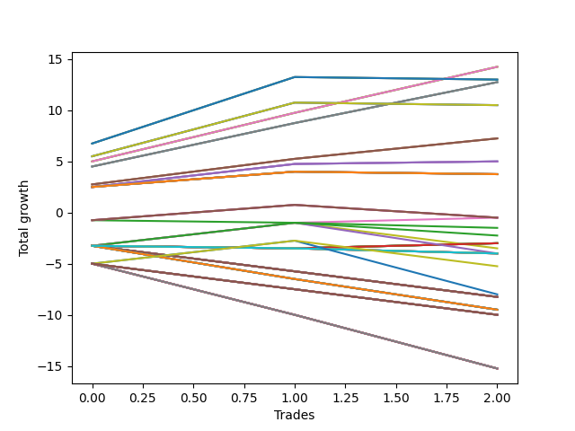

# Long Wallace 004 
- Symbol: TEST
- Date Range: 3/19/22 - 5/22/22
- Trading Period: 7:20-12:30
- Number of Trades: 3



| Name | Win Percent | Profit | Avg Profit / Trade |     | Name | Win Percent | Profit | Avg Profit / Trade |
| ---- | ----------- | ------ | ------------------ | --- | ---- | ----------- | ------ | ------------------ |
| Sorted By <br> Profit | | | | | Sorted By <br> Win Percentage ||||
| Sixty-Six | 100.00 | 7125.00 | 2375.00 |     | Sixty-Six | 100.00 | 7125.00 | 2375.00 |
| Fifty-Eight | 100.00 | 7125.00 | 2375.00 |     | Fifty-Eight | 100.00 | 7125.00 | 2375.00 |
| Two | 100.00 | 7125.00 | 2375.00 |     | Two | 100.00 | 7125.00 | 2375.00 |
| Seventy | 66.67 | 6500.00 | 2166.67 |     | Sixty-Seven | 100.00 | 6375.00 | 2125.00 |
| Sixty-Two | 66.67 | 6500.00 | 2166.67 |     | Fifty-Nine | 100.00 | 6375.00 | 2125.00 |
| Six | 66.67 | 6500.00 | 2166.67 |     | Three | 100.00 | 6375.00 | 2125.00 |
| Sixty-Seven | 100.00 | 6375.00 | 2125.00 |     | Sixty-Five | 100.00 | 3625.00 | 1208.33 |
| Fifty-Nine | 100.00 | 6375.00 | 2125.00 |     | Fifty-Seven | 100.00 | 3625.00 | 1208.33 |
| Three | 100.00 | 6375.00 | 2125.00 |     | One | 100.00 | 3625.00 | 1208.33 |
| Sixty-Eight | 66.67 | 5250.00 | 1750.00 |     | Sixty-Four | 100.00 | 2500.00 | 833.33 |
| Sixty | 66.67 | 5250.00 | 1750.00 |     | Fifty-Six | 100.00 | 2500.00 | 833.33 |
| Four | 66.67 | 5250.00 | 1750.00 |     | Zero | 100.00 | 2500.00 | 833.33 |
| Sixty-Five | 100.00 | 3625.00 | 1208.33 |     | Seventy | 66.67 | 6500.00 | 2166.67 |
| Fifty-Seven | 100.00 | 3625.00 | 1208.33 |     | Sixty-Two | 66.67 | 6500.00 | 2166.67 |
| One | 100.00 | 3625.00 | 1208.33 |     | Six | 66.67 | 6500.00 | 2166.67 |
| Sixty-Four | 100.00 | 2500.00 | 833.33 |     | Sixty-Eight | 66.67 | 5250.00 | 1750.00 |
| Fifty-Six | 100.00 | 2500.00 | 833.33 |     | Sixty | 66.67 | 5250.00 | 1750.00 |
| Zero | 100.00 | 2500.00 | 833.33 |     | Four | 66.67 | 5250.00 | 1750.00 |
| Seventy-One | 66.67 | 1875.00 | 625.00 |     | Seventy-One | 66.67 | 1875.00 | 625.00 |
| Sixty-Nine | 66.67 | 1875.00 | 625.00 |     | Sixty-Nine | 66.67 | 1875.00 | 625.00 |
| Sixty-Three | 66.67 | 1875.00 | 625.00 |     | Sixty-Three | 66.67 | 1875.00 | 625.00 |
| Sixty-One | 66.67 | 1875.00 | 625.00 |     | Sixty-One | 66.67 | 1875.00 | 625.00 |
| Seven | 66.67 | 1875.00 | 625.00 |     | Seven | 66.67 | 1875.00 | 625.00 |
| Five | 66.67 | 1875.00 | 625.00 |     | Five | 66.67 | 1875.00 | 625.00 |
| Sixten | 66.67 | -250.00 | -83.33 |     | Sixten | 66.67 | -250.00 | -83.33 |
| Seventy-Five | 33.33 | -250.00 | -83.33 |     | Seventy-Five | 33.33 | -250.00 | -83.33 |
| Seventy-Four | 33.33 | -250.00 | -83.33 |     | Seventy-Four | 33.33 | -250.00 | -83.33 |
| Seventy-Three | 33.33 | -250.00 | -83.33 |     | Seventy-Three | 33.33 | -250.00 | -83.33 |
| Thirty-Two | 33.33 | -750.00 | -250.00 |     | Thirty-Two | 33.33 | -750.00 | -250.00 |
| Seventy-Two | 0.00 | -1125.00 | -375.00 |     | Twenty-Three | 33.33 | -1500.00 | -500.00 |
| Twenty-Three | 33.33 | -1500.00 | -500.00 |     | Twenty-Two | 33.33 | -1500.00 | -500.00 |
| Twenty-Two | 33.33 | -1500.00 | -500.00 |     | Twenty-One | 33.33 | -1500.00 | -500.00 |
| Twenty-One | 33.33 | -1500.00 | -500.00 |     | Twenty | 33.33 | -1500.00 | -500.00 |
| Twenty | 33.33 | -1500.00 | -500.00 |     | Nineteen | 33.33 | -1500.00 | -500.00 |
| Nineteen | 33.33 | -1500.00 | -500.00 |     | Eighteen | 33.33 | -1500.00 | -500.00 |
| Eighteen | 33.33 | -1500.00 | -500.00 |     | Seventeen | 33.33 | -1500.00 | -500.00 |
| Seventeen | 33.33 | -1500.00 | -500.00 |     | Eight | 33.33 | -1750.00 | -583.33 |
| Eight | 33.33 | -1750.00 | -583.33 |     | Twenty-Four | 33.33 | -2000.00 | -666.67 |
| Twenty-Four | 33.33 | -2000.00 | -666.67 |     | Forty-Eight | 33.33 | -2625.00 | -875.00 |
| Thirty-Nine | 0.00 | -2000.00 | -666.67 |     | Forty | 33.33 | -4000.00 | -1333.33 |
| Thirty-Eight | 0.00 | -2000.00 | -666.67 |     | Seventy-Two | 0.00 | -1125.00 | -375.00 |
| Thirty-Seven | 0.00 | -2000.00 | -666.67 |     | Thirty-Nine | 0.00 | -2000.00 | -666.67 |
| Thirty-Six | 0.00 | -2000.00 | -666.67 |     | Thirty-Eight | 0.00 | -2000.00 | -666.67 |
| Thirty-Five | 0.00 | -2000.00 | -666.67 |     | Thirty-Seven | 0.00 | -2000.00 | -666.67 |
| Thirty-Four | 0.00 | -2000.00 | -666.67 |     | Thirty-Six | 0.00 | -2000.00 | -666.67 |
| Thirty-Three | 0.00 | -2000.00 | -666.67 |     | Thirty-Five | 0.00 | -2000.00 | -666.67 |
| Forty-Eight | 33.33 | -2625.00 | -875.00 |     | Thirty-Four | 0.00 | -2000.00 | -666.67 |
| Forty | 33.33 | -4000.00 | -1333.33 |     | Thirty-Three | 0.00 | -2000.00 | -666.67 |
| Fifteen | 0.00 | -4125.00 | -1375.00 |     | Fifteen | 0.00 | -4125.00 | -1375.00 |
| Fourteen | 0.00 | -4125.00 | -1375.00 |     | Fourteen | 0.00 | -4125.00 | -1375.00 |
| Thirteen | 0.00 | -4125.00 | -1375.00 |     | Thirteen | 0.00 | -4125.00 | -1375.00 |
| Twelve | 0.00 | -4125.00 | -1375.00 |     | Twelve | 0.00 | -4125.00 | -1375.00 |
| Eleven | 0.00 | -4125.00 | -1375.00 |     | Eleven | 0.00 | -4125.00 | -1375.00 |
| Ten | 0.00 | -4125.00 | -1375.00 |     | Ten | 0.00 | -4125.00 | -1375.00 |
| Nine | 0.00 | -4125.00 | -1375.00 |     | Nine | 0.00 | -4125.00 | -1375.00 |
| Thirty-One | 0.00 | -4750.00 | -1583.33 |     | Thirty-One | 0.00 | -4750.00 | -1583.33 |
| Thirty | 0.00 | -4750.00 | -1583.33 |     | Thirty | 0.00 | -4750.00 | -1583.33 |
| Twenty-Nine | 0.00 | -4750.00 | -1583.33 |     | Twenty-Nine | 0.00 | -4750.00 | -1583.33 |
| Twenty-Eight | 0.00 | -4750.00 | -1583.33 |     | Twenty-Eight | 0.00 | -4750.00 | -1583.33 |
| twenty-Seven | 0.00 | -4750.00 | -1583.33 |     | twenty-Seven | 0.00 | -4750.00 | -1583.33 |
| Twenty-Six | 0.00 | -4750.00 | -1583.33 |     | Twenty-Six | 0.00 | -4750.00 | -1583.33 |
| Twenty-Five | 0.00 | -4750.00 | -1583.33 |     | Twenty-Five | 0.00 | -4750.00 | -1583.33 |
| Fifty-Five | 0.00 | -5000.00 | -1666.67 |     | Fifty-Five | 0.00 | -5000.00 | -1666.67 |
| Fifty-Four | 0.00 | -5000.00 | -1666.67 |     | Fifty-Four | 0.00 | -5000.00 | -1666.67 |
| Fifty-Three | 0.00 | -5000.00 | -1666.67 |     | Fifty-Three | 0.00 | -5000.00 | -1666.67 |
| Fifty-Two | 0.00 | -5000.00 | -1666.67 |     | Fifty-Two | 0.00 | -5000.00 | -1666.67 |
| Fifty-One | 0.00 | -5000.00 | -1666.67 |     | Fifty-One | 0.00 | -5000.00 | -1666.67 |
| Fifty | 0.00 | -5000.00 | -1666.67 |     | Fifty | 0.00 | -5000.00 | -1666.67 |
| Forty-Nine | 0.00 | -5000.00 | -1666.67 |     | Forty-Nine | 0.00 | -5000.00 | -1666.67 |
| Forty-Seven | 0.00 | -7625.00 | -2541.67 |     | Forty-Seven | 0.00 | -7625.00 | -2541.67 |
| Forty-Six | 0.00 | -7625.00 | -2541.67 |     | Forty-Six | 0.00 | -7625.00 | -2541.67 |
| Forty-Five | 0.00 | -7625.00 | -2541.67 |     | Forty-Five | 0.00 | -7625.00 | -2541.67 |
| Forty-Four | 0.00 | -7625.00 | -2541.67 |     | Forty-Four | 0.00 | -7625.00 | -2541.67 |
| Forty-Three | 0.00 | -7625.00 | -2541.67 |     | Forty-Three | 0.00 | -7625.00 | -2541.67 |
| Forty-Two | 0.00 | -7625.00 | -2541.67 |     | Forty-Two | 0.00 | -7625.00 | -2541.67 |
| Forty-One | 0.00 | -7625.00 | -2541.67 |     | Forty-One | 0.00 | -7625.00 | -2541.67 |

## NO STOPLOSS

### Test Zero
* Sell when price hits the middle line of the 20p bollinger
* No Stoploss
* Results:
```
Total Trades: 3
Percent Up: 100.00
Percent Down: 0.00
Total Points Moved Up: 5.00
Potential Profit: 2500.00
Total Points Ups: 5.00 Count Ups: 3
Total Points Downs: 0.00 Count Downs: 0
```

<details><summary>Trades</summary>

<code>In: 2022-07-05 08:05:00		Out: 2022-07-05 08:08:15		Total Position Time: 03:15		Total Move Up: 2.50		Total to Date: 2.50</code> <br />
<code>In: 2022-07-05 08:08:00		Out: 2022-07-05 08:08:15		Total Position Time: 00:15		Total Move Up: 2.25		Total to Date: 4.75</code> <br />
<code>In: 2022-07-06 08:35:00		Out: 2022-07-06 08:46:30		Total Position Time: 11:30		Total Move Up: 0.25		Total to Date: 5.00</code> <br />


</details>

### Test One
* Sell when the price hits the upper line of the 20p 1std bollinger
* No Stoploss
* Results:
```
Total Trades: 3
Percent Up: 100.00
Percent Down: 0.00
Total Points Moved Up: 7.25
Potential Profit: 3625.00
Total Points Ups: 7.25 Count Ups: 3
Total Points Downs: 0.00 Count Downs: 0
```

<details><summary>Trades</summary>

<code>In: 2022-07-05 08:05:00		Out: 2022-07-05 08:16:40		Total Position Time: 11:40		Total Move Up: 2.75		Total to Date: 2.75</code> <br />
<code>In: 2022-07-05 08:08:00		Out: 2022-07-05 08:16:40		Total Position Time: 08:40		Total Move Up: 2.50		Total to Date: 5.25</code> <br />
<code>In: 2022-07-06 08:35:00		Out: 2022-07-06 08:48:05		Total Position Time: 13:05		Total Move Up: 2.00		Total to Date: 7.25</code> <br />


</details>

### Test Two
* Sell when the price hits the upper line of the 20p 2std bollinger
* No Stoploss
* Results:
```
Total Trades: 3
Percent Up: 100.00
Percent Down: 0.00
Total Points Moved Up: 14.25
Potential Profit: 7125.00
Total Points Ups: 14.25 Count Ups: 3
Total Points Downs: 0.00 Count Downs: 0
```

<details><summary>Trades</summary>

<code>In: 2022-07-05 08:05:00		Out: 2022-07-05 08:20:35		Total Position Time: 15:35		Total Move Up: 5.00		Total to Date: 5.00</code> <br />
<code>In: 2022-07-05 08:08:00		Out: 2022-07-05 08:20:35		Total Position Time: 12:35		Total Move Up: 4.75		Total to Date: 9.75</code> <br />
<code>In: 2022-07-06 08:35:00		Out: 2022-07-06 08:51:20		Total Position Time: 16:20		Total Move Up: 4.50		Total to Date: 14.25</code> <br />


</details>

### Test Three
* Sell when price hits the middle line of the 50p bollinger
* No Stoploss
* Results:
```
Total Trades: 3
Percent Up: 100.00
Percent Down: 0.00
Total Points Moved Up: 12.75
Potential Profit: 6375.00
Total Points Ups: 12.75 Count Ups: 3
Total Points Downs: 0.00 Count Downs: 0
```

<details><summary>Trades</summary>

<code>In: 2022-07-05 08:05:00		Out: 2022-07-05 08:27:20		Total Position Time: 22:20		Total Move Up: 4.50		Total to Date: 4.50</code> <br />
<code>In: 2022-07-05 08:08:00		Out: 2022-07-05 08:27:20		Total Position Time: 19:20		Total Move Up: 4.25		Total to Date: 8.75</code> <br />
<code>In: 2022-07-06 08:35:00		Out: 2022-07-06 08:51:15		Total Position Time: 16:15		Total Move Up: 4.00		Total to Date: 12.75</code> <br />


</details>

### Test Four
* Sell when the price hits the upper line of the 50p 1std bollinger
* No Stoploss
* Results:
```
Total Trades: 3
Percent Up: 66.67
Percent Down: 33.33
Total Points Moved Up: 10.50
Potential Profit: 5250.00
Total Points Ups: 10.75 Count Ups: 2
Total Points Downs: -0.25 Count Downs: 1
```

<details><summary>Trades</summary>

<code>In: 2022-07-05 08:05:00		Out: 2022-07-05 08:33:05		Total Position Time: 28:05		Total Move Up: 5.50		Total to Date: 5.50</code> <br />
<code>In: 2022-07-05 08:08:00		Out: 2022-07-05 08:33:05		Total Position Time: 25:05		Total Move Up: 5.25		Total to Date: 10.75</code> <br />
<code>In: 2022-07-06 08:35:00		Out: 2022-07-06 09:04:55		Total Position Time: 29:55		Total Move Up: -0.25		Total to Date: 10.50</code> <br />


</details>

### Test Five
* Sell when the price hits the upper line of the 50p 2std bollinger
* No Stoploss
* Results:
```
Total Trades: 3
Percent Up: 66.67
Percent Down: 33.33
Total Points Moved Up: 3.75
Potential Profit: 1875.00
Total Points Ups: 4.00 Count Ups: 2
Total Points Downs: -0.25 Count Downs: 1
```

<details><summary>Trades</summary>

<code>In: 2022-07-05 08:05:00		Out: 2022-07-05 08:34:55		Total Position Time: 29:55		Total Move Up: 2.50		Total to Date: 2.50</code> <br />
<code>In: 2022-07-05 08:08:00		Out: 2022-07-05 08:37:55		Total Position Time: 29:55		Total Move Up: 1.50		Total to Date: 4.00</code> <br />
<code>In: 2022-07-06 08:35:00		Out: 2022-07-06 09:04:55		Total Position Time: 29:55		Total Move Up: -0.25		Total to Date: 3.75</code> <br />


</details>

### Test Six
* Sell when the price hits the middle line of the 1std VWAP
* No Stoploss
* Results:
```
Total Trades: 3
Percent Up: 66.67
Percent Down: 33.33
Total Points Moved Up: 13.00
Potential Profit: 6500.00
Total Points Ups: 13.25 Count Ups: 2
Total Points Downs: -0.25 Count Downs: 1
```

<details><summary>Trades</summary>

<code>In: 2022-07-05 08:05:00		Out: 2022-07-05 08:33:10		Total Position Time: 28:10		Total Move Up: 6.75		Total to Date: 6.75</code> <br />
<code>In: 2022-07-05 08:08:00		Out: 2022-07-05 08:33:10		Total Position Time: 25:10		Total Move Up: 6.50		Total to Date: 13.25</code> <br />
<code>In: 2022-07-06 08:35:00		Out: 2022-07-06 09:04:55		Total Position Time: 29:55		Total Move Up: -0.25		Total to Date: 13.00</code> <br />


</details>

### Test Seven
* Sell when the price hits the upper line of the 1std VWAP
* No Stoploss
* Results:
```
Total Trades: 3
Percent Up: 66.67
Percent Down: 33.33
Total Points Moved Up: 3.75
Potential Profit: 1875.00
Total Points Ups: 4.00 Count Ups: 2
Total Points Downs: -0.25 Count Downs: 1
```

<details><summary>Trades</summary>

<code>In: 2022-07-05 08:05:00		Out: 2022-07-05 08:34:55		Total Position Time: 29:55		Total Move Up: 2.50		Total to Date: 2.50</code> <br />
<code>In: 2022-07-05 08:08:00		Out: 2022-07-05 08:37:55		Total Position Time: 29:55		Total Move Up: 1.50		Total to Date: 4.00</code> <br />
<code>In: 2022-07-06 08:35:00		Out: 2022-07-06 09:04:55		Total Position Time: 29:55		Total Move Up: -0.25		Total to Date: 3.75</code> <br />


</details>

## STOPLOSS OF 2

### Test Eight
* Sell when price hits the middle line of the 20p bollinger
* Stoploss is 2 points
* Results:
```
Total Trades: 3
Percent Up: 33.33
Percent Down: 66.67
Total Points Moved Up: -3.50
Potential Profit: -1750.00
Total Points Ups: 2.25 Count Ups: 1
Total Points Downs: -5.75 Count Downs: 2
```

<details><summary>Trades</summary>

<code>In: 2022-07-05 08:05:00		Out: 2022-07-05 08:05:50		Total Position Time: 00:50		Total Move Up: -3.25		Total to Date: -3.25</code> <br />
<code>In: 2022-07-05 08:08:00		Out: 2022-07-05 08:08:15		Total Position Time: 00:15		Total Move Up: 2.25		Total to Date: -1.00</code> <br />
<code>In: 2022-07-06 08:35:00		Out: 2022-07-06 08:41:35		Total Position Time: 06:35		Total Move Up: -2.50		Total to Date: -3.50</code> <br />


</details>

### Test Nine
* Sell when the price hits the upper line of the 20p 1std bollinger
* Stoploss is 2 points
* Results:
```
Total Trades: 3
Percent Up: 0.00
Percent Down: 100.00
Total Points Moved Up: -8.25
Potential Profit: -4125.00
Total Points Ups: 0.00 Count Ups: 0
Total Points Downs: -8.25 Count Downs: 3
```

<details><summary>Trades</summary>

<code>In: 2022-07-05 08:05:00		Out: 2022-07-05 08:05:50		Total Position Time: 00:50		Total Move Up: -3.25		Total to Date: -3.25</code> <br />
<code>In: 2022-07-05 08:08:00		Out: 2022-07-05 08:09:10		Total Position Time: 01:10		Total Move Up: -2.50		Total to Date: -5.75</code> <br />
<code>In: 2022-07-06 08:35:00		Out: 2022-07-06 08:41:35		Total Position Time: 06:35		Total Move Up: -2.50		Total to Date: -8.25</code> <br />


</details>

### Test Ten
* Sell when the price hits the upper line of the 20p 2std bollinger
* Stoploss is 2 points
* Results:
```
Total Trades: 3
Percent Up: 0.00
Percent Down: 100.00
Total Points Moved Up: -8.25
Potential Profit: -4125.00
Total Points Ups: 0.00 Count Ups: 0
Total Points Downs: -8.25 Count Downs: 3
```

<details><summary>Trades</summary>

<code>In: 2022-07-05 08:05:00		Out: 2022-07-05 08:05:50		Total Position Time: 00:50		Total Move Up: -3.25		Total to Date: -3.25</code> <br />
<code>In: 2022-07-05 08:08:00		Out: 2022-07-05 08:09:10		Total Position Time: 01:10		Total Move Up: -2.50		Total to Date: -5.75</code> <br />
<code>In: 2022-07-06 08:35:00		Out: 2022-07-06 08:41:35		Total Position Time: 06:35		Total Move Up: -2.50		Total to Date: -8.25</code> <br />


</details>

### Test Eleven
* Sell when price hits the middle line of the 50p bollinger
* Stoploss is 2 points
* Results:
```
Total Trades: 3
Percent Up: 0.00
Percent Down: 100.00
Total Points Moved Up: -8.25
Potential Profit: -4125.00
Total Points Ups: 0.00 Count Ups: 0
Total Points Downs: -8.25 Count Downs: 3
```

<details><summary>Trades</summary>

<code>In: 2022-07-05 08:05:00		Out: 2022-07-05 08:05:50		Total Position Time: 00:50		Total Move Up: -3.25		Total to Date: -3.25</code> <br />
<code>In: 2022-07-05 08:08:00		Out: 2022-07-05 08:09:10		Total Position Time: 01:10		Total Move Up: -2.50		Total to Date: -5.75</code> <br />
<code>In: 2022-07-06 08:35:00		Out: 2022-07-06 08:41:35		Total Position Time: 06:35		Total Move Up: -2.50		Total to Date: -8.25</code> <br />


</details>

### Test Twelve
* Sell when the price hits the upper line of the 50p 1std bollinger
* Stoploss is 2 points
* Results:
```
Total Trades: 3
Percent Up: 0.00
Percent Down: 100.00
Total Points Moved Up: -8.25
Potential Profit: -4125.00
Total Points Ups: 0.00 Count Ups: 0
Total Points Downs: -8.25 Count Downs: 3
```

<details><summary>Trades</summary>

<code>In: 2022-07-05 08:05:00		Out: 2022-07-05 08:05:50		Total Position Time: 00:50		Total Move Up: -3.25		Total to Date: -3.25</code> <br />
<code>In: 2022-07-05 08:08:00		Out: 2022-07-05 08:09:10		Total Position Time: 01:10		Total Move Up: -2.50		Total to Date: -5.75</code> <br />
<code>In: 2022-07-06 08:35:00		Out: 2022-07-06 08:41:35		Total Position Time: 06:35		Total Move Up: -2.50		Total to Date: -8.25</code> <br />


</details>

### Test Thirteen
* Sell when the price hits the upper line of the 50p 2std bollinger
* Stoploss is 2 points
* Results:
```
Total Trades: 3
Percent Up: 0.00
Percent Down: 100.00
Total Points Moved Up: -8.25
Potential Profit: -4125.00
Total Points Ups: 0.00 Count Ups: 0
Total Points Downs: -8.25 Count Downs: 3
```

<details><summary>Trades</summary>

<code>In: 2022-07-05 08:05:00		Out: 2022-07-05 08:05:50		Total Position Time: 00:50		Total Move Up: -3.25		Total to Date: -3.25</code> <br />
<code>In: 2022-07-05 08:08:00		Out: 2022-07-05 08:09:10		Total Position Time: 01:10		Total Move Up: -2.50		Total to Date: -5.75</code> <br />
<code>In: 2022-07-06 08:35:00		Out: 2022-07-06 08:41:35		Total Position Time: 06:35		Total Move Up: -2.50		Total to Date: -8.25</code> <br />


</details>

### Test Fourteen
* Sell when the price hits the middle line of the 1std VWAP
* Stoploss is 2 points
* Results:
```
Total Trades: 3
Percent Up: 0.00
Percent Down: 100.00
Total Points Moved Up: -8.25
Potential Profit: -4125.00
Total Points Ups: 0.00 Count Ups: 0
Total Points Downs: -8.25 Count Downs: 3
```

<details><summary>Trades</summary>

<code>In: 2022-07-05 08:05:00		Out: 2022-07-05 08:05:50		Total Position Time: 00:50		Total Move Up: -3.25		Total to Date: -3.25</code> <br />
<code>In: 2022-07-05 08:08:00		Out: 2022-07-05 08:09:10		Total Position Time: 01:10		Total Move Up: -2.50		Total to Date: -5.75</code> <br />
<code>In: 2022-07-06 08:35:00		Out: 2022-07-06 08:41:35		Total Position Time: 06:35		Total Move Up: -2.50		Total to Date: -8.25</code> <br />


</details>

### Test Fifteen
* Sell when the price hits the upper line of the 1std VWAP
* Stoploss is 2 points
* Results:
```
Total Trades: 3
Percent Up: 0.00
Percent Down: 100.00
Total Points Moved Up: -8.25
Potential Profit: -4125.00
Total Points Ups: 0.00 Count Ups: 0
Total Points Downs: -8.25 Count Downs: 3
```

<details><summary>Trades</summary>

<code>In: 2022-07-05 08:05:00		Out: 2022-07-05 08:05:50		Total Position Time: 00:50		Total Move Up: -3.25		Total to Date: -3.25</code> <br />
<code>In: 2022-07-05 08:08:00		Out: 2022-07-05 08:09:10		Total Position Time: 01:10		Total Move Up: -2.50		Total to Date: -5.75</code> <br />
<code>In: 2022-07-06 08:35:00		Out: 2022-07-06 08:41:35		Total Position Time: 06:35		Total Move Up: -2.50		Total to Date: -8.25</code> <br />


</details>

## TRAIL STOP OF 2

### Test Sixten
* Sell when price hits the middle line of the 20p bollinger
* Trailing Stop is 2 points
* Results:
```
Total Trades: 3
Percent Up: 66.67
Percent Down: 33.33
Total Points Moved Up: -0.50
Potential Profit: -250.00
Total Points Ups: 2.75 Count Ups: 2
Total Points Downs: -3.25 Count Downs: 1
```

<details><summary>Trades</summary>

<code>In: 2022-07-05 08:05:00		Out: 2022-07-05 08:05:50		Total Position Time: 00:50		Total Move Up: -3.25		Total to Date: -3.25</code> <br />
<code>In: 2022-07-05 08:08:00		Out: 2022-07-05 08:08:15		Total Position Time: 00:15		Total Move Up: 2.25		Total to Date: -1.00</code> <br />
<code>In: 2022-07-06 08:35:00		Out: 2022-07-06 08:37:40		Total Position Time: 02:40		Total Move Up: 0.50		Total to Date: -0.50</code> <br />


</details>

### Test Seventeen
* Sell when the price hits the upper line of the 20p 1std bollinger
* Trailing Stop is 2 points
* Results:
```
Total Trades: 3
Percent Up: 33.33
Percent Down: 66.67
Total Points Moved Up: -3.00
Potential Profit: -1500.00
Total Points Ups: 0.50 Count Ups: 1
Total Points Downs: -3.50 Count Downs: 2
```

<details><summary>Trades</summary>

<code>In: 2022-07-05 08:05:00		Out: 2022-07-05 08:05:50		Total Position Time: 00:50		Total Move Up: -3.25		Total to Date: -3.25</code> <br />
<code>In: 2022-07-05 08:08:00		Out: 2022-07-05 08:08:35		Total Position Time: 00:35		Total Move Up: -0.25		Total to Date: -3.50</code> <br />
<code>In: 2022-07-06 08:35:00		Out: 2022-07-06 08:37:40		Total Position Time: 02:40		Total Move Up: 0.50		Total to Date: -3.00</code> <br />


</details>

### Test Eighteen
* Sell when the price hits the upper line of the 20p 2std bollinger
* Trailing Stop is 2 points
* Results:
```
Total Trades: 3
Percent Up: 33.33
Percent Down: 66.67
Total Points Moved Up: -3.00
Potential Profit: -1500.00
Total Points Ups: 0.50 Count Ups: 1
Total Points Downs: -3.50 Count Downs: 2
```

<details><summary>Trades</summary>

<code>In: 2022-07-05 08:05:00		Out: 2022-07-05 08:05:50		Total Position Time: 00:50		Total Move Up: -3.25		Total to Date: -3.25</code> <br />
<code>In: 2022-07-05 08:08:00		Out: 2022-07-05 08:08:35		Total Position Time: 00:35		Total Move Up: -0.25		Total to Date: -3.50</code> <br />
<code>In: 2022-07-06 08:35:00		Out: 2022-07-06 08:37:40		Total Position Time: 02:40		Total Move Up: 0.50		Total to Date: -3.00</code> <br />


</details>

### Test Nineteen
* Sell when price hits the middle line of the 50p bollinger
* Trailing Stop is 2 points
* Results:
```
Total Trades: 3
Percent Up: 33.33
Percent Down: 66.67
Total Points Moved Up: -3.00
Potential Profit: -1500.00
Total Points Ups: 0.50 Count Ups: 1
Total Points Downs: -3.50 Count Downs: 2
```

<details><summary>Trades</summary>

<code>In: 2022-07-05 08:05:00		Out: 2022-07-05 08:05:50		Total Position Time: 00:50		Total Move Up: -3.25		Total to Date: -3.25</code> <br />
<code>In: 2022-07-05 08:08:00		Out: 2022-07-05 08:08:35		Total Position Time: 00:35		Total Move Up: -0.25		Total to Date: -3.50</code> <br />
<code>In: 2022-07-06 08:35:00		Out: 2022-07-06 08:37:40		Total Position Time: 02:40		Total Move Up: 0.50		Total to Date: -3.00</code> <br />


</details>

### Test Twenty
* Sell when the price hits the upper line of the 50p 1std bollinger
* Trailing Stop is 2 points
* Results:
```
Total Trades: 3
Percent Up: 33.33
Percent Down: 66.67
Total Points Moved Up: -3.00
Potential Profit: -1500.00
Total Points Ups: 0.50 Count Ups: 1
Total Points Downs: -3.50 Count Downs: 2
```

<details><summary>Trades</summary>

<code>In: 2022-07-05 08:05:00		Out: 2022-07-05 08:05:50		Total Position Time: 00:50		Total Move Up: -3.25		Total to Date: -3.25</code> <br />
<code>In: 2022-07-05 08:08:00		Out: 2022-07-05 08:08:35		Total Position Time: 00:35		Total Move Up: -0.25		Total to Date: -3.50</code> <br />
<code>In: 2022-07-06 08:35:00		Out: 2022-07-06 08:37:40		Total Position Time: 02:40		Total Move Up: 0.50		Total to Date: -3.00</code> <br />


</details>

### Test Twenty-One
* Sell when the price hits the upper line of the 50p 2std bollinger
* Trailing Stop is 2 points
* Results:
```
Total Trades: 3
Percent Up: 33.33
Percent Down: 66.67
Total Points Moved Up: -3.00
Potential Profit: -1500.00
Total Points Ups: 0.50 Count Ups: 1
Total Points Downs: -3.50 Count Downs: 2
```

<details><summary>Trades</summary>

<code>In: 2022-07-05 08:05:00		Out: 2022-07-05 08:05:50		Total Position Time: 00:50		Total Move Up: -3.25		Total to Date: -3.25</code> <br />
<code>In: 2022-07-05 08:08:00		Out: 2022-07-05 08:08:35		Total Position Time: 00:35		Total Move Up: -0.25		Total to Date: -3.50</code> <br />
<code>In: 2022-07-06 08:35:00		Out: 2022-07-06 08:37:40		Total Position Time: 02:40		Total Move Up: 0.50		Total to Date: -3.00</code> <br />


</details>

### Test Twenty-Two
* Sell when the price hits the middle line of the 1std VWAP
* Trailing Stop is 2 points
* Results:
```
Total Trades: 3
Percent Up: 33.33
Percent Down: 66.67
Total Points Moved Up: -3.00
Potential Profit: -1500.00
Total Points Ups: 0.50 Count Ups: 1
Total Points Downs: -3.50 Count Downs: 2
```

<details><summary>Trades</summary>

<code>In: 2022-07-05 08:05:00		Out: 2022-07-05 08:05:50		Total Position Time: 00:50		Total Move Up: -3.25		Total to Date: -3.25</code> <br />
<code>In: 2022-07-05 08:08:00		Out: 2022-07-05 08:08:35		Total Position Time: 00:35		Total Move Up: -0.25		Total to Date: -3.50</code> <br />
<code>In: 2022-07-06 08:35:00		Out: 2022-07-06 08:37:40		Total Position Time: 02:40		Total Move Up: 0.50		Total to Date: -3.00</code> <br />


</details>

### Test Twenty-Three
* Sell when the price hits the upper line of the 1std VWAP
* Trailing Stop is 2 points
* Results:
```
Total Trades: 3
Percent Up: 33.33
Percent Down: 66.67
Total Points Moved Up: -3.00
Potential Profit: -1500.00
Total Points Ups: 0.50 Count Ups: 1
Total Points Downs: -3.50 Count Downs: 2
```

<details><summary>Trades</summary>

<code>In: 2022-07-05 08:05:00		Out: 2022-07-05 08:05:50		Total Position Time: 00:50		Total Move Up: -3.25		Total to Date: -3.25</code> <br />
<code>In: 2022-07-05 08:08:00		Out: 2022-07-05 08:08:35		Total Position Time: 00:35		Total Move Up: -0.25		Total to Date: -3.50</code> <br />
<code>In: 2022-07-06 08:35:00		Out: 2022-07-06 08:37:40		Total Position Time: 02:40		Total Move Up: 0.50		Total to Date: -3.00</code> <br />


</details>

## STOPLOSS OF 3

### Test Twenty-Four
* Sell when price hits the middle line of the 20p bollinger
* Stoploss is 3 points
* Results:
```
Total Trades: 3
Percent Up: 33.33
Percent Down: 66.67
Total Points Moved Up: -4.00
Potential Profit: -2000.00
Total Points Ups: 2.25 Count Ups: 1
Total Points Downs: -6.25 Count Downs: 2
```

<details><summary>Trades</summary>

<code>In: 2022-07-05 08:05:00		Out: 2022-07-05 08:05:50		Total Position Time: 00:50		Total Move Up: -3.25		Total to Date: -3.25</code> <br />
<code>In: 2022-07-05 08:08:00		Out: 2022-07-05 08:08:15		Total Position Time: 00:15		Total Move Up: 2.25		Total to Date: -1.00</code> <br />
<code>In: 2022-07-06 08:35:00		Out: 2022-07-06 08:42:20		Total Position Time: 07:20		Total Move Up: -3.00		Total to Date: -4.00</code> <br />


</details>

### Test Twenty-Five
* Sell when the price hits the upper line of the 20p 1std bollinger
* Stoploss is 3 points
* Results:
```
Total Trades: 3
Percent Up: 0.00
Percent Down: 100.00
Total Points Moved Up: -9.50
Potential Profit: -4750.00
Total Points Ups: 0.00 Count Ups: 0
Total Points Downs: -9.50 Count Downs: 3
```

<details><summary>Trades</summary>

<code>In: 2022-07-05 08:05:00		Out: 2022-07-05 08:05:50		Total Position Time: 00:50		Total Move Up: -3.25		Total to Date: -3.25</code> <br />
<code>In: 2022-07-05 08:08:00		Out: 2022-07-05 08:11:50		Total Position Time: 03:50		Total Move Up: -3.25		Total to Date: -6.50</code> <br />
<code>In: 2022-07-06 08:35:00		Out: 2022-07-06 08:42:20		Total Position Time: 07:20		Total Move Up: -3.00		Total to Date: -9.50</code> <br />


</details>

### Test Twenty-Six
* Sell when the price hits the upper line of the 20p 2std bollinger
* Stoploss is 3 points
* Results:
```
Total Trades: 3
Percent Up: 0.00
Percent Down: 100.00
Total Points Moved Up: -9.50
Potential Profit: -4750.00
Total Points Ups: 0.00 Count Ups: 0
Total Points Downs: -9.50 Count Downs: 3
```

<details><summary>Trades</summary>

<code>In: 2022-07-05 08:05:00		Out: 2022-07-05 08:05:50		Total Position Time: 00:50		Total Move Up: -3.25		Total to Date: -3.25</code> <br />
<code>In: 2022-07-05 08:08:00		Out: 2022-07-05 08:11:50		Total Position Time: 03:50		Total Move Up: -3.25		Total to Date: -6.50</code> <br />
<code>In: 2022-07-06 08:35:00		Out: 2022-07-06 08:42:20		Total Position Time: 07:20		Total Move Up: -3.00		Total to Date: -9.50</code> <br />


</details>

### Test twenty-Seven
* Sell when price hits the middle line of the 50p bollinger
* Stoploss is 3 points
* Results:
```
Total Trades: 3
Percent Up: 0.00
Percent Down: 100.00
Total Points Moved Up: -9.50
Potential Profit: -4750.00
Total Points Ups: 0.00 Count Ups: 0
Total Points Downs: -9.50 Count Downs: 3
```

<details><summary>Trades</summary>

<code>In: 2022-07-05 08:05:00		Out: 2022-07-05 08:05:50		Total Position Time: 00:50		Total Move Up: -3.25		Total to Date: -3.25</code> <br />
<code>In: 2022-07-05 08:08:00		Out: 2022-07-05 08:11:50		Total Position Time: 03:50		Total Move Up: -3.25		Total to Date: -6.50</code> <br />
<code>In: 2022-07-06 08:35:00		Out: 2022-07-06 08:42:20		Total Position Time: 07:20		Total Move Up: -3.00		Total to Date: -9.50</code> <br />


</details>

### Test Twenty-Eight
* Sell when the price hits the upper line of the 50p 1std bollinger
* Stoploss is 3 points
* Results:
```
Total Trades: 3
Percent Up: 0.00
Percent Down: 100.00
Total Points Moved Up: -9.50
Potential Profit: -4750.00
Total Points Ups: 0.00 Count Ups: 0
Total Points Downs: -9.50 Count Downs: 3
```

<details><summary>Trades</summary>

<code>In: 2022-07-05 08:05:00		Out: 2022-07-05 08:05:50		Total Position Time: 00:50		Total Move Up: -3.25		Total to Date: -3.25</code> <br />
<code>In: 2022-07-05 08:08:00		Out: 2022-07-05 08:11:50		Total Position Time: 03:50		Total Move Up: -3.25		Total to Date: -6.50</code> <br />
<code>In: 2022-07-06 08:35:00		Out: 2022-07-06 08:42:20		Total Position Time: 07:20		Total Move Up: -3.00		Total to Date: -9.50</code> <br />


</details>

### Test Twenty-Nine
* Sell when the price hits the upper line of the 50p 2std bollinger
* Stoploss is 3 points
* Results:
```
Total Trades: 3
Percent Up: 0.00
Percent Down: 100.00
Total Points Moved Up: -9.50
Potential Profit: -4750.00
Total Points Ups: 0.00 Count Ups: 0
Total Points Downs: -9.50 Count Downs: 3
```

<details><summary>Trades</summary>

<code>In: 2022-07-05 08:05:00		Out: 2022-07-05 08:05:50		Total Position Time: 00:50		Total Move Up: -3.25		Total to Date: -3.25</code> <br />
<code>In: 2022-07-05 08:08:00		Out: 2022-07-05 08:11:50		Total Position Time: 03:50		Total Move Up: -3.25		Total to Date: -6.50</code> <br />
<code>In: 2022-07-06 08:35:00		Out: 2022-07-06 08:42:20		Total Position Time: 07:20		Total Move Up: -3.00		Total to Date: -9.50</code> <br />


</details>

### Test Thirty
* Sell when the price hits the middle line of the 1std VWAP
* Stoploss is 3 points
* Results:
```
Total Trades: 3
Percent Up: 0.00
Percent Down: 100.00
Total Points Moved Up: -9.50
Potential Profit: -4750.00
Total Points Ups: 0.00 Count Ups: 0
Total Points Downs: -9.50 Count Downs: 3
```

<details><summary>Trades</summary>

<code>In: 2022-07-05 08:05:00		Out: 2022-07-05 08:05:50		Total Position Time: 00:50		Total Move Up: -3.25		Total to Date: -3.25</code> <br />
<code>In: 2022-07-05 08:08:00		Out: 2022-07-05 08:11:50		Total Position Time: 03:50		Total Move Up: -3.25		Total to Date: -6.50</code> <br />
<code>In: 2022-07-06 08:35:00		Out: 2022-07-06 08:42:20		Total Position Time: 07:20		Total Move Up: -3.00		Total to Date: -9.50</code> <br />


</details>

### Test Thirty-One
* Sell when the price hits the upper line of the 1std VWAP
* Stoploss is 3 points
* Results:
```
Total Trades: 3
Percent Up: 0.00
Percent Down: 100.00
Total Points Moved Up: -9.50
Potential Profit: -4750.00
Total Points Ups: 0.00 Count Ups: 0
Total Points Downs: -9.50 Count Downs: 3
```

<details><summary>Trades</summary>

<code>In: 2022-07-05 08:05:00		Out: 2022-07-05 08:05:50		Total Position Time: 00:50		Total Move Up: -3.25		Total to Date: -3.25</code> <br />
<code>In: 2022-07-05 08:08:00		Out: 2022-07-05 08:11:50		Total Position Time: 03:50		Total Move Up: -3.25		Total to Date: -6.50</code> <br />
<code>In: 2022-07-06 08:35:00		Out: 2022-07-06 08:42:20		Total Position Time: 07:20		Total Move Up: -3.00		Total to Date: -9.50</code> <br />


</details>

## TRAIL STOP OF 3

### Test Thirty-Two
* Sell when price hits the middle line of the 20p bollinger
* Trailing Stop is 3 points
* Results:
```
Total Trades: 3
Percent Up: 33.33
Percent Down: 66.67
Total Points Moved Up: -1.50
Potential Profit: -750.00
Total Points Ups: 2.25 Count Ups: 1
Total Points Downs: -3.75 Count Downs: 2
```

<details><summary>Trades</summary>

<code>In: 2022-07-05 08:05:00		Out: 2022-07-05 08:05:50		Total Position Time: 00:50		Total Move Up: -3.25		Total to Date: -3.25</code> <br />
<code>In: 2022-07-05 08:08:00		Out: 2022-07-05 08:08:15		Total Position Time: 00:15		Total Move Up: 2.25		Total to Date: -1.00</code> <br />
<code>In: 2022-07-06 08:35:00		Out: 2022-07-06 08:40:10		Total Position Time: 05:10		Total Move Up: -0.50		Total to Date: -1.50</code> <br />


</details>

### Test Thirty-Three
* Sell when the price hits the upper line of the 20p 1std bollinger
* Trailing Stop is 3 points
* Results:
```
Total Trades: 3
Percent Up: 0.00
Percent Down: 100.00
Total Points Moved Up: -4.00
Potential Profit: -2000.00
Total Points Ups: 0.00 Count Ups: 0
Total Points Downs: -4.00 Count Downs: 3
```

<details><summary>Trades</summary>

<code>In: 2022-07-05 08:05:00		Out: 2022-07-05 08:05:50		Total Position Time: 00:50		Total Move Up: -3.25		Total to Date: -3.25</code> <br />
<code>In: 2022-07-05 08:08:00		Out: 2022-07-05 08:08:35		Total Position Time: 00:35		Total Move Up: -0.25		Total to Date: -3.50</code> <br />
<code>In: 2022-07-06 08:35:00		Out: 2022-07-06 08:40:10		Total Position Time: 05:10		Total Move Up: -0.50		Total to Date: -4.00</code> <br />


</details>

### Test Thirty-Four
* Sell when the price hits the upper line of the 20p 2std bollinger
* Trailing Stop is 3 points
* Results:
```
Total Trades: 3
Percent Up: 0.00
Percent Down: 100.00
Total Points Moved Up: -4.00
Potential Profit: -2000.00
Total Points Ups: 0.00 Count Ups: 0
Total Points Downs: -4.00 Count Downs: 3
```

<details><summary>Trades</summary>

<code>In: 2022-07-05 08:05:00		Out: 2022-07-05 08:05:50		Total Position Time: 00:50		Total Move Up: -3.25		Total to Date: -3.25</code> <br />
<code>In: 2022-07-05 08:08:00		Out: 2022-07-05 08:08:35		Total Position Time: 00:35		Total Move Up: -0.25		Total to Date: -3.50</code> <br />
<code>In: 2022-07-06 08:35:00		Out: 2022-07-06 08:40:10		Total Position Time: 05:10		Total Move Up: -0.50		Total to Date: -4.00</code> <br />


</details>

### Test Thirty-Five
* Sell when price hits the middle line of the 50p bollinger
* Trailing Stop is 3 points
* Results:
```
Total Trades: 3
Percent Up: 0.00
Percent Down: 100.00
Total Points Moved Up: -4.00
Potential Profit: -2000.00
Total Points Ups: 0.00 Count Ups: 0
Total Points Downs: -4.00 Count Downs: 3
```

<details><summary>Trades</summary>

<code>In: 2022-07-05 08:05:00		Out: 2022-07-05 08:05:50		Total Position Time: 00:50		Total Move Up: -3.25		Total to Date: -3.25</code> <br />
<code>In: 2022-07-05 08:08:00		Out: 2022-07-05 08:08:35		Total Position Time: 00:35		Total Move Up: -0.25		Total to Date: -3.50</code> <br />
<code>In: 2022-07-06 08:35:00		Out: 2022-07-06 08:40:10		Total Position Time: 05:10		Total Move Up: -0.50		Total to Date: -4.00</code> <br />


</details>

### Test Thirty-Six
* Sell when the price hits the upper line of the 50p 1std bollinger
* Trailing Stop is 3 points
* Results:
```
Total Trades: 3
Percent Up: 0.00
Percent Down: 100.00
Total Points Moved Up: -4.00
Potential Profit: -2000.00
Total Points Ups: 0.00 Count Ups: 0
Total Points Downs: -4.00 Count Downs: 3
```

<details><summary>Trades</summary>

<code>In: 2022-07-05 08:05:00		Out: 2022-07-05 08:05:50		Total Position Time: 00:50		Total Move Up: -3.25		Total to Date: -3.25</code> <br />
<code>In: 2022-07-05 08:08:00		Out: 2022-07-05 08:08:35		Total Position Time: 00:35		Total Move Up: -0.25		Total to Date: -3.50</code> <br />
<code>In: 2022-07-06 08:35:00		Out: 2022-07-06 08:40:10		Total Position Time: 05:10		Total Move Up: -0.50		Total to Date: -4.00</code> <br />


</details>

### Test Thirty-Seven
* Sell when the price hits the upper line of the 50p 2std bollinger
* Trailing Stop is 3 points
* Results:
```
Total Trades: 3
Percent Up: 0.00
Percent Down: 100.00
Total Points Moved Up: -4.00
Potential Profit: -2000.00
Total Points Ups: 0.00 Count Ups: 0
Total Points Downs: -4.00 Count Downs: 3
```

<details><summary>Trades</summary>

<code>In: 2022-07-05 08:05:00		Out: 2022-07-05 08:05:50		Total Position Time: 00:50		Total Move Up: -3.25		Total to Date: -3.25</code> <br />
<code>In: 2022-07-05 08:08:00		Out: 2022-07-05 08:08:35		Total Position Time: 00:35		Total Move Up: -0.25		Total to Date: -3.50</code> <br />
<code>In: 2022-07-06 08:35:00		Out: 2022-07-06 08:40:10		Total Position Time: 05:10		Total Move Up: -0.50		Total to Date: -4.00</code> <br />


</details>

### Test Thirty-Eight
* Sell when the price hits the middle line of the 1std VWAP
* Trailing Stop is 3 points
* Results:
```
Total Trades: 3
Percent Up: 0.00
Percent Down: 100.00
Total Points Moved Up: -4.00
Potential Profit: -2000.00
Total Points Ups: 0.00 Count Ups: 0
Total Points Downs: -4.00 Count Downs: 3
```

<details><summary>Trades</summary>

<code>In: 2022-07-05 08:05:00		Out: 2022-07-05 08:05:50		Total Position Time: 00:50		Total Move Up: -3.25		Total to Date: -3.25</code> <br />
<code>In: 2022-07-05 08:08:00		Out: 2022-07-05 08:08:35		Total Position Time: 00:35		Total Move Up: -0.25		Total to Date: -3.50</code> <br />
<code>In: 2022-07-06 08:35:00		Out: 2022-07-06 08:40:10		Total Position Time: 05:10		Total Move Up: -0.50		Total to Date: -4.00</code> <br />


</details>

### Test Thirty-Nine
* Sell when the price hits the upper line of the 1std VWAP
* Trailing Stop is 3 points
* Results:
```
Total Trades: 3
Percent Up: 0.00
Percent Down: 100.00
Total Points Moved Up: -4.00
Potential Profit: -2000.00
Total Points Ups: 0.00 Count Ups: 0
Total Points Downs: -4.00 Count Downs: 3
```

<details><summary>Trades</summary>

<code>In: 2022-07-05 08:05:00		Out: 2022-07-05 08:05:50		Total Position Time: 00:50		Total Move Up: -3.25		Total to Date: -3.25</code> <br />
<code>In: 2022-07-05 08:08:00		Out: 2022-07-05 08:08:35		Total Position Time: 00:35		Total Move Up: -0.25		Total to Date: -3.50</code> <br />
<code>In: 2022-07-06 08:35:00		Out: 2022-07-06 08:40:10		Total Position Time: 05:10		Total Move Up: -0.50		Total to Date: -4.00</code> <br />


</details>

## STOPLOSS OF 5

### Test Forty
* Sell when price hits the middle line of the 20p bollinger
* Stoploss is 5 points
* Results:
```
Total Trades: 3
Percent Up: 33.33
Percent Down: 66.67
Total Points Moved Up: -8.00
Potential Profit: -4000.00
Total Points Ups: 2.25 Count Ups: 1
Total Points Downs: -10.25 Count Downs: 2
```

<details><summary>Trades</summary>

<code>In: 2022-07-05 08:05:00		Out: 2022-07-05 08:06:20		Total Position Time: 01:20		Total Move Up: -5.00		Total to Date: -5.00</code> <br />
<code>In: 2022-07-05 08:08:00		Out: 2022-07-05 08:08:15		Total Position Time: 00:15		Total Move Up: 2.25		Total to Date: -2.75</code> <br />
<code>In: 2022-07-06 08:35:00		Out: 2022-07-06 08:45:15		Total Position Time: 10:15		Total Move Up: -5.25		Total to Date: -8.00</code> <br />


</details>

### Test Forty-One
* Sell when the price hits the upper line of the 20p 1std bollinger
* Stoploss is 5 points
* Results:
```
Total Trades: 3
Percent Up: 0.00
Percent Down: 100.00
Total Points Moved Up: -15.25
Potential Profit: -7625.00
Total Points Ups: 0.00 Count Ups: 0
Total Points Downs: -15.25 Count Downs: 3
```

<details><summary>Trades</summary>

<code>In: 2022-07-05 08:05:00		Out: 2022-07-05 08:06:20		Total Position Time: 01:20		Total Move Up: -5.00		Total to Date: -5.00</code> <br />
<code>In: 2022-07-05 08:08:00		Out: 2022-07-05 08:12:10		Total Position Time: 04:10		Total Move Up: -5.00		Total to Date: -10.00</code> <br />
<code>In: 2022-07-06 08:35:00		Out: 2022-07-06 08:45:15		Total Position Time: 10:15		Total Move Up: -5.25		Total to Date: -15.25</code> <br />


</details>

### Test Forty-Two
* Sell when the price hits the upper line of the 20p 2std bollinger
* Stoploss is 5 points
* Results:
```
Total Trades: 3
Percent Up: 0.00
Percent Down: 100.00
Total Points Moved Up: -15.25
Potential Profit: -7625.00
Total Points Ups: 0.00 Count Ups: 0
Total Points Downs: -15.25 Count Downs: 3
```

<details><summary>Trades</summary>

<code>In: 2022-07-05 08:05:00		Out: 2022-07-05 08:06:20		Total Position Time: 01:20		Total Move Up: -5.00		Total to Date: -5.00</code> <br />
<code>In: 2022-07-05 08:08:00		Out: 2022-07-05 08:12:10		Total Position Time: 04:10		Total Move Up: -5.00		Total to Date: -10.00</code> <br />
<code>In: 2022-07-06 08:35:00		Out: 2022-07-06 08:45:15		Total Position Time: 10:15		Total Move Up: -5.25		Total to Date: -15.25</code> <br />


</details>

### Test Forty-Three
* Sell when price hits the middle line of the 50p bollinger
* Stoploss is 5 points
* Results:
```
Total Trades: 3
Percent Up: 0.00
Percent Down: 100.00
Total Points Moved Up: -15.25
Potential Profit: -7625.00
Total Points Ups: 0.00 Count Ups: 0
Total Points Downs: -15.25 Count Downs: 3
```

<details><summary>Trades</summary>

<code>In: 2022-07-05 08:05:00		Out: 2022-07-05 08:06:20		Total Position Time: 01:20		Total Move Up: -5.00		Total to Date: -5.00</code> <br />
<code>In: 2022-07-05 08:08:00		Out: 2022-07-05 08:12:10		Total Position Time: 04:10		Total Move Up: -5.00		Total to Date: -10.00</code> <br />
<code>In: 2022-07-06 08:35:00		Out: 2022-07-06 08:45:15		Total Position Time: 10:15		Total Move Up: -5.25		Total to Date: -15.25</code> <br />


</details>

### Test Forty-Four
* Sell when the price hits the upper line of the 50p 1std bollinger
* Stoploss is 5 points
* Results:
```
Total Trades: 3
Percent Up: 0.00
Percent Down: 100.00
Total Points Moved Up: -15.25
Potential Profit: -7625.00
Total Points Ups: 0.00 Count Ups: 0
Total Points Downs: -15.25 Count Downs: 3
```

<details><summary>Trades</summary>

<code>In: 2022-07-05 08:05:00		Out: 2022-07-05 08:06:20		Total Position Time: 01:20		Total Move Up: -5.00		Total to Date: -5.00</code> <br />
<code>In: 2022-07-05 08:08:00		Out: 2022-07-05 08:12:10		Total Position Time: 04:10		Total Move Up: -5.00		Total to Date: -10.00</code> <br />
<code>In: 2022-07-06 08:35:00		Out: 2022-07-06 08:45:15		Total Position Time: 10:15		Total Move Up: -5.25		Total to Date: -15.25</code> <br />


</details>

### Test Forty-Five
* Sell when the price hits the upper line of the 50p 2std bollinger
* Stoploss is 5 points
* Results:
```
Total Trades: 3
Percent Up: 0.00
Percent Down: 100.00
Total Points Moved Up: -15.25
Potential Profit: -7625.00
Total Points Ups: 0.00 Count Ups: 0
Total Points Downs: -15.25 Count Downs: 3
```

<details><summary>Trades</summary>

<code>In: 2022-07-05 08:05:00		Out: 2022-07-05 08:06:20		Total Position Time: 01:20		Total Move Up: -5.00		Total to Date: -5.00</code> <br />
<code>In: 2022-07-05 08:08:00		Out: 2022-07-05 08:12:10		Total Position Time: 04:10		Total Move Up: -5.00		Total to Date: -10.00</code> <br />
<code>In: 2022-07-06 08:35:00		Out: 2022-07-06 08:45:15		Total Position Time: 10:15		Total Move Up: -5.25		Total to Date: -15.25</code> <br />


</details>

### Test Forty-Six
* Sell when the price hits the middle line of the 1std VWAP
* Stoploss is 5 points
* Results:
```
Total Trades: 3
Percent Up: 0.00
Percent Down: 100.00
Total Points Moved Up: -15.25
Potential Profit: -7625.00
Total Points Ups: 0.00 Count Ups: 0
Total Points Downs: -15.25 Count Downs: 3
```

<details><summary>Trades</summary>

<code>In: 2022-07-05 08:05:00		Out: 2022-07-05 08:06:20		Total Position Time: 01:20		Total Move Up: -5.00		Total to Date: -5.00</code> <br />
<code>In: 2022-07-05 08:08:00		Out: 2022-07-05 08:12:10		Total Position Time: 04:10		Total Move Up: -5.00		Total to Date: -10.00</code> <br />
<code>In: 2022-07-06 08:35:00		Out: 2022-07-06 08:45:15		Total Position Time: 10:15		Total Move Up: -5.25		Total to Date: -15.25</code> <br />


</details>

### Test Forty-Seven
* Sell when the price hits the upper line of the 1std VWAP
* Stoploss is 5 points
* Results:
```
Total Trades: 3
Percent Up: 0.00
Percent Down: 100.00
Total Points Moved Up: -15.25
Potential Profit: -7625.00
Total Points Ups: 0.00 Count Ups: 0
Total Points Downs: -15.25 Count Downs: 3
```

<details><summary>Trades</summary>

<code>In: 2022-07-05 08:05:00		Out: 2022-07-05 08:06:20		Total Position Time: 01:20		Total Move Up: -5.00		Total to Date: -5.00</code> <br />
<code>In: 2022-07-05 08:08:00		Out: 2022-07-05 08:12:10		Total Position Time: 04:10		Total Move Up: -5.00		Total to Date: -10.00</code> <br />
<code>In: 2022-07-06 08:35:00		Out: 2022-07-06 08:45:15		Total Position Time: 10:15		Total Move Up: -5.25		Total to Date: -15.25</code> <br />


</details>

## TRAIL STOP OF 5

### Test Forty-Eight
* Sell when price hits the middle line of the 20p bollinger
* Trailing Stop is 5 points
* Results:
```
Total Trades: 3
Percent Up: 33.33
Percent Down: 66.67
Total Points Moved Up: -5.25
Potential Profit: -2625.00
Total Points Ups: 2.25 Count Ups: 1
Total Points Downs: -7.50 Count Downs: 2
```

<details><summary>Trades</summary>

<code>In: 2022-07-05 08:05:00		Out: 2022-07-05 08:06:20		Total Position Time: 01:20		Total Move Up: -5.00		Total to Date: -5.00</code> <br />
<code>In: 2022-07-05 08:08:00		Out: 2022-07-05 08:08:15		Total Position Time: 00:15		Total Move Up: 2.25		Total to Date: -2.75</code> <br />
<code>In: 2022-07-06 08:35:00		Out: 2022-07-06 08:41:35		Total Position Time: 06:35		Total Move Up: -2.50		Total to Date: -5.25</code> <br />


</details>

### Test Forty-Nine
* Sell when the price hits the upper line of the 20p 1std bollinger
* Trailing Stop is 5 points
* Results:
```
Total Trades: 3
Percent Up: 0.00
Percent Down: 100.00
Total Points Moved Up: -10.00
Potential Profit: -5000.00
Total Points Ups: 0.00 Count Ups: 0
Total Points Downs: -10.00 Count Downs: 3
```

<details><summary>Trades</summary>

<code>In: 2022-07-05 08:05:00		Out: 2022-07-05 08:06:20		Total Position Time: 01:20		Total Move Up: -5.00		Total to Date: -5.00</code> <br />
<code>In: 2022-07-05 08:08:00		Out: 2022-07-05 08:11:35		Total Position Time: 03:35		Total Move Up: -2.50		Total to Date: -7.50</code> <br />
<code>In: 2022-07-06 08:35:00		Out: 2022-07-06 08:41:35		Total Position Time: 06:35		Total Move Up: -2.50		Total to Date: -10.00</code> <br />


</details>

### Test Fifty
* Sell when the price hits the upper line of the 20p 2std bollinger
* Trailing Stop is 5 points
* Results:
```
Total Trades: 3
Percent Up: 0.00
Percent Down: 100.00
Total Points Moved Up: -10.00
Potential Profit: -5000.00
Total Points Ups: 0.00 Count Ups: 0
Total Points Downs: -10.00 Count Downs: 3
```

<details><summary>Trades</summary>

<code>In: 2022-07-05 08:05:00		Out: 2022-07-05 08:06:20		Total Position Time: 01:20		Total Move Up: -5.00		Total to Date: -5.00</code> <br />
<code>In: 2022-07-05 08:08:00		Out: 2022-07-05 08:11:35		Total Position Time: 03:35		Total Move Up: -2.50		Total to Date: -7.50</code> <br />
<code>In: 2022-07-06 08:35:00		Out: 2022-07-06 08:41:35		Total Position Time: 06:35		Total Move Up: -2.50		Total to Date: -10.00</code> <br />


</details>

### Test Fifty-One
* Sell when price hits the middle line of the 50p bollinger
* Trailing Stop is 5 points
* Results:
```
Total Trades: 3
Percent Up: 0.00
Percent Down: 100.00
Total Points Moved Up: -10.00
Potential Profit: -5000.00
Total Points Ups: 0.00 Count Ups: 0
Total Points Downs: -10.00 Count Downs: 3
```

<details><summary>Trades</summary>

<code>In: 2022-07-05 08:05:00		Out: 2022-07-05 08:06:20		Total Position Time: 01:20		Total Move Up: -5.00		Total to Date: -5.00</code> <br />
<code>In: 2022-07-05 08:08:00		Out: 2022-07-05 08:11:35		Total Position Time: 03:35		Total Move Up: -2.50		Total to Date: -7.50</code> <br />
<code>In: 2022-07-06 08:35:00		Out: 2022-07-06 08:41:35		Total Position Time: 06:35		Total Move Up: -2.50		Total to Date: -10.00</code> <br />


</details>

### Test Fifty-Two
* Sell when the price hits the upper line of the 50p 1std bollinger
* Trailing Stop is 5 points
* Results:
```
Total Trades: 3
Percent Up: 0.00
Percent Down: 100.00
Total Points Moved Up: -10.00
Potential Profit: -5000.00
Total Points Ups: 0.00 Count Ups: 0
Total Points Downs: -10.00 Count Downs: 3
```

<details><summary>Trades</summary>

<code>In: 2022-07-05 08:05:00		Out: 2022-07-05 08:06:20		Total Position Time: 01:20		Total Move Up: -5.00		Total to Date: -5.00</code> <br />
<code>In: 2022-07-05 08:08:00		Out: 2022-07-05 08:11:35		Total Position Time: 03:35		Total Move Up: -2.50		Total to Date: -7.50</code> <br />
<code>In: 2022-07-06 08:35:00		Out: 2022-07-06 08:41:35		Total Position Time: 06:35		Total Move Up: -2.50		Total to Date: -10.00</code> <br />


</details>

### Test Fifty-Three
* Sell when the price hits the upper line of the 50p 2std bollinger
* Trailing Stop is 5 points
* Results:
```
Total Trades: 3
Percent Up: 0.00
Percent Down: 100.00
Total Points Moved Up: -10.00
Potential Profit: -5000.00
Total Points Ups: 0.00 Count Ups: 0
Total Points Downs: -10.00 Count Downs: 3
```

<details><summary>Trades</summary>

<code>In: 2022-07-05 08:05:00		Out: 2022-07-05 08:06:20		Total Position Time: 01:20		Total Move Up: -5.00		Total to Date: -5.00</code> <br />
<code>In: 2022-07-05 08:08:00		Out: 2022-07-05 08:11:35		Total Position Time: 03:35		Total Move Up: -2.50		Total to Date: -7.50</code> <br />
<code>In: 2022-07-06 08:35:00		Out: 2022-07-06 08:41:35		Total Position Time: 06:35		Total Move Up: -2.50		Total to Date: -10.00</code> <br />


</details>

### Test Fifty-Four
* Sell when the price hits the middle line of the 1std VWAP
* Trailing Stop is 5 points
* Results:
```
Total Trades: 3
Percent Up: 0.00
Percent Down: 100.00
Total Points Moved Up: -10.00
Potential Profit: -5000.00
Total Points Ups: 0.00 Count Ups: 0
Total Points Downs: -10.00 Count Downs: 3
```

<details><summary>Trades</summary>

<code>In: 2022-07-05 08:05:00		Out: 2022-07-05 08:06:20		Total Position Time: 01:20		Total Move Up: -5.00		Total to Date: -5.00</code> <br />
<code>In: 2022-07-05 08:08:00		Out: 2022-07-05 08:11:35		Total Position Time: 03:35		Total Move Up: -2.50		Total to Date: -7.50</code> <br />
<code>In: 2022-07-06 08:35:00		Out: 2022-07-06 08:41:35		Total Position Time: 06:35		Total Move Up: -2.50		Total to Date: -10.00</code> <br />


</details>

### Test Fifty-Five
* Sell when the price hits the upper line of the 1std VWAP
* Trailing Stop is 5 points
* Results:
```
Total Trades: 3
Percent Up: 0.00
Percent Down: 100.00
Total Points Moved Up: -10.00
Potential Profit: -5000.00
Total Points Ups: 0.00 Count Ups: 0
Total Points Downs: -10.00 Count Downs: 3
```

<details><summary>Trades</summary>

<code>In: 2022-07-05 08:05:00		Out: 2022-07-05 08:06:20		Total Position Time: 01:20		Total Move Up: -5.00		Total to Date: -5.00</code> <br />
<code>In: 2022-07-05 08:08:00		Out: 2022-07-05 08:11:35		Total Position Time: 03:35		Total Move Up: -2.50		Total to Date: -7.50</code> <br />
<code>In: 2022-07-06 08:35:00		Out: 2022-07-06 08:41:35		Total Position Time: 06:35		Total Move Up: -2.50		Total to Date: -10.00</code> <br />


</details>

## STOPLOSS OF 10

### Test Fifty-Six
* Sell when price hits the middle line of the 20p bollinger
* Stoploss is 10 points
* Results:
```
Total Trades: 3
Percent Up: 100.00
Percent Down: 0.00
Total Points Moved Up: 5.00
Potential Profit: 2500.00
Total Points Ups: 5.00 Count Ups: 3
Total Points Downs: 0.00 Count Downs: 0
```

<details><summary>Trades</summary>

<code>In: 2022-07-05 08:05:00		Out: 2022-07-05 08:08:15		Total Position Time: 03:15		Total Move Up: 2.50		Total to Date: 2.50</code> <br />
<code>In: 2022-07-05 08:08:00		Out: 2022-07-05 08:08:15		Total Position Time: 00:15		Total Move Up: 2.25		Total to Date: 4.75</code> <br />
<code>In: 2022-07-06 08:35:00		Out: 2022-07-06 08:46:30		Total Position Time: 11:30		Total Move Up: 0.25		Total to Date: 5.00</code> <br />


</details>

### Test Fifty-Seven
* Sell when the price hits the upper line of the 20p 1std bollinger
* Stoploss is 10 points
* Results:
```
Total Trades: 3
Percent Up: 100.00
Percent Down: 0.00
Total Points Moved Up: 7.25
Potential Profit: 3625.00
Total Points Ups: 7.25 Count Ups: 3
Total Points Downs: 0.00 Count Downs: 0
```

<details><summary>Trades</summary>

<code>In: 2022-07-05 08:05:00		Out: 2022-07-05 08:16:40		Total Position Time: 11:40		Total Move Up: 2.75		Total to Date: 2.75</code> <br />
<code>In: 2022-07-05 08:08:00		Out: 2022-07-05 08:16:40		Total Position Time: 08:40		Total Move Up: 2.50		Total to Date: 5.25</code> <br />
<code>In: 2022-07-06 08:35:00		Out: 2022-07-06 08:48:05		Total Position Time: 13:05		Total Move Up: 2.00		Total to Date: 7.25</code> <br />


</details>

### Test Fifty-Eight
* Sell when the price hits the upper line of the 20p 2std bollinger
* Stoploss is 10 points
* Results:
```
Total Trades: 3
Percent Up: 100.00
Percent Down: 0.00
Total Points Moved Up: 14.25
Potential Profit: 7125.00
Total Points Ups: 14.25 Count Ups: 3
Total Points Downs: 0.00 Count Downs: 0
```

<details><summary>Trades</summary>

<code>In: 2022-07-05 08:05:00		Out: 2022-07-05 08:20:35		Total Position Time: 15:35		Total Move Up: 5.00		Total to Date: 5.00</code> <br />
<code>In: 2022-07-05 08:08:00		Out: 2022-07-05 08:20:35		Total Position Time: 12:35		Total Move Up: 4.75		Total to Date: 9.75</code> <br />
<code>In: 2022-07-06 08:35:00		Out: 2022-07-06 08:51:20		Total Position Time: 16:20		Total Move Up: 4.50		Total to Date: 14.25</code> <br />


</details>

### Test Fifty-Nine
* Sell when price hits the middle line of the 50p bollinger
* Stoploss is 10 points
* Results:
```
Total Trades: 3
Percent Up: 100.00
Percent Down: 0.00
Total Points Moved Up: 12.75
Potential Profit: 6375.00
Total Points Ups: 12.75 Count Ups: 3
Total Points Downs: 0.00 Count Downs: 0
```

<details><summary>Trades</summary>

<code>In: 2022-07-05 08:05:00		Out: 2022-07-05 08:27:20		Total Position Time: 22:20		Total Move Up: 4.50		Total to Date: 4.50</code> <br />
<code>In: 2022-07-05 08:08:00		Out: 2022-07-05 08:27:20		Total Position Time: 19:20		Total Move Up: 4.25		Total to Date: 8.75</code> <br />
<code>In: 2022-07-06 08:35:00		Out: 2022-07-06 08:51:15		Total Position Time: 16:15		Total Move Up: 4.00		Total to Date: 12.75</code> <br />


</details>

### Test Sixty
* Sell when the price hits the upper line of the 50p 1std bollinger
* Stoploss is 10 points
* Results:
```
Total Trades: 3
Percent Up: 66.67
Percent Down: 33.33
Total Points Moved Up: 10.50
Potential Profit: 5250.00
Total Points Ups: 10.75 Count Ups: 2
Total Points Downs: -0.25 Count Downs: 1
```

<details><summary>Trades</summary>

<code>In: 2022-07-05 08:05:00		Out: 2022-07-05 08:33:05		Total Position Time: 28:05		Total Move Up: 5.50		Total to Date: 5.50</code> <br />
<code>In: 2022-07-05 08:08:00		Out: 2022-07-05 08:33:05		Total Position Time: 25:05		Total Move Up: 5.25		Total to Date: 10.75</code> <br />
<code>In: 2022-07-06 08:35:00		Out: 2022-07-06 09:04:55		Total Position Time: 29:55		Total Move Up: -0.25		Total to Date: 10.50</code> <br />


</details>

### Test Sixty-One
* Sell when the price hits the upper line of the 50p 2std bollinger
* Stoploss is 10 points
* Results:
```
Total Trades: 3
Percent Up: 66.67
Percent Down: 33.33
Total Points Moved Up: 3.75
Potential Profit: 1875.00
Total Points Ups: 4.00 Count Ups: 2
Total Points Downs: -0.25 Count Downs: 1
```

<details><summary>Trades</summary>

<code>In: 2022-07-05 08:05:00		Out: 2022-07-05 08:34:55		Total Position Time: 29:55		Total Move Up: 2.50		Total to Date: 2.50</code> <br />
<code>In: 2022-07-05 08:08:00		Out: 2022-07-05 08:37:55		Total Position Time: 29:55		Total Move Up: 1.50		Total to Date: 4.00</code> <br />
<code>In: 2022-07-06 08:35:00		Out: 2022-07-06 09:04:55		Total Position Time: 29:55		Total Move Up: -0.25		Total to Date: 3.75</code> <br />


</details>

### Test Sixty-Two
* Sell when the price hits the middle line of the 1std VWAP
* Stoploss is 10 points
* Results:
```
Total Trades: 3
Percent Up: 66.67
Percent Down: 33.33
Total Points Moved Up: 13.00
Potential Profit: 6500.00
Total Points Ups: 13.25 Count Ups: 2
Total Points Downs: -0.25 Count Downs: 1
```

<details><summary>Trades</summary>

<code>In: 2022-07-05 08:05:00		Out: 2022-07-05 08:33:10		Total Position Time: 28:10		Total Move Up: 6.75		Total to Date: 6.75</code> <br />
<code>In: 2022-07-05 08:08:00		Out: 2022-07-05 08:33:10		Total Position Time: 25:10		Total Move Up: 6.50		Total to Date: 13.25</code> <br />
<code>In: 2022-07-06 08:35:00		Out: 2022-07-06 09:04:55		Total Position Time: 29:55		Total Move Up: -0.25		Total to Date: 13.00</code> <br />


</details>

### Test Sixty-Three
* Sell when the price hits the upper line of the 1std VWAP
* Stoploss is 10 points
* Results:
```
Total Trades: 3
Percent Up: 66.67
Percent Down: 33.33
Total Points Moved Up: 3.75
Potential Profit: 1875.00
Total Points Ups: 4.00 Count Ups: 2
Total Points Downs: -0.25 Count Downs: 1
```

<details><summary>Trades</summary>

<code>In: 2022-07-05 08:05:00		Out: 2022-07-05 08:34:55		Total Position Time: 29:55		Total Move Up: 2.50		Total to Date: 2.50</code> <br />
<code>In: 2022-07-05 08:08:00		Out: 2022-07-05 08:37:55		Total Position Time: 29:55		Total Move Up: 1.50		Total to Date: 4.00</code> <br />
<code>In: 2022-07-06 08:35:00		Out: 2022-07-06 09:04:55		Total Position Time: 29:55		Total Move Up: -0.25		Total to Date: 3.75</code> <br />


</details>

## TRAIL STOP OF 10

### Test Sixty-Four
* Sell when price hits the middle line of the 20p bollinger
* Trailing Stop is 10 points
* Results:
```
Total Trades: 3
Percent Up: 100.00
Percent Down: 0.00
Total Points Moved Up: 5.00
Potential Profit: 2500.00
Total Points Ups: 5.00 Count Ups: 3
Total Points Downs: 0.00 Count Downs: 0
```

<details><summary>Trades</summary>

<code>In: 2022-07-05 08:05:00		Out: 2022-07-05 08:08:15		Total Position Time: 03:15		Total Move Up: 2.50		Total to Date: 2.50</code> <br />
<code>In: 2022-07-05 08:08:00		Out: 2022-07-05 08:08:15		Total Position Time: 00:15		Total Move Up: 2.25		Total to Date: 4.75</code> <br />
<code>In: 2022-07-06 08:35:00		Out: 2022-07-06 08:46:30		Total Position Time: 11:30		Total Move Up: 0.25		Total to Date: 5.00</code> <br />


</details>

### Test Sixty-Five
* Sell when the price hits the upper line of the 20p 1std bollinger
* Trailing Stop is 10 points
* Results:
```
Total Trades: 3
Percent Up: 100.00
Percent Down: 0.00
Total Points Moved Up: 7.25
Potential Profit: 3625.00
Total Points Ups: 7.25 Count Ups: 3
Total Points Downs: 0.00 Count Downs: 0
```

<details><summary>Trades</summary>

<code>In: 2022-07-05 08:05:00		Out: 2022-07-05 08:16:40		Total Position Time: 11:40		Total Move Up: 2.75		Total to Date: 2.75</code> <br />
<code>In: 2022-07-05 08:08:00		Out: 2022-07-05 08:16:40		Total Position Time: 08:40		Total Move Up: 2.50		Total to Date: 5.25</code> <br />
<code>In: 2022-07-06 08:35:00		Out: 2022-07-06 08:48:05		Total Position Time: 13:05		Total Move Up: 2.00		Total to Date: 7.25</code> <br />


</details>

### Test Sixty-Six
* Sell when the price hits the upper line of the 20p 2std bollinger
* Trailing Stop is 10 points
* Results:
```
Total Trades: 3
Percent Up: 100.00
Percent Down: 0.00
Total Points Moved Up: 14.25
Potential Profit: 7125.00
Total Points Ups: 14.25 Count Ups: 3
Total Points Downs: 0.00 Count Downs: 0
```

<details><summary>Trades</summary>

<code>In: 2022-07-05 08:05:00		Out: 2022-07-05 08:20:35		Total Position Time: 15:35		Total Move Up: 5.00		Total to Date: 5.00</code> <br />
<code>In: 2022-07-05 08:08:00		Out: 2022-07-05 08:20:35		Total Position Time: 12:35		Total Move Up: 4.75		Total to Date: 9.75</code> <br />
<code>In: 2022-07-06 08:35:00		Out: 2022-07-06 08:51:20		Total Position Time: 16:20		Total Move Up: 4.50		Total to Date: 14.25</code> <br />


</details>

### Test Sixty-Seven
* Sell when price hits the middle line of the 50p bollinger
* Trailing Stop is 10 points
* Results:
```
Total Trades: 3
Percent Up: 100.00
Percent Down: 0.00
Total Points Moved Up: 12.75
Potential Profit: 6375.00
Total Points Ups: 12.75 Count Ups: 3
Total Points Downs: 0.00 Count Downs: 0
```

<details><summary>Trades</summary>

<code>In: 2022-07-05 08:05:00		Out: 2022-07-05 08:27:20		Total Position Time: 22:20		Total Move Up: 4.50		Total to Date: 4.50</code> <br />
<code>In: 2022-07-05 08:08:00		Out: 2022-07-05 08:27:20		Total Position Time: 19:20		Total Move Up: 4.25		Total to Date: 8.75</code> <br />
<code>In: 2022-07-06 08:35:00		Out: 2022-07-06 08:51:15		Total Position Time: 16:15		Total Move Up: 4.00		Total to Date: 12.75</code> <br />


</details>

### Test Sixty-Eight
* Sell when the price hits the upper line of the 50p 1std bollinger
* Trailing Stop is 10 points
* Results:
```
Total Trades: 3
Percent Up: 66.67
Percent Down: 33.33
Total Points Moved Up: 10.50
Potential Profit: 5250.00
Total Points Ups: 10.75 Count Ups: 2
Total Points Downs: -0.25 Count Downs: 1
```

<details><summary>Trades</summary>

<code>In: 2022-07-05 08:05:00		Out: 2022-07-05 08:33:05		Total Position Time: 28:05		Total Move Up: 5.50		Total to Date: 5.50</code> <br />
<code>In: 2022-07-05 08:08:00		Out: 2022-07-05 08:33:05		Total Position Time: 25:05		Total Move Up: 5.25		Total to Date: 10.75</code> <br />
<code>In: 2022-07-06 08:35:00		Out: 2022-07-06 09:04:55		Total Position Time: 29:55		Total Move Up: -0.25		Total to Date: 10.50</code> <br />


</details>

### Test Sixty-Nine
* Sell when the price hits the upper line of the 50p 2std bollinger
* Trailing Stop is 10 points
* Results:
```
Total Trades: 3
Percent Up: 66.67
Percent Down: 33.33
Total Points Moved Up: 3.75
Potential Profit: 1875.00
Total Points Ups: 4.00 Count Ups: 2
Total Points Downs: -0.25 Count Downs: 1
```

<details><summary>Trades</summary>

<code>In: 2022-07-05 08:05:00		Out: 2022-07-05 08:34:55		Total Position Time: 29:55		Total Move Up: 2.50		Total to Date: 2.50</code> <br />
<code>In: 2022-07-05 08:08:00		Out: 2022-07-05 08:37:55		Total Position Time: 29:55		Total Move Up: 1.50		Total to Date: 4.00</code> <br />
<code>In: 2022-07-06 08:35:00		Out: 2022-07-06 09:04:55		Total Position Time: 29:55		Total Move Up: -0.25		Total to Date: 3.75</code> <br />


</details>

### Test Seventy
* Sell when the price hits the middle line of the 1std VWAP
* Trailing Stop is 10 points
* Results:
```
Total Trades: 3
Percent Up: 66.67
Percent Down: 33.33
Total Points Moved Up: 13.00
Potential Profit: 6500.00
Total Points Ups: 13.25 Count Ups: 2
Total Points Downs: -0.25 Count Downs: 1
```

<details><summary>Trades</summary>

<code>In: 2022-07-05 08:05:00		Out: 2022-07-05 08:33:10		Total Position Time: 28:10		Total Move Up: 6.75		Total to Date: 6.75</code> <br />
<code>In: 2022-07-05 08:08:00		Out: 2022-07-05 08:33:10		Total Position Time: 25:10		Total Move Up: 6.50		Total to Date: 13.25</code> <br />
<code>In: 2022-07-06 08:35:00		Out: 2022-07-06 09:04:55		Total Position Time: 29:55		Total Move Up: -0.25		Total to Date: 13.00</code> <br />


</details>

### Test Seventy-One
* Sell when the price hits the upper line of the 1std VWAP
* Trailing Stop is 10 points
* Results:
```
Total Trades: 3
Percent Up: 66.67
Percent Down: 33.33
Total Points Moved Up: 3.75
Potential Profit: 1875.00
Total Points Ups: 4.00 Count Ups: 2
Total Points Downs: -0.25 Count Downs: 1
```

<details><summary>Trades</summary>

<code>In: 2022-07-05 08:05:00		Out: 2022-07-05 08:34:55		Total Position Time: 29:55		Total Move Up: 2.50		Total to Date: 2.50</code> <br />
<code>In: 2022-07-05 08:08:00		Out: 2022-07-05 08:37:55		Total Position Time: 29:55		Total Move Up: 1.50		Total to Date: 4.00</code> <br />
<code>In: 2022-07-06 08:35:00		Out: 2022-07-06 09:04:55		Total Position Time: 29:55		Total Move Up: -0.25		Total to Date: 3.75</code> <br />


</details>

## SPECIAL EXIT CONDITIONS 

### Test Seventy-Two
* Sell when the linear regression slope is negative
* No Stoploss
* Results:
```
Total Trades: 3
Percent Up: 0.00
Percent Down: 100.00
Total Points Moved Up: -2.25
Potential Profit: -1125.00
Total Points Ups: 0.00 Count Ups: 0
Total Points Downs: -2.25 Count Downs: 3
```

<details><summary>Trades</summary>

<code>In: 2022-07-05 08:05:00		Out: 2022-07-05 08:05:10		Total Position Time: 00:10		Total Move Up: -0.75		Total to Date: -0.75</code> <br />
<code>In: 2022-07-05 08:08:00		Out: 2022-07-05 08:08:35		Total Position Time: 00:35		Total Move Up: -0.25		Total to Date: -1.00</code> <br />
<code>In: 2022-07-06 08:35:00		Out: 2022-07-06 08:35:10		Total Position Time: 00:10		Total Move Up: -1.25		Total to Date: -2.25</code> <br />


</details>

### Test Seventy-Three
* Sell when the linear regression slope changes to negative
* No Stoploss
* Results:
```
Total Trades: 3
Percent Up: 33.33
Percent Down: 66.67
Total Points Moved Up: -0.50
Potential Profit: -250.00
Total Points Ups: 1.50 Count Ups: 1
Total Points Downs: -2.00 Count Downs: 2
```

<details><summary>Trades</summary>

<code>In: 2022-07-05 08:05:00		Out: 2022-07-05 08:05:10		Total Position Time: 00:10		Total Move Up: -0.75		Total to Date: -0.75</code> <br />
<code>In: 2022-07-05 08:08:00		Out: 2022-07-05 08:08:10		Total Position Time: 00:10		Total Move Up: 1.50		Total to Date: 0.75</code> <br />
<code>In: 2022-07-06 08:35:00		Out: 2022-07-06 08:35:10		Total Position Time: 00:10		Total Move Up: -1.25		Total to Date: -0.50</code> <br />


</details>

### Test Seventy-Four
* Sell when the bias changes to negative
* No Stoploss
* Results:
```
Total Trades: 3
Percent Up: 33.33
Percent Down: 66.67
Total Points Moved Up: -0.50
Potential Profit: -250.00
Total Points Ups: 1.50 Count Ups: 1
Total Points Downs: -2.00 Count Downs: 2
```

<details><summary>Trades</summary>

<code>In: 2022-07-05 08:05:00		Out: 2022-07-05 08:05:10		Total Position Time: 00:10		Total Move Up: -0.75		Total to Date: -0.75</code> <br />
<code>In: 2022-07-05 08:08:00		Out: 2022-07-05 08:08:10		Total Position Time: 00:10		Total Move Up: 1.50		Total to Date: 0.75</code> <br />
<code>In: 2022-07-06 08:35:00		Out: 2022-07-06 08:35:10		Total Position Time: 00:10		Total Move Up: -1.25		Total to Date: -0.50</code> <br />


</details>

### Test Seventy-Five
* Sell when the STDEV slope changes to negative
* No Stoploss
* Results:
```
Total Trades: 3
Percent Up: 33.33
Percent Down: 66.67
Total Points Moved Up: -0.50
Potential Profit: -250.00
Total Points Ups: 1.50 Count Ups: 1
Total Points Downs: -2.00 Count Downs: 2
```

<details><summary>Trades</summary>

<code>In: 2022-07-05 08:05:00		Out: 2022-07-05 08:05:10		Total Position Time: 00:10		Total Move Up: -0.75		Total to Date: -0.75</code> <br />
<code>In: 2022-07-05 08:08:00		Out: 2022-07-05 08:08:10		Total Position Time: 00:10		Total Move Up: 1.50		Total to Date: 0.75</code> <br />
<code>In: 2022-07-06 08:35:00		Out: 2022-07-06 08:35:10		Total Position Time: 00:10		Total Move Up: -1.25		Total to Date: -0.50</code> <br />


</details>