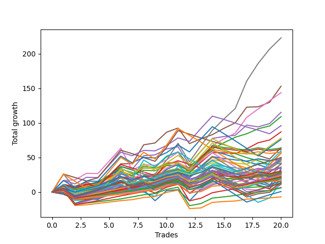

# Long Wallace 1226_003 
- Symbol: TEST
- Date Range: 03/18/2022 - 07/15/2022
- Trading Period: 7:20-12:30
- Number of Trades: 20



| Name | Win Percent | Profit | Avg Profit / Trade | Avg Time / Trade |      | Name | Win Percent | Profit | Avg Profit / Trade | Avg Time / Trade |
| ---- | ----------- | ------ | ------------------ | ---------------- | ---- | ---- | ----------- | ------ | ------------------ | ---------------- |
| Sorted By <br> Profit | | | | | | Sorted By <br> Win Percentage ||||
| Seven | 80.00 | 111500.00 | 5575.00 | 122:45 |     | Eighty-Five | 90.00 | 24875.00 | 1243.75 | 42:31 |
| Five | 85.00 | 76500.00 | 3825.00 | 73:43 |     | Eighty-Four | 90.00 | 17250.00 | 862.50 | 36:17 |
| Six | 80.00 | 71875.00 | 3593.75 | 54:21 |     | One Hundred Sixteen | 90.00 | 13125.00 | 656.25 | 02:13 |
| Four | 80.00 | 57625.00 | 2881.25 | 38:03 |     | One Hundred Twenty-One | 90.00 | 10250.00 | 512.50 | 02:34 |
| Two | 80.00 | 54500.00 | 2725.00 | 35:39 |     | Eighty-Three | 90.00 | 9500.00 | 475.00 | 33:28 |
| Forty-Six | 50.00 | 48000.00 | 2400.00 | 16:14 |     | One Hundred Twenty-Six | 90.00 | 8250.00 | 412.50 | 02:40 |
| Three | 70.00 | 43500.00 | 2175.00 | 17:58 |     | Eighty-Two | 90.00 | 3000.00 | 150.00 | 29:14 |
| Seventy | 55.00 | 39000.00 | 1950.00 | 17:47 |     | Eighty-One | 90.00 | -3500.00 | -175.00 | 25:50 |
| Sixty-Two | 55.00 | 38000.00 | 1900.00 | 22:53 |     | Five | 85.00 | 76500.00 | 3825.00 | 73:43 |
| Forty-Seven | 35.00 | 32000.00 | 1600.00 | 30:06 |     | One Hundred Eleven | 85.00 | 12875.00 | 643.75 | 01:55 |
| Fifty-Four | 45.00 | 31750.00 | 1587.50 | 07:33 |     | One Hundred Twenty-Two | 85.00 | 10500.00 | 525.00 | 03:34 |
| Fifty-Five | 50.00 | 30750.00 | 1537.50 | 08:22 |     | One Hundred Twenty-Seven | 85.00 | 10375.00 | 518.75 | 03:34 |
| Seventy-One | 50.00 | 29750.00 | 1487.50 | 24:18 |     | Seven | 80.00 | 111500.00 | 5575.00 | 122:45 |
| Fifty-Three | 50.00 | 28875.00 | 1443.75 | 08:23 |     | Six | 80.00 | 71875.00 | 3593.75 | 54:21 |
| Forty-Four | 50.00 | 28125.00 | 1406.25 | 12:47 |     | Four | 80.00 | 57625.00 | 2881.25 | 38:03 |
| Sixty-Three | 45.00 | 28000.00 | 1400.00 | 48:53 |     | Two | 80.00 | 54500.00 | 2725.00 | 35:39 |
| Fifty-Eight | 65.00 | 25125.00 | 1256.25 | 10:37 |     | One Hundred Twelve | 80.00 | 15125.00 | 756.25 | 02:44 |
| Eighty-Five | 90.00 | 24875.00 | 1243.75 | 42:31 |     | One Hundred Seventeen | 80.00 | 14625.00 | 731.25 | 02:30 |
| Sixty | 60.00 | 24875.00 | 1243.75 | 17:31 |     | One Hundred Twenty-Eight | 80.00 | 11125.00 | 556.25 | 05:15 |
| Sixty-Six | 60.00 | 24500.00 | 1225.00 | 09:59 |     | One Hundred Twenty-Three | 80.00 | 10125.00 | 506.25 | 05:26 |
| Forty-Two | 50.00 | 23875.00 | 1193.75 | 08:38 |     | Zero | 75.00 | 13375.00 | 668.75 | 09:47 |
| Fifty-Two | 50.00 | 23750.00 | 1187.50 | 06:54 |     | One Hundred Twenty-Nine | 75.00 | 12625.00 | 631.25 | 05:41 |
| Fifty | 50.00 | 23500.00 | 1175.00 | 05:57 |     | One Hundred Twenty-Four | 75.00 | 10000.00 | 500.00 | 05:56 |
| One | 70.00 | 22750.00 | 1137.50 | 15:42 |     | Sixty-Four | 75.00 | 6250.00 | 312.50 | 05:50 |
| Fifty-Nine | 65.00 | 22500.00 | 1125.00 | 10:15 |     | Fifty-Six | 75.00 | 3375.00 | 168.75 | 06:04 |
| Sixty-Nine | 50.00 | 21125.00 | 1056.25 | 18:36 |     | Three | 70.00 | 43500.00 | 2175.00 | 17:58 |
| Fifty-One | 50.00 | 20750.00 | 1037.50 | 05:35 |     | One | 70.00 | 22750.00 | 1137.50 | 15:42 |
| Sixty-Seven | 60.00 | 20125.00 | 1006.25 | 09:37 |     | One Hundred Eighteen | 70.00 | 15250.00 | 762.50 | 03:29 |
| Forty-Three | 50.00 | 18250.00 | 912.50 | 08:07 |     | One Hundred Thirteen | 70.00 | 12000.00 | 600.00 | 03:57 |
| One Hundred Ninteen | 65.00 | 17875.00 | 893.75 | 03:37 |     | Fifty-Eight | 65.00 | 25125.00 | 1256.25 | 10:37 |
| Eighty-Four | 90.00 | 17250.00 | 862.50 | 36:17 |     | Fifty-Nine | 65.00 | 22500.00 | 1125.00 | 10:15 |
| Seventy-Three | 55.00 | 16750.00 | 837.50 | 12:14 |     | One Hundred Ninteen | 65.00 | 17875.00 | 893.75 | 03:37 |
| One Hundred Eighteen | 70.00 | 15250.00 | 762.50 | 03:29 |     | One Hundred Fourteen | 65.00 | 13625.00 | 681.25 | 04:18 |
| One Hundred Twelve | 80.00 | 15125.00 | 756.25 | 02:44 |     | Forty-Eight | 65.00 | 11750.00 | 587.50 | 03:39 |
| One Hundred Seventeen | 80.00 | 14625.00 | 731.25 | 02:30 |     | Forty | 65.00 | 10750.00 | 537.50 | 04:43 |
| Forty-Nine | 50.00 | 14125.00 | 706.25 | 04:40 |     | One Hundred Thirty | 65.00 | 6625.00 | 331.25 | 07:42 |
| One Hundred Twenty | 50.00 | 13750.00 | 687.50 | 04:15 |     | Fifty-Seven | 65.00 | 5625.00 | 281.25 | 08:39 |
| Forty-Five | 35.00 | 13750.00 | 687.50 | 17:10 |     | One Hundred Twenty-Five | 65.00 | 375.00 | 18.75 | 08:00 |
| One Hundred Fourteen | 65.00 | 13625.00 | 681.25 | 04:18 |     | Sixty | 60.00 | 24875.00 | 1243.75 | 17:31 |
| Zero | 75.00 | 13375.00 | 668.75 | 09:47 |     | Sixty-Six | 60.00 | 24500.00 | 1225.00 | 09:59 |
| One Hundred Sixteen | 90.00 | 13125.00 | 656.25 | 02:13 |     | Sixty-Seven | 60.00 | 20125.00 | 1006.25 | 09:37 |
| One Hundred Eleven | 85.00 | 12875.00 | 643.75 | 01:55 |     | Sixty-Five | 60.00 | 6875.00 | 343.75 | 08:01 |
| One Hundred Twenty-Nine | 75.00 | 12625.00 | 631.25 | 05:41 |     | Seventy | 55.00 | 39000.00 | 1950.00 | 17:47 |
| One Hundred Thirteen | 70.00 | 12000.00 | 600.00 | 03:57 |     | Sixty-Two | 55.00 | 38000.00 | 1900.00 | 22:53 |
| Sixty-Eight | 55.00 | 11875.00 | 593.75 | 14:36 |     | Seventy-Three | 55.00 | 16750.00 | 837.50 | 12:14 |
| Forty-Eight | 65.00 | 11750.00 | 587.50 | 03:39 |     | Sixty-Eight | 55.00 | 11875.00 | 593.75 | 14:36 |
| One Hundred Twenty-Eight | 80.00 | 11125.00 | 556.25 | 05:15 |     | One Hundred Fifteen | 55.00 | 7875.00 | 393.75 | 05:57 |
| Forty | 65.00 | 10750.00 | 537.50 | 04:43 |     | Forty-Six | 50.00 | 48000.00 | 2400.00 | 16:14 |
| One Hundred Twenty-Two | 85.00 | 10500.00 | 525.00 | 03:34 |     | Fifty-Five | 50.00 | 30750.00 | 1537.50 | 08:22 |
| One Hundred Twenty-Seven | 85.00 | 10375.00 | 518.75 | 03:34 |     | Seventy-One | 50.00 | 29750.00 | 1487.50 | 24:18 |
| One Hundred Twenty-One | 90.00 | 10250.00 | 512.50 | 02:34 |     | Fifty-Three | 50.00 | 28875.00 | 1443.75 | 08:23 |
| One Hundred Twenty-Three | 80.00 | 10125.00 | 506.25 | 05:26 |     | Forty-Four | 50.00 | 28125.00 | 1406.25 | 12:47 |
| One Hundred Twenty-Four | 75.00 | 10000.00 | 500.00 | 05:56 |     | Forty-Two | 50.00 | 23875.00 | 1193.75 | 08:38 |
| Eighty-Three | 90.00 | 9500.00 | 475.00 | 33:28 |     | Fifty-Two | 50.00 | 23750.00 | 1187.50 | 06:54 |
| Forty-One | 50.00 | 8500.00 | 425.00 | 06:51 |     | Fifty | 50.00 | 23500.00 | 1175.00 | 05:57 |
| One Hundred Twenty-Six | 90.00 | 8250.00 | 412.50 | 02:40 |     | Sixty-Nine | 50.00 | 21125.00 | 1056.25 | 18:36 |
| One Hundred Fifteen | 55.00 | 7875.00 | 393.75 | 05:57 |     | Fifty-One | 50.00 | 20750.00 | 1037.50 | 05:35 |
| Sixty-One | 45.00 | 7375.00 | 368.75 | 30:08 |     | Forty-Three | 50.00 | 18250.00 | 912.50 | 08:07 |
| Sixty-Five | 60.00 | 6875.00 | 343.75 | 08:01 |     | Forty-Nine | 50.00 | 14125.00 | 706.25 | 04:40 |
| One Hundred Thirty | 65.00 | 6625.00 | 331.25 | 07:42 |     | One Hundred Twenty | 50.00 | 13750.00 | 687.50 | 04:15 |
| Sixty-Four | 75.00 | 6250.00 | 312.50 | 05:50 |     | Forty-One | 50.00 | 8500.00 | 425.00 | 06:51 |
| Fifty-Seven | 65.00 | 5625.00 | 281.25 | 08:39 |     | Fifty-Four | 45.00 | 31750.00 | 1587.50 | 07:33 |
| Fifty-Six | 75.00 | 3375.00 | 168.75 | 06:04 |     | Sixty-Three | 45.00 | 28000.00 | 1400.00 | 48:53 |
| Eighty-Two | 90.00 | 3000.00 | 150.00 | 29:14 |     | Sixty-One | 45.00 | 7375.00 | 368.75 | 30:08 |
| One Hundred Twenty-Five | 65.00 | 375.00 | 18.75 | 08:00 |     | Forty-Seven | 35.00 | 32000.00 | 1600.00 | 30:06 |
| Eighty-One | 90.00 | -3500.00 | -175.00 | 25:50 |     | Forty-Five | 35.00 | 13750.00 | 687.50 | 17:10 |

## NO STOPLOSS

### Test Zero
* Sell when price hits the middle line of the 20p bollinger
* No Stoploss
* Results:
```
Total Trades: 20
Percent Up: 75.00
Percent Down: 25.00
Total Points Moved Up: 26.75
Potential Profit: 13375.00
Total Points Ups: 58.50 Count Ups: 15
Total Points Downs: -31.75 Count Downs: 5
```

<details><summary>Trades</summary>

<code>In: 2022-03-25 08:30:00		Out: 2022-03-25 08:36:55		Total Position Time: 06:55		Total Move Up: 4.00		Total to Date: 4.00</code> <br />
<code>In: 2022-03-30 08:03:00		Out: 2022-03-30 08:19:25		Total Position Time: 16:25		Total Move Up: -5.00		Total to Date: -1.00</code> <br />
<code>In: 2022-03-30 08:14:00		Out: 2022-03-30 08:19:25		Total Position Time: 05:25		Total Move Up: 3.75		Total to Date: 2.75</code> <br />
<code>In: 2022-03-31 08:38:00		Out: 2022-03-31 08:40:25		Total Position Time: 02:25		Total Move Up: 0.75		Total to Date: 3.50</code> <br />
<code>In: 2022-04-20 11:58:00		Out: 2022-04-20 12:01:15		Total Position Time: 03:15		Total Move Up: 4.75		Total to Date: 8.25</code> <br />
<code>In: 2022-04-20 11:59:00		Out: 2022-04-20 12:01:15		Total Position Time: 02:15		Total Move Up: 4.75		Total to Date: 13.00</code> <br />
<code>In: 2022-05-11 10:33:00		Out: 2022-05-11 10:34:50		Total Position Time: 01:50		Total Move Up: 3.00		Total to Date: 16.00</code> <br />
<code>In: 2022-05-17 11:25:00		Out: 2022-05-17 11:31:40		Total Position Time: 06:40		Total Move Up: 7.00		Total to Date: 23.00</code> <br />
<code>In: 2022-05-19 07:33:00		Out: 2022-05-19 07:35:00		Total Position Time: 02:00		Total Move Up: 1.75		Total to Date: 24.75</code> <br />
<code>In: 2022-05-19 10:52:00		Out: 2022-05-19 10:53:10		Total Position Time: 01:10		Total Move Up: 6.00		Total to Date: 30.75</code> <br />
<code>In: 2022-05-25 10:15:00		Out: 2022-05-25 10:16:10		Total Position Time: 01:10		Total Move Up: 3.25		Total to Date: 34.00</code> <br />
<code>In: 2022-06-08 09:30:00		Out: 2022-06-08 09:56:25		Total Position Time: 26:25		Total Move Up: -16.00		Total to Date: 18.00</code> <br />
<code>In: 2022-06-14 07:45:00		Out: 2022-06-14 07:47:00		Total Position Time: 02:00		Total Move Up: 5.25		Total to Date: 23.25</code> <br />
<code>In: 2022-06-14 07:46:00		Out: 2022-06-14 07:47:10		Total Position Time: 01:10		Total Move Up: 8.00		Total to Date: 31.25</code> <br />
<code>In: 2022-06-15 07:57:00		Out: 2022-06-15 08:34:25		Total Position Time: 37:25		Total Move Up: -3.50		Total to Date: 27.75</code> <br />
<code>In: 2022-06-15 07:58:00		Out: 2022-06-15 08:34:25		Total Position Time: 36:25		Total Move Up: -4.50		Total to Date: 23.25</code> <br />
<code>In: 2022-06-17 07:38:00		Out: 2022-06-17 07:55:05		Total Position Time: 17:05		Total Move Up: -2.75		Total to Date: 20.50</code> <br />
<code>In: 2022-06-23 09:07:00		Out: 2022-06-23 09:17:45		Total Position Time: 10:45		Total Move Up: 1.25		Total to Date: 21.75</code> <br />
<code>In: 2022-07-06 08:35:00		Out: 2022-07-06 08:46:30		Total Position Time: 11:30		Total Move Up: 0.25		Total to Date: 22.00</code> <br />
<code>In: 2022-07-13 07:23:00		Out: 2022-07-13 07:26:25		Total Position Time: 03:25		Total Move Up: 4.75		Total to Date: 26.75</code> <br />


</details>

### Test One
* Sell when the price hits the upper line of the 20p 1std bollinger
* No Stoploss
* Results:
```
Total Trades: 20
Percent Up: 70.00
Percent Down: 30.00
Total Points Moved Up: 45.50
Potential Profit: 22750.00
Total Points Ups: 83.50 Count Ups: 14
Total Points Downs: -38.00 Count Downs: 6
```

<details><summary>Trades</summary>

<code>In: 2022-03-25 08:30:00		Out: 2022-03-25 08:41:10		Total Position Time: 11:10		Total Move Up: 5.50		Total to Date: 5.50</code> <br />
<code>In: 2022-03-30 08:03:00		Out: 2022-03-30 08:34:45		Total Position Time: 31:45		Total Move Up: -5.75		Total to Date: -0.25</code> <br />
<code>In: 2022-03-30 08:14:00		Out: 2022-03-30 08:34:45		Total Position Time: 20:45		Total Move Up: 3.00		Total to Date: 2.75</code> <br />
<code>In: 2022-03-31 08:38:00		Out: 2022-03-31 08:40:40		Total Position Time: 02:40		Total Move Up: 2.50		Total to Date: 5.25</code> <br />
<code>In: 2022-04-20 11:58:00		Out: 2022-04-20 12:04:20		Total Position Time: 06:20		Total Move Up: 7.50		Total to Date: 12.75</code> <br />
<code>In: 2022-04-20 11:59:00		Out: 2022-04-20 12:04:20		Total Position Time: 05:20		Total Move Up: 7.50		Total to Date: 20.25</code> <br />
<code>In: 2022-05-11 10:33:00		Out: 2022-05-11 11:01:30		Total Position Time: 28:30		Total Move Up: -11.75		Total to Date: 8.50</code> <br />
<code>In: 2022-05-17 11:25:00		Out: 2022-05-17 11:39:45		Total Position Time: 14:45		Total Move Up: 7.25		Total to Date: 15.75</code> <br />
<code>In: 2022-05-19 07:33:00		Out: 2022-05-19 07:55:05		Total Position Time: 22:05		Total Move Up: -5.50		Total to Date: 10.25</code> <br />
<code>In: 2022-05-19 10:52:00		Out: 2022-05-19 10:54:25		Total Position Time: 02:25		Total Move Up: 8.50		Total to Date: 18.75</code> <br />
<code>In: 2022-05-25 10:15:00		Out: 2022-05-25 10:16:20		Total Position Time: 01:20		Total Move Up: 4.25		Total to Date: 23.00</code> <br />
<code>In: 2022-06-08 09:30:00		Out: 2022-06-08 09:59:05		Total Position Time: 29:05		Total Move Up: -13.50		Total to Date: 9.50</code> <br />
<code>In: 2022-06-14 07:45:00		Out: 2022-06-14 07:47:15		Total Position Time: 02:15		Total Move Up: 9.50		Total to Date: 19.00</code> <br />
<code>In: 2022-06-14 07:46:00		Out: 2022-06-14 07:47:15		Total Position Time: 01:15		Total Move Up: 8.50		Total to Date: 27.50</code> <br />
<code>In: 2022-06-15 07:57:00		Out: 2022-06-15 08:38:55		Total Position Time: 41:55		Total Move Up: -0.25		Total to Date: 27.25</code> <br />
<code>In: 2022-06-15 07:58:00		Out: 2022-06-15 08:38:55		Total Position Time: 40:55		Total Move Up: -1.25		Total to Date: 26.00</code> <br />
<code>In: 2022-06-17 07:38:00		Out: 2022-06-17 07:56:20		Total Position Time: 18:20		Total Move Up: 1.00		Total to Date: 27.00</code> <br />
<code>In: 2022-06-23 09:07:00		Out: 2022-06-23 09:18:25		Total Position Time: 11:25		Total Move Up: 4.75		Total to Date: 31.75</code> <br />
<code>In: 2022-07-06 08:35:00		Out: 2022-07-06 08:48:25		Total Position Time: 13:25		Total Move Up: 2.00		Total to Date: 33.75</code> <br />
<code>In: 2022-07-13 07:23:00		Out: 2022-07-13 07:31:20		Total Position Time: 08:20		Total Move Up: 11.75		Total to Date: 45.50</code> <br />


</details>

### Test Two
* Sell when the price hits the upper line of the 20p 2std bollinger
* No Stoploss
* Results:
```
Total Trades: 20
Percent Up: 80.00
Percent Down: 20.00
Total Points Moved Up: 109.00
Potential Profit: 54500.00
Total Points Ups: 143.50 Count Ups: 16
Total Points Downs: -34.50 Count Downs: 4
```

<details><summary>Trades</summary>

<code>In: 2022-03-25 08:30:00		Out: 2022-03-25 08:41:55		Total Position Time: 11:55		Total Move Up: 9.50		Total to Date: 9.50</code> <br />
<code>In: 2022-03-30 08:03:00		Out: 2022-03-30 08:35:15		Total Position Time: 32:15		Total Move Up: -4.00		Total to Date: 5.50</code> <br />
<code>In: 2022-03-30 08:14:00		Out: 2022-03-30 08:35:15		Total Position Time: 21:15		Total Move Up: 4.75		Total to Date: 10.25</code> <br />
<code>In: 2022-03-31 08:38:00		Out: 2022-03-31 08:41:10		Total Position Time: 03:10		Total Move Up: 4.50		Total to Date: 14.75</code> <br />
<code>In: 2022-04-20 11:58:00		Out: 2022-04-20 12:12:35		Total Position Time: 14:35		Total Move Up: 9.75		Total to Date: 24.50</code> <br />
<code>In: 2022-04-20 11:59:00		Out: 2022-04-20 12:12:35		Total Position Time: 13:35		Total Move Up: 9.75		Total to Date: 34.25</code> <br />
<code>In: 2022-05-11 10:33:00		Out: 2022-05-11 11:04:55		Total Position Time: 31:55		Total Move Up: -8.00		Total to Date: 26.25</code> <br />
<code>In: 2022-05-17 11:25:00		Out: 2022-05-17 11:40:05		Total Position Time: 15:05		Total Move Up: 11.00		Total to Date: 37.25</code> <br />
<code>In: 2022-05-19 07:33:00		Out: 2022-05-19 08:01:35		Total Position Time: 28:35		Total Move Up: -1.75		Total to Date: 35.50</code> <br />
<code>In: 2022-05-19 10:52:00		Out: 2022-05-19 10:55:15		Total Position Time: 03:15		Total Move Up: 15.50		Total to Date: 51.00</code> <br />
<code>In: 2022-05-25 10:15:00		Out: 2022-05-25 10:29:45		Total Position Time: 14:45		Total Move Up: 7.00		Total to Date: 58.00</code> <br />
<code>In: 2022-06-08 09:30:00		Out: 2022-06-08 11:03:45		Total Position Time: 93:45		Total Move Up: -20.75		Total to Date: 37.25</code> <br />
<code>In: 2022-06-14 07:45:00		Out: 2022-06-14 07:48:40		Total Position Time: 03:40		Total Move Up: 13.00		Total to Date: 50.25</code> <br />
<code>In: 2022-06-14 07:46:00		Out: 2022-06-14 07:48:40		Total Position Time: 02:40		Total Move Up: 12.00		Total to Date: 62.25</code> <br />
<code>In: 2022-06-15 07:57:00		Out: 2022-06-15 10:58:15		Total Position Time: 181:15		Total Move Up: 9.00		Total to Date: 71.25</code> <br />
<code>In: 2022-06-15 07:58:00		Out: 2022-06-15 10:58:15		Total Position Time: 180:15		Total Move Up: 8.00		Total to Date: 79.25</code> <br />
<code>In: 2022-06-17 07:38:00		Out: 2022-06-17 08:02:25		Total Position Time: 24:25		Total Move Up: 5.00		Total to Date: 84.25</code> <br />
<code>In: 2022-06-23 09:07:00		Out: 2022-06-23 09:19:10		Total Position Time: 12:10		Total Move Up: 7.25		Total to Date: 91.50</code> <br />
<code>In: 2022-07-06 08:35:00		Out: 2022-07-06 08:51:15		Total Position Time: 16:15		Total Move Up: 4.00		Total to Date: 95.50</code> <br />
<code>In: 2022-07-13 07:23:00		Out: 2022-07-13 07:31:30		Total Position Time: 08:30		Total Move Up: 13.50		Total to Date: 109.00</code> <br />


</details>

### Test Three
* Sell when price hits the middle line of the 50p bollinger
* No Stoploss
* Results:
```
Total Trades: 20
Percent Up: 70.00
Percent Down: 30.00
Total Points Moved Up: 87.00
Potential Profit: 43500.00
Total Points Ups: 114.25 Count Ups: 14
Total Points Downs: -27.25 Count Downs: 6
```

<details><summary>Trades</summary>

<code>In: 2022-03-25 08:30:00		Out: 2022-03-25 08:53:00		Total Position Time: 23:00		Total Move Up: 8.75		Total to Date: 8.75</code> <br />
<code>In: 2022-03-30 08:03:00		Out: 2022-03-30 08:35:20		Total Position Time: 32:20		Total Move Up: -3.50		Total to Date: 5.25</code> <br />
<code>In: 2022-03-30 08:14:00		Out: 2022-03-30 08:35:20		Total Position Time: 21:20		Total Move Up: 5.25		Total to Date: 10.50</code> <br />
<code>In: 2022-03-31 08:38:00		Out: 2022-03-31 08:41:05		Total Position Time: 03:05		Total Move Up: 3.00		Total to Date: 13.50</code> <br />
<code>In: 2022-04-20 11:58:00		Out: 2022-04-20 12:10:10		Total Position Time: 12:10		Total Move Up: 8.25		Total to Date: 21.75</code> <br />
<code>In: 2022-04-20 11:59:00		Out: 2022-04-20 12:10:10		Total Position Time: 11:10		Total Move Up: 8.25		Total to Date: 30.00</code> <br />
<code>In: 2022-05-11 10:33:00		Out: 2022-05-11 11:05:00		Total Position Time: 32:00		Total Move Up: -6.25		Total to Date: 23.75</code> <br />
<code>In: 2022-05-17 11:25:00		Out: 2022-05-17 11:40:05		Total Position Time: 15:05		Total Move Up: 11.00		Total to Date: 34.75</code> <br />
<code>In: 2022-05-19 07:33:00		Out: 2022-05-19 07:34:10		Total Position Time: 01:10		Total Move Up: -0.75		Total to Date: 34.00</code> <br />
<code>In: 2022-05-19 10:52:00		Out: 2022-05-19 10:53:10		Total Position Time: 01:10		Total Move Up: 6.00		Total to Date: 40.00</code> <br />
<code>In: 2022-05-25 10:15:00		Out: 2022-05-25 10:16:10		Total Position Time: 01:10		Total Move Up: 3.25		Total to Date: 43.25</code> <br />
<code>In: 2022-06-08 09:30:00		Out: 2022-06-08 10:19:05		Total Position Time: 49:05		Total Move Up: -15.25		Total to Date: 28.00</code> <br />
<code>In: 2022-06-14 07:45:00		Out: 2022-06-14 07:50:20		Total Position Time: 05:20		Total Move Up: 15.00		Total to Date: 43.00</code> <br />
<code>In: 2022-06-14 07:46:00		Out: 2022-06-14 07:50:20		Total Position Time: 04:20		Total Move Up: 14.00		Total to Date: 57.00</code> <br />
<code>In: 2022-06-15 07:57:00		Out: 2022-06-15 08:38:55		Total Position Time: 41:55		Total Move Up: -0.25		Total to Date: 56.75</code> <br />
<code>In: 2022-06-15 07:58:00		Out: 2022-06-15 08:38:55		Total Position Time: 40:55		Total Move Up: -1.25		Total to Date: 55.50</code> <br />
<code>In: 2022-06-17 07:38:00		Out: 2022-06-17 08:02:30		Total Position Time: 24:30		Total Move Up: 7.00		Total to Date: 62.50</code> <br />
<code>In: 2022-06-23 09:07:00		Out: 2022-06-23 09:22:00		Total Position Time: 15:00		Total Move Up: 8.75		Total to Date: 71.25</code> <br />
<code>In: 2022-07-06 08:35:00		Out: 2022-07-06 08:51:15		Total Position Time: 16:15		Total Move Up: 4.00		Total to Date: 75.25</code> <br />
<code>In: 2022-07-13 07:23:00		Out: 2022-07-13 07:31:20		Total Position Time: 08:20		Total Move Up: 11.75		Total to Date: 87.00</code> <br />


</details>

### Test Four
* Sell when the price hits the upper line of the 50p 1std bollinger
* No Stoploss
* Results:
```
Total Trades: 20
Percent Up: 80.00
Percent Down: 20.00
Total Points Moved Up: 115.25
Potential Profit: 57625.00
Total Points Ups: 152.50 Count Ups: 16
Total Points Downs: -37.25 Count Downs: 4
```

<details><summary>Trades</summary>

<code>In: 2022-03-25 08:30:00		Out: 2022-03-25 09:08:25		Total Position Time: 38:25		Total Move Up: 8.00		Total to Date: 8.00</code> <br />
<code>In: 2022-03-30 08:03:00		Out: 2022-03-30 08:57:20		Total Position Time: 54:20		Total Move Up: -4.75		Total to Date: 3.25</code> <br />
<code>In: 2022-03-30 08:14:00		Out: 2022-03-30 08:57:20		Total Position Time: 43:20		Total Move Up: 4.00		Total to Date: 7.25</code> <br />
<code>In: 2022-03-31 08:38:00		Out: 2022-03-31 09:00:40		Total Position Time: 22:40		Total Move Up: 3.75		Total to Date: 11.00</code> <br />
<code>In: 2022-04-20 11:58:00		Out: 2022-04-20 12:13:35		Total Position Time: 15:35		Total Move Up: 13.00		Total to Date: 24.00</code> <br />
<code>In: 2022-04-20 11:59:00		Out: 2022-04-20 12:13:35		Total Position Time: 14:35		Total Move Up: 13.00		Total to Date: 37.00</code> <br />
<code>In: 2022-05-11 10:33:00		Out: 2022-05-11 11:18:20		Total Position Time: 45:20		Total Move Up: -4.00		Total to Date: 33.00</code> <br />
<code>In: 2022-05-17 11:25:00		Out: 2022-05-17 11:45:50		Total Position Time: 20:50		Total Move Up: 19.50		Total to Date: 52.50</code> <br />
<code>In: 2022-05-19 07:33:00		Out: 2022-05-19 08:12:25		Total Position Time: 39:25		Total Move Up: 1.25		Total to Date: 53.75</code> <br />
<code>In: 2022-05-19 10:52:00		Out: 2022-05-19 10:54:25		Total Position Time: 02:25		Total Move Up: 8.50		Total to Date: 62.25</code> <br />
<code>In: 2022-05-25 10:15:00		Out: 2022-05-25 10:16:10		Total Position Time: 01:10		Total Move Up: 3.25		Total to Date: 65.50</code> <br />
<code>In: 2022-06-08 09:30:00		Out: 2022-06-08 12:12:35		Total Position Time: 162:35		Total Move Up: -26.00		Total to Date: 39.50</code> <br />
<code>In: 2022-06-14 07:45:00		Out: 2022-06-14 08:02:25		Total Position Time: 17:25		Total Move Up: 19.50		Total to Date: 59.00</code> <br />
<code>In: 2022-06-14 07:46:00		Out: 2022-06-14 08:02:25		Total Position Time: 16:25		Total Move Up: 18.50		Total to Date: 77.50</code> <br />
<code>In: 2022-06-15 07:57:00		Out: 2022-06-15 08:57:35		Total Position Time: 60:35		Total Move Up: 2.75		Total to Date: 80.25</code> <br />
<code>In: 2022-06-15 07:58:00		Out: 2022-06-15 08:57:35		Total Position Time: 59:35		Total Move Up: 1.75		Total to Date: 82.00</code> <br />
<code>In: 2022-06-17 07:38:00		Out: 2022-06-17 08:06:05		Total Position Time: 28:05		Total Move Up: 14.75		Total to Date: 96.75</code> <br />
<code>In: 2022-06-23 09:07:00		Out: 2022-06-23 10:18:10		Total Position Time: 71:10		Total Move Up: -2.50		Total to Date: 94.25</code> <br />
<code>In: 2022-07-06 08:35:00		Out: 2022-07-06 09:13:30		Total Position Time: 38:30		Total Move Up: 4.75		Total to Date: 99.00</code> <br />
<code>In: 2022-07-13 07:23:00		Out: 2022-07-13 07:31:35		Total Position Time: 08:35		Total Move Up: 16.25		Total to Date: 115.25</code> <br />


</details>

### Test Five
* Sell when the price hits the upper line of the 50p 2std bollinger
* No Stoploss
* Results:
```
Total Trades: 20
Percent Up: 85.00
Percent Down: 15.00
Total Points Moved Up: 153.00
Potential Profit: 76500.00
Total Points Ups: 184.25 Count Ups: 17
Total Points Downs: -31.25 Count Downs: 3
```

<details><summary>Trades</summary>

<code>In: 2022-03-25 08:30:00		Out: 2022-03-25 09:11:40		Total Position Time: 41:40		Total Move Up: 11.00		Total to Date: 11.00</code> <br />
<code>In: 2022-03-30 08:03:00		Out: 2022-03-30 09:00:25		Total Position Time: 57:25		Total Move Up: -2.75		Total to Date: 8.25</code> <br />
<code>In: 2022-03-30 08:14:00		Out: 2022-03-30 09:00:25		Total Position Time: 46:25		Total Move Up: 6.00		Total to Date: 14.25</code> <br />
<code>In: 2022-03-31 08:38:00		Out: 2022-03-31 10:46:00		Total Position Time: 128:00		Total Move Up: -6.00		Total to Date: 8.25</code> <br />
<code>In: 2022-04-20 11:58:00		Out: 2022-04-20 12:25:45		Total Position Time: 27:45		Total Move Up: 16.25		Total to Date: 24.50</code> <br />
<code>In: 2022-04-20 11:59:00		Out: 2022-04-20 12:25:45		Total Position Time: 26:45		Total Move Up: 16.25		Total to Date: 40.75</code> <br />
<code>In: 2022-05-11 10:33:00		Out: 2022-05-11 11:23:40		Total Position Time: 50:40		Total Move Up: 0.25		Total to Date: 41.00</code> <br />
<code>In: 2022-05-17 11:25:00		Out: 2022-05-17 11:48:40		Total Position Time: 23:40		Total Move Up: 27.25		Total to Date: 68.25</code> <br />
<code>In: 2022-05-19 07:33:00		Out: 2022-05-19 08:31:40		Total Position Time: 58:40		Total Move Up: 2.75		Total to Date: 71.00</code> <br />
<code>In: 2022-05-19 10:52:00		Out: 2022-05-19 10:55:15		Total Position Time: 03:15		Total Move Up: 15.50		Total to Date: 86.50</code> <br />
<code>In: 2022-05-25 10:15:00		Out: 2022-05-25 10:29:35		Total Position Time: 14:35		Total Move Up: 6.00		Total to Date: 92.50</code> <br />
<code>In: 2022-06-08 09:30:00		Out: 2022-06-08 12:21:15		Total Position Time: 171:15		Total Move Up: -22.50		Total to Date: 70.00</code> <br />
<code>In: 2022-06-14 07:45:00		Out: 2022-06-14 10:08:30		Total Position Time: 143:30		Total Move Up: 7.00		Total to Date: 77.00</code> <br />
<code>In: 2022-06-14 07:46:00		Out: 2022-06-14 10:08:30		Total Position Time: 142:30		Total Move Up: 6.00		Total to Date: 83.00</code> <br />
<code>In: 2022-06-15 07:57:00		Out: 2022-06-15 10:58:15		Total Position Time: 181:15		Total Move Up: 9.00		Total to Date: 92.00</code> <br />
<code>In: 2022-06-15 07:58:00		Out: 2022-06-15 10:58:15		Total Position Time: 180:15		Total Move Up: 8.00		Total to Date: 100.00</code> <br />
<code>In: 2022-06-17 07:38:00		Out: 2022-06-17 08:07:55		Total Position Time: 29:55		Total Move Up: 22.75		Total to Date: 122.75</code> <br />
<code>In: 2022-06-23 09:07:00		Out: 2022-06-23 10:23:20		Total Position Time: 76:20		Total Move Up: 0.50		Total to Date: 123.25</code> <br />
<code>In: 2022-07-06 08:35:00		Out: 2022-07-06 09:35:55		Total Position Time: 60:55		Total Move Up: 6.50		Total to Date: 129.75</code> <br />
<code>In: 2022-07-13 07:23:00		Out: 2022-07-13 07:32:50		Total Position Time: 09:50		Total Move Up: 23.25		Total to Date: 153.00</code> <br />


</details>

### Test Six
* Sell when the price hits the middle line of the 1std VWAP
* No Stoploss
* Results:
```
Total Trades: 20
Percent Up: 80.00
Percent Down: 20.00
Total Points Moved Up: 143.75
Potential Profit: 71875.00
Total Points Ups: 203.00 Count Ups: 16
Total Points Downs: -59.25 Count Downs: 4
```

<details><summary>Trades</summary>

<code>In: 2022-03-25 08:30:00		Out: 2022-03-25 10:19:30		Total Position Time: 109:30		Total Move Up: 16.75		Total to Date: 16.75</code> <br />
<code>In: 2022-03-30 08:03:00		Out: 2022-03-30 09:03:05		Total Position Time: 60:05		Total Move Up: 0.75		Total to Date: 17.50</code> <br />
<code>In: 2022-03-30 08:14:00		Out: 2022-03-30 09:03:05		Total Position Time: 49:05		Total Move Up: 9.50		Total to Date: 27.00</code> <br />
<code>In: 2022-03-31 08:38:00		Out: 2022-03-31 08:40:05		Total Position Time: 02:05		Total Move Up: -0.25		Total to Date: 26.75</code> <br />
<code>In: 2022-04-20 11:58:00		Out: 2022-04-20 12:26:10		Total Position Time: 28:10		Total Move Up: 18.25		Total to Date: 45.00</code> <br />
<code>In: 2022-04-20 11:59:00		Out: 2022-04-20 12:26:10		Total Position Time: 27:10		Total Move Up: 18.25		Total to Date: 63.25</code> <br />
<code>In: 2022-05-11 10:33:00		Out: 2022-05-11 12:47:00		Total Position Time: 134:00		Total Move Up: -31.50		Total to Date: 31.75</code> <br />
<code>In: 2022-05-17 11:25:00		Out: 2022-05-17 11:27:25		Total Position Time: 02:25		Total Move Up: 7.75		Total to Date: 39.50</code> <br />
<code>In: 2022-05-19 07:33:00		Out: 2022-05-19 07:34:10		Total Position Time: 01:10		Total Move Up: -0.75		Total to Date: 38.75</code> <br />
<code>In: 2022-05-19 10:52:00		Out: 2022-05-19 10:54:15		Total Position Time: 02:15		Total Move Up: 7.75		Total to Date: 46.50</code> <br />
<code>In: 2022-05-25 10:15:00		Out: 2022-05-25 10:37:05		Total Position Time: 22:05		Total Move Up: 11.00		Total to Date: 57.50</code> <br />
<code>In: 2022-06-08 09:30:00		Out: 2022-06-08 12:47:00		Total Position Time: 197:00		Total Move Up: -26.75		Total to Date: 30.75</code> <br />
<code>In: 2022-06-14 07:45:00		Out: 2022-06-14 07:51:40		Total Position Time: 06:40		Total Move Up: 18.75		Total to Date: 49.50</code> <br />
<code>In: 2022-06-14 07:46:00		Out: 2022-06-14 07:51:40		Total Position Time: 05:40		Total Move Up: 17.75		Total to Date: 67.25</code> <br />
<code>In: 2022-06-15 07:57:00		Out: 2022-06-15 09:22:15		Total Position Time: 85:15		Total Move Up: 9.50		Total to Date: 76.75</code> <br />
<code>In: 2022-06-15 07:58:00		Out: 2022-06-15 09:22:15		Total Position Time: 84:15		Total Move Up: 8.50		Total to Date: 85.25</code> <br />
<code>In: 2022-06-17 07:38:00		Out: 2022-06-17 08:07:55		Total Position Time: 29:55		Total Move Up: 22.75		Total to Date: 108.00</code> <br />
<code>In: 2022-06-23 09:07:00		Out: 2022-06-23 11:30:55		Total Position Time: 143:55		Total Move Up: 12.00		Total to Date: 120.00</code> <br />
<code>In: 2022-07-06 08:35:00		Out: 2022-07-06 10:03:05		Total Position Time: 88:05		Total Move Up: 12.00		Total to Date: 132.00</code> <br />
<code>In: 2022-07-13 07:23:00		Out: 2022-07-13 07:31:20		Total Position Time: 08:20		Total Move Up: 11.75		Total to Date: 143.75</code> <br />


</details>

### Test Seven
* Sell when the price hits the upper line of the 1std VWAP
* No Stoploss
* Results:
```
Total Trades: 20
Percent Up: 80.00
Percent Down: 20.00
Total Points Moved Up: 223.00
Potential Profit: 111500.00
Total Points Ups: 315.00 Count Ups: 16
Total Points Downs: -92.00 Count Downs: 4
```

<details><summary>Trades</summary>

<code>In: 2022-03-25 08:30:00		Out: 2022-03-25 11:04:05		Total Position Time: 154:05		Total Move Up: 26.00		Total to Date: 26.00</code> <br />
<code>In: 2022-03-30 08:03:00		Out: 2022-03-30 12:47:00		Total Position Time: 284:00		Total Move Up: -21.25		Total to Date: 4.75</code> <br />
<code>In: 2022-03-30 08:14:00		Out: 2022-03-30 12:47:00		Total Position Time: 273:00		Total Move Up: -12.50		Total to Date: -7.75</code> <br />
<code>In: 2022-03-31 08:38:00		Out: 2022-03-31 08:41:10		Total Position Time: 03:10		Total Move Up: 4.50		Total to Date: -3.25</code> <br />
<code>In: 2022-04-20 11:58:00		Out: 2022-04-20 12:47:00		Total Position Time: 49:00		Total Move Up: 20.00		Total to Date: 16.75</code> <br />
<code>In: 2022-04-20 11:59:00		Out: 2022-04-20 12:47:00		Total Position Time: 48:00		Total Move Up: 20.00		Total to Date: 36.75</code> <br />
<code>In: 2022-05-11 10:33:00		Out: 2022-05-11 12:47:00		Total Position Time: 134:00		Total Move Up: -31.50		Total to Date: 5.25</code> <br />
<code>In: 2022-05-17 11:25:00		Out: 2022-05-17 11:40:20		Total Position Time: 15:20		Total Move Up: 17.25		Total to Date: 22.50</code> <br />
<code>In: 2022-05-19 07:33:00		Out: 2022-05-19 08:33:45		Total Position Time: 60:45		Total Move Up: 3.75		Total to Date: 26.25</code> <br />
<code>In: 2022-05-19 10:52:00		Out: 2022-05-19 10:56:05		Total Position Time: 04:05		Total Move Up: 20.00		Total to Date: 46.25</code> <br />
<code>In: 2022-05-25 10:15:00		Out: 2022-05-25 11:02:25		Total Position Time: 47:25		Total Move Up: 24.25		Total to Date: 70.50</code> <br />
<code>In: 2022-06-08 09:30:00		Out: 2022-06-08 12:47:00		Total Position Time: 197:00		Total Move Up: -26.75		Total to Date: 43.75</code> <br />
<code>In: 2022-06-14 07:45:00		Out: 2022-06-14 10:23:00		Total Position Time: 158:00		Total Move Up: 23.25		Total to Date: 67.00</code> <br />
<code>In: 2022-06-14 07:46:00		Out: 2022-06-14 10:23:00		Total Position Time: 157:00		Total Move Up: 22.25		Total to Date: 89.25</code> <br />
<code>In: 2022-06-15 07:57:00		Out: 2022-06-15 11:00:30		Total Position Time: 183:30		Total Move Up: 16.25		Total to Date: 105.50</code> <br />
<code>In: 2022-06-15 07:58:00		Out: 2022-06-15 11:00:30		Total Position Time: 182:30		Total Move Up: 15.25		Total to Date: 120.75</code> <br />
<code>In: 2022-06-17 07:38:00		Out: 2022-06-17 10:07:35		Total Position Time: 149:35		Total Move Up: 39.75		Total to Date: 160.50</code> <br />
<code>In: 2022-06-23 09:07:00		Out: 2022-06-23 12:27:35		Total Position Time: 200:35		Total Move Up: 25.50		Total to Date: 186.00</code> <br />
<code>In: 2022-07-06 08:35:00		Out: 2022-07-06 11:00:25		Total Position Time: 145:25		Total Move Up: 20.75		Total to Date: 206.75</code> <br />
<code>In: 2022-07-13 07:23:00		Out: 2022-07-13 07:31:35		Total Position Time: 08:35		Total Move Up: 16.25		Total to Date: 223.00</code> <br />


</details>

## STOPLOSS OF 5

### Test Forty
* Sell when price hits the middle line of the 20p bollinger
* Stoploss is 5 points
* Results:
```
Total Trades: 20
Percent Up: 65.00
Percent Down: 35.00
Total Points Moved Up: 21.50
Potential Profit: 10750.00
Total Points Ups: 57.00 Count Ups: 13
Total Points Downs: -35.50 Count Downs: 7
```

<details><summary>Trades</summary>

<code>In: 2022-03-25 08:30:00		Out: 2022-03-25 08:36:55		Total Position Time: 06:55		Total Move Up: 4.00		Total to Date: 4.00</code> <br />
<code>In: 2022-03-30 08:03:00		Out: 2022-03-30 08:07:05		Total Position Time: 04:05		Total Move Up: -5.00		Total to Date: -1.00</code> <br />
<code>In: 2022-03-30 08:14:00		Out: 2022-03-30 08:19:25		Total Position Time: 05:25		Total Move Up: 3.75		Total to Date: 2.75</code> <br />
<code>In: 2022-03-31 08:38:00		Out: 2022-03-31 08:40:25		Total Position Time: 02:25		Total Move Up: 0.75		Total to Date: 3.50</code> <br />
<code>In: 2022-04-20 11:58:00		Out: 2022-04-20 12:01:15		Total Position Time: 03:15		Total Move Up: 4.75		Total to Date: 8.25</code> <br />
<code>In: 2022-04-20 11:59:00		Out: 2022-04-20 12:01:15		Total Position Time: 02:15		Total Move Up: 4.75		Total to Date: 13.00</code> <br />
<code>In: 2022-05-11 10:33:00		Out: 2022-05-11 10:34:50		Total Position Time: 01:50		Total Move Up: 3.00		Total to Date: 16.00</code> <br />
<code>In: 2022-05-17 11:25:00		Out: 2022-05-17 11:31:40		Total Position Time: 06:40		Total Move Up: 7.00		Total to Date: 23.00</code> <br />
<code>In: 2022-05-19 07:33:00		Out: 2022-05-19 07:35:00		Total Position Time: 02:00		Total Move Up: 1.75		Total to Date: 24.75</code> <br />
<code>In: 2022-05-19 10:52:00		Out: 2022-05-19 10:53:10		Total Position Time: 01:10		Total Move Up: 6.00		Total to Date: 30.75</code> <br />
<code>In: 2022-05-25 10:15:00		Out: 2022-05-25 10:16:10		Total Position Time: 01:10		Total Move Up: 3.25		Total to Date: 34.00</code> <br />
<code>In: 2022-06-08 09:30:00		Out: 2022-06-08 09:32:50		Total Position Time: 02:50		Total Move Up: -5.00		Total to Date: 29.00</code> <br />
<code>In: 2022-06-14 07:45:00		Out: 2022-06-14 07:47:00		Total Position Time: 02:00		Total Move Up: 5.25		Total to Date: 34.25</code> <br />
<code>In: 2022-06-14 07:46:00		Out: 2022-06-14 07:47:10		Total Position Time: 01:10		Total Move Up: 8.00		Total to Date: 42.25</code> <br />
<code>In: 2022-06-15 07:57:00		Out: 2022-06-15 08:10:15		Total Position Time: 13:15		Total Move Up: -4.75		Total to Date: 37.50</code> <br />
<code>In: 2022-06-15 07:58:00		Out: 2022-06-15 08:10:05		Total Position Time: 12:05		Total Move Up: -5.25		Total to Date: 32.25</code> <br />
<code>In: 2022-06-17 07:38:00		Out: 2022-06-17 07:47:40		Total Position Time: 09:40		Total Move Up: -5.75		Total to Date: 26.50</code> <br />
<code>In: 2022-06-23 09:07:00		Out: 2022-06-23 09:09:30		Total Position Time: 02:30		Total Move Up: -4.50		Total to Date: 22.00</code> <br />
<code>In: 2022-07-06 08:35:00		Out: 2022-07-06 08:45:15		Total Position Time: 10:15		Total Move Up: -5.25		Total to Date: 16.75</code> <br />
<code>In: 2022-07-13 07:23:00		Out: 2022-07-13 07:26:25		Total Position Time: 03:25		Total Move Up: 4.75		Total to Date: 21.50</code> <br />


</details>

### Test Forty-One
* Sell when the price hits the upper line of the 20p 1std bollinger
* Stoploss is 5 points
* Results:
```
Total Trades: 20
Percent Up: 50.00
Percent Down: 50.00
Total Points Moved Up: 17.00
Potential Profit: 8500.00
Total Points Ups: 68.50 Count Ups: 10
Total Points Downs: -51.50 Count Downs: 10
```

<details><summary>Trades</summary>

<code>In: 2022-03-25 08:30:00		Out: 2022-03-25 08:41:10		Total Position Time: 11:10		Total Move Up: 5.50		Total to Date: 5.50</code> <br />
<code>In: 2022-03-30 08:03:00		Out: 2022-03-30 08:07:05		Total Position Time: 04:05		Total Move Up: -5.00		Total to Date: 0.50</code> <br />
<code>In: 2022-03-30 08:14:00		Out: 2022-03-30 08:34:45		Total Position Time: 20:45		Total Move Up: 3.00		Total to Date: 3.50</code> <br />
<code>In: 2022-03-31 08:38:00		Out: 2022-03-31 08:40:40		Total Position Time: 02:40		Total Move Up: 2.50		Total to Date: 6.00</code> <br />
<code>In: 2022-04-20 11:58:00		Out: 2022-04-20 12:04:20		Total Position Time: 06:20		Total Move Up: 7.50		Total to Date: 13.50</code> <br />
<code>In: 2022-04-20 11:59:00		Out: 2022-04-20 12:04:20		Total Position Time: 05:20		Total Move Up: 7.50		Total to Date: 21.00</code> <br />
<code>In: 2022-05-11 10:33:00		Out: 2022-05-11 10:38:35		Total Position Time: 05:35		Total Move Up: -5.00		Total to Date: 16.00</code> <br />
<code>In: 2022-05-17 11:25:00		Out: 2022-05-17 11:35:05		Total Position Time: 10:05		Total Move Up: -5.75		Total to Date: 10.25</code> <br />
<code>In: 2022-05-19 07:33:00		Out: 2022-05-19 07:38:00		Total Position Time: 05:00		Total Move Up: -5.25		Total to Date: 5.00</code> <br />
<code>In: 2022-05-19 10:52:00		Out: 2022-05-19 10:54:25		Total Position Time: 02:25		Total Move Up: 8.50		Total to Date: 13.50</code> <br />
<code>In: 2022-05-25 10:15:00		Out: 2022-05-25 10:16:20		Total Position Time: 01:20		Total Move Up: 4.25		Total to Date: 17.75</code> <br />
<code>In: 2022-06-08 09:30:00		Out: 2022-06-08 09:32:50		Total Position Time: 02:50		Total Move Up: -5.00		Total to Date: 12.75</code> <br />
<code>In: 2022-06-14 07:45:00		Out: 2022-06-14 07:47:15		Total Position Time: 02:15		Total Move Up: 9.50		Total to Date: 22.25</code> <br />
<code>In: 2022-06-14 07:46:00		Out: 2022-06-14 07:47:15		Total Position Time: 01:15		Total Move Up: 8.50		Total to Date: 30.75</code> <br />
<code>In: 2022-06-15 07:57:00		Out: 2022-06-15 08:10:15		Total Position Time: 13:15		Total Move Up: -4.75		Total to Date: 26.00</code> <br />
<code>In: 2022-06-15 07:58:00		Out: 2022-06-15 08:10:05		Total Position Time: 12:05		Total Move Up: -5.25		Total to Date: 20.75</code> <br />
<code>In: 2022-06-17 07:38:00		Out: 2022-06-17 07:47:40		Total Position Time: 09:40		Total Move Up: -5.75		Total to Date: 15.00</code> <br />
<code>In: 2022-06-23 09:07:00		Out: 2022-06-23 09:09:30		Total Position Time: 02:30		Total Move Up: -4.50		Total to Date: 10.50</code> <br />
<code>In: 2022-07-06 08:35:00		Out: 2022-07-06 08:45:15		Total Position Time: 10:15		Total Move Up: -5.25		Total to Date: 5.25</code> <br />
<code>In: 2022-07-13 07:23:00		Out: 2022-07-13 07:31:20		Total Position Time: 08:20		Total Move Up: 11.75		Total to Date: 17.00</code> <br />


</details>

### Test Forty-Two
* Sell when the price hits the upper line of the 20p 2std bollinger
* Stoploss is 5 points
* Results:
```
Total Trades: 20
Percent Up: 50.00
Percent Down: 50.00
Total Points Moved Up: 47.75
Potential Profit: 23875.00
Total Points Ups: 99.25 Count Ups: 10
Total Points Downs: -51.50 Count Downs: 10
```

<details><summary>Trades</summary>

<code>In: 2022-03-25 08:30:00		Out: 2022-03-25 08:41:55		Total Position Time: 11:55		Total Move Up: 9.50		Total to Date: 9.50</code> <br />
<code>In: 2022-03-30 08:03:00		Out: 2022-03-30 08:07:05		Total Position Time: 04:05		Total Move Up: -5.00		Total to Date: 4.50</code> <br />
<code>In: 2022-03-30 08:14:00		Out: 2022-03-30 08:35:15		Total Position Time: 21:15		Total Move Up: 4.75		Total to Date: 9.25</code> <br />
<code>In: 2022-03-31 08:38:00		Out: 2022-03-31 08:41:10		Total Position Time: 03:10		Total Move Up: 4.50		Total to Date: 13.75</code> <br />
<code>In: 2022-04-20 11:58:00		Out: 2022-04-20 12:12:35		Total Position Time: 14:35		Total Move Up: 9.75		Total to Date: 23.50</code> <br />
<code>In: 2022-04-20 11:59:00		Out: 2022-04-20 12:12:35		Total Position Time: 13:35		Total Move Up: 9.75		Total to Date: 33.25</code> <br />
<code>In: 2022-05-11 10:33:00		Out: 2022-05-11 10:38:35		Total Position Time: 05:35		Total Move Up: -5.00		Total to Date: 28.25</code> <br />
<code>In: 2022-05-17 11:25:00		Out: 2022-05-17 11:35:05		Total Position Time: 10:05		Total Move Up: -5.75		Total to Date: 22.50</code> <br />
<code>In: 2022-05-19 07:33:00		Out: 2022-05-19 07:38:00		Total Position Time: 05:00		Total Move Up: -5.25		Total to Date: 17.25</code> <br />
<code>In: 2022-05-19 10:52:00		Out: 2022-05-19 10:55:15		Total Position Time: 03:15		Total Move Up: 15.50		Total to Date: 32.75</code> <br />
<code>In: 2022-05-25 10:15:00		Out: 2022-05-25 10:29:45		Total Position Time: 14:45		Total Move Up: 7.00		Total to Date: 39.75</code> <br />
<code>In: 2022-06-08 09:30:00		Out: 2022-06-08 09:32:50		Total Position Time: 02:50		Total Move Up: -5.00		Total to Date: 34.75</code> <br />
<code>In: 2022-06-14 07:45:00		Out: 2022-06-14 07:48:40		Total Position Time: 03:40		Total Move Up: 13.00		Total to Date: 47.75</code> <br />
<code>In: 2022-06-14 07:46:00		Out: 2022-06-14 07:48:40		Total Position Time: 02:40		Total Move Up: 12.00		Total to Date: 59.75</code> <br />
<code>In: 2022-06-15 07:57:00		Out: 2022-06-15 08:10:15		Total Position Time: 13:15		Total Move Up: -4.75		Total to Date: 55.00</code> <br />
<code>In: 2022-06-15 07:58:00		Out: 2022-06-15 08:10:05		Total Position Time: 12:05		Total Move Up: -5.25		Total to Date: 49.75</code> <br />
<code>In: 2022-06-17 07:38:00		Out: 2022-06-17 07:47:40		Total Position Time: 09:40		Total Move Up: -5.75		Total to Date: 44.00</code> <br />
<code>In: 2022-06-23 09:07:00		Out: 2022-06-23 09:09:30		Total Position Time: 02:30		Total Move Up: -4.50		Total to Date: 39.50</code> <br />
<code>In: 2022-07-06 08:35:00		Out: 2022-07-06 08:45:15		Total Position Time: 10:15		Total Move Up: -5.25		Total to Date: 34.25</code> <br />
<code>In: 2022-07-13 07:23:00		Out: 2022-07-13 07:31:30		Total Position Time: 08:30		Total Move Up: 13.50		Total to Date: 47.75</code> <br />


</details>

### Test Forty-Three
* Sell when price hits the middle line of the 50p bollinger
* Stoploss is 5 points
* Results:
```
Total Trades: 20
Percent Up: 50.00
Percent Down: 50.00
Total Points Moved Up: 36.50
Potential Profit: 18250.00
Total Points Ups: 83.50 Count Ups: 10
Total Points Downs: -47.00 Count Downs: 10
```

<details><summary>Trades</summary>

<code>In: 2022-03-25 08:30:00		Out: 2022-03-25 08:53:00		Total Position Time: 23:00		Total Move Up: 8.75		Total to Date: 8.75</code> <br />
<code>In: 2022-03-30 08:03:00		Out: 2022-03-30 08:07:05		Total Position Time: 04:05		Total Move Up: -5.00		Total to Date: 3.75</code> <br />
<code>In: 2022-03-30 08:14:00		Out: 2022-03-30 08:35:20		Total Position Time: 21:20		Total Move Up: 5.25		Total to Date: 9.00</code> <br />
<code>In: 2022-03-31 08:38:00		Out: 2022-03-31 08:41:05		Total Position Time: 03:05		Total Move Up: 3.00		Total to Date: 12.00</code> <br />
<code>In: 2022-04-20 11:58:00		Out: 2022-04-20 12:10:10		Total Position Time: 12:10		Total Move Up: 8.25		Total to Date: 20.25</code> <br />
<code>In: 2022-04-20 11:59:00		Out: 2022-04-20 12:10:10		Total Position Time: 11:10		Total Move Up: 8.25		Total to Date: 28.50</code> <br />
<code>In: 2022-05-11 10:33:00		Out: 2022-05-11 10:38:35		Total Position Time: 05:35		Total Move Up: -5.00		Total to Date: 23.50</code> <br />
<code>In: 2022-05-17 11:25:00		Out: 2022-05-17 11:35:05		Total Position Time: 10:05		Total Move Up: -5.75		Total to Date: 17.75</code> <br />
<code>In: 2022-05-19 07:33:00		Out: 2022-05-19 07:34:10		Total Position Time: 01:10		Total Move Up: -0.75		Total to Date: 17.00</code> <br />
<code>In: 2022-05-19 10:52:00		Out: 2022-05-19 10:53:10		Total Position Time: 01:10		Total Move Up: 6.00		Total to Date: 23.00</code> <br />
<code>In: 2022-05-25 10:15:00		Out: 2022-05-25 10:16:10		Total Position Time: 01:10		Total Move Up: 3.25		Total to Date: 26.25</code> <br />
<code>In: 2022-06-08 09:30:00		Out: 2022-06-08 09:32:50		Total Position Time: 02:50		Total Move Up: -5.00		Total to Date: 21.25</code> <br />
<code>In: 2022-06-14 07:45:00		Out: 2022-06-14 07:50:20		Total Position Time: 05:20		Total Move Up: 15.00		Total to Date: 36.25</code> <br />
<code>In: 2022-06-14 07:46:00		Out: 2022-06-14 07:50:20		Total Position Time: 04:20		Total Move Up: 14.00		Total to Date: 50.25</code> <br />
<code>In: 2022-06-15 07:57:00		Out: 2022-06-15 08:10:15		Total Position Time: 13:15		Total Move Up: -4.75		Total to Date: 45.50</code> <br />
<code>In: 2022-06-15 07:58:00		Out: 2022-06-15 08:10:05		Total Position Time: 12:05		Total Move Up: -5.25		Total to Date: 40.25</code> <br />
<code>In: 2022-06-17 07:38:00		Out: 2022-06-17 07:47:40		Total Position Time: 09:40		Total Move Up: -5.75		Total to Date: 34.50</code> <br />
<code>In: 2022-06-23 09:07:00		Out: 2022-06-23 09:09:30		Total Position Time: 02:30		Total Move Up: -4.50		Total to Date: 30.00</code> <br />
<code>In: 2022-07-06 08:35:00		Out: 2022-07-06 08:45:15		Total Position Time: 10:15		Total Move Up: -5.25		Total to Date: 24.75</code> <br />
<code>In: 2022-07-13 07:23:00		Out: 2022-07-13 07:31:20		Total Position Time: 08:20		Total Move Up: 11.75		Total to Date: 36.50</code> <br />


</details>

### Test Forty-Four
* Sell when the price hits the upper line of the 50p 1std bollinger
* Stoploss is 5 points
* Results:
```
Total Trades: 20
Percent Up: 50.00
Percent Down: 50.00
Total Points Moved Up: 56.25
Potential Profit: 28125.00
Total Points Ups: 107.75 Count Ups: 10
Total Points Downs: -51.50 Count Downs: 10
```

<details><summary>Trades</summary>

<code>In: 2022-03-25 08:30:00		Out: 2022-03-25 09:08:25		Total Position Time: 38:25		Total Move Up: 8.00		Total to Date: 8.00</code> <br />
<code>In: 2022-03-30 08:03:00		Out: 2022-03-30 08:07:05		Total Position Time: 04:05		Total Move Up: -5.00		Total to Date: 3.00</code> <br />
<code>In: 2022-03-30 08:14:00		Out: 2022-03-30 08:57:20		Total Position Time: 43:20		Total Move Up: 4.00		Total to Date: 7.00</code> <br />
<code>In: 2022-03-31 08:38:00		Out: 2022-03-31 09:00:40		Total Position Time: 22:40		Total Move Up: 3.75		Total to Date: 10.75</code> <br />
<code>In: 2022-04-20 11:58:00		Out: 2022-04-20 12:13:35		Total Position Time: 15:35		Total Move Up: 13.00		Total to Date: 23.75</code> <br />
<code>In: 2022-04-20 11:59:00		Out: 2022-04-20 12:13:35		Total Position Time: 14:35		Total Move Up: 13.00		Total to Date: 36.75</code> <br />
<code>In: 2022-05-11 10:33:00		Out: 2022-05-11 10:38:35		Total Position Time: 05:35		Total Move Up: -5.00		Total to Date: 31.75</code> <br />
<code>In: 2022-05-17 11:25:00		Out: 2022-05-17 11:35:05		Total Position Time: 10:05		Total Move Up: -5.75		Total to Date: 26.00</code> <br />
<code>In: 2022-05-19 07:33:00		Out: 2022-05-19 07:38:00		Total Position Time: 05:00		Total Move Up: -5.25		Total to Date: 20.75</code> <br />
<code>In: 2022-05-19 10:52:00		Out: 2022-05-19 10:54:25		Total Position Time: 02:25		Total Move Up: 8.50		Total to Date: 29.25</code> <br />
<code>In: 2022-05-25 10:15:00		Out: 2022-05-25 10:16:10		Total Position Time: 01:10		Total Move Up: 3.25		Total to Date: 32.50</code> <br />
<code>In: 2022-06-08 09:30:00		Out: 2022-06-08 09:32:50		Total Position Time: 02:50		Total Move Up: -5.00		Total to Date: 27.50</code> <br />
<code>In: 2022-06-14 07:45:00		Out: 2022-06-14 08:02:25		Total Position Time: 17:25		Total Move Up: 19.50		Total to Date: 47.00</code> <br />
<code>In: 2022-06-14 07:46:00		Out: 2022-06-14 08:02:25		Total Position Time: 16:25		Total Move Up: 18.50		Total to Date: 65.50</code> <br />
<code>In: 2022-06-15 07:57:00		Out: 2022-06-15 08:10:15		Total Position Time: 13:15		Total Move Up: -4.75		Total to Date: 60.75</code> <br />
<code>In: 2022-06-15 07:58:00		Out: 2022-06-15 08:10:05		Total Position Time: 12:05		Total Move Up: -5.25		Total to Date: 55.50</code> <br />
<code>In: 2022-06-17 07:38:00		Out: 2022-06-17 07:47:40		Total Position Time: 09:40		Total Move Up: -5.75		Total to Date: 49.75</code> <br />
<code>In: 2022-06-23 09:07:00		Out: 2022-06-23 09:09:30		Total Position Time: 02:30		Total Move Up: -4.50		Total to Date: 45.25</code> <br />
<code>In: 2022-07-06 08:35:00		Out: 2022-07-06 08:45:15		Total Position Time: 10:15		Total Move Up: -5.25		Total to Date: 40.00</code> <br />
<code>In: 2022-07-13 07:23:00		Out: 2022-07-13 07:31:35		Total Position Time: 08:35		Total Move Up: 16.25		Total to Date: 56.25</code> <br />


</details>

### Test Forty-Five
* Sell when the price hits the upper line of the 50p 2std bollinger
* Stoploss is 5 points
* Results:
```
Total Trades: 20
Percent Up: 35.00
Percent Down: 65.00
Total Points Moved Up: 27.50
Potential Profit: 13750.00
Total Points Ups: 94.25 Count Ups: 7
Total Points Downs: -66.75 Count Downs: 13
```

<details><summary>Trades</summary>

<code>In: 2022-03-25 08:30:00		Out: 2022-03-25 09:11:40		Total Position Time: 41:40		Total Move Up: 11.00		Total to Date: 11.00</code> <br />
<code>In: 2022-03-30 08:03:00		Out: 2022-03-30 08:07:05		Total Position Time: 04:05		Total Move Up: -5.00		Total to Date: 6.00</code> <br />
<code>In: 2022-03-30 08:14:00		Out: 2022-03-30 09:00:25		Total Position Time: 46:25		Total Move Up: 6.00		Total to Date: 12.00</code> <br />
<code>In: 2022-03-31 08:38:00		Out: 2022-03-31 09:15:10		Total Position Time: 37:10		Total Move Up: -4.75		Total to Date: 7.25</code> <br />
<code>In: 2022-04-20 11:58:00		Out: 2022-04-20 12:25:45		Total Position Time: 27:45		Total Move Up: 16.25		Total to Date: 23.50</code> <br />
<code>In: 2022-04-20 11:59:00		Out: 2022-04-20 12:25:45		Total Position Time: 26:45		Total Move Up: 16.25		Total to Date: 39.75</code> <br />
<code>In: 2022-05-11 10:33:00		Out: 2022-05-11 10:38:35		Total Position Time: 05:35		Total Move Up: -5.00		Total to Date: 34.75</code> <br />
<code>In: 2022-05-17 11:25:00		Out: 2022-05-17 11:35:05		Total Position Time: 10:05		Total Move Up: -5.75		Total to Date: 29.00</code> <br />
<code>In: 2022-05-19 07:33:00		Out: 2022-05-19 07:38:00		Total Position Time: 05:00		Total Move Up: -5.25		Total to Date: 23.75</code> <br />
<code>In: 2022-05-19 10:52:00		Out: 2022-05-19 10:55:15		Total Position Time: 03:15		Total Move Up: 15.50		Total to Date: 39.25</code> <br />
<code>In: 2022-05-25 10:15:00		Out: 2022-05-25 10:29:35		Total Position Time: 14:35		Total Move Up: 6.00		Total to Date: 45.25</code> <br />
<code>In: 2022-06-08 09:30:00		Out: 2022-06-08 09:32:50		Total Position Time: 02:50		Total Move Up: -5.00		Total to Date: 40.25</code> <br />
<code>In: 2022-06-14 07:45:00		Out: 2022-06-14 08:16:00		Total Position Time: 31:00		Total Move Up: -5.50		Total to Date: 34.75</code> <br />
<code>In: 2022-06-14 07:46:00		Out: 2022-06-14 08:15:50		Total Position Time: 29:50		Total Move Up: -5.00		Total to Date: 29.75</code> <br />
<code>In: 2022-06-15 07:57:00		Out: 2022-06-15 08:10:15		Total Position Time: 13:15		Total Move Up: -4.75		Total to Date: 25.00</code> <br />
<code>In: 2022-06-15 07:58:00		Out: 2022-06-15 08:10:05		Total Position Time: 12:05		Total Move Up: -5.25		Total to Date: 19.75</code> <br />
<code>In: 2022-06-17 07:38:00		Out: 2022-06-17 07:47:40		Total Position Time: 09:40		Total Move Up: -5.75		Total to Date: 14.00</code> <br />
<code>In: 2022-06-23 09:07:00		Out: 2022-06-23 09:09:30		Total Position Time: 02:30		Total Move Up: -4.50		Total to Date: 9.50</code> <br />
<code>In: 2022-07-06 08:35:00		Out: 2022-07-06 08:45:15		Total Position Time: 10:15		Total Move Up: -5.25		Total to Date: 4.25</code> <br />
<code>In: 2022-07-13 07:23:00		Out: 2022-07-13 07:32:50		Total Position Time: 09:50		Total Move Up: 23.25		Total to Date: 27.50</code> <br />


</details>

### Test Forty-Six
* Sell when the price hits the middle line of the 1std VWAP
* Stoploss is 5 points
* Results:
```
Total Trades: 20
Percent Up: 50.00
Percent Down: 50.00
Total Points Moved Up: 96.00
Potential Profit: 48000.00
Total Points Ups: 137.50 Count Ups: 10
Total Points Downs: -41.50 Count Downs: 10
```

<details><summary>Trades</summary>

<code>In: 2022-03-25 08:30:00		Out: 2022-03-25 10:19:30		Total Position Time: 109:30		Total Move Up: 16.75		Total to Date: 16.75</code> <br />
<code>In: 2022-03-30 08:03:00		Out: 2022-03-30 08:07:05		Total Position Time: 04:05		Total Move Up: -5.00		Total to Date: 11.75</code> <br />
<code>In: 2022-03-30 08:14:00		Out: 2022-03-30 09:03:05		Total Position Time: 49:05		Total Move Up: 9.50		Total to Date: 21.25</code> <br />
<code>In: 2022-03-31 08:38:00		Out: 2022-03-31 08:40:05		Total Position Time: 02:05		Total Move Up: -0.25		Total to Date: 21.00</code> <br />
<code>In: 2022-04-20 11:58:00		Out: 2022-04-20 12:26:10		Total Position Time: 28:10		Total Move Up: 18.25		Total to Date: 39.25</code> <br />
<code>In: 2022-04-20 11:59:00		Out: 2022-04-20 12:26:10		Total Position Time: 27:10		Total Move Up: 18.25		Total to Date: 57.50</code> <br />
<code>In: 2022-05-11 10:33:00		Out: 2022-05-11 10:38:35		Total Position Time: 05:35		Total Move Up: -5.00		Total to Date: 52.50</code> <br />
<code>In: 2022-05-17 11:25:00		Out: 2022-05-17 11:27:25		Total Position Time: 02:25		Total Move Up: 7.75		Total to Date: 60.25</code> <br />
<code>In: 2022-05-19 07:33:00		Out: 2022-05-19 07:34:10		Total Position Time: 01:10		Total Move Up: -0.75		Total to Date: 59.50</code> <br />
<code>In: 2022-05-19 10:52:00		Out: 2022-05-19 10:54:15		Total Position Time: 02:15		Total Move Up: 7.75		Total to Date: 67.25</code> <br />
<code>In: 2022-05-25 10:15:00		Out: 2022-05-25 10:37:05		Total Position Time: 22:05		Total Move Up: 11.00		Total to Date: 78.25</code> <br />
<code>In: 2022-06-08 09:30:00		Out: 2022-06-08 09:32:50		Total Position Time: 02:50		Total Move Up: -5.00		Total to Date: 73.25</code> <br />
<code>In: 2022-06-14 07:45:00		Out: 2022-06-14 07:51:40		Total Position Time: 06:40		Total Move Up: 18.75		Total to Date: 92.00</code> <br />
<code>In: 2022-06-14 07:46:00		Out: 2022-06-14 07:51:40		Total Position Time: 05:40		Total Move Up: 17.75		Total to Date: 109.75</code> <br />
<code>In: 2022-06-15 07:57:00		Out: 2022-06-15 08:10:15		Total Position Time: 13:15		Total Move Up: -4.75		Total to Date: 105.00</code> <br />
<code>In: 2022-06-15 07:58:00		Out: 2022-06-15 08:10:05		Total Position Time: 12:05		Total Move Up: -5.25		Total to Date: 99.75</code> <br />
<code>In: 2022-06-17 07:38:00		Out: 2022-06-17 07:47:40		Total Position Time: 09:40		Total Move Up: -5.75		Total to Date: 94.00</code> <br />
<code>In: 2022-06-23 09:07:00		Out: 2022-06-23 09:09:30		Total Position Time: 02:30		Total Move Up: -4.50		Total to Date: 89.50</code> <br />
<code>In: 2022-07-06 08:35:00		Out: 2022-07-06 08:45:15		Total Position Time: 10:15		Total Move Up: -5.25		Total to Date: 84.25</code> <br />
<code>In: 2022-07-13 07:23:00		Out: 2022-07-13 07:31:20		Total Position Time: 08:20		Total Move Up: 11.75		Total to Date: 96.00</code> <br />


</details>

### Test Forty-Seven
* Sell when the price hits the upper line of the 1std VWAP
* Stoploss is 5 points
* Results:
```
Total Trades: 20
Percent Up: 35.00
Percent Down: 65.00
Total Points Moved Up: 64.00
Potential Profit: 32000.00
Total Points Ups: 131.00 Count Ups: 7
Total Points Downs: -67.00 Count Downs: 13
```

<details><summary>Trades</summary>

<code>In: 2022-03-25 08:30:00		Out: 2022-03-25 11:04:05		Total Position Time: 154:05		Total Move Up: 26.00		Total to Date: 26.00</code> <br />
<code>In: 2022-03-30 08:03:00		Out: 2022-03-30 08:07:05		Total Position Time: 04:05		Total Move Up: -5.00		Total to Date: 21.00</code> <br />
<code>In: 2022-03-30 08:14:00		Out: 2022-03-30 10:45:30		Total Position Time: 151:30		Total Move Up: -5.00		Total to Date: 16.00</code> <br />
<code>In: 2022-03-31 08:38:00		Out: 2022-03-31 08:41:10		Total Position Time: 03:10		Total Move Up: 4.50		Total to Date: 20.50</code> <br />
<code>In: 2022-04-20 11:58:00		Out: 2022-04-20 12:47:00		Total Position Time: 49:00		Total Move Up: 20.00		Total to Date: 40.50</code> <br />
<code>In: 2022-04-20 11:59:00		Out: 2022-04-20 12:47:00		Total Position Time: 48:00		Total Move Up: 20.00		Total to Date: 60.50</code> <br />
<code>In: 2022-05-11 10:33:00		Out: 2022-05-11 10:38:35		Total Position Time: 05:35		Total Move Up: -5.00		Total to Date: 55.50</code> <br />
<code>In: 2022-05-17 11:25:00		Out: 2022-05-17 11:35:05		Total Position Time: 10:05		Total Move Up: -5.75		Total to Date: 49.75</code> <br />
<code>In: 2022-05-19 07:33:00		Out: 2022-05-19 07:38:00		Total Position Time: 05:00		Total Move Up: -5.25		Total to Date: 44.50</code> <br />
<code>In: 2022-05-19 10:52:00		Out: 2022-05-19 10:56:05		Total Position Time: 04:05		Total Move Up: 20.00		Total to Date: 64.50</code> <br />
<code>In: 2022-05-25 10:15:00		Out: 2022-05-25 11:02:25		Total Position Time: 47:25		Total Move Up: 24.25		Total to Date: 88.75</code> <br />
<code>In: 2022-06-08 09:30:00		Out: 2022-06-08 09:32:50		Total Position Time: 02:50		Total Move Up: -5.00		Total to Date: 83.75</code> <br />
<code>In: 2022-06-14 07:45:00		Out: 2022-06-14 08:16:00		Total Position Time: 31:00		Total Move Up: -5.50		Total to Date: 78.25</code> <br />
<code>In: 2022-06-14 07:46:00		Out: 2022-06-14 08:15:50		Total Position Time: 29:50		Total Move Up: -5.00		Total to Date: 73.25</code> <br />
<code>In: 2022-06-15 07:57:00		Out: 2022-06-15 08:10:15		Total Position Time: 13:15		Total Move Up: -4.75		Total to Date: 68.50</code> <br />
<code>In: 2022-06-15 07:58:00		Out: 2022-06-15 08:10:05		Total Position Time: 12:05		Total Move Up: -5.25		Total to Date: 63.25</code> <br />
<code>In: 2022-06-17 07:38:00		Out: 2022-06-17 07:47:40		Total Position Time: 09:40		Total Move Up: -5.75		Total to Date: 57.50</code> <br />
<code>In: 2022-06-23 09:07:00		Out: 2022-06-23 09:09:30		Total Position Time: 02:30		Total Move Up: -4.50		Total to Date: 53.00</code> <br />
<code>In: 2022-07-06 08:35:00		Out: 2022-07-06 08:45:15		Total Position Time: 10:15		Total Move Up: -5.25		Total to Date: 47.75</code> <br />
<code>In: 2022-07-13 07:23:00		Out: 2022-07-13 07:31:35		Total Position Time: 08:35		Total Move Up: 16.25		Total to Date: 64.00</code> <br />


</details>

## TRAIL STOP OF 5

### Test Forty-Eight
* Sell when price hits the middle line of the 20p bollinger
* Trailing Stop is 5 points
* Results:
```
Total Trades: 20
Percent Up: 65.00
Percent Down: 35.00
Total Points Moved Up: 23.50
Potential Profit: 11750.00
Total Points Ups: 50.25 Count Ups: 13
Total Points Downs: -26.75 Count Downs: 7
```

<details><summary>Trades</summary>

<code>In: 2022-03-25 08:30:00		Out: 2022-03-25 08:32:30		Total Position Time: 02:30		Total Move Up: -3.00		Total to Date: -3.00</code> <br />
<code>In: 2022-03-30 08:03:00		Out: 2022-03-30 08:08:25		Total Position Time: 05:25		Total Move Up: -7.00		Total to Date: -10.00</code> <br />
<code>In: 2022-03-30 08:14:00		Out: 2022-03-30 08:19:25		Total Position Time: 05:25		Total Move Up: 3.75		Total to Date: -6.25</code> <br />
<code>In: 2022-03-31 08:38:00		Out: 2022-03-31 08:40:25		Total Position Time: 02:25		Total Move Up: 0.75		Total to Date: -5.50</code> <br />
<code>In: 2022-04-20 11:58:00		Out: 2022-04-20 12:01:15		Total Position Time: 03:15		Total Move Up: 4.75		Total to Date: -0.75</code> <br />
<code>In: 2022-04-20 11:59:00		Out: 2022-04-20 12:01:15		Total Position Time: 02:15		Total Move Up: 4.75		Total to Date: 4.00</code> <br />
<code>In: 2022-05-11 10:33:00		Out: 2022-05-11 10:34:50		Total Position Time: 01:50		Total Move Up: 3.00		Total to Date: 7.00</code> <br />
<code>In: 2022-05-17 11:25:00		Out: 2022-05-17 11:29:15		Total Position Time: 04:15		Total Move Up: 3.00		Total to Date: 10.00</code> <br />
<code>In: 2022-05-19 07:33:00		Out: 2022-05-19 07:35:00		Total Position Time: 02:00		Total Move Up: 1.75		Total to Date: 11.75</code> <br />
<code>In: 2022-05-19 10:52:00		Out: 2022-05-19 10:53:10		Total Position Time: 01:10		Total Move Up: 6.00		Total to Date: 17.75</code> <br />
<code>In: 2022-05-25 10:15:00		Out: 2022-05-25 10:16:10		Total Position Time: 01:10		Total Move Up: 3.25		Total to Date: 21.00</code> <br />
<code>In: 2022-06-08 09:30:00		Out: 2022-06-08 09:33:00		Total Position Time: 03:00		Total Move Up: -7.75		Total to Date: 13.25</code> <br />
<code>In: 2022-06-14 07:45:00		Out: 2022-06-14 07:47:00		Total Position Time: 02:00		Total Move Up: 5.25		Total to Date: 18.50</code> <br />
<code>In: 2022-06-14 07:46:00		Out: 2022-06-14 07:47:10		Total Position Time: 01:10		Total Move Up: 8.00		Total to Date: 26.50</code> <br />
<code>In: 2022-06-15 07:57:00		Out: 2022-06-15 08:05:25		Total Position Time: 08:25		Total Move Up: -2.75		Total to Date: 23.75</code> <br />
<code>In: 2022-06-15 07:58:00		Out: 2022-06-15 08:01:25		Total Position Time: 03:25		Total Move Up: -2.00		Total to Date: 21.75</code> <br />
<code>In: 2022-06-17 07:38:00		Out: 2022-06-17 07:40:50		Total Position Time: 02:50		Total Move Up: -1.75		Total to Date: 20.00</code> <br />
<code>In: 2022-06-23 09:07:00		Out: 2022-06-23 09:17:45		Total Position Time: 10:45		Total Move Up: 1.25		Total to Date: 21.25</code> <br />
<code>In: 2022-07-06 08:35:00		Out: 2022-07-06 08:41:35		Total Position Time: 06:35		Total Move Up: -2.50		Total to Date: 18.75</code> <br />
<code>In: 2022-07-13 07:23:00		Out: 2022-07-13 07:26:25		Total Position Time: 03:25		Total Move Up: 4.75		Total to Date: 23.50</code> <br />


</details>

### Test Forty-Nine
* Sell when the price hits the upper line of the 20p 1std bollinger
* Trailing Stop is 5 points
* Results:
```
Total Trades: 20
Percent Up: 50.00
Percent Down: 50.00
Total Points Moved Up: 28.25
Potential Profit: 14125.00
Total Points Ups: 58.00 Count Ups: 10
Total Points Downs: -29.75 Count Downs: 10
```

<details><summary>Trades</summary>

<code>In: 2022-03-25 08:30:00		Out: 2022-03-25 08:32:30		Total Position Time: 02:30		Total Move Up: -3.00		Total to Date: -3.00</code> <br />
<code>In: 2022-03-30 08:03:00		Out: 2022-03-30 08:08:25		Total Position Time: 05:25		Total Move Up: -7.00		Total to Date: -10.00</code> <br />
<code>In: 2022-03-30 08:14:00		Out: 2022-03-30 08:27:05		Total Position Time: 13:05		Total Move Up: -0.50		Total to Date: -10.50</code> <br />
<code>In: 2022-03-31 08:38:00		Out: 2022-03-31 08:40:40		Total Position Time: 02:40		Total Move Up: 2.50		Total to Date: -8.00</code> <br />
<code>In: 2022-04-20 11:58:00		Out: 2022-04-20 12:04:20		Total Position Time: 06:20		Total Move Up: 7.50		Total to Date: -0.50</code> <br />
<code>In: 2022-04-20 11:59:00		Out: 2022-04-20 12:04:20		Total Position Time: 05:20		Total Move Up: 7.50		Total to Date: 7.00</code> <br />
<code>In: 2022-05-11 10:33:00		Out: 2022-05-11 10:36:05		Total Position Time: 03:05		Total Move Up: -2.00		Total to Date: 5.00</code> <br />
<code>In: 2022-05-17 11:25:00		Out: 2022-05-17 11:29:15		Total Position Time: 04:15		Total Move Up: 3.00		Total to Date: 8.00</code> <br />
<code>In: 2022-05-19 07:33:00		Out: 2022-05-19 07:36:15		Total Position Time: 03:15		Total Move Up: -0.50		Total to Date: 7.50</code> <br />
<code>In: 2022-05-19 10:52:00		Out: 2022-05-19 10:54:25		Total Position Time: 02:25		Total Move Up: 8.50		Total to Date: 16.00</code> <br />
<code>In: 2022-05-25 10:15:00		Out: 2022-05-25 10:16:20		Total Position Time: 01:20		Total Move Up: 4.25		Total to Date: 20.25</code> <br />
<code>In: 2022-06-08 09:30:00		Out: 2022-06-08 09:33:00		Total Position Time: 03:00		Total Move Up: -7.75		Total to Date: 12.50</code> <br />
<code>In: 2022-06-14 07:45:00		Out: 2022-06-14 07:47:15		Total Position Time: 02:15		Total Move Up: 9.50		Total to Date: 22.00</code> <br />
<code>In: 2022-06-14 07:46:00		Out: 2022-06-14 07:47:15		Total Position Time: 01:15		Total Move Up: 8.50		Total to Date: 30.50</code> <br />
<code>In: 2022-06-15 07:57:00		Out: 2022-06-15 08:05:25		Total Position Time: 08:25		Total Move Up: -2.75		Total to Date: 27.75</code> <br />
<code>In: 2022-06-15 07:58:00		Out: 2022-06-15 08:01:25		Total Position Time: 03:25		Total Move Up: -2.00		Total to Date: 25.75</code> <br />
<code>In: 2022-06-17 07:38:00		Out: 2022-06-17 07:40:50		Total Position Time: 02:50		Total Move Up: -1.75		Total to Date: 24.00</code> <br />
<code>In: 2022-06-23 09:07:00		Out: 2022-06-23 09:18:25		Total Position Time: 11:25		Total Move Up: 4.75		Total to Date: 28.75</code> <br />
<code>In: 2022-07-06 08:35:00		Out: 2022-07-06 08:41:35		Total Position Time: 06:35		Total Move Up: -2.50		Total to Date: 26.25</code> <br />
<code>In: 2022-07-13 07:23:00		Out: 2022-07-13 07:27:45		Total Position Time: 04:45		Total Move Up: 2.00		Total to Date: 28.25</code> <br />


</details>

### Test Fifty
* Sell when the price hits the upper line of the 20p 2std bollinger
* Trailing Stop is 5 points
* Results:
```
Total Trades: 20
Percent Up: 50.00
Percent Down: 50.00
Total Points Moved Up: 47.00
Potential Profit: 23500.00
Total Points Ups: 76.75 Count Ups: 10
Total Points Downs: -29.75 Count Downs: 10
```

<details><summary>Trades</summary>

<code>In: 2022-03-25 08:30:00		Out: 2022-03-25 08:32:30		Total Position Time: 02:30		Total Move Up: -3.00		Total to Date: -3.00</code> <br />
<code>In: 2022-03-30 08:03:00		Out: 2022-03-30 08:08:25		Total Position Time: 05:25		Total Move Up: -7.00		Total to Date: -10.00</code> <br />
<code>In: 2022-03-30 08:14:00		Out: 2022-03-30 08:27:05		Total Position Time: 13:05		Total Move Up: -0.50		Total to Date: -10.50</code> <br />
<code>In: 2022-03-31 08:38:00		Out: 2022-03-31 08:41:10		Total Position Time: 03:10		Total Move Up: 4.50		Total to Date: -6.00</code> <br />
<code>In: 2022-04-20 11:58:00		Out: 2022-04-20 12:12:35		Total Position Time: 14:35		Total Move Up: 9.75		Total to Date: 3.75</code> <br />
<code>In: 2022-04-20 11:59:00		Out: 2022-04-20 12:12:35		Total Position Time: 13:35		Total Move Up: 9.75		Total to Date: 13.50</code> <br />
<code>In: 2022-05-11 10:33:00		Out: 2022-05-11 10:36:05		Total Position Time: 03:05		Total Move Up: -2.00		Total to Date: 11.50</code> <br />
<code>In: 2022-05-17 11:25:00		Out: 2022-05-17 11:29:15		Total Position Time: 04:15		Total Move Up: 3.00		Total to Date: 14.50</code> <br />
<code>In: 2022-05-19 07:33:00		Out: 2022-05-19 07:36:15		Total Position Time: 03:15		Total Move Up: -0.50		Total to Date: 14.00</code> <br />
<code>In: 2022-05-19 10:52:00		Out: 2022-05-19 10:55:15		Total Position Time: 03:15		Total Move Up: 15.50		Total to Date: 29.50</code> <br />
<code>In: 2022-05-25 10:15:00		Out: 2022-05-25 10:20:35		Total Position Time: 05:35		Total Move Up: 0.00		Total to Date: 29.50</code> <br />
<code>In: 2022-06-08 09:30:00		Out: 2022-06-08 09:33:00		Total Position Time: 03:00		Total Move Up: -7.75		Total to Date: 21.75</code> <br />
<code>In: 2022-06-14 07:45:00		Out: 2022-06-14 07:48:40		Total Position Time: 03:40		Total Move Up: 13.00		Total to Date: 34.75</code> <br />
<code>In: 2022-06-14 07:46:00		Out: 2022-06-14 07:48:40		Total Position Time: 02:40		Total Move Up: 12.00		Total to Date: 46.75</code> <br />
<code>In: 2022-06-15 07:57:00		Out: 2022-06-15 08:05:25		Total Position Time: 08:25		Total Move Up: -2.75		Total to Date: 44.00</code> <br />
<code>In: 2022-06-15 07:58:00		Out: 2022-06-15 08:01:25		Total Position Time: 03:25		Total Move Up: -2.00		Total to Date: 42.00</code> <br />
<code>In: 2022-06-17 07:38:00		Out: 2022-06-17 07:40:50		Total Position Time: 02:50		Total Move Up: -1.75		Total to Date: 40.25</code> <br />
<code>In: 2022-06-23 09:07:00		Out: 2022-06-23 09:19:10		Total Position Time: 12:10		Total Move Up: 7.25		Total to Date: 47.50</code> <br />
<code>In: 2022-07-06 08:35:00		Out: 2022-07-06 08:41:35		Total Position Time: 06:35		Total Move Up: -2.50		Total to Date: 45.00</code> <br />
<code>In: 2022-07-13 07:23:00		Out: 2022-07-13 07:27:45		Total Position Time: 04:45		Total Move Up: 2.00		Total to Date: 47.00</code> <br />


</details>

### Test Fifty-One
* Sell when price hits the middle line of the 50p bollinger
* Trailing Stop is 5 points
* Results:
```
Total Trades: 20
Percent Up: 50.00
Percent Down: 50.00
Total Points Moved Up: 41.50
Potential Profit: 20750.00
Total Points Ups: 71.50 Count Ups: 10
Total Points Downs: -30.00 Count Downs: 10
```

<details><summary>Trades</summary>

<code>In: 2022-03-25 08:30:00		Out: 2022-03-25 08:32:30		Total Position Time: 02:30		Total Move Up: -3.00		Total to Date: -3.00</code> <br />
<code>In: 2022-03-30 08:03:00		Out: 2022-03-30 08:08:25		Total Position Time: 05:25		Total Move Up: -7.00		Total to Date: -10.00</code> <br />
<code>In: 2022-03-30 08:14:00		Out: 2022-03-30 08:27:05		Total Position Time: 13:05		Total Move Up: -0.50		Total to Date: -10.50</code> <br />
<code>In: 2022-03-31 08:38:00		Out: 2022-03-31 08:41:05		Total Position Time: 03:05		Total Move Up: 3.00		Total to Date: -7.50</code> <br />
<code>In: 2022-04-20 11:58:00		Out: 2022-04-20 12:10:10		Total Position Time: 12:10		Total Move Up: 8.25		Total to Date: 0.75</code> <br />
<code>In: 2022-04-20 11:59:00		Out: 2022-04-20 12:10:10		Total Position Time: 11:10		Total Move Up: 8.25		Total to Date: 9.00</code> <br />
<code>In: 2022-05-11 10:33:00		Out: 2022-05-11 10:36:05		Total Position Time: 03:05		Total Move Up: -2.00		Total to Date: 7.00</code> <br />
<code>In: 2022-05-17 11:25:00		Out: 2022-05-17 11:29:15		Total Position Time: 04:15		Total Move Up: 3.00		Total to Date: 10.00</code> <br />
<code>In: 2022-05-19 07:33:00		Out: 2022-05-19 07:34:10		Total Position Time: 01:10		Total Move Up: -0.75		Total to Date: 9.25</code> <br />
<code>In: 2022-05-19 10:52:00		Out: 2022-05-19 10:53:10		Total Position Time: 01:10		Total Move Up: 6.00		Total to Date: 15.25</code> <br />
<code>In: 2022-05-25 10:15:00		Out: 2022-05-25 10:16:10		Total Position Time: 01:10		Total Move Up: 3.25		Total to Date: 18.50</code> <br />
<code>In: 2022-06-08 09:30:00		Out: 2022-06-08 09:33:00		Total Position Time: 03:00		Total Move Up: -7.75		Total to Date: 10.75</code> <br />
<code>In: 2022-06-14 07:45:00		Out: 2022-06-14 07:50:20		Total Position Time: 05:20		Total Move Up: 15.00		Total to Date: 25.75</code> <br />
<code>In: 2022-06-14 07:46:00		Out: 2022-06-14 07:50:20		Total Position Time: 04:20		Total Move Up: 14.00		Total to Date: 39.75</code> <br />
<code>In: 2022-06-15 07:57:00		Out: 2022-06-15 08:05:25		Total Position Time: 08:25		Total Move Up: -2.75		Total to Date: 37.00</code> <br />
<code>In: 2022-06-15 07:58:00		Out: 2022-06-15 08:01:25		Total Position Time: 03:25		Total Move Up: -2.00		Total to Date: 35.00</code> <br />
<code>In: 2022-06-17 07:38:00		Out: 2022-06-17 07:40:50		Total Position Time: 02:50		Total Move Up: -1.75		Total to Date: 33.25</code> <br />
<code>In: 2022-06-23 09:07:00		Out: 2022-06-23 09:22:00		Total Position Time: 15:00		Total Move Up: 8.75		Total to Date: 42.00</code> <br />
<code>In: 2022-07-06 08:35:00		Out: 2022-07-06 08:41:35		Total Position Time: 06:35		Total Move Up: -2.50		Total to Date: 39.50</code> <br />
<code>In: 2022-07-13 07:23:00		Out: 2022-07-13 07:27:45		Total Position Time: 04:45		Total Move Up: 2.00		Total to Date: 41.50</code> <br />


</details>

### Test Fifty-Two
* Sell when the price hits the upper line of the 50p 1std bollinger
* Trailing Stop is 5 points
* Results:
```
Total Trades: 20
Percent Up: 50.00
Percent Down: 50.00
Total Points Moved Up: 47.50
Potential Profit: 23750.00
Total Points Ups: 77.25 Count Ups: 10
Total Points Downs: -29.75 Count Downs: 10
```

<details><summary>Trades</summary>

<code>In: 2022-03-25 08:30:00		Out: 2022-03-25 08:32:30		Total Position Time: 02:30		Total Move Up: -3.00		Total to Date: -3.00</code> <br />
<code>In: 2022-03-30 08:03:00		Out: 2022-03-30 08:08:25		Total Position Time: 05:25		Total Move Up: -7.00		Total to Date: -10.00</code> <br />
<code>In: 2022-03-30 08:14:00		Out: 2022-03-30 08:27:05		Total Position Time: 13:05		Total Move Up: -0.50		Total to Date: -10.50</code> <br />
<code>In: 2022-03-31 08:38:00		Out: 2022-03-31 08:47:20		Total Position Time: 09:20		Total Move Up: 0.25		Total to Date: -10.25</code> <br />
<code>In: 2022-04-20 11:58:00		Out: 2022-04-20 12:13:35		Total Position Time: 15:35		Total Move Up: 13.00		Total to Date: 2.75</code> <br />
<code>In: 2022-04-20 11:59:00		Out: 2022-04-20 12:13:35		Total Position Time: 14:35		Total Move Up: 13.00		Total to Date: 15.75</code> <br />
<code>In: 2022-05-11 10:33:00		Out: 2022-05-11 10:36:05		Total Position Time: 03:05		Total Move Up: -2.00		Total to Date: 13.75</code> <br />
<code>In: 2022-05-17 11:25:00		Out: 2022-05-17 11:29:15		Total Position Time: 04:15		Total Move Up: 3.00		Total to Date: 16.75</code> <br />
<code>In: 2022-05-19 07:33:00		Out: 2022-05-19 07:36:15		Total Position Time: 03:15		Total Move Up: -0.50		Total to Date: 16.25</code> <br />
<code>In: 2022-05-19 10:52:00		Out: 2022-05-19 10:54:25		Total Position Time: 02:25		Total Move Up: 8.50		Total to Date: 24.75</code> <br />
<code>In: 2022-05-25 10:15:00		Out: 2022-05-25 10:16:10		Total Position Time: 01:10		Total Move Up: 3.25		Total to Date: 28.00</code> <br />
<code>In: 2022-06-08 09:30:00		Out: 2022-06-08 09:33:00		Total Position Time: 03:00		Total Move Up: -7.75		Total to Date: 20.25</code> <br />
<code>In: 2022-06-14 07:45:00		Out: 2022-06-14 07:54:15		Total Position Time: 09:15		Total Move Up: 16.00		Total to Date: 36.25</code> <br />
<code>In: 2022-06-14 07:46:00		Out: 2022-06-14 07:54:15		Total Position Time: 08:15		Total Move Up: 15.00		Total to Date: 51.25</code> <br />
<code>In: 2022-06-15 07:57:00		Out: 2022-06-15 08:05:25		Total Position Time: 08:25		Total Move Up: -2.75		Total to Date: 48.50</code> <br />
<code>In: 2022-06-15 07:58:00		Out: 2022-06-15 08:01:25		Total Position Time: 03:25		Total Move Up: -2.00		Total to Date: 46.50</code> <br />
<code>In: 2022-06-17 07:38:00		Out: 2022-06-17 07:40:50		Total Position Time: 02:50		Total Move Up: -1.75		Total to Date: 44.75</code> <br />
<code>In: 2022-06-23 09:07:00		Out: 2022-06-23 09:23:55		Total Position Time: 16:55		Total Move Up: 3.25		Total to Date: 48.00</code> <br />
<code>In: 2022-07-06 08:35:00		Out: 2022-07-06 08:41:35		Total Position Time: 06:35		Total Move Up: -2.50		Total to Date: 45.50</code> <br />
<code>In: 2022-07-13 07:23:00		Out: 2022-07-13 07:27:45		Total Position Time: 04:45		Total Move Up: 2.00		Total to Date: 47.50</code> <br />


</details>

### Test Fifty-Three
* Sell when the price hits the upper line of the 50p 2std bollinger
* Trailing Stop is 5 points
* Results:
```
Total Trades: 20
Percent Up: 50.00
Percent Down: 50.00
Total Points Moved Up: 57.75
Potential Profit: 28875.00
Total Points Ups: 87.50 Count Ups: 10
Total Points Downs: -29.75 Count Downs: 10
```

<details><summary>Trades</summary>

<code>In: 2022-03-25 08:30:00		Out: 2022-03-25 08:32:30		Total Position Time: 02:30		Total Move Up: -3.00		Total to Date: -3.00</code> <br />
<code>In: 2022-03-30 08:03:00		Out: 2022-03-30 08:08:25		Total Position Time: 05:25		Total Move Up: -7.00		Total to Date: -10.00</code> <br />
<code>In: 2022-03-30 08:14:00		Out: 2022-03-30 08:27:05		Total Position Time: 13:05		Total Move Up: -0.50		Total to Date: -10.50</code> <br />
<code>In: 2022-03-31 08:38:00		Out: 2022-03-31 08:47:20		Total Position Time: 09:20		Total Move Up: 0.25		Total to Date: -10.25</code> <br />
<code>In: 2022-04-20 11:58:00		Out: 2022-04-20 12:25:45		Total Position Time: 27:45		Total Move Up: 16.25		Total to Date: 6.00</code> <br />
<code>In: 2022-04-20 11:59:00		Out: 2022-04-20 12:25:45		Total Position Time: 26:45		Total Move Up: 16.25		Total to Date: 22.25</code> <br />
<code>In: 2022-05-11 10:33:00		Out: 2022-05-11 10:36:05		Total Position Time: 03:05		Total Move Up: -2.00		Total to Date: 20.25</code> <br />
<code>In: 2022-05-17 11:25:00		Out: 2022-05-17 11:29:15		Total Position Time: 04:15		Total Move Up: 3.00		Total to Date: 23.25</code> <br />
<code>In: 2022-05-19 07:33:00		Out: 2022-05-19 07:36:15		Total Position Time: 03:15		Total Move Up: -0.50		Total to Date: 22.75</code> <br />
<code>In: 2022-05-19 10:52:00		Out: 2022-05-19 10:55:15		Total Position Time: 03:15		Total Move Up: 15.50		Total to Date: 38.25</code> <br />
<code>In: 2022-05-25 10:15:00		Out: 2022-05-25 10:20:35		Total Position Time: 05:35		Total Move Up: 0.00		Total to Date: 38.25</code> <br />
<code>In: 2022-06-08 09:30:00		Out: 2022-06-08 09:33:00		Total Position Time: 03:00		Total Move Up: -7.75		Total to Date: 30.50</code> <br />
<code>In: 2022-06-14 07:45:00		Out: 2022-06-14 07:54:15		Total Position Time: 09:15		Total Move Up: 16.00		Total to Date: 46.50</code> <br />
<code>In: 2022-06-14 07:46:00		Out: 2022-06-14 07:54:15		Total Position Time: 08:15		Total Move Up: 15.00		Total to Date: 61.50</code> <br />
<code>In: 2022-06-15 07:57:00		Out: 2022-06-15 08:05:25		Total Position Time: 08:25		Total Move Up: -2.75		Total to Date: 58.75</code> <br />
<code>In: 2022-06-15 07:58:00		Out: 2022-06-15 08:01:25		Total Position Time: 03:25		Total Move Up: -2.00		Total to Date: 56.75</code> <br />
<code>In: 2022-06-17 07:38:00		Out: 2022-06-17 07:40:50		Total Position Time: 02:50		Total Move Up: -1.75		Total to Date: 55.00</code> <br />
<code>In: 2022-06-23 09:07:00		Out: 2022-06-23 09:23:55		Total Position Time: 16:55		Total Move Up: 3.25		Total to Date: 58.25</code> <br />
<code>In: 2022-07-06 08:35:00		Out: 2022-07-06 08:41:35		Total Position Time: 06:35		Total Move Up: -2.50		Total to Date: 55.75</code> <br />
<code>In: 2022-07-13 07:23:00		Out: 2022-07-13 07:27:45		Total Position Time: 04:45		Total Move Up: 2.00		Total to Date: 57.75</code> <br />


</details>

### Test Fifty-Four
* Sell when the price hits the middle line of the 1std VWAP
* Trailing Stop is 5 points
* Results:
```
Total Trades: 20
Percent Up: 45.00
Percent Down: 55.00
Total Points Moved Up: 63.50
Potential Profit: 31750.00
Total Points Ups: 93.75 Count Ups: 9
Total Points Downs: -30.25 Count Downs: 11
```

<details><summary>Trades</summary>

<code>In: 2022-03-25 08:30:00		Out: 2022-03-25 08:32:30		Total Position Time: 02:30		Total Move Up: -3.00		Total to Date: -3.00</code> <br />
<code>In: 2022-03-30 08:03:00		Out: 2022-03-30 08:08:25		Total Position Time: 05:25		Total Move Up: -7.00		Total to Date: -10.00</code> <br />
<code>In: 2022-03-30 08:14:00		Out: 2022-03-30 08:27:05		Total Position Time: 13:05		Total Move Up: -0.50		Total to Date: -10.50</code> <br />
<code>In: 2022-03-31 08:38:00		Out: 2022-03-31 08:40:05		Total Position Time: 02:05		Total Move Up: -0.25		Total to Date: -10.75</code> <br />
<code>In: 2022-04-20 11:58:00		Out: 2022-04-20 12:26:10		Total Position Time: 28:10		Total Move Up: 18.25		Total to Date: 7.50</code> <br />
<code>In: 2022-04-20 11:59:00		Out: 2022-04-20 12:26:10		Total Position Time: 27:10		Total Move Up: 18.25		Total to Date: 25.75</code> <br />
<code>In: 2022-05-11 10:33:00		Out: 2022-05-11 10:36:05		Total Position Time: 03:05		Total Move Up: -2.00		Total to Date: 23.75</code> <br />
<code>In: 2022-05-17 11:25:00		Out: 2022-05-17 11:27:25		Total Position Time: 02:25		Total Move Up: 7.75		Total to Date: 31.50</code> <br />
<code>In: 2022-05-19 07:33:00		Out: 2022-05-19 07:34:10		Total Position Time: 01:10		Total Move Up: -0.75		Total to Date: 30.75</code> <br />
<code>In: 2022-05-19 10:52:00		Out: 2022-05-19 10:54:15		Total Position Time: 02:15		Total Move Up: 7.75		Total to Date: 38.50</code> <br />
<code>In: 2022-05-25 10:15:00		Out: 2022-05-25 10:20:35		Total Position Time: 05:35		Total Move Up: 0.00		Total to Date: 38.50</code> <br />
<code>In: 2022-06-08 09:30:00		Out: 2022-06-08 09:33:00		Total Position Time: 03:00		Total Move Up: -7.75		Total to Date: 30.75</code> <br />
<code>In: 2022-06-14 07:45:00		Out: 2022-06-14 07:51:40		Total Position Time: 06:40		Total Move Up: 18.75		Total to Date: 49.50</code> <br />
<code>In: 2022-06-14 07:46:00		Out: 2022-06-14 07:51:40		Total Position Time: 05:40		Total Move Up: 17.75		Total to Date: 67.25</code> <br />
<code>In: 2022-06-15 07:57:00		Out: 2022-06-15 08:05:25		Total Position Time: 08:25		Total Move Up: -2.75		Total to Date: 64.50</code> <br />
<code>In: 2022-06-15 07:58:00		Out: 2022-06-15 08:01:25		Total Position Time: 03:25		Total Move Up: -2.00		Total to Date: 62.50</code> <br />
<code>In: 2022-06-17 07:38:00		Out: 2022-06-17 07:40:50		Total Position Time: 02:50		Total Move Up: -1.75		Total to Date: 60.75</code> <br />
<code>In: 2022-06-23 09:07:00		Out: 2022-06-23 09:23:55		Total Position Time: 16:55		Total Move Up: 3.25		Total to Date: 64.00</code> <br />
<code>In: 2022-07-06 08:35:00		Out: 2022-07-06 08:41:35		Total Position Time: 06:35		Total Move Up: -2.50		Total to Date: 61.50</code> <br />
<code>In: 2022-07-13 07:23:00		Out: 2022-07-13 07:27:45		Total Position Time: 04:45		Total Move Up: 2.00		Total to Date: 63.50</code> <br />


</details>

### Test Fifty-Five
* Sell when the price hits the upper line of the 1std VWAP
* Trailing Stop is 5 points
* Results:
```
Total Trades: 20
Percent Up: 50.00
Percent Down: 50.00
Total Points Moved Up: 61.50
Potential Profit: 30750.00
Total Points Ups: 91.25 Count Ups: 10
Total Points Downs: -29.75 Count Downs: 10
```

<details><summary>Trades</summary>

<code>In: 2022-03-25 08:30:00		Out: 2022-03-25 08:32:30		Total Position Time: 02:30		Total Move Up: -3.00		Total to Date: -3.00</code> <br />
<code>In: 2022-03-30 08:03:00		Out: 2022-03-30 08:08:25		Total Position Time: 05:25		Total Move Up: -7.00		Total to Date: -10.00</code> <br />
<code>In: 2022-03-30 08:14:00		Out: 2022-03-30 08:27:05		Total Position Time: 13:05		Total Move Up: -0.50		Total to Date: -10.50</code> <br />
<code>In: 2022-03-31 08:38:00		Out: 2022-03-31 08:41:10		Total Position Time: 03:10		Total Move Up: 4.50		Total to Date: -6.00</code> <br />
<code>In: 2022-04-20 11:58:00		Out: 2022-04-20 12:28:15		Total Position Time: 30:15		Total Move Up: 13.75		Total to Date: 7.75</code> <br />
<code>In: 2022-04-20 11:59:00		Out: 2022-04-20 12:28:15		Total Position Time: 29:15		Total Move Up: 13.75		Total to Date: 21.50</code> <br />
<code>In: 2022-05-11 10:33:00		Out: 2022-05-11 10:36:05		Total Position Time: 03:05		Total Move Up: -2.00		Total to Date: 19.50</code> <br />
<code>In: 2022-05-17 11:25:00		Out: 2022-05-17 11:29:15		Total Position Time: 04:15		Total Move Up: 3.00		Total to Date: 22.50</code> <br />
<code>In: 2022-05-19 07:33:00		Out: 2022-05-19 07:36:15		Total Position Time: 03:15		Total Move Up: -0.50		Total to Date: 22.00</code> <br />
<code>In: 2022-05-19 10:52:00		Out: 2022-05-19 10:56:05		Total Position Time: 04:05		Total Move Up: 20.00		Total to Date: 42.00</code> <br />
<code>In: 2022-05-25 10:15:00		Out: 2022-05-25 10:20:35		Total Position Time: 05:35		Total Move Up: 0.00		Total to Date: 42.00</code> <br />
<code>In: 2022-06-08 09:30:00		Out: 2022-06-08 09:33:00		Total Position Time: 03:00		Total Move Up: -7.75		Total to Date: 34.25</code> <br />
<code>In: 2022-06-14 07:45:00		Out: 2022-06-14 07:54:15		Total Position Time: 09:15		Total Move Up: 16.00		Total to Date: 50.25</code> <br />
<code>In: 2022-06-14 07:46:00		Out: 2022-06-14 07:54:15		Total Position Time: 08:15		Total Move Up: 15.00		Total to Date: 65.25</code> <br />
<code>In: 2022-06-15 07:57:00		Out: 2022-06-15 08:05:25		Total Position Time: 08:25		Total Move Up: -2.75		Total to Date: 62.50</code> <br />
<code>In: 2022-06-15 07:58:00		Out: 2022-06-15 08:01:25		Total Position Time: 03:25		Total Move Up: -2.00		Total to Date: 60.50</code> <br />
<code>In: 2022-06-17 07:38:00		Out: 2022-06-17 07:40:50		Total Position Time: 02:50		Total Move Up: -1.75		Total to Date: 58.75</code> <br />
<code>In: 2022-06-23 09:07:00		Out: 2022-06-23 09:23:55		Total Position Time: 16:55		Total Move Up: 3.25		Total to Date: 62.00</code> <br />
<code>In: 2022-07-06 08:35:00		Out: 2022-07-06 08:41:35		Total Position Time: 06:35		Total Move Up: -2.50		Total to Date: 59.50</code> <br />
<code>In: 2022-07-13 07:23:00		Out: 2022-07-13 07:27:45		Total Position Time: 04:45		Total Move Up: 2.00		Total to Date: 61.50</code> <br />


</details>

## STOPLOSS OF 10

### Test Fifty-Six
* Sell when price hits the middle line of the 20p bollinger
* Stoploss is 10 points
* Results:
```
Total Trades: 20
Percent Up: 75.00
Percent Down: 25.00
Total Points Moved Up: 6.75
Potential Profit: 3375.00
Total Points Ups: 58.50 Count Ups: 15
Total Points Downs: -51.75 Count Downs: 5
```

<details><summary>Trades</summary>

<code>In: 2022-03-25 08:30:00		Out: 2022-03-25 08:36:55		Total Position Time: 06:55		Total Move Up: 4.00		Total to Date: 4.00</code> <br />
<code>In: 2022-03-30 08:03:00		Out: 2022-03-30 08:11:10		Total Position Time: 08:10		Total Move Up: -10.50		Total to Date: -6.50</code> <br />
<code>In: 2022-03-30 08:14:00		Out: 2022-03-30 08:19:25		Total Position Time: 05:25		Total Move Up: 3.75		Total to Date: -2.75</code> <br />
<code>In: 2022-03-31 08:38:00		Out: 2022-03-31 08:40:25		Total Position Time: 02:25		Total Move Up: 0.75		Total to Date: -2.00</code> <br />
<code>In: 2022-04-20 11:58:00		Out: 2022-04-20 12:01:15		Total Position Time: 03:15		Total Move Up: 4.75		Total to Date: 2.75</code> <br />
<code>In: 2022-04-20 11:59:00		Out: 2022-04-20 12:01:15		Total Position Time: 02:15		Total Move Up: 4.75		Total to Date: 7.50</code> <br />
<code>In: 2022-05-11 10:33:00		Out: 2022-05-11 10:34:50		Total Position Time: 01:50		Total Move Up: 3.00		Total to Date: 10.50</code> <br />
<code>In: 2022-05-17 11:25:00		Out: 2022-05-17 11:31:40		Total Position Time: 06:40		Total Move Up: 7.00		Total to Date: 17.50</code> <br />
<code>In: 2022-05-19 07:33:00		Out: 2022-05-19 07:35:00		Total Position Time: 02:00		Total Move Up: 1.75		Total to Date: 19.25</code> <br />
<code>In: 2022-05-19 10:52:00		Out: 2022-05-19 10:53:10		Total Position Time: 01:10		Total Move Up: 6.00		Total to Date: 25.25</code> <br />
<code>In: 2022-05-25 10:15:00		Out: 2022-05-25 10:16:10		Total Position Time: 01:10		Total Move Up: 3.25		Total to Date: 28.50</code> <br />
<code>In: 2022-06-08 09:30:00		Out: 2022-06-08 09:37:15		Total Position Time: 07:15		Total Move Up: -10.00		Total to Date: 18.50</code> <br />
<code>In: 2022-06-14 07:45:00		Out: 2022-06-14 07:47:00		Total Position Time: 02:00		Total Move Up: 5.25		Total to Date: 23.75</code> <br />
<code>In: 2022-06-14 07:46:00		Out: 2022-06-14 07:47:10		Total Position Time: 01:10		Total Move Up: 8.00		Total to Date: 31.75</code> <br />
<code>In: 2022-06-15 07:57:00		Out: 2022-06-15 08:15:20		Total Position Time: 18:20		Total Move Up: -10.00		Total to Date: 21.75</code> <br />
<code>In: 2022-06-15 07:58:00		Out: 2022-06-15 08:13:05		Total Position Time: 15:05		Total Move Up: -10.50		Total to Date: 11.25</code> <br />
<code>In: 2022-06-17 07:38:00		Out: 2022-06-17 07:48:40		Total Position Time: 10:40		Total Move Up: -10.75		Total to Date: 0.50</code> <br />
<code>In: 2022-06-23 09:07:00		Out: 2022-06-23 09:17:45		Total Position Time: 10:45		Total Move Up: 1.25		Total to Date: 1.75</code> <br />
<code>In: 2022-07-06 08:35:00		Out: 2022-07-06 08:46:30		Total Position Time: 11:30		Total Move Up: 0.25		Total to Date: 2.00</code> <br />
<code>In: 2022-07-13 07:23:00		Out: 2022-07-13 07:26:25		Total Position Time: 03:25		Total Move Up: 4.75		Total to Date: 6.75</code> <br />


</details>

### Test Fifty-Seven
* Sell when the price hits the upper line of the 20p 1std bollinger
* Stoploss is 10 points
* Results:
```
Total Trades: 20
Percent Up: 65.00
Percent Down: 35.00
Total Points Moved Up: 11.25
Potential Profit: 5625.00
Total Points Ups: 82.50 Count Ups: 13
Total Points Downs: -71.25 Count Downs: 7
```

<details><summary>Trades</summary>

<code>In: 2022-03-25 08:30:00		Out: 2022-03-25 08:41:10		Total Position Time: 11:10		Total Move Up: 5.50		Total to Date: 5.50</code> <br />
<code>In: 2022-03-30 08:03:00		Out: 2022-03-30 08:11:10		Total Position Time: 08:10		Total Move Up: -10.50		Total to Date: -5.00</code> <br />
<code>In: 2022-03-30 08:14:00		Out: 2022-03-30 08:34:45		Total Position Time: 20:45		Total Move Up: 3.00		Total to Date: -2.00</code> <br />
<code>In: 2022-03-31 08:38:00		Out: 2022-03-31 08:40:40		Total Position Time: 02:40		Total Move Up: 2.50		Total to Date: 0.50</code> <br />
<code>In: 2022-04-20 11:58:00		Out: 2022-04-20 12:04:20		Total Position Time: 06:20		Total Move Up: 7.50		Total to Date: 8.00</code> <br />
<code>In: 2022-04-20 11:59:00		Out: 2022-04-20 12:04:20		Total Position Time: 05:20		Total Move Up: 7.50		Total to Date: 15.50</code> <br />
<code>In: 2022-05-11 10:33:00		Out: 2022-05-11 10:39:55		Total Position Time: 06:55		Total Move Up: -9.75		Total to Date: 5.75</code> <br />
<code>In: 2022-05-17 11:25:00		Out: 2022-05-17 11:39:45		Total Position Time: 14:45		Total Move Up: 7.25		Total to Date: 13.00</code> <br />
<code>In: 2022-05-19 07:33:00		Out: 2022-05-19 07:38:15		Total Position Time: 05:15		Total Move Up: -9.75		Total to Date: 3.25</code> <br />
<code>In: 2022-05-19 10:52:00		Out: 2022-05-19 10:54:25		Total Position Time: 02:25		Total Move Up: 8.50		Total to Date: 11.75</code> <br />
<code>In: 2022-05-25 10:15:00		Out: 2022-05-25 10:16:20		Total Position Time: 01:20		Total Move Up: 4.25		Total to Date: 16.00</code> <br />
<code>In: 2022-06-08 09:30:00		Out: 2022-06-08 09:37:15		Total Position Time: 07:15		Total Move Up: -10.00		Total to Date: 6.00</code> <br />
<code>In: 2022-06-14 07:45:00		Out: 2022-06-14 07:47:15		Total Position Time: 02:15		Total Move Up: 9.50		Total to Date: 15.50</code> <br />
<code>In: 2022-06-14 07:46:00		Out: 2022-06-14 07:47:15		Total Position Time: 01:15		Total Move Up: 8.50		Total to Date: 24.00</code> <br />
<code>In: 2022-06-15 07:57:00		Out: 2022-06-15 08:15:20		Total Position Time: 18:20		Total Move Up: -10.00		Total to Date: 14.00</code> <br />
<code>In: 2022-06-15 07:58:00		Out: 2022-06-15 08:13:05		Total Position Time: 15:05		Total Move Up: -10.50		Total to Date: 3.50</code> <br />
<code>In: 2022-06-17 07:38:00		Out: 2022-06-17 07:48:40		Total Position Time: 10:40		Total Move Up: -10.75		Total to Date: -7.25</code> <br />
<code>In: 2022-06-23 09:07:00		Out: 2022-06-23 09:18:25		Total Position Time: 11:25		Total Move Up: 4.75		Total to Date: -2.50</code> <br />
<code>In: 2022-07-06 08:35:00		Out: 2022-07-06 08:48:25		Total Position Time: 13:25		Total Move Up: 2.00		Total to Date: -0.50</code> <br />
<code>In: 2022-07-13 07:23:00		Out: 2022-07-13 07:31:20		Total Position Time: 08:20		Total Move Up: 11.75		Total to Date: 11.25</code> <br />


</details>

### Test Fifty-Eight
* Sell when the price hits the upper line of the 20p 2std bollinger
* Stoploss is 10 points
* Results:
```
Total Trades: 20
Percent Up: 65.00
Percent Down: 35.00
Total Points Moved Up: 50.25
Potential Profit: 25125.00
Total Points Ups: 121.50 Count Ups: 13
Total Points Downs: -71.25 Count Downs: 7
```

<details><summary>Trades</summary>

<code>In: 2022-03-25 08:30:00		Out: 2022-03-25 08:41:55		Total Position Time: 11:55		Total Move Up: 9.50		Total to Date: 9.50</code> <br />
<code>In: 2022-03-30 08:03:00		Out: 2022-03-30 08:11:10		Total Position Time: 08:10		Total Move Up: -10.50		Total to Date: -1.00</code> <br />
<code>In: 2022-03-30 08:14:00		Out: 2022-03-30 08:35:15		Total Position Time: 21:15		Total Move Up: 4.75		Total to Date: 3.75</code> <br />
<code>In: 2022-03-31 08:38:00		Out: 2022-03-31 08:41:10		Total Position Time: 03:10		Total Move Up: 4.50		Total to Date: 8.25</code> <br />
<code>In: 2022-04-20 11:58:00		Out: 2022-04-20 12:12:35		Total Position Time: 14:35		Total Move Up: 9.75		Total to Date: 18.00</code> <br />
<code>In: 2022-04-20 11:59:00		Out: 2022-04-20 12:12:35		Total Position Time: 13:35		Total Move Up: 9.75		Total to Date: 27.75</code> <br />
<code>In: 2022-05-11 10:33:00		Out: 2022-05-11 10:39:55		Total Position Time: 06:55		Total Move Up: -9.75		Total to Date: 18.00</code> <br />
<code>In: 2022-05-17 11:25:00		Out: 2022-05-17 11:40:05		Total Position Time: 15:05		Total Move Up: 11.00		Total to Date: 29.00</code> <br />
<code>In: 2022-05-19 07:33:00		Out: 2022-05-19 07:38:15		Total Position Time: 05:15		Total Move Up: -9.75		Total to Date: 19.25</code> <br />
<code>In: 2022-05-19 10:52:00		Out: 2022-05-19 10:55:15		Total Position Time: 03:15		Total Move Up: 15.50		Total to Date: 34.75</code> <br />
<code>In: 2022-05-25 10:15:00		Out: 2022-05-25 10:29:45		Total Position Time: 14:45		Total Move Up: 7.00		Total to Date: 41.75</code> <br />
<code>In: 2022-06-08 09:30:00		Out: 2022-06-08 09:37:15		Total Position Time: 07:15		Total Move Up: -10.00		Total to Date: 31.75</code> <br />
<code>In: 2022-06-14 07:45:00		Out: 2022-06-14 07:48:40		Total Position Time: 03:40		Total Move Up: 13.00		Total to Date: 44.75</code> <br />
<code>In: 2022-06-14 07:46:00		Out: 2022-06-14 07:48:40		Total Position Time: 02:40		Total Move Up: 12.00		Total to Date: 56.75</code> <br />
<code>In: 2022-06-15 07:57:00		Out: 2022-06-15 08:15:20		Total Position Time: 18:20		Total Move Up: -10.00		Total to Date: 46.75</code> <br />
<code>In: 2022-06-15 07:58:00		Out: 2022-06-15 08:13:05		Total Position Time: 15:05		Total Move Up: -10.50		Total to Date: 36.25</code> <br />
<code>In: 2022-06-17 07:38:00		Out: 2022-06-17 07:48:40		Total Position Time: 10:40		Total Move Up: -10.75		Total to Date: 25.50</code> <br />
<code>In: 2022-06-23 09:07:00		Out: 2022-06-23 09:19:10		Total Position Time: 12:10		Total Move Up: 7.25		Total to Date: 32.75</code> <br />
<code>In: 2022-07-06 08:35:00		Out: 2022-07-06 08:51:15		Total Position Time: 16:15		Total Move Up: 4.00		Total to Date: 36.75</code> <br />
<code>In: 2022-07-13 07:23:00		Out: 2022-07-13 07:31:30		Total Position Time: 08:30		Total Move Up: 13.50		Total to Date: 50.25</code> <br />


</details>

### Test Fifty-Nine
* Sell when price hits the middle line of the 50p bollinger
* Stoploss is 10 points
* Results:
```
Total Trades: 20
Percent Up: 65.00
Percent Down: 35.00
Total Points Moved Up: 45.00
Potential Profit: 22500.00
Total Points Ups: 107.25 Count Ups: 13
Total Points Downs: -62.25 Count Downs: 7
```

<details><summary>Trades</summary>

<code>In: 2022-03-25 08:30:00		Out: 2022-03-25 08:53:00		Total Position Time: 23:00		Total Move Up: 8.75		Total to Date: 8.75</code> <br />
<code>In: 2022-03-30 08:03:00		Out: 2022-03-30 08:11:10		Total Position Time: 08:10		Total Move Up: -10.50		Total to Date: -1.75</code> <br />
<code>In: 2022-03-30 08:14:00		Out: 2022-03-30 08:35:20		Total Position Time: 21:20		Total Move Up: 5.25		Total to Date: 3.50</code> <br />
<code>In: 2022-03-31 08:38:00		Out: 2022-03-31 08:41:05		Total Position Time: 03:05		Total Move Up: 3.00		Total to Date: 6.50</code> <br />
<code>In: 2022-04-20 11:58:00		Out: 2022-04-20 12:10:10		Total Position Time: 12:10		Total Move Up: 8.25		Total to Date: 14.75</code> <br />
<code>In: 2022-04-20 11:59:00		Out: 2022-04-20 12:10:10		Total Position Time: 11:10		Total Move Up: 8.25		Total to Date: 23.00</code> <br />
<code>In: 2022-05-11 10:33:00		Out: 2022-05-11 10:39:55		Total Position Time: 06:55		Total Move Up: -9.75		Total to Date: 13.25</code> <br />
<code>In: 2022-05-17 11:25:00		Out: 2022-05-17 11:40:05		Total Position Time: 15:05		Total Move Up: 11.00		Total to Date: 24.25</code> <br />
<code>In: 2022-05-19 07:33:00		Out: 2022-05-19 07:34:10		Total Position Time: 01:10		Total Move Up: -0.75		Total to Date: 23.50</code> <br />
<code>In: 2022-05-19 10:52:00		Out: 2022-05-19 10:53:10		Total Position Time: 01:10		Total Move Up: 6.00		Total to Date: 29.50</code> <br />
<code>In: 2022-05-25 10:15:00		Out: 2022-05-25 10:16:10		Total Position Time: 01:10		Total Move Up: 3.25		Total to Date: 32.75</code> <br />
<code>In: 2022-06-08 09:30:00		Out: 2022-06-08 09:37:15		Total Position Time: 07:15		Total Move Up: -10.00		Total to Date: 22.75</code> <br />
<code>In: 2022-06-14 07:45:00		Out: 2022-06-14 07:50:20		Total Position Time: 05:20		Total Move Up: 15.00		Total to Date: 37.75</code> <br />
<code>In: 2022-06-14 07:46:00		Out: 2022-06-14 07:50:20		Total Position Time: 04:20		Total Move Up: 14.00		Total to Date: 51.75</code> <br />
<code>In: 2022-06-15 07:57:00		Out: 2022-06-15 08:15:20		Total Position Time: 18:20		Total Move Up: -10.00		Total to Date: 41.75</code> <br />
<code>In: 2022-06-15 07:58:00		Out: 2022-06-15 08:13:05		Total Position Time: 15:05		Total Move Up: -10.50		Total to Date: 31.25</code> <br />
<code>In: 2022-06-17 07:38:00		Out: 2022-06-17 07:48:40		Total Position Time: 10:40		Total Move Up: -10.75		Total to Date: 20.50</code> <br />
<code>In: 2022-06-23 09:07:00		Out: 2022-06-23 09:22:00		Total Position Time: 15:00		Total Move Up: 8.75		Total to Date: 29.25</code> <br />
<code>In: 2022-07-06 08:35:00		Out: 2022-07-06 08:51:15		Total Position Time: 16:15		Total Move Up: 4.00		Total to Date: 33.25</code> <br />
<code>In: 2022-07-13 07:23:00		Out: 2022-07-13 07:31:20		Total Position Time: 08:20		Total Move Up: 11.75		Total to Date: 45.00</code> <br />


</details>

### Test Sixty
* Sell when the price hits the upper line of the 50p 1std bollinger
* Stoploss is 10 points
* Results:
```
Total Trades: 20
Percent Up: 60.00
Percent Down: 40.00
Total Points Moved Up: 49.75
Potential Profit: 24875.00
Total Points Ups: 132.00 Count Ups: 12
Total Points Downs: -82.25 Count Downs: 8
```

<details><summary>Trades</summary>

<code>In: 2022-03-25 08:30:00		Out: 2022-03-25 09:08:25		Total Position Time: 38:25		Total Move Up: 8.00		Total to Date: 8.00</code> <br />
<code>In: 2022-03-30 08:03:00		Out: 2022-03-30 08:11:10		Total Position Time: 08:10		Total Move Up: -10.50		Total to Date: -2.50</code> <br />
<code>In: 2022-03-30 08:14:00		Out: 2022-03-30 08:57:20		Total Position Time: 43:20		Total Move Up: 4.00		Total to Date: 1.50</code> <br />
<code>In: 2022-03-31 08:38:00		Out: 2022-03-31 09:00:40		Total Position Time: 22:40		Total Move Up: 3.75		Total to Date: 5.25</code> <br />
<code>In: 2022-04-20 11:58:00		Out: 2022-04-20 12:13:35		Total Position Time: 15:35		Total Move Up: 13.00		Total to Date: 18.25</code> <br />
<code>In: 2022-04-20 11:59:00		Out: 2022-04-20 12:13:35		Total Position Time: 14:35		Total Move Up: 13.00		Total to Date: 31.25</code> <br />
<code>In: 2022-05-11 10:33:00		Out: 2022-05-11 10:39:55		Total Position Time: 06:55		Total Move Up: -9.75		Total to Date: 21.50</code> <br />
<code>In: 2022-05-17 11:25:00		Out: 2022-05-17 11:45:50		Total Position Time: 20:50		Total Move Up: 19.50		Total to Date: 41.00</code> <br />
<code>In: 2022-05-19 07:33:00		Out: 2022-05-19 07:38:15		Total Position Time: 05:15		Total Move Up: -9.75		Total to Date: 31.25</code> <br />
<code>In: 2022-05-19 10:52:00		Out: 2022-05-19 10:54:25		Total Position Time: 02:25		Total Move Up: 8.50		Total to Date: 39.75</code> <br />
<code>In: 2022-05-25 10:15:00		Out: 2022-05-25 10:16:10		Total Position Time: 01:10		Total Move Up: 3.25		Total to Date: 43.00</code> <br />
<code>In: 2022-06-08 09:30:00		Out: 2022-06-08 09:37:15		Total Position Time: 07:15		Total Move Up: -10.00		Total to Date: 33.00</code> <br />
<code>In: 2022-06-14 07:45:00		Out: 2022-06-14 08:02:25		Total Position Time: 17:25		Total Move Up: 19.50		Total to Date: 52.50</code> <br />
<code>In: 2022-06-14 07:46:00		Out: 2022-06-14 08:02:25		Total Position Time: 16:25		Total Move Up: 18.50		Total to Date: 71.00</code> <br />
<code>In: 2022-06-15 07:57:00		Out: 2022-06-15 08:15:20		Total Position Time: 18:20		Total Move Up: -10.00		Total to Date: 61.00</code> <br />
<code>In: 2022-06-15 07:58:00		Out: 2022-06-15 08:13:05		Total Position Time: 15:05		Total Move Up: -10.50		Total to Date: 50.50</code> <br />
<code>In: 2022-06-17 07:38:00		Out: 2022-06-17 07:48:40		Total Position Time: 10:40		Total Move Up: -10.75		Total to Date: 39.75</code> <br />
<code>In: 2022-06-23 09:07:00		Out: 2022-06-23 09:45:45		Total Position Time: 38:45		Total Move Up: -11.00		Total to Date: 28.75</code> <br />
<code>In: 2022-07-06 08:35:00		Out: 2022-07-06 09:13:30		Total Position Time: 38:30		Total Move Up: 4.75		Total to Date: 33.50</code> <br />
<code>In: 2022-07-13 07:23:00		Out: 2022-07-13 07:31:35		Total Position Time: 08:35		Total Move Up: 16.25		Total to Date: 49.75</code> <br />


</details>

### Test Sixty-One
* Sell when the price hits the upper line of the 50p 2std bollinger
* Stoploss is 10 points
* Results:
```
Total Trades: 20
Percent Up: 45.00
Percent Down: 55.00
Total Points Moved Up: 14.75
Potential Profit: 7375.00
Total Points Ups: 128.00 Count Ups: 9
Total Points Downs: -113.25 Count Downs: 11
```

<details><summary>Trades</summary>

<code>In: 2022-03-25 08:30:00		Out: 2022-03-25 09:11:40		Total Position Time: 41:40		Total Move Up: 11.00		Total to Date: 11.00</code> <br />
<code>In: 2022-03-30 08:03:00		Out: 2022-03-30 08:11:10		Total Position Time: 08:10		Total Move Up: -10.50		Total to Date: 0.50</code> <br />
<code>In: 2022-03-30 08:14:00		Out: 2022-03-30 09:00:25		Total Position Time: 46:25		Total Move Up: 6.00		Total to Date: 6.50</code> <br />
<code>In: 2022-03-31 08:38:00		Out: 2022-03-31 09:35:20		Total Position Time: 57:20		Total Move Up: -10.25		Total to Date: -3.75</code> <br />
<code>In: 2022-04-20 11:58:00		Out: 2022-04-20 12:25:45		Total Position Time: 27:45		Total Move Up: 16.25		Total to Date: 12.50</code> <br />
<code>In: 2022-04-20 11:59:00		Out: 2022-04-20 12:25:45		Total Position Time: 26:45		Total Move Up: 16.25		Total to Date: 28.75</code> <br />
<code>In: 2022-05-11 10:33:00		Out: 2022-05-11 10:39:55		Total Position Time: 06:55		Total Move Up: -9.75		Total to Date: 19.00</code> <br />
<code>In: 2022-05-17 11:25:00		Out: 2022-05-17 11:48:40		Total Position Time: 23:40		Total Move Up: 27.25		Total to Date: 46.25</code> <br />
<code>In: 2022-05-19 07:33:00		Out: 2022-05-19 07:38:15		Total Position Time: 05:15		Total Move Up: -9.75		Total to Date: 36.50</code> <br />
<code>In: 2022-05-19 10:52:00		Out: 2022-05-19 10:55:15		Total Position Time: 03:15		Total Move Up: 15.50		Total to Date: 52.00</code> <br />
<code>In: 2022-05-25 10:15:00		Out: 2022-05-25 10:29:35		Total Position Time: 14:35		Total Move Up: 6.00		Total to Date: 58.00</code> <br />
<code>In: 2022-06-08 09:30:00		Out: 2022-06-08 09:37:15		Total Position Time: 07:15		Total Move Up: -10.00		Total to Date: 48.00</code> <br />
<code>In: 2022-06-14 07:45:00		Out: 2022-06-14 09:15:35		Total Position Time: 90:35		Total Move Up: -9.75		Total to Date: 38.25</code> <br />
<code>In: 2022-06-14 07:46:00		Out: 2022-06-14 09:15:30		Total Position Time: 89:30		Total Move Up: -11.00		Total to Date: 27.25</code> <br />
<code>In: 2022-06-15 07:57:00		Out: 2022-06-15 08:15:20		Total Position Time: 18:20		Total Move Up: -10.00		Total to Date: 17.25</code> <br />
<code>In: 2022-06-15 07:58:00		Out: 2022-06-15 08:13:05		Total Position Time: 15:05		Total Move Up: -10.50		Total to Date: 6.75</code> <br />
<code>In: 2022-06-17 07:38:00		Out: 2022-06-17 07:48:40		Total Position Time: 10:40		Total Move Up: -10.75		Total to Date: -4.00</code> <br />
<code>In: 2022-06-23 09:07:00		Out: 2022-06-23 09:45:45		Total Position Time: 38:45		Total Move Up: -11.00		Total to Date: -15.00</code> <br />
<code>In: 2022-07-06 08:35:00		Out: 2022-07-06 09:35:55		Total Position Time: 60:55		Total Move Up: 6.50		Total to Date: -8.50</code> <br />
<code>In: 2022-07-13 07:23:00		Out: 2022-07-13 07:32:50		Total Position Time: 09:50		Total Move Up: 23.25		Total to Date: 14.75</code> <br />


</details>

### Test Sixty-Two
* Sell when the price hits the middle line of the 1std VWAP
* Stoploss is 10 points
* Results:
```
Total Trades: 20
Percent Up: 55.00
Percent Down: 45.00
Total Points Moved Up: 76.00
Potential Profit: 38000.00
Total Points Ups: 149.50 Count Ups: 11
Total Points Downs: -73.50 Count Downs: 9
```

<details><summary>Trades</summary>

<code>In: 2022-03-25 08:30:00		Out: 2022-03-25 10:19:30		Total Position Time: 109:30		Total Move Up: 16.75		Total to Date: 16.75</code> <br />
<code>In: 2022-03-30 08:03:00		Out: 2022-03-30 08:11:10		Total Position Time: 08:10		Total Move Up: -10.50		Total to Date: 6.25</code> <br />
<code>In: 2022-03-30 08:14:00		Out: 2022-03-30 09:03:05		Total Position Time: 49:05		Total Move Up: 9.50		Total to Date: 15.75</code> <br />
<code>In: 2022-03-31 08:38:00		Out: 2022-03-31 08:40:05		Total Position Time: 02:05		Total Move Up: -0.25		Total to Date: 15.50</code> <br />
<code>In: 2022-04-20 11:58:00		Out: 2022-04-20 12:26:10		Total Position Time: 28:10		Total Move Up: 18.25		Total to Date: 33.75</code> <br />
<code>In: 2022-04-20 11:59:00		Out: 2022-04-20 12:26:10		Total Position Time: 27:10		Total Move Up: 18.25		Total to Date: 52.00</code> <br />
<code>In: 2022-05-11 10:33:00		Out: 2022-05-11 10:39:55		Total Position Time: 06:55		Total Move Up: -9.75		Total to Date: 42.25</code> <br />
<code>In: 2022-05-17 11:25:00		Out: 2022-05-17 11:27:25		Total Position Time: 02:25		Total Move Up: 7.75		Total to Date: 50.00</code> <br />
<code>In: 2022-05-19 07:33:00		Out: 2022-05-19 07:34:10		Total Position Time: 01:10		Total Move Up: -0.75		Total to Date: 49.25</code> <br />
<code>In: 2022-05-19 10:52:00		Out: 2022-05-19 10:54:15		Total Position Time: 02:15		Total Move Up: 7.75		Total to Date: 57.00</code> <br />
<code>In: 2022-05-25 10:15:00		Out: 2022-05-25 10:37:05		Total Position Time: 22:05		Total Move Up: 11.00		Total to Date: 68.00</code> <br />
<code>In: 2022-06-08 09:30:00		Out: 2022-06-08 09:37:15		Total Position Time: 07:15		Total Move Up: -10.00		Total to Date: 58.00</code> <br />
<code>In: 2022-06-14 07:45:00		Out: 2022-06-14 07:51:40		Total Position Time: 06:40		Total Move Up: 18.75		Total to Date: 76.75</code> <br />
<code>In: 2022-06-14 07:46:00		Out: 2022-06-14 07:51:40		Total Position Time: 05:40		Total Move Up: 17.75		Total to Date: 94.50</code> <br />
<code>In: 2022-06-15 07:57:00		Out: 2022-06-15 08:15:20		Total Position Time: 18:20		Total Move Up: -10.00		Total to Date: 84.50</code> <br />
<code>In: 2022-06-15 07:58:00		Out: 2022-06-15 08:13:05		Total Position Time: 15:05		Total Move Up: -10.50		Total to Date: 74.00</code> <br />
<code>In: 2022-06-17 07:38:00		Out: 2022-06-17 07:48:40		Total Position Time: 10:40		Total Move Up: -10.75		Total to Date: 63.25</code> <br />
<code>In: 2022-06-23 09:07:00		Out: 2022-06-23 09:45:45		Total Position Time: 38:45		Total Move Up: -11.00		Total to Date: 52.25</code> <br />
<code>In: 2022-07-06 08:35:00		Out: 2022-07-06 10:03:05		Total Position Time: 88:05		Total Move Up: 12.00		Total to Date: 64.25</code> <br />
<code>In: 2022-07-13 07:23:00		Out: 2022-07-13 07:31:20		Total Position Time: 08:20		Total Move Up: 11.75		Total to Date: 76.00</code> <br />


</details>

### Test Sixty-Three
* Sell when the price hits the upper line of the 1std VWAP
* Stoploss is 10 points
* Results:
```
Total Trades: 20
Percent Up: 45.00
Percent Down: 55.00
Total Points Moved Up: 56.00
Potential Profit: 28000.00
Total Points Ups: 169.00 Count Ups: 9
Total Points Downs: -113.00 Count Downs: 11
```

<details><summary>Trades</summary>

<code>In: 2022-03-25 08:30:00		Out: 2022-03-25 11:04:05		Total Position Time: 154:05		Total Move Up: 26.00		Total to Date: 26.00</code> <br />
<code>In: 2022-03-30 08:03:00		Out: 2022-03-30 08:11:10		Total Position Time: 08:10		Total Move Up: -10.50		Total to Date: 15.50</code> <br />
<code>In: 2022-03-30 08:14:00		Out: 2022-03-30 11:46:15		Total Position Time: 212:15		Total Move Up: -10.00		Total to Date: 5.50</code> <br />
<code>In: 2022-03-31 08:38:00		Out: 2022-03-31 08:41:10		Total Position Time: 03:10		Total Move Up: 4.50		Total to Date: 10.00</code> <br />
<code>In: 2022-04-20 11:58:00		Out: 2022-04-20 12:47:00		Total Position Time: 49:00		Total Move Up: 20.00		Total to Date: 30.00</code> <br />
<code>In: 2022-04-20 11:59:00		Out: 2022-04-20 12:47:00		Total Position Time: 48:00		Total Move Up: 20.00		Total to Date: 50.00</code> <br />
<code>In: 2022-05-11 10:33:00		Out: 2022-05-11 10:39:55		Total Position Time: 06:55		Total Move Up: -9.75		Total to Date: 40.25</code> <br />
<code>In: 2022-05-17 11:25:00		Out: 2022-05-17 11:40:20		Total Position Time: 15:20		Total Move Up: 17.25		Total to Date: 57.50</code> <br />
<code>In: 2022-05-19 07:33:00		Out: 2022-05-19 07:38:15		Total Position Time: 05:15		Total Move Up: -9.75		Total to Date: 47.75</code> <br />
<code>In: 2022-05-19 10:52:00		Out: 2022-05-19 10:56:05		Total Position Time: 04:05		Total Move Up: 20.00		Total to Date: 67.75</code> <br />
<code>In: 2022-05-25 10:15:00		Out: 2022-05-25 11:02:25		Total Position Time: 47:25		Total Move Up: 24.25		Total to Date: 92.00</code> <br />
<code>In: 2022-06-08 09:30:00		Out: 2022-06-08 09:37:15		Total Position Time: 07:15		Total Move Up: -10.00		Total to Date: 82.00</code> <br />
<code>In: 2022-06-14 07:45:00		Out: 2022-06-14 09:15:35		Total Position Time: 90:35		Total Move Up: -9.75		Total to Date: 72.25</code> <br />
<code>In: 2022-06-14 07:46:00		Out: 2022-06-14 09:15:30		Total Position Time: 89:30		Total Move Up: -11.00		Total to Date: 61.25</code> <br />
<code>In: 2022-06-15 07:57:00		Out: 2022-06-15 08:15:20		Total Position Time: 18:20		Total Move Up: -10.00		Total to Date: 51.25</code> <br />
<code>In: 2022-06-15 07:58:00		Out: 2022-06-15 08:13:05		Total Position Time: 15:05		Total Move Up: -10.50		Total to Date: 40.75</code> <br />
<code>In: 2022-06-17 07:38:00		Out: 2022-06-17 07:48:40		Total Position Time: 10:40		Total Move Up: -10.75		Total to Date: 30.00</code> <br />
<code>In: 2022-06-23 09:07:00		Out: 2022-06-23 09:45:45		Total Position Time: 38:45		Total Move Up: -11.00		Total to Date: 19.00</code> <br />
<code>In: 2022-07-06 08:35:00		Out: 2022-07-06 11:00:25		Total Position Time: 145:25		Total Move Up: 20.75		Total to Date: 39.75</code> <br />
<code>In: 2022-07-13 07:23:00		Out: 2022-07-13 07:31:35		Total Position Time: 08:35		Total Move Up: 16.25		Total to Date: 56.00</code> <br />


</details>

## TRAIL STOP OF 10

### Test Sixty-Four
* Sell when price hits the middle line of the 20p bollinger
* Trailing Stop is 10 points
* Results:
```
Total Trades: 20
Percent Up: 75.00
Percent Down: 25.00
Total Points Moved Up: 12.50
Potential Profit: 6250.00
Total Points Ups: 58.50 Count Ups: 15
Total Points Downs: -46.00 Count Downs: 5
```

<details><summary>Trades</summary>

<code>In: 2022-03-25 08:30:00		Out: 2022-03-25 08:36:55		Total Position Time: 06:55		Total Move Up: 4.00		Total to Date: 4.00</code> <br />
<code>In: 2022-03-30 08:03:00		Out: 2022-03-30 08:11:15		Total Position Time: 08:15		Total Move Up: -12.00		Total to Date: -8.00</code> <br />
<code>In: 2022-03-30 08:14:00		Out: 2022-03-30 08:19:25		Total Position Time: 05:25		Total Move Up: 3.75		Total to Date: -4.25</code> <br />
<code>In: 2022-03-31 08:38:00		Out: 2022-03-31 08:40:25		Total Position Time: 02:25		Total Move Up: 0.75		Total to Date: -3.50</code> <br />
<code>In: 2022-04-20 11:58:00		Out: 2022-04-20 12:01:15		Total Position Time: 03:15		Total Move Up: 4.75		Total to Date: 1.25</code> <br />
<code>In: 2022-04-20 11:59:00		Out: 2022-04-20 12:01:15		Total Position Time: 02:15		Total Move Up: 4.75		Total to Date: 6.00</code> <br />
<code>In: 2022-05-11 10:33:00		Out: 2022-05-11 10:34:50		Total Position Time: 01:50		Total Move Up: 3.00		Total to Date: 9.00</code> <br />
<code>In: 2022-05-17 11:25:00		Out: 2022-05-17 11:31:40		Total Position Time: 06:40		Total Move Up: 7.00		Total to Date: 16.00</code> <br />
<code>In: 2022-05-19 07:33:00		Out: 2022-05-19 07:35:00		Total Position Time: 02:00		Total Move Up: 1.75		Total to Date: 17.75</code> <br />
<code>In: 2022-05-19 10:52:00		Out: 2022-05-19 10:53:10		Total Position Time: 01:10		Total Move Up: 6.00		Total to Date: 23.75</code> <br />
<code>In: 2022-05-25 10:15:00		Out: 2022-05-25 10:16:10		Total Position Time: 01:10		Total Move Up: 3.25		Total to Date: 27.00</code> <br />
<code>In: 2022-06-08 09:30:00		Out: 2022-06-08 09:39:10		Total Position Time: 09:10		Total Move Up: -12.50		Total to Date: 14.50</code> <br />
<code>In: 2022-06-14 07:45:00		Out: 2022-06-14 07:47:00		Total Position Time: 02:00		Total Move Up: 5.25		Total to Date: 19.75</code> <br />
<code>In: 2022-06-14 07:46:00		Out: 2022-06-14 07:47:10		Total Position Time: 01:10		Total Move Up: 8.00		Total to Date: 27.75</code> <br />
<code>In: 2022-06-15 07:57:00		Out: 2022-06-15 08:11:30		Total Position Time: 14:30		Total Move Up: -7.75		Total to Date: 20.00</code> <br />
<code>In: 2022-06-15 07:58:00		Out: 2022-06-15 08:11:15		Total Position Time: 13:15		Total Move Up: -6.75		Total to Date: 13.25</code> <br />
<code>In: 2022-06-17 07:38:00		Out: 2022-06-17 07:47:45		Total Position Time: 09:45		Total Move Up: -7.00		Total to Date: 6.25</code> <br />
<code>In: 2022-06-23 09:07:00		Out: 2022-06-23 09:17:45		Total Position Time: 10:45		Total Move Up: 1.25		Total to Date: 7.50</code> <br />
<code>In: 2022-07-06 08:35:00		Out: 2022-07-06 08:46:30		Total Position Time: 11:30		Total Move Up: 0.25		Total to Date: 7.75</code> <br />
<code>In: 2022-07-13 07:23:00		Out: 2022-07-13 07:26:25		Total Position Time: 03:25		Total Move Up: 4.75		Total to Date: 12.50</code> <br />


</details>

### Test Sixty-Five
* Sell when the price hits the upper line of the 20p 1std bollinger
* Trailing Stop is 10 points
* Results:
```
Total Trades: 20
Percent Up: 60.00
Percent Down: 40.00
Total Points Moved Up: 13.75
Potential Profit: 6875.00
Total Points Ups: 75.25 Count Ups: 12
Total Points Downs: -61.50 Count Downs: 8
```

<details><summary>Trades</summary>

<code>In: 2022-03-25 08:30:00		Out: 2022-03-25 08:41:10		Total Position Time: 11:10		Total Move Up: 5.50		Total to Date: 5.50</code> <br />
<code>In: 2022-03-30 08:03:00		Out: 2022-03-30 08:11:15		Total Position Time: 08:15		Total Move Up: -12.00		Total to Date: -6.50</code> <br />
<code>In: 2022-03-30 08:14:00		Out: 2022-03-30 08:34:45		Total Position Time: 20:45		Total Move Up: 3.00		Total to Date: -3.50</code> <br />
<code>In: 2022-03-31 08:38:00		Out: 2022-03-31 08:40:40		Total Position Time: 02:40		Total Move Up: 2.50		Total to Date: -1.00</code> <br />
<code>In: 2022-04-20 11:58:00		Out: 2022-04-20 12:04:20		Total Position Time: 06:20		Total Move Up: 7.50		Total to Date: 6.50</code> <br />
<code>In: 2022-04-20 11:59:00		Out: 2022-04-20 12:04:20		Total Position Time: 05:20		Total Move Up: 7.50		Total to Date: 14.00</code> <br />
<code>In: 2022-05-11 10:33:00		Out: 2022-05-11 10:38:40		Total Position Time: 05:40		Total Move Up: -6.50		Total to Date: 7.50</code> <br />
<code>In: 2022-05-17 11:25:00		Out: 2022-05-17 11:33:15		Total Position Time: 08:15		Total Move Up: -2.75		Total to Date: 4.75</code> <br />
<code>In: 2022-05-19 07:33:00		Out: 2022-05-19 07:38:05		Total Position Time: 05:05		Total Move Up: -6.25		Total to Date: -1.50</code> <br />
<code>In: 2022-05-19 10:52:00		Out: 2022-05-19 10:54:25		Total Position Time: 02:25		Total Move Up: 8.50		Total to Date: 7.00</code> <br />
<code>In: 2022-05-25 10:15:00		Out: 2022-05-25 10:16:20		Total Position Time: 01:20		Total Move Up: 4.25		Total to Date: 11.25</code> <br />
<code>In: 2022-06-08 09:30:00		Out: 2022-06-08 09:39:10		Total Position Time: 09:10		Total Move Up: -12.50		Total to Date: -1.25</code> <br />
<code>In: 2022-06-14 07:45:00		Out: 2022-06-14 07:47:15		Total Position Time: 02:15		Total Move Up: 9.50		Total to Date: 8.25</code> <br />
<code>In: 2022-06-14 07:46:00		Out: 2022-06-14 07:47:15		Total Position Time: 01:15		Total Move Up: 8.50		Total to Date: 16.75</code> <br />
<code>In: 2022-06-15 07:57:00		Out: 2022-06-15 08:11:30		Total Position Time: 14:30		Total Move Up: -7.75		Total to Date: 9.00</code> <br />
<code>In: 2022-06-15 07:58:00		Out: 2022-06-15 08:11:15		Total Position Time: 13:15		Total Move Up: -6.75		Total to Date: 2.25</code> <br />
<code>In: 2022-06-17 07:38:00		Out: 2022-06-17 07:47:45		Total Position Time: 09:45		Total Move Up: -7.00		Total to Date: -4.75</code> <br />
<code>In: 2022-06-23 09:07:00		Out: 2022-06-23 09:18:25		Total Position Time: 11:25		Total Move Up: 4.75		Total to Date: 0.00</code> <br />
<code>In: 2022-07-06 08:35:00		Out: 2022-07-06 08:48:25		Total Position Time: 13:25		Total Move Up: 2.00		Total to Date: 2.00</code> <br />
<code>In: 2022-07-13 07:23:00		Out: 2022-07-13 07:31:20		Total Position Time: 08:20		Total Move Up: 11.75		Total to Date: 13.75</code> <br />


</details>

### Test Sixty-Six
* Sell when the price hits the upper line of the 20p 2std bollinger
* Trailing Stop is 10 points
* Results:
```
Total Trades: 20
Percent Up: 60.00
Percent Down: 40.00
Total Points Moved Up: 49.00
Potential Profit: 24500.00
Total Points Ups: 110.50 Count Ups: 12
Total Points Downs: -61.50 Count Downs: 8
```

<details><summary>Trades</summary>

<code>In: 2022-03-25 08:30:00		Out: 2022-03-25 08:41:55		Total Position Time: 11:55		Total Move Up: 9.50		Total to Date: 9.50</code> <br />
<code>In: 2022-03-30 08:03:00		Out: 2022-03-30 08:11:15		Total Position Time: 08:15		Total Move Up: -12.00		Total to Date: -2.50</code> <br />
<code>In: 2022-03-30 08:14:00		Out: 2022-03-30 08:35:15		Total Position Time: 21:15		Total Move Up: 4.75		Total to Date: 2.25</code> <br />
<code>In: 2022-03-31 08:38:00		Out: 2022-03-31 08:41:10		Total Position Time: 03:10		Total Move Up: 4.50		Total to Date: 6.75</code> <br />
<code>In: 2022-04-20 11:58:00		Out: 2022-04-20 12:12:35		Total Position Time: 14:35		Total Move Up: 9.75		Total to Date: 16.50</code> <br />
<code>In: 2022-04-20 11:59:00		Out: 2022-04-20 12:12:35		Total Position Time: 13:35		Total Move Up: 9.75		Total to Date: 26.25</code> <br />
<code>In: 2022-05-11 10:33:00		Out: 2022-05-11 10:38:40		Total Position Time: 05:40		Total Move Up: -6.50		Total to Date: 19.75</code> <br />
<code>In: 2022-05-17 11:25:00		Out: 2022-05-17 11:33:15		Total Position Time: 08:15		Total Move Up: -2.75		Total to Date: 17.00</code> <br />
<code>In: 2022-05-19 07:33:00		Out: 2022-05-19 07:38:05		Total Position Time: 05:05		Total Move Up: -6.25		Total to Date: 10.75</code> <br />
<code>In: 2022-05-19 10:52:00		Out: 2022-05-19 10:55:15		Total Position Time: 03:15		Total Move Up: 15.50		Total to Date: 26.25</code> <br />
<code>In: 2022-05-25 10:15:00		Out: 2022-05-25 10:29:45		Total Position Time: 14:45		Total Move Up: 7.00		Total to Date: 33.25</code> <br />
<code>In: 2022-06-08 09:30:00		Out: 2022-06-08 09:39:10		Total Position Time: 09:10		Total Move Up: -12.50		Total to Date: 20.75</code> <br />
<code>In: 2022-06-14 07:45:00		Out: 2022-06-14 07:48:40		Total Position Time: 03:40		Total Move Up: 13.00		Total to Date: 33.75</code> <br />
<code>In: 2022-06-14 07:46:00		Out: 2022-06-14 07:48:40		Total Position Time: 02:40		Total Move Up: 12.00		Total to Date: 45.75</code> <br />
<code>In: 2022-06-15 07:57:00		Out: 2022-06-15 08:11:30		Total Position Time: 14:30		Total Move Up: -7.75		Total to Date: 38.00</code> <br />
<code>In: 2022-06-15 07:58:00		Out: 2022-06-15 08:11:15		Total Position Time: 13:15		Total Move Up: -6.75		Total to Date: 31.25</code> <br />
<code>In: 2022-06-17 07:38:00		Out: 2022-06-17 07:47:45		Total Position Time: 09:45		Total Move Up: -7.00		Total to Date: 24.25</code> <br />
<code>In: 2022-06-23 09:07:00		Out: 2022-06-23 09:19:10		Total Position Time: 12:10		Total Move Up: 7.25		Total to Date: 31.50</code> <br />
<code>In: 2022-07-06 08:35:00		Out: 2022-07-06 08:51:15		Total Position Time: 16:15		Total Move Up: 4.00		Total to Date: 35.50</code> <br />
<code>In: 2022-07-13 07:23:00		Out: 2022-07-13 07:31:30		Total Position Time: 08:30		Total Move Up: 13.50		Total to Date: 49.00</code> <br />


</details>

### Test Sixty-Seven
* Sell when price hits the middle line of the 50p bollinger
* Trailing Stop is 10 points
* Results:
```
Total Trades: 20
Percent Up: 60.00
Percent Down: 40.00
Total Points Moved Up: 40.25
Potential Profit: 20125.00
Total Points Ups: 96.25 Count Ups: 12
Total Points Downs: -56.00 Count Downs: 8
```

<details><summary>Trades</summary>

<code>In: 2022-03-25 08:30:00		Out: 2022-03-25 08:53:00		Total Position Time: 23:00		Total Move Up: 8.75		Total to Date: 8.75</code> <br />
<code>In: 2022-03-30 08:03:00		Out: 2022-03-30 08:11:15		Total Position Time: 08:15		Total Move Up: -12.00		Total to Date: -3.25</code> <br />
<code>In: 2022-03-30 08:14:00		Out: 2022-03-30 08:35:20		Total Position Time: 21:20		Total Move Up: 5.25		Total to Date: 2.00</code> <br />
<code>In: 2022-03-31 08:38:00		Out: 2022-03-31 08:41:05		Total Position Time: 03:05		Total Move Up: 3.00		Total to Date: 5.00</code> <br />
<code>In: 2022-04-20 11:58:00		Out: 2022-04-20 12:10:10		Total Position Time: 12:10		Total Move Up: 8.25		Total to Date: 13.25</code> <br />
<code>In: 2022-04-20 11:59:00		Out: 2022-04-20 12:10:10		Total Position Time: 11:10		Total Move Up: 8.25		Total to Date: 21.50</code> <br />
<code>In: 2022-05-11 10:33:00		Out: 2022-05-11 10:38:40		Total Position Time: 05:40		Total Move Up: -6.50		Total to Date: 15.00</code> <br />
<code>In: 2022-05-17 11:25:00		Out: 2022-05-17 11:33:15		Total Position Time: 08:15		Total Move Up: -2.75		Total to Date: 12.25</code> <br />
<code>In: 2022-05-19 07:33:00		Out: 2022-05-19 07:34:10		Total Position Time: 01:10		Total Move Up: -0.75		Total to Date: 11.50</code> <br />
<code>In: 2022-05-19 10:52:00		Out: 2022-05-19 10:53:10		Total Position Time: 01:10		Total Move Up: 6.00		Total to Date: 17.50</code> <br />
<code>In: 2022-05-25 10:15:00		Out: 2022-05-25 10:16:10		Total Position Time: 01:10		Total Move Up: 3.25		Total to Date: 20.75</code> <br />
<code>In: 2022-06-08 09:30:00		Out: 2022-06-08 09:39:10		Total Position Time: 09:10		Total Move Up: -12.50		Total to Date: 8.25</code> <br />
<code>In: 2022-06-14 07:45:00		Out: 2022-06-14 07:50:20		Total Position Time: 05:20		Total Move Up: 15.00		Total to Date: 23.25</code> <br />
<code>In: 2022-06-14 07:46:00		Out: 2022-06-14 07:50:20		Total Position Time: 04:20		Total Move Up: 14.00		Total to Date: 37.25</code> <br />
<code>In: 2022-06-15 07:57:00		Out: 2022-06-15 08:11:30		Total Position Time: 14:30		Total Move Up: -7.75		Total to Date: 29.50</code> <br />
<code>In: 2022-06-15 07:58:00		Out: 2022-06-15 08:11:15		Total Position Time: 13:15		Total Move Up: -6.75		Total to Date: 22.75</code> <br />
<code>In: 2022-06-17 07:38:00		Out: 2022-06-17 07:47:45		Total Position Time: 09:45		Total Move Up: -7.00		Total to Date: 15.75</code> <br />
<code>In: 2022-06-23 09:07:00		Out: 2022-06-23 09:22:00		Total Position Time: 15:00		Total Move Up: 8.75		Total to Date: 24.50</code> <br />
<code>In: 2022-07-06 08:35:00		Out: 2022-07-06 08:51:15		Total Position Time: 16:15		Total Move Up: 4.00		Total to Date: 28.50</code> <br />
<code>In: 2022-07-13 07:23:00		Out: 2022-07-13 07:31:20		Total Position Time: 08:20		Total Move Up: 11.75		Total to Date: 40.25</code> <br />


</details>

### Test Sixty-Eight
* Sell when the price hits the upper line of the 50p 1std bollinger
* Trailing Stop is 10 points
* Results:
```
Total Trades: 20
Percent Up: 55.00
Percent Down: 45.00
Total Points Moved Up: 23.75
Potential Profit: 11875.00
Total Points Ups: 86.50 Count Ups: 11
Total Points Downs: -62.75 Count Downs: 9
```

<details><summary>Trades</summary>

<code>In: 2022-03-25 08:30:00		Out: 2022-03-25 08:57:05		Total Position Time: 27:05		Total Move Up: 0.00		Total to Date: 0.00</code> <br />
<code>In: 2022-03-30 08:03:00		Out: 2022-03-30 08:11:15		Total Position Time: 08:15		Total Move Up: -12.00		Total to Date: -12.00</code> <br />
<code>In: 2022-03-30 08:14:00		Out: 2022-03-30 08:57:20		Total Position Time: 43:20		Total Move Up: 4.00		Total to Date: -8.00</code> <br />
<code>In: 2022-03-31 08:38:00		Out: 2022-03-31 09:00:40		Total Position Time: 22:40		Total Move Up: 3.75		Total to Date: -4.25</code> <br />
<code>In: 2022-04-20 11:58:00		Out: 2022-04-20 12:13:35		Total Position Time: 15:35		Total Move Up: 13.00		Total to Date: 8.75</code> <br />
<code>In: 2022-04-20 11:59:00		Out: 2022-04-20 12:13:35		Total Position Time: 14:35		Total Move Up: 13.00		Total to Date: 21.75</code> <br />
<code>In: 2022-05-11 10:33:00		Out: 2022-05-11 10:38:40		Total Position Time: 05:40		Total Move Up: -6.50		Total to Date: 15.25</code> <br />
<code>In: 2022-05-17 11:25:00		Out: 2022-05-17 11:33:15		Total Position Time: 08:15		Total Move Up: -2.75		Total to Date: 12.50</code> <br />
<code>In: 2022-05-19 07:33:00		Out: 2022-05-19 07:38:05		Total Position Time: 05:05		Total Move Up: -6.25		Total to Date: 6.25</code> <br />
<code>In: 2022-05-19 10:52:00		Out: 2022-05-19 10:54:25		Total Position Time: 02:25		Total Move Up: 8.50		Total to Date: 14.75</code> <br />
<code>In: 2022-05-25 10:15:00		Out: 2022-05-25 10:16:10		Total Position Time: 01:10		Total Move Up: 3.25		Total to Date: 18.00</code> <br />
<code>In: 2022-06-08 09:30:00		Out: 2022-06-08 09:39:10		Total Position Time: 09:10		Total Move Up: -12.50		Total to Date: 5.50</code> <br />
<code>In: 2022-06-14 07:45:00		Out: 2022-06-14 07:55:10		Total Position Time: 10:10		Total Move Up: 10.50		Total to Date: 16.00</code> <br />
<code>In: 2022-06-14 07:46:00		Out: 2022-06-14 07:55:10		Total Position Time: 09:10		Total Move Up: 9.50		Total to Date: 25.50</code> <br />
<code>In: 2022-06-15 07:57:00		Out: 2022-06-15 08:11:30		Total Position Time: 14:30		Total Move Up: -7.75		Total to Date: 17.75</code> <br />
<code>In: 2022-06-15 07:58:00		Out: 2022-06-15 08:11:15		Total Position Time: 13:15		Total Move Up: -6.75		Total to Date: 11.00</code> <br />
<code>In: 2022-06-17 07:38:00		Out: 2022-06-17 07:47:45		Total Position Time: 09:45		Total Move Up: -7.00		Total to Date: 4.00</code> <br />
<code>In: 2022-06-23 09:07:00		Out: 2022-06-23 09:32:00		Total Position Time: 25:00		Total Move Up: -1.25		Total to Date: 2.75</code> <br />
<code>In: 2022-07-06 08:35:00		Out: 2022-07-06 09:13:30		Total Position Time: 38:30		Total Move Up: 4.75		Total to Date: 7.50</code> <br />
<code>In: 2022-07-13 07:23:00		Out: 2022-07-13 07:31:35		Total Position Time: 08:35		Total Move Up: 16.25		Total to Date: 23.75</code> <br />


</details>

### Test Sixty-Nine
* Sell when the price hits the upper line of the 50p 2std bollinger
* Trailing Stop is 10 points
* Results:
```
Total Trades: 20
Percent Up: 50.00
Percent Down: 50.00
Total Points Moved Up: 42.25
Potential Profit: 21125.00
Total Points Ups: 109.75 Count Ups: 10
Total Points Downs: -67.50 Count Downs: 10
```

<details><summary>Trades</summary>

<code>In: 2022-03-25 08:30:00		Out: 2022-03-25 08:57:05		Total Position Time: 27:05		Total Move Up: 0.00		Total to Date: 0.00</code> <br />
<code>In: 2022-03-30 08:03:00		Out: 2022-03-30 08:11:15		Total Position Time: 08:15		Total Move Up: -12.00		Total to Date: -12.00</code> <br />
<code>In: 2022-03-30 08:14:00		Out: 2022-03-30 09:00:25		Total Position Time: 46:25		Total Move Up: 6.00		Total to Date: -6.00</code> <br />
<code>In: 2022-03-31 08:38:00		Out: 2022-03-31 09:15:10		Total Position Time: 37:10		Total Move Up: -4.75		Total to Date: -10.75</code> <br />
<code>In: 2022-04-20 11:58:00		Out: 2022-04-20 12:25:45		Total Position Time: 27:45		Total Move Up: 16.25		Total to Date: 5.50</code> <br />
<code>In: 2022-04-20 11:59:00		Out: 2022-04-20 12:25:45		Total Position Time: 26:45		Total Move Up: 16.25		Total to Date: 21.75</code> <br />
<code>In: 2022-05-11 10:33:00		Out: 2022-05-11 10:38:40		Total Position Time: 05:40		Total Move Up: -6.50		Total to Date: 15.25</code> <br />
<code>In: 2022-05-17 11:25:00		Out: 2022-05-17 11:33:15		Total Position Time: 08:15		Total Move Up: -2.75		Total to Date: 12.50</code> <br />
<code>In: 2022-05-19 07:33:00		Out: 2022-05-19 07:38:05		Total Position Time: 05:05		Total Move Up: -6.25		Total to Date: 6.25</code> <br />
<code>In: 2022-05-19 10:52:00		Out: 2022-05-19 10:55:15		Total Position Time: 03:15		Total Move Up: 15.50		Total to Date: 21.75</code> <br />
<code>In: 2022-05-25 10:15:00		Out: 2022-05-25 10:29:35		Total Position Time: 14:35		Total Move Up: 6.00		Total to Date: 27.75</code> <br />
<code>In: 2022-06-08 09:30:00		Out: 2022-06-08 09:39:10		Total Position Time: 09:10		Total Move Up: -12.50		Total to Date: 15.25</code> <br />
<code>In: 2022-06-14 07:45:00		Out: 2022-06-14 07:55:10		Total Position Time: 10:10		Total Move Up: 10.50		Total to Date: 25.75</code> <br />
<code>In: 2022-06-14 07:46:00		Out: 2022-06-14 07:55:10		Total Position Time: 09:10		Total Move Up: 9.50		Total to Date: 35.25</code> <br />
<code>In: 2022-06-15 07:57:00		Out: 2022-06-15 08:11:30		Total Position Time: 14:30		Total Move Up: -7.75		Total to Date: 27.50</code> <br />
<code>In: 2022-06-15 07:58:00		Out: 2022-06-15 08:11:15		Total Position Time: 13:15		Total Move Up: -6.75		Total to Date: 20.75</code> <br />
<code>In: 2022-06-17 07:38:00		Out: 2022-06-17 07:47:45		Total Position Time: 09:45		Total Move Up: -7.00		Total to Date: 13.75</code> <br />
<code>In: 2022-06-23 09:07:00		Out: 2022-06-23 09:32:00		Total Position Time: 25:00		Total Move Up: -1.25		Total to Date: 12.50</code> <br />
<code>In: 2022-07-06 08:35:00		Out: 2022-07-06 09:35:55		Total Position Time: 60:55		Total Move Up: 6.50		Total to Date: 19.00</code> <br />
<code>In: 2022-07-13 07:23:00		Out: 2022-07-13 07:32:50		Total Position Time: 09:50		Total Move Up: 23.25		Total to Date: 42.25</code> <br />


</details>

### Test Seventy
* Sell when the price hits the middle line of the 1std VWAP
* Trailing Stop is 10 points
* Results:
```
Total Trades: 20
Percent Up: 55.00
Percent Down: 45.00
Total Points Moved Up: 78.00
Potential Profit: 39000.00
Total Points Ups: 132.75 Count Ups: 11
Total Points Downs: -54.75 Count Downs: 9
```

<details><summary>Trades</summary>

<code>In: 2022-03-25 08:30:00		Out: 2022-03-25 08:57:05		Total Position Time: 27:05		Total Move Up: 0.00		Total to Date: 0.00</code> <br />
<code>In: 2022-03-30 08:03:00		Out: 2022-03-30 08:11:15		Total Position Time: 08:15		Total Move Up: -12.00		Total to Date: -12.00</code> <br />
<code>In: 2022-03-30 08:14:00		Out: 2022-03-30 09:03:05		Total Position Time: 49:05		Total Move Up: 9.50		Total to Date: -2.50</code> <br />
<code>In: 2022-03-31 08:38:00		Out: 2022-03-31 08:40:05		Total Position Time: 02:05		Total Move Up: -0.25		Total to Date: -2.75</code> <br />
<code>In: 2022-04-20 11:58:00		Out: 2022-04-20 12:26:10		Total Position Time: 28:10		Total Move Up: 18.25		Total to Date: 15.50</code> <br />
<code>In: 2022-04-20 11:59:00		Out: 2022-04-20 12:26:10		Total Position Time: 27:10		Total Move Up: 18.25		Total to Date: 33.75</code> <br />
<code>In: 2022-05-11 10:33:00		Out: 2022-05-11 10:38:40		Total Position Time: 05:40		Total Move Up: -6.50		Total to Date: 27.25</code> <br />
<code>In: 2022-05-17 11:25:00		Out: 2022-05-17 11:27:25		Total Position Time: 02:25		Total Move Up: 7.75		Total to Date: 35.00</code> <br />
<code>In: 2022-05-19 07:33:00		Out: 2022-05-19 07:34:10		Total Position Time: 01:10		Total Move Up: -0.75		Total to Date: 34.25</code> <br />
<code>In: 2022-05-19 10:52:00		Out: 2022-05-19 10:54:15		Total Position Time: 02:15		Total Move Up: 7.75		Total to Date: 42.00</code> <br />
<code>In: 2022-05-25 10:15:00		Out: 2022-05-25 10:37:05		Total Position Time: 22:05		Total Move Up: 11.00		Total to Date: 53.00</code> <br />
<code>In: 2022-06-08 09:30:00		Out: 2022-06-08 09:39:10		Total Position Time: 09:10		Total Move Up: -12.50		Total to Date: 40.50</code> <br />
<code>In: 2022-06-14 07:45:00		Out: 2022-06-14 07:51:40		Total Position Time: 06:40		Total Move Up: 18.75		Total to Date: 59.25</code> <br />
<code>In: 2022-06-14 07:46:00		Out: 2022-06-14 07:51:40		Total Position Time: 05:40		Total Move Up: 17.75		Total to Date: 77.00</code> <br />
<code>In: 2022-06-15 07:57:00		Out: 2022-06-15 08:11:30		Total Position Time: 14:30		Total Move Up: -7.75		Total to Date: 69.25</code> <br />
<code>In: 2022-06-15 07:58:00		Out: 2022-06-15 08:11:15		Total Position Time: 13:15		Total Move Up: -6.75		Total to Date: 62.50</code> <br />
<code>In: 2022-06-17 07:38:00		Out: 2022-06-17 07:47:45		Total Position Time: 09:45		Total Move Up: -7.00		Total to Date: 55.50</code> <br />
<code>In: 2022-06-23 09:07:00		Out: 2022-06-23 09:32:00		Total Position Time: 25:00		Total Move Up: -1.25		Total to Date: 54.25</code> <br />
<code>In: 2022-07-06 08:35:00		Out: 2022-07-06 10:03:05		Total Position Time: 88:05		Total Move Up: 12.00		Total to Date: 66.25</code> <br />
<code>In: 2022-07-13 07:23:00		Out: 2022-07-13 07:31:20		Total Position Time: 08:20		Total Move Up: 11.75		Total to Date: 78.00</code> <br />


</details>

### Test Seventy-One
* Sell when the price hits the upper line of the 1std VWAP
* Trailing Stop is 10 points
* Results:
```
Total Trades: 20
Percent Up: 50.00
Percent Down: 50.00
Total Points Moved Up: 59.50
Potential Profit: 29750.00
Total Points Ups: 122.75 Count Ups: 10
Total Points Downs: -63.25 Count Downs: 10
```

<details><summary>Trades</summary>

<code>In: 2022-03-25 08:30:00		Out: 2022-03-25 08:57:05		Total Position Time: 27:05		Total Move Up: 0.00		Total to Date: 0.00</code> <br />
<code>In: 2022-03-30 08:03:00		Out: 2022-03-30 08:11:15		Total Position Time: 08:15		Total Move Up: -12.00		Total to Date: -12.00</code> <br />
<code>In: 2022-03-30 08:14:00		Out: 2022-03-30 09:12:45		Total Position Time: 58:45		Total Move Up: -0.50		Total to Date: -12.50</code> <br />
<code>In: 2022-03-31 08:38:00		Out: 2022-03-31 08:41:10		Total Position Time: 03:10		Total Move Up: 4.50		Total to Date: -8.00</code> <br />
<code>In: 2022-04-20 11:58:00		Out: 2022-04-20 12:35:15		Total Position Time: 37:15		Total Move Up: 8.50		Total to Date: 0.50</code> <br />
<code>In: 2022-04-20 11:59:00		Out: 2022-04-20 12:35:15		Total Position Time: 36:15		Total Move Up: 8.50		Total to Date: 9.00</code> <br />
<code>In: 2022-05-11 10:33:00		Out: 2022-05-11 10:38:40		Total Position Time: 05:40		Total Move Up: -6.50		Total to Date: 2.50</code> <br />
<code>In: 2022-05-17 11:25:00		Out: 2022-05-17 11:33:15		Total Position Time: 08:15		Total Move Up: -2.75		Total to Date: -0.25</code> <br />
<code>In: 2022-05-19 07:33:00		Out: 2022-05-19 07:38:05		Total Position Time: 05:05		Total Move Up: -6.25		Total to Date: -6.50</code> <br />
<code>In: 2022-05-19 10:52:00		Out: 2022-05-19 10:56:05		Total Position Time: 04:05		Total Move Up: 20.00		Total to Date: 13.50</code> <br />
<code>In: 2022-05-25 10:15:00		Out: 2022-05-25 11:02:25		Total Position Time: 47:25		Total Move Up: 24.25		Total to Date: 37.75</code> <br />
<code>In: 2022-06-08 09:30:00		Out: 2022-06-08 09:39:10		Total Position Time: 09:10		Total Move Up: -12.50		Total to Date: 25.25</code> <br />
<code>In: 2022-06-14 07:45:00		Out: 2022-06-14 07:55:10		Total Position Time: 10:10		Total Move Up: 10.50		Total to Date: 35.75</code> <br />
<code>In: 2022-06-14 07:46:00		Out: 2022-06-14 07:55:10		Total Position Time: 09:10		Total Move Up: 9.50		Total to Date: 45.25</code> <br />
<code>In: 2022-06-15 07:57:00		Out: 2022-06-15 08:11:30		Total Position Time: 14:30		Total Move Up: -7.75		Total to Date: 37.50</code> <br />
<code>In: 2022-06-15 07:58:00		Out: 2022-06-15 08:11:15		Total Position Time: 13:15		Total Move Up: -6.75		Total to Date: 30.75</code> <br />
<code>In: 2022-06-17 07:38:00		Out: 2022-06-17 07:47:45		Total Position Time: 09:45		Total Move Up: -7.00		Total to Date: 23.75</code> <br />
<code>In: 2022-06-23 09:07:00		Out: 2022-06-23 09:32:00		Total Position Time: 25:00		Total Move Up: -1.25		Total to Date: 22.50</code> <br />
<code>In: 2022-07-06 08:35:00		Out: 2022-07-06 11:00:25		Total Position Time: 145:25		Total Move Up: 20.75		Total to Date: 43.25</code> <br />
<code>In: 2022-07-13 07:23:00		Out: 2022-07-13 07:31:35		Total Position Time: 08:35		Total Move Up: 16.25		Total to Date: 59.50</code> <br />


</details>

## SPECIAL EXIT CONDITIONS 

### Test Seventy-Three
* Sell when the linear regression slope changes to negative
* No Stoploss
* Results:
```
Total Trades: 20
Percent Up: 55.00
Percent Down: 45.00
Total Points Moved Up: 33.50
Potential Profit: 16750.00
Total Points Ups: 91.00 Count Ups: 11
Total Points Downs: -57.50 Count Downs: 9
```

<details><summary>Trades</summary>

<code>In: 2022-03-25 08:30:00		Out: 2022-03-25 08:34:05		Total Position Time: 04:05		Total Move Up: -0.75		Total to Date: -0.75</code> <br />
<code>In: 2022-03-30 08:03:00		Out: 2022-03-30 08:28:05		Total Position Time: 25:05		Total Move Up: -9.25		Total to Date: -10.00</code> <br />
<code>In: 2022-03-30 08:14:00		Out: 2022-03-30 08:28:05		Total Position Time: 14:05		Total Move Up: -0.50		Total to Date: -10.50</code> <br />
<code>In: 2022-03-31 08:38:00		Out: 2022-03-31 08:50:05		Total Position Time: 12:05		Total Move Up: 0.25		Total to Date: -10.25</code> <br />
<code>In: 2022-04-20 11:58:00		Out: 2022-04-20 12:11:05		Total Position Time: 13:05		Total Move Up: 6.25		Total to Date: -4.00</code> <br />
<code>In: 2022-04-20 11:59:00		Out: 2022-04-20 12:11:05		Total Position Time: 12:05		Total Move Up: 6.25		Total to Date: 2.25</code> <br />
<code>In: 2022-05-11 10:33:00		Out: 2022-05-11 10:36:05		Total Position Time: 03:05		Total Move Up: -2.00		Total to Date: 0.25</code> <br />
<code>In: 2022-05-17 11:25:00		Out: 2022-05-17 11:37:05		Total Position Time: 12:05		Total Move Up: 2.50		Total to Date: 2.75</code> <br />
<code>In: 2022-05-19 07:33:00		Out: 2022-05-19 07:41:05		Total Position Time: 08:05		Total Move Up: -15.25		Total to Date: -12.50</code> <br />
<code>In: 2022-05-19 10:52:00		Out: 2022-05-19 11:04:05		Total Position Time: 12:05		Total Move Up: 14.50		Total to Date: 2.00</code> <br />
<code>In: 2022-05-25 10:15:00		Out: 2022-05-25 10:23:05		Total Position Time: 08:05		Total Move Up: 1.50		Total to Date: 3.50</code> <br />
<code>In: 2022-06-08 09:30:00		Out: 2022-06-08 10:01:05		Total Position Time: 31:05		Total Move Up: -16.25		Total to Date: -12.75</code> <br />
<code>In: 2022-06-14 07:45:00		Out: 2022-06-14 07:58:05		Total Position Time: 13:05		Total Move Up: 17.25		Total to Date: 4.50</code> <br />
<code>In: 2022-06-14 07:46:00		Out: 2022-06-14 07:58:05		Total Position Time: 12:05		Total Move Up: 16.25		Total to Date: 20.75</code> <br />
<code>In: 2022-06-15 07:57:00		Out: 2022-06-15 08:10:05		Total Position Time: 13:05		Total Move Up: -4.25		Total to Date: 16.50</code> <br />
<code>In: 2022-06-15 07:58:00		Out: 2022-06-15 08:10:05		Total Position Time: 12:05		Total Move Up: -5.25		Total to Date: 11.25</code> <br />
<code>In: 2022-06-17 07:38:00		Out: 2022-06-17 07:43:05		Total Position Time: 05:05		Total Move Up: 0.75		Total to Date: 12.00</code> <br />
<code>In: 2022-06-23 09:07:00		Out: 2022-06-23 09:14:05		Total Position Time: 07:05		Total Move Up: 1.00		Total to Date: 13.00</code> <br />
<code>In: 2022-07-06 08:35:00		Out: 2022-07-06 08:44:05		Total Position Time: 09:05		Total Move Up: -4.00		Total to Date: 9.00</code> <br />
<code>In: 2022-07-13 07:23:00		Out: 2022-07-13 07:41:05		Total Position Time: 18:05		Total Move Up: 24.50		Total to Date: 33.50</code> <br />


</details>

## TAKE PROFIT

### Test Eighty-One
* Take Profit of 1 Point
* No Stoploss
* Results:
```
Total Trades: 20
Percent Up: 90.00
Percent Down: 10.00
Total Points Moved Up: -7.00
Potential Profit: -3500.00
Total Points Ups: 41.00 Count Ups: 18
Total Points Downs: -48.00 Count Downs: 2
```

<details><summary>Trades</summary>

<code>In: 2022-03-25 08:30:00		Out: 2022-03-25 08:31:10		Total Position Time: 01:10		Total Move Up: 1.75		Total to Date: 1.75</code> <br />
<code>In: 2022-03-30 08:03:00		Out: 2022-03-30 12:47:00		Total Position Time: 284:00		Total Move Up: -21.25		Total to Date: -19.50</code> <br />
<code>In: 2022-03-30 08:14:00		Out: 2022-03-30 08:15:25		Total Position Time: 01:25		Total Move Up: 1.00		Total to Date: -18.50</code> <br />
<code>In: 2022-03-31 08:38:00		Out: 2022-03-31 08:40:35		Total Position Time: 02:35		Total Move Up: 2.00		Total to Date: -16.50</code> <br />
<code>In: 2022-04-20 11:58:00		Out: 2022-04-20 12:00:15		Total Position Time: 02:15		Total Move Up: 2.00		Total to Date: -14.50</code> <br />
<code>In: 2022-04-20 11:59:00		Out: 2022-04-20 12:00:15		Total Position Time: 01:15		Total Move Up: 2.00		Total to Date: -12.50</code> <br />
<code>In: 2022-05-11 10:33:00		Out: 2022-05-11 10:34:30		Total Position Time: 01:30		Total Move Up: 1.50		Total to Date: -11.00</code> <br />
<code>In: 2022-05-17 11:25:00		Out: 2022-05-17 11:26:40		Total Position Time: 01:40		Total Move Up: 3.00		Total to Date: -8.00</code> <br />
<code>In: 2022-05-19 07:33:00		Out: 2022-05-19 07:34:50		Total Position Time: 01:50		Total Move Up: 1.50		Total to Date: -6.50</code> <br />
<code>In: 2022-05-19 10:52:00		Out: 2022-05-19 10:53:10		Total Position Time: 01:10		Total Move Up: 6.00		Total to Date: -0.50</code> <br />
<code>In: 2022-05-25 10:15:00		Out: 2022-05-25 10:16:10		Total Position Time: 01:10		Total Move Up: 3.25		Total to Date: 2.75</code> <br />
<code>In: 2022-06-08 09:30:00		Out: 2022-06-08 12:47:00		Total Position Time: 197:00		Total Move Up: -26.75		Total to Date: -24.00</code> <br />
<code>In: 2022-06-14 07:45:00		Out: 2022-06-14 07:46:15		Total Position Time: 01:15		Total Move Up: 1.00		Total to Date: -23.00</code> <br />
<code>In: 2022-06-14 07:46:00		Out: 2022-06-14 07:47:10		Total Position Time: 01:10		Total Move Up: 8.00		Total to Date: -15.00</code> <br />
<code>In: 2022-06-15 07:57:00		Out: 2022-06-15 07:59:05		Total Position Time: 02:05		Total Move Up: 1.25		Total to Date: -13.75</code> <br />
<code>In: 2022-06-15 07:58:00		Out: 2022-06-15 08:00:20		Total Position Time: 02:20		Total Move Up: 0.75		Total to Date: -13.00</code> <br />
<code>In: 2022-06-17 07:38:00		Out: 2022-06-17 07:39:10		Total Position Time: 01:10		Total Move Up: 2.75		Total to Date: -10.25</code> <br />
<code>In: 2022-06-23 09:07:00		Out: 2022-06-23 09:13:50		Total Position Time: 06:50		Total Move Up: 0.75		Total to Date: -9.50</code> <br />
<code>In: 2022-07-06 08:35:00		Out: 2022-07-06 08:36:55		Total Position Time: 01:55		Total Move Up: 1.00		Total to Date: -8.50</code> <br />
<code>In: 2022-07-13 07:23:00		Out: 2022-07-13 07:26:10		Total Position Time: 03:10		Total Move Up: 1.50		Total to Date: -7.00</code> <br />


</details>

### Test Eighty-Two
* Take Profit of 2 Point
* No Stoploss
* Results:
```
Total Trades: 20
Percent Up: 90.00
Percent Down: 10.00
Total Points Moved Up: 6.00
Potential Profit: 3000.00
Total Points Ups: 54.00 Count Ups: 18
Total Points Downs: -48.00 Count Downs: 2
```

<details><summary>Trades</summary>

<code>In: 2022-03-25 08:30:00		Out: 2022-03-25 08:35:05		Total Position Time: 05:05		Total Move Up: 3.00		Total to Date: 3.00</code> <br />
<code>In: 2022-03-30 08:03:00		Out: 2022-03-30 12:47:00		Total Position Time: 284:00		Total Move Up: -21.25		Total to Date: -18.25</code> <br />
<code>In: 2022-03-30 08:14:00		Out: 2022-03-30 08:15:40		Total Position Time: 01:40		Total Move Up: 2.25		Total to Date: -16.00</code> <br />
<code>In: 2022-03-31 08:38:00		Out: 2022-03-31 08:40:35		Total Position Time: 02:35		Total Move Up: 2.00		Total to Date: -14.00</code> <br />
<code>In: 2022-04-20 11:58:00		Out: 2022-04-20 12:00:15		Total Position Time: 02:15		Total Move Up: 2.00		Total to Date: -12.00</code> <br />
<code>In: 2022-04-20 11:59:00		Out: 2022-04-20 12:00:15		Total Position Time: 01:15		Total Move Up: 2.00		Total to Date: -10.00</code> <br />
<code>In: 2022-05-11 10:33:00		Out: 2022-05-11 10:34:50		Total Position Time: 01:50		Total Move Up: 3.00		Total to Date: -7.00</code> <br />
<code>In: 2022-05-17 11:25:00		Out: 2022-05-17 11:26:40		Total Position Time: 01:40		Total Move Up: 3.00		Total to Date: -4.00</code> <br />
<code>In: 2022-05-19 07:33:00		Out: 2022-05-19 07:35:00		Total Position Time: 02:00		Total Move Up: 1.75		Total to Date: -2.25</code> <br />
<code>In: 2022-05-19 10:52:00		Out: 2022-05-19 10:53:10		Total Position Time: 01:10		Total Move Up: 6.00		Total to Date: 3.75</code> <br />
<code>In: 2022-05-25 10:15:00		Out: 2022-05-25 10:16:10		Total Position Time: 01:10		Total Move Up: 3.25		Total to Date: 7.00</code> <br />
<code>In: 2022-06-08 09:30:00		Out: 2022-06-08 12:47:00		Total Position Time: 197:00		Total Move Up: -26.75		Total to Date: -19.75</code> <br />
<code>In: 2022-06-14 07:45:00		Out: 2022-06-14 07:46:35		Total Position Time: 01:35		Total Move Up: 3.00		Total to Date: -16.75</code> <br />
<code>In: 2022-06-14 07:46:00		Out: 2022-06-14 07:47:10		Total Position Time: 01:10		Total Move Up: 8.00		Total to Date: -8.75</code> <br />
<code>In: 2022-06-15 07:57:00		Out: 2022-06-15 08:00:20		Total Position Time: 03:20		Total Move Up: 1.75		Total to Date: -7.00</code> <br />
<code>In: 2022-06-15 07:58:00		Out: 2022-06-15 09:01:05		Total Position Time: 63:05		Total Move Up: 2.00		Total to Date: -5.00</code> <br />
<code>In: 2022-06-17 07:38:00		Out: 2022-06-17 07:39:10		Total Position Time: 01:10		Total Move Up: 2.75		Total to Date: -2.25</code> <br />
<code>In: 2022-06-23 09:07:00		Out: 2022-06-23 09:14:30		Total Position Time: 07:30		Total Move Up: 2.00		Total to Date: -0.25</code> <br />
<code>In: 2022-07-06 08:35:00		Out: 2022-07-06 08:37:05		Total Position Time: 02:05		Total Move Up: 2.25		Total to Date: 2.00</code> <br />
<code>In: 2022-07-13 07:23:00		Out: 2022-07-13 07:26:20		Total Position Time: 03:20		Total Move Up: 4.00		Total to Date: 6.00</code> <br />


</details>

### Test Eighty-Three
* Take Profit of 3 Point
* No Stoploss
* Results:
```
Total Trades: 20
Percent Up: 90.00
Percent Down: 10.00
Total Points Moved Up: 19.00
Potential Profit: 9500.00
Total Points Ups: 67.00 Count Ups: 18
Total Points Downs: -48.00 Count Downs: 2
```

<details><summary>Trades</summary>

<code>In: 2022-03-25 08:30:00		Out: 2022-03-25 08:35:05		Total Position Time: 05:05		Total Move Up: 3.00		Total to Date: 3.00</code> <br />
<code>In: 2022-03-30 08:03:00		Out: 2022-03-30 12:47:00		Total Position Time: 284:00		Total Move Up: -21.25		Total to Date: -18.25</code> <br />
<code>In: 2022-03-30 08:14:00		Out: 2022-03-30 08:19:15		Total Position Time: 05:15		Total Move Up: 2.75		Total to Date: -15.50</code> <br />
<code>In: 2022-03-31 08:38:00		Out: 2022-03-31 08:41:05		Total Position Time: 03:05		Total Move Up: 3.00		Total to Date: -12.50</code> <br />
<code>In: 2022-04-20 11:58:00		Out: 2022-04-20 12:01:10		Total Position Time: 03:10		Total Move Up: 3.50		Total to Date: -9.00</code> <br />
<code>In: 2022-04-20 11:59:00		Out: 2022-04-20 12:01:10		Total Position Time: 02:10		Total Move Up: 3.50		Total to Date: -5.50</code> <br />
<code>In: 2022-05-11 10:33:00		Out: 2022-05-11 10:34:50		Total Position Time: 01:50		Total Move Up: 3.00		Total to Date: -2.50</code> <br />
<code>In: 2022-05-17 11:25:00		Out: 2022-05-17 11:26:40		Total Position Time: 01:40		Total Move Up: 3.00		Total to Date: 0.50</code> <br />
<code>In: 2022-05-19 07:33:00		Out: 2022-05-19 07:35:10		Total Position Time: 02:10		Total Move Up: 4.25		Total to Date: 4.75</code> <br />
<code>In: 2022-05-19 10:52:00		Out: 2022-05-19 10:53:10		Total Position Time: 01:10		Total Move Up: 6.00		Total to Date: 10.75</code> <br />
<code>In: 2022-05-25 10:15:00		Out: 2022-05-25 10:16:10		Total Position Time: 01:10		Total Move Up: 3.25		Total to Date: 14.00</code> <br />
<code>In: 2022-06-08 09:30:00		Out: 2022-06-08 12:47:00		Total Position Time: 197:00		Total Move Up: -26.75		Total to Date: -12.75</code> <br />
<code>In: 2022-06-14 07:45:00		Out: 2022-06-14 07:46:40		Total Position Time: 01:40		Total Move Up: 3.75		Total to Date: -9.00</code> <br />
<code>In: 2022-06-14 07:46:00		Out: 2022-06-14 07:47:10		Total Position Time: 01:10		Total Move Up: 8.00		Total to Date: -1.00</code> <br />
<code>In: 2022-06-15 07:57:00		Out: 2022-06-15 09:01:05		Total Position Time: 64:05		Total Move Up: 3.00		Total to Date: 2.00</code> <br />
<code>In: 2022-06-15 07:58:00		Out: 2022-06-15 09:02:35		Total Position Time: 64:35		Total Move Up: 2.75		Total to Date: 4.75</code> <br />
<code>In: 2022-06-17 07:38:00		Out: 2022-06-17 07:39:10		Total Position Time: 01:10		Total Move Up: 2.75		Total to Date: 7.50</code> <br />
<code>In: 2022-06-23 09:07:00		Out: 2022-06-23 09:18:25		Total Position Time: 11:25		Total Move Up: 4.75		Total to Date: 12.25</code> <br />
<code>In: 2022-07-06 08:35:00		Out: 2022-07-06 08:49:20		Total Position Time: 14:20		Total Move Up: 2.75		Total to Date: 15.00</code> <br />
<code>In: 2022-07-13 07:23:00		Out: 2022-07-13 07:26:20		Total Position Time: 03:20		Total Move Up: 4.00		Total to Date: 19.00</code> <br />


</details>

### Test Eighty-Four
* Take Profit of 4 Point
* No Stoploss
* Results:
```
Total Trades: 20
Percent Up: 90.00
Percent Down: 10.00
Total Points Moved Up: 34.50
Potential Profit: 17250.00
Total Points Ups: 82.50 Count Ups: 18
Total Points Downs: -48.00 Count Downs: 2
```

<details><summary>Trades</summary>

<code>In: 2022-03-25 08:30:00		Out: 2022-03-25 08:36:55		Total Position Time: 06:55		Total Move Up: 4.00		Total to Date: 4.00</code> <br />
<code>In: 2022-03-30 08:03:00		Out: 2022-03-30 12:47:00		Total Position Time: 284:00		Total Move Up: -21.25		Total to Date: -17.25</code> <br />
<code>In: 2022-03-30 08:14:00		Out: 2022-03-30 08:19:30		Total Position Time: 05:30		Total Move Up: 4.00		Total to Date: -13.25</code> <br />
<code>In: 2022-03-31 08:38:00		Out: 2022-03-31 08:41:10		Total Position Time: 03:10		Total Move Up: 4.50		Total to Date: -8.75</code> <br />
<code>In: 2022-04-20 11:58:00		Out: 2022-04-20 12:01:15		Total Position Time: 03:15		Total Move Up: 4.75		Total to Date: -4.00</code> <br />
<code>In: 2022-04-20 11:59:00		Out: 2022-04-20 12:01:15		Total Position Time: 02:15		Total Move Up: 4.75		Total to Date: 0.75</code> <br />
<code>In: 2022-05-11 10:33:00		Out: 2022-05-11 11:24:05		Total Position Time: 51:05		Total Move Up: 4.25		Total to Date: 5.00</code> <br />
<code>In: 2022-05-17 11:25:00		Out: 2022-05-17 11:27:05		Total Position Time: 02:05		Total Move Up: 5.25		Total to Date: 10.25</code> <br />
<code>In: 2022-05-19 07:33:00		Out: 2022-05-19 07:35:10		Total Position Time: 02:10		Total Move Up: 4.25		Total to Date: 14.50</code> <br />
<code>In: 2022-05-19 10:52:00		Out: 2022-05-19 10:53:10		Total Position Time: 01:10		Total Move Up: 6.00		Total to Date: 20.50</code> <br />
<code>In: 2022-05-25 10:15:00		Out: 2022-05-25 10:16:20		Total Position Time: 01:20		Total Move Up: 4.25		Total to Date: 24.75</code> <br />
<code>In: 2022-06-08 09:30:00		Out: 2022-06-08 12:47:00		Total Position Time: 197:00		Total Move Up: -26.75		Total to Date: -2.00</code> <br />
<code>In: 2022-06-14 07:45:00		Out: 2022-06-14 07:46:50		Total Position Time: 01:50		Total Move Up: 4.50		Total to Date: 2.50</code> <br />
<code>In: 2022-06-14 07:46:00		Out: 2022-06-14 07:47:10		Total Position Time: 01:10		Total Move Up: 8.00		Total to Date: 10.50</code> <br />
<code>In: 2022-06-15 07:57:00		Out: 2022-06-15 09:02:35		Total Position Time: 65:35		Total Move Up: 3.75		Total to Date: 14.25</code> <br />
<code>In: 2022-06-15 07:58:00		Out: 2022-06-15 09:03:05		Total Position Time: 65:05		Total Move Up: 3.75		Total to Date: 18.00</code> <br />
<code>In: 2022-06-17 07:38:00		Out: 2022-06-17 07:39:15		Total Position Time: 01:15		Total Move Up: 3.75		Total to Date: 21.75</code> <br />
<code>In: 2022-06-23 09:07:00		Out: 2022-06-23 09:18:25		Total Position Time: 11:25		Total Move Up: 4.75		Total to Date: 26.50</code> <br />
<code>In: 2022-07-06 08:35:00		Out: 2022-07-06 08:51:15		Total Position Time: 16:15		Total Move Up: 4.00		Total to Date: 30.50</code> <br />
<code>In: 2022-07-13 07:23:00		Out: 2022-07-13 07:26:20		Total Position Time: 03:20		Total Move Up: 4.00		Total to Date: 34.50</code> <br />


</details>

### Test Eighty-Five
* Take Profit of 5 Point
* No Stoploss
* Results:
```
Total Trades: 20
Percent Up: 90.00
Percent Down: 10.00
Total Points Moved Up: 49.75
Potential Profit: 24875.00
Total Points Ups: 97.75 Count Ups: 18
Total Points Downs: -48.00 Count Downs: 2
```

<details><summary>Trades</summary>

<code>In: 2022-03-25 08:30:00		Out: 2022-03-25 08:40:40		Total Position Time: 10:40		Total Move Up: 5.00		Total to Date: 5.00</code> <br />
<code>In: 2022-03-30 08:03:00		Out: 2022-03-30 12:47:00		Total Position Time: 284:00		Total Move Up: -21.25		Total to Date: -16.25</code> <br />
<code>In: 2022-03-30 08:14:00		Out: 2022-03-30 08:35:15		Total Position Time: 21:15		Total Move Up: 4.75		Total to Date: -11.50</code> <br />
<code>In: 2022-03-31 08:38:00		Out: 2022-03-31 08:42:55		Total Position Time: 04:55		Total Move Up: 4.50		Total to Date: -7.00</code> <br />
<code>In: 2022-04-20 11:58:00		Out: 2022-04-20 12:01:20		Total Position Time: 03:20		Total Move Up: 6.50		Total to Date: -0.50</code> <br />
<code>In: 2022-04-20 11:59:00		Out: 2022-04-20 12:01:20		Total Position Time: 02:20		Total Move Up: 6.50		Total to Date: 6.00</code> <br />
<code>In: 2022-05-11 10:33:00		Out: 2022-05-11 11:25:10		Total Position Time: 52:10		Total Move Up: 5.50		Total to Date: 11.50</code> <br />
<code>In: 2022-05-17 11:25:00		Out: 2022-05-17 11:27:05		Total Position Time: 02:05		Total Move Up: 5.25		Total to Date: 16.75</code> <br />
<code>In: 2022-05-19 07:33:00		Out: 2022-05-19 08:34:00		Total Position Time: 61:00		Total Move Up: 5.00		Total to Date: 21.75</code> <br />
<code>In: 2022-05-19 10:52:00		Out: 2022-05-19 10:53:10		Total Position Time: 01:10		Total Move Up: 6.00		Total to Date: 27.75</code> <br />
<code>In: 2022-05-25 10:15:00		Out: 2022-05-25 10:16:25		Total Position Time: 01:25		Total Move Up: 5.00		Total to Date: 32.75</code> <br />
<code>In: 2022-06-08 09:30:00		Out: 2022-06-08 12:47:00		Total Position Time: 197:00		Total Move Up: -26.75		Total to Date: 6.00</code> <br />
<code>In: 2022-06-14 07:45:00		Out: 2022-06-14 07:47:00		Total Position Time: 02:00		Total Move Up: 5.25		Total to Date: 11.25</code> <br />
<code>In: 2022-06-14 07:46:00		Out: 2022-06-14 07:47:10		Total Position Time: 01:10		Total Move Up: 8.00		Total to Date: 19.25</code> <br />
<code>In: 2022-06-15 07:57:00		Out: 2022-06-15 09:03:05		Total Position Time: 66:05		Total Move Up: 4.75		Total to Date: 24.00</code> <br />
<code>In: 2022-06-15 07:58:00		Out: 2022-06-15 09:15:05		Total Position Time: 77:05		Total Move Up: 5.50		Total to Date: 29.50</code> <br />
<code>In: 2022-06-17 07:38:00		Out: 2022-06-17 08:02:25		Total Position Time: 24:25		Total Move Up: 5.00		Total to Date: 34.50</code> <br />
<code>In: 2022-06-23 09:07:00		Out: 2022-06-23 09:18:40		Total Position Time: 11:40		Total Move Up: 5.50		Total to Date: 40.00</code> <br />
<code>In: 2022-07-06 08:35:00		Out: 2022-07-06 08:58:10		Total Position Time: 23:10		Total Move Up: 5.00		Total to Date: 45.00</code> <br />
<code>In: 2022-07-13 07:23:00		Out: 2022-07-13 07:26:25		Total Position Time: 03:25		Total Move Up: 4.75		Total to Date: 49.75</code> <br />


</details>

## TAKE PROFIT Stoploss of Five

### Test One Hundred Eleven
* Take Profit of 1 Point
* Stoploss is 5 points
* Results:
```
Total Trades: 20
Percent Up: 85.00
Percent Down: 15.00
Total Points Moved Up: 25.75
Potential Profit: 12875.00
Total Points Ups: 40.25 Count Ups: 17
Total Points Downs: -14.50 Count Downs: 3
```

<details><summary>Trades</summary>

<code>In: 2022-03-25 08:30:00		Out: 2022-03-25 08:31:10		Total Position Time: 01:10		Total Move Up: 1.75		Total to Date: 1.75</code> <br />
<code>In: 2022-03-30 08:03:00		Out: 2022-03-30 08:07:05		Total Position Time: 04:05		Total Move Up: -5.00		Total to Date: -3.25</code> <br />
<code>In: 2022-03-30 08:14:00		Out: 2022-03-30 08:15:25		Total Position Time: 01:25		Total Move Up: 1.00		Total to Date: -2.25</code> <br />
<code>In: 2022-03-31 08:38:00		Out: 2022-03-31 08:40:35		Total Position Time: 02:35		Total Move Up: 2.00		Total to Date: -0.25</code> <br />
<code>In: 2022-04-20 11:58:00		Out: 2022-04-20 12:00:15		Total Position Time: 02:15		Total Move Up: 2.00		Total to Date: 1.75</code> <br />
<code>In: 2022-04-20 11:59:00		Out: 2022-04-20 12:00:15		Total Position Time: 01:15		Total Move Up: 2.00		Total to Date: 3.75</code> <br />
<code>In: 2022-05-11 10:33:00		Out: 2022-05-11 10:34:30		Total Position Time: 01:30		Total Move Up: 1.50		Total to Date: 5.25</code> <br />
<code>In: 2022-05-17 11:25:00		Out: 2022-05-17 11:26:40		Total Position Time: 01:40		Total Move Up: 3.00		Total to Date: 8.25</code> <br />
<code>In: 2022-05-19 07:33:00		Out: 2022-05-19 07:34:50		Total Position Time: 01:50		Total Move Up: 1.50		Total to Date: 9.75</code> <br />
<code>In: 2022-05-19 10:52:00		Out: 2022-05-19 10:53:10		Total Position Time: 01:10		Total Move Up: 6.00		Total to Date: 15.75</code> <br />
<code>In: 2022-05-25 10:15:00		Out: 2022-05-25 10:16:10		Total Position Time: 01:10		Total Move Up: 3.25		Total to Date: 19.00</code> <br />
<code>In: 2022-06-08 09:30:00		Out: 2022-06-08 09:32:50		Total Position Time: 02:50		Total Move Up: -5.00		Total to Date: 14.00</code> <br />
<code>In: 2022-06-14 07:45:00		Out: 2022-06-14 07:46:15		Total Position Time: 01:15		Total Move Up: 1.00		Total to Date: 15.00</code> <br />
<code>In: 2022-06-14 07:46:00		Out: 2022-06-14 07:47:10		Total Position Time: 01:10		Total Move Up: 8.00		Total to Date: 23.00</code> <br />
<code>In: 2022-06-15 07:57:00		Out: 2022-06-15 07:59:05		Total Position Time: 02:05		Total Move Up: 1.25		Total to Date: 24.25</code> <br />
<code>In: 2022-06-15 07:58:00		Out: 2022-06-15 08:00:20		Total Position Time: 02:20		Total Move Up: 0.75		Total to Date: 25.00</code> <br />
<code>In: 2022-06-17 07:38:00		Out: 2022-06-17 07:39:10		Total Position Time: 01:10		Total Move Up: 2.75		Total to Date: 27.75</code> <br />
<code>In: 2022-06-23 09:07:00		Out: 2022-06-23 09:09:30		Total Position Time: 02:30		Total Move Up: -4.50		Total to Date: 23.25</code> <br />
<code>In: 2022-07-06 08:35:00		Out: 2022-07-06 08:36:55		Total Position Time: 01:55		Total Move Up: 1.00		Total to Date: 24.25</code> <br />
<code>In: 2022-07-13 07:23:00		Out: 2022-07-13 07:26:10		Total Position Time: 03:10		Total Move Up: 1.50		Total to Date: 25.75</code> <br />


</details>

### Test One Hundred Twelve
* Take Profit of 2 Point
* Stoploss is 5 points
* Results:
```
Total Trades: 20
Percent Up: 80.00
Percent Down: 20.00
Total Points Moved Up: 30.25
Potential Profit: 15125.00
Total Points Ups: 50.00 Count Ups: 16
Total Points Downs: -19.75 Count Downs: 4
```

<details><summary>Trades</summary>

<code>In: 2022-03-25 08:30:00		Out: 2022-03-25 08:35:05		Total Position Time: 05:05		Total Move Up: 3.00		Total to Date: 3.00</code> <br />
<code>In: 2022-03-30 08:03:00		Out: 2022-03-30 08:07:05		Total Position Time: 04:05		Total Move Up: -5.00		Total to Date: -2.00</code> <br />
<code>In: 2022-03-30 08:14:00		Out: 2022-03-30 08:15:40		Total Position Time: 01:40		Total Move Up: 2.25		Total to Date: 0.25</code> <br />
<code>In: 2022-03-31 08:38:00		Out: 2022-03-31 08:40:35		Total Position Time: 02:35		Total Move Up: 2.00		Total to Date: 2.25</code> <br />
<code>In: 2022-04-20 11:58:00		Out: 2022-04-20 12:00:15		Total Position Time: 02:15		Total Move Up: 2.00		Total to Date: 4.25</code> <br />
<code>In: 2022-04-20 11:59:00		Out: 2022-04-20 12:00:15		Total Position Time: 01:15		Total Move Up: 2.00		Total to Date: 6.25</code> <br />
<code>In: 2022-05-11 10:33:00		Out: 2022-05-11 10:34:50		Total Position Time: 01:50		Total Move Up: 3.00		Total to Date: 9.25</code> <br />
<code>In: 2022-05-17 11:25:00		Out: 2022-05-17 11:26:40		Total Position Time: 01:40		Total Move Up: 3.00		Total to Date: 12.25</code> <br />
<code>In: 2022-05-19 07:33:00		Out: 2022-05-19 07:35:00		Total Position Time: 02:00		Total Move Up: 1.75		Total to Date: 14.00</code> <br />
<code>In: 2022-05-19 10:52:00		Out: 2022-05-19 10:53:10		Total Position Time: 01:10		Total Move Up: 6.00		Total to Date: 20.00</code> <br />
<code>In: 2022-05-25 10:15:00		Out: 2022-05-25 10:16:10		Total Position Time: 01:10		Total Move Up: 3.25		Total to Date: 23.25</code> <br />
<code>In: 2022-06-08 09:30:00		Out: 2022-06-08 09:32:50		Total Position Time: 02:50		Total Move Up: -5.00		Total to Date: 18.25</code> <br />
<code>In: 2022-06-14 07:45:00		Out: 2022-06-14 07:46:35		Total Position Time: 01:35		Total Move Up: 3.00		Total to Date: 21.25</code> <br />
<code>In: 2022-06-14 07:46:00		Out: 2022-06-14 07:47:10		Total Position Time: 01:10		Total Move Up: 8.00		Total to Date: 29.25</code> <br />
<code>In: 2022-06-15 07:57:00		Out: 2022-06-15 08:00:20		Total Position Time: 03:20		Total Move Up: 1.75		Total to Date: 31.00</code> <br />
<code>In: 2022-06-15 07:58:00		Out: 2022-06-15 08:10:05		Total Position Time: 12:05		Total Move Up: -5.25		Total to Date: 25.75</code> <br />
<code>In: 2022-06-17 07:38:00		Out: 2022-06-17 07:39:10		Total Position Time: 01:10		Total Move Up: 2.75		Total to Date: 28.50</code> <br />
<code>In: 2022-06-23 09:07:00		Out: 2022-06-23 09:09:30		Total Position Time: 02:30		Total Move Up: -4.50		Total to Date: 24.00</code> <br />
<code>In: 2022-07-06 08:35:00		Out: 2022-07-06 08:37:05		Total Position Time: 02:05		Total Move Up: 2.25		Total to Date: 26.25</code> <br />
<code>In: 2022-07-13 07:23:00		Out: 2022-07-13 07:26:20		Total Position Time: 03:20		Total Move Up: 4.00		Total to Date: 30.25</code> <br />


</details>

### Test One Hundred Thirteen
* Take Profit of 3 Point
* Stoploss is 5 points
* Results:
```
Total Trades: 20
Percent Up: 70.00
Percent Down: 30.00
Total Points Moved Up: 24.00
Potential Profit: 12000.00
Total Points Ups: 53.75 Count Ups: 14
Total Points Downs: -29.75 Count Downs: 6
```

<details><summary>Trades</summary>

<code>In: 2022-03-25 08:30:00		Out: 2022-03-25 08:35:05		Total Position Time: 05:05		Total Move Up: 3.00		Total to Date: 3.00</code> <br />
<code>In: 2022-03-30 08:03:00		Out: 2022-03-30 08:07:05		Total Position Time: 04:05		Total Move Up: -5.00		Total to Date: -2.00</code> <br />
<code>In: 2022-03-30 08:14:00		Out: 2022-03-30 08:19:15		Total Position Time: 05:15		Total Move Up: 2.75		Total to Date: 0.75</code> <br />
<code>In: 2022-03-31 08:38:00		Out: 2022-03-31 08:41:05		Total Position Time: 03:05		Total Move Up: 3.00		Total to Date: 3.75</code> <br />
<code>In: 2022-04-20 11:58:00		Out: 2022-04-20 12:01:10		Total Position Time: 03:10		Total Move Up: 3.50		Total to Date: 7.25</code> <br />
<code>In: 2022-04-20 11:59:00		Out: 2022-04-20 12:01:10		Total Position Time: 02:10		Total Move Up: 3.50		Total to Date: 10.75</code> <br />
<code>In: 2022-05-11 10:33:00		Out: 2022-05-11 10:34:50		Total Position Time: 01:50		Total Move Up: 3.00		Total to Date: 13.75</code> <br />
<code>In: 2022-05-17 11:25:00		Out: 2022-05-17 11:26:40		Total Position Time: 01:40		Total Move Up: 3.00		Total to Date: 16.75</code> <br />
<code>In: 2022-05-19 07:33:00		Out: 2022-05-19 07:35:10		Total Position Time: 02:10		Total Move Up: 4.25		Total to Date: 21.00</code> <br />
<code>In: 2022-05-19 10:52:00		Out: 2022-05-19 10:53:10		Total Position Time: 01:10		Total Move Up: 6.00		Total to Date: 27.00</code> <br />
<code>In: 2022-05-25 10:15:00		Out: 2022-05-25 10:16:10		Total Position Time: 01:10		Total Move Up: 3.25		Total to Date: 30.25</code> <br />
<code>In: 2022-06-08 09:30:00		Out: 2022-06-08 09:32:50		Total Position Time: 02:50		Total Move Up: -5.00		Total to Date: 25.25</code> <br />
<code>In: 2022-06-14 07:45:00		Out: 2022-06-14 07:46:40		Total Position Time: 01:40		Total Move Up: 3.75		Total to Date: 29.00</code> <br />
<code>In: 2022-06-14 07:46:00		Out: 2022-06-14 07:47:10		Total Position Time: 01:10		Total Move Up: 8.00		Total to Date: 37.00</code> <br />
<code>In: 2022-06-15 07:57:00		Out: 2022-06-15 08:10:15		Total Position Time: 13:15		Total Move Up: -4.75		Total to Date: 32.25</code> <br />
<code>In: 2022-06-15 07:58:00		Out: 2022-06-15 08:10:05		Total Position Time: 12:05		Total Move Up: -5.25		Total to Date: 27.00</code> <br />
<code>In: 2022-06-17 07:38:00		Out: 2022-06-17 07:39:10		Total Position Time: 01:10		Total Move Up: 2.75		Total to Date: 29.75</code> <br />
<code>In: 2022-06-23 09:07:00		Out: 2022-06-23 09:09:30		Total Position Time: 02:30		Total Move Up: -4.50		Total to Date: 25.25</code> <br />
<code>In: 2022-07-06 08:35:00		Out: 2022-07-06 08:45:15		Total Position Time: 10:15		Total Move Up: -5.25		Total to Date: 20.00</code> <br />
<code>In: 2022-07-13 07:23:00		Out: 2022-07-13 07:26:20		Total Position Time: 03:20		Total Move Up: 4.00		Total to Date: 24.00</code> <br />


</details>

### Test One Hundred Fourteen
* Take Profit of 4 Point
* Stoploss is 5 points
* Results:
```
Total Trades: 20
Percent Up: 65.00
Percent Down: 35.00
Total Points Moved Up: 27.25
Potential Profit: 13625.00
Total Points Ups: 62.00 Count Ups: 13
Total Points Downs: -34.75 Count Downs: 7
```

<details><summary>Trades</summary>

<code>In: 2022-03-25 08:30:00		Out: 2022-03-25 08:36:55		Total Position Time: 06:55		Total Move Up: 4.00		Total to Date: 4.00</code> <br />
<code>In: 2022-03-30 08:03:00		Out: 2022-03-30 08:07:05		Total Position Time: 04:05		Total Move Up: -5.00		Total to Date: -1.00</code> <br />
<code>In: 2022-03-30 08:14:00		Out: 2022-03-30 08:19:30		Total Position Time: 05:30		Total Move Up: 4.00		Total to Date: 3.00</code> <br />
<code>In: 2022-03-31 08:38:00		Out: 2022-03-31 08:41:10		Total Position Time: 03:10		Total Move Up: 4.50		Total to Date: 7.50</code> <br />
<code>In: 2022-04-20 11:58:00		Out: 2022-04-20 12:01:15		Total Position Time: 03:15		Total Move Up: 4.75		Total to Date: 12.25</code> <br />
<code>In: 2022-04-20 11:59:00		Out: 2022-04-20 12:01:15		Total Position Time: 02:15		Total Move Up: 4.75		Total to Date: 17.00</code> <br />
<code>In: 2022-05-11 10:33:00		Out: 2022-05-11 10:38:35		Total Position Time: 05:35		Total Move Up: -5.00		Total to Date: 12.00</code> <br />
<code>In: 2022-05-17 11:25:00		Out: 2022-05-17 11:27:05		Total Position Time: 02:05		Total Move Up: 5.25		Total to Date: 17.25</code> <br />
<code>In: 2022-05-19 07:33:00		Out: 2022-05-19 07:35:10		Total Position Time: 02:10		Total Move Up: 4.25		Total to Date: 21.50</code> <br />
<code>In: 2022-05-19 10:52:00		Out: 2022-05-19 10:53:10		Total Position Time: 01:10		Total Move Up: 6.00		Total to Date: 27.50</code> <br />
<code>In: 2022-05-25 10:15:00		Out: 2022-05-25 10:16:20		Total Position Time: 01:20		Total Move Up: 4.25		Total to Date: 31.75</code> <br />
<code>In: 2022-06-08 09:30:00		Out: 2022-06-08 09:32:50		Total Position Time: 02:50		Total Move Up: -5.00		Total to Date: 26.75</code> <br />
<code>In: 2022-06-14 07:45:00		Out: 2022-06-14 07:46:50		Total Position Time: 01:50		Total Move Up: 4.50		Total to Date: 31.25</code> <br />
<code>In: 2022-06-14 07:46:00		Out: 2022-06-14 07:47:10		Total Position Time: 01:10		Total Move Up: 8.00		Total to Date: 39.25</code> <br />
<code>In: 2022-06-15 07:57:00		Out: 2022-06-15 08:10:15		Total Position Time: 13:15		Total Move Up: -4.75		Total to Date: 34.50</code> <br />
<code>In: 2022-06-15 07:58:00		Out: 2022-06-15 08:10:05		Total Position Time: 12:05		Total Move Up: -5.25		Total to Date: 29.25</code> <br />
<code>In: 2022-06-17 07:38:00		Out: 2022-06-17 07:39:15		Total Position Time: 01:15		Total Move Up: 3.75		Total to Date: 33.00</code> <br />
<code>In: 2022-06-23 09:07:00		Out: 2022-06-23 09:09:30		Total Position Time: 02:30		Total Move Up: -4.50		Total to Date: 28.50</code> <br />
<code>In: 2022-07-06 08:35:00		Out: 2022-07-06 08:45:15		Total Position Time: 10:15		Total Move Up: -5.25		Total to Date: 23.25</code> <br />
<code>In: 2022-07-13 07:23:00		Out: 2022-07-13 07:26:20		Total Position Time: 03:20		Total Move Up: 4.00		Total to Date: 27.25</code> <br />


</details>

### Test One Hundred Fifteen
* Take Profit of 5 Point
* Stoploss is 5 points
* Results:
```
Total Trades: 20
Percent Up: 55.00
Percent Down: 45.00
Total Points Moved Up: 15.75
Potential Profit: 7875.00
Total Points Ups: 61.50 Count Ups: 11
Total Points Downs: -45.75 Count Downs: 9
```

<details><summary>Trades</summary>

<code>In: 2022-03-25 08:30:00		Out: 2022-03-25 08:40:40		Total Position Time: 10:40		Total Move Up: 5.00		Total to Date: 5.00</code> <br />
<code>In: 2022-03-30 08:03:00		Out: 2022-03-30 08:07:05		Total Position Time: 04:05		Total Move Up: -5.00		Total to Date: 0.00</code> <br />
<code>In: 2022-03-30 08:14:00		Out: 2022-03-30 08:35:15		Total Position Time: 21:15		Total Move Up: 4.75		Total to Date: 4.75</code> <br />
<code>In: 2022-03-31 08:38:00		Out: 2022-03-31 08:42:55		Total Position Time: 04:55		Total Move Up: 4.50		Total to Date: 9.25</code> <br />
<code>In: 2022-04-20 11:58:00		Out: 2022-04-20 12:01:20		Total Position Time: 03:20		Total Move Up: 6.50		Total to Date: 15.75</code> <br />
<code>In: 2022-04-20 11:59:00		Out: 2022-04-20 12:01:20		Total Position Time: 02:20		Total Move Up: 6.50		Total to Date: 22.25</code> <br />
<code>In: 2022-05-11 10:33:00		Out: 2022-05-11 10:38:35		Total Position Time: 05:35		Total Move Up: -5.00		Total to Date: 17.25</code> <br />
<code>In: 2022-05-17 11:25:00		Out: 2022-05-17 11:27:05		Total Position Time: 02:05		Total Move Up: 5.25		Total to Date: 22.50</code> <br />
<code>In: 2022-05-19 07:33:00		Out: 2022-05-19 07:38:00		Total Position Time: 05:00		Total Move Up: -5.25		Total to Date: 17.25</code> <br />
<code>In: 2022-05-19 10:52:00		Out: 2022-05-19 10:53:10		Total Position Time: 01:10		Total Move Up: 6.00		Total to Date: 23.25</code> <br />
<code>In: 2022-05-25 10:15:00		Out: 2022-05-25 10:16:25		Total Position Time: 01:25		Total Move Up: 5.00		Total to Date: 28.25</code> <br />
<code>In: 2022-06-08 09:30:00		Out: 2022-06-08 09:32:50		Total Position Time: 02:50		Total Move Up: -5.00		Total to Date: 23.25</code> <br />
<code>In: 2022-06-14 07:45:00		Out: 2022-06-14 07:47:00		Total Position Time: 02:00		Total Move Up: 5.25		Total to Date: 28.50</code> <br />
<code>In: 2022-06-14 07:46:00		Out: 2022-06-14 07:47:10		Total Position Time: 01:10		Total Move Up: 8.00		Total to Date: 36.50</code> <br />
<code>In: 2022-06-15 07:57:00		Out: 2022-06-15 08:10:15		Total Position Time: 13:15		Total Move Up: -4.75		Total to Date: 31.75</code> <br />
<code>In: 2022-06-15 07:58:00		Out: 2022-06-15 08:10:05		Total Position Time: 12:05		Total Move Up: -5.25		Total to Date: 26.50</code> <br />
<code>In: 2022-06-17 07:38:00		Out: 2022-06-17 07:47:40		Total Position Time: 09:40		Total Move Up: -5.75		Total to Date: 20.75</code> <br />
<code>In: 2022-06-23 09:07:00		Out: 2022-06-23 09:09:30		Total Position Time: 02:30		Total Move Up: -4.50		Total to Date: 16.25</code> <br />
<code>In: 2022-07-06 08:35:00		Out: 2022-07-06 08:45:15		Total Position Time: 10:15		Total Move Up: -5.25		Total to Date: 11.00</code> <br />
<code>In: 2022-07-13 07:23:00		Out: 2022-07-13 07:26:25		Total Position Time: 03:25		Total Move Up: 4.75		Total to Date: 15.75</code> <br />


</details>

## TAKE PROFIT Trailstop of Five

### Test One Hundred Sixteen
* Take Profit of 1 Point
* Trailing stop is 5 points
* Results:
```
Total Trades: 20
Percent Up: 90.00
Percent Down: 10.00
Total Points Moved Up: 26.25
Potential Profit: 13125.00
Total Points Ups: 41.00 Count Ups: 18
Total Points Downs: -14.75 Count Downs: 2
```

<details><summary>Trades</summary>

<code>In: 2022-03-25 08:30:00		Out: 2022-03-25 08:31:10		Total Position Time: 01:10		Total Move Up: 1.75		Total to Date: 1.75</code> <br />
<code>In: 2022-03-30 08:03:00		Out: 2022-03-30 08:08:25		Total Position Time: 05:25		Total Move Up: -7.00		Total to Date: -5.25</code> <br />
<code>In: 2022-03-30 08:14:00		Out: 2022-03-30 08:15:25		Total Position Time: 01:25		Total Move Up: 1.00		Total to Date: -4.25</code> <br />
<code>In: 2022-03-31 08:38:00		Out: 2022-03-31 08:40:35		Total Position Time: 02:35		Total Move Up: 2.00		Total to Date: -2.25</code> <br />
<code>In: 2022-04-20 11:58:00		Out: 2022-04-20 12:00:15		Total Position Time: 02:15		Total Move Up: 2.00		Total to Date: -0.25</code> <br />
<code>In: 2022-04-20 11:59:00		Out: 2022-04-20 12:00:15		Total Position Time: 01:15		Total Move Up: 2.00		Total to Date: 1.75</code> <br />
<code>In: 2022-05-11 10:33:00		Out: 2022-05-11 10:34:30		Total Position Time: 01:30		Total Move Up: 1.50		Total to Date: 3.25</code> <br />
<code>In: 2022-05-17 11:25:00		Out: 2022-05-17 11:26:40		Total Position Time: 01:40		Total Move Up: 3.00		Total to Date: 6.25</code> <br />
<code>In: 2022-05-19 07:33:00		Out: 2022-05-19 07:34:50		Total Position Time: 01:50		Total Move Up: 1.50		Total to Date: 7.75</code> <br />
<code>In: 2022-05-19 10:52:00		Out: 2022-05-19 10:53:10		Total Position Time: 01:10		Total Move Up: 6.00		Total to Date: 13.75</code> <br />
<code>In: 2022-05-25 10:15:00		Out: 2022-05-25 10:16:10		Total Position Time: 01:10		Total Move Up: 3.25		Total to Date: 17.00</code> <br />
<code>In: 2022-06-08 09:30:00		Out: 2022-06-08 09:33:00		Total Position Time: 03:00		Total Move Up: -7.75		Total to Date: 9.25</code> <br />
<code>In: 2022-06-14 07:45:00		Out: 2022-06-14 07:46:15		Total Position Time: 01:15		Total Move Up: 1.00		Total to Date: 10.25</code> <br />
<code>In: 2022-06-14 07:46:00		Out: 2022-06-14 07:47:10		Total Position Time: 01:10		Total Move Up: 8.00		Total to Date: 18.25</code> <br />
<code>In: 2022-06-15 07:57:00		Out: 2022-06-15 07:59:05		Total Position Time: 02:05		Total Move Up: 1.25		Total to Date: 19.50</code> <br />
<code>In: 2022-06-15 07:58:00		Out: 2022-06-15 08:00:20		Total Position Time: 02:20		Total Move Up: 0.75		Total to Date: 20.25</code> <br />
<code>In: 2022-06-17 07:38:00		Out: 2022-06-17 07:39:10		Total Position Time: 01:10		Total Move Up: 2.75		Total to Date: 23.00</code> <br />
<code>In: 2022-06-23 09:07:00		Out: 2022-06-23 09:13:50		Total Position Time: 06:50		Total Move Up: 0.75		Total to Date: 23.75</code> <br />
<code>In: 2022-07-06 08:35:00		Out: 2022-07-06 08:36:55		Total Position Time: 01:55		Total Move Up: 1.00		Total to Date: 24.75</code> <br />
<code>In: 2022-07-13 07:23:00		Out: 2022-07-13 07:26:10		Total Position Time: 03:10		Total Move Up: 1.50		Total to Date: 26.25</code> <br />


</details>

### Test One Hundred Seventeen
* Take Profit of 2 Point
* Trailing stop is 5 points
* Results:
```
Total Trades: 20
Percent Up: 80.00
Percent Down: 20.00
Total Points Moved Up: 29.25
Potential Profit: 14625.00
Total Points Ups: 49.00 Count Ups: 16
Total Points Downs: -19.75 Count Downs: 4
```

<details><summary>Trades</summary>

<code>In: 2022-03-25 08:30:00		Out: 2022-03-25 08:32:30		Total Position Time: 02:30		Total Move Up: -3.00		Total to Date: -3.00</code> <br />
<code>In: 2022-03-30 08:03:00		Out: 2022-03-30 08:08:25		Total Position Time: 05:25		Total Move Up: -7.00		Total to Date: -10.00</code> <br />
<code>In: 2022-03-30 08:14:00		Out: 2022-03-30 08:15:40		Total Position Time: 01:40		Total Move Up: 2.25		Total to Date: -7.75</code> <br />
<code>In: 2022-03-31 08:38:00		Out: 2022-03-31 08:40:35		Total Position Time: 02:35		Total Move Up: 2.00		Total to Date: -5.75</code> <br />
<code>In: 2022-04-20 11:58:00		Out: 2022-04-20 12:00:15		Total Position Time: 02:15		Total Move Up: 2.00		Total to Date: -3.75</code> <br />
<code>In: 2022-04-20 11:59:00		Out: 2022-04-20 12:00:15		Total Position Time: 01:15		Total Move Up: 2.00		Total to Date: -1.75</code> <br />
<code>In: 2022-05-11 10:33:00		Out: 2022-05-11 10:34:50		Total Position Time: 01:50		Total Move Up: 3.00		Total to Date: 1.25</code> <br />
<code>In: 2022-05-17 11:25:00		Out: 2022-05-17 11:26:40		Total Position Time: 01:40		Total Move Up: 3.00		Total to Date: 4.25</code> <br />
<code>In: 2022-05-19 07:33:00		Out: 2022-05-19 07:35:00		Total Position Time: 02:00		Total Move Up: 1.75		Total to Date: 6.00</code> <br />
<code>In: 2022-05-19 10:52:00		Out: 2022-05-19 10:53:10		Total Position Time: 01:10		Total Move Up: 6.00		Total to Date: 12.00</code> <br />
<code>In: 2022-05-25 10:15:00		Out: 2022-05-25 10:16:10		Total Position Time: 01:10		Total Move Up: 3.25		Total to Date: 15.25</code> <br />
<code>In: 2022-06-08 09:30:00		Out: 2022-06-08 09:33:00		Total Position Time: 03:00		Total Move Up: -7.75		Total to Date: 7.50</code> <br />
<code>In: 2022-06-14 07:45:00		Out: 2022-06-14 07:46:35		Total Position Time: 01:35		Total Move Up: 3.00		Total to Date: 10.50</code> <br />
<code>In: 2022-06-14 07:46:00		Out: 2022-06-14 07:47:10		Total Position Time: 01:10		Total Move Up: 8.00		Total to Date: 18.50</code> <br />
<code>In: 2022-06-15 07:57:00		Out: 2022-06-15 08:00:20		Total Position Time: 03:20		Total Move Up: 1.75		Total to Date: 20.25</code> <br />
<code>In: 2022-06-15 07:58:00		Out: 2022-06-15 08:01:25		Total Position Time: 03:25		Total Move Up: -2.00		Total to Date: 18.25</code> <br />
<code>In: 2022-06-17 07:38:00		Out: 2022-06-17 07:39:10		Total Position Time: 01:10		Total Move Up: 2.75		Total to Date: 21.00</code> <br />
<code>In: 2022-06-23 09:07:00		Out: 2022-06-23 09:14:30		Total Position Time: 07:30		Total Move Up: 2.00		Total to Date: 23.00</code> <br />
<code>In: 2022-07-06 08:35:00		Out: 2022-07-06 08:37:05		Total Position Time: 02:05		Total Move Up: 2.25		Total to Date: 25.25</code> <br />
<code>In: 2022-07-13 07:23:00		Out: 2022-07-13 07:26:20		Total Position Time: 03:20		Total Move Up: 4.00		Total to Date: 29.25</code> <br />


</details>

### Test One Hundred Eighteen
* Take Profit of 3 Point
* Trailing stop is 5 points
* Results:
```
Total Trades: 20
Percent Up: 70.00
Percent Down: 30.00
Total Points Moved Up: 30.50
Potential Profit: 15250.00
Total Points Ups: 55.50 Count Ups: 14
Total Points Downs: -25.00 Count Downs: 6
```

<details><summary>Trades</summary>

<code>In: 2022-03-25 08:30:00		Out: 2022-03-25 08:32:30		Total Position Time: 02:30		Total Move Up: -3.00		Total to Date: -3.00</code> <br />
<code>In: 2022-03-30 08:03:00		Out: 2022-03-30 08:08:25		Total Position Time: 05:25		Total Move Up: -7.00		Total to Date: -10.00</code> <br />
<code>In: 2022-03-30 08:14:00		Out: 2022-03-30 08:19:15		Total Position Time: 05:15		Total Move Up: 2.75		Total to Date: -7.25</code> <br />
<code>In: 2022-03-31 08:38:00		Out: 2022-03-31 08:41:05		Total Position Time: 03:05		Total Move Up: 3.00		Total to Date: -4.25</code> <br />
<code>In: 2022-04-20 11:58:00		Out: 2022-04-20 12:01:10		Total Position Time: 03:10		Total Move Up: 3.50		Total to Date: -0.75</code> <br />
<code>In: 2022-04-20 11:59:00		Out: 2022-04-20 12:01:10		Total Position Time: 02:10		Total Move Up: 3.50		Total to Date: 2.75</code> <br />
<code>In: 2022-05-11 10:33:00		Out: 2022-05-11 10:34:50		Total Position Time: 01:50		Total Move Up: 3.00		Total to Date: 5.75</code> <br />
<code>In: 2022-05-17 11:25:00		Out: 2022-05-17 11:26:40		Total Position Time: 01:40		Total Move Up: 3.00		Total to Date: 8.75</code> <br />
<code>In: 2022-05-19 07:33:00		Out: 2022-05-19 07:35:10		Total Position Time: 02:10		Total Move Up: 4.25		Total to Date: 13.00</code> <br />
<code>In: 2022-05-19 10:52:00		Out: 2022-05-19 10:53:10		Total Position Time: 01:10		Total Move Up: 6.00		Total to Date: 19.00</code> <br />
<code>In: 2022-05-25 10:15:00		Out: 2022-05-25 10:16:10		Total Position Time: 01:10		Total Move Up: 3.25		Total to Date: 22.25</code> <br />
<code>In: 2022-06-08 09:30:00		Out: 2022-06-08 09:33:00		Total Position Time: 03:00		Total Move Up: -7.75		Total to Date: 14.50</code> <br />
<code>In: 2022-06-14 07:45:00		Out: 2022-06-14 07:46:40		Total Position Time: 01:40		Total Move Up: 3.75		Total to Date: 18.25</code> <br />
<code>In: 2022-06-14 07:46:00		Out: 2022-06-14 07:47:10		Total Position Time: 01:10		Total Move Up: 8.00		Total to Date: 26.25</code> <br />
<code>In: 2022-06-15 07:57:00		Out: 2022-06-15 08:05:25		Total Position Time: 08:25		Total Move Up: -2.75		Total to Date: 23.50</code> <br />
<code>In: 2022-06-15 07:58:00		Out: 2022-06-15 08:01:25		Total Position Time: 03:25		Total Move Up: -2.00		Total to Date: 21.50</code> <br />
<code>In: 2022-06-17 07:38:00		Out: 2022-06-17 07:39:10		Total Position Time: 01:10		Total Move Up: 2.75		Total to Date: 24.25</code> <br />
<code>In: 2022-06-23 09:07:00		Out: 2022-06-23 09:18:25		Total Position Time: 11:25		Total Move Up: 4.75		Total to Date: 29.00</code> <br />
<code>In: 2022-07-06 08:35:00		Out: 2022-07-06 08:41:35		Total Position Time: 06:35		Total Move Up: -2.50		Total to Date: 26.50</code> <br />
<code>In: 2022-07-13 07:23:00		Out: 2022-07-13 07:26:20		Total Position Time: 03:20		Total Move Up: 4.00		Total to Date: 30.50</code> <br />


</details>

### Test One Hundred Ninteen
* Take Profit of 4 Point
* Trailing stop is 5 points
* Results:
```
Total Trades: 20
Percent Up: 65.00
Percent Down: 35.00
Total Points Moved Up: 35.75
Potential Profit: 17875.00
Total Points Ups: 62.75 Count Ups: 13
Total Points Downs: -27.00 Count Downs: 7
```

<details><summary>Trades</summary>

<code>In: 2022-03-25 08:30:00		Out: 2022-03-25 08:32:30		Total Position Time: 02:30		Total Move Up: -3.00		Total to Date: -3.00</code> <br />
<code>In: 2022-03-30 08:03:00		Out: 2022-03-30 08:08:25		Total Position Time: 05:25		Total Move Up: -7.00		Total to Date: -10.00</code> <br />
<code>In: 2022-03-30 08:14:00		Out: 2022-03-30 08:19:30		Total Position Time: 05:30		Total Move Up: 4.00		Total to Date: -6.00</code> <br />
<code>In: 2022-03-31 08:38:00		Out: 2022-03-31 08:41:10		Total Position Time: 03:10		Total Move Up: 4.50		Total to Date: -1.50</code> <br />
<code>In: 2022-04-20 11:58:00		Out: 2022-04-20 12:01:15		Total Position Time: 03:15		Total Move Up: 4.75		Total to Date: 3.25</code> <br />
<code>In: 2022-04-20 11:59:00		Out: 2022-04-20 12:01:15		Total Position Time: 02:15		Total Move Up: 4.75		Total to Date: 8.00</code> <br />
<code>In: 2022-05-11 10:33:00		Out: 2022-05-11 10:36:05		Total Position Time: 03:05		Total Move Up: -2.00		Total to Date: 6.00</code> <br />
<code>In: 2022-05-17 11:25:00		Out: 2022-05-17 11:27:05		Total Position Time: 02:05		Total Move Up: 5.25		Total to Date: 11.25</code> <br />
<code>In: 2022-05-19 07:33:00		Out: 2022-05-19 07:35:10		Total Position Time: 02:10		Total Move Up: 4.25		Total to Date: 15.50</code> <br />
<code>In: 2022-05-19 10:52:00		Out: 2022-05-19 10:53:10		Total Position Time: 01:10		Total Move Up: 6.00		Total to Date: 21.50</code> <br />
<code>In: 2022-05-25 10:15:00		Out: 2022-05-25 10:16:20		Total Position Time: 01:20		Total Move Up: 4.25		Total to Date: 25.75</code> <br />
<code>In: 2022-06-08 09:30:00		Out: 2022-06-08 09:33:00		Total Position Time: 03:00		Total Move Up: -7.75		Total to Date: 18.00</code> <br />
<code>In: 2022-06-14 07:45:00		Out: 2022-06-14 07:46:50		Total Position Time: 01:50		Total Move Up: 4.50		Total to Date: 22.50</code> <br />
<code>In: 2022-06-14 07:46:00		Out: 2022-06-14 07:47:10		Total Position Time: 01:10		Total Move Up: 8.00		Total to Date: 30.50</code> <br />
<code>In: 2022-06-15 07:57:00		Out: 2022-06-15 08:05:25		Total Position Time: 08:25		Total Move Up: -2.75		Total to Date: 27.75</code> <br />
<code>In: 2022-06-15 07:58:00		Out: 2022-06-15 08:01:25		Total Position Time: 03:25		Total Move Up: -2.00		Total to Date: 25.75</code> <br />
<code>In: 2022-06-17 07:38:00		Out: 2022-06-17 07:39:15		Total Position Time: 01:15		Total Move Up: 3.75		Total to Date: 29.50</code> <br />
<code>In: 2022-06-23 09:07:00		Out: 2022-06-23 09:18:25		Total Position Time: 11:25		Total Move Up: 4.75		Total to Date: 34.25</code> <br />
<code>In: 2022-07-06 08:35:00		Out: 2022-07-06 08:41:35		Total Position Time: 06:35		Total Move Up: -2.50		Total to Date: 31.75</code> <br />
<code>In: 2022-07-13 07:23:00		Out: 2022-07-13 07:26:20		Total Position Time: 03:20		Total Move Up: 4.00		Total to Date: 35.75</code> <br />


</details>

### Test One Hundred Twenty
* Take Profit of 5 Point
* Trailing stop is 5 points
* Results:
```
Total Trades: 20
Percent Up: 50.00
Percent Down: 50.00
Total Points Moved Up: 27.50
Potential Profit: 13750.00
Total Points Ups: 57.25 Count Ups: 10
Total Points Downs: -29.75 Count Downs: 10
```

<details><summary>Trades</summary>

<code>In: 2022-03-25 08:30:00		Out: 2022-03-25 08:32:30		Total Position Time: 02:30		Total Move Up: -3.00		Total to Date: -3.00</code> <br />
<code>In: 2022-03-30 08:03:00		Out: 2022-03-30 08:08:25		Total Position Time: 05:25		Total Move Up: -7.00		Total to Date: -10.00</code> <br />
<code>In: 2022-03-30 08:14:00		Out: 2022-03-30 08:27:05		Total Position Time: 13:05		Total Move Up: -0.50		Total to Date: -10.50</code> <br />
<code>In: 2022-03-31 08:38:00		Out: 2022-03-31 08:42:55		Total Position Time: 04:55		Total Move Up: 4.50		Total to Date: -6.00</code> <br />
<code>In: 2022-04-20 11:58:00		Out: 2022-04-20 12:01:20		Total Position Time: 03:20		Total Move Up: 6.50		Total to Date: 0.50</code> <br />
<code>In: 2022-04-20 11:59:00		Out: 2022-04-20 12:01:20		Total Position Time: 02:20		Total Move Up: 6.50		Total to Date: 7.00</code> <br />
<code>In: 2022-05-11 10:33:00		Out: 2022-05-11 10:36:05		Total Position Time: 03:05		Total Move Up: -2.00		Total to Date: 5.00</code> <br />
<code>In: 2022-05-17 11:25:00		Out: 2022-05-17 11:27:05		Total Position Time: 02:05		Total Move Up: 5.25		Total to Date: 10.25</code> <br />
<code>In: 2022-05-19 07:33:00		Out: 2022-05-19 07:36:15		Total Position Time: 03:15		Total Move Up: -0.50		Total to Date: 9.75</code> <br />
<code>In: 2022-05-19 10:52:00		Out: 2022-05-19 10:53:10		Total Position Time: 01:10		Total Move Up: 6.00		Total to Date: 15.75</code> <br />
<code>In: 2022-05-25 10:15:00		Out: 2022-05-25 10:16:25		Total Position Time: 01:25		Total Move Up: 5.00		Total to Date: 20.75</code> <br />
<code>In: 2022-06-08 09:30:00		Out: 2022-06-08 09:33:00		Total Position Time: 03:00		Total Move Up: -7.75		Total to Date: 13.00</code> <br />
<code>In: 2022-06-14 07:45:00		Out: 2022-06-14 07:47:00		Total Position Time: 02:00		Total Move Up: 5.25		Total to Date: 18.25</code> <br />
<code>In: 2022-06-14 07:46:00		Out: 2022-06-14 07:47:10		Total Position Time: 01:10		Total Move Up: 8.00		Total to Date: 26.25</code> <br />
<code>In: 2022-06-15 07:57:00		Out: 2022-06-15 08:05:25		Total Position Time: 08:25		Total Move Up: -2.75		Total to Date: 23.50</code> <br />
<code>In: 2022-06-15 07:58:00		Out: 2022-06-15 08:01:25		Total Position Time: 03:25		Total Move Up: -2.00		Total to Date: 21.50</code> <br />
<code>In: 2022-06-17 07:38:00		Out: 2022-06-17 07:40:50		Total Position Time: 02:50		Total Move Up: -1.75		Total to Date: 19.75</code> <br />
<code>In: 2022-06-23 09:07:00		Out: 2022-06-23 09:18:40		Total Position Time: 11:40		Total Move Up: 5.50		Total to Date: 25.25</code> <br />
<code>In: 2022-07-06 08:35:00		Out: 2022-07-06 08:41:35		Total Position Time: 06:35		Total Move Up: -2.50		Total to Date: 22.75</code> <br />
<code>In: 2022-07-13 07:23:00		Out: 2022-07-13 07:26:25		Total Position Time: 03:25		Total Move Up: 4.75		Total to Date: 27.50</code> <br />


</details>

## TAKE PROFIT Stoploss of Ten

### Test One Hundred Twenty-One
* Take Profit of 1 Point
* Stoploss is 10 points
* Results:
```
Total Trades: 20
Percent Up: 90.00
Percent Down: 10.00
Total Points Moved Up: 20.50
Potential Profit: 10250.00
Total Points Ups: 41.00 Count Ups: 18
Total Points Downs: -20.50 Count Downs: 2
```

<details><summary>Trades</summary>

<code>In: 2022-03-25 08:30:00		Out: 2022-03-25 08:31:10		Total Position Time: 01:10		Total Move Up: 1.75		Total to Date: 1.75</code> <br />
<code>In: 2022-03-30 08:03:00		Out: 2022-03-30 08:11:10		Total Position Time: 08:10		Total Move Up: -10.50		Total to Date: -8.75</code> <br />
<code>In: 2022-03-30 08:14:00		Out: 2022-03-30 08:15:25		Total Position Time: 01:25		Total Move Up: 1.00		Total to Date: -7.75</code> <br />
<code>In: 2022-03-31 08:38:00		Out: 2022-03-31 08:40:35		Total Position Time: 02:35		Total Move Up: 2.00		Total to Date: -5.75</code> <br />
<code>In: 2022-04-20 11:58:00		Out: 2022-04-20 12:00:15		Total Position Time: 02:15		Total Move Up: 2.00		Total to Date: -3.75</code> <br />
<code>In: 2022-04-20 11:59:00		Out: 2022-04-20 12:00:15		Total Position Time: 01:15		Total Move Up: 2.00		Total to Date: -1.75</code> <br />
<code>In: 2022-05-11 10:33:00		Out: 2022-05-11 10:34:30		Total Position Time: 01:30		Total Move Up: 1.50		Total to Date: -0.25</code> <br />
<code>In: 2022-05-17 11:25:00		Out: 2022-05-17 11:26:40		Total Position Time: 01:40		Total Move Up: 3.00		Total to Date: 2.75</code> <br />
<code>In: 2022-05-19 07:33:00		Out: 2022-05-19 07:34:50		Total Position Time: 01:50		Total Move Up: 1.50		Total to Date: 4.25</code> <br />
<code>In: 2022-05-19 10:52:00		Out: 2022-05-19 10:53:10		Total Position Time: 01:10		Total Move Up: 6.00		Total to Date: 10.25</code> <br />
<code>In: 2022-05-25 10:15:00		Out: 2022-05-25 10:16:10		Total Position Time: 01:10		Total Move Up: 3.25		Total to Date: 13.50</code> <br />
<code>In: 2022-06-08 09:30:00		Out: 2022-06-08 09:37:15		Total Position Time: 07:15		Total Move Up: -10.00		Total to Date: 3.50</code> <br />
<code>In: 2022-06-14 07:45:00		Out: 2022-06-14 07:46:15		Total Position Time: 01:15		Total Move Up: 1.00		Total to Date: 4.50</code> <br />
<code>In: 2022-06-14 07:46:00		Out: 2022-06-14 07:47:10		Total Position Time: 01:10		Total Move Up: 8.00		Total to Date: 12.50</code> <br />
<code>In: 2022-06-15 07:57:00		Out: 2022-06-15 07:59:05		Total Position Time: 02:05		Total Move Up: 1.25		Total to Date: 13.75</code> <br />
<code>In: 2022-06-15 07:58:00		Out: 2022-06-15 08:00:20		Total Position Time: 02:20		Total Move Up: 0.75		Total to Date: 14.50</code> <br />
<code>In: 2022-06-17 07:38:00		Out: 2022-06-17 07:39:10		Total Position Time: 01:10		Total Move Up: 2.75		Total to Date: 17.25</code> <br />
<code>In: 2022-06-23 09:07:00		Out: 2022-06-23 09:13:50		Total Position Time: 06:50		Total Move Up: 0.75		Total to Date: 18.00</code> <br />
<code>In: 2022-07-06 08:35:00		Out: 2022-07-06 08:36:55		Total Position Time: 01:55		Total Move Up: 1.00		Total to Date: 19.00</code> <br />
<code>In: 2022-07-13 07:23:00		Out: 2022-07-13 07:26:10		Total Position Time: 03:10		Total Move Up: 1.50		Total to Date: 20.50</code> <br />


</details>

### Test One Hundred Twenty-Two
* Take Profit of 2 Point
* Stoploss is 10 points
* Results:
```
Total Trades: 20
Percent Up: 85.00
Percent Down: 15.00
Total Points Moved Up: 21.00
Potential Profit: 10500.00
Total Points Ups: 52.00 Count Ups: 17
Total Points Downs: -31.00 Count Downs: 3
```

<details><summary>Trades</summary>

<code>In: 2022-03-25 08:30:00		Out: 2022-03-25 08:35:05		Total Position Time: 05:05		Total Move Up: 3.00		Total to Date: 3.00</code> <br />
<code>In: 2022-03-30 08:03:00		Out: 2022-03-30 08:11:10		Total Position Time: 08:10		Total Move Up: -10.50		Total to Date: -7.50</code> <br />
<code>In: 2022-03-30 08:14:00		Out: 2022-03-30 08:15:40		Total Position Time: 01:40		Total Move Up: 2.25		Total to Date: -5.25</code> <br />
<code>In: 2022-03-31 08:38:00		Out: 2022-03-31 08:40:35		Total Position Time: 02:35		Total Move Up: 2.00		Total to Date: -3.25</code> <br />
<code>In: 2022-04-20 11:58:00		Out: 2022-04-20 12:00:15		Total Position Time: 02:15		Total Move Up: 2.00		Total to Date: -1.25</code> <br />
<code>In: 2022-04-20 11:59:00		Out: 2022-04-20 12:00:15		Total Position Time: 01:15		Total Move Up: 2.00		Total to Date: 0.75</code> <br />
<code>In: 2022-05-11 10:33:00		Out: 2022-05-11 10:34:50		Total Position Time: 01:50		Total Move Up: 3.00		Total to Date: 3.75</code> <br />
<code>In: 2022-05-17 11:25:00		Out: 2022-05-17 11:26:40		Total Position Time: 01:40		Total Move Up: 3.00		Total to Date: 6.75</code> <br />
<code>In: 2022-05-19 07:33:00		Out: 2022-05-19 07:35:00		Total Position Time: 02:00		Total Move Up: 1.75		Total to Date: 8.50</code> <br />
<code>In: 2022-05-19 10:52:00		Out: 2022-05-19 10:53:10		Total Position Time: 01:10		Total Move Up: 6.00		Total to Date: 14.50</code> <br />
<code>In: 2022-05-25 10:15:00		Out: 2022-05-25 10:16:10		Total Position Time: 01:10		Total Move Up: 3.25		Total to Date: 17.75</code> <br />
<code>In: 2022-06-08 09:30:00		Out: 2022-06-08 09:37:15		Total Position Time: 07:15		Total Move Up: -10.00		Total to Date: 7.75</code> <br />
<code>In: 2022-06-14 07:45:00		Out: 2022-06-14 07:46:35		Total Position Time: 01:35		Total Move Up: 3.00		Total to Date: 10.75</code> <br />
<code>In: 2022-06-14 07:46:00		Out: 2022-06-14 07:47:10		Total Position Time: 01:10		Total Move Up: 8.00		Total to Date: 18.75</code> <br />
<code>In: 2022-06-15 07:57:00		Out: 2022-06-15 08:00:20		Total Position Time: 03:20		Total Move Up: 1.75		Total to Date: 20.50</code> <br />
<code>In: 2022-06-15 07:58:00		Out: 2022-06-15 08:13:05		Total Position Time: 15:05		Total Move Up: -10.50		Total to Date: 10.00</code> <br />
<code>In: 2022-06-17 07:38:00		Out: 2022-06-17 07:39:10		Total Position Time: 01:10		Total Move Up: 2.75		Total to Date: 12.75</code> <br />
<code>In: 2022-06-23 09:07:00		Out: 2022-06-23 09:14:30		Total Position Time: 07:30		Total Move Up: 2.00		Total to Date: 14.75</code> <br />
<code>In: 2022-07-06 08:35:00		Out: 2022-07-06 08:37:05		Total Position Time: 02:05		Total Move Up: 2.25		Total to Date: 17.00</code> <br />
<code>In: 2022-07-13 07:23:00		Out: 2022-07-13 07:26:20		Total Position Time: 03:20		Total Move Up: 4.00		Total to Date: 21.00</code> <br />


</details>

### Test One Hundred Twenty-Three
* Take Profit of 3 Point
* Stoploss is 10 points
* Results:
```
Total Trades: 20
Percent Up: 80.00
Percent Down: 20.00
Total Points Moved Up: 20.25
Potential Profit: 10125.00
Total Points Ups: 61.25 Count Ups: 16
Total Points Downs: -41.00 Count Downs: 4
```

<details><summary>Trades</summary>

<code>In: 2022-03-25 08:30:00		Out: 2022-03-25 08:35:05		Total Position Time: 05:05		Total Move Up: 3.00		Total to Date: 3.00</code> <br />
<code>In: 2022-03-30 08:03:00		Out: 2022-03-30 08:11:10		Total Position Time: 08:10		Total Move Up: -10.50		Total to Date: -7.50</code> <br />
<code>In: 2022-03-30 08:14:00		Out: 2022-03-30 08:19:15		Total Position Time: 05:15		Total Move Up: 2.75		Total to Date: -4.75</code> <br />
<code>In: 2022-03-31 08:38:00		Out: 2022-03-31 08:41:05		Total Position Time: 03:05		Total Move Up: 3.00		Total to Date: -1.75</code> <br />
<code>In: 2022-04-20 11:58:00		Out: 2022-04-20 12:01:10		Total Position Time: 03:10		Total Move Up: 3.50		Total to Date: 1.75</code> <br />
<code>In: 2022-04-20 11:59:00		Out: 2022-04-20 12:01:10		Total Position Time: 02:10		Total Move Up: 3.50		Total to Date: 5.25</code> <br />
<code>In: 2022-05-11 10:33:00		Out: 2022-05-11 10:34:50		Total Position Time: 01:50		Total Move Up: 3.00		Total to Date: 8.25</code> <br />
<code>In: 2022-05-17 11:25:00		Out: 2022-05-17 11:26:40		Total Position Time: 01:40		Total Move Up: 3.00		Total to Date: 11.25</code> <br />
<code>In: 2022-05-19 07:33:00		Out: 2022-05-19 07:35:10		Total Position Time: 02:10		Total Move Up: 4.25		Total to Date: 15.50</code> <br />
<code>In: 2022-05-19 10:52:00		Out: 2022-05-19 10:53:10		Total Position Time: 01:10		Total Move Up: 6.00		Total to Date: 21.50</code> <br />
<code>In: 2022-05-25 10:15:00		Out: 2022-05-25 10:16:10		Total Position Time: 01:10		Total Move Up: 3.25		Total to Date: 24.75</code> <br />
<code>In: 2022-06-08 09:30:00		Out: 2022-06-08 09:37:15		Total Position Time: 07:15		Total Move Up: -10.00		Total to Date: 14.75</code> <br />
<code>In: 2022-06-14 07:45:00		Out: 2022-06-14 07:46:40		Total Position Time: 01:40		Total Move Up: 3.75		Total to Date: 18.50</code> <br />
<code>In: 2022-06-14 07:46:00		Out: 2022-06-14 07:47:10		Total Position Time: 01:10		Total Move Up: 8.00		Total to Date: 26.50</code> <br />
<code>In: 2022-06-15 07:57:00		Out: 2022-06-15 08:15:20		Total Position Time: 18:20		Total Move Up: -10.00		Total to Date: 16.50</code> <br />
<code>In: 2022-06-15 07:58:00		Out: 2022-06-15 08:13:05		Total Position Time: 15:05		Total Move Up: -10.50		Total to Date: 6.00</code> <br />
<code>In: 2022-06-17 07:38:00		Out: 2022-06-17 07:39:10		Total Position Time: 01:10		Total Move Up: 2.75		Total to Date: 8.75</code> <br />
<code>In: 2022-06-23 09:07:00		Out: 2022-06-23 09:18:25		Total Position Time: 11:25		Total Move Up: 4.75		Total to Date: 13.50</code> <br />
<code>In: 2022-07-06 08:35:00		Out: 2022-07-06 08:49:20		Total Position Time: 14:20		Total Move Up: 2.75		Total to Date: 16.25</code> <br />
<code>In: 2022-07-13 07:23:00		Out: 2022-07-13 07:26:20		Total Position Time: 03:20		Total Move Up: 4.00		Total to Date: 20.25</code> <br />


</details>

### Test One Hundred Twenty-Four
* Take Profit of 4 Point
* Stoploss is 10 points
* Results:
```
Total Trades: 20
Percent Up: 75.00
Percent Down: 25.00
Total Points Moved Up: 20.00
Potential Profit: 10000.00
Total Points Ups: 70.75 Count Ups: 15
Total Points Downs: -50.75 Count Downs: 5
```

<details><summary>Trades</summary>

<code>In: 2022-03-25 08:30:00		Out: 2022-03-25 08:36:55		Total Position Time: 06:55		Total Move Up: 4.00		Total to Date: 4.00</code> <br />
<code>In: 2022-03-30 08:03:00		Out: 2022-03-30 08:11:10		Total Position Time: 08:10		Total Move Up: -10.50		Total to Date: -6.50</code> <br />
<code>In: 2022-03-30 08:14:00		Out: 2022-03-30 08:19:30		Total Position Time: 05:30		Total Move Up: 4.00		Total to Date: -2.50</code> <br />
<code>In: 2022-03-31 08:38:00		Out: 2022-03-31 08:41:10		Total Position Time: 03:10		Total Move Up: 4.50		Total to Date: 2.00</code> <br />
<code>In: 2022-04-20 11:58:00		Out: 2022-04-20 12:01:15		Total Position Time: 03:15		Total Move Up: 4.75		Total to Date: 6.75</code> <br />
<code>In: 2022-04-20 11:59:00		Out: 2022-04-20 12:01:15		Total Position Time: 02:15		Total Move Up: 4.75		Total to Date: 11.50</code> <br />
<code>In: 2022-05-11 10:33:00		Out: 2022-05-11 10:39:55		Total Position Time: 06:55		Total Move Up: -9.75		Total to Date: 1.75</code> <br />
<code>In: 2022-05-17 11:25:00		Out: 2022-05-17 11:27:05		Total Position Time: 02:05		Total Move Up: 5.25		Total to Date: 7.00</code> <br />
<code>In: 2022-05-19 07:33:00		Out: 2022-05-19 07:35:10		Total Position Time: 02:10		Total Move Up: 4.25		Total to Date: 11.25</code> <br />
<code>In: 2022-05-19 10:52:00		Out: 2022-05-19 10:53:10		Total Position Time: 01:10		Total Move Up: 6.00		Total to Date: 17.25</code> <br />
<code>In: 2022-05-25 10:15:00		Out: 2022-05-25 10:16:20		Total Position Time: 01:20		Total Move Up: 4.25		Total to Date: 21.50</code> <br />
<code>In: 2022-06-08 09:30:00		Out: 2022-06-08 09:37:15		Total Position Time: 07:15		Total Move Up: -10.00		Total to Date: 11.50</code> <br />
<code>In: 2022-06-14 07:45:00		Out: 2022-06-14 07:46:50		Total Position Time: 01:50		Total Move Up: 4.50		Total to Date: 16.00</code> <br />
<code>In: 2022-06-14 07:46:00		Out: 2022-06-14 07:47:10		Total Position Time: 01:10		Total Move Up: 8.00		Total to Date: 24.00</code> <br />
<code>In: 2022-06-15 07:57:00		Out: 2022-06-15 08:15:20		Total Position Time: 18:20		Total Move Up: -10.00		Total to Date: 14.00</code> <br />
<code>In: 2022-06-15 07:58:00		Out: 2022-06-15 08:13:05		Total Position Time: 15:05		Total Move Up: -10.50		Total to Date: 3.50</code> <br />
<code>In: 2022-06-17 07:38:00		Out: 2022-06-17 07:39:15		Total Position Time: 01:15		Total Move Up: 3.75		Total to Date: 7.25</code> <br />
<code>In: 2022-06-23 09:07:00		Out: 2022-06-23 09:18:25		Total Position Time: 11:25		Total Move Up: 4.75		Total to Date: 12.00</code> <br />
<code>In: 2022-07-06 08:35:00		Out: 2022-07-06 08:51:15		Total Position Time: 16:15		Total Move Up: 4.00		Total to Date: 16.00</code> <br />
<code>In: 2022-07-13 07:23:00		Out: 2022-07-13 07:26:20		Total Position Time: 03:20		Total Move Up: 4.00		Total to Date: 20.00</code> <br />


</details>

### Test One Hundred Twenty-Five
* Take Profit of 5 Point
* Stoploss is 10 points
* Results:
```
Total Trades: 20
Percent Up: 65.00
Percent Down: 35.00
Total Points Moved Up: 0.75
Potential Profit: 375.00
Total Points Ups: 72.00 Count Ups: 13
Total Points Downs: -71.25 Count Downs: 7
```

<details><summary>Trades</summary>

<code>In: 2022-03-25 08:30:00		Out: 2022-03-25 08:40:40		Total Position Time: 10:40		Total Move Up: 5.00		Total to Date: 5.00</code> <br />
<code>In: 2022-03-30 08:03:00		Out: 2022-03-30 08:11:10		Total Position Time: 08:10		Total Move Up: -10.50		Total to Date: -5.50</code> <br />
<code>In: 2022-03-30 08:14:00		Out: 2022-03-30 08:35:15		Total Position Time: 21:15		Total Move Up: 4.75		Total to Date: -0.75</code> <br />
<code>In: 2022-03-31 08:38:00		Out: 2022-03-31 08:42:55		Total Position Time: 04:55		Total Move Up: 4.50		Total to Date: 3.75</code> <br />
<code>In: 2022-04-20 11:58:00		Out: 2022-04-20 12:01:20		Total Position Time: 03:20		Total Move Up: 6.50		Total to Date: 10.25</code> <br />
<code>In: 2022-04-20 11:59:00		Out: 2022-04-20 12:01:20		Total Position Time: 02:20		Total Move Up: 6.50		Total to Date: 16.75</code> <br />
<code>In: 2022-05-11 10:33:00		Out: 2022-05-11 10:39:55		Total Position Time: 06:55		Total Move Up: -9.75		Total to Date: 7.00</code> <br />
<code>In: 2022-05-17 11:25:00		Out: 2022-05-17 11:27:05		Total Position Time: 02:05		Total Move Up: 5.25		Total to Date: 12.25</code> <br />
<code>In: 2022-05-19 07:33:00		Out: 2022-05-19 07:38:15		Total Position Time: 05:15		Total Move Up: -9.75		Total to Date: 2.50</code> <br />
<code>In: 2022-05-19 10:52:00		Out: 2022-05-19 10:53:10		Total Position Time: 01:10		Total Move Up: 6.00		Total to Date: 8.50</code> <br />
<code>In: 2022-05-25 10:15:00		Out: 2022-05-25 10:16:25		Total Position Time: 01:25		Total Move Up: 5.00		Total to Date: 13.50</code> <br />
<code>In: 2022-06-08 09:30:00		Out: 2022-06-08 09:37:15		Total Position Time: 07:15		Total Move Up: -10.00		Total to Date: 3.50</code> <br />
<code>In: 2022-06-14 07:45:00		Out: 2022-06-14 07:47:00		Total Position Time: 02:00		Total Move Up: 5.25		Total to Date: 8.75</code> <br />
<code>In: 2022-06-14 07:46:00		Out: 2022-06-14 07:47:10		Total Position Time: 01:10		Total Move Up: 8.00		Total to Date: 16.75</code> <br />
<code>In: 2022-06-15 07:57:00		Out: 2022-06-15 08:15:20		Total Position Time: 18:20		Total Move Up: -10.00		Total to Date: 6.75</code> <br />
<code>In: 2022-06-15 07:58:00		Out: 2022-06-15 08:13:05		Total Position Time: 15:05		Total Move Up: -10.50		Total to Date: -3.75</code> <br />
<code>In: 2022-06-17 07:38:00		Out: 2022-06-17 07:48:40		Total Position Time: 10:40		Total Move Up: -10.75		Total to Date: -14.50</code> <br />
<code>In: 2022-06-23 09:07:00		Out: 2022-06-23 09:18:40		Total Position Time: 11:40		Total Move Up: 5.50		Total to Date: -9.00</code> <br />
<code>In: 2022-07-06 08:35:00		Out: 2022-07-06 08:58:10		Total Position Time: 23:10		Total Move Up: 5.00		Total to Date: -4.00</code> <br />
<code>In: 2022-07-13 07:23:00		Out: 2022-07-13 07:26:25		Total Position Time: 03:25		Total Move Up: 4.75		Total to Date: 0.75</code> <br />


</details>

## TAKE PROFIT Trailstop of Ten

### Test One Hundred Twenty-Six
* Take Profit of 1 Point
* Trailing stop is 10 points
* Results:
```
Total Trades: 20
Percent Up: 90.00
Percent Down: 10.00
Total Points Moved Up: 16.50
Potential Profit: 8250.00
Total Points Ups: 41.00 Count Ups: 18
Total Points Downs: -24.50 Count Downs: 2
```

<details><summary>Trades</summary>

<code>In: 2022-03-25 08:30:00		Out: 2022-03-25 08:31:10		Total Position Time: 01:10		Total Move Up: 1.75		Total to Date: 1.75</code> <br />
<code>In: 2022-03-30 08:03:00		Out: 2022-03-30 08:11:15		Total Position Time: 08:15		Total Move Up: -12.00		Total to Date: -10.25</code> <br />
<code>In: 2022-03-30 08:14:00		Out: 2022-03-30 08:15:25		Total Position Time: 01:25		Total Move Up: 1.00		Total to Date: -9.25</code> <br />
<code>In: 2022-03-31 08:38:00		Out: 2022-03-31 08:40:35		Total Position Time: 02:35		Total Move Up: 2.00		Total to Date: -7.25</code> <br />
<code>In: 2022-04-20 11:58:00		Out: 2022-04-20 12:00:15		Total Position Time: 02:15		Total Move Up: 2.00		Total to Date: -5.25</code> <br />
<code>In: 2022-04-20 11:59:00		Out: 2022-04-20 12:00:15		Total Position Time: 01:15		Total Move Up: 2.00		Total to Date: -3.25</code> <br />
<code>In: 2022-05-11 10:33:00		Out: 2022-05-11 10:34:30		Total Position Time: 01:30		Total Move Up: 1.50		Total to Date: -1.75</code> <br />
<code>In: 2022-05-17 11:25:00		Out: 2022-05-17 11:26:40		Total Position Time: 01:40		Total Move Up: 3.00		Total to Date: 1.25</code> <br />
<code>In: 2022-05-19 07:33:00		Out: 2022-05-19 07:34:50		Total Position Time: 01:50		Total Move Up: 1.50		Total to Date: 2.75</code> <br />
<code>In: 2022-05-19 10:52:00		Out: 2022-05-19 10:53:10		Total Position Time: 01:10		Total Move Up: 6.00		Total to Date: 8.75</code> <br />
<code>In: 2022-05-25 10:15:00		Out: 2022-05-25 10:16:10		Total Position Time: 01:10		Total Move Up: 3.25		Total to Date: 12.00</code> <br />
<code>In: 2022-06-08 09:30:00		Out: 2022-06-08 09:39:10		Total Position Time: 09:10		Total Move Up: -12.50		Total to Date: -0.50</code> <br />
<code>In: 2022-06-14 07:45:00		Out: 2022-06-14 07:46:15		Total Position Time: 01:15		Total Move Up: 1.00		Total to Date: 0.50</code> <br />
<code>In: 2022-06-14 07:46:00		Out: 2022-06-14 07:47:10		Total Position Time: 01:10		Total Move Up: 8.00		Total to Date: 8.50</code> <br />
<code>In: 2022-06-15 07:57:00		Out: 2022-06-15 07:59:05		Total Position Time: 02:05		Total Move Up: 1.25		Total to Date: 9.75</code> <br />
<code>In: 2022-06-15 07:58:00		Out: 2022-06-15 08:00:20		Total Position Time: 02:20		Total Move Up: 0.75		Total to Date: 10.50</code> <br />
<code>In: 2022-06-17 07:38:00		Out: 2022-06-17 07:39:10		Total Position Time: 01:10		Total Move Up: 2.75		Total to Date: 13.25</code> <br />
<code>In: 2022-06-23 09:07:00		Out: 2022-06-23 09:13:50		Total Position Time: 06:50		Total Move Up: 0.75		Total to Date: 14.00</code> <br />
<code>In: 2022-07-06 08:35:00		Out: 2022-07-06 08:36:55		Total Position Time: 01:55		Total Move Up: 1.00		Total to Date: 15.00</code> <br />
<code>In: 2022-07-13 07:23:00		Out: 2022-07-13 07:26:10		Total Position Time: 03:10		Total Move Up: 1.50		Total to Date: 16.50</code> <br />


</details>

### Test One Hundred Twenty-Seven
* Take Profit of 2 Point
* Trailing stop is 10 points
* Results:
```
Total Trades: 20
Percent Up: 85.00
Percent Down: 15.00
Total Points Moved Up: 20.75
Potential Profit: 10375.00
Total Points Ups: 52.00 Count Ups: 17
Total Points Downs: -31.25 Count Downs: 3
```

<details><summary>Trades</summary>

<code>In: 2022-03-25 08:30:00		Out: 2022-03-25 08:35:05		Total Position Time: 05:05		Total Move Up: 3.00		Total to Date: 3.00</code> <br />
<code>In: 2022-03-30 08:03:00		Out: 2022-03-30 08:11:15		Total Position Time: 08:15		Total Move Up: -12.00		Total to Date: -9.00</code> <br />
<code>In: 2022-03-30 08:14:00		Out: 2022-03-30 08:15:40		Total Position Time: 01:40		Total Move Up: 2.25		Total to Date: -6.75</code> <br />
<code>In: 2022-03-31 08:38:00		Out: 2022-03-31 08:40:35		Total Position Time: 02:35		Total Move Up: 2.00		Total to Date: -4.75</code> <br />
<code>In: 2022-04-20 11:58:00		Out: 2022-04-20 12:00:15		Total Position Time: 02:15		Total Move Up: 2.00		Total to Date: -2.75</code> <br />
<code>In: 2022-04-20 11:59:00		Out: 2022-04-20 12:00:15		Total Position Time: 01:15		Total Move Up: 2.00		Total to Date: -0.75</code> <br />
<code>In: 2022-05-11 10:33:00		Out: 2022-05-11 10:34:50		Total Position Time: 01:50		Total Move Up: 3.00		Total to Date: 2.25</code> <br />
<code>In: 2022-05-17 11:25:00		Out: 2022-05-17 11:26:40		Total Position Time: 01:40		Total Move Up: 3.00		Total to Date: 5.25</code> <br />
<code>In: 2022-05-19 07:33:00		Out: 2022-05-19 07:35:00		Total Position Time: 02:00		Total Move Up: 1.75		Total to Date: 7.00</code> <br />
<code>In: 2022-05-19 10:52:00		Out: 2022-05-19 10:53:10		Total Position Time: 01:10		Total Move Up: 6.00		Total to Date: 13.00</code> <br />
<code>In: 2022-05-25 10:15:00		Out: 2022-05-25 10:16:10		Total Position Time: 01:10		Total Move Up: 3.25		Total to Date: 16.25</code> <br />
<code>In: 2022-06-08 09:30:00		Out: 2022-06-08 09:39:10		Total Position Time: 09:10		Total Move Up: -12.50		Total to Date: 3.75</code> <br />
<code>In: 2022-06-14 07:45:00		Out: 2022-06-14 07:46:35		Total Position Time: 01:35		Total Move Up: 3.00		Total to Date: 6.75</code> <br />
<code>In: 2022-06-14 07:46:00		Out: 2022-06-14 07:47:10		Total Position Time: 01:10		Total Move Up: 8.00		Total to Date: 14.75</code> <br />
<code>In: 2022-06-15 07:57:00		Out: 2022-06-15 08:00:20		Total Position Time: 03:20		Total Move Up: 1.75		Total to Date: 16.50</code> <br />
<code>In: 2022-06-15 07:58:00		Out: 2022-06-15 08:11:15		Total Position Time: 13:15		Total Move Up: -6.75		Total to Date: 9.75</code> <br />
<code>In: 2022-06-17 07:38:00		Out: 2022-06-17 07:39:10		Total Position Time: 01:10		Total Move Up: 2.75		Total to Date: 12.50</code> <br />
<code>In: 2022-06-23 09:07:00		Out: 2022-06-23 09:14:30		Total Position Time: 07:30		Total Move Up: 2.00		Total to Date: 14.50</code> <br />
<code>In: 2022-07-06 08:35:00		Out: 2022-07-06 08:37:05		Total Position Time: 02:05		Total Move Up: 2.25		Total to Date: 16.75</code> <br />
<code>In: 2022-07-13 07:23:00		Out: 2022-07-13 07:26:20		Total Position Time: 03:20		Total Move Up: 4.00		Total to Date: 20.75</code> <br />


</details>

### Test One Hundred Twenty-Eight
* Take Profit of 3 Point
* Trailing stop is 10 points
* Results:
```
Total Trades: 20
Percent Up: 80.00
Percent Down: 20.00
Total Points Moved Up: 22.25
Potential Profit: 11125.00
Total Points Ups: 61.25 Count Ups: 16
Total Points Downs: -39.00 Count Downs: 4
```

<details><summary>Trades</summary>

<code>In: 2022-03-25 08:30:00		Out: 2022-03-25 08:35:05		Total Position Time: 05:05		Total Move Up: 3.00		Total to Date: 3.00</code> <br />
<code>In: 2022-03-30 08:03:00		Out: 2022-03-30 08:11:15		Total Position Time: 08:15		Total Move Up: -12.00		Total to Date: -9.00</code> <br />
<code>In: 2022-03-30 08:14:00		Out: 2022-03-30 08:19:15		Total Position Time: 05:15		Total Move Up: 2.75		Total to Date: -6.25</code> <br />
<code>In: 2022-03-31 08:38:00		Out: 2022-03-31 08:41:05		Total Position Time: 03:05		Total Move Up: 3.00		Total to Date: -3.25</code> <br />
<code>In: 2022-04-20 11:58:00		Out: 2022-04-20 12:01:10		Total Position Time: 03:10		Total Move Up: 3.50		Total to Date: 0.25</code> <br />
<code>In: 2022-04-20 11:59:00		Out: 2022-04-20 12:01:10		Total Position Time: 02:10		Total Move Up: 3.50		Total to Date: 3.75</code> <br />
<code>In: 2022-05-11 10:33:00		Out: 2022-05-11 10:34:50		Total Position Time: 01:50		Total Move Up: 3.00		Total to Date: 6.75</code> <br />
<code>In: 2022-05-17 11:25:00		Out: 2022-05-17 11:26:40		Total Position Time: 01:40		Total Move Up: 3.00		Total to Date: 9.75</code> <br />
<code>In: 2022-05-19 07:33:00		Out: 2022-05-19 07:35:10		Total Position Time: 02:10		Total Move Up: 4.25		Total to Date: 14.00</code> <br />
<code>In: 2022-05-19 10:52:00		Out: 2022-05-19 10:53:10		Total Position Time: 01:10		Total Move Up: 6.00		Total to Date: 20.00</code> <br />
<code>In: 2022-05-25 10:15:00		Out: 2022-05-25 10:16:10		Total Position Time: 01:10		Total Move Up: 3.25		Total to Date: 23.25</code> <br />
<code>In: 2022-06-08 09:30:00		Out: 2022-06-08 09:39:10		Total Position Time: 09:10		Total Move Up: -12.50		Total to Date: 10.75</code> <br />
<code>In: 2022-06-14 07:45:00		Out: 2022-06-14 07:46:40		Total Position Time: 01:40		Total Move Up: 3.75		Total to Date: 14.50</code> <br />
<code>In: 2022-06-14 07:46:00		Out: 2022-06-14 07:47:10		Total Position Time: 01:10		Total Move Up: 8.00		Total to Date: 22.50</code> <br />
<code>In: 2022-06-15 07:57:00		Out: 2022-06-15 08:11:30		Total Position Time: 14:30		Total Move Up: -7.75		Total to Date: 14.75</code> <br />
<code>In: 2022-06-15 07:58:00		Out: 2022-06-15 08:11:15		Total Position Time: 13:15		Total Move Up: -6.75		Total to Date: 8.00</code> <br />
<code>In: 2022-06-17 07:38:00		Out: 2022-06-17 07:39:10		Total Position Time: 01:10		Total Move Up: 2.75		Total to Date: 10.75</code> <br />
<code>In: 2022-06-23 09:07:00		Out: 2022-06-23 09:18:25		Total Position Time: 11:25		Total Move Up: 4.75		Total to Date: 15.50</code> <br />
<code>In: 2022-07-06 08:35:00		Out: 2022-07-06 08:49:20		Total Position Time: 14:20		Total Move Up: 2.75		Total to Date: 18.25</code> <br />
<code>In: 2022-07-13 07:23:00		Out: 2022-07-13 07:26:20		Total Position Time: 03:20		Total Move Up: 4.00		Total to Date: 22.25</code> <br />


</details>

### Test One Hundred Twenty-Nine
* Take Profit of 4 Point
* Trailing stop is 10 points
* Results:
```
Total Trades: 20
Percent Up: 75.00
Percent Down: 25.00
Total Points Moved Up: 25.25
Potential Profit: 12625.00
Total Points Ups: 70.75 Count Ups: 15
Total Points Downs: -45.50 Count Downs: 5
```

<details><summary>Trades</summary>

<code>In: 2022-03-25 08:30:00		Out: 2022-03-25 08:36:55		Total Position Time: 06:55		Total Move Up: 4.00		Total to Date: 4.00</code> <br />
<code>In: 2022-03-30 08:03:00		Out: 2022-03-30 08:11:15		Total Position Time: 08:15		Total Move Up: -12.00		Total to Date: -8.00</code> <br />
<code>In: 2022-03-30 08:14:00		Out: 2022-03-30 08:19:30		Total Position Time: 05:30		Total Move Up: 4.00		Total to Date: -4.00</code> <br />
<code>In: 2022-03-31 08:38:00		Out: 2022-03-31 08:41:10		Total Position Time: 03:10		Total Move Up: 4.50		Total to Date: 0.50</code> <br />
<code>In: 2022-04-20 11:58:00		Out: 2022-04-20 12:01:15		Total Position Time: 03:15		Total Move Up: 4.75		Total to Date: 5.25</code> <br />
<code>In: 2022-04-20 11:59:00		Out: 2022-04-20 12:01:15		Total Position Time: 02:15		Total Move Up: 4.75		Total to Date: 10.00</code> <br />
<code>In: 2022-05-11 10:33:00		Out: 2022-05-11 10:38:40		Total Position Time: 05:40		Total Move Up: -6.50		Total to Date: 3.50</code> <br />
<code>In: 2022-05-17 11:25:00		Out: 2022-05-17 11:27:05		Total Position Time: 02:05		Total Move Up: 5.25		Total to Date: 8.75</code> <br />
<code>In: 2022-05-19 07:33:00		Out: 2022-05-19 07:35:10		Total Position Time: 02:10		Total Move Up: 4.25		Total to Date: 13.00</code> <br />
<code>In: 2022-05-19 10:52:00		Out: 2022-05-19 10:53:10		Total Position Time: 01:10		Total Move Up: 6.00		Total to Date: 19.00</code> <br />
<code>In: 2022-05-25 10:15:00		Out: 2022-05-25 10:16:20		Total Position Time: 01:20		Total Move Up: 4.25		Total to Date: 23.25</code> <br />
<code>In: 2022-06-08 09:30:00		Out: 2022-06-08 09:39:10		Total Position Time: 09:10		Total Move Up: -12.50		Total to Date: 10.75</code> <br />
<code>In: 2022-06-14 07:45:00		Out: 2022-06-14 07:46:50		Total Position Time: 01:50		Total Move Up: 4.50		Total to Date: 15.25</code> <br />
<code>In: 2022-06-14 07:46:00		Out: 2022-06-14 07:47:10		Total Position Time: 01:10		Total Move Up: 8.00		Total to Date: 23.25</code> <br />
<code>In: 2022-06-15 07:57:00		Out: 2022-06-15 08:11:30		Total Position Time: 14:30		Total Move Up: -7.75		Total to Date: 15.50</code> <br />
<code>In: 2022-06-15 07:58:00		Out: 2022-06-15 08:11:15		Total Position Time: 13:15		Total Move Up: -6.75		Total to Date: 8.75</code> <br />
<code>In: 2022-06-17 07:38:00		Out: 2022-06-17 07:39:15		Total Position Time: 01:15		Total Move Up: 3.75		Total to Date: 12.50</code> <br />
<code>In: 2022-06-23 09:07:00		Out: 2022-06-23 09:18:25		Total Position Time: 11:25		Total Move Up: 4.75		Total to Date: 17.25</code> <br />
<code>In: 2022-07-06 08:35:00		Out: 2022-07-06 08:51:15		Total Position Time: 16:15		Total Move Up: 4.00		Total to Date: 21.25</code> <br />
<code>In: 2022-07-13 07:23:00		Out: 2022-07-13 07:26:20		Total Position Time: 03:20		Total Move Up: 4.00		Total to Date: 25.25</code> <br />


</details>

### Test One Hundred Thirty
* Take Profit of 5 Point
* Trailing stop is 10 points
* Results:
```
Total Trades: 20
Percent Up: 65.00
Percent Down: 35.00
Total Points Moved Up: 13.25
Potential Profit: 6625.00
Total Points Ups: 72.00 Count Ups: 13
Total Points Downs: -58.75 Count Downs: 7
```

<details><summary>Trades</summary>

<code>In: 2022-03-25 08:30:00		Out: 2022-03-25 08:40:40		Total Position Time: 10:40		Total Move Up: 5.00		Total to Date: 5.00</code> <br />
<code>In: 2022-03-30 08:03:00		Out: 2022-03-30 08:11:15		Total Position Time: 08:15		Total Move Up: -12.00		Total to Date: -7.00</code> <br />
<code>In: 2022-03-30 08:14:00		Out: 2022-03-30 08:35:15		Total Position Time: 21:15		Total Move Up: 4.75		Total to Date: -2.25</code> <br />
<code>In: 2022-03-31 08:38:00		Out: 2022-03-31 08:42:55		Total Position Time: 04:55		Total Move Up: 4.50		Total to Date: 2.25</code> <br />
<code>In: 2022-04-20 11:58:00		Out: 2022-04-20 12:01:20		Total Position Time: 03:20		Total Move Up: 6.50		Total to Date: 8.75</code> <br />
<code>In: 2022-04-20 11:59:00		Out: 2022-04-20 12:01:20		Total Position Time: 02:20		Total Move Up: 6.50		Total to Date: 15.25</code> <br />
<code>In: 2022-05-11 10:33:00		Out: 2022-05-11 10:38:40		Total Position Time: 05:40		Total Move Up: -6.50		Total to Date: 8.75</code> <br />
<code>In: 2022-05-17 11:25:00		Out: 2022-05-17 11:27:05		Total Position Time: 02:05		Total Move Up: 5.25		Total to Date: 14.00</code> <br />
<code>In: 2022-05-19 07:33:00		Out: 2022-05-19 07:38:05		Total Position Time: 05:05		Total Move Up: -6.25		Total to Date: 7.75</code> <br />
<code>In: 2022-05-19 10:52:00		Out: 2022-05-19 10:53:10		Total Position Time: 01:10		Total Move Up: 6.00		Total to Date: 13.75</code> <br />
<code>In: 2022-05-25 10:15:00		Out: 2022-05-25 10:16:25		Total Position Time: 01:25		Total Move Up: 5.00		Total to Date: 18.75</code> <br />
<code>In: 2022-06-08 09:30:00		Out: 2022-06-08 09:39:10		Total Position Time: 09:10		Total Move Up: -12.50		Total to Date: 6.25</code> <br />
<code>In: 2022-06-14 07:45:00		Out: 2022-06-14 07:47:00		Total Position Time: 02:00		Total Move Up: 5.25		Total to Date: 11.50</code> <br />
<code>In: 2022-06-14 07:46:00		Out: 2022-06-14 07:47:10		Total Position Time: 01:10		Total Move Up: 8.00		Total to Date: 19.50</code> <br />
<code>In: 2022-06-15 07:57:00		Out: 2022-06-15 08:11:30		Total Position Time: 14:30		Total Move Up: -7.75		Total to Date: 11.75</code> <br />
<code>In: 2022-06-15 07:58:00		Out: 2022-06-15 08:11:15		Total Position Time: 13:15		Total Move Up: -6.75		Total to Date: 5.00</code> <br />
<code>In: 2022-06-17 07:38:00		Out: 2022-06-17 07:47:45		Total Position Time: 09:45		Total Move Up: -7.00		Total to Date: -2.00</code> <br />
<code>In: 2022-06-23 09:07:00		Out: 2022-06-23 09:18:40		Total Position Time: 11:40		Total Move Up: 5.50		Total to Date: 3.50</code> <br />
<code>In: 2022-07-06 08:35:00		Out: 2022-07-06 08:58:10		Total Position Time: 23:10		Total Move Up: 5.00		Total to Date: 8.50</code> <br />
<code>In: 2022-07-13 07:23:00		Out: 2022-07-13 07:26:25		Total Position Time: 03:25		Total Move Up: 4.75		Total to Date: 13.25</code> <br />


</details>