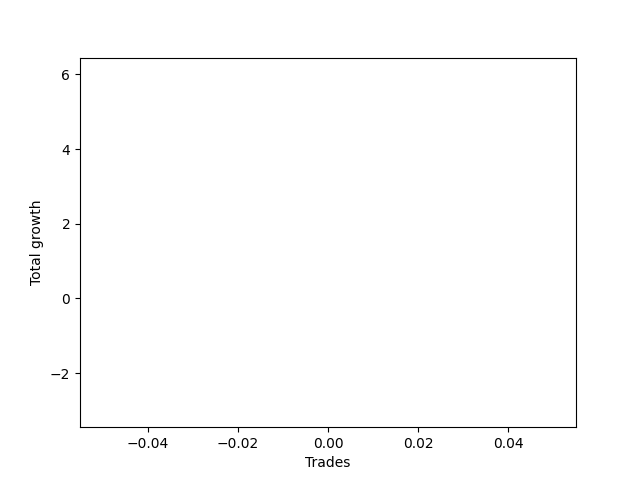

# Long Wallace Doodle 019 
- Symbol: TEST
- Date Range: 3/19/22 - 5/22/22
- Trading Period: 7:20-12:30
- Number of Trades: 1


| Name | Win Percent | Profit | Avg Profit / Trade |     | Name | Win Percent | Profit | Avg Profit / Trade |
| ---- | ----------- | ------ | ------------------ | --- | ---- | ----------- | ------ | ------------------ |
| Sorted By <br> Profit | | | | | Sorted By <br> Win Percentage ||||
| Thirty-Seven | 100.00 | 1625.00 | 1625.00 |     | Thirty-Seven | 100.00 | 1625.00 | 1625.00 |
| Thirty-Six | 100.00 | 375.00 | 375.00 |     | Thirty-Six | 100.00 | 375.00 | 375.00 |
| Thirty-Five | 100.00 | 125.00 | 125.00 |     | Thirty-Five | 100.00 | 125.00 | 125.00 |

### Test Thirty-Five
* Sell when the linear regression slope changes to negative
* No Stoploss
* Results:
```
Total Trades: 1
Percent Up: 100.00
Percent Down: 0.00
Total Points Moved Up: 0.25
Potential Profit: 125.00
Total Points Ups: 0.25 Count Ups: 1
Total Points Downs: 0.00 Count Downs: 0
```

<details><summary>Trades</summary>

<code>In: 2022-07-05 08:02:00		Out: 2022-07-05 08:11:05		Total Position Time: 09:05		Total Move Up: 0.25		Total to Date: 0.25</code> <br />


</details>

### Test Thirty-Six
* Sell when the bias changes to negative
* No Stoploss
* Results:
```
Total Trades: 1
Percent Up: 100.00
Percent Down: 0.00
Total Points Moved Up: 0.75
Potential Profit: 375.00
Total Points Ups: 0.75 Count Ups: 1
Total Points Downs: 0.00 Count Downs: 0
```

<details><summary>Trades</summary>

<code>In: 2022-07-05 08:02:00		Out: 2022-07-05 08:05:05		Total Position Time: 03:05		Total Move Up: 0.75		Total to Date: 0.75</code> <br />


</details>

### Test Thirty-Seven
* Sell when the STDEV slope changes to negative
* No Stoploss
* Results:
```
Total Trades: 1
Percent Up: 100.00
Percent Down: 0.00
Total Points Moved Up: 3.25
Potential Profit: 1625.00
Total Points Ups: 3.25 Count Ups: 1
Total Points Downs: 0.00 Count Downs: 0
```

<details><summary>Trades</summary>

<code>In: 2022-07-05 08:02:00		Out: 2022-07-05 08:31:55		Total Position Time: 29:55		Total Move Up: 3.25		Total to Date: 3.25</code> <br />


</details>