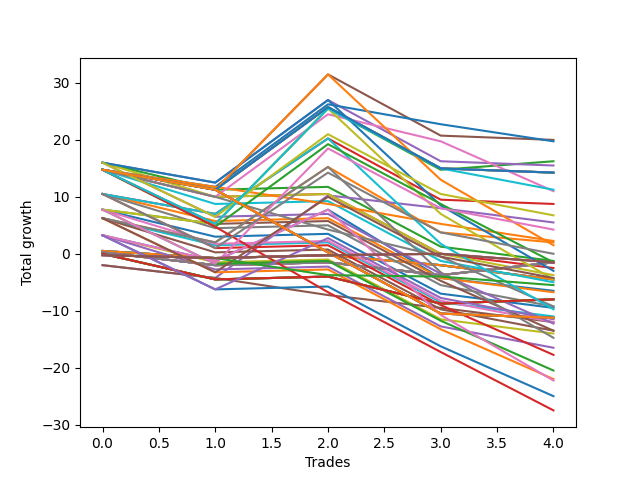

# Short Bulldog 003 
- Symbol: TEST
- Date Range: 3/19/22 - 5/22/22
- Trading Period: 7:20-12:30
- Number of Trades: 2



| Name | Win Percent | Profit | Avg Profit / Trade |     | Name | Win Percent | Profit | Avg Profit / Trade |
| ---- | ----------- | ------ | ------------------ | --- | ---- | ----------- | ------ | ------------------ |
| Sorted By <br> Profit | | | | | Sorted By <br> Win Percentage ||||
| Thirty-Seven | 50.00 | 5625.00 | 2812.50 |     | Thirty-Seven | 50.00 | 5625.00 | 2812.50 |
| Thirty-Six | 50.00 | 5625.00 | 2812.50 |     | Thirty-Six | 50.00 | 5625.00 | 2812.50 |
| Five | 50.00 | 5625.00 | 2812.50 |     | Five | 50.00 | 5625.00 | 2812.50 |
| Four | 50.00 | 5625.00 | 2812.50 |     | Four | 50.00 | 5625.00 | 2812.50 |
| Three | 50.00 | 2625.00 | 1312.50 |     | Three | 50.00 | 2625.00 | 1312.50 |
| Ten | 50.00 | 1500.00 | 750.00 |     | Ten | 50.00 | 1500.00 | 750.00 |
| Two | 50.00 | 1000.00 | 500.00 |     | Two | 50.00 | 1000.00 | 500.00 |
| Sixteen | 50.00 | 875.00 | 437.50 |     | Sixteen | 50.00 | 875.00 | 437.50 |
| Eight | 50.00 | 750.00 | 375.00 |     | Eight | 50.00 | 750.00 | 375.00 |
| Fourteen | 50.00 | 125.00 | 62.50 |     | Fourteen | 50.00 | 125.00 | 62.50 |
| Eleven | 50.00 | -375.00 | -187.50 |     | Eleven | 50.00 | -375.00 | -187.50 |
| Nine | 50.00 | -375.00 | -187.50 |     | Nine | 50.00 | -375.00 | -187.50 |
| Seven | 50.00 | -375.00 | -187.50 |     | Seven | 50.00 | -375.00 | -187.50 |
| Thirty-Three | 0.00 | -375.00 | -187.50 |     | One | 50.00 | -625.00 | -312.50 |
| Thirty-Two | 0.00 | -375.00 | -187.50 |     | Six | 50.00 | -750.00 | -375.00 |
| Thirty-One | 0.00 | -375.00 | -187.50 |     | Twenty-Two | 50.00 | -875.00 | -437.50 |
| Thirty | 0.00 | -375.00 | -187.50 |     | Seventeen | 50.00 | -1000.00 | -500.00 |
| Twenty-Nine | 0.00 | -375.00 | -187.50 |     | Fifteen | 50.00 | -1000.00 | -500.00 |
| Twenty-Eight | 0.00 | -375.00 | -187.50 |     | Thirteen | 50.00 | -1000.00 | -500.00 |
| Twenty-Seven | 0.00 | -375.00 | -187.50 |     | Twelve | 50.00 | -1375.00 | -687.50 |
| Twenty-Six | 0.00 | -375.00 | -187.50 |     | Twenty | 50.00 | -1625.00 | -812.50 |
| Twenty-Five | 0.00 | -375.00 | -187.50 |     | Thirty-Five | 50.00 | -1875.00 | -937.50 |
| Twenty-Four | 0.00 | -375.00 | -187.50 |     | Eighteen | 50.00 | -3125.00 | -1562.50 |
| One | 50.00 | -625.00 | -312.50 |     | Thirty-Three | 0.00 | -375.00 | -187.50 |
| Six | 50.00 | -750.00 | -375.00 |     | Thirty-Two | 0.00 | -375.00 | -187.50 |
| Twenty-Two | 50.00 | -875.00 | -437.50 |     | Thirty-One | 0.00 | -375.00 | -187.50 |
| Seventeen | 50.00 | -1000.00 | -500.00 |     | Thirty | 0.00 | -375.00 | -187.50 |
| Fifteen | 50.00 | -1000.00 | -500.00 |     | Twenty-Nine | 0.00 | -375.00 | -187.50 |
| Thirteen | 50.00 | -1000.00 | -500.00 |     | Twenty-Eight | 0.00 | -375.00 | -187.50 |
| Twelve | 50.00 | -1375.00 | -687.50 |     | Twenty-Seven | 0.00 | -375.00 | -187.50 |
| Twenty | 50.00 | -1625.00 | -812.50 |     | Twenty-Six | 0.00 | -375.00 | -187.50 |
| Thirty-Four | 0.00 | -1750.00 | -875.00 |     | Twenty-Five | 0.00 | -375.00 | -187.50 |
| Thirty-Five | 50.00 | -1875.00 | -937.50 |     | Twenty-Four | 0.00 | -375.00 | -187.50 |
| Twenty-Three | 0.00 | -2250.00 | -1125.00 |     | Thirty-Four | 0.00 | -1750.00 | -875.00 |
| Twenty-One | 0.00 | -2250.00 | -1125.00 |     | Twenty-Three | 0.00 | -2250.00 | -1125.00 |
| Nineteen | 0.00 | -2250.00 | -1125.00 |     | Twenty-One | 0.00 | -2250.00 | -1125.00 |
| Eighteen | 50.00 | -3125.00 | -1562.50 |     | Nineteen | 0.00 | -2250.00 | -1125.00 |

### Test One
* Sell when price hits the middle line of the 20p bollinger
* No Stoploss
* Results:
```
Total Trades: 2
Percent Up: 50.00
Percent Down: 50.00
Total Points Moved Down: -1.25
Potential Profit: -625.00
Total Points Ups: 4.50 Count Ups: 1
Total Points Downs: 3.25 Count Downs: 1
```

<details><summary>Trades</summary>

<code>In: 2022-07-05 09:27:00		Out: 2022-07-05 09:40:05		Total Position Time: 13:05		Total Move Down: 3.25		Total to Date: -3.25</code> <br />
<code>In: 2022-07-05 11:34:00		Out: 2022-07-05 11:48:05		Total Position Time: 14:05		Total Move Down: -4.50		Total to Date: 1.25</code> <br />


</details>

### Test Two
* Sell when the price hits the lower line of the 20p 1std bollinger
* No Stoploss
* Results:
```
Total Trades: 2
Percent Up: 50.00
Percent Down: 50.00
Total Points Moved Down: 2.00
Potential Profit: 1000.00
Total Points Ups: 4.25 Count Ups: 1
Total Points Downs: 6.25 Count Downs: 1
```

<details><summary>Trades</summary>

<code>In: 2022-07-05 09:27:00		Out: 2022-07-05 09:42:00		Total Position Time: 15:00		Total Move Down: 6.25		Total to Date: -6.25</code> <br />
<code>In: 2022-07-05 11:34:00		Out: 2022-07-05 11:53:20		Total Position Time: 19:20		Total Move Down: -4.25		Total to Date: -2.00</code> <br />


</details>

### Test Three
* Sell when the price hits the lower line of the 20p 2std bollinger
* No Stoploss
* Results:
```
Total Trades: 2
Percent Up: 50.00
Percent Down: 50.00
Total Points Moved Down: 5.25
Potential Profit: 2625.00
Total Points Ups: 2.50 Count Ups: 1
Total Points Downs: 7.75 Count Downs: 1
```

<details><summary>Trades</summary>

<code>In: 2022-07-05 09:27:00		Out: 2022-07-05 09:42:35		Total Position Time: 15:35		Total Move Down: 7.75		Total to Date: -7.75</code> <br />
<code>In: 2022-07-05 11:34:00		Out: 2022-07-05 12:01:50		Total Position Time: 27:50		Total Move Down: -2.50		Total to Date: -5.25</code> <br />


</details>

### Test Four
* Sell when the price hits the middle line of the 1std VWAP
* No Stoploss
* Results:
```
Total Trades: 2
Percent Up: 50.00
Percent Down: 50.00
Total Points Moved Down: 11.25
Potential Profit: 5625.00
Total Points Ups: 3.50 Count Ups: 1
Total Points Downs: 14.75 Count Downs: 1
```

<details><summary>Trades</summary>

<code>In: 2022-07-05 09:27:00		Out: 2022-07-05 09:56:55		Total Position Time: 29:55		Total Move Down: 14.75		Total to Date: -14.75</code> <br />
<code>In: 2022-07-05 11:34:00		Out: 2022-07-05 12:03:55		Total Position Time: 29:55		Total Move Down: -3.50		Total to Date: -11.25</code> <br />


</details>

### Test Five
* Sell when the price hits the lower line of the 1std VWAP
* No Stoploss
* Results:
```
Total Trades: 2
Percent Up: 50.00
Percent Down: 50.00
Total Points Moved Down: 11.25
Potential Profit: 5625.00
Total Points Ups: 3.50 Count Ups: 1
Total Points Downs: 14.75 Count Downs: 1
```

<details><summary>Trades</summary>

<code>In: 2022-07-05 09:27:00		Out: 2022-07-05 09:56:55		Total Position Time: 29:55		Total Move Down: 14.75		Total to Date: -14.75</code> <br />
<code>In: 2022-07-05 11:34:00		Out: 2022-07-05 12:03:55		Total Position Time: 29:55		Total Move Down: -3.50		Total to Date: -11.25</code> <br />


</details>

### Test Six
* Sell when the price hits the middle line of the 20p bollinger
* Stoploss is -2 points
* Results:
```
Total Trades: 2
Percent Up: 50.00
Percent Down: 50.00
Total Points Moved Down: -1.50
Potential Profit: -750.00
Total Points Ups: 4.75 Count Ups: 1
Total Points Downs: 3.25 Count Downs: 1
```

<details><summary>Trades</summary>

<code>In: 2022-07-05 09:27:00		Out: 2022-07-05 09:40:05		Total Position Time: 13:05		Total Move Down: 3.25		Total to Date: -3.25</code> <br />
<code>In: 2022-07-05 11:34:00		Out: 2022-07-05 11:36:05		Total Position Time: 02:05		Total Move Down: -4.75		Total to Date: 1.50</code> <br />


</details>

### Test Seven
* Sell when the price hits the middle line of the 20p bollinger
* Trailing Stop is -2 points
* Results:
```
Total Trades: 2
Percent Up: 50.00
Percent Down: 50.00
Total Points Moved Down: -0.75
Potential Profit: -375.00
Total Points Ups: 1.25 Count Ups: 1
Total Points Downs: 0.50 Count Downs: 1
```

<details><summary>Trades</summary>

<code>In: 2022-07-05 09:27:00		Out: 2022-07-05 09:30:15		Total Position Time: 03:15		Total Move Down: 0.50		Total to Date: -0.50</code> <br />
<code>In: 2022-07-05 11:34:00		Out: 2022-07-05 11:34:40		Total Position Time: 00:40		Total Move Down: -1.25		Total to Date: 0.75</code> <br />


</details>

### Test Eight
* Sell when the price hits the lower line of the 20p 1std bollinger
* Stoploss is -2 points
* Results:
```
Total Trades: 2
Percent Up: 50.00
Percent Down: 50.00
Total Points Moved Down: 1.50
Potential Profit: 750.00
Total Points Ups: 4.75 Count Ups: 1
Total Points Downs: 6.25 Count Downs: 1
```

<details><summary>Trades</summary>

<code>In: 2022-07-05 09:27:00		Out: 2022-07-05 09:42:00		Total Position Time: 15:00		Total Move Down: 6.25		Total to Date: -6.25</code> <br />
<code>In: 2022-07-05 11:34:00		Out: 2022-07-05 11:36:05		Total Position Time: 02:05		Total Move Down: -4.75		Total to Date: -1.50</code> <br />


</details>

### Test Nine
* Sell when the price hits the lower line of the 20p 1std bollinger
* Trailing Stop is -2 points
* Results:
```
Total Trades: 2
Percent Up: 50.00
Percent Down: 50.00
Total Points Moved Down: -0.75
Potential Profit: -375.00
Total Points Ups: 1.25 Count Ups: 1
Total Points Downs: 0.50 Count Downs: 1
```

<details><summary>Trades</summary>

<code>In: 2022-07-05 09:27:00		Out: 2022-07-05 09:30:15		Total Position Time: 03:15		Total Move Down: 0.50		Total to Date: -0.50</code> <br />
<code>In: 2022-07-05 11:34:00		Out: 2022-07-05 11:34:40		Total Position Time: 00:40		Total Move Down: -1.25		Total to Date: 0.75</code> <br />


</details>

### Test Ten
* Sell when the price hits the lower line of the 20p 2std bollinger
* Stoploss is -2 points
* Results:
```
Total Trades: 2
Percent Up: 50.00
Percent Down: 50.00
Total Points Moved Down: 3.00
Potential Profit: 1500.00
Total Points Ups: 4.75 Count Ups: 1
Total Points Downs: 7.75 Count Downs: 1
```

<details><summary>Trades</summary>

<code>In: 2022-07-05 09:27:00		Out: 2022-07-05 09:42:35		Total Position Time: 15:35		Total Move Down: 7.75		Total to Date: -7.75</code> <br />
<code>In: 2022-07-05 11:34:00		Out: 2022-07-05 11:36:05		Total Position Time: 02:05		Total Move Down: -4.75		Total to Date: -3.00</code> <br />


</details>

### Test Eleven
* Sell when the price hits the lower line of the 20p 2std bollinger
* Trailing Stop is -2 points
* Results:
```
Total Trades: 2
Percent Up: 50.00
Percent Down: 50.00
Total Points Moved Down: -0.75
Potential Profit: -375.00
Total Points Ups: 1.25 Count Ups: 1
Total Points Downs: 0.50 Count Downs: 1
```

<details><summary>Trades</summary>

<code>In: 2022-07-05 09:27:00		Out: 2022-07-05 09:30:15		Total Position Time: 03:15		Total Move Down: 0.50		Total to Date: -0.50</code> <br />
<code>In: 2022-07-05 11:34:00		Out: 2022-07-05 11:34:40		Total Position Time: 00:40		Total Move Down: -1.25		Total to Date: 0.75</code> <br />


</details>

### Test Twelve
* Sell when the price hits the middle line of the 20p bollinger
* Stoploss is -3 points
* Results:
```
Total Trades: 2
Percent Up: 50.00
Percent Down: 50.00
Total Points Moved Down: -2.75
Potential Profit: -1375.00
Total Points Ups: 6.00 Count Ups: 1
Total Points Downs: 3.25 Count Downs: 1
```

<details><summary>Trades</summary>

<code>In: 2022-07-05 09:27:00		Out: 2022-07-05 09:40:05		Total Position Time: 13:05		Total Move Down: 3.25		Total to Date: -3.25</code> <br />
<code>In: 2022-07-05 11:34:00		Out: 2022-07-05 11:36:55		Total Position Time: 02:55		Total Move Down: -6.00		Total to Date: 2.75</code> <br />


</details>

### Test Thirteen
* Sell when the price hits the middle line of the 20p bollinger
* Trailing Stop is -3 points
* Results:
```
Total Trades: 2
Percent Up: 50.00
Percent Down: 50.00
Total Points Moved Down: -2.00
Potential Profit: -1000.00
Total Points Ups: 2.25 Count Ups: 1
Total Points Downs: 0.25 Count Downs: 1
```

<details><summary>Trades</summary>

<code>In: 2022-07-05 09:27:00		Out: 2022-07-05 09:30:25		Total Position Time: 03:25		Total Move Down: 0.25		Total to Date: -0.25</code> <br />
<code>In: 2022-07-05 11:34:00		Out: 2022-07-05 11:34:45		Total Position Time: 00:45		Total Move Down: -2.25		Total to Date: 2.00</code> <br />


</details>

### Test Fourteen
* Sell when the price hits the lower line of the 20p 1std bollinger
* Stoploss is -3 points
* Results:
```
Total Trades: 2
Percent Up: 50.00
Percent Down: 50.00
Total Points Moved Down: 0.25
Potential Profit: 125.00
Total Points Ups: 6.00 Count Ups: 1
Total Points Downs: 6.25 Count Downs: 1
```

<details><summary>Trades</summary>

<code>In: 2022-07-05 09:27:00		Out: 2022-07-05 09:42:00		Total Position Time: 15:00		Total Move Down: 6.25		Total to Date: -6.25</code> <br />
<code>In: 2022-07-05 11:34:00		Out: 2022-07-05 11:36:55		Total Position Time: 02:55		Total Move Down: -6.00		Total to Date: -0.25</code> <br />


</details>

### Test Fifteen
* Sell when the price hits the lower line of the 20p 1std bollinger
* Trailing Stop is -3 points
* Results:
```
Total Trades: 2
Percent Up: 50.00
Percent Down: 50.00
Total Points Moved Down: -2.00
Potential Profit: -1000.00
Total Points Ups: 2.25 Count Ups: 1
Total Points Downs: 0.25 Count Downs: 1
```

<details><summary>Trades</summary>

<code>In: 2022-07-05 09:27:00		Out: 2022-07-05 09:30:25		Total Position Time: 03:25		Total Move Down: 0.25		Total to Date: -0.25</code> <br />
<code>In: 2022-07-05 11:34:00		Out: 2022-07-05 11:34:45		Total Position Time: 00:45		Total Move Down: -2.25		Total to Date: 2.00</code> <br />


</details>

### Test Sixteen
* Sell when the price hits the lower line of the 20p 2std bollinger
* Stoploss is -3 points
* Results:
```
Total Trades: 2
Percent Up: 50.00
Percent Down: 50.00
Total Points Moved Down: 1.75
Potential Profit: 875.00
Total Points Ups: 6.00 Count Ups: 1
Total Points Downs: 7.75 Count Downs: 1
```

<details><summary>Trades</summary>

<code>In: 2022-07-05 09:27:00		Out: 2022-07-05 09:42:35		Total Position Time: 15:35		Total Move Down: 7.75		Total to Date: -7.75</code> <br />
<code>In: 2022-07-05 11:34:00		Out: 2022-07-05 11:36:55		Total Position Time: 02:55		Total Move Down: -6.00		Total to Date: -1.75</code> <br />


</details>

### Test Seventeen
* Sell when the price hits the lower line of the 20p 2std bollinger
* Trailing Stop is -3 points
* Results:
```
Total Trades: 2
Percent Up: 50.00
Percent Down: 50.00
Total Points Moved Down: -2.00
Potential Profit: -1000.00
Total Points Ups: 2.25 Count Ups: 1
Total Points Downs: 0.25 Count Downs: 1
```

<details><summary>Trades</summary>

<code>In: 2022-07-05 09:27:00		Out: 2022-07-05 09:30:25		Total Position Time: 03:25		Total Move Down: 0.25		Total to Date: -0.25</code> <br />
<code>In: 2022-07-05 11:34:00		Out: 2022-07-05 11:34:45		Total Position Time: 00:45		Total Move Down: -2.25		Total to Date: 2.00</code> <br />


</details>

### Test Eighteen
* Sell when the price hits the middle line of the 20p bollinger
* Stoploss is -5 points
* Results:
```
Total Trades: 2
Percent Up: 50.00
Percent Down: 50.00
Total Points Moved Down: -6.25
Potential Profit: -3125.00
Total Points Ups: 9.50 Count Ups: 1
Total Points Downs: 3.25 Count Downs: 1
```

<details><summary>Trades</summary>

<code>In: 2022-07-05 09:27:00		Out: 2022-07-05 09:40:05		Total Position Time: 13:05		Total Move Down: 3.25		Total to Date: -3.25</code> <br />
<code>In: 2022-07-05 11:34:00		Out: 2022-07-05 11:39:10		Total Position Time: 05:10		Total Move Down: -9.50		Total to Date: 6.25</code> <br />


</details>

### Test Nineteen
* Sell when the price hits the middle line of the 20p bollinger
* Trailing Stop is -5 points
* Results:
```
Total Trades: 2
Percent Up: 100.00
Percent Down: 0.00
Total Points Moved Down: -4.50
Potential Profit: -2250.00
Total Points Ups: 4.50 Count Ups: 2
Total Points Downs: 0.00 Count Downs: 0
```

<details><summary>Trades</summary>

<code>In: 2022-07-05 09:27:00		Out: 2022-07-05 09:38:50		Total Position Time: 11:50		Total Move Down: -0.00		Total to Date: -0.00</code> <br />
<code>In: 2022-07-05 11:34:00		Out: 2022-07-05 11:36:00		Total Position Time: 02:00		Total Move Down: -4.50		Total to Date: 4.50</code> <br />


</details>

### Test Twenty
* Sell when the price hits the lower line of the 20p 1std bollinger
* Stoploss is -5 points
* Results:
```
Total Trades: 2
Percent Up: 50.00
Percent Down: 50.00
Total Points Moved Down: -3.25
Potential Profit: -1625.00
Total Points Ups: 9.50 Count Ups: 1
Total Points Downs: 6.25 Count Downs: 1
```

<details><summary>Trades</summary>

<code>In: 2022-07-05 09:27:00		Out: 2022-07-05 09:42:00		Total Position Time: 15:00		Total Move Down: 6.25		Total to Date: -6.25</code> <br />
<code>In: 2022-07-05 11:34:00		Out: 2022-07-05 11:39:10		Total Position Time: 05:10		Total Move Down: -9.50		Total to Date: 3.25</code> <br />


</details>

### Test Twenty-One
* Sell when the price hits the lower line of the 20p 1std bollinger
* Trailing Stop is -5 points
* Results:
```
Total Trades: 2
Percent Up: 100.00
Percent Down: 0.00
Total Points Moved Down: -4.50
Potential Profit: -2250.00
Total Points Ups: 4.50 Count Ups: 2
Total Points Downs: 0.00 Count Downs: 0
```

<details><summary>Trades</summary>

<code>In: 2022-07-05 09:27:00		Out: 2022-07-05 09:38:50		Total Position Time: 11:50		Total Move Down: -0.00		Total to Date: -0.00</code> <br />
<code>In: 2022-07-05 11:34:00		Out: 2022-07-05 11:36:00		Total Position Time: 02:00		Total Move Down: -4.50		Total to Date: 4.50</code> <br />


</details>

### Test Twenty-Two
* Sell when the price hits the lower line of the 20p 2std bollinger
* Stoploss is -5 points
* Results:
```
Total Trades: 2
Percent Up: 50.00
Percent Down: 50.00
Total Points Moved Down: -1.75
Potential Profit: -875.00
Total Points Ups: 9.50 Count Ups: 1
Total Points Downs: 7.75 Count Downs: 1
```

<details><summary>Trades</summary>

<code>In: 2022-07-05 09:27:00		Out: 2022-07-05 09:42:35		Total Position Time: 15:35		Total Move Down: 7.75		Total to Date: -7.75</code> <br />
<code>In: 2022-07-05 11:34:00		Out: 2022-07-05 11:39:10		Total Position Time: 05:10		Total Move Down: -9.50		Total to Date: 1.75</code> <br />


</details>

### Test Twenty-Three
* Sell when the price hits the lower line of the 20p 2std bollinger
* Trailing Stop is -5 points
* Results:
```
Total Trades: 2
Percent Up: 100.00
Percent Down: 0.00
Total Points Moved Down: -4.50
Potential Profit: -2250.00
Total Points Ups: 4.50 Count Ups: 2
Total Points Downs: 0.00 Count Downs: 0
```

<details><summary>Trades</summary>

<code>In: 2022-07-05 09:27:00		Out: 2022-07-05 09:38:50		Total Position Time: 11:50		Total Move Down: -0.00		Total to Date: -0.00</code> <br />
<code>In: 2022-07-05 11:34:00		Out: 2022-07-05 11:36:00		Total Position Time: 02:00		Total Move Down: -4.50		Total to Date: 4.50</code> <br />


</details>

### Test Twenty-Four
* Sell when the price hits the middle line of the 20p bollinger
* Stoploss is 10 points
* Results:
```
Total Trades: 2
Percent Up: 100.00
Percent Down: 0.00
Total Points Moved Down: -0.75
Potential Profit: -375.00
Total Points Ups: 0.75 Count Ups: 2
Total Points Downs: 0.00 Count Downs: 0
```

<details><summary>Trades</summary>

<code>In: 2022-07-05 09:27:00		Out: 2022-07-05 09:27:10		Total Position Time: 00:10		Total Move Down: -0.25		Total to Date: 0.25</code> <br />
<code>In: 2022-07-05 11:34:00		Out: 2022-07-05 11:34:10		Total Position Time: 00:10		Total Move Down: -0.50		Total to Date: 0.75</code> <br />


</details>

### Test Twenty-Five
* Sell when the price hits the middle line of the 20p bollinger
* Trailing Stop is 10 points
* Results:
```
Total Trades: 2
Percent Up: 100.00
Percent Down: 0.00
Total Points Moved Down: -0.75
Potential Profit: -375.00
Total Points Ups: 0.75 Count Ups: 2
Total Points Downs: 0.00 Count Downs: 0
```

<details><summary>Trades</summary>

<code>In: 2022-07-05 09:27:00		Out: 2022-07-05 09:27:10		Total Position Time: 00:10		Total Move Down: -0.25		Total to Date: 0.25</code> <br />
<code>In: 2022-07-05 11:34:00		Out: 2022-07-05 11:34:10		Total Position Time: 00:10		Total Move Down: -0.50		Total to Date: 0.75</code> <br />


</details>

### Test Twenty-Six
* Sell when the price hits the lower line of the 20p 1std bollinger
* Stoploss is 10 points
* Results:
```
Total Trades: 2
Percent Up: 100.00
Percent Down: 0.00
Total Points Moved Down: -0.75
Potential Profit: -375.00
Total Points Ups: 0.75 Count Ups: 2
Total Points Downs: 0.00 Count Downs: 0
```

<details><summary>Trades</summary>

<code>In: 2022-07-05 09:27:00		Out: 2022-07-05 09:27:10		Total Position Time: 00:10		Total Move Down: -0.25		Total to Date: 0.25</code> <br />
<code>In: 2022-07-05 11:34:00		Out: 2022-07-05 11:34:10		Total Position Time: 00:10		Total Move Down: -0.50		Total to Date: 0.75</code> <br />


</details>

### Test Twenty-Seven
* Sell when the price hits the lower line of the 20p 1std bollinger
* Trailing Stop is 10 points
* Results:
```
Total Trades: 2
Percent Up: 100.00
Percent Down: 0.00
Total Points Moved Down: -0.75
Potential Profit: -375.00
Total Points Ups: 0.75 Count Ups: 2
Total Points Downs: 0.00 Count Downs: 0
```

<details><summary>Trades</summary>

<code>In: 2022-07-05 09:27:00		Out: 2022-07-05 09:27:10		Total Position Time: 00:10		Total Move Down: -0.25		Total to Date: 0.25</code> <br />
<code>In: 2022-07-05 11:34:00		Out: 2022-07-05 11:34:10		Total Position Time: 00:10		Total Move Down: -0.50		Total to Date: 0.75</code> <br />


</details>

### Test Twenty-Eight
* Sell when the price hits the lower line of the 20p 2std bollinger
* Stoploss is 10 points
* Results:
```
Total Trades: 2
Percent Up: 100.00
Percent Down: 0.00
Total Points Moved Down: -0.75
Potential Profit: -375.00
Total Points Ups: 0.75 Count Ups: 2
Total Points Downs: 0.00 Count Downs: 0
```

<details><summary>Trades</summary>

<code>In: 2022-07-05 09:27:00		Out: 2022-07-05 09:27:10		Total Position Time: 00:10		Total Move Down: -0.25		Total to Date: 0.25</code> <br />
<code>In: 2022-07-05 11:34:00		Out: 2022-07-05 11:34:10		Total Position Time: 00:10		Total Move Down: -0.50		Total to Date: 0.75</code> <br />


</details>

### Test Twenty-Nine
* Sell when the price hits the lower line of the 20p 2std bollinger
* Trailing Stop is 10 points
* Results:
```
Total Trades: 2
Percent Up: 100.00
Percent Down: 0.00
Total Points Moved Down: -0.75
Potential Profit: -375.00
Total Points Ups: 0.75 Count Ups: 2
Total Points Downs: 0.00 Count Downs: 0
```

<details><summary>Trades</summary>

<code>In: 2022-07-05 09:27:00		Out: 2022-07-05 09:27:10		Total Position Time: 00:10		Total Move Down: -0.25		Total to Date: 0.25</code> <br />
<code>In: 2022-07-05 11:34:00		Out: 2022-07-05 11:34:10		Total Position Time: 00:10		Total Move Down: -0.50		Total to Date: 0.75</code> <br />


</details>

### Test Thirty
* Sell when the price hits the middle line of the 1std VWAP
* Stoploss is 10 points
* Results:
```
Total Trades: 2
Percent Up: 100.00
Percent Down: 0.00
Total Points Moved Down: -0.75
Potential Profit: -375.00
Total Points Ups: 0.75 Count Ups: 2
Total Points Downs: 0.00 Count Downs: 0
```

<details><summary>Trades</summary>

<code>In: 2022-07-05 09:27:00		Out: 2022-07-05 09:27:10		Total Position Time: 00:10		Total Move Down: -0.25		Total to Date: 0.25</code> <br />
<code>In: 2022-07-05 11:34:00		Out: 2022-07-05 11:34:10		Total Position Time: 00:10		Total Move Down: -0.50		Total to Date: 0.75</code> <br />


</details>

### Test Thirty-One
* Sell when the price hits the middle line of the 1std VWAP
* Trailing Stop is 10 points
* Results:
```
Total Trades: 2
Percent Up: 100.00
Percent Down: 0.00
Total Points Moved Down: -0.75
Potential Profit: -375.00
Total Points Ups: 0.75 Count Ups: 2
Total Points Downs: 0.00 Count Downs: 0
```

<details><summary>Trades</summary>

<code>In: 2022-07-05 09:27:00		Out: 2022-07-05 09:27:10		Total Position Time: 00:10		Total Move Down: -0.25		Total to Date: 0.25</code> <br />
<code>In: 2022-07-05 11:34:00		Out: 2022-07-05 11:34:10		Total Position Time: 00:10		Total Move Down: -0.50		Total to Date: 0.75</code> <br />


</details>

### Test Thirty-Two
* Sell when the price hits the lower line of the 1std VWAP
* Stoploss is 10 points
* Results:
```
Total Trades: 2
Percent Up: 100.00
Percent Down: 0.00
Total Points Moved Down: -0.75
Potential Profit: -375.00
Total Points Ups: 0.75 Count Ups: 2
Total Points Downs: 0.00 Count Downs: 0
```

<details><summary>Trades</summary>

<code>In: 2022-07-05 09:27:00		Out: 2022-07-05 09:27:10		Total Position Time: 00:10		Total Move Down: -0.25		Total to Date: 0.25</code> <br />
<code>In: 2022-07-05 11:34:00		Out: 2022-07-05 11:34:10		Total Position Time: 00:10		Total Move Down: -0.50		Total to Date: 0.75</code> <br />


</details>

### Test Thirty-Three
* Sell when the price hits the lower line of the 1std VWAP
* Trailing Stop is 10 points
* Results:
```
Total Trades: 2
Percent Up: 100.00
Percent Down: 0.00
Total Points Moved Down: -0.75
Potential Profit: -375.00
Total Points Ups: 0.75 Count Ups: 2
Total Points Downs: 0.00 Count Downs: 0
```

<details><summary>Trades</summary>

<code>In: 2022-07-05 09:27:00		Out: 2022-07-05 09:27:10		Total Position Time: 00:10		Total Move Down: -0.25		Total to Date: 0.25</code> <br />
<code>In: 2022-07-05 11:34:00		Out: 2022-07-05 11:34:10		Total Position Time: 00:10		Total Move Down: -0.50		Total to Date: 0.75</code> <br />


</details>

### Test Thirty-Four
* Sell when the linear regression slope is positive
* No Stoploss
* Results:
```
Total Trades: 2
Percent Up: 100.00
Percent Down: 0.00
Total Points Moved Down: -3.50
Potential Profit: -1750.00
Total Points Ups: 3.50 Count Ups: 2
Total Points Downs: 0.00 Count Downs: 0
```

<details><summary>Trades</summary>

<code>In: 2022-07-05 09:27:00		Out: 2022-07-05 09:28:05		Total Position Time: 01:05		Total Move Down: -1.25		Total to Date: 1.25</code> <br />
<code>In: 2022-07-05 11:34:00		Out: 2022-07-05 11:35:05		Total Position Time: 01:05		Total Move Down: -2.25		Total to Date: 3.50</code> <br />


</details>

### Test Thirty-Five
* Sell when the linear regression slope changes to positive
* No Stoploss
* Results:
```
Total Trades: 2
Percent Up: 50.00
Percent Down: 50.00
Total Points Moved Down: -3.75
Potential Profit: -1875.00
Total Points Ups: 6.25 Count Ups: 1
Total Points Downs: 2.50 Count Downs: 1
```

<details><summary>Trades</summary>

<code>In: 2022-07-05 09:27:00		Out: 2022-07-05 09:38:05		Total Position Time: 11:05		Total Move Down: 2.50		Total to Date: -2.50</code> <br />
<code>In: 2022-07-05 11:34:00		Out: 2022-07-05 11:55:05		Total Position Time: 21:05		Total Move Down: -6.25		Total to Date: 3.75</code> <br />


</details>

### Test Thirty-Six
* Sell when the bias changes to positive
* No Stoploss
* Results:
```
Total Trades: 2
Percent Up: 50.00
Percent Down: 50.00
Total Points Moved Down: 11.25
Potential Profit: 5625.00
Total Points Ups: 3.50 Count Ups: 1
Total Points Downs: 14.75 Count Downs: 1
```

<details><summary>Trades</summary>

<code>In: 2022-07-05 09:27:00		Out: 2022-07-05 09:56:55		Total Position Time: 29:55		Total Move Down: 14.75		Total to Date: -14.75</code> <br />
<code>In: 2022-07-05 11:34:00		Out: 2022-07-05 12:03:55		Total Position Time: 29:55		Total Move Down: -3.50		Total to Date: -11.25</code> <br />


</details>

### Test Thirty-Seven
* Sell when the STDEV slope changes to positive
* No Stoploss
* Results:
```
Total Trades: 2
Percent Up: 50.00
Percent Down: 50.00
Total Points Moved Down: 11.25
Potential Profit: 5625.00
Total Points Ups: 3.50 Count Ups: 1
Total Points Downs: 14.75 Count Downs: 1
```

<details><summary>Trades</summary>

<code>In: 2022-07-05 09:27:00		Out: 2022-07-05 09:56:55		Total Position Time: 29:55		Total Move Down: 14.75		Total to Date: -14.75</code> <br />
<code>In: 2022-07-05 11:34:00		Out: 2022-07-05 12:03:55		Total Position Time: 29:55		Total Move Down: -3.50		Total to Date: -11.25</code> <br />


</details>