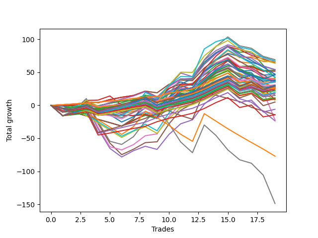

# Short Bulldog 005 DB 
- Symbol: TEST
- Date Range: 03/18/2022 - 07/15/2022
- Trading Period: 7:20-12:30
- Number of Trades: 19



| Name | Win Percent | Profit | Avg Profit / Trade | Avg Time / Trade |      | Name | Win Percent | Profit | Avg Profit / Trade | Avg Time / Trade |
| ---- | ----------- | ------ | ------------------ | ---------------- | ---- | ---- | ----------- | ------ | ------------------ | ---------------- |
| Sorted By <br> Profit | | | | | | Sorted By <br> Win Percentage ||||
| Sixty-Nine | 47.37 | 34625.00 | 1822.37 | 18:15 |     | One Hundred Twenty-One | 89.47 | 15500.00 | 815.79 | 03:08 |
| Seventy-One | 47.37 | 33625.00 | 1769.74 | 26:51 |     | One Hundred Twenty-Six | 89.47 | 12875.00 | 677.63 | 03:28 |
| Forty-Six | 42.11 | 33500.00 | 1763.16 | 14:35 |     | Eighty-One | 89.47 | 9250.00 | 486.84 | 23:04 |
| Fifty-Three | 52.63 | 33375.00 | 1756.58 | 07:50 |     | One Hundred Eleven | 84.21 | 17375.00 | 914.47 | 02:04 |
| Forty-Five | 36.84 | 32250.00 | 1697.37 | 15:06 |     | One Hundred Sixteen | 84.21 | 13375.00 | 703.95 | 02:08 |
| Seventy | 47.37 | 31875.00 | 1677.63 | 17:40 |     | Eighty-Two | 84.21 | 4750.00 | 250.00 | 32:45 |
| Sixty-Six | 63.16 | 27125.00 | 1427.63 | 13:41 |     | One Hundred Twenty-Two | 78.95 | 7500.00 | 394.74 | 06:37 |
| Forty-Two | 52.63 | 27000.00 | 1421.05 | 12:03 |     | One Hundred Twenty-Seven | 78.95 | 5625.00 | 296.05 | 06:09 |
| Fifty-Four | 52.63 | 26625.00 | 1401.32 | 07:44 |     | Eighty-Five | 78.95 | 2500.00 | 131.58 | 41:28 |
| Fifty-Five | 52.63 | 25875.00 | 1361.84 | 09:06 |     | Eighty-Four | 78.95 | -3000.00 | -157.89 | 39:46 |
| Fifty-Eight | 68.42 | 23625.00 | 1243.42 | 16:40 |     | Eighty-Three | 78.95 | -7125.00 | -375.00 | 38:50 |
| Sixty-Two | 52.63 | 23625.00 | 1243.42 | 22:37 |     | Two | 73.68 | 21000.00 | 1105.26 | 26:14 |
| Fifty-Two | 52.63 | 23125.00 | 1217.11 | 07:31 |     | One Hundred Twenty-Five | 73.68 | 15250.00 | 802.63 | 11:02 |
| One Hundred Fifteen | 68.42 | 23000.00 | 1210.53 | 06:24 |     | One Hundred Thirty | 73.68 | 14500.00 | 763.16 | 10:31 |
| Sixty-One | 47.37 | 21375.00 | 1125.00 | 23:17 |     | One Hundred Twelve | 73.68 | 14250.00 | 750.00 | 04:04 |
| Two | 73.68 | 21000.00 | 1105.26 | 26:14 |     | One Hundred Seventeen | 73.68 | 11000.00 | 578.95 | 03:20 |
| One | 63.16 | 20250.00 | 1065.79 | 19:34 |     | One Hundred Twenty-Four | 73.68 | 9750.00 | 513.16 | 09:20 |
| Forty | 63.16 | 19875.00 | 1046.05 | 07:41 |     | One Hundred Twenty-Nine | 73.68 | 9000.00 | 473.68 | 08:48 |
| Fifty-One | 52.63 | 19750.00 | 1039.47 | 06:34 |     | One Hundred Twenty-Three | 73.68 | 5625.00 | 296.05 | 08:24 |
| Fifty | 52.63 | 19375.00 | 1019.74 | 07:12 |     | One Hundred Twenty-Eight | 73.68 | 4875.00 | 256.58 | 07:53 |
| Sixty-Eight | 47.37 | 19125.00 | 1006.58 | 16:16 |     | Fifty-Eight | 68.42 | 23625.00 | 1243.42 | 16:40 |
| Seventy-Three | 57.89 | 19000.00 | 1000.00 | 11:17 |     | One Hundred Fifteen | 68.42 | 23000.00 | 1210.53 | 06:24 |
| Fifty-Six | 63.16 | 18750.00 | 986.84 | 09:41 |     | One Hundred Fourteen | 68.42 | 17875.00 | 940.79 | 04:53 |
| Sixty-Five | 63.16 | 18625.00 | 980.26 | 12:05 |     | One Hundred Thirteen | 68.42 | 14250.00 | 750.00 | 04:22 |
| Zero | 63.16 | 18500.00 | 973.68 | 11:48 |     | One Hundred Eighteen | 68.42 | 12125.00 | 638.16 | 03:36 |
| One Hundred Fourteen | 68.42 | 17875.00 | 940.79 | 04:53 |     | Sixty-Six | 63.16 | 27125.00 | 1427.63 | 13:41 |
| Fifty-Seven | 63.16 | 17875.00 | 940.79 | 14:40 |     | One | 63.16 | 20250.00 | 1065.79 | 19:34 |
| Forty-Four | 36.84 | 17750.00 | 934.21 | 13:27 |     | Forty | 63.16 | 19875.00 | 1046.05 | 07:41 |
| Forty-One | 57.89 | 17625.00 | 927.63 | 10:58 |     | Fifty-Six | 63.16 | 18750.00 | 986.84 | 09:41 |
| One Hundred Eleven | 84.21 | 17375.00 | 914.47 | 02:04 |     | Sixty-Five | 63.16 | 18625.00 | 980.26 | 12:05 |
| One Hundred Twenty-One | 89.47 | 15500.00 | 815.79 | 03:08 |     | Zero | 63.16 | 18500.00 | 973.68 | 11:48 |
| One Hundred Twenty-Five | 73.68 | 15250.00 | 802.63 | 11:02 |     | Fifty-Seven | 63.16 | 17875.00 | 940.79 | 14:40 |
| One Hundred Twenty | 57.89 | 14875.00 | 782.89 | 04:18 |     | One Hundred Ninteen | 63.16 | 13125.00 | 690.79 | 03:54 |
| One Hundred Thirty | 73.68 | 14500.00 | 763.16 | 10:31 |     | Three | 63.16 | 4500.00 | 236.84 | 34:08 |
| One Hundred Twelve | 73.68 | 14250.00 | 750.00 | 04:04 |     | Seventy-Three | 57.89 | 19000.00 | 1000.00 | 11:17 |
| One Hundred Thirteen | 68.42 | 14250.00 | 750.00 | 04:22 |     | Forty-One | 57.89 | 17625.00 | 927.63 | 10:58 |
| Forty-Nine | 52.63 | 14250.00 | 750.00 | 06:39 |     | One Hundred Twenty | 57.89 | 14875.00 | 782.89 | 04:18 |
| Sixty-Four | 57.89 | 14125.00 | 743.42 | 09:00 |     | Sixty-Four | 57.89 | 14125.00 | 743.42 | 09:00 |
| Forty-Three | 42.11 | 13875.00 | 730.26 | 11:31 |     | Five | 57.89 | 12750.00 | 671.05 | 56:56 |
| One Hundred Sixteen | 84.21 | 13375.00 | 703.95 | 02:08 |     | Fifty-Nine | 57.89 | 7750.00 | 407.89 | 17:21 |
| Forty-Eight | 52.63 | 13375.00 | 703.95 | 05:17 |     | Six | 57.89 | -11000.00 | -578.95 | 84:04 |
| One Hundred Ninteen | 63.16 | 13125.00 | 690.79 | 03:54 |     | Fifty-Three | 52.63 | 33375.00 | 1756.58 | 07:50 |
| One Hundred Twenty-Six | 89.47 | 12875.00 | 677.63 | 03:28 |     | Forty-Two | 52.63 | 27000.00 | 1421.05 | 12:03 |
| Five | 57.89 | 12750.00 | 671.05 | 56:56 |     | Fifty-Four | 52.63 | 26625.00 | 1401.32 | 07:44 |
| One Hundred Eighteen | 68.42 | 12125.00 | 638.16 | 03:36 |     | Fifty-Five | 52.63 | 25875.00 | 1361.84 | 09:06 |
| One Hundred Seventeen | 73.68 | 11000.00 | 578.95 | 03:20 |     | Sixty-Two | 52.63 | 23625.00 | 1243.42 | 22:37 |
| Sixty-Seven | 47.37 | 11000.00 | 578.95 | 13:53 |     | Fifty-Two | 52.63 | 23125.00 | 1217.11 | 07:31 |
| One Hundred Twenty-Four | 73.68 | 9750.00 | 513.16 | 09:20 |     | Fifty-One | 52.63 | 19750.00 | 1039.47 | 06:34 |
| Eighty-One | 89.47 | 9250.00 | 486.84 | 23:04 |     | Fifty | 52.63 | 19375.00 | 1019.74 | 07:12 |
| One Hundred Twenty-Nine | 73.68 | 9000.00 | 473.68 | 08:48 |     | Forty-Nine | 52.63 | 14250.00 | 750.00 | 06:39 |
| Fifty-Nine | 57.89 | 7750.00 | 407.89 | 17:21 |     | Forty-Eight | 52.63 | 13375.00 | 703.95 | 05:17 |
| One Hundred Twenty-Two | 78.95 | 7500.00 | 394.74 | 06:37 |     | Four | 52.63 | -11750.00 | -618.42 | 47:37 |
| One Hundred Twenty-Seven | 78.95 | 5625.00 | 296.05 | 06:09 |     | Sixty-Nine | 47.37 | 34625.00 | 1822.37 | 18:15 |
| One Hundred Twenty-Three | 73.68 | 5625.00 | 296.05 | 08:24 |     | Seventy-One | 47.37 | 33625.00 | 1769.74 | 26:51 |
| One Hundred Twenty-Eight | 73.68 | 4875.00 | 256.58 | 07:53 |     | Seventy | 47.37 | 31875.00 | 1677.63 | 17:40 |
| Eighty-Two | 84.21 | 4750.00 | 250.00 | 32:45 |     | Sixty-One | 47.37 | 21375.00 | 1125.00 | 23:17 |
| Three | 63.16 | 4500.00 | 236.84 | 34:08 |     | Sixty-Eight | 47.37 | 19125.00 | 1006.58 | 16:16 |
| Sixty | 47.37 | 3875.00 | 203.95 | 21:01 |     | Sixty-Seven | 47.37 | 11000.00 | 578.95 | 13:53 |
| Eighty-Five | 78.95 | 2500.00 | 131.58 | 41:28 |     | Sixty | 47.37 | 3875.00 | 203.95 | 21:01 |
| Eighty-Four | 78.95 | -3000.00 | -157.89 | 39:46 |     | Forty-Six | 42.11 | 33500.00 | 1763.16 | 14:35 |
| Eighty-Three | 78.95 | -7125.00 | -375.00 | 38:50 |     | Forty-Three | 42.11 | 13875.00 | 730.26 | 11:31 |
| Forty-Seven | 15.79 | -7125.00 | -375.00 | 30:57 |     | Forty-Five | 36.84 | 32250.00 | 1697.37 | 15:06 |
| Six | 57.89 | -11000.00 | -578.95 | 84:04 |     | Forty-Four | 36.84 | 17750.00 | 934.21 | 13:27 |
| Four | 52.63 | -11750.00 | -618.42 | 47:37 |     | Seven | 31.58 | -74375.00 | -3914.47 | 141:01 |
| Sixty-Three | 21.05 | -38500.00 | -2026.32 | 48:07 |     | Sixty-Three | 21.05 | -38500.00 | -2026.32 | 48:07 |
| Seven | 31.58 | -74375.00 | -3914.47 | 141:01 |     | Forty-Seven | 15.79 | -7125.00 | -375.00 | 30:57 |

## NO STOPLOSS

### Test Zero
* Sell when price hits the middle line of the 20p bollinger
* No Stoploss
* Results:
```
Total Trades: 19
Percent Up: 36.84
Percent Down: 63.16
Total Points Moved Down: 37.00
Potential Profit: 18500.00
Total Points Ups: 38.25 Count Ups: 7
Total Points Downs: 75.25 Count Downs: 12
```

<details><summary>Trades</summary>

<code>In: 2022-03-29 11:38:00		Out: 2022-03-29 11:58:00		Total Position Time: 20:00		Total Move Down: -0.75		Total to Date: -0.75</code> <br />
<code>In: 2022-03-31 07:48:00		Out: 2022-03-31 08:03:10		Total Position Time: 15:10		Total Move Down: -0.50		Total to Date: -1.25</code> <br />
<code>In: 2022-04-06 10:43:00		Out: 2022-04-06 10:55:55		Total Position Time: 12:55		Total Move Down: 2.25		Total to Date: 1.00</code> <br />
<code>In: 2022-04-07 10:58:00		Out: 2022-04-07 11:15:20		Total Position Time: 17:20		Total Move Down: -1.75		Total to Date: -0.75</code> <br />
<code>In: 2022-04-07 11:03:00		Out: 2022-04-07 11:15:20		Total Position Time: 12:20		Total Move Down: 4.00		Total to Date: 3.25</code> <br />
<code>In: 2022-04-08 07:33:00		Out: 2022-04-08 07:44:35		Total Position Time: 11:35		Total Move Down: 3.25		Total to Date: 6.50</code> <br />
<code>In: 2022-04-18 07:27:00		Out: 2022-04-18 07:46:00		Total Position Time: 19:00		Total Move Down: 1.00		Total to Date: 7.50</code> <br />
<code>In: 2022-04-18 11:26:00		Out: 2022-04-18 11:28:05		Total Position Time: 02:05		Total Move Down: 6.00		Total to Date: 13.50</code> <br />
<code>In: 2022-05-04 09:24:00		Out: 2022-05-04 09:45:30		Total Position Time: 21:30		Total Move Down: -4.00		Total to Date: 9.50</code> <br />
<code>In: 2022-05-24 09:17:00		Out: 2022-05-24 09:22:10		Total Position Time: 05:10		Total Move Down: 12.00		Total to Date: 21.50</code> <br />
<code>In: 2022-05-24 09:18:00		Out: 2022-05-24 09:22:10		Total Position Time: 04:10		Total Move Down: 5.75		Total to Date: 27.25</code> <br />
<code>In: 2022-05-31 07:23:00		Out: 2022-05-31 07:37:30		Total Position Time: 14:30		Total Move Down: 5.75		Total to Date: 33.00</code> <br />
<code>In: 2022-06-13 09:40:00		Out: 2022-06-13 09:44:05		Total Position Time: 04:05		Total Move Down: 13.25		Total to Date: 46.25</code> <br />
<code>In: 2022-07-06 11:09:00		Out: 2022-07-06 11:10:10		Total Position Time: 01:10		Total Move Down: 9.00		Total to Date: 55.25</code> <br />
<code>In: 2022-07-06 11:10:00		Out: 2022-07-06 11:11:10		Total Position Time: 01:10		Total Move Down: 7.50		Total to Date: 62.75</code> <br />
<code>In: 2022-07-06 11:31:00		Out: 2022-07-06 11:50:05		Total Position Time: 19:05		Total Move Down: -11.50		Total to Date: 51.25</code> <br />
<code>In: 2022-07-06 11:35:00		Out: 2022-07-06 11:50:05		Total Position Time: 15:05		Total Move Down: -1.75		Total to Date: 49.50</code> <br />
<code>In: 2022-07-13 07:37:00		Out: 2022-07-13 08:01:20		Total Position Time: 24:20		Total Move Down: -18.00		Total to Date: 31.50</code> <br />
<code>In: 2022-07-14 08:12:00		Out: 2022-07-14 08:15:45		Total Position Time: 03:45		Total Move Down: 5.50		Total to Date: 37.00</code> <br />


</details>

### Test One
* Sell when the price hits the upper line of the 20p 1std bollinger
* No Stoploss
* Results:
```
Total Trades: 19
Percent Up: 36.84
Percent Down: 63.16
Total Points Moved Down: 40.50
Potential Profit: 20250.00
Total Points Ups: 41.00 Count Ups: 7
Total Points Downs: 81.50 Count Downs: 12
```

<details><summary>Trades</summary>

<code>In: 2022-03-29 11:38:00		Out: 2022-03-29 12:00:25		Total Position Time: 22:25		Total Move Down: 0.25		Total to Date: 0.25</code> <br />
<code>In: 2022-03-31 07:48:00		Out: 2022-03-31 08:08:00		Total Position Time: 20:00		Total Move Down: 0.25		Total to Date: 0.50</code> <br />
<code>In: 2022-04-06 10:43:00		Out: 2022-04-06 10:57:10		Total Position Time: 14:10		Total Move Down: 4.50		Total to Date: 5.00</code> <br />
<code>In: 2022-04-07 10:58:00		Out: 2022-04-07 11:18:00		Total Position Time: 20:00		Total Move Down: -1.00		Total to Date: 4.00</code> <br />
<code>In: 2022-04-07 11:03:00		Out: 2022-04-07 11:18:00		Total Position Time: 15:00		Total Move Down: 4.75		Total to Date: 8.75</code> <br />
<code>In: 2022-04-08 07:33:00		Out: 2022-04-08 07:49:05		Total Position Time: 16:05		Total Move Down: 3.50		Total to Date: 12.25</code> <br />
<code>In: 2022-04-18 07:27:00		Out: 2022-04-18 07:51:30		Total Position Time: 24:30		Total Move Down: 2.75		Total to Date: 15.00</code> <br />
<code>In: 2022-04-18 11:26:00		Out: 2022-04-18 11:41:15		Total Position Time: 15:15		Total Move Down: 6.50		Total to Date: 21.50</code> <br />
<code>In: 2022-05-04 09:24:00		Out: 2022-05-04 09:47:10		Total Position Time: 23:10		Total Move Down: -2.50		Total to Date: 19.00</code> <br />
<code>In: 2022-05-24 09:17:00		Out: 2022-05-24 09:29:20		Total Position Time: 12:20		Total Move Down: 12.75		Total to Date: 31.75</code> <br />
<code>In: 2022-05-24 09:18:00		Out: 2022-05-24 09:29:20		Total Position Time: 11:20		Total Move Down: 6.50		Total to Date: 38.25</code> <br />
<code>In: 2022-05-31 07:23:00		Out: 2022-05-31 08:07:20		Total Position Time: 44:20		Total Move Down: -0.75		Total to Date: 37.50</code> <br />
<code>In: 2022-06-13 09:40:00		Out: 2022-06-13 09:47:55		Total Position Time: 07:55		Total Move Down: 19.00		Total to Date: 56.50</code> <br />
<code>In: 2022-07-06 11:09:00		Out: 2022-07-06 11:11:10		Total Position Time: 02:10		Total Move Down: 13.25		Total to Date: 69.75</code> <br />
<code>In: 2022-07-06 11:10:00		Out: 2022-07-06 11:11:10		Total Position Time: 01:10		Total Move Down: 7.50		Total to Date: 77.25</code> <br />
<code>In: 2022-07-06 11:31:00		Out: 2022-07-06 12:00:50		Total Position Time: 29:50		Total Move Down: -11.50		Total to Date: 65.75</code> <br />
<code>In: 2022-07-06 11:35:00		Out: 2022-07-06 12:00:50		Total Position Time: 25:50		Total Move Down: -1.75		Total to Date: 64.00</code> <br />
<code>In: 2022-07-13 07:37:00		Out: 2022-07-13 08:19:25		Total Position Time: 42:25		Total Move Down: -21.75		Total to Date: 42.25</code> <br />
<code>In: 2022-07-14 08:12:00		Out: 2022-07-14 08:36:05		Total Position Time: 24:05		Total Move Down: -1.75		Total to Date: 40.50</code> <br />


</details>

### Test Two
* Sell when the price hits the upper line of the 20p 2std bollinger
* No Stoploss
* Results:
```
Total Trades: 19
Percent Up: 26.32
Percent Down: 73.68
Total Points Moved Down: 42.00
Potential Profit: 21000.00
Total Points Ups: 67.50 Count Ups: 5
Total Points Downs: 109.50 Count Downs: 14
```

<details><summary>Trades</summary>

<code>In: 2022-03-29 11:38:00		Out: 2022-03-29 12:47:00		Total Position Time: 69:00		Total Move Down: -15.75		Total to Date: -15.75</code> <br />
<code>In: 2022-03-31 07:48:00		Out: 2022-03-31 08:08:30		Total Position Time: 20:30		Total Move Down: 2.50		Total to Date: -13.25</code> <br />
<code>In: 2022-04-06 10:43:00		Out: 2022-04-06 10:58:05		Total Position Time: 15:05		Total Move Down: 5.75		Total to Date: -7.50</code> <br />
<code>In: 2022-04-07 10:58:00		Out: 2022-04-07 11:18:20		Total Position Time: 20:20		Total Move Down: 0.25		Total to Date: -7.25</code> <br />
<code>In: 2022-04-07 11:03:00		Out: 2022-04-07 11:18:20		Total Position Time: 15:20		Total Move Down: 6.00		Total to Date: -1.25</code> <br />
<code>In: 2022-04-08 07:33:00		Out: 2022-04-08 07:49:20		Total Position Time: 16:20		Total Move Down: 5.25		Total to Date: 4.00</code> <br />
<code>In: 2022-04-18 07:27:00		Out: 2022-04-18 07:51:45		Total Position Time: 24:45		Total Move Down: 4.75		Total to Date: 8.75</code> <br />
<code>In: 2022-04-18 11:26:00		Out: 2022-04-18 11:44:10		Total Position Time: 18:10		Total Move Down: 6.75		Total to Date: 15.50</code> <br />
<code>In: 2022-05-04 09:24:00		Out: 2022-05-04 10:11:30		Total Position Time: 47:30		Total Move Down: -3.50		Total to Date: 12.00</code> <br />
<code>In: 2022-05-24 09:17:00		Out: 2022-05-24 09:31:25		Total Position Time: 14:25		Total Move Down: 17.00		Total to Date: 29.00</code> <br />
<code>In: 2022-05-24 09:18:00		Out: 2022-05-24 09:31:25		Total Position Time: 13:25		Total Move Down: 10.75		Total to Date: 39.75</code> <br />
<code>In: 2022-05-31 07:23:00		Out: 2022-05-31 08:07:30		Total Position Time: 44:30		Total Move Down: 1.25		Total to Date: 41.00</code> <br />
<code>In: 2022-06-13 09:40:00		Out: 2022-06-13 09:54:15		Total Position Time: 14:15		Total Move Down: 22.00		Total to Date: 63.00</code> <br />
<code>In: 2022-07-06 11:09:00		Out: 2022-07-06 11:11:45		Total Position Time: 02:45		Total Move Down: 16.25		Total to Date: 79.25</code> <br />
<code>In: 2022-07-06 11:10:00		Out: 2022-07-06 11:11:45		Total Position Time: 01:45		Total Move Down: 10.50		Total to Date: 89.75</code> <br />
<code>In: 2022-07-06 11:31:00		Out: 2022-07-06 12:01:25		Total Position Time: 30:25		Total Move Down: -9.25		Total to Date: 80.50</code> <br />
<code>In: 2022-07-06 11:35:00		Out: 2022-07-06 12:01:25		Total Position Time: 26:25		Total Move Down: 0.50		Total to Date: 81.00</code> <br />
<code>In: 2022-07-13 07:37:00		Out: 2022-07-13 08:25:05		Total Position Time: 48:05		Total Move Down: -20.25		Total to Date: 60.75</code> <br />
<code>In: 2022-07-14 08:12:00		Out: 2022-07-14 09:07:30		Total Position Time: 55:30		Total Move Down: -18.75		Total to Date: 42.00</code> <br />


</details>

### Test Three
* Sell when price hits the middle line of the 50p bollinger
* No Stoploss
* Results:
```
Total Trades: 19
Percent Up: 36.84
Percent Down: 63.16
Total Points Moved Down: 9.00
Potential Profit: 4500.00
Total Points Ups: 90.50 Count Ups: 7
Total Points Downs: 99.50 Count Downs: 12
```

<details><summary>Trades</summary>

<code>In: 2022-03-29 11:38:00		Out: 2022-03-29 12:43:10		Total Position Time: 65:10		Total Move Down: -7.75		Total to Date: -7.75</code> <br />
<code>In: 2022-03-31 07:48:00		Out: 2022-03-31 08:15:40		Total Position Time: 27:40		Total Move Down: 2.50		Total to Date: -5.25</code> <br />
<code>In: 2022-04-06 10:43:00		Out: 2022-04-06 11:00:10		Total Position Time: 17:10		Total Move Down: 12.75		Total to Date: 7.50</code> <br />
<code>In: 2022-04-07 10:58:00		Out: 2022-04-07 11:33:40		Total Position Time: 35:40		Total Move Down: 0.50		Total to Date: 8.00</code> <br />
<code>In: 2022-04-07 11:03:00		Out: 2022-04-07 11:33:40		Total Position Time: 30:40		Total Move Down: 6.25		Total to Date: 14.25</code> <br />
<code>In: 2022-04-08 07:33:00		Out: 2022-04-08 08:36:15		Total Position Time: 63:15		Total Move Down: -14.00		Total to Date: 0.25</code> <br />
<code>In: 2022-04-18 07:27:00		Out: 2022-04-18 07:52:15		Total Position Time: 25:15		Total Move Down: 4.75		Total to Date: 5.00</code> <br />
<code>In: 2022-04-18 11:26:00		Out: 2022-04-18 11:27:55		Total Position Time: 01:55		Total Move Down: 4.00		Total to Date: 9.00</code> <br />
<code>In: 2022-05-04 09:24:00		Out: 2022-05-04 10:11:05		Total Position Time: 47:05		Total Move Down: -6.00		Total to Date: 3.00</code> <br />
<code>In: 2022-05-24 09:17:00		Out: 2022-05-24 09:31:20		Total Position Time: 14:20		Total Move Down: 17.00		Total to Date: 20.00</code> <br />
<code>In: 2022-05-24 09:18:00		Out: 2022-05-24 09:31:20		Total Position Time: 13:20		Total Move Down: 10.75		Total to Date: 30.75</code> <br />
<code>In: 2022-05-31 07:23:00		Out: 2022-05-31 08:07:30		Total Position Time: 44:30		Total Move Down: 1.25		Total to Date: 32.00</code> <br />
<code>In: 2022-06-13 09:40:00		Out: 2022-06-13 09:47:55		Total Position Time: 07:55		Total Move Down: 19.00		Total to Date: 51.00</code> <br />
<code>In: 2022-07-06 11:09:00		Out: 2022-07-06 11:11:10		Total Position Time: 02:10		Total Move Down: 13.25		Total to Date: 64.25</code> <br />
<code>In: 2022-07-06 11:10:00		Out: 2022-07-06 11:11:10		Total Position Time: 01:10		Total Move Down: 7.50		Total to Date: 71.75</code> <br />
<code>In: 2022-07-06 11:31:00		Out: 2022-07-06 12:42:10		Total Position Time: 71:10		Total Move Down: -18.25		Total to Date: 53.50</code> <br />
<code>In: 2022-07-06 11:35:00		Out: 2022-07-06 12:42:10		Total Position Time: 67:10		Total Move Down: -8.50		Total to Date: 45.00</code> <br />
<code>In: 2022-07-13 07:37:00		Out: 2022-07-13 08:25:05		Total Position Time: 48:05		Total Move Down: -20.25		Total to Date: 24.75</code> <br />
<code>In: 2022-07-14 08:12:00		Out: 2022-07-14 09:17:00		Total Position Time: 65:00		Total Move Down: -15.75		Total to Date: 9.00</code> <br />


</details>

### Test Four
* Sell when the price hits the upper line of the 50p 1std bollinger
* No Stoploss
* Results:
```
Total Trades: 19
Percent Up: 47.37
Percent Down: 52.63
Total Points Moved Down: -23.50
Potential Profit: -11750.00
Total Points Ups: 146.75 Count Ups: 9
Total Points Downs: 123.25 Count Downs: 10
```

<details><summary>Trades</summary>

<code>In: 2022-03-29 11:38:00		Out: 2022-03-29 12:47:00		Total Position Time: 69:00		Total Move Down: -15.75		Total to Date: -15.75</code> <br />
<code>In: 2022-03-31 07:48:00		Out: 2022-03-31 08:25:20		Total Position Time: 37:20		Total Move Down: 4.25		Total to Date: -11.50</code> <br />
<code>In: 2022-04-06 10:43:00		Out: 2022-04-06 11:08:10		Total Position Time: 25:10		Total Move Down: 11.00		Total to Date: -0.50</code> <br />
<code>In: 2022-04-07 10:58:00		Out: 2022-04-07 12:47:00		Total Position Time: 109:00		Total Move Down: -35.25		Total to Date: -35.75</code> <br />
<code>In: 2022-04-07 11:03:00		Out: 2022-04-07 12:47:00		Total Position Time: 104:00		Total Move Down: -29.50		Total to Date: -65.25</code> <br />
<code>In: 2022-04-08 07:33:00		Out: 2022-04-08 08:45:05		Total Position Time: 72:05		Total Move Down: -13.00		Total to Date: -78.25</code> <br />
<code>In: 2022-04-18 07:27:00		Out: 2022-04-18 07:57:05		Total Position Time: 30:05		Total Move Down: 9.50		Total to Date: -68.75</code> <br />
<code>In: 2022-04-18 11:26:00		Out: 2022-04-18 11:44:10		Total Position Time: 18:10		Total Move Down: 6.75		Total to Date: -62.00</code> <br />
<code>In: 2022-05-04 09:24:00		Out: 2022-05-04 10:30:25		Total Position Time: 66:25		Total Move Down: -4.75		Total to Date: -66.75</code> <br />
<code>In: 2022-05-24 09:17:00		Out: 2022-05-24 09:34:40		Total Position Time: 17:40		Total Move Down: 22.50		Total to Date: -44.25</code> <br />
<code>In: 2022-05-24 09:18:00		Out: 2022-05-24 09:34:40		Total Position Time: 16:40		Total Move Down: 16.25		Total to Date: -28.00</code> <br />
<code>In: 2022-05-31 07:23:00		Out: 2022-05-31 08:08:45		Total Position Time: 45:45		Total Move Down: 6.00		Total to Date: -22.00</code> <br />
<code>In: 2022-06-13 09:40:00		Out: 2022-06-13 09:54:40		Total Position Time: 14:40		Total Move Down: 23.75		Total to Date: 1.75</code> <br />
<code>In: 2022-07-06 11:09:00		Out: 2022-07-06 11:11:35		Total Position Time: 02:35		Total Move Down: 14.50		Total to Date: 16.25</code> <br />
<code>In: 2022-07-06 11:10:00		Out: 2022-07-06 11:11:35		Total Position Time: 01:35		Total Move Down: 8.75		Total to Date: 25.00</code> <br />
<code>In: 2022-07-06 11:31:00		Out: 2022-07-06 12:47:00		Total Position Time: 76:00		Total Move Down: -15.00		Total to Date: 10.00</code> <br />
<code>In: 2022-07-06 11:35:00		Out: 2022-07-06 12:47:00		Total Position Time: 72:00		Total Move Down: -5.25		Total to Date: 4.75</code> <br />
<code>In: 2022-07-13 07:37:00		Out: 2022-07-13 08:28:45		Total Position Time: 51:45		Total Move Down: -13.75		Total to Date: -9.00</code> <br />
<code>In: 2022-07-14 08:12:00		Out: 2022-07-14 09:27:05		Total Position Time: 75:05		Total Move Down: -14.50		Total to Date: -23.50</code> <br />


</details>

### Test Five
* Sell when the price hits the upper line of the 50p 2std bollinger
* No Stoploss
* Results:
```
Total Trades: 19
Percent Up: 42.11
Percent Down: 57.89
Total Points Moved Down: 25.50
Potential Profit: 12750.00
Total Points Ups: 140.00 Count Ups: 8
Total Points Downs: 165.50 Count Downs: 11
```

<details><summary>Trades</summary>

<code>In: 2022-03-29 11:38:00		Out: 2022-03-29 12:47:00		Total Position Time: 69:00		Total Move Down: -15.75		Total to Date: -15.75</code> <br />
<code>In: 2022-03-31 07:48:00		Out: 2022-03-31 08:31:45		Total Position Time: 43:45		Total Move Down: 6.25		Total to Date: -9.50</code> <br />
<code>In: 2022-04-06 10:43:00		Out: 2022-04-06 11:09:40		Total Position Time: 26:40		Total Move Down: 17.00		Total to Date: 7.50</code> <br />
<code>In: 2022-04-07 10:58:00		Out: 2022-04-07 12:47:00		Total Position Time: 109:00		Total Move Down: -35.25		Total to Date: -27.75</code> <br />
<code>In: 2022-04-07 11:03:00		Out: 2022-04-07 12:47:00		Total Position Time: 104:00		Total Move Down: -29.50		Total to Date: -57.25</code> <br />
<code>In: 2022-04-08 07:33:00		Out: 2022-04-08 10:12:05		Total Position Time: 159:05		Total Move Down: -17.50		Total to Date: -74.75</code> <br />
<code>In: 2022-04-18 07:27:00		Out: 2022-04-18 08:15:50		Total Position Time: 48:50		Total Move Down: 8.25		Total to Date: -66.50</code> <br />
<code>In: 2022-04-18 11:26:00		Out: 2022-04-18 11:47:00		Total Position Time: 21:00		Total Move Down: 10.00		Total to Date: -56.50</code> <br />
<code>In: 2022-05-04 09:24:00		Out: 2022-05-04 11:07:40		Total Position Time: 103:40		Total Move Down: 1.25		Total to Date: -55.25</code> <br />
<code>In: 2022-05-24 09:17:00		Out: 2022-05-24 09:37:00		Total Position Time: 20:00		Total Move Down: 27.00		Total to Date: -28.25</code> <br />
<code>In: 2022-05-24 09:18:00		Out: 2022-05-24 09:37:00		Total Position Time: 19:00		Total Move Down: 20.75		Total to Date: -7.50</code> <br />
<code>In: 2022-05-31 07:23:00		Out: 2022-05-31 08:14:30		Total Position Time: 51:30		Total Move Down: 10.00		Total to Date: 2.50</code> <br />
<code>In: 2022-06-13 09:40:00		Out: 2022-06-13 09:58:15		Total Position Time: 18:15		Total Move Down: 30.25		Total to Date: 32.75</code> <br />
<code>In: 2022-07-06 11:09:00		Out: 2022-07-06 11:12:15		Total Position Time: 03:15		Total Move Down: 20.25		Total to Date: 53.00</code> <br />
<code>In: 2022-07-06 11:10:00		Out: 2022-07-06 11:12:15		Total Position Time: 02:15		Total Move Down: 14.50		Total to Date: 67.50</code> <br />
<code>In: 2022-07-06 11:31:00		Out: 2022-07-06 12:47:00		Total Position Time: 76:00		Total Move Down: -15.00		Total to Date: 52.50</code> <br />
<code>In: 2022-07-06 11:35:00		Out: 2022-07-06 12:47:00		Total Position Time: 72:00		Total Move Down: -5.25		Total to Date: 47.25</code> <br />
<code>In: 2022-07-13 07:37:00		Out: 2022-07-13 08:34:55		Total Position Time: 57:55		Total Move Down: -11.75		Total to Date: 35.50</code> <br />
<code>In: 2022-07-14 08:12:00		Out: 2022-07-14 09:28:35		Total Position Time: 76:35		Total Move Down: -10.00		Total to Date: 25.50</code> <br />


</details>

### Test Six
* Sell when the price hits the middle line of the 1std VWAP
* No Stoploss
* Results:
```
Total Trades: 19
Percent Up: 42.11
Percent Down: 57.89
Total Points Moved Down: -22.00
Potential Profit: -11000.00
Total Points Ups: 166.50 Count Ups: 8
Total Points Downs: 144.50 Count Downs: 11
```

<details><summary>Trades</summary>

<code>In: 2022-03-29 11:38:00		Out: 2022-03-29 12:47:00		Total Position Time: 69:00		Total Move Down: -15.75		Total to Date: -15.75</code> <br />
<code>In: 2022-03-31 07:48:00		Out: 2022-03-31 08:29:05		Total Position Time: 41:05		Total Move Down: 5.00		Total to Date: -10.75</code> <br />
<code>In: 2022-04-06 10:43:00		Out: 2022-04-06 11:00:10		Total Position Time: 17:10		Total Move Down: 12.75		Total to Date: 2.00</code> <br />
<code>In: 2022-04-07 10:58:00		Out: 2022-04-07 12:47:00		Total Position Time: 109:00		Total Move Down: -35.25		Total to Date: -33.25</code> <br />
<code>In: 2022-04-07 11:03:00		Out: 2022-04-07 12:47:00		Total Position Time: 104:00		Total Move Down: -29.50		Total to Date: -62.75</code> <br />
<code>In: 2022-04-08 07:33:00		Out: 2022-04-08 11:25:05		Total Position Time: 232:05		Total Move Down: -4.75		Total to Date: -67.50</code> <br />
<code>In: 2022-04-18 07:27:00		Out: 2022-04-18 07:55:15		Total Position Time: 28:15		Total Move Down: 8.00		Total to Date: -59.50</code> <br />
<code>In: 2022-04-18 11:26:00		Out: 2022-04-18 12:04:30		Total Position Time: 38:30		Total Move Down: 13.50		Total to Date: -46.00</code> <br />
<code>In: 2022-05-04 09:24:00		Out: 2022-05-04 11:20:20		Total Position Time: 116:20		Total Move Down: 2.75		Total to Date: -43.25</code> <br />
<code>In: 2022-05-24 09:17:00		Out: 2022-05-24 09:36:45		Total Position Time: 19:45		Total Move Down: 26.00		Total to Date: -17.25</code> <br />
<code>In: 2022-05-24 09:18:00		Out: 2022-05-24 09:36:45		Total Position Time: 18:45		Total Move Down: 19.75		Total to Date: 2.50</code> <br />
<code>In: 2022-05-31 07:23:00		Out: 2022-05-31 08:14:20		Total Position Time: 51:20		Total Move Down: 8.50		Total to Date: 11.00</code> <br />
<code>In: 2022-06-13 09:40:00		Out: 2022-06-13 09:55:05		Total Position Time: 15:05		Total Move Down: 25.00		Total to Date: 36.00</code> <br />
<code>In: 2022-07-06 11:09:00		Out: 2022-07-06 11:11:35		Total Position Time: 02:35		Total Move Down: 14.50		Total to Date: 50.50</code> <br />
<code>In: 2022-07-06 11:10:00		Out: 2022-07-06 11:11:35		Total Position Time: 01:35		Total Move Down: 8.75		Total to Date: 59.25</code> <br />
<code>In: 2022-07-06 11:31:00		Out: 2022-07-06 12:47:00		Total Position Time: 76:00		Total Move Down: -15.00		Total to Date: 44.25</code> <br />
<code>In: 2022-07-06 11:35:00		Out: 2022-07-06 12:47:00		Total Position Time: 72:00		Total Move Down: -5.25		Total to Date: 39.00</code> <br />
<code>In: 2022-07-13 07:37:00		Out: 2022-07-13 12:47:00		Total Position Time: 310:00		Total Move Down: -18.00		Total to Date: 21.00</code> <br />
<code>In: 2022-07-14 08:12:00		Out: 2022-07-14 12:47:00		Total Position Time: 275:00		Total Move Down: -43.00		Total to Date: -22.00</code> <br />


</details>

### Test Seven
* Sell when the price hits the upper line of the 1std VWAP
* No Stoploss
* Results:
```
Total Trades: 19
Percent Up: 68.42
Percent Down: 31.58
Total Points Moved Down: -148.75
Potential Profit: -74375.00
Total Points Ups: 269.75 Count Ups: 13
Total Points Downs: 121.00 Count Downs: 6
```

<details><summary>Trades</summary>

<code>In: 2022-03-29 11:38:00		Out: 2022-03-29 12:47:00		Total Position Time: 69:00		Total Move Down: -15.75		Total to Date: -15.75</code> <br />
<code>In: 2022-03-31 07:48:00		Out: 2022-03-31 09:15:10		Total Position Time: 87:10		Total Move Down: 9.00		Total to Date: -6.75</code> <br />
<code>In: 2022-04-06 10:43:00		Out: 2022-04-06 11:09:40		Total Position Time: 26:40		Total Move Down: 17.00		Total to Date: 10.25</code> <br />
<code>In: 2022-04-07 10:58:00		Out: 2022-04-07 12:47:00		Total Position Time: 109:00		Total Move Down: -35.25		Total to Date: -25.00</code> <br />
<code>In: 2022-04-07 11:03:00		Out: 2022-04-07 12:47:00		Total Position Time: 104:00		Total Move Down: -29.50		Total to Date: -54.50</code> <br />
<code>In: 2022-04-08 07:33:00		Out: 2022-04-08 12:47:00		Total Position Time: 314:00		Total Move Down: -4.75		Total to Date: -59.25</code> <br />
<code>In: 2022-04-18 07:27:00		Out: 2022-04-18 08:18:55		Total Position Time: 51:55		Total Move Down: 11.75		Total to Date: -47.50</code> <br />
<code>In: 2022-04-18 11:26:00		Out: 2022-04-18 12:29:05		Total Position Time: 63:05		Total Move Down: 23.50		Total to Date: -24.00</code> <br />
<code>In: 2022-05-04 09:24:00		Out: 2022-05-04 11:34:05		Total Position Time: 130:05		Total Move Down: 17.75		Total to Date: -6.25</code> <br />
<code>In: 2022-05-24 09:17:00		Out: 2022-05-24 12:47:00		Total Position Time: 210:00		Total Move Down: -21.50		Total to Date: -27.75</code> <br />
<code>In: 2022-05-24 09:18:00		Out: 2022-05-24 12:47:00		Total Position Time: 209:00		Total Move Down: -27.75		Total to Date: -55.50</code> <br />
<code>In: 2022-05-31 07:23:00		Out: 2022-05-31 12:47:00		Total Position Time: 324:00		Total Move Down: -16.25		Total to Date: -71.75</code> <br />
<code>In: 2022-06-13 09:40:00		Out: 2022-06-13 10:33:35		Total Position Time: 53:35		Total Move Down: 42.00		Total to Date: -29.75</code> <br />
<code>In: 2022-07-06 11:09:00		Out: 2022-07-06 12:47:00		Total Position Time: 98:00		Total Move Down: -16.00		Total to Date: -45.75</code> <br />
<code>In: 2022-07-06 11:10:00		Out: 2022-07-06 12:47:00		Total Position Time: 97:00		Total Move Down: -21.75		Total to Date: -67.50</code> <br />
<code>In: 2022-07-06 11:31:00		Out: 2022-07-06 12:47:00		Total Position Time: 76:00		Total Move Down: -15.00		Total to Date: -82.50</code> <br />
<code>In: 2022-07-06 11:35:00		Out: 2022-07-06 12:47:00		Total Position Time: 72:00		Total Move Down: -5.25		Total to Date: -87.75</code> <br />
<code>In: 2022-07-13 07:37:00		Out: 2022-07-13 12:47:00		Total Position Time: 310:00		Total Move Down: -18.00		Total to Date: -105.75</code> <br />
<code>In: 2022-07-14 08:12:00		Out: 2022-07-14 12:47:00		Total Position Time: 275:00		Total Move Down: -43.00		Total to Date: -148.75</code> <br />


</details>

## STOPLOSS OF 5

### Test Forty
* Sell when price hits the middle line of the 20p bollinger
* Stoploss is -5 points
* Results:
```
Total Trades: 19
Percent Up: 36.84
Percent Down: 63.16
Total Points Moved Down: 39.75
Potential Profit: 19875.00
Total Points Ups: 35.50 Count Ups: 7
Total Points Downs: 75.25 Count Downs: 12
```

<details><summary>Trades</summary>

<code>In: 2022-03-29 11:38:00		Out: 2022-03-29 11:58:00		Total Position Time: 20:00		Total Move Down: -0.75		Total to Date: -0.75</code> <br />
<code>In: 2022-03-31 07:48:00		Out: 2022-03-31 07:57:20		Total Position Time: 09:20		Total Move Down: -5.75		Total to Date: -6.50</code> <br />
<code>In: 2022-04-06 10:43:00		Out: 2022-04-06 10:55:55		Total Position Time: 12:55		Total Move Down: 2.25		Total to Date: -4.25</code> <br />
<code>In: 2022-04-07 10:58:00		Out: 2022-04-07 11:01:05		Total Position Time: 03:05		Total Move Down: -5.25		Total to Date: -9.50</code> <br />
<code>In: 2022-04-07 11:03:00		Out: 2022-04-07 11:15:20		Total Position Time: 12:20		Total Move Down: 4.00		Total to Date: -5.50</code> <br />
<code>In: 2022-04-08 07:33:00		Out: 2022-04-08 07:44:35		Total Position Time: 11:35		Total Move Down: 3.25		Total to Date: -2.25</code> <br />
<code>In: 2022-04-18 07:27:00		Out: 2022-04-18 07:46:00		Total Position Time: 19:00		Total Move Down: 1.00		Total to Date: -1.25</code> <br />
<code>In: 2022-04-18 11:26:00		Out: 2022-04-18 11:28:05		Total Position Time: 02:05		Total Move Down: 6.00		Total to Date: 4.75</code> <br />
<code>In: 2022-05-04 09:24:00		Out: 2022-05-04 09:35:55		Total Position Time: 11:55		Total Move Down: -4.75		Total to Date: 0.00</code> <br />
<code>In: 2022-05-24 09:17:00		Out: 2022-05-24 09:22:10		Total Position Time: 05:10		Total Move Down: 12.00		Total to Date: 12.00</code> <br />
<code>In: 2022-05-24 09:18:00		Out: 2022-05-24 09:22:10		Total Position Time: 04:10		Total Move Down: 5.75		Total to Date: 17.75</code> <br />
<code>In: 2022-05-31 07:23:00		Out: 2022-05-31 07:37:30		Total Position Time: 14:30		Total Move Down: 5.75		Total to Date: 23.50</code> <br />
<code>In: 2022-06-13 09:40:00		Out: 2022-06-13 09:44:05		Total Position Time: 04:05		Total Move Down: 13.25		Total to Date: 36.75</code> <br />
<code>In: 2022-07-06 11:09:00		Out: 2022-07-06 11:10:10		Total Position Time: 01:10		Total Move Down: 9.00		Total to Date: 45.75</code> <br />
<code>In: 2022-07-06 11:10:00		Out: 2022-07-06 11:11:10		Total Position Time: 01:10		Total Move Down: 7.50		Total to Date: 53.25</code> <br />
<code>In: 2022-07-06 11:31:00		Out: 2022-07-06 11:32:45		Total Position Time: 01:45		Total Move Down: -4.75		Total to Date: 48.50</code> <br />
<code>In: 2022-07-06 11:35:00		Out: 2022-07-06 11:40:10		Total Position Time: 05:10		Total Move Down: -8.75		Total to Date: 39.75</code> <br />
<code>In: 2022-07-13 07:37:00		Out: 2022-07-13 07:39:55		Total Position Time: 02:55		Total Move Down: -5.50		Total to Date: 34.25</code> <br />
<code>In: 2022-07-14 08:12:00		Out: 2022-07-14 08:15:45		Total Position Time: 03:45		Total Move Down: 5.50		Total to Date: 39.75</code> <br />


</details>

### Test Forty-One
* Sell when the price hits the upper line of the 20p 1std bollinger
* Stoploss is -5 points
* Results:
```
Total Trades: 19
Percent Up: 42.11
Percent Down: 57.89
Total Points Moved Down: 35.25
Potential Profit: 17625.00
Total Points Ups: 46.00 Count Ups: 8
Total Points Downs: 81.25 Count Downs: 11
```

<details><summary>Trades</summary>

<code>In: 2022-03-29 11:38:00		Out: 2022-03-29 12:00:25		Total Position Time: 22:25		Total Move Down: 0.25		Total to Date: 0.25</code> <br />
<code>In: 2022-03-31 07:48:00		Out: 2022-03-31 07:57:20		Total Position Time: 09:20		Total Move Down: -5.75		Total to Date: -5.50</code> <br />
<code>In: 2022-04-06 10:43:00		Out: 2022-04-06 10:57:10		Total Position Time: 14:10		Total Move Down: 4.50		Total to Date: -1.00</code> <br />
<code>In: 2022-04-07 10:58:00		Out: 2022-04-07 11:01:05		Total Position Time: 03:05		Total Move Down: -5.25		Total to Date: -6.25</code> <br />
<code>In: 2022-04-07 11:03:00		Out: 2022-04-07 11:18:00		Total Position Time: 15:00		Total Move Down: 4.75		Total to Date: -1.50</code> <br />
<code>In: 2022-04-08 07:33:00		Out: 2022-04-08 07:49:05		Total Position Time: 16:05		Total Move Down: 3.50		Total to Date: 2.00</code> <br />
<code>In: 2022-04-18 07:27:00		Out: 2022-04-18 07:51:30		Total Position Time: 24:30		Total Move Down: 2.75		Total to Date: 4.75</code> <br />
<code>In: 2022-04-18 11:26:00		Out: 2022-04-18 11:41:15		Total Position Time: 15:15		Total Move Down: 6.50		Total to Date: 11.25</code> <br />
<code>In: 2022-05-04 09:24:00		Out: 2022-05-04 09:35:55		Total Position Time: 11:55		Total Move Down: -4.75		Total to Date: 6.50</code> <br />
<code>In: 2022-05-24 09:17:00		Out: 2022-05-24 09:29:20		Total Position Time: 12:20		Total Move Down: 12.75		Total to Date: 19.25</code> <br />
<code>In: 2022-05-24 09:18:00		Out: 2022-05-24 09:29:20		Total Position Time: 11:20		Total Move Down: 6.50		Total to Date: 25.75</code> <br />
<code>In: 2022-05-31 07:23:00		Out: 2022-05-31 07:46:50		Total Position Time: 23:50		Total Move Down: -5.50		Total to Date: 20.25</code> <br />
<code>In: 2022-06-13 09:40:00		Out: 2022-06-13 09:47:55		Total Position Time: 07:55		Total Move Down: 19.00		Total to Date: 39.25</code> <br />
<code>In: 2022-07-06 11:09:00		Out: 2022-07-06 11:11:10		Total Position Time: 02:10		Total Move Down: 13.25		Total to Date: 52.50</code> <br />
<code>In: 2022-07-06 11:10:00		Out: 2022-07-06 11:11:10		Total Position Time: 01:10		Total Move Down: 7.50		Total to Date: 60.00</code> <br />
<code>In: 2022-07-06 11:31:00		Out: 2022-07-06 11:32:45		Total Position Time: 01:45		Total Move Down: -4.75		Total to Date: 55.25</code> <br />
<code>In: 2022-07-06 11:35:00		Out: 2022-07-06 11:40:10		Total Position Time: 05:10		Total Move Down: -8.75		Total to Date: 46.50</code> <br />
<code>In: 2022-07-13 07:37:00		Out: 2022-07-13 07:39:55		Total Position Time: 02:55		Total Move Down: -5.50		Total to Date: 41.00</code> <br />
<code>In: 2022-07-14 08:12:00		Out: 2022-07-14 08:20:10		Total Position Time: 08:10		Total Move Down: -5.75		Total to Date: 35.25</code> <br />


</details>

### Test Forty-Two
* Sell when the price hits the upper line of the 20p 2std bollinger
* Stoploss is -5 points
* Results:
```
Total Trades: 19
Percent Up: 47.37
Percent Down: 52.63
Total Points Moved Down: 54.00
Potential Profit: 27000.00
Total Points Ups: 51.00 Count Ups: 9
Total Points Downs: 105.00 Count Downs: 10
```

<details><summary>Trades</summary>

<code>In: 2022-03-29 11:38:00		Out: 2022-03-29 12:04:35		Total Position Time: 26:35		Total Move Down: -5.00		Total to Date: -5.00</code> <br />
<code>In: 2022-03-31 07:48:00		Out: 2022-03-31 07:57:20		Total Position Time: 09:20		Total Move Down: -5.75		Total to Date: -10.75</code> <br />
<code>In: 2022-04-06 10:43:00		Out: 2022-04-06 10:58:05		Total Position Time: 15:05		Total Move Down: 5.75		Total to Date: -5.00</code> <br />
<code>In: 2022-04-07 10:58:00		Out: 2022-04-07 11:01:05		Total Position Time: 03:05		Total Move Down: -5.25		Total to Date: -10.25</code> <br />
<code>In: 2022-04-07 11:03:00		Out: 2022-04-07 11:18:20		Total Position Time: 15:20		Total Move Down: 6.00		Total to Date: -4.25</code> <br />
<code>In: 2022-04-08 07:33:00		Out: 2022-04-08 07:49:20		Total Position Time: 16:20		Total Move Down: 5.25		Total to Date: 1.00</code> <br />
<code>In: 2022-04-18 07:27:00		Out: 2022-04-18 07:51:45		Total Position Time: 24:45		Total Move Down: 4.75		Total to Date: 5.75</code> <br />
<code>In: 2022-04-18 11:26:00		Out: 2022-04-18 11:44:10		Total Position Time: 18:10		Total Move Down: 6.75		Total to Date: 12.50</code> <br />
<code>In: 2022-05-04 09:24:00		Out: 2022-05-04 09:35:55		Total Position Time: 11:55		Total Move Down: -4.75		Total to Date: 7.75</code> <br />
<code>In: 2022-05-24 09:17:00		Out: 2022-05-24 09:31:25		Total Position Time: 14:25		Total Move Down: 17.00		Total to Date: 24.75</code> <br />
<code>In: 2022-05-24 09:18:00		Out: 2022-05-24 09:31:25		Total Position Time: 13:25		Total Move Down: 10.75		Total to Date: 35.50</code> <br />
<code>In: 2022-05-31 07:23:00		Out: 2022-05-31 07:46:50		Total Position Time: 23:50		Total Move Down: -5.50		Total to Date: 30.00</code> <br />
<code>In: 2022-06-13 09:40:00		Out: 2022-06-13 09:54:15		Total Position Time: 14:15		Total Move Down: 22.00		Total to Date: 52.00</code> <br />
<code>In: 2022-07-06 11:09:00		Out: 2022-07-06 11:11:45		Total Position Time: 02:45		Total Move Down: 16.25		Total to Date: 68.25</code> <br />
<code>In: 2022-07-06 11:10:00		Out: 2022-07-06 11:11:45		Total Position Time: 01:45		Total Move Down: 10.50		Total to Date: 78.75</code> <br />
<code>In: 2022-07-06 11:31:00		Out: 2022-07-06 11:32:45		Total Position Time: 01:45		Total Move Down: -4.75		Total to Date: 74.00</code> <br />
<code>In: 2022-07-06 11:35:00		Out: 2022-07-06 11:40:10		Total Position Time: 05:10		Total Move Down: -8.75		Total to Date: 65.25</code> <br />
<code>In: 2022-07-13 07:37:00		Out: 2022-07-13 07:39:55		Total Position Time: 02:55		Total Move Down: -5.50		Total to Date: 59.75</code> <br />
<code>In: 2022-07-14 08:12:00		Out: 2022-07-14 08:20:10		Total Position Time: 08:10		Total Move Down: -5.75		Total to Date: 54.00</code> <br />


</details>

### Test Forty-Three
* Sell when price hits the middle line of the 50p bollinger
* Stoploss is -5 points
* Results:
```
Total Trades: 19
Percent Up: 57.89
Percent Down: 42.11
Total Points Moved Down: 27.75
Potential Profit: 13875.00
Total Points Ups: 61.25 Count Ups: 11
Total Points Downs: 89.00 Count Downs: 8
```

<details><summary>Trades</summary>

<code>In: 2022-03-29 11:38:00		Out: 2022-03-29 12:04:35		Total Position Time: 26:35		Total Move Down: -5.00		Total to Date: -5.00</code> <br />
<code>In: 2022-03-31 07:48:00		Out: 2022-03-31 07:57:20		Total Position Time: 09:20		Total Move Down: -5.75		Total to Date: -10.75</code> <br />
<code>In: 2022-04-06 10:43:00		Out: 2022-04-06 11:00:10		Total Position Time: 17:10		Total Move Down: 12.75		Total to Date: 2.00</code> <br />
<code>In: 2022-04-07 10:58:00		Out: 2022-04-07 11:01:05		Total Position Time: 03:05		Total Move Down: -5.25		Total to Date: -3.25</code> <br />
<code>In: 2022-04-07 11:03:00		Out: 2022-04-07 11:27:05		Total Position Time: 24:05		Total Move Down: -5.00		Total to Date: -8.25</code> <br />
<code>In: 2022-04-08 07:33:00		Out: 2022-04-08 07:51:45		Total Position Time: 18:45		Total Move Down: -5.25		Total to Date: -13.50</code> <br />
<code>In: 2022-04-18 07:27:00		Out: 2022-04-18 07:52:15		Total Position Time: 25:15		Total Move Down: 4.75		Total to Date: -8.75</code> <br />
<code>In: 2022-04-18 11:26:00		Out: 2022-04-18 11:27:55		Total Position Time: 01:55		Total Move Down: 4.00		Total to Date: -4.75</code> <br />
<code>In: 2022-05-04 09:24:00		Out: 2022-05-04 09:35:55		Total Position Time: 11:55		Total Move Down: -4.75		Total to Date: -9.50</code> <br />
<code>In: 2022-05-24 09:17:00		Out: 2022-05-24 09:31:20		Total Position Time: 14:20		Total Move Down: 17.00		Total to Date: 7.50</code> <br />
<code>In: 2022-05-24 09:18:00		Out: 2022-05-24 09:31:20		Total Position Time: 13:20		Total Move Down: 10.75		Total to Date: 18.25</code> <br />
<code>In: 2022-05-31 07:23:00		Out: 2022-05-31 07:46:50		Total Position Time: 23:50		Total Move Down: -5.50		Total to Date: 12.75</code> <br />
<code>In: 2022-06-13 09:40:00		Out: 2022-06-13 09:47:55		Total Position Time: 07:55		Total Move Down: 19.00		Total to Date: 31.75</code> <br />
<code>In: 2022-07-06 11:09:00		Out: 2022-07-06 11:11:10		Total Position Time: 02:10		Total Move Down: 13.25		Total to Date: 45.00</code> <br />
<code>In: 2022-07-06 11:10:00		Out: 2022-07-06 11:11:10		Total Position Time: 01:10		Total Move Down: 7.50		Total to Date: 52.50</code> <br />
<code>In: 2022-07-06 11:31:00		Out: 2022-07-06 11:32:45		Total Position Time: 01:45		Total Move Down: -4.75		Total to Date: 47.75</code> <br />
<code>In: 2022-07-06 11:35:00		Out: 2022-07-06 11:40:10		Total Position Time: 05:10		Total Move Down: -8.75		Total to Date: 39.00</code> <br />
<code>In: 2022-07-13 07:37:00		Out: 2022-07-13 07:39:55		Total Position Time: 02:55		Total Move Down: -5.50		Total to Date: 33.50</code> <br />
<code>In: 2022-07-14 08:12:00		Out: 2022-07-14 08:20:10		Total Position Time: 08:10		Total Move Down: -5.75		Total to Date: 27.75</code> <br />


</details>

### Test Forty-Four
* Sell when the price hits the upper line of the 50p 1std bollinger
* Stoploss is -5 points
* Results:
```
Total Trades: 19
Percent Up: 63.16
Percent Down: 36.84
Total Points Moved Down: 35.50
Potential Profit: 17750.00
Total Points Ups: 66.50 Count Ups: 12
Total Points Downs: 102.00 Count Downs: 7
```

<details><summary>Trades</summary>

<code>In: 2022-03-29 11:38:00		Out: 2022-03-29 12:04:35		Total Position Time: 26:35		Total Move Down: -5.00		Total to Date: -5.00</code> <br />
<code>In: 2022-03-31 07:48:00		Out: 2022-03-31 07:57:20		Total Position Time: 09:20		Total Move Down: -5.75		Total to Date: -10.75</code> <br />
<code>In: 2022-04-06 10:43:00		Out: 2022-04-06 11:01:45		Total Position Time: 18:45		Total Move Down: -5.25		Total to Date: -16.00</code> <br />
<code>In: 2022-04-07 10:58:00		Out: 2022-04-07 11:01:05		Total Position Time: 03:05		Total Move Down: -5.25		Total to Date: -21.25</code> <br />
<code>In: 2022-04-07 11:03:00		Out: 2022-04-07 11:27:05		Total Position Time: 24:05		Total Move Down: -5.00		Total to Date: -26.25</code> <br />
<code>In: 2022-04-08 07:33:00		Out: 2022-04-08 07:51:45		Total Position Time: 18:45		Total Move Down: -5.25		Total to Date: -31.50</code> <br />
<code>In: 2022-04-18 07:27:00		Out: 2022-04-18 07:57:05		Total Position Time: 30:05		Total Move Down: 9.50		Total to Date: -22.00</code> <br />
<code>In: 2022-04-18 11:26:00		Out: 2022-04-18 11:44:10		Total Position Time: 18:10		Total Move Down: 6.75		Total to Date: -15.25</code> <br />
<code>In: 2022-05-04 09:24:00		Out: 2022-05-04 09:35:55		Total Position Time: 11:55		Total Move Down: -4.75		Total to Date: -20.00</code> <br />
<code>In: 2022-05-24 09:17:00		Out: 2022-05-24 09:34:40		Total Position Time: 17:40		Total Move Down: 22.50		Total to Date: 2.50</code> <br />
<code>In: 2022-05-24 09:18:00		Out: 2022-05-24 09:34:40		Total Position Time: 16:40		Total Move Down: 16.25		Total to Date: 18.75</code> <br />
<code>In: 2022-05-31 07:23:00		Out: 2022-05-31 07:46:50		Total Position Time: 23:50		Total Move Down: -5.50		Total to Date: 13.25</code> <br />
<code>In: 2022-06-13 09:40:00		Out: 2022-06-13 09:54:40		Total Position Time: 14:40		Total Move Down: 23.75		Total to Date: 37.00</code> <br />
<code>In: 2022-07-06 11:09:00		Out: 2022-07-06 11:11:35		Total Position Time: 02:35		Total Move Down: 14.50		Total to Date: 51.50</code> <br />
<code>In: 2022-07-06 11:10:00		Out: 2022-07-06 11:11:35		Total Position Time: 01:35		Total Move Down: 8.75		Total to Date: 60.25</code> <br />
<code>In: 2022-07-06 11:31:00		Out: 2022-07-06 11:32:45		Total Position Time: 01:45		Total Move Down: -4.75		Total to Date: 55.50</code> <br />
<code>In: 2022-07-06 11:35:00		Out: 2022-07-06 11:40:10		Total Position Time: 05:10		Total Move Down: -8.75		Total to Date: 46.75</code> <br />
<code>In: 2022-07-13 07:37:00		Out: 2022-07-13 07:39:55		Total Position Time: 02:55		Total Move Down: -5.50		Total to Date: 41.25</code> <br />
<code>In: 2022-07-14 08:12:00		Out: 2022-07-14 08:20:10		Total Position Time: 08:10		Total Move Down: -5.75		Total to Date: 35.50</code> <br />


</details>

### Test Forty-Five
* Sell when the price hits the upper line of the 50p 2std bollinger
* Stoploss is -5 points
* Results:
```
Total Trades: 19
Percent Up: 63.16
Percent Down: 36.84
Total Points Moved Down: 64.50
Potential Profit: 32250.00
Total Points Ups: 66.50 Count Ups: 12
Total Points Downs: 131.00 Count Downs: 7
```

<details><summary>Trades</summary>

<code>In: 2022-03-29 11:38:00		Out: 2022-03-29 12:04:35		Total Position Time: 26:35		Total Move Down: -5.00		Total to Date: -5.00</code> <br />
<code>In: 2022-03-31 07:48:00		Out: 2022-03-31 07:57:20		Total Position Time: 09:20		Total Move Down: -5.75		Total to Date: -10.75</code> <br />
<code>In: 2022-04-06 10:43:00		Out: 2022-04-06 11:01:45		Total Position Time: 18:45		Total Move Down: -5.25		Total to Date: -16.00</code> <br />
<code>In: 2022-04-07 10:58:00		Out: 2022-04-07 11:01:05		Total Position Time: 03:05		Total Move Down: -5.25		Total to Date: -21.25</code> <br />
<code>In: 2022-04-07 11:03:00		Out: 2022-04-07 11:27:05		Total Position Time: 24:05		Total Move Down: -5.00		Total to Date: -26.25</code> <br />
<code>In: 2022-04-08 07:33:00		Out: 2022-04-08 07:51:45		Total Position Time: 18:45		Total Move Down: -5.25		Total to Date: -31.50</code> <br />
<code>In: 2022-04-18 07:27:00		Out: 2022-04-18 08:15:50		Total Position Time: 48:50		Total Move Down: 8.25		Total to Date: -23.25</code> <br />
<code>In: 2022-04-18 11:26:00		Out: 2022-04-18 11:47:00		Total Position Time: 21:00		Total Move Down: 10.00		Total to Date: -13.25</code> <br />
<code>In: 2022-05-04 09:24:00		Out: 2022-05-04 09:35:55		Total Position Time: 11:55		Total Move Down: -4.75		Total to Date: -18.00</code> <br />
<code>In: 2022-05-24 09:17:00		Out: 2022-05-24 09:37:00		Total Position Time: 20:00		Total Move Down: 27.00		Total to Date: 9.00</code> <br />
<code>In: 2022-05-24 09:18:00		Out: 2022-05-24 09:37:00		Total Position Time: 19:00		Total Move Down: 20.75		Total to Date: 29.75</code> <br />
<code>In: 2022-05-31 07:23:00		Out: 2022-05-31 07:46:50		Total Position Time: 23:50		Total Move Down: -5.50		Total to Date: 24.25</code> <br />
<code>In: 2022-06-13 09:40:00		Out: 2022-06-13 09:58:15		Total Position Time: 18:15		Total Move Down: 30.25		Total to Date: 54.50</code> <br />
<code>In: 2022-07-06 11:09:00		Out: 2022-07-06 11:12:15		Total Position Time: 03:15		Total Move Down: 20.25		Total to Date: 74.75</code> <br />
<code>In: 2022-07-06 11:10:00		Out: 2022-07-06 11:12:15		Total Position Time: 02:15		Total Move Down: 14.50		Total to Date: 89.25</code> <br />
<code>In: 2022-07-06 11:31:00		Out: 2022-07-06 11:32:45		Total Position Time: 01:45		Total Move Down: -4.75		Total to Date: 84.50</code> <br />
<code>In: 2022-07-06 11:35:00		Out: 2022-07-06 11:40:10		Total Position Time: 05:10		Total Move Down: -8.75		Total to Date: 75.75</code> <br />
<code>In: 2022-07-13 07:37:00		Out: 2022-07-13 07:39:55		Total Position Time: 02:55		Total Move Down: -5.50		Total to Date: 70.25</code> <br />
<code>In: 2022-07-14 08:12:00		Out: 2022-07-14 08:20:10		Total Position Time: 08:10		Total Move Down: -5.75		Total to Date: 64.50</code> <br />


</details>

### Test Forty-Six
* Sell when the price hits the middle line of the 1std VWAP
* Stoploss is -5 points
* Results:
```
Total Trades: 19
Percent Up: 57.89
Percent Down: 42.11
Total Points Moved Down: 67.00
Potential Profit: 33500.00
Total Points Ups: 61.25 Count Ups: 11
Total Points Downs: 128.25 Count Downs: 8
```

<details><summary>Trades</summary>

<code>In: 2022-03-29 11:38:00		Out: 2022-03-29 12:04:35		Total Position Time: 26:35		Total Move Down: -5.00		Total to Date: -5.00</code> <br />
<code>In: 2022-03-31 07:48:00		Out: 2022-03-31 07:57:20		Total Position Time: 09:20		Total Move Down: -5.75		Total to Date: -10.75</code> <br />
<code>In: 2022-04-06 10:43:00		Out: 2022-04-06 11:00:10		Total Position Time: 17:10		Total Move Down: 12.75		Total to Date: 2.00</code> <br />
<code>In: 2022-04-07 10:58:00		Out: 2022-04-07 11:01:05		Total Position Time: 03:05		Total Move Down: -5.25		Total to Date: -3.25</code> <br />
<code>In: 2022-04-07 11:03:00		Out: 2022-04-07 11:27:05		Total Position Time: 24:05		Total Move Down: -5.00		Total to Date: -8.25</code> <br />
<code>In: 2022-04-08 07:33:00		Out: 2022-04-08 07:51:45		Total Position Time: 18:45		Total Move Down: -5.25		Total to Date: -13.50</code> <br />
<code>In: 2022-04-18 07:27:00		Out: 2022-04-18 07:55:15		Total Position Time: 28:15		Total Move Down: 8.00		Total to Date: -5.50</code> <br />
<code>In: 2022-04-18 11:26:00		Out: 2022-04-18 12:04:30		Total Position Time: 38:30		Total Move Down: 13.50		Total to Date: 8.00</code> <br />
<code>In: 2022-05-04 09:24:00		Out: 2022-05-04 09:35:55		Total Position Time: 11:55		Total Move Down: -4.75		Total to Date: 3.25</code> <br />
<code>In: 2022-05-24 09:17:00		Out: 2022-05-24 09:36:45		Total Position Time: 19:45		Total Move Down: 26.00		Total to Date: 29.25</code> <br />
<code>In: 2022-05-24 09:18:00		Out: 2022-05-24 09:36:45		Total Position Time: 18:45		Total Move Down: 19.75		Total to Date: 49.00</code> <br />
<code>In: 2022-05-31 07:23:00		Out: 2022-05-31 07:46:50		Total Position Time: 23:50		Total Move Down: -5.50		Total to Date: 43.50</code> <br />
<code>In: 2022-06-13 09:40:00		Out: 2022-06-13 09:55:05		Total Position Time: 15:05		Total Move Down: 25.00		Total to Date: 68.50</code> <br />
<code>In: 2022-07-06 11:09:00		Out: 2022-07-06 11:11:35		Total Position Time: 02:35		Total Move Down: 14.50		Total to Date: 83.00</code> <br />
<code>In: 2022-07-06 11:10:00		Out: 2022-07-06 11:11:35		Total Position Time: 01:35		Total Move Down: 8.75		Total to Date: 91.75</code> <br />
<code>In: 2022-07-06 11:31:00		Out: 2022-07-06 11:32:45		Total Position Time: 01:45		Total Move Down: -4.75		Total to Date: 87.00</code> <br />
<code>In: 2022-07-06 11:35:00		Out: 2022-07-06 11:40:10		Total Position Time: 05:10		Total Move Down: -8.75		Total to Date: 78.25</code> <br />
<code>In: 2022-07-13 07:37:00		Out: 2022-07-13 07:39:55		Total Position Time: 02:55		Total Move Down: -5.50		Total to Date: 72.75</code> <br />
<code>In: 2022-07-14 08:12:00		Out: 2022-07-14 08:20:10		Total Position Time: 08:10		Total Move Down: -5.75		Total to Date: 67.00</code> <br />


</details>

### Test Forty-Seven
* Sell when the price hits the upper line of the 1std VWAP
* Stoploss is -5 points
* Results:
```
Total Trades: 19
Percent Up: 84.21
Percent Down: 15.79
Total Points Moved Down: -14.25
Potential Profit: -7125.00
Total Points Ups: 91.50 Count Ups: 16
Total Points Downs: 77.25 Count Downs: 3
```

<details><summary>Trades</summary>

<code>In: 2022-03-29 11:38:00		Out: 2022-03-29 12:04:35		Total Position Time: 26:35		Total Move Down: -5.00		Total to Date: -5.00</code> <br />
<code>In: 2022-03-31 07:48:00		Out: 2022-03-31 07:57:20		Total Position Time: 09:20		Total Move Down: -5.75		Total to Date: -10.75</code> <br />
<code>In: 2022-04-06 10:43:00		Out: 2022-04-06 11:01:45		Total Position Time: 18:45		Total Move Down: -5.25		Total to Date: -16.00</code> <br />
<code>In: 2022-04-07 10:58:00		Out: 2022-04-07 11:01:05		Total Position Time: 03:05		Total Move Down: -5.25		Total to Date: -21.25</code> <br />
<code>In: 2022-04-07 11:03:00		Out: 2022-04-07 11:27:05		Total Position Time: 24:05		Total Move Down: -5.00		Total to Date: -26.25</code> <br />
<code>In: 2022-04-08 07:33:00		Out: 2022-04-08 07:51:45		Total Position Time: 18:45		Total Move Down: -5.25		Total to Date: -31.50</code> <br />
<code>In: 2022-04-18 07:27:00		Out: 2022-04-18 08:18:55		Total Position Time: 51:55		Total Move Down: 11.75		Total to Date: -19.75</code> <br />
<code>In: 2022-04-18 11:26:00		Out: 2022-04-18 12:29:05		Total Position Time: 63:05		Total Move Down: 23.50		Total to Date: 3.75</code> <br />
<code>In: 2022-05-04 09:24:00		Out: 2022-05-04 09:35:55		Total Position Time: 11:55		Total Move Down: -4.75		Total to Date: -1.00</code> <br />
<code>In: 2022-05-24 09:17:00		Out: 2022-05-24 11:11:05		Total Position Time: 114:05		Total Move Down: -7.50		Total to Date: -8.50</code> <br />
<code>In: 2022-05-24 09:18:00		Out: 2022-05-24 11:09:30		Total Position Time: 111:30		Total Move Down: -7.00		Total to Date: -15.50</code> <br />
<code>In: 2022-05-31 07:23:00		Out: 2022-05-31 07:46:50		Total Position Time: 23:50		Total Move Down: -5.50		Total to Date: -21.00</code> <br />
<code>In: 2022-06-13 09:40:00		Out: 2022-06-13 10:33:35		Total Position Time: 53:35		Total Move Down: 42.00		Total to Date: 21.00</code> <br />
<code>In: 2022-07-06 11:09:00		Out: 2022-07-06 11:30:05		Total Position Time: 21:05		Total Move Down: -5.75		Total to Date: 15.25</code> <br />
<code>In: 2022-07-06 11:10:00		Out: 2022-07-06 11:28:30		Total Position Time: 18:30		Total Move Down: -4.75		Total to Date: 10.50</code> <br />
<code>In: 2022-07-06 11:31:00		Out: 2022-07-06 11:32:45		Total Position Time: 01:45		Total Move Down: -4.75		Total to Date: 5.75</code> <br />
<code>In: 2022-07-06 11:35:00		Out: 2022-07-06 11:40:10		Total Position Time: 05:10		Total Move Down: -8.75		Total to Date: -3.00</code> <br />
<code>In: 2022-07-13 07:37:00		Out: 2022-07-13 07:39:55		Total Position Time: 02:55		Total Move Down: -5.50		Total to Date: -8.50</code> <br />
<code>In: 2022-07-14 08:12:00		Out: 2022-07-14 08:20:10		Total Position Time: 08:10		Total Move Down: -5.75		Total to Date: -14.25</code> <br />


</details>

## TRAIL STOP OF 5

### Test Forty-Eight
* Sell when price hits the middle line of the 20p bollinger
* Trailing Stop is -5 points
* Results:
```
Total Trades: 19
Percent Up: 47.37
Percent Down: 52.63
Total Points Moved Down: 26.75
Potential Profit: 13375.00
Total Points Ups: 37.50 Count Ups: 9
Total Points Downs: 64.25 Count Downs: 10
```

<details><summary>Trades</summary>

<code>In: 2022-03-29 11:38:00		Out: 2022-03-29 11:56:55		Total Position Time: 18:55		Total Move Down: -4.25		Total to Date: -4.25</code> <br />
<code>In: 2022-03-31 07:48:00		Out: 2022-03-31 07:56:50		Total Position Time: 08:50		Total Move Down: -3.50		Total to Date: -7.75</code> <br />
<code>In: 2022-04-06 10:43:00		Out: 2022-04-06 10:49:50		Total Position Time: 06:50		Total Move Down: -0.75		Total to Date: -8.50</code> <br />
<code>In: 2022-04-07 10:58:00		Out: 2022-04-07 11:01:40		Total Position Time: 03:40		Total Move Down: -6.25		Total to Date: -14.75</code> <br />
<code>In: 2022-04-07 11:03:00		Out: 2022-04-07 11:09:45		Total Position Time: 06:45		Total Move Down: 0.75		Total to Date: -14.00</code> <br />
<code>In: 2022-04-08 07:33:00		Out: 2022-04-08 07:40:50		Total Position Time: 07:50		Total Move Down: -1.25		Total to Date: -15.25</code> <br />
<code>In: 2022-04-18 07:27:00		Out: 2022-04-18 07:35:00		Total Position Time: 08:00		Total Move Down: -0.25		Total to Date: -15.50</code> <br />
<code>In: 2022-04-18 11:26:00		Out: 2022-04-18 11:28:05		Total Position Time: 02:05		Total Move Down: 6.00		Total to Date: -9.50</code> <br />
<code>In: 2022-05-04 09:24:00		Out: 2022-05-04 09:28:20		Total Position Time: 04:20		Total Move Down: -4.00		Total to Date: -13.50</code> <br />
<code>In: 2022-05-24 09:17:00		Out: 2022-05-24 09:22:10		Total Position Time: 05:10		Total Move Down: 12.00		Total to Date: -1.50</code> <br />
<code>In: 2022-05-24 09:18:00		Out: 2022-05-24 09:22:10		Total Position Time: 04:10		Total Move Down: 5.75		Total to Date: 4.25</code> <br />
<code>In: 2022-05-31 07:23:00		Out: 2022-05-31 07:28:05		Total Position Time: 05:05		Total Move Down: 3.75		Total to Date: 8.00</code> <br />
<code>In: 2022-06-13 09:40:00		Out: 2022-06-13 09:44:05		Total Position Time: 04:05		Total Move Down: 13.25		Total to Date: 21.25</code> <br />
<code>In: 2022-07-06 11:09:00		Out: 2022-07-06 11:10:10		Total Position Time: 01:10		Total Move Down: 9.00		Total to Date: 30.25</code> <br />
<code>In: 2022-07-06 11:10:00		Out: 2022-07-06 11:11:10		Total Position Time: 01:10		Total Move Down: 7.50		Total to Date: 37.75</code> <br />
<code>In: 2022-07-06 11:31:00		Out: 2022-07-06 11:33:05		Total Position Time: 02:05		Total Move Down: -10.50		Total to Date: 27.25</code> <br />
<code>In: 2022-07-06 11:35:00		Out: 2022-07-06 11:38:15		Total Position Time: 03:15		Total Move Down: 0.75		Total to Date: 28.00</code> <br />
<code>In: 2022-07-13 07:37:00		Out: 2022-07-13 07:40:15		Total Position Time: 03:15		Total Move Down: -6.75		Total to Date: 21.25</code> <br />
<code>In: 2022-07-14 08:12:00		Out: 2022-07-14 08:15:45		Total Position Time: 03:45		Total Move Down: 5.50		Total to Date: 26.75</code> <br />


</details>

### Test Forty-Nine
* Sell when the price hits the upper line of the 20p 1std bollinger
* Trailing Stop is -5 points
* Results:
```
Total Trades: 19
Percent Up: 47.37
Percent Down: 52.63
Total Points Moved Down: 28.50
Potential Profit: 14250.00
Total Points Ups: 37.50 Count Ups: 9
Total Points Downs: 66.00 Count Downs: 10
```

<details><summary>Trades</summary>

<code>In: 2022-03-29 11:38:00		Out: 2022-03-29 11:56:55		Total Position Time: 18:55		Total Move Down: -4.25		Total to Date: -4.25</code> <br />
<code>In: 2022-03-31 07:48:00		Out: 2022-03-31 07:56:50		Total Position Time: 08:50		Total Move Down: -3.50		Total to Date: -7.75</code> <br />
<code>In: 2022-04-06 10:43:00		Out: 2022-04-06 10:49:50		Total Position Time: 06:50		Total Move Down: -0.75		Total to Date: -8.50</code> <br />
<code>In: 2022-04-07 10:58:00		Out: 2022-04-07 11:01:40		Total Position Time: 03:40		Total Move Down: -6.25		Total to Date: -14.75</code> <br />
<code>In: 2022-04-07 11:03:00		Out: 2022-04-07 11:09:45		Total Position Time: 06:45		Total Move Down: 0.75		Total to Date: -14.00</code> <br />
<code>In: 2022-04-08 07:33:00		Out: 2022-04-08 07:40:50		Total Position Time: 07:50		Total Move Down: -1.25		Total to Date: -15.25</code> <br />
<code>In: 2022-04-18 07:27:00		Out: 2022-04-18 07:35:00		Total Position Time: 08:00		Total Move Down: -0.25		Total to Date: -15.50</code> <br />
<code>In: 2022-04-18 11:26:00		Out: 2022-04-18 11:33:25		Total Position Time: 07:25		Total Move Down: 1.50		Total to Date: -14.00</code> <br />
<code>In: 2022-05-04 09:24:00		Out: 2022-05-04 09:28:20		Total Position Time: 04:20		Total Move Down: -4.00		Total to Date: -18.00</code> <br />
<code>In: 2022-05-24 09:17:00		Out: 2022-05-24 09:29:20		Total Position Time: 12:20		Total Move Down: 12.75		Total to Date: -5.25</code> <br />
<code>In: 2022-05-24 09:18:00		Out: 2022-05-24 09:29:20		Total Position Time: 11:20		Total Move Down: 6.50		Total to Date: 1.25</code> <br />
<code>In: 2022-05-31 07:23:00		Out: 2022-05-31 07:28:05		Total Position Time: 05:05		Total Move Down: 3.75		Total to Date: 5.00</code> <br />
<code>In: 2022-06-13 09:40:00		Out: 2022-06-13 09:47:55		Total Position Time: 07:55		Total Move Down: 19.00		Total to Date: 24.00</code> <br />
<code>In: 2022-07-06 11:09:00		Out: 2022-07-06 11:11:10		Total Position Time: 02:10		Total Move Down: 13.25		Total to Date: 37.25</code> <br />
<code>In: 2022-07-06 11:10:00		Out: 2022-07-06 11:11:10		Total Position Time: 01:10		Total Move Down: 7.50		Total to Date: 44.75</code> <br />
<code>In: 2022-07-06 11:31:00		Out: 2022-07-06 11:33:05		Total Position Time: 02:05		Total Move Down: -10.50		Total to Date: 34.25</code> <br />
<code>In: 2022-07-06 11:35:00		Out: 2022-07-06 11:38:15		Total Position Time: 03:15		Total Move Down: 0.75		Total to Date: 35.00</code> <br />
<code>In: 2022-07-13 07:37:00		Out: 2022-07-13 07:40:15		Total Position Time: 03:15		Total Move Down: -6.75		Total to Date: 28.25</code> <br />
<code>In: 2022-07-14 08:12:00		Out: 2022-07-14 08:17:15		Total Position Time: 05:15		Total Move Down: 0.25		Total to Date: 28.50</code> <br />


</details>

### Test Fifty
* Sell when the price hits the upper line of the 20p 2std bollinger
* Trailing Stop is -5 points
* Results:
```
Total Trades: 19
Percent Up: 47.37
Percent Down: 52.63
Total Points Moved Down: 38.75
Potential Profit: 19375.00
Total Points Ups: 37.50 Count Ups: 9
Total Points Downs: 76.25 Count Downs: 10
```

<details><summary>Trades</summary>

<code>In: 2022-03-29 11:38:00		Out: 2022-03-29 11:56:55		Total Position Time: 18:55		Total Move Down: -4.25		Total to Date: -4.25</code> <br />
<code>In: 2022-03-31 07:48:00		Out: 2022-03-31 07:56:50		Total Position Time: 08:50		Total Move Down: -3.50		Total to Date: -7.75</code> <br />
<code>In: 2022-04-06 10:43:00		Out: 2022-04-06 10:49:50		Total Position Time: 06:50		Total Move Down: -0.75		Total to Date: -8.50</code> <br />
<code>In: 2022-04-07 10:58:00		Out: 2022-04-07 11:01:40		Total Position Time: 03:40		Total Move Down: -6.25		Total to Date: -14.75</code> <br />
<code>In: 2022-04-07 11:03:00		Out: 2022-04-07 11:09:45		Total Position Time: 06:45		Total Move Down: 0.75		Total to Date: -14.00</code> <br />
<code>In: 2022-04-08 07:33:00		Out: 2022-04-08 07:40:50		Total Position Time: 07:50		Total Move Down: -1.25		Total to Date: -15.25</code> <br />
<code>In: 2022-04-18 07:27:00		Out: 2022-04-18 07:35:00		Total Position Time: 08:00		Total Move Down: -0.25		Total to Date: -15.50</code> <br />
<code>In: 2022-04-18 11:26:00		Out: 2022-04-18 11:33:25		Total Position Time: 07:25		Total Move Down: 1.50		Total to Date: -14.00</code> <br />
<code>In: 2022-05-04 09:24:00		Out: 2022-05-04 09:28:20		Total Position Time: 04:20		Total Move Down: -4.00		Total to Date: -18.00</code> <br />
<code>In: 2022-05-24 09:17:00		Out: 2022-05-24 09:31:25		Total Position Time: 14:25		Total Move Down: 17.00		Total to Date: -1.00</code> <br />
<code>In: 2022-05-24 09:18:00		Out: 2022-05-24 09:31:25		Total Position Time: 13:25		Total Move Down: 10.75		Total to Date: 9.75</code> <br />
<code>In: 2022-05-31 07:23:00		Out: 2022-05-31 07:28:05		Total Position Time: 05:05		Total Move Down: 3.75		Total to Date: 13.50</code> <br />
<code>In: 2022-06-13 09:40:00		Out: 2022-06-13 09:53:00		Total Position Time: 13:00		Total Move Down: 14.75		Total to Date: 28.25</code> <br />
<code>In: 2022-07-06 11:09:00		Out: 2022-07-06 11:11:45		Total Position Time: 02:45		Total Move Down: 16.25		Total to Date: 44.50</code> <br />
<code>In: 2022-07-06 11:10:00		Out: 2022-07-06 11:11:45		Total Position Time: 01:45		Total Move Down: 10.50		Total to Date: 55.00</code> <br />
<code>In: 2022-07-06 11:31:00		Out: 2022-07-06 11:33:05		Total Position Time: 02:05		Total Move Down: -10.50		Total to Date: 44.50</code> <br />
<code>In: 2022-07-06 11:35:00		Out: 2022-07-06 11:38:15		Total Position Time: 03:15		Total Move Down: 0.75		Total to Date: 45.25</code> <br />
<code>In: 2022-07-13 07:37:00		Out: 2022-07-13 07:40:15		Total Position Time: 03:15		Total Move Down: -6.75		Total to Date: 38.50</code> <br />
<code>In: 2022-07-14 08:12:00		Out: 2022-07-14 08:17:15		Total Position Time: 05:15		Total Move Down: 0.25		Total to Date: 38.75</code> <br />


</details>

### Test Fifty-One
* Sell when price hits the middle line of the 50p bollinger
* Trailing Stop is -5 points
* Results:
```
Total Trades: 19
Percent Up: 47.37
Percent Down: 52.63
Total Points Moved Down: 39.50
Potential Profit: 19750.00
Total Points Ups: 37.50 Count Ups: 9
Total Points Downs: 77.00 Count Downs: 10
```

<details><summary>Trades</summary>

<code>In: 2022-03-29 11:38:00		Out: 2022-03-29 11:56:55		Total Position Time: 18:55		Total Move Down: -4.25		Total to Date: -4.25</code> <br />
<code>In: 2022-03-31 07:48:00		Out: 2022-03-31 07:56:50		Total Position Time: 08:50		Total Move Down: -3.50		Total to Date: -7.75</code> <br />
<code>In: 2022-04-06 10:43:00		Out: 2022-04-06 10:49:50		Total Position Time: 06:50		Total Move Down: -0.75		Total to Date: -8.50</code> <br />
<code>In: 2022-04-07 10:58:00		Out: 2022-04-07 11:01:40		Total Position Time: 03:40		Total Move Down: -6.25		Total to Date: -14.75</code> <br />
<code>In: 2022-04-07 11:03:00		Out: 2022-04-07 11:09:45		Total Position Time: 06:45		Total Move Down: 0.75		Total to Date: -14.00</code> <br />
<code>In: 2022-04-08 07:33:00		Out: 2022-04-08 07:40:50		Total Position Time: 07:50		Total Move Down: -1.25		Total to Date: -15.25</code> <br />
<code>In: 2022-04-18 07:27:00		Out: 2022-04-18 07:35:00		Total Position Time: 08:00		Total Move Down: -0.25		Total to Date: -15.50</code> <br />
<code>In: 2022-04-18 11:26:00		Out: 2022-04-18 11:27:55		Total Position Time: 01:55		Total Move Down: 4.00		Total to Date: -11.50</code> <br />
<code>In: 2022-05-04 09:24:00		Out: 2022-05-04 09:28:20		Total Position Time: 04:20		Total Move Down: -4.00		Total to Date: -15.50</code> <br />
<code>In: 2022-05-24 09:17:00		Out: 2022-05-24 09:31:20		Total Position Time: 14:20		Total Move Down: 17.00		Total to Date: 1.50</code> <br />
<code>In: 2022-05-24 09:18:00		Out: 2022-05-24 09:31:20		Total Position Time: 13:20		Total Move Down: 10.75		Total to Date: 12.25</code> <br />
<code>In: 2022-05-31 07:23:00		Out: 2022-05-31 07:28:05		Total Position Time: 05:05		Total Move Down: 3.75		Total to Date: 16.00</code> <br />
<code>In: 2022-06-13 09:40:00		Out: 2022-06-13 09:47:55		Total Position Time: 07:55		Total Move Down: 19.00		Total to Date: 35.00</code> <br />
<code>In: 2022-07-06 11:09:00		Out: 2022-07-06 11:11:10		Total Position Time: 02:10		Total Move Down: 13.25		Total to Date: 48.25</code> <br />
<code>In: 2022-07-06 11:10:00		Out: 2022-07-06 11:11:10		Total Position Time: 01:10		Total Move Down: 7.50		Total to Date: 55.75</code> <br />
<code>In: 2022-07-06 11:31:00		Out: 2022-07-06 11:33:05		Total Position Time: 02:05		Total Move Down: -10.50		Total to Date: 45.25</code> <br />
<code>In: 2022-07-06 11:35:00		Out: 2022-07-06 11:38:15		Total Position Time: 03:15		Total Move Down: 0.75		Total to Date: 46.00</code> <br />
<code>In: 2022-07-13 07:37:00		Out: 2022-07-13 07:40:15		Total Position Time: 03:15		Total Move Down: -6.75		Total to Date: 39.25</code> <br />
<code>In: 2022-07-14 08:12:00		Out: 2022-07-14 08:17:15		Total Position Time: 05:15		Total Move Down: 0.25		Total to Date: 39.50</code> <br />


</details>

### Test Fifty-Two
* Sell when the price hits the upper line of the 50p 1std bollinger
* Trailing Stop is -5 points
* Results:
```
Total Trades: 19
Percent Up: 47.37
Percent Down: 52.63
Total Points Moved Down: 46.25
Potential Profit: 23125.00
Total Points Ups: 37.50 Count Ups: 9
Total Points Downs: 83.75 Count Downs: 10
```

<details><summary>Trades</summary>

<code>In: 2022-03-29 11:38:00		Out: 2022-03-29 11:56:55		Total Position Time: 18:55		Total Move Down: -4.25		Total to Date: -4.25</code> <br />
<code>In: 2022-03-31 07:48:00		Out: 2022-03-31 07:56:50		Total Position Time: 08:50		Total Move Down: -3.50		Total to Date: -7.75</code> <br />
<code>In: 2022-04-06 10:43:00		Out: 2022-04-06 10:49:50		Total Position Time: 06:50		Total Move Down: -0.75		Total to Date: -8.50</code> <br />
<code>In: 2022-04-07 10:58:00		Out: 2022-04-07 11:01:40		Total Position Time: 03:40		Total Move Down: -6.25		Total to Date: -14.75</code> <br />
<code>In: 2022-04-07 11:03:00		Out: 2022-04-07 11:09:45		Total Position Time: 06:45		Total Move Down: 0.75		Total to Date: -14.00</code> <br />
<code>In: 2022-04-08 07:33:00		Out: 2022-04-08 07:40:50		Total Position Time: 07:50		Total Move Down: -1.25		Total to Date: -15.25</code> <br />
<code>In: 2022-04-18 07:27:00		Out: 2022-04-18 07:35:00		Total Position Time: 08:00		Total Move Down: -0.25		Total to Date: -15.50</code> <br />
<code>In: 2022-04-18 11:26:00		Out: 2022-04-18 11:33:25		Total Position Time: 07:25		Total Move Down: 1.50		Total to Date: -14.00</code> <br />
<code>In: 2022-05-04 09:24:00		Out: 2022-05-04 09:28:20		Total Position Time: 04:20		Total Move Down: -4.00		Total to Date: -18.00</code> <br />
<code>In: 2022-05-24 09:17:00		Out: 2022-05-24 09:34:40		Total Position Time: 17:40		Total Move Down: 22.50		Total to Date: 4.50</code> <br />
<code>In: 2022-05-24 09:18:00		Out: 2022-05-24 09:34:40		Total Position Time: 16:40		Total Move Down: 16.25		Total to Date: 20.75</code> <br />
<code>In: 2022-05-31 07:23:00		Out: 2022-05-31 07:28:05		Total Position Time: 05:05		Total Move Down: 3.75		Total to Date: 24.50</code> <br />
<code>In: 2022-06-13 09:40:00		Out: 2022-06-13 09:53:00		Total Position Time: 13:00		Total Move Down: 14.75		Total to Date: 39.25</code> <br />
<code>In: 2022-07-06 11:09:00		Out: 2022-07-06 11:11:35		Total Position Time: 02:35		Total Move Down: 14.50		Total to Date: 53.75</code> <br />
<code>In: 2022-07-06 11:10:00		Out: 2022-07-06 11:11:35		Total Position Time: 01:35		Total Move Down: 8.75		Total to Date: 62.50</code> <br />
<code>In: 2022-07-06 11:31:00		Out: 2022-07-06 11:33:05		Total Position Time: 02:05		Total Move Down: -10.50		Total to Date: 52.00</code> <br />
<code>In: 2022-07-06 11:35:00		Out: 2022-07-06 11:38:15		Total Position Time: 03:15		Total Move Down: 0.75		Total to Date: 52.75</code> <br />
<code>In: 2022-07-13 07:37:00		Out: 2022-07-13 07:40:15		Total Position Time: 03:15		Total Move Down: -6.75		Total to Date: 46.00</code> <br />
<code>In: 2022-07-14 08:12:00		Out: 2022-07-14 08:17:15		Total Position Time: 05:15		Total Move Down: 0.25		Total to Date: 46.25</code> <br />


</details>

### Test Fifty-Three
* Sell when the price hits the upper line of the 50p 2std bollinger
* Trailing Stop is -5 points
* Results:
```
Total Trades: 19
Percent Up: 47.37
Percent Down: 52.63
Total Points Moved Down: 66.75
Potential Profit: 33375.00
Total Points Ups: 37.50 Count Ups: 9
Total Points Downs: 104.25 Count Downs: 10
```

<details><summary>Trades</summary>

<code>In: 2022-03-29 11:38:00		Out: 2022-03-29 11:56:55		Total Position Time: 18:55		Total Move Down: -4.25		Total to Date: -4.25</code> <br />
<code>In: 2022-03-31 07:48:00		Out: 2022-03-31 07:56:50		Total Position Time: 08:50		Total Move Down: -3.50		Total to Date: -7.75</code> <br />
<code>In: 2022-04-06 10:43:00		Out: 2022-04-06 10:49:50		Total Position Time: 06:50		Total Move Down: -0.75		Total to Date: -8.50</code> <br />
<code>In: 2022-04-07 10:58:00		Out: 2022-04-07 11:01:40		Total Position Time: 03:40		Total Move Down: -6.25		Total to Date: -14.75</code> <br />
<code>In: 2022-04-07 11:03:00		Out: 2022-04-07 11:09:45		Total Position Time: 06:45		Total Move Down: 0.75		Total to Date: -14.00</code> <br />
<code>In: 2022-04-08 07:33:00		Out: 2022-04-08 07:40:50		Total Position Time: 07:50		Total Move Down: -1.25		Total to Date: -15.25</code> <br />
<code>In: 2022-04-18 07:27:00		Out: 2022-04-18 07:35:00		Total Position Time: 08:00		Total Move Down: -0.25		Total to Date: -15.50</code> <br />
<code>In: 2022-04-18 11:26:00		Out: 2022-04-18 11:33:25		Total Position Time: 07:25		Total Move Down: 1.50		Total to Date: -14.00</code> <br />
<code>In: 2022-05-04 09:24:00		Out: 2022-05-04 09:28:20		Total Position Time: 04:20		Total Move Down: -4.00		Total to Date: -18.00</code> <br />
<code>In: 2022-05-24 09:17:00		Out: 2022-05-24 09:37:00		Total Position Time: 20:00		Total Move Down: 27.00		Total to Date: 9.00</code> <br />
<code>In: 2022-05-24 09:18:00		Out: 2022-05-24 09:37:00		Total Position Time: 19:00		Total Move Down: 20.75		Total to Date: 29.75</code> <br />
<code>In: 2022-05-31 07:23:00		Out: 2022-05-31 07:28:05		Total Position Time: 05:05		Total Move Down: 3.75		Total to Date: 33.50</code> <br />
<code>In: 2022-06-13 09:40:00		Out: 2022-06-13 09:53:00		Total Position Time: 13:00		Total Move Down: 14.75		Total to Date: 48.25</code> <br />
<code>In: 2022-07-06 11:09:00		Out: 2022-07-06 11:12:15		Total Position Time: 03:15		Total Move Down: 20.25		Total to Date: 68.50</code> <br />
<code>In: 2022-07-06 11:10:00		Out: 2022-07-06 11:12:15		Total Position Time: 02:15		Total Move Down: 14.50		Total to Date: 83.00</code> <br />
<code>In: 2022-07-06 11:31:00		Out: 2022-07-06 11:33:05		Total Position Time: 02:05		Total Move Down: -10.50		Total to Date: 72.50</code> <br />
<code>In: 2022-07-06 11:35:00		Out: 2022-07-06 11:38:15		Total Position Time: 03:15		Total Move Down: 0.75		Total to Date: 73.25</code> <br />
<code>In: 2022-07-13 07:37:00		Out: 2022-07-13 07:40:15		Total Position Time: 03:15		Total Move Down: -6.75		Total to Date: 66.50</code> <br />
<code>In: 2022-07-14 08:12:00		Out: 2022-07-14 08:17:15		Total Position Time: 05:15		Total Move Down: 0.25		Total to Date: 66.75</code> <br />


</details>

### Test Fifty-Four
* Sell when the price hits the middle line of the 1std VWAP
* Trailing Stop is -5 points
* Results:
```
Total Trades: 19
Percent Up: 47.37
Percent Down: 52.63
Total Points Moved Down: 53.25
Potential Profit: 26625.00
Total Points Ups: 37.50 Count Ups: 9
Total Points Downs: 90.75 Count Downs: 10
```

<details><summary>Trades</summary>

<code>In: 2022-03-29 11:38:00		Out: 2022-03-29 11:56:55		Total Position Time: 18:55		Total Move Down: -4.25		Total to Date: -4.25</code> <br />
<code>In: 2022-03-31 07:48:00		Out: 2022-03-31 07:56:50		Total Position Time: 08:50		Total Move Down: -3.50		Total to Date: -7.75</code> <br />
<code>In: 2022-04-06 10:43:00		Out: 2022-04-06 10:49:50		Total Position Time: 06:50		Total Move Down: -0.75		Total to Date: -8.50</code> <br />
<code>In: 2022-04-07 10:58:00		Out: 2022-04-07 11:01:40		Total Position Time: 03:40		Total Move Down: -6.25		Total to Date: -14.75</code> <br />
<code>In: 2022-04-07 11:03:00		Out: 2022-04-07 11:09:45		Total Position Time: 06:45		Total Move Down: 0.75		Total to Date: -14.00</code> <br />
<code>In: 2022-04-08 07:33:00		Out: 2022-04-08 07:40:50		Total Position Time: 07:50		Total Move Down: -1.25		Total to Date: -15.25</code> <br />
<code>In: 2022-04-18 07:27:00		Out: 2022-04-18 07:35:00		Total Position Time: 08:00		Total Move Down: -0.25		Total to Date: -15.50</code> <br />
<code>In: 2022-04-18 11:26:00		Out: 2022-04-18 11:33:25		Total Position Time: 07:25		Total Move Down: 1.50		Total to Date: -14.00</code> <br />
<code>In: 2022-05-04 09:24:00		Out: 2022-05-04 09:28:20		Total Position Time: 04:20		Total Move Down: -4.00		Total to Date: -18.00</code> <br />
<code>In: 2022-05-24 09:17:00		Out: 2022-05-24 09:36:45		Total Position Time: 19:45		Total Move Down: 26.00		Total to Date: 8.00</code> <br />
<code>In: 2022-05-24 09:18:00		Out: 2022-05-24 09:36:45		Total Position Time: 18:45		Total Move Down: 19.75		Total to Date: 27.75</code> <br />
<code>In: 2022-05-31 07:23:00		Out: 2022-05-31 07:28:05		Total Position Time: 05:05		Total Move Down: 3.75		Total to Date: 31.50</code> <br />
<code>In: 2022-06-13 09:40:00		Out: 2022-06-13 09:53:00		Total Position Time: 13:00		Total Move Down: 14.75		Total to Date: 46.25</code> <br />
<code>In: 2022-07-06 11:09:00		Out: 2022-07-06 11:11:35		Total Position Time: 02:35		Total Move Down: 14.50		Total to Date: 60.75</code> <br />
<code>In: 2022-07-06 11:10:00		Out: 2022-07-06 11:11:35		Total Position Time: 01:35		Total Move Down: 8.75		Total to Date: 69.50</code> <br />
<code>In: 2022-07-06 11:31:00		Out: 2022-07-06 11:33:05		Total Position Time: 02:05		Total Move Down: -10.50		Total to Date: 59.00</code> <br />
<code>In: 2022-07-06 11:35:00		Out: 2022-07-06 11:38:15		Total Position Time: 03:15		Total Move Down: 0.75		Total to Date: 59.75</code> <br />
<code>In: 2022-07-13 07:37:00		Out: 2022-07-13 07:40:15		Total Position Time: 03:15		Total Move Down: -6.75		Total to Date: 53.00</code> <br />
<code>In: 2022-07-14 08:12:00		Out: 2022-07-14 08:17:15		Total Position Time: 05:15		Total Move Down: 0.25		Total to Date: 53.25</code> <br />


</details>

### Test Fifty-Five
* Sell when the price hits the upper line of the 1std VWAP
* Trailing Stop is -5 points
* Results:
```
Total Trades: 19
Percent Up: 47.37
Percent Down: 52.63
Total Points Moved Down: 51.75
Potential Profit: 25875.00
Total Points Ups: 37.50 Count Ups: 9
Total Points Downs: 89.25 Count Downs: 10
```

<details><summary>Trades</summary>

<code>In: 2022-03-29 11:38:00		Out: 2022-03-29 11:56:55		Total Position Time: 18:55		Total Move Down: -4.25		Total to Date: -4.25</code> <br />
<code>In: 2022-03-31 07:48:00		Out: 2022-03-31 07:56:50		Total Position Time: 08:50		Total Move Down: -3.50		Total to Date: -7.75</code> <br />
<code>In: 2022-04-06 10:43:00		Out: 2022-04-06 10:49:50		Total Position Time: 06:50		Total Move Down: -0.75		Total to Date: -8.50</code> <br />
<code>In: 2022-04-07 10:58:00		Out: 2022-04-07 11:01:40		Total Position Time: 03:40		Total Move Down: -6.25		Total to Date: -14.75</code> <br />
<code>In: 2022-04-07 11:03:00		Out: 2022-04-07 11:09:45		Total Position Time: 06:45		Total Move Down: 0.75		Total to Date: -14.00</code> <br />
<code>In: 2022-04-08 07:33:00		Out: 2022-04-08 07:40:50		Total Position Time: 07:50		Total Move Down: -1.25		Total to Date: -15.25</code> <br />
<code>In: 2022-04-18 07:27:00		Out: 2022-04-18 07:35:00		Total Position Time: 08:00		Total Move Down: -0.25		Total to Date: -15.50</code> <br />
<code>In: 2022-04-18 11:26:00		Out: 2022-04-18 11:33:25		Total Position Time: 07:25		Total Move Down: 1.50		Total to Date: -14.00</code> <br />
<code>In: 2022-05-04 09:24:00		Out: 2022-05-04 09:28:20		Total Position Time: 04:20		Total Move Down: -4.00		Total to Date: -18.00</code> <br />
<code>In: 2022-05-24 09:17:00		Out: 2022-05-24 09:48:20		Total Position Time: 31:20		Total Move Down: 23.75		Total to Date: 5.75</code> <br />
<code>In: 2022-05-24 09:18:00		Out: 2022-05-24 09:48:20		Total Position Time: 30:20		Total Move Down: 17.50		Total to Date: 23.25</code> <br />
<code>In: 2022-05-31 07:23:00		Out: 2022-05-31 07:28:05		Total Position Time: 05:05		Total Move Down: 3.75		Total to Date: 27.00</code> <br />
<code>In: 2022-06-13 09:40:00		Out: 2022-06-13 09:53:00		Total Position Time: 13:00		Total Move Down: 14.75		Total to Date: 41.75</code> <br />
<code>In: 2022-07-06 11:09:00		Out: 2022-07-06 11:13:00		Total Position Time: 04:00		Total Move Down: 16.00		Total to Date: 57.75</code> <br />
<code>In: 2022-07-06 11:10:00		Out: 2022-07-06 11:13:00		Total Position Time: 03:00		Total Move Down: 10.25		Total to Date: 68.00</code> <br />
<code>In: 2022-07-06 11:31:00		Out: 2022-07-06 11:33:05		Total Position Time: 02:05		Total Move Down: -10.50		Total to Date: 57.50</code> <br />
<code>In: 2022-07-06 11:35:00		Out: 2022-07-06 11:38:15		Total Position Time: 03:15		Total Move Down: 0.75		Total to Date: 58.25</code> <br />
<code>In: 2022-07-13 07:37:00		Out: 2022-07-13 07:40:15		Total Position Time: 03:15		Total Move Down: -6.75		Total to Date: 51.50</code> <br />
<code>In: 2022-07-14 08:12:00		Out: 2022-07-14 08:17:15		Total Position Time: 05:15		Total Move Down: 0.25		Total to Date: 51.75</code> <br />


</details>

## STOPLOSS OF 10

### Test Fifty-Six
* Sell when price hits the middle line of the 20p bollinger
* Stoploss is -10 points
* Results:
```
Total Trades: 19
Percent Up: 36.84
Percent Down: 63.16
Total Points Moved Down: 37.50
Potential Profit: 18750.00
Total Points Ups: 37.75 Count Ups: 7
Total Points Downs: 75.25 Count Downs: 12
```

<details><summary>Trades</summary>

<code>In: 2022-03-29 11:38:00		Out: 2022-03-29 11:58:00		Total Position Time: 20:00		Total Move Down: -0.75		Total to Date: -0.75</code> <br />
<code>In: 2022-03-31 07:48:00		Out: 2022-03-31 08:03:10		Total Position Time: 15:10		Total Move Down: -0.50		Total to Date: -1.25</code> <br />
<code>In: 2022-04-06 10:43:00		Out: 2022-04-06 10:55:55		Total Position Time: 12:55		Total Move Down: 2.25		Total to Date: 1.00</code> <br />
<code>In: 2022-04-07 10:58:00		Out: 2022-04-07 11:15:20		Total Position Time: 17:20		Total Move Down: -1.75		Total to Date: -0.75</code> <br />
<code>In: 2022-04-07 11:03:00		Out: 2022-04-07 11:15:20		Total Position Time: 12:20		Total Move Down: 4.00		Total to Date: 3.25</code> <br />
<code>In: 2022-04-08 07:33:00		Out: 2022-04-08 07:44:35		Total Position Time: 11:35		Total Move Down: 3.25		Total to Date: 6.50</code> <br />
<code>In: 2022-04-18 07:27:00		Out: 2022-04-18 07:46:00		Total Position Time: 19:00		Total Move Down: 1.00		Total to Date: 7.50</code> <br />
<code>In: 2022-04-18 11:26:00		Out: 2022-04-18 11:28:05		Total Position Time: 02:05		Total Move Down: 6.00		Total to Date: 13.50</code> <br />
<code>In: 2022-05-04 09:24:00		Out: 2022-05-04 09:45:30		Total Position Time: 21:30		Total Move Down: -4.00		Total to Date: 9.50</code> <br />
<code>In: 2022-05-24 09:17:00		Out: 2022-05-24 09:22:10		Total Position Time: 05:10		Total Move Down: 12.00		Total to Date: 21.50</code> <br />
<code>In: 2022-05-24 09:18:00		Out: 2022-05-24 09:22:10		Total Position Time: 04:10		Total Move Down: 5.75		Total to Date: 27.25</code> <br />
<code>In: 2022-05-31 07:23:00		Out: 2022-05-31 07:37:30		Total Position Time: 14:30		Total Move Down: 5.75		Total to Date: 33.00</code> <br />
<code>In: 2022-06-13 09:40:00		Out: 2022-06-13 09:44:05		Total Position Time: 04:05		Total Move Down: 13.25		Total to Date: 46.25</code> <br />
<code>In: 2022-07-06 11:09:00		Out: 2022-07-06 11:10:10		Total Position Time: 01:10		Total Move Down: 9.00		Total to Date: 55.25</code> <br />
<code>In: 2022-07-06 11:10:00		Out: 2022-07-06 11:11:10		Total Position Time: 01:10		Total Move Down: 7.50		Total to Date: 62.75</code> <br />
<code>In: 2022-07-06 11:31:00		Out: 2022-07-06 11:33:05		Total Position Time: 02:05		Total Move Down: -10.50		Total to Date: 52.25</code> <br />
<code>In: 2022-07-06 11:35:00		Out: 2022-07-06 11:46:05		Total Position Time: 11:05		Total Move Down: -10.25		Total to Date: 42.00</code> <br />
<code>In: 2022-07-13 07:37:00		Out: 2022-07-13 07:42:10		Total Position Time: 05:10		Total Move Down: -10.00		Total to Date: 32.00</code> <br />
<code>In: 2022-07-14 08:12:00		Out: 2022-07-14 08:15:45		Total Position Time: 03:45		Total Move Down: 5.50		Total to Date: 37.50</code> <br />


</details>

### Test Fifty-Seven
* Sell when the price hits the upper line of the 20p 1std bollinger
* Stoploss is -10 points
* Results:
```
Total Trades: 19
Percent Up: 36.84
Percent Down: 63.16
Total Points Moved Down: 35.75
Potential Profit: 17875.00
Total Points Ups: 45.75 Count Ups: 7
Total Points Downs: 81.50 Count Downs: 12
```

<details><summary>Trades</summary>

<code>In: 2022-03-29 11:38:00		Out: 2022-03-29 12:00:25		Total Position Time: 22:25		Total Move Down: 0.25		Total to Date: 0.25</code> <br />
<code>In: 2022-03-31 07:48:00		Out: 2022-03-31 08:08:00		Total Position Time: 20:00		Total Move Down: 0.25		Total to Date: 0.50</code> <br />
<code>In: 2022-04-06 10:43:00		Out: 2022-04-06 10:57:10		Total Position Time: 14:10		Total Move Down: 4.50		Total to Date: 5.00</code> <br />
<code>In: 2022-04-07 10:58:00		Out: 2022-04-07 11:18:00		Total Position Time: 20:00		Total Move Down: -1.00		Total to Date: 4.00</code> <br />
<code>In: 2022-04-07 11:03:00		Out: 2022-04-07 11:18:00		Total Position Time: 15:00		Total Move Down: 4.75		Total to Date: 8.75</code> <br />
<code>In: 2022-04-08 07:33:00		Out: 2022-04-08 07:49:05		Total Position Time: 16:05		Total Move Down: 3.50		Total to Date: 12.25</code> <br />
<code>In: 2022-04-18 07:27:00		Out: 2022-04-18 07:51:30		Total Position Time: 24:30		Total Move Down: 2.75		Total to Date: 15.00</code> <br />
<code>In: 2022-04-18 11:26:00		Out: 2022-04-18 11:41:15		Total Position Time: 15:15		Total Move Down: 6.50		Total to Date: 21.50</code> <br />
<code>In: 2022-05-04 09:24:00		Out: 2022-05-04 09:47:10		Total Position Time: 23:10		Total Move Down: -2.50		Total to Date: 19.00</code> <br />
<code>In: 2022-05-24 09:17:00		Out: 2022-05-24 09:29:20		Total Position Time: 12:20		Total Move Down: 12.75		Total to Date: 31.75</code> <br />
<code>In: 2022-05-24 09:18:00		Out: 2022-05-24 09:29:20		Total Position Time: 11:20		Total Move Down: 6.50		Total to Date: 38.25</code> <br />
<code>In: 2022-05-31 07:23:00		Out: 2022-05-31 08:07:20		Total Position Time: 44:20		Total Move Down: -0.75		Total to Date: 37.50</code> <br />
<code>In: 2022-06-13 09:40:00		Out: 2022-06-13 09:47:55		Total Position Time: 07:55		Total Move Down: 19.00		Total to Date: 56.50</code> <br />
<code>In: 2022-07-06 11:09:00		Out: 2022-07-06 11:11:10		Total Position Time: 02:10		Total Move Down: 13.25		Total to Date: 69.75</code> <br />
<code>In: 2022-07-06 11:10:00		Out: 2022-07-06 11:11:10		Total Position Time: 01:10		Total Move Down: 7.50		Total to Date: 77.25</code> <br />
<code>In: 2022-07-06 11:31:00		Out: 2022-07-06 11:33:05		Total Position Time: 02:05		Total Move Down: -10.50		Total to Date: 66.75</code> <br />
<code>In: 2022-07-06 11:35:00		Out: 2022-07-06 11:46:05		Total Position Time: 11:05		Total Move Down: -10.25		Total to Date: 56.50</code> <br />
<code>In: 2022-07-13 07:37:00		Out: 2022-07-13 07:42:10		Total Position Time: 05:10		Total Move Down: -10.00		Total to Date: 46.50</code> <br />
<code>In: 2022-07-14 08:12:00		Out: 2022-07-14 08:22:35		Total Position Time: 10:35		Total Move Down: -10.75		Total to Date: 35.75</code> <br />


</details>

### Test Fifty-Eight
* Sell when the price hits the upper line of the 20p 2std bollinger
* Stoploss is -10 points
* Results:
```
Total Trades: 19
Percent Up: 31.58
Percent Down: 68.42
Total Points Moved Down: 47.25
Potential Profit: 23625.00
Total Points Ups: 61.75 Count Ups: 6
Total Points Downs: 109.00 Count Downs: 13
```

<details><summary>Trades</summary>

<code>In: 2022-03-29 11:38:00		Out: 2022-03-29 12:13:45		Total Position Time: 35:45		Total Move Down: -10.25		Total to Date: -10.25</code> <br />
<code>In: 2022-03-31 07:48:00		Out: 2022-03-31 08:08:30		Total Position Time: 20:30		Total Move Down: 2.50		Total to Date: -7.75</code> <br />
<code>In: 2022-04-06 10:43:00		Out: 2022-04-06 10:58:05		Total Position Time: 15:05		Total Move Down: 5.75		Total to Date: -2.00</code> <br />
<code>In: 2022-04-07 10:58:00		Out: 2022-04-07 11:18:20		Total Position Time: 20:20		Total Move Down: 0.25		Total to Date: -1.75</code> <br />
<code>In: 2022-04-07 11:03:00		Out: 2022-04-07 11:18:20		Total Position Time: 15:20		Total Move Down: 6.00		Total to Date: 4.25</code> <br />
<code>In: 2022-04-08 07:33:00		Out: 2022-04-08 07:49:20		Total Position Time: 16:20		Total Move Down: 5.25		Total to Date: 9.50</code> <br />
<code>In: 2022-04-18 07:27:00		Out: 2022-04-18 07:51:45		Total Position Time: 24:45		Total Move Down: 4.75		Total to Date: 14.25</code> <br />
<code>In: 2022-04-18 11:26:00		Out: 2022-04-18 11:44:10		Total Position Time: 18:10		Total Move Down: 6.75		Total to Date: 21.00</code> <br />
<code>In: 2022-05-04 09:24:00		Out: 2022-05-04 09:54:30		Total Position Time: 30:30		Total Move Down: -10.00		Total to Date: 11.00</code> <br />
<code>In: 2022-05-24 09:17:00		Out: 2022-05-24 09:31:25		Total Position Time: 14:25		Total Move Down: 17.00		Total to Date: 28.00</code> <br />
<code>In: 2022-05-24 09:18:00		Out: 2022-05-24 09:31:25		Total Position Time: 13:25		Total Move Down: 10.75		Total to Date: 38.75</code> <br />
<code>In: 2022-05-31 07:23:00		Out: 2022-05-31 08:07:30		Total Position Time: 44:30		Total Move Down: 1.25		Total to Date: 40.00</code> <br />
<code>In: 2022-06-13 09:40:00		Out: 2022-06-13 09:54:15		Total Position Time: 14:15		Total Move Down: 22.00		Total to Date: 62.00</code> <br />
<code>In: 2022-07-06 11:09:00		Out: 2022-07-06 11:11:45		Total Position Time: 02:45		Total Move Down: 16.25		Total to Date: 78.25</code> <br />
<code>In: 2022-07-06 11:10:00		Out: 2022-07-06 11:11:45		Total Position Time: 01:45		Total Move Down: 10.50		Total to Date: 88.75</code> <br />
<code>In: 2022-07-06 11:31:00		Out: 2022-07-06 11:33:05		Total Position Time: 02:05		Total Move Down: -10.50		Total to Date: 78.25</code> <br />
<code>In: 2022-07-06 11:35:00		Out: 2022-07-06 11:46:05		Total Position Time: 11:05		Total Move Down: -10.25		Total to Date: 68.00</code> <br />
<code>In: 2022-07-13 07:37:00		Out: 2022-07-13 07:42:10		Total Position Time: 05:10		Total Move Down: -10.00		Total to Date: 58.00</code> <br />
<code>In: 2022-07-14 08:12:00		Out: 2022-07-14 08:22:35		Total Position Time: 10:35		Total Move Down: -10.75		Total to Date: 47.25</code> <br />


</details>

### Test Fifty-Nine
* Sell when price hits the middle line of the 50p bollinger
* Stoploss is -10 points
* Results:
```
Total Trades: 19
Percent Up: 42.11
Percent Down: 57.89
Total Points Moved Down: 15.50
Potential Profit: 7750.00
Total Points Ups: 83.50 Count Ups: 8
Total Points Downs: 99.00 Count Downs: 11
```

<details><summary>Trades</summary>

<code>In: 2022-03-29 11:38:00		Out: 2022-03-29 12:13:45		Total Position Time: 35:45		Total Move Down: -10.25		Total to Date: -10.25</code> <br />
<code>In: 2022-03-31 07:48:00		Out: 2022-03-31 08:15:40		Total Position Time: 27:40		Total Move Down: 2.50		Total to Date: -7.75</code> <br />
<code>In: 2022-04-06 10:43:00		Out: 2022-04-06 11:00:10		Total Position Time: 17:10		Total Move Down: 12.75		Total to Date: 5.00</code> <br />
<code>In: 2022-04-07 10:58:00		Out: 2022-04-07 11:27:05		Total Position Time: 29:05		Total Move Down: -10.75		Total to Date: -5.75</code> <br />
<code>In: 2022-04-07 11:03:00		Out: 2022-04-07 11:33:40		Total Position Time: 30:40		Total Move Down: 6.25		Total to Date: 0.50</code> <br />
<code>In: 2022-04-08 07:33:00		Out: 2022-04-08 07:52:20		Total Position Time: 19:20		Total Move Down: -11.00		Total to Date: -10.50</code> <br />
<code>In: 2022-04-18 07:27:00		Out: 2022-04-18 07:52:15		Total Position Time: 25:15		Total Move Down: 4.75		Total to Date: -5.75</code> <br />
<code>In: 2022-04-18 11:26:00		Out: 2022-04-18 11:27:55		Total Position Time: 01:55		Total Move Down: 4.00		Total to Date: -1.75</code> <br />
<code>In: 2022-05-04 09:24:00		Out: 2022-05-04 09:54:30		Total Position Time: 30:30		Total Move Down: -10.00		Total to Date: -11.75</code> <br />
<code>In: 2022-05-24 09:17:00		Out: 2022-05-24 09:31:20		Total Position Time: 14:20		Total Move Down: 17.00		Total to Date: 5.25</code> <br />
<code>In: 2022-05-24 09:18:00		Out: 2022-05-24 09:31:20		Total Position Time: 13:20		Total Move Down: 10.75		Total to Date: 16.00</code> <br />
<code>In: 2022-05-31 07:23:00		Out: 2022-05-31 08:07:30		Total Position Time: 44:30		Total Move Down: 1.25		Total to Date: 17.25</code> <br />
<code>In: 2022-06-13 09:40:00		Out: 2022-06-13 09:47:55		Total Position Time: 07:55		Total Move Down: 19.00		Total to Date: 36.25</code> <br />
<code>In: 2022-07-06 11:09:00		Out: 2022-07-06 11:11:10		Total Position Time: 02:10		Total Move Down: 13.25		Total to Date: 49.50</code> <br />
<code>In: 2022-07-06 11:10:00		Out: 2022-07-06 11:11:10		Total Position Time: 01:10		Total Move Down: 7.50		Total to Date: 57.00</code> <br />
<code>In: 2022-07-06 11:31:00		Out: 2022-07-06 11:33:05		Total Position Time: 02:05		Total Move Down: -10.50		Total to Date: 46.50</code> <br />
<code>In: 2022-07-06 11:35:00		Out: 2022-07-06 11:46:05		Total Position Time: 11:05		Total Move Down: -10.25		Total to Date: 36.25</code> <br />
<code>In: 2022-07-13 07:37:00		Out: 2022-07-13 07:42:10		Total Position Time: 05:10		Total Move Down: -10.00		Total to Date: 26.25</code> <br />
<code>In: 2022-07-14 08:12:00		Out: 2022-07-14 08:22:35		Total Position Time: 10:35		Total Move Down: -10.75		Total to Date: 15.50</code> <br />


</details>

### Test Sixty
* Sell when the price hits the upper line of the 50p 1std bollinger
* Stoploss is -10 points
* Results:
```
Total Trades: 19
Percent Up: 52.63
Percent Down: 47.37
Total Points Moved Down: 7.75
Potential Profit: 3875.00
Total Points Ups: 104.50 Count Ups: 10
Total Points Downs: 112.25 Count Downs: 9
```

<details><summary>Trades</summary>

<code>In: 2022-03-29 11:38:00		Out: 2022-03-29 12:13:45		Total Position Time: 35:45		Total Move Down: -10.25		Total to Date: -10.25</code> <br />
<code>In: 2022-03-31 07:48:00		Out: 2022-03-31 08:25:20		Total Position Time: 37:20		Total Move Down: 4.25		Total to Date: -6.00</code> <br />
<code>In: 2022-04-06 10:43:00		Out: 2022-04-06 11:02:05		Total Position Time: 19:05		Total Move Down: -10.00		Total to Date: -16.00</code> <br />
<code>In: 2022-04-07 10:58:00		Out: 2022-04-07 11:27:05		Total Position Time: 29:05		Total Move Down: -10.75		Total to Date: -26.75</code> <br />
<code>In: 2022-04-07 11:03:00		Out: 2022-04-07 11:55:10		Total Position Time: 52:10		Total Move Down: -11.00		Total to Date: -37.75</code> <br />
<code>In: 2022-04-08 07:33:00		Out: 2022-04-08 07:52:20		Total Position Time: 19:20		Total Move Down: -11.00		Total to Date: -48.75</code> <br />
<code>In: 2022-04-18 07:27:00		Out: 2022-04-18 07:57:05		Total Position Time: 30:05		Total Move Down: 9.50		Total to Date: -39.25</code> <br />
<code>In: 2022-04-18 11:26:00		Out: 2022-04-18 11:44:10		Total Position Time: 18:10		Total Move Down: 6.75		Total to Date: -32.50</code> <br />
<code>In: 2022-05-04 09:24:00		Out: 2022-05-04 09:54:30		Total Position Time: 30:30		Total Move Down: -10.00		Total to Date: -42.50</code> <br />
<code>In: 2022-05-24 09:17:00		Out: 2022-05-24 09:34:40		Total Position Time: 17:40		Total Move Down: 22.50		Total to Date: -20.00</code> <br />
<code>In: 2022-05-24 09:18:00		Out: 2022-05-24 09:34:40		Total Position Time: 16:40		Total Move Down: 16.25		Total to Date: -3.75</code> <br />
<code>In: 2022-05-31 07:23:00		Out: 2022-05-31 08:08:45		Total Position Time: 45:45		Total Move Down: 6.00		Total to Date: 2.25</code> <br />
<code>In: 2022-06-13 09:40:00		Out: 2022-06-13 09:54:40		Total Position Time: 14:40		Total Move Down: 23.75		Total to Date: 26.00</code> <br />
<code>In: 2022-07-06 11:09:00		Out: 2022-07-06 11:11:35		Total Position Time: 02:35		Total Move Down: 14.50		Total to Date: 40.50</code> <br />
<code>In: 2022-07-06 11:10:00		Out: 2022-07-06 11:11:35		Total Position Time: 01:35		Total Move Down: 8.75		Total to Date: 49.25</code> <br />
<code>In: 2022-07-06 11:31:00		Out: 2022-07-06 11:33:05		Total Position Time: 02:05		Total Move Down: -10.50		Total to Date: 38.75</code> <br />
<code>In: 2022-07-06 11:35:00		Out: 2022-07-06 11:46:05		Total Position Time: 11:05		Total Move Down: -10.25		Total to Date: 28.50</code> <br />
<code>In: 2022-07-13 07:37:00		Out: 2022-07-13 07:42:10		Total Position Time: 05:10		Total Move Down: -10.00		Total to Date: 18.50</code> <br />
<code>In: 2022-07-14 08:12:00		Out: 2022-07-14 08:22:35		Total Position Time: 10:35		Total Move Down: -10.75		Total to Date: 7.75</code> <br />


</details>

### Test Sixty-One
* Sell when the price hits the upper line of the 50p 2std bollinger
* Stoploss is -10 points
* Results:
```
Total Trades: 19
Percent Up: 52.63
Percent Down: 47.37
Total Points Moved Down: 42.75
Potential Profit: 21375.00
Total Points Ups: 104.50 Count Ups: 10
Total Points Downs: 147.25 Count Downs: 9
```

<details><summary>Trades</summary>

<code>In: 2022-03-29 11:38:00		Out: 2022-03-29 12:13:45		Total Position Time: 35:45		Total Move Down: -10.25		Total to Date: -10.25</code> <br />
<code>In: 2022-03-31 07:48:00		Out: 2022-03-31 08:31:45		Total Position Time: 43:45		Total Move Down: 6.25		Total to Date: -4.00</code> <br />
<code>In: 2022-04-06 10:43:00		Out: 2022-04-06 11:02:05		Total Position Time: 19:05		Total Move Down: -10.00		Total to Date: -14.00</code> <br />
<code>In: 2022-04-07 10:58:00		Out: 2022-04-07 11:27:05		Total Position Time: 29:05		Total Move Down: -10.75		Total to Date: -24.75</code> <br />
<code>In: 2022-04-07 11:03:00		Out: 2022-04-07 11:55:10		Total Position Time: 52:10		Total Move Down: -11.00		Total to Date: -35.75</code> <br />
<code>In: 2022-04-08 07:33:00		Out: 2022-04-08 07:52:20		Total Position Time: 19:20		Total Move Down: -11.00		Total to Date: -46.75</code> <br />
<code>In: 2022-04-18 07:27:00		Out: 2022-04-18 08:15:50		Total Position Time: 48:50		Total Move Down: 8.25		Total to Date: -38.50</code> <br />
<code>In: 2022-04-18 11:26:00		Out: 2022-04-18 11:47:00		Total Position Time: 21:00		Total Move Down: 10.00		Total to Date: -28.50</code> <br />
<code>In: 2022-05-04 09:24:00		Out: 2022-05-04 09:54:30		Total Position Time: 30:30		Total Move Down: -10.00		Total to Date: -38.50</code> <br />
<code>In: 2022-05-24 09:17:00		Out: 2022-05-24 09:37:00		Total Position Time: 20:00		Total Move Down: 27.00		Total to Date: -11.50</code> <br />
<code>In: 2022-05-24 09:18:00		Out: 2022-05-24 09:37:00		Total Position Time: 19:00		Total Move Down: 20.75		Total to Date: 9.25</code> <br />
<code>In: 2022-05-31 07:23:00		Out: 2022-05-31 08:14:30		Total Position Time: 51:30		Total Move Down: 10.00		Total to Date: 19.25</code> <br />
<code>In: 2022-06-13 09:40:00		Out: 2022-06-13 09:58:15		Total Position Time: 18:15		Total Move Down: 30.25		Total to Date: 49.50</code> <br />
<code>In: 2022-07-06 11:09:00		Out: 2022-07-06 11:12:15		Total Position Time: 03:15		Total Move Down: 20.25		Total to Date: 69.75</code> <br />
<code>In: 2022-07-06 11:10:00		Out: 2022-07-06 11:12:15		Total Position Time: 02:15		Total Move Down: 14.50		Total to Date: 84.25</code> <br />
<code>In: 2022-07-06 11:31:00		Out: 2022-07-06 11:33:05		Total Position Time: 02:05		Total Move Down: -10.50		Total to Date: 73.75</code> <br />
<code>In: 2022-07-06 11:35:00		Out: 2022-07-06 11:46:05		Total Position Time: 11:05		Total Move Down: -10.25		Total to Date: 63.50</code> <br />
<code>In: 2022-07-13 07:37:00		Out: 2022-07-13 07:42:10		Total Position Time: 05:10		Total Move Down: -10.00		Total to Date: 53.50</code> <br />
<code>In: 2022-07-14 08:12:00		Out: 2022-07-14 08:22:35		Total Position Time: 10:35		Total Move Down: -10.75		Total to Date: 42.75</code> <br />


</details>

### Test Sixty-Two
* Sell when the price hits the middle line of the 1std VWAP
* Stoploss is -10 points
* Results:
```
Total Trades: 19
Percent Up: 47.37
Percent Down: 52.63
Total Points Moved Down: 47.25
Potential Profit: 23625.00
Total Points Ups: 94.50 Count Ups: 9
Total Points Downs: 141.75 Count Downs: 10
```

<details><summary>Trades</summary>

<code>In: 2022-03-29 11:38:00		Out: 2022-03-29 12:13:45		Total Position Time: 35:45		Total Move Down: -10.25		Total to Date: -10.25</code> <br />
<code>In: 2022-03-31 07:48:00		Out: 2022-03-31 08:29:05		Total Position Time: 41:05		Total Move Down: 5.00		Total to Date: -5.25</code> <br />
<code>In: 2022-04-06 10:43:00		Out: 2022-04-06 11:00:10		Total Position Time: 17:10		Total Move Down: 12.75		Total to Date: 7.50</code> <br />
<code>In: 2022-04-07 10:58:00		Out: 2022-04-07 11:27:05		Total Position Time: 29:05		Total Move Down: -10.75		Total to Date: -3.25</code> <br />
<code>In: 2022-04-07 11:03:00		Out: 2022-04-07 11:55:10		Total Position Time: 52:10		Total Move Down: -11.00		Total to Date: -14.25</code> <br />
<code>In: 2022-04-08 07:33:00		Out: 2022-04-08 07:52:20		Total Position Time: 19:20		Total Move Down: -11.00		Total to Date: -25.25</code> <br />
<code>In: 2022-04-18 07:27:00		Out: 2022-04-18 07:55:15		Total Position Time: 28:15		Total Move Down: 8.00		Total to Date: -17.25</code> <br />
<code>In: 2022-04-18 11:26:00		Out: 2022-04-18 12:04:30		Total Position Time: 38:30		Total Move Down: 13.50		Total to Date: -3.75</code> <br />
<code>In: 2022-05-04 09:24:00		Out: 2022-05-04 09:54:30		Total Position Time: 30:30		Total Move Down: -10.00		Total to Date: -13.75</code> <br />
<code>In: 2022-05-24 09:17:00		Out: 2022-05-24 09:36:45		Total Position Time: 19:45		Total Move Down: 26.00		Total to Date: 12.25</code> <br />
<code>In: 2022-05-24 09:18:00		Out: 2022-05-24 09:36:45		Total Position Time: 18:45		Total Move Down: 19.75		Total to Date: 32.00</code> <br />
<code>In: 2022-05-31 07:23:00		Out: 2022-05-31 08:14:20		Total Position Time: 51:20		Total Move Down: 8.50		Total to Date: 40.50</code> <br />
<code>In: 2022-06-13 09:40:00		Out: 2022-06-13 09:55:05		Total Position Time: 15:05		Total Move Down: 25.00		Total to Date: 65.50</code> <br />
<code>In: 2022-07-06 11:09:00		Out: 2022-07-06 11:11:35		Total Position Time: 02:35		Total Move Down: 14.50		Total to Date: 80.00</code> <br />
<code>In: 2022-07-06 11:10:00		Out: 2022-07-06 11:11:35		Total Position Time: 01:35		Total Move Down: 8.75		Total to Date: 88.75</code> <br />
<code>In: 2022-07-06 11:31:00		Out: 2022-07-06 11:33:05		Total Position Time: 02:05		Total Move Down: -10.50		Total to Date: 78.25</code> <br />
<code>In: 2022-07-06 11:35:00		Out: 2022-07-06 11:46:05		Total Position Time: 11:05		Total Move Down: -10.25		Total to Date: 68.00</code> <br />
<code>In: 2022-07-13 07:37:00		Out: 2022-07-13 07:42:10		Total Position Time: 05:10		Total Move Down: -10.00		Total to Date: 58.00</code> <br />
<code>In: 2022-07-14 08:12:00		Out: 2022-07-14 08:22:35		Total Position Time: 10:35		Total Move Down: -10.75		Total to Date: 47.25</code> <br />


</details>

### Test Sixty-Three
* Sell when the price hits the upper line of the 1std VWAP
* Stoploss is -10 points
* Results:
```
Total Trades: 19
Percent Up: 78.95
Percent Down: 21.05
Total Points Moved Down: -77.00
Potential Profit: -38500.00
Total Points Ups: 163.25 Count Ups: 15
Total Points Downs: 86.25 Count Downs: 4
```

<details><summary>Trades</summary>

<code>In: 2022-03-29 11:38:00		Out: 2022-03-29 12:13:45		Total Position Time: 35:45		Total Move Down: -10.25		Total to Date: -10.25</code> <br />
<code>In: 2022-03-31 07:48:00		Out: 2022-03-31 09:15:10		Total Position Time: 87:10		Total Move Down: 9.00		Total to Date: -1.25</code> <br />
<code>In: 2022-04-06 10:43:00		Out: 2022-04-06 11:02:05		Total Position Time: 19:05		Total Move Down: -10.00		Total to Date: -11.25</code> <br />
<code>In: 2022-04-07 10:58:00		Out: 2022-04-07 11:27:05		Total Position Time: 29:05		Total Move Down: -10.75		Total to Date: -22.00</code> <br />
<code>In: 2022-04-07 11:03:00		Out: 2022-04-07 11:55:10		Total Position Time: 52:10		Total Move Down: -11.00		Total to Date: -33.00</code> <br />
<code>In: 2022-04-08 07:33:00		Out: 2022-04-08 07:52:20		Total Position Time: 19:20		Total Move Down: -11.00		Total to Date: -44.00</code> <br />
<code>In: 2022-04-18 07:27:00		Out: 2022-04-18 08:18:55		Total Position Time: 51:55		Total Move Down: 11.75		Total to Date: -32.25</code> <br />
<code>In: 2022-04-18 11:26:00		Out: 2022-04-18 12:29:05		Total Position Time: 63:05		Total Move Down: 23.50		Total to Date: -8.75</code> <br />
<code>In: 2022-05-04 09:24:00		Out: 2022-05-04 09:54:30		Total Position Time: 30:30		Total Move Down: -10.00		Total to Date: -18.75</code> <br />
<code>In: 2022-05-24 09:17:00		Out: 2022-05-24 12:35:10		Total Position Time: 198:10		Total Move Down: -11.25		Total to Date: -30.00</code> <br />
<code>In: 2022-05-24 09:18:00		Out: 2022-05-24 11:11:05		Total Position Time: 113:05		Total Move Down: -13.75		Total to Date: -43.75</code> <br />
<code>In: 2022-05-31 07:23:00		Out: 2022-05-31 08:51:25		Total Position Time: 88:25		Total Move Down: -10.75		Total to Date: -54.50</code> <br />
<code>In: 2022-06-13 09:40:00		Out: 2022-06-13 10:33:35		Total Position Time: 53:35		Total Move Down: 42.00		Total to Date: -12.50</code> <br />
<code>In: 2022-07-06 11:09:00		Out: 2022-07-06 11:33:05		Total Position Time: 24:05		Total Move Down: -11.50		Total to Date: -24.00</code> <br />
<code>In: 2022-07-06 11:10:00		Out: 2022-07-06 11:30:05		Total Position Time: 20:05		Total Move Down: -11.50		Total to Date: -35.50</code> <br />
<code>In: 2022-07-06 11:31:00		Out: 2022-07-06 11:33:05		Total Position Time: 02:05		Total Move Down: -10.50		Total to Date: -46.00</code> <br />
<code>In: 2022-07-06 11:35:00		Out: 2022-07-06 11:46:05		Total Position Time: 11:05		Total Move Down: -10.25		Total to Date: -56.25</code> <br />
<code>In: 2022-07-13 07:37:00		Out: 2022-07-13 07:42:10		Total Position Time: 05:10		Total Move Down: -10.00		Total to Date: -66.25</code> <br />
<code>In: 2022-07-14 08:12:00		Out: 2022-07-14 08:22:35		Total Position Time: 10:35		Total Move Down: -10.75		Total to Date: -77.00</code> <br />


</details>

## TRAIL STOP OF 10

### Test Sixty-Four
* Sell when price hits the middle line of the 20p bollinger
* Trailing Stop is -10 points
* Results:
```
Total Trades: 19
Percent Up: 42.11
Percent Down: 57.89
Total Points Moved Down: 28.25
Potential Profit: 14125.00
Total Points Ups: 41.25 Count Ups: 8
Total Points Downs: 69.50 Count Downs: 11
```

<details><summary>Trades</summary>

<code>In: 2022-03-29 11:38:00		Out: 2022-03-29 11:58:00		Total Position Time: 20:00		Total Move Down: -0.75		Total to Date: -0.75</code> <br />
<code>In: 2022-03-31 07:48:00		Out: 2022-03-31 08:03:10		Total Position Time: 15:10		Total Move Down: -0.50		Total to Date: -1.25</code> <br />
<code>In: 2022-04-06 10:43:00		Out: 2022-04-06 10:55:55		Total Position Time: 12:55		Total Move Down: 2.25		Total to Date: 1.00</code> <br />
<code>In: 2022-04-07 10:58:00		Out: 2022-04-07 11:15:20		Total Position Time: 17:20		Total Move Down: -1.75		Total to Date: -0.75</code> <br />
<code>In: 2022-04-07 11:03:00		Out: 2022-04-07 11:15:20		Total Position Time: 12:20		Total Move Down: 4.00		Total to Date: 3.25</code> <br />
<code>In: 2022-04-08 07:33:00		Out: 2022-04-08 07:44:35		Total Position Time: 11:35		Total Move Down: 3.25		Total to Date: 6.50</code> <br />
<code>In: 2022-04-18 07:27:00		Out: 2022-04-18 07:46:00		Total Position Time: 19:00		Total Move Down: 1.00		Total to Date: 7.50</code> <br />
<code>In: 2022-04-18 11:26:00		Out: 2022-04-18 11:28:05		Total Position Time: 02:05		Total Move Down: 6.00		Total to Date: 13.50</code> <br />
<code>In: 2022-05-04 09:24:00		Out: 2022-05-04 09:39:20		Total Position Time: 15:20		Total Move Down: -8.50		Total to Date: 5.00</code> <br />
<code>In: 2022-05-24 09:17:00		Out: 2022-05-24 09:22:10		Total Position Time: 05:10		Total Move Down: 12.00		Total to Date: 17.00</code> <br />
<code>In: 2022-05-24 09:18:00		Out: 2022-05-24 09:22:10		Total Position Time: 04:10		Total Move Down: 5.75		Total to Date: 22.75</code> <br />
<code>In: 2022-05-31 07:23:00		Out: 2022-05-31 07:31:20		Total Position Time: 08:20		Total Move Down: -0.25		Total to Date: 22.50</code> <br />
<code>In: 2022-06-13 09:40:00		Out: 2022-06-13 09:44:05		Total Position Time: 04:05		Total Move Down: 13.25		Total to Date: 35.75</code> <br />
<code>In: 2022-07-06 11:09:00		Out: 2022-07-06 11:10:10		Total Position Time: 01:10		Total Move Down: 9.00		Total to Date: 44.75</code> <br />
<code>In: 2022-07-06 11:10:00		Out: 2022-07-06 11:11:10		Total Position Time: 01:10		Total Move Down: 7.50		Total to Date: 52.25</code> <br />
<code>In: 2022-07-06 11:31:00		Out: 2022-07-06 11:39:05		Total Position Time: 08:05		Total Move Down: -13.50		Total to Date: 38.75</code> <br />
<code>In: 2022-07-06 11:35:00		Out: 2022-07-06 11:39:05		Total Position Time: 04:05		Total Move Down: -3.75		Total to Date: 35.00</code> <br />
<code>In: 2022-07-13 07:37:00		Out: 2022-07-13 07:42:25		Total Position Time: 05:25		Total Move Down: -12.25		Total to Date: 22.75</code> <br />
<code>In: 2022-07-14 08:12:00		Out: 2022-07-14 08:15:45		Total Position Time: 03:45		Total Move Down: 5.50		Total to Date: 28.25</code> <br />


</details>

### Test Sixty-Five
* Sell when the price hits the upper line of the 20p 1std bollinger
* Trailing Stop is -10 points
* Results:
```
Total Trades: 19
Percent Up: 36.84
Percent Down: 63.16
Total Points Moved Down: 37.25
Potential Profit: 18625.00
Total Points Ups: 44.25 Count Ups: 7
Total Points Downs: 81.50 Count Downs: 12
```

<details><summary>Trades</summary>

<code>In: 2022-03-29 11:38:00		Out: 2022-03-29 12:00:25		Total Position Time: 22:25		Total Move Down: 0.25		Total to Date: 0.25</code> <br />
<code>In: 2022-03-31 07:48:00		Out: 2022-03-31 08:08:00		Total Position Time: 20:00		Total Move Down: 0.25		Total to Date: 0.50</code> <br />
<code>In: 2022-04-06 10:43:00		Out: 2022-04-06 10:57:10		Total Position Time: 14:10		Total Move Down: 4.50		Total to Date: 5.00</code> <br />
<code>In: 2022-04-07 10:58:00		Out: 2022-04-07 11:18:00		Total Position Time: 20:00		Total Move Down: -1.00		Total to Date: 4.00</code> <br />
<code>In: 2022-04-07 11:03:00		Out: 2022-04-07 11:18:00		Total Position Time: 15:00		Total Move Down: 4.75		Total to Date: 8.75</code> <br />
<code>In: 2022-04-08 07:33:00		Out: 2022-04-08 07:49:05		Total Position Time: 16:05		Total Move Down: 3.50		Total to Date: 12.25</code> <br />
<code>In: 2022-04-18 07:27:00		Out: 2022-04-18 07:51:30		Total Position Time: 24:30		Total Move Down: 2.75		Total to Date: 15.00</code> <br />
<code>In: 2022-04-18 11:26:00		Out: 2022-04-18 11:41:15		Total Position Time: 15:15		Total Move Down: 6.50		Total to Date: 21.50</code> <br />
<code>In: 2022-05-04 09:24:00		Out: 2022-05-04 09:39:20		Total Position Time: 15:20		Total Move Down: -8.50		Total to Date: 13.00</code> <br />
<code>In: 2022-05-24 09:17:00		Out: 2022-05-24 09:29:20		Total Position Time: 12:20		Total Move Down: 12.75		Total to Date: 25.75</code> <br />
<code>In: 2022-05-24 09:18:00		Out: 2022-05-24 09:29:20		Total Position Time: 11:20		Total Move Down: 6.50		Total to Date: 32.25</code> <br />
<code>In: 2022-05-31 07:23:00		Out: 2022-05-31 07:31:20		Total Position Time: 08:20		Total Move Down: -0.25		Total to Date: 32.00</code> <br />
<code>In: 2022-06-13 09:40:00		Out: 2022-06-13 09:47:55		Total Position Time: 07:55		Total Move Down: 19.00		Total to Date: 51.00</code> <br />
<code>In: 2022-07-06 11:09:00		Out: 2022-07-06 11:11:10		Total Position Time: 02:10		Total Move Down: 13.25		Total to Date: 64.25</code> <br />
<code>In: 2022-07-06 11:10:00		Out: 2022-07-06 11:11:10		Total Position Time: 01:10		Total Move Down: 7.50		Total to Date: 71.75</code> <br />
<code>In: 2022-07-06 11:31:00		Out: 2022-07-06 11:39:05		Total Position Time: 08:05		Total Move Down: -13.50		Total to Date: 58.25</code> <br />
<code>In: 2022-07-06 11:35:00		Out: 2022-07-06 11:39:05		Total Position Time: 04:05		Total Move Down: -3.75		Total to Date: 54.50</code> <br />
<code>In: 2022-07-13 07:37:00		Out: 2022-07-13 07:42:25		Total Position Time: 05:25		Total Move Down: -12.25		Total to Date: 42.25</code> <br />
<code>In: 2022-07-14 08:12:00		Out: 2022-07-14 08:18:10		Total Position Time: 06:10		Total Move Down: -5.00		Total to Date: 37.25</code> <br />


</details>

### Test Sixty-Six
* Sell when the price hits the upper line of the 20p 2std bollinger
* Trailing Stop is -10 points
* Results:
```
Total Trades: 19
Percent Up: 36.84
Percent Down: 63.16
Total Points Moved Down: 54.25
Potential Profit: 27125.00
Total Points Ups: 53.50 Count Ups: 7
Total Points Downs: 107.75 Count Downs: 12
```

<details><summary>Trades</summary>

<code>In: 2022-03-29 11:38:00		Out: 2022-03-29 12:13:45		Total Position Time: 35:45		Total Move Down: -10.25		Total to Date: -10.25</code> <br />
<code>In: 2022-03-31 07:48:00		Out: 2022-03-31 08:08:30		Total Position Time: 20:30		Total Move Down: 2.50		Total to Date: -7.75</code> <br />
<code>In: 2022-04-06 10:43:00		Out: 2022-04-06 10:58:05		Total Position Time: 15:05		Total Move Down: 5.75		Total to Date: -2.00</code> <br />
<code>In: 2022-04-07 10:58:00		Out: 2022-04-07 11:18:20		Total Position Time: 20:20		Total Move Down: 0.25		Total to Date: -1.75</code> <br />
<code>In: 2022-04-07 11:03:00		Out: 2022-04-07 11:18:20		Total Position Time: 15:20		Total Move Down: 6.00		Total to Date: 4.25</code> <br />
<code>In: 2022-04-08 07:33:00		Out: 2022-04-08 07:49:20		Total Position Time: 16:20		Total Move Down: 5.25		Total to Date: 9.50</code> <br />
<code>In: 2022-04-18 07:27:00		Out: 2022-04-18 07:51:45		Total Position Time: 24:45		Total Move Down: 4.75		Total to Date: 14.25</code> <br />
<code>In: 2022-04-18 11:26:00		Out: 2022-04-18 11:44:10		Total Position Time: 18:10		Total Move Down: 6.75		Total to Date: 21.00</code> <br />
<code>In: 2022-05-04 09:24:00		Out: 2022-05-04 09:39:20		Total Position Time: 15:20		Total Move Down: -8.50		Total to Date: 12.50</code> <br />
<code>In: 2022-05-24 09:17:00		Out: 2022-05-24 09:31:25		Total Position Time: 14:25		Total Move Down: 17.00		Total to Date: 29.50</code> <br />
<code>In: 2022-05-24 09:18:00		Out: 2022-05-24 09:31:25		Total Position Time: 13:25		Total Move Down: 10.75		Total to Date: 40.25</code> <br />
<code>In: 2022-05-31 07:23:00		Out: 2022-05-31 07:31:20		Total Position Time: 08:20		Total Move Down: -0.25		Total to Date: 40.00</code> <br />
<code>In: 2022-06-13 09:40:00		Out: 2022-06-13 09:54:15		Total Position Time: 14:15		Total Move Down: 22.00		Total to Date: 62.00</code> <br />
<code>In: 2022-07-06 11:09:00		Out: 2022-07-06 11:11:45		Total Position Time: 02:45		Total Move Down: 16.25		Total to Date: 78.25</code> <br />
<code>In: 2022-07-06 11:10:00		Out: 2022-07-06 11:11:45		Total Position Time: 01:45		Total Move Down: 10.50		Total to Date: 88.75</code> <br />
<code>In: 2022-07-06 11:31:00		Out: 2022-07-06 11:39:05		Total Position Time: 08:05		Total Move Down: -13.50		Total to Date: 75.25</code> <br />
<code>In: 2022-07-06 11:35:00		Out: 2022-07-06 11:39:05		Total Position Time: 04:05		Total Move Down: -3.75		Total to Date: 71.50</code> <br />
<code>In: 2022-07-13 07:37:00		Out: 2022-07-13 07:42:25		Total Position Time: 05:25		Total Move Down: -12.25		Total to Date: 59.25</code> <br />
<code>In: 2022-07-14 08:12:00		Out: 2022-07-14 08:18:10		Total Position Time: 06:10		Total Move Down: -5.00		Total to Date: 54.25</code> <br />


</details>

### Test Sixty-Seven
* Sell when price hits the middle line of the 50p bollinger
* Trailing Stop is -10 points
* Results:
```
Total Trades: 19
Percent Up: 52.63
Percent Down: 47.37
Total Points Moved Down: 22.00
Potential Profit: 11000.00
Total Points Ups: 69.50 Count Ups: 10
Total Points Downs: 91.50 Count Downs: 9
```

<details><summary>Trades</summary>

<code>In: 2022-03-29 11:38:00		Out: 2022-03-29 12:13:45		Total Position Time: 35:45		Total Move Down: -10.25		Total to Date: -10.25</code> <br />
<code>In: 2022-03-31 07:48:00		Out: 2022-03-31 08:15:40		Total Position Time: 27:40		Total Move Down: 2.50		Total to Date: -7.75</code> <br />
<code>In: 2022-04-06 10:43:00		Out: 2022-04-06 11:00:10		Total Position Time: 17:10		Total Move Down: 12.75		Total to Date: 5.00</code> <br />
<code>In: 2022-04-07 10:58:00		Out: 2022-04-07 11:26:10		Total Position Time: 28:10		Total Move Down: -8.50		Total to Date: -3.50</code> <br />
<code>In: 2022-04-07 11:03:00		Out: 2022-04-07 11:26:10		Total Position Time: 23:10		Total Move Down: -2.75		Total to Date: -6.25</code> <br />
<code>In: 2022-04-08 07:33:00		Out: 2022-04-08 07:51:40		Total Position Time: 18:40		Total Move Down: -4.75		Total to Date: -11.00</code> <br />
<code>In: 2022-04-18 07:27:00		Out: 2022-04-18 07:52:15		Total Position Time: 25:15		Total Move Down: 4.75		Total to Date: -6.25</code> <br />
<code>In: 2022-04-18 11:26:00		Out: 2022-04-18 11:27:55		Total Position Time: 01:55		Total Move Down: 4.00		Total to Date: -2.25</code> <br />
<code>In: 2022-05-04 09:24:00		Out: 2022-05-04 09:39:20		Total Position Time: 15:20		Total Move Down: -8.50		Total to Date: -10.75</code> <br />
<code>In: 2022-05-24 09:17:00		Out: 2022-05-24 09:31:20		Total Position Time: 14:20		Total Move Down: 17.00		Total to Date: 6.25</code> <br />
<code>In: 2022-05-24 09:18:00		Out: 2022-05-24 09:31:20		Total Position Time: 13:20		Total Move Down: 10.75		Total to Date: 17.00</code> <br />
<code>In: 2022-05-31 07:23:00		Out: 2022-05-31 07:31:20		Total Position Time: 08:20		Total Move Down: -0.25		Total to Date: 16.75</code> <br />
<code>In: 2022-06-13 09:40:00		Out: 2022-06-13 09:47:55		Total Position Time: 07:55		Total Move Down: 19.00		Total to Date: 35.75</code> <br />
<code>In: 2022-07-06 11:09:00		Out: 2022-07-06 11:11:10		Total Position Time: 02:10		Total Move Down: 13.25		Total to Date: 49.00</code> <br />
<code>In: 2022-07-06 11:10:00		Out: 2022-07-06 11:11:10		Total Position Time: 01:10		Total Move Down: 7.50		Total to Date: 56.50</code> <br />
<code>In: 2022-07-06 11:31:00		Out: 2022-07-06 11:39:05		Total Position Time: 08:05		Total Move Down: -13.50		Total to Date: 43.00</code> <br />
<code>In: 2022-07-06 11:35:00		Out: 2022-07-06 11:39:05		Total Position Time: 04:05		Total Move Down: -3.75		Total to Date: 39.25</code> <br />
<code>In: 2022-07-13 07:37:00		Out: 2022-07-13 07:42:25		Total Position Time: 05:25		Total Move Down: -12.25		Total to Date: 27.00</code> <br />
<code>In: 2022-07-14 08:12:00		Out: 2022-07-14 08:18:10		Total Position Time: 06:10		Total Move Down: -5.00		Total to Date: 22.00</code> <br />


</details>

### Test Sixty-Eight
* Sell when the price hits the upper line of the 50p 1std bollinger
* Trailing Stop is -10 points
* Results:
```
Total Trades: 19
Percent Up: 52.63
Percent Down: 47.37
Total Points Moved Down: 38.25
Potential Profit: 19125.00
Total Points Ups: 69.50 Count Ups: 10
Total Points Downs: 107.75 Count Downs: 9
```

<details><summary>Trades</summary>

<code>In: 2022-03-29 11:38:00		Out: 2022-03-29 12:13:45		Total Position Time: 35:45		Total Move Down: -10.25		Total to Date: -10.25</code> <br />
<code>In: 2022-03-31 07:48:00		Out: 2022-03-31 08:25:20		Total Position Time: 37:20		Total Move Down: 4.25		Total to Date: -6.00</code> <br />
<code>In: 2022-04-06 10:43:00		Out: 2022-04-06 11:00:25		Total Position Time: 17:25		Total Move Down: 1.50		Total to Date: -4.50</code> <br />
<code>In: 2022-04-07 10:58:00		Out: 2022-04-07 11:26:10		Total Position Time: 28:10		Total Move Down: -8.50		Total to Date: -13.00</code> <br />
<code>In: 2022-04-07 11:03:00		Out: 2022-04-07 11:26:10		Total Position Time: 23:10		Total Move Down: -2.75		Total to Date: -15.75</code> <br />
<code>In: 2022-04-08 07:33:00		Out: 2022-04-08 07:51:40		Total Position Time: 18:40		Total Move Down: -4.75		Total to Date: -20.50</code> <br />
<code>In: 2022-04-18 07:27:00		Out: 2022-04-18 07:57:05		Total Position Time: 30:05		Total Move Down: 9.50		Total to Date: -11.00</code> <br />
<code>In: 2022-04-18 11:26:00		Out: 2022-04-18 11:44:10		Total Position Time: 18:10		Total Move Down: 6.75		Total to Date: -4.25</code> <br />
<code>In: 2022-05-04 09:24:00		Out: 2022-05-04 09:39:20		Total Position Time: 15:20		Total Move Down: -8.50		Total to Date: -12.75</code> <br />
<code>In: 2022-05-24 09:17:00		Out: 2022-05-24 09:34:40		Total Position Time: 17:40		Total Move Down: 22.50		Total to Date: 9.75</code> <br />
<code>In: 2022-05-24 09:18:00		Out: 2022-05-24 09:34:40		Total Position Time: 16:40		Total Move Down: 16.25		Total to Date: 26.00</code> <br />
<code>In: 2022-05-31 07:23:00		Out: 2022-05-31 07:31:20		Total Position Time: 08:20		Total Move Down: -0.25		Total to Date: 25.75</code> <br />
<code>In: 2022-06-13 09:40:00		Out: 2022-06-13 09:54:40		Total Position Time: 14:40		Total Move Down: 23.75		Total to Date: 49.50</code> <br />
<code>In: 2022-07-06 11:09:00		Out: 2022-07-06 11:11:35		Total Position Time: 02:35		Total Move Down: 14.50		Total to Date: 64.00</code> <br />
<code>In: 2022-07-06 11:10:00		Out: 2022-07-06 11:11:35		Total Position Time: 01:35		Total Move Down: 8.75		Total to Date: 72.75</code> <br />
<code>In: 2022-07-06 11:31:00		Out: 2022-07-06 11:39:05		Total Position Time: 08:05		Total Move Down: -13.50		Total to Date: 59.25</code> <br />
<code>In: 2022-07-06 11:35:00		Out: 2022-07-06 11:39:05		Total Position Time: 04:05		Total Move Down: -3.75		Total to Date: 55.50</code> <br />
<code>In: 2022-07-13 07:37:00		Out: 2022-07-13 07:42:25		Total Position Time: 05:25		Total Move Down: -12.25		Total to Date: 43.25</code> <br />
<code>In: 2022-07-14 08:12:00		Out: 2022-07-14 08:18:10		Total Position Time: 06:10		Total Move Down: -5.00		Total to Date: 38.25</code> <br />


</details>

### Test Sixty-Nine
* Sell when the price hits the upper line of the 50p 2std bollinger
* Trailing Stop is -10 points
* Results:
```
Total Trades: 19
Percent Up: 52.63
Percent Down: 47.37
Total Points Moved Down: 69.25
Potential Profit: 34625.00
Total Points Ups: 69.50 Count Ups: 10
Total Points Downs: 138.75 Count Downs: 9
```

<details><summary>Trades</summary>

<code>In: 2022-03-29 11:38:00		Out: 2022-03-29 12:13:45		Total Position Time: 35:45		Total Move Down: -10.25		Total to Date: -10.25</code> <br />
<code>In: 2022-03-31 07:48:00		Out: 2022-03-31 08:31:45		Total Position Time: 43:45		Total Move Down: 6.25		Total to Date: -4.00</code> <br />
<code>In: 2022-04-06 10:43:00		Out: 2022-04-06 11:00:25		Total Position Time: 17:25		Total Move Down: 1.50		Total to Date: -2.50</code> <br />
<code>In: 2022-04-07 10:58:00		Out: 2022-04-07 11:26:10		Total Position Time: 28:10		Total Move Down: -8.50		Total to Date: -11.00</code> <br />
<code>In: 2022-04-07 11:03:00		Out: 2022-04-07 11:26:10		Total Position Time: 23:10		Total Move Down: -2.75		Total to Date: -13.75</code> <br />
<code>In: 2022-04-08 07:33:00		Out: 2022-04-08 07:51:40		Total Position Time: 18:40		Total Move Down: -4.75		Total to Date: -18.50</code> <br />
<code>In: 2022-04-18 07:27:00		Out: 2022-04-18 08:15:50		Total Position Time: 48:50		Total Move Down: 8.25		Total to Date: -10.25</code> <br />
<code>In: 2022-04-18 11:26:00		Out: 2022-04-18 11:47:00		Total Position Time: 21:00		Total Move Down: 10.00		Total to Date: -0.25</code> <br />
<code>In: 2022-05-04 09:24:00		Out: 2022-05-04 09:39:20		Total Position Time: 15:20		Total Move Down: -8.50		Total to Date: -8.75</code> <br />
<code>In: 2022-05-24 09:17:00		Out: 2022-05-24 09:37:00		Total Position Time: 20:00		Total Move Down: 27.00		Total to Date: 18.25</code> <br />
<code>In: 2022-05-24 09:18:00		Out: 2022-05-24 09:37:00		Total Position Time: 19:00		Total Move Down: 20.75		Total to Date: 39.00</code> <br />
<code>In: 2022-05-31 07:23:00		Out: 2022-05-31 07:31:20		Total Position Time: 08:20		Total Move Down: -0.25		Total to Date: 38.75</code> <br />
<code>In: 2022-06-13 09:40:00		Out: 2022-06-13 09:58:15		Total Position Time: 18:15		Total Move Down: 30.25		Total to Date: 69.00</code> <br />
<code>In: 2022-07-06 11:09:00		Out: 2022-07-06 11:12:15		Total Position Time: 03:15		Total Move Down: 20.25		Total to Date: 89.25</code> <br />
<code>In: 2022-07-06 11:10:00		Out: 2022-07-06 11:12:15		Total Position Time: 02:15		Total Move Down: 14.50		Total to Date: 103.75</code> <br />
<code>In: 2022-07-06 11:31:00		Out: 2022-07-06 11:39:05		Total Position Time: 08:05		Total Move Down: -13.50		Total to Date: 90.25</code> <br />
<code>In: 2022-07-06 11:35:00		Out: 2022-07-06 11:39:05		Total Position Time: 04:05		Total Move Down: -3.75		Total to Date: 86.50</code> <br />
<code>In: 2022-07-13 07:37:00		Out: 2022-07-13 07:42:25		Total Position Time: 05:25		Total Move Down: -12.25		Total to Date: 74.25</code> <br />
<code>In: 2022-07-14 08:12:00		Out: 2022-07-14 08:18:10		Total Position Time: 06:10		Total Move Down: -5.00		Total to Date: 69.25</code> <br />


</details>

### Test Seventy
* Sell when the price hits the middle line of the 1std VWAP
* Trailing Stop is -10 points
* Results:
```
Total Trades: 19
Percent Up: 52.63
Percent Down: 47.37
Total Points Moved Down: 63.75
Potential Profit: 31875.00
Total Points Ups: 69.50 Count Ups: 10
Total Points Downs: 133.25 Count Downs: 9
```

<details><summary>Trades</summary>

<code>In: 2022-03-29 11:38:00		Out: 2022-03-29 12:13:45		Total Position Time: 35:45		Total Move Down: -10.25		Total to Date: -10.25</code> <br />
<code>In: 2022-03-31 07:48:00		Out: 2022-03-31 08:29:05		Total Position Time: 41:05		Total Move Down: 5.00		Total to Date: -5.25</code> <br />
<code>In: 2022-04-06 10:43:00		Out: 2022-04-06 11:00:10		Total Position Time: 17:10		Total Move Down: 12.75		Total to Date: 7.50</code> <br />
<code>In: 2022-04-07 10:58:00		Out: 2022-04-07 11:26:10		Total Position Time: 28:10		Total Move Down: -8.50		Total to Date: -1.00</code> <br />
<code>In: 2022-04-07 11:03:00		Out: 2022-04-07 11:26:10		Total Position Time: 23:10		Total Move Down: -2.75		Total to Date: -3.75</code> <br />
<code>In: 2022-04-08 07:33:00		Out: 2022-04-08 07:51:40		Total Position Time: 18:40		Total Move Down: -4.75		Total to Date: -8.50</code> <br />
<code>In: 2022-04-18 07:27:00		Out: 2022-04-18 07:55:15		Total Position Time: 28:15		Total Move Down: 8.00		Total to Date: -0.50</code> <br />
<code>In: 2022-04-18 11:26:00		Out: 2022-04-18 12:04:30		Total Position Time: 38:30		Total Move Down: 13.50		Total to Date: 13.00</code> <br />
<code>In: 2022-05-04 09:24:00		Out: 2022-05-04 09:39:20		Total Position Time: 15:20		Total Move Down: -8.50		Total to Date: 4.50</code> <br />
<code>In: 2022-05-24 09:17:00		Out: 2022-05-24 09:36:45		Total Position Time: 19:45		Total Move Down: 26.00		Total to Date: 30.50</code> <br />
<code>In: 2022-05-24 09:18:00		Out: 2022-05-24 09:36:45		Total Position Time: 18:45		Total Move Down: 19.75		Total to Date: 50.25</code> <br />
<code>In: 2022-05-31 07:23:00		Out: 2022-05-31 07:31:20		Total Position Time: 08:20		Total Move Down: -0.25		Total to Date: 50.00</code> <br />
<code>In: 2022-06-13 09:40:00		Out: 2022-06-13 09:55:05		Total Position Time: 15:05		Total Move Down: 25.00		Total to Date: 75.00</code> <br />
<code>In: 2022-07-06 11:09:00		Out: 2022-07-06 11:11:35		Total Position Time: 02:35		Total Move Down: 14.50		Total to Date: 89.50</code> <br />
<code>In: 2022-07-06 11:10:00		Out: 2022-07-06 11:11:35		Total Position Time: 01:35		Total Move Down: 8.75		Total to Date: 98.25</code> <br />
<code>In: 2022-07-06 11:31:00		Out: 2022-07-06 11:39:05		Total Position Time: 08:05		Total Move Down: -13.50		Total to Date: 84.75</code> <br />
<code>In: 2022-07-06 11:35:00		Out: 2022-07-06 11:39:05		Total Position Time: 04:05		Total Move Down: -3.75		Total to Date: 81.00</code> <br />
<code>In: 2022-07-13 07:37:00		Out: 2022-07-13 07:42:25		Total Position Time: 05:25		Total Move Down: -12.25		Total to Date: 68.75</code> <br />
<code>In: 2022-07-14 08:12:00		Out: 2022-07-14 08:18:10		Total Position Time: 06:10		Total Move Down: -5.00		Total to Date: 63.75</code> <br />


</details>

### Test Seventy-One
* Sell when the price hits the upper line of the 1std VWAP
* Trailing Stop is -10 points
* Results:
```
Total Trades: 19
Percent Up: 52.63
Percent Down: 47.37
Total Points Moved Down: 67.25
Potential Profit: 33625.00
Total Points Ups: 69.50 Count Ups: 10
Total Points Downs: 136.75 Count Downs: 9
```

<details><summary>Trades</summary>

<code>In: 2022-03-29 11:38:00		Out: 2022-03-29 12:13:45		Total Position Time: 35:45		Total Move Down: -10.25		Total to Date: -10.25</code> <br />
<code>In: 2022-03-31 07:48:00		Out: 2022-03-31 09:15:10		Total Position Time: 87:10		Total Move Down: 9.00		Total to Date: -1.25</code> <br />
<code>In: 2022-04-06 10:43:00		Out: 2022-04-06 11:00:25		Total Position Time: 17:25		Total Move Down: 1.50		Total to Date: 0.25</code> <br />
<code>In: 2022-04-07 10:58:00		Out: 2022-04-07 11:26:10		Total Position Time: 28:10		Total Move Down: -8.50		Total to Date: -8.25</code> <br />
<code>In: 2022-04-07 11:03:00		Out: 2022-04-07 11:26:10		Total Position Time: 23:10		Total Move Down: -2.75		Total to Date: -11.00</code> <br />
<code>In: 2022-04-08 07:33:00		Out: 2022-04-08 07:51:40		Total Position Time: 18:40		Total Move Down: -4.75		Total to Date: -15.75</code> <br />
<code>In: 2022-04-18 07:27:00		Out: 2022-04-18 08:18:55		Total Position Time: 51:55		Total Move Down: 11.75		Total to Date: -4.00</code> <br />
<code>In: 2022-04-18 11:26:00		Out: 2022-04-18 12:29:05		Total Position Time: 63:05		Total Move Down: 23.50		Total to Date: 19.50</code> <br />
<code>In: 2022-05-04 09:24:00		Out: 2022-05-04 09:39:20		Total Position Time: 15:20		Total Move Down: -8.50		Total to Date: 11.00</code> <br />
<code>In: 2022-05-24 09:17:00		Out: 2022-05-24 09:55:30		Total Position Time: 38:30		Total Move Down: 19.50		Total to Date: 30.50</code> <br />
<code>In: 2022-05-24 09:18:00		Out: 2022-05-24 09:55:30		Total Position Time: 37:30		Total Move Down: 13.25		Total to Date: 43.75</code> <br />
<code>In: 2022-05-31 07:23:00		Out: 2022-05-31 07:31:20		Total Position Time: 08:20		Total Move Down: -0.25		Total to Date: 43.50</code> <br />
<code>In: 2022-06-13 09:40:00		Out: 2022-06-13 10:33:35		Total Position Time: 53:35		Total Move Down: 42.00		Total to Date: 85.50</code> <br />
<code>In: 2022-07-06 11:09:00		Out: 2022-07-06 11:13:25		Total Position Time: 04:25		Total Move Down: 11.00		Total to Date: 96.50</code> <br />
<code>In: 2022-07-06 11:10:00		Out: 2022-07-06 11:13:25		Total Position Time: 03:25		Total Move Down: 5.25		Total to Date: 101.75</code> <br />
<code>In: 2022-07-06 11:31:00		Out: 2022-07-06 11:39:05		Total Position Time: 08:05		Total Move Down: -13.50		Total to Date: 88.25</code> <br />
<code>In: 2022-07-06 11:35:00		Out: 2022-07-06 11:39:05		Total Position Time: 04:05		Total Move Down: -3.75		Total to Date: 84.50</code> <br />
<code>In: 2022-07-13 07:37:00		Out: 2022-07-13 07:42:25		Total Position Time: 05:25		Total Move Down: -12.25		Total to Date: 72.25</code> <br />
<code>In: 2022-07-14 08:12:00		Out: 2022-07-14 08:18:10		Total Position Time: 06:10		Total Move Down: -5.00		Total to Date: 67.25</code> <br />


</details>

## SPECIAL EXIT CONDITIONS 

### Test Seventy-Three
* Sell when the linear regression slope changes to negative
* No Stoploss
* Results:
```
Total Trades: 19
Percent Up: 42.11
Percent Down: 57.89
Total Points Moved Down: 38.00
Potential Profit: 19000.00
Total Points Ups: 48.00 Count Ups: 8
Total Points Downs: 86.00 Count Downs: 11
```

<details><summary>Trades</summary>

<code>In: 2022-03-29 11:38:00		Out: 2022-03-29 11:46:05		Total Position Time: 08:05		Total Move Down: -1.00		Total to Date: -1.00</code> <br />
<code>In: 2022-03-31 07:48:00		Out: 2022-03-31 07:59:05		Total Position Time: 11:05		Total Move Down: -6.25		Total to Date: -7.25</code> <br />
<code>In: 2022-04-06 10:43:00		Out: 2022-04-06 10:52:05		Total Position Time: 09:05		Total Move Down: -0.25		Total to Date: -7.50</code> <br />
<code>In: 2022-04-07 10:58:00		Out: 2022-04-07 11:12:05		Total Position Time: 14:05		Total Move Down: -4.00		Total to Date: -11.50</code> <br />
<code>In: 2022-04-07 11:03:00		Out: 2022-04-07 11:12:05		Total Position Time: 09:05		Total Move Down: 1.75		Total to Date: -9.75</code> <br />
<code>In: 2022-04-08 07:33:00		Out: 2022-04-08 07:49:05		Total Position Time: 16:05		Total Move Down: 3.50		Total to Date: -6.25</code> <br />
<code>In: 2022-04-18 07:27:00		Out: 2022-04-18 07:37:05		Total Position Time: 10:05		Total Move Down: 2.75		Total to Date: -3.50</code> <br />
<code>In: 2022-04-18 11:26:00		Out: 2022-04-18 11:36:05		Total Position Time: 10:05		Total Move Down: 2.75		Total to Date: -0.75</code> <br />
<code>In: 2022-05-04 09:24:00		Out: 2022-05-04 09:38:05		Total Position Time: 14:05		Total Move Down: -4.50		Total to Date: -5.25</code> <br />
<code>In: 2022-05-24 09:17:00		Out: 2022-05-24 09:32:05		Total Position Time: 15:05		Total Move Down: 17.75		Total to Date: 12.50</code> <br />
<code>In: 2022-05-24 09:18:00		Out: 2022-05-24 09:32:05		Total Position Time: 14:05		Total Move Down: 11.50		Total to Date: 24.00</code> <br />
<code>In: 2022-05-31 07:23:00		Out: 2022-05-31 07:34:05		Total Position Time: 11:05		Total Move Down: 2.50		Total to Date: 26.50</code> <br />
<code>In: 2022-06-13 09:40:00		Out: 2022-06-13 09:55:05		Total Position Time: 15:05		Total Move Down: 25.00		Total to Date: 51.50</code> <br />
<code>In: 2022-07-06 11:09:00		Out: 2022-07-06 11:23:05		Total Position Time: 14:05		Total Move Down: 11.50		Total to Date: 63.00</code> <br />
<code>In: 2022-07-06 11:10:00		Out: 2022-07-06 11:23:05		Total Position Time: 13:05		Total Move Down: 5.75		Total to Date: 68.75</code> <br />
<code>In: 2022-07-06 11:31:00		Out: 2022-07-06 11:43:05		Total Position Time: 12:05		Total Move Down: -16.75		Total to Date: 52.00</code> <br />
<code>In: 2022-07-06 11:35:00		Out: 2022-07-06 11:43:05		Total Position Time: 08:05		Total Move Down: -7.00		Total to Date: 45.00</code> <br />
<code>In: 2022-07-13 07:37:00		Out: 2022-07-13 07:42:05		Total Position Time: 05:05		Total Move Down: -8.25		Total to Date: 36.75</code> <br />
<code>In: 2022-07-14 08:12:00		Out: 2022-07-14 08:17:05		Total Position Time: 05:05		Total Move Down: 1.25		Total to Date: 38.00</code> <br />


</details>

## TAKE PROFIT

### Test Eighty-One
* Take Profit of 1 Point
* No Stoploss
* Results:
```
Total Trades: 19
Percent Up: 10.53
Percent Down: 89.47
Total Points Moved Down: 18.50
Potential Profit: 9250.00
Total Points Ups: 33.00 Count Ups: 2
Total Points Downs: 51.50 Count Downs: 17
```

<details><summary>Trades</summary>

<code>In: 2022-03-29 11:38:00		Out: 2022-03-29 11:42:10		Total Position Time: 04:10		Total Move Down: 1.00		Total to Date: 1.00</code> <br />
<code>In: 2022-03-31 07:48:00		Out: 2022-03-31 07:53:10		Total Position Time: 05:10		Total Move Down: 1.25		Total to Date: 2.25</code> <br />
<code>In: 2022-04-06 10:43:00		Out: 2022-04-06 10:46:05		Total Position Time: 03:05		Total Move Down: 1.25		Total to Date: 3.50</code> <br />
<code>In: 2022-04-07 10:58:00		Out: 2022-04-07 11:18:40		Total Position Time: 20:40		Total Move Down: 1.25		Total to Date: 4.75</code> <br />
<code>In: 2022-04-07 11:03:00		Out: 2022-04-07 11:04:10		Total Position Time: 01:10		Total Move Down: 2.00		Total to Date: 6.75</code> <br />
<code>In: 2022-04-08 07:33:00		Out: 2022-04-08 07:36:40		Total Position Time: 03:40		Total Move Down: 1.00		Total to Date: 7.75</code> <br />
<code>In: 2022-04-18 07:27:00		Out: 2022-04-18 07:28:10		Total Position Time: 01:10		Total Move Down: 2.75		Total to Date: 10.50</code> <br />
<code>In: 2022-04-18 11:26:00		Out: 2022-04-18 11:27:15		Total Position Time: 01:15		Total Move Down: 1.75		Total to Date: 12.25</code> <br />
<code>In: 2022-05-04 09:24:00		Out: 2022-05-04 09:25:45		Total Position Time: 01:45		Total Move Down: 1.25		Total to Date: 13.50</code> <br />
<code>In: 2022-05-24 09:17:00		Out: 2022-05-24 09:18:10		Total Position Time: 01:10		Total Move Down: 5.25		Total to Date: 18.75</code> <br />
<code>In: 2022-05-24 09:18:00		Out: 2022-05-24 09:20:10		Total Position Time: 02:10		Total Move Down: 2.00		Total to Date: 20.75</code> <br />
<code>In: 2022-05-31 07:23:00		Out: 2022-05-31 07:24:10		Total Position Time: 01:10		Total Move Down: 4.25		Total to Date: 25.00</code> <br />
<code>In: 2022-06-13 09:40:00		Out: 2022-06-13 09:41:10		Total Position Time: 01:10		Total Move Down: 7.25		Total to Date: 32.25</code> <br />
<code>In: 2022-07-06 11:09:00		Out: 2022-07-06 11:10:10		Total Position Time: 01:10		Total Move Down: 9.00		Total to Date: 41.25</code> <br />
<code>In: 2022-07-06 11:10:00		Out: 2022-07-06 11:11:10		Total Position Time: 01:10		Total Move Down: 7.50		Total to Date: 48.75</code> <br />
<code>In: 2022-07-06 11:31:00		Out: 2022-07-06 12:47:00		Total Position Time: 76:00		Total Move Down: -15.00		Total to Date: 33.75</code> <br />
<code>In: 2022-07-06 11:35:00		Out: 2022-07-06 11:36:10		Total Position Time: 01:10		Total Move Down: 1.50		Total to Date: 35.25</code> <br />
<code>In: 2022-07-13 07:37:00		Out: 2022-07-13 12:47:00		Total Position Time: 310:00		Total Move Down: -18.00		Total to Date: 17.25</code> <br />
<code>In: 2022-07-14 08:12:00		Out: 2022-07-14 08:13:10		Total Position Time: 01:10		Total Move Down: 1.25		Total to Date: 18.50</code> <br />


</details>

### Test Eighty-Two
* Take Profit of 2 Point
* No Stoploss
* Results:
```
Total Trades: 19
Percent Up: 15.79
Percent Down: 84.21
Total Points Moved Down: 9.50
Potential Profit: 4750.00
Total Points Ups: 48.75 Count Ups: 3
Total Points Downs: 58.25 Count Downs: 16
```

<details><summary>Trades</summary>

<code>In: 2022-03-29 11:38:00		Out: 2022-03-29 12:47:00		Total Position Time: 69:00		Total Move Down: -15.75		Total to Date: -15.75</code> <br />
<code>In: 2022-03-31 07:48:00		Out: 2022-03-31 07:54:45		Total Position Time: 06:45		Total Move Down: 1.75		Total to Date: -14.00</code> <br />
<code>In: 2022-04-06 10:43:00		Out: 2022-04-06 10:46:40		Total Position Time: 03:40		Total Move Down: 2.00		Total to Date: -12.00</code> <br />
<code>In: 2022-04-07 10:58:00		Out: 2022-04-07 11:19:10		Total Position Time: 21:10		Total Move Down: 2.00		Total to Date: -10.00</code> <br />
<code>In: 2022-04-07 11:03:00		Out: 2022-04-07 11:04:10		Total Position Time: 01:10		Total Move Down: 2.00		Total to Date: -8.00</code> <br />
<code>In: 2022-04-08 07:33:00		Out: 2022-04-08 07:38:00		Total Position Time: 05:00		Total Move Down: 1.75		Total to Date: -6.25</code> <br />
<code>In: 2022-04-18 07:27:00		Out: 2022-04-18 07:28:10		Total Position Time: 01:10		Total Move Down: 2.75		Total to Date: -3.50</code> <br />
<code>In: 2022-04-18 11:26:00		Out: 2022-04-18 11:27:20		Total Position Time: 01:20		Total Move Down: 2.25		Total to Date: -1.25</code> <br />
<code>In: 2022-05-04 09:24:00		Out: 2022-05-04 11:19:05		Total Position Time: 115:05		Total Move Down: 2.50		Total to Date: 1.25</code> <br />
<code>In: 2022-05-24 09:17:00		Out: 2022-05-24 09:18:10		Total Position Time: 01:10		Total Move Down: 5.25		Total to Date: 6.50</code> <br />
<code>In: 2022-05-24 09:18:00		Out: 2022-05-24 09:20:10		Total Position Time: 02:10		Total Move Down: 2.00		Total to Date: 8.50</code> <br />
<code>In: 2022-05-31 07:23:00		Out: 2022-05-31 07:24:10		Total Position Time: 01:10		Total Move Down: 4.25		Total to Date: 12.75</code> <br />
<code>In: 2022-06-13 09:40:00		Out: 2022-06-13 09:41:10		Total Position Time: 01:10		Total Move Down: 7.25		Total to Date: 20.00</code> <br />
<code>In: 2022-07-06 11:09:00		Out: 2022-07-06 11:10:10		Total Position Time: 01:10		Total Move Down: 9.00		Total to Date: 29.00</code> <br />
<code>In: 2022-07-06 11:10:00		Out: 2022-07-06 11:11:10		Total Position Time: 01:10		Total Move Down: 7.50		Total to Date: 36.50</code> <br />
<code>In: 2022-07-06 11:31:00		Out: 2022-07-06 12:47:00		Total Position Time: 76:00		Total Move Down: -15.00		Total to Date: 21.50</code> <br />
<code>In: 2022-07-06 11:35:00		Out: 2022-07-06 11:36:35		Total Position Time: 01:35		Total Move Down: 3.75		Total to Date: 25.25</code> <br />
<code>In: 2022-07-13 07:37:00		Out: 2022-07-13 12:47:00		Total Position Time: 310:00		Total Move Down: -18.00		Total to Date: 7.25</code> <br />
<code>In: 2022-07-14 08:12:00		Out: 2022-07-14 08:14:30		Total Position Time: 02:30		Total Move Down: 2.25		Total to Date: 9.50</code> <br />


</details>

### Test Eighty-Three
* Take Profit of 3 Point
* No Stoploss
* Results:
```
Total Trades: 19
Percent Up: 21.05
Percent Down: 78.95
Total Points Moved Down: -14.25
Potential Profit: -7125.00
Total Points Ups: 84.00 Count Ups: 4
Total Points Downs: 69.75 Count Downs: 15
```

<details><summary>Trades</summary>

<code>In: 2022-03-29 11:38:00		Out: 2022-03-29 12:47:00		Total Position Time: 69:00		Total Move Down: -15.75		Total to Date: -15.75</code> <br />
<code>In: 2022-03-31 07:48:00		Out: 2022-03-31 08:17:35		Total Position Time: 29:35		Total Move Down: 3.25		Total to Date: -12.50</code> <br />
<code>In: 2022-04-06 10:43:00		Out: 2022-04-06 10:47:00		Total Position Time: 04:00		Total Move Down: 2.75		Total to Date: -9.75</code> <br />
<code>In: 2022-04-07 10:58:00		Out: 2022-04-07 12:47:00		Total Position Time: 109:00		Total Move Down: -35.25		Total to Date: -45.00</code> <br />
<code>In: 2022-04-07 11:03:00		Out: 2022-04-07 11:04:20		Total Position Time: 01:20		Total Move Down: 3.00		Total to Date: -42.00</code> <br />
<code>In: 2022-04-08 07:33:00		Out: 2022-04-08 07:38:35		Total Position Time: 05:35		Total Move Down: 3.50		Total to Date: -38.50</code> <br />
<code>In: 2022-04-18 07:27:00		Out: 2022-04-18 07:28:15		Total Position Time: 01:15		Total Move Down: 3.50		Total to Date: -35.00</code> <br />
<code>In: 2022-04-18 11:26:00		Out: 2022-04-18 11:27:35		Total Position Time: 01:35		Total Move Down: 3.25		Total to Date: -31.75</code> <br />
<code>In: 2022-05-04 09:24:00		Out: 2022-05-04 11:20:50		Total Position Time: 116:50		Total Move Down: 7.00		Total to Date: -24.75</code> <br />
<code>In: 2022-05-24 09:17:00		Out: 2022-05-24 09:18:10		Total Position Time: 01:10		Total Move Down: 5.25		Total to Date: -19.50</code> <br />
<code>In: 2022-05-24 09:18:00		Out: 2022-05-24 09:21:05		Total Position Time: 03:05		Total Move Down: 3.25		Total to Date: -16.25</code> <br />
<code>In: 2022-05-31 07:23:00		Out: 2022-05-31 07:24:10		Total Position Time: 01:10		Total Move Down: 4.25		Total to Date: -12.00</code> <br />
<code>In: 2022-06-13 09:40:00		Out: 2022-06-13 09:41:10		Total Position Time: 01:10		Total Move Down: 7.25		Total to Date: -4.75</code> <br />
<code>In: 2022-07-06 11:09:00		Out: 2022-07-06 11:10:10		Total Position Time: 01:10		Total Move Down: 9.00		Total to Date: 4.25</code> <br />
<code>In: 2022-07-06 11:10:00		Out: 2022-07-06 11:11:10		Total Position Time: 01:10		Total Move Down: 7.50		Total to Date: 11.75</code> <br />
<code>In: 2022-07-06 11:31:00		Out: 2022-07-06 12:47:00		Total Position Time: 76:00		Total Move Down: -15.00		Total to Date: -3.25</code> <br />
<code>In: 2022-07-06 11:35:00		Out: 2022-07-06 11:36:35		Total Position Time: 01:35		Total Move Down: 3.75		Total to Date: 0.50</code> <br />
<code>In: 2022-07-13 07:37:00		Out: 2022-07-13 12:47:00		Total Position Time: 310:00		Total Move Down: -18.00		Total to Date: -17.50</code> <br />
<code>In: 2022-07-14 08:12:00		Out: 2022-07-14 08:15:15		Total Position Time: 03:15		Total Move Down: 3.25		Total to Date: -14.25</code> <br />


</details>

### Test Eighty-Four
* Take Profit of 4 Point
* No Stoploss
* Results:
```
Total Trades: 19
Percent Up: 21.05
Percent Down: 78.95
Total Points Moved Down: -6.00
Potential Profit: -3000.00
Total Points Ups: 84.00 Count Ups: 4
Total Points Downs: 78.00 Count Downs: 15
```

<details><summary>Trades</summary>

<code>In: 2022-03-29 11:38:00		Out: 2022-03-29 12:47:00		Total Position Time: 69:00		Total Move Down: -15.75		Total to Date: -15.75</code> <br />
<code>In: 2022-03-31 07:48:00		Out: 2022-03-31 08:25:20		Total Position Time: 37:20		Total Move Down: 4.25		Total to Date: -11.50</code> <br />
<code>In: 2022-04-06 10:43:00		Out: 2022-04-06 10:47:10		Total Position Time: 04:10		Total Move Down: 4.50		Total to Date: -7.00</code> <br />
<code>In: 2022-04-07 10:58:00		Out: 2022-04-07 12:47:00		Total Position Time: 109:00		Total Move Down: -35.25		Total to Date: -42.25</code> <br />
<code>In: 2022-04-07 11:03:00		Out: 2022-04-07 11:06:10		Total Position Time: 03:10		Total Move Down: 4.50		Total to Date: -37.75</code> <br />
<code>In: 2022-04-08 07:33:00		Out: 2022-04-08 07:45:10		Total Position Time: 12:10		Total Move Down: 4.00		Total to Date: -33.75</code> <br />
<code>In: 2022-04-18 07:27:00		Out: 2022-04-18 07:28:45		Total Position Time: 01:45		Total Move Down: 4.25		Total to Date: -29.50</code> <br />
<code>In: 2022-04-18 11:26:00		Out: 2022-04-18 11:27:55		Total Position Time: 01:55		Total Move Down: 4.00		Total to Date: -25.50</code> <br />
<code>In: 2022-05-04 09:24:00		Out: 2022-05-04 11:20:50		Total Position Time: 116:50		Total Move Down: 7.00		Total to Date: -18.50</code> <br />
<code>In: 2022-05-24 09:17:00		Out: 2022-05-24 09:18:10		Total Position Time: 01:10		Total Move Down: 5.25		Total to Date: -13.25</code> <br />
<code>In: 2022-05-24 09:18:00		Out: 2022-05-24 09:21:15		Total Position Time: 03:15		Total Move Down: 4.50		Total to Date: -8.75</code> <br />
<code>In: 2022-05-31 07:23:00		Out: 2022-05-31 07:24:10		Total Position Time: 01:10		Total Move Down: 4.25		Total to Date: -4.50</code> <br />
<code>In: 2022-06-13 09:40:00		Out: 2022-06-13 09:41:10		Total Position Time: 01:10		Total Move Down: 7.25		Total to Date: 2.75</code> <br />
<code>In: 2022-07-06 11:09:00		Out: 2022-07-06 11:10:10		Total Position Time: 01:10		Total Move Down: 9.00		Total to Date: 11.75</code> <br />
<code>In: 2022-07-06 11:10:00		Out: 2022-07-06 11:11:10		Total Position Time: 01:10		Total Move Down: 7.50		Total to Date: 19.25</code> <br />
<code>In: 2022-07-06 11:31:00		Out: 2022-07-06 12:47:00		Total Position Time: 76:00		Total Move Down: -15.00		Total to Date: 4.25</code> <br />
<code>In: 2022-07-06 11:35:00		Out: 2022-07-06 11:36:45		Total Position Time: 01:45		Total Move Down: 3.75		Total to Date: 8.00</code> <br />
<code>In: 2022-07-13 07:37:00		Out: 2022-07-13 12:47:00		Total Position Time: 310:00		Total Move Down: -18.00		Total to Date: -10.00</code> <br />
<code>In: 2022-07-14 08:12:00		Out: 2022-07-14 08:15:25		Total Position Time: 03:25		Total Move Down: 4.00		Total to Date: -6.00</code> <br />


</details>

### Test Eighty-Five
* Take Profit of 5 Point
* No Stoploss
* Results:
```
Total Trades: 19
Percent Up: 21.05
Percent Down: 78.95
Total Points Moved Down: 5.00
Potential Profit: 2500.00
Total Points Ups: 84.00 Count Ups: 4
Total Points Downs: 89.00 Count Downs: 15
```

<details><summary>Trades</summary>

<code>In: 2022-03-29 11:38:00		Out: 2022-03-29 12:47:00		Total Position Time: 69:00		Total Move Down: -15.75		Total to Date: -15.75</code> <br />
<code>In: 2022-03-31 07:48:00		Out: 2022-03-31 08:29:05		Total Position Time: 41:05		Total Move Down: 5.00		Total to Date: -10.75</code> <br />
<code>In: 2022-04-06 10:43:00		Out: 2022-04-06 10:47:20		Total Position Time: 04:20		Total Move Down: 5.00		Total to Date: -5.75</code> <br />
<code>In: 2022-04-07 10:58:00		Out: 2022-04-07 12:47:00		Total Position Time: 109:00		Total Move Down: -35.25		Total to Date: -41.00</code> <br />
<code>In: 2022-04-07 11:03:00		Out: 2022-04-07 11:06:15		Total Position Time: 03:15		Total Move Down: 4.75		Total to Date: -36.25</code> <br />
<code>In: 2022-04-08 07:33:00		Out: 2022-04-08 07:49:20		Total Position Time: 16:20		Total Move Down: 5.25		Total to Date: -31.00</code> <br />
<code>In: 2022-04-18 07:27:00		Out: 2022-04-18 07:51:50		Total Position Time: 24:50		Total Move Down: 5.25		Total to Date: -25.75</code> <br />
<code>In: 2022-04-18 11:26:00		Out: 2022-04-18 11:28:05		Total Position Time: 02:05		Total Move Down: 6.00		Total to Date: -19.75</code> <br />
<code>In: 2022-05-04 09:24:00		Out: 2022-05-04 11:20:50		Total Position Time: 116:50		Total Move Down: 7.00		Total to Date: -12.75</code> <br />
<code>In: 2022-05-24 09:17:00		Out: 2022-05-24 09:18:10		Total Position Time: 01:10		Total Move Down: 5.25		Total to Date: -7.50</code> <br />
<code>In: 2022-05-24 09:18:00		Out: 2022-05-24 09:21:30		Total Position Time: 03:30		Total Move Down: 5.00		Total to Date: -2.50</code> <br />
<code>In: 2022-05-31 07:23:00		Out: 2022-05-31 07:24:15		Total Position Time: 01:15		Total Move Down: 5.00		Total to Date: 2.50</code> <br />
<code>In: 2022-06-13 09:40:00		Out: 2022-06-13 09:41:10		Total Position Time: 01:10		Total Move Down: 7.25		Total to Date: 9.75</code> <br />
<code>In: 2022-07-06 11:09:00		Out: 2022-07-06 11:10:10		Total Position Time: 01:10		Total Move Down: 9.00		Total to Date: 18.75</code> <br />
<code>In: 2022-07-06 11:10:00		Out: 2022-07-06 11:11:10		Total Position Time: 01:10		Total Move Down: 7.50		Total to Date: 26.25</code> <br />
<code>In: 2022-07-06 11:31:00		Out: 2022-07-06 12:47:00		Total Position Time: 76:00		Total Move Down: -15.00		Total to Date: 11.25</code> <br />
<code>In: 2022-07-06 11:35:00		Out: 2022-07-06 11:37:10		Total Position Time: 02:10		Total Move Down: 6.25		Total to Date: 17.50</code> <br />
<code>In: 2022-07-13 07:37:00		Out: 2022-07-13 12:47:00		Total Position Time: 310:00		Total Move Down: -18.00		Total to Date: -0.50</code> <br />
<code>In: 2022-07-14 08:12:00		Out: 2022-07-14 08:15:45		Total Position Time: 03:45		Total Move Down: 5.50		Total to Date: 5.00</code> <br />


</details>

## TAKE PROFIT Stoploss of Five

### Test One Hundred Eleven
* Take Profit of 1 Point
* Stoploss is -5 points
* Results:
```
Total Trades: 19
Percent Up: 15.79
Percent Down: 84.21
Total Points Moved Down: 34.75
Potential Profit: 17375.00
Total Points Ups: 15.50 Count Ups: 3
Total Points Downs: 50.25 Count Downs: 16
```

<details><summary>Trades</summary>

<code>In: 2022-03-29 11:38:00		Out: 2022-03-29 11:42:10		Total Position Time: 04:10		Total Move Down: 1.00		Total to Date: 1.00</code> <br />
<code>In: 2022-03-31 07:48:00		Out: 2022-03-31 07:53:10		Total Position Time: 05:10		Total Move Down: 1.25		Total to Date: 2.25</code> <br />
<code>In: 2022-04-06 10:43:00		Out: 2022-04-06 10:46:05		Total Position Time: 03:05		Total Move Down: 1.25		Total to Date: 3.50</code> <br />
<code>In: 2022-04-07 10:58:00		Out: 2022-04-07 11:01:05		Total Position Time: 03:05		Total Move Down: -5.25		Total to Date: -1.75</code> <br />
<code>In: 2022-04-07 11:03:00		Out: 2022-04-07 11:04:10		Total Position Time: 01:10		Total Move Down: 2.00		Total to Date: 0.25</code> <br />
<code>In: 2022-04-08 07:33:00		Out: 2022-04-08 07:36:40		Total Position Time: 03:40		Total Move Down: 1.00		Total to Date: 1.25</code> <br />
<code>In: 2022-04-18 07:27:00		Out: 2022-04-18 07:28:10		Total Position Time: 01:10		Total Move Down: 2.75		Total to Date: 4.00</code> <br />
<code>In: 2022-04-18 11:26:00		Out: 2022-04-18 11:27:15		Total Position Time: 01:15		Total Move Down: 1.75		Total to Date: 5.75</code> <br />
<code>In: 2022-05-04 09:24:00		Out: 2022-05-04 09:25:45		Total Position Time: 01:45		Total Move Down: 1.25		Total to Date: 7.00</code> <br />
<code>In: 2022-05-24 09:17:00		Out: 2022-05-24 09:18:10		Total Position Time: 01:10		Total Move Down: 5.25		Total to Date: 12.25</code> <br />
<code>In: 2022-05-24 09:18:00		Out: 2022-05-24 09:20:10		Total Position Time: 02:10		Total Move Down: 2.00		Total to Date: 14.25</code> <br />
<code>In: 2022-05-31 07:23:00		Out: 2022-05-31 07:24:10		Total Position Time: 01:10		Total Move Down: 4.25		Total to Date: 18.50</code> <br />
<code>In: 2022-06-13 09:40:00		Out: 2022-06-13 09:41:10		Total Position Time: 01:10		Total Move Down: 7.25		Total to Date: 25.75</code> <br />
<code>In: 2022-07-06 11:09:00		Out: 2022-07-06 11:10:10		Total Position Time: 01:10		Total Move Down: 9.00		Total to Date: 34.75</code> <br />
<code>In: 2022-07-06 11:10:00		Out: 2022-07-06 11:11:10		Total Position Time: 01:10		Total Move Down: 7.50		Total to Date: 42.25</code> <br />
<code>In: 2022-07-06 11:31:00		Out: 2022-07-06 11:32:45		Total Position Time: 01:45		Total Move Down: -4.75		Total to Date: 37.50</code> <br />
<code>In: 2022-07-06 11:35:00		Out: 2022-07-06 11:36:10		Total Position Time: 01:10		Total Move Down: 1.50		Total to Date: 39.00</code> <br />
<code>In: 2022-07-13 07:37:00		Out: 2022-07-13 07:39:55		Total Position Time: 02:55		Total Move Down: -5.50		Total to Date: 33.50</code> <br />
<code>In: 2022-07-14 08:12:00		Out: 2022-07-14 08:13:10		Total Position Time: 01:10		Total Move Down: 1.25		Total to Date: 34.75</code> <br />


</details>

### Test One Hundred Twelve
* Take Profit of 2 Point
* Stoploss is -5 points
* Results:
```
Total Trades: 19
Percent Up: 26.32
Percent Down: 73.68
Total Points Moved Down: 28.50
Potential Profit: 14250.00
Total Points Ups: 25.25 Count Ups: 5
Total Points Downs: 53.75 Count Downs: 14
```

<details><summary>Trades</summary>

<code>In: 2022-03-29 11:38:00		Out: 2022-03-29 12:04:35		Total Position Time: 26:35		Total Move Down: -5.00		Total to Date: -5.00</code> <br />
<code>In: 2022-03-31 07:48:00		Out: 2022-03-31 07:54:45		Total Position Time: 06:45		Total Move Down: 1.75		Total to Date: -3.25</code> <br />
<code>In: 2022-04-06 10:43:00		Out: 2022-04-06 10:46:40		Total Position Time: 03:40		Total Move Down: 2.00		Total to Date: -1.25</code> <br />
<code>In: 2022-04-07 10:58:00		Out: 2022-04-07 11:01:05		Total Position Time: 03:05		Total Move Down: -5.25		Total to Date: -6.50</code> <br />
<code>In: 2022-04-07 11:03:00		Out: 2022-04-07 11:04:10		Total Position Time: 01:10		Total Move Down: 2.00		Total to Date: -4.50</code> <br />
<code>In: 2022-04-08 07:33:00		Out: 2022-04-08 07:38:00		Total Position Time: 05:00		Total Move Down: 1.75		Total to Date: -2.75</code> <br />
<code>In: 2022-04-18 07:27:00		Out: 2022-04-18 07:28:10		Total Position Time: 01:10		Total Move Down: 2.75		Total to Date: 0.00</code> <br />
<code>In: 2022-04-18 11:26:00		Out: 2022-04-18 11:27:20		Total Position Time: 01:20		Total Move Down: 2.25		Total to Date: 2.25</code> <br />
<code>In: 2022-05-04 09:24:00		Out: 2022-05-04 09:35:55		Total Position Time: 11:55		Total Move Down: -4.75		Total to Date: -2.50</code> <br />
<code>In: 2022-05-24 09:17:00		Out: 2022-05-24 09:18:10		Total Position Time: 01:10		Total Move Down: 5.25		Total to Date: 2.75</code> <br />
<code>In: 2022-05-24 09:18:00		Out: 2022-05-24 09:20:10		Total Position Time: 02:10		Total Move Down: 2.00		Total to Date: 4.75</code> <br />
<code>In: 2022-05-31 07:23:00		Out: 2022-05-31 07:24:10		Total Position Time: 01:10		Total Move Down: 4.25		Total to Date: 9.00</code> <br />
<code>In: 2022-06-13 09:40:00		Out: 2022-06-13 09:41:10		Total Position Time: 01:10		Total Move Down: 7.25		Total to Date: 16.25</code> <br />
<code>In: 2022-07-06 11:09:00		Out: 2022-07-06 11:10:10		Total Position Time: 01:10		Total Move Down: 9.00		Total to Date: 25.25</code> <br />
<code>In: 2022-07-06 11:10:00		Out: 2022-07-06 11:11:10		Total Position Time: 01:10		Total Move Down: 7.50		Total to Date: 32.75</code> <br />
<code>In: 2022-07-06 11:31:00		Out: 2022-07-06 11:32:45		Total Position Time: 01:45		Total Move Down: -4.75		Total to Date: 28.00</code> <br />
<code>In: 2022-07-06 11:35:00		Out: 2022-07-06 11:36:35		Total Position Time: 01:35		Total Move Down: 3.75		Total to Date: 31.75</code> <br />
<code>In: 2022-07-13 07:37:00		Out: 2022-07-13 07:39:55		Total Position Time: 02:55		Total Move Down: -5.50		Total to Date: 26.25</code> <br />
<code>In: 2022-07-14 08:12:00		Out: 2022-07-14 08:14:30		Total Position Time: 02:30		Total Move Down: 2.25		Total to Date: 28.50</code> <br />


</details>

### Test One Hundred Thirteen
* Take Profit of 3 Point
* Stoploss is -5 points
* Results:
```
Total Trades: 19
Percent Up: 31.58
Percent Down: 68.42
Total Points Moved Down: 28.50
Potential Profit: 14250.00
Total Points Ups: 31.00 Count Ups: 6
Total Points Downs: 59.50 Count Downs: 13
```

<details><summary>Trades</summary>

<code>In: 2022-03-29 11:38:00		Out: 2022-03-29 12:04:35		Total Position Time: 26:35		Total Move Down: -5.00		Total to Date: -5.00</code> <br />
<code>In: 2022-03-31 07:48:00		Out: 2022-03-31 07:57:20		Total Position Time: 09:20		Total Move Down: -5.75		Total to Date: -10.75</code> <br />
<code>In: 2022-04-06 10:43:00		Out: 2022-04-06 10:47:00		Total Position Time: 04:00		Total Move Down: 2.75		Total to Date: -8.00</code> <br />
<code>In: 2022-04-07 10:58:00		Out: 2022-04-07 11:01:05		Total Position Time: 03:05		Total Move Down: -5.25		Total to Date: -13.25</code> <br />
<code>In: 2022-04-07 11:03:00		Out: 2022-04-07 11:04:20		Total Position Time: 01:20		Total Move Down: 3.00		Total to Date: -10.25</code> <br />
<code>In: 2022-04-08 07:33:00		Out: 2022-04-08 07:38:35		Total Position Time: 05:35		Total Move Down: 3.50		Total to Date: -6.75</code> <br />
<code>In: 2022-04-18 07:27:00		Out: 2022-04-18 07:28:15		Total Position Time: 01:15		Total Move Down: 3.50		Total to Date: -3.25</code> <br />
<code>In: 2022-04-18 11:26:00		Out: 2022-04-18 11:27:35		Total Position Time: 01:35		Total Move Down: 3.25		Total to Date: 0.00</code> <br />
<code>In: 2022-05-04 09:24:00		Out: 2022-05-04 09:35:55		Total Position Time: 11:55		Total Move Down: -4.75		Total to Date: -4.75</code> <br />
<code>In: 2022-05-24 09:17:00		Out: 2022-05-24 09:18:10		Total Position Time: 01:10		Total Move Down: 5.25		Total to Date: 0.50</code> <br />
<code>In: 2022-05-24 09:18:00		Out: 2022-05-24 09:21:05		Total Position Time: 03:05		Total Move Down: 3.25		Total to Date: 3.75</code> <br />
<code>In: 2022-05-31 07:23:00		Out: 2022-05-31 07:24:10		Total Position Time: 01:10		Total Move Down: 4.25		Total to Date: 8.00</code> <br />
<code>In: 2022-06-13 09:40:00		Out: 2022-06-13 09:41:10		Total Position Time: 01:10		Total Move Down: 7.25		Total to Date: 15.25</code> <br />
<code>In: 2022-07-06 11:09:00		Out: 2022-07-06 11:10:10		Total Position Time: 01:10		Total Move Down: 9.00		Total to Date: 24.25</code> <br />
<code>In: 2022-07-06 11:10:00		Out: 2022-07-06 11:11:10		Total Position Time: 01:10		Total Move Down: 7.50		Total to Date: 31.75</code> <br />
<code>In: 2022-07-06 11:31:00		Out: 2022-07-06 11:32:45		Total Position Time: 01:45		Total Move Down: -4.75		Total to Date: 27.00</code> <br />
<code>In: 2022-07-06 11:35:00		Out: 2022-07-06 11:36:35		Total Position Time: 01:35		Total Move Down: 3.75		Total to Date: 30.75</code> <br />
<code>In: 2022-07-13 07:37:00		Out: 2022-07-13 07:39:55		Total Position Time: 02:55		Total Move Down: -5.50		Total to Date: 25.25</code> <br />
<code>In: 2022-07-14 08:12:00		Out: 2022-07-14 08:15:15		Total Position Time: 03:15		Total Move Down: 3.25		Total to Date: 28.50</code> <br />


</details>

### Test One Hundred Fourteen
* Take Profit of 4 Point
* Stoploss is -5 points
* Results:
```
Total Trades: 19
Percent Up: 31.58
Percent Down: 68.42
Total Points Moved Down: 35.75
Potential Profit: 17875.00
Total Points Ups: 31.00 Count Ups: 6
Total Points Downs: 66.75 Count Downs: 13
```

<details><summary>Trades</summary>

<code>In: 2022-03-29 11:38:00		Out: 2022-03-29 12:04:35		Total Position Time: 26:35		Total Move Down: -5.00		Total to Date: -5.00</code> <br />
<code>In: 2022-03-31 07:48:00		Out: 2022-03-31 07:57:20		Total Position Time: 09:20		Total Move Down: -5.75		Total to Date: -10.75</code> <br />
<code>In: 2022-04-06 10:43:00		Out: 2022-04-06 10:47:10		Total Position Time: 04:10		Total Move Down: 4.50		Total to Date: -6.25</code> <br />
<code>In: 2022-04-07 10:58:00		Out: 2022-04-07 11:01:05		Total Position Time: 03:05		Total Move Down: -5.25		Total to Date: -11.50</code> <br />
<code>In: 2022-04-07 11:03:00		Out: 2022-04-07 11:06:10		Total Position Time: 03:10		Total Move Down: 4.50		Total to Date: -7.00</code> <br />
<code>In: 2022-04-08 07:33:00		Out: 2022-04-08 07:45:10		Total Position Time: 12:10		Total Move Down: 4.00		Total to Date: -3.00</code> <br />
<code>In: 2022-04-18 07:27:00		Out: 2022-04-18 07:28:45		Total Position Time: 01:45		Total Move Down: 4.25		Total to Date: 1.25</code> <br />
<code>In: 2022-04-18 11:26:00		Out: 2022-04-18 11:27:55		Total Position Time: 01:55		Total Move Down: 4.00		Total to Date: 5.25</code> <br />
<code>In: 2022-05-04 09:24:00		Out: 2022-05-04 09:35:55		Total Position Time: 11:55		Total Move Down: -4.75		Total to Date: 0.50</code> <br />
<code>In: 2022-05-24 09:17:00		Out: 2022-05-24 09:18:10		Total Position Time: 01:10		Total Move Down: 5.25		Total to Date: 5.75</code> <br />
<code>In: 2022-05-24 09:18:00		Out: 2022-05-24 09:21:15		Total Position Time: 03:15		Total Move Down: 4.50		Total to Date: 10.25</code> <br />
<code>In: 2022-05-31 07:23:00		Out: 2022-05-31 07:24:10		Total Position Time: 01:10		Total Move Down: 4.25		Total to Date: 14.50</code> <br />
<code>In: 2022-06-13 09:40:00		Out: 2022-06-13 09:41:10		Total Position Time: 01:10		Total Move Down: 7.25		Total to Date: 21.75</code> <br />
<code>In: 2022-07-06 11:09:00		Out: 2022-07-06 11:10:10		Total Position Time: 01:10		Total Move Down: 9.00		Total to Date: 30.75</code> <br />
<code>In: 2022-07-06 11:10:00		Out: 2022-07-06 11:11:10		Total Position Time: 01:10		Total Move Down: 7.50		Total to Date: 38.25</code> <br />
<code>In: 2022-07-06 11:31:00		Out: 2022-07-06 11:32:45		Total Position Time: 01:45		Total Move Down: -4.75		Total to Date: 33.50</code> <br />
<code>In: 2022-07-06 11:35:00		Out: 2022-07-06 11:36:45		Total Position Time: 01:45		Total Move Down: 3.75		Total to Date: 37.25</code> <br />
<code>In: 2022-07-13 07:37:00		Out: 2022-07-13 07:39:55		Total Position Time: 02:55		Total Move Down: -5.50		Total to Date: 31.75</code> <br />
<code>In: 2022-07-14 08:12:00		Out: 2022-07-14 08:15:25		Total Position Time: 03:25		Total Move Down: 4.00		Total to Date: 35.75</code> <br />


</details>

### Test One Hundred Fifteen
* Take Profit of 5 Point
* Stoploss is -5 points
* Results:
```
Total Trades: 19
Percent Up: 31.58
Percent Down: 68.42
Total Points Moved Down: 46.00
Potential Profit: 23000.00
Total Points Ups: 31.00 Count Ups: 6
Total Points Downs: 77.00 Count Downs: 13
```

<details><summary>Trades</summary>

<code>In: 2022-03-29 11:38:00		Out: 2022-03-29 12:04:35		Total Position Time: 26:35		Total Move Down: -5.00		Total to Date: -5.00</code> <br />
<code>In: 2022-03-31 07:48:00		Out: 2022-03-31 07:57:20		Total Position Time: 09:20		Total Move Down: -5.75		Total to Date: -10.75</code> <br />
<code>In: 2022-04-06 10:43:00		Out: 2022-04-06 10:47:20		Total Position Time: 04:20		Total Move Down: 5.00		Total to Date: -5.75</code> <br />
<code>In: 2022-04-07 10:58:00		Out: 2022-04-07 11:01:05		Total Position Time: 03:05		Total Move Down: -5.25		Total to Date: -11.00</code> <br />
<code>In: 2022-04-07 11:03:00		Out: 2022-04-07 11:06:15		Total Position Time: 03:15		Total Move Down: 4.75		Total to Date: -6.25</code> <br />
<code>In: 2022-04-08 07:33:00		Out: 2022-04-08 07:49:20		Total Position Time: 16:20		Total Move Down: 5.25		Total to Date: -1.00</code> <br />
<code>In: 2022-04-18 07:27:00		Out: 2022-04-18 07:51:50		Total Position Time: 24:50		Total Move Down: 5.25		Total to Date: 4.25</code> <br />
<code>In: 2022-04-18 11:26:00		Out: 2022-04-18 11:28:05		Total Position Time: 02:05		Total Move Down: 6.00		Total to Date: 10.25</code> <br />
<code>In: 2022-05-04 09:24:00		Out: 2022-05-04 09:35:55		Total Position Time: 11:55		Total Move Down: -4.75		Total to Date: 5.50</code> <br />
<code>In: 2022-05-24 09:17:00		Out: 2022-05-24 09:18:10		Total Position Time: 01:10		Total Move Down: 5.25		Total to Date: 10.75</code> <br />
<code>In: 2022-05-24 09:18:00		Out: 2022-05-24 09:21:30		Total Position Time: 03:30		Total Move Down: 5.00		Total to Date: 15.75</code> <br />
<code>In: 2022-05-31 07:23:00		Out: 2022-05-31 07:24:15		Total Position Time: 01:15		Total Move Down: 5.00		Total to Date: 20.75</code> <br />
<code>In: 2022-06-13 09:40:00		Out: 2022-06-13 09:41:10		Total Position Time: 01:10		Total Move Down: 7.25		Total to Date: 28.00</code> <br />
<code>In: 2022-07-06 11:09:00		Out: 2022-07-06 11:10:10		Total Position Time: 01:10		Total Move Down: 9.00		Total to Date: 37.00</code> <br />
<code>In: 2022-07-06 11:10:00		Out: 2022-07-06 11:11:10		Total Position Time: 01:10		Total Move Down: 7.50		Total to Date: 44.50</code> <br />
<code>In: 2022-07-06 11:31:00		Out: 2022-07-06 11:32:45		Total Position Time: 01:45		Total Move Down: -4.75		Total to Date: 39.75</code> <br />
<code>In: 2022-07-06 11:35:00		Out: 2022-07-06 11:37:10		Total Position Time: 02:10		Total Move Down: 6.25		Total to Date: 46.00</code> <br />
<code>In: 2022-07-13 07:37:00		Out: 2022-07-13 07:39:55		Total Position Time: 02:55		Total Move Down: -5.50		Total to Date: 40.50</code> <br />
<code>In: 2022-07-14 08:12:00		Out: 2022-07-14 08:15:45		Total Position Time: 03:45		Total Move Down: 5.50		Total to Date: 46.00</code> <br />


</details>

## TAKE PROFIT Trailstop of Five

### Test One Hundred Sixteen
* Take Profit of 1 Point
* Trailing stop is -5 points
* Results:
```
Total Trades: 19
Percent Up: 15.79
Percent Down: 84.21
Total Points Moved Down: 26.75
Potential Profit: 13375.00
Total Points Ups: 23.50 Count Ups: 3
Total Points Downs: 50.25 Count Downs: 16
```

<details><summary>Trades</summary>

<code>In: 2022-03-29 11:38:00		Out: 2022-03-29 11:42:10		Total Position Time: 04:10		Total Move Down: 1.00		Total to Date: 1.00</code> <br />
<code>In: 2022-03-31 07:48:00		Out: 2022-03-31 07:53:10		Total Position Time: 05:10		Total Move Down: 1.25		Total to Date: 2.25</code> <br />
<code>In: 2022-04-06 10:43:00		Out: 2022-04-06 10:46:05		Total Position Time: 03:05		Total Move Down: 1.25		Total to Date: 3.50</code> <br />
<code>In: 2022-04-07 10:58:00		Out: 2022-04-07 11:01:40		Total Position Time: 03:40		Total Move Down: -6.25		Total to Date: -2.75</code> <br />
<code>In: 2022-04-07 11:03:00		Out: 2022-04-07 11:04:10		Total Position Time: 01:10		Total Move Down: 2.00		Total to Date: -0.75</code> <br />
<code>In: 2022-04-08 07:33:00		Out: 2022-04-08 07:36:40		Total Position Time: 03:40		Total Move Down: 1.00		Total to Date: 0.25</code> <br />
<code>In: 2022-04-18 07:27:00		Out: 2022-04-18 07:28:10		Total Position Time: 01:10		Total Move Down: 2.75		Total to Date: 3.00</code> <br />
<code>In: 2022-04-18 11:26:00		Out: 2022-04-18 11:27:15		Total Position Time: 01:15		Total Move Down: 1.75		Total to Date: 4.75</code> <br />
<code>In: 2022-05-04 09:24:00		Out: 2022-05-04 09:25:45		Total Position Time: 01:45		Total Move Down: 1.25		Total to Date: 6.00</code> <br />
<code>In: 2022-05-24 09:17:00		Out: 2022-05-24 09:18:10		Total Position Time: 01:10		Total Move Down: 5.25		Total to Date: 11.25</code> <br />
<code>In: 2022-05-24 09:18:00		Out: 2022-05-24 09:20:10		Total Position Time: 02:10		Total Move Down: 2.00		Total to Date: 13.25</code> <br />
<code>In: 2022-05-31 07:23:00		Out: 2022-05-31 07:24:10		Total Position Time: 01:10		Total Move Down: 4.25		Total to Date: 17.50</code> <br />
<code>In: 2022-06-13 09:40:00		Out: 2022-06-13 09:41:10		Total Position Time: 01:10		Total Move Down: 7.25		Total to Date: 24.75</code> <br />
<code>In: 2022-07-06 11:09:00		Out: 2022-07-06 11:10:10		Total Position Time: 01:10		Total Move Down: 9.00		Total to Date: 33.75</code> <br />
<code>In: 2022-07-06 11:10:00		Out: 2022-07-06 11:11:10		Total Position Time: 01:10		Total Move Down: 7.50		Total to Date: 41.25</code> <br />
<code>In: 2022-07-06 11:31:00		Out: 2022-07-06 11:33:05		Total Position Time: 02:05		Total Move Down: -10.50		Total to Date: 30.75</code> <br />
<code>In: 2022-07-06 11:35:00		Out: 2022-07-06 11:36:10		Total Position Time: 01:10		Total Move Down: 1.50		Total to Date: 32.25</code> <br />
<code>In: 2022-07-13 07:37:00		Out: 2022-07-13 07:40:15		Total Position Time: 03:15		Total Move Down: -6.75		Total to Date: 25.50</code> <br />
<code>In: 2022-07-14 08:12:00		Out: 2022-07-14 08:13:10		Total Position Time: 01:10		Total Move Down: 1.25		Total to Date: 26.75</code> <br />


</details>

### Test One Hundred Seventeen
* Take Profit of 2 Point
* Trailing stop is -5 points
* Results:
```
Total Trades: 19
Percent Up: 26.32
Percent Down: 73.68
Total Points Moved Down: 22.00
Potential Profit: 11000.00
Total Points Ups: 31.75 Count Ups: 5
Total Points Downs: 53.75 Count Downs: 14
```

<details><summary>Trades</summary>

<code>In: 2022-03-29 11:38:00		Out: 2022-03-29 11:56:55		Total Position Time: 18:55		Total Move Down: -4.25		Total to Date: -4.25</code> <br />
<code>In: 2022-03-31 07:48:00		Out: 2022-03-31 07:54:45		Total Position Time: 06:45		Total Move Down: 1.75		Total to Date: -2.50</code> <br />
<code>In: 2022-04-06 10:43:00		Out: 2022-04-06 10:46:40		Total Position Time: 03:40		Total Move Down: 2.00		Total to Date: -0.50</code> <br />
<code>In: 2022-04-07 10:58:00		Out: 2022-04-07 11:01:40		Total Position Time: 03:40		Total Move Down: -6.25		Total to Date: -6.75</code> <br />
<code>In: 2022-04-07 11:03:00		Out: 2022-04-07 11:04:10		Total Position Time: 01:10		Total Move Down: 2.00		Total to Date: -4.75</code> <br />
<code>In: 2022-04-08 07:33:00		Out: 2022-04-08 07:38:00		Total Position Time: 05:00		Total Move Down: 1.75		Total to Date: -3.00</code> <br />
<code>In: 2022-04-18 07:27:00		Out: 2022-04-18 07:28:10		Total Position Time: 01:10		Total Move Down: 2.75		Total to Date: -0.25</code> <br />
<code>In: 2022-04-18 11:26:00		Out: 2022-04-18 11:27:20		Total Position Time: 01:20		Total Move Down: 2.25		Total to Date: 2.00</code> <br />
<code>In: 2022-05-04 09:24:00		Out: 2022-05-04 09:28:20		Total Position Time: 04:20		Total Move Down: -4.00		Total to Date: -2.00</code> <br />
<code>In: 2022-05-24 09:17:00		Out: 2022-05-24 09:18:10		Total Position Time: 01:10		Total Move Down: 5.25		Total to Date: 3.25</code> <br />
<code>In: 2022-05-24 09:18:00		Out: 2022-05-24 09:20:10		Total Position Time: 02:10		Total Move Down: 2.00		Total to Date: 5.25</code> <br />
<code>In: 2022-05-31 07:23:00		Out: 2022-05-31 07:24:10		Total Position Time: 01:10		Total Move Down: 4.25		Total to Date: 9.50</code> <br />
<code>In: 2022-06-13 09:40:00		Out: 2022-06-13 09:41:10		Total Position Time: 01:10		Total Move Down: 7.25		Total to Date: 16.75</code> <br />
<code>In: 2022-07-06 11:09:00		Out: 2022-07-06 11:10:10		Total Position Time: 01:10		Total Move Down: 9.00		Total to Date: 25.75</code> <br />
<code>In: 2022-07-06 11:10:00		Out: 2022-07-06 11:11:10		Total Position Time: 01:10		Total Move Down: 7.50		Total to Date: 33.25</code> <br />
<code>In: 2022-07-06 11:31:00		Out: 2022-07-06 11:33:05		Total Position Time: 02:05		Total Move Down: -10.50		Total to Date: 22.75</code> <br />
<code>In: 2022-07-06 11:35:00		Out: 2022-07-06 11:36:35		Total Position Time: 01:35		Total Move Down: 3.75		Total to Date: 26.50</code> <br />
<code>In: 2022-07-13 07:37:00		Out: 2022-07-13 07:40:15		Total Position Time: 03:15		Total Move Down: -6.75		Total to Date: 19.75</code> <br />
<code>In: 2022-07-14 08:12:00		Out: 2022-07-14 08:14:30		Total Position Time: 02:30		Total Move Down: 2.25		Total to Date: 22.00</code> <br />


</details>

### Test One Hundred Eighteen
* Take Profit of 3 Point
* Trailing stop is -5 points
* Results:
```
Total Trades: 19
Percent Up: 31.58
Percent Down: 68.42
Total Points Moved Down: 24.25
Potential Profit: 12125.00
Total Points Ups: 35.25 Count Ups: 6
Total Points Downs: 59.50 Count Downs: 13
```

<details><summary>Trades</summary>

<code>In: 2022-03-29 11:38:00		Out: 2022-03-29 11:56:55		Total Position Time: 18:55		Total Move Down: -4.25		Total to Date: -4.25</code> <br />
<code>In: 2022-03-31 07:48:00		Out: 2022-03-31 07:56:50		Total Position Time: 08:50		Total Move Down: -3.50		Total to Date: -7.75</code> <br />
<code>In: 2022-04-06 10:43:00		Out: 2022-04-06 10:47:00		Total Position Time: 04:00		Total Move Down: 2.75		Total to Date: -5.00</code> <br />
<code>In: 2022-04-07 10:58:00		Out: 2022-04-07 11:01:40		Total Position Time: 03:40		Total Move Down: -6.25		Total to Date: -11.25</code> <br />
<code>In: 2022-04-07 11:03:00		Out: 2022-04-07 11:04:20		Total Position Time: 01:20		Total Move Down: 3.00		Total to Date: -8.25</code> <br />
<code>In: 2022-04-08 07:33:00		Out: 2022-04-08 07:38:35		Total Position Time: 05:35		Total Move Down: 3.50		Total to Date: -4.75</code> <br />
<code>In: 2022-04-18 07:27:00		Out: 2022-04-18 07:28:15		Total Position Time: 01:15		Total Move Down: 3.50		Total to Date: -1.25</code> <br />
<code>In: 2022-04-18 11:26:00		Out: 2022-04-18 11:27:35		Total Position Time: 01:35		Total Move Down: 3.25		Total to Date: 2.00</code> <br />
<code>In: 2022-05-04 09:24:00		Out: 2022-05-04 09:28:20		Total Position Time: 04:20		Total Move Down: -4.00		Total to Date: -2.00</code> <br />
<code>In: 2022-05-24 09:17:00		Out: 2022-05-24 09:18:10		Total Position Time: 01:10		Total Move Down: 5.25		Total to Date: 3.25</code> <br />
<code>In: 2022-05-24 09:18:00		Out: 2022-05-24 09:21:05		Total Position Time: 03:05		Total Move Down: 3.25		Total to Date: 6.50</code> <br />
<code>In: 2022-05-31 07:23:00		Out: 2022-05-31 07:24:10		Total Position Time: 01:10		Total Move Down: 4.25		Total to Date: 10.75</code> <br />
<code>In: 2022-06-13 09:40:00		Out: 2022-06-13 09:41:10		Total Position Time: 01:10		Total Move Down: 7.25		Total to Date: 18.00</code> <br />
<code>In: 2022-07-06 11:09:00		Out: 2022-07-06 11:10:10		Total Position Time: 01:10		Total Move Down: 9.00		Total to Date: 27.00</code> <br />
<code>In: 2022-07-06 11:10:00		Out: 2022-07-06 11:11:10		Total Position Time: 01:10		Total Move Down: 7.50		Total to Date: 34.50</code> <br />
<code>In: 2022-07-06 11:31:00		Out: 2022-07-06 11:33:05		Total Position Time: 02:05		Total Move Down: -10.50		Total to Date: 24.00</code> <br />
<code>In: 2022-07-06 11:35:00		Out: 2022-07-06 11:36:35		Total Position Time: 01:35		Total Move Down: 3.75		Total to Date: 27.75</code> <br />
<code>In: 2022-07-13 07:37:00		Out: 2022-07-13 07:40:15		Total Position Time: 03:15		Total Move Down: -6.75		Total to Date: 21.00</code> <br />
<code>In: 2022-07-14 08:12:00		Out: 2022-07-14 08:15:15		Total Position Time: 03:15		Total Move Down: 3.25		Total to Date: 24.25</code> <br />


</details>

### Test One Hundred Ninteen
* Take Profit of 4 Point
* Trailing stop is -5 points
* Results:
```
Total Trades: 19
Percent Up: 36.84
Percent Down: 63.16
Total Points Moved Down: 26.25
Potential Profit: 13125.00
Total Points Ups: 36.50 Count Ups: 7
Total Points Downs: 62.75 Count Downs: 12
```

<details><summary>Trades</summary>

<code>In: 2022-03-29 11:38:00		Out: 2022-03-29 11:56:55		Total Position Time: 18:55		Total Move Down: -4.25		Total to Date: -4.25</code> <br />
<code>In: 2022-03-31 07:48:00		Out: 2022-03-31 07:56:50		Total Position Time: 08:50		Total Move Down: -3.50		Total to Date: -7.75</code> <br />
<code>In: 2022-04-06 10:43:00		Out: 2022-04-06 10:47:10		Total Position Time: 04:10		Total Move Down: 4.50		Total to Date: -3.25</code> <br />
<code>In: 2022-04-07 10:58:00		Out: 2022-04-07 11:01:40		Total Position Time: 03:40		Total Move Down: -6.25		Total to Date: -9.50</code> <br />
<code>In: 2022-04-07 11:03:00		Out: 2022-04-07 11:06:10		Total Position Time: 03:10		Total Move Down: 4.50		Total to Date: -5.00</code> <br />
<code>In: 2022-04-08 07:33:00		Out: 2022-04-08 07:40:50		Total Position Time: 07:50		Total Move Down: -1.25		Total to Date: -6.25</code> <br />
<code>In: 2022-04-18 07:27:00		Out: 2022-04-18 07:28:45		Total Position Time: 01:45		Total Move Down: 4.25		Total to Date: -2.00</code> <br />
<code>In: 2022-04-18 11:26:00		Out: 2022-04-18 11:27:55		Total Position Time: 01:55		Total Move Down: 4.00		Total to Date: 2.00</code> <br />
<code>In: 2022-05-04 09:24:00		Out: 2022-05-04 09:28:20		Total Position Time: 04:20		Total Move Down: -4.00		Total to Date: -2.00</code> <br />
<code>In: 2022-05-24 09:17:00		Out: 2022-05-24 09:18:10		Total Position Time: 01:10		Total Move Down: 5.25		Total to Date: 3.25</code> <br />
<code>In: 2022-05-24 09:18:00		Out: 2022-05-24 09:21:15		Total Position Time: 03:15		Total Move Down: 4.50		Total to Date: 7.75</code> <br />
<code>In: 2022-05-31 07:23:00		Out: 2022-05-31 07:24:10		Total Position Time: 01:10		Total Move Down: 4.25		Total to Date: 12.00</code> <br />
<code>In: 2022-06-13 09:40:00		Out: 2022-06-13 09:41:10		Total Position Time: 01:10		Total Move Down: 7.25		Total to Date: 19.25</code> <br />
<code>In: 2022-07-06 11:09:00		Out: 2022-07-06 11:10:10		Total Position Time: 01:10		Total Move Down: 9.00		Total to Date: 28.25</code> <br />
<code>In: 2022-07-06 11:10:00		Out: 2022-07-06 11:11:10		Total Position Time: 01:10		Total Move Down: 7.50		Total to Date: 35.75</code> <br />
<code>In: 2022-07-06 11:31:00		Out: 2022-07-06 11:33:05		Total Position Time: 02:05		Total Move Down: -10.50		Total to Date: 25.25</code> <br />
<code>In: 2022-07-06 11:35:00		Out: 2022-07-06 11:36:45		Total Position Time: 01:45		Total Move Down: 3.75		Total to Date: 29.00</code> <br />
<code>In: 2022-07-13 07:37:00		Out: 2022-07-13 07:40:15		Total Position Time: 03:15		Total Move Down: -6.75		Total to Date: 22.25</code> <br />
<code>In: 2022-07-14 08:12:00		Out: 2022-07-14 08:15:25		Total Position Time: 03:25		Total Move Down: 4.00		Total to Date: 26.25</code> <br />


</details>

### Test One Hundred Twenty
* Take Profit of 5 Point
* Trailing stop is -5 points
* Results:
```
Total Trades: 19
Percent Up: 42.11
Percent Down: 57.89
Total Points Moved Down: 29.75
Potential Profit: 14875.00
Total Points Ups: 36.75 Count Ups: 8
Total Points Downs: 66.50 Count Downs: 11
```

<details><summary>Trades</summary>

<code>In: 2022-03-29 11:38:00		Out: 2022-03-29 11:56:55		Total Position Time: 18:55		Total Move Down: -4.25		Total to Date: -4.25</code> <br />
<code>In: 2022-03-31 07:48:00		Out: 2022-03-31 07:56:50		Total Position Time: 08:50		Total Move Down: -3.50		Total to Date: -7.75</code> <br />
<code>In: 2022-04-06 10:43:00		Out: 2022-04-06 10:47:20		Total Position Time: 04:20		Total Move Down: 5.00		Total to Date: -2.75</code> <br />
<code>In: 2022-04-07 10:58:00		Out: 2022-04-07 11:01:40		Total Position Time: 03:40		Total Move Down: -6.25		Total to Date: -9.00</code> <br />
<code>In: 2022-04-07 11:03:00		Out: 2022-04-07 11:06:15		Total Position Time: 03:15		Total Move Down: 4.75		Total to Date: -4.25</code> <br />
<code>In: 2022-04-08 07:33:00		Out: 2022-04-08 07:40:50		Total Position Time: 07:50		Total Move Down: -1.25		Total to Date: -5.50</code> <br />
<code>In: 2022-04-18 07:27:00		Out: 2022-04-18 07:35:00		Total Position Time: 08:00		Total Move Down: -0.25		Total to Date: -5.75</code> <br />
<code>In: 2022-04-18 11:26:00		Out: 2022-04-18 11:28:05		Total Position Time: 02:05		Total Move Down: 6.00		Total to Date: 0.25</code> <br />
<code>In: 2022-05-04 09:24:00		Out: 2022-05-04 09:28:20		Total Position Time: 04:20		Total Move Down: -4.00		Total to Date: -3.75</code> <br />
<code>In: 2022-05-24 09:17:00		Out: 2022-05-24 09:18:10		Total Position Time: 01:10		Total Move Down: 5.25		Total to Date: 1.50</code> <br />
<code>In: 2022-05-24 09:18:00		Out: 2022-05-24 09:21:30		Total Position Time: 03:30		Total Move Down: 5.00		Total to Date: 6.50</code> <br />
<code>In: 2022-05-31 07:23:00		Out: 2022-05-31 07:24:15		Total Position Time: 01:15		Total Move Down: 5.00		Total to Date: 11.50</code> <br />
<code>In: 2022-06-13 09:40:00		Out: 2022-06-13 09:41:10		Total Position Time: 01:10		Total Move Down: 7.25		Total to Date: 18.75</code> <br />
<code>In: 2022-07-06 11:09:00		Out: 2022-07-06 11:10:10		Total Position Time: 01:10		Total Move Down: 9.00		Total to Date: 27.75</code> <br />
<code>In: 2022-07-06 11:10:00		Out: 2022-07-06 11:11:10		Total Position Time: 01:10		Total Move Down: 7.50		Total to Date: 35.25</code> <br />
<code>In: 2022-07-06 11:31:00		Out: 2022-07-06 11:33:05		Total Position Time: 02:05		Total Move Down: -10.50		Total to Date: 24.75</code> <br />
<code>In: 2022-07-06 11:35:00		Out: 2022-07-06 11:37:10		Total Position Time: 02:10		Total Move Down: 6.25		Total to Date: 31.00</code> <br />
<code>In: 2022-07-13 07:37:00		Out: 2022-07-13 07:40:15		Total Position Time: 03:15		Total Move Down: -6.75		Total to Date: 24.25</code> <br />
<code>In: 2022-07-14 08:12:00		Out: 2022-07-14 08:15:45		Total Position Time: 03:45		Total Move Down: 5.50		Total to Date: 29.75</code> <br />


</details>

## TAKE PROFIT Stoploss of Ten

### Test One Hundred Twenty-One
* Take Profit of 1 Point
* Stoploss is -10 points
* Results:
```
Total Trades: 19
Percent Up: 10.53
Percent Down: 89.47
Total Points Moved Down: 31.00
Potential Profit: 15500.00
Total Points Ups: 20.50 Count Ups: 2
Total Points Downs: 51.50 Count Downs: 17
```

<details><summary>Trades</summary>

<code>In: 2022-03-29 11:38:00		Out: 2022-03-29 11:42:10		Total Position Time: 04:10		Total Move Down: 1.00		Total to Date: 1.00</code> <br />
<code>In: 2022-03-31 07:48:00		Out: 2022-03-31 07:53:10		Total Position Time: 05:10		Total Move Down: 1.25		Total to Date: 2.25</code> <br />
<code>In: 2022-04-06 10:43:00		Out: 2022-04-06 10:46:05		Total Position Time: 03:05		Total Move Down: 1.25		Total to Date: 3.50</code> <br />
<code>In: 2022-04-07 10:58:00		Out: 2022-04-07 11:18:40		Total Position Time: 20:40		Total Move Down: 1.25		Total to Date: 4.75</code> <br />
<code>In: 2022-04-07 11:03:00		Out: 2022-04-07 11:04:10		Total Position Time: 01:10		Total Move Down: 2.00		Total to Date: 6.75</code> <br />
<code>In: 2022-04-08 07:33:00		Out: 2022-04-08 07:36:40		Total Position Time: 03:40		Total Move Down: 1.00		Total to Date: 7.75</code> <br />
<code>In: 2022-04-18 07:27:00		Out: 2022-04-18 07:28:10		Total Position Time: 01:10		Total Move Down: 2.75		Total to Date: 10.50</code> <br />
<code>In: 2022-04-18 11:26:00		Out: 2022-04-18 11:27:15		Total Position Time: 01:15		Total Move Down: 1.75		Total to Date: 12.25</code> <br />
<code>In: 2022-05-04 09:24:00		Out: 2022-05-04 09:25:45		Total Position Time: 01:45		Total Move Down: 1.25		Total to Date: 13.50</code> <br />
<code>In: 2022-05-24 09:17:00		Out: 2022-05-24 09:18:10		Total Position Time: 01:10		Total Move Down: 5.25		Total to Date: 18.75</code> <br />
<code>In: 2022-05-24 09:18:00		Out: 2022-05-24 09:20:10		Total Position Time: 02:10		Total Move Down: 2.00		Total to Date: 20.75</code> <br />
<code>In: 2022-05-31 07:23:00		Out: 2022-05-31 07:24:10		Total Position Time: 01:10		Total Move Down: 4.25		Total to Date: 25.00</code> <br />
<code>In: 2022-06-13 09:40:00		Out: 2022-06-13 09:41:10		Total Position Time: 01:10		Total Move Down: 7.25		Total to Date: 32.25</code> <br />
<code>In: 2022-07-06 11:09:00		Out: 2022-07-06 11:10:10		Total Position Time: 01:10		Total Move Down: 9.00		Total to Date: 41.25</code> <br />
<code>In: 2022-07-06 11:10:00		Out: 2022-07-06 11:11:10		Total Position Time: 01:10		Total Move Down: 7.50		Total to Date: 48.75</code> <br />
<code>In: 2022-07-06 11:31:00		Out: 2022-07-06 11:33:05		Total Position Time: 02:05		Total Move Down: -10.50		Total to Date: 38.25</code> <br />
<code>In: 2022-07-06 11:35:00		Out: 2022-07-06 11:36:10		Total Position Time: 01:10		Total Move Down: 1.50		Total to Date: 39.75</code> <br />
<code>In: 2022-07-13 07:37:00		Out: 2022-07-13 07:42:10		Total Position Time: 05:10		Total Move Down: -10.00		Total to Date: 29.75</code> <br />
<code>In: 2022-07-14 08:12:00		Out: 2022-07-14 08:13:10		Total Position Time: 01:10		Total Move Down: 1.25		Total to Date: 31.00</code> <br />


</details>

### Test One Hundred Twenty-Two
* Take Profit of 2 Point
* Stoploss is -10 points
* Results:
```
Total Trades: 19
Percent Up: 21.05
Percent Down: 78.95
Total Points Moved Down: 15.00
Potential Profit: 7500.00
Total Points Ups: 40.75 Count Ups: 4
Total Points Downs: 55.75 Count Downs: 15
```

<details><summary>Trades</summary>

<code>In: 2022-03-29 11:38:00		Out: 2022-03-29 12:13:45		Total Position Time: 35:45		Total Move Down: -10.25		Total to Date: -10.25</code> <br />
<code>In: 2022-03-31 07:48:00		Out: 2022-03-31 07:54:45		Total Position Time: 06:45		Total Move Down: 1.75		Total to Date: -8.50</code> <br />
<code>In: 2022-04-06 10:43:00		Out: 2022-04-06 10:46:40		Total Position Time: 03:40		Total Move Down: 2.00		Total to Date: -6.50</code> <br />
<code>In: 2022-04-07 10:58:00		Out: 2022-04-07 11:19:10		Total Position Time: 21:10		Total Move Down: 2.00		Total to Date: -4.50</code> <br />
<code>In: 2022-04-07 11:03:00		Out: 2022-04-07 11:04:10		Total Position Time: 01:10		Total Move Down: 2.00		Total to Date: -2.50</code> <br />
<code>In: 2022-04-08 07:33:00		Out: 2022-04-08 07:38:00		Total Position Time: 05:00		Total Move Down: 1.75		Total to Date: -0.75</code> <br />
<code>In: 2022-04-18 07:27:00		Out: 2022-04-18 07:28:10		Total Position Time: 01:10		Total Move Down: 2.75		Total to Date: 2.00</code> <br />
<code>In: 2022-04-18 11:26:00		Out: 2022-04-18 11:27:20		Total Position Time: 01:20		Total Move Down: 2.25		Total to Date: 4.25</code> <br />
<code>In: 2022-05-04 09:24:00		Out: 2022-05-04 09:54:30		Total Position Time: 30:30		Total Move Down: -10.00		Total to Date: -5.75</code> <br />
<code>In: 2022-05-24 09:17:00		Out: 2022-05-24 09:18:10		Total Position Time: 01:10		Total Move Down: 5.25		Total to Date: -0.50</code> <br />
<code>In: 2022-05-24 09:18:00		Out: 2022-05-24 09:20:10		Total Position Time: 02:10		Total Move Down: 2.00		Total to Date: 1.50</code> <br />
<code>In: 2022-05-31 07:23:00		Out: 2022-05-31 07:24:10		Total Position Time: 01:10		Total Move Down: 4.25		Total to Date: 5.75</code> <br />
<code>In: 2022-06-13 09:40:00		Out: 2022-06-13 09:41:10		Total Position Time: 01:10		Total Move Down: 7.25		Total to Date: 13.00</code> <br />
<code>In: 2022-07-06 11:09:00		Out: 2022-07-06 11:10:10		Total Position Time: 01:10		Total Move Down: 9.00		Total to Date: 22.00</code> <br />
<code>In: 2022-07-06 11:10:00		Out: 2022-07-06 11:11:10		Total Position Time: 01:10		Total Move Down: 7.50		Total to Date: 29.50</code> <br />
<code>In: 2022-07-06 11:31:00		Out: 2022-07-06 11:33:05		Total Position Time: 02:05		Total Move Down: -10.50		Total to Date: 19.00</code> <br />
<code>In: 2022-07-06 11:35:00		Out: 2022-07-06 11:36:35		Total Position Time: 01:35		Total Move Down: 3.75		Total to Date: 22.75</code> <br />
<code>In: 2022-07-13 07:37:00		Out: 2022-07-13 07:42:10		Total Position Time: 05:10		Total Move Down: -10.00		Total to Date: 12.75</code> <br />
<code>In: 2022-07-14 08:12:00		Out: 2022-07-14 08:14:30		Total Position Time: 02:30		Total Move Down: 2.25		Total to Date: 15.00</code> <br />


</details>

### Test One Hundred Twenty-Three
* Take Profit of 3 Point
* Stoploss is -10 points
* Results:
```
Total Trades: 19
Percent Up: 26.32
Percent Down: 73.68
Total Points Moved Down: 11.25
Potential Profit: 5625.00
Total Points Ups: 51.50 Count Ups: 5
Total Points Downs: 62.75 Count Downs: 14
```

<details><summary>Trades</summary>

<code>In: 2022-03-29 11:38:00		Out: 2022-03-29 12:13:45		Total Position Time: 35:45		Total Move Down: -10.25		Total to Date: -10.25</code> <br />
<code>In: 2022-03-31 07:48:00		Out: 2022-03-31 08:17:35		Total Position Time: 29:35		Total Move Down: 3.25		Total to Date: -7.00</code> <br />
<code>In: 2022-04-06 10:43:00		Out: 2022-04-06 10:47:00		Total Position Time: 04:00		Total Move Down: 2.75		Total to Date: -4.25</code> <br />
<code>In: 2022-04-07 10:58:00		Out: 2022-04-07 11:27:05		Total Position Time: 29:05		Total Move Down: -10.75		Total to Date: -15.00</code> <br />
<code>In: 2022-04-07 11:03:00		Out: 2022-04-07 11:04:20		Total Position Time: 01:20		Total Move Down: 3.00		Total to Date: -12.00</code> <br />
<code>In: 2022-04-08 07:33:00		Out: 2022-04-08 07:38:35		Total Position Time: 05:35		Total Move Down: 3.50		Total to Date: -8.50</code> <br />
<code>In: 2022-04-18 07:27:00		Out: 2022-04-18 07:28:15		Total Position Time: 01:15		Total Move Down: 3.50		Total to Date: -5.00</code> <br />
<code>In: 2022-04-18 11:26:00		Out: 2022-04-18 11:27:35		Total Position Time: 01:35		Total Move Down: 3.25		Total to Date: -1.75</code> <br />
<code>In: 2022-05-04 09:24:00		Out: 2022-05-04 09:54:30		Total Position Time: 30:30		Total Move Down: -10.00		Total to Date: -11.75</code> <br />
<code>In: 2022-05-24 09:17:00		Out: 2022-05-24 09:18:10		Total Position Time: 01:10		Total Move Down: 5.25		Total to Date: -6.50</code> <br />
<code>In: 2022-05-24 09:18:00		Out: 2022-05-24 09:21:05		Total Position Time: 03:05		Total Move Down: 3.25		Total to Date: -3.25</code> <br />
<code>In: 2022-05-31 07:23:00		Out: 2022-05-31 07:24:10		Total Position Time: 01:10		Total Move Down: 4.25		Total to Date: 1.00</code> <br />
<code>In: 2022-06-13 09:40:00		Out: 2022-06-13 09:41:10		Total Position Time: 01:10		Total Move Down: 7.25		Total to Date: 8.25</code> <br />
<code>In: 2022-07-06 11:09:00		Out: 2022-07-06 11:10:10		Total Position Time: 01:10		Total Move Down: 9.00		Total to Date: 17.25</code> <br />
<code>In: 2022-07-06 11:10:00		Out: 2022-07-06 11:11:10		Total Position Time: 01:10		Total Move Down: 7.50		Total to Date: 24.75</code> <br />
<code>In: 2022-07-06 11:31:00		Out: 2022-07-06 11:33:05		Total Position Time: 02:05		Total Move Down: -10.50		Total to Date: 14.25</code> <br />
<code>In: 2022-07-06 11:35:00		Out: 2022-07-06 11:36:35		Total Position Time: 01:35		Total Move Down: 3.75		Total to Date: 18.00</code> <br />
<code>In: 2022-07-13 07:37:00		Out: 2022-07-13 07:42:10		Total Position Time: 05:10		Total Move Down: -10.00		Total to Date: 8.00</code> <br />
<code>In: 2022-07-14 08:12:00		Out: 2022-07-14 08:15:15		Total Position Time: 03:15		Total Move Down: 3.25		Total to Date: 11.25</code> <br />


</details>

### Test One Hundred Twenty-Four
* Take Profit of 4 Point
* Stoploss is -10 points
* Results:
```
Total Trades: 19
Percent Up: 26.32
Percent Down: 73.68
Total Points Moved Down: 19.50
Potential Profit: 9750.00
Total Points Ups: 51.50 Count Ups: 5
Total Points Downs: 71.00 Count Downs: 14
```

<details><summary>Trades</summary>

<code>In: 2022-03-29 11:38:00		Out: 2022-03-29 12:13:45		Total Position Time: 35:45		Total Move Down: -10.25		Total to Date: -10.25</code> <br />
<code>In: 2022-03-31 07:48:00		Out: 2022-03-31 08:25:20		Total Position Time: 37:20		Total Move Down: 4.25		Total to Date: -6.00</code> <br />
<code>In: 2022-04-06 10:43:00		Out: 2022-04-06 10:47:10		Total Position Time: 04:10		Total Move Down: 4.50		Total to Date: -1.50</code> <br />
<code>In: 2022-04-07 10:58:00		Out: 2022-04-07 11:27:05		Total Position Time: 29:05		Total Move Down: -10.75		Total to Date: -12.25</code> <br />
<code>In: 2022-04-07 11:03:00		Out: 2022-04-07 11:06:10		Total Position Time: 03:10		Total Move Down: 4.50		Total to Date: -7.75</code> <br />
<code>In: 2022-04-08 07:33:00		Out: 2022-04-08 07:45:10		Total Position Time: 12:10		Total Move Down: 4.00		Total to Date: -3.75</code> <br />
<code>In: 2022-04-18 07:27:00		Out: 2022-04-18 07:28:45		Total Position Time: 01:45		Total Move Down: 4.25		Total to Date: 0.50</code> <br />
<code>In: 2022-04-18 11:26:00		Out: 2022-04-18 11:27:55		Total Position Time: 01:55		Total Move Down: 4.00		Total to Date: 4.50</code> <br />
<code>In: 2022-05-04 09:24:00		Out: 2022-05-04 09:54:30		Total Position Time: 30:30		Total Move Down: -10.00		Total to Date: -5.50</code> <br />
<code>In: 2022-05-24 09:17:00		Out: 2022-05-24 09:18:10		Total Position Time: 01:10		Total Move Down: 5.25		Total to Date: -0.25</code> <br />
<code>In: 2022-05-24 09:18:00		Out: 2022-05-24 09:21:15		Total Position Time: 03:15		Total Move Down: 4.50		Total to Date: 4.25</code> <br />
<code>In: 2022-05-31 07:23:00		Out: 2022-05-31 07:24:10		Total Position Time: 01:10		Total Move Down: 4.25		Total to Date: 8.50</code> <br />
<code>In: 2022-06-13 09:40:00		Out: 2022-06-13 09:41:10		Total Position Time: 01:10		Total Move Down: 7.25		Total to Date: 15.75</code> <br />
<code>In: 2022-07-06 11:09:00		Out: 2022-07-06 11:10:10		Total Position Time: 01:10		Total Move Down: 9.00		Total to Date: 24.75</code> <br />
<code>In: 2022-07-06 11:10:00		Out: 2022-07-06 11:11:10		Total Position Time: 01:10		Total Move Down: 7.50		Total to Date: 32.25</code> <br />
<code>In: 2022-07-06 11:31:00		Out: 2022-07-06 11:33:05		Total Position Time: 02:05		Total Move Down: -10.50		Total to Date: 21.75</code> <br />
<code>In: 2022-07-06 11:35:00		Out: 2022-07-06 11:36:45		Total Position Time: 01:45		Total Move Down: 3.75		Total to Date: 25.50</code> <br />
<code>In: 2022-07-13 07:37:00		Out: 2022-07-13 07:42:10		Total Position Time: 05:10		Total Move Down: -10.00		Total to Date: 15.50</code> <br />
<code>In: 2022-07-14 08:12:00		Out: 2022-07-14 08:15:25		Total Position Time: 03:25		Total Move Down: 4.00		Total to Date: 19.50</code> <br />


</details>

### Test One Hundred Twenty-Five
* Take Profit of 5 Point
* Stoploss is -10 points
* Results:
```
Total Trades: 19
Percent Up: 26.32
Percent Down: 73.68
Total Points Moved Down: 30.50
Potential Profit: 15250.00
Total Points Ups: 51.50 Count Ups: 5
Total Points Downs: 82.00 Count Downs: 14
```

<details><summary>Trades</summary>

<code>In: 2022-03-29 11:38:00		Out: 2022-03-29 12:13:45		Total Position Time: 35:45		Total Move Down: -10.25		Total to Date: -10.25</code> <br />
<code>In: 2022-03-31 07:48:00		Out: 2022-03-31 08:29:05		Total Position Time: 41:05		Total Move Down: 5.00		Total to Date: -5.25</code> <br />
<code>In: 2022-04-06 10:43:00		Out: 2022-04-06 10:47:20		Total Position Time: 04:20		Total Move Down: 5.00		Total to Date: -0.25</code> <br />
<code>In: 2022-04-07 10:58:00		Out: 2022-04-07 11:27:05		Total Position Time: 29:05		Total Move Down: -10.75		Total to Date: -11.00</code> <br />
<code>In: 2022-04-07 11:03:00		Out: 2022-04-07 11:06:15		Total Position Time: 03:15		Total Move Down: 4.75		Total to Date: -6.25</code> <br />
<code>In: 2022-04-08 07:33:00		Out: 2022-04-08 07:49:20		Total Position Time: 16:20		Total Move Down: 5.25		Total to Date: -1.00</code> <br />
<code>In: 2022-04-18 07:27:00		Out: 2022-04-18 07:51:50		Total Position Time: 24:50		Total Move Down: 5.25		Total to Date: 4.25</code> <br />
<code>In: 2022-04-18 11:26:00		Out: 2022-04-18 11:28:05		Total Position Time: 02:05		Total Move Down: 6.00		Total to Date: 10.25</code> <br />
<code>In: 2022-05-04 09:24:00		Out: 2022-05-04 09:54:30		Total Position Time: 30:30		Total Move Down: -10.00		Total to Date: 0.25</code> <br />
<code>In: 2022-05-24 09:17:00		Out: 2022-05-24 09:18:10		Total Position Time: 01:10		Total Move Down: 5.25		Total to Date: 5.50</code> <br />
<code>In: 2022-05-24 09:18:00		Out: 2022-05-24 09:21:30		Total Position Time: 03:30		Total Move Down: 5.00		Total to Date: 10.50</code> <br />
<code>In: 2022-05-31 07:23:00		Out: 2022-05-31 07:24:15		Total Position Time: 01:15		Total Move Down: 5.00		Total to Date: 15.50</code> <br />
<code>In: 2022-06-13 09:40:00		Out: 2022-06-13 09:41:10		Total Position Time: 01:10		Total Move Down: 7.25		Total to Date: 22.75</code> <br />
<code>In: 2022-07-06 11:09:00		Out: 2022-07-06 11:10:10		Total Position Time: 01:10		Total Move Down: 9.00		Total to Date: 31.75</code> <br />
<code>In: 2022-07-06 11:10:00		Out: 2022-07-06 11:11:10		Total Position Time: 01:10		Total Move Down: 7.50		Total to Date: 39.25</code> <br />
<code>In: 2022-07-06 11:31:00		Out: 2022-07-06 11:33:05		Total Position Time: 02:05		Total Move Down: -10.50		Total to Date: 28.75</code> <br />
<code>In: 2022-07-06 11:35:00		Out: 2022-07-06 11:37:10		Total Position Time: 02:10		Total Move Down: 6.25		Total to Date: 35.00</code> <br />
<code>In: 2022-07-13 07:37:00		Out: 2022-07-13 07:42:10		Total Position Time: 05:10		Total Move Down: -10.00		Total to Date: 25.00</code> <br />
<code>In: 2022-07-14 08:12:00		Out: 2022-07-14 08:15:45		Total Position Time: 03:45		Total Move Down: 5.50		Total to Date: 30.50</code> <br />


</details>

## TAKE PROFIT Trailstop of Ten

### Test One Hundred Twenty-Six
* Take Profit of 1 Point
* Trailing stop is -10 points
* Results:
```
Total Trades: 19
Percent Up: 10.53
Percent Down: 89.47
Total Points Moved Down: 25.75
Potential Profit: 12875.00
Total Points Ups: 25.75 Count Ups: 2
Total Points Downs: 51.50 Count Downs: 17
```

<details><summary>Trades</summary>

<code>In: 2022-03-29 11:38:00		Out: 2022-03-29 11:42:10		Total Position Time: 04:10		Total Move Down: 1.00		Total to Date: 1.00</code> <br />
<code>In: 2022-03-31 07:48:00		Out: 2022-03-31 07:53:10		Total Position Time: 05:10		Total Move Down: 1.25		Total to Date: 2.25</code> <br />
<code>In: 2022-04-06 10:43:00		Out: 2022-04-06 10:46:05		Total Position Time: 03:05		Total Move Down: 1.25		Total to Date: 3.50</code> <br />
<code>In: 2022-04-07 10:58:00		Out: 2022-04-07 11:18:40		Total Position Time: 20:40		Total Move Down: 1.25		Total to Date: 4.75</code> <br />
<code>In: 2022-04-07 11:03:00		Out: 2022-04-07 11:04:10		Total Position Time: 01:10		Total Move Down: 2.00		Total to Date: 6.75</code> <br />
<code>In: 2022-04-08 07:33:00		Out: 2022-04-08 07:36:40		Total Position Time: 03:40		Total Move Down: 1.00		Total to Date: 7.75</code> <br />
<code>In: 2022-04-18 07:27:00		Out: 2022-04-18 07:28:10		Total Position Time: 01:10		Total Move Down: 2.75		Total to Date: 10.50</code> <br />
<code>In: 2022-04-18 11:26:00		Out: 2022-04-18 11:27:15		Total Position Time: 01:15		Total Move Down: 1.75		Total to Date: 12.25</code> <br />
<code>In: 2022-05-04 09:24:00		Out: 2022-05-04 09:25:45		Total Position Time: 01:45		Total Move Down: 1.25		Total to Date: 13.50</code> <br />
<code>In: 2022-05-24 09:17:00		Out: 2022-05-24 09:18:10		Total Position Time: 01:10		Total Move Down: 5.25		Total to Date: 18.75</code> <br />
<code>In: 2022-05-24 09:18:00		Out: 2022-05-24 09:20:10		Total Position Time: 02:10		Total Move Down: 2.00		Total to Date: 20.75</code> <br />
<code>In: 2022-05-31 07:23:00		Out: 2022-05-31 07:24:10		Total Position Time: 01:10		Total Move Down: 4.25		Total to Date: 25.00</code> <br />
<code>In: 2022-06-13 09:40:00		Out: 2022-06-13 09:41:10		Total Position Time: 01:10		Total Move Down: 7.25		Total to Date: 32.25</code> <br />
<code>In: 2022-07-06 11:09:00		Out: 2022-07-06 11:10:10		Total Position Time: 01:10		Total Move Down: 9.00		Total to Date: 41.25</code> <br />
<code>In: 2022-07-06 11:10:00		Out: 2022-07-06 11:11:10		Total Position Time: 01:10		Total Move Down: 7.50		Total to Date: 48.75</code> <br />
<code>In: 2022-07-06 11:31:00		Out: 2022-07-06 11:39:05		Total Position Time: 08:05		Total Move Down: -13.50		Total to Date: 35.25</code> <br />
<code>In: 2022-07-06 11:35:00		Out: 2022-07-06 11:36:10		Total Position Time: 01:10		Total Move Down: 1.50		Total to Date: 36.75</code> <br />
<code>In: 2022-07-13 07:37:00		Out: 2022-07-13 07:42:25		Total Position Time: 05:25		Total Move Down: -12.25		Total to Date: 24.50</code> <br />
<code>In: 2022-07-14 08:12:00		Out: 2022-07-14 08:13:10		Total Position Time: 01:10		Total Move Down: 1.25		Total to Date: 25.75</code> <br />


</details>

### Test One Hundred Twenty-Seven
* Take Profit of 2 Point
* Trailing stop is -10 points
* Results:
```
Total Trades: 19
Percent Up: 21.05
Percent Down: 78.95
Total Points Moved Down: 11.25
Potential Profit: 5625.00
Total Points Ups: 44.50 Count Ups: 4
Total Points Downs: 55.75 Count Downs: 15
```

<details><summary>Trades</summary>

<code>In: 2022-03-29 11:38:00		Out: 2022-03-29 12:13:45		Total Position Time: 35:45		Total Move Down: -10.25		Total to Date: -10.25</code> <br />
<code>In: 2022-03-31 07:48:00		Out: 2022-03-31 07:54:45		Total Position Time: 06:45		Total Move Down: 1.75		Total to Date: -8.50</code> <br />
<code>In: 2022-04-06 10:43:00		Out: 2022-04-06 10:46:40		Total Position Time: 03:40		Total Move Down: 2.00		Total to Date: -6.50</code> <br />
<code>In: 2022-04-07 10:58:00		Out: 2022-04-07 11:19:10		Total Position Time: 21:10		Total Move Down: 2.00		Total to Date: -4.50</code> <br />
<code>In: 2022-04-07 11:03:00		Out: 2022-04-07 11:04:10		Total Position Time: 01:10		Total Move Down: 2.00		Total to Date: -2.50</code> <br />
<code>In: 2022-04-08 07:33:00		Out: 2022-04-08 07:38:00		Total Position Time: 05:00		Total Move Down: 1.75		Total to Date: -0.75</code> <br />
<code>In: 2022-04-18 07:27:00		Out: 2022-04-18 07:28:10		Total Position Time: 01:10		Total Move Down: 2.75		Total to Date: 2.00</code> <br />
<code>In: 2022-04-18 11:26:00		Out: 2022-04-18 11:27:20		Total Position Time: 01:20		Total Move Down: 2.25		Total to Date: 4.25</code> <br />
<code>In: 2022-05-04 09:24:00		Out: 2022-05-04 09:39:20		Total Position Time: 15:20		Total Move Down: -8.50		Total to Date: -4.25</code> <br />
<code>In: 2022-05-24 09:17:00		Out: 2022-05-24 09:18:10		Total Position Time: 01:10		Total Move Down: 5.25		Total to Date: 1.00</code> <br />
<code>In: 2022-05-24 09:18:00		Out: 2022-05-24 09:20:10		Total Position Time: 02:10		Total Move Down: 2.00		Total to Date: 3.00</code> <br />
<code>In: 2022-05-31 07:23:00		Out: 2022-05-31 07:24:10		Total Position Time: 01:10		Total Move Down: 4.25		Total to Date: 7.25</code> <br />
<code>In: 2022-06-13 09:40:00		Out: 2022-06-13 09:41:10		Total Position Time: 01:10		Total Move Down: 7.25		Total to Date: 14.50</code> <br />
<code>In: 2022-07-06 11:09:00		Out: 2022-07-06 11:10:10		Total Position Time: 01:10		Total Move Down: 9.00		Total to Date: 23.50</code> <br />
<code>In: 2022-07-06 11:10:00		Out: 2022-07-06 11:11:10		Total Position Time: 01:10		Total Move Down: 7.50		Total to Date: 31.00</code> <br />
<code>In: 2022-07-06 11:31:00		Out: 2022-07-06 11:39:05		Total Position Time: 08:05		Total Move Down: -13.50		Total to Date: 17.50</code> <br />
<code>In: 2022-07-06 11:35:00		Out: 2022-07-06 11:36:35		Total Position Time: 01:35		Total Move Down: 3.75		Total to Date: 21.25</code> <br />
<code>In: 2022-07-13 07:37:00		Out: 2022-07-13 07:42:25		Total Position Time: 05:25		Total Move Down: -12.25		Total to Date: 9.00</code> <br />
<code>In: 2022-07-14 08:12:00		Out: 2022-07-14 08:14:30		Total Position Time: 02:30		Total Move Down: 2.25		Total to Date: 11.25</code> <br />


</details>

### Test One Hundred Twenty-Eight
* Take Profit of 3 Point
* Trailing stop is -10 points
* Results:
```
Total Trades: 19
Percent Up: 26.32
Percent Down: 73.68
Total Points Moved Down: 9.75
Potential Profit: 4875.00
Total Points Ups: 53.00 Count Ups: 5
Total Points Downs: 62.75 Count Downs: 14
```

<details><summary>Trades</summary>

<code>In: 2022-03-29 11:38:00		Out: 2022-03-29 12:13:45		Total Position Time: 35:45		Total Move Down: -10.25		Total to Date: -10.25</code> <br />
<code>In: 2022-03-31 07:48:00		Out: 2022-03-31 08:17:35		Total Position Time: 29:35		Total Move Down: 3.25		Total to Date: -7.00</code> <br />
<code>In: 2022-04-06 10:43:00		Out: 2022-04-06 10:47:00		Total Position Time: 04:00		Total Move Down: 2.75		Total to Date: -4.25</code> <br />
<code>In: 2022-04-07 10:58:00		Out: 2022-04-07 11:26:10		Total Position Time: 28:10		Total Move Down: -8.50		Total to Date: -12.75</code> <br />
<code>In: 2022-04-07 11:03:00		Out: 2022-04-07 11:04:20		Total Position Time: 01:20		Total Move Down: 3.00		Total to Date: -9.75</code> <br />
<code>In: 2022-04-08 07:33:00		Out: 2022-04-08 07:38:35		Total Position Time: 05:35		Total Move Down: 3.50		Total to Date: -6.25</code> <br />
<code>In: 2022-04-18 07:27:00		Out: 2022-04-18 07:28:15		Total Position Time: 01:15		Total Move Down: 3.50		Total to Date: -2.75</code> <br />
<code>In: 2022-04-18 11:26:00		Out: 2022-04-18 11:27:35		Total Position Time: 01:35		Total Move Down: 3.25		Total to Date: 0.50</code> <br />
<code>In: 2022-05-04 09:24:00		Out: 2022-05-04 09:39:20		Total Position Time: 15:20		Total Move Down: -8.50		Total to Date: -8.00</code> <br />
<code>In: 2022-05-24 09:17:00		Out: 2022-05-24 09:18:10		Total Position Time: 01:10		Total Move Down: 5.25		Total to Date: -2.75</code> <br />
<code>In: 2022-05-24 09:18:00		Out: 2022-05-24 09:21:05		Total Position Time: 03:05		Total Move Down: 3.25		Total to Date: 0.50</code> <br />
<code>In: 2022-05-31 07:23:00		Out: 2022-05-31 07:24:10		Total Position Time: 01:10		Total Move Down: 4.25		Total to Date: 4.75</code> <br />
<code>In: 2022-06-13 09:40:00		Out: 2022-06-13 09:41:10		Total Position Time: 01:10		Total Move Down: 7.25		Total to Date: 12.00</code> <br />
<code>In: 2022-07-06 11:09:00		Out: 2022-07-06 11:10:10		Total Position Time: 01:10		Total Move Down: 9.00		Total to Date: 21.00</code> <br />
<code>In: 2022-07-06 11:10:00		Out: 2022-07-06 11:11:10		Total Position Time: 01:10		Total Move Down: 7.50		Total to Date: 28.50</code> <br />
<code>In: 2022-07-06 11:31:00		Out: 2022-07-06 11:39:05		Total Position Time: 08:05		Total Move Down: -13.50		Total to Date: 15.00</code> <br />
<code>In: 2022-07-06 11:35:00		Out: 2022-07-06 11:36:35		Total Position Time: 01:35		Total Move Down: 3.75		Total to Date: 18.75</code> <br />
<code>In: 2022-07-13 07:37:00		Out: 2022-07-13 07:42:25		Total Position Time: 05:25		Total Move Down: -12.25		Total to Date: 6.50</code> <br />
<code>In: 2022-07-14 08:12:00		Out: 2022-07-14 08:15:15		Total Position Time: 03:15		Total Move Down: 3.25		Total to Date: 9.75</code> <br />


</details>

### Test One Hundred Twenty-Nine
* Take Profit of 4 Point
* Trailing stop is -10 points
* Results:
```
Total Trades: 19
Percent Up: 26.32
Percent Down: 73.68
Total Points Moved Down: 18.00
Potential Profit: 9000.00
Total Points Ups: 53.00 Count Ups: 5
Total Points Downs: 71.00 Count Downs: 14
```

<details><summary>Trades</summary>

<code>In: 2022-03-29 11:38:00		Out: 2022-03-29 12:13:45		Total Position Time: 35:45		Total Move Down: -10.25		Total to Date: -10.25</code> <br />
<code>In: 2022-03-31 07:48:00		Out: 2022-03-31 08:25:20		Total Position Time: 37:20		Total Move Down: 4.25		Total to Date: -6.00</code> <br />
<code>In: 2022-04-06 10:43:00		Out: 2022-04-06 10:47:10		Total Position Time: 04:10		Total Move Down: 4.50		Total to Date: -1.50</code> <br />
<code>In: 2022-04-07 10:58:00		Out: 2022-04-07 11:26:10		Total Position Time: 28:10		Total Move Down: -8.50		Total to Date: -10.00</code> <br />
<code>In: 2022-04-07 11:03:00		Out: 2022-04-07 11:06:10		Total Position Time: 03:10		Total Move Down: 4.50		Total to Date: -5.50</code> <br />
<code>In: 2022-04-08 07:33:00		Out: 2022-04-08 07:45:10		Total Position Time: 12:10		Total Move Down: 4.00		Total to Date: -1.50</code> <br />
<code>In: 2022-04-18 07:27:00		Out: 2022-04-18 07:28:45		Total Position Time: 01:45		Total Move Down: 4.25		Total to Date: 2.75</code> <br />
<code>In: 2022-04-18 11:26:00		Out: 2022-04-18 11:27:55		Total Position Time: 01:55		Total Move Down: 4.00		Total to Date: 6.75</code> <br />
<code>In: 2022-05-04 09:24:00		Out: 2022-05-04 09:39:20		Total Position Time: 15:20		Total Move Down: -8.50		Total to Date: -1.75</code> <br />
<code>In: 2022-05-24 09:17:00		Out: 2022-05-24 09:18:10		Total Position Time: 01:10		Total Move Down: 5.25		Total to Date: 3.50</code> <br />
<code>In: 2022-05-24 09:18:00		Out: 2022-05-24 09:21:15		Total Position Time: 03:15		Total Move Down: 4.50		Total to Date: 8.00</code> <br />
<code>In: 2022-05-31 07:23:00		Out: 2022-05-31 07:24:10		Total Position Time: 01:10		Total Move Down: 4.25		Total to Date: 12.25</code> <br />
<code>In: 2022-06-13 09:40:00		Out: 2022-06-13 09:41:10		Total Position Time: 01:10		Total Move Down: 7.25		Total to Date: 19.50</code> <br />
<code>In: 2022-07-06 11:09:00		Out: 2022-07-06 11:10:10		Total Position Time: 01:10		Total Move Down: 9.00		Total to Date: 28.50</code> <br />
<code>In: 2022-07-06 11:10:00		Out: 2022-07-06 11:11:10		Total Position Time: 01:10		Total Move Down: 7.50		Total to Date: 36.00</code> <br />
<code>In: 2022-07-06 11:31:00		Out: 2022-07-06 11:39:05		Total Position Time: 08:05		Total Move Down: -13.50		Total to Date: 22.50</code> <br />
<code>In: 2022-07-06 11:35:00		Out: 2022-07-06 11:36:45		Total Position Time: 01:45		Total Move Down: 3.75		Total to Date: 26.25</code> <br />
<code>In: 2022-07-13 07:37:00		Out: 2022-07-13 07:42:25		Total Position Time: 05:25		Total Move Down: -12.25		Total to Date: 14.00</code> <br />
<code>In: 2022-07-14 08:12:00		Out: 2022-07-14 08:15:25		Total Position Time: 03:25		Total Move Down: 4.00		Total to Date: 18.00</code> <br />


</details>

### Test One Hundred Thirty
* Take Profit of 5 Point
* Trailing stop is -10 points
* Results:
```
Total Trades: 19
Percent Up: 26.32
Percent Down: 73.68
Total Points Moved Down: 29.00
Potential Profit: 14500.00
Total Points Ups: 53.00 Count Ups: 5
Total Points Downs: 82.00 Count Downs: 14
```

<details><summary>Trades</summary>

<code>In: 2022-03-29 11:38:00		Out: 2022-03-29 12:13:45		Total Position Time: 35:45		Total Move Down: -10.25		Total to Date: -10.25</code> <br />
<code>In: 2022-03-31 07:48:00		Out: 2022-03-31 08:29:05		Total Position Time: 41:05		Total Move Down: 5.00		Total to Date: -5.25</code> <br />
<code>In: 2022-04-06 10:43:00		Out: 2022-04-06 10:47:20		Total Position Time: 04:20		Total Move Down: 5.00		Total to Date: -0.25</code> <br />
<code>In: 2022-04-07 10:58:00		Out: 2022-04-07 11:26:10		Total Position Time: 28:10		Total Move Down: -8.50		Total to Date: -8.75</code> <br />
<code>In: 2022-04-07 11:03:00		Out: 2022-04-07 11:06:15		Total Position Time: 03:15		Total Move Down: 4.75		Total to Date: -4.00</code> <br />
<code>In: 2022-04-08 07:33:00		Out: 2022-04-08 07:49:20		Total Position Time: 16:20		Total Move Down: 5.25		Total to Date: 1.25</code> <br />
<code>In: 2022-04-18 07:27:00		Out: 2022-04-18 07:51:50		Total Position Time: 24:50		Total Move Down: 5.25		Total to Date: 6.50</code> <br />
<code>In: 2022-04-18 11:26:00		Out: 2022-04-18 11:28:05		Total Position Time: 02:05		Total Move Down: 6.00		Total to Date: 12.50</code> <br />
<code>In: 2022-05-04 09:24:00		Out: 2022-05-04 09:39:20		Total Position Time: 15:20		Total Move Down: -8.50		Total to Date: 4.00</code> <br />
<code>In: 2022-05-24 09:17:00		Out: 2022-05-24 09:18:10		Total Position Time: 01:10		Total Move Down: 5.25		Total to Date: 9.25</code> <br />
<code>In: 2022-05-24 09:18:00		Out: 2022-05-24 09:21:30		Total Position Time: 03:30		Total Move Down: 5.00		Total to Date: 14.25</code> <br />
<code>In: 2022-05-31 07:23:00		Out: 2022-05-31 07:24:15		Total Position Time: 01:15		Total Move Down: 5.00		Total to Date: 19.25</code> <br />
<code>In: 2022-06-13 09:40:00		Out: 2022-06-13 09:41:10		Total Position Time: 01:10		Total Move Down: 7.25		Total to Date: 26.50</code> <br />
<code>In: 2022-07-06 11:09:00		Out: 2022-07-06 11:10:10		Total Position Time: 01:10		Total Move Down: 9.00		Total to Date: 35.50</code> <br />
<code>In: 2022-07-06 11:10:00		Out: 2022-07-06 11:11:10		Total Position Time: 01:10		Total Move Down: 7.50		Total to Date: 43.00</code> <br />
<code>In: 2022-07-06 11:31:00		Out: 2022-07-06 11:39:05		Total Position Time: 08:05		Total Move Down: -13.50		Total to Date: 29.50</code> <br />
<code>In: 2022-07-06 11:35:00		Out: 2022-07-06 11:37:10		Total Position Time: 02:10		Total Move Down: 6.25		Total to Date: 35.75</code> <br />
<code>In: 2022-07-13 07:37:00		Out: 2022-07-13 07:42:25		Total Position Time: 05:25		Total Move Down: -12.25		Total to Date: 23.50</code> <br />
<code>In: 2022-07-14 08:12:00		Out: 2022-07-14 08:15:45		Total Position Time: 03:45		Total Move Down: 5.50		Total to Date: 29.00</code> <br />


</details>