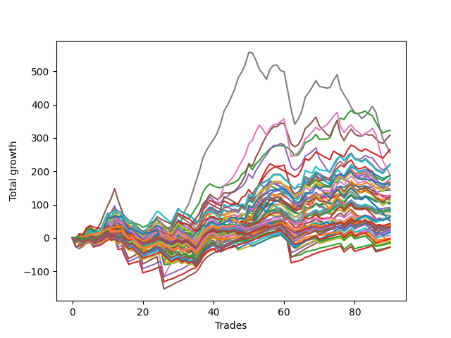

# Short Bulldog 005 
- Symbol: TEST
- Date Range: 03/18/2022 - 07/15/2022
- Trading Period: 7:20-12:30
- Number of Trades: 90



| Name | Win Percent | Profit | Avg Profit / Trade | Avg Time / Trade |      | Name | Win Percent | Profit | Avg Profit / Trade | Avg Time / Trade |
| ---- | ----------- | ------ | ------------------ | ---------------- | ---- | ---- | ----------- | ------ | ------------------ | ---------------- |
| Sorted By <br> Profit | | | | | | Sorted By <br> Win Percentage ||||
| Two | 67.78 | 161375.00 | 1793.06 | 24:53 |     | Eighty-One | 91.11 | -2625.00 | -29.17 | 24:34 |
| Five | 62.22 | 154250.00 | 1713.89 | 56:57 |     | Eighty-Two | 88.89 | -13375.00 | -148.61 | 33:11 |
| Forty-Five | 37.78 | 132375.00 | 1470.83 | 16:09 |     | Eighty-Four | 86.67 | 11625.00 | 129.17 | 42:31 |
| Seven | 60.00 | 128000.00 | 1422.22 | 124:45 |     | Eighty-Three | 86.67 | -14000.00 | -155.56 | 39:06 |
| Sixty-Nine | 45.56 | 110625.00 | 1229.17 | 18:20 |     | Eighty-Five | 85.56 | 18000.00 | 200.00 | 50:15 |
| Seventy-One | 45.56 | 109875.00 | 1220.83 | 22:55 |     | One Hundred Twenty-Six | 78.89 | -625.00 | -6.94 | 03:56 |
| Four | 63.33 | 109750.00 | 1219.44 | 43:03 |     | One Hundred Twenty-One | 77.78 | 3750.00 | 41.67 | 03:39 |
| Six | 71.11 | 94875.00 | 1054.17 | 95:30 |     | One Hundred Twenty-Seven | 73.33 | -7500.00 | -83.33 | 05:38 |
| Forty-Four | 41.11 | 94125.00 | 1045.83 | 13:17 |     | One Hundred Eleven | 72.22 | 30500.00 | 338.89 | 02:32 |
| Forty-Two | 45.56 | 93125.00 | 1034.72 | 10:52 |     | One Hundred Sixteen | 72.22 | 19125.00 | 212.50 | 02:39 |
| Sixty-One | 46.67 | 89500.00 | 994.44 | 23:59 |     | One Hundred Twenty-Two | 72.22 | -6500.00 | -72.22 | 05:32 |
| Sixty-Eight | 48.89 | 88000.00 | 977.78 | 15:48 |     | Six | 71.11 | 94875.00 | 1054.17 | 95:30 |
| Three | 68.89 | 83875.00 | 931.94 | 29:17 |     | One Hundred Twenty-Eight | 70.00 | -1250.00 | -13.89 | 06:54 |
| One | 61.11 | 83625.00 | 929.17 | 19:12 |     | Three | 68.89 | 83875.00 | 931.94 | 29:17 |
| Seventy | 45.56 | 82875.00 | 920.83 | 19:30 |     | One Hundred Twenty-Nine | 68.89 | 13125.00 | 145.83 | 08:34 |
| Seventy-Three | 55.56 | 80625.00 | 895.83 | 14:43 |     | One Hundred Twenty-Three | 68.89 | -4500.00 | -50.00 | 06:53 |
| Sixty-Six | 54.44 | 78750.00 | 875.00 | 13:04 |     | Two | 67.78 | 161375.00 | 1793.06 | 24:53 |
| Forty-Six | 33.33 | 73250.00 | 813.89 | 21:01 |     | One Hundred Twenty-Four | 67.78 | 8125.00 | 90.28 | 08:44 |
| Fifty-Three | 42.22 | 72500.00 | 805.56 | 07:47 |     | Zero | 64.44 | 71875.00 | 798.61 | 11:59 |
| Zero | 64.44 | 71875.00 | 798.61 | 11:59 |     | One Hundred Twelve | 64.44 | 21375.00 | 237.50 | 03:29 |
| Fifty-Eight | 57.78 | 64125.00 | 712.50 | 15:11 |     | One Hundred Thirty | 64.44 | 16250.00 | 180.56 | 09:59 |
| Forty-Three | 44.44 | 63375.00 | 704.17 | 09:28 |     | One Hundred Seventeen | 64.44 | 15750.00 | 175.00 | 03:20 |
| Fifty-Five | 42.22 | 62000.00 | 688.89 | 08:20 |     | One Hundred Twenty-Five | 64.44 | 9125.00 | 101.39 | 10:18 |
| Sixty-Seven | 53.33 | 61000.00 | 677.78 | 12:31 |     | Four | 63.33 | 109750.00 | 1219.44 | 43:03 |
| Forty-Seven | 24.44 | 57375.00 | 637.50 | 27:26 |     | Five | 62.22 | 154250.00 | 1713.89 | 56:57 |
| Sixty | 51.11 | 56750.00 | 630.56 | 19:07 |     | Fifty-Six | 62.22 | 45125.00 | 501.39 | 08:27 |
| Fifty-Four | 42.22 | 52750.00 | 586.11 | 07:49 |     | One Hundred Thirteen | 62.22 | 32125.00 | 356.94 | 04:13 |
| Fifty-Two | 42.22 | 51250.00 | 569.44 | 07:16 |     | One | 61.11 | 83625.00 | 929.17 | 19:12 |
| Fifty-Six | 62.22 | 45125.00 | 501.39 | 08:27 |     | Sixty-Four | 61.11 | 41875.00 | 465.28 | 08:10 |
| Forty | 54.44 | 45000.00 | 500.00 | 06:17 |     | Seven | 60.00 | 128000.00 | 1422.22 | 124:45 |
| Fifty-Nine | 57.78 | 43875.00 | 487.50 | 13:58 |     | One Hundred Eighteen | 60.00 | 21625.00 | 240.28 | 03:50 |
| Forty-One | 47.78 | 43000.00 | 477.78 | 08:49 |     | Fifty-Eight | 57.78 | 64125.00 | 712.50 | 15:11 |
| Sixty-Four | 61.11 | 41875.00 | 465.28 | 08:10 |     | Fifty-Nine | 57.78 | 43875.00 | 487.50 | 13:58 |
| Fifty-One | 43.33 | 40000.00 | 444.44 | 06:24 |     | One Hundred Fourteen | 57.78 | 32000.00 | 355.56 | 05:27 |
| Fifty | 42.22 | 38125.00 | 423.61 | 06:57 |     | Sixty-Five | 56.67 | 30375.00 | 337.50 | 11:01 |
| Forty-Nine | 43.33 | 33500.00 | 372.22 | 06:09 |     | Fifty-Seven | 56.67 | 17625.00 | 195.83 | 12:36 |
| One Hundred Thirteen | 62.22 | 32125.00 | 356.94 | 04:13 |     | Seventy-Three | 55.56 | 80625.00 | 895.83 | 14:43 |
| One Hundred Fourteen | 57.78 | 32000.00 | 355.56 | 05:27 |     | Sixty-Six | 54.44 | 78750.00 | 875.00 | 13:04 |
| One Hundred Fifteen | 53.33 | 31250.00 | 347.22 | 06:43 |     | Forty | 54.44 | 45000.00 | 500.00 | 06:17 |
| One Hundred Eleven | 72.22 | 30500.00 | 338.89 | 02:32 |     | Sixty-Seven | 53.33 | 61000.00 | 677.78 | 12:31 |
| Sixty-Five | 56.67 | 30375.00 | 337.50 | 11:01 |     | One Hundred Fifteen | 53.33 | 31250.00 | 347.22 | 06:43 |
| Forty-Eight | 45.56 | 27125.00 | 301.39 | 05:02 |     | Sixty | 51.11 | 56750.00 | 630.56 | 19:07 |
| Sixty-Two | 43.33 | 25625.00 | 284.72 | 29:56 |     | One Hundred Ninteen | 51.11 | 15375.00 | 170.83 | 04:34 |
| One Hundred Eighteen | 60.00 | 21625.00 | 240.28 | 03:50 |     | Sixty-Eight | 48.89 | 88000.00 | 977.78 | 15:48 |
| One Hundred Twelve | 64.44 | 21375.00 | 237.50 | 03:29 |     | Forty-One | 47.78 | 43000.00 | 477.78 | 08:49 |
| One Hundred Sixteen | 72.22 | 19125.00 | 212.50 | 02:39 |     | Sixty-One | 46.67 | 89500.00 | 994.44 | 23:59 |
| Eighty-Five | 85.56 | 18000.00 | 200.00 | 50:15 |     | Sixty-Nine | 45.56 | 110625.00 | 1229.17 | 18:20 |
| Fifty-Seven | 56.67 | 17625.00 | 195.83 | 12:36 |     | Seventy-One | 45.56 | 109875.00 | 1220.83 | 22:55 |
| One Hundred Thirty | 64.44 | 16250.00 | 180.56 | 09:59 |     | Forty-Two | 45.56 | 93125.00 | 1034.72 | 10:52 |
| One Hundred Seventeen | 64.44 | 15750.00 | 175.00 | 03:20 |     | Seventy | 45.56 | 82875.00 | 920.83 | 19:30 |
| One Hundred Ninteen | 51.11 | 15375.00 | 170.83 | 04:34 |     | Forty-Eight | 45.56 | 27125.00 | 301.39 | 05:02 |
| One Hundred Twenty | 44.44 | 15000.00 | 166.67 | 05:00 |     | Forty-Three | 44.44 | 63375.00 | 704.17 | 09:28 |
| One Hundred Twenty-Nine | 68.89 | 13125.00 | 145.83 | 08:34 |     | One Hundred Twenty | 44.44 | 15000.00 | 166.67 | 05:00 |
| Eighty-Four | 86.67 | 11625.00 | 129.17 | 42:31 |     | Fifty-One | 43.33 | 40000.00 | 444.44 | 06:24 |
| One Hundred Twenty-Five | 64.44 | 9125.00 | 101.39 | 10:18 |     | Forty-Nine | 43.33 | 33500.00 | 372.22 | 06:09 |
| One Hundred Twenty-Four | 67.78 | 8125.00 | 90.28 | 08:44 |     | Sixty-Two | 43.33 | 25625.00 | 284.72 | 29:56 |
| One Hundred Twenty-One | 77.78 | 3750.00 | 41.67 | 03:39 |     | Fifty-Three | 42.22 | 72500.00 | 805.56 | 07:47 |
| One Hundred Twenty-Six | 78.89 | -625.00 | -6.94 | 03:56 |     | Fifty-Five | 42.22 | 62000.00 | 688.89 | 08:20 |
| One Hundred Twenty-Eight | 70.00 | -1250.00 | -13.89 | 06:54 |     | Fifty-Four | 42.22 | 52750.00 | 586.11 | 07:49 |
| Eighty-One | 91.11 | -2625.00 | -29.17 | 24:34 |     | Fifty-Two | 42.22 | 51250.00 | 569.44 | 07:16 |
| One Hundred Twenty-Three | 68.89 | -4500.00 | -50.00 | 06:53 |     | Fifty | 42.22 | 38125.00 | 423.61 | 06:57 |
| One Hundred Twenty-Two | 72.22 | -6500.00 | -72.22 | 05:32 |     | Forty-Four | 41.11 | 94125.00 | 1045.83 | 13:17 |
| One Hundred Twenty-Seven | 73.33 | -7500.00 | -83.33 | 05:38 |     | Forty-Five | 37.78 | 132375.00 | 1470.83 | 16:09 |
| Sixty-Three | 33.33 | -8500.00 | -94.44 | 38:52 |     | Forty-Six | 33.33 | 73250.00 | 813.89 | 21:01 |
| Eighty-Two | 88.89 | -13375.00 | -148.61 | 33:11 |     | Sixty-Three | 33.33 | -8500.00 | -94.44 | 38:52 |
| Eighty-Three | 86.67 | -14000.00 | -155.56 | 39:06 |     | Forty-Seven | 24.44 | 57375.00 | 637.50 | 27:26 |

## NO STOPLOSS

### Test Zero
* Sell when price hits the middle line of the 20p bollinger
* No Stoploss
* Results:
```
Total Trades: 90
Percent Up: 35.56
Percent Down: 64.44
Total Points Moved Down: 143.75
Potential Profit: 71875.00
Total Points Ups: 218.25 Count Ups: 32
Total Points Downs: 362.00 Count Downs: 58
```

<details><summary>Trades</summary>

<code>In: 2022-03-24 08:03:00		Out: 2022-03-24 08:09:05		Total Position Time: 06:05		Total Move Down: 1.75		Total to Date: 1.75</code> <br />
<code>In: 2022-03-24 08:44:00		Out: 2022-03-24 08:50:10		Total Position Time: 06:10		Total Move Down: 4.75		Total to Date: 6.50</code> <br />
<code>In: 2022-03-25 07:26:00		Out: 2022-03-25 07:51:10		Total Position Time: 25:10		Total Move Down: -5.50		Total to Date: 1.00</code> <br />
<code>In: 2022-03-25 07:44:00		Out: 2022-03-25 07:51:10		Total Position Time: 07:10		Total Move Down: 3.00		Total to Date: 4.00</code> <br />
<code>In: 2022-03-28 07:50:00		Out: 2022-03-28 08:01:35		Total Position Time: 11:35		Total Move Down: 5.25		Total to Date: 9.25</code> <br />
<code>In: 2022-03-29 11:38:00		Out: 2022-03-29 11:58:00		Total Position Time: 20:00		Total Move Down: -0.75		Total to Date: 8.50</code> <br />
<code>In: 2022-03-31 07:48:00		Out: 2022-03-31 08:03:10		Total Position Time: 15:10		Total Move Down: -0.50		Total to Date: 8.00</code> <br />
<code>In: 2022-04-06 10:43:00		Out: 2022-04-06 10:55:55		Total Position Time: 12:55		Total Move Down: 2.25		Total to Date: 10.25</code> <br />
<code>In: 2022-04-06 11:04:00		Out: 2022-04-06 11:05:55		Total Position Time: 01:55		Total Move Down: 11.25		Total to Date: 21.50</code> <br />
<code>In: 2022-04-06 11:05:00		Out: 2022-04-06 11:06:10		Total Position Time: 01:10		Total Move Down: 7.75		Total to Date: 29.25</code> <br />
<code>In: 2022-04-06 11:57:00		Out: 2022-04-06 12:08:05		Total Position Time: 11:05		Total Move Down: 1.75		Total to Date: 31.00</code> <br />
<code>In: 2022-04-06 12:02:00		Out: 2022-04-06 12:08:05		Total Position Time: 06:05		Total Move Down: 9.75		Total to Date: 40.75</code> <br />
<code>In: 2022-04-07 10:58:00		Out: 2022-04-07 11:15:20		Total Position Time: 17:20		Total Move Down: -1.75		Total to Date: 39.00</code> <br />
<code>In: 2022-04-07 11:03:00		Out: 2022-04-07 11:15:20		Total Position Time: 12:20		Total Move Down: 4.00		Total to Date: 43.00</code> <br />
<code>In: 2022-04-07 11:50:00		Out: 2022-04-07 12:19:15		Total Position Time: 29:15		Total Move Down: -18.00		Total to Date: 25.00</code> <br />
<code>In: 2022-04-07 11:54:00		Out: 2022-04-07 12:19:15		Total Position Time: 25:15		Total Move Down: -14.50		Total to Date: 10.50</code> <br />
<code>In: 2022-04-08 07:33:00		Out: 2022-04-08 07:44:35		Total Position Time: 11:35		Total Move Down: 3.25		Total to Date: 13.75</code> <br />
<code>In: 2022-04-08 07:54:00		Out: 2022-04-08 08:15:35		Total Position Time: 21:35		Total Move Down: -6.75		Total to Date: 7.00</code> <br />
<code>In: 2022-04-08 07:57:00		Out: 2022-04-08 08:15:35		Total Position Time: 18:35		Total Move Down: -5.25		Total to Date: 1.75</code> <br />
<code>In: 2022-04-13 08:06:00		Out: 2022-04-13 08:37:40		Total Position Time: 31:40		Total Move Down: -8.75		Total to Date: -7.00</code> <br />
<code>In: 2022-04-18 07:27:00		Out: 2022-04-18 07:46:00		Total Position Time: 19:00		Total Move Down: 1.00		Total to Date: -6.00</code> <br />
<code>In: 2022-04-18 11:26:00		Out: 2022-04-18 11:28:05		Total Position Time: 02:05		Total Move Down: 6.00		Total to Date: 0.00</code> <br />
<code>In: 2022-04-20 10:46:00		Out: 2022-04-20 10:50:10		Total Position Time: 04:10		Total Move Down: 3.50		Total to Date: 3.50</code> <br />
<code>In: 2022-04-20 10:49:00		Out: 2022-04-20 10:50:10		Total Position Time: 01:10		Total Move Down: 5.00		Total to Date: 8.50</code> <br />
<code>In: 2022-04-25 11:11:00		Out: 2022-04-25 11:40:00		Total Position Time: 29:00		Total Move Down: -18.50		Total to Date: -10.00</code> <br />
<code>In: 2022-04-25 11:17:00		Out: 2022-04-25 11:40:00		Total Position Time: 23:00		Total Move Down: -13.25		Total to Date: -23.25</code> <br />
<code>In: 2022-04-27 09:25:00		Out: 2022-04-27 09:38:00		Total Position Time: 13:00		Total Move Down: 2.25		Total to Date: -21.00</code> <br />
<code>In: 2022-05-02 07:28:00		Out: 2022-05-02 07:44:30		Total Position Time: 16:30		Total Move Down: -0.00		Total to Date: -21.00</code> <br />
<code>In: 2022-05-03 07:34:00		Out: 2022-05-03 07:38:45		Total Position Time: 04:45		Total Move Down: 10.25		Total to Date: -10.75</code> <br />
<code>In: 2022-05-03 07:35:00		Out: 2022-05-03 07:38:45		Total Position Time: 03:45		Total Move Down: 9.50		Total to Date: -1.25</code> <br />
<code>In: 2022-05-03 08:06:00		Out: 2022-05-03 08:35:55		Total Position Time: 29:55		Total Move Down: -16.00		Total to Date: -17.25</code> <br />
<code>In: 2022-05-03 08:10:00		Out: 2022-05-03 08:35:55		Total Position Time: 25:55		Total Move Down: -4.25		Total to Date: -21.50</code> <br />
<code>In: 2022-05-04 09:24:00		Out: 2022-05-04 09:45:30		Total Position Time: 21:30		Total Move Down: -4.00		Total to Date: -25.50</code> <br />
<code>In: 2022-05-04 10:59:00		Out: 2022-05-04 11:00:25		Total Position Time: 01:25		Total Move Down: 9.50		Total to Date: -16.00</code> <br />
<code>In: 2022-05-04 11:03:00		Out: 2022-05-04 11:07:05		Total Position Time: 04:05		Total Move Down: 5.75		Total to Date: -10.25</code> <br />
<code>In: 2022-05-04 11:07:00		Out: 2022-05-04 11:08:10		Total Position Time: 01:10		Total Move Down: 13.50		Total to Date: 3.25</code> <br />
<code>In: 2022-05-04 11:30:00		Out: 2022-05-04 11:31:10		Total Position Time: 01:10		Total Move Down: 19.00		Total to Date: 22.25</code> <br />
<code>In: 2022-05-04 11:31:00		Out: 2022-05-04 11:32:10		Total Position Time: 01:10		Total Move Down: 12.00		Total to Date: 34.25</code> <br />
<code>In: 2022-05-16 09:05:00		Out: 2022-05-16 09:06:10		Total Position Time: 01:10		Total Move Down: 7.00		Total to Date: 41.25</code> <br />
<code>In: 2022-05-16 10:15:00		Out: 2022-05-16 10:19:50		Total Position Time: 04:50		Total Move Down: 7.50		Total to Date: 48.75</code> <br />
<code>In: 2022-05-16 10:25:00		Out: 2022-05-16 10:42:15		Total Position Time: 17:15		Total Move Down: -5.25		Total to Date: 43.50</code> <br />
<code>In: 2022-05-16 11:07:00		Out: 2022-05-16 11:17:30		Total Position Time: 10:30		Total Move Down: 4.75		Total to Date: 48.25</code> <br />
<code>In: 2022-05-16 11:32:00		Out: 2022-05-16 11:44:25		Total Position Time: 12:25		Total Move Down: 2.25		Total to Date: 50.50</code> <br />
<code>In: 2022-05-17 09:37:00		Out: 2022-05-17 09:53:50		Total Position Time: 16:50		Total Move Down: -1.00		Total to Date: 49.50</code> <br />
<code>In: 2022-05-17 09:48:00		Out: 2022-05-17 09:53:50		Total Position Time: 05:50		Total Move Down: 3.00		Total to Date: 52.50</code> <br />
<code>In: 2022-05-17 10:15:00		Out: 2022-05-17 10:23:35		Total Position Time: 08:35		Total Move Down: 2.50		Total to Date: 55.00</code> <br />
<code>In: 2022-05-19 08:40:00		Out: 2022-05-19 08:54:00		Total Position Time: 14:00		Total Move Down: -1.50		Total to Date: 53.50</code> <br />
<code>In: 2022-05-19 10:59:00		Out: 2022-05-19 11:06:05		Total Position Time: 07:05		Total Move Down: 13.50		Total to Date: 67.00</code> <br />
<code>In: 2022-05-19 11:52:00		Out: 2022-05-19 11:57:55		Total Position Time: 05:55		Total Move Down: 5.50		Total to Date: 72.50</code> <br />
<code>In: 2022-05-19 12:05:00		Out: 2022-05-19 12:09:45		Total Position Time: 04:45		Total Move Down: 8.75		Total to Date: 81.25</code> <br />
<code>In: 2022-05-23 08:07:00		Out: 2022-05-23 08:23:45		Total Position Time: 16:45		Total Move Down: -1.00		Total to Date: 80.25</code> <br />
<code>In: 2022-05-24 09:17:00		Out: 2022-05-24 09:22:10		Total Position Time: 05:10		Total Move Down: 12.00		Total to Date: 92.25</code> <br />
<code>In: 2022-05-24 09:18:00		Out: 2022-05-24 09:22:10		Total Position Time: 04:10		Total Move Down: 5.75		Total to Date: 98.00</code> <br />
<code>In: 2022-05-24 11:13:00		Out: 2022-05-24 11:18:25		Total Position Time: 05:25		Total Move Down: 13.25		Total to Date: 111.25</code> <br />
<code>In: 2022-05-24 11:14:00		Out: 2022-05-24 11:18:25		Total Position Time: 04:25		Total Move Down: 9.50		Total to Date: 120.75</code> <br />
<code>In: 2022-05-25 07:36:00		Out: 2022-05-25 07:42:15		Total Position Time: 06:15		Total Move Down: 6.75		Total to Date: 127.50</code> <br />
<code>In: 2022-05-25 12:05:00		Out: 2022-05-25 12:18:05		Total Position Time: 13:05		Total Move Down: 2.50		Total to Date: 130.00</code> <br />
<code>In: 2022-05-27 12:10:00		Out: 2022-05-27 12:35:00		Total Position Time: 25:00		Total Move Down: -1.50		Total to Date: 128.50</code> <br />
<code>In: 2022-05-31 07:23:00		Out: 2022-05-31 07:37:30		Total Position Time: 14:30		Total Move Down: 5.75		Total to Date: 134.25</code> <br />
<code>In: 2022-05-31 08:53:00		Out: 2022-05-31 09:14:05		Total Position Time: 21:05		Total Move Down: -8.75		Total to Date: 125.50</code> <br />
<code>In: 2022-06-02 08:05:00		Out: 2022-06-02 08:27:20		Total Position Time: 22:20		Total Move Down: -6.75		Total to Date: 118.75</code> <br />
<code>In: 2022-06-02 08:06:00		Out: 2022-06-02 08:27:20		Total Position Time: 21:20		Total Move Down: -8.75		Total to Date: 110.00</code> <br />
<code>In: 2022-06-07 07:31:00		Out: 2022-06-07 07:57:05		Total Position Time: 26:05		Total Move Down: -18.75		Total to Date: 91.25</code> <br />
<code>In: 2022-06-08 08:19:00		Out: 2022-06-08 08:34:10		Total Position Time: 15:10		Total Move Down: 2.75		Total to Date: 94.00</code> <br />
<code>In: 2022-06-10 12:29:00		Out: 2022-06-10 12:30:35		Total Position Time: 01:35		Total Move Down: 6.75		Total to Date: 100.75</code> <br />
<code>In: 2022-06-13 09:40:00		Out: 2022-06-13 09:44:05		Total Position Time: 04:05		Total Move Down: 13.25		Total to Date: 114.00</code> <br />
<code>In: 2022-06-23 07:42:00		Out: 2022-06-23 07:51:25		Total Position Time: 09:25		Total Move Down: 4.75		Total to Date: 118.75</code> <br />
<code>In: 2022-06-23 07:58:00		Out: 2022-06-23 08:00:30		Total Position Time: 02:30		Total Move Down: 2.50		Total to Date: 121.25</code> <br />
<code>In: 2022-06-23 08:15:00		Out: 2022-06-23 08:21:05		Total Position Time: 06:05		Total Move Down: 5.50		Total to Date: 126.75</code> <br />
<code>In: 2022-06-30 08:12:00		Out: 2022-06-30 08:35:20		Total Position Time: 23:20		Total Move Down: -8.25		Total to Date: 118.50</code> <br />
<code>In: 2022-06-30 08:29:00		Out: 2022-06-30 08:35:20		Total Position Time: 06:20		Total Move Down: 7.75		Total to Date: 126.25</code> <br />
<code>In: 2022-06-30 08:30:00		Out: 2022-06-30 08:35:20		Total Position Time: 05:20		Total Move Down: 6.25		Total to Date: 132.50</code> <br />
<code>In: 2022-06-30 08:49:00		Out: 2022-06-30 09:04:30		Total Position Time: 15:30		Total Move Down: -0.00		Total to Date: 132.50</code> <br />
<code>In: 2022-07-05 07:40:00		Out: 2022-07-05 07:44:30		Total Position Time: 04:30		Total Move Down: 11.75		Total to Date: 144.25</code> <br />
<code>In: 2022-07-05 07:41:00		Out: 2022-07-05 07:44:30		Total Position Time: 03:30		Total Move Down: 7.25		Total to Date: 151.50</code> <br />
<code>In: 2022-07-05 09:27:00		Out: 2022-07-05 09:41:35		Total Position Time: 14:35		Total Move Down: 4.00		Total to Date: 155.50</code> <br />
<code>In: 2022-07-05 11:34:00		Out: 2022-07-05 11:48:10		Total Position Time: 14:10		Total Move Down: -4.25		Total to Date: 151.25</code> <br />
<code>In: 2022-07-06 11:09:00		Out: 2022-07-06 11:10:10		Total Position Time: 01:10		Total Move Down: 9.00		Total to Date: 160.25</code> <br />
<code>In: 2022-07-06 11:10:00		Out: 2022-07-06 11:11:10		Total Position Time: 01:10		Total Move Down: 7.50		Total to Date: 167.75</code> <br />
<code>In: 2022-07-06 11:31:00		Out: 2022-07-06 11:50:05		Total Position Time: 19:05		Total Move Down: -11.50		Total to Date: 156.25</code> <br />
<code>In: 2022-07-06 11:35:00		Out: 2022-07-06 11:50:05		Total Position Time: 15:05		Total Move Down: -1.75		Total to Date: 154.50</code> <br />
<code>In: 2022-07-07 07:56:00		Out: 2022-07-07 08:11:15		Total Position Time: 15:15		Total Move Down: -0.00		Total to Date: 154.50</code> <br />
<code>In: 2022-07-07 12:18:00		Out: 2022-07-07 12:24:25		Total Position Time: 06:25		Total Move Down: 1.25		Total to Date: 155.75</code> <br />
<code>In: 2022-07-11 10:05:00		Out: 2022-07-11 10:23:10		Total Position Time: 18:10		Total Move Down: -3.50		Total to Date: 152.25</code> <br />
<code>In: 2022-07-11 10:09:00		Out: 2022-07-11 10:23:10		Total Position Time: 14:10		Total Move Down: 0.25		Total to Date: 152.50</code> <br />
<code>In: 2022-07-13 07:37:00		Out: 2022-07-13 08:01:20		Total Position Time: 24:20		Total Move Down: -18.00		Total to Date: 134.50</code> <br />
<code>In: 2022-07-14 08:12:00		Out: 2022-07-14 08:15:45		Total Position Time: 03:45		Total Move Down: 5.50		Total to Date: 140.00</code> <br />
<code>In: 2022-07-14 08:24:00		Out: 2022-07-14 08:34:25		Total Position Time: 10:25		Total Move Down: 2.00		Total to Date: 142.00</code> <br />
<code>In: 2022-07-14 08:44:00		Out: 2022-07-14 09:01:55		Total Position Time: 17:55		Total Move Down: 1.50		Total to Date: 143.50</code> <br />
<code>In: 2022-07-14 08:45:00		Out: 2022-07-14 09:01:55		Total Position Time: 16:55		Total Move Down: 0.25		Total to Date: 143.75</code> <br />


</details>

### Test One
* Sell when the price hits the upper line of the 20p 1std bollinger
* No Stoploss
* Results:
```
Total Trades: 90
Percent Up: 38.89
Percent Down: 61.11
Total Points Moved Down: 167.25
Potential Profit: 83625.00
Total Points Ups: 248.00 Count Ups: 35
Total Points Downs: 415.25 Count Downs: 55
```

<details><summary>Trades</summary>

<code>In: 2022-03-24 08:03:00		Out: 2022-03-24 08:53:50		Total Position Time: 50:50		Total Move Down: -14.50		Total to Date: -14.50</code> <br />
<code>In: 2022-03-24 08:44:00		Out: 2022-03-24 08:53:50		Total Position Time: 09:50		Total Move Down: 6.25		Total to Date: -8.25</code> <br />
<code>In: 2022-03-25 07:26:00		Out: 2022-03-25 07:54:00		Total Position Time: 28:00		Total Move Down: -4.50		Total to Date: -12.75</code> <br />
<code>In: 2022-03-25 07:44:00		Out: 2022-03-25 07:54:00		Total Position Time: 10:00		Total Move Down: 4.00		Total to Date: -8.75</code> <br />
<code>In: 2022-03-28 07:50:00		Out: 2022-03-28 08:01:35		Total Position Time: 11:35		Total Move Down: 5.25		Total to Date: -3.50</code> <br />
<code>In: 2022-03-29 11:38:00		Out: 2022-03-29 12:00:25		Total Position Time: 22:25		Total Move Down: 0.25		Total to Date: -3.25</code> <br />
<code>In: 2022-03-31 07:48:00		Out: 2022-03-31 08:08:00		Total Position Time: 20:00		Total Move Down: 0.25		Total to Date: -3.00</code> <br />
<code>In: 2022-04-06 10:43:00		Out: 2022-04-06 10:57:10		Total Position Time: 14:10		Total Move Down: 4.50		Total to Date: 1.50</code> <br />
<code>In: 2022-04-06 11:04:00		Out: 2022-04-06 11:07:20		Total Position Time: 03:20		Total Move Down: 15.75		Total to Date: 17.25</code> <br />
<code>In: 2022-04-06 11:05:00		Out: 2022-04-06 11:07:20		Total Position Time: 02:20		Total Move Down: 12.50		Total to Date: 29.75</code> <br />
<code>In: 2022-04-06 11:57:00		Out: 2022-04-06 12:17:50		Total Position Time: 20:50		Total Move Down: -0.00		Total to Date: 29.75</code> <br />
<code>In: 2022-04-06 12:02:00		Out: 2022-04-06 12:17:50		Total Position Time: 15:50		Total Move Down: 8.00		Total to Date: 37.75</code> <br />
<code>In: 2022-04-07 10:58:00		Out: 2022-04-07 11:18:00		Total Position Time: 20:00		Total Move Down: -1.00		Total to Date: 36.75</code> <br />
<code>In: 2022-04-07 11:03:00		Out: 2022-04-07 11:18:00		Total Position Time: 15:00		Total Move Down: 4.75		Total to Date: 41.50</code> <br />
<code>In: 2022-04-07 11:50:00		Out: 2022-04-07 12:21:05		Total Position Time: 31:05		Total Move Down: -15.50		Total to Date: 26.00</code> <br />
<code>In: 2022-04-07 11:54:00		Out: 2022-04-07 12:21:05		Total Position Time: 27:05		Total Move Down: -12.00		Total to Date: 14.00</code> <br />
<code>In: 2022-04-08 07:33:00		Out: 2022-04-08 07:49:05		Total Position Time: 16:05		Total Move Down: 3.50		Total to Date: 17.50</code> <br />
<code>In: 2022-04-08 07:54:00		Out: 2022-04-08 08:17:10		Total Position Time: 23:10		Total Move Down: -5.00		Total to Date: 12.50</code> <br />
<code>In: 2022-04-08 07:57:00		Out: 2022-04-08 08:17:10		Total Position Time: 20:10		Total Move Down: -3.50		Total to Date: 9.00</code> <br />
<code>In: 2022-04-13 08:06:00		Out: 2022-04-13 08:41:50		Total Position Time: 35:50		Total Move Down: -7.75		Total to Date: 1.25</code> <br />
<code>In: 2022-04-18 07:27:00		Out: 2022-04-18 07:51:30		Total Position Time: 24:30		Total Move Down: 2.75		Total to Date: 4.00</code> <br />
<code>In: 2022-04-18 11:26:00		Out: 2022-04-18 11:41:15		Total Position Time: 15:15		Total Move Down: 6.50		Total to Date: 10.50</code> <br />
<code>In: 2022-04-20 10:46:00		Out: 2022-04-20 10:55:05		Total Position Time: 09:05		Total Move Down: 5.75		Total to Date: 16.25</code> <br />
<code>In: 2022-04-20 10:49:00		Out: 2022-04-20 10:55:05		Total Position Time: 06:05		Total Move Down: 7.25		Total to Date: 23.50</code> <br />
<code>In: 2022-04-25 11:11:00		Out: 2022-04-25 11:44:45		Total Position Time: 33:45		Total Move Down: -16.75		Total to Date: 6.75</code> <br />
<code>In: 2022-04-25 11:17:00		Out: 2022-04-25 11:44:45		Total Position Time: 27:45		Total Move Down: -11.50		Total to Date: -4.75</code> <br />
<code>In: 2022-04-27 09:25:00		Out: 2022-04-27 09:51:25		Total Position Time: 26:25		Total Move Down: -0.25		Total to Date: -5.00</code> <br />
<code>In: 2022-05-02 07:28:00		Out: 2022-05-02 07:45:05		Total Position Time: 17:05		Total Move Down: 3.00		Total to Date: -2.00</code> <br />
<code>In: 2022-05-03 07:34:00		Out: 2022-05-03 07:41:55		Total Position Time: 07:55		Total Move Down: 14.00		Total to Date: 12.00</code> <br />
<code>In: 2022-05-03 07:35:00		Out: 2022-05-03 07:41:55		Total Position Time: 06:55		Total Move Down: 13.25		Total to Date: 25.25</code> <br />
<code>In: 2022-05-03 08:06:00		Out: 2022-05-03 08:38:55		Total Position Time: 32:55		Total Move Down: -13.25		Total to Date: 12.00</code> <br />
<code>In: 2022-05-03 08:10:00		Out: 2022-05-03 08:38:55		Total Position Time: 28:55		Total Move Down: -1.50		Total to Date: 10.50</code> <br />
<code>In: 2022-05-04 09:24:00		Out: 2022-05-04 09:47:10		Total Position Time: 23:10		Total Move Down: -2.50		Total to Date: 8.00</code> <br />
<code>In: 2022-05-04 10:59:00		Out: 2022-05-04 11:00:25		Total Position Time: 01:25		Total Move Down: 9.50		Total to Date: 17.50</code> <br />
<code>In: 2022-05-04 11:03:00		Out: 2022-05-04 11:07:20		Total Position Time: 04:20		Total Move Down: 10.75		Total to Date: 28.25</code> <br />
<code>In: 2022-05-04 11:07:00		Out: 2022-05-04 11:08:10		Total Position Time: 01:10		Total Move Down: 13.50		Total to Date: 41.75</code> <br />
<code>In: 2022-05-04 11:30:00		Out: 2022-05-04 11:31:20		Total Position Time: 01:20		Total Move Down: 23.00		Total to Date: 64.75</code> <br />
<code>In: 2022-05-04 11:31:00		Out: 2022-05-04 11:32:10		Total Position Time: 01:10		Total Move Down: 12.00		Total to Date: 76.75</code> <br />
<code>In: 2022-05-16 09:05:00		Out: 2022-05-16 09:06:25		Total Position Time: 01:25		Total Move Down: 8.50		Total to Date: 85.25</code> <br />
<code>In: 2022-05-16 10:15:00		Out: 2022-05-16 10:46:30		Total Position Time: 31:30		Total Move Down: -7.75		Total to Date: 77.50</code> <br />
<code>In: 2022-05-16 10:25:00		Out: 2022-05-16 10:46:30		Total Position Time: 21:30		Total Move Down: -4.50		Total to Date: 73.00</code> <br />
<code>In: 2022-05-16 11:07:00		Out: 2022-05-16 11:45:05		Total Position Time: 38:05		Total Move Down: -5.00		Total to Date: 68.00</code> <br />
<code>In: 2022-05-16 11:32:00		Out: 2022-05-16 11:45:05		Total Position Time: 13:05		Total Move Down: 4.00		Total to Date: 72.00</code> <br />
<code>In: 2022-05-17 09:37:00		Out: 2022-05-17 09:56:30		Total Position Time: 19:30		Total Move Down: -0.00		Total to Date: 72.00</code> <br />
<code>In: 2022-05-17 09:48:00		Out: 2022-05-17 09:56:30		Total Position Time: 08:30		Total Move Down: 4.00		Total to Date: 76.00</code> <br />
<code>In: 2022-05-17 10:15:00		Out: 2022-05-17 10:28:15		Total Position Time: 13:15		Total Move Down: 2.75		Total to Date: 78.75</code> <br />
<code>In: 2022-05-19 08:40:00		Out: 2022-05-19 08:55:10		Total Position Time: 15:10		Total Move Down: 4.00		Total to Date: 82.75</code> <br />
<code>In: 2022-05-19 10:59:00		Out: 2022-05-19 11:14:05		Total Position Time: 15:05		Total Move Down: 14.25		Total to Date: 97.00</code> <br />
<code>In: 2022-05-19 11:52:00		Out: 2022-05-19 12:10:15		Total Position Time: 18:15		Total Move Down: 2.75		Total to Date: 99.75</code> <br />
<code>In: 2022-05-19 12:05:00		Out: 2022-05-19 12:10:15		Total Position Time: 05:15		Total Move Down: 15.50		Total to Date: 115.25</code> <br />
<code>In: 2022-05-23 08:07:00		Out: 2022-05-23 08:48:25		Total Position Time: 41:25		Total Move Down: -7.00		Total to Date: 108.25</code> <br />
<code>In: 2022-05-24 09:17:00		Out: 2022-05-24 09:29:20		Total Position Time: 12:20		Total Move Down: 12.75		Total to Date: 121.00</code> <br />
<code>In: 2022-05-24 09:18:00		Out: 2022-05-24 09:29:20		Total Position Time: 11:20		Total Move Down: 6.50		Total to Date: 127.50</code> <br />
<code>In: 2022-05-24 11:13:00		Out: 2022-05-24 11:31:25		Total Position Time: 18:25		Total Move Down: 13.75		Total to Date: 141.25</code> <br />
<code>In: 2022-05-24 11:14:00		Out: 2022-05-24 11:31:25		Total Position Time: 17:25		Total Move Down: 10.00		Total to Date: 151.25</code> <br />
<code>In: 2022-05-25 07:36:00		Out: 2022-05-25 07:47:20		Total Position Time: 11:20		Total Move Down: 9.00		Total to Date: 160.25</code> <br />
<code>In: 2022-05-25 12:05:00		Out: 2022-05-25 12:22:50		Total Position Time: 17:50		Total Move Down: 3.75		Total to Date: 164.00</code> <br />
<code>In: 2022-05-27 12:10:00		Out: 2022-05-27 12:35:55		Total Position Time: 25:55		Total Move Down: 0.75		Total to Date: 164.75</code> <br />
<code>In: 2022-05-31 07:23:00		Out: 2022-05-31 08:07:20		Total Position Time: 44:20		Total Move Down: -0.75		Total to Date: 164.00</code> <br />
<code>In: 2022-05-31 08:53:00		Out: 2022-05-31 09:14:40		Total Position Time: 21:40		Total Move Down: -4.75		Total to Date: 159.25</code> <br />
<code>In: 2022-06-02 08:05:00		Out: 2022-06-02 08:29:05		Total Position Time: 24:05		Total Move Down: -5.75		Total to Date: 153.50</code> <br />
<code>In: 2022-06-02 08:06:00		Out: 2022-06-02 08:29:05		Total Position Time: 23:05		Total Move Down: -7.75		Total to Date: 145.75</code> <br />
<code>In: 2022-06-07 07:31:00		Out: 2022-06-07 07:58:15		Total Position Time: 27:15		Total Move Down: -16.75		Total to Date: 129.00</code> <br />
<code>In: 2022-06-08 08:19:00		Out: 2022-06-08 08:43:05		Total Position Time: 24:05		Total Move Down: 2.00		Total to Date: 131.00</code> <br />
<code>In: 2022-06-10 12:29:00		Out: 2022-06-10 12:35:45		Total Position Time: 06:45		Total Move Down: 9.75		Total to Date: 140.75</code> <br />
<code>In: 2022-06-13 09:40:00		Out: 2022-06-13 09:47:55		Total Position Time: 07:55		Total Move Down: 19.00		Total to Date: 159.75</code> <br />
<code>In: 2022-06-23 07:42:00		Out: 2022-06-23 08:01:10		Total Position Time: 19:10		Total Move Down: 3.00		Total to Date: 162.75</code> <br />
<code>In: 2022-06-23 07:58:00		Out: 2022-06-23 08:01:10		Total Position Time: 03:10		Total Move Down: 5.50		Total to Date: 168.25</code> <br />
<code>In: 2022-06-23 08:15:00		Out: 2022-06-23 08:23:30		Total Position Time: 08:30		Total Move Down: 8.25		Total to Date: 176.50</code> <br />
<code>In: 2022-06-30 08:12:00		Out: 2022-06-30 09:05:50		Total Position Time: 53:50		Total Move Down: -17.50		Total to Date: 159.00</code> <br />
<code>In: 2022-06-30 08:29:00		Out: 2022-06-30 09:05:50		Total Position Time: 36:50		Total Move Down: -1.50		Total to Date: 157.50</code> <br />
<code>In: 2022-06-30 08:30:00		Out: 2022-06-30 09:05:50		Total Position Time: 35:50		Total Move Down: -3.00		Total to Date: 154.50</code> <br />
<code>In: 2022-06-30 08:49:00		Out: 2022-06-30 09:05:50		Total Position Time: 16:50		Total Move Down: 2.25		Total to Date: 156.75</code> <br />
<code>In: 2022-07-05 07:40:00		Out: 2022-07-05 07:45:55		Total Position Time: 05:55		Total Move Down: 16.50		Total to Date: 173.25</code> <br />
<code>In: 2022-07-05 07:41:00		Out: 2022-07-05 07:45:55		Total Position Time: 04:55		Total Move Down: 12.00		Total to Date: 185.25</code> <br />
<code>In: 2022-07-05 09:27:00		Out: 2022-07-05 09:42:20		Total Position Time: 15:20		Total Move Down: 6.25		Total to Date: 191.50</code> <br />
<code>In: 2022-07-05 11:34:00		Out: 2022-07-05 12:01:00		Total Position Time: 27:00		Total Move Down: -5.00		Total to Date: 186.50</code> <br />
<code>In: 2022-07-06 11:09:00		Out: 2022-07-06 11:11:10		Total Position Time: 02:10		Total Move Down: 13.25		Total to Date: 199.75</code> <br />
<code>In: 2022-07-06 11:10:00		Out: 2022-07-06 11:11:10		Total Position Time: 01:10		Total Move Down: 7.50		Total to Date: 207.25</code> <br />
<code>In: 2022-07-06 11:31:00		Out: 2022-07-06 12:00:50		Total Position Time: 29:50		Total Move Down: -11.50		Total to Date: 195.75</code> <br />
<code>In: 2022-07-06 11:35:00		Out: 2022-07-06 12:00:50		Total Position Time: 25:50		Total Move Down: -1.75		Total to Date: 194.00</code> <br />
<code>In: 2022-07-07 07:56:00		Out: 2022-07-07 08:20:05		Total Position Time: 24:05		Total Move Down: 0.50		Total to Date: 194.50</code> <br />
<code>In: 2022-07-07 12:18:00		Out: 2022-07-07 12:27:30		Total Position Time: 09:30		Total Move Down: 3.00		Total to Date: 197.50</code> <br />
<code>In: 2022-07-11 10:05:00		Out: 2022-07-11 10:50:15		Total Position Time: 45:15		Total Move Down: -9.25		Total to Date: 188.25</code> <br />
<code>In: 2022-07-11 10:09:00		Out: 2022-07-11 10:50:15		Total Position Time: 41:15		Total Move Down: -5.50		Total to Date: 182.75</code> <br />
<code>In: 2022-07-13 07:37:00		Out: 2022-07-13 08:19:25		Total Position Time: 42:25		Total Move Down: -21.75		Total to Date: 161.00</code> <br />
<code>In: 2022-07-14 08:12:00		Out: 2022-07-14 08:36:05		Total Position Time: 24:05		Total Move Down: -1.75		Total to Date: 159.25</code> <br />
<code>In: 2022-07-14 08:24:00		Out: 2022-07-14 08:36:05		Total Position Time: 12:05		Total Move Down: 4.25		Total to Date: 163.50</code> <br />
<code>In: 2022-07-14 08:44:00		Out: 2022-07-14 09:05:15		Total Position Time: 21:15		Total Move Down: 2.50		Total to Date: 166.00</code> <br />
<code>In: 2022-07-14 08:45:00		Out: 2022-07-14 09:05:15		Total Position Time: 20:15		Total Move Down: 1.25		Total to Date: 167.25</code> <br />


</details>

### Test Two
* Sell when the price hits the upper line of the 20p 2std bollinger
* No Stoploss
* Results:
```
Total Trades: 90
Percent Up: 32.22
Percent Down: 67.78
Total Points Moved Down: 322.75
Potential Profit: 161375.00
Total Points Ups: 266.25 Count Ups: 29
Total Points Downs: 589.00 Count Downs: 61
```

<details><summary>Trades</summary>

<code>In: 2022-03-24 08:03:00		Out: 2022-03-24 09:03:05		Total Position Time: 60:05		Total Move Down: -13.75		Total to Date: -13.75</code> <br />
<code>In: 2022-03-24 08:44:00		Out: 2022-03-24 09:03:05		Total Position Time: 19:05		Total Move Down: 7.00		Total to Date: -6.75</code> <br />
<code>In: 2022-03-25 07:26:00		Out: 2022-03-25 07:54:15		Total Position Time: 28:15		Total Move Down: -2.75		Total to Date: -9.50</code> <br />
<code>In: 2022-03-25 07:44:00		Out: 2022-03-25 07:54:15		Total Position Time: 10:15		Total Move Down: 5.75		Total to Date: -3.75</code> <br />
<code>In: 2022-03-28 07:50:00		Out: 2022-03-28 08:01:40		Total Position Time: 11:40		Total Move Down: 7.75		Total to Date: 4.00</code> <br />
<code>In: 2022-03-29 11:38:00		Out: 2022-03-29 12:47:00		Total Position Time: 69:00		Total Move Down: -15.75		Total to Date: -11.75</code> <br />
<code>In: 2022-03-31 07:48:00		Out: 2022-03-31 08:08:30		Total Position Time: 20:30		Total Move Down: 2.50		Total to Date: -9.25</code> <br />
<code>In: 2022-04-06 10:43:00		Out: 2022-04-06 10:58:05		Total Position Time: 15:05		Total Move Down: 5.75		Total to Date: -3.50</code> <br />
<code>In: 2022-04-06 11:04:00		Out: 2022-04-06 11:08:10		Total Position Time: 04:10		Total Move Down: 21.75		Total to Date: 18.25</code> <br />
<code>In: 2022-04-06 11:05:00		Out: 2022-04-06 11:08:10		Total Position Time: 03:10		Total Move Down: 18.50		Total to Date: 36.75</code> <br />
<code>In: 2022-04-06 11:57:00		Out: 2022-04-06 12:20:25		Total Position Time: 23:25		Total Move Down: 6.75		Total to Date: 43.50</code> <br />
<code>In: 2022-04-06 12:02:00		Out: 2022-04-06 12:20:25		Total Position Time: 18:25		Total Move Down: 14.75		Total to Date: 58.25</code> <br />
<code>In: 2022-04-07 10:58:00		Out: 2022-04-07 11:18:20		Total Position Time: 20:20		Total Move Down: 0.25		Total to Date: 58.50</code> <br />
<code>In: 2022-04-07 11:03:00		Out: 2022-04-07 11:18:20		Total Position Time: 15:20		Total Move Down: 6.00		Total to Date: 64.50</code> <br />
<code>In: 2022-04-07 11:50:00		Out: 2022-04-07 12:22:45		Total Position Time: 32:45		Total Move Down: -13.00		Total to Date: 51.50</code> <br />
<code>In: 2022-04-07 11:54:00		Out: 2022-04-07 12:22:45		Total Position Time: 28:45		Total Move Down: -9.50		Total to Date: 42.00</code> <br />
<code>In: 2022-04-08 07:33:00		Out: 2022-04-08 07:49:20		Total Position Time: 16:20		Total Move Down: 5.25		Total to Date: 47.25</code> <br />
<code>In: 2022-04-08 07:54:00		Out: 2022-04-08 08:20:05		Total Position Time: 26:05		Total Move Down: -4.50		Total to Date: 42.75</code> <br />
<code>In: 2022-04-08 07:57:00		Out: 2022-04-08 08:20:05		Total Position Time: 23:05		Total Move Down: -3.00		Total to Date: 39.75</code> <br />
<code>In: 2022-04-13 08:06:00		Out: 2022-04-13 08:45:15		Total Position Time: 39:15		Total Move Down: -8.00		Total to Date: 31.75</code> <br />
<code>In: 2022-04-18 07:27:00		Out: 2022-04-18 07:51:45		Total Position Time: 24:45		Total Move Down: 4.75		Total to Date: 36.50</code> <br />
<code>In: 2022-04-18 11:26:00		Out: 2022-04-18 11:44:10		Total Position Time: 18:10		Total Move Down: 6.75		Total to Date: 43.25</code> <br />
<code>In: 2022-04-20 10:46:00		Out: 2022-04-20 11:14:05		Total Position Time: 28:05		Total Move Down: 6.25		Total to Date: 49.50</code> <br />
<code>In: 2022-04-20 10:49:00		Out: 2022-04-20 11:14:05		Total Position Time: 25:05		Total Move Down: 7.75		Total to Date: 57.25</code> <br />
<code>In: 2022-04-25 11:11:00		Out: 2022-04-25 12:02:05		Total Position Time: 51:05		Total Move Down: -17.25		Total to Date: 40.00</code> <br />
<code>In: 2022-04-25 11:17:00		Out: 2022-04-25 12:02:05		Total Position Time: 45:05		Total Move Down: -12.00		Total to Date: 28.00</code> <br />
<code>In: 2022-04-27 09:25:00		Out: 2022-04-27 10:00:10		Total Position Time: 35:10		Total Move Down: 1.50		Total to Date: 29.50</code> <br />
<code>In: 2022-05-02 07:28:00		Out: 2022-05-02 07:47:15		Total Position Time: 19:15		Total Move Down: 5.00		Total to Date: 34.50</code> <br />
<code>In: 2022-05-03 07:34:00		Out: 2022-05-03 07:43:50		Total Position Time: 09:50		Total Move Down: 19.00		Total to Date: 53.50</code> <br />
<code>In: 2022-05-03 07:35:00		Out: 2022-05-03 07:43:50		Total Position Time: 08:50		Total Move Down: 18.25		Total to Date: 71.75</code> <br />
<code>In: 2022-05-03 08:06:00		Out: 2022-05-03 08:39:10		Total Position Time: 33:10		Total Move Down: -11.50		Total to Date: 60.25</code> <br />
<code>In: 2022-05-03 08:10:00		Out: 2022-05-03 08:39:10		Total Position Time: 29:10		Total Move Down: 0.25		Total to Date: 60.50</code> <br />
<code>In: 2022-05-04 09:24:00		Out: 2022-05-04 10:11:30		Total Position Time: 47:30		Total Move Down: -3.50		Total to Date: 57.00</code> <br />
<code>In: 2022-05-04 10:59:00		Out: 2022-05-04 11:07:40		Total Position Time: 08:40		Total Move Down: 15.50		Total to Date: 72.50</code> <br />
<code>In: 2022-05-04 11:03:00		Out: 2022-05-04 11:07:40		Total Position Time: 04:40		Total Move Down: 17.25		Total to Date: 89.75</code> <br />
<code>In: 2022-05-04 11:07:00		Out: 2022-05-04 11:08:15		Total Position Time: 01:15		Total Move Down: 15.50		Total to Date: 105.25</code> <br />
<code>In: 2022-05-04 11:30:00		Out: 2022-05-04 11:32:25		Total Position Time: 02:25		Total Move Down: 32.25		Total to Date: 137.50</code> <br />
<code>In: 2022-05-04 11:31:00		Out: 2022-05-04 11:32:25		Total Position Time: 01:25		Total Move Down: 15.50		Total to Date: 153.00</code> <br />
<code>In: 2022-05-16 09:05:00		Out: 2022-05-16 09:11:45		Total Position Time: 06:45		Total Move Down: 9.50		Total to Date: 162.50</code> <br />
<code>In: 2022-05-16 10:15:00		Out: 2022-05-16 10:49:05		Total Position Time: 34:05		Total Move Down: -6.75		Total to Date: 155.75</code> <br />
<code>In: 2022-05-16 10:25:00		Out: 2022-05-16 10:49:05		Total Position Time: 24:05		Total Move Down: -3.50		Total to Date: 152.25</code> <br />
<code>In: 2022-05-16 11:07:00		Out: 2022-05-16 11:46:10		Total Position Time: 39:10		Total Move Down: -2.00		Total to Date: 150.25</code> <br />
<code>In: 2022-05-16 11:32:00		Out: 2022-05-16 11:46:10		Total Position Time: 14:10		Total Move Down: 7.00		Total to Date: 157.25</code> <br />
<code>In: 2022-05-17 09:37:00		Out: 2022-05-17 10:01:20		Total Position Time: 24:20		Total Move Down: 1.00		Total to Date: 158.25</code> <br />
<code>In: 2022-05-17 09:48:00		Out: 2022-05-17 10:01:20		Total Position Time: 13:20		Total Move Down: 5.00		Total to Date: 163.25</code> <br />
<code>In: 2022-05-17 10:15:00		Out: 2022-05-17 10:42:05		Total Position Time: 27:05		Total Move Down: 3.50		Total to Date: 166.75</code> <br />
<code>In: 2022-05-19 08:40:00		Out: 2022-05-19 08:56:50		Total Position Time: 16:50		Total Move Down: 7.25		Total to Date: 174.00</code> <br />
<code>In: 2022-05-19 10:59:00		Out: 2022-05-19 11:20:05		Total Position Time: 21:05		Total Move Down: 16.50		Total to Date: 190.50</code> <br />
<code>In: 2022-05-19 11:52:00		Out: 2022-05-19 12:14:05		Total Position Time: 22:05		Total Move Down: 8.00		Total to Date: 198.50</code> <br />
<code>In: 2022-05-19 12:05:00		Out: 2022-05-19 12:14:05		Total Position Time: 09:05		Total Move Down: 20.75		Total to Date: 219.25</code> <br />
<code>In: 2022-05-23 08:07:00		Out: 2022-05-23 09:28:05		Total Position Time: 81:05		Total Move Down: -14.75		Total to Date: 204.50</code> <br />
<code>In: 2022-05-24 09:17:00		Out: 2022-05-24 09:31:25		Total Position Time: 14:25		Total Move Down: 17.00		Total to Date: 221.50</code> <br />
<code>In: 2022-05-24 09:18:00		Out: 2022-05-24 09:31:25		Total Position Time: 13:25		Total Move Down: 10.75		Total to Date: 232.25</code> <br />
<code>In: 2022-05-24 11:13:00		Out: 2022-05-24 11:44:00		Total Position Time: 31:00		Total Move Down: 13.75		Total to Date: 246.00</code> <br />
<code>In: 2022-05-24 11:14:00		Out: 2022-05-24 11:44:00		Total Position Time: 30:00		Total Move Down: 10.00		Total to Date: 256.00</code> <br />
<code>In: 2022-05-25 07:36:00		Out: 2022-05-25 07:48:10		Total Position Time: 12:10		Total Move Down: 12.25		Total to Date: 268.25</code> <br />
<code>In: 2022-05-25 12:05:00		Out: 2022-05-25 12:23:00		Total Position Time: 18:00		Total Move Down: 4.75		Total to Date: 273.00</code> <br />
<code>In: 2022-05-27 12:10:00		Out: 2022-05-27 12:38:10		Total Position Time: 28:10		Total Move Down: 3.50		Total to Date: 276.50</code> <br />
<code>In: 2022-05-31 07:23:00		Out: 2022-05-31 08:07:30		Total Position Time: 44:30		Total Move Down: 1.25		Total to Date: 277.75</code> <br />
<code>In: 2022-05-31 08:53:00		Out: 2022-05-31 09:15:10		Total Position Time: 22:10		Total Move Down: -2.25		Total to Date: 275.50</code> <br />
<code>In: 2022-06-02 08:05:00		Out: 2022-06-02 08:31:25		Total Position Time: 26:25		Total Move Down: -5.75		Total to Date: 269.75</code> <br />
<code>In: 2022-06-02 08:06:00		Out: 2022-06-02 08:31:25		Total Position Time: 25:25		Total Move Down: -7.75		Total to Date: 262.00</code> <br />
<code>In: 2022-06-07 07:31:00		Out: 2022-06-07 08:04:45		Total Position Time: 33:45		Total Move Down: -15.50		Total to Date: 246.50</code> <br />
<code>In: 2022-06-08 08:19:00		Out: 2022-06-08 08:44:25		Total Position Time: 25:25		Total Move Down: 3.25		Total to Date: 249.75</code> <br />
<code>In: 2022-06-10 12:29:00		Out: 2022-06-10 12:43:10		Total Position Time: 14:10		Total Move Down: 14.00		Total to Date: 263.75</code> <br />
<code>In: 2022-06-13 09:40:00		Out: 2022-06-13 09:54:15		Total Position Time: 14:15		Total Move Down: 22.00		Total to Date: 285.75</code> <br />
<code>In: 2022-06-23 07:42:00		Out: 2022-06-23 08:04:25		Total Position Time: 22:25		Total Move Down: 4.50		Total to Date: 290.25</code> <br />
<code>In: 2022-06-23 07:58:00		Out: 2022-06-23 08:04:25		Total Position Time: 06:25		Total Move Down: 7.00		Total to Date: 297.25</code> <br />
<code>In: 2022-06-23 08:15:00		Out: 2022-06-23 08:31:10		Total Position Time: 16:10		Total Move Down: 13.25		Total to Date: 310.50</code> <br />
<code>In: 2022-06-30 08:12:00		Out: 2022-06-30 09:06:15		Total Position Time: 54:15		Total Move Down: -15.00		Total to Date: 295.50</code> <br />
<code>In: 2022-06-30 08:29:00		Out: 2022-06-30 09:06:15		Total Position Time: 37:15		Total Move Down: 1.00		Total to Date: 296.50</code> <br />
<code>In: 2022-06-30 08:30:00		Out: 2022-06-30 09:06:15		Total Position Time: 36:15		Total Move Down: -0.50		Total to Date: 296.00</code> <br />
<code>In: 2022-06-30 08:49:00		Out: 2022-06-30 09:06:15		Total Position Time: 17:15		Total Move Down: 4.75		Total to Date: 300.75</code> <br />
<code>In: 2022-07-05 07:40:00		Out: 2022-07-05 08:01:10		Total Position Time: 21:10		Total Move Down: 27.50		Total to Date: 328.25</code> <br />
<code>In: 2022-07-05 07:41:00		Out: 2022-07-05 08:01:10		Total Position Time: 20:10		Total Move Down: 23.00		Total to Date: 351.25</code> <br />
<code>In: 2022-07-05 09:27:00		Out: 2022-07-05 09:43:30		Total Position Time: 16:30		Total Move Down: 7.75		Total to Date: 359.00</code> <br />
<code>In: 2022-07-05 11:34:00		Out: 2022-07-05 12:01:25		Total Position Time: 27:25		Total Move Down: -3.25		Total to Date: 355.75</code> <br />
<code>In: 2022-07-06 11:09:00		Out: 2022-07-06 11:11:45		Total Position Time: 02:45		Total Move Down: 16.25		Total to Date: 372.00</code> <br />
<code>In: 2022-07-06 11:10:00		Out: 2022-07-06 11:11:45		Total Position Time: 01:45		Total Move Down: 10.50		Total to Date: 382.50</code> <br />
<code>In: 2022-07-06 11:31:00		Out: 2022-07-06 12:01:25		Total Position Time: 30:25		Total Move Down: -9.25		Total to Date: 373.25</code> <br />
<code>In: 2022-07-06 11:35:00		Out: 2022-07-06 12:01:25		Total Position Time: 26:25		Total Move Down: 0.50		Total to Date: 373.75</code> <br />
<code>In: 2022-07-07 07:56:00		Out: 2022-07-07 08:22:45		Total Position Time: 26:45		Total Move Down: 2.25		Total to Date: 376.00</code> <br />
<code>In: 2022-07-07 12:18:00		Out: 2022-07-07 12:28:30		Total Position Time: 10:30		Total Move Down: 4.50		Total to Date: 380.50</code> <br />
<code>In: 2022-07-11 10:05:00		Out: 2022-07-11 11:00:50		Total Position Time: 55:50		Total Move Down: -8.75		Total to Date: 371.75</code> <br />
<code>In: 2022-07-11 10:09:00		Out: 2022-07-11 11:00:50		Total Position Time: 51:50		Total Move Down: -5.00		Total to Date: 366.75</code> <br />
<code>In: 2022-07-13 07:37:00		Out: 2022-07-13 08:25:05		Total Position Time: 48:05		Total Move Down: -20.25		Total to Date: 346.50</code> <br />
<code>In: 2022-07-14 08:12:00		Out: 2022-07-14 09:07:30		Total Position Time: 55:30		Total Move Down: -18.75		Total to Date: 327.75</code> <br />
<code>In: 2022-07-14 08:24:00		Out: 2022-07-14 09:07:30		Total Position Time: 43:30		Total Move Down: -12.75		Total to Date: 315.00</code> <br />
<code>In: 2022-07-14 08:44:00		Out: 2022-07-14 09:07:30		Total Position Time: 23:30		Total Move Down: 4.50		Total to Date: 319.50</code> <br />
<code>In: 2022-07-14 08:45:00		Out: 2022-07-14 09:07:30		Total Position Time: 22:30		Total Move Down: 3.25		Total to Date: 322.75</code> <br />


</details>

### Test Three
* Sell when price hits the middle line of the 50p bollinger
* No Stoploss
* Results:
```
Total Trades: 90
Percent Up: 31.11
Percent Down: 68.89
Total Points Moved Down: 167.75
Potential Profit: 83875.00
Total Points Ups: 356.25 Count Ups: 28
Total Points Downs: 524.00 Count Downs: 62
```

<details><summary>Trades</summary>

<code>In: 2022-03-24 08:03:00		Out: 2022-03-24 09:03:10		Total Position Time: 60:10		Total Move Down: -12.75		Total to Date: -12.75</code> <br />
<code>In: 2022-03-24 08:44:00		Out: 2022-03-24 09:03:10		Total Position Time: 19:10		Total Move Down: 8.00		Total to Date: -4.75</code> <br />
<code>In: 2022-03-25 07:26:00		Out: 2022-03-25 08:00:45		Total Position Time: 34:45		Total Move Down: -1.75		Total to Date: -6.50</code> <br />
<code>In: 2022-03-25 07:44:00		Out: 2022-03-25 08:00:45		Total Position Time: 16:45		Total Move Down: 6.75		Total to Date: 0.25</code> <br />
<code>In: 2022-03-28 07:50:00		Out: 2022-03-28 08:01:35		Total Position Time: 11:35		Total Move Down: 5.25		Total to Date: 5.50</code> <br />
<code>In: 2022-03-29 11:38:00		Out: 2022-03-29 12:43:10		Total Position Time: 65:10		Total Move Down: -7.75		Total to Date: -2.25</code> <br />
<code>In: 2022-03-31 07:48:00		Out: 2022-03-31 08:15:40		Total Position Time: 27:40		Total Move Down: 2.50		Total to Date: 0.25</code> <br />
<code>In: 2022-04-06 10:43:00		Out: 2022-04-06 11:00:10		Total Position Time: 17:10		Total Move Down: 12.75		Total to Date: 13.00</code> <br />
<code>In: 2022-04-06 11:04:00		Out: 2022-04-06 11:07:20		Total Position Time: 03:20		Total Move Down: 15.75		Total to Date: 28.75</code> <br />
<code>In: 2022-04-06 11:05:00		Out: 2022-04-06 11:07:20		Total Position Time: 02:20		Total Move Down: 12.50		Total to Date: 41.25</code> <br />
<code>In: 2022-04-06 11:57:00		Out: 2022-04-06 12:20:25		Total Position Time: 23:25		Total Move Down: 6.75		Total to Date: 48.00</code> <br />
<code>In: 2022-04-06 12:02:00		Out: 2022-04-06 12:20:25		Total Position Time: 18:25		Total Move Down: 14.75		Total to Date: 62.75</code> <br />
<code>In: 2022-04-07 10:58:00		Out: 2022-04-07 11:33:40		Total Position Time: 35:40		Total Move Down: 0.50		Total to Date: 63.25</code> <br />
<code>In: 2022-04-07 11:03:00		Out: 2022-04-07 11:33:40		Total Position Time: 30:40		Total Move Down: 6.25		Total to Date: 69.50</code> <br />
<code>In: 2022-04-07 11:50:00		Out: 2022-04-07 12:47:00		Total Position Time: 57:00		Total Move Down: -25.50		Total to Date: 44.00</code> <br />
<code>In: 2022-04-07 11:54:00		Out: 2022-04-07 12:47:00		Total Position Time: 53:00		Total Move Down: -22.00		Total to Date: 22.00</code> <br />
<code>In: 2022-04-08 07:33:00		Out: 2022-04-08 08:36:15		Total Position Time: 63:15		Total Move Down: -14.00		Total to Date: 8.00</code> <br />
<code>In: 2022-04-08 07:54:00		Out: 2022-04-08 08:36:15		Total Position Time: 42:15		Total Move Down: -3.00		Total to Date: 5.00</code> <br />
<code>In: 2022-04-08 07:57:00		Out: 2022-04-08 08:36:15		Total Position Time: 39:15		Total Move Down: -1.50		Total to Date: 3.50</code> <br />
<code>In: 2022-04-13 08:06:00		Out: 2022-04-13 08:50:25		Total Position Time: 44:25		Total Move Down: -5.75		Total to Date: -2.25</code> <br />
<code>In: 2022-04-18 07:27:00		Out: 2022-04-18 07:52:15		Total Position Time: 25:15		Total Move Down: 4.75		Total to Date: 2.50</code> <br />
<code>In: 2022-04-18 11:26:00		Out: 2022-04-18 11:27:55		Total Position Time: 01:55		Total Move Down: 4.00		Total to Date: 6.50</code> <br />
<code>In: 2022-04-20 10:46:00		Out: 2022-04-20 10:51:00		Total Position Time: 05:00		Total Move Down: 4.25		Total to Date: 10.75</code> <br />
<code>In: 2022-04-20 10:49:00		Out: 2022-04-20 10:51:00		Total Position Time: 02:00		Total Move Down: 5.75		Total to Date: 16.50</code> <br />
<code>In: 2022-04-25 11:11:00		Out: 2022-04-25 12:01:25		Total Position Time: 50:25		Total Move Down: -19.00		Total to Date: -2.50</code> <br />
<code>In: 2022-04-25 11:17:00		Out: 2022-04-25 12:01:25		Total Position Time: 44:25		Total Move Down: -13.75		Total to Date: -16.25</code> <br />
<code>In: 2022-04-27 09:25:00		Out: 2022-04-27 10:00:10		Total Position Time: 35:10		Total Move Down: 1.50		Total to Date: -14.75</code> <br />
<code>In: 2022-05-02 07:28:00		Out: 2022-05-02 07:54:10		Total Position Time: 26:10		Total Move Down: 11.75		Total to Date: -3.00</code> <br />
<code>In: 2022-05-03 07:34:00		Out: 2022-05-03 07:40:40		Total Position Time: 06:40		Total Move Down: 13.50		Total to Date: 10.50</code> <br />
<code>In: 2022-05-03 07:35:00		Out: 2022-05-03 07:40:40		Total Position Time: 05:40		Total Move Down: 12.75		Total to Date: 23.25</code> <br />
<code>In: 2022-05-03 08:06:00		Out: 2022-05-03 08:46:10		Total Position Time: 40:10		Total Move Down: -9.25		Total to Date: 14.00</code> <br />
<code>In: 2022-05-03 08:10:00		Out: 2022-05-03 08:46:10		Total Position Time: 36:10		Total Move Down: 2.50		Total to Date: 16.50</code> <br />
<code>In: 2022-05-04 09:24:00		Out: 2022-05-04 10:11:05		Total Position Time: 47:05		Total Move Down: -6.00		Total to Date: 10.50</code> <br />
<code>In: 2022-05-04 10:59:00		Out: 2022-05-04 11:00:25		Total Position Time: 01:25		Total Move Down: 9.50		Total to Date: 20.00</code> <br />
<code>In: 2022-05-04 11:03:00		Out: 2022-05-04 11:07:15		Total Position Time: 04:15		Total Move Down: 6.75		Total to Date: 26.75</code> <br />
<code>In: 2022-05-04 11:07:00		Out: 2022-05-04 11:08:10		Total Position Time: 01:10		Total Move Down: 13.50		Total to Date: 40.25</code> <br />
<code>In: 2022-05-04 11:30:00		Out: 2022-05-04 11:31:10		Total Position Time: 01:10		Total Move Down: 19.00		Total to Date: 59.25</code> <br />
<code>In: 2022-05-04 11:31:00		Out: 2022-05-04 11:32:10		Total Position Time: 01:10		Total Move Down: 12.00		Total to Date: 71.25</code> <br />
<code>In: 2022-05-16 09:05:00		Out: 2022-05-16 09:15:55		Total Position Time: 10:55		Total Move Down: 12.50		Total to Date: 83.75</code> <br />
<code>In: 2022-05-16 10:15:00		Out: 2022-05-16 10:59:10		Total Position Time: 44:10		Total Move Down: -5.25		Total to Date: 78.50</code> <br />
<code>In: 2022-05-16 10:25:00		Out: 2022-05-16 10:59:10		Total Position Time: 34:10		Total Move Down: -2.00		Total to Date: 76.50</code> <br />
<code>In: 2022-05-16 11:07:00		Out: 2022-05-16 11:17:30		Total Position Time: 10:30		Total Move Down: 4.75		Total to Date: 81.25</code> <br />
<code>In: 2022-05-16 11:32:00		Out: 2022-05-16 11:49:00		Total Position Time: 17:00		Total Move Down: 9.25		Total to Date: 90.50</code> <br />
<code>In: 2022-05-17 09:37:00		Out: 2022-05-17 10:01:30		Total Position Time: 24:30		Total Move Down: 1.75		Total to Date: 92.25</code> <br />
<code>In: 2022-05-17 09:48:00		Out: 2022-05-17 10:01:30		Total Position Time: 13:30		Total Move Down: 5.75		Total to Date: 98.00</code> <br />
<code>In: 2022-05-17 10:15:00		Out: 2022-05-17 10:29:30		Total Position Time: 14:30		Total Move Down: 3.50		Total to Date: 101.50</code> <br />
<code>In: 2022-05-19 08:40:00		Out: 2022-05-19 09:19:40		Total Position Time: 39:40		Total Move Down: 1.50		Total to Date: 103.00</code> <br />
<code>In: 2022-05-19 10:59:00		Out: 2022-05-19 11:06:55		Total Position Time: 07:55		Total Move Down: 18.50		Total to Date: 121.50</code> <br />
<code>In: 2022-05-19 11:52:00		Out: 2022-05-19 12:14:00		Total Position Time: 22:00		Total Move Down: 5.50		Total to Date: 127.00</code> <br />
<code>In: 2022-05-19 12:05:00		Out: 2022-05-19 12:14:00		Total Position Time: 09:00		Total Move Down: 18.25		Total to Date: 145.25</code> <br />
<code>In: 2022-05-23 08:07:00		Out: 2022-05-23 09:17:10		Total Position Time: 70:10		Total Move Down: -14.25		Total to Date: 131.00</code> <br />
<code>In: 2022-05-24 09:17:00		Out: 2022-05-24 09:31:20		Total Position Time: 14:20		Total Move Down: 17.00		Total to Date: 148.00</code> <br />
<code>In: 2022-05-24 09:18:00		Out: 2022-05-24 09:31:20		Total Position Time: 13:20		Total Move Down: 10.75		Total to Date: 158.75</code> <br />
<code>In: 2022-05-24 11:13:00		Out: 2022-05-24 11:20:25		Total Position Time: 07:25		Total Move Down: 18.75		Total to Date: 177.50</code> <br />
<code>In: 2022-05-24 11:14:00		Out: 2022-05-24 11:20:25		Total Position Time: 06:25		Total Move Down: 15.00		Total to Date: 192.50</code> <br />
<code>In: 2022-05-25 07:36:00		Out: 2022-05-25 08:02:10		Total Position Time: 26:10		Total Move Down: 11.25		Total to Date: 203.75</code> <br />
<code>In: 2022-05-25 12:05:00		Out: 2022-05-25 12:34:25		Total Position Time: 29:25		Total Move Down: 7.00		Total to Date: 210.75</code> <br />
<code>In: 2022-05-27 12:10:00		Out: 2022-05-27 12:38:10		Total Position Time: 28:10		Total Move Down: 3.50		Total to Date: 214.25</code> <br />
<code>In: 2022-05-31 07:23:00		Out: 2022-05-31 08:07:30		Total Position Time: 44:30		Total Move Down: 1.25		Total to Date: 215.50</code> <br />
<code>In: 2022-05-31 08:53:00		Out: 2022-05-31 09:21:15		Total Position Time: 28:15		Total Move Down: 3.00		Total to Date: 218.50</code> <br />
<code>In: 2022-06-02 08:05:00		Out: 2022-06-02 10:12:25		Total Position Time: 127:25		Total Move Down: -35.25		Total to Date: 183.25</code> <br />
<code>In: 2022-06-02 08:06:00		Out: 2022-06-02 10:12:25		Total Position Time: 126:25		Total Move Down: -37.25		Total to Date: 146.00</code> <br />
<code>In: 2022-06-07 07:31:00		Out: 2022-06-07 08:18:15		Total Position Time: 47:15		Total Move Down: -14.50		Total to Date: 131.50</code> <br />
<code>In: 2022-06-08 08:19:00		Out: 2022-06-08 08:44:45		Total Position Time: 25:45		Total Move Down: 6.25		Total to Date: 137.75</code> <br />
<code>In: 2022-06-10 12:29:00		Out: 2022-06-10 12:33:40		Total Position Time: 04:40		Total Move Down: 9.00		Total to Date: 146.75</code> <br />
<code>In: 2022-06-13 09:40:00		Out: 2022-06-13 09:47:55		Total Position Time: 07:55		Total Move Down: 19.00		Total to Date: 165.75</code> <br />
<code>In: 2022-06-23 07:42:00		Out: 2022-06-23 08:04:35		Total Position Time: 22:35		Total Move Down: 5.75		Total to Date: 171.50</code> <br />
<code>In: 2022-06-23 07:58:00		Out: 2022-06-23 08:04:35		Total Position Time: 06:35		Total Move Down: 8.25		Total to Date: 179.75</code> <br />
<code>In: 2022-06-23 08:15:00		Out: 2022-06-23 08:22:20		Total Position Time: 07:20		Total Move Down: 5.75		Total to Date: 185.50</code> <br />
<code>In: 2022-06-30 08:12:00		Out: 2022-06-30 09:06:20		Total Position Time: 54:20		Total Move Down: -13.75		Total to Date: 171.75</code> <br />
<code>In: 2022-06-30 08:29:00		Out: 2022-06-30 09:06:20		Total Position Time: 37:20		Total Move Down: 2.25		Total to Date: 174.00</code> <br />
<code>In: 2022-06-30 08:30:00		Out: 2022-06-30 09:06:20		Total Position Time: 36:20		Total Move Down: 0.75		Total to Date: 174.75</code> <br />
<code>In: 2022-06-30 08:49:00		Out: 2022-06-30 09:06:20		Total Position Time: 17:20		Total Move Down: 6.00		Total to Date: 180.75</code> <br />
<code>In: 2022-07-05 07:40:00		Out: 2022-07-05 07:45:50		Total Position Time: 05:50		Total Move Down: 16.00		Total to Date: 196.75</code> <br />
<code>In: 2022-07-05 07:41:00		Out: 2022-07-05 07:45:50		Total Position Time: 04:50		Total Move Down: 11.50		Total to Date: 208.25</code> <br />
<code>In: 2022-07-05 09:27:00		Out: 2022-07-05 09:43:40		Total Position Time: 16:40		Total Move Down: 10.50		Total to Date: 218.75</code> <br />
<code>In: 2022-07-05 11:34:00		Out: 2022-07-05 12:18:50		Total Position Time: 44:50		Total Move Down: -5.75		Total to Date: 213.00</code> <br />
<code>In: 2022-07-06 11:09:00		Out: 2022-07-06 11:11:10		Total Position Time: 02:10		Total Move Down: 13.25		Total to Date: 226.25</code> <br />
<code>In: 2022-07-06 11:10:00		Out: 2022-07-06 11:11:10		Total Position Time: 01:10		Total Move Down: 7.50		Total to Date: 233.75</code> <br />
<code>In: 2022-07-06 11:31:00		Out: 2022-07-06 12:42:10		Total Position Time: 71:10		Total Move Down: -18.25		Total to Date: 215.50</code> <br />
<code>In: 2022-07-06 11:35:00		Out: 2022-07-06 12:42:10		Total Position Time: 67:10		Total Move Down: -8.50		Total to Date: 207.00</code> <br />
<code>In: 2022-07-07 07:56:00		Out: 2022-07-07 08:22:45		Total Position Time: 26:45		Total Move Down: 2.25		Total to Date: 209.25</code> <br />
<code>In: 2022-07-07 12:18:00		Out: 2022-07-07 12:37:30		Total Position Time: 19:30		Total Move Down: 4.25		Total to Date: 213.50</code> <br />
<code>In: 2022-07-11 10:05:00		Out: 2022-07-11 11:00:50		Total Position Time: 55:50		Total Move Down: -8.75		Total to Date: 204.75</code> <br />
<code>In: 2022-07-11 10:09:00		Out: 2022-07-11 11:00:50		Total Position Time: 51:50		Total Move Down: -5.00		Total to Date: 199.75</code> <br />
<code>In: 2022-07-13 07:37:00		Out: 2022-07-13 08:25:05		Total Position Time: 48:05		Total Move Down: -20.25		Total to Date: 179.50</code> <br />
<code>In: 2022-07-14 08:12:00		Out: 2022-07-14 09:17:00		Total Position Time: 65:00		Total Move Down: -15.75		Total to Date: 163.75</code> <br />
<code>In: 2022-07-14 08:24:00		Out: 2022-07-14 09:17:00		Total Position Time: 53:00		Total Move Down: -9.75		Total to Date: 154.00</code> <br />
<code>In: 2022-07-14 08:44:00		Out: 2022-07-14 09:17:00		Total Position Time: 33:00		Total Move Down: 7.50		Total to Date: 161.50</code> <br />
<code>In: 2022-07-14 08:45:00		Out: 2022-07-14 09:17:00		Total Position Time: 32:00		Total Move Down: 6.25		Total to Date: 167.75</code> <br />


</details>

### Test Four
* Sell when the price hits the upper line of the 50p 1std bollinger
* No Stoploss
* Results:
```
Total Trades: 90
Percent Up: 36.67
Percent Down: 63.33
Total Points Moved Down: 219.50
Potential Profit: 109750.00
Total Points Ups: 457.00 Count Ups: 33
Total Points Downs: 676.50 Count Downs: 57
```

<details><summary>Trades</summary>

<code>In: 2022-03-24 08:03:00		Out: 2022-03-24 09:08:30		Total Position Time: 65:30		Total Move Down: -9.75		Total to Date: -9.75</code> <br />
<code>In: 2022-03-24 08:44:00		Out: 2022-03-24 09:08:30		Total Position Time: 24:30		Total Move Down: 11.00		Total to Date: 1.25</code> <br />
<code>In: 2022-03-25 07:26:00		Out: 2022-03-25 08:01:45		Total Position Time: 35:45		Total Move Down: 3.75		Total to Date: 5.00</code> <br />
<code>In: 2022-03-25 07:44:00		Out: 2022-03-25 08:01:45		Total Position Time: 17:45		Total Move Down: 12.25		Total to Date: 17.25</code> <br />
<code>In: 2022-03-28 07:50:00		Out: 2022-03-28 08:01:40		Total Position Time: 11:40		Total Move Down: 7.75		Total to Date: 25.00</code> <br />
<code>In: 2022-03-29 11:38:00		Out: 2022-03-29 12:47:00		Total Position Time: 69:00		Total Move Down: -15.75		Total to Date: 9.25</code> <br />
<code>In: 2022-03-31 07:48:00		Out: 2022-03-31 08:25:20		Total Position Time: 37:20		Total Move Down: 4.25		Total to Date: 13.50</code> <br />
<code>In: 2022-04-06 10:43:00		Out: 2022-04-06 11:08:10		Total Position Time: 25:10		Total Move Down: 11.00		Total to Date: 24.50</code> <br />
<code>In: 2022-04-06 11:04:00		Out: 2022-04-06 11:08:10		Total Position Time: 04:10		Total Move Down: 21.75		Total to Date: 46.25</code> <br />
<code>In: 2022-04-06 11:05:00		Out: 2022-04-06 11:08:10		Total Position Time: 03:10		Total Move Down: 18.50		Total to Date: 64.75</code> <br />
<code>In: 2022-04-06 11:57:00		Out: 2022-04-06 12:23:20		Total Position Time: 26:20		Total Move Down: 12.00		Total to Date: 76.75</code> <br />
<code>In: 2022-04-06 12:02:00		Out: 2022-04-06 12:23:20		Total Position Time: 21:20		Total Move Down: 20.00		Total to Date: 96.75</code> <br />
<code>In: 2022-04-07 10:58:00		Out: 2022-04-07 12:47:00		Total Position Time: 109:00		Total Move Down: -35.25		Total to Date: 61.50</code> <br />
<code>In: 2022-04-07 11:03:00		Out: 2022-04-07 12:47:00		Total Position Time: 104:00		Total Move Down: -29.50		Total to Date: 32.00</code> <br />
<code>In: 2022-04-07 11:50:00		Out: 2022-04-07 12:47:00		Total Position Time: 57:00		Total Move Down: -25.50		Total to Date: 6.50</code> <br />
<code>In: 2022-04-07 11:54:00		Out: 2022-04-07 12:47:00		Total Position Time: 53:00		Total Move Down: -22.00		Total to Date: -15.50</code> <br />
<code>In: 2022-04-08 07:33:00		Out: 2022-04-08 08:45:05		Total Position Time: 72:05		Total Move Down: -13.00		Total to Date: -28.50</code> <br />
<code>In: 2022-04-08 07:54:00		Out: 2022-04-08 08:45:05		Total Position Time: 51:05		Total Move Down: -2.00		Total to Date: -30.50</code> <br />
<code>In: 2022-04-08 07:57:00		Out: 2022-04-08 08:45:05		Total Position Time: 48:05		Total Move Down: -0.50		Total to Date: -31.00</code> <br />
<code>In: 2022-04-13 08:06:00		Out: 2022-04-13 08:57:00		Total Position Time: 51:00		Total Move Down: -3.50		Total to Date: -34.50</code> <br />
<code>In: 2022-04-18 07:27:00		Out: 2022-04-18 07:57:05		Total Position Time: 30:05		Total Move Down: 9.50		Total to Date: -25.00</code> <br />
<code>In: 2022-04-18 11:26:00		Out: 2022-04-18 11:44:10		Total Position Time: 18:10		Total Move Down: 6.75		Total to Date: -18.25</code> <br />
<code>In: 2022-04-20 10:46:00		Out: 2022-04-20 11:14:05		Total Position Time: 28:05		Total Move Down: 6.25		Total to Date: -12.00</code> <br />
<code>In: 2022-04-20 10:49:00		Out: 2022-04-20 11:14:05		Total Position Time: 25:05		Total Move Down: 7.75		Total to Date: -4.25</code> <br />
<code>In: 2022-04-25 11:11:00		Out: 2022-04-25 12:04:05		Total Position Time: 53:05		Total Move Down: -9.75		Total to Date: -14.00</code> <br />
<code>In: 2022-04-25 11:17:00		Out: 2022-04-25 12:04:05		Total Position Time: 47:05		Total Move Down: -4.50		Total to Date: -18.50</code> <br />
<code>In: 2022-04-27 09:25:00		Out: 2022-04-27 10:01:20		Total Position Time: 36:20		Total Move Down: 8.50		Total to Date: -10.00</code> <br />
<code>In: 2022-05-02 07:28:00		Out: 2022-05-02 08:02:15		Total Position Time: 34:15		Total Move Down: 24.25		Total to Date: 14.25</code> <br />
<code>In: 2022-05-03 07:34:00		Out: 2022-05-03 07:43:50		Total Position Time: 09:50		Total Move Down: 19.00		Total to Date: 33.25</code> <br />
<code>In: 2022-05-03 07:35:00		Out: 2022-05-03 07:43:50		Total Position Time: 08:50		Total Move Down: 18.25		Total to Date: 51.50</code> <br />
<code>In: 2022-05-03 08:06:00		Out: 2022-05-03 09:05:55		Total Position Time: 59:55		Total Move Down: -11.00		Total to Date: 40.50</code> <br />
<code>In: 2022-05-03 08:10:00		Out: 2022-05-03 09:05:55		Total Position Time: 55:55		Total Move Down: 0.75		Total to Date: 41.25</code> <br />
<code>In: 2022-05-04 09:24:00		Out: 2022-05-04 10:30:25		Total Position Time: 66:25		Total Move Down: -4.75		Total to Date: 36.50</code> <br />
<code>In: 2022-05-04 10:59:00		Out: 2022-05-04 11:00:25		Total Position Time: 01:25		Total Move Down: 9.50		Total to Date: 46.00</code> <br />
<code>In: 2022-05-04 11:03:00		Out: 2022-05-04 11:07:25		Total Position Time: 04:25		Total Move Down: 13.50		Total to Date: 59.50</code> <br />
<code>In: 2022-05-04 11:07:00		Out: 2022-05-04 11:08:10		Total Position Time: 01:10		Total Move Down: 13.50		Total to Date: 73.00</code> <br />
<code>In: 2022-05-04 11:30:00		Out: 2022-05-04 11:31:20		Total Position Time: 01:20		Total Move Down: 23.00		Total to Date: 96.00</code> <br />
<code>In: 2022-05-04 11:31:00		Out: 2022-05-04 11:32:10		Total Position Time: 01:10		Total Move Down: 12.00		Total to Date: 108.00</code> <br />
<code>In: 2022-05-16 09:05:00		Out: 2022-05-16 09:31:05		Total Position Time: 26:05		Total Move Down: 15.00		Total to Date: 123.00</code> <br />
<code>In: 2022-05-16 10:15:00		Out: 2022-05-16 11:52:30		Total Position Time: 97:30		Total Move Down: -11.25		Total to Date: 111.75</code> <br />
<code>In: 2022-05-16 10:25:00		Out: 2022-05-16 11:52:30		Total Position Time: 87:30		Total Move Down: -8.00		Total to Date: 103.75</code> <br />
<code>In: 2022-05-16 11:07:00		Out: 2022-05-16 11:52:30		Total Position Time: 45:30		Total Move Down: 3.00		Total to Date: 106.75</code> <br />
<code>In: 2022-05-16 11:32:00		Out: 2022-05-16 11:52:30		Total Position Time: 20:30		Total Move Down: 12.00		Total to Date: 118.75</code> <br />
<code>In: 2022-05-17 09:37:00		Out: 2022-05-17 10:02:20		Total Position Time: 25:20		Total Move Down: 6.25		Total to Date: 125.00</code> <br />
<code>In: 2022-05-17 09:48:00		Out: 2022-05-17 10:02:20		Total Position Time: 14:20		Total Move Down: 10.25		Total to Date: 135.25</code> <br />
<code>In: 2022-05-17 10:15:00		Out: 2022-05-17 10:59:15		Total Position Time: 44:15		Total Move Down: 3.00		Total to Date: 138.25</code> <br />
<code>In: 2022-05-19 08:40:00		Out: 2022-05-19 09:20:50		Total Position Time: 40:50		Total Move Down: 8.75		Total to Date: 147.00</code> <br />
<code>In: 2022-05-19 10:59:00		Out: 2022-05-19 12:19:30		Total Position Time: 80:30		Total Move Down: 6.75		Total to Date: 153.75</code> <br />
<code>In: 2022-05-19 11:52:00		Out: 2022-05-19 12:19:30		Total Position Time: 27:30		Total Move Down: 12.75		Total to Date: 166.50</code> <br />
<code>In: 2022-05-19 12:05:00		Out: 2022-05-19 12:19:30		Total Position Time: 14:30		Total Move Down: 25.50		Total to Date: 192.00</code> <br />
<code>In: 2022-05-23 08:07:00		Out: 2022-05-23 09:30:15		Total Position Time: 83:15		Total Move Down: -12.75		Total to Date: 179.25</code> <br />
<code>In: 2022-05-24 09:17:00		Out: 2022-05-24 09:34:40		Total Position Time: 17:40		Total Move Down: 22.50		Total to Date: 201.75</code> <br />
<code>In: 2022-05-24 09:18:00		Out: 2022-05-24 09:34:40		Total Position Time: 16:40		Total Move Down: 16.25		Total to Date: 218.00</code> <br />
<code>In: 2022-05-24 11:13:00		Out: 2022-05-24 11:45:05		Total Position Time: 32:05		Total Move Down: 17.00		Total to Date: 235.00</code> <br />
<code>In: 2022-05-24 11:14:00		Out: 2022-05-24 11:45:05		Total Position Time: 31:05		Total Move Down: 13.25		Total to Date: 248.25</code> <br />
<code>In: 2022-05-25 07:36:00		Out: 2022-05-25 08:04:50		Total Position Time: 28:50		Total Move Down: 16.50		Total to Date: 264.75</code> <br />
<code>In: 2022-05-25 12:05:00		Out: 2022-05-25 12:40:10		Total Position Time: 35:10		Total Move Down: 12.50		Total to Date: 277.25</code> <br />
<code>In: 2022-05-27 12:10:00		Out: 2022-05-27 12:47:00		Total Position Time: 37:00		Total Move Down: 0.25		Total to Date: 277.50</code> <br />
<code>In: 2022-05-31 07:23:00		Out: 2022-05-31 08:08:45		Total Position Time: 45:45		Total Move Down: 6.00		Total to Date: 283.50</code> <br />
<code>In: 2022-05-31 08:53:00		Out: 2022-05-31 10:16:05		Total Position Time: 83:05		Total Move Down: -4.25		Total to Date: 279.25</code> <br />
<code>In: 2022-06-02 08:05:00		Out: 2022-06-02 10:14:00		Total Position Time: 129:00		Total Move Down: -32.00		Total to Date: 247.25</code> <br />
<code>In: 2022-06-02 08:06:00		Out: 2022-06-02 10:14:00		Total Position Time: 128:00		Total Move Down: -34.00		Total to Date: 213.25</code> <br />
<code>In: 2022-06-07 07:31:00		Out: 2022-06-07 08:21:35		Total Position Time: 50:35		Total Move Down: -10.25		Total to Date: 203.00</code> <br />
<code>In: 2022-06-08 08:19:00		Out: 2022-06-08 09:00:05		Total Position Time: 41:05		Total Move Down: 5.75		Total to Date: 208.75</code> <br />
<code>In: 2022-06-10 12:29:00		Out: 2022-06-10 12:42:40		Total Position Time: 13:40		Total Move Down: 13.25		Total to Date: 222.00</code> <br />
<code>In: 2022-06-13 09:40:00		Out: 2022-06-13 09:54:40		Total Position Time: 14:40		Total Move Down: 23.75		Total to Date: 245.75</code> <br />
<code>In: 2022-06-23 07:42:00		Out: 2022-06-23 08:23:40		Total Position Time: 41:40		Total Move Down: 6.00		Total to Date: 251.75</code> <br />
<code>In: 2022-06-23 07:58:00		Out: 2022-06-23 08:23:40		Total Position Time: 25:40		Total Move Down: 8.50		Total to Date: 260.25</code> <br />
<code>In: 2022-06-23 08:15:00		Out: 2022-06-23 08:23:40		Total Position Time: 08:40		Total Move Down: 10.00		Total to Date: 270.25</code> <br />
<code>In: 2022-06-30 08:12:00		Out: 2022-06-30 10:10:15		Total Position Time: 118:15		Total Move Down: -31.25		Total to Date: 239.00</code> <br />
<code>In: 2022-06-30 08:29:00		Out: 2022-06-30 10:10:15		Total Position Time: 101:15		Total Move Down: -15.25		Total to Date: 223.75</code> <br />
<code>In: 2022-06-30 08:30:00		Out: 2022-06-30 10:10:15		Total Position Time: 100:15		Total Move Down: -16.75		Total to Date: 207.00</code> <br />
<code>In: 2022-06-30 08:49:00		Out: 2022-06-30 10:10:15		Total Position Time: 81:15		Total Move Down: -11.50		Total to Date: 195.50</code> <br />
<code>In: 2022-07-05 07:40:00		Out: 2022-07-05 07:56:40		Total Position Time: 16:40		Total Move Down: 21.25		Total to Date: 216.75</code> <br />
<code>In: 2022-07-05 07:41:00		Out: 2022-07-05 07:56:40		Total Position Time: 15:40		Total Move Down: 16.75		Total to Date: 233.50</code> <br />
<code>In: 2022-07-05 09:27:00		Out: 2022-07-05 09:51:05		Total Position Time: 24:05		Total Move Down: 16.00		Total to Date: 249.50</code> <br />
<code>In: 2022-07-05 11:34:00		Out: 2022-07-05 12:47:00		Total Position Time: 73:00		Total Move Down: -18.25		Total to Date: 231.25</code> <br />
<code>In: 2022-07-06 11:09:00		Out: 2022-07-06 11:11:35		Total Position Time: 02:35		Total Move Down: 14.50		Total to Date: 245.75</code> <br />
<code>In: 2022-07-06 11:10:00		Out: 2022-07-06 11:11:35		Total Position Time: 01:35		Total Move Down: 8.75		Total to Date: 254.50</code> <br />
<code>In: 2022-07-06 11:31:00		Out: 2022-07-06 12:47:00		Total Position Time: 76:00		Total Move Down: -15.00		Total to Date: 239.50</code> <br />
<code>In: 2022-07-06 11:35:00		Out: 2022-07-06 12:47:00		Total Position Time: 72:00		Total Move Down: -5.25		Total to Date: 234.25</code> <br />
<code>In: 2022-07-07 07:56:00		Out: 2022-07-07 08:23:20		Total Position Time: 27:20		Total Move Down: 5.00		Total to Date: 239.25</code> <br />
<code>In: 2022-07-07 12:18:00		Out: 2022-07-07 12:38:55		Total Position Time: 20:55		Total Move Down: 8.50		Total to Date: 247.75</code> <br />
<code>In: 2022-07-11 10:05:00		Out: 2022-07-11 11:02:40		Total Position Time: 57:40		Total Move Down: -5.75		Total to Date: 242.00</code> <br />
<code>In: 2022-07-11 10:09:00		Out: 2022-07-11 11:02:40		Total Position Time: 53:40		Total Move Down: -2.00		Total to Date: 240.00</code> <br />
<code>In: 2022-07-13 07:37:00		Out: 2022-07-13 08:28:45		Total Position Time: 51:45		Total Move Down: -13.75		Total to Date: 226.25</code> <br />
<code>In: 2022-07-14 08:12:00		Out: 2022-07-14 09:27:05		Total Position Time: 75:05		Total Move Down: -14.50		Total to Date: 211.75</code> <br />
<code>In: 2022-07-14 08:24:00		Out: 2022-07-14 09:27:05		Total Position Time: 63:05		Total Move Down: -8.50		Total to Date: 203.25</code> <br />
<code>In: 2022-07-14 08:44:00		Out: 2022-07-14 09:27:05		Total Position Time: 43:05		Total Move Down: 8.75		Total to Date: 212.00</code> <br />
<code>In: 2022-07-14 08:45:00		Out: 2022-07-14 09:27:05		Total Position Time: 42:05		Total Move Down: 7.50		Total to Date: 219.50</code> <br />


</details>

### Test Five
* Sell when the price hits the upper line of the 50p 2std bollinger
* No Stoploss
* Results:
```
Total Trades: 90
Percent Up: 37.78
Percent Down: 62.22
Total Points Moved Down: 308.50
Potential Profit: 154250.00
Total Points Ups: 547.75 Count Ups: 34
Total Points Downs: 856.25 Count Downs: 56
```

<details><summary>Trades</summary>

<code>In: 2022-03-24 08:03:00		Out: 2022-03-24 09:17:20		Total Position Time: 74:20		Total Move Down: -7.50		Total to Date: -7.50</code> <br />
<code>In: 2022-03-24 08:44:00		Out: 2022-03-24 09:17:20		Total Position Time: 33:20		Total Move Down: 13.25		Total to Date: 5.75</code> <br />
<code>In: 2022-03-25 07:26:00		Out: 2022-03-25 08:08:15		Total Position Time: 42:15		Total Move Down: 6.25		Total to Date: 12.00</code> <br />
<code>In: 2022-03-25 07:44:00		Out: 2022-03-25 08:08:15		Total Position Time: 24:15		Total Move Down: 14.75		Total to Date: 26.75</code> <br />
<code>In: 2022-03-28 07:50:00		Out: 2022-03-28 08:01:45		Total Position Time: 11:45		Total Move Down: 9.75		Total to Date: 36.50</code> <br />
<code>In: 2022-03-29 11:38:00		Out: 2022-03-29 12:47:00		Total Position Time: 69:00		Total Move Down: -15.75		Total to Date: 20.75</code> <br />
<code>In: 2022-03-31 07:48:00		Out: 2022-03-31 08:31:45		Total Position Time: 43:45		Total Move Down: 6.25		Total to Date: 27.00</code> <br />
<code>In: 2022-04-06 10:43:00		Out: 2022-04-06 11:09:40		Total Position Time: 26:40		Total Move Down: 17.00		Total to Date: 44.00</code> <br />
<code>In: 2022-04-06 11:04:00		Out: 2022-04-06 11:09:40		Total Position Time: 05:40		Total Move Down: 27.75		Total to Date: 71.75</code> <br />
<code>In: 2022-04-06 11:05:00		Out: 2022-04-06 11:09:40		Total Position Time: 04:40		Total Move Down: 24.50		Total to Date: 96.25</code> <br />
<code>In: 2022-04-06 11:57:00		Out: 2022-04-06 12:34:55		Total Position Time: 37:55		Total Move Down: 21.75		Total to Date: 118.00</code> <br />
<code>In: 2022-04-06 12:02:00		Out: 2022-04-06 12:34:55		Total Position Time: 32:55		Total Move Down: 29.75		Total to Date: 147.75</code> <br />
<code>In: 2022-04-07 10:58:00		Out: 2022-04-07 12:47:00		Total Position Time: 109:00		Total Move Down: -35.25		Total to Date: 112.50</code> <br />
<code>In: 2022-04-07 11:03:00		Out: 2022-04-07 12:47:00		Total Position Time: 104:00		Total Move Down: -29.50		Total to Date: 83.00</code> <br />
<code>In: 2022-04-07 11:50:00		Out: 2022-04-07 12:47:00		Total Position Time: 57:00		Total Move Down: -25.50		Total to Date: 57.50</code> <br />
<code>In: 2022-04-07 11:54:00		Out: 2022-04-07 12:47:00		Total Position Time: 53:00		Total Move Down: -22.00		Total to Date: 35.50</code> <br />
<code>In: 2022-04-08 07:33:00		Out: 2022-04-08 10:12:05		Total Position Time: 159:05		Total Move Down: -17.50		Total to Date: 18.00</code> <br />
<code>In: 2022-04-08 07:54:00		Out: 2022-04-08 10:12:05		Total Position Time: 138:05		Total Move Down: -6.50		Total to Date: 11.50</code> <br />
<code>In: 2022-04-08 07:57:00		Out: 2022-04-08 10:12:05		Total Position Time: 135:05		Total Move Down: -5.00		Total to Date: 6.50</code> <br />
<code>In: 2022-04-13 08:06:00		Out: 2022-04-13 10:33:25		Total Position Time: 147:25		Total Move Down: -15.00		Total to Date: -8.50</code> <br />
<code>In: 2022-04-18 07:27:00		Out: 2022-04-18 08:15:50		Total Position Time: 48:50		Total Move Down: 8.25		Total to Date: -0.25</code> <br />
<code>In: 2022-04-18 11:26:00		Out: 2022-04-18 11:47:00		Total Position Time: 21:00		Total Move Down: 10.00		Total to Date: 9.75</code> <br />
<code>In: 2022-04-20 10:46:00		Out: 2022-04-20 11:18:05		Total Position Time: 32:05		Total Move Down: 8.50		Total to Date: 18.25</code> <br />
<code>In: 2022-04-20 10:49:00		Out: 2022-04-20 11:18:05		Total Position Time: 29:05		Total Move Down: 10.00		Total to Date: 28.25</code> <br />
<code>In: 2022-04-25 11:11:00		Out: 2022-04-25 12:47:00		Total Position Time: 96:00		Total Move Down: -51.00		Total to Date: -22.75</code> <br />
<code>In: 2022-04-25 11:17:00		Out: 2022-04-25 12:47:00		Total Position Time: 90:00		Total Move Down: -45.75		Total to Date: -68.50</code> <br />
<code>In: 2022-04-27 09:25:00		Out: 2022-04-27 10:10:20		Total Position Time: 45:20		Total Move Down: 9.25		Total to Date: -59.25</code> <br />
<code>In: 2022-05-02 07:28:00		Out: 2022-05-02 08:17:25		Total Position Time: 49:25		Total Move Down: 37.50		Total to Date: -21.75</code> <br />
<code>In: 2022-05-03 07:34:00		Out: 2022-05-03 07:47:05		Total Position Time: 13:05		Total Move Down: 25.25		Total to Date: 3.50</code> <br />
<code>In: 2022-05-03 07:35:00		Out: 2022-05-03 07:47:05		Total Position Time: 12:05		Total Move Down: 24.50		Total to Date: 28.00</code> <br />
<code>In: 2022-05-03 08:06:00		Out: 2022-05-03 09:06:15		Total Position Time: 60:15		Total Move Down: -7.75		Total to Date: 20.25</code> <br />
<code>In: 2022-05-03 08:10:00		Out: 2022-05-03 09:06:15		Total Position Time: 56:15		Total Move Down: 4.00		Total to Date: 24.25</code> <br />
<code>In: 2022-05-04 09:24:00		Out: 2022-05-04 11:07:40		Total Position Time: 103:40		Total Move Down: 1.25		Total to Date: 25.50</code> <br />
<code>In: 2022-05-04 10:59:00		Out: 2022-05-04 11:07:40		Total Position Time: 08:40		Total Move Down: 15.50		Total to Date: 41.00</code> <br />
<code>In: 2022-05-04 11:03:00		Out: 2022-05-04 11:07:40		Total Position Time: 04:40		Total Move Down: 17.25		Total to Date: 58.25</code> <br />
<code>In: 2022-05-04 11:07:00		Out: 2022-05-04 11:08:15		Total Position Time: 01:15		Total Move Down: 15.50		Total to Date: 73.75</code> <br />
<code>In: 2022-05-04 11:30:00		Out: 2022-05-04 11:32:05		Total Position Time: 02:05		Total Move Down: 28.00		Total to Date: 101.75</code> <br />
<code>In: 2022-05-04 11:31:00		Out: 2022-05-04 11:32:10		Total Position Time: 01:10		Total Move Down: 12.00		Total to Date: 113.75</code> <br />
<code>In: 2022-05-16 09:05:00		Out: 2022-05-16 09:39:45		Total Position Time: 34:45		Total Move Down: 17.25		Total to Date: 131.00</code> <br />
<code>In: 2022-05-16 10:15:00		Out: 2022-05-16 12:10:10		Total Position Time: 115:10		Total Move Down: -9.00		Total to Date: 122.00</code> <br />
<code>In: 2022-05-16 10:25:00		Out: 2022-05-16 12:10:10		Total Position Time: 105:10		Total Move Down: -5.75		Total to Date: 116.25</code> <br />
<code>In: 2022-05-16 11:07:00		Out: 2022-05-16 12:10:10		Total Position Time: 63:10		Total Move Down: 5.25		Total to Date: 121.50</code> <br />
<code>In: 2022-05-16 11:32:00		Out: 2022-05-16 12:10:10		Total Position Time: 38:10		Total Move Down: 14.25		Total to Date: 135.75</code> <br />
<code>In: 2022-05-17 09:37:00		Out: 2022-05-17 10:59:45		Total Position Time: 82:45		Total Move Down: -1.75		Total to Date: 134.00</code> <br />
<code>In: 2022-05-17 09:48:00		Out: 2022-05-17 10:59:45		Total Position Time: 71:45		Total Move Down: 2.25		Total to Date: 136.25</code> <br />
<code>In: 2022-05-17 10:15:00		Out: 2022-05-17 10:59:45		Total Position Time: 44:45		Total Move Down: 5.00		Total to Date: 141.25</code> <br />
<code>In: 2022-05-19 08:40:00		Out: 2022-05-19 09:26:55		Total Position Time: 46:55		Total Move Down: 11.00		Total to Date: 152.25</code> <br />
<code>In: 2022-05-19 10:59:00		Out: 2022-05-19 12:24:45		Total Position Time: 85:45		Total Move Down: 15.25		Total to Date: 167.50</code> <br />
<code>In: 2022-05-19 11:52:00		Out: 2022-05-19 12:24:45		Total Position Time: 32:45		Total Move Down: 21.25		Total to Date: 188.75</code> <br />
<code>In: 2022-05-19 12:05:00		Out: 2022-05-19 12:24:45		Total Position Time: 19:45		Total Move Down: 34.00		Total to Date: 222.75</code> <br />
<code>In: 2022-05-23 08:07:00		Out: 2022-05-23 09:31:55		Total Position Time: 84:55		Total Move Down: -8.00		Total to Date: 214.75</code> <br />
<code>In: 2022-05-24 09:17:00		Out: 2022-05-24 09:37:00		Total Position Time: 20:00		Total Move Down: 27.00		Total to Date: 241.75</code> <br />
<code>In: 2022-05-24 09:18:00		Out: 2022-05-24 09:37:00		Total Position Time: 19:00		Total Move Down: 20.75		Total to Date: 262.50</code> <br />
<code>In: 2022-05-24 11:13:00		Out: 2022-05-24 11:49:15		Total Position Time: 36:15		Total Move Down: 23.50		Total to Date: 286.00</code> <br />
<code>In: 2022-05-24 11:14:00		Out: 2022-05-24 11:49:15		Total Position Time: 35:15		Total Move Down: 19.75		Total to Date: 305.75</code> <br />
<code>In: 2022-05-25 07:36:00		Out: 2022-05-25 08:30:10		Total Position Time: 54:10		Total Move Down: 15.50		Total to Date: 321.25</code> <br />
<code>In: 2022-05-25 12:05:00		Out: 2022-05-25 12:47:00		Total Position Time: 42:00		Total Move Down: 12.25		Total to Date: 333.50</code> <br />
<code>In: 2022-05-27 12:10:00		Out: 2022-05-27 12:47:00		Total Position Time: 37:00		Total Move Down: 0.25		Total to Date: 333.75</code> <br />
<code>In: 2022-05-31 07:23:00		Out: 2022-05-31 08:14:30		Total Position Time: 51:30		Total Move Down: 10.00		Total to Date: 343.75</code> <br />
<code>In: 2022-05-31 08:53:00		Out: 2022-05-31 10:17:35		Total Position Time: 84:35		Total Move Down: -0.00		Total to Date: 343.75</code> <br />
<code>In: 2022-06-02 08:05:00		Out: 2022-06-02 10:14:30		Total Position Time: 129:30		Total Move Down: -30.00		Total to Date: 313.75</code> <br />
<code>In: 2022-06-02 08:06:00		Out: 2022-06-02 10:14:30		Total Position Time: 128:30		Total Move Down: -32.00		Total to Date: 281.75</code> <br />
<code>In: 2022-06-07 07:31:00		Out: 2022-06-07 08:23:05		Total Position Time: 52:05		Total Move Down: -8.25		Total to Date: 273.50</code> <br />
<code>In: 2022-06-08 08:19:00		Out: 2022-06-08 09:05:55		Total Position Time: 46:55		Total Move Down: 6.25		Total to Date: 279.75</code> <br />
<code>In: 2022-06-10 12:29:00		Out: 2022-06-10 12:45:40		Total Position Time: 16:40		Total Move Down: 18.25		Total to Date: 298.00</code> <br />
<code>In: 2022-06-13 09:40:00		Out: 2022-06-13 09:58:15		Total Position Time: 18:15		Total Move Down: 30.25		Total to Date: 328.25</code> <br />
<code>In: 2022-06-23 07:42:00		Out: 2022-06-23 08:31:10		Total Position Time: 49:10		Total Move Down: 9.25		Total to Date: 337.50</code> <br />
<code>In: 2022-06-23 07:58:00		Out: 2022-06-23 08:31:10		Total Position Time: 33:10		Total Move Down: 11.75		Total to Date: 349.25</code> <br />
<code>In: 2022-06-23 08:15:00		Out: 2022-06-23 08:31:10		Total Position Time: 16:10		Total Move Down: 13.25		Total to Date: 362.50</code> <br />
<code>In: 2022-06-30 08:12:00		Out: 2022-06-30 10:12:00		Total Position Time: 120:00		Total Move Down: -27.00		Total to Date: 335.50</code> <br />
<code>In: 2022-06-30 08:29:00		Out: 2022-06-30 10:12:00		Total Position Time: 103:00		Total Move Down: -11.00		Total to Date: 324.50</code> <br />
<code>In: 2022-06-30 08:30:00		Out: 2022-06-30 10:12:00		Total Position Time: 102:00		Total Move Down: -12.50		Total to Date: 312.00</code> <br />
<code>In: 2022-06-30 08:49:00		Out: 2022-06-30 10:12:00		Total Position Time: 83:00		Total Move Down: -7.25		Total to Date: 304.75</code> <br />
<code>In: 2022-07-05 07:40:00		Out: 2022-07-05 08:01:05		Total Position Time: 21:05		Total Move Down: 26.00		Total to Date: 330.75</code> <br />
<code>In: 2022-07-05 07:41:00		Out: 2022-07-05 08:01:05		Total Position Time: 20:05		Total Move Down: 21.50		Total to Date: 352.25</code> <br />
<code>In: 2022-07-05 09:27:00		Out: 2022-07-05 12:47:00		Total Position Time: 200:00		Total Move Down: -42.25		Total to Date: 310.00</code> <br />
<code>In: 2022-07-05 11:34:00		Out: 2022-07-05 12:47:00		Total Position Time: 73:00		Total Move Down: -18.25		Total to Date: 291.75</code> <br />
<code>In: 2022-07-06 11:09:00		Out: 2022-07-06 11:12:15		Total Position Time: 03:15		Total Move Down: 20.25		Total to Date: 312.00</code> <br />
<code>In: 2022-07-06 11:10:00		Out: 2022-07-06 11:12:15		Total Position Time: 02:15		Total Move Down: 14.50		Total to Date: 326.50</code> <br />
<code>In: 2022-07-06 11:31:00		Out: 2022-07-06 12:47:00		Total Position Time: 76:00		Total Move Down: -15.00		Total to Date: 311.50</code> <br />
<code>In: 2022-07-06 11:35:00		Out: 2022-07-06 12:47:00		Total Position Time: 72:00		Total Move Down: -5.25		Total to Date: 306.25</code> <br />
<code>In: 2022-07-07 07:56:00		Out: 2022-07-07 10:06:20		Total Position Time: 130:20		Total Move Down: -1.25		Total to Date: 305.00</code> <br />
<code>In: 2022-07-07 12:18:00		Out: 2022-07-07 12:47:00		Total Position Time: 29:00		Total Move Down: 7.25		Total to Date: 312.25</code> <br />
<code>In: 2022-07-11 10:05:00		Out: 2022-07-11 11:09:15		Total Position Time: 64:15		Total Move Down: -3.50		Total to Date: 308.75</code> <br />
<code>In: 2022-07-11 10:09:00		Out: 2022-07-11 11:09:15		Total Position Time: 60:15		Total Move Down: 0.25		Total to Date: 309.00</code> <br />
<code>In: 2022-07-13 07:37:00		Out: 2022-07-13 08:34:55		Total Position Time: 57:55		Total Move Down: -11.75		Total to Date: 297.25</code> <br />
<code>In: 2022-07-14 08:12:00		Out: 2022-07-14 09:28:35		Total Position Time: 76:35		Total Move Down: -10.00		Total to Date: 287.25</code> <br />
<code>In: 2022-07-14 08:24:00		Out: 2022-07-14 09:28:35		Total Position Time: 64:35		Total Move Down: -4.00		Total to Date: 283.25</code> <br />
<code>In: 2022-07-14 08:44:00		Out: 2022-07-14 09:28:35		Total Position Time: 44:35		Total Move Down: 13.25		Total to Date: 296.50</code> <br />
<code>In: 2022-07-14 08:45:00		Out: 2022-07-14 09:28:35		Total Position Time: 43:35		Total Move Down: 12.00		Total to Date: 308.50</code> <br />


</details>

### Test Six
* Sell when the price hits the middle line of the 1std VWAP
* No Stoploss
* Results:
```
Total Trades: 90
Percent Up: 28.89
Percent Down: 71.11
Total Points Moved Down: 189.75
Potential Profit: 94875.00
Total Points Ups: 680.50 Count Ups: 26
Total Points Downs: 870.25 Count Downs: 64
```

<details><summary>Trades</summary>

<code>In: 2022-03-24 08:03:00		Out: 2022-03-24 12:47:00		Total Position Time: 284:00		Total Move Down: -26.50		Total to Date: -26.50</code> <br />
<code>In: 2022-03-24 08:44:00		Out: 2022-03-24 12:47:00		Total Position Time: 243:00		Total Move Down: -5.75		Total to Date: -32.25</code> <br />
<code>In: 2022-03-25 07:26:00		Out: 2022-03-25 08:08:15		Total Position Time: 42:15		Total Move Down: 6.25		Total to Date: -26.00</code> <br />
<code>In: 2022-03-25 07:44:00		Out: 2022-03-25 08:08:15		Total Position Time: 24:15		Total Move Down: 14.75		Total to Date: -11.25</code> <br />
<code>In: 2022-03-28 07:50:00		Out: 2022-03-28 08:01:35		Total Position Time: 11:35		Total Move Down: 5.25		Total to Date: -6.00</code> <br />
<code>In: 2022-03-29 11:38:00		Out: 2022-03-29 12:47:00		Total Position Time: 69:00		Total Move Down: -15.75		Total to Date: -21.75</code> <br />
<code>In: 2022-03-31 07:48:00		Out: 2022-03-31 08:29:05		Total Position Time: 41:05		Total Move Down: 5.00		Total to Date: -16.75</code> <br />
<code>In: 2022-04-06 10:43:00		Out: 2022-04-06 11:00:10		Total Position Time: 17:10		Total Move Down: 12.75		Total to Date: -4.00</code> <br />
<code>In: 2022-04-06 11:04:00		Out: 2022-04-06 11:08:10		Total Position Time: 04:10		Total Move Down: 21.75		Total to Date: 17.75</code> <br />
<code>In: 2022-04-06 11:05:00		Out: 2022-04-06 11:08:10		Total Position Time: 03:10		Total Move Down: 18.50		Total to Date: 36.25</code> <br />
<code>In: 2022-04-06 11:57:00		Out: 2022-04-06 12:26:50		Total Position Time: 29:50		Total Move Down: 17.00		Total to Date: 53.25</code> <br />
<code>In: 2022-04-06 12:02:00		Out: 2022-04-06 12:26:50		Total Position Time: 24:50		Total Move Down: 25.00		Total to Date: 78.25</code> <br />
<code>In: 2022-04-07 10:58:00		Out: 2022-04-07 12:47:00		Total Position Time: 109:00		Total Move Down: -35.25		Total to Date: 43.00</code> <br />
<code>In: 2022-04-07 11:03:00		Out: 2022-04-07 12:47:00		Total Position Time: 104:00		Total Move Down: -29.50		Total to Date: 13.50</code> <br />
<code>In: 2022-04-07 11:50:00		Out: 2022-04-07 12:47:00		Total Position Time: 57:00		Total Move Down: -25.50		Total to Date: -12.00</code> <br />
<code>In: 2022-04-07 11:54:00		Out: 2022-04-07 12:47:00		Total Position Time: 53:00		Total Move Down: -22.00		Total to Date: -34.00</code> <br />
<code>In: 2022-04-08 07:33:00		Out: 2022-04-08 11:25:05		Total Position Time: 232:05		Total Move Down: -4.75		Total to Date: -38.75</code> <br />
<code>In: 2022-04-08 07:54:00		Out: 2022-04-08 11:25:05		Total Position Time: 211:05		Total Move Down: 6.25		Total to Date: -32.50</code> <br />
<code>In: 2022-04-08 07:57:00		Out: 2022-04-08 11:25:05		Total Position Time: 208:05		Total Move Down: 7.75		Total to Date: -24.75</code> <br />
<code>In: 2022-04-13 08:06:00		Out: 2022-04-13 12:47:00		Total Position Time: 281:00		Total Move Down: -35.50		Total to Date: -60.25</code> <br />
<code>In: 2022-04-18 07:27:00		Out: 2022-04-18 07:55:15		Total Position Time: 28:15		Total Move Down: 8.00		Total to Date: -52.25</code> <br />
<code>In: 2022-04-18 11:26:00		Out: 2022-04-18 12:04:30		Total Position Time: 38:30		Total Move Down: 13.50		Total to Date: -38.75</code> <br />
<code>In: 2022-04-20 10:46:00		Out: 2022-04-20 11:18:20		Total Position Time: 32:20		Total Move Down: 9.25		Total to Date: -29.50</code> <br />
<code>In: 2022-04-20 10:49:00		Out: 2022-04-20 11:18:20		Total Position Time: 29:20		Total Move Down: 10.75		Total to Date: -18.75</code> <br />
<code>In: 2022-04-25 11:11:00		Out: 2022-04-25 12:47:00		Total Position Time: 96:00		Total Move Down: -51.00		Total to Date: -69.75</code> <br />
<code>In: 2022-04-25 11:17:00		Out: 2022-04-25 12:47:00		Total Position Time: 90:00		Total Move Down: -45.75		Total to Date: -115.50</code> <br />
<code>In: 2022-04-27 09:25:00		Out: 2022-04-27 11:38:40		Total Position Time: 133:40		Total Move Down: 21.50		Total to Date: -94.00</code> <br />
<code>In: 2022-05-02 07:28:00		Out: 2022-05-02 07:59:40		Total Position Time: 31:40		Total Move Down: 18.25		Total to Date: -75.75</code> <br />
<code>In: 2022-05-03 07:34:00		Out: 2022-05-03 07:42:15		Total Position Time: 08:15		Total Move Down: 16.75		Total to Date: -59.00</code> <br />
<code>In: 2022-05-03 07:35:00		Out: 2022-05-03 07:42:15		Total Position Time: 07:15		Total Move Down: 16.00		Total to Date: -43.00</code> <br />
<code>In: 2022-05-03 08:06:00		Out: 2022-05-03 11:12:00		Total Position Time: 186:00		Total Move Down: 3.50		Total to Date: -39.50</code> <br />
<code>In: 2022-05-03 08:10:00		Out: 2022-05-03 11:12:00		Total Position Time: 182:00		Total Move Down: 15.25		Total to Date: -24.25</code> <br />
<code>In: 2022-05-04 09:24:00		Out: 2022-05-04 11:20:20		Total Position Time: 116:20		Total Move Down: 2.75		Total to Date: -21.50</code> <br />
<code>In: 2022-05-04 10:59:00		Out: 2022-05-04 11:20:20		Total Position Time: 21:20		Total Move Down: 17.00		Total to Date: -4.50</code> <br />
<code>In: 2022-05-04 11:03:00		Out: 2022-05-04 11:20:20		Total Position Time: 17:20		Total Move Down: 18.75		Total to Date: 14.25</code> <br />
<code>In: 2022-05-04 11:07:00		Out: 2022-05-04 11:20:20		Total Position Time: 13:20		Total Move Down: 17.50		Total to Date: 31.75</code> <br />
<code>In: 2022-05-04 11:30:00		Out: 2022-05-04 11:31:25		Total Position Time: 01:25		Total Move Down: 24.50		Total to Date: 56.25</code> <br />
<code>In: 2022-05-04 11:31:00		Out: 2022-05-04 11:32:10		Total Position Time: 01:10		Total Move Down: 12.00		Total to Date: 68.25</code> <br />
<code>In: 2022-05-16 09:05:00		Out: 2022-05-16 09:40:05		Total Position Time: 35:05		Total Move Down: 18.00		Total to Date: 86.25</code> <br />
<code>In: 2022-05-16 10:15:00		Out: 2022-05-16 12:34:05		Total Position Time: 139:05		Total Move Down: 7.50		Total to Date: 93.75</code> <br />
<code>In: 2022-05-16 10:25:00		Out: 2022-05-16 12:34:05		Total Position Time: 129:05		Total Move Down: 10.75		Total to Date: 104.50</code> <br />
<code>In: 2022-05-16 11:07:00		Out: 2022-05-16 12:34:05		Total Position Time: 87:05		Total Move Down: 21.75		Total to Date: 126.25</code> <br />
<code>In: 2022-05-16 11:32:00		Out: 2022-05-16 12:34:05		Total Position Time: 62:05		Total Move Down: 30.75		Total to Date: 157.00</code> <br />
<code>In: 2022-05-17 09:37:00		Out: 2022-05-17 11:13:30		Total Position Time: 96:30		Total Move Down: 7.75		Total to Date: 164.75</code> <br />
<code>In: 2022-05-17 09:48:00		Out: 2022-05-17 11:13:30		Total Position Time: 85:30		Total Move Down: 11.75		Total to Date: 176.50</code> <br />
<code>In: 2022-05-17 10:15:00		Out: 2022-05-17 11:13:30		Total Position Time: 58:30		Total Move Down: 14.50		Total to Date: 191.00</code> <br />
<code>In: 2022-05-19 08:40:00		Out: 2022-05-19 09:39:10		Total Position Time: 59:10		Total Move Down: 20.00		Total to Date: 211.00</code> <br />
<code>In: 2022-05-19 10:59:00		Out: 2022-05-19 11:06:55		Total Position Time: 07:55		Total Move Down: 18.50		Total to Date: 229.50</code> <br />
<code>In: 2022-05-19 11:52:00		Out: 2022-05-19 12:24:40		Total Position Time: 32:40		Total Move Down: 20.00		Total to Date: 249.50</code> <br />
<code>In: 2022-05-19 12:05:00		Out: 2022-05-19 12:24:40		Total Position Time: 19:40		Total Move Down: 32.75		Total to Date: 282.25</code> <br />
<code>In: 2022-05-23 08:07:00		Out: 2022-05-23 10:21:15		Total Position Time: 134:15		Total Move Down: 10.50		Total to Date: 292.75</code> <br />
<code>In: 2022-05-24 09:17:00		Out: 2022-05-24 09:36:45		Total Position Time: 19:45		Total Move Down: 26.00		Total to Date: 318.75</code> <br />
<code>In: 2022-05-24 09:18:00		Out: 2022-05-24 09:36:45		Total Position Time: 18:45		Total Move Down: 19.75		Total to Date: 338.50</code> <br />
<code>In: 2022-05-24 11:13:00		Out: 2022-05-24 12:47:00		Total Position Time: 94:00		Total Move Down: -13.25		Total to Date: 325.25</code> <br />
<code>In: 2022-05-24 11:14:00		Out: 2022-05-24 12:47:00		Total Position Time: 93:00		Total Move Down: -17.00		Total to Date: 308.25</code> <br />
<code>In: 2022-05-25 07:36:00		Out: 2022-05-25 08:34:05		Total Position Time: 58:05		Total Move Down: 19.75		Total to Date: 328.00</code> <br />
<code>In: 2022-05-25 12:05:00		Out: 2022-05-25 12:47:00		Total Position Time: 42:00		Total Move Down: 12.25		Total to Date: 340.25</code> <br />
<code>In: 2022-05-27 12:10:00		Out: 2022-05-27 12:47:00		Total Position Time: 37:00		Total Move Down: 0.25		Total to Date: 340.50</code> <br />
<code>In: 2022-05-31 07:23:00		Out: 2022-05-31 08:14:20		Total Position Time: 51:20		Total Move Down: 8.50		Total to Date: 349.00</code> <br />
<code>In: 2022-05-31 08:53:00		Out: 2022-05-31 11:48:35		Total Position Time: 175:35		Total Move Down: 7.75		Total to Date: 356.75</code> <br />
<code>In: 2022-06-02 08:05:00		Out: 2022-06-02 12:47:00		Total Position Time: 282:00		Total Move Down: -55.50		Total to Date: 301.25</code> <br />
<code>In: 2022-06-02 08:06:00		Out: 2022-06-02 12:47:00		Total Position Time: 281:00		Total Move Down: -57.50		Total to Date: 243.75</code> <br />
<code>In: 2022-06-07 07:31:00		Out: 2022-06-07 08:50:10		Total Position Time: 79:10		Total Move Down: 4.25		Total to Date: 248.00</code> <br />
<code>In: 2022-06-08 08:19:00		Out: 2022-06-08 09:06:05		Total Position Time: 47:05		Total Move Down: 8.25		Total to Date: 256.25</code> <br />
<code>In: 2022-06-10 12:29:00		Out: 2022-06-10 12:44:00		Total Position Time: 15:00		Total Move Down: 16.25		Total to Date: 272.50</code> <br />
<code>In: 2022-06-13 09:40:00		Out: 2022-06-13 09:55:05		Total Position Time: 15:05		Total Move Down: 25.00		Total to Date: 297.50</code> <br />
<code>In: 2022-06-23 07:42:00		Out: 2022-06-23 08:31:10		Total Position Time: 49:10		Total Move Down: 9.25		Total to Date: 306.75</code> <br />
<code>In: 2022-06-23 07:58:00		Out: 2022-06-23 08:31:10		Total Position Time: 33:10		Total Move Down: 11.75		Total to Date: 318.50</code> <br />
<code>In: 2022-06-23 08:15:00		Out: 2022-06-23 08:31:10		Total Position Time: 16:10		Total Move Down: 13.25		Total to Date: 331.75</code> <br />
<code>In: 2022-06-30 08:12:00		Out: 2022-06-30 12:05:35		Total Position Time: 233:35		Total Move Down: -8.00		Total to Date: 323.75</code> <br />
<code>In: 2022-06-30 08:29:00		Out: 2022-06-30 12:05:35		Total Position Time: 216:35		Total Move Down: 8.00		Total to Date: 331.75</code> <br />
<code>In: 2022-06-30 08:30:00		Out: 2022-06-30 12:05:35		Total Position Time: 215:35		Total Move Down: 6.50		Total to Date: 338.25</code> <br />
<code>In: 2022-06-30 08:49:00		Out: 2022-06-30 12:05:35		Total Position Time: 196:35		Total Move Down: 11.75		Total to Date: 350.00</code> <br />
<code>In: 2022-07-05 07:40:00		Out: 2022-07-05 07:45:30		Total Position Time: 05:30		Total Move Down: 15.50		Total to Date: 365.50</code> <br />
<code>In: 2022-07-05 07:41:00		Out: 2022-07-05 07:45:30		Total Position Time: 04:30		Total Move Down: 11.00		Total to Date: 376.50</code> <br />
<code>In: 2022-07-05 09:27:00		Out: 2022-07-05 12:47:00		Total Position Time: 200:00		Total Move Down: -42.25		Total to Date: 334.25</code> <br />
<code>In: 2022-07-05 11:34:00		Out: 2022-07-05 12:47:00		Total Position Time: 73:00		Total Move Down: -18.25		Total to Date: 316.00</code> <br />
<code>In: 2022-07-06 11:09:00		Out: 2022-07-06 11:11:35		Total Position Time: 02:35		Total Move Down: 14.50		Total to Date: 330.50</code> <br />
<code>In: 2022-07-06 11:10:00		Out: 2022-07-06 11:11:35		Total Position Time: 01:35		Total Move Down: 8.75		Total to Date: 339.25</code> <br />
<code>In: 2022-07-06 11:31:00		Out: 2022-07-06 12:47:00		Total Position Time: 76:00		Total Move Down: -15.00		Total to Date: 324.25</code> <br />
<code>In: 2022-07-06 11:35:00		Out: 2022-07-06 12:47:00		Total Position Time: 72:00		Total Move Down: -5.25		Total to Date: 319.00</code> <br />
<code>In: 2022-07-07 07:56:00		Out: 2022-07-07 12:47:00		Total Position Time: 291:00		Total Move Down: -12.50		Total to Date: 306.50</code> <br />
<code>In: 2022-07-07 12:18:00		Out: 2022-07-07 12:47:00		Total Position Time: 29:00		Total Move Down: 7.25		Total to Date: 313.75</code> <br />
<code>In: 2022-07-11 10:05:00		Out: 2022-07-11 11:51:05		Total Position Time: 106:05		Total Move Down: 5.50		Total to Date: 319.25</code> <br />
<code>In: 2022-07-11 10:09:00		Out: 2022-07-11 11:51:05		Total Position Time: 102:05		Total Move Down: 9.25		Total to Date: 328.50</code> <br />
<code>In: 2022-07-13 07:37:00		Out: 2022-07-13 12:47:00		Total Position Time: 310:00		Total Move Down: -18.00		Total to Date: 310.50</code> <br />
<code>In: 2022-07-14 08:12:00		Out: 2022-07-14 12:47:00		Total Position Time: 275:00		Total Move Down: -43.00		Total to Date: 267.50</code> <br />
<code>In: 2022-07-14 08:24:00		Out: 2022-07-14 12:47:00		Total Position Time: 263:00		Total Move Down: -37.00		Total to Date: 230.50</code> <br />
<code>In: 2022-07-14 08:44:00		Out: 2022-07-14 12:47:00		Total Position Time: 243:00		Total Move Down: -19.75		Total to Date: 210.75</code> <br />
<code>In: 2022-07-14 08:45:00		Out: 2022-07-14 12:47:00		Total Position Time: 242:00		Total Move Down: -21.00		Total to Date: 189.75</code> <br />


</details>

### Test Seven
* Sell when the price hits the upper line of the 1std VWAP
* No Stoploss
* Results:
```
Total Trades: 90
Percent Up: 40.00
Percent Down: 60.00
Total Points Moved Down: 256.00
Potential Profit: 128000.00
Total Points Ups: 848.00 Count Ups: 36
Total Points Downs: 1104.00 Count Downs: 54
```

<details><summary>Trades</summary>

<code>In: 2022-03-24 08:03:00		Out: 2022-03-24 12:47:00		Total Position Time: 284:00		Total Move Down: -26.50		Total to Date: -26.50</code> <br />
<code>In: 2022-03-24 08:44:00		Out: 2022-03-24 12:47:00		Total Position Time: 243:00		Total Move Down: -5.75		Total to Date: -32.25</code> <br />
<code>In: 2022-03-25 07:26:00		Out: 2022-03-25 08:09:20		Total Position Time: 43:20		Total Move Down: 12.25		Total to Date: -20.00</code> <br />
<code>In: 2022-03-25 07:44:00		Out: 2022-03-25 08:09:20		Total Position Time: 25:20		Total Move Down: 20.75		Total to Date: 0.75</code> <br />
<code>In: 2022-03-28 07:50:00		Out: 2022-03-28 08:01:40		Total Position Time: 11:40		Total Move Down: 7.75		Total to Date: 8.50</code> <br />
<code>In: 2022-03-29 11:38:00		Out: 2022-03-29 12:47:00		Total Position Time: 69:00		Total Move Down: -15.75		Total to Date: -7.25</code> <br />
<code>In: 2022-03-31 07:48:00		Out: 2022-03-31 09:15:10		Total Position Time: 87:10		Total Move Down: 9.00		Total to Date: 1.75</code> <br />
<code>In: 2022-04-06 10:43:00		Out: 2022-04-06 11:09:40		Total Position Time: 26:40		Total Move Down: 17.00		Total to Date: 18.75</code> <br />
<code>In: 2022-04-06 11:04:00		Out: 2022-04-06 11:09:40		Total Position Time: 05:40		Total Move Down: 27.75		Total to Date: 46.50</code> <br />
<code>In: 2022-04-06 11:05:00		Out: 2022-04-06 11:09:40		Total Position Time: 04:40		Total Move Down: 24.50		Total to Date: 71.00</code> <br />
<code>In: 2022-04-06 11:57:00		Out: 2022-04-06 12:47:00		Total Position Time: 50:00		Total Move Down: 5.75		Total to Date: 76.75</code> <br />
<code>In: 2022-04-06 12:02:00		Out: 2022-04-06 12:47:00		Total Position Time: 45:00		Total Move Down: 13.75		Total to Date: 90.50</code> <br />
<code>In: 2022-04-07 10:58:00		Out: 2022-04-07 12:47:00		Total Position Time: 109:00		Total Move Down: -35.25		Total to Date: 55.25</code> <br />
<code>In: 2022-04-07 11:03:00		Out: 2022-04-07 12:47:00		Total Position Time: 104:00		Total Move Down: -29.50		Total to Date: 25.75</code> <br />
<code>In: 2022-04-07 11:50:00		Out: 2022-04-07 12:47:00		Total Position Time: 57:00		Total Move Down: -25.50		Total to Date: 0.25</code> <br />
<code>In: 2022-04-07 11:54:00		Out: 2022-04-07 12:47:00		Total Position Time: 53:00		Total Move Down: -22.00		Total to Date: -21.75</code> <br />
<code>In: 2022-04-08 07:33:00		Out: 2022-04-08 12:47:00		Total Position Time: 314:00		Total Move Down: -4.75		Total to Date: -26.50</code> <br />
<code>In: 2022-04-08 07:54:00		Out: 2022-04-08 12:47:00		Total Position Time: 293:00		Total Move Down: 6.25		Total to Date: -20.25</code> <br />
<code>In: 2022-04-08 07:57:00		Out: 2022-04-08 12:47:00		Total Position Time: 290:00		Total Move Down: 7.75		Total to Date: -12.50</code> <br />
<code>In: 2022-04-13 08:06:00		Out: 2022-04-13 12:47:00		Total Position Time: 281:00		Total Move Down: -35.50		Total to Date: -48.00</code> <br />
<code>In: 2022-04-18 07:27:00		Out: 2022-04-18 08:18:55		Total Position Time: 51:55		Total Move Down: 11.75		Total to Date: -36.25</code> <br />
<code>In: 2022-04-18 11:26:00		Out: 2022-04-18 12:29:05		Total Position Time: 63:05		Total Move Down: 23.50		Total to Date: -12.75</code> <br />
<code>In: 2022-04-20 10:46:00		Out: 2022-04-20 11:30:15		Total Position Time: 44:15		Total Move Down: 15.50		Total to Date: 2.75</code> <br />
<code>In: 2022-04-20 10:49:00		Out: 2022-04-20 11:30:15		Total Position Time: 41:15		Total Move Down: 17.00		Total to Date: 19.75</code> <br />
<code>In: 2022-04-25 11:11:00		Out: 2022-04-25 12:47:00		Total Position Time: 96:00		Total Move Down: -51.00		Total to Date: -31.25</code> <br />
<code>In: 2022-04-25 11:17:00		Out: 2022-04-25 12:47:00		Total Position Time: 90:00		Total Move Down: -45.75		Total to Date: -77.00</code> <br />
<code>In: 2022-04-27 09:25:00		Out: 2022-04-27 12:04:15		Total Position Time: 159:15		Total Move Down: 37.75		Total to Date: -39.25</code> <br />
<code>In: 2022-05-02 07:28:00		Out: 2022-05-02 08:04:30		Total Position Time: 36:30		Total Move Down: 33.25		Total to Date: -6.00</code> <br />
<code>In: 2022-05-03 07:34:00		Out: 2022-05-03 07:46:45		Total Position Time: 12:45		Total Move Down: 22.25		Total to Date: 16.25</code> <br />
<code>In: 2022-05-03 07:35:00		Out: 2022-05-03 07:46:45		Total Position Time: 11:45		Total Move Down: 21.50		Total to Date: 37.75</code> <br />
<code>In: 2022-05-03 08:06:00		Out: 2022-05-03 11:40:15		Total Position Time: 214:15		Total Move Down: 17.50		Total to Date: 55.25</code> <br />
<code>In: 2022-05-03 08:10:00		Out: 2022-05-03 11:40:15		Total Position Time: 210:15		Total Move Down: 29.25		Total to Date: 84.50</code> <br />
<code>In: 2022-05-04 09:24:00		Out: 2022-05-04 11:34:05		Total Position Time: 130:05		Total Move Down: 17.75		Total to Date: 102.25</code> <br />
<code>In: 2022-05-04 10:59:00		Out: 2022-05-04 11:34:05		Total Position Time: 35:05		Total Move Down: 32.00		Total to Date: 134.25</code> <br />
<code>In: 2022-05-04 11:03:00		Out: 2022-05-04 11:34:05		Total Position Time: 31:05		Total Move Down: 33.75		Total to Date: 168.00</code> <br />
<code>In: 2022-05-04 11:07:00		Out: 2022-05-04 11:34:05		Total Position Time: 27:05		Total Move Down: 32.50		Total to Date: 200.50</code> <br />
<code>In: 2022-05-04 11:30:00		Out: 2022-05-04 11:34:05		Total Position Time: 04:05		Total Move Down: 39.25		Total to Date: 239.75</code> <br />
<code>In: 2022-05-04 11:31:00		Out: 2022-05-04 11:34:05		Total Position Time: 03:05		Total Move Down: 22.50		Total to Date: 262.25</code> <br />
<code>In: 2022-05-16 09:05:00		Out: 2022-05-16 12:47:00		Total Position Time: 222:00		Total Move Down: 17.75		Total to Date: 280.00</code> <br />
<code>In: 2022-05-16 10:15:00		Out: 2022-05-16 12:47:00		Total Position Time: 152:00		Total Move Down: 15.00		Total to Date: 295.00</code> <br />
<code>In: 2022-05-16 10:25:00		Out: 2022-05-16 12:47:00		Total Position Time: 142:00		Total Move Down: 18.25		Total to Date: 313.25</code> <br />
<code>In: 2022-05-16 11:07:00		Out: 2022-05-16 12:47:00		Total Position Time: 100:00		Total Move Down: 29.25		Total to Date: 342.50</code> <br />
<code>In: 2022-05-16 11:32:00		Out: 2022-05-16 12:47:00		Total Position Time: 75:00		Total Move Down: 38.25		Total to Date: 380.75</code> <br />
<code>In: 2022-05-17 09:37:00		Out: 2022-05-17 11:20:25		Total Position Time: 103:25		Total Move Down: 18.25		Total to Date: 399.00</code> <br />
<code>In: 2022-05-17 09:48:00		Out: 2022-05-17 11:20:25		Total Position Time: 92:25		Total Move Down: 22.25		Total to Date: 421.25</code> <br />
<code>In: 2022-05-17 10:15:00		Out: 2022-05-17 11:20:25		Total Position Time: 65:25		Total Move Down: 25.00		Total to Date: 446.25</code> <br />
<code>In: 2022-05-19 08:40:00		Out: 2022-05-19 10:10:50		Total Position Time: 90:50		Total Move Down: 34.50		Total to Date: 480.75</code> <br />
<code>In: 2022-05-19 10:59:00		Out: 2022-05-19 12:47:00		Total Position Time: 108:00		Total Move Down: 17.00		Total to Date: 497.75</code> <br />
<code>In: 2022-05-19 11:52:00		Out: 2022-05-19 12:47:00		Total Position Time: 55:00		Total Move Down: 23.00		Total to Date: 520.75</code> <br />
<code>In: 2022-05-19 12:05:00		Out: 2022-05-19 12:47:00		Total Position Time: 42:00		Total Move Down: 35.75		Total to Date: 556.50</code> <br />
<code>In: 2022-05-23 08:07:00		Out: 2022-05-23 12:47:00		Total Position Time: 280:00		Total Move Down: -1.50		Total to Date: 555.00</code> <br />
<code>In: 2022-05-24 09:17:00		Out: 2022-05-24 12:47:00		Total Position Time: 210:00		Total Move Down: -21.50		Total to Date: 533.50</code> <br />
<code>In: 2022-05-24 09:18:00		Out: 2022-05-24 12:47:00		Total Position Time: 209:00		Total Move Down: -27.75		Total to Date: 505.75</code> <br />
<code>In: 2022-05-24 11:13:00		Out: 2022-05-24 12:47:00		Total Position Time: 94:00		Total Move Down: -13.25		Total to Date: 492.50</code> <br />
<code>In: 2022-05-24 11:14:00		Out: 2022-05-24 12:47:00		Total Position Time: 93:00		Total Move Down: -17.00		Total to Date: 475.50</code> <br />
<code>In: 2022-05-25 07:36:00		Out: 2022-05-25 09:21:45		Total Position Time: 105:45		Total Move Down: 30.25		Total to Date: 505.75</code> <br />
<code>In: 2022-05-25 12:05:00		Out: 2022-05-25 12:47:00		Total Position Time: 42:00		Total Move Down: 12.25		Total to Date: 518.00</code> <br />
<code>In: 2022-05-27 12:10:00		Out: 2022-05-27 12:47:00		Total Position Time: 37:00		Total Move Down: 0.25		Total to Date: 518.25</code> <br />
<code>In: 2022-05-31 07:23:00		Out: 2022-05-31 12:47:00		Total Position Time: 324:00		Total Move Down: -16.25		Total to Date: 502.00</code> <br />
<code>In: 2022-05-31 08:53:00		Out: 2022-05-31 12:47:00		Total Position Time: 234:00		Total Move Down: -3.50		Total to Date: 498.50</code> <br />
<code>In: 2022-06-02 08:05:00		Out: 2022-06-02 12:47:00		Total Position Time: 282:00		Total Move Down: -55.50		Total to Date: 443.00</code> <br />
<code>In: 2022-06-02 08:06:00		Out: 2022-06-02 12:47:00		Total Position Time: 281:00		Total Move Down: -57.50		Total to Date: 385.50</code> <br />
<code>In: 2022-06-07 07:31:00		Out: 2022-06-07 12:47:00		Total Position Time: 316:00		Total Move Down: -44.50		Total to Date: 341.00</code> <br />
<code>In: 2022-06-08 08:19:00		Out: 2022-06-08 09:26:50		Total Position Time: 67:50		Total Move Down: 15.75		Total to Date: 356.75</code> <br />
<code>In: 2022-06-10 12:29:00		Out: 2022-06-10 12:47:00		Total Position Time: 18:00		Total Move Down: 23.25		Total to Date: 380.00</code> <br />
<code>In: 2022-06-13 09:40:00		Out: 2022-06-13 10:33:35		Total Position Time: 53:35		Total Move Down: 42.00		Total to Date: 422.00</code> <br />
<code>In: 2022-06-23 07:42:00		Out: 2022-06-23 08:35:20		Total Position Time: 53:20		Total Move Down: 14.50		Total to Date: 436.50</code> <br />
<code>In: 2022-06-23 07:58:00		Out: 2022-06-23 08:35:20		Total Position Time: 37:20		Total Move Down: 17.00		Total to Date: 453.50</code> <br />
<code>In: 2022-06-23 08:15:00		Out: 2022-06-23 08:35:20		Total Position Time: 20:20		Total Move Down: 18.50		Total to Date: 472.00</code> <br />
<code>In: 2022-06-30 08:12:00		Out: 2022-06-30 12:47:00		Total Position Time: 275:00		Total Move Down: -17.75		Total to Date: 454.25</code> <br />
<code>In: 2022-06-30 08:29:00		Out: 2022-06-30 12:47:00		Total Position Time: 258:00		Total Move Down: -1.75		Total to Date: 452.50</code> <br />
<code>In: 2022-06-30 08:30:00		Out: 2022-06-30 12:47:00		Total Position Time: 257:00		Total Move Down: -3.25		Total to Date: 449.25</code> <br />
<code>In: 2022-06-30 08:49:00		Out: 2022-06-30 12:47:00		Total Position Time: 238:00		Total Move Down: 2.00		Total to Date: 451.25</code> <br />
<code>In: 2022-07-05 07:40:00		Out: 2022-07-05 07:57:05		Total Position Time: 17:05		Total Move Down: 21.50		Total to Date: 472.75</code> <br />
<code>In: 2022-07-05 07:41:00		Out: 2022-07-05 07:57:05		Total Position Time: 16:05		Total Move Down: 17.00		Total to Date: 489.75</code> <br />
<code>In: 2022-07-05 09:27:00		Out: 2022-07-05 12:47:00		Total Position Time: 200:00		Total Move Down: -42.25		Total to Date: 447.50</code> <br />
<code>In: 2022-07-05 11:34:00		Out: 2022-07-05 12:47:00		Total Position Time: 73:00		Total Move Down: -18.25		Total to Date: 429.25</code> <br />
<code>In: 2022-07-06 11:09:00		Out: 2022-07-06 12:47:00		Total Position Time: 98:00		Total Move Down: -16.00		Total to Date: 413.25</code> <br />
<code>In: 2022-07-06 11:10:00		Out: 2022-07-06 12:47:00		Total Position Time: 97:00		Total Move Down: -21.75		Total to Date: 391.50</code> <br />
<code>In: 2022-07-06 11:31:00		Out: 2022-07-06 12:47:00		Total Position Time: 76:00		Total Move Down: -15.00		Total to Date: 376.50</code> <br />
<code>In: 2022-07-06 11:35:00		Out: 2022-07-06 12:47:00		Total Position Time: 72:00		Total Move Down: -5.25		Total to Date: 371.25</code> <br />
<code>In: 2022-07-07 07:56:00		Out: 2022-07-07 12:47:00		Total Position Time: 291:00		Total Move Down: -12.50		Total to Date: 358.75</code> <br />
<code>In: 2022-07-07 12:18:00		Out: 2022-07-07 12:47:00		Total Position Time: 29:00		Total Move Down: 7.25		Total to Date: 366.00</code> <br />
<code>In: 2022-07-11 10:05:00		Out: 2022-07-11 12:03:50		Total Position Time: 118:50		Total Move Down: 12.50		Total to Date: 378.50</code> <br />
<code>In: 2022-07-11 10:09:00		Out: 2022-07-11 12:03:50		Total Position Time: 114:50		Total Move Down: 16.25		Total to Date: 394.75</code> <br />
<code>In: 2022-07-13 07:37:00		Out: 2022-07-13 12:47:00		Total Position Time: 310:00		Total Move Down: -18.00		Total to Date: 376.75</code> <br />
<code>In: 2022-07-14 08:12:00		Out: 2022-07-14 12:47:00		Total Position Time: 275:00		Total Move Down: -43.00		Total to Date: 333.75</code> <br />
<code>In: 2022-07-14 08:24:00		Out: 2022-07-14 12:47:00		Total Position Time: 263:00		Total Move Down: -37.00		Total to Date: 296.75</code> <br />
<code>In: 2022-07-14 08:44:00		Out: 2022-07-14 12:47:00		Total Position Time: 243:00		Total Move Down: -19.75		Total to Date: 277.00</code> <br />
<code>In: 2022-07-14 08:45:00		Out: 2022-07-14 12:47:00		Total Position Time: 242:00		Total Move Down: -21.00		Total to Date: 256.00</code> <br />


</details>

## STOPLOSS OF 5

### Test Forty
* Sell when price hits the middle line of the 20p bollinger
* Stoploss is -5 points
* Results:
```
Total Trades: 90
Percent Up: 45.56
Percent Down: 54.44
Total Points Moved Down: 90.00
Potential Profit: 45000.00
Total Points Ups: 226.00 Count Ups: 41
Total Points Downs: 316.00 Count Downs: 49
```

<details><summary>Trades</summary>

<code>In: 2022-03-24 08:03:00		Out: 2022-03-24 08:06:25		Total Position Time: 03:25		Total Move Down: -5.25		Total to Date: -5.25</code> <br />
<code>In: 2022-03-24 08:44:00		Out: 2022-03-24 08:50:10		Total Position Time: 06:10		Total Move Down: 4.75		Total to Date: -0.50</code> <br />
<code>In: 2022-03-25 07:26:00		Out: 2022-03-25 07:35:05		Total Position Time: 09:05		Total Move Down: -6.00		Total to Date: -6.50</code> <br />
<code>In: 2022-03-25 07:44:00		Out: 2022-03-25 07:51:10		Total Position Time: 07:10		Total Move Down: 3.00		Total to Date: -3.50</code> <br />
<code>In: 2022-03-28 07:50:00		Out: 2022-03-28 08:01:35		Total Position Time: 11:35		Total Move Down: 5.25		Total to Date: 1.75</code> <br />
<code>In: 2022-03-29 11:38:00		Out: 2022-03-29 11:58:00		Total Position Time: 20:00		Total Move Down: -0.75		Total to Date: 1.00</code> <br />
<code>In: 2022-03-31 07:48:00		Out: 2022-03-31 07:57:20		Total Position Time: 09:20		Total Move Down: -5.75		Total to Date: -4.75</code> <br />
<code>In: 2022-04-06 10:43:00		Out: 2022-04-06 10:55:55		Total Position Time: 12:55		Total Move Down: 2.25		Total to Date: -2.50</code> <br />
<code>In: 2022-04-06 11:04:00		Out: 2022-04-06 11:05:55		Total Position Time: 01:55		Total Move Down: 11.25		Total to Date: 8.75</code> <br />
<code>In: 2022-04-06 11:05:00		Out: 2022-04-06 11:06:10		Total Position Time: 01:10		Total Move Down: 7.75		Total to Date: 16.50</code> <br />
<code>In: 2022-04-06 11:57:00		Out: 2022-04-06 11:59:30		Total Position Time: 02:30		Total Move Down: -5.00		Total to Date: 11.50</code> <br />
<code>In: 2022-04-06 12:02:00		Out: 2022-04-06 12:03:20		Total Position Time: 01:20		Total Move Down: -5.25		Total to Date: 6.25</code> <br />
<code>In: 2022-04-07 10:58:00		Out: 2022-04-07 11:01:05		Total Position Time: 03:05		Total Move Down: -5.25		Total to Date: 1.00</code> <br />
<code>In: 2022-04-07 11:03:00		Out: 2022-04-07 11:15:20		Total Position Time: 12:20		Total Move Down: 4.00		Total to Date: 5.00</code> <br />
<code>In: 2022-04-07 11:50:00		Out: 2022-04-07 11:53:35		Total Position Time: 03:35		Total Move Down: -4.75		Total to Date: 0.25</code> <br />
<code>In: 2022-04-07 11:54:00		Out: 2022-04-07 11:58:20		Total Position Time: 04:20		Total Move Down: -4.75		Total to Date: -4.50</code> <br />
<code>In: 2022-04-08 07:33:00		Out: 2022-04-08 07:44:35		Total Position Time: 11:35		Total Move Down: 3.25		Total to Date: -1.25</code> <br />
<code>In: 2022-04-08 07:54:00		Out: 2022-04-08 07:59:50		Total Position Time: 05:50		Total Move Down: -6.25		Total to Date: -7.50</code> <br />
<code>In: 2022-04-08 07:57:00		Out: 2022-04-08 07:59:55		Total Position Time: 02:55		Total Move Down: -6.75		Total to Date: -14.25</code> <br />
<code>In: 2022-04-13 08:06:00		Out: 2022-04-13 08:14:45		Total Position Time: 08:45		Total Move Down: -5.00		Total to Date: -19.25</code> <br />
<code>In: 2022-04-18 07:27:00		Out: 2022-04-18 07:46:00		Total Position Time: 19:00		Total Move Down: 1.00		Total to Date: -18.25</code> <br />
<code>In: 2022-04-18 11:26:00		Out: 2022-04-18 11:28:05		Total Position Time: 02:05		Total Move Down: 6.00		Total to Date: -12.25</code> <br />
<code>In: 2022-04-20 10:46:00		Out: 2022-04-20 10:50:10		Total Position Time: 04:10		Total Move Down: 3.50		Total to Date: -8.75</code> <br />
<code>In: 2022-04-20 10:49:00		Out: 2022-04-20 10:50:10		Total Position Time: 01:10		Total Move Down: 5.00		Total to Date: -3.75</code> <br />
<code>In: 2022-04-25 11:11:00		Out: 2022-04-25 11:15:40		Total Position Time: 04:40		Total Move Down: -5.75		Total to Date: -9.50</code> <br />
<code>In: 2022-04-25 11:17:00		Out: 2022-04-25 11:18:35		Total Position Time: 01:35		Total Move Down: -5.75		Total to Date: -15.25</code> <br />
<code>In: 2022-04-27 09:25:00		Out: 2022-04-27 09:28:10		Total Position Time: 03:10		Total Move Down: -5.00		Total to Date: -20.25</code> <br />
<code>In: 2022-05-02 07:28:00		Out: 2022-05-02 07:29:40		Total Position Time: 01:40		Total Move Down: -5.00		Total to Date: -25.25</code> <br />
<code>In: 2022-05-03 07:34:00		Out: 2022-05-03 07:38:45		Total Position Time: 04:45		Total Move Down: 10.25		Total to Date: -15.00</code> <br />
<code>In: 2022-05-03 07:35:00		Out: 2022-05-03 07:38:45		Total Position Time: 03:45		Total Move Down: 9.50		Total to Date: -5.50</code> <br />
<code>In: 2022-05-03 08:06:00		Out: 2022-05-03 08:07:20		Total Position Time: 01:20		Total Move Down: -7.00		Total to Date: -12.50</code> <br />
<code>In: 2022-05-03 08:10:00		Out: 2022-05-03 08:20:40		Total Position Time: 10:40		Total Move Down: -4.75		Total to Date: -17.25</code> <br />
<code>In: 2022-05-04 09:24:00		Out: 2022-05-04 09:35:55		Total Position Time: 11:55		Total Move Down: -4.75		Total to Date: -22.00</code> <br />
<code>In: 2022-05-04 10:59:00		Out: 2022-05-04 11:00:10		Total Position Time: 01:10		Total Move Down: -9.50		Total to Date: -31.50</code> <br />
<code>In: 2022-05-04 11:03:00		Out: 2022-05-04 11:04:25		Total Position Time: 01:25		Total Move Down: -8.25		Total to Date: -39.75</code> <br />
<code>In: 2022-05-04 11:07:00		Out: 2022-05-04 11:08:10		Total Position Time: 01:10		Total Move Down: 13.50		Total to Date: -26.25</code> <br />
<code>In: 2022-05-04 11:30:00		Out: 2022-05-04 11:31:10		Total Position Time: 01:10		Total Move Down: 19.00		Total to Date: -7.25</code> <br />
<code>In: 2022-05-04 11:31:00		Out: 2022-05-04 11:32:10		Total Position Time: 01:10		Total Move Down: 12.00		Total to Date: 4.75</code> <br />
<code>In: 2022-05-16 09:05:00		Out: 2022-05-16 09:06:10		Total Position Time: 01:10		Total Move Down: 7.00		Total to Date: 11.75</code> <br />
<code>In: 2022-05-16 10:15:00		Out: 2022-05-16 10:19:50		Total Position Time: 04:50		Total Move Down: 7.50		Total to Date: 19.25</code> <br />
<code>In: 2022-05-16 10:25:00		Out: 2022-05-16 10:28:15		Total Position Time: 03:15		Total Move Down: -5.75		Total to Date: 13.50</code> <br />
<code>In: 2022-05-16 11:07:00		Out: 2022-05-16 11:17:30		Total Position Time: 10:30		Total Move Down: 4.75		Total to Date: 18.25</code> <br />
<code>In: 2022-05-16 11:32:00		Out: 2022-05-16 11:44:25		Total Position Time: 12:25		Total Move Down: 2.25		Total to Date: 20.50</code> <br />
<code>In: 2022-05-17 09:37:00		Out: 2022-05-17 09:46:15		Total Position Time: 09:15		Total Move Down: -5.75		Total to Date: 14.75</code> <br />
<code>In: 2022-05-17 09:48:00		Out: 2022-05-17 09:53:50		Total Position Time: 05:50		Total Move Down: 3.00		Total to Date: 17.75</code> <br />
<code>In: 2022-05-17 10:15:00		Out: 2022-05-17 10:23:35		Total Position Time: 08:35		Total Move Down: 2.50		Total to Date: 20.25</code> <br />
<code>In: 2022-05-19 08:40:00		Out: 2022-05-19 08:41:10		Total Position Time: 01:10		Total Move Down: -5.50		Total to Date: 14.75</code> <br />
<code>In: 2022-05-19 10:59:00		Out: 2022-05-19 11:06:05		Total Position Time: 07:05		Total Move Down: 13.50		Total to Date: 28.25</code> <br />
<code>In: 2022-05-19 11:52:00		Out: 2022-05-19 11:54:30		Total Position Time: 02:30		Total Move Down: -6.25		Total to Date: 22.00</code> <br />
<code>In: 2022-05-19 12:05:00		Out: 2022-05-19 12:09:45		Total Position Time: 04:45		Total Move Down: 8.75		Total to Date: 30.75</code> <br />
<code>In: 2022-05-23 08:07:00		Out: 2022-05-23 08:14:50		Total Position Time: 07:50		Total Move Down: -4.75		Total to Date: 26.00</code> <br />
<code>In: 2022-05-24 09:17:00		Out: 2022-05-24 09:22:10		Total Position Time: 05:10		Total Move Down: 12.00		Total to Date: 38.00</code> <br />
<code>In: 2022-05-24 09:18:00		Out: 2022-05-24 09:22:10		Total Position Time: 04:10		Total Move Down: 5.75		Total to Date: 43.75</code> <br />
<code>In: 2022-05-24 11:13:00		Out: 2022-05-24 11:18:25		Total Position Time: 05:25		Total Move Down: 13.25		Total to Date: 57.00</code> <br />
<code>In: 2022-05-24 11:14:00		Out: 2022-05-24 11:18:25		Total Position Time: 04:25		Total Move Down: 9.50		Total to Date: 66.50</code> <br />
<code>In: 2022-05-25 07:36:00		Out: 2022-05-25 07:42:15		Total Position Time: 06:15		Total Move Down: 6.75		Total to Date: 73.25</code> <br />
<code>In: 2022-05-25 12:05:00		Out: 2022-05-25 12:13:35		Total Position Time: 08:35		Total Move Down: -5.25		Total to Date: 68.00</code> <br />
<code>In: 2022-05-27 12:10:00		Out: 2022-05-27 12:31:30		Total Position Time: 21:30		Total Move Down: -5.25		Total to Date: 62.75</code> <br />
<code>In: 2022-05-31 07:23:00		Out: 2022-05-31 07:37:30		Total Position Time: 14:30		Total Move Down: 5.75		Total to Date: 68.50</code> <br />
<code>In: 2022-05-31 08:53:00		Out: 2022-05-31 08:55:30		Total Position Time: 02:30		Total Move Down: -5.25		Total to Date: 63.25</code> <br />
<code>In: 2022-06-02 08:05:00		Out: 2022-06-02 08:10:20		Total Position Time: 05:20		Total Move Down: -5.75		Total to Date: 57.50</code> <br />
<code>In: 2022-06-02 08:06:00		Out: 2022-06-02 08:09:35		Total Position Time: 03:35		Total Move Down: -5.50		Total to Date: 52.00</code> <br />
<code>In: 2022-06-07 07:31:00		Out: 2022-06-07 07:32:40		Total Position Time: 01:40		Total Move Down: -7.25		Total to Date: 44.75</code> <br />
<code>In: 2022-06-08 08:19:00		Out: 2022-06-08 08:34:10		Total Position Time: 15:10		Total Move Down: 2.75		Total to Date: 47.50</code> <br />
<code>In: 2022-06-10 12:29:00		Out: 2022-06-10 12:30:35		Total Position Time: 01:35		Total Move Down: 6.75		Total to Date: 54.25</code> <br />
<code>In: 2022-06-13 09:40:00		Out: 2022-06-13 09:44:05		Total Position Time: 04:05		Total Move Down: 13.25		Total to Date: 67.50</code> <br />
<code>In: 2022-06-23 07:42:00		Out: 2022-06-23 07:51:25		Total Position Time: 09:25		Total Move Down: 4.75		Total to Date: 72.25</code> <br />
<code>In: 2022-06-23 07:58:00		Out: 2022-06-23 08:00:30		Total Position Time: 02:30		Total Move Down: 2.50		Total to Date: 74.75</code> <br />
<code>In: 2022-06-23 08:15:00		Out: 2022-06-23 08:21:05		Total Position Time: 06:05		Total Move Down: 5.50		Total to Date: 80.25</code> <br />
<code>In: 2022-06-30 08:12:00		Out: 2022-06-30 08:17:35		Total Position Time: 05:35		Total Move Down: -5.25		Total to Date: 75.00</code> <br />
<code>In: 2022-06-30 08:29:00		Out: 2022-06-30 08:35:20		Total Position Time: 06:20		Total Move Down: 7.75		Total to Date: 82.75</code> <br />
<code>In: 2022-06-30 08:30:00		Out: 2022-06-30 08:35:20		Total Position Time: 05:20		Total Move Down: 6.25		Total to Date: 89.00</code> <br />
<code>In: 2022-06-30 08:49:00		Out: 2022-06-30 08:58:45		Total Position Time: 09:45		Total Move Down: -5.50		Total to Date: 83.50</code> <br />
<code>In: 2022-07-05 07:40:00		Out: 2022-07-05 07:44:30		Total Position Time: 04:30		Total Move Down: 11.75		Total to Date: 95.25</code> <br />
<code>In: 2022-07-05 07:41:00		Out: 2022-07-05 07:42:10		Total Position Time: 01:10		Total Move Down: -7.25		Total to Date: 88.00</code> <br />
<code>In: 2022-07-05 09:27:00		Out: 2022-07-05 09:41:35		Total Position Time: 14:35		Total Move Down: 4.00		Total to Date: 92.00</code> <br />
<code>In: 2022-07-05 11:34:00		Out: 2022-07-05 11:36:05		Total Position Time: 02:05		Total Move Down: -4.75		Total to Date: 87.25</code> <br />
<code>In: 2022-07-06 11:09:00		Out: 2022-07-06 11:10:10		Total Position Time: 01:10		Total Move Down: 9.00		Total to Date: 96.25</code> <br />
<code>In: 2022-07-06 11:10:00		Out: 2022-07-06 11:11:10		Total Position Time: 01:10		Total Move Down: 7.50		Total to Date: 103.75</code> <br />
<code>In: 2022-07-06 11:31:00		Out: 2022-07-06 11:32:45		Total Position Time: 01:45		Total Move Down: -4.75		Total to Date: 99.00</code> <br />
<code>In: 2022-07-06 11:35:00		Out: 2022-07-06 11:40:10		Total Position Time: 05:10		Total Move Down: -8.75		Total to Date: 90.25</code> <br />
<code>In: 2022-07-07 07:56:00		Out: 2022-07-07 08:11:15		Total Position Time: 15:15		Total Move Down: -0.00		Total to Date: 90.25</code> <br />
<code>In: 2022-07-07 12:18:00		Out: 2022-07-07 12:24:25		Total Position Time: 06:25		Total Move Down: 1.25		Total to Date: 91.50</code> <br />
<code>In: 2022-07-11 10:05:00		Out: 2022-07-11 10:09:25		Total Position Time: 04:25		Total Move Down: -5.50		Total to Date: 86.00</code> <br />
<code>In: 2022-07-11 10:09:00		Out: 2022-07-11 10:23:10		Total Position Time: 14:10		Total Move Down: 0.25		Total to Date: 86.25</code> <br />
<code>In: 2022-07-13 07:37:00		Out: 2022-07-13 07:39:55		Total Position Time: 02:55		Total Move Down: -5.50		Total to Date: 80.75</code> <br />
<code>In: 2022-07-14 08:12:00		Out: 2022-07-14 08:15:45		Total Position Time: 03:45		Total Move Down: 5.50		Total to Date: 86.25</code> <br />
<code>In: 2022-07-14 08:24:00		Out: 2022-07-14 08:34:25		Total Position Time: 10:25		Total Move Down: 2.00		Total to Date: 88.25</code> <br />
<code>In: 2022-07-14 08:44:00		Out: 2022-07-14 09:01:55		Total Position Time: 17:55		Total Move Down: 1.50		Total to Date: 89.75</code> <br />
<code>In: 2022-07-14 08:45:00		Out: 2022-07-14 09:01:55		Total Position Time: 16:55		Total Move Down: 0.25		Total to Date: 90.00</code> <br />


</details>

### Test Forty-One
* Sell when the price hits the upper line of the 20p 1std bollinger
* Stoploss is -5 points
* Results:
```
Total Trades: 90
Percent Up: 52.22
Percent Down: 47.78
Total Points Moved Down: 86.00
Potential Profit: 43000.00
Total Points Ups: 269.25 Count Ups: 47
Total Points Downs: 355.25 Count Downs: 43
```

<details><summary>Trades</summary>

<code>In: 2022-03-24 08:03:00		Out: 2022-03-24 08:06:25		Total Position Time: 03:25		Total Move Down: -5.25		Total to Date: -5.25</code> <br />
<code>In: 2022-03-24 08:44:00		Out: 2022-03-24 08:53:50		Total Position Time: 09:50		Total Move Down: 6.25		Total to Date: 1.00</code> <br />
<code>In: 2022-03-25 07:26:00		Out: 2022-03-25 07:35:05		Total Position Time: 09:05		Total Move Down: -6.00		Total to Date: -5.00</code> <br />
<code>In: 2022-03-25 07:44:00		Out: 2022-03-25 07:54:00		Total Position Time: 10:00		Total Move Down: 4.00		Total to Date: -1.00</code> <br />
<code>In: 2022-03-28 07:50:00		Out: 2022-03-28 08:01:35		Total Position Time: 11:35		Total Move Down: 5.25		Total to Date: 4.25</code> <br />
<code>In: 2022-03-29 11:38:00		Out: 2022-03-29 12:00:25		Total Position Time: 22:25		Total Move Down: 0.25		Total to Date: 4.50</code> <br />
<code>In: 2022-03-31 07:48:00		Out: 2022-03-31 07:57:20		Total Position Time: 09:20		Total Move Down: -5.75		Total to Date: -1.25</code> <br />
<code>In: 2022-04-06 10:43:00		Out: 2022-04-06 10:57:10		Total Position Time: 14:10		Total Move Down: 4.50		Total to Date: 3.25</code> <br />
<code>In: 2022-04-06 11:04:00		Out: 2022-04-06 11:07:20		Total Position Time: 03:20		Total Move Down: 15.75		Total to Date: 19.00</code> <br />
<code>In: 2022-04-06 11:05:00		Out: 2022-04-06 11:07:20		Total Position Time: 02:20		Total Move Down: 12.50		Total to Date: 31.50</code> <br />
<code>In: 2022-04-06 11:57:00		Out: 2022-04-06 11:59:30		Total Position Time: 02:30		Total Move Down: -5.00		Total to Date: 26.50</code> <br />
<code>In: 2022-04-06 12:02:00		Out: 2022-04-06 12:03:20		Total Position Time: 01:20		Total Move Down: -5.25		Total to Date: 21.25</code> <br />
<code>In: 2022-04-07 10:58:00		Out: 2022-04-07 11:01:05		Total Position Time: 03:05		Total Move Down: -5.25		Total to Date: 16.00</code> <br />
<code>In: 2022-04-07 11:03:00		Out: 2022-04-07 11:18:00		Total Position Time: 15:00		Total Move Down: 4.75		Total to Date: 20.75</code> <br />
<code>In: 2022-04-07 11:50:00		Out: 2022-04-07 11:53:35		Total Position Time: 03:35		Total Move Down: -4.75		Total to Date: 16.00</code> <br />
<code>In: 2022-04-07 11:54:00		Out: 2022-04-07 11:58:20		Total Position Time: 04:20		Total Move Down: -4.75		Total to Date: 11.25</code> <br />
<code>In: 2022-04-08 07:33:00		Out: 2022-04-08 07:49:05		Total Position Time: 16:05		Total Move Down: 3.50		Total to Date: 14.75</code> <br />
<code>In: 2022-04-08 07:54:00		Out: 2022-04-08 07:59:50		Total Position Time: 05:50		Total Move Down: -6.25		Total to Date: 8.50</code> <br />
<code>In: 2022-04-08 07:57:00		Out: 2022-04-08 07:59:55		Total Position Time: 02:55		Total Move Down: -6.75		Total to Date: 1.75</code> <br />
<code>In: 2022-04-13 08:06:00		Out: 2022-04-13 08:14:45		Total Position Time: 08:45		Total Move Down: -5.00		Total to Date: -3.25</code> <br />
<code>In: 2022-04-18 07:27:00		Out: 2022-04-18 07:51:30		Total Position Time: 24:30		Total Move Down: 2.75		Total to Date: -0.50</code> <br />
<code>In: 2022-04-18 11:26:00		Out: 2022-04-18 11:41:15		Total Position Time: 15:15		Total Move Down: 6.50		Total to Date: 6.00</code> <br />
<code>In: 2022-04-20 10:46:00		Out: 2022-04-20 10:55:05		Total Position Time: 09:05		Total Move Down: 5.75		Total to Date: 11.75</code> <br />
<code>In: 2022-04-20 10:49:00		Out: 2022-04-20 10:55:05		Total Position Time: 06:05		Total Move Down: 7.25		Total to Date: 19.00</code> <br />
<code>In: 2022-04-25 11:11:00		Out: 2022-04-25 11:15:40		Total Position Time: 04:40		Total Move Down: -5.75		Total to Date: 13.25</code> <br />
<code>In: 2022-04-25 11:17:00		Out: 2022-04-25 11:18:35		Total Position Time: 01:35		Total Move Down: -5.75		Total to Date: 7.50</code> <br />
<code>In: 2022-04-27 09:25:00		Out: 2022-04-27 09:28:10		Total Position Time: 03:10		Total Move Down: -5.00		Total to Date: 2.50</code> <br />
<code>In: 2022-05-02 07:28:00		Out: 2022-05-02 07:29:40		Total Position Time: 01:40		Total Move Down: -5.00		Total to Date: -2.50</code> <br />
<code>In: 2022-05-03 07:34:00		Out: 2022-05-03 07:41:55		Total Position Time: 07:55		Total Move Down: 14.00		Total to Date: 11.50</code> <br />
<code>In: 2022-05-03 07:35:00		Out: 2022-05-03 07:41:55		Total Position Time: 06:55		Total Move Down: 13.25		Total to Date: 24.75</code> <br />
<code>In: 2022-05-03 08:06:00		Out: 2022-05-03 08:07:20		Total Position Time: 01:20		Total Move Down: -7.00		Total to Date: 17.75</code> <br />
<code>In: 2022-05-03 08:10:00		Out: 2022-05-03 08:20:40		Total Position Time: 10:40		Total Move Down: -4.75		Total to Date: 13.00</code> <br />
<code>In: 2022-05-04 09:24:00		Out: 2022-05-04 09:35:55		Total Position Time: 11:55		Total Move Down: -4.75		Total to Date: 8.25</code> <br />
<code>In: 2022-05-04 10:59:00		Out: 2022-05-04 11:00:10		Total Position Time: 01:10		Total Move Down: -9.50		Total to Date: -1.25</code> <br />
<code>In: 2022-05-04 11:03:00		Out: 2022-05-04 11:04:25		Total Position Time: 01:25		Total Move Down: -8.25		Total to Date: -9.50</code> <br />
<code>In: 2022-05-04 11:07:00		Out: 2022-05-04 11:08:10		Total Position Time: 01:10		Total Move Down: 13.50		Total to Date: 4.00</code> <br />
<code>In: 2022-05-04 11:30:00		Out: 2022-05-04 11:31:20		Total Position Time: 01:20		Total Move Down: 23.00		Total to Date: 27.00</code> <br />
<code>In: 2022-05-04 11:31:00		Out: 2022-05-04 11:32:10		Total Position Time: 01:10		Total Move Down: 12.00		Total to Date: 39.00</code> <br />
<code>In: 2022-05-16 09:05:00		Out: 2022-05-16 09:06:25		Total Position Time: 01:25		Total Move Down: 8.50		Total to Date: 47.50</code> <br />
<code>In: 2022-05-16 10:15:00		Out: 2022-05-16 10:24:05		Total Position Time: 09:05		Total Move Down: -5.25		Total to Date: 42.25</code> <br />
<code>In: 2022-05-16 10:25:00		Out: 2022-05-16 10:28:15		Total Position Time: 03:15		Total Move Down: -5.75		Total to Date: 36.50</code> <br />
<code>In: 2022-05-16 11:07:00		Out: 2022-05-16 11:27:35		Total Position Time: 20:35		Total Move Down: -5.00		Total to Date: 31.50</code> <br />
<code>In: 2022-05-16 11:32:00		Out: 2022-05-16 11:45:05		Total Position Time: 13:05		Total Move Down: 4.00		Total to Date: 35.50</code> <br />
<code>In: 2022-05-17 09:37:00		Out: 2022-05-17 09:46:15		Total Position Time: 09:15		Total Move Down: -5.75		Total to Date: 29.75</code> <br />
<code>In: 2022-05-17 09:48:00		Out: 2022-05-17 09:56:30		Total Position Time: 08:30		Total Move Down: 4.00		Total to Date: 33.75</code> <br />
<code>In: 2022-05-17 10:15:00		Out: 2022-05-17 10:28:15		Total Position Time: 13:15		Total Move Down: 2.75		Total to Date: 36.50</code> <br />
<code>In: 2022-05-19 08:40:00		Out: 2022-05-19 08:41:10		Total Position Time: 01:10		Total Move Down: -5.50		Total to Date: 31.00</code> <br />
<code>In: 2022-05-19 10:59:00		Out: 2022-05-19 11:14:05		Total Position Time: 15:05		Total Move Down: 14.25		Total to Date: 45.25</code> <br />
<code>In: 2022-05-19 11:52:00		Out: 2022-05-19 11:54:30		Total Position Time: 02:30		Total Move Down: -6.25		Total to Date: 39.00</code> <br />
<code>In: 2022-05-19 12:05:00		Out: 2022-05-19 12:10:15		Total Position Time: 05:15		Total Move Down: 15.50		Total to Date: 54.50</code> <br />
<code>In: 2022-05-23 08:07:00		Out: 2022-05-23 08:14:50		Total Position Time: 07:50		Total Move Down: -4.75		Total to Date: 49.75</code> <br />
<code>In: 2022-05-24 09:17:00		Out: 2022-05-24 09:29:20		Total Position Time: 12:20		Total Move Down: 12.75		Total to Date: 62.50</code> <br />
<code>In: 2022-05-24 09:18:00		Out: 2022-05-24 09:29:20		Total Position Time: 11:20		Total Move Down: 6.50		Total to Date: 69.00</code> <br />
<code>In: 2022-05-24 11:13:00		Out: 2022-05-24 11:31:25		Total Position Time: 18:25		Total Move Down: 13.75		Total to Date: 82.75</code> <br />
<code>In: 2022-05-24 11:14:00		Out: 2022-05-24 11:31:25		Total Position Time: 17:25		Total Move Down: 10.00		Total to Date: 92.75</code> <br />
<code>In: 2022-05-25 07:36:00		Out: 2022-05-25 07:47:20		Total Position Time: 11:20		Total Move Down: 9.00		Total to Date: 101.75</code> <br />
<code>In: 2022-05-25 12:05:00		Out: 2022-05-25 12:13:35		Total Position Time: 08:35		Total Move Down: -5.25		Total to Date: 96.50</code> <br />
<code>In: 2022-05-27 12:10:00		Out: 2022-05-27 12:31:30		Total Position Time: 21:30		Total Move Down: -5.25		Total to Date: 91.25</code> <br />
<code>In: 2022-05-31 07:23:00		Out: 2022-05-31 07:46:50		Total Position Time: 23:50		Total Move Down: -5.50		Total to Date: 85.75</code> <br />
<code>In: 2022-05-31 08:53:00		Out: 2022-05-31 08:55:30		Total Position Time: 02:30		Total Move Down: -5.25		Total to Date: 80.50</code> <br />
<code>In: 2022-06-02 08:05:00		Out: 2022-06-02 08:10:20		Total Position Time: 05:20		Total Move Down: -5.75		Total to Date: 74.75</code> <br />
<code>In: 2022-06-02 08:06:00		Out: 2022-06-02 08:09:35		Total Position Time: 03:35		Total Move Down: -5.50		Total to Date: 69.25</code> <br />
<code>In: 2022-06-07 07:31:00		Out: 2022-06-07 07:32:40		Total Position Time: 01:40		Total Move Down: -7.25		Total to Date: 62.00</code> <br />
<code>In: 2022-06-08 08:19:00		Out: 2022-06-08 08:43:05		Total Position Time: 24:05		Total Move Down: 2.00		Total to Date: 64.00</code> <br />
<code>In: 2022-06-10 12:29:00		Out: 2022-06-10 12:35:45		Total Position Time: 06:45		Total Move Down: 9.75		Total to Date: 73.75</code> <br />
<code>In: 2022-06-13 09:40:00		Out: 2022-06-13 09:47:55		Total Position Time: 07:55		Total Move Down: 19.00		Total to Date: 92.75</code> <br />
<code>In: 2022-06-23 07:42:00		Out: 2022-06-23 07:57:15		Total Position Time: 15:15		Total Move Down: -5.00		Total to Date: 87.75</code> <br />
<code>In: 2022-06-23 07:58:00		Out: 2022-06-23 08:01:10		Total Position Time: 03:10		Total Move Down: 5.50		Total to Date: 93.25</code> <br />
<code>In: 2022-06-23 08:15:00		Out: 2022-06-23 08:23:30		Total Position Time: 08:30		Total Move Down: 8.25		Total to Date: 101.50</code> <br />
<code>In: 2022-06-30 08:12:00		Out: 2022-06-30 08:17:35		Total Position Time: 05:35		Total Move Down: -5.25		Total to Date: 96.25</code> <br />
<code>In: 2022-06-30 08:29:00		Out: 2022-06-30 08:47:55		Total Position Time: 18:55		Total Move Down: -6.50		Total to Date: 89.75</code> <br />
<code>In: 2022-06-30 08:30:00		Out: 2022-06-30 08:47:25		Total Position Time: 17:25		Total Move Down: -5.50		Total to Date: 84.25</code> <br />
<code>In: 2022-06-30 08:49:00		Out: 2022-06-30 08:58:45		Total Position Time: 09:45		Total Move Down: -5.50		Total to Date: 78.75</code> <br />
<code>In: 2022-07-05 07:40:00		Out: 2022-07-05 07:45:55		Total Position Time: 05:55		Total Move Down: 16.50		Total to Date: 95.25</code> <br />
<code>In: 2022-07-05 07:41:00		Out: 2022-07-05 07:42:10		Total Position Time: 01:10		Total Move Down: -7.25		Total to Date: 88.00</code> <br />
<code>In: 2022-07-05 09:27:00		Out: 2022-07-05 09:42:20		Total Position Time: 15:20		Total Move Down: 6.25		Total to Date: 94.25</code> <br />
<code>In: 2022-07-05 11:34:00		Out: 2022-07-05 11:36:05		Total Position Time: 02:05		Total Move Down: -4.75		Total to Date: 89.50</code> <br />
<code>In: 2022-07-06 11:09:00		Out: 2022-07-06 11:11:10		Total Position Time: 02:10		Total Move Down: 13.25		Total to Date: 102.75</code> <br />
<code>In: 2022-07-06 11:10:00		Out: 2022-07-06 11:11:10		Total Position Time: 01:10		Total Move Down: 7.50		Total to Date: 110.25</code> <br />
<code>In: 2022-07-06 11:31:00		Out: 2022-07-06 11:32:45		Total Position Time: 01:45		Total Move Down: -4.75		Total to Date: 105.50</code> <br />
<code>In: 2022-07-06 11:35:00		Out: 2022-07-06 11:40:10		Total Position Time: 05:10		Total Move Down: -8.75		Total to Date: 96.75</code> <br />
<code>In: 2022-07-07 07:56:00		Out: 2022-07-07 08:20:05		Total Position Time: 24:05		Total Move Down: 0.50		Total to Date: 97.25</code> <br />
<code>In: 2022-07-07 12:18:00		Out: 2022-07-07 12:27:30		Total Position Time: 09:30		Total Move Down: 3.00		Total to Date: 100.25</code> <br />
<code>In: 2022-07-11 10:05:00		Out: 2022-07-11 10:09:25		Total Position Time: 04:25		Total Move Down: -5.50		Total to Date: 94.75</code> <br />
<code>In: 2022-07-11 10:09:00		Out: 2022-07-11 10:31:10		Total Position Time: 22:10		Total Move Down: -5.50		Total to Date: 89.25</code> <br />
<code>In: 2022-07-13 07:37:00		Out: 2022-07-13 07:39:55		Total Position Time: 02:55		Total Move Down: -5.50		Total to Date: 83.75</code> <br />
<code>In: 2022-07-14 08:12:00		Out: 2022-07-14 08:20:10		Total Position Time: 08:10		Total Move Down: -5.75		Total to Date: 78.00</code> <br />
<code>In: 2022-07-14 08:24:00		Out: 2022-07-14 08:36:05		Total Position Time: 12:05		Total Move Down: 4.25		Total to Date: 82.25</code> <br />
<code>In: 2022-07-14 08:44:00		Out: 2022-07-14 09:05:15		Total Position Time: 21:15		Total Move Down: 2.50		Total to Date: 84.75</code> <br />
<code>In: 2022-07-14 08:45:00		Out: 2022-07-14 09:05:15		Total Position Time: 20:15		Total Move Down: 1.25		Total to Date: 86.00</code> <br />


</details>

### Test Forty-Two
* Sell when the price hits the upper line of the 20p 2std bollinger
* Stoploss is -5 points
* Results:
```
Total Trades: 90
Percent Up: 54.44
Percent Down: 45.56
Total Points Moved Down: 186.25
Potential Profit: 93125.00
Total Points Ups: 279.50 Count Ups: 49
Total Points Downs: 465.75 Count Downs: 41
```

<details><summary>Trades</summary>

<code>In: 2022-03-24 08:03:00		Out: 2022-03-24 08:06:25		Total Position Time: 03:25		Total Move Down: -5.25		Total to Date: -5.25</code> <br />
<code>In: 2022-03-24 08:44:00		Out: 2022-03-24 09:03:05		Total Position Time: 19:05		Total Move Down: 7.00		Total to Date: 1.75</code> <br />
<code>In: 2022-03-25 07:26:00		Out: 2022-03-25 07:35:05		Total Position Time: 09:05		Total Move Down: -6.00		Total to Date: -4.25</code> <br />
<code>In: 2022-03-25 07:44:00		Out: 2022-03-25 07:54:15		Total Position Time: 10:15		Total Move Down: 5.75		Total to Date: 1.50</code> <br />
<code>In: 2022-03-28 07:50:00		Out: 2022-03-28 08:01:40		Total Position Time: 11:40		Total Move Down: 7.75		Total to Date: 9.25</code> <br />
<code>In: 2022-03-29 11:38:00		Out: 2022-03-29 12:04:35		Total Position Time: 26:35		Total Move Down: -5.00		Total to Date: 4.25</code> <br />
<code>In: 2022-03-31 07:48:00		Out: 2022-03-31 07:57:20		Total Position Time: 09:20		Total Move Down: -5.75		Total to Date: -1.50</code> <br />
<code>In: 2022-04-06 10:43:00		Out: 2022-04-06 10:58:05		Total Position Time: 15:05		Total Move Down: 5.75		Total to Date: 4.25</code> <br />
<code>In: 2022-04-06 11:04:00		Out: 2022-04-06 11:08:10		Total Position Time: 04:10		Total Move Down: 21.75		Total to Date: 26.00</code> <br />
<code>In: 2022-04-06 11:05:00		Out: 2022-04-06 11:08:10		Total Position Time: 03:10		Total Move Down: 18.50		Total to Date: 44.50</code> <br />
<code>In: 2022-04-06 11:57:00		Out: 2022-04-06 11:59:30		Total Position Time: 02:30		Total Move Down: -5.00		Total to Date: 39.50</code> <br />
<code>In: 2022-04-06 12:02:00		Out: 2022-04-06 12:03:20		Total Position Time: 01:20		Total Move Down: -5.25		Total to Date: 34.25</code> <br />
<code>In: 2022-04-07 10:58:00		Out: 2022-04-07 11:01:05		Total Position Time: 03:05		Total Move Down: -5.25		Total to Date: 29.00</code> <br />
<code>In: 2022-04-07 11:03:00		Out: 2022-04-07 11:18:20		Total Position Time: 15:20		Total Move Down: 6.00		Total to Date: 35.00</code> <br />
<code>In: 2022-04-07 11:50:00		Out: 2022-04-07 11:53:35		Total Position Time: 03:35		Total Move Down: -4.75		Total to Date: 30.25</code> <br />
<code>In: 2022-04-07 11:54:00		Out: 2022-04-07 11:58:20		Total Position Time: 04:20		Total Move Down: -4.75		Total to Date: 25.50</code> <br />
<code>In: 2022-04-08 07:33:00		Out: 2022-04-08 07:49:20		Total Position Time: 16:20		Total Move Down: 5.25		Total to Date: 30.75</code> <br />
<code>In: 2022-04-08 07:54:00		Out: 2022-04-08 07:59:50		Total Position Time: 05:50		Total Move Down: -6.25		Total to Date: 24.50</code> <br />
<code>In: 2022-04-08 07:57:00		Out: 2022-04-08 07:59:55		Total Position Time: 02:55		Total Move Down: -6.75		Total to Date: 17.75</code> <br />
<code>In: 2022-04-13 08:06:00		Out: 2022-04-13 08:14:45		Total Position Time: 08:45		Total Move Down: -5.00		Total to Date: 12.75</code> <br />
<code>In: 2022-04-18 07:27:00		Out: 2022-04-18 07:51:45		Total Position Time: 24:45		Total Move Down: 4.75		Total to Date: 17.50</code> <br />
<code>In: 2022-04-18 11:26:00		Out: 2022-04-18 11:44:10		Total Position Time: 18:10		Total Move Down: 6.75		Total to Date: 24.25</code> <br />
<code>In: 2022-04-20 10:46:00		Out: 2022-04-20 11:14:05		Total Position Time: 28:05		Total Move Down: 6.25		Total to Date: 30.50</code> <br />
<code>In: 2022-04-20 10:49:00		Out: 2022-04-20 11:14:05		Total Position Time: 25:05		Total Move Down: 7.75		Total to Date: 38.25</code> <br />
<code>In: 2022-04-25 11:11:00		Out: 2022-04-25 11:15:40		Total Position Time: 04:40		Total Move Down: -5.75		Total to Date: 32.50</code> <br />
<code>In: 2022-04-25 11:17:00		Out: 2022-04-25 11:18:35		Total Position Time: 01:35		Total Move Down: -5.75		Total to Date: 26.75</code> <br />
<code>In: 2022-04-27 09:25:00		Out: 2022-04-27 09:28:10		Total Position Time: 03:10		Total Move Down: -5.00		Total to Date: 21.75</code> <br />
<code>In: 2022-05-02 07:28:00		Out: 2022-05-02 07:29:40		Total Position Time: 01:40		Total Move Down: -5.00		Total to Date: 16.75</code> <br />
<code>In: 2022-05-03 07:34:00		Out: 2022-05-03 07:43:50		Total Position Time: 09:50		Total Move Down: 19.00		Total to Date: 35.75</code> <br />
<code>In: 2022-05-03 07:35:00		Out: 2022-05-03 07:43:50		Total Position Time: 08:50		Total Move Down: 18.25		Total to Date: 54.00</code> <br />
<code>In: 2022-05-03 08:06:00		Out: 2022-05-03 08:07:20		Total Position Time: 01:20		Total Move Down: -7.00		Total to Date: 47.00</code> <br />
<code>In: 2022-05-03 08:10:00		Out: 2022-05-03 08:20:40		Total Position Time: 10:40		Total Move Down: -4.75		Total to Date: 42.25</code> <br />
<code>In: 2022-05-04 09:24:00		Out: 2022-05-04 09:35:55		Total Position Time: 11:55		Total Move Down: -4.75		Total to Date: 37.50</code> <br />
<code>In: 2022-05-04 10:59:00		Out: 2022-05-04 11:00:10		Total Position Time: 01:10		Total Move Down: -9.50		Total to Date: 28.00</code> <br />
<code>In: 2022-05-04 11:03:00		Out: 2022-05-04 11:04:25		Total Position Time: 01:25		Total Move Down: -8.25		Total to Date: 19.75</code> <br />
<code>In: 2022-05-04 11:07:00		Out: 2022-05-04 11:08:15		Total Position Time: 01:15		Total Move Down: 15.50		Total to Date: 35.25</code> <br />
<code>In: 2022-05-04 11:30:00		Out: 2022-05-04 11:32:25		Total Position Time: 02:25		Total Move Down: 32.25		Total to Date: 67.50</code> <br />
<code>In: 2022-05-04 11:31:00		Out: 2022-05-04 11:32:25		Total Position Time: 01:25		Total Move Down: 15.50		Total to Date: 83.00</code> <br />
<code>In: 2022-05-16 09:05:00		Out: 2022-05-16 09:11:45		Total Position Time: 06:45		Total Move Down: 9.50		Total to Date: 92.50</code> <br />
<code>In: 2022-05-16 10:15:00		Out: 2022-05-16 10:24:05		Total Position Time: 09:05		Total Move Down: -5.25		Total to Date: 87.25</code> <br />
<code>In: 2022-05-16 10:25:00		Out: 2022-05-16 10:28:15		Total Position Time: 03:15		Total Move Down: -5.75		Total to Date: 81.50</code> <br />
<code>In: 2022-05-16 11:07:00		Out: 2022-05-16 11:27:35		Total Position Time: 20:35		Total Move Down: -5.00		Total to Date: 76.50</code> <br />
<code>In: 2022-05-16 11:32:00		Out: 2022-05-16 11:46:10		Total Position Time: 14:10		Total Move Down: 7.00		Total to Date: 83.50</code> <br />
<code>In: 2022-05-17 09:37:00		Out: 2022-05-17 09:46:15		Total Position Time: 09:15		Total Move Down: -5.75		Total to Date: 77.75</code> <br />
<code>In: 2022-05-17 09:48:00		Out: 2022-05-17 10:01:20		Total Position Time: 13:20		Total Move Down: 5.00		Total to Date: 82.75</code> <br />
<code>In: 2022-05-17 10:15:00		Out: 2022-05-17 10:42:05		Total Position Time: 27:05		Total Move Down: 3.50		Total to Date: 86.25</code> <br />
<code>In: 2022-05-19 08:40:00		Out: 2022-05-19 08:41:10		Total Position Time: 01:10		Total Move Down: -5.50		Total to Date: 80.75</code> <br />
<code>In: 2022-05-19 10:59:00		Out: 2022-05-19 11:20:05		Total Position Time: 21:05		Total Move Down: 16.50		Total to Date: 97.25</code> <br />
<code>In: 2022-05-19 11:52:00		Out: 2022-05-19 11:54:30		Total Position Time: 02:30		Total Move Down: -6.25		Total to Date: 91.00</code> <br />
<code>In: 2022-05-19 12:05:00		Out: 2022-05-19 12:14:05		Total Position Time: 09:05		Total Move Down: 20.75		Total to Date: 111.75</code> <br />
<code>In: 2022-05-23 08:07:00		Out: 2022-05-23 08:14:50		Total Position Time: 07:50		Total Move Down: -4.75		Total to Date: 107.00</code> <br />
<code>In: 2022-05-24 09:17:00		Out: 2022-05-24 09:31:25		Total Position Time: 14:25		Total Move Down: 17.00		Total to Date: 124.00</code> <br />
<code>In: 2022-05-24 09:18:00		Out: 2022-05-24 09:31:25		Total Position Time: 13:25		Total Move Down: 10.75		Total to Date: 134.75</code> <br />
<code>In: 2022-05-24 11:13:00		Out: 2022-05-24 11:44:00		Total Position Time: 31:00		Total Move Down: 13.75		Total to Date: 148.50</code> <br />
<code>In: 2022-05-24 11:14:00		Out: 2022-05-24 11:44:00		Total Position Time: 30:00		Total Move Down: 10.00		Total to Date: 158.50</code> <br />
<code>In: 2022-05-25 07:36:00		Out: 2022-05-25 07:48:10		Total Position Time: 12:10		Total Move Down: 12.25		Total to Date: 170.75</code> <br />
<code>In: 2022-05-25 12:05:00		Out: 2022-05-25 12:13:35		Total Position Time: 08:35		Total Move Down: -5.25		Total to Date: 165.50</code> <br />
<code>In: 2022-05-27 12:10:00		Out: 2022-05-27 12:31:30		Total Position Time: 21:30		Total Move Down: -5.25		Total to Date: 160.25</code> <br />
<code>In: 2022-05-31 07:23:00		Out: 2022-05-31 07:46:50		Total Position Time: 23:50		Total Move Down: -5.50		Total to Date: 154.75</code> <br />
<code>In: 2022-05-31 08:53:00		Out: 2022-05-31 08:55:30		Total Position Time: 02:30		Total Move Down: -5.25		Total to Date: 149.50</code> <br />
<code>In: 2022-06-02 08:05:00		Out: 2022-06-02 08:10:20		Total Position Time: 05:20		Total Move Down: -5.75		Total to Date: 143.75</code> <br />
<code>In: 2022-06-02 08:06:00		Out: 2022-06-02 08:09:35		Total Position Time: 03:35		Total Move Down: -5.50		Total to Date: 138.25</code> <br />
<code>In: 2022-06-07 07:31:00		Out: 2022-06-07 07:32:40		Total Position Time: 01:40		Total Move Down: -7.25		Total to Date: 131.00</code> <br />
<code>In: 2022-06-08 08:19:00		Out: 2022-06-08 08:44:25		Total Position Time: 25:25		Total Move Down: 3.25		Total to Date: 134.25</code> <br />
<code>In: 2022-06-10 12:29:00		Out: 2022-06-10 12:43:10		Total Position Time: 14:10		Total Move Down: 14.00		Total to Date: 148.25</code> <br />
<code>In: 2022-06-13 09:40:00		Out: 2022-06-13 09:54:15		Total Position Time: 14:15		Total Move Down: 22.00		Total to Date: 170.25</code> <br />
<code>In: 2022-06-23 07:42:00		Out: 2022-06-23 07:57:15		Total Position Time: 15:15		Total Move Down: -5.00		Total to Date: 165.25</code> <br />
<code>In: 2022-06-23 07:58:00		Out: 2022-06-23 08:04:25		Total Position Time: 06:25		Total Move Down: 7.00		Total to Date: 172.25</code> <br />
<code>In: 2022-06-23 08:15:00		Out: 2022-06-23 08:31:10		Total Position Time: 16:10		Total Move Down: 13.25		Total to Date: 185.50</code> <br />
<code>In: 2022-06-30 08:12:00		Out: 2022-06-30 08:17:35		Total Position Time: 05:35		Total Move Down: -5.25		Total to Date: 180.25</code> <br />
<code>In: 2022-06-30 08:29:00		Out: 2022-06-30 08:47:55		Total Position Time: 18:55		Total Move Down: -6.50		Total to Date: 173.75</code> <br />
<code>In: 2022-06-30 08:30:00		Out: 2022-06-30 08:47:25		Total Position Time: 17:25		Total Move Down: -5.50		Total to Date: 168.25</code> <br />
<code>In: 2022-06-30 08:49:00		Out: 2022-06-30 08:58:45		Total Position Time: 09:45		Total Move Down: -5.50		Total to Date: 162.75</code> <br />
<code>In: 2022-07-05 07:40:00		Out: 2022-07-05 08:01:10		Total Position Time: 21:10		Total Move Down: 27.50		Total to Date: 190.25</code> <br />
<code>In: 2022-07-05 07:41:00		Out: 2022-07-05 07:42:10		Total Position Time: 01:10		Total Move Down: -7.25		Total to Date: 183.00</code> <br />
<code>In: 2022-07-05 09:27:00		Out: 2022-07-05 09:43:30		Total Position Time: 16:30		Total Move Down: 7.75		Total to Date: 190.75</code> <br />
<code>In: 2022-07-05 11:34:00		Out: 2022-07-05 11:36:05		Total Position Time: 02:05		Total Move Down: -4.75		Total to Date: 186.00</code> <br />
<code>In: 2022-07-06 11:09:00		Out: 2022-07-06 11:11:45		Total Position Time: 02:45		Total Move Down: 16.25		Total to Date: 202.25</code> <br />
<code>In: 2022-07-06 11:10:00		Out: 2022-07-06 11:11:45		Total Position Time: 01:45		Total Move Down: 10.50		Total to Date: 212.75</code> <br />
<code>In: 2022-07-06 11:31:00		Out: 2022-07-06 11:32:45		Total Position Time: 01:45		Total Move Down: -4.75		Total to Date: 208.00</code> <br />
<code>In: 2022-07-06 11:35:00		Out: 2022-07-06 11:40:10		Total Position Time: 05:10		Total Move Down: -8.75		Total to Date: 199.25</code> <br />
<code>In: 2022-07-07 07:56:00		Out: 2022-07-07 08:22:45		Total Position Time: 26:45		Total Move Down: 2.25		Total to Date: 201.50</code> <br />
<code>In: 2022-07-07 12:18:00		Out: 2022-07-07 12:28:30		Total Position Time: 10:30		Total Move Down: 4.50		Total to Date: 206.00</code> <br />
<code>In: 2022-07-11 10:05:00		Out: 2022-07-11 10:09:25		Total Position Time: 04:25		Total Move Down: -5.50		Total to Date: 200.50</code> <br />
<code>In: 2022-07-11 10:09:00		Out: 2022-07-11 10:31:10		Total Position Time: 22:10		Total Move Down: -5.50		Total to Date: 195.00</code> <br />
<code>In: 2022-07-13 07:37:00		Out: 2022-07-13 07:39:55		Total Position Time: 02:55		Total Move Down: -5.50		Total to Date: 189.50</code> <br />
<code>In: 2022-07-14 08:12:00		Out: 2022-07-14 08:20:10		Total Position Time: 08:10		Total Move Down: -5.75		Total to Date: 183.75</code> <br />
<code>In: 2022-07-14 08:24:00		Out: 2022-07-14 08:40:10		Total Position Time: 16:10		Total Move Down: -5.25		Total to Date: 178.50</code> <br />
<code>In: 2022-07-14 08:44:00		Out: 2022-07-14 09:07:30		Total Position Time: 23:30		Total Move Down: 4.50		Total to Date: 183.00</code> <br />
<code>In: 2022-07-14 08:45:00		Out: 2022-07-14 09:07:30		Total Position Time: 22:30		Total Move Down: 3.25		Total to Date: 186.25</code> <br />


</details>

### Test Forty-Three
* Sell when price hits the middle line of the 50p bollinger
* Stoploss is -5 points
* Results:
```
Total Trades: 90
Percent Up: 55.56
Percent Down: 44.44
Total Points Moved Down: 126.75
Potential Profit: 63375.00
Total Points Ups: 284.75 Count Ups: 50
Total Points Downs: 411.50 Count Downs: 40
```

<details><summary>Trades</summary>

<code>In: 2022-03-24 08:03:00		Out: 2022-03-24 08:06:25		Total Position Time: 03:25		Total Move Down: -5.25		Total to Date: -5.25</code> <br />
<code>In: 2022-03-24 08:44:00		Out: 2022-03-24 09:03:10		Total Position Time: 19:10		Total Move Down: 8.00		Total to Date: 2.75</code> <br />
<code>In: 2022-03-25 07:26:00		Out: 2022-03-25 07:35:05		Total Position Time: 09:05		Total Move Down: -6.00		Total to Date: -3.25</code> <br />
<code>In: 2022-03-25 07:44:00		Out: 2022-03-25 08:00:45		Total Position Time: 16:45		Total Move Down: 6.75		Total to Date: 3.50</code> <br />
<code>In: 2022-03-28 07:50:00		Out: 2022-03-28 08:01:35		Total Position Time: 11:35		Total Move Down: 5.25		Total to Date: 8.75</code> <br />
<code>In: 2022-03-29 11:38:00		Out: 2022-03-29 12:04:35		Total Position Time: 26:35		Total Move Down: -5.00		Total to Date: 3.75</code> <br />
<code>In: 2022-03-31 07:48:00		Out: 2022-03-31 07:57:20		Total Position Time: 09:20		Total Move Down: -5.75		Total to Date: -2.00</code> <br />
<code>In: 2022-04-06 10:43:00		Out: 2022-04-06 11:00:10		Total Position Time: 17:10		Total Move Down: 12.75		Total to Date: 10.75</code> <br />
<code>In: 2022-04-06 11:04:00		Out: 2022-04-06 11:07:20		Total Position Time: 03:20		Total Move Down: 15.75		Total to Date: 26.50</code> <br />
<code>In: 2022-04-06 11:05:00		Out: 2022-04-06 11:07:20		Total Position Time: 02:20		Total Move Down: 12.50		Total to Date: 39.00</code> <br />
<code>In: 2022-04-06 11:57:00		Out: 2022-04-06 11:59:30		Total Position Time: 02:30		Total Move Down: -5.00		Total to Date: 34.00</code> <br />
<code>In: 2022-04-06 12:02:00		Out: 2022-04-06 12:03:20		Total Position Time: 01:20		Total Move Down: -5.25		Total to Date: 28.75</code> <br />
<code>In: 2022-04-07 10:58:00		Out: 2022-04-07 11:01:05		Total Position Time: 03:05		Total Move Down: -5.25		Total to Date: 23.50</code> <br />
<code>In: 2022-04-07 11:03:00		Out: 2022-04-07 11:27:05		Total Position Time: 24:05		Total Move Down: -5.00		Total to Date: 18.50</code> <br />
<code>In: 2022-04-07 11:50:00		Out: 2022-04-07 11:53:35		Total Position Time: 03:35		Total Move Down: -4.75		Total to Date: 13.75</code> <br />
<code>In: 2022-04-07 11:54:00		Out: 2022-04-07 11:58:20		Total Position Time: 04:20		Total Move Down: -4.75		Total to Date: 9.00</code> <br />
<code>In: 2022-04-08 07:33:00		Out: 2022-04-08 07:51:45		Total Position Time: 18:45		Total Move Down: -5.25		Total to Date: 3.75</code> <br />
<code>In: 2022-04-08 07:54:00		Out: 2022-04-08 07:59:50		Total Position Time: 05:50		Total Move Down: -6.25		Total to Date: -2.50</code> <br />
<code>In: 2022-04-08 07:57:00		Out: 2022-04-08 07:59:55		Total Position Time: 02:55		Total Move Down: -6.75		Total to Date: -9.25</code> <br />
<code>In: 2022-04-13 08:06:00		Out: 2022-04-13 08:14:45		Total Position Time: 08:45		Total Move Down: -5.00		Total to Date: -14.25</code> <br />
<code>In: 2022-04-18 07:27:00		Out: 2022-04-18 07:52:15		Total Position Time: 25:15		Total Move Down: 4.75		Total to Date: -9.50</code> <br />
<code>In: 2022-04-18 11:26:00		Out: 2022-04-18 11:27:55		Total Position Time: 01:55		Total Move Down: 4.00		Total to Date: -5.50</code> <br />
<code>In: 2022-04-20 10:46:00		Out: 2022-04-20 10:51:00		Total Position Time: 05:00		Total Move Down: 4.25		Total to Date: -1.25</code> <br />
<code>In: 2022-04-20 10:49:00		Out: 2022-04-20 10:51:00		Total Position Time: 02:00		Total Move Down: 5.75		Total to Date: 4.50</code> <br />
<code>In: 2022-04-25 11:11:00		Out: 2022-04-25 11:15:40		Total Position Time: 04:40		Total Move Down: -5.75		Total to Date: -1.25</code> <br />
<code>In: 2022-04-25 11:17:00		Out: 2022-04-25 11:18:35		Total Position Time: 01:35		Total Move Down: -5.75		Total to Date: -7.00</code> <br />
<code>In: 2022-04-27 09:25:00		Out: 2022-04-27 09:28:10		Total Position Time: 03:10		Total Move Down: -5.00		Total to Date: -12.00</code> <br />
<code>In: 2022-05-02 07:28:00		Out: 2022-05-02 07:29:40		Total Position Time: 01:40		Total Move Down: -5.00		Total to Date: -17.00</code> <br />
<code>In: 2022-05-03 07:34:00		Out: 2022-05-03 07:40:40		Total Position Time: 06:40		Total Move Down: 13.50		Total to Date: -3.50</code> <br />
<code>In: 2022-05-03 07:35:00		Out: 2022-05-03 07:40:40		Total Position Time: 05:40		Total Move Down: 12.75		Total to Date: 9.25</code> <br />
<code>In: 2022-05-03 08:06:00		Out: 2022-05-03 08:07:20		Total Position Time: 01:20		Total Move Down: -7.00		Total to Date: 2.25</code> <br />
<code>In: 2022-05-03 08:10:00		Out: 2022-05-03 08:20:40		Total Position Time: 10:40		Total Move Down: -4.75		Total to Date: -2.50</code> <br />
<code>In: 2022-05-04 09:24:00		Out: 2022-05-04 09:35:55		Total Position Time: 11:55		Total Move Down: -4.75		Total to Date: -7.25</code> <br />
<code>In: 2022-05-04 10:59:00		Out: 2022-05-04 11:00:10		Total Position Time: 01:10		Total Move Down: -9.50		Total to Date: -16.75</code> <br />
<code>In: 2022-05-04 11:03:00		Out: 2022-05-04 11:04:25		Total Position Time: 01:25		Total Move Down: -8.25		Total to Date: -25.00</code> <br />
<code>In: 2022-05-04 11:07:00		Out: 2022-05-04 11:08:10		Total Position Time: 01:10		Total Move Down: 13.50		Total to Date: -11.50</code> <br />
<code>In: 2022-05-04 11:30:00		Out: 2022-05-04 11:31:10		Total Position Time: 01:10		Total Move Down: 19.00		Total to Date: 7.50</code> <br />
<code>In: 2022-05-04 11:31:00		Out: 2022-05-04 11:32:10		Total Position Time: 01:10		Total Move Down: 12.00		Total to Date: 19.50</code> <br />
<code>In: 2022-05-16 09:05:00		Out: 2022-05-16 09:15:55		Total Position Time: 10:55		Total Move Down: 12.50		Total to Date: 32.00</code> <br />
<code>In: 2022-05-16 10:15:00		Out: 2022-05-16 10:24:05		Total Position Time: 09:05		Total Move Down: -5.25		Total to Date: 26.75</code> <br />
<code>In: 2022-05-16 10:25:00		Out: 2022-05-16 10:28:15		Total Position Time: 03:15		Total Move Down: -5.75		Total to Date: 21.00</code> <br />
<code>In: 2022-05-16 11:07:00		Out: 2022-05-16 11:17:30		Total Position Time: 10:30		Total Move Down: 4.75		Total to Date: 25.75</code> <br />
<code>In: 2022-05-16 11:32:00		Out: 2022-05-16 11:49:00		Total Position Time: 17:00		Total Move Down: 9.25		Total to Date: 35.00</code> <br />
<code>In: 2022-05-17 09:37:00		Out: 2022-05-17 09:46:15		Total Position Time: 09:15		Total Move Down: -5.75		Total to Date: 29.25</code> <br />
<code>In: 2022-05-17 09:48:00		Out: 2022-05-17 10:01:30		Total Position Time: 13:30		Total Move Down: 5.75		Total to Date: 35.00</code> <br />
<code>In: 2022-05-17 10:15:00		Out: 2022-05-17 10:29:30		Total Position Time: 14:30		Total Move Down: 3.50		Total to Date: 38.50</code> <br />
<code>In: 2022-05-19 08:40:00		Out: 2022-05-19 08:41:10		Total Position Time: 01:10		Total Move Down: -5.50		Total to Date: 33.00</code> <br />
<code>In: 2022-05-19 10:59:00		Out: 2022-05-19 11:06:55		Total Position Time: 07:55		Total Move Down: 18.50		Total to Date: 51.50</code> <br />
<code>In: 2022-05-19 11:52:00		Out: 2022-05-19 11:54:30		Total Position Time: 02:30		Total Move Down: -6.25		Total to Date: 45.25</code> <br />
<code>In: 2022-05-19 12:05:00		Out: 2022-05-19 12:14:00		Total Position Time: 09:00		Total Move Down: 18.25		Total to Date: 63.50</code> <br />
<code>In: 2022-05-23 08:07:00		Out: 2022-05-23 08:14:50		Total Position Time: 07:50		Total Move Down: -4.75		Total to Date: 58.75</code> <br />
<code>In: 2022-05-24 09:17:00		Out: 2022-05-24 09:31:20		Total Position Time: 14:20		Total Move Down: 17.00		Total to Date: 75.75</code> <br />
<code>In: 2022-05-24 09:18:00		Out: 2022-05-24 09:31:20		Total Position Time: 13:20		Total Move Down: 10.75		Total to Date: 86.50</code> <br />
<code>In: 2022-05-24 11:13:00		Out: 2022-05-24 11:20:25		Total Position Time: 07:25		Total Move Down: 18.75		Total to Date: 105.25</code> <br />
<code>In: 2022-05-24 11:14:00		Out: 2022-05-24 11:20:25		Total Position Time: 06:25		Total Move Down: 15.00		Total to Date: 120.25</code> <br />
<code>In: 2022-05-25 07:36:00		Out: 2022-05-25 08:02:10		Total Position Time: 26:10		Total Move Down: 11.25		Total to Date: 131.50</code> <br />
<code>In: 2022-05-25 12:05:00		Out: 2022-05-25 12:13:35		Total Position Time: 08:35		Total Move Down: -5.25		Total to Date: 126.25</code> <br />
<code>In: 2022-05-27 12:10:00		Out: 2022-05-27 12:31:30		Total Position Time: 21:30		Total Move Down: -5.25		Total to Date: 121.00</code> <br />
<code>In: 2022-05-31 07:23:00		Out: 2022-05-31 07:46:50		Total Position Time: 23:50		Total Move Down: -5.50		Total to Date: 115.50</code> <br />
<code>In: 2022-05-31 08:53:00		Out: 2022-05-31 08:55:30		Total Position Time: 02:30		Total Move Down: -5.25		Total to Date: 110.25</code> <br />
<code>In: 2022-06-02 08:05:00		Out: 2022-06-02 08:10:20		Total Position Time: 05:20		Total Move Down: -5.75		Total to Date: 104.50</code> <br />
<code>In: 2022-06-02 08:06:00		Out: 2022-06-02 08:09:35		Total Position Time: 03:35		Total Move Down: -5.50		Total to Date: 99.00</code> <br />
<code>In: 2022-06-07 07:31:00		Out: 2022-06-07 07:32:40		Total Position Time: 01:40		Total Move Down: -7.25		Total to Date: 91.75</code> <br />
<code>In: 2022-06-08 08:19:00		Out: 2022-06-08 08:44:45		Total Position Time: 25:45		Total Move Down: 6.25		Total to Date: 98.00</code> <br />
<code>In: 2022-06-10 12:29:00		Out: 2022-06-10 12:33:40		Total Position Time: 04:40		Total Move Down: 9.00		Total to Date: 107.00</code> <br />
<code>In: 2022-06-13 09:40:00		Out: 2022-06-13 09:47:55		Total Position Time: 07:55		Total Move Down: 19.00		Total to Date: 126.00</code> <br />
<code>In: 2022-06-23 07:42:00		Out: 2022-06-23 07:57:15		Total Position Time: 15:15		Total Move Down: -5.00		Total to Date: 121.00</code> <br />
<code>In: 2022-06-23 07:58:00		Out: 2022-06-23 08:04:35		Total Position Time: 06:35		Total Move Down: 8.25		Total to Date: 129.25</code> <br />
<code>In: 2022-06-23 08:15:00		Out: 2022-06-23 08:22:20		Total Position Time: 07:20		Total Move Down: 5.75		Total to Date: 135.00</code> <br />
<code>In: 2022-06-30 08:12:00		Out: 2022-06-30 08:17:35		Total Position Time: 05:35		Total Move Down: -5.25		Total to Date: 129.75</code> <br />
<code>In: 2022-06-30 08:29:00		Out: 2022-06-30 08:47:55		Total Position Time: 18:55		Total Move Down: -6.50		Total to Date: 123.25</code> <br />
<code>In: 2022-06-30 08:30:00		Out: 2022-06-30 08:47:25		Total Position Time: 17:25		Total Move Down: -5.50		Total to Date: 117.75</code> <br />
<code>In: 2022-06-30 08:49:00		Out: 2022-06-30 08:58:45		Total Position Time: 09:45		Total Move Down: -5.50		Total to Date: 112.25</code> <br />
<code>In: 2022-07-05 07:40:00		Out: 2022-07-05 07:45:50		Total Position Time: 05:50		Total Move Down: 16.00		Total to Date: 128.25</code> <br />
<code>In: 2022-07-05 07:41:00		Out: 2022-07-05 07:42:10		Total Position Time: 01:10		Total Move Down: -7.25		Total to Date: 121.00</code> <br />
<code>In: 2022-07-05 09:27:00		Out: 2022-07-05 09:43:40		Total Position Time: 16:40		Total Move Down: 10.50		Total to Date: 131.50</code> <br />
<code>In: 2022-07-05 11:34:00		Out: 2022-07-05 11:36:05		Total Position Time: 02:05		Total Move Down: -4.75		Total to Date: 126.75</code> <br />
<code>In: 2022-07-06 11:09:00		Out: 2022-07-06 11:11:10		Total Position Time: 02:10		Total Move Down: 13.25		Total to Date: 140.00</code> <br />
<code>In: 2022-07-06 11:10:00		Out: 2022-07-06 11:11:10		Total Position Time: 01:10		Total Move Down: 7.50		Total to Date: 147.50</code> <br />
<code>In: 2022-07-06 11:31:00		Out: 2022-07-06 11:32:45		Total Position Time: 01:45		Total Move Down: -4.75		Total to Date: 142.75</code> <br />
<code>In: 2022-07-06 11:35:00		Out: 2022-07-06 11:40:10		Total Position Time: 05:10		Total Move Down: -8.75		Total to Date: 134.00</code> <br />
<code>In: 2022-07-07 07:56:00		Out: 2022-07-07 08:22:45		Total Position Time: 26:45		Total Move Down: 2.25		Total to Date: 136.25</code> <br />
<code>In: 2022-07-07 12:18:00		Out: 2022-07-07 12:37:30		Total Position Time: 19:30		Total Move Down: 4.25		Total to Date: 140.50</code> <br />
<code>In: 2022-07-11 10:05:00		Out: 2022-07-11 10:09:25		Total Position Time: 04:25		Total Move Down: -5.50		Total to Date: 135.00</code> <br />
<code>In: 2022-07-11 10:09:00		Out: 2022-07-11 10:31:10		Total Position Time: 22:10		Total Move Down: -5.50		Total to Date: 129.50</code> <br />
<code>In: 2022-07-13 07:37:00		Out: 2022-07-13 07:39:55		Total Position Time: 02:55		Total Move Down: -5.50		Total to Date: 124.00</code> <br />
<code>In: 2022-07-14 08:12:00		Out: 2022-07-14 08:20:10		Total Position Time: 08:10		Total Move Down: -5.75		Total to Date: 118.25</code> <br />
<code>In: 2022-07-14 08:24:00		Out: 2022-07-14 08:40:10		Total Position Time: 16:10		Total Move Down: -5.25		Total to Date: 113.00</code> <br />
<code>In: 2022-07-14 08:44:00		Out: 2022-07-14 09:17:00		Total Position Time: 33:00		Total Move Down: 7.50		Total to Date: 120.50</code> <br />
<code>In: 2022-07-14 08:45:00		Out: 2022-07-14 09:17:00		Total Position Time: 32:00		Total Move Down: 6.25		Total to Date: 126.75</code> <br />


</details>

### Test Forty-Four
* Sell when the price hits the upper line of the 50p 1std bollinger
* Stoploss is -5 points
* Results:
```
Total Trades: 90
Percent Up: 58.89
Percent Down: 41.11
Total Points Moved Down: 188.25
Potential Profit: 94125.00
Total Points Ups: 301.75 Count Ups: 53
Total Points Downs: 490.00 Count Downs: 37
```

<details><summary>Trades</summary>

<code>In: 2022-03-24 08:03:00		Out: 2022-03-24 08:06:25		Total Position Time: 03:25		Total Move Down: -5.25		Total to Date: -5.25</code> <br />
<code>In: 2022-03-24 08:44:00		Out: 2022-03-24 09:08:30		Total Position Time: 24:30		Total Move Down: 11.00		Total to Date: 5.75</code> <br />
<code>In: 2022-03-25 07:26:00		Out: 2022-03-25 07:35:05		Total Position Time: 09:05		Total Move Down: -6.00		Total to Date: -0.25</code> <br />
<code>In: 2022-03-25 07:44:00		Out: 2022-03-25 08:01:45		Total Position Time: 17:45		Total Move Down: 12.25		Total to Date: 12.00</code> <br />
<code>In: 2022-03-28 07:50:00		Out: 2022-03-28 08:01:40		Total Position Time: 11:40		Total Move Down: 7.75		Total to Date: 19.75</code> <br />
<code>In: 2022-03-29 11:38:00		Out: 2022-03-29 12:04:35		Total Position Time: 26:35		Total Move Down: -5.00		Total to Date: 14.75</code> <br />
<code>In: 2022-03-31 07:48:00		Out: 2022-03-31 07:57:20		Total Position Time: 09:20		Total Move Down: -5.75		Total to Date: 9.00</code> <br />
<code>In: 2022-04-06 10:43:00		Out: 2022-04-06 11:01:45		Total Position Time: 18:45		Total Move Down: -5.25		Total to Date: 3.75</code> <br />
<code>In: 2022-04-06 11:04:00		Out: 2022-04-06 11:08:10		Total Position Time: 04:10		Total Move Down: 21.75		Total to Date: 25.50</code> <br />
<code>In: 2022-04-06 11:05:00		Out: 2022-04-06 11:08:10		Total Position Time: 03:10		Total Move Down: 18.50		Total to Date: 44.00</code> <br />
<code>In: 2022-04-06 11:57:00		Out: 2022-04-06 11:59:30		Total Position Time: 02:30		Total Move Down: -5.00		Total to Date: 39.00</code> <br />
<code>In: 2022-04-06 12:02:00		Out: 2022-04-06 12:03:20		Total Position Time: 01:20		Total Move Down: -5.25		Total to Date: 33.75</code> <br />
<code>In: 2022-04-07 10:58:00		Out: 2022-04-07 11:01:05		Total Position Time: 03:05		Total Move Down: -5.25		Total to Date: 28.50</code> <br />
<code>In: 2022-04-07 11:03:00		Out: 2022-04-07 11:27:05		Total Position Time: 24:05		Total Move Down: -5.00		Total to Date: 23.50</code> <br />
<code>In: 2022-04-07 11:50:00		Out: 2022-04-07 11:53:35		Total Position Time: 03:35		Total Move Down: -4.75		Total to Date: 18.75</code> <br />
<code>In: 2022-04-07 11:54:00		Out: 2022-04-07 11:58:20		Total Position Time: 04:20		Total Move Down: -4.75		Total to Date: 14.00</code> <br />
<code>In: 2022-04-08 07:33:00		Out: 2022-04-08 07:51:45		Total Position Time: 18:45		Total Move Down: -5.25		Total to Date: 8.75</code> <br />
<code>In: 2022-04-08 07:54:00		Out: 2022-04-08 07:59:50		Total Position Time: 05:50		Total Move Down: -6.25		Total to Date: 2.50</code> <br />
<code>In: 2022-04-08 07:57:00		Out: 2022-04-08 07:59:55		Total Position Time: 02:55		Total Move Down: -6.75		Total to Date: -4.25</code> <br />
<code>In: 2022-04-13 08:06:00		Out: 2022-04-13 08:14:45		Total Position Time: 08:45		Total Move Down: -5.00		Total to Date: -9.25</code> <br />
<code>In: 2022-04-18 07:27:00		Out: 2022-04-18 07:57:05		Total Position Time: 30:05		Total Move Down: 9.50		Total to Date: 0.25</code> <br />
<code>In: 2022-04-18 11:26:00		Out: 2022-04-18 11:44:10		Total Position Time: 18:10		Total Move Down: 6.75		Total to Date: 7.00</code> <br />
<code>In: 2022-04-20 10:46:00		Out: 2022-04-20 11:14:05		Total Position Time: 28:05		Total Move Down: 6.25		Total to Date: 13.25</code> <br />
<code>In: 2022-04-20 10:49:00		Out: 2022-04-20 11:14:05		Total Position Time: 25:05		Total Move Down: 7.75		Total to Date: 21.00</code> <br />
<code>In: 2022-04-25 11:11:00		Out: 2022-04-25 11:15:40		Total Position Time: 04:40		Total Move Down: -5.75		Total to Date: 15.25</code> <br />
<code>In: 2022-04-25 11:17:00		Out: 2022-04-25 11:18:35		Total Position Time: 01:35		Total Move Down: -5.75		Total to Date: 9.50</code> <br />
<code>In: 2022-04-27 09:25:00		Out: 2022-04-27 09:28:10		Total Position Time: 03:10		Total Move Down: -5.00		Total to Date: 4.50</code> <br />
<code>In: 2022-05-02 07:28:00		Out: 2022-05-02 07:29:40		Total Position Time: 01:40		Total Move Down: -5.00		Total to Date: -0.50</code> <br />
<code>In: 2022-05-03 07:34:00		Out: 2022-05-03 07:43:50		Total Position Time: 09:50		Total Move Down: 19.00		Total to Date: 18.50</code> <br />
<code>In: 2022-05-03 07:35:00		Out: 2022-05-03 07:43:50		Total Position Time: 08:50		Total Move Down: 18.25		Total to Date: 36.75</code> <br />
<code>In: 2022-05-03 08:06:00		Out: 2022-05-03 08:07:20		Total Position Time: 01:20		Total Move Down: -7.00		Total to Date: 29.75</code> <br />
<code>In: 2022-05-03 08:10:00		Out: 2022-05-03 08:20:40		Total Position Time: 10:40		Total Move Down: -4.75		Total to Date: 25.00</code> <br />
<code>In: 2022-05-04 09:24:00		Out: 2022-05-04 09:35:55		Total Position Time: 11:55		Total Move Down: -4.75		Total to Date: 20.25</code> <br />
<code>In: 2022-05-04 10:59:00		Out: 2022-05-04 11:00:10		Total Position Time: 01:10		Total Move Down: -9.50		Total to Date: 10.75</code> <br />
<code>In: 2022-05-04 11:03:00		Out: 2022-05-04 11:04:25		Total Position Time: 01:25		Total Move Down: -8.25		Total to Date: 2.50</code> <br />
<code>In: 2022-05-04 11:07:00		Out: 2022-05-04 11:08:10		Total Position Time: 01:10		Total Move Down: 13.50		Total to Date: 16.00</code> <br />
<code>In: 2022-05-04 11:30:00		Out: 2022-05-04 11:31:20		Total Position Time: 01:20		Total Move Down: 23.00		Total to Date: 39.00</code> <br />
<code>In: 2022-05-04 11:31:00		Out: 2022-05-04 11:32:10		Total Position Time: 01:10		Total Move Down: 12.00		Total to Date: 51.00</code> <br />
<code>In: 2022-05-16 09:05:00		Out: 2022-05-16 09:31:05		Total Position Time: 26:05		Total Move Down: 15.00		Total to Date: 66.00</code> <br />
<code>In: 2022-05-16 10:15:00		Out: 2022-05-16 10:24:05		Total Position Time: 09:05		Total Move Down: -5.25		Total to Date: 60.75</code> <br />
<code>In: 2022-05-16 10:25:00		Out: 2022-05-16 10:28:15		Total Position Time: 03:15		Total Move Down: -5.75		Total to Date: 55.00</code> <br />
<code>In: 2022-05-16 11:07:00		Out: 2022-05-16 11:27:35		Total Position Time: 20:35		Total Move Down: -5.00		Total to Date: 50.00</code> <br />
<code>In: 2022-05-16 11:32:00		Out: 2022-05-16 11:52:30		Total Position Time: 20:30		Total Move Down: 12.00		Total to Date: 62.00</code> <br />
<code>In: 2022-05-17 09:37:00		Out: 2022-05-17 09:46:15		Total Position Time: 09:15		Total Move Down: -5.75		Total to Date: 56.25</code> <br />
<code>In: 2022-05-17 09:48:00		Out: 2022-05-17 10:02:20		Total Position Time: 14:20		Total Move Down: 10.25		Total to Date: 66.50</code> <br />
<code>In: 2022-05-17 10:15:00		Out: 2022-05-17 10:59:15		Total Position Time: 44:15		Total Move Down: 3.00		Total to Date: 69.50</code> <br />
<code>In: 2022-05-19 08:40:00		Out: 2022-05-19 08:41:10		Total Position Time: 01:10		Total Move Down: -5.50		Total to Date: 64.00</code> <br />
<code>In: 2022-05-19 10:59:00		Out: 2022-05-19 11:50:00		Total Position Time: 51:00		Total Move Down: -6.75		Total to Date: 57.25</code> <br />
<code>In: 2022-05-19 11:52:00		Out: 2022-05-19 11:54:30		Total Position Time: 02:30		Total Move Down: -6.25		Total to Date: 51.00</code> <br />
<code>In: 2022-05-19 12:05:00		Out: 2022-05-19 12:19:30		Total Position Time: 14:30		Total Move Down: 25.50		Total to Date: 76.50</code> <br />
<code>In: 2022-05-23 08:07:00		Out: 2022-05-23 08:14:50		Total Position Time: 07:50		Total Move Down: -4.75		Total to Date: 71.75</code> <br />
<code>In: 2022-05-24 09:17:00		Out: 2022-05-24 09:34:40		Total Position Time: 17:40		Total Move Down: 22.50		Total to Date: 94.25</code> <br />
<code>In: 2022-05-24 09:18:00		Out: 2022-05-24 09:34:40		Total Position Time: 16:40		Total Move Down: 16.25		Total to Date: 110.50</code> <br />
<code>In: 2022-05-24 11:13:00		Out: 2022-05-24 11:45:05		Total Position Time: 32:05		Total Move Down: 17.00		Total to Date: 127.50</code> <br />
<code>In: 2022-05-24 11:14:00		Out: 2022-05-24 11:45:05		Total Position Time: 31:05		Total Move Down: 13.25		Total to Date: 140.75</code> <br />
<code>In: 2022-05-25 07:36:00		Out: 2022-05-25 08:04:50		Total Position Time: 28:50		Total Move Down: 16.50		Total to Date: 157.25</code> <br />
<code>In: 2022-05-25 12:05:00		Out: 2022-05-25 12:13:35		Total Position Time: 08:35		Total Move Down: -5.25		Total to Date: 152.00</code> <br />
<code>In: 2022-05-27 12:10:00		Out: 2022-05-27 12:31:30		Total Position Time: 21:30		Total Move Down: -5.25		Total to Date: 146.75</code> <br />
<code>In: 2022-05-31 07:23:00		Out: 2022-05-31 07:46:50		Total Position Time: 23:50		Total Move Down: -5.50		Total to Date: 141.25</code> <br />
<code>In: 2022-05-31 08:53:00		Out: 2022-05-31 08:55:30		Total Position Time: 02:30		Total Move Down: -5.25		Total to Date: 136.00</code> <br />
<code>In: 2022-06-02 08:05:00		Out: 2022-06-02 08:10:20		Total Position Time: 05:20		Total Move Down: -5.75		Total to Date: 130.25</code> <br />
<code>In: 2022-06-02 08:06:00		Out: 2022-06-02 08:09:35		Total Position Time: 03:35		Total Move Down: -5.50		Total to Date: 124.75</code> <br />
<code>In: 2022-06-07 07:31:00		Out: 2022-06-07 07:32:40		Total Position Time: 01:40		Total Move Down: -7.25		Total to Date: 117.50</code> <br />
<code>In: 2022-06-08 08:19:00		Out: 2022-06-08 09:00:05		Total Position Time: 41:05		Total Move Down: 5.75		Total to Date: 123.25</code> <br />
<code>In: 2022-06-10 12:29:00		Out: 2022-06-10 12:42:40		Total Position Time: 13:40		Total Move Down: 13.25		Total to Date: 136.50</code> <br />
<code>In: 2022-06-13 09:40:00		Out: 2022-06-13 09:54:40		Total Position Time: 14:40		Total Move Down: 23.75		Total to Date: 160.25</code> <br />
<code>In: 2022-06-23 07:42:00		Out: 2022-06-23 07:57:15		Total Position Time: 15:15		Total Move Down: -5.00		Total to Date: 155.25</code> <br />
<code>In: 2022-06-23 07:58:00		Out: 2022-06-23 08:23:40		Total Position Time: 25:40		Total Move Down: 8.50		Total to Date: 163.75</code> <br />
<code>In: 2022-06-23 08:15:00		Out: 2022-06-23 08:23:40		Total Position Time: 08:40		Total Move Down: 10.00		Total to Date: 173.75</code> <br />
<code>In: 2022-06-30 08:12:00		Out: 2022-06-30 08:17:35		Total Position Time: 05:35		Total Move Down: -5.25		Total to Date: 168.50</code> <br />
<code>In: 2022-06-30 08:29:00		Out: 2022-06-30 08:47:55		Total Position Time: 18:55		Total Move Down: -6.50		Total to Date: 162.00</code> <br />
<code>In: 2022-06-30 08:30:00		Out: 2022-06-30 08:47:25		Total Position Time: 17:25		Total Move Down: -5.50		Total to Date: 156.50</code> <br />
<code>In: 2022-06-30 08:49:00		Out: 2022-06-30 08:58:45		Total Position Time: 09:45		Total Move Down: -5.50		Total to Date: 151.00</code> <br />
<code>In: 2022-07-05 07:40:00		Out: 2022-07-05 07:56:40		Total Position Time: 16:40		Total Move Down: 21.25		Total to Date: 172.25</code> <br />
<code>In: 2022-07-05 07:41:00		Out: 2022-07-05 07:42:10		Total Position Time: 01:10		Total Move Down: -7.25		Total to Date: 165.00</code> <br />
<code>In: 2022-07-05 09:27:00		Out: 2022-07-05 09:51:05		Total Position Time: 24:05		Total Move Down: 16.00		Total to Date: 181.00</code> <br />
<code>In: 2022-07-05 11:34:00		Out: 2022-07-05 11:36:05		Total Position Time: 02:05		Total Move Down: -4.75		Total to Date: 176.25</code> <br />
<code>In: 2022-07-06 11:09:00		Out: 2022-07-06 11:11:35		Total Position Time: 02:35		Total Move Down: 14.50		Total to Date: 190.75</code> <br />
<code>In: 2022-07-06 11:10:00		Out: 2022-07-06 11:11:35		Total Position Time: 01:35		Total Move Down: 8.75		Total to Date: 199.50</code> <br />
<code>In: 2022-07-06 11:31:00		Out: 2022-07-06 11:32:45		Total Position Time: 01:45		Total Move Down: -4.75		Total to Date: 194.75</code> <br />
<code>In: 2022-07-06 11:35:00		Out: 2022-07-06 11:40:10		Total Position Time: 05:10		Total Move Down: -8.75		Total to Date: 186.00</code> <br />
<code>In: 2022-07-07 07:56:00		Out: 2022-07-07 08:23:20		Total Position Time: 27:20		Total Move Down: 5.00		Total to Date: 191.00</code> <br />
<code>In: 2022-07-07 12:18:00		Out: 2022-07-07 12:38:55		Total Position Time: 20:55		Total Move Down: 8.50		Total to Date: 199.50</code> <br />
<code>In: 2022-07-11 10:05:00		Out: 2022-07-11 10:09:25		Total Position Time: 04:25		Total Move Down: -5.50		Total to Date: 194.00</code> <br />
<code>In: 2022-07-11 10:09:00		Out: 2022-07-11 10:31:10		Total Position Time: 22:10		Total Move Down: -5.50		Total to Date: 188.50</code> <br />
<code>In: 2022-07-13 07:37:00		Out: 2022-07-13 07:39:55		Total Position Time: 02:55		Total Move Down: -5.50		Total to Date: 183.00</code> <br />
<code>In: 2022-07-14 08:12:00		Out: 2022-07-14 08:20:10		Total Position Time: 08:10		Total Move Down: -5.75		Total to Date: 177.25</code> <br />
<code>In: 2022-07-14 08:24:00		Out: 2022-07-14 08:40:10		Total Position Time: 16:10		Total Move Down: -5.25		Total to Date: 172.00</code> <br />
<code>In: 2022-07-14 08:44:00		Out: 2022-07-14 09:27:05		Total Position Time: 43:05		Total Move Down: 8.75		Total to Date: 180.75</code> <br />
<code>In: 2022-07-14 08:45:00		Out: 2022-07-14 09:27:05		Total Position Time: 42:05		Total Move Down: 7.50		Total to Date: 188.25</code> <br />


</details>

### Test Forty-Five
* Sell when the price hits the upper line of the 50p 2std bollinger
* Stoploss is -5 points
* Results:
```
Total Trades: 90
Percent Up: 62.22
Percent Down: 37.78
Total Points Moved Down: 264.75
Potential Profit: 132375.00
Total Points Ups: 317.25 Count Ups: 56
Total Points Downs: 582.00 Count Downs: 34
```

<details><summary>Trades</summary>

<code>In: 2022-03-24 08:03:00		Out: 2022-03-24 08:06:25		Total Position Time: 03:25		Total Move Down: -5.25		Total to Date: -5.25</code> <br />
<code>In: 2022-03-24 08:44:00		Out: 2022-03-24 09:17:20		Total Position Time: 33:20		Total Move Down: 13.25		Total to Date: 8.00</code> <br />
<code>In: 2022-03-25 07:26:00		Out: 2022-03-25 07:35:05		Total Position Time: 09:05		Total Move Down: -6.00		Total to Date: 2.00</code> <br />
<code>In: 2022-03-25 07:44:00		Out: 2022-03-25 08:08:15		Total Position Time: 24:15		Total Move Down: 14.75		Total to Date: 16.75</code> <br />
<code>In: 2022-03-28 07:50:00		Out: 2022-03-28 08:01:45		Total Position Time: 11:45		Total Move Down: 9.75		Total to Date: 26.50</code> <br />
<code>In: 2022-03-29 11:38:00		Out: 2022-03-29 12:04:35		Total Position Time: 26:35		Total Move Down: -5.00		Total to Date: 21.50</code> <br />
<code>In: 2022-03-31 07:48:00		Out: 2022-03-31 07:57:20		Total Position Time: 09:20		Total Move Down: -5.75		Total to Date: 15.75</code> <br />
<code>In: 2022-04-06 10:43:00		Out: 2022-04-06 11:01:45		Total Position Time: 18:45		Total Move Down: -5.25		Total to Date: 10.50</code> <br />
<code>In: 2022-04-06 11:04:00		Out: 2022-04-06 11:09:40		Total Position Time: 05:40		Total Move Down: 27.75		Total to Date: 38.25</code> <br />
<code>In: 2022-04-06 11:05:00		Out: 2022-04-06 11:09:40		Total Position Time: 04:40		Total Move Down: 24.50		Total to Date: 62.75</code> <br />
<code>In: 2022-04-06 11:57:00		Out: 2022-04-06 11:59:30		Total Position Time: 02:30		Total Move Down: -5.00		Total to Date: 57.75</code> <br />
<code>In: 2022-04-06 12:02:00		Out: 2022-04-06 12:03:20		Total Position Time: 01:20		Total Move Down: -5.25		Total to Date: 52.50</code> <br />
<code>In: 2022-04-07 10:58:00		Out: 2022-04-07 11:01:05		Total Position Time: 03:05		Total Move Down: -5.25		Total to Date: 47.25</code> <br />
<code>In: 2022-04-07 11:03:00		Out: 2022-04-07 11:27:05		Total Position Time: 24:05		Total Move Down: -5.00		Total to Date: 42.25</code> <br />
<code>In: 2022-04-07 11:50:00		Out: 2022-04-07 11:53:35		Total Position Time: 03:35		Total Move Down: -4.75		Total to Date: 37.50</code> <br />
<code>In: 2022-04-07 11:54:00		Out: 2022-04-07 11:58:20		Total Position Time: 04:20		Total Move Down: -4.75		Total to Date: 32.75</code> <br />
<code>In: 2022-04-08 07:33:00		Out: 2022-04-08 07:51:45		Total Position Time: 18:45		Total Move Down: -5.25		Total to Date: 27.50</code> <br />
<code>In: 2022-04-08 07:54:00		Out: 2022-04-08 07:59:50		Total Position Time: 05:50		Total Move Down: -6.25		Total to Date: 21.25</code> <br />
<code>In: 2022-04-08 07:57:00		Out: 2022-04-08 07:59:55		Total Position Time: 02:55		Total Move Down: -6.75		Total to Date: 14.50</code> <br />
<code>In: 2022-04-13 08:06:00		Out: 2022-04-13 08:14:45		Total Position Time: 08:45		Total Move Down: -5.00		Total to Date: 9.50</code> <br />
<code>In: 2022-04-18 07:27:00		Out: 2022-04-18 08:15:50		Total Position Time: 48:50		Total Move Down: 8.25		Total to Date: 17.75</code> <br />
<code>In: 2022-04-18 11:26:00		Out: 2022-04-18 11:47:00		Total Position Time: 21:00		Total Move Down: 10.00		Total to Date: 27.75</code> <br />
<code>In: 2022-04-20 10:46:00		Out: 2022-04-20 11:18:05		Total Position Time: 32:05		Total Move Down: 8.50		Total to Date: 36.25</code> <br />
<code>In: 2022-04-20 10:49:00		Out: 2022-04-20 11:18:05		Total Position Time: 29:05		Total Move Down: 10.00		Total to Date: 46.25</code> <br />
<code>In: 2022-04-25 11:11:00		Out: 2022-04-25 11:15:40		Total Position Time: 04:40		Total Move Down: -5.75		Total to Date: 40.50</code> <br />
<code>In: 2022-04-25 11:17:00		Out: 2022-04-25 11:18:35		Total Position Time: 01:35		Total Move Down: -5.75		Total to Date: 34.75</code> <br />
<code>In: 2022-04-27 09:25:00		Out: 2022-04-27 09:28:10		Total Position Time: 03:10		Total Move Down: -5.00		Total to Date: 29.75</code> <br />
<code>In: 2022-05-02 07:28:00		Out: 2022-05-02 07:29:40		Total Position Time: 01:40		Total Move Down: -5.00		Total to Date: 24.75</code> <br />
<code>In: 2022-05-03 07:34:00		Out: 2022-05-03 07:47:05		Total Position Time: 13:05		Total Move Down: 25.25		Total to Date: 50.00</code> <br />
<code>In: 2022-05-03 07:35:00		Out: 2022-05-03 07:47:05		Total Position Time: 12:05		Total Move Down: 24.50		Total to Date: 74.50</code> <br />
<code>In: 2022-05-03 08:06:00		Out: 2022-05-03 08:07:20		Total Position Time: 01:20		Total Move Down: -7.00		Total to Date: 67.50</code> <br />
<code>In: 2022-05-03 08:10:00		Out: 2022-05-03 08:20:40		Total Position Time: 10:40		Total Move Down: -4.75		Total to Date: 62.75</code> <br />
<code>In: 2022-05-04 09:24:00		Out: 2022-05-04 09:35:55		Total Position Time: 11:55		Total Move Down: -4.75		Total to Date: 58.00</code> <br />
<code>In: 2022-05-04 10:59:00		Out: 2022-05-04 11:00:10		Total Position Time: 01:10		Total Move Down: -9.50		Total to Date: 48.50</code> <br />
<code>In: 2022-05-04 11:03:00		Out: 2022-05-04 11:04:25		Total Position Time: 01:25		Total Move Down: -8.25		Total to Date: 40.25</code> <br />
<code>In: 2022-05-04 11:07:00		Out: 2022-05-04 11:08:15		Total Position Time: 01:15		Total Move Down: 15.50		Total to Date: 55.75</code> <br />
<code>In: 2022-05-04 11:30:00		Out: 2022-05-04 11:32:05		Total Position Time: 02:05		Total Move Down: 28.00		Total to Date: 83.75</code> <br />
<code>In: 2022-05-04 11:31:00		Out: 2022-05-04 11:32:10		Total Position Time: 01:10		Total Move Down: 12.00		Total to Date: 95.75</code> <br />
<code>In: 2022-05-16 09:05:00		Out: 2022-05-16 09:39:45		Total Position Time: 34:45		Total Move Down: 17.25		Total to Date: 113.00</code> <br />
<code>In: 2022-05-16 10:15:00		Out: 2022-05-16 10:24:05		Total Position Time: 09:05		Total Move Down: -5.25		Total to Date: 107.75</code> <br />
<code>In: 2022-05-16 10:25:00		Out: 2022-05-16 10:28:15		Total Position Time: 03:15		Total Move Down: -5.75		Total to Date: 102.00</code> <br />
<code>In: 2022-05-16 11:07:00		Out: 2022-05-16 11:27:35		Total Position Time: 20:35		Total Move Down: -5.00		Total to Date: 97.00</code> <br />
<code>In: 2022-05-16 11:32:00		Out: 2022-05-16 12:10:10		Total Position Time: 38:10		Total Move Down: 14.25		Total to Date: 111.25</code> <br />
<code>In: 2022-05-17 09:37:00		Out: 2022-05-17 09:46:15		Total Position Time: 09:15		Total Move Down: -5.75		Total to Date: 105.50</code> <br />
<code>In: 2022-05-17 09:48:00		Out: 2022-05-17 10:15:45		Total Position Time: 27:45		Total Move Down: -5.25		Total to Date: 100.25</code> <br />
<code>In: 2022-05-17 10:15:00		Out: 2022-05-17 10:59:45		Total Position Time: 44:45		Total Move Down: 5.00		Total to Date: 105.25</code> <br />
<code>In: 2022-05-19 08:40:00		Out: 2022-05-19 08:41:10		Total Position Time: 01:10		Total Move Down: -5.50		Total to Date: 99.75</code> <br />
<code>In: 2022-05-19 10:59:00		Out: 2022-05-19 11:50:00		Total Position Time: 51:00		Total Move Down: -6.75		Total to Date: 93.00</code> <br />
<code>In: 2022-05-19 11:52:00		Out: 2022-05-19 11:54:30		Total Position Time: 02:30		Total Move Down: -6.25		Total to Date: 86.75</code> <br />
<code>In: 2022-05-19 12:05:00		Out: 2022-05-19 12:24:45		Total Position Time: 19:45		Total Move Down: 34.00		Total to Date: 120.75</code> <br />
<code>In: 2022-05-23 08:07:00		Out: 2022-05-23 08:14:50		Total Position Time: 07:50		Total Move Down: -4.75		Total to Date: 116.00</code> <br />
<code>In: 2022-05-24 09:17:00		Out: 2022-05-24 09:37:00		Total Position Time: 20:00		Total Move Down: 27.00		Total to Date: 143.00</code> <br />
<code>In: 2022-05-24 09:18:00		Out: 2022-05-24 09:37:00		Total Position Time: 19:00		Total Move Down: 20.75		Total to Date: 163.75</code> <br />
<code>In: 2022-05-24 11:13:00		Out: 2022-05-24 11:49:15		Total Position Time: 36:15		Total Move Down: 23.50		Total to Date: 187.25</code> <br />
<code>In: 2022-05-24 11:14:00		Out: 2022-05-24 11:49:15		Total Position Time: 35:15		Total Move Down: 19.75		Total to Date: 207.00</code> <br />
<code>In: 2022-05-25 07:36:00		Out: 2022-05-25 08:30:10		Total Position Time: 54:10		Total Move Down: 15.50		Total to Date: 222.50</code> <br />
<code>In: 2022-05-25 12:05:00		Out: 2022-05-25 12:13:35		Total Position Time: 08:35		Total Move Down: -5.25		Total to Date: 217.25</code> <br />
<code>In: 2022-05-27 12:10:00		Out: 2022-05-27 12:31:30		Total Position Time: 21:30		Total Move Down: -5.25		Total to Date: 212.00</code> <br />
<code>In: 2022-05-31 07:23:00		Out: 2022-05-31 07:46:50		Total Position Time: 23:50		Total Move Down: -5.50		Total to Date: 206.50</code> <br />
<code>In: 2022-05-31 08:53:00		Out: 2022-05-31 08:55:30		Total Position Time: 02:30		Total Move Down: -5.25		Total to Date: 201.25</code> <br />
<code>In: 2022-06-02 08:05:00		Out: 2022-06-02 08:10:20		Total Position Time: 05:20		Total Move Down: -5.75		Total to Date: 195.50</code> <br />
<code>In: 2022-06-02 08:06:00		Out: 2022-06-02 08:09:35		Total Position Time: 03:35		Total Move Down: -5.50		Total to Date: 190.00</code> <br />
<code>In: 2022-06-07 07:31:00		Out: 2022-06-07 07:32:40		Total Position Time: 01:40		Total Move Down: -7.25		Total to Date: 182.75</code> <br />
<code>In: 2022-06-08 08:19:00		Out: 2022-06-08 09:05:55		Total Position Time: 46:55		Total Move Down: 6.25		Total to Date: 189.00</code> <br />
<code>In: 2022-06-10 12:29:00		Out: 2022-06-10 12:45:40		Total Position Time: 16:40		Total Move Down: 18.25		Total to Date: 207.25</code> <br />
<code>In: 2022-06-13 09:40:00		Out: 2022-06-13 09:58:15		Total Position Time: 18:15		Total Move Down: 30.25		Total to Date: 237.50</code> <br />
<code>In: 2022-06-23 07:42:00		Out: 2022-06-23 07:57:15		Total Position Time: 15:15		Total Move Down: -5.00		Total to Date: 232.50</code> <br />
<code>In: 2022-06-23 07:58:00		Out: 2022-06-23 08:31:10		Total Position Time: 33:10		Total Move Down: 11.75		Total to Date: 244.25</code> <br />
<code>In: 2022-06-23 08:15:00		Out: 2022-06-23 08:31:10		Total Position Time: 16:10		Total Move Down: 13.25		Total to Date: 257.50</code> <br />
<code>In: 2022-06-30 08:12:00		Out: 2022-06-30 08:17:35		Total Position Time: 05:35		Total Move Down: -5.25		Total to Date: 252.25</code> <br />
<code>In: 2022-06-30 08:29:00		Out: 2022-06-30 08:47:55		Total Position Time: 18:55		Total Move Down: -6.50		Total to Date: 245.75</code> <br />
<code>In: 2022-06-30 08:30:00		Out: 2022-06-30 08:47:25		Total Position Time: 17:25		Total Move Down: -5.50		Total to Date: 240.25</code> <br />
<code>In: 2022-06-30 08:49:00		Out: 2022-06-30 08:58:45		Total Position Time: 09:45		Total Move Down: -5.50		Total to Date: 234.75</code> <br />
<code>In: 2022-07-05 07:40:00		Out: 2022-07-05 08:01:05		Total Position Time: 21:05		Total Move Down: 26.00		Total to Date: 260.75</code> <br />
<code>In: 2022-07-05 07:41:00		Out: 2022-07-05 07:42:10		Total Position Time: 01:10		Total Move Down: -7.25		Total to Date: 253.50</code> <br />
<code>In: 2022-07-05 09:27:00		Out: 2022-07-05 10:22:40		Total Position Time: 55:40		Total Move Down: -5.00		Total to Date: 248.50</code> <br />
<code>In: 2022-07-05 11:34:00		Out: 2022-07-05 11:36:05		Total Position Time: 02:05		Total Move Down: -4.75		Total to Date: 243.75</code> <br />
<code>In: 2022-07-06 11:09:00		Out: 2022-07-06 11:12:15		Total Position Time: 03:15		Total Move Down: 20.25		Total to Date: 264.00</code> <br />
<code>In: 2022-07-06 11:10:00		Out: 2022-07-06 11:12:15		Total Position Time: 02:15		Total Move Down: 14.50		Total to Date: 278.50</code> <br />
<code>In: 2022-07-06 11:31:00		Out: 2022-07-06 11:32:45		Total Position Time: 01:45		Total Move Down: -4.75		Total to Date: 273.75</code> <br />
<code>In: 2022-07-06 11:35:00		Out: 2022-07-06 11:40:10		Total Position Time: 05:10		Total Move Down: -8.75		Total to Date: 265.00</code> <br />
<code>In: 2022-07-07 07:56:00		Out: 2022-07-07 09:07:15		Total Position Time: 71:15		Total Move Down: -5.25		Total to Date: 259.75</code> <br />
<code>In: 2022-07-07 12:18:00		Out: 2022-07-07 12:47:00		Total Position Time: 29:00		Total Move Down: 7.25		Total to Date: 267.00</code> <br />
<code>In: 2022-07-11 10:05:00		Out: 2022-07-11 10:09:25		Total Position Time: 04:25		Total Move Down: -5.50		Total to Date: 261.50</code> <br />
<code>In: 2022-07-11 10:09:00		Out: 2022-07-11 10:31:10		Total Position Time: 22:10		Total Move Down: -5.50		Total to Date: 256.00</code> <br />
<code>In: 2022-07-13 07:37:00		Out: 2022-07-13 07:39:55		Total Position Time: 02:55		Total Move Down: -5.50		Total to Date: 250.50</code> <br />
<code>In: 2022-07-14 08:12:00		Out: 2022-07-14 08:20:10		Total Position Time: 08:10		Total Move Down: -5.75		Total to Date: 244.75</code> <br />
<code>In: 2022-07-14 08:24:00		Out: 2022-07-14 08:40:10		Total Position Time: 16:10		Total Move Down: -5.25		Total to Date: 239.50</code> <br />
<code>In: 2022-07-14 08:44:00		Out: 2022-07-14 09:28:35		Total Position Time: 44:35		Total Move Down: 13.25		Total to Date: 252.75</code> <br />
<code>In: 2022-07-14 08:45:00		Out: 2022-07-14 09:28:35		Total Position Time: 43:35		Total Move Down: 12.00		Total to Date: 264.75</code> <br />


</details>

### Test Forty-Six
* Sell when the price hits the middle line of the 1std VWAP
* Stoploss is -5 points
* Results:
```
Total Trades: 90
Percent Up: 66.67
Percent Down: 33.33
Total Points Moved Down: 146.50
Potential Profit: 73250.00
Total Points Ups: 340.75 Count Ups: 60
Total Points Downs: 487.25 Count Downs: 30
```

<details><summary>Trades</summary>

<code>In: 2022-03-24 08:03:00		Out: 2022-03-24 08:06:25		Total Position Time: 03:25		Total Move Down: -5.25		Total to Date: -5.25</code> <br />
<code>In: 2022-03-24 08:44:00		Out: 2022-03-24 12:23:15		Total Position Time: 219:15		Total Move Down: -4.75		Total to Date: -10.00</code> <br />
<code>In: 2022-03-25 07:26:00		Out: 2022-03-25 07:35:05		Total Position Time: 09:05		Total Move Down: -6.00		Total to Date: -16.00</code> <br />
<code>In: 2022-03-25 07:44:00		Out: 2022-03-25 08:08:15		Total Position Time: 24:15		Total Move Down: 14.75		Total to Date: -1.25</code> <br />
<code>In: 2022-03-28 07:50:00		Out: 2022-03-28 08:01:35		Total Position Time: 11:35		Total Move Down: 5.25		Total to Date: 4.00</code> <br />
<code>In: 2022-03-29 11:38:00		Out: 2022-03-29 12:04:35		Total Position Time: 26:35		Total Move Down: -5.00		Total to Date: -1.00</code> <br />
<code>In: 2022-03-31 07:48:00		Out: 2022-03-31 07:57:20		Total Position Time: 09:20		Total Move Down: -5.75		Total to Date: -6.75</code> <br />
<code>In: 2022-04-06 10:43:00		Out: 2022-04-06 11:00:10		Total Position Time: 17:10		Total Move Down: 12.75		Total to Date: 6.00</code> <br />
<code>In: 2022-04-06 11:04:00		Out: 2022-04-06 11:08:10		Total Position Time: 04:10		Total Move Down: 21.75		Total to Date: 27.75</code> <br />
<code>In: 2022-04-06 11:05:00		Out: 2022-04-06 11:08:10		Total Position Time: 03:10		Total Move Down: 18.50		Total to Date: 46.25</code> <br />
<code>In: 2022-04-06 11:57:00		Out: 2022-04-06 11:59:30		Total Position Time: 02:30		Total Move Down: -5.00		Total to Date: 41.25</code> <br />
<code>In: 2022-04-06 12:02:00		Out: 2022-04-06 12:03:20		Total Position Time: 01:20		Total Move Down: -5.25		Total to Date: 36.00</code> <br />
<code>In: 2022-04-07 10:58:00		Out: 2022-04-07 11:01:05		Total Position Time: 03:05		Total Move Down: -5.25		Total to Date: 30.75</code> <br />
<code>In: 2022-04-07 11:03:00		Out: 2022-04-07 11:27:05		Total Position Time: 24:05		Total Move Down: -5.00		Total to Date: 25.75</code> <br />
<code>In: 2022-04-07 11:50:00		Out: 2022-04-07 11:53:35		Total Position Time: 03:35		Total Move Down: -4.75		Total to Date: 21.00</code> <br />
<code>In: 2022-04-07 11:54:00		Out: 2022-04-07 11:58:20		Total Position Time: 04:20		Total Move Down: -4.75		Total to Date: 16.25</code> <br />
<code>In: 2022-04-08 07:33:00		Out: 2022-04-08 07:51:45		Total Position Time: 18:45		Total Move Down: -5.25		Total to Date: 11.00</code> <br />
<code>In: 2022-04-08 07:54:00		Out: 2022-04-08 07:59:50		Total Position Time: 05:50		Total Move Down: -6.25		Total to Date: 4.75</code> <br />
<code>In: 2022-04-08 07:57:00		Out: 2022-04-08 07:59:55		Total Position Time: 02:55		Total Move Down: -6.75		Total to Date: -2.00</code> <br />
<code>In: 2022-04-13 08:06:00		Out: 2022-04-13 08:14:45		Total Position Time: 08:45		Total Move Down: -5.00		Total to Date: -7.00</code> <br />
<code>In: 2022-04-18 07:27:00		Out: 2022-04-18 07:55:15		Total Position Time: 28:15		Total Move Down: 8.00		Total to Date: 1.00</code> <br />
<code>In: 2022-04-18 11:26:00		Out: 2022-04-18 12:04:30		Total Position Time: 38:30		Total Move Down: 13.50		Total to Date: 14.50</code> <br />
<code>In: 2022-04-20 10:46:00		Out: 2022-04-20 11:18:20		Total Position Time: 32:20		Total Move Down: 9.25		Total to Date: 23.75</code> <br />
<code>In: 2022-04-20 10:49:00		Out: 2022-04-20 11:18:20		Total Position Time: 29:20		Total Move Down: 10.75		Total to Date: 34.50</code> <br />
<code>In: 2022-04-25 11:11:00		Out: 2022-04-25 11:15:40		Total Position Time: 04:40		Total Move Down: -5.75		Total to Date: 28.75</code> <br />
<code>In: 2022-04-25 11:17:00		Out: 2022-04-25 11:18:35		Total Position Time: 01:35		Total Move Down: -5.75		Total to Date: 23.00</code> <br />
<code>In: 2022-04-27 09:25:00		Out: 2022-04-27 09:28:10		Total Position Time: 03:10		Total Move Down: -5.00		Total to Date: 18.00</code> <br />
<code>In: 2022-05-02 07:28:00		Out: 2022-05-02 07:29:40		Total Position Time: 01:40		Total Move Down: -5.00		Total to Date: 13.00</code> <br />
<code>In: 2022-05-03 07:34:00		Out: 2022-05-03 07:42:15		Total Position Time: 08:15		Total Move Down: 16.75		Total to Date: 29.75</code> <br />
<code>In: 2022-05-03 07:35:00		Out: 2022-05-03 07:42:15		Total Position Time: 07:15		Total Move Down: 16.00		Total to Date: 45.75</code> <br />
<code>In: 2022-05-03 08:06:00		Out: 2022-05-03 08:07:20		Total Position Time: 01:20		Total Move Down: -7.00		Total to Date: 38.75</code> <br />
<code>In: 2022-05-03 08:10:00		Out: 2022-05-03 08:20:40		Total Position Time: 10:40		Total Move Down: -4.75		Total to Date: 34.00</code> <br />
<code>In: 2022-05-04 09:24:00		Out: 2022-05-04 09:35:55		Total Position Time: 11:55		Total Move Down: -4.75		Total to Date: 29.25</code> <br />
<code>In: 2022-05-04 10:59:00		Out: 2022-05-04 11:00:10		Total Position Time: 01:10		Total Move Down: -9.50		Total to Date: 19.75</code> <br />
<code>In: 2022-05-04 11:03:00		Out: 2022-05-04 11:04:25		Total Position Time: 01:25		Total Move Down: -8.25		Total to Date: 11.50</code> <br />
<code>In: 2022-05-04 11:07:00		Out: 2022-05-04 11:20:20		Total Position Time: 13:20		Total Move Down: 17.50		Total to Date: 29.00</code> <br />
<code>In: 2022-05-04 11:30:00		Out: 2022-05-04 11:31:25		Total Position Time: 01:25		Total Move Down: 24.50		Total to Date: 53.50</code> <br />
<code>In: 2022-05-04 11:31:00		Out: 2022-05-04 11:32:10		Total Position Time: 01:10		Total Move Down: 12.00		Total to Date: 65.50</code> <br />
<code>In: 2022-05-16 09:05:00		Out: 2022-05-16 09:40:05		Total Position Time: 35:05		Total Move Down: 18.00		Total to Date: 83.50</code> <br />
<code>In: 2022-05-16 10:15:00		Out: 2022-05-16 10:24:05		Total Position Time: 09:05		Total Move Down: -5.25		Total to Date: 78.25</code> <br />
<code>In: 2022-05-16 10:25:00		Out: 2022-05-16 10:28:15		Total Position Time: 03:15		Total Move Down: -5.75		Total to Date: 72.50</code> <br />
<code>In: 2022-05-16 11:07:00		Out: 2022-05-16 11:27:35		Total Position Time: 20:35		Total Move Down: -5.00		Total to Date: 67.50</code> <br />
<code>In: 2022-05-16 11:32:00		Out: 2022-05-16 12:34:05		Total Position Time: 62:05		Total Move Down: 30.75		Total to Date: 98.25</code> <br />
<code>In: 2022-05-17 09:37:00		Out: 2022-05-17 09:46:15		Total Position Time: 09:15		Total Move Down: -5.75		Total to Date: 92.50</code> <br />
<code>In: 2022-05-17 09:48:00		Out: 2022-05-17 10:15:45		Total Position Time: 27:45		Total Move Down: -5.25		Total to Date: 87.25</code> <br />
<code>In: 2022-05-17 10:15:00		Out: 2022-05-17 11:08:55		Total Position Time: 53:55		Total Move Down: -6.75		Total to Date: 80.50</code> <br />
<code>In: 2022-05-19 08:40:00		Out: 2022-05-19 08:41:10		Total Position Time: 01:10		Total Move Down: -5.50		Total to Date: 75.00</code> <br />
<code>In: 2022-05-19 10:59:00		Out: 2022-05-19 11:06:55		Total Position Time: 07:55		Total Move Down: 18.50		Total to Date: 93.50</code> <br />
<code>In: 2022-05-19 11:52:00		Out: 2022-05-19 11:54:30		Total Position Time: 02:30		Total Move Down: -6.25		Total to Date: 87.25</code> <br />
<code>In: 2022-05-19 12:05:00		Out: 2022-05-19 12:24:40		Total Position Time: 19:40		Total Move Down: 32.75		Total to Date: 120.00</code> <br />
<code>In: 2022-05-23 08:07:00		Out: 2022-05-23 08:14:50		Total Position Time: 07:50		Total Move Down: -4.75		Total to Date: 115.25</code> <br />
<code>In: 2022-05-24 09:17:00		Out: 2022-05-24 09:36:45		Total Position Time: 19:45		Total Move Down: 26.00		Total to Date: 141.25</code> <br />
<code>In: 2022-05-24 09:18:00		Out: 2022-05-24 09:36:45		Total Position Time: 18:45		Total Move Down: 19.75		Total to Date: 161.00</code> <br />
<code>In: 2022-05-24 11:13:00		Out: 2022-05-24 12:35:45		Total Position Time: 82:45		Total Move Down: -5.50		Total to Date: 155.50</code> <br />
<code>In: 2022-05-24 11:14:00		Out: 2022-05-24 12:35:10		Total Position Time: 81:10		Total Move Down: -6.75		Total to Date: 148.75</code> <br />
<code>In: 2022-05-25 07:36:00		Out: 2022-05-25 08:34:05		Total Position Time: 58:05		Total Move Down: 19.75		Total to Date: 168.50</code> <br />
<code>In: 2022-05-25 12:05:00		Out: 2022-05-25 12:13:35		Total Position Time: 08:35		Total Move Down: -5.25		Total to Date: 163.25</code> <br />
<code>In: 2022-05-27 12:10:00		Out: 2022-05-27 12:31:30		Total Position Time: 21:30		Total Move Down: -5.25		Total to Date: 158.00</code> <br />
<code>In: 2022-05-31 07:23:00		Out: 2022-05-31 07:46:50		Total Position Time: 23:50		Total Move Down: -5.50		Total to Date: 152.50</code> <br />
<code>In: 2022-05-31 08:53:00		Out: 2022-05-31 08:55:30		Total Position Time: 02:30		Total Move Down: -5.25		Total to Date: 147.25</code> <br />
<code>In: 2022-06-02 08:05:00		Out: 2022-06-02 08:10:20		Total Position Time: 05:20		Total Move Down: -5.75		Total to Date: 141.50</code> <br />
<code>In: 2022-06-02 08:06:00		Out: 2022-06-02 08:09:35		Total Position Time: 03:35		Total Move Down: -5.50		Total to Date: 136.00</code> <br />
<code>In: 2022-06-07 07:31:00		Out: 2022-06-07 07:32:40		Total Position Time: 01:40		Total Move Down: -7.25		Total to Date: 128.75</code> <br />
<code>In: 2022-06-08 08:19:00		Out: 2022-06-08 09:06:05		Total Position Time: 47:05		Total Move Down: 8.25		Total to Date: 137.00</code> <br />
<code>In: 2022-06-10 12:29:00		Out: 2022-06-10 12:44:00		Total Position Time: 15:00		Total Move Down: 16.25		Total to Date: 153.25</code> <br />
<code>In: 2022-06-13 09:40:00		Out: 2022-06-13 09:55:05		Total Position Time: 15:05		Total Move Down: 25.00		Total to Date: 178.25</code> <br />
<code>In: 2022-06-23 07:42:00		Out: 2022-06-23 07:57:15		Total Position Time: 15:15		Total Move Down: -5.00		Total to Date: 173.25</code> <br />
<code>In: 2022-06-23 07:58:00		Out: 2022-06-23 08:31:10		Total Position Time: 33:10		Total Move Down: 11.75		Total to Date: 185.00</code> <br />
<code>In: 2022-06-23 08:15:00		Out: 2022-06-23 08:31:10		Total Position Time: 16:10		Total Move Down: 13.25		Total to Date: 198.25</code> <br />
<code>In: 2022-06-30 08:12:00		Out: 2022-06-30 08:17:35		Total Position Time: 05:35		Total Move Down: -5.25		Total to Date: 193.00</code> <br />
<code>In: 2022-06-30 08:29:00		Out: 2022-06-30 08:47:55		Total Position Time: 18:55		Total Move Down: -6.50		Total to Date: 186.50</code> <br />
<code>In: 2022-06-30 08:30:00		Out: 2022-06-30 08:47:25		Total Position Time: 17:25		Total Move Down: -5.50		Total to Date: 181.00</code> <br />
<code>In: 2022-06-30 08:49:00		Out: 2022-06-30 08:58:45		Total Position Time: 09:45		Total Move Down: -5.50		Total to Date: 175.50</code> <br />
<code>In: 2022-07-05 07:40:00		Out: 2022-07-05 07:45:30		Total Position Time: 05:30		Total Move Down: 15.50		Total to Date: 191.00</code> <br />
<code>In: 2022-07-05 07:41:00		Out: 2022-07-05 07:42:10		Total Position Time: 01:10		Total Move Down: -7.25		Total to Date: 183.75</code> <br />
<code>In: 2022-07-05 09:27:00		Out: 2022-07-05 10:22:40		Total Position Time: 55:40		Total Move Down: -5.00		Total to Date: 178.75</code> <br />
<code>In: 2022-07-05 11:34:00		Out: 2022-07-05 11:36:05		Total Position Time: 02:05		Total Move Down: -4.75		Total to Date: 174.00</code> <br />
<code>In: 2022-07-06 11:09:00		Out: 2022-07-06 11:11:35		Total Position Time: 02:35		Total Move Down: 14.50		Total to Date: 188.50</code> <br />
<code>In: 2022-07-06 11:10:00		Out: 2022-07-06 11:11:35		Total Position Time: 01:35		Total Move Down: 8.75		Total to Date: 197.25</code> <br />
<code>In: 2022-07-06 11:31:00		Out: 2022-07-06 11:32:45		Total Position Time: 01:45		Total Move Down: -4.75		Total to Date: 192.50</code> <br />
<code>In: 2022-07-06 11:35:00		Out: 2022-07-06 11:40:10		Total Position Time: 05:10		Total Move Down: -8.75		Total to Date: 183.75</code> <br />
<code>In: 2022-07-07 07:56:00		Out: 2022-07-07 09:07:15		Total Position Time: 71:15		Total Move Down: -5.25		Total to Date: 178.50</code> <br />
<code>In: 2022-07-07 12:18:00		Out: 2022-07-07 12:47:00		Total Position Time: 29:00		Total Move Down: 7.25		Total to Date: 185.75</code> <br />
<code>In: 2022-07-11 10:05:00		Out: 2022-07-11 10:09:25		Total Position Time: 04:25		Total Move Down: -5.50		Total to Date: 180.25</code> <br />
<code>In: 2022-07-11 10:09:00		Out: 2022-07-11 10:31:10		Total Position Time: 22:10		Total Move Down: -5.50		Total to Date: 174.75</code> <br />
<code>In: 2022-07-13 07:37:00		Out: 2022-07-13 07:39:55		Total Position Time: 02:55		Total Move Down: -5.50		Total to Date: 169.25</code> <br />
<code>In: 2022-07-14 08:12:00		Out: 2022-07-14 08:20:10		Total Position Time: 08:10		Total Move Down: -5.75		Total to Date: 163.50</code> <br />
<code>In: 2022-07-14 08:24:00		Out: 2022-07-14 08:40:10		Total Position Time: 16:10		Total Move Down: -5.25		Total to Date: 158.25</code> <br />
<code>In: 2022-07-14 08:44:00		Out: 2022-07-14 11:06:55		Total Position Time: 142:55		Total Move Down: -6.50		Total to Date: 151.75</code> <br />
<code>In: 2022-07-14 08:45:00		Out: 2022-07-14 11:03:25		Total Position Time: 138:25		Total Move Down: -5.25		Total to Date: 146.50</code> <br />


</details>

### Test Forty-Seven
* Sell when the price hits the upper line of the 1std VWAP
* Stoploss is -5 points
* Results:
```
Total Trades: 90
Percent Up: 75.56
Percent Down: 24.44
Total Points Moved Down: 114.75
Potential Profit: 57375.00
Total Points Ups: 388.75 Count Ups: 68
Total Points Downs: 503.50 Count Downs: 22
```

<details><summary>Trades</summary>

<code>In: 2022-03-24 08:03:00		Out: 2022-03-24 08:06:25		Total Position Time: 03:25		Total Move Down: -5.25		Total to Date: -5.25</code> <br />
<code>In: 2022-03-24 08:44:00		Out: 2022-03-24 12:23:15		Total Position Time: 219:15		Total Move Down: -4.75		Total to Date: -10.00</code> <br />
<code>In: 2022-03-25 07:26:00		Out: 2022-03-25 07:35:05		Total Position Time: 09:05		Total Move Down: -6.00		Total to Date: -16.00</code> <br />
<code>In: 2022-03-25 07:44:00		Out: 2022-03-25 08:09:20		Total Position Time: 25:20		Total Move Down: 20.75		Total to Date: 4.75</code> <br />
<code>In: 2022-03-28 07:50:00		Out: 2022-03-28 08:01:40		Total Position Time: 11:40		Total Move Down: 7.75		Total to Date: 12.50</code> <br />
<code>In: 2022-03-29 11:38:00		Out: 2022-03-29 12:04:35		Total Position Time: 26:35		Total Move Down: -5.00		Total to Date: 7.50</code> <br />
<code>In: 2022-03-31 07:48:00		Out: 2022-03-31 07:57:20		Total Position Time: 09:20		Total Move Down: -5.75		Total to Date: 1.75</code> <br />
<code>In: 2022-04-06 10:43:00		Out: 2022-04-06 11:01:45		Total Position Time: 18:45		Total Move Down: -5.25		Total to Date: -3.50</code> <br />
<code>In: 2022-04-06 11:04:00		Out: 2022-04-06 11:09:40		Total Position Time: 05:40		Total Move Down: 27.75		Total to Date: 24.25</code> <br />
<code>In: 2022-04-06 11:05:00		Out: 2022-04-06 11:09:40		Total Position Time: 04:40		Total Move Down: 24.50		Total to Date: 48.75</code> <br />
<code>In: 2022-04-06 11:57:00		Out: 2022-04-06 11:59:30		Total Position Time: 02:30		Total Move Down: -5.00		Total to Date: 43.75</code> <br />
<code>In: 2022-04-06 12:02:00		Out: 2022-04-06 12:03:20		Total Position Time: 01:20		Total Move Down: -5.25		Total to Date: 38.50</code> <br />
<code>In: 2022-04-07 10:58:00		Out: 2022-04-07 11:01:05		Total Position Time: 03:05		Total Move Down: -5.25		Total to Date: 33.25</code> <br />
<code>In: 2022-04-07 11:03:00		Out: 2022-04-07 11:27:05		Total Position Time: 24:05		Total Move Down: -5.00		Total to Date: 28.25</code> <br />
<code>In: 2022-04-07 11:50:00		Out: 2022-04-07 11:53:35		Total Position Time: 03:35		Total Move Down: -4.75		Total to Date: 23.50</code> <br />
<code>In: 2022-04-07 11:54:00		Out: 2022-04-07 11:58:20		Total Position Time: 04:20		Total Move Down: -4.75		Total to Date: 18.75</code> <br />
<code>In: 2022-04-08 07:33:00		Out: 2022-04-08 07:51:45		Total Position Time: 18:45		Total Move Down: -5.25		Total to Date: 13.50</code> <br />
<code>In: 2022-04-08 07:54:00		Out: 2022-04-08 07:59:50		Total Position Time: 05:50		Total Move Down: -6.25		Total to Date: 7.25</code> <br />
<code>In: 2022-04-08 07:57:00		Out: 2022-04-08 07:59:55		Total Position Time: 02:55		Total Move Down: -6.75		Total to Date: 0.50</code> <br />
<code>In: 2022-04-13 08:06:00		Out: 2022-04-13 08:14:45		Total Position Time: 08:45		Total Move Down: -5.00		Total to Date: -4.50</code> <br />
<code>In: 2022-04-18 07:27:00		Out: 2022-04-18 08:18:55		Total Position Time: 51:55		Total Move Down: 11.75		Total to Date: 7.25</code> <br />
<code>In: 2022-04-18 11:26:00		Out: 2022-04-18 12:29:05		Total Position Time: 63:05		Total Move Down: 23.50		Total to Date: 30.75</code> <br />
<code>In: 2022-04-20 10:46:00		Out: 2022-04-20 11:30:15		Total Position Time: 44:15		Total Move Down: 15.50		Total to Date: 46.25</code> <br />
<code>In: 2022-04-20 10:49:00		Out: 2022-04-20 11:30:15		Total Position Time: 41:15		Total Move Down: 17.00		Total to Date: 63.25</code> <br />
<code>In: 2022-04-25 11:11:00		Out: 2022-04-25 11:15:40		Total Position Time: 04:40		Total Move Down: -5.75		Total to Date: 57.50</code> <br />
<code>In: 2022-04-25 11:17:00		Out: 2022-04-25 11:18:35		Total Position Time: 01:35		Total Move Down: -5.75		Total to Date: 51.75</code> <br />
<code>In: 2022-04-27 09:25:00		Out: 2022-04-27 09:28:10		Total Position Time: 03:10		Total Move Down: -5.00		Total to Date: 46.75</code> <br />
<code>In: 2022-05-02 07:28:00		Out: 2022-05-02 07:29:40		Total Position Time: 01:40		Total Move Down: -5.00		Total to Date: 41.75</code> <br />
<code>In: 2022-05-03 07:34:00		Out: 2022-05-03 07:46:45		Total Position Time: 12:45		Total Move Down: 22.25		Total to Date: 64.00</code> <br />
<code>In: 2022-05-03 07:35:00		Out: 2022-05-03 07:46:45		Total Position Time: 11:45		Total Move Down: 21.50		Total to Date: 85.50</code> <br />
<code>In: 2022-05-03 08:06:00		Out: 2022-05-03 08:07:20		Total Position Time: 01:20		Total Move Down: -7.00		Total to Date: 78.50</code> <br />
<code>In: 2022-05-03 08:10:00		Out: 2022-05-03 08:20:40		Total Position Time: 10:40		Total Move Down: -4.75		Total to Date: 73.75</code> <br />
<code>In: 2022-05-04 09:24:00		Out: 2022-05-04 09:35:55		Total Position Time: 11:55		Total Move Down: -4.75		Total to Date: 69.00</code> <br />
<code>In: 2022-05-04 10:59:00		Out: 2022-05-04 11:00:10		Total Position Time: 01:10		Total Move Down: -9.50		Total to Date: 59.50</code> <br />
<code>In: 2022-05-04 11:03:00		Out: 2022-05-04 11:04:25		Total Position Time: 01:25		Total Move Down: -8.25		Total to Date: 51.25</code> <br />
<code>In: 2022-05-04 11:07:00		Out: 2022-05-04 11:27:40		Total Position Time: 20:40		Total Move Down: -4.75		Total to Date: 46.50</code> <br />
<code>In: 2022-05-04 11:30:00		Out: 2022-05-04 11:34:05		Total Position Time: 04:05		Total Move Down: 39.25		Total to Date: 85.75</code> <br />
<code>In: 2022-05-04 11:31:00		Out: 2022-05-04 11:34:05		Total Position Time: 03:05		Total Move Down: 22.50		Total to Date: 108.25</code> <br />
<code>In: 2022-05-16 09:05:00		Out: 2022-05-16 10:28:15		Total Position Time: 83:15		Total Move Down: -6.25		Total to Date: 102.00</code> <br />
<code>In: 2022-05-16 10:15:00		Out: 2022-05-16 10:24:05		Total Position Time: 09:05		Total Move Down: -5.25		Total to Date: 96.75</code> <br />
<code>In: 2022-05-16 10:25:00		Out: 2022-05-16 10:28:15		Total Position Time: 03:15		Total Move Down: -5.75		Total to Date: 91.00</code> <br />
<code>In: 2022-05-16 11:07:00		Out: 2022-05-16 11:27:35		Total Position Time: 20:35		Total Move Down: -5.00		Total to Date: 86.00</code> <br />
<code>In: 2022-05-16 11:32:00		Out: 2022-05-16 12:47:00		Total Position Time: 75:00		Total Move Down: 38.25		Total to Date: 124.25</code> <br />
<code>In: 2022-05-17 09:37:00		Out: 2022-05-17 09:46:15		Total Position Time: 09:15		Total Move Down: -5.75		Total to Date: 118.50</code> <br />
<code>In: 2022-05-17 09:48:00		Out: 2022-05-17 10:15:45		Total Position Time: 27:45		Total Move Down: -5.25		Total to Date: 113.25</code> <br />
<code>In: 2022-05-17 10:15:00		Out: 2022-05-17 11:08:55		Total Position Time: 53:55		Total Move Down: -6.75		Total to Date: 106.50</code> <br />
<code>In: 2022-05-19 08:40:00		Out: 2022-05-19 08:41:10		Total Position Time: 01:10		Total Move Down: -5.50		Total to Date: 101.00</code> <br />
<code>In: 2022-05-19 10:59:00		Out: 2022-05-19 11:50:00		Total Position Time: 51:00		Total Move Down: -6.75		Total to Date: 94.25</code> <br />
<code>In: 2022-05-19 11:52:00		Out: 2022-05-19 11:54:30		Total Position Time: 02:30		Total Move Down: -6.25		Total to Date: 88.00</code> <br />
<code>In: 2022-05-19 12:05:00		Out: 2022-05-19 12:47:00		Total Position Time: 42:00		Total Move Down: 35.75		Total to Date: 123.75</code> <br />
<code>In: 2022-05-23 08:07:00		Out: 2022-05-23 08:14:50		Total Position Time: 07:50		Total Move Down: -4.75		Total to Date: 119.00</code> <br />
<code>In: 2022-05-24 09:17:00		Out: 2022-05-24 11:11:05		Total Position Time: 114:05		Total Move Down: -7.50		Total to Date: 111.50</code> <br />
<code>In: 2022-05-24 09:18:00		Out: 2022-05-24 11:09:30		Total Position Time: 111:30		Total Move Down: -7.00		Total to Date: 104.50</code> <br />
<code>In: 2022-05-24 11:13:00		Out: 2022-05-24 12:35:45		Total Position Time: 82:45		Total Move Down: -5.50		Total to Date: 99.00</code> <br />
<code>In: 2022-05-24 11:14:00		Out: 2022-05-24 12:35:10		Total Position Time: 81:10		Total Move Down: -6.75		Total to Date: 92.25</code> <br />
<code>In: 2022-05-25 07:36:00		Out: 2022-05-25 09:21:45		Total Position Time: 105:45		Total Move Down: 30.25		Total to Date: 122.50</code> <br />
<code>In: 2022-05-25 12:05:00		Out: 2022-05-25 12:13:35		Total Position Time: 08:35		Total Move Down: -5.25		Total to Date: 117.25</code> <br />
<code>In: 2022-05-27 12:10:00		Out: 2022-05-27 12:31:30		Total Position Time: 21:30		Total Move Down: -5.25		Total to Date: 112.00</code> <br />
<code>In: 2022-05-31 07:23:00		Out: 2022-05-31 07:46:50		Total Position Time: 23:50		Total Move Down: -5.50		Total to Date: 106.50</code> <br />
<code>In: 2022-05-31 08:53:00		Out: 2022-05-31 08:55:30		Total Position Time: 02:30		Total Move Down: -5.25		Total to Date: 101.25</code> <br />
<code>In: 2022-06-02 08:05:00		Out: 2022-06-02 08:10:20		Total Position Time: 05:20		Total Move Down: -5.75		Total to Date: 95.50</code> <br />
<code>In: 2022-06-02 08:06:00		Out: 2022-06-02 08:09:35		Total Position Time: 03:35		Total Move Down: -5.50		Total to Date: 90.00</code> <br />
<code>In: 2022-06-07 07:31:00		Out: 2022-06-07 07:32:40		Total Position Time: 01:40		Total Move Down: -7.25		Total to Date: 82.75</code> <br />
<code>In: 2022-06-08 08:19:00		Out: 2022-06-08 09:26:50		Total Position Time: 67:50		Total Move Down: 15.75		Total to Date: 98.50</code> <br />
<code>In: 2022-06-10 12:29:00		Out: 2022-06-10 12:47:00		Total Position Time: 18:00		Total Move Down: 23.25		Total to Date: 121.75</code> <br />
<code>In: 2022-06-13 09:40:00		Out: 2022-06-13 10:33:35		Total Position Time: 53:35		Total Move Down: 42.00		Total to Date: 163.75</code> <br />
<code>In: 2022-06-23 07:42:00		Out: 2022-06-23 07:57:15		Total Position Time: 15:15		Total Move Down: -5.00		Total to Date: 158.75</code> <br />
<code>In: 2022-06-23 07:58:00		Out: 2022-06-23 08:35:20		Total Position Time: 37:20		Total Move Down: 17.00		Total to Date: 175.75</code> <br />
<code>In: 2022-06-23 08:15:00		Out: 2022-06-23 08:35:20		Total Position Time: 20:20		Total Move Down: 18.50		Total to Date: 194.25</code> <br />
<code>In: 2022-06-30 08:12:00		Out: 2022-06-30 08:17:35		Total Position Time: 05:35		Total Move Down: -5.25		Total to Date: 189.00</code> <br />
<code>In: 2022-06-30 08:29:00		Out: 2022-06-30 08:47:55		Total Position Time: 18:55		Total Move Down: -6.50		Total to Date: 182.50</code> <br />
<code>In: 2022-06-30 08:30:00		Out: 2022-06-30 08:47:25		Total Position Time: 17:25		Total Move Down: -5.50		Total to Date: 177.00</code> <br />
<code>In: 2022-06-30 08:49:00		Out: 2022-06-30 08:58:45		Total Position Time: 09:45		Total Move Down: -5.50		Total to Date: 171.50</code> <br />
<code>In: 2022-07-05 07:40:00		Out: 2022-07-05 07:57:05		Total Position Time: 17:05		Total Move Down: 21.50		Total to Date: 193.00</code> <br />
<code>In: 2022-07-05 07:41:00		Out: 2022-07-05 07:42:10		Total Position Time: 01:10		Total Move Down: -7.25		Total to Date: 185.75</code> <br />
<code>In: 2022-07-05 09:27:00		Out: 2022-07-05 10:22:40		Total Position Time: 55:40		Total Move Down: -5.00		Total to Date: 180.75</code> <br />
<code>In: 2022-07-05 11:34:00		Out: 2022-07-05 11:36:05		Total Position Time: 02:05		Total Move Down: -4.75		Total to Date: 176.00</code> <br />
<code>In: 2022-07-06 11:09:00		Out: 2022-07-06 11:30:05		Total Position Time: 21:05		Total Move Down: -5.75		Total to Date: 170.25</code> <br />
<code>In: 2022-07-06 11:10:00		Out: 2022-07-06 11:28:30		Total Position Time: 18:30		Total Move Down: -4.75		Total to Date: 165.50</code> <br />
<code>In: 2022-07-06 11:31:00		Out: 2022-07-06 11:32:45		Total Position Time: 01:45		Total Move Down: -4.75		Total to Date: 160.75</code> <br />
<code>In: 2022-07-06 11:35:00		Out: 2022-07-06 11:40:10		Total Position Time: 05:10		Total Move Down: -8.75		Total to Date: 152.00</code> <br />
<code>In: 2022-07-07 07:56:00		Out: 2022-07-07 09:07:15		Total Position Time: 71:15		Total Move Down: -5.25		Total to Date: 146.75</code> <br />
<code>In: 2022-07-07 12:18:00		Out: 2022-07-07 12:47:00		Total Position Time: 29:00		Total Move Down: 7.25		Total to Date: 154.00</code> <br />
<code>In: 2022-07-11 10:05:00		Out: 2022-07-11 10:09:25		Total Position Time: 04:25		Total Move Down: -5.50		Total to Date: 148.50</code> <br />
<code>In: 2022-07-11 10:09:00		Out: 2022-07-11 10:31:10		Total Position Time: 22:10		Total Move Down: -5.50		Total to Date: 143.00</code> <br />
<code>In: 2022-07-13 07:37:00		Out: 2022-07-13 07:39:55		Total Position Time: 02:55		Total Move Down: -5.50		Total to Date: 137.50</code> <br />
<code>In: 2022-07-14 08:12:00		Out: 2022-07-14 08:20:10		Total Position Time: 08:10		Total Move Down: -5.75		Total to Date: 131.75</code> <br />
<code>In: 2022-07-14 08:24:00		Out: 2022-07-14 08:40:10		Total Position Time: 16:10		Total Move Down: -5.25		Total to Date: 126.50</code> <br />
<code>In: 2022-07-14 08:44:00		Out: 2022-07-14 11:06:55		Total Position Time: 142:55		Total Move Down: -6.50		Total to Date: 120.00</code> <br />
<code>In: 2022-07-14 08:45:00		Out: 2022-07-14 11:03:25		Total Position Time: 138:25		Total Move Down: -5.25		Total to Date: 114.75</code> <br />


</details>

## TRAIL STOP OF 5

### Test Forty-Eight
* Sell when price hits the middle line of the 20p bollinger
* Trailing Stop is -5 points
* Results:
```
Total Trades: 90
Percent Up: 54.44
Percent Down: 45.56
Total Points Moved Down: 54.25
Potential Profit: 27125.00
Total Points Ups: 222.25 Count Ups: 49
Total Points Downs: 276.50 Count Downs: 41
```

<details><summary>Trades</summary>

<code>In: 2022-03-24 08:03:00		Out: 2022-03-24 08:05:30		Total Position Time: 02:30		Total Move Down: -3.25		Total to Date: -3.25</code> <br />
<code>In: 2022-03-24 08:44:00		Out: 2022-03-24 08:50:10		Total Position Time: 06:10		Total Move Down: 4.75		Total to Date: 1.50</code> <br />
<code>In: 2022-03-25 07:26:00		Out: 2022-03-25 07:35:00		Total Position Time: 09:00		Total Move Down: -4.00		Total to Date: -2.50</code> <br />
<code>In: 2022-03-25 07:44:00		Out: 2022-03-25 07:51:10		Total Position Time: 07:10		Total Move Down: 3.00		Total to Date: 0.50</code> <br />
<code>In: 2022-03-28 07:50:00		Out: 2022-03-28 08:01:35		Total Position Time: 11:35		Total Move Down: 5.25		Total to Date: 5.75</code> <br />
<code>In: 2022-03-29 11:38:00		Out: 2022-03-29 11:56:55		Total Position Time: 18:55		Total Move Down: -4.25		Total to Date: 1.50</code> <br />
<code>In: 2022-03-31 07:48:00		Out: 2022-03-31 07:56:50		Total Position Time: 08:50		Total Move Down: -3.50		Total to Date: -2.00</code> <br />
<code>In: 2022-04-06 10:43:00		Out: 2022-04-06 10:49:50		Total Position Time: 06:50		Total Move Down: -0.75		Total to Date: -2.75</code> <br />
<code>In: 2022-04-06 11:04:00		Out: 2022-04-06 11:05:55		Total Position Time: 01:55		Total Move Down: 11.25		Total to Date: 8.50</code> <br />
<code>In: 2022-04-06 11:05:00		Out: 2022-04-06 11:06:10		Total Position Time: 01:10		Total Move Down: 7.75		Total to Date: 16.25</code> <br />
<code>In: 2022-04-06 11:57:00		Out: 2022-04-06 12:00:15		Total Position Time: 03:15		Total Move Down: -7.25		Total to Date: 9.00</code> <br />
<code>In: 2022-04-06 12:02:00		Out: 2022-04-06 12:08:05		Total Position Time: 06:05		Total Move Down: 9.75		Total to Date: 18.75</code> <br />
<code>In: 2022-04-07 10:58:00		Out: 2022-04-07 11:01:40		Total Position Time: 03:40		Total Move Down: -6.25		Total to Date: 12.50</code> <br />
<code>In: 2022-04-07 11:03:00		Out: 2022-04-07 11:09:45		Total Position Time: 06:45		Total Move Down: 0.75		Total to Date: 13.25</code> <br />
<code>In: 2022-04-07 11:50:00		Out: 2022-04-07 11:55:10		Total Position Time: 05:10		Total Move Down: -7.00		Total to Date: 6.25</code> <br />
<code>In: 2022-04-07 11:54:00		Out: 2022-04-07 11:59:20		Total Position Time: 05:20		Total Move Down: -6.00		Total to Date: 0.25</code> <br />
<code>In: 2022-04-08 07:33:00		Out: 2022-04-08 07:40:50		Total Position Time: 07:50		Total Move Down: -1.25		Total to Date: -1.00</code> <br />
<code>In: 2022-04-08 07:54:00		Out: 2022-04-08 07:59:50		Total Position Time: 05:50		Total Move Down: -6.25		Total to Date: -7.25</code> <br />
<code>In: 2022-04-08 07:57:00		Out: 2022-04-08 07:59:50		Total Position Time: 02:50		Total Move Down: -4.75		Total to Date: -12.00</code> <br />
<code>In: 2022-04-13 08:06:00		Out: 2022-04-13 08:14:45		Total Position Time: 08:45		Total Move Down: -5.00		Total to Date: -17.00</code> <br />
<code>In: 2022-04-18 07:27:00		Out: 2022-04-18 07:35:00		Total Position Time: 08:00		Total Move Down: -0.25		Total to Date: -17.25</code> <br />
<code>In: 2022-04-18 11:26:00		Out: 2022-04-18 11:28:05		Total Position Time: 02:05		Total Move Down: 6.00		Total to Date: -11.25</code> <br />
<code>In: 2022-04-20 10:46:00		Out: 2022-04-20 10:50:10		Total Position Time: 04:10		Total Move Down: 3.50		Total to Date: -7.75</code> <br />
<code>In: 2022-04-20 10:49:00		Out: 2022-04-20 10:50:10		Total Position Time: 01:10		Total Move Down: 5.00		Total to Date: -2.75</code> <br />
<code>In: 2022-04-25 11:11:00		Out: 2022-04-25 11:13:35		Total Position Time: 02:35		Total Move Down: -1.75		Total to Date: -4.50</code> <br />
<code>In: 2022-04-25 11:17:00		Out: 2022-04-25 11:21:20		Total Position Time: 04:20		Total Move Down: -7.00		Total to Date: -11.50</code> <br />
<code>In: 2022-04-27 09:25:00		Out: 2022-04-27 09:27:40		Total Position Time: 02:40		Total Move Down: -4.50		Total to Date: -16.00</code> <br />
<code>In: 2022-05-02 07:28:00		Out: 2022-05-02 07:29:40		Total Position Time: 01:40		Total Move Down: -5.00		Total to Date: -21.00</code> <br />
<code>In: 2022-05-03 07:34:00		Out: 2022-05-03 07:38:45		Total Position Time: 04:45		Total Move Down: 10.25		Total to Date: -10.75</code> <br />
<code>In: 2022-05-03 07:35:00		Out: 2022-05-03 07:38:45		Total Position Time: 03:45		Total Move Down: 9.50		Total to Date: -1.25</code> <br />
<code>In: 2022-05-03 08:06:00		Out: 2022-05-03 08:07:25		Total Position Time: 01:25		Total Move Down: -7.75		Total to Date: -9.00</code> <br />
<code>In: 2022-05-03 08:10:00		Out: 2022-05-03 08:14:55		Total Position Time: 04:55		Total Move Down: 0.50		Total to Date: -8.50</code> <br />
<code>In: 2022-05-04 09:24:00		Out: 2022-05-04 09:28:20		Total Position Time: 04:20		Total Move Down: -4.00		Total to Date: -12.50</code> <br />
<code>In: 2022-05-04 10:59:00		Out: 2022-05-04 11:00:10		Total Position Time: 01:10		Total Move Down: -9.50		Total to Date: -22.00</code> <br />
<code>In: 2022-05-04 11:03:00		Out: 2022-05-04 11:05:05		Total Position Time: 02:05		Total Move Down: -9.75		Total to Date: -31.75</code> <br />
<code>In: 2022-05-04 11:07:00		Out: 2022-05-04 11:08:10		Total Position Time: 01:10		Total Move Down: 13.50		Total to Date: -18.25</code> <br />
<code>In: 2022-05-04 11:30:00		Out: 2022-05-04 11:31:10		Total Position Time: 01:10		Total Move Down: 19.00		Total to Date: 0.75</code> <br />
<code>In: 2022-05-04 11:31:00		Out: 2022-05-04 11:32:10		Total Position Time: 01:10		Total Move Down: 12.00		Total to Date: 12.75</code> <br />
<code>In: 2022-05-16 09:05:00		Out: 2022-05-16 09:06:10		Total Position Time: 01:10		Total Move Down: 7.00		Total to Date: 19.75</code> <br />
<code>In: 2022-05-16 10:15:00		Out: 2022-05-16 10:19:50		Total Position Time: 04:50		Total Move Down: 7.50		Total to Date: 27.25</code> <br />
<code>In: 2022-05-16 10:25:00		Out: 2022-05-16 10:28:15		Total Position Time: 03:15		Total Move Down: -5.75		Total to Date: 21.50</code> <br />
<code>In: 2022-05-16 11:07:00		Out: 2022-05-16 11:16:45		Total Position Time: 09:45		Total Move Down: -1.00		Total to Date: 20.50</code> <br />
<code>In: 2022-05-16 11:32:00		Out: 2022-05-16 11:40:15		Total Position Time: 08:15		Total Move Down: -1.25		Total to Date: 19.25</code> <br />
<code>In: 2022-05-17 09:37:00		Out: 2022-05-17 09:44:05		Total Position Time: 07:05		Total Move Down: -4.00		Total to Date: 15.25</code> <br />
<code>In: 2022-05-17 09:48:00		Out: 2022-05-17 09:53:50		Total Position Time: 05:50		Total Move Down: 3.00		Total to Date: 18.25</code> <br />
<code>In: 2022-05-17 10:15:00		Out: 2022-05-17 10:23:35		Total Position Time: 08:35		Total Move Down: 2.50		Total to Date: 20.75</code> <br />
<code>In: 2022-05-19 08:40:00		Out: 2022-05-19 08:41:45		Total Position Time: 01:45		Total Move Down: -10.75		Total to Date: 10.00</code> <br />
<code>In: 2022-05-19 10:59:00		Out: 2022-05-19 11:02:45		Total Position Time: 03:45		Total Move Down: 5.50		Total to Date: 15.50</code> <br />
<code>In: 2022-05-19 11:52:00		Out: 2022-05-19 11:54:35		Total Position Time: 02:35		Total Move Down: -7.00		Total to Date: 8.50</code> <br />
<code>In: 2022-05-19 12:05:00		Out: 2022-05-19 12:09:45		Total Position Time: 04:45		Total Move Down: 8.75		Total to Date: 17.25</code> <br />
<code>In: 2022-05-23 08:07:00		Out: 2022-05-23 08:13:25		Total Position Time: 06:25		Total Move Down: -1.75		Total to Date: 15.50</code> <br />
<code>In: 2022-05-24 09:17:00		Out: 2022-05-24 09:22:10		Total Position Time: 05:10		Total Move Down: 12.00		Total to Date: 27.50</code> <br />
<code>In: 2022-05-24 09:18:00		Out: 2022-05-24 09:22:10		Total Position Time: 04:10		Total Move Down: 5.75		Total to Date: 33.25</code> <br />
<code>In: 2022-05-24 11:13:00		Out: 2022-05-24 11:18:25		Total Position Time: 05:25		Total Move Down: 13.25		Total to Date: 46.50</code> <br />
<code>In: 2022-05-24 11:14:00		Out: 2022-05-24 11:18:25		Total Position Time: 04:25		Total Move Down: 9.50		Total to Date: 56.00</code> <br />
<code>In: 2022-05-25 07:36:00		Out: 2022-05-25 07:38:55		Total Position Time: 02:55		Total Move Down: -3.50		Total to Date: 52.50</code> <br />
<code>In: 2022-05-25 12:05:00		Out: 2022-05-25 12:08:20		Total Position Time: 03:20		Total Move Down: -1.25		Total to Date: 51.25</code> <br />
<code>In: 2022-05-27 12:10:00		Out: 2022-05-27 12:23:35		Total Position Time: 13:35		Total Move Down: -2.25		Total to Date: 49.00</code> <br />
<code>In: 2022-05-31 07:23:00		Out: 2022-05-31 07:28:05		Total Position Time: 05:05		Total Move Down: 3.75		Total to Date: 52.75</code> <br />
<code>In: 2022-05-31 08:53:00		Out: 2022-05-31 08:56:25		Total Position Time: 03:25		Total Move Down: -8.50		Total to Date: 44.25</code> <br />
<code>In: 2022-06-02 08:05:00		Out: 2022-06-02 08:09:35		Total Position Time: 04:35		Total Move Down: -3.50		Total to Date: 40.75</code> <br />
<code>In: 2022-06-02 08:06:00		Out: 2022-06-02 08:10:20		Total Position Time: 04:20		Total Move Down: -7.75		Total to Date: 33.00</code> <br />
<code>In: 2022-06-07 07:31:00		Out: 2022-06-07 07:32:40		Total Position Time: 01:40		Total Move Down: -7.25		Total to Date: 25.75</code> <br />
<code>In: 2022-06-08 08:19:00		Out: 2022-06-08 08:34:10		Total Position Time: 15:10		Total Move Down: 2.75		Total to Date: 28.50</code> <br />
<code>In: 2022-06-10 12:29:00		Out: 2022-06-10 12:30:35		Total Position Time: 01:35		Total Move Down: 6.75		Total to Date: 35.25</code> <br />
<code>In: 2022-06-13 09:40:00		Out: 2022-06-13 09:44:05		Total Position Time: 04:05		Total Move Down: 13.25		Total to Date: 48.50</code> <br />
<code>In: 2022-06-23 07:42:00		Out: 2022-06-23 07:49:00		Total Position Time: 07:00		Total Move Down: -2.75		Total to Date: 45.75</code> <br />
<code>In: 2022-06-23 07:58:00		Out: 2022-06-23 08:00:30		Total Position Time: 02:30		Total Move Down: 2.50		Total to Date: 48.25</code> <br />
<code>In: 2022-06-23 08:15:00		Out: 2022-06-23 08:21:05		Total Position Time: 06:05		Total Move Down: 5.50		Total to Date: 53.75</code> <br />
<code>In: 2022-06-30 08:12:00		Out: 2022-06-30 08:17:40		Total Position Time: 05:40		Total Move Down: -5.50		Total to Date: 48.25</code> <br />
<code>In: 2022-06-30 08:29:00		Out: 2022-06-30 08:35:20		Total Position Time: 06:20		Total Move Down: 7.75		Total to Date: 56.00</code> <br />
<code>In: 2022-06-30 08:30:00		Out: 2022-06-30 08:35:20		Total Position Time: 05:20		Total Move Down: 6.25		Total to Date: 62.25</code> <br />
<code>In: 2022-06-30 08:49:00		Out: 2022-06-30 08:55:00		Total Position Time: 06:00		Total Move Down: -2.00		Total to Date: 60.25</code> <br />
<code>In: 2022-07-05 07:40:00		Out: 2022-07-05 07:41:50		Total Position Time: 01:50		Total Move Down: -1.00		Total to Date: 59.25</code> <br />
<code>In: 2022-07-05 07:41:00		Out: 2022-07-05 07:44:30		Total Position Time: 03:30		Total Move Down: 7.25		Total to Date: 66.50</code> <br />
<code>In: 2022-07-05 09:27:00		Out: 2022-07-05 09:38:50		Total Position Time: 11:50		Total Move Down: -0.00		Total to Date: 66.50</code> <br />
<code>In: 2022-07-05 11:34:00		Out: 2022-07-05 11:37:00		Total Position Time: 03:00		Total Move Down: -6.75		Total to Date: 59.75</code> <br />
<code>In: 2022-07-06 11:09:00		Out: 2022-07-06 11:10:10		Total Position Time: 01:10		Total Move Down: 9.00		Total to Date: 68.75</code> <br />
<code>In: 2022-07-06 11:10:00		Out: 2022-07-06 11:11:10		Total Position Time: 01:10		Total Move Down: 7.50		Total to Date: 76.25</code> <br />
<code>In: 2022-07-06 11:31:00		Out: 2022-07-06 11:33:05		Total Position Time: 02:05		Total Move Down: -10.50		Total to Date: 65.75</code> <br />
<code>In: 2022-07-06 11:35:00		Out: 2022-07-06 11:38:15		Total Position Time: 03:15		Total Move Down: 0.75		Total to Date: 66.50</code> <br />
<code>In: 2022-07-07 07:56:00		Out: 2022-07-07 08:04:45		Total Position Time: 08:45		Total Move Down: -2.50		Total to Date: 64.00</code> <br />
<code>In: 2022-07-07 12:18:00		Out: 2022-07-07 12:24:25		Total Position Time: 06:25		Total Move Down: 1.25		Total to Date: 65.25</code> <br />
<code>In: 2022-07-11 10:05:00		Out: 2022-07-11 10:07:30		Total Position Time: 02:30		Total Move Down: -3.75		Total to Date: 61.50</code> <br />
<code>In: 2022-07-11 10:09:00		Out: 2022-07-11 10:23:10		Total Position Time: 14:10		Total Move Down: 0.25		Total to Date: 61.75</code> <br />
<code>In: 2022-07-13 07:37:00		Out: 2022-07-13 07:40:15		Total Position Time: 03:15		Total Move Down: -6.75		Total to Date: 55.00</code> <br />
<code>In: 2022-07-14 08:12:00		Out: 2022-07-14 08:15:45		Total Position Time: 03:45		Total Move Down: 5.50		Total to Date: 60.50</code> <br />
<code>In: 2022-07-14 08:24:00		Out: 2022-07-14 08:30:15		Total Position Time: 06:15		Total Move Down: -4.00		Total to Date: 56.50</code> <br />
<code>In: 2022-07-14 08:44:00		Out: 2022-07-14 08:51:10		Total Position Time: 07:10		Total Move Down: -0.50		Total to Date: 56.00</code> <br />
<code>In: 2022-07-14 08:45:00		Out: 2022-07-14 08:51:10		Total Position Time: 06:10		Total Move Down: -1.75		Total to Date: 54.25</code> <br />


</details>

### Test Forty-Nine
* Sell when the price hits the upper line of the 20p 1std bollinger
* Trailing Stop is -5 points
* Results:
```
Total Trades: 90
Percent Up: 56.67
Percent Down: 43.33
Total Points Moved Down: 67.00
Potential Profit: 33500.00
Total Points Ups: 228.00 Count Ups: 51
Total Points Downs: 295.00 Count Downs: 39
```

<details><summary>Trades</summary>

<code>In: 2022-03-24 08:03:00		Out: 2022-03-24 08:05:30		Total Position Time: 02:30		Total Move Down: -3.25		Total to Date: -3.25</code> <br />
<code>In: 2022-03-24 08:44:00		Out: 2022-03-24 08:53:50		Total Position Time: 09:50		Total Move Down: 6.25		Total to Date: 3.00</code> <br />
<code>In: 2022-03-25 07:26:00		Out: 2022-03-25 07:35:00		Total Position Time: 09:00		Total Move Down: -4.00		Total to Date: -1.00</code> <br />
<code>In: 2022-03-25 07:44:00		Out: 2022-03-25 07:54:00		Total Position Time: 10:00		Total Move Down: 4.00		Total to Date: 3.00</code> <br />
<code>In: 2022-03-28 07:50:00		Out: 2022-03-28 08:01:35		Total Position Time: 11:35		Total Move Down: 5.25		Total to Date: 8.25</code> <br />
<code>In: 2022-03-29 11:38:00		Out: 2022-03-29 11:56:55		Total Position Time: 18:55		Total Move Down: -4.25		Total to Date: 4.00</code> <br />
<code>In: 2022-03-31 07:48:00		Out: 2022-03-31 07:56:50		Total Position Time: 08:50		Total Move Down: -3.50		Total to Date: 0.50</code> <br />
<code>In: 2022-04-06 10:43:00		Out: 2022-04-06 10:49:50		Total Position Time: 06:50		Total Move Down: -0.75		Total to Date: -0.25</code> <br />
<code>In: 2022-04-06 11:04:00		Out: 2022-04-06 11:06:30		Total Position Time: 02:30		Total Move Down: 6.50		Total to Date: 6.25</code> <br />
<code>In: 2022-04-06 11:05:00		Out: 2022-04-06 11:07:20		Total Position Time: 02:20		Total Move Down: 12.50		Total to Date: 18.75</code> <br />
<code>In: 2022-04-06 11:57:00		Out: 2022-04-06 12:00:15		Total Position Time: 03:15		Total Move Down: -7.25		Total to Date: 11.50</code> <br />
<code>In: 2022-04-06 12:02:00		Out: 2022-04-06 12:10:10		Total Position Time: 08:10		Total Move Down: 4.00		Total to Date: 15.50</code> <br />
<code>In: 2022-04-07 10:58:00		Out: 2022-04-07 11:01:40		Total Position Time: 03:40		Total Move Down: -6.25		Total to Date: 9.25</code> <br />
<code>In: 2022-04-07 11:03:00		Out: 2022-04-07 11:09:45		Total Position Time: 06:45		Total Move Down: 0.75		Total to Date: 10.00</code> <br />
<code>In: 2022-04-07 11:50:00		Out: 2022-04-07 11:55:10		Total Position Time: 05:10		Total Move Down: -7.00		Total to Date: 3.00</code> <br />
<code>In: 2022-04-07 11:54:00		Out: 2022-04-07 11:59:20		Total Position Time: 05:20		Total Move Down: -6.00		Total to Date: -3.00</code> <br />
<code>In: 2022-04-08 07:33:00		Out: 2022-04-08 07:40:50		Total Position Time: 07:50		Total Move Down: -1.25		Total to Date: -4.25</code> <br />
<code>In: 2022-04-08 07:54:00		Out: 2022-04-08 07:59:50		Total Position Time: 05:50		Total Move Down: -6.25		Total to Date: -10.50</code> <br />
<code>In: 2022-04-08 07:57:00		Out: 2022-04-08 07:59:50		Total Position Time: 02:50		Total Move Down: -4.75		Total to Date: -15.25</code> <br />
<code>In: 2022-04-13 08:06:00		Out: 2022-04-13 08:14:45		Total Position Time: 08:45		Total Move Down: -5.00		Total to Date: -20.25</code> <br />
<code>In: 2022-04-18 07:27:00		Out: 2022-04-18 07:35:00		Total Position Time: 08:00		Total Move Down: -0.25		Total to Date: -20.50</code> <br />
<code>In: 2022-04-18 11:26:00		Out: 2022-04-18 11:33:25		Total Position Time: 07:25		Total Move Down: 1.50		Total to Date: -19.00</code> <br />
<code>In: 2022-04-20 10:46:00		Out: 2022-04-20 10:55:05		Total Position Time: 09:05		Total Move Down: 5.75		Total to Date: -13.25</code> <br />
<code>In: 2022-04-20 10:49:00		Out: 2022-04-20 10:55:05		Total Position Time: 06:05		Total Move Down: 7.25		Total to Date: -6.00</code> <br />
<code>In: 2022-04-25 11:11:00		Out: 2022-04-25 11:13:35		Total Position Time: 02:35		Total Move Down: -1.75		Total to Date: -7.75</code> <br />
<code>In: 2022-04-25 11:17:00		Out: 2022-04-25 11:21:20		Total Position Time: 04:20		Total Move Down: -7.00		Total to Date: -14.75</code> <br />
<code>In: 2022-04-27 09:25:00		Out: 2022-04-27 09:27:40		Total Position Time: 02:40		Total Move Down: -4.50		Total to Date: -19.25</code> <br />
<code>In: 2022-05-02 07:28:00		Out: 2022-05-02 07:29:40		Total Position Time: 01:40		Total Move Down: -5.00		Total to Date: -24.25</code> <br />
<code>In: 2022-05-03 07:34:00		Out: 2022-05-03 07:41:55		Total Position Time: 07:55		Total Move Down: 14.00		Total to Date: -10.25</code> <br />
<code>In: 2022-05-03 07:35:00		Out: 2022-05-03 07:41:55		Total Position Time: 06:55		Total Move Down: 13.25		Total to Date: 3.00</code> <br />
<code>In: 2022-05-03 08:06:00		Out: 2022-05-03 08:07:25		Total Position Time: 01:25		Total Move Down: -7.75		Total to Date: -4.75</code> <br />
<code>In: 2022-05-03 08:10:00		Out: 2022-05-03 08:14:55		Total Position Time: 04:55		Total Move Down: 0.50		Total to Date: -4.25</code> <br />
<code>In: 2022-05-04 09:24:00		Out: 2022-05-04 09:28:20		Total Position Time: 04:20		Total Move Down: -4.00		Total to Date: -8.25</code> <br />
<code>In: 2022-05-04 10:59:00		Out: 2022-05-04 11:00:10		Total Position Time: 01:10		Total Move Down: -9.50		Total to Date: -17.75</code> <br />
<code>In: 2022-05-04 11:03:00		Out: 2022-05-04 11:05:05		Total Position Time: 02:05		Total Move Down: -9.75		Total to Date: -27.50</code> <br />
<code>In: 2022-05-04 11:07:00		Out: 2022-05-04 11:08:10		Total Position Time: 01:10		Total Move Down: 13.50		Total to Date: -14.00</code> <br />
<code>In: 2022-05-04 11:30:00		Out: 2022-05-04 11:31:20		Total Position Time: 01:20		Total Move Down: 23.00		Total to Date: 9.00</code> <br />
<code>In: 2022-05-04 11:31:00		Out: 2022-05-04 11:32:10		Total Position Time: 01:10		Total Move Down: 12.00		Total to Date: 21.00</code> <br />
<code>In: 2022-05-16 09:05:00		Out: 2022-05-16 09:06:25		Total Position Time: 01:25		Total Move Down: 8.50		Total to Date: 29.50</code> <br />
<code>In: 2022-05-16 10:15:00		Out: 2022-05-16 10:21:55		Total Position Time: 06:55		Total Move Down: 3.50		Total to Date: 33.00</code> <br />
<code>In: 2022-05-16 10:25:00		Out: 2022-05-16 10:28:15		Total Position Time: 03:15		Total Move Down: -5.75		Total to Date: 27.25</code> <br />
<code>In: 2022-05-16 11:07:00		Out: 2022-05-16 11:16:45		Total Position Time: 09:45		Total Move Down: -1.00		Total to Date: 26.25</code> <br />
<code>In: 2022-05-16 11:32:00		Out: 2022-05-16 11:40:15		Total Position Time: 08:15		Total Move Down: -1.25		Total to Date: 25.00</code> <br />
<code>In: 2022-05-17 09:37:00		Out: 2022-05-17 09:44:05		Total Position Time: 07:05		Total Move Down: -4.00		Total to Date: 21.00</code> <br />
<code>In: 2022-05-17 09:48:00		Out: 2022-05-17 09:56:30		Total Position Time: 08:30		Total Move Down: 4.00		Total to Date: 25.00</code> <br />
<code>In: 2022-05-17 10:15:00		Out: 2022-05-17 10:28:15		Total Position Time: 13:15		Total Move Down: 2.75		Total to Date: 27.75</code> <br />
<code>In: 2022-05-19 08:40:00		Out: 2022-05-19 08:41:45		Total Position Time: 01:45		Total Move Down: -10.75		Total to Date: 17.00</code> <br />
<code>In: 2022-05-19 10:59:00		Out: 2022-05-19 11:02:45		Total Position Time: 03:45		Total Move Down: 5.50		Total to Date: 22.50</code> <br />
<code>In: 2022-05-19 11:52:00		Out: 2022-05-19 11:54:35		Total Position Time: 02:35		Total Move Down: -7.00		Total to Date: 15.50</code> <br />
<code>In: 2022-05-19 12:05:00		Out: 2022-05-19 12:10:15		Total Position Time: 05:15		Total Move Down: 15.50		Total to Date: 31.00</code> <br />
<code>In: 2022-05-23 08:07:00		Out: 2022-05-23 08:13:25		Total Position Time: 06:25		Total Move Down: -1.75		Total to Date: 29.25</code> <br />
<code>In: 2022-05-24 09:17:00		Out: 2022-05-24 09:29:20		Total Position Time: 12:20		Total Move Down: 12.75		Total to Date: 42.00</code> <br />
<code>In: 2022-05-24 09:18:00		Out: 2022-05-24 09:29:20		Total Position Time: 11:20		Total Move Down: 6.50		Total to Date: 48.50</code> <br />
<code>In: 2022-05-24 11:13:00		Out: 2022-05-24 11:21:25		Total Position Time: 08:25		Total Move Down: 13.25		Total to Date: 61.75</code> <br />
<code>In: 2022-05-24 11:14:00		Out: 2022-05-24 11:21:25		Total Position Time: 07:25		Total Move Down: 9.50		Total to Date: 71.25</code> <br />
<code>In: 2022-05-25 07:36:00		Out: 2022-05-25 07:38:55		Total Position Time: 02:55		Total Move Down: -3.50		Total to Date: 67.75</code> <br />
<code>In: 2022-05-25 12:05:00		Out: 2022-05-25 12:08:20		Total Position Time: 03:20		Total Move Down: -1.25		Total to Date: 66.50</code> <br />
<code>In: 2022-05-27 12:10:00		Out: 2022-05-27 12:23:35		Total Position Time: 13:35		Total Move Down: -2.25		Total to Date: 64.25</code> <br />
<code>In: 2022-05-31 07:23:00		Out: 2022-05-31 07:28:05		Total Position Time: 05:05		Total Move Down: 3.75		Total to Date: 68.00</code> <br />
<code>In: 2022-05-31 08:53:00		Out: 2022-05-31 08:56:25		Total Position Time: 03:25		Total Move Down: -8.50		Total to Date: 59.50</code> <br />
<code>In: 2022-06-02 08:05:00		Out: 2022-06-02 08:09:35		Total Position Time: 04:35		Total Move Down: -3.50		Total to Date: 56.00</code> <br />
<code>In: 2022-06-02 08:06:00		Out: 2022-06-02 08:10:20		Total Position Time: 04:20		Total Move Down: -7.75		Total to Date: 48.25</code> <br />
<code>In: 2022-06-07 07:31:00		Out: 2022-06-07 07:32:40		Total Position Time: 01:40		Total Move Down: -7.25		Total to Date: 41.00</code> <br />
<code>In: 2022-06-08 08:19:00		Out: 2022-06-08 08:40:15		Total Position Time: 21:15		Total Move Down: -1.25		Total to Date: 39.75</code> <br />
<code>In: 2022-06-10 12:29:00		Out: 2022-06-10 12:31:30		Total Position Time: 02:30		Total Move Down: 2.50		Total to Date: 42.25</code> <br />
<code>In: 2022-06-13 09:40:00		Out: 2022-06-13 09:47:55		Total Position Time: 07:55		Total Move Down: 19.00		Total to Date: 61.25</code> <br />
<code>In: 2022-06-23 07:42:00		Out: 2022-06-23 07:49:00		Total Position Time: 07:00		Total Move Down: -2.75		Total to Date: 58.50</code> <br />
<code>In: 2022-06-23 07:58:00		Out: 2022-06-23 08:01:10		Total Position Time: 03:10		Total Move Down: 5.50		Total to Date: 64.00</code> <br />
<code>In: 2022-06-23 08:15:00		Out: 2022-06-23 08:23:30		Total Position Time: 08:30		Total Move Down: 8.25		Total to Date: 72.25</code> <br />
<code>In: 2022-06-30 08:12:00		Out: 2022-06-30 08:17:40		Total Position Time: 05:40		Total Move Down: -5.50		Total to Date: 66.75</code> <br />
<code>In: 2022-06-30 08:29:00		Out: 2022-06-30 08:39:30		Total Position Time: 10:30		Total Move Down: 4.50		Total to Date: 71.25</code> <br />
<code>In: 2022-06-30 08:30:00		Out: 2022-06-30 08:39:30		Total Position Time: 09:30		Total Move Down: 3.00		Total to Date: 74.25</code> <br />
<code>In: 2022-06-30 08:49:00		Out: 2022-06-30 08:55:00		Total Position Time: 06:00		Total Move Down: -2.00		Total to Date: 72.25</code> <br />
<code>In: 2022-07-05 07:40:00		Out: 2022-07-05 07:41:50		Total Position Time: 01:50		Total Move Down: -1.00		Total to Date: 71.25</code> <br />
<code>In: 2022-07-05 07:41:00		Out: 2022-07-05 07:45:55		Total Position Time: 04:55		Total Move Down: 12.00		Total to Date: 83.25</code> <br />
<code>In: 2022-07-05 09:27:00		Out: 2022-07-05 09:38:50		Total Position Time: 11:50		Total Move Down: -0.00		Total to Date: 83.25</code> <br />
<code>In: 2022-07-05 11:34:00		Out: 2022-07-05 11:37:00		Total Position Time: 03:00		Total Move Down: -6.75		Total to Date: 76.50</code> <br />
<code>In: 2022-07-06 11:09:00		Out: 2022-07-06 11:11:10		Total Position Time: 02:10		Total Move Down: 13.25		Total to Date: 89.75</code> <br />
<code>In: 2022-07-06 11:10:00		Out: 2022-07-06 11:11:10		Total Position Time: 01:10		Total Move Down: 7.50		Total to Date: 97.25</code> <br />
<code>In: 2022-07-06 11:31:00		Out: 2022-07-06 11:33:05		Total Position Time: 02:05		Total Move Down: -10.50		Total to Date: 86.75</code> <br />
<code>In: 2022-07-06 11:35:00		Out: 2022-07-06 11:38:15		Total Position Time: 03:15		Total Move Down: 0.75		Total to Date: 87.50</code> <br />
<code>In: 2022-07-07 07:56:00		Out: 2022-07-07 08:04:45		Total Position Time: 08:45		Total Move Down: -2.50		Total to Date: 85.00</code> <br />
<code>In: 2022-07-07 12:18:00		Out: 2022-07-07 12:27:30		Total Position Time: 09:30		Total Move Down: 3.00		Total to Date: 88.00</code> <br />
<code>In: 2022-07-11 10:05:00		Out: 2022-07-11 10:07:30		Total Position Time: 02:30		Total Move Down: -3.75		Total to Date: 84.25</code> <br />
<code>In: 2022-07-11 10:09:00		Out: 2022-07-11 10:31:05		Total Position Time: 22:05		Total Move Down: -4.50		Total to Date: 79.75</code> <br />
<code>In: 2022-07-13 07:37:00		Out: 2022-07-13 07:40:15		Total Position Time: 03:15		Total Move Down: -6.75		Total to Date: 73.00</code> <br />
<code>In: 2022-07-14 08:12:00		Out: 2022-07-14 08:17:15		Total Position Time: 05:15		Total Move Down: 0.25		Total to Date: 73.25</code> <br />
<code>In: 2022-07-14 08:24:00		Out: 2022-07-14 08:30:15		Total Position Time: 06:15		Total Move Down: -4.00		Total to Date: 69.25</code> <br />
<code>In: 2022-07-14 08:44:00		Out: 2022-07-14 08:51:10		Total Position Time: 07:10		Total Move Down: -0.50		Total to Date: 68.75</code> <br />
<code>In: 2022-07-14 08:45:00		Out: 2022-07-14 08:51:10		Total Position Time: 06:10		Total Move Down: -1.75		Total to Date: 67.00</code> <br />


</details>

### Test Fifty
* Sell when the price hits the upper line of the 20p 2std bollinger
* Trailing Stop is -5 points
* Results:
```
Total Trades: 90
Percent Up: 57.78
Percent Down: 42.22
Total Points Moved Down: 76.25
Potential Profit: 38125.00
Total Points Ups: 229.00 Count Ups: 52
Total Points Downs: 305.25 Count Downs: 38
```

<details><summary>Trades</summary>

<code>In: 2022-03-24 08:03:00		Out: 2022-03-24 08:05:30		Total Position Time: 02:30		Total Move Down: -3.25		Total to Date: -3.25</code> <br />
<code>In: 2022-03-24 08:44:00		Out: 2022-03-24 09:03:05		Total Position Time: 19:05		Total Move Down: 7.00		Total to Date: 3.75</code> <br />
<code>In: 2022-03-25 07:26:00		Out: 2022-03-25 07:35:00		Total Position Time: 09:00		Total Move Down: -4.00		Total to Date: -0.25</code> <br />
<code>In: 2022-03-25 07:44:00		Out: 2022-03-25 07:54:15		Total Position Time: 10:15		Total Move Down: 5.75		Total to Date: 5.50</code> <br />
<code>In: 2022-03-28 07:50:00		Out: 2022-03-28 08:01:40		Total Position Time: 11:40		Total Move Down: 7.75		Total to Date: 13.25</code> <br />
<code>In: 2022-03-29 11:38:00		Out: 2022-03-29 11:56:55		Total Position Time: 18:55		Total Move Down: -4.25		Total to Date: 9.00</code> <br />
<code>In: 2022-03-31 07:48:00		Out: 2022-03-31 07:56:50		Total Position Time: 08:50		Total Move Down: -3.50		Total to Date: 5.50</code> <br />
<code>In: 2022-04-06 10:43:00		Out: 2022-04-06 10:49:50		Total Position Time: 06:50		Total Move Down: -0.75		Total to Date: 4.75</code> <br />
<code>In: 2022-04-06 11:04:00		Out: 2022-04-06 11:06:30		Total Position Time: 02:30		Total Move Down: 6.50		Total to Date: 11.25</code> <br />
<code>In: 2022-04-06 11:05:00		Out: 2022-04-06 11:08:10		Total Position Time: 03:10		Total Move Down: 18.50		Total to Date: 29.75</code> <br />
<code>In: 2022-04-06 11:57:00		Out: 2022-04-06 12:00:15		Total Position Time: 03:15		Total Move Down: -7.25		Total to Date: 22.50</code> <br />
<code>In: 2022-04-06 12:02:00		Out: 2022-04-06 12:10:10		Total Position Time: 08:10		Total Move Down: 4.00		Total to Date: 26.50</code> <br />
<code>In: 2022-04-07 10:58:00		Out: 2022-04-07 11:01:40		Total Position Time: 03:40		Total Move Down: -6.25		Total to Date: 20.25</code> <br />
<code>In: 2022-04-07 11:03:00		Out: 2022-04-07 11:09:45		Total Position Time: 06:45		Total Move Down: 0.75		Total to Date: 21.00</code> <br />
<code>In: 2022-04-07 11:50:00		Out: 2022-04-07 11:55:10		Total Position Time: 05:10		Total Move Down: -7.00		Total to Date: 14.00</code> <br />
<code>In: 2022-04-07 11:54:00		Out: 2022-04-07 11:59:20		Total Position Time: 05:20		Total Move Down: -6.00		Total to Date: 8.00</code> <br />
<code>In: 2022-04-08 07:33:00		Out: 2022-04-08 07:40:50		Total Position Time: 07:50		Total Move Down: -1.25		Total to Date: 6.75</code> <br />
<code>In: 2022-04-08 07:54:00		Out: 2022-04-08 07:59:50		Total Position Time: 05:50		Total Move Down: -6.25		Total to Date: 0.50</code> <br />
<code>In: 2022-04-08 07:57:00		Out: 2022-04-08 07:59:50		Total Position Time: 02:50		Total Move Down: -4.75		Total to Date: -4.25</code> <br />
<code>In: 2022-04-13 08:06:00		Out: 2022-04-13 08:14:45		Total Position Time: 08:45		Total Move Down: -5.00		Total to Date: -9.25</code> <br />
<code>In: 2022-04-18 07:27:00		Out: 2022-04-18 07:35:00		Total Position Time: 08:00		Total Move Down: -0.25		Total to Date: -9.50</code> <br />
<code>In: 2022-04-18 11:26:00		Out: 2022-04-18 11:33:25		Total Position Time: 07:25		Total Move Down: 1.50		Total to Date: -8.00</code> <br />
<code>In: 2022-04-20 10:46:00		Out: 2022-04-20 11:01:40		Total Position Time: 15:40		Total Move Down: 0.75		Total to Date: -7.25</code> <br />
<code>In: 2022-04-20 10:49:00		Out: 2022-04-20 11:01:40		Total Position Time: 12:40		Total Move Down: 2.25		Total to Date: -5.00</code> <br />
<code>In: 2022-04-25 11:11:00		Out: 2022-04-25 11:13:35		Total Position Time: 02:35		Total Move Down: -1.75		Total to Date: -6.75</code> <br />
<code>In: 2022-04-25 11:17:00		Out: 2022-04-25 11:21:20		Total Position Time: 04:20		Total Move Down: -7.00		Total to Date: -13.75</code> <br />
<code>In: 2022-04-27 09:25:00		Out: 2022-04-27 09:27:40		Total Position Time: 02:40		Total Move Down: -4.50		Total to Date: -18.25</code> <br />
<code>In: 2022-05-02 07:28:00		Out: 2022-05-02 07:29:40		Total Position Time: 01:40		Total Move Down: -5.00		Total to Date: -23.25</code> <br />
<code>In: 2022-05-03 07:34:00		Out: 2022-05-03 07:43:50		Total Position Time: 09:50		Total Move Down: 19.00		Total to Date: -4.25</code> <br />
<code>In: 2022-05-03 07:35:00		Out: 2022-05-03 07:43:50		Total Position Time: 08:50		Total Move Down: 18.25		Total to Date: 14.00</code> <br />
<code>In: 2022-05-03 08:06:00		Out: 2022-05-03 08:07:25		Total Position Time: 01:25		Total Move Down: -7.75		Total to Date: 6.25</code> <br />
<code>In: 2022-05-03 08:10:00		Out: 2022-05-03 08:14:55		Total Position Time: 04:55		Total Move Down: 0.50		Total to Date: 6.75</code> <br />
<code>In: 2022-05-04 09:24:00		Out: 2022-05-04 09:28:20		Total Position Time: 04:20		Total Move Down: -4.00		Total to Date: 2.75</code> <br />
<code>In: 2022-05-04 10:59:00		Out: 2022-05-04 11:00:10		Total Position Time: 01:10		Total Move Down: -9.50		Total to Date: -6.75</code> <br />
<code>In: 2022-05-04 11:03:00		Out: 2022-05-04 11:05:05		Total Position Time: 02:05		Total Move Down: -9.75		Total to Date: -16.50</code> <br />
<code>In: 2022-05-04 11:07:00		Out: 2022-05-04 11:08:15		Total Position Time: 01:15		Total Move Down: 15.50		Total to Date: -1.00</code> <br />
<code>In: 2022-05-04 11:30:00		Out: 2022-05-04 11:31:45		Total Position Time: 01:45		Total Move Down: 21.00		Total to Date: 20.00</code> <br />
<code>In: 2022-05-04 11:31:00		Out: 2022-05-04 11:32:15		Total Position Time: 01:15		Total Move Down: 6.25		Total to Date: 26.25</code> <br />
<code>In: 2022-05-16 09:05:00		Out: 2022-05-16 09:07:50		Total Position Time: 02:50		Total Move Down: 4.00		Total to Date: 30.25</code> <br />
<code>In: 2022-05-16 10:15:00		Out: 2022-05-16 10:21:55		Total Position Time: 06:55		Total Move Down: 3.50		Total to Date: 33.75</code> <br />
<code>In: 2022-05-16 10:25:00		Out: 2022-05-16 10:28:15		Total Position Time: 03:15		Total Move Down: -5.75		Total to Date: 28.00</code> <br />
<code>In: 2022-05-16 11:07:00		Out: 2022-05-16 11:16:45		Total Position Time: 09:45		Total Move Down: -1.00		Total to Date: 27.00</code> <br />
<code>In: 2022-05-16 11:32:00		Out: 2022-05-16 11:40:15		Total Position Time: 08:15		Total Move Down: -1.25		Total to Date: 25.75</code> <br />
<code>In: 2022-05-17 09:37:00		Out: 2022-05-17 09:44:05		Total Position Time: 07:05		Total Move Down: -4.00		Total to Date: 21.75</code> <br />
<code>In: 2022-05-17 09:48:00		Out: 2022-05-17 10:01:20		Total Position Time: 13:20		Total Move Down: 5.00		Total to Date: 26.75</code> <br />
<code>In: 2022-05-17 10:15:00		Out: 2022-05-17 10:39:05		Total Position Time: 24:05		Total Move Down: -1.00		Total to Date: 25.75</code> <br />
<code>In: 2022-05-19 08:40:00		Out: 2022-05-19 08:41:45		Total Position Time: 01:45		Total Move Down: -10.75		Total to Date: 15.00</code> <br />
<code>In: 2022-05-19 10:59:00		Out: 2022-05-19 11:02:45		Total Position Time: 03:45		Total Move Down: 5.50		Total to Date: 20.50</code> <br />
<code>In: 2022-05-19 11:52:00		Out: 2022-05-19 11:54:35		Total Position Time: 02:35		Total Move Down: -7.00		Total to Date: 13.50</code> <br />
<code>In: 2022-05-19 12:05:00		Out: 2022-05-19 12:11:30		Total Position Time: 06:30		Total Move Down: 11.00		Total to Date: 24.50</code> <br />
<code>In: 2022-05-23 08:07:00		Out: 2022-05-23 08:13:25		Total Position Time: 06:25		Total Move Down: -1.75		Total to Date: 22.75</code> <br />
<code>In: 2022-05-24 09:17:00		Out: 2022-05-24 09:31:25		Total Position Time: 14:25		Total Move Down: 17.00		Total to Date: 39.75</code> <br />
<code>In: 2022-05-24 09:18:00		Out: 2022-05-24 09:31:25		Total Position Time: 13:25		Total Move Down: 10.75		Total to Date: 50.50</code> <br />
<code>In: 2022-05-24 11:13:00		Out: 2022-05-24 11:21:25		Total Position Time: 08:25		Total Move Down: 13.25		Total to Date: 63.75</code> <br />
<code>In: 2022-05-24 11:14:00		Out: 2022-05-24 11:21:25		Total Position Time: 07:25		Total Move Down: 9.50		Total to Date: 73.25</code> <br />
<code>In: 2022-05-25 07:36:00		Out: 2022-05-25 07:38:55		Total Position Time: 02:55		Total Move Down: -3.50		Total to Date: 69.75</code> <br />
<code>In: 2022-05-25 12:05:00		Out: 2022-05-25 12:08:20		Total Position Time: 03:20		Total Move Down: -1.25		Total to Date: 68.50</code> <br />
<code>In: 2022-05-27 12:10:00		Out: 2022-05-27 12:23:35		Total Position Time: 13:35		Total Move Down: -2.25		Total to Date: 66.25</code> <br />
<code>In: 2022-05-31 07:23:00		Out: 2022-05-31 07:28:05		Total Position Time: 05:05		Total Move Down: 3.75		Total to Date: 70.00</code> <br />
<code>In: 2022-05-31 08:53:00		Out: 2022-05-31 08:56:25		Total Position Time: 03:25		Total Move Down: -8.50		Total to Date: 61.50</code> <br />
<code>In: 2022-06-02 08:05:00		Out: 2022-06-02 08:09:35		Total Position Time: 04:35		Total Move Down: -3.50		Total to Date: 58.00</code> <br />
<code>In: 2022-06-02 08:06:00		Out: 2022-06-02 08:10:20		Total Position Time: 04:20		Total Move Down: -7.75		Total to Date: 50.25</code> <br />
<code>In: 2022-06-07 07:31:00		Out: 2022-06-07 07:32:40		Total Position Time: 01:40		Total Move Down: -7.25		Total to Date: 43.00</code> <br />
<code>In: 2022-06-08 08:19:00		Out: 2022-06-08 08:40:15		Total Position Time: 21:15		Total Move Down: -1.25		Total to Date: 41.75</code> <br />
<code>In: 2022-06-10 12:29:00		Out: 2022-06-10 12:31:30		Total Position Time: 02:30		Total Move Down: 2.50		Total to Date: 44.25</code> <br />
<code>In: 2022-06-13 09:40:00		Out: 2022-06-13 09:53:00		Total Position Time: 13:00		Total Move Down: 14.75		Total to Date: 59.00</code> <br />
<code>In: 2022-06-23 07:42:00		Out: 2022-06-23 07:49:00		Total Position Time: 07:00		Total Move Down: -2.75		Total to Date: 56.25</code> <br />
<code>In: 2022-06-23 07:58:00		Out: 2022-06-23 08:04:25		Total Position Time: 06:25		Total Move Down: 7.00		Total to Date: 63.25</code> <br />
<code>In: 2022-06-23 08:15:00		Out: 2022-06-23 08:31:10		Total Position Time: 16:10		Total Move Down: 13.25		Total to Date: 76.50</code> <br />
<code>In: 2022-06-30 08:12:00		Out: 2022-06-30 08:17:40		Total Position Time: 05:40		Total Move Down: -5.50		Total to Date: 71.00</code> <br />
<code>In: 2022-06-30 08:29:00		Out: 2022-06-30 08:39:30		Total Position Time: 10:30		Total Move Down: 4.50		Total to Date: 75.50</code> <br />
<code>In: 2022-06-30 08:30:00		Out: 2022-06-30 08:39:30		Total Position Time: 09:30		Total Move Down: 3.00		Total to Date: 78.50</code> <br />
<code>In: 2022-06-30 08:49:00		Out: 2022-06-30 08:55:00		Total Position Time: 06:00		Total Move Down: -2.00		Total to Date: 76.50</code> <br />
<code>In: 2022-07-05 07:40:00		Out: 2022-07-05 07:41:50		Total Position Time: 01:50		Total Move Down: -1.00		Total to Date: 75.50</code> <br />
<code>In: 2022-07-05 07:41:00		Out: 2022-07-05 07:49:45		Total Position Time: 08:45		Total Move Down: 9.50		Total to Date: 85.00</code> <br />
<code>In: 2022-07-05 09:27:00		Out: 2022-07-05 09:38:50		Total Position Time: 11:50		Total Move Down: -0.00		Total to Date: 85.00</code> <br />
<code>In: 2022-07-05 11:34:00		Out: 2022-07-05 11:37:00		Total Position Time: 03:00		Total Move Down: -6.75		Total to Date: 78.25</code> <br />
<code>In: 2022-07-06 11:09:00		Out: 2022-07-06 11:11:45		Total Position Time: 02:45		Total Move Down: 16.25		Total to Date: 94.50</code> <br />
<code>In: 2022-07-06 11:10:00		Out: 2022-07-06 11:11:45		Total Position Time: 01:45		Total Move Down: 10.50		Total to Date: 105.00</code> <br />
<code>In: 2022-07-06 11:31:00		Out: 2022-07-06 11:33:05		Total Position Time: 02:05		Total Move Down: -10.50		Total to Date: 94.50</code> <br />
<code>In: 2022-07-06 11:35:00		Out: 2022-07-06 11:38:15		Total Position Time: 03:15		Total Move Down: 0.75		Total to Date: 95.25</code> <br />
<code>In: 2022-07-07 07:56:00		Out: 2022-07-07 08:04:45		Total Position Time: 08:45		Total Move Down: -2.50		Total to Date: 92.75</code> <br />
<code>In: 2022-07-07 12:18:00		Out: 2022-07-07 12:28:30		Total Position Time: 10:30		Total Move Down: 4.50		Total to Date: 97.25</code> <br />
<code>In: 2022-07-11 10:05:00		Out: 2022-07-11 10:07:30		Total Position Time: 02:30		Total Move Down: -3.75		Total to Date: 93.50</code> <br />
<code>In: 2022-07-11 10:09:00		Out: 2022-07-11 10:31:05		Total Position Time: 22:05		Total Move Down: -4.50		Total to Date: 89.00</code> <br />
<code>In: 2022-07-13 07:37:00		Out: 2022-07-13 07:40:15		Total Position Time: 03:15		Total Move Down: -6.75		Total to Date: 82.25</code> <br />
<code>In: 2022-07-14 08:12:00		Out: 2022-07-14 08:17:15		Total Position Time: 05:15		Total Move Down: 0.25		Total to Date: 82.50</code> <br />
<code>In: 2022-07-14 08:24:00		Out: 2022-07-14 08:30:15		Total Position Time: 06:15		Total Move Down: -4.00		Total to Date: 78.50</code> <br />
<code>In: 2022-07-14 08:44:00		Out: 2022-07-14 08:51:10		Total Position Time: 07:10		Total Move Down: -0.50		Total to Date: 78.00</code> <br />
<code>In: 2022-07-14 08:45:00		Out: 2022-07-14 08:51:10		Total Position Time: 06:10		Total Move Down: -1.75		Total to Date: 76.25</code> <br />


</details>

### Test Fifty-One
* Sell when price hits the middle line of the 50p bollinger
* Trailing Stop is -5 points
* Results:
```
Total Trades: 90
Percent Up: 56.67
Percent Down: 43.33
Total Points Moved Down: 80.00
Potential Profit: 40000.00
Total Points Ups: 228.00 Count Ups: 51
Total Points Downs: 308.00 Count Downs: 39
```

<details><summary>Trades</summary>

<code>In: 2022-03-24 08:03:00		Out: 2022-03-24 08:05:30		Total Position Time: 02:30		Total Move Down: -3.25		Total to Date: -3.25</code> <br />
<code>In: 2022-03-24 08:44:00		Out: 2022-03-24 09:03:10		Total Position Time: 19:10		Total Move Down: 8.00		Total to Date: 4.75</code> <br />
<code>In: 2022-03-25 07:26:00		Out: 2022-03-25 07:35:00		Total Position Time: 09:00		Total Move Down: -4.00		Total to Date: 0.75</code> <br />
<code>In: 2022-03-25 07:44:00		Out: 2022-03-25 08:00:45		Total Position Time: 16:45		Total Move Down: 6.75		Total to Date: 7.50</code> <br />
<code>In: 2022-03-28 07:50:00		Out: 2022-03-28 08:01:35		Total Position Time: 11:35		Total Move Down: 5.25		Total to Date: 12.75</code> <br />
<code>In: 2022-03-29 11:38:00		Out: 2022-03-29 11:56:55		Total Position Time: 18:55		Total Move Down: -4.25		Total to Date: 8.50</code> <br />
<code>In: 2022-03-31 07:48:00		Out: 2022-03-31 07:56:50		Total Position Time: 08:50		Total Move Down: -3.50		Total to Date: 5.00</code> <br />
<code>In: 2022-04-06 10:43:00		Out: 2022-04-06 10:49:50		Total Position Time: 06:50		Total Move Down: -0.75		Total to Date: 4.25</code> <br />
<code>In: 2022-04-06 11:04:00		Out: 2022-04-06 11:06:30		Total Position Time: 02:30		Total Move Down: 6.50		Total to Date: 10.75</code> <br />
<code>In: 2022-04-06 11:05:00		Out: 2022-04-06 11:07:20		Total Position Time: 02:20		Total Move Down: 12.50		Total to Date: 23.25</code> <br />
<code>In: 2022-04-06 11:57:00		Out: 2022-04-06 12:00:15		Total Position Time: 03:15		Total Move Down: -7.25		Total to Date: 16.00</code> <br />
<code>In: 2022-04-06 12:02:00		Out: 2022-04-06 12:10:10		Total Position Time: 08:10		Total Move Down: 4.00		Total to Date: 20.00</code> <br />
<code>In: 2022-04-07 10:58:00		Out: 2022-04-07 11:01:40		Total Position Time: 03:40		Total Move Down: -6.25		Total to Date: 13.75</code> <br />
<code>In: 2022-04-07 11:03:00		Out: 2022-04-07 11:09:45		Total Position Time: 06:45		Total Move Down: 0.75		Total to Date: 14.50</code> <br />
<code>In: 2022-04-07 11:50:00		Out: 2022-04-07 11:55:10		Total Position Time: 05:10		Total Move Down: -7.00		Total to Date: 7.50</code> <br />
<code>In: 2022-04-07 11:54:00		Out: 2022-04-07 11:59:20		Total Position Time: 05:20		Total Move Down: -6.00		Total to Date: 1.50</code> <br />
<code>In: 2022-04-08 07:33:00		Out: 2022-04-08 07:40:50		Total Position Time: 07:50		Total Move Down: -1.25		Total to Date: 0.25</code> <br />
<code>In: 2022-04-08 07:54:00		Out: 2022-04-08 07:59:50		Total Position Time: 05:50		Total Move Down: -6.25		Total to Date: -6.00</code> <br />
<code>In: 2022-04-08 07:57:00		Out: 2022-04-08 07:59:50		Total Position Time: 02:50		Total Move Down: -4.75		Total to Date: -10.75</code> <br />
<code>In: 2022-04-13 08:06:00		Out: 2022-04-13 08:14:45		Total Position Time: 08:45		Total Move Down: -5.00		Total to Date: -15.75</code> <br />
<code>In: 2022-04-18 07:27:00		Out: 2022-04-18 07:35:00		Total Position Time: 08:00		Total Move Down: -0.25		Total to Date: -16.00</code> <br />
<code>In: 2022-04-18 11:26:00		Out: 2022-04-18 11:27:55		Total Position Time: 01:55		Total Move Down: 4.00		Total to Date: -12.00</code> <br />
<code>In: 2022-04-20 10:46:00		Out: 2022-04-20 10:51:00		Total Position Time: 05:00		Total Move Down: 4.25		Total to Date: -7.75</code> <br />
<code>In: 2022-04-20 10:49:00		Out: 2022-04-20 10:51:00		Total Position Time: 02:00		Total Move Down: 5.75		Total to Date: -2.00</code> <br />
<code>In: 2022-04-25 11:11:00		Out: 2022-04-25 11:13:35		Total Position Time: 02:35		Total Move Down: -1.75		Total to Date: -3.75</code> <br />
<code>In: 2022-04-25 11:17:00		Out: 2022-04-25 11:21:20		Total Position Time: 04:20		Total Move Down: -7.00		Total to Date: -10.75</code> <br />
<code>In: 2022-04-27 09:25:00		Out: 2022-04-27 09:27:40		Total Position Time: 02:40		Total Move Down: -4.50		Total to Date: -15.25</code> <br />
<code>In: 2022-05-02 07:28:00		Out: 2022-05-02 07:29:40		Total Position Time: 01:40		Total Move Down: -5.00		Total to Date: -20.25</code> <br />
<code>In: 2022-05-03 07:34:00		Out: 2022-05-03 07:40:40		Total Position Time: 06:40		Total Move Down: 13.50		Total to Date: -6.75</code> <br />
<code>In: 2022-05-03 07:35:00		Out: 2022-05-03 07:40:40		Total Position Time: 05:40		Total Move Down: 12.75		Total to Date: 6.00</code> <br />
<code>In: 2022-05-03 08:06:00		Out: 2022-05-03 08:07:25		Total Position Time: 01:25		Total Move Down: -7.75		Total to Date: -1.75</code> <br />
<code>In: 2022-05-03 08:10:00		Out: 2022-05-03 08:14:55		Total Position Time: 04:55		Total Move Down: 0.50		Total to Date: -1.25</code> <br />
<code>In: 2022-05-04 09:24:00		Out: 2022-05-04 09:28:20		Total Position Time: 04:20		Total Move Down: -4.00		Total to Date: -5.25</code> <br />
<code>In: 2022-05-04 10:59:00		Out: 2022-05-04 11:00:10		Total Position Time: 01:10		Total Move Down: -9.50		Total to Date: -14.75</code> <br />
<code>In: 2022-05-04 11:03:00		Out: 2022-05-04 11:05:05		Total Position Time: 02:05		Total Move Down: -9.75		Total to Date: -24.50</code> <br />
<code>In: 2022-05-04 11:07:00		Out: 2022-05-04 11:08:10		Total Position Time: 01:10		Total Move Down: 13.50		Total to Date: -11.00</code> <br />
<code>In: 2022-05-04 11:30:00		Out: 2022-05-04 11:31:10		Total Position Time: 01:10		Total Move Down: 19.00		Total to Date: 8.00</code> <br />
<code>In: 2022-05-04 11:31:00		Out: 2022-05-04 11:32:10		Total Position Time: 01:10		Total Move Down: 12.00		Total to Date: 20.00</code> <br />
<code>In: 2022-05-16 09:05:00		Out: 2022-05-16 09:07:50		Total Position Time: 02:50		Total Move Down: 4.00		Total to Date: 24.00</code> <br />
<code>In: 2022-05-16 10:15:00		Out: 2022-05-16 10:21:55		Total Position Time: 06:55		Total Move Down: 3.50		Total to Date: 27.50</code> <br />
<code>In: 2022-05-16 10:25:00		Out: 2022-05-16 10:28:15		Total Position Time: 03:15		Total Move Down: -5.75		Total to Date: 21.75</code> <br />
<code>In: 2022-05-16 11:07:00		Out: 2022-05-16 11:16:45		Total Position Time: 09:45		Total Move Down: -1.00		Total to Date: 20.75</code> <br />
<code>In: 2022-05-16 11:32:00		Out: 2022-05-16 11:40:15		Total Position Time: 08:15		Total Move Down: -1.25		Total to Date: 19.50</code> <br />
<code>In: 2022-05-17 09:37:00		Out: 2022-05-17 09:44:05		Total Position Time: 07:05		Total Move Down: -4.00		Total to Date: 15.50</code> <br />
<code>In: 2022-05-17 09:48:00		Out: 2022-05-17 10:01:30		Total Position Time: 13:30		Total Move Down: 5.75		Total to Date: 21.25</code> <br />
<code>In: 2022-05-17 10:15:00		Out: 2022-05-17 10:29:30		Total Position Time: 14:30		Total Move Down: 3.50		Total to Date: 24.75</code> <br />
<code>In: 2022-05-19 08:40:00		Out: 2022-05-19 08:41:45		Total Position Time: 01:45		Total Move Down: -10.75		Total to Date: 14.00</code> <br />
<code>In: 2022-05-19 10:59:00		Out: 2022-05-19 11:02:45		Total Position Time: 03:45		Total Move Down: 5.50		Total to Date: 19.50</code> <br />
<code>In: 2022-05-19 11:52:00		Out: 2022-05-19 11:54:35		Total Position Time: 02:35		Total Move Down: -7.00		Total to Date: 12.50</code> <br />
<code>In: 2022-05-19 12:05:00		Out: 2022-05-19 12:11:30		Total Position Time: 06:30		Total Move Down: 11.00		Total to Date: 23.50</code> <br />
<code>In: 2022-05-23 08:07:00		Out: 2022-05-23 08:13:25		Total Position Time: 06:25		Total Move Down: -1.75		Total to Date: 21.75</code> <br />
<code>In: 2022-05-24 09:17:00		Out: 2022-05-24 09:31:20		Total Position Time: 14:20		Total Move Down: 17.00		Total to Date: 38.75</code> <br />
<code>In: 2022-05-24 09:18:00		Out: 2022-05-24 09:31:20		Total Position Time: 13:20		Total Move Down: 10.75		Total to Date: 49.50</code> <br />
<code>In: 2022-05-24 11:13:00		Out: 2022-05-24 11:20:25		Total Position Time: 07:25		Total Move Down: 18.75		Total to Date: 68.25</code> <br />
<code>In: 2022-05-24 11:14:00		Out: 2022-05-24 11:20:25		Total Position Time: 06:25		Total Move Down: 15.00		Total to Date: 83.25</code> <br />
<code>In: 2022-05-25 07:36:00		Out: 2022-05-25 07:38:55		Total Position Time: 02:55		Total Move Down: -3.50		Total to Date: 79.75</code> <br />
<code>In: 2022-05-25 12:05:00		Out: 2022-05-25 12:08:20		Total Position Time: 03:20		Total Move Down: -1.25		Total to Date: 78.50</code> <br />
<code>In: 2022-05-27 12:10:00		Out: 2022-05-27 12:23:35		Total Position Time: 13:35		Total Move Down: -2.25		Total to Date: 76.25</code> <br />
<code>In: 2022-05-31 07:23:00		Out: 2022-05-31 07:28:05		Total Position Time: 05:05		Total Move Down: 3.75		Total to Date: 80.00</code> <br />
<code>In: 2022-05-31 08:53:00		Out: 2022-05-31 08:56:25		Total Position Time: 03:25		Total Move Down: -8.50		Total to Date: 71.50</code> <br />
<code>In: 2022-06-02 08:05:00		Out: 2022-06-02 08:09:35		Total Position Time: 04:35		Total Move Down: -3.50		Total to Date: 68.00</code> <br />
<code>In: 2022-06-02 08:06:00		Out: 2022-06-02 08:10:20		Total Position Time: 04:20		Total Move Down: -7.75		Total to Date: 60.25</code> <br />
<code>In: 2022-06-07 07:31:00		Out: 2022-06-07 07:32:40		Total Position Time: 01:40		Total Move Down: -7.25		Total to Date: 53.00</code> <br />
<code>In: 2022-06-08 08:19:00		Out: 2022-06-08 08:40:15		Total Position Time: 21:15		Total Move Down: -1.25		Total to Date: 51.75</code> <br />
<code>In: 2022-06-10 12:29:00		Out: 2022-06-10 12:31:30		Total Position Time: 02:30		Total Move Down: 2.50		Total to Date: 54.25</code> <br />
<code>In: 2022-06-13 09:40:00		Out: 2022-06-13 09:47:55		Total Position Time: 07:55		Total Move Down: 19.00		Total to Date: 73.25</code> <br />
<code>In: 2022-06-23 07:42:00		Out: 2022-06-23 07:49:00		Total Position Time: 07:00		Total Move Down: -2.75		Total to Date: 70.50</code> <br />
<code>In: 2022-06-23 07:58:00		Out: 2022-06-23 08:04:35		Total Position Time: 06:35		Total Move Down: 8.25		Total to Date: 78.75</code> <br />
<code>In: 2022-06-23 08:15:00		Out: 2022-06-23 08:22:20		Total Position Time: 07:20		Total Move Down: 5.75		Total to Date: 84.50</code> <br />
<code>In: 2022-06-30 08:12:00		Out: 2022-06-30 08:17:40		Total Position Time: 05:40		Total Move Down: -5.50		Total to Date: 79.00</code> <br />
<code>In: 2022-06-30 08:29:00		Out: 2022-06-30 08:39:30		Total Position Time: 10:30		Total Move Down: 4.50		Total to Date: 83.50</code> <br />
<code>In: 2022-06-30 08:30:00		Out: 2022-06-30 08:39:30		Total Position Time: 09:30		Total Move Down: 3.00		Total to Date: 86.50</code> <br />
<code>In: 2022-06-30 08:49:00		Out: 2022-06-30 08:55:00		Total Position Time: 06:00		Total Move Down: -2.00		Total to Date: 84.50</code> <br />
<code>In: 2022-07-05 07:40:00		Out: 2022-07-05 07:41:50		Total Position Time: 01:50		Total Move Down: -1.00		Total to Date: 83.50</code> <br />
<code>In: 2022-07-05 07:41:00		Out: 2022-07-05 07:45:50		Total Position Time: 04:50		Total Move Down: 11.50		Total to Date: 95.00</code> <br />
<code>In: 2022-07-05 09:27:00		Out: 2022-07-05 09:38:50		Total Position Time: 11:50		Total Move Down: -0.00		Total to Date: 95.00</code> <br />
<code>In: 2022-07-05 11:34:00		Out: 2022-07-05 11:37:00		Total Position Time: 03:00		Total Move Down: -6.75		Total to Date: 88.25</code> <br />
<code>In: 2022-07-06 11:09:00		Out: 2022-07-06 11:11:10		Total Position Time: 02:10		Total Move Down: 13.25		Total to Date: 101.50</code> <br />
<code>In: 2022-07-06 11:10:00		Out: 2022-07-06 11:11:10		Total Position Time: 01:10		Total Move Down: 7.50		Total to Date: 109.00</code> <br />
<code>In: 2022-07-06 11:31:00		Out: 2022-07-06 11:33:05		Total Position Time: 02:05		Total Move Down: -10.50		Total to Date: 98.50</code> <br />
<code>In: 2022-07-06 11:35:00		Out: 2022-07-06 11:38:15		Total Position Time: 03:15		Total Move Down: 0.75		Total to Date: 99.25</code> <br />
<code>In: 2022-07-07 07:56:00		Out: 2022-07-07 08:04:45		Total Position Time: 08:45		Total Move Down: -2.50		Total to Date: 96.75</code> <br />
<code>In: 2022-07-07 12:18:00		Out: 2022-07-07 12:37:30		Total Position Time: 19:30		Total Move Down: 4.25		Total to Date: 101.00</code> <br />
<code>In: 2022-07-11 10:05:00		Out: 2022-07-11 10:07:30		Total Position Time: 02:30		Total Move Down: -3.75		Total to Date: 97.25</code> <br />
<code>In: 2022-07-11 10:09:00		Out: 2022-07-11 10:31:05		Total Position Time: 22:05		Total Move Down: -4.50		Total to Date: 92.75</code> <br />
<code>In: 2022-07-13 07:37:00		Out: 2022-07-13 07:40:15		Total Position Time: 03:15		Total Move Down: -6.75		Total to Date: 86.00</code> <br />
<code>In: 2022-07-14 08:12:00		Out: 2022-07-14 08:17:15		Total Position Time: 05:15		Total Move Down: 0.25		Total to Date: 86.25</code> <br />
<code>In: 2022-07-14 08:24:00		Out: 2022-07-14 08:30:15		Total Position Time: 06:15		Total Move Down: -4.00		Total to Date: 82.25</code> <br />
<code>In: 2022-07-14 08:44:00		Out: 2022-07-14 08:51:10		Total Position Time: 07:10		Total Move Down: -0.50		Total to Date: 81.75</code> <br />
<code>In: 2022-07-14 08:45:00		Out: 2022-07-14 08:51:10		Total Position Time: 06:10		Total Move Down: -1.75		Total to Date: 80.00</code> <br />


</details>

### Test Fifty-Two
* Sell when the price hits the upper line of the 50p 1std bollinger
* Trailing Stop is -5 points
* Results:
```
Total Trades: 90
Percent Up: 57.78
Percent Down: 42.22
Total Points Moved Down: 102.50
Potential Profit: 51250.00
Total Points Ups: 229.00 Count Ups: 52
Total Points Downs: 331.50 Count Downs: 38
```

<details><summary>Trades</summary>

<code>In: 2022-03-24 08:03:00		Out: 2022-03-24 08:05:30		Total Position Time: 02:30		Total Move Down: -3.25		Total to Date: -3.25</code> <br />
<code>In: 2022-03-24 08:44:00		Out: 2022-03-24 09:08:30		Total Position Time: 24:30		Total Move Down: 11.00		Total to Date: 7.75</code> <br />
<code>In: 2022-03-25 07:26:00		Out: 2022-03-25 07:35:00		Total Position Time: 09:00		Total Move Down: -4.00		Total to Date: 3.75</code> <br />
<code>In: 2022-03-25 07:44:00		Out: 2022-03-25 08:01:45		Total Position Time: 17:45		Total Move Down: 12.25		Total to Date: 16.00</code> <br />
<code>In: 2022-03-28 07:50:00		Out: 2022-03-28 08:01:40		Total Position Time: 11:40		Total Move Down: 7.75		Total to Date: 23.75</code> <br />
<code>In: 2022-03-29 11:38:00		Out: 2022-03-29 11:56:55		Total Position Time: 18:55		Total Move Down: -4.25		Total to Date: 19.50</code> <br />
<code>In: 2022-03-31 07:48:00		Out: 2022-03-31 07:56:50		Total Position Time: 08:50		Total Move Down: -3.50		Total to Date: 16.00</code> <br />
<code>In: 2022-04-06 10:43:00		Out: 2022-04-06 10:49:50		Total Position Time: 06:50		Total Move Down: -0.75		Total to Date: 15.25</code> <br />
<code>In: 2022-04-06 11:04:00		Out: 2022-04-06 11:06:30		Total Position Time: 02:30		Total Move Down: 6.50		Total to Date: 21.75</code> <br />
<code>In: 2022-04-06 11:05:00		Out: 2022-04-06 11:08:10		Total Position Time: 03:10		Total Move Down: 18.50		Total to Date: 40.25</code> <br />
<code>In: 2022-04-06 11:57:00		Out: 2022-04-06 12:00:15		Total Position Time: 03:15		Total Move Down: -7.25		Total to Date: 33.00</code> <br />
<code>In: 2022-04-06 12:02:00		Out: 2022-04-06 12:10:10		Total Position Time: 08:10		Total Move Down: 4.00		Total to Date: 37.00</code> <br />
<code>In: 2022-04-07 10:58:00		Out: 2022-04-07 11:01:40		Total Position Time: 03:40		Total Move Down: -6.25		Total to Date: 30.75</code> <br />
<code>In: 2022-04-07 11:03:00		Out: 2022-04-07 11:09:45		Total Position Time: 06:45		Total Move Down: 0.75		Total to Date: 31.50</code> <br />
<code>In: 2022-04-07 11:50:00		Out: 2022-04-07 11:55:10		Total Position Time: 05:10		Total Move Down: -7.00		Total to Date: 24.50</code> <br />
<code>In: 2022-04-07 11:54:00		Out: 2022-04-07 11:59:20		Total Position Time: 05:20		Total Move Down: -6.00		Total to Date: 18.50</code> <br />
<code>In: 2022-04-08 07:33:00		Out: 2022-04-08 07:40:50		Total Position Time: 07:50		Total Move Down: -1.25		Total to Date: 17.25</code> <br />
<code>In: 2022-04-08 07:54:00		Out: 2022-04-08 07:59:50		Total Position Time: 05:50		Total Move Down: -6.25		Total to Date: 11.00</code> <br />
<code>In: 2022-04-08 07:57:00		Out: 2022-04-08 07:59:50		Total Position Time: 02:50		Total Move Down: -4.75		Total to Date: 6.25</code> <br />
<code>In: 2022-04-13 08:06:00		Out: 2022-04-13 08:14:45		Total Position Time: 08:45		Total Move Down: -5.00		Total to Date: 1.25</code> <br />
<code>In: 2022-04-18 07:27:00		Out: 2022-04-18 07:35:00		Total Position Time: 08:00		Total Move Down: -0.25		Total to Date: 1.00</code> <br />
<code>In: 2022-04-18 11:26:00		Out: 2022-04-18 11:33:25		Total Position Time: 07:25		Total Move Down: 1.50		Total to Date: 2.50</code> <br />
<code>In: 2022-04-20 10:46:00		Out: 2022-04-20 11:01:40		Total Position Time: 15:40		Total Move Down: 0.75		Total to Date: 3.25</code> <br />
<code>In: 2022-04-20 10:49:00		Out: 2022-04-20 11:01:40		Total Position Time: 12:40		Total Move Down: 2.25		Total to Date: 5.50</code> <br />
<code>In: 2022-04-25 11:11:00		Out: 2022-04-25 11:13:35		Total Position Time: 02:35		Total Move Down: -1.75		Total to Date: 3.75</code> <br />
<code>In: 2022-04-25 11:17:00		Out: 2022-04-25 11:21:20		Total Position Time: 04:20		Total Move Down: -7.00		Total to Date: -3.25</code> <br />
<code>In: 2022-04-27 09:25:00		Out: 2022-04-27 09:27:40		Total Position Time: 02:40		Total Move Down: -4.50		Total to Date: -7.75</code> <br />
<code>In: 2022-05-02 07:28:00		Out: 2022-05-02 07:29:40		Total Position Time: 01:40		Total Move Down: -5.00		Total to Date: -12.75</code> <br />
<code>In: 2022-05-03 07:34:00		Out: 2022-05-03 07:43:50		Total Position Time: 09:50		Total Move Down: 19.00		Total to Date: 6.25</code> <br />
<code>In: 2022-05-03 07:35:00		Out: 2022-05-03 07:43:50		Total Position Time: 08:50		Total Move Down: 18.25		Total to Date: 24.50</code> <br />
<code>In: 2022-05-03 08:06:00		Out: 2022-05-03 08:07:25		Total Position Time: 01:25		Total Move Down: -7.75		Total to Date: 16.75</code> <br />
<code>In: 2022-05-03 08:10:00		Out: 2022-05-03 08:14:55		Total Position Time: 04:55		Total Move Down: 0.50		Total to Date: 17.25</code> <br />
<code>In: 2022-05-04 09:24:00		Out: 2022-05-04 09:28:20		Total Position Time: 04:20		Total Move Down: -4.00		Total to Date: 13.25</code> <br />
<code>In: 2022-05-04 10:59:00		Out: 2022-05-04 11:00:10		Total Position Time: 01:10		Total Move Down: -9.50		Total to Date: 3.75</code> <br />
<code>In: 2022-05-04 11:03:00		Out: 2022-05-04 11:05:05		Total Position Time: 02:05		Total Move Down: -9.75		Total to Date: -6.00</code> <br />
<code>In: 2022-05-04 11:07:00		Out: 2022-05-04 11:08:10		Total Position Time: 01:10		Total Move Down: 13.50		Total to Date: 7.50</code> <br />
<code>In: 2022-05-04 11:30:00		Out: 2022-05-04 11:31:20		Total Position Time: 01:20		Total Move Down: 23.00		Total to Date: 30.50</code> <br />
<code>In: 2022-05-04 11:31:00		Out: 2022-05-04 11:32:10		Total Position Time: 01:10		Total Move Down: 12.00		Total to Date: 42.50</code> <br />
<code>In: 2022-05-16 09:05:00		Out: 2022-05-16 09:07:50		Total Position Time: 02:50		Total Move Down: 4.00		Total to Date: 46.50</code> <br />
<code>In: 2022-05-16 10:15:00		Out: 2022-05-16 10:21:55		Total Position Time: 06:55		Total Move Down: 3.50		Total to Date: 50.00</code> <br />
<code>In: 2022-05-16 10:25:00		Out: 2022-05-16 10:28:15		Total Position Time: 03:15		Total Move Down: -5.75		Total to Date: 44.25</code> <br />
<code>In: 2022-05-16 11:07:00		Out: 2022-05-16 11:16:45		Total Position Time: 09:45		Total Move Down: -1.00		Total to Date: 43.25</code> <br />
<code>In: 2022-05-16 11:32:00		Out: 2022-05-16 11:40:15		Total Position Time: 08:15		Total Move Down: -1.25		Total to Date: 42.00</code> <br />
<code>In: 2022-05-17 09:37:00		Out: 2022-05-17 09:44:05		Total Position Time: 07:05		Total Move Down: -4.00		Total to Date: 38.00</code> <br />
<code>In: 2022-05-17 09:48:00		Out: 2022-05-17 10:02:20		Total Position Time: 14:20		Total Move Down: 10.25		Total to Date: 48.25</code> <br />
<code>In: 2022-05-17 10:15:00		Out: 2022-05-17 10:39:05		Total Position Time: 24:05		Total Move Down: -1.00		Total to Date: 47.25</code> <br />
<code>In: 2022-05-19 08:40:00		Out: 2022-05-19 08:41:45		Total Position Time: 01:45		Total Move Down: -10.75		Total to Date: 36.50</code> <br />
<code>In: 2022-05-19 10:59:00		Out: 2022-05-19 11:02:45		Total Position Time: 03:45		Total Move Down: 5.50		Total to Date: 42.00</code> <br />
<code>In: 2022-05-19 11:52:00		Out: 2022-05-19 11:54:35		Total Position Time: 02:35		Total Move Down: -7.00		Total to Date: 35.00</code> <br />
<code>In: 2022-05-19 12:05:00		Out: 2022-05-19 12:11:30		Total Position Time: 06:30		Total Move Down: 11.00		Total to Date: 46.00</code> <br />
<code>In: 2022-05-23 08:07:00		Out: 2022-05-23 08:13:25		Total Position Time: 06:25		Total Move Down: -1.75		Total to Date: 44.25</code> <br />
<code>In: 2022-05-24 09:17:00		Out: 2022-05-24 09:34:40		Total Position Time: 17:40		Total Move Down: 22.50		Total to Date: 66.75</code> <br />
<code>In: 2022-05-24 09:18:00		Out: 2022-05-24 09:34:40		Total Position Time: 16:40		Total Move Down: 16.25		Total to Date: 83.00</code> <br />
<code>In: 2022-05-24 11:13:00		Out: 2022-05-24 11:21:25		Total Position Time: 08:25		Total Move Down: 13.25		Total to Date: 96.25</code> <br />
<code>In: 2022-05-24 11:14:00		Out: 2022-05-24 11:21:25		Total Position Time: 07:25		Total Move Down: 9.50		Total to Date: 105.75</code> <br />
<code>In: 2022-05-25 07:36:00		Out: 2022-05-25 07:38:55		Total Position Time: 02:55		Total Move Down: -3.50		Total to Date: 102.25</code> <br />
<code>In: 2022-05-25 12:05:00		Out: 2022-05-25 12:08:20		Total Position Time: 03:20		Total Move Down: -1.25		Total to Date: 101.00</code> <br />
<code>In: 2022-05-27 12:10:00		Out: 2022-05-27 12:23:35		Total Position Time: 13:35		Total Move Down: -2.25		Total to Date: 98.75</code> <br />
<code>In: 2022-05-31 07:23:00		Out: 2022-05-31 07:28:05		Total Position Time: 05:05		Total Move Down: 3.75		Total to Date: 102.50</code> <br />
<code>In: 2022-05-31 08:53:00		Out: 2022-05-31 08:56:25		Total Position Time: 03:25		Total Move Down: -8.50		Total to Date: 94.00</code> <br />
<code>In: 2022-06-02 08:05:00		Out: 2022-06-02 08:09:35		Total Position Time: 04:35		Total Move Down: -3.50		Total to Date: 90.50</code> <br />
<code>In: 2022-06-02 08:06:00		Out: 2022-06-02 08:10:20		Total Position Time: 04:20		Total Move Down: -7.75		Total to Date: 82.75</code> <br />
<code>In: 2022-06-07 07:31:00		Out: 2022-06-07 07:32:40		Total Position Time: 01:40		Total Move Down: -7.25		Total to Date: 75.50</code> <br />
<code>In: 2022-06-08 08:19:00		Out: 2022-06-08 08:40:15		Total Position Time: 21:15		Total Move Down: -1.25		Total to Date: 74.25</code> <br />
<code>In: 2022-06-10 12:29:00		Out: 2022-06-10 12:31:30		Total Position Time: 02:30		Total Move Down: 2.50		Total to Date: 76.75</code> <br />
<code>In: 2022-06-13 09:40:00		Out: 2022-06-13 09:53:00		Total Position Time: 13:00		Total Move Down: 14.75		Total to Date: 91.50</code> <br />
<code>In: 2022-06-23 07:42:00		Out: 2022-06-23 07:49:00		Total Position Time: 07:00		Total Move Down: -2.75		Total to Date: 88.75</code> <br />
<code>In: 2022-06-23 07:58:00		Out: 2022-06-23 08:10:00		Total Position Time: 12:00		Total Move Down: 3.50		Total to Date: 92.25</code> <br />
<code>In: 2022-06-23 08:15:00		Out: 2022-06-23 08:23:40		Total Position Time: 08:40		Total Move Down: 10.00		Total to Date: 102.25</code> <br />
<code>In: 2022-06-30 08:12:00		Out: 2022-06-30 08:17:40		Total Position Time: 05:40		Total Move Down: -5.50		Total to Date: 96.75</code> <br />
<code>In: 2022-06-30 08:29:00		Out: 2022-06-30 08:39:30		Total Position Time: 10:30		Total Move Down: 4.50		Total to Date: 101.25</code> <br />
<code>In: 2022-06-30 08:30:00		Out: 2022-06-30 08:39:30		Total Position Time: 09:30		Total Move Down: 3.00		Total to Date: 104.25</code> <br />
<code>In: 2022-06-30 08:49:00		Out: 2022-06-30 08:55:00		Total Position Time: 06:00		Total Move Down: -2.00		Total to Date: 102.25</code> <br />
<code>In: 2022-07-05 07:40:00		Out: 2022-07-05 07:41:50		Total Position Time: 01:50		Total Move Down: -1.00		Total to Date: 101.25</code> <br />
<code>In: 2022-07-05 07:41:00		Out: 2022-07-05 07:49:45		Total Position Time: 08:45		Total Move Down: 9.50		Total to Date: 110.75</code> <br />
<code>In: 2022-07-05 09:27:00		Out: 2022-07-05 09:38:50		Total Position Time: 11:50		Total Move Down: -0.00		Total to Date: 110.75</code> <br />
<code>In: 2022-07-05 11:34:00		Out: 2022-07-05 11:37:00		Total Position Time: 03:00		Total Move Down: -6.75		Total to Date: 104.00</code> <br />
<code>In: 2022-07-06 11:09:00		Out: 2022-07-06 11:11:35		Total Position Time: 02:35		Total Move Down: 14.50		Total to Date: 118.50</code> <br />
<code>In: 2022-07-06 11:10:00		Out: 2022-07-06 11:11:35		Total Position Time: 01:35		Total Move Down: 8.75		Total to Date: 127.25</code> <br />
<code>In: 2022-07-06 11:31:00		Out: 2022-07-06 11:33:05		Total Position Time: 02:05		Total Move Down: -10.50		Total to Date: 116.75</code> <br />
<code>In: 2022-07-06 11:35:00		Out: 2022-07-06 11:38:15		Total Position Time: 03:15		Total Move Down: 0.75		Total to Date: 117.50</code> <br />
<code>In: 2022-07-07 07:56:00		Out: 2022-07-07 08:04:45		Total Position Time: 08:45		Total Move Down: -2.50		Total to Date: 115.00</code> <br />
<code>In: 2022-07-07 12:18:00		Out: 2022-07-07 12:38:55		Total Position Time: 20:55		Total Move Down: 8.50		Total to Date: 123.50</code> <br />
<code>In: 2022-07-11 10:05:00		Out: 2022-07-11 10:07:30		Total Position Time: 02:30		Total Move Down: -3.75		Total to Date: 119.75</code> <br />
<code>In: 2022-07-11 10:09:00		Out: 2022-07-11 10:31:05		Total Position Time: 22:05		Total Move Down: -4.50		Total to Date: 115.25</code> <br />
<code>In: 2022-07-13 07:37:00		Out: 2022-07-13 07:40:15		Total Position Time: 03:15		Total Move Down: -6.75		Total to Date: 108.50</code> <br />
<code>In: 2022-07-14 08:12:00		Out: 2022-07-14 08:17:15		Total Position Time: 05:15		Total Move Down: 0.25		Total to Date: 108.75</code> <br />
<code>In: 2022-07-14 08:24:00		Out: 2022-07-14 08:30:15		Total Position Time: 06:15		Total Move Down: -4.00		Total to Date: 104.75</code> <br />
<code>In: 2022-07-14 08:44:00		Out: 2022-07-14 08:51:10		Total Position Time: 07:10		Total Move Down: -0.50		Total to Date: 104.25</code> <br />
<code>In: 2022-07-14 08:45:00		Out: 2022-07-14 08:51:10		Total Position Time: 06:10		Total Move Down: -1.75		Total to Date: 102.50</code> <br />


</details>

### Test Fifty-Three
* Sell when the price hits the upper line of the 50p 2std bollinger
* Trailing Stop is -5 points
* Results:
```
Total Trades: 90
Percent Up: 57.78
Percent Down: 42.22
Total Points Moved Down: 145.00
Potential Profit: 72500.00
Total Points Ups: 229.00 Count Ups: 52
Total Points Downs: 374.00 Count Downs: 38
```

<details><summary>Trades</summary>

<code>In: 2022-03-24 08:03:00		Out: 2022-03-24 08:05:30		Total Position Time: 02:30		Total Move Down: -3.25		Total to Date: -3.25</code> <br />
<code>In: 2022-03-24 08:44:00		Out: 2022-03-24 09:17:20		Total Position Time: 33:20		Total Move Down: 13.25		Total to Date: 10.00</code> <br />
<code>In: 2022-03-25 07:26:00		Out: 2022-03-25 07:35:00		Total Position Time: 09:00		Total Move Down: -4.00		Total to Date: 6.00</code> <br />
<code>In: 2022-03-25 07:44:00		Out: 2022-03-25 08:08:15		Total Position Time: 24:15		Total Move Down: 14.75		Total to Date: 20.75</code> <br />
<code>In: 2022-03-28 07:50:00		Out: 2022-03-28 08:01:45		Total Position Time: 11:45		Total Move Down: 9.75		Total to Date: 30.50</code> <br />
<code>In: 2022-03-29 11:38:00		Out: 2022-03-29 11:56:55		Total Position Time: 18:55		Total Move Down: -4.25		Total to Date: 26.25</code> <br />
<code>In: 2022-03-31 07:48:00		Out: 2022-03-31 07:56:50		Total Position Time: 08:50		Total Move Down: -3.50		Total to Date: 22.75</code> <br />
<code>In: 2022-04-06 10:43:00		Out: 2022-04-06 10:49:50		Total Position Time: 06:50		Total Move Down: -0.75		Total to Date: 22.00</code> <br />
<code>In: 2022-04-06 11:04:00		Out: 2022-04-06 11:06:30		Total Position Time: 02:30		Total Move Down: 6.50		Total to Date: 28.50</code> <br />
<code>In: 2022-04-06 11:05:00		Out: 2022-04-06 11:09:40		Total Position Time: 04:40		Total Move Down: 24.50		Total to Date: 53.00</code> <br />
<code>In: 2022-04-06 11:57:00		Out: 2022-04-06 12:00:15		Total Position Time: 03:15		Total Move Down: -7.25		Total to Date: 45.75</code> <br />
<code>In: 2022-04-06 12:02:00		Out: 2022-04-06 12:10:10		Total Position Time: 08:10		Total Move Down: 4.00		Total to Date: 49.75</code> <br />
<code>In: 2022-04-07 10:58:00		Out: 2022-04-07 11:01:40		Total Position Time: 03:40		Total Move Down: -6.25		Total to Date: 43.50</code> <br />
<code>In: 2022-04-07 11:03:00		Out: 2022-04-07 11:09:45		Total Position Time: 06:45		Total Move Down: 0.75		Total to Date: 44.25</code> <br />
<code>In: 2022-04-07 11:50:00		Out: 2022-04-07 11:55:10		Total Position Time: 05:10		Total Move Down: -7.00		Total to Date: 37.25</code> <br />
<code>In: 2022-04-07 11:54:00		Out: 2022-04-07 11:59:20		Total Position Time: 05:20		Total Move Down: -6.00		Total to Date: 31.25</code> <br />
<code>In: 2022-04-08 07:33:00		Out: 2022-04-08 07:40:50		Total Position Time: 07:50		Total Move Down: -1.25		Total to Date: 30.00</code> <br />
<code>In: 2022-04-08 07:54:00		Out: 2022-04-08 07:59:50		Total Position Time: 05:50		Total Move Down: -6.25		Total to Date: 23.75</code> <br />
<code>In: 2022-04-08 07:57:00		Out: 2022-04-08 07:59:50		Total Position Time: 02:50		Total Move Down: -4.75		Total to Date: 19.00</code> <br />
<code>In: 2022-04-13 08:06:00		Out: 2022-04-13 08:14:45		Total Position Time: 08:45		Total Move Down: -5.00		Total to Date: 14.00</code> <br />
<code>In: 2022-04-18 07:27:00		Out: 2022-04-18 07:35:00		Total Position Time: 08:00		Total Move Down: -0.25		Total to Date: 13.75</code> <br />
<code>In: 2022-04-18 11:26:00		Out: 2022-04-18 11:33:25		Total Position Time: 07:25		Total Move Down: 1.50		Total to Date: 15.25</code> <br />
<code>In: 2022-04-20 10:46:00		Out: 2022-04-20 11:01:40		Total Position Time: 15:40		Total Move Down: 0.75		Total to Date: 16.00</code> <br />
<code>In: 2022-04-20 10:49:00		Out: 2022-04-20 11:01:40		Total Position Time: 12:40		Total Move Down: 2.25		Total to Date: 18.25</code> <br />
<code>In: 2022-04-25 11:11:00		Out: 2022-04-25 11:13:35		Total Position Time: 02:35		Total Move Down: -1.75		Total to Date: 16.50</code> <br />
<code>In: 2022-04-25 11:17:00		Out: 2022-04-25 11:21:20		Total Position Time: 04:20		Total Move Down: -7.00		Total to Date: 9.50</code> <br />
<code>In: 2022-04-27 09:25:00		Out: 2022-04-27 09:27:40		Total Position Time: 02:40		Total Move Down: -4.50		Total to Date: 5.00</code> <br />
<code>In: 2022-05-02 07:28:00		Out: 2022-05-02 07:29:40		Total Position Time: 01:40		Total Move Down: -5.00		Total to Date: 0.00</code> <br />
<code>In: 2022-05-03 07:34:00		Out: 2022-05-03 07:47:05		Total Position Time: 13:05		Total Move Down: 25.25		Total to Date: 25.25</code> <br />
<code>In: 2022-05-03 07:35:00		Out: 2022-05-03 07:47:05		Total Position Time: 12:05		Total Move Down: 24.50		Total to Date: 49.75</code> <br />
<code>In: 2022-05-03 08:06:00		Out: 2022-05-03 08:07:25		Total Position Time: 01:25		Total Move Down: -7.75		Total to Date: 42.00</code> <br />
<code>In: 2022-05-03 08:10:00		Out: 2022-05-03 08:14:55		Total Position Time: 04:55		Total Move Down: 0.50		Total to Date: 42.50</code> <br />
<code>In: 2022-05-04 09:24:00		Out: 2022-05-04 09:28:20		Total Position Time: 04:20		Total Move Down: -4.00		Total to Date: 38.50</code> <br />
<code>In: 2022-05-04 10:59:00		Out: 2022-05-04 11:00:10		Total Position Time: 01:10		Total Move Down: -9.50		Total to Date: 29.00</code> <br />
<code>In: 2022-05-04 11:03:00		Out: 2022-05-04 11:05:05		Total Position Time: 02:05		Total Move Down: -9.75		Total to Date: 19.25</code> <br />
<code>In: 2022-05-04 11:07:00		Out: 2022-05-04 11:08:15		Total Position Time: 01:15		Total Move Down: 15.50		Total to Date: 34.75</code> <br />
<code>In: 2022-05-04 11:30:00		Out: 2022-05-04 11:31:45		Total Position Time: 01:45		Total Move Down: 21.00		Total to Date: 55.75</code> <br />
<code>In: 2022-05-04 11:31:00		Out: 2022-05-04 11:32:10		Total Position Time: 01:10		Total Move Down: 12.00		Total to Date: 67.75</code> <br />
<code>In: 2022-05-16 09:05:00		Out: 2022-05-16 09:07:50		Total Position Time: 02:50		Total Move Down: 4.00		Total to Date: 71.75</code> <br />
<code>In: 2022-05-16 10:15:00		Out: 2022-05-16 10:21:55		Total Position Time: 06:55		Total Move Down: 3.50		Total to Date: 75.25</code> <br />
<code>In: 2022-05-16 10:25:00		Out: 2022-05-16 10:28:15		Total Position Time: 03:15		Total Move Down: -5.75		Total to Date: 69.50</code> <br />
<code>In: 2022-05-16 11:07:00		Out: 2022-05-16 11:16:45		Total Position Time: 09:45		Total Move Down: -1.00		Total to Date: 68.50</code> <br />
<code>In: 2022-05-16 11:32:00		Out: 2022-05-16 11:40:15		Total Position Time: 08:15		Total Move Down: -1.25		Total to Date: 67.25</code> <br />
<code>In: 2022-05-17 09:37:00		Out: 2022-05-17 09:44:05		Total Position Time: 07:05		Total Move Down: -4.00		Total to Date: 63.25</code> <br />
<code>In: 2022-05-17 09:48:00		Out: 2022-05-17 10:04:10		Total Position Time: 16:10		Total Move Down: 5.00		Total to Date: 68.25</code> <br />
<code>In: 2022-05-17 10:15:00		Out: 2022-05-17 10:39:05		Total Position Time: 24:05		Total Move Down: -1.00		Total to Date: 67.25</code> <br />
<code>In: 2022-05-19 08:40:00		Out: 2022-05-19 08:41:45		Total Position Time: 01:45		Total Move Down: -10.75		Total to Date: 56.50</code> <br />
<code>In: 2022-05-19 10:59:00		Out: 2022-05-19 11:02:45		Total Position Time: 03:45		Total Move Down: 5.50		Total to Date: 62.00</code> <br />
<code>In: 2022-05-19 11:52:00		Out: 2022-05-19 11:54:35		Total Position Time: 02:35		Total Move Down: -7.00		Total to Date: 55.00</code> <br />
<code>In: 2022-05-19 12:05:00		Out: 2022-05-19 12:11:30		Total Position Time: 06:30		Total Move Down: 11.00		Total to Date: 66.00</code> <br />
<code>In: 2022-05-23 08:07:00		Out: 2022-05-23 08:13:25		Total Position Time: 06:25		Total Move Down: -1.75		Total to Date: 64.25</code> <br />
<code>In: 2022-05-24 09:17:00		Out: 2022-05-24 09:37:00		Total Position Time: 20:00		Total Move Down: 27.00		Total to Date: 91.25</code> <br />
<code>In: 2022-05-24 09:18:00		Out: 2022-05-24 09:37:00		Total Position Time: 19:00		Total Move Down: 20.75		Total to Date: 112.00</code> <br />
<code>In: 2022-05-24 11:13:00		Out: 2022-05-24 11:21:25		Total Position Time: 08:25		Total Move Down: 13.25		Total to Date: 125.25</code> <br />
<code>In: 2022-05-24 11:14:00		Out: 2022-05-24 11:21:25		Total Position Time: 07:25		Total Move Down: 9.50		Total to Date: 134.75</code> <br />
<code>In: 2022-05-25 07:36:00		Out: 2022-05-25 07:38:55		Total Position Time: 02:55		Total Move Down: -3.50		Total to Date: 131.25</code> <br />
<code>In: 2022-05-25 12:05:00		Out: 2022-05-25 12:08:20		Total Position Time: 03:20		Total Move Down: -1.25		Total to Date: 130.00</code> <br />
<code>In: 2022-05-27 12:10:00		Out: 2022-05-27 12:23:35		Total Position Time: 13:35		Total Move Down: -2.25		Total to Date: 127.75</code> <br />
<code>In: 2022-05-31 07:23:00		Out: 2022-05-31 07:28:05		Total Position Time: 05:05		Total Move Down: 3.75		Total to Date: 131.50</code> <br />
<code>In: 2022-05-31 08:53:00		Out: 2022-05-31 08:56:25		Total Position Time: 03:25		Total Move Down: -8.50		Total to Date: 123.00</code> <br />
<code>In: 2022-06-02 08:05:00		Out: 2022-06-02 08:09:35		Total Position Time: 04:35		Total Move Down: -3.50		Total to Date: 119.50</code> <br />
<code>In: 2022-06-02 08:06:00		Out: 2022-06-02 08:10:20		Total Position Time: 04:20		Total Move Down: -7.75		Total to Date: 111.75</code> <br />
<code>In: 2022-06-07 07:31:00		Out: 2022-06-07 07:32:40		Total Position Time: 01:40		Total Move Down: -7.25		Total to Date: 104.50</code> <br />
<code>In: 2022-06-08 08:19:00		Out: 2022-06-08 08:40:15		Total Position Time: 21:15		Total Move Down: -1.25		Total to Date: 103.25</code> <br />
<code>In: 2022-06-10 12:29:00		Out: 2022-06-10 12:31:30		Total Position Time: 02:30		Total Move Down: 2.50		Total to Date: 105.75</code> <br />
<code>In: 2022-06-13 09:40:00		Out: 2022-06-13 09:53:00		Total Position Time: 13:00		Total Move Down: 14.75		Total to Date: 120.50</code> <br />
<code>In: 2022-06-23 07:42:00		Out: 2022-06-23 07:49:00		Total Position Time: 07:00		Total Move Down: -2.75		Total to Date: 117.75</code> <br />
<code>In: 2022-06-23 07:58:00		Out: 2022-06-23 08:10:00		Total Position Time: 12:00		Total Move Down: 3.50		Total to Date: 121.25</code> <br />
<code>In: 2022-06-23 08:15:00		Out: 2022-06-23 08:31:10		Total Position Time: 16:10		Total Move Down: 13.25		Total to Date: 134.50</code> <br />
<code>In: 2022-06-30 08:12:00		Out: 2022-06-30 08:17:40		Total Position Time: 05:40		Total Move Down: -5.50		Total to Date: 129.00</code> <br />
<code>In: 2022-06-30 08:29:00		Out: 2022-06-30 08:39:30		Total Position Time: 10:30		Total Move Down: 4.50		Total to Date: 133.50</code> <br />
<code>In: 2022-06-30 08:30:00		Out: 2022-06-30 08:39:30		Total Position Time: 09:30		Total Move Down: 3.00		Total to Date: 136.50</code> <br />
<code>In: 2022-06-30 08:49:00		Out: 2022-06-30 08:55:00		Total Position Time: 06:00		Total Move Down: -2.00		Total to Date: 134.50</code> <br />
<code>In: 2022-07-05 07:40:00		Out: 2022-07-05 07:41:50		Total Position Time: 01:50		Total Move Down: -1.00		Total to Date: 133.50</code> <br />
<code>In: 2022-07-05 07:41:00		Out: 2022-07-05 07:49:45		Total Position Time: 08:45		Total Move Down: 9.50		Total to Date: 143.00</code> <br />
<code>In: 2022-07-05 09:27:00		Out: 2022-07-05 09:38:50		Total Position Time: 11:50		Total Move Down: -0.00		Total to Date: 143.00</code> <br />
<code>In: 2022-07-05 11:34:00		Out: 2022-07-05 11:37:00		Total Position Time: 03:00		Total Move Down: -6.75		Total to Date: 136.25</code> <br />
<code>In: 2022-07-06 11:09:00		Out: 2022-07-06 11:12:15		Total Position Time: 03:15		Total Move Down: 20.25		Total to Date: 156.50</code> <br />
<code>In: 2022-07-06 11:10:00		Out: 2022-07-06 11:12:15		Total Position Time: 02:15		Total Move Down: 14.50		Total to Date: 171.00</code> <br />
<code>In: 2022-07-06 11:31:00		Out: 2022-07-06 11:33:05		Total Position Time: 02:05		Total Move Down: -10.50		Total to Date: 160.50</code> <br />
<code>In: 2022-07-06 11:35:00		Out: 2022-07-06 11:38:15		Total Position Time: 03:15		Total Move Down: 0.75		Total to Date: 161.25</code> <br />
<code>In: 2022-07-07 07:56:00		Out: 2022-07-07 08:04:45		Total Position Time: 08:45		Total Move Down: -2.50		Total to Date: 158.75</code> <br />
<code>In: 2022-07-07 12:18:00		Out: 2022-07-07 12:47:00		Total Position Time: 29:00		Total Move Down: 7.25		Total to Date: 166.00</code> <br />
<code>In: 2022-07-11 10:05:00		Out: 2022-07-11 10:07:30		Total Position Time: 02:30		Total Move Down: -3.75		Total to Date: 162.25</code> <br />
<code>In: 2022-07-11 10:09:00		Out: 2022-07-11 10:31:05		Total Position Time: 22:05		Total Move Down: -4.50		Total to Date: 157.75</code> <br />
<code>In: 2022-07-13 07:37:00		Out: 2022-07-13 07:40:15		Total Position Time: 03:15		Total Move Down: -6.75		Total to Date: 151.00</code> <br />
<code>In: 2022-07-14 08:12:00		Out: 2022-07-14 08:17:15		Total Position Time: 05:15		Total Move Down: 0.25		Total to Date: 151.25</code> <br />
<code>In: 2022-07-14 08:24:00		Out: 2022-07-14 08:30:15		Total Position Time: 06:15		Total Move Down: -4.00		Total to Date: 147.25</code> <br />
<code>In: 2022-07-14 08:44:00		Out: 2022-07-14 08:51:10		Total Position Time: 07:10		Total Move Down: -0.50		Total to Date: 146.75</code> <br />
<code>In: 2022-07-14 08:45:00		Out: 2022-07-14 08:51:10		Total Position Time: 06:10		Total Move Down: -1.75		Total to Date: 145.00</code> <br />


</details>

### Test Fifty-Four
* Sell when the price hits the middle line of the 1std VWAP
* Trailing Stop is -5 points
* Results:
```
Total Trades: 90
Percent Up: 57.78
Percent Down: 42.22
Total Points Moved Down: 105.50
Potential Profit: 52750.00
Total Points Ups: 229.00 Count Ups: 52
Total Points Downs: 334.50 Count Downs: 38
```

<details><summary>Trades</summary>

<code>In: 2022-03-24 08:03:00		Out: 2022-03-24 08:05:30		Total Position Time: 02:30		Total Move Down: -3.25		Total to Date: -3.25</code> <br />
<code>In: 2022-03-24 08:44:00		Out: 2022-03-24 09:37:50		Total Position Time: 53:50		Total Move Down: 16.00		Total to Date: 12.75</code> <br />
<code>In: 2022-03-25 07:26:00		Out: 2022-03-25 07:35:00		Total Position Time: 09:00		Total Move Down: -4.00		Total to Date: 8.75</code> <br />
<code>In: 2022-03-25 07:44:00		Out: 2022-03-25 08:08:15		Total Position Time: 24:15		Total Move Down: 14.75		Total to Date: 23.50</code> <br />
<code>In: 2022-03-28 07:50:00		Out: 2022-03-28 08:01:35		Total Position Time: 11:35		Total Move Down: 5.25		Total to Date: 28.75</code> <br />
<code>In: 2022-03-29 11:38:00		Out: 2022-03-29 11:56:55		Total Position Time: 18:55		Total Move Down: -4.25		Total to Date: 24.50</code> <br />
<code>In: 2022-03-31 07:48:00		Out: 2022-03-31 07:56:50		Total Position Time: 08:50		Total Move Down: -3.50		Total to Date: 21.00</code> <br />
<code>In: 2022-04-06 10:43:00		Out: 2022-04-06 10:49:50		Total Position Time: 06:50		Total Move Down: -0.75		Total to Date: 20.25</code> <br />
<code>In: 2022-04-06 11:04:00		Out: 2022-04-06 11:06:30		Total Position Time: 02:30		Total Move Down: 6.50		Total to Date: 26.75</code> <br />
<code>In: 2022-04-06 11:05:00		Out: 2022-04-06 11:08:10		Total Position Time: 03:10		Total Move Down: 18.50		Total to Date: 45.25</code> <br />
<code>In: 2022-04-06 11:57:00		Out: 2022-04-06 12:00:15		Total Position Time: 03:15		Total Move Down: -7.25		Total to Date: 38.00</code> <br />
<code>In: 2022-04-06 12:02:00		Out: 2022-04-06 12:10:10		Total Position Time: 08:10		Total Move Down: 4.00		Total to Date: 42.00</code> <br />
<code>In: 2022-04-07 10:58:00		Out: 2022-04-07 11:01:40		Total Position Time: 03:40		Total Move Down: -6.25		Total to Date: 35.75</code> <br />
<code>In: 2022-04-07 11:03:00		Out: 2022-04-07 11:09:45		Total Position Time: 06:45		Total Move Down: 0.75		Total to Date: 36.50</code> <br />
<code>In: 2022-04-07 11:50:00		Out: 2022-04-07 11:55:10		Total Position Time: 05:10		Total Move Down: -7.00		Total to Date: 29.50</code> <br />
<code>In: 2022-04-07 11:54:00		Out: 2022-04-07 11:59:20		Total Position Time: 05:20		Total Move Down: -6.00		Total to Date: 23.50</code> <br />
<code>In: 2022-04-08 07:33:00		Out: 2022-04-08 07:40:50		Total Position Time: 07:50		Total Move Down: -1.25		Total to Date: 22.25</code> <br />
<code>In: 2022-04-08 07:54:00		Out: 2022-04-08 07:59:50		Total Position Time: 05:50		Total Move Down: -6.25		Total to Date: 16.00</code> <br />
<code>In: 2022-04-08 07:57:00		Out: 2022-04-08 07:59:50		Total Position Time: 02:50		Total Move Down: -4.75		Total to Date: 11.25</code> <br />
<code>In: 2022-04-13 08:06:00		Out: 2022-04-13 08:14:45		Total Position Time: 08:45		Total Move Down: -5.00		Total to Date: 6.25</code> <br />
<code>In: 2022-04-18 07:27:00		Out: 2022-04-18 07:35:00		Total Position Time: 08:00		Total Move Down: -0.25		Total to Date: 6.00</code> <br />
<code>In: 2022-04-18 11:26:00		Out: 2022-04-18 11:33:25		Total Position Time: 07:25		Total Move Down: 1.50		Total to Date: 7.50</code> <br />
<code>In: 2022-04-20 10:46:00		Out: 2022-04-20 11:01:40		Total Position Time: 15:40		Total Move Down: 0.75		Total to Date: 8.25</code> <br />
<code>In: 2022-04-20 10:49:00		Out: 2022-04-20 11:01:40		Total Position Time: 12:40		Total Move Down: 2.25		Total to Date: 10.50</code> <br />
<code>In: 2022-04-25 11:11:00		Out: 2022-04-25 11:13:35		Total Position Time: 02:35		Total Move Down: -1.75		Total to Date: 8.75</code> <br />
<code>In: 2022-04-25 11:17:00		Out: 2022-04-25 11:21:20		Total Position Time: 04:20		Total Move Down: -7.00		Total to Date: 1.75</code> <br />
<code>In: 2022-04-27 09:25:00		Out: 2022-04-27 09:27:40		Total Position Time: 02:40		Total Move Down: -4.50		Total to Date: -2.75</code> <br />
<code>In: 2022-05-02 07:28:00		Out: 2022-05-02 07:29:40		Total Position Time: 01:40		Total Move Down: -5.00		Total to Date: -7.75</code> <br />
<code>In: 2022-05-03 07:34:00		Out: 2022-05-03 07:42:15		Total Position Time: 08:15		Total Move Down: 16.75		Total to Date: 9.00</code> <br />
<code>In: 2022-05-03 07:35:00		Out: 2022-05-03 07:42:15		Total Position Time: 07:15		Total Move Down: 16.00		Total to Date: 25.00</code> <br />
<code>In: 2022-05-03 08:06:00		Out: 2022-05-03 08:07:25		Total Position Time: 01:25		Total Move Down: -7.75		Total to Date: 17.25</code> <br />
<code>In: 2022-05-03 08:10:00		Out: 2022-05-03 08:14:55		Total Position Time: 04:55		Total Move Down: 0.50		Total to Date: 17.75</code> <br />
<code>In: 2022-05-04 09:24:00		Out: 2022-05-04 09:28:20		Total Position Time: 04:20		Total Move Down: -4.00		Total to Date: 13.75</code> <br />
<code>In: 2022-05-04 10:59:00		Out: 2022-05-04 11:00:10		Total Position Time: 01:10		Total Move Down: -9.50		Total to Date: 4.25</code> <br />
<code>In: 2022-05-04 11:03:00		Out: 2022-05-04 11:05:05		Total Position Time: 02:05		Total Move Down: -9.75		Total to Date: -5.50</code> <br />
<code>In: 2022-05-04 11:07:00		Out: 2022-05-04 11:08:30		Total Position Time: 01:30		Total Move Down: 9.25		Total to Date: 3.75</code> <br />
<code>In: 2022-05-04 11:30:00		Out: 2022-05-04 11:31:25		Total Position Time: 01:25		Total Move Down: 24.50		Total to Date: 28.25</code> <br />
<code>In: 2022-05-04 11:31:00		Out: 2022-05-04 11:32:10		Total Position Time: 01:10		Total Move Down: 12.00		Total to Date: 40.25</code> <br />
<code>In: 2022-05-16 09:05:00		Out: 2022-05-16 09:07:50		Total Position Time: 02:50		Total Move Down: 4.00		Total to Date: 44.25</code> <br />
<code>In: 2022-05-16 10:15:00		Out: 2022-05-16 10:21:55		Total Position Time: 06:55		Total Move Down: 3.50		Total to Date: 47.75</code> <br />
<code>In: 2022-05-16 10:25:00		Out: 2022-05-16 10:28:15		Total Position Time: 03:15		Total Move Down: -5.75		Total to Date: 42.00</code> <br />
<code>In: 2022-05-16 11:07:00		Out: 2022-05-16 11:16:45		Total Position Time: 09:45		Total Move Down: -1.00		Total to Date: 41.00</code> <br />
<code>In: 2022-05-16 11:32:00		Out: 2022-05-16 11:40:15		Total Position Time: 08:15		Total Move Down: -1.25		Total to Date: 39.75</code> <br />
<code>In: 2022-05-17 09:37:00		Out: 2022-05-17 09:44:05		Total Position Time: 07:05		Total Move Down: -4.00		Total to Date: 35.75</code> <br />
<code>In: 2022-05-17 09:48:00		Out: 2022-05-17 10:04:10		Total Position Time: 16:10		Total Move Down: 5.00		Total to Date: 40.75</code> <br />
<code>In: 2022-05-17 10:15:00		Out: 2022-05-17 10:39:05		Total Position Time: 24:05		Total Move Down: -1.00		Total to Date: 39.75</code> <br />
<code>In: 2022-05-19 08:40:00		Out: 2022-05-19 08:41:45		Total Position Time: 01:45		Total Move Down: -10.75		Total to Date: 29.00</code> <br />
<code>In: 2022-05-19 10:59:00		Out: 2022-05-19 11:02:45		Total Position Time: 03:45		Total Move Down: 5.50		Total to Date: 34.50</code> <br />
<code>In: 2022-05-19 11:52:00		Out: 2022-05-19 11:54:35		Total Position Time: 02:35		Total Move Down: -7.00		Total to Date: 27.50</code> <br />
<code>In: 2022-05-19 12:05:00		Out: 2022-05-19 12:11:30		Total Position Time: 06:30		Total Move Down: 11.00		Total to Date: 38.50</code> <br />
<code>In: 2022-05-23 08:07:00		Out: 2022-05-23 08:13:25		Total Position Time: 06:25		Total Move Down: -1.75		Total to Date: 36.75</code> <br />
<code>In: 2022-05-24 09:17:00		Out: 2022-05-24 09:36:45		Total Position Time: 19:45		Total Move Down: 26.00		Total to Date: 62.75</code> <br />
<code>In: 2022-05-24 09:18:00		Out: 2022-05-24 09:36:45		Total Position Time: 18:45		Total Move Down: 19.75		Total to Date: 82.50</code> <br />
<code>In: 2022-05-24 11:13:00		Out: 2022-05-24 11:21:25		Total Position Time: 08:25		Total Move Down: 13.25		Total to Date: 95.75</code> <br />
<code>In: 2022-05-24 11:14:00		Out: 2022-05-24 11:21:25		Total Position Time: 07:25		Total Move Down: 9.50		Total to Date: 105.25</code> <br />
<code>In: 2022-05-25 07:36:00		Out: 2022-05-25 07:38:55		Total Position Time: 02:55		Total Move Down: -3.50		Total to Date: 101.75</code> <br />
<code>In: 2022-05-25 12:05:00		Out: 2022-05-25 12:08:20		Total Position Time: 03:20		Total Move Down: -1.25		Total to Date: 100.50</code> <br />
<code>In: 2022-05-27 12:10:00		Out: 2022-05-27 12:23:35		Total Position Time: 13:35		Total Move Down: -2.25		Total to Date: 98.25</code> <br />
<code>In: 2022-05-31 07:23:00		Out: 2022-05-31 07:28:05		Total Position Time: 05:05		Total Move Down: 3.75		Total to Date: 102.00</code> <br />
<code>In: 2022-05-31 08:53:00		Out: 2022-05-31 08:56:25		Total Position Time: 03:25		Total Move Down: -8.50		Total to Date: 93.50</code> <br />
<code>In: 2022-06-02 08:05:00		Out: 2022-06-02 08:09:35		Total Position Time: 04:35		Total Move Down: -3.50		Total to Date: 90.00</code> <br />
<code>In: 2022-06-02 08:06:00		Out: 2022-06-02 08:10:20		Total Position Time: 04:20		Total Move Down: -7.75		Total to Date: 82.25</code> <br />
<code>In: 2022-06-07 07:31:00		Out: 2022-06-07 07:32:40		Total Position Time: 01:40		Total Move Down: -7.25		Total to Date: 75.00</code> <br />
<code>In: 2022-06-08 08:19:00		Out: 2022-06-08 08:40:15		Total Position Time: 21:15		Total Move Down: -1.25		Total to Date: 73.75</code> <br />
<code>In: 2022-06-10 12:29:00		Out: 2022-06-10 12:31:30		Total Position Time: 02:30		Total Move Down: 2.50		Total to Date: 76.25</code> <br />
<code>In: 2022-06-13 09:40:00		Out: 2022-06-13 09:53:00		Total Position Time: 13:00		Total Move Down: 14.75		Total to Date: 91.00</code> <br />
<code>In: 2022-06-23 07:42:00		Out: 2022-06-23 07:49:00		Total Position Time: 07:00		Total Move Down: -2.75		Total to Date: 88.25</code> <br />
<code>In: 2022-06-23 07:58:00		Out: 2022-06-23 08:10:00		Total Position Time: 12:00		Total Move Down: 3.50		Total to Date: 91.75</code> <br />
<code>In: 2022-06-23 08:15:00		Out: 2022-06-23 08:31:10		Total Position Time: 16:10		Total Move Down: 13.25		Total to Date: 105.00</code> <br />
<code>In: 2022-06-30 08:12:00		Out: 2022-06-30 08:17:40		Total Position Time: 05:40		Total Move Down: -5.50		Total to Date: 99.50</code> <br />
<code>In: 2022-06-30 08:29:00		Out: 2022-06-30 08:39:30		Total Position Time: 10:30		Total Move Down: 4.50		Total to Date: 104.00</code> <br />
<code>In: 2022-06-30 08:30:00		Out: 2022-06-30 08:39:30		Total Position Time: 09:30		Total Move Down: 3.00		Total to Date: 107.00</code> <br />
<code>In: 2022-06-30 08:49:00		Out: 2022-06-30 08:55:00		Total Position Time: 06:00		Total Move Down: -2.00		Total to Date: 105.00</code> <br />
<code>In: 2022-07-05 07:40:00		Out: 2022-07-05 07:41:50		Total Position Time: 01:50		Total Move Down: -1.00		Total to Date: 104.00</code> <br />
<code>In: 2022-07-05 07:41:00		Out: 2022-07-05 07:45:30		Total Position Time: 04:30		Total Move Down: 11.00		Total to Date: 115.00</code> <br />
<code>In: 2022-07-05 09:27:00		Out: 2022-07-05 09:38:50		Total Position Time: 11:50		Total Move Down: -0.00		Total to Date: 115.00</code> <br />
<code>In: 2022-07-05 11:34:00		Out: 2022-07-05 11:37:00		Total Position Time: 03:00		Total Move Down: -6.75		Total to Date: 108.25</code> <br />
<code>In: 2022-07-06 11:09:00		Out: 2022-07-06 11:11:35		Total Position Time: 02:35		Total Move Down: 14.50		Total to Date: 122.75</code> <br />
<code>In: 2022-07-06 11:10:00		Out: 2022-07-06 11:11:35		Total Position Time: 01:35		Total Move Down: 8.75		Total to Date: 131.50</code> <br />
<code>In: 2022-07-06 11:31:00		Out: 2022-07-06 11:33:05		Total Position Time: 02:05		Total Move Down: -10.50		Total to Date: 121.00</code> <br />
<code>In: 2022-07-06 11:35:00		Out: 2022-07-06 11:38:15		Total Position Time: 03:15		Total Move Down: 0.75		Total to Date: 121.75</code> <br />
<code>In: 2022-07-07 07:56:00		Out: 2022-07-07 08:04:45		Total Position Time: 08:45		Total Move Down: -2.50		Total to Date: 119.25</code> <br />
<code>In: 2022-07-07 12:18:00		Out: 2022-07-07 12:47:00		Total Position Time: 29:00		Total Move Down: 7.25		Total to Date: 126.50</code> <br />
<code>In: 2022-07-11 10:05:00		Out: 2022-07-11 10:07:30		Total Position Time: 02:30		Total Move Down: -3.75		Total to Date: 122.75</code> <br />
<code>In: 2022-07-11 10:09:00		Out: 2022-07-11 10:31:05		Total Position Time: 22:05		Total Move Down: -4.50		Total to Date: 118.25</code> <br />
<code>In: 2022-07-13 07:37:00		Out: 2022-07-13 07:40:15		Total Position Time: 03:15		Total Move Down: -6.75		Total to Date: 111.50</code> <br />
<code>In: 2022-07-14 08:12:00		Out: 2022-07-14 08:17:15		Total Position Time: 05:15		Total Move Down: 0.25		Total to Date: 111.75</code> <br />
<code>In: 2022-07-14 08:24:00		Out: 2022-07-14 08:30:15		Total Position Time: 06:15		Total Move Down: -4.00		Total to Date: 107.75</code> <br />
<code>In: 2022-07-14 08:44:00		Out: 2022-07-14 08:51:10		Total Position Time: 07:10		Total Move Down: -0.50		Total to Date: 107.25</code> <br />
<code>In: 2022-07-14 08:45:00		Out: 2022-07-14 08:51:10		Total Position Time: 06:10		Total Move Down: -1.75		Total to Date: 105.50</code> <br />


</details>

### Test Fifty-Five
* Sell when the price hits the upper line of the 1std VWAP
* Trailing Stop is -5 points
* Results:
```
Total Trades: 90
Percent Up: 57.78
Percent Down: 42.22
Total Points Moved Down: 124.00
Potential Profit: 62000.00
Total Points Ups: 229.00 Count Ups: 52
Total Points Downs: 353.00 Count Downs: 38
```

<details><summary>Trades</summary>

<code>In: 2022-03-24 08:03:00		Out: 2022-03-24 08:05:30		Total Position Time: 02:30		Total Move Down: -3.25		Total to Date: -3.25</code> <br />
<code>In: 2022-03-24 08:44:00		Out: 2022-03-24 09:37:50		Total Position Time: 53:50		Total Move Down: 16.00		Total to Date: 12.75</code> <br />
<code>In: 2022-03-25 07:26:00		Out: 2022-03-25 07:35:00		Total Position Time: 09:00		Total Move Down: -4.00		Total to Date: 8.75</code> <br />
<code>In: 2022-03-25 07:44:00		Out: 2022-03-25 08:09:20		Total Position Time: 25:20		Total Move Down: 20.75		Total to Date: 29.50</code> <br />
<code>In: 2022-03-28 07:50:00		Out: 2022-03-28 08:01:40		Total Position Time: 11:40		Total Move Down: 7.75		Total to Date: 37.25</code> <br />
<code>In: 2022-03-29 11:38:00		Out: 2022-03-29 11:56:55		Total Position Time: 18:55		Total Move Down: -4.25		Total to Date: 33.00</code> <br />
<code>In: 2022-03-31 07:48:00		Out: 2022-03-31 07:56:50		Total Position Time: 08:50		Total Move Down: -3.50		Total to Date: 29.50</code> <br />
<code>In: 2022-04-06 10:43:00		Out: 2022-04-06 10:49:50		Total Position Time: 06:50		Total Move Down: -0.75		Total to Date: 28.75</code> <br />
<code>In: 2022-04-06 11:04:00		Out: 2022-04-06 11:06:30		Total Position Time: 02:30		Total Move Down: 6.50		Total to Date: 35.25</code> <br />
<code>In: 2022-04-06 11:05:00		Out: 2022-04-06 11:09:40		Total Position Time: 04:40		Total Move Down: 24.50		Total to Date: 59.75</code> <br />
<code>In: 2022-04-06 11:57:00		Out: 2022-04-06 12:00:15		Total Position Time: 03:15		Total Move Down: -7.25		Total to Date: 52.50</code> <br />
<code>In: 2022-04-06 12:02:00		Out: 2022-04-06 12:10:10		Total Position Time: 08:10		Total Move Down: 4.00		Total to Date: 56.50</code> <br />
<code>In: 2022-04-07 10:58:00		Out: 2022-04-07 11:01:40		Total Position Time: 03:40		Total Move Down: -6.25		Total to Date: 50.25</code> <br />
<code>In: 2022-04-07 11:03:00		Out: 2022-04-07 11:09:45		Total Position Time: 06:45		Total Move Down: 0.75		Total to Date: 51.00</code> <br />
<code>In: 2022-04-07 11:50:00		Out: 2022-04-07 11:55:10		Total Position Time: 05:10		Total Move Down: -7.00		Total to Date: 44.00</code> <br />
<code>In: 2022-04-07 11:54:00		Out: 2022-04-07 11:59:20		Total Position Time: 05:20		Total Move Down: -6.00		Total to Date: 38.00</code> <br />
<code>In: 2022-04-08 07:33:00		Out: 2022-04-08 07:40:50		Total Position Time: 07:50		Total Move Down: -1.25		Total to Date: 36.75</code> <br />
<code>In: 2022-04-08 07:54:00		Out: 2022-04-08 07:59:50		Total Position Time: 05:50		Total Move Down: -6.25		Total to Date: 30.50</code> <br />
<code>In: 2022-04-08 07:57:00		Out: 2022-04-08 07:59:50		Total Position Time: 02:50		Total Move Down: -4.75		Total to Date: 25.75</code> <br />
<code>In: 2022-04-13 08:06:00		Out: 2022-04-13 08:14:45		Total Position Time: 08:45		Total Move Down: -5.00		Total to Date: 20.75</code> <br />
<code>In: 2022-04-18 07:27:00		Out: 2022-04-18 07:35:00		Total Position Time: 08:00		Total Move Down: -0.25		Total to Date: 20.50</code> <br />
<code>In: 2022-04-18 11:26:00		Out: 2022-04-18 11:33:25		Total Position Time: 07:25		Total Move Down: 1.50		Total to Date: 22.00</code> <br />
<code>In: 2022-04-20 10:46:00		Out: 2022-04-20 11:01:40		Total Position Time: 15:40		Total Move Down: 0.75		Total to Date: 22.75</code> <br />
<code>In: 2022-04-20 10:49:00		Out: 2022-04-20 11:01:40		Total Position Time: 12:40		Total Move Down: 2.25		Total to Date: 25.00</code> <br />
<code>In: 2022-04-25 11:11:00		Out: 2022-04-25 11:13:35		Total Position Time: 02:35		Total Move Down: -1.75		Total to Date: 23.25</code> <br />
<code>In: 2022-04-25 11:17:00		Out: 2022-04-25 11:21:20		Total Position Time: 04:20		Total Move Down: -7.00		Total to Date: 16.25</code> <br />
<code>In: 2022-04-27 09:25:00		Out: 2022-04-27 09:27:40		Total Position Time: 02:40		Total Move Down: -4.50		Total to Date: 11.75</code> <br />
<code>In: 2022-05-02 07:28:00		Out: 2022-05-02 07:29:40		Total Position Time: 01:40		Total Move Down: -5.00		Total to Date: 6.75</code> <br />
<code>In: 2022-05-03 07:34:00		Out: 2022-05-03 07:46:45		Total Position Time: 12:45		Total Move Down: 22.25		Total to Date: 29.00</code> <br />
<code>In: 2022-05-03 07:35:00		Out: 2022-05-03 07:46:45		Total Position Time: 11:45		Total Move Down: 21.50		Total to Date: 50.50</code> <br />
<code>In: 2022-05-03 08:06:00		Out: 2022-05-03 08:07:25		Total Position Time: 01:25		Total Move Down: -7.75		Total to Date: 42.75</code> <br />
<code>In: 2022-05-03 08:10:00		Out: 2022-05-03 08:14:55		Total Position Time: 04:55		Total Move Down: 0.50		Total to Date: 43.25</code> <br />
<code>In: 2022-05-04 09:24:00		Out: 2022-05-04 09:28:20		Total Position Time: 04:20		Total Move Down: -4.00		Total to Date: 39.25</code> <br />
<code>In: 2022-05-04 10:59:00		Out: 2022-05-04 11:00:10		Total Position Time: 01:10		Total Move Down: -9.50		Total to Date: 29.75</code> <br />
<code>In: 2022-05-04 11:03:00		Out: 2022-05-04 11:05:05		Total Position Time: 02:05		Total Move Down: -9.75		Total to Date: 20.00</code> <br />
<code>In: 2022-05-04 11:07:00		Out: 2022-05-04 11:08:30		Total Position Time: 01:30		Total Move Down: 9.25		Total to Date: 29.25</code> <br />
<code>In: 2022-05-04 11:30:00		Out: 2022-05-04 11:31:45		Total Position Time: 01:45		Total Move Down: 21.00		Total to Date: 50.25</code> <br />
<code>In: 2022-05-04 11:31:00		Out: 2022-05-04 11:32:15		Total Position Time: 01:15		Total Move Down: 6.25		Total to Date: 56.50</code> <br />
<code>In: 2022-05-16 09:05:00		Out: 2022-05-16 09:07:50		Total Position Time: 02:50		Total Move Down: 4.00		Total to Date: 60.50</code> <br />
<code>In: 2022-05-16 10:15:00		Out: 2022-05-16 10:21:55		Total Position Time: 06:55		Total Move Down: 3.50		Total to Date: 64.00</code> <br />
<code>In: 2022-05-16 10:25:00		Out: 2022-05-16 10:28:15		Total Position Time: 03:15		Total Move Down: -5.75		Total to Date: 58.25</code> <br />
<code>In: 2022-05-16 11:07:00		Out: 2022-05-16 11:16:45		Total Position Time: 09:45		Total Move Down: -1.00		Total to Date: 57.25</code> <br />
<code>In: 2022-05-16 11:32:00		Out: 2022-05-16 11:40:15		Total Position Time: 08:15		Total Move Down: -1.25		Total to Date: 56.00</code> <br />
<code>In: 2022-05-17 09:37:00		Out: 2022-05-17 09:44:05		Total Position Time: 07:05		Total Move Down: -4.00		Total to Date: 52.00</code> <br />
<code>In: 2022-05-17 09:48:00		Out: 2022-05-17 10:04:10		Total Position Time: 16:10		Total Move Down: 5.00		Total to Date: 57.00</code> <br />
<code>In: 2022-05-17 10:15:00		Out: 2022-05-17 10:39:05		Total Position Time: 24:05		Total Move Down: -1.00		Total to Date: 56.00</code> <br />
<code>In: 2022-05-19 08:40:00		Out: 2022-05-19 08:41:45		Total Position Time: 01:45		Total Move Down: -10.75		Total to Date: 45.25</code> <br />
<code>In: 2022-05-19 10:59:00		Out: 2022-05-19 11:02:45		Total Position Time: 03:45		Total Move Down: 5.50		Total to Date: 50.75</code> <br />
<code>In: 2022-05-19 11:52:00		Out: 2022-05-19 11:54:35		Total Position Time: 02:35		Total Move Down: -7.00		Total to Date: 43.75</code> <br />
<code>In: 2022-05-19 12:05:00		Out: 2022-05-19 12:11:30		Total Position Time: 06:30		Total Move Down: 11.00		Total to Date: 54.75</code> <br />
<code>In: 2022-05-23 08:07:00		Out: 2022-05-23 08:13:25		Total Position Time: 06:25		Total Move Down: -1.75		Total to Date: 53.00</code> <br />
<code>In: 2022-05-24 09:17:00		Out: 2022-05-24 09:48:20		Total Position Time: 31:20		Total Move Down: 23.75		Total to Date: 76.75</code> <br />
<code>In: 2022-05-24 09:18:00		Out: 2022-05-24 09:48:20		Total Position Time: 30:20		Total Move Down: 17.50		Total to Date: 94.25</code> <br />
<code>In: 2022-05-24 11:13:00		Out: 2022-05-24 11:21:25		Total Position Time: 08:25		Total Move Down: 13.25		Total to Date: 107.50</code> <br />
<code>In: 2022-05-24 11:14:00		Out: 2022-05-24 11:21:25		Total Position Time: 07:25		Total Move Down: 9.50		Total to Date: 117.00</code> <br />
<code>In: 2022-05-25 07:36:00		Out: 2022-05-25 07:38:55		Total Position Time: 02:55		Total Move Down: -3.50		Total to Date: 113.50</code> <br />
<code>In: 2022-05-25 12:05:00		Out: 2022-05-25 12:08:20		Total Position Time: 03:20		Total Move Down: -1.25		Total to Date: 112.25</code> <br />
<code>In: 2022-05-27 12:10:00		Out: 2022-05-27 12:23:35		Total Position Time: 13:35		Total Move Down: -2.25		Total to Date: 110.00</code> <br />
<code>In: 2022-05-31 07:23:00		Out: 2022-05-31 07:28:05		Total Position Time: 05:05		Total Move Down: 3.75		Total to Date: 113.75</code> <br />
<code>In: 2022-05-31 08:53:00		Out: 2022-05-31 08:56:25		Total Position Time: 03:25		Total Move Down: -8.50		Total to Date: 105.25</code> <br />
<code>In: 2022-06-02 08:05:00		Out: 2022-06-02 08:09:35		Total Position Time: 04:35		Total Move Down: -3.50		Total to Date: 101.75</code> <br />
<code>In: 2022-06-02 08:06:00		Out: 2022-06-02 08:10:20		Total Position Time: 04:20		Total Move Down: -7.75		Total to Date: 94.00</code> <br />
<code>In: 2022-06-07 07:31:00		Out: 2022-06-07 07:32:40		Total Position Time: 01:40		Total Move Down: -7.25		Total to Date: 86.75</code> <br />
<code>In: 2022-06-08 08:19:00		Out: 2022-06-08 08:40:15		Total Position Time: 21:15		Total Move Down: -1.25		Total to Date: 85.50</code> <br />
<code>In: 2022-06-10 12:29:00		Out: 2022-06-10 12:31:30		Total Position Time: 02:30		Total Move Down: 2.50		Total to Date: 88.00</code> <br />
<code>In: 2022-06-13 09:40:00		Out: 2022-06-13 09:53:00		Total Position Time: 13:00		Total Move Down: 14.75		Total to Date: 102.75</code> <br />
<code>In: 2022-06-23 07:42:00		Out: 2022-06-23 07:49:00		Total Position Time: 07:00		Total Move Down: -2.75		Total to Date: 100.00</code> <br />
<code>In: 2022-06-23 07:58:00		Out: 2022-06-23 08:10:00		Total Position Time: 12:00		Total Move Down: 3.50		Total to Date: 103.50</code> <br />
<code>In: 2022-06-23 08:15:00		Out: 2022-06-23 08:35:20		Total Position Time: 20:20		Total Move Down: 18.50		Total to Date: 122.00</code> <br />
<code>In: 2022-06-30 08:12:00		Out: 2022-06-30 08:17:40		Total Position Time: 05:40		Total Move Down: -5.50		Total to Date: 116.50</code> <br />
<code>In: 2022-06-30 08:29:00		Out: 2022-06-30 08:39:30		Total Position Time: 10:30		Total Move Down: 4.50		Total to Date: 121.00</code> <br />
<code>In: 2022-06-30 08:30:00		Out: 2022-06-30 08:39:30		Total Position Time: 09:30		Total Move Down: 3.00		Total to Date: 124.00</code> <br />
<code>In: 2022-06-30 08:49:00		Out: 2022-06-30 08:55:00		Total Position Time: 06:00		Total Move Down: -2.00		Total to Date: 122.00</code> <br />
<code>In: 2022-07-05 07:40:00		Out: 2022-07-05 07:41:50		Total Position Time: 01:50		Total Move Down: -1.00		Total to Date: 121.00</code> <br />
<code>In: 2022-07-05 07:41:00		Out: 2022-07-05 07:49:45		Total Position Time: 08:45		Total Move Down: 9.50		Total to Date: 130.50</code> <br />
<code>In: 2022-07-05 09:27:00		Out: 2022-07-05 09:38:50		Total Position Time: 11:50		Total Move Down: -0.00		Total to Date: 130.50</code> <br />
<code>In: 2022-07-05 11:34:00		Out: 2022-07-05 11:37:00		Total Position Time: 03:00		Total Move Down: -6.75		Total to Date: 123.75</code> <br />
<code>In: 2022-07-06 11:09:00		Out: 2022-07-06 11:13:00		Total Position Time: 04:00		Total Move Down: 16.00		Total to Date: 139.75</code> <br />
<code>In: 2022-07-06 11:10:00		Out: 2022-07-06 11:13:00		Total Position Time: 03:00		Total Move Down: 10.25		Total to Date: 150.00</code> <br />
<code>In: 2022-07-06 11:31:00		Out: 2022-07-06 11:33:05		Total Position Time: 02:05		Total Move Down: -10.50		Total to Date: 139.50</code> <br />
<code>In: 2022-07-06 11:35:00		Out: 2022-07-06 11:38:15		Total Position Time: 03:15		Total Move Down: 0.75		Total to Date: 140.25</code> <br />
<code>In: 2022-07-07 07:56:00		Out: 2022-07-07 08:04:45		Total Position Time: 08:45		Total Move Down: -2.50		Total to Date: 137.75</code> <br />
<code>In: 2022-07-07 12:18:00		Out: 2022-07-07 12:47:00		Total Position Time: 29:00		Total Move Down: 7.25		Total to Date: 145.00</code> <br />
<code>In: 2022-07-11 10:05:00		Out: 2022-07-11 10:07:30		Total Position Time: 02:30		Total Move Down: -3.75		Total to Date: 141.25</code> <br />
<code>In: 2022-07-11 10:09:00		Out: 2022-07-11 10:31:05		Total Position Time: 22:05		Total Move Down: -4.50		Total to Date: 136.75</code> <br />
<code>In: 2022-07-13 07:37:00		Out: 2022-07-13 07:40:15		Total Position Time: 03:15		Total Move Down: -6.75		Total to Date: 130.00</code> <br />
<code>In: 2022-07-14 08:12:00		Out: 2022-07-14 08:17:15		Total Position Time: 05:15		Total Move Down: 0.25		Total to Date: 130.25</code> <br />
<code>In: 2022-07-14 08:24:00		Out: 2022-07-14 08:30:15		Total Position Time: 06:15		Total Move Down: -4.00		Total to Date: 126.25</code> <br />
<code>In: 2022-07-14 08:44:00		Out: 2022-07-14 08:51:10		Total Position Time: 07:10		Total Move Down: -0.50		Total to Date: 125.75</code> <br />
<code>In: 2022-07-14 08:45:00		Out: 2022-07-14 08:51:10		Total Position Time: 06:10		Total Move Down: -1.75		Total to Date: 124.00</code> <br />


</details>

## STOPLOSS OF 10

### Test Fifty-Six
* Sell when price hits the middle line of the 20p bollinger
* Stoploss is -10 points
* Results:
```
Total Trades: 90
Percent Up: 37.78
Percent Down: 62.22
Total Points Moved Down: 90.25
Potential Profit: 45125.00
Total Points Ups: 264.25 Count Ups: 34
Total Points Downs: 354.50 Count Downs: 56
```

<details><summary>Trades</summary>

<code>In: 2022-03-24 08:03:00		Out: 2022-03-24 08:09:05		Total Position Time: 06:05		Total Move Down: 1.75		Total to Date: 1.75</code> <br />
<code>In: 2022-03-24 08:44:00		Out: 2022-03-24 08:50:10		Total Position Time: 06:10		Total Move Down: 4.75		Total to Date: 6.50</code> <br />
<code>In: 2022-03-25 07:26:00		Out: 2022-03-25 07:43:10		Total Position Time: 17:10		Total Move Down: -10.00		Total to Date: -3.50</code> <br />
<code>In: 2022-03-25 07:44:00		Out: 2022-03-25 07:51:10		Total Position Time: 07:10		Total Move Down: 3.00		Total to Date: -0.50</code> <br />
<code>In: 2022-03-28 07:50:00		Out: 2022-03-28 08:01:35		Total Position Time: 11:35		Total Move Down: 5.25		Total to Date: 4.75</code> <br />
<code>In: 2022-03-29 11:38:00		Out: 2022-03-29 11:58:00		Total Position Time: 20:00		Total Move Down: -0.75		Total to Date: 4.00</code> <br />
<code>In: 2022-03-31 07:48:00		Out: 2022-03-31 08:03:10		Total Position Time: 15:10		Total Move Down: -0.50		Total to Date: 3.50</code> <br />
<code>In: 2022-04-06 10:43:00		Out: 2022-04-06 10:55:55		Total Position Time: 12:55		Total Move Down: 2.25		Total to Date: 5.75</code> <br />
<code>In: 2022-04-06 11:04:00		Out: 2022-04-06 11:05:55		Total Position Time: 01:55		Total Move Down: 11.25		Total to Date: 17.00</code> <br />
<code>In: 2022-04-06 11:05:00		Out: 2022-04-06 11:06:10		Total Position Time: 01:10		Total Move Down: 7.75		Total to Date: 24.75</code> <br />
<code>In: 2022-04-06 11:57:00		Out: 2022-04-06 12:00:50		Total Position Time: 03:50		Total Move Down: -10.25		Total to Date: 14.50</code> <br />
<code>In: 2022-04-06 12:02:00		Out: 2022-04-06 12:08:05		Total Position Time: 06:05		Total Move Down: 9.75		Total to Date: 24.25</code> <br />
<code>In: 2022-04-07 10:58:00		Out: 2022-04-07 11:15:20		Total Position Time: 17:20		Total Move Down: -1.75		Total to Date: 22.50</code> <br />
<code>In: 2022-04-07 11:03:00		Out: 2022-04-07 11:15:20		Total Position Time: 12:20		Total Move Down: 4.00		Total to Date: 26.50</code> <br />
<code>In: 2022-04-07 11:50:00		Out: 2022-04-07 11:59:55		Total Position Time: 09:55		Total Move Down: -13.50		Total to Date: 13.00</code> <br />
<code>In: 2022-04-07 11:54:00		Out: 2022-04-07 12:00:50		Total Position Time: 06:50		Total Move Down: -9.75		Total to Date: 3.25</code> <br />
<code>In: 2022-04-08 07:33:00		Out: 2022-04-08 07:44:35		Total Position Time: 11:35		Total Move Down: 3.25		Total to Date: 6.50</code> <br />
<code>In: 2022-04-08 07:54:00		Out: 2022-04-08 08:01:35		Total Position Time: 07:35		Total Move Down: -11.00		Total to Date: -4.50</code> <br />
<code>In: 2022-04-08 07:57:00		Out: 2022-04-08 08:01:55		Total Position Time: 04:55		Total Move Down: -10.00		Total to Date: -14.50</code> <br />
<code>In: 2022-04-13 08:06:00		Out: 2022-04-13 08:25:30		Total Position Time: 19:30		Total Move Down: -10.00		Total to Date: -24.50</code> <br />
<code>In: 2022-04-18 07:27:00		Out: 2022-04-18 07:46:00		Total Position Time: 19:00		Total Move Down: 1.00		Total to Date: -23.50</code> <br />
<code>In: 2022-04-18 11:26:00		Out: 2022-04-18 11:28:05		Total Position Time: 02:05		Total Move Down: 6.00		Total to Date: -17.50</code> <br />
<code>In: 2022-04-20 10:46:00		Out: 2022-04-20 10:50:10		Total Position Time: 04:10		Total Move Down: 3.50		Total to Date: -14.00</code> <br />
<code>In: 2022-04-20 10:49:00		Out: 2022-04-20 10:50:10		Total Position Time: 01:10		Total Move Down: 5.00		Total to Date: -9.00</code> <br />
<code>In: 2022-04-25 11:11:00		Out: 2022-04-25 11:18:35		Total Position Time: 07:35		Total Move Down: -11.00		Total to Date: -20.00</code> <br />
<code>In: 2022-04-25 11:17:00		Out: 2022-04-25 11:21:35		Total Position Time: 04:35		Total Move Down: -9.75		Total to Date: -29.75</code> <br />
<code>In: 2022-04-27 09:25:00		Out: 2022-04-27 09:38:00		Total Position Time: 13:00		Total Move Down: 2.25		Total to Date: -27.50</code> <br />
<code>In: 2022-05-02 07:28:00		Out: 2022-05-02 07:30:40		Total Position Time: 02:40		Total Move Down: -11.00		Total to Date: -38.50</code> <br />
<code>In: 2022-05-03 07:34:00		Out: 2022-05-03 07:38:45		Total Position Time: 04:45		Total Move Down: 10.25		Total to Date: -28.25</code> <br />
<code>In: 2022-05-03 07:35:00		Out: 2022-05-03 07:38:45		Total Position Time: 03:45		Total Move Down: 9.50		Total to Date: -18.75</code> <br />
<code>In: 2022-05-03 08:06:00		Out: 2022-05-03 08:07:40		Total Position Time: 01:40		Total Move Down: -10.25		Total to Date: -29.00</code> <br />
<code>In: 2022-05-03 08:10:00		Out: 2022-05-03 08:33:10		Total Position Time: 23:10		Total Move Down: -10.75		Total to Date: -39.75</code> <br />
<code>In: 2022-05-04 09:24:00		Out: 2022-05-04 09:45:30		Total Position Time: 21:30		Total Move Down: -4.00		Total to Date: -43.75</code> <br />
<code>In: 2022-05-04 10:59:00		Out: 2022-05-04 11:00:25		Total Position Time: 01:25		Total Move Down: 9.50		Total to Date: -34.25</code> <br />
<code>In: 2022-05-04 11:03:00		Out: 2022-05-04 11:05:10		Total Position Time: 02:10		Total Move Down: -10.25		Total to Date: -44.50</code> <br />
<code>In: 2022-05-04 11:07:00		Out: 2022-05-04 11:08:10		Total Position Time: 01:10		Total Move Down: 13.50		Total to Date: -31.00</code> <br />
<code>In: 2022-05-04 11:30:00		Out: 2022-05-04 11:31:10		Total Position Time: 01:10		Total Move Down: 19.00		Total to Date: -12.00</code> <br />
<code>In: 2022-05-04 11:31:00		Out: 2022-05-04 11:32:10		Total Position Time: 01:10		Total Move Down: 12.00		Total to Date: 0.00</code> <br />
<code>In: 2022-05-16 09:05:00		Out: 2022-05-16 09:06:10		Total Position Time: 01:10		Total Move Down: 7.00		Total to Date: 7.00</code> <br />
<code>In: 2022-05-16 10:15:00		Out: 2022-05-16 10:19:50		Total Position Time: 04:50		Total Move Down: 7.50		Total to Date: 14.50</code> <br />
<code>In: 2022-05-16 10:25:00		Out: 2022-05-16 10:41:20		Total Position Time: 16:20		Total Move Down: -10.00		Total to Date: 4.50</code> <br />
<code>In: 2022-05-16 11:07:00		Out: 2022-05-16 11:17:30		Total Position Time: 10:30		Total Move Down: 4.75		Total to Date: 9.25</code> <br />
<code>In: 2022-05-16 11:32:00		Out: 2022-05-16 11:44:25		Total Position Time: 12:25		Total Move Down: 2.25		Total to Date: 11.50</code> <br />
<code>In: 2022-05-17 09:37:00		Out: 2022-05-17 09:53:50		Total Position Time: 16:50		Total Move Down: -1.00		Total to Date: 10.50</code> <br />
<code>In: 2022-05-17 09:48:00		Out: 2022-05-17 09:53:50		Total Position Time: 05:50		Total Move Down: 3.00		Total to Date: 13.50</code> <br />
<code>In: 2022-05-17 10:15:00		Out: 2022-05-17 10:23:35		Total Position Time: 08:35		Total Move Down: 2.50		Total to Date: 16.00</code> <br />
<code>In: 2022-05-19 08:40:00		Out: 2022-05-19 08:41:45		Total Position Time: 01:45		Total Move Down: -10.75		Total to Date: 5.25</code> <br />
<code>In: 2022-05-19 10:59:00		Out: 2022-05-19 11:06:05		Total Position Time: 07:05		Total Move Down: 13.50		Total to Date: 18.75</code> <br />
<code>In: 2022-05-19 11:52:00		Out: 2022-05-19 11:57:55		Total Position Time: 05:55		Total Move Down: 5.50		Total to Date: 24.25</code> <br />
<code>In: 2022-05-19 12:05:00		Out: 2022-05-19 12:09:45		Total Position Time: 04:45		Total Move Down: 8.75		Total to Date: 33.00</code> <br />
<code>In: 2022-05-23 08:07:00		Out: 2022-05-23 08:23:45		Total Position Time: 16:45		Total Move Down: -1.00		Total to Date: 32.00</code> <br />
<code>In: 2022-05-24 09:17:00		Out: 2022-05-24 09:22:10		Total Position Time: 05:10		Total Move Down: 12.00		Total to Date: 44.00</code> <br />
<code>In: 2022-05-24 09:18:00		Out: 2022-05-24 09:22:10		Total Position Time: 04:10		Total Move Down: 5.75		Total to Date: 49.75</code> <br />
<code>In: 2022-05-24 11:13:00		Out: 2022-05-24 11:18:25		Total Position Time: 05:25		Total Move Down: 13.25		Total to Date: 63.00</code> <br />
<code>In: 2022-05-24 11:14:00		Out: 2022-05-24 11:18:25		Total Position Time: 04:25		Total Move Down: 9.50		Total to Date: 72.50</code> <br />
<code>In: 2022-05-25 07:36:00		Out: 2022-05-25 07:42:15		Total Position Time: 06:15		Total Move Down: 6.75		Total to Date: 79.25</code> <br />
<code>In: 2022-05-25 12:05:00		Out: 2022-05-25 12:18:05		Total Position Time: 13:05		Total Move Down: 2.50		Total to Date: 81.75</code> <br />
<code>In: 2022-05-27 12:10:00		Out: 2022-05-27 12:35:00		Total Position Time: 25:00		Total Move Down: -1.50		Total to Date: 80.25</code> <br />
<code>In: 2022-05-31 07:23:00		Out: 2022-05-31 07:37:30		Total Position Time: 14:30		Total Move Down: 5.75		Total to Date: 86.00</code> <br />
<code>In: 2022-05-31 08:53:00		Out: 2022-05-31 09:01:20		Total Position Time: 08:20		Total Move Down: -9.75		Total to Date: 76.25</code> <br />
<code>In: 2022-06-02 08:05:00		Out: 2022-06-02 08:11:50		Total Position Time: 06:50		Total Move Down: -10.00		Total to Date: 66.25</code> <br />
<code>In: 2022-06-02 08:06:00		Out: 2022-06-02 08:10:45		Total Position Time: 04:45		Total Move Down: -10.00		Total to Date: 56.25</code> <br />
<code>In: 2022-06-07 07:31:00		Out: 2022-06-07 07:36:20		Total Position Time: 05:20		Total Move Down: -11.00		Total to Date: 45.25</code> <br />
<code>In: 2022-06-08 08:19:00		Out: 2022-06-08 08:34:10		Total Position Time: 15:10		Total Move Down: 2.75		Total to Date: 48.00</code> <br />
<code>In: 2022-06-10 12:29:00		Out: 2022-06-10 12:30:35		Total Position Time: 01:35		Total Move Down: 6.75		Total to Date: 54.75</code> <br />
<code>In: 2022-06-13 09:40:00		Out: 2022-06-13 09:44:05		Total Position Time: 04:05		Total Move Down: 13.25		Total to Date: 68.00</code> <br />
<code>In: 2022-06-23 07:42:00		Out: 2022-06-23 07:51:25		Total Position Time: 09:25		Total Move Down: 4.75		Total to Date: 72.75</code> <br />
<code>In: 2022-06-23 07:58:00		Out: 2022-06-23 08:00:30		Total Position Time: 02:30		Total Move Down: 2.50		Total to Date: 75.25</code> <br />
<code>In: 2022-06-23 08:15:00		Out: 2022-06-23 08:21:05		Total Position Time: 06:05		Total Move Down: 5.50		Total to Date: 80.75</code> <br />
<code>In: 2022-06-30 08:12:00		Out: 2022-06-30 08:24:05		Total Position Time: 12:05		Total Move Down: -10.50		Total to Date: 70.25</code> <br />
<code>In: 2022-06-30 08:29:00		Out: 2022-06-30 08:35:20		Total Position Time: 06:20		Total Move Down: 7.75		Total to Date: 78.00</code> <br />
<code>In: 2022-06-30 08:30:00		Out: 2022-06-30 08:35:20		Total Position Time: 05:20		Total Move Down: 6.25		Total to Date: 84.25</code> <br />
<code>In: 2022-06-30 08:49:00		Out: 2022-06-30 09:04:30		Total Position Time: 15:30		Total Move Down: -0.00		Total to Date: 84.25</code> <br />
<code>In: 2022-07-05 07:40:00		Out: 2022-07-05 07:44:30		Total Position Time: 04:30		Total Move Down: 11.75		Total to Date: 96.00</code> <br />
<code>In: 2022-07-05 07:41:00		Out: 2022-07-05 07:44:30		Total Position Time: 03:30		Total Move Down: 7.25		Total to Date: 103.25</code> <br />
<code>In: 2022-07-05 09:27:00		Out: 2022-07-05 09:41:35		Total Position Time: 14:35		Total Move Down: 4.00		Total to Date: 107.25</code> <br />
<code>In: 2022-07-05 11:34:00		Out: 2022-07-05 11:39:15		Total Position Time: 05:15		Total Move Down: -10.00		Total to Date: 97.25</code> <br />
<code>In: 2022-07-06 11:09:00		Out: 2022-07-06 11:10:10		Total Position Time: 01:10		Total Move Down: 9.00		Total to Date: 106.25</code> <br />
<code>In: 2022-07-06 11:10:00		Out: 2022-07-06 11:11:10		Total Position Time: 01:10		Total Move Down: 7.50		Total to Date: 113.75</code> <br />
<code>In: 2022-07-06 11:31:00		Out: 2022-07-06 11:33:05		Total Position Time: 02:05		Total Move Down: -10.50		Total to Date: 103.25</code> <br />
<code>In: 2022-07-06 11:35:00		Out: 2022-07-06 11:46:05		Total Position Time: 11:05		Total Move Down: -10.25		Total to Date: 93.00</code> <br />
<code>In: 2022-07-07 07:56:00		Out: 2022-07-07 08:11:15		Total Position Time: 15:15		Total Move Down: -0.00		Total to Date: 93.00</code> <br />
<code>In: 2022-07-07 12:18:00		Out: 2022-07-07 12:24:25		Total Position Time: 06:25		Total Move Down: 1.25		Total to Date: 94.25</code> <br />
<code>In: 2022-07-11 10:05:00		Out: 2022-07-11 10:23:10		Total Position Time: 18:10		Total Move Down: -3.50		Total to Date: 90.75</code> <br />
<code>In: 2022-07-11 10:09:00		Out: 2022-07-11 10:23:10		Total Position Time: 14:10		Total Move Down: 0.25		Total to Date: 91.00</code> <br />
<code>In: 2022-07-13 07:37:00		Out: 2022-07-13 07:42:10		Total Position Time: 05:10		Total Move Down: -10.00		Total to Date: 81.00</code> <br />
<code>In: 2022-07-14 08:12:00		Out: 2022-07-14 08:15:45		Total Position Time: 03:45		Total Move Down: 5.50		Total to Date: 86.50</code> <br />
<code>In: 2022-07-14 08:24:00		Out: 2022-07-14 08:34:25		Total Position Time: 10:25		Total Move Down: 2.00		Total to Date: 88.50</code> <br />
<code>In: 2022-07-14 08:44:00		Out: 2022-07-14 09:01:55		Total Position Time: 17:55		Total Move Down: 1.50		Total to Date: 90.00</code> <br />
<code>In: 2022-07-14 08:45:00		Out: 2022-07-14 09:01:55		Total Position Time: 16:55		Total Move Down: 0.25		Total to Date: 90.25</code> <br />


</details>

### Test Fifty-Seven
* Sell when the price hits the upper line of the 20p 1std bollinger
* Stoploss is -10 points
* Results:
```
Total Trades: 90
Percent Up: 43.33
Percent Down: 56.67
Total Points Moved Down: 35.25
Potential Profit: 17625.00
Total Points Ups: 359.50 Count Ups: 39
Total Points Downs: 394.75 Count Downs: 51
```

<details><summary>Trades</summary>

<code>In: 2022-03-24 08:03:00		Out: 2022-03-24 08:25:50		Total Position Time: 22:50		Total Move Down: -10.50		Total to Date: -10.50</code> <br />
<code>In: 2022-03-24 08:44:00		Out: 2022-03-24 08:53:50		Total Position Time: 09:50		Total Move Down: 6.25		Total to Date: -4.25</code> <br />
<code>In: 2022-03-25 07:26:00		Out: 2022-03-25 07:43:10		Total Position Time: 17:10		Total Move Down: -10.00		Total to Date: -14.25</code> <br />
<code>In: 2022-03-25 07:44:00		Out: 2022-03-25 07:54:00		Total Position Time: 10:00		Total Move Down: 4.00		Total to Date: -10.25</code> <br />
<code>In: 2022-03-28 07:50:00		Out: 2022-03-28 08:01:35		Total Position Time: 11:35		Total Move Down: 5.25		Total to Date: -5.00</code> <br />
<code>In: 2022-03-29 11:38:00		Out: 2022-03-29 12:00:25		Total Position Time: 22:25		Total Move Down: 0.25		Total to Date: -4.75</code> <br />
<code>In: 2022-03-31 07:48:00		Out: 2022-03-31 08:08:00		Total Position Time: 20:00		Total Move Down: 0.25		Total to Date: -4.50</code> <br />
<code>In: 2022-04-06 10:43:00		Out: 2022-04-06 10:57:10		Total Position Time: 14:10		Total Move Down: 4.50		Total to Date: 0.00</code> <br />
<code>In: 2022-04-06 11:04:00		Out: 2022-04-06 11:07:20		Total Position Time: 03:20		Total Move Down: 15.75		Total to Date: 15.75</code> <br />
<code>In: 2022-04-06 11:05:00		Out: 2022-04-06 11:07:20		Total Position Time: 02:20		Total Move Down: 12.50		Total to Date: 28.25</code> <br />
<code>In: 2022-04-06 11:57:00		Out: 2022-04-06 12:00:50		Total Position Time: 03:50		Total Move Down: -10.25		Total to Date: 18.00</code> <br />
<code>In: 2022-04-06 12:02:00		Out: 2022-04-06 12:17:50		Total Position Time: 15:50		Total Move Down: 8.00		Total to Date: 26.00</code> <br />
<code>In: 2022-04-07 10:58:00		Out: 2022-04-07 11:18:00		Total Position Time: 20:00		Total Move Down: -1.00		Total to Date: 25.00</code> <br />
<code>In: 2022-04-07 11:03:00		Out: 2022-04-07 11:18:00		Total Position Time: 15:00		Total Move Down: 4.75		Total to Date: 29.75</code> <br />
<code>In: 2022-04-07 11:50:00		Out: 2022-04-07 11:59:55		Total Position Time: 09:55		Total Move Down: -13.50		Total to Date: 16.25</code> <br />
<code>In: 2022-04-07 11:54:00		Out: 2022-04-07 12:00:50		Total Position Time: 06:50		Total Move Down: -9.75		Total to Date: 6.50</code> <br />
<code>In: 2022-04-08 07:33:00		Out: 2022-04-08 07:49:05		Total Position Time: 16:05		Total Move Down: 3.50		Total to Date: 10.00</code> <br />
<code>In: 2022-04-08 07:54:00		Out: 2022-04-08 08:01:35		Total Position Time: 07:35		Total Move Down: -11.00		Total to Date: -1.00</code> <br />
<code>In: 2022-04-08 07:57:00		Out: 2022-04-08 08:01:55		Total Position Time: 04:55		Total Move Down: -10.00		Total to Date: -11.00</code> <br />
<code>In: 2022-04-13 08:06:00		Out: 2022-04-13 08:25:30		Total Position Time: 19:30		Total Move Down: -10.00		Total to Date: -21.00</code> <br />
<code>In: 2022-04-18 07:27:00		Out: 2022-04-18 07:51:30		Total Position Time: 24:30		Total Move Down: 2.75		Total to Date: -18.25</code> <br />
<code>In: 2022-04-18 11:26:00		Out: 2022-04-18 11:41:15		Total Position Time: 15:15		Total Move Down: 6.50		Total to Date: -11.75</code> <br />
<code>In: 2022-04-20 10:46:00		Out: 2022-04-20 10:55:05		Total Position Time: 09:05		Total Move Down: 5.75		Total to Date: -6.00</code> <br />
<code>In: 2022-04-20 10:49:00		Out: 2022-04-20 10:55:05		Total Position Time: 06:05		Total Move Down: 7.25		Total to Date: 1.25</code> <br />
<code>In: 2022-04-25 11:11:00		Out: 2022-04-25 11:18:35		Total Position Time: 07:35		Total Move Down: -11.00		Total to Date: -9.75</code> <br />
<code>In: 2022-04-25 11:17:00		Out: 2022-04-25 11:21:35		Total Position Time: 04:35		Total Move Down: -9.75		Total to Date: -19.50</code> <br />
<code>In: 2022-04-27 09:25:00		Out: 2022-04-27 09:43:40		Total Position Time: 18:40		Total Move Down: -10.25		Total to Date: -29.75</code> <br />
<code>In: 2022-05-02 07:28:00		Out: 2022-05-02 07:30:40		Total Position Time: 02:40		Total Move Down: -11.00		Total to Date: -40.75</code> <br />
<code>In: 2022-05-03 07:34:00		Out: 2022-05-03 07:41:55		Total Position Time: 07:55		Total Move Down: 14.00		Total to Date: -26.75</code> <br />
<code>In: 2022-05-03 07:35:00		Out: 2022-05-03 07:41:55		Total Position Time: 06:55		Total Move Down: 13.25		Total to Date: -13.50</code> <br />
<code>In: 2022-05-03 08:06:00		Out: 2022-05-03 08:07:40		Total Position Time: 01:40		Total Move Down: -10.25		Total to Date: -23.75</code> <br />
<code>In: 2022-05-03 08:10:00		Out: 2022-05-03 08:33:10		Total Position Time: 23:10		Total Move Down: -10.75		Total to Date: -34.50</code> <br />
<code>In: 2022-05-04 09:24:00		Out: 2022-05-04 09:47:10		Total Position Time: 23:10		Total Move Down: -2.50		Total to Date: -37.00</code> <br />
<code>In: 2022-05-04 10:59:00		Out: 2022-05-04 11:00:25		Total Position Time: 01:25		Total Move Down: 9.50		Total to Date: -27.50</code> <br />
<code>In: 2022-05-04 11:03:00		Out: 2022-05-04 11:05:10		Total Position Time: 02:10		Total Move Down: -10.25		Total to Date: -37.75</code> <br />
<code>In: 2022-05-04 11:07:00		Out: 2022-05-04 11:08:10		Total Position Time: 01:10		Total Move Down: 13.50		Total to Date: -24.25</code> <br />
<code>In: 2022-05-04 11:30:00		Out: 2022-05-04 11:31:20		Total Position Time: 01:20		Total Move Down: 23.00		Total to Date: -1.25</code> <br />
<code>In: 2022-05-04 11:31:00		Out: 2022-05-04 11:32:10		Total Position Time: 01:10		Total Move Down: 12.00		Total to Date: 10.75</code> <br />
<code>In: 2022-05-16 09:05:00		Out: 2022-05-16 09:06:25		Total Position Time: 01:25		Total Move Down: 8.50		Total to Date: 19.25</code> <br />
<code>In: 2022-05-16 10:15:00		Out: 2022-05-16 10:28:20		Total Position Time: 13:20		Total Move Down: -9.75		Total to Date: 9.50</code> <br />
<code>In: 2022-05-16 10:25:00		Out: 2022-05-16 10:41:20		Total Position Time: 16:20		Total Move Down: -10.00		Total to Date: -0.50</code> <br />
<code>In: 2022-05-16 11:07:00		Out: 2022-05-16 11:30:30		Total Position Time: 23:30		Total Move Down: -10.25		Total to Date: -10.75</code> <br />
<code>In: 2022-05-16 11:32:00		Out: 2022-05-16 11:45:05		Total Position Time: 13:05		Total Move Down: 4.00		Total to Date: -6.75</code> <br />
<code>In: 2022-05-17 09:37:00		Out: 2022-05-17 09:56:30		Total Position Time: 19:30		Total Move Down: -0.00		Total to Date: -6.75</code> <br />
<code>In: 2022-05-17 09:48:00		Out: 2022-05-17 09:56:30		Total Position Time: 08:30		Total Move Down: 4.00		Total to Date: -2.75</code> <br />
<code>In: 2022-05-17 10:15:00		Out: 2022-05-17 10:28:15		Total Position Time: 13:15		Total Move Down: 2.75		Total to Date: 0.00</code> <br />
<code>In: 2022-05-19 08:40:00		Out: 2022-05-19 08:41:45		Total Position Time: 01:45		Total Move Down: -10.75		Total to Date: -10.75</code> <br />
<code>In: 2022-05-19 10:59:00		Out: 2022-05-19 11:14:05		Total Position Time: 15:05		Total Move Down: 14.25		Total to Date: 3.50</code> <br />
<code>In: 2022-05-19 11:52:00		Out: 2022-05-19 12:02:40		Total Position Time: 10:40		Total Move Down: -11.50		Total to Date: -8.00</code> <br />
<code>In: 2022-05-19 12:05:00		Out: 2022-05-19 12:10:15		Total Position Time: 05:15		Total Move Down: 15.50		Total to Date: 7.50</code> <br />
<code>In: 2022-05-23 08:07:00		Out: 2022-05-23 08:31:05		Total Position Time: 24:05		Total Move Down: -10.25		Total to Date: -2.75</code> <br />
<code>In: 2022-05-24 09:17:00		Out: 2022-05-24 09:29:20		Total Position Time: 12:20		Total Move Down: 12.75		Total to Date: 10.00</code> <br />
<code>In: 2022-05-24 09:18:00		Out: 2022-05-24 09:29:20		Total Position Time: 11:20		Total Move Down: 6.50		Total to Date: 16.50</code> <br />
<code>In: 2022-05-24 11:13:00		Out: 2022-05-24 11:31:25		Total Position Time: 18:25		Total Move Down: 13.75		Total to Date: 30.25</code> <br />
<code>In: 2022-05-24 11:14:00		Out: 2022-05-24 11:31:25		Total Position Time: 17:25		Total Move Down: 10.00		Total to Date: 40.25</code> <br />
<code>In: 2022-05-25 07:36:00		Out: 2022-05-25 07:47:20		Total Position Time: 11:20		Total Move Down: 9.00		Total to Date: 49.25</code> <br />
<code>In: 2022-05-25 12:05:00		Out: 2022-05-25 12:22:50		Total Position Time: 17:50		Total Move Down: 3.75		Total to Date: 53.00</code> <br />
<code>In: 2022-05-27 12:10:00		Out: 2022-05-27 12:35:55		Total Position Time: 25:55		Total Move Down: 0.75		Total to Date: 53.75</code> <br />
<code>In: 2022-05-31 07:23:00		Out: 2022-05-31 08:07:20		Total Position Time: 44:20		Total Move Down: -0.75		Total to Date: 53.00</code> <br />
<code>In: 2022-05-31 08:53:00		Out: 2022-05-31 09:01:20		Total Position Time: 08:20		Total Move Down: -9.75		Total to Date: 43.25</code> <br />
<code>In: 2022-06-02 08:05:00		Out: 2022-06-02 08:11:50		Total Position Time: 06:50		Total Move Down: -10.00		Total to Date: 33.25</code> <br />
<code>In: 2022-06-02 08:06:00		Out: 2022-06-02 08:10:45		Total Position Time: 04:45		Total Move Down: -10.00		Total to Date: 23.25</code> <br />
<code>In: 2022-06-07 07:31:00		Out: 2022-06-07 07:36:20		Total Position Time: 05:20		Total Move Down: -11.00		Total to Date: 12.25</code> <br />
<code>In: 2022-06-08 08:19:00		Out: 2022-06-08 08:43:05		Total Position Time: 24:05		Total Move Down: 2.00		Total to Date: 14.25</code> <br />
<code>In: 2022-06-10 12:29:00		Out: 2022-06-10 12:35:45		Total Position Time: 06:45		Total Move Down: 9.75		Total to Date: 24.00</code> <br />
<code>In: 2022-06-13 09:40:00		Out: 2022-06-13 09:47:55		Total Position Time: 07:55		Total Move Down: 19.00		Total to Date: 43.00</code> <br />
<code>In: 2022-06-23 07:42:00		Out: 2022-06-23 08:01:10		Total Position Time: 19:10		Total Move Down: 3.00		Total to Date: 46.00</code> <br />
<code>In: 2022-06-23 07:58:00		Out: 2022-06-23 08:01:10		Total Position Time: 03:10		Total Move Down: 5.50		Total to Date: 51.50</code> <br />
<code>In: 2022-06-23 08:15:00		Out: 2022-06-23 08:23:30		Total Position Time: 08:30		Total Move Down: 8.25		Total to Date: 59.75</code> <br />
<code>In: 2022-06-30 08:12:00		Out: 2022-06-30 08:24:05		Total Position Time: 12:05		Total Move Down: -10.50		Total to Date: 49.25</code> <br />
<code>In: 2022-06-30 08:29:00		Out: 2022-06-30 09:05:50		Total Position Time: 36:50		Total Move Down: -1.50		Total to Date: 47.75</code> <br />
<code>In: 2022-06-30 08:30:00		Out: 2022-06-30 08:58:40		Total Position Time: 28:40		Total Move Down: -10.00		Total to Date: 37.75</code> <br />
<code>In: 2022-06-30 08:49:00		Out: 2022-06-30 09:05:50		Total Position Time: 16:50		Total Move Down: 2.25		Total to Date: 40.00</code> <br />
<code>In: 2022-07-05 07:40:00		Out: 2022-07-05 07:45:55		Total Position Time: 05:55		Total Move Down: 16.50		Total to Date: 56.50</code> <br />
<code>In: 2022-07-05 07:41:00		Out: 2022-07-05 07:45:55		Total Position Time: 04:55		Total Move Down: 12.00		Total to Date: 68.50</code> <br />
<code>In: 2022-07-05 09:27:00		Out: 2022-07-05 09:42:20		Total Position Time: 15:20		Total Move Down: 6.25		Total to Date: 74.75</code> <br />
<code>In: 2022-07-05 11:34:00		Out: 2022-07-05 11:39:15		Total Position Time: 05:15		Total Move Down: -10.00		Total to Date: 64.75</code> <br />
<code>In: 2022-07-06 11:09:00		Out: 2022-07-06 11:11:10		Total Position Time: 02:10		Total Move Down: 13.25		Total to Date: 78.00</code> <br />
<code>In: 2022-07-06 11:10:00		Out: 2022-07-06 11:11:10		Total Position Time: 01:10		Total Move Down: 7.50		Total to Date: 85.50</code> <br />
<code>In: 2022-07-06 11:31:00		Out: 2022-07-06 11:33:05		Total Position Time: 02:05		Total Move Down: -10.50		Total to Date: 75.00</code> <br />
<code>In: 2022-07-06 11:35:00		Out: 2022-07-06 11:46:05		Total Position Time: 11:05		Total Move Down: -10.25		Total to Date: 64.75</code> <br />
<code>In: 2022-07-07 07:56:00		Out: 2022-07-07 08:20:05		Total Position Time: 24:05		Total Move Down: 0.50		Total to Date: 65.25</code> <br />
<code>In: 2022-07-07 12:18:00		Out: 2022-07-07 12:27:30		Total Position Time: 09:30		Total Move Down: 3.00		Total to Date: 68.25</code> <br />
<code>In: 2022-07-11 10:05:00		Out: 2022-07-11 10:31:15		Total Position Time: 26:15		Total Move Down: -10.25		Total to Date: 58.00</code> <br />
<code>In: 2022-07-11 10:09:00		Out: 2022-07-11 10:41:20		Total Position Time: 32:20		Total Move Down: -10.00		Total to Date: 48.00</code> <br />
<code>In: 2022-07-13 07:37:00		Out: 2022-07-13 07:42:10		Total Position Time: 05:10		Total Move Down: -10.00		Total to Date: 38.00</code> <br />
<code>In: 2022-07-14 08:12:00		Out: 2022-07-14 08:22:35		Total Position Time: 10:35		Total Move Down: -10.75		Total to Date: 27.25</code> <br />
<code>In: 2022-07-14 08:24:00		Out: 2022-07-14 08:36:05		Total Position Time: 12:05		Total Move Down: 4.25		Total to Date: 31.50</code> <br />
<code>In: 2022-07-14 08:44:00		Out: 2022-07-14 09:05:15		Total Position Time: 21:15		Total Move Down: 2.50		Total to Date: 34.00</code> <br />
<code>In: 2022-07-14 08:45:00		Out: 2022-07-14 09:05:15		Total Position Time: 20:15		Total Move Down: 1.25		Total to Date: 35.25</code> <br />


</details>

### Test Fifty-Eight
* Sell when the price hits the upper line of the 20p 2std bollinger
* Stoploss is -10 points
* Results:
```
Total Trades: 90
Percent Up: 42.22
Percent Down: 57.78
Total Points Moved Down: 128.25
Potential Profit: 64125.00
Total Points Ups: 398.75 Count Ups: 38
Total Points Downs: 527.00 Count Downs: 52
```

<details><summary>Trades</summary>

<code>In: 2022-03-24 08:03:00		Out: 2022-03-24 08:25:50		Total Position Time: 22:50		Total Move Down: -10.50		Total to Date: -10.50</code> <br />
<code>In: 2022-03-24 08:44:00		Out: 2022-03-24 09:03:05		Total Position Time: 19:05		Total Move Down: 7.00		Total to Date: -3.50</code> <br />
<code>In: 2022-03-25 07:26:00		Out: 2022-03-25 07:43:10		Total Position Time: 17:10		Total Move Down: -10.00		Total to Date: -13.50</code> <br />
<code>In: 2022-03-25 07:44:00		Out: 2022-03-25 07:54:15		Total Position Time: 10:15		Total Move Down: 5.75		Total to Date: -7.75</code> <br />
<code>In: 2022-03-28 07:50:00		Out: 2022-03-28 08:01:40		Total Position Time: 11:40		Total Move Down: 7.75		Total to Date: 0.00</code> <br />
<code>In: 2022-03-29 11:38:00		Out: 2022-03-29 12:13:45		Total Position Time: 35:45		Total Move Down: -10.25		Total to Date: -10.25</code> <br />
<code>In: 2022-03-31 07:48:00		Out: 2022-03-31 08:08:30		Total Position Time: 20:30		Total Move Down: 2.50		Total to Date: -7.75</code> <br />
<code>In: 2022-04-06 10:43:00		Out: 2022-04-06 10:58:05		Total Position Time: 15:05		Total Move Down: 5.75		Total to Date: -2.00</code> <br />
<code>In: 2022-04-06 11:04:00		Out: 2022-04-06 11:08:10		Total Position Time: 04:10		Total Move Down: 21.75		Total to Date: 19.75</code> <br />
<code>In: 2022-04-06 11:05:00		Out: 2022-04-06 11:08:10		Total Position Time: 03:10		Total Move Down: 18.50		Total to Date: 38.25</code> <br />
<code>In: 2022-04-06 11:57:00		Out: 2022-04-06 12:00:50		Total Position Time: 03:50		Total Move Down: -10.25		Total to Date: 28.00</code> <br />
<code>In: 2022-04-06 12:02:00		Out: 2022-04-06 12:20:25		Total Position Time: 18:25		Total Move Down: 14.75		Total to Date: 42.75</code> <br />
<code>In: 2022-04-07 10:58:00		Out: 2022-04-07 11:18:20		Total Position Time: 20:20		Total Move Down: 0.25		Total to Date: 43.00</code> <br />
<code>In: 2022-04-07 11:03:00		Out: 2022-04-07 11:18:20		Total Position Time: 15:20		Total Move Down: 6.00		Total to Date: 49.00</code> <br />
<code>In: 2022-04-07 11:50:00		Out: 2022-04-07 11:59:55		Total Position Time: 09:55		Total Move Down: -13.50		Total to Date: 35.50</code> <br />
<code>In: 2022-04-07 11:54:00		Out: 2022-04-07 12:00:50		Total Position Time: 06:50		Total Move Down: -9.75		Total to Date: 25.75</code> <br />
<code>In: 2022-04-08 07:33:00		Out: 2022-04-08 07:49:20		Total Position Time: 16:20		Total Move Down: 5.25		Total to Date: 31.00</code> <br />
<code>In: 2022-04-08 07:54:00		Out: 2022-04-08 08:01:35		Total Position Time: 07:35		Total Move Down: -11.00		Total to Date: 20.00</code> <br />
<code>In: 2022-04-08 07:57:00		Out: 2022-04-08 08:01:55		Total Position Time: 04:55		Total Move Down: -10.00		Total to Date: 10.00</code> <br />
<code>In: 2022-04-13 08:06:00		Out: 2022-04-13 08:25:30		Total Position Time: 19:30		Total Move Down: -10.00		Total to Date: 0.00</code> <br />
<code>In: 2022-04-18 07:27:00		Out: 2022-04-18 07:51:45		Total Position Time: 24:45		Total Move Down: 4.75		Total to Date: 4.75</code> <br />
<code>In: 2022-04-18 11:26:00		Out: 2022-04-18 11:44:10		Total Position Time: 18:10		Total Move Down: 6.75		Total to Date: 11.50</code> <br />
<code>In: 2022-04-20 10:46:00		Out: 2022-04-20 11:14:05		Total Position Time: 28:05		Total Move Down: 6.25		Total to Date: 17.75</code> <br />
<code>In: 2022-04-20 10:49:00		Out: 2022-04-20 11:14:05		Total Position Time: 25:05		Total Move Down: 7.75		Total to Date: 25.50</code> <br />
<code>In: 2022-04-25 11:11:00		Out: 2022-04-25 11:18:35		Total Position Time: 07:35		Total Move Down: -11.00		Total to Date: 14.50</code> <br />
<code>In: 2022-04-25 11:17:00		Out: 2022-04-25 11:21:35		Total Position Time: 04:35		Total Move Down: -9.75		Total to Date: 4.75</code> <br />
<code>In: 2022-04-27 09:25:00		Out: 2022-04-27 09:43:40		Total Position Time: 18:40		Total Move Down: -10.25		Total to Date: -5.50</code> <br />
<code>In: 2022-05-02 07:28:00		Out: 2022-05-02 07:30:40		Total Position Time: 02:40		Total Move Down: -11.00		Total to Date: -16.50</code> <br />
<code>In: 2022-05-03 07:34:00		Out: 2022-05-03 07:43:50		Total Position Time: 09:50		Total Move Down: 19.00		Total to Date: 2.50</code> <br />
<code>In: 2022-05-03 07:35:00		Out: 2022-05-03 07:43:50		Total Position Time: 08:50		Total Move Down: 18.25		Total to Date: 20.75</code> <br />
<code>In: 2022-05-03 08:06:00		Out: 2022-05-03 08:07:40		Total Position Time: 01:40		Total Move Down: -10.25		Total to Date: 10.50</code> <br />
<code>In: 2022-05-03 08:10:00		Out: 2022-05-03 08:33:10		Total Position Time: 23:10		Total Move Down: -10.75		Total to Date: -0.25</code> <br />
<code>In: 2022-05-04 09:24:00		Out: 2022-05-04 09:54:30		Total Position Time: 30:30		Total Move Down: -10.00		Total to Date: -10.25</code> <br />
<code>In: 2022-05-04 10:59:00		Out: 2022-05-04 11:01:05		Total Position Time: 02:05		Total Move Down: -14.50		Total to Date: -24.75</code> <br />
<code>In: 2022-05-04 11:03:00		Out: 2022-05-04 11:05:10		Total Position Time: 02:10		Total Move Down: -10.25		Total to Date: -35.00</code> <br />
<code>In: 2022-05-04 11:07:00		Out: 2022-05-04 11:08:15		Total Position Time: 01:15		Total Move Down: 15.50		Total to Date: -19.50</code> <br />
<code>In: 2022-05-04 11:30:00		Out: 2022-05-04 11:32:25		Total Position Time: 02:25		Total Move Down: 32.25		Total to Date: 12.75</code> <br />
<code>In: 2022-05-04 11:31:00		Out: 2022-05-04 11:32:25		Total Position Time: 01:25		Total Move Down: 15.50		Total to Date: 28.25</code> <br />
<code>In: 2022-05-16 09:05:00		Out: 2022-05-16 09:11:45		Total Position Time: 06:45		Total Move Down: 9.50		Total to Date: 37.75</code> <br />
<code>In: 2022-05-16 10:15:00		Out: 2022-05-16 10:28:20		Total Position Time: 13:20		Total Move Down: -9.75		Total to Date: 28.00</code> <br />
<code>In: 2022-05-16 10:25:00		Out: 2022-05-16 10:41:20		Total Position Time: 16:20		Total Move Down: -10.00		Total to Date: 18.00</code> <br />
<code>In: 2022-05-16 11:07:00		Out: 2022-05-16 11:30:30		Total Position Time: 23:30		Total Move Down: -10.25		Total to Date: 7.75</code> <br />
<code>In: 2022-05-16 11:32:00		Out: 2022-05-16 11:46:10		Total Position Time: 14:10		Total Move Down: 7.00		Total to Date: 14.75</code> <br />
<code>In: 2022-05-17 09:37:00		Out: 2022-05-17 10:01:20		Total Position Time: 24:20		Total Move Down: 1.00		Total to Date: 15.75</code> <br />
<code>In: 2022-05-17 09:48:00		Out: 2022-05-17 10:01:20		Total Position Time: 13:20		Total Move Down: 5.00		Total to Date: 20.75</code> <br />
<code>In: 2022-05-17 10:15:00		Out: 2022-05-17 10:42:05		Total Position Time: 27:05		Total Move Down: 3.50		Total to Date: 24.25</code> <br />
<code>In: 2022-05-19 08:40:00		Out: 2022-05-19 08:41:45		Total Position Time: 01:45		Total Move Down: -10.75		Total to Date: 13.50</code> <br />
<code>In: 2022-05-19 10:59:00		Out: 2022-05-19 11:20:05		Total Position Time: 21:05		Total Move Down: 16.50		Total to Date: 30.00</code> <br />
<code>In: 2022-05-19 11:52:00		Out: 2022-05-19 12:02:40		Total Position Time: 10:40		Total Move Down: -11.50		Total to Date: 18.50</code> <br />
<code>In: 2022-05-19 12:05:00		Out: 2022-05-19 12:14:05		Total Position Time: 09:05		Total Move Down: 20.75		Total to Date: 39.25</code> <br />
<code>In: 2022-05-23 08:07:00		Out: 2022-05-23 08:31:05		Total Position Time: 24:05		Total Move Down: -10.25		Total to Date: 29.00</code> <br />
<code>In: 2022-05-24 09:17:00		Out: 2022-05-24 09:31:25		Total Position Time: 14:25		Total Move Down: 17.00		Total to Date: 46.00</code> <br />
<code>In: 2022-05-24 09:18:00		Out: 2022-05-24 09:31:25		Total Position Time: 13:25		Total Move Down: 10.75		Total to Date: 56.75</code> <br />
<code>In: 2022-05-24 11:13:00		Out: 2022-05-24 11:44:00		Total Position Time: 31:00		Total Move Down: 13.75		Total to Date: 70.50</code> <br />
<code>In: 2022-05-24 11:14:00		Out: 2022-05-24 11:44:00		Total Position Time: 30:00		Total Move Down: 10.00		Total to Date: 80.50</code> <br />
<code>In: 2022-05-25 07:36:00		Out: 2022-05-25 07:48:10		Total Position Time: 12:10		Total Move Down: 12.25		Total to Date: 92.75</code> <br />
<code>In: 2022-05-25 12:05:00		Out: 2022-05-25 12:23:00		Total Position Time: 18:00		Total Move Down: 4.75		Total to Date: 97.50</code> <br />
<code>In: 2022-05-27 12:10:00		Out: 2022-05-27 12:38:10		Total Position Time: 28:10		Total Move Down: 3.50		Total to Date: 101.00</code> <br />
<code>In: 2022-05-31 07:23:00		Out: 2022-05-31 08:07:30		Total Position Time: 44:30		Total Move Down: 1.25		Total to Date: 102.25</code> <br />
<code>In: 2022-05-31 08:53:00		Out: 2022-05-31 09:01:20		Total Position Time: 08:20		Total Move Down: -9.75		Total to Date: 92.50</code> <br />
<code>In: 2022-06-02 08:05:00		Out: 2022-06-02 08:11:50		Total Position Time: 06:50		Total Move Down: -10.00		Total to Date: 82.50</code> <br />
<code>In: 2022-06-02 08:06:00		Out: 2022-06-02 08:10:45		Total Position Time: 04:45		Total Move Down: -10.00		Total to Date: 72.50</code> <br />
<code>In: 2022-06-07 07:31:00		Out: 2022-06-07 07:36:20		Total Position Time: 05:20		Total Move Down: -11.00		Total to Date: 61.50</code> <br />
<code>In: 2022-06-08 08:19:00		Out: 2022-06-08 08:44:25		Total Position Time: 25:25		Total Move Down: 3.25		Total to Date: 64.75</code> <br />
<code>In: 2022-06-10 12:29:00		Out: 2022-06-10 12:43:10		Total Position Time: 14:10		Total Move Down: 14.00		Total to Date: 78.75</code> <br />
<code>In: 2022-06-13 09:40:00		Out: 2022-06-13 09:54:15		Total Position Time: 14:15		Total Move Down: 22.00		Total to Date: 100.75</code> <br />
<code>In: 2022-06-23 07:42:00		Out: 2022-06-23 08:04:25		Total Position Time: 22:25		Total Move Down: 4.50		Total to Date: 105.25</code> <br />
<code>In: 2022-06-23 07:58:00		Out: 2022-06-23 08:04:25		Total Position Time: 06:25		Total Move Down: 7.00		Total to Date: 112.25</code> <br />
<code>In: 2022-06-23 08:15:00		Out: 2022-06-23 08:31:10		Total Position Time: 16:10		Total Move Down: 13.25		Total to Date: 125.50</code> <br />
<code>In: 2022-06-30 08:12:00		Out: 2022-06-30 08:24:05		Total Position Time: 12:05		Total Move Down: -10.50		Total to Date: 115.00</code> <br />
<code>In: 2022-06-30 08:29:00		Out: 2022-06-30 09:06:15		Total Position Time: 37:15		Total Move Down: 1.00		Total to Date: 116.00</code> <br />
<code>In: 2022-06-30 08:30:00		Out: 2022-06-30 08:58:40		Total Position Time: 28:40		Total Move Down: -10.00		Total to Date: 106.00</code> <br />
<code>In: 2022-06-30 08:49:00		Out: 2022-06-30 09:06:15		Total Position Time: 17:15		Total Move Down: 4.75		Total to Date: 110.75</code> <br />
<code>In: 2022-07-05 07:40:00		Out: 2022-07-05 08:01:10		Total Position Time: 21:10		Total Move Down: 27.50		Total to Date: 138.25</code> <br />
<code>In: 2022-07-05 07:41:00		Out: 2022-07-05 08:01:10		Total Position Time: 20:10		Total Move Down: 23.00		Total to Date: 161.25</code> <br />
<code>In: 2022-07-05 09:27:00		Out: 2022-07-05 09:43:30		Total Position Time: 16:30		Total Move Down: 7.75		Total to Date: 169.00</code> <br />
<code>In: 2022-07-05 11:34:00		Out: 2022-07-05 11:39:15		Total Position Time: 05:15		Total Move Down: -10.00		Total to Date: 159.00</code> <br />
<code>In: 2022-07-06 11:09:00		Out: 2022-07-06 11:11:45		Total Position Time: 02:45		Total Move Down: 16.25		Total to Date: 175.25</code> <br />
<code>In: 2022-07-06 11:10:00		Out: 2022-07-06 11:11:45		Total Position Time: 01:45		Total Move Down: 10.50		Total to Date: 185.75</code> <br />
<code>In: 2022-07-06 11:31:00		Out: 2022-07-06 11:33:05		Total Position Time: 02:05		Total Move Down: -10.50		Total to Date: 175.25</code> <br />
<code>In: 2022-07-06 11:35:00		Out: 2022-07-06 11:46:05		Total Position Time: 11:05		Total Move Down: -10.25		Total to Date: 165.00</code> <br />
<code>In: 2022-07-07 07:56:00		Out: 2022-07-07 08:22:45		Total Position Time: 26:45		Total Move Down: 2.25		Total to Date: 167.25</code> <br />
<code>In: 2022-07-07 12:18:00		Out: 2022-07-07 12:28:30		Total Position Time: 10:30		Total Move Down: 4.50		Total to Date: 171.75</code> <br />
<code>In: 2022-07-11 10:05:00		Out: 2022-07-11 10:31:15		Total Position Time: 26:15		Total Move Down: -10.25		Total to Date: 161.50</code> <br />
<code>In: 2022-07-11 10:09:00		Out: 2022-07-11 10:41:20		Total Position Time: 32:20		Total Move Down: -10.00		Total to Date: 151.50</code> <br />
<code>In: 2022-07-13 07:37:00		Out: 2022-07-13 07:42:10		Total Position Time: 05:10		Total Move Down: -10.00		Total to Date: 141.50</code> <br />
<code>In: 2022-07-14 08:12:00		Out: 2022-07-14 08:22:35		Total Position Time: 10:35		Total Move Down: -10.75		Total to Date: 130.75</code> <br />
<code>In: 2022-07-14 08:24:00		Out: 2022-07-14 08:41:20		Total Position Time: 17:20		Total Move Down: -10.25		Total to Date: 120.50</code> <br />
<code>In: 2022-07-14 08:44:00		Out: 2022-07-14 09:07:30		Total Position Time: 23:30		Total Move Down: 4.50		Total to Date: 125.00</code> <br />
<code>In: 2022-07-14 08:45:00		Out: 2022-07-14 09:07:30		Total Position Time: 22:30		Total Move Down: 3.25		Total to Date: 128.25</code> <br />


</details>

### Test Fifty-Nine
* Sell when price hits the middle line of the 50p bollinger
* Stoploss is -10 points
* Results:
```
Total Trades: 90
Percent Up: 42.22
Percent Down: 57.78
Total Points Moved Down: 87.75
Potential Profit: 43875.00
Total Points Ups: 395.75 Count Ups: 38
Total Points Downs: 483.50 Count Downs: 52
```

<details><summary>Trades</summary>

<code>In: 2022-03-24 08:03:00		Out: 2022-03-24 08:25:50		Total Position Time: 22:50		Total Move Down: -10.50		Total to Date: -10.50</code> <br />
<code>In: 2022-03-24 08:44:00		Out: 2022-03-24 09:03:10		Total Position Time: 19:10		Total Move Down: 8.00		Total to Date: -2.50</code> <br />
<code>In: 2022-03-25 07:26:00		Out: 2022-03-25 07:43:10		Total Position Time: 17:10		Total Move Down: -10.00		Total to Date: -12.50</code> <br />
<code>In: 2022-03-25 07:44:00		Out: 2022-03-25 08:00:45		Total Position Time: 16:45		Total Move Down: 6.75		Total to Date: -5.75</code> <br />
<code>In: 2022-03-28 07:50:00		Out: 2022-03-28 08:01:35		Total Position Time: 11:35		Total Move Down: 5.25		Total to Date: -0.50</code> <br />
<code>In: 2022-03-29 11:38:00		Out: 2022-03-29 12:13:45		Total Position Time: 35:45		Total Move Down: -10.25		Total to Date: -10.75</code> <br />
<code>In: 2022-03-31 07:48:00		Out: 2022-03-31 08:15:40		Total Position Time: 27:40		Total Move Down: 2.50		Total to Date: -8.25</code> <br />
<code>In: 2022-04-06 10:43:00		Out: 2022-04-06 11:00:10		Total Position Time: 17:10		Total Move Down: 12.75		Total to Date: 4.50</code> <br />
<code>In: 2022-04-06 11:04:00		Out: 2022-04-06 11:07:20		Total Position Time: 03:20		Total Move Down: 15.75		Total to Date: 20.25</code> <br />
<code>In: 2022-04-06 11:05:00		Out: 2022-04-06 11:07:20		Total Position Time: 02:20		Total Move Down: 12.50		Total to Date: 32.75</code> <br />
<code>In: 2022-04-06 11:57:00		Out: 2022-04-06 12:00:50		Total Position Time: 03:50		Total Move Down: -10.25		Total to Date: 22.50</code> <br />
<code>In: 2022-04-06 12:02:00		Out: 2022-04-06 12:20:25		Total Position Time: 18:25		Total Move Down: 14.75		Total to Date: 37.25</code> <br />
<code>In: 2022-04-07 10:58:00		Out: 2022-04-07 11:27:05		Total Position Time: 29:05		Total Move Down: -10.75		Total to Date: 26.50</code> <br />
<code>In: 2022-04-07 11:03:00		Out: 2022-04-07 11:33:40		Total Position Time: 30:40		Total Move Down: 6.25		Total to Date: 32.75</code> <br />
<code>In: 2022-04-07 11:50:00		Out: 2022-04-07 11:59:55		Total Position Time: 09:55		Total Move Down: -13.50		Total to Date: 19.25</code> <br />
<code>In: 2022-04-07 11:54:00		Out: 2022-04-07 12:00:50		Total Position Time: 06:50		Total Move Down: -9.75		Total to Date: 9.50</code> <br />
<code>In: 2022-04-08 07:33:00		Out: 2022-04-08 07:52:20		Total Position Time: 19:20		Total Move Down: -11.00		Total to Date: -1.50</code> <br />
<code>In: 2022-04-08 07:54:00		Out: 2022-04-08 08:01:35		Total Position Time: 07:35		Total Move Down: -11.00		Total to Date: -12.50</code> <br />
<code>In: 2022-04-08 07:57:00		Out: 2022-04-08 08:01:55		Total Position Time: 04:55		Total Move Down: -10.00		Total to Date: -22.50</code> <br />
<code>In: 2022-04-13 08:06:00		Out: 2022-04-13 08:25:30		Total Position Time: 19:30		Total Move Down: -10.00		Total to Date: -32.50</code> <br />
<code>In: 2022-04-18 07:27:00		Out: 2022-04-18 07:52:15		Total Position Time: 25:15		Total Move Down: 4.75		Total to Date: -27.75</code> <br />
<code>In: 2022-04-18 11:26:00		Out: 2022-04-18 11:27:55		Total Position Time: 01:55		Total Move Down: 4.00		Total to Date: -23.75</code> <br />
<code>In: 2022-04-20 10:46:00		Out: 2022-04-20 10:51:00		Total Position Time: 05:00		Total Move Down: 4.25		Total to Date: -19.50</code> <br />
<code>In: 2022-04-20 10:49:00		Out: 2022-04-20 10:51:00		Total Position Time: 02:00		Total Move Down: 5.75		Total to Date: -13.75</code> <br />
<code>In: 2022-04-25 11:11:00		Out: 2022-04-25 11:18:35		Total Position Time: 07:35		Total Move Down: -11.00		Total to Date: -24.75</code> <br />
<code>In: 2022-04-25 11:17:00		Out: 2022-04-25 11:21:35		Total Position Time: 04:35		Total Move Down: -9.75		Total to Date: -34.50</code> <br />
<code>In: 2022-04-27 09:25:00		Out: 2022-04-27 09:43:40		Total Position Time: 18:40		Total Move Down: -10.25		Total to Date: -44.75</code> <br />
<code>In: 2022-05-02 07:28:00		Out: 2022-05-02 07:30:40		Total Position Time: 02:40		Total Move Down: -11.00		Total to Date: -55.75</code> <br />
<code>In: 2022-05-03 07:34:00		Out: 2022-05-03 07:40:40		Total Position Time: 06:40		Total Move Down: 13.50		Total to Date: -42.25</code> <br />
<code>In: 2022-05-03 07:35:00		Out: 2022-05-03 07:40:40		Total Position Time: 05:40		Total Move Down: 12.75		Total to Date: -29.50</code> <br />
<code>In: 2022-05-03 08:06:00		Out: 2022-05-03 08:07:40		Total Position Time: 01:40		Total Move Down: -10.25		Total to Date: -39.75</code> <br />
<code>In: 2022-05-03 08:10:00		Out: 2022-05-03 08:33:10		Total Position Time: 23:10		Total Move Down: -10.75		Total to Date: -50.50</code> <br />
<code>In: 2022-05-04 09:24:00		Out: 2022-05-04 09:54:30		Total Position Time: 30:30		Total Move Down: -10.00		Total to Date: -60.50</code> <br />
<code>In: 2022-05-04 10:59:00		Out: 2022-05-04 11:00:25		Total Position Time: 01:25		Total Move Down: 9.50		Total to Date: -51.00</code> <br />
<code>In: 2022-05-04 11:03:00		Out: 2022-05-04 11:05:10		Total Position Time: 02:10		Total Move Down: -10.25		Total to Date: -61.25</code> <br />
<code>In: 2022-05-04 11:07:00		Out: 2022-05-04 11:08:10		Total Position Time: 01:10		Total Move Down: 13.50		Total to Date: -47.75</code> <br />
<code>In: 2022-05-04 11:30:00		Out: 2022-05-04 11:31:10		Total Position Time: 01:10		Total Move Down: 19.00		Total to Date: -28.75</code> <br />
<code>In: 2022-05-04 11:31:00		Out: 2022-05-04 11:32:10		Total Position Time: 01:10		Total Move Down: 12.00		Total to Date: -16.75</code> <br />
<code>In: 2022-05-16 09:05:00		Out: 2022-05-16 09:15:55		Total Position Time: 10:55		Total Move Down: 12.50		Total to Date: -4.25</code> <br />
<code>In: 2022-05-16 10:15:00		Out: 2022-05-16 10:28:20		Total Position Time: 13:20		Total Move Down: -9.75		Total to Date: -14.00</code> <br />
<code>In: 2022-05-16 10:25:00		Out: 2022-05-16 10:41:20		Total Position Time: 16:20		Total Move Down: -10.00		Total to Date: -24.00</code> <br />
<code>In: 2022-05-16 11:07:00		Out: 2022-05-16 11:17:30		Total Position Time: 10:30		Total Move Down: 4.75		Total to Date: -19.25</code> <br />
<code>In: 2022-05-16 11:32:00		Out: 2022-05-16 11:49:00		Total Position Time: 17:00		Total Move Down: 9.25		Total to Date: -10.00</code> <br />
<code>In: 2022-05-17 09:37:00		Out: 2022-05-17 10:01:30		Total Position Time: 24:30		Total Move Down: 1.75		Total to Date: -8.25</code> <br />
<code>In: 2022-05-17 09:48:00		Out: 2022-05-17 10:01:30		Total Position Time: 13:30		Total Move Down: 5.75		Total to Date: -2.50</code> <br />
<code>In: 2022-05-17 10:15:00		Out: 2022-05-17 10:29:30		Total Position Time: 14:30		Total Move Down: 3.50		Total to Date: 1.00</code> <br />
<code>In: 2022-05-19 08:40:00		Out: 2022-05-19 08:41:45		Total Position Time: 01:45		Total Move Down: -10.75		Total to Date: -9.75</code> <br />
<code>In: 2022-05-19 10:59:00		Out: 2022-05-19 11:06:55		Total Position Time: 07:55		Total Move Down: 18.50		Total to Date: 8.75</code> <br />
<code>In: 2022-05-19 11:52:00		Out: 2022-05-19 12:02:40		Total Position Time: 10:40		Total Move Down: -11.50		Total to Date: -2.75</code> <br />
<code>In: 2022-05-19 12:05:00		Out: 2022-05-19 12:14:00		Total Position Time: 09:00		Total Move Down: 18.25		Total to Date: 15.50</code> <br />
<code>In: 2022-05-23 08:07:00		Out: 2022-05-23 08:31:05		Total Position Time: 24:05		Total Move Down: -10.25		Total to Date: 5.25</code> <br />
<code>In: 2022-05-24 09:17:00		Out: 2022-05-24 09:31:20		Total Position Time: 14:20		Total Move Down: 17.00		Total to Date: 22.25</code> <br />
<code>In: 2022-05-24 09:18:00		Out: 2022-05-24 09:31:20		Total Position Time: 13:20		Total Move Down: 10.75		Total to Date: 33.00</code> <br />
<code>In: 2022-05-24 11:13:00		Out: 2022-05-24 11:20:25		Total Position Time: 07:25		Total Move Down: 18.75		Total to Date: 51.75</code> <br />
<code>In: 2022-05-24 11:14:00		Out: 2022-05-24 11:20:25		Total Position Time: 06:25		Total Move Down: 15.00		Total to Date: 66.75</code> <br />
<code>In: 2022-05-25 07:36:00		Out: 2022-05-25 08:02:10		Total Position Time: 26:10		Total Move Down: 11.25		Total to Date: 78.00</code> <br />
<code>In: 2022-05-25 12:05:00		Out: 2022-05-25 12:34:25		Total Position Time: 29:25		Total Move Down: 7.00		Total to Date: 85.00</code> <br />
<code>In: 2022-05-27 12:10:00		Out: 2022-05-27 12:38:10		Total Position Time: 28:10		Total Move Down: 3.50		Total to Date: 88.50</code> <br />
<code>In: 2022-05-31 07:23:00		Out: 2022-05-31 08:07:30		Total Position Time: 44:30		Total Move Down: 1.25		Total to Date: 89.75</code> <br />
<code>In: 2022-05-31 08:53:00		Out: 2022-05-31 09:01:20		Total Position Time: 08:20		Total Move Down: -9.75		Total to Date: 80.00</code> <br />
<code>In: 2022-06-02 08:05:00		Out: 2022-06-02 08:11:50		Total Position Time: 06:50		Total Move Down: -10.00		Total to Date: 70.00</code> <br />
<code>In: 2022-06-02 08:06:00		Out: 2022-06-02 08:10:45		Total Position Time: 04:45		Total Move Down: -10.00		Total to Date: 60.00</code> <br />
<code>In: 2022-06-07 07:31:00		Out: 2022-06-07 07:36:20		Total Position Time: 05:20		Total Move Down: -11.00		Total to Date: 49.00</code> <br />
<code>In: 2022-06-08 08:19:00		Out: 2022-06-08 08:44:45		Total Position Time: 25:45		Total Move Down: 6.25		Total to Date: 55.25</code> <br />
<code>In: 2022-06-10 12:29:00		Out: 2022-06-10 12:33:40		Total Position Time: 04:40		Total Move Down: 9.00		Total to Date: 64.25</code> <br />
<code>In: 2022-06-13 09:40:00		Out: 2022-06-13 09:47:55		Total Position Time: 07:55		Total Move Down: 19.00		Total to Date: 83.25</code> <br />
<code>In: 2022-06-23 07:42:00		Out: 2022-06-23 08:04:35		Total Position Time: 22:35		Total Move Down: 5.75		Total to Date: 89.00</code> <br />
<code>In: 2022-06-23 07:58:00		Out: 2022-06-23 08:04:35		Total Position Time: 06:35		Total Move Down: 8.25		Total to Date: 97.25</code> <br />
<code>In: 2022-06-23 08:15:00		Out: 2022-06-23 08:22:20		Total Position Time: 07:20		Total Move Down: 5.75		Total to Date: 103.00</code> <br />
<code>In: 2022-06-30 08:12:00		Out: 2022-06-30 08:24:05		Total Position Time: 12:05		Total Move Down: -10.50		Total to Date: 92.50</code> <br />
<code>In: 2022-06-30 08:29:00		Out: 2022-06-30 09:06:20		Total Position Time: 37:20		Total Move Down: 2.25		Total to Date: 94.75</code> <br />
<code>In: 2022-06-30 08:30:00		Out: 2022-06-30 08:58:40		Total Position Time: 28:40		Total Move Down: -10.00		Total to Date: 84.75</code> <br />
<code>In: 2022-06-30 08:49:00		Out: 2022-06-30 09:06:20		Total Position Time: 17:20		Total Move Down: 6.00		Total to Date: 90.75</code> <br />
<code>In: 2022-07-05 07:40:00		Out: 2022-07-05 07:45:50		Total Position Time: 05:50		Total Move Down: 16.00		Total to Date: 106.75</code> <br />
<code>In: 2022-07-05 07:41:00		Out: 2022-07-05 07:45:50		Total Position Time: 04:50		Total Move Down: 11.50		Total to Date: 118.25</code> <br />
<code>In: 2022-07-05 09:27:00		Out: 2022-07-05 09:43:40		Total Position Time: 16:40		Total Move Down: 10.50		Total to Date: 128.75</code> <br />
<code>In: 2022-07-05 11:34:00		Out: 2022-07-05 11:39:15		Total Position Time: 05:15		Total Move Down: -10.00		Total to Date: 118.75</code> <br />
<code>In: 2022-07-06 11:09:00		Out: 2022-07-06 11:11:10		Total Position Time: 02:10		Total Move Down: 13.25		Total to Date: 132.00</code> <br />
<code>In: 2022-07-06 11:10:00		Out: 2022-07-06 11:11:10		Total Position Time: 01:10		Total Move Down: 7.50		Total to Date: 139.50</code> <br />
<code>In: 2022-07-06 11:31:00		Out: 2022-07-06 11:33:05		Total Position Time: 02:05		Total Move Down: -10.50		Total to Date: 129.00</code> <br />
<code>In: 2022-07-06 11:35:00		Out: 2022-07-06 11:46:05		Total Position Time: 11:05		Total Move Down: -10.25		Total to Date: 118.75</code> <br />
<code>In: 2022-07-07 07:56:00		Out: 2022-07-07 08:22:45		Total Position Time: 26:45		Total Move Down: 2.25		Total to Date: 121.00</code> <br />
<code>In: 2022-07-07 12:18:00		Out: 2022-07-07 12:37:30		Total Position Time: 19:30		Total Move Down: 4.25		Total to Date: 125.25</code> <br />
<code>In: 2022-07-11 10:05:00		Out: 2022-07-11 10:31:15		Total Position Time: 26:15		Total Move Down: -10.25		Total to Date: 115.00</code> <br />
<code>In: 2022-07-11 10:09:00		Out: 2022-07-11 10:41:20		Total Position Time: 32:20		Total Move Down: -10.00		Total to Date: 105.00</code> <br />
<code>In: 2022-07-13 07:37:00		Out: 2022-07-13 07:42:10		Total Position Time: 05:10		Total Move Down: -10.00		Total to Date: 95.00</code> <br />
<code>In: 2022-07-14 08:12:00		Out: 2022-07-14 08:22:35		Total Position Time: 10:35		Total Move Down: -10.75		Total to Date: 84.25</code> <br />
<code>In: 2022-07-14 08:24:00		Out: 2022-07-14 08:41:20		Total Position Time: 17:20		Total Move Down: -10.25		Total to Date: 74.00</code> <br />
<code>In: 2022-07-14 08:44:00		Out: 2022-07-14 09:17:00		Total Position Time: 33:00		Total Move Down: 7.50		Total to Date: 81.50</code> <br />
<code>In: 2022-07-14 08:45:00		Out: 2022-07-14 09:17:00		Total Position Time: 32:00		Total Move Down: 6.25		Total to Date: 87.75</code> <br />


</details>

### Test Sixty
* Sell when the price hits the upper line of the 50p 1std bollinger
* Stoploss is -10 points
* Results:
```
Total Trades: 90
Percent Up: 48.89
Percent Down: 51.11
Total Points Moved Down: 113.50
Potential Profit: 56750.00
Total Points Ups: 458.00 Count Ups: 44
Total Points Downs: 571.50 Count Downs: 46
```

<details><summary>Trades</summary>

<code>In: 2022-03-24 08:03:00		Out: 2022-03-24 08:25:50		Total Position Time: 22:50		Total Move Down: -10.50		Total to Date: -10.50</code> <br />
<code>In: 2022-03-24 08:44:00		Out: 2022-03-24 09:08:30		Total Position Time: 24:30		Total Move Down: 11.00		Total to Date: 0.50</code> <br />
<code>In: 2022-03-25 07:26:00		Out: 2022-03-25 07:43:10		Total Position Time: 17:10		Total Move Down: -10.00		Total to Date: -9.50</code> <br />
<code>In: 2022-03-25 07:44:00		Out: 2022-03-25 08:01:45		Total Position Time: 17:45		Total Move Down: 12.25		Total to Date: 2.75</code> <br />
<code>In: 2022-03-28 07:50:00		Out: 2022-03-28 08:01:40		Total Position Time: 11:40		Total Move Down: 7.75		Total to Date: 10.50</code> <br />
<code>In: 2022-03-29 11:38:00		Out: 2022-03-29 12:13:45		Total Position Time: 35:45		Total Move Down: -10.25		Total to Date: 0.25</code> <br />
<code>In: 2022-03-31 07:48:00		Out: 2022-03-31 08:25:20		Total Position Time: 37:20		Total Move Down: 4.25		Total to Date: 4.50</code> <br />
<code>In: 2022-04-06 10:43:00		Out: 2022-04-06 11:02:05		Total Position Time: 19:05		Total Move Down: -10.00		Total to Date: -5.50</code> <br />
<code>In: 2022-04-06 11:04:00		Out: 2022-04-06 11:08:10		Total Position Time: 04:10		Total Move Down: 21.75		Total to Date: 16.25</code> <br />
<code>In: 2022-04-06 11:05:00		Out: 2022-04-06 11:08:10		Total Position Time: 03:10		Total Move Down: 18.50		Total to Date: 34.75</code> <br />
<code>In: 2022-04-06 11:57:00		Out: 2022-04-06 12:00:50		Total Position Time: 03:50		Total Move Down: -10.25		Total to Date: 24.50</code> <br />
<code>In: 2022-04-06 12:02:00		Out: 2022-04-06 12:23:20		Total Position Time: 21:20		Total Move Down: 20.00		Total to Date: 44.50</code> <br />
<code>In: 2022-04-07 10:58:00		Out: 2022-04-07 11:27:05		Total Position Time: 29:05		Total Move Down: -10.75		Total to Date: 33.75</code> <br />
<code>In: 2022-04-07 11:03:00		Out: 2022-04-07 11:55:10		Total Position Time: 52:10		Total Move Down: -11.00		Total to Date: 22.75</code> <br />
<code>In: 2022-04-07 11:50:00		Out: 2022-04-07 11:59:55		Total Position Time: 09:55		Total Move Down: -13.50		Total to Date: 9.25</code> <br />
<code>In: 2022-04-07 11:54:00		Out: 2022-04-07 12:00:50		Total Position Time: 06:50		Total Move Down: -9.75		Total to Date: -0.50</code> <br />
<code>In: 2022-04-08 07:33:00		Out: 2022-04-08 07:52:20		Total Position Time: 19:20		Total Move Down: -11.00		Total to Date: -11.50</code> <br />
<code>In: 2022-04-08 07:54:00		Out: 2022-04-08 08:01:35		Total Position Time: 07:35		Total Move Down: -11.00		Total to Date: -22.50</code> <br />
<code>In: 2022-04-08 07:57:00		Out: 2022-04-08 08:01:55		Total Position Time: 04:55		Total Move Down: -10.00		Total to Date: -32.50</code> <br />
<code>In: 2022-04-13 08:06:00		Out: 2022-04-13 08:25:30		Total Position Time: 19:30		Total Move Down: -10.00		Total to Date: -42.50</code> <br />
<code>In: 2022-04-18 07:27:00		Out: 2022-04-18 07:57:05		Total Position Time: 30:05		Total Move Down: 9.50		Total to Date: -33.00</code> <br />
<code>In: 2022-04-18 11:26:00		Out: 2022-04-18 11:44:10		Total Position Time: 18:10		Total Move Down: 6.75		Total to Date: -26.25</code> <br />
<code>In: 2022-04-20 10:46:00		Out: 2022-04-20 11:14:05		Total Position Time: 28:05		Total Move Down: 6.25		Total to Date: -20.00</code> <br />
<code>In: 2022-04-20 10:49:00		Out: 2022-04-20 11:14:05		Total Position Time: 25:05		Total Move Down: 7.75		Total to Date: -12.25</code> <br />
<code>In: 2022-04-25 11:11:00		Out: 2022-04-25 11:18:35		Total Position Time: 07:35		Total Move Down: -11.00		Total to Date: -23.25</code> <br />
<code>In: 2022-04-25 11:17:00		Out: 2022-04-25 11:21:35		Total Position Time: 04:35		Total Move Down: -9.75		Total to Date: -33.00</code> <br />
<code>In: 2022-04-27 09:25:00		Out: 2022-04-27 09:43:40		Total Position Time: 18:40		Total Move Down: -10.25		Total to Date: -43.25</code> <br />
<code>In: 2022-05-02 07:28:00		Out: 2022-05-02 07:30:40		Total Position Time: 02:40		Total Move Down: -11.00		Total to Date: -54.25</code> <br />
<code>In: 2022-05-03 07:34:00		Out: 2022-05-03 07:43:50		Total Position Time: 09:50		Total Move Down: 19.00		Total to Date: -35.25</code> <br />
<code>In: 2022-05-03 07:35:00		Out: 2022-05-03 07:43:50		Total Position Time: 08:50		Total Move Down: 18.25		Total to Date: -17.00</code> <br />
<code>In: 2022-05-03 08:06:00		Out: 2022-05-03 08:07:40		Total Position Time: 01:40		Total Move Down: -10.25		Total to Date: -27.25</code> <br />
<code>In: 2022-05-03 08:10:00		Out: 2022-05-03 08:33:10		Total Position Time: 23:10		Total Move Down: -10.75		Total to Date: -38.00</code> <br />
<code>In: 2022-05-04 09:24:00		Out: 2022-05-04 09:54:30		Total Position Time: 30:30		Total Move Down: -10.00		Total to Date: -48.00</code> <br />
<code>In: 2022-05-04 10:59:00		Out: 2022-05-04 11:00:25		Total Position Time: 01:25		Total Move Down: 9.50		Total to Date: -38.50</code> <br />
<code>In: 2022-05-04 11:03:00		Out: 2022-05-04 11:05:10		Total Position Time: 02:10		Total Move Down: -10.25		Total to Date: -48.75</code> <br />
<code>In: 2022-05-04 11:07:00		Out: 2022-05-04 11:08:10		Total Position Time: 01:10		Total Move Down: 13.50		Total to Date: -35.25</code> <br />
<code>In: 2022-05-04 11:30:00		Out: 2022-05-04 11:31:20		Total Position Time: 01:20		Total Move Down: 23.00		Total to Date: -12.25</code> <br />
<code>In: 2022-05-04 11:31:00		Out: 2022-05-04 11:32:10		Total Position Time: 01:10		Total Move Down: 12.00		Total to Date: -0.25</code> <br />
<code>In: 2022-05-16 09:05:00		Out: 2022-05-16 09:31:05		Total Position Time: 26:05		Total Move Down: 15.00		Total to Date: 14.75</code> <br />
<code>In: 2022-05-16 10:15:00		Out: 2022-05-16 10:28:20		Total Position Time: 13:20		Total Move Down: -9.75		Total to Date: 5.00</code> <br />
<code>In: 2022-05-16 10:25:00		Out: 2022-05-16 10:41:20		Total Position Time: 16:20		Total Move Down: -10.00		Total to Date: -5.00</code> <br />
<code>In: 2022-05-16 11:07:00		Out: 2022-05-16 11:30:30		Total Position Time: 23:30		Total Move Down: -10.25		Total to Date: -15.25</code> <br />
<code>In: 2022-05-16 11:32:00		Out: 2022-05-16 11:52:30		Total Position Time: 20:30		Total Move Down: 12.00		Total to Date: -3.25</code> <br />
<code>In: 2022-05-17 09:37:00		Out: 2022-05-17 10:02:20		Total Position Time: 25:20		Total Move Down: 6.25		Total to Date: 3.00</code> <br />
<code>In: 2022-05-17 09:48:00		Out: 2022-05-17 10:02:20		Total Position Time: 14:20		Total Move Down: 10.25		Total to Date: 13.25</code> <br />
<code>In: 2022-05-17 10:15:00		Out: 2022-05-17 10:59:15		Total Position Time: 44:15		Total Move Down: 3.00		Total to Date: 16.25</code> <br />
<code>In: 2022-05-19 08:40:00		Out: 2022-05-19 08:41:45		Total Position Time: 01:45		Total Move Down: -10.75		Total to Date: 5.50</code> <br />
<code>In: 2022-05-19 10:59:00		Out: 2022-05-19 11:50:20		Total Position Time: 51:20		Total Move Down: -10.25		Total to Date: -4.75</code> <br />
<code>In: 2022-05-19 11:52:00		Out: 2022-05-19 12:02:40		Total Position Time: 10:40		Total Move Down: -11.50		Total to Date: -16.25</code> <br />
<code>In: 2022-05-19 12:05:00		Out: 2022-05-19 12:19:30		Total Position Time: 14:30		Total Move Down: 25.50		Total to Date: 9.25</code> <br />
<code>In: 2022-05-23 08:07:00		Out: 2022-05-23 08:31:05		Total Position Time: 24:05		Total Move Down: -10.25		Total to Date: -1.00</code> <br />
<code>In: 2022-05-24 09:17:00		Out: 2022-05-24 09:34:40		Total Position Time: 17:40		Total Move Down: 22.50		Total to Date: 21.50</code> <br />
<code>In: 2022-05-24 09:18:00		Out: 2022-05-24 09:34:40		Total Position Time: 16:40		Total Move Down: 16.25		Total to Date: 37.75</code> <br />
<code>In: 2022-05-24 11:13:00		Out: 2022-05-24 11:45:05		Total Position Time: 32:05		Total Move Down: 17.00		Total to Date: 54.75</code> <br />
<code>In: 2022-05-24 11:14:00		Out: 2022-05-24 11:45:05		Total Position Time: 31:05		Total Move Down: 13.25		Total to Date: 68.00</code> <br />
<code>In: 2022-05-25 07:36:00		Out: 2022-05-25 08:04:50		Total Position Time: 28:50		Total Move Down: 16.50		Total to Date: 84.50</code> <br />
<code>In: 2022-05-25 12:05:00		Out: 2022-05-25 12:40:10		Total Position Time: 35:10		Total Move Down: 12.50		Total to Date: 97.00</code> <br />
<code>In: 2022-05-27 12:10:00		Out: 2022-05-27 12:47:00		Total Position Time: 37:00		Total Move Down: 0.25		Total to Date: 97.25</code> <br />
<code>In: 2022-05-31 07:23:00		Out: 2022-05-31 08:08:45		Total Position Time: 45:45		Total Move Down: 6.00		Total to Date: 103.25</code> <br />
<code>In: 2022-05-31 08:53:00		Out: 2022-05-31 09:01:20		Total Position Time: 08:20		Total Move Down: -9.75		Total to Date: 93.50</code> <br />
<code>In: 2022-06-02 08:05:00		Out: 2022-06-02 08:11:50		Total Position Time: 06:50		Total Move Down: -10.00		Total to Date: 83.50</code> <br />
<code>In: 2022-06-02 08:06:00		Out: 2022-06-02 08:10:45		Total Position Time: 04:45		Total Move Down: -10.00		Total to Date: 73.50</code> <br />
<code>In: 2022-06-07 07:31:00		Out: 2022-06-07 07:36:20		Total Position Time: 05:20		Total Move Down: -11.00		Total to Date: 62.50</code> <br />
<code>In: 2022-06-08 08:19:00		Out: 2022-06-08 09:00:05		Total Position Time: 41:05		Total Move Down: 5.75		Total to Date: 68.25</code> <br />
<code>In: 2022-06-10 12:29:00		Out: 2022-06-10 12:42:40		Total Position Time: 13:40		Total Move Down: 13.25		Total to Date: 81.50</code> <br />
<code>In: 2022-06-13 09:40:00		Out: 2022-06-13 09:54:40		Total Position Time: 14:40		Total Move Down: 23.75		Total to Date: 105.25</code> <br />
<code>In: 2022-06-23 07:42:00		Out: 2022-06-23 08:23:40		Total Position Time: 41:40		Total Move Down: 6.00		Total to Date: 111.25</code> <br />
<code>In: 2022-06-23 07:58:00		Out: 2022-06-23 08:23:40		Total Position Time: 25:40		Total Move Down: 8.50		Total to Date: 119.75</code> <br />
<code>In: 2022-06-23 08:15:00		Out: 2022-06-23 08:23:40		Total Position Time: 08:40		Total Move Down: 10.00		Total to Date: 129.75</code> <br />
<code>In: 2022-06-30 08:12:00		Out: 2022-06-30 08:24:05		Total Position Time: 12:05		Total Move Down: -10.50		Total to Date: 119.25</code> <br />
<code>In: 2022-06-30 08:29:00		Out: 2022-06-30 09:24:10		Total Position Time: 55:10		Total Move Down: -10.50		Total to Date: 108.75</code> <br />
<code>In: 2022-06-30 08:30:00		Out: 2022-06-30 08:58:40		Total Position Time: 28:40		Total Move Down: -10.00		Total to Date: 98.75</code> <br />
<code>In: 2022-06-30 08:49:00		Out: 2022-06-30 09:24:40		Total Position Time: 35:40		Total Move Down: -10.25		Total to Date: 88.50</code> <br />
<code>In: 2022-07-05 07:40:00		Out: 2022-07-05 07:56:40		Total Position Time: 16:40		Total Move Down: 21.25		Total to Date: 109.75</code> <br />
<code>In: 2022-07-05 07:41:00		Out: 2022-07-05 07:56:40		Total Position Time: 15:40		Total Move Down: 16.75		Total to Date: 126.50</code> <br />
<code>In: 2022-07-05 09:27:00		Out: 2022-07-05 09:51:05		Total Position Time: 24:05		Total Move Down: 16.00		Total to Date: 142.50</code> <br />
<code>In: 2022-07-05 11:34:00		Out: 2022-07-05 11:39:15		Total Position Time: 05:15		Total Move Down: -10.00		Total to Date: 132.50</code> <br />
<code>In: 2022-07-06 11:09:00		Out: 2022-07-06 11:11:35		Total Position Time: 02:35		Total Move Down: 14.50		Total to Date: 147.00</code> <br />
<code>In: 2022-07-06 11:10:00		Out: 2022-07-06 11:11:35		Total Position Time: 01:35		Total Move Down: 8.75		Total to Date: 155.75</code> <br />
<code>In: 2022-07-06 11:31:00		Out: 2022-07-06 11:33:05		Total Position Time: 02:05		Total Move Down: -10.50		Total to Date: 145.25</code> <br />
<code>In: 2022-07-06 11:35:00		Out: 2022-07-06 11:46:05		Total Position Time: 11:05		Total Move Down: -10.25		Total to Date: 135.00</code> <br />
<code>In: 2022-07-07 07:56:00		Out: 2022-07-07 08:23:20		Total Position Time: 27:20		Total Move Down: 5.00		Total to Date: 140.00</code> <br />
<code>In: 2022-07-07 12:18:00		Out: 2022-07-07 12:38:55		Total Position Time: 20:55		Total Move Down: 8.50		Total to Date: 148.50</code> <br />
<code>In: 2022-07-11 10:05:00		Out: 2022-07-11 10:31:15		Total Position Time: 26:15		Total Move Down: -10.25		Total to Date: 138.25</code> <br />
<code>In: 2022-07-11 10:09:00		Out: 2022-07-11 10:41:20		Total Position Time: 32:20		Total Move Down: -10.00		Total to Date: 128.25</code> <br />
<code>In: 2022-07-13 07:37:00		Out: 2022-07-13 07:42:10		Total Position Time: 05:10		Total Move Down: -10.00		Total to Date: 118.25</code> <br />
<code>In: 2022-07-14 08:12:00		Out: 2022-07-14 08:22:35		Total Position Time: 10:35		Total Move Down: -10.75		Total to Date: 107.50</code> <br />
<code>In: 2022-07-14 08:24:00		Out: 2022-07-14 08:41:20		Total Position Time: 17:20		Total Move Down: -10.25		Total to Date: 97.25</code> <br />
<code>In: 2022-07-14 08:44:00		Out: 2022-07-14 09:27:05		Total Position Time: 43:05		Total Move Down: 8.75		Total to Date: 106.00</code> <br />
<code>In: 2022-07-14 08:45:00		Out: 2022-07-14 09:27:05		Total Position Time: 42:05		Total Move Down: 7.50		Total to Date: 113.50</code> <br />


</details>

### Test Sixty-One
* Sell when the price hits the upper line of the 50p 2std bollinger
* Stoploss is -10 points
* Results:
```
Total Trades: 90
Percent Up: 53.33
Percent Down: 46.67
Total Points Moved Down: 179.00
Potential Profit: 89500.00
Total Points Ups: 494.50 Count Ups: 48
Total Points Downs: 673.50 Count Downs: 42
```

<details><summary>Trades</summary>

<code>In: 2022-03-24 08:03:00		Out: 2022-03-24 08:25:50		Total Position Time: 22:50		Total Move Down: -10.50		Total to Date: -10.50</code> <br />
<code>In: 2022-03-24 08:44:00		Out: 2022-03-24 09:17:20		Total Position Time: 33:20		Total Move Down: 13.25		Total to Date: 2.75</code> <br />
<code>In: 2022-03-25 07:26:00		Out: 2022-03-25 07:43:10		Total Position Time: 17:10		Total Move Down: -10.00		Total to Date: -7.25</code> <br />
<code>In: 2022-03-25 07:44:00		Out: 2022-03-25 08:08:15		Total Position Time: 24:15		Total Move Down: 14.75		Total to Date: 7.50</code> <br />
<code>In: 2022-03-28 07:50:00		Out: 2022-03-28 08:01:45		Total Position Time: 11:45		Total Move Down: 9.75		Total to Date: 17.25</code> <br />
<code>In: 2022-03-29 11:38:00		Out: 2022-03-29 12:13:45		Total Position Time: 35:45		Total Move Down: -10.25		Total to Date: 7.00</code> <br />
<code>In: 2022-03-31 07:48:00		Out: 2022-03-31 08:31:45		Total Position Time: 43:45		Total Move Down: 6.25		Total to Date: 13.25</code> <br />
<code>In: 2022-04-06 10:43:00		Out: 2022-04-06 11:02:05		Total Position Time: 19:05		Total Move Down: -10.00		Total to Date: 3.25</code> <br />
<code>In: 2022-04-06 11:04:00		Out: 2022-04-06 11:09:40		Total Position Time: 05:40		Total Move Down: 27.75		Total to Date: 31.00</code> <br />
<code>In: 2022-04-06 11:05:00		Out: 2022-04-06 11:09:40		Total Position Time: 04:40		Total Move Down: 24.50		Total to Date: 55.50</code> <br />
<code>In: 2022-04-06 11:57:00		Out: 2022-04-06 12:00:50		Total Position Time: 03:50		Total Move Down: -10.25		Total to Date: 45.25</code> <br />
<code>In: 2022-04-06 12:02:00		Out: 2022-04-06 12:34:55		Total Position Time: 32:55		Total Move Down: 29.75		Total to Date: 75.00</code> <br />
<code>In: 2022-04-07 10:58:00		Out: 2022-04-07 11:27:05		Total Position Time: 29:05		Total Move Down: -10.75		Total to Date: 64.25</code> <br />
<code>In: 2022-04-07 11:03:00		Out: 2022-04-07 11:55:10		Total Position Time: 52:10		Total Move Down: -11.00		Total to Date: 53.25</code> <br />
<code>In: 2022-04-07 11:50:00		Out: 2022-04-07 11:59:55		Total Position Time: 09:55		Total Move Down: -13.50		Total to Date: 39.75</code> <br />
<code>In: 2022-04-07 11:54:00		Out: 2022-04-07 12:00:50		Total Position Time: 06:50		Total Move Down: -9.75		Total to Date: 30.00</code> <br />
<code>In: 2022-04-08 07:33:00		Out: 2022-04-08 07:52:20		Total Position Time: 19:20		Total Move Down: -11.00		Total to Date: 19.00</code> <br />
<code>In: 2022-04-08 07:54:00		Out: 2022-04-08 08:01:35		Total Position Time: 07:35		Total Move Down: -11.00		Total to Date: 8.00</code> <br />
<code>In: 2022-04-08 07:57:00		Out: 2022-04-08 08:01:55		Total Position Time: 04:55		Total Move Down: -10.00		Total to Date: -2.00</code> <br />
<code>In: 2022-04-13 08:06:00		Out: 2022-04-13 08:25:30		Total Position Time: 19:30		Total Move Down: -10.00		Total to Date: -12.00</code> <br />
<code>In: 2022-04-18 07:27:00		Out: 2022-04-18 08:15:50		Total Position Time: 48:50		Total Move Down: 8.25		Total to Date: -3.75</code> <br />
<code>In: 2022-04-18 11:26:00		Out: 2022-04-18 11:47:00		Total Position Time: 21:00		Total Move Down: 10.00		Total to Date: 6.25</code> <br />
<code>In: 2022-04-20 10:46:00		Out: 2022-04-20 11:18:05		Total Position Time: 32:05		Total Move Down: 8.50		Total to Date: 14.75</code> <br />
<code>In: 2022-04-20 10:49:00		Out: 2022-04-20 11:18:05		Total Position Time: 29:05		Total Move Down: 10.00		Total to Date: 24.75</code> <br />
<code>In: 2022-04-25 11:11:00		Out: 2022-04-25 11:18:35		Total Position Time: 07:35		Total Move Down: -11.00		Total to Date: 13.75</code> <br />
<code>In: 2022-04-25 11:17:00		Out: 2022-04-25 11:21:35		Total Position Time: 04:35		Total Move Down: -9.75		Total to Date: 4.00</code> <br />
<code>In: 2022-04-27 09:25:00		Out: 2022-04-27 09:43:40		Total Position Time: 18:40		Total Move Down: -10.25		Total to Date: -6.25</code> <br />
<code>In: 2022-05-02 07:28:00		Out: 2022-05-02 07:30:40		Total Position Time: 02:40		Total Move Down: -11.00		Total to Date: -17.25</code> <br />
<code>In: 2022-05-03 07:34:00		Out: 2022-05-03 07:47:05		Total Position Time: 13:05		Total Move Down: 25.25		Total to Date: 8.00</code> <br />
<code>In: 2022-05-03 07:35:00		Out: 2022-05-03 07:47:05		Total Position Time: 12:05		Total Move Down: 24.50		Total to Date: 32.50</code> <br />
<code>In: 2022-05-03 08:06:00		Out: 2022-05-03 08:07:40		Total Position Time: 01:40		Total Move Down: -10.25		Total to Date: 22.25</code> <br />
<code>In: 2022-05-03 08:10:00		Out: 2022-05-03 08:33:10		Total Position Time: 23:10		Total Move Down: -10.75		Total to Date: 11.50</code> <br />
<code>In: 2022-05-04 09:24:00		Out: 2022-05-04 09:54:30		Total Position Time: 30:30		Total Move Down: -10.00		Total to Date: 1.50</code> <br />
<code>In: 2022-05-04 10:59:00		Out: 2022-05-04 11:01:05		Total Position Time: 02:05		Total Move Down: -14.50		Total to Date: -13.00</code> <br />
<code>In: 2022-05-04 11:03:00		Out: 2022-05-04 11:05:10		Total Position Time: 02:10		Total Move Down: -10.25		Total to Date: -23.25</code> <br />
<code>In: 2022-05-04 11:07:00		Out: 2022-05-04 11:08:15		Total Position Time: 01:15		Total Move Down: 15.50		Total to Date: -7.75</code> <br />
<code>In: 2022-05-04 11:30:00		Out: 2022-05-04 11:32:05		Total Position Time: 02:05		Total Move Down: 28.00		Total to Date: 20.25</code> <br />
<code>In: 2022-05-04 11:31:00		Out: 2022-05-04 11:32:10		Total Position Time: 01:10		Total Move Down: 12.00		Total to Date: 32.25</code> <br />
<code>In: 2022-05-16 09:05:00		Out: 2022-05-16 09:39:45		Total Position Time: 34:45		Total Move Down: 17.25		Total to Date: 49.50</code> <br />
<code>In: 2022-05-16 10:15:00		Out: 2022-05-16 10:28:20		Total Position Time: 13:20		Total Move Down: -9.75		Total to Date: 39.75</code> <br />
<code>In: 2022-05-16 10:25:00		Out: 2022-05-16 10:41:20		Total Position Time: 16:20		Total Move Down: -10.00		Total to Date: 29.75</code> <br />
<code>In: 2022-05-16 11:07:00		Out: 2022-05-16 11:30:30		Total Position Time: 23:30		Total Move Down: -10.25		Total to Date: 19.50</code> <br />
<code>In: 2022-05-16 11:32:00		Out: 2022-05-16 12:10:10		Total Position Time: 38:10		Total Move Down: 14.25		Total to Date: 33.75</code> <br />
<code>In: 2022-05-17 09:37:00		Out: 2022-05-17 10:17:30		Total Position Time: 40:30		Total Move Down: -10.00		Total to Date: 23.75</code> <br />
<code>In: 2022-05-17 09:48:00		Out: 2022-05-17 10:59:45		Total Position Time: 71:45		Total Move Down: 2.25		Total to Date: 26.00</code> <br />
<code>In: 2022-05-17 10:15:00		Out: 2022-05-17 10:59:45		Total Position Time: 44:45		Total Move Down: 5.00		Total to Date: 31.00</code> <br />
<code>In: 2022-05-19 08:40:00		Out: 2022-05-19 08:41:45		Total Position Time: 01:45		Total Move Down: -10.75		Total to Date: 20.25</code> <br />
<code>In: 2022-05-19 10:59:00		Out: 2022-05-19 11:50:20		Total Position Time: 51:20		Total Move Down: -10.25		Total to Date: 10.00</code> <br />
<code>In: 2022-05-19 11:52:00		Out: 2022-05-19 12:02:40		Total Position Time: 10:40		Total Move Down: -11.50		Total to Date: -1.50</code> <br />
<code>In: 2022-05-19 12:05:00		Out: 2022-05-19 12:24:45		Total Position Time: 19:45		Total Move Down: 34.00		Total to Date: 32.50</code> <br />
<code>In: 2022-05-23 08:07:00		Out: 2022-05-23 08:31:05		Total Position Time: 24:05		Total Move Down: -10.25		Total to Date: 22.25</code> <br />
<code>In: 2022-05-24 09:17:00		Out: 2022-05-24 09:37:00		Total Position Time: 20:00		Total Move Down: 27.00		Total to Date: 49.25</code> <br />
<code>In: 2022-05-24 09:18:00		Out: 2022-05-24 09:37:00		Total Position Time: 19:00		Total Move Down: 20.75		Total to Date: 70.00</code> <br />
<code>In: 2022-05-24 11:13:00		Out: 2022-05-24 11:49:15		Total Position Time: 36:15		Total Move Down: 23.50		Total to Date: 93.50</code> <br />
<code>In: 2022-05-24 11:14:00		Out: 2022-05-24 11:49:15		Total Position Time: 35:15		Total Move Down: 19.75		Total to Date: 113.25</code> <br />
<code>In: 2022-05-25 07:36:00		Out: 2022-05-25 08:30:10		Total Position Time: 54:10		Total Move Down: 15.50		Total to Date: 128.75</code> <br />
<code>In: 2022-05-25 12:05:00		Out: 2022-05-25 12:47:00		Total Position Time: 42:00		Total Move Down: 12.25		Total to Date: 141.00</code> <br />
<code>In: 2022-05-27 12:10:00		Out: 2022-05-27 12:47:00		Total Position Time: 37:00		Total Move Down: 0.25		Total to Date: 141.25</code> <br />
<code>In: 2022-05-31 07:23:00		Out: 2022-05-31 08:14:30		Total Position Time: 51:30		Total Move Down: 10.00		Total to Date: 151.25</code> <br />
<code>In: 2022-05-31 08:53:00		Out: 2022-05-31 09:01:20		Total Position Time: 08:20		Total Move Down: -9.75		Total to Date: 141.50</code> <br />
<code>In: 2022-06-02 08:05:00		Out: 2022-06-02 08:11:50		Total Position Time: 06:50		Total Move Down: -10.00		Total to Date: 131.50</code> <br />
<code>In: 2022-06-02 08:06:00		Out: 2022-06-02 08:10:45		Total Position Time: 04:45		Total Move Down: -10.00		Total to Date: 121.50</code> <br />
<code>In: 2022-06-07 07:31:00		Out: 2022-06-07 07:36:20		Total Position Time: 05:20		Total Move Down: -11.00		Total to Date: 110.50</code> <br />
<code>In: 2022-06-08 08:19:00		Out: 2022-06-08 09:05:55		Total Position Time: 46:55		Total Move Down: 6.25		Total to Date: 116.75</code> <br />
<code>In: 2022-06-10 12:29:00		Out: 2022-06-10 12:45:40		Total Position Time: 16:40		Total Move Down: 18.25		Total to Date: 135.00</code> <br />
<code>In: 2022-06-13 09:40:00		Out: 2022-06-13 09:58:15		Total Position Time: 18:15		Total Move Down: 30.25		Total to Date: 165.25</code> <br />
<code>In: 2022-06-23 07:42:00		Out: 2022-06-23 08:31:10		Total Position Time: 49:10		Total Move Down: 9.25		Total to Date: 174.50</code> <br />
<code>In: 2022-06-23 07:58:00		Out: 2022-06-23 08:31:10		Total Position Time: 33:10		Total Move Down: 11.75		Total to Date: 186.25</code> <br />
<code>In: 2022-06-23 08:15:00		Out: 2022-06-23 08:31:10		Total Position Time: 16:10		Total Move Down: 13.25		Total to Date: 199.50</code> <br />
<code>In: 2022-06-30 08:12:00		Out: 2022-06-30 08:24:05		Total Position Time: 12:05		Total Move Down: -10.50		Total to Date: 189.00</code> <br />
<code>In: 2022-06-30 08:29:00		Out: 2022-06-30 09:24:10		Total Position Time: 55:10		Total Move Down: -10.50		Total to Date: 178.50</code> <br />
<code>In: 2022-06-30 08:30:00		Out: 2022-06-30 08:58:40		Total Position Time: 28:40		Total Move Down: -10.00		Total to Date: 168.50</code> <br />
<code>In: 2022-06-30 08:49:00		Out: 2022-06-30 09:24:40		Total Position Time: 35:40		Total Move Down: -10.25		Total to Date: 158.25</code> <br />
<code>In: 2022-07-05 07:40:00		Out: 2022-07-05 08:01:05		Total Position Time: 21:05		Total Move Down: 26.00		Total to Date: 184.25</code> <br />
<code>In: 2022-07-05 07:41:00		Out: 2022-07-05 08:01:05		Total Position Time: 20:05		Total Move Down: 21.50		Total to Date: 205.75</code> <br />
<code>In: 2022-07-05 09:27:00		Out: 2022-07-05 10:41:30		Total Position Time: 74:30		Total Move Down: -10.75		Total to Date: 195.00</code> <br />
<code>In: 2022-07-05 11:34:00		Out: 2022-07-05 11:39:15		Total Position Time: 05:15		Total Move Down: -10.00		Total to Date: 185.00</code> <br />
<code>In: 2022-07-06 11:09:00		Out: 2022-07-06 11:12:15		Total Position Time: 03:15		Total Move Down: 20.25		Total to Date: 205.25</code> <br />
<code>In: 2022-07-06 11:10:00		Out: 2022-07-06 11:12:15		Total Position Time: 02:15		Total Move Down: 14.50		Total to Date: 219.75</code> <br />
<code>In: 2022-07-06 11:31:00		Out: 2022-07-06 11:33:05		Total Position Time: 02:05		Total Move Down: -10.50		Total to Date: 209.25</code> <br />
<code>In: 2022-07-06 11:35:00		Out: 2022-07-06 11:46:05		Total Position Time: 11:05		Total Move Down: -10.25		Total to Date: 199.00</code> <br />
<code>In: 2022-07-07 07:56:00		Out: 2022-07-07 10:06:20		Total Position Time: 130:20		Total Move Down: -1.25		Total to Date: 197.75</code> <br />
<code>In: 2022-07-07 12:18:00		Out: 2022-07-07 12:47:00		Total Position Time: 29:00		Total Move Down: 7.25		Total to Date: 205.00</code> <br />
<code>In: 2022-07-11 10:05:00		Out: 2022-07-11 10:31:15		Total Position Time: 26:15		Total Move Down: -10.25		Total to Date: 194.75</code> <br />
<code>In: 2022-07-11 10:09:00		Out: 2022-07-11 10:41:20		Total Position Time: 32:20		Total Move Down: -10.00		Total to Date: 184.75</code> <br />
<code>In: 2022-07-13 07:37:00		Out: 2022-07-13 07:42:10		Total Position Time: 05:10		Total Move Down: -10.00		Total to Date: 174.75</code> <br />
<code>In: 2022-07-14 08:12:00		Out: 2022-07-14 08:22:35		Total Position Time: 10:35		Total Move Down: -10.75		Total to Date: 164.00</code> <br />
<code>In: 2022-07-14 08:24:00		Out: 2022-07-14 08:41:20		Total Position Time: 17:20		Total Move Down: -10.25		Total to Date: 153.75</code> <br />
<code>In: 2022-07-14 08:44:00		Out: 2022-07-14 09:28:35		Total Position Time: 44:35		Total Move Down: 13.25		Total to Date: 167.00</code> <br />
<code>In: 2022-07-14 08:45:00		Out: 2022-07-14 09:28:35		Total Position Time: 43:35		Total Move Down: 12.00		Total to Date: 179.00</code> <br />


</details>

### Test Sixty-Two
* Sell when the price hits the middle line of the 1std VWAP
* Stoploss is -10 points
* Results:
```
Total Trades: 90
Percent Up: 56.67
Percent Down: 43.33
Total Points Moved Down: 51.25
Potential Profit: 25625.00
Total Points Ups: 533.50 Count Ups: 51
Total Points Downs: 584.75 Count Downs: 39
```

<details><summary>Trades</summary>

<code>In: 2022-03-24 08:03:00		Out: 2022-03-24 08:25:50		Total Position Time: 22:50		Total Move Down: -10.50		Total to Date: -10.50</code> <br />
<code>In: 2022-03-24 08:44:00		Out: 2022-03-24 12:47:00		Total Position Time: 243:00		Total Move Down: -5.75		Total to Date: -16.25</code> <br />
<code>In: 2022-03-25 07:26:00		Out: 2022-03-25 07:43:10		Total Position Time: 17:10		Total Move Down: -10.00		Total to Date: -26.25</code> <br />
<code>In: 2022-03-25 07:44:00		Out: 2022-03-25 08:08:15		Total Position Time: 24:15		Total Move Down: 14.75		Total to Date: -11.50</code> <br />
<code>In: 2022-03-28 07:50:00		Out: 2022-03-28 08:01:35		Total Position Time: 11:35		Total Move Down: 5.25		Total to Date: -6.25</code> <br />
<code>In: 2022-03-29 11:38:00		Out: 2022-03-29 12:13:45		Total Position Time: 35:45		Total Move Down: -10.25		Total to Date: -16.50</code> <br />
<code>In: 2022-03-31 07:48:00		Out: 2022-03-31 08:29:05		Total Position Time: 41:05		Total Move Down: 5.00		Total to Date: -11.50</code> <br />
<code>In: 2022-04-06 10:43:00		Out: 2022-04-06 11:00:10		Total Position Time: 17:10		Total Move Down: 12.75		Total to Date: 1.25</code> <br />
<code>In: 2022-04-06 11:04:00		Out: 2022-04-06 11:08:10		Total Position Time: 04:10		Total Move Down: 21.75		Total to Date: 23.00</code> <br />
<code>In: 2022-04-06 11:05:00		Out: 2022-04-06 11:08:10		Total Position Time: 03:10		Total Move Down: 18.50		Total to Date: 41.50</code> <br />
<code>In: 2022-04-06 11:57:00		Out: 2022-04-06 12:00:50		Total Position Time: 03:50		Total Move Down: -10.25		Total to Date: 31.25</code> <br />
<code>In: 2022-04-06 12:02:00		Out: 2022-04-06 12:26:50		Total Position Time: 24:50		Total Move Down: 25.00		Total to Date: 56.25</code> <br />
<code>In: 2022-04-07 10:58:00		Out: 2022-04-07 11:27:05		Total Position Time: 29:05		Total Move Down: -10.75		Total to Date: 45.50</code> <br />
<code>In: 2022-04-07 11:03:00		Out: 2022-04-07 11:55:10		Total Position Time: 52:10		Total Move Down: -11.00		Total to Date: 34.50</code> <br />
<code>In: 2022-04-07 11:50:00		Out: 2022-04-07 11:59:55		Total Position Time: 09:55		Total Move Down: -13.50		Total to Date: 21.00</code> <br />
<code>In: 2022-04-07 11:54:00		Out: 2022-04-07 12:00:50		Total Position Time: 06:50		Total Move Down: -9.75		Total to Date: 11.25</code> <br />
<code>In: 2022-04-08 07:33:00		Out: 2022-04-08 07:52:20		Total Position Time: 19:20		Total Move Down: -11.00		Total to Date: 0.25</code> <br />
<code>In: 2022-04-08 07:54:00		Out: 2022-04-08 08:01:35		Total Position Time: 07:35		Total Move Down: -11.00		Total to Date: -10.75</code> <br />
<code>In: 2022-04-08 07:57:00		Out: 2022-04-08 08:01:55		Total Position Time: 04:55		Total Move Down: -10.00		Total to Date: -20.75</code> <br />
<code>In: 2022-04-13 08:06:00		Out: 2022-04-13 08:25:30		Total Position Time: 19:30		Total Move Down: -10.00		Total to Date: -30.75</code> <br />
<code>In: 2022-04-18 07:27:00		Out: 2022-04-18 07:55:15		Total Position Time: 28:15		Total Move Down: 8.00		Total to Date: -22.75</code> <br />
<code>In: 2022-04-18 11:26:00		Out: 2022-04-18 12:04:30		Total Position Time: 38:30		Total Move Down: 13.50		Total to Date: -9.25</code> <br />
<code>In: 2022-04-20 10:46:00		Out: 2022-04-20 11:18:20		Total Position Time: 32:20		Total Move Down: 9.25		Total to Date: 0.00</code> <br />
<code>In: 2022-04-20 10:49:00		Out: 2022-04-20 11:18:20		Total Position Time: 29:20		Total Move Down: 10.75		Total to Date: 10.75</code> <br />
<code>In: 2022-04-25 11:11:00		Out: 2022-04-25 11:18:35		Total Position Time: 07:35		Total Move Down: -11.00		Total to Date: -0.25</code> <br />
<code>In: 2022-04-25 11:17:00		Out: 2022-04-25 11:21:35		Total Position Time: 04:35		Total Move Down: -9.75		Total to Date: -10.00</code> <br />
<code>In: 2022-04-27 09:25:00		Out: 2022-04-27 09:43:40		Total Position Time: 18:40		Total Move Down: -10.25		Total to Date: -20.25</code> <br />
<code>In: 2022-05-02 07:28:00		Out: 2022-05-02 07:30:40		Total Position Time: 02:40		Total Move Down: -11.00		Total to Date: -31.25</code> <br />
<code>In: 2022-05-03 07:34:00		Out: 2022-05-03 07:42:15		Total Position Time: 08:15		Total Move Down: 16.75		Total to Date: -14.50</code> <br />
<code>In: 2022-05-03 07:35:00		Out: 2022-05-03 07:42:15		Total Position Time: 07:15		Total Move Down: 16.00		Total to Date: 1.50</code> <br />
<code>In: 2022-05-03 08:06:00		Out: 2022-05-03 08:07:40		Total Position Time: 01:40		Total Move Down: -10.25		Total to Date: -8.75</code> <br />
<code>In: 2022-05-03 08:10:00		Out: 2022-05-03 08:33:10		Total Position Time: 23:10		Total Move Down: -10.75		Total to Date: -19.50</code> <br />
<code>In: 2022-05-04 09:24:00		Out: 2022-05-04 09:54:30		Total Position Time: 30:30		Total Move Down: -10.00		Total to Date: -29.50</code> <br />
<code>In: 2022-05-04 10:59:00		Out: 2022-05-04 11:01:05		Total Position Time: 02:05		Total Move Down: -14.50		Total to Date: -44.00</code> <br />
<code>In: 2022-05-04 11:03:00		Out: 2022-05-04 11:05:10		Total Position Time: 02:10		Total Move Down: -10.25		Total to Date: -54.25</code> <br />
<code>In: 2022-05-04 11:07:00		Out: 2022-05-04 11:20:20		Total Position Time: 13:20		Total Move Down: 17.50		Total to Date: -36.75</code> <br />
<code>In: 2022-05-04 11:30:00		Out: 2022-05-04 11:31:25		Total Position Time: 01:25		Total Move Down: 24.50		Total to Date: -12.25</code> <br />
<code>In: 2022-05-04 11:31:00		Out: 2022-05-04 11:32:10		Total Position Time: 01:10		Total Move Down: 12.00		Total to Date: -0.25</code> <br />
<code>In: 2022-05-16 09:05:00		Out: 2022-05-16 09:40:05		Total Position Time: 35:05		Total Move Down: 18.00		Total to Date: 17.75</code> <br />
<code>In: 2022-05-16 10:15:00		Out: 2022-05-16 10:28:20		Total Position Time: 13:20		Total Move Down: -9.75		Total to Date: 8.00</code> <br />
<code>In: 2022-05-16 10:25:00		Out: 2022-05-16 10:41:20		Total Position Time: 16:20		Total Move Down: -10.00		Total to Date: -2.00</code> <br />
<code>In: 2022-05-16 11:07:00		Out: 2022-05-16 11:30:30		Total Position Time: 23:30		Total Move Down: -10.25		Total to Date: -12.25</code> <br />
<code>In: 2022-05-16 11:32:00		Out: 2022-05-16 12:34:05		Total Position Time: 62:05		Total Move Down: 30.75		Total to Date: 18.50</code> <br />
<code>In: 2022-05-17 09:37:00		Out: 2022-05-17 10:17:30		Total Position Time: 40:30		Total Move Down: -10.00		Total to Date: 8.50</code> <br />
<code>In: 2022-05-17 09:48:00		Out: 2022-05-17 11:13:30		Total Position Time: 85:30		Total Move Down: 11.75		Total to Date: 20.25</code> <br />
<code>In: 2022-05-17 10:15:00		Out: 2022-05-17 11:13:30		Total Position Time: 58:30		Total Move Down: 14.50		Total to Date: 34.75</code> <br />
<code>In: 2022-05-19 08:40:00		Out: 2022-05-19 08:41:45		Total Position Time: 01:45		Total Move Down: -10.75		Total to Date: 24.00</code> <br />
<code>In: 2022-05-19 10:59:00		Out: 2022-05-19 11:06:55		Total Position Time: 07:55		Total Move Down: 18.50		Total to Date: 42.50</code> <br />
<code>In: 2022-05-19 11:52:00		Out: 2022-05-19 12:02:40		Total Position Time: 10:40		Total Move Down: -11.50		Total to Date: 31.00</code> <br />
<code>In: 2022-05-19 12:05:00		Out: 2022-05-19 12:24:40		Total Position Time: 19:40		Total Move Down: 32.75		Total to Date: 63.75</code> <br />
<code>In: 2022-05-23 08:07:00		Out: 2022-05-23 08:31:05		Total Position Time: 24:05		Total Move Down: -10.25		Total to Date: 53.50</code> <br />
<code>In: 2022-05-24 09:17:00		Out: 2022-05-24 09:36:45		Total Position Time: 19:45		Total Move Down: 26.00		Total to Date: 79.50</code> <br />
<code>In: 2022-05-24 09:18:00		Out: 2022-05-24 09:36:45		Total Position Time: 18:45		Total Move Down: 19.75		Total to Date: 99.25</code> <br />
<code>In: 2022-05-24 11:13:00		Out: 2022-05-24 12:36:10		Total Position Time: 83:10		Total Move Down: -11.50		Total to Date: 87.75</code> <br />
<code>In: 2022-05-24 11:14:00		Out: 2022-05-24 12:35:55		Total Position Time: 81:55		Total Move Down: -10.50		Total to Date: 77.25</code> <br />
<code>In: 2022-05-25 07:36:00		Out: 2022-05-25 08:34:05		Total Position Time: 58:05		Total Move Down: 19.75		Total to Date: 97.00</code> <br />
<code>In: 2022-05-25 12:05:00		Out: 2022-05-25 12:47:00		Total Position Time: 42:00		Total Move Down: 12.25		Total to Date: 109.25</code> <br />
<code>In: 2022-05-27 12:10:00		Out: 2022-05-27 12:47:00		Total Position Time: 37:00		Total Move Down: 0.25		Total to Date: 109.50</code> <br />
<code>In: 2022-05-31 07:23:00		Out: 2022-05-31 08:14:20		Total Position Time: 51:20		Total Move Down: 8.50		Total to Date: 118.00</code> <br />
<code>In: 2022-05-31 08:53:00		Out: 2022-05-31 09:01:20		Total Position Time: 08:20		Total Move Down: -9.75		Total to Date: 108.25</code> <br />
<code>In: 2022-06-02 08:05:00		Out: 2022-06-02 08:11:50		Total Position Time: 06:50		Total Move Down: -10.00		Total to Date: 98.25</code> <br />
<code>In: 2022-06-02 08:06:00		Out: 2022-06-02 08:10:45		Total Position Time: 04:45		Total Move Down: -10.00		Total to Date: 88.25</code> <br />
<code>In: 2022-06-07 07:31:00		Out: 2022-06-07 07:36:20		Total Position Time: 05:20		Total Move Down: -11.00		Total to Date: 77.25</code> <br />
<code>In: 2022-06-08 08:19:00		Out: 2022-06-08 09:06:05		Total Position Time: 47:05		Total Move Down: 8.25		Total to Date: 85.50</code> <br />
<code>In: 2022-06-10 12:29:00		Out: 2022-06-10 12:44:00		Total Position Time: 15:00		Total Move Down: 16.25		Total to Date: 101.75</code> <br />
<code>In: 2022-06-13 09:40:00		Out: 2022-06-13 09:55:05		Total Position Time: 15:05		Total Move Down: 25.00		Total to Date: 126.75</code> <br />
<code>In: 2022-06-23 07:42:00		Out: 2022-06-23 08:31:10		Total Position Time: 49:10		Total Move Down: 9.25		Total to Date: 136.00</code> <br />
<code>In: 2022-06-23 07:58:00		Out: 2022-06-23 08:31:10		Total Position Time: 33:10		Total Move Down: 11.75		Total to Date: 147.75</code> <br />
<code>In: 2022-06-23 08:15:00		Out: 2022-06-23 08:31:10		Total Position Time: 16:10		Total Move Down: 13.25		Total to Date: 161.00</code> <br />
<code>In: 2022-06-30 08:12:00		Out: 2022-06-30 08:24:05		Total Position Time: 12:05		Total Move Down: -10.50		Total to Date: 150.50</code> <br />
<code>In: 2022-06-30 08:29:00		Out: 2022-06-30 09:24:10		Total Position Time: 55:10		Total Move Down: -10.50		Total to Date: 140.00</code> <br />
<code>In: 2022-06-30 08:30:00		Out: 2022-06-30 08:58:40		Total Position Time: 28:40		Total Move Down: -10.00		Total to Date: 130.00</code> <br />
<code>In: 2022-06-30 08:49:00		Out: 2022-06-30 09:24:40		Total Position Time: 35:40		Total Move Down: -10.25		Total to Date: 119.75</code> <br />
<code>In: 2022-07-05 07:40:00		Out: 2022-07-05 07:45:30		Total Position Time: 05:30		Total Move Down: 15.50		Total to Date: 135.25</code> <br />
<code>In: 2022-07-05 07:41:00		Out: 2022-07-05 07:45:30		Total Position Time: 04:30		Total Move Down: 11.00		Total to Date: 146.25</code> <br />
<code>In: 2022-07-05 09:27:00		Out: 2022-07-05 10:41:30		Total Position Time: 74:30		Total Move Down: -10.75		Total to Date: 135.50</code> <br />
<code>In: 2022-07-05 11:34:00		Out: 2022-07-05 11:39:15		Total Position Time: 05:15		Total Move Down: -10.00		Total to Date: 125.50</code> <br />
<code>In: 2022-07-06 11:09:00		Out: 2022-07-06 11:11:35		Total Position Time: 02:35		Total Move Down: 14.50		Total to Date: 140.00</code> <br />
<code>In: 2022-07-06 11:10:00		Out: 2022-07-06 11:11:35		Total Position Time: 01:35		Total Move Down: 8.75		Total to Date: 148.75</code> <br />
<code>In: 2022-07-06 11:31:00		Out: 2022-07-06 11:33:05		Total Position Time: 02:05		Total Move Down: -10.50		Total to Date: 138.25</code> <br />
<code>In: 2022-07-06 11:35:00		Out: 2022-07-06 11:46:05		Total Position Time: 11:05		Total Move Down: -10.25		Total to Date: 128.00</code> <br />
<code>In: 2022-07-07 07:56:00		Out: 2022-07-07 11:00:45		Total Position Time: 184:45		Total Move Down: -10.00		Total to Date: 118.00</code> <br />
<code>In: 2022-07-07 12:18:00		Out: 2022-07-07 12:47:00		Total Position Time: 29:00		Total Move Down: 7.25		Total to Date: 125.25</code> <br />
<code>In: 2022-07-11 10:05:00		Out: 2022-07-11 10:31:15		Total Position Time: 26:15		Total Move Down: -10.25		Total to Date: 115.00</code> <br />
<code>In: 2022-07-11 10:09:00		Out: 2022-07-11 10:41:20		Total Position Time: 32:20		Total Move Down: -10.00		Total to Date: 105.00</code> <br />
<code>In: 2022-07-13 07:37:00		Out: 2022-07-13 07:42:10		Total Position Time: 05:10		Total Move Down: -10.00		Total to Date: 95.00</code> <br />
<code>In: 2022-07-14 08:12:00		Out: 2022-07-14 08:22:35		Total Position Time: 10:35		Total Move Down: -10.75		Total to Date: 84.25</code> <br />
<code>In: 2022-07-14 08:24:00		Out: 2022-07-14 08:41:20		Total Position Time: 17:20		Total Move Down: -10.25		Total to Date: 74.00</code> <br />
<code>In: 2022-07-14 08:44:00		Out: 2022-07-14 11:18:05		Total Position Time: 154:05		Total Move Down: -12.25		Total to Date: 61.75</code> <br />
<code>In: 2022-07-14 08:45:00		Out: 2022-07-14 11:18:00		Total Position Time: 153:00		Total Move Down: -10.50		Total to Date: 51.25</code> <br />


</details>

### Test Sixty-Three
* Sell when the price hits the upper line of the 1std VWAP
* Stoploss is -10 points
* Results:
```
Total Trades: 90
Percent Up: 66.67
Percent Down: 33.33
Total Points Moved Down: -17.00
Potential Profit: -8500.00
Total Points Ups: 634.50 Count Ups: 60
Total Points Downs: 617.50 Count Downs: 30
```

<details><summary>Trades</summary>

<code>In: 2022-03-24 08:03:00		Out: 2022-03-24 08:25:50		Total Position Time: 22:50		Total Move Down: -10.50		Total to Date: -10.50</code> <br />
<code>In: 2022-03-24 08:44:00		Out: 2022-03-24 12:47:00		Total Position Time: 243:00		Total Move Down: -5.75		Total to Date: -16.25</code> <br />
<code>In: 2022-03-25 07:26:00		Out: 2022-03-25 07:43:10		Total Position Time: 17:10		Total Move Down: -10.00		Total to Date: -26.25</code> <br />
<code>In: 2022-03-25 07:44:00		Out: 2022-03-25 08:09:20		Total Position Time: 25:20		Total Move Down: 20.75		Total to Date: -5.50</code> <br />
<code>In: 2022-03-28 07:50:00		Out: 2022-03-28 08:01:40		Total Position Time: 11:40		Total Move Down: 7.75		Total to Date: 2.25</code> <br />
<code>In: 2022-03-29 11:38:00		Out: 2022-03-29 12:13:45		Total Position Time: 35:45		Total Move Down: -10.25		Total to Date: -8.00</code> <br />
<code>In: 2022-03-31 07:48:00		Out: 2022-03-31 09:15:10		Total Position Time: 87:10		Total Move Down: 9.00		Total to Date: 1.00</code> <br />
<code>In: 2022-04-06 10:43:00		Out: 2022-04-06 11:02:05		Total Position Time: 19:05		Total Move Down: -10.00		Total to Date: -9.00</code> <br />
<code>In: 2022-04-06 11:04:00		Out: 2022-04-06 11:09:40		Total Position Time: 05:40		Total Move Down: 27.75		Total to Date: 18.75</code> <br />
<code>In: 2022-04-06 11:05:00		Out: 2022-04-06 11:09:40		Total Position Time: 04:40		Total Move Down: 24.50		Total to Date: 43.25</code> <br />
<code>In: 2022-04-06 11:57:00		Out: 2022-04-06 12:00:50		Total Position Time: 03:50		Total Move Down: -10.25		Total to Date: 33.00</code> <br />
<code>In: 2022-04-06 12:02:00		Out: 2022-04-06 12:47:00		Total Position Time: 45:00		Total Move Down: 13.75		Total to Date: 46.75</code> <br />
<code>In: 2022-04-07 10:58:00		Out: 2022-04-07 11:27:05		Total Position Time: 29:05		Total Move Down: -10.75		Total to Date: 36.00</code> <br />
<code>In: 2022-04-07 11:03:00		Out: 2022-04-07 11:55:10		Total Position Time: 52:10		Total Move Down: -11.00		Total to Date: 25.00</code> <br />
<code>In: 2022-04-07 11:50:00		Out: 2022-04-07 11:59:55		Total Position Time: 09:55		Total Move Down: -13.50		Total to Date: 11.50</code> <br />
<code>In: 2022-04-07 11:54:00		Out: 2022-04-07 12:00:50		Total Position Time: 06:50		Total Move Down: -9.75		Total to Date: 1.75</code> <br />
<code>In: 2022-04-08 07:33:00		Out: 2022-04-08 07:52:20		Total Position Time: 19:20		Total Move Down: -11.00		Total to Date: -9.25</code> <br />
<code>In: 2022-04-08 07:54:00		Out: 2022-04-08 08:01:35		Total Position Time: 07:35		Total Move Down: -11.00		Total to Date: -20.25</code> <br />
<code>In: 2022-04-08 07:57:00		Out: 2022-04-08 08:01:55		Total Position Time: 04:55		Total Move Down: -10.00		Total to Date: -30.25</code> <br />
<code>In: 2022-04-13 08:06:00		Out: 2022-04-13 08:25:30		Total Position Time: 19:30		Total Move Down: -10.00		Total to Date: -40.25</code> <br />
<code>In: 2022-04-18 07:27:00		Out: 2022-04-18 08:18:55		Total Position Time: 51:55		Total Move Down: 11.75		Total to Date: -28.50</code> <br />
<code>In: 2022-04-18 11:26:00		Out: 2022-04-18 12:29:05		Total Position Time: 63:05		Total Move Down: 23.50		Total to Date: -5.00</code> <br />
<code>In: 2022-04-20 10:46:00		Out: 2022-04-20 11:30:15		Total Position Time: 44:15		Total Move Down: 15.50		Total to Date: 10.50</code> <br />
<code>In: 2022-04-20 10:49:00		Out: 2022-04-20 11:30:15		Total Position Time: 41:15		Total Move Down: 17.00		Total to Date: 27.50</code> <br />
<code>In: 2022-04-25 11:11:00		Out: 2022-04-25 11:18:35		Total Position Time: 07:35		Total Move Down: -11.00		Total to Date: 16.50</code> <br />
<code>In: 2022-04-25 11:17:00		Out: 2022-04-25 11:21:35		Total Position Time: 04:35		Total Move Down: -9.75		Total to Date: 6.75</code> <br />
<code>In: 2022-04-27 09:25:00		Out: 2022-04-27 09:43:40		Total Position Time: 18:40		Total Move Down: -10.25		Total to Date: -3.50</code> <br />
<code>In: 2022-05-02 07:28:00		Out: 2022-05-02 07:30:40		Total Position Time: 02:40		Total Move Down: -11.00		Total to Date: -14.50</code> <br />
<code>In: 2022-05-03 07:34:00		Out: 2022-05-03 07:46:45		Total Position Time: 12:45		Total Move Down: 22.25		Total to Date: 7.75</code> <br />
<code>In: 2022-05-03 07:35:00		Out: 2022-05-03 07:46:45		Total Position Time: 11:45		Total Move Down: 21.50		Total to Date: 29.25</code> <br />
<code>In: 2022-05-03 08:06:00		Out: 2022-05-03 08:07:40		Total Position Time: 01:40		Total Move Down: -10.25		Total to Date: 19.00</code> <br />
<code>In: 2022-05-03 08:10:00		Out: 2022-05-03 08:33:10		Total Position Time: 23:10		Total Move Down: -10.75		Total to Date: 8.25</code> <br />
<code>In: 2022-05-04 09:24:00		Out: 2022-05-04 09:54:30		Total Position Time: 30:30		Total Move Down: -10.00		Total to Date: -1.75</code> <br />
<code>In: 2022-05-04 10:59:00		Out: 2022-05-04 11:01:05		Total Position Time: 02:05		Total Move Down: -14.50		Total to Date: -16.25</code> <br />
<code>In: 2022-05-04 11:03:00		Out: 2022-05-04 11:05:10		Total Position Time: 02:10		Total Move Down: -10.25		Total to Date: -26.50</code> <br />
<code>In: 2022-05-04 11:07:00		Out: 2022-05-04 11:28:05		Total Position Time: 21:05		Total Move Down: -12.00		Total to Date: -38.50</code> <br />
<code>In: 2022-05-04 11:30:00		Out: 2022-05-04 11:34:05		Total Position Time: 04:05		Total Move Down: 39.25		Total to Date: 0.75</code> <br />
<code>In: 2022-05-04 11:31:00		Out: 2022-05-04 11:34:05		Total Position Time: 03:05		Total Move Down: 22.50		Total to Date: 23.25</code> <br />
<code>In: 2022-05-16 09:05:00		Out: 2022-05-16 10:30:55		Total Position Time: 85:55		Total Move Down: -10.00		Total to Date: 13.25</code> <br />
<code>In: 2022-05-16 10:15:00		Out: 2022-05-16 10:28:20		Total Position Time: 13:20		Total Move Down: -9.75		Total to Date: 3.50</code> <br />
<code>In: 2022-05-16 10:25:00		Out: 2022-05-16 10:41:20		Total Position Time: 16:20		Total Move Down: -10.00		Total to Date: -6.50</code> <br />
<code>In: 2022-05-16 11:07:00		Out: 2022-05-16 11:30:30		Total Position Time: 23:30		Total Move Down: -10.25		Total to Date: -16.75</code> <br />
<code>In: 2022-05-16 11:32:00		Out: 2022-05-16 12:47:00		Total Position Time: 75:00		Total Move Down: 38.25		Total to Date: 21.50</code> <br />
<code>In: 2022-05-17 09:37:00		Out: 2022-05-17 10:17:30		Total Position Time: 40:30		Total Move Down: -10.00		Total to Date: 11.50</code> <br />
<code>In: 2022-05-17 09:48:00		Out: 2022-05-17 11:20:25		Total Position Time: 92:25		Total Move Down: 22.25		Total to Date: 33.75</code> <br />
<code>In: 2022-05-17 10:15:00		Out: 2022-05-17 11:20:25		Total Position Time: 65:25		Total Move Down: 25.00		Total to Date: 58.75</code> <br />
<code>In: 2022-05-19 08:40:00		Out: 2022-05-19 08:41:45		Total Position Time: 01:45		Total Move Down: -10.75		Total to Date: 48.00</code> <br />
<code>In: 2022-05-19 10:59:00		Out: 2022-05-19 11:50:20		Total Position Time: 51:20		Total Move Down: -10.25		Total to Date: 37.75</code> <br />
<code>In: 2022-05-19 11:52:00		Out: 2022-05-19 12:02:40		Total Position Time: 10:40		Total Move Down: -11.50		Total to Date: 26.25</code> <br />
<code>In: 2022-05-19 12:05:00		Out: 2022-05-19 12:47:00		Total Position Time: 42:00		Total Move Down: 35.75		Total to Date: 62.00</code> <br />
<code>In: 2022-05-23 08:07:00		Out: 2022-05-23 08:31:05		Total Position Time: 24:05		Total Move Down: -10.25		Total to Date: 51.75</code> <br />
<code>In: 2022-05-24 09:17:00		Out: 2022-05-24 12:35:10		Total Position Time: 198:10		Total Move Down: -11.25		Total to Date: 40.50</code> <br />
<code>In: 2022-05-24 09:18:00		Out: 2022-05-24 11:11:05		Total Position Time: 113:05		Total Move Down: -13.75		Total to Date: 26.75</code> <br />
<code>In: 2022-05-24 11:13:00		Out: 2022-05-24 12:36:10		Total Position Time: 83:10		Total Move Down: -11.50		Total to Date: 15.25</code> <br />
<code>In: 2022-05-24 11:14:00		Out: 2022-05-24 12:35:55		Total Position Time: 81:55		Total Move Down: -10.50		Total to Date: 4.75</code> <br />
<code>In: 2022-05-25 07:36:00		Out: 2022-05-25 09:21:45		Total Position Time: 105:45		Total Move Down: 30.25		Total to Date: 35.00</code> <br />
<code>In: 2022-05-25 12:05:00		Out: 2022-05-25 12:47:00		Total Position Time: 42:00		Total Move Down: 12.25		Total to Date: 47.25</code> <br />
<code>In: 2022-05-27 12:10:00		Out: 2022-05-27 12:47:00		Total Position Time: 37:00		Total Move Down: 0.25		Total to Date: 47.50</code> <br />
<code>In: 2022-05-31 07:23:00		Out: 2022-05-31 08:51:25		Total Position Time: 88:25		Total Move Down: -10.75		Total to Date: 36.75</code> <br />
<code>In: 2022-05-31 08:53:00		Out: 2022-05-31 09:01:20		Total Position Time: 08:20		Total Move Down: -9.75		Total to Date: 27.00</code> <br />
<code>In: 2022-06-02 08:05:00		Out: 2022-06-02 08:11:50		Total Position Time: 06:50		Total Move Down: -10.00		Total to Date: 17.00</code> <br />
<code>In: 2022-06-02 08:06:00		Out: 2022-06-02 08:10:45		Total Position Time: 04:45		Total Move Down: -10.00		Total to Date: 7.00</code> <br />
<code>In: 2022-06-07 07:31:00		Out: 2022-06-07 07:36:20		Total Position Time: 05:20		Total Move Down: -11.00		Total to Date: -4.00</code> <br />
<code>In: 2022-06-08 08:19:00		Out: 2022-06-08 09:26:50		Total Position Time: 67:50		Total Move Down: 15.75		Total to Date: 11.75</code> <br />
<code>In: 2022-06-10 12:29:00		Out: 2022-06-10 12:47:00		Total Position Time: 18:00		Total Move Down: 23.25		Total to Date: 35.00</code> <br />
<code>In: 2022-06-13 09:40:00		Out: 2022-06-13 10:33:35		Total Position Time: 53:35		Total Move Down: 42.00		Total to Date: 77.00</code> <br />
<code>In: 2022-06-23 07:42:00		Out: 2022-06-23 08:35:20		Total Position Time: 53:20		Total Move Down: 14.50		Total to Date: 91.50</code> <br />
<code>In: 2022-06-23 07:58:00		Out: 2022-06-23 08:35:20		Total Position Time: 37:20		Total Move Down: 17.00		Total to Date: 108.50</code> <br />
<code>In: 2022-06-23 08:15:00		Out: 2022-06-23 08:35:20		Total Position Time: 20:20		Total Move Down: 18.50		Total to Date: 127.00</code> <br />
<code>In: 2022-06-30 08:12:00		Out: 2022-06-30 08:24:05		Total Position Time: 12:05		Total Move Down: -10.50		Total to Date: 116.50</code> <br />
<code>In: 2022-06-30 08:29:00		Out: 2022-06-30 09:24:10		Total Position Time: 55:10		Total Move Down: -10.50		Total to Date: 106.00</code> <br />
<code>In: 2022-06-30 08:30:00		Out: 2022-06-30 08:58:40		Total Position Time: 28:40		Total Move Down: -10.00		Total to Date: 96.00</code> <br />
<code>In: 2022-06-30 08:49:00		Out: 2022-06-30 09:24:40		Total Position Time: 35:40		Total Move Down: -10.25		Total to Date: 85.75</code> <br />
<code>In: 2022-07-05 07:40:00		Out: 2022-07-05 07:57:05		Total Position Time: 17:05		Total Move Down: 21.50		Total to Date: 107.25</code> <br />
<code>In: 2022-07-05 07:41:00		Out: 2022-07-05 07:57:05		Total Position Time: 16:05		Total Move Down: 17.00		Total to Date: 124.25</code> <br />
<code>In: 2022-07-05 09:27:00		Out: 2022-07-05 10:41:30		Total Position Time: 74:30		Total Move Down: -10.75		Total to Date: 113.50</code> <br />
<code>In: 2022-07-05 11:34:00		Out: 2022-07-05 11:39:15		Total Position Time: 05:15		Total Move Down: -10.00		Total to Date: 103.50</code> <br />
<code>In: 2022-07-06 11:09:00		Out: 2022-07-06 11:33:05		Total Position Time: 24:05		Total Move Down: -11.50		Total to Date: 92.00</code> <br />
<code>In: 2022-07-06 11:10:00		Out: 2022-07-06 11:30:05		Total Position Time: 20:05		Total Move Down: -11.50		Total to Date: 80.50</code> <br />
<code>In: 2022-07-06 11:31:00		Out: 2022-07-06 11:33:05		Total Position Time: 02:05		Total Move Down: -10.50		Total to Date: 70.00</code> <br />
<code>In: 2022-07-06 11:35:00		Out: 2022-07-06 11:46:05		Total Position Time: 11:05		Total Move Down: -10.25		Total to Date: 59.75</code> <br />
<code>In: 2022-07-07 07:56:00		Out: 2022-07-07 11:00:45		Total Position Time: 184:45		Total Move Down: -10.00		Total to Date: 49.75</code> <br />
<code>In: 2022-07-07 12:18:00		Out: 2022-07-07 12:47:00		Total Position Time: 29:00		Total Move Down: 7.25		Total to Date: 57.00</code> <br />
<code>In: 2022-07-11 10:05:00		Out: 2022-07-11 10:31:15		Total Position Time: 26:15		Total Move Down: -10.25		Total to Date: 46.75</code> <br />
<code>In: 2022-07-11 10:09:00		Out: 2022-07-11 10:41:20		Total Position Time: 32:20		Total Move Down: -10.00		Total to Date: 36.75</code> <br />
<code>In: 2022-07-13 07:37:00		Out: 2022-07-13 07:42:10		Total Position Time: 05:10		Total Move Down: -10.00		Total to Date: 26.75</code> <br />
<code>In: 2022-07-14 08:12:00		Out: 2022-07-14 08:22:35		Total Position Time: 10:35		Total Move Down: -10.75		Total to Date: 16.00</code> <br />
<code>In: 2022-07-14 08:24:00		Out: 2022-07-14 08:41:20		Total Position Time: 17:20		Total Move Down: -10.25		Total to Date: 5.75</code> <br />
<code>In: 2022-07-14 08:44:00		Out: 2022-07-14 11:18:05		Total Position Time: 154:05		Total Move Down: -12.25		Total to Date: -6.50</code> <br />
<code>In: 2022-07-14 08:45:00		Out: 2022-07-14 11:18:00		Total Position Time: 153:00		Total Move Down: -10.50		Total to Date: -17.00</code> <br />


</details>

## TRAIL STOP OF 10

### Test Sixty-Four
* Sell when price hits the middle line of the 20p bollinger
* Trailing Stop is -10 points
* Results:
```
Total Trades: 90
Percent Up: 38.89
Percent Down: 61.11
Total Points Moved Down: 83.75
Potential Profit: 41875.00
Total Points Ups: 265.00 Count Ups: 35
Total Points Downs: 348.75 Count Downs: 55
```

<details><summary>Trades</summary>

<code>In: 2022-03-24 08:03:00		Out: 2022-03-24 08:09:05		Total Position Time: 06:05		Total Move Down: 1.75		Total to Date: 1.75</code> <br />
<code>In: 2022-03-24 08:44:00		Out: 2022-03-24 08:50:10		Total Position Time: 06:10		Total Move Down: 4.75		Total to Date: 6.50</code> <br />
<code>In: 2022-03-25 07:26:00		Out: 2022-03-25 07:42:15		Total Position Time: 16:15		Total Move Down: -9.00		Total to Date: -2.50</code> <br />
<code>In: 2022-03-25 07:44:00		Out: 2022-03-25 07:51:10		Total Position Time: 07:10		Total Move Down: 3.00		Total to Date: 0.50</code> <br />
<code>In: 2022-03-28 07:50:00		Out: 2022-03-28 08:01:35		Total Position Time: 11:35		Total Move Down: 5.25		Total to Date: 5.75</code> <br />
<code>In: 2022-03-29 11:38:00		Out: 2022-03-29 11:58:00		Total Position Time: 20:00		Total Move Down: -0.75		Total to Date: 5.00</code> <br />
<code>In: 2022-03-31 07:48:00		Out: 2022-03-31 08:03:10		Total Position Time: 15:10		Total Move Down: -0.50		Total to Date: 4.50</code> <br />
<code>In: 2022-04-06 10:43:00		Out: 2022-04-06 10:55:55		Total Position Time: 12:55		Total Move Down: 2.25		Total to Date: 6.75</code> <br />
<code>In: 2022-04-06 11:04:00		Out: 2022-04-06 11:05:55		Total Position Time: 01:55		Total Move Down: 11.25		Total to Date: 18.00</code> <br />
<code>In: 2022-04-06 11:05:00		Out: 2022-04-06 11:06:10		Total Position Time: 01:10		Total Move Down: 7.75		Total to Date: 25.75</code> <br />
<code>In: 2022-04-06 11:57:00		Out: 2022-04-06 12:02:20		Total Position Time: 05:20		Total Move Down: -11.75		Total to Date: 14.00</code> <br />
<code>In: 2022-04-06 12:02:00		Out: 2022-04-06 12:08:05		Total Position Time: 06:05		Total Move Down: 9.75		Total to Date: 23.75</code> <br />
<code>In: 2022-04-07 10:58:00		Out: 2022-04-07 11:15:20		Total Position Time: 17:20		Total Move Down: -1.75		Total to Date: 22.00</code> <br />
<code>In: 2022-04-07 11:03:00		Out: 2022-04-07 11:15:20		Total Position Time: 12:20		Total Move Down: 4.00		Total to Date: 26.00</code> <br />
<code>In: 2022-04-07 11:50:00		Out: 2022-04-07 11:59:55		Total Position Time: 09:55		Total Move Down: -13.50		Total to Date: 12.50</code> <br />
<code>In: 2022-04-07 11:54:00		Out: 2022-04-07 12:00:55		Total Position Time: 06:55		Total Move Down: -10.25		Total to Date: 2.25</code> <br />
<code>In: 2022-04-08 07:33:00		Out: 2022-04-08 07:44:35		Total Position Time: 11:35		Total Move Down: 3.25		Total to Date: 5.50</code> <br />
<code>In: 2022-04-08 07:54:00		Out: 2022-04-08 08:01:35		Total Position Time: 07:35		Total Move Down: -11.00		Total to Date: -5.50</code> <br />
<code>In: 2022-04-08 07:57:00		Out: 2022-04-08 08:01:50		Total Position Time: 04:50		Total Move Down: -9.75		Total to Date: -15.25</code> <br />
<code>In: 2022-04-13 08:06:00		Out: 2022-04-13 08:25:30		Total Position Time: 19:30		Total Move Down: -10.00		Total to Date: -25.25</code> <br />
<code>In: 2022-04-18 07:27:00		Out: 2022-04-18 07:46:00		Total Position Time: 19:00		Total Move Down: 1.00		Total to Date: -24.25</code> <br />
<code>In: 2022-04-18 11:26:00		Out: 2022-04-18 11:28:05		Total Position Time: 02:05		Total Move Down: 6.00		Total to Date: -18.25</code> <br />
<code>In: 2022-04-20 10:46:00		Out: 2022-04-20 10:50:10		Total Position Time: 04:10		Total Move Down: 3.50		Total to Date: -14.75</code> <br />
<code>In: 2022-04-20 10:49:00		Out: 2022-04-20 10:50:10		Total Position Time: 01:10		Total Move Down: 5.00		Total to Date: -9.75</code> <br />
<code>In: 2022-04-25 11:11:00		Out: 2022-04-25 11:15:55		Total Position Time: 04:55		Total Move Down: -5.75		Total to Date: -15.50</code> <br />
<code>In: 2022-04-25 11:17:00		Out: 2022-04-25 11:21:40		Total Position Time: 04:40		Total Move Down: -11.25		Total to Date: -26.75</code> <br />
<code>In: 2022-04-27 09:25:00		Out: 2022-04-27 09:38:00		Total Position Time: 13:00		Total Move Down: 2.25		Total to Date: -24.50</code> <br />
<code>In: 2022-05-02 07:28:00		Out: 2022-05-02 07:30:25		Total Position Time: 02:25		Total Move Down: -9.50		Total to Date: -34.00</code> <br />
<code>In: 2022-05-03 07:34:00		Out: 2022-05-03 07:38:45		Total Position Time: 04:45		Total Move Down: 10.25		Total to Date: -23.75</code> <br />
<code>In: 2022-05-03 07:35:00		Out: 2022-05-03 07:38:45		Total Position Time: 03:45		Total Move Down: 9.50		Total to Date: -14.25</code> <br />
<code>In: 2022-05-03 08:06:00		Out: 2022-05-03 08:08:10		Total Position Time: 02:10		Total Move Down: -12.00		Total to Date: -26.25</code> <br />
<code>In: 2022-05-03 08:10:00		Out: 2022-05-03 08:15:05		Total Position Time: 05:05		Total Move Down: -3.50		Total to Date: -29.75</code> <br />
<code>In: 2022-05-04 09:24:00		Out: 2022-05-04 09:39:20		Total Position Time: 15:20		Total Move Down: -8.50		Total to Date: -38.25</code> <br />
<code>In: 2022-05-04 10:59:00		Out: 2022-05-04 11:00:25		Total Position Time: 01:25		Total Move Down: 9.50		Total to Date: -28.75</code> <br />
<code>In: 2022-05-04 11:03:00		Out: 2022-05-04 11:05:35		Total Position Time: 02:35		Total Move Down: -15.25		Total to Date: -44.00</code> <br />
<code>In: 2022-05-04 11:07:00		Out: 2022-05-04 11:08:10		Total Position Time: 01:10		Total Move Down: 13.50		Total to Date: -30.50</code> <br />
<code>In: 2022-05-04 11:30:00		Out: 2022-05-04 11:31:10		Total Position Time: 01:10		Total Move Down: 19.00		Total to Date: -11.50</code> <br />
<code>In: 2022-05-04 11:31:00		Out: 2022-05-04 11:32:10		Total Position Time: 01:10		Total Move Down: 12.00		Total to Date: 0.50</code> <br />
<code>In: 2022-05-16 09:05:00		Out: 2022-05-16 09:06:10		Total Position Time: 01:10		Total Move Down: 7.00		Total to Date: 7.50</code> <br />
<code>In: 2022-05-16 10:15:00		Out: 2022-05-16 10:19:50		Total Position Time: 04:50		Total Move Down: 7.50		Total to Date: 15.00</code> <br />
<code>In: 2022-05-16 10:25:00		Out: 2022-05-16 10:41:25		Total Position Time: 16:25		Total Move Down: -10.75		Total to Date: 4.25</code> <br />
<code>In: 2022-05-16 11:07:00		Out: 2022-05-16 11:17:30		Total Position Time: 10:30		Total Move Down: 4.75		Total to Date: 9.00</code> <br />
<code>In: 2022-05-16 11:32:00		Out: 2022-05-16 11:44:25		Total Position Time: 12:25		Total Move Down: 2.25		Total to Date: 11.25</code> <br />
<code>In: 2022-05-17 09:37:00		Out: 2022-05-17 09:53:50		Total Position Time: 16:50		Total Move Down: -1.00		Total to Date: 10.25</code> <br />
<code>In: 2022-05-17 09:48:00		Out: 2022-05-17 09:53:50		Total Position Time: 05:50		Total Move Down: 3.00		Total to Date: 13.25</code> <br />
<code>In: 2022-05-17 10:15:00		Out: 2022-05-17 10:23:35		Total Position Time: 08:35		Total Move Down: 2.50		Total to Date: 15.75</code> <br />
<code>In: 2022-05-19 08:40:00		Out: 2022-05-19 08:54:00		Total Position Time: 14:00		Total Move Down: -1.50		Total to Date: 14.25</code> <br />
<code>In: 2022-05-19 10:59:00		Out: 2022-05-19 11:06:05		Total Position Time: 07:05		Total Move Down: 13.50		Total to Date: 27.75</code> <br />
<code>In: 2022-05-19 11:52:00		Out: 2022-05-19 11:57:55		Total Position Time: 05:55		Total Move Down: 5.50		Total to Date: 33.25</code> <br />
<code>In: 2022-05-19 12:05:00		Out: 2022-05-19 12:09:45		Total Position Time: 04:45		Total Move Down: 8.75		Total to Date: 42.00</code> <br />
<code>In: 2022-05-23 08:07:00		Out: 2022-05-23 08:14:55		Total Position Time: 07:55		Total Move Down: -7.25		Total to Date: 34.75</code> <br />
<code>In: 2022-05-24 09:17:00		Out: 2022-05-24 09:22:10		Total Position Time: 05:10		Total Move Down: 12.00		Total to Date: 46.75</code> <br />
<code>In: 2022-05-24 09:18:00		Out: 2022-05-24 09:22:10		Total Position Time: 04:10		Total Move Down: 5.75		Total to Date: 52.50</code> <br />
<code>In: 2022-05-24 11:13:00		Out: 2022-05-24 11:18:25		Total Position Time: 05:25		Total Move Down: 13.25		Total to Date: 65.75</code> <br />
<code>In: 2022-05-24 11:14:00		Out: 2022-05-24 11:18:25		Total Position Time: 04:25		Total Move Down: 9.50		Total to Date: 75.25</code> <br />
<code>In: 2022-05-25 07:36:00		Out: 2022-05-25 07:42:15		Total Position Time: 06:15		Total Move Down: 6.75		Total to Date: 82.00</code> <br />
<code>In: 2022-05-25 12:05:00		Out: 2022-05-25 12:18:05		Total Position Time: 13:05		Total Move Down: 2.50		Total to Date: 84.50</code> <br />
<code>In: 2022-05-27 12:10:00		Out: 2022-05-27 12:35:00		Total Position Time: 25:00		Total Move Down: -1.50		Total to Date: 83.00</code> <br />
<code>In: 2022-05-31 07:23:00		Out: 2022-05-31 07:31:20		Total Position Time: 08:20		Total Move Down: -0.25		Total to Date: 82.75</code> <br />
<code>In: 2022-05-31 08:53:00		Out: 2022-05-31 09:02:45		Total Position Time: 09:45		Total Move Down: -12.50		Total to Date: 70.25</code> <br />
<code>In: 2022-06-02 08:05:00		Out: 2022-06-02 08:10:45		Total Position Time: 05:45		Total Move Down: -8.00		Total to Date: 62.25</code> <br />
<code>In: 2022-06-02 08:06:00		Out: 2022-06-02 08:11:50		Total Position Time: 05:50		Total Move Down: -12.00		Total to Date: 50.25</code> <br />
<code>In: 2022-06-07 07:31:00		Out: 2022-06-07 07:36:20		Total Position Time: 05:20		Total Move Down: -11.00		Total to Date: 39.25</code> <br />
<code>In: 2022-06-08 08:19:00		Out: 2022-06-08 08:34:10		Total Position Time: 15:10		Total Move Down: 2.75		Total to Date: 42.00</code> <br />
<code>In: 2022-06-10 12:29:00		Out: 2022-06-10 12:30:35		Total Position Time: 01:35		Total Move Down: 6.75		Total to Date: 48.75</code> <br />
<code>In: 2022-06-13 09:40:00		Out: 2022-06-13 09:44:05		Total Position Time: 04:05		Total Move Down: 13.25		Total to Date: 62.00</code> <br />
<code>In: 2022-06-23 07:42:00		Out: 2022-06-23 07:51:25		Total Position Time: 09:25		Total Move Down: 4.75		Total to Date: 66.75</code> <br />
<code>In: 2022-06-23 07:58:00		Out: 2022-06-23 08:00:30		Total Position Time: 02:30		Total Move Down: 2.50		Total to Date: 69.25</code> <br />
<code>In: 2022-06-23 08:15:00		Out: 2022-06-23 08:21:05		Total Position Time: 06:05		Total Move Down: 5.50		Total to Date: 74.75</code> <br />
<code>In: 2022-06-30 08:12:00		Out: 2022-06-30 08:24:05		Total Position Time: 12:05		Total Move Down: -10.50		Total to Date: 64.25</code> <br />
<code>In: 2022-06-30 08:29:00		Out: 2022-06-30 08:35:20		Total Position Time: 06:20		Total Move Down: 7.75		Total to Date: 72.00</code> <br />
<code>In: 2022-06-30 08:30:00		Out: 2022-06-30 08:35:20		Total Position Time: 05:20		Total Move Down: 6.25		Total to Date: 78.25</code> <br />
<code>In: 2022-06-30 08:49:00		Out: 2022-06-30 09:04:30		Total Position Time: 15:30		Total Move Down: -0.00		Total to Date: 78.25</code> <br />
<code>In: 2022-07-05 07:40:00		Out: 2022-07-05 07:44:30		Total Position Time: 04:30		Total Move Down: 11.75		Total to Date: 90.00</code> <br />
<code>In: 2022-07-05 07:41:00		Out: 2022-07-05 07:44:30		Total Position Time: 03:30		Total Move Down: 7.25		Total to Date: 97.25</code> <br />
<code>In: 2022-07-05 09:27:00		Out: 2022-07-05 09:41:35		Total Position Time: 14:35		Total Move Down: 4.00		Total to Date: 101.25</code> <br />
<code>In: 2022-07-05 11:34:00		Out: 2022-07-05 11:40:50		Total Position Time: 06:50		Total Move Down: -11.75		Total to Date: 89.50</code> <br />
<code>In: 2022-07-06 11:09:00		Out: 2022-07-06 11:10:10		Total Position Time: 01:10		Total Move Down: 9.00		Total to Date: 98.50</code> <br />
<code>In: 2022-07-06 11:10:00		Out: 2022-07-06 11:11:10		Total Position Time: 01:10		Total Move Down: 7.50		Total to Date: 106.00</code> <br />
<code>In: 2022-07-06 11:31:00		Out: 2022-07-06 11:39:05		Total Position Time: 08:05		Total Move Down: -13.50		Total to Date: 92.50</code> <br />
<code>In: 2022-07-06 11:35:00		Out: 2022-07-06 11:39:05		Total Position Time: 04:05		Total Move Down: -3.75		Total to Date: 88.75</code> <br />
<code>In: 2022-07-07 07:56:00		Out: 2022-07-07 08:11:15		Total Position Time: 15:15		Total Move Down: -0.00		Total to Date: 88.75</code> <br />
<code>In: 2022-07-07 12:18:00		Out: 2022-07-07 12:24:25		Total Position Time: 06:25		Total Move Down: 1.25		Total to Date: 90.00</code> <br />
<code>In: 2022-07-11 10:05:00		Out: 2022-07-11 10:23:10		Total Position Time: 18:10		Total Move Down: -3.50		Total to Date: 86.50</code> <br />
<code>In: 2022-07-11 10:09:00		Out: 2022-07-11 10:23:10		Total Position Time: 14:10		Total Move Down: 0.25		Total to Date: 86.75</code> <br />
<code>In: 2022-07-13 07:37:00		Out: 2022-07-13 07:42:25		Total Position Time: 05:25		Total Move Down: -12.25		Total to Date: 74.50</code> <br />
<code>In: 2022-07-14 08:12:00		Out: 2022-07-14 08:15:45		Total Position Time: 03:45		Total Move Down: 5.50		Total to Date: 80.00</code> <br />
<code>In: 2022-07-14 08:24:00		Out: 2022-07-14 08:34:25		Total Position Time: 10:25		Total Move Down: 2.00		Total to Date: 82.00</code> <br />
<code>In: 2022-07-14 08:44:00		Out: 2022-07-14 09:01:55		Total Position Time: 17:55		Total Move Down: 1.50		Total to Date: 83.50</code> <br />
<code>In: 2022-07-14 08:45:00		Out: 2022-07-14 09:01:55		Total Position Time: 16:55		Total Move Down: 0.25		Total to Date: 83.75</code> <br />


</details>

### Test Sixty-Five
* Sell when the price hits the upper line of the 20p 1std bollinger
* Trailing Stop is -10 points
* Results:
```
Total Trades: 90
Percent Up: 43.33
Percent Down: 56.67
Total Points Moved Down: 60.75
Potential Profit: 30375.00
Total Points Ups: 317.75 Count Ups: 39
Total Points Downs: 378.50 Count Downs: 51
```

<details><summary>Trades</summary>

<code>In: 2022-03-24 08:03:00		Out: 2022-03-24 08:20:05		Total Position Time: 17:05		Total Move Down: -7.75		Total to Date: -7.75</code> <br />
<code>In: 2022-03-24 08:44:00		Out: 2022-03-24 08:53:50		Total Position Time: 09:50		Total Move Down: 6.25		Total to Date: -1.50</code> <br />
<code>In: 2022-03-25 07:26:00		Out: 2022-03-25 07:42:15		Total Position Time: 16:15		Total Move Down: -9.00		Total to Date: -10.50</code> <br />
<code>In: 2022-03-25 07:44:00		Out: 2022-03-25 07:54:00		Total Position Time: 10:00		Total Move Down: 4.00		Total to Date: -6.50</code> <br />
<code>In: 2022-03-28 07:50:00		Out: 2022-03-28 08:01:35		Total Position Time: 11:35		Total Move Down: 5.25		Total to Date: -1.25</code> <br />
<code>In: 2022-03-29 11:38:00		Out: 2022-03-29 12:00:25		Total Position Time: 22:25		Total Move Down: 0.25		Total to Date: -1.00</code> <br />
<code>In: 2022-03-31 07:48:00		Out: 2022-03-31 08:08:00		Total Position Time: 20:00		Total Move Down: 0.25		Total to Date: -0.75</code> <br />
<code>In: 2022-04-06 10:43:00		Out: 2022-04-06 10:57:10		Total Position Time: 14:10		Total Move Down: 4.50		Total to Date: 3.75</code> <br />
<code>In: 2022-04-06 11:04:00		Out: 2022-04-06 11:07:20		Total Position Time: 03:20		Total Move Down: 15.75		Total to Date: 19.50</code> <br />
<code>In: 2022-04-06 11:05:00		Out: 2022-04-06 11:07:20		Total Position Time: 02:20		Total Move Down: 12.50		Total to Date: 32.00</code> <br />
<code>In: 2022-04-06 11:57:00		Out: 2022-04-06 12:02:20		Total Position Time: 05:20		Total Move Down: -11.75		Total to Date: 20.25</code> <br />
<code>In: 2022-04-06 12:02:00		Out: 2022-04-06 12:17:50		Total Position Time: 15:50		Total Move Down: 8.00		Total to Date: 28.25</code> <br />
<code>In: 2022-04-07 10:58:00		Out: 2022-04-07 11:18:00		Total Position Time: 20:00		Total Move Down: -1.00		Total to Date: 27.25</code> <br />
<code>In: 2022-04-07 11:03:00		Out: 2022-04-07 11:18:00		Total Position Time: 15:00		Total Move Down: 4.75		Total to Date: 32.00</code> <br />
<code>In: 2022-04-07 11:50:00		Out: 2022-04-07 11:59:55		Total Position Time: 09:55		Total Move Down: -13.50		Total to Date: 18.50</code> <br />
<code>In: 2022-04-07 11:54:00		Out: 2022-04-07 12:00:55		Total Position Time: 06:55		Total Move Down: -10.25		Total to Date: 8.25</code> <br />
<code>In: 2022-04-08 07:33:00		Out: 2022-04-08 07:49:05		Total Position Time: 16:05		Total Move Down: 3.50		Total to Date: 11.75</code> <br />
<code>In: 2022-04-08 07:54:00		Out: 2022-04-08 08:01:35		Total Position Time: 07:35		Total Move Down: -11.00		Total to Date: 0.75</code> <br />
<code>In: 2022-04-08 07:57:00		Out: 2022-04-08 08:01:50		Total Position Time: 04:50		Total Move Down: -9.75		Total to Date: -9.00</code> <br />
<code>In: 2022-04-13 08:06:00		Out: 2022-04-13 08:25:30		Total Position Time: 19:30		Total Move Down: -10.00		Total to Date: -19.00</code> <br />
<code>In: 2022-04-18 07:27:00		Out: 2022-04-18 07:51:30		Total Position Time: 24:30		Total Move Down: 2.75		Total to Date: -16.25</code> <br />
<code>In: 2022-04-18 11:26:00		Out: 2022-04-18 11:41:15		Total Position Time: 15:15		Total Move Down: 6.50		Total to Date: -9.75</code> <br />
<code>In: 2022-04-20 10:46:00		Out: 2022-04-20 10:55:05		Total Position Time: 09:05		Total Move Down: 5.75		Total to Date: -4.00</code> <br />
<code>In: 2022-04-20 10:49:00		Out: 2022-04-20 10:55:05		Total Position Time: 06:05		Total Move Down: 7.25		Total to Date: 3.25</code> <br />
<code>In: 2022-04-25 11:11:00		Out: 2022-04-25 11:15:55		Total Position Time: 04:55		Total Move Down: -5.75		Total to Date: -2.50</code> <br />
<code>In: 2022-04-25 11:17:00		Out: 2022-04-25 11:21:40		Total Position Time: 04:40		Total Move Down: -11.25		Total to Date: -13.75</code> <br />
<code>In: 2022-04-27 09:25:00		Out: 2022-04-27 09:43:20		Total Position Time: 18:20		Total Move Down: -8.25		Total to Date: -22.00</code> <br />
<code>In: 2022-05-02 07:28:00		Out: 2022-05-02 07:30:25		Total Position Time: 02:25		Total Move Down: -9.50		Total to Date: -31.50</code> <br />
<code>In: 2022-05-03 07:34:00		Out: 2022-05-03 07:41:55		Total Position Time: 07:55		Total Move Down: 14.00		Total to Date: -17.50</code> <br />
<code>In: 2022-05-03 07:35:00		Out: 2022-05-03 07:41:55		Total Position Time: 06:55		Total Move Down: 13.25		Total to Date: -4.25</code> <br />
<code>In: 2022-05-03 08:06:00		Out: 2022-05-03 08:08:10		Total Position Time: 02:10		Total Move Down: -12.00		Total to Date: -16.25</code> <br />
<code>In: 2022-05-03 08:10:00		Out: 2022-05-03 08:15:05		Total Position Time: 05:05		Total Move Down: -3.50		Total to Date: -19.75</code> <br />
<code>In: 2022-05-04 09:24:00		Out: 2022-05-04 09:39:20		Total Position Time: 15:20		Total Move Down: -8.50		Total to Date: -28.25</code> <br />
<code>In: 2022-05-04 10:59:00		Out: 2022-05-04 11:00:25		Total Position Time: 01:25		Total Move Down: 9.50		Total to Date: -18.75</code> <br />
<code>In: 2022-05-04 11:03:00		Out: 2022-05-04 11:05:35		Total Position Time: 02:35		Total Move Down: -15.25		Total to Date: -34.00</code> <br />
<code>In: 2022-05-04 11:07:00		Out: 2022-05-04 11:08:10		Total Position Time: 01:10		Total Move Down: 13.50		Total to Date: -20.50</code> <br />
<code>In: 2022-05-04 11:30:00		Out: 2022-05-04 11:31:20		Total Position Time: 01:20		Total Move Down: 23.00		Total to Date: 2.50</code> <br />
<code>In: 2022-05-04 11:31:00		Out: 2022-05-04 11:32:10		Total Position Time: 01:10		Total Move Down: 12.00		Total to Date: 14.50</code> <br />
<code>In: 2022-05-16 09:05:00		Out: 2022-05-16 09:06:25		Total Position Time: 01:25		Total Move Down: 8.50		Total to Date: 23.00</code> <br />
<code>In: 2022-05-16 10:15:00		Out: 2022-05-16 10:23:45		Total Position Time: 08:45		Total Move Down: -2.00		Total to Date: 21.00</code> <br />
<code>In: 2022-05-16 10:25:00		Out: 2022-05-16 10:41:25		Total Position Time: 16:25		Total Move Down: -10.75		Total to Date: 10.25</code> <br />
<code>In: 2022-05-16 11:07:00		Out: 2022-05-16 11:27:35		Total Position Time: 20:35		Total Move Down: -5.00		Total to Date: 5.25</code> <br />
<code>In: 2022-05-16 11:32:00		Out: 2022-05-16 11:45:05		Total Position Time: 13:05		Total Move Down: 4.00		Total to Date: 9.25</code> <br />
<code>In: 2022-05-17 09:37:00		Out: 2022-05-17 09:56:30		Total Position Time: 19:30		Total Move Down: -0.00		Total to Date: 9.25</code> <br />
<code>In: 2022-05-17 09:48:00		Out: 2022-05-17 09:56:30		Total Position Time: 08:30		Total Move Down: 4.00		Total to Date: 13.25</code> <br />
<code>In: 2022-05-17 10:15:00		Out: 2022-05-17 10:28:15		Total Position Time: 13:15		Total Move Down: 2.75		Total to Date: 16.00</code> <br />
<code>In: 2022-05-19 08:40:00		Out: 2022-05-19 08:55:10		Total Position Time: 15:10		Total Move Down: 4.00		Total to Date: 20.00</code> <br />
<code>In: 2022-05-19 10:59:00		Out: 2022-05-19 11:10:35		Total Position Time: 11:35		Total Move Down: 8.00		Total to Date: 28.00</code> <br />
<code>In: 2022-05-19 11:52:00		Out: 2022-05-19 12:00:15		Total Position Time: 08:15		Total Move Down: -6.50		Total to Date: 21.50</code> <br />
<code>In: 2022-05-19 12:05:00		Out: 2022-05-19 12:10:15		Total Position Time: 05:15		Total Move Down: 15.50		Total to Date: 37.00</code> <br />
<code>In: 2022-05-23 08:07:00		Out: 2022-05-23 08:14:55		Total Position Time: 07:55		Total Move Down: -7.25		Total to Date: 29.75</code> <br />
<code>In: 2022-05-24 09:17:00		Out: 2022-05-24 09:29:20		Total Position Time: 12:20		Total Move Down: 12.75		Total to Date: 42.50</code> <br />
<code>In: 2022-05-24 09:18:00		Out: 2022-05-24 09:29:20		Total Position Time: 11:20		Total Move Down: 6.50		Total to Date: 49.00</code> <br />
<code>In: 2022-05-24 11:13:00		Out: 2022-05-24 11:23:25		Total Position Time: 10:25		Total Move Down: 8.25		Total to Date: 57.25</code> <br />
<code>In: 2022-05-24 11:14:00		Out: 2022-05-24 11:23:25		Total Position Time: 09:25		Total Move Down: 4.50		Total to Date: 61.75</code> <br />
<code>In: 2022-05-25 07:36:00		Out: 2022-05-25 07:47:20		Total Position Time: 11:20		Total Move Down: 9.00		Total to Date: 70.75</code> <br />
<code>In: 2022-05-25 12:05:00		Out: 2022-05-25 12:22:50		Total Position Time: 17:50		Total Move Down: 3.75		Total to Date: 74.50</code> <br />
<code>In: 2022-05-27 12:10:00		Out: 2022-05-27 12:35:55		Total Position Time: 25:55		Total Move Down: 0.75		Total to Date: 75.25</code> <br />
<code>In: 2022-05-31 07:23:00		Out: 2022-05-31 07:31:20		Total Position Time: 08:20		Total Move Down: -0.25		Total to Date: 75.00</code> <br />
<code>In: 2022-05-31 08:53:00		Out: 2022-05-31 09:02:45		Total Position Time: 09:45		Total Move Down: -12.50		Total to Date: 62.50</code> <br />
<code>In: 2022-06-02 08:05:00		Out: 2022-06-02 08:10:45		Total Position Time: 05:45		Total Move Down: -8.00		Total to Date: 54.50</code> <br />
<code>In: 2022-06-02 08:06:00		Out: 2022-06-02 08:11:50		Total Position Time: 05:50		Total Move Down: -12.00		Total to Date: 42.50</code> <br />
<code>In: 2022-06-07 07:31:00		Out: 2022-06-07 07:36:20		Total Position Time: 05:20		Total Move Down: -11.00		Total to Date: 31.50</code> <br />
<code>In: 2022-06-08 08:19:00		Out: 2022-06-08 08:43:05		Total Position Time: 24:05		Total Move Down: 2.00		Total to Date: 33.50</code> <br />
<code>In: 2022-06-10 12:29:00		Out: 2022-06-10 12:35:45		Total Position Time: 06:45		Total Move Down: 9.75		Total to Date: 43.25</code> <br />
<code>In: 2022-06-13 09:40:00		Out: 2022-06-13 09:47:55		Total Position Time: 07:55		Total Move Down: 19.00		Total to Date: 62.25</code> <br />
<code>In: 2022-06-23 07:42:00		Out: 2022-06-23 07:57:20		Total Position Time: 15:20		Total Move Down: -6.25		Total to Date: 56.00</code> <br />
<code>In: 2022-06-23 07:58:00		Out: 2022-06-23 08:01:10		Total Position Time: 03:10		Total Move Down: 5.50		Total to Date: 61.50</code> <br />
<code>In: 2022-06-23 08:15:00		Out: 2022-06-23 08:23:30		Total Position Time: 08:30		Total Move Down: 8.25		Total to Date: 69.75</code> <br />
<code>In: 2022-06-30 08:12:00		Out: 2022-06-30 08:24:05		Total Position Time: 12:05		Total Move Down: -10.50		Total to Date: 59.25</code> <br />
<code>In: 2022-06-30 08:29:00		Out: 2022-06-30 08:44:50		Total Position Time: 15:50		Total Move Down: -0.50		Total to Date: 58.75</code> <br />
<code>In: 2022-06-30 08:30:00		Out: 2022-06-30 08:44:50		Total Position Time: 14:50		Total Move Down: -2.00		Total to Date: 56.75</code> <br />
<code>In: 2022-06-30 08:49:00		Out: 2022-06-30 09:05:50		Total Position Time: 16:50		Total Move Down: 2.25		Total to Date: 59.00</code> <br />
<code>In: 2022-07-05 07:40:00		Out: 2022-07-05 07:45:55		Total Position Time: 05:55		Total Move Down: 16.50		Total to Date: 75.50</code> <br />
<code>In: 2022-07-05 07:41:00		Out: 2022-07-05 07:45:55		Total Position Time: 04:55		Total Move Down: 12.00		Total to Date: 87.50</code> <br />
<code>In: 2022-07-05 09:27:00		Out: 2022-07-05 09:42:20		Total Position Time: 15:20		Total Move Down: 6.25		Total to Date: 93.75</code> <br />
<code>In: 2022-07-05 11:34:00		Out: 2022-07-05 11:40:50		Total Position Time: 06:50		Total Move Down: -11.75		Total to Date: 82.00</code> <br />
<code>In: 2022-07-06 11:09:00		Out: 2022-07-06 11:11:10		Total Position Time: 02:10		Total Move Down: 13.25		Total to Date: 95.25</code> <br />
<code>In: 2022-07-06 11:10:00		Out: 2022-07-06 11:11:10		Total Position Time: 01:10		Total Move Down: 7.50		Total to Date: 102.75</code> <br />
<code>In: 2022-07-06 11:31:00		Out: 2022-07-06 11:39:05		Total Position Time: 08:05		Total Move Down: -13.50		Total to Date: 89.25</code> <br />
<code>In: 2022-07-06 11:35:00		Out: 2022-07-06 11:39:05		Total Position Time: 04:05		Total Move Down: -3.75		Total to Date: 85.50</code> <br />
<code>In: 2022-07-07 07:56:00		Out: 2022-07-07 08:20:05		Total Position Time: 24:05		Total Move Down: 0.50		Total to Date: 86.00</code> <br />
<code>In: 2022-07-07 12:18:00		Out: 2022-07-07 12:27:30		Total Position Time: 09:30		Total Move Down: 3.00		Total to Date: 89.00</code> <br />
<code>In: 2022-07-11 10:05:00		Out: 2022-07-11 10:31:10		Total Position Time: 26:10		Total Move Down: -9.25		Total to Date: 79.75</code> <br />
<code>In: 2022-07-11 10:09:00		Out: 2022-07-11 10:41:15		Total Position Time: 32:15		Total Move Down: -9.75		Total to Date: 70.00</code> <br />
<code>In: 2022-07-13 07:37:00		Out: 2022-07-13 07:42:25		Total Position Time: 05:25		Total Move Down: -12.25		Total to Date: 57.75</code> <br />
<code>In: 2022-07-14 08:12:00		Out: 2022-07-14 08:18:10		Total Position Time: 06:10		Total Move Down: -5.00		Total to Date: 52.75</code> <br />
<code>In: 2022-07-14 08:24:00		Out: 2022-07-14 08:36:05		Total Position Time: 12:05		Total Move Down: 4.25		Total to Date: 57.00</code> <br />
<code>In: 2022-07-14 08:44:00		Out: 2022-07-14 09:05:15		Total Position Time: 21:15		Total Move Down: 2.50		Total to Date: 59.50</code> <br />
<code>In: 2022-07-14 08:45:00		Out: 2022-07-14 09:05:15		Total Position Time: 20:15		Total Move Down: 1.25		Total to Date: 60.75</code> <br />


</details>

### Test Sixty-Six
* Sell when the price hits the upper line of the 20p 2std bollinger
* Trailing Stop is -10 points
* Results:
```
Total Trades: 90
Percent Up: 45.56
Percent Down: 54.44
Total Points Moved Down: 157.50
Potential Profit: 78750.00
Total Points Ups: 336.50 Count Ups: 41
Total Points Downs: 494.00 Count Downs: 49
```

<details><summary>Trades</summary>

<code>In: 2022-03-24 08:03:00		Out: 2022-03-24 08:20:05		Total Position Time: 17:05		Total Move Down: -7.75		Total to Date: -7.75</code> <br />
<code>In: 2022-03-24 08:44:00		Out: 2022-03-24 09:03:05		Total Position Time: 19:05		Total Move Down: 7.00		Total to Date: -0.75</code> <br />
<code>In: 2022-03-25 07:26:00		Out: 2022-03-25 07:42:15		Total Position Time: 16:15		Total Move Down: -9.00		Total to Date: -9.75</code> <br />
<code>In: 2022-03-25 07:44:00		Out: 2022-03-25 07:54:15		Total Position Time: 10:15		Total Move Down: 5.75		Total to Date: -4.00</code> <br />
<code>In: 2022-03-28 07:50:00		Out: 2022-03-28 08:01:40		Total Position Time: 11:40		Total Move Down: 7.75		Total to Date: 3.75</code> <br />
<code>In: 2022-03-29 11:38:00		Out: 2022-03-29 12:13:45		Total Position Time: 35:45		Total Move Down: -10.25		Total to Date: -6.50</code> <br />
<code>In: 2022-03-31 07:48:00		Out: 2022-03-31 08:08:30		Total Position Time: 20:30		Total Move Down: 2.50		Total to Date: -4.00</code> <br />
<code>In: 2022-04-06 10:43:00		Out: 2022-04-06 10:58:05		Total Position Time: 15:05		Total Move Down: 5.75		Total to Date: 1.75</code> <br />
<code>In: 2022-04-06 11:04:00		Out: 2022-04-06 11:08:10		Total Position Time: 04:10		Total Move Down: 21.75		Total to Date: 23.50</code> <br />
<code>In: 2022-04-06 11:05:00		Out: 2022-04-06 11:08:10		Total Position Time: 03:10		Total Move Down: 18.50		Total to Date: 42.00</code> <br />
<code>In: 2022-04-06 11:57:00		Out: 2022-04-06 12:02:20		Total Position Time: 05:20		Total Move Down: -11.75		Total to Date: 30.25</code> <br />
<code>In: 2022-04-06 12:02:00		Out: 2022-04-06 12:20:25		Total Position Time: 18:25		Total Move Down: 14.75		Total to Date: 45.00</code> <br />
<code>In: 2022-04-07 10:58:00		Out: 2022-04-07 11:18:20		Total Position Time: 20:20		Total Move Down: 0.25		Total to Date: 45.25</code> <br />
<code>In: 2022-04-07 11:03:00		Out: 2022-04-07 11:18:20		Total Position Time: 15:20		Total Move Down: 6.00		Total to Date: 51.25</code> <br />
<code>In: 2022-04-07 11:50:00		Out: 2022-04-07 11:59:55		Total Position Time: 09:55		Total Move Down: -13.50		Total to Date: 37.75</code> <br />
<code>In: 2022-04-07 11:54:00		Out: 2022-04-07 12:00:55		Total Position Time: 06:55		Total Move Down: -10.25		Total to Date: 27.50</code> <br />
<code>In: 2022-04-08 07:33:00		Out: 2022-04-08 07:49:20		Total Position Time: 16:20		Total Move Down: 5.25		Total to Date: 32.75</code> <br />
<code>In: 2022-04-08 07:54:00		Out: 2022-04-08 08:01:35		Total Position Time: 07:35		Total Move Down: -11.00		Total to Date: 21.75</code> <br />
<code>In: 2022-04-08 07:57:00		Out: 2022-04-08 08:01:50		Total Position Time: 04:50		Total Move Down: -9.75		Total to Date: 12.00</code> <br />
<code>In: 2022-04-13 08:06:00		Out: 2022-04-13 08:25:30		Total Position Time: 19:30		Total Move Down: -10.00		Total to Date: 2.00</code> <br />
<code>In: 2022-04-18 07:27:00		Out: 2022-04-18 07:51:45		Total Position Time: 24:45		Total Move Down: 4.75		Total to Date: 6.75</code> <br />
<code>In: 2022-04-18 11:26:00		Out: 2022-04-18 11:44:10		Total Position Time: 18:10		Total Move Down: 6.75		Total to Date: 13.50</code> <br />
<code>In: 2022-04-20 10:46:00		Out: 2022-04-20 11:14:05		Total Position Time: 28:05		Total Move Down: 6.25		Total to Date: 19.75</code> <br />
<code>In: 2022-04-20 10:49:00		Out: 2022-04-20 11:14:05		Total Position Time: 25:05		Total Move Down: 7.75		Total to Date: 27.50</code> <br />
<code>In: 2022-04-25 11:11:00		Out: 2022-04-25 11:15:55		Total Position Time: 04:55		Total Move Down: -5.75		Total to Date: 21.75</code> <br />
<code>In: 2022-04-25 11:17:00		Out: 2022-04-25 11:21:40		Total Position Time: 04:40		Total Move Down: -11.25		Total to Date: 10.50</code> <br />
<code>In: 2022-04-27 09:25:00		Out: 2022-04-27 09:43:20		Total Position Time: 18:20		Total Move Down: -8.25		Total to Date: 2.25</code> <br />
<code>In: 2022-05-02 07:28:00		Out: 2022-05-02 07:30:25		Total Position Time: 02:25		Total Move Down: -9.50		Total to Date: -7.25</code> <br />
<code>In: 2022-05-03 07:34:00		Out: 2022-05-03 07:43:50		Total Position Time: 09:50		Total Move Down: 19.00		Total to Date: 11.75</code> <br />
<code>In: 2022-05-03 07:35:00		Out: 2022-05-03 07:43:50		Total Position Time: 08:50		Total Move Down: 18.25		Total to Date: 30.00</code> <br />
<code>In: 2022-05-03 08:06:00		Out: 2022-05-03 08:08:10		Total Position Time: 02:10		Total Move Down: -12.00		Total to Date: 18.00</code> <br />
<code>In: 2022-05-03 08:10:00		Out: 2022-05-03 08:15:05		Total Position Time: 05:05		Total Move Down: -3.50		Total to Date: 14.50</code> <br />
<code>In: 2022-05-04 09:24:00		Out: 2022-05-04 09:39:20		Total Position Time: 15:20		Total Move Down: -8.50		Total to Date: 6.00</code> <br />
<code>In: 2022-05-04 10:59:00		Out: 2022-05-04 11:00:35		Total Position Time: 01:35		Total Move Down: -3.75		Total to Date: 2.25</code> <br />
<code>In: 2022-05-04 11:03:00		Out: 2022-05-04 11:05:35		Total Position Time: 02:35		Total Move Down: -15.25		Total to Date: -13.00</code> <br />
<code>In: 2022-05-04 11:07:00		Out: 2022-05-04 11:08:15		Total Position Time: 01:15		Total Move Down: 15.50		Total to Date: 2.50</code> <br />
<code>In: 2022-05-04 11:30:00		Out: 2022-05-04 11:32:25		Total Position Time: 02:25		Total Move Down: 32.25		Total to Date: 34.75</code> <br />
<code>In: 2022-05-04 11:31:00		Out: 2022-05-04 11:32:25		Total Position Time: 01:25		Total Move Down: 15.50		Total to Date: 50.25</code> <br />
<code>In: 2022-05-16 09:05:00		Out: 2022-05-16 09:11:45		Total Position Time: 06:45		Total Move Down: 9.50		Total to Date: 59.75</code> <br />
<code>In: 2022-05-16 10:15:00		Out: 2022-05-16 10:23:45		Total Position Time: 08:45		Total Move Down: -2.00		Total to Date: 57.75</code> <br />
<code>In: 2022-05-16 10:25:00		Out: 2022-05-16 10:41:25		Total Position Time: 16:25		Total Move Down: -10.75		Total to Date: 47.00</code> <br />
<code>In: 2022-05-16 11:07:00		Out: 2022-05-16 11:27:35		Total Position Time: 20:35		Total Move Down: -5.00		Total to Date: 42.00</code> <br />
<code>In: 2022-05-16 11:32:00		Out: 2022-05-16 11:46:10		Total Position Time: 14:10		Total Move Down: 7.00		Total to Date: 49.00</code> <br />
<code>In: 2022-05-17 09:37:00		Out: 2022-05-17 10:01:20		Total Position Time: 24:20		Total Move Down: 1.00		Total to Date: 50.00</code> <br />
<code>In: 2022-05-17 09:48:00		Out: 2022-05-17 10:01:20		Total Position Time: 13:20		Total Move Down: 5.00		Total to Date: 55.00</code> <br />
<code>In: 2022-05-17 10:15:00		Out: 2022-05-17 10:42:05		Total Position Time: 27:05		Total Move Down: 3.50		Total to Date: 58.50</code> <br />
<code>In: 2022-05-19 08:40:00		Out: 2022-05-19 08:56:50		Total Position Time: 16:50		Total Move Down: 7.25		Total to Date: 65.75</code> <br />
<code>In: 2022-05-19 10:59:00		Out: 2022-05-19 11:10:35		Total Position Time: 11:35		Total Move Down: 8.00		Total to Date: 73.75</code> <br />
<code>In: 2022-05-19 11:52:00		Out: 2022-05-19 12:00:15		Total Position Time: 08:15		Total Move Down: -6.50		Total to Date: 67.25</code> <br />
<code>In: 2022-05-19 12:05:00		Out: 2022-05-19 12:14:05		Total Position Time: 09:05		Total Move Down: 20.75		Total to Date: 88.00</code> <br />
<code>In: 2022-05-23 08:07:00		Out: 2022-05-23 08:14:55		Total Position Time: 07:55		Total Move Down: -7.25		Total to Date: 80.75</code> <br />
<code>In: 2022-05-24 09:17:00		Out: 2022-05-24 09:31:25		Total Position Time: 14:25		Total Move Down: 17.00		Total to Date: 97.75</code> <br />
<code>In: 2022-05-24 09:18:00		Out: 2022-05-24 09:31:25		Total Position Time: 13:25		Total Move Down: 10.75		Total to Date: 108.50</code> <br />
<code>In: 2022-05-24 11:13:00		Out: 2022-05-24 11:23:25		Total Position Time: 10:25		Total Move Down: 8.25		Total to Date: 116.75</code> <br />
<code>In: 2022-05-24 11:14:00		Out: 2022-05-24 11:23:25		Total Position Time: 09:25		Total Move Down: 4.50		Total to Date: 121.25</code> <br />
<code>In: 2022-05-25 07:36:00		Out: 2022-05-25 07:48:10		Total Position Time: 12:10		Total Move Down: 12.25		Total to Date: 133.50</code> <br />
<code>In: 2022-05-25 12:05:00		Out: 2022-05-25 12:23:00		Total Position Time: 18:00		Total Move Down: 4.75		Total to Date: 138.25</code> <br />
<code>In: 2022-05-27 12:10:00		Out: 2022-05-27 12:38:10		Total Position Time: 28:10		Total Move Down: 3.50		Total to Date: 141.75</code> <br />
<code>In: 2022-05-31 07:23:00		Out: 2022-05-31 07:31:20		Total Position Time: 08:20		Total Move Down: -0.25		Total to Date: 141.50</code> <br />
<code>In: 2022-05-31 08:53:00		Out: 2022-05-31 09:02:45		Total Position Time: 09:45		Total Move Down: -12.50		Total to Date: 129.00</code> <br />
<code>In: 2022-06-02 08:05:00		Out: 2022-06-02 08:10:45		Total Position Time: 05:45		Total Move Down: -8.00		Total to Date: 121.00</code> <br />
<code>In: 2022-06-02 08:06:00		Out: 2022-06-02 08:11:50		Total Position Time: 05:50		Total Move Down: -12.00		Total to Date: 109.00</code> <br />
<code>In: 2022-06-07 07:31:00		Out: 2022-06-07 07:36:20		Total Position Time: 05:20		Total Move Down: -11.00		Total to Date: 98.00</code> <br />
<code>In: 2022-06-08 08:19:00		Out: 2022-06-08 08:44:25		Total Position Time: 25:25		Total Move Down: 3.25		Total to Date: 101.25</code> <br />
<code>In: 2022-06-10 12:29:00		Out: 2022-06-10 12:37:20		Total Position Time: 08:20		Total Move Down: -0.00		Total to Date: 101.25</code> <br />
<code>In: 2022-06-13 09:40:00		Out: 2022-06-13 09:54:15		Total Position Time: 14:15		Total Move Down: 22.00		Total to Date: 123.25</code> <br />
<code>In: 2022-06-23 07:42:00		Out: 2022-06-23 07:57:20		Total Position Time: 15:20		Total Move Down: -6.25		Total to Date: 117.00</code> <br />
<code>In: 2022-06-23 07:58:00		Out: 2022-06-23 08:04:25		Total Position Time: 06:25		Total Move Down: 7.00		Total to Date: 124.00</code> <br />
<code>In: 2022-06-23 08:15:00		Out: 2022-06-23 08:31:10		Total Position Time: 16:10		Total Move Down: 13.25		Total to Date: 137.25</code> <br />
<code>In: 2022-06-30 08:12:00		Out: 2022-06-30 08:24:05		Total Position Time: 12:05		Total Move Down: -10.50		Total to Date: 126.75</code> <br />
<code>In: 2022-06-30 08:29:00		Out: 2022-06-30 08:44:50		Total Position Time: 15:50		Total Move Down: -0.50		Total to Date: 126.25</code> <br />
<code>In: 2022-06-30 08:30:00		Out: 2022-06-30 08:44:50		Total Position Time: 14:50		Total Move Down: -2.00		Total to Date: 124.25</code> <br />
<code>In: 2022-06-30 08:49:00		Out: 2022-06-30 09:06:15		Total Position Time: 17:15		Total Move Down: 4.75		Total to Date: 129.00</code> <br />
<code>In: 2022-07-05 07:40:00		Out: 2022-07-05 08:01:10		Total Position Time: 21:10		Total Move Down: 27.50		Total to Date: 156.50</code> <br />
<code>In: 2022-07-05 07:41:00		Out: 2022-07-05 08:01:10		Total Position Time: 20:10		Total Move Down: 23.00		Total to Date: 179.50</code> <br />
<code>In: 2022-07-05 09:27:00		Out: 2022-07-05 09:43:30		Total Position Time: 16:30		Total Move Down: 7.75		Total to Date: 187.25</code> <br />
<code>In: 2022-07-05 11:34:00		Out: 2022-07-05 11:40:50		Total Position Time: 06:50		Total Move Down: -11.75		Total to Date: 175.50</code> <br />
<code>In: 2022-07-06 11:09:00		Out: 2022-07-06 11:11:45		Total Position Time: 02:45		Total Move Down: 16.25		Total to Date: 191.75</code> <br />
<code>In: 2022-07-06 11:10:00		Out: 2022-07-06 11:11:45		Total Position Time: 01:45		Total Move Down: 10.50		Total to Date: 202.25</code> <br />
<code>In: 2022-07-06 11:31:00		Out: 2022-07-06 11:39:05		Total Position Time: 08:05		Total Move Down: -13.50		Total to Date: 188.75</code> <br />
<code>In: 2022-07-06 11:35:00		Out: 2022-07-06 11:39:05		Total Position Time: 04:05		Total Move Down: -3.75		Total to Date: 185.00</code> <br />
<code>In: 2022-07-07 07:56:00		Out: 2022-07-07 08:22:45		Total Position Time: 26:45		Total Move Down: 2.25		Total to Date: 187.25</code> <br />
<code>In: 2022-07-07 12:18:00		Out: 2022-07-07 12:28:30		Total Position Time: 10:30		Total Move Down: 4.50		Total to Date: 191.75</code> <br />
<code>In: 2022-07-11 10:05:00		Out: 2022-07-11 10:31:10		Total Position Time: 26:10		Total Move Down: -9.25		Total to Date: 182.50</code> <br />
<code>In: 2022-07-11 10:09:00		Out: 2022-07-11 10:41:15		Total Position Time: 32:15		Total Move Down: -9.75		Total to Date: 172.75</code> <br />
<code>In: 2022-07-13 07:37:00		Out: 2022-07-13 07:42:25		Total Position Time: 05:25		Total Move Down: -12.25		Total to Date: 160.50</code> <br />
<code>In: 2022-07-14 08:12:00		Out: 2022-07-14 08:18:10		Total Position Time: 06:10		Total Move Down: -5.00		Total to Date: 155.50</code> <br />
<code>In: 2022-07-14 08:24:00		Out: 2022-07-14 08:40:15		Total Position Time: 16:15		Total Move Down: -5.75		Total to Date: 149.75</code> <br />
<code>In: 2022-07-14 08:44:00		Out: 2022-07-14 09:07:30		Total Position Time: 23:30		Total Move Down: 4.50		Total to Date: 154.25</code> <br />
<code>In: 2022-07-14 08:45:00		Out: 2022-07-14 09:07:30		Total Position Time: 22:30		Total Move Down: 3.25		Total to Date: 157.50</code> <br />


</details>

### Test Sixty-Seven
* Sell when price hits the middle line of the 50p bollinger
* Trailing Stop is -10 points
* Results:
```
Total Trades: 90
Percent Up: 46.67
Percent Down: 53.33
Total Points Moved Down: 122.00
Potential Profit: 61000.00
Total Points Ups: 346.00 Count Ups: 42
Total Points Downs: 468.00 Count Downs: 48
```

<details><summary>Trades</summary>

<code>In: 2022-03-24 08:03:00		Out: 2022-03-24 08:20:05		Total Position Time: 17:05		Total Move Down: -7.75		Total to Date: -7.75</code> <br />
<code>In: 2022-03-24 08:44:00		Out: 2022-03-24 09:03:10		Total Position Time: 19:10		Total Move Down: 8.00		Total to Date: 0.25</code> <br />
<code>In: 2022-03-25 07:26:00		Out: 2022-03-25 07:42:15		Total Position Time: 16:15		Total Move Down: -9.00		Total to Date: -8.75</code> <br />
<code>In: 2022-03-25 07:44:00		Out: 2022-03-25 08:00:45		Total Position Time: 16:45		Total Move Down: 6.75		Total to Date: -2.00</code> <br />
<code>In: 2022-03-28 07:50:00		Out: 2022-03-28 08:01:35		Total Position Time: 11:35		Total Move Down: 5.25		Total to Date: 3.25</code> <br />
<code>In: 2022-03-29 11:38:00		Out: 2022-03-29 12:13:45		Total Position Time: 35:45		Total Move Down: -10.25		Total to Date: -7.00</code> <br />
<code>In: 2022-03-31 07:48:00		Out: 2022-03-31 08:15:40		Total Position Time: 27:40		Total Move Down: 2.50		Total to Date: -4.50</code> <br />
<code>In: 2022-04-06 10:43:00		Out: 2022-04-06 11:00:10		Total Position Time: 17:10		Total Move Down: 12.75		Total to Date: 8.25</code> <br />
<code>In: 2022-04-06 11:04:00		Out: 2022-04-06 11:07:20		Total Position Time: 03:20		Total Move Down: 15.75		Total to Date: 24.00</code> <br />
<code>In: 2022-04-06 11:05:00		Out: 2022-04-06 11:07:20		Total Position Time: 02:20		Total Move Down: 12.50		Total to Date: 36.50</code> <br />
<code>In: 2022-04-06 11:57:00		Out: 2022-04-06 12:02:20		Total Position Time: 05:20		Total Move Down: -11.75		Total to Date: 24.75</code> <br />
<code>In: 2022-04-06 12:02:00		Out: 2022-04-06 12:20:25		Total Position Time: 18:25		Total Move Down: 14.75		Total to Date: 39.50</code> <br />
<code>In: 2022-04-07 10:58:00		Out: 2022-04-07 11:26:10		Total Position Time: 28:10		Total Move Down: -8.50		Total to Date: 31.00</code> <br />
<code>In: 2022-04-07 11:03:00		Out: 2022-04-07 11:26:10		Total Position Time: 23:10		Total Move Down: -2.75		Total to Date: 28.25</code> <br />
<code>In: 2022-04-07 11:50:00		Out: 2022-04-07 11:59:55		Total Position Time: 09:55		Total Move Down: -13.50		Total to Date: 14.75</code> <br />
<code>In: 2022-04-07 11:54:00		Out: 2022-04-07 12:00:55		Total Position Time: 06:55		Total Move Down: -10.25		Total to Date: 4.50</code> <br />
<code>In: 2022-04-08 07:33:00		Out: 2022-04-08 07:51:40		Total Position Time: 18:40		Total Move Down: -4.75		Total to Date: -0.25</code> <br />
<code>In: 2022-04-08 07:54:00		Out: 2022-04-08 08:01:35		Total Position Time: 07:35		Total Move Down: -11.00		Total to Date: -11.25</code> <br />
<code>In: 2022-04-08 07:57:00		Out: 2022-04-08 08:01:50		Total Position Time: 04:50		Total Move Down: -9.75		Total to Date: -21.00</code> <br />
<code>In: 2022-04-13 08:06:00		Out: 2022-04-13 08:25:30		Total Position Time: 19:30		Total Move Down: -10.00		Total to Date: -31.00</code> <br />
<code>In: 2022-04-18 07:27:00		Out: 2022-04-18 07:52:15		Total Position Time: 25:15		Total Move Down: 4.75		Total to Date: -26.25</code> <br />
<code>In: 2022-04-18 11:26:00		Out: 2022-04-18 11:27:55		Total Position Time: 01:55		Total Move Down: 4.00		Total to Date: -22.25</code> <br />
<code>In: 2022-04-20 10:46:00		Out: 2022-04-20 10:51:00		Total Position Time: 05:00		Total Move Down: 4.25		Total to Date: -18.00</code> <br />
<code>In: 2022-04-20 10:49:00		Out: 2022-04-20 10:51:00		Total Position Time: 02:00		Total Move Down: 5.75		Total to Date: -12.25</code> <br />
<code>In: 2022-04-25 11:11:00		Out: 2022-04-25 11:15:55		Total Position Time: 04:55		Total Move Down: -5.75		Total to Date: -18.00</code> <br />
<code>In: 2022-04-25 11:17:00		Out: 2022-04-25 11:21:40		Total Position Time: 04:40		Total Move Down: -11.25		Total to Date: -29.25</code> <br />
<code>In: 2022-04-27 09:25:00		Out: 2022-04-27 09:43:20		Total Position Time: 18:20		Total Move Down: -8.25		Total to Date: -37.50</code> <br />
<code>In: 2022-05-02 07:28:00		Out: 2022-05-02 07:30:25		Total Position Time: 02:25		Total Move Down: -9.50		Total to Date: -47.00</code> <br />
<code>In: 2022-05-03 07:34:00		Out: 2022-05-03 07:40:40		Total Position Time: 06:40		Total Move Down: 13.50		Total to Date: -33.50</code> <br />
<code>In: 2022-05-03 07:35:00		Out: 2022-05-03 07:40:40		Total Position Time: 05:40		Total Move Down: 12.75		Total to Date: -20.75</code> <br />
<code>In: 2022-05-03 08:06:00		Out: 2022-05-03 08:08:10		Total Position Time: 02:10		Total Move Down: -12.00		Total to Date: -32.75</code> <br />
<code>In: 2022-05-03 08:10:00		Out: 2022-05-03 08:15:05		Total Position Time: 05:05		Total Move Down: -3.50		Total to Date: -36.25</code> <br />
<code>In: 2022-05-04 09:24:00		Out: 2022-05-04 09:39:20		Total Position Time: 15:20		Total Move Down: -8.50		Total to Date: -44.75</code> <br />
<code>In: 2022-05-04 10:59:00		Out: 2022-05-04 11:00:25		Total Position Time: 01:25		Total Move Down: 9.50		Total to Date: -35.25</code> <br />
<code>In: 2022-05-04 11:03:00		Out: 2022-05-04 11:05:35		Total Position Time: 02:35		Total Move Down: -15.25		Total to Date: -50.50</code> <br />
<code>In: 2022-05-04 11:07:00		Out: 2022-05-04 11:08:10		Total Position Time: 01:10		Total Move Down: 13.50		Total to Date: -37.00</code> <br />
<code>In: 2022-05-04 11:30:00		Out: 2022-05-04 11:31:10		Total Position Time: 01:10		Total Move Down: 19.00		Total to Date: -18.00</code> <br />
<code>In: 2022-05-04 11:31:00		Out: 2022-05-04 11:32:10		Total Position Time: 01:10		Total Move Down: 12.00		Total to Date: -6.00</code> <br />
<code>In: 2022-05-16 09:05:00		Out: 2022-05-16 09:15:55		Total Position Time: 10:55		Total Move Down: 12.50		Total to Date: 6.50</code> <br />
<code>In: 2022-05-16 10:15:00		Out: 2022-05-16 10:23:45		Total Position Time: 08:45		Total Move Down: -2.00		Total to Date: 4.50</code> <br />
<code>In: 2022-05-16 10:25:00		Out: 2022-05-16 10:41:25		Total Position Time: 16:25		Total Move Down: -10.75		Total to Date: -6.25</code> <br />
<code>In: 2022-05-16 11:07:00		Out: 2022-05-16 11:17:30		Total Position Time: 10:30		Total Move Down: 4.75		Total to Date: -1.50</code> <br />
<code>In: 2022-05-16 11:32:00		Out: 2022-05-16 11:49:00		Total Position Time: 17:00		Total Move Down: 9.25		Total to Date: 7.75</code> <br />
<code>In: 2022-05-17 09:37:00		Out: 2022-05-17 10:01:30		Total Position Time: 24:30		Total Move Down: 1.75		Total to Date: 9.50</code> <br />
<code>In: 2022-05-17 09:48:00		Out: 2022-05-17 10:01:30		Total Position Time: 13:30		Total Move Down: 5.75		Total to Date: 15.25</code> <br />
<code>In: 2022-05-17 10:15:00		Out: 2022-05-17 10:29:30		Total Position Time: 14:30		Total Move Down: 3.50		Total to Date: 18.75</code> <br />
<code>In: 2022-05-19 08:40:00		Out: 2022-05-19 09:06:55		Total Position Time: 26:55		Total Move Down: -2.25		Total to Date: 16.50</code> <br />
<code>In: 2022-05-19 10:59:00		Out: 2022-05-19 11:06:55		Total Position Time: 07:55		Total Move Down: 18.50		Total to Date: 35.00</code> <br />
<code>In: 2022-05-19 11:52:00		Out: 2022-05-19 12:00:15		Total Position Time: 08:15		Total Move Down: -6.50		Total to Date: 28.50</code> <br />
<code>In: 2022-05-19 12:05:00		Out: 2022-05-19 12:14:00		Total Position Time: 09:00		Total Move Down: 18.25		Total to Date: 46.75</code> <br />
<code>In: 2022-05-23 08:07:00		Out: 2022-05-23 08:14:55		Total Position Time: 07:55		Total Move Down: -7.25		Total to Date: 39.50</code> <br />
<code>In: 2022-05-24 09:17:00		Out: 2022-05-24 09:31:20		Total Position Time: 14:20		Total Move Down: 17.00		Total to Date: 56.50</code> <br />
<code>In: 2022-05-24 09:18:00		Out: 2022-05-24 09:31:20		Total Position Time: 13:20		Total Move Down: 10.75		Total to Date: 67.25</code> <br />
<code>In: 2022-05-24 11:13:00		Out: 2022-05-24 11:20:25		Total Position Time: 07:25		Total Move Down: 18.75		Total to Date: 86.00</code> <br />
<code>In: 2022-05-24 11:14:00		Out: 2022-05-24 11:20:25		Total Position Time: 06:25		Total Move Down: 15.00		Total to Date: 101.00</code> <br />
<code>In: 2022-05-25 07:36:00		Out: 2022-05-25 08:02:10		Total Position Time: 26:10		Total Move Down: 11.25		Total to Date: 112.25</code> <br />
<code>In: 2022-05-25 12:05:00		Out: 2022-05-25 12:34:25		Total Position Time: 29:25		Total Move Down: 7.00		Total to Date: 119.25</code> <br />
<code>In: 2022-05-27 12:10:00		Out: 2022-05-27 12:38:10		Total Position Time: 28:10		Total Move Down: 3.50		Total to Date: 122.75</code> <br />
<code>In: 2022-05-31 07:23:00		Out: 2022-05-31 07:31:20		Total Position Time: 08:20		Total Move Down: -0.25		Total to Date: 122.50</code> <br />
<code>In: 2022-05-31 08:53:00		Out: 2022-05-31 09:02:45		Total Position Time: 09:45		Total Move Down: -12.50		Total to Date: 110.00</code> <br />
<code>In: 2022-06-02 08:05:00		Out: 2022-06-02 08:10:45		Total Position Time: 05:45		Total Move Down: -8.00		Total to Date: 102.00</code> <br />
<code>In: 2022-06-02 08:06:00		Out: 2022-06-02 08:11:50		Total Position Time: 05:50		Total Move Down: -12.00		Total to Date: 90.00</code> <br />
<code>In: 2022-06-07 07:31:00		Out: 2022-06-07 07:36:20		Total Position Time: 05:20		Total Move Down: -11.00		Total to Date: 79.00</code> <br />
<code>In: 2022-06-08 08:19:00		Out: 2022-06-08 08:44:45		Total Position Time: 25:45		Total Move Down: 6.25		Total to Date: 85.25</code> <br />
<code>In: 2022-06-10 12:29:00		Out: 2022-06-10 12:33:40		Total Position Time: 04:40		Total Move Down: 9.00		Total to Date: 94.25</code> <br />
<code>In: 2022-06-13 09:40:00		Out: 2022-06-13 09:47:55		Total Position Time: 07:55		Total Move Down: 19.00		Total to Date: 113.25</code> <br />
<code>In: 2022-06-23 07:42:00		Out: 2022-06-23 07:57:20		Total Position Time: 15:20		Total Move Down: -6.25		Total to Date: 107.00</code> <br />
<code>In: 2022-06-23 07:58:00		Out: 2022-06-23 08:04:35		Total Position Time: 06:35		Total Move Down: 8.25		Total to Date: 115.25</code> <br />
<code>In: 2022-06-23 08:15:00		Out: 2022-06-23 08:22:20		Total Position Time: 07:20		Total Move Down: 5.75		Total to Date: 121.00</code> <br />
<code>In: 2022-06-30 08:12:00		Out: 2022-06-30 08:24:05		Total Position Time: 12:05		Total Move Down: -10.50		Total to Date: 110.50</code> <br />
<code>In: 2022-06-30 08:29:00		Out: 2022-06-30 08:44:50		Total Position Time: 15:50		Total Move Down: -0.50		Total to Date: 110.00</code> <br />
<code>In: 2022-06-30 08:30:00		Out: 2022-06-30 08:44:50		Total Position Time: 14:50		Total Move Down: -2.00		Total to Date: 108.00</code> <br />
<code>In: 2022-06-30 08:49:00		Out: 2022-06-30 09:06:20		Total Position Time: 17:20		Total Move Down: 6.00		Total to Date: 114.00</code> <br />
<code>In: 2022-07-05 07:40:00		Out: 2022-07-05 07:45:50		Total Position Time: 05:50		Total Move Down: 16.00		Total to Date: 130.00</code> <br />
<code>In: 2022-07-05 07:41:00		Out: 2022-07-05 07:45:50		Total Position Time: 04:50		Total Move Down: 11.50		Total to Date: 141.50</code> <br />
<code>In: 2022-07-05 09:27:00		Out: 2022-07-05 09:43:40		Total Position Time: 16:40		Total Move Down: 10.50		Total to Date: 152.00</code> <br />
<code>In: 2022-07-05 11:34:00		Out: 2022-07-05 11:40:50		Total Position Time: 06:50		Total Move Down: -11.75		Total to Date: 140.25</code> <br />
<code>In: 2022-07-06 11:09:00		Out: 2022-07-06 11:11:10		Total Position Time: 02:10		Total Move Down: 13.25		Total to Date: 153.50</code> <br />
<code>In: 2022-07-06 11:10:00		Out: 2022-07-06 11:11:10		Total Position Time: 01:10		Total Move Down: 7.50		Total to Date: 161.00</code> <br />
<code>In: 2022-07-06 11:31:00		Out: 2022-07-06 11:39:05		Total Position Time: 08:05		Total Move Down: -13.50		Total to Date: 147.50</code> <br />
<code>In: 2022-07-06 11:35:00		Out: 2022-07-06 11:39:05		Total Position Time: 04:05		Total Move Down: -3.75		Total to Date: 143.75</code> <br />
<code>In: 2022-07-07 07:56:00		Out: 2022-07-07 08:22:45		Total Position Time: 26:45		Total Move Down: 2.25		Total to Date: 146.00</code> <br />
<code>In: 2022-07-07 12:18:00		Out: 2022-07-07 12:37:30		Total Position Time: 19:30		Total Move Down: 4.25		Total to Date: 150.25</code> <br />
<code>In: 2022-07-11 10:05:00		Out: 2022-07-11 10:31:10		Total Position Time: 26:10		Total Move Down: -9.25		Total to Date: 141.00</code> <br />
<code>In: 2022-07-11 10:09:00		Out: 2022-07-11 10:41:15		Total Position Time: 32:15		Total Move Down: -9.75		Total to Date: 131.25</code> <br />
<code>In: 2022-07-13 07:37:00		Out: 2022-07-13 07:42:25		Total Position Time: 05:25		Total Move Down: -12.25		Total to Date: 119.00</code> <br />
<code>In: 2022-07-14 08:12:00		Out: 2022-07-14 08:18:10		Total Position Time: 06:10		Total Move Down: -5.00		Total to Date: 114.00</code> <br />
<code>In: 2022-07-14 08:24:00		Out: 2022-07-14 08:40:15		Total Position Time: 16:15		Total Move Down: -5.75		Total to Date: 108.25</code> <br />
<code>In: 2022-07-14 08:44:00		Out: 2022-07-14 09:17:00		Total Position Time: 33:00		Total Move Down: 7.50		Total to Date: 115.75</code> <br />
<code>In: 2022-07-14 08:45:00		Out: 2022-07-14 09:17:00		Total Position Time: 32:00		Total Move Down: 6.25		Total to Date: 122.00</code> <br />


</details>

### Test Sixty-Eight
* Sell when the price hits the upper line of the 50p 1std bollinger
* Trailing Stop is -10 points
* Results:
```
Total Trades: 90
Percent Up: 51.11
Percent Down: 48.89
Total Points Moved Down: 176.00
Potential Profit: 88000.00
Total Points Ups: 353.75 Count Ups: 46
Total Points Downs: 529.75 Count Downs: 44
```

<details><summary>Trades</summary>

<code>In: 2022-03-24 08:03:00		Out: 2022-03-24 08:20:05		Total Position Time: 17:05		Total Move Down: -7.75		Total to Date: -7.75</code> <br />
<code>In: 2022-03-24 08:44:00		Out: 2022-03-24 09:08:30		Total Position Time: 24:30		Total Move Down: 11.00		Total to Date: 3.25</code> <br />
<code>In: 2022-03-25 07:26:00		Out: 2022-03-25 07:42:15		Total Position Time: 16:15		Total Move Down: -9.00		Total to Date: -5.75</code> <br />
<code>In: 2022-03-25 07:44:00		Out: 2022-03-25 08:01:45		Total Position Time: 17:45		Total Move Down: 12.25		Total to Date: 6.50</code> <br />
<code>In: 2022-03-28 07:50:00		Out: 2022-03-28 08:01:40		Total Position Time: 11:40		Total Move Down: 7.75		Total to Date: 14.25</code> <br />
<code>In: 2022-03-29 11:38:00		Out: 2022-03-29 12:13:45		Total Position Time: 35:45		Total Move Down: -10.25		Total to Date: 4.00</code> <br />
<code>In: 2022-03-31 07:48:00		Out: 2022-03-31 08:25:20		Total Position Time: 37:20		Total Move Down: 4.25		Total to Date: 8.25</code> <br />
<code>In: 2022-04-06 10:43:00		Out: 2022-04-06 11:00:25		Total Position Time: 17:25		Total Move Down: 1.50		Total to Date: 9.75</code> <br />
<code>In: 2022-04-06 11:04:00		Out: 2022-04-06 11:08:10		Total Position Time: 04:10		Total Move Down: 21.75		Total to Date: 31.50</code> <br />
<code>In: 2022-04-06 11:05:00		Out: 2022-04-06 11:08:10		Total Position Time: 03:10		Total Move Down: 18.50		Total to Date: 50.00</code> <br />
<code>In: 2022-04-06 11:57:00		Out: 2022-04-06 12:02:20		Total Position Time: 05:20		Total Move Down: -11.75		Total to Date: 38.25</code> <br />
<code>In: 2022-04-06 12:02:00		Out: 2022-04-06 12:23:20		Total Position Time: 21:20		Total Move Down: 20.00		Total to Date: 58.25</code> <br />
<code>In: 2022-04-07 10:58:00		Out: 2022-04-07 11:26:10		Total Position Time: 28:10		Total Move Down: -8.50		Total to Date: 49.75</code> <br />
<code>In: 2022-04-07 11:03:00		Out: 2022-04-07 11:26:10		Total Position Time: 23:10		Total Move Down: -2.75		Total to Date: 47.00</code> <br />
<code>In: 2022-04-07 11:50:00		Out: 2022-04-07 11:59:55		Total Position Time: 09:55		Total Move Down: -13.50		Total to Date: 33.50</code> <br />
<code>In: 2022-04-07 11:54:00		Out: 2022-04-07 12:00:55		Total Position Time: 06:55		Total Move Down: -10.25		Total to Date: 23.25</code> <br />
<code>In: 2022-04-08 07:33:00		Out: 2022-04-08 07:51:40		Total Position Time: 18:40		Total Move Down: -4.75		Total to Date: 18.50</code> <br />
<code>In: 2022-04-08 07:54:00		Out: 2022-04-08 08:01:35		Total Position Time: 07:35		Total Move Down: -11.00		Total to Date: 7.50</code> <br />
<code>In: 2022-04-08 07:57:00		Out: 2022-04-08 08:01:50		Total Position Time: 04:50		Total Move Down: -9.75		Total to Date: -2.25</code> <br />
<code>In: 2022-04-13 08:06:00		Out: 2022-04-13 08:25:30		Total Position Time: 19:30		Total Move Down: -10.00		Total to Date: -12.25</code> <br />
<code>In: 2022-04-18 07:27:00		Out: 2022-04-18 07:57:05		Total Position Time: 30:05		Total Move Down: 9.50		Total to Date: -2.75</code> <br />
<code>In: 2022-04-18 11:26:00		Out: 2022-04-18 11:44:10		Total Position Time: 18:10		Total Move Down: 6.75		Total to Date: 4.00</code> <br />
<code>In: 2022-04-20 10:46:00		Out: 2022-04-20 11:14:05		Total Position Time: 28:05		Total Move Down: 6.25		Total to Date: 10.25</code> <br />
<code>In: 2022-04-20 10:49:00		Out: 2022-04-20 11:14:05		Total Position Time: 25:05		Total Move Down: 7.75		Total to Date: 18.00</code> <br />
<code>In: 2022-04-25 11:11:00		Out: 2022-04-25 11:15:55		Total Position Time: 04:55		Total Move Down: -5.75		Total to Date: 12.25</code> <br />
<code>In: 2022-04-25 11:17:00		Out: 2022-04-25 11:21:40		Total Position Time: 04:40		Total Move Down: -11.25		Total to Date: 1.00</code> <br />
<code>In: 2022-04-27 09:25:00		Out: 2022-04-27 09:43:20		Total Position Time: 18:20		Total Move Down: -8.25		Total to Date: -7.25</code> <br />
<code>In: 2022-05-02 07:28:00		Out: 2022-05-02 07:30:25		Total Position Time: 02:25		Total Move Down: -9.50		Total to Date: -16.75</code> <br />
<code>In: 2022-05-03 07:34:00		Out: 2022-05-03 07:43:50		Total Position Time: 09:50		Total Move Down: 19.00		Total to Date: 2.25</code> <br />
<code>In: 2022-05-03 07:35:00		Out: 2022-05-03 07:43:50		Total Position Time: 08:50		Total Move Down: 18.25		Total to Date: 20.50</code> <br />
<code>In: 2022-05-03 08:06:00		Out: 2022-05-03 08:08:10		Total Position Time: 02:10		Total Move Down: -12.00		Total to Date: 8.50</code> <br />
<code>In: 2022-05-03 08:10:00		Out: 2022-05-03 08:15:05		Total Position Time: 05:05		Total Move Down: -3.50		Total to Date: 5.00</code> <br />
<code>In: 2022-05-04 09:24:00		Out: 2022-05-04 09:39:20		Total Position Time: 15:20		Total Move Down: -8.50		Total to Date: -3.50</code> <br />
<code>In: 2022-05-04 10:59:00		Out: 2022-05-04 11:00:25		Total Position Time: 01:25		Total Move Down: 9.50		Total to Date: 6.00</code> <br />
<code>In: 2022-05-04 11:03:00		Out: 2022-05-04 11:05:35		Total Position Time: 02:35		Total Move Down: -15.25		Total to Date: -9.25</code> <br />
<code>In: 2022-05-04 11:07:00		Out: 2022-05-04 11:08:10		Total Position Time: 01:10		Total Move Down: 13.50		Total to Date: 4.25</code> <br />
<code>In: 2022-05-04 11:30:00		Out: 2022-05-04 11:31:20		Total Position Time: 01:20		Total Move Down: 23.00		Total to Date: 27.25</code> <br />
<code>In: 2022-05-04 11:31:00		Out: 2022-05-04 11:32:10		Total Position Time: 01:10		Total Move Down: 12.00		Total to Date: 39.25</code> <br />
<code>In: 2022-05-16 09:05:00		Out: 2022-05-16 09:31:05		Total Position Time: 26:05		Total Move Down: 15.00		Total to Date: 54.25</code> <br />
<code>In: 2022-05-16 10:15:00		Out: 2022-05-16 10:23:45		Total Position Time: 08:45		Total Move Down: -2.00		Total to Date: 52.25</code> <br />
<code>In: 2022-05-16 10:25:00		Out: 2022-05-16 10:41:25		Total Position Time: 16:25		Total Move Down: -10.75		Total to Date: 41.50</code> <br />
<code>In: 2022-05-16 11:07:00		Out: 2022-05-16 11:27:35		Total Position Time: 20:35		Total Move Down: -5.00		Total to Date: 36.50</code> <br />
<code>In: 2022-05-16 11:32:00		Out: 2022-05-16 11:52:30		Total Position Time: 20:30		Total Move Down: 12.00		Total to Date: 48.50</code> <br />
<code>In: 2022-05-17 09:37:00		Out: 2022-05-17 10:02:20		Total Position Time: 25:20		Total Move Down: 6.25		Total to Date: 54.75</code> <br />
<code>In: 2022-05-17 09:48:00		Out: 2022-05-17 10:02:20		Total Position Time: 14:20		Total Move Down: 10.25		Total to Date: 65.00</code> <br />
<code>In: 2022-05-17 10:15:00		Out: 2022-05-17 10:59:15		Total Position Time: 44:15		Total Move Down: 3.00		Total to Date: 68.00</code> <br />
<code>In: 2022-05-19 08:40:00		Out: 2022-05-19 09:06:55		Total Position Time: 26:55		Total Move Down: -2.25		Total to Date: 65.75</code> <br />
<code>In: 2022-05-19 10:59:00		Out: 2022-05-19 11:10:35		Total Position Time: 11:35		Total Move Down: 8.00		Total to Date: 73.75</code> <br />
<code>In: 2022-05-19 11:52:00		Out: 2022-05-19 12:00:15		Total Position Time: 08:15		Total Move Down: -6.50		Total to Date: 67.25</code> <br />
<code>In: 2022-05-19 12:05:00		Out: 2022-05-19 12:19:30		Total Position Time: 14:30		Total Move Down: 25.50		Total to Date: 92.75</code> <br />
<code>In: 2022-05-23 08:07:00		Out: 2022-05-23 08:14:55		Total Position Time: 07:55		Total Move Down: -7.25		Total to Date: 85.50</code> <br />
<code>In: 2022-05-24 09:17:00		Out: 2022-05-24 09:34:40		Total Position Time: 17:40		Total Move Down: 22.50		Total to Date: 108.00</code> <br />
<code>In: 2022-05-24 09:18:00		Out: 2022-05-24 09:34:40		Total Position Time: 16:40		Total Move Down: 16.25		Total to Date: 124.25</code> <br />
<code>In: 2022-05-24 11:13:00		Out: 2022-05-24 11:23:25		Total Position Time: 10:25		Total Move Down: 8.25		Total to Date: 132.50</code> <br />
<code>In: 2022-05-24 11:14:00		Out: 2022-05-24 11:23:25		Total Position Time: 09:25		Total Move Down: 4.50		Total to Date: 137.00</code> <br />
<code>In: 2022-05-25 07:36:00		Out: 2022-05-25 08:04:50		Total Position Time: 28:50		Total Move Down: 16.50		Total to Date: 153.50</code> <br />
<code>In: 2022-05-25 12:05:00		Out: 2022-05-25 12:40:10		Total Position Time: 35:10		Total Move Down: 12.50		Total to Date: 166.00</code> <br />
<code>In: 2022-05-27 12:10:00		Out: 2022-05-27 12:47:00		Total Position Time: 37:00		Total Move Down: 0.25		Total to Date: 166.25</code> <br />
<code>In: 2022-05-31 07:23:00		Out: 2022-05-31 07:31:20		Total Position Time: 08:20		Total Move Down: -0.25		Total to Date: 166.00</code> <br />
<code>In: 2022-05-31 08:53:00		Out: 2022-05-31 09:02:45		Total Position Time: 09:45		Total Move Down: -12.50		Total to Date: 153.50</code> <br />
<code>In: 2022-06-02 08:05:00		Out: 2022-06-02 08:10:45		Total Position Time: 05:45		Total Move Down: -8.00		Total to Date: 145.50</code> <br />
<code>In: 2022-06-02 08:06:00		Out: 2022-06-02 08:11:50		Total Position Time: 05:50		Total Move Down: -12.00		Total to Date: 133.50</code> <br />
<code>In: 2022-06-07 07:31:00		Out: 2022-06-07 07:36:20		Total Position Time: 05:20		Total Move Down: -11.00		Total to Date: 122.50</code> <br />
<code>In: 2022-06-08 08:19:00		Out: 2022-06-08 09:00:05		Total Position Time: 41:05		Total Move Down: 5.75		Total to Date: 128.25</code> <br />
<code>In: 2022-06-10 12:29:00		Out: 2022-06-10 12:37:20		Total Position Time: 08:20		Total Move Down: -0.00		Total to Date: 128.25</code> <br />
<code>In: 2022-06-13 09:40:00		Out: 2022-06-13 09:54:40		Total Position Time: 14:40		Total Move Down: 23.75		Total to Date: 152.00</code> <br />
<code>In: 2022-06-23 07:42:00		Out: 2022-06-23 07:57:20		Total Position Time: 15:20		Total Move Down: -6.25		Total to Date: 145.75</code> <br />
<code>In: 2022-06-23 07:58:00		Out: 2022-06-23 08:13:20		Total Position Time: 15:20		Total Move Down: -1.00		Total to Date: 144.75</code> <br />
<code>In: 2022-06-23 08:15:00		Out: 2022-06-23 08:23:40		Total Position Time: 08:40		Total Move Down: 10.00		Total to Date: 154.75</code> <br />
<code>In: 2022-06-30 08:12:00		Out: 2022-06-30 08:24:05		Total Position Time: 12:05		Total Move Down: -10.50		Total to Date: 144.25</code> <br />
<code>In: 2022-06-30 08:29:00		Out: 2022-06-30 08:44:50		Total Position Time: 15:50		Total Move Down: -0.50		Total to Date: 143.75</code> <br />
<code>In: 2022-06-30 08:30:00		Out: 2022-06-30 08:44:50		Total Position Time: 14:50		Total Move Down: -2.00		Total to Date: 141.75</code> <br />
<code>In: 2022-06-30 08:49:00		Out: 2022-06-30 09:19:05		Total Position Time: 30:05		Total Move Down: -1.75		Total to Date: 140.00</code> <br />
<code>In: 2022-07-05 07:40:00		Out: 2022-07-05 07:56:40		Total Position Time: 16:40		Total Move Down: 21.25		Total to Date: 161.25</code> <br />
<code>In: 2022-07-05 07:41:00		Out: 2022-07-05 07:56:40		Total Position Time: 15:40		Total Move Down: 16.75		Total to Date: 178.00</code> <br />
<code>In: 2022-07-05 09:27:00		Out: 2022-07-05 09:51:05		Total Position Time: 24:05		Total Move Down: 16.00		Total to Date: 194.00</code> <br />
<code>In: 2022-07-05 11:34:00		Out: 2022-07-05 11:40:50		Total Position Time: 06:50		Total Move Down: -11.75		Total to Date: 182.25</code> <br />
<code>In: 2022-07-06 11:09:00		Out: 2022-07-06 11:11:35		Total Position Time: 02:35		Total Move Down: 14.50		Total to Date: 196.75</code> <br />
<code>In: 2022-07-06 11:10:00		Out: 2022-07-06 11:11:35		Total Position Time: 01:35		Total Move Down: 8.75		Total to Date: 205.50</code> <br />
<code>In: 2022-07-06 11:31:00		Out: 2022-07-06 11:39:05		Total Position Time: 08:05		Total Move Down: -13.50		Total to Date: 192.00</code> <br />
<code>In: 2022-07-06 11:35:00		Out: 2022-07-06 11:39:05		Total Position Time: 04:05		Total Move Down: -3.75		Total to Date: 188.25</code> <br />
<code>In: 2022-07-07 07:56:00		Out: 2022-07-07 08:23:20		Total Position Time: 27:20		Total Move Down: 5.00		Total to Date: 193.25</code> <br />
<code>In: 2022-07-07 12:18:00		Out: 2022-07-07 12:38:55		Total Position Time: 20:55		Total Move Down: 8.50		Total to Date: 201.75</code> <br />
<code>In: 2022-07-11 10:05:00		Out: 2022-07-11 10:31:10		Total Position Time: 26:10		Total Move Down: -9.25		Total to Date: 192.50</code> <br />
<code>In: 2022-07-11 10:09:00		Out: 2022-07-11 10:41:15		Total Position Time: 32:15		Total Move Down: -9.75		Total to Date: 182.75</code> <br />
<code>In: 2022-07-13 07:37:00		Out: 2022-07-13 07:42:25		Total Position Time: 05:25		Total Move Down: -12.25		Total to Date: 170.50</code> <br />
<code>In: 2022-07-14 08:12:00		Out: 2022-07-14 08:18:10		Total Position Time: 06:10		Total Move Down: -5.00		Total to Date: 165.50</code> <br />
<code>In: 2022-07-14 08:24:00		Out: 2022-07-14 08:40:15		Total Position Time: 16:15		Total Move Down: -5.75		Total to Date: 159.75</code> <br />
<code>In: 2022-07-14 08:44:00		Out: 2022-07-14 09:27:05		Total Position Time: 43:05		Total Move Down: 8.75		Total to Date: 168.50</code> <br />
<code>In: 2022-07-14 08:45:00		Out: 2022-07-14 09:27:05		Total Position Time: 42:05		Total Move Down: 7.50		Total to Date: 176.00</code> <br />


</details>

### Test Sixty-Nine
* Sell when the price hits the upper line of the 50p 2std bollinger
* Trailing Stop is -10 points
* Results:
```
Total Trades: 90
Percent Up: 54.44
Percent Down: 45.56
Total Points Moved Down: 221.25
Potential Profit: 110625.00
Total Points Ups: 365.75 Count Ups: 49
Total Points Downs: 587.00 Count Downs: 41
```

<details><summary>Trades</summary>

<code>In: 2022-03-24 08:03:00		Out: 2022-03-24 08:20:05		Total Position Time: 17:05		Total Move Down: -7.75		Total to Date: -7.75</code> <br />
<code>In: 2022-03-24 08:44:00		Out: 2022-03-24 09:17:20		Total Position Time: 33:20		Total Move Down: 13.25		Total to Date: 5.50</code> <br />
<code>In: 2022-03-25 07:26:00		Out: 2022-03-25 07:42:15		Total Position Time: 16:15		Total Move Down: -9.00		Total to Date: -3.50</code> <br />
<code>In: 2022-03-25 07:44:00		Out: 2022-03-25 08:08:15		Total Position Time: 24:15		Total Move Down: 14.75		Total to Date: 11.25</code> <br />
<code>In: 2022-03-28 07:50:00		Out: 2022-03-28 08:01:45		Total Position Time: 11:45		Total Move Down: 9.75		Total to Date: 21.00</code> <br />
<code>In: 2022-03-29 11:38:00		Out: 2022-03-29 12:13:45		Total Position Time: 35:45		Total Move Down: -10.25		Total to Date: 10.75</code> <br />
<code>In: 2022-03-31 07:48:00		Out: 2022-03-31 08:31:45		Total Position Time: 43:45		Total Move Down: 6.25		Total to Date: 17.00</code> <br />
<code>In: 2022-04-06 10:43:00		Out: 2022-04-06 11:00:25		Total Position Time: 17:25		Total Move Down: 1.50		Total to Date: 18.50</code> <br />
<code>In: 2022-04-06 11:04:00		Out: 2022-04-06 11:09:40		Total Position Time: 05:40		Total Move Down: 27.75		Total to Date: 46.25</code> <br />
<code>In: 2022-04-06 11:05:00		Out: 2022-04-06 11:09:40		Total Position Time: 04:40		Total Move Down: 24.50		Total to Date: 70.75</code> <br />
<code>In: 2022-04-06 11:57:00		Out: 2022-04-06 12:02:20		Total Position Time: 05:20		Total Move Down: -11.75		Total to Date: 59.00</code> <br />
<code>In: 2022-04-06 12:02:00		Out: 2022-04-06 12:34:55		Total Position Time: 32:55		Total Move Down: 29.75		Total to Date: 88.75</code> <br />
<code>In: 2022-04-07 10:58:00		Out: 2022-04-07 11:26:10		Total Position Time: 28:10		Total Move Down: -8.50		Total to Date: 80.25</code> <br />
<code>In: 2022-04-07 11:03:00		Out: 2022-04-07 11:26:10		Total Position Time: 23:10		Total Move Down: -2.75		Total to Date: 77.50</code> <br />
<code>In: 2022-04-07 11:50:00		Out: 2022-04-07 11:59:55		Total Position Time: 09:55		Total Move Down: -13.50		Total to Date: 64.00</code> <br />
<code>In: 2022-04-07 11:54:00		Out: 2022-04-07 12:00:55		Total Position Time: 06:55		Total Move Down: -10.25		Total to Date: 53.75</code> <br />
<code>In: 2022-04-08 07:33:00		Out: 2022-04-08 07:51:40		Total Position Time: 18:40		Total Move Down: -4.75		Total to Date: 49.00</code> <br />
<code>In: 2022-04-08 07:54:00		Out: 2022-04-08 08:01:35		Total Position Time: 07:35		Total Move Down: -11.00		Total to Date: 38.00</code> <br />
<code>In: 2022-04-08 07:57:00		Out: 2022-04-08 08:01:50		Total Position Time: 04:50		Total Move Down: -9.75		Total to Date: 28.25</code> <br />
<code>In: 2022-04-13 08:06:00		Out: 2022-04-13 08:25:30		Total Position Time: 19:30		Total Move Down: -10.00		Total to Date: 18.25</code> <br />
<code>In: 2022-04-18 07:27:00		Out: 2022-04-18 08:15:50		Total Position Time: 48:50		Total Move Down: 8.25		Total to Date: 26.50</code> <br />
<code>In: 2022-04-18 11:26:00		Out: 2022-04-18 11:47:00		Total Position Time: 21:00		Total Move Down: 10.00		Total to Date: 36.50</code> <br />
<code>In: 2022-04-20 10:46:00		Out: 2022-04-20 11:18:05		Total Position Time: 32:05		Total Move Down: 8.50		Total to Date: 45.00</code> <br />
<code>In: 2022-04-20 10:49:00		Out: 2022-04-20 11:18:05		Total Position Time: 29:05		Total Move Down: 10.00		Total to Date: 55.00</code> <br />
<code>In: 2022-04-25 11:11:00		Out: 2022-04-25 11:15:55		Total Position Time: 04:55		Total Move Down: -5.75		Total to Date: 49.25</code> <br />
<code>In: 2022-04-25 11:17:00		Out: 2022-04-25 11:21:40		Total Position Time: 04:40		Total Move Down: -11.25		Total to Date: 38.00</code> <br />
<code>In: 2022-04-27 09:25:00		Out: 2022-04-27 09:43:20		Total Position Time: 18:20		Total Move Down: -8.25		Total to Date: 29.75</code> <br />
<code>In: 2022-05-02 07:28:00		Out: 2022-05-02 07:30:25		Total Position Time: 02:25		Total Move Down: -9.50		Total to Date: 20.25</code> <br />
<code>In: 2022-05-03 07:34:00		Out: 2022-05-03 07:47:05		Total Position Time: 13:05		Total Move Down: 25.25		Total to Date: 45.50</code> <br />
<code>In: 2022-05-03 07:35:00		Out: 2022-05-03 07:47:05		Total Position Time: 12:05		Total Move Down: 24.50		Total to Date: 70.00</code> <br />
<code>In: 2022-05-03 08:06:00		Out: 2022-05-03 08:08:10		Total Position Time: 02:10		Total Move Down: -12.00		Total to Date: 58.00</code> <br />
<code>In: 2022-05-03 08:10:00		Out: 2022-05-03 08:15:05		Total Position Time: 05:05		Total Move Down: -3.50		Total to Date: 54.50</code> <br />
<code>In: 2022-05-04 09:24:00		Out: 2022-05-04 09:39:20		Total Position Time: 15:20		Total Move Down: -8.50		Total to Date: 46.00</code> <br />
<code>In: 2022-05-04 10:59:00		Out: 2022-05-04 11:00:35		Total Position Time: 01:35		Total Move Down: -3.75		Total to Date: 42.25</code> <br />
<code>In: 2022-05-04 11:03:00		Out: 2022-05-04 11:05:35		Total Position Time: 02:35		Total Move Down: -15.25		Total to Date: 27.00</code> <br />
<code>In: 2022-05-04 11:07:00		Out: 2022-05-04 11:08:15		Total Position Time: 01:15		Total Move Down: 15.50		Total to Date: 42.50</code> <br />
<code>In: 2022-05-04 11:30:00		Out: 2022-05-04 11:32:05		Total Position Time: 02:05		Total Move Down: 28.00		Total to Date: 70.50</code> <br />
<code>In: 2022-05-04 11:31:00		Out: 2022-05-04 11:32:10		Total Position Time: 01:10		Total Move Down: 12.00		Total to Date: 82.50</code> <br />
<code>In: 2022-05-16 09:05:00		Out: 2022-05-16 09:35:20		Total Position Time: 30:20		Total Move Down: 4.75		Total to Date: 87.25</code> <br />
<code>In: 2022-05-16 10:15:00		Out: 2022-05-16 10:23:45		Total Position Time: 08:45		Total Move Down: -2.00		Total to Date: 85.25</code> <br />
<code>In: 2022-05-16 10:25:00		Out: 2022-05-16 10:41:25		Total Position Time: 16:25		Total Move Down: -10.75		Total to Date: 74.50</code> <br />
<code>In: 2022-05-16 11:07:00		Out: 2022-05-16 11:27:35		Total Position Time: 20:35		Total Move Down: -5.00		Total to Date: 69.50</code> <br />
<code>In: 2022-05-16 11:32:00		Out: 2022-05-16 12:10:10		Total Position Time: 38:10		Total Move Down: 14.25		Total to Date: 83.75</code> <br />
<code>In: 2022-05-17 09:37:00		Out: 2022-05-17 10:06:45		Total Position Time: 29:45		Total Move Down: -3.75		Total to Date: 80.00</code> <br />
<code>In: 2022-05-17 09:48:00		Out: 2022-05-17 10:06:45		Total Position Time: 18:45		Total Move Down: 0.25		Total to Date: 80.25</code> <br />
<code>In: 2022-05-17 10:15:00		Out: 2022-05-17 10:59:45		Total Position Time: 44:45		Total Move Down: 5.00		Total to Date: 85.25</code> <br />
<code>In: 2022-05-19 08:40:00		Out: 2022-05-19 09:06:55		Total Position Time: 26:55		Total Move Down: -2.25		Total to Date: 83.00</code> <br />
<code>In: 2022-05-19 10:59:00		Out: 2022-05-19 11:10:35		Total Position Time: 11:35		Total Move Down: 8.00		Total to Date: 91.00</code> <br />
<code>In: 2022-05-19 11:52:00		Out: 2022-05-19 12:00:15		Total Position Time: 08:15		Total Move Down: -6.50		Total to Date: 84.50</code> <br />
<code>In: 2022-05-19 12:05:00		Out: 2022-05-19 12:24:45		Total Position Time: 19:45		Total Move Down: 34.00		Total to Date: 118.50</code> <br />
<code>In: 2022-05-23 08:07:00		Out: 2022-05-23 08:14:55		Total Position Time: 07:55		Total Move Down: -7.25		Total to Date: 111.25</code> <br />
<code>In: 2022-05-24 09:17:00		Out: 2022-05-24 09:37:00		Total Position Time: 20:00		Total Move Down: 27.00		Total to Date: 138.25</code> <br />
<code>In: 2022-05-24 09:18:00		Out: 2022-05-24 09:37:00		Total Position Time: 19:00		Total Move Down: 20.75		Total to Date: 159.00</code> <br />
<code>In: 2022-05-24 11:13:00		Out: 2022-05-24 11:23:25		Total Position Time: 10:25		Total Move Down: 8.25		Total to Date: 167.25</code> <br />
<code>In: 2022-05-24 11:14:00		Out: 2022-05-24 11:23:25		Total Position Time: 09:25		Total Move Down: 4.50		Total to Date: 171.75</code> <br />
<code>In: 2022-05-25 07:36:00		Out: 2022-05-25 08:15:35		Total Position Time: 39:35		Total Move Down: 6.75		Total to Date: 178.50</code> <br />
<code>In: 2022-05-25 12:05:00		Out: 2022-05-25 12:47:00		Total Position Time: 42:00		Total Move Down: 12.25		Total to Date: 190.75</code> <br />
<code>In: 2022-05-27 12:10:00		Out: 2022-05-27 12:47:00		Total Position Time: 37:00		Total Move Down: 0.25		Total to Date: 191.00</code> <br />
<code>In: 2022-05-31 07:23:00		Out: 2022-05-31 07:31:20		Total Position Time: 08:20		Total Move Down: -0.25		Total to Date: 190.75</code> <br />
<code>In: 2022-05-31 08:53:00		Out: 2022-05-31 09:02:45		Total Position Time: 09:45		Total Move Down: -12.50		Total to Date: 178.25</code> <br />
<code>In: 2022-06-02 08:05:00		Out: 2022-06-02 08:10:45		Total Position Time: 05:45		Total Move Down: -8.00		Total to Date: 170.25</code> <br />
<code>In: 2022-06-02 08:06:00		Out: 2022-06-02 08:11:50		Total Position Time: 05:50		Total Move Down: -12.00		Total to Date: 158.25</code> <br />
<code>In: 2022-06-07 07:31:00		Out: 2022-06-07 07:36:20		Total Position Time: 05:20		Total Move Down: -11.00		Total to Date: 147.25</code> <br />
<code>In: 2022-06-08 08:19:00		Out: 2022-06-08 09:05:55		Total Position Time: 46:55		Total Move Down: 6.25		Total to Date: 153.50</code> <br />
<code>In: 2022-06-10 12:29:00		Out: 2022-06-10 12:37:20		Total Position Time: 08:20		Total Move Down: -0.00		Total to Date: 153.50</code> <br />
<code>In: 2022-06-13 09:40:00		Out: 2022-06-13 09:58:15		Total Position Time: 18:15		Total Move Down: 30.25		Total to Date: 183.75</code> <br />
<code>In: 2022-06-23 07:42:00		Out: 2022-06-23 07:57:20		Total Position Time: 15:20		Total Move Down: -6.25		Total to Date: 177.50</code> <br />
<code>In: 2022-06-23 07:58:00		Out: 2022-06-23 08:13:20		Total Position Time: 15:20		Total Move Down: -1.00		Total to Date: 176.50</code> <br />
<code>In: 2022-06-23 08:15:00		Out: 2022-06-23 08:31:10		Total Position Time: 16:10		Total Move Down: 13.25		Total to Date: 189.75</code> <br />
<code>In: 2022-06-30 08:12:00		Out: 2022-06-30 08:24:05		Total Position Time: 12:05		Total Move Down: -10.50		Total to Date: 179.25</code> <br />
<code>In: 2022-06-30 08:29:00		Out: 2022-06-30 08:44:50		Total Position Time: 15:50		Total Move Down: -0.50		Total to Date: 178.75</code> <br />
<code>In: 2022-06-30 08:30:00		Out: 2022-06-30 08:44:50		Total Position Time: 14:50		Total Move Down: -2.00		Total to Date: 176.75</code> <br />
<code>In: 2022-06-30 08:49:00		Out: 2022-06-30 09:19:05		Total Position Time: 30:05		Total Move Down: -1.75		Total to Date: 175.00</code> <br />
<code>In: 2022-07-05 07:40:00		Out: 2022-07-05 08:01:05		Total Position Time: 21:05		Total Move Down: 26.00		Total to Date: 201.00</code> <br />
<code>In: 2022-07-05 07:41:00		Out: 2022-07-05 08:01:05		Total Position Time: 20:05		Total Move Down: 21.50		Total to Date: 222.50</code> <br />
<code>In: 2022-07-05 09:27:00		Out: 2022-07-05 10:05:05		Total Position Time: 38:05		Total Move Down: 7.00		Total to Date: 229.50</code> <br />
<code>In: 2022-07-05 11:34:00		Out: 2022-07-05 11:40:50		Total Position Time: 06:50		Total Move Down: -11.75		Total to Date: 217.75</code> <br />
<code>In: 2022-07-06 11:09:00		Out: 2022-07-06 11:12:15		Total Position Time: 03:15		Total Move Down: 20.25		Total to Date: 238.00</code> <br />
<code>In: 2022-07-06 11:10:00		Out: 2022-07-06 11:12:15		Total Position Time: 02:15		Total Move Down: 14.50		Total to Date: 252.50</code> <br />
<code>In: 2022-07-06 11:31:00		Out: 2022-07-06 11:39:05		Total Position Time: 08:05		Total Move Down: -13.50		Total to Date: 239.00</code> <br />
<code>In: 2022-07-06 11:35:00		Out: 2022-07-06 11:39:05		Total Position Time: 04:05		Total Move Down: -3.75		Total to Date: 235.25</code> <br />
<code>In: 2022-07-07 07:56:00		Out: 2022-07-07 09:06:45		Total Position Time: 70:45		Total Move Down: -4.50		Total to Date: 230.75</code> <br />
<code>In: 2022-07-07 12:18:00		Out: 2022-07-07 12:47:00		Total Position Time: 29:00		Total Move Down: 7.25		Total to Date: 238.00</code> <br />
<code>In: 2022-07-11 10:05:00		Out: 2022-07-11 10:31:10		Total Position Time: 26:10		Total Move Down: -9.25		Total to Date: 228.75</code> <br />
<code>In: 2022-07-11 10:09:00		Out: 2022-07-11 10:41:15		Total Position Time: 32:15		Total Move Down: -9.75		Total to Date: 219.00</code> <br />
<code>In: 2022-07-13 07:37:00		Out: 2022-07-13 07:42:25		Total Position Time: 05:25		Total Move Down: -12.25		Total to Date: 206.75</code> <br />
<code>In: 2022-07-14 08:12:00		Out: 2022-07-14 08:18:10		Total Position Time: 06:10		Total Move Down: -5.00		Total to Date: 201.75</code> <br />
<code>In: 2022-07-14 08:24:00		Out: 2022-07-14 08:40:15		Total Position Time: 16:15		Total Move Down: -5.75		Total to Date: 196.00</code> <br />
<code>In: 2022-07-14 08:44:00		Out: 2022-07-14 09:28:35		Total Position Time: 44:35		Total Move Down: 13.25		Total to Date: 209.25</code> <br />
<code>In: 2022-07-14 08:45:00		Out: 2022-07-14 09:28:35		Total Position Time: 43:35		Total Move Down: 12.00		Total to Date: 221.25</code> <br />


</details>

### Test Seventy
* Sell when the price hits the middle line of the 1std VWAP
* Trailing Stop is -10 points
* Results:
```
Total Trades: 90
Percent Up: 54.44
Percent Down: 45.56
Total Points Moved Down: 165.75
Potential Profit: 82875.00
Total Points Ups: 365.75 Count Ups: 49
Total Points Downs: 531.50 Count Downs: 41
```

<details><summary>Trades</summary>

<code>In: 2022-03-24 08:03:00		Out: 2022-03-24 08:20:05		Total Position Time: 17:05		Total Move Down: -7.75		Total to Date: -7.75</code> <br />
<code>In: 2022-03-24 08:44:00		Out: 2022-03-24 09:57:45		Total Position Time: 73:45		Total Move Down: 11.00		Total to Date: 3.25</code> <br />
<code>In: 2022-03-25 07:26:00		Out: 2022-03-25 07:42:15		Total Position Time: 16:15		Total Move Down: -9.00		Total to Date: -5.75</code> <br />
<code>In: 2022-03-25 07:44:00		Out: 2022-03-25 08:08:15		Total Position Time: 24:15		Total Move Down: 14.75		Total to Date: 9.00</code> <br />
<code>In: 2022-03-28 07:50:00		Out: 2022-03-28 08:01:35		Total Position Time: 11:35		Total Move Down: 5.25		Total to Date: 14.25</code> <br />
<code>In: 2022-03-29 11:38:00		Out: 2022-03-29 12:13:45		Total Position Time: 35:45		Total Move Down: -10.25		Total to Date: 4.00</code> <br />
<code>In: 2022-03-31 07:48:00		Out: 2022-03-31 08:29:05		Total Position Time: 41:05		Total Move Down: 5.00		Total to Date: 9.00</code> <br />
<code>In: 2022-04-06 10:43:00		Out: 2022-04-06 11:00:10		Total Position Time: 17:10		Total Move Down: 12.75		Total to Date: 21.75</code> <br />
<code>In: 2022-04-06 11:04:00		Out: 2022-04-06 11:08:10		Total Position Time: 04:10		Total Move Down: 21.75		Total to Date: 43.50</code> <br />
<code>In: 2022-04-06 11:05:00		Out: 2022-04-06 11:08:10		Total Position Time: 03:10		Total Move Down: 18.50		Total to Date: 62.00</code> <br />
<code>In: 2022-04-06 11:57:00		Out: 2022-04-06 12:02:20		Total Position Time: 05:20		Total Move Down: -11.75		Total to Date: 50.25</code> <br />
<code>In: 2022-04-06 12:02:00		Out: 2022-04-06 12:26:50		Total Position Time: 24:50		Total Move Down: 25.00		Total to Date: 75.25</code> <br />
<code>In: 2022-04-07 10:58:00		Out: 2022-04-07 11:26:10		Total Position Time: 28:10		Total Move Down: -8.50		Total to Date: 66.75</code> <br />
<code>In: 2022-04-07 11:03:00		Out: 2022-04-07 11:26:10		Total Position Time: 23:10		Total Move Down: -2.75		Total to Date: 64.00</code> <br />
<code>In: 2022-04-07 11:50:00		Out: 2022-04-07 11:59:55		Total Position Time: 09:55		Total Move Down: -13.50		Total to Date: 50.50</code> <br />
<code>In: 2022-04-07 11:54:00		Out: 2022-04-07 12:00:55		Total Position Time: 06:55		Total Move Down: -10.25		Total to Date: 40.25</code> <br />
<code>In: 2022-04-08 07:33:00		Out: 2022-04-08 07:51:40		Total Position Time: 18:40		Total Move Down: -4.75		Total to Date: 35.50</code> <br />
<code>In: 2022-04-08 07:54:00		Out: 2022-04-08 08:01:35		Total Position Time: 07:35		Total Move Down: -11.00		Total to Date: 24.50</code> <br />
<code>In: 2022-04-08 07:57:00		Out: 2022-04-08 08:01:50		Total Position Time: 04:50		Total Move Down: -9.75		Total to Date: 14.75</code> <br />
<code>In: 2022-04-13 08:06:00		Out: 2022-04-13 08:25:30		Total Position Time: 19:30		Total Move Down: -10.00		Total to Date: 4.75</code> <br />
<code>In: 2022-04-18 07:27:00		Out: 2022-04-18 07:55:15		Total Position Time: 28:15		Total Move Down: 8.00		Total to Date: 12.75</code> <br />
<code>In: 2022-04-18 11:26:00		Out: 2022-04-18 12:04:30		Total Position Time: 38:30		Total Move Down: 13.50		Total to Date: 26.25</code> <br />
<code>In: 2022-04-20 10:46:00		Out: 2022-04-20 11:18:20		Total Position Time: 32:20		Total Move Down: 9.25		Total to Date: 35.50</code> <br />
<code>In: 2022-04-20 10:49:00		Out: 2022-04-20 11:18:20		Total Position Time: 29:20		Total Move Down: 10.75		Total to Date: 46.25</code> <br />
<code>In: 2022-04-25 11:11:00		Out: 2022-04-25 11:15:55		Total Position Time: 04:55		Total Move Down: -5.75		Total to Date: 40.50</code> <br />
<code>In: 2022-04-25 11:17:00		Out: 2022-04-25 11:21:40		Total Position Time: 04:40		Total Move Down: -11.25		Total to Date: 29.25</code> <br />
<code>In: 2022-04-27 09:25:00		Out: 2022-04-27 09:43:20		Total Position Time: 18:20		Total Move Down: -8.25		Total to Date: 21.00</code> <br />
<code>In: 2022-05-02 07:28:00		Out: 2022-05-02 07:30:25		Total Position Time: 02:25		Total Move Down: -9.50		Total to Date: 11.50</code> <br />
<code>In: 2022-05-03 07:34:00		Out: 2022-05-03 07:42:15		Total Position Time: 08:15		Total Move Down: 16.75		Total to Date: 28.25</code> <br />
<code>In: 2022-05-03 07:35:00		Out: 2022-05-03 07:42:15		Total Position Time: 07:15		Total Move Down: 16.00		Total to Date: 44.25</code> <br />
<code>In: 2022-05-03 08:06:00		Out: 2022-05-03 08:08:10		Total Position Time: 02:10		Total Move Down: -12.00		Total to Date: 32.25</code> <br />
<code>In: 2022-05-03 08:10:00		Out: 2022-05-03 08:15:05		Total Position Time: 05:05		Total Move Down: -3.50		Total to Date: 28.75</code> <br />
<code>In: 2022-05-04 09:24:00		Out: 2022-05-04 09:39:20		Total Position Time: 15:20		Total Move Down: -8.50		Total to Date: 20.25</code> <br />
<code>In: 2022-05-04 10:59:00		Out: 2022-05-04 11:00:35		Total Position Time: 01:35		Total Move Down: -3.75		Total to Date: 16.50</code> <br />
<code>In: 2022-05-04 11:03:00		Out: 2022-05-04 11:05:35		Total Position Time: 02:35		Total Move Down: -15.25		Total to Date: 1.25</code> <br />
<code>In: 2022-05-04 11:07:00		Out: 2022-05-04 11:09:35		Total Position Time: 02:35		Total Move Down: 4.00		Total to Date: 5.25</code> <br />
<code>In: 2022-05-04 11:30:00		Out: 2022-05-04 11:31:25		Total Position Time: 01:25		Total Move Down: 24.50		Total to Date: 29.75</code> <br />
<code>In: 2022-05-04 11:31:00		Out: 2022-05-04 11:32:10		Total Position Time: 01:10		Total Move Down: 12.00		Total to Date: 41.75</code> <br />
<code>In: 2022-05-16 09:05:00		Out: 2022-05-16 09:35:20		Total Position Time: 30:20		Total Move Down: 4.75		Total to Date: 46.50</code> <br />
<code>In: 2022-05-16 10:15:00		Out: 2022-05-16 10:23:45		Total Position Time: 08:45		Total Move Down: -2.00		Total to Date: 44.50</code> <br />
<code>In: 2022-05-16 10:25:00		Out: 2022-05-16 10:41:25		Total Position Time: 16:25		Total Move Down: -10.75		Total to Date: 33.75</code> <br />
<code>In: 2022-05-16 11:07:00		Out: 2022-05-16 11:27:35		Total Position Time: 20:35		Total Move Down: -5.00		Total to Date: 28.75</code> <br />
<code>In: 2022-05-16 11:32:00		Out: 2022-05-16 12:34:05		Total Position Time: 62:05		Total Move Down: 30.75		Total to Date: 59.50</code> <br />
<code>In: 2022-05-17 09:37:00		Out: 2022-05-17 10:06:45		Total Position Time: 29:45		Total Move Down: -3.75		Total to Date: 55.75</code> <br />
<code>In: 2022-05-17 09:48:00		Out: 2022-05-17 10:06:45		Total Position Time: 18:45		Total Move Down: 0.25		Total to Date: 56.00</code> <br />
<code>In: 2022-05-17 10:15:00		Out: 2022-05-17 11:08:10		Total Position Time: 53:10		Total Move Down: 0.75		Total to Date: 56.75</code> <br />
<code>In: 2022-05-19 08:40:00		Out: 2022-05-19 09:06:55		Total Position Time: 26:55		Total Move Down: -2.25		Total to Date: 54.50</code> <br />
<code>In: 2022-05-19 10:59:00		Out: 2022-05-19 11:06:55		Total Position Time: 07:55		Total Move Down: 18.50		Total to Date: 73.00</code> <br />
<code>In: 2022-05-19 11:52:00		Out: 2022-05-19 12:00:15		Total Position Time: 08:15		Total Move Down: -6.50		Total to Date: 66.50</code> <br />
<code>In: 2022-05-19 12:05:00		Out: 2022-05-19 12:24:40		Total Position Time: 19:40		Total Move Down: 32.75		Total to Date: 99.25</code> <br />
<code>In: 2022-05-23 08:07:00		Out: 2022-05-23 08:14:55		Total Position Time: 07:55		Total Move Down: -7.25		Total to Date: 92.00</code> <br />
<code>In: 2022-05-24 09:17:00		Out: 2022-05-24 09:36:45		Total Position Time: 19:45		Total Move Down: 26.00		Total to Date: 118.00</code> <br />
<code>In: 2022-05-24 09:18:00		Out: 2022-05-24 09:36:45		Total Position Time: 18:45		Total Move Down: 19.75		Total to Date: 137.75</code> <br />
<code>In: 2022-05-24 11:13:00		Out: 2022-05-24 11:23:25		Total Position Time: 10:25		Total Move Down: 8.25		Total to Date: 146.00</code> <br />
<code>In: 2022-05-24 11:14:00		Out: 2022-05-24 11:23:25		Total Position Time: 09:25		Total Move Down: 4.50		Total to Date: 150.50</code> <br />
<code>In: 2022-05-25 07:36:00		Out: 2022-05-25 08:15:35		Total Position Time: 39:35		Total Move Down: 6.75		Total to Date: 157.25</code> <br />
<code>In: 2022-05-25 12:05:00		Out: 2022-05-25 12:47:00		Total Position Time: 42:00		Total Move Down: 12.25		Total to Date: 169.50</code> <br />
<code>In: 2022-05-27 12:10:00		Out: 2022-05-27 12:47:00		Total Position Time: 37:00		Total Move Down: 0.25		Total to Date: 169.75</code> <br />
<code>In: 2022-05-31 07:23:00		Out: 2022-05-31 07:31:20		Total Position Time: 08:20		Total Move Down: -0.25		Total to Date: 169.50</code> <br />
<code>In: 2022-05-31 08:53:00		Out: 2022-05-31 09:02:45		Total Position Time: 09:45		Total Move Down: -12.50		Total to Date: 157.00</code> <br />
<code>In: 2022-06-02 08:05:00		Out: 2022-06-02 08:10:45		Total Position Time: 05:45		Total Move Down: -8.00		Total to Date: 149.00</code> <br />
<code>In: 2022-06-02 08:06:00		Out: 2022-06-02 08:11:50		Total Position Time: 05:50		Total Move Down: -12.00		Total to Date: 137.00</code> <br />
<code>In: 2022-06-07 07:31:00		Out: 2022-06-07 07:36:20		Total Position Time: 05:20		Total Move Down: -11.00		Total to Date: 126.00</code> <br />
<code>In: 2022-06-08 08:19:00		Out: 2022-06-08 09:06:05		Total Position Time: 47:05		Total Move Down: 8.25		Total to Date: 134.25</code> <br />
<code>In: 2022-06-10 12:29:00		Out: 2022-06-10 12:37:20		Total Position Time: 08:20		Total Move Down: -0.00		Total to Date: 134.25</code> <br />
<code>In: 2022-06-13 09:40:00		Out: 2022-06-13 09:55:05		Total Position Time: 15:05		Total Move Down: 25.00		Total to Date: 159.25</code> <br />
<code>In: 2022-06-23 07:42:00		Out: 2022-06-23 07:57:20		Total Position Time: 15:20		Total Move Down: -6.25		Total to Date: 153.00</code> <br />
<code>In: 2022-06-23 07:58:00		Out: 2022-06-23 08:13:20		Total Position Time: 15:20		Total Move Down: -1.00		Total to Date: 152.00</code> <br />
<code>In: 2022-06-23 08:15:00		Out: 2022-06-23 08:31:10		Total Position Time: 16:10		Total Move Down: 13.25		Total to Date: 165.25</code> <br />
<code>In: 2022-06-30 08:12:00		Out: 2022-06-30 08:24:05		Total Position Time: 12:05		Total Move Down: -10.50		Total to Date: 154.75</code> <br />
<code>In: 2022-06-30 08:29:00		Out: 2022-06-30 08:44:50		Total Position Time: 15:50		Total Move Down: -0.50		Total to Date: 154.25</code> <br />
<code>In: 2022-06-30 08:30:00		Out: 2022-06-30 08:44:50		Total Position Time: 14:50		Total Move Down: -2.00		Total to Date: 152.25</code> <br />
<code>In: 2022-06-30 08:49:00		Out: 2022-06-30 09:19:05		Total Position Time: 30:05		Total Move Down: -1.75		Total to Date: 150.50</code> <br />
<code>In: 2022-07-05 07:40:00		Out: 2022-07-05 07:45:30		Total Position Time: 05:30		Total Move Down: 15.50		Total to Date: 166.00</code> <br />
<code>In: 2022-07-05 07:41:00		Out: 2022-07-05 07:45:30		Total Position Time: 04:30		Total Move Down: 11.00		Total to Date: 177.00</code> <br />
<code>In: 2022-07-05 09:27:00		Out: 2022-07-05 10:05:05		Total Position Time: 38:05		Total Move Down: 7.00		Total to Date: 184.00</code> <br />
<code>In: 2022-07-05 11:34:00		Out: 2022-07-05 11:40:50		Total Position Time: 06:50		Total Move Down: -11.75		Total to Date: 172.25</code> <br />
<code>In: 2022-07-06 11:09:00		Out: 2022-07-06 11:11:35		Total Position Time: 02:35		Total Move Down: 14.50		Total to Date: 186.75</code> <br />
<code>In: 2022-07-06 11:10:00		Out: 2022-07-06 11:11:35		Total Position Time: 01:35		Total Move Down: 8.75		Total to Date: 195.50</code> <br />
<code>In: 2022-07-06 11:31:00		Out: 2022-07-06 11:39:05		Total Position Time: 08:05		Total Move Down: -13.50		Total to Date: 182.00</code> <br />
<code>In: 2022-07-06 11:35:00		Out: 2022-07-06 11:39:05		Total Position Time: 04:05		Total Move Down: -3.75		Total to Date: 178.25</code> <br />
<code>In: 2022-07-07 07:56:00		Out: 2022-07-07 09:06:45		Total Position Time: 70:45		Total Move Down: -4.50		Total to Date: 173.75</code> <br />
<code>In: 2022-07-07 12:18:00		Out: 2022-07-07 12:47:00		Total Position Time: 29:00		Total Move Down: 7.25		Total to Date: 181.00</code> <br />
<code>In: 2022-07-11 10:05:00		Out: 2022-07-11 10:31:10		Total Position Time: 26:10		Total Move Down: -9.25		Total to Date: 171.75</code> <br />
<code>In: 2022-07-11 10:09:00		Out: 2022-07-11 10:41:15		Total Position Time: 32:15		Total Move Down: -9.75		Total to Date: 162.00</code> <br />
<code>In: 2022-07-13 07:37:00		Out: 2022-07-13 07:42:25		Total Position Time: 05:25		Total Move Down: -12.25		Total to Date: 149.75</code> <br />
<code>In: 2022-07-14 08:12:00		Out: 2022-07-14 08:18:10		Total Position Time: 06:10		Total Move Down: -5.00		Total to Date: 144.75</code> <br />
<code>In: 2022-07-14 08:24:00		Out: 2022-07-14 08:40:15		Total Position Time: 16:15		Total Move Down: -5.75		Total to Date: 139.00</code> <br />
<code>In: 2022-07-14 08:44:00		Out: 2022-07-14 10:17:35		Total Position Time: 93:35		Total Move Down: 14.00		Total to Date: 153.00</code> <br />
<code>In: 2022-07-14 08:45:00		Out: 2022-07-14 10:17:35		Total Position Time: 92:35		Total Move Down: 12.75		Total to Date: 165.75</code> <br />


</details>

### Test Seventy-One
* Sell when the price hits the upper line of the 1std VWAP
* Trailing Stop is -10 points
* Results:
```
Total Trades: 90
Percent Up: 54.44
Percent Down: 45.56
Total Points Moved Down: 219.75
Potential Profit: 109875.00
Total Points Ups: 365.75 Count Ups: 49
Total Points Downs: 585.50 Count Downs: 41
```

<details><summary>Trades</summary>

<code>In: 2022-03-24 08:03:00		Out: 2022-03-24 08:20:05		Total Position Time: 17:05		Total Move Down: -7.75		Total to Date: -7.75</code> <br />
<code>In: 2022-03-24 08:44:00		Out: 2022-03-24 09:57:45		Total Position Time: 73:45		Total Move Down: 11.00		Total to Date: 3.25</code> <br />
<code>In: 2022-03-25 07:26:00		Out: 2022-03-25 07:42:15		Total Position Time: 16:15		Total Move Down: -9.00		Total to Date: -5.75</code> <br />
<code>In: 2022-03-25 07:44:00		Out: 2022-03-25 08:09:20		Total Position Time: 25:20		Total Move Down: 20.75		Total to Date: 15.00</code> <br />
<code>In: 2022-03-28 07:50:00		Out: 2022-03-28 08:01:40		Total Position Time: 11:40		Total Move Down: 7.75		Total to Date: 22.75</code> <br />
<code>In: 2022-03-29 11:38:00		Out: 2022-03-29 12:13:45		Total Position Time: 35:45		Total Move Down: -10.25		Total to Date: 12.50</code> <br />
<code>In: 2022-03-31 07:48:00		Out: 2022-03-31 09:15:10		Total Position Time: 87:10		Total Move Down: 9.00		Total to Date: 21.50</code> <br />
<code>In: 2022-04-06 10:43:00		Out: 2022-04-06 11:00:25		Total Position Time: 17:25		Total Move Down: 1.50		Total to Date: 23.00</code> <br />
<code>In: 2022-04-06 11:04:00		Out: 2022-04-06 11:09:40		Total Position Time: 05:40		Total Move Down: 27.75		Total to Date: 50.75</code> <br />
<code>In: 2022-04-06 11:05:00		Out: 2022-04-06 11:09:40		Total Position Time: 04:40		Total Move Down: 24.50		Total to Date: 75.25</code> <br />
<code>In: 2022-04-06 11:57:00		Out: 2022-04-06 12:02:20		Total Position Time: 05:20		Total Move Down: -11.75		Total to Date: 63.50</code> <br />
<code>In: 2022-04-06 12:02:00		Out: 2022-04-06 12:37:50		Total Position Time: 35:50		Total Move Down: 19.25		Total to Date: 82.75</code> <br />
<code>In: 2022-04-07 10:58:00		Out: 2022-04-07 11:26:10		Total Position Time: 28:10		Total Move Down: -8.50		Total to Date: 74.25</code> <br />
<code>In: 2022-04-07 11:03:00		Out: 2022-04-07 11:26:10		Total Position Time: 23:10		Total Move Down: -2.75		Total to Date: 71.50</code> <br />
<code>In: 2022-04-07 11:50:00		Out: 2022-04-07 11:59:55		Total Position Time: 09:55		Total Move Down: -13.50		Total to Date: 58.00</code> <br />
<code>In: 2022-04-07 11:54:00		Out: 2022-04-07 12:00:55		Total Position Time: 06:55		Total Move Down: -10.25		Total to Date: 47.75</code> <br />
<code>In: 2022-04-08 07:33:00		Out: 2022-04-08 07:51:40		Total Position Time: 18:40		Total Move Down: -4.75		Total to Date: 43.00</code> <br />
<code>In: 2022-04-08 07:54:00		Out: 2022-04-08 08:01:35		Total Position Time: 07:35		Total Move Down: -11.00		Total to Date: 32.00</code> <br />
<code>In: 2022-04-08 07:57:00		Out: 2022-04-08 08:01:50		Total Position Time: 04:50		Total Move Down: -9.75		Total to Date: 22.25</code> <br />
<code>In: 2022-04-13 08:06:00		Out: 2022-04-13 08:25:30		Total Position Time: 19:30		Total Move Down: -10.00		Total to Date: 12.25</code> <br />
<code>In: 2022-04-18 07:27:00		Out: 2022-04-18 08:18:55		Total Position Time: 51:55		Total Move Down: 11.75		Total to Date: 24.00</code> <br />
<code>In: 2022-04-18 11:26:00		Out: 2022-04-18 12:29:05		Total Position Time: 63:05		Total Move Down: 23.50		Total to Date: 47.50</code> <br />
<code>In: 2022-04-20 10:46:00		Out: 2022-04-20 11:30:15		Total Position Time: 44:15		Total Move Down: 15.50		Total to Date: 63.00</code> <br />
<code>In: 2022-04-20 10:49:00		Out: 2022-04-20 11:30:15		Total Position Time: 41:15		Total Move Down: 17.00		Total to Date: 80.00</code> <br />
<code>In: 2022-04-25 11:11:00		Out: 2022-04-25 11:15:55		Total Position Time: 04:55		Total Move Down: -5.75		Total to Date: 74.25</code> <br />
<code>In: 2022-04-25 11:17:00		Out: 2022-04-25 11:21:40		Total Position Time: 04:40		Total Move Down: -11.25		Total to Date: 63.00</code> <br />
<code>In: 2022-04-27 09:25:00		Out: 2022-04-27 09:43:20		Total Position Time: 18:20		Total Move Down: -8.25		Total to Date: 54.75</code> <br />
<code>In: 2022-05-02 07:28:00		Out: 2022-05-02 07:30:25		Total Position Time: 02:25		Total Move Down: -9.50		Total to Date: 45.25</code> <br />
<code>In: 2022-05-03 07:34:00		Out: 2022-05-03 07:46:45		Total Position Time: 12:45		Total Move Down: 22.25		Total to Date: 67.50</code> <br />
<code>In: 2022-05-03 07:35:00		Out: 2022-05-03 07:46:45		Total Position Time: 11:45		Total Move Down: 21.50		Total to Date: 89.00</code> <br />
<code>In: 2022-05-03 08:06:00		Out: 2022-05-03 08:08:10		Total Position Time: 02:10		Total Move Down: -12.00		Total to Date: 77.00</code> <br />
<code>In: 2022-05-03 08:10:00		Out: 2022-05-03 08:15:05		Total Position Time: 05:05		Total Move Down: -3.50		Total to Date: 73.50</code> <br />
<code>In: 2022-05-04 09:24:00		Out: 2022-05-04 09:39:20		Total Position Time: 15:20		Total Move Down: -8.50		Total to Date: 65.00</code> <br />
<code>In: 2022-05-04 10:59:00		Out: 2022-05-04 11:00:35		Total Position Time: 01:35		Total Move Down: -3.75		Total to Date: 61.25</code> <br />
<code>In: 2022-05-04 11:03:00		Out: 2022-05-04 11:05:35		Total Position Time: 02:35		Total Move Down: -15.25		Total to Date: 46.00</code> <br />
<code>In: 2022-05-04 11:07:00		Out: 2022-05-04 11:09:35		Total Position Time: 02:35		Total Move Down: 4.00		Total to Date: 50.00</code> <br />
<code>In: 2022-05-04 11:30:00		Out: 2022-05-04 11:32:55		Total Position Time: 02:55		Total Move Down: 20.50		Total to Date: 70.50</code> <br />
<code>In: 2022-05-04 11:31:00		Out: 2022-05-04 11:32:55		Total Position Time: 01:55		Total Move Down: 3.75		Total to Date: 74.25</code> <br />
<code>In: 2022-05-16 09:05:00		Out: 2022-05-16 09:35:20		Total Position Time: 30:20		Total Move Down: 4.75		Total to Date: 79.00</code> <br />
<code>In: 2022-05-16 10:15:00		Out: 2022-05-16 10:23:45		Total Position Time: 08:45		Total Move Down: -2.00		Total to Date: 77.00</code> <br />
<code>In: 2022-05-16 10:25:00		Out: 2022-05-16 10:41:25		Total Position Time: 16:25		Total Move Down: -10.75		Total to Date: 66.25</code> <br />
<code>In: 2022-05-16 11:07:00		Out: 2022-05-16 11:27:35		Total Position Time: 20:35		Total Move Down: -5.00		Total to Date: 61.25</code> <br />
<code>In: 2022-05-16 11:32:00		Out: 2022-05-16 12:47:00		Total Position Time: 75:00		Total Move Down: 38.25		Total to Date: 99.50</code> <br />
<code>In: 2022-05-17 09:37:00		Out: 2022-05-17 10:06:45		Total Position Time: 29:45		Total Move Down: -3.75		Total to Date: 95.75</code> <br />
<code>In: 2022-05-17 09:48:00		Out: 2022-05-17 10:06:45		Total Position Time: 18:45		Total Move Down: 0.25		Total to Date: 96.00</code> <br />
<code>In: 2022-05-17 10:15:00		Out: 2022-05-17 11:08:10		Total Position Time: 53:10		Total Move Down: 0.75		Total to Date: 96.75</code> <br />
<code>In: 2022-05-19 08:40:00		Out: 2022-05-19 09:06:55		Total Position Time: 26:55		Total Move Down: -2.25		Total to Date: 94.50</code> <br />
<code>In: 2022-05-19 10:59:00		Out: 2022-05-19 11:10:35		Total Position Time: 11:35		Total Move Down: 8.00		Total to Date: 102.50</code> <br />
<code>In: 2022-05-19 11:52:00		Out: 2022-05-19 12:00:15		Total Position Time: 08:15		Total Move Down: -6.50		Total to Date: 96.00</code> <br />
<code>In: 2022-05-19 12:05:00		Out: 2022-05-19 12:43:15		Total Position Time: 38:15		Total Move Down: 35.50		Total to Date: 131.50</code> <br />
<code>In: 2022-05-23 08:07:00		Out: 2022-05-23 08:14:55		Total Position Time: 07:55		Total Move Down: -7.25		Total to Date: 124.25</code> <br />
<code>In: 2022-05-24 09:17:00		Out: 2022-05-24 09:55:30		Total Position Time: 38:30		Total Move Down: 19.50		Total to Date: 143.75</code> <br />
<code>In: 2022-05-24 09:18:00		Out: 2022-05-24 09:55:30		Total Position Time: 37:30		Total Move Down: 13.25		Total to Date: 157.00</code> <br />
<code>In: 2022-05-24 11:13:00		Out: 2022-05-24 11:23:25		Total Position Time: 10:25		Total Move Down: 8.25		Total to Date: 165.25</code> <br />
<code>In: 2022-05-24 11:14:00		Out: 2022-05-24 11:23:25		Total Position Time: 09:25		Total Move Down: 4.50		Total to Date: 169.75</code> <br />
<code>In: 2022-05-25 07:36:00		Out: 2022-05-25 08:15:35		Total Position Time: 39:35		Total Move Down: 6.75		Total to Date: 176.50</code> <br />
<code>In: 2022-05-25 12:05:00		Out: 2022-05-25 12:47:00		Total Position Time: 42:00		Total Move Down: 12.25		Total to Date: 188.75</code> <br />
<code>In: 2022-05-27 12:10:00		Out: 2022-05-27 12:47:00		Total Position Time: 37:00		Total Move Down: 0.25		Total to Date: 189.00</code> <br />
<code>In: 2022-05-31 07:23:00		Out: 2022-05-31 07:31:20		Total Position Time: 08:20		Total Move Down: -0.25		Total to Date: 188.75</code> <br />
<code>In: 2022-05-31 08:53:00		Out: 2022-05-31 09:02:45		Total Position Time: 09:45		Total Move Down: -12.50		Total to Date: 176.25</code> <br />
<code>In: 2022-06-02 08:05:00		Out: 2022-06-02 08:10:45		Total Position Time: 05:45		Total Move Down: -8.00		Total to Date: 168.25</code> <br />
<code>In: 2022-06-02 08:06:00		Out: 2022-06-02 08:11:50		Total Position Time: 05:50		Total Move Down: -12.00		Total to Date: 156.25</code> <br />
<code>In: 2022-06-07 07:31:00		Out: 2022-06-07 07:36:20		Total Position Time: 05:20		Total Move Down: -11.00		Total to Date: 145.25</code> <br />
<code>In: 2022-06-08 08:19:00		Out: 2022-06-08 09:26:50		Total Position Time: 67:50		Total Move Down: 15.75		Total to Date: 161.00</code> <br />
<code>In: 2022-06-10 12:29:00		Out: 2022-06-10 12:37:20		Total Position Time: 08:20		Total Move Down: -0.00		Total to Date: 161.00</code> <br />
<code>In: 2022-06-13 09:40:00		Out: 2022-06-13 10:33:35		Total Position Time: 53:35		Total Move Down: 42.00		Total to Date: 203.00</code> <br />
<code>In: 2022-06-23 07:42:00		Out: 2022-06-23 07:57:20		Total Position Time: 15:20		Total Move Down: -6.25		Total to Date: 196.75</code> <br />
<code>In: 2022-06-23 07:58:00		Out: 2022-06-23 08:13:20		Total Position Time: 15:20		Total Move Down: -1.00		Total to Date: 195.75</code> <br />
<code>In: 2022-06-23 08:15:00		Out: 2022-06-23 08:35:20		Total Position Time: 20:20		Total Move Down: 18.50		Total to Date: 214.25</code> <br />
<code>In: 2022-06-30 08:12:00		Out: 2022-06-30 08:24:05		Total Position Time: 12:05		Total Move Down: -10.50		Total to Date: 203.75</code> <br />
<code>In: 2022-06-30 08:29:00		Out: 2022-06-30 08:44:50		Total Position Time: 15:50		Total Move Down: -0.50		Total to Date: 203.25</code> <br />
<code>In: 2022-06-30 08:30:00		Out: 2022-06-30 08:44:50		Total Position Time: 14:50		Total Move Down: -2.00		Total to Date: 201.25</code> <br />
<code>In: 2022-06-30 08:49:00		Out: 2022-06-30 09:19:05		Total Position Time: 30:05		Total Move Down: -1.75		Total to Date: 199.50</code> <br />
<code>In: 2022-07-05 07:40:00		Out: 2022-07-05 07:57:05		Total Position Time: 17:05		Total Move Down: 21.50		Total to Date: 221.00</code> <br />
<code>In: 2022-07-05 07:41:00		Out: 2022-07-05 07:57:05		Total Position Time: 16:05		Total Move Down: 17.00		Total to Date: 238.00</code> <br />
<code>In: 2022-07-05 09:27:00		Out: 2022-07-05 10:05:05		Total Position Time: 38:05		Total Move Down: 7.00		Total to Date: 245.00</code> <br />
<code>In: 2022-07-05 11:34:00		Out: 2022-07-05 11:40:50		Total Position Time: 06:50		Total Move Down: -11.75		Total to Date: 233.25</code> <br />
<code>In: 2022-07-06 11:09:00		Out: 2022-07-06 11:13:25		Total Position Time: 04:25		Total Move Down: 11.00		Total to Date: 244.25</code> <br />
<code>In: 2022-07-06 11:10:00		Out: 2022-07-06 11:13:25		Total Position Time: 03:25		Total Move Down: 5.25		Total to Date: 249.50</code> <br />
<code>In: 2022-07-06 11:31:00		Out: 2022-07-06 11:39:05		Total Position Time: 08:05		Total Move Down: -13.50		Total to Date: 236.00</code> <br />
<code>In: 2022-07-06 11:35:00		Out: 2022-07-06 11:39:05		Total Position Time: 04:05		Total Move Down: -3.75		Total to Date: 232.25</code> <br />
<code>In: 2022-07-07 07:56:00		Out: 2022-07-07 09:06:45		Total Position Time: 70:45		Total Move Down: -4.50		Total to Date: 227.75</code> <br />
<code>In: 2022-07-07 12:18:00		Out: 2022-07-07 12:47:00		Total Position Time: 29:00		Total Move Down: 7.25		Total to Date: 235.00</code> <br />
<code>In: 2022-07-11 10:05:00		Out: 2022-07-11 10:31:10		Total Position Time: 26:10		Total Move Down: -9.25		Total to Date: 225.75</code> <br />
<code>In: 2022-07-11 10:09:00		Out: 2022-07-11 10:41:15		Total Position Time: 32:15		Total Move Down: -9.75		Total to Date: 216.00</code> <br />
<code>In: 2022-07-13 07:37:00		Out: 2022-07-13 07:42:25		Total Position Time: 05:25		Total Move Down: -12.25		Total to Date: 203.75</code> <br />
<code>In: 2022-07-14 08:12:00		Out: 2022-07-14 08:18:10		Total Position Time: 06:10		Total Move Down: -5.00		Total to Date: 198.75</code> <br />
<code>In: 2022-07-14 08:24:00		Out: 2022-07-14 08:40:15		Total Position Time: 16:15		Total Move Down: -5.75		Total to Date: 193.00</code> <br />
<code>In: 2022-07-14 08:44:00		Out: 2022-07-14 10:17:35		Total Position Time: 93:35		Total Move Down: 14.00		Total to Date: 207.00</code> <br />
<code>In: 2022-07-14 08:45:00		Out: 2022-07-14 10:17:35		Total Position Time: 92:35		Total Move Down: 12.75		Total to Date: 219.75</code> <br />


</details>

## SPECIAL EXIT CONDITIONS 

### Test Seventy-Three
* Sell when the linear regression slope changes to negative
* No Stoploss
* Results:
```
Total Trades: 90
Percent Up: 44.44
Percent Down: 55.56
Total Points Moved Down: 161.25
Potential Profit: 80625.00
Total Points Ups: 280.25 Count Ups: 40
Total Points Downs: 441.50 Count Downs: 50
```

<details><summary>Trades</summary>

<code>In: 2022-03-24 08:03:00		Out: 2022-03-24 08:15:05		Total Position Time: 12:05		Total Move Down: -4.50		Total to Date: -4.50</code> <br />
<code>In: 2022-03-24 08:44:00		Out: 2022-03-24 08:59:05		Total Position Time: 15:05		Total Move Down: 3.50		Total to Date: -1.00</code> <br />
<code>In: 2022-03-25 07:26:00		Out: 2022-03-25 07:37:05		Total Position Time: 11:05		Total Move Down: -5.75		Total to Date: -6.75</code> <br />
<code>In: 2022-03-25 07:44:00		Out: 2022-03-25 07:49:05		Total Position Time: 05:05		Total Move Down: 0.25		Total to Date: -6.50</code> <br />
<code>In: 2022-03-28 07:50:00		Out: 2022-03-28 08:02:05		Total Position Time: 12:05		Total Move Down: 7.50		Total to Date: 1.00</code> <br />
<code>In: 2022-03-29 11:38:00		Out: 2022-03-29 11:46:05		Total Position Time: 08:05		Total Move Down: -1.00		Total to Date: 0.00</code> <br />
<code>In: 2022-03-31 07:48:00		Out: 2022-03-31 07:59:05		Total Position Time: 11:05		Total Move Down: -6.25		Total to Date: -6.25</code> <br />
<code>In: 2022-04-06 10:43:00		Out: 2022-04-06 10:52:05		Total Position Time: 09:05		Total Move Down: -0.25		Total to Date: -6.50</code> <br />
<code>In: 2022-04-06 11:04:00		Out: 2022-04-06 11:23:05		Total Position Time: 19:05		Total Move Down: 35.00		Total to Date: 28.50</code> <br />
<code>In: 2022-04-06 11:05:00		Out: 2022-04-06 11:23:05		Total Position Time: 18:05		Total Move Down: 31.75		Total to Date: 60.25</code> <br />
<code>In: 2022-04-06 11:57:00		Out: 2022-04-06 12:17:05		Total Position Time: 20:05		Total Move Down: -0.75		Total to Date: 59.50</code> <br />
<code>In: 2022-04-06 12:02:00		Out: 2022-04-06 12:17:05		Total Position Time: 15:05		Total Move Down: 7.25		Total to Date: 66.75</code> <br />
<code>In: 2022-04-07 10:58:00		Out: 2022-04-07 11:12:05		Total Position Time: 14:05		Total Move Down: -4.00		Total to Date: 62.75</code> <br />
<code>In: 2022-04-07 11:03:00		Out: 2022-04-07 11:12:05		Total Position Time: 09:05		Total Move Down: 1.75		Total to Date: 64.50</code> <br />
<code>In: 2022-04-07 11:50:00		Out: 2022-04-07 12:12:05		Total Position Time: 22:05		Total Move Down: -21.25		Total to Date: 43.25</code> <br />
<code>In: 2022-04-07 11:54:00		Out: 2022-04-07 12:12:05		Total Position Time: 18:05		Total Move Down: -17.75		Total to Date: 25.50</code> <br />
<code>In: 2022-04-08 07:33:00		Out: 2022-04-08 07:49:05		Total Position Time: 16:05		Total Move Down: 3.50		Total to Date: 29.00</code> <br />
<code>In: 2022-04-08 07:54:00		Out: 2022-04-08 08:08:05		Total Position Time: 14:05		Total Move Down: -6.50		Total to Date: 22.50</code> <br />
<code>In: 2022-04-08 07:57:00		Out: 2022-04-08 08:08:05		Total Position Time: 11:05		Total Move Down: -5.00		Total to Date: 17.50</code> <br />
<code>In: 2022-04-13 08:06:00		Out: 2022-04-13 08:16:05		Total Position Time: 10:05		Total Move Down: -6.25		Total to Date: 11.25</code> <br />
<code>In: 2022-04-18 07:27:00		Out: 2022-04-18 07:37:05		Total Position Time: 10:05		Total Move Down: 2.75		Total to Date: 14.00</code> <br />
<code>In: 2022-04-18 11:26:00		Out: 2022-04-18 11:36:05		Total Position Time: 10:05		Total Move Down: 2.75		Total to Date: 16.75</code> <br />
<code>In: 2022-04-20 10:46:00		Out: 2022-04-20 11:00:05		Total Position Time: 14:05		Total Move Down: 3.00		Total to Date: 19.75</code> <br />
<code>In: 2022-04-20 10:49:00		Out: 2022-04-20 11:00:05		Total Position Time: 11:05		Total Move Down: 4.50		Total to Date: 24.25</code> <br />
<code>In: 2022-04-25 11:11:00		Out: 2022-04-25 11:30:05		Total Position Time: 19:05		Total Move Down: -24.25		Total to Date: 0.00</code> <br />
<code>In: 2022-04-25 11:17:00		Out: 2022-04-25 11:30:05		Total Position Time: 13:05		Total Move Down: -19.00		Total to Date: -19.00</code> <br />
<code>In: 2022-04-27 09:25:00		Out: 2022-04-27 09:44:05		Total Position Time: 19:05		Total Move Down: -12.50		Total to Date: -31.50</code> <br />
<code>In: 2022-05-02 07:28:00		Out: 2022-05-02 07:45:05		Total Position Time: 17:05		Total Move Down: 3.00		Total to Date: -28.50</code> <br />
<code>In: 2022-05-03 07:34:00		Out: 2022-05-03 07:53:05		Total Position Time: 19:05		Total Move Down: 19.25		Total to Date: -9.25</code> <br />
<code>In: 2022-05-03 07:35:00		Out: 2022-05-03 07:53:05		Total Position Time: 18:05		Total Move Down: 18.50		Total to Date: 9.25</code> <br />
<code>In: 2022-05-03 08:06:00		Out: 2022-05-03 08:17:05		Total Position Time: 11:05		Total Move Down: -11.25		Total to Date: -2.00</code> <br />
<code>In: 2022-05-03 08:10:00		Out: 2022-05-03 08:17:05		Total Position Time: 07:05		Total Move Down: 0.50		Total to Date: -1.50</code> <br />
<code>In: 2022-05-04 09:24:00		Out: 2022-05-04 09:38:05		Total Position Time: 14:05		Total Move Down: -4.50		Total to Date: -6.00</code> <br />
<code>In: 2022-05-04 10:59:00		Out: 2022-05-04 11:26:05		Total Position Time: 27:05		Total Move Down: 9.25		Total to Date: 3.25</code> <br />
<code>In: 2022-05-04 11:03:00		Out: 2022-05-04 11:26:05		Total Position Time: 23:05		Total Move Down: 11.00		Total to Date: 14.25</code> <br />
<code>In: 2022-05-04 11:07:00		Out: 2022-05-04 11:26:05		Total Position Time: 19:05		Total Move Down: 9.75		Total to Date: 24.00</code> <br />
<code>In: 2022-05-04 11:30:00		Out: 2022-05-04 11:43:05		Total Position Time: 13:05		Total Move Down: 13.75		Total to Date: 37.75</code> <br />
<code>In: 2022-05-04 11:31:00		Out: 2022-05-04 11:43:05		Total Position Time: 12:05		Total Move Down: -3.00		Total to Date: 34.75</code> <br />
<code>In: 2022-05-16 09:05:00		Out: 2022-05-16 09:25:05		Total Position Time: 20:05		Total Move Down: 13.00		Total to Date: 47.75</code> <br />
<code>In: 2022-05-16 10:15:00		Out: 2022-05-16 10:25:05		Total Position Time: 10:05		Total Move Down: -2.75		Total to Date: 45.00</code> <br />
<code>In: 2022-05-16 10:25:00		Out: 2022-05-16 10:38:05		Total Position Time: 13:05		Total Move Down: -6.25		Total to Date: 38.75</code> <br />
<code>In: 2022-05-16 11:07:00		Out: 2022-05-16 11:22:05		Total Position Time: 15:05		Total Move Down: 1.25		Total to Date: 40.00</code> <br />
<code>In: 2022-05-16 11:32:00		Out: 2022-05-16 11:46:05		Total Position Time: 14:05		Total Move Down: 5.50		Total to Date: 45.50</code> <br />
<code>In: 2022-05-17 09:37:00		Out: 2022-05-17 10:03:05		Total Position Time: 26:05		Total Move Down: 5.75		Total to Date: 51.25</code> <br />
<code>In: 2022-05-17 09:48:00		Out: 2022-05-17 10:03:05		Total Position Time: 15:05		Total Move Down: 9.75		Total to Date: 61.00</code> <br />
<code>In: 2022-05-17 10:15:00		Out: 2022-05-17 10:34:05		Total Position Time: 19:05		Total Move Down: -0.00		Total to Date: 61.00</code> <br />
<code>In: 2022-05-19 08:40:00		Out: 2022-05-19 08:51:05		Total Position Time: 11:05		Total Move Down: -5.75		Total to Date: 55.25</code> <br />
<code>In: 2022-05-19 10:59:00		Out: 2022-05-19 11:13:05		Total Position Time: 14:05		Total Move Down: 4.75		Total to Date: 60.00</code> <br />
<code>In: 2022-05-19 11:52:00		Out: 2022-05-19 12:02:05		Total Position Time: 10:05		Total Move Down: -2.25		Total to Date: 57.75</code> <br />
<code>In: 2022-05-19 12:05:00		Out: 2022-05-19 12:34:05		Total Position Time: 29:05		Total Move Down: 38.50		Total to Date: 96.25</code> <br />
<code>In: 2022-05-23 08:07:00		Out: 2022-05-23 08:16:05		Total Position Time: 09:05		Total Move Down: -5.75		Total to Date: 90.50</code> <br />
<code>In: 2022-05-24 09:17:00		Out: 2022-05-24 09:32:05		Total Position Time: 15:05		Total Move Down: 17.75		Total to Date: 108.25</code> <br />
<code>In: 2022-05-24 09:18:00		Out: 2022-05-24 09:32:05		Total Position Time: 14:05		Total Move Down: 11.50		Total to Date: 119.75</code> <br />
<code>In: 2022-05-24 11:13:00		Out: 2022-05-24 11:27:05		Total Position Time: 14:05		Total Move Down: 8.75		Total to Date: 128.50</code> <br />
<code>In: 2022-05-24 11:14:00		Out: 2022-05-24 11:27:05		Total Position Time: 13:05		Total Move Down: 5.00		Total to Date: 133.50</code> <br />
<code>In: 2022-05-25 07:36:00		Out: 2022-05-25 07:54:05		Total Position Time: 18:05		Total Move Down: 9.25		Total to Date: 142.75</code> <br />
<code>In: 2022-05-25 12:05:00		Out: 2022-05-25 12:28:05		Total Position Time: 23:05		Total Move Down: 1.25		Total to Date: 144.00</code> <br />
<code>In: 2022-05-27 12:10:00		Out: 2022-05-27 12:22:05		Total Position Time: 12:05		Total Move Down: 0.50		Total to Date: 144.50</code> <br />
<code>In: 2022-05-31 07:23:00		Out: 2022-05-31 07:34:05		Total Position Time: 11:05		Total Move Down: 2.50		Total to Date: 147.00</code> <br />
<code>In: 2022-05-31 08:53:00		Out: 2022-05-31 09:28:05		Total Position Time: 35:05		Total Move Down: -2.00		Total to Date: 145.00</code> <br />
<code>In: 2022-06-02 08:05:00		Out: 2022-06-02 08:21:05		Total Position Time: 16:05		Total Move Down: -7.75		Total to Date: 137.25</code> <br />
<code>In: 2022-06-02 08:06:00		Out: 2022-06-02 08:21:05		Total Position Time: 15:05		Total Move Down: -9.75		Total to Date: 127.50</code> <br />
<code>In: 2022-06-07 07:31:00		Out: 2022-06-07 07:49:05		Total Position Time: 18:05		Total Move Down: -21.75		Total to Date: 105.75</code> <br />
<code>In: 2022-06-08 08:19:00		Out: 2022-06-08 08:34:05		Total Position Time: 15:05		Total Move Down: 1.50		Total to Date: 107.25</code> <br />
<code>In: 2022-06-10 12:29:00		Out: 2022-06-10 12:41:05		Total Position Time: 12:05		Total Move Down: 4.00		Total to Date: 111.25</code> <br />
<code>In: 2022-06-13 09:40:00		Out: 2022-06-13 09:55:05		Total Position Time: 15:05		Total Move Down: 25.00		Total to Date: 136.25</code> <br />
<code>In: 2022-06-23 07:42:00		Out: 2022-06-23 07:57:05		Total Position Time: 15:05		Total Move Down: -3.75		Total to Date: 132.50</code> <br />
<code>In: 2022-06-23 07:58:00		Out: 2022-06-23 08:12:05		Total Position Time: 14:05		Total Move Down: 3.50		Total to Date: 136.00</code> <br />
<code>In: 2022-06-23 08:15:00		Out: 2022-06-23 08:45:05		Total Position Time: 30:05		Total Move Down: 18.75		Total to Date: 154.75</code> <br />
<code>In: 2022-06-30 08:12:00		Out: 2022-06-30 08:23:05		Total Position Time: 11:05		Total Move Down: -6.00		Total to Date: 148.75</code> <br />
<code>In: 2022-06-30 08:29:00		Out: 2022-06-30 08:42:05		Total Position Time: 13:05		Total Move Down: 3.75		Total to Date: 152.50</code> <br />
<code>In: 2022-06-30 08:30:00		Out: 2022-06-30 08:42:05		Total Position Time: 12:05		Total Move Down: 2.25		Total to Date: 154.75</code> <br />
<code>In: 2022-06-30 08:49:00		Out: 2022-06-30 08:54:05		Total Position Time: 05:05		Total Move Down: -0.75		Total to Date: 154.00</code> <br />
<code>In: 2022-07-05 07:40:00		Out: 2022-07-05 07:56:05		Total Position Time: 16:05		Total Move Down: 19.50		Total to Date: 173.50</code> <br />
<code>In: 2022-07-05 07:41:00		Out: 2022-07-05 07:56:05		Total Position Time: 15:05		Total Move Down: 15.00		Total to Date: 188.50</code> <br />
<code>In: 2022-07-05 09:27:00		Out: 2022-07-05 09:40:05		Total Position Time: 13:05		Total Move Down: 3.25		Total to Date: 191.75</code> <br />
<code>In: 2022-07-05 11:34:00		Out: 2022-07-05 11:57:05		Total Position Time: 23:05		Total Move Down: -7.25		Total to Date: 184.50</code> <br />
<code>In: 2022-07-06 11:09:00		Out: 2022-07-06 11:23:05		Total Position Time: 14:05		Total Move Down: 11.50		Total to Date: 196.00</code> <br />
<code>In: 2022-07-06 11:10:00		Out: 2022-07-06 11:23:05		Total Position Time: 13:05		Total Move Down: 5.75		Total to Date: 201.75</code> <br />
<code>In: 2022-07-06 11:31:00		Out: 2022-07-06 11:43:05		Total Position Time: 12:05		Total Move Down: -16.75		Total to Date: 185.00</code> <br />
<code>In: 2022-07-06 11:35:00		Out: 2022-07-06 11:43:05		Total Position Time: 08:05		Total Move Down: -7.00		Total to Date: 178.00</code> <br />
<code>In: 2022-07-07 07:56:00		Out: 2022-07-07 08:06:05		Total Position Time: 10:05		Total Move Down: -3.00		Total to Date: 175.00</code> <br />
<code>In: 2022-07-07 12:18:00		Out: 2022-07-07 12:34:05		Total Position Time: 16:05		Total Move Down: 2.25		Total to Date: 177.25</code> <br />
<code>In: 2022-07-11 10:05:00		Out: 2022-07-11 10:20:05		Total Position Time: 15:05		Total Move Down: -3.75		Total to Date: 173.50</code> <br />
<code>In: 2022-07-11 10:09:00		Out: 2022-07-11 10:20:05		Total Position Time: 11:05		Total Move Down: -0.00		Total to Date: 173.50</code> <br />
<code>In: 2022-07-13 07:37:00		Out: 2022-07-13 07:42:05		Total Position Time: 05:05		Total Move Down: -8.25		Total to Date: 165.25</code> <br />
<code>In: 2022-07-14 08:12:00		Out: 2022-07-14 08:17:05		Total Position Time: 05:05		Total Move Down: 1.25		Total to Date: 166.50</code> <br />
<code>In: 2022-07-14 08:24:00		Out: 2022-07-14 08:41:05		Total Position Time: 17:05		Total Move Down: -5.50		Total to Date: 161.00</code> <br />
<code>In: 2022-07-14 08:44:00		Out: 2022-07-14 08:59:05		Total Position Time: 15:05		Total Move Down: 0.75		Total to Date: 161.75</code> <br />
<code>In: 2022-07-14 08:45:00		Out: 2022-07-14 08:59:05		Total Position Time: 14:05		Total Move Down: -0.50		Total to Date: 161.25</code> <br />


</details>

## TAKE PROFIT

### Test Eighty-One
* Take Profit of 1 Point
* No Stoploss
* Results:
```
Total Trades: 90
Percent Up: 8.89
Percent Down: 91.11
Total Points Moved Down: -5.25
Potential Profit: -2625.00
Total Points Ups: 237.50 Count Ups: 8
Total Points Downs: 232.25 Count Downs: 82
```

<details><summary>Trades</summary>

<code>In: 2022-03-24 08:03:00		Out: 2022-03-24 08:04:20		Total Position Time: 01:20		Total Move Down: 1.75		Total to Date: 1.75</code> <br />
<code>In: 2022-03-24 08:44:00		Out: 2022-03-24 08:45:10		Total Position Time: 01:10		Total Move Down: 1.50		Total to Date: 3.25</code> <br />
<code>In: 2022-03-25 07:26:00		Out: 2022-03-25 07:29:00		Total Position Time: 03:00		Total Move Down: 0.75		Total to Date: 4.00</code> <br />
<code>In: 2022-03-25 07:44:00		Out: 2022-03-25 07:45:20		Total Position Time: 01:20		Total Move Down: 1.00		Total to Date: 5.00</code> <br />
<code>In: 2022-03-28 07:50:00		Out: 2022-03-28 08:01:35		Total Position Time: 11:35		Total Move Down: 5.25		Total to Date: 10.25</code> <br />
<code>In: 2022-03-29 11:38:00		Out: 2022-03-29 11:42:10		Total Position Time: 04:10		Total Move Down: 1.00		Total to Date: 11.25</code> <br />
<code>In: 2022-03-31 07:48:00		Out: 2022-03-31 07:53:10		Total Position Time: 05:10		Total Move Down: 1.25		Total to Date: 12.50</code> <br />
<code>In: 2022-04-06 10:43:00		Out: 2022-04-06 10:46:05		Total Position Time: 03:05		Total Move Down: 1.25		Total to Date: 13.75</code> <br />
<code>In: 2022-04-06 11:04:00		Out: 2022-04-06 11:05:10		Total Position Time: 01:10		Total Move Down: 7.25		Total to Date: 21.00</code> <br />
<code>In: 2022-04-06 11:05:00		Out: 2022-04-06 11:06:10		Total Position Time: 01:10		Total Move Down: 7.75		Total to Date: 28.75</code> <br />
<code>In: 2022-04-06 11:57:00		Out: 2022-04-06 12:08:05		Total Position Time: 11:05		Total Move Down: 1.75		Total to Date: 30.50</code> <br />
<code>In: 2022-04-06 12:02:00		Out: 2022-04-06 12:05:25		Total Position Time: 03:25		Total Move Down: 1.25		Total to Date: 31.75</code> <br />
<code>In: 2022-04-07 10:58:00		Out: 2022-04-07 11:18:40		Total Position Time: 20:40		Total Move Down: 1.25		Total to Date: 33.00</code> <br />
<code>In: 2022-04-07 11:03:00		Out: 2022-04-07 11:04:10		Total Position Time: 01:10		Total Move Down: 2.00		Total to Date: 35.00</code> <br />
<code>In: 2022-04-07 11:50:00		Out: 2022-04-07 12:47:00		Total Position Time: 57:00		Total Move Down: -25.50		Total to Date: 9.50</code> <br />
<code>In: 2022-04-07 11:54:00		Out: 2022-04-07 12:47:00		Total Position Time: 53:00		Total Move Down: -22.00		Total to Date: -12.50</code> <br />
<code>In: 2022-04-08 07:33:00		Out: 2022-04-08 07:36:40		Total Position Time: 03:40		Total Move Down: 1.00		Total to Date: -11.50</code> <br />
<code>In: 2022-04-08 07:54:00		Out: 2022-04-08 10:43:05		Total Position Time: 169:05		Total Move Down: 1.25		Total to Date: -10.25</code> <br />
<code>In: 2022-04-08 07:57:00		Out: 2022-04-08 08:36:55		Total Position Time: 39:55		Total Move Down: 1.25		Total to Date: -9.00</code> <br />
<code>In: 2022-04-13 08:06:00		Out: 2022-04-13 12:47:00		Total Position Time: 281:00		Total Move Down: -35.50		Total to Date: -44.50</code> <br />
<code>In: 2022-04-18 07:27:00		Out: 2022-04-18 07:28:10		Total Position Time: 01:10		Total Move Down: 2.75		Total to Date: -41.75</code> <br />
<code>In: 2022-04-18 11:26:00		Out: 2022-04-18 11:27:15		Total Position Time: 01:15		Total Move Down: 1.75		Total to Date: -40.00</code> <br />
<code>In: 2022-04-20 10:46:00		Out: 2022-04-20 10:50:00		Total Position Time: 04:00		Total Move Down: 3.00		Total to Date: -37.00</code> <br />
<code>In: 2022-04-20 10:49:00		Out: 2022-04-20 10:50:10		Total Position Time: 01:10		Total Move Down: 5.00		Total to Date: -32.00</code> <br />
<code>In: 2022-04-25 11:11:00		Out: 2022-04-25 11:12:10		Total Position Time: 01:10		Total Move Down: 3.50		Total to Date: -28.50</code> <br />
<code>In: 2022-04-25 11:17:00		Out: 2022-04-25 12:47:00		Total Position Time: 90:00		Total Move Down: -45.75		Total to Date: -74.25</code> <br />
<code>In: 2022-04-27 09:25:00		Out: 2022-04-27 09:26:25		Total Position Time: 01:25		Total Move Down: 1.00		Total to Date: -73.25</code> <br />
<code>In: 2022-05-02 07:28:00		Out: 2022-05-02 07:37:00		Total Position Time: 09:00		Total Move Down: 1.75		Total to Date: -71.50</code> <br />
<code>In: 2022-05-03 07:34:00		Out: 2022-05-03 07:35:15		Total Position Time: 01:15		Total Move Down: 0.75		Total to Date: -70.75</code> <br />
<code>In: 2022-05-03 07:35:00		Out: 2022-05-03 07:36:10		Total Position Time: 01:10		Total Move Down: 5.25		Total to Date: -65.50</code> <br />
<code>In: 2022-05-03 08:06:00		Out: 2022-05-03 09:08:35		Total Position Time: 62:35		Total Move Down: 2.25		Total to Date: -63.25</code> <br />
<code>In: 2022-05-03 08:10:00		Out: 2022-05-03 08:11:10		Total Position Time: 01:10		Total Move Down: 5.75		Total to Date: -57.50</code> <br />
<code>In: 2022-05-04 09:24:00		Out: 2022-05-04 09:25:45		Total Position Time: 01:45		Total Move Down: 1.25		Total to Date: -56.25</code> <br />
<code>In: 2022-05-04 10:59:00		Out: 2022-05-04 11:00:15		Total Position Time: 01:15		Total Move Down: 1.75		Total to Date: -54.50</code> <br />
<code>In: 2022-05-04 11:03:00		Out: 2022-05-04 11:06:30		Total Position Time: 03:30		Total Move Down: 1.25		Total to Date: -53.25</code> <br />
<code>In: 2022-05-04 11:07:00		Out: 2022-05-04 11:08:10		Total Position Time: 01:10		Total Move Down: 13.50		Total to Date: -39.75</code> <br />
<code>In: 2022-05-04 11:30:00		Out: 2022-05-04 11:31:10		Total Position Time: 01:10		Total Move Down: 19.00		Total to Date: -20.75</code> <br />
<code>In: 2022-05-04 11:31:00		Out: 2022-05-04 11:32:10		Total Position Time: 01:10		Total Move Down: 12.00		Total to Date: -8.75</code> <br />
<code>In: 2022-05-16 09:05:00		Out: 2022-05-16 09:06:10		Total Position Time: 01:10		Total Move Down: 7.00		Total to Date: -1.75</code> <br />
<code>In: 2022-05-16 10:15:00		Out: 2022-05-16 10:17:55		Total Position Time: 02:55		Total Move Down: 2.00		Total to Date: 0.25</code> <br />
<code>In: 2022-05-16 10:25:00		Out: 2022-05-16 12:14:20		Total Position Time: 109:20		Total Move Down: 1.00		Total to Date: 1.25</code> <br />
<code>In: 2022-05-16 11:07:00		Out: 2022-05-16 11:08:10		Total Position Time: 01:10		Total Move Down: 1.00		Total to Date: 2.25</code> <br />
<code>In: 2022-05-16 11:32:00		Out: 2022-05-16 11:35:35		Total Position Time: 03:35		Total Move Down: 2.00		Total to Date: 4.25</code> <br />
<code>In: 2022-05-17 09:37:00		Out: 2022-05-17 09:39:20		Total Position Time: 02:20		Total Move Down: 1.25		Total to Date: 5.50</code> <br />
<code>In: 2022-05-17 09:48:00		Out: 2022-05-17 09:50:30		Total Position Time: 02:30		Total Move Down: 1.00		Total to Date: 6.50</code> <br />
<code>In: 2022-05-17 10:15:00		Out: 2022-05-17 10:23:15		Total Position Time: 08:15		Total Move Down: 1.25		Total to Date: 7.75</code> <br />
<code>In: 2022-05-19 08:40:00		Out: 2022-05-19 08:54:35		Total Position Time: 14:35		Total Move Down: 1.25		Total to Date: 9.00</code> <br />
<code>In: 2022-05-19 10:59:00		Out: 2022-05-19 11:00:10		Total Position Time: 01:10		Total Move Down: 2.25		Total to Date: 11.25</code> <br />
<code>In: 2022-05-19 11:52:00		Out: 2022-05-19 11:57:30		Total Position Time: 05:30		Total Move Down: 2.00		Total to Date: 13.25</code> <br />
<code>In: 2022-05-19 12:05:00		Out: 2022-05-19 12:06:25		Total Position Time: 01:25		Total Move Down: 2.50		Total to Date: 15.75</code> <br />
<code>In: 2022-05-23 08:07:00		Out: 2022-05-23 08:11:05		Total Position Time: 04:05		Total Move Down: 2.00		Total to Date: 17.75</code> <br />
<code>In: 2022-05-24 09:17:00		Out: 2022-05-24 09:18:10		Total Position Time: 01:10		Total Move Down: 5.25		Total to Date: 23.00</code> <br />
<code>In: 2022-05-24 09:18:00		Out: 2022-05-24 09:20:10		Total Position Time: 02:10		Total Move Down: 2.00		Total to Date: 25.00</code> <br />
<code>In: 2022-05-24 11:13:00		Out: 2022-05-24 11:14:10		Total Position Time: 01:10		Total Move Down: 5.00		Total to Date: 30.00</code> <br />
<code>In: 2022-05-24 11:14:00		Out: 2022-05-24 11:15:10		Total Position Time: 01:10		Total Move Down: 4.00		Total to Date: 34.00</code> <br />
<code>In: 2022-05-25 07:36:00		Out: 2022-05-25 07:40:50		Total Position Time: 04:50		Total Move Down: 1.50		Total to Date: 35.50</code> <br />
<code>In: 2022-05-25 12:05:00		Out: 2022-05-25 12:06:10		Total Position Time: 01:10		Total Move Down: 2.75		Total to Date: 38.25</code> <br />
<code>In: 2022-05-27 12:10:00		Out: 2022-05-27 12:11:15		Total Position Time: 01:15		Total Move Down: 1.00		Total to Date: 39.25</code> <br />
<code>In: 2022-05-31 07:23:00		Out: 2022-05-31 07:24:10		Total Position Time: 01:10		Total Move Down: 4.25		Total to Date: 43.50</code> <br />
<code>In: 2022-05-31 08:53:00		Out: 2022-05-31 09:18:55		Total Position Time: 25:55		Total Move Down: 1.25		Total to Date: 44.75</code> <br />
<code>In: 2022-06-02 08:05:00		Out: 2022-06-02 08:06:10		Total Position Time: 01:10		Total Move Down: 1.25		Total to Date: 46.00</code> <br />
<code>In: 2022-06-02 08:06:00		Out: 2022-06-02 12:47:00		Total Position Time: 281:00		Total Move Down: -57.50		Total to Date: -11.50</code> <br />
<code>In: 2022-06-07 07:31:00		Out: 2022-06-07 08:47:40		Total Position Time: 76:40		Total Move Down: 1.50		Total to Date: -10.00</code> <br />
<code>In: 2022-06-08 08:19:00		Out: 2022-06-08 08:20:10		Total Position Time: 01:10		Total Move Down: 1.00		Total to Date: -9.00</code> <br />
<code>In: 2022-06-10 12:29:00		Out: 2022-06-10 12:30:10		Total Position Time: 01:10		Total Move Down: 3.00		Total to Date: -6.00</code> <br />
<code>In: 2022-06-13 09:40:00		Out: 2022-06-13 09:41:10		Total Position Time: 01:10		Total Move Down: 7.25		Total to Date: 1.25</code> <br />
<code>In: 2022-06-23 07:42:00		Out: 2022-06-23 07:43:10		Total Position Time: 01:10		Total Move Down: 2.75		Total to Date: 4.00</code> <br />
<code>In: 2022-06-23 07:58:00		Out: 2022-06-23 08:00:05		Total Position Time: 02:05		Total Move Down: 1.75		Total to Date: 5.75</code> <br />
<code>In: 2022-06-23 08:15:00		Out: 2022-06-23 08:16:10		Total Position Time: 01:10		Total Move Down: 1.75		Total to Date: 7.50</code> <br />
<code>In: 2022-06-30 08:12:00		Out: 2022-06-30 12:08:05		Total Position Time: 236:05		Total Move Down: 0.75		Total to Date: 8.25</code> <br />
<code>In: 2022-06-30 08:29:00		Out: 2022-06-30 08:30:30		Total Position Time: 01:30		Total Move Down: 1.25		Total to Date: 9.50</code> <br />
<code>In: 2022-06-30 08:30:00		Out: 2022-06-30 08:31:35		Total Position Time: 01:35		Total Move Down: 1.25		Total to Date: 10.75</code> <br />
<code>In: 2022-06-30 08:49:00		Out: 2022-06-30 08:50:10		Total Position Time: 01:10		Total Move Down: 1.50		Total to Date: 12.25</code> <br />
<code>In: 2022-07-05 07:40:00		Out: 2022-07-05 07:41:10		Total Position Time: 01:10		Total Move Down: 2.50		Total to Date: 14.75</code> <br />
<code>In: 2022-07-05 07:41:00		Out: 2022-07-05 07:43:00		Total Position Time: 02:00		Total Move Down: 1.50		Total to Date: 16.25</code> <br />
<code>In: 2022-07-05 09:27:00		Out: 2022-07-05 09:28:25		Total Position Time: 01:25		Total Move Down: 1.50		Total to Date: 17.75</code> <br />
<code>In: 2022-07-05 11:34:00		Out: 2022-07-05 12:47:00		Total Position Time: 73:00		Total Move Down: -18.25		Total to Date: -0.50</code> <br />
<code>In: 2022-07-06 11:09:00		Out: 2022-07-06 11:10:10		Total Position Time: 01:10		Total Move Down: 9.00		Total to Date: 8.50</code> <br />
<code>In: 2022-07-06 11:10:00		Out: 2022-07-06 11:11:10		Total Position Time: 01:10		Total Move Down: 7.50		Total to Date: 16.00</code> <br />
<code>In: 2022-07-06 11:31:00		Out: 2022-07-06 12:47:00		Total Position Time: 76:00		Total Move Down: -15.00		Total to Date: 1.00</code> <br />
<code>In: 2022-07-06 11:35:00		Out: 2022-07-06 11:36:10		Total Position Time: 01:10		Total Move Down: 1.50		Total to Date: 2.50</code> <br />
<code>In: 2022-07-07 07:56:00		Out: 2022-07-07 07:57:10		Total Position Time: 01:10		Total Move Down: 1.50		Total to Date: 4.00</code> <br />
<code>In: 2022-07-07 12:18:00		Out: 2022-07-07 12:24:15		Total Position Time: 06:15		Total Move Down: 1.25		Total to Date: 5.25</code> <br />
<code>In: 2022-07-11 10:05:00		Out: 2022-07-11 10:06:25		Total Position Time: 01:25		Total Move Down: 1.25		Total to Date: 6.50</code> <br />
<code>In: 2022-07-11 10:09:00		Out: 2022-07-11 11:09:55		Total Position Time: 60:55		Total Move Down: 1.25		Total to Date: 7.75</code> <br />
<code>In: 2022-07-13 07:37:00		Out: 2022-07-13 12:47:00		Total Position Time: 310:00		Total Move Down: -18.00		Total to Date: -10.25</code> <br />
<code>In: 2022-07-14 08:12:00		Out: 2022-07-14 08:13:10		Total Position Time: 01:10		Total Move Down: 1.25		Total to Date: -9.00</code> <br />
<code>In: 2022-07-14 08:24:00		Out: 2022-07-14 08:31:15		Total Position Time: 07:15		Total Move Down: 1.00		Total to Date: -8.00</code> <br />
<code>In: 2022-07-14 08:44:00		Out: 2022-07-14 08:45:10		Total Position Time: 01:10		Total Move Down: 1.75		Total to Date: -6.25</code> <br />
<code>In: 2022-07-14 08:45:00		Out: 2022-07-14 08:46:20		Total Position Time: 01:20		Total Move Down: 1.00		Total to Date: -5.25</code> <br />


</details>

### Test Eighty-Two
* Take Profit of 2 Point
* No Stoploss
* Results:
```
Total Trades: 90
Percent Up: 11.11
Percent Down: 88.89
Total Points Moved Down: -26.75
Potential Profit: -13375.00
Total Points Ups: 308.75 Count Ups: 10
Total Points Downs: 282.00 Count Downs: 80
```

<details><summary>Trades</summary>

<code>In: 2022-03-24 08:03:00		Out: 2022-03-24 08:04:30		Total Position Time: 01:30		Total Move Down: 2.00		Total to Date: 2.00</code> <br />
<code>In: 2022-03-24 08:44:00		Out: 2022-03-24 08:45:15		Total Position Time: 01:15		Total Move Down: 2.00		Total to Date: 4.00</code> <br />
<code>In: 2022-03-25 07:26:00		Out: 2022-03-25 08:01:30		Total Position Time: 35:30		Total Move Down: 1.75		Total to Date: 5.75</code> <br />
<code>In: 2022-03-25 07:44:00		Out: 2022-03-25 07:49:25		Total Position Time: 05:25		Total Move Down: 2.25		Total to Date: 8.00</code> <br />
<code>In: 2022-03-28 07:50:00		Out: 2022-03-28 08:01:35		Total Position Time: 11:35		Total Move Down: 5.25		Total to Date: 13.25</code> <br />
<code>In: 2022-03-29 11:38:00		Out: 2022-03-29 12:47:00		Total Position Time: 69:00		Total Move Down: -15.75		Total to Date: -2.50</code> <br />
<code>In: 2022-03-31 07:48:00		Out: 2022-03-31 07:54:45		Total Position Time: 06:45		Total Move Down: 1.75		Total to Date: -0.75</code> <br />
<code>In: 2022-04-06 10:43:00		Out: 2022-04-06 10:46:40		Total Position Time: 03:40		Total Move Down: 2.00		Total to Date: 1.25</code> <br />
<code>In: 2022-04-06 11:04:00		Out: 2022-04-06 11:05:10		Total Position Time: 01:10		Total Move Down: 7.25		Total to Date: 8.50</code> <br />
<code>In: 2022-04-06 11:05:00		Out: 2022-04-06 11:06:10		Total Position Time: 01:10		Total Move Down: 7.75		Total to Date: 16.25</code> <br />
<code>In: 2022-04-06 11:57:00		Out: 2022-04-06 12:18:00		Total Position Time: 21:00		Total Move Down: 2.25		Total to Date: 18.50</code> <br />
<code>In: 2022-04-06 12:02:00		Out: 2022-04-06 12:05:35		Total Position Time: 03:35		Total Move Down: 2.75		Total to Date: 21.25</code> <br />
<code>In: 2022-04-07 10:58:00		Out: 2022-04-07 11:19:10		Total Position Time: 21:10		Total Move Down: 2.00		Total to Date: 23.25</code> <br />
<code>In: 2022-04-07 11:03:00		Out: 2022-04-07 11:04:10		Total Position Time: 01:10		Total Move Down: 2.00		Total to Date: 25.25</code> <br />
<code>In: 2022-04-07 11:50:00		Out: 2022-04-07 12:47:00		Total Position Time: 57:00		Total Move Down: -25.50		Total to Date: -0.25</code> <br />
<code>In: 2022-04-07 11:54:00		Out: 2022-04-07 12:47:00		Total Position Time: 53:00		Total Move Down: -22.00		Total to Date: -22.25</code> <br />
<code>In: 2022-04-08 07:33:00		Out: 2022-04-08 07:38:00		Total Position Time: 05:00		Total Move Down: 1.75		Total to Date: -20.50</code> <br />
<code>In: 2022-04-08 07:54:00		Out: 2022-04-08 10:46:20		Total Position Time: 172:20		Total Move Down: 2.00		Total to Date: -18.50</code> <br />
<code>In: 2022-04-08 07:57:00		Out: 2022-04-08 10:43:05		Total Position Time: 166:05		Total Move Down: 2.75		Total to Date: -15.75</code> <br />
<code>In: 2022-04-13 08:06:00		Out: 2022-04-13 12:47:00		Total Position Time: 281:00		Total Move Down: -35.50		Total to Date: -51.25</code> <br />
<code>In: 2022-04-18 07:27:00		Out: 2022-04-18 07:28:10		Total Position Time: 01:10		Total Move Down: 2.75		Total to Date: -48.50</code> <br />
<code>In: 2022-04-18 11:26:00		Out: 2022-04-18 11:27:20		Total Position Time: 01:20		Total Move Down: 2.25		Total to Date: -46.25</code> <br />
<code>In: 2022-04-20 10:46:00		Out: 2022-04-20 10:50:00		Total Position Time: 04:00		Total Move Down: 3.00		Total to Date: -43.25</code> <br />
<code>In: 2022-04-20 10:49:00		Out: 2022-04-20 10:50:10		Total Position Time: 01:10		Total Move Down: 5.00		Total to Date: -38.25</code> <br />
<code>In: 2022-04-25 11:11:00		Out: 2022-04-25 11:12:10		Total Position Time: 01:10		Total Move Down: 3.50		Total to Date: -34.75</code> <br />
<code>In: 2022-04-25 11:17:00		Out: 2022-04-25 12:47:00		Total Position Time: 90:00		Total Move Down: -45.75		Total to Date: -80.50</code> <br />
<code>In: 2022-04-27 09:25:00		Out: 2022-04-27 09:37:00		Total Position Time: 12:00		Total Move Down: 1.75		Total to Date: -78.75</code> <br />
<code>In: 2022-05-02 07:28:00		Out: 2022-05-02 07:37:00		Total Position Time: 09:00		Total Move Down: 1.75		Total to Date: -77.00</code> <br />
<code>In: 2022-05-03 07:34:00		Out: 2022-05-03 07:35:45		Total Position Time: 01:45		Total Move Down: 2.75		Total to Date: -74.25</code> <br />
<code>In: 2022-05-03 07:35:00		Out: 2022-05-03 07:36:10		Total Position Time: 01:10		Total Move Down: 5.25		Total to Date: -69.00</code> <br />
<code>In: 2022-05-03 08:06:00		Out: 2022-05-03 09:08:35		Total Position Time: 62:35		Total Move Down: 2.25		Total to Date: -66.75</code> <br />
<code>In: 2022-05-03 08:10:00		Out: 2022-05-03 08:11:10		Total Position Time: 01:10		Total Move Down: 5.75		Total to Date: -61.00</code> <br />
<code>In: 2022-05-04 09:24:00		Out: 2022-05-04 11:19:05		Total Position Time: 115:05		Total Move Down: 2.50		Total to Date: -58.50</code> <br />
<code>In: 2022-05-04 10:59:00		Out: 2022-05-04 11:00:20		Total Position Time: 01:20		Total Move Down: 5.00		Total to Date: -53.50</code> <br />
<code>In: 2022-05-04 11:03:00		Out: 2022-05-04 11:06:50		Total Position Time: 03:50		Total Move Down: 2.75		Total to Date: -50.75</code> <br />
<code>In: 2022-05-04 11:07:00		Out: 2022-05-04 11:08:10		Total Position Time: 01:10		Total Move Down: 13.50		Total to Date: -37.25</code> <br />
<code>In: 2022-05-04 11:30:00		Out: 2022-05-04 11:31:10		Total Position Time: 01:10		Total Move Down: 19.00		Total to Date: -18.25</code> <br />
<code>In: 2022-05-04 11:31:00		Out: 2022-05-04 11:32:10		Total Position Time: 01:10		Total Move Down: 12.00		Total to Date: -6.25</code> <br />
<code>In: 2022-05-16 09:05:00		Out: 2022-05-16 09:06:10		Total Position Time: 01:10		Total Move Down: 7.00		Total to Date: 0.75</code> <br />
<code>In: 2022-05-16 10:15:00		Out: 2022-05-16 10:17:55		Total Position Time: 02:55		Total Move Down: 2.00		Total to Date: 2.75</code> <br />
<code>In: 2022-05-16 10:25:00		Out: 2022-05-16 12:14:25		Total Position Time: 109:25		Total Move Down: 2.00		Total to Date: 4.75</code> <br />
<code>In: 2022-05-16 11:07:00		Out: 2022-05-16 11:10:55		Total Position Time: 03:55		Total Move Down: 2.00		Total to Date: 6.75</code> <br />
<code>In: 2022-05-16 11:32:00		Out: 2022-05-16 11:35:35		Total Position Time: 03:35		Total Move Down: 2.00		Total to Date: 8.75</code> <br />
<code>In: 2022-05-17 09:37:00		Out: 2022-05-17 10:01:30		Total Position Time: 24:30		Total Move Down: 1.75		Total to Date: 10.50</code> <br />
<code>In: 2022-05-17 09:48:00		Out: 2022-05-17 09:51:15		Total Position Time: 03:15		Total Move Down: 2.25		Total to Date: 12.75</code> <br />
<code>In: 2022-05-17 10:15:00		Out: 2022-05-17 10:23:30		Total Position Time: 08:30		Total Move Down: 1.75		Total to Date: 14.50</code> <br />
<code>In: 2022-05-19 08:40:00		Out: 2022-05-19 08:54:40		Total Position Time: 14:40		Total Move Down: 2.50		Total to Date: 17.00</code> <br />
<code>In: 2022-05-19 10:59:00		Out: 2022-05-19 11:00:10		Total Position Time: 01:10		Total Move Down: 2.25		Total to Date: 19.25</code> <br />
<code>In: 2022-05-19 11:52:00		Out: 2022-05-19 11:57:30		Total Position Time: 05:30		Total Move Down: 2.00		Total to Date: 21.25</code> <br />
<code>In: 2022-05-19 12:05:00		Out: 2022-05-19 12:06:25		Total Position Time: 01:25		Total Move Down: 2.50		Total to Date: 23.75</code> <br />
<code>In: 2022-05-23 08:07:00		Out: 2022-05-23 08:11:10		Total Position Time: 04:10		Total Move Down: 3.50		Total to Date: 27.25</code> <br />
<code>In: 2022-05-24 09:17:00		Out: 2022-05-24 09:18:10		Total Position Time: 01:10		Total Move Down: 5.25		Total to Date: 32.50</code> <br />
<code>In: 2022-05-24 09:18:00		Out: 2022-05-24 09:20:10		Total Position Time: 02:10		Total Move Down: 2.00		Total to Date: 34.50</code> <br />
<code>In: 2022-05-24 11:13:00		Out: 2022-05-24 11:14:10		Total Position Time: 01:10		Total Move Down: 5.00		Total to Date: 39.50</code> <br />
<code>In: 2022-05-24 11:14:00		Out: 2022-05-24 11:15:10		Total Position Time: 01:10		Total Move Down: 4.00		Total to Date: 43.50</code> <br />
<code>In: 2022-05-25 07:36:00		Out: 2022-05-25 07:40:55		Total Position Time: 04:55		Total Move Down: 1.75		Total to Date: 45.25</code> <br />
<code>In: 2022-05-25 12:05:00		Out: 2022-05-25 12:06:10		Total Position Time: 01:10		Total Move Down: 2.75		Total to Date: 48.00</code> <br />
<code>In: 2022-05-27 12:10:00		Out: 2022-05-27 12:11:50		Total Position Time: 01:50		Total Move Down: 2.00		Total to Date: 50.00</code> <br />
<code>In: 2022-05-31 07:23:00		Out: 2022-05-31 07:24:10		Total Position Time: 01:10		Total Move Down: 4.25		Total to Date: 54.25</code> <br />
<code>In: 2022-05-31 08:53:00		Out: 2022-05-31 09:19:00		Total Position Time: 26:00		Total Move Down: 2.50		Total to Date: 56.75</code> <br />
<code>In: 2022-06-02 08:05:00		Out: 2022-06-02 12:47:00		Total Position Time: 282:00		Total Move Down: -55.50		Total to Date: 1.25</code> <br />
<code>In: 2022-06-02 08:06:00		Out: 2022-06-02 12:47:00		Total Position Time: 281:00		Total Move Down: -57.50		Total to Date: -56.25</code> <br />
<code>In: 2022-06-07 07:31:00		Out: 2022-06-07 08:49:30		Total Position Time: 78:30		Total Move Down: 2.00		Total to Date: -54.25</code> <br />
<code>In: 2022-06-08 08:19:00		Out: 2022-06-08 08:23:50		Total Position Time: 04:50		Total Move Down: 2.00		Total to Date: -52.25</code> <br />
<code>In: 2022-06-10 12:29:00		Out: 2022-06-10 12:30:10		Total Position Time: 01:10		Total Move Down: 3.00		Total to Date: -49.25</code> <br />
<code>In: 2022-06-13 09:40:00		Out: 2022-06-13 09:41:10		Total Position Time: 01:10		Total Move Down: 7.25		Total to Date: -42.00</code> <br />
<code>In: 2022-06-23 07:42:00		Out: 2022-06-23 07:43:10		Total Position Time: 01:10		Total Move Down: 2.75		Total to Date: -39.25</code> <br />
<code>In: 2022-06-23 07:58:00		Out: 2022-06-23 08:00:30		Total Position Time: 02:30		Total Move Down: 2.50		Total to Date: -36.75</code> <br />
<code>In: 2022-06-23 08:15:00		Out: 2022-06-23 08:16:10		Total Position Time: 01:10		Total Move Down: 1.75		Total to Date: -35.00</code> <br />
<code>In: 2022-06-30 08:12:00		Out: 2022-06-30 12:15:15		Total Position Time: 243:15		Total Move Down: 4.25		Total to Date: -30.75</code> <br />
<code>In: 2022-06-30 08:29:00		Out: 2022-06-30 08:31:15		Total Position Time: 02:15		Total Move Down: 2.25		Total to Date: -28.50</code> <br />
<code>In: 2022-06-30 08:30:00		Out: 2022-06-30 08:32:00		Total Position Time: 02:00		Total Move Down: 2.50		Total to Date: -26.00</code> <br />
<code>In: 2022-06-30 08:49:00		Out: 2022-06-30 08:50:20		Total Position Time: 01:20		Total Move Down: 2.25		Total to Date: -23.75</code> <br />
<code>In: 2022-07-05 07:40:00		Out: 2022-07-05 07:41:10		Total Position Time: 01:10		Total Move Down: 2.50		Total to Date: -21.25</code> <br />
<code>In: 2022-07-05 07:41:00		Out: 2022-07-05 07:44:00		Total Position Time: 03:00		Total Move Down: 3.00		Total to Date: -18.25</code> <br />
<code>In: 2022-07-05 09:27:00		Out: 2022-07-05 09:28:30		Total Position Time: 01:30		Total Move Down: 2.25		Total to Date: -16.00</code> <br />
<code>In: 2022-07-05 11:34:00		Out: 2022-07-05 12:47:00		Total Position Time: 73:00		Total Move Down: -18.25		Total to Date: -34.25</code> <br />
<code>In: 2022-07-06 11:09:00		Out: 2022-07-06 11:10:10		Total Position Time: 01:10		Total Move Down: 9.00		Total to Date: -25.25</code> <br />
<code>In: 2022-07-06 11:10:00		Out: 2022-07-06 11:11:10		Total Position Time: 01:10		Total Move Down: 7.50		Total to Date: -17.75</code> <br />
<code>In: 2022-07-06 11:31:00		Out: 2022-07-06 12:47:00		Total Position Time: 76:00		Total Move Down: -15.00		Total to Date: -32.75</code> <br />
<code>In: 2022-07-06 11:35:00		Out: 2022-07-06 11:36:35		Total Position Time: 01:35		Total Move Down: 3.75		Total to Date: -29.00</code> <br />
<code>In: 2022-07-07 07:56:00		Out: 2022-07-07 07:58:25		Total Position Time: 02:25		Total Move Down: 2.00		Total to Date: -27.00</code> <br />
<code>In: 2022-07-07 12:18:00		Out: 2022-07-07 12:25:05		Total Position Time: 07:05		Total Move Down: 3.00		Total to Date: -24.00</code> <br />
<code>In: 2022-07-11 10:05:00		Out: 2022-07-11 11:17:05		Total Position Time: 72:05		Total Move Down: 2.25		Total to Date: -21.75</code> <br />
<code>In: 2022-07-11 10:09:00		Out: 2022-07-11 11:10:15		Total Position Time: 61:15		Total Move Down: 2.75		Total to Date: -19.00</code> <br />
<code>In: 2022-07-13 07:37:00		Out: 2022-07-13 12:47:00		Total Position Time: 310:00		Total Move Down: -18.00		Total to Date: -37.00</code> <br />
<code>In: 2022-07-14 08:12:00		Out: 2022-07-14 08:14:30		Total Position Time: 02:30		Total Move Down: 2.25		Total to Date: -34.75</code> <br />
<code>In: 2022-07-14 08:24:00		Out: 2022-07-14 08:35:35		Total Position Time: 11:35		Total Move Down: 2.00		Total to Date: -32.75</code> <br />
<code>In: 2022-07-14 08:44:00		Out: 2022-07-14 08:45:15		Total Position Time: 01:15		Total Move Down: 2.50		Total to Date: -30.25</code> <br />
<code>In: 2022-07-14 08:45:00		Out: 2022-07-14 08:50:15		Total Position Time: 05:15		Total Move Down: 3.50		Total to Date: -26.75</code> <br />


</details>

### Test Eighty-Three
* Take Profit of 3 Point
* No Stoploss
* Results:
```
Total Trades: 90
Percent Up: 13.33
Percent Down: 86.67
Total Points Moved Down: -28.00
Potential Profit: -14000.00
Total Points Ups: 370.50 Count Ups: 12
Total Points Downs: 342.50 Count Downs: 78
```

<details><summary>Trades</summary>

<code>In: 2022-03-24 08:03:00		Out: 2022-03-24 12:47:00		Total Position Time: 284:00		Total Move Down: -26.50		Total to Date: -26.50</code> <br />
<code>In: 2022-03-24 08:44:00		Out: 2022-03-24 08:49:40		Total Position Time: 05:40		Total Move Down: 3.00		Total to Date: -23.50</code> <br />
<code>In: 2022-03-25 07:26:00		Out: 2022-03-25 08:01:45		Total Position Time: 35:45		Total Move Down: 3.75		Total to Date: -19.75</code> <br />
<code>In: 2022-03-25 07:44:00		Out: 2022-03-25 07:51:10		Total Position Time: 07:10		Total Move Down: 3.00		Total to Date: -16.75</code> <br />
<code>In: 2022-03-28 07:50:00		Out: 2022-03-28 08:01:35		Total Position Time: 11:35		Total Move Down: 5.25		Total to Date: -11.50</code> <br />
<code>In: 2022-03-29 11:38:00		Out: 2022-03-29 12:47:00		Total Position Time: 69:00		Total Move Down: -15.75		Total to Date: -27.25</code> <br />
<code>In: 2022-03-31 07:48:00		Out: 2022-03-31 08:17:35		Total Position Time: 29:35		Total Move Down: 3.25		Total to Date: -24.00</code> <br />
<code>In: 2022-04-06 10:43:00		Out: 2022-04-06 10:47:00		Total Position Time: 04:00		Total Move Down: 2.75		Total to Date: -21.25</code> <br />
<code>In: 2022-04-06 11:04:00		Out: 2022-04-06 11:05:10		Total Position Time: 01:10		Total Move Down: 7.25		Total to Date: -14.00</code> <br />
<code>In: 2022-04-06 11:05:00		Out: 2022-04-06 11:06:10		Total Position Time: 01:10		Total Move Down: 7.75		Total to Date: -6.25</code> <br />
<code>In: 2022-04-06 11:57:00		Out: 2022-04-06 12:20:00		Total Position Time: 23:00		Total Move Down: 4.00		Total to Date: -2.25</code> <br />
<code>In: 2022-04-06 12:02:00		Out: 2022-04-06 12:05:45		Total Position Time: 03:45		Total Move Down: 2.75		Total to Date: 0.50</code> <br />
<code>In: 2022-04-07 10:58:00		Out: 2022-04-07 12:47:00		Total Position Time: 109:00		Total Move Down: -35.25		Total to Date: -34.75</code> <br />
<code>In: 2022-04-07 11:03:00		Out: 2022-04-07 11:04:20		Total Position Time: 01:20		Total Move Down: 3.00		Total to Date: -31.75</code> <br />
<code>In: 2022-04-07 11:50:00		Out: 2022-04-07 12:47:00		Total Position Time: 57:00		Total Move Down: -25.50		Total to Date: -57.25</code> <br />
<code>In: 2022-04-07 11:54:00		Out: 2022-04-07 12:47:00		Total Position Time: 53:00		Total Move Down: -22.00		Total to Date: -79.25</code> <br />
<code>In: 2022-04-08 07:33:00		Out: 2022-04-08 07:38:35		Total Position Time: 05:35		Total Move Down: 3.50		Total to Date: -75.75</code> <br />
<code>In: 2022-04-08 07:54:00		Out: 2022-04-08 11:02:40		Total Position Time: 188:40		Total Move Down: 3.00		Total to Date: -72.75</code> <br />
<code>In: 2022-04-08 07:57:00		Out: 2022-04-08 10:46:20		Total Position Time: 169:20		Total Move Down: 3.50		Total to Date: -69.25</code> <br />
<code>In: 2022-04-13 08:06:00		Out: 2022-04-13 12:47:00		Total Position Time: 281:00		Total Move Down: -35.50		Total to Date: -104.75</code> <br />
<code>In: 2022-04-18 07:27:00		Out: 2022-04-18 07:28:15		Total Position Time: 01:15		Total Move Down: 3.50		Total to Date: -101.25</code> <br />
<code>In: 2022-04-18 11:26:00		Out: 2022-04-18 11:27:35		Total Position Time: 01:35		Total Move Down: 3.25		Total to Date: -98.00</code> <br />
<code>In: 2022-04-20 10:46:00		Out: 2022-04-20 10:50:05		Total Position Time: 04:05		Total Move Down: 3.25		Total to Date: -94.75</code> <br />
<code>In: 2022-04-20 10:49:00		Out: 2022-04-20 10:50:10		Total Position Time: 01:10		Total Move Down: 5.00		Total to Date: -89.75</code> <br />
<code>In: 2022-04-25 11:11:00		Out: 2022-04-25 11:12:10		Total Position Time: 01:10		Total Move Down: 3.50		Total to Date: -86.25</code> <br />
<code>In: 2022-04-25 11:17:00		Out: 2022-04-25 12:47:00		Total Position Time: 90:00		Total Move Down: -45.75		Total to Date: -132.00</code> <br />
<code>In: 2022-04-27 09:25:00		Out: 2022-04-27 10:01:15		Total Position Time: 36:15		Total Move Down: 5.50		Total to Date: -126.50</code> <br />
<code>In: 2022-05-02 07:28:00		Out: 2022-05-02 07:45:05		Total Position Time: 17:05		Total Move Down: 3.00		Total to Date: -123.50</code> <br />
<code>In: 2022-05-03 07:34:00		Out: 2022-05-03 07:35:50		Total Position Time: 01:50		Total Move Down: 4.50		Total to Date: -119.00</code> <br />
<code>In: 2022-05-03 07:35:00		Out: 2022-05-03 07:36:10		Total Position Time: 01:10		Total Move Down: 5.25		Total to Date: -113.75</code> <br />
<code>In: 2022-05-03 08:06:00		Out: 2022-05-03 09:08:50		Total Position Time: 62:50		Total Move Down: 3.50		Total to Date: -110.25</code> <br />
<code>In: 2022-05-03 08:10:00		Out: 2022-05-03 08:11:10		Total Position Time: 01:10		Total Move Down: 5.75		Total to Date: -104.50</code> <br />
<code>In: 2022-05-04 09:24:00		Out: 2022-05-04 11:20:50		Total Position Time: 116:50		Total Move Down: 7.00		Total to Date: -97.50</code> <br />
<code>In: 2022-05-04 10:59:00		Out: 2022-05-04 11:00:20		Total Position Time: 01:20		Total Move Down: 5.00		Total to Date: -92.50</code> <br />
<code>In: 2022-05-04 11:03:00		Out: 2022-05-04 11:06:50		Total Position Time: 03:50		Total Move Down: 2.75		Total to Date: -89.75</code> <br />
<code>In: 2022-05-04 11:07:00		Out: 2022-05-04 11:08:10		Total Position Time: 01:10		Total Move Down: 13.50		Total to Date: -76.25</code> <br />
<code>In: 2022-05-04 11:30:00		Out: 2022-05-04 11:31:10		Total Position Time: 01:10		Total Move Down: 19.00		Total to Date: -57.25</code> <br />
<code>In: 2022-05-04 11:31:00		Out: 2022-05-04 11:32:10		Total Position Time: 01:10		Total Move Down: 12.00		Total to Date: -45.25</code> <br />
<code>In: 2022-05-16 09:05:00		Out: 2022-05-16 09:06:10		Total Position Time: 01:10		Total Move Down: 7.00		Total to Date: -38.25</code> <br />
<code>In: 2022-05-16 10:15:00		Out: 2022-05-16 10:18:00		Total Position Time: 03:00		Total Move Down: 3.50		Total to Date: -34.75</code> <br />
<code>In: 2022-05-16 10:25:00		Out: 2022-05-16 12:17:45		Total Position Time: 112:45		Total Move Down: 4.25		Total to Date: -30.50</code> <br />
<code>In: 2022-05-16 11:07:00		Out: 2022-05-16 11:11:40		Total Position Time: 04:40		Total Move Down: 3.75		Total to Date: -26.75</code> <br />
<code>In: 2022-05-16 11:32:00		Out: 2022-05-16 11:36:30		Total Position Time: 04:30		Total Move Down: 3.00		Total to Date: -23.75</code> <br />
<code>In: 2022-05-17 09:37:00		Out: 2022-05-17 10:01:55		Total Position Time: 24:55		Total Move Down: 3.50		Total to Date: -20.25</code> <br />
<code>In: 2022-05-17 09:48:00		Out: 2022-05-17 09:53:50		Total Position Time: 05:50		Total Move Down: 3.00		Total to Date: -17.25</code> <br />
<code>In: 2022-05-17 10:15:00		Out: 2022-05-17 10:25:10		Total Position Time: 10:10		Total Move Down: 3.25		Total to Date: -14.00</code> <br />
<code>In: 2022-05-19 08:40:00		Out: 2022-05-19 08:55:10		Total Position Time: 15:10		Total Move Down: 4.00		Total to Date: -10.00</code> <br />
<code>In: 2022-05-19 10:59:00		Out: 2022-05-19 11:00:25		Total Position Time: 01:25		Total Move Down: 3.75		Total to Date: -6.25</code> <br />
<code>In: 2022-05-19 11:52:00		Out: 2022-05-19 11:57:40		Total Position Time: 05:40		Total Move Down: 3.75		Total to Date: -2.50</code> <br />
<code>In: 2022-05-19 12:05:00		Out: 2022-05-19 12:06:45		Total Position Time: 01:45		Total Move Down: 3.25		Total to Date: 0.75</code> <br />
<code>In: 2022-05-23 08:07:00		Out: 2022-05-23 08:11:10		Total Position Time: 04:10		Total Move Down: 3.50		Total to Date: 4.25</code> <br />
<code>In: 2022-05-24 09:17:00		Out: 2022-05-24 09:18:10		Total Position Time: 01:10		Total Move Down: 5.25		Total to Date: 9.50</code> <br />
<code>In: 2022-05-24 09:18:00		Out: 2022-05-24 09:21:05		Total Position Time: 03:05		Total Move Down: 3.25		Total to Date: 12.75</code> <br />
<code>In: 2022-05-24 11:13:00		Out: 2022-05-24 11:14:10		Total Position Time: 01:10		Total Move Down: 5.00		Total to Date: 17.75</code> <br />
<code>In: 2022-05-24 11:14:00		Out: 2022-05-24 11:15:10		Total Position Time: 01:10		Total Move Down: 4.00		Total to Date: 21.75</code> <br />
<code>In: 2022-05-25 07:36:00		Out: 2022-05-25 07:41:15		Total Position Time: 05:15		Total Move Down: 3.25		Total to Date: 25.00</code> <br />
<code>In: 2022-05-25 12:05:00		Out: 2022-05-25 12:06:15		Total Position Time: 01:15		Total Move Down: 3.25		Total to Date: 28.25</code> <br />
<code>In: 2022-05-27 12:10:00		Out: 2022-05-27 12:16:40		Total Position Time: 06:40		Total Move Down: 3.00		Total to Date: 31.25</code> <br />
<code>In: 2022-05-31 07:23:00		Out: 2022-05-31 07:24:10		Total Position Time: 01:10		Total Move Down: 4.25		Total to Date: 35.50</code> <br />
<code>In: 2022-05-31 08:53:00		Out: 2022-05-31 09:21:15		Total Position Time: 28:15		Total Move Down: 3.00		Total to Date: 38.50</code> <br />
<code>In: 2022-06-02 08:05:00		Out: 2022-06-02 12:47:00		Total Position Time: 282:00		Total Move Down: -55.50		Total to Date: -17.00</code> <br />
<code>In: 2022-06-02 08:06:00		Out: 2022-06-02 12:47:00		Total Position Time: 281:00		Total Move Down: -57.50		Total to Date: -74.50</code> <br />
<code>In: 2022-06-07 07:31:00		Out: 2022-06-07 08:49:40		Total Position Time: 78:40		Total Move Down: 2.75		Total to Date: -71.75</code> <br />
<code>In: 2022-06-08 08:19:00		Out: 2022-06-08 08:24:25		Total Position Time: 05:25		Total Move Down: 3.00		Total to Date: -68.75</code> <br />
<code>In: 2022-06-10 12:29:00		Out: 2022-06-10 12:30:10		Total Position Time: 01:10		Total Move Down: 3.00		Total to Date: -65.75</code> <br />
<code>In: 2022-06-13 09:40:00		Out: 2022-06-13 09:41:10		Total Position Time: 01:10		Total Move Down: 7.25		Total to Date: -58.50</code> <br />
<code>In: 2022-06-23 07:42:00		Out: 2022-06-23 07:50:20		Total Position Time: 08:20		Total Move Down: 3.00		Total to Date: -55.50</code> <br />
<code>In: 2022-06-23 07:58:00		Out: 2022-06-23 08:01:10		Total Position Time: 03:10		Total Move Down: 5.50		Total to Date: -50.00</code> <br />
<code>In: 2022-06-23 08:15:00		Out: 2022-06-23 08:21:00		Total Position Time: 06:00		Total Move Down: 3.75		Total to Date: -46.25</code> <br />
<code>In: 2022-06-30 08:12:00		Out: 2022-06-30 12:15:15		Total Position Time: 243:15		Total Move Down: 4.25		Total to Date: -42.00</code> <br />
<code>In: 2022-06-30 08:29:00		Out: 2022-06-30 08:31:45		Total Position Time: 02:45		Total Move Down: 3.00		Total to Date: -39.00</code> <br />
<code>In: 2022-06-30 08:30:00		Out: 2022-06-30 08:32:10		Total Position Time: 02:10		Total Move Down: 3.00		Total to Date: -36.00</code> <br />
<code>In: 2022-06-30 08:49:00		Out: 2022-06-30 08:51:10		Total Position Time: 02:10		Total Move Down: 2.75		Total to Date: -33.25</code> <br />
<code>In: 2022-07-05 07:40:00		Out: 2022-07-05 07:41:20		Total Position Time: 01:20		Total Move Down: 3.25		Total to Date: -30.00</code> <br />
<code>In: 2022-07-05 07:41:00		Out: 2022-07-05 07:44:00		Total Position Time: 03:00		Total Move Down: 3.00		Total to Date: -27.00</code> <br />
<code>In: 2022-07-05 09:27:00		Out: 2022-07-05 09:28:45		Total Position Time: 01:45		Total Move Down: 3.25		Total to Date: -23.75</code> <br />
<code>In: 2022-07-05 11:34:00		Out: 2022-07-05 12:47:00		Total Position Time: 73:00		Total Move Down: -18.25		Total to Date: -42.00</code> <br />
<code>In: 2022-07-06 11:09:00		Out: 2022-07-06 11:10:10		Total Position Time: 01:10		Total Move Down: 9.00		Total to Date: -33.00</code> <br />
<code>In: 2022-07-06 11:10:00		Out: 2022-07-06 11:11:10		Total Position Time: 01:10		Total Move Down: 7.50		Total to Date: -25.50</code> <br />
<code>In: 2022-07-06 11:31:00		Out: 2022-07-06 12:47:00		Total Position Time: 76:00		Total Move Down: -15.00		Total to Date: -40.50</code> <br />
<code>In: 2022-07-06 11:35:00		Out: 2022-07-06 11:36:35		Total Position Time: 01:35		Total Move Down: 3.75		Total to Date: -36.75</code> <br />
<code>In: 2022-07-07 07:56:00		Out: 2022-07-07 08:22:50		Total Position Time: 26:50		Total Move Down: 3.00		Total to Date: -33.75</code> <br />
<code>In: 2022-07-07 12:18:00		Out: 2022-07-07 12:25:10		Total Position Time: 07:10		Total Move Down: 3.25		Total to Date: -30.50</code> <br />
<code>In: 2022-07-11 10:05:00		Out: 2022-07-11 11:31:05		Total Position Time: 86:05		Total Move Down: 3.25		Total to Date: -27.25</code> <br />
<code>In: 2022-07-11 10:09:00		Out: 2022-07-11 11:10:20		Total Position Time: 61:20		Total Move Down: 3.75		Total to Date: -23.50</code> <br />
<code>In: 2022-07-13 07:37:00		Out: 2022-07-13 12:47:00		Total Position Time: 310:00		Total Move Down: -18.00		Total to Date: -41.50</code> <br />
<code>In: 2022-07-14 08:12:00		Out: 2022-07-14 08:15:15		Total Position Time: 03:15		Total Move Down: 3.25		Total to Date: -38.25</code> <br />
<code>In: 2022-07-14 08:24:00		Out: 2022-07-14 08:35:40		Total Position Time: 11:40		Total Move Down: 3.25		Total to Date: -35.00</code> <br />
<code>In: 2022-07-14 08:44:00		Out: 2022-07-14 08:45:55		Total Position Time: 01:55		Total Move Down: 3.50		Total to Date: -31.50</code> <br />
<code>In: 2022-07-14 08:45:00		Out: 2022-07-14 08:50:15		Total Position Time: 05:15		Total Move Down: 3.50		Total to Date: -28.00</code> <br />


</details>

### Test Eighty-Four
* Take Profit of 4 Point
* No Stoploss
* Results:
```
Total Trades: 90
Percent Up: 13.33
Percent Down: 86.67
Total Points Moved Down: 23.25
Potential Profit: 11625.00
Total Points Ups: 370.50 Count Ups: 12
Total Points Downs: 393.75 Count Downs: 78
```

<details><summary>Trades</summary>

<code>In: 2022-03-24 08:03:00		Out: 2022-03-24 12:47:00		Total Position Time: 284:00		Total Move Down: -26.50		Total to Date: -26.50</code> <br />
<code>In: 2022-03-24 08:44:00		Out: 2022-03-24 08:50:10		Total Position Time: 06:10		Total Move Down: 4.75		Total to Date: -21.75</code> <br />
<code>In: 2022-03-25 07:26:00		Out: 2022-03-25 08:02:05		Total Position Time: 36:05		Total Move Down: 4.00		Total to Date: -17.75</code> <br />
<code>In: 2022-03-25 07:44:00		Out: 2022-03-25 07:53:55		Total Position Time: 09:55		Total Move Down: 4.25		Total to Date: -13.50</code> <br />
<code>In: 2022-03-28 07:50:00		Out: 2022-03-28 08:01:35		Total Position Time: 11:35		Total Move Down: 5.25		Total to Date: -8.25</code> <br />
<code>In: 2022-03-29 11:38:00		Out: 2022-03-29 12:47:00		Total Position Time: 69:00		Total Move Down: -15.75		Total to Date: -24.00</code> <br />
<code>In: 2022-03-31 07:48:00		Out: 2022-03-31 08:25:20		Total Position Time: 37:20		Total Move Down: 4.25		Total to Date: -19.75</code> <br />
<code>In: 2022-04-06 10:43:00		Out: 2022-04-06 10:47:10		Total Position Time: 04:10		Total Move Down: 4.50		Total to Date: -15.25</code> <br />
<code>In: 2022-04-06 11:04:00		Out: 2022-04-06 11:05:10		Total Position Time: 01:10		Total Move Down: 7.25		Total to Date: -8.00</code> <br />
<code>In: 2022-04-06 11:05:00		Out: 2022-04-06 11:06:10		Total Position Time: 01:10		Total Move Down: 7.75		Total to Date: -0.25</code> <br />
<code>In: 2022-04-06 11:57:00		Out: 2022-04-06 12:20:15		Total Position Time: 23:15		Total Move Down: 4.00		Total to Date: 3.75</code> <br />
<code>In: 2022-04-06 12:02:00		Out: 2022-04-06 12:05:55		Total Position Time: 03:55		Total Move Down: 4.00		Total to Date: 7.75</code> <br />
<code>In: 2022-04-07 10:58:00		Out: 2022-04-07 12:47:00		Total Position Time: 109:00		Total Move Down: -35.25		Total to Date: -27.50</code> <br />
<code>In: 2022-04-07 11:03:00		Out: 2022-04-07 11:06:10		Total Position Time: 03:10		Total Move Down: 4.50		Total to Date: -23.00</code> <br />
<code>In: 2022-04-07 11:50:00		Out: 2022-04-07 12:47:00		Total Position Time: 57:00		Total Move Down: -25.50		Total to Date: -48.50</code> <br />
<code>In: 2022-04-07 11:54:00		Out: 2022-04-07 12:47:00		Total Position Time: 53:00		Total Move Down: -22.00		Total to Date: -70.50</code> <br />
<code>In: 2022-04-08 07:33:00		Out: 2022-04-08 07:45:10		Total Position Time: 12:10		Total Move Down: 4.00		Total to Date: -66.50</code> <br />
<code>In: 2022-04-08 07:54:00		Out: 2022-04-08 11:25:05		Total Position Time: 211:05		Total Move Down: 6.25		Total to Date: -60.25</code> <br />
<code>In: 2022-04-08 07:57:00		Out: 2022-04-08 10:50:05		Total Position Time: 173:05		Total Move Down: 3.75		Total to Date: -56.50</code> <br />
<code>In: 2022-04-13 08:06:00		Out: 2022-04-13 12:47:00		Total Position Time: 281:00		Total Move Down: -35.50		Total to Date: -92.00</code> <br />
<code>In: 2022-04-18 07:27:00		Out: 2022-04-18 07:28:45		Total Position Time: 01:45		Total Move Down: 4.25		Total to Date: -87.75</code> <br />
<code>In: 2022-04-18 11:26:00		Out: 2022-04-18 11:27:55		Total Position Time: 01:55		Total Move Down: 4.00		Total to Date: -83.75</code> <br />
<code>In: 2022-04-20 10:46:00		Out: 2022-04-20 10:50:20		Total Position Time: 04:20		Total Move Down: 4.00		Total to Date: -79.75</code> <br />
<code>In: 2022-04-20 10:49:00		Out: 2022-04-20 10:50:10		Total Position Time: 01:10		Total Move Down: 5.00		Total to Date: -74.75</code> <br />
<code>In: 2022-04-25 11:11:00		Out: 2022-04-25 11:12:45		Total Position Time: 01:45		Total Move Down: 4.00		Total to Date: -70.75</code> <br />
<code>In: 2022-04-25 11:17:00		Out: 2022-04-25 12:47:00		Total Position Time: 90:00		Total Move Down: -45.75		Total to Date: -116.50</code> <br />
<code>In: 2022-04-27 09:25:00		Out: 2022-04-27 10:01:15		Total Position Time: 36:15		Total Move Down: 5.50		Total to Date: -111.00</code> <br />
<code>In: 2022-05-02 07:28:00		Out: 2022-05-02 07:45:25		Total Position Time: 17:25		Total Move Down: 4.25		Total to Date: -106.75</code> <br />
<code>In: 2022-05-03 07:34:00		Out: 2022-05-03 07:35:50		Total Position Time: 01:50		Total Move Down: 4.50		Total to Date: -102.25</code> <br />
<code>In: 2022-05-03 07:35:00		Out: 2022-05-03 07:36:10		Total Position Time: 01:10		Total Move Down: 5.25		Total to Date: -97.00</code> <br />
<code>In: 2022-05-03 08:06:00		Out: 2022-05-03 09:09:15		Total Position Time: 63:15		Total Move Down: 3.75		Total to Date: -93.25</code> <br />
<code>In: 2022-05-03 08:10:00		Out: 2022-05-03 08:11:10		Total Position Time: 01:10		Total Move Down: 5.75		Total to Date: -87.50</code> <br />
<code>In: 2022-05-04 09:24:00		Out: 2022-05-04 11:20:50		Total Position Time: 116:50		Total Move Down: 7.00		Total to Date: -80.50</code> <br />
<code>In: 2022-05-04 10:59:00		Out: 2022-05-04 11:00:20		Total Position Time: 01:20		Total Move Down: 5.00		Total to Date: -75.50</code> <br />
<code>In: 2022-05-04 11:03:00		Out: 2022-05-04 11:07:05		Total Position Time: 04:05		Total Move Down: 5.75		Total to Date: -69.75</code> <br />
<code>In: 2022-05-04 11:07:00		Out: 2022-05-04 11:08:10		Total Position Time: 01:10		Total Move Down: 13.50		Total to Date: -56.25</code> <br />
<code>In: 2022-05-04 11:30:00		Out: 2022-05-04 11:31:10		Total Position Time: 01:10		Total Move Down: 19.00		Total to Date: -37.25</code> <br />
<code>In: 2022-05-04 11:31:00		Out: 2022-05-04 11:32:10		Total Position Time: 01:10		Total Move Down: 12.00		Total to Date: -25.25</code> <br />
<code>In: 2022-05-16 09:05:00		Out: 2022-05-16 09:06:10		Total Position Time: 01:10		Total Move Down: 7.00		Total to Date: -18.25</code> <br />
<code>In: 2022-05-16 10:15:00		Out: 2022-05-16 10:18:05		Total Position Time: 03:05		Total Move Down: 4.25		Total to Date: -14.00</code> <br />
<code>In: 2022-05-16 10:25:00		Out: 2022-05-16 12:17:45		Total Position Time: 112:45		Total Move Down: 4.25		Total to Date: -9.75</code> <br />
<code>In: 2022-05-16 11:07:00		Out: 2022-05-16 11:11:45		Total Position Time: 04:45		Total Move Down: 4.25		Total to Date: -5.50</code> <br />
<code>In: 2022-05-16 11:32:00		Out: 2022-05-16 11:36:55		Total Position Time: 04:55		Total Move Down: 4.25		Total to Date: -1.25</code> <br />
<code>In: 2022-05-17 09:37:00		Out: 2022-05-17 10:02:00		Total Position Time: 25:00		Total Move Down: 4.25		Total to Date: 3.00</code> <br />
<code>In: 2022-05-17 09:48:00		Out: 2022-05-17 09:56:30		Total Position Time: 08:30		Total Move Down: 4.00		Total to Date: 7.00</code> <br />
<code>In: 2022-05-17 10:15:00		Out: 2022-05-17 10:29:55		Total Position Time: 14:55		Total Move Down: 4.00		Total to Date: 11.00</code> <br />
<code>In: 2022-05-19 08:40:00		Out: 2022-05-19 08:55:20		Total Position Time: 15:20		Total Move Down: 4.50		Total to Date: 15.50</code> <br />
<code>In: 2022-05-19 10:59:00		Out: 2022-05-19 11:00:40		Total Position Time: 01:40		Total Move Down: 4.25		Total to Date: 19.75</code> <br />
<code>In: 2022-05-19 11:52:00		Out: 2022-05-19 11:57:50		Total Position Time: 05:50		Total Move Down: 5.25		Total to Date: 25.00</code> <br />
<code>In: 2022-05-19 12:05:00		Out: 2022-05-19 12:09:20		Total Position Time: 04:20		Total Move Down: 4.25		Total to Date: 29.25</code> <br />
<code>In: 2022-05-23 08:07:00		Out: 2022-05-23 10:17:30		Total Position Time: 130:30		Total Move Down: 3.75		Total to Date: 33.00</code> <br />
<code>In: 2022-05-24 09:17:00		Out: 2022-05-24 09:18:10		Total Position Time: 01:10		Total Move Down: 5.25		Total to Date: 38.25</code> <br />
<code>In: 2022-05-24 09:18:00		Out: 2022-05-24 09:21:15		Total Position Time: 03:15		Total Move Down: 4.50		Total to Date: 42.75</code> <br />
<code>In: 2022-05-24 11:13:00		Out: 2022-05-24 11:14:10		Total Position Time: 01:10		Total Move Down: 5.00		Total to Date: 47.75</code> <br />
<code>In: 2022-05-24 11:14:00		Out: 2022-05-24 11:15:10		Total Position Time: 01:10		Total Move Down: 4.00		Total to Date: 51.75</code> <br />
<code>In: 2022-05-25 07:36:00		Out: 2022-05-25 07:41:45		Total Position Time: 05:45		Total Move Down: 4.25		Total to Date: 56.00</code> <br />
<code>In: 2022-05-25 12:05:00		Out: 2022-05-25 12:20:25		Total Position Time: 15:25		Total Move Down: 4.25		Total to Date: 60.25</code> <br />
<code>In: 2022-05-27 12:10:00		Out: 2022-05-27 12:47:00		Total Position Time: 37:00		Total Move Down: 0.25		Total to Date: 60.50</code> <br />
<code>In: 2022-05-31 07:23:00		Out: 2022-05-31 07:24:10		Total Position Time: 01:10		Total Move Down: 4.25		Total to Date: 64.75</code> <br />
<code>In: 2022-05-31 08:53:00		Out: 2022-05-31 09:22:35		Total Position Time: 29:35		Total Move Down: 4.00		Total to Date: 68.75</code> <br />
<code>In: 2022-06-02 08:05:00		Out: 2022-06-02 12:47:00		Total Position Time: 282:00		Total Move Down: -55.50		Total to Date: 13.25</code> <br />
<code>In: 2022-06-02 08:06:00		Out: 2022-06-02 12:47:00		Total Position Time: 281:00		Total Move Down: -57.50		Total to Date: -44.25</code> <br />
<code>In: 2022-06-07 07:31:00		Out: 2022-06-07 08:50:10		Total Position Time: 79:10		Total Move Down: 4.25		Total to Date: -40.00</code> <br />
<code>In: 2022-06-08 08:19:00		Out: 2022-06-08 08:44:45		Total Position Time: 25:45		Total Move Down: 6.25		Total to Date: -33.75</code> <br />
<code>In: 2022-06-10 12:29:00		Out: 2022-06-10 12:30:20		Total Position Time: 01:20		Total Move Down: 4.25		Total to Date: -29.50</code> <br />
<code>In: 2022-06-13 09:40:00		Out: 2022-06-13 09:41:10		Total Position Time: 01:10		Total Move Down: 7.25		Total to Date: -22.25</code> <br />
<code>In: 2022-06-23 07:42:00		Out: 2022-06-23 07:51:10		Total Position Time: 09:10		Total Move Down: 4.00		Total to Date: -18.25</code> <br />
<code>In: 2022-06-23 07:58:00		Out: 2022-06-23 08:01:10		Total Position Time: 03:10		Total Move Down: 5.50		Total to Date: -12.75</code> <br />
<code>In: 2022-06-23 08:15:00		Out: 2022-06-23 08:21:00		Total Position Time: 06:00		Total Move Down: 3.75		Total to Date: -9.00</code> <br />
<code>In: 2022-06-30 08:12:00		Out: 2022-06-30 12:15:15		Total Position Time: 243:15		Total Move Down: 4.25		Total to Date: -4.75</code> <br />
<code>In: 2022-06-30 08:29:00		Out: 2022-06-30 08:32:05		Total Position Time: 03:05		Total Move Down: 4.25		Total to Date: -0.50</code> <br />
<code>In: 2022-06-30 08:30:00		Out: 2022-06-30 08:33:55		Total Position Time: 03:55		Total Move Down: 4.25		Total to Date: 3.75</code> <br />
<code>In: 2022-06-30 08:49:00		Out: 2022-06-30 09:06:15		Total Position Time: 17:15		Total Move Down: 4.75		Total to Date: 8.50</code> <br />
<code>In: 2022-07-05 07:40:00		Out: 2022-07-05 07:42:55		Total Position Time: 02:55		Total Move Down: 4.50		Total to Date: 13.00</code> <br />
<code>In: 2022-07-05 07:41:00		Out: 2022-07-05 07:44:20		Total Position Time: 03:20		Total Move Down: 4.25		Total to Date: 17.25</code> <br />
<code>In: 2022-07-05 09:27:00		Out: 2022-07-05 09:31:30		Total Position Time: 04:30		Total Move Down: 3.75		Total to Date: 21.00</code> <br />
<code>In: 2022-07-05 11:34:00		Out: 2022-07-05 12:47:00		Total Position Time: 73:00		Total Move Down: -18.25		Total to Date: 2.75</code> <br />
<code>In: 2022-07-06 11:09:00		Out: 2022-07-06 11:10:10		Total Position Time: 01:10		Total Move Down: 9.00		Total to Date: 11.75</code> <br />
<code>In: 2022-07-06 11:10:00		Out: 2022-07-06 11:11:10		Total Position Time: 01:10		Total Move Down: 7.50		Total to Date: 19.25</code> <br />
<code>In: 2022-07-06 11:31:00		Out: 2022-07-06 12:47:00		Total Position Time: 76:00		Total Move Down: -15.00		Total to Date: 4.25</code> <br />
<code>In: 2022-07-06 11:35:00		Out: 2022-07-06 11:36:45		Total Position Time: 01:45		Total Move Down: 3.75		Total to Date: 8.00</code> <br />
<code>In: 2022-07-07 07:56:00		Out: 2022-07-07 08:23:05		Total Position Time: 27:05		Total Move Down: 4.25		Total to Date: 12.25</code> <br />
<code>In: 2022-07-07 12:18:00		Out: 2022-07-07 12:28:25		Total Position Time: 10:25		Total Move Down: 4.25		Total to Date: 16.50</code> <br />
<code>In: 2022-07-11 10:05:00		Out: 2022-07-11 11:36:20		Total Position Time: 91:20		Total Move Down: 4.00		Total to Date: 20.50</code> <br />
<code>In: 2022-07-11 10:09:00		Out: 2022-07-11 11:10:25		Total Position Time: 61:25		Total Move Down: 3.75		Total to Date: 24.25</code> <br />
<code>In: 2022-07-13 07:37:00		Out: 2022-07-13 12:47:00		Total Position Time: 310:00		Total Move Down: -18.00		Total to Date: 6.25</code> <br />
<code>In: 2022-07-14 08:12:00		Out: 2022-07-14 08:15:25		Total Position Time: 03:25		Total Move Down: 4.00		Total to Date: 10.25</code> <br />
<code>In: 2022-07-14 08:24:00		Out: 2022-07-14 08:35:50		Total Position Time: 11:50		Total Move Down: 4.00		Total to Date: 14.25</code> <br />
<code>In: 2022-07-14 08:44:00		Out: 2022-07-14 08:50:15		Total Position Time: 06:15		Total Move Down: 4.75		Total to Date: 19.00</code> <br />
<code>In: 2022-07-14 08:45:00		Out: 2022-07-14 09:07:35		Total Position Time: 22:35		Total Move Down: 4.25		Total to Date: 23.25</code> <br />


</details>

### Test Eighty-Five
* Take Profit of 5 Point
* No Stoploss
* Results:
```
Total Trades: 90
Percent Up: 14.44
Percent Down: 85.56
Total Points Moved Down: 36.00
Potential Profit: 18000.00
Total Points Ups: 421.50 Count Ups: 13
Total Points Downs: 457.50 Count Downs: 77
```

<details><summary>Trades</summary>

<code>In: 2022-03-24 08:03:00		Out: 2022-03-24 12:47:00		Total Position Time: 284:00		Total Move Down: -26.50		Total to Date: -26.50</code> <br />
<code>In: 2022-03-24 08:44:00		Out: 2022-03-24 08:50:40		Total Position Time: 06:40		Total Move Down: 5.25		Total to Date: -21.25</code> <br />
<code>In: 2022-03-25 07:26:00		Out: 2022-03-25 08:08:15		Total Position Time: 42:15		Total Move Down: 6.25		Total to Date: -15.00</code> <br />
<code>In: 2022-03-25 07:44:00		Out: 2022-03-25 07:54:10		Total Position Time: 10:10		Total Move Down: 5.00		Total to Date: -10.00</code> <br />
<code>In: 2022-03-28 07:50:00		Out: 2022-03-28 08:01:35		Total Position Time: 11:35		Total Move Down: 5.25		Total to Date: -4.75</code> <br />
<code>In: 2022-03-29 11:38:00		Out: 2022-03-29 12:47:00		Total Position Time: 69:00		Total Move Down: -15.75		Total to Date: -20.50</code> <br />
<code>In: 2022-03-31 07:48:00		Out: 2022-03-31 08:29:05		Total Position Time: 41:05		Total Move Down: 5.00		Total to Date: -15.50</code> <br />
<code>In: 2022-04-06 10:43:00		Out: 2022-04-06 10:47:20		Total Position Time: 04:20		Total Move Down: 5.00		Total to Date: -10.50</code> <br />
<code>In: 2022-04-06 11:04:00		Out: 2022-04-06 11:05:10		Total Position Time: 01:10		Total Move Down: 7.25		Total to Date: -3.25</code> <br />
<code>In: 2022-04-06 11:05:00		Out: 2022-04-06 11:06:10		Total Position Time: 01:10		Total Move Down: 7.75		Total to Date: 4.50</code> <br />
<code>In: 2022-04-06 11:57:00		Out: 2022-04-06 12:20:25		Total Position Time: 23:25		Total Move Down: 6.75		Total to Date: 11.25</code> <br />
<code>In: 2022-04-06 12:02:00		Out: 2022-04-06 12:06:05		Total Position Time: 04:05		Total Move Down: 5.25		Total to Date: 16.50</code> <br />
<code>In: 2022-04-07 10:58:00		Out: 2022-04-07 12:47:00		Total Position Time: 109:00		Total Move Down: -35.25		Total to Date: -18.75</code> <br />
<code>In: 2022-04-07 11:03:00		Out: 2022-04-07 11:06:15		Total Position Time: 03:15		Total Move Down: 4.75		Total to Date: -14.00</code> <br />
<code>In: 2022-04-07 11:50:00		Out: 2022-04-07 12:47:00		Total Position Time: 57:00		Total Move Down: -25.50		Total to Date: -39.50</code> <br />
<code>In: 2022-04-07 11:54:00		Out: 2022-04-07 12:47:00		Total Position Time: 53:00		Total Move Down: -22.00		Total to Date: -61.50</code> <br />
<code>In: 2022-04-08 07:33:00		Out: 2022-04-08 07:49:20		Total Position Time: 16:20		Total Move Down: 5.25		Total to Date: -56.25</code> <br />
<code>In: 2022-04-08 07:54:00		Out: 2022-04-08 11:25:05		Total Position Time: 211:05		Total Move Down: 6.25		Total to Date: -50.00</code> <br />
<code>In: 2022-04-08 07:57:00		Out: 2022-04-08 11:25:05		Total Position Time: 208:05		Total Move Down: 7.75		Total to Date: -42.25</code> <br />
<code>In: 2022-04-13 08:06:00		Out: 2022-04-13 12:47:00		Total Position Time: 281:00		Total Move Down: -35.50		Total to Date: -77.75</code> <br />
<code>In: 2022-04-18 07:27:00		Out: 2022-04-18 07:51:50		Total Position Time: 24:50		Total Move Down: 5.25		Total to Date: -72.50</code> <br />
<code>In: 2022-04-18 11:26:00		Out: 2022-04-18 11:28:05		Total Position Time: 02:05		Total Move Down: 6.00		Total to Date: -66.50</code> <br />
<code>In: 2022-04-20 10:46:00		Out: 2022-04-20 10:51:30		Total Position Time: 05:30		Total Move Down: 5.25		Total to Date: -61.25</code> <br />
<code>In: 2022-04-20 10:49:00		Out: 2022-04-20 10:50:10		Total Position Time: 01:10		Total Move Down: 5.00		Total to Date: -56.25</code> <br />
<code>In: 2022-04-25 11:11:00		Out: 2022-04-25 12:47:00		Total Position Time: 96:00		Total Move Down: -51.00		Total to Date: -107.25</code> <br />
<code>In: 2022-04-25 11:17:00		Out: 2022-04-25 12:47:00		Total Position Time: 90:00		Total Move Down: -45.75		Total to Date: -153.00</code> <br />
<code>In: 2022-04-27 09:25:00		Out: 2022-04-27 10:01:15		Total Position Time: 36:15		Total Move Down: 5.50		Total to Date: -147.50</code> <br />
<code>In: 2022-05-02 07:28:00		Out: 2022-05-02 07:47:15		Total Position Time: 19:15		Total Move Down: 5.00		Total to Date: -142.50</code> <br />
<code>In: 2022-05-03 07:34:00		Out: 2022-05-03 07:36:10		Total Position Time: 02:10		Total Move Down: 6.00		Total to Date: -136.50</code> <br />
<code>In: 2022-05-03 07:35:00		Out: 2022-05-03 07:36:10		Total Position Time: 01:10		Total Move Down: 5.25		Total to Date: -131.25</code> <br />
<code>In: 2022-05-03 08:06:00		Out: 2022-05-03 11:12:25		Total Position Time: 186:25		Total Move Down: 4.75		Total to Date: -126.50</code> <br />
<code>In: 2022-05-03 08:10:00		Out: 2022-05-03 08:11:10		Total Position Time: 01:10		Total Move Down: 5.75		Total to Date: -120.75</code> <br />
<code>In: 2022-05-04 09:24:00		Out: 2022-05-04 11:20:50		Total Position Time: 116:50		Total Move Down: 7.00		Total to Date: -113.75</code> <br />
<code>In: 2022-05-04 10:59:00		Out: 2022-05-04 11:00:20		Total Position Time: 01:20		Total Move Down: 5.00		Total to Date: -108.75</code> <br />
<code>In: 2022-05-04 11:03:00		Out: 2022-05-04 11:07:05		Total Position Time: 04:05		Total Move Down: 5.75		Total to Date: -103.00</code> <br />
<code>In: 2022-05-04 11:07:00		Out: 2022-05-04 11:08:10		Total Position Time: 01:10		Total Move Down: 13.50		Total to Date: -89.50</code> <br />
<code>In: 2022-05-04 11:30:00		Out: 2022-05-04 11:31:10		Total Position Time: 01:10		Total Move Down: 19.00		Total to Date: -70.50</code> <br />
<code>In: 2022-05-04 11:31:00		Out: 2022-05-04 11:32:10		Total Position Time: 01:10		Total Move Down: 12.00		Total to Date: -58.50</code> <br />
<code>In: 2022-05-16 09:05:00		Out: 2022-05-16 09:06:10		Total Position Time: 01:10		Total Move Down: 7.00		Total to Date: -51.50</code> <br />
<code>In: 2022-05-16 10:15:00		Out: 2022-05-16 10:18:15		Total Position Time: 03:15		Total Move Down: 6.25		Total to Date: -45.25</code> <br />
<code>In: 2022-05-16 10:25:00		Out: 2022-05-16 12:17:55		Total Position Time: 112:55		Total Move Down: 5.25		Total to Date: -40.00</code> <br />
<code>In: 2022-05-16 11:07:00		Out: 2022-05-16 12:10:10		Total Position Time: 63:10		Total Move Down: 5.25		Total to Date: -34.75</code> <br />
<code>In: 2022-05-16 11:32:00		Out: 2022-05-16 11:45:35		Total Position Time: 13:35		Total Move Down: 5.50		Total to Date: -29.25</code> <br />
<code>In: 2022-05-17 09:37:00		Out: 2022-05-17 10:02:15		Total Position Time: 25:15		Total Move Down: 5.50		Total to Date: -23.75</code> <br />
<code>In: 2022-05-17 09:48:00		Out: 2022-05-17 10:01:20		Total Position Time: 13:20		Total Move Down: 5.00		Total to Date: -18.75</code> <br />
<code>In: 2022-05-17 10:15:00		Out: 2022-05-17 10:46:50		Total Position Time: 31:50		Total Move Down: 5.00		Total to Date: -13.75</code> <br />
<code>In: 2022-05-19 08:40:00		Out: 2022-05-19 08:55:25		Total Position Time: 15:25		Total Move Down: 5.75		Total to Date: -8.00</code> <br />
<code>In: 2022-05-19 10:59:00		Out: 2022-05-19 11:01:00		Total Position Time: 02:00		Total Move Down: 5.50		Total to Date: -2.50</code> <br />
<code>In: 2022-05-19 11:52:00		Out: 2022-05-19 11:57:50		Total Position Time: 05:50		Total Move Down: 5.25		Total to Date: 2.75</code> <br />
<code>In: 2022-05-19 12:05:00		Out: 2022-05-19 12:09:25		Total Position Time: 04:25		Total Move Down: 5.75		Total to Date: 8.50</code> <br />
<code>In: 2022-05-23 08:07:00		Out: 2022-05-23 10:18:05		Total Position Time: 131:05		Total Move Down: 4.75		Total to Date: 13.25</code> <br />
<code>In: 2022-05-24 09:17:00		Out: 2022-05-24 09:18:10		Total Position Time: 01:10		Total Move Down: 5.25		Total to Date: 18.50</code> <br />
<code>In: 2022-05-24 09:18:00		Out: 2022-05-24 09:21:30		Total Position Time: 03:30		Total Move Down: 5.00		Total to Date: 23.50</code> <br />
<code>In: 2022-05-24 11:13:00		Out: 2022-05-24 11:14:10		Total Position Time: 01:10		Total Move Down: 5.00		Total to Date: 28.50</code> <br />
<code>In: 2022-05-24 11:14:00		Out: 2022-05-24 11:15:30		Total Position Time: 01:30		Total Move Down: 5.50		Total to Date: 34.00</code> <br />
<code>In: 2022-05-25 07:36:00		Out: 2022-05-25 07:41:50		Total Position Time: 05:50		Total Move Down: 5.50		Total to Date: 39.50</code> <br />
<code>In: 2022-05-25 12:05:00		Out: 2022-05-25 12:28:50		Total Position Time: 23:50		Total Move Down: 5.00		Total to Date: 44.50</code> <br />
<code>In: 2022-05-27 12:10:00		Out: 2022-05-27 12:47:00		Total Position Time: 37:00		Total Move Down: 0.25		Total to Date: 44.75</code> <br />
<code>In: 2022-05-31 07:23:00		Out: 2022-05-31 07:24:15		Total Position Time: 01:15		Total Move Down: 5.00		Total to Date: 49.75</code> <br />
<code>In: 2022-05-31 08:53:00		Out: 2022-05-31 11:47:05		Total Position Time: 174:05		Total Move Down: 5.25		Total to Date: 55.00</code> <br />
<code>In: 2022-06-02 08:05:00		Out: 2022-06-02 12:47:00		Total Position Time: 282:00		Total Move Down: -55.50		Total to Date: -0.50</code> <br />
<code>In: 2022-06-02 08:06:00		Out: 2022-06-02 12:47:00		Total Position Time: 281:00		Total Move Down: -57.50		Total to Date: -58.00</code> <br />
<code>In: 2022-06-07 07:31:00		Out: 2022-06-07 09:16:25		Total Position Time: 105:25		Total Move Down: 5.50		Total to Date: -52.50</code> <br />
<code>In: 2022-06-08 08:19:00		Out: 2022-06-08 08:44:45		Total Position Time: 25:45		Total Move Down: 6.25		Total to Date: -46.25</code> <br />
<code>In: 2022-06-10 12:29:00		Out: 2022-06-10 12:30:30		Total Position Time: 01:30		Total Move Down: 6.25		Total to Date: -40.00</code> <br />
<code>In: 2022-06-13 09:40:00		Out: 2022-06-13 09:41:10		Total Position Time: 01:10		Total Move Down: 7.25		Total to Date: -32.75</code> <br />
<code>In: 2022-06-23 07:42:00		Out: 2022-06-23 08:04:35		Total Position Time: 22:35		Total Move Down: 5.75		Total to Date: -27.00</code> <br />
<code>In: 2022-06-23 07:58:00		Out: 2022-06-23 08:01:10		Total Position Time: 03:10		Total Move Down: 5.50		Total to Date: -21.50</code> <br />
<code>In: 2022-06-23 08:15:00		Out: 2022-06-23 08:21:05		Total Position Time: 06:05		Total Move Down: 5.50		Total to Date: -16.00</code> <br />
<code>In: 2022-06-30 08:12:00		Out: 2022-06-30 12:15:50		Total Position Time: 243:50		Total Move Down: 5.25		Total to Date: -10.75</code> <br />
<code>In: 2022-06-30 08:29:00		Out: 2022-06-30 08:33:45		Total Position Time: 04:45		Total Move Down: 4.75		Total to Date: -6.00</code> <br />
<code>In: 2022-06-30 08:30:00		Out: 2022-06-30 08:34:00		Total Position Time: 04:00		Total Move Down: 5.00		Total to Date: -1.00</code> <br />
<code>In: 2022-06-30 08:49:00		Out: 2022-06-30 09:06:20		Total Position Time: 17:20		Total Move Down: 6.00		Total to Date: 5.00</code> <br />
<code>In: 2022-07-05 07:40:00		Out: 2022-07-05 07:43:00		Total Position Time: 03:00		Total Move Down: 6.00		Total to Date: 11.00</code> <br />
<code>In: 2022-07-05 07:41:00		Out: 2022-07-05 07:44:30		Total Position Time: 03:30		Total Move Down: 7.25		Total to Date: 18.25</code> <br />
<code>In: 2022-07-05 09:27:00		Out: 2022-07-05 09:33:05		Total Position Time: 06:05		Total Move Down: 5.00		Total to Date: 23.25</code> <br />
<code>In: 2022-07-05 11:34:00		Out: 2022-07-05 12:47:00		Total Position Time: 73:00		Total Move Down: -18.25		Total to Date: 5.00</code> <br />
<code>In: 2022-07-06 11:09:00		Out: 2022-07-06 11:10:10		Total Position Time: 01:10		Total Move Down: 9.00		Total to Date: 14.00</code> <br />
<code>In: 2022-07-06 11:10:00		Out: 2022-07-06 11:11:10		Total Position Time: 01:10		Total Move Down: 7.50		Total to Date: 21.50</code> <br />
<code>In: 2022-07-06 11:31:00		Out: 2022-07-06 12:47:00		Total Position Time: 76:00		Total Move Down: -15.00		Total to Date: 6.50</code> <br />
<code>In: 2022-07-06 11:35:00		Out: 2022-07-06 11:37:10		Total Position Time: 02:10		Total Move Down: 6.25		Total to Date: 12.75</code> <br />
<code>In: 2022-07-07 07:56:00		Out: 2022-07-07 08:23:20		Total Position Time: 27:20		Total Move Down: 5.00		Total to Date: 17.75</code> <br />
<code>In: 2022-07-07 12:18:00		Out: 2022-07-07 12:28:40		Total Position Time: 10:40		Total Move Down: 5.00		Total to Date: 22.75</code> <br />
<code>In: 2022-07-11 10:05:00		Out: 2022-07-11 11:50:15		Total Position Time: 105:15		Total Move Down: 5.00		Total to Date: 27.75</code> <br />
<code>In: 2022-07-11 10:09:00		Out: 2022-07-11 11:16:55		Total Position Time: 67:55		Total Move Down: 5.00		Total to Date: 32.75</code> <br />
<code>In: 2022-07-13 07:37:00		Out: 2022-07-13 12:47:00		Total Position Time: 310:00		Total Move Down: -18.00		Total to Date: 14.75</code> <br />
<code>In: 2022-07-14 08:12:00		Out: 2022-07-14 08:15:45		Total Position Time: 03:45		Total Move Down: 5.50		Total to Date: 20.25</code> <br />
<code>In: 2022-07-14 08:24:00		Out: 2022-07-14 09:49:00		Total Position Time: 85:00		Total Move Down: 5.25		Total to Date: 25.50</code> <br />
<code>In: 2022-07-14 08:44:00		Out: 2022-07-14 09:07:35		Total Position Time: 23:35		Total Move Down: 5.50		Total to Date: 31.00</code> <br />
<code>In: 2022-07-14 08:45:00		Out: 2022-07-14 09:08:00		Total Position Time: 23:00		Total Move Down: 5.00		Total to Date: 36.00</code> <br />


</details>

## TAKE PROFIT Stoploss of Five

### Test One Hundred Eleven
* Take Profit of 1 Point
* Stoploss is -5 points
* Results:
```
Total Trades: 90
Percent Up: 27.78
Percent Down: 72.22
Total Points Moved Down: 61.00
Potential Profit: 30500.00
Total Points Ups: 147.00 Count Ups: 25
Total Points Downs: 208.00 Count Downs: 65
```

<details><summary>Trades</summary>

<code>In: 2022-03-24 08:03:00		Out: 2022-03-24 08:04:20		Total Position Time: 01:20		Total Move Down: 1.75		Total to Date: 1.75</code> <br />
<code>In: 2022-03-24 08:44:00		Out: 2022-03-24 08:45:10		Total Position Time: 01:10		Total Move Down: 1.50		Total to Date: 3.25</code> <br />
<code>In: 2022-03-25 07:26:00		Out: 2022-03-25 07:29:00		Total Position Time: 03:00		Total Move Down: 0.75		Total to Date: 4.00</code> <br />
<code>In: 2022-03-25 07:44:00		Out: 2022-03-25 07:45:20		Total Position Time: 01:20		Total Move Down: 1.00		Total to Date: 5.00</code> <br />
<code>In: 2022-03-28 07:50:00		Out: 2022-03-28 08:01:35		Total Position Time: 11:35		Total Move Down: 5.25		Total to Date: 10.25</code> <br />
<code>In: 2022-03-29 11:38:00		Out: 2022-03-29 11:42:10		Total Position Time: 04:10		Total Move Down: 1.00		Total to Date: 11.25</code> <br />
<code>In: 2022-03-31 07:48:00		Out: 2022-03-31 07:53:10		Total Position Time: 05:10		Total Move Down: 1.25		Total to Date: 12.50</code> <br />
<code>In: 2022-04-06 10:43:00		Out: 2022-04-06 10:46:05		Total Position Time: 03:05		Total Move Down: 1.25		Total to Date: 13.75</code> <br />
<code>In: 2022-04-06 11:04:00		Out: 2022-04-06 11:05:10		Total Position Time: 01:10		Total Move Down: 7.25		Total to Date: 21.00</code> <br />
<code>In: 2022-04-06 11:05:00		Out: 2022-04-06 11:06:10		Total Position Time: 01:10		Total Move Down: 7.75		Total to Date: 28.75</code> <br />
<code>In: 2022-04-06 11:57:00		Out: 2022-04-06 11:59:30		Total Position Time: 02:30		Total Move Down: -5.00		Total to Date: 23.75</code> <br />
<code>In: 2022-04-06 12:02:00		Out: 2022-04-06 12:03:20		Total Position Time: 01:20		Total Move Down: -5.25		Total to Date: 18.50</code> <br />
<code>In: 2022-04-07 10:58:00		Out: 2022-04-07 11:01:05		Total Position Time: 03:05		Total Move Down: -5.25		Total to Date: 13.25</code> <br />
<code>In: 2022-04-07 11:03:00		Out: 2022-04-07 11:04:10		Total Position Time: 01:10		Total Move Down: 2.00		Total to Date: 15.25</code> <br />
<code>In: 2022-04-07 11:50:00		Out: 2022-04-07 11:53:35		Total Position Time: 03:35		Total Move Down: -4.75		Total to Date: 10.50</code> <br />
<code>In: 2022-04-07 11:54:00		Out: 2022-04-07 11:58:20		Total Position Time: 04:20		Total Move Down: -4.75		Total to Date: 5.75</code> <br />
<code>In: 2022-04-08 07:33:00		Out: 2022-04-08 07:36:40		Total Position Time: 03:40		Total Move Down: 1.00		Total to Date: 6.75</code> <br />
<code>In: 2022-04-08 07:54:00		Out: 2022-04-08 07:59:50		Total Position Time: 05:50		Total Move Down: -6.25		Total to Date: 0.50</code> <br />
<code>In: 2022-04-08 07:57:00		Out: 2022-04-08 07:59:55		Total Position Time: 02:55		Total Move Down: -6.75		Total to Date: -6.25</code> <br />
<code>In: 2022-04-13 08:06:00		Out: 2022-04-13 08:14:45		Total Position Time: 08:45		Total Move Down: -5.00		Total to Date: -11.25</code> <br />
<code>In: 2022-04-18 07:27:00		Out: 2022-04-18 07:28:10		Total Position Time: 01:10		Total Move Down: 2.75		Total to Date: -8.50</code> <br />
<code>In: 2022-04-18 11:26:00		Out: 2022-04-18 11:27:15		Total Position Time: 01:15		Total Move Down: 1.75		Total to Date: -6.75</code> <br />
<code>In: 2022-04-20 10:46:00		Out: 2022-04-20 10:50:00		Total Position Time: 04:00		Total Move Down: 3.00		Total to Date: -3.75</code> <br />
<code>In: 2022-04-20 10:49:00		Out: 2022-04-20 10:50:10		Total Position Time: 01:10		Total Move Down: 5.00		Total to Date: 1.25</code> <br />
<code>In: 2022-04-25 11:11:00		Out: 2022-04-25 11:12:10		Total Position Time: 01:10		Total Move Down: 3.50		Total to Date: 4.75</code> <br />
<code>In: 2022-04-25 11:17:00		Out: 2022-04-25 11:18:35		Total Position Time: 01:35		Total Move Down: -5.75		Total to Date: -1.00</code> <br />
<code>In: 2022-04-27 09:25:00		Out: 2022-04-27 09:26:25		Total Position Time: 01:25		Total Move Down: 1.00		Total to Date: 0.00</code> <br />
<code>In: 2022-05-02 07:28:00		Out: 2022-05-02 07:29:40		Total Position Time: 01:40		Total Move Down: -5.00		Total to Date: -5.00</code> <br />
<code>In: 2022-05-03 07:34:00		Out: 2022-05-03 07:35:15		Total Position Time: 01:15		Total Move Down: 0.75		Total to Date: -4.25</code> <br />
<code>In: 2022-05-03 07:35:00		Out: 2022-05-03 07:36:10		Total Position Time: 01:10		Total Move Down: 5.25		Total to Date: 1.00</code> <br />
<code>In: 2022-05-03 08:06:00		Out: 2022-05-03 08:07:20		Total Position Time: 01:20		Total Move Down: -7.00		Total to Date: -6.00</code> <br />
<code>In: 2022-05-03 08:10:00		Out: 2022-05-03 08:11:10		Total Position Time: 01:10		Total Move Down: 5.75		Total to Date: -0.25</code> <br />
<code>In: 2022-05-04 09:24:00		Out: 2022-05-04 09:25:45		Total Position Time: 01:45		Total Move Down: 1.25		Total to Date: 1.00</code> <br />
<code>In: 2022-05-04 10:59:00		Out: 2022-05-04 11:00:10		Total Position Time: 01:10		Total Move Down: -9.50		Total to Date: -8.50</code> <br />
<code>In: 2022-05-04 11:03:00		Out: 2022-05-04 11:04:25		Total Position Time: 01:25		Total Move Down: -8.25		Total to Date: -16.75</code> <br />
<code>In: 2022-05-04 11:07:00		Out: 2022-05-04 11:08:10		Total Position Time: 01:10		Total Move Down: 13.50		Total to Date: -3.25</code> <br />
<code>In: 2022-05-04 11:30:00		Out: 2022-05-04 11:31:10		Total Position Time: 01:10		Total Move Down: 19.00		Total to Date: 15.75</code> <br />
<code>In: 2022-05-04 11:31:00		Out: 2022-05-04 11:32:10		Total Position Time: 01:10		Total Move Down: 12.00		Total to Date: 27.75</code> <br />
<code>In: 2022-05-16 09:05:00		Out: 2022-05-16 09:06:10		Total Position Time: 01:10		Total Move Down: 7.00		Total to Date: 34.75</code> <br />
<code>In: 2022-05-16 10:15:00		Out: 2022-05-16 10:17:55		Total Position Time: 02:55		Total Move Down: 2.00		Total to Date: 36.75</code> <br />
<code>In: 2022-05-16 10:25:00		Out: 2022-05-16 10:28:15		Total Position Time: 03:15		Total Move Down: -5.75		Total to Date: 31.00</code> <br />
<code>In: 2022-05-16 11:07:00		Out: 2022-05-16 11:08:10		Total Position Time: 01:10		Total Move Down: 1.00		Total to Date: 32.00</code> <br />
<code>In: 2022-05-16 11:32:00		Out: 2022-05-16 11:35:35		Total Position Time: 03:35		Total Move Down: 2.00		Total to Date: 34.00</code> <br />
<code>In: 2022-05-17 09:37:00		Out: 2022-05-17 09:39:20		Total Position Time: 02:20		Total Move Down: 1.25		Total to Date: 35.25</code> <br />
<code>In: 2022-05-17 09:48:00		Out: 2022-05-17 09:50:30		Total Position Time: 02:30		Total Move Down: 1.00		Total to Date: 36.25</code> <br />
<code>In: 2022-05-17 10:15:00		Out: 2022-05-17 10:23:15		Total Position Time: 08:15		Total Move Down: 1.25		Total to Date: 37.50</code> <br />
<code>In: 2022-05-19 08:40:00		Out: 2022-05-19 08:41:10		Total Position Time: 01:10		Total Move Down: -5.50		Total to Date: 32.00</code> <br />
<code>In: 2022-05-19 10:59:00		Out: 2022-05-19 11:00:10		Total Position Time: 01:10		Total Move Down: 2.25		Total to Date: 34.25</code> <br />
<code>In: 2022-05-19 11:52:00		Out: 2022-05-19 11:54:30		Total Position Time: 02:30		Total Move Down: -6.25		Total to Date: 28.00</code> <br />
<code>In: 2022-05-19 12:05:00		Out: 2022-05-19 12:06:25		Total Position Time: 01:25		Total Move Down: 2.50		Total to Date: 30.50</code> <br />
<code>In: 2022-05-23 08:07:00		Out: 2022-05-23 08:11:05		Total Position Time: 04:05		Total Move Down: 2.00		Total to Date: 32.50</code> <br />
<code>In: 2022-05-24 09:17:00		Out: 2022-05-24 09:18:10		Total Position Time: 01:10		Total Move Down: 5.25		Total to Date: 37.75</code> <br />
<code>In: 2022-05-24 09:18:00		Out: 2022-05-24 09:20:10		Total Position Time: 02:10		Total Move Down: 2.00		Total to Date: 39.75</code> <br />
<code>In: 2022-05-24 11:13:00		Out: 2022-05-24 11:14:10		Total Position Time: 01:10		Total Move Down: 5.00		Total to Date: 44.75</code> <br />
<code>In: 2022-05-24 11:14:00		Out: 2022-05-24 11:15:10		Total Position Time: 01:10		Total Move Down: 4.00		Total to Date: 48.75</code> <br />
<code>In: 2022-05-25 07:36:00		Out: 2022-05-25 07:40:50		Total Position Time: 04:50		Total Move Down: 1.50		Total to Date: 50.25</code> <br />
<code>In: 2022-05-25 12:05:00		Out: 2022-05-25 12:06:10		Total Position Time: 01:10		Total Move Down: 2.75		Total to Date: 53.00</code> <br />
<code>In: 2022-05-27 12:10:00		Out: 2022-05-27 12:11:15		Total Position Time: 01:15		Total Move Down: 1.00		Total to Date: 54.00</code> <br />
<code>In: 2022-05-31 07:23:00		Out: 2022-05-31 07:24:10		Total Position Time: 01:10		Total Move Down: 4.25		Total to Date: 58.25</code> <br />
<code>In: 2022-05-31 08:53:00		Out: 2022-05-31 08:55:30		Total Position Time: 02:30		Total Move Down: -5.25		Total to Date: 53.00</code> <br />
<code>In: 2022-06-02 08:05:00		Out: 2022-06-02 08:06:10		Total Position Time: 01:10		Total Move Down: 1.25		Total to Date: 54.25</code> <br />
<code>In: 2022-06-02 08:06:00		Out: 2022-06-02 08:09:35		Total Position Time: 03:35		Total Move Down: -5.50		Total to Date: 48.75</code> <br />
<code>In: 2022-06-07 07:31:00		Out: 2022-06-07 07:32:40		Total Position Time: 01:40		Total Move Down: -7.25		Total to Date: 41.50</code> <br />
<code>In: 2022-06-08 08:19:00		Out: 2022-06-08 08:20:10		Total Position Time: 01:10		Total Move Down: 1.00		Total to Date: 42.50</code> <br />
<code>In: 2022-06-10 12:29:00		Out: 2022-06-10 12:30:10		Total Position Time: 01:10		Total Move Down: 3.00		Total to Date: 45.50</code> <br />
<code>In: 2022-06-13 09:40:00		Out: 2022-06-13 09:41:10		Total Position Time: 01:10		Total Move Down: 7.25		Total to Date: 52.75</code> <br />
<code>In: 2022-06-23 07:42:00		Out: 2022-06-23 07:43:10		Total Position Time: 01:10		Total Move Down: 2.75		Total to Date: 55.50</code> <br />
<code>In: 2022-06-23 07:58:00		Out: 2022-06-23 08:00:05		Total Position Time: 02:05		Total Move Down: 1.75		Total to Date: 57.25</code> <br />
<code>In: 2022-06-23 08:15:00		Out: 2022-06-23 08:16:10		Total Position Time: 01:10		Total Move Down: 1.75		Total to Date: 59.00</code> <br />
<code>In: 2022-06-30 08:12:00		Out: 2022-06-30 08:17:35		Total Position Time: 05:35		Total Move Down: -5.25		Total to Date: 53.75</code> <br />
<code>In: 2022-06-30 08:29:00		Out: 2022-06-30 08:30:30		Total Position Time: 01:30		Total Move Down: 1.25		Total to Date: 55.00</code> <br />
<code>In: 2022-06-30 08:30:00		Out: 2022-06-30 08:31:35		Total Position Time: 01:35		Total Move Down: 1.25		Total to Date: 56.25</code> <br />
<code>In: 2022-06-30 08:49:00		Out: 2022-06-30 08:50:10		Total Position Time: 01:10		Total Move Down: 1.50		Total to Date: 57.75</code> <br />
<code>In: 2022-07-05 07:40:00		Out: 2022-07-05 07:41:10		Total Position Time: 01:10		Total Move Down: 2.50		Total to Date: 60.25</code> <br />
<code>In: 2022-07-05 07:41:00		Out: 2022-07-05 07:42:10		Total Position Time: 01:10		Total Move Down: -7.25		Total to Date: 53.00</code> <br />
<code>In: 2022-07-05 09:27:00		Out: 2022-07-05 09:28:25		Total Position Time: 01:25		Total Move Down: 1.50		Total to Date: 54.50</code> <br />
<code>In: 2022-07-05 11:34:00		Out: 2022-07-05 11:36:05		Total Position Time: 02:05		Total Move Down: -4.75		Total to Date: 49.75</code> <br />
<code>In: 2022-07-06 11:09:00		Out: 2022-07-06 11:10:10		Total Position Time: 01:10		Total Move Down: 9.00		Total to Date: 58.75</code> <br />
<code>In: 2022-07-06 11:10:00		Out: 2022-07-06 11:11:10		Total Position Time: 01:10		Total Move Down: 7.50		Total to Date: 66.25</code> <br />
<code>In: 2022-07-06 11:31:00		Out: 2022-07-06 11:32:45		Total Position Time: 01:45		Total Move Down: -4.75		Total to Date: 61.50</code> <br />
<code>In: 2022-07-06 11:35:00		Out: 2022-07-06 11:36:10		Total Position Time: 01:10		Total Move Down: 1.50		Total to Date: 63.00</code> <br />
<code>In: 2022-07-07 07:56:00		Out: 2022-07-07 07:57:10		Total Position Time: 01:10		Total Move Down: 1.50		Total to Date: 64.50</code> <br />
<code>In: 2022-07-07 12:18:00		Out: 2022-07-07 12:24:15		Total Position Time: 06:15		Total Move Down: 1.25		Total to Date: 65.75</code> <br />
<code>In: 2022-07-11 10:05:00		Out: 2022-07-11 10:06:25		Total Position Time: 01:25		Total Move Down: 1.25		Total to Date: 67.00</code> <br />
<code>In: 2022-07-11 10:09:00		Out: 2022-07-11 10:31:10		Total Position Time: 22:10		Total Move Down: -5.50		Total to Date: 61.50</code> <br />
<code>In: 2022-07-13 07:37:00		Out: 2022-07-13 07:39:55		Total Position Time: 02:55		Total Move Down: -5.50		Total to Date: 56.00</code> <br />
<code>In: 2022-07-14 08:12:00		Out: 2022-07-14 08:13:10		Total Position Time: 01:10		Total Move Down: 1.25		Total to Date: 57.25</code> <br />
<code>In: 2022-07-14 08:24:00		Out: 2022-07-14 08:31:15		Total Position Time: 07:15		Total Move Down: 1.00		Total to Date: 58.25</code> <br />
<code>In: 2022-07-14 08:44:00		Out: 2022-07-14 08:45:10		Total Position Time: 01:10		Total Move Down: 1.75		Total to Date: 60.00</code> <br />
<code>In: 2022-07-14 08:45:00		Out: 2022-07-14 08:46:20		Total Position Time: 01:20		Total Move Down: 1.00		Total to Date: 61.00</code> <br />


</details>

### Test One Hundred Twelve
* Take Profit of 2 Point
* Stoploss is -5 points
* Results:
```
Total Trades: 90
Percent Up: 35.56
Percent Down: 64.44
Total Points Moved Down: 42.75
Potential Profit: 21375.00
Total Points Ups: 184.75 Count Ups: 32
Total Points Downs: 227.50 Count Downs: 58
```

<details><summary>Trades</summary>

<code>In: 2022-03-24 08:03:00		Out: 2022-03-24 08:04:30		Total Position Time: 01:30		Total Move Down: 2.00		Total to Date: 2.00</code> <br />
<code>In: 2022-03-24 08:44:00		Out: 2022-03-24 08:45:15		Total Position Time: 01:15		Total Move Down: 2.00		Total to Date: 4.00</code> <br />
<code>In: 2022-03-25 07:26:00		Out: 2022-03-25 07:35:05		Total Position Time: 09:05		Total Move Down: -6.00		Total to Date: -2.00</code> <br />
<code>In: 2022-03-25 07:44:00		Out: 2022-03-25 07:49:25		Total Position Time: 05:25		Total Move Down: 2.25		Total to Date: 0.25</code> <br />
<code>In: 2022-03-28 07:50:00		Out: 2022-03-28 08:01:35		Total Position Time: 11:35		Total Move Down: 5.25		Total to Date: 5.50</code> <br />
<code>In: 2022-03-29 11:38:00		Out: 2022-03-29 12:04:35		Total Position Time: 26:35		Total Move Down: -5.00		Total to Date: 0.50</code> <br />
<code>In: 2022-03-31 07:48:00		Out: 2022-03-31 07:54:45		Total Position Time: 06:45		Total Move Down: 1.75		Total to Date: 2.25</code> <br />
<code>In: 2022-04-06 10:43:00		Out: 2022-04-06 10:46:40		Total Position Time: 03:40		Total Move Down: 2.00		Total to Date: 4.25</code> <br />
<code>In: 2022-04-06 11:04:00		Out: 2022-04-06 11:05:10		Total Position Time: 01:10		Total Move Down: 7.25		Total to Date: 11.50</code> <br />
<code>In: 2022-04-06 11:05:00		Out: 2022-04-06 11:06:10		Total Position Time: 01:10		Total Move Down: 7.75		Total to Date: 19.25</code> <br />
<code>In: 2022-04-06 11:57:00		Out: 2022-04-06 11:59:30		Total Position Time: 02:30		Total Move Down: -5.00		Total to Date: 14.25</code> <br />
<code>In: 2022-04-06 12:02:00		Out: 2022-04-06 12:03:20		Total Position Time: 01:20		Total Move Down: -5.25		Total to Date: 9.00</code> <br />
<code>In: 2022-04-07 10:58:00		Out: 2022-04-07 11:01:05		Total Position Time: 03:05		Total Move Down: -5.25		Total to Date: 3.75</code> <br />
<code>In: 2022-04-07 11:03:00		Out: 2022-04-07 11:04:10		Total Position Time: 01:10		Total Move Down: 2.00		Total to Date: 5.75</code> <br />
<code>In: 2022-04-07 11:50:00		Out: 2022-04-07 11:53:35		Total Position Time: 03:35		Total Move Down: -4.75		Total to Date: 1.00</code> <br />
<code>In: 2022-04-07 11:54:00		Out: 2022-04-07 11:58:20		Total Position Time: 04:20		Total Move Down: -4.75		Total to Date: -3.75</code> <br />
<code>In: 2022-04-08 07:33:00		Out: 2022-04-08 07:38:00		Total Position Time: 05:00		Total Move Down: 1.75		Total to Date: -2.00</code> <br />
<code>In: 2022-04-08 07:54:00		Out: 2022-04-08 07:59:50		Total Position Time: 05:50		Total Move Down: -6.25		Total to Date: -8.25</code> <br />
<code>In: 2022-04-08 07:57:00		Out: 2022-04-08 07:59:55		Total Position Time: 02:55		Total Move Down: -6.75		Total to Date: -15.00</code> <br />
<code>In: 2022-04-13 08:06:00		Out: 2022-04-13 08:14:45		Total Position Time: 08:45		Total Move Down: -5.00		Total to Date: -20.00</code> <br />
<code>In: 2022-04-18 07:27:00		Out: 2022-04-18 07:28:10		Total Position Time: 01:10		Total Move Down: 2.75		Total to Date: -17.25</code> <br />
<code>In: 2022-04-18 11:26:00		Out: 2022-04-18 11:27:20		Total Position Time: 01:20		Total Move Down: 2.25		Total to Date: -15.00</code> <br />
<code>In: 2022-04-20 10:46:00		Out: 2022-04-20 10:50:00		Total Position Time: 04:00		Total Move Down: 3.00		Total to Date: -12.00</code> <br />
<code>In: 2022-04-20 10:49:00		Out: 2022-04-20 10:50:10		Total Position Time: 01:10		Total Move Down: 5.00		Total to Date: -7.00</code> <br />
<code>In: 2022-04-25 11:11:00		Out: 2022-04-25 11:12:10		Total Position Time: 01:10		Total Move Down: 3.50		Total to Date: -3.50</code> <br />
<code>In: 2022-04-25 11:17:00		Out: 2022-04-25 11:18:35		Total Position Time: 01:35		Total Move Down: -5.75		Total to Date: -9.25</code> <br />
<code>In: 2022-04-27 09:25:00		Out: 2022-04-27 09:28:10		Total Position Time: 03:10		Total Move Down: -5.00		Total to Date: -14.25</code> <br />
<code>In: 2022-05-02 07:28:00		Out: 2022-05-02 07:29:40		Total Position Time: 01:40		Total Move Down: -5.00		Total to Date: -19.25</code> <br />
<code>In: 2022-05-03 07:34:00		Out: 2022-05-03 07:35:45		Total Position Time: 01:45		Total Move Down: 2.75		Total to Date: -16.50</code> <br />
<code>In: 2022-05-03 07:35:00		Out: 2022-05-03 07:36:10		Total Position Time: 01:10		Total Move Down: 5.25		Total to Date: -11.25</code> <br />
<code>In: 2022-05-03 08:06:00		Out: 2022-05-03 08:07:20		Total Position Time: 01:20		Total Move Down: -7.00		Total to Date: -18.25</code> <br />
<code>In: 2022-05-03 08:10:00		Out: 2022-05-03 08:11:10		Total Position Time: 01:10		Total Move Down: 5.75		Total to Date: -12.50</code> <br />
<code>In: 2022-05-04 09:24:00		Out: 2022-05-04 09:35:55		Total Position Time: 11:55		Total Move Down: -4.75		Total to Date: -17.25</code> <br />
<code>In: 2022-05-04 10:59:00		Out: 2022-05-04 11:00:10		Total Position Time: 01:10		Total Move Down: -9.50		Total to Date: -26.75</code> <br />
<code>In: 2022-05-04 11:03:00		Out: 2022-05-04 11:04:25		Total Position Time: 01:25		Total Move Down: -8.25		Total to Date: -35.00</code> <br />
<code>In: 2022-05-04 11:07:00		Out: 2022-05-04 11:08:10		Total Position Time: 01:10		Total Move Down: 13.50		Total to Date: -21.50</code> <br />
<code>In: 2022-05-04 11:30:00		Out: 2022-05-04 11:31:10		Total Position Time: 01:10		Total Move Down: 19.00		Total to Date: -2.50</code> <br />
<code>In: 2022-05-04 11:31:00		Out: 2022-05-04 11:32:10		Total Position Time: 01:10		Total Move Down: 12.00		Total to Date: 9.50</code> <br />
<code>In: 2022-05-16 09:05:00		Out: 2022-05-16 09:06:10		Total Position Time: 01:10		Total Move Down: 7.00		Total to Date: 16.50</code> <br />
<code>In: 2022-05-16 10:15:00		Out: 2022-05-16 10:17:55		Total Position Time: 02:55		Total Move Down: 2.00		Total to Date: 18.50</code> <br />
<code>In: 2022-05-16 10:25:00		Out: 2022-05-16 10:28:15		Total Position Time: 03:15		Total Move Down: -5.75		Total to Date: 12.75</code> <br />
<code>In: 2022-05-16 11:07:00		Out: 2022-05-16 11:10:55		Total Position Time: 03:55		Total Move Down: 2.00		Total to Date: 14.75</code> <br />
<code>In: 2022-05-16 11:32:00		Out: 2022-05-16 11:35:35		Total Position Time: 03:35		Total Move Down: 2.00		Total to Date: 16.75</code> <br />
<code>In: 2022-05-17 09:37:00		Out: 2022-05-17 09:46:15		Total Position Time: 09:15		Total Move Down: -5.75		Total to Date: 11.00</code> <br />
<code>In: 2022-05-17 09:48:00		Out: 2022-05-17 09:51:15		Total Position Time: 03:15		Total Move Down: 2.25		Total to Date: 13.25</code> <br />
<code>In: 2022-05-17 10:15:00		Out: 2022-05-17 10:23:30		Total Position Time: 08:30		Total Move Down: 1.75		Total to Date: 15.00</code> <br />
<code>In: 2022-05-19 08:40:00		Out: 2022-05-19 08:41:10		Total Position Time: 01:10		Total Move Down: -5.50		Total to Date: 9.50</code> <br />
<code>In: 2022-05-19 10:59:00		Out: 2022-05-19 11:00:10		Total Position Time: 01:10		Total Move Down: 2.25		Total to Date: 11.75</code> <br />
<code>In: 2022-05-19 11:52:00		Out: 2022-05-19 11:54:30		Total Position Time: 02:30		Total Move Down: -6.25		Total to Date: 5.50</code> <br />
<code>In: 2022-05-19 12:05:00		Out: 2022-05-19 12:06:25		Total Position Time: 01:25		Total Move Down: 2.50		Total to Date: 8.00</code> <br />
<code>In: 2022-05-23 08:07:00		Out: 2022-05-23 08:11:10		Total Position Time: 04:10		Total Move Down: 3.50		Total to Date: 11.50</code> <br />
<code>In: 2022-05-24 09:17:00		Out: 2022-05-24 09:18:10		Total Position Time: 01:10		Total Move Down: 5.25		Total to Date: 16.75</code> <br />
<code>In: 2022-05-24 09:18:00		Out: 2022-05-24 09:20:10		Total Position Time: 02:10		Total Move Down: 2.00		Total to Date: 18.75</code> <br />
<code>In: 2022-05-24 11:13:00		Out: 2022-05-24 11:14:10		Total Position Time: 01:10		Total Move Down: 5.00		Total to Date: 23.75</code> <br />
<code>In: 2022-05-24 11:14:00		Out: 2022-05-24 11:15:10		Total Position Time: 01:10		Total Move Down: 4.00		Total to Date: 27.75</code> <br />
<code>In: 2022-05-25 07:36:00		Out: 2022-05-25 07:40:55		Total Position Time: 04:55		Total Move Down: 1.75		Total to Date: 29.50</code> <br />
<code>In: 2022-05-25 12:05:00		Out: 2022-05-25 12:06:10		Total Position Time: 01:10		Total Move Down: 2.75		Total to Date: 32.25</code> <br />
<code>In: 2022-05-27 12:10:00		Out: 2022-05-27 12:11:50		Total Position Time: 01:50		Total Move Down: 2.00		Total to Date: 34.25</code> <br />
<code>In: 2022-05-31 07:23:00		Out: 2022-05-31 07:24:10		Total Position Time: 01:10		Total Move Down: 4.25		Total to Date: 38.50</code> <br />
<code>In: 2022-05-31 08:53:00		Out: 2022-05-31 08:55:30		Total Position Time: 02:30		Total Move Down: -5.25		Total to Date: 33.25</code> <br />
<code>In: 2022-06-02 08:05:00		Out: 2022-06-02 08:10:20		Total Position Time: 05:20		Total Move Down: -5.75		Total to Date: 27.50</code> <br />
<code>In: 2022-06-02 08:06:00		Out: 2022-06-02 08:09:35		Total Position Time: 03:35		Total Move Down: -5.50		Total to Date: 22.00</code> <br />
<code>In: 2022-06-07 07:31:00		Out: 2022-06-07 07:32:40		Total Position Time: 01:40		Total Move Down: -7.25		Total to Date: 14.75</code> <br />
<code>In: 2022-06-08 08:19:00		Out: 2022-06-08 08:23:50		Total Position Time: 04:50		Total Move Down: 2.00		Total to Date: 16.75</code> <br />
<code>In: 2022-06-10 12:29:00		Out: 2022-06-10 12:30:10		Total Position Time: 01:10		Total Move Down: 3.00		Total to Date: 19.75</code> <br />
<code>In: 2022-06-13 09:40:00		Out: 2022-06-13 09:41:10		Total Position Time: 01:10		Total Move Down: 7.25		Total to Date: 27.00</code> <br />
<code>In: 2022-06-23 07:42:00		Out: 2022-06-23 07:43:10		Total Position Time: 01:10		Total Move Down: 2.75		Total to Date: 29.75</code> <br />
<code>In: 2022-06-23 07:58:00		Out: 2022-06-23 08:00:30		Total Position Time: 02:30		Total Move Down: 2.50		Total to Date: 32.25</code> <br />
<code>In: 2022-06-23 08:15:00		Out: 2022-06-23 08:16:10		Total Position Time: 01:10		Total Move Down: 1.75		Total to Date: 34.00</code> <br />
<code>In: 2022-06-30 08:12:00		Out: 2022-06-30 08:17:35		Total Position Time: 05:35		Total Move Down: -5.25		Total to Date: 28.75</code> <br />
<code>In: 2022-06-30 08:29:00		Out: 2022-06-30 08:31:15		Total Position Time: 02:15		Total Move Down: 2.25		Total to Date: 31.00</code> <br />
<code>In: 2022-06-30 08:30:00		Out: 2022-06-30 08:32:00		Total Position Time: 02:00		Total Move Down: 2.50		Total to Date: 33.50</code> <br />
<code>In: 2022-06-30 08:49:00		Out: 2022-06-30 08:50:20		Total Position Time: 01:20		Total Move Down: 2.25		Total to Date: 35.75</code> <br />
<code>In: 2022-07-05 07:40:00		Out: 2022-07-05 07:41:10		Total Position Time: 01:10		Total Move Down: 2.50		Total to Date: 38.25</code> <br />
<code>In: 2022-07-05 07:41:00		Out: 2022-07-05 07:42:10		Total Position Time: 01:10		Total Move Down: -7.25		Total to Date: 31.00</code> <br />
<code>In: 2022-07-05 09:27:00		Out: 2022-07-05 09:28:30		Total Position Time: 01:30		Total Move Down: 2.25		Total to Date: 33.25</code> <br />
<code>In: 2022-07-05 11:34:00		Out: 2022-07-05 11:36:05		Total Position Time: 02:05		Total Move Down: -4.75		Total to Date: 28.50</code> <br />
<code>In: 2022-07-06 11:09:00		Out: 2022-07-06 11:10:10		Total Position Time: 01:10		Total Move Down: 9.00		Total to Date: 37.50</code> <br />
<code>In: 2022-07-06 11:10:00		Out: 2022-07-06 11:11:10		Total Position Time: 01:10		Total Move Down: 7.50		Total to Date: 45.00</code> <br />
<code>In: 2022-07-06 11:31:00		Out: 2022-07-06 11:32:45		Total Position Time: 01:45		Total Move Down: -4.75		Total to Date: 40.25</code> <br />
<code>In: 2022-07-06 11:35:00		Out: 2022-07-06 11:36:35		Total Position Time: 01:35		Total Move Down: 3.75		Total to Date: 44.00</code> <br />
<code>In: 2022-07-07 07:56:00		Out: 2022-07-07 07:58:25		Total Position Time: 02:25		Total Move Down: 2.00		Total to Date: 46.00</code> <br />
<code>In: 2022-07-07 12:18:00		Out: 2022-07-07 12:25:05		Total Position Time: 07:05		Total Move Down: 3.00		Total to Date: 49.00</code> <br />
<code>In: 2022-07-11 10:05:00		Out: 2022-07-11 10:09:25		Total Position Time: 04:25		Total Move Down: -5.50		Total to Date: 43.50</code> <br />
<code>In: 2022-07-11 10:09:00		Out: 2022-07-11 10:31:10		Total Position Time: 22:10		Total Move Down: -5.50		Total to Date: 38.00</code> <br />
<code>In: 2022-07-13 07:37:00		Out: 2022-07-13 07:39:55		Total Position Time: 02:55		Total Move Down: -5.50		Total to Date: 32.50</code> <br />
<code>In: 2022-07-14 08:12:00		Out: 2022-07-14 08:14:30		Total Position Time: 02:30		Total Move Down: 2.25		Total to Date: 34.75</code> <br />
<code>In: 2022-07-14 08:24:00		Out: 2022-07-14 08:35:35		Total Position Time: 11:35		Total Move Down: 2.00		Total to Date: 36.75</code> <br />
<code>In: 2022-07-14 08:44:00		Out: 2022-07-14 08:45:15		Total Position Time: 01:15		Total Move Down: 2.50		Total to Date: 39.25</code> <br />
<code>In: 2022-07-14 08:45:00		Out: 2022-07-14 08:50:15		Total Position Time: 05:15		Total Move Down: 3.50		Total to Date: 42.75</code> <br />


</details>

### Test One Hundred Thirteen
* Take Profit of 3 Point
* Stoploss is -5 points
* Results:
```
Total Trades: 90
Percent Up: 37.78
Percent Down: 62.22
Total Points Moved Down: 64.25
Potential Profit: 32125.00
Total Points Ups: 195.75 Count Ups: 34
Total Points Downs: 260.00 Count Downs: 56
```

<details><summary>Trades</summary>

<code>In: 2022-03-24 08:03:00		Out: 2022-03-24 08:06:25		Total Position Time: 03:25		Total Move Down: -5.25		Total to Date: -5.25</code> <br />
<code>In: 2022-03-24 08:44:00		Out: 2022-03-24 08:49:40		Total Position Time: 05:40		Total Move Down: 3.00		Total to Date: -2.25</code> <br />
<code>In: 2022-03-25 07:26:00		Out: 2022-03-25 07:35:05		Total Position Time: 09:05		Total Move Down: -6.00		Total to Date: -8.25</code> <br />
<code>In: 2022-03-25 07:44:00		Out: 2022-03-25 07:51:10		Total Position Time: 07:10		Total Move Down: 3.00		Total to Date: -5.25</code> <br />
<code>In: 2022-03-28 07:50:00		Out: 2022-03-28 08:01:35		Total Position Time: 11:35		Total Move Down: 5.25		Total to Date: 0.00</code> <br />
<code>In: 2022-03-29 11:38:00		Out: 2022-03-29 12:04:35		Total Position Time: 26:35		Total Move Down: -5.00		Total to Date: -5.00</code> <br />
<code>In: 2022-03-31 07:48:00		Out: 2022-03-31 07:57:20		Total Position Time: 09:20		Total Move Down: -5.75		Total to Date: -10.75</code> <br />
<code>In: 2022-04-06 10:43:00		Out: 2022-04-06 10:47:00		Total Position Time: 04:00		Total Move Down: 2.75		Total to Date: -8.00</code> <br />
<code>In: 2022-04-06 11:04:00		Out: 2022-04-06 11:05:10		Total Position Time: 01:10		Total Move Down: 7.25		Total to Date: -0.75</code> <br />
<code>In: 2022-04-06 11:05:00		Out: 2022-04-06 11:06:10		Total Position Time: 01:10		Total Move Down: 7.75		Total to Date: 7.00</code> <br />
<code>In: 2022-04-06 11:57:00		Out: 2022-04-06 11:59:30		Total Position Time: 02:30		Total Move Down: -5.00		Total to Date: 2.00</code> <br />
<code>In: 2022-04-06 12:02:00		Out: 2022-04-06 12:03:20		Total Position Time: 01:20		Total Move Down: -5.25		Total to Date: -3.25</code> <br />
<code>In: 2022-04-07 10:58:00		Out: 2022-04-07 11:01:05		Total Position Time: 03:05		Total Move Down: -5.25		Total to Date: -8.50</code> <br />
<code>In: 2022-04-07 11:03:00		Out: 2022-04-07 11:04:20		Total Position Time: 01:20		Total Move Down: 3.00		Total to Date: -5.50</code> <br />
<code>In: 2022-04-07 11:50:00		Out: 2022-04-07 11:53:35		Total Position Time: 03:35		Total Move Down: -4.75		Total to Date: -10.25</code> <br />
<code>In: 2022-04-07 11:54:00		Out: 2022-04-07 11:58:20		Total Position Time: 04:20		Total Move Down: -4.75		Total to Date: -15.00</code> <br />
<code>In: 2022-04-08 07:33:00		Out: 2022-04-08 07:38:35		Total Position Time: 05:35		Total Move Down: 3.50		Total to Date: -11.50</code> <br />
<code>In: 2022-04-08 07:54:00		Out: 2022-04-08 07:59:50		Total Position Time: 05:50		Total Move Down: -6.25		Total to Date: -17.75</code> <br />
<code>In: 2022-04-08 07:57:00		Out: 2022-04-08 07:59:55		Total Position Time: 02:55		Total Move Down: -6.75		Total to Date: -24.50</code> <br />
<code>In: 2022-04-13 08:06:00		Out: 2022-04-13 08:14:45		Total Position Time: 08:45		Total Move Down: -5.00		Total to Date: -29.50</code> <br />
<code>In: 2022-04-18 07:27:00		Out: 2022-04-18 07:28:15		Total Position Time: 01:15		Total Move Down: 3.50		Total to Date: -26.00</code> <br />
<code>In: 2022-04-18 11:26:00		Out: 2022-04-18 11:27:35		Total Position Time: 01:35		Total Move Down: 3.25		Total to Date: -22.75</code> <br />
<code>In: 2022-04-20 10:46:00		Out: 2022-04-20 10:50:05		Total Position Time: 04:05		Total Move Down: 3.25		Total to Date: -19.50</code> <br />
<code>In: 2022-04-20 10:49:00		Out: 2022-04-20 10:50:10		Total Position Time: 01:10		Total Move Down: 5.00		Total to Date: -14.50</code> <br />
<code>In: 2022-04-25 11:11:00		Out: 2022-04-25 11:12:10		Total Position Time: 01:10		Total Move Down: 3.50		Total to Date: -11.00</code> <br />
<code>In: 2022-04-25 11:17:00		Out: 2022-04-25 11:18:35		Total Position Time: 01:35		Total Move Down: -5.75		Total to Date: -16.75</code> <br />
<code>In: 2022-04-27 09:25:00		Out: 2022-04-27 09:28:10		Total Position Time: 03:10		Total Move Down: -5.00		Total to Date: -21.75</code> <br />
<code>In: 2022-05-02 07:28:00		Out: 2022-05-02 07:29:40		Total Position Time: 01:40		Total Move Down: -5.00		Total to Date: -26.75</code> <br />
<code>In: 2022-05-03 07:34:00		Out: 2022-05-03 07:35:50		Total Position Time: 01:50		Total Move Down: 4.50		Total to Date: -22.25</code> <br />
<code>In: 2022-05-03 07:35:00		Out: 2022-05-03 07:36:10		Total Position Time: 01:10		Total Move Down: 5.25		Total to Date: -17.00</code> <br />
<code>In: 2022-05-03 08:06:00		Out: 2022-05-03 08:07:20		Total Position Time: 01:20		Total Move Down: -7.00		Total to Date: -24.00</code> <br />
<code>In: 2022-05-03 08:10:00		Out: 2022-05-03 08:11:10		Total Position Time: 01:10		Total Move Down: 5.75		Total to Date: -18.25</code> <br />
<code>In: 2022-05-04 09:24:00		Out: 2022-05-04 09:35:55		Total Position Time: 11:55		Total Move Down: -4.75		Total to Date: -23.00</code> <br />
<code>In: 2022-05-04 10:59:00		Out: 2022-05-04 11:00:10		Total Position Time: 01:10		Total Move Down: -9.50		Total to Date: -32.50</code> <br />
<code>In: 2022-05-04 11:03:00		Out: 2022-05-04 11:04:25		Total Position Time: 01:25		Total Move Down: -8.25		Total to Date: -40.75</code> <br />
<code>In: 2022-05-04 11:07:00		Out: 2022-05-04 11:08:10		Total Position Time: 01:10		Total Move Down: 13.50		Total to Date: -27.25</code> <br />
<code>In: 2022-05-04 11:30:00		Out: 2022-05-04 11:31:10		Total Position Time: 01:10		Total Move Down: 19.00		Total to Date: -8.25</code> <br />
<code>In: 2022-05-04 11:31:00		Out: 2022-05-04 11:32:10		Total Position Time: 01:10		Total Move Down: 12.00		Total to Date: 3.75</code> <br />
<code>In: 2022-05-16 09:05:00		Out: 2022-05-16 09:06:10		Total Position Time: 01:10		Total Move Down: 7.00		Total to Date: 10.75</code> <br />
<code>In: 2022-05-16 10:15:00		Out: 2022-05-16 10:18:00		Total Position Time: 03:00		Total Move Down: 3.50		Total to Date: 14.25</code> <br />
<code>In: 2022-05-16 10:25:00		Out: 2022-05-16 10:28:15		Total Position Time: 03:15		Total Move Down: -5.75		Total to Date: 8.50</code> <br />
<code>In: 2022-05-16 11:07:00		Out: 2022-05-16 11:11:40		Total Position Time: 04:40		Total Move Down: 3.75		Total to Date: 12.25</code> <br />
<code>In: 2022-05-16 11:32:00		Out: 2022-05-16 11:36:30		Total Position Time: 04:30		Total Move Down: 3.00		Total to Date: 15.25</code> <br />
<code>In: 2022-05-17 09:37:00		Out: 2022-05-17 09:46:15		Total Position Time: 09:15		Total Move Down: -5.75		Total to Date: 9.50</code> <br />
<code>In: 2022-05-17 09:48:00		Out: 2022-05-17 09:53:50		Total Position Time: 05:50		Total Move Down: 3.00		Total to Date: 12.50</code> <br />
<code>In: 2022-05-17 10:15:00		Out: 2022-05-17 10:25:10		Total Position Time: 10:10		Total Move Down: 3.25		Total to Date: 15.75</code> <br />
<code>In: 2022-05-19 08:40:00		Out: 2022-05-19 08:41:10		Total Position Time: 01:10		Total Move Down: -5.50		Total to Date: 10.25</code> <br />
<code>In: 2022-05-19 10:59:00		Out: 2022-05-19 11:00:25		Total Position Time: 01:25		Total Move Down: 3.75		Total to Date: 14.00</code> <br />
<code>In: 2022-05-19 11:52:00		Out: 2022-05-19 11:54:30		Total Position Time: 02:30		Total Move Down: -6.25		Total to Date: 7.75</code> <br />
<code>In: 2022-05-19 12:05:00		Out: 2022-05-19 12:06:45		Total Position Time: 01:45		Total Move Down: 3.25		Total to Date: 11.00</code> <br />
<code>In: 2022-05-23 08:07:00		Out: 2022-05-23 08:11:10		Total Position Time: 04:10		Total Move Down: 3.50		Total to Date: 14.50</code> <br />
<code>In: 2022-05-24 09:17:00		Out: 2022-05-24 09:18:10		Total Position Time: 01:10		Total Move Down: 5.25		Total to Date: 19.75</code> <br />
<code>In: 2022-05-24 09:18:00		Out: 2022-05-24 09:21:05		Total Position Time: 03:05		Total Move Down: 3.25		Total to Date: 23.00</code> <br />
<code>In: 2022-05-24 11:13:00		Out: 2022-05-24 11:14:10		Total Position Time: 01:10		Total Move Down: 5.00		Total to Date: 28.00</code> <br />
<code>In: 2022-05-24 11:14:00		Out: 2022-05-24 11:15:10		Total Position Time: 01:10		Total Move Down: 4.00		Total to Date: 32.00</code> <br />
<code>In: 2022-05-25 07:36:00		Out: 2022-05-25 07:41:15		Total Position Time: 05:15		Total Move Down: 3.25		Total to Date: 35.25</code> <br />
<code>In: 2022-05-25 12:05:00		Out: 2022-05-25 12:06:15		Total Position Time: 01:15		Total Move Down: 3.25		Total to Date: 38.50</code> <br />
<code>In: 2022-05-27 12:10:00		Out: 2022-05-27 12:16:40		Total Position Time: 06:40		Total Move Down: 3.00		Total to Date: 41.50</code> <br />
<code>In: 2022-05-31 07:23:00		Out: 2022-05-31 07:24:10		Total Position Time: 01:10		Total Move Down: 4.25		Total to Date: 45.75</code> <br />
<code>In: 2022-05-31 08:53:00		Out: 2022-05-31 08:55:30		Total Position Time: 02:30		Total Move Down: -5.25		Total to Date: 40.50</code> <br />
<code>In: 2022-06-02 08:05:00		Out: 2022-06-02 08:10:20		Total Position Time: 05:20		Total Move Down: -5.75		Total to Date: 34.75</code> <br />
<code>In: 2022-06-02 08:06:00		Out: 2022-06-02 08:09:35		Total Position Time: 03:35		Total Move Down: -5.50		Total to Date: 29.25</code> <br />
<code>In: 2022-06-07 07:31:00		Out: 2022-06-07 07:32:40		Total Position Time: 01:40		Total Move Down: -7.25		Total to Date: 22.00</code> <br />
<code>In: 2022-06-08 08:19:00		Out: 2022-06-08 08:24:25		Total Position Time: 05:25		Total Move Down: 3.00		Total to Date: 25.00</code> <br />
<code>In: 2022-06-10 12:29:00		Out: 2022-06-10 12:30:10		Total Position Time: 01:10		Total Move Down: 3.00		Total to Date: 28.00</code> <br />
<code>In: 2022-06-13 09:40:00		Out: 2022-06-13 09:41:10		Total Position Time: 01:10		Total Move Down: 7.25		Total to Date: 35.25</code> <br />
<code>In: 2022-06-23 07:42:00		Out: 2022-06-23 07:50:20		Total Position Time: 08:20		Total Move Down: 3.00		Total to Date: 38.25</code> <br />
<code>In: 2022-06-23 07:58:00		Out: 2022-06-23 08:01:10		Total Position Time: 03:10		Total Move Down: 5.50		Total to Date: 43.75</code> <br />
<code>In: 2022-06-23 08:15:00		Out: 2022-06-23 08:21:00		Total Position Time: 06:00		Total Move Down: 3.75		Total to Date: 47.50</code> <br />
<code>In: 2022-06-30 08:12:00		Out: 2022-06-30 08:17:35		Total Position Time: 05:35		Total Move Down: -5.25		Total to Date: 42.25</code> <br />
<code>In: 2022-06-30 08:29:00		Out: 2022-06-30 08:31:45		Total Position Time: 02:45		Total Move Down: 3.00		Total to Date: 45.25</code> <br />
<code>In: 2022-06-30 08:30:00		Out: 2022-06-30 08:32:10		Total Position Time: 02:10		Total Move Down: 3.00		Total to Date: 48.25</code> <br />
<code>In: 2022-06-30 08:49:00		Out: 2022-06-30 08:51:10		Total Position Time: 02:10		Total Move Down: 2.75		Total to Date: 51.00</code> <br />
<code>In: 2022-07-05 07:40:00		Out: 2022-07-05 07:41:20		Total Position Time: 01:20		Total Move Down: 3.25		Total to Date: 54.25</code> <br />
<code>In: 2022-07-05 07:41:00		Out: 2022-07-05 07:42:10		Total Position Time: 01:10		Total Move Down: -7.25		Total to Date: 47.00</code> <br />
<code>In: 2022-07-05 09:27:00		Out: 2022-07-05 09:28:45		Total Position Time: 01:45		Total Move Down: 3.25		Total to Date: 50.25</code> <br />
<code>In: 2022-07-05 11:34:00		Out: 2022-07-05 11:36:05		Total Position Time: 02:05		Total Move Down: -4.75		Total to Date: 45.50</code> <br />
<code>In: 2022-07-06 11:09:00		Out: 2022-07-06 11:10:10		Total Position Time: 01:10		Total Move Down: 9.00		Total to Date: 54.50</code> <br />
<code>In: 2022-07-06 11:10:00		Out: 2022-07-06 11:11:10		Total Position Time: 01:10		Total Move Down: 7.50		Total to Date: 62.00</code> <br />
<code>In: 2022-07-06 11:31:00		Out: 2022-07-06 11:32:45		Total Position Time: 01:45		Total Move Down: -4.75		Total to Date: 57.25</code> <br />
<code>In: 2022-07-06 11:35:00		Out: 2022-07-06 11:36:35		Total Position Time: 01:35		Total Move Down: 3.75		Total to Date: 61.00</code> <br />
<code>In: 2022-07-07 07:56:00		Out: 2022-07-07 08:22:50		Total Position Time: 26:50		Total Move Down: 3.00		Total to Date: 64.00</code> <br />
<code>In: 2022-07-07 12:18:00		Out: 2022-07-07 12:25:10		Total Position Time: 07:10		Total Move Down: 3.25		Total to Date: 67.25</code> <br />
<code>In: 2022-07-11 10:05:00		Out: 2022-07-11 10:09:25		Total Position Time: 04:25		Total Move Down: -5.50		Total to Date: 61.75</code> <br />
<code>In: 2022-07-11 10:09:00		Out: 2022-07-11 10:31:10		Total Position Time: 22:10		Total Move Down: -5.50		Total to Date: 56.25</code> <br />
<code>In: 2022-07-13 07:37:00		Out: 2022-07-13 07:39:55		Total Position Time: 02:55		Total Move Down: -5.50		Total to Date: 50.75</code> <br />
<code>In: 2022-07-14 08:12:00		Out: 2022-07-14 08:15:15		Total Position Time: 03:15		Total Move Down: 3.25		Total to Date: 54.00</code> <br />
<code>In: 2022-07-14 08:24:00		Out: 2022-07-14 08:35:40		Total Position Time: 11:40		Total Move Down: 3.25		Total to Date: 57.25</code> <br />
<code>In: 2022-07-14 08:44:00		Out: 2022-07-14 08:45:55		Total Position Time: 01:55		Total Move Down: 3.50		Total to Date: 60.75</code> <br />
<code>In: 2022-07-14 08:45:00		Out: 2022-07-14 08:50:15		Total Position Time: 05:15		Total Move Down: 3.50		Total to Date: 64.25</code> <br />


</details>

### Test One Hundred Fourteen
* Take Profit of 4 Point
* Stoploss is -5 points
* Results:
```
Total Trades: 90
Percent Up: 42.22
Percent Down: 57.78
Total Points Moved Down: 64.00
Potential Profit: 32000.00
Total Points Ups: 216.50 Count Ups: 38
Total Points Downs: 280.50 Count Downs: 52
```

<details><summary>Trades</summary>

<code>In: 2022-03-24 08:03:00		Out: 2022-03-24 08:06:25		Total Position Time: 03:25		Total Move Down: -5.25		Total to Date: -5.25</code> <br />
<code>In: 2022-03-24 08:44:00		Out: 2022-03-24 08:50:10		Total Position Time: 06:10		Total Move Down: 4.75		Total to Date: -0.50</code> <br />
<code>In: 2022-03-25 07:26:00		Out: 2022-03-25 07:35:05		Total Position Time: 09:05		Total Move Down: -6.00		Total to Date: -6.50</code> <br />
<code>In: 2022-03-25 07:44:00		Out: 2022-03-25 07:53:55		Total Position Time: 09:55		Total Move Down: 4.25		Total to Date: -2.25</code> <br />
<code>In: 2022-03-28 07:50:00		Out: 2022-03-28 08:01:35		Total Position Time: 11:35		Total Move Down: 5.25		Total to Date: 3.00</code> <br />
<code>In: 2022-03-29 11:38:00		Out: 2022-03-29 12:04:35		Total Position Time: 26:35		Total Move Down: -5.00		Total to Date: -2.00</code> <br />
<code>In: 2022-03-31 07:48:00		Out: 2022-03-31 07:57:20		Total Position Time: 09:20		Total Move Down: -5.75		Total to Date: -7.75</code> <br />
<code>In: 2022-04-06 10:43:00		Out: 2022-04-06 10:47:10		Total Position Time: 04:10		Total Move Down: 4.50		Total to Date: -3.25</code> <br />
<code>In: 2022-04-06 11:04:00		Out: 2022-04-06 11:05:10		Total Position Time: 01:10		Total Move Down: 7.25		Total to Date: 4.00</code> <br />
<code>In: 2022-04-06 11:05:00		Out: 2022-04-06 11:06:10		Total Position Time: 01:10		Total Move Down: 7.75		Total to Date: 11.75</code> <br />
<code>In: 2022-04-06 11:57:00		Out: 2022-04-06 11:59:30		Total Position Time: 02:30		Total Move Down: -5.00		Total to Date: 6.75</code> <br />
<code>In: 2022-04-06 12:02:00		Out: 2022-04-06 12:03:20		Total Position Time: 01:20		Total Move Down: -5.25		Total to Date: 1.50</code> <br />
<code>In: 2022-04-07 10:58:00		Out: 2022-04-07 11:01:05		Total Position Time: 03:05		Total Move Down: -5.25		Total to Date: -3.75</code> <br />
<code>In: 2022-04-07 11:03:00		Out: 2022-04-07 11:06:10		Total Position Time: 03:10		Total Move Down: 4.50		Total to Date: 0.75</code> <br />
<code>In: 2022-04-07 11:50:00		Out: 2022-04-07 11:53:35		Total Position Time: 03:35		Total Move Down: -4.75		Total to Date: -4.00</code> <br />
<code>In: 2022-04-07 11:54:00		Out: 2022-04-07 11:58:20		Total Position Time: 04:20		Total Move Down: -4.75		Total to Date: -8.75</code> <br />
<code>In: 2022-04-08 07:33:00		Out: 2022-04-08 07:45:10		Total Position Time: 12:10		Total Move Down: 4.00		Total to Date: -4.75</code> <br />
<code>In: 2022-04-08 07:54:00		Out: 2022-04-08 07:59:50		Total Position Time: 05:50		Total Move Down: -6.25		Total to Date: -11.00</code> <br />
<code>In: 2022-04-08 07:57:00		Out: 2022-04-08 07:59:55		Total Position Time: 02:55		Total Move Down: -6.75		Total to Date: -17.75</code> <br />
<code>In: 2022-04-13 08:06:00		Out: 2022-04-13 08:14:45		Total Position Time: 08:45		Total Move Down: -5.00		Total to Date: -22.75</code> <br />
<code>In: 2022-04-18 07:27:00		Out: 2022-04-18 07:28:45		Total Position Time: 01:45		Total Move Down: 4.25		Total to Date: -18.50</code> <br />
<code>In: 2022-04-18 11:26:00		Out: 2022-04-18 11:27:55		Total Position Time: 01:55		Total Move Down: 4.00		Total to Date: -14.50</code> <br />
<code>In: 2022-04-20 10:46:00		Out: 2022-04-20 10:50:20		Total Position Time: 04:20		Total Move Down: 4.00		Total to Date: -10.50</code> <br />
<code>In: 2022-04-20 10:49:00		Out: 2022-04-20 10:50:10		Total Position Time: 01:10		Total Move Down: 5.00		Total to Date: -5.50</code> <br />
<code>In: 2022-04-25 11:11:00		Out: 2022-04-25 11:12:45		Total Position Time: 01:45		Total Move Down: 4.00		Total to Date: -1.50</code> <br />
<code>In: 2022-04-25 11:17:00		Out: 2022-04-25 11:18:35		Total Position Time: 01:35		Total Move Down: -5.75		Total to Date: -7.25</code> <br />
<code>In: 2022-04-27 09:25:00		Out: 2022-04-27 09:28:10		Total Position Time: 03:10		Total Move Down: -5.00		Total to Date: -12.25</code> <br />
<code>In: 2022-05-02 07:28:00		Out: 2022-05-02 07:29:40		Total Position Time: 01:40		Total Move Down: -5.00		Total to Date: -17.25</code> <br />
<code>In: 2022-05-03 07:34:00		Out: 2022-05-03 07:35:50		Total Position Time: 01:50		Total Move Down: 4.50		Total to Date: -12.75</code> <br />
<code>In: 2022-05-03 07:35:00		Out: 2022-05-03 07:36:10		Total Position Time: 01:10		Total Move Down: 5.25		Total to Date: -7.50</code> <br />
<code>In: 2022-05-03 08:06:00		Out: 2022-05-03 08:07:20		Total Position Time: 01:20		Total Move Down: -7.00		Total to Date: -14.50</code> <br />
<code>In: 2022-05-03 08:10:00		Out: 2022-05-03 08:11:10		Total Position Time: 01:10		Total Move Down: 5.75		Total to Date: -8.75</code> <br />
<code>In: 2022-05-04 09:24:00		Out: 2022-05-04 09:35:55		Total Position Time: 11:55		Total Move Down: -4.75		Total to Date: -13.50</code> <br />
<code>In: 2022-05-04 10:59:00		Out: 2022-05-04 11:00:10		Total Position Time: 01:10		Total Move Down: -9.50		Total to Date: -23.00</code> <br />
<code>In: 2022-05-04 11:03:00		Out: 2022-05-04 11:04:25		Total Position Time: 01:25		Total Move Down: -8.25		Total to Date: -31.25</code> <br />
<code>In: 2022-05-04 11:07:00		Out: 2022-05-04 11:08:10		Total Position Time: 01:10		Total Move Down: 13.50		Total to Date: -17.75</code> <br />
<code>In: 2022-05-04 11:30:00		Out: 2022-05-04 11:31:10		Total Position Time: 01:10		Total Move Down: 19.00		Total to Date: 1.25</code> <br />
<code>In: 2022-05-04 11:31:00		Out: 2022-05-04 11:32:10		Total Position Time: 01:10		Total Move Down: 12.00		Total to Date: 13.25</code> <br />
<code>In: 2022-05-16 09:05:00		Out: 2022-05-16 09:06:10		Total Position Time: 01:10		Total Move Down: 7.00		Total to Date: 20.25</code> <br />
<code>In: 2022-05-16 10:15:00		Out: 2022-05-16 10:18:05		Total Position Time: 03:05		Total Move Down: 4.25		Total to Date: 24.50</code> <br />
<code>In: 2022-05-16 10:25:00		Out: 2022-05-16 10:28:15		Total Position Time: 03:15		Total Move Down: -5.75		Total to Date: 18.75</code> <br />
<code>In: 2022-05-16 11:07:00		Out: 2022-05-16 11:11:45		Total Position Time: 04:45		Total Move Down: 4.25		Total to Date: 23.00</code> <br />
<code>In: 2022-05-16 11:32:00		Out: 2022-05-16 11:36:55		Total Position Time: 04:55		Total Move Down: 4.25		Total to Date: 27.25</code> <br />
<code>In: 2022-05-17 09:37:00		Out: 2022-05-17 09:46:15		Total Position Time: 09:15		Total Move Down: -5.75		Total to Date: 21.50</code> <br />
<code>In: 2022-05-17 09:48:00		Out: 2022-05-17 09:56:30		Total Position Time: 08:30		Total Move Down: 4.00		Total to Date: 25.50</code> <br />
<code>In: 2022-05-17 10:15:00		Out: 2022-05-17 10:29:55		Total Position Time: 14:55		Total Move Down: 4.00		Total to Date: 29.50</code> <br />
<code>In: 2022-05-19 08:40:00		Out: 2022-05-19 08:41:10		Total Position Time: 01:10		Total Move Down: -5.50		Total to Date: 24.00</code> <br />
<code>In: 2022-05-19 10:59:00		Out: 2022-05-19 11:00:40		Total Position Time: 01:40		Total Move Down: 4.25		Total to Date: 28.25</code> <br />
<code>In: 2022-05-19 11:52:00		Out: 2022-05-19 11:54:30		Total Position Time: 02:30		Total Move Down: -6.25		Total to Date: 22.00</code> <br />
<code>In: 2022-05-19 12:05:00		Out: 2022-05-19 12:09:20		Total Position Time: 04:20		Total Move Down: 4.25		Total to Date: 26.25</code> <br />
<code>In: 2022-05-23 08:07:00		Out: 2022-05-23 08:14:50		Total Position Time: 07:50		Total Move Down: -4.75		Total to Date: 21.50</code> <br />
<code>In: 2022-05-24 09:17:00		Out: 2022-05-24 09:18:10		Total Position Time: 01:10		Total Move Down: 5.25		Total to Date: 26.75</code> <br />
<code>In: 2022-05-24 09:18:00		Out: 2022-05-24 09:21:15		Total Position Time: 03:15		Total Move Down: 4.50		Total to Date: 31.25</code> <br />
<code>In: 2022-05-24 11:13:00		Out: 2022-05-24 11:14:10		Total Position Time: 01:10		Total Move Down: 5.00		Total to Date: 36.25</code> <br />
<code>In: 2022-05-24 11:14:00		Out: 2022-05-24 11:15:10		Total Position Time: 01:10		Total Move Down: 4.00		Total to Date: 40.25</code> <br />
<code>In: 2022-05-25 07:36:00		Out: 2022-05-25 07:41:45		Total Position Time: 05:45		Total Move Down: 4.25		Total to Date: 44.50</code> <br />
<code>In: 2022-05-25 12:05:00		Out: 2022-05-25 12:13:35		Total Position Time: 08:35		Total Move Down: -5.25		Total to Date: 39.25</code> <br />
<code>In: 2022-05-27 12:10:00		Out: 2022-05-27 12:31:30		Total Position Time: 21:30		Total Move Down: -5.25		Total to Date: 34.00</code> <br />
<code>In: 2022-05-31 07:23:00		Out: 2022-05-31 07:24:10		Total Position Time: 01:10		Total Move Down: 4.25		Total to Date: 38.25</code> <br />
<code>In: 2022-05-31 08:53:00		Out: 2022-05-31 08:55:30		Total Position Time: 02:30		Total Move Down: -5.25		Total to Date: 33.00</code> <br />
<code>In: 2022-06-02 08:05:00		Out: 2022-06-02 08:10:20		Total Position Time: 05:20		Total Move Down: -5.75		Total to Date: 27.25</code> <br />
<code>In: 2022-06-02 08:06:00		Out: 2022-06-02 08:09:35		Total Position Time: 03:35		Total Move Down: -5.50		Total to Date: 21.75</code> <br />
<code>In: 2022-06-07 07:31:00		Out: 2022-06-07 07:32:40		Total Position Time: 01:40		Total Move Down: -7.25		Total to Date: 14.50</code> <br />
<code>In: 2022-06-08 08:19:00		Out: 2022-06-08 08:44:45		Total Position Time: 25:45		Total Move Down: 6.25		Total to Date: 20.75</code> <br />
<code>In: 2022-06-10 12:29:00		Out: 2022-06-10 12:30:20		Total Position Time: 01:20		Total Move Down: 4.25		Total to Date: 25.00</code> <br />
<code>In: 2022-06-13 09:40:00		Out: 2022-06-13 09:41:10		Total Position Time: 01:10		Total Move Down: 7.25		Total to Date: 32.25</code> <br />
<code>In: 2022-06-23 07:42:00		Out: 2022-06-23 07:51:10		Total Position Time: 09:10		Total Move Down: 4.00		Total to Date: 36.25</code> <br />
<code>In: 2022-06-23 07:58:00		Out: 2022-06-23 08:01:10		Total Position Time: 03:10		Total Move Down: 5.50		Total to Date: 41.75</code> <br />
<code>In: 2022-06-23 08:15:00		Out: 2022-06-23 08:21:00		Total Position Time: 06:00		Total Move Down: 3.75		Total to Date: 45.50</code> <br />
<code>In: 2022-06-30 08:12:00		Out: 2022-06-30 08:17:35		Total Position Time: 05:35		Total Move Down: -5.25		Total to Date: 40.25</code> <br />
<code>In: 2022-06-30 08:29:00		Out: 2022-06-30 08:32:05		Total Position Time: 03:05		Total Move Down: 4.25		Total to Date: 44.50</code> <br />
<code>In: 2022-06-30 08:30:00		Out: 2022-06-30 08:33:55		Total Position Time: 03:55		Total Move Down: 4.25		Total to Date: 48.75</code> <br />
<code>In: 2022-06-30 08:49:00		Out: 2022-06-30 08:58:45		Total Position Time: 09:45		Total Move Down: -5.50		Total to Date: 43.25</code> <br />
<code>In: 2022-07-05 07:40:00		Out: 2022-07-05 07:42:55		Total Position Time: 02:55		Total Move Down: 4.50		Total to Date: 47.75</code> <br />
<code>In: 2022-07-05 07:41:00		Out: 2022-07-05 07:42:10		Total Position Time: 01:10		Total Move Down: -7.25		Total to Date: 40.50</code> <br />
<code>In: 2022-07-05 09:27:00		Out: 2022-07-05 09:31:30		Total Position Time: 04:30		Total Move Down: 3.75		Total to Date: 44.25</code> <br />
<code>In: 2022-07-05 11:34:00		Out: 2022-07-05 11:36:05		Total Position Time: 02:05		Total Move Down: -4.75		Total to Date: 39.50</code> <br />
<code>In: 2022-07-06 11:09:00		Out: 2022-07-06 11:10:10		Total Position Time: 01:10		Total Move Down: 9.00		Total to Date: 48.50</code> <br />
<code>In: 2022-07-06 11:10:00		Out: 2022-07-06 11:11:10		Total Position Time: 01:10		Total Move Down: 7.50		Total to Date: 56.00</code> <br />
<code>In: 2022-07-06 11:31:00		Out: 2022-07-06 11:32:45		Total Position Time: 01:45		Total Move Down: -4.75		Total to Date: 51.25</code> <br />
<code>In: 2022-07-06 11:35:00		Out: 2022-07-06 11:36:45		Total Position Time: 01:45		Total Move Down: 3.75		Total to Date: 55.00</code> <br />
<code>In: 2022-07-07 07:56:00		Out: 2022-07-07 08:23:05		Total Position Time: 27:05		Total Move Down: 4.25		Total to Date: 59.25</code> <br />
<code>In: 2022-07-07 12:18:00		Out: 2022-07-07 12:28:25		Total Position Time: 10:25		Total Move Down: 4.25		Total to Date: 63.50</code> <br />
<code>In: 2022-07-11 10:05:00		Out: 2022-07-11 10:09:25		Total Position Time: 04:25		Total Move Down: -5.50		Total to Date: 58.00</code> <br />
<code>In: 2022-07-11 10:09:00		Out: 2022-07-11 10:31:10		Total Position Time: 22:10		Total Move Down: -5.50		Total to Date: 52.50</code> <br />
<code>In: 2022-07-13 07:37:00		Out: 2022-07-13 07:39:55		Total Position Time: 02:55		Total Move Down: -5.50		Total to Date: 47.00</code> <br />
<code>In: 2022-07-14 08:12:00		Out: 2022-07-14 08:15:25		Total Position Time: 03:25		Total Move Down: 4.00		Total to Date: 51.00</code> <br />
<code>In: 2022-07-14 08:24:00		Out: 2022-07-14 08:35:50		Total Position Time: 11:50		Total Move Down: 4.00		Total to Date: 55.00</code> <br />
<code>In: 2022-07-14 08:44:00		Out: 2022-07-14 08:50:15		Total Position Time: 06:15		Total Move Down: 4.75		Total to Date: 59.75</code> <br />
<code>In: 2022-07-14 08:45:00		Out: 2022-07-14 09:07:35		Total Position Time: 22:35		Total Move Down: 4.25		Total to Date: 64.00</code> <br />


</details>

### Test One Hundred Fifteen
* Take Profit of 5 Point
* Stoploss is -5 points
* Results:
```
Total Trades: 90
Percent Up: 46.67
Percent Down: 53.33
Total Points Moved Down: 62.50
Potential Profit: 31250.00
Total Points Ups: 237.50 Count Ups: 42
Total Points Downs: 300.00 Count Downs: 48
```

<details><summary>Trades</summary>

<code>In: 2022-03-24 08:03:00		Out: 2022-03-24 08:06:25		Total Position Time: 03:25		Total Move Down: -5.25		Total to Date: -5.25</code> <br />
<code>In: 2022-03-24 08:44:00		Out: 2022-03-24 08:50:40		Total Position Time: 06:40		Total Move Down: 5.25		Total to Date: 0.00</code> <br />
<code>In: 2022-03-25 07:26:00		Out: 2022-03-25 07:35:05		Total Position Time: 09:05		Total Move Down: -6.00		Total to Date: -6.00</code> <br />
<code>In: 2022-03-25 07:44:00		Out: 2022-03-25 07:54:10		Total Position Time: 10:10		Total Move Down: 5.00		Total to Date: -1.00</code> <br />
<code>In: 2022-03-28 07:50:00		Out: 2022-03-28 08:01:35		Total Position Time: 11:35		Total Move Down: 5.25		Total to Date: 4.25</code> <br />
<code>In: 2022-03-29 11:38:00		Out: 2022-03-29 12:04:35		Total Position Time: 26:35		Total Move Down: -5.00		Total to Date: -0.75</code> <br />
<code>In: 2022-03-31 07:48:00		Out: 2022-03-31 07:57:20		Total Position Time: 09:20		Total Move Down: -5.75		Total to Date: -6.50</code> <br />
<code>In: 2022-04-06 10:43:00		Out: 2022-04-06 10:47:20		Total Position Time: 04:20		Total Move Down: 5.00		Total to Date: -1.50</code> <br />
<code>In: 2022-04-06 11:04:00		Out: 2022-04-06 11:05:10		Total Position Time: 01:10		Total Move Down: 7.25		Total to Date: 5.75</code> <br />
<code>In: 2022-04-06 11:05:00		Out: 2022-04-06 11:06:10		Total Position Time: 01:10		Total Move Down: 7.75		Total to Date: 13.50</code> <br />
<code>In: 2022-04-06 11:57:00		Out: 2022-04-06 11:59:30		Total Position Time: 02:30		Total Move Down: -5.00		Total to Date: 8.50</code> <br />
<code>In: 2022-04-06 12:02:00		Out: 2022-04-06 12:03:20		Total Position Time: 01:20		Total Move Down: -5.25		Total to Date: 3.25</code> <br />
<code>In: 2022-04-07 10:58:00		Out: 2022-04-07 11:01:05		Total Position Time: 03:05		Total Move Down: -5.25		Total to Date: -2.00</code> <br />
<code>In: 2022-04-07 11:03:00		Out: 2022-04-07 11:06:15		Total Position Time: 03:15		Total Move Down: 4.75		Total to Date: 2.75</code> <br />
<code>In: 2022-04-07 11:50:00		Out: 2022-04-07 11:53:35		Total Position Time: 03:35		Total Move Down: -4.75		Total to Date: -2.00</code> <br />
<code>In: 2022-04-07 11:54:00		Out: 2022-04-07 11:58:20		Total Position Time: 04:20		Total Move Down: -4.75		Total to Date: -6.75</code> <br />
<code>In: 2022-04-08 07:33:00		Out: 2022-04-08 07:49:20		Total Position Time: 16:20		Total Move Down: 5.25		Total to Date: -1.50</code> <br />
<code>In: 2022-04-08 07:54:00		Out: 2022-04-08 07:59:50		Total Position Time: 05:50		Total Move Down: -6.25		Total to Date: -7.75</code> <br />
<code>In: 2022-04-08 07:57:00		Out: 2022-04-08 07:59:55		Total Position Time: 02:55		Total Move Down: -6.75		Total to Date: -14.50</code> <br />
<code>In: 2022-04-13 08:06:00		Out: 2022-04-13 08:14:45		Total Position Time: 08:45		Total Move Down: -5.00		Total to Date: -19.50</code> <br />
<code>In: 2022-04-18 07:27:00		Out: 2022-04-18 07:51:50		Total Position Time: 24:50		Total Move Down: 5.25		Total to Date: -14.25</code> <br />
<code>In: 2022-04-18 11:26:00		Out: 2022-04-18 11:28:05		Total Position Time: 02:05		Total Move Down: 6.00		Total to Date: -8.25</code> <br />
<code>In: 2022-04-20 10:46:00		Out: 2022-04-20 10:51:30		Total Position Time: 05:30		Total Move Down: 5.25		Total to Date: -3.00</code> <br />
<code>In: 2022-04-20 10:49:00		Out: 2022-04-20 10:50:10		Total Position Time: 01:10		Total Move Down: 5.00		Total to Date: 2.00</code> <br />
<code>In: 2022-04-25 11:11:00		Out: 2022-04-25 11:15:40		Total Position Time: 04:40		Total Move Down: -5.75		Total to Date: -3.75</code> <br />
<code>In: 2022-04-25 11:17:00		Out: 2022-04-25 11:18:35		Total Position Time: 01:35		Total Move Down: -5.75		Total to Date: -9.50</code> <br />
<code>In: 2022-04-27 09:25:00		Out: 2022-04-27 09:28:10		Total Position Time: 03:10		Total Move Down: -5.00		Total to Date: -14.50</code> <br />
<code>In: 2022-05-02 07:28:00		Out: 2022-05-02 07:29:40		Total Position Time: 01:40		Total Move Down: -5.00		Total to Date: -19.50</code> <br />
<code>In: 2022-05-03 07:34:00		Out: 2022-05-03 07:36:10		Total Position Time: 02:10		Total Move Down: 6.00		Total to Date: -13.50</code> <br />
<code>In: 2022-05-03 07:35:00		Out: 2022-05-03 07:36:10		Total Position Time: 01:10		Total Move Down: 5.25		Total to Date: -8.25</code> <br />
<code>In: 2022-05-03 08:06:00		Out: 2022-05-03 08:07:20		Total Position Time: 01:20		Total Move Down: -7.00		Total to Date: -15.25</code> <br />
<code>In: 2022-05-03 08:10:00		Out: 2022-05-03 08:11:10		Total Position Time: 01:10		Total Move Down: 5.75		Total to Date: -9.50</code> <br />
<code>In: 2022-05-04 09:24:00		Out: 2022-05-04 09:35:55		Total Position Time: 11:55		Total Move Down: -4.75		Total to Date: -14.25</code> <br />
<code>In: 2022-05-04 10:59:00		Out: 2022-05-04 11:00:10		Total Position Time: 01:10		Total Move Down: -9.50		Total to Date: -23.75</code> <br />
<code>In: 2022-05-04 11:03:00		Out: 2022-05-04 11:04:25		Total Position Time: 01:25		Total Move Down: -8.25		Total to Date: -32.00</code> <br />
<code>In: 2022-05-04 11:07:00		Out: 2022-05-04 11:08:10		Total Position Time: 01:10		Total Move Down: 13.50		Total to Date: -18.50</code> <br />
<code>In: 2022-05-04 11:30:00		Out: 2022-05-04 11:31:10		Total Position Time: 01:10		Total Move Down: 19.00		Total to Date: 0.50</code> <br />
<code>In: 2022-05-04 11:31:00		Out: 2022-05-04 11:32:10		Total Position Time: 01:10		Total Move Down: 12.00		Total to Date: 12.50</code> <br />
<code>In: 2022-05-16 09:05:00		Out: 2022-05-16 09:06:10		Total Position Time: 01:10		Total Move Down: 7.00		Total to Date: 19.50</code> <br />
<code>In: 2022-05-16 10:15:00		Out: 2022-05-16 10:18:15		Total Position Time: 03:15		Total Move Down: 6.25		Total to Date: 25.75</code> <br />
<code>In: 2022-05-16 10:25:00		Out: 2022-05-16 10:28:15		Total Position Time: 03:15		Total Move Down: -5.75		Total to Date: 20.00</code> <br />
<code>In: 2022-05-16 11:07:00		Out: 2022-05-16 11:27:35		Total Position Time: 20:35		Total Move Down: -5.00		Total to Date: 15.00</code> <br />
<code>In: 2022-05-16 11:32:00		Out: 2022-05-16 11:45:35		Total Position Time: 13:35		Total Move Down: 5.50		Total to Date: 20.50</code> <br />
<code>In: 2022-05-17 09:37:00		Out: 2022-05-17 09:46:15		Total Position Time: 09:15		Total Move Down: -5.75		Total to Date: 14.75</code> <br />
<code>In: 2022-05-17 09:48:00		Out: 2022-05-17 10:01:20		Total Position Time: 13:20		Total Move Down: 5.00		Total to Date: 19.75</code> <br />
<code>In: 2022-05-17 10:15:00		Out: 2022-05-17 10:46:50		Total Position Time: 31:50		Total Move Down: 5.00		Total to Date: 24.75</code> <br />
<code>In: 2022-05-19 08:40:00		Out: 2022-05-19 08:41:10		Total Position Time: 01:10		Total Move Down: -5.50		Total to Date: 19.25</code> <br />
<code>In: 2022-05-19 10:59:00		Out: 2022-05-19 11:01:00		Total Position Time: 02:00		Total Move Down: 5.50		Total to Date: 24.75</code> <br />
<code>In: 2022-05-19 11:52:00		Out: 2022-05-19 11:54:30		Total Position Time: 02:30		Total Move Down: -6.25		Total to Date: 18.50</code> <br />
<code>In: 2022-05-19 12:05:00		Out: 2022-05-19 12:09:25		Total Position Time: 04:25		Total Move Down: 5.75		Total to Date: 24.25</code> <br />
<code>In: 2022-05-23 08:07:00		Out: 2022-05-23 08:14:50		Total Position Time: 07:50		Total Move Down: -4.75		Total to Date: 19.50</code> <br />
<code>In: 2022-05-24 09:17:00		Out: 2022-05-24 09:18:10		Total Position Time: 01:10		Total Move Down: 5.25		Total to Date: 24.75</code> <br />
<code>In: 2022-05-24 09:18:00		Out: 2022-05-24 09:21:30		Total Position Time: 03:30		Total Move Down: 5.00		Total to Date: 29.75</code> <br />
<code>In: 2022-05-24 11:13:00		Out: 2022-05-24 11:14:10		Total Position Time: 01:10		Total Move Down: 5.00		Total to Date: 34.75</code> <br />
<code>In: 2022-05-24 11:14:00		Out: 2022-05-24 11:15:30		Total Position Time: 01:30		Total Move Down: 5.50		Total to Date: 40.25</code> <br />
<code>In: 2022-05-25 07:36:00		Out: 2022-05-25 07:41:50		Total Position Time: 05:50		Total Move Down: 5.50		Total to Date: 45.75</code> <br />
<code>In: 2022-05-25 12:05:00		Out: 2022-05-25 12:13:35		Total Position Time: 08:35		Total Move Down: -5.25		Total to Date: 40.50</code> <br />
<code>In: 2022-05-27 12:10:00		Out: 2022-05-27 12:31:30		Total Position Time: 21:30		Total Move Down: -5.25		Total to Date: 35.25</code> <br />
<code>In: 2022-05-31 07:23:00		Out: 2022-05-31 07:24:15		Total Position Time: 01:15		Total Move Down: 5.00		Total to Date: 40.25</code> <br />
<code>In: 2022-05-31 08:53:00		Out: 2022-05-31 08:55:30		Total Position Time: 02:30		Total Move Down: -5.25		Total to Date: 35.00</code> <br />
<code>In: 2022-06-02 08:05:00		Out: 2022-06-02 08:10:20		Total Position Time: 05:20		Total Move Down: -5.75		Total to Date: 29.25</code> <br />
<code>In: 2022-06-02 08:06:00		Out: 2022-06-02 08:09:35		Total Position Time: 03:35		Total Move Down: -5.50		Total to Date: 23.75</code> <br />
<code>In: 2022-06-07 07:31:00		Out: 2022-06-07 07:32:40		Total Position Time: 01:40		Total Move Down: -7.25		Total to Date: 16.50</code> <br />
<code>In: 2022-06-08 08:19:00		Out: 2022-06-08 08:44:45		Total Position Time: 25:45		Total Move Down: 6.25		Total to Date: 22.75</code> <br />
<code>In: 2022-06-10 12:29:00		Out: 2022-06-10 12:30:30		Total Position Time: 01:30		Total Move Down: 6.25		Total to Date: 29.00</code> <br />
<code>In: 2022-06-13 09:40:00		Out: 2022-06-13 09:41:10		Total Position Time: 01:10		Total Move Down: 7.25		Total to Date: 36.25</code> <br />
<code>In: 2022-06-23 07:42:00		Out: 2022-06-23 07:57:15		Total Position Time: 15:15		Total Move Down: -5.00		Total to Date: 31.25</code> <br />
<code>In: 2022-06-23 07:58:00		Out: 2022-06-23 08:01:10		Total Position Time: 03:10		Total Move Down: 5.50		Total to Date: 36.75</code> <br />
<code>In: 2022-06-23 08:15:00		Out: 2022-06-23 08:21:05		Total Position Time: 06:05		Total Move Down: 5.50		Total to Date: 42.25</code> <br />
<code>In: 2022-06-30 08:12:00		Out: 2022-06-30 08:17:35		Total Position Time: 05:35		Total Move Down: -5.25		Total to Date: 37.00</code> <br />
<code>In: 2022-06-30 08:29:00		Out: 2022-06-30 08:33:45		Total Position Time: 04:45		Total Move Down: 4.75		Total to Date: 41.75</code> <br />
<code>In: 2022-06-30 08:30:00		Out: 2022-06-30 08:34:00		Total Position Time: 04:00		Total Move Down: 5.00		Total to Date: 46.75</code> <br />
<code>In: 2022-06-30 08:49:00		Out: 2022-06-30 08:58:45		Total Position Time: 09:45		Total Move Down: -5.50		Total to Date: 41.25</code> <br />
<code>In: 2022-07-05 07:40:00		Out: 2022-07-05 07:43:00		Total Position Time: 03:00		Total Move Down: 6.00		Total to Date: 47.25</code> <br />
<code>In: 2022-07-05 07:41:00		Out: 2022-07-05 07:42:10		Total Position Time: 01:10		Total Move Down: -7.25		Total to Date: 40.00</code> <br />
<code>In: 2022-07-05 09:27:00		Out: 2022-07-05 09:33:05		Total Position Time: 06:05		Total Move Down: 5.00		Total to Date: 45.00</code> <br />
<code>In: 2022-07-05 11:34:00		Out: 2022-07-05 11:36:05		Total Position Time: 02:05		Total Move Down: -4.75		Total to Date: 40.25</code> <br />
<code>In: 2022-07-06 11:09:00		Out: 2022-07-06 11:10:10		Total Position Time: 01:10		Total Move Down: 9.00		Total to Date: 49.25</code> <br />
<code>In: 2022-07-06 11:10:00		Out: 2022-07-06 11:11:10		Total Position Time: 01:10		Total Move Down: 7.50		Total to Date: 56.75</code> <br />
<code>In: 2022-07-06 11:31:00		Out: 2022-07-06 11:32:45		Total Position Time: 01:45		Total Move Down: -4.75		Total to Date: 52.00</code> <br />
<code>In: 2022-07-06 11:35:00		Out: 2022-07-06 11:37:10		Total Position Time: 02:10		Total Move Down: 6.25		Total to Date: 58.25</code> <br />
<code>In: 2022-07-07 07:56:00		Out: 2022-07-07 08:23:20		Total Position Time: 27:20		Total Move Down: 5.00		Total to Date: 63.25</code> <br />
<code>In: 2022-07-07 12:18:00		Out: 2022-07-07 12:28:40		Total Position Time: 10:40		Total Move Down: 5.00		Total to Date: 68.25</code> <br />
<code>In: 2022-07-11 10:05:00		Out: 2022-07-11 10:09:25		Total Position Time: 04:25		Total Move Down: -5.50		Total to Date: 62.75</code> <br />
<code>In: 2022-07-11 10:09:00		Out: 2022-07-11 10:31:10		Total Position Time: 22:10		Total Move Down: -5.50		Total to Date: 57.25</code> <br />
<code>In: 2022-07-13 07:37:00		Out: 2022-07-13 07:39:55		Total Position Time: 02:55		Total Move Down: -5.50		Total to Date: 51.75</code> <br />
<code>In: 2022-07-14 08:12:00		Out: 2022-07-14 08:15:45		Total Position Time: 03:45		Total Move Down: 5.50		Total to Date: 57.25</code> <br />
<code>In: 2022-07-14 08:24:00		Out: 2022-07-14 08:40:10		Total Position Time: 16:10		Total Move Down: -5.25		Total to Date: 52.00</code> <br />
<code>In: 2022-07-14 08:44:00		Out: 2022-07-14 09:07:35		Total Position Time: 23:35		Total Move Down: 5.50		Total to Date: 57.50</code> <br />
<code>In: 2022-07-14 08:45:00		Out: 2022-07-14 09:08:00		Total Position Time: 23:00		Total Move Down: 5.00		Total to Date: 62.50</code> <br />


</details>

## TAKE PROFIT Trailstop of Five

### Test One Hundred Sixteen
* Take Profit of 1 Point
* Trailing stop is -5 points
* Results:
```
Total Trades: 90
Percent Up: 27.78
Percent Down: 72.22
Total Points Moved Down: 38.25
Potential Profit: 19125.00
Total Points Ups: 170.00 Count Ups: 25
Total Points Downs: 208.25 Count Downs: 65
```

<details><summary>Trades</summary>

<code>In: 2022-03-24 08:03:00		Out: 2022-03-24 08:04:20		Total Position Time: 01:20		Total Move Down: 1.75		Total to Date: 1.75</code> <br />
<code>In: 2022-03-24 08:44:00		Out: 2022-03-24 08:45:10		Total Position Time: 01:10		Total Move Down: 1.50		Total to Date: 3.25</code> <br />
<code>In: 2022-03-25 07:26:00		Out: 2022-03-25 07:29:00		Total Position Time: 03:00		Total Move Down: 0.75		Total to Date: 4.00</code> <br />
<code>In: 2022-03-25 07:44:00		Out: 2022-03-25 07:45:20		Total Position Time: 01:20		Total Move Down: 1.00		Total to Date: 5.00</code> <br />
<code>In: 2022-03-28 07:50:00		Out: 2022-03-28 08:01:35		Total Position Time: 11:35		Total Move Down: 5.25		Total to Date: 10.25</code> <br />
<code>In: 2022-03-29 11:38:00		Out: 2022-03-29 11:42:10		Total Position Time: 04:10		Total Move Down: 1.00		Total to Date: 11.25</code> <br />
<code>In: 2022-03-31 07:48:00		Out: 2022-03-31 07:53:10		Total Position Time: 05:10		Total Move Down: 1.25		Total to Date: 12.50</code> <br />
<code>In: 2022-04-06 10:43:00		Out: 2022-04-06 10:46:05		Total Position Time: 03:05		Total Move Down: 1.25		Total to Date: 13.75</code> <br />
<code>In: 2022-04-06 11:04:00		Out: 2022-04-06 11:05:10		Total Position Time: 01:10		Total Move Down: 7.25		Total to Date: 21.00</code> <br />
<code>In: 2022-04-06 11:05:00		Out: 2022-04-06 11:06:10		Total Position Time: 01:10		Total Move Down: 7.75		Total to Date: 28.75</code> <br />
<code>In: 2022-04-06 11:57:00		Out: 2022-04-06 12:00:15		Total Position Time: 03:15		Total Move Down: -7.25		Total to Date: 21.50</code> <br />
<code>In: 2022-04-06 12:02:00		Out: 2022-04-06 12:05:25		Total Position Time: 03:25		Total Move Down: 1.25		Total to Date: 22.75</code> <br />
<code>In: 2022-04-07 10:58:00		Out: 2022-04-07 11:01:40		Total Position Time: 03:40		Total Move Down: -6.25		Total to Date: 16.50</code> <br />
<code>In: 2022-04-07 11:03:00		Out: 2022-04-07 11:04:10		Total Position Time: 01:10		Total Move Down: 2.00		Total to Date: 18.50</code> <br />
<code>In: 2022-04-07 11:50:00		Out: 2022-04-07 11:55:10		Total Position Time: 05:10		Total Move Down: -7.00		Total to Date: 11.50</code> <br />
<code>In: 2022-04-07 11:54:00		Out: 2022-04-07 11:59:20		Total Position Time: 05:20		Total Move Down: -6.00		Total to Date: 5.50</code> <br />
<code>In: 2022-04-08 07:33:00		Out: 2022-04-08 07:36:40		Total Position Time: 03:40		Total Move Down: 1.00		Total to Date: 6.50</code> <br />
<code>In: 2022-04-08 07:54:00		Out: 2022-04-08 07:59:50		Total Position Time: 05:50		Total Move Down: -6.25		Total to Date: 0.25</code> <br />
<code>In: 2022-04-08 07:57:00		Out: 2022-04-08 07:59:50		Total Position Time: 02:50		Total Move Down: -4.75		Total to Date: -4.50</code> <br />
<code>In: 2022-04-13 08:06:00		Out: 2022-04-13 08:14:45		Total Position Time: 08:45		Total Move Down: -5.00		Total to Date: -9.50</code> <br />
<code>In: 2022-04-18 07:27:00		Out: 2022-04-18 07:28:10		Total Position Time: 01:10		Total Move Down: 2.75		Total to Date: -6.75</code> <br />
<code>In: 2022-04-18 11:26:00		Out: 2022-04-18 11:27:15		Total Position Time: 01:15		Total Move Down: 1.75		Total to Date: -5.00</code> <br />
<code>In: 2022-04-20 10:46:00		Out: 2022-04-20 10:50:00		Total Position Time: 04:00		Total Move Down: 3.00		Total to Date: -2.00</code> <br />
<code>In: 2022-04-20 10:49:00		Out: 2022-04-20 10:50:10		Total Position Time: 01:10		Total Move Down: 5.00		Total to Date: 3.00</code> <br />
<code>In: 2022-04-25 11:11:00		Out: 2022-04-25 11:12:10		Total Position Time: 01:10		Total Move Down: 3.50		Total to Date: 6.50</code> <br />
<code>In: 2022-04-25 11:17:00		Out: 2022-04-25 11:21:20		Total Position Time: 04:20		Total Move Down: -7.00		Total to Date: -0.50</code> <br />
<code>In: 2022-04-27 09:25:00		Out: 2022-04-27 09:26:25		Total Position Time: 01:25		Total Move Down: 1.00		Total to Date: 0.50</code> <br />
<code>In: 2022-05-02 07:28:00		Out: 2022-05-02 07:29:40		Total Position Time: 01:40		Total Move Down: -5.00		Total to Date: -4.50</code> <br />
<code>In: 2022-05-03 07:34:00		Out: 2022-05-03 07:35:15		Total Position Time: 01:15		Total Move Down: 0.75		Total to Date: -3.75</code> <br />
<code>In: 2022-05-03 07:35:00		Out: 2022-05-03 07:36:10		Total Position Time: 01:10		Total Move Down: 5.25		Total to Date: 1.50</code> <br />
<code>In: 2022-05-03 08:06:00		Out: 2022-05-03 08:07:25		Total Position Time: 01:25		Total Move Down: -7.75		Total to Date: -6.25</code> <br />
<code>In: 2022-05-03 08:10:00		Out: 2022-05-03 08:11:10		Total Position Time: 01:10		Total Move Down: 5.75		Total to Date: -0.50</code> <br />
<code>In: 2022-05-04 09:24:00		Out: 2022-05-04 09:25:45		Total Position Time: 01:45		Total Move Down: 1.25		Total to Date: 0.75</code> <br />
<code>In: 2022-05-04 10:59:00		Out: 2022-05-04 11:00:10		Total Position Time: 01:10		Total Move Down: -9.50		Total to Date: -8.75</code> <br />
<code>In: 2022-05-04 11:03:00		Out: 2022-05-04 11:05:05		Total Position Time: 02:05		Total Move Down: -9.75		Total to Date: -18.50</code> <br />
<code>In: 2022-05-04 11:07:00		Out: 2022-05-04 11:08:10		Total Position Time: 01:10		Total Move Down: 13.50		Total to Date: -5.00</code> <br />
<code>In: 2022-05-04 11:30:00		Out: 2022-05-04 11:31:10		Total Position Time: 01:10		Total Move Down: 19.00		Total to Date: 14.00</code> <br />
<code>In: 2022-05-04 11:31:00		Out: 2022-05-04 11:32:10		Total Position Time: 01:10		Total Move Down: 12.00		Total to Date: 26.00</code> <br />
<code>In: 2022-05-16 09:05:00		Out: 2022-05-16 09:06:10		Total Position Time: 01:10		Total Move Down: 7.00		Total to Date: 33.00</code> <br />
<code>In: 2022-05-16 10:15:00		Out: 2022-05-16 10:17:55		Total Position Time: 02:55		Total Move Down: 2.00		Total to Date: 35.00</code> <br />
<code>In: 2022-05-16 10:25:00		Out: 2022-05-16 10:28:15		Total Position Time: 03:15		Total Move Down: -5.75		Total to Date: 29.25</code> <br />
<code>In: 2022-05-16 11:07:00		Out: 2022-05-16 11:08:10		Total Position Time: 01:10		Total Move Down: 1.00		Total to Date: 30.25</code> <br />
<code>In: 2022-05-16 11:32:00		Out: 2022-05-16 11:35:35		Total Position Time: 03:35		Total Move Down: 2.00		Total to Date: 32.25</code> <br />
<code>In: 2022-05-17 09:37:00		Out: 2022-05-17 09:39:20		Total Position Time: 02:20		Total Move Down: 1.25		Total to Date: 33.50</code> <br />
<code>In: 2022-05-17 09:48:00		Out: 2022-05-17 09:50:30		Total Position Time: 02:30		Total Move Down: 1.00		Total to Date: 34.50</code> <br />
<code>In: 2022-05-17 10:15:00		Out: 2022-05-17 10:23:15		Total Position Time: 08:15		Total Move Down: 1.25		Total to Date: 35.75</code> <br />
<code>In: 2022-05-19 08:40:00		Out: 2022-05-19 08:41:45		Total Position Time: 01:45		Total Move Down: -10.75		Total to Date: 25.00</code> <br />
<code>In: 2022-05-19 10:59:00		Out: 2022-05-19 11:00:10		Total Position Time: 01:10		Total Move Down: 2.25		Total to Date: 27.25</code> <br />
<code>In: 2022-05-19 11:52:00		Out: 2022-05-19 11:54:35		Total Position Time: 02:35		Total Move Down: -7.00		Total to Date: 20.25</code> <br />
<code>In: 2022-05-19 12:05:00		Out: 2022-05-19 12:06:25		Total Position Time: 01:25		Total Move Down: 2.50		Total to Date: 22.75</code> <br />
<code>In: 2022-05-23 08:07:00		Out: 2022-05-23 08:11:05		Total Position Time: 04:05		Total Move Down: 2.00		Total to Date: 24.75</code> <br />
<code>In: 2022-05-24 09:17:00		Out: 2022-05-24 09:18:10		Total Position Time: 01:10		Total Move Down: 5.25		Total to Date: 30.00</code> <br />
<code>In: 2022-05-24 09:18:00		Out: 2022-05-24 09:20:10		Total Position Time: 02:10		Total Move Down: 2.00		Total to Date: 32.00</code> <br />
<code>In: 2022-05-24 11:13:00		Out: 2022-05-24 11:14:10		Total Position Time: 01:10		Total Move Down: 5.00		Total to Date: 37.00</code> <br />
<code>In: 2022-05-24 11:14:00		Out: 2022-05-24 11:15:10		Total Position Time: 01:10		Total Move Down: 4.00		Total to Date: 41.00</code> <br />
<code>In: 2022-05-25 07:36:00		Out: 2022-05-25 07:38:55		Total Position Time: 02:55		Total Move Down: -3.50		Total to Date: 37.50</code> <br />
<code>In: 2022-05-25 12:05:00		Out: 2022-05-25 12:06:10		Total Position Time: 01:10		Total Move Down: 2.75		Total to Date: 40.25</code> <br />
<code>In: 2022-05-27 12:10:00		Out: 2022-05-27 12:11:15		Total Position Time: 01:15		Total Move Down: 1.00		Total to Date: 41.25</code> <br />
<code>In: 2022-05-31 07:23:00		Out: 2022-05-31 07:24:10		Total Position Time: 01:10		Total Move Down: 4.25		Total to Date: 45.50</code> <br />
<code>In: 2022-05-31 08:53:00		Out: 2022-05-31 08:56:25		Total Position Time: 03:25		Total Move Down: -8.50		Total to Date: 37.00</code> <br />
<code>In: 2022-06-02 08:05:00		Out: 2022-06-02 08:06:10		Total Position Time: 01:10		Total Move Down: 1.25		Total to Date: 38.25</code> <br />
<code>In: 2022-06-02 08:06:00		Out: 2022-06-02 08:10:20		Total Position Time: 04:20		Total Move Down: -7.75		Total to Date: 30.50</code> <br />
<code>In: 2022-06-07 07:31:00		Out: 2022-06-07 07:32:40		Total Position Time: 01:40		Total Move Down: -7.25		Total to Date: 23.25</code> <br />
<code>In: 2022-06-08 08:19:00		Out: 2022-06-08 08:20:10		Total Position Time: 01:10		Total Move Down: 1.00		Total to Date: 24.25</code> <br />
<code>In: 2022-06-10 12:29:00		Out: 2022-06-10 12:30:10		Total Position Time: 01:10		Total Move Down: 3.00		Total to Date: 27.25</code> <br />
<code>In: 2022-06-13 09:40:00		Out: 2022-06-13 09:41:10		Total Position Time: 01:10		Total Move Down: 7.25		Total to Date: 34.50</code> <br />
<code>In: 2022-06-23 07:42:00		Out: 2022-06-23 07:43:10		Total Position Time: 01:10		Total Move Down: 2.75		Total to Date: 37.25</code> <br />
<code>In: 2022-06-23 07:58:00		Out: 2022-06-23 08:00:05		Total Position Time: 02:05		Total Move Down: 1.75		Total to Date: 39.00</code> <br />
<code>In: 2022-06-23 08:15:00		Out: 2022-06-23 08:16:10		Total Position Time: 01:10		Total Move Down: 1.75		Total to Date: 40.75</code> <br />
<code>In: 2022-06-30 08:12:00		Out: 2022-06-30 08:17:40		Total Position Time: 05:40		Total Move Down: -5.50		Total to Date: 35.25</code> <br />
<code>In: 2022-06-30 08:29:00		Out: 2022-06-30 08:30:30		Total Position Time: 01:30		Total Move Down: 1.25		Total to Date: 36.50</code> <br />
<code>In: 2022-06-30 08:30:00		Out: 2022-06-30 08:31:35		Total Position Time: 01:35		Total Move Down: 1.25		Total to Date: 37.75</code> <br />
<code>In: 2022-06-30 08:49:00		Out: 2022-06-30 08:50:10		Total Position Time: 01:10		Total Move Down: 1.50		Total to Date: 39.25</code> <br />
<code>In: 2022-07-05 07:40:00		Out: 2022-07-05 07:41:10		Total Position Time: 01:10		Total Move Down: 2.50		Total to Date: 41.75</code> <br />
<code>In: 2022-07-05 07:41:00		Out: 2022-07-05 07:43:00		Total Position Time: 02:00		Total Move Down: 1.50		Total to Date: 43.25</code> <br />
<code>In: 2022-07-05 09:27:00		Out: 2022-07-05 09:28:25		Total Position Time: 01:25		Total Move Down: 1.50		Total to Date: 44.75</code> <br />
<code>In: 2022-07-05 11:34:00		Out: 2022-07-05 11:37:00		Total Position Time: 03:00		Total Move Down: -6.75		Total to Date: 38.00</code> <br />
<code>In: 2022-07-06 11:09:00		Out: 2022-07-06 11:10:10		Total Position Time: 01:10		Total Move Down: 9.00		Total to Date: 47.00</code> <br />
<code>In: 2022-07-06 11:10:00		Out: 2022-07-06 11:11:10		Total Position Time: 01:10		Total Move Down: 7.50		Total to Date: 54.50</code> <br />
<code>In: 2022-07-06 11:31:00		Out: 2022-07-06 11:33:05		Total Position Time: 02:05		Total Move Down: -10.50		Total to Date: 44.00</code> <br />
<code>In: 2022-07-06 11:35:00		Out: 2022-07-06 11:36:10		Total Position Time: 01:10		Total Move Down: 1.50		Total to Date: 45.50</code> <br />
<code>In: 2022-07-07 07:56:00		Out: 2022-07-07 07:57:10		Total Position Time: 01:10		Total Move Down: 1.50		Total to Date: 47.00</code> <br />
<code>In: 2022-07-07 12:18:00		Out: 2022-07-07 12:24:15		Total Position Time: 06:15		Total Move Down: 1.25		Total to Date: 48.25</code> <br />
<code>In: 2022-07-11 10:05:00		Out: 2022-07-11 10:06:25		Total Position Time: 01:25		Total Move Down: 1.25		Total to Date: 49.50</code> <br />
<code>In: 2022-07-11 10:09:00		Out: 2022-07-11 10:31:05		Total Position Time: 22:05		Total Move Down: -4.50		Total to Date: 45.00</code> <br />
<code>In: 2022-07-13 07:37:00		Out: 2022-07-13 07:40:15		Total Position Time: 03:15		Total Move Down: -6.75		Total to Date: 38.25</code> <br />
<code>In: 2022-07-14 08:12:00		Out: 2022-07-14 08:13:10		Total Position Time: 01:10		Total Move Down: 1.25		Total to Date: 39.50</code> <br />
<code>In: 2022-07-14 08:24:00		Out: 2022-07-14 08:30:15		Total Position Time: 06:15		Total Move Down: -4.00		Total to Date: 35.50</code> <br />
<code>In: 2022-07-14 08:44:00		Out: 2022-07-14 08:45:10		Total Position Time: 01:10		Total Move Down: 1.75		Total to Date: 37.25</code> <br />
<code>In: 2022-07-14 08:45:00		Out: 2022-07-14 08:46:20		Total Position Time: 01:20		Total Move Down: 1.00		Total to Date: 38.25</code> <br />


</details>

### Test One Hundred Seventeen
* Take Profit of 2 Point
* Trailing stop is -5 points
* Results:
```
Total Trades: 90
Percent Up: 35.56
Percent Down: 64.44
Total Points Moved Down: 31.50
Potential Profit: 15750.00
Total Points Ups: 198.00 Count Ups: 32
Total Points Downs: 229.50 Count Downs: 58
```

<details><summary>Trades</summary>

<code>In: 2022-03-24 08:03:00		Out: 2022-03-24 08:04:30		Total Position Time: 01:30		Total Move Down: 2.00		Total to Date: 2.00</code> <br />
<code>In: 2022-03-24 08:44:00		Out: 2022-03-24 08:45:15		Total Position Time: 01:15		Total Move Down: 2.00		Total to Date: 4.00</code> <br />
<code>In: 2022-03-25 07:26:00		Out: 2022-03-25 07:35:00		Total Position Time: 09:00		Total Move Down: -4.00		Total to Date: 0.00</code> <br />
<code>In: 2022-03-25 07:44:00		Out: 2022-03-25 07:49:25		Total Position Time: 05:25		Total Move Down: 2.25		Total to Date: 2.25</code> <br />
<code>In: 2022-03-28 07:50:00		Out: 2022-03-28 08:01:35		Total Position Time: 11:35		Total Move Down: 5.25		Total to Date: 7.50</code> <br />
<code>In: 2022-03-29 11:38:00		Out: 2022-03-29 11:56:55		Total Position Time: 18:55		Total Move Down: -4.25		Total to Date: 3.25</code> <br />
<code>In: 2022-03-31 07:48:00		Out: 2022-03-31 07:54:45		Total Position Time: 06:45		Total Move Down: 1.75		Total to Date: 5.00</code> <br />
<code>In: 2022-04-06 10:43:00		Out: 2022-04-06 10:46:40		Total Position Time: 03:40		Total Move Down: 2.00		Total to Date: 7.00</code> <br />
<code>In: 2022-04-06 11:04:00		Out: 2022-04-06 11:05:10		Total Position Time: 01:10		Total Move Down: 7.25		Total to Date: 14.25</code> <br />
<code>In: 2022-04-06 11:05:00		Out: 2022-04-06 11:06:10		Total Position Time: 01:10		Total Move Down: 7.75		Total to Date: 22.00</code> <br />
<code>In: 2022-04-06 11:57:00		Out: 2022-04-06 12:00:15		Total Position Time: 03:15		Total Move Down: -7.25		Total to Date: 14.75</code> <br />
<code>In: 2022-04-06 12:02:00		Out: 2022-04-06 12:05:35		Total Position Time: 03:35		Total Move Down: 2.75		Total to Date: 17.50</code> <br />
<code>In: 2022-04-07 10:58:00		Out: 2022-04-07 11:01:40		Total Position Time: 03:40		Total Move Down: -6.25		Total to Date: 11.25</code> <br />
<code>In: 2022-04-07 11:03:00		Out: 2022-04-07 11:04:10		Total Position Time: 01:10		Total Move Down: 2.00		Total to Date: 13.25</code> <br />
<code>In: 2022-04-07 11:50:00		Out: 2022-04-07 11:55:10		Total Position Time: 05:10		Total Move Down: -7.00		Total to Date: 6.25</code> <br />
<code>In: 2022-04-07 11:54:00		Out: 2022-04-07 11:59:20		Total Position Time: 05:20		Total Move Down: -6.00		Total to Date: 0.25</code> <br />
<code>In: 2022-04-08 07:33:00		Out: 2022-04-08 07:38:00		Total Position Time: 05:00		Total Move Down: 1.75		Total to Date: 2.00</code> <br />
<code>In: 2022-04-08 07:54:00		Out: 2022-04-08 07:59:50		Total Position Time: 05:50		Total Move Down: -6.25		Total to Date: -4.25</code> <br />
<code>In: 2022-04-08 07:57:00		Out: 2022-04-08 07:59:50		Total Position Time: 02:50		Total Move Down: -4.75		Total to Date: -9.00</code> <br />
<code>In: 2022-04-13 08:06:00		Out: 2022-04-13 08:14:45		Total Position Time: 08:45		Total Move Down: -5.00		Total to Date: -14.00</code> <br />
<code>In: 2022-04-18 07:27:00		Out: 2022-04-18 07:28:10		Total Position Time: 01:10		Total Move Down: 2.75		Total to Date: -11.25</code> <br />
<code>In: 2022-04-18 11:26:00		Out: 2022-04-18 11:27:20		Total Position Time: 01:20		Total Move Down: 2.25		Total to Date: -9.00</code> <br />
<code>In: 2022-04-20 10:46:00		Out: 2022-04-20 10:50:00		Total Position Time: 04:00		Total Move Down: 3.00		Total to Date: -6.00</code> <br />
<code>In: 2022-04-20 10:49:00		Out: 2022-04-20 10:50:10		Total Position Time: 01:10		Total Move Down: 5.00		Total to Date: -1.00</code> <br />
<code>In: 2022-04-25 11:11:00		Out: 2022-04-25 11:12:10		Total Position Time: 01:10		Total Move Down: 3.50		Total to Date: 2.50</code> <br />
<code>In: 2022-04-25 11:17:00		Out: 2022-04-25 11:21:20		Total Position Time: 04:20		Total Move Down: -7.00		Total to Date: -4.50</code> <br />
<code>In: 2022-04-27 09:25:00		Out: 2022-04-27 09:27:40		Total Position Time: 02:40		Total Move Down: -4.50		Total to Date: -9.00</code> <br />
<code>In: 2022-05-02 07:28:00		Out: 2022-05-02 07:29:40		Total Position Time: 01:40		Total Move Down: -5.00		Total to Date: -14.00</code> <br />
<code>In: 2022-05-03 07:34:00		Out: 2022-05-03 07:35:45		Total Position Time: 01:45		Total Move Down: 2.75		Total to Date: -11.25</code> <br />
<code>In: 2022-05-03 07:35:00		Out: 2022-05-03 07:36:10		Total Position Time: 01:10		Total Move Down: 5.25		Total to Date: -6.00</code> <br />
<code>In: 2022-05-03 08:06:00		Out: 2022-05-03 08:07:25		Total Position Time: 01:25		Total Move Down: -7.75		Total to Date: -13.75</code> <br />
<code>In: 2022-05-03 08:10:00		Out: 2022-05-03 08:11:10		Total Position Time: 01:10		Total Move Down: 5.75		Total to Date: -8.00</code> <br />
<code>In: 2022-05-04 09:24:00		Out: 2022-05-04 09:28:20		Total Position Time: 04:20		Total Move Down: -4.00		Total to Date: -12.00</code> <br />
<code>In: 2022-05-04 10:59:00		Out: 2022-05-04 11:00:10		Total Position Time: 01:10		Total Move Down: -9.50		Total to Date: -21.50</code> <br />
<code>In: 2022-05-04 11:03:00		Out: 2022-05-04 11:05:05		Total Position Time: 02:05		Total Move Down: -9.75		Total to Date: -31.25</code> <br />
<code>In: 2022-05-04 11:07:00		Out: 2022-05-04 11:08:10		Total Position Time: 01:10		Total Move Down: 13.50		Total to Date: -17.75</code> <br />
<code>In: 2022-05-04 11:30:00		Out: 2022-05-04 11:31:10		Total Position Time: 01:10		Total Move Down: 19.00		Total to Date: 1.25</code> <br />
<code>In: 2022-05-04 11:31:00		Out: 2022-05-04 11:32:10		Total Position Time: 01:10		Total Move Down: 12.00		Total to Date: 13.25</code> <br />
<code>In: 2022-05-16 09:05:00		Out: 2022-05-16 09:06:10		Total Position Time: 01:10		Total Move Down: 7.00		Total to Date: 20.25</code> <br />
<code>In: 2022-05-16 10:15:00		Out: 2022-05-16 10:17:55		Total Position Time: 02:55		Total Move Down: 2.00		Total to Date: 22.25</code> <br />
<code>In: 2022-05-16 10:25:00		Out: 2022-05-16 10:28:15		Total Position Time: 03:15		Total Move Down: -5.75		Total to Date: 16.50</code> <br />
<code>In: 2022-05-16 11:07:00		Out: 2022-05-16 11:10:55		Total Position Time: 03:55		Total Move Down: 2.00		Total to Date: 18.50</code> <br />
<code>In: 2022-05-16 11:32:00		Out: 2022-05-16 11:35:35		Total Position Time: 03:35		Total Move Down: 2.00		Total to Date: 20.50</code> <br />
<code>In: 2022-05-17 09:37:00		Out: 2022-05-17 09:44:05		Total Position Time: 07:05		Total Move Down: -4.00		Total to Date: 16.50</code> <br />
<code>In: 2022-05-17 09:48:00		Out: 2022-05-17 09:51:15		Total Position Time: 03:15		Total Move Down: 2.25		Total to Date: 18.75</code> <br />
<code>In: 2022-05-17 10:15:00		Out: 2022-05-17 10:23:30		Total Position Time: 08:30		Total Move Down: 1.75		Total to Date: 20.50</code> <br />
<code>In: 2022-05-19 08:40:00		Out: 2022-05-19 08:41:45		Total Position Time: 01:45		Total Move Down: -10.75		Total to Date: 9.75</code> <br />
<code>In: 2022-05-19 10:59:00		Out: 2022-05-19 11:00:10		Total Position Time: 01:10		Total Move Down: 2.25		Total to Date: 12.00</code> <br />
<code>In: 2022-05-19 11:52:00		Out: 2022-05-19 11:54:35		Total Position Time: 02:35		Total Move Down: -7.00		Total to Date: 5.00</code> <br />
<code>In: 2022-05-19 12:05:00		Out: 2022-05-19 12:06:25		Total Position Time: 01:25		Total Move Down: 2.50		Total to Date: 7.50</code> <br />
<code>In: 2022-05-23 08:07:00		Out: 2022-05-23 08:11:10		Total Position Time: 04:10		Total Move Down: 3.50		Total to Date: 11.00</code> <br />
<code>In: 2022-05-24 09:17:00		Out: 2022-05-24 09:18:10		Total Position Time: 01:10		Total Move Down: 5.25		Total to Date: 16.25</code> <br />
<code>In: 2022-05-24 09:18:00		Out: 2022-05-24 09:20:10		Total Position Time: 02:10		Total Move Down: 2.00		Total to Date: 18.25</code> <br />
<code>In: 2022-05-24 11:13:00		Out: 2022-05-24 11:14:10		Total Position Time: 01:10		Total Move Down: 5.00		Total to Date: 23.25</code> <br />
<code>In: 2022-05-24 11:14:00		Out: 2022-05-24 11:15:10		Total Position Time: 01:10		Total Move Down: 4.00		Total to Date: 27.25</code> <br />
<code>In: 2022-05-25 07:36:00		Out: 2022-05-25 07:38:55		Total Position Time: 02:55		Total Move Down: -3.50		Total to Date: 23.75</code> <br />
<code>In: 2022-05-25 12:05:00		Out: 2022-05-25 12:06:10		Total Position Time: 01:10		Total Move Down: 2.75		Total to Date: 26.50</code> <br />
<code>In: 2022-05-27 12:10:00		Out: 2022-05-27 12:11:50		Total Position Time: 01:50		Total Move Down: 2.00		Total to Date: 28.50</code> <br />
<code>In: 2022-05-31 07:23:00		Out: 2022-05-31 07:24:10		Total Position Time: 01:10		Total Move Down: 4.25		Total to Date: 32.75</code> <br />
<code>In: 2022-05-31 08:53:00		Out: 2022-05-31 08:56:25		Total Position Time: 03:25		Total Move Down: -8.50		Total to Date: 24.25</code> <br />
<code>In: 2022-06-02 08:05:00		Out: 2022-06-02 08:09:35		Total Position Time: 04:35		Total Move Down: -3.50		Total to Date: 20.75</code> <br />
<code>In: 2022-06-02 08:06:00		Out: 2022-06-02 08:10:20		Total Position Time: 04:20		Total Move Down: -7.75		Total to Date: 13.00</code> <br />
<code>In: 2022-06-07 07:31:00		Out: 2022-06-07 07:32:40		Total Position Time: 01:40		Total Move Down: -7.25		Total to Date: 5.75</code> <br />
<code>In: 2022-06-08 08:19:00		Out: 2022-06-08 08:23:50		Total Position Time: 04:50		Total Move Down: 2.00		Total to Date: 7.75</code> <br />
<code>In: 2022-06-10 12:29:00		Out: 2022-06-10 12:30:10		Total Position Time: 01:10		Total Move Down: 3.00		Total to Date: 10.75</code> <br />
<code>In: 2022-06-13 09:40:00		Out: 2022-06-13 09:41:10		Total Position Time: 01:10		Total Move Down: 7.25		Total to Date: 18.00</code> <br />
<code>In: 2022-06-23 07:42:00		Out: 2022-06-23 07:43:10		Total Position Time: 01:10		Total Move Down: 2.75		Total to Date: 20.75</code> <br />
<code>In: 2022-06-23 07:58:00		Out: 2022-06-23 08:00:30		Total Position Time: 02:30		Total Move Down: 2.50		Total to Date: 23.25</code> <br />
<code>In: 2022-06-23 08:15:00		Out: 2022-06-23 08:16:10		Total Position Time: 01:10		Total Move Down: 1.75		Total to Date: 25.00</code> <br />
<code>In: 2022-06-30 08:12:00		Out: 2022-06-30 08:17:40		Total Position Time: 05:40		Total Move Down: -5.50		Total to Date: 19.50</code> <br />
<code>In: 2022-06-30 08:29:00		Out: 2022-06-30 08:31:15		Total Position Time: 02:15		Total Move Down: 2.25		Total to Date: 21.75</code> <br />
<code>In: 2022-06-30 08:30:00		Out: 2022-06-30 08:32:00		Total Position Time: 02:00		Total Move Down: 2.50		Total to Date: 24.25</code> <br />
<code>In: 2022-06-30 08:49:00		Out: 2022-06-30 08:50:20		Total Position Time: 01:20		Total Move Down: 2.25		Total to Date: 26.50</code> <br />
<code>In: 2022-07-05 07:40:00		Out: 2022-07-05 07:41:10		Total Position Time: 01:10		Total Move Down: 2.50		Total to Date: 29.00</code> <br />
<code>In: 2022-07-05 07:41:00		Out: 2022-07-05 07:44:00		Total Position Time: 03:00		Total Move Down: 3.00		Total to Date: 32.00</code> <br />
<code>In: 2022-07-05 09:27:00		Out: 2022-07-05 09:28:30		Total Position Time: 01:30		Total Move Down: 2.25		Total to Date: 34.25</code> <br />
<code>In: 2022-07-05 11:34:00		Out: 2022-07-05 11:37:00		Total Position Time: 03:00		Total Move Down: -6.75		Total to Date: 27.50</code> <br />
<code>In: 2022-07-06 11:09:00		Out: 2022-07-06 11:10:10		Total Position Time: 01:10		Total Move Down: 9.00		Total to Date: 36.50</code> <br />
<code>In: 2022-07-06 11:10:00		Out: 2022-07-06 11:11:10		Total Position Time: 01:10		Total Move Down: 7.50		Total to Date: 44.00</code> <br />
<code>In: 2022-07-06 11:31:00		Out: 2022-07-06 11:33:05		Total Position Time: 02:05		Total Move Down: -10.50		Total to Date: 33.50</code> <br />
<code>In: 2022-07-06 11:35:00		Out: 2022-07-06 11:36:35		Total Position Time: 01:35		Total Move Down: 3.75		Total to Date: 37.25</code> <br />
<code>In: 2022-07-07 07:56:00		Out: 2022-07-07 07:58:25		Total Position Time: 02:25		Total Move Down: 2.00		Total to Date: 39.25</code> <br />
<code>In: 2022-07-07 12:18:00		Out: 2022-07-07 12:25:05		Total Position Time: 07:05		Total Move Down: 3.00		Total to Date: 42.25</code> <br />
<code>In: 2022-07-11 10:05:00		Out: 2022-07-11 10:07:30		Total Position Time: 02:30		Total Move Down: -3.75		Total to Date: 38.50</code> <br />
<code>In: 2022-07-11 10:09:00		Out: 2022-07-11 10:31:05		Total Position Time: 22:05		Total Move Down: -4.50		Total to Date: 34.00</code> <br />
<code>In: 2022-07-13 07:37:00		Out: 2022-07-13 07:40:15		Total Position Time: 03:15		Total Move Down: -6.75		Total to Date: 27.25</code> <br />
<code>In: 2022-07-14 08:12:00		Out: 2022-07-14 08:14:30		Total Position Time: 02:30		Total Move Down: 2.25		Total to Date: 29.50</code> <br />
<code>In: 2022-07-14 08:24:00		Out: 2022-07-14 08:30:15		Total Position Time: 06:15		Total Move Down: -4.00		Total to Date: 25.50</code> <br />
<code>In: 2022-07-14 08:44:00		Out: 2022-07-14 08:45:15		Total Position Time: 01:15		Total Move Down: 2.50		Total to Date: 28.00</code> <br />
<code>In: 2022-07-14 08:45:00		Out: 2022-07-14 08:50:15		Total Position Time: 05:15		Total Move Down: 3.50		Total to Date: 31.50</code> <br />


</details>

### Test One Hundred Eighteen
* Take Profit of 3 Point
* Trailing stop is -5 points
* Results:
```
Total Trades: 90
Percent Up: 40.00
Percent Down: 60.00
Total Points Moved Down: 43.25
Potential Profit: 21625.00
Total Points Ups: 210.00 Count Ups: 36
Total Points Downs: 253.25 Count Downs: 54
```

<details><summary>Trades</summary>

<code>In: 2022-03-24 08:03:00		Out: 2022-03-24 08:05:30		Total Position Time: 02:30		Total Move Down: -3.25		Total to Date: -3.25</code> <br />
<code>In: 2022-03-24 08:44:00		Out: 2022-03-24 08:49:40		Total Position Time: 05:40		Total Move Down: 3.00		Total to Date: -0.25</code> <br />
<code>In: 2022-03-25 07:26:00		Out: 2022-03-25 07:35:00		Total Position Time: 09:00		Total Move Down: -4.00		Total to Date: -4.25</code> <br />
<code>In: 2022-03-25 07:44:00		Out: 2022-03-25 07:51:10		Total Position Time: 07:10		Total Move Down: 3.00		Total to Date: -1.25</code> <br />
<code>In: 2022-03-28 07:50:00		Out: 2022-03-28 08:01:35		Total Position Time: 11:35		Total Move Down: 5.25		Total to Date: 4.00</code> <br />
<code>In: 2022-03-29 11:38:00		Out: 2022-03-29 11:56:55		Total Position Time: 18:55		Total Move Down: -4.25		Total to Date: -0.25</code> <br />
<code>In: 2022-03-31 07:48:00		Out: 2022-03-31 07:56:50		Total Position Time: 08:50		Total Move Down: -3.50		Total to Date: -3.75</code> <br />
<code>In: 2022-04-06 10:43:00		Out: 2022-04-06 10:47:00		Total Position Time: 04:00		Total Move Down: 2.75		Total to Date: -1.00</code> <br />
<code>In: 2022-04-06 11:04:00		Out: 2022-04-06 11:05:10		Total Position Time: 01:10		Total Move Down: 7.25		Total to Date: 6.25</code> <br />
<code>In: 2022-04-06 11:05:00		Out: 2022-04-06 11:06:10		Total Position Time: 01:10		Total Move Down: 7.75		Total to Date: 14.00</code> <br />
<code>In: 2022-04-06 11:57:00		Out: 2022-04-06 12:00:15		Total Position Time: 03:15		Total Move Down: -7.25		Total to Date: 6.75</code> <br />
<code>In: 2022-04-06 12:02:00		Out: 2022-04-06 12:05:45		Total Position Time: 03:45		Total Move Down: 2.75		Total to Date: 9.50</code> <br />
<code>In: 2022-04-07 10:58:00		Out: 2022-04-07 11:01:40		Total Position Time: 03:40		Total Move Down: -6.25		Total to Date: 3.25</code> <br />
<code>In: 2022-04-07 11:03:00		Out: 2022-04-07 11:04:20		Total Position Time: 01:20		Total Move Down: 3.00		Total to Date: 6.25</code> <br />
<code>In: 2022-04-07 11:50:00		Out: 2022-04-07 11:55:10		Total Position Time: 05:10		Total Move Down: -7.00		Total to Date: -0.75</code> <br />
<code>In: 2022-04-07 11:54:00		Out: 2022-04-07 11:59:20		Total Position Time: 05:20		Total Move Down: -6.00		Total to Date: -6.75</code> <br />
<code>In: 2022-04-08 07:33:00		Out: 2022-04-08 07:38:35		Total Position Time: 05:35		Total Move Down: 3.50		Total to Date: -3.25</code> <br />
<code>In: 2022-04-08 07:54:00		Out: 2022-04-08 07:59:50		Total Position Time: 05:50		Total Move Down: -6.25		Total to Date: -9.50</code> <br />
<code>In: 2022-04-08 07:57:00		Out: 2022-04-08 07:59:50		Total Position Time: 02:50		Total Move Down: -4.75		Total to Date: -14.25</code> <br />
<code>In: 2022-04-13 08:06:00		Out: 2022-04-13 08:14:45		Total Position Time: 08:45		Total Move Down: -5.00		Total to Date: -19.25</code> <br />
<code>In: 2022-04-18 07:27:00		Out: 2022-04-18 07:28:15		Total Position Time: 01:15		Total Move Down: 3.50		Total to Date: -15.75</code> <br />
<code>In: 2022-04-18 11:26:00		Out: 2022-04-18 11:27:35		Total Position Time: 01:35		Total Move Down: 3.25		Total to Date: -12.50</code> <br />
<code>In: 2022-04-20 10:46:00		Out: 2022-04-20 10:50:05		Total Position Time: 04:05		Total Move Down: 3.25		Total to Date: -9.25</code> <br />
<code>In: 2022-04-20 10:49:00		Out: 2022-04-20 10:50:10		Total Position Time: 01:10		Total Move Down: 5.00		Total to Date: -4.25</code> <br />
<code>In: 2022-04-25 11:11:00		Out: 2022-04-25 11:12:10		Total Position Time: 01:10		Total Move Down: 3.50		Total to Date: -0.75</code> <br />
<code>In: 2022-04-25 11:17:00		Out: 2022-04-25 11:21:20		Total Position Time: 04:20		Total Move Down: -7.00		Total to Date: -7.75</code> <br />
<code>In: 2022-04-27 09:25:00		Out: 2022-04-27 09:27:40		Total Position Time: 02:40		Total Move Down: -4.50		Total to Date: -12.25</code> <br />
<code>In: 2022-05-02 07:28:00		Out: 2022-05-02 07:29:40		Total Position Time: 01:40		Total Move Down: -5.00		Total to Date: -17.25</code> <br />
<code>In: 2022-05-03 07:34:00		Out: 2022-05-03 07:35:50		Total Position Time: 01:50		Total Move Down: 4.50		Total to Date: -12.75</code> <br />
<code>In: 2022-05-03 07:35:00		Out: 2022-05-03 07:36:10		Total Position Time: 01:10		Total Move Down: 5.25		Total to Date: -7.50</code> <br />
<code>In: 2022-05-03 08:06:00		Out: 2022-05-03 08:07:25		Total Position Time: 01:25		Total Move Down: -7.75		Total to Date: -15.25</code> <br />
<code>In: 2022-05-03 08:10:00		Out: 2022-05-03 08:11:10		Total Position Time: 01:10		Total Move Down: 5.75		Total to Date: -9.50</code> <br />
<code>In: 2022-05-04 09:24:00		Out: 2022-05-04 09:28:20		Total Position Time: 04:20		Total Move Down: -4.00		Total to Date: -13.50</code> <br />
<code>In: 2022-05-04 10:59:00		Out: 2022-05-04 11:00:10		Total Position Time: 01:10		Total Move Down: -9.50		Total to Date: -23.00</code> <br />
<code>In: 2022-05-04 11:03:00		Out: 2022-05-04 11:05:05		Total Position Time: 02:05		Total Move Down: -9.75		Total to Date: -32.75</code> <br />
<code>In: 2022-05-04 11:07:00		Out: 2022-05-04 11:08:10		Total Position Time: 01:10		Total Move Down: 13.50		Total to Date: -19.25</code> <br />
<code>In: 2022-05-04 11:30:00		Out: 2022-05-04 11:31:10		Total Position Time: 01:10		Total Move Down: 19.00		Total to Date: -0.25</code> <br />
<code>In: 2022-05-04 11:31:00		Out: 2022-05-04 11:32:10		Total Position Time: 01:10		Total Move Down: 12.00		Total to Date: 11.75</code> <br />
<code>In: 2022-05-16 09:05:00		Out: 2022-05-16 09:06:10		Total Position Time: 01:10		Total Move Down: 7.00		Total to Date: 18.75</code> <br />
<code>In: 2022-05-16 10:15:00		Out: 2022-05-16 10:18:00		Total Position Time: 03:00		Total Move Down: 3.50		Total to Date: 22.25</code> <br />
<code>In: 2022-05-16 10:25:00		Out: 2022-05-16 10:28:15		Total Position Time: 03:15		Total Move Down: -5.75		Total to Date: 16.50</code> <br />
<code>In: 2022-05-16 11:07:00		Out: 2022-05-16 11:11:40		Total Position Time: 04:40		Total Move Down: 3.75		Total to Date: 20.25</code> <br />
<code>In: 2022-05-16 11:32:00		Out: 2022-05-16 11:36:30		Total Position Time: 04:30		Total Move Down: 3.00		Total to Date: 23.25</code> <br />
<code>In: 2022-05-17 09:37:00		Out: 2022-05-17 09:44:05		Total Position Time: 07:05		Total Move Down: -4.00		Total to Date: 19.25</code> <br />
<code>In: 2022-05-17 09:48:00		Out: 2022-05-17 09:53:50		Total Position Time: 05:50		Total Move Down: 3.00		Total to Date: 22.25</code> <br />
<code>In: 2022-05-17 10:15:00		Out: 2022-05-17 10:25:10		Total Position Time: 10:10		Total Move Down: 3.25		Total to Date: 25.50</code> <br />
<code>In: 2022-05-19 08:40:00		Out: 2022-05-19 08:41:45		Total Position Time: 01:45		Total Move Down: -10.75		Total to Date: 14.75</code> <br />
<code>In: 2022-05-19 10:59:00		Out: 2022-05-19 11:00:25		Total Position Time: 01:25		Total Move Down: 3.75		Total to Date: 18.50</code> <br />
<code>In: 2022-05-19 11:52:00		Out: 2022-05-19 11:54:35		Total Position Time: 02:35		Total Move Down: -7.00		Total to Date: 11.50</code> <br />
<code>In: 2022-05-19 12:05:00		Out: 2022-05-19 12:06:45		Total Position Time: 01:45		Total Move Down: 3.25		Total to Date: 14.75</code> <br />
<code>In: 2022-05-23 08:07:00		Out: 2022-05-23 08:11:10		Total Position Time: 04:10		Total Move Down: 3.50		Total to Date: 18.25</code> <br />
<code>In: 2022-05-24 09:17:00		Out: 2022-05-24 09:18:10		Total Position Time: 01:10		Total Move Down: 5.25		Total to Date: 23.50</code> <br />
<code>In: 2022-05-24 09:18:00		Out: 2022-05-24 09:21:05		Total Position Time: 03:05		Total Move Down: 3.25		Total to Date: 26.75</code> <br />
<code>In: 2022-05-24 11:13:00		Out: 2022-05-24 11:14:10		Total Position Time: 01:10		Total Move Down: 5.00		Total to Date: 31.75</code> <br />
<code>In: 2022-05-24 11:14:00		Out: 2022-05-24 11:15:10		Total Position Time: 01:10		Total Move Down: 4.00		Total to Date: 35.75</code> <br />
<code>In: 2022-05-25 07:36:00		Out: 2022-05-25 07:38:55		Total Position Time: 02:55		Total Move Down: -3.50		Total to Date: 32.25</code> <br />
<code>In: 2022-05-25 12:05:00		Out: 2022-05-25 12:06:15		Total Position Time: 01:15		Total Move Down: 3.25		Total to Date: 35.50</code> <br />
<code>In: 2022-05-27 12:10:00		Out: 2022-05-27 12:16:40		Total Position Time: 06:40		Total Move Down: 3.00		Total to Date: 38.50</code> <br />
<code>In: 2022-05-31 07:23:00		Out: 2022-05-31 07:24:10		Total Position Time: 01:10		Total Move Down: 4.25		Total to Date: 42.75</code> <br />
<code>In: 2022-05-31 08:53:00		Out: 2022-05-31 08:56:25		Total Position Time: 03:25		Total Move Down: -8.50		Total to Date: 34.25</code> <br />
<code>In: 2022-06-02 08:05:00		Out: 2022-06-02 08:09:35		Total Position Time: 04:35		Total Move Down: -3.50		Total to Date: 30.75</code> <br />
<code>In: 2022-06-02 08:06:00		Out: 2022-06-02 08:10:20		Total Position Time: 04:20		Total Move Down: -7.75		Total to Date: 23.00</code> <br />
<code>In: 2022-06-07 07:31:00		Out: 2022-06-07 07:32:40		Total Position Time: 01:40		Total Move Down: -7.25		Total to Date: 15.75</code> <br />
<code>In: 2022-06-08 08:19:00		Out: 2022-06-08 08:24:25		Total Position Time: 05:25		Total Move Down: 3.00		Total to Date: 18.75</code> <br />
<code>In: 2022-06-10 12:29:00		Out: 2022-06-10 12:30:10		Total Position Time: 01:10		Total Move Down: 3.00		Total to Date: 21.75</code> <br />
<code>In: 2022-06-13 09:40:00		Out: 2022-06-13 09:41:10		Total Position Time: 01:10		Total Move Down: 7.25		Total to Date: 29.00</code> <br />
<code>In: 2022-06-23 07:42:00		Out: 2022-06-23 07:49:00		Total Position Time: 07:00		Total Move Down: -2.75		Total to Date: 26.25</code> <br />
<code>In: 2022-06-23 07:58:00		Out: 2022-06-23 08:01:10		Total Position Time: 03:10		Total Move Down: 5.50		Total to Date: 31.75</code> <br />
<code>In: 2022-06-23 08:15:00		Out: 2022-06-23 08:21:00		Total Position Time: 06:00		Total Move Down: 3.75		Total to Date: 35.50</code> <br />
<code>In: 2022-06-30 08:12:00		Out: 2022-06-30 08:17:40		Total Position Time: 05:40		Total Move Down: -5.50		Total to Date: 30.00</code> <br />
<code>In: 2022-06-30 08:29:00		Out: 2022-06-30 08:31:45		Total Position Time: 02:45		Total Move Down: 3.00		Total to Date: 33.00</code> <br />
<code>In: 2022-06-30 08:30:00		Out: 2022-06-30 08:32:10		Total Position Time: 02:10		Total Move Down: 3.00		Total to Date: 36.00</code> <br />
<code>In: 2022-06-30 08:49:00		Out: 2022-06-30 08:51:10		Total Position Time: 02:10		Total Move Down: 2.75		Total to Date: 38.75</code> <br />
<code>In: 2022-07-05 07:40:00		Out: 2022-07-05 07:41:20		Total Position Time: 01:20		Total Move Down: 3.25		Total to Date: 42.00</code> <br />
<code>In: 2022-07-05 07:41:00		Out: 2022-07-05 07:44:00		Total Position Time: 03:00		Total Move Down: 3.00		Total to Date: 45.00</code> <br />
<code>In: 2022-07-05 09:27:00		Out: 2022-07-05 09:28:45		Total Position Time: 01:45		Total Move Down: 3.25		Total to Date: 48.25</code> <br />
<code>In: 2022-07-05 11:34:00		Out: 2022-07-05 11:37:00		Total Position Time: 03:00		Total Move Down: -6.75		Total to Date: 41.50</code> <br />
<code>In: 2022-07-06 11:09:00		Out: 2022-07-06 11:10:10		Total Position Time: 01:10		Total Move Down: 9.00		Total to Date: 50.50</code> <br />
<code>In: 2022-07-06 11:10:00		Out: 2022-07-06 11:11:10		Total Position Time: 01:10		Total Move Down: 7.50		Total to Date: 58.00</code> <br />
<code>In: 2022-07-06 11:31:00		Out: 2022-07-06 11:33:05		Total Position Time: 02:05		Total Move Down: -10.50		Total to Date: 47.50</code> <br />
<code>In: 2022-07-06 11:35:00		Out: 2022-07-06 11:36:35		Total Position Time: 01:35		Total Move Down: 3.75		Total to Date: 51.25</code> <br />
<code>In: 2022-07-07 07:56:00		Out: 2022-07-07 08:04:45		Total Position Time: 08:45		Total Move Down: -2.50		Total to Date: 48.75</code> <br />
<code>In: 2022-07-07 12:18:00		Out: 2022-07-07 12:25:10		Total Position Time: 07:10		Total Move Down: 3.25		Total to Date: 52.00</code> <br />
<code>In: 2022-07-11 10:05:00		Out: 2022-07-11 10:07:30		Total Position Time: 02:30		Total Move Down: -3.75		Total to Date: 48.25</code> <br />
<code>In: 2022-07-11 10:09:00		Out: 2022-07-11 10:31:05		Total Position Time: 22:05		Total Move Down: -4.50		Total to Date: 43.75</code> <br />
<code>In: 2022-07-13 07:37:00		Out: 2022-07-13 07:40:15		Total Position Time: 03:15		Total Move Down: -6.75		Total to Date: 37.00</code> <br />
<code>In: 2022-07-14 08:12:00		Out: 2022-07-14 08:15:15		Total Position Time: 03:15		Total Move Down: 3.25		Total to Date: 40.25</code> <br />
<code>In: 2022-07-14 08:24:00		Out: 2022-07-14 08:30:15		Total Position Time: 06:15		Total Move Down: -4.00		Total to Date: 36.25</code> <br />
<code>In: 2022-07-14 08:44:00		Out: 2022-07-14 08:45:55		Total Position Time: 01:55		Total Move Down: 3.50		Total to Date: 39.75</code> <br />
<code>In: 2022-07-14 08:45:00		Out: 2022-07-14 08:50:15		Total Position Time: 05:15		Total Move Down: 3.50		Total to Date: 43.25</code> <br />


</details>

### Test One Hundred Ninteen
* Take Profit of 4 Point
* Trailing stop is -5 points
* Results:
```
Total Trades: 90
Percent Up: 48.89
Percent Down: 51.11
Total Points Moved Down: 30.75
Potential Profit: 15375.00
Total Points Ups: 222.50 Count Ups: 44
Total Points Downs: 253.25 Count Downs: 46
```

<details><summary>Trades</summary>

<code>In: 2022-03-24 08:03:00		Out: 2022-03-24 08:05:30		Total Position Time: 02:30		Total Move Down: -3.25		Total to Date: -3.25</code> <br />
<code>In: 2022-03-24 08:44:00		Out: 2022-03-24 08:50:10		Total Position Time: 06:10		Total Move Down: 4.75		Total to Date: 1.50</code> <br />
<code>In: 2022-03-25 07:26:00		Out: 2022-03-25 07:35:00		Total Position Time: 09:00		Total Move Down: -4.00		Total to Date: -2.50</code> <br />
<code>In: 2022-03-25 07:44:00		Out: 2022-03-25 07:53:55		Total Position Time: 09:55		Total Move Down: 4.25		Total to Date: 1.75</code> <br />
<code>In: 2022-03-28 07:50:00		Out: 2022-03-28 08:01:35		Total Position Time: 11:35		Total Move Down: 5.25		Total to Date: 7.00</code> <br />
<code>In: 2022-03-29 11:38:00		Out: 2022-03-29 11:56:55		Total Position Time: 18:55		Total Move Down: -4.25		Total to Date: 2.75</code> <br />
<code>In: 2022-03-31 07:48:00		Out: 2022-03-31 07:56:50		Total Position Time: 08:50		Total Move Down: -3.50		Total to Date: -0.75</code> <br />
<code>In: 2022-04-06 10:43:00		Out: 2022-04-06 10:47:10		Total Position Time: 04:10		Total Move Down: 4.50		Total to Date: 3.75</code> <br />
<code>In: 2022-04-06 11:04:00		Out: 2022-04-06 11:05:10		Total Position Time: 01:10		Total Move Down: 7.25		Total to Date: 11.00</code> <br />
<code>In: 2022-04-06 11:05:00		Out: 2022-04-06 11:06:10		Total Position Time: 01:10		Total Move Down: 7.75		Total to Date: 18.75</code> <br />
<code>In: 2022-04-06 11:57:00		Out: 2022-04-06 12:00:15		Total Position Time: 03:15		Total Move Down: -7.25		Total to Date: 11.50</code> <br />
<code>In: 2022-04-06 12:02:00		Out: 2022-04-06 12:05:55		Total Position Time: 03:55		Total Move Down: 4.00		Total to Date: 15.50</code> <br />
<code>In: 2022-04-07 10:58:00		Out: 2022-04-07 11:01:40		Total Position Time: 03:40		Total Move Down: -6.25		Total to Date: 9.25</code> <br />
<code>In: 2022-04-07 11:03:00		Out: 2022-04-07 11:06:10		Total Position Time: 03:10		Total Move Down: 4.50		Total to Date: 13.75</code> <br />
<code>In: 2022-04-07 11:50:00		Out: 2022-04-07 11:55:10		Total Position Time: 05:10		Total Move Down: -7.00		Total to Date: 6.75</code> <br />
<code>In: 2022-04-07 11:54:00		Out: 2022-04-07 11:59:20		Total Position Time: 05:20		Total Move Down: -6.00		Total to Date: 0.75</code> <br />
<code>In: 2022-04-08 07:33:00		Out: 2022-04-08 07:40:50		Total Position Time: 07:50		Total Move Down: -1.25		Total to Date: -0.50</code> <br />
<code>In: 2022-04-08 07:54:00		Out: 2022-04-08 07:59:50		Total Position Time: 05:50		Total Move Down: -6.25		Total to Date: -6.75</code> <br />
<code>In: 2022-04-08 07:57:00		Out: 2022-04-08 07:59:50		Total Position Time: 02:50		Total Move Down: -4.75		Total to Date: -11.50</code> <br />
<code>In: 2022-04-13 08:06:00		Out: 2022-04-13 08:14:45		Total Position Time: 08:45		Total Move Down: -5.00		Total to Date: -16.50</code> <br />
<code>In: 2022-04-18 07:27:00		Out: 2022-04-18 07:28:45		Total Position Time: 01:45		Total Move Down: 4.25		Total to Date: -12.25</code> <br />
<code>In: 2022-04-18 11:26:00		Out: 2022-04-18 11:27:55		Total Position Time: 01:55		Total Move Down: 4.00		Total to Date: -8.25</code> <br />
<code>In: 2022-04-20 10:46:00		Out: 2022-04-20 10:50:20		Total Position Time: 04:20		Total Move Down: 4.00		Total to Date: -4.25</code> <br />
<code>In: 2022-04-20 10:49:00		Out: 2022-04-20 10:50:10		Total Position Time: 01:10		Total Move Down: 5.00		Total to Date: 0.75</code> <br />
<code>In: 2022-04-25 11:11:00		Out: 2022-04-25 11:12:45		Total Position Time: 01:45		Total Move Down: 4.00		Total to Date: 4.75</code> <br />
<code>In: 2022-04-25 11:17:00		Out: 2022-04-25 11:21:20		Total Position Time: 04:20		Total Move Down: -7.00		Total to Date: -2.25</code> <br />
<code>In: 2022-04-27 09:25:00		Out: 2022-04-27 09:27:40		Total Position Time: 02:40		Total Move Down: -4.50		Total to Date: -6.75</code> <br />
<code>In: 2022-05-02 07:28:00		Out: 2022-05-02 07:29:40		Total Position Time: 01:40		Total Move Down: -5.00		Total to Date: -11.75</code> <br />
<code>In: 2022-05-03 07:34:00		Out: 2022-05-03 07:35:50		Total Position Time: 01:50		Total Move Down: 4.50		Total to Date: -7.25</code> <br />
<code>In: 2022-05-03 07:35:00		Out: 2022-05-03 07:36:10		Total Position Time: 01:10		Total Move Down: 5.25		Total to Date: -2.00</code> <br />
<code>In: 2022-05-03 08:06:00		Out: 2022-05-03 08:07:25		Total Position Time: 01:25		Total Move Down: -7.75		Total to Date: -9.75</code> <br />
<code>In: 2022-05-03 08:10:00		Out: 2022-05-03 08:11:10		Total Position Time: 01:10		Total Move Down: 5.75		Total to Date: -4.00</code> <br />
<code>In: 2022-05-04 09:24:00		Out: 2022-05-04 09:28:20		Total Position Time: 04:20		Total Move Down: -4.00		Total to Date: -8.00</code> <br />
<code>In: 2022-05-04 10:59:00		Out: 2022-05-04 11:00:10		Total Position Time: 01:10		Total Move Down: -9.50		Total to Date: -17.50</code> <br />
<code>In: 2022-05-04 11:03:00		Out: 2022-05-04 11:05:05		Total Position Time: 02:05		Total Move Down: -9.75		Total to Date: -27.25</code> <br />
<code>In: 2022-05-04 11:07:00		Out: 2022-05-04 11:08:10		Total Position Time: 01:10		Total Move Down: 13.50		Total to Date: -13.75</code> <br />
<code>In: 2022-05-04 11:30:00		Out: 2022-05-04 11:31:10		Total Position Time: 01:10		Total Move Down: 19.00		Total to Date: 5.25</code> <br />
<code>In: 2022-05-04 11:31:00		Out: 2022-05-04 11:32:10		Total Position Time: 01:10		Total Move Down: 12.00		Total to Date: 17.25</code> <br />
<code>In: 2022-05-16 09:05:00		Out: 2022-05-16 09:06:10		Total Position Time: 01:10		Total Move Down: 7.00		Total to Date: 24.25</code> <br />
<code>In: 2022-05-16 10:15:00		Out: 2022-05-16 10:18:05		Total Position Time: 03:05		Total Move Down: 4.25		Total to Date: 28.50</code> <br />
<code>In: 2022-05-16 10:25:00		Out: 2022-05-16 10:28:15		Total Position Time: 03:15		Total Move Down: -5.75		Total to Date: 22.75</code> <br />
<code>In: 2022-05-16 11:07:00		Out: 2022-05-16 11:11:45		Total Position Time: 04:45		Total Move Down: 4.25		Total to Date: 27.00</code> <br />
<code>In: 2022-05-16 11:32:00		Out: 2022-05-16 11:36:55		Total Position Time: 04:55		Total Move Down: 4.25		Total to Date: 31.25</code> <br />
<code>In: 2022-05-17 09:37:00		Out: 2022-05-17 09:44:05		Total Position Time: 07:05		Total Move Down: -4.00		Total to Date: 27.25</code> <br />
<code>In: 2022-05-17 09:48:00		Out: 2022-05-17 09:56:30		Total Position Time: 08:30		Total Move Down: 4.00		Total to Date: 31.25</code> <br />
<code>In: 2022-05-17 10:15:00		Out: 2022-05-17 10:29:55		Total Position Time: 14:55		Total Move Down: 4.00		Total to Date: 35.25</code> <br />
<code>In: 2022-05-19 08:40:00		Out: 2022-05-19 08:41:45		Total Position Time: 01:45		Total Move Down: -10.75		Total to Date: 24.50</code> <br />
<code>In: 2022-05-19 10:59:00		Out: 2022-05-19 11:00:40		Total Position Time: 01:40		Total Move Down: 4.25		Total to Date: 28.75</code> <br />
<code>In: 2022-05-19 11:52:00		Out: 2022-05-19 11:54:35		Total Position Time: 02:35		Total Move Down: -7.00		Total to Date: 21.75</code> <br />
<code>In: 2022-05-19 12:05:00		Out: 2022-05-19 12:09:20		Total Position Time: 04:20		Total Move Down: 4.25		Total to Date: 26.00</code> <br />
<code>In: 2022-05-23 08:07:00		Out: 2022-05-23 08:13:25		Total Position Time: 06:25		Total Move Down: -1.75		Total to Date: 24.25</code> <br />
<code>In: 2022-05-24 09:17:00		Out: 2022-05-24 09:18:10		Total Position Time: 01:10		Total Move Down: 5.25		Total to Date: 29.50</code> <br />
<code>In: 2022-05-24 09:18:00		Out: 2022-05-24 09:21:15		Total Position Time: 03:15		Total Move Down: 4.50		Total to Date: 34.00</code> <br />
<code>In: 2022-05-24 11:13:00		Out: 2022-05-24 11:14:10		Total Position Time: 01:10		Total Move Down: 5.00		Total to Date: 39.00</code> <br />
<code>In: 2022-05-24 11:14:00		Out: 2022-05-24 11:15:10		Total Position Time: 01:10		Total Move Down: 4.00		Total to Date: 43.00</code> <br />
<code>In: 2022-05-25 07:36:00		Out: 2022-05-25 07:38:55		Total Position Time: 02:55		Total Move Down: -3.50		Total to Date: 39.50</code> <br />
<code>In: 2022-05-25 12:05:00		Out: 2022-05-25 12:08:20		Total Position Time: 03:20		Total Move Down: -1.25		Total to Date: 38.25</code> <br />
<code>In: 2022-05-27 12:10:00		Out: 2022-05-27 12:23:35		Total Position Time: 13:35		Total Move Down: -2.25		Total to Date: 36.00</code> <br />
<code>In: 2022-05-31 07:23:00		Out: 2022-05-31 07:24:10		Total Position Time: 01:10		Total Move Down: 4.25		Total to Date: 40.25</code> <br />
<code>In: 2022-05-31 08:53:00		Out: 2022-05-31 08:56:25		Total Position Time: 03:25		Total Move Down: -8.50		Total to Date: 31.75</code> <br />
<code>In: 2022-06-02 08:05:00		Out: 2022-06-02 08:09:35		Total Position Time: 04:35		Total Move Down: -3.50		Total to Date: 28.25</code> <br />
<code>In: 2022-06-02 08:06:00		Out: 2022-06-02 08:10:20		Total Position Time: 04:20		Total Move Down: -7.75		Total to Date: 20.50</code> <br />
<code>In: 2022-06-07 07:31:00		Out: 2022-06-07 07:32:40		Total Position Time: 01:40		Total Move Down: -7.25		Total to Date: 13.25</code> <br />
<code>In: 2022-06-08 08:19:00		Out: 2022-06-08 08:40:15		Total Position Time: 21:15		Total Move Down: -1.25		Total to Date: 12.00</code> <br />
<code>In: 2022-06-10 12:29:00		Out: 2022-06-10 12:30:20		Total Position Time: 01:20		Total Move Down: 4.25		Total to Date: 16.25</code> <br />
<code>In: 2022-06-13 09:40:00		Out: 2022-06-13 09:41:10		Total Position Time: 01:10		Total Move Down: 7.25		Total to Date: 23.50</code> <br />
<code>In: 2022-06-23 07:42:00		Out: 2022-06-23 07:49:00		Total Position Time: 07:00		Total Move Down: -2.75		Total to Date: 20.75</code> <br />
<code>In: 2022-06-23 07:58:00		Out: 2022-06-23 08:01:10		Total Position Time: 03:10		Total Move Down: 5.50		Total to Date: 26.25</code> <br />
<code>In: 2022-06-23 08:15:00		Out: 2022-06-23 08:21:00		Total Position Time: 06:00		Total Move Down: 3.75		Total to Date: 30.00</code> <br />
<code>In: 2022-06-30 08:12:00		Out: 2022-06-30 08:17:40		Total Position Time: 05:40		Total Move Down: -5.50		Total to Date: 24.50</code> <br />
<code>In: 2022-06-30 08:29:00		Out: 2022-06-30 08:32:05		Total Position Time: 03:05		Total Move Down: 4.25		Total to Date: 28.75</code> <br />
<code>In: 2022-06-30 08:30:00		Out: 2022-06-30 08:33:55		Total Position Time: 03:55		Total Move Down: 4.25		Total to Date: 33.00</code> <br />
<code>In: 2022-06-30 08:49:00		Out: 2022-06-30 08:55:00		Total Position Time: 06:00		Total Move Down: -2.00		Total to Date: 31.00</code> <br />
<code>In: 2022-07-05 07:40:00		Out: 2022-07-05 07:41:50		Total Position Time: 01:50		Total Move Down: -1.00		Total to Date: 30.00</code> <br />
<code>In: 2022-07-05 07:41:00		Out: 2022-07-05 07:44:20		Total Position Time: 03:20		Total Move Down: 4.25		Total to Date: 34.25</code> <br />
<code>In: 2022-07-05 09:27:00		Out: 2022-07-05 09:31:30		Total Position Time: 04:30		Total Move Down: 3.75		Total to Date: 38.00</code> <br />
<code>In: 2022-07-05 11:34:00		Out: 2022-07-05 11:37:00		Total Position Time: 03:00		Total Move Down: -6.75		Total to Date: 31.25</code> <br />
<code>In: 2022-07-06 11:09:00		Out: 2022-07-06 11:10:10		Total Position Time: 01:10		Total Move Down: 9.00		Total to Date: 40.25</code> <br />
<code>In: 2022-07-06 11:10:00		Out: 2022-07-06 11:11:10		Total Position Time: 01:10		Total Move Down: 7.50		Total to Date: 47.75</code> <br />
<code>In: 2022-07-06 11:31:00		Out: 2022-07-06 11:33:05		Total Position Time: 02:05		Total Move Down: -10.50		Total to Date: 37.25</code> <br />
<code>In: 2022-07-06 11:35:00		Out: 2022-07-06 11:36:45		Total Position Time: 01:45		Total Move Down: 3.75		Total to Date: 41.00</code> <br />
<code>In: 2022-07-07 07:56:00		Out: 2022-07-07 08:04:45		Total Position Time: 08:45		Total Move Down: -2.50		Total to Date: 38.50</code> <br />
<code>In: 2022-07-07 12:18:00		Out: 2022-07-07 12:28:25		Total Position Time: 10:25		Total Move Down: 4.25		Total to Date: 42.75</code> <br />
<code>In: 2022-07-11 10:05:00		Out: 2022-07-11 10:07:30		Total Position Time: 02:30		Total Move Down: -3.75		Total to Date: 39.00</code> <br />
<code>In: 2022-07-11 10:09:00		Out: 2022-07-11 10:31:05		Total Position Time: 22:05		Total Move Down: -4.50		Total to Date: 34.50</code> <br />
<code>In: 2022-07-13 07:37:00		Out: 2022-07-13 07:40:15		Total Position Time: 03:15		Total Move Down: -6.75		Total to Date: 27.75</code> <br />
<code>In: 2022-07-14 08:12:00		Out: 2022-07-14 08:15:25		Total Position Time: 03:25		Total Move Down: 4.00		Total to Date: 31.75</code> <br />
<code>In: 2022-07-14 08:24:00		Out: 2022-07-14 08:30:15		Total Position Time: 06:15		Total Move Down: -4.00		Total to Date: 27.75</code> <br />
<code>In: 2022-07-14 08:44:00		Out: 2022-07-14 08:50:15		Total Position Time: 06:15		Total Move Down: 4.75		Total to Date: 32.50</code> <br />
<code>In: 2022-07-14 08:45:00		Out: 2022-07-14 08:51:10		Total Position Time: 06:10		Total Move Down: -1.75		Total to Date: 30.75</code> <br />


</details>

### Test One Hundred Twenty
* Take Profit of 5 Point
* Trailing stop is -5 points
* Results:
```
Total Trades: 90
Percent Up: 55.56
Percent Down: 44.44
Total Points Moved Down: 30.00
Potential Profit: 15000.00
Total Points Ups: 228.25 Count Ups: 50
Total Points Downs: 258.25 Count Downs: 40
```

<details><summary>Trades</summary>

<code>In: 2022-03-24 08:03:00		Out: 2022-03-24 08:05:30		Total Position Time: 02:30		Total Move Down: -3.25		Total to Date: -3.25</code> <br />
<code>In: 2022-03-24 08:44:00		Out: 2022-03-24 08:50:40		Total Position Time: 06:40		Total Move Down: 5.25		Total to Date: 2.00</code> <br />
<code>In: 2022-03-25 07:26:00		Out: 2022-03-25 07:35:00		Total Position Time: 09:00		Total Move Down: -4.00		Total to Date: -2.00</code> <br />
<code>In: 2022-03-25 07:44:00		Out: 2022-03-25 07:54:10		Total Position Time: 10:10		Total Move Down: 5.00		Total to Date: 3.00</code> <br />
<code>In: 2022-03-28 07:50:00		Out: 2022-03-28 08:01:35		Total Position Time: 11:35		Total Move Down: 5.25		Total to Date: 8.25</code> <br />
<code>In: 2022-03-29 11:38:00		Out: 2022-03-29 11:56:55		Total Position Time: 18:55		Total Move Down: -4.25		Total to Date: 4.00</code> <br />
<code>In: 2022-03-31 07:48:00		Out: 2022-03-31 07:56:50		Total Position Time: 08:50		Total Move Down: -3.50		Total to Date: 0.50</code> <br />
<code>In: 2022-04-06 10:43:00		Out: 2022-04-06 10:47:20		Total Position Time: 04:20		Total Move Down: 5.00		Total to Date: 5.50</code> <br />
<code>In: 2022-04-06 11:04:00		Out: 2022-04-06 11:05:10		Total Position Time: 01:10		Total Move Down: 7.25		Total to Date: 12.75</code> <br />
<code>In: 2022-04-06 11:05:00		Out: 2022-04-06 11:06:10		Total Position Time: 01:10		Total Move Down: 7.75		Total to Date: 20.50</code> <br />
<code>In: 2022-04-06 11:57:00		Out: 2022-04-06 12:00:15		Total Position Time: 03:15		Total Move Down: -7.25		Total to Date: 13.25</code> <br />
<code>In: 2022-04-06 12:02:00		Out: 2022-04-06 12:06:05		Total Position Time: 04:05		Total Move Down: 5.25		Total to Date: 18.50</code> <br />
<code>In: 2022-04-07 10:58:00		Out: 2022-04-07 11:01:40		Total Position Time: 03:40		Total Move Down: -6.25		Total to Date: 12.25</code> <br />
<code>In: 2022-04-07 11:03:00		Out: 2022-04-07 11:06:15		Total Position Time: 03:15		Total Move Down: 4.75		Total to Date: 17.00</code> <br />
<code>In: 2022-04-07 11:50:00		Out: 2022-04-07 11:55:10		Total Position Time: 05:10		Total Move Down: -7.00		Total to Date: 10.00</code> <br />
<code>In: 2022-04-07 11:54:00		Out: 2022-04-07 11:59:20		Total Position Time: 05:20		Total Move Down: -6.00		Total to Date: 4.00</code> <br />
<code>In: 2022-04-08 07:33:00		Out: 2022-04-08 07:40:50		Total Position Time: 07:50		Total Move Down: -1.25		Total to Date: 2.75</code> <br />
<code>In: 2022-04-08 07:54:00		Out: 2022-04-08 07:59:50		Total Position Time: 05:50		Total Move Down: -6.25		Total to Date: -3.50</code> <br />
<code>In: 2022-04-08 07:57:00		Out: 2022-04-08 07:59:50		Total Position Time: 02:50		Total Move Down: -4.75		Total to Date: -8.25</code> <br />
<code>In: 2022-04-13 08:06:00		Out: 2022-04-13 08:14:45		Total Position Time: 08:45		Total Move Down: -5.00		Total to Date: -13.25</code> <br />
<code>In: 2022-04-18 07:27:00		Out: 2022-04-18 07:35:00		Total Position Time: 08:00		Total Move Down: -0.25		Total to Date: -13.50</code> <br />
<code>In: 2022-04-18 11:26:00		Out: 2022-04-18 11:28:05		Total Position Time: 02:05		Total Move Down: 6.00		Total to Date: -7.50</code> <br />
<code>In: 2022-04-20 10:46:00		Out: 2022-04-20 10:51:30		Total Position Time: 05:30		Total Move Down: 5.25		Total to Date: -2.25</code> <br />
<code>In: 2022-04-20 10:49:00		Out: 2022-04-20 10:50:10		Total Position Time: 01:10		Total Move Down: 5.00		Total to Date: 2.75</code> <br />
<code>In: 2022-04-25 11:11:00		Out: 2022-04-25 11:13:35		Total Position Time: 02:35		Total Move Down: -1.75		Total to Date: 1.00</code> <br />
<code>In: 2022-04-25 11:17:00		Out: 2022-04-25 11:21:20		Total Position Time: 04:20		Total Move Down: -7.00		Total to Date: -6.00</code> <br />
<code>In: 2022-04-27 09:25:00		Out: 2022-04-27 09:27:40		Total Position Time: 02:40		Total Move Down: -4.50		Total to Date: -10.50</code> <br />
<code>In: 2022-05-02 07:28:00		Out: 2022-05-02 07:29:40		Total Position Time: 01:40		Total Move Down: -5.00		Total to Date: -15.50</code> <br />
<code>In: 2022-05-03 07:34:00		Out: 2022-05-03 07:36:10		Total Position Time: 02:10		Total Move Down: 6.00		Total to Date: -9.50</code> <br />
<code>In: 2022-05-03 07:35:00		Out: 2022-05-03 07:36:10		Total Position Time: 01:10		Total Move Down: 5.25		Total to Date: -4.25</code> <br />
<code>In: 2022-05-03 08:06:00		Out: 2022-05-03 08:07:25		Total Position Time: 01:25		Total Move Down: -7.75		Total to Date: -12.00</code> <br />
<code>In: 2022-05-03 08:10:00		Out: 2022-05-03 08:11:10		Total Position Time: 01:10		Total Move Down: 5.75		Total to Date: -6.25</code> <br />
<code>In: 2022-05-04 09:24:00		Out: 2022-05-04 09:28:20		Total Position Time: 04:20		Total Move Down: -4.00		Total to Date: -10.25</code> <br />
<code>In: 2022-05-04 10:59:00		Out: 2022-05-04 11:00:10		Total Position Time: 01:10		Total Move Down: -9.50		Total to Date: -19.75</code> <br />
<code>In: 2022-05-04 11:03:00		Out: 2022-05-04 11:05:05		Total Position Time: 02:05		Total Move Down: -9.75		Total to Date: -29.50</code> <br />
<code>In: 2022-05-04 11:07:00		Out: 2022-05-04 11:08:10		Total Position Time: 01:10		Total Move Down: 13.50		Total to Date: -16.00</code> <br />
<code>In: 2022-05-04 11:30:00		Out: 2022-05-04 11:31:10		Total Position Time: 01:10		Total Move Down: 19.00		Total to Date: 3.00</code> <br />
<code>In: 2022-05-04 11:31:00		Out: 2022-05-04 11:32:10		Total Position Time: 01:10		Total Move Down: 12.00		Total to Date: 15.00</code> <br />
<code>In: 2022-05-16 09:05:00		Out: 2022-05-16 09:06:10		Total Position Time: 01:10		Total Move Down: 7.00		Total to Date: 22.00</code> <br />
<code>In: 2022-05-16 10:15:00		Out: 2022-05-16 10:18:15		Total Position Time: 03:15		Total Move Down: 6.25		Total to Date: 28.25</code> <br />
<code>In: 2022-05-16 10:25:00		Out: 2022-05-16 10:28:15		Total Position Time: 03:15		Total Move Down: -5.75		Total to Date: 22.50</code> <br />
<code>In: 2022-05-16 11:07:00		Out: 2022-05-16 11:16:45		Total Position Time: 09:45		Total Move Down: -1.00		Total to Date: 21.50</code> <br />
<code>In: 2022-05-16 11:32:00		Out: 2022-05-16 11:40:15		Total Position Time: 08:15		Total Move Down: -1.25		Total to Date: 20.25</code> <br />
<code>In: 2022-05-17 09:37:00		Out: 2022-05-17 09:44:05		Total Position Time: 07:05		Total Move Down: -4.00		Total to Date: 16.25</code> <br />
<code>In: 2022-05-17 09:48:00		Out: 2022-05-17 10:01:20		Total Position Time: 13:20		Total Move Down: 5.00		Total to Date: 21.25</code> <br />
<code>In: 2022-05-17 10:15:00		Out: 2022-05-17 10:39:05		Total Position Time: 24:05		Total Move Down: -1.00		Total to Date: 20.25</code> <br />
<code>In: 2022-05-19 08:40:00		Out: 2022-05-19 08:41:45		Total Position Time: 01:45		Total Move Down: -10.75		Total to Date: 9.50</code> <br />
<code>In: 2022-05-19 10:59:00		Out: 2022-05-19 11:01:00		Total Position Time: 02:00		Total Move Down: 5.50		Total to Date: 15.00</code> <br />
<code>In: 2022-05-19 11:52:00		Out: 2022-05-19 11:54:35		Total Position Time: 02:35		Total Move Down: -7.00		Total to Date: 8.00</code> <br />
<code>In: 2022-05-19 12:05:00		Out: 2022-05-19 12:09:25		Total Position Time: 04:25		Total Move Down: 5.75		Total to Date: 13.75</code> <br />
<code>In: 2022-05-23 08:07:00		Out: 2022-05-23 08:13:25		Total Position Time: 06:25		Total Move Down: -1.75		Total to Date: 12.00</code> <br />
<code>In: 2022-05-24 09:17:00		Out: 2022-05-24 09:18:10		Total Position Time: 01:10		Total Move Down: 5.25		Total to Date: 17.25</code> <br />
<code>In: 2022-05-24 09:18:00		Out: 2022-05-24 09:21:30		Total Position Time: 03:30		Total Move Down: 5.00		Total to Date: 22.25</code> <br />
<code>In: 2022-05-24 11:13:00		Out: 2022-05-24 11:14:10		Total Position Time: 01:10		Total Move Down: 5.00		Total to Date: 27.25</code> <br />
<code>In: 2022-05-24 11:14:00		Out: 2022-05-24 11:15:30		Total Position Time: 01:30		Total Move Down: 5.50		Total to Date: 32.75</code> <br />
<code>In: 2022-05-25 07:36:00		Out: 2022-05-25 07:38:55		Total Position Time: 02:55		Total Move Down: -3.50		Total to Date: 29.25</code> <br />
<code>In: 2022-05-25 12:05:00		Out: 2022-05-25 12:08:20		Total Position Time: 03:20		Total Move Down: -1.25		Total to Date: 28.00</code> <br />
<code>In: 2022-05-27 12:10:00		Out: 2022-05-27 12:23:35		Total Position Time: 13:35		Total Move Down: -2.25		Total to Date: 25.75</code> <br />
<code>In: 2022-05-31 07:23:00		Out: 2022-05-31 07:24:15		Total Position Time: 01:15		Total Move Down: 5.00		Total to Date: 30.75</code> <br />
<code>In: 2022-05-31 08:53:00		Out: 2022-05-31 08:56:25		Total Position Time: 03:25		Total Move Down: -8.50		Total to Date: 22.25</code> <br />
<code>In: 2022-06-02 08:05:00		Out: 2022-06-02 08:09:35		Total Position Time: 04:35		Total Move Down: -3.50		Total to Date: 18.75</code> <br />
<code>In: 2022-06-02 08:06:00		Out: 2022-06-02 08:10:20		Total Position Time: 04:20		Total Move Down: -7.75		Total to Date: 11.00</code> <br />
<code>In: 2022-06-07 07:31:00		Out: 2022-06-07 07:32:40		Total Position Time: 01:40		Total Move Down: -7.25		Total to Date: 3.75</code> <br />
<code>In: 2022-06-08 08:19:00		Out: 2022-06-08 08:40:15		Total Position Time: 21:15		Total Move Down: -1.25		Total to Date: 2.50</code> <br />
<code>In: 2022-06-10 12:29:00		Out: 2022-06-10 12:30:30		Total Position Time: 01:30		Total Move Down: 6.25		Total to Date: 8.75</code> <br />
<code>In: 2022-06-13 09:40:00		Out: 2022-06-13 09:41:10		Total Position Time: 01:10		Total Move Down: 7.25		Total to Date: 16.00</code> <br />
<code>In: 2022-06-23 07:42:00		Out: 2022-06-23 07:49:00		Total Position Time: 07:00		Total Move Down: -2.75		Total to Date: 13.25</code> <br />
<code>In: 2022-06-23 07:58:00		Out: 2022-06-23 08:01:10		Total Position Time: 03:10		Total Move Down: 5.50		Total to Date: 18.75</code> <br />
<code>In: 2022-06-23 08:15:00		Out: 2022-06-23 08:21:05		Total Position Time: 06:05		Total Move Down: 5.50		Total to Date: 24.25</code> <br />
<code>In: 2022-06-30 08:12:00		Out: 2022-06-30 08:17:40		Total Position Time: 05:40		Total Move Down: -5.50		Total to Date: 18.75</code> <br />
<code>In: 2022-06-30 08:29:00		Out: 2022-06-30 08:33:45		Total Position Time: 04:45		Total Move Down: 4.75		Total to Date: 23.50</code> <br />
<code>In: 2022-06-30 08:30:00		Out: 2022-06-30 08:34:00		Total Position Time: 04:00		Total Move Down: 5.00		Total to Date: 28.50</code> <br />
<code>In: 2022-06-30 08:49:00		Out: 2022-06-30 08:55:00		Total Position Time: 06:00		Total Move Down: -2.00		Total to Date: 26.50</code> <br />
<code>In: 2022-07-05 07:40:00		Out: 2022-07-05 07:41:50		Total Position Time: 01:50		Total Move Down: -1.00		Total to Date: 25.50</code> <br />
<code>In: 2022-07-05 07:41:00		Out: 2022-07-05 07:44:30		Total Position Time: 03:30		Total Move Down: 7.25		Total to Date: 32.75</code> <br />
<code>In: 2022-07-05 09:27:00		Out: 2022-07-05 09:33:05		Total Position Time: 06:05		Total Move Down: 5.00		Total to Date: 37.75</code> <br />
<code>In: 2022-07-05 11:34:00		Out: 2022-07-05 11:37:00		Total Position Time: 03:00		Total Move Down: -6.75		Total to Date: 31.00</code> <br />
<code>In: 2022-07-06 11:09:00		Out: 2022-07-06 11:10:10		Total Position Time: 01:10		Total Move Down: 9.00		Total to Date: 40.00</code> <br />
<code>In: 2022-07-06 11:10:00		Out: 2022-07-06 11:11:10		Total Position Time: 01:10		Total Move Down: 7.50		Total to Date: 47.50</code> <br />
<code>In: 2022-07-06 11:31:00		Out: 2022-07-06 11:33:05		Total Position Time: 02:05		Total Move Down: -10.50		Total to Date: 37.00</code> <br />
<code>In: 2022-07-06 11:35:00		Out: 2022-07-06 11:37:10		Total Position Time: 02:10		Total Move Down: 6.25		Total to Date: 43.25</code> <br />
<code>In: 2022-07-07 07:56:00		Out: 2022-07-07 08:04:45		Total Position Time: 08:45		Total Move Down: -2.50		Total to Date: 40.75</code> <br />
<code>In: 2022-07-07 12:18:00		Out: 2022-07-07 12:28:40		Total Position Time: 10:40		Total Move Down: 5.00		Total to Date: 45.75</code> <br />
<code>In: 2022-07-11 10:05:00		Out: 2022-07-11 10:07:30		Total Position Time: 02:30		Total Move Down: -3.75		Total to Date: 42.00</code> <br />
<code>In: 2022-07-11 10:09:00		Out: 2022-07-11 10:31:05		Total Position Time: 22:05		Total Move Down: -4.50		Total to Date: 37.50</code> <br />
<code>In: 2022-07-13 07:37:00		Out: 2022-07-13 07:40:15		Total Position Time: 03:15		Total Move Down: -6.75		Total to Date: 30.75</code> <br />
<code>In: 2022-07-14 08:12:00		Out: 2022-07-14 08:15:45		Total Position Time: 03:45		Total Move Down: 5.50		Total to Date: 36.25</code> <br />
<code>In: 2022-07-14 08:24:00		Out: 2022-07-14 08:30:15		Total Position Time: 06:15		Total Move Down: -4.00		Total to Date: 32.25</code> <br />
<code>In: 2022-07-14 08:44:00		Out: 2022-07-14 08:51:10		Total Position Time: 07:10		Total Move Down: -0.50		Total to Date: 31.75</code> <br />
<code>In: 2022-07-14 08:45:00		Out: 2022-07-14 08:51:10		Total Position Time: 06:10		Total Move Down: -1.75		Total to Date: 30.00</code> <br />


</details>

## TAKE PROFIT Stoploss of Ten

### Test One Hundred Twenty-One
* Take Profit of 1 Point
* Stoploss is -10 points
* Results:
```
Total Trades: 90
Percent Up: 22.22
Percent Down: 77.78
Total Points Moved Down: 7.50
Potential Profit: 3750.00
Total Points Ups: 208.25 Count Ups: 20
Total Points Downs: 215.75 Count Downs: 70
```

<details><summary>Trades</summary>

<code>In: 2022-03-24 08:03:00		Out: 2022-03-24 08:04:20		Total Position Time: 01:20		Total Move Down: 1.75		Total to Date: 1.75</code> <br />
<code>In: 2022-03-24 08:44:00		Out: 2022-03-24 08:45:10		Total Position Time: 01:10		Total Move Down: 1.50		Total to Date: 3.25</code> <br />
<code>In: 2022-03-25 07:26:00		Out: 2022-03-25 07:29:00		Total Position Time: 03:00		Total Move Down: 0.75		Total to Date: 4.00</code> <br />
<code>In: 2022-03-25 07:44:00		Out: 2022-03-25 07:45:20		Total Position Time: 01:20		Total Move Down: 1.00		Total to Date: 5.00</code> <br />
<code>In: 2022-03-28 07:50:00		Out: 2022-03-28 08:01:35		Total Position Time: 11:35		Total Move Down: 5.25		Total to Date: 10.25</code> <br />
<code>In: 2022-03-29 11:38:00		Out: 2022-03-29 11:42:10		Total Position Time: 04:10		Total Move Down: 1.00		Total to Date: 11.25</code> <br />
<code>In: 2022-03-31 07:48:00		Out: 2022-03-31 07:53:10		Total Position Time: 05:10		Total Move Down: 1.25		Total to Date: 12.50</code> <br />
<code>In: 2022-04-06 10:43:00		Out: 2022-04-06 10:46:05		Total Position Time: 03:05		Total Move Down: 1.25		Total to Date: 13.75</code> <br />
<code>In: 2022-04-06 11:04:00		Out: 2022-04-06 11:05:10		Total Position Time: 01:10		Total Move Down: 7.25		Total to Date: 21.00</code> <br />
<code>In: 2022-04-06 11:05:00		Out: 2022-04-06 11:06:10		Total Position Time: 01:10		Total Move Down: 7.75		Total to Date: 28.75</code> <br />
<code>In: 2022-04-06 11:57:00		Out: 2022-04-06 12:00:50		Total Position Time: 03:50		Total Move Down: -10.25		Total to Date: 18.50</code> <br />
<code>In: 2022-04-06 12:02:00		Out: 2022-04-06 12:05:25		Total Position Time: 03:25		Total Move Down: 1.25		Total to Date: 19.75</code> <br />
<code>In: 2022-04-07 10:58:00		Out: 2022-04-07 11:18:40		Total Position Time: 20:40		Total Move Down: 1.25		Total to Date: 21.00</code> <br />
<code>In: 2022-04-07 11:03:00		Out: 2022-04-07 11:04:10		Total Position Time: 01:10		Total Move Down: 2.00		Total to Date: 23.00</code> <br />
<code>In: 2022-04-07 11:50:00		Out: 2022-04-07 11:59:55		Total Position Time: 09:55		Total Move Down: -13.50		Total to Date: 9.50</code> <br />
<code>In: 2022-04-07 11:54:00		Out: 2022-04-07 12:00:50		Total Position Time: 06:50		Total Move Down: -9.75		Total to Date: -0.25</code> <br />
<code>In: 2022-04-08 07:33:00		Out: 2022-04-08 07:36:40		Total Position Time: 03:40		Total Move Down: 1.00		Total to Date: 0.75</code> <br />
<code>In: 2022-04-08 07:54:00		Out: 2022-04-08 08:01:35		Total Position Time: 07:35		Total Move Down: -11.00		Total to Date: -10.25</code> <br />
<code>In: 2022-04-08 07:57:00		Out: 2022-04-08 08:01:55		Total Position Time: 04:55		Total Move Down: -10.00		Total to Date: -20.25</code> <br />
<code>In: 2022-04-13 08:06:00		Out: 2022-04-13 08:25:30		Total Position Time: 19:30		Total Move Down: -10.00		Total to Date: -30.25</code> <br />
<code>In: 2022-04-18 07:27:00		Out: 2022-04-18 07:28:10		Total Position Time: 01:10		Total Move Down: 2.75		Total to Date: -27.50</code> <br />
<code>In: 2022-04-18 11:26:00		Out: 2022-04-18 11:27:15		Total Position Time: 01:15		Total Move Down: 1.75		Total to Date: -25.75</code> <br />
<code>In: 2022-04-20 10:46:00		Out: 2022-04-20 10:50:00		Total Position Time: 04:00		Total Move Down: 3.00		Total to Date: -22.75</code> <br />
<code>In: 2022-04-20 10:49:00		Out: 2022-04-20 10:50:10		Total Position Time: 01:10		Total Move Down: 5.00		Total to Date: -17.75</code> <br />
<code>In: 2022-04-25 11:11:00		Out: 2022-04-25 11:12:10		Total Position Time: 01:10		Total Move Down: 3.50		Total to Date: -14.25</code> <br />
<code>In: 2022-04-25 11:17:00		Out: 2022-04-25 11:21:35		Total Position Time: 04:35		Total Move Down: -9.75		Total to Date: -24.00</code> <br />
<code>In: 2022-04-27 09:25:00		Out: 2022-04-27 09:26:25		Total Position Time: 01:25		Total Move Down: 1.00		Total to Date: -23.00</code> <br />
<code>In: 2022-05-02 07:28:00		Out: 2022-05-02 07:30:40		Total Position Time: 02:40		Total Move Down: -11.00		Total to Date: -34.00</code> <br />
<code>In: 2022-05-03 07:34:00		Out: 2022-05-03 07:35:15		Total Position Time: 01:15		Total Move Down: 0.75		Total to Date: -33.25</code> <br />
<code>In: 2022-05-03 07:35:00		Out: 2022-05-03 07:36:10		Total Position Time: 01:10		Total Move Down: 5.25		Total to Date: -28.00</code> <br />
<code>In: 2022-05-03 08:06:00		Out: 2022-05-03 08:07:40		Total Position Time: 01:40		Total Move Down: -10.25		Total to Date: -38.25</code> <br />
<code>In: 2022-05-03 08:10:00		Out: 2022-05-03 08:11:10		Total Position Time: 01:10		Total Move Down: 5.75		Total to Date: -32.50</code> <br />
<code>In: 2022-05-04 09:24:00		Out: 2022-05-04 09:25:45		Total Position Time: 01:45		Total Move Down: 1.25		Total to Date: -31.25</code> <br />
<code>In: 2022-05-04 10:59:00		Out: 2022-05-04 11:00:15		Total Position Time: 01:15		Total Move Down: 1.75		Total to Date: -29.50</code> <br />
<code>In: 2022-05-04 11:03:00		Out: 2022-05-04 11:05:10		Total Position Time: 02:10		Total Move Down: -10.25		Total to Date: -39.75</code> <br />
<code>In: 2022-05-04 11:07:00		Out: 2022-05-04 11:08:10		Total Position Time: 01:10		Total Move Down: 13.50		Total to Date: -26.25</code> <br />
<code>In: 2022-05-04 11:30:00		Out: 2022-05-04 11:31:10		Total Position Time: 01:10		Total Move Down: 19.00		Total to Date: -7.25</code> <br />
<code>In: 2022-05-04 11:31:00		Out: 2022-05-04 11:32:10		Total Position Time: 01:10		Total Move Down: 12.00		Total to Date: 4.75</code> <br />
<code>In: 2022-05-16 09:05:00		Out: 2022-05-16 09:06:10		Total Position Time: 01:10		Total Move Down: 7.00		Total to Date: 11.75</code> <br />
<code>In: 2022-05-16 10:15:00		Out: 2022-05-16 10:17:55		Total Position Time: 02:55		Total Move Down: 2.00		Total to Date: 13.75</code> <br />
<code>In: 2022-05-16 10:25:00		Out: 2022-05-16 10:41:20		Total Position Time: 16:20		Total Move Down: -10.00		Total to Date: 3.75</code> <br />
<code>In: 2022-05-16 11:07:00		Out: 2022-05-16 11:08:10		Total Position Time: 01:10		Total Move Down: 1.00		Total to Date: 4.75</code> <br />
<code>In: 2022-05-16 11:32:00		Out: 2022-05-16 11:35:35		Total Position Time: 03:35		Total Move Down: 2.00		Total to Date: 6.75</code> <br />
<code>In: 2022-05-17 09:37:00		Out: 2022-05-17 09:39:20		Total Position Time: 02:20		Total Move Down: 1.25		Total to Date: 8.00</code> <br />
<code>In: 2022-05-17 09:48:00		Out: 2022-05-17 09:50:30		Total Position Time: 02:30		Total Move Down: 1.00		Total to Date: 9.00</code> <br />
<code>In: 2022-05-17 10:15:00		Out: 2022-05-17 10:23:15		Total Position Time: 08:15		Total Move Down: 1.25		Total to Date: 10.25</code> <br />
<code>In: 2022-05-19 08:40:00		Out: 2022-05-19 08:41:45		Total Position Time: 01:45		Total Move Down: -10.75		Total to Date: -0.50</code> <br />
<code>In: 2022-05-19 10:59:00		Out: 2022-05-19 11:00:10		Total Position Time: 01:10		Total Move Down: 2.25		Total to Date: 1.75</code> <br />
<code>In: 2022-05-19 11:52:00		Out: 2022-05-19 11:57:30		Total Position Time: 05:30		Total Move Down: 2.00		Total to Date: 3.75</code> <br />
<code>In: 2022-05-19 12:05:00		Out: 2022-05-19 12:06:25		Total Position Time: 01:25		Total Move Down: 2.50		Total to Date: 6.25</code> <br />
<code>In: 2022-05-23 08:07:00		Out: 2022-05-23 08:11:05		Total Position Time: 04:05		Total Move Down: 2.00		Total to Date: 8.25</code> <br />
<code>In: 2022-05-24 09:17:00		Out: 2022-05-24 09:18:10		Total Position Time: 01:10		Total Move Down: 5.25		Total to Date: 13.50</code> <br />
<code>In: 2022-05-24 09:18:00		Out: 2022-05-24 09:20:10		Total Position Time: 02:10		Total Move Down: 2.00		Total to Date: 15.50</code> <br />
<code>In: 2022-05-24 11:13:00		Out: 2022-05-24 11:14:10		Total Position Time: 01:10		Total Move Down: 5.00		Total to Date: 20.50</code> <br />
<code>In: 2022-05-24 11:14:00		Out: 2022-05-24 11:15:10		Total Position Time: 01:10		Total Move Down: 4.00		Total to Date: 24.50</code> <br />
<code>In: 2022-05-25 07:36:00		Out: 2022-05-25 07:40:50		Total Position Time: 04:50		Total Move Down: 1.50		Total to Date: 26.00</code> <br />
<code>In: 2022-05-25 12:05:00		Out: 2022-05-25 12:06:10		Total Position Time: 01:10		Total Move Down: 2.75		Total to Date: 28.75</code> <br />
<code>In: 2022-05-27 12:10:00		Out: 2022-05-27 12:11:15		Total Position Time: 01:15		Total Move Down: 1.00		Total to Date: 29.75</code> <br />
<code>In: 2022-05-31 07:23:00		Out: 2022-05-31 07:24:10		Total Position Time: 01:10		Total Move Down: 4.25		Total to Date: 34.00</code> <br />
<code>In: 2022-05-31 08:53:00		Out: 2022-05-31 09:01:20		Total Position Time: 08:20		Total Move Down: -9.75		Total to Date: 24.25</code> <br />
<code>In: 2022-06-02 08:05:00		Out: 2022-06-02 08:06:10		Total Position Time: 01:10		Total Move Down: 1.25		Total to Date: 25.50</code> <br />
<code>In: 2022-06-02 08:06:00		Out: 2022-06-02 08:10:45		Total Position Time: 04:45		Total Move Down: -10.00		Total to Date: 15.50</code> <br />
<code>In: 2022-06-07 07:31:00		Out: 2022-06-07 07:36:20		Total Position Time: 05:20		Total Move Down: -11.00		Total to Date: 4.50</code> <br />
<code>In: 2022-06-08 08:19:00		Out: 2022-06-08 08:20:10		Total Position Time: 01:10		Total Move Down: 1.00		Total to Date: 5.50</code> <br />
<code>In: 2022-06-10 12:29:00		Out: 2022-06-10 12:30:10		Total Position Time: 01:10		Total Move Down: 3.00		Total to Date: 8.50</code> <br />
<code>In: 2022-06-13 09:40:00		Out: 2022-06-13 09:41:10		Total Position Time: 01:10		Total Move Down: 7.25		Total to Date: 15.75</code> <br />
<code>In: 2022-06-23 07:42:00		Out: 2022-06-23 07:43:10		Total Position Time: 01:10		Total Move Down: 2.75		Total to Date: 18.50</code> <br />
<code>In: 2022-06-23 07:58:00		Out: 2022-06-23 08:00:05		Total Position Time: 02:05		Total Move Down: 1.75		Total to Date: 20.25</code> <br />
<code>In: 2022-06-23 08:15:00		Out: 2022-06-23 08:16:10		Total Position Time: 01:10		Total Move Down: 1.75		Total to Date: 22.00</code> <br />
<code>In: 2022-06-30 08:12:00		Out: 2022-06-30 08:24:05		Total Position Time: 12:05		Total Move Down: -10.50		Total to Date: 11.50</code> <br />
<code>In: 2022-06-30 08:29:00		Out: 2022-06-30 08:30:30		Total Position Time: 01:30		Total Move Down: 1.25		Total to Date: 12.75</code> <br />
<code>In: 2022-06-30 08:30:00		Out: 2022-06-30 08:31:35		Total Position Time: 01:35		Total Move Down: 1.25		Total to Date: 14.00</code> <br />
<code>In: 2022-06-30 08:49:00		Out: 2022-06-30 08:50:10		Total Position Time: 01:10		Total Move Down: 1.50		Total to Date: 15.50</code> <br />
<code>In: 2022-07-05 07:40:00		Out: 2022-07-05 07:41:10		Total Position Time: 01:10		Total Move Down: 2.50		Total to Date: 18.00</code> <br />
<code>In: 2022-07-05 07:41:00		Out: 2022-07-05 07:43:00		Total Position Time: 02:00		Total Move Down: 1.50		Total to Date: 19.50</code> <br />
<code>In: 2022-07-05 09:27:00		Out: 2022-07-05 09:28:25		Total Position Time: 01:25		Total Move Down: 1.50		Total to Date: 21.00</code> <br />
<code>In: 2022-07-05 11:34:00		Out: 2022-07-05 11:39:15		Total Position Time: 05:15		Total Move Down: -10.00		Total to Date: 11.00</code> <br />
<code>In: 2022-07-06 11:09:00		Out: 2022-07-06 11:10:10		Total Position Time: 01:10		Total Move Down: 9.00		Total to Date: 20.00</code> <br />
<code>In: 2022-07-06 11:10:00		Out: 2022-07-06 11:11:10		Total Position Time: 01:10		Total Move Down: 7.50		Total to Date: 27.50</code> <br />
<code>In: 2022-07-06 11:31:00		Out: 2022-07-06 11:33:05		Total Position Time: 02:05		Total Move Down: -10.50		Total to Date: 17.00</code> <br />
<code>In: 2022-07-06 11:35:00		Out: 2022-07-06 11:36:10		Total Position Time: 01:10		Total Move Down: 1.50		Total to Date: 18.50</code> <br />
<code>In: 2022-07-07 07:56:00		Out: 2022-07-07 07:57:10		Total Position Time: 01:10		Total Move Down: 1.50		Total to Date: 20.00</code> <br />
<code>In: 2022-07-07 12:18:00		Out: 2022-07-07 12:24:15		Total Position Time: 06:15		Total Move Down: 1.25		Total to Date: 21.25</code> <br />
<code>In: 2022-07-11 10:05:00		Out: 2022-07-11 10:06:25		Total Position Time: 01:25		Total Move Down: 1.25		Total to Date: 22.50</code> <br />
<code>In: 2022-07-11 10:09:00		Out: 2022-07-11 10:41:20		Total Position Time: 32:20		Total Move Down: -10.00		Total to Date: 12.50</code> <br />
<code>In: 2022-07-13 07:37:00		Out: 2022-07-13 07:42:10		Total Position Time: 05:10		Total Move Down: -10.00		Total to Date: 2.50</code> <br />
<code>In: 2022-07-14 08:12:00		Out: 2022-07-14 08:13:10		Total Position Time: 01:10		Total Move Down: 1.25		Total to Date: 3.75</code> <br />
<code>In: 2022-07-14 08:24:00		Out: 2022-07-14 08:31:15		Total Position Time: 07:15		Total Move Down: 1.00		Total to Date: 4.75</code> <br />
<code>In: 2022-07-14 08:44:00		Out: 2022-07-14 08:45:10		Total Position Time: 01:10		Total Move Down: 1.75		Total to Date: 6.50</code> <br />
<code>In: 2022-07-14 08:45:00		Out: 2022-07-14 08:46:20		Total Position Time: 01:20		Total Move Down: 1.00		Total to Date: 7.50</code> <br />


</details>

### Test One Hundred Twenty-Two
* Take Profit of 2 Point
* Stoploss is -10 points
* Results:
```
Total Trades: 90
Percent Up: 27.78
Percent Down: 72.22
Total Points Moved Down: -13.00
Potential Profit: -6500.00
Total Points Ups: 258.75 Count Ups: 25
Total Points Downs: 245.75 Count Downs: 65
```

<details><summary>Trades</summary>

<code>In: 2022-03-24 08:03:00		Out: 2022-03-24 08:04:30		Total Position Time: 01:30		Total Move Down: 2.00		Total to Date: 2.00</code> <br />
<code>In: 2022-03-24 08:44:00		Out: 2022-03-24 08:45:15		Total Position Time: 01:15		Total Move Down: 2.00		Total to Date: 4.00</code> <br />
<code>In: 2022-03-25 07:26:00		Out: 2022-03-25 07:43:10		Total Position Time: 17:10		Total Move Down: -10.00		Total to Date: -6.00</code> <br />
<code>In: 2022-03-25 07:44:00		Out: 2022-03-25 07:49:25		Total Position Time: 05:25		Total Move Down: 2.25		Total to Date: -3.75</code> <br />
<code>In: 2022-03-28 07:50:00		Out: 2022-03-28 08:01:35		Total Position Time: 11:35		Total Move Down: 5.25		Total to Date: 1.50</code> <br />
<code>In: 2022-03-29 11:38:00		Out: 2022-03-29 12:13:45		Total Position Time: 35:45		Total Move Down: -10.25		Total to Date: -8.75</code> <br />
<code>In: 2022-03-31 07:48:00		Out: 2022-03-31 07:54:45		Total Position Time: 06:45		Total Move Down: 1.75		Total to Date: -7.00</code> <br />
<code>In: 2022-04-06 10:43:00		Out: 2022-04-06 10:46:40		Total Position Time: 03:40		Total Move Down: 2.00		Total to Date: -5.00</code> <br />
<code>In: 2022-04-06 11:04:00		Out: 2022-04-06 11:05:10		Total Position Time: 01:10		Total Move Down: 7.25		Total to Date: 2.25</code> <br />
<code>In: 2022-04-06 11:05:00		Out: 2022-04-06 11:06:10		Total Position Time: 01:10		Total Move Down: 7.75		Total to Date: 10.00</code> <br />
<code>In: 2022-04-06 11:57:00		Out: 2022-04-06 12:00:50		Total Position Time: 03:50		Total Move Down: -10.25		Total to Date: -0.25</code> <br />
<code>In: 2022-04-06 12:02:00		Out: 2022-04-06 12:05:35		Total Position Time: 03:35		Total Move Down: 2.75		Total to Date: 2.50</code> <br />
<code>In: 2022-04-07 10:58:00		Out: 2022-04-07 11:19:10		Total Position Time: 21:10		Total Move Down: 2.00		Total to Date: 4.50</code> <br />
<code>In: 2022-04-07 11:03:00		Out: 2022-04-07 11:04:10		Total Position Time: 01:10		Total Move Down: 2.00		Total to Date: 6.50</code> <br />
<code>In: 2022-04-07 11:50:00		Out: 2022-04-07 11:59:55		Total Position Time: 09:55		Total Move Down: -13.50		Total to Date: -7.00</code> <br />
<code>In: 2022-04-07 11:54:00		Out: 2022-04-07 12:00:50		Total Position Time: 06:50		Total Move Down: -9.75		Total to Date: -16.75</code> <br />
<code>In: 2022-04-08 07:33:00		Out: 2022-04-08 07:38:00		Total Position Time: 05:00		Total Move Down: 1.75		Total to Date: -15.00</code> <br />
<code>In: 2022-04-08 07:54:00		Out: 2022-04-08 08:01:35		Total Position Time: 07:35		Total Move Down: -11.00		Total to Date: -26.00</code> <br />
<code>In: 2022-04-08 07:57:00		Out: 2022-04-08 08:01:55		Total Position Time: 04:55		Total Move Down: -10.00		Total to Date: -36.00</code> <br />
<code>In: 2022-04-13 08:06:00		Out: 2022-04-13 08:25:30		Total Position Time: 19:30		Total Move Down: -10.00		Total to Date: -46.00</code> <br />
<code>In: 2022-04-18 07:27:00		Out: 2022-04-18 07:28:10		Total Position Time: 01:10		Total Move Down: 2.75		Total to Date: -43.25</code> <br />
<code>In: 2022-04-18 11:26:00		Out: 2022-04-18 11:27:20		Total Position Time: 01:20		Total Move Down: 2.25		Total to Date: -41.00</code> <br />
<code>In: 2022-04-20 10:46:00		Out: 2022-04-20 10:50:00		Total Position Time: 04:00		Total Move Down: 3.00		Total to Date: -38.00</code> <br />
<code>In: 2022-04-20 10:49:00		Out: 2022-04-20 10:50:10		Total Position Time: 01:10		Total Move Down: 5.00		Total to Date: -33.00</code> <br />
<code>In: 2022-04-25 11:11:00		Out: 2022-04-25 11:12:10		Total Position Time: 01:10		Total Move Down: 3.50		Total to Date: -29.50</code> <br />
<code>In: 2022-04-25 11:17:00		Out: 2022-04-25 11:21:35		Total Position Time: 04:35		Total Move Down: -9.75		Total to Date: -39.25</code> <br />
<code>In: 2022-04-27 09:25:00		Out: 2022-04-27 09:37:00		Total Position Time: 12:00		Total Move Down: 1.75		Total to Date: -37.50</code> <br />
<code>In: 2022-05-02 07:28:00		Out: 2022-05-02 07:30:40		Total Position Time: 02:40		Total Move Down: -11.00		Total to Date: -48.50</code> <br />
<code>In: 2022-05-03 07:34:00		Out: 2022-05-03 07:35:45		Total Position Time: 01:45		Total Move Down: 2.75		Total to Date: -45.75</code> <br />
<code>In: 2022-05-03 07:35:00		Out: 2022-05-03 07:36:10		Total Position Time: 01:10		Total Move Down: 5.25		Total to Date: -40.50</code> <br />
<code>In: 2022-05-03 08:06:00		Out: 2022-05-03 08:07:40		Total Position Time: 01:40		Total Move Down: -10.25		Total to Date: -50.75</code> <br />
<code>In: 2022-05-03 08:10:00		Out: 2022-05-03 08:11:10		Total Position Time: 01:10		Total Move Down: 5.75		Total to Date: -45.00</code> <br />
<code>In: 2022-05-04 09:24:00		Out: 2022-05-04 09:54:30		Total Position Time: 30:30		Total Move Down: -10.00		Total to Date: -55.00</code> <br />
<code>In: 2022-05-04 10:59:00		Out: 2022-05-04 11:00:20		Total Position Time: 01:20		Total Move Down: 5.00		Total to Date: -50.00</code> <br />
<code>In: 2022-05-04 11:03:00		Out: 2022-05-04 11:05:10		Total Position Time: 02:10		Total Move Down: -10.25		Total to Date: -60.25</code> <br />
<code>In: 2022-05-04 11:07:00		Out: 2022-05-04 11:08:10		Total Position Time: 01:10		Total Move Down: 13.50		Total to Date: -46.75</code> <br />
<code>In: 2022-05-04 11:30:00		Out: 2022-05-04 11:31:10		Total Position Time: 01:10		Total Move Down: 19.00		Total to Date: -27.75</code> <br />
<code>In: 2022-05-04 11:31:00		Out: 2022-05-04 11:32:10		Total Position Time: 01:10		Total Move Down: 12.00		Total to Date: -15.75</code> <br />
<code>In: 2022-05-16 09:05:00		Out: 2022-05-16 09:06:10		Total Position Time: 01:10		Total Move Down: 7.00		Total to Date: -8.75</code> <br />
<code>In: 2022-05-16 10:15:00		Out: 2022-05-16 10:17:55		Total Position Time: 02:55		Total Move Down: 2.00		Total to Date: -6.75</code> <br />
<code>In: 2022-05-16 10:25:00		Out: 2022-05-16 10:41:20		Total Position Time: 16:20		Total Move Down: -10.00		Total to Date: -16.75</code> <br />
<code>In: 2022-05-16 11:07:00		Out: 2022-05-16 11:10:55		Total Position Time: 03:55		Total Move Down: 2.00		Total to Date: -14.75</code> <br />
<code>In: 2022-05-16 11:32:00		Out: 2022-05-16 11:35:35		Total Position Time: 03:35		Total Move Down: 2.00		Total to Date: -12.75</code> <br />
<code>In: 2022-05-17 09:37:00		Out: 2022-05-17 10:01:30		Total Position Time: 24:30		Total Move Down: 1.75		Total to Date: -11.00</code> <br />
<code>In: 2022-05-17 09:48:00		Out: 2022-05-17 09:51:15		Total Position Time: 03:15		Total Move Down: 2.25		Total to Date: -8.75</code> <br />
<code>In: 2022-05-17 10:15:00		Out: 2022-05-17 10:23:30		Total Position Time: 08:30		Total Move Down: 1.75		Total to Date: -7.00</code> <br />
<code>In: 2022-05-19 08:40:00		Out: 2022-05-19 08:41:45		Total Position Time: 01:45		Total Move Down: -10.75		Total to Date: -17.75</code> <br />
<code>In: 2022-05-19 10:59:00		Out: 2022-05-19 11:00:10		Total Position Time: 01:10		Total Move Down: 2.25		Total to Date: -15.50</code> <br />
<code>In: 2022-05-19 11:52:00		Out: 2022-05-19 11:57:30		Total Position Time: 05:30		Total Move Down: 2.00		Total to Date: -13.50</code> <br />
<code>In: 2022-05-19 12:05:00		Out: 2022-05-19 12:06:25		Total Position Time: 01:25		Total Move Down: 2.50		Total to Date: -11.00</code> <br />
<code>In: 2022-05-23 08:07:00		Out: 2022-05-23 08:11:10		Total Position Time: 04:10		Total Move Down: 3.50		Total to Date: -7.50</code> <br />
<code>In: 2022-05-24 09:17:00		Out: 2022-05-24 09:18:10		Total Position Time: 01:10		Total Move Down: 5.25		Total to Date: -2.25</code> <br />
<code>In: 2022-05-24 09:18:00		Out: 2022-05-24 09:20:10		Total Position Time: 02:10		Total Move Down: 2.00		Total to Date: -0.25</code> <br />
<code>In: 2022-05-24 11:13:00		Out: 2022-05-24 11:14:10		Total Position Time: 01:10		Total Move Down: 5.00		Total to Date: 4.75</code> <br />
<code>In: 2022-05-24 11:14:00		Out: 2022-05-24 11:15:10		Total Position Time: 01:10		Total Move Down: 4.00		Total to Date: 8.75</code> <br />
<code>In: 2022-05-25 07:36:00		Out: 2022-05-25 07:40:55		Total Position Time: 04:55		Total Move Down: 1.75		Total to Date: 10.50</code> <br />
<code>In: 2022-05-25 12:05:00		Out: 2022-05-25 12:06:10		Total Position Time: 01:10		Total Move Down: 2.75		Total to Date: 13.25</code> <br />
<code>In: 2022-05-27 12:10:00		Out: 2022-05-27 12:11:50		Total Position Time: 01:50		Total Move Down: 2.00		Total to Date: 15.25</code> <br />
<code>In: 2022-05-31 07:23:00		Out: 2022-05-31 07:24:10		Total Position Time: 01:10		Total Move Down: 4.25		Total to Date: 19.50</code> <br />
<code>In: 2022-05-31 08:53:00		Out: 2022-05-31 09:01:20		Total Position Time: 08:20		Total Move Down: -9.75		Total to Date: 9.75</code> <br />
<code>In: 2022-06-02 08:05:00		Out: 2022-06-02 08:11:50		Total Position Time: 06:50		Total Move Down: -10.00		Total to Date: -0.25</code> <br />
<code>In: 2022-06-02 08:06:00		Out: 2022-06-02 08:10:45		Total Position Time: 04:45		Total Move Down: -10.00		Total to Date: -10.25</code> <br />
<code>In: 2022-06-07 07:31:00		Out: 2022-06-07 07:36:20		Total Position Time: 05:20		Total Move Down: -11.00		Total to Date: -21.25</code> <br />
<code>In: 2022-06-08 08:19:00		Out: 2022-06-08 08:23:50		Total Position Time: 04:50		Total Move Down: 2.00		Total to Date: -19.25</code> <br />
<code>In: 2022-06-10 12:29:00		Out: 2022-06-10 12:30:10		Total Position Time: 01:10		Total Move Down: 3.00		Total to Date: -16.25</code> <br />
<code>In: 2022-06-13 09:40:00		Out: 2022-06-13 09:41:10		Total Position Time: 01:10		Total Move Down: 7.25		Total to Date: -9.00</code> <br />
<code>In: 2022-06-23 07:42:00		Out: 2022-06-23 07:43:10		Total Position Time: 01:10		Total Move Down: 2.75		Total to Date: -6.25</code> <br />
<code>In: 2022-06-23 07:58:00		Out: 2022-06-23 08:00:30		Total Position Time: 02:30		Total Move Down: 2.50		Total to Date: -3.75</code> <br />
<code>In: 2022-06-23 08:15:00		Out: 2022-06-23 08:16:10		Total Position Time: 01:10		Total Move Down: 1.75		Total to Date: -2.00</code> <br />
<code>In: 2022-06-30 08:12:00		Out: 2022-06-30 08:24:05		Total Position Time: 12:05		Total Move Down: -10.50		Total to Date: -12.50</code> <br />
<code>In: 2022-06-30 08:29:00		Out: 2022-06-30 08:31:15		Total Position Time: 02:15		Total Move Down: 2.25		Total to Date: -10.25</code> <br />
<code>In: 2022-06-30 08:30:00		Out: 2022-06-30 08:32:00		Total Position Time: 02:00		Total Move Down: 2.50		Total to Date: -7.75</code> <br />
<code>In: 2022-06-30 08:49:00		Out: 2022-06-30 08:50:20		Total Position Time: 01:20		Total Move Down: 2.25		Total to Date: -5.50</code> <br />
<code>In: 2022-07-05 07:40:00		Out: 2022-07-05 07:41:10		Total Position Time: 01:10		Total Move Down: 2.50		Total to Date: -3.00</code> <br />
<code>In: 2022-07-05 07:41:00		Out: 2022-07-05 07:44:00		Total Position Time: 03:00		Total Move Down: 3.00		Total to Date: 0.00</code> <br />
<code>In: 2022-07-05 09:27:00		Out: 2022-07-05 09:28:30		Total Position Time: 01:30		Total Move Down: 2.25		Total to Date: 2.25</code> <br />
<code>In: 2022-07-05 11:34:00		Out: 2022-07-05 11:39:15		Total Position Time: 05:15		Total Move Down: -10.00		Total to Date: -7.75</code> <br />
<code>In: 2022-07-06 11:09:00		Out: 2022-07-06 11:10:10		Total Position Time: 01:10		Total Move Down: 9.00		Total to Date: 1.25</code> <br />
<code>In: 2022-07-06 11:10:00		Out: 2022-07-06 11:11:10		Total Position Time: 01:10		Total Move Down: 7.50		Total to Date: 8.75</code> <br />
<code>In: 2022-07-06 11:31:00		Out: 2022-07-06 11:33:05		Total Position Time: 02:05		Total Move Down: -10.50		Total to Date: -1.75</code> <br />
<code>In: 2022-07-06 11:35:00		Out: 2022-07-06 11:36:35		Total Position Time: 01:35		Total Move Down: 3.75		Total to Date: 2.00</code> <br />
<code>In: 2022-07-07 07:56:00		Out: 2022-07-07 07:58:25		Total Position Time: 02:25		Total Move Down: 2.00		Total to Date: 4.00</code> <br />
<code>In: 2022-07-07 12:18:00		Out: 2022-07-07 12:25:05		Total Position Time: 07:05		Total Move Down: 3.00		Total to Date: 7.00</code> <br />
<code>In: 2022-07-11 10:05:00		Out: 2022-07-11 10:31:15		Total Position Time: 26:15		Total Move Down: -10.25		Total to Date: -3.25</code> <br />
<code>In: 2022-07-11 10:09:00		Out: 2022-07-11 10:41:20		Total Position Time: 32:20		Total Move Down: -10.00		Total to Date: -13.25</code> <br />
<code>In: 2022-07-13 07:37:00		Out: 2022-07-13 07:42:10		Total Position Time: 05:10		Total Move Down: -10.00		Total to Date: -23.25</code> <br />
<code>In: 2022-07-14 08:12:00		Out: 2022-07-14 08:14:30		Total Position Time: 02:30		Total Move Down: 2.25		Total to Date: -21.00</code> <br />
<code>In: 2022-07-14 08:24:00		Out: 2022-07-14 08:35:35		Total Position Time: 11:35		Total Move Down: 2.00		Total to Date: -19.00</code> <br />
<code>In: 2022-07-14 08:44:00		Out: 2022-07-14 08:45:15		Total Position Time: 01:15		Total Move Down: 2.50		Total to Date: -16.50</code> <br />
<code>In: 2022-07-14 08:45:00		Out: 2022-07-14 08:50:15		Total Position Time: 05:15		Total Move Down: 3.50		Total to Date: -13.00</code> <br />


</details>

### Test One Hundred Twenty-Three
* Take Profit of 3 Point
* Stoploss is -10 points
* Results:
```
Total Trades: 90
Percent Up: 31.11
Percent Down: 68.89
Total Points Moved Down: -9.00
Potential Profit: -4500.00
Total Points Ups: 290.25 Count Ups: 28
Total Points Downs: 281.25 Count Downs: 62
```

<details><summary>Trades</summary>

<code>In: 2022-03-24 08:03:00		Out: 2022-03-24 08:25:50		Total Position Time: 22:50		Total Move Down: -10.50		Total to Date: -10.50</code> <br />
<code>In: 2022-03-24 08:44:00		Out: 2022-03-24 08:49:40		Total Position Time: 05:40		Total Move Down: 3.00		Total to Date: -7.50</code> <br />
<code>In: 2022-03-25 07:26:00		Out: 2022-03-25 07:43:10		Total Position Time: 17:10		Total Move Down: -10.00		Total to Date: -17.50</code> <br />
<code>In: 2022-03-25 07:44:00		Out: 2022-03-25 07:51:10		Total Position Time: 07:10		Total Move Down: 3.00		Total to Date: -14.50</code> <br />
<code>In: 2022-03-28 07:50:00		Out: 2022-03-28 08:01:35		Total Position Time: 11:35		Total Move Down: 5.25		Total to Date: -9.25</code> <br />
<code>In: 2022-03-29 11:38:00		Out: 2022-03-29 12:13:45		Total Position Time: 35:45		Total Move Down: -10.25		Total to Date: -19.50</code> <br />
<code>In: 2022-03-31 07:48:00		Out: 2022-03-31 08:17:35		Total Position Time: 29:35		Total Move Down: 3.25		Total to Date: -16.25</code> <br />
<code>In: 2022-04-06 10:43:00		Out: 2022-04-06 10:47:00		Total Position Time: 04:00		Total Move Down: 2.75		Total to Date: -13.50</code> <br />
<code>In: 2022-04-06 11:04:00		Out: 2022-04-06 11:05:10		Total Position Time: 01:10		Total Move Down: 7.25		Total to Date: -6.25</code> <br />
<code>In: 2022-04-06 11:05:00		Out: 2022-04-06 11:06:10		Total Position Time: 01:10		Total Move Down: 7.75		Total to Date: 1.50</code> <br />
<code>In: 2022-04-06 11:57:00		Out: 2022-04-06 12:00:50		Total Position Time: 03:50		Total Move Down: -10.25		Total to Date: -8.75</code> <br />
<code>In: 2022-04-06 12:02:00		Out: 2022-04-06 12:05:45		Total Position Time: 03:45		Total Move Down: 2.75		Total to Date: -6.00</code> <br />
<code>In: 2022-04-07 10:58:00		Out: 2022-04-07 11:27:05		Total Position Time: 29:05		Total Move Down: -10.75		Total to Date: -16.75</code> <br />
<code>In: 2022-04-07 11:03:00		Out: 2022-04-07 11:04:20		Total Position Time: 01:20		Total Move Down: 3.00		Total to Date: -13.75</code> <br />
<code>In: 2022-04-07 11:50:00		Out: 2022-04-07 11:59:55		Total Position Time: 09:55		Total Move Down: -13.50		Total to Date: -27.25</code> <br />
<code>In: 2022-04-07 11:54:00		Out: 2022-04-07 12:00:50		Total Position Time: 06:50		Total Move Down: -9.75		Total to Date: -37.00</code> <br />
<code>In: 2022-04-08 07:33:00		Out: 2022-04-08 07:38:35		Total Position Time: 05:35		Total Move Down: 3.50		Total to Date: -33.50</code> <br />
<code>In: 2022-04-08 07:54:00		Out: 2022-04-08 08:01:35		Total Position Time: 07:35		Total Move Down: -11.00		Total to Date: -44.50</code> <br />
<code>In: 2022-04-08 07:57:00		Out: 2022-04-08 08:01:55		Total Position Time: 04:55		Total Move Down: -10.00		Total to Date: -54.50</code> <br />
<code>In: 2022-04-13 08:06:00		Out: 2022-04-13 08:25:30		Total Position Time: 19:30		Total Move Down: -10.00		Total to Date: -64.50</code> <br />
<code>In: 2022-04-18 07:27:00		Out: 2022-04-18 07:28:15		Total Position Time: 01:15		Total Move Down: 3.50		Total to Date: -61.00</code> <br />
<code>In: 2022-04-18 11:26:00		Out: 2022-04-18 11:27:35		Total Position Time: 01:35		Total Move Down: 3.25		Total to Date: -57.75</code> <br />
<code>In: 2022-04-20 10:46:00		Out: 2022-04-20 10:50:05		Total Position Time: 04:05		Total Move Down: 3.25		Total to Date: -54.50</code> <br />
<code>In: 2022-04-20 10:49:00		Out: 2022-04-20 10:50:10		Total Position Time: 01:10		Total Move Down: 5.00		Total to Date: -49.50</code> <br />
<code>In: 2022-04-25 11:11:00		Out: 2022-04-25 11:12:10		Total Position Time: 01:10		Total Move Down: 3.50		Total to Date: -46.00</code> <br />
<code>In: 2022-04-25 11:17:00		Out: 2022-04-25 11:21:35		Total Position Time: 04:35		Total Move Down: -9.75		Total to Date: -55.75</code> <br />
<code>In: 2022-04-27 09:25:00		Out: 2022-04-27 09:43:40		Total Position Time: 18:40		Total Move Down: -10.25		Total to Date: -66.00</code> <br />
<code>In: 2022-05-02 07:28:00		Out: 2022-05-02 07:30:40		Total Position Time: 02:40		Total Move Down: -11.00		Total to Date: -77.00</code> <br />
<code>In: 2022-05-03 07:34:00		Out: 2022-05-03 07:35:50		Total Position Time: 01:50		Total Move Down: 4.50		Total to Date: -72.50</code> <br />
<code>In: 2022-05-03 07:35:00		Out: 2022-05-03 07:36:10		Total Position Time: 01:10		Total Move Down: 5.25		Total to Date: -67.25</code> <br />
<code>In: 2022-05-03 08:06:00		Out: 2022-05-03 08:07:40		Total Position Time: 01:40		Total Move Down: -10.25		Total to Date: -77.50</code> <br />
<code>In: 2022-05-03 08:10:00		Out: 2022-05-03 08:11:10		Total Position Time: 01:10		Total Move Down: 5.75		Total to Date: -71.75</code> <br />
<code>In: 2022-05-04 09:24:00		Out: 2022-05-04 09:54:30		Total Position Time: 30:30		Total Move Down: -10.00		Total to Date: -81.75</code> <br />
<code>In: 2022-05-04 10:59:00		Out: 2022-05-04 11:00:20		Total Position Time: 01:20		Total Move Down: 5.00		Total to Date: -76.75</code> <br />
<code>In: 2022-05-04 11:03:00		Out: 2022-05-04 11:05:10		Total Position Time: 02:10		Total Move Down: -10.25		Total to Date: -87.00</code> <br />
<code>In: 2022-05-04 11:07:00		Out: 2022-05-04 11:08:10		Total Position Time: 01:10		Total Move Down: 13.50		Total to Date: -73.50</code> <br />
<code>In: 2022-05-04 11:30:00		Out: 2022-05-04 11:31:10		Total Position Time: 01:10		Total Move Down: 19.00		Total to Date: -54.50</code> <br />
<code>In: 2022-05-04 11:31:00		Out: 2022-05-04 11:32:10		Total Position Time: 01:10		Total Move Down: 12.00		Total to Date: -42.50</code> <br />
<code>In: 2022-05-16 09:05:00		Out: 2022-05-16 09:06:10		Total Position Time: 01:10		Total Move Down: 7.00		Total to Date: -35.50</code> <br />
<code>In: 2022-05-16 10:15:00		Out: 2022-05-16 10:18:00		Total Position Time: 03:00		Total Move Down: 3.50		Total to Date: -32.00</code> <br />
<code>In: 2022-05-16 10:25:00		Out: 2022-05-16 10:41:20		Total Position Time: 16:20		Total Move Down: -10.00		Total to Date: -42.00</code> <br />
<code>In: 2022-05-16 11:07:00		Out: 2022-05-16 11:11:40		Total Position Time: 04:40		Total Move Down: 3.75		Total to Date: -38.25</code> <br />
<code>In: 2022-05-16 11:32:00		Out: 2022-05-16 11:36:30		Total Position Time: 04:30		Total Move Down: 3.00		Total to Date: -35.25</code> <br />
<code>In: 2022-05-17 09:37:00		Out: 2022-05-17 10:01:55		Total Position Time: 24:55		Total Move Down: 3.50		Total to Date: -31.75</code> <br />
<code>In: 2022-05-17 09:48:00		Out: 2022-05-17 09:53:50		Total Position Time: 05:50		Total Move Down: 3.00		Total to Date: -28.75</code> <br />
<code>In: 2022-05-17 10:15:00		Out: 2022-05-17 10:25:10		Total Position Time: 10:10		Total Move Down: 3.25		Total to Date: -25.50</code> <br />
<code>In: 2022-05-19 08:40:00		Out: 2022-05-19 08:41:45		Total Position Time: 01:45		Total Move Down: -10.75		Total to Date: -36.25</code> <br />
<code>In: 2022-05-19 10:59:00		Out: 2022-05-19 11:00:25		Total Position Time: 01:25		Total Move Down: 3.75		Total to Date: -32.50</code> <br />
<code>In: 2022-05-19 11:52:00		Out: 2022-05-19 11:57:40		Total Position Time: 05:40		Total Move Down: 3.75		Total to Date: -28.75</code> <br />
<code>In: 2022-05-19 12:05:00		Out: 2022-05-19 12:06:45		Total Position Time: 01:45		Total Move Down: 3.25		Total to Date: -25.50</code> <br />
<code>In: 2022-05-23 08:07:00		Out: 2022-05-23 08:11:10		Total Position Time: 04:10		Total Move Down: 3.50		Total to Date: -22.00</code> <br />
<code>In: 2022-05-24 09:17:00		Out: 2022-05-24 09:18:10		Total Position Time: 01:10		Total Move Down: 5.25		Total to Date: -16.75</code> <br />
<code>In: 2022-05-24 09:18:00		Out: 2022-05-24 09:21:05		Total Position Time: 03:05		Total Move Down: 3.25		Total to Date: -13.50</code> <br />
<code>In: 2022-05-24 11:13:00		Out: 2022-05-24 11:14:10		Total Position Time: 01:10		Total Move Down: 5.00		Total to Date: -8.50</code> <br />
<code>In: 2022-05-24 11:14:00		Out: 2022-05-24 11:15:10		Total Position Time: 01:10		Total Move Down: 4.00		Total to Date: -4.50</code> <br />
<code>In: 2022-05-25 07:36:00		Out: 2022-05-25 07:41:15		Total Position Time: 05:15		Total Move Down: 3.25		Total to Date: -1.25</code> <br />
<code>In: 2022-05-25 12:05:00		Out: 2022-05-25 12:06:15		Total Position Time: 01:15		Total Move Down: 3.25		Total to Date: 2.00</code> <br />
<code>In: 2022-05-27 12:10:00		Out: 2022-05-27 12:16:40		Total Position Time: 06:40		Total Move Down: 3.00		Total to Date: 5.00</code> <br />
<code>In: 2022-05-31 07:23:00		Out: 2022-05-31 07:24:10		Total Position Time: 01:10		Total Move Down: 4.25		Total to Date: 9.25</code> <br />
<code>In: 2022-05-31 08:53:00		Out: 2022-05-31 09:01:20		Total Position Time: 08:20		Total Move Down: -9.75		Total to Date: -0.50</code> <br />
<code>In: 2022-06-02 08:05:00		Out: 2022-06-02 08:11:50		Total Position Time: 06:50		Total Move Down: -10.00		Total to Date: -10.50</code> <br />
<code>In: 2022-06-02 08:06:00		Out: 2022-06-02 08:10:45		Total Position Time: 04:45		Total Move Down: -10.00		Total to Date: -20.50</code> <br />
<code>In: 2022-06-07 07:31:00		Out: 2022-06-07 07:36:20		Total Position Time: 05:20		Total Move Down: -11.00		Total to Date: -31.50</code> <br />
<code>In: 2022-06-08 08:19:00		Out: 2022-06-08 08:24:25		Total Position Time: 05:25		Total Move Down: 3.00		Total to Date: -28.50</code> <br />
<code>In: 2022-06-10 12:29:00		Out: 2022-06-10 12:30:10		Total Position Time: 01:10		Total Move Down: 3.00		Total to Date: -25.50</code> <br />
<code>In: 2022-06-13 09:40:00		Out: 2022-06-13 09:41:10		Total Position Time: 01:10		Total Move Down: 7.25		Total to Date: -18.25</code> <br />
<code>In: 2022-06-23 07:42:00		Out: 2022-06-23 07:50:20		Total Position Time: 08:20		Total Move Down: 3.00		Total to Date: -15.25</code> <br />
<code>In: 2022-06-23 07:58:00		Out: 2022-06-23 08:01:10		Total Position Time: 03:10		Total Move Down: 5.50		Total to Date: -9.75</code> <br />
<code>In: 2022-06-23 08:15:00		Out: 2022-06-23 08:21:00		Total Position Time: 06:00		Total Move Down: 3.75		Total to Date: -6.00</code> <br />
<code>In: 2022-06-30 08:12:00		Out: 2022-06-30 08:24:05		Total Position Time: 12:05		Total Move Down: -10.50		Total to Date: -16.50</code> <br />
<code>In: 2022-06-30 08:29:00		Out: 2022-06-30 08:31:45		Total Position Time: 02:45		Total Move Down: 3.00		Total to Date: -13.50</code> <br />
<code>In: 2022-06-30 08:30:00		Out: 2022-06-30 08:32:10		Total Position Time: 02:10		Total Move Down: 3.00		Total to Date: -10.50</code> <br />
<code>In: 2022-06-30 08:49:00		Out: 2022-06-30 08:51:10		Total Position Time: 02:10		Total Move Down: 2.75		Total to Date: -7.75</code> <br />
<code>In: 2022-07-05 07:40:00		Out: 2022-07-05 07:41:20		Total Position Time: 01:20		Total Move Down: 3.25		Total to Date: -4.50</code> <br />
<code>In: 2022-07-05 07:41:00		Out: 2022-07-05 07:44:00		Total Position Time: 03:00		Total Move Down: 3.00		Total to Date: -1.50</code> <br />
<code>In: 2022-07-05 09:27:00		Out: 2022-07-05 09:28:45		Total Position Time: 01:45		Total Move Down: 3.25		Total to Date: 1.75</code> <br />
<code>In: 2022-07-05 11:34:00		Out: 2022-07-05 11:39:15		Total Position Time: 05:15		Total Move Down: -10.00		Total to Date: -8.25</code> <br />
<code>In: 2022-07-06 11:09:00		Out: 2022-07-06 11:10:10		Total Position Time: 01:10		Total Move Down: 9.00		Total to Date: 0.75</code> <br />
<code>In: 2022-07-06 11:10:00		Out: 2022-07-06 11:11:10		Total Position Time: 01:10		Total Move Down: 7.50		Total to Date: 8.25</code> <br />
<code>In: 2022-07-06 11:31:00		Out: 2022-07-06 11:33:05		Total Position Time: 02:05		Total Move Down: -10.50		Total to Date: -2.25</code> <br />
<code>In: 2022-07-06 11:35:00		Out: 2022-07-06 11:36:35		Total Position Time: 01:35		Total Move Down: 3.75		Total to Date: 1.50</code> <br />
<code>In: 2022-07-07 07:56:00		Out: 2022-07-07 08:22:50		Total Position Time: 26:50		Total Move Down: 3.00		Total to Date: 4.50</code> <br />
<code>In: 2022-07-07 12:18:00		Out: 2022-07-07 12:25:10		Total Position Time: 07:10		Total Move Down: 3.25		Total to Date: 7.75</code> <br />
<code>In: 2022-07-11 10:05:00		Out: 2022-07-11 10:31:15		Total Position Time: 26:15		Total Move Down: -10.25		Total to Date: -2.50</code> <br />
<code>In: 2022-07-11 10:09:00		Out: 2022-07-11 10:41:20		Total Position Time: 32:20		Total Move Down: -10.00		Total to Date: -12.50</code> <br />
<code>In: 2022-07-13 07:37:00		Out: 2022-07-13 07:42:10		Total Position Time: 05:10		Total Move Down: -10.00		Total to Date: -22.50</code> <br />
<code>In: 2022-07-14 08:12:00		Out: 2022-07-14 08:15:15		Total Position Time: 03:15		Total Move Down: 3.25		Total to Date: -19.25</code> <br />
<code>In: 2022-07-14 08:24:00		Out: 2022-07-14 08:35:40		Total Position Time: 11:40		Total Move Down: 3.25		Total to Date: -16.00</code> <br />
<code>In: 2022-07-14 08:44:00		Out: 2022-07-14 08:45:55		Total Position Time: 01:55		Total Move Down: 3.50		Total to Date: -12.50</code> <br />
<code>In: 2022-07-14 08:45:00		Out: 2022-07-14 08:50:15		Total Position Time: 05:15		Total Move Down: 3.50		Total to Date: -9.00</code> <br />


</details>

### Test One Hundred Twenty-Four
* Take Profit of 4 Point
* Stoploss is -10 points
* Results:
```
Total Trades: 90
Percent Up: 32.22
Percent Down: 67.78
Total Points Moved Down: 16.25
Potential Profit: 8125.00
Total Points Ups: 300.50 Count Ups: 29
Total Points Downs: 316.75 Count Downs: 61
```

<details><summary>Trades</summary>

<code>In: 2022-03-24 08:03:00		Out: 2022-03-24 08:25:50		Total Position Time: 22:50		Total Move Down: -10.50		Total to Date: -10.50</code> <br />
<code>In: 2022-03-24 08:44:00		Out: 2022-03-24 08:50:10		Total Position Time: 06:10		Total Move Down: 4.75		Total to Date: -5.75</code> <br />
<code>In: 2022-03-25 07:26:00		Out: 2022-03-25 07:43:10		Total Position Time: 17:10		Total Move Down: -10.00		Total to Date: -15.75</code> <br />
<code>In: 2022-03-25 07:44:00		Out: 2022-03-25 07:53:55		Total Position Time: 09:55		Total Move Down: 4.25		Total to Date: -11.50</code> <br />
<code>In: 2022-03-28 07:50:00		Out: 2022-03-28 08:01:35		Total Position Time: 11:35		Total Move Down: 5.25		Total to Date: -6.25</code> <br />
<code>In: 2022-03-29 11:38:00		Out: 2022-03-29 12:13:45		Total Position Time: 35:45		Total Move Down: -10.25		Total to Date: -16.50</code> <br />
<code>In: 2022-03-31 07:48:00		Out: 2022-03-31 08:25:20		Total Position Time: 37:20		Total Move Down: 4.25		Total to Date: -12.25</code> <br />
<code>In: 2022-04-06 10:43:00		Out: 2022-04-06 10:47:10		Total Position Time: 04:10		Total Move Down: 4.50		Total to Date: -7.75</code> <br />
<code>In: 2022-04-06 11:04:00		Out: 2022-04-06 11:05:10		Total Position Time: 01:10		Total Move Down: 7.25		Total to Date: -0.50</code> <br />
<code>In: 2022-04-06 11:05:00		Out: 2022-04-06 11:06:10		Total Position Time: 01:10		Total Move Down: 7.75		Total to Date: 7.25</code> <br />
<code>In: 2022-04-06 11:57:00		Out: 2022-04-06 12:00:50		Total Position Time: 03:50		Total Move Down: -10.25		Total to Date: -3.00</code> <br />
<code>In: 2022-04-06 12:02:00		Out: 2022-04-06 12:05:55		Total Position Time: 03:55		Total Move Down: 4.00		Total to Date: 1.00</code> <br />
<code>In: 2022-04-07 10:58:00		Out: 2022-04-07 11:27:05		Total Position Time: 29:05		Total Move Down: -10.75		Total to Date: -9.75</code> <br />
<code>In: 2022-04-07 11:03:00		Out: 2022-04-07 11:06:10		Total Position Time: 03:10		Total Move Down: 4.50		Total to Date: -5.25</code> <br />
<code>In: 2022-04-07 11:50:00		Out: 2022-04-07 11:59:55		Total Position Time: 09:55		Total Move Down: -13.50		Total to Date: -18.75</code> <br />
<code>In: 2022-04-07 11:54:00		Out: 2022-04-07 12:00:50		Total Position Time: 06:50		Total Move Down: -9.75		Total to Date: -28.50</code> <br />
<code>In: 2022-04-08 07:33:00		Out: 2022-04-08 07:45:10		Total Position Time: 12:10		Total Move Down: 4.00		Total to Date: -24.50</code> <br />
<code>In: 2022-04-08 07:54:00		Out: 2022-04-08 08:01:35		Total Position Time: 07:35		Total Move Down: -11.00		Total to Date: -35.50</code> <br />
<code>In: 2022-04-08 07:57:00		Out: 2022-04-08 08:01:55		Total Position Time: 04:55		Total Move Down: -10.00		Total to Date: -45.50</code> <br />
<code>In: 2022-04-13 08:06:00		Out: 2022-04-13 08:25:30		Total Position Time: 19:30		Total Move Down: -10.00		Total to Date: -55.50</code> <br />
<code>In: 2022-04-18 07:27:00		Out: 2022-04-18 07:28:45		Total Position Time: 01:45		Total Move Down: 4.25		Total to Date: -51.25</code> <br />
<code>In: 2022-04-18 11:26:00		Out: 2022-04-18 11:27:55		Total Position Time: 01:55		Total Move Down: 4.00		Total to Date: -47.25</code> <br />
<code>In: 2022-04-20 10:46:00		Out: 2022-04-20 10:50:20		Total Position Time: 04:20		Total Move Down: 4.00		Total to Date: -43.25</code> <br />
<code>In: 2022-04-20 10:49:00		Out: 2022-04-20 10:50:10		Total Position Time: 01:10		Total Move Down: 5.00		Total to Date: -38.25</code> <br />
<code>In: 2022-04-25 11:11:00		Out: 2022-04-25 11:12:45		Total Position Time: 01:45		Total Move Down: 4.00		Total to Date: -34.25</code> <br />
<code>In: 2022-04-25 11:17:00		Out: 2022-04-25 11:21:35		Total Position Time: 04:35		Total Move Down: -9.75		Total to Date: -44.00</code> <br />
<code>In: 2022-04-27 09:25:00		Out: 2022-04-27 09:43:40		Total Position Time: 18:40		Total Move Down: -10.25		Total to Date: -54.25</code> <br />
<code>In: 2022-05-02 07:28:00		Out: 2022-05-02 07:30:40		Total Position Time: 02:40		Total Move Down: -11.00		Total to Date: -65.25</code> <br />
<code>In: 2022-05-03 07:34:00		Out: 2022-05-03 07:35:50		Total Position Time: 01:50		Total Move Down: 4.50		Total to Date: -60.75</code> <br />
<code>In: 2022-05-03 07:35:00		Out: 2022-05-03 07:36:10		Total Position Time: 01:10		Total Move Down: 5.25		Total to Date: -55.50</code> <br />
<code>In: 2022-05-03 08:06:00		Out: 2022-05-03 08:07:40		Total Position Time: 01:40		Total Move Down: -10.25		Total to Date: -65.75</code> <br />
<code>In: 2022-05-03 08:10:00		Out: 2022-05-03 08:11:10		Total Position Time: 01:10		Total Move Down: 5.75		Total to Date: -60.00</code> <br />
<code>In: 2022-05-04 09:24:00		Out: 2022-05-04 09:54:30		Total Position Time: 30:30		Total Move Down: -10.00		Total to Date: -70.00</code> <br />
<code>In: 2022-05-04 10:59:00		Out: 2022-05-04 11:00:20		Total Position Time: 01:20		Total Move Down: 5.00		Total to Date: -65.00</code> <br />
<code>In: 2022-05-04 11:03:00		Out: 2022-05-04 11:05:10		Total Position Time: 02:10		Total Move Down: -10.25		Total to Date: -75.25</code> <br />
<code>In: 2022-05-04 11:07:00		Out: 2022-05-04 11:08:10		Total Position Time: 01:10		Total Move Down: 13.50		Total to Date: -61.75</code> <br />
<code>In: 2022-05-04 11:30:00		Out: 2022-05-04 11:31:10		Total Position Time: 01:10		Total Move Down: 19.00		Total to Date: -42.75</code> <br />
<code>In: 2022-05-04 11:31:00		Out: 2022-05-04 11:32:10		Total Position Time: 01:10		Total Move Down: 12.00		Total to Date: -30.75</code> <br />
<code>In: 2022-05-16 09:05:00		Out: 2022-05-16 09:06:10		Total Position Time: 01:10		Total Move Down: 7.00		Total to Date: -23.75</code> <br />
<code>In: 2022-05-16 10:15:00		Out: 2022-05-16 10:18:05		Total Position Time: 03:05		Total Move Down: 4.25		Total to Date: -19.50</code> <br />
<code>In: 2022-05-16 10:25:00		Out: 2022-05-16 10:41:20		Total Position Time: 16:20		Total Move Down: -10.00		Total to Date: -29.50</code> <br />
<code>In: 2022-05-16 11:07:00		Out: 2022-05-16 11:11:45		Total Position Time: 04:45		Total Move Down: 4.25		Total to Date: -25.25</code> <br />
<code>In: 2022-05-16 11:32:00		Out: 2022-05-16 11:36:55		Total Position Time: 04:55		Total Move Down: 4.25		Total to Date: -21.00</code> <br />
<code>In: 2022-05-17 09:37:00		Out: 2022-05-17 10:02:00		Total Position Time: 25:00		Total Move Down: 4.25		Total to Date: -16.75</code> <br />
<code>In: 2022-05-17 09:48:00		Out: 2022-05-17 09:56:30		Total Position Time: 08:30		Total Move Down: 4.00		Total to Date: -12.75</code> <br />
<code>In: 2022-05-17 10:15:00		Out: 2022-05-17 10:29:55		Total Position Time: 14:55		Total Move Down: 4.00		Total to Date: -8.75</code> <br />
<code>In: 2022-05-19 08:40:00		Out: 2022-05-19 08:41:45		Total Position Time: 01:45		Total Move Down: -10.75		Total to Date: -19.50</code> <br />
<code>In: 2022-05-19 10:59:00		Out: 2022-05-19 11:00:40		Total Position Time: 01:40		Total Move Down: 4.25		Total to Date: -15.25</code> <br />
<code>In: 2022-05-19 11:52:00		Out: 2022-05-19 11:57:50		Total Position Time: 05:50		Total Move Down: 5.25		Total to Date: -10.00</code> <br />
<code>In: 2022-05-19 12:05:00		Out: 2022-05-19 12:09:20		Total Position Time: 04:20		Total Move Down: 4.25		Total to Date: -5.75</code> <br />
<code>In: 2022-05-23 08:07:00		Out: 2022-05-23 08:31:05		Total Position Time: 24:05		Total Move Down: -10.25		Total to Date: -16.00</code> <br />
<code>In: 2022-05-24 09:17:00		Out: 2022-05-24 09:18:10		Total Position Time: 01:10		Total Move Down: 5.25		Total to Date: -10.75</code> <br />
<code>In: 2022-05-24 09:18:00		Out: 2022-05-24 09:21:15		Total Position Time: 03:15		Total Move Down: 4.50		Total to Date: -6.25</code> <br />
<code>In: 2022-05-24 11:13:00		Out: 2022-05-24 11:14:10		Total Position Time: 01:10		Total Move Down: 5.00		Total to Date: -1.25</code> <br />
<code>In: 2022-05-24 11:14:00		Out: 2022-05-24 11:15:10		Total Position Time: 01:10		Total Move Down: 4.00		Total to Date: 2.75</code> <br />
<code>In: 2022-05-25 07:36:00		Out: 2022-05-25 07:41:45		Total Position Time: 05:45		Total Move Down: 4.25		Total to Date: 7.00</code> <br />
<code>In: 2022-05-25 12:05:00		Out: 2022-05-25 12:20:25		Total Position Time: 15:25		Total Move Down: 4.25		Total to Date: 11.25</code> <br />
<code>In: 2022-05-27 12:10:00		Out: 2022-05-27 12:47:00		Total Position Time: 37:00		Total Move Down: 0.25		Total to Date: 11.50</code> <br />
<code>In: 2022-05-31 07:23:00		Out: 2022-05-31 07:24:10		Total Position Time: 01:10		Total Move Down: 4.25		Total to Date: 15.75</code> <br />
<code>In: 2022-05-31 08:53:00		Out: 2022-05-31 09:01:20		Total Position Time: 08:20		Total Move Down: -9.75		Total to Date: 6.00</code> <br />
<code>In: 2022-06-02 08:05:00		Out: 2022-06-02 08:11:50		Total Position Time: 06:50		Total Move Down: -10.00		Total to Date: -4.00</code> <br />
<code>In: 2022-06-02 08:06:00		Out: 2022-06-02 08:10:45		Total Position Time: 04:45		Total Move Down: -10.00		Total to Date: -14.00</code> <br />
<code>In: 2022-06-07 07:31:00		Out: 2022-06-07 07:36:20		Total Position Time: 05:20		Total Move Down: -11.00		Total to Date: -25.00</code> <br />
<code>In: 2022-06-08 08:19:00		Out: 2022-06-08 08:44:45		Total Position Time: 25:45		Total Move Down: 6.25		Total to Date: -18.75</code> <br />
<code>In: 2022-06-10 12:29:00		Out: 2022-06-10 12:30:20		Total Position Time: 01:20		Total Move Down: 4.25		Total to Date: -14.50</code> <br />
<code>In: 2022-06-13 09:40:00		Out: 2022-06-13 09:41:10		Total Position Time: 01:10		Total Move Down: 7.25		Total to Date: -7.25</code> <br />
<code>In: 2022-06-23 07:42:00		Out: 2022-06-23 07:51:10		Total Position Time: 09:10		Total Move Down: 4.00		Total to Date: -3.25</code> <br />
<code>In: 2022-06-23 07:58:00		Out: 2022-06-23 08:01:10		Total Position Time: 03:10		Total Move Down: 5.50		Total to Date: 2.25</code> <br />
<code>In: 2022-06-23 08:15:00		Out: 2022-06-23 08:21:00		Total Position Time: 06:00		Total Move Down: 3.75		Total to Date: 6.00</code> <br />
<code>In: 2022-06-30 08:12:00		Out: 2022-06-30 08:24:05		Total Position Time: 12:05		Total Move Down: -10.50		Total to Date: -4.50</code> <br />
<code>In: 2022-06-30 08:29:00		Out: 2022-06-30 08:32:05		Total Position Time: 03:05		Total Move Down: 4.25		Total to Date: -0.25</code> <br />
<code>In: 2022-06-30 08:30:00		Out: 2022-06-30 08:33:55		Total Position Time: 03:55		Total Move Down: 4.25		Total to Date: 4.00</code> <br />
<code>In: 2022-06-30 08:49:00		Out: 2022-06-30 09:06:15		Total Position Time: 17:15		Total Move Down: 4.75		Total to Date: 8.75</code> <br />
<code>In: 2022-07-05 07:40:00		Out: 2022-07-05 07:42:55		Total Position Time: 02:55		Total Move Down: 4.50		Total to Date: 13.25</code> <br />
<code>In: 2022-07-05 07:41:00		Out: 2022-07-05 07:44:20		Total Position Time: 03:20		Total Move Down: 4.25		Total to Date: 17.50</code> <br />
<code>In: 2022-07-05 09:27:00		Out: 2022-07-05 09:31:30		Total Position Time: 04:30		Total Move Down: 3.75		Total to Date: 21.25</code> <br />
<code>In: 2022-07-05 11:34:00		Out: 2022-07-05 11:39:15		Total Position Time: 05:15		Total Move Down: -10.00		Total to Date: 11.25</code> <br />
<code>In: 2022-07-06 11:09:00		Out: 2022-07-06 11:10:10		Total Position Time: 01:10		Total Move Down: 9.00		Total to Date: 20.25</code> <br />
<code>In: 2022-07-06 11:10:00		Out: 2022-07-06 11:11:10		Total Position Time: 01:10		Total Move Down: 7.50		Total to Date: 27.75</code> <br />
<code>In: 2022-07-06 11:31:00		Out: 2022-07-06 11:33:05		Total Position Time: 02:05		Total Move Down: -10.50		Total to Date: 17.25</code> <br />
<code>In: 2022-07-06 11:35:00		Out: 2022-07-06 11:36:45		Total Position Time: 01:45		Total Move Down: 3.75		Total to Date: 21.00</code> <br />
<code>In: 2022-07-07 07:56:00		Out: 2022-07-07 08:23:05		Total Position Time: 27:05		Total Move Down: 4.25		Total to Date: 25.25</code> <br />
<code>In: 2022-07-07 12:18:00		Out: 2022-07-07 12:28:25		Total Position Time: 10:25		Total Move Down: 4.25		Total to Date: 29.50</code> <br />
<code>In: 2022-07-11 10:05:00		Out: 2022-07-11 10:31:15		Total Position Time: 26:15		Total Move Down: -10.25		Total to Date: 19.25</code> <br />
<code>In: 2022-07-11 10:09:00		Out: 2022-07-11 10:41:20		Total Position Time: 32:20		Total Move Down: -10.00		Total to Date: 9.25</code> <br />
<code>In: 2022-07-13 07:37:00		Out: 2022-07-13 07:42:10		Total Position Time: 05:10		Total Move Down: -10.00		Total to Date: -0.75</code> <br />
<code>In: 2022-07-14 08:12:00		Out: 2022-07-14 08:15:25		Total Position Time: 03:25		Total Move Down: 4.00		Total to Date: 3.25</code> <br />
<code>In: 2022-07-14 08:24:00		Out: 2022-07-14 08:35:50		Total Position Time: 11:50		Total Move Down: 4.00		Total to Date: 7.25</code> <br />
<code>In: 2022-07-14 08:44:00		Out: 2022-07-14 08:50:15		Total Position Time: 06:15		Total Move Down: 4.75		Total to Date: 12.00</code> <br />
<code>In: 2022-07-14 08:45:00		Out: 2022-07-14 09:07:35		Total Position Time: 22:35		Total Move Down: 4.25		Total to Date: 16.25</code> <br />


</details>

### Test One Hundred Twenty-Five
* Take Profit of 5 Point
* Stoploss is -10 points
* Results:
```
Total Trades: 90
Percent Up: 35.56
Percent Down: 64.44
Total Points Moved Down: 18.25
Potential Profit: 9125.00
Total Points Ups: 332.00 Count Ups: 32
Total Points Downs: 350.25 Count Downs: 58
```

<details><summary>Trades</summary>

<code>In: 2022-03-24 08:03:00		Out: 2022-03-24 08:25:50		Total Position Time: 22:50		Total Move Down: -10.50		Total to Date: -10.50</code> <br />
<code>In: 2022-03-24 08:44:00		Out: 2022-03-24 08:50:40		Total Position Time: 06:40		Total Move Down: 5.25		Total to Date: -5.25</code> <br />
<code>In: 2022-03-25 07:26:00		Out: 2022-03-25 07:43:10		Total Position Time: 17:10		Total Move Down: -10.00		Total to Date: -15.25</code> <br />
<code>In: 2022-03-25 07:44:00		Out: 2022-03-25 07:54:10		Total Position Time: 10:10		Total Move Down: 5.00		Total to Date: -10.25</code> <br />
<code>In: 2022-03-28 07:50:00		Out: 2022-03-28 08:01:35		Total Position Time: 11:35		Total Move Down: 5.25		Total to Date: -5.00</code> <br />
<code>In: 2022-03-29 11:38:00		Out: 2022-03-29 12:13:45		Total Position Time: 35:45		Total Move Down: -10.25		Total to Date: -15.25</code> <br />
<code>In: 2022-03-31 07:48:00		Out: 2022-03-31 08:29:05		Total Position Time: 41:05		Total Move Down: 5.00		Total to Date: -10.25</code> <br />
<code>In: 2022-04-06 10:43:00		Out: 2022-04-06 10:47:20		Total Position Time: 04:20		Total Move Down: 5.00		Total to Date: -5.25</code> <br />
<code>In: 2022-04-06 11:04:00		Out: 2022-04-06 11:05:10		Total Position Time: 01:10		Total Move Down: 7.25		Total to Date: 2.00</code> <br />
<code>In: 2022-04-06 11:05:00		Out: 2022-04-06 11:06:10		Total Position Time: 01:10		Total Move Down: 7.75		Total to Date: 9.75</code> <br />
<code>In: 2022-04-06 11:57:00		Out: 2022-04-06 12:00:50		Total Position Time: 03:50		Total Move Down: -10.25		Total to Date: -0.50</code> <br />
<code>In: 2022-04-06 12:02:00		Out: 2022-04-06 12:06:05		Total Position Time: 04:05		Total Move Down: 5.25		Total to Date: 4.75</code> <br />
<code>In: 2022-04-07 10:58:00		Out: 2022-04-07 11:27:05		Total Position Time: 29:05		Total Move Down: -10.75		Total to Date: -6.00</code> <br />
<code>In: 2022-04-07 11:03:00		Out: 2022-04-07 11:06:15		Total Position Time: 03:15		Total Move Down: 4.75		Total to Date: -1.25</code> <br />
<code>In: 2022-04-07 11:50:00		Out: 2022-04-07 11:59:55		Total Position Time: 09:55		Total Move Down: -13.50		Total to Date: -14.75</code> <br />
<code>In: 2022-04-07 11:54:00		Out: 2022-04-07 12:00:50		Total Position Time: 06:50		Total Move Down: -9.75		Total to Date: -24.50</code> <br />
<code>In: 2022-04-08 07:33:00		Out: 2022-04-08 07:49:20		Total Position Time: 16:20		Total Move Down: 5.25		Total to Date: -19.25</code> <br />
<code>In: 2022-04-08 07:54:00		Out: 2022-04-08 08:01:35		Total Position Time: 07:35		Total Move Down: -11.00		Total to Date: -30.25</code> <br />
<code>In: 2022-04-08 07:57:00		Out: 2022-04-08 08:01:55		Total Position Time: 04:55		Total Move Down: -10.00		Total to Date: -40.25</code> <br />
<code>In: 2022-04-13 08:06:00		Out: 2022-04-13 08:25:30		Total Position Time: 19:30		Total Move Down: -10.00		Total to Date: -50.25</code> <br />
<code>In: 2022-04-18 07:27:00		Out: 2022-04-18 07:51:50		Total Position Time: 24:50		Total Move Down: 5.25		Total to Date: -45.00</code> <br />
<code>In: 2022-04-18 11:26:00		Out: 2022-04-18 11:28:05		Total Position Time: 02:05		Total Move Down: 6.00		Total to Date: -39.00</code> <br />
<code>In: 2022-04-20 10:46:00		Out: 2022-04-20 10:51:30		Total Position Time: 05:30		Total Move Down: 5.25		Total to Date: -33.75</code> <br />
<code>In: 2022-04-20 10:49:00		Out: 2022-04-20 10:50:10		Total Position Time: 01:10		Total Move Down: 5.00		Total to Date: -28.75</code> <br />
<code>In: 2022-04-25 11:11:00		Out: 2022-04-25 11:18:35		Total Position Time: 07:35		Total Move Down: -11.00		Total to Date: -39.75</code> <br />
<code>In: 2022-04-25 11:17:00		Out: 2022-04-25 11:21:35		Total Position Time: 04:35		Total Move Down: -9.75		Total to Date: -49.50</code> <br />
<code>In: 2022-04-27 09:25:00		Out: 2022-04-27 09:43:40		Total Position Time: 18:40		Total Move Down: -10.25		Total to Date: -59.75</code> <br />
<code>In: 2022-05-02 07:28:00		Out: 2022-05-02 07:30:40		Total Position Time: 02:40		Total Move Down: -11.00		Total to Date: -70.75</code> <br />
<code>In: 2022-05-03 07:34:00		Out: 2022-05-03 07:36:10		Total Position Time: 02:10		Total Move Down: 6.00		Total to Date: -64.75</code> <br />
<code>In: 2022-05-03 07:35:00		Out: 2022-05-03 07:36:10		Total Position Time: 01:10		Total Move Down: 5.25		Total to Date: -59.50</code> <br />
<code>In: 2022-05-03 08:06:00		Out: 2022-05-03 08:07:40		Total Position Time: 01:40		Total Move Down: -10.25		Total to Date: -69.75</code> <br />
<code>In: 2022-05-03 08:10:00		Out: 2022-05-03 08:11:10		Total Position Time: 01:10		Total Move Down: 5.75		Total to Date: -64.00</code> <br />
<code>In: 2022-05-04 09:24:00		Out: 2022-05-04 09:54:30		Total Position Time: 30:30		Total Move Down: -10.00		Total to Date: -74.00</code> <br />
<code>In: 2022-05-04 10:59:00		Out: 2022-05-04 11:00:20		Total Position Time: 01:20		Total Move Down: 5.00		Total to Date: -69.00</code> <br />
<code>In: 2022-05-04 11:03:00		Out: 2022-05-04 11:05:10		Total Position Time: 02:10		Total Move Down: -10.25		Total to Date: -79.25</code> <br />
<code>In: 2022-05-04 11:07:00		Out: 2022-05-04 11:08:10		Total Position Time: 01:10		Total Move Down: 13.50		Total to Date: -65.75</code> <br />
<code>In: 2022-05-04 11:30:00		Out: 2022-05-04 11:31:10		Total Position Time: 01:10		Total Move Down: 19.00		Total to Date: -46.75</code> <br />
<code>In: 2022-05-04 11:31:00		Out: 2022-05-04 11:32:10		Total Position Time: 01:10		Total Move Down: 12.00		Total to Date: -34.75</code> <br />
<code>In: 2022-05-16 09:05:00		Out: 2022-05-16 09:06:10		Total Position Time: 01:10		Total Move Down: 7.00		Total to Date: -27.75</code> <br />
<code>In: 2022-05-16 10:15:00		Out: 2022-05-16 10:18:15		Total Position Time: 03:15		Total Move Down: 6.25		Total to Date: -21.50</code> <br />
<code>In: 2022-05-16 10:25:00		Out: 2022-05-16 10:41:20		Total Position Time: 16:20		Total Move Down: -10.00		Total to Date: -31.50</code> <br />
<code>In: 2022-05-16 11:07:00		Out: 2022-05-16 11:30:30		Total Position Time: 23:30		Total Move Down: -10.25		Total to Date: -41.75</code> <br />
<code>In: 2022-05-16 11:32:00		Out: 2022-05-16 11:45:35		Total Position Time: 13:35		Total Move Down: 5.50		Total to Date: -36.25</code> <br />
<code>In: 2022-05-17 09:37:00		Out: 2022-05-17 10:02:15		Total Position Time: 25:15		Total Move Down: 5.50		Total to Date: -30.75</code> <br />
<code>In: 2022-05-17 09:48:00		Out: 2022-05-17 10:01:20		Total Position Time: 13:20		Total Move Down: 5.00		Total to Date: -25.75</code> <br />
<code>In: 2022-05-17 10:15:00		Out: 2022-05-17 10:46:50		Total Position Time: 31:50		Total Move Down: 5.00		Total to Date: -20.75</code> <br />
<code>In: 2022-05-19 08:40:00		Out: 2022-05-19 08:41:45		Total Position Time: 01:45		Total Move Down: -10.75		Total to Date: -31.50</code> <br />
<code>In: 2022-05-19 10:59:00		Out: 2022-05-19 11:01:00		Total Position Time: 02:00		Total Move Down: 5.50		Total to Date: -26.00</code> <br />
<code>In: 2022-05-19 11:52:00		Out: 2022-05-19 11:57:50		Total Position Time: 05:50		Total Move Down: 5.25		Total to Date: -20.75</code> <br />
<code>In: 2022-05-19 12:05:00		Out: 2022-05-19 12:09:25		Total Position Time: 04:25		Total Move Down: 5.75		Total to Date: -15.00</code> <br />
<code>In: 2022-05-23 08:07:00		Out: 2022-05-23 08:31:05		Total Position Time: 24:05		Total Move Down: -10.25		Total to Date: -25.25</code> <br />
<code>In: 2022-05-24 09:17:00		Out: 2022-05-24 09:18:10		Total Position Time: 01:10		Total Move Down: 5.25		Total to Date: -20.00</code> <br />
<code>In: 2022-05-24 09:18:00		Out: 2022-05-24 09:21:30		Total Position Time: 03:30		Total Move Down: 5.00		Total to Date: -15.00</code> <br />
<code>In: 2022-05-24 11:13:00		Out: 2022-05-24 11:14:10		Total Position Time: 01:10		Total Move Down: 5.00		Total to Date: -10.00</code> <br />
<code>In: 2022-05-24 11:14:00		Out: 2022-05-24 11:15:30		Total Position Time: 01:30		Total Move Down: 5.50		Total to Date: -4.50</code> <br />
<code>In: 2022-05-25 07:36:00		Out: 2022-05-25 07:41:50		Total Position Time: 05:50		Total Move Down: 5.50		Total to Date: 1.00</code> <br />
<code>In: 2022-05-25 12:05:00		Out: 2022-05-25 12:28:50		Total Position Time: 23:50		Total Move Down: 5.00		Total to Date: 6.00</code> <br />
<code>In: 2022-05-27 12:10:00		Out: 2022-05-27 12:47:00		Total Position Time: 37:00		Total Move Down: 0.25		Total to Date: 6.25</code> <br />
<code>In: 2022-05-31 07:23:00		Out: 2022-05-31 07:24:15		Total Position Time: 01:15		Total Move Down: 5.00		Total to Date: 11.25</code> <br />
<code>In: 2022-05-31 08:53:00		Out: 2022-05-31 09:01:20		Total Position Time: 08:20		Total Move Down: -9.75		Total to Date: 1.50</code> <br />
<code>In: 2022-06-02 08:05:00		Out: 2022-06-02 08:11:50		Total Position Time: 06:50		Total Move Down: -10.00		Total to Date: -8.50</code> <br />
<code>In: 2022-06-02 08:06:00		Out: 2022-06-02 08:10:45		Total Position Time: 04:45		Total Move Down: -10.00		Total to Date: -18.50</code> <br />
<code>In: 2022-06-07 07:31:00		Out: 2022-06-07 07:36:20		Total Position Time: 05:20		Total Move Down: -11.00		Total to Date: -29.50</code> <br />
<code>In: 2022-06-08 08:19:00		Out: 2022-06-08 08:44:45		Total Position Time: 25:45		Total Move Down: 6.25		Total to Date: -23.25</code> <br />
<code>In: 2022-06-10 12:29:00		Out: 2022-06-10 12:30:30		Total Position Time: 01:30		Total Move Down: 6.25		Total to Date: -17.00</code> <br />
<code>In: 2022-06-13 09:40:00		Out: 2022-06-13 09:41:10		Total Position Time: 01:10		Total Move Down: 7.25		Total to Date: -9.75</code> <br />
<code>In: 2022-06-23 07:42:00		Out: 2022-06-23 08:04:35		Total Position Time: 22:35		Total Move Down: 5.75		Total to Date: -4.00</code> <br />
<code>In: 2022-06-23 07:58:00		Out: 2022-06-23 08:01:10		Total Position Time: 03:10		Total Move Down: 5.50		Total to Date: 1.50</code> <br />
<code>In: 2022-06-23 08:15:00		Out: 2022-06-23 08:21:05		Total Position Time: 06:05		Total Move Down: 5.50		Total to Date: 7.00</code> <br />
<code>In: 2022-06-30 08:12:00		Out: 2022-06-30 08:24:05		Total Position Time: 12:05		Total Move Down: -10.50		Total to Date: -3.50</code> <br />
<code>In: 2022-06-30 08:29:00		Out: 2022-06-30 08:33:45		Total Position Time: 04:45		Total Move Down: 4.75		Total to Date: 1.25</code> <br />
<code>In: 2022-06-30 08:30:00		Out: 2022-06-30 08:34:00		Total Position Time: 04:00		Total Move Down: 5.00		Total to Date: 6.25</code> <br />
<code>In: 2022-06-30 08:49:00		Out: 2022-06-30 09:06:20		Total Position Time: 17:20		Total Move Down: 6.00		Total to Date: 12.25</code> <br />
<code>In: 2022-07-05 07:40:00		Out: 2022-07-05 07:43:00		Total Position Time: 03:00		Total Move Down: 6.00		Total to Date: 18.25</code> <br />
<code>In: 2022-07-05 07:41:00		Out: 2022-07-05 07:44:30		Total Position Time: 03:30		Total Move Down: 7.25		Total to Date: 25.50</code> <br />
<code>In: 2022-07-05 09:27:00		Out: 2022-07-05 09:33:05		Total Position Time: 06:05		Total Move Down: 5.00		Total to Date: 30.50</code> <br />
<code>In: 2022-07-05 11:34:00		Out: 2022-07-05 11:39:15		Total Position Time: 05:15		Total Move Down: -10.00		Total to Date: 20.50</code> <br />
<code>In: 2022-07-06 11:09:00		Out: 2022-07-06 11:10:10		Total Position Time: 01:10		Total Move Down: 9.00		Total to Date: 29.50</code> <br />
<code>In: 2022-07-06 11:10:00		Out: 2022-07-06 11:11:10		Total Position Time: 01:10		Total Move Down: 7.50		Total to Date: 37.00</code> <br />
<code>In: 2022-07-06 11:31:00		Out: 2022-07-06 11:33:05		Total Position Time: 02:05		Total Move Down: -10.50		Total to Date: 26.50</code> <br />
<code>In: 2022-07-06 11:35:00		Out: 2022-07-06 11:37:10		Total Position Time: 02:10		Total Move Down: 6.25		Total to Date: 32.75</code> <br />
<code>In: 2022-07-07 07:56:00		Out: 2022-07-07 08:23:20		Total Position Time: 27:20		Total Move Down: 5.00		Total to Date: 37.75</code> <br />
<code>In: 2022-07-07 12:18:00		Out: 2022-07-07 12:28:40		Total Position Time: 10:40		Total Move Down: 5.00		Total to Date: 42.75</code> <br />
<code>In: 2022-07-11 10:05:00		Out: 2022-07-11 10:31:15		Total Position Time: 26:15		Total Move Down: -10.25		Total to Date: 32.50</code> <br />
<code>In: 2022-07-11 10:09:00		Out: 2022-07-11 10:41:20		Total Position Time: 32:20		Total Move Down: -10.00		Total to Date: 22.50</code> <br />
<code>In: 2022-07-13 07:37:00		Out: 2022-07-13 07:42:10		Total Position Time: 05:10		Total Move Down: -10.00		Total to Date: 12.50</code> <br />
<code>In: 2022-07-14 08:12:00		Out: 2022-07-14 08:15:45		Total Position Time: 03:45		Total Move Down: 5.50		Total to Date: 18.00</code> <br />
<code>In: 2022-07-14 08:24:00		Out: 2022-07-14 08:41:20		Total Position Time: 17:20		Total Move Down: -10.25		Total to Date: 7.75</code> <br />
<code>In: 2022-07-14 08:44:00		Out: 2022-07-14 09:07:35		Total Position Time: 23:35		Total Move Down: 5.50		Total to Date: 13.25</code> <br />
<code>In: 2022-07-14 08:45:00		Out: 2022-07-14 09:08:00		Total Position Time: 23:00		Total Move Down: 5.00		Total to Date: 18.25</code> <br />


</details>

## TAKE PROFIT Trailstop of Ten

### Test One Hundred Twenty-Six
* Take Profit of 1 Point
* Trailing stop is -10 points
* Results:
```
Total Trades: 90
Percent Up: 21.11
Percent Down: 78.89
Total Points Moved Down: -1.25
Potential Profit: -625.00
Total Points Ups: 218.25 Count Ups: 19
Total Points Downs: 217.00 Count Downs: 71
```

<details><summary>Trades</summary>

<code>In: 2022-03-24 08:03:00		Out: 2022-03-24 08:04:20		Total Position Time: 01:20		Total Move Down: 1.75		Total to Date: 1.75</code> <br />
<code>In: 2022-03-24 08:44:00		Out: 2022-03-24 08:45:10		Total Position Time: 01:10		Total Move Down: 1.50		Total to Date: 3.25</code> <br />
<code>In: 2022-03-25 07:26:00		Out: 2022-03-25 07:29:00		Total Position Time: 03:00		Total Move Down: 0.75		Total to Date: 4.00</code> <br />
<code>In: 2022-03-25 07:44:00		Out: 2022-03-25 07:45:20		Total Position Time: 01:20		Total Move Down: 1.00		Total to Date: 5.00</code> <br />
<code>In: 2022-03-28 07:50:00		Out: 2022-03-28 08:01:35		Total Position Time: 11:35		Total Move Down: 5.25		Total to Date: 10.25</code> <br />
<code>In: 2022-03-29 11:38:00		Out: 2022-03-29 11:42:10		Total Position Time: 04:10		Total Move Down: 1.00		Total to Date: 11.25</code> <br />
<code>In: 2022-03-31 07:48:00		Out: 2022-03-31 07:53:10		Total Position Time: 05:10		Total Move Down: 1.25		Total to Date: 12.50</code> <br />
<code>In: 2022-04-06 10:43:00		Out: 2022-04-06 10:46:05		Total Position Time: 03:05		Total Move Down: 1.25		Total to Date: 13.75</code> <br />
<code>In: 2022-04-06 11:04:00		Out: 2022-04-06 11:05:10		Total Position Time: 01:10		Total Move Down: 7.25		Total to Date: 21.00</code> <br />
<code>In: 2022-04-06 11:05:00		Out: 2022-04-06 11:06:10		Total Position Time: 01:10		Total Move Down: 7.75		Total to Date: 28.75</code> <br />
<code>In: 2022-04-06 11:57:00		Out: 2022-04-06 12:02:20		Total Position Time: 05:20		Total Move Down: -11.75		Total to Date: 17.00</code> <br />
<code>In: 2022-04-06 12:02:00		Out: 2022-04-06 12:05:25		Total Position Time: 03:25		Total Move Down: 1.25		Total to Date: 18.25</code> <br />
<code>In: 2022-04-07 10:58:00		Out: 2022-04-07 11:18:40		Total Position Time: 20:40		Total Move Down: 1.25		Total to Date: 19.50</code> <br />
<code>In: 2022-04-07 11:03:00		Out: 2022-04-07 11:04:10		Total Position Time: 01:10		Total Move Down: 2.00		Total to Date: 21.50</code> <br />
<code>In: 2022-04-07 11:50:00		Out: 2022-04-07 11:59:55		Total Position Time: 09:55		Total Move Down: -13.50		Total to Date: 8.00</code> <br />
<code>In: 2022-04-07 11:54:00		Out: 2022-04-07 12:00:55		Total Position Time: 06:55		Total Move Down: -10.25		Total to Date: -2.25</code> <br />
<code>In: 2022-04-08 07:33:00		Out: 2022-04-08 07:36:40		Total Position Time: 03:40		Total Move Down: 1.00		Total to Date: -1.25</code> <br />
<code>In: 2022-04-08 07:54:00		Out: 2022-04-08 08:01:35		Total Position Time: 07:35		Total Move Down: -11.00		Total to Date: -12.25</code> <br />
<code>In: 2022-04-08 07:57:00		Out: 2022-04-08 08:01:50		Total Position Time: 04:50		Total Move Down: -9.75		Total to Date: -22.00</code> <br />
<code>In: 2022-04-13 08:06:00		Out: 2022-04-13 08:25:30		Total Position Time: 19:30		Total Move Down: -10.00		Total to Date: -32.00</code> <br />
<code>In: 2022-04-18 07:27:00		Out: 2022-04-18 07:28:10		Total Position Time: 01:10		Total Move Down: 2.75		Total to Date: -29.25</code> <br />
<code>In: 2022-04-18 11:26:00		Out: 2022-04-18 11:27:15		Total Position Time: 01:15		Total Move Down: 1.75		Total to Date: -27.50</code> <br />
<code>In: 2022-04-20 10:46:00		Out: 2022-04-20 10:50:00		Total Position Time: 04:00		Total Move Down: 3.00		Total to Date: -24.50</code> <br />
<code>In: 2022-04-20 10:49:00		Out: 2022-04-20 10:50:10		Total Position Time: 01:10		Total Move Down: 5.00		Total to Date: -19.50</code> <br />
<code>In: 2022-04-25 11:11:00		Out: 2022-04-25 11:12:10		Total Position Time: 01:10		Total Move Down: 3.50		Total to Date: -16.00</code> <br />
<code>In: 2022-04-25 11:17:00		Out: 2022-04-25 11:21:40		Total Position Time: 04:40		Total Move Down: -11.25		Total to Date: -27.25</code> <br />
<code>In: 2022-04-27 09:25:00		Out: 2022-04-27 09:26:25		Total Position Time: 01:25		Total Move Down: 1.00		Total to Date: -26.25</code> <br />
<code>In: 2022-05-02 07:28:00		Out: 2022-05-02 07:30:25		Total Position Time: 02:25		Total Move Down: -9.50		Total to Date: -35.75</code> <br />
<code>In: 2022-05-03 07:34:00		Out: 2022-05-03 07:35:15		Total Position Time: 01:15		Total Move Down: 0.75		Total to Date: -35.00</code> <br />
<code>In: 2022-05-03 07:35:00		Out: 2022-05-03 07:36:10		Total Position Time: 01:10		Total Move Down: 5.25		Total to Date: -29.75</code> <br />
<code>In: 2022-05-03 08:06:00		Out: 2022-05-03 08:08:10		Total Position Time: 02:10		Total Move Down: -12.00		Total to Date: -41.75</code> <br />
<code>In: 2022-05-03 08:10:00		Out: 2022-05-03 08:11:10		Total Position Time: 01:10		Total Move Down: 5.75		Total to Date: -36.00</code> <br />
<code>In: 2022-05-04 09:24:00		Out: 2022-05-04 09:25:45		Total Position Time: 01:45		Total Move Down: 1.25		Total to Date: -34.75</code> <br />
<code>In: 2022-05-04 10:59:00		Out: 2022-05-04 11:00:15		Total Position Time: 01:15		Total Move Down: 1.75		Total to Date: -33.00</code> <br />
<code>In: 2022-05-04 11:03:00		Out: 2022-05-04 11:05:35		Total Position Time: 02:35		Total Move Down: -15.25		Total to Date: -48.25</code> <br />
<code>In: 2022-05-04 11:07:00		Out: 2022-05-04 11:08:10		Total Position Time: 01:10		Total Move Down: 13.50		Total to Date: -34.75</code> <br />
<code>In: 2022-05-04 11:30:00		Out: 2022-05-04 11:31:10		Total Position Time: 01:10		Total Move Down: 19.00		Total to Date: -15.75</code> <br />
<code>In: 2022-05-04 11:31:00		Out: 2022-05-04 11:32:10		Total Position Time: 01:10		Total Move Down: 12.00		Total to Date: -3.75</code> <br />
<code>In: 2022-05-16 09:05:00		Out: 2022-05-16 09:06:10		Total Position Time: 01:10		Total Move Down: 7.00		Total to Date: 3.25</code> <br />
<code>In: 2022-05-16 10:15:00		Out: 2022-05-16 10:17:55		Total Position Time: 02:55		Total Move Down: 2.00		Total to Date: 5.25</code> <br />
<code>In: 2022-05-16 10:25:00		Out: 2022-05-16 10:41:25		Total Position Time: 16:25		Total Move Down: -10.75		Total to Date: -5.50</code> <br />
<code>In: 2022-05-16 11:07:00		Out: 2022-05-16 11:08:10		Total Position Time: 01:10		Total Move Down: 1.00		Total to Date: -4.50</code> <br />
<code>In: 2022-05-16 11:32:00		Out: 2022-05-16 11:35:35		Total Position Time: 03:35		Total Move Down: 2.00		Total to Date: -2.50</code> <br />
<code>In: 2022-05-17 09:37:00		Out: 2022-05-17 09:39:20		Total Position Time: 02:20		Total Move Down: 1.25		Total to Date: -1.25</code> <br />
<code>In: 2022-05-17 09:48:00		Out: 2022-05-17 09:50:30		Total Position Time: 02:30		Total Move Down: 1.00		Total to Date: -0.25</code> <br />
<code>In: 2022-05-17 10:15:00		Out: 2022-05-17 10:23:15		Total Position Time: 08:15		Total Move Down: 1.25		Total to Date: 1.00</code> <br />
<code>In: 2022-05-19 08:40:00		Out: 2022-05-19 08:54:35		Total Position Time: 14:35		Total Move Down: 1.25		Total to Date: 2.25</code> <br />
<code>In: 2022-05-19 10:59:00		Out: 2022-05-19 11:00:10		Total Position Time: 01:10		Total Move Down: 2.25		Total to Date: 4.50</code> <br />
<code>In: 2022-05-19 11:52:00		Out: 2022-05-19 11:57:30		Total Position Time: 05:30		Total Move Down: 2.00		Total to Date: 6.50</code> <br />
<code>In: 2022-05-19 12:05:00		Out: 2022-05-19 12:06:25		Total Position Time: 01:25		Total Move Down: 2.50		Total to Date: 9.00</code> <br />
<code>In: 2022-05-23 08:07:00		Out: 2022-05-23 08:11:05		Total Position Time: 04:05		Total Move Down: 2.00		Total to Date: 11.00</code> <br />
<code>In: 2022-05-24 09:17:00		Out: 2022-05-24 09:18:10		Total Position Time: 01:10		Total Move Down: 5.25		Total to Date: 16.25</code> <br />
<code>In: 2022-05-24 09:18:00		Out: 2022-05-24 09:20:10		Total Position Time: 02:10		Total Move Down: 2.00		Total to Date: 18.25</code> <br />
<code>In: 2022-05-24 11:13:00		Out: 2022-05-24 11:14:10		Total Position Time: 01:10		Total Move Down: 5.00		Total to Date: 23.25</code> <br />
<code>In: 2022-05-24 11:14:00		Out: 2022-05-24 11:15:10		Total Position Time: 01:10		Total Move Down: 4.00		Total to Date: 27.25</code> <br />
<code>In: 2022-05-25 07:36:00		Out: 2022-05-25 07:40:50		Total Position Time: 04:50		Total Move Down: 1.50		Total to Date: 28.75</code> <br />
<code>In: 2022-05-25 12:05:00		Out: 2022-05-25 12:06:10		Total Position Time: 01:10		Total Move Down: 2.75		Total to Date: 31.50</code> <br />
<code>In: 2022-05-27 12:10:00		Out: 2022-05-27 12:11:15		Total Position Time: 01:15		Total Move Down: 1.00		Total to Date: 32.50</code> <br />
<code>In: 2022-05-31 07:23:00		Out: 2022-05-31 07:24:10		Total Position Time: 01:10		Total Move Down: 4.25		Total to Date: 36.75</code> <br />
<code>In: 2022-05-31 08:53:00		Out: 2022-05-31 09:02:45		Total Position Time: 09:45		Total Move Down: -12.50		Total to Date: 24.25</code> <br />
<code>In: 2022-06-02 08:05:00		Out: 2022-06-02 08:06:10		Total Position Time: 01:10		Total Move Down: 1.25		Total to Date: 25.50</code> <br />
<code>In: 2022-06-02 08:06:00		Out: 2022-06-02 08:11:50		Total Position Time: 05:50		Total Move Down: -12.00		Total to Date: 13.50</code> <br />
<code>In: 2022-06-07 07:31:00		Out: 2022-06-07 07:36:20		Total Position Time: 05:20		Total Move Down: -11.00		Total to Date: 2.50</code> <br />
<code>In: 2022-06-08 08:19:00		Out: 2022-06-08 08:20:10		Total Position Time: 01:10		Total Move Down: 1.00		Total to Date: 3.50</code> <br />
<code>In: 2022-06-10 12:29:00		Out: 2022-06-10 12:30:10		Total Position Time: 01:10		Total Move Down: 3.00		Total to Date: 6.50</code> <br />
<code>In: 2022-06-13 09:40:00		Out: 2022-06-13 09:41:10		Total Position Time: 01:10		Total Move Down: 7.25		Total to Date: 13.75</code> <br />
<code>In: 2022-06-23 07:42:00		Out: 2022-06-23 07:43:10		Total Position Time: 01:10		Total Move Down: 2.75		Total to Date: 16.50</code> <br />
<code>In: 2022-06-23 07:58:00		Out: 2022-06-23 08:00:05		Total Position Time: 02:05		Total Move Down: 1.75		Total to Date: 18.25</code> <br />
<code>In: 2022-06-23 08:15:00		Out: 2022-06-23 08:16:10		Total Position Time: 01:10		Total Move Down: 1.75		Total to Date: 20.00</code> <br />
<code>In: 2022-06-30 08:12:00		Out: 2022-06-30 08:24:05		Total Position Time: 12:05		Total Move Down: -10.50		Total to Date: 9.50</code> <br />
<code>In: 2022-06-30 08:29:00		Out: 2022-06-30 08:30:30		Total Position Time: 01:30		Total Move Down: 1.25		Total to Date: 10.75</code> <br />
<code>In: 2022-06-30 08:30:00		Out: 2022-06-30 08:31:35		Total Position Time: 01:35		Total Move Down: 1.25		Total to Date: 12.00</code> <br />
<code>In: 2022-06-30 08:49:00		Out: 2022-06-30 08:50:10		Total Position Time: 01:10		Total Move Down: 1.50		Total to Date: 13.50</code> <br />
<code>In: 2022-07-05 07:40:00		Out: 2022-07-05 07:41:10		Total Position Time: 01:10		Total Move Down: 2.50		Total to Date: 16.00</code> <br />
<code>In: 2022-07-05 07:41:00		Out: 2022-07-05 07:43:00		Total Position Time: 02:00		Total Move Down: 1.50		Total to Date: 17.50</code> <br />
<code>In: 2022-07-05 09:27:00		Out: 2022-07-05 09:28:25		Total Position Time: 01:25		Total Move Down: 1.50		Total to Date: 19.00</code> <br />
<code>In: 2022-07-05 11:34:00		Out: 2022-07-05 11:40:50		Total Position Time: 06:50		Total Move Down: -11.75		Total to Date: 7.25</code> <br />
<code>In: 2022-07-06 11:09:00		Out: 2022-07-06 11:10:10		Total Position Time: 01:10		Total Move Down: 9.00		Total to Date: 16.25</code> <br />
<code>In: 2022-07-06 11:10:00		Out: 2022-07-06 11:11:10		Total Position Time: 01:10		Total Move Down: 7.50		Total to Date: 23.75</code> <br />
<code>In: 2022-07-06 11:31:00		Out: 2022-07-06 11:39:05		Total Position Time: 08:05		Total Move Down: -13.50		Total to Date: 10.25</code> <br />
<code>In: 2022-07-06 11:35:00		Out: 2022-07-06 11:36:10		Total Position Time: 01:10		Total Move Down: 1.50		Total to Date: 11.75</code> <br />
<code>In: 2022-07-07 07:56:00		Out: 2022-07-07 07:57:10		Total Position Time: 01:10		Total Move Down: 1.50		Total to Date: 13.25</code> <br />
<code>In: 2022-07-07 12:18:00		Out: 2022-07-07 12:24:15		Total Position Time: 06:15		Total Move Down: 1.25		Total to Date: 14.50</code> <br />
<code>In: 2022-07-11 10:05:00		Out: 2022-07-11 10:06:25		Total Position Time: 01:25		Total Move Down: 1.25		Total to Date: 15.75</code> <br />
<code>In: 2022-07-11 10:09:00		Out: 2022-07-11 10:41:15		Total Position Time: 32:15		Total Move Down: -9.75		Total to Date: 6.00</code> <br />
<code>In: 2022-07-13 07:37:00		Out: 2022-07-13 07:42:25		Total Position Time: 05:25		Total Move Down: -12.25		Total to Date: -6.25</code> <br />
<code>In: 2022-07-14 08:12:00		Out: 2022-07-14 08:13:10		Total Position Time: 01:10		Total Move Down: 1.25		Total to Date: -5.00</code> <br />
<code>In: 2022-07-14 08:24:00		Out: 2022-07-14 08:31:15		Total Position Time: 07:15		Total Move Down: 1.00		Total to Date: -4.00</code> <br />
<code>In: 2022-07-14 08:44:00		Out: 2022-07-14 08:45:10		Total Position Time: 01:10		Total Move Down: 1.75		Total to Date: -2.25</code> <br />
<code>In: 2022-07-14 08:45:00		Out: 2022-07-14 08:46:20		Total Position Time: 01:20		Total Move Down: 1.00		Total to Date: -1.25</code> <br />


</details>

### Test One Hundred Twenty-Seven
* Take Profit of 2 Point
* Trailing stop is -10 points
* Results:
```
Total Trades: 90
Percent Up: 26.67
Percent Down: 73.33
Total Points Moved Down: -15.00
Potential Profit: -7500.00
Total Points Ups: 263.25 Count Ups: 24
Total Points Downs: 248.25 Count Downs: 66
```

<details><summary>Trades</summary>

<code>In: 2022-03-24 08:03:00		Out: 2022-03-24 08:04:30		Total Position Time: 01:30		Total Move Down: 2.00		Total to Date: 2.00</code> <br />
<code>In: 2022-03-24 08:44:00		Out: 2022-03-24 08:45:15		Total Position Time: 01:15		Total Move Down: 2.00		Total to Date: 4.00</code> <br />
<code>In: 2022-03-25 07:26:00		Out: 2022-03-25 07:42:15		Total Position Time: 16:15		Total Move Down: -9.00		Total to Date: -5.00</code> <br />
<code>In: 2022-03-25 07:44:00		Out: 2022-03-25 07:49:25		Total Position Time: 05:25		Total Move Down: 2.25		Total to Date: -2.75</code> <br />
<code>In: 2022-03-28 07:50:00		Out: 2022-03-28 08:01:35		Total Position Time: 11:35		Total Move Down: 5.25		Total to Date: 2.50</code> <br />
<code>In: 2022-03-29 11:38:00		Out: 2022-03-29 12:13:45		Total Position Time: 35:45		Total Move Down: -10.25		Total to Date: -7.75</code> <br />
<code>In: 2022-03-31 07:48:00		Out: 2022-03-31 07:54:45		Total Position Time: 06:45		Total Move Down: 1.75		Total to Date: -6.00</code> <br />
<code>In: 2022-04-06 10:43:00		Out: 2022-04-06 10:46:40		Total Position Time: 03:40		Total Move Down: 2.00		Total to Date: -4.00</code> <br />
<code>In: 2022-04-06 11:04:00		Out: 2022-04-06 11:05:10		Total Position Time: 01:10		Total Move Down: 7.25		Total to Date: 3.25</code> <br />
<code>In: 2022-04-06 11:05:00		Out: 2022-04-06 11:06:10		Total Position Time: 01:10		Total Move Down: 7.75		Total to Date: 11.00</code> <br />
<code>In: 2022-04-06 11:57:00		Out: 2022-04-06 12:02:20		Total Position Time: 05:20		Total Move Down: -11.75		Total to Date: -0.75</code> <br />
<code>In: 2022-04-06 12:02:00		Out: 2022-04-06 12:05:35		Total Position Time: 03:35		Total Move Down: 2.75		Total to Date: 2.00</code> <br />
<code>In: 2022-04-07 10:58:00		Out: 2022-04-07 11:19:10		Total Position Time: 21:10		Total Move Down: 2.00		Total to Date: 4.00</code> <br />
<code>In: 2022-04-07 11:03:00		Out: 2022-04-07 11:04:10		Total Position Time: 01:10		Total Move Down: 2.00		Total to Date: 6.00</code> <br />
<code>In: 2022-04-07 11:50:00		Out: 2022-04-07 11:59:55		Total Position Time: 09:55		Total Move Down: -13.50		Total to Date: -7.50</code> <br />
<code>In: 2022-04-07 11:54:00		Out: 2022-04-07 12:00:55		Total Position Time: 06:55		Total Move Down: -10.25		Total to Date: -17.75</code> <br />
<code>In: 2022-04-08 07:33:00		Out: 2022-04-08 07:38:00		Total Position Time: 05:00		Total Move Down: 1.75		Total to Date: -16.00</code> <br />
<code>In: 2022-04-08 07:54:00		Out: 2022-04-08 08:01:35		Total Position Time: 07:35		Total Move Down: -11.00		Total to Date: -27.00</code> <br />
<code>In: 2022-04-08 07:57:00		Out: 2022-04-08 08:01:50		Total Position Time: 04:50		Total Move Down: -9.75		Total to Date: -36.75</code> <br />
<code>In: 2022-04-13 08:06:00		Out: 2022-04-13 08:25:30		Total Position Time: 19:30		Total Move Down: -10.00		Total to Date: -46.75</code> <br />
<code>In: 2022-04-18 07:27:00		Out: 2022-04-18 07:28:10		Total Position Time: 01:10		Total Move Down: 2.75		Total to Date: -44.00</code> <br />
<code>In: 2022-04-18 11:26:00		Out: 2022-04-18 11:27:20		Total Position Time: 01:20		Total Move Down: 2.25		Total to Date: -41.75</code> <br />
<code>In: 2022-04-20 10:46:00		Out: 2022-04-20 10:50:00		Total Position Time: 04:00		Total Move Down: 3.00		Total to Date: -38.75</code> <br />
<code>In: 2022-04-20 10:49:00		Out: 2022-04-20 10:50:10		Total Position Time: 01:10		Total Move Down: 5.00		Total to Date: -33.75</code> <br />
<code>In: 2022-04-25 11:11:00		Out: 2022-04-25 11:12:10		Total Position Time: 01:10		Total Move Down: 3.50		Total to Date: -30.25</code> <br />
<code>In: 2022-04-25 11:17:00		Out: 2022-04-25 11:21:40		Total Position Time: 04:40		Total Move Down: -11.25		Total to Date: -41.50</code> <br />
<code>In: 2022-04-27 09:25:00		Out: 2022-04-27 09:37:00		Total Position Time: 12:00		Total Move Down: 1.75		Total to Date: -39.75</code> <br />
<code>In: 2022-05-02 07:28:00		Out: 2022-05-02 07:30:25		Total Position Time: 02:25		Total Move Down: -9.50		Total to Date: -49.25</code> <br />
<code>In: 2022-05-03 07:34:00		Out: 2022-05-03 07:35:45		Total Position Time: 01:45		Total Move Down: 2.75		Total to Date: -46.50</code> <br />
<code>In: 2022-05-03 07:35:00		Out: 2022-05-03 07:36:10		Total Position Time: 01:10		Total Move Down: 5.25		Total to Date: -41.25</code> <br />
<code>In: 2022-05-03 08:06:00		Out: 2022-05-03 08:08:10		Total Position Time: 02:10		Total Move Down: -12.00		Total to Date: -53.25</code> <br />
<code>In: 2022-05-03 08:10:00		Out: 2022-05-03 08:11:10		Total Position Time: 01:10		Total Move Down: 5.75		Total to Date: -47.50</code> <br />
<code>In: 2022-05-04 09:24:00		Out: 2022-05-04 09:39:20		Total Position Time: 15:20		Total Move Down: -8.50		Total to Date: -56.00</code> <br />
<code>In: 2022-05-04 10:59:00		Out: 2022-05-04 11:00:20		Total Position Time: 01:20		Total Move Down: 5.00		Total to Date: -51.00</code> <br />
<code>In: 2022-05-04 11:03:00		Out: 2022-05-04 11:05:35		Total Position Time: 02:35		Total Move Down: -15.25		Total to Date: -66.25</code> <br />
<code>In: 2022-05-04 11:07:00		Out: 2022-05-04 11:08:10		Total Position Time: 01:10		Total Move Down: 13.50		Total to Date: -52.75</code> <br />
<code>In: 2022-05-04 11:30:00		Out: 2022-05-04 11:31:10		Total Position Time: 01:10		Total Move Down: 19.00		Total to Date: -33.75</code> <br />
<code>In: 2022-05-04 11:31:00		Out: 2022-05-04 11:32:10		Total Position Time: 01:10		Total Move Down: 12.00		Total to Date: -21.75</code> <br />
<code>In: 2022-05-16 09:05:00		Out: 2022-05-16 09:06:10		Total Position Time: 01:10		Total Move Down: 7.00		Total to Date: -14.75</code> <br />
<code>In: 2022-05-16 10:15:00		Out: 2022-05-16 10:17:55		Total Position Time: 02:55		Total Move Down: 2.00		Total to Date: -12.75</code> <br />
<code>In: 2022-05-16 10:25:00		Out: 2022-05-16 10:41:25		Total Position Time: 16:25		Total Move Down: -10.75		Total to Date: -23.50</code> <br />
<code>In: 2022-05-16 11:07:00		Out: 2022-05-16 11:10:55		Total Position Time: 03:55		Total Move Down: 2.00		Total to Date: -21.50</code> <br />
<code>In: 2022-05-16 11:32:00		Out: 2022-05-16 11:35:35		Total Position Time: 03:35		Total Move Down: 2.00		Total to Date: -19.50</code> <br />
<code>In: 2022-05-17 09:37:00		Out: 2022-05-17 10:01:30		Total Position Time: 24:30		Total Move Down: 1.75		Total to Date: -17.75</code> <br />
<code>In: 2022-05-17 09:48:00		Out: 2022-05-17 09:51:15		Total Position Time: 03:15		Total Move Down: 2.25		Total to Date: -15.50</code> <br />
<code>In: 2022-05-17 10:15:00		Out: 2022-05-17 10:23:30		Total Position Time: 08:30		Total Move Down: 1.75		Total to Date: -13.75</code> <br />
<code>In: 2022-05-19 08:40:00		Out: 2022-05-19 08:54:40		Total Position Time: 14:40		Total Move Down: 2.50		Total to Date: -11.25</code> <br />
<code>In: 2022-05-19 10:59:00		Out: 2022-05-19 11:00:10		Total Position Time: 01:10		Total Move Down: 2.25		Total to Date: -9.00</code> <br />
<code>In: 2022-05-19 11:52:00		Out: 2022-05-19 11:57:30		Total Position Time: 05:30		Total Move Down: 2.00		Total to Date: -7.00</code> <br />
<code>In: 2022-05-19 12:05:00		Out: 2022-05-19 12:06:25		Total Position Time: 01:25		Total Move Down: 2.50		Total to Date: -4.50</code> <br />
<code>In: 2022-05-23 08:07:00		Out: 2022-05-23 08:11:10		Total Position Time: 04:10		Total Move Down: 3.50		Total to Date: -1.00</code> <br />
<code>In: 2022-05-24 09:17:00		Out: 2022-05-24 09:18:10		Total Position Time: 01:10		Total Move Down: 5.25		Total to Date: 4.25</code> <br />
<code>In: 2022-05-24 09:18:00		Out: 2022-05-24 09:20:10		Total Position Time: 02:10		Total Move Down: 2.00		Total to Date: 6.25</code> <br />
<code>In: 2022-05-24 11:13:00		Out: 2022-05-24 11:14:10		Total Position Time: 01:10		Total Move Down: 5.00		Total to Date: 11.25</code> <br />
<code>In: 2022-05-24 11:14:00		Out: 2022-05-24 11:15:10		Total Position Time: 01:10		Total Move Down: 4.00		Total to Date: 15.25</code> <br />
<code>In: 2022-05-25 07:36:00		Out: 2022-05-25 07:40:55		Total Position Time: 04:55		Total Move Down: 1.75		Total to Date: 17.00</code> <br />
<code>In: 2022-05-25 12:05:00		Out: 2022-05-25 12:06:10		Total Position Time: 01:10		Total Move Down: 2.75		Total to Date: 19.75</code> <br />
<code>In: 2022-05-27 12:10:00		Out: 2022-05-27 12:11:50		Total Position Time: 01:50		Total Move Down: 2.00		Total to Date: 21.75</code> <br />
<code>In: 2022-05-31 07:23:00		Out: 2022-05-31 07:24:10		Total Position Time: 01:10		Total Move Down: 4.25		Total to Date: 26.00</code> <br />
<code>In: 2022-05-31 08:53:00		Out: 2022-05-31 09:02:45		Total Position Time: 09:45		Total Move Down: -12.50		Total to Date: 13.50</code> <br />
<code>In: 2022-06-02 08:05:00		Out: 2022-06-02 08:10:45		Total Position Time: 05:45		Total Move Down: -8.00		Total to Date: 5.50</code> <br />
<code>In: 2022-06-02 08:06:00		Out: 2022-06-02 08:11:50		Total Position Time: 05:50		Total Move Down: -12.00		Total to Date: -6.50</code> <br />
<code>In: 2022-06-07 07:31:00		Out: 2022-06-07 07:36:20		Total Position Time: 05:20		Total Move Down: -11.00		Total to Date: -17.50</code> <br />
<code>In: 2022-06-08 08:19:00		Out: 2022-06-08 08:23:50		Total Position Time: 04:50		Total Move Down: 2.00		Total to Date: -15.50</code> <br />
<code>In: 2022-06-10 12:29:00		Out: 2022-06-10 12:30:10		Total Position Time: 01:10		Total Move Down: 3.00		Total to Date: -12.50</code> <br />
<code>In: 2022-06-13 09:40:00		Out: 2022-06-13 09:41:10		Total Position Time: 01:10		Total Move Down: 7.25		Total to Date: -5.25</code> <br />
<code>In: 2022-06-23 07:42:00		Out: 2022-06-23 07:43:10		Total Position Time: 01:10		Total Move Down: 2.75		Total to Date: -2.50</code> <br />
<code>In: 2022-06-23 07:58:00		Out: 2022-06-23 08:00:30		Total Position Time: 02:30		Total Move Down: 2.50		Total to Date: 0.00</code> <br />
<code>In: 2022-06-23 08:15:00		Out: 2022-06-23 08:16:10		Total Position Time: 01:10		Total Move Down: 1.75		Total to Date: 1.75</code> <br />
<code>In: 2022-06-30 08:12:00		Out: 2022-06-30 08:24:05		Total Position Time: 12:05		Total Move Down: -10.50		Total to Date: -8.75</code> <br />
<code>In: 2022-06-30 08:29:00		Out: 2022-06-30 08:31:15		Total Position Time: 02:15		Total Move Down: 2.25		Total to Date: -6.50</code> <br />
<code>In: 2022-06-30 08:30:00		Out: 2022-06-30 08:32:00		Total Position Time: 02:00		Total Move Down: 2.50		Total to Date: -4.00</code> <br />
<code>In: 2022-06-30 08:49:00		Out: 2022-06-30 08:50:20		Total Position Time: 01:20		Total Move Down: 2.25		Total to Date: -1.75</code> <br />
<code>In: 2022-07-05 07:40:00		Out: 2022-07-05 07:41:10		Total Position Time: 01:10		Total Move Down: 2.50		Total to Date: 0.75</code> <br />
<code>In: 2022-07-05 07:41:00		Out: 2022-07-05 07:44:00		Total Position Time: 03:00		Total Move Down: 3.00		Total to Date: 3.75</code> <br />
<code>In: 2022-07-05 09:27:00		Out: 2022-07-05 09:28:30		Total Position Time: 01:30		Total Move Down: 2.25		Total to Date: 6.00</code> <br />
<code>In: 2022-07-05 11:34:00		Out: 2022-07-05 11:40:50		Total Position Time: 06:50		Total Move Down: -11.75		Total to Date: -5.75</code> <br />
<code>In: 2022-07-06 11:09:00		Out: 2022-07-06 11:10:10		Total Position Time: 01:10		Total Move Down: 9.00		Total to Date: 3.25</code> <br />
<code>In: 2022-07-06 11:10:00		Out: 2022-07-06 11:11:10		Total Position Time: 01:10		Total Move Down: 7.50		Total to Date: 10.75</code> <br />
<code>In: 2022-07-06 11:31:00		Out: 2022-07-06 11:39:05		Total Position Time: 08:05		Total Move Down: -13.50		Total to Date: -2.75</code> <br />
<code>In: 2022-07-06 11:35:00		Out: 2022-07-06 11:36:35		Total Position Time: 01:35		Total Move Down: 3.75		Total to Date: 1.00</code> <br />
<code>In: 2022-07-07 07:56:00		Out: 2022-07-07 07:58:25		Total Position Time: 02:25		Total Move Down: 2.00		Total to Date: 3.00</code> <br />
<code>In: 2022-07-07 12:18:00		Out: 2022-07-07 12:25:05		Total Position Time: 07:05		Total Move Down: 3.00		Total to Date: 6.00</code> <br />
<code>In: 2022-07-11 10:05:00		Out: 2022-07-11 10:31:10		Total Position Time: 26:10		Total Move Down: -9.25		Total to Date: -3.25</code> <br />
<code>In: 2022-07-11 10:09:00		Out: 2022-07-11 10:41:15		Total Position Time: 32:15		Total Move Down: -9.75		Total to Date: -13.00</code> <br />
<code>In: 2022-07-13 07:37:00		Out: 2022-07-13 07:42:25		Total Position Time: 05:25		Total Move Down: -12.25		Total to Date: -25.25</code> <br />
<code>In: 2022-07-14 08:12:00		Out: 2022-07-14 08:14:30		Total Position Time: 02:30		Total Move Down: 2.25		Total to Date: -23.00</code> <br />
<code>In: 2022-07-14 08:24:00		Out: 2022-07-14 08:35:35		Total Position Time: 11:35		Total Move Down: 2.00		Total to Date: -21.00</code> <br />
<code>In: 2022-07-14 08:44:00		Out: 2022-07-14 08:45:15		Total Position Time: 01:15		Total Move Down: 2.50		Total to Date: -18.50</code> <br />
<code>In: 2022-07-14 08:45:00		Out: 2022-07-14 08:50:15		Total Position Time: 05:15		Total Move Down: 3.50		Total to Date: -15.00</code> <br />


</details>

### Test One Hundred Twenty-Eight
* Take Profit of 3 Point
* Trailing stop is -10 points
* Results:
```
Total Trades: 90
Percent Up: 30.00
Percent Down: 70.00
Total Points Moved Down: -2.50
Potential Profit: -1250.00
Total Points Ups: 287.75 Count Ups: 27
Total Points Downs: 285.25 Count Downs: 63
```

<details><summary>Trades</summary>

<code>In: 2022-03-24 08:03:00		Out: 2022-03-24 08:20:05		Total Position Time: 17:05		Total Move Down: -7.75		Total to Date: -7.75</code> <br />
<code>In: 2022-03-24 08:44:00		Out: 2022-03-24 08:49:40		Total Position Time: 05:40		Total Move Down: 3.00		Total to Date: -4.75</code> <br />
<code>In: 2022-03-25 07:26:00		Out: 2022-03-25 07:42:15		Total Position Time: 16:15		Total Move Down: -9.00		Total to Date: -13.75</code> <br />
<code>In: 2022-03-25 07:44:00		Out: 2022-03-25 07:51:10		Total Position Time: 07:10		Total Move Down: 3.00		Total to Date: -10.75</code> <br />
<code>In: 2022-03-28 07:50:00		Out: 2022-03-28 08:01:35		Total Position Time: 11:35		Total Move Down: 5.25		Total to Date: -5.50</code> <br />
<code>In: 2022-03-29 11:38:00		Out: 2022-03-29 12:13:45		Total Position Time: 35:45		Total Move Down: -10.25		Total to Date: -15.75</code> <br />
<code>In: 2022-03-31 07:48:00		Out: 2022-03-31 08:17:35		Total Position Time: 29:35		Total Move Down: 3.25		Total to Date: -12.50</code> <br />
<code>In: 2022-04-06 10:43:00		Out: 2022-04-06 10:47:00		Total Position Time: 04:00		Total Move Down: 2.75		Total to Date: -9.75</code> <br />
<code>In: 2022-04-06 11:04:00		Out: 2022-04-06 11:05:10		Total Position Time: 01:10		Total Move Down: 7.25		Total to Date: -2.50</code> <br />
<code>In: 2022-04-06 11:05:00		Out: 2022-04-06 11:06:10		Total Position Time: 01:10		Total Move Down: 7.75		Total to Date: 5.25</code> <br />
<code>In: 2022-04-06 11:57:00		Out: 2022-04-06 12:02:20		Total Position Time: 05:20		Total Move Down: -11.75		Total to Date: -6.50</code> <br />
<code>In: 2022-04-06 12:02:00		Out: 2022-04-06 12:05:45		Total Position Time: 03:45		Total Move Down: 2.75		Total to Date: -3.75</code> <br />
<code>In: 2022-04-07 10:58:00		Out: 2022-04-07 11:26:10		Total Position Time: 28:10		Total Move Down: -8.50		Total to Date: -12.25</code> <br />
<code>In: 2022-04-07 11:03:00		Out: 2022-04-07 11:04:20		Total Position Time: 01:20		Total Move Down: 3.00		Total to Date: -9.25</code> <br />
<code>In: 2022-04-07 11:50:00		Out: 2022-04-07 11:59:55		Total Position Time: 09:55		Total Move Down: -13.50		Total to Date: -22.75</code> <br />
<code>In: 2022-04-07 11:54:00		Out: 2022-04-07 12:00:55		Total Position Time: 06:55		Total Move Down: -10.25		Total to Date: -33.00</code> <br />
<code>In: 2022-04-08 07:33:00		Out: 2022-04-08 07:38:35		Total Position Time: 05:35		Total Move Down: 3.50		Total to Date: -29.50</code> <br />
<code>In: 2022-04-08 07:54:00		Out: 2022-04-08 08:01:35		Total Position Time: 07:35		Total Move Down: -11.00		Total to Date: -40.50</code> <br />
<code>In: 2022-04-08 07:57:00		Out: 2022-04-08 08:01:50		Total Position Time: 04:50		Total Move Down: -9.75		Total to Date: -50.25</code> <br />
<code>In: 2022-04-13 08:06:00		Out: 2022-04-13 08:25:30		Total Position Time: 19:30		Total Move Down: -10.00		Total to Date: -60.25</code> <br />
<code>In: 2022-04-18 07:27:00		Out: 2022-04-18 07:28:15		Total Position Time: 01:15		Total Move Down: 3.50		Total to Date: -56.75</code> <br />
<code>In: 2022-04-18 11:26:00		Out: 2022-04-18 11:27:35		Total Position Time: 01:35		Total Move Down: 3.25		Total to Date: -53.50</code> <br />
<code>In: 2022-04-20 10:46:00		Out: 2022-04-20 10:50:05		Total Position Time: 04:05		Total Move Down: 3.25		Total to Date: -50.25</code> <br />
<code>In: 2022-04-20 10:49:00		Out: 2022-04-20 10:50:10		Total Position Time: 01:10		Total Move Down: 5.00		Total to Date: -45.25</code> <br />
<code>In: 2022-04-25 11:11:00		Out: 2022-04-25 11:12:10		Total Position Time: 01:10		Total Move Down: 3.50		Total to Date: -41.75</code> <br />
<code>In: 2022-04-25 11:17:00		Out: 2022-04-25 11:21:40		Total Position Time: 04:40		Total Move Down: -11.25		Total to Date: -53.00</code> <br />
<code>In: 2022-04-27 09:25:00		Out: 2022-04-27 09:43:20		Total Position Time: 18:20		Total Move Down: -8.25		Total to Date: -61.25</code> <br />
<code>In: 2022-05-02 07:28:00		Out: 2022-05-02 07:30:25		Total Position Time: 02:25		Total Move Down: -9.50		Total to Date: -70.75</code> <br />
<code>In: 2022-05-03 07:34:00		Out: 2022-05-03 07:35:50		Total Position Time: 01:50		Total Move Down: 4.50		Total to Date: -66.25</code> <br />
<code>In: 2022-05-03 07:35:00		Out: 2022-05-03 07:36:10		Total Position Time: 01:10		Total Move Down: 5.25		Total to Date: -61.00</code> <br />
<code>In: 2022-05-03 08:06:00		Out: 2022-05-03 08:08:10		Total Position Time: 02:10		Total Move Down: -12.00		Total to Date: -73.00</code> <br />
<code>In: 2022-05-03 08:10:00		Out: 2022-05-03 08:11:10		Total Position Time: 01:10		Total Move Down: 5.75		Total to Date: -67.25</code> <br />
<code>In: 2022-05-04 09:24:00		Out: 2022-05-04 09:39:20		Total Position Time: 15:20		Total Move Down: -8.50		Total to Date: -75.75</code> <br />
<code>In: 2022-05-04 10:59:00		Out: 2022-05-04 11:00:20		Total Position Time: 01:20		Total Move Down: 5.00		Total to Date: -70.75</code> <br />
<code>In: 2022-05-04 11:03:00		Out: 2022-05-04 11:05:35		Total Position Time: 02:35		Total Move Down: -15.25		Total to Date: -86.00</code> <br />
<code>In: 2022-05-04 11:07:00		Out: 2022-05-04 11:08:10		Total Position Time: 01:10		Total Move Down: 13.50		Total to Date: -72.50</code> <br />
<code>In: 2022-05-04 11:30:00		Out: 2022-05-04 11:31:10		Total Position Time: 01:10		Total Move Down: 19.00		Total to Date: -53.50</code> <br />
<code>In: 2022-05-04 11:31:00		Out: 2022-05-04 11:32:10		Total Position Time: 01:10		Total Move Down: 12.00		Total to Date: -41.50</code> <br />
<code>In: 2022-05-16 09:05:00		Out: 2022-05-16 09:06:10		Total Position Time: 01:10		Total Move Down: 7.00		Total to Date: -34.50</code> <br />
<code>In: 2022-05-16 10:15:00		Out: 2022-05-16 10:18:00		Total Position Time: 03:00		Total Move Down: 3.50		Total to Date: -31.00</code> <br />
<code>In: 2022-05-16 10:25:00		Out: 2022-05-16 10:41:25		Total Position Time: 16:25		Total Move Down: -10.75		Total to Date: -41.75</code> <br />
<code>In: 2022-05-16 11:07:00		Out: 2022-05-16 11:11:40		Total Position Time: 04:40		Total Move Down: 3.75		Total to Date: -38.00</code> <br />
<code>In: 2022-05-16 11:32:00		Out: 2022-05-16 11:36:30		Total Position Time: 04:30		Total Move Down: 3.00		Total to Date: -35.00</code> <br />
<code>In: 2022-05-17 09:37:00		Out: 2022-05-17 10:01:55		Total Position Time: 24:55		Total Move Down: 3.50		Total to Date: -31.50</code> <br />
<code>In: 2022-05-17 09:48:00		Out: 2022-05-17 09:53:50		Total Position Time: 05:50		Total Move Down: 3.00		Total to Date: -28.50</code> <br />
<code>In: 2022-05-17 10:15:00		Out: 2022-05-17 10:25:10		Total Position Time: 10:10		Total Move Down: 3.25		Total to Date: -25.25</code> <br />
<code>In: 2022-05-19 08:40:00		Out: 2022-05-19 08:55:10		Total Position Time: 15:10		Total Move Down: 4.00		Total to Date: -21.25</code> <br />
<code>In: 2022-05-19 10:59:00		Out: 2022-05-19 11:00:25		Total Position Time: 01:25		Total Move Down: 3.75		Total to Date: -17.50</code> <br />
<code>In: 2022-05-19 11:52:00		Out: 2022-05-19 11:57:40		Total Position Time: 05:40		Total Move Down: 3.75		Total to Date: -13.75</code> <br />
<code>In: 2022-05-19 12:05:00		Out: 2022-05-19 12:06:45		Total Position Time: 01:45		Total Move Down: 3.25		Total to Date: -10.50</code> <br />
<code>In: 2022-05-23 08:07:00		Out: 2022-05-23 08:11:10		Total Position Time: 04:10		Total Move Down: 3.50		Total to Date: -7.00</code> <br />
<code>In: 2022-05-24 09:17:00		Out: 2022-05-24 09:18:10		Total Position Time: 01:10		Total Move Down: 5.25		Total to Date: -1.75</code> <br />
<code>In: 2022-05-24 09:18:00		Out: 2022-05-24 09:21:05		Total Position Time: 03:05		Total Move Down: 3.25		Total to Date: 1.50</code> <br />
<code>In: 2022-05-24 11:13:00		Out: 2022-05-24 11:14:10		Total Position Time: 01:10		Total Move Down: 5.00		Total to Date: 6.50</code> <br />
<code>In: 2022-05-24 11:14:00		Out: 2022-05-24 11:15:10		Total Position Time: 01:10		Total Move Down: 4.00		Total to Date: 10.50</code> <br />
<code>In: 2022-05-25 07:36:00		Out: 2022-05-25 07:41:15		Total Position Time: 05:15		Total Move Down: 3.25		Total to Date: 13.75</code> <br />
<code>In: 2022-05-25 12:05:00		Out: 2022-05-25 12:06:15		Total Position Time: 01:15		Total Move Down: 3.25		Total to Date: 17.00</code> <br />
<code>In: 2022-05-27 12:10:00		Out: 2022-05-27 12:16:40		Total Position Time: 06:40		Total Move Down: 3.00		Total to Date: 20.00</code> <br />
<code>In: 2022-05-31 07:23:00		Out: 2022-05-31 07:24:10		Total Position Time: 01:10		Total Move Down: 4.25		Total to Date: 24.25</code> <br />
<code>In: 2022-05-31 08:53:00		Out: 2022-05-31 09:02:45		Total Position Time: 09:45		Total Move Down: -12.50		Total to Date: 11.75</code> <br />
<code>In: 2022-06-02 08:05:00		Out: 2022-06-02 08:10:45		Total Position Time: 05:45		Total Move Down: -8.00		Total to Date: 3.75</code> <br />
<code>In: 2022-06-02 08:06:00		Out: 2022-06-02 08:11:50		Total Position Time: 05:50		Total Move Down: -12.00		Total to Date: -8.25</code> <br />
<code>In: 2022-06-07 07:31:00		Out: 2022-06-07 07:36:20		Total Position Time: 05:20		Total Move Down: -11.00		Total to Date: -19.25</code> <br />
<code>In: 2022-06-08 08:19:00		Out: 2022-06-08 08:24:25		Total Position Time: 05:25		Total Move Down: 3.00		Total to Date: -16.25</code> <br />
<code>In: 2022-06-10 12:29:00		Out: 2022-06-10 12:30:10		Total Position Time: 01:10		Total Move Down: 3.00		Total to Date: -13.25</code> <br />
<code>In: 2022-06-13 09:40:00		Out: 2022-06-13 09:41:10		Total Position Time: 01:10		Total Move Down: 7.25		Total to Date: -6.00</code> <br />
<code>In: 2022-06-23 07:42:00		Out: 2022-06-23 07:50:20		Total Position Time: 08:20		Total Move Down: 3.00		Total to Date: -3.00</code> <br />
<code>In: 2022-06-23 07:58:00		Out: 2022-06-23 08:01:10		Total Position Time: 03:10		Total Move Down: 5.50		Total to Date: 2.50</code> <br />
<code>In: 2022-06-23 08:15:00		Out: 2022-06-23 08:21:00		Total Position Time: 06:00		Total Move Down: 3.75		Total to Date: 6.25</code> <br />
<code>In: 2022-06-30 08:12:00		Out: 2022-06-30 08:24:05		Total Position Time: 12:05		Total Move Down: -10.50		Total to Date: -4.25</code> <br />
<code>In: 2022-06-30 08:29:00		Out: 2022-06-30 08:31:45		Total Position Time: 02:45		Total Move Down: 3.00		Total to Date: -1.25</code> <br />
<code>In: 2022-06-30 08:30:00		Out: 2022-06-30 08:32:10		Total Position Time: 02:10		Total Move Down: 3.00		Total to Date: 1.75</code> <br />
<code>In: 2022-06-30 08:49:00		Out: 2022-06-30 08:51:10		Total Position Time: 02:10		Total Move Down: 2.75		Total to Date: 4.50</code> <br />
<code>In: 2022-07-05 07:40:00		Out: 2022-07-05 07:41:20		Total Position Time: 01:20		Total Move Down: 3.25		Total to Date: 7.75</code> <br />
<code>In: 2022-07-05 07:41:00		Out: 2022-07-05 07:44:00		Total Position Time: 03:00		Total Move Down: 3.00		Total to Date: 10.75</code> <br />
<code>In: 2022-07-05 09:27:00		Out: 2022-07-05 09:28:45		Total Position Time: 01:45		Total Move Down: 3.25		Total to Date: 14.00</code> <br />
<code>In: 2022-07-05 11:34:00		Out: 2022-07-05 11:40:50		Total Position Time: 06:50		Total Move Down: -11.75		Total to Date: 2.25</code> <br />
<code>In: 2022-07-06 11:09:00		Out: 2022-07-06 11:10:10		Total Position Time: 01:10		Total Move Down: 9.00		Total to Date: 11.25</code> <br />
<code>In: 2022-07-06 11:10:00		Out: 2022-07-06 11:11:10		Total Position Time: 01:10		Total Move Down: 7.50		Total to Date: 18.75</code> <br />
<code>In: 2022-07-06 11:31:00		Out: 2022-07-06 11:39:05		Total Position Time: 08:05		Total Move Down: -13.50		Total to Date: 5.25</code> <br />
<code>In: 2022-07-06 11:35:00		Out: 2022-07-06 11:36:35		Total Position Time: 01:35		Total Move Down: 3.75		Total to Date: 9.00</code> <br />
<code>In: 2022-07-07 07:56:00		Out: 2022-07-07 08:22:50		Total Position Time: 26:50		Total Move Down: 3.00		Total to Date: 12.00</code> <br />
<code>In: 2022-07-07 12:18:00		Out: 2022-07-07 12:25:10		Total Position Time: 07:10		Total Move Down: 3.25		Total to Date: 15.25</code> <br />
<code>In: 2022-07-11 10:05:00		Out: 2022-07-11 10:31:10		Total Position Time: 26:10		Total Move Down: -9.25		Total to Date: 6.00</code> <br />
<code>In: 2022-07-11 10:09:00		Out: 2022-07-11 10:41:15		Total Position Time: 32:15		Total Move Down: -9.75		Total to Date: -3.75</code> <br />
<code>In: 2022-07-13 07:37:00		Out: 2022-07-13 07:42:25		Total Position Time: 05:25		Total Move Down: -12.25		Total to Date: -16.00</code> <br />
<code>In: 2022-07-14 08:12:00		Out: 2022-07-14 08:15:15		Total Position Time: 03:15		Total Move Down: 3.25		Total to Date: -12.75</code> <br />
<code>In: 2022-07-14 08:24:00		Out: 2022-07-14 08:35:40		Total Position Time: 11:40		Total Move Down: 3.25		Total to Date: -9.50</code> <br />
<code>In: 2022-07-14 08:44:00		Out: 2022-07-14 08:45:55		Total Position Time: 01:55		Total Move Down: 3.50		Total to Date: -6.00</code> <br />
<code>In: 2022-07-14 08:45:00		Out: 2022-07-14 08:50:15		Total Position Time: 05:15		Total Move Down: 3.50		Total to Date: -2.50</code> <br />


</details>

### Test One Hundred Twenty-Nine
* Take Profit of 4 Point
* Trailing stop is -10 points
* Results:
```
Total Trades: 90
Percent Up: 31.11
Percent Down: 68.89
Total Points Moved Down: 26.25
Potential Profit: 13125.00
Total Points Ups: 295.00 Count Ups: 28
Total Points Downs: 321.25 Count Downs: 62
```

<details><summary>Trades</summary>

<code>In: 2022-03-24 08:03:00		Out: 2022-03-24 08:20:05		Total Position Time: 17:05		Total Move Down: -7.75		Total to Date: -7.75</code> <br />
<code>In: 2022-03-24 08:44:00		Out: 2022-03-24 08:50:10		Total Position Time: 06:10		Total Move Down: 4.75		Total to Date: -3.00</code> <br />
<code>In: 2022-03-25 07:26:00		Out: 2022-03-25 07:42:15		Total Position Time: 16:15		Total Move Down: -9.00		Total to Date: -12.00</code> <br />
<code>In: 2022-03-25 07:44:00		Out: 2022-03-25 07:53:55		Total Position Time: 09:55		Total Move Down: 4.25		Total to Date: -7.75</code> <br />
<code>In: 2022-03-28 07:50:00		Out: 2022-03-28 08:01:35		Total Position Time: 11:35		Total Move Down: 5.25		Total to Date: -2.50</code> <br />
<code>In: 2022-03-29 11:38:00		Out: 2022-03-29 12:13:45		Total Position Time: 35:45		Total Move Down: -10.25		Total to Date: -12.75</code> <br />
<code>In: 2022-03-31 07:48:00		Out: 2022-03-31 08:25:20		Total Position Time: 37:20		Total Move Down: 4.25		Total to Date: -8.50</code> <br />
<code>In: 2022-04-06 10:43:00		Out: 2022-04-06 10:47:10		Total Position Time: 04:10		Total Move Down: 4.50		Total to Date: -4.00</code> <br />
<code>In: 2022-04-06 11:04:00		Out: 2022-04-06 11:05:10		Total Position Time: 01:10		Total Move Down: 7.25		Total to Date: 3.25</code> <br />
<code>In: 2022-04-06 11:05:00		Out: 2022-04-06 11:06:10		Total Position Time: 01:10		Total Move Down: 7.75		Total to Date: 11.00</code> <br />
<code>In: 2022-04-06 11:57:00		Out: 2022-04-06 12:02:20		Total Position Time: 05:20		Total Move Down: -11.75		Total to Date: -0.75</code> <br />
<code>In: 2022-04-06 12:02:00		Out: 2022-04-06 12:05:55		Total Position Time: 03:55		Total Move Down: 4.00		Total to Date: 3.25</code> <br />
<code>In: 2022-04-07 10:58:00		Out: 2022-04-07 11:26:10		Total Position Time: 28:10		Total Move Down: -8.50		Total to Date: -5.25</code> <br />
<code>In: 2022-04-07 11:03:00		Out: 2022-04-07 11:06:10		Total Position Time: 03:10		Total Move Down: 4.50		Total to Date: -0.75</code> <br />
<code>In: 2022-04-07 11:50:00		Out: 2022-04-07 11:59:55		Total Position Time: 09:55		Total Move Down: -13.50		Total to Date: -14.25</code> <br />
<code>In: 2022-04-07 11:54:00		Out: 2022-04-07 12:00:55		Total Position Time: 06:55		Total Move Down: -10.25		Total to Date: -24.50</code> <br />
<code>In: 2022-04-08 07:33:00		Out: 2022-04-08 07:45:10		Total Position Time: 12:10		Total Move Down: 4.00		Total to Date: -20.50</code> <br />
<code>In: 2022-04-08 07:54:00		Out: 2022-04-08 08:01:35		Total Position Time: 07:35		Total Move Down: -11.00		Total to Date: -31.50</code> <br />
<code>In: 2022-04-08 07:57:00		Out: 2022-04-08 08:01:50		Total Position Time: 04:50		Total Move Down: -9.75		Total to Date: -41.25</code> <br />
<code>In: 2022-04-13 08:06:00		Out: 2022-04-13 08:25:30		Total Position Time: 19:30		Total Move Down: -10.00		Total to Date: -51.25</code> <br />
<code>In: 2022-04-18 07:27:00		Out: 2022-04-18 07:28:45		Total Position Time: 01:45		Total Move Down: 4.25		Total to Date: -47.00</code> <br />
<code>In: 2022-04-18 11:26:00		Out: 2022-04-18 11:27:55		Total Position Time: 01:55		Total Move Down: 4.00		Total to Date: -43.00</code> <br />
<code>In: 2022-04-20 10:46:00		Out: 2022-04-20 10:50:20		Total Position Time: 04:20		Total Move Down: 4.00		Total to Date: -39.00</code> <br />
<code>In: 2022-04-20 10:49:00		Out: 2022-04-20 10:50:10		Total Position Time: 01:10		Total Move Down: 5.00		Total to Date: -34.00</code> <br />
<code>In: 2022-04-25 11:11:00		Out: 2022-04-25 11:12:45		Total Position Time: 01:45		Total Move Down: 4.00		Total to Date: -30.00</code> <br />
<code>In: 2022-04-25 11:17:00		Out: 2022-04-25 11:21:40		Total Position Time: 04:40		Total Move Down: -11.25		Total to Date: -41.25</code> <br />
<code>In: 2022-04-27 09:25:00		Out: 2022-04-27 09:43:20		Total Position Time: 18:20		Total Move Down: -8.25		Total to Date: -49.50</code> <br />
<code>In: 2022-05-02 07:28:00		Out: 2022-05-02 07:30:25		Total Position Time: 02:25		Total Move Down: -9.50		Total to Date: -59.00</code> <br />
<code>In: 2022-05-03 07:34:00		Out: 2022-05-03 07:35:50		Total Position Time: 01:50		Total Move Down: 4.50		Total to Date: -54.50</code> <br />
<code>In: 2022-05-03 07:35:00		Out: 2022-05-03 07:36:10		Total Position Time: 01:10		Total Move Down: 5.25		Total to Date: -49.25</code> <br />
<code>In: 2022-05-03 08:06:00		Out: 2022-05-03 08:08:10		Total Position Time: 02:10		Total Move Down: -12.00		Total to Date: -61.25</code> <br />
<code>In: 2022-05-03 08:10:00		Out: 2022-05-03 08:11:10		Total Position Time: 01:10		Total Move Down: 5.75		Total to Date: -55.50</code> <br />
<code>In: 2022-05-04 09:24:00		Out: 2022-05-04 09:39:20		Total Position Time: 15:20		Total Move Down: -8.50		Total to Date: -64.00</code> <br />
<code>In: 2022-05-04 10:59:00		Out: 2022-05-04 11:00:20		Total Position Time: 01:20		Total Move Down: 5.00		Total to Date: -59.00</code> <br />
<code>In: 2022-05-04 11:03:00		Out: 2022-05-04 11:05:35		Total Position Time: 02:35		Total Move Down: -15.25		Total to Date: -74.25</code> <br />
<code>In: 2022-05-04 11:07:00		Out: 2022-05-04 11:08:10		Total Position Time: 01:10		Total Move Down: 13.50		Total to Date: -60.75</code> <br />
<code>In: 2022-05-04 11:30:00		Out: 2022-05-04 11:31:10		Total Position Time: 01:10		Total Move Down: 19.00		Total to Date: -41.75</code> <br />
<code>In: 2022-05-04 11:31:00		Out: 2022-05-04 11:32:10		Total Position Time: 01:10		Total Move Down: 12.00		Total to Date: -29.75</code> <br />
<code>In: 2022-05-16 09:05:00		Out: 2022-05-16 09:06:10		Total Position Time: 01:10		Total Move Down: 7.00		Total to Date: -22.75</code> <br />
<code>In: 2022-05-16 10:15:00		Out: 2022-05-16 10:18:05		Total Position Time: 03:05		Total Move Down: 4.25		Total to Date: -18.50</code> <br />
<code>In: 2022-05-16 10:25:00		Out: 2022-05-16 10:41:25		Total Position Time: 16:25		Total Move Down: -10.75		Total to Date: -29.25</code> <br />
<code>In: 2022-05-16 11:07:00		Out: 2022-05-16 11:11:45		Total Position Time: 04:45		Total Move Down: 4.25		Total to Date: -25.00</code> <br />
<code>In: 2022-05-16 11:32:00		Out: 2022-05-16 11:36:55		Total Position Time: 04:55		Total Move Down: 4.25		Total to Date: -20.75</code> <br />
<code>In: 2022-05-17 09:37:00		Out: 2022-05-17 10:02:00		Total Position Time: 25:00		Total Move Down: 4.25		Total to Date: -16.50</code> <br />
<code>In: 2022-05-17 09:48:00		Out: 2022-05-17 09:56:30		Total Position Time: 08:30		Total Move Down: 4.00		Total to Date: -12.50</code> <br />
<code>In: 2022-05-17 10:15:00		Out: 2022-05-17 10:29:55		Total Position Time: 14:55		Total Move Down: 4.00		Total to Date: -8.50</code> <br />
<code>In: 2022-05-19 08:40:00		Out: 2022-05-19 08:55:20		Total Position Time: 15:20		Total Move Down: 4.50		Total to Date: -4.00</code> <br />
<code>In: 2022-05-19 10:59:00		Out: 2022-05-19 11:00:40		Total Position Time: 01:40		Total Move Down: 4.25		Total to Date: 0.25</code> <br />
<code>In: 2022-05-19 11:52:00		Out: 2022-05-19 11:57:50		Total Position Time: 05:50		Total Move Down: 5.25		Total to Date: 5.50</code> <br />
<code>In: 2022-05-19 12:05:00		Out: 2022-05-19 12:09:20		Total Position Time: 04:20		Total Move Down: 4.25		Total to Date: 9.75</code> <br />
<code>In: 2022-05-23 08:07:00		Out: 2022-05-23 08:14:55		Total Position Time: 07:55		Total Move Down: -7.25		Total to Date: 2.50</code> <br />
<code>In: 2022-05-24 09:17:00		Out: 2022-05-24 09:18:10		Total Position Time: 01:10		Total Move Down: 5.25		Total to Date: 7.75</code> <br />
<code>In: 2022-05-24 09:18:00		Out: 2022-05-24 09:21:15		Total Position Time: 03:15		Total Move Down: 4.50		Total to Date: 12.25</code> <br />
<code>In: 2022-05-24 11:13:00		Out: 2022-05-24 11:14:10		Total Position Time: 01:10		Total Move Down: 5.00		Total to Date: 17.25</code> <br />
<code>In: 2022-05-24 11:14:00		Out: 2022-05-24 11:15:10		Total Position Time: 01:10		Total Move Down: 4.00		Total to Date: 21.25</code> <br />
<code>In: 2022-05-25 07:36:00		Out: 2022-05-25 07:41:45		Total Position Time: 05:45		Total Move Down: 4.25		Total to Date: 25.50</code> <br />
<code>In: 2022-05-25 12:05:00		Out: 2022-05-25 12:20:25		Total Position Time: 15:25		Total Move Down: 4.25		Total to Date: 29.75</code> <br />
<code>In: 2022-05-27 12:10:00		Out: 2022-05-27 12:47:00		Total Position Time: 37:00		Total Move Down: 0.25		Total to Date: 30.00</code> <br />
<code>In: 2022-05-31 07:23:00		Out: 2022-05-31 07:24:10		Total Position Time: 01:10		Total Move Down: 4.25		Total to Date: 34.25</code> <br />
<code>In: 2022-05-31 08:53:00		Out: 2022-05-31 09:02:45		Total Position Time: 09:45		Total Move Down: -12.50		Total to Date: 21.75</code> <br />
<code>In: 2022-06-02 08:05:00		Out: 2022-06-02 08:10:45		Total Position Time: 05:45		Total Move Down: -8.00		Total to Date: 13.75</code> <br />
<code>In: 2022-06-02 08:06:00		Out: 2022-06-02 08:11:50		Total Position Time: 05:50		Total Move Down: -12.00		Total to Date: 1.75</code> <br />
<code>In: 2022-06-07 07:31:00		Out: 2022-06-07 07:36:20		Total Position Time: 05:20		Total Move Down: -11.00		Total to Date: -9.25</code> <br />
<code>In: 2022-06-08 08:19:00		Out: 2022-06-08 08:44:45		Total Position Time: 25:45		Total Move Down: 6.25		Total to Date: -3.00</code> <br />
<code>In: 2022-06-10 12:29:00		Out: 2022-06-10 12:30:20		Total Position Time: 01:20		Total Move Down: 4.25		Total to Date: 1.25</code> <br />
<code>In: 2022-06-13 09:40:00		Out: 2022-06-13 09:41:10		Total Position Time: 01:10		Total Move Down: 7.25		Total to Date: 8.50</code> <br />
<code>In: 2022-06-23 07:42:00		Out: 2022-06-23 07:51:10		Total Position Time: 09:10		Total Move Down: 4.00		Total to Date: 12.50</code> <br />
<code>In: 2022-06-23 07:58:00		Out: 2022-06-23 08:01:10		Total Position Time: 03:10		Total Move Down: 5.50		Total to Date: 18.00</code> <br />
<code>In: 2022-06-23 08:15:00		Out: 2022-06-23 08:21:00		Total Position Time: 06:00		Total Move Down: 3.75		Total to Date: 21.75</code> <br />
<code>In: 2022-06-30 08:12:00		Out: 2022-06-30 08:24:05		Total Position Time: 12:05		Total Move Down: -10.50		Total to Date: 11.25</code> <br />
<code>In: 2022-06-30 08:29:00		Out: 2022-06-30 08:32:05		Total Position Time: 03:05		Total Move Down: 4.25		Total to Date: 15.50</code> <br />
<code>In: 2022-06-30 08:30:00		Out: 2022-06-30 08:33:55		Total Position Time: 03:55		Total Move Down: 4.25		Total to Date: 19.75</code> <br />
<code>In: 2022-06-30 08:49:00		Out: 2022-06-30 09:06:15		Total Position Time: 17:15		Total Move Down: 4.75		Total to Date: 24.50</code> <br />
<code>In: 2022-07-05 07:40:00		Out: 2022-07-05 07:42:55		Total Position Time: 02:55		Total Move Down: 4.50		Total to Date: 29.00</code> <br />
<code>In: 2022-07-05 07:41:00		Out: 2022-07-05 07:44:20		Total Position Time: 03:20		Total Move Down: 4.25		Total to Date: 33.25</code> <br />
<code>In: 2022-07-05 09:27:00		Out: 2022-07-05 09:31:30		Total Position Time: 04:30		Total Move Down: 3.75		Total to Date: 37.00</code> <br />
<code>In: 2022-07-05 11:34:00		Out: 2022-07-05 11:40:50		Total Position Time: 06:50		Total Move Down: -11.75		Total to Date: 25.25</code> <br />
<code>In: 2022-07-06 11:09:00		Out: 2022-07-06 11:10:10		Total Position Time: 01:10		Total Move Down: 9.00		Total to Date: 34.25</code> <br />
<code>In: 2022-07-06 11:10:00		Out: 2022-07-06 11:11:10		Total Position Time: 01:10		Total Move Down: 7.50		Total to Date: 41.75</code> <br />
<code>In: 2022-07-06 11:31:00		Out: 2022-07-06 11:39:05		Total Position Time: 08:05		Total Move Down: -13.50		Total to Date: 28.25</code> <br />
<code>In: 2022-07-06 11:35:00		Out: 2022-07-06 11:36:45		Total Position Time: 01:45		Total Move Down: 3.75		Total to Date: 32.00</code> <br />
<code>In: 2022-07-07 07:56:00		Out: 2022-07-07 08:23:05		Total Position Time: 27:05		Total Move Down: 4.25		Total to Date: 36.25</code> <br />
<code>In: 2022-07-07 12:18:00		Out: 2022-07-07 12:28:25		Total Position Time: 10:25		Total Move Down: 4.25		Total to Date: 40.50</code> <br />
<code>In: 2022-07-11 10:05:00		Out: 2022-07-11 10:31:10		Total Position Time: 26:10		Total Move Down: -9.25		Total to Date: 31.25</code> <br />
<code>In: 2022-07-11 10:09:00		Out: 2022-07-11 10:41:15		Total Position Time: 32:15		Total Move Down: -9.75		Total to Date: 21.50</code> <br />
<code>In: 2022-07-13 07:37:00		Out: 2022-07-13 07:42:25		Total Position Time: 05:25		Total Move Down: -12.25		Total to Date: 9.25</code> <br />
<code>In: 2022-07-14 08:12:00		Out: 2022-07-14 08:15:25		Total Position Time: 03:25		Total Move Down: 4.00		Total to Date: 13.25</code> <br />
<code>In: 2022-07-14 08:24:00		Out: 2022-07-14 08:35:50		Total Position Time: 11:50		Total Move Down: 4.00		Total to Date: 17.25</code> <br />
<code>In: 2022-07-14 08:44:00		Out: 2022-07-14 08:50:15		Total Position Time: 06:15		Total Move Down: 4.75		Total to Date: 22.00</code> <br />
<code>In: 2022-07-14 08:45:00		Out: 2022-07-14 09:07:35		Total Position Time: 22:35		Total Move Down: 4.25		Total to Date: 26.25</code> <br />


</details>

### Test One Hundred Thirty
* Take Profit of 5 Point
* Trailing stop is -10 points
* Results:
```
Total Trades: 90
Percent Up: 35.56
Percent Down: 64.44
Total Points Moved Down: 32.50
Potential Profit: 16250.00
Total Points Ups: 317.75 Count Ups: 32
Total Points Downs: 350.25 Count Downs: 58
```

<details><summary>Trades</summary>

<code>In: 2022-03-24 08:03:00		Out: 2022-03-24 08:20:05		Total Position Time: 17:05		Total Move Down: -7.75		Total to Date: -7.75</code> <br />
<code>In: 2022-03-24 08:44:00		Out: 2022-03-24 08:50:40		Total Position Time: 06:40		Total Move Down: 5.25		Total to Date: -2.50</code> <br />
<code>In: 2022-03-25 07:26:00		Out: 2022-03-25 07:42:15		Total Position Time: 16:15		Total Move Down: -9.00		Total to Date: -11.50</code> <br />
<code>In: 2022-03-25 07:44:00		Out: 2022-03-25 07:54:10		Total Position Time: 10:10		Total Move Down: 5.00		Total to Date: -6.50</code> <br />
<code>In: 2022-03-28 07:50:00		Out: 2022-03-28 08:01:35		Total Position Time: 11:35		Total Move Down: 5.25		Total to Date: -1.25</code> <br />
<code>In: 2022-03-29 11:38:00		Out: 2022-03-29 12:13:45		Total Position Time: 35:45		Total Move Down: -10.25		Total to Date: -11.50</code> <br />
<code>In: 2022-03-31 07:48:00		Out: 2022-03-31 08:29:05		Total Position Time: 41:05		Total Move Down: 5.00		Total to Date: -6.50</code> <br />
<code>In: 2022-04-06 10:43:00		Out: 2022-04-06 10:47:20		Total Position Time: 04:20		Total Move Down: 5.00		Total to Date: -1.50</code> <br />
<code>In: 2022-04-06 11:04:00		Out: 2022-04-06 11:05:10		Total Position Time: 01:10		Total Move Down: 7.25		Total to Date: 5.75</code> <br />
<code>In: 2022-04-06 11:05:00		Out: 2022-04-06 11:06:10		Total Position Time: 01:10		Total Move Down: 7.75		Total to Date: 13.50</code> <br />
<code>In: 2022-04-06 11:57:00		Out: 2022-04-06 12:02:20		Total Position Time: 05:20		Total Move Down: -11.75		Total to Date: 1.75</code> <br />
<code>In: 2022-04-06 12:02:00		Out: 2022-04-06 12:06:05		Total Position Time: 04:05		Total Move Down: 5.25		Total to Date: 7.00</code> <br />
<code>In: 2022-04-07 10:58:00		Out: 2022-04-07 11:26:10		Total Position Time: 28:10		Total Move Down: -8.50		Total to Date: -1.50</code> <br />
<code>In: 2022-04-07 11:03:00		Out: 2022-04-07 11:06:15		Total Position Time: 03:15		Total Move Down: 4.75		Total to Date: 3.25</code> <br />
<code>In: 2022-04-07 11:50:00		Out: 2022-04-07 11:59:55		Total Position Time: 09:55		Total Move Down: -13.50		Total to Date: -10.25</code> <br />
<code>In: 2022-04-07 11:54:00		Out: 2022-04-07 12:00:55		Total Position Time: 06:55		Total Move Down: -10.25		Total to Date: -20.50</code> <br />
<code>In: 2022-04-08 07:33:00		Out: 2022-04-08 07:49:20		Total Position Time: 16:20		Total Move Down: 5.25		Total to Date: -15.25</code> <br />
<code>In: 2022-04-08 07:54:00		Out: 2022-04-08 08:01:35		Total Position Time: 07:35		Total Move Down: -11.00		Total to Date: -26.25</code> <br />
<code>In: 2022-04-08 07:57:00		Out: 2022-04-08 08:01:50		Total Position Time: 04:50		Total Move Down: -9.75		Total to Date: -36.00</code> <br />
<code>In: 2022-04-13 08:06:00		Out: 2022-04-13 08:25:30		Total Position Time: 19:30		Total Move Down: -10.00		Total to Date: -46.00</code> <br />
<code>In: 2022-04-18 07:27:00		Out: 2022-04-18 07:51:50		Total Position Time: 24:50		Total Move Down: 5.25		Total to Date: -40.75</code> <br />
<code>In: 2022-04-18 11:26:00		Out: 2022-04-18 11:28:05		Total Position Time: 02:05		Total Move Down: 6.00		Total to Date: -34.75</code> <br />
<code>In: 2022-04-20 10:46:00		Out: 2022-04-20 10:51:30		Total Position Time: 05:30		Total Move Down: 5.25		Total to Date: -29.50</code> <br />
<code>In: 2022-04-20 10:49:00		Out: 2022-04-20 10:50:10		Total Position Time: 01:10		Total Move Down: 5.00		Total to Date: -24.50</code> <br />
<code>In: 2022-04-25 11:11:00		Out: 2022-04-25 11:15:55		Total Position Time: 04:55		Total Move Down: -5.75		Total to Date: -30.25</code> <br />
<code>In: 2022-04-25 11:17:00		Out: 2022-04-25 11:21:40		Total Position Time: 04:40		Total Move Down: -11.25		Total to Date: -41.50</code> <br />
<code>In: 2022-04-27 09:25:00		Out: 2022-04-27 09:43:20		Total Position Time: 18:20		Total Move Down: -8.25		Total to Date: -49.75</code> <br />
<code>In: 2022-05-02 07:28:00		Out: 2022-05-02 07:30:25		Total Position Time: 02:25		Total Move Down: -9.50		Total to Date: -59.25</code> <br />
<code>In: 2022-05-03 07:34:00		Out: 2022-05-03 07:36:10		Total Position Time: 02:10		Total Move Down: 6.00		Total to Date: -53.25</code> <br />
<code>In: 2022-05-03 07:35:00		Out: 2022-05-03 07:36:10		Total Position Time: 01:10		Total Move Down: 5.25		Total to Date: -48.00</code> <br />
<code>In: 2022-05-03 08:06:00		Out: 2022-05-03 08:08:10		Total Position Time: 02:10		Total Move Down: -12.00		Total to Date: -60.00</code> <br />
<code>In: 2022-05-03 08:10:00		Out: 2022-05-03 08:11:10		Total Position Time: 01:10		Total Move Down: 5.75		Total to Date: -54.25</code> <br />
<code>In: 2022-05-04 09:24:00		Out: 2022-05-04 09:39:20		Total Position Time: 15:20		Total Move Down: -8.50		Total to Date: -62.75</code> <br />
<code>In: 2022-05-04 10:59:00		Out: 2022-05-04 11:00:20		Total Position Time: 01:20		Total Move Down: 5.00		Total to Date: -57.75</code> <br />
<code>In: 2022-05-04 11:03:00		Out: 2022-05-04 11:05:35		Total Position Time: 02:35		Total Move Down: -15.25		Total to Date: -73.00</code> <br />
<code>In: 2022-05-04 11:07:00		Out: 2022-05-04 11:08:10		Total Position Time: 01:10		Total Move Down: 13.50		Total to Date: -59.50</code> <br />
<code>In: 2022-05-04 11:30:00		Out: 2022-05-04 11:31:10		Total Position Time: 01:10		Total Move Down: 19.00		Total to Date: -40.50</code> <br />
<code>In: 2022-05-04 11:31:00		Out: 2022-05-04 11:32:10		Total Position Time: 01:10		Total Move Down: 12.00		Total to Date: -28.50</code> <br />
<code>In: 2022-05-16 09:05:00		Out: 2022-05-16 09:06:10		Total Position Time: 01:10		Total Move Down: 7.00		Total to Date: -21.50</code> <br />
<code>In: 2022-05-16 10:15:00		Out: 2022-05-16 10:18:15		Total Position Time: 03:15		Total Move Down: 6.25		Total to Date: -15.25</code> <br />
<code>In: 2022-05-16 10:25:00		Out: 2022-05-16 10:41:25		Total Position Time: 16:25		Total Move Down: -10.75		Total to Date: -26.00</code> <br />
<code>In: 2022-05-16 11:07:00		Out: 2022-05-16 11:27:35		Total Position Time: 20:35		Total Move Down: -5.00		Total to Date: -31.00</code> <br />
<code>In: 2022-05-16 11:32:00		Out: 2022-05-16 11:45:35		Total Position Time: 13:35		Total Move Down: 5.50		Total to Date: -25.50</code> <br />
<code>In: 2022-05-17 09:37:00		Out: 2022-05-17 10:02:15		Total Position Time: 25:15		Total Move Down: 5.50		Total to Date: -20.00</code> <br />
<code>In: 2022-05-17 09:48:00		Out: 2022-05-17 10:01:20		Total Position Time: 13:20		Total Move Down: 5.00		Total to Date: -15.00</code> <br />
<code>In: 2022-05-17 10:15:00		Out: 2022-05-17 10:46:50		Total Position Time: 31:50		Total Move Down: 5.00		Total to Date: -10.00</code> <br />
<code>In: 2022-05-19 08:40:00		Out: 2022-05-19 08:55:25		Total Position Time: 15:25		Total Move Down: 5.75		Total to Date: -4.25</code> <br />
<code>In: 2022-05-19 10:59:00		Out: 2022-05-19 11:01:00		Total Position Time: 02:00		Total Move Down: 5.50		Total to Date: 1.25</code> <br />
<code>In: 2022-05-19 11:52:00		Out: 2022-05-19 11:57:50		Total Position Time: 05:50		Total Move Down: 5.25		Total to Date: 6.50</code> <br />
<code>In: 2022-05-19 12:05:00		Out: 2022-05-19 12:09:25		Total Position Time: 04:25		Total Move Down: 5.75		Total to Date: 12.25</code> <br />
<code>In: 2022-05-23 08:07:00		Out: 2022-05-23 08:14:55		Total Position Time: 07:55		Total Move Down: -7.25		Total to Date: 5.00</code> <br />
<code>In: 2022-05-24 09:17:00		Out: 2022-05-24 09:18:10		Total Position Time: 01:10		Total Move Down: 5.25		Total to Date: 10.25</code> <br />
<code>In: 2022-05-24 09:18:00		Out: 2022-05-24 09:21:30		Total Position Time: 03:30		Total Move Down: 5.00		Total to Date: 15.25</code> <br />
<code>In: 2022-05-24 11:13:00		Out: 2022-05-24 11:14:10		Total Position Time: 01:10		Total Move Down: 5.00		Total to Date: 20.25</code> <br />
<code>In: 2022-05-24 11:14:00		Out: 2022-05-24 11:15:30		Total Position Time: 01:30		Total Move Down: 5.50		Total to Date: 25.75</code> <br />
<code>In: 2022-05-25 07:36:00		Out: 2022-05-25 07:41:50		Total Position Time: 05:50		Total Move Down: 5.50		Total to Date: 31.25</code> <br />
<code>In: 2022-05-25 12:05:00		Out: 2022-05-25 12:28:50		Total Position Time: 23:50		Total Move Down: 5.00		Total to Date: 36.25</code> <br />
<code>In: 2022-05-27 12:10:00		Out: 2022-05-27 12:47:00		Total Position Time: 37:00		Total Move Down: 0.25		Total to Date: 36.50</code> <br />
<code>In: 2022-05-31 07:23:00		Out: 2022-05-31 07:24:15		Total Position Time: 01:15		Total Move Down: 5.00		Total to Date: 41.50</code> <br />
<code>In: 2022-05-31 08:53:00		Out: 2022-05-31 09:02:45		Total Position Time: 09:45		Total Move Down: -12.50		Total to Date: 29.00</code> <br />
<code>In: 2022-06-02 08:05:00		Out: 2022-06-02 08:10:45		Total Position Time: 05:45		Total Move Down: -8.00		Total to Date: 21.00</code> <br />
<code>In: 2022-06-02 08:06:00		Out: 2022-06-02 08:11:50		Total Position Time: 05:50		Total Move Down: -12.00		Total to Date: 9.00</code> <br />
<code>In: 2022-06-07 07:31:00		Out: 2022-06-07 07:36:20		Total Position Time: 05:20		Total Move Down: -11.00		Total to Date: -2.00</code> <br />
<code>In: 2022-06-08 08:19:00		Out: 2022-06-08 08:44:45		Total Position Time: 25:45		Total Move Down: 6.25		Total to Date: 4.25</code> <br />
<code>In: 2022-06-10 12:29:00		Out: 2022-06-10 12:30:30		Total Position Time: 01:30		Total Move Down: 6.25		Total to Date: 10.50</code> <br />
<code>In: 2022-06-13 09:40:00		Out: 2022-06-13 09:41:10		Total Position Time: 01:10		Total Move Down: 7.25		Total to Date: 17.75</code> <br />
<code>In: 2022-06-23 07:42:00		Out: 2022-06-23 07:57:20		Total Position Time: 15:20		Total Move Down: -6.25		Total to Date: 11.50</code> <br />
<code>In: 2022-06-23 07:58:00		Out: 2022-06-23 08:01:10		Total Position Time: 03:10		Total Move Down: 5.50		Total to Date: 17.00</code> <br />
<code>In: 2022-06-23 08:15:00		Out: 2022-06-23 08:21:05		Total Position Time: 06:05		Total Move Down: 5.50		Total to Date: 22.50</code> <br />
<code>In: 2022-06-30 08:12:00		Out: 2022-06-30 08:24:05		Total Position Time: 12:05		Total Move Down: -10.50		Total to Date: 12.00</code> <br />
<code>In: 2022-06-30 08:29:00		Out: 2022-06-30 08:33:45		Total Position Time: 04:45		Total Move Down: 4.75		Total to Date: 16.75</code> <br />
<code>In: 2022-06-30 08:30:00		Out: 2022-06-30 08:34:00		Total Position Time: 04:00		Total Move Down: 5.00		Total to Date: 21.75</code> <br />
<code>In: 2022-06-30 08:49:00		Out: 2022-06-30 09:06:20		Total Position Time: 17:20		Total Move Down: 6.00		Total to Date: 27.75</code> <br />
<code>In: 2022-07-05 07:40:00		Out: 2022-07-05 07:43:00		Total Position Time: 03:00		Total Move Down: 6.00		Total to Date: 33.75</code> <br />
<code>In: 2022-07-05 07:41:00		Out: 2022-07-05 07:44:30		Total Position Time: 03:30		Total Move Down: 7.25		Total to Date: 41.00</code> <br />
<code>In: 2022-07-05 09:27:00		Out: 2022-07-05 09:33:05		Total Position Time: 06:05		Total Move Down: 5.00		Total to Date: 46.00</code> <br />
<code>In: 2022-07-05 11:34:00		Out: 2022-07-05 11:40:50		Total Position Time: 06:50		Total Move Down: -11.75		Total to Date: 34.25</code> <br />
<code>In: 2022-07-06 11:09:00		Out: 2022-07-06 11:10:10		Total Position Time: 01:10		Total Move Down: 9.00		Total to Date: 43.25</code> <br />
<code>In: 2022-07-06 11:10:00		Out: 2022-07-06 11:11:10		Total Position Time: 01:10		Total Move Down: 7.50		Total to Date: 50.75</code> <br />
<code>In: 2022-07-06 11:31:00		Out: 2022-07-06 11:39:05		Total Position Time: 08:05		Total Move Down: -13.50		Total to Date: 37.25</code> <br />
<code>In: 2022-07-06 11:35:00		Out: 2022-07-06 11:37:10		Total Position Time: 02:10		Total Move Down: 6.25		Total to Date: 43.50</code> <br />
<code>In: 2022-07-07 07:56:00		Out: 2022-07-07 08:23:20		Total Position Time: 27:20		Total Move Down: 5.00		Total to Date: 48.50</code> <br />
<code>In: 2022-07-07 12:18:00		Out: 2022-07-07 12:28:40		Total Position Time: 10:40		Total Move Down: 5.00		Total to Date: 53.50</code> <br />
<code>In: 2022-07-11 10:05:00		Out: 2022-07-11 10:31:10		Total Position Time: 26:10		Total Move Down: -9.25		Total to Date: 44.25</code> <br />
<code>In: 2022-07-11 10:09:00		Out: 2022-07-11 10:41:15		Total Position Time: 32:15		Total Move Down: -9.75		Total to Date: 34.50</code> <br />
<code>In: 2022-07-13 07:37:00		Out: 2022-07-13 07:42:25		Total Position Time: 05:25		Total Move Down: -12.25		Total to Date: 22.25</code> <br />
<code>In: 2022-07-14 08:12:00		Out: 2022-07-14 08:15:45		Total Position Time: 03:45		Total Move Down: 5.50		Total to Date: 27.75</code> <br />
<code>In: 2022-07-14 08:24:00		Out: 2022-07-14 08:40:15		Total Position Time: 16:15		Total Move Down: -5.75		Total to Date: 22.00</code> <br />
<code>In: 2022-07-14 08:44:00		Out: 2022-07-14 09:07:35		Total Position Time: 23:35		Total Move Down: 5.50		Total to Date: 27.50</code> <br />
<code>In: 2022-07-14 08:45:00		Out: 2022-07-14 09:08:00		Total Position Time: 23:00		Total Move Down: 5.00		Total to Date: 32.50</code> <br />


</details>