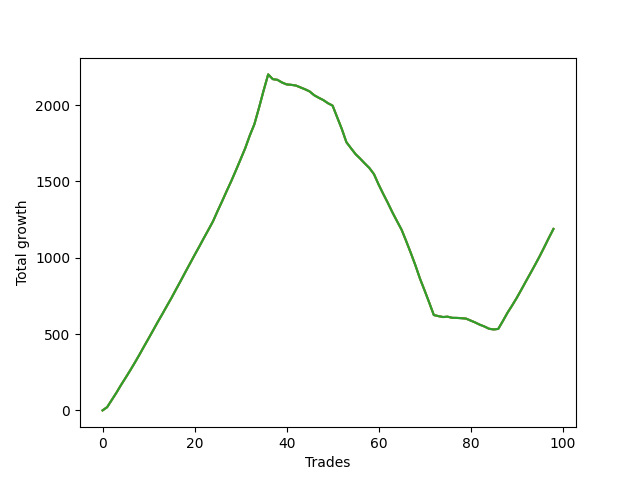

# Short Golden 003 
- Symbol: TEST
- Date Range: 3/19/22 - 5/22/22
- Trading Period: 7:20-12:30
- Number of Trades: 15



| Name | Win Percent | Profit | Avg Profit / Trade |     | Name | Win Percent | Profit | Avg Profit / Trade |
| ---- | ----------- | ------ | ------------------ | --- | ---- | ----------- | ------ | ------------------ |
| Sorted By <br> Profit | | | | | Sorted By <br> Win Percentage ||||
| Thirty-Five | 40.00 | 6625.00 | 441.67 |     | Thirty-Five | 40.00 | 6625.00 | 441.67 |
| Thirty-Seven | 33.33 | -5875.00 | -391.67 |     | Thirty-Seven | 33.33 | -5875.00 | -391.67 |
| Thirty-Six | 6.67 | -117125.00 | -7808.33 |     | Thirty-Six | 6.67 | -117125.00 | -7808.33 |

### Test Thirty-Five
* Sell when the linear regression slope changes to positive
* No Stoploss
* Results:
```
Total Trades: 15
Percent Up: 60.00
Percent Down: 40.00
Total Points Moved Down: 13.25
Potential Profit: 6625.00
Total Points Ups: 32.50 Count Ups: 9
Total Points Downs: 45.75 Count Downs: 6
```

<details><summary>Trades</summary>

<code>In: 2022-07-01 07:01:00		Out: 2022-07-01 07:03:05		Total Position Time: 02:05		Total Move Down: 4.75		Total to Date: -4.75</code> <br />
<code>In: 2022-07-01 07:04:00		Out: 2022-07-01 07:23:05		Total Position Time: 19:05		Total Move Down: 22.75		Total to Date: -27.50</code> <br />
<code>In: 2022-07-01 08:01:00		Out: 2022-07-01 08:03:05		Total Position Time: 02:05		Total Move Down: -1.00		Total to Date: -26.50</code> <br />
<code>In: 2022-07-01 08:53:00		Out: 2022-07-01 09:03:05		Total Position Time: 10:05		Total Move Down: 7.75		Total to Date: -34.25</code> <br />
<code>In: 2022-07-01 09:47:00		Out: 2022-07-01 09:51:05		Total Position Time: 04:05		Total Move Down: -4.25		Total to Date: -30.00</code> <br />
<code>In: 2022-07-01 10:00:00		Out: 2022-07-01 10:10:05		Total Position Time: 10:05		Total Move Down: -2.00		Total to Date: -28.00</code> <br />
<code>In: 2022-07-01 10:19:00		Out: 2022-07-01 10:25:05		Total Position Time: 06:05		Total Move Down: -2.50		Total to Date: -25.50</code> <br />
<code>In: 2022-07-01 10:24:00		Out: 2022-07-01 10:29:05		Total Position Time: 05:05		Total Move Down: -4.50		Total to Date: -21.00</code> <br />
<code>In: 2022-07-05 06:46:00		Out: 2022-07-05 07:03:05		Total Position Time: 17:05		Total Move Down: 5.75		Total to Date: -26.75</code> <br />
<code>In: 2022-07-05 06:52:00		Out: 2022-07-05 07:03:05		Total Position Time: 11:05		Total Move Down: 2.50		Total to Date: -29.25</code> <br />
<code>In: 2022-07-05 07:01:00		Out: 2022-07-05 07:03:05		Total Position Time: 02:05		Total Move Down: -0.50		Total to Date: -28.75</code> <br />
<code>In: 2022-07-05 07:05:00		Out: 2022-07-05 07:11:05		Total Position Time: 06:05		Total Move Down: -11.00		Total to Date: -17.75</code> <br />
<code>In: 2022-07-05 07:47:00		Out: 2022-07-05 07:55:05		Total Position Time: 08:05		Total Move Down: 2.25		Total to Date: -20.00</code> <br />
<code>In: 2022-07-05 08:36:00		Out: 2022-07-05 08:42:05		Total Position Time: 06:05		Total Move Down: -2.25		Total to Date: -17.75</code> <br />
<code>In: 2022-07-05 08:38:00		Out: 2022-07-05 08:42:05		Total Position Time: 04:05		Total Move Down: -4.50		Total to Date: -13.25</code> <br />


</details>

### Test Thirty-Six
* Sell when the bias changes to positive
* No Stoploss
* Results:
```
Total Trades: 15
Percent Up: 93.33
Percent Down: 6.67
Total Points Moved Down: -234.25
Potential Profit: -117125.00
Total Points Ups: 244.00 Count Ups: 14
Total Points Downs: 9.75 Count Downs: 1
```

<details><summary>Trades</summary>

<code>In: 2022-07-01 07:01:00		Out: 2022-07-01 11:06:05		Total Position Time: 245:05		Total Move Down: 9.75		Total to Date: -9.75</code> <br />
<code>In: 2022-07-01 07:04:00		Out: 2022-07-01 11:06:05		Total Position Time: 242:05		Total Move Down: -0.50		Total to Date: -9.25</code> <br />
<code>In: 2022-07-01 08:01:00		Out: 2022-07-01 11:06:05		Total Position Time: 185:05		Total Move Down: -27.75		Total to Date: 18.50</code> <br />
<code>In: 2022-07-01 08:53:00		Out: 2022-07-01 11:06:05		Total Position Time: 133:05		Total Move Down: -21.50		Total to Date: 40.00</code> <br />
<code>In: 2022-07-01 09:47:00		Out: 2022-07-01 11:06:05		Total Position Time: 79:05		Total Move Down: -19.25		Total to Date: 59.25</code> <br />
<code>In: 2022-07-01 10:00:00		Out: 2022-07-01 11:06:05		Total Position Time: 66:05		Total Move Down: -22.50		Total to Date: 81.75</code> <br />
<code>In: 2022-07-01 10:19:00		Out: 2022-07-01 11:06:05		Total Position Time: 47:05		Total Move Down: -17.75		Total to Date: 99.50</code> <br />
<code>In: 2022-07-01 10:24:00		Out: 2022-07-01 11:06:05		Total Position Time: 42:05		Total Move Down: -16.75		Total to Date: 116.25</code> <br />
<code>In: 2022-07-05 06:46:00		Out: 2022-07-05 07:40:05		Total Position Time: 54:05		Total Move Down: -14.25		Total to Date: 130.50</code> <br />
<code>In: 2022-07-05 06:52:00		Out: 2022-07-05 07:40:05		Total Position Time: 48:05		Total Move Down: -17.50		Total to Date: 148.00</code> <br />
<code>In: 2022-07-05 07:01:00		Out: 2022-07-05 07:40:05		Total Position Time: 39:05		Total Move Down: -20.50		Total to Date: 168.50</code> <br />
<code>In: 2022-07-05 07:05:00		Out: 2022-07-05 07:40:05		Total Position Time: 35:05		Total Move Down: -27.50		Total to Date: 196.00</code> <br />
<code>In: 2022-07-05 07:47:00		Out: 2022-07-05 09:00:05		Total Position Time: 73:05		Total Move Down: -10.50		Total to Date: 206.50</code> <br />
<code>In: 2022-07-05 08:36:00		Out: 2022-07-05 09:00:05		Total Position Time: 24:05		Total Move Down: -12.75		Total to Date: 219.25</code> <br />
<code>In: 2022-07-05 08:38:00		Out: 2022-07-05 09:00:05		Total Position Time: 22:05		Total Move Down: -15.00		Total to Date: 234.25</code> <br />


</details>

### Test Thirty-Seven
* Sell when the STDEV slope changes to positive
* No Stoploss
* Results:
```
Total Trades: 15
Percent Up: 66.67
Percent Down: 33.33
Total Points Moved Down: -11.75
Potential Profit: -5875.00
Total Points Ups: 44.25 Count Ups: 10
Total Points Downs: 32.50 Count Downs: 5
```

<details><summary>Trades</summary>

<code>In: 2022-07-01 07:01:00		Out: 2022-07-01 07:02:05		Total Position Time: 01:05		Total Move Down: -2.00		Total to Date: 2.00</code> <br />
<code>In: 2022-07-01 07:04:00		Out: 2022-07-01 07:58:05		Total Position Time: 54:05		Total Move Down: 21.00		Total to Date: -19.00</code> <br />
<code>In: 2022-07-01 08:01:00		Out: 2022-07-01 08:08:05		Total Position Time: 07:05		Total Move Down: -6.50		Total to Date: -12.50</code> <br />
<code>In: 2022-07-01 08:53:00		Out: 2022-07-01 09:18:05		Total Position Time: 25:05		Total Move Down: -4.00		Total to Date: -8.50</code> <br />
<code>In: 2022-07-01 09:47:00		Out: 2022-07-01 09:51:05		Total Position Time: 04:05		Total Move Down: -4.25		Total to Date: -4.25</code> <br />
<code>In: 2022-07-01 10:00:00		Out: 2022-07-01 10:16:05		Total Position Time: 16:05		Total Move Down: -7.00		Total to Date: 2.75</code> <br />
<code>In: 2022-07-01 10:19:00		Out: 2022-07-01 10:20:05		Total Position Time: 01:05		Total Move Down: -0.25		Total to Date: 3.00</code> <br />
<code>In: 2022-07-01 10:24:00		Out: 2022-07-01 10:25:05		Total Position Time: 01:05		Total Move Down: -1.50		Total to Date: 4.50</code> <br />
<code>In: 2022-07-05 06:46:00		Out: 2022-07-05 06:47:05		Total Position Time: 01:05		Total Move Down: 0.25		Total to Date: 4.25</code> <br />
<code>In: 2022-07-05 06:52:00		Out: 2022-07-05 07:00:05		Total Position Time: 08:05		Total Move Down: 5.50		Total to Date: -1.25</code> <br />
<code>In: 2022-07-05 07:01:00		Out: 2022-07-05 07:03:05		Total Position Time: 02:05		Total Move Down: -0.50		Total to Date: -0.75</code> <br />
<code>In: 2022-07-05 07:05:00		Out: 2022-07-05 07:12:05		Total Position Time: 07:05		Total Move Down: -13.75		Total to Date: 13.00</code> <br />
<code>In: 2022-07-05 07:47:00		Out: 2022-07-05 08:34:05		Total Position Time: 47:05		Total Move Down: 2.00		Total to Date: 11.00</code> <br />
<code>In: 2022-07-05 08:36:00		Out: 2022-07-05 08:37:05		Total Position Time: 01:05		Total Move Down: 3.75		Total to Date: 7.25</code> <br />
<code>In: 2022-07-05 08:38:00		Out: 2022-07-05 08:42:05		Total Position Time: 04:05		Total Move Down: -4.50		Total to Date: 11.75</code> <br />


</details>