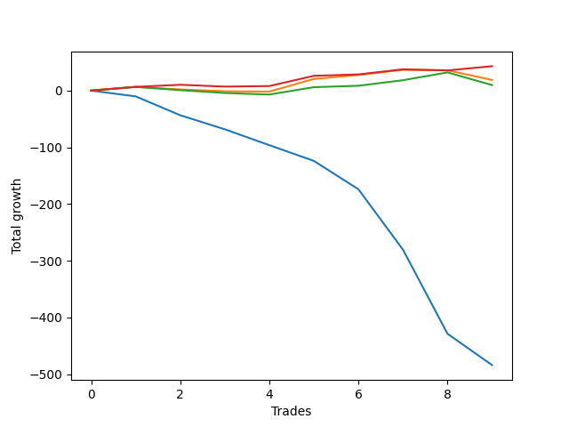

# Short Golden 003 
- Symbol: TEST
- Date Range: 3/19/22 - 5/22/22
- Trading Period: 7:20-12:30
- Number of Trades: 43



| Name | Win Percent | Profit | Avg Profit / Trade |     | Name | Win Percent | Profit | Avg Profit / Trade |
| ---- | ----------- | ------ | ------------------ | --- | ---- | ----------- | ------ | ------------------ |
| Sorted By <br> Profit | | | | | Sorted By <br> Win Percentage ||||
| Seventy-Five | 69.77 | 525500.00 | 12220.93 |     | Seventy-Five | 69.77 | 525500.00 | 12220.93 |
| Seventy-Four | 69.77 | 525500.00 | 12220.93 |     | Seventy-Four | 69.77 | 525500.00 | 12220.93 |
| Seventy-Three | 69.77 | 525500.00 | 12220.93 |     | Seventy-Three | 69.77 | 525500.00 | 12220.93 |

### Test Seventy-Three
* Sell when the linear regression slope changes to positive
* No Stoploss
* Results:
```
Total Trades: 43
Percent Up: 30.23
Percent Down: 69.77
Total Points Moved Down: 1051.00
Potential Profit: 525500.00
Total Points Ups: 249.75 Count Ups: 13
Total Points Downs: 1300.75 Count Downs: 30
```

<details><summary>Trades</summary>

<code>In: 2022-07-01 07:01:00		Out: 2022-07-01 06:30:10		Total Position Time: 1409:10		Total Move Down: 21.75		Total to Date: -21.75</code> <br />
<code>In: 2022-07-01 07:04:00		Out: 2022-07-01 06:30:10		Total Position Time: 1406:10		Total Move Down: 11.50		Total to Date: -33.25</code> <br />
<code>In: 2022-07-01 08:01:00		Out: 2022-07-01 06:30:10		Total Position Time: 1349:10		Total Move Down: -15.75		Total to Date: -17.50</code> <br />
<code>In: 2022-07-01 08:53:00		Out: 2022-07-01 06:30:10		Total Position Time: 1297:10		Total Move Down: -9.50		Total to Date: -8.00</code> <br />
<code>In: 2022-07-01 09:47:00		Out: 2022-07-01 06:30:10		Total Position Time: 1243:10		Total Move Down: -7.25		Total to Date: -0.75</code> <br />
<code>In: 2022-07-01 10:00:00		Out: 2022-07-01 06:30:10		Total Position Time: 1230:10		Total Move Down: -10.50		Total to Date: 9.75</code> <br />
<code>In: 2022-07-01 10:19:00		Out: 2022-07-01 06:30:10		Total Position Time: 1211:10		Total Move Down: -5.75		Total to Date: 15.50</code> <br />
<code>In: 2022-07-01 10:24:00		Out: 2022-07-01 06:30:10		Total Position Time: 1206:10		Total Move Down: -4.75		Total to Date: 20.25</code> <br />
<code>In: 2022-07-05 06:46:00		Out: 2022-07-01 06:30:10		Total Position Time: 1424:10		Total Move Down: -22.75		Total to Date: 43.00</code> <br />
<code>In: 2022-07-05 06:52:00		Out: 2022-07-01 06:30:10		Total Position Time: 1418:10		Total Move Down: -26.00		Total to Date: 69.00</code> <br />
<code>In: 2022-07-05 07:01:00		Out: 2022-07-01 06:30:10		Total Position Time: 1409:10		Total Move Down: -29.00		Total to Date: 98.00</code> <br />
<code>In: 2022-07-05 07:05:00		Out: 2022-07-01 06:30:10		Total Position Time: 1405:10		Total Move Down: -36.00		Total to Date: 134.00</code> <br />
<code>In: 2022-07-05 07:47:00		Out: 2022-07-01 06:30:10		Total Position Time: 1363:10		Total Move Down: -25.25		Total to Date: 159.25</code> <br />
<code>In: 2022-07-05 08:36:00		Out: 2022-07-01 06:30:10		Total Position Time: 1314:10		Total Move Down: -27.50		Total to Date: 186.75</code> <br />
<code>In: 2022-07-05 08:38:00		Out: 2022-07-01 06:30:10		Total Position Time: 1312:10		Total Move Down: -29.75		Total to Date: 216.50</code> <br />
<code>In: 2022-07-06 06:47:00		Out: 2022-07-01 06:30:10		Total Position Time: 1423:10		Total Move Down: 44.75		Total to Date: 171.75</code> <br />
<code>In: 2022-07-06 07:02:00		Out: 2022-07-01 06:30:10		Total Position Time: 1408:10		Total Move Down: 45.75		Total to Date: 126.00</code> <br />
<code>In: 2022-07-06 07:06:00		Out: 2022-07-01 06:30:10		Total Position Time: 1404:10		Total Move Down: 54.00		Total to Date: 72.00</code> <br />
<code>In: 2022-07-06 07:15:00		Out: 2022-07-01 06:30:10		Total Position Time: 1395:10		Total Move Down: 44.25		Total to Date: 27.75</code> <br />
<code>In: 2022-07-06 07:36:00		Out: 2022-07-01 06:30:10		Total Position Time: 1374:10		Total Move Down: 51.25		Total to Date: -23.50</code> <br />
<code>In: 2022-07-06 07:39:00		Out: 2022-07-01 06:30:10		Total Position Time: 1371:10		Total Move Down: 50.00		Total to Date: -73.50</code> <br />
<code>In: 2022-07-06 07:49:00		Out: 2022-07-01 06:30:10		Total Position Time: 1361:10		Total Move Down: 49.00		Total to Date: -122.50</code> <br />
<code>In: 2022-07-06 09:19:00		Out: 2022-07-01 06:30:10		Total Position Time: 1271:10		Total Move Down: 39.00		Total to Date: -161.50</code> <br />
<code>In: 2022-07-06 09:23:00		Out: 2022-07-01 06:30:10		Total Position Time: 1267:10		Total Move Down: 39.00		Total to Date: -200.50</code> <br />
<code>In: 2022-07-06 09:34:00		Out: 2022-07-01 06:30:10		Total Position Time: 1256:10		Total Move Down: 37.25		Total to Date: -237.75</code> <br />
<code>In: 2022-07-06 09:42:00		Out: 2022-07-01 06:30:10		Total Position Time: 1248:10		Total Move Down: 40.00		Total to Date: -277.75</code> <br />
<code>In: 2022-07-06 09:53:00		Out: 2022-07-01 06:30:10		Total Position Time: 1237:10		Total Move Down: 37.00		Total to Date: -314.75</code> <br />
<code>In: 2022-07-06 11:21:00		Out: 2022-07-01 06:30:10		Total Position Time: 1149:10		Total Move Down: 47.25		Total to Date: -362.00</code> <br />
<code>In: 2022-07-06 11:28:00		Out: 2022-07-01 06:30:10		Total Position Time: 1142:10		Total Move Down: 55.25		Total to Date: -417.25</code> <br />
<code>In: 2022-07-06 06:47:00		Out: 2022-07-01 06:30:10		Total Position Time: 1423:10		Total Move Down: 44.75		Total to Date: -462.00</code> <br />
<code>In: 2022-07-06 07:02:00		Out: 2022-07-01 06:30:10		Total Position Time: 1408:10		Total Move Down: 45.75		Total to Date: -507.75</code> <br />
<code>In: 2022-07-06 07:06:00		Out: 2022-07-01 06:30:10		Total Position Time: 1404:10		Total Move Down: 54.00		Total to Date: -561.75</code> <br />
<code>In: 2022-07-06 07:15:00		Out: 2022-07-01 06:30:10		Total Position Time: 1395:10		Total Move Down: 44.25		Total to Date: -606.00</code> <br />
<code>In: 2022-07-06 07:36:00		Out: 2022-07-01 06:30:10		Total Position Time: 1374:10		Total Move Down: 51.25		Total to Date: -657.25</code> <br />
<code>In: 2022-07-06 07:39:00		Out: 2022-07-01 06:30:10		Total Position Time: 1371:10		Total Move Down: 50.00		Total to Date: -707.25</code> <br />
<code>In: 2022-07-06 07:49:00		Out: 2022-07-01 06:30:10		Total Position Time: 1361:10		Total Move Down: 49.00		Total to Date: -756.25</code> <br />
<code>In: 2022-07-06 09:19:00		Out: 2022-07-01 06:30:10		Total Position Time: 1271:10		Total Move Down: 39.00		Total to Date: -795.25</code> <br />
<code>In: 2022-07-06 09:23:00		Out: 2022-07-01 06:30:10		Total Position Time: 1267:10		Total Move Down: 39.00		Total to Date: -834.25</code> <br />
<code>In: 2022-07-06 09:34:00		Out: 2022-07-01 06:30:10		Total Position Time: 1256:10		Total Move Down: 37.25		Total to Date: -871.50</code> <br />
<code>In: 2022-07-06 09:42:00		Out: 2022-07-01 06:30:10		Total Position Time: 1248:10		Total Move Down: 40.00		Total to Date: -911.50</code> <br />
<code>In: 2022-07-06 09:53:00		Out: 2022-07-01 06:30:10		Total Position Time: 1237:10		Total Move Down: 37.00		Total to Date: -948.50</code> <br />
<code>In: 2022-07-06 11:21:00		Out: 2022-07-01 06:30:10		Total Position Time: 1149:10		Total Move Down: 47.25		Total to Date: -995.75</code> <br />
<code>In: 2022-07-06 11:28:00		Out: 2022-07-01 06:30:10		Total Position Time: 1142:10		Total Move Down: 55.25		Total to Date: -1051.00</code> <br />


</details>

### Test Seventy-Four
* Sell when the bias changes to positive
* No Stoploss
* Results:
```
Total Trades: 43
Percent Up: 30.23
Percent Down: 69.77
Total Points Moved Down: 1051.00
Potential Profit: 525500.00
Total Points Ups: 249.75 Count Ups: 13
Total Points Downs: 1300.75 Count Downs: 30
```

<details><summary>Trades</summary>

<code>In: 2022-07-01 07:01:00		Out: 2022-07-01 06:30:10		Total Position Time: 1409:10		Total Move Down: 21.75		Total to Date: -21.75</code> <br />
<code>In: 2022-07-01 07:04:00		Out: 2022-07-01 06:30:10		Total Position Time: 1406:10		Total Move Down: 11.50		Total to Date: -33.25</code> <br />
<code>In: 2022-07-01 08:01:00		Out: 2022-07-01 06:30:10		Total Position Time: 1349:10		Total Move Down: -15.75		Total to Date: -17.50</code> <br />
<code>In: 2022-07-01 08:53:00		Out: 2022-07-01 06:30:10		Total Position Time: 1297:10		Total Move Down: -9.50		Total to Date: -8.00</code> <br />
<code>In: 2022-07-01 09:47:00		Out: 2022-07-01 06:30:10		Total Position Time: 1243:10		Total Move Down: -7.25		Total to Date: -0.75</code> <br />
<code>In: 2022-07-01 10:00:00		Out: 2022-07-01 06:30:10		Total Position Time: 1230:10		Total Move Down: -10.50		Total to Date: 9.75</code> <br />
<code>In: 2022-07-01 10:19:00		Out: 2022-07-01 06:30:10		Total Position Time: 1211:10		Total Move Down: -5.75		Total to Date: 15.50</code> <br />
<code>In: 2022-07-01 10:24:00		Out: 2022-07-01 06:30:10		Total Position Time: 1206:10		Total Move Down: -4.75		Total to Date: 20.25</code> <br />
<code>In: 2022-07-05 06:46:00		Out: 2022-07-01 06:30:10		Total Position Time: 1424:10		Total Move Down: -22.75		Total to Date: 43.00</code> <br />
<code>In: 2022-07-05 06:52:00		Out: 2022-07-01 06:30:10		Total Position Time: 1418:10		Total Move Down: -26.00		Total to Date: 69.00</code> <br />
<code>In: 2022-07-05 07:01:00		Out: 2022-07-01 06:30:10		Total Position Time: 1409:10		Total Move Down: -29.00		Total to Date: 98.00</code> <br />
<code>In: 2022-07-05 07:05:00		Out: 2022-07-01 06:30:10		Total Position Time: 1405:10		Total Move Down: -36.00		Total to Date: 134.00</code> <br />
<code>In: 2022-07-05 07:47:00		Out: 2022-07-01 06:30:10		Total Position Time: 1363:10		Total Move Down: -25.25		Total to Date: 159.25</code> <br />
<code>In: 2022-07-05 08:36:00		Out: 2022-07-01 06:30:10		Total Position Time: 1314:10		Total Move Down: -27.50		Total to Date: 186.75</code> <br />
<code>In: 2022-07-05 08:38:00		Out: 2022-07-01 06:30:10		Total Position Time: 1312:10		Total Move Down: -29.75		Total to Date: 216.50</code> <br />
<code>In: 2022-07-06 06:47:00		Out: 2022-07-01 06:30:10		Total Position Time: 1423:10		Total Move Down: 44.75		Total to Date: 171.75</code> <br />
<code>In: 2022-07-06 07:02:00		Out: 2022-07-01 06:30:10		Total Position Time: 1408:10		Total Move Down: 45.75		Total to Date: 126.00</code> <br />
<code>In: 2022-07-06 07:06:00		Out: 2022-07-01 06:30:10		Total Position Time: 1404:10		Total Move Down: 54.00		Total to Date: 72.00</code> <br />
<code>In: 2022-07-06 07:15:00		Out: 2022-07-01 06:30:10		Total Position Time: 1395:10		Total Move Down: 44.25		Total to Date: 27.75</code> <br />
<code>In: 2022-07-06 07:36:00		Out: 2022-07-01 06:30:10		Total Position Time: 1374:10		Total Move Down: 51.25		Total to Date: -23.50</code> <br />
<code>In: 2022-07-06 07:39:00		Out: 2022-07-01 06:30:10		Total Position Time: 1371:10		Total Move Down: 50.00		Total to Date: -73.50</code> <br />
<code>In: 2022-07-06 07:49:00		Out: 2022-07-01 06:30:10		Total Position Time: 1361:10		Total Move Down: 49.00		Total to Date: -122.50</code> <br />
<code>In: 2022-07-06 09:19:00		Out: 2022-07-01 06:30:10		Total Position Time: 1271:10		Total Move Down: 39.00		Total to Date: -161.50</code> <br />
<code>In: 2022-07-06 09:23:00		Out: 2022-07-01 06:30:10		Total Position Time: 1267:10		Total Move Down: 39.00		Total to Date: -200.50</code> <br />
<code>In: 2022-07-06 09:34:00		Out: 2022-07-01 06:30:10		Total Position Time: 1256:10		Total Move Down: 37.25		Total to Date: -237.75</code> <br />
<code>In: 2022-07-06 09:42:00		Out: 2022-07-01 06:30:10		Total Position Time: 1248:10		Total Move Down: 40.00		Total to Date: -277.75</code> <br />
<code>In: 2022-07-06 09:53:00		Out: 2022-07-01 06:30:10		Total Position Time: 1237:10		Total Move Down: 37.00		Total to Date: -314.75</code> <br />
<code>In: 2022-07-06 11:21:00		Out: 2022-07-01 06:30:10		Total Position Time: 1149:10		Total Move Down: 47.25		Total to Date: -362.00</code> <br />
<code>In: 2022-07-06 11:28:00		Out: 2022-07-01 06:30:10		Total Position Time: 1142:10		Total Move Down: 55.25		Total to Date: -417.25</code> <br />
<code>In: 2022-07-06 06:47:00		Out: 2022-07-01 06:30:10		Total Position Time: 1423:10		Total Move Down: 44.75		Total to Date: -462.00</code> <br />
<code>In: 2022-07-06 07:02:00		Out: 2022-07-01 06:30:10		Total Position Time: 1408:10		Total Move Down: 45.75		Total to Date: -507.75</code> <br />
<code>In: 2022-07-06 07:06:00		Out: 2022-07-01 06:30:10		Total Position Time: 1404:10		Total Move Down: 54.00		Total to Date: -561.75</code> <br />
<code>In: 2022-07-06 07:15:00		Out: 2022-07-01 06:30:10		Total Position Time: 1395:10		Total Move Down: 44.25		Total to Date: -606.00</code> <br />
<code>In: 2022-07-06 07:36:00		Out: 2022-07-01 06:30:10		Total Position Time: 1374:10		Total Move Down: 51.25		Total to Date: -657.25</code> <br />
<code>In: 2022-07-06 07:39:00		Out: 2022-07-01 06:30:10		Total Position Time: 1371:10		Total Move Down: 50.00		Total to Date: -707.25</code> <br />
<code>In: 2022-07-06 07:49:00		Out: 2022-07-01 06:30:10		Total Position Time: 1361:10		Total Move Down: 49.00		Total to Date: -756.25</code> <br />
<code>In: 2022-07-06 09:19:00		Out: 2022-07-01 06:30:10		Total Position Time: 1271:10		Total Move Down: 39.00		Total to Date: -795.25</code> <br />
<code>In: 2022-07-06 09:23:00		Out: 2022-07-01 06:30:10		Total Position Time: 1267:10		Total Move Down: 39.00		Total to Date: -834.25</code> <br />
<code>In: 2022-07-06 09:34:00		Out: 2022-07-01 06:30:10		Total Position Time: 1256:10		Total Move Down: 37.25		Total to Date: -871.50</code> <br />
<code>In: 2022-07-06 09:42:00		Out: 2022-07-01 06:30:10		Total Position Time: 1248:10		Total Move Down: 40.00		Total to Date: -911.50</code> <br />
<code>In: 2022-07-06 09:53:00		Out: 2022-07-01 06:30:10		Total Position Time: 1237:10		Total Move Down: 37.00		Total to Date: -948.50</code> <br />
<code>In: 2022-07-06 11:21:00		Out: 2022-07-01 06:30:10		Total Position Time: 1149:10		Total Move Down: 47.25		Total to Date: -995.75</code> <br />
<code>In: 2022-07-06 11:28:00		Out: 2022-07-01 06:30:10		Total Position Time: 1142:10		Total Move Down: 55.25		Total to Date: -1051.00</code> <br />


</details>

### Test Seventy-Five
* Sell when the STDEV slope changes to positive
* No Stoploss
* Results:
```
Total Trades: 43
Percent Up: 30.23
Percent Down: 69.77
Total Points Moved Down: 1051.00
Potential Profit: 525500.00
Total Points Ups: 249.75 Count Ups: 13
Total Points Downs: 1300.75 Count Downs: 30
```

<details><summary>Trades</summary>

<code>In: 2022-07-01 07:01:00		Out: 2022-07-01 06:30:10		Total Position Time: 1409:10		Total Move Down: 21.75		Total to Date: -21.75</code> <br />
<code>In: 2022-07-01 07:04:00		Out: 2022-07-01 06:30:10		Total Position Time: 1406:10		Total Move Down: 11.50		Total to Date: -33.25</code> <br />
<code>In: 2022-07-01 08:01:00		Out: 2022-07-01 06:30:10		Total Position Time: 1349:10		Total Move Down: -15.75		Total to Date: -17.50</code> <br />
<code>In: 2022-07-01 08:53:00		Out: 2022-07-01 06:30:10		Total Position Time: 1297:10		Total Move Down: -9.50		Total to Date: -8.00</code> <br />
<code>In: 2022-07-01 09:47:00		Out: 2022-07-01 06:30:10		Total Position Time: 1243:10		Total Move Down: -7.25		Total to Date: -0.75</code> <br />
<code>In: 2022-07-01 10:00:00		Out: 2022-07-01 06:30:10		Total Position Time: 1230:10		Total Move Down: -10.50		Total to Date: 9.75</code> <br />
<code>In: 2022-07-01 10:19:00		Out: 2022-07-01 06:30:10		Total Position Time: 1211:10		Total Move Down: -5.75		Total to Date: 15.50</code> <br />
<code>In: 2022-07-01 10:24:00		Out: 2022-07-01 06:30:10		Total Position Time: 1206:10		Total Move Down: -4.75		Total to Date: 20.25</code> <br />
<code>In: 2022-07-05 06:46:00		Out: 2022-07-01 06:30:10		Total Position Time: 1424:10		Total Move Down: -22.75		Total to Date: 43.00</code> <br />
<code>In: 2022-07-05 06:52:00		Out: 2022-07-01 06:30:10		Total Position Time: 1418:10		Total Move Down: -26.00		Total to Date: 69.00</code> <br />
<code>In: 2022-07-05 07:01:00		Out: 2022-07-01 06:30:10		Total Position Time: 1409:10		Total Move Down: -29.00		Total to Date: 98.00</code> <br />
<code>In: 2022-07-05 07:05:00		Out: 2022-07-01 06:30:10		Total Position Time: 1405:10		Total Move Down: -36.00		Total to Date: 134.00</code> <br />
<code>In: 2022-07-05 07:47:00		Out: 2022-07-01 06:30:10		Total Position Time: 1363:10		Total Move Down: -25.25		Total to Date: 159.25</code> <br />
<code>In: 2022-07-05 08:36:00		Out: 2022-07-01 06:30:10		Total Position Time: 1314:10		Total Move Down: -27.50		Total to Date: 186.75</code> <br />
<code>In: 2022-07-05 08:38:00		Out: 2022-07-01 06:30:10		Total Position Time: 1312:10		Total Move Down: -29.75		Total to Date: 216.50</code> <br />
<code>In: 2022-07-06 06:47:00		Out: 2022-07-01 06:30:10		Total Position Time: 1423:10		Total Move Down: 44.75		Total to Date: 171.75</code> <br />
<code>In: 2022-07-06 07:02:00		Out: 2022-07-01 06:30:10		Total Position Time: 1408:10		Total Move Down: 45.75		Total to Date: 126.00</code> <br />
<code>In: 2022-07-06 07:06:00		Out: 2022-07-01 06:30:10		Total Position Time: 1404:10		Total Move Down: 54.00		Total to Date: 72.00</code> <br />
<code>In: 2022-07-06 07:15:00		Out: 2022-07-01 06:30:10		Total Position Time: 1395:10		Total Move Down: 44.25		Total to Date: 27.75</code> <br />
<code>In: 2022-07-06 07:36:00		Out: 2022-07-01 06:30:10		Total Position Time: 1374:10		Total Move Down: 51.25		Total to Date: -23.50</code> <br />
<code>In: 2022-07-06 07:39:00		Out: 2022-07-01 06:30:10		Total Position Time: 1371:10		Total Move Down: 50.00		Total to Date: -73.50</code> <br />
<code>In: 2022-07-06 07:49:00		Out: 2022-07-01 06:30:10		Total Position Time: 1361:10		Total Move Down: 49.00		Total to Date: -122.50</code> <br />
<code>In: 2022-07-06 09:19:00		Out: 2022-07-01 06:30:10		Total Position Time: 1271:10		Total Move Down: 39.00		Total to Date: -161.50</code> <br />
<code>In: 2022-07-06 09:23:00		Out: 2022-07-01 06:30:10		Total Position Time: 1267:10		Total Move Down: 39.00		Total to Date: -200.50</code> <br />
<code>In: 2022-07-06 09:34:00		Out: 2022-07-01 06:30:10		Total Position Time: 1256:10		Total Move Down: 37.25		Total to Date: -237.75</code> <br />
<code>In: 2022-07-06 09:42:00		Out: 2022-07-01 06:30:10		Total Position Time: 1248:10		Total Move Down: 40.00		Total to Date: -277.75</code> <br />
<code>In: 2022-07-06 09:53:00		Out: 2022-07-01 06:30:10		Total Position Time: 1237:10		Total Move Down: 37.00		Total to Date: -314.75</code> <br />
<code>In: 2022-07-06 11:21:00		Out: 2022-07-01 06:30:10		Total Position Time: 1149:10		Total Move Down: 47.25		Total to Date: -362.00</code> <br />
<code>In: 2022-07-06 11:28:00		Out: 2022-07-01 06:30:10		Total Position Time: 1142:10		Total Move Down: 55.25		Total to Date: -417.25</code> <br />
<code>In: 2022-07-06 06:47:00		Out: 2022-07-01 06:30:10		Total Position Time: 1423:10		Total Move Down: 44.75		Total to Date: -462.00</code> <br />
<code>In: 2022-07-06 07:02:00		Out: 2022-07-01 06:30:10		Total Position Time: 1408:10		Total Move Down: 45.75		Total to Date: -507.75</code> <br />
<code>In: 2022-07-06 07:06:00		Out: 2022-07-01 06:30:10		Total Position Time: 1404:10		Total Move Down: 54.00		Total to Date: -561.75</code> <br />
<code>In: 2022-07-06 07:15:00		Out: 2022-07-01 06:30:10		Total Position Time: 1395:10		Total Move Down: 44.25		Total to Date: -606.00</code> <br />
<code>In: 2022-07-06 07:36:00		Out: 2022-07-01 06:30:10		Total Position Time: 1374:10		Total Move Down: 51.25		Total to Date: -657.25</code> <br />
<code>In: 2022-07-06 07:39:00		Out: 2022-07-01 06:30:10		Total Position Time: 1371:10		Total Move Down: 50.00		Total to Date: -707.25</code> <br />
<code>In: 2022-07-06 07:49:00		Out: 2022-07-01 06:30:10		Total Position Time: 1361:10		Total Move Down: 49.00		Total to Date: -756.25</code> <br />
<code>In: 2022-07-06 09:19:00		Out: 2022-07-01 06:30:10		Total Position Time: 1271:10		Total Move Down: 39.00		Total to Date: -795.25</code> <br />
<code>In: 2022-07-06 09:23:00		Out: 2022-07-01 06:30:10		Total Position Time: 1267:10		Total Move Down: 39.00		Total to Date: -834.25</code> <br />
<code>In: 2022-07-06 09:34:00		Out: 2022-07-01 06:30:10		Total Position Time: 1256:10		Total Move Down: 37.25		Total to Date: -871.50</code> <br />
<code>In: 2022-07-06 09:42:00		Out: 2022-07-01 06:30:10		Total Position Time: 1248:10		Total Move Down: 40.00		Total to Date: -911.50</code> <br />
<code>In: 2022-07-06 09:53:00		Out: 2022-07-01 06:30:10		Total Position Time: 1237:10		Total Move Down: 37.00		Total to Date: -948.50</code> <br />
<code>In: 2022-07-06 11:21:00		Out: 2022-07-01 06:30:10		Total Position Time: 1149:10		Total Move Down: 47.25		Total to Date: -995.75</code> <br />
<code>In: 2022-07-06 11:28:00		Out: 2022-07-01 06:30:10		Total Position Time: 1142:10		Total Move Down: 55.25		Total to Date: -1051.00</code> <br />


</details>