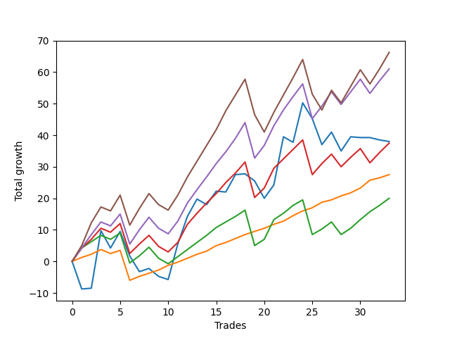

# Short Golden One 
- Symbol: TEST
- Date Range: 07/08/2022 - 07/15/2022
- Trading Period: 7:20-12:30
- Number of Trades: 33



| Name | Win Percent | Profit | Avg Profit / Trade |     | Name | Win Percent | Profit | Avg Profit / Trade |
| ---- | ----------- | ------ | ------------------ | --- | ---- | ----------- | ------ | ------------------ |
| Sorted By <br> Profit | | | | | Sorted By <br> Win Percentage ||||
| Eighty-Five | 69.70 | 33125.00 | 1003.79 |     | Eighty-One | 93.94 | 13750.00 | 416.67 |
| Eighty-Four | 75.76 | 30500.00 | 924.24 |     | Eighty-Two | 78.79 | 10000.00 | 303.03 |
| Seventy-Three | 45.45 | 19000.00 | 575.76 |     | Eighty-Four | 75.76 | 30500.00 | 924.24 |
| Eighty-Three | 75.76 | 18750.00 | 568.18 |     | Eighty-Three | 75.76 | 18750.00 | 568.18 |
| Eighty-One | 93.94 | 13750.00 | 416.67 |     | Eighty-Five | 69.70 | 33125.00 | 1003.79 |
| Eighty-Two | 78.79 | 10000.00 | 303.03 |     | Seventy-Three | 45.45 | 19000.00 | 575.76 |

## SPECIAL EXIT CONDITIONS 

### Test Seventy-Three
* Sell when the linear regression slope changes to negative
* No Stoploss
* Results:
```
Total Trades: 33
Percent Up: 54.55
Percent Down: 45.45
Total Points Moved Down: 38.00
Potential Profit: 19000.00
Total Points Ups: 62.75 Count Ups: 18
Total Points Downs: 100.75 Count Downs: 15
```

<details><summary>Trades</summary>

<code>In: 2022-07-08 08:20:00		Out: 2022-07-08 08:35:05		Total Position Time: 15:05		Total Move Down: -8.75		Total to Date: -8.75</code> <br />
<code>In: 2022-07-08 08:45:00		Out: 2022-07-08 09:00:05		Total Position Time: 15:05		Total Move Down: 0.25		Total to Date: -8.50</code> <br />
<code>In: 2022-07-08 09:05:00		Out: 2022-07-08 09:34:55		Total Position Time: 29:55		Total Move Down: 18.25		Total to Date: 9.75</code> <br />
<code>In: 2022-07-08 11:55:00		Out: 2022-07-08 12:00:05		Total Position Time: 05:05		Total Move Down: -5.50		Total to Date: 4.25</code> <br />
<code>In: 2022-07-08 12:10:00		Out: 2022-07-08 12:39:55		Total Position Time: 29:55		Total Move Down: 5.25		Total to Date: 9.50</code> <br />
<code>In: 2022-07-11 08:00:00		Out: 2022-07-11 08:10:05		Total Position Time: 10:05		Total Move Down: -7.75		Total to Date: 1.75</code> <br />
<code>In: 2022-07-11 08:25:00		Out: 2022-07-11 08:30:05		Total Position Time: 05:05		Total Move Down: -5.00		Total to Date: -3.25</code> <br />
<code>In: 2022-07-11 08:35:00		Out: 2022-07-11 09:00:05		Total Position Time: 25:05		Total Move Down: 1.00		Total to Date: -2.25</code> <br />
<code>In: 2022-07-11 09:05:00		Out: 2022-07-11 09:20:05		Total Position Time: 15:05		Total Move Down: -2.50		Total to Date: -4.75</code> <br />
<code>In: 2022-07-11 09:25:00		Out: 2022-07-11 09:30:05		Total Position Time: 05:05		Total Move Down: -1.00		Total to Date: -5.75</code> <br />
<code>In: 2022-07-11 11:00:00		Out: 2022-07-11 11:29:55		Total Position Time: 29:55		Total Move Down: 11.25		Total to Date: 5.50</code> <br />
<code>In: 2022-07-12 06:50:00		Out: 2022-07-12 07:19:55		Total Position Time: 29:55		Total Move Down: 8.75		Total to Date: 14.25</code> <br />
<code>In: 2022-07-12 08:40:00		Out: 2022-07-12 09:09:55		Total Position Time: 29:55		Total Move Down: 5.50		Total to Date: 19.75</code> <br />
<code>In: 2022-07-12 09:55:00		Out: 2022-07-12 10:00:05		Total Position Time: 05:05		Total Move Down: -1.75		Total to Date: 18.00</code> <br />
<code>In: 2022-07-12 10:05:00		Out: 2022-07-12 10:34:55		Total Position Time: 29:55		Total Move Down: 4.25		Total to Date: 22.25</code> <br />
<code>In: 2022-07-12 11:05:00		Out: 2022-07-12 11:10:05		Total Position Time: 05:05		Total Move Down: -0.25		Total to Date: 22.00</code> <br />
<code>In: 2022-07-12 11:20:00		Out: 2022-07-12 11:49:55		Total Position Time: 29:55		Total Move Down: 5.50		Total to Date: 27.50</code> <br />
<code>In: 2022-07-13 08:30:00		Out: 2022-07-13 08:59:55		Total Position Time: 29:55		Total Move Down: 0.25		Total to Date: 27.75</code> <br />
<code>In: 2022-07-13 09:15:00		Out: 2022-07-13 09:20:05		Total Position Time: 05:05		Total Move Down: -2.25		Total to Date: 25.50</code> <br />
<code>In: 2022-07-13 10:20:00		Out: 2022-07-13 10:49:55		Total Position Time: 29:55		Total Move Down: -5.50		Total to Date: 20.00</code> <br />
<code>In: 2022-07-13 10:55:00		Out: 2022-07-13 11:24:55		Total Position Time: 29:55		Total Move Down: 4.25		Total to Date: 24.25</code> <br />
<code>In: 2022-07-13 12:15:00		Out: 2022-07-13 12:44:55		Total Position Time: 29:55		Total Move Down: 15.25		Total to Date: 39.50</code> <br />
<code>In: 2022-07-14 09:10:00		Out: 2022-07-14 09:20:05		Total Position Time: 10:05		Total Move Down: -1.75		Total to Date: 37.75</code> <br />
<code>In: 2022-07-14 09:25:00		Out: 2022-07-14 09:54:55		Total Position Time: 29:55		Total Move Down: 12.50		Total to Date: 50.25</code> <br />
<code>In: 2022-07-14 11:55:00		Out: 2022-07-14 12:00:05		Total Position Time: 05:05		Total Move Down: -5.00		Total to Date: 45.25</code> <br />
<code>In: 2022-07-14 12:05:00		Out: 2022-07-14 12:25:05		Total Position Time: 20:05		Total Move Down: -8.25		Total to Date: 37.00</code> <br />
<code>In: 2022-07-15 07:40:00		Out: 2022-07-15 07:45:05		Total Position Time: 05:05		Total Move Down: 4.00		Total to Date: 41.00</code> <br />
<code>In: 2022-07-15 08:05:00		Out: 2022-07-15 08:10:05		Total Position Time: 05:05		Total Move Down: -6.00		Total to Date: 35.00</code> <br />
<code>In: 2022-07-15 08:55:00		Out: 2022-07-15 09:24:55		Total Position Time: 29:55		Total Move Down: 4.50		Total to Date: 39.50</code> <br />
<code>In: 2022-07-15 10:50:00		Out: 2022-07-15 11:19:55		Total Position Time: 29:55		Total Move Down: -0.25		Total to Date: 39.25</code> <br />
<code>In: 2022-07-15 11:25:00		Out: 2022-07-15 11:40:05		Total Position Time: 15:05		Total Move Down: -0.00		Total to Date: 39.25</code> <br />
<code>In: 2022-07-15 12:05:00		Out: 2022-07-15 12:10:05		Total Position Time: 05:05		Total Move Down: -0.75		Total to Date: 38.50</code> <br />
<code>In: 2022-07-15 12:15:00		Out: 2022-07-15 12:44:55		Total Position Time: 29:55		Total Move Down: -0.50		Total to Date: 38.00</code> <br />


</details>

## TAKE PROFIT

### Test Eighty-One
* Take Profit of 1 Point
* No Stoploss
* Results:
```
Total Trades: 33
Percent Up: 6.06
Percent Down: 93.94
Total Points Moved Down: 27.50
Potential Profit: 13750.00
Total Points Ups: 10.75 Count Ups: 2
Total Points Downs: 38.25 Count Downs: 31
```

<details><summary>Trades</summary>

<code>In: 2022-07-08 08:20:00		Out: 2022-07-08 08:48:15		Total Position Time: 28:15		Total Move Down: 1.25		Total to Date: 1.25</code> <br />
<code>In: 2022-07-08 08:45:00		Out: 2022-07-08 08:45:40		Total Position Time: 00:40		Total Move Down: 1.00		Total to Date: 2.25</code> <br />
<code>In: 2022-07-08 09:05:00		Out: 2022-07-08 09:05:30		Total Position Time: 00:30		Total Move Down: 1.50		Total to Date: 3.75</code> <br />
<code>In: 2022-07-08 11:55:00		Out: 2022-07-08 12:24:55		Total Position Time: 29:55		Total Move Down: -1.25		Total to Date: 2.50</code> <br />
<code>In: 2022-07-08 12:10:00		Out: 2022-07-08 12:10:10		Total Position Time: 00:10		Total Move Down: 1.00		Total to Date: 3.50</code> <br />
<code>In: 2022-07-11 08:00:00		Out: 2022-07-11 08:29:55		Total Position Time: 29:55		Total Move Down: -9.50		Total to Date: -6.00</code> <br />
<code>In: 2022-07-11 08:25:00		Out: 2022-07-11 08:37:10		Total Position Time: 12:10		Total Move Down: 1.25		Total to Date: -4.75</code> <br />
<code>In: 2022-07-11 08:35:00		Out: 2022-07-11 08:37:00		Total Position Time: 02:00		Total Move Down: 1.00		Total to Date: -3.75</code> <br />
<code>In: 2022-07-11 09:05:00		Out: 2022-07-11 09:05:25		Total Position Time: 00:25		Total Move Down: 1.00		Total to Date: -2.75</code> <br />
<code>In: 2022-07-11 09:25:00		Out: 2022-07-11 09:25:30		Total Position Time: 00:30		Total Move Down: 1.50		Total to Date: -1.25</code> <br />
<code>In: 2022-07-11 11:00:00		Out: 2022-07-11 11:00:50		Total Position Time: 00:50		Total Move Down: 1.00		Total to Date: -0.25</code> <br />
<code>In: 2022-07-12 06:50:00		Out: 2022-07-12 06:50:25		Total Position Time: 00:25		Total Move Down: 1.25		Total to Date: 1.00</code> <br />
<code>In: 2022-07-12 08:40:00		Out: 2022-07-12 08:40:10		Total Position Time: 00:10		Total Move Down: 1.25		Total to Date: 2.25</code> <br />
<code>In: 2022-07-12 09:55:00		Out: 2022-07-12 09:56:30		Total Position Time: 01:30		Total Move Down: 1.00		Total to Date: 3.25</code> <br />
<code>In: 2022-07-12 10:05:00		Out: 2022-07-12 10:05:40		Total Position Time: 00:40		Total Move Down: 1.75		Total to Date: 5.00</code> <br />
<code>In: 2022-07-12 11:05:00		Out: 2022-07-12 11:07:05		Total Position Time: 02:05		Total Move Down: 1.00		Total to Date: 6.00</code> <br />
<code>In: 2022-07-12 11:20:00		Out: 2022-07-12 11:21:25		Total Position Time: 01:25		Total Move Down: 1.25		Total to Date: 7.25</code> <br />
<code>In: 2022-07-13 08:30:00		Out: 2022-07-13 08:33:50		Total Position Time: 03:50		Total Move Down: 1.25		Total to Date: 8.50</code> <br />
<code>In: 2022-07-13 09:15:00		Out: 2022-07-13 09:17:35		Total Position Time: 02:35		Total Move Down: 1.00		Total to Date: 9.50</code> <br />
<code>In: 2022-07-13 10:20:00		Out: 2022-07-13 10:20:25		Total Position Time: 00:25		Total Move Down: 1.00		Total to Date: 10.50</code> <br />
<code>In: 2022-07-13 10:55:00		Out: 2022-07-13 11:00:05		Total Position Time: 05:05		Total Move Down: 1.25		Total to Date: 11.75</code> <br />
<code>In: 2022-07-13 12:15:00		Out: 2022-07-13 12:15:10		Total Position Time: 00:10		Total Move Down: 1.00		Total to Date: 12.75</code> <br />
<code>In: 2022-07-14 09:10:00		Out: 2022-07-14 09:16:55		Total Position Time: 06:55		Total Move Down: 1.75		Total to Date: 14.50</code> <br />
<code>In: 2022-07-14 09:25:00		Out: 2022-07-14 09:25:10		Total Position Time: 00:10		Total Move Down: 1.50		Total to Date: 16.00</code> <br />
<code>In: 2022-07-14 11:55:00		Out: 2022-07-14 12:07:50		Total Position Time: 12:50		Total Move Down: 1.00		Total to Date: 17.00</code> <br />
<code>In: 2022-07-14 12:05:00		Out: 2022-07-14 12:06:40		Total Position Time: 01:40		Total Move Down: 1.75		Total to Date: 18.75</code> <br />
<code>In: 2022-07-15 07:40:00		Out: 2022-07-15 07:43:20		Total Position Time: 03:20		Total Move Down: 0.75		Total to Date: 19.50</code> <br />
<code>In: 2022-07-15 08:05:00		Out: 2022-07-15 08:06:00		Total Position Time: 01:00		Total Move Down: 1.25		Total to Date: 20.75</code> <br />
<code>In: 2022-07-15 08:55:00		Out: 2022-07-15 08:57:25		Total Position Time: 02:25		Total Move Down: 1.00		Total to Date: 21.75</code> <br />
<code>In: 2022-07-15 10:50:00		Out: 2022-07-15 10:53:10		Total Position Time: 03:10		Total Move Down: 1.50		Total to Date: 23.25</code> <br />
<code>In: 2022-07-15 11:25:00		Out: 2022-07-15 11:26:30		Total Position Time: 01:30		Total Move Down: 2.50		Total to Date: 25.75</code> <br />
<code>In: 2022-07-15 12:05:00		Out: 2022-07-15 12:05:20		Total Position Time: 00:20		Total Move Down: 0.75		Total to Date: 26.50</code> <br />
<code>In: 2022-07-15 12:15:00		Out: 2022-07-15 12:24:15		Total Position Time: 09:15		Total Move Down: 1.00		Total to Date: 27.50</code> <br />


</details>

### Test Eighty-Two
* Take Profit of 2 Point
* No Stoploss
* Results:
```
Total Trades: 33
Percent Up: 21.21
Percent Down: 78.79
Total Points Moved Down: 20.00
Potential Profit: 10000.00
Total Points Ups: 42.25 Count Ups: 7
Total Points Downs: 62.25 Count Downs: 26
```

<details><summary>Trades</summary>

<code>In: 2022-07-08 08:20:00		Out: 2022-07-08 08:48:40		Total Position Time: 28:40		Total Move Down: 4.25		Total to Date: 4.25</code> <br />
<code>In: 2022-07-08 08:45:00		Out: 2022-07-08 08:45:50		Total Position Time: 00:50		Total Move Down: 2.00		Total to Date: 6.25</code> <br />
<code>In: 2022-07-08 09:05:00		Out: 2022-07-08 09:05:45		Total Position Time: 00:45		Total Move Down: 2.00		Total to Date: 8.25</code> <br />
<code>In: 2022-07-08 11:55:00		Out: 2022-07-08 12:24:55		Total Position Time: 29:55		Total Move Down: -1.25		Total to Date: 7.00</code> <br />
<code>In: 2022-07-08 12:10:00		Out: 2022-07-08 12:25:20		Total Position Time: 15:20		Total Move Down: 2.00		Total to Date: 9.00</code> <br />
<code>In: 2022-07-11 08:00:00		Out: 2022-07-11 08:29:55		Total Position Time: 29:55		Total Move Down: -9.50		Total to Date: -0.50</code> <br />
<code>In: 2022-07-11 08:25:00		Out: 2022-07-11 08:42:15		Total Position Time: 17:15		Total Move Down: 2.25		Total to Date: 1.75</code> <br />
<code>In: 2022-07-11 08:35:00		Out: 2022-07-11 08:37:10		Total Position Time: 02:10		Total Move Down: 2.75		Total to Date: 4.50</code> <br />
<code>In: 2022-07-11 09:05:00		Out: 2022-07-11 09:34:55		Total Position Time: 29:55		Total Move Down: -3.50		Total to Date: 1.00</code> <br />
<code>In: 2022-07-11 09:25:00		Out: 2022-07-11 09:54:55		Total Position Time: 29:55		Total Move Down: -1.75		Total to Date: -0.75</code> <br />
<code>In: 2022-07-11 11:00:00		Out: 2022-07-11 11:01:50		Total Position Time: 01:50		Total Move Down: 2.25		Total to Date: 1.50</code> <br />
<code>In: 2022-07-12 06:50:00		Out: 2022-07-12 06:58:55		Total Position Time: 08:55		Total Move Down: 2.25		Total to Date: 3.75</code> <br />
<code>In: 2022-07-12 08:40:00		Out: 2022-07-12 08:41:10		Total Position Time: 01:10		Total Move Down: 2.25		Total to Date: 6.00</code> <br />
<code>In: 2022-07-12 09:55:00		Out: 2022-07-12 10:03:10		Total Position Time: 08:10		Total Move Down: 2.25		Total to Date: 8.25</code> <br />
<code>In: 2022-07-12 10:05:00		Out: 2022-07-12 10:05:50		Total Position Time: 00:50		Total Move Down: 2.50		Total to Date: 10.75</code> <br />
<code>In: 2022-07-12 11:05:00		Out: 2022-07-12 11:25:20		Total Position Time: 20:20		Total Move Down: 1.75		Total to Date: 12.50</code> <br />
<code>In: 2022-07-12 11:20:00		Out: 2022-07-12 11:23:50		Total Position Time: 03:50		Total Move Down: 1.75		Total to Date: 14.25</code> <br />
<code>In: 2022-07-13 08:30:00		Out: 2022-07-13 08:35:00		Total Position Time: 05:00		Total Move Down: 2.00		Total to Date: 16.25</code> <br />
<code>In: 2022-07-13 09:15:00		Out: 2022-07-13 09:44:55		Total Position Time: 29:55		Total Move Down: -11.25		Total to Date: 5.00</code> <br />
<code>In: 2022-07-13 10:20:00		Out: 2022-07-13 10:21:15		Total Position Time: 01:15		Total Move Down: 2.00		Total to Date: 7.00</code> <br />
<code>In: 2022-07-13 10:55:00		Out: 2022-07-13 11:00:10		Total Position Time: 05:10		Total Move Down: 6.25		Total to Date: 13.25</code> <br />
<code>In: 2022-07-13 12:15:00		Out: 2022-07-13 12:15:20		Total Position Time: 00:20		Total Move Down: 2.00		Total to Date: 15.25</code> <br />
<code>In: 2022-07-14 09:10:00		Out: 2022-07-14 09:17:00		Total Position Time: 07:00		Total Move Down: 2.50		Total to Date: 17.75</code> <br />
<code>In: 2022-07-14 09:25:00		Out: 2022-07-14 09:25:35		Total Position Time: 00:35		Total Move Down: 1.75		Total to Date: 19.50</code> <br />
<code>In: 2022-07-14 11:55:00		Out: 2022-07-14 12:24:55		Total Position Time: 29:55		Total Move Down: -11.00		Total to Date: 8.50</code> <br />
<code>In: 2022-07-14 12:05:00		Out: 2022-07-14 12:06:40		Total Position Time: 01:40		Total Move Down: 1.75		Total to Date: 10.25</code> <br />
<code>In: 2022-07-15 07:40:00		Out: 2022-07-15 07:44:10		Total Position Time: 04:10		Total Move Down: 2.25		Total to Date: 12.50</code> <br />
<code>In: 2022-07-15 08:05:00		Out: 2022-07-15 08:34:55		Total Position Time: 29:55		Total Move Down: -4.00		Total to Date: 8.50</code> <br />
<code>In: 2022-07-15 08:55:00		Out: 2022-07-15 08:58:00		Total Position Time: 03:00		Total Move Down: 2.00		Total to Date: 10.50</code> <br />
<code>In: 2022-07-15 10:50:00		Out: 2022-07-15 10:54:30		Total Position Time: 04:30		Total Move Down: 2.75		Total to Date: 13.25</code> <br />
<code>In: 2022-07-15 11:25:00		Out: 2022-07-15 11:26:30		Total Position Time: 01:30		Total Move Down: 2.50		Total to Date: 15.75</code> <br />
<code>In: 2022-07-15 12:05:00		Out: 2022-07-15 12:24:15		Total Position Time: 19:15		Total Move Down: 2.00		Total to Date: 17.75</code> <br />
<code>In: 2022-07-15 12:15:00		Out: 2022-07-15 12:25:00		Total Position Time: 10:00		Total Move Down: 2.25		Total to Date: 20.00</code> <br />


</details>

### Test Eighty-Three
* Take Profit of 3 Point
* No Stoploss
* Results:
```
Total Trades: 33
Percent Up: 24.24
Percent Down: 75.76
Total Points Moved Down: 37.50
Potential Profit: 18750.00
Total Points Ups: 46.75 Count Ups: 8
Total Points Downs: 84.25 Count Downs: 25
```

<details><summary>Trades</summary>

<code>In: 2022-07-08 08:20:00		Out: 2022-07-08 08:48:40		Total Position Time: 28:40		Total Move Down: 4.25		Total to Date: 4.25</code> <br />
<code>In: 2022-07-08 08:45:00		Out: 2022-07-08 08:46:15		Total Position Time: 01:15		Total Move Down: 2.75		Total to Date: 7.00</code> <br />
<code>In: 2022-07-08 09:05:00		Out: 2022-07-08 09:06:05		Total Position Time: 01:05		Total Move Down: 3.50		Total to Date: 10.50</code> <br />
<code>In: 2022-07-08 11:55:00		Out: 2022-07-08 12:24:55		Total Position Time: 29:55		Total Move Down: -1.25		Total to Date: 9.25</code> <br />
<code>In: 2022-07-08 12:10:00		Out: 2022-07-08 12:31:25		Total Position Time: 21:25		Total Move Down: 2.75		Total to Date: 12.00</code> <br />
<code>In: 2022-07-11 08:00:00		Out: 2022-07-11 08:29:55		Total Position Time: 29:55		Total Move Down: -9.50		Total to Date: 2.50</code> <br />
<code>In: 2022-07-11 08:25:00		Out: 2022-07-11 08:50:25		Total Position Time: 25:25		Total Move Down: 3.00		Total to Date: 5.50</code> <br />
<code>In: 2022-07-11 08:35:00		Out: 2022-07-11 08:37:10		Total Position Time: 02:10		Total Move Down: 2.75		Total to Date: 8.25</code> <br />
<code>In: 2022-07-11 09:05:00		Out: 2022-07-11 09:34:55		Total Position Time: 29:55		Total Move Down: -3.50		Total to Date: 4.75</code> <br />
<code>In: 2022-07-11 09:25:00		Out: 2022-07-11 09:54:55		Total Position Time: 29:55		Total Move Down: -1.75		Total to Date: 3.00</code> <br />
<code>In: 2022-07-11 11:00:00		Out: 2022-07-11 11:02:20		Total Position Time: 02:20		Total Move Down: 3.00		Total to Date: 6.00</code> <br />
<code>In: 2022-07-12 06:50:00		Out: 2022-07-12 06:59:05		Total Position Time: 09:05		Total Move Down: 5.75		Total to Date: 11.75</code> <br />
<code>In: 2022-07-12 08:40:00		Out: 2022-07-12 08:41:50		Total Position Time: 01:50		Total Move Down: 3.50		Total to Date: 15.25</code> <br />
<code>In: 2022-07-12 09:55:00		Out: 2022-07-12 10:03:30		Total Position Time: 08:30		Total Move Down: 3.25		Total to Date: 18.50</code> <br />
<code>In: 2022-07-12 10:05:00		Out: 2022-07-12 10:06:10		Total Position Time: 01:10		Total Move Down: 3.00		Total to Date: 21.50</code> <br />
<code>In: 2022-07-12 11:05:00		Out: 2022-07-12 11:31:35		Total Position Time: 26:35		Total Move Down: 3.50		Total to Date: 25.00</code> <br />
<code>In: 2022-07-12 11:20:00		Out: 2022-07-12 11:31:10		Total Position Time: 11:10		Total Move Down: 3.00		Total to Date: 28.00</code> <br />
<code>In: 2022-07-13 08:30:00		Out: 2022-07-13 08:37:15		Total Position Time: 07:15		Total Move Down: 3.50		Total to Date: 31.50</code> <br />
<code>In: 2022-07-13 09:15:00		Out: 2022-07-13 09:44:55		Total Position Time: 29:55		Total Move Down: -11.25		Total to Date: 20.25</code> <br />
<code>In: 2022-07-13 10:20:00		Out: 2022-07-13 10:33:20		Total Position Time: 13:20		Total Move Down: 3.00		Total to Date: 23.25</code> <br />
<code>In: 2022-07-13 10:55:00		Out: 2022-07-13 11:00:10		Total Position Time: 05:10		Total Move Down: 6.25		Total to Date: 29.50</code> <br />
<code>In: 2022-07-13 12:15:00		Out: 2022-07-13 12:25:50		Total Position Time: 10:50		Total Move Down: 3.00		Total to Date: 32.50</code> <br />
<code>In: 2022-07-14 09:10:00		Out: 2022-07-14 09:25:10		Total Position Time: 15:10		Total Move Down: 3.00		Total to Date: 35.50</code> <br />
<code>In: 2022-07-14 09:25:00		Out: 2022-07-14 09:27:55		Total Position Time: 02:55		Total Move Down: 3.00		Total to Date: 38.50</code> <br />
<code>In: 2022-07-14 11:55:00		Out: 2022-07-14 12:24:55		Total Position Time: 29:55		Total Move Down: -11.00		Total to Date: 27.50</code> <br />
<code>In: 2022-07-14 12:05:00		Out: 2022-07-14 12:06:55		Total Position Time: 01:55		Total Move Down: 3.50		Total to Date: 31.00</code> <br />
<code>In: 2022-07-15 07:40:00		Out: 2022-07-15 07:44:45		Total Position Time: 04:45		Total Move Down: 3.00		Total to Date: 34.00</code> <br />
<code>In: 2022-07-15 08:05:00		Out: 2022-07-15 08:34:55		Total Position Time: 29:55		Total Move Down: -4.00		Total to Date: 30.00</code> <br />
<code>In: 2022-07-15 08:55:00		Out: 2022-07-15 09:01:00		Total Position Time: 06:00		Total Move Down: 3.00		Total to Date: 33.00</code> <br />
<code>In: 2022-07-15 10:50:00		Out: 2022-07-15 10:54:30		Total Position Time: 04:30		Total Move Down: 2.75		Total to Date: 35.75</code> <br />
<code>In: 2022-07-15 11:25:00		Out: 2022-07-15 11:54:55		Total Position Time: 29:55		Total Move Down: -4.50		Total to Date: 31.25</code> <br />
<code>In: 2022-07-15 12:05:00		Out: 2022-07-15 12:25:00		Total Position Time: 20:00		Total Move Down: 3.25		Total to Date: 34.50</code> <br />
<code>In: 2022-07-15 12:15:00		Out: 2022-07-15 12:30:45		Total Position Time: 15:45		Total Move Down: 3.00		Total to Date: 37.50</code> <br />


</details>

### Test Eighty-Four
* Take Profit of 4 Point
* No Stoploss
* Results:
```
Total Trades: 33
Percent Up: 24.24
Percent Down: 75.76
Total Points Moved Down: 61.00
Potential Profit: 30500.00
Total Points Ups: 46.75 Count Ups: 8
Total Points Downs: 107.75 Count Downs: 25
```

<details><summary>Trades</summary>

<code>In: 2022-07-08 08:20:00		Out: 2022-07-08 08:48:40		Total Position Time: 28:40		Total Move Down: 4.25		Total to Date: 4.25</code> <br />
<code>In: 2022-07-08 08:45:00		Out: 2022-07-08 08:48:15		Total Position Time: 03:15		Total Move Down: 4.25		Total to Date: 8.50</code> <br />
<code>In: 2022-07-08 09:05:00		Out: 2022-07-08 09:06:15		Total Position Time: 01:15		Total Move Down: 4.00		Total to Date: 12.50</code> <br />
<code>In: 2022-07-08 11:55:00		Out: 2022-07-08 12:24:55		Total Position Time: 29:55		Total Move Down: -1.25		Total to Date: 11.25</code> <br />
<code>In: 2022-07-08 12:10:00		Out: 2022-07-08 12:31:55		Total Position Time: 21:55		Total Move Down: 3.75		Total to Date: 15.00</code> <br />
<code>In: 2022-07-11 08:00:00		Out: 2022-07-11 08:29:55		Total Position Time: 29:55		Total Move Down: -9.50		Total to Date: 5.50</code> <br />
<code>In: 2022-07-11 08:25:00		Out: 2022-07-11 08:51:55		Total Position Time: 26:55		Total Move Down: 4.50		Total to Date: 10.00</code> <br />
<code>In: 2022-07-11 08:35:00		Out: 2022-07-11 08:42:20		Total Position Time: 07:20		Total Move Down: 4.00		Total to Date: 14.00</code> <br />
<code>In: 2022-07-11 09:05:00		Out: 2022-07-11 09:34:55		Total Position Time: 29:55		Total Move Down: -3.50		Total to Date: 10.50</code> <br />
<code>In: 2022-07-11 09:25:00		Out: 2022-07-11 09:54:55		Total Position Time: 29:55		Total Move Down: -1.75		Total to Date: 8.75</code> <br />
<code>In: 2022-07-11 11:00:00		Out: 2022-07-11 11:02:40		Total Position Time: 02:40		Total Move Down: 4.00		Total to Date: 12.75</code> <br />
<code>In: 2022-07-12 06:50:00		Out: 2022-07-12 06:59:05		Total Position Time: 09:05		Total Move Down: 5.75		Total to Date: 18.50</code> <br />
<code>In: 2022-07-12 08:40:00		Out: 2022-07-12 08:43:25		Total Position Time: 03:25		Total Move Down: 4.25		Total to Date: 22.75</code> <br />
<code>In: 2022-07-12 09:55:00		Out: 2022-07-12 10:06:00		Total Position Time: 11:00		Total Move Down: 4.00		Total to Date: 26.75</code> <br />
<code>In: 2022-07-12 10:05:00		Out: 2022-07-12 10:09:25		Total Position Time: 04:25		Total Move Down: 4.25		Total to Date: 31.00</code> <br />
<code>In: 2022-07-12 11:05:00		Out: 2022-07-12 11:32:25		Total Position Time: 27:25		Total Move Down: 3.75		Total to Date: 34.75</code> <br />
<code>In: 2022-07-12 11:20:00		Out: 2022-07-12 11:31:35		Total Position Time: 11:35		Total Move Down: 4.25		Total to Date: 39.00</code> <br />
<code>In: 2022-07-13 08:30:00		Out: 2022-07-13 08:41:30		Total Position Time: 11:30		Total Move Down: 5.00		Total to Date: 44.00</code> <br />
<code>In: 2022-07-13 09:15:00		Out: 2022-07-13 09:44:55		Total Position Time: 29:55		Total Move Down: -11.25		Total to Date: 32.75</code> <br />
<code>In: 2022-07-13 10:20:00		Out: 2022-07-13 10:39:25		Total Position Time: 19:25		Total Move Down: 4.00		Total to Date: 36.75</code> <br />
<code>In: 2022-07-13 10:55:00		Out: 2022-07-13 11:00:10		Total Position Time: 05:10		Total Move Down: 6.25		Total to Date: 43.00</code> <br />
<code>In: 2022-07-13 12:15:00		Out: 2022-07-13 12:26:00		Total Position Time: 11:00		Total Move Down: 5.00		Total to Date: 48.00</code> <br />
<code>In: 2022-07-14 09:10:00		Out: 2022-07-14 09:26:05		Total Position Time: 16:05		Total Move Down: 4.25		Total to Date: 52.25</code> <br />
<code>In: 2022-07-14 09:25:00		Out: 2022-07-14 09:28:05		Total Position Time: 03:05		Total Move Down: 4.00		Total to Date: 56.25</code> <br />
<code>In: 2022-07-14 11:55:00		Out: 2022-07-14 12:24:55		Total Position Time: 29:55		Total Move Down: -11.00		Total to Date: 45.25</code> <br />
<code>In: 2022-07-14 12:05:00		Out: 2022-07-14 12:07:50		Total Position Time: 02:50		Total Move Down: 4.00		Total to Date: 49.25</code> <br />
<code>In: 2022-07-15 07:40:00		Out: 2022-07-15 07:45:10		Total Position Time: 05:10		Total Move Down: 4.50		Total to Date: 53.75</code> <br />
<code>In: 2022-07-15 08:05:00		Out: 2022-07-15 08:34:55		Total Position Time: 29:55		Total Move Down: -4.00		Total to Date: 49.75</code> <br />
<code>In: 2022-07-15 08:55:00		Out: 2022-07-15 09:02:00		Total Position Time: 07:00		Total Move Down: 4.00		Total to Date: 53.75</code> <br />
<code>In: 2022-07-15 10:50:00		Out: 2022-07-15 10:55:00		Total Position Time: 05:00		Total Move Down: 4.00		Total to Date: 57.75</code> <br />
<code>In: 2022-07-15 11:25:00		Out: 2022-07-15 11:54:55		Total Position Time: 29:55		Total Move Down: -4.50		Total to Date: 53.25</code> <br />
<code>In: 2022-07-15 12:05:00		Out: 2022-07-15 12:30:45		Total Position Time: 25:45		Total Move Down: 4.00		Total to Date: 57.25</code> <br />
<code>In: 2022-07-15 12:15:00		Out: 2022-07-15 12:30:55		Total Position Time: 15:55		Total Move Down: 3.75		Total to Date: 61.00</code> <br />


</details>

### Test Eighty-Five
* Take Profit of 5 Point
* No Stoploss
* Results:
```
Total Trades: 33
Percent Up: 30.30
Percent Down: 69.70
Total Points Moved Down: 66.25
Potential Profit: 33125.00
Total Points Ups: 57.25 Count Ups: 10
Total Points Downs: 123.50 Count Downs: 23
```

<details><summary>Trades</summary>

<code>In: 2022-07-08 08:20:00		Out: 2022-07-08 08:49:05		Total Position Time: 29:05		Total Move Down: 5.00		Total to Date: 5.00</code> <br />
<code>In: 2022-07-08 08:45:00		Out: 2022-07-08 08:48:40		Total Position Time: 03:40		Total Move Down: 7.25		Total to Date: 12.25</code> <br />
<code>In: 2022-07-08 09:05:00		Out: 2022-07-08 09:06:30		Total Position Time: 01:30		Total Move Down: 5.00		Total to Date: 17.25</code> <br />
<code>In: 2022-07-08 11:55:00		Out: 2022-07-08 12:24:55		Total Position Time: 29:55		Total Move Down: -1.25		Total to Date: 16.00</code> <br />
<code>In: 2022-07-08 12:10:00		Out: 2022-07-08 12:33:25		Total Position Time: 23:25		Total Move Down: 5.00		Total to Date: 21.00</code> <br />
<code>In: 2022-07-11 08:00:00		Out: 2022-07-11 08:29:55		Total Position Time: 29:55		Total Move Down: -9.50		Total to Date: 11.50</code> <br />
<code>In: 2022-07-11 08:25:00		Out: 2022-07-11 08:52:10		Total Position Time: 27:10		Total Move Down: 5.25		Total to Date: 16.75</code> <br />
<code>In: 2022-07-11 08:35:00		Out: 2022-07-11 08:50:40		Total Position Time: 15:40		Total Move Down: 4.75		Total to Date: 21.50</code> <br />
<code>In: 2022-07-11 09:05:00		Out: 2022-07-11 09:34:55		Total Position Time: 29:55		Total Move Down: -3.50		Total to Date: 18.00</code> <br />
<code>In: 2022-07-11 09:25:00		Out: 2022-07-11 09:54:55		Total Position Time: 29:55		Total Move Down: -1.75		Total to Date: 16.25</code> <br />
<code>In: 2022-07-11 11:00:00		Out: 2022-07-11 11:03:45		Total Position Time: 03:45		Total Move Down: 4.75		Total to Date: 21.00</code> <br />
<code>In: 2022-07-12 06:50:00		Out: 2022-07-12 06:59:05		Total Position Time: 09:05		Total Move Down: 5.75		Total to Date: 26.75</code> <br />
<code>In: 2022-07-12 08:40:00		Out: 2022-07-12 08:43:40		Total Position Time: 03:40		Total Move Down: 5.00		Total to Date: 31.75</code> <br />
<code>In: 2022-07-12 09:55:00		Out: 2022-07-12 10:07:05		Total Position Time: 12:05		Total Move Down: 5.00		Total to Date: 36.75</code> <br />
<code>In: 2022-07-12 10:05:00		Out: 2022-07-12 10:12:05		Total Position Time: 07:05		Total Move Down: 5.00		Total to Date: 41.75</code> <br />
<code>In: 2022-07-12 11:05:00		Out: 2022-07-12 11:33:00		Total Position Time: 28:00		Total Move Down: 6.00		Total to Date: 47.75</code> <br />
<code>In: 2022-07-12 11:20:00		Out: 2022-07-12 11:32:45		Total Position Time: 12:45		Total Move Down: 5.00		Total to Date: 52.75</code> <br />
<code>In: 2022-07-13 08:30:00		Out: 2022-07-13 08:41:30		Total Position Time: 11:30		Total Move Down: 5.00		Total to Date: 57.75</code> <br />
<code>In: 2022-07-13 09:15:00		Out: 2022-07-13 09:44:55		Total Position Time: 29:55		Total Move Down: -11.25		Total to Date: 46.50</code> <br />
<code>In: 2022-07-13 10:20:00		Out: 2022-07-13 10:49:55		Total Position Time: 29:55		Total Move Down: -5.50		Total to Date: 41.00</code> <br />
<code>In: 2022-07-13 10:55:00		Out: 2022-07-13 11:00:10		Total Position Time: 05:10		Total Move Down: 6.25		Total to Date: 47.25</code> <br />
<code>In: 2022-07-13 12:15:00		Out: 2022-07-13 12:26:30		Total Position Time: 11:30		Total Move Down: 5.50		Total to Date: 52.75</code> <br />
<code>In: 2022-07-14 09:10:00		Out: 2022-07-14 09:28:05		Total Position Time: 18:05		Total Move Down: 5.50		Total to Date: 58.25</code> <br />
<code>In: 2022-07-14 09:25:00		Out: 2022-07-14 09:28:25		Total Position Time: 03:25		Total Move Down: 5.75		Total to Date: 64.00</code> <br />
<code>In: 2022-07-14 11:55:00		Out: 2022-07-14 12:24:55		Total Position Time: 29:55		Total Move Down: -11.00		Total to Date: 53.00</code> <br />
<code>In: 2022-07-14 12:05:00		Out: 2022-07-14 12:34:55		Total Position Time: 29:55		Total Move Down: -5.00		Total to Date: 48.00</code> <br />
<code>In: 2022-07-15 07:40:00		Out: 2022-07-15 07:45:45		Total Position Time: 05:45		Total Move Down: 6.25		Total to Date: 54.25</code> <br />
<code>In: 2022-07-15 08:05:00		Out: 2022-07-15 08:34:55		Total Position Time: 29:55		Total Move Down: -4.00		Total to Date: 50.25</code> <br />
<code>In: 2022-07-15 08:55:00		Out: 2022-07-15 09:08:55		Total Position Time: 13:55		Total Move Down: 5.25		Total to Date: 55.50</code> <br />
<code>In: 2022-07-15 10:50:00		Out: 2022-07-15 11:03:15		Total Position Time: 13:15		Total Move Down: 5.25		Total to Date: 60.75</code> <br />
<code>In: 2022-07-15 11:25:00		Out: 2022-07-15 11:54:55		Total Position Time: 29:55		Total Move Down: -4.50		Total to Date: 56.25</code> <br />
<code>In: 2022-07-15 12:05:00		Out: 2022-07-15 12:30:55		Total Position Time: 25:55		Total Move Down: 4.75		Total to Date: 61.00</code> <br />
<code>In: 2022-07-15 12:15:00		Out: 2022-07-15 12:33:10		Total Position Time: 18:10		Total Move Down: 5.25		Total to Date: 66.25</code> <br />


</details>