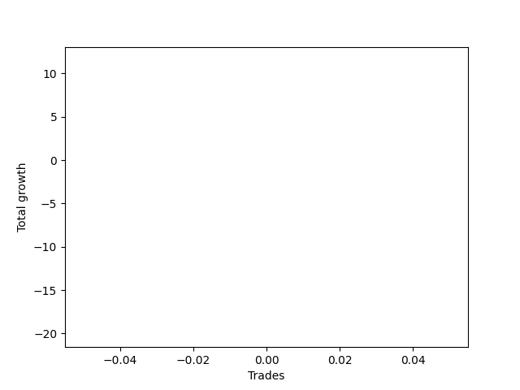

# Short Golden Two 
- Symbol: TEST
- Date Range: 3/19/22 - 5/22/22
- Trading Period: 7:20-12:30
- Number of Trades: 3



| Name | Win Percent | Profit | Avg Profit / Trade |     | Name | Win Percent | Profit | Avg Profit / Trade |
| ---- | ----------- | ------ | ------------------ | --- | ---- | ----------- | ------ | ------------------ |
| Sorted By <br> Profit | | | | | Sorted By <br> Win Percentage ||||
| Thirty-Seven | 66.67 | 6125.00 | 2041.67 |     | Thirty-Five | 100.00 | 5250.00 | 1750.00 |
| Thirty-Five | 100.00 | 5250.00 | 1750.00 |     | Thirty-Seven | 66.67 | 6125.00 | 2041.67 |
| Thirty-Six | 0.00 | -25500.00 | -8500.00 |     | Thirty-Six | 0.00 | -25500.00 | -8500.00 |

### Test Thirty-Five
* Sell when the linear regression slope changes to positive
* No Stoploss
* Results:
```
Total Trades: 3
Percent Up: 0.00
Percent Down: 100.00
Total Points Moved Down: 10.50
Potential Profit: 5250.00
Total Points Ups: 0.00 Count Ups: 0
Total Points Downs: 10.50 Count Downs: 3
```

<details><summary>Trades</summary>

<code>In: 2022-07-01 07:20:00		Out: 2022-07-01 07:23:05		Total Position Time: 03:05		Total Move Down: 3.25		Total to Date: -3.25</code> <br />
<code>In: 2022-07-05 06:46:00		Out: 2022-07-05 07:03:05		Total Position Time: 17:05		Total Move Down: 5.75		Total to Date: -9.00</code> <br />
<code>In: 2022-07-05 08:05:00		Out: 2022-07-05 08:09:05		Total Position Time: 04:05		Total Move Down: 1.50		Total to Date: -10.50</code> <br />


</details>

### Test Thirty-Six
* Sell when the bias changes to positive
* No Stoploss
* Results:
```
Total Trades: 3
Percent Up: 100.00
Percent Down: 0.00
Total Points Moved Down: -51.00
Potential Profit: -25500.00
Total Points Ups: 51.00 Count Ups: 3
Total Points Downs: 0.00 Count Downs: 0
```

<details><summary>Trades</summary>

<code>In: 2022-07-01 07:20:00		Out: 2022-07-01 11:06:05		Total Position Time: 226:05		Total Move Down: -20.00		Total to Date: 20.00</code> <br />
<code>In: 2022-07-05 06:46:00		Out: 2022-07-05 07:40:05		Total Position Time: 54:05		Total Move Down: -14.25		Total to Date: 34.25</code> <br />
<code>In: 2022-07-05 08:05:00		Out: 2022-07-05 09:00:05		Total Position Time: 55:05		Total Move Down: -16.75		Total to Date: 51.00</code> <br />


</details>

### Test Thirty-Seven
* Sell when the STDEV slope changes to positive
* No Stoploss
* Results:
```
Total Trades: 3
Percent Up: 33.33
Percent Down: 66.67
Total Points Moved Down: 12.25
Potential Profit: 6125.00
Total Points Ups: 0.25 Count Ups: 1
Total Points Downs: 12.50 Count Downs: 2
```

<details><summary>Trades</summary>

<code>In: 2022-07-01 07:20:00		Out: 2022-07-01 08:02:05		Total Position Time: 42:05		Total Move Down: 6.25		Total to Date: -6.25</code> <br />
<code>In: 2022-07-05 06:46:00		Out: 2022-07-05 06:53:05		Total Position Time: 07:05		Total Move Down: 6.25		Total to Date: -12.50</code> <br />
<code>In: 2022-07-05 08:05:00		Out: 2022-07-05 08:37:05		Total Position Time: 32:05		Total Move Down: -0.25		Total to Date: -12.25</code> <br />


</details>