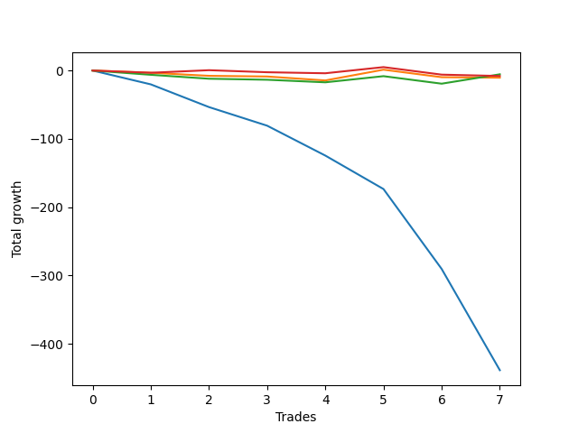

# Short Golden Two 
- Symbol: TEST
- Date Range: 3/19/22 - 5/22/22
- Trading Period: 7:20-12:30
- Number of Trades: 2



| Name | Win Percent | Profit | Avg Profit / Trade |     | Name | Win Percent | Profit | Avg Profit / Trade |
| ---- | ----------- | ------ | ------------------ | --- | ---- | ----------- | ------ | ------------------ |
| Sorted By <br> Profit | | | | | Sorted By <br> Win Percentage ||||
| Thirty-Five | 100.00 | 3625.00 | 1812.50 |     | Thirty-Five | 100.00 | 3625.00 | 1812.50 |
| Thirty-Six | 0.00 | -15500.00 | -7750.00 |     | Thirty-Six | 0.00 | -15500.00 | -7750.00 |

### Test Thirty-Five
* Sell when the linear regression slope changes to positive
* No Stoploss
* Results:
```
Total Trades: 2
Percent Up: 0.00
Percent Down: 100.00
Total Points Moved Down: 7.25
Potential Profit: 3625.00
Total Points Ups: 0.00 Count Ups: 0
Total Points Downs: 7.25 Count Downs: 2
```

<details><summary>Trades</summary>

<code>In: 2022-07-05 06:46:00		Out: 2022-07-05 07:03:05		Total Position Time: 17:05		Total Move Down: 5.75		Total to Date: -5.75</code> <br />
<code>In: 2022-07-05 08:05:00		Out: 2022-07-05 08:09:05		Total Position Time: 04:05		Total Move Down: 1.50		Total to Date: -7.25</code> <br />


</details>

### Test Thirty-Six
* Sell when the linear regression slope changes to positive
* No Stoploss
* Results:
```
Total Trades: 2
Percent Up: 100.00
Percent Down: 0.00
Total Points Moved Down: -31.00
Potential Profit: -15500.00
Total Points Ups: 31.00 Count Ups: 2
Total Points Downs: 0.00 Count Downs: 0
```

<details><summary>Trades</summary>

<code>In: 2022-07-05 06:46:00		Out: 2022-07-05 07:40:05		Total Position Time: 54:05		Total Move Down: -14.25		Total to Date: 14.25</code> <br />
<code>In: 2022-07-05 08:05:00		Out: 2022-07-05 09:00:05		Total Position Time: 55:05		Total Move Down: -16.75		Total to Date: 31.00</code> <br />


</details>