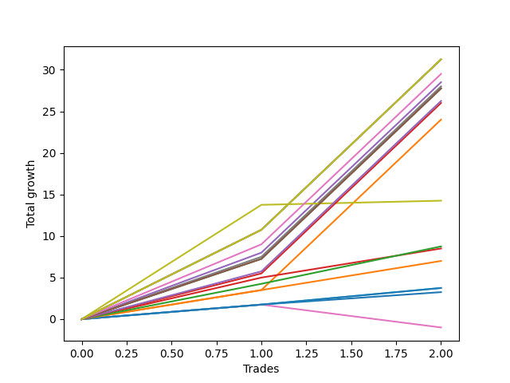

# Short Pointer 001 DB 
- Symbol: TEST
- Date Range: 07/25/2022 - 08/05/2022
- Trading Period: 7:20-12:30
- Number of Trades: 2



| Name | Win Percent | Profit | Avg Profit / Trade | Avg Time / Trade |      | Name | Win Percent | Profit | Avg Profit / Trade | Avg Time / Trade |
| ---- | ----------- | ------ | ------------------ | ---------------- | ---- | ---- | ----------- | ------ | ------------------ | ---------------- |
| Sorted By <br> Profit | | | | | | Sorted By <br> Win Percentage ||||
| Ninety | 100.00 | 15625.00 | 7812.50 | 588:00 |     | Ninety | 100.00 | 15625.00 | 7812.50 | 588:00 |
| Eighty-Nine | 100.00 | 15625.00 | 7812.50 | 588:00 |     | Eighty-Nine | 100.00 | 15625.00 | 7812.50 | 588:00 |
| Five | 100.00 | 15625.00 | 7812.50 | 589:00 |     | Five | 100.00 | 15625.00 | 7812.50 | 589:00 |
| Eighty-Eight | 100.00 | 14750.00 | 7375.00 | 587:30 |     | Eighty-Eight | 100.00 | 14750.00 | 7375.00 | 587:30 |
| Four | 100.00 | 14250.00 | 7125.00 | 587:00 |     | Four | 100.00 | 14250.00 | 7125.00 | 587:00 |
| Seven | 100.00 | 14000.00 | 7000.00 | 573:00 |     | Seven | 100.00 | 14000.00 | 7000.00 | 573:00 |
| Eighty-Seven | 100.00 | 13875.00 | 6937.50 | 572:00 |     | Eighty-Seven | 100.00 | 13875.00 | 6937.50 | 572:00 |
| Two | 100.00 | 13875.00 | 6937.50 | 572:00 |     | Two | 100.00 | 13875.00 | 6937.50 | 572:00 |
| Eighty-Six | 100.00 | 13125.00 | 6562.50 | 570:00 |     | Eighty-Six | 100.00 | 13125.00 | 6562.50 | 570:00 |
| Eighty-Five | 100.00 | 13000.00 | 6500.00 | 566:00 |     | Eighty-Five | 100.00 | 13000.00 | 6500.00 | 566:00 |
| One | 100.00 | 12000.00 | 6000.00 | 565:00 |     | One | 100.00 | 12000.00 | 6000.00 | 565:00 |
| Seventy-Three | 100.00 | 7125.00 | 3562.50 | 120:00 |     | Seventy-Three | 100.00 | 7125.00 | 3562.50 | 120:00 |
| Eighty-Four | 100.00 | 4375.00 | 2187.50 | 38:30 |     | Eighty-Four | 100.00 | 4375.00 | 2187.50 | 38:30 |
| Three | 100.00 | 4250.00 | 2125.00 | 40:30 |     | Three | 100.00 | 4250.00 | 2125.00 | 40:30 |
| Eighty-Three | 100.00 | 3500.00 | 1750.00 | 37:30 |     | Eighty-Three | 100.00 | 3500.00 | 1750.00 | 37:30 |
| Eighty-Two | 100.00 | 1875.00 | 937.50 | 19:00 |     | Eighty-Two | 100.00 | 1875.00 | 937.50 | 19:00 |
| Eighty-One | 100.00 | 1875.00 | 937.50 | 17:30 |     | Eighty-One | 100.00 | 1875.00 | 937.50 | 17:30 |
| Zero | 100.00 | 1625.00 | 812.50 | 21:00 |     | Zero | 100.00 | 1625.00 | 812.50 | 21:00 |
| Six | 50.00 | -500.00 | -250.00 | 16:30 |     | Six | 50.00 | -500.00 | -250.00 | 16:30 |

## NO STOPLOSS

### Test Zero
* Sell when price hits the middle line of the 20p bollinger
* No Stoploss
* Results:
```
Total Trades: 2
Percent Up: 0.00
Percent Down: 100.00
Total Points Moved Down: 3.25
Potential Profit: 1625.00
Total Points Ups: 0.00 Count Ups: 0
Total Points Downs: 3.25 Count Downs: 2
```

<details><summary>Trades</summary>

<code>In: 2022-07-26 10:13:00		Out: 2022-07-26 10:27:00		Total Position Time: 14:00		Total Move Down: 1.75		Total to Date: 1.75</code> <br />
<code>In: 2022-08-01 12:01:00		Out: 2022-08-01 12:29:00		Total Position Time: 28:00		Total Move Down: 1.50		Total to Date: 3.25</code> <br />


</details>

### Test One
* Sell when the price hits the upper line of the 20p 1std bollinger
* No Stoploss
* Results:
```
Total Trades: 2
Percent Up: 0.00
Percent Down: 100.00
Total Points Moved Down: 24.00
Potential Profit: 12000.00
Total Points Ups: 0.00 Count Ups: 0
Total Points Downs: 24.00 Count Downs: 2
```

<details><summary>Trades</summary>

<code>In: 2022-07-26 10:13:00		Out: 2022-07-26 10:33:00		Total Position Time: 20:00		Total Move Down: 3.50		Total to Date: 3.50</code> <br />
<code>In: 2022-08-01 12:01:00		Out: 2022-08-02 06:31:00		Total Position Time: 1110:00		Total Move Down: 20.50		Total to Date: 24.00</code> <br />


</details>

### Test Two
* Sell when the price hits the upper line of the 20p 2std bollinger
* No Stoploss
* Results:
```
Total Trades: 2
Percent Up: 0.00
Percent Down: 100.00
Total Points Moved Down: 27.75
Potential Profit: 13875.00
Total Points Ups: 0.00 Count Ups: 0
Total Points Downs: 27.75 Count Downs: 2
```

<details><summary>Trades</summary>

<code>In: 2022-07-26 10:13:00		Out: 2022-07-26 10:47:00		Total Position Time: 34:00		Total Move Down: 7.25		Total to Date: 7.25</code> <br />
<code>In: 2022-08-01 12:01:00		Out: 2022-08-02 06:31:00		Total Position Time: 1110:00		Total Move Down: 20.50		Total to Date: 27.75</code> <br />


</details>

### Test Three
* Sell when price hits the middle line of the 50p bollinger
* No Stoploss
* Results:
```
Total Trades: 2
Percent Up: 0.00
Percent Down: 100.00
Total Points Moved Down: 8.50
Potential Profit: 4250.00
Total Points Ups: 0.00 Count Ups: 0
Total Points Downs: 8.50 Count Downs: 2
```

<details><summary>Trades</summary>

<code>In: 2022-07-26 10:13:00		Out: 2022-07-26 10:39:00		Total Position Time: 26:00		Total Move Down: 5.00		Total to Date: 5.00</code> <br />
<code>In: 2022-08-01 12:01:00		Out: 2022-08-01 12:56:00		Total Position Time: 55:00		Total Move Down: 3.50		Total to Date: 8.50</code> <br />


</details>

### Test Four
* Sell when the price hits the upper line of the 50p 1std bollinger
* No Stoploss
* Results:
```
Total Trades: 2
Percent Up: 0.00
Percent Down: 100.00
Total Points Moved Down: 28.50
Potential Profit: 14250.00
Total Points Ups: 0.00 Count Ups: 0
Total Points Downs: 28.50 Count Downs: 2
```

<details><summary>Trades</summary>

<code>In: 2022-07-26 10:13:00		Out: 2022-07-26 11:17:00		Total Position Time: 64:00		Total Move Down: 8.00		Total to Date: 8.00</code> <br />
<code>In: 2022-08-01 12:01:00		Out: 2022-08-02 06:31:00		Total Position Time: 1110:00		Total Move Down: 20.50		Total to Date: 28.50</code> <br />


</details>

### Test Five
* Sell when the price hits the upper line of the 50p 2std bollinger
* No Stoploss
* Results:
```
Total Trades: 2
Percent Up: 0.00
Percent Down: 100.00
Total Points Moved Down: 31.25
Potential Profit: 15625.00
Total Points Ups: 0.00 Count Ups: 0
Total Points Downs: 31.25 Count Downs: 2
```

<details><summary>Trades</summary>

<code>In: 2022-07-26 10:13:00		Out: 2022-07-26 11:21:00		Total Position Time: 68:00		Total Move Down: 10.75		Total to Date: 10.75</code> <br />
<code>In: 2022-08-01 12:01:00		Out: 2022-08-02 06:31:00		Total Position Time: 1110:00		Total Move Down: 20.50		Total to Date: 31.25</code> <br />


</details>

### Test Six
* Sell when the price hits the middle line of the 1std VWAP
* No Stoploss
* Results:
```
Total Trades: 2
Percent Up: 50.00
Percent Down: 50.00
Total Points Moved Down: -1.00
Potential Profit: -500.00
Total Points Ups: 2.75 Count Ups: 1
Total Points Downs: 1.75 Count Downs: 1
```

<details><summary>Trades</summary>

<code>In: 2022-07-26 10:13:00		Out: 2022-07-26 10:26:00		Total Position Time: 13:00		Total Move Down: 1.75		Total to Date: 1.75</code> <br />
<code>In: 2022-08-01 12:01:00		Out: 2022-08-01 12:21:00		Total Position Time: 20:00		Total Move Down: -2.75		Total to Date: -1.00</code> <br />


</details>

### Test Seven
* Sell when the price hits the upper line of the 1std VWAP
* No Stoploss
* Results:
```
Total Trades: 2
Percent Up: 0.00
Percent Down: 100.00
Total Points Moved Down: 28.00
Potential Profit: 14000.00
Total Points Ups: 0.00 Count Ups: 0
Total Points Downs: 28.00 Count Downs: 2
```

<details><summary>Trades</summary>

<code>In: 2022-07-26 10:13:00		Out: 2022-07-26 10:49:00		Total Position Time: 36:00		Total Move Down: 7.50		Total to Date: 7.50</code> <br />
<code>In: 2022-08-01 12:01:00		Out: 2022-08-02 06:31:00		Total Position Time: 1110:00		Total Move Down: 20.50		Total to Date: 28.00</code> <br />


</details>

## SPECIAL EXIT CONDITIONS 

### Test Seventy-Three
* Sell when the linear regression slope changes to negative
* No Stoploss
* Results:
```
Total Trades: 2
Percent Up: 0.00
Percent Down: 100.00
Total Points Moved Down: 14.25
Potential Profit: 7125.00
Total Points Ups: 0.00 Count Ups: 0
Total Points Downs: 14.25 Count Downs: 2
```

<details><summary>Trades</summary>

<code>In: 2022-07-26 10:13:00		Out: 2022-07-26 12:25:00		Total Position Time: 132:00		Total Move Down: 13.75		Total to Date: 13.75</code> <br />
<code>In: 2022-08-01 12:01:00		Out: 2022-08-01 13:49:00		Total Position Time: 108:00		Total Move Down: 0.50		Total to Date: 14.25</code> <br />


</details>

## TAKE PROFIT

### Test Eighty-One
* Take Profit of 1 Point
* No Stoploss
* Results:
```
Total Trades: 2
Percent Up: 0.00
Percent Down: 100.00
Total Points Moved Down: 3.75
Potential Profit: 1875.00
Total Points Ups: 0.00 Count Ups: 0
Total Points Downs: 3.75 Count Downs: 2
```

<details><summary>Trades</summary>

<code>In: 2022-07-26 10:13:00		Out: 2022-07-26 10:26:00		Total Position Time: 13:00		Total Move Down: 1.75		Total to Date: 1.75</code> <br />
<code>In: 2022-08-01 12:01:00		Out: 2022-08-01 12:23:00		Total Position Time: 22:00		Total Move Down: 2.00		Total to Date: 3.75</code> <br />


</details>

### Test Eighty-Two
* Take Profit of 2 Point
* No Stoploss
* Results:
```
Total Trades: 2
Percent Up: 0.00
Percent Down: 100.00
Total Points Moved Down: 3.75
Potential Profit: 1875.00
Total Points Ups: 0.00 Count Ups: 0
Total Points Downs: 3.75 Count Downs: 2
```

<details><summary>Trades</summary>

<code>In: 2022-07-26 10:13:00		Out: 2022-07-26 10:26:00		Total Position Time: 13:00		Total Move Down: 1.75		Total to Date: 1.75</code> <br />
<code>In: 2022-08-01 12:01:00		Out: 2022-08-01 12:26:00		Total Position Time: 25:00		Total Move Down: 2.00		Total to Date: 3.75</code> <br />


</details>

### Test Eighty-Three
* Take Profit of 3 Point
* No Stoploss
* Results:
```
Total Trades: 2
Percent Up: 0.00
Percent Down: 100.00
Total Points Moved Down: 7.00
Potential Profit: 3500.00
Total Points Ups: 0.00 Count Ups: 0
Total Points Downs: 7.00 Count Downs: 2
```

<details><summary>Trades</summary>

<code>In: 2022-07-26 10:13:00		Out: 2022-07-26 10:33:00		Total Position Time: 20:00		Total Move Down: 3.50		Total to Date: 3.50</code> <br />
<code>In: 2022-08-01 12:01:00		Out: 2022-08-01 12:56:00		Total Position Time: 55:00		Total Move Down: 3.50		Total to Date: 7.00</code> <br />


</details>

### Test Eighty-Four
* Take Profit of 4 Point
* No Stoploss
* Results:
```
Total Trades: 2
Percent Up: 0.00
Percent Down: 100.00
Total Points Moved Down: 8.75
Potential Profit: 4375.00
Total Points Ups: 0.00 Count Ups: 0
Total Points Downs: 8.75 Count Downs: 2
```

<details><summary>Trades</summary>

<code>In: 2022-07-26 10:13:00		Out: 2022-07-26 10:34:00		Total Position Time: 21:00		Total Move Down: 4.25		Total to Date: 4.25</code> <br />
<code>In: 2022-08-01 12:01:00		Out: 2022-08-01 12:57:00		Total Position Time: 56:00		Total Move Down: 4.50		Total to Date: 8.75</code> <br />


</details>

### Test Eighty-Five
* Take Profit of 5 Point
* No Stoploss
* Results:
```
Total Trades: 2
Percent Up: 0.00
Percent Down: 100.00
Total Points Moved Down: 26.00
Potential Profit: 13000.00
Total Points Ups: 0.00 Count Ups: 0
Total Points Downs: 26.00 Count Downs: 2
```

<details><summary>Trades</summary>

<code>In: 2022-07-26 10:13:00		Out: 2022-07-26 10:35:00		Total Position Time: 22:00		Total Move Down: 5.50		Total to Date: 5.50</code> <br />
<code>In: 2022-08-01 12:01:00		Out: 2022-08-02 06:31:00		Total Position Time: 1110:00		Total Move Down: 20.50		Total to Date: 26.00</code> <br />


</details>

### Test Eighty-Six
* Take Profit of 6 Point
* No Stoploss
* Results:
```
Total Trades: 2
Percent Up: 0.00
Percent Down: 100.00
Total Points Moved Down: 26.25
Potential Profit: 13125.00
Total Points Ups: 0.00 Count Ups: 0
Total Points Downs: 26.25 Count Downs: 2
```

<details><summary>Trades</summary>

<code>In: 2022-07-26 10:13:00		Out: 2022-07-26 10:43:00		Total Position Time: 30:00		Total Move Down: 5.75		Total to Date: 5.75</code> <br />
<code>In: 2022-08-01 12:01:00		Out: 2022-08-02 06:31:00		Total Position Time: 1110:00		Total Move Down: 20.50		Total to Date: 26.25</code> <br />


</details>

### Test Eighty-Seven
* Take Profit of 7 Point
* No Stoploss
* Results:
```
Total Trades: 2
Percent Up: 0.00
Percent Down: 100.00
Total Points Moved Down: 27.75
Potential Profit: 13875.00
Total Points Ups: 0.00 Count Ups: 0
Total Points Downs: 27.75 Count Downs: 2
```

<details><summary>Trades</summary>

<code>In: 2022-07-26 10:13:00		Out: 2022-07-26 10:47:00		Total Position Time: 34:00		Total Move Down: 7.25		Total to Date: 7.25</code> <br />
<code>In: 2022-08-01 12:01:00		Out: 2022-08-02 06:31:00		Total Position Time: 1110:00		Total Move Down: 20.50		Total to Date: 27.75</code> <br />


</details>

### Test Eighty-Eight
* Take Profit of 8 Point
* No Stoploss
* Results:
```
Total Trades: 2
Percent Up: 0.00
Percent Down: 100.00
Total Points Moved Down: 29.50
Potential Profit: 14750.00
Total Points Ups: 0.00 Count Ups: 0
Total Points Downs: 29.50 Count Downs: 2
```

<details><summary>Trades</summary>

<code>In: 2022-07-26 10:13:00		Out: 2022-07-26 11:18:00		Total Position Time: 65:00		Total Move Down: 9.00		Total to Date: 9.00</code> <br />
<code>In: 2022-08-01 12:01:00		Out: 2022-08-02 06:31:00		Total Position Time: 1110:00		Total Move Down: 20.50		Total to Date: 29.50</code> <br />


</details>

### Test Eighty-Nine
* Take Profit of 9 Point
* No Stoploss
* Results:
```
Total Trades: 2
Percent Up: 0.00
Percent Down: 100.00
Total Points Moved Down: 31.25
Potential Profit: 15625.00
Total Points Ups: 0.00 Count Ups: 0
Total Points Downs: 31.25 Count Downs: 2
```

<details><summary>Trades</summary>

<code>In: 2022-07-26 10:13:00		Out: 2022-07-26 11:19:00		Total Position Time: 66:00		Total Move Down: 10.75		Total to Date: 10.75</code> <br />
<code>In: 2022-08-01 12:01:00		Out: 2022-08-02 06:31:00		Total Position Time: 1110:00		Total Move Down: 20.50		Total to Date: 31.25</code> <br />


</details>

### Test Ninety
* Take Profit of 10 Point
* No Stoploss
* Results:
```
Total Trades: 2
Percent Up: 0.00
Percent Down: 100.00
Total Points Moved Down: 31.25
Potential Profit: 15625.00
Total Points Ups: 0.00 Count Ups: 0
Total Points Downs: 31.25 Count Downs: 2
```

<details><summary>Trades</summary>

<code>In: 2022-07-26 10:13:00		Out: 2022-07-26 11:19:00		Total Position Time: 66:00		Total Move Down: 10.75		Total to Date: 10.75</code> <br />
<code>In: 2022-08-01 12:01:00		Out: 2022-08-02 06:31:00		Total Position Time: 1110:00		Total Move Down: 20.50		Total to Date: 31.25</code> <br />


</details>