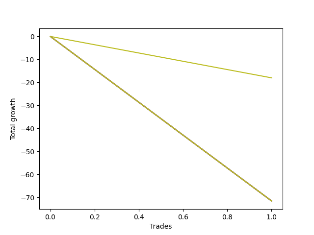

# Short Pointer 009 DB 
- Symbol: TEST
- Date Range: 07/25/2022 - 08/05/2022
- Trading Period: 7:20-12:30
- Number of Trades: 1



| Name | Win Percent | Profit | Avg Profit / Trade | Avg Time / Trade |      | Name | Win Percent | Profit | Avg Profit / Trade | Avg Time / Trade |
| ---- | ----------- | ------ | ------------------ | ---------------- | ---- | ---- | ----------- | ------ | ------------------ | ---------------- |
| Sorted By <br> Profit | | | | | | Sorted By <br> Win Percentage ||||
| Seventy-Three | 0.00 | -9000.00 | -9000.00 | 60:00 |     | Seventy-Three | 0.00 | -9000.00 | -9000.00 | 60:00 |
| Ninety | 0.00 | -35750.00 | -35750.00 | 1360:00 |     | Ninety | 0.00 | -35750.00 | -35750.00 | 1360:00 |
| Eighty-Nine | 0.00 | -35750.00 | -35750.00 | 1360:00 |     | Eighty-Nine | 0.00 | -35750.00 | -35750.00 | 1360:00 |
| Eighty-Eight | 0.00 | -35750.00 | -35750.00 | 1360:00 |     | Eighty-Eight | 0.00 | -35750.00 | -35750.00 | 1360:00 |
| Eighty-Seven | 0.00 | -35750.00 | -35750.00 | 1360:00 |     | Eighty-Seven | 0.00 | -35750.00 | -35750.00 | 1360:00 |
| Eighty-Six | 0.00 | -35750.00 | -35750.00 | 1360:00 |     | Eighty-Six | 0.00 | -35750.00 | -35750.00 | 1360:00 |
| Eighty-Five | 0.00 | -35750.00 | -35750.00 | 1360:00 |     | Eighty-Five | 0.00 | -35750.00 | -35750.00 | 1360:00 |
| Eighty-Four | 0.00 | -35750.00 | -35750.00 | 1360:00 |     | Eighty-Four | 0.00 | -35750.00 | -35750.00 | 1360:00 |
| Eighty-Three | 0.00 | -35750.00 | -35750.00 | 1360:00 |     | Eighty-Three | 0.00 | -35750.00 | -35750.00 | 1360:00 |
| Eighty-Two | 0.00 | -35750.00 | -35750.00 | 1360:00 |     | Eighty-Two | 0.00 | -35750.00 | -35750.00 | 1360:00 |
| Eighty-One | 0.00 | -35750.00 | -35750.00 | 1360:00 |     | Eighty-One | 0.00 | -35750.00 | -35750.00 | 1360:00 |
| Seven | 0.00 | -35750.00 | -35750.00 | 1360:00 |     | Seven | 0.00 | -35750.00 | -35750.00 | 1360:00 |
| Six | 0.00 | -35750.00 | -35750.00 | 1360:00 |     | Six | 0.00 | -35750.00 | -35750.00 | 1360:00 |
| Five | 0.00 | -35750.00 | -35750.00 | 1360:00 |     | Five | 0.00 | -35750.00 | -35750.00 | 1360:00 |
| Four | 0.00 | -35750.00 | -35750.00 | 1360:00 |     | Four | 0.00 | -35750.00 | -35750.00 | 1360:00 |
| Three | 0.00 | -35750.00 | -35750.00 | 1360:00 |     | Three | 0.00 | -35750.00 | -35750.00 | 1360:00 |
| Two | 0.00 | -35750.00 | -35750.00 | 1360:00 |     | Two | 0.00 | -35750.00 | -35750.00 | 1360:00 |
| One | 0.00 | -35750.00 | -35750.00 | 1360:00 |     | One | 0.00 | -35750.00 | -35750.00 | 1360:00 |
| Zero | 0.00 | -35750.00 | -35750.00 | 1360:00 |     | Zero | 0.00 | -35750.00 | -35750.00 | 1360:00 |

## NO STOPLOSS

### Test Zero
* Sell when price hits the middle line of the 20p bollinger
* No Stoploss
* Results:
```
Total Trades: 1
Percent Up: 100.00
Percent Down: 0.00
Total Points Moved Down: -71.50
Potential Profit: -35750.00
Total Points Ups: 71.50 Count Ups: 1
Total Points Downs: 0.00 Count Downs: 0
```

<details><summary>Trades</summary>

<code>In: 2022-07-28 08:09:00		Out: 2022-07-29 06:49:00		Total Position Time: 1360:00		Total Move Down: -71.50		Total to Date: -71.50</code> <br />


</details>

### Test One
* Sell when the price hits the upper line of the 20p 1std bollinger
* No Stoploss
* Results:
```
Total Trades: 1
Percent Up: 100.00
Percent Down: 0.00
Total Points Moved Down: -71.50
Potential Profit: -35750.00
Total Points Ups: 71.50 Count Ups: 1
Total Points Downs: 0.00 Count Downs: 0
```

<details><summary>Trades</summary>

<code>In: 2022-07-28 08:09:00		Out: 2022-07-29 06:49:00		Total Position Time: 1360:00		Total Move Down: -71.50		Total to Date: -71.50</code> <br />


</details>

### Test Two
* Sell when the price hits the upper line of the 20p 2std bollinger
* No Stoploss
* Results:
```
Total Trades: 1
Percent Up: 100.00
Percent Down: 0.00
Total Points Moved Down: -71.50
Potential Profit: -35750.00
Total Points Ups: 71.50 Count Ups: 1
Total Points Downs: 0.00 Count Downs: 0
```

<details><summary>Trades</summary>

<code>In: 2022-07-28 08:09:00		Out: 2022-07-29 06:49:00		Total Position Time: 1360:00		Total Move Down: -71.50		Total to Date: -71.50</code> <br />


</details>

### Test Three
* Sell when price hits the middle line of the 50p bollinger
* No Stoploss
* Results:
```
Total Trades: 1
Percent Up: 100.00
Percent Down: 0.00
Total Points Moved Down: -71.50
Potential Profit: -35750.00
Total Points Ups: 71.50 Count Ups: 1
Total Points Downs: 0.00 Count Downs: 0
```

<details><summary>Trades</summary>

<code>In: 2022-07-28 08:09:00		Out: 2022-07-29 06:49:00		Total Position Time: 1360:00		Total Move Down: -71.50		Total to Date: -71.50</code> <br />


</details>

### Test Four
* Sell when the price hits the upper line of the 50p 1std bollinger
* No Stoploss
* Results:
```
Total Trades: 1
Percent Up: 100.00
Percent Down: 0.00
Total Points Moved Down: -71.50
Potential Profit: -35750.00
Total Points Ups: 71.50 Count Ups: 1
Total Points Downs: 0.00 Count Downs: 0
```

<details><summary>Trades</summary>

<code>In: 2022-07-28 08:09:00		Out: 2022-07-29 06:49:00		Total Position Time: 1360:00		Total Move Down: -71.50		Total to Date: -71.50</code> <br />


</details>

### Test Five
* Sell when the price hits the upper line of the 50p 2std bollinger
* No Stoploss
* Results:
```
Total Trades: 1
Percent Up: 100.00
Percent Down: 0.00
Total Points Moved Down: -71.50
Potential Profit: -35750.00
Total Points Ups: 71.50 Count Ups: 1
Total Points Downs: 0.00 Count Downs: 0
```

<details><summary>Trades</summary>

<code>In: 2022-07-28 08:09:00		Out: 2022-07-29 06:49:00		Total Position Time: 1360:00		Total Move Down: -71.50		Total to Date: -71.50</code> <br />


</details>

### Test Six
* Sell when the price hits the middle line of the 1std VWAP
* No Stoploss
* Results:
```
Total Trades: 1
Percent Up: 100.00
Percent Down: 0.00
Total Points Moved Down: -71.50
Potential Profit: -35750.00
Total Points Ups: 71.50 Count Ups: 1
Total Points Downs: 0.00 Count Downs: 0
```

<details><summary>Trades</summary>

<code>In: 2022-07-28 08:09:00		Out: 2022-07-29 06:49:00		Total Position Time: 1360:00		Total Move Down: -71.50		Total to Date: -71.50</code> <br />


</details>

### Test Seven
* Sell when the price hits the upper line of the 1std VWAP
* No Stoploss
* Results:
```
Total Trades: 1
Percent Up: 100.00
Percent Down: 0.00
Total Points Moved Down: -71.50
Potential Profit: -35750.00
Total Points Ups: 71.50 Count Ups: 1
Total Points Downs: 0.00 Count Downs: 0
```

<details><summary>Trades</summary>

<code>In: 2022-07-28 08:09:00		Out: 2022-07-29 06:49:00		Total Position Time: 1360:00		Total Move Down: -71.50		Total to Date: -71.50</code> <br />


</details>

## SPECIAL EXIT CONDITIONS 

### Test Seventy-Three
* Sell when the linear regression slope changes to negative
* No Stoploss
* Results:
```
Total Trades: 1
Percent Up: 100.00
Percent Down: 0.00
Total Points Moved Down: -18.00
Potential Profit: -9000.00
Total Points Ups: 18.00 Count Ups: 1
Total Points Downs: 0.00 Count Downs: 0
```

<details><summary>Trades</summary>

<code>In: 2022-07-28 08:09:00		Out: 2022-07-28 09:09:00		Total Position Time: 60:00		Total Move Down: -18.00		Total to Date: -18.00</code> <br />


</details>

## TAKE PROFIT

### Test Eighty-One
* Take Profit of 1 Point
* No Stoploss
* Results:
```
Total Trades: 1
Percent Up: 100.00
Percent Down: 0.00
Total Points Moved Down: -71.50
Potential Profit: -35750.00
Total Points Ups: 71.50 Count Ups: 1
Total Points Downs: 0.00 Count Downs: 0
```

<details><summary>Trades</summary>

<code>In: 2022-07-28 08:09:00		Out: 2022-07-29 06:49:00		Total Position Time: 1360:00		Total Move Down: -71.50		Total to Date: -71.50</code> <br />


</details>

### Test Eighty-Two
* Take Profit of 2 Point
* No Stoploss
* Results:
```
Total Trades: 1
Percent Up: 100.00
Percent Down: 0.00
Total Points Moved Down: -71.50
Potential Profit: -35750.00
Total Points Ups: 71.50 Count Ups: 1
Total Points Downs: 0.00 Count Downs: 0
```

<details><summary>Trades</summary>

<code>In: 2022-07-28 08:09:00		Out: 2022-07-29 06:49:00		Total Position Time: 1360:00		Total Move Down: -71.50		Total to Date: -71.50</code> <br />


</details>

### Test Eighty-Three
* Take Profit of 3 Point
* No Stoploss
* Results:
```
Total Trades: 1
Percent Up: 100.00
Percent Down: 0.00
Total Points Moved Down: -71.50
Potential Profit: -35750.00
Total Points Ups: 71.50 Count Ups: 1
Total Points Downs: 0.00 Count Downs: 0
```

<details><summary>Trades</summary>

<code>In: 2022-07-28 08:09:00		Out: 2022-07-29 06:49:00		Total Position Time: 1360:00		Total Move Down: -71.50		Total to Date: -71.50</code> <br />


</details>

### Test Eighty-Four
* Take Profit of 4 Point
* No Stoploss
* Results:
```
Total Trades: 1
Percent Up: 100.00
Percent Down: 0.00
Total Points Moved Down: -71.50
Potential Profit: -35750.00
Total Points Ups: 71.50 Count Ups: 1
Total Points Downs: 0.00 Count Downs: 0
```

<details><summary>Trades</summary>

<code>In: 2022-07-28 08:09:00		Out: 2022-07-29 06:49:00		Total Position Time: 1360:00		Total Move Down: -71.50		Total to Date: -71.50</code> <br />


</details>

### Test Eighty-Five
* Take Profit of 5 Point
* No Stoploss
* Results:
```
Total Trades: 1
Percent Up: 100.00
Percent Down: 0.00
Total Points Moved Down: -71.50
Potential Profit: -35750.00
Total Points Ups: 71.50 Count Ups: 1
Total Points Downs: 0.00 Count Downs: 0
```

<details><summary>Trades</summary>

<code>In: 2022-07-28 08:09:00		Out: 2022-07-29 06:49:00		Total Position Time: 1360:00		Total Move Down: -71.50		Total to Date: -71.50</code> <br />


</details>

### Test Eighty-Six
* Take Profit of 6 Point
* No Stoploss
* Results:
```
Total Trades: 1
Percent Up: 100.00
Percent Down: 0.00
Total Points Moved Down: -71.50
Potential Profit: -35750.00
Total Points Ups: 71.50 Count Ups: 1
Total Points Downs: 0.00 Count Downs: 0
```

<details><summary>Trades</summary>

<code>In: 2022-07-28 08:09:00		Out: 2022-07-29 06:49:00		Total Position Time: 1360:00		Total Move Down: -71.50		Total to Date: -71.50</code> <br />


</details>

### Test Eighty-Seven
* Take Profit of 7 Point
* No Stoploss
* Results:
```
Total Trades: 1
Percent Up: 100.00
Percent Down: 0.00
Total Points Moved Down: -71.50
Potential Profit: -35750.00
Total Points Ups: 71.50 Count Ups: 1
Total Points Downs: 0.00 Count Downs: 0
```

<details><summary>Trades</summary>

<code>In: 2022-07-28 08:09:00		Out: 2022-07-29 06:49:00		Total Position Time: 1360:00		Total Move Down: -71.50		Total to Date: -71.50</code> <br />


</details>

### Test Eighty-Eight
* Take Profit of 8 Point
* No Stoploss
* Results:
```
Total Trades: 1
Percent Up: 100.00
Percent Down: 0.00
Total Points Moved Down: -71.50
Potential Profit: -35750.00
Total Points Ups: 71.50 Count Ups: 1
Total Points Downs: 0.00 Count Downs: 0
```

<details><summary>Trades</summary>

<code>In: 2022-07-28 08:09:00		Out: 2022-07-29 06:49:00		Total Position Time: 1360:00		Total Move Down: -71.50		Total to Date: -71.50</code> <br />


</details>

### Test Eighty-Nine
* Take Profit of 9 Point
* No Stoploss
* Results:
```
Total Trades: 1
Percent Up: 100.00
Percent Down: 0.00
Total Points Moved Down: -71.50
Potential Profit: -35750.00
Total Points Ups: 71.50 Count Ups: 1
Total Points Downs: 0.00 Count Downs: 0
```

<details><summary>Trades</summary>

<code>In: 2022-07-28 08:09:00		Out: 2022-07-29 06:49:00		Total Position Time: 1360:00		Total Move Down: -71.50		Total to Date: -71.50</code> <br />


</details>

### Test Ninety
* Take Profit of 10 Point
* No Stoploss
* Results:
```
Total Trades: 1
Percent Up: 100.00
Percent Down: 0.00
Total Points Moved Down: -71.50
Potential Profit: -35750.00
Total Points Ups: 71.50 Count Ups: 1
Total Points Downs: 0.00 Count Downs: 0
```

<details><summary>Trades</summary>

<code>In: 2022-07-28 08:09:00		Out: 2022-07-29 06:49:00		Total Position Time: 1360:00		Total Move Down: -71.50		Total to Date: -71.50</code> <br />


</details>