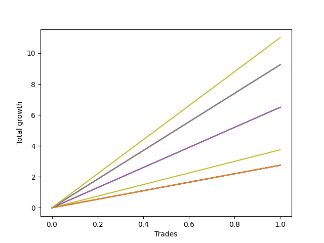

# Short Shepard 003 DB 
- Symbol: TEST
- Date Range: 07/25/2022 - 08/05/2022
- Trading Period: 7:20-12:30
- Number of Trades: 3



| Name | Win Percent | Profit | Avg Profit / Trade | Avg Time / Trade |      | Name | Win Percent | Profit | Avg Profit / Trade | Avg Time / Trade |
| ---- | ----------- | ------ | ------------------ | ---------------- | ---- | ---- | ----------- | ------ | ------------------ | ---------------- |
| Sorted By <br> Profit | | | | | | Sorted By <br> Win Percentage ||||
| Seventy-Three | 33.33 | -10250.00 | -3416.67 | 80:00 |     | Five | 66.67 | -24875.00 | -8291.67 | 536:40 |
| Five | 66.67 | -24875.00 | -8291.67 | 536:40 |     | Ninety | 66.67 | -25125.00 | -8375.00 | 528:00 |
| Ninety | 66.67 | -25125.00 | -8375.00 | 528:00 |     | Eighty-Nine | 66.67 | -26625.00 | -8875.00 | 522:20 |
| Eighty-Nine | 66.67 | -26625.00 | -8875.00 | 522:20 |     | Eighty-Eight | 66.67 | -27000.00 | -9000.00 | 466:20 |
| Eighty-Eight | 66.67 | -27000.00 | -9000.00 | 466:20 |     | Eighty-Seven | 66.67 | -27375.00 | -9125.00 | 465:20 |
| Eighty-Seven | 66.67 | -27375.00 | -9125.00 | 465:20 |     | Seven | 66.67 | -27375.00 | -9125.00 | 465:20 |
| Seven | 66.67 | -27375.00 | -9125.00 | 465:20 |     | Eighty-Six | 66.67 | -28750.00 | -9583.33 | 465:00 |
| Eighty-Six | 66.67 | -28750.00 | -9583.33 | 465:00 |     | Eighty-Five | 66.67 | -28750.00 | -9583.33 | 465:00 |
| Eighty-Five | 66.67 | -28750.00 | -9583.33 | 465:00 |     | Four | 66.67 | -28750.00 | -9583.33 | 465:00 |
| Four | 66.67 | -28750.00 | -9583.33 | 465:00 |     | Eighty-Four | 66.67 | -30125.00 | -10041.67 | 464:40 |
| Eighty-Four | 66.67 | -30125.00 | -10041.67 | 464:40 |     | One | 66.67 | -30625.00 | -10208.33 | 464:00 |
| One | 66.67 | -30625.00 | -10208.33 | 464:00 |     | Eighty-Three | 66.67 | -32000.00 | -10666.67 | 463:40 |
| Eighty-Three | 66.67 | -32000.00 | -10666.67 | 463:40 |     | Eighty-Two | 66.67 | -32000.00 | -10666.67 | 463:40 |
| Eighty-Two | 66.67 | -32000.00 | -10666.67 | 463:40 |     | Eighty-One | 66.67 | -32000.00 | -10666.67 | 463:40 |
| Eighty-One | 66.67 | -32000.00 | -10666.67 | 463:40 |     | Six | 66.67 | -32000.00 | -10666.67 | 463:40 |
| Six | 66.67 | -32000.00 | -10666.67 | 463:40 |     | Three | 66.67 | -32000.00 | -10666.67 | 463:40 |
| Three | 66.67 | -32000.00 | -10666.67 | 463:40 |     | Zero | 66.67 | -32000.00 | -10666.67 | 463:40 |
| Zero | 66.67 | -32000.00 | -10666.67 | 463:40 |     | Two | 66.67 | -33125.00 | -11041.67 | 512:40 |
| Two | 66.67 | -33125.00 | -11041.67 | 512:40 |     | Seventy-Three | 33.33 | -10250.00 | -3416.67 | 80:00 |

## NO STOPLOSS

### Test Zero
* Sell when price hits the middle line of the 20p bollinger
* No Stoploss
* Results:
```
Total Trades: 3
Percent Up: 33.33
Percent Down: 66.67
Total Points Moved Down: -64.00
Potential Profit: -32000.00
Total Points Ups: 71.50 Count Ups: 1
Total Points Downs: 7.50 Count Downs: 2
```

<details><summary>Trades</summary>

<code>In: 2022-07-25 07:55:00		Out: 2022-07-25 08:13:00		Total Position Time: 18:00		Total Move Down: 4.75		Total to Date: 4.75</code> <br />
<code>In: 2022-07-28 08:09:00		Out: 2022-07-29 06:49:00		Total Position Time: 1360:00		Total Move Down: -71.50		Total to Date: -66.75</code> <br />
<code>In: 2022-08-04 09:31:00		Out: 2022-08-04 09:44:00		Total Position Time: 13:00		Total Move Down: 2.75		Total to Date: -64.00</code> <br />


</details>

### Test One
* Sell when the price hits the upper line of the 20p 1std bollinger
* No Stoploss
* Results:
```
Total Trades: 3
Percent Up: 33.33
Percent Down: 66.67
Total Points Moved Down: -61.25
Potential Profit: -30625.00
Total Points Ups: 71.50 Count Ups: 1
Total Points Downs: 10.25 Count Downs: 2
```

<details><summary>Trades</summary>

<code>In: 2022-07-25 07:55:00		Out: 2022-07-25 08:14:00		Total Position Time: 19:00		Total Move Down: 7.50		Total to Date: 7.50</code> <br />
<code>In: 2022-07-28 08:09:00		Out: 2022-07-29 06:49:00		Total Position Time: 1360:00		Total Move Down: -71.50		Total to Date: -64.00</code> <br />
<code>In: 2022-08-04 09:31:00		Out: 2022-08-04 09:44:00		Total Position Time: 13:00		Total Move Down: 2.75		Total to Date: -61.25</code> <br />


</details>

### Test Two
* Sell when the price hits the upper line of the 20p 2std bollinger
* No Stoploss
* Results:
```
Total Trades: 3
Percent Up: 33.33
Percent Down: 66.67
Total Points Moved Down: -66.25
Potential Profit: -33125.00
Total Points Ups: 71.50 Count Ups: 1
Total Points Downs: 5.25 Count Downs: 2
```

<details><summary>Trades</summary>

<code>In: 2022-07-25 07:55:00		Out: 2022-07-25 10:40:00		Total Position Time: 165:00		Total Move Down: 2.50		Total to Date: 2.50</code> <br />
<code>In: 2022-07-28 08:09:00		Out: 2022-07-29 06:49:00		Total Position Time: 1360:00		Total Move Down: -71.50		Total to Date: -69.00</code> <br />
<code>In: 2022-08-04 09:31:00		Out: 2022-08-04 09:44:00		Total Position Time: 13:00		Total Move Down: 2.75		Total to Date: -66.25</code> <br />


</details>

### Test Three
* Sell when price hits the middle line of the 50p bollinger
* No Stoploss
* Results:
```
Total Trades: 3
Percent Up: 33.33
Percent Down: 66.67
Total Points Moved Down: -64.00
Potential Profit: -32000.00
Total Points Ups: 71.50 Count Ups: 1
Total Points Downs: 7.50 Count Downs: 2
```

<details><summary>Trades</summary>

<code>In: 2022-07-25 07:55:00		Out: 2022-07-25 08:13:00		Total Position Time: 18:00		Total Move Down: 4.75		Total to Date: 4.75</code> <br />
<code>In: 2022-07-28 08:09:00		Out: 2022-07-29 06:49:00		Total Position Time: 1360:00		Total Move Down: -71.50		Total to Date: -66.75</code> <br />
<code>In: 2022-08-04 09:31:00		Out: 2022-08-04 09:44:00		Total Position Time: 13:00		Total Move Down: 2.75		Total to Date: -64.00</code> <br />


</details>

### Test Four
* Sell when the price hits the upper line of the 50p 1std bollinger
* No Stoploss
* Results:
```
Total Trades: 3
Percent Up: 33.33
Percent Down: 66.67
Total Points Moved Down: -57.50
Potential Profit: -28750.00
Total Points Ups: 71.50 Count Ups: 1
Total Points Downs: 14.00 Count Downs: 2
```

<details><summary>Trades</summary>

<code>In: 2022-07-25 07:55:00		Out: 2022-07-25 08:14:00		Total Position Time: 19:00		Total Move Down: 7.50		Total to Date: 7.50</code> <br />
<code>In: 2022-07-28 08:09:00		Out: 2022-07-29 06:49:00		Total Position Time: 1360:00		Total Move Down: -71.50		Total to Date: -64.00</code> <br />
<code>In: 2022-08-04 09:31:00		Out: 2022-08-04 09:47:00		Total Position Time: 16:00		Total Move Down: 6.50		Total to Date: -57.50</code> <br />


</details>

### Test Five
* Sell when the price hits the upper line of the 50p 2std bollinger
* No Stoploss
* Results:
```
Total Trades: 3
Percent Up: 33.33
Percent Down: 66.67
Total Points Moved Down: -49.75
Potential Profit: -24875.00
Total Points Ups: 71.50 Count Ups: 1
Total Points Downs: 21.75 Count Downs: 2
```

<details><summary>Trades</summary>

<code>In: 2022-07-25 07:55:00		Out: 2022-07-25 11:48:00		Total Position Time: 233:00		Total Move Down: 12.50		Total to Date: 12.50</code> <br />
<code>In: 2022-07-28 08:09:00		Out: 2022-07-29 06:49:00		Total Position Time: 1360:00		Total Move Down: -71.50		Total to Date: -59.00</code> <br />
<code>In: 2022-08-04 09:31:00		Out: 2022-08-04 09:48:00		Total Position Time: 17:00		Total Move Down: 9.25		Total to Date: -49.75</code> <br />


</details>

### Test Six
* Sell when the price hits the middle line of the 1std VWAP
* No Stoploss
* Results:
```
Total Trades: 3
Percent Up: 33.33
Percent Down: 66.67
Total Points Moved Down: -64.00
Potential Profit: -32000.00
Total Points Ups: 71.50 Count Ups: 1
Total Points Downs: 7.50 Count Downs: 2
```

<details><summary>Trades</summary>

<code>In: 2022-07-25 07:55:00		Out: 2022-07-25 08:13:00		Total Position Time: 18:00		Total Move Down: 4.75		Total to Date: 4.75</code> <br />
<code>In: 2022-07-28 08:09:00		Out: 2022-07-29 06:49:00		Total Position Time: 1360:00		Total Move Down: -71.50		Total to Date: -66.75</code> <br />
<code>In: 2022-08-04 09:31:00		Out: 2022-08-04 09:44:00		Total Position Time: 13:00		Total Move Down: 2.75		Total to Date: -64.00</code> <br />


</details>

### Test Seven
* Sell when the price hits the upper line of the 1std VWAP
* No Stoploss
* Results:
```
Total Trades: 3
Percent Up: 33.33
Percent Down: 66.67
Total Points Moved Down: -54.75
Potential Profit: -27375.00
Total Points Ups: 71.50 Count Ups: 1
Total Points Downs: 16.75 Count Downs: 2
```

<details><summary>Trades</summary>

<code>In: 2022-07-25 07:55:00		Out: 2022-07-25 08:14:00		Total Position Time: 19:00		Total Move Down: 7.50		Total to Date: 7.50</code> <br />
<code>In: 2022-07-28 08:09:00		Out: 2022-07-29 06:49:00		Total Position Time: 1360:00		Total Move Down: -71.50		Total to Date: -64.00</code> <br />
<code>In: 2022-08-04 09:31:00		Out: 2022-08-04 09:48:00		Total Position Time: 17:00		Total Move Down: 9.25		Total to Date: -54.75</code> <br />


</details>

## SPECIAL EXIT CONDITIONS 

### Test Seventy-Three
* Sell when the linear regression slope changes to negative
* No Stoploss
* Results:
```
Total Trades: 3
Percent Up: 66.67
Percent Down: 33.33
Total Points Moved Down: -20.50
Potential Profit: -10250.00
Total Points Ups: 24.25 Count Ups: 2
Total Points Downs: 3.75 Count Downs: 1
```

<details><summary>Trades</summary>

<code>In: 2022-07-25 07:55:00		Out: 2022-07-25 08:43:00		Total Position Time: 48:00		Total Move Down: -6.25		Total to Date: -6.25</code> <br />
<code>In: 2022-07-28 08:09:00		Out: 2022-07-28 09:09:00		Total Position Time: 60:00		Total Move Down: -18.00		Total to Date: -24.25</code> <br />
<code>In: 2022-08-04 09:31:00		Out: 2022-08-04 11:43:00		Total Position Time: 132:00		Total Move Down: 3.75		Total to Date: -20.50</code> <br />


</details>

## TAKE PROFIT

### Test Eighty-One
* Take Profit of 1 Point
* No Stoploss
* Results:
```
Total Trades: 3
Percent Up: 33.33
Percent Down: 66.67
Total Points Moved Down: -64.00
Potential Profit: -32000.00
Total Points Ups: 71.50 Count Ups: 1
Total Points Downs: 7.50 Count Downs: 2
```

<details><summary>Trades</summary>

<code>In: 2022-07-25 07:55:00		Out: 2022-07-25 08:13:00		Total Position Time: 18:00		Total Move Down: 4.75		Total to Date: 4.75</code> <br />
<code>In: 2022-07-28 08:09:00		Out: 2022-07-29 06:49:00		Total Position Time: 1360:00		Total Move Down: -71.50		Total to Date: -66.75</code> <br />
<code>In: 2022-08-04 09:31:00		Out: 2022-08-04 09:44:00		Total Position Time: 13:00		Total Move Down: 2.75		Total to Date: -64.00</code> <br />


</details>

### Test Eighty-Two
* Take Profit of 2 Point
* No Stoploss
* Results:
```
Total Trades: 3
Percent Up: 33.33
Percent Down: 66.67
Total Points Moved Down: -64.00
Potential Profit: -32000.00
Total Points Ups: 71.50 Count Ups: 1
Total Points Downs: 7.50 Count Downs: 2
```

<details><summary>Trades</summary>

<code>In: 2022-07-25 07:55:00		Out: 2022-07-25 08:13:00		Total Position Time: 18:00		Total Move Down: 4.75		Total to Date: 4.75</code> <br />
<code>In: 2022-07-28 08:09:00		Out: 2022-07-29 06:49:00		Total Position Time: 1360:00		Total Move Down: -71.50		Total to Date: -66.75</code> <br />
<code>In: 2022-08-04 09:31:00		Out: 2022-08-04 09:44:00		Total Position Time: 13:00		Total Move Down: 2.75		Total to Date: -64.00</code> <br />


</details>

### Test Eighty-Three
* Take Profit of 3 Point
* No Stoploss
* Results:
```
Total Trades: 3
Percent Up: 33.33
Percent Down: 66.67
Total Points Moved Down: -64.00
Potential Profit: -32000.00
Total Points Ups: 71.50 Count Ups: 1
Total Points Downs: 7.50 Count Downs: 2
```

<details><summary>Trades</summary>

<code>In: 2022-07-25 07:55:00		Out: 2022-07-25 08:13:00		Total Position Time: 18:00		Total Move Down: 4.75		Total to Date: 4.75</code> <br />
<code>In: 2022-07-28 08:09:00		Out: 2022-07-29 06:49:00		Total Position Time: 1360:00		Total Move Down: -71.50		Total to Date: -66.75</code> <br />
<code>In: 2022-08-04 09:31:00		Out: 2022-08-04 09:44:00		Total Position Time: 13:00		Total Move Down: 2.75		Total to Date: -64.00</code> <br />


</details>

### Test Eighty-Four
* Take Profit of 4 Point
* No Stoploss
* Results:
```
Total Trades: 3
Percent Up: 33.33
Percent Down: 66.67
Total Points Moved Down: -60.25
Potential Profit: -30125.00
Total Points Ups: 71.50 Count Ups: 1
Total Points Downs: 11.25 Count Downs: 2
```

<details><summary>Trades</summary>

<code>In: 2022-07-25 07:55:00		Out: 2022-07-25 08:13:00		Total Position Time: 18:00		Total Move Down: 4.75		Total to Date: 4.75</code> <br />
<code>In: 2022-07-28 08:09:00		Out: 2022-07-29 06:49:00		Total Position Time: 1360:00		Total Move Down: -71.50		Total to Date: -66.75</code> <br />
<code>In: 2022-08-04 09:31:00		Out: 2022-08-04 09:47:00		Total Position Time: 16:00		Total Move Down: 6.50		Total to Date: -60.25</code> <br />


</details>

### Test Eighty-Five
* Take Profit of 5 Point
* No Stoploss
* Results:
```
Total Trades: 3
Percent Up: 33.33
Percent Down: 66.67
Total Points Moved Down: -57.50
Potential Profit: -28750.00
Total Points Ups: 71.50 Count Ups: 1
Total Points Downs: 14.00 Count Downs: 2
```

<details><summary>Trades</summary>

<code>In: 2022-07-25 07:55:00		Out: 2022-07-25 08:14:00		Total Position Time: 19:00		Total Move Down: 7.50		Total to Date: 7.50</code> <br />
<code>In: 2022-07-28 08:09:00		Out: 2022-07-29 06:49:00		Total Position Time: 1360:00		Total Move Down: -71.50		Total to Date: -64.00</code> <br />
<code>In: 2022-08-04 09:31:00		Out: 2022-08-04 09:47:00		Total Position Time: 16:00		Total Move Down: 6.50		Total to Date: -57.50</code> <br />


</details>

### Test Eighty-Six
* Take Profit of 6 Point
* No Stoploss
* Results:
```
Total Trades: 3
Percent Up: 33.33
Percent Down: 66.67
Total Points Moved Down: -57.50
Potential Profit: -28750.00
Total Points Ups: 71.50 Count Ups: 1
Total Points Downs: 14.00 Count Downs: 2
```

<details><summary>Trades</summary>

<code>In: 2022-07-25 07:55:00		Out: 2022-07-25 08:14:00		Total Position Time: 19:00		Total Move Down: 7.50		Total to Date: 7.50</code> <br />
<code>In: 2022-07-28 08:09:00		Out: 2022-07-29 06:49:00		Total Position Time: 1360:00		Total Move Down: -71.50		Total to Date: -64.00</code> <br />
<code>In: 2022-08-04 09:31:00		Out: 2022-08-04 09:47:00		Total Position Time: 16:00		Total Move Down: 6.50		Total to Date: -57.50</code> <br />


</details>

### Test Eighty-Seven
* Take Profit of 7 Point
* No Stoploss
* Results:
```
Total Trades: 3
Percent Up: 33.33
Percent Down: 66.67
Total Points Moved Down: -54.75
Potential Profit: -27375.00
Total Points Ups: 71.50 Count Ups: 1
Total Points Downs: 16.75 Count Downs: 2
```

<details><summary>Trades</summary>

<code>In: 2022-07-25 07:55:00		Out: 2022-07-25 08:14:00		Total Position Time: 19:00		Total Move Down: 7.50		Total to Date: 7.50</code> <br />
<code>In: 2022-07-28 08:09:00		Out: 2022-07-29 06:49:00		Total Position Time: 1360:00		Total Move Down: -71.50		Total to Date: -64.00</code> <br />
<code>In: 2022-08-04 09:31:00		Out: 2022-08-04 09:48:00		Total Position Time: 17:00		Total Move Down: 9.25		Total to Date: -54.75</code> <br />


</details>

### Test Eighty-Eight
* Take Profit of 8 Point
* No Stoploss
* Results:
```
Total Trades: 3
Percent Up: 33.33
Percent Down: 66.67
Total Points Moved Down: -54.00
Potential Profit: -27000.00
Total Points Ups: 71.50 Count Ups: 1
Total Points Downs: 17.50 Count Downs: 2
```

<details><summary>Trades</summary>

<code>In: 2022-07-25 07:55:00		Out: 2022-07-25 08:17:00		Total Position Time: 22:00		Total Move Down: 8.25		Total to Date: 8.25</code> <br />
<code>In: 2022-07-28 08:09:00		Out: 2022-07-29 06:49:00		Total Position Time: 1360:00		Total Move Down: -71.50		Total to Date: -63.25</code> <br />
<code>In: 2022-08-04 09:31:00		Out: 2022-08-04 09:48:00		Total Position Time: 17:00		Total Move Down: 9.25		Total to Date: -54.00</code> <br />


</details>

### Test Eighty-Nine
* Take Profit of 9 Point
* No Stoploss
* Results:
```
Total Trades: 3
Percent Up: 33.33
Percent Down: 66.67
Total Points Moved Down: -53.25
Potential Profit: -26625.00
Total Points Ups: 71.50 Count Ups: 1
Total Points Downs: 18.25 Count Downs: 2
```

<details><summary>Trades</summary>

<code>In: 2022-07-25 07:55:00		Out: 2022-07-25 11:05:00		Total Position Time: 190:00		Total Move Down: 9.00		Total to Date: 9.00</code> <br />
<code>In: 2022-07-28 08:09:00		Out: 2022-07-29 06:49:00		Total Position Time: 1360:00		Total Move Down: -71.50		Total to Date: -62.50</code> <br />
<code>In: 2022-08-04 09:31:00		Out: 2022-08-04 09:48:00		Total Position Time: 17:00		Total Move Down: 9.25		Total to Date: -53.25</code> <br />


</details>

### Test Ninety
* Take Profit of 10 Point
* No Stoploss
* Results:
```
Total Trades: 3
Percent Up: 33.33
Percent Down: 66.67
Total Points Moved Down: -50.25
Potential Profit: -25125.00
Total Points Ups: 71.50 Count Ups: 1
Total Points Downs: 21.25 Count Downs: 2
```

<details><summary>Trades</summary>

<code>In: 2022-07-25 07:55:00		Out: 2022-07-25 11:21:00		Total Position Time: 206:00		Total Move Down: 10.25		Total to Date: 10.25</code> <br />
<code>In: 2022-07-28 08:09:00		Out: 2022-07-29 06:49:00		Total Position Time: 1360:00		Total Move Down: -71.50		Total to Date: -61.25</code> <br />
<code>In: 2022-08-04 09:31:00		Out: 2022-08-04 09:49:00		Total Position Time: 18:00		Total Move Down: 11.00		Total to Date: -50.25</code> <br />


</details>