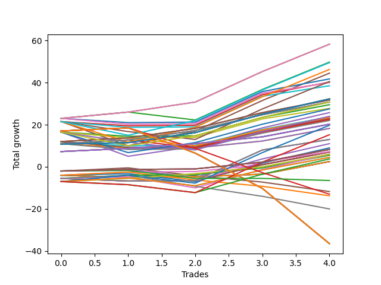

# Short Wallace 004 
- Symbol: TEST
- Date Range: 3/19/22 - 5/22/22
- Trading Period: 7:20-12:30
- Number of Trades: 5



| Name | Win Percent | Profit | Avg Profit / Trade |     | Name | Win Percent | Profit | Avg Profit / Trade |
| ---- | ----------- | ------ | ------------------ | --- | ---- | ----------- | ------ | ------------------ |
| Sorted By <br> Profit | | | | | Sorted By <br> Win Percentage ||||
| Sixty-Six | 100.00 | 29125.00 | 5825.00 |     | Sixty-Six | 100.00 | 29125.00 | 5825.00 |
| Fifty-Eight | 100.00 | 29125.00 | 5825.00 |     | Fifty-Eight | 100.00 | 29125.00 | 5825.00 |
| Two | 100.00 | 29125.00 | 5825.00 |     | Two | 100.00 | 29125.00 | 5825.00 |
| Forty-Two | 80.00 | 24875.00 | 4975.00 |     | Seventy | 100.00 | 16125.00 | 3225.00 |
| Sixty-Nine | 80.00 | 24750.00 | 4950.00 |     | Sixty-Two | 100.00 | 16125.00 | 3225.00 |
| Sixty-One | 80.00 | 23125.00 | 4625.00 |     | Fifty-Four | 100.00 | 16125.00 | 3225.00 |
| Five | 80.00 | 22250.00 | 4450.00 |     | Thirty-Eight | 100.00 | 16125.00 | 3225.00 |
| Ten | 80.00 | 20875.00 | 4175.00 |     | Twenty-Two | 100.00 | 16125.00 | 3225.00 |
| Forty-Five | 60.00 | 20250.00 | 4050.00 |     | Six | 100.00 | 16125.00 | 3225.00 |
| Thirteen | 80.00 | 20125.00 | 4025.00 |     | Sixty-Five | 100.00 | 15875.00 | 3175.00 |
| Twenty-Six | 80.00 | 20000.00 | 4000.00 |     | Fifty-Seven | 100.00 | 15875.00 | 3175.00 |
| Twenty-Nine | 80.00 | 19250.00 | 3850.00 |     | One | 100.00 | 15875.00 | 3175.00 |
| Seventy | 100.00 | 16125.00 | 3225.00 |     | Sixty-Seven | 100.00 | 15375.00 | 3075.00 |
| Sixty-Two | 100.00 | 16125.00 | 3225.00 |     | Fifty-Nine | 100.00 | 15375.00 | 3075.00 |
| Fifty-Four | 100.00 | 16125.00 | 3225.00 |     | Three | 100.00 | 15375.00 | 3075.00 |
| Thirty-Eight | 100.00 | 16125.00 | 3225.00 |     | Sixty-Four | 100.00 | 10125.00 | 2025.00 |
| Twenty-Two | 100.00 | 16125.00 | 3225.00 |     | Fifty-Six | 100.00 | 10125.00 | 2025.00 |
| Six | 100.00 | 16125.00 | 3225.00 |     | Forty | 100.00 | 10125.00 | 2025.00 |
| Sixty-Five | 100.00 | 15875.00 | 3175.00 |     | Zero | 100.00 | 10125.00 | 2025.00 |
| Fifty-Seven | 100.00 | 15875.00 | 3175.00 |     | Twenty-Four | 100.00 | 9125.00 | 1825.00 |
| One | 100.00 | 15875.00 | 3175.00 |     | Eight | 100.00 | 9125.00 | 1825.00 |
| Sixty-Seven | 100.00 | 15375.00 | 3075.00 |     | Forty-Two | 80.00 | 24875.00 | 4975.00 |
| Fifty-Nine | 100.00 | 15375.00 | 3075.00 |     | Sixty-Nine | 80.00 | 24750.00 | 4950.00 |
| Three | 100.00 | 15375.00 | 3075.00 |     | Sixty-One | 80.00 | 23125.00 | 4625.00 |
| Sixty-Eight | 80.00 | 15375.00 | 3075.00 |     | Five | 80.00 | 22250.00 | 4450.00 |
| Twelve | 80.00 | 14750.00 | 2950.00 |     | Ten | 80.00 | 20875.00 | 4175.00 |
| Twenty-Eight | 80.00 | 13875.00 | 2775.00 |     | Thirteen | 80.00 | 20125.00 | 4025.00 |
| Sixty | 80.00 | 13750.00 | 2750.00 |     | Twenty-Six | 80.00 | 20000.00 | 4000.00 |
| Four | 80.00 | 12875.00 | 2575.00 |     | Twenty-Nine | 80.00 | 19250.00 | 3850.00 |
| Forty-Four | 60.00 | 12000.00 | 2400.00 |     | Sixty-Eight | 80.00 | 15375.00 | 3075.00 |
| Nine | 80.00 | 11875.00 | 2375.00 |     | Twelve | 80.00 | 14750.00 | 2950.00 |
| Forty-One | 80.00 | 11750.00 | 2350.00 |     | Twenty-Eight | 80.00 | 13875.00 | 2775.00 |
| Twenty-Five | 80.00 | 11500.00 | 2300.00 |     | Sixty | 80.00 | 13750.00 | 2750.00 |
| Eleven | 80.00 | 11375.00 | 2275.00 |     | Four | 80.00 | 12875.00 | 2575.00 |
| Forty-Three | 80.00 | 11250.00 | 2250.00 |     | Nine | 80.00 | 11875.00 | 2375.00 |
| twenty-Seven | 80.00 | 11000.00 | 2200.00 |     | Forty-One | 80.00 | 11750.00 | 2350.00 |
| Sixty-Four | 100.00 | 10125.00 | 2025.00 |     | Twenty-Five | 80.00 | 11500.00 | 2300.00 |
| Fifty-Six | 100.00 | 10125.00 | 2025.00 |     | Eleven | 80.00 | 11375.00 | 2275.00 |
| Forty | 100.00 | 10125.00 | 2025.00 |     | Forty-Three | 80.00 | 11250.00 | 2250.00 |
| Zero | 100.00 | 10125.00 | 2025.00 |     | twenty-Seven | 80.00 | 11000.00 | 2200.00 |
| Fifty | 60.00 | 9875.00 | 1975.00 |     | Seventy-Five | 80.00 | 4125.00 | 825.00 |
| Twenty-Four | 100.00 | 9125.00 | 1825.00 |     | Seventy-Four | 80.00 | 4125.00 | 825.00 |
| Eight | 100.00 | 9125.00 | 1825.00 |     | Seventy-Three | 80.00 | 4125.00 | 825.00 |
| Fifty-Three | 40.00 | 7625.00 | 1525.00 |     | Sixten | 80.00 | 3500.00 | 700.00 |
| Thirty-Seven | 60.00 | 6500.00 | 1300.00 |     | Forty-Eight | 80.00 | 3000.00 | 600.00 |
| Thirty-Four | 60.00 | 6500.00 | 1300.00 |     | Thirty-Two | 80.00 | 2750.00 | 550.00 |
| Fourteen | 60.00 | 5500.00 | 1100.00 |     | Forty-Five | 60.00 | 20250.00 | 4050.00 |
| Thirty | 60.00 | 4500.00 | 900.00 |     | Forty-Four | 60.00 | 12000.00 | 2400.00 |
| Seventy-Five | 80.00 | 4125.00 | 825.00 |     | Fifty | 60.00 | 9875.00 | 1975.00 |
| Seventy-Four | 80.00 | 4125.00 | 825.00 |     | Thirty-Seven | 60.00 | 6500.00 | 1300.00 |
| Seventy-Three | 80.00 | 4125.00 | 825.00 |     | Thirty-Four | 60.00 | 6500.00 | 1300.00 |
| Thirty-Six | 60.00 | 3625.00 | 725.00 |     | Fourteen | 60.00 | 5500.00 | 1100.00 |
| Sixten | 80.00 | 3500.00 | 700.00 |     | Thirty | 60.00 | 4500.00 | 900.00 |
| Thirty-Five | 60.00 | 3500.00 | 700.00 |     | Thirty-Six | 60.00 | 3625.00 | 725.00 |
| Thirty-Three | 60.00 | 3500.00 | 700.00 |     | Thirty-Five | 60.00 | 3500.00 | 700.00 |
| Forty-Eight | 80.00 | 3000.00 | 600.00 |     | Thirty-Three | 60.00 | 3500.00 | 700.00 |
| Forty-Six | 60.00 | 3000.00 | 600.00 |     | Forty-Six | 60.00 | 3000.00 | 600.00 |
| Thirty-Two | 80.00 | 2750.00 | 550.00 |     | Fifty-One | 60.00 | 2250.00 | 450.00 |
| Fifty-One | 60.00 | 2250.00 | 450.00 |     | Forty-Nine | 60.00 | 2250.00 | 450.00 |
| Forty-Nine | 60.00 | 2250.00 | 450.00 |     | Twenty-One | 60.00 | 1250.00 | 250.00 |
| Fifty-Two | 40.00 | 1875.00 | 375.00 |     | Twenty | 60.00 | 1250.00 | 250.00 |
| Twenty-One | 60.00 | 1250.00 | 250.00 |     | Nineteen | 60.00 | 1250.00 | 250.00 |
| Twenty | 60.00 | 1250.00 | 250.00 |     | Eighteen | 60.00 | 1250.00 | 250.00 |
| Nineteen | 60.00 | 1250.00 | 250.00 |     | Seventeen | 60.00 | 1250.00 | 250.00 |
| Eighteen | 60.00 | 1250.00 | 250.00 |     | Fifty-Three | 40.00 | 7625.00 | 1525.00 |
| Seventeen | 60.00 | 1250.00 | 250.00 |     | Fifty-Two | 40.00 | 1875.00 | 375.00 |
| Seventy-Two | 20.00 | -3250.00 | -650.00 |     | Sixty-Three | 40.00 | -6500.00 | -1300.00 |
| Fifteen | 20.00 | -5875.00 | -1175.00 |     | Seventy-One | 40.00 | -18250.00 | -3650.00 |
| Sixty-Three | 40.00 | -6500.00 | -1300.00 |     | Fifty-Five | 40.00 | -18250.00 | -3650.00 |
| Thirty-One | 20.00 | -6875.00 | -1375.00 |     | Thirty-Nine | 40.00 | -18250.00 | -3650.00 |
| Forty-Seven | 20.00 | -10000.00 | -2000.00 |     | Twenty-Three | 40.00 | -18250.00 | -3650.00 |
| Seventy-One | 40.00 | -18250.00 | -3650.00 |     | Seven | 40.00 | -18250.00 | -3650.00 |
| Fifty-Five | 40.00 | -18250.00 | -3650.00 |     | Seventy-Two | 20.00 | -3250.00 | -650.00 |
| Thirty-Nine | 40.00 | -18250.00 | -3650.00 |     | Fifteen | 20.00 | -5875.00 | -1175.00 |
| Twenty-Three | 40.00 | -18250.00 | -3650.00 |     | Thirty-One | 20.00 | -6875.00 | -1375.00 |
| Seven | 40.00 | -18250.00 | -3650.00 |     | Forty-Seven | 20.00 | -10000.00 | -2000.00 |

## NO STOPLOSS

### Test Zero
* Sell when price hits the middle line of the 20p bollinger
* No Stoploss
* Results:
```
Total Trades: 5
Percent Up: 0.00
Percent Down: 100.00
Total Points Moved Down: 20.25
Potential Profit: 10125.00
Total Points Ups: 0.00 Count Ups: 0
Total Points Downs: 20.25 Count Downs: 5
```

<details><summary>Trades</summary>

<code>In: 2022-07-05 07:41:00		Out: 2022-07-05 07:44:30		Total Position Time: 03:30		Total Move Down: 7.25		Total to Date: -7.25</code> <br />
<code>In: 2022-07-06 09:39:00		Out: 2022-07-06 09:41:15		Total Position Time: 02:15		Total Move Down: 1.50		Total to Date: -8.75</code> <br />
<code>In: 2022-07-06 11:00:00		Out: 2022-07-06 11:00:15		Total Position Time: 00:15		Total Move Down: 2.25		Total to Date: -11.00</code> <br />
<code>In: 2022-07-06 11:10:00		Out: 2022-07-06 11:10:10		Total Position Time: 00:10		Total Move Down: 3.25		Total to Date: -14.25</code> <br />
<code>In: 2022-07-06 11:11:00		Out: 2022-07-06 11:11:10		Total Position Time: 00:10		Total Move Down: 6.00		Total to Date: -20.25</code> <br />


</details>

### Test One
* Sell when the price hits the upper line of the 20p 1std bollinger
* No Stoploss
* Results:
```
Total Trades: 5
Percent Up: 0.00
Percent Down: 100.00
Total Points Moved Down: 31.75
Potential Profit: 15875.00
Total Points Ups: 0.00 Count Ups: 0
Total Points Downs: 31.75 Count Downs: 5
```

<details><summary>Trades</summary>

<code>In: 2022-07-05 07:41:00		Out: 2022-07-05 07:45:55		Total Position Time: 04:55		Total Move Down: 12.00		Total to Date: -12.00</code> <br />
<code>In: 2022-07-06 09:39:00		Out: 2022-07-06 09:52:05		Total Position Time: 13:05		Total Move Down: 1.75		Total to Date: -13.75</code> <br />
<code>In: 2022-07-06 11:00:00		Out: 2022-07-06 11:00:40		Total Position Time: 00:40		Total Move Down: 4.50		Total to Date: -18.25</code> <br />
<code>In: 2022-07-06 11:10:00		Out: 2022-07-06 11:11:10		Total Position Time: 01:10		Total Move Down: 7.50		Total to Date: -25.75</code> <br />
<code>In: 2022-07-06 11:11:00		Out: 2022-07-06 11:11:10		Total Position Time: 00:10		Total Move Down: 6.00		Total to Date: -31.75</code> <br />


</details>

### Test Two
* Sell when the price hits the upper line of the 20p 2std bollinger
* No Stoploss
* Results:
```
Total Trades: 5
Percent Up: 0.00
Percent Down: 100.00
Total Points Moved Down: 58.25
Potential Profit: 29125.00
Total Points Ups: 0.00 Count Ups: 0
Total Points Downs: 58.25 Count Downs: 5
```

<details><summary>Trades</summary>

<code>In: 2022-07-05 07:41:00		Out: 2022-07-05 08:01:10		Total Position Time: 20:10		Total Move Down: 23.00		Total to Date: -23.00</code> <br />
<code>In: 2022-07-06 09:39:00		Out: 2022-07-06 09:52:50		Total Position Time: 13:50		Total Move Down: 3.00		Total to Date: -26.00</code> <br />
<code>In: 2022-07-06 11:00:00		Out: 2022-07-06 11:01:15		Total Position Time: 01:15		Total Move Down: 4.75		Total to Date: -30.75</code> <br />
<code>In: 2022-07-06 11:10:00		Out: 2022-07-06 11:12:15		Total Position Time: 02:15		Total Move Down: 14.50		Total to Date: -45.25</code> <br />
<code>In: 2022-07-06 11:11:00		Out: 2022-07-06 11:12:15		Total Position Time: 01:15		Total Move Down: 13.00		Total to Date: -58.25</code> <br />


</details>

### Test Three
* Sell when price hits the middle line of the 50p bollinger
* No Stoploss
* Results:
```
Total Trades: 5
Percent Up: 0.00
Percent Down: 100.00
Total Points Moved Down: 30.75
Potential Profit: 15375.00
Total Points Ups: 0.00 Count Ups: 0
Total Points Downs: 30.75 Count Downs: 5
```

<details><summary>Trades</summary>

<code>In: 2022-07-05 07:41:00		Out: 2022-07-05 07:45:30		Total Position Time: 04:30		Total Move Down: 11.00		Total to Date: -11.00</code> <br />
<code>In: 2022-07-06 09:39:00		Out: 2022-07-06 09:52:05		Total Position Time: 13:05		Total Move Down: 1.75		Total to Date: -12.75</code> <br />
<code>In: 2022-07-06 11:00:00		Out: 2022-07-06 11:00:40		Total Position Time: 00:40		Total Move Down: 4.50		Total to Date: -17.25</code> <br />
<code>In: 2022-07-06 11:10:00		Out: 2022-07-06 11:11:10		Total Position Time: 01:10		Total Move Down: 7.50		Total to Date: -24.75</code> <br />
<code>In: 2022-07-06 11:11:00		Out: 2022-07-06 11:11:10		Total Position Time: 00:10		Total Move Down: 6.00		Total to Date: -30.75</code> <br />


</details>

### Test Four
* Sell when the price hits the upper line of the 50p 1std bollinger
* No Stoploss
* Results:
```
Total Trades: 5
Percent Up: 20.00
Percent Down: 80.00
Total Points Moved Down: 25.75
Potential Profit: 12875.00
Total Points Ups: 11.50 Count Ups: 1
Total Points Downs: 37.25 Count Downs: 4
```

<details><summary>Trades</summary>

<code>In: 2022-07-05 07:41:00		Out: 2022-07-05 07:55:15		Total Position Time: 14:15		Total Move Down: 16.50		Total to Date: -16.50</code> <br />
<code>In: 2022-07-06 09:39:00		Out: 2022-07-06 10:08:55		Total Position Time: 29:55		Total Move Down: -11.50		Total to Date: -5.00</code> <br />
<code>In: 2022-07-06 11:00:00		Out: 2022-07-06 11:01:15		Total Position Time: 01:15		Total Move Down: 4.75		Total to Date: -9.75</code> <br />
<code>In: 2022-07-06 11:10:00		Out: 2022-07-06 11:11:35		Total Position Time: 01:35		Total Move Down: 8.75		Total to Date: -18.50</code> <br />
<code>In: 2022-07-06 11:11:00		Out: 2022-07-06 11:11:35		Total Position Time: 00:35		Total Move Down: 7.25		Total to Date: -25.75</code> <br />


</details>

### Test Five
* Sell when the price hits the upper line of the 50p 2std bollinger
* No Stoploss
* Results:
```
Total Trades: 5
Percent Up: 20.00
Percent Down: 80.00
Total Points Moved Down: 44.50
Potential Profit: 22250.00
Total Points Ups: 11.50 Count Ups: 1
Total Points Downs: 56.00 Count Downs: 4
```

<details><summary>Trades</summary>

<code>In: 2022-07-05 07:41:00		Out: 2022-07-05 08:01:05		Total Position Time: 20:05		Total Move Down: 21.50		Total to Date: -21.50</code> <br />
<code>In: 2022-07-06 09:39:00		Out: 2022-07-06 10:08:55		Total Position Time: 29:55		Total Move Down: -11.50		Total to Date: -10.00</code> <br />
<code>In: 2022-07-06 11:00:00		Out: 2022-07-06 11:02:25		Total Position Time: 02:25		Total Move Down: 7.00		Total to Date: -17.00</code> <br />
<code>In: 2022-07-06 11:10:00		Out: 2022-07-06 11:12:15		Total Position Time: 02:15		Total Move Down: 14.50		Total to Date: -31.50</code> <br />
<code>In: 2022-07-06 11:11:00		Out: 2022-07-06 11:12:15		Total Position Time: 01:15		Total Move Down: 13.00		Total to Date: -44.50</code> <br />


</details>

### Test Six
* Sell when the price hits the middle line of the 1std VWAP
* No Stoploss
* Results:
```
Total Trades: 5
Percent Up: 0.00
Percent Down: 100.00
Total Points Moved Down: 32.25
Potential Profit: 16125.00
Total Points Ups: 0.00 Count Ups: 0
Total Points Downs: 32.25 Count Downs: 5
```

<details><summary>Trades</summary>

<code>In: 2022-07-05 07:41:00		Out: 2022-07-05 07:45:25		Total Position Time: 04:25		Total Move Down: 10.75		Total to Date: -10.75</code> <br />
<code>In: 2022-07-06 09:39:00		Out: 2022-07-06 09:39:10		Total Position Time: 00:10		Total Move Down: 0.75		Total to Date: -11.50</code> <br />
<code>In: 2022-07-06 11:00:00		Out: 2022-07-06 11:01:15		Total Position Time: 01:15		Total Move Down: 4.75		Total to Date: -16.25</code> <br />
<code>In: 2022-07-06 11:10:00		Out: 2022-07-06 11:11:35		Total Position Time: 01:35		Total Move Down: 8.75		Total to Date: -25.00</code> <br />
<code>In: 2022-07-06 11:11:00		Out: 2022-07-06 11:11:35		Total Position Time: 00:35		Total Move Down: 7.25		Total to Date: -32.25</code> <br />


</details>

### Test Seven
* Sell when the price hits the upper line of the 1std VWAP
* No Stoploss
* Results:
```
Total Trades: 5
Percent Up: 60.00
Percent Down: 40.00
Total Points Moved Down: -36.50
Potential Profit: -18250.00
Total Points Ups: 55.00 Count Ups: 3
Total Points Downs: 18.50 Count Downs: 2
```

<details><summary>Trades</summary>

<code>In: 2022-07-05 07:41:00		Out: 2022-07-05 07:57:05		Total Position Time: 16:05		Total Move Down: 17.00		Total to Date: -17.00</code> <br />
<code>In: 2022-07-06 09:39:00		Out: 2022-07-06 09:41:00		Total Position Time: 02:00		Total Move Down: 1.50		Total to Date: -18.50</code> <br />
<code>In: 2022-07-06 11:00:00		Out: 2022-07-06 11:29:55		Total Position Time: 29:55		Total Move Down: -12.00		Total to Date: -6.50</code> <br />
<code>In: 2022-07-06 11:10:00		Out: 2022-07-06 11:39:55		Total Position Time: 29:55		Total Move Down: -16.75		Total to Date: 10.25</code> <br />
<code>In: 2022-07-06 11:11:00		Out: 2022-07-06 11:40:55		Total Position Time: 29:55		Total Move Down: -26.25		Total to Date: 36.50</code> <br />


</details>

## STOPLOSS OF 2

### Test Eight
* Sell when price hits the middle line of the 20p bollinger
* Stoploss is -2 points
* Results:
```
Total Trades: 5
Percent Up: 0.00
Percent Down: 100.00
Total Points Moved Down: 18.25
Potential Profit: 9125.00
Total Points Ups: 0.00 Count Ups: 0
Total Points Downs: 18.25 Count Downs: 5
```

<details><summary>Trades</summary>

<code>In: 2022-07-05 07:41:00		Out: 2022-07-05 07:44:30		Total Position Time: 03:30		Total Move Down: 7.25		Total to Date: -7.25</code> <br />
<code>In: 2022-07-06 09:39:00		Out: 2022-07-06 09:41:15		Total Position Time: 02:15		Total Move Down: 1.50		Total to Date: -8.75</code> <br />
<code>In: 2022-07-06 11:00:00		Out: 2022-07-06 11:00:10		Total Position Time: 00:10		Total Move Down: 0.25		Total to Date: -9.00</code> <br />
<code>In: 2022-07-06 11:10:00		Out: 2022-07-06 11:10:10		Total Position Time: 00:10		Total Move Down: 3.25		Total to Date: -12.25</code> <br />
<code>In: 2022-07-06 11:11:00		Out: 2022-07-06 11:11:10		Total Position Time: 00:10		Total Move Down: 6.00		Total to Date: -18.25</code> <br />


</details>

### Test Nine
* Sell when the price hits the upper line of the 20p 1std bollinger
* Stoploss is -2 points
* Results:
```
Total Trades: 5
Percent Up: 20.00
Percent Down: 80.00
Total Points Moved Down: 23.75
Potential Profit: 11875.00
Total Points Ups: 2.00 Count Ups: 1
Total Points Downs: 25.75 Count Downs: 4
```

<details><summary>Trades</summary>

<code>In: 2022-07-05 07:41:00		Out: 2022-07-05 07:45:55		Total Position Time: 04:55		Total Move Down: 12.00		Total to Date: -12.00</code> <br />
<code>In: 2022-07-06 09:39:00		Out: 2022-07-06 09:42:35		Total Position Time: 03:35		Total Move Down: -2.00		Total to Date: -10.00</code> <br />
<code>In: 2022-07-06 11:00:00		Out: 2022-07-06 11:00:10		Total Position Time: 00:10		Total Move Down: 0.25		Total to Date: -10.25</code> <br />
<code>In: 2022-07-06 11:10:00		Out: 2022-07-06 11:11:10		Total Position Time: 01:10		Total Move Down: 7.50		Total to Date: -17.75</code> <br />
<code>In: 2022-07-06 11:11:00		Out: 2022-07-06 11:11:10		Total Position Time: 00:10		Total Move Down: 6.00		Total to Date: -23.75</code> <br />


</details>

### Test Ten
* Sell when the price hits the upper line of the 20p 2std bollinger
* Stoploss is -2 points
* Results:
```
Total Trades: 5
Percent Up: 20.00
Percent Down: 80.00
Total Points Moved Down: 41.75
Potential Profit: 20875.00
Total Points Ups: 2.00 Count Ups: 1
Total Points Downs: 43.75 Count Downs: 4
```

<details><summary>Trades</summary>

<code>In: 2022-07-05 07:41:00		Out: 2022-07-05 08:01:10		Total Position Time: 20:10		Total Move Down: 23.00		Total to Date: -23.00</code> <br />
<code>In: 2022-07-06 09:39:00		Out: 2022-07-06 09:42:35		Total Position Time: 03:35		Total Move Down: -2.00		Total to Date: -21.00</code> <br />
<code>In: 2022-07-06 11:00:00		Out: 2022-07-06 11:00:10		Total Position Time: 00:10		Total Move Down: 0.25		Total to Date: -21.25</code> <br />
<code>In: 2022-07-06 11:10:00		Out: 2022-07-06 11:12:15		Total Position Time: 02:15		Total Move Down: 14.50		Total to Date: -35.75</code> <br />
<code>In: 2022-07-06 11:11:00		Out: 2022-07-06 11:11:10		Total Position Time: 00:10		Total Move Down: 6.00		Total to Date: -41.75</code> <br />


</details>

### Test Eleven
* Sell when price hits the middle line of the 50p bollinger
* Stoploss is -2 points
* Results:
```
Total Trades: 5
Percent Up: 20.00
Percent Down: 80.00
Total Points Moved Down: 22.75
Potential Profit: 11375.00
Total Points Ups: 2.00 Count Ups: 1
Total Points Downs: 24.75 Count Downs: 4
```

<details><summary>Trades</summary>

<code>In: 2022-07-05 07:41:00		Out: 2022-07-05 07:45:30		Total Position Time: 04:30		Total Move Down: 11.00		Total to Date: -11.00</code> <br />
<code>In: 2022-07-06 09:39:00		Out: 2022-07-06 09:42:35		Total Position Time: 03:35		Total Move Down: -2.00		Total to Date: -9.00</code> <br />
<code>In: 2022-07-06 11:00:00		Out: 2022-07-06 11:00:10		Total Position Time: 00:10		Total Move Down: 0.25		Total to Date: -9.25</code> <br />
<code>In: 2022-07-06 11:10:00		Out: 2022-07-06 11:11:10		Total Position Time: 01:10		Total Move Down: 7.50		Total to Date: -16.75</code> <br />
<code>In: 2022-07-06 11:11:00		Out: 2022-07-06 11:11:10		Total Position Time: 00:10		Total Move Down: 6.00		Total to Date: -22.75</code> <br />


</details>

### Test Twelve
* Sell when the price hits the upper line of the 50p 1std bollinger
* Stoploss is -2 points
* Results:
```
Total Trades: 5
Percent Up: 20.00
Percent Down: 80.00
Total Points Moved Down: 29.50
Potential Profit: 14750.00
Total Points Ups: 2.00 Count Ups: 1
Total Points Downs: 31.50 Count Downs: 4
```

<details><summary>Trades</summary>

<code>In: 2022-07-05 07:41:00		Out: 2022-07-05 07:55:15		Total Position Time: 14:15		Total Move Down: 16.50		Total to Date: -16.50</code> <br />
<code>In: 2022-07-06 09:39:00		Out: 2022-07-06 09:42:35		Total Position Time: 03:35		Total Move Down: -2.00		Total to Date: -14.50</code> <br />
<code>In: 2022-07-06 11:00:00		Out: 2022-07-06 11:00:10		Total Position Time: 00:10		Total Move Down: 0.25		Total to Date: -14.75</code> <br />
<code>In: 2022-07-06 11:10:00		Out: 2022-07-06 11:11:35		Total Position Time: 01:35		Total Move Down: 8.75		Total to Date: -23.50</code> <br />
<code>In: 2022-07-06 11:11:00		Out: 2022-07-06 11:11:10		Total Position Time: 00:10		Total Move Down: 6.00		Total to Date: -29.50</code> <br />


</details>

### Test Thirteen
* Sell when the price hits the upper line of the 50p 2std bollinger
* Stoploss is -2 points
* Results:
```
Total Trades: 5
Percent Up: 20.00
Percent Down: 80.00
Total Points Moved Down: 40.25
Potential Profit: 20125.00
Total Points Ups: 2.00 Count Ups: 1
Total Points Downs: 42.25 Count Downs: 4
```

<details><summary>Trades</summary>

<code>In: 2022-07-05 07:41:00		Out: 2022-07-05 08:01:05		Total Position Time: 20:05		Total Move Down: 21.50		Total to Date: -21.50</code> <br />
<code>In: 2022-07-06 09:39:00		Out: 2022-07-06 09:42:35		Total Position Time: 03:35		Total Move Down: -2.00		Total to Date: -19.50</code> <br />
<code>In: 2022-07-06 11:00:00		Out: 2022-07-06 11:00:10		Total Position Time: 00:10		Total Move Down: 0.25		Total to Date: -19.75</code> <br />
<code>In: 2022-07-06 11:10:00		Out: 2022-07-06 11:12:15		Total Position Time: 02:15		Total Move Down: 14.50		Total to Date: -34.25</code> <br />
<code>In: 2022-07-06 11:11:00		Out: 2022-07-06 11:11:10		Total Position Time: 00:10		Total Move Down: 6.00		Total to Date: -40.25</code> <br />


</details>

### Test Fourteen
* Sell when the price hits the middle line of the 1std VWAP
* Stoploss is -2 points
* Results:
```
Total Trades: 5
Percent Up: 40.00
Percent Down: 60.00
Total Points Moved Down: 11.00
Potential Profit: 5500.00
Total Points Ups: 5.75 Count Ups: 2
Total Points Downs: 16.75 Count Downs: 3
```

<details><summary>Trades</summary>

<code>In: 2022-07-05 07:41:00		Out: 2022-07-05 07:41:10		Total Position Time: 00:10		Total Move Down: -2.00		Total to Date: 2.00</code> <br />
<code>In: 2022-07-06 09:39:00		Out: 2022-07-06 09:39:10		Total Position Time: 00:10		Total Move Down: 0.75		Total to Date: 1.25</code> <br />
<code>In: 2022-07-06 11:00:00		Out: 2022-07-06 11:00:25		Total Position Time: 00:25		Total Move Down: -3.75		Total to Date: 5.00</code> <br />
<code>In: 2022-07-06 11:10:00		Out: 2022-07-06 11:11:35		Total Position Time: 01:35		Total Move Down: 8.75		Total to Date: -3.75</code> <br />
<code>In: 2022-07-06 11:11:00		Out: 2022-07-06 11:11:35		Total Position Time: 00:35		Total Move Down: 7.25		Total to Date: -11.00</code> <br />


</details>

### Test Fifteen
* Sell when the price hits the upper line of the 1std VWAP
* Stoploss is -2 points
* Results:
```
Total Trades: 5
Percent Up: 80.00
Percent Down: 20.00
Total Points Moved Down: -11.75
Potential Profit: -5875.00
Total Points Ups: 13.25 Count Ups: 4
Total Points Downs: 1.50 Count Downs: 1
```

<details><summary>Trades</summary>

<code>In: 2022-07-05 07:41:00		Out: 2022-07-05 07:41:10		Total Position Time: 00:10		Total Move Down: -2.00		Total to Date: 2.00</code> <br />
<code>In: 2022-07-06 09:39:00		Out: 2022-07-06 09:41:00		Total Position Time: 02:00		Total Move Down: 1.50		Total to Date: 0.50</code> <br />
<code>In: 2022-07-06 11:00:00		Out: 2022-07-06 11:00:25		Total Position Time: 00:25		Total Move Down: -3.75		Total to Date: 4.25</code> <br />
<code>In: 2022-07-06 11:10:00		Out: 2022-07-06 11:28:20		Total Position Time: 18:20		Total Move Down: -3.00		Total to Date: 7.25</code> <br />
<code>In: 2022-07-06 11:11:00		Out: 2022-07-06 11:28:20		Total Position Time: 17:20		Total Move Down: -4.50		Total to Date: 11.75</code> <br />


</details>

## TRAIL STOP OF 2

### Test Sixten
* Sell when price hits the middle line of the 20p bollinger
* Trailing Stop is -2 points
* Results:
```
Total Trades: 5
Percent Up: 20.00
Percent Down: 80.00
Total Points Moved Down: 7.00
Potential Profit: 3500.00
Total Points Ups: 4.00 Count Ups: 1
Total Points Downs: 11.00 Count Downs: 4
```

<details><summary>Trades</summary>

<code>In: 2022-07-05 07:41:00		Out: 2022-07-05 07:41:40		Total Position Time: 00:40		Total Move Down: -4.00		Total to Date: 4.00</code> <br />
<code>In: 2022-07-06 09:39:00		Out: 2022-07-06 09:41:15		Total Position Time: 02:15		Total Move Down: 1.50		Total to Date: 2.50</code> <br />
<code>In: 2022-07-06 11:00:00		Out: 2022-07-06 11:00:10		Total Position Time: 00:10		Total Move Down: 0.25		Total to Date: 2.25</code> <br />
<code>In: 2022-07-06 11:10:00		Out: 2022-07-06 11:10:10		Total Position Time: 00:10		Total Move Down: 3.25		Total to Date: -1.00</code> <br />
<code>In: 2022-07-06 11:11:00		Out: 2022-07-06 11:11:10		Total Position Time: 00:10		Total Move Down: 6.00		Total to Date: -7.00</code> <br />


</details>

### Test Seventeen
* Sell when the price hits the upper line of the 20p 1std bollinger
* Trailing Stop is -2 points
* Results:
```
Total Trades: 5
Percent Up: 40.00
Percent Down: 60.00
Total Points Moved Down: 2.50
Potential Profit: 1250.00
Total Points Ups: 5.00 Count Ups: 2
Total Points Downs: 7.50 Count Downs: 3
```

<details><summary>Trades</summary>

<code>In: 2022-07-05 07:41:00		Out: 2022-07-05 07:41:40		Total Position Time: 00:40		Total Move Down: -4.00		Total to Date: 4.00</code> <br />
<code>In: 2022-07-06 09:39:00		Out: 2022-07-06 09:42:05		Total Position Time: 03:05		Total Move Down: -1.00		Total to Date: 5.00</code> <br />
<code>In: 2022-07-06 11:00:00		Out: 2022-07-06 11:00:10		Total Position Time: 00:10		Total Move Down: 0.25		Total to Date: 4.75</code> <br />
<code>In: 2022-07-06 11:10:00		Out: 2022-07-06 11:10:45		Total Position Time: 00:45		Total Move Down: 1.25		Total to Date: 3.50</code> <br />
<code>In: 2022-07-06 11:11:00		Out: 2022-07-06 11:11:10		Total Position Time: 00:10		Total Move Down: 6.00		Total to Date: -2.50</code> <br />


</details>

### Test Eighteen
* Sell when the price hits the upper line of the 20p 2std bollinger
* Trailing Stop is -2 points
* Results:
```
Total Trades: 5
Percent Up: 40.00
Percent Down: 60.00
Total Points Moved Down: 2.50
Potential Profit: 1250.00
Total Points Ups: 5.00 Count Ups: 2
Total Points Downs: 7.50 Count Downs: 3
```

<details><summary>Trades</summary>

<code>In: 2022-07-05 07:41:00		Out: 2022-07-05 07:41:40		Total Position Time: 00:40		Total Move Down: -4.00		Total to Date: 4.00</code> <br />
<code>In: 2022-07-06 09:39:00		Out: 2022-07-06 09:42:05		Total Position Time: 03:05		Total Move Down: -1.00		Total to Date: 5.00</code> <br />
<code>In: 2022-07-06 11:00:00		Out: 2022-07-06 11:00:10		Total Position Time: 00:10		Total Move Down: 0.25		Total to Date: 4.75</code> <br />
<code>In: 2022-07-06 11:10:00		Out: 2022-07-06 11:10:45		Total Position Time: 00:45		Total Move Down: 1.25		Total to Date: 3.50</code> <br />
<code>In: 2022-07-06 11:11:00		Out: 2022-07-06 11:11:10		Total Position Time: 00:10		Total Move Down: 6.00		Total to Date: -2.50</code> <br />


</details>

### Test Nineteen
* Sell when price hits the middle line of the 50p bollinger
* Trailing Stop is -2 points
* Results:
```
Total Trades: 5
Percent Up: 40.00
Percent Down: 60.00
Total Points Moved Down: 2.50
Potential Profit: 1250.00
Total Points Ups: 5.00 Count Ups: 2
Total Points Downs: 7.50 Count Downs: 3
```

<details><summary>Trades</summary>

<code>In: 2022-07-05 07:41:00		Out: 2022-07-05 07:41:40		Total Position Time: 00:40		Total Move Down: -4.00		Total to Date: 4.00</code> <br />
<code>In: 2022-07-06 09:39:00		Out: 2022-07-06 09:42:05		Total Position Time: 03:05		Total Move Down: -1.00		Total to Date: 5.00</code> <br />
<code>In: 2022-07-06 11:00:00		Out: 2022-07-06 11:00:10		Total Position Time: 00:10		Total Move Down: 0.25		Total to Date: 4.75</code> <br />
<code>In: 2022-07-06 11:10:00		Out: 2022-07-06 11:10:45		Total Position Time: 00:45		Total Move Down: 1.25		Total to Date: 3.50</code> <br />
<code>In: 2022-07-06 11:11:00		Out: 2022-07-06 11:11:10		Total Position Time: 00:10		Total Move Down: 6.00		Total to Date: -2.50</code> <br />


</details>

### Test Twenty
* Sell when the price hits the upper line of the 50p 1std bollinger
* Trailing Stop is -2 points
* Results:
```
Total Trades: 5
Percent Up: 40.00
Percent Down: 60.00
Total Points Moved Down: 2.50
Potential Profit: 1250.00
Total Points Ups: 5.00 Count Ups: 2
Total Points Downs: 7.50 Count Downs: 3
```

<details><summary>Trades</summary>

<code>In: 2022-07-05 07:41:00		Out: 2022-07-05 07:41:40		Total Position Time: 00:40		Total Move Down: -4.00		Total to Date: 4.00</code> <br />
<code>In: 2022-07-06 09:39:00		Out: 2022-07-06 09:42:05		Total Position Time: 03:05		Total Move Down: -1.00		Total to Date: 5.00</code> <br />
<code>In: 2022-07-06 11:00:00		Out: 2022-07-06 11:00:10		Total Position Time: 00:10		Total Move Down: 0.25		Total to Date: 4.75</code> <br />
<code>In: 2022-07-06 11:10:00		Out: 2022-07-06 11:10:45		Total Position Time: 00:45		Total Move Down: 1.25		Total to Date: 3.50</code> <br />
<code>In: 2022-07-06 11:11:00		Out: 2022-07-06 11:11:10		Total Position Time: 00:10		Total Move Down: 6.00		Total to Date: -2.50</code> <br />


</details>

### Test Twenty-One
* Sell when the price hits the upper line of the 50p 2std bollinger
* Trailing Stop is -2 points
* Results:
```
Total Trades: 5
Percent Up: 40.00
Percent Down: 60.00
Total Points Moved Down: 2.50
Potential Profit: 1250.00
Total Points Ups: 5.00 Count Ups: 2
Total Points Downs: 7.50 Count Downs: 3
```

<details><summary>Trades</summary>

<code>In: 2022-07-05 07:41:00		Out: 2022-07-05 07:41:40		Total Position Time: 00:40		Total Move Down: -4.00		Total to Date: 4.00</code> <br />
<code>In: 2022-07-06 09:39:00		Out: 2022-07-06 09:42:05		Total Position Time: 03:05		Total Move Down: -1.00		Total to Date: 5.00</code> <br />
<code>In: 2022-07-06 11:00:00		Out: 2022-07-06 11:00:10		Total Position Time: 00:10		Total Move Down: 0.25		Total to Date: 4.75</code> <br />
<code>In: 2022-07-06 11:10:00		Out: 2022-07-06 11:10:45		Total Position Time: 00:45		Total Move Down: 1.25		Total to Date: 3.50</code> <br />
<code>In: 2022-07-06 11:11:00		Out: 2022-07-06 11:11:10		Total Position Time: 00:10		Total Move Down: 6.00		Total to Date: -2.50</code> <br />


</details>

### Test Twenty-Two
* Sell when the price hits the middle line of the 1std VWAP
* Trailing Stop is -2 points
* Results:
```
Total Trades: 5
Percent Up: 0.00
Percent Down: 100.00
Total Points Moved Down: 32.25
Potential Profit: 16125.00
Total Points Ups: 0.00 Count Ups: 0
Total Points Downs: 32.25 Count Downs: 5
```

<details><summary>Trades</summary>

<code>In: 2022-07-05 07:41:00		Out: 2022-07-05 07:45:25		Total Position Time: 04:25		Total Move Down: 10.75		Total to Date: -10.75</code> <br />
<code>In: 2022-07-06 09:39:00		Out: 2022-07-06 09:39:10		Total Position Time: 00:10		Total Move Down: 0.75		Total to Date: -11.50</code> <br />
<code>In: 2022-07-06 11:00:00		Out: 2022-07-06 11:01:15		Total Position Time: 01:15		Total Move Down: 4.75		Total to Date: -16.25</code> <br />
<code>In: 2022-07-06 11:10:00		Out: 2022-07-06 11:11:35		Total Position Time: 01:35		Total Move Down: 8.75		Total to Date: -25.00</code> <br />
<code>In: 2022-07-06 11:11:00		Out: 2022-07-06 11:11:35		Total Position Time: 00:35		Total Move Down: 7.25		Total to Date: -32.25</code> <br />


</details>

### Test Twenty-Three
* Sell when the price hits the upper line of the 1std VWAP
* Trailing Stop is -2 points
* Results:
```
Total Trades: 5
Percent Up: 60.00
Percent Down: 40.00
Total Points Moved Down: -36.50
Potential Profit: -18250.00
Total Points Ups: 55.00 Count Ups: 3
Total Points Downs: 18.50 Count Downs: 2
```

<details><summary>Trades</summary>

<code>In: 2022-07-05 07:41:00		Out: 2022-07-05 07:57:05		Total Position Time: 16:05		Total Move Down: 17.00		Total to Date: -17.00</code> <br />
<code>In: 2022-07-06 09:39:00		Out: 2022-07-06 09:41:00		Total Position Time: 02:00		Total Move Down: 1.50		Total to Date: -18.50</code> <br />
<code>In: 2022-07-06 11:00:00		Out: 2022-07-06 11:29:55		Total Position Time: 29:55		Total Move Down: -12.00		Total to Date: -6.50</code> <br />
<code>In: 2022-07-06 11:10:00		Out: 2022-07-06 11:39:55		Total Position Time: 29:55		Total Move Down: -16.75		Total to Date: 10.25</code> <br />
<code>In: 2022-07-06 11:11:00		Out: 2022-07-06 11:40:55		Total Position Time: 29:55		Total Move Down: -26.25		Total to Date: 36.50</code> <br />


</details>

## STOPLOSS OF 3

### Test Twenty-Four
* Sell when price hits the middle line of the 20p bollinger
* Stoploss is -3 points
* Results:
```
Total Trades: 5
Percent Up: 0.00
Percent Down: 100.00
Total Points Moved Down: 18.25
Potential Profit: 9125.00
Total Points Ups: 0.00 Count Ups: 0
Total Points Downs: 18.25 Count Downs: 5
```

<details><summary>Trades</summary>

<code>In: 2022-07-05 07:41:00		Out: 2022-07-05 07:44:30		Total Position Time: 03:30		Total Move Down: 7.25		Total to Date: -7.25</code> <br />
<code>In: 2022-07-06 09:39:00		Out: 2022-07-06 09:41:15		Total Position Time: 02:15		Total Move Down: 1.50		Total to Date: -8.75</code> <br />
<code>In: 2022-07-06 11:00:00		Out: 2022-07-06 11:00:10		Total Position Time: 00:10		Total Move Down: 0.25		Total to Date: -9.00</code> <br />
<code>In: 2022-07-06 11:10:00		Out: 2022-07-06 11:10:10		Total Position Time: 00:10		Total Move Down: 3.25		Total to Date: -12.25</code> <br />
<code>In: 2022-07-06 11:11:00		Out: 2022-07-06 11:11:10		Total Position Time: 00:10		Total Move Down: 6.00		Total to Date: -18.25</code> <br />


</details>

### Test Twenty-Five
* Sell when the price hits the upper line of the 20p 1std bollinger
* Stoploss is -3 points
* Results:
```
Total Trades: 5
Percent Up: 20.00
Percent Down: 80.00
Total Points Moved Down: 23.00
Potential Profit: 11500.00
Total Points Ups: 2.75 Count Ups: 1
Total Points Downs: 25.75 Count Downs: 4
```

<details><summary>Trades</summary>

<code>In: 2022-07-05 07:41:00		Out: 2022-07-05 07:45:55		Total Position Time: 04:55		Total Move Down: 12.00		Total to Date: -12.00</code> <br />
<code>In: 2022-07-06 09:39:00		Out: 2022-07-06 09:44:15		Total Position Time: 05:15		Total Move Down: -2.75		Total to Date: -9.25</code> <br />
<code>In: 2022-07-06 11:00:00		Out: 2022-07-06 11:00:10		Total Position Time: 00:10		Total Move Down: 0.25		Total to Date: -9.50</code> <br />
<code>In: 2022-07-06 11:10:00		Out: 2022-07-06 11:11:10		Total Position Time: 01:10		Total Move Down: 7.50		Total to Date: -17.00</code> <br />
<code>In: 2022-07-06 11:11:00		Out: 2022-07-06 11:11:10		Total Position Time: 00:10		Total Move Down: 6.00		Total to Date: -23.00</code> <br />


</details>

### Test Twenty-Six
* Sell when the price hits the upper line of the 20p 2std bollinger
* Stoploss is -3 points
* Results:
```
Total Trades: 5
Percent Up: 20.00
Percent Down: 80.00
Total Points Moved Down: 40.00
Potential Profit: 20000.00
Total Points Ups: 2.75 Count Ups: 1
Total Points Downs: 42.75 Count Downs: 4
```

<details><summary>Trades</summary>

<code>In: 2022-07-05 07:41:00		Out: 2022-07-05 08:01:10		Total Position Time: 20:10		Total Move Down: 23.00		Total to Date: -23.00</code> <br />
<code>In: 2022-07-06 09:39:00		Out: 2022-07-06 09:44:15		Total Position Time: 05:15		Total Move Down: -2.75		Total to Date: -20.25</code> <br />
<code>In: 2022-07-06 11:00:00		Out: 2022-07-06 11:00:10		Total Position Time: 00:10		Total Move Down: 0.25		Total to Date: -20.50</code> <br />
<code>In: 2022-07-06 11:10:00		Out: 2022-07-06 11:12:15		Total Position Time: 02:15		Total Move Down: 14.50		Total to Date: -35.00</code> <br />
<code>In: 2022-07-06 11:11:00		Out: 2022-07-06 11:11:20		Total Position Time: 00:20		Total Move Down: 5.00		Total to Date: -40.00</code> <br />


</details>

### Test twenty-Seven
* Sell when price hits the middle line of the 50p bollinger
* Stoploss is -3 points
* Results:
```
Total Trades: 5
Percent Up: 20.00
Percent Down: 80.00
Total Points Moved Down: 22.00
Potential Profit: 11000.00
Total Points Ups: 2.75 Count Ups: 1
Total Points Downs: 24.75 Count Downs: 4
```

<details><summary>Trades</summary>

<code>In: 2022-07-05 07:41:00		Out: 2022-07-05 07:45:30		Total Position Time: 04:30		Total Move Down: 11.00		Total to Date: -11.00</code> <br />
<code>In: 2022-07-06 09:39:00		Out: 2022-07-06 09:44:15		Total Position Time: 05:15		Total Move Down: -2.75		Total to Date: -8.25</code> <br />
<code>In: 2022-07-06 11:00:00		Out: 2022-07-06 11:00:10		Total Position Time: 00:10		Total Move Down: 0.25		Total to Date: -8.50</code> <br />
<code>In: 2022-07-06 11:10:00		Out: 2022-07-06 11:11:10		Total Position Time: 01:10		Total Move Down: 7.50		Total to Date: -16.00</code> <br />
<code>In: 2022-07-06 11:11:00		Out: 2022-07-06 11:11:10		Total Position Time: 00:10		Total Move Down: 6.00		Total to Date: -22.00</code> <br />


</details>

### Test Twenty-Eight
* Sell when the price hits the upper line of the 50p 1std bollinger
* Stoploss is -3 points
* Results:
```
Total Trades: 5
Percent Up: 20.00
Percent Down: 80.00
Total Points Moved Down: 27.75
Potential Profit: 13875.00
Total Points Ups: 2.75 Count Ups: 1
Total Points Downs: 30.50 Count Downs: 4
```

<details><summary>Trades</summary>

<code>In: 2022-07-05 07:41:00		Out: 2022-07-05 07:55:15		Total Position Time: 14:15		Total Move Down: 16.50		Total to Date: -16.50</code> <br />
<code>In: 2022-07-06 09:39:00		Out: 2022-07-06 09:44:15		Total Position Time: 05:15		Total Move Down: -2.75		Total to Date: -13.75</code> <br />
<code>In: 2022-07-06 11:00:00		Out: 2022-07-06 11:00:10		Total Position Time: 00:10		Total Move Down: 0.25		Total to Date: -14.00</code> <br />
<code>In: 2022-07-06 11:10:00		Out: 2022-07-06 11:11:35		Total Position Time: 01:35		Total Move Down: 8.75		Total to Date: -22.75</code> <br />
<code>In: 2022-07-06 11:11:00		Out: 2022-07-06 11:11:20		Total Position Time: 00:20		Total Move Down: 5.00		Total to Date: -27.75</code> <br />


</details>

### Test Twenty-Nine
* Sell when the price hits the upper line of the 50p 2std bollinger
* Stoploss is -3 points
* Results:
```
Total Trades: 5
Percent Up: 20.00
Percent Down: 80.00
Total Points Moved Down: 38.50
Potential Profit: 19250.00
Total Points Ups: 2.75 Count Ups: 1
Total Points Downs: 41.25 Count Downs: 4
```

<details><summary>Trades</summary>

<code>In: 2022-07-05 07:41:00		Out: 2022-07-05 08:01:05		Total Position Time: 20:05		Total Move Down: 21.50		Total to Date: -21.50</code> <br />
<code>In: 2022-07-06 09:39:00		Out: 2022-07-06 09:44:15		Total Position Time: 05:15		Total Move Down: -2.75		Total to Date: -18.75</code> <br />
<code>In: 2022-07-06 11:00:00		Out: 2022-07-06 11:00:10		Total Position Time: 00:10		Total Move Down: 0.25		Total to Date: -19.00</code> <br />
<code>In: 2022-07-06 11:10:00		Out: 2022-07-06 11:12:15		Total Position Time: 02:15		Total Move Down: 14.50		Total to Date: -33.50</code> <br />
<code>In: 2022-07-06 11:11:00		Out: 2022-07-06 11:11:20		Total Position Time: 00:20		Total Move Down: 5.00		Total to Date: -38.50</code> <br />


</details>

### Test Thirty
* Sell when the price hits the middle line of the 1std VWAP
* Stoploss is -3 points
* Results:
```
Total Trades: 5
Percent Up: 40.00
Percent Down: 60.00
Total Points Moved Down: 9.00
Potential Profit: 4500.00
Total Points Ups: 7.75 Count Ups: 2
Total Points Downs: 16.75 Count Downs: 3
```

<details><summary>Trades</summary>

<code>In: 2022-07-05 07:41:00		Out: 2022-07-05 07:41:40		Total Position Time: 00:40		Total Move Down: -4.00		Total to Date: 4.00</code> <br />
<code>In: 2022-07-06 09:39:00		Out: 2022-07-06 09:39:10		Total Position Time: 00:10		Total Move Down: 0.75		Total to Date: 3.25</code> <br />
<code>In: 2022-07-06 11:00:00		Out: 2022-07-06 11:00:25		Total Position Time: 00:25		Total Move Down: -3.75		Total to Date: 7.00</code> <br />
<code>In: 2022-07-06 11:10:00		Out: 2022-07-06 11:11:35		Total Position Time: 01:35		Total Move Down: 8.75		Total to Date: -1.75</code> <br />
<code>In: 2022-07-06 11:11:00		Out: 2022-07-06 11:11:35		Total Position Time: 00:35		Total Move Down: 7.25		Total to Date: -9.00</code> <br />


</details>

### Test Thirty-One
* Sell when the price hits the upper line of the 1std VWAP
* Stoploss is -3 points
* Results:
```
Total Trades: 5
Percent Up: 80.00
Percent Down: 20.00
Total Points Moved Down: -13.75
Potential Profit: -6875.00
Total Points Ups: 15.25 Count Ups: 4
Total Points Downs: 1.50 Count Downs: 1
```

<details><summary>Trades</summary>

<code>In: 2022-07-05 07:41:00		Out: 2022-07-05 07:41:40		Total Position Time: 00:40		Total Move Down: -4.00		Total to Date: 4.00</code> <br />
<code>In: 2022-07-06 09:39:00		Out: 2022-07-06 09:41:00		Total Position Time: 02:00		Total Move Down: 1.50		Total to Date: 2.50</code> <br />
<code>In: 2022-07-06 11:00:00		Out: 2022-07-06 11:00:25		Total Position Time: 00:25		Total Move Down: -3.75		Total to Date: 6.25</code> <br />
<code>In: 2022-07-06 11:10:00		Out: 2022-07-06 11:28:20		Total Position Time: 18:20		Total Move Down: -3.00		Total to Date: 9.25</code> <br />
<code>In: 2022-07-06 11:11:00		Out: 2022-07-06 11:28:20		Total Position Time: 17:20		Total Move Down: -4.50		Total to Date: 13.75</code> <br />


</details>

## TRAIL STOP OF 3

### Test Thirty-Two
* Sell when price hits the middle line of the 20p bollinger
* Trailing Stop is -3 points
* Results:
```
Total Trades: 5
Percent Up: 20.00
Percent Down: 80.00
Total Points Moved Down: 5.50
Potential Profit: 2750.00
Total Points Ups: 5.50 Count Ups: 1
Total Points Downs: 11.00 Count Downs: 4
```

<details><summary>Trades</summary>

<code>In: 2022-07-05 07:41:00		Out: 2022-07-05 07:41:50		Total Position Time: 00:50		Total Move Down: -5.50		Total to Date: 5.50</code> <br />
<code>In: 2022-07-06 09:39:00		Out: 2022-07-06 09:41:15		Total Position Time: 02:15		Total Move Down: 1.50		Total to Date: 4.00</code> <br />
<code>In: 2022-07-06 11:00:00		Out: 2022-07-06 11:00:10		Total Position Time: 00:10		Total Move Down: 0.25		Total to Date: 3.75</code> <br />
<code>In: 2022-07-06 11:10:00		Out: 2022-07-06 11:10:10		Total Position Time: 00:10		Total Move Down: 3.25		Total to Date: 0.50</code> <br />
<code>In: 2022-07-06 11:11:00		Out: 2022-07-06 11:11:10		Total Position Time: 00:10		Total Move Down: 6.00		Total to Date: -5.50</code> <br />


</details>

### Test Thirty-Three
* Sell when the price hits the upper line of the 20p 1std bollinger
* Trailing Stop is -3 points
* Results:
```
Total Trades: 5
Percent Up: 40.00
Percent Down: 60.00
Total Points Moved Down: 7.00
Potential Profit: 3500.00
Total Points Ups: 6.75 Count Ups: 2
Total Points Downs: 13.75 Count Downs: 3
```

<details><summary>Trades</summary>

<code>In: 2022-07-05 07:41:00		Out: 2022-07-05 07:41:50		Total Position Time: 00:50		Total Move Down: -5.50		Total to Date: 5.50</code> <br />
<code>In: 2022-07-06 09:39:00		Out: 2022-07-06 09:42:30		Total Position Time: 03:30		Total Move Down: -1.25		Total to Date: 6.75</code> <br />
<code>In: 2022-07-06 11:00:00		Out: 2022-07-06 11:00:10		Total Position Time: 00:10		Total Move Down: 0.25		Total to Date: 6.50</code> <br />
<code>In: 2022-07-06 11:10:00		Out: 2022-07-06 11:11:10		Total Position Time: 01:10		Total Move Down: 7.50		Total to Date: -1.00</code> <br />
<code>In: 2022-07-06 11:11:00		Out: 2022-07-06 11:11:10		Total Position Time: 00:10		Total Move Down: 6.00		Total to Date: -7.00</code> <br />


</details>

### Test Thirty-Four
* Sell when the price hits the upper line of the 20p 2std bollinger
* Trailing Stop is -3 points
* Results:
```
Total Trades: 5
Percent Up: 40.00
Percent Down: 60.00
Total Points Moved Down: 13.00
Potential Profit: 6500.00
Total Points Ups: 6.75 Count Ups: 2
Total Points Downs: 19.75 Count Downs: 3
```

<details><summary>Trades</summary>

<code>In: 2022-07-05 07:41:00		Out: 2022-07-05 07:41:50		Total Position Time: 00:50		Total Move Down: -5.50		Total to Date: 5.50</code> <br />
<code>In: 2022-07-06 09:39:00		Out: 2022-07-06 09:42:30		Total Position Time: 03:30		Total Move Down: -1.25		Total to Date: 6.75</code> <br />
<code>In: 2022-07-06 11:00:00		Out: 2022-07-06 11:00:10		Total Position Time: 00:10		Total Move Down: 0.25		Total to Date: 6.50</code> <br />
<code>In: 2022-07-06 11:10:00		Out: 2022-07-06 11:12:15		Total Position Time: 02:15		Total Move Down: 14.50		Total to Date: -8.00</code> <br />
<code>In: 2022-07-06 11:11:00		Out: 2022-07-06 11:11:20		Total Position Time: 00:20		Total Move Down: 5.00		Total to Date: -13.00</code> <br />


</details>

### Test Thirty-Five
* Sell when price hits the middle line of the 50p bollinger
* Trailing Stop is -3 points
* Results:
```
Total Trades: 5
Percent Up: 40.00
Percent Down: 60.00
Total Points Moved Down: 7.00
Potential Profit: 3500.00
Total Points Ups: 6.75 Count Ups: 2
Total Points Downs: 13.75 Count Downs: 3
```

<details><summary>Trades</summary>

<code>In: 2022-07-05 07:41:00		Out: 2022-07-05 07:41:50		Total Position Time: 00:50		Total Move Down: -5.50		Total to Date: 5.50</code> <br />
<code>In: 2022-07-06 09:39:00		Out: 2022-07-06 09:42:30		Total Position Time: 03:30		Total Move Down: -1.25		Total to Date: 6.75</code> <br />
<code>In: 2022-07-06 11:00:00		Out: 2022-07-06 11:00:10		Total Position Time: 00:10		Total Move Down: 0.25		Total to Date: 6.50</code> <br />
<code>In: 2022-07-06 11:10:00		Out: 2022-07-06 11:11:10		Total Position Time: 01:10		Total Move Down: 7.50		Total to Date: -1.00</code> <br />
<code>In: 2022-07-06 11:11:00		Out: 2022-07-06 11:11:10		Total Position Time: 00:10		Total Move Down: 6.00		Total to Date: -7.00</code> <br />


</details>

### Test Thirty-Six
* Sell when the price hits the upper line of the 50p 1std bollinger
* Trailing Stop is -3 points
* Results:
```
Total Trades: 5
Percent Up: 40.00
Percent Down: 60.00
Total Points Moved Down: 7.25
Potential Profit: 3625.00
Total Points Ups: 6.75 Count Ups: 2
Total Points Downs: 14.00 Count Downs: 3
```

<details><summary>Trades</summary>

<code>In: 2022-07-05 07:41:00		Out: 2022-07-05 07:41:50		Total Position Time: 00:50		Total Move Down: -5.50		Total to Date: 5.50</code> <br />
<code>In: 2022-07-06 09:39:00		Out: 2022-07-06 09:42:30		Total Position Time: 03:30		Total Move Down: -1.25		Total to Date: 6.75</code> <br />
<code>In: 2022-07-06 11:00:00		Out: 2022-07-06 11:00:10		Total Position Time: 00:10		Total Move Down: 0.25		Total to Date: 6.50</code> <br />
<code>In: 2022-07-06 11:10:00		Out: 2022-07-06 11:11:35		Total Position Time: 01:35		Total Move Down: 8.75		Total to Date: -2.25</code> <br />
<code>In: 2022-07-06 11:11:00		Out: 2022-07-06 11:11:20		Total Position Time: 00:20		Total Move Down: 5.00		Total to Date: -7.25</code> <br />


</details>

### Test Thirty-Seven
* Sell when the price hits the upper line of the 50p 2std bollinger
* Trailing Stop is -3 points
* Results:
```
Total Trades: 5
Percent Up: 40.00
Percent Down: 60.00
Total Points Moved Down: 13.00
Potential Profit: 6500.00
Total Points Ups: 6.75 Count Ups: 2
Total Points Downs: 19.75 Count Downs: 3
```

<details><summary>Trades</summary>

<code>In: 2022-07-05 07:41:00		Out: 2022-07-05 07:41:50		Total Position Time: 00:50		Total Move Down: -5.50		Total to Date: 5.50</code> <br />
<code>In: 2022-07-06 09:39:00		Out: 2022-07-06 09:42:30		Total Position Time: 03:30		Total Move Down: -1.25		Total to Date: 6.75</code> <br />
<code>In: 2022-07-06 11:00:00		Out: 2022-07-06 11:00:10		Total Position Time: 00:10		Total Move Down: 0.25		Total to Date: 6.50</code> <br />
<code>In: 2022-07-06 11:10:00		Out: 2022-07-06 11:12:15		Total Position Time: 02:15		Total Move Down: 14.50		Total to Date: -8.00</code> <br />
<code>In: 2022-07-06 11:11:00		Out: 2022-07-06 11:11:20		Total Position Time: 00:20		Total Move Down: 5.00		Total to Date: -13.00</code> <br />


</details>

### Test Thirty-Eight
* Sell when the price hits the middle line of the 1std VWAP
* Trailing Stop is -3 points
* Results:
```
Total Trades: 5
Percent Up: 0.00
Percent Down: 100.00
Total Points Moved Down: 32.25
Potential Profit: 16125.00
Total Points Ups: 0.00 Count Ups: 0
Total Points Downs: 32.25 Count Downs: 5
```

<details><summary>Trades</summary>

<code>In: 2022-07-05 07:41:00		Out: 2022-07-05 07:45:25		Total Position Time: 04:25		Total Move Down: 10.75		Total to Date: -10.75</code> <br />
<code>In: 2022-07-06 09:39:00		Out: 2022-07-06 09:39:10		Total Position Time: 00:10		Total Move Down: 0.75		Total to Date: -11.50</code> <br />
<code>In: 2022-07-06 11:00:00		Out: 2022-07-06 11:01:15		Total Position Time: 01:15		Total Move Down: 4.75		Total to Date: -16.25</code> <br />
<code>In: 2022-07-06 11:10:00		Out: 2022-07-06 11:11:35		Total Position Time: 01:35		Total Move Down: 8.75		Total to Date: -25.00</code> <br />
<code>In: 2022-07-06 11:11:00		Out: 2022-07-06 11:11:35		Total Position Time: 00:35		Total Move Down: 7.25		Total to Date: -32.25</code> <br />


</details>

### Test Thirty-Nine
* Sell when the price hits the upper line of the 1std VWAP
* Trailing Stop is -3 points
* Results:
```
Total Trades: 5
Percent Up: 60.00
Percent Down: 40.00
Total Points Moved Down: -36.50
Potential Profit: -18250.00
Total Points Ups: 55.00 Count Ups: 3
Total Points Downs: 18.50 Count Downs: 2
```

<details><summary>Trades</summary>

<code>In: 2022-07-05 07:41:00		Out: 2022-07-05 07:57:05		Total Position Time: 16:05		Total Move Down: 17.00		Total to Date: -17.00</code> <br />
<code>In: 2022-07-06 09:39:00		Out: 2022-07-06 09:41:00		Total Position Time: 02:00		Total Move Down: 1.50		Total to Date: -18.50</code> <br />
<code>In: 2022-07-06 11:00:00		Out: 2022-07-06 11:29:55		Total Position Time: 29:55		Total Move Down: -12.00		Total to Date: -6.50</code> <br />
<code>In: 2022-07-06 11:10:00		Out: 2022-07-06 11:39:55		Total Position Time: 29:55		Total Move Down: -16.75		Total to Date: 10.25</code> <br />
<code>In: 2022-07-06 11:11:00		Out: 2022-07-06 11:40:55		Total Position Time: 29:55		Total Move Down: -26.25		Total to Date: 36.50</code> <br />


</details>

## STOPLOSS OF 5

### Test Forty
* Sell when price hits the middle line of the 20p bollinger
* Stoploss is -5 points
* Results:
```
Total Trades: 5
Percent Up: 0.00
Percent Down: 100.00
Total Points Moved Down: 20.25
Potential Profit: 10125.00
Total Points Ups: 0.00 Count Ups: 0
Total Points Downs: 20.25 Count Downs: 5
```

<details><summary>Trades</summary>

<code>In: 2022-07-05 07:41:00		Out: 2022-07-05 07:44:30		Total Position Time: 03:30		Total Move Down: 7.25		Total to Date: -7.25</code> <br />
<code>In: 2022-07-06 09:39:00		Out: 2022-07-06 09:41:15		Total Position Time: 02:15		Total Move Down: 1.50		Total to Date: -8.75</code> <br />
<code>In: 2022-07-06 11:00:00		Out: 2022-07-06 11:00:15		Total Position Time: 00:15		Total Move Down: 2.25		Total to Date: -11.00</code> <br />
<code>In: 2022-07-06 11:10:00		Out: 2022-07-06 11:10:10		Total Position Time: 00:10		Total Move Down: 3.25		Total to Date: -14.25</code> <br />
<code>In: 2022-07-06 11:11:00		Out: 2022-07-06 11:11:10		Total Position Time: 00:10		Total Move Down: 6.00		Total to Date: -20.25</code> <br />


</details>

### Test Forty-One
* Sell when the price hits the upper line of the 20p 1std bollinger
* Stoploss is -5 points
* Results:
```
Total Trades: 5
Percent Up: 20.00
Percent Down: 80.00
Total Points Moved Down: 23.50
Potential Profit: 11750.00
Total Points Ups: 3.75 Count Ups: 1
Total Points Downs: 27.25 Count Downs: 4
```

<details><summary>Trades</summary>

<code>In: 2022-07-05 07:41:00		Out: 2022-07-05 07:45:55		Total Position Time: 04:55		Total Move Down: 12.00		Total to Date: -12.00</code> <br />
<code>In: 2022-07-06 09:39:00		Out: 2022-07-06 09:52:05		Total Position Time: 13:05		Total Move Down: 1.75		Total to Date: -13.75</code> <br />
<code>In: 2022-07-06 11:00:00		Out: 2022-07-06 11:00:25		Total Position Time: 00:25		Total Move Down: -3.75		Total to Date: -10.00</code> <br />
<code>In: 2022-07-06 11:10:00		Out: 2022-07-06 11:11:10		Total Position Time: 01:10		Total Move Down: 7.50		Total to Date: -17.50</code> <br />
<code>In: 2022-07-06 11:11:00		Out: 2022-07-06 11:11:10		Total Position Time: 00:10		Total Move Down: 6.00		Total to Date: -23.50</code> <br />


</details>

### Test Forty-Two
* Sell when the price hits the upper line of the 20p 2std bollinger
* Stoploss is -5 points
* Results:
```
Total Trades: 5
Percent Up: 20.00
Percent Down: 80.00
Total Points Moved Down: 49.75
Potential Profit: 24875.00
Total Points Ups: 3.75 Count Ups: 1
Total Points Downs: 53.50 Count Downs: 4
```

<details><summary>Trades</summary>

<code>In: 2022-07-05 07:41:00		Out: 2022-07-05 08:01:10		Total Position Time: 20:10		Total Move Down: 23.00		Total to Date: -23.00</code> <br />
<code>In: 2022-07-06 09:39:00		Out: 2022-07-06 09:52:50		Total Position Time: 13:50		Total Move Down: 3.00		Total to Date: -26.00</code> <br />
<code>In: 2022-07-06 11:00:00		Out: 2022-07-06 11:00:25		Total Position Time: 00:25		Total Move Down: -3.75		Total to Date: -22.25</code> <br />
<code>In: 2022-07-06 11:10:00		Out: 2022-07-06 11:12:15		Total Position Time: 02:15		Total Move Down: 14.50		Total to Date: -36.75</code> <br />
<code>In: 2022-07-06 11:11:00		Out: 2022-07-06 11:12:15		Total Position Time: 01:15		Total Move Down: 13.00		Total to Date: -49.75</code> <br />


</details>

### Test Forty-Three
* Sell when price hits the middle line of the 50p bollinger
* Stoploss is -5 points
* Results:
```
Total Trades: 5
Percent Up: 20.00
Percent Down: 80.00
Total Points Moved Down: 22.50
Potential Profit: 11250.00
Total Points Ups: 3.75 Count Ups: 1
Total Points Downs: 26.25 Count Downs: 4
```

<details><summary>Trades</summary>

<code>In: 2022-07-05 07:41:00		Out: 2022-07-05 07:45:30		Total Position Time: 04:30		Total Move Down: 11.00		Total to Date: -11.00</code> <br />
<code>In: 2022-07-06 09:39:00		Out: 2022-07-06 09:52:05		Total Position Time: 13:05		Total Move Down: 1.75		Total to Date: -12.75</code> <br />
<code>In: 2022-07-06 11:00:00		Out: 2022-07-06 11:00:25		Total Position Time: 00:25		Total Move Down: -3.75		Total to Date: -9.00</code> <br />
<code>In: 2022-07-06 11:10:00		Out: 2022-07-06 11:11:10		Total Position Time: 01:10		Total Move Down: 7.50		Total to Date: -16.50</code> <br />
<code>In: 2022-07-06 11:11:00		Out: 2022-07-06 11:11:10		Total Position Time: 00:10		Total Move Down: 6.00		Total to Date: -22.50</code> <br />


</details>

### Test Forty-Four
* Sell when the price hits the upper line of the 50p 1std bollinger
* Stoploss is -5 points
* Results:
```
Total Trades: 5
Percent Up: 40.00
Percent Down: 60.00
Total Points Moved Down: 24.00
Potential Profit: 12000.00
Total Points Ups: 8.50 Count Ups: 2
Total Points Downs: 32.50 Count Downs: 3
```

<details><summary>Trades</summary>

<code>In: 2022-07-05 07:41:00		Out: 2022-07-05 07:55:15		Total Position Time: 14:15		Total Move Down: 16.50		Total to Date: -16.50</code> <br />
<code>In: 2022-07-06 09:39:00		Out: 2022-07-06 10:00:50		Total Position Time: 21:50		Total Move Down: -4.75		Total to Date: -11.75</code> <br />
<code>In: 2022-07-06 11:00:00		Out: 2022-07-06 11:00:25		Total Position Time: 00:25		Total Move Down: -3.75		Total to Date: -8.00</code> <br />
<code>In: 2022-07-06 11:10:00		Out: 2022-07-06 11:11:35		Total Position Time: 01:35		Total Move Down: 8.75		Total to Date: -16.75</code> <br />
<code>In: 2022-07-06 11:11:00		Out: 2022-07-06 11:11:35		Total Position Time: 00:35		Total Move Down: 7.25		Total to Date: -24.00</code> <br />


</details>

### Test Forty-Five
* Sell when the price hits the upper line of the 50p 2std bollinger
* Stoploss is -5 points
* Results:
```
Total Trades: 5
Percent Up: 40.00
Percent Down: 60.00
Total Points Moved Down: 40.50
Potential Profit: 20250.00
Total Points Ups: 8.50 Count Ups: 2
Total Points Downs: 49.00 Count Downs: 3
```

<details><summary>Trades</summary>

<code>In: 2022-07-05 07:41:00		Out: 2022-07-05 08:01:05		Total Position Time: 20:05		Total Move Down: 21.50		Total to Date: -21.50</code> <br />
<code>In: 2022-07-06 09:39:00		Out: 2022-07-06 10:00:50		Total Position Time: 21:50		Total Move Down: -4.75		Total to Date: -16.75</code> <br />
<code>In: 2022-07-06 11:00:00		Out: 2022-07-06 11:00:25		Total Position Time: 00:25		Total Move Down: -3.75		Total to Date: -13.00</code> <br />
<code>In: 2022-07-06 11:10:00		Out: 2022-07-06 11:12:15		Total Position Time: 02:15		Total Move Down: 14.50		Total to Date: -27.50</code> <br />
<code>In: 2022-07-06 11:11:00		Out: 2022-07-06 11:12:15		Total Position Time: 01:15		Total Move Down: 13.00		Total to Date: -40.50</code> <br />


</details>

### Test Forty-Six
* Sell when the price hits the middle line of the 1std VWAP
* Stoploss is -5 points
* Results:
```
Total Trades: 5
Percent Up: 40.00
Percent Down: 60.00
Total Points Moved Down: 6.00
Potential Profit: 3000.00
Total Points Ups: 10.75 Count Ups: 2
Total Points Downs: 16.75 Count Downs: 3
```

<details><summary>Trades</summary>

<code>In: 2022-07-05 07:41:00		Out: 2022-07-05 07:41:50		Total Position Time: 00:50		Total Move Down: -5.50		Total to Date: 5.50</code> <br />
<code>In: 2022-07-06 09:39:00		Out: 2022-07-06 09:39:10		Total Position Time: 00:10		Total Move Down: 0.75		Total to Date: 4.75</code> <br />
<code>In: 2022-07-06 11:00:00		Out: 2022-07-06 11:00:30		Total Position Time: 00:30		Total Move Down: -5.25		Total to Date: 10.00</code> <br />
<code>In: 2022-07-06 11:10:00		Out: 2022-07-06 11:11:35		Total Position Time: 01:35		Total Move Down: 8.75		Total to Date: 1.25</code> <br />
<code>In: 2022-07-06 11:11:00		Out: 2022-07-06 11:11:35		Total Position Time: 00:35		Total Move Down: 7.25		Total to Date: -6.00</code> <br />


</details>

### Test Forty-Seven
* Sell when the price hits the upper line of the 1std VWAP
* Stoploss is -5 points
* Results:
```
Total Trades: 5
Percent Up: 80.00
Percent Down: 20.00
Total Points Moved Down: -20.00
Potential Profit: -10000.00
Total Points Ups: 21.50 Count Ups: 4
Total Points Downs: 1.50 Count Downs: 1
```

<details><summary>Trades</summary>

<code>In: 2022-07-05 07:41:00		Out: 2022-07-05 07:41:50		Total Position Time: 00:50		Total Move Down: -5.50		Total to Date: 5.50</code> <br />
<code>In: 2022-07-06 09:39:00		Out: 2022-07-06 09:41:00		Total Position Time: 02:00		Total Move Down: 1.50		Total to Date: 4.00</code> <br />
<code>In: 2022-07-06 11:00:00		Out: 2022-07-06 11:00:30		Total Position Time: 00:30		Total Move Down: -5.25		Total to Date: 9.25</code> <br />
<code>In: 2022-07-06 11:10:00		Out: 2022-07-06 11:28:30		Total Position Time: 18:30		Total Move Down: -4.75		Total to Date: 14.00</code> <br />
<code>In: 2022-07-06 11:11:00		Out: 2022-07-06 11:28:25		Total Position Time: 17:25		Total Move Down: -6.00		Total to Date: 20.00</code> <br />


</details>

## TRAIL STOP OF 5

### Test Forty-Eight
* Sell when price hits the middle line of the 20p bollinger
* Trailing Stop is -5 points
* Results:
```
Total Trades: 5
Percent Up: 20.00
Percent Down: 80.00
Total Points Moved Down: 6.00
Potential Profit: 3000.00
Total Points Ups: 7.00 Count Ups: 1
Total Points Downs: 13.00 Count Downs: 4
```

<details><summary>Trades</summary>

<code>In: 2022-07-05 07:41:00		Out: 2022-07-05 07:42:05		Total Position Time: 01:05		Total Move Down: -7.00		Total to Date: 7.00</code> <br />
<code>In: 2022-07-06 09:39:00		Out: 2022-07-06 09:41:15		Total Position Time: 02:15		Total Move Down: 1.50		Total to Date: 5.50</code> <br />
<code>In: 2022-07-06 11:00:00		Out: 2022-07-06 11:00:15		Total Position Time: 00:15		Total Move Down: 2.25		Total to Date: 3.25</code> <br />
<code>In: 2022-07-06 11:10:00		Out: 2022-07-06 11:10:10		Total Position Time: 00:10		Total Move Down: 3.25		Total to Date: -0.00</code> <br />
<code>In: 2022-07-06 11:11:00		Out: 2022-07-06 11:11:10		Total Position Time: 00:10		Total Move Down: 6.00		Total to Date: -6.00</code> <br />


</details>

### Test Forty-Nine
* Sell when the price hits the upper line of the 20p 1std bollinger
* Trailing Stop is -5 points
* Results:
```
Total Trades: 5
Percent Up: 40.00
Percent Down: 60.00
Total Points Moved Down: 4.50
Potential Profit: 2250.00
Total Points Ups: 10.75 Count Ups: 2
Total Points Downs: 15.25 Count Downs: 3
```

<details><summary>Trades</summary>

<code>In: 2022-07-05 07:41:00		Out: 2022-07-05 07:42:05		Total Position Time: 01:05		Total Move Down: -7.00		Total to Date: 7.00</code> <br />
<code>In: 2022-07-06 09:39:00		Out: 2022-07-06 09:52:05		Total Position Time: 13:05		Total Move Down: 1.75		Total to Date: 5.25</code> <br />
<code>In: 2022-07-06 11:00:00		Out: 2022-07-06 11:00:25		Total Position Time: 00:25		Total Move Down: -3.75		Total to Date: 9.00</code> <br />
<code>In: 2022-07-06 11:10:00		Out: 2022-07-06 11:11:10		Total Position Time: 01:10		Total Move Down: 7.50		Total to Date: 1.50</code> <br />
<code>In: 2022-07-06 11:11:00		Out: 2022-07-06 11:11:10		Total Position Time: 00:10		Total Move Down: 6.00		Total to Date: -4.50</code> <br />


</details>

### Test Fifty
* Sell when the price hits the upper line of the 20p 2std bollinger
* Trailing Stop is -5 points
* Results:
```
Total Trades: 5
Percent Up: 40.00
Percent Down: 60.00
Total Points Moved Down: 19.75
Potential Profit: 9875.00
Total Points Ups: 10.75 Count Ups: 2
Total Points Downs: 30.50 Count Downs: 3
```

<details><summary>Trades</summary>

<code>In: 2022-07-05 07:41:00		Out: 2022-07-05 07:42:05		Total Position Time: 01:05		Total Move Down: -7.00		Total to Date: 7.00</code> <br />
<code>In: 2022-07-06 09:39:00		Out: 2022-07-06 09:52:50		Total Position Time: 13:50		Total Move Down: 3.00		Total to Date: 4.00</code> <br />
<code>In: 2022-07-06 11:00:00		Out: 2022-07-06 11:00:25		Total Position Time: 00:25		Total Move Down: -3.75		Total to Date: 7.75</code> <br />
<code>In: 2022-07-06 11:10:00		Out: 2022-07-06 11:12:15		Total Position Time: 02:15		Total Move Down: 14.50		Total to Date: -6.75</code> <br />
<code>In: 2022-07-06 11:11:00		Out: 2022-07-06 11:12:15		Total Position Time: 01:15		Total Move Down: 13.00		Total to Date: -19.75</code> <br />


</details>

### Test Fifty-One
* Sell when price hits the middle line of the 50p bollinger
* Trailing Stop is -5 points
* Results:
```
Total Trades: 5
Percent Up: 40.00
Percent Down: 60.00
Total Points Moved Down: 4.50
Potential Profit: 2250.00
Total Points Ups: 10.75 Count Ups: 2
Total Points Downs: 15.25 Count Downs: 3
```

<details><summary>Trades</summary>

<code>In: 2022-07-05 07:41:00		Out: 2022-07-05 07:42:05		Total Position Time: 01:05		Total Move Down: -7.00		Total to Date: 7.00</code> <br />
<code>In: 2022-07-06 09:39:00		Out: 2022-07-06 09:52:05		Total Position Time: 13:05		Total Move Down: 1.75		Total to Date: 5.25</code> <br />
<code>In: 2022-07-06 11:00:00		Out: 2022-07-06 11:00:25		Total Position Time: 00:25		Total Move Down: -3.75		Total to Date: 9.00</code> <br />
<code>In: 2022-07-06 11:10:00		Out: 2022-07-06 11:11:10		Total Position Time: 01:10		Total Move Down: 7.50		Total to Date: 1.50</code> <br />
<code>In: 2022-07-06 11:11:00		Out: 2022-07-06 11:11:10		Total Position Time: 00:10		Total Move Down: 6.00		Total to Date: -4.50</code> <br />


</details>

### Test Fifty-Two
* Sell when the price hits the upper line of the 50p 1std bollinger
* Trailing Stop is -5 points
* Results:
```
Total Trades: 5
Percent Up: 60.00
Percent Down: 40.00
Total Points Moved Down: 3.75
Potential Profit: 1875.00
Total Points Ups: 12.25 Count Ups: 3
Total Points Downs: 16.00 Count Downs: 2
```

<details><summary>Trades</summary>

<code>In: 2022-07-05 07:41:00		Out: 2022-07-05 07:42:05		Total Position Time: 01:05		Total Move Down: -7.00		Total to Date: 7.00</code> <br />
<code>In: 2022-07-06 09:39:00		Out: 2022-07-06 09:58:25		Total Position Time: 19:25		Total Move Down: -1.50		Total to Date: 8.50</code> <br />
<code>In: 2022-07-06 11:00:00		Out: 2022-07-06 11:00:25		Total Position Time: 00:25		Total Move Down: -3.75		Total to Date: 12.25</code> <br />
<code>In: 2022-07-06 11:10:00		Out: 2022-07-06 11:11:35		Total Position Time: 01:35		Total Move Down: 8.75		Total to Date: 3.50</code> <br />
<code>In: 2022-07-06 11:11:00		Out: 2022-07-06 11:11:35		Total Position Time: 00:35		Total Move Down: 7.25		Total to Date: -3.75</code> <br />


</details>

### Test Fifty-Three
* Sell when the price hits the upper line of the 50p 2std bollinger
* Trailing Stop is -5 points
* Results:
```
Total Trades: 5
Percent Up: 60.00
Percent Down: 40.00
Total Points Moved Down: 15.25
Potential Profit: 7625.00
Total Points Ups: 12.25 Count Ups: 3
Total Points Downs: 27.50 Count Downs: 2
```

<details><summary>Trades</summary>

<code>In: 2022-07-05 07:41:00		Out: 2022-07-05 07:42:05		Total Position Time: 01:05		Total Move Down: -7.00		Total to Date: 7.00</code> <br />
<code>In: 2022-07-06 09:39:00		Out: 2022-07-06 09:58:25		Total Position Time: 19:25		Total Move Down: -1.50		Total to Date: 8.50</code> <br />
<code>In: 2022-07-06 11:00:00		Out: 2022-07-06 11:00:25		Total Position Time: 00:25		Total Move Down: -3.75		Total to Date: 12.25</code> <br />
<code>In: 2022-07-06 11:10:00		Out: 2022-07-06 11:12:15		Total Position Time: 02:15		Total Move Down: 14.50		Total to Date: -2.25</code> <br />
<code>In: 2022-07-06 11:11:00		Out: 2022-07-06 11:12:15		Total Position Time: 01:15		Total Move Down: 13.00		Total to Date: -15.25</code> <br />


</details>

### Test Fifty-Four
* Sell when the price hits the middle line of the 1std VWAP
* Trailing Stop is -5 points
* Results:
```
Total Trades: 5
Percent Up: 0.00
Percent Down: 100.00
Total Points Moved Down: 32.25
Potential Profit: 16125.00
Total Points Ups: 0.00 Count Ups: 0
Total Points Downs: 32.25 Count Downs: 5
```

<details><summary>Trades</summary>

<code>In: 2022-07-05 07:41:00		Out: 2022-07-05 07:45:25		Total Position Time: 04:25		Total Move Down: 10.75		Total to Date: -10.75</code> <br />
<code>In: 2022-07-06 09:39:00		Out: 2022-07-06 09:39:10		Total Position Time: 00:10		Total Move Down: 0.75		Total to Date: -11.50</code> <br />
<code>In: 2022-07-06 11:00:00		Out: 2022-07-06 11:01:15		Total Position Time: 01:15		Total Move Down: 4.75		Total to Date: -16.25</code> <br />
<code>In: 2022-07-06 11:10:00		Out: 2022-07-06 11:11:35		Total Position Time: 01:35		Total Move Down: 8.75		Total to Date: -25.00</code> <br />
<code>In: 2022-07-06 11:11:00		Out: 2022-07-06 11:11:35		Total Position Time: 00:35		Total Move Down: 7.25		Total to Date: -32.25</code> <br />


</details>

### Test Fifty-Five
* Sell when the price hits the upper line of the 1std VWAP
* Trailing Stop is -5 points
* Results:
```
Total Trades: 5
Percent Up: 60.00
Percent Down: 40.00
Total Points Moved Down: -36.50
Potential Profit: -18250.00
Total Points Ups: 55.00 Count Ups: 3
Total Points Downs: 18.50 Count Downs: 2
```

<details><summary>Trades</summary>

<code>In: 2022-07-05 07:41:00		Out: 2022-07-05 07:57:05		Total Position Time: 16:05		Total Move Down: 17.00		Total to Date: -17.00</code> <br />
<code>In: 2022-07-06 09:39:00		Out: 2022-07-06 09:41:00		Total Position Time: 02:00		Total Move Down: 1.50		Total to Date: -18.50</code> <br />
<code>In: 2022-07-06 11:00:00		Out: 2022-07-06 11:29:55		Total Position Time: 29:55		Total Move Down: -12.00		Total to Date: -6.50</code> <br />
<code>In: 2022-07-06 11:10:00		Out: 2022-07-06 11:39:55		Total Position Time: 29:55		Total Move Down: -16.75		Total to Date: 10.25</code> <br />
<code>In: 2022-07-06 11:11:00		Out: 2022-07-06 11:40:55		Total Position Time: 29:55		Total Move Down: -26.25		Total to Date: 36.50</code> <br />


</details>

## STOPLOSS OF 10

### Test Fifty-Six
* Sell when price hits the middle line of the 20p bollinger
* Stoploss is -10 points
* Results:
```
Total Trades: 5
Percent Up: 0.00
Percent Down: 100.00
Total Points Moved Down: 20.25
Potential Profit: 10125.00
Total Points Ups: 0.00 Count Ups: 0
Total Points Downs: 20.25 Count Downs: 5
```

<details><summary>Trades</summary>

<code>In: 2022-07-05 07:41:00		Out: 2022-07-05 07:44:30		Total Position Time: 03:30		Total Move Down: 7.25		Total to Date: -7.25</code> <br />
<code>In: 2022-07-06 09:39:00		Out: 2022-07-06 09:41:15		Total Position Time: 02:15		Total Move Down: 1.50		Total to Date: -8.75</code> <br />
<code>In: 2022-07-06 11:00:00		Out: 2022-07-06 11:00:15		Total Position Time: 00:15		Total Move Down: 2.25		Total to Date: -11.00</code> <br />
<code>In: 2022-07-06 11:10:00		Out: 2022-07-06 11:10:10		Total Position Time: 00:10		Total Move Down: 3.25		Total to Date: -14.25</code> <br />
<code>In: 2022-07-06 11:11:00		Out: 2022-07-06 11:11:10		Total Position Time: 00:10		Total Move Down: 6.00		Total to Date: -20.25</code> <br />


</details>

### Test Fifty-Seven
* Sell when the price hits the upper line of the 20p 1std bollinger
* Stoploss is -10 points
* Results:
```
Total Trades: 5
Percent Up: 0.00
Percent Down: 100.00
Total Points Moved Down: 31.75
Potential Profit: 15875.00
Total Points Ups: 0.00 Count Ups: 0
Total Points Downs: 31.75 Count Downs: 5
```

<details><summary>Trades</summary>

<code>In: 2022-07-05 07:41:00		Out: 2022-07-05 07:45:55		Total Position Time: 04:55		Total Move Down: 12.00		Total to Date: -12.00</code> <br />
<code>In: 2022-07-06 09:39:00		Out: 2022-07-06 09:52:05		Total Position Time: 13:05		Total Move Down: 1.75		Total to Date: -13.75</code> <br />
<code>In: 2022-07-06 11:00:00		Out: 2022-07-06 11:00:40		Total Position Time: 00:40		Total Move Down: 4.50		Total to Date: -18.25</code> <br />
<code>In: 2022-07-06 11:10:00		Out: 2022-07-06 11:11:10		Total Position Time: 01:10		Total Move Down: 7.50		Total to Date: -25.75</code> <br />
<code>In: 2022-07-06 11:11:00		Out: 2022-07-06 11:11:10		Total Position Time: 00:10		Total Move Down: 6.00		Total to Date: -31.75</code> <br />


</details>

### Test Fifty-Eight
* Sell when the price hits the upper line of the 20p 2std bollinger
* Stoploss is -10 points
* Results:
```
Total Trades: 5
Percent Up: 0.00
Percent Down: 100.00
Total Points Moved Down: 58.25
Potential Profit: 29125.00
Total Points Ups: 0.00 Count Ups: 0
Total Points Downs: 58.25 Count Downs: 5
```

<details><summary>Trades</summary>

<code>In: 2022-07-05 07:41:00		Out: 2022-07-05 08:01:10		Total Position Time: 20:10		Total Move Down: 23.00		Total to Date: -23.00</code> <br />
<code>In: 2022-07-06 09:39:00		Out: 2022-07-06 09:52:50		Total Position Time: 13:50		Total Move Down: 3.00		Total to Date: -26.00</code> <br />
<code>In: 2022-07-06 11:00:00		Out: 2022-07-06 11:01:15		Total Position Time: 01:15		Total Move Down: 4.75		Total to Date: -30.75</code> <br />
<code>In: 2022-07-06 11:10:00		Out: 2022-07-06 11:12:15		Total Position Time: 02:15		Total Move Down: 14.50		Total to Date: -45.25</code> <br />
<code>In: 2022-07-06 11:11:00		Out: 2022-07-06 11:12:15		Total Position Time: 01:15		Total Move Down: 13.00		Total to Date: -58.25</code> <br />


</details>

### Test Fifty-Nine
* Sell when price hits the middle line of the 50p bollinger
* Stoploss is -10 points
* Results:
```
Total Trades: 5
Percent Up: 0.00
Percent Down: 100.00
Total Points Moved Down: 30.75
Potential Profit: 15375.00
Total Points Ups: 0.00 Count Ups: 0
Total Points Downs: 30.75 Count Downs: 5
```

<details><summary>Trades</summary>

<code>In: 2022-07-05 07:41:00		Out: 2022-07-05 07:45:30		Total Position Time: 04:30		Total Move Down: 11.00		Total to Date: -11.00</code> <br />
<code>In: 2022-07-06 09:39:00		Out: 2022-07-06 09:52:05		Total Position Time: 13:05		Total Move Down: 1.75		Total to Date: -12.75</code> <br />
<code>In: 2022-07-06 11:00:00		Out: 2022-07-06 11:00:40		Total Position Time: 00:40		Total Move Down: 4.50		Total to Date: -17.25</code> <br />
<code>In: 2022-07-06 11:10:00		Out: 2022-07-06 11:11:10		Total Position Time: 01:10		Total Move Down: 7.50		Total to Date: -24.75</code> <br />
<code>In: 2022-07-06 11:11:00		Out: 2022-07-06 11:11:10		Total Position Time: 00:10		Total Move Down: 6.00		Total to Date: -30.75</code> <br />


</details>

### Test Sixty
* Sell when the price hits the upper line of the 50p 1std bollinger
* Stoploss is -10 points
* Results:
```
Total Trades: 5
Percent Up: 20.00
Percent Down: 80.00
Total Points Moved Down: 27.50
Potential Profit: 13750.00
Total Points Ups: 9.75 Count Ups: 1
Total Points Downs: 37.25 Count Downs: 4
```

<details><summary>Trades</summary>

<code>In: 2022-07-05 07:41:00		Out: 2022-07-05 07:55:15		Total Position Time: 14:15		Total Move Down: 16.50		Total to Date: -16.50</code> <br />
<code>In: 2022-07-06 09:39:00		Out: 2022-07-06 10:06:50		Total Position Time: 27:50		Total Move Down: -9.75		Total to Date: -6.75</code> <br />
<code>In: 2022-07-06 11:00:00		Out: 2022-07-06 11:01:15		Total Position Time: 01:15		Total Move Down: 4.75		Total to Date: -11.50</code> <br />
<code>In: 2022-07-06 11:10:00		Out: 2022-07-06 11:11:35		Total Position Time: 01:35		Total Move Down: 8.75		Total to Date: -20.25</code> <br />
<code>In: 2022-07-06 11:11:00		Out: 2022-07-06 11:11:35		Total Position Time: 00:35		Total Move Down: 7.25		Total to Date: -27.50</code> <br />


</details>

### Test Sixty-One
* Sell when the price hits the upper line of the 50p 2std bollinger
* Stoploss is -10 points
* Results:
```
Total Trades: 5
Percent Up: 20.00
Percent Down: 80.00
Total Points Moved Down: 46.25
Potential Profit: 23125.00
Total Points Ups: 9.75 Count Ups: 1
Total Points Downs: 56.00 Count Downs: 4
```

<details><summary>Trades</summary>

<code>In: 2022-07-05 07:41:00		Out: 2022-07-05 08:01:05		Total Position Time: 20:05		Total Move Down: 21.50		Total to Date: -21.50</code> <br />
<code>In: 2022-07-06 09:39:00		Out: 2022-07-06 10:06:50		Total Position Time: 27:50		Total Move Down: -9.75		Total to Date: -11.75</code> <br />
<code>In: 2022-07-06 11:00:00		Out: 2022-07-06 11:02:25		Total Position Time: 02:25		Total Move Down: 7.00		Total to Date: -18.75</code> <br />
<code>In: 2022-07-06 11:10:00		Out: 2022-07-06 11:12:15		Total Position Time: 02:15		Total Move Down: 14.50		Total to Date: -33.25</code> <br />
<code>In: 2022-07-06 11:11:00		Out: 2022-07-06 11:12:15		Total Position Time: 01:15		Total Move Down: 13.00		Total to Date: -46.25</code> <br />


</details>

### Test Sixty-Two
* Sell when the price hits the middle line of the 1std VWAP
* Stoploss is -10 points
* Results:
```
Total Trades: 5
Percent Up: 0.00
Percent Down: 100.00
Total Points Moved Down: 32.25
Potential Profit: 16125.00
Total Points Ups: 0.00 Count Ups: 0
Total Points Downs: 32.25 Count Downs: 5
```

<details><summary>Trades</summary>

<code>In: 2022-07-05 07:41:00		Out: 2022-07-05 07:45:25		Total Position Time: 04:25		Total Move Down: 10.75		Total to Date: -10.75</code> <br />
<code>In: 2022-07-06 09:39:00		Out: 2022-07-06 09:39:10		Total Position Time: 00:10		Total Move Down: 0.75		Total to Date: -11.50</code> <br />
<code>In: 2022-07-06 11:00:00		Out: 2022-07-06 11:01:15		Total Position Time: 01:15		Total Move Down: 4.75		Total to Date: -16.25</code> <br />
<code>In: 2022-07-06 11:10:00		Out: 2022-07-06 11:11:35		Total Position Time: 01:35		Total Move Down: 8.75		Total to Date: -25.00</code> <br />
<code>In: 2022-07-06 11:11:00		Out: 2022-07-06 11:11:35		Total Position Time: 00:35		Total Move Down: 7.25		Total to Date: -32.25</code> <br />


</details>

### Test Sixty-Three
* Sell when the price hits the upper line of the 1std VWAP
* Stoploss is -10 points
* Results:
```
Total Trades: 5
Percent Up: 60.00
Percent Down: 40.00
Total Points Moved Down: -13.00
Potential Profit: -6500.00
Total Points Ups: 31.50 Count Ups: 3
Total Points Downs: 18.50 Count Downs: 2
```

<details><summary>Trades</summary>

<code>In: 2022-07-05 07:41:00		Out: 2022-07-05 07:57:05		Total Position Time: 16:05		Total Move Down: 17.00		Total to Date: -17.00</code> <br />
<code>In: 2022-07-06 09:39:00		Out: 2022-07-06 09:41:00		Total Position Time: 02:00		Total Move Down: 1.50		Total to Date: -18.50</code> <br />
<code>In: 2022-07-06 11:00:00		Out: 2022-07-06 11:06:50		Total Position Time: 06:50		Total Move Down: -9.75		Total to Date: -8.75</code> <br />
<code>In: 2022-07-06 11:10:00		Out: 2022-07-06 11:30:05		Total Position Time: 20:05		Total Move Down: -11.50		Total to Date: 2.75</code> <br />
<code>In: 2022-07-06 11:11:00		Out: 2022-07-06 11:29:55		Total Position Time: 18:55		Total Move Down: -10.25		Total to Date: 13.00</code> <br />


</details>

## TRAIL STOP OF 10

### Test Sixty-Four
* Sell when price hits the middle line of the 20p bollinger
* Trailing Stop is -10 points
* Results:
```
Total Trades: 5
Percent Up: 0.00
Percent Down: 100.00
Total Points Moved Down: 20.25
Potential Profit: 10125.00
Total Points Ups: 0.00 Count Ups: 0
Total Points Downs: 20.25 Count Downs: 5
```

<details><summary>Trades</summary>

<code>In: 2022-07-05 07:41:00		Out: 2022-07-05 07:44:30		Total Position Time: 03:30		Total Move Down: 7.25		Total to Date: -7.25</code> <br />
<code>In: 2022-07-06 09:39:00		Out: 2022-07-06 09:41:15		Total Position Time: 02:15		Total Move Down: 1.50		Total to Date: -8.75</code> <br />
<code>In: 2022-07-06 11:00:00		Out: 2022-07-06 11:00:15		Total Position Time: 00:15		Total Move Down: 2.25		Total to Date: -11.00</code> <br />
<code>In: 2022-07-06 11:10:00		Out: 2022-07-06 11:10:10		Total Position Time: 00:10		Total Move Down: 3.25		Total to Date: -14.25</code> <br />
<code>In: 2022-07-06 11:11:00		Out: 2022-07-06 11:11:10		Total Position Time: 00:10		Total Move Down: 6.00		Total to Date: -20.25</code> <br />


</details>

### Test Sixty-Five
* Sell when the price hits the upper line of the 20p 1std bollinger
* Trailing Stop is -10 points
* Results:
```
Total Trades: 5
Percent Up: 0.00
Percent Down: 100.00
Total Points Moved Down: 31.75
Potential Profit: 15875.00
Total Points Ups: 0.00 Count Ups: 0
Total Points Downs: 31.75 Count Downs: 5
```

<details><summary>Trades</summary>

<code>In: 2022-07-05 07:41:00		Out: 2022-07-05 07:45:55		Total Position Time: 04:55		Total Move Down: 12.00		Total to Date: -12.00</code> <br />
<code>In: 2022-07-06 09:39:00		Out: 2022-07-06 09:52:05		Total Position Time: 13:05		Total Move Down: 1.75		Total to Date: -13.75</code> <br />
<code>In: 2022-07-06 11:00:00		Out: 2022-07-06 11:00:40		Total Position Time: 00:40		Total Move Down: 4.50		Total to Date: -18.25</code> <br />
<code>In: 2022-07-06 11:10:00		Out: 2022-07-06 11:11:10		Total Position Time: 01:10		Total Move Down: 7.50		Total to Date: -25.75</code> <br />
<code>In: 2022-07-06 11:11:00		Out: 2022-07-06 11:11:10		Total Position Time: 00:10		Total Move Down: 6.00		Total to Date: -31.75</code> <br />


</details>

### Test Sixty-Six
* Sell when the price hits the upper line of the 20p 2std bollinger
* Trailing Stop is -10 points
* Results:
```
Total Trades: 5
Percent Up: 0.00
Percent Down: 100.00
Total Points Moved Down: 58.25
Potential Profit: 29125.00
Total Points Ups: 0.00 Count Ups: 0
Total Points Downs: 58.25 Count Downs: 5
```

<details><summary>Trades</summary>

<code>In: 2022-07-05 07:41:00		Out: 2022-07-05 08:01:10		Total Position Time: 20:10		Total Move Down: 23.00		Total to Date: -23.00</code> <br />
<code>In: 2022-07-06 09:39:00		Out: 2022-07-06 09:52:50		Total Position Time: 13:50		Total Move Down: 3.00		Total to Date: -26.00</code> <br />
<code>In: 2022-07-06 11:00:00		Out: 2022-07-06 11:01:15		Total Position Time: 01:15		Total Move Down: 4.75		Total to Date: -30.75</code> <br />
<code>In: 2022-07-06 11:10:00		Out: 2022-07-06 11:12:15		Total Position Time: 02:15		Total Move Down: 14.50		Total to Date: -45.25</code> <br />
<code>In: 2022-07-06 11:11:00		Out: 2022-07-06 11:12:15		Total Position Time: 01:15		Total Move Down: 13.00		Total to Date: -58.25</code> <br />


</details>

### Test Sixty-Seven
* Sell when price hits the middle line of the 50p bollinger
* Trailing Stop is -10 points
* Results:
```
Total Trades: 5
Percent Up: 0.00
Percent Down: 100.00
Total Points Moved Down: 30.75
Potential Profit: 15375.00
Total Points Ups: 0.00 Count Ups: 0
Total Points Downs: 30.75 Count Downs: 5
```

<details><summary>Trades</summary>

<code>In: 2022-07-05 07:41:00		Out: 2022-07-05 07:45:30		Total Position Time: 04:30		Total Move Down: 11.00		Total to Date: -11.00</code> <br />
<code>In: 2022-07-06 09:39:00		Out: 2022-07-06 09:52:05		Total Position Time: 13:05		Total Move Down: 1.75		Total to Date: -12.75</code> <br />
<code>In: 2022-07-06 11:00:00		Out: 2022-07-06 11:00:40		Total Position Time: 00:40		Total Move Down: 4.50		Total to Date: -17.25</code> <br />
<code>In: 2022-07-06 11:10:00		Out: 2022-07-06 11:11:10		Total Position Time: 01:10		Total Move Down: 7.50		Total to Date: -24.75</code> <br />
<code>In: 2022-07-06 11:11:00		Out: 2022-07-06 11:11:10		Total Position Time: 00:10		Total Move Down: 6.00		Total to Date: -30.75</code> <br />


</details>

### Test Sixty-Eight
* Sell when the price hits the upper line of the 50p 1std bollinger
* Trailing Stop is -10 points
* Results:
```
Total Trades: 5
Percent Up: 20.00
Percent Down: 80.00
Total Points Moved Down: 30.75
Potential Profit: 15375.00
Total Points Ups: 6.50 Count Ups: 1
Total Points Downs: 37.25 Count Downs: 4
```

<details><summary>Trades</summary>

<code>In: 2022-07-05 07:41:00		Out: 2022-07-05 07:55:15		Total Position Time: 14:15		Total Move Down: 16.50		Total to Date: -16.50</code> <br />
<code>In: 2022-07-06 09:39:00		Out: 2022-07-06 10:02:50		Total Position Time: 23:50		Total Move Down: -6.50		Total to Date: -10.00</code> <br />
<code>In: 2022-07-06 11:00:00		Out: 2022-07-06 11:01:15		Total Position Time: 01:15		Total Move Down: 4.75		Total to Date: -14.75</code> <br />
<code>In: 2022-07-06 11:10:00		Out: 2022-07-06 11:11:35		Total Position Time: 01:35		Total Move Down: 8.75		Total to Date: -23.50</code> <br />
<code>In: 2022-07-06 11:11:00		Out: 2022-07-06 11:11:35		Total Position Time: 00:35		Total Move Down: 7.25		Total to Date: -30.75</code> <br />


</details>

### Test Sixty-Nine
* Sell when the price hits the upper line of the 50p 2std bollinger
* Trailing Stop is -10 points
* Results:
```
Total Trades: 5
Percent Up: 20.00
Percent Down: 80.00
Total Points Moved Down: 49.50
Potential Profit: 24750.00
Total Points Ups: 6.50 Count Ups: 1
Total Points Downs: 56.00 Count Downs: 4
```

<details><summary>Trades</summary>

<code>In: 2022-07-05 07:41:00		Out: 2022-07-05 08:01:05		Total Position Time: 20:05		Total Move Down: 21.50		Total to Date: -21.50</code> <br />
<code>In: 2022-07-06 09:39:00		Out: 2022-07-06 10:02:50		Total Position Time: 23:50		Total Move Down: -6.50		Total to Date: -15.00</code> <br />
<code>In: 2022-07-06 11:00:00		Out: 2022-07-06 11:02:25		Total Position Time: 02:25		Total Move Down: 7.00		Total to Date: -22.00</code> <br />
<code>In: 2022-07-06 11:10:00		Out: 2022-07-06 11:12:15		Total Position Time: 02:15		Total Move Down: 14.50		Total to Date: -36.50</code> <br />
<code>In: 2022-07-06 11:11:00		Out: 2022-07-06 11:12:15		Total Position Time: 01:15		Total Move Down: 13.00		Total to Date: -49.50</code> <br />


</details>

### Test Seventy
* Sell when the price hits the middle line of the 1std VWAP
* Trailing Stop is -10 points
* Results:
```
Total Trades: 5
Percent Up: 0.00
Percent Down: 100.00
Total Points Moved Down: 32.25
Potential Profit: 16125.00
Total Points Ups: 0.00 Count Ups: 0
Total Points Downs: 32.25 Count Downs: 5
```

<details><summary>Trades</summary>

<code>In: 2022-07-05 07:41:00		Out: 2022-07-05 07:45:25		Total Position Time: 04:25		Total Move Down: 10.75		Total to Date: -10.75</code> <br />
<code>In: 2022-07-06 09:39:00		Out: 2022-07-06 09:39:10		Total Position Time: 00:10		Total Move Down: 0.75		Total to Date: -11.50</code> <br />
<code>In: 2022-07-06 11:00:00		Out: 2022-07-06 11:01:15		Total Position Time: 01:15		Total Move Down: 4.75		Total to Date: -16.25</code> <br />
<code>In: 2022-07-06 11:10:00		Out: 2022-07-06 11:11:35		Total Position Time: 01:35		Total Move Down: 8.75		Total to Date: -25.00</code> <br />
<code>In: 2022-07-06 11:11:00		Out: 2022-07-06 11:11:35		Total Position Time: 00:35		Total Move Down: 7.25		Total to Date: -32.25</code> <br />


</details>

### Test Seventy-One
* Sell when the price hits the upper line of the 1std VWAP
* Trailing Stop is -10 points
* Results:
```
Total Trades: 5
Percent Up: 60.00
Percent Down: 40.00
Total Points Moved Down: -36.50
Potential Profit: -18250.00
Total Points Ups: 55.00 Count Ups: 3
Total Points Downs: 18.50 Count Downs: 2
```

<details><summary>Trades</summary>

<code>In: 2022-07-05 07:41:00		Out: 2022-07-05 07:57:05		Total Position Time: 16:05		Total Move Down: 17.00		Total to Date: -17.00</code> <br />
<code>In: 2022-07-06 09:39:00		Out: 2022-07-06 09:41:00		Total Position Time: 02:00		Total Move Down: 1.50		Total to Date: -18.50</code> <br />
<code>In: 2022-07-06 11:00:00		Out: 2022-07-06 11:29:55		Total Position Time: 29:55		Total Move Down: -12.00		Total to Date: -6.50</code> <br />
<code>In: 2022-07-06 11:10:00		Out: 2022-07-06 11:39:55		Total Position Time: 29:55		Total Move Down: -16.75		Total to Date: 10.25</code> <br />
<code>In: 2022-07-06 11:11:00		Out: 2022-07-06 11:40:55		Total Position Time: 29:55		Total Move Down: -26.25		Total to Date: 36.50</code> <br />


</details>

## SPECIAL EXIT CONDITIONS 

### Test Seventy-Two
* Sell when the linear regression slope is negative
* No Stoploss
* Results:
```
Total Trades: 5
Percent Up: 80.00
Percent Down: 20.00
Total Points Moved Down: -6.50
Potential Profit: -3250.00
Total Points Ups: 6.75 Count Ups: 4
Total Points Downs: 0.25 Count Downs: 1
```

<details><summary>Trades</summary>

<code>In: 2022-07-05 07:41:00		Out: 2022-07-05 07:41:10		Total Position Time: 00:10		Total Move Down: -2.00		Total to Date: 2.00</code> <br />
<code>In: 2022-07-06 09:39:00		Out: 2022-07-06 09:40:25		Total Position Time: 01:25		Total Move Down: 0.25		Total to Date: 1.75</code> <br />
<code>In: 2022-07-06 11:00:00		Out: 2022-07-06 11:00:25		Total Position Time: 00:25		Total Move Down: -3.75		Total to Date: 5.50</code> <br />
<code>In: 2022-07-06 11:10:00		Out: 2022-07-06 11:27:55		Total Position Time: 17:55		Total Move Down: -0.00		Total to Date: 5.50</code> <br />
<code>In: 2022-07-06 11:11:00		Out: 2022-07-06 11:27:50		Total Position Time: 16:50		Total Move Down: -1.00		Total to Date: 6.50</code> <br />


</details>

### Test Seventy-Three
* Sell when the linear regression slope changes to negative
* No Stoploss
* Results:
```
Total Trades: 5
Percent Up: 20.00
Percent Down: 80.00
Total Points Moved Down: 8.25
Potential Profit: 4125.00
Total Points Ups: 2.00 Count Ups: 1
Total Points Downs: 10.25 Count Downs: 4
```

<details><summary>Trades</summary>

<code>In: 2022-07-05 07:41:00		Out: 2022-07-05 07:41:10		Total Position Time: 00:10		Total Move Down: -2.00		Total to Date: 2.00</code> <br />
<code>In: 2022-07-06 09:39:00		Out: 2022-07-06 09:39:10		Total Position Time: 00:10		Total Move Down: 0.75		Total to Date: 1.25</code> <br />
<code>In: 2022-07-06 11:00:00		Out: 2022-07-06 11:00:10		Total Position Time: 00:10		Total Move Down: 0.25		Total to Date: 1.00</code> <br />
<code>In: 2022-07-06 11:10:00		Out: 2022-07-06 11:10:10		Total Position Time: 00:10		Total Move Down: 3.25		Total to Date: -2.25</code> <br />
<code>In: 2022-07-06 11:11:00		Out: 2022-07-06 11:11:10		Total Position Time: 00:10		Total Move Down: 6.00		Total to Date: -8.25</code> <br />


</details>

### Test Seventy-Four
* Sell when the bias changes to negative
* No Stoploss
* Results:
```
Total Trades: 5
Percent Up: 20.00
Percent Down: 80.00
Total Points Moved Down: 8.25
Potential Profit: 4125.00
Total Points Ups: 2.00 Count Ups: 1
Total Points Downs: 10.25 Count Downs: 4
```

<details><summary>Trades</summary>

<code>In: 2022-07-05 07:41:00		Out: 2022-07-05 07:41:10		Total Position Time: 00:10		Total Move Down: -2.00		Total to Date: 2.00</code> <br />
<code>In: 2022-07-06 09:39:00		Out: 2022-07-06 09:39:10		Total Position Time: 00:10		Total Move Down: 0.75		Total to Date: 1.25</code> <br />
<code>In: 2022-07-06 11:00:00		Out: 2022-07-06 11:00:10		Total Position Time: 00:10		Total Move Down: 0.25		Total to Date: 1.00</code> <br />
<code>In: 2022-07-06 11:10:00		Out: 2022-07-06 11:10:10		Total Position Time: 00:10		Total Move Down: 3.25		Total to Date: -2.25</code> <br />
<code>In: 2022-07-06 11:11:00		Out: 2022-07-06 11:11:10		Total Position Time: 00:10		Total Move Down: 6.00		Total to Date: -8.25</code> <br />


</details>

### Test Seventy-Five
* Sell when the STDEV slope changes to negative
* No Stoploss
* Results:
```
Total Trades: 5
Percent Up: 20.00
Percent Down: 80.00
Total Points Moved Down: 8.25
Potential Profit: 4125.00
Total Points Ups: 2.00 Count Ups: 1
Total Points Downs: 10.25 Count Downs: 4
```

<details><summary>Trades</summary>

<code>In: 2022-07-05 07:41:00		Out: 2022-07-05 07:41:10		Total Position Time: 00:10		Total Move Down: -2.00		Total to Date: 2.00</code> <br />
<code>In: 2022-07-06 09:39:00		Out: 2022-07-06 09:39:10		Total Position Time: 00:10		Total Move Down: 0.75		Total to Date: 1.25</code> <br />
<code>In: 2022-07-06 11:00:00		Out: 2022-07-06 11:00:10		Total Position Time: 00:10		Total Move Down: 0.25		Total to Date: 1.00</code> <br />
<code>In: 2022-07-06 11:10:00		Out: 2022-07-06 11:10:10		Total Position Time: 00:10		Total Move Down: 3.25		Total to Date: -2.25</code> <br />
<code>In: 2022-07-06 11:11:00		Out: 2022-07-06 11:11:10		Total Position Time: 00:10		Total Move Down: 6.00		Total to Date: -8.25</code> <br />


</details>