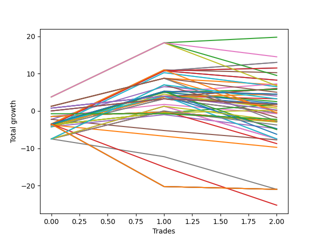

# Short Wallace Doodle 011 
- Symbol: TEST
- Date Range: 3/19/22 - 5/22/22
- Trading Period: 7:20-12:30
- Number of Trades: 1


| Name | Win Percent | Profit | Avg Profit / Trade |     | Name | Win Percent | Profit | Avg Profit / Trade |
| ---- | ----------- | ------ | ------------------ | --- | ---- | ----------- | ------ | ------------------ |
| Sorted By <br> Profit | | | | | Sorted By <br> Win Percentage ||||
| Thirty-Six | 0.00 | -750.00 | -750.00 |     | Thirty-Six | 0.00 | -750.00 | -750.00 |
| Thirty-Five | 0.00 | -1625.00 | -1625.00 |     | Thirty-Five | 0.00 | -1625.00 | -1625.00 |
| Thirty-Seven | 0.00 | -1750.00 | -1750.00 |     | Thirty-Seven | 0.00 | -1750.00 | -1750.00 |

### Test Thirty-Five
* Sell when the linear regression slope changes to positive
* No Stoploss
* Results:
```
Total Trades: 1
Percent Up: 100.00
Percent Down: 0.00
Total Points Moved Down: -3.25
Potential Profit: -1625.00
Total Points Ups: 3.25 Count Ups: 1
Total Points Downs: 0.00 Count Downs: 0
```

<details><summary>Trades</summary>

<code>In: 2022-07-05 08:49:00		Out: 2022-07-05 08:55:05		Total Position Time: 06:05		Total Move Down: -3.25		Total to Date: 3.25</code> <br />


</details>

### Test Thirty-Six
* Sell when the bias changes to positive
* No Stoploss
* Results:
```
Total Trades: 1
Percent Up: 100.00
Percent Down: 0.00
Total Points Moved Down: -1.50
Potential Profit: -750.00
Total Points Ups: 1.50 Count Ups: 1
Total Points Downs: 0.00 Count Downs: 0
```

<details><summary>Trades</summary>

<code>In: 2022-07-05 08:49:00		Out: 2022-07-05 08:59:05		Total Position Time: 10:05		Total Move Down: -1.50		Total to Date: 1.50</code> <br />


</details>

### Test Thirty-Seven
* Sell when the STDEV slope changes to positive
* No Stoploss
* Results:
```
Total Trades: 1
Percent Up: 100.00
Percent Down: 0.00
Total Points Moved Down: -3.50
Potential Profit: -1750.00
Total Points Ups: 3.50 Count Ups: 1
Total Points Downs: 0.00 Count Downs: 0
```

<details><summary>Trades</summary>

<code>In: 2022-07-05 08:49:00		Out: 2022-07-05 09:18:55		Total Position Time: 29:55		Total Move Down: -3.50		Total to Date: 3.50</code> <br />


</details>