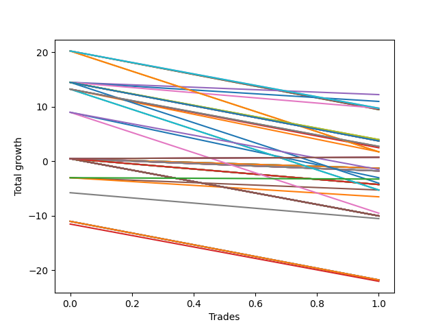

# Short Wallace Doodle 013 
- Symbol: TEST
- Date Range: 3/19/22 - 5/22/22
- Trading Period: 7:20-12:30
- Number of Trades: 2



| Name | Win Percent | Profit | Avg Profit / Trade |     | Name | Win Percent | Profit | Avg Profit / Trade |
| ---- | ----------- | ------ | ------------------ | --- | ---- | ----------- | ------ | ------------------ |
| Sorted By <br> Profit | | | | | Sorted By <br> Win Percentage ||||
| Fourteen | 50.00 | 6125.00 | 3062.50 |     | Seventy-Five | 100.00 | 375.00 | 187.50 |
| Thirty | 50.00 | 5500.00 | 2750.00 |     | Seventy-Four | 100.00 | 375.00 | 187.50 |
| Sixty-Nine | 50.00 | 4875.00 | 2437.50 |     | Seventy-Three | 100.00 | 375.00 | 187.50 |
| Sixty-Six | 50.00 | 4875.00 | 2437.50 |     | Fourteen | 50.00 | 6125.00 | 3062.50 |
| Forty-Six | 50.00 | 4875.00 | 2437.50 |     | Thirty | 50.00 | 5500.00 | 2750.00 |
| Six | 50.00 | 4750.00 | 2375.00 |     | Sixty-Nine | 50.00 | 4875.00 | 2437.50 |
| Three | 50.00 | 4750.00 | 2375.00 |     | Sixty-Six | 50.00 | 4875.00 | 2437.50 |
| Sixty-Eight | 50.00 | 2000.00 | 1000.00 |     | Forty-Six | 50.00 | 4875.00 | 2437.50 |
| Sixty-Two | 50.00 | 2000.00 | 1000.00 |     | Six | 50.00 | 4750.00 | 2375.00 |
| Seventy | 50.00 | 1875.00 | 937.50 |     | Three | 50.00 | 4750.00 | 2375.00 |
| Fifty-Four | 50.00 | 1875.00 | 937.50 |     | Sixty-Eight | 50.00 | 2000.00 | 1000.00 |
| Thirty-Eight | 50.00 | 1875.00 | 937.50 |     | Sixty-Two | 50.00 | 2000.00 | 1000.00 |
| Twenty-Two | 50.00 | 1875.00 | 937.50 |     | Seventy | 50.00 | 1875.00 | 937.50 |
| Seven | 50.00 | 1875.00 | 937.50 |     | Fifty-Four | 50.00 | 1875.00 | 937.50 |
| Five | 50.00 | 1875.00 | 937.50 |     | Thirty-Eight | 50.00 | 1875.00 | 937.50 |
| Sixty-Seven | 50.00 | 1375.00 | 687.50 |     | Twenty-Two | 50.00 | 1875.00 | 937.50 |
| Sixty-Five | 50.00 | 1375.00 | 687.50 |     | Seven | 50.00 | 1875.00 | 937.50 |
| Four | 50.00 | 1250.00 | 625.00 |     | Five | 50.00 | 1875.00 | 937.50 |
| Sixty-One | 50.00 | 875.00 | 437.50 |     | Sixty-Seven | 50.00 | 1375.00 | 687.50 |
| Fifty-Eight | 50.00 | 875.00 | 437.50 |     | Sixty-Five | 50.00 | 1375.00 | 687.50 |
| Two | 50.00 | 875.00 | 437.50 |     | Four | 50.00 | 1250.00 | 625.00 |
| Seventy-Five | 100.00 | 375.00 | 187.50 |     | Sixty-One | 50.00 | 875.00 | 437.50 |
| Seventy-Four | 100.00 | 375.00 | 187.50 |     | Fifty-Eight | 50.00 | 875.00 | 437.50 |
| Seventy-Three | 100.00 | 375.00 | 187.50 |     | Two | 50.00 | 875.00 | 437.50 |
| Twenty-One | 50.00 | -625.00 | -312.50 |     | Twenty-One | 50.00 | -625.00 | -312.50 |
| Twenty | 50.00 | -625.00 | -312.50 |     | Twenty | 50.00 | -625.00 | -312.50 |
| Nineteen | 50.00 | -625.00 | -312.50 |     | Nineteen | 50.00 | -625.00 | -312.50 |
| Eighteen | 50.00 | -625.00 | -312.50 |     | Eighteen | 50.00 | -625.00 | -312.50 |
| Seventeen | 50.00 | -625.00 | -312.50 |     | Seventeen | 50.00 | -625.00 | -312.50 |
| Sixten | 50.00 | -625.00 | -312.50 |     | Sixten | 50.00 | -625.00 | -312.50 |
| Sixty-Four | 50.00 | -750.00 | -375.00 |     | Sixty-Four | 50.00 | -750.00 | -375.00 |
| Thirty-Seven | 50.00 | -875.00 | -437.50 |     | Thirty-Seven | 50.00 | -875.00 | -437.50 |
| Thirty-Six | 50.00 | -875.00 | -437.50 |     | Thirty-Six | 50.00 | -875.00 | -437.50 |
| Thirty-Five | 50.00 | -875.00 | -437.50 |     | Thirty-Five | 50.00 | -875.00 | -437.50 |
| Thirty-Four | 50.00 | -875.00 | -437.50 |     | Thirty-Four | 50.00 | -875.00 | -437.50 |
| Thirty-Three | 50.00 | -875.00 | -437.50 |     | Thirty-Three | 50.00 | -875.00 | -437.50 |
| Thirty-Two | 50.00 | -875.00 | -437.50 |     | Thirty-Two | 50.00 | -875.00 | -437.50 |
| One | 50.00 | -1500.00 | -750.00 |     | One | 50.00 | -1500.00 | -750.00 |
| Seventy-Two | 0.00 | -1625.00 | -812.50 |     | Sixty | 50.00 | -2000.00 | -1000.00 |
| Sixty | 50.00 | -2000.00 | -1000.00 |     | Fifty-Three | 50.00 | -2125.00 | -1062.50 |
| Fifty-Three | 50.00 | -2125.00 | -1062.50 |     | Fifty-Two | 50.00 | -2125.00 | -1062.50 |
| Fifty-Two | 50.00 | -2125.00 | -1062.50 |     | Fifty-One | 50.00 | -2125.00 | -1062.50 |
| Fifty-One | 50.00 | -2125.00 | -1062.50 |     | Fifty | 50.00 | -2125.00 | -1062.50 |
| Fifty | 50.00 | -2125.00 | -1062.50 |     | Forty-Nine | 50.00 | -2125.00 | -1062.50 |
| Forty-Nine | 50.00 | -2125.00 | -1062.50 |     | Forty-Eight | 50.00 | -2125.00 | -1062.50 |
| Forty-Eight | 50.00 | -2125.00 | -1062.50 |     | Fifty-Nine | 50.00 | -2625.00 | -1312.50 |
| Fifty-Nine | 50.00 | -2625.00 | -1312.50 |     | Fifty-Seven | 50.00 | -2625.00 | -1312.50 |
| Fifty-Seven | 50.00 | -2625.00 | -1312.50 |     | Fifty-Six | 50.00 | -4750.00 | -2375.00 |
| Fifteen | 0.00 | -2625.00 | -1312.50 |     | Forty-Five | 50.00 | -5000.00 | -2500.00 |
| Thirty-One | 0.00 | -3250.00 | -1625.00 |     | Forty-Four | 50.00 | -5000.00 | -2500.00 |
| Fifty-Six | 50.00 | -4750.00 | -2375.00 |     | Forty-Three | 50.00 | -5000.00 | -2500.00 |
| Forty-Five | 50.00 | -5000.00 | -2500.00 |     | Forty-Two | 50.00 | -5000.00 | -2500.00 |
| Forty-Four | 50.00 | -5000.00 | -2500.00 |     | Forty-One | 50.00 | -5000.00 | -2500.00 |
| Forty-Three | 50.00 | -5000.00 | -2500.00 |     | Forty | 50.00 | -5000.00 | -2500.00 |
| Forty-Two | 50.00 | -5000.00 | -2500.00 |     | Twenty-Nine | 50.00 | -5000.00 | -2500.00 |
| Forty-One | 50.00 | -5000.00 | -2500.00 |     | Twenty-Eight | 50.00 | -5000.00 | -2500.00 |
| Forty | 50.00 | -5000.00 | -2500.00 |     | twenty-Seven | 50.00 | -5000.00 | -2500.00 |
| Twenty-Nine | 50.00 | -5000.00 | -2500.00 |     | Twenty-Six | 50.00 | -5000.00 | -2500.00 |
| Twenty-Eight | 50.00 | -5000.00 | -2500.00 |     | Twenty-Five | 50.00 | -5000.00 | -2500.00 |
| twenty-Seven | 50.00 | -5000.00 | -2500.00 |     | Twenty-Four | 50.00 | -5000.00 | -2500.00 |
| Twenty-Six | 50.00 | -5000.00 | -2500.00 |     | Thirteen | 50.00 | -5000.00 | -2500.00 |
| Twenty-Five | 50.00 | -5000.00 | -2500.00 |     | Twelve | 50.00 | -5000.00 | -2500.00 |
| Twenty-Four | 50.00 | -5000.00 | -2500.00 |     | Eleven | 50.00 | -5000.00 | -2500.00 |
| Thirteen | 50.00 | -5000.00 | -2500.00 |     | Ten | 50.00 | -5000.00 | -2500.00 |
| Twelve | 50.00 | -5000.00 | -2500.00 |     | Nine | 50.00 | -5000.00 | -2500.00 |
| Eleven | 50.00 | -5000.00 | -2500.00 |     | Eight | 50.00 | -5000.00 | -2500.00 |
| Ten | 50.00 | -5000.00 | -2500.00 |     | Seventy-Two | 0.00 | -1625.00 | -812.50 |
| Nine | 50.00 | -5000.00 | -2500.00 |     | Fifteen | 0.00 | -2625.00 | -1312.50 |
| Eight | 50.00 | -5000.00 | -2500.00 |     | Thirty-One | 0.00 | -3250.00 | -1625.00 |
| Forty-Seven | 0.00 | -5250.00 | -2625.00 |     | Forty-Seven | 0.00 | -5250.00 | -2625.00 |
| Seventy-One | 0.00 | -10875.00 | -5437.50 |     | Seventy-One | 0.00 | -10875.00 | -5437.50 |
| Fifty-Five | 0.00 | -10875.00 | -5437.50 |     | Fifty-Five | 0.00 | -10875.00 | -5437.50 |
| Thirty-Nine | 0.00 | -10875.00 | -5437.50 |     | Thirty-Nine | 0.00 | -10875.00 | -5437.50 |
| Twenty-Three | 0.00 | -10875.00 | -5437.50 |     | Twenty-Three | 0.00 | -10875.00 | -5437.50 |
| Eight | 0.00 | -10875.00 | -5437.50 |     | Eight | 0.00 | -10875.00 | -5437.50 |
| Sixty-Three | 0.00 | -11000.00 | -5500.00 |     | Sixty-Three | 0.00 | -11000.00 | -5500.00 |

## NO STOPLOSS

### Test One
* Sell when the price hits the lower line of the 20p 1std bollinger
* No Stoploss
* Results:
```
Total Trades: 2
Percent Up: 50.00
Percent Down: 50.00
Total Points Moved Down: -3.00
Potential Profit: -1500.00
Total Points Ups: 12.00 Count Ups: 1
Total Points Downs: 9.00 Count Downs: 1
```

<details><summary>Trades</summary>

<code>In: 2022-07-06 11:09:00		Out: 2022-07-06 11:10:10		Total Position Time: 01:10		Total Move Down: 9.00		Total to Date: -9.00</code> <br />
<code>In: 2022-07-06 11:31:00		Out: 2022-07-06 11:48:45		Total Position Time: 17:45		Total Move Down: -12.00		Total to Date: 3.00</code> <br />


</details>

### Test Two
* Sell when the price hits the lower line of the 20p 2std bollinger
* No Stoploss
* Results:
```
Total Trades: 2
Percent Up: 50.00
Percent Down: 50.00
Total Points Moved Down: 1.75
Potential Profit: 875.00
Total Points Ups: 11.50 Count Ups: 1
Total Points Downs: 13.25 Count Downs: 1
```

<details><summary>Trades</summary>

<code>In: 2022-07-06 11:09:00		Out: 2022-07-06 11:11:10		Total Position Time: 02:10		Total Move Down: 13.25		Total to Date: -13.25</code> <br />
<code>In: 2022-07-06 11:31:00		Out: 2022-07-06 12:00:50		Total Position Time: 29:50		Total Move Down: -11.50		Total to Date: -1.75</code> <br />


</details>

### Test Three
* Sell when the price hits the middle line of the 1std VWAP
* No Stoploss
* Results:
```
Total Trades: 2
Percent Up: 50.00
Percent Down: 50.00
Total Points Moved Down: 9.50
Potential Profit: 4750.00
Total Points Ups: 10.75 Count Ups: 1
Total Points Downs: 20.25 Count Downs: 1
```

<details><summary>Trades</summary>

<code>In: 2022-07-06 11:09:00		Out: 2022-07-06 11:12:15		Total Position Time: 03:15		Total Move Down: 20.25		Total to Date: -20.25</code> <br />
<code>In: 2022-07-06 11:31:00		Out: 2022-07-06 12:00:55		Total Position Time: 29:55		Total Move Down: -10.75		Total to Date: -9.50</code> <br />


</details>

### Test Four
* Sell when the price hits the lower line of the 1std VWAP
* No Stoploss
* Results:
```
Total Trades: 2
Percent Up: 50.00
Percent Down: 50.00
Total Points Moved Down: 2.50
Potential Profit: 1250.00
Total Points Ups: 10.75 Count Ups: 1
Total Points Downs: 13.25 Count Downs: 1
```

<details><summary>Trades</summary>

<code>In: 2022-07-06 11:09:00		Out: 2022-07-06 11:11:10		Total Position Time: 02:10		Total Move Down: 13.25		Total to Date: -13.25</code> <br />
<code>In: 2022-07-06 11:31:00		Out: 2022-07-06 12:00:55		Total Position Time: 29:55		Total Move Down: -10.75		Total to Date: -2.50</code> <br />


</details>

### Test Five
* Sell when the linear regression slope is positive
* No Stoploss
* Results:
```
Total Trades: 2
Percent Up: 50.00
Percent Down: 50.00
Total Points Moved Down: 3.75
Potential Profit: 1875.00
Total Points Ups: 10.75 Count Ups: 1
Total Points Downs: 14.50 Count Downs: 1
```

<details><summary>Trades</summary>

<code>In: 2022-07-06 11:09:00		Out: 2022-07-06 11:11:35		Total Position Time: 02:35		Total Move Down: 14.50		Total to Date: -14.50</code> <br />
<code>In: 2022-07-06 11:31:00		Out: 2022-07-06 12:00:55		Total Position Time: 29:55		Total Move Down: -10.75		Total to Date: -3.75</code> <br />


</details>

### Test Six
* Sell when the linear regression slope changes to positive
* No Stoploss
* Results:
```
Total Trades: 2
Percent Up: 50.00
Percent Down: 50.00
Total Points Moved Down: 9.50
Potential Profit: 4750.00
Total Points Ups: 10.75 Count Ups: 1
Total Points Downs: 20.25 Count Downs: 1
```

<details><summary>Trades</summary>

<code>In: 2022-07-06 11:09:00		Out: 2022-07-06 11:12:15		Total Position Time: 03:15		Total Move Down: 20.25		Total to Date: -20.25</code> <br />
<code>In: 2022-07-06 11:31:00		Out: 2022-07-06 12:00:55		Total Position Time: 29:55		Total Move Down: -10.75		Total to Date: -9.50</code> <br />


</details>

### Test Seven
* Sell when the bias changes to positive
* No Stoploss
* Results:
```
Total Trades: 2
Percent Up: 50.00
Percent Down: 50.00
Total Points Moved Down: 3.75
Potential Profit: 1875.00
Total Points Ups: 10.75 Count Ups: 1
Total Points Downs: 14.50 Count Downs: 1
```

<details><summary>Trades</summary>

<code>In: 2022-07-06 11:09:00		Out: 2022-07-06 11:11:35		Total Position Time: 02:35		Total Move Down: 14.50		Total to Date: -14.50</code> <br />
<code>In: 2022-07-06 11:31:00		Out: 2022-07-06 12:00:55		Total Position Time: 29:55		Total Move Down: -10.75		Total to Date: -3.75</code> <br />


</details>

### Test Eight
* Sell when the STDEV slope changes to positive
* No Stoploss
* Results:
```
Total Trades: 2
Percent Up: 100.00
Percent Down: 0.00
Total Points Moved Down: -21.75
Potential Profit: -10875.00
Total Points Ups: 21.75 Count Ups: 2
Total Points Downs: 0.00 Count Downs: 0
```

<details><summary>Trades</summary>

<code>In: 2022-07-06 11:09:00		Out: 2022-07-06 11:38:55		Total Position Time: 29:55		Total Move Down: -11.00		Total to Date: 11.00</code> <br />
<code>In: 2022-07-06 11:31:00		Out: 2022-07-06 12:00:55		Total Position Time: 29:55		Total Move Down: -10.75		Total to Date: 21.75</code> <br />


</details>

### Test Eight
* Sell when the price hits the lower line of the 20p 1std bollinger
* Stoploss is -2 points
* Results:
```
Total Trades: 2
Percent Up: 50.00
Percent Down: 50.00
Total Points Moved Down: -10.00
Potential Profit: -5000.00
Total Points Ups: 10.50 Count Ups: 1
Total Points Downs: 0.50 Count Downs: 1
```

<details><summary>Trades</summary>

<code>In: 2022-07-06 11:09:00		Out: 2022-07-06 11:09:10		Total Position Time: 00:10		Total Move Down: 0.50		Total to Date: -0.50</code> <br />
<code>In: 2022-07-06 11:31:00		Out: 2022-07-06 11:33:05		Total Position Time: 02:05		Total Move Down: -10.50		Total to Date: 10.00</code> <br />


</details>

## STOPLOSS OF 2

### Test Nine
* Sell when the price hits the lower line of the 20p 2std bollinger
* Stoploss is -2 points
* Results:
```
Total Trades: 2
Percent Up: 50.00
Percent Down: 50.00
Total Points Moved Down: -10.00
Potential Profit: -5000.00
Total Points Ups: 10.50 Count Ups: 1
Total Points Downs: 0.50 Count Downs: 1
```

<details><summary>Trades</summary>

<code>In: 2022-07-06 11:09:00		Out: 2022-07-06 11:09:10		Total Position Time: 00:10		Total Move Down: 0.50		Total to Date: -0.50</code> <br />
<code>In: 2022-07-06 11:31:00		Out: 2022-07-06 11:33:05		Total Position Time: 02:05		Total Move Down: -10.50		Total to Date: 10.00</code> <br />


</details>

### Test Ten
* Sell when the price hits the middle line of the 1std VWAP
* Stoploss is -2 points
* Results:
```
Total Trades: 2
Percent Up: 50.00
Percent Down: 50.00
Total Points Moved Down: -10.00
Potential Profit: -5000.00
Total Points Ups: 10.50 Count Ups: 1
Total Points Downs: 0.50 Count Downs: 1
```

<details><summary>Trades</summary>

<code>In: 2022-07-06 11:09:00		Out: 2022-07-06 11:09:10		Total Position Time: 00:10		Total Move Down: 0.50		Total to Date: -0.50</code> <br />
<code>In: 2022-07-06 11:31:00		Out: 2022-07-06 11:33:05		Total Position Time: 02:05		Total Move Down: -10.50		Total to Date: 10.00</code> <br />


</details>

### Test Eleven
* Sell when the price hits the lower line of the 1std VWAP
* Stoploss is -2 points
* Results:
```
Total Trades: 2
Percent Up: 50.00
Percent Down: 50.00
Total Points Moved Down: -10.00
Potential Profit: -5000.00
Total Points Ups: 10.50 Count Ups: 1
Total Points Downs: 0.50 Count Downs: 1
```

<details><summary>Trades</summary>

<code>In: 2022-07-06 11:09:00		Out: 2022-07-06 11:09:10		Total Position Time: 00:10		Total Move Down: 0.50		Total to Date: -0.50</code> <br />
<code>In: 2022-07-06 11:31:00		Out: 2022-07-06 11:33:05		Total Position Time: 02:05		Total Move Down: -10.50		Total to Date: 10.00</code> <br />


</details>

### Test Twelve
* Sell when the linear regression slope is positive
* Stoploss is -2 points
* Results:
```
Total Trades: 2
Percent Up: 50.00
Percent Down: 50.00
Total Points Moved Down: -10.00
Potential Profit: -5000.00
Total Points Ups: 10.50 Count Ups: 1
Total Points Downs: 0.50 Count Downs: 1
```

<details><summary>Trades</summary>

<code>In: 2022-07-06 11:09:00		Out: 2022-07-06 11:09:10		Total Position Time: 00:10		Total Move Down: 0.50		Total to Date: -0.50</code> <br />
<code>In: 2022-07-06 11:31:00		Out: 2022-07-06 11:33:05		Total Position Time: 02:05		Total Move Down: -10.50		Total to Date: 10.00</code> <br />


</details>

### Test Thirteen
* Sell when the linear regression slope changes to positive
* Stoploss is -2 points
* Results:
```
Total Trades: 2
Percent Up: 50.00
Percent Down: 50.00
Total Points Moved Down: -10.00
Potential Profit: -5000.00
Total Points Ups: 10.50 Count Ups: 1
Total Points Downs: 0.50 Count Downs: 1
```

<details><summary>Trades</summary>

<code>In: 2022-07-06 11:09:00		Out: 2022-07-06 11:09:10		Total Position Time: 00:10		Total Move Down: 0.50		Total to Date: -0.50</code> <br />
<code>In: 2022-07-06 11:31:00		Out: 2022-07-06 11:33:05		Total Position Time: 02:05		Total Move Down: -10.50		Total to Date: 10.00</code> <br />


</details>

### Test Fourteen
* Sell when the bias changes to positive
* Stoploss is -2 points
* Results:
```
Total Trades: 2
Percent Up: 50.00
Percent Down: 50.00
Total Points Moved Down: 12.25
Potential Profit: 6125.00
Total Points Ups: 2.25 Count Ups: 1
Total Points Downs: 14.50 Count Downs: 1
```

<details><summary>Trades</summary>

<code>In: 2022-07-06 11:09:00		Out: 2022-07-06 11:11:35		Total Position Time: 02:35		Total Move Down: 14.50		Total to Date: -14.50</code> <br />
<code>In: 2022-07-06 11:31:00		Out: 2022-07-06 11:31:35		Total Position Time: 00:35		Total Move Down: -2.25		Total to Date: -12.25</code> <br />


</details>

### Test Fifteen
* Sell when the STDEV slope changes to positive
* Stoploss is -2 points
* Results:
```
Total Trades: 2
Percent Up: 100.00
Percent Down: 0.00
Total Points Moved Down: -5.25
Potential Profit: -2625.00
Total Points Ups: 5.25 Count Ups: 2
Total Points Downs: 0.00 Count Downs: 0
```

<details><summary>Trades</summary>

<code>In: 2022-07-06 11:09:00		Out: 2022-07-06 11:29:55		Total Position Time: 20:55		Total Move Down: -3.00		Total to Date: 3.00</code> <br />
<code>In: 2022-07-06 11:31:00		Out: 2022-07-06 11:31:35		Total Position Time: 00:35		Total Move Down: -2.25		Total to Date: 5.25</code> <br />


</details>

### Test Sixten
* Sell when the price hits the lower line of the 20p 1std bollinger
* Trailing Stop is -2 points
* Results:
```
Total Trades: 2
Percent Up: 50.00
Percent Down: 50.00
Total Points Moved Down: -1.25
Potential Profit: -625.00
Total Points Ups: 1.75 Count Ups: 1
Total Points Downs: 0.50 Count Downs: 1
```

<details><summary>Trades</summary>

<code>In: 2022-07-06 11:09:00		Out: 2022-07-06 11:09:10		Total Position Time: 00:10		Total Move Down: 0.50		Total to Date: -0.50</code> <br />
<code>In: 2022-07-06 11:31:00		Out: 2022-07-06 11:31:30		Total Position Time: 00:30		Total Move Down: -1.75		Total to Date: 1.25</code> <br />


</details>

### Test Seventeen
* Sell when the price hits the lower line of the 20p 2std bollinger
* Trailing Stop is -2 points
* Results:
```
Total Trades: 2
Percent Up: 50.00
Percent Down: 50.00
Total Points Moved Down: -1.25
Potential Profit: -625.00
Total Points Ups: 1.75 Count Ups: 1
Total Points Downs: 0.50 Count Downs: 1
```

<details><summary>Trades</summary>

<code>In: 2022-07-06 11:09:00		Out: 2022-07-06 11:09:10		Total Position Time: 00:10		Total Move Down: 0.50		Total to Date: -0.50</code> <br />
<code>In: 2022-07-06 11:31:00		Out: 2022-07-06 11:31:30		Total Position Time: 00:30		Total Move Down: -1.75		Total to Date: 1.25</code> <br />


</details>

## TRAIL STOP OF 2

### Test Eighteen
* Sell when the price hits the middle line of the 1std VWAP
* Trailing Stop is -2 points
* Results:
```
Total Trades: 2
Percent Up: 50.00
Percent Down: 50.00
Total Points Moved Down: -1.25
Potential Profit: -625.00
Total Points Ups: 1.75 Count Ups: 1
Total Points Downs: 0.50 Count Downs: 1
```

<details><summary>Trades</summary>

<code>In: 2022-07-06 11:09:00		Out: 2022-07-06 11:09:10		Total Position Time: 00:10		Total Move Down: 0.50		Total to Date: -0.50</code> <br />
<code>In: 2022-07-06 11:31:00		Out: 2022-07-06 11:31:30		Total Position Time: 00:30		Total Move Down: -1.75		Total to Date: 1.25</code> <br />


</details>

### Test Nineteen
* Sell when the price hits the lower line of the 1std VWAP
* Trailing Stop is -2 points
* Results:
```
Total Trades: 2
Percent Up: 50.00
Percent Down: 50.00
Total Points Moved Down: -1.25
Potential Profit: -625.00
Total Points Ups: 1.75 Count Ups: 1
Total Points Downs: 0.50 Count Downs: 1
```

<details><summary>Trades</summary>

<code>In: 2022-07-06 11:09:00		Out: 2022-07-06 11:09:10		Total Position Time: 00:10		Total Move Down: 0.50		Total to Date: -0.50</code> <br />
<code>In: 2022-07-06 11:31:00		Out: 2022-07-06 11:31:30		Total Position Time: 00:30		Total Move Down: -1.75		Total to Date: 1.25</code> <br />


</details>

### Test Twenty
* Sell when the linear regression slope is positive
* Trailing Stop is -2 points
* Results:
```
Total Trades: 2
Percent Up: 50.00
Percent Down: 50.00
Total Points Moved Down: -1.25
Potential Profit: -625.00
Total Points Ups: 1.75 Count Ups: 1
Total Points Downs: 0.50 Count Downs: 1
```

<details><summary>Trades</summary>

<code>In: 2022-07-06 11:09:00		Out: 2022-07-06 11:09:10		Total Position Time: 00:10		Total Move Down: 0.50		Total to Date: -0.50</code> <br />
<code>In: 2022-07-06 11:31:00		Out: 2022-07-06 11:31:30		Total Position Time: 00:30		Total Move Down: -1.75		Total to Date: 1.25</code> <br />


</details>

### Test Twenty-One
* Sell when the linear regression slope changes to positive
* Trailing Stop is -2 points
* Results:
```
Total Trades: 2
Percent Up: 50.00
Percent Down: 50.00
Total Points Moved Down: -1.25
Potential Profit: -625.00
Total Points Ups: 1.75 Count Ups: 1
Total Points Downs: 0.50 Count Downs: 1
```

<details><summary>Trades</summary>

<code>In: 2022-07-06 11:09:00		Out: 2022-07-06 11:09:10		Total Position Time: 00:10		Total Move Down: 0.50		Total to Date: -0.50</code> <br />
<code>In: 2022-07-06 11:31:00		Out: 2022-07-06 11:31:30		Total Position Time: 00:30		Total Move Down: -1.75		Total to Date: 1.25</code> <br />


</details>

### Test Twenty-Two
* Sell when the bias changes to positive
* Trailing Stop is -2 points
* Results:
```
Total Trades: 2
Percent Up: 50.00
Percent Down: 50.00
Total Points Moved Down: 3.75
Potential Profit: 1875.00
Total Points Ups: 10.75 Count Ups: 1
Total Points Downs: 14.50 Count Downs: 1
```

<details><summary>Trades</summary>

<code>In: 2022-07-06 11:09:00		Out: 2022-07-06 11:11:35		Total Position Time: 02:35		Total Move Down: 14.50		Total to Date: -14.50</code> <br />
<code>In: 2022-07-06 11:31:00		Out: 2022-07-06 12:00:55		Total Position Time: 29:55		Total Move Down: -10.75		Total to Date: -3.75</code> <br />


</details>

### Test Twenty-Three
* Sell when the STDEV slope changes to positive
* Trailing Stop is -2 points
* Results:
```
Total Trades: 2
Percent Up: 100.00
Percent Down: 0.00
Total Points Moved Down: -21.75
Potential Profit: -10875.00
Total Points Ups: 21.75 Count Ups: 2
Total Points Downs: 0.00 Count Downs: 0
```

<details><summary>Trades</summary>

<code>In: 2022-07-06 11:09:00		Out: 2022-07-06 11:38:55		Total Position Time: 29:55		Total Move Down: -11.00		Total to Date: 11.00</code> <br />
<code>In: 2022-07-06 11:31:00		Out: 2022-07-06 12:00:55		Total Position Time: 29:55		Total Move Down: -10.75		Total to Date: 21.75</code> <br />


</details>

### Test Twenty-Four
* Sell when the price hits the lower line of the 20p 1std bollinger
* Stoploss is -2 points
* Results:
```
Total Trades: 2
Percent Up: 50.00
Percent Down: 50.00
Total Points Moved Down: -10.00
Potential Profit: -5000.00
Total Points Ups: 10.50 Count Ups: 1
Total Points Downs: 0.50 Count Downs: 1
```

<details><summary>Trades</summary>

<code>In: 2022-07-06 11:09:00		Out: 2022-07-06 11:09:10		Total Position Time: 00:10		Total Move Down: 0.50		Total to Date: -0.50</code> <br />
<code>In: 2022-07-06 11:31:00		Out: 2022-07-06 11:33:05		Total Position Time: 02:05		Total Move Down: -10.50		Total to Date: 10.00</code> <br />


</details>

### Test Twenty-Five
* Sell when the price hits the lower line of the 20p 2std bollinger
* Stoploss is -2 points
* Results:
```
Total Trades: 2
Percent Up: 50.00
Percent Down: 50.00
Total Points Moved Down: -10.00
Potential Profit: -5000.00
Total Points Ups: 10.50 Count Ups: 1
Total Points Downs: 0.50 Count Downs: 1
```

<details><summary>Trades</summary>

<code>In: 2022-07-06 11:09:00		Out: 2022-07-06 11:09:10		Total Position Time: 00:10		Total Move Down: 0.50		Total to Date: -0.50</code> <br />
<code>In: 2022-07-06 11:31:00		Out: 2022-07-06 11:33:05		Total Position Time: 02:05		Total Move Down: -10.50		Total to Date: 10.00</code> <br />


</details>

### Test Twenty-Six
* Sell when the price hits the middle line of the 1std VWAP
* Stoploss is -2 points
* Results:
```
Total Trades: 2
Percent Up: 50.00
Percent Down: 50.00
Total Points Moved Down: -10.00
Potential Profit: -5000.00
Total Points Ups: 10.50 Count Ups: 1
Total Points Downs: 0.50 Count Downs: 1
```

<details><summary>Trades</summary>

<code>In: 2022-07-06 11:09:00		Out: 2022-07-06 11:09:10		Total Position Time: 00:10		Total Move Down: 0.50		Total to Date: -0.50</code> <br />
<code>In: 2022-07-06 11:31:00		Out: 2022-07-06 11:33:05		Total Position Time: 02:05		Total Move Down: -10.50		Total to Date: 10.00</code> <br />


</details>

## STOPLOSS OF 3

### Test twenty-Seven
* Sell when the price hits the lower line of the 1std VWAP
* Stoploss is -2 points
* Results:
```
Total Trades: 2
Percent Up: 50.00
Percent Down: 50.00
Total Points Moved Down: -10.00
Potential Profit: -5000.00
Total Points Ups: 10.50 Count Ups: 1
Total Points Downs: 0.50 Count Downs: 1
```

<details><summary>Trades</summary>

<code>In: 2022-07-06 11:09:00		Out: 2022-07-06 11:09:10		Total Position Time: 00:10		Total Move Down: 0.50		Total to Date: -0.50</code> <br />
<code>In: 2022-07-06 11:31:00		Out: 2022-07-06 11:33:05		Total Position Time: 02:05		Total Move Down: -10.50		Total to Date: 10.00</code> <br />


</details>

### Test Twenty-Eight
* Sell when the linear regression slope is positive
* Stoploss is -2 points
* Results:
```
Total Trades: 2
Percent Up: 50.00
Percent Down: 50.00
Total Points Moved Down: -10.00
Potential Profit: -5000.00
Total Points Ups: 10.50 Count Ups: 1
Total Points Downs: 0.50 Count Downs: 1
```

<details><summary>Trades</summary>

<code>In: 2022-07-06 11:09:00		Out: 2022-07-06 11:09:10		Total Position Time: 00:10		Total Move Down: 0.50		Total to Date: -0.50</code> <br />
<code>In: 2022-07-06 11:31:00		Out: 2022-07-06 11:33:05		Total Position Time: 02:05		Total Move Down: -10.50		Total to Date: 10.00</code> <br />


</details>

### Test Twenty-Nine
* Sell when the linear regression slope changes to positive
* Stoploss is -2 points
* Results:
```
Total Trades: 2
Percent Up: 50.00
Percent Down: 50.00
Total Points Moved Down: -10.00
Potential Profit: -5000.00
Total Points Ups: 10.50 Count Ups: 1
Total Points Downs: 0.50 Count Downs: 1
```

<details><summary>Trades</summary>

<code>In: 2022-07-06 11:09:00		Out: 2022-07-06 11:09:10		Total Position Time: 00:10		Total Move Down: 0.50		Total to Date: -0.50</code> <br />
<code>In: 2022-07-06 11:31:00		Out: 2022-07-06 11:33:05		Total Position Time: 02:05		Total Move Down: -10.50		Total to Date: 10.00</code> <br />


</details>

### Test Thirty
* Sell when the bias changes to positive
* Stoploss is -2 points
* Results:
```
Total Trades: 2
Percent Up: 50.00
Percent Down: 50.00
Total Points Moved Down: 11.00
Potential Profit: 5500.00
Total Points Ups: 3.50 Count Ups: 1
Total Points Downs: 14.50 Count Downs: 1
```

<details><summary>Trades</summary>

<code>In: 2022-07-06 11:09:00		Out: 2022-07-06 11:11:35		Total Position Time: 02:35		Total Move Down: 14.50		Total to Date: -14.50</code> <br />
<code>In: 2022-07-06 11:31:00		Out: 2022-07-06 11:31:40		Total Position Time: 00:40		Total Move Down: -3.50		Total to Date: -11.00</code> <br />


</details>

### Test Thirty-One
* Sell when the STDEV slope changes to positive
* Stoploss is -2 points
* Results:
```
Total Trades: 2
Percent Up: 100.00
Percent Down: 0.00
Total Points Moved Down: -6.50
Potential Profit: -3250.00
Total Points Ups: 6.50 Count Ups: 2
Total Points Downs: 0.00 Count Downs: 0
```

<details><summary>Trades</summary>

<code>In: 2022-07-06 11:09:00		Out: 2022-07-06 11:29:55		Total Position Time: 20:55		Total Move Down: -3.00		Total to Date: 3.00</code> <br />
<code>In: 2022-07-06 11:31:00		Out: 2022-07-06 11:31:40		Total Position Time: 00:40		Total Move Down: -3.50		Total to Date: 6.50</code> <br />


</details>

### Test Thirty-Two
* Sell when the price hits the lower line of the 20p 1std bollinger
* Trailing Stop is -2 points
* Results:
```
Total Trades: 2
Percent Up: 50.00
Percent Down: 50.00
Total Points Moved Down: -1.75
Potential Profit: -875.00
Total Points Ups: 2.25 Count Ups: 1
Total Points Downs: 0.50 Count Downs: 1
```

<details><summary>Trades</summary>

<code>In: 2022-07-06 11:09:00		Out: 2022-07-06 11:09:10		Total Position Time: 00:10		Total Move Down: 0.50		Total to Date: -0.50</code> <br />
<code>In: 2022-07-06 11:31:00		Out: 2022-07-06 11:31:35		Total Position Time: 00:35		Total Move Down: -2.25		Total to Date: 1.75</code> <br />


</details>

### Test Thirty-Three
* Sell when the price hits the lower line of the 20p 2std bollinger
* Trailing Stop is -2 points
* Results:
```
Total Trades: 2
Percent Up: 50.00
Percent Down: 50.00
Total Points Moved Down: -1.75
Potential Profit: -875.00
Total Points Ups: 2.25 Count Ups: 1
Total Points Downs: 0.50 Count Downs: 1
```

<details><summary>Trades</summary>

<code>In: 2022-07-06 11:09:00		Out: 2022-07-06 11:09:10		Total Position Time: 00:10		Total Move Down: 0.50		Total to Date: -0.50</code> <br />
<code>In: 2022-07-06 11:31:00		Out: 2022-07-06 11:31:35		Total Position Time: 00:35		Total Move Down: -2.25		Total to Date: 1.75</code> <br />


</details>

### Test Thirty-Four
* Sell when the price hits the middle line of the 1std VWAP
* Trailing Stop is -2 points
* Results:
```
Total Trades: 2
Percent Up: 50.00
Percent Down: 50.00
Total Points Moved Down: -1.75
Potential Profit: -875.00
Total Points Ups: 2.25 Count Ups: 1
Total Points Downs: 0.50 Count Downs: 1
```

<details><summary>Trades</summary>

<code>In: 2022-07-06 11:09:00		Out: 2022-07-06 11:09:10		Total Position Time: 00:10		Total Move Down: 0.50		Total to Date: -0.50</code> <br />
<code>In: 2022-07-06 11:31:00		Out: 2022-07-06 11:31:35		Total Position Time: 00:35		Total Move Down: -2.25		Total to Date: 1.75</code> <br />


</details>

### Test Thirty-Five
* Sell when the price hits the lower line of the 1std VWAP
* Trailing Stop is -2 points
* Results:
```
Total Trades: 2
Percent Up: 50.00
Percent Down: 50.00
Total Points Moved Down: -1.75
Potential Profit: -875.00
Total Points Ups: 2.25 Count Ups: 1
Total Points Downs: 0.50 Count Downs: 1
```

<details><summary>Trades</summary>

<code>In: 2022-07-06 11:09:00		Out: 2022-07-06 11:09:10		Total Position Time: 00:10		Total Move Down: 0.50		Total to Date: -0.50</code> <br />
<code>In: 2022-07-06 11:31:00		Out: 2022-07-06 11:31:35		Total Position Time: 00:35		Total Move Down: -2.25		Total to Date: 1.75</code> <br />


</details>

## TRAIL STOP OF 3

### Test Thirty-Six
* Sell when the linear regression slope is positive
* Trailing Stop is -2 points
* Results:
```
Total Trades: 2
Percent Up: 50.00
Percent Down: 50.00
Total Points Moved Down: -1.75
Potential Profit: -875.00
Total Points Ups: 2.25 Count Ups: 1
Total Points Downs: 0.50 Count Downs: 1
```

<details><summary>Trades</summary>

<code>In: 2022-07-06 11:09:00		Out: 2022-07-06 11:09:10		Total Position Time: 00:10		Total Move Down: 0.50		Total to Date: -0.50</code> <br />
<code>In: 2022-07-06 11:31:00		Out: 2022-07-06 11:31:35		Total Position Time: 00:35		Total Move Down: -2.25		Total to Date: 1.75</code> <br />


</details>

### Test Thirty-Seven
* Sell when the linear regression slope changes to positive
* Trailing Stop is -2 points
* Results:
```
Total Trades: 2
Percent Up: 50.00
Percent Down: 50.00
Total Points Moved Down: -1.75
Potential Profit: -875.00
Total Points Ups: 2.25 Count Ups: 1
Total Points Downs: 0.50 Count Downs: 1
```

<details><summary>Trades</summary>

<code>In: 2022-07-06 11:09:00		Out: 2022-07-06 11:09:10		Total Position Time: 00:10		Total Move Down: 0.50		Total to Date: -0.50</code> <br />
<code>In: 2022-07-06 11:31:00		Out: 2022-07-06 11:31:35		Total Position Time: 00:35		Total Move Down: -2.25		Total to Date: 1.75</code> <br />


</details>

### Test Thirty-Eight
* Sell when the bias changes to positive
* Trailing Stop is -2 points
* Results:
```
Total Trades: 2
Percent Up: 50.00
Percent Down: 50.00
Total Points Moved Down: 3.75
Potential Profit: 1875.00
Total Points Ups: 10.75 Count Ups: 1
Total Points Downs: 14.50 Count Downs: 1
```

<details><summary>Trades</summary>

<code>In: 2022-07-06 11:09:00		Out: 2022-07-06 11:11:35		Total Position Time: 02:35		Total Move Down: 14.50		Total to Date: -14.50</code> <br />
<code>In: 2022-07-06 11:31:00		Out: 2022-07-06 12:00:55		Total Position Time: 29:55		Total Move Down: -10.75		Total to Date: -3.75</code> <br />


</details>

### Test Thirty-Nine
* Sell when the STDEV slope changes to positive
* Trailing Stop is -2 points
* Results:
```
Total Trades: 2
Percent Up: 100.00
Percent Down: 0.00
Total Points Moved Down: -21.75
Potential Profit: -10875.00
Total Points Ups: 21.75 Count Ups: 2
Total Points Downs: 0.00 Count Downs: 0
```

<details><summary>Trades</summary>

<code>In: 2022-07-06 11:09:00		Out: 2022-07-06 11:38:55		Total Position Time: 29:55		Total Move Down: -11.00		Total to Date: 11.00</code> <br />
<code>In: 2022-07-06 11:31:00		Out: 2022-07-06 12:00:55		Total Position Time: 29:55		Total Move Down: -10.75		Total to Date: 21.75</code> <br />


</details>

### Test Forty
* Sell when the price hits the lower line of the 20p 1std bollinger
* Stoploss is -2 points
* Results:
```
Total Trades: 2
Percent Up: 50.00
Percent Down: 50.00
Total Points Moved Down: -10.00
Potential Profit: -5000.00
Total Points Ups: 10.50 Count Ups: 1
Total Points Downs: 0.50 Count Downs: 1
```

<details><summary>Trades</summary>

<code>In: 2022-07-06 11:09:00		Out: 2022-07-06 11:09:10		Total Position Time: 00:10		Total Move Down: 0.50		Total to Date: -0.50</code> <br />
<code>In: 2022-07-06 11:31:00		Out: 2022-07-06 11:33:05		Total Position Time: 02:05		Total Move Down: -10.50		Total to Date: 10.00</code> <br />


</details>

### Test Forty-One
* Sell when the price hits the lower line of the 20p 2std bollinger
* Stoploss is -2 points
* Results:
```
Total Trades: 2
Percent Up: 50.00
Percent Down: 50.00
Total Points Moved Down: -10.00
Potential Profit: -5000.00
Total Points Ups: 10.50 Count Ups: 1
Total Points Downs: 0.50 Count Downs: 1
```

<details><summary>Trades</summary>

<code>In: 2022-07-06 11:09:00		Out: 2022-07-06 11:09:10		Total Position Time: 00:10		Total Move Down: 0.50		Total to Date: -0.50</code> <br />
<code>In: 2022-07-06 11:31:00		Out: 2022-07-06 11:33:05		Total Position Time: 02:05		Total Move Down: -10.50		Total to Date: 10.00</code> <br />


</details>

### Test Forty-Two
* Sell when the price hits the middle line of the 1std VWAP
* Stoploss is -2 points
* Results:
```
Total Trades: 2
Percent Up: 50.00
Percent Down: 50.00
Total Points Moved Down: -10.00
Potential Profit: -5000.00
Total Points Ups: 10.50 Count Ups: 1
Total Points Downs: 0.50 Count Downs: 1
```

<details><summary>Trades</summary>

<code>In: 2022-07-06 11:09:00		Out: 2022-07-06 11:09:10		Total Position Time: 00:10		Total Move Down: 0.50		Total to Date: -0.50</code> <br />
<code>In: 2022-07-06 11:31:00		Out: 2022-07-06 11:33:05		Total Position Time: 02:05		Total Move Down: -10.50		Total to Date: 10.00</code> <br />


</details>

### Test Forty-Three
* Sell when the price hits the lower line of the 1std VWAP
* Stoploss is -2 points
* Results:
```
Total Trades: 2
Percent Up: 50.00
Percent Down: 50.00
Total Points Moved Down: -10.00
Potential Profit: -5000.00
Total Points Ups: 10.50 Count Ups: 1
Total Points Downs: 0.50 Count Downs: 1
```

<details><summary>Trades</summary>

<code>In: 2022-07-06 11:09:00		Out: 2022-07-06 11:09:10		Total Position Time: 00:10		Total Move Down: 0.50		Total to Date: -0.50</code> <br />
<code>In: 2022-07-06 11:31:00		Out: 2022-07-06 11:33:05		Total Position Time: 02:05		Total Move Down: -10.50		Total to Date: 10.00</code> <br />


</details>

### Test Forty-Four
* Sell when the linear regression slope is positive
* Stoploss is -2 points
* Results:
```
Total Trades: 2
Percent Up: 50.00
Percent Down: 50.00
Total Points Moved Down: -10.00
Potential Profit: -5000.00
Total Points Ups: 10.50 Count Ups: 1
Total Points Downs: 0.50 Count Downs: 1
```

<details><summary>Trades</summary>

<code>In: 2022-07-06 11:09:00		Out: 2022-07-06 11:09:10		Total Position Time: 00:10		Total Move Down: 0.50		Total to Date: -0.50</code> <br />
<code>In: 2022-07-06 11:31:00		Out: 2022-07-06 11:33:05		Total Position Time: 02:05		Total Move Down: -10.50		Total to Date: 10.00</code> <br />


</details>

## STOPLOSS OF 5

### Test Forty-Five
* Sell when the linear regression slope changes to positive
* Stoploss is -2 points
* Results:
```
Total Trades: 2
Percent Up: 50.00
Percent Down: 50.00
Total Points Moved Down: -10.00
Potential Profit: -5000.00
Total Points Ups: 10.50 Count Ups: 1
Total Points Downs: 0.50 Count Downs: 1
```

<details><summary>Trades</summary>

<code>In: 2022-07-06 11:09:00		Out: 2022-07-06 11:09:10		Total Position Time: 00:10		Total Move Down: 0.50		Total to Date: -0.50</code> <br />
<code>In: 2022-07-06 11:31:00		Out: 2022-07-06 11:33:05		Total Position Time: 02:05		Total Move Down: -10.50		Total to Date: 10.00</code> <br />


</details>

### Test Forty-Six
* Sell when the bias changes to positive
* Stoploss is -2 points
* Results:
```
Total Trades: 2
Percent Up: 50.00
Percent Down: 50.00
Total Points Moved Down: 9.75
Potential Profit: 4875.00
Total Points Ups: 4.75 Count Ups: 1
Total Points Downs: 14.50 Count Downs: 1
```

<details><summary>Trades</summary>

<code>In: 2022-07-06 11:09:00		Out: 2022-07-06 11:11:35		Total Position Time: 02:35		Total Move Down: 14.50		Total to Date: -14.50</code> <br />
<code>In: 2022-07-06 11:31:00		Out: 2022-07-06 11:32:45		Total Position Time: 01:45		Total Move Down: -4.75		Total to Date: -9.75</code> <br />


</details>

### Test Forty-Seven
* Sell when the STDEV slope changes to positive
* Stoploss is -2 points
* Results:
```
Total Trades: 2
Percent Up: 100.00
Percent Down: 0.00
Total Points Moved Down: -10.50
Potential Profit: -5250.00
Total Points Ups: 10.50 Count Ups: 2
Total Points Downs: 0.00 Count Downs: 0
```

<details><summary>Trades</summary>

<code>In: 2022-07-06 11:09:00		Out: 2022-07-06 11:30:05		Total Position Time: 21:05		Total Move Down: -5.75		Total to Date: 5.75</code> <br />
<code>In: 2022-07-06 11:31:00		Out: 2022-07-06 11:32:45		Total Position Time: 01:45		Total Move Down: -4.75		Total to Date: 10.50</code> <br />


</details>

### Test Forty-Eight
* Sell when the price hits the lower line of the 20p 1std bollinger
* Trailing Stop is -2 points
* Results:
```
Total Trades: 2
Percent Up: 50.00
Percent Down: 50.00
Total Points Moved Down: -4.25
Potential Profit: -2125.00
Total Points Ups: 4.75 Count Ups: 1
Total Points Downs: 0.50 Count Downs: 1
```

<details><summary>Trades</summary>

<code>In: 2022-07-06 11:09:00		Out: 2022-07-06 11:09:10		Total Position Time: 00:10		Total Move Down: 0.50		Total to Date: -0.50</code> <br />
<code>In: 2022-07-06 11:31:00		Out: 2022-07-06 11:31:45		Total Position Time: 00:45		Total Move Down: -4.75		Total to Date: 4.25</code> <br />


</details>

### Test Forty-Nine
* Sell when the price hits the lower line of the 20p 2std bollinger
* Trailing Stop is -2 points
* Results:
```
Total Trades: 2
Percent Up: 50.00
Percent Down: 50.00
Total Points Moved Down: -4.25
Potential Profit: -2125.00
Total Points Ups: 4.75 Count Ups: 1
Total Points Downs: 0.50 Count Downs: 1
```

<details><summary>Trades</summary>

<code>In: 2022-07-06 11:09:00		Out: 2022-07-06 11:09:10		Total Position Time: 00:10		Total Move Down: 0.50		Total to Date: -0.50</code> <br />
<code>In: 2022-07-06 11:31:00		Out: 2022-07-06 11:31:45		Total Position Time: 00:45		Total Move Down: -4.75		Total to Date: 4.25</code> <br />


</details>

### Test Fifty
* Sell when the price hits the middle line of the 1std VWAP
* Trailing Stop is -2 points
* Results:
```
Total Trades: 2
Percent Up: 50.00
Percent Down: 50.00
Total Points Moved Down: -4.25
Potential Profit: -2125.00
Total Points Ups: 4.75 Count Ups: 1
Total Points Downs: 0.50 Count Downs: 1
```

<details><summary>Trades</summary>

<code>In: 2022-07-06 11:09:00		Out: 2022-07-06 11:09:10		Total Position Time: 00:10		Total Move Down: 0.50		Total to Date: -0.50</code> <br />
<code>In: 2022-07-06 11:31:00		Out: 2022-07-06 11:31:45		Total Position Time: 00:45		Total Move Down: -4.75		Total to Date: 4.25</code> <br />


</details>

### Test Fifty-One
* Sell when the price hits the lower line of the 1std VWAP
* Trailing Stop is -2 points
* Results:
```
Total Trades: 2
Percent Up: 50.00
Percent Down: 50.00
Total Points Moved Down: -4.25
Potential Profit: -2125.00
Total Points Ups: 4.75 Count Ups: 1
Total Points Downs: 0.50 Count Downs: 1
```

<details><summary>Trades</summary>

<code>In: 2022-07-06 11:09:00		Out: 2022-07-06 11:09:10		Total Position Time: 00:10		Total Move Down: 0.50		Total to Date: -0.50</code> <br />
<code>In: 2022-07-06 11:31:00		Out: 2022-07-06 11:31:45		Total Position Time: 00:45		Total Move Down: -4.75		Total to Date: 4.25</code> <br />


</details>

### Test Fifty-Two
* Sell when the linear regression slope is positive
* Trailing Stop is -2 points
* Results:
```
Total Trades: 2
Percent Up: 50.00
Percent Down: 50.00
Total Points Moved Down: -4.25
Potential Profit: -2125.00
Total Points Ups: 4.75 Count Ups: 1
Total Points Downs: 0.50 Count Downs: 1
```

<details><summary>Trades</summary>

<code>In: 2022-07-06 11:09:00		Out: 2022-07-06 11:09:10		Total Position Time: 00:10		Total Move Down: 0.50		Total to Date: -0.50</code> <br />
<code>In: 2022-07-06 11:31:00		Out: 2022-07-06 11:31:45		Total Position Time: 00:45		Total Move Down: -4.75		Total to Date: 4.25</code> <br />


</details>

### Test Fifty-Three
* Sell when the linear regression slope changes to positive
* Trailing Stop is -2 points
* Results:
```
Total Trades: 2
Percent Up: 50.00
Percent Down: 50.00
Total Points Moved Down: -4.25
Potential Profit: -2125.00
Total Points Ups: 4.75 Count Ups: 1
Total Points Downs: 0.50 Count Downs: 1
```

<details><summary>Trades</summary>

<code>In: 2022-07-06 11:09:00		Out: 2022-07-06 11:09:10		Total Position Time: 00:10		Total Move Down: 0.50		Total to Date: -0.50</code> <br />
<code>In: 2022-07-06 11:31:00		Out: 2022-07-06 11:31:45		Total Position Time: 00:45		Total Move Down: -4.75		Total to Date: 4.25</code> <br />


</details>

## TRAIL STOP OF 5

### Test Fifty-Four
* Sell when the bias changes to positive
* Trailing Stop is -2 points
* Results:
```
Total Trades: 2
Percent Up: 50.00
Percent Down: 50.00
Total Points Moved Down: 3.75
Potential Profit: 1875.00
Total Points Ups: 10.75 Count Ups: 1
Total Points Downs: 14.50 Count Downs: 1
```

<details><summary>Trades</summary>

<code>In: 2022-07-06 11:09:00		Out: 2022-07-06 11:11:35		Total Position Time: 02:35		Total Move Down: 14.50		Total to Date: -14.50</code> <br />
<code>In: 2022-07-06 11:31:00		Out: 2022-07-06 12:00:55		Total Position Time: 29:55		Total Move Down: -10.75		Total to Date: -3.75</code> <br />


</details>

### Test Fifty-Five
* Sell when the STDEV slope changes to positive
* Trailing Stop is -2 points
* Results:
```
Total Trades: 2
Percent Up: 100.00
Percent Down: 0.00
Total Points Moved Down: -21.75
Potential Profit: -10875.00
Total Points Ups: 21.75 Count Ups: 2
Total Points Downs: 0.00 Count Downs: 0
```

<details><summary>Trades</summary>

<code>In: 2022-07-06 11:09:00		Out: 2022-07-06 11:38:55		Total Position Time: 29:55		Total Move Down: -11.00		Total to Date: 11.00</code> <br />
<code>In: 2022-07-06 11:31:00		Out: 2022-07-06 12:00:55		Total Position Time: 29:55		Total Move Down: -10.75		Total to Date: 21.75</code> <br />


</details>

### Test Fifty-Six
* Sell when the price hits the lower line of the 20p 1std bollinger
* Stoploss is -2 points
* Results:
```
Total Trades: 2
Percent Up: 50.00
Percent Down: 50.00
Total Points Moved Down: -9.50
Potential Profit: -4750.00
Total Points Ups: 18.50 Count Ups: 1
Total Points Downs: 9.00 Count Downs: 1
```

<details><summary>Trades</summary>

<code>In: 2022-07-06 11:09:00		Out: 2022-07-06 11:10:10		Total Position Time: 01:10		Total Move Down: 9.00		Total to Date: -9.00</code> <br />
<code>In: 2022-07-06 11:31:00		Out: 2022-07-06 11:40:10		Total Position Time: 09:10		Total Move Down: -18.50		Total to Date: 9.50</code> <br />


</details>

### Test Fifty-Seven
* Sell when the price hits the lower line of the 20p 2std bollinger
* Stoploss is -2 points
* Results:
```
Total Trades: 2
Percent Up: 50.00
Percent Down: 50.00
Total Points Moved Down: -5.25
Potential Profit: -2625.00
Total Points Ups: 18.50 Count Ups: 1
Total Points Downs: 13.25 Count Downs: 1
```

<details><summary>Trades</summary>

<code>In: 2022-07-06 11:09:00		Out: 2022-07-06 11:11:10		Total Position Time: 02:10		Total Move Down: 13.25		Total to Date: -13.25</code> <br />
<code>In: 2022-07-06 11:31:00		Out: 2022-07-06 11:40:10		Total Position Time: 09:10		Total Move Down: -18.50		Total to Date: 5.25</code> <br />


</details>

### Test Fifty-Eight
* Sell when the price hits the middle line of the 1std VWAP
* Stoploss is -2 points
* Results:
```
Total Trades: 2
Percent Up: 50.00
Percent Down: 50.00
Total Points Moved Down: 1.75
Potential Profit: 875.00
Total Points Ups: 18.50 Count Ups: 1
Total Points Downs: 20.25 Count Downs: 1
```

<details><summary>Trades</summary>

<code>In: 2022-07-06 11:09:00		Out: 2022-07-06 11:12:15		Total Position Time: 03:15		Total Move Down: 20.25		Total to Date: -20.25</code> <br />
<code>In: 2022-07-06 11:31:00		Out: 2022-07-06 11:40:10		Total Position Time: 09:10		Total Move Down: -18.50		Total to Date: -1.75</code> <br />


</details>

### Test Fifty-Nine
* Sell when the price hits the lower line of the 1std VWAP
* Stoploss is -2 points
* Results:
```
Total Trades: 2
Percent Up: 50.00
Percent Down: 50.00
Total Points Moved Down: -5.25
Potential Profit: -2625.00
Total Points Ups: 18.50 Count Ups: 1
Total Points Downs: 13.25 Count Downs: 1
```

<details><summary>Trades</summary>

<code>In: 2022-07-06 11:09:00		Out: 2022-07-06 11:11:10		Total Position Time: 02:10		Total Move Down: 13.25		Total to Date: -13.25</code> <br />
<code>In: 2022-07-06 11:31:00		Out: 2022-07-06 11:40:10		Total Position Time: 09:10		Total Move Down: -18.50		Total to Date: 5.25</code> <br />


</details>

### Test Sixty
* Sell when the linear regression slope is positive
* Stoploss is -2 points
* Results:
```
Total Trades: 2
Percent Up: 50.00
Percent Down: 50.00
Total Points Moved Down: -4.00
Potential Profit: -2000.00
Total Points Ups: 18.50 Count Ups: 1
Total Points Downs: 14.50 Count Downs: 1
```

<details><summary>Trades</summary>

<code>In: 2022-07-06 11:09:00		Out: 2022-07-06 11:11:35		Total Position Time: 02:35		Total Move Down: 14.50		Total to Date: -14.50</code> <br />
<code>In: 2022-07-06 11:31:00		Out: 2022-07-06 11:40:10		Total Position Time: 09:10		Total Move Down: -18.50		Total to Date: 4.00</code> <br />


</details>

### Test Sixty-One
* Sell when the linear regression slope changes to positive
* Stoploss is -2 points
* Results:
```
Total Trades: 2
Percent Up: 50.00
Percent Down: 50.00
Total Points Moved Down: 1.75
Potential Profit: 875.00
Total Points Ups: 18.50 Count Ups: 1
Total Points Downs: 20.25 Count Downs: 1
```

<details><summary>Trades</summary>

<code>In: 2022-07-06 11:09:00		Out: 2022-07-06 11:12:15		Total Position Time: 03:15		Total Move Down: 20.25		Total to Date: -20.25</code> <br />
<code>In: 2022-07-06 11:31:00		Out: 2022-07-06 11:40:10		Total Position Time: 09:10		Total Move Down: -18.50		Total to Date: -1.75</code> <br />


</details>

### Test Sixty-Two
* Sell when the bias changes to positive
* Stoploss is -2 points
* Results:
```
Total Trades: 2
Percent Up: 50.00
Percent Down: 50.00
Total Points Moved Down: 4.00
Potential Profit: 2000.00
Total Points Ups: 10.50 Count Ups: 1
Total Points Downs: 14.50 Count Downs: 1
```

<details><summary>Trades</summary>

<code>In: 2022-07-06 11:09:00		Out: 2022-07-06 11:11:35		Total Position Time: 02:35		Total Move Down: 14.50		Total to Date: -14.50</code> <br />
<code>In: 2022-07-06 11:31:00		Out: 2022-07-06 11:33:05		Total Position Time: 02:05		Total Move Down: -10.50		Total to Date: -4.00</code> <br />


</details>

## STOPLOSS OF 10

### Test Sixty-Three
* Sell when the STDEV slope changes to positive
* Stoploss is -2 points
* Results:
```
Total Trades: 2
Percent Up: 100.00
Percent Down: 0.00
Total Points Moved Down: -22.00
Potential Profit: -11000.00
Total Points Ups: 22.00 Count Ups: 2
Total Points Downs: 0.00 Count Downs: 0
```

<details><summary>Trades</summary>

<code>In: 2022-07-06 11:09:00		Out: 2022-07-06 11:33:05		Total Position Time: 24:05		Total Move Down: -11.50		Total to Date: 11.50</code> <br />
<code>In: 2022-07-06 11:31:00		Out: 2022-07-06 11:33:05		Total Position Time: 02:05		Total Move Down: -10.50		Total to Date: 22.00</code> <br />


</details>

### Test Sixty-Four
* Sell when the price hits the lower line of the 20p 1std bollinger
* Trailing Stop is -2 points
* Results:
```
Total Trades: 2
Percent Up: 50.00
Percent Down: 50.00
Total Points Moved Down: -1.50
Potential Profit: -750.00
Total Points Ups: 10.50 Count Ups: 1
Total Points Downs: 9.00 Count Downs: 1
```

<details><summary>Trades</summary>

<code>In: 2022-07-06 11:09:00		Out: 2022-07-06 11:10:10		Total Position Time: 01:10		Total Move Down: 9.00		Total to Date: -9.00</code> <br />
<code>In: 2022-07-06 11:31:00		Out: 2022-07-06 11:33:05		Total Position Time: 02:05		Total Move Down: -10.50		Total to Date: 1.50</code> <br />


</details>

### Test Sixty-Five
* Sell when the price hits the lower line of the 20p 2std bollinger
* Trailing Stop is -2 points
* Results:
```
Total Trades: 2
Percent Up: 50.00
Percent Down: 50.00
Total Points Moved Down: 2.75
Potential Profit: 1375.00
Total Points Ups: 10.50 Count Ups: 1
Total Points Downs: 13.25 Count Downs: 1
```

<details><summary>Trades</summary>

<code>In: 2022-07-06 11:09:00		Out: 2022-07-06 11:11:10		Total Position Time: 02:10		Total Move Down: 13.25		Total to Date: -13.25</code> <br />
<code>In: 2022-07-06 11:31:00		Out: 2022-07-06 11:33:05		Total Position Time: 02:05		Total Move Down: -10.50		Total to Date: -2.75</code> <br />


</details>

### Test Sixty-Six
* Sell when the price hits the middle line of the 1std VWAP
* Trailing Stop is -2 points
* Results:
```
Total Trades: 2
Percent Up: 50.00
Percent Down: 50.00
Total Points Moved Down: 9.75
Potential Profit: 4875.00
Total Points Ups: 10.50 Count Ups: 1
Total Points Downs: 20.25 Count Downs: 1
```

<details><summary>Trades</summary>

<code>In: 2022-07-06 11:09:00		Out: 2022-07-06 11:12:15		Total Position Time: 03:15		Total Move Down: 20.25		Total to Date: -20.25</code> <br />
<code>In: 2022-07-06 11:31:00		Out: 2022-07-06 11:33:05		Total Position Time: 02:05		Total Move Down: -10.50		Total to Date: -9.75</code> <br />


</details>

### Test Sixty-Seven
* Sell when the price hits the lower line of the 1std VWAP
* Trailing Stop is -2 points
* Results:
```
Total Trades: 2
Percent Up: 50.00
Percent Down: 50.00
Total Points Moved Down: 2.75
Potential Profit: 1375.00
Total Points Ups: 10.50 Count Ups: 1
Total Points Downs: 13.25 Count Downs: 1
```

<details><summary>Trades</summary>

<code>In: 2022-07-06 11:09:00		Out: 2022-07-06 11:11:10		Total Position Time: 02:10		Total Move Down: 13.25		Total to Date: -13.25</code> <br />
<code>In: 2022-07-06 11:31:00		Out: 2022-07-06 11:33:05		Total Position Time: 02:05		Total Move Down: -10.50		Total to Date: -2.75</code> <br />


</details>

### Test Sixty-Eight
* Sell when the linear regression slope is positive
* Trailing Stop is -2 points
* Results:
```
Total Trades: 2
Percent Up: 50.00
Percent Down: 50.00
Total Points Moved Down: 4.00
Potential Profit: 2000.00
Total Points Ups: 10.50 Count Ups: 1
Total Points Downs: 14.50 Count Downs: 1
```

<details><summary>Trades</summary>

<code>In: 2022-07-06 11:09:00		Out: 2022-07-06 11:11:35		Total Position Time: 02:35		Total Move Down: 14.50		Total to Date: -14.50</code> <br />
<code>In: 2022-07-06 11:31:00		Out: 2022-07-06 11:33:05		Total Position Time: 02:05		Total Move Down: -10.50		Total to Date: -4.00</code> <br />


</details>

### Test Sixty-Nine
* Sell when the linear regression slope changes to positive
* Trailing Stop is -2 points
* Results:
```
Total Trades: 2
Percent Up: 50.00
Percent Down: 50.00
Total Points Moved Down: 9.75
Potential Profit: 4875.00
Total Points Ups: 10.50 Count Ups: 1
Total Points Downs: 20.25 Count Downs: 1
```

<details><summary>Trades</summary>

<code>In: 2022-07-06 11:09:00		Out: 2022-07-06 11:12:15		Total Position Time: 03:15		Total Move Down: 20.25		Total to Date: -20.25</code> <br />
<code>In: 2022-07-06 11:31:00		Out: 2022-07-06 11:33:05		Total Position Time: 02:05		Total Move Down: -10.50		Total to Date: -9.75</code> <br />


</details>

### Test Seventy
* Sell when the bias changes to positive
* Trailing Stop is -2 points
* Results:
```
Total Trades: 2
Percent Up: 50.00
Percent Down: 50.00
Total Points Moved Down: 3.75
Potential Profit: 1875.00
Total Points Ups: 10.75 Count Ups: 1
Total Points Downs: 14.50 Count Downs: 1
```

<details><summary>Trades</summary>

<code>In: 2022-07-06 11:09:00		Out: 2022-07-06 11:11:35		Total Position Time: 02:35		Total Move Down: 14.50		Total to Date: -14.50</code> <br />
<code>In: 2022-07-06 11:31:00		Out: 2022-07-06 12:00:55		Total Position Time: 29:55		Total Move Down: -10.75		Total to Date: -3.75</code> <br />


</details>

### Test Seventy-One
* Sell when the STDEV slope changes to positive
* Trailing Stop is -2 points
* Results:
```
Total Trades: 2
Percent Up: 100.00
Percent Down: 0.00
Total Points Moved Down: -21.75
Potential Profit: -10875.00
Total Points Ups: 21.75 Count Ups: 2
Total Points Downs: 0.00 Count Downs: 0
```

<details><summary>Trades</summary>

<code>In: 2022-07-06 11:09:00		Out: 2022-07-06 11:38:55		Total Position Time: 29:55		Total Move Down: -11.00		Total to Date: 11.00</code> <br />
<code>In: 2022-07-06 11:31:00		Out: 2022-07-06 12:00:55		Total Position Time: 29:55		Total Move Down: -10.75		Total to Date: 21.75</code> <br />


</details>

## TRAIL STOP OF 10

### Test Seventy-Two
* Sell when the linear regression slope is positive
* No Stoploss
* Results:
```
Total Trades: 2
Percent Up: 100.00
Percent Down: 0.00
Total Points Moved Down: -3.25
Potential Profit: -1625.00
Total Points Ups: 3.25 Count Ups: 2
Total Points Downs: 0.00 Count Downs: 0
```

<details><summary>Trades</summary>

<code>In: 2022-07-06 11:09:00		Out: 2022-07-06 11:29:55		Total Position Time: 20:55		Total Move Down: -3.00		Total to Date: 3.00</code> <br />
<code>In: 2022-07-06 11:31:00		Out: 2022-07-06 11:31:25		Total Position Time: 00:25		Total Move Down: -0.25		Total to Date: 3.25</code> <br />


</details>

### Test Seventy-Three
* Sell when the linear regression slope changes to positive
* No Stoploss
* Results:
```
Total Trades: 2
Percent Up: 0.00
Percent Down: 100.00
Total Points Moved Down: 0.75
Potential Profit: 375.00
Total Points Ups: 0.00 Count Ups: 0
Total Points Downs: 0.75 Count Downs: 2
```

<details><summary>Trades</summary>

<code>In: 2022-07-06 11:09:00		Out: 2022-07-06 11:09:10		Total Position Time: 00:10		Total Move Down: 0.50		Total to Date: -0.50</code> <br />
<code>In: 2022-07-06 11:31:00		Out: 2022-07-06 11:31:10		Total Position Time: 00:10		Total Move Down: 0.25		Total to Date: -0.75</code> <br />


</details>

### Test Seventy-Four
* Sell when the bias changes to positive
* No Stoploss
* Results:
```
Total Trades: 2
Percent Up: 0.00
Percent Down: 100.00
Total Points Moved Down: 0.75
Potential Profit: 375.00
Total Points Ups: 0.00 Count Ups: 0
Total Points Downs: 0.75 Count Downs: 2
```

<details><summary>Trades</summary>

<code>In: 2022-07-06 11:09:00		Out: 2022-07-06 11:09:10		Total Position Time: 00:10		Total Move Down: 0.50		Total to Date: -0.50</code> <br />
<code>In: 2022-07-06 11:31:00		Out: 2022-07-06 11:31:10		Total Position Time: 00:10		Total Move Down: 0.25		Total to Date: -0.75</code> <br />


</details>

### Test Seventy-Five
* Sell when the STDEV slope changes to positive
* No Stoploss
* Results:
```
Total Trades: 2
Percent Up: 0.00
Percent Down: 100.00
Total Points Moved Down: 0.75
Potential Profit: 375.00
Total Points Ups: 0.00 Count Ups: 0
Total Points Downs: 0.75 Count Downs: 2
```

<details><summary>Trades</summary>

<code>In: 2022-07-06 11:09:00		Out: 2022-07-06 11:09:10		Total Position Time: 00:10		Total Move Down: 0.50		Total to Date: -0.50</code> <br />
<code>In: 2022-07-06 11:31:00		Out: 2022-07-06 11:31:10		Total Position Time: 00:10		Total Move Down: 0.25		Total to Date: -0.75</code> <br />


</details>

## SPECIAL EXIT CONDITIONS 