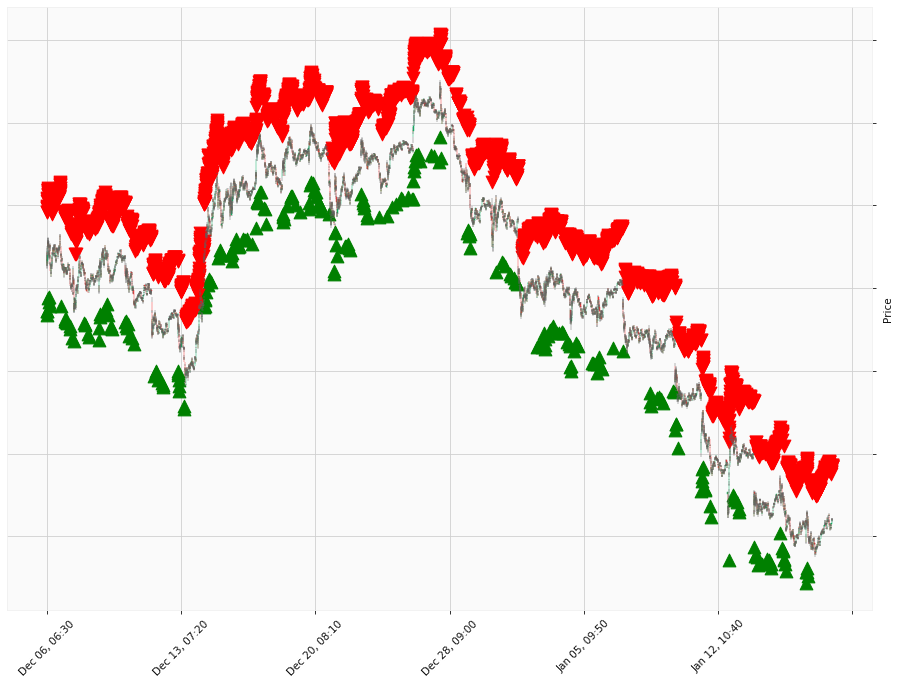

    
# Happy Labz Technologies

<table class="hits">
    <tr>
        <th>Direction</th>
        <th>Date</th>
      </tr>
    <tr>
        <td>Short</td>
        <td>Nov 02 2021 15:00 PST</td>
    </tr>
    <tr>
        <td>Short</td>
        <td>Nov 08 2021 15:00 PST</td>
    </tr>
    <tr>
        <td>Short</td>
        <td>Nov 09 2021 15:00 PST</td>
    </tr>
    <tr>
        <td>Short</td>
        <td>Dec 02 2021 15:00 PST</td>
    </tr>
    <tr>
        <td>Long</td>
        <td>Mar 16 2022 15:00 PST</td>
    </tr>
    <tr>
        <td>Short</td>
        <td>Apr 05 2022 15:00 PST</td>
    </tr>
    <tr>
        <td>Short</td>
        <td>Apr 06 2022 15:00 PST</td>
    </tr>
    <tr>
        <td>Long</td>
        <td>May 26 2022 15:00 PST</td>
    </tr>
    <tr>
        <td>Long</td>
        <td>Jun 22 2022 15:00 PST</td>
    </tr>
    <tr>
        <td>Short</td>
        <td>Aug 05 2022 15:00 PST</td>
    </tr>
    <tr>
        <td>Short</td>
        <td>Aug 08 2022 15:00 PST</td>
    </tr>
    <tr>
        <td>Short</td>
        <td>Sep 22 2022 15:00 PST</td>
    </tr>
    <tr>
        <td>Long</td>
        <td>Dec 30 2022 15:00 PST</td>
    </tr>
    <tr>
        <td>Short</td>
        <td>Feb 16 2023 15:00 PST</td>
    </tr>
    
</table>

