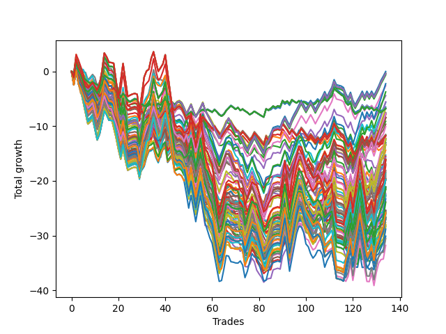

# Long Doug 10190d 
- Symbol: TSLA
- Date Range: 01/10/2024 - 05/17/2024
- Trading Period: 6:31-12:58
- Number of Trades: 134



| Id. | Name | Win Percent | Profit | Avg Profit / Trade | Avg Time / Trade | Std |      | Name | Win Percent | Profit | Avg Profit / Trade | Avg Time / Trade | Std |
| --- | ---- |----------| ------ | ------------------ | ---------------- | --- | ---- | ---- | ----------- | ------ | ------------------ | ---------------- | --- |
| | Sorted By <br> Profit |          | | | | | | Sorted By <br> Win Percentage |||||
|0| TP-0.75 75m | 50.00    | -0.03 | -0.00 | 19:18 | 0.87 |     | TP-0.75 75m | 50.00 | -0.03 | -0.00 | 19:18 | 0.87 |
|1| TP-0.75 180m | 49.25    | -0.38 | -0.00 | 19:42 | 0.87 |     | TP-0.75 60m | 50.00 | -0.40 | -0.00 | 18:43 | 0.86 |
|2| TP-0.75 165m | 49<.25   | -0.38 | -0.00 | 19:42 | 0.87 |     | TP-0.75 180m | 49.25 | -0.38 | -0.00 | 19:42 | 0.87 |
|3| TP-0.75 150m | 49.25    | -0.38 | -0.00 | 19:42 | 0.87 |     | TP-0.75 165m | 49.25 | -0.38 | -0.00 | 19:42 | 0.87 |
|4| TP-0.75 135m | 49.25    | -0.38 | -0.00 | 19:42 | 0.87 |     | TP-0.75 150m | 49.25 | -0.38 | -0.00 | 19:42 | 0.87 |
|5| TP-0.75 120m | 49.25    | -0.38 | -0.00 | 19:42 | 0.87 |     | TP-0.75 135m | 49.25 | -0.38 | -0.00 | 19:42 | 0.87 |
|6| TP-0.75 105m | 49.25    | -0.38 | -0.00 | 19:42 | 0.87 |     | TP-0.75 120m | 49.25 | -0.38 | -0.00 | 19:42 | 0.87 |
|7| TP-0.75 60m | 50.00    | -0.40 | -0.00 | 18:43 | 0.86 |     | TP-0.75 105m | 49.25 | -0.38 | -0.00 | 19:42 | 0.87 |
|8| TP-0.75 90m | 48.51    | -0.67 | -0.00 | 19:38 | 0.87 |     | TP-1.25 60m | 49.25 | -2.26 | -0.02 | 30:43 | 1.17 |
|9| TP-1.25 60m | 49.25    | -2.26 | -0.02 | 30:43 | 1.17 |     | TP-1.25 75m | 49.25 | -3.75 | -0.03 | 33:34 | 1.20 |
|10| TP-0.75 45m | 47.76    | -2.64 | -0.02 | 17:27 | 0.85 |     | TP-0.75 90m | 48.51 | -0.67 | -0.00 | 19:38 | 0.87 |
|11| TP-1.25 75m | 49.25    | -3.75 | -0.03 | 33:34 | 1.20 |     | TP-0.75 45m | 47.76 | -2.64 | -0.02 | 17:27 | 0.85 |
|12| TP-0.75 30m | 46.27    | -4.44 | -0.03 | 14:52 | 0.80 |     | TP-1 60m | 47.76 | -5.68 | -0.04 | 23:55 | 1.04 |
|13| TP-1.25 90m | 46.27    | -5.57 | -0.04 | 35:26 | 1.22 |     | TP-1 75m | 47.76 | -7.94 | -0.06 | 25:08 | 1.05 |
|14| TP-1 60m | 47.76    | -5.68 | -0.04 | 23:55 | 1.04 |     | TP-3 180m | 47.76 | -16.07 | -0.12 | 83:16 | 1.99 |
|15| TP-0.25 15m | 43.28    | -6.53 | -0.05 | 04:48 | 0.53 |     | TP-3 165m | 47.76 | -16.07 | -0.12 | 83:16 | 1.99 |
|16| TP-1.25 45m | 47.01    | -6.74 | -0.05 | 26:27 | 1.12 |     | TP-3 150m | 47.76 | -16.07 | -0.12 | 83:16 | 1.99 |
|17| TP-0.25 180m | 43.28    | -6.82 | -0.05 | 04:54 | 0.53 |     | TP-3 135m | 47.76 | -16.07 | -0.12 | 83:16 | 1.99 |
|18| TP-0.25 165m | 43.28    | -6.82 | -0.05 | 04:54 | 0.53 |     | TP-3 120m | 47.76 | -16.07 | -0.12 | 83:16 | 1.99 |
|19| TP-0.25 150m | 43.28    | -6.82 | -0.05 | 04:54 | 0.53 |     | TP-3 105m | 47.76 | -17.24 | -0.13 | 75:15 | 1.99 |
|20| TP-0.25 135m | 43.28    | -6.82 | -0.05 | 04:54 | 0.53 |     | TP-1.25 45m | 47.01 | -6.74 | -0.05 | 26:27 | 1.12 |
|21| TP-0.25 120m | 43.28    | -6.82 | -0.05 | 04:54 | 0.53 |     | TP-1 180m | 47.01 | -8.42 | -0.06 | 26:02 | 1.07 |
|22| TP-0.25 105m | 43.28    | -6.82 | -0.05 | 04:54 | 0.53 |     | TP-1 165m | 47.01 | -8.42 | -0.06 | 26:02 | 1.07 |
|23| TP-0.25 90m | 43.28    | -6.82 | -0.05 | 04:54 | 0.53 |     | TP-1 150m | 47.01 | -8.42 | -0.06 | 26:02 | 1.07 |
|24| TP-0.25 75m | 43.28    | -6.82 | -0.05 | 04:54 | 0.53 |     | TP-1 135m | 47.01 | -8.42 | -0.06 | 26:02 | 1.07 |
|25| TP-0.25 60m | 43.28    | -6.82 | -0.05 | 04:54 | 0.53 |     | TP-1 120m | 47.01 | -8.42 | -0.06 | 26:02 | 1.07 |
|26| TP-0.25 45m | 43.28    | -6.82 | -0.05 | 04:54 | 0.53 |     | TP-1.75 60m | 47.01 | -12.56 | -0.09 | 39:40 | 1.41 |
|27| TP-0.25 30m | 43.28    | -6.82 | -0.05 | 04:54 | 0.53 |     | TP-2 60m | 47.01 | -16.29 | -0.12 | 42:43 | 1.46 |
|28| TP-1 45m | 46.27    | -7.52 | -0.06 | 21:45 | 1.01 |     | TP-2.75 180m | 47.01 | -21.11 | -0.16 | 81:11 | 1.89 |
|29| TP-1.25 180m | 46.27    | -7.68 | -0.06 | 37:44 | 1.24 |     | TP-2.75 165m | 47.01 | -21.11 | -0.16 | 81:11 | 1.89 |
|30| TP-1.25 165m | 46.27    | -7.68 | -0.06 | 37:44 | 1.24 |     | TP-2.75 150m | 47.01 | -21.11 | -0.16 | 81:11 | 1.89 |
|31| TP-1.25 150m | 46.27    | -7.68 | -0.06 | 37:44 | 1.24 |     | TP-2.75 135m | 47.01 | -21.11 | -0.16 | 81:11 | 1.89 |
|32| TP-1.25 135m | 46.27    | -7.68 | -0.06 | 37:44 | 1.24 |     | TP-2.75 120m | 47.01 | -21.11 | -0.16 | 81:11 | 1.89 |
|33| TP-1.25 120m | 46.27    | -7.68 | -0.06 | 37:44 | 1.24 |     | TP-2.75 105m | 47.01 | -23.89 | -0.18 | 73:27 | 1.89 |
|34| TP-1 90m | 46.27    | -7.84 | -0.06 | 25:40 | 1.06 |     | TP-0.75 30m | 46.27 | -4.44 | -0.03 | 14:52 | 0.80 |
|35| TP-1.25 105m | 46.27    | -7.86 | -0.06 | 36:50 | 1.24 |     | TP-1.25 90m | 46.27 | -5.57 | -0.04 | 35:26 | 1.22 |
|36| TP-1 75m | 47.76    | -7.94 | -0.06 | 25:08 | 1.05 |     | TP-1 45m | 46.27 | -7.52 | -0.06 | 21:45 | 1.01 |
|37| TP-1 180m | 47.01    | -8.42 | -0.06 | 26:02 | 1.07 |     | TP-1.25 180m | 46.27 | -7.68 | -0.06 | 37:44 | 1.24 |
|38| TP-1 165m | 47.01    | -8.42 | -0.06 | 26:02 | 1.07 |     | TP-1.25 165m | 46.27 | -7.68 | -0.06 | 37:44 | 1.24 |
|39| TP-1 150m | 47.01    | -8.42 | -0.06 | 26:02 | 1.07 |     | TP-1.25 150m | 46.27 | -7.68 | -0.06 | 37:44 | 1.24 |
|40| TP-1 135m | 47.01    | -8.42 | -0.06 | 26:02 | 1.07 |     | TP-1.25 135m | 46.27 | -7.68 | -0.06 | 37:44 | 1.24 |
|41| TP-1 120m | 47.01    | -8.42 | -0.06 | 26:02 | 1.07 |     | TP-1.25 120m | 46.27 | -7.68 | -0.06 | 37:44 | 1.24 |
|42| TP-1 105m | 46.27    | -8.53 | -0.06 | 25:55 | 1.07 |     | TP-1 90m | 46.27 | -7.84 | -0.06 | 25:40 | 1.06 |
|43| TP-0.75 15m | 45.52    | -9.13 | -0.07 | 09:38 | 0.72 |     | TP-1.25 105m | 46.27 | -7.86 | -0.06 | 36:50 | 1.24 |
|44| TP-1 30m | 44.78    | -9.65 | -0.07 | 17:20 | 0.91 |     | TP-1 105m | 46.27 | -8.53 | -0.06 | 25:55 | 1.07 |
|45| TP-1.25 30m | 45.52    | -10.10 | -0.08 | 19:59 | 1.02 |     | TP-1 15m | 46.27 | -12.40 | -0.09 | 10:30 | 0.82 |
|46| TP-0.5 45m | 41.79    | -11.54 | -0.09 | 10:09 | 0.68 |     | TP-1.5 60m | 46.27 | -14.40 | -0.11 | 35:03 | 1.31 |
|47| TP-0.5 60m | 42.54    | -11.63 | -0.09 | 10:22 | 0.68 |     | TP-1.5 75m | 46.27 | -15.51 | -0.12 | 38:59 | 1.36 |
|48| TP-0.5 180m | 42.54    | -11.77 | -0.09 | 10:22 | 0.68 |     | TP-1.75 75m | 46.27 | -15.73 | -0.12 | 45:00 | 1.48 |
|49| TP-0.5 165m | 42.54    | -11.77 | -0.09 | 10:22 | 0.68 |     | TP-1.25 15m | 46.27 | -16.77 | -0.13 | 11:28 | 0.87 |
|50| TP-0.5 150m | 42.54    | -11.77 | -0.09 | 10:22 | 0.68 |     | TP-2 105m | 46.27 | -18.54 | -0.14 | 61:19 | 1.64 |
|51| TP-0.5 135m | 42.54    | -11.77 | -0.09 | 10:22 | 0.68 |     | TP-2 75m | 46.27 | -18.92 | -0.14 | 49:43 | 1.53 |
|52| TP-0.5 120m | 42.54    | -11.77 | -0.09 | 10:22 | 0.68 |     | TP-2 180m | 46.27 | -19.76 | -0.15 | 66:11 | 1.65 |
|53| TP-0.5 105m | 42.54    | -11.77 | -0.09 | 10:22 | 0.68 |     | TP-2 165m | 46.27 | -19.76 | -0.15 | 66:11 | 1.65 |
|54| TP-0.5 90m | 42.54    | -11.77 | -0.09 | 10:22 | 0.68 |     | TP-2 150m | 46.27 | -19.76 | -0.15 | 66:11 | 1.65 |
|55| TP-0.5 75m | 42.54    | -11.77 | -0.09 | 10:22 | 0.68 |     | TP-2 135m | 46.27 | -19.76 | -0.15 | 66:11 | 1.65 |
|56| TP-1.75 90m | 44.78    | -11.80 | -0.09 | 49:17 | 1.53 |     | TP-2 120m | 46.27 | -19.76 | -0.15 | 66:11 | 1.65 |
|57| TP-0.5 30m | 41.04    | -12.19 | -0.09 | 09:30 | 0.67 |     | TP-3 75m | 46.27 | -22.59 | -0.17 | 58:17 | 1.83 |
|58| TP-1.75 105m | 45.52    | -12.28 | -0.09 | 52:49 | 1.58 |     | TP-2.5 180m | 46.27 | -25.85 | -0.19 | 75:31 | 1.85 |
|59| TP-1 15m | 46.27    | -12.40 | -0.09 | 10:30 | 0.82 |     | TP-2.5 165m | 46.27 | -25.85 | -0.19 | 75:31 | 1.85 |
|60| TP-1.75 60m | 47.01    | -12.56 | -0.09 | 39:40 | 1.41 |     | TP-2.5 150m | 46.27 | -25.85 | -0.19 | 75:31 | 1.85 |
|61| TP-1.75 45m | 45.52    | -13.02 | -0.10 | 32:29 | 1.30 |     | TP-2.5 135m | 46.27 | -25.85 | -0.19 | 75:31 | 1.85 |
|62| TP-0.5 15m | 40.30    | -13.03 | -0.10 | 07:34 | 0.63 |     | TP-2.5 120m | 46.27 | -25.85 | -0.19 | 75:31 | 1.85 |
|63| TP-1.75 180m | 45.52    | -13.37 | -0.10 | 55:47 | 1.59 |     | TP-2.5 105m | 46.27 | -26.95 | -0.20 | 68:56 | 1.85 |
|64| TP-1.75 165m | 45.52    | -13.37 | -0.10 | 55:47 | 1.59 |     | TP-0.75 15m | 45.52 | -9.13 | -0.07 | 09:38 | 0.72 |
|65| TP-1.75 150m | 45.52    | -13.37 | -0.10 | 55:47 | 1.59 |     | TP-1.25 30m | 45.52 | -10.10 | -0.08 | 19:59 | 1.02 |
|66| TP-1.75 135m | 45.52    | -13.37 | -0.10 | 55:47 | 1.59 |     | TP-1.75 105m | 45.52 | -12.28 | -0.09 | 52:49 | 1.58 |
|67| TP-1.75 120m | 45.52    | -13.37 | -0.10 | 55:47 | 1.59 |     | TP-1.75 45m | 45.52 | -13.02 | -0.10 | 32:29 | 1.30 |
|68| TP-1.5 60m | 46.27    | -14.40 | -0.11 | 35:03 | 1.31 |     | TP-1.75 180m | 45.52 | -13.37 | -0.10 | 55:47 | 1.59 |
|69| TP-1.5 45m | 44.78    | -15.27 | -0.11 | 29:31 | 1.22 |     | TP-1.75 165m | 45.52 | -13.37 | -0.10 | 55:47 | 1.59 |
|70| TP-1.5 75m | 46.27    | -15.51 | -0.12 | 38:59 | 1.36 |     | TP-1.75 150m | 45.52 | -13.37 | -0.10 | 55:47 | 1.59 |
|71| TP-1.75 75m | 46.27    | -15.73 | -0.12 | 45:00 | 1.48 |     | TP-1.75 135m | 45.52 | -13.37 | -0.10 | 55:47 | 1.59 |
|72| TP-3 180m | 47.76    | -16.07 | -0.12 | 83:16 | 1.99 |     | TP-1.75 120m | 45.52 | -13.37 | -0.10 | 55:47 | 1.59 |
|73| TP-3 165m | 47.76    | -16.07 | -0.12 | 83:16 | 1.99 |     | TP-3 60m | 45.52 | -18.24 | -0.14 | 48:42 | 1.73 |
|74| TP-3 150m | 47.76    | -16.07 | -0.12 | 83:16 | 1.99 |     | TP-3 90m | 45.52 | -18.53 | -0.14 | 67:03 | 1.94 |
|75| TP-3 135m | 47.76    | -16.07 | -0.12 | 83:16 | 1.99 |     | TP-2.75 60m | 45.52 | -22.84 | -0.17 | 47:52 | 1.67 |
|76| TP-3 120m | 47.76    | -16.07 | -0.12 | 83:16 | 1.99 |     | TP-2.5 60m | 45.52 | -25.37 | -0.19 | 46:07 | 1.64 |
|77| TP-2 90m | 44.78    | -16.19 | -0.12 | 55:52 | 1.58 |     | TP-2.25 60m | 45.52 | -25.40 | -0.19 | 44:50 | 1.56 |
|78| TP-2 60m | 47.01    | -16.29 | -0.12 | 42:43 | 1.46 |     | TP-2.75 75m | 45.52 | -25.74 | -0.19 | 57:04 | 1.74 |
|79| TP-1.25 15m | 46.27    | -16.77 | -0.13 | 11:28 | 0.87 |     | TP-2.25 180m | 45.52 | -26.72 | -0.20 | 72:24 | 1.74 |
|80| TP-2 45m | 44.78    | -16.90 | -0.13 | 34:03 | 1.35 |     | TP-2.25 165m | 45.52 | -26.72 | -0.20 | 72:24 | 1.74 |
|81| TP-1.5 90m | 44.03    | -17.06 | -0.13 | 41:50 | 1.39 |     | TP-2.25 150m | 45.52 | -26.72 | -0.20 | 72:24 | 1.74 |
|82| TP-3 105m | 47.76    | -17.24 | -0.13 | 75:15 | 1.99 |     | TP-2.25 135m | 45.52 | -26.72 | -0.20 | 72:24 | 1.74 |
|83| TP-1.5 30m | 44.03    | -18.08 | -0.13 | 22:00 | 1.09 |     | TP-2.25 120m | 45.52 | -26.72 | -0.20 | 72:24 | 1.74 |
|84| TP-3 60m | 45.52    | -18.24 | -0.14 | 48:42 | 1.73 |     | TP-2.25 105m | 45.52 | -28.81 | -0.21 | 66:16 | 1.74 |
|85| TP-3 90m | 45.52    | -18.53 | -0.14 | 67:03 | 1.94 |     | TP-2.5 75m | 45.52 | -30.52 | -0.23 | 54:28 | 1.73 |
|86| TP-2 105m | 46.27    | -18.54 | -0.14 | 61:19 | 1.64 |     | TP-2.25 75m | 45.52 | -31.77 | -0.24 | 52:46 | 1.63 |
|87| TP-2 75m | 46.27    | -18.92 | -0.14 | 49:43 | 1.53 |     | TP-1 30m | 44.78 | -9.65 | -0.07 | 17:20 | 0.91 |
|88| TP-1.5 105m | 44.03    | -19.19 | -0.14 | 44:06 | 1.42 |     | TP-1.75 90m | 44.78 | -11.80 | -0.09 | 49:17 | 1.53 |
|89| TP-3 45m | 44.03    | -19.45 | -0.15 | 38:05 | 1.59 |     | TP-1.5 45m | 44.78 | -15.27 | -0.11 | 29:31 | 1.22 |
|90| TP-1.5 180m | 44.03    | -19.68 | -0.15 | 45:55 | 1.42 |     | TP-2 90m | 44.78 | -16.19 | -0.12 | 55:52 | 1.58 |
|91| TP-1.5 165m | 44.03    | -19.68 | -0.15 | 45:55 | 1.42 |     | TP-2 45m | 44.78 | -16.90 | -0.13 | 34:03 | 1.35 |
|92| TP-1.5 150m | 44.03    | -19.68 | -0.15 | 45:55 | 1.42 |     | TP-2.75 90m | 44.78 | -23.29 | -0.17 | 65:31 | 1.83 |
|93| TP-1.5 135m | 44.03    | -19.68 | -0.15 | 45:55 | 1.42 |     | TP-1.5 90m | 44.03 | -17.06 | -0.13 | 41:50 | 1.39 |
|94| TP-1.5 120m | 44.03    | -19.68 | -0.15 | 45:55 | 1.42 |     | TP-1.5 30m | 44.03 | -18.08 | -0.13 | 22:00 | 1.09 |
|95| TP-2 180m | 46.27    | -19.76 | -0.15 | 66:11 | 1.65 |     | TP-1.5 105m | 44.03 | -19.19 | -0.14 | 44:06 | 1.42 |
|96| TP-2 165m | 46.27    | -19.76 | -0.15 | 66:11 | 1.65 |     | TP-3 45m | 44.03 | -19.45 | -0.15 | 38:05 | 1.59 |
|97| TP-2 150m | 46.27    | -19.76 | -0.15 | 66:11 | 1.65 |     | TP-1.5 180m | 44.03 | -19.68 | -0.15 | 45:55 | 1.42 |
|98| TP-2 135m | 46.27    | -19.76 | -0.15 | 66:11 | 1.65 |     | TP-1.5 165m | 44.03 | -19.68 | -0.15 | 45:55 | 1.42 |
|99| TP-2 120m | 46.27    | -19.76 | -0.15 | 66:11 | 1.65 |     | TP-1.5 150m | 44.03 | -19.68 | -0.15 | 45:55 | 1.42 |
|100| TP-2.75 180m | 47.01    | -21.11 | -0.16 | 81:11 | 1.89 |     | TP-1.5 135m | 44.03 | -19.68 | -0.15 | 45:55 | 1.42 |
|101| TP-2.75 165m | 47.01    | -21.11 | -0.16 | 81:11 | 1.89 |     | TP-1.5 120m | 44.03 | -19.68 | -0.15 | 45:55 | 1.42 |
|102| TP-2.75 150m | 47.01    | -21.11 | -0.16 | 81:11 | 1.89 |     | TP-1.5 15m | 44.03 | -21.51 | -0.16 | 12:01 | 0.90 |
|103| TP-2.75 135m | 47.01    | -21.11 | -0.16 | 81:11 | 1.89 |     | TP-2.25 45m | 44.03 | -21.53 | -0.16 | 35:34 | 1.42 |
|104| TP-2.75 120m | 47.01    | -21.11 | -0.16 | 81:11 | 1.89 |     | TP-2.75 45m | 44.03 | -22.33 | -0.17 | 37:35 | 1.54 |
|105| TP-1.5 15m | 44.03    | -21.51 | -0.16 | 12:01 | 0.90 |     | TP-2.5 45m | 44.03 | -22.68 | -0.17 | 36:36 | 1.50 |
|106| TP-2.25 45m | 44.03    | -21.53 | -0.16 | 35:34 | 1.42 |     | TP-1.75 15m | 44.03 | -23.84 | -0.18 | 12:28 | 0.95 |
|107| TP-1.75 30m | 43.28    | -21.53 | -0.16 | 23:25 | 1.13 |     | TP-2 15m | 44.03 | -25.81 | -0.19 | 12:42 | 1.01 |
|108| TP-2.75 45m | 44.03    | -22.33 | -0.17 | 37:35 | 1.54 |     | TP-2.5 90m | 44.03 | -26.56 | -0.20 | 61:54 | 1.80 |
|109| TP-3 75m | 46.27    | -22.59 | -0.17 | 58:17 | 1.83 |     | TP-2.25 90m | 44.03 | -28.02 | -0.21 | 59:46 | 1.70 |
|110| TP-2.5 45m | 44.03    | -22.68 | -0.17 | 36:36 | 1.50 |     | TP-0.25 15m | 43.28 | -6.53 | -0.05 | 04:48 | 0.53 |
|111| TP-2.75 60m | 45.52    | -22.84 | -0.17 | 47:52 | 1.67 |     | TP-0.25 180m | 43.28 | -6.82 | -0.05 | 04:54 | 0.53 |
|112| TP-2.75 90m | 44.78    | -23.29 | -0.17 | 65:31 | 1.83 |     | TP-0.25 165m | 43.28 | -6.82 | -0.05 | 04:54 | 0.53 |
|113| TP-1.75 15m | 44.03    | -23.84 | -0.18 | 12:28 | 0.95 |     | TP-0.25 150m | 43.28 | -6.82 | -0.05 | 04:54 | 0.53 |
|114| TP-2.75 105m | 47.01    | -23.89 | -0.18 | 73:27 | 1.89 |     | TP-0.25 135m | 43.28 | -6.82 | -0.05 | 04:54 | 0.53 |
|115| TP-2.5 60m | 45.52    | -25.37 | -0.19 | 46:07 | 1.64 |     | TP-0.25 120m | 43.28 | -6.82 | -0.05 | 04:54 | 0.53 |
|116| TP-2.25 60m | 45.52    | -25.40 | -0.19 | 44:50 | 1.56 |     | TP-0.25 105m | 43.28 | -6.82 | -0.05 | 04:54 | 0.53 |
|117| TP-2 30m | 43.28    | -25.46 | -0.19 | 24:04 | 1.19 |     | TP-0.25 90m | 43.28 | -6.82 | -0.05 | 04:54 | 0.53 |
|118| TP-3 30m | 42.54    | -25.60 | -0.19 | 26:05 | 1.30 |     | TP-0.25 75m | 43.28 | -6.82 | -0.05 | 04:54 | 0.53 |
|119| TP-2.75 75m | 45.52    | -25.74 | -0.19 | 57:04 | 1.74 |     | TP-0.25 60m | 43.28 | -6.82 | -0.05 | 04:54 | 0.53 |
|120| TP-2 15m | 44.03    | -25.81 | -0.19 | 12:42 | 1.01 |     | TP-0.25 45m | 43.28 | -6.82 | -0.05 | 04:54 | 0.53 |
|121| TP-2.5 180m | 46.27    | -25.85 | -0.19 | 75:31 | 1.85 |     | TP-0.25 30m | 43.28 | -6.82 | -0.05 | 04:54 | 0.53 |
|122| TP-2.5 165m | 46.27    | -25.85 | -0.19 | 75:31 | 1.85 |     | TP-1.75 30m | 43.28 | -21.53 | -0.16 | 23:25 | 1.13 |
|123| TP-2.5 150m | 46.27    | -25.85 | -0.19 | 75:31 | 1.85 |     | TP-2 30m | 43.28 | -25.46 | -0.19 | 24:04 | 1.19 |
|124| TP-2.5 135m | 46.27    | -25.85 | -0.19 | 75:31 | 1.85 |     | TP-2.5 15m | 43.28 | -26.26 | -0.20 | 13:04 | 1.03 |
|125| TP-2.5 120m | 46.27    | -25.85 | -0.19 | 75:31 | 1.85 |     | TP-3 15m | 43.28 | -26.57 | -0.20 | 13:08 | 1.08 |
|126| TP-2.5 15m | 43.28    | -26.26 | -0.20 | 13:04 | 1.03 |     | TP-2.75 15m | 43.28 | -27.11 | -0.20 | 13:06 | 1.06 |
|127| TP-2.5 90m | 44.03    | -26.56 | -0.20 | 61:54 | 1.80 |     | TP-2.25 15m | 43.28 | -27.64 | -0.21 | 12:58 | 1.00 |
|128| TP-3 15m | 43.28    | -26.57 | -0.20 | 13:08 | 1.08 |     | TP-0.5 60m | 42.54 | -11.63 | -0.09 | 10:22 | 0.68 |
|129| TP-2.25 180m | 45.52    | -26.72 | -0.20 | 72:24 | 1.74 |     | TP-0.5 180m | 42.54 | -11.77 | -0.09 | 10:22 | 0.68 |
|130| TP-2.25 165m | 45.52    | -26.72 | -0.20 | 72:24 | 1.74 |     | TP-0.5 165m | 42.54 | -11.77 | -0.09 | 10:22 | 0.68 |
|131| TP-2.25 150m | 45.52    | -26.72 | -0.20 | 72:24 | 1.74 |     | TP-0.5 150m | 42.54 | -11.77 | -0.09 | 10:22 | 0.68 |
|132| TP-2.25 135m | 45.52    | -26.72 | -0.20 | 72:24 | 1.74 |     | TP-0.5 135m | 42.54 | -11.77 | -0.09 | 10:22 | 0.68 |
|133| TP-2.25 120m | 45.52    | -26.72 | -0.20 | 72:24 | 1.74 |     | TP-0.5 120m | 42.54 | -11.77 | -0.09 | 10:22 | 0.68 |
|134| TP-2.5 105m | 46.27    | -26.95 | -0.20 | 68:56 | 1.85 |     | TP-0.5 105m | 42.54 | -11.77 | -0.09 | 10:22 | 0.68 |
|135| TP-2.75 15m | 43.28    | -27.11 | -0.20 | 13:06 | 1.06 |     | TP-0.5 90m | 42.54 | -11.77 | -0.09 | 10:22 | 0.68 |
|136| TP-2.25 15m | 43.28    | -27.64 | -0.21 | 12:58 | 1.00 |     | TP-0.5 75m | 42.54 | -11.77 | -0.09 | 10:22 | 0.68 |
|137| TP-2.25 90m | 44.03    | -28.02 | -0.21 | 59:46 | 1.70 |     | TP-3 30m | 42.54 | -25.60 | -0.19 | 26:05 | 1.30 |
|138| TP-2.5 30m | 42.54    | -28.05 | -0.21 | 25:40 | 1.26 |     | TP-2.5 30m | 42.54 | -28.05 | -0.21 | 25:40 | 1.26 |
|139| TP-2.75 30m | 42.54    | -28.32 | -0.21 | 25:58 | 1.27 |     | TP-2.75 30m | 42.54 | -28.32 | -0.21 | 25:58 | 1.27 |
|140| TP-2.25 105m | 45.52    | -28.81 | -0.21 | 66:16 | 1.74 |     | TP-2.25 30m | 42.54 | -30.09 | -0.22 | 25:04 | 1.24 |
|141| TP-2.25 30m | 42.54    | -30.09 | -0.22 | 25:04 | 1.24 |     | TP-0.5 45m | 41.79 | -11.54 | -0.09 | 10:09 | 0.68 |
|142| TP-2.5 75m | 45.52    | -30.52 | -0.23 | 54:28 | 1.73 |     | TP-0.5 30m | 41.04 | -12.19 | -0.09 | 09:30 | 0.67 |
|143| TP-2.25 75m | 45.52    | -31.77 | -0.24 | 52:46 | 1.63 |     | TP-0.5 15m | 40.30 | -13.03 | -0.10 | 07:34 | 0.63 |

### Test TP-0.25 15m
* Take Profit of 0.25 Point
* 0.25 Stoploss
* Results:
```
Total Trades: 134
Percent Up: 43.28
Percent Down: 56.72
Total Points Moved Up: -6.53
Potential Profit: -3265.00
Total Points Ups: 26.03 Count Ups: 58
Total Points Downs: -32.56 Count Downs: 76
```

<details><summary>Trades</summary>

<code>In: 2024-01-12 08:45:00		Out: 2024-01-12 08:48:00		Total Position Time: 03:00		Total Move Up: -0.28		Total to Date: -0.28</code> <br />
<code>In: 2024-01-16 06:50:00		Out: 2024-01-16 06:52:00		Total Position Time: 02:00		Total Move Up: 0.72		Total to Date: 0.44</code> <br />
<code>In: 2024-01-17 07:05:00		Out: 2024-01-17 07:08:00		Total Position Time: 03:00		Total Move Up: -0.66		Total to Date: -0.22</code> <br />
<code>In: 2024-01-17 08:05:00		Out: 2024-01-17 08:09:00		Total Position Time: 04:00		Total Move Up: -0.58		Total to Date: -0.80</code> <br />
<code>In: 2024-01-17 08:45:00		Out: 2024-01-17 08:50:00		Total Position Time: 05:00		Total Move Up: -0.24		Total to Date: -1.04</code> <br />
<code>In: 2024-01-17 09:00:00		Out: 2024-01-17 09:04:00		Total Position Time: 04:00		Total Move Up: -0.48		Total to Date: -1.52</code> <br />
<code>In: 2024-01-17 09:30:00		Out: 2024-01-17 09:33:00		Total Position Time: 03:00		Total Move Up: -0.36		Total to Date: -1.88</code> <br />
<code>In: 2024-01-17 11:45:00		Out: 2024-01-17 11:47:00		Total Position Time: 02:00		Total Move Up: -0.31		Total to Date: -2.19</code> <br />
<code>In: 2024-01-17 11:55:00		Out: 2024-01-17 11:57:00		Total Position Time: 02:00		Total Move Up: 0.26		Total to Date: -1.93</code> <br />
<code>In: 2024-01-19 07:30:00		Out: 2024-01-19 07:32:00		Total Position Time: 02:00		Total Move Up: -0.29		Total to Date: -2.22</code> <br />
<code>In: 2024-01-19 07:40:00		Out: 2024-01-19 07:44:00		Total Position Time: 04:00		Total Move Up: -0.23		Total to Date: -2.45</code> <br />
<code>In: 2024-01-19 09:40:00		Out: 2024-01-19 09:42:00		Total Position Time: 02:00		Total Move Up: -0.28		Total to Date: -2.73</code> <br />
<code>In: 2024-01-19 10:10:00		Out: 2024-01-19 10:22:00		Total Position Time: 12:00		Total Move Up: 0.28		Total to Date: -2.45</code> <br />
<code>In: 2024-01-22 06:50:00		Out: 2024-01-22 06:52:00		Total Position Time: 02:00		Total Move Up: 1.74		Total to Date: -0.71</code> <br />
<code>In: 2024-01-23 09:55:00		Out: 2024-01-23 10:06:00		Total Position Time: 11:00		Total Move Up: -0.36		Total to Date: -1.07</code> <br />
<code>In: 2024-01-23 12:10:00		Out: 2024-01-23 12:24:00		Total Position Time: 14:00		Total Move Up: -0.17		Total to Date: -1.24</code> <br />
<code>In: 2024-01-23 12:55:00		Out: 2024-01-23 12:56:00		Total Position Time: 01:00		Total Move Up: -0.05		Total to Date: -1.29</code> <br />
<code>In: 2024-01-24 07:50:00		Out: 2024-01-24 07:53:00		Total Position Time: 03:00		Total Move Up: -0.33		Total to Date: -1.62</code> <br />
<code>In: 2024-01-24 09:50:00		Out: 2024-01-24 09:52:00		Total Position Time: 02:00		Total Move Up: -0.47		Total to Date: -2.09</code> <br />
<code>In: 2024-01-26 06:40:00		Out: 2024-01-26 06:42:00		Total Position Time: 02:00		Total Move Up: -1.41		Total to Date: -3.50</code> <br />
<code>In: 2024-01-29 06:40:00		Out: 2024-01-29 06:42:00		Total Position Time: 02:00		Total Move Up: -1.19		Total to Date: -4.69</code> <br />
<code>In: 2024-01-29 07:40:00		Out: 2024-01-29 07:42:00		Total Position Time: 02:00		Total Move Up: 0.74		Total to Date: -3.95</code> <br />
<code>In: 2024-01-30 07:40:00		Out: 2024-01-30 07:43:00		Total Position Time: 03:00		Total Move Up: -0.51		Total to Date: -4.46</code> <br />
<code>In: 2024-02-01 07:10:00		Out: 2024-02-01 07:14:00		Total Position Time: 04:00		Total Move Up: -0.77		Total to Date: -5.23</code> <br />
<code>In: 2024-02-01 11:50:00		Out: 2024-02-01 11:57:00		Total Position Time: 07:00		Total Move Up: -0.23		Total to Date: -5.46</code> <br />
<code>In: 2024-02-01 12:00:00		Out: 2024-02-01 12:05:00		Total Position Time: 05:00		Total Move Up: 0.27		Total to Date: -5.19</code> <br />
<code>In: 2024-02-01 12:40:00		Out: 2024-02-01 12:46:00		Total Position Time: 06:00		Total Move Up: 0.25		Total to Date: -4.94</code> <br />
<code>In: 2024-02-02 06:30:00		Out: 2024-02-02 06:31:00		Total Position Time: 01:00		Total Move Up: -0.14		Total to Date: -5.08</code> <br />
<code>In: 2024-02-02 06:50:00		Out: 2024-02-02 06:52:00		Total Position Time: 02:00		Total Move Up: -1.05		Total to Date: -6.13</code> <br />
<code>In: 2024-02-02 10:10:00		Out: 2024-02-02 10:17:00		Total Position Time: 07:00		Total Move Up: 0.26		Total to Date: -5.87</code> <br />
<code>In: 2024-02-02 10:20:00		Out: 2024-02-02 10:23:00		Total Position Time: 03:00		Total Move Up: -0.37		Total to Date: -6.24</code> <br />
<code>In: 2024-02-07 10:00:00		Out: 2024-02-07 10:02:00		Total Position Time: 02:00		Total Move Up: 0.22		Total to Date: -6.02</code> <br />
<code>In: 2024-02-07 10:10:00		Out: 2024-02-07 10:12:00		Total Position Time: 02:00		Total Move Up: 0.34		Total to Date: -5.68</code> <br />
<code>In: 2024-02-08 07:20:00		Out: 2024-02-08 07:23:00		Total Position Time: 03:00		Total Move Up: -0.47		Total to Date: -6.15</code> <br />
<code>In: 2024-02-08 07:35:00		Out: 2024-02-08 07:40:00		Total Position Time: 05:00		Total Move Up: 0.27		Total to Date: -5.88</code> <br />
<code>In: 2024-02-12 10:15:00		Out: 2024-02-12 10:22:00		Total Position Time: 07:00		Total Move Up: -0.27		Total to Date: -6.15</code> <br />
<code>In: 2024-02-13 07:30:00		Out: 2024-02-13 07:39:00		Total Position Time: 09:00		Total Move Up: 0.36		Total to Date: -5.79</code> <br />
<code>In: 2024-02-14 06:55:00		Out: 2024-02-14 06:58:00		Total Position Time: 03:00		Total Move Up: -0.27		Total to Date: -6.06</code> <br />
<code>In: 2024-02-14 07:10:00		Out: 2024-02-14 07:12:00		Total Position Time: 02:00		Total Move Up: 0.65		Total to Date: -5.41</code> <br />
<code>In: 2024-02-14 08:15:00		Out: 2024-02-14 08:22:00		Total Position Time: 07:00		Total Move Up: 0.33		Total to Date: -5.08</code> <br />
<code>In: 2024-02-16 06:45:00		Out: 2024-02-16 06:47:00		Total Position Time: 02:00		Total Move Up: -0.58		Total to Date: -5.66</code> <br />
<code>In: 2024-02-16 08:20:00		Out: 2024-02-16 08:26:00		Total Position Time: 06:00		Total Move Up: -0.38		Total to Date: -6.04</code> <br />
<code>In: 2024-02-16 08:35:00		Out: 2024-02-16 08:39:00		Total Position Time: 04:00		Total Move Up: 0.38		Total to Date: -5.66</code> <br />
<code>In: 2024-02-16 09:50:00		Out: 2024-02-16 09:53:00		Total Position Time: 03:00		Total Move Up: -0.31		Total to Date: -5.97</code> <br />
<code>In: 2024-02-16 11:10:00		Out: 2024-02-16 11:12:00		Total Position Time: 02:00		Total Move Up: 0.36		Total to Date: -5.61</code> <br />
<code>In: 2024-02-16 12:50:00		Out: 2024-02-16 12:51:00		Total Position Time: 01:00		Total Move Up: 0.17		Total to Date: -5.44</code> <br />
<code>In: 2024-02-21 12:40:00		Out: 2024-02-21 12:46:00		Total Position Time: 06:00		Total Move Up: -0.43		Total to Date: -5.87</code> <br />
<code>In: 2024-02-22 06:30:00		Out: 2024-02-22 06:31:00		Total Position Time: 01:00		Total Move Up: -0.90		Total to Date: -6.77</code> <br />
<code>In: 2024-02-22 06:50:00		Out: 2024-02-22 06:53:00		Total Position Time: 03:00		Total Move Up: -1.10		Total to Date: -7.87</code> <br />
<code>In: 2024-02-22 07:05:00		Out: 2024-02-22 07:08:00		Total Position Time: 03:00		Total Move Up: 0.25		Total to Date: -7.62</code> <br />
<code>In: 2024-02-22 08:35:00		Out: 2024-02-22 08:45:00		Total Position Time: 10:00		Total Move Up: 0.34		Total to Date: -7.28</code> <br />
<code>In: 2024-02-27 06:50:00		Out: 2024-02-27 06:52:00		Total Position Time: 02:00		Total Move Up: -0.49		Total to Date: -7.77</code> <br />
<code>In: 2024-02-28 06:40:00		Out: 2024-02-28 06:42:00		Total Position Time: 02:00		Total Move Up: -0.29		Total to Date: -8.06</code> <br />
<code>In: 2024-02-28 07:10:00		Out: 2024-02-28 07:12:00		Total Position Time: 02:00		Total Move Up: 0.55		Total to Date: -7.51</code> <br />
<code>In: 2024-03-01 08:25:00		Out: 2024-03-01 08:32:00		Total Position Time: 07:00		Total Move Up: 0.37		Total to Date: -7.14</code> <br />
<code>In: 2024-03-05 06:45:00		Out: 2024-03-05 06:47:00		Total Position Time: 02:00		Total Move Up: 0.24		Total to Date: -6.90</code> <br />
<code>In: 2024-03-06 10:30:00		Out: 2024-03-06 10:32:00		Total Position Time: 02:00		Total Move Up: -0.23		Total to Date: -7.13</code> <br />
<code>In: 2024-03-12 08:25:00		Out: 2024-03-12 08:28:00		Total Position Time: 03:00		Total Move Up: 0.25		Total to Date: -6.88</code> <br />
<code>In: 2024-03-12 11:35:00		Out: 2024-03-12 11:38:00		Total Position Time: 03:00		Total Move Up: -0.24		Total to Date: -7.12</code> <br />
<code>In: 2024-03-12 12:25:00		Out: 2024-03-12 12:34:00		Total Position Time: 09:00		Total Move Up: -0.24		Total to Date: -7.36</code> <br />
<code>In: 2024-03-13 06:50:00		Out: 2024-03-13 06:52:00		Total Position Time: 02:00		Total Move Up: 0.46		Total to Date: -6.90</code> <br />
<code>In: 2024-03-14 07:10:00		Out: 2024-03-14 07:12:00		Total Position Time: 02:00		Total Move Up: -0.41		Total to Date: -7.31</code> <br />
<code>In: 2024-03-14 07:35:00		Out: 2024-03-14 07:41:00		Total Position Time: 06:00		Total Move Up: -0.49		Total to Date: -7.80</code> <br />
<code>In: 2024-03-15 07:05:00		Out: 2024-03-15 07:07:00		Total Position Time: 02:00		Total Move Up: -0.28		Total to Date: -8.08</code> <br />
<code>In: 2024-03-15 10:10:00		Out: 2024-03-15 10:21:00		Total Position Time: 11:00		Total Move Up: 0.34		Total to Date: -7.74</code> <br />
<code>In: 2024-03-18 07:25:00		Out: 2024-03-18 07:29:00		Total Position Time: 04:00		Total Move Up: 0.67		Total to Date: -7.07</code> <br />
<code>In: 2024-03-19 08:30:00		Out: 2024-03-19 08:37:00		Total Position Time: 07:00		Total Move Up: 0.44		Total to Date: -6.63</code> <br />
<code>In: 2024-03-19 09:30:00		Out: 2024-03-19 09:43:00		Total Position Time: 13:00		Total Move Up: 0.44		Total to Date: -6.19</code> <br />
<code>In: 2024-03-19 10:20:00		Out: 2024-03-19 10:23:00		Total Position Time: 03:00		Total Move Up: -0.30		Total to Date: -6.49</code> <br />
<code>In: 2024-03-19 10:40:00		Out: 2024-03-19 10:54:00		Total Position Time: 14:00		Total Move Up: -0.34		Total to Date: -6.83</code> <br />
<code>In: 2024-03-19 11:35:00		Out: 2024-03-19 11:49:00		Total Position Time: 14:00		Total Move Up: 0.19		Total to Date: -6.64</code> <br />
<code>In: 2024-03-20 06:55:00		Out: 2024-03-20 06:59:00		Total Position Time: 04:00		Total Move Up: -0.53		Total to Date: -7.17</code> <br />
<code>In: 2024-03-20 07:55:00		Out: 2024-03-20 08:06:00		Total Position Time: 11:00		Total Move Up: 0.25		Total to Date: -6.92</code> <br />
<code>In: 2024-03-21 06:40:00		Out: 2024-03-21 06:44:00		Total Position Time: 04:00		Total Move Up: -0.34		Total to Date: -7.26</code> <br />
<code>In: 2024-03-25 07:25:00		Out: 2024-03-25 07:29:00		Total Position Time: 04:00		Total Move Up: -0.27		Total to Date: -7.53</code> <br />
<code>In: 2024-03-25 08:05:00		Out: 2024-03-25 08:14:00		Total Position Time: 09:00		Total Move Up: -0.40		Total to Date: -7.93</code> <br />
<code>In: 2024-03-25 08:25:00		Out: 2024-03-25 08:34:00		Total Position Time: 09:00		Total Move Up: 0.25		Total to Date: -7.68</code> <br />
<code>In: 2024-03-27 09:35:00		Out: 2024-03-27 09:43:00		Total Position Time: 08:00		Total Move Up: 0.35		Total to Date: -7.33</code> <br />
<code>In: 2024-03-28 07:55:00		Out: 2024-03-28 07:59:00		Total Position Time: 04:00		Total Move Up: -0.27		Total to Date: -7.60</code> <br />
<code>In: 2024-03-28 09:45:00		Out: 2024-03-28 09:59:00		Total Position Time: 14:00		Total Move Up: -0.28		Total to Date: -7.88</code> <br />
<code>In: 2024-03-28 09:55:00		Out: 2024-03-28 09:59:00		Total Position Time: 04:00		Total Move Up: -0.27		Total to Date: -8.15</code> <br />
<code>In: 2024-03-28 10:10:00		Out: 2024-03-28 10:12:00		Total Position Time: 02:00		Total Move Up: -0.22		Total to Date: -8.37</code> <br />
<code>In: 2024-04-02 06:45:00		Out: 2024-04-02 06:47:00		Total Position Time: 02:00		Total Move Up: 1.48		Total to Date: -6.89</code> <br />
<code>In: 2024-04-02 08:25:00		Out: 2024-04-02 08:32:00		Total Position Time: 07:00		Total Move Up: -0.25		Total to Date: -7.14</code> <br />
<code>In: 2024-04-02 08:40:00		Out: 2024-04-02 08:54:00		Total Position Time: 14:00		Total Move Up: 0.12		Total to Date: -7.02</code> <br />
<code>In: 2024-04-02 09:25:00		Out: 2024-04-02 09:27:00		Total Position Time: 02:00		Total Move Up: 0.41		Total to Date: -6.61</code> <br />
<code>In: 2024-04-02 12:15:00		Out: 2024-04-02 12:18:00		Total Position Time: 03:00		Total Move Up: -0.25		Total to Date: -6.86</code> <br />
<code>In: 2024-04-02 12:30:00		Out: 2024-04-02 12:37:00		Total Position Time: 07:00		Total Move Up: 0.28		Total to Date: -6.58</code> <br />
<code>In: 2024-04-02 12:50:00		Out: 2024-04-02 12:51:00		Total Position Time: 01:00		Total Move Up: -0.16		Total to Date: -6.74</code> <br />
<code>In: 2024-04-03 07:00:00		Out: 2024-04-03 07:02:00		Total Position Time: 02:00		Total Move Up: 1.13		Total to Date: -5.61</code> <br />
<code>In: 2024-04-04 07:35:00		Out: 2024-04-04 07:37:00		Total Position Time: 02:00		Total Move Up: -0.39		Total to Date: -6.00</code> <br />
<code>In: 2024-04-05 06:55:00		Out: 2024-04-05 06:58:00		Total Position Time: 03:00		Total Move Up: 0.30		Total to Date: -5.70</code> <br />
<code>In: 2024-04-05 07:15:00		Out: 2024-04-05 07:17:00		Total Position Time: 02:00		Total Move Up: -0.51		Total to Date: -6.21</code> <br />
<code>In: 2024-04-09 06:40:00		Out: 2024-04-09 06:44:00		Total Position Time: 04:00		Total Move Up: 0.76		Total to Date: -5.45</code> <br />
<code>In: 2024-04-11 09:35:00		Out: 2024-04-11 09:49:00		Total Position Time: 14:00		Total Move Up: -0.01		Total to Date: -5.46</code> <br />
<code>In: 2024-04-11 09:45:00		Out: 2024-04-11 09:50:00		Total Position Time: 05:00		Total Move Up: -0.26		Total to Date: -5.72</code> <br />
<code>In: 2024-04-11 10:10:00		Out: 2024-04-11 10:17:00		Total Position Time: 07:00		Total Move Up: 0.39		Total to Date: -5.33</code> <br />
<code>In: 2024-04-12 06:55:00		Out: 2024-04-12 07:03:00		Total Position Time: 08:00		Total Move Up: -0.44		Total to Date: -5.77</code> <br />
<code>In: 2024-04-12 08:25:00		Out: 2024-04-12 08:36:00		Total Position Time: 11:00		Total Move Up: 0.31		Total to Date: -5.46</code> <br />
<code>In: 2024-04-12 08:45:00		Out: 2024-04-12 08:59:00		Total Position Time: 14:00		Total Move Up: -0.11		Total to Date: -5.57</code> <br />
<code>In: 2024-04-18 07:20:00		Out: 2024-04-18 07:22:00		Total Position Time: 02:00		Total Move Up: -0.29		Total to Date: -5.86</code> <br />
<code>In: 2024-04-18 07:30:00		Out: 2024-04-18 07:44:00		Total Position Time: 14:00		Total Move Up: 0.37		Total to Date: -5.49</code> <br />
<code>In: 2024-04-18 12:10:00		Out: 2024-04-18 12:18:00		Total Position Time: 08:00		Total Move Up: -0.35		Total to Date: -5.84</code> <br />
<code>In: 2024-04-19 06:45:00		Out: 2024-04-19 06:47:00		Total Position Time: 02:00		Total Move Up: 0.26		Total to Date: -5.58</code> <br />
<code>In: 2024-04-19 07:10:00		Out: 2024-04-19 07:13:00		Total Position Time: 03:00		Total Move Up: 0.55		Total to Date: -5.03</code> <br />
<code>In: 2024-04-19 09:35:00		Out: 2024-04-19 09:41:00		Total Position Time: 06:00		Total Move Up: -0.51		Total to Date: -5.54</code> <br />
<code>In: 2024-04-19 09:45:00		Out: 2024-04-19 09:51:00		Total Position Time: 06:00		Total Move Up: 0.32		Total to Date: -5.22</code> <br />
<code>In: 2024-04-22 06:45:00		Out: 2024-04-22 06:48:00		Total Position Time: 03:00		Total Move Up: 0.46		Total to Date: -4.76</code> <br />
<code>In: 2024-04-22 07:35:00		Out: 2024-04-22 07:37:00		Total Position Time: 02:00		Total Move Up: -0.41		Total to Date: -5.17</code> <br />
<code>In: 2024-04-22 09:05:00		Out: 2024-04-22 09:18:00		Total Position Time: 13:00		Total Move Up: 0.57		Total to Date: -4.60</code> <br />
<code>In: 2024-04-23 06:55:00		Out: 2024-04-23 07:00:00		Total Position Time: 05:00		Total Move Up: 0.38		Total to Date: -4.22</code> <br />
<code>In: 2024-04-24 07:05:00		Out: 2024-04-24 07:07:00		Total Position Time: 02:00		Total Move Up: 1.41		Total to Date: -2.81</code> <br />
<code>In: 2024-04-24 07:45:00		Out: 2024-04-24 07:47:00		Total Position Time: 02:00		Total Move Up: -0.48		Total to Date: -3.29</code> <br />
<code>In: 2024-04-24 12:15:00		Out: 2024-04-24 12:23:00		Total Position Time: 08:00		Total Move Up: -0.32		Total to Date: -3.61</code> <br />
<code>In: 2024-04-24 12:35:00		Out: 2024-04-24 12:45:00		Total Position Time: 10:00		Total Move Up: -0.37		Total to Date: -3.98</code> <br />
<code>In: 2024-04-24 12:55:00		Out: 2024-04-24 12:56:00		Total Position Time: 01:00		Total Move Up: -0.27		Total to Date: -4.25</code> <br />
<code>In: 2024-04-26 06:40:00		Out: 2024-04-26 06:42:00		Total Position Time: 02:00		Total Move Up: -1.14		Total to Date: -5.39</code> <br />
<code>In: 2024-04-26 07:15:00		Out: 2024-04-26 07:18:00		Total Position Time: 03:00		Total Move Up: -0.46		Total to Date: -5.85</code> <br />
<code>In: 2024-04-26 07:55:00		Out: 2024-04-26 07:59:00		Total Position Time: 04:00		Total Move Up: 0.41		Total to Date: -5.44</code> <br />
<code>In: 2024-04-29 06:40:00		Out: 2024-04-29 06:42:00		Total Position Time: 02:00		Total Move Up: -1.43		Total to Date: -6.87</code> <br />
<code>In: 2024-04-29 07:00:00		Out: 2024-04-29 07:02:00		Total Position Time: 02:00		Total Move Up: -0.65		Total to Date: -7.52</code> <br />
<code>In: 2024-04-29 07:10:00		Out: 2024-04-29 07:12:00		Total Position Time: 02:00		Total Move Up: 0.29		Total to Date: -7.23</code> <br />
<code>In: 2024-04-29 07:35:00		Out: 2024-04-29 07:38:00		Total Position Time: 03:00		Total Move Up: 0.24		Total to Date: -6.99</code> <br />
<code>In: 2024-05-01 06:50:00		Out: 2024-05-01 06:52:00		Total Position Time: 02:00		Total Move Up: 0.87		Total to Date: -6.12</code> <br />
<code>In: 2024-05-01 11:45:00		Out: 2024-05-01 11:47:00		Total Position Time: 02:00		Total Move Up: -0.56		Total to Date: -6.68</code> <br />
<code>In: 2024-05-03 06:40:00		Out: 2024-05-03 06:42:00		Total Position Time: 02:00		Total Move Up: 0.50		Total to Date: -6.18</code> <br />
<code>In: 2024-05-06 08:35:00		Out: 2024-05-06 08:43:00		Total Position Time: 08:00		Total Move Up: -0.41		Total to Date: -6.59</code> <br />
<code>In: 2024-05-06 09:40:00		Out: 2024-05-06 09:46:00		Total Position Time: 06:00		Total Move Up: 0.27		Total to Date: -6.32</code> <br />
<code>In: 2024-05-09 07:10:00		Out: 2024-05-09 07:15:00		Total Position Time: 05:00		Total Move Up: -0.54		Total to Date: -6.86</code> <br />
<code>In: 2024-05-14 07:25:00		Out: 2024-05-14 07:27:00		Total Position Time: 02:00		Total Move Up: 0.26		Total to Date: -6.60</code> <br />
<code>In: 2024-05-16 07:05:00		Out: 2024-05-16 07:09:00		Total Position Time: 04:00		Total Move Up: -0.37		Total to Date: -6.97</code> <br />
<code>In: 2024-05-16 07:15:00		Out: 2024-05-16 07:19:00		Total Position Time: 04:00		Total Move Up: -0.26		Total to Date: -7.23</code> <br />
<code>In: 2024-05-16 07:30:00		Out: 2024-05-16 07:32:00		Total Position Time: 02:00		Total Move Up: 0.36		Total to Date: -6.87</code> <br />
<code>In: 2024-05-17 07:10:00		Out: 2024-05-17 07:16:00		Total Position Time: 06:00		Total Move Up: 0.34		Total to Date: -6.53</code> <br />


</details>

### Test TP-0.5 15m
* Take Profit of 0.5 Point
* 0.5 Stoploss
* Results:
```
Total Trades: 134
Percent Up: 40.30
Percent Down: 59.70
Total Points Moved Up: -13.03
Potential Profit: -6515.00
Total Points Ups: 30.52 Count Ups: 54
Total Points Downs: -43.55 Count Downs: 80
```

<details><summary>Trades</summary>

<code>In: 2024-01-12 08:45:00		Out: 2024-01-12 08:49:00		Total Position Time: 04:00		Total Move Up: -0.49		Total to Date: -0.49</code> <br />
<code>In: 2024-01-16 06:50:00		Out: 2024-01-16 06:52:00		Total Position Time: 02:00		Total Move Up: 0.72		Total to Date: 0.23</code> <br />
<code>In: 2024-01-17 07:05:00		Out: 2024-01-17 07:08:00		Total Position Time: 03:00		Total Move Up: -0.66		Total to Date: -0.43</code> <br />
<code>In: 2024-01-17 08:05:00		Out: 2024-01-17 08:09:00		Total Position Time: 04:00		Total Move Up: -0.58		Total to Date: -1.01</code> <br />
<code>In: 2024-01-17 08:45:00		Out: 2024-01-17 08:59:00		Total Position Time: 14:00		Total Move Up: -0.11		Total to Date: -1.12</code> <br />
<code>In: 2024-01-17 09:00:00		Out: 2024-01-17 09:04:00		Total Position Time: 04:00		Total Move Up: -0.48		Total to Date: -1.60</code> <br />
<code>In: 2024-01-17 09:30:00		Out: 2024-01-17 09:40:00		Total Position Time: 10:00		Total Move Up: -0.57		Total to Date: -2.17</code> <br />
<code>In: 2024-01-17 11:45:00		Out: 2024-01-17 11:59:00		Total Position Time: 14:00		Total Move Up: -0.07		Total to Date: -2.24</code> <br />
<code>In: 2024-01-17 11:55:00		Out: 2024-01-17 12:07:00		Total Position Time: 12:00		Total Move Up: 0.52		Total to Date: -1.72</code> <br />
<code>In: 2024-01-19 07:30:00		Out: 2024-01-19 07:34:00		Total Position Time: 04:00		Total Move Up: -0.56		Total to Date: -2.28</code> <br />
<code>In: 2024-01-19 07:40:00		Out: 2024-01-19 07:45:00		Total Position Time: 05:00		Total Move Up: -0.60		Total to Date: -2.88</code> <br />
<code>In: 2024-01-19 09:40:00		Out: 2024-01-19 09:46:00		Total Position Time: 06:00		Total Move Up: -0.72		Total to Date: -3.60</code> <br />
<code>In: 2024-01-19 10:10:00		Out: 2024-01-19 10:24:00		Total Position Time: 14:00		Total Move Up: 0.24		Total to Date: -3.36</code> <br />
<code>In: 2024-01-22 06:50:00		Out: 2024-01-22 06:52:00		Total Position Time: 02:00		Total Move Up: 1.74		Total to Date: -1.62</code> <br />
<code>In: 2024-01-23 09:55:00		Out: 2024-01-23 10:09:00		Total Position Time: 14:00		Total Move Up: -0.34		Total to Date: -1.96</code> <br />
<code>In: 2024-01-23 12:10:00		Out: 2024-01-23 12:24:00		Total Position Time: 14:00		Total Move Up: -0.17		Total to Date: -2.13</code> <br />
<code>In: 2024-01-23 12:55:00		Out: 2024-01-23 12:56:00		Total Position Time: 01:00		Total Move Up: -0.05		Total to Date: -2.18</code> <br />
<code>In: 2024-01-24 07:50:00		Out: 2024-01-24 07:55:00		Total Position Time: 05:00		Total Move Up: 0.53		Total to Date: -1.65</code> <br />
<code>In: 2024-01-24 09:50:00		Out: 2024-01-24 09:54:00		Total Position Time: 04:00		Total Move Up: -0.60		Total to Date: -2.25</code> <br />
<code>In: 2024-01-26 06:40:00		Out: 2024-01-26 06:42:00		Total Position Time: 02:00		Total Move Up: -1.41		Total to Date: -3.66</code> <br />
<code>In: 2024-01-29 06:40:00		Out: 2024-01-29 06:42:00		Total Position Time: 02:00		Total Move Up: -1.19		Total to Date: -4.85</code> <br />
<code>In: 2024-01-29 07:40:00		Out: 2024-01-29 07:42:00		Total Position Time: 02:00		Total Move Up: 0.74		Total to Date: -4.11</code> <br />
<code>In: 2024-01-30 07:40:00		Out: 2024-01-30 07:44:00		Total Position Time: 04:00		Total Move Up: -0.85		Total to Date: -4.96</code> <br />
<code>In: 2024-02-01 07:10:00		Out: 2024-02-01 07:14:00		Total Position Time: 04:00		Total Move Up: -0.77		Total to Date: -5.73</code> <br />
<code>In: 2024-02-01 11:50:00		Out: 2024-02-01 12:04:00		Total Position Time: 14:00		Total Move Up: 0.17		Total to Date: -5.56</code> <br />
<code>In: 2024-02-01 12:00:00		Out: 2024-02-01 12:14:00		Total Position Time: 14:00		Total Move Up: 0.06		Total to Date: -5.50</code> <br />
<code>In: 2024-02-01 12:40:00		Out: 2024-02-01 12:50:00		Total Position Time: 10:00		Total Move Up: 0.11		Total to Date: -5.39</code> <br />
<code>In: 2024-02-02 06:30:00		Out: 2024-02-02 06:31:00		Total Position Time: 01:00		Total Move Up: -0.14		Total to Date: -5.53</code> <br />
<code>In: 2024-02-02 06:50:00		Out: 2024-02-02 06:52:00		Total Position Time: 02:00		Total Move Up: -1.05		Total to Date: -6.58</code> <br />
<code>In: 2024-02-02 10:10:00		Out: 2024-02-02 10:19:00		Total Position Time: 09:00		Total Move Up: 0.50		Total to Date: -6.08</code> <br />
<code>In: 2024-02-02 10:20:00		Out: 2024-02-02 10:27:00		Total Position Time: 07:00		Total Move Up: -0.73		Total to Date: -6.81</code> <br />
<code>In: 2024-02-07 10:00:00		Out: 2024-02-07 10:05:00		Total Position Time: 05:00		Total Move Up: -0.49		Total to Date: -7.30</code> <br />
<code>In: 2024-02-07 10:10:00		Out: 2024-02-07 10:19:00		Total Position Time: 09:00		Total Move Up: 0.52		Total to Date: -6.78</code> <br />
<code>In: 2024-02-08 07:20:00		Out: 2024-02-08 07:24:00		Total Position Time: 04:00		Total Move Up: -0.85		Total to Date: -7.63</code> <br />
<code>In: 2024-02-08 07:35:00		Out: 2024-02-08 07:49:00		Total Position Time: 14:00		Total Move Up: 0.37		Total to Date: -7.26</code> <br />
<code>In: 2024-02-12 10:15:00		Out: 2024-02-12 10:23:00		Total Position Time: 08:00		Total Move Up: -0.50		Total to Date: -7.76</code> <br />
<code>In: 2024-02-13 07:30:00		Out: 2024-02-13 07:40:00		Total Position Time: 10:00		Total Move Up: 0.83		Total to Date: -6.93</code> <br />
<code>In: 2024-02-14 06:55:00		Out: 2024-02-14 06:59:00		Total Position Time: 04:00		Total Move Up: -0.63		Total to Date: -7.56</code> <br />
<code>In: 2024-02-14 07:10:00		Out: 2024-02-14 07:12:00		Total Position Time: 02:00		Total Move Up: 0.65		Total to Date: -6.91</code> <br />
<code>In: 2024-02-14 08:15:00		Out: 2024-02-14 08:24:00		Total Position Time: 09:00		Total Move Up: 0.57		Total to Date: -6.34</code> <br />
<code>In: 2024-02-16 06:45:00		Out: 2024-02-16 06:47:00		Total Position Time: 02:00		Total Move Up: -0.58		Total to Date: -6.92</code> <br />
<code>In: 2024-02-16 08:20:00		Out: 2024-02-16 08:34:00		Total Position Time: 14:00		Total Move Up: -0.01		Total to Date: -6.93</code> <br />
<code>In: 2024-02-16 08:35:00		Out: 2024-02-16 08:43:00		Total Position Time: 08:00		Total Move Up: 0.71		Total to Date: -6.22</code> <br />
<code>In: 2024-02-16 09:50:00		Out: 2024-02-16 09:54:00		Total Position Time: 04:00		Total Move Up: -0.50		Total to Date: -6.72</code> <br />
<code>In: 2024-02-16 11:10:00		Out: 2024-02-16 11:13:00		Total Position Time: 03:00		Total Move Up: 0.52		Total to Date: -6.20</code> <br />
<code>In: 2024-02-16 12:50:00		Out: 2024-02-16 12:51:00		Total Position Time: 01:00		Total Move Up: 0.17		Total to Date: -6.03</code> <br />
<code>In: 2024-02-21 12:40:00		Out: 2024-02-21 12:50:00		Total Position Time: 10:00		Total Move Up: -0.33		Total to Date: -6.36</code> <br />
<code>In: 2024-02-22 06:30:00		Out: 2024-02-22 06:31:00		Total Position Time: 01:00		Total Move Up: -0.90		Total to Date: -7.26</code> <br />
<code>In: 2024-02-22 06:50:00		Out: 2024-02-22 06:53:00		Total Position Time: 03:00		Total Move Up: -1.10		Total to Date: -8.36</code> <br />
<code>In: 2024-02-22 07:05:00		Out: 2024-02-22 07:13:00		Total Position Time: 08:00		Total Move Up: 0.61		Total to Date: -7.75</code> <br />
<code>In: 2024-02-22 08:35:00		Out: 2024-02-22 08:49:00		Total Position Time: 14:00		Total Move Up: -0.51		Total to Date: -8.26</code> <br />
<code>In: 2024-02-27 06:50:00		Out: 2024-02-27 06:54:00		Total Position Time: 04:00		Total Move Up: -0.69		Total to Date: -8.95</code> <br />
<code>In: 2024-02-28 06:40:00		Out: 2024-02-28 06:46:00		Total Position Time: 06:00		Total Move Up: -1.06		Total to Date: -10.01</code> <br />
<code>In: 2024-02-28 07:10:00		Out: 2024-02-28 07:12:00		Total Position Time: 02:00		Total Move Up: 0.55		Total to Date: -9.46</code> <br />
<code>In: 2024-03-01 08:25:00		Out: 2024-03-01 08:39:00		Total Position Time: 14:00		Total Move Up: 0.10		Total to Date: -9.36</code> <br />
<code>In: 2024-03-05 06:45:00		Out: 2024-03-05 06:49:00		Total Position Time: 04:00		Total Move Up: 0.96		Total to Date: -8.40</code> <br />
<code>In: 2024-03-06 10:30:00		Out: 2024-03-06 10:33:00		Total Position Time: 03:00		Total Move Up: -0.55		Total to Date: -8.95</code> <br />
<code>In: 2024-03-12 08:25:00		Out: 2024-03-12 08:36:00		Total Position Time: 11:00		Total Move Up: -0.53		Total to Date: -9.48</code> <br />
<code>In: 2024-03-12 11:35:00		Out: 2024-03-12 11:45:00		Total Position Time: 10:00		Total Move Up: -0.51		Total to Date: -9.99</code> <br />
<code>In: 2024-03-12 12:25:00		Out: 2024-03-12 12:39:00		Total Position Time: 14:00		Total Move Up: -0.35		Total to Date: -10.34</code> <br />
<code>In: 2024-03-13 06:50:00		Out: 2024-03-13 06:52:00		Total Position Time: 02:00		Total Move Up: 0.46		Total to Date: -9.88</code> <br />
<code>In: 2024-03-14 07:10:00		Out: 2024-03-14 07:23:00		Total Position Time: 13:00		Total Move Up: -0.71		Total to Date: -10.59</code> <br />
<code>In: 2024-03-14 07:35:00		Out: 2024-03-14 07:43:00		Total Position Time: 08:00		Total Move Up: -0.55		Total to Date: -11.14</code> <br />
<code>In: 2024-03-15 07:05:00		Out: 2024-03-15 07:09:00		Total Position Time: 04:00		Total Move Up: -0.65		Total to Date: -11.79</code> <br />
<code>In: 2024-03-15 10:10:00		Out: 2024-03-15 10:24:00		Total Position Time: 14:00		Total Move Up: 0.31		Total to Date: -11.48</code> <br />
<code>In: 2024-03-18 07:25:00		Out: 2024-03-18 07:29:00		Total Position Time: 04:00		Total Move Up: 0.67		Total to Date: -10.81</code> <br />
<code>In: 2024-03-19 08:30:00		Out: 2024-03-19 08:39:00		Total Position Time: 09:00		Total Move Up: 0.52		Total to Date: -10.29</code> <br />
<code>In: 2024-03-19 09:30:00		Out: 2024-03-19 09:44:00		Total Position Time: 14:00		Total Move Up: 0.29		Total to Date: -10.00</code> <br />
<code>In: 2024-03-19 10:20:00		Out: 2024-03-19 10:33:00		Total Position Time: 13:00		Total Move Up: -0.60		Total to Date: -10.60</code> <br />
<code>In: 2024-03-19 10:40:00		Out: 2024-03-19 10:54:00		Total Position Time: 14:00		Total Move Up: -0.34		Total to Date: -10.94</code> <br />
<code>In: 2024-03-19 11:35:00		Out: 2024-03-19 11:49:00		Total Position Time: 14:00		Total Move Up: 0.19		Total to Date: -10.75</code> <br />
<code>In: 2024-03-20 06:55:00		Out: 2024-03-20 06:59:00		Total Position Time: 04:00		Total Move Up: -0.53		Total to Date: -11.28</code> <br />
<code>In: 2024-03-20 07:55:00		Out: 2024-03-20 08:09:00		Total Position Time: 14:00		Total Move Up: 0.27		Total to Date: -11.01</code> <br />
<code>In: 2024-03-21 06:40:00		Out: 2024-03-21 06:47:00		Total Position Time: 07:00		Total Move Up: -0.50		Total to Date: -11.51</code> <br />
<code>In: 2024-03-25 07:25:00		Out: 2024-03-25 07:30:00		Total Position Time: 05:00		Total Move Up: -0.51		Total to Date: -12.02</code> <br />
<code>In: 2024-03-25 08:05:00		Out: 2024-03-25 08:17:00		Total Position Time: 12:00		Total Move Up: -0.58		Total to Date: -12.60</code> <br />
<code>In: 2024-03-25 08:25:00		Out: 2024-03-25 08:38:00		Total Position Time: 13:00		Total Move Up: 0.52		Total to Date: -12.08</code> <br />
<code>In: 2024-03-27 09:35:00		Out: 2024-03-27 09:44:00		Total Position Time: 09:00		Total Move Up: 0.87		Total to Date: -11.21</code> <br />
<code>In: 2024-03-28 07:55:00		Out: 2024-03-28 08:03:00		Total Position Time: 08:00		Total Move Up: -0.50		Total to Date: -11.71</code> <br />
<code>In: 2024-03-28 09:45:00		Out: 2024-03-28 09:59:00		Total Position Time: 14:00		Total Move Up: -0.28		Total to Date: -11.99</code> <br />
<code>In: 2024-03-28 09:55:00		Out: 2024-03-28 10:02:00		Total Position Time: 07:00		Total Move Up: -0.56		Total to Date: -12.55</code> <br />
<code>In: 2024-03-28 10:10:00		Out: 2024-03-28 10:18:00		Total Position Time: 08:00		Total Move Up: -0.60		Total to Date: -13.15</code> <br />
<code>In: 2024-04-02 06:45:00		Out: 2024-04-02 06:47:00		Total Position Time: 02:00		Total Move Up: 1.48		Total to Date: -11.67</code> <br />
<code>In: 2024-04-02 08:25:00		Out: 2024-04-02 08:34:00		Total Position Time: 09:00		Total Move Up: -0.58		Total to Date: -12.25</code> <br />
<code>In: 2024-04-02 08:40:00		Out: 2024-04-02 08:54:00		Total Position Time: 14:00		Total Move Up: 0.12		Total to Date: -12.13</code> <br />
<code>In: 2024-04-02 09:25:00		Out: 2024-04-02 09:39:00		Total Position Time: 14:00		Total Move Up: 0.25		Total to Date: -11.88</code> <br />
<code>In: 2024-04-02 12:15:00		Out: 2024-04-02 12:29:00		Total Position Time: 14:00		Total Move Up: -0.09		Total to Date: -11.97</code> <br />
<code>In: 2024-04-02 12:30:00		Out: 2024-04-02 12:44:00		Total Position Time: 14:00		Total Move Up: -0.09		Total to Date: -12.06</code> <br />
<code>In: 2024-04-02 12:50:00		Out: 2024-04-02 12:51:00		Total Position Time: 01:00		Total Move Up: -0.16		Total to Date: -12.22</code> <br />
<code>In: 2024-04-03 07:00:00		Out: 2024-04-03 07:02:00		Total Position Time: 02:00		Total Move Up: 1.13		Total to Date: -11.09</code> <br />
<code>In: 2024-04-04 07:35:00		Out: 2024-04-04 07:38:00		Total Position Time: 03:00		Total Move Up: -0.54		Total to Date: -11.63</code> <br />
<code>In: 2024-04-05 06:55:00		Out: 2024-04-05 07:01:00		Total Position Time: 06:00		Total Move Up: -0.60		Total to Date: -12.23</code> <br />
<code>In: 2024-04-05 07:15:00		Out: 2024-04-05 07:18:00		Total Position Time: 03:00		Total Move Up: -0.75		Total to Date: -12.98</code> <br />
<code>In: 2024-04-09 06:40:00		Out: 2024-04-09 06:44:00		Total Position Time: 04:00		Total Move Up: 0.76		Total to Date: -12.22</code> <br />
<code>In: 2024-04-11 09:35:00		Out: 2024-04-11 09:49:00		Total Position Time: 14:00		Total Move Up: -0.01		Total to Date: -12.23</code> <br />
<code>In: 2024-04-11 09:45:00		Out: 2024-04-11 09:57:00		Total Position Time: 12:00		Total Move Up: -0.55		Total to Date: -12.78</code> <br />
<code>In: 2024-04-11 10:10:00		Out: 2024-04-11 10:19:00		Total Position Time: 09:00		Total Move Up: 0.50		Total to Date: -12.28</code> <br />
<code>In: 2024-04-12 06:55:00		Out: 2024-04-12 07:09:00		Total Position Time: 14:00		Total Move Up: 0.25		Total to Date: -12.03</code> <br />
<code>In: 2024-04-12 08:25:00		Out: 2024-04-12 08:39:00		Total Position Time: 14:00		Total Move Up: -0.03		Total to Date: -12.06</code> <br />
<code>In: 2024-04-12 08:45:00		Out: 2024-04-12 08:59:00		Total Position Time: 14:00		Total Move Up: -0.11		Total to Date: -12.17</code> <br />
<code>In: 2024-04-18 07:20:00		Out: 2024-04-18 07:24:00		Total Position Time: 04:00		Total Move Up: -0.55		Total to Date: -12.72</code> <br />
<code>In: 2024-04-18 07:30:00		Out: 2024-04-18 07:44:00		Total Position Time: 14:00		Total Move Up: 0.37		Total to Date: -12.35</code> <br />
<code>In: 2024-04-18 12:10:00		Out: 2024-04-18 12:24:00		Total Position Time: 14:00		Total Move Up: -0.40		Total to Date: -12.75</code> <br />
<code>In: 2024-04-19 06:45:00		Out: 2024-04-19 06:52:00		Total Position Time: 07:00		Total Move Up: -0.57		Total to Date: -13.32</code> <br />
<code>In: 2024-04-19 07:10:00		Out: 2024-04-19 07:13:00		Total Position Time: 03:00		Total Move Up: 0.55		Total to Date: -12.77</code> <br />
<code>In: 2024-04-19 09:35:00		Out: 2024-04-19 09:41:00		Total Position Time: 06:00		Total Move Up: -0.51		Total to Date: -13.28</code> <br />
<code>In: 2024-04-19 09:45:00		Out: 2024-04-19 09:59:00		Total Position Time: 14:00		Total Move Up: 0.21		Total to Date: -13.07</code> <br />
<code>In: 2024-04-22 06:45:00		Out: 2024-04-22 06:49:00		Total Position Time: 04:00		Total Move Up: 0.74		Total to Date: -12.33</code> <br />
<code>In: 2024-04-22 07:35:00		Out: 2024-04-22 07:49:00		Total Position Time: 14:00		Total Move Up: -0.71		Total to Date: -13.04</code> <br />
<code>In: 2024-04-22 09:05:00		Out: 2024-04-22 09:18:00		Total Position Time: 13:00		Total Move Up: 0.57		Total to Date: -12.47</code> <br />
<code>In: 2024-04-23 06:55:00		Out: 2024-04-23 07:01:00		Total Position Time: 06:00		Total Move Up: 0.53		Total to Date: -11.94</code> <br />
<code>In: 2024-04-24 07:05:00		Out: 2024-04-24 07:07:00		Total Position Time: 02:00		Total Move Up: 1.41		Total to Date: -10.53</code> <br />
<code>In: 2024-04-24 07:45:00		Out: 2024-04-24 07:48:00		Total Position Time: 03:00		Total Move Up: -0.93		Total to Date: -11.46</code> <br />
<code>In: 2024-04-24 12:15:00		Out: 2024-04-24 12:29:00		Total Position Time: 14:00		Total Move Up: -0.51		Total to Date: -11.97</code> <br />
<code>In: 2024-04-24 12:35:00		Out: 2024-04-24 12:46:00		Total Position Time: 11:00		Total Move Up: -0.54		Total to Date: -12.51</code> <br />
<code>In: 2024-04-24 12:55:00		Out: 2024-04-24 12:56:00		Total Position Time: 01:00		Total Move Up: -0.27		Total to Date: -12.78</code> <br />
<code>In: 2024-04-26 06:40:00		Out: 2024-04-26 06:42:00		Total Position Time: 02:00		Total Move Up: -1.14		Total to Date: -13.92</code> <br />
<code>In: 2024-04-26 07:15:00		Out: 2024-04-26 07:19:00		Total Position Time: 04:00		Total Move Up: -0.77		Total to Date: -14.69</code> <br />
<code>In: 2024-04-26 07:55:00		Out: 2024-04-26 08:00:00		Total Position Time: 05:00		Total Move Up: 0.58		Total to Date: -14.11</code> <br />
<code>In: 2024-04-29 06:40:00		Out: 2024-04-29 06:42:00		Total Position Time: 02:00		Total Move Up: -1.43		Total to Date: -15.54</code> <br />
<code>In: 2024-04-29 07:00:00		Out: 2024-04-29 07:02:00		Total Position Time: 02:00		Total Move Up: -0.65		Total to Date: -16.19</code> <br />
<code>In: 2024-04-29 07:10:00		Out: 2024-04-29 07:13:00		Total Position Time: 03:00		Total Move Up: 0.85		Total to Date: -15.34</code> <br />
<code>In: 2024-04-29 07:35:00		Out: 2024-04-29 07:40:00		Total Position Time: 05:00		Total Move Up: 0.61		Total to Date: -14.73</code> <br />
<code>In: 2024-05-01 06:50:00		Out: 2024-05-01 06:52:00		Total Position Time: 02:00		Total Move Up: 0.87		Total to Date: -13.86</code> <br />
<code>In: 2024-05-01 11:45:00		Out: 2024-05-01 11:47:00		Total Position Time: 02:00		Total Move Up: -0.56		Total to Date: -14.42</code> <br />
<code>In: 2024-05-03 06:40:00		Out: 2024-05-03 06:42:00		Total Position Time: 02:00		Total Move Up: 0.50		Total to Date: -13.92</code> <br />
<code>In: 2024-05-06 08:35:00		Out: 2024-05-06 08:49:00		Total Position Time: 14:00		Total Move Up: -0.18		Total to Date: -14.10</code> <br />
<code>In: 2024-05-06 09:40:00		Out: 2024-05-06 09:54:00		Total Position Time: 14:00		Total Move Up: -0.06		Total to Date: -14.16</code> <br />
<code>In: 2024-05-09 07:10:00		Out: 2024-05-09 07:15:00		Total Position Time: 05:00		Total Move Up: -0.54		Total to Date: -14.70</code> <br />
<code>In: 2024-05-14 07:25:00		Out: 2024-05-14 07:31:00		Total Position Time: 06:00		Total Move Up: 0.84		Total to Date: -13.86</code> <br />
<code>In: 2024-05-16 07:05:00		Out: 2024-05-16 07:10:00		Total Position Time: 05:00		Total Move Up: -0.58		Total to Date: -14.44</code> <br />
<code>In: 2024-05-16 07:15:00		Out: 2024-05-16 07:29:00		Total Position Time: 14:00		Total Move Up: 0.34		Total to Date: -14.10</code> <br />
<code>In: 2024-05-16 07:30:00		Out: 2024-05-16 07:37:00		Total Position Time: 07:00		Total Move Up: 0.52		Total to Date: -13.58</code> <br />
<code>In: 2024-05-17 07:10:00		Out: 2024-05-17 07:19:00		Total Position Time: 09:00		Total Move Up: 0.55		Total to Date: -13.03</code> <br />


</details>

### Test TP-0.75 15m
* Take Profit of 0.75 Point
* 0.75 Stoploss
* Results:
```
Total Trades: 134
Percent Up: 45.52
Percent Down: 54.48
Total Points Moved Up: -9.13
Potential Profit: -4565.00
Total Points Ups: 35.86 Count Ups: 61
Total Points Downs: -44.99 Count Downs: 73
```

<details><summary>Trades</summary>

<code>In: 2024-01-12 08:45:00		Out: 2024-01-12 08:50:00		Total Position Time: 05:00		Total Move Up: -0.89		Total to Date: -0.89</code> <br />
<code>In: 2024-01-16 06:50:00		Out: 2024-01-16 06:53:00		Total Position Time: 03:00		Total Move Up: 1.45		Total to Date: 0.56</code> <br />
<code>In: 2024-01-17 07:05:00		Out: 2024-01-17 07:10:00		Total Position Time: 05:00		Total Move Up: -0.79		Total to Date: -0.23</code> <br />
<code>In: 2024-01-17 08:05:00		Out: 2024-01-17 08:12:00		Total Position Time: 07:00		Total Move Up: -0.73		Total to Date: -0.96</code> <br />
<code>In: 2024-01-17 08:45:00		Out: 2024-01-17 08:59:00		Total Position Time: 14:00		Total Move Up: -0.11		Total to Date: -1.07</code> <br />
<code>In: 2024-01-17 09:00:00		Out: 2024-01-17 09:14:00		Total Position Time: 14:00		Total Move Up: -0.28		Total to Date: -1.35</code> <br />
<code>In: 2024-01-17 09:30:00		Out: 2024-01-17 09:43:00		Total Position Time: 13:00		Total Move Up: -0.76		Total to Date: -2.11</code> <br />
<code>In: 2024-01-17 11:45:00		Out: 2024-01-17 11:59:00		Total Position Time: 14:00		Total Move Up: -0.07		Total to Date: -2.18</code> <br />
<code>In: 2024-01-17 11:55:00		Out: 2024-01-17 12:09:00		Total Position Time: 14:00		Total Move Up: 0.45		Total to Date: -1.73</code> <br />
<code>In: 2024-01-19 07:30:00		Out: 2024-01-19 07:44:00		Total Position Time: 14:00		Total Move Up: 0.13		Total to Date: -1.60</code> <br />
<code>In: 2024-01-19 07:40:00		Out: 2024-01-19 07:46:00		Total Position Time: 06:00		Total Move Up: -1.05		Total to Date: -2.65</code> <br />
<code>In: 2024-01-19 09:40:00		Out: 2024-01-19 09:49:00		Total Position Time: 09:00		Total Move Up: -0.77		Total to Date: -3.42</code> <br />
<code>In: 2024-01-19 10:10:00		Out: 2024-01-19 10:24:00		Total Position Time: 14:00		Total Move Up: 0.24		Total to Date: -3.18</code> <br />
<code>In: 2024-01-22 06:50:00		Out: 2024-01-22 06:52:00		Total Position Time: 02:00		Total Move Up: 1.74		Total to Date: -1.44</code> <br />
<code>In: 2024-01-23 09:55:00		Out: 2024-01-23 10:09:00		Total Position Time: 14:00		Total Move Up: -0.34		Total to Date: -1.78</code> <br />
<code>In: 2024-01-23 12:10:00		Out: 2024-01-23 12:24:00		Total Position Time: 14:00		Total Move Up: -0.17		Total to Date: -1.95</code> <br />
<code>In: 2024-01-23 12:55:00		Out: 2024-01-23 12:56:00		Total Position Time: 01:00		Total Move Up: -0.05		Total to Date: -2.00</code> <br />
<code>In: 2024-01-24 07:50:00		Out: 2024-01-24 08:04:00		Total Position Time: 14:00		Total Move Up: -0.02		Total to Date: -2.02</code> <br />
<code>In: 2024-01-24 09:50:00		Out: 2024-01-24 09:59:00		Total Position Time: 09:00		Total Move Up: -0.82		Total to Date: -2.84</code> <br />
<code>In: 2024-01-26 06:40:00		Out: 2024-01-26 06:42:00		Total Position Time: 02:00		Total Move Up: -1.41		Total to Date: -4.25</code> <br />
<code>In: 2024-01-29 06:40:00		Out: 2024-01-29 06:42:00		Total Position Time: 02:00		Total Move Up: -1.19		Total to Date: -5.44</code> <br />
<code>In: 2024-01-29 07:40:00		Out: 2024-01-29 07:45:00		Total Position Time: 05:00		Total Move Up: 0.84		Total to Date: -4.60</code> <br />
<code>In: 2024-01-30 07:40:00		Out: 2024-01-30 07:44:00		Total Position Time: 04:00		Total Move Up: -0.85		Total to Date: -5.45</code> <br />
<code>In: 2024-02-01 07:10:00		Out: 2024-02-01 07:14:00		Total Position Time: 04:00		Total Move Up: -0.77		Total to Date: -6.22</code> <br />
<code>In: 2024-02-01 11:50:00		Out: 2024-02-01 12:04:00		Total Position Time: 14:00		Total Move Up: 0.17		Total to Date: -6.05</code> <br />
<code>In: 2024-02-01 12:00:00		Out: 2024-02-01 12:14:00		Total Position Time: 14:00		Total Move Up: 0.06		Total to Date: -5.99</code> <br />
<code>In: 2024-02-01 12:40:00		Out: 2024-02-01 12:50:00		Total Position Time: 10:00		Total Move Up: 0.11		Total to Date: -5.88</code> <br />
<code>In: 2024-02-02 06:30:00		Out: 2024-02-02 06:31:00		Total Position Time: 01:00		Total Move Up: -0.14		Total to Date: -6.02</code> <br />
<code>In: 2024-02-02 06:50:00		Out: 2024-02-02 06:52:00		Total Position Time: 02:00		Total Move Up: -1.05		Total to Date: -7.07</code> <br />
<code>In: 2024-02-02 10:10:00		Out: 2024-02-02 10:24:00		Total Position Time: 14:00		Total Move Up: 0.17		Total to Date: -6.90</code> <br />
<code>In: 2024-02-02 10:20:00		Out: 2024-02-02 10:34:00		Total Position Time: 14:00		Total Move Up: 0.02		Total to Date: -6.88</code> <br />
<code>In: 2024-02-07 10:00:00		Out: 2024-02-07 10:14:00		Total Position Time: 14:00		Total Move Up: 0.73		Total to Date: -6.15</code> <br />
<code>In: 2024-02-07 10:10:00		Out: 2024-02-07 10:23:00		Total Position Time: 13:00		Total Move Up: 0.75		Total to Date: -5.40</code> <br />
<code>In: 2024-02-08 07:20:00		Out: 2024-02-08 07:24:00		Total Position Time: 04:00		Total Move Up: -0.85		Total to Date: -6.25</code> <br />
<code>In: 2024-02-08 07:35:00		Out: 2024-02-08 07:49:00		Total Position Time: 14:00		Total Move Up: 0.37		Total to Date: -5.88</code> <br />
<code>In: 2024-02-12 10:15:00		Out: 2024-02-12 10:27:00		Total Position Time: 12:00		Total Move Up: -0.94		Total to Date: -6.82</code> <br />
<code>In: 2024-02-13 07:30:00		Out: 2024-02-13 07:40:00		Total Position Time: 10:00		Total Move Up: 0.83		Total to Date: -5.99</code> <br />
<code>In: 2024-02-14 06:55:00		Out: 2024-02-14 07:01:00		Total Position Time: 06:00		Total Move Up: -0.98		Total to Date: -6.97</code> <br />
<code>In: 2024-02-14 07:10:00		Out: 2024-02-14 07:13:00		Total Position Time: 03:00		Total Move Up: 0.90		Total to Date: -6.07</code> <br />
<code>In: 2024-02-14 08:15:00		Out: 2024-02-14 08:29:00		Total Position Time: 14:00		Total Move Up: 0.42		Total to Date: -5.65</code> <br />
<code>In: 2024-02-16 06:45:00		Out: 2024-02-16 06:48:00		Total Position Time: 03:00		Total Move Up: -1.01		Total to Date: -6.66</code> <br />
<code>In: 2024-02-16 08:20:00		Out: 2024-02-16 08:34:00		Total Position Time: 14:00		Total Move Up: -0.01		Total to Date: -6.67</code> <br />
<code>In: 2024-02-16 08:35:00		Out: 2024-02-16 08:44:00		Total Position Time: 09:00		Total Move Up: 0.87		Total to Date: -5.80</code> <br />
<code>In: 2024-02-16 09:50:00		Out: 2024-02-16 09:57:00		Total Position Time: 07:00		Total Move Up: -0.79		Total to Date: -6.59</code> <br />
<code>In: 2024-02-16 11:10:00		Out: 2024-02-16 11:24:00		Total Position Time: 14:00		Total Move Up: 0.07		Total to Date: -6.52</code> <br />
<code>In: 2024-02-16 12:50:00		Out: 2024-02-16 12:51:00		Total Position Time: 01:00		Total Move Up: 0.17		Total to Date: -6.35</code> <br />
<code>In: 2024-02-21 12:40:00		Out: 2024-02-21 12:50:00		Total Position Time: 10:00		Total Move Up: -0.33		Total to Date: -6.68</code> <br />
<code>In: 2024-02-22 06:30:00		Out: 2024-02-22 06:31:00		Total Position Time: 01:00		Total Move Up: -0.90		Total to Date: -7.58</code> <br />
<code>In: 2024-02-22 06:50:00		Out: 2024-02-22 06:53:00		Total Position Time: 03:00		Total Move Up: -1.10		Total to Date: -8.68</code> <br />
<code>In: 2024-02-22 07:05:00		Out: 2024-02-22 07:16:00		Total Position Time: 11:00		Total Move Up: 0.81		Total to Date: -7.87</code> <br />
<code>In: 2024-02-22 08:35:00		Out: 2024-02-22 08:49:00		Total Position Time: 14:00		Total Move Up: -0.51		Total to Date: -8.38</code> <br />
<code>In: 2024-02-27 06:50:00		Out: 2024-02-27 06:56:00		Total Position Time: 06:00		Total Move Up: -1.20		Total to Date: -9.58</code> <br />
<code>In: 2024-02-28 06:40:00		Out: 2024-02-28 06:46:00		Total Position Time: 06:00		Total Move Up: -1.06		Total to Date: -10.64</code> <br />
<code>In: 2024-02-28 07:10:00		Out: 2024-02-28 07:13:00		Total Position Time: 03:00		Total Move Up: 0.78		Total to Date: -9.86</code> <br />
<code>In: 2024-03-01 08:25:00		Out: 2024-03-01 08:39:00		Total Position Time: 14:00		Total Move Up: 0.10		Total to Date: -9.76</code> <br />
<code>In: 2024-03-05 06:45:00		Out: 2024-03-05 06:49:00		Total Position Time: 04:00		Total Move Up: 0.96		Total to Date: -8.80</code> <br />
<code>In: 2024-03-06 10:30:00		Out: 2024-03-06 10:34:00		Total Position Time: 04:00		Total Move Up: -1.35		Total to Date: -10.15</code> <br />
<code>In: 2024-03-12 08:25:00		Out: 2024-03-12 08:39:00		Total Position Time: 14:00		Total Move Up: -0.33		Total to Date: -10.48</code> <br />
<code>In: 2024-03-12 11:35:00		Out: 2024-03-12 11:49:00		Total Position Time: 14:00		Total Move Up: -0.27		Total to Date: -10.75</code> <br />
<code>In: 2024-03-12 12:25:00		Out: 2024-03-12 12:39:00		Total Position Time: 14:00		Total Move Up: -0.35		Total to Date: -11.10</code> <br />
<code>In: 2024-03-13 06:50:00		Out: 2024-03-13 06:58:00		Total Position Time: 08:00		Total Move Up: -0.89		Total to Date: -11.99</code> <br />
<code>In: 2024-03-14 07:10:00		Out: 2024-03-14 07:24:00		Total Position Time: 14:00		Total Move Up: -0.68		Total to Date: -12.67</code> <br />
<code>In: 2024-03-14 07:35:00		Out: 2024-03-14 07:47:00		Total Position Time: 12:00		Total Move Up: -0.87		Total to Date: -13.54</code> <br />
<code>In: 2024-03-15 07:05:00		Out: 2024-03-15 07:19:00		Total Position Time: 14:00		Total Move Up: 0.01		Total to Date: -13.53</code> <br />
<code>In: 2024-03-15 10:10:00		Out: 2024-03-15 10:24:00		Total Position Time: 14:00		Total Move Up: 0.31		Total to Date: -13.22</code> <br />
<code>In: 2024-03-18 07:25:00		Out: 2024-03-18 07:30:00		Total Position Time: 05:00		Total Move Up: 1.06		Total to Date: -12.16</code> <br />
<code>In: 2024-03-19 08:30:00		Out: 2024-03-19 08:44:00		Total Position Time: 14:00		Total Move Up: 0.31		Total to Date: -11.85</code> <br />
<code>In: 2024-03-19 09:30:00		Out: 2024-03-19 09:44:00		Total Position Time: 14:00		Total Move Up: 0.29		Total to Date: -11.56</code> <br />
<code>In: 2024-03-19 10:20:00		Out: 2024-03-19 10:34:00		Total Position Time: 14:00		Total Move Up: -0.61		Total to Date: -12.17</code> <br />
<code>In: 2024-03-19 10:40:00		Out: 2024-03-19 10:54:00		Total Position Time: 14:00		Total Move Up: -0.34		Total to Date: -12.51</code> <br />
<code>In: 2024-03-19 11:35:00		Out: 2024-03-19 11:49:00		Total Position Time: 14:00		Total Move Up: 0.19		Total to Date: -12.32</code> <br />
<code>In: 2024-03-20 06:55:00		Out: 2024-03-20 07:00:00		Total Position Time: 05:00		Total Move Up: -0.91		Total to Date: -13.23</code> <br />
<code>In: 2024-03-20 07:55:00		Out: 2024-03-20 08:09:00		Total Position Time: 14:00		Total Move Up: 0.27		Total to Date: -12.96</code> <br />
<code>In: 2024-03-21 06:40:00		Out: 2024-03-21 06:48:00		Total Position Time: 08:00		Total Move Up: -0.99		Total to Date: -13.95</code> <br />
<code>In: 2024-03-25 07:25:00		Out: 2024-03-25 07:31:00		Total Position Time: 06:00		Total Move Up: -0.75		Total to Date: -14.70</code> <br />
<code>In: 2024-03-25 08:05:00		Out: 2024-03-25 08:19:00		Total Position Time: 14:00		Total Move Up: -0.61		Total to Date: -15.31</code> <br />
<code>In: 2024-03-25 08:25:00		Out: 2024-03-25 08:39:00		Total Position Time: 14:00		Total Move Up: 0.47		Total to Date: -14.84</code> <br />
<code>In: 2024-03-27 09:35:00		Out: 2024-03-27 09:44:00		Total Position Time: 09:00		Total Move Up: 0.87		Total to Date: -13.97</code> <br />
<code>In: 2024-03-28 07:55:00		Out: 2024-03-28 08:08:00		Total Position Time: 13:00		Total Move Up: -0.84		Total to Date: -14.81</code> <br />
<code>In: 2024-03-28 09:45:00		Out: 2024-03-28 09:59:00		Total Position Time: 14:00		Total Move Up: -0.28		Total to Date: -15.09</code> <br />
<code>In: 2024-03-28 09:55:00		Out: 2024-03-28 10:09:00		Total Position Time: 14:00		Total Move Up: -0.18		Total to Date: -15.27</code> <br />
<code>In: 2024-03-28 10:10:00		Out: 2024-03-28 10:24:00		Total Position Time: 14:00		Total Move Up: -0.52		Total to Date: -15.79</code> <br />
<code>In: 2024-04-02 06:45:00		Out: 2024-04-02 06:47:00		Total Position Time: 02:00		Total Move Up: 1.48		Total to Date: -14.31</code> <br />
<code>In: 2024-04-02 08:25:00		Out: 2024-04-02 08:39:00		Total Position Time: 14:00		Total Move Up: 0.36		Total to Date: -13.95</code> <br />
<code>In: 2024-04-02 08:40:00		Out: 2024-04-02 08:54:00		Total Position Time: 14:00		Total Move Up: 0.12		Total to Date: -13.83</code> <br />
<code>In: 2024-04-02 09:25:00		Out: 2024-04-02 09:39:00		Total Position Time: 14:00		Total Move Up: 0.25		Total to Date: -13.58</code> <br />
<code>In: 2024-04-02 12:15:00		Out: 2024-04-02 12:29:00		Total Position Time: 14:00		Total Move Up: -0.09		Total to Date: -13.67</code> <br />
<code>In: 2024-04-02 12:30:00		Out: 2024-04-02 12:44:00		Total Position Time: 14:00		Total Move Up: -0.09		Total to Date: -13.76</code> <br />
<code>In: 2024-04-02 12:50:00		Out: 2024-04-02 12:51:00		Total Position Time: 01:00		Total Move Up: -0.16		Total to Date: -13.92</code> <br />
<code>In: 2024-04-03 07:00:00		Out: 2024-04-03 07:02:00		Total Position Time: 02:00		Total Move Up: 1.13		Total to Date: -12.79</code> <br />
<code>In: 2024-04-04 07:35:00		Out: 2024-04-04 07:49:00		Total Position Time: 14:00		Total Move Up: 0.34		Total to Date: -12.45</code> <br />
<code>In: 2024-04-05 06:55:00		Out: 2024-04-05 07:08:00		Total Position Time: 13:00		Total Move Up: -0.89		Total to Date: -13.34</code> <br />
<code>In: 2024-04-05 07:15:00		Out: 2024-04-05 07:18:00		Total Position Time: 03:00		Total Move Up: -0.75		Total to Date: -14.09</code> <br />
<code>In: 2024-04-09 06:40:00		Out: 2024-04-09 06:45:00		Total Position Time: 05:00		Total Move Up: 1.21		Total to Date: -12.88</code> <br />
<code>In: 2024-04-11 09:35:00		Out: 2024-04-11 09:49:00		Total Position Time: 14:00		Total Move Up: -0.01		Total to Date: -12.89</code> <br />
<code>In: 2024-04-11 09:45:00		Out: 2024-04-11 09:59:00		Total Position Time: 14:00		Total Move Up: -0.63		Total to Date: -13.52</code> <br />
<code>In: 2024-04-11 10:10:00		Out: 2024-04-11 10:24:00		Total Position Time: 14:00		Total Move Up: 0.69		Total to Date: -12.83</code> <br />
<code>In: 2024-04-12 06:55:00		Out: 2024-04-12 07:09:00		Total Position Time: 14:00		Total Move Up: 0.25		Total to Date: -12.58</code> <br />
<code>In: 2024-04-12 08:25:00		Out: 2024-04-12 08:39:00		Total Position Time: 14:00		Total Move Up: -0.03		Total to Date: -12.61</code> <br />
<code>In: 2024-04-12 08:45:00		Out: 2024-04-12 08:59:00		Total Position Time: 14:00		Total Move Up: -0.11		Total to Date: -12.72</code> <br />
<code>In: 2024-04-18 07:20:00		Out: 2024-04-18 07:34:00		Total Position Time: 14:00		Total Move Up: 0.37		Total to Date: -12.35</code> <br />
<code>In: 2024-04-18 07:30:00		Out: 2024-04-18 07:44:00		Total Position Time: 14:00		Total Move Up: 0.37		Total to Date: -11.98</code> <br />
<code>In: 2024-04-18 12:10:00		Out: 2024-04-18 12:24:00		Total Position Time: 14:00		Total Move Up: -0.40		Total to Date: -12.38</code> <br />
<code>In: 2024-04-19 06:45:00		Out: 2024-04-19 06:55:00		Total Position Time: 10:00		Total Move Up: -0.89		Total to Date: -13.27</code> <br />
<code>In: 2024-04-19 07:10:00		Out: 2024-04-19 07:18:00		Total Position Time: 08:00		Total Move Up: 0.83		Total to Date: -12.44</code> <br />
<code>In: 2024-04-19 09:35:00		Out: 2024-04-19 09:49:00		Total Position Time: 14:00		Total Move Up: 0.18		Total to Date: -12.26</code> <br />
<code>In: 2024-04-19 09:45:00		Out: 2024-04-19 09:59:00		Total Position Time: 14:00		Total Move Up: 0.21		Total to Date: -12.05</code> <br />
<code>In: 2024-04-22 06:45:00		Out: 2024-04-22 06:50:00		Total Position Time: 05:00		Total Move Up: 0.91		Total to Date: -11.14</code> <br />
<code>In: 2024-04-22 07:35:00		Out: 2024-04-22 07:49:00		Total Position Time: 14:00		Total Move Up: -0.71		Total to Date: -11.85</code> <br />
<code>In: 2024-04-22 09:05:00		Out: 2024-04-22 09:19:00		Total Position Time: 14:00		Total Move Up: 0.68		Total to Date: -11.17</code> <br />
<code>In: 2024-04-23 06:55:00		Out: 2024-04-23 07:02:00		Total Position Time: 07:00		Total Move Up: 0.81		Total to Date: -10.36</code> <br />
<code>In: 2024-04-24 07:05:00		Out: 2024-04-24 07:07:00		Total Position Time: 02:00		Total Move Up: 1.41		Total to Date: -8.95</code> <br />
<code>In: 2024-04-24 07:45:00		Out: 2024-04-24 07:48:00		Total Position Time: 03:00		Total Move Up: -0.93		Total to Date: -9.88</code> <br />
<code>In: 2024-04-24 12:15:00		Out: 2024-04-24 12:29:00		Total Position Time: 14:00		Total Move Up: -0.51		Total to Date: -10.39</code> <br />
<code>In: 2024-04-24 12:35:00		Out: 2024-04-24 12:49:00		Total Position Time: 14:00		Total Move Up: 0.04		Total to Date: -10.35</code> <br />
<code>In: 2024-04-24 12:55:00		Out: 2024-04-24 12:56:00		Total Position Time: 01:00		Total Move Up: -0.27		Total to Date: -10.62</code> <br />
<code>In: 2024-04-26 06:40:00		Out: 2024-04-26 06:42:00		Total Position Time: 02:00		Total Move Up: -1.14		Total to Date: -11.76</code> <br />
<code>In: 2024-04-26 07:15:00		Out: 2024-04-26 07:19:00		Total Position Time: 04:00		Total Move Up: -0.77		Total to Date: -12.53</code> <br />
<code>In: 2024-04-26 07:55:00		Out: 2024-04-26 08:07:00		Total Position Time: 12:00		Total Move Up: 1.04		Total to Date: -11.49</code> <br />
<code>In: 2024-04-29 06:40:00		Out: 2024-04-29 06:42:00		Total Position Time: 02:00		Total Move Up: -1.43		Total to Date: -12.92</code> <br />
<code>In: 2024-04-29 07:00:00		Out: 2024-04-29 07:03:00		Total Position Time: 03:00		Total Move Up: -0.87		Total to Date: -13.79</code> <br />
<code>In: 2024-04-29 07:10:00		Out: 2024-04-29 07:13:00		Total Position Time: 03:00		Total Move Up: 0.85		Total to Date: -12.94</code> <br />
<code>In: 2024-04-29 07:35:00		Out: 2024-04-29 07:41:00		Total Position Time: 06:00		Total Move Up: 0.77		Total to Date: -12.17</code> <br />
<code>In: 2024-05-01 06:50:00		Out: 2024-05-01 06:52:00		Total Position Time: 02:00		Total Move Up: 0.87		Total to Date: -11.30</code> <br />
<code>In: 2024-05-01 11:45:00		Out: 2024-05-01 11:59:00		Total Position Time: 14:00		Total Move Up: -0.16		Total to Date: -11.46</code> <br />
<code>In: 2024-05-03 06:40:00		Out: 2024-05-03 06:43:00		Total Position Time: 03:00		Total Move Up: 0.98		Total to Date: -10.48</code> <br />
<code>In: 2024-05-06 08:35:00		Out: 2024-05-06 08:49:00		Total Position Time: 14:00		Total Move Up: -0.18		Total to Date: -10.66</code> <br />
<code>In: 2024-05-06 09:40:00		Out: 2024-05-06 09:54:00		Total Position Time: 14:00		Total Move Up: -0.06		Total to Date: -10.72</code> <br />
<code>In: 2024-05-09 07:10:00		Out: 2024-05-09 07:21:00		Total Position Time: 11:00		Total Move Up: -0.78		Total to Date: -11.50</code> <br />
<code>In: 2024-05-14 07:25:00		Out: 2024-05-14 07:31:00		Total Position Time: 06:00		Total Move Up: 0.84		Total to Date: -10.66</code> <br />
<code>In: 2024-05-16 07:05:00		Out: 2024-05-16 07:19:00		Total Position Time: 14:00		Total Move Up: -0.42		Total to Date: -11.08</code> <br />
<code>In: 2024-05-16 07:15:00		Out: 2024-05-16 07:29:00		Total Position Time: 14:00		Total Move Up: 0.34		Total to Date: -10.74</code> <br />
<code>In: 2024-05-16 07:30:00		Out: 2024-05-16 07:39:00		Total Position Time: 09:00		Total Move Up: 0.77		Total to Date: -9.97</code> <br />
<code>In: 2024-05-17 07:10:00		Out: 2024-05-17 07:22:00		Total Position Time: 12:00		Total Move Up: 0.84		Total to Date: -9.13</code> <br />


</details>

### Test TP-1 15m
* Take Profit of 1 Point
* 1 Stoploss
* Results:
```
Total Trades: 134
Percent Up: 46.27
Percent Down: 53.73
Total Points Moved Up: -12.40
Potential Profit: -6200.00
Total Points Ups: 38.66 Count Ups: 62
Total Points Downs: -51.06 Count Downs: 72
```

<details><summary>Trades</summary>

<code>In: 2024-01-12 08:45:00		Out: 2024-01-12 08:54:00		Total Position Time: 09:00		Total Move Up: -1.05		Total to Date: -1.05</code> <br />
<code>In: 2024-01-16 06:50:00		Out: 2024-01-16 06:53:00		Total Position Time: 03:00		Total Move Up: 1.45		Total to Date: 0.40</code> <br />
<code>In: 2024-01-17 07:05:00		Out: 2024-01-17 07:11:00		Total Position Time: 06:00		Total Move Up: -1.25		Total to Date: -0.85</code> <br />
<code>In: 2024-01-17 08:05:00		Out: 2024-01-17 08:14:00		Total Position Time: 09:00		Total Move Up: -1.00		Total to Date: -1.85</code> <br />
<code>In: 2024-01-17 08:45:00		Out: 2024-01-17 08:59:00		Total Position Time: 14:00		Total Move Up: -0.11		Total to Date: -1.96</code> <br />
<code>In: 2024-01-17 09:00:00		Out: 2024-01-17 09:14:00		Total Position Time: 14:00		Total Move Up: -0.28		Total to Date: -2.24</code> <br />
<code>In: 2024-01-17 09:30:00		Out: 2024-01-17 09:44:00		Total Position Time: 14:00		Total Move Up: -0.91		Total to Date: -3.15</code> <br />
<code>In: 2024-01-17 11:45:00		Out: 2024-01-17 11:59:00		Total Position Time: 14:00		Total Move Up: -0.07		Total to Date: -3.22</code> <br />
<code>In: 2024-01-17 11:55:00		Out: 2024-01-17 12:09:00		Total Position Time: 14:00		Total Move Up: 0.45		Total to Date: -2.77</code> <br />
<code>In: 2024-01-19 07:30:00		Out: 2024-01-19 07:44:00		Total Position Time: 14:00		Total Move Up: 0.13		Total to Date: -2.64</code> <br />
<code>In: 2024-01-19 07:40:00		Out: 2024-01-19 07:46:00		Total Position Time: 06:00		Total Move Up: -1.05		Total to Date: -3.69</code> <br />
<code>In: 2024-01-19 09:40:00		Out: 2024-01-19 09:51:00		Total Position Time: 11:00		Total Move Up: -1.04		Total to Date: -4.73</code> <br />
<code>In: 2024-01-19 10:10:00		Out: 2024-01-19 10:24:00		Total Position Time: 14:00		Total Move Up: 0.24		Total to Date: -4.49</code> <br />
<code>In: 2024-01-22 06:50:00		Out: 2024-01-22 06:52:00		Total Position Time: 02:00		Total Move Up: 1.74		Total to Date: -2.75</code> <br />
<code>In: 2024-01-23 09:55:00		Out: 2024-01-23 10:09:00		Total Position Time: 14:00		Total Move Up: -0.34		Total to Date: -3.09</code> <br />
<code>In: 2024-01-23 12:10:00		Out: 2024-01-23 12:24:00		Total Position Time: 14:00		Total Move Up: -0.17		Total to Date: -3.26</code> <br />
<code>In: 2024-01-23 12:55:00		Out: 2024-01-23 12:56:00		Total Position Time: 01:00		Total Move Up: -0.05		Total to Date: -3.31</code> <br />
<code>In: 2024-01-24 07:50:00		Out: 2024-01-24 08:04:00		Total Position Time: 14:00		Total Move Up: -0.02		Total to Date: -3.33</code> <br />
<code>In: 2024-01-24 09:50:00		Out: 2024-01-24 10:02:00		Total Position Time: 12:00		Total Move Up: -1.02		Total to Date: -4.35</code> <br />
<code>In: 2024-01-26 06:40:00		Out: 2024-01-26 06:42:00		Total Position Time: 02:00		Total Move Up: -1.41		Total to Date: -5.76</code> <br />
<code>In: 2024-01-29 06:40:00		Out: 2024-01-29 06:42:00		Total Position Time: 02:00		Total Move Up: -1.19		Total to Date: -6.95</code> <br />
<code>In: 2024-01-29 07:40:00		Out: 2024-01-29 07:46:00		Total Position Time: 06:00		Total Move Up: 1.13		Total to Date: -5.82</code> <br />
<code>In: 2024-01-30 07:40:00		Out: 2024-01-30 07:47:00		Total Position Time: 07:00		Total Move Up: -1.08		Total to Date: -6.90</code> <br />
<code>In: 2024-02-01 07:10:00		Out: 2024-02-01 07:20:00		Total Position Time: 10:00		Total Move Up: -1.02		Total to Date: -7.92</code> <br />
<code>In: 2024-02-01 11:50:00		Out: 2024-02-01 12:04:00		Total Position Time: 14:00		Total Move Up: 0.17		Total to Date: -7.75</code> <br />
<code>In: 2024-02-01 12:00:00		Out: 2024-02-01 12:14:00		Total Position Time: 14:00		Total Move Up: 0.06		Total to Date: -7.69</code> <br />
<code>In: 2024-02-01 12:40:00		Out: 2024-02-01 12:50:00		Total Position Time: 10:00		Total Move Up: 0.11		Total to Date: -7.58</code> <br />
<code>In: 2024-02-02 06:30:00		Out: 2024-02-02 06:31:00		Total Position Time: 01:00		Total Move Up: -0.14		Total to Date: -7.72</code> <br />
<code>In: 2024-02-02 06:50:00		Out: 2024-02-02 06:52:00		Total Position Time: 02:00		Total Move Up: -1.05		Total to Date: -8.77</code> <br />
<code>In: 2024-02-02 10:10:00		Out: 2024-02-02 10:24:00		Total Position Time: 14:00		Total Move Up: 0.17		Total to Date: -8.60</code> <br />
<code>In: 2024-02-02 10:20:00		Out: 2024-02-02 10:34:00		Total Position Time: 14:00		Total Move Up: 0.02		Total to Date: -8.58</code> <br />
<code>In: 2024-02-07 10:00:00		Out: 2024-02-07 10:14:00		Total Position Time: 14:00		Total Move Up: 0.73		Total to Date: -7.85</code> <br />
<code>In: 2024-02-07 10:10:00		Out: 2024-02-07 10:24:00		Total Position Time: 14:00		Total Move Up: 0.76		Total to Date: -7.09</code> <br />
<code>In: 2024-02-08 07:20:00		Out: 2024-02-08 07:25:00		Total Position Time: 05:00		Total Move Up: -1.19		Total to Date: -8.28</code> <br />
<code>In: 2024-02-08 07:35:00		Out: 2024-02-08 07:49:00		Total Position Time: 14:00		Total Move Up: 0.37		Total to Date: -7.91</code> <br />
<code>In: 2024-02-12 10:15:00		Out: 2024-02-12 10:28:00		Total Position Time: 13:00		Total Move Up: -1.07		Total to Date: -8.98</code> <br />
<code>In: 2024-02-13 07:30:00		Out: 2024-02-13 07:44:00		Total Position Time: 14:00		Total Move Up: 0.53		Total to Date: -8.45</code> <br />
<code>In: 2024-02-14 06:55:00		Out: 2024-02-14 07:02:00		Total Position Time: 07:00		Total Move Up: -1.53		Total to Date: -9.98</code> <br />
<code>In: 2024-02-14 07:10:00		Out: 2024-02-14 07:14:00		Total Position Time: 04:00		Total Move Up: 1.00		Total to Date: -8.98</code> <br />
<code>In: 2024-02-14 08:15:00		Out: 2024-02-14 08:29:00		Total Position Time: 14:00		Total Move Up: 0.42		Total to Date: -8.56</code> <br />
<code>In: 2024-02-16 06:45:00		Out: 2024-02-16 06:51:00		Total Position Time: 06:00		Total Move Up: -2.04		Total to Date: -10.60</code> <br />
<code>In: 2024-02-16 08:20:00		Out: 2024-02-16 08:34:00		Total Position Time: 14:00		Total Move Up: -0.01		Total to Date: -10.61</code> <br />
<code>In: 2024-02-16 08:35:00		Out: 2024-02-16 08:49:00		Total Position Time: 14:00		Total Move Up: 0.23		Total to Date: -10.38</code> <br />
<code>In: 2024-02-16 09:50:00		Out: 2024-02-16 09:58:00		Total Position Time: 08:00		Total Move Up: -1.12		Total to Date: -11.50</code> <br />
<code>In: 2024-02-16 11:10:00		Out: 2024-02-16 11:24:00		Total Position Time: 14:00		Total Move Up: 0.07		Total to Date: -11.43</code> <br />
<code>In: 2024-02-16 12:50:00		Out: 2024-02-16 12:51:00		Total Position Time: 01:00		Total Move Up: 0.17		Total to Date: -11.26</code> <br />
<code>In: 2024-02-21 12:40:00		Out: 2024-02-21 12:50:00		Total Position Time: 10:00		Total Move Up: -0.33		Total to Date: -11.59</code> <br />
<code>In: 2024-02-22 06:30:00		Out: 2024-02-22 06:31:00		Total Position Time: 01:00		Total Move Up: -0.90		Total to Date: -12.49</code> <br />
<code>In: 2024-02-22 06:50:00		Out: 2024-02-22 06:53:00		Total Position Time: 03:00		Total Move Up: -1.10		Total to Date: -13.59</code> <br />
<code>In: 2024-02-22 07:05:00		Out: 2024-02-22 07:18:00		Total Position Time: 13:00		Total Move Up: 1.10		Total to Date: -12.49</code> <br />
<code>In: 2024-02-22 08:35:00		Out: 2024-02-22 08:49:00		Total Position Time: 14:00		Total Move Up: -0.51		Total to Date: -13.00</code> <br />
<code>In: 2024-02-27 06:50:00		Out: 2024-02-27 06:56:00		Total Position Time: 06:00		Total Move Up: -1.20		Total to Date: -14.20</code> <br />
<code>In: 2024-02-28 06:40:00		Out: 2024-02-28 06:46:00		Total Position Time: 06:00		Total Move Up: -1.06		Total to Date: -15.26</code> <br />
<code>In: 2024-02-28 07:10:00		Out: 2024-02-28 07:18:00		Total Position Time: 08:00		Total Move Up: 1.42		Total to Date: -13.84</code> <br />
<code>In: 2024-03-01 08:25:00		Out: 2024-03-01 08:39:00		Total Position Time: 14:00		Total Move Up: 0.10		Total to Date: -13.74</code> <br />
<code>In: 2024-03-05 06:45:00		Out: 2024-03-05 06:52:00		Total Position Time: 07:00		Total Move Up: 1.34		Total to Date: -12.40</code> <br />
<code>In: 2024-03-06 10:30:00		Out: 2024-03-06 10:34:00		Total Position Time: 04:00		Total Move Up: -1.35		Total to Date: -13.75</code> <br />
<code>In: 2024-03-12 08:25:00		Out: 2024-03-12 08:39:00		Total Position Time: 14:00		Total Move Up: -0.33		Total to Date: -14.08</code> <br />
<code>In: 2024-03-12 11:35:00		Out: 2024-03-12 11:49:00		Total Position Time: 14:00		Total Move Up: -0.27		Total to Date: -14.35</code> <br />
<code>In: 2024-03-12 12:25:00		Out: 2024-03-12 12:39:00		Total Position Time: 14:00		Total Move Up: -0.35		Total to Date: -14.70</code> <br />
<code>In: 2024-03-13 06:50:00		Out: 2024-03-13 06:59:00		Total Position Time: 09:00		Total Move Up: -1.03		Total to Date: -15.73</code> <br />
<code>In: 2024-03-14 07:10:00		Out: 2024-03-14 07:24:00		Total Position Time: 14:00		Total Move Up: -0.68		Total to Date: -16.41</code> <br />
<code>In: 2024-03-14 07:35:00		Out: 2024-03-14 07:49:00		Total Position Time: 14:00		Total Move Up: -0.98		Total to Date: -17.39</code> <br />
<code>In: 2024-03-15 07:05:00		Out: 2024-03-15 07:19:00		Total Position Time: 14:00		Total Move Up: 0.01		Total to Date: -17.38</code> <br />
<code>In: 2024-03-15 10:10:00		Out: 2024-03-15 10:24:00		Total Position Time: 14:00		Total Move Up: 0.31		Total to Date: -17.07</code> <br />
<code>In: 2024-03-18 07:25:00		Out: 2024-03-18 07:30:00		Total Position Time: 05:00		Total Move Up: 1.06		Total to Date: -16.01</code> <br />
<code>In: 2024-03-19 08:30:00		Out: 2024-03-19 08:44:00		Total Position Time: 14:00		Total Move Up: 0.31		Total to Date: -15.70</code> <br />
<code>In: 2024-03-19 09:30:00		Out: 2024-03-19 09:44:00		Total Position Time: 14:00		Total Move Up: 0.29		Total to Date: -15.41</code> <br />
<code>In: 2024-03-19 10:20:00		Out: 2024-03-19 10:34:00		Total Position Time: 14:00		Total Move Up: -0.61		Total to Date: -16.02</code> <br />
<code>In: 2024-03-19 10:40:00		Out: 2024-03-19 10:54:00		Total Position Time: 14:00		Total Move Up: -0.34		Total to Date: -16.36</code> <br />
<code>In: 2024-03-19 11:35:00		Out: 2024-03-19 11:49:00		Total Position Time: 14:00		Total Move Up: 0.19		Total to Date: -16.17</code> <br />
<code>In: 2024-03-20 06:55:00		Out: 2024-03-20 07:01:00		Total Position Time: 06:00		Total Move Up: -1.23		Total to Date: -17.40</code> <br />
<code>In: 2024-03-20 07:55:00		Out: 2024-03-20 08:09:00		Total Position Time: 14:00		Total Move Up: 0.27		Total to Date: -17.13</code> <br />
<code>In: 2024-03-21 06:40:00		Out: 2024-03-21 06:49:00		Total Position Time: 09:00		Total Move Up: -1.44		Total to Date: -18.57</code> <br />
<code>In: 2024-03-25 07:25:00		Out: 2024-03-25 07:35:00		Total Position Time: 10:00		Total Move Up: -1.13		Total to Date: -19.70</code> <br />
<code>In: 2024-03-25 08:05:00		Out: 2024-03-25 08:19:00		Total Position Time: 14:00		Total Move Up: -0.61		Total to Date: -20.31</code> <br />
<code>In: 2024-03-25 08:25:00		Out: 2024-03-25 08:39:00		Total Position Time: 14:00		Total Move Up: 0.47		Total to Date: -19.84</code> <br />
<code>In: 2024-03-27 09:35:00		Out: 2024-03-27 09:49:00		Total Position Time: 14:00		Total Move Up: 0.26		Total to Date: -19.58</code> <br />
<code>In: 2024-03-28 07:55:00		Out: 2024-03-28 08:09:00		Total Position Time: 14:00		Total Move Up: -0.75		Total to Date: -20.33</code> <br />
<code>In: 2024-03-28 09:45:00		Out: 2024-03-28 09:59:00		Total Position Time: 14:00		Total Move Up: -0.28		Total to Date: -20.61</code> <br />
<code>In: 2024-03-28 09:55:00		Out: 2024-03-28 10:09:00		Total Position Time: 14:00		Total Move Up: -0.18		Total to Date: -20.79</code> <br />
<code>In: 2024-03-28 10:10:00		Out: 2024-03-28 10:24:00		Total Position Time: 14:00		Total Move Up: -0.52		Total to Date: -21.31</code> <br />
<code>In: 2024-04-02 06:45:00		Out: 2024-04-02 06:47:00		Total Position Time: 02:00		Total Move Up: 1.48		Total to Date: -19.83</code> <br />
<code>In: 2024-04-02 08:25:00		Out: 2024-04-02 08:39:00		Total Position Time: 14:00		Total Move Up: 0.36		Total to Date: -19.47</code> <br />
<code>In: 2024-04-02 08:40:00		Out: 2024-04-02 08:54:00		Total Position Time: 14:00		Total Move Up: 0.12		Total to Date: -19.35</code> <br />
<code>In: 2024-04-02 09:25:00		Out: 2024-04-02 09:39:00		Total Position Time: 14:00		Total Move Up: 0.25		Total to Date: -19.10</code> <br />
<code>In: 2024-04-02 12:15:00		Out: 2024-04-02 12:29:00		Total Position Time: 14:00		Total Move Up: -0.09		Total to Date: -19.19</code> <br />
<code>In: 2024-04-02 12:30:00		Out: 2024-04-02 12:44:00		Total Position Time: 14:00		Total Move Up: -0.09		Total to Date: -19.28</code> <br />
<code>In: 2024-04-02 12:50:00		Out: 2024-04-02 12:51:00		Total Position Time: 01:00		Total Move Up: -0.16		Total to Date: -19.44</code> <br />
<code>In: 2024-04-03 07:00:00		Out: 2024-04-03 07:02:00		Total Position Time: 02:00		Total Move Up: 1.13		Total to Date: -18.31</code> <br />
<code>In: 2024-04-04 07:35:00		Out: 2024-04-04 07:49:00		Total Position Time: 14:00		Total Move Up: 0.34		Total to Date: -17.97</code> <br />
<code>In: 2024-04-05 06:55:00		Out: 2024-04-05 07:09:00		Total Position Time: 14:00		Total Move Up: -0.77		Total to Date: -18.74</code> <br />
<code>In: 2024-04-05 07:15:00		Out: 2024-04-05 07:22:00		Total Position Time: 07:00		Total Move Up: -1.03		Total to Date: -19.77</code> <br />
<code>In: 2024-04-09 06:40:00		Out: 2024-04-09 06:45:00		Total Position Time: 05:00		Total Move Up: 1.21		Total to Date: -18.56</code> <br />
<code>In: 2024-04-11 09:35:00		Out: 2024-04-11 09:49:00		Total Position Time: 14:00		Total Move Up: -0.01		Total to Date: -18.57</code> <br />
<code>In: 2024-04-11 09:45:00		Out: 2024-04-11 09:59:00		Total Position Time: 14:00		Total Move Up: -0.63		Total to Date: -19.20</code> <br />
<code>In: 2024-04-11 10:10:00		Out: 2024-04-11 10:24:00		Total Position Time: 14:00		Total Move Up: 0.69		Total to Date: -18.51</code> <br />
<code>In: 2024-04-12 06:55:00		Out: 2024-04-12 07:09:00		Total Position Time: 14:00		Total Move Up: 0.25		Total to Date: -18.26</code> <br />
<code>In: 2024-04-12 08:25:00		Out: 2024-04-12 08:39:00		Total Position Time: 14:00		Total Move Up: -0.03		Total to Date: -18.29</code> <br />
<code>In: 2024-04-12 08:45:00		Out: 2024-04-12 08:59:00		Total Position Time: 14:00		Total Move Up: -0.11		Total to Date: -18.40</code> <br />
<code>In: 2024-04-18 07:20:00		Out: 2024-04-18 07:34:00		Total Position Time: 14:00		Total Move Up: 0.37		Total to Date: -18.03</code> <br />
<code>In: 2024-04-18 07:30:00		Out: 2024-04-18 07:44:00		Total Position Time: 14:00		Total Move Up: 0.37		Total to Date: -17.66</code> <br />
<code>In: 2024-04-18 12:10:00		Out: 2024-04-18 12:24:00		Total Position Time: 14:00		Total Move Up: -0.40		Total to Date: -18.06</code> <br />
<code>In: 2024-04-19 06:45:00		Out: 2024-04-19 06:56:00		Total Position Time: 11:00		Total Move Up: -1.05		Total to Date: -19.11</code> <br />
<code>In: 2024-04-19 07:10:00		Out: 2024-04-19 07:19:00		Total Position Time: 09:00		Total Move Up: 1.29		Total to Date: -17.82</code> <br />
<code>In: 2024-04-19 09:35:00		Out: 2024-04-19 09:49:00		Total Position Time: 14:00		Total Move Up: 0.18		Total to Date: -17.64</code> <br />
<code>In: 2024-04-19 09:45:00		Out: 2024-04-19 09:59:00		Total Position Time: 14:00		Total Move Up: 0.21		Total to Date: -17.43</code> <br />
<code>In: 2024-04-22 06:45:00		Out: 2024-04-22 06:51:00		Total Position Time: 06:00		Total Move Up: 1.01		Total to Date: -16.42</code> <br />
<code>In: 2024-04-22 07:35:00		Out: 2024-04-22 07:49:00		Total Position Time: 14:00		Total Move Up: -0.71		Total to Date: -17.13</code> <br />
<code>In: 2024-04-22 09:05:00		Out: 2024-04-22 09:19:00		Total Position Time: 14:00		Total Move Up: 0.68		Total to Date: -16.45</code> <br />
<code>In: 2024-04-23 06:55:00		Out: 2024-04-23 07:09:00		Total Position Time: 14:00		Total Move Up: 0.96		Total to Date: -15.49</code> <br />
<code>In: 2024-04-24 07:05:00		Out: 2024-04-24 07:07:00		Total Position Time: 02:00		Total Move Up: 1.41		Total to Date: -14.08</code> <br />
<code>In: 2024-04-24 07:45:00		Out: 2024-04-24 07:49:00		Total Position Time: 04:00		Total Move Up: -1.01		Total to Date: -15.09</code> <br />
<code>In: 2024-04-24 12:15:00		Out: 2024-04-24 12:29:00		Total Position Time: 14:00		Total Move Up: -0.51		Total to Date: -15.60</code> <br />
<code>In: 2024-04-24 12:35:00		Out: 2024-04-24 12:49:00		Total Position Time: 14:00		Total Move Up: 0.04		Total to Date: -15.56</code> <br />
<code>In: 2024-04-24 12:55:00		Out: 2024-04-24 12:56:00		Total Position Time: 01:00		Total Move Up: -0.27		Total to Date: -15.83</code> <br />
<code>In: 2024-04-26 06:40:00		Out: 2024-04-26 06:42:00		Total Position Time: 02:00		Total Move Up: -1.14		Total to Date: -16.97</code> <br />
<code>In: 2024-04-26 07:15:00		Out: 2024-04-26 07:23:00		Total Position Time: 08:00		Total Move Up: -1.22		Total to Date: -18.19</code> <br />
<code>In: 2024-04-26 07:55:00		Out: 2024-04-26 08:07:00		Total Position Time: 12:00		Total Move Up: 1.04		Total to Date: -17.15</code> <br />
<code>In: 2024-04-29 06:40:00		Out: 2024-04-29 06:42:00		Total Position Time: 02:00		Total Move Up: -1.43		Total to Date: -18.58</code> <br />
<code>In: 2024-04-29 07:00:00		Out: 2024-04-29 07:14:00		Total Position Time: 14:00		Total Move Up: 1.17		Total to Date: -17.41</code> <br />
<code>In: 2024-04-29 07:10:00		Out: 2024-04-29 07:14:00		Total Position Time: 04:00		Total Move Up: 1.18		Total to Date: -16.23</code> <br />
<code>In: 2024-04-29 07:35:00		Out: 2024-04-29 07:43:00		Total Position Time: 08:00		Total Move Up: 1.47		Total to Date: -14.76</code> <br />
<code>In: 2024-05-01 06:50:00		Out: 2024-05-01 06:56:00		Total Position Time: 06:00		Total Move Up: 1.07		Total to Date: -13.69</code> <br />
<code>In: 2024-05-01 11:45:00		Out: 2024-05-01 11:59:00		Total Position Time: 14:00		Total Move Up: -0.16		Total to Date: -13.85</code> <br />
<code>In: 2024-05-03 06:40:00		Out: 2024-05-03 06:43:00		Total Position Time: 03:00		Total Move Up: 0.98		Total to Date: -12.87</code> <br />
<code>In: 2024-05-06 08:35:00		Out: 2024-05-06 08:49:00		Total Position Time: 14:00		Total Move Up: -0.18		Total to Date: -13.05</code> <br />
<code>In: 2024-05-06 09:40:00		Out: 2024-05-06 09:54:00		Total Position Time: 14:00		Total Move Up: -0.06		Total to Date: -13.11</code> <br />
<code>In: 2024-05-09 07:10:00		Out: 2024-05-09 07:24:00		Total Position Time: 14:00		Total Move Up: -1.19		Total to Date: -14.30</code> <br />
<code>In: 2024-05-14 07:25:00		Out: 2024-05-14 07:35:00		Total Position Time: 10:00		Total Move Up: 1.05		Total to Date: -13.25</code> <br />
<code>In: 2024-05-16 07:05:00		Out: 2024-05-16 07:19:00		Total Position Time: 14:00		Total Move Up: -0.42		Total to Date: -13.67</code> <br />
<code>In: 2024-05-16 07:15:00		Out: 2024-05-16 07:29:00		Total Position Time: 14:00		Total Move Up: 0.34		Total to Date: -13.33</code> <br />
<code>In: 2024-05-16 07:30:00		Out: 2024-05-16 07:44:00		Total Position Time: 14:00		Total Move Up: 0.17		Total to Date: -13.16</code> <br />
<code>In: 2024-05-17 07:10:00		Out: 2024-05-17 07:24:00		Total Position Time: 14:00		Total Move Up: 0.76		Total to Date: -12.40</code> <br />


</details>

### Test TP-1.25 15m
* Take Profit of 1.25 Point
* 1.25 Stoploss
* Results:
```
Total Trades: 134
Percent Up: 46.27
Percent Down: 53.73
Total Points Moved Up: -16.77
Potential Profit: -8385.00
Total Points Ups: 37.59 Count Ups: 62
Total Points Downs: -54.36 Count Downs: 72
```

<details><summary>Trades</summary>

<code>In: 2024-01-12 08:45:00		Out: 2024-01-12 08:55:00		Total Position Time: 10:00		Total Move Up: -1.48		Total to Date: -1.48</code> <br />
<code>In: 2024-01-16 06:50:00		Out: 2024-01-16 06:53:00		Total Position Time: 03:00		Total Move Up: 1.45		Total to Date: -0.03</code> <br />
<code>In: 2024-01-17 07:05:00		Out: 2024-01-17 07:17:00		Total Position Time: 12:00		Total Move Up: -1.59		Total to Date: -1.62</code> <br />
<code>In: 2024-01-17 08:05:00		Out: 2024-01-17 08:18:00		Total Position Time: 13:00		Total Move Up: -1.29		Total to Date: -2.91</code> <br />
<code>In: 2024-01-17 08:45:00		Out: 2024-01-17 08:59:00		Total Position Time: 14:00		Total Move Up: -0.11		Total to Date: -3.02</code> <br />
<code>In: 2024-01-17 09:00:00		Out: 2024-01-17 09:14:00		Total Position Time: 14:00		Total Move Up: -0.28		Total to Date: -3.30</code> <br />
<code>In: 2024-01-17 09:30:00		Out: 2024-01-17 09:44:00		Total Position Time: 14:00		Total Move Up: -0.91		Total to Date: -4.21</code> <br />
<code>In: 2024-01-17 11:45:00		Out: 2024-01-17 11:59:00		Total Position Time: 14:00		Total Move Up: -0.07		Total to Date: -4.28</code> <br />
<code>In: 2024-01-17 11:55:00		Out: 2024-01-17 12:09:00		Total Position Time: 14:00		Total Move Up: 0.45		Total to Date: -3.83</code> <br />
<code>In: 2024-01-19 07:30:00		Out: 2024-01-19 07:44:00		Total Position Time: 14:00		Total Move Up: 0.13		Total to Date: -3.70</code> <br />
<code>In: 2024-01-19 07:40:00		Out: 2024-01-19 07:47:00		Total Position Time: 07:00		Total Move Up: -1.31		Total to Date: -5.01</code> <br />
<code>In: 2024-01-19 09:40:00		Out: 2024-01-19 09:54:00		Total Position Time: 14:00		Total Move Up: -1.07		Total to Date: -6.08</code> <br />
<code>In: 2024-01-19 10:10:00		Out: 2024-01-19 10:24:00		Total Position Time: 14:00		Total Move Up: 0.24		Total to Date: -5.84</code> <br />
<code>In: 2024-01-22 06:50:00		Out: 2024-01-22 06:52:00		Total Position Time: 02:00		Total Move Up: 1.74		Total to Date: -4.10</code> <br />
<code>In: 2024-01-23 09:55:00		Out: 2024-01-23 10:09:00		Total Position Time: 14:00		Total Move Up: -0.34		Total to Date: -4.44</code> <br />
<code>In: 2024-01-23 12:10:00		Out: 2024-01-23 12:24:00		Total Position Time: 14:00		Total Move Up: -0.17		Total to Date: -4.61</code> <br />
<code>In: 2024-01-23 12:55:00		Out: 2024-01-23 12:56:00		Total Position Time: 01:00		Total Move Up: -0.05		Total to Date: -4.66</code> <br />
<code>In: 2024-01-24 07:50:00		Out: 2024-01-24 08:04:00		Total Position Time: 14:00		Total Move Up: -0.02		Total to Date: -4.68</code> <br />
<code>In: 2024-01-24 09:50:00		Out: 2024-01-24 10:04:00		Total Position Time: 14:00		Total Move Up: -1.24		Total to Date: -5.92</code> <br />
<code>In: 2024-01-26 06:40:00		Out: 2024-01-26 06:42:00		Total Position Time: 02:00		Total Move Up: -1.41		Total to Date: -7.33</code> <br />
<code>In: 2024-01-29 06:40:00		Out: 2024-01-29 06:45:00		Total Position Time: 05:00		Total Move Up: -1.69		Total to Date: -9.02</code> <br />
<code>In: 2024-01-29 07:40:00		Out: 2024-01-29 07:54:00		Total Position Time: 14:00		Total Move Up: 0.29		Total to Date: -8.73</code> <br />
<code>In: 2024-01-30 07:40:00		Out: 2024-01-30 07:54:00		Total Position Time: 14:00		Total Move Up: -1.25		Total to Date: -9.98</code> <br />
<code>In: 2024-02-01 07:10:00		Out: 2024-02-01 07:24:00		Total Position Time: 14:00		Total Move Up: -0.65		Total to Date: -10.63</code> <br />
<code>In: 2024-02-01 11:50:00		Out: 2024-02-01 12:04:00		Total Position Time: 14:00		Total Move Up: 0.17		Total to Date: -10.46</code> <br />
<code>In: 2024-02-01 12:00:00		Out: 2024-02-01 12:14:00		Total Position Time: 14:00		Total Move Up: 0.06		Total to Date: -10.40</code> <br />
<code>In: 2024-02-01 12:40:00		Out: 2024-02-01 12:50:00		Total Position Time: 10:00		Total Move Up: 0.11		Total to Date: -10.29</code> <br />
<code>In: 2024-02-02 06:30:00		Out: 2024-02-02 06:31:00		Total Position Time: 01:00		Total Move Up: -0.14		Total to Date: -10.43</code> <br />
<code>In: 2024-02-02 06:50:00		Out: 2024-02-02 06:54:00		Total Position Time: 04:00		Total Move Up: -1.30		Total to Date: -11.73</code> <br />
<code>In: 2024-02-02 10:10:00		Out: 2024-02-02 10:24:00		Total Position Time: 14:00		Total Move Up: 0.17		Total to Date: -11.56</code> <br />
<code>In: 2024-02-02 10:20:00		Out: 2024-02-02 10:34:00		Total Position Time: 14:00		Total Move Up: 0.02		Total to Date: -11.54</code> <br />
<code>In: 2024-02-07 10:00:00		Out: 2024-02-07 10:14:00		Total Position Time: 14:00		Total Move Up: 0.73		Total to Date: -10.81</code> <br />
<code>In: 2024-02-07 10:10:00		Out: 2024-02-07 10:24:00		Total Position Time: 14:00		Total Move Up: 0.76		Total to Date: -10.05</code> <br />
<code>In: 2024-02-08 07:20:00		Out: 2024-02-08 07:34:00		Total Position Time: 14:00		Total Move Up: -0.47		Total to Date: -10.52</code> <br />
<code>In: 2024-02-08 07:35:00		Out: 2024-02-08 07:49:00		Total Position Time: 14:00		Total Move Up: 0.37		Total to Date: -10.15</code> <br />
<code>In: 2024-02-12 10:15:00		Out: 2024-02-12 10:29:00		Total Position Time: 14:00		Total Move Up: -1.16		Total to Date: -11.31</code> <br />
<code>In: 2024-02-13 07:30:00		Out: 2024-02-13 07:44:00		Total Position Time: 14:00		Total Move Up: 0.53		Total to Date: -10.78</code> <br />
<code>In: 2024-02-14 06:55:00		Out: 2024-02-14 07:02:00		Total Position Time: 07:00		Total Move Up: -1.53		Total to Date: -12.31</code> <br />
<code>In: 2024-02-14 07:10:00		Out: 2024-02-14 07:19:00		Total Position Time: 09:00		Total Move Up: 1.36		Total to Date: -10.95</code> <br />
<code>In: 2024-02-14 08:15:00		Out: 2024-02-14 08:29:00		Total Position Time: 14:00		Total Move Up: 0.42		Total to Date: -10.53</code> <br />
<code>In: 2024-02-16 06:45:00		Out: 2024-02-16 06:51:00		Total Position Time: 06:00		Total Move Up: -2.04		Total to Date: -12.57</code> <br />
<code>In: 2024-02-16 08:20:00		Out: 2024-02-16 08:34:00		Total Position Time: 14:00		Total Move Up: -0.01		Total to Date: -12.58</code> <br />
<code>In: 2024-02-16 08:35:00		Out: 2024-02-16 08:49:00		Total Position Time: 14:00		Total Move Up: 0.23		Total to Date: -12.35</code> <br />
<code>In: 2024-02-16 09:50:00		Out: 2024-02-16 09:59:00		Total Position Time: 09:00		Total Move Up: -1.46		Total to Date: -13.81</code> <br />
<code>In: 2024-02-16 11:10:00		Out: 2024-02-16 11:24:00		Total Position Time: 14:00		Total Move Up: 0.07		Total to Date: -13.74</code> <br />
<code>In: 2024-02-16 12:50:00		Out: 2024-02-16 12:51:00		Total Position Time: 01:00		Total Move Up: 0.17		Total to Date: -13.57</code> <br />
<code>In: 2024-02-21 12:40:00		Out: 2024-02-21 12:50:00		Total Position Time: 10:00		Total Move Up: -0.33		Total to Date: -13.90</code> <br />
<code>In: 2024-02-22 06:30:00		Out: 2024-02-22 06:31:00		Total Position Time: 01:00		Total Move Up: -0.90		Total to Date: -14.80</code> <br />
<code>In: 2024-02-22 06:50:00		Out: 2024-02-22 07:04:00		Total Position Time: 14:00		Total Move Up: 0.05		Total to Date: -14.75</code> <br />
<code>In: 2024-02-22 07:05:00		Out: 2024-02-22 07:19:00		Total Position Time: 14:00		Total Move Up: 0.38		Total to Date: -14.37</code> <br />
<code>In: 2024-02-22 08:35:00		Out: 2024-02-22 08:49:00		Total Position Time: 14:00		Total Move Up: -0.51		Total to Date: -14.88</code> <br />
<code>In: 2024-02-27 06:50:00		Out: 2024-02-27 06:57:00		Total Position Time: 07:00		Total Move Up: -1.32		Total to Date: -16.20</code> <br />
<code>In: 2024-02-28 06:40:00		Out: 2024-02-28 06:47:00		Total Position Time: 07:00		Total Move Up: -1.77		Total to Date: -17.97</code> <br />
<code>In: 2024-02-28 07:10:00		Out: 2024-02-28 07:18:00		Total Position Time: 08:00		Total Move Up: 1.42		Total to Date: -16.55</code> <br />
<code>In: 2024-03-01 08:25:00		Out: 2024-03-01 08:39:00		Total Position Time: 14:00		Total Move Up: 0.10		Total to Date: -16.45</code> <br />
<code>In: 2024-03-05 06:45:00		Out: 2024-03-05 06:52:00		Total Position Time: 07:00		Total Move Up: 1.34		Total to Date: -15.11</code> <br />
<code>In: 2024-03-06 10:30:00		Out: 2024-03-06 10:34:00		Total Position Time: 04:00		Total Move Up: -1.35		Total to Date: -16.46</code> <br />
<code>In: 2024-03-12 08:25:00		Out: 2024-03-12 08:39:00		Total Position Time: 14:00		Total Move Up: -0.33		Total to Date: -16.79</code> <br />
<code>In: 2024-03-12 11:35:00		Out: 2024-03-12 11:49:00		Total Position Time: 14:00		Total Move Up: -0.27		Total to Date: -17.06</code> <br />
<code>In: 2024-03-12 12:25:00		Out: 2024-03-12 12:39:00		Total Position Time: 14:00		Total Move Up: -0.35		Total to Date: -17.41</code> <br />
<code>In: 2024-03-13 06:50:00		Out: 2024-03-13 07:02:00		Total Position Time: 12:00		Total Move Up: -1.51		Total to Date: -18.92</code> <br />
<code>In: 2024-03-14 07:10:00		Out: 2024-03-14 07:24:00		Total Position Time: 14:00		Total Move Up: -0.68		Total to Date: -19.60</code> <br />
<code>In: 2024-03-14 07:35:00		Out: 2024-03-14 07:49:00		Total Position Time: 14:00		Total Move Up: -0.98		Total to Date: -20.58</code> <br />
<code>In: 2024-03-15 07:05:00		Out: 2024-03-15 07:19:00		Total Position Time: 14:00		Total Move Up: 0.01		Total to Date: -20.57</code> <br />
<code>In: 2024-03-15 10:10:00		Out: 2024-03-15 10:24:00		Total Position Time: 14:00		Total Move Up: 0.31		Total to Date: -20.26</code> <br />
<code>In: 2024-03-18 07:25:00		Out: 2024-03-18 07:33:00		Total Position Time: 08:00		Total Move Up: 1.34		Total to Date: -18.92</code> <br />
<code>In: 2024-03-19 08:30:00		Out: 2024-03-19 08:44:00		Total Position Time: 14:00		Total Move Up: 0.31		Total to Date: -18.61</code> <br />
<code>In: 2024-03-19 09:30:00		Out: 2024-03-19 09:44:00		Total Position Time: 14:00		Total Move Up: 0.29		Total to Date: -18.32</code> <br />
<code>In: 2024-03-19 10:20:00		Out: 2024-03-19 10:34:00		Total Position Time: 14:00		Total Move Up: -0.61		Total to Date: -18.93</code> <br />
<code>In: 2024-03-19 10:40:00		Out: 2024-03-19 10:54:00		Total Position Time: 14:00		Total Move Up: -0.34		Total to Date: -19.27</code> <br />
<code>In: 2024-03-19 11:35:00		Out: 2024-03-19 11:49:00		Total Position Time: 14:00		Total Move Up: 0.19		Total to Date: -19.08</code> <br />
<code>In: 2024-03-20 06:55:00		Out: 2024-03-20 07:02:00		Total Position Time: 07:00		Total Move Up: -1.24		Total to Date: -20.32</code> <br />
<code>In: 2024-03-20 07:55:00		Out: 2024-03-20 08:09:00		Total Position Time: 14:00		Total Move Up: 0.27		Total to Date: -20.05</code> <br />
<code>In: 2024-03-21 06:40:00		Out: 2024-03-21 06:49:00		Total Position Time: 09:00		Total Move Up: -1.44		Total to Date: -21.49</code> <br />
<code>In: 2024-03-25 07:25:00		Out: 2024-03-25 07:38:00		Total Position Time: 13:00		Total Move Up: -1.32		Total to Date: -22.81</code> <br />
<code>In: 2024-03-25 08:05:00		Out: 2024-03-25 08:19:00		Total Position Time: 14:00		Total Move Up: -0.61		Total to Date: -23.42</code> <br />
<code>In: 2024-03-25 08:25:00		Out: 2024-03-25 08:39:00		Total Position Time: 14:00		Total Move Up: 0.47		Total to Date: -22.95</code> <br />
<code>In: 2024-03-27 09:35:00		Out: 2024-03-27 09:49:00		Total Position Time: 14:00		Total Move Up: 0.26		Total to Date: -22.69</code> <br />
<code>In: 2024-03-28 07:55:00		Out: 2024-03-28 08:09:00		Total Position Time: 14:00		Total Move Up: -0.75		Total to Date: -23.44</code> <br />
<code>In: 2024-03-28 09:45:00		Out: 2024-03-28 09:59:00		Total Position Time: 14:00		Total Move Up: -0.28		Total to Date: -23.72</code> <br />
<code>In: 2024-03-28 09:55:00		Out: 2024-03-28 10:09:00		Total Position Time: 14:00		Total Move Up: -0.18		Total to Date: -23.90</code> <br />
<code>In: 2024-03-28 10:10:00		Out: 2024-03-28 10:24:00		Total Position Time: 14:00		Total Move Up: -0.52		Total to Date: -24.42</code> <br />
<code>In: 2024-04-02 06:45:00		Out: 2024-04-02 06:47:00		Total Position Time: 02:00		Total Move Up: 1.48		Total to Date: -22.94</code> <br />
<code>In: 2024-04-02 08:25:00		Out: 2024-04-02 08:39:00		Total Position Time: 14:00		Total Move Up: 0.36		Total to Date: -22.58</code> <br />
<code>In: 2024-04-02 08:40:00		Out: 2024-04-02 08:54:00		Total Position Time: 14:00		Total Move Up: 0.12		Total to Date: -22.46</code> <br />
<code>In: 2024-04-02 09:25:00		Out: 2024-04-02 09:39:00		Total Position Time: 14:00		Total Move Up: 0.25		Total to Date: -22.21</code> <br />
<code>In: 2024-04-02 12:15:00		Out: 2024-04-02 12:29:00		Total Position Time: 14:00		Total Move Up: -0.09		Total to Date: -22.30</code> <br />
<code>In: 2024-04-02 12:30:00		Out: 2024-04-02 12:44:00		Total Position Time: 14:00		Total Move Up: -0.09		Total to Date: -22.39</code> <br />
<code>In: 2024-04-02 12:50:00		Out: 2024-04-02 12:51:00		Total Position Time: 01:00		Total Move Up: -0.16		Total to Date: -22.55</code> <br />
<code>In: 2024-04-03 07:00:00		Out: 2024-04-03 07:14:00		Total Position Time: 14:00		Total Move Up: 0.27		Total to Date: -22.28</code> <br />
<code>In: 2024-04-04 07:35:00		Out: 2024-04-04 07:49:00		Total Position Time: 14:00		Total Move Up: 0.34		Total to Date: -21.94</code> <br />
<code>In: 2024-04-05 06:55:00		Out: 2024-04-05 07:09:00		Total Position Time: 14:00		Total Move Up: -0.77		Total to Date: -22.71</code> <br />
<code>In: 2024-04-05 07:15:00		Out: 2024-04-05 07:27:00		Total Position Time: 12:00		Total Move Up: -1.25		Total to Date: -23.96</code> <br />
<code>In: 2024-04-09 06:40:00		Out: 2024-04-09 06:48:00		Total Position Time: 08:00		Total Move Up: 1.49		Total to Date: -22.47</code> <br />
<code>In: 2024-04-11 09:35:00		Out: 2024-04-11 09:49:00		Total Position Time: 14:00		Total Move Up: -0.01		Total to Date: -22.48</code> <br />
<code>In: 2024-04-11 09:45:00		Out: 2024-04-11 09:59:00		Total Position Time: 14:00		Total Move Up: -0.63		Total to Date: -23.11</code> <br />
<code>In: 2024-04-11 10:10:00		Out: 2024-04-11 10:24:00		Total Position Time: 14:00		Total Move Up: 0.69		Total to Date: -22.42</code> <br />
<code>In: 2024-04-12 06:55:00		Out: 2024-04-12 07:09:00		Total Position Time: 14:00		Total Move Up: 0.25		Total to Date: -22.17</code> <br />
<code>In: 2024-04-12 08:25:00		Out: 2024-04-12 08:39:00		Total Position Time: 14:00		Total Move Up: -0.03		Total to Date: -22.20</code> <br />
<code>In: 2024-04-12 08:45:00		Out: 2024-04-12 08:59:00		Total Position Time: 14:00		Total Move Up: -0.11		Total to Date: -22.31</code> <br />
<code>In: 2024-04-18 07:20:00		Out: 2024-04-18 07:34:00		Total Position Time: 14:00		Total Move Up: 0.37		Total to Date: -21.94</code> <br />
<code>In: 2024-04-18 07:30:00		Out: 2024-04-18 07:44:00		Total Position Time: 14:00		Total Move Up: 0.37		Total to Date: -21.57</code> <br />
<code>In: 2024-04-18 12:10:00		Out: 2024-04-18 12:24:00		Total Position Time: 14:00		Total Move Up: -0.40		Total to Date: -21.97</code> <br />
<code>In: 2024-04-19 06:45:00		Out: 2024-04-19 06:59:00		Total Position Time: 14:00		Total Move Up: -0.75		Total to Date: -22.72</code> <br />
<code>In: 2024-04-19 07:10:00		Out: 2024-04-19 07:19:00		Total Position Time: 09:00		Total Move Up: 1.29		Total to Date: -21.43</code> <br />
<code>In: 2024-04-19 09:35:00		Out: 2024-04-19 09:49:00		Total Position Time: 14:00		Total Move Up: 0.18		Total to Date: -21.25</code> <br />
<code>In: 2024-04-19 09:45:00		Out: 2024-04-19 09:59:00		Total Position Time: 14:00		Total Move Up: 0.21		Total to Date: -21.04</code> <br />
<code>In: 2024-04-22 06:45:00		Out: 2024-04-22 06:54:00		Total Position Time: 09:00		Total Move Up: 1.41		Total to Date: -19.63</code> <br />
<code>In: 2024-04-22 07:35:00		Out: 2024-04-22 07:49:00		Total Position Time: 14:00		Total Move Up: -0.71		Total to Date: -20.34</code> <br />
<code>In: 2024-04-22 09:05:00		Out: 2024-04-22 09:19:00		Total Position Time: 14:00		Total Move Up: 0.68		Total to Date: -19.66</code> <br />
<code>In: 2024-04-23 06:55:00		Out: 2024-04-23 07:09:00		Total Position Time: 14:00		Total Move Up: 0.96		Total to Date: -18.70</code> <br />
<code>In: 2024-04-24 07:05:00		Out: 2024-04-24 07:07:00		Total Position Time: 02:00		Total Move Up: 1.41		Total to Date: -17.29</code> <br />
<code>In: 2024-04-24 07:45:00		Out: 2024-04-24 07:54:00		Total Position Time: 09:00		Total Move Up: -1.33		Total to Date: -18.62</code> <br />
<code>In: 2024-04-24 12:15:00		Out: 2024-04-24 12:29:00		Total Position Time: 14:00		Total Move Up: -0.51		Total to Date: -19.13</code> <br />
<code>In: 2024-04-24 12:35:00		Out: 2024-04-24 12:49:00		Total Position Time: 14:00		Total Move Up: 0.04		Total to Date: -19.09</code> <br />
<code>In: 2024-04-24 12:55:00		Out: 2024-04-24 12:56:00		Total Position Time: 01:00		Total Move Up: -0.27		Total to Date: -19.36</code> <br />
<code>In: 2024-04-26 06:40:00		Out: 2024-04-26 06:47:00		Total Position Time: 07:00		Total Move Up: -1.53		Total to Date: -20.89</code> <br />
<code>In: 2024-04-26 07:15:00		Out: 2024-04-26 07:24:00		Total Position Time: 09:00		Total Move Up: -1.58		Total to Date: -22.47</code> <br />
<code>In: 2024-04-26 07:55:00		Out: 2024-04-26 08:09:00		Total Position Time: 14:00		Total Move Up: 1.03		Total to Date: -21.44</code> <br />
<code>In: 2024-04-29 06:40:00		Out: 2024-04-29 06:42:00		Total Position Time: 02:00		Total Move Up: -1.43		Total to Date: -22.87</code> <br />
<code>In: 2024-04-29 07:00:00		Out: 2024-04-29 07:14:00		Total Position Time: 14:00		Total Move Up: 1.17		Total to Date: -21.70</code> <br />
<code>In: 2024-04-29 07:10:00		Out: 2024-04-29 07:15:00		Total Position Time: 05:00		Total Move Up: 1.51		Total to Date: -20.19</code> <br />
<code>In: 2024-04-29 07:35:00		Out: 2024-04-29 07:43:00		Total Position Time: 08:00		Total Move Up: 1.47		Total to Date: -18.72</code> <br />
<code>In: 2024-05-01 06:50:00		Out: 2024-05-01 06:57:00		Total Position Time: 07:00		Total Move Up: 1.44		Total to Date: -17.28</code> <br />
<code>In: 2024-05-01 11:45:00		Out: 2024-05-01 11:59:00		Total Position Time: 14:00		Total Move Up: -0.16		Total to Date: -17.44</code> <br />
<code>In: 2024-05-03 06:40:00		Out: 2024-05-03 06:46:00		Total Position Time: 06:00		Total Move Up: 1.32		Total to Date: -16.12</code> <br />
<code>In: 2024-05-06 08:35:00		Out: 2024-05-06 08:49:00		Total Position Time: 14:00		Total Move Up: -0.18		Total to Date: -16.30</code> <br />
<code>In: 2024-05-06 09:40:00		Out: 2024-05-06 09:54:00		Total Position Time: 14:00		Total Move Up: -0.06		Total to Date: -16.36</code> <br />
<code>In: 2024-05-09 07:10:00		Out: 2024-05-09 07:24:00		Total Position Time: 14:00		Total Move Up: -1.19		Total to Date: -17.55</code> <br />
<code>In: 2024-05-14 07:25:00		Out: 2024-05-14 07:39:00		Total Position Time: 14:00		Total Move Up: -0.07		Total to Date: -17.62</code> <br />
<code>In: 2024-05-16 07:05:00		Out: 2024-05-16 07:19:00		Total Position Time: 14:00		Total Move Up: -0.42		Total to Date: -18.04</code> <br />
<code>In: 2024-05-16 07:15:00		Out: 2024-05-16 07:29:00		Total Position Time: 14:00		Total Move Up: 0.34		Total to Date: -17.70</code> <br />
<code>In: 2024-05-16 07:30:00		Out: 2024-05-16 07:44:00		Total Position Time: 14:00		Total Move Up: 0.17		Total to Date: -17.53</code> <br />
<code>In: 2024-05-17 07:10:00		Out: 2024-05-17 07:24:00		Total Position Time: 14:00		Total Move Up: 0.76		Total to Date: -16.77</code> <br />


</details>

### Test TP-1.5 15m
* Take Profit of 1.5 Point
* 1.5 Stoploss
* Results:
```
Total Trades: 134
Percent Up: 44.03
Percent Down: 55.97
Total Points Moved Up: -21.51
Potential Profit: -10755.00
Total Points Ups: 36.02 Count Ups: 59
Total Points Downs: -57.53 Count Downs: 75
```

<details><summary>Trades</summary>

<code>In: 2024-01-12 08:45:00		Out: 2024-01-12 08:56:00		Total Position Time: 11:00		Total Move Up: -1.83		Total to Date: -1.83</code> <br />
<code>In: 2024-01-16 06:50:00		Out: 2024-01-16 06:54:00		Total Position Time: 04:00		Total Move Up: 1.60		Total to Date: -0.23</code> <br />
<code>In: 2024-01-17 07:05:00		Out: 2024-01-17 07:17:00		Total Position Time: 12:00		Total Move Up: -1.59		Total to Date: -1.82</code> <br />
<code>In: 2024-01-17 08:05:00		Out: 2024-01-17 08:19:00		Total Position Time: 14:00		Total Move Up: -1.33		Total to Date: -3.15</code> <br />
<code>In: 2024-01-17 08:45:00		Out: 2024-01-17 08:59:00		Total Position Time: 14:00		Total Move Up: -0.11		Total to Date: -3.26</code> <br />
<code>In: 2024-01-17 09:00:00		Out: 2024-01-17 09:14:00		Total Position Time: 14:00		Total Move Up: -0.28		Total to Date: -3.54</code> <br />
<code>In: 2024-01-17 09:30:00		Out: 2024-01-17 09:44:00		Total Position Time: 14:00		Total Move Up: -0.91		Total to Date: -4.45</code> <br />
<code>In: 2024-01-17 11:45:00		Out: 2024-01-17 11:59:00		Total Position Time: 14:00		Total Move Up: -0.07		Total to Date: -4.52</code> <br />
<code>In: 2024-01-17 11:55:00		Out: 2024-01-17 12:09:00		Total Position Time: 14:00		Total Move Up: 0.45		Total to Date: -4.07</code> <br />
<code>In: 2024-01-19 07:30:00		Out: 2024-01-19 07:44:00		Total Position Time: 14:00		Total Move Up: 0.13		Total to Date: -3.94</code> <br />
<code>In: 2024-01-19 07:40:00		Out: 2024-01-19 07:49:00		Total Position Time: 09:00		Total Move Up: -1.59		Total to Date: -5.53</code> <br />
<code>In: 2024-01-19 09:40:00		Out: 2024-01-19 09:54:00		Total Position Time: 14:00		Total Move Up: -1.07		Total to Date: -6.60</code> <br />
<code>In: 2024-01-19 10:10:00		Out: 2024-01-19 10:24:00		Total Position Time: 14:00		Total Move Up: 0.24		Total to Date: -6.36</code> <br />
<code>In: 2024-01-22 06:50:00		Out: 2024-01-22 06:52:00		Total Position Time: 02:00		Total Move Up: 1.74		Total to Date: -4.62</code> <br />
<code>In: 2024-01-23 09:55:00		Out: 2024-01-23 10:09:00		Total Position Time: 14:00		Total Move Up: -0.34		Total to Date: -4.96</code> <br />
<code>In: 2024-01-23 12:10:00		Out: 2024-01-23 12:24:00		Total Position Time: 14:00		Total Move Up: -0.17		Total to Date: -5.13</code> <br />
<code>In: 2024-01-23 12:55:00		Out: 2024-01-23 12:56:00		Total Position Time: 01:00		Total Move Up: -0.05		Total to Date: -5.18</code> <br />
<code>In: 2024-01-24 07:50:00		Out: 2024-01-24 08:04:00		Total Position Time: 14:00		Total Move Up: -0.02		Total to Date: -5.20</code> <br />
<code>In: 2024-01-24 09:50:00		Out: 2024-01-24 10:04:00		Total Position Time: 14:00		Total Move Up: -1.24		Total to Date: -6.44</code> <br />
<code>In: 2024-01-26 06:40:00		Out: 2024-01-26 06:43:00		Total Position Time: 03:00		Total Move Up: -1.63		Total to Date: -8.07</code> <br />
<code>In: 2024-01-29 06:40:00		Out: 2024-01-29 06:45:00		Total Position Time: 05:00		Total Move Up: -1.69		Total to Date: -9.76</code> <br />
<code>In: 2024-01-29 07:40:00		Out: 2024-01-29 07:54:00		Total Position Time: 14:00		Total Move Up: 0.29		Total to Date: -9.47</code> <br />
<code>In: 2024-01-30 07:40:00		Out: 2024-01-30 07:54:00		Total Position Time: 14:00		Total Move Up: -1.25		Total to Date: -10.72</code> <br />
<code>In: 2024-02-01 07:10:00		Out: 2024-02-01 07:24:00		Total Position Time: 14:00		Total Move Up: -0.65		Total to Date: -11.37</code> <br />
<code>In: 2024-02-01 11:50:00		Out: 2024-02-01 12:04:00		Total Position Time: 14:00		Total Move Up: 0.17		Total to Date: -11.20</code> <br />
<code>In: 2024-02-01 12:00:00		Out: 2024-02-01 12:14:00		Total Position Time: 14:00		Total Move Up: 0.06		Total to Date: -11.14</code> <br />
<code>In: 2024-02-01 12:40:00		Out: 2024-02-01 12:50:00		Total Position Time: 10:00		Total Move Up: 0.11		Total to Date: -11.03</code> <br />
<code>In: 2024-02-02 06:30:00		Out: 2024-02-02 06:31:00		Total Position Time: 01:00		Total Move Up: -0.14		Total to Date: -11.17</code> <br />
<code>In: 2024-02-02 06:50:00		Out: 2024-02-02 06:55:00		Total Position Time: 05:00		Total Move Up: -1.50		Total to Date: -12.67</code> <br />
<code>In: 2024-02-02 10:10:00		Out: 2024-02-02 10:24:00		Total Position Time: 14:00		Total Move Up: 0.17		Total to Date: -12.50</code> <br />
<code>In: 2024-02-02 10:20:00		Out: 2024-02-02 10:34:00		Total Position Time: 14:00		Total Move Up: 0.02		Total to Date: -12.48</code> <br />
<code>In: 2024-02-07 10:00:00		Out: 2024-02-07 10:14:00		Total Position Time: 14:00		Total Move Up: 0.73		Total to Date: -11.75</code> <br />
<code>In: 2024-02-07 10:10:00		Out: 2024-02-07 10:24:00		Total Position Time: 14:00		Total Move Up: 0.76		Total to Date: -10.99</code> <br />
<code>In: 2024-02-08 07:20:00		Out: 2024-02-08 07:34:00		Total Position Time: 14:00		Total Move Up: -0.47		Total to Date: -11.46</code> <br />
<code>In: 2024-02-08 07:35:00		Out: 2024-02-08 07:49:00		Total Position Time: 14:00		Total Move Up: 0.37		Total to Date: -11.09</code> <br />
<code>In: 2024-02-12 10:15:00		Out: 2024-02-12 10:29:00		Total Position Time: 14:00		Total Move Up: -1.16		Total to Date: -12.25</code> <br />
<code>In: 2024-02-13 07:30:00		Out: 2024-02-13 07:44:00		Total Position Time: 14:00		Total Move Up: 0.53		Total to Date: -11.72</code> <br />
<code>In: 2024-02-14 06:55:00		Out: 2024-02-14 07:02:00		Total Position Time: 07:00		Total Move Up: -1.53		Total to Date: -13.25</code> <br />
<code>In: 2024-02-14 07:10:00		Out: 2024-02-14 07:20:00		Total Position Time: 10:00		Total Move Up: 1.93		Total to Date: -11.32</code> <br />
<code>In: 2024-02-14 08:15:00		Out: 2024-02-14 08:29:00		Total Position Time: 14:00		Total Move Up: 0.42		Total to Date: -10.90</code> <br />
<code>In: 2024-02-16 06:45:00		Out: 2024-02-16 06:51:00		Total Position Time: 06:00		Total Move Up: -2.04		Total to Date: -12.94</code> <br />
<code>In: 2024-02-16 08:20:00		Out: 2024-02-16 08:34:00		Total Position Time: 14:00		Total Move Up: -0.01		Total to Date: -12.95</code> <br />
<code>In: 2024-02-16 08:35:00		Out: 2024-02-16 08:49:00		Total Position Time: 14:00		Total Move Up: 0.23		Total to Date: -12.72</code> <br />
<code>In: 2024-02-16 09:50:00		Out: 2024-02-16 10:02:00		Total Position Time: 12:00		Total Move Up: -1.61		Total to Date: -14.33</code> <br />
<code>In: 2024-02-16 11:10:00		Out: 2024-02-16 11:24:00		Total Position Time: 14:00		Total Move Up: 0.07		Total to Date: -14.26</code> <br />
<code>In: 2024-02-16 12:50:00		Out: 2024-02-16 12:51:00		Total Position Time: 01:00		Total Move Up: 0.17		Total to Date: -14.09</code> <br />
<code>In: 2024-02-21 12:40:00		Out: 2024-02-21 12:50:00		Total Position Time: 10:00		Total Move Up: -0.33		Total to Date: -14.42</code> <br />
<code>In: 2024-02-22 06:30:00		Out: 2024-02-22 06:31:00		Total Position Time: 01:00		Total Move Up: -0.90		Total to Date: -15.32</code> <br />
<code>In: 2024-02-22 06:50:00		Out: 2024-02-22 07:04:00		Total Position Time: 14:00		Total Move Up: 0.05		Total to Date: -15.27</code> <br />
<code>In: 2024-02-22 07:05:00		Out: 2024-02-22 07:19:00		Total Position Time: 14:00		Total Move Up: 0.38		Total to Date: -14.89</code> <br />
<code>In: 2024-02-22 08:35:00		Out: 2024-02-22 08:49:00		Total Position Time: 14:00		Total Move Up: -0.51		Total to Date: -15.40</code> <br />
<code>In: 2024-02-27 06:50:00		Out: 2024-02-27 06:58:00		Total Position Time: 08:00		Total Move Up: -1.68		Total to Date: -17.08</code> <br />
<code>In: 2024-02-28 06:40:00		Out: 2024-02-28 06:47:00		Total Position Time: 07:00		Total Move Up: -1.77		Total to Date: -18.85</code> <br />
<code>In: 2024-02-28 07:10:00		Out: 2024-02-28 07:19:00		Total Position Time: 09:00		Total Move Up: 1.57		Total to Date: -17.28</code> <br />
<code>In: 2024-03-01 08:25:00		Out: 2024-03-01 08:39:00		Total Position Time: 14:00		Total Move Up: 0.10		Total to Date: -17.18</code> <br />
<code>In: 2024-03-05 06:45:00		Out: 2024-03-05 06:59:00		Total Position Time: 14:00		Total Move Up: -0.66		Total to Date: -17.84</code> <br />
<code>In: 2024-03-06 10:30:00		Out: 2024-03-06 10:36:00		Total Position Time: 06:00		Total Move Up: -1.49		Total to Date: -19.33</code> <br />
<code>In: 2024-03-12 08:25:00		Out: 2024-03-12 08:39:00		Total Position Time: 14:00		Total Move Up: -0.33		Total to Date: -19.66</code> <br />
<code>In: 2024-03-12 11:35:00		Out: 2024-03-12 11:49:00		Total Position Time: 14:00		Total Move Up: -0.27		Total to Date: -19.93</code> <br />
<code>In: 2024-03-12 12:25:00		Out: 2024-03-12 12:39:00		Total Position Time: 14:00		Total Move Up: -0.35		Total to Date: -20.28</code> <br />
<code>In: 2024-03-13 06:50:00		Out: 2024-03-13 07:03:00		Total Position Time: 13:00		Total Move Up: -1.50		Total to Date: -21.78</code> <br />
<code>In: 2024-03-14 07:10:00		Out: 2024-03-14 07:24:00		Total Position Time: 14:00		Total Move Up: -0.68		Total to Date: -22.46</code> <br />
<code>In: 2024-03-14 07:35:00		Out: 2024-03-14 07:49:00		Total Position Time: 14:00		Total Move Up: -0.98		Total to Date: -23.44</code> <br />
<code>In: 2024-03-15 07:05:00		Out: 2024-03-15 07:19:00		Total Position Time: 14:00		Total Move Up: 0.01		Total to Date: -23.43</code> <br />
<code>In: 2024-03-15 10:10:00		Out: 2024-03-15 10:24:00		Total Position Time: 14:00		Total Move Up: 0.31		Total to Date: -23.12</code> <br />
<code>In: 2024-03-18 07:25:00		Out: 2024-03-18 07:34:00		Total Position Time: 09:00		Total Move Up: 1.66		Total to Date: -21.46</code> <br />
<code>In: 2024-03-19 08:30:00		Out: 2024-03-19 08:44:00		Total Position Time: 14:00		Total Move Up: 0.31		Total to Date: -21.15</code> <br />
<code>In: 2024-03-19 09:30:00		Out: 2024-03-19 09:44:00		Total Position Time: 14:00		Total Move Up: 0.29		Total to Date: -20.86</code> <br />
<code>In: 2024-03-19 10:20:00		Out: 2024-03-19 10:34:00		Total Position Time: 14:00		Total Move Up: -0.61		Total to Date: -21.47</code> <br />
<code>In: 2024-03-19 10:40:00		Out: 2024-03-19 10:54:00		Total Position Time: 14:00		Total Move Up: -0.34		Total to Date: -21.81</code> <br />
<code>In: 2024-03-19 11:35:00		Out: 2024-03-19 11:49:00		Total Position Time: 14:00		Total Move Up: 0.19		Total to Date: -21.62</code> <br />
<code>In: 2024-03-20 06:55:00		Out: 2024-03-20 07:09:00		Total Position Time: 14:00		Total Move Up: -1.27		Total to Date: -22.89</code> <br />
<code>In: 2024-03-20 07:55:00		Out: 2024-03-20 08:09:00		Total Position Time: 14:00		Total Move Up: 0.27		Total to Date: -22.62</code> <br />
<code>In: 2024-03-21 06:40:00		Out: 2024-03-21 06:54:00		Total Position Time: 14:00		Total Move Up: -1.77		Total to Date: -24.39</code> <br />
<code>In: 2024-03-25 07:25:00		Out: 2024-03-25 07:39:00		Total Position Time: 14:00		Total Move Up: -1.14		Total to Date: -25.53</code> <br />
<code>In: 2024-03-25 08:05:00		Out: 2024-03-25 08:19:00		Total Position Time: 14:00		Total Move Up: -0.61		Total to Date: -26.14</code> <br />
<code>In: 2024-03-25 08:25:00		Out: 2024-03-25 08:39:00		Total Position Time: 14:00		Total Move Up: 0.47		Total to Date: -25.67</code> <br />
<code>In: 2024-03-27 09:35:00		Out: 2024-03-27 09:49:00		Total Position Time: 14:00		Total Move Up: 0.26		Total to Date: -25.41</code> <br />
<code>In: 2024-03-28 07:55:00		Out: 2024-03-28 08:09:00		Total Position Time: 14:00		Total Move Up: -0.75		Total to Date: -26.16</code> <br />
<code>In: 2024-03-28 09:45:00		Out: 2024-03-28 09:59:00		Total Position Time: 14:00		Total Move Up: -0.28		Total to Date: -26.44</code> <br />
<code>In: 2024-03-28 09:55:00		Out: 2024-03-28 10:09:00		Total Position Time: 14:00		Total Move Up: -0.18		Total to Date: -26.62</code> <br />
<code>In: 2024-03-28 10:10:00		Out: 2024-03-28 10:24:00		Total Position Time: 14:00		Total Move Up: -0.52		Total to Date: -27.14</code> <br />
<code>In: 2024-04-02 06:45:00		Out: 2024-04-02 06:59:00		Total Position Time: 14:00		Total Move Up: -0.31		Total to Date: -27.45</code> <br />
<code>In: 2024-04-02 08:25:00		Out: 2024-04-02 08:39:00		Total Position Time: 14:00		Total Move Up: 0.36		Total to Date: -27.09</code> <br />
<code>In: 2024-04-02 08:40:00		Out: 2024-04-02 08:54:00		Total Position Time: 14:00		Total Move Up: 0.12		Total to Date: -26.97</code> <br />
<code>In: 2024-04-02 09:25:00		Out: 2024-04-02 09:39:00		Total Position Time: 14:00		Total Move Up: 0.25		Total to Date: -26.72</code> <br />
<code>In: 2024-04-02 12:15:00		Out: 2024-04-02 12:29:00		Total Position Time: 14:00		Total Move Up: -0.09		Total to Date: -26.81</code> <br />
<code>In: 2024-04-02 12:30:00		Out: 2024-04-02 12:44:00		Total Position Time: 14:00		Total Move Up: -0.09		Total to Date: -26.90</code> <br />
<code>In: 2024-04-02 12:50:00		Out: 2024-04-02 12:51:00		Total Position Time: 01:00		Total Move Up: -0.16		Total to Date: -27.06</code> <br />
<code>In: 2024-04-03 07:00:00		Out: 2024-04-03 07:14:00		Total Position Time: 14:00		Total Move Up: 0.27		Total to Date: -26.79</code> <br />
<code>In: 2024-04-04 07:35:00		Out: 2024-04-04 07:49:00		Total Position Time: 14:00		Total Move Up: 0.34		Total to Date: -26.45</code> <br />
<code>In: 2024-04-05 06:55:00		Out: 2024-04-05 07:09:00		Total Position Time: 14:00		Total Move Up: -0.77		Total to Date: -27.22</code> <br />
<code>In: 2024-04-05 07:15:00		Out: 2024-04-05 07:29:00		Total Position Time: 14:00		Total Move Up: -1.31		Total to Date: -28.53</code> <br />
<code>In: 2024-04-09 06:40:00		Out: 2024-04-09 06:48:00		Total Position Time: 08:00		Total Move Up: 1.49		Total to Date: -27.04</code> <br />
<code>In: 2024-04-11 09:35:00		Out: 2024-04-11 09:49:00		Total Position Time: 14:00		Total Move Up: -0.01		Total to Date: -27.05</code> <br />
<code>In: 2024-04-11 09:45:00		Out: 2024-04-11 09:59:00		Total Position Time: 14:00		Total Move Up: -0.63		Total to Date: -27.68</code> <br />
<code>In: 2024-04-11 10:10:00		Out: 2024-04-11 10:24:00		Total Position Time: 14:00		Total Move Up: 0.69		Total to Date: -26.99</code> <br />
<code>In: 2024-04-12 06:55:00		Out: 2024-04-12 07:09:00		Total Position Time: 14:00		Total Move Up: 0.25		Total to Date: -26.74</code> <br />
<code>In: 2024-04-12 08:25:00		Out: 2024-04-12 08:39:00		Total Position Time: 14:00		Total Move Up: -0.03		Total to Date: -26.77</code> <br />
<code>In: 2024-04-12 08:45:00		Out: 2024-04-12 08:59:00		Total Position Time: 14:00		Total Move Up: -0.11		Total to Date: -26.88</code> <br />
<code>In: 2024-04-18 07:20:00		Out: 2024-04-18 07:34:00		Total Position Time: 14:00		Total Move Up: 0.37		Total to Date: -26.51</code> <br />
<code>In: 2024-04-18 07:30:00		Out: 2024-04-18 07:44:00		Total Position Time: 14:00		Total Move Up: 0.37		Total to Date: -26.14</code> <br />
<code>In: 2024-04-18 12:10:00		Out: 2024-04-18 12:24:00		Total Position Time: 14:00		Total Move Up: -0.40		Total to Date: -26.54</code> <br />
<code>In: 2024-04-19 06:45:00		Out: 2024-04-19 06:59:00		Total Position Time: 14:00		Total Move Up: -0.75		Total to Date: -27.29</code> <br />
<code>In: 2024-04-19 07:10:00		Out: 2024-04-19 07:24:00		Total Position Time: 14:00		Total Move Up: 1.29		Total to Date: -26.00</code> <br />
<code>In: 2024-04-19 09:35:00		Out: 2024-04-19 09:49:00		Total Position Time: 14:00		Total Move Up: 0.18		Total to Date: -25.82</code> <br />
<code>In: 2024-04-19 09:45:00		Out: 2024-04-19 09:59:00		Total Position Time: 14:00		Total Move Up: 0.21		Total to Date: -25.61</code> <br />
<code>In: 2024-04-22 06:45:00		Out: 2024-04-22 06:55:00		Total Position Time: 10:00		Total Move Up: 1.52		Total to Date: -24.09</code> <br />
<code>In: 2024-04-22 07:35:00		Out: 2024-04-22 07:49:00		Total Position Time: 14:00		Total Move Up: -0.71		Total to Date: -24.80</code> <br />
<code>In: 2024-04-22 09:05:00		Out: 2024-04-22 09:19:00		Total Position Time: 14:00		Total Move Up: 0.68		Total to Date: -24.12</code> <br />
<code>In: 2024-04-23 06:55:00		Out: 2024-04-23 07:09:00		Total Position Time: 14:00		Total Move Up: 0.96		Total to Date: -23.16</code> <br />
<code>In: 2024-04-24 07:05:00		Out: 2024-04-24 07:08:00		Total Position Time: 03:00		Total Move Up: 2.03		Total to Date: -21.13</code> <br />
<code>In: 2024-04-24 07:45:00		Out: 2024-04-24 07:59:00		Total Position Time: 14:00		Total Move Up: -1.10		Total to Date: -22.23</code> <br />
<code>In: 2024-04-24 12:15:00		Out: 2024-04-24 12:29:00		Total Position Time: 14:00		Total Move Up: -0.51		Total to Date: -22.74</code> <br />
<code>In: 2024-04-24 12:35:00		Out: 2024-04-24 12:49:00		Total Position Time: 14:00		Total Move Up: 0.04		Total to Date: -22.70</code> <br />
<code>In: 2024-04-24 12:55:00		Out: 2024-04-24 12:56:00		Total Position Time: 01:00		Total Move Up: -0.27		Total to Date: -22.97</code> <br />
<code>In: 2024-04-26 06:40:00		Out: 2024-04-26 06:47:00		Total Position Time: 07:00		Total Move Up: -1.53		Total to Date: -24.50</code> <br />
<code>In: 2024-04-26 07:15:00		Out: 2024-04-26 07:24:00		Total Position Time: 09:00		Total Move Up: -1.58		Total to Date: -26.08</code> <br />
<code>In: 2024-04-26 07:55:00		Out: 2024-04-26 08:09:00		Total Position Time: 14:00		Total Move Up: 1.03		Total to Date: -25.05</code> <br />
<code>In: 2024-04-29 06:40:00		Out: 2024-04-29 06:42:00		Total Position Time: 02:00		Total Move Up: -1.43		Total to Date: -26.48</code> <br />
<code>In: 2024-04-29 07:00:00		Out: 2024-04-29 07:14:00		Total Position Time: 14:00		Total Move Up: 1.17		Total to Date: -25.31</code> <br />
<code>In: 2024-04-29 07:10:00		Out: 2024-04-29 07:15:00		Total Position Time: 05:00		Total Move Up: 1.51		Total to Date: -23.80</code> <br />
<code>In: 2024-04-29 07:35:00		Out: 2024-04-29 07:44:00		Total Position Time: 09:00		Total Move Up: 1.97		Total to Date: -21.83</code> <br />
<code>In: 2024-05-01 06:50:00		Out: 2024-05-01 07:04:00		Total Position Time: 14:00		Total Move Up: -0.46		Total to Date: -22.29</code> <br />
<code>In: 2024-05-01 11:45:00		Out: 2024-05-01 11:59:00		Total Position Time: 14:00		Total Move Up: -0.16		Total to Date: -22.45</code> <br />
<code>In: 2024-05-03 06:40:00		Out: 2024-05-03 06:48:00		Total Position Time: 08:00		Total Move Up: 1.59		Total to Date: -20.86</code> <br />
<code>In: 2024-05-06 08:35:00		Out: 2024-05-06 08:49:00		Total Position Time: 14:00		Total Move Up: -0.18		Total to Date: -21.04</code> <br />
<code>In: 2024-05-06 09:40:00		Out: 2024-05-06 09:54:00		Total Position Time: 14:00		Total Move Up: -0.06		Total to Date: -21.10</code> <br />
<code>In: 2024-05-09 07:10:00		Out: 2024-05-09 07:24:00		Total Position Time: 14:00		Total Move Up: -1.19		Total to Date: -22.29</code> <br />
<code>In: 2024-05-14 07:25:00		Out: 2024-05-14 07:39:00		Total Position Time: 14:00		Total Move Up: -0.07		Total to Date: -22.36</code> <br />
<code>In: 2024-05-16 07:05:00		Out: 2024-05-16 07:19:00		Total Position Time: 14:00		Total Move Up: -0.42		Total to Date: -22.78</code> <br />
<code>In: 2024-05-16 07:15:00		Out: 2024-05-16 07:29:00		Total Position Time: 14:00		Total Move Up: 0.34		Total to Date: -22.44</code> <br />
<code>In: 2024-05-16 07:30:00		Out: 2024-05-16 07:44:00		Total Position Time: 14:00		Total Move Up: 0.17		Total to Date: -22.27</code> <br />
<code>In: 2024-05-17 07:10:00		Out: 2024-05-17 07:24:00		Total Position Time: 14:00		Total Move Up: 0.76		Total to Date: -21.51</code> <br />


</details>

### Test TP-1.75 15m
* Take Profit of 1.75 Point
* 1.75 Stoploss
* Results:
```
Total Trades: 134
Percent Up: 44.03
Percent Down: 55.97
Total Points Moved Up: -23.84
Potential Profit: -11920.00
Total Points Ups: 36.30 Count Ups: 59
Total Points Downs: -60.14 Count Downs: 75
```

<details><summary>Trades</summary>

<code>In: 2024-01-12 08:45:00		Out: 2024-01-12 08:56:00		Total Position Time: 11:00		Total Move Up: -1.83		Total to Date: -1.83</code> <br />
<code>In: 2024-01-16 06:50:00		Out: 2024-01-16 06:55:00		Total Position Time: 05:00		Total Move Up: 2.02		Total to Date: 0.19</code> <br />
<code>In: 2024-01-17 07:05:00		Out: 2024-01-17 07:19:00		Total Position Time: 14:00		Total Move Up: -1.86		Total to Date: -1.67</code> <br />
<code>In: 2024-01-17 08:05:00		Out: 2024-01-17 08:19:00		Total Position Time: 14:00		Total Move Up: -1.33		Total to Date: -3.00</code> <br />
<code>In: 2024-01-17 08:45:00		Out: 2024-01-17 08:59:00		Total Position Time: 14:00		Total Move Up: -0.11		Total to Date: -3.11</code> <br />
<code>In: 2024-01-17 09:00:00		Out: 2024-01-17 09:14:00		Total Position Time: 14:00		Total Move Up: -0.28		Total to Date: -3.39</code> <br />
<code>In: 2024-01-17 09:30:00		Out: 2024-01-17 09:44:00		Total Position Time: 14:00		Total Move Up: -0.91		Total to Date: -4.30</code> <br />
<code>In: 2024-01-17 11:45:00		Out: 2024-01-17 11:59:00		Total Position Time: 14:00		Total Move Up: -0.07		Total to Date: -4.37</code> <br />
<code>In: 2024-01-17 11:55:00		Out: 2024-01-17 12:09:00		Total Position Time: 14:00		Total Move Up: 0.45		Total to Date: -3.92</code> <br />
<code>In: 2024-01-19 07:30:00		Out: 2024-01-19 07:44:00		Total Position Time: 14:00		Total Move Up: 0.13		Total to Date: -3.79</code> <br />
<code>In: 2024-01-19 07:40:00		Out: 2024-01-19 07:50:00		Total Position Time: 10:00		Total Move Up: -2.01		Total to Date: -5.80</code> <br />
<code>In: 2024-01-19 09:40:00		Out: 2024-01-19 09:54:00		Total Position Time: 14:00		Total Move Up: -1.07		Total to Date: -6.87</code> <br />
<code>In: 2024-01-19 10:10:00		Out: 2024-01-19 10:24:00		Total Position Time: 14:00		Total Move Up: 0.24		Total to Date: -6.63</code> <br />
<code>In: 2024-01-22 06:50:00		Out: 2024-01-22 06:54:00		Total Position Time: 04:00		Total Move Up: 2.16		Total to Date: -4.47</code> <br />
<code>In: 2024-01-23 09:55:00		Out: 2024-01-23 10:09:00		Total Position Time: 14:00		Total Move Up: -0.34		Total to Date: -4.81</code> <br />
<code>In: 2024-01-23 12:10:00		Out: 2024-01-23 12:24:00		Total Position Time: 14:00		Total Move Up: -0.17		Total to Date: -4.98</code> <br />
<code>In: 2024-01-23 12:55:00		Out: 2024-01-23 12:56:00		Total Position Time: 01:00		Total Move Up: -0.05		Total to Date: -5.03</code> <br />
<code>In: 2024-01-24 07:50:00		Out: 2024-01-24 08:04:00		Total Position Time: 14:00		Total Move Up: -0.02		Total to Date: -5.05</code> <br />
<code>In: 2024-01-24 09:50:00		Out: 2024-01-24 10:04:00		Total Position Time: 14:00		Total Move Up: -1.24		Total to Date: -6.29</code> <br />
<code>In: 2024-01-26 06:40:00		Out: 2024-01-26 06:44:00		Total Position Time: 04:00		Total Move Up: -2.17		Total to Date: -8.46</code> <br />
<code>In: 2024-01-29 06:40:00		Out: 2024-01-29 06:49:00		Total Position Time: 09:00		Total Move Up: -1.83		Total to Date: -10.29</code> <br />
<code>In: 2024-01-29 07:40:00		Out: 2024-01-29 07:54:00		Total Position Time: 14:00		Total Move Up: 0.29		Total to Date: -10.00</code> <br />
<code>In: 2024-01-30 07:40:00		Out: 2024-01-30 07:54:00		Total Position Time: 14:00		Total Move Up: -1.25		Total to Date: -11.25</code> <br />
<code>In: 2024-02-01 07:10:00		Out: 2024-02-01 07:24:00		Total Position Time: 14:00		Total Move Up: -0.65		Total to Date: -11.90</code> <br />
<code>In: 2024-02-01 11:50:00		Out: 2024-02-01 12:04:00		Total Position Time: 14:00		Total Move Up: 0.17		Total to Date: -11.73</code> <br />
<code>In: 2024-02-01 12:00:00		Out: 2024-02-01 12:14:00		Total Position Time: 14:00		Total Move Up: 0.06		Total to Date: -11.67</code> <br />
<code>In: 2024-02-01 12:40:00		Out: 2024-02-01 12:50:00		Total Position Time: 10:00		Total Move Up: 0.11		Total to Date: -11.56</code> <br />
<code>In: 2024-02-02 06:30:00		Out: 2024-02-02 06:31:00		Total Position Time: 01:00		Total Move Up: -0.14		Total to Date: -11.70</code> <br />
<code>In: 2024-02-02 06:50:00		Out: 2024-02-02 06:56:00		Total Position Time: 06:00		Total Move Up: -1.80		Total to Date: -13.50</code> <br />
<code>In: 2024-02-02 10:10:00		Out: 2024-02-02 10:24:00		Total Position Time: 14:00		Total Move Up: 0.17		Total to Date: -13.33</code> <br />
<code>In: 2024-02-02 10:20:00		Out: 2024-02-02 10:34:00		Total Position Time: 14:00		Total Move Up: 0.02		Total to Date: -13.31</code> <br />
<code>In: 2024-02-07 10:00:00		Out: 2024-02-07 10:14:00		Total Position Time: 14:00		Total Move Up: 0.73		Total to Date: -12.58</code> <br />
<code>In: 2024-02-07 10:10:00		Out: 2024-02-07 10:24:00		Total Position Time: 14:00		Total Move Up: 0.76		Total to Date: -11.82</code> <br />
<code>In: 2024-02-08 07:20:00		Out: 2024-02-08 07:34:00		Total Position Time: 14:00		Total Move Up: -0.47		Total to Date: -12.29</code> <br />
<code>In: 2024-02-08 07:35:00		Out: 2024-02-08 07:49:00		Total Position Time: 14:00		Total Move Up: 0.37		Total to Date: -11.92</code> <br />
<code>In: 2024-02-12 10:15:00		Out: 2024-02-12 10:29:00		Total Position Time: 14:00		Total Move Up: -1.16		Total to Date: -13.08</code> <br />
<code>In: 2024-02-13 07:30:00		Out: 2024-02-13 07:44:00		Total Position Time: 14:00		Total Move Up: 0.53		Total to Date: -12.55</code> <br />
<code>In: 2024-02-14 06:55:00		Out: 2024-02-14 07:09:00		Total Position Time: 14:00		Total Move Up: -0.73		Total to Date: -13.28</code> <br />
<code>In: 2024-02-14 07:10:00		Out: 2024-02-14 07:20:00		Total Position Time: 10:00		Total Move Up: 1.93		Total to Date: -11.35</code> <br />
<code>In: 2024-02-14 08:15:00		Out: 2024-02-14 08:29:00		Total Position Time: 14:00		Total Move Up: 0.42		Total to Date: -10.93</code> <br />
<code>In: 2024-02-16 06:45:00		Out: 2024-02-16 06:51:00		Total Position Time: 06:00		Total Move Up: -2.04		Total to Date: -12.97</code> <br />
<code>In: 2024-02-16 08:20:00		Out: 2024-02-16 08:34:00		Total Position Time: 14:00		Total Move Up: -0.01		Total to Date: -12.98</code> <br />
<code>In: 2024-02-16 08:35:00		Out: 2024-02-16 08:49:00		Total Position Time: 14:00		Total Move Up: 0.23		Total to Date: -12.75</code> <br />
<code>In: 2024-02-16 09:50:00		Out: 2024-02-16 10:04:00		Total Position Time: 14:00		Total Move Up: -2.19		Total to Date: -14.94</code> <br />
<code>In: 2024-02-16 11:10:00		Out: 2024-02-16 11:24:00		Total Position Time: 14:00		Total Move Up: 0.07		Total to Date: -14.87</code> <br />
<code>In: 2024-02-16 12:50:00		Out: 2024-02-16 12:51:00		Total Position Time: 01:00		Total Move Up: 0.17		Total to Date: -14.70</code> <br />
<code>In: 2024-02-21 12:40:00		Out: 2024-02-21 12:50:00		Total Position Time: 10:00		Total Move Up: -0.33		Total to Date: -15.03</code> <br />
<code>In: 2024-02-22 06:30:00		Out: 2024-02-22 06:31:00		Total Position Time: 01:00		Total Move Up: -0.90		Total to Date: -15.93</code> <br />
<code>In: 2024-02-22 06:50:00		Out: 2024-02-22 07:04:00		Total Position Time: 14:00		Total Move Up: 0.05		Total to Date: -15.88</code> <br />
<code>In: 2024-02-22 07:05:00		Out: 2024-02-22 07:19:00		Total Position Time: 14:00		Total Move Up: 0.38		Total to Date: -15.50</code> <br />
<code>In: 2024-02-22 08:35:00		Out: 2024-02-22 08:49:00		Total Position Time: 14:00		Total Move Up: -0.51		Total to Date: -16.01</code> <br />
<code>In: 2024-02-27 06:50:00		Out: 2024-02-27 06:59:00		Total Position Time: 09:00		Total Move Up: -1.97		Total to Date: -17.98</code> <br />
<code>In: 2024-02-28 06:40:00		Out: 2024-02-28 06:47:00		Total Position Time: 07:00		Total Move Up: -1.77		Total to Date: -19.75</code> <br />
<code>In: 2024-02-28 07:10:00		Out: 2024-02-28 07:24:00		Total Position Time: 14:00		Total Move Up: 1.48		Total to Date: -18.27</code> <br />
<code>In: 2024-03-01 08:25:00		Out: 2024-03-01 08:39:00		Total Position Time: 14:00		Total Move Up: 0.10		Total to Date: -18.17</code> <br />
<code>In: 2024-03-05 06:45:00		Out: 2024-03-05 06:59:00		Total Position Time: 14:00		Total Move Up: -0.66		Total to Date: -18.83</code> <br />
<code>In: 2024-03-06 10:30:00		Out: 2024-03-06 10:37:00		Total Position Time: 07:00		Total Move Up: -1.92		Total to Date: -20.75</code> <br />
<code>In: 2024-03-12 08:25:00		Out: 2024-03-12 08:39:00		Total Position Time: 14:00		Total Move Up: -0.33		Total to Date: -21.08</code> <br />
<code>In: 2024-03-12 11:35:00		Out: 2024-03-12 11:49:00		Total Position Time: 14:00		Total Move Up: -0.27		Total to Date: -21.35</code> <br />
<code>In: 2024-03-12 12:25:00		Out: 2024-03-12 12:39:00		Total Position Time: 14:00		Total Move Up: -0.35		Total to Date: -21.70</code> <br />
<code>In: 2024-03-13 06:50:00		Out: 2024-03-13 07:04:00		Total Position Time: 14:00		Total Move Up: -1.50		Total to Date: -23.20</code> <br />
<code>In: 2024-03-14 07:10:00		Out: 2024-03-14 07:24:00		Total Position Time: 14:00		Total Move Up: -0.68		Total to Date: -23.88</code> <br />
<code>In: 2024-03-14 07:35:00		Out: 2024-03-14 07:49:00		Total Position Time: 14:00		Total Move Up: -0.98		Total to Date: -24.86</code> <br />
<code>In: 2024-03-15 07:05:00		Out: 2024-03-15 07:19:00		Total Position Time: 14:00		Total Move Up: 0.01		Total to Date: -24.85</code> <br />
<code>In: 2024-03-15 10:10:00		Out: 2024-03-15 10:24:00		Total Position Time: 14:00		Total Move Up: 0.31		Total to Date: -24.54</code> <br />
<code>In: 2024-03-18 07:25:00		Out: 2024-03-18 07:37:00		Total Position Time: 12:00		Total Move Up: 1.86		Total to Date: -22.68</code> <br />
<code>In: 2024-03-19 08:30:00		Out: 2024-03-19 08:44:00		Total Position Time: 14:00		Total Move Up: 0.31		Total to Date: -22.37</code> <br />
<code>In: 2024-03-19 09:30:00		Out: 2024-03-19 09:44:00		Total Position Time: 14:00		Total Move Up: 0.29		Total to Date: -22.08</code> <br />
<code>In: 2024-03-19 10:20:00		Out: 2024-03-19 10:34:00		Total Position Time: 14:00		Total Move Up: -0.61		Total to Date: -22.69</code> <br />
<code>In: 2024-03-19 10:40:00		Out: 2024-03-19 10:54:00		Total Position Time: 14:00		Total Move Up: -0.34		Total to Date: -23.03</code> <br />
<code>In: 2024-03-19 11:35:00		Out: 2024-03-19 11:49:00		Total Position Time: 14:00		Total Move Up: 0.19		Total to Date: -22.84</code> <br />
<code>In: 2024-03-20 06:55:00		Out: 2024-03-20 07:09:00		Total Position Time: 14:00		Total Move Up: -1.27		Total to Date: -24.11</code> <br />
<code>In: 2024-03-20 07:55:00		Out: 2024-03-20 08:09:00		Total Position Time: 14:00		Total Move Up: 0.27		Total to Date: -23.84</code> <br />
<code>In: 2024-03-21 06:40:00		Out: 2024-03-21 06:54:00		Total Position Time: 14:00		Total Move Up: -1.77		Total to Date: -25.61</code> <br />
<code>In: 2024-03-25 07:25:00		Out: 2024-03-25 07:39:00		Total Position Time: 14:00		Total Move Up: -1.14		Total to Date: -26.75</code> <br />
<code>In: 2024-03-25 08:05:00		Out: 2024-03-25 08:19:00		Total Position Time: 14:00		Total Move Up: -0.61		Total to Date: -27.36</code> <br />
<code>In: 2024-03-25 08:25:00		Out: 2024-03-25 08:39:00		Total Position Time: 14:00		Total Move Up: 0.47		Total to Date: -26.89</code> <br />
<code>In: 2024-03-27 09:35:00		Out: 2024-03-27 09:49:00		Total Position Time: 14:00		Total Move Up: 0.26		Total to Date: -26.63</code> <br />
<code>In: 2024-03-28 07:55:00		Out: 2024-03-28 08:09:00		Total Position Time: 14:00		Total Move Up: -0.75		Total to Date: -27.38</code> <br />
<code>In: 2024-03-28 09:45:00		Out: 2024-03-28 09:59:00		Total Position Time: 14:00		Total Move Up: -0.28		Total to Date: -27.66</code> <br />
<code>In: 2024-03-28 09:55:00		Out: 2024-03-28 10:09:00		Total Position Time: 14:00		Total Move Up: -0.18		Total to Date: -27.84</code> <br />
<code>In: 2024-03-28 10:10:00		Out: 2024-03-28 10:24:00		Total Position Time: 14:00		Total Move Up: -0.52		Total to Date: -28.36</code> <br />
<code>In: 2024-04-02 06:45:00		Out: 2024-04-02 06:59:00		Total Position Time: 14:00		Total Move Up: -0.31		Total to Date: -28.67</code> <br />
<code>In: 2024-04-02 08:25:00		Out: 2024-04-02 08:39:00		Total Position Time: 14:00		Total Move Up: 0.36		Total to Date: -28.31</code> <br />
<code>In: 2024-04-02 08:40:00		Out: 2024-04-02 08:54:00		Total Position Time: 14:00		Total Move Up: 0.12		Total to Date: -28.19</code> <br />
<code>In: 2024-04-02 09:25:00		Out: 2024-04-02 09:39:00		Total Position Time: 14:00		Total Move Up: 0.25		Total to Date: -27.94</code> <br />
<code>In: 2024-04-02 12:15:00		Out: 2024-04-02 12:29:00		Total Position Time: 14:00		Total Move Up: -0.09		Total to Date: -28.03</code> <br />
<code>In: 2024-04-02 12:30:00		Out: 2024-04-02 12:44:00		Total Position Time: 14:00		Total Move Up: -0.09		Total to Date: -28.12</code> <br />
<code>In: 2024-04-02 12:50:00		Out: 2024-04-02 12:51:00		Total Position Time: 01:00		Total Move Up: -0.16		Total to Date: -28.28</code> <br />
<code>In: 2024-04-03 07:00:00		Out: 2024-04-03 07:14:00		Total Position Time: 14:00		Total Move Up: 0.27		Total to Date: -28.01</code> <br />
<code>In: 2024-04-04 07:35:00		Out: 2024-04-04 07:49:00		Total Position Time: 14:00		Total Move Up: 0.34		Total to Date: -27.67</code> <br />
<code>In: 2024-04-05 06:55:00		Out: 2024-04-05 07:09:00		Total Position Time: 14:00		Total Move Up: -0.77		Total to Date: -28.44</code> <br />
<code>In: 2024-04-05 07:15:00		Out: 2024-04-05 07:29:00		Total Position Time: 14:00		Total Move Up: -1.31		Total to Date: -29.75</code> <br />
<code>In: 2024-04-09 06:40:00		Out: 2024-04-09 06:52:00		Total Position Time: 12:00		Total Move Up: 1.75		Total to Date: -28.00</code> <br />
<code>In: 2024-04-11 09:35:00		Out: 2024-04-11 09:49:00		Total Position Time: 14:00		Total Move Up: -0.01		Total to Date: -28.01</code> <br />
<code>In: 2024-04-11 09:45:00		Out: 2024-04-11 09:59:00		Total Position Time: 14:00		Total Move Up: -0.63		Total to Date: -28.64</code> <br />
<code>In: 2024-04-11 10:10:00		Out: 2024-04-11 10:24:00		Total Position Time: 14:00		Total Move Up: 0.69		Total to Date: -27.95</code> <br />
<code>In: 2024-04-12 06:55:00		Out: 2024-04-12 07:09:00		Total Position Time: 14:00		Total Move Up: 0.25		Total to Date: -27.70</code> <br />
<code>In: 2024-04-12 08:25:00		Out: 2024-04-12 08:39:00		Total Position Time: 14:00		Total Move Up: -0.03		Total to Date: -27.73</code> <br />
<code>In: 2024-04-12 08:45:00		Out: 2024-04-12 08:59:00		Total Position Time: 14:00		Total Move Up: -0.11		Total to Date: -27.84</code> <br />
<code>In: 2024-04-18 07:20:00		Out: 2024-04-18 07:34:00		Total Position Time: 14:00		Total Move Up: 0.37		Total to Date: -27.47</code> <br />
<code>In: 2024-04-18 07:30:00		Out: 2024-04-18 07:44:00		Total Position Time: 14:00		Total Move Up: 0.37		Total to Date: -27.10</code> <br />
<code>In: 2024-04-18 12:10:00		Out: 2024-04-18 12:24:00		Total Position Time: 14:00		Total Move Up: -0.40		Total to Date: -27.50</code> <br />
<code>In: 2024-04-19 06:45:00		Out: 2024-04-19 06:59:00		Total Position Time: 14:00		Total Move Up: -0.75		Total to Date: -28.25</code> <br />
<code>In: 2024-04-19 07:10:00		Out: 2024-04-19 07:24:00		Total Position Time: 14:00		Total Move Up: 1.29		Total to Date: -26.96</code> <br />
<code>In: 2024-04-19 09:35:00		Out: 2024-04-19 09:49:00		Total Position Time: 14:00		Total Move Up: 0.18		Total to Date: -26.78</code> <br />
<code>In: 2024-04-19 09:45:00		Out: 2024-04-19 09:59:00		Total Position Time: 14:00		Total Move Up: 0.21		Total to Date: -26.57</code> <br />
<code>In: 2024-04-22 06:45:00		Out: 2024-04-22 06:57:00		Total Position Time: 12:00		Total Move Up: 1.96		Total to Date: -24.61</code> <br />
<code>In: 2024-04-22 07:35:00		Out: 2024-04-22 07:49:00		Total Position Time: 14:00		Total Move Up: -0.71		Total to Date: -25.32</code> <br />
<code>In: 2024-04-22 09:05:00		Out: 2024-04-22 09:19:00		Total Position Time: 14:00		Total Move Up: 0.68		Total to Date: -24.64</code> <br />
<code>In: 2024-04-23 06:55:00		Out: 2024-04-23 07:09:00		Total Position Time: 14:00		Total Move Up: 0.96		Total to Date: -23.68</code> <br />
<code>In: 2024-04-24 07:05:00		Out: 2024-04-24 07:08:00		Total Position Time: 03:00		Total Move Up: 2.03		Total to Date: -21.65</code> <br />
<code>In: 2024-04-24 07:45:00		Out: 2024-04-24 07:59:00		Total Position Time: 14:00		Total Move Up: -1.10		Total to Date: -22.75</code> <br />
<code>In: 2024-04-24 12:15:00		Out: 2024-04-24 12:29:00		Total Position Time: 14:00		Total Move Up: -0.51		Total to Date: -23.26</code> <br />
<code>In: 2024-04-24 12:35:00		Out: 2024-04-24 12:49:00		Total Position Time: 14:00		Total Move Up: 0.04		Total to Date: -23.22</code> <br />
<code>In: 2024-04-24 12:55:00		Out: 2024-04-24 12:56:00		Total Position Time: 01:00		Total Move Up: -0.27		Total to Date: -23.49</code> <br />
<code>In: 2024-04-26 06:40:00		Out: 2024-04-26 06:49:00		Total Position Time: 09:00		Total Move Up: -1.79		Total to Date: -25.28</code> <br />
<code>In: 2024-04-26 07:15:00		Out: 2024-04-26 07:29:00		Total Position Time: 14:00		Total Move Up: -1.40		Total to Date: -26.68</code> <br />
<code>In: 2024-04-26 07:55:00		Out: 2024-04-26 08:09:00		Total Position Time: 14:00		Total Move Up: 1.03		Total to Date: -25.65</code> <br />
<code>In: 2024-04-29 06:40:00		Out: 2024-04-29 06:43:00		Total Position Time: 03:00		Total Move Up: -1.79		Total to Date: -27.44</code> <br />
<code>In: 2024-04-29 07:00:00		Out: 2024-04-29 07:14:00		Total Position Time: 14:00		Total Move Up: 1.17		Total to Date: -26.27</code> <br />
<code>In: 2024-04-29 07:10:00		Out: 2024-04-29 07:24:00		Total Position Time: 14:00		Total Move Up: 0.30		Total to Date: -25.97</code> <br />
<code>In: 2024-04-29 07:35:00		Out: 2024-04-29 07:44:00		Total Position Time: 09:00		Total Move Up: 1.97		Total to Date: -24.00</code> <br />
<code>In: 2024-05-01 06:50:00		Out: 2024-05-01 07:04:00		Total Position Time: 14:00		Total Move Up: -0.46		Total to Date: -24.46</code> <br />
<code>In: 2024-05-01 11:45:00		Out: 2024-05-01 11:59:00		Total Position Time: 14:00		Total Move Up: -0.16		Total to Date: -24.62</code> <br />
<code>In: 2024-05-03 06:40:00		Out: 2024-05-03 06:54:00		Total Position Time: 14:00		Total Move Up: 1.43		Total to Date: -23.19</code> <br />
<code>In: 2024-05-06 08:35:00		Out: 2024-05-06 08:49:00		Total Position Time: 14:00		Total Move Up: -0.18		Total to Date: -23.37</code> <br />
<code>In: 2024-05-06 09:40:00		Out: 2024-05-06 09:54:00		Total Position Time: 14:00		Total Move Up: -0.06		Total to Date: -23.43</code> <br />
<code>In: 2024-05-09 07:10:00		Out: 2024-05-09 07:24:00		Total Position Time: 14:00		Total Move Up: -1.19		Total to Date: -24.62</code> <br />
<code>In: 2024-05-14 07:25:00		Out: 2024-05-14 07:39:00		Total Position Time: 14:00		Total Move Up: -0.07		Total to Date: -24.69</code> <br />
<code>In: 2024-05-16 07:05:00		Out: 2024-05-16 07:19:00		Total Position Time: 14:00		Total Move Up: -0.42		Total to Date: -25.11</code> <br />
<code>In: 2024-05-16 07:15:00		Out: 2024-05-16 07:29:00		Total Position Time: 14:00		Total Move Up: 0.34		Total to Date: -24.77</code> <br />
<code>In: 2024-05-16 07:30:00		Out: 2024-05-16 07:44:00		Total Position Time: 14:00		Total Move Up: 0.17		Total to Date: -24.60</code> <br />
<code>In: 2024-05-17 07:10:00		Out: 2024-05-17 07:24:00		Total Position Time: 14:00		Total Move Up: 0.76		Total to Date: -23.84</code> <br />


</details>

### Test TP-2 15m
* Take Profit of 2 Point
* 2 Stoploss
* Results:
```
Total Trades: 134
Percent Up: 44.03
Percent Down: 55.97
Total Points Moved Up: -25.81
Potential Profit: -12905.00
Total Points Ups: 36.79 Count Ups: 59
Total Points Downs: -62.60 Count Downs: 75
```

<details><summary>Trades</summary>

<code>In: 2024-01-12 08:45:00		Out: 2024-01-12 08:57:00		Total Position Time: 12:00		Total Move Up: -2.02		Total to Date: -2.02</code> <br />
<code>In: 2024-01-16 06:50:00		Out: 2024-01-16 06:55:00		Total Position Time: 05:00		Total Move Up: 2.02		Total to Date: 0.00</code> <br />
<code>In: 2024-01-17 07:05:00		Out: 2024-01-17 07:19:00		Total Position Time: 14:00		Total Move Up: -1.86		Total to Date: -1.86</code> <br />
<code>In: 2024-01-17 08:05:00		Out: 2024-01-17 08:19:00		Total Position Time: 14:00		Total Move Up: -1.33		Total to Date: -3.19</code> <br />
<code>In: 2024-01-17 08:45:00		Out: 2024-01-17 08:59:00		Total Position Time: 14:00		Total Move Up: -0.11		Total to Date: -3.30</code> <br />
<code>In: 2024-01-17 09:00:00		Out: 2024-01-17 09:14:00		Total Position Time: 14:00		Total Move Up: -0.28		Total to Date: -3.58</code> <br />
<code>In: 2024-01-17 09:30:00		Out: 2024-01-17 09:44:00		Total Position Time: 14:00		Total Move Up: -0.91		Total to Date: -4.49</code> <br />
<code>In: 2024-01-17 11:45:00		Out: 2024-01-17 11:59:00		Total Position Time: 14:00		Total Move Up: -0.07		Total to Date: -4.56</code> <br />
<code>In: 2024-01-17 11:55:00		Out: 2024-01-17 12:09:00		Total Position Time: 14:00		Total Move Up: 0.45		Total to Date: -4.11</code> <br />
<code>In: 2024-01-19 07:30:00		Out: 2024-01-19 07:44:00		Total Position Time: 14:00		Total Move Up: 0.13		Total to Date: -3.98</code> <br />
<code>In: 2024-01-19 07:40:00		Out: 2024-01-19 07:50:00		Total Position Time: 10:00		Total Move Up: -2.01		Total to Date: -5.99</code> <br />
<code>In: 2024-01-19 09:40:00		Out: 2024-01-19 09:54:00		Total Position Time: 14:00		Total Move Up: -1.07		Total to Date: -7.06</code> <br />
<code>In: 2024-01-19 10:10:00		Out: 2024-01-19 10:24:00		Total Position Time: 14:00		Total Move Up: 0.24		Total to Date: -6.82</code> <br />
<code>In: 2024-01-22 06:50:00		Out: 2024-01-22 06:54:00		Total Position Time: 04:00		Total Move Up: 2.16		Total to Date: -4.66</code> <br />
<code>In: 2024-01-23 09:55:00		Out: 2024-01-23 10:09:00		Total Position Time: 14:00		Total Move Up: -0.34		Total to Date: -5.00</code> <br />
<code>In: 2024-01-23 12:10:00		Out: 2024-01-23 12:24:00		Total Position Time: 14:00		Total Move Up: -0.17		Total to Date: -5.17</code> <br />
<code>In: 2024-01-23 12:55:00		Out: 2024-01-23 12:56:00		Total Position Time: 01:00		Total Move Up: -0.05		Total to Date: -5.22</code> <br />
<code>In: 2024-01-24 07:50:00		Out: 2024-01-24 08:04:00		Total Position Time: 14:00		Total Move Up: -0.02		Total to Date: -5.24</code> <br />
<code>In: 2024-01-24 09:50:00		Out: 2024-01-24 10:04:00		Total Position Time: 14:00		Total Move Up: -1.24		Total to Date: -6.48</code> <br />
<code>In: 2024-01-26 06:40:00		Out: 2024-01-26 06:44:00		Total Position Time: 04:00		Total Move Up: -2.17		Total to Date: -8.65</code> <br />
<code>In: 2024-01-29 06:40:00		Out: 2024-01-29 06:52:00		Total Position Time: 12:00		Total Move Up: -2.36		Total to Date: -11.01</code> <br />
<code>In: 2024-01-29 07:40:00		Out: 2024-01-29 07:54:00		Total Position Time: 14:00		Total Move Up: 0.29		Total to Date: -10.72</code> <br />
<code>In: 2024-01-30 07:40:00		Out: 2024-01-30 07:54:00		Total Position Time: 14:00		Total Move Up: -1.25		Total to Date: -11.97</code> <br />
<code>In: 2024-02-01 07:10:00		Out: 2024-02-01 07:24:00		Total Position Time: 14:00		Total Move Up: -0.65		Total to Date: -12.62</code> <br />
<code>In: 2024-02-01 11:50:00		Out: 2024-02-01 12:04:00		Total Position Time: 14:00		Total Move Up: 0.17		Total to Date: -12.45</code> <br />
<code>In: 2024-02-01 12:00:00		Out: 2024-02-01 12:14:00		Total Position Time: 14:00		Total Move Up: 0.06		Total to Date: -12.39</code> <br />
<code>In: 2024-02-01 12:40:00		Out: 2024-02-01 12:50:00		Total Position Time: 10:00		Total Move Up: 0.11		Total to Date: -12.28</code> <br />
<code>In: 2024-02-02 06:30:00		Out: 2024-02-02 06:31:00		Total Position Time: 01:00		Total Move Up: -0.14		Total to Date: -12.42</code> <br />
<code>In: 2024-02-02 06:50:00		Out: 2024-02-02 07:00:00		Total Position Time: 10:00		Total Move Up: -2.16		Total to Date: -14.58</code> <br />
<code>In: 2024-02-02 10:10:00		Out: 2024-02-02 10:24:00		Total Position Time: 14:00		Total Move Up: 0.17		Total to Date: -14.41</code> <br />
<code>In: 2024-02-02 10:20:00		Out: 2024-02-02 10:34:00		Total Position Time: 14:00		Total Move Up: 0.02		Total to Date: -14.39</code> <br />
<code>In: 2024-02-07 10:00:00		Out: 2024-02-07 10:14:00		Total Position Time: 14:00		Total Move Up: 0.73		Total to Date: -13.66</code> <br />
<code>In: 2024-02-07 10:10:00		Out: 2024-02-07 10:24:00		Total Position Time: 14:00		Total Move Up: 0.76		Total to Date: -12.90</code> <br />
<code>In: 2024-02-08 07:20:00		Out: 2024-02-08 07:34:00		Total Position Time: 14:00		Total Move Up: -0.47		Total to Date: -13.37</code> <br />
<code>In: 2024-02-08 07:35:00		Out: 2024-02-08 07:49:00		Total Position Time: 14:00		Total Move Up: 0.37		Total to Date: -13.00</code> <br />
<code>In: 2024-02-12 10:15:00		Out: 2024-02-12 10:29:00		Total Position Time: 14:00		Total Move Up: -1.16		Total to Date: -14.16</code> <br />
<code>In: 2024-02-13 07:30:00		Out: 2024-02-13 07:44:00		Total Position Time: 14:00		Total Move Up: 0.53		Total to Date: -13.63</code> <br />
<code>In: 2024-02-14 06:55:00		Out: 2024-02-14 07:09:00		Total Position Time: 14:00		Total Move Up: -0.73		Total to Date: -14.36</code> <br />
<code>In: 2024-02-14 07:10:00		Out: 2024-02-14 07:21:00		Total Position Time: 11:00		Total Move Up: 2.11		Total to Date: -12.25</code> <br />
<code>In: 2024-02-14 08:15:00		Out: 2024-02-14 08:29:00		Total Position Time: 14:00		Total Move Up: 0.42		Total to Date: -11.83</code> <br />
<code>In: 2024-02-16 06:45:00		Out: 2024-02-16 06:51:00		Total Position Time: 06:00		Total Move Up: -2.04		Total to Date: -13.87</code> <br />
<code>In: 2024-02-16 08:20:00		Out: 2024-02-16 08:34:00		Total Position Time: 14:00		Total Move Up: -0.01		Total to Date: -13.88</code> <br />
<code>In: 2024-02-16 08:35:00		Out: 2024-02-16 08:49:00		Total Position Time: 14:00		Total Move Up: 0.23		Total to Date: -13.65</code> <br />
<code>In: 2024-02-16 09:50:00		Out: 2024-02-16 10:04:00		Total Position Time: 14:00		Total Move Up: -2.19		Total to Date: -15.84</code> <br />
<code>In: 2024-02-16 11:10:00		Out: 2024-02-16 11:24:00		Total Position Time: 14:00		Total Move Up: 0.07		Total to Date: -15.77</code> <br />
<code>In: 2024-02-16 12:50:00		Out: 2024-02-16 12:51:00		Total Position Time: 01:00		Total Move Up: 0.17		Total to Date: -15.60</code> <br />
<code>In: 2024-02-21 12:40:00		Out: 2024-02-21 12:50:00		Total Position Time: 10:00		Total Move Up: -0.33		Total to Date: -15.93</code> <br />
<code>In: 2024-02-22 06:30:00		Out: 2024-02-22 06:31:00		Total Position Time: 01:00		Total Move Up: -0.90		Total to Date: -16.83</code> <br />
<code>In: 2024-02-22 06:50:00		Out: 2024-02-22 07:04:00		Total Position Time: 14:00		Total Move Up: 0.05		Total to Date: -16.78</code> <br />
<code>In: 2024-02-22 07:05:00		Out: 2024-02-22 07:19:00		Total Position Time: 14:00		Total Move Up: 0.38		Total to Date: -16.40</code> <br />
<code>In: 2024-02-22 08:35:00		Out: 2024-02-22 08:49:00		Total Position Time: 14:00		Total Move Up: -0.51		Total to Date: -16.91</code> <br />
<code>In: 2024-02-27 06:50:00		Out: 2024-02-27 07:00:00		Total Position Time: 10:00		Total Move Up: -2.40		Total to Date: -19.31</code> <br />
<code>In: 2024-02-28 06:40:00		Out: 2024-02-28 06:48:00		Total Position Time: 08:00		Total Move Up: -2.20		Total to Date: -21.51</code> <br />
<code>In: 2024-02-28 07:10:00		Out: 2024-02-28 07:24:00		Total Position Time: 14:00		Total Move Up: 1.48		Total to Date: -20.03</code> <br />
<code>In: 2024-03-01 08:25:00		Out: 2024-03-01 08:39:00		Total Position Time: 14:00		Total Move Up: 0.10		Total to Date: -19.93</code> <br />
<code>In: 2024-03-05 06:45:00		Out: 2024-03-05 06:59:00		Total Position Time: 14:00		Total Move Up: -0.66		Total to Date: -20.59</code> <br />
<code>In: 2024-03-06 10:30:00		Out: 2024-03-06 10:44:00		Total Position Time: 14:00		Total Move Up: -0.99		Total to Date: -21.58</code> <br />
<code>In: 2024-03-12 08:25:00		Out: 2024-03-12 08:39:00		Total Position Time: 14:00		Total Move Up: -0.33		Total to Date: -21.91</code> <br />
<code>In: 2024-03-12 11:35:00		Out: 2024-03-12 11:49:00		Total Position Time: 14:00		Total Move Up: -0.27		Total to Date: -22.18</code> <br />
<code>In: 2024-03-12 12:25:00		Out: 2024-03-12 12:39:00		Total Position Time: 14:00		Total Move Up: -0.35		Total to Date: -22.53</code> <br />
<code>In: 2024-03-13 06:50:00		Out: 2024-03-13 07:04:00		Total Position Time: 14:00		Total Move Up: -1.50		Total to Date: -24.03</code> <br />
<code>In: 2024-03-14 07:10:00		Out: 2024-03-14 07:24:00		Total Position Time: 14:00		Total Move Up: -0.68		Total to Date: -24.71</code> <br />
<code>In: 2024-03-14 07:35:00		Out: 2024-03-14 07:49:00		Total Position Time: 14:00		Total Move Up: -0.98		Total to Date: -25.69</code> <br />
<code>In: 2024-03-15 07:05:00		Out: 2024-03-15 07:19:00		Total Position Time: 14:00		Total Move Up: 0.01		Total to Date: -25.68</code> <br />
<code>In: 2024-03-15 10:10:00		Out: 2024-03-15 10:24:00		Total Position Time: 14:00		Total Move Up: 0.31		Total to Date: -25.37</code> <br />
<code>In: 2024-03-18 07:25:00		Out: 2024-03-18 07:39:00		Total Position Time: 14:00		Total Move Up: 1.85		Total to Date: -23.52</code> <br />
<code>In: 2024-03-19 08:30:00		Out: 2024-03-19 08:44:00		Total Position Time: 14:00		Total Move Up: 0.31		Total to Date: -23.21</code> <br />
<code>In: 2024-03-19 09:30:00		Out: 2024-03-19 09:44:00		Total Position Time: 14:00		Total Move Up: 0.29		Total to Date: -22.92</code> <br />
<code>In: 2024-03-19 10:20:00		Out: 2024-03-19 10:34:00		Total Position Time: 14:00		Total Move Up: -0.61		Total to Date: -23.53</code> <br />
<code>In: 2024-03-19 10:40:00		Out: 2024-03-19 10:54:00		Total Position Time: 14:00		Total Move Up: -0.34		Total to Date: -23.87</code> <br />
<code>In: 2024-03-19 11:35:00		Out: 2024-03-19 11:49:00		Total Position Time: 14:00		Total Move Up: 0.19		Total to Date: -23.68</code> <br />
<code>In: 2024-03-20 06:55:00		Out: 2024-03-20 07:09:00		Total Position Time: 14:00		Total Move Up: -1.27		Total to Date: -24.95</code> <br />
<code>In: 2024-03-20 07:55:00		Out: 2024-03-20 08:09:00		Total Position Time: 14:00		Total Move Up: 0.27		Total to Date: -24.68</code> <br />
<code>In: 2024-03-21 06:40:00		Out: 2024-03-21 06:54:00		Total Position Time: 14:00		Total Move Up: -1.77		Total to Date: -26.45</code> <br />
<code>In: 2024-03-25 07:25:00		Out: 2024-03-25 07:39:00		Total Position Time: 14:00		Total Move Up: -1.14		Total to Date: -27.59</code> <br />
<code>In: 2024-03-25 08:05:00		Out: 2024-03-25 08:19:00		Total Position Time: 14:00		Total Move Up: -0.61		Total to Date: -28.20</code> <br />
<code>In: 2024-03-25 08:25:00		Out: 2024-03-25 08:39:00		Total Position Time: 14:00		Total Move Up: 0.47		Total to Date: -27.73</code> <br />
<code>In: 2024-03-27 09:35:00		Out: 2024-03-27 09:49:00		Total Position Time: 14:00		Total Move Up: 0.26		Total to Date: -27.47</code> <br />
<code>In: 2024-03-28 07:55:00		Out: 2024-03-28 08:09:00		Total Position Time: 14:00		Total Move Up: -0.75		Total to Date: -28.22</code> <br />
<code>In: 2024-03-28 09:45:00		Out: 2024-03-28 09:59:00		Total Position Time: 14:00		Total Move Up: -0.28		Total to Date: -28.50</code> <br />
<code>In: 2024-03-28 09:55:00		Out: 2024-03-28 10:09:00		Total Position Time: 14:00		Total Move Up: -0.18		Total to Date: -28.68</code> <br />
<code>In: 2024-03-28 10:10:00		Out: 2024-03-28 10:24:00		Total Position Time: 14:00		Total Move Up: -0.52		Total to Date: -29.20</code> <br />
<code>In: 2024-04-02 06:45:00		Out: 2024-04-02 06:59:00		Total Position Time: 14:00		Total Move Up: -0.31		Total to Date: -29.51</code> <br />
<code>In: 2024-04-02 08:25:00		Out: 2024-04-02 08:39:00		Total Position Time: 14:00		Total Move Up: 0.36		Total to Date: -29.15</code> <br />
<code>In: 2024-04-02 08:40:00		Out: 2024-04-02 08:54:00		Total Position Time: 14:00		Total Move Up: 0.12		Total to Date: -29.03</code> <br />
<code>In: 2024-04-02 09:25:00		Out: 2024-04-02 09:39:00		Total Position Time: 14:00		Total Move Up: 0.25		Total to Date: -28.78</code> <br />
<code>In: 2024-04-02 12:15:00		Out: 2024-04-02 12:29:00		Total Position Time: 14:00		Total Move Up: -0.09		Total to Date: -28.87</code> <br />
<code>In: 2024-04-02 12:30:00		Out: 2024-04-02 12:44:00		Total Position Time: 14:00		Total Move Up: -0.09		Total to Date: -28.96</code> <br />
<code>In: 2024-04-02 12:50:00		Out: 2024-04-02 12:51:00		Total Position Time: 01:00		Total Move Up: -0.16		Total to Date: -29.12</code> <br />
<code>In: 2024-04-03 07:00:00		Out: 2024-04-03 07:14:00		Total Position Time: 14:00		Total Move Up: 0.27		Total to Date: -28.85</code> <br />
<code>In: 2024-04-04 07:35:00		Out: 2024-04-04 07:49:00		Total Position Time: 14:00		Total Move Up: 0.34		Total to Date: -28.51</code> <br />
<code>In: 2024-04-05 06:55:00		Out: 2024-04-05 07:09:00		Total Position Time: 14:00		Total Move Up: -0.77		Total to Date: -29.28</code> <br />
<code>In: 2024-04-05 07:15:00		Out: 2024-04-05 07:29:00		Total Position Time: 14:00		Total Move Up: -1.31		Total to Date: -30.59</code> <br />
<code>In: 2024-04-09 06:40:00		Out: 2024-04-09 06:54:00		Total Position Time: 14:00		Total Move Up: 2.25		Total to Date: -28.34</code> <br />
<code>In: 2024-04-11 09:35:00		Out: 2024-04-11 09:49:00		Total Position Time: 14:00		Total Move Up: -0.01		Total to Date: -28.35</code> <br />
<code>In: 2024-04-11 09:45:00		Out: 2024-04-11 09:59:00		Total Position Time: 14:00		Total Move Up: -0.63		Total to Date: -28.98</code> <br />
<code>In: 2024-04-11 10:10:00		Out: 2024-04-11 10:24:00		Total Position Time: 14:00		Total Move Up: 0.69		Total to Date: -28.29</code> <br />
<code>In: 2024-04-12 06:55:00		Out: 2024-04-12 07:09:00		Total Position Time: 14:00		Total Move Up: 0.25		Total to Date: -28.04</code> <br />
<code>In: 2024-04-12 08:25:00		Out: 2024-04-12 08:39:00		Total Position Time: 14:00		Total Move Up: -0.03		Total to Date: -28.07</code> <br />
<code>In: 2024-04-12 08:45:00		Out: 2024-04-12 08:59:00		Total Position Time: 14:00		Total Move Up: -0.11		Total to Date: -28.18</code> <br />
<code>In: 2024-04-18 07:20:00		Out: 2024-04-18 07:34:00		Total Position Time: 14:00		Total Move Up: 0.37		Total to Date: -27.81</code> <br />
<code>In: 2024-04-18 07:30:00		Out: 2024-04-18 07:44:00		Total Position Time: 14:00		Total Move Up: 0.37		Total to Date: -27.44</code> <br />
<code>In: 2024-04-18 12:10:00		Out: 2024-04-18 12:24:00		Total Position Time: 14:00		Total Move Up: -0.40		Total to Date: -27.84</code> <br />
<code>In: 2024-04-19 06:45:00		Out: 2024-04-19 06:59:00		Total Position Time: 14:00		Total Move Up: -0.75		Total to Date: -28.59</code> <br />
<code>In: 2024-04-19 07:10:00		Out: 2024-04-19 07:24:00		Total Position Time: 14:00		Total Move Up: 1.29		Total to Date: -27.30</code> <br />
<code>In: 2024-04-19 09:35:00		Out: 2024-04-19 09:49:00		Total Position Time: 14:00		Total Move Up: 0.18		Total to Date: -27.12</code> <br />
<code>In: 2024-04-19 09:45:00		Out: 2024-04-19 09:59:00		Total Position Time: 14:00		Total Move Up: 0.21		Total to Date: -26.91</code> <br />
<code>In: 2024-04-22 06:45:00		Out: 2024-04-22 06:59:00		Total Position Time: 14:00		Total Move Up: 1.33		Total to Date: -25.58</code> <br />
<code>In: 2024-04-22 07:35:00		Out: 2024-04-22 07:49:00		Total Position Time: 14:00		Total Move Up: -0.71		Total to Date: -26.29</code> <br />
<code>In: 2024-04-22 09:05:00		Out: 2024-04-22 09:19:00		Total Position Time: 14:00		Total Move Up: 0.68		Total to Date: -25.61</code> <br />
<code>In: 2024-04-23 06:55:00		Out: 2024-04-23 07:09:00		Total Position Time: 14:00		Total Move Up: 0.96		Total to Date: -24.65</code> <br />
<code>In: 2024-04-24 07:05:00		Out: 2024-04-24 07:08:00		Total Position Time: 03:00		Total Move Up: 2.03		Total to Date: -22.62</code> <br />
<code>In: 2024-04-24 07:45:00		Out: 2024-04-24 07:59:00		Total Position Time: 14:00		Total Move Up: -1.10		Total to Date: -23.72</code> <br />
<code>In: 2024-04-24 12:15:00		Out: 2024-04-24 12:29:00		Total Position Time: 14:00		Total Move Up: -0.51		Total to Date: -24.23</code> <br />
<code>In: 2024-04-24 12:35:00		Out: 2024-04-24 12:49:00		Total Position Time: 14:00		Total Move Up: 0.04		Total to Date: -24.19</code> <br />
<code>In: 2024-04-24 12:55:00		Out: 2024-04-24 12:56:00		Total Position Time: 01:00		Total Move Up: -0.27		Total to Date: -24.46</code> <br />
<code>In: 2024-04-26 06:40:00		Out: 2024-04-26 06:54:00		Total Position Time: 14:00		Total Move Up: -1.89		Total to Date: -26.35</code> <br />
<code>In: 2024-04-26 07:15:00		Out: 2024-04-26 07:29:00		Total Position Time: 14:00		Total Move Up: -1.40		Total to Date: -27.75</code> <br />
<code>In: 2024-04-26 07:55:00		Out: 2024-04-26 08:09:00		Total Position Time: 14:00		Total Move Up: 1.03		Total to Date: -26.72</code> <br />
<code>In: 2024-04-29 06:40:00		Out: 2024-04-29 06:44:00		Total Position Time: 04:00		Total Move Up: -3.14		Total to Date: -29.86</code> <br />
<code>In: 2024-04-29 07:00:00		Out: 2024-04-29 07:14:00		Total Position Time: 14:00		Total Move Up: 1.17		Total to Date: -28.69</code> <br />
<code>In: 2024-04-29 07:10:00		Out: 2024-04-29 07:24:00		Total Position Time: 14:00		Total Move Up: 0.30		Total to Date: -28.39</code> <br />
<code>In: 2024-04-29 07:35:00		Out: 2024-04-29 07:45:00		Total Position Time: 10:00		Total Move Up: 2.42		Total to Date: -25.97</code> <br />
<code>In: 2024-05-01 06:50:00		Out: 2024-05-01 07:04:00		Total Position Time: 14:00		Total Move Up: -0.46		Total to Date: -26.43</code> <br />
<code>In: 2024-05-01 11:45:00		Out: 2024-05-01 11:59:00		Total Position Time: 14:00		Total Move Up: -0.16		Total to Date: -26.59</code> <br />
<code>In: 2024-05-03 06:40:00		Out: 2024-05-03 06:54:00		Total Position Time: 14:00		Total Move Up: 1.43		Total to Date: -25.16</code> <br />
<code>In: 2024-05-06 08:35:00		Out: 2024-05-06 08:49:00		Total Position Time: 14:00		Total Move Up: -0.18		Total to Date: -25.34</code> <br />
<code>In: 2024-05-06 09:40:00		Out: 2024-05-06 09:54:00		Total Position Time: 14:00		Total Move Up: -0.06		Total to Date: -25.40</code> <br />
<code>In: 2024-05-09 07:10:00		Out: 2024-05-09 07:24:00		Total Position Time: 14:00		Total Move Up: -1.19		Total to Date: -26.59</code> <br />
<code>In: 2024-05-14 07:25:00		Out: 2024-05-14 07:39:00		Total Position Time: 14:00		Total Move Up: -0.07		Total to Date: -26.66</code> <br />
<code>In: 2024-05-16 07:05:00		Out: 2024-05-16 07:19:00		Total Position Time: 14:00		Total Move Up: -0.42		Total to Date: -27.08</code> <br />
<code>In: 2024-05-16 07:15:00		Out: 2024-05-16 07:29:00		Total Position Time: 14:00		Total Move Up: 0.34		Total to Date: -26.74</code> <br />
<code>In: 2024-05-16 07:30:00		Out: 2024-05-16 07:44:00		Total Position Time: 14:00		Total Move Up: 0.17		Total to Date: -26.57</code> <br />
<code>In: 2024-05-17 07:10:00		Out: 2024-05-17 07:24:00		Total Position Time: 14:00		Total Move Up: 0.76		Total to Date: -25.81</code> <br />


</details>

### Test TP-2.25 15m
* Take Profit of 2.25 Point
* 2.25 Stoploss
* Results:
```
Total Trades: 134
Percent Up: 43.28
Percent Down: 56.72
Total Points Moved Up: -27.64
Potential Profit: -13820.00
Total Points Ups: 35.38 Count Ups: 58
Total Points Downs: -63.02 Count Downs: 76
```

<details><summary>Trades</summary>

<code>In: 2024-01-12 08:45:00		Out: 2024-01-12 08:59:00		Total Position Time: 14:00		Total Move Up: -1.53		Total to Date: -1.53</code> <br />
<code>In: 2024-01-16 06:50:00		Out: 2024-01-16 06:56:00		Total Position Time: 06:00		Total Move Up: 2.75		Total to Date: 1.22</code> <br />
<code>In: 2024-01-17 07:05:00		Out: 2024-01-17 07:19:00		Total Position Time: 14:00		Total Move Up: -1.86		Total to Date: -0.64</code> <br />
<code>In: 2024-01-17 08:05:00		Out: 2024-01-17 08:19:00		Total Position Time: 14:00		Total Move Up: -1.33		Total to Date: -1.97</code> <br />
<code>In: 2024-01-17 08:45:00		Out: 2024-01-17 08:59:00		Total Position Time: 14:00		Total Move Up: -0.11		Total to Date: -2.08</code> <br />
<code>In: 2024-01-17 09:00:00		Out: 2024-01-17 09:14:00		Total Position Time: 14:00		Total Move Up: -0.28		Total to Date: -2.36</code> <br />
<code>In: 2024-01-17 09:30:00		Out: 2024-01-17 09:44:00		Total Position Time: 14:00		Total Move Up: -0.91		Total to Date: -3.27</code> <br />
<code>In: 2024-01-17 11:45:00		Out: 2024-01-17 11:59:00		Total Position Time: 14:00		Total Move Up: -0.07		Total to Date: -3.34</code> <br />
<code>In: 2024-01-17 11:55:00		Out: 2024-01-17 12:09:00		Total Position Time: 14:00		Total Move Up: 0.45		Total to Date: -2.89</code> <br />
<code>In: 2024-01-19 07:30:00		Out: 2024-01-19 07:44:00		Total Position Time: 14:00		Total Move Up: 0.13		Total to Date: -2.76</code> <br />
<code>In: 2024-01-19 07:40:00		Out: 2024-01-19 07:54:00		Total Position Time: 14:00		Total Move Up: -1.81		Total to Date: -4.57</code> <br />
<code>In: 2024-01-19 09:40:00		Out: 2024-01-19 09:54:00		Total Position Time: 14:00		Total Move Up: -1.07		Total to Date: -5.64</code> <br />
<code>In: 2024-01-19 10:10:00		Out: 2024-01-19 10:24:00		Total Position Time: 14:00		Total Move Up: 0.24		Total to Date: -5.40</code> <br />
<code>In: 2024-01-22 06:50:00		Out: 2024-01-22 06:55:00		Total Position Time: 05:00		Total Move Up: 2.32		Total to Date: -3.08</code> <br />
<code>In: 2024-01-23 09:55:00		Out: 2024-01-23 10:09:00		Total Position Time: 14:00		Total Move Up: -0.34		Total to Date: -3.42</code> <br />
<code>In: 2024-01-23 12:10:00		Out: 2024-01-23 12:24:00		Total Position Time: 14:00		Total Move Up: -0.17		Total to Date: -3.59</code> <br />
<code>In: 2024-01-23 12:55:00		Out: 2024-01-23 12:56:00		Total Position Time: 01:00		Total Move Up: -0.05		Total to Date: -3.64</code> <br />
<code>In: 2024-01-24 07:50:00		Out: 2024-01-24 08:04:00		Total Position Time: 14:00		Total Move Up: -0.02		Total to Date: -3.66</code> <br />
<code>In: 2024-01-24 09:50:00		Out: 2024-01-24 10:04:00		Total Position Time: 14:00		Total Move Up: -1.24		Total to Date: -4.90</code> <br />
<code>In: 2024-01-26 06:40:00		Out: 2024-01-26 06:54:00		Total Position Time: 14:00		Total Move Up: -1.30		Total to Date: -6.20</code> <br />
<code>In: 2024-01-29 06:40:00		Out: 2024-01-29 06:52:00		Total Position Time: 12:00		Total Move Up: -2.36		Total to Date: -8.56</code> <br />
<code>In: 2024-01-29 07:40:00		Out: 2024-01-29 07:54:00		Total Position Time: 14:00		Total Move Up: 0.29		Total to Date: -8.27</code> <br />
<code>In: 2024-01-30 07:40:00		Out: 2024-01-30 07:54:00		Total Position Time: 14:00		Total Move Up: -1.25		Total to Date: -9.52</code> <br />
<code>In: 2024-02-01 07:10:00		Out: 2024-02-01 07:24:00		Total Position Time: 14:00		Total Move Up: -0.65		Total to Date: -10.17</code> <br />
<code>In: 2024-02-01 11:50:00		Out: 2024-02-01 12:04:00		Total Position Time: 14:00		Total Move Up: 0.17		Total to Date: -10.00</code> <br />
<code>In: 2024-02-01 12:00:00		Out: 2024-02-01 12:14:00		Total Position Time: 14:00		Total Move Up: 0.06		Total to Date: -9.94</code> <br />
<code>In: 2024-02-01 12:40:00		Out: 2024-02-01 12:50:00		Total Position Time: 10:00		Total Move Up: 0.11		Total to Date: -9.83</code> <br />
<code>In: 2024-02-02 06:30:00		Out: 2024-02-02 06:31:00		Total Position Time: 01:00		Total Move Up: -0.14		Total to Date: -9.97</code> <br />
<code>In: 2024-02-02 06:50:00		Out: 2024-02-02 07:02:00		Total Position Time: 12:00		Total Move Up: -2.46		Total to Date: -12.43</code> <br />
<code>In: 2024-02-02 10:10:00		Out: 2024-02-02 10:24:00		Total Position Time: 14:00		Total Move Up: 0.17		Total to Date: -12.26</code> <br />
<code>In: 2024-02-02 10:20:00		Out: 2024-02-02 10:34:00		Total Position Time: 14:00		Total Move Up: 0.02		Total to Date: -12.24</code> <br />
<code>In: 2024-02-07 10:00:00		Out: 2024-02-07 10:14:00		Total Position Time: 14:00		Total Move Up: 0.73		Total to Date: -11.51</code> <br />
<code>In: 2024-02-07 10:10:00		Out: 2024-02-07 10:24:00		Total Position Time: 14:00		Total Move Up: 0.76		Total to Date: -10.75</code> <br />
<code>In: 2024-02-08 07:20:00		Out: 2024-02-08 07:34:00		Total Position Time: 14:00		Total Move Up: -0.47		Total to Date: -11.22</code> <br />
<code>In: 2024-02-08 07:35:00		Out: 2024-02-08 07:49:00		Total Position Time: 14:00		Total Move Up: 0.37		Total to Date: -10.85</code> <br />
<code>In: 2024-02-12 10:15:00		Out: 2024-02-12 10:29:00		Total Position Time: 14:00		Total Move Up: -1.16		Total to Date: -12.01</code> <br />
<code>In: 2024-02-13 07:30:00		Out: 2024-02-13 07:44:00		Total Position Time: 14:00		Total Move Up: 0.53		Total to Date: -11.48</code> <br />
<code>In: 2024-02-14 06:55:00		Out: 2024-02-14 07:09:00		Total Position Time: 14:00		Total Move Up: -0.73		Total to Date: -12.21</code> <br />
<code>In: 2024-02-14 07:10:00		Out: 2024-02-14 07:24:00		Total Position Time: 14:00		Total Move Up: 1.84		Total to Date: -10.37</code> <br />
<code>In: 2024-02-14 08:15:00		Out: 2024-02-14 08:29:00		Total Position Time: 14:00		Total Move Up: 0.42		Total to Date: -9.95</code> <br />
<code>In: 2024-02-16 06:45:00		Out: 2024-02-16 06:52:00		Total Position Time: 07:00		Total Move Up: -2.72		Total to Date: -12.67</code> <br />
<code>In: 2024-02-16 08:20:00		Out: 2024-02-16 08:34:00		Total Position Time: 14:00		Total Move Up: -0.01		Total to Date: -12.68</code> <br />
<code>In: 2024-02-16 08:35:00		Out: 2024-02-16 08:49:00		Total Position Time: 14:00		Total Move Up: 0.23		Total to Date: -12.45</code> <br />
<code>In: 2024-02-16 09:50:00		Out: 2024-02-16 10:04:00		Total Position Time: 14:00		Total Move Up: -2.19		Total to Date: -14.64</code> <br />
<code>In: 2024-02-16 11:10:00		Out: 2024-02-16 11:24:00		Total Position Time: 14:00		Total Move Up: 0.07		Total to Date: -14.57</code> <br />
<code>In: 2024-02-16 12:50:00		Out: 2024-02-16 12:51:00		Total Position Time: 01:00		Total Move Up: 0.17		Total to Date: -14.40</code> <br />
<code>In: 2024-02-21 12:40:00		Out: 2024-02-21 12:50:00		Total Position Time: 10:00		Total Move Up: -0.33		Total to Date: -14.73</code> <br />
<code>In: 2024-02-22 06:30:00		Out: 2024-02-22 06:31:00		Total Position Time: 01:00		Total Move Up: -0.90		Total to Date: -15.63</code> <br />
<code>In: 2024-02-22 06:50:00		Out: 2024-02-22 07:04:00		Total Position Time: 14:00		Total Move Up: 0.05		Total to Date: -15.58</code> <br />
<code>In: 2024-02-22 07:05:00		Out: 2024-02-22 07:19:00		Total Position Time: 14:00		Total Move Up: 0.38		Total to Date: -15.20</code> <br />
<code>In: 2024-02-22 08:35:00		Out: 2024-02-22 08:49:00		Total Position Time: 14:00		Total Move Up: -0.51		Total to Date: -15.71</code> <br />
<code>In: 2024-02-27 06:50:00		Out: 2024-02-27 07:00:00		Total Position Time: 10:00		Total Move Up: -2.40		Total to Date: -18.11</code> <br />
<code>In: 2024-02-28 06:40:00		Out: 2024-02-28 06:49:00		Total Position Time: 09:00		Total Move Up: -2.41		Total to Date: -20.52</code> <br />
<code>In: 2024-02-28 07:10:00		Out: 2024-02-28 07:24:00		Total Position Time: 14:00		Total Move Up: 1.48		Total to Date: -19.04</code> <br />
<code>In: 2024-03-01 08:25:00		Out: 2024-03-01 08:39:00		Total Position Time: 14:00		Total Move Up: 0.10		Total to Date: -18.94</code> <br />
<code>In: 2024-03-05 06:45:00		Out: 2024-03-05 06:59:00		Total Position Time: 14:00		Total Move Up: -0.66		Total to Date: -19.60</code> <br />
<code>In: 2024-03-06 10:30:00		Out: 2024-03-06 10:44:00		Total Position Time: 14:00		Total Move Up: -0.99		Total to Date: -20.59</code> <br />
<code>In: 2024-03-12 08:25:00		Out: 2024-03-12 08:39:00		Total Position Time: 14:00		Total Move Up: -0.33		Total to Date: -20.92</code> <br />
<code>In: 2024-03-12 11:35:00		Out: 2024-03-12 11:49:00		Total Position Time: 14:00		Total Move Up: -0.27		Total to Date: -21.19</code> <br />
<code>In: 2024-03-12 12:25:00		Out: 2024-03-12 12:39:00		Total Position Time: 14:00		Total Move Up: -0.35		Total to Date: -21.54</code> <br />
<code>In: 2024-03-13 06:50:00		Out: 2024-03-13 07:04:00		Total Position Time: 14:00		Total Move Up: -1.50		Total to Date: -23.04</code> <br />
<code>In: 2024-03-14 07:10:00		Out: 2024-03-14 07:24:00		Total Position Time: 14:00		Total Move Up: -0.68		Total to Date: -23.72</code> <br />
<code>In: 2024-03-14 07:35:00		Out: 2024-03-14 07:49:00		Total Position Time: 14:00		Total Move Up: -0.98		Total to Date: -24.70</code> <br />
<code>In: 2024-03-15 07:05:00		Out: 2024-03-15 07:19:00		Total Position Time: 14:00		Total Move Up: 0.01		Total to Date: -24.69</code> <br />
<code>In: 2024-03-15 10:10:00		Out: 2024-03-15 10:24:00		Total Position Time: 14:00		Total Move Up: 0.31		Total to Date: -24.38</code> <br />
<code>In: 2024-03-18 07:25:00		Out: 2024-03-18 07:39:00		Total Position Time: 14:00		Total Move Up: 1.85		Total to Date: -22.53</code> <br />
<code>In: 2024-03-19 08:30:00		Out: 2024-03-19 08:44:00		Total Position Time: 14:00		Total Move Up: 0.31		Total to Date: -22.22</code> <br />
<code>In: 2024-03-19 09:30:00		Out: 2024-03-19 09:44:00		Total Position Time: 14:00		Total Move Up: 0.29		Total to Date: -21.93</code> <br />
<code>In: 2024-03-19 10:20:00		Out: 2024-03-19 10:34:00		Total Position Time: 14:00		Total Move Up: -0.61		Total to Date: -22.54</code> <br />
<code>In: 2024-03-19 10:40:00		Out: 2024-03-19 10:54:00		Total Position Time: 14:00		Total Move Up: -0.34		Total to Date: -22.88</code> <br />
<code>In: 2024-03-19 11:35:00		Out: 2024-03-19 11:49:00		Total Position Time: 14:00		Total Move Up: 0.19		Total to Date: -22.69</code> <br />
<code>In: 2024-03-20 06:55:00		Out: 2024-03-20 07:09:00		Total Position Time: 14:00		Total Move Up: -1.27		Total to Date: -23.96</code> <br />
<code>In: 2024-03-20 07:55:00		Out: 2024-03-20 08:09:00		Total Position Time: 14:00		Total Move Up: 0.27		Total to Date: -23.69</code> <br />
<code>In: 2024-03-21 06:40:00		Out: 2024-03-21 06:54:00		Total Position Time: 14:00		Total Move Up: -1.77		Total to Date: -25.46</code> <br />
<code>In: 2024-03-25 07:25:00		Out: 2024-03-25 07:39:00		Total Position Time: 14:00		Total Move Up: -1.14		Total to Date: -26.60</code> <br />
<code>In: 2024-03-25 08:05:00		Out: 2024-03-25 08:19:00		Total Position Time: 14:00		Total Move Up: -0.61		Total to Date: -27.21</code> <br />
<code>In: 2024-03-25 08:25:00		Out: 2024-03-25 08:39:00		Total Position Time: 14:00		Total Move Up: 0.47		Total to Date: -26.74</code> <br />
<code>In: 2024-03-27 09:35:00		Out: 2024-03-27 09:49:00		Total Position Time: 14:00		Total Move Up: 0.26		Total to Date: -26.48</code> <br />
<code>In: 2024-03-28 07:55:00		Out: 2024-03-28 08:09:00		Total Position Time: 14:00		Total Move Up: -0.75		Total to Date: -27.23</code> <br />
<code>In: 2024-03-28 09:45:00		Out: 2024-03-28 09:59:00		Total Position Time: 14:00		Total Move Up: -0.28		Total to Date: -27.51</code> <br />
<code>In: 2024-03-28 09:55:00		Out: 2024-03-28 10:09:00		Total Position Time: 14:00		Total Move Up: -0.18		Total to Date: -27.69</code> <br />
<code>In: 2024-03-28 10:10:00		Out: 2024-03-28 10:24:00		Total Position Time: 14:00		Total Move Up: -0.52		Total to Date: -28.21</code> <br />
<code>In: 2024-04-02 06:45:00		Out: 2024-04-02 06:59:00		Total Position Time: 14:00		Total Move Up: -0.31		Total to Date: -28.52</code> <br />
<code>In: 2024-04-02 08:25:00		Out: 2024-04-02 08:39:00		Total Position Time: 14:00		Total Move Up: 0.36		Total to Date: -28.16</code> <br />
<code>In: 2024-04-02 08:40:00		Out: 2024-04-02 08:54:00		Total Position Time: 14:00		Total Move Up: 0.12		Total to Date: -28.04</code> <br />
<code>In: 2024-04-02 09:25:00		Out: 2024-04-02 09:39:00		Total Position Time: 14:00		Total Move Up: 0.25		Total to Date: -27.79</code> <br />
<code>In: 2024-04-02 12:15:00		Out: 2024-04-02 12:29:00		Total Position Time: 14:00		Total Move Up: -0.09		Total to Date: -27.88</code> <br />
<code>In: 2024-04-02 12:30:00		Out: 2024-04-02 12:44:00		Total Position Time: 14:00		Total Move Up: -0.09		Total to Date: -27.97</code> <br />
<code>In: 2024-04-02 12:50:00		Out: 2024-04-02 12:51:00		Total Position Time: 01:00		Total Move Up: -0.16		Total to Date: -28.13</code> <br />
<code>In: 2024-04-03 07:00:00		Out: 2024-04-03 07:14:00		Total Position Time: 14:00		Total Move Up: 0.27		Total to Date: -27.86</code> <br />
<code>In: 2024-04-04 07:35:00		Out: 2024-04-04 07:49:00		Total Position Time: 14:00		Total Move Up: 0.34		Total to Date: -27.52</code> <br />
<code>In: 2024-04-05 06:55:00		Out: 2024-04-05 07:09:00		Total Position Time: 14:00		Total Move Up: -0.77		Total to Date: -28.29</code> <br />
<code>In: 2024-04-05 07:15:00		Out: 2024-04-05 07:29:00		Total Position Time: 14:00		Total Move Up: -1.31		Total to Date: -29.60</code> <br />
<code>In: 2024-04-09 06:40:00		Out: 2024-04-09 06:54:00		Total Position Time: 14:00		Total Move Up: 2.25		Total to Date: -27.35</code> <br />
<code>In: 2024-04-11 09:35:00		Out: 2024-04-11 09:49:00		Total Position Time: 14:00		Total Move Up: -0.01		Total to Date: -27.36</code> <br />
<code>In: 2024-04-11 09:45:00		Out: 2024-04-11 09:59:00		Total Position Time: 14:00		Total Move Up: -0.63		Total to Date: -27.99</code> <br />
<code>In: 2024-04-11 10:10:00		Out: 2024-04-11 10:24:00		Total Position Time: 14:00		Total Move Up: 0.69		Total to Date: -27.30</code> <br />
<code>In: 2024-04-12 06:55:00		Out: 2024-04-12 07:09:00		Total Position Time: 14:00		Total Move Up: 0.25		Total to Date: -27.05</code> <br />
<code>In: 2024-04-12 08:25:00		Out: 2024-04-12 08:39:00		Total Position Time: 14:00		Total Move Up: -0.03		Total to Date: -27.08</code> <br />
<code>In: 2024-04-12 08:45:00		Out: 2024-04-12 08:59:00		Total Position Time: 14:00		Total Move Up: -0.11		Total to Date: -27.19</code> <br />
<code>In: 2024-04-18 07:20:00		Out: 2024-04-18 07:34:00		Total Position Time: 14:00		Total Move Up: 0.37		Total to Date: -26.82</code> <br />
<code>In: 2024-04-18 07:30:00		Out: 2024-04-18 07:44:00		Total Position Time: 14:00		Total Move Up: 0.37		Total to Date: -26.45</code> <br />
<code>In: 2024-04-18 12:10:00		Out: 2024-04-18 12:24:00		Total Position Time: 14:00		Total Move Up: -0.40		Total to Date: -26.85</code> <br />
<code>In: 2024-04-19 06:45:00		Out: 2024-04-19 06:59:00		Total Position Time: 14:00		Total Move Up: -0.75		Total to Date: -27.60</code> <br />
<code>In: 2024-04-19 07:10:00		Out: 2024-04-19 07:24:00		Total Position Time: 14:00		Total Move Up: 1.29		Total to Date: -26.31</code> <br />
<code>In: 2024-04-19 09:35:00		Out: 2024-04-19 09:49:00		Total Position Time: 14:00		Total Move Up: 0.18		Total to Date: -26.13</code> <br />
<code>In: 2024-04-19 09:45:00		Out: 2024-04-19 09:59:00		Total Position Time: 14:00		Total Move Up: 0.21		Total to Date: -25.92</code> <br />
<code>In: 2024-04-22 06:45:00		Out: 2024-04-22 06:59:00		Total Position Time: 14:00		Total Move Up: 1.33		Total to Date: -24.59</code> <br />
<code>In: 2024-04-22 07:35:00		Out: 2024-04-22 07:49:00		Total Position Time: 14:00		Total Move Up: -0.71		Total to Date: -25.30</code> <br />
<code>In: 2024-04-22 09:05:00		Out: 2024-04-22 09:19:00		Total Position Time: 14:00		Total Move Up: 0.68		Total to Date: -24.62</code> <br />
<code>In: 2024-04-23 06:55:00		Out: 2024-04-23 07:09:00		Total Position Time: 14:00		Total Move Up: 0.96		Total to Date: -23.66</code> <br />
<code>In: 2024-04-24 07:05:00		Out: 2024-04-24 07:19:00		Total Position Time: 14:00		Total Move Up: -0.79		Total to Date: -24.45</code> <br />
<code>In: 2024-04-24 07:45:00		Out: 2024-04-24 07:59:00		Total Position Time: 14:00		Total Move Up: -1.10		Total to Date: -25.55</code> <br />
<code>In: 2024-04-24 12:15:00		Out: 2024-04-24 12:29:00		Total Position Time: 14:00		Total Move Up: -0.51		Total to Date: -26.06</code> <br />
<code>In: 2024-04-24 12:35:00		Out: 2024-04-24 12:49:00		Total Position Time: 14:00		Total Move Up: 0.04		Total to Date: -26.02</code> <br />
<code>In: 2024-04-24 12:55:00		Out: 2024-04-24 12:56:00		Total Position Time: 01:00		Total Move Up: -0.27		Total to Date: -26.29</code> <br />
<code>In: 2024-04-26 06:40:00		Out: 2024-04-26 06:54:00		Total Position Time: 14:00		Total Move Up: -1.89		Total to Date: -28.18</code> <br />
<code>In: 2024-04-26 07:15:00		Out: 2024-04-26 07:29:00		Total Position Time: 14:00		Total Move Up: -1.40		Total to Date: -29.58</code> <br />
<code>In: 2024-04-26 07:55:00		Out: 2024-04-26 08:09:00		Total Position Time: 14:00		Total Move Up: 1.03		Total to Date: -28.55</code> <br />
<code>In: 2024-04-29 06:40:00		Out: 2024-04-29 06:44:00		Total Position Time: 04:00		Total Move Up: -3.14		Total to Date: -31.69</code> <br />
<code>In: 2024-04-29 07:00:00		Out: 2024-04-29 07:14:00		Total Position Time: 14:00		Total Move Up: 1.17		Total to Date: -30.52</code> <br />
<code>In: 2024-04-29 07:10:00		Out: 2024-04-29 07:24:00		Total Position Time: 14:00		Total Move Up: 0.30		Total to Date: -30.22</code> <br />
<code>In: 2024-04-29 07:35:00		Out: 2024-04-29 07:45:00		Total Position Time: 10:00		Total Move Up: 2.42		Total to Date: -27.80</code> <br />
<code>In: 2024-05-01 06:50:00		Out: 2024-05-01 07:04:00		Total Position Time: 14:00		Total Move Up: -0.46		Total to Date: -28.26</code> <br />
<code>In: 2024-05-01 11:45:00		Out: 2024-05-01 11:59:00		Total Position Time: 14:00		Total Move Up: -0.16		Total to Date: -28.42</code> <br />
<code>In: 2024-05-03 06:40:00		Out: 2024-05-03 06:54:00		Total Position Time: 14:00		Total Move Up: 1.43		Total to Date: -26.99</code> <br />
<code>In: 2024-05-06 08:35:00		Out: 2024-05-06 08:49:00		Total Position Time: 14:00		Total Move Up: -0.18		Total to Date: -27.17</code> <br />
<code>In: 2024-05-06 09:40:00		Out: 2024-05-06 09:54:00		Total Position Time: 14:00		Total Move Up: -0.06		Total to Date: -27.23</code> <br />
<code>In: 2024-05-09 07:10:00		Out: 2024-05-09 07:24:00		Total Position Time: 14:00		Total Move Up: -1.19		Total to Date: -28.42</code> <br />
<code>In: 2024-05-14 07:25:00		Out: 2024-05-14 07:39:00		Total Position Time: 14:00		Total Move Up: -0.07		Total to Date: -28.49</code> <br />
<code>In: 2024-05-16 07:05:00		Out: 2024-05-16 07:19:00		Total Position Time: 14:00		Total Move Up: -0.42		Total to Date: -28.91</code> <br />
<code>In: 2024-05-16 07:15:00		Out: 2024-05-16 07:29:00		Total Position Time: 14:00		Total Move Up: 0.34		Total to Date: -28.57</code> <br />
<code>In: 2024-05-16 07:30:00		Out: 2024-05-16 07:44:00		Total Position Time: 14:00		Total Move Up: 0.17		Total to Date: -28.40</code> <br />
<code>In: 2024-05-17 07:10:00		Out: 2024-05-17 07:24:00		Total Position Time: 14:00		Total Move Up: 0.76		Total to Date: -27.64</code> <br />


</details>

### Test TP-2.5 15m
* Take Profit of 2.5 Point
* 2.5 Stoploss
* Results:
```
Total Trades: 134
Percent Up: 43.28
Percent Down: 56.72
Total Points Moved Up: -26.26
Potential Profit: -13130.00
Total Points Ups: 36.50 Count Ups: 58
Total Points Downs: -62.76 Count Downs: 76
```

<details><summary>Trades</summary>

<code>In: 2024-01-12 08:45:00		Out: 2024-01-12 08:59:00		Total Position Time: 14:00		Total Move Up: -1.53		Total to Date: -1.53</code> <br />
<code>In: 2024-01-16 06:50:00		Out: 2024-01-16 06:56:00		Total Position Time: 06:00		Total Move Up: 2.75		Total to Date: 1.22</code> <br />
<code>In: 2024-01-17 07:05:00		Out: 2024-01-17 07:19:00		Total Position Time: 14:00		Total Move Up: -1.86		Total to Date: -0.64</code> <br />
<code>In: 2024-01-17 08:05:00		Out: 2024-01-17 08:19:00		Total Position Time: 14:00		Total Move Up: -1.33		Total to Date: -1.97</code> <br />
<code>In: 2024-01-17 08:45:00		Out: 2024-01-17 08:59:00		Total Position Time: 14:00		Total Move Up: -0.11		Total to Date: -2.08</code> <br />
<code>In: 2024-01-17 09:00:00		Out: 2024-01-17 09:14:00		Total Position Time: 14:00		Total Move Up: -0.28		Total to Date: -2.36</code> <br />
<code>In: 2024-01-17 09:30:00		Out: 2024-01-17 09:44:00		Total Position Time: 14:00		Total Move Up: -0.91		Total to Date: -3.27</code> <br />
<code>In: 2024-01-17 11:45:00		Out: 2024-01-17 11:59:00		Total Position Time: 14:00		Total Move Up: -0.07		Total to Date: -3.34</code> <br />
<code>In: 2024-01-17 11:55:00		Out: 2024-01-17 12:09:00		Total Position Time: 14:00		Total Move Up: 0.45		Total to Date: -2.89</code> <br />
<code>In: 2024-01-19 07:30:00		Out: 2024-01-19 07:44:00		Total Position Time: 14:00		Total Move Up: 0.13		Total to Date: -2.76</code> <br />
<code>In: 2024-01-19 07:40:00		Out: 2024-01-19 07:54:00		Total Position Time: 14:00		Total Move Up: -1.81		Total to Date: -4.57</code> <br />
<code>In: 2024-01-19 09:40:00		Out: 2024-01-19 09:54:00		Total Position Time: 14:00		Total Move Up: -1.07		Total to Date: -5.64</code> <br />
<code>In: 2024-01-19 10:10:00		Out: 2024-01-19 10:24:00		Total Position Time: 14:00		Total Move Up: 0.24		Total to Date: -5.40</code> <br />
<code>In: 2024-01-22 06:50:00		Out: 2024-01-22 06:56:00		Total Position Time: 06:00		Total Move Up: 3.30		Total to Date: -2.10</code> <br />
<code>In: 2024-01-23 09:55:00		Out: 2024-01-23 10:09:00		Total Position Time: 14:00		Total Move Up: -0.34		Total to Date: -2.44</code> <br />
<code>In: 2024-01-23 12:10:00		Out: 2024-01-23 12:24:00		Total Position Time: 14:00		Total Move Up: -0.17		Total to Date: -2.61</code> <br />
<code>In: 2024-01-23 12:55:00		Out: 2024-01-23 12:56:00		Total Position Time: 01:00		Total Move Up: -0.05		Total to Date: -2.66</code> <br />
<code>In: 2024-01-24 07:50:00		Out: 2024-01-24 08:04:00		Total Position Time: 14:00		Total Move Up: -0.02		Total to Date: -2.68</code> <br />
<code>In: 2024-01-24 09:50:00		Out: 2024-01-24 10:04:00		Total Position Time: 14:00		Total Move Up: -1.24		Total to Date: -3.92</code> <br />
<code>In: 2024-01-26 06:40:00		Out: 2024-01-26 06:54:00		Total Position Time: 14:00		Total Move Up: -1.30		Total to Date: -5.22</code> <br />
<code>In: 2024-01-29 06:40:00		Out: 2024-01-29 06:54:00		Total Position Time: 14:00		Total Move Up: -2.34		Total to Date: -7.56</code> <br />
<code>In: 2024-01-29 07:40:00		Out: 2024-01-29 07:54:00		Total Position Time: 14:00		Total Move Up: 0.29		Total to Date: -7.27</code> <br />
<code>In: 2024-01-30 07:40:00		Out: 2024-01-30 07:54:00		Total Position Time: 14:00		Total Move Up: -1.25		Total to Date: -8.52</code> <br />
<code>In: 2024-02-01 07:10:00		Out: 2024-02-01 07:24:00		Total Position Time: 14:00		Total Move Up: -0.65		Total to Date: -9.17</code> <br />
<code>In: 2024-02-01 11:50:00		Out: 2024-02-01 12:04:00		Total Position Time: 14:00		Total Move Up: 0.17		Total to Date: -9.00</code> <br />
<code>In: 2024-02-01 12:00:00		Out: 2024-02-01 12:14:00		Total Position Time: 14:00		Total Move Up: 0.06		Total to Date: -8.94</code> <br />
<code>In: 2024-02-01 12:40:00		Out: 2024-02-01 12:50:00		Total Position Time: 10:00		Total Move Up: 0.11		Total to Date: -8.83</code> <br />
<code>In: 2024-02-02 06:30:00		Out: 2024-02-02 06:31:00		Total Position Time: 01:00		Total Move Up: -0.14		Total to Date: -8.97</code> <br />
<code>In: 2024-02-02 06:50:00		Out: 2024-02-02 07:03:00		Total Position Time: 13:00		Total Move Up: -2.59		Total to Date: -11.56</code> <br />
<code>In: 2024-02-02 10:10:00		Out: 2024-02-02 10:24:00		Total Position Time: 14:00		Total Move Up: 0.17		Total to Date: -11.39</code> <br />
<code>In: 2024-02-02 10:20:00		Out: 2024-02-02 10:34:00		Total Position Time: 14:00		Total Move Up: 0.02		Total to Date: -11.37</code> <br />
<code>In: 2024-02-07 10:00:00		Out: 2024-02-07 10:14:00		Total Position Time: 14:00		Total Move Up: 0.73		Total to Date: -10.64</code> <br />
<code>In: 2024-02-07 10:10:00		Out: 2024-02-07 10:24:00		Total Position Time: 14:00		Total Move Up: 0.76		Total to Date: -9.88</code> <br />
<code>In: 2024-02-08 07:20:00		Out: 2024-02-08 07:34:00		Total Position Time: 14:00		Total Move Up: -0.47		Total to Date: -10.35</code> <br />
<code>In: 2024-02-08 07:35:00		Out: 2024-02-08 07:49:00		Total Position Time: 14:00		Total Move Up: 0.37		Total to Date: -9.98</code> <br />
<code>In: 2024-02-12 10:15:00		Out: 2024-02-12 10:29:00		Total Position Time: 14:00		Total Move Up: -1.16		Total to Date: -11.14</code> <br />
<code>In: 2024-02-13 07:30:00		Out: 2024-02-13 07:44:00		Total Position Time: 14:00		Total Move Up: 0.53		Total to Date: -10.61</code> <br />
<code>In: 2024-02-14 06:55:00		Out: 2024-02-14 07:09:00		Total Position Time: 14:00		Total Move Up: -0.73		Total to Date: -11.34</code> <br />
<code>In: 2024-02-14 07:10:00		Out: 2024-02-14 07:24:00		Total Position Time: 14:00		Total Move Up: 1.84		Total to Date: -9.50</code> <br />
<code>In: 2024-02-14 08:15:00		Out: 2024-02-14 08:29:00		Total Position Time: 14:00		Total Move Up: 0.42		Total to Date: -9.08</code> <br />
<code>In: 2024-02-16 06:45:00		Out: 2024-02-16 06:52:00		Total Position Time: 07:00		Total Move Up: -2.72		Total to Date: -11.80</code> <br />
<code>In: 2024-02-16 08:20:00		Out: 2024-02-16 08:34:00		Total Position Time: 14:00		Total Move Up: -0.01		Total to Date: -11.81</code> <br />
<code>In: 2024-02-16 08:35:00		Out: 2024-02-16 08:49:00		Total Position Time: 14:00		Total Move Up: 0.23		Total to Date: -11.58</code> <br />
<code>In: 2024-02-16 09:50:00		Out: 2024-02-16 10:04:00		Total Position Time: 14:00		Total Move Up: -2.19		Total to Date: -13.77</code> <br />
<code>In: 2024-02-16 11:10:00		Out: 2024-02-16 11:24:00		Total Position Time: 14:00		Total Move Up: 0.07		Total to Date: -13.70</code> <br />
<code>In: 2024-02-16 12:50:00		Out: 2024-02-16 12:51:00		Total Position Time: 01:00		Total Move Up: 0.17		Total to Date: -13.53</code> <br />
<code>In: 2024-02-21 12:40:00		Out: 2024-02-21 12:50:00		Total Position Time: 10:00		Total Move Up: -0.33		Total to Date: -13.86</code> <br />
<code>In: 2024-02-22 06:30:00		Out: 2024-02-22 06:31:00		Total Position Time: 01:00		Total Move Up: -0.90		Total to Date: -14.76</code> <br />
<code>In: 2024-02-22 06:50:00		Out: 2024-02-22 07:04:00		Total Position Time: 14:00		Total Move Up: 0.05		Total to Date: -14.71</code> <br />
<code>In: 2024-02-22 07:05:00		Out: 2024-02-22 07:19:00		Total Position Time: 14:00		Total Move Up: 0.38		Total to Date: -14.33</code> <br />
<code>In: 2024-02-22 08:35:00		Out: 2024-02-22 08:49:00		Total Position Time: 14:00		Total Move Up: -0.51		Total to Date: -14.84</code> <br />
<code>In: 2024-02-27 06:50:00		Out: 2024-02-27 07:04:00		Total Position Time: 14:00		Total Move Up: -1.78		Total to Date: -16.62</code> <br />
<code>In: 2024-02-28 06:40:00		Out: 2024-02-28 06:51:00		Total Position Time: 11:00		Total Move Up: -2.66		Total to Date: -19.28</code> <br />
<code>In: 2024-02-28 07:10:00		Out: 2024-02-28 07:24:00		Total Position Time: 14:00		Total Move Up: 1.48		Total to Date: -17.80</code> <br />
<code>In: 2024-03-01 08:25:00		Out: 2024-03-01 08:39:00		Total Position Time: 14:00		Total Move Up: 0.10		Total to Date: -17.70</code> <br />
<code>In: 2024-03-05 06:45:00		Out: 2024-03-05 06:59:00		Total Position Time: 14:00		Total Move Up: -0.66		Total to Date: -18.36</code> <br />
<code>In: 2024-03-06 10:30:00		Out: 2024-03-06 10:44:00		Total Position Time: 14:00		Total Move Up: -0.99		Total to Date: -19.35</code> <br />
<code>In: 2024-03-12 08:25:00		Out: 2024-03-12 08:39:00		Total Position Time: 14:00		Total Move Up: -0.33		Total to Date: -19.68</code> <br />
<code>In: 2024-03-12 11:35:00		Out: 2024-03-12 11:49:00		Total Position Time: 14:00		Total Move Up: -0.27		Total to Date: -19.95</code> <br />
<code>In: 2024-03-12 12:25:00		Out: 2024-03-12 12:39:00		Total Position Time: 14:00		Total Move Up: -0.35		Total to Date: -20.30</code> <br />
<code>In: 2024-03-13 06:50:00		Out: 2024-03-13 07:04:00		Total Position Time: 14:00		Total Move Up: -1.50		Total to Date: -21.80</code> <br />
<code>In: 2024-03-14 07:10:00		Out: 2024-03-14 07:24:00		Total Position Time: 14:00		Total Move Up: -0.68		Total to Date: -22.48</code> <br />
<code>In: 2024-03-14 07:35:00		Out: 2024-03-14 07:49:00		Total Position Time: 14:00		Total Move Up: -0.98		Total to Date: -23.46</code> <br />
<code>In: 2024-03-15 07:05:00		Out: 2024-03-15 07:19:00		Total Position Time: 14:00		Total Move Up: 0.01		Total to Date: -23.45</code> <br />
<code>In: 2024-03-15 10:10:00		Out: 2024-03-15 10:24:00		Total Position Time: 14:00		Total Move Up: 0.31		Total to Date: -23.14</code> <br />
<code>In: 2024-03-18 07:25:00		Out: 2024-03-18 07:39:00		Total Position Time: 14:00		Total Move Up: 1.85		Total to Date: -21.29</code> <br />
<code>In: 2024-03-19 08:30:00		Out: 2024-03-19 08:44:00		Total Position Time: 14:00		Total Move Up: 0.31		Total to Date: -20.98</code> <br />
<code>In: 2024-03-19 09:30:00		Out: 2024-03-19 09:44:00		Total Position Time: 14:00		Total Move Up: 0.29		Total to Date: -20.69</code> <br />
<code>In: 2024-03-19 10:20:00		Out: 2024-03-19 10:34:00		Total Position Time: 14:00		Total Move Up: -0.61		Total to Date: -21.30</code> <br />
<code>In: 2024-03-19 10:40:00		Out: 2024-03-19 10:54:00		Total Position Time: 14:00		Total Move Up: -0.34		Total to Date: -21.64</code> <br />
<code>In: 2024-03-19 11:35:00		Out: 2024-03-19 11:49:00		Total Position Time: 14:00		Total Move Up: 0.19		Total to Date: -21.45</code> <br />
<code>In: 2024-03-20 06:55:00		Out: 2024-03-20 07:09:00		Total Position Time: 14:00		Total Move Up: -1.27		Total to Date: -22.72</code> <br />
<code>In: 2024-03-20 07:55:00		Out: 2024-03-20 08:09:00		Total Position Time: 14:00		Total Move Up: 0.27		Total to Date: -22.45</code> <br />
<code>In: 2024-03-21 06:40:00		Out: 2024-03-21 06:54:00		Total Position Time: 14:00		Total Move Up: -1.77		Total to Date: -24.22</code> <br />
<code>In: 2024-03-25 07:25:00		Out: 2024-03-25 07:39:00		Total Position Time: 14:00		Total Move Up: -1.14		Total to Date: -25.36</code> <br />
<code>In: 2024-03-25 08:05:00		Out: 2024-03-25 08:19:00		Total Position Time: 14:00		Total Move Up: -0.61		Total to Date: -25.97</code> <br />
<code>In: 2024-03-25 08:25:00		Out: 2024-03-25 08:39:00		Total Position Time: 14:00		Total Move Up: 0.47		Total to Date: -25.50</code> <br />
<code>In: 2024-03-27 09:35:00		Out: 2024-03-27 09:49:00		Total Position Time: 14:00		Total Move Up: 0.26		Total to Date: -25.24</code> <br />
<code>In: 2024-03-28 07:55:00		Out: 2024-03-28 08:09:00		Total Position Time: 14:00		Total Move Up: -0.75		Total to Date: -25.99</code> <br />
<code>In: 2024-03-28 09:45:00		Out: 2024-03-28 09:59:00		Total Position Time: 14:00		Total Move Up: -0.28		Total to Date: -26.27</code> <br />
<code>In: 2024-03-28 09:55:00		Out: 2024-03-28 10:09:00		Total Position Time: 14:00		Total Move Up: -0.18		Total to Date: -26.45</code> <br />
<code>In: 2024-03-28 10:10:00		Out: 2024-03-28 10:24:00		Total Position Time: 14:00		Total Move Up: -0.52		Total to Date: -26.97</code> <br />
<code>In: 2024-04-02 06:45:00		Out: 2024-04-02 06:59:00		Total Position Time: 14:00		Total Move Up: -0.31		Total to Date: -27.28</code> <br />
<code>In: 2024-04-02 08:25:00		Out: 2024-04-02 08:39:00		Total Position Time: 14:00		Total Move Up: 0.36		Total to Date: -26.92</code> <br />
<code>In: 2024-04-02 08:40:00		Out: 2024-04-02 08:54:00		Total Position Time: 14:00		Total Move Up: 0.12		Total to Date: -26.80</code> <br />
<code>In: 2024-04-02 09:25:00		Out: 2024-04-02 09:39:00		Total Position Time: 14:00		Total Move Up: 0.25		Total to Date: -26.55</code> <br />
<code>In: 2024-04-02 12:15:00		Out: 2024-04-02 12:29:00		Total Position Time: 14:00		Total Move Up: -0.09		Total to Date: -26.64</code> <br />
<code>In: 2024-04-02 12:30:00		Out: 2024-04-02 12:44:00		Total Position Time: 14:00		Total Move Up: -0.09		Total to Date: -26.73</code> <br />
<code>In: 2024-04-02 12:50:00		Out: 2024-04-02 12:51:00		Total Position Time: 01:00		Total Move Up: -0.16		Total to Date: -26.89</code> <br />
<code>In: 2024-04-03 07:00:00		Out: 2024-04-03 07:14:00		Total Position Time: 14:00		Total Move Up: 0.27		Total to Date: -26.62</code> <br />
<code>In: 2024-04-04 07:35:00		Out: 2024-04-04 07:49:00		Total Position Time: 14:00		Total Move Up: 0.34		Total to Date: -26.28</code> <br />
<code>In: 2024-04-05 06:55:00		Out: 2024-04-05 07:09:00		Total Position Time: 14:00		Total Move Up: -0.77		Total to Date: -27.05</code> <br />
<code>In: 2024-04-05 07:15:00		Out: 2024-04-05 07:29:00		Total Position Time: 14:00		Total Move Up: -1.31		Total to Date: -28.36</code> <br />
<code>In: 2024-04-09 06:40:00		Out: 2024-04-09 06:54:00		Total Position Time: 14:00		Total Move Up: 2.25		Total to Date: -26.11</code> <br />
<code>In: 2024-04-11 09:35:00		Out: 2024-04-11 09:49:00		Total Position Time: 14:00		Total Move Up: -0.01		Total to Date: -26.12</code> <br />
<code>In: 2024-04-11 09:45:00		Out: 2024-04-11 09:59:00		Total Position Time: 14:00		Total Move Up: -0.63		Total to Date: -26.75</code> <br />
<code>In: 2024-04-11 10:10:00		Out: 2024-04-11 10:24:00		Total Position Time: 14:00		Total Move Up: 0.69		Total to Date: -26.06</code> <br />
<code>In: 2024-04-12 06:55:00		Out: 2024-04-12 07:09:00		Total Position Time: 14:00		Total Move Up: 0.25		Total to Date: -25.81</code> <br />
<code>In: 2024-04-12 08:25:00		Out: 2024-04-12 08:39:00		Total Position Time: 14:00		Total Move Up: -0.03		Total to Date: -25.84</code> <br />
<code>In: 2024-04-12 08:45:00		Out: 2024-04-12 08:59:00		Total Position Time: 14:00		Total Move Up: -0.11		Total to Date: -25.95</code> <br />
<code>In: 2024-04-18 07:20:00		Out: 2024-04-18 07:34:00		Total Position Time: 14:00		Total Move Up: 0.37		Total to Date: -25.58</code> <br />
<code>In: 2024-04-18 07:30:00		Out: 2024-04-18 07:44:00		Total Position Time: 14:00		Total Move Up: 0.37		Total to Date: -25.21</code> <br />
<code>In: 2024-04-18 12:10:00		Out: 2024-04-18 12:24:00		Total Position Time: 14:00		Total Move Up: -0.40		Total to Date: -25.61</code> <br />
<code>In: 2024-04-19 06:45:00		Out: 2024-04-19 06:59:00		Total Position Time: 14:00		Total Move Up: -0.75		Total to Date: -26.36</code> <br />
<code>In: 2024-04-19 07:10:00		Out: 2024-04-19 07:24:00		Total Position Time: 14:00		Total Move Up: 1.29		Total to Date: -25.07</code> <br />
<code>In: 2024-04-19 09:35:00		Out: 2024-04-19 09:49:00		Total Position Time: 14:00		Total Move Up: 0.18		Total to Date: -24.89</code> <br />
<code>In: 2024-04-19 09:45:00		Out: 2024-04-19 09:59:00		Total Position Time: 14:00		Total Move Up: 0.21		Total to Date: -24.68</code> <br />
<code>In: 2024-04-22 06:45:00		Out: 2024-04-22 06:59:00		Total Position Time: 14:00		Total Move Up: 1.33		Total to Date: -23.35</code> <br />
<code>In: 2024-04-22 07:35:00		Out: 2024-04-22 07:49:00		Total Position Time: 14:00		Total Move Up: -0.71		Total to Date: -24.06</code> <br />
<code>In: 2024-04-22 09:05:00		Out: 2024-04-22 09:19:00		Total Position Time: 14:00		Total Move Up: 0.68		Total to Date: -23.38</code> <br />
<code>In: 2024-04-23 06:55:00		Out: 2024-04-23 07:09:00		Total Position Time: 14:00		Total Move Up: 0.96		Total to Date: -22.42</code> <br />
<code>In: 2024-04-24 07:05:00		Out: 2024-04-24 07:19:00		Total Position Time: 14:00		Total Move Up: -0.79		Total to Date: -23.21</code> <br />
<code>In: 2024-04-24 07:45:00		Out: 2024-04-24 07:59:00		Total Position Time: 14:00		Total Move Up: -1.10		Total to Date: -24.31</code> <br />
<code>In: 2024-04-24 12:15:00		Out: 2024-04-24 12:29:00		Total Position Time: 14:00		Total Move Up: -0.51		Total to Date: -24.82</code> <br />
<code>In: 2024-04-24 12:35:00		Out: 2024-04-24 12:49:00		Total Position Time: 14:00		Total Move Up: 0.04		Total to Date: -24.78</code> <br />
<code>In: 2024-04-24 12:55:00		Out: 2024-04-24 12:56:00		Total Position Time: 01:00		Total Move Up: -0.27		Total to Date: -25.05</code> <br />
<code>In: 2024-04-26 06:40:00		Out: 2024-04-26 06:54:00		Total Position Time: 14:00		Total Move Up: -1.89		Total to Date: -26.94</code> <br />
<code>In: 2024-04-26 07:15:00		Out: 2024-04-26 07:29:00		Total Position Time: 14:00		Total Move Up: -1.40		Total to Date: -28.34</code> <br />
<code>In: 2024-04-26 07:55:00		Out: 2024-04-26 08:09:00		Total Position Time: 14:00		Total Move Up: 1.03		Total to Date: -27.31</code> <br />
<code>In: 2024-04-29 06:40:00		Out: 2024-04-29 06:44:00		Total Position Time: 04:00		Total Move Up: -3.14		Total to Date: -30.45</code> <br />
<code>In: 2024-04-29 07:00:00		Out: 2024-04-29 07:14:00		Total Position Time: 14:00		Total Move Up: 1.17		Total to Date: -29.28</code> <br />
<code>In: 2024-04-29 07:10:00		Out: 2024-04-29 07:24:00		Total Position Time: 14:00		Total Move Up: 0.30		Total to Date: -28.98</code> <br />
<code>In: 2024-04-29 07:35:00		Out: 2024-04-29 07:48:00		Total Position Time: 13:00		Total Move Up: 2.56		Total to Date: -26.42</code> <br />
<code>In: 2024-05-01 06:50:00		Out: 2024-05-01 07:04:00		Total Position Time: 14:00		Total Move Up: -0.46		Total to Date: -26.88</code> <br />
<code>In: 2024-05-01 11:45:00		Out: 2024-05-01 11:59:00		Total Position Time: 14:00		Total Move Up: -0.16		Total to Date: -27.04</code> <br />
<code>In: 2024-05-03 06:40:00		Out: 2024-05-03 06:54:00		Total Position Time: 14:00		Total Move Up: 1.43		Total to Date: -25.61</code> <br />
<code>In: 2024-05-06 08:35:00		Out: 2024-05-06 08:49:00		Total Position Time: 14:00		Total Move Up: -0.18		Total to Date: -25.79</code> <br />
<code>In: 2024-05-06 09:40:00		Out: 2024-05-06 09:54:00		Total Position Time: 14:00		Total Move Up: -0.06		Total to Date: -25.85</code> <br />
<code>In: 2024-05-09 07:10:00		Out: 2024-05-09 07:24:00		Total Position Time: 14:00		Total Move Up: -1.19		Total to Date: -27.04</code> <br />
<code>In: 2024-05-14 07:25:00		Out: 2024-05-14 07:39:00		Total Position Time: 14:00		Total Move Up: -0.07		Total to Date: -27.11</code> <br />
<code>In: 2024-05-16 07:05:00		Out: 2024-05-16 07:19:00		Total Position Time: 14:00		Total Move Up: -0.42		Total to Date: -27.53</code> <br />
<code>In: 2024-05-16 07:15:00		Out: 2024-05-16 07:29:00		Total Position Time: 14:00		Total Move Up: 0.34		Total to Date: -27.19</code> <br />
<code>In: 2024-05-16 07:30:00		Out: 2024-05-16 07:44:00		Total Position Time: 14:00		Total Move Up: 0.17		Total to Date: -27.02</code> <br />
<code>In: 2024-05-17 07:10:00		Out: 2024-05-17 07:24:00		Total Position Time: 14:00		Total Move Up: 0.76		Total to Date: -26.26</code> <br />


</details>

### Test TP-2.75 15m
* Take Profit of 2.75 Point
* 2.75 Stoploss
* Results:
```
Total Trades: 134
Percent Up: 43.28
Percent Down: 56.72
Total Points Moved Up: -27.11
Potential Profit: -13555.00
Total Points Ups: 36.82 Count Ups: 58
Total Points Downs: -63.93 Count Downs: 76
```

<details><summary>Trades</summary>

<code>In: 2024-01-12 08:45:00		Out: 2024-01-12 08:59:00		Total Position Time: 14:00		Total Move Up: -1.53		Total to Date: -1.53</code> <br />
<code>In: 2024-01-16 06:50:00		Out: 2024-01-16 06:56:00		Total Position Time: 06:00		Total Move Up: 2.75		Total to Date: 1.22</code> <br />
<code>In: 2024-01-17 07:05:00		Out: 2024-01-17 07:19:00		Total Position Time: 14:00		Total Move Up: -1.86		Total to Date: -0.64</code> <br />
<code>In: 2024-01-17 08:05:00		Out: 2024-01-17 08:19:00		Total Position Time: 14:00		Total Move Up: -1.33		Total to Date: -1.97</code> <br />
<code>In: 2024-01-17 08:45:00		Out: 2024-01-17 08:59:00		Total Position Time: 14:00		Total Move Up: -0.11		Total to Date: -2.08</code> <br />
<code>In: 2024-01-17 09:00:00		Out: 2024-01-17 09:14:00		Total Position Time: 14:00		Total Move Up: -0.28		Total to Date: -2.36</code> <br />
<code>In: 2024-01-17 09:30:00		Out: 2024-01-17 09:44:00		Total Position Time: 14:00		Total Move Up: -0.91		Total to Date: -3.27</code> <br />
<code>In: 2024-01-17 11:45:00		Out: 2024-01-17 11:59:00		Total Position Time: 14:00		Total Move Up: -0.07		Total to Date: -3.34</code> <br />
<code>In: 2024-01-17 11:55:00		Out: 2024-01-17 12:09:00		Total Position Time: 14:00		Total Move Up: 0.45		Total to Date: -2.89</code> <br />
<code>In: 2024-01-19 07:30:00		Out: 2024-01-19 07:44:00		Total Position Time: 14:00		Total Move Up: 0.13		Total to Date: -2.76</code> <br />
<code>In: 2024-01-19 07:40:00		Out: 2024-01-19 07:54:00		Total Position Time: 14:00		Total Move Up: -1.81		Total to Date: -4.57</code> <br />
<code>In: 2024-01-19 09:40:00		Out: 2024-01-19 09:54:00		Total Position Time: 14:00		Total Move Up: -1.07		Total to Date: -5.64</code> <br />
<code>In: 2024-01-19 10:10:00		Out: 2024-01-19 10:24:00		Total Position Time: 14:00		Total Move Up: 0.24		Total to Date: -5.40</code> <br />
<code>In: 2024-01-22 06:50:00		Out: 2024-01-22 06:56:00		Total Position Time: 06:00		Total Move Up: 3.30		Total to Date: -2.10</code> <br />
<code>In: 2024-01-23 09:55:00		Out: 2024-01-23 10:09:00		Total Position Time: 14:00		Total Move Up: -0.34		Total to Date: -2.44</code> <br />
<code>In: 2024-01-23 12:10:00		Out: 2024-01-23 12:24:00		Total Position Time: 14:00		Total Move Up: -0.17		Total to Date: -2.61</code> <br />
<code>In: 2024-01-23 12:55:00		Out: 2024-01-23 12:56:00		Total Position Time: 01:00		Total Move Up: -0.05		Total to Date: -2.66</code> <br />
<code>In: 2024-01-24 07:50:00		Out: 2024-01-24 08:04:00		Total Position Time: 14:00		Total Move Up: -0.02		Total to Date: -2.68</code> <br />
<code>In: 2024-01-24 09:50:00		Out: 2024-01-24 10:04:00		Total Position Time: 14:00		Total Move Up: -1.24		Total to Date: -3.92</code> <br />
<code>In: 2024-01-26 06:40:00		Out: 2024-01-26 06:54:00		Total Position Time: 14:00		Total Move Up: -1.30		Total to Date: -5.22</code> <br />
<code>In: 2024-01-29 06:40:00		Out: 2024-01-29 06:54:00		Total Position Time: 14:00		Total Move Up: -2.34		Total to Date: -7.56</code> <br />
<code>In: 2024-01-29 07:40:00		Out: 2024-01-29 07:54:00		Total Position Time: 14:00		Total Move Up: 0.29		Total to Date: -7.27</code> <br />
<code>In: 2024-01-30 07:40:00		Out: 2024-01-30 07:54:00		Total Position Time: 14:00		Total Move Up: -1.25		Total to Date: -8.52</code> <br />
<code>In: 2024-02-01 07:10:00		Out: 2024-02-01 07:24:00		Total Position Time: 14:00		Total Move Up: -0.65		Total to Date: -9.17</code> <br />
<code>In: 2024-02-01 11:50:00		Out: 2024-02-01 12:04:00		Total Position Time: 14:00		Total Move Up: 0.17		Total to Date: -9.00</code> <br />
<code>In: 2024-02-01 12:00:00		Out: 2024-02-01 12:14:00		Total Position Time: 14:00		Total Move Up: 0.06		Total to Date: -8.94</code> <br />
<code>In: 2024-02-01 12:40:00		Out: 2024-02-01 12:50:00		Total Position Time: 10:00		Total Move Up: 0.11		Total to Date: -8.83</code> <br />
<code>In: 2024-02-02 06:30:00		Out: 2024-02-02 06:31:00		Total Position Time: 01:00		Total Move Up: -0.14		Total to Date: -8.97</code> <br />
<code>In: 2024-02-02 06:50:00		Out: 2024-02-02 07:04:00		Total Position Time: 14:00		Total Move Up: -2.95		Total to Date: -11.92</code> <br />
<code>In: 2024-02-02 10:10:00		Out: 2024-02-02 10:24:00		Total Position Time: 14:00		Total Move Up: 0.17		Total to Date: -11.75</code> <br />
<code>In: 2024-02-02 10:20:00		Out: 2024-02-02 10:34:00		Total Position Time: 14:00		Total Move Up: 0.02		Total to Date: -11.73</code> <br />
<code>In: 2024-02-07 10:00:00		Out: 2024-02-07 10:14:00		Total Position Time: 14:00		Total Move Up: 0.73		Total to Date: -11.00</code> <br />
<code>In: 2024-02-07 10:10:00		Out: 2024-02-07 10:24:00		Total Position Time: 14:00		Total Move Up: 0.76		Total to Date: -10.24</code> <br />
<code>In: 2024-02-08 07:20:00		Out: 2024-02-08 07:34:00		Total Position Time: 14:00		Total Move Up: -0.47		Total to Date: -10.71</code> <br />
<code>In: 2024-02-08 07:35:00		Out: 2024-02-08 07:49:00		Total Position Time: 14:00		Total Move Up: 0.37		Total to Date: -10.34</code> <br />
<code>In: 2024-02-12 10:15:00		Out: 2024-02-12 10:29:00		Total Position Time: 14:00		Total Move Up: -1.16		Total to Date: -11.50</code> <br />
<code>In: 2024-02-13 07:30:00		Out: 2024-02-13 07:44:00		Total Position Time: 14:00		Total Move Up: 0.53		Total to Date: -10.97</code> <br />
<code>In: 2024-02-14 06:55:00		Out: 2024-02-14 07:09:00		Total Position Time: 14:00		Total Move Up: -0.73		Total to Date: -11.70</code> <br />
<code>In: 2024-02-14 07:10:00		Out: 2024-02-14 07:24:00		Total Position Time: 14:00		Total Move Up: 1.84		Total to Date: -9.86</code> <br />
<code>In: 2024-02-14 08:15:00		Out: 2024-02-14 08:29:00		Total Position Time: 14:00		Total Move Up: 0.42		Total to Date: -9.44</code> <br />
<code>In: 2024-02-16 06:45:00		Out: 2024-02-16 06:54:00		Total Position Time: 09:00		Total Move Up: -3.30		Total to Date: -12.74</code> <br />
<code>In: 2024-02-16 08:20:00		Out: 2024-02-16 08:34:00		Total Position Time: 14:00		Total Move Up: -0.01		Total to Date: -12.75</code> <br />
<code>In: 2024-02-16 08:35:00		Out: 2024-02-16 08:49:00		Total Position Time: 14:00		Total Move Up: 0.23		Total to Date: -12.52</code> <br />
<code>In: 2024-02-16 09:50:00		Out: 2024-02-16 10:04:00		Total Position Time: 14:00		Total Move Up: -2.19		Total to Date: -14.71</code> <br />
<code>In: 2024-02-16 11:10:00		Out: 2024-02-16 11:24:00		Total Position Time: 14:00		Total Move Up: 0.07		Total to Date: -14.64</code> <br />
<code>In: 2024-02-16 12:50:00		Out: 2024-02-16 12:51:00		Total Position Time: 01:00		Total Move Up: 0.17		Total to Date: -14.47</code> <br />
<code>In: 2024-02-21 12:40:00		Out: 2024-02-21 12:50:00		Total Position Time: 10:00		Total Move Up: -0.33		Total to Date: -14.80</code> <br />
<code>In: 2024-02-22 06:30:00		Out: 2024-02-22 06:31:00		Total Position Time: 01:00		Total Move Up: -0.90		Total to Date: -15.70</code> <br />
<code>In: 2024-02-22 06:50:00		Out: 2024-02-22 07:04:00		Total Position Time: 14:00		Total Move Up: 0.05		Total to Date: -15.65</code> <br />
<code>In: 2024-02-22 07:05:00		Out: 2024-02-22 07:19:00		Total Position Time: 14:00		Total Move Up: 0.38		Total to Date: -15.27</code> <br />
<code>In: 2024-02-22 08:35:00		Out: 2024-02-22 08:49:00		Total Position Time: 14:00		Total Move Up: -0.51		Total to Date: -15.78</code> <br />
<code>In: 2024-02-27 06:50:00		Out: 2024-02-27 07:04:00		Total Position Time: 14:00		Total Move Up: -1.78		Total to Date: -17.56</code> <br />
<code>In: 2024-02-28 06:40:00		Out: 2024-02-28 06:52:00		Total Position Time: 12:00		Total Move Up: -2.89		Total to Date: -20.45</code> <br />
<code>In: 2024-02-28 07:10:00		Out: 2024-02-28 07:24:00		Total Position Time: 14:00		Total Move Up: 1.48		Total to Date: -18.97</code> <br />
<code>In: 2024-03-01 08:25:00		Out: 2024-03-01 08:39:00		Total Position Time: 14:00		Total Move Up: 0.10		Total to Date: -18.87</code> <br />
<code>In: 2024-03-05 06:45:00		Out: 2024-03-05 06:59:00		Total Position Time: 14:00		Total Move Up: -0.66		Total to Date: -19.53</code> <br />
<code>In: 2024-03-06 10:30:00		Out: 2024-03-06 10:44:00		Total Position Time: 14:00		Total Move Up: -0.99		Total to Date: -20.52</code> <br />
<code>In: 2024-03-12 08:25:00		Out: 2024-03-12 08:39:00		Total Position Time: 14:00		Total Move Up: -0.33		Total to Date: -20.85</code> <br />
<code>In: 2024-03-12 11:35:00		Out: 2024-03-12 11:49:00		Total Position Time: 14:00		Total Move Up: -0.27		Total to Date: -21.12</code> <br />
<code>In: 2024-03-12 12:25:00		Out: 2024-03-12 12:39:00		Total Position Time: 14:00		Total Move Up: -0.35		Total to Date: -21.47</code> <br />
<code>In: 2024-03-13 06:50:00		Out: 2024-03-13 07:04:00		Total Position Time: 14:00		Total Move Up: -1.50		Total to Date: -22.97</code> <br />
<code>In: 2024-03-14 07:10:00		Out: 2024-03-14 07:24:00		Total Position Time: 14:00		Total Move Up: -0.68		Total to Date: -23.65</code> <br />
<code>In: 2024-03-14 07:35:00		Out: 2024-03-14 07:49:00		Total Position Time: 14:00		Total Move Up: -0.98		Total to Date: -24.63</code> <br />
<code>In: 2024-03-15 07:05:00		Out: 2024-03-15 07:19:00		Total Position Time: 14:00		Total Move Up: 0.01		Total to Date: -24.62</code> <br />
<code>In: 2024-03-15 10:10:00		Out: 2024-03-15 10:24:00		Total Position Time: 14:00		Total Move Up: 0.31		Total to Date: -24.31</code> <br />
<code>In: 2024-03-18 07:25:00		Out: 2024-03-18 07:39:00		Total Position Time: 14:00		Total Move Up: 1.85		Total to Date: -22.46</code> <br />
<code>In: 2024-03-19 08:30:00		Out: 2024-03-19 08:44:00		Total Position Time: 14:00		Total Move Up: 0.31		Total to Date: -22.15</code> <br />
<code>In: 2024-03-19 09:30:00		Out: 2024-03-19 09:44:00		Total Position Time: 14:00		Total Move Up: 0.29		Total to Date: -21.86</code> <br />
<code>In: 2024-03-19 10:20:00		Out: 2024-03-19 10:34:00		Total Position Time: 14:00		Total Move Up: -0.61		Total to Date: -22.47</code> <br />
<code>In: 2024-03-19 10:40:00		Out: 2024-03-19 10:54:00		Total Position Time: 14:00		Total Move Up: -0.34		Total to Date: -22.81</code> <br />
<code>In: 2024-03-19 11:35:00		Out: 2024-03-19 11:49:00		Total Position Time: 14:00		Total Move Up: 0.19		Total to Date: -22.62</code> <br />
<code>In: 2024-03-20 06:55:00		Out: 2024-03-20 07:09:00		Total Position Time: 14:00		Total Move Up: -1.27		Total to Date: -23.89</code> <br />
<code>In: 2024-03-20 07:55:00		Out: 2024-03-20 08:09:00		Total Position Time: 14:00		Total Move Up: 0.27		Total to Date: -23.62</code> <br />
<code>In: 2024-03-21 06:40:00		Out: 2024-03-21 06:54:00		Total Position Time: 14:00		Total Move Up: -1.77		Total to Date: -25.39</code> <br />
<code>In: 2024-03-25 07:25:00		Out: 2024-03-25 07:39:00		Total Position Time: 14:00		Total Move Up: -1.14		Total to Date: -26.53</code> <br />
<code>In: 2024-03-25 08:05:00		Out: 2024-03-25 08:19:00		Total Position Time: 14:00		Total Move Up: -0.61		Total to Date: -27.14</code> <br />
<code>In: 2024-03-25 08:25:00		Out: 2024-03-25 08:39:00		Total Position Time: 14:00		Total Move Up: 0.47		Total to Date: -26.67</code> <br />
<code>In: 2024-03-27 09:35:00		Out: 2024-03-27 09:49:00		Total Position Time: 14:00		Total Move Up: 0.26		Total to Date: -26.41</code> <br />
<code>In: 2024-03-28 07:55:00		Out: 2024-03-28 08:09:00		Total Position Time: 14:00		Total Move Up: -0.75		Total to Date: -27.16</code> <br />
<code>In: 2024-03-28 09:45:00		Out: 2024-03-28 09:59:00		Total Position Time: 14:00		Total Move Up: -0.28		Total to Date: -27.44</code> <br />
<code>In: 2024-03-28 09:55:00		Out: 2024-03-28 10:09:00		Total Position Time: 14:00		Total Move Up: -0.18		Total to Date: -27.62</code> <br />
<code>In: 2024-03-28 10:10:00		Out: 2024-03-28 10:24:00		Total Position Time: 14:00		Total Move Up: -0.52		Total to Date: -28.14</code> <br />
<code>In: 2024-04-02 06:45:00		Out: 2024-04-02 06:59:00		Total Position Time: 14:00		Total Move Up: -0.31		Total to Date: -28.45</code> <br />
<code>In: 2024-04-02 08:25:00		Out: 2024-04-02 08:39:00		Total Position Time: 14:00		Total Move Up: 0.36		Total to Date: -28.09</code> <br />
<code>In: 2024-04-02 08:40:00		Out: 2024-04-02 08:54:00		Total Position Time: 14:00		Total Move Up: 0.12		Total to Date: -27.97</code> <br />
<code>In: 2024-04-02 09:25:00		Out: 2024-04-02 09:39:00		Total Position Time: 14:00		Total Move Up: 0.25		Total to Date: -27.72</code> <br />
<code>In: 2024-04-02 12:15:00		Out: 2024-04-02 12:29:00		Total Position Time: 14:00		Total Move Up: -0.09		Total to Date: -27.81</code> <br />
<code>In: 2024-04-02 12:30:00		Out: 2024-04-02 12:44:00		Total Position Time: 14:00		Total Move Up: -0.09		Total to Date: -27.90</code> <br />
<code>In: 2024-04-02 12:50:00		Out: 2024-04-02 12:51:00		Total Position Time: 01:00		Total Move Up: -0.16		Total to Date: -28.06</code> <br />
<code>In: 2024-04-03 07:00:00		Out: 2024-04-03 07:14:00		Total Position Time: 14:00		Total Move Up: 0.27		Total to Date: -27.79</code> <br />
<code>In: 2024-04-04 07:35:00		Out: 2024-04-04 07:49:00		Total Position Time: 14:00		Total Move Up: 0.34		Total to Date: -27.45</code> <br />
<code>In: 2024-04-05 06:55:00		Out: 2024-04-05 07:09:00		Total Position Time: 14:00		Total Move Up: -0.77		Total to Date: -28.22</code> <br />
<code>In: 2024-04-05 07:15:00		Out: 2024-04-05 07:29:00		Total Position Time: 14:00		Total Move Up: -1.31		Total to Date: -29.53</code> <br />
<code>In: 2024-04-09 06:40:00		Out: 2024-04-09 06:54:00		Total Position Time: 14:00		Total Move Up: 2.25		Total to Date: -27.28</code> <br />
<code>In: 2024-04-11 09:35:00		Out: 2024-04-11 09:49:00		Total Position Time: 14:00		Total Move Up: -0.01		Total to Date: -27.29</code> <br />
<code>In: 2024-04-11 09:45:00		Out: 2024-04-11 09:59:00		Total Position Time: 14:00		Total Move Up: -0.63		Total to Date: -27.92</code> <br />
<code>In: 2024-04-11 10:10:00		Out: 2024-04-11 10:24:00		Total Position Time: 14:00		Total Move Up: 0.69		Total to Date: -27.23</code> <br />
<code>In: 2024-04-12 06:55:00		Out: 2024-04-12 07:09:00		Total Position Time: 14:00		Total Move Up: 0.25		Total to Date: -26.98</code> <br />
<code>In: 2024-04-12 08:25:00		Out: 2024-04-12 08:39:00		Total Position Time: 14:00		Total Move Up: -0.03		Total to Date: -27.01</code> <br />
<code>In: 2024-04-12 08:45:00		Out: 2024-04-12 08:59:00		Total Position Time: 14:00		Total Move Up: -0.11		Total to Date: -27.12</code> <br />
<code>In: 2024-04-18 07:20:00		Out: 2024-04-18 07:34:00		Total Position Time: 14:00		Total Move Up: 0.37		Total to Date: -26.75</code> <br />
<code>In: 2024-04-18 07:30:00		Out: 2024-04-18 07:44:00		Total Position Time: 14:00		Total Move Up: 0.37		Total to Date: -26.38</code> <br />
<code>In: 2024-04-18 12:10:00		Out: 2024-04-18 12:24:00		Total Position Time: 14:00		Total Move Up: -0.40		Total to Date: -26.78</code> <br />
<code>In: 2024-04-19 06:45:00		Out: 2024-04-19 06:59:00		Total Position Time: 14:00		Total Move Up: -0.75		Total to Date: -27.53</code> <br />
<code>In: 2024-04-19 07:10:00		Out: 2024-04-19 07:24:00		Total Position Time: 14:00		Total Move Up: 1.29		Total to Date: -26.24</code> <br />
<code>In: 2024-04-19 09:35:00		Out: 2024-04-19 09:49:00		Total Position Time: 14:00		Total Move Up: 0.18		Total to Date: -26.06</code> <br />
<code>In: 2024-04-19 09:45:00		Out: 2024-04-19 09:59:00		Total Position Time: 14:00		Total Move Up: 0.21		Total to Date: -25.85</code> <br />
<code>In: 2024-04-22 06:45:00		Out: 2024-04-22 06:59:00		Total Position Time: 14:00		Total Move Up: 1.33		Total to Date: -24.52</code> <br />
<code>In: 2024-04-22 07:35:00		Out: 2024-04-22 07:49:00		Total Position Time: 14:00		Total Move Up: -0.71		Total to Date: -25.23</code> <br />
<code>In: 2024-04-22 09:05:00		Out: 2024-04-22 09:19:00		Total Position Time: 14:00		Total Move Up: 0.68		Total to Date: -24.55</code> <br />
<code>In: 2024-04-23 06:55:00		Out: 2024-04-23 07:09:00		Total Position Time: 14:00		Total Move Up: 0.96		Total to Date: -23.59</code> <br />
<code>In: 2024-04-24 07:05:00		Out: 2024-04-24 07:19:00		Total Position Time: 14:00		Total Move Up: -0.79		Total to Date: -24.38</code> <br />
<code>In: 2024-04-24 07:45:00		Out: 2024-04-24 07:59:00		Total Position Time: 14:00		Total Move Up: -1.10		Total to Date: -25.48</code> <br />
<code>In: 2024-04-24 12:15:00		Out: 2024-04-24 12:29:00		Total Position Time: 14:00		Total Move Up: -0.51		Total to Date: -25.99</code> <br />
<code>In: 2024-04-24 12:35:00		Out: 2024-04-24 12:49:00		Total Position Time: 14:00		Total Move Up: 0.04		Total to Date: -25.95</code> <br />
<code>In: 2024-04-24 12:55:00		Out: 2024-04-24 12:56:00		Total Position Time: 01:00		Total Move Up: -0.27		Total to Date: -26.22</code> <br />
<code>In: 2024-04-26 06:40:00		Out: 2024-04-26 06:54:00		Total Position Time: 14:00		Total Move Up: -1.89		Total to Date: -28.11</code> <br />
<code>In: 2024-04-26 07:15:00		Out: 2024-04-26 07:29:00		Total Position Time: 14:00		Total Move Up: -1.40		Total to Date: -29.51</code> <br />
<code>In: 2024-04-26 07:55:00		Out: 2024-04-26 08:09:00		Total Position Time: 14:00		Total Move Up: 1.03		Total to Date: -28.48</code> <br />
<code>In: 2024-04-29 06:40:00		Out: 2024-04-29 06:44:00		Total Position Time: 04:00		Total Move Up: -3.14		Total to Date: -31.62</code> <br />
<code>In: 2024-04-29 07:00:00		Out: 2024-04-29 07:14:00		Total Position Time: 14:00		Total Move Up: 1.17		Total to Date: -30.45</code> <br />
<code>In: 2024-04-29 07:10:00		Out: 2024-04-29 07:24:00		Total Position Time: 14:00		Total Move Up: 0.30		Total to Date: -30.15</code> <br />
<code>In: 2024-04-29 07:35:00		Out: 2024-04-29 07:49:00		Total Position Time: 14:00		Total Move Up: 2.88		Total to Date: -27.27</code> <br />
<code>In: 2024-05-01 06:50:00		Out: 2024-05-01 07:04:00		Total Position Time: 14:00		Total Move Up: -0.46		Total to Date: -27.73</code> <br />
<code>In: 2024-05-01 11:45:00		Out: 2024-05-01 11:59:00		Total Position Time: 14:00		Total Move Up: -0.16		Total to Date: -27.89</code> <br />
<code>In: 2024-05-03 06:40:00		Out: 2024-05-03 06:54:00		Total Position Time: 14:00		Total Move Up: 1.43		Total to Date: -26.46</code> <br />
<code>In: 2024-05-06 08:35:00		Out: 2024-05-06 08:49:00		Total Position Time: 14:00		Total Move Up: -0.18		Total to Date: -26.64</code> <br />
<code>In: 2024-05-06 09:40:00		Out: 2024-05-06 09:54:00		Total Position Time: 14:00		Total Move Up: -0.06		Total to Date: -26.70</code> <br />
<code>In: 2024-05-09 07:10:00		Out: 2024-05-09 07:24:00		Total Position Time: 14:00		Total Move Up: -1.19		Total to Date: -27.89</code> <br />
<code>In: 2024-05-14 07:25:00		Out: 2024-05-14 07:39:00		Total Position Time: 14:00		Total Move Up: -0.07		Total to Date: -27.96</code> <br />
<code>In: 2024-05-16 07:05:00		Out: 2024-05-16 07:19:00		Total Position Time: 14:00		Total Move Up: -0.42		Total to Date: -28.38</code> <br />
<code>In: 2024-05-16 07:15:00		Out: 2024-05-16 07:29:00		Total Position Time: 14:00		Total Move Up: 0.34		Total to Date: -28.04</code> <br />
<code>In: 2024-05-16 07:30:00		Out: 2024-05-16 07:44:00		Total Position Time: 14:00		Total Move Up: 0.17		Total to Date: -27.87</code> <br />
<code>In: 2024-05-17 07:10:00		Out: 2024-05-17 07:24:00		Total Position Time: 14:00		Total Move Up: 0.76		Total to Date: -27.11</code> <br />


</details>

### Test TP-3 15m
* Take Profit of 3 Point
* 3 Stoploss
* Results:
```
Total Trades: 134
Percent Up: 43.28
Percent Down: 56.72
Total Points Moved Up: -26.57
Potential Profit: -13285.00
Total Points Ups: 37.53 Count Ups: 58
Total Points Downs: -64.10 Count Downs: 76
```

<details><summary>Trades</summary>

<code>In: 2024-01-12 08:45:00		Out: 2024-01-12 08:59:00		Total Position Time: 14:00		Total Move Up: -1.53		Total to Date: -1.53</code> <br />
<code>In: 2024-01-16 06:50:00		Out: 2024-01-16 06:58:00		Total Position Time: 08:00		Total Move Up: 3.46		Total to Date: 1.93</code> <br />
<code>In: 2024-01-17 07:05:00		Out: 2024-01-17 07:19:00		Total Position Time: 14:00		Total Move Up: -1.86		Total to Date: 0.07</code> <br />
<code>In: 2024-01-17 08:05:00		Out: 2024-01-17 08:19:00		Total Position Time: 14:00		Total Move Up: -1.33		Total to Date: -1.26</code> <br />
<code>In: 2024-01-17 08:45:00		Out: 2024-01-17 08:59:00		Total Position Time: 14:00		Total Move Up: -0.11		Total to Date: -1.37</code> <br />
<code>In: 2024-01-17 09:00:00		Out: 2024-01-17 09:14:00		Total Position Time: 14:00		Total Move Up: -0.28		Total to Date: -1.65</code> <br />
<code>In: 2024-01-17 09:30:00		Out: 2024-01-17 09:44:00		Total Position Time: 14:00		Total Move Up: -0.91		Total to Date: -2.56</code> <br />
<code>In: 2024-01-17 11:45:00		Out: 2024-01-17 11:59:00		Total Position Time: 14:00		Total Move Up: -0.07		Total to Date: -2.63</code> <br />
<code>In: 2024-01-17 11:55:00		Out: 2024-01-17 12:09:00		Total Position Time: 14:00		Total Move Up: 0.45		Total to Date: -2.18</code> <br />
<code>In: 2024-01-19 07:30:00		Out: 2024-01-19 07:44:00		Total Position Time: 14:00		Total Move Up: 0.13		Total to Date: -2.05</code> <br />
<code>In: 2024-01-19 07:40:00		Out: 2024-01-19 07:54:00		Total Position Time: 14:00		Total Move Up: -1.81		Total to Date: -3.86</code> <br />
<code>In: 2024-01-19 09:40:00		Out: 2024-01-19 09:54:00		Total Position Time: 14:00		Total Move Up: -1.07		Total to Date: -4.93</code> <br />
<code>In: 2024-01-19 10:10:00		Out: 2024-01-19 10:24:00		Total Position Time: 14:00		Total Move Up: 0.24		Total to Date: -4.69</code> <br />
<code>In: 2024-01-22 06:50:00		Out: 2024-01-22 06:56:00		Total Position Time: 06:00		Total Move Up: 3.30		Total to Date: -1.39</code> <br />
<code>In: 2024-01-23 09:55:00		Out: 2024-01-23 10:09:00		Total Position Time: 14:00		Total Move Up: -0.34		Total to Date: -1.73</code> <br />
<code>In: 2024-01-23 12:10:00		Out: 2024-01-23 12:24:00		Total Position Time: 14:00		Total Move Up: -0.17		Total to Date: -1.90</code> <br />
<code>In: 2024-01-23 12:55:00		Out: 2024-01-23 12:56:00		Total Position Time: 01:00		Total Move Up: -0.05		Total to Date: -1.95</code> <br />
<code>In: 2024-01-24 07:50:00		Out: 2024-01-24 08:04:00		Total Position Time: 14:00		Total Move Up: -0.02		Total to Date: -1.97</code> <br />
<code>In: 2024-01-24 09:50:00		Out: 2024-01-24 10:04:00		Total Position Time: 14:00		Total Move Up: -1.24		Total to Date: -3.21</code> <br />
<code>In: 2024-01-26 06:40:00		Out: 2024-01-26 06:54:00		Total Position Time: 14:00		Total Move Up: -1.30		Total to Date: -4.51</code> <br />
<code>In: 2024-01-29 06:40:00		Out: 2024-01-29 06:54:00		Total Position Time: 14:00		Total Move Up: -2.34		Total to Date: -6.85</code> <br />
<code>In: 2024-01-29 07:40:00		Out: 2024-01-29 07:54:00		Total Position Time: 14:00		Total Move Up: 0.29		Total to Date: -6.56</code> <br />
<code>In: 2024-01-30 07:40:00		Out: 2024-01-30 07:54:00		Total Position Time: 14:00		Total Move Up: -1.25		Total to Date: -7.81</code> <br />
<code>In: 2024-02-01 07:10:00		Out: 2024-02-01 07:24:00		Total Position Time: 14:00		Total Move Up: -0.65		Total to Date: -8.46</code> <br />
<code>In: 2024-02-01 11:50:00		Out: 2024-02-01 12:04:00		Total Position Time: 14:00		Total Move Up: 0.17		Total to Date: -8.29</code> <br />
<code>In: 2024-02-01 12:00:00		Out: 2024-02-01 12:14:00		Total Position Time: 14:00		Total Move Up: 0.06		Total to Date: -8.23</code> <br />
<code>In: 2024-02-01 12:40:00		Out: 2024-02-01 12:50:00		Total Position Time: 10:00		Total Move Up: 0.11		Total to Date: -8.12</code> <br />
<code>In: 2024-02-02 06:30:00		Out: 2024-02-02 06:31:00		Total Position Time: 01:00		Total Move Up: -0.14		Total to Date: -8.26</code> <br />
<code>In: 2024-02-02 06:50:00		Out: 2024-02-02 07:04:00		Total Position Time: 14:00		Total Move Up: -2.95		Total to Date: -11.21</code> <br />
<code>In: 2024-02-02 10:10:00		Out: 2024-02-02 10:24:00		Total Position Time: 14:00		Total Move Up: 0.17		Total to Date: -11.04</code> <br />
<code>In: 2024-02-02 10:20:00		Out: 2024-02-02 10:34:00		Total Position Time: 14:00		Total Move Up: 0.02		Total to Date: -11.02</code> <br />
<code>In: 2024-02-07 10:00:00		Out: 2024-02-07 10:14:00		Total Position Time: 14:00		Total Move Up: 0.73		Total to Date: -10.29</code> <br />
<code>In: 2024-02-07 10:10:00		Out: 2024-02-07 10:24:00		Total Position Time: 14:00		Total Move Up: 0.76		Total to Date: -9.53</code> <br />
<code>In: 2024-02-08 07:20:00		Out: 2024-02-08 07:34:00		Total Position Time: 14:00		Total Move Up: -0.47		Total to Date: -10.00</code> <br />
<code>In: 2024-02-08 07:35:00		Out: 2024-02-08 07:49:00		Total Position Time: 14:00		Total Move Up: 0.37		Total to Date: -9.63</code> <br />
<code>In: 2024-02-12 10:15:00		Out: 2024-02-12 10:29:00		Total Position Time: 14:00		Total Move Up: -1.16		Total to Date: -10.79</code> <br />
<code>In: 2024-02-13 07:30:00		Out: 2024-02-13 07:44:00		Total Position Time: 14:00		Total Move Up: 0.53		Total to Date: -10.26</code> <br />
<code>In: 2024-02-14 06:55:00		Out: 2024-02-14 07:09:00		Total Position Time: 14:00		Total Move Up: -0.73		Total to Date: -10.99</code> <br />
<code>In: 2024-02-14 07:10:00		Out: 2024-02-14 07:24:00		Total Position Time: 14:00		Total Move Up: 1.84		Total to Date: -9.15</code> <br />
<code>In: 2024-02-14 08:15:00		Out: 2024-02-14 08:29:00		Total Position Time: 14:00		Total Move Up: 0.42		Total to Date: -8.73</code> <br />
<code>In: 2024-02-16 06:45:00		Out: 2024-02-16 06:54:00		Total Position Time: 09:00		Total Move Up: -3.30		Total to Date: -12.03</code> <br />
<code>In: 2024-02-16 08:20:00		Out: 2024-02-16 08:34:00		Total Position Time: 14:00		Total Move Up: -0.01		Total to Date: -12.04</code> <br />
<code>In: 2024-02-16 08:35:00		Out: 2024-02-16 08:49:00		Total Position Time: 14:00		Total Move Up: 0.23		Total to Date: -11.81</code> <br />
<code>In: 2024-02-16 09:50:00		Out: 2024-02-16 10:04:00		Total Position Time: 14:00		Total Move Up: -2.19		Total to Date: -14.00</code> <br />
<code>In: 2024-02-16 11:10:00		Out: 2024-02-16 11:24:00		Total Position Time: 14:00		Total Move Up: 0.07		Total to Date: -13.93</code> <br />
<code>In: 2024-02-16 12:50:00		Out: 2024-02-16 12:51:00		Total Position Time: 01:00		Total Move Up: 0.17		Total to Date: -13.76</code> <br />
<code>In: 2024-02-21 12:40:00		Out: 2024-02-21 12:50:00		Total Position Time: 10:00		Total Move Up: -0.33		Total to Date: -14.09</code> <br />
<code>In: 2024-02-22 06:30:00		Out: 2024-02-22 06:31:00		Total Position Time: 01:00		Total Move Up: -0.90		Total to Date: -14.99</code> <br />
<code>In: 2024-02-22 06:50:00		Out: 2024-02-22 07:04:00		Total Position Time: 14:00		Total Move Up: 0.05		Total to Date: -14.94</code> <br />
<code>In: 2024-02-22 07:05:00		Out: 2024-02-22 07:19:00		Total Position Time: 14:00		Total Move Up: 0.38		Total to Date: -14.56</code> <br />
<code>In: 2024-02-22 08:35:00		Out: 2024-02-22 08:49:00		Total Position Time: 14:00		Total Move Up: -0.51		Total to Date: -15.07</code> <br />
<code>In: 2024-02-27 06:50:00		Out: 2024-02-27 07:04:00		Total Position Time: 14:00		Total Move Up: -1.78		Total to Date: -16.85</code> <br />
<code>In: 2024-02-28 06:40:00		Out: 2024-02-28 06:53:00		Total Position Time: 13:00		Total Move Up: -3.06		Total to Date: -19.91</code> <br />
<code>In: 2024-02-28 07:10:00		Out: 2024-02-28 07:24:00		Total Position Time: 14:00		Total Move Up: 1.48		Total to Date: -18.43</code> <br />
<code>In: 2024-03-01 08:25:00		Out: 2024-03-01 08:39:00		Total Position Time: 14:00		Total Move Up: 0.10		Total to Date: -18.33</code> <br />
<code>In: 2024-03-05 06:45:00		Out: 2024-03-05 06:59:00		Total Position Time: 14:00		Total Move Up: -0.66		Total to Date: -18.99</code> <br />
<code>In: 2024-03-06 10:30:00		Out: 2024-03-06 10:44:00		Total Position Time: 14:00		Total Move Up: -0.99		Total to Date: -19.98</code> <br />
<code>In: 2024-03-12 08:25:00		Out: 2024-03-12 08:39:00		Total Position Time: 14:00		Total Move Up: -0.33		Total to Date: -20.31</code> <br />
<code>In: 2024-03-12 11:35:00		Out: 2024-03-12 11:49:00		Total Position Time: 14:00		Total Move Up: -0.27		Total to Date: -20.58</code> <br />
<code>In: 2024-03-12 12:25:00		Out: 2024-03-12 12:39:00		Total Position Time: 14:00		Total Move Up: -0.35		Total to Date: -20.93</code> <br />
<code>In: 2024-03-13 06:50:00		Out: 2024-03-13 07:04:00		Total Position Time: 14:00		Total Move Up: -1.50		Total to Date: -22.43</code> <br />
<code>In: 2024-03-14 07:10:00		Out: 2024-03-14 07:24:00		Total Position Time: 14:00		Total Move Up: -0.68		Total to Date: -23.11</code> <br />
<code>In: 2024-03-14 07:35:00		Out: 2024-03-14 07:49:00		Total Position Time: 14:00		Total Move Up: -0.98		Total to Date: -24.09</code> <br />
<code>In: 2024-03-15 07:05:00		Out: 2024-03-15 07:19:00		Total Position Time: 14:00		Total Move Up: 0.01		Total to Date: -24.08</code> <br />
<code>In: 2024-03-15 10:10:00		Out: 2024-03-15 10:24:00		Total Position Time: 14:00		Total Move Up: 0.31		Total to Date: -23.77</code> <br />
<code>In: 2024-03-18 07:25:00		Out: 2024-03-18 07:39:00		Total Position Time: 14:00		Total Move Up: 1.85		Total to Date: -21.92</code> <br />
<code>In: 2024-03-19 08:30:00		Out: 2024-03-19 08:44:00		Total Position Time: 14:00		Total Move Up: 0.31		Total to Date: -21.61</code> <br />
<code>In: 2024-03-19 09:30:00		Out: 2024-03-19 09:44:00		Total Position Time: 14:00		Total Move Up: 0.29		Total to Date: -21.32</code> <br />
<code>In: 2024-03-19 10:20:00		Out: 2024-03-19 10:34:00		Total Position Time: 14:00		Total Move Up: -0.61		Total to Date: -21.93</code> <br />
<code>In: 2024-03-19 10:40:00		Out: 2024-03-19 10:54:00		Total Position Time: 14:00		Total Move Up: -0.34		Total to Date: -22.27</code> <br />
<code>In: 2024-03-19 11:35:00		Out: 2024-03-19 11:49:00		Total Position Time: 14:00		Total Move Up: 0.19		Total to Date: -22.08</code> <br />
<code>In: 2024-03-20 06:55:00		Out: 2024-03-20 07:09:00		Total Position Time: 14:00		Total Move Up: -1.27		Total to Date: -23.35</code> <br />
<code>In: 2024-03-20 07:55:00		Out: 2024-03-20 08:09:00		Total Position Time: 14:00		Total Move Up: 0.27		Total to Date: -23.08</code> <br />
<code>In: 2024-03-21 06:40:00		Out: 2024-03-21 06:54:00		Total Position Time: 14:00		Total Move Up: -1.77		Total to Date: -24.85</code> <br />
<code>In: 2024-03-25 07:25:00		Out: 2024-03-25 07:39:00		Total Position Time: 14:00		Total Move Up: -1.14		Total to Date: -25.99</code> <br />
<code>In: 2024-03-25 08:05:00		Out: 2024-03-25 08:19:00		Total Position Time: 14:00		Total Move Up: -0.61		Total to Date: -26.60</code> <br />
<code>In: 2024-03-25 08:25:00		Out: 2024-03-25 08:39:00		Total Position Time: 14:00		Total Move Up: 0.47		Total to Date: -26.13</code> <br />
<code>In: 2024-03-27 09:35:00		Out: 2024-03-27 09:49:00		Total Position Time: 14:00		Total Move Up: 0.26		Total to Date: -25.87</code> <br />
<code>In: 2024-03-28 07:55:00		Out: 2024-03-28 08:09:00		Total Position Time: 14:00		Total Move Up: -0.75		Total to Date: -26.62</code> <br />
<code>In: 2024-03-28 09:45:00		Out: 2024-03-28 09:59:00		Total Position Time: 14:00		Total Move Up: -0.28		Total to Date: -26.90</code> <br />
<code>In: 2024-03-28 09:55:00		Out: 2024-03-28 10:09:00		Total Position Time: 14:00		Total Move Up: -0.18		Total to Date: -27.08</code> <br />
<code>In: 2024-03-28 10:10:00		Out: 2024-03-28 10:24:00		Total Position Time: 14:00		Total Move Up: -0.52		Total to Date: -27.60</code> <br />
<code>In: 2024-04-02 06:45:00		Out: 2024-04-02 06:59:00		Total Position Time: 14:00		Total Move Up: -0.31		Total to Date: -27.91</code> <br />
<code>In: 2024-04-02 08:25:00		Out: 2024-04-02 08:39:00		Total Position Time: 14:00		Total Move Up: 0.36		Total to Date: -27.55</code> <br />
<code>In: 2024-04-02 08:40:00		Out: 2024-04-02 08:54:00		Total Position Time: 14:00		Total Move Up: 0.12		Total to Date: -27.43</code> <br />
<code>In: 2024-04-02 09:25:00		Out: 2024-04-02 09:39:00		Total Position Time: 14:00		Total Move Up: 0.25		Total to Date: -27.18</code> <br />
<code>In: 2024-04-02 12:15:00		Out: 2024-04-02 12:29:00		Total Position Time: 14:00		Total Move Up: -0.09		Total to Date: -27.27</code> <br />
<code>In: 2024-04-02 12:30:00		Out: 2024-04-02 12:44:00		Total Position Time: 14:00		Total Move Up: -0.09		Total to Date: -27.36</code> <br />
<code>In: 2024-04-02 12:50:00		Out: 2024-04-02 12:51:00		Total Position Time: 01:00		Total Move Up: -0.16		Total to Date: -27.52</code> <br />
<code>In: 2024-04-03 07:00:00		Out: 2024-04-03 07:14:00		Total Position Time: 14:00		Total Move Up: 0.27		Total to Date: -27.25</code> <br />
<code>In: 2024-04-04 07:35:00		Out: 2024-04-04 07:49:00		Total Position Time: 14:00		Total Move Up: 0.34		Total to Date: -26.91</code> <br />
<code>In: 2024-04-05 06:55:00		Out: 2024-04-05 07:09:00		Total Position Time: 14:00		Total Move Up: -0.77		Total to Date: -27.68</code> <br />
<code>In: 2024-04-05 07:15:00		Out: 2024-04-05 07:29:00		Total Position Time: 14:00		Total Move Up: -1.31		Total to Date: -28.99</code> <br />
<code>In: 2024-04-09 06:40:00		Out: 2024-04-09 06:54:00		Total Position Time: 14:00		Total Move Up: 2.25		Total to Date: -26.74</code> <br />
<code>In: 2024-04-11 09:35:00		Out: 2024-04-11 09:49:00		Total Position Time: 14:00		Total Move Up: -0.01		Total to Date: -26.75</code> <br />
<code>In: 2024-04-11 09:45:00		Out: 2024-04-11 09:59:00		Total Position Time: 14:00		Total Move Up: -0.63		Total to Date: -27.38</code> <br />
<code>In: 2024-04-11 10:10:00		Out: 2024-04-11 10:24:00		Total Position Time: 14:00		Total Move Up: 0.69		Total to Date: -26.69</code> <br />
<code>In: 2024-04-12 06:55:00		Out: 2024-04-12 07:09:00		Total Position Time: 14:00		Total Move Up: 0.25		Total to Date: -26.44</code> <br />
<code>In: 2024-04-12 08:25:00		Out: 2024-04-12 08:39:00		Total Position Time: 14:00		Total Move Up: -0.03		Total to Date: -26.47</code> <br />
<code>In: 2024-04-12 08:45:00		Out: 2024-04-12 08:59:00		Total Position Time: 14:00		Total Move Up: -0.11		Total to Date: -26.58</code> <br />
<code>In: 2024-04-18 07:20:00		Out: 2024-04-18 07:34:00		Total Position Time: 14:00		Total Move Up: 0.37		Total to Date: -26.21</code> <br />
<code>In: 2024-04-18 07:30:00		Out: 2024-04-18 07:44:00		Total Position Time: 14:00		Total Move Up: 0.37		Total to Date: -25.84</code> <br />
<code>In: 2024-04-18 12:10:00		Out: 2024-04-18 12:24:00		Total Position Time: 14:00		Total Move Up: -0.40		Total to Date: -26.24</code> <br />
<code>In: 2024-04-19 06:45:00		Out: 2024-04-19 06:59:00		Total Position Time: 14:00		Total Move Up: -0.75		Total to Date: -26.99</code> <br />
<code>In: 2024-04-19 07:10:00		Out: 2024-04-19 07:24:00		Total Position Time: 14:00		Total Move Up: 1.29		Total to Date: -25.70</code> <br />
<code>In: 2024-04-19 09:35:00		Out: 2024-04-19 09:49:00		Total Position Time: 14:00		Total Move Up: 0.18		Total to Date: -25.52</code> <br />
<code>In: 2024-04-19 09:45:00		Out: 2024-04-19 09:59:00		Total Position Time: 14:00		Total Move Up: 0.21		Total to Date: -25.31</code> <br />
<code>In: 2024-04-22 06:45:00		Out: 2024-04-22 06:59:00		Total Position Time: 14:00		Total Move Up: 1.33		Total to Date: -23.98</code> <br />
<code>In: 2024-04-22 07:35:00		Out: 2024-04-22 07:49:00		Total Position Time: 14:00		Total Move Up: -0.71		Total to Date: -24.69</code> <br />
<code>In: 2024-04-22 09:05:00		Out: 2024-04-22 09:19:00		Total Position Time: 14:00		Total Move Up: 0.68		Total to Date: -24.01</code> <br />
<code>In: 2024-04-23 06:55:00		Out: 2024-04-23 07:09:00		Total Position Time: 14:00		Total Move Up: 0.96		Total to Date: -23.05</code> <br />
<code>In: 2024-04-24 07:05:00		Out: 2024-04-24 07:19:00		Total Position Time: 14:00		Total Move Up: -0.79		Total to Date: -23.84</code> <br />
<code>In: 2024-04-24 07:45:00		Out: 2024-04-24 07:59:00		Total Position Time: 14:00		Total Move Up: -1.10		Total to Date: -24.94</code> <br />
<code>In: 2024-04-24 12:15:00		Out: 2024-04-24 12:29:00		Total Position Time: 14:00		Total Move Up: -0.51		Total to Date: -25.45</code> <br />
<code>In: 2024-04-24 12:35:00		Out: 2024-04-24 12:49:00		Total Position Time: 14:00		Total Move Up: 0.04		Total to Date: -25.41</code> <br />
<code>In: 2024-04-24 12:55:00		Out: 2024-04-24 12:56:00		Total Position Time: 01:00		Total Move Up: -0.27		Total to Date: -25.68</code> <br />
<code>In: 2024-04-26 06:40:00		Out: 2024-04-26 06:54:00		Total Position Time: 14:00		Total Move Up: -1.89		Total to Date: -27.57</code> <br />
<code>In: 2024-04-26 07:15:00		Out: 2024-04-26 07:29:00		Total Position Time: 14:00		Total Move Up: -1.40		Total to Date: -28.97</code> <br />
<code>In: 2024-04-26 07:55:00		Out: 2024-04-26 08:09:00		Total Position Time: 14:00		Total Move Up: 1.03		Total to Date: -27.94</code> <br />
<code>In: 2024-04-29 06:40:00		Out: 2024-04-29 06:44:00		Total Position Time: 04:00		Total Move Up: -3.14		Total to Date: -31.08</code> <br />
<code>In: 2024-04-29 07:00:00		Out: 2024-04-29 07:14:00		Total Position Time: 14:00		Total Move Up: 1.17		Total to Date: -29.91</code> <br />
<code>In: 2024-04-29 07:10:00		Out: 2024-04-29 07:24:00		Total Position Time: 14:00		Total Move Up: 0.30		Total to Date: -29.61</code> <br />
<code>In: 2024-04-29 07:35:00		Out: 2024-04-29 07:49:00		Total Position Time: 14:00		Total Move Up: 2.88		Total to Date: -26.73</code> <br />
<code>In: 2024-05-01 06:50:00		Out: 2024-05-01 07:04:00		Total Position Time: 14:00		Total Move Up: -0.46		Total to Date: -27.19</code> <br />
<code>In: 2024-05-01 11:45:00		Out: 2024-05-01 11:59:00		Total Position Time: 14:00		Total Move Up: -0.16		Total to Date: -27.35</code> <br />
<code>In: 2024-05-03 06:40:00		Out: 2024-05-03 06:54:00		Total Position Time: 14:00		Total Move Up: 1.43		Total to Date: -25.92</code> <br />
<code>In: 2024-05-06 08:35:00		Out: 2024-05-06 08:49:00		Total Position Time: 14:00		Total Move Up: -0.18		Total to Date: -26.10</code> <br />
<code>In: 2024-05-06 09:40:00		Out: 2024-05-06 09:54:00		Total Position Time: 14:00		Total Move Up: -0.06		Total to Date: -26.16</code> <br />
<code>In: 2024-05-09 07:10:00		Out: 2024-05-09 07:24:00		Total Position Time: 14:00		Total Move Up: -1.19		Total to Date: -27.35</code> <br />
<code>In: 2024-05-14 07:25:00		Out: 2024-05-14 07:39:00		Total Position Time: 14:00		Total Move Up: -0.07		Total to Date: -27.42</code> <br />
<code>In: 2024-05-16 07:05:00		Out: 2024-05-16 07:19:00		Total Position Time: 14:00		Total Move Up: -0.42		Total to Date: -27.84</code> <br />
<code>In: 2024-05-16 07:15:00		Out: 2024-05-16 07:29:00		Total Position Time: 14:00		Total Move Up: 0.34		Total to Date: -27.50</code> <br />
<code>In: 2024-05-16 07:30:00		Out: 2024-05-16 07:44:00		Total Position Time: 14:00		Total Move Up: 0.17		Total to Date: -27.33</code> <br />
<code>In: 2024-05-17 07:10:00		Out: 2024-05-17 07:24:00		Total Position Time: 14:00		Total Move Up: 0.76		Total to Date: -26.57</code> <br />


</details>

### Test TP-0.25 30m
* Take Profit of 0.25 Point
* 0.25 Stoploss
* Results:
```
Total Trades: 134
Percent Up: 43.28
Percent Down: 56.72
Total Points Moved Up: -6.82
Potential Profit: -3410.00
Total Points Ups: 26.39 Count Ups: 58
Total Points Downs: -33.21 Count Downs: 76
```

<details><summary>Trades</summary>

<code>In: 2024-01-12 08:45:00		Out: 2024-01-12 08:48:00		Total Position Time: 03:00		Total Move Up: -0.28		Total to Date: -0.28</code> <br />
<code>In: 2024-01-16 06:50:00		Out: 2024-01-16 06:52:00		Total Position Time: 02:00		Total Move Up: 0.72		Total to Date: 0.44</code> <br />
<code>In: 2024-01-17 07:05:00		Out: 2024-01-17 07:08:00		Total Position Time: 03:00		Total Move Up: -0.66		Total to Date: -0.22</code> <br />
<code>In: 2024-01-17 08:05:00		Out: 2024-01-17 08:09:00		Total Position Time: 04:00		Total Move Up: -0.58		Total to Date: -0.80</code> <br />
<code>In: 2024-01-17 08:45:00		Out: 2024-01-17 08:50:00		Total Position Time: 05:00		Total Move Up: -0.24		Total to Date: -1.04</code> <br />
<code>In: 2024-01-17 09:00:00		Out: 2024-01-17 09:04:00		Total Position Time: 04:00		Total Move Up: -0.48		Total to Date: -1.52</code> <br />
<code>In: 2024-01-17 09:30:00		Out: 2024-01-17 09:33:00		Total Position Time: 03:00		Total Move Up: -0.36		Total to Date: -1.88</code> <br />
<code>In: 2024-01-17 11:45:00		Out: 2024-01-17 11:47:00		Total Position Time: 02:00		Total Move Up: -0.31		Total to Date: -2.19</code> <br />
<code>In: 2024-01-17 11:55:00		Out: 2024-01-17 11:57:00		Total Position Time: 02:00		Total Move Up: 0.26		Total to Date: -1.93</code> <br />
<code>In: 2024-01-19 07:30:00		Out: 2024-01-19 07:32:00		Total Position Time: 02:00		Total Move Up: -0.29		Total to Date: -2.22</code> <br />
<code>In: 2024-01-19 07:40:00		Out: 2024-01-19 07:44:00		Total Position Time: 04:00		Total Move Up: -0.23		Total to Date: -2.45</code> <br />
<code>In: 2024-01-19 09:40:00		Out: 2024-01-19 09:42:00		Total Position Time: 02:00		Total Move Up: -0.28		Total to Date: -2.73</code> <br />
<code>In: 2024-01-19 10:10:00		Out: 2024-01-19 10:22:00		Total Position Time: 12:00		Total Move Up: 0.28		Total to Date: -2.45</code> <br />
<code>In: 2024-01-22 06:50:00		Out: 2024-01-22 06:52:00		Total Position Time: 02:00		Total Move Up: 1.74		Total to Date: -0.71</code> <br />
<code>In: 2024-01-23 09:55:00		Out: 2024-01-23 10:06:00		Total Position Time: 11:00		Total Move Up: -0.36		Total to Date: -1.07</code> <br />
<code>In: 2024-01-23 12:10:00		Out: 2024-01-23 12:26:00		Total Position Time: 16:00		Total Move Up: -0.27		Total to Date: -1.34</code> <br />
<code>In: 2024-01-23 12:55:00		Out: 2024-01-23 12:56:00		Total Position Time: 01:00		Total Move Up: -0.05		Total to Date: -1.39</code> <br />
<code>In: 2024-01-24 07:50:00		Out: 2024-01-24 07:53:00		Total Position Time: 03:00		Total Move Up: -0.33		Total to Date: -1.72</code> <br />
<code>In: 2024-01-24 09:50:00		Out: 2024-01-24 09:52:00		Total Position Time: 02:00		Total Move Up: -0.47		Total to Date: -2.19</code> <br />
<code>In: 2024-01-26 06:40:00		Out: 2024-01-26 06:42:00		Total Position Time: 02:00		Total Move Up: -1.41		Total to Date: -3.60</code> <br />
<code>In: 2024-01-29 06:40:00		Out: 2024-01-29 06:42:00		Total Position Time: 02:00		Total Move Up: -1.19		Total to Date: -4.79</code> <br />
<code>In: 2024-01-29 07:40:00		Out: 2024-01-29 07:42:00		Total Position Time: 02:00		Total Move Up: 0.74		Total to Date: -4.05</code> <br />
<code>In: 2024-01-30 07:40:00		Out: 2024-01-30 07:43:00		Total Position Time: 03:00		Total Move Up: -0.51		Total to Date: -4.56</code> <br />
<code>In: 2024-02-01 07:10:00		Out: 2024-02-01 07:14:00		Total Position Time: 04:00		Total Move Up: -0.77		Total to Date: -5.33</code> <br />
<code>In: 2024-02-01 11:50:00		Out: 2024-02-01 11:57:00		Total Position Time: 07:00		Total Move Up: -0.23		Total to Date: -5.56</code> <br />
<code>In: 2024-02-01 12:00:00		Out: 2024-02-01 12:05:00		Total Position Time: 05:00		Total Move Up: 0.27		Total to Date: -5.29</code> <br />
<code>In: 2024-02-01 12:40:00		Out: 2024-02-01 12:46:00		Total Position Time: 06:00		Total Move Up: 0.25		Total to Date: -5.04</code> <br />
<code>In: 2024-02-02 06:30:00		Out: 2024-02-02 06:31:00		Total Position Time: 01:00		Total Move Up: -0.14		Total to Date: -5.18</code> <br />
<code>In: 2024-02-02 06:50:00		Out: 2024-02-02 06:52:00		Total Position Time: 02:00		Total Move Up: -1.05		Total to Date: -6.23</code> <br />
<code>In: 2024-02-02 10:10:00		Out: 2024-02-02 10:17:00		Total Position Time: 07:00		Total Move Up: 0.26		Total to Date: -5.97</code> <br />
<code>In: 2024-02-02 10:20:00		Out: 2024-02-02 10:23:00		Total Position Time: 03:00		Total Move Up: -0.37		Total to Date: -6.34</code> <br />
<code>In: 2024-02-07 10:00:00		Out: 2024-02-07 10:02:00		Total Position Time: 02:00		Total Move Up: 0.22		Total to Date: -6.12</code> <br />
<code>In: 2024-02-07 10:10:00		Out: 2024-02-07 10:12:00		Total Position Time: 02:00		Total Move Up: 0.34		Total to Date: -5.78</code> <br />
<code>In: 2024-02-08 07:20:00		Out: 2024-02-08 07:23:00		Total Position Time: 03:00		Total Move Up: -0.47		Total to Date: -6.25</code> <br />
<code>In: 2024-02-08 07:35:00		Out: 2024-02-08 07:40:00		Total Position Time: 05:00		Total Move Up: 0.27		Total to Date: -5.98</code> <br />
<code>In: 2024-02-12 10:15:00		Out: 2024-02-12 10:22:00		Total Position Time: 07:00		Total Move Up: -0.27		Total to Date: -6.25</code> <br />
<code>In: 2024-02-13 07:30:00		Out: 2024-02-13 07:39:00		Total Position Time: 09:00		Total Move Up: 0.36		Total to Date: -5.89</code> <br />
<code>In: 2024-02-14 06:55:00		Out: 2024-02-14 06:58:00		Total Position Time: 03:00		Total Move Up: -0.27		Total to Date: -6.16</code> <br />
<code>In: 2024-02-14 07:10:00		Out: 2024-02-14 07:12:00		Total Position Time: 02:00		Total Move Up: 0.65		Total to Date: -5.51</code> <br />
<code>In: 2024-02-14 08:15:00		Out: 2024-02-14 08:22:00		Total Position Time: 07:00		Total Move Up: 0.33		Total to Date: -5.18</code> <br />
<code>In: 2024-02-16 06:45:00		Out: 2024-02-16 06:47:00		Total Position Time: 02:00		Total Move Up: -0.58		Total to Date: -5.76</code> <br />
<code>In: 2024-02-16 08:20:00		Out: 2024-02-16 08:26:00		Total Position Time: 06:00		Total Move Up: -0.38		Total to Date: -6.14</code> <br />
<code>In: 2024-02-16 08:35:00		Out: 2024-02-16 08:39:00		Total Position Time: 04:00		Total Move Up: 0.38		Total to Date: -5.76</code> <br />
<code>In: 2024-02-16 09:50:00		Out: 2024-02-16 09:53:00		Total Position Time: 03:00		Total Move Up: -0.31		Total to Date: -6.07</code> <br />
<code>In: 2024-02-16 11:10:00		Out: 2024-02-16 11:12:00		Total Position Time: 02:00		Total Move Up: 0.36		Total to Date: -5.71</code> <br />
<code>In: 2024-02-16 12:50:00		Out: 2024-02-16 12:51:00		Total Position Time: 01:00		Total Move Up: 0.17		Total to Date: -5.54</code> <br />
<code>In: 2024-02-21 12:40:00		Out: 2024-02-21 12:46:00		Total Position Time: 06:00		Total Move Up: -0.43		Total to Date: -5.97</code> <br />
<code>In: 2024-02-22 06:30:00		Out: 2024-02-22 06:31:00		Total Position Time: 01:00		Total Move Up: -0.90		Total to Date: -6.87</code> <br />
<code>In: 2024-02-22 06:50:00		Out: 2024-02-22 06:53:00		Total Position Time: 03:00		Total Move Up: -1.10		Total to Date: -7.97</code> <br />
<code>In: 2024-02-22 07:05:00		Out: 2024-02-22 07:08:00		Total Position Time: 03:00		Total Move Up: 0.25		Total to Date: -7.72</code> <br />
<code>In: 2024-02-22 08:35:00		Out: 2024-02-22 08:45:00		Total Position Time: 10:00		Total Move Up: 0.34		Total to Date: -7.38</code> <br />
<code>In: 2024-02-27 06:50:00		Out: 2024-02-27 06:52:00		Total Position Time: 02:00		Total Move Up: -0.49		Total to Date: -7.87</code> <br />
<code>In: 2024-02-28 06:40:00		Out: 2024-02-28 06:42:00		Total Position Time: 02:00		Total Move Up: -0.29		Total to Date: -8.16</code> <br />
<code>In: 2024-02-28 07:10:00		Out: 2024-02-28 07:12:00		Total Position Time: 02:00		Total Move Up: 0.55		Total to Date: -7.61</code> <br />
<code>In: 2024-03-01 08:25:00		Out: 2024-03-01 08:32:00		Total Position Time: 07:00		Total Move Up: 0.37		Total to Date: -7.24</code> <br />
<code>In: 2024-03-05 06:45:00		Out: 2024-03-05 06:47:00		Total Position Time: 02:00		Total Move Up: 0.24		Total to Date: -7.00</code> <br />
<code>In: 2024-03-06 10:30:00		Out: 2024-03-06 10:32:00		Total Position Time: 02:00		Total Move Up: -0.23		Total to Date: -7.23</code> <br />
<code>In: 2024-03-12 08:25:00		Out: 2024-03-12 08:28:00		Total Position Time: 03:00		Total Move Up: 0.25		Total to Date: -6.98</code> <br />
<code>In: 2024-03-12 11:35:00		Out: 2024-03-12 11:38:00		Total Position Time: 03:00		Total Move Up: -0.24		Total to Date: -7.22</code> <br />
<code>In: 2024-03-12 12:25:00		Out: 2024-03-12 12:34:00		Total Position Time: 09:00		Total Move Up: -0.24		Total to Date: -7.46</code> <br />
<code>In: 2024-03-13 06:50:00		Out: 2024-03-13 06:52:00		Total Position Time: 02:00		Total Move Up: 0.46		Total to Date: -7.00</code> <br />
<code>In: 2024-03-14 07:10:00		Out: 2024-03-14 07:12:00		Total Position Time: 02:00		Total Move Up: -0.41		Total to Date: -7.41</code> <br />
<code>In: 2024-03-14 07:35:00		Out: 2024-03-14 07:41:00		Total Position Time: 06:00		Total Move Up: -0.49		Total to Date: -7.90</code> <br />
<code>In: 2024-03-15 07:05:00		Out: 2024-03-15 07:07:00		Total Position Time: 02:00		Total Move Up: -0.28		Total to Date: -8.18</code> <br />
<code>In: 2024-03-15 10:10:00		Out: 2024-03-15 10:21:00		Total Position Time: 11:00		Total Move Up: 0.34		Total to Date: -7.84</code> <br />
<code>In: 2024-03-18 07:25:00		Out: 2024-03-18 07:29:00		Total Position Time: 04:00		Total Move Up: 0.67		Total to Date: -7.17</code> <br />
<code>In: 2024-03-19 08:30:00		Out: 2024-03-19 08:37:00		Total Position Time: 07:00		Total Move Up: 0.44		Total to Date: -6.73</code> <br />
<code>In: 2024-03-19 09:30:00		Out: 2024-03-19 09:43:00		Total Position Time: 13:00		Total Move Up: 0.44		Total to Date: -6.29</code> <br />
<code>In: 2024-03-19 10:20:00		Out: 2024-03-19 10:23:00		Total Position Time: 03:00		Total Move Up: -0.30		Total to Date: -6.59</code> <br />
<code>In: 2024-03-19 10:40:00		Out: 2024-03-19 10:54:00		Total Position Time: 14:00		Total Move Up: -0.34		Total to Date: -6.93</code> <br />
<code>In: 2024-03-19 11:35:00		Out: 2024-03-19 11:50:00		Total Position Time: 15:00		Total Move Up: 0.32		Total to Date: -6.61</code> <br />
<code>In: 2024-03-20 06:55:00		Out: 2024-03-20 06:59:00		Total Position Time: 04:00		Total Move Up: -0.53		Total to Date: -7.14</code> <br />
<code>In: 2024-03-20 07:55:00		Out: 2024-03-20 08:06:00		Total Position Time: 11:00		Total Move Up: 0.25		Total to Date: -6.89</code> <br />
<code>In: 2024-03-21 06:40:00		Out: 2024-03-21 06:44:00		Total Position Time: 04:00		Total Move Up: -0.34		Total to Date: -7.23</code> <br />
<code>In: 2024-03-25 07:25:00		Out: 2024-03-25 07:29:00		Total Position Time: 04:00		Total Move Up: -0.27		Total to Date: -7.50</code> <br />
<code>In: 2024-03-25 08:05:00		Out: 2024-03-25 08:14:00		Total Position Time: 09:00		Total Move Up: -0.40		Total to Date: -7.90</code> <br />
<code>In: 2024-03-25 08:25:00		Out: 2024-03-25 08:34:00		Total Position Time: 09:00		Total Move Up: 0.25		Total to Date: -7.65</code> <br />
<code>In: 2024-03-27 09:35:00		Out: 2024-03-27 09:43:00		Total Position Time: 08:00		Total Move Up: 0.35		Total to Date: -7.30</code> <br />
<code>In: 2024-03-28 07:55:00		Out: 2024-03-28 07:59:00		Total Position Time: 04:00		Total Move Up: -0.27		Total to Date: -7.57</code> <br />
<code>In: 2024-03-28 09:45:00		Out: 2024-03-28 09:59:00		Total Position Time: 14:00		Total Move Up: -0.28		Total to Date: -7.85</code> <br />
<code>In: 2024-03-28 09:55:00		Out: 2024-03-28 09:59:00		Total Position Time: 04:00		Total Move Up: -0.27		Total to Date: -8.12</code> <br />
<code>In: 2024-03-28 10:10:00		Out: 2024-03-28 10:12:00		Total Position Time: 02:00		Total Move Up: -0.22		Total to Date: -8.34</code> <br />
<code>In: 2024-04-02 06:45:00		Out: 2024-04-02 06:47:00		Total Position Time: 02:00		Total Move Up: 1.48		Total to Date: -6.86</code> <br />
<code>In: 2024-04-02 08:25:00		Out: 2024-04-02 08:32:00		Total Position Time: 07:00		Total Move Up: -0.25		Total to Date: -7.11</code> <br />
<code>In: 2024-04-02 08:40:00		Out: 2024-04-02 08:55:00		Total Position Time: 15:00		Total Move Up: 0.35		Total to Date: -6.76</code> <br />
<code>In: 2024-04-02 09:25:00		Out: 2024-04-02 09:27:00		Total Position Time: 02:00		Total Move Up: 0.41		Total to Date: -6.35</code> <br />
<code>In: 2024-04-02 12:15:00		Out: 2024-04-02 12:18:00		Total Position Time: 03:00		Total Move Up: -0.25		Total to Date: -6.60</code> <br />
<code>In: 2024-04-02 12:30:00		Out: 2024-04-02 12:37:00		Total Position Time: 07:00		Total Move Up: 0.28		Total to Date: -6.32</code> <br />
<code>In: 2024-04-02 12:50:00		Out: 2024-04-02 12:51:00		Total Position Time: 01:00		Total Move Up: -0.16		Total to Date: -6.48</code> <br />
<code>In: 2024-04-03 07:00:00		Out: 2024-04-03 07:02:00		Total Position Time: 02:00		Total Move Up: 1.13		Total to Date: -5.35</code> <br />
<code>In: 2024-04-04 07:35:00		Out: 2024-04-04 07:37:00		Total Position Time: 02:00		Total Move Up: -0.39		Total to Date: -5.74</code> <br />
<code>In: 2024-04-05 06:55:00		Out: 2024-04-05 06:58:00		Total Position Time: 03:00		Total Move Up: 0.30		Total to Date: -5.44</code> <br />
<code>In: 2024-04-05 07:15:00		Out: 2024-04-05 07:17:00		Total Position Time: 02:00		Total Move Up: -0.51		Total to Date: -5.95</code> <br />
<code>In: 2024-04-09 06:40:00		Out: 2024-04-09 06:44:00		Total Position Time: 04:00		Total Move Up: 0.76		Total to Date: -5.19</code> <br />
<code>In: 2024-04-11 09:35:00		Out: 2024-04-11 09:55:00		Total Position Time: 20:00		Total Move Up: -0.33		Total to Date: -5.52</code> <br />
<code>In: 2024-04-11 09:45:00		Out: 2024-04-11 09:50:00		Total Position Time: 05:00		Total Move Up: -0.26		Total to Date: -5.78</code> <br />
<code>In: 2024-04-11 10:10:00		Out: 2024-04-11 10:17:00		Total Position Time: 07:00		Total Move Up: 0.39		Total to Date: -5.39</code> <br />
<code>In: 2024-04-12 06:55:00		Out: 2024-04-12 07:03:00		Total Position Time: 08:00		Total Move Up: -0.44		Total to Date: -5.83</code> <br />
<code>In: 2024-04-12 08:25:00		Out: 2024-04-12 08:36:00		Total Position Time: 11:00		Total Move Up: 0.31		Total to Date: -5.52</code> <br />
<code>In: 2024-04-12 08:45:00		Out: 2024-04-12 09:01:00		Total Position Time: 16:00		Total Move Up: -0.34		Total to Date: -5.86</code> <br />
<code>In: 2024-04-18 07:20:00		Out: 2024-04-18 07:22:00		Total Position Time: 02:00		Total Move Up: -0.29		Total to Date: -6.15</code> <br />
<code>In: 2024-04-18 07:30:00		Out: 2024-04-18 07:44:00		Total Position Time: 14:00		Total Move Up: 0.37		Total to Date: -5.78</code> <br />
<code>In: 2024-04-18 12:10:00		Out: 2024-04-18 12:18:00		Total Position Time: 08:00		Total Move Up: -0.35		Total to Date: -6.13</code> <br />
<code>In: 2024-04-19 06:45:00		Out: 2024-04-19 06:47:00		Total Position Time: 02:00		Total Move Up: 0.26		Total to Date: -5.87</code> <br />
<code>In: 2024-04-19 07:10:00		Out: 2024-04-19 07:13:00		Total Position Time: 03:00		Total Move Up: 0.55		Total to Date: -5.32</code> <br />
<code>In: 2024-04-19 09:35:00		Out: 2024-04-19 09:41:00		Total Position Time: 06:00		Total Move Up: -0.51		Total to Date: -5.83</code> <br />
<code>In: 2024-04-19 09:45:00		Out: 2024-04-19 09:51:00		Total Position Time: 06:00		Total Move Up: 0.32		Total to Date: -5.51</code> <br />
<code>In: 2024-04-22 06:45:00		Out: 2024-04-22 06:48:00		Total Position Time: 03:00		Total Move Up: 0.46		Total to Date: -5.05</code> <br />
<code>In: 2024-04-22 07:35:00		Out: 2024-04-22 07:37:00		Total Position Time: 02:00		Total Move Up: -0.41		Total to Date: -5.46</code> <br />
<code>In: 2024-04-22 09:05:00		Out: 2024-04-22 09:18:00		Total Position Time: 13:00		Total Move Up: 0.57		Total to Date: -4.89</code> <br />
<code>In: 2024-04-23 06:55:00		Out: 2024-04-23 07:00:00		Total Position Time: 05:00		Total Move Up: 0.38		Total to Date: -4.51</code> <br />
<code>In: 2024-04-24 07:05:00		Out: 2024-04-24 07:07:00		Total Position Time: 02:00		Total Move Up: 1.41		Total to Date: -3.10</code> <br />
<code>In: 2024-04-24 07:45:00		Out: 2024-04-24 07:47:00		Total Position Time: 02:00		Total Move Up: -0.48		Total to Date: -3.58</code> <br />
<code>In: 2024-04-24 12:15:00		Out: 2024-04-24 12:23:00		Total Position Time: 08:00		Total Move Up: -0.32		Total to Date: -3.90</code> <br />
<code>In: 2024-04-24 12:35:00		Out: 2024-04-24 12:45:00		Total Position Time: 10:00		Total Move Up: -0.37		Total to Date: -4.27</code> <br />
<code>In: 2024-04-24 12:55:00		Out: 2024-04-24 12:56:00		Total Position Time: 01:00		Total Move Up: -0.27		Total to Date: -4.54</code> <br />
<code>In: 2024-04-26 06:40:00		Out: 2024-04-26 06:42:00		Total Position Time: 02:00		Total Move Up: -1.14		Total to Date: -5.68</code> <br />
<code>In: 2024-04-26 07:15:00		Out: 2024-04-26 07:18:00		Total Position Time: 03:00		Total Move Up: -0.46		Total to Date: -6.14</code> <br />
<code>In: 2024-04-26 07:55:00		Out: 2024-04-26 07:59:00		Total Position Time: 04:00		Total Move Up: 0.41		Total to Date: -5.73</code> <br />
<code>In: 2024-04-29 06:40:00		Out: 2024-04-29 06:42:00		Total Position Time: 02:00		Total Move Up: -1.43		Total to Date: -7.16</code> <br />
<code>In: 2024-04-29 07:00:00		Out: 2024-04-29 07:02:00		Total Position Time: 02:00		Total Move Up: -0.65		Total to Date: -7.81</code> <br />
<code>In: 2024-04-29 07:10:00		Out: 2024-04-29 07:12:00		Total Position Time: 02:00		Total Move Up: 0.29		Total to Date: -7.52</code> <br />
<code>In: 2024-04-29 07:35:00		Out: 2024-04-29 07:38:00		Total Position Time: 03:00		Total Move Up: 0.24		Total to Date: -7.28</code> <br />
<code>In: 2024-05-01 06:50:00		Out: 2024-05-01 06:52:00		Total Position Time: 02:00		Total Move Up: 0.87		Total to Date: -6.41</code> <br />
<code>In: 2024-05-01 11:45:00		Out: 2024-05-01 11:47:00		Total Position Time: 02:00		Total Move Up: -0.56		Total to Date: -6.97</code> <br />
<code>In: 2024-05-03 06:40:00		Out: 2024-05-03 06:42:00		Total Position Time: 02:00		Total Move Up: 0.50		Total to Date: -6.47</code> <br />
<code>In: 2024-05-06 08:35:00		Out: 2024-05-06 08:43:00		Total Position Time: 08:00		Total Move Up: -0.41		Total to Date: -6.88</code> <br />
<code>In: 2024-05-06 09:40:00		Out: 2024-05-06 09:46:00		Total Position Time: 06:00		Total Move Up: 0.27		Total to Date: -6.61</code> <br />
<code>In: 2024-05-09 07:10:00		Out: 2024-05-09 07:15:00		Total Position Time: 05:00		Total Move Up: -0.54		Total to Date: -7.15</code> <br />
<code>In: 2024-05-14 07:25:00		Out: 2024-05-14 07:27:00		Total Position Time: 02:00		Total Move Up: 0.26		Total to Date: -6.89</code> <br />
<code>In: 2024-05-16 07:05:00		Out: 2024-05-16 07:09:00		Total Position Time: 04:00		Total Move Up: -0.37		Total to Date: -7.26</code> <br />
<code>In: 2024-05-16 07:15:00		Out: 2024-05-16 07:19:00		Total Position Time: 04:00		Total Move Up: -0.26		Total to Date: -7.52</code> <br />
<code>In: 2024-05-16 07:30:00		Out: 2024-05-16 07:32:00		Total Position Time: 02:00		Total Move Up: 0.36		Total to Date: -7.16</code> <br />
<code>In: 2024-05-17 07:10:00		Out: 2024-05-17 07:16:00		Total Position Time: 06:00		Total Move Up: 0.34		Total to Date: -6.82</code> <br />


</details>

### Test TP-0.5 30m
* Take Profit of 0.5 Point
* 0.5 Stoploss
* Results:
```
Total Trades: 134
Percent Up: 41.04
Percent Down: 58.96
Total Points Moved Up: -12.19
Potential Profit: -6095.00
Total Points Ups: 35.35 Count Ups: 55
Total Points Downs: -47.54 Count Downs: 79
```

<details><summary>Trades</summary>

<code>In: 2024-01-12 08:45:00		Out: 2024-01-12 08:49:00		Total Position Time: 04:00		Total Move Up: -0.49		Total to Date: -0.49</code> <br />
<code>In: 2024-01-16 06:50:00		Out: 2024-01-16 06:52:00		Total Position Time: 02:00		Total Move Up: 0.72		Total to Date: 0.23</code> <br />
<code>In: 2024-01-17 07:05:00		Out: 2024-01-17 07:08:00		Total Position Time: 03:00		Total Move Up: -0.66		Total to Date: -0.43</code> <br />
<code>In: 2024-01-17 08:05:00		Out: 2024-01-17 08:09:00		Total Position Time: 04:00		Total Move Up: -0.58		Total to Date: -1.01</code> <br />
<code>In: 2024-01-17 08:45:00		Out: 2024-01-17 09:04:00		Total Position Time: 19:00		Total Move Up: -0.52		Total to Date: -1.53</code> <br />
<code>In: 2024-01-17 09:00:00		Out: 2024-01-17 09:04:00		Total Position Time: 04:00		Total Move Up: -0.48		Total to Date: -2.01</code> <br />
<code>In: 2024-01-17 09:30:00		Out: 2024-01-17 09:40:00		Total Position Time: 10:00		Total Move Up: -0.57		Total to Date: -2.58</code> <br />
<code>In: 2024-01-17 11:45:00		Out: 2024-01-17 12:14:00		Total Position Time: 29:00		Total Move Up: 0.21		Total to Date: -2.37</code> <br />
<code>In: 2024-01-17 11:55:00		Out: 2024-01-17 12:07:00		Total Position Time: 12:00		Total Move Up: 0.52		Total to Date: -1.85</code> <br />
<code>In: 2024-01-19 07:30:00		Out: 2024-01-19 07:34:00		Total Position Time: 04:00		Total Move Up: -0.56		Total to Date: -2.41</code> <br />
<code>In: 2024-01-19 07:40:00		Out: 2024-01-19 07:45:00		Total Position Time: 05:00		Total Move Up: -0.60		Total to Date: -3.01</code> <br />
<code>In: 2024-01-19 09:40:00		Out: 2024-01-19 09:46:00		Total Position Time: 06:00		Total Move Up: -0.72		Total to Date: -3.73</code> <br />
<code>In: 2024-01-19 10:10:00		Out: 2024-01-19 10:35:00		Total Position Time: 25:00		Total Move Up: 0.49		Total to Date: -3.24</code> <br />
<code>In: 2024-01-22 06:50:00		Out: 2024-01-22 06:52:00		Total Position Time: 02:00		Total Move Up: 1.74		Total to Date: -1.50</code> <br />
<code>In: 2024-01-23 09:55:00		Out: 2024-01-23 10:11:00		Total Position Time: 16:00		Total Move Up: -0.49		Total to Date: -1.99</code> <br />
<code>In: 2024-01-23 12:10:00		Out: 2024-01-23 12:39:00		Total Position Time: 29:00		Total Move Up: -0.69		Total to Date: -2.68</code> <br />
<code>In: 2024-01-23 12:55:00		Out: 2024-01-23 12:56:00		Total Position Time: 01:00		Total Move Up: -0.05		Total to Date: -2.73</code> <br />
<code>In: 2024-01-24 07:50:00		Out: 2024-01-24 07:55:00		Total Position Time: 05:00		Total Move Up: 0.53		Total to Date: -2.20</code> <br />
<code>In: 2024-01-24 09:50:00		Out: 2024-01-24 09:54:00		Total Position Time: 04:00		Total Move Up: -0.60		Total to Date: -2.80</code> <br />
<code>In: 2024-01-26 06:40:00		Out: 2024-01-26 06:42:00		Total Position Time: 02:00		Total Move Up: -1.41		Total to Date: -4.21</code> <br />
<code>In: 2024-01-29 06:40:00		Out: 2024-01-29 06:42:00		Total Position Time: 02:00		Total Move Up: -1.19		Total to Date: -5.40</code> <br />
<code>In: 2024-01-29 07:40:00		Out: 2024-01-29 07:42:00		Total Position Time: 02:00		Total Move Up: 0.74		Total to Date: -4.66</code> <br />
<code>In: 2024-01-30 07:40:00		Out: 2024-01-30 07:44:00		Total Position Time: 04:00		Total Move Up: -0.85		Total to Date: -5.51</code> <br />
<code>In: 2024-02-01 07:10:00		Out: 2024-02-01 07:14:00		Total Position Time: 04:00		Total Move Up: -0.77		Total to Date: -6.28</code> <br />
<code>In: 2024-02-01 11:50:00		Out: 2024-02-01 12:19:00		Total Position Time: 29:00		Total Move Up: -0.19		Total to Date: -6.47</code> <br />
<code>In: 2024-02-01 12:00:00		Out: 2024-02-01 12:29:00		Total Position Time: 29:00		Total Move Up: -0.25		Total to Date: -6.72</code> <br />
<code>In: 2024-02-01 12:40:00		Out: 2024-02-01 12:50:00		Total Position Time: 10:00		Total Move Up: 0.11		Total to Date: -6.61</code> <br />
<code>In: 2024-02-02 06:30:00		Out: 2024-02-02 06:31:00		Total Position Time: 01:00		Total Move Up: -0.14		Total to Date: -6.75</code> <br />
<code>In: 2024-02-02 06:50:00		Out: 2024-02-02 06:52:00		Total Position Time: 02:00		Total Move Up: -1.05		Total to Date: -7.80</code> <br />
<code>In: 2024-02-02 10:10:00		Out: 2024-02-02 10:19:00		Total Position Time: 09:00		Total Move Up: 0.50		Total to Date: -7.30</code> <br />
<code>In: 2024-02-02 10:20:00		Out: 2024-02-02 10:27:00		Total Position Time: 07:00		Total Move Up: -0.73		Total to Date: -8.03</code> <br />
<code>In: 2024-02-07 10:00:00		Out: 2024-02-07 10:05:00		Total Position Time: 05:00		Total Move Up: -0.49		Total to Date: -8.52</code> <br />
<code>In: 2024-02-07 10:10:00		Out: 2024-02-07 10:19:00		Total Position Time: 09:00		Total Move Up: 0.52		Total to Date: -8.00</code> <br />
<code>In: 2024-02-08 07:20:00		Out: 2024-02-08 07:24:00		Total Position Time: 04:00		Total Move Up: -0.85		Total to Date: -8.85</code> <br />
<code>In: 2024-02-08 07:35:00		Out: 2024-02-08 07:51:00		Total Position Time: 16:00		Total Move Up: 0.57		Total to Date: -8.28</code> <br />
<code>In: 2024-02-12 10:15:00		Out: 2024-02-12 10:23:00		Total Position Time: 08:00		Total Move Up: -0.50		Total to Date: -8.78</code> <br />
<code>In: 2024-02-13 07:30:00		Out: 2024-02-13 07:40:00		Total Position Time: 10:00		Total Move Up: 0.83		Total to Date: -7.95</code> <br />
<code>In: 2024-02-14 06:55:00		Out: 2024-02-14 06:59:00		Total Position Time: 04:00		Total Move Up: -0.63		Total to Date: -8.58</code> <br />
<code>In: 2024-02-14 07:10:00		Out: 2024-02-14 07:12:00		Total Position Time: 02:00		Total Move Up: 0.65		Total to Date: -7.93</code> <br />
<code>In: 2024-02-14 08:15:00		Out: 2024-02-14 08:24:00		Total Position Time: 09:00		Total Move Up: 0.57		Total to Date: -7.36</code> <br />
<code>In: 2024-02-16 06:45:00		Out: 2024-02-16 06:47:00		Total Position Time: 02:00		Total Move Up: -0.58		Total to Date: -7.94</code> <br />
<code>In: 2024-02-16 08:20:00		Out: 2024-02-16 08:37:00		Total Position Time: 17:00		Total Move Up: 0.55		Total to Date: -7.39</code> <br />
<code>In: 2024-02-16 08:35:00		Out: 2024-02-16 08:43:00		Total Position Time: 08:00		Total Move Up: 0.71		Total to Date: -6.68</code> <br />
<code>In: 2024-02-16 09:50:00		Out: 2024-02-16 09:54:00		Total Position Time: 04:00		Total Move Up: -0.50		Total to Date: -7.18</code> <br />
<code>In: 2024-02-16 11:10:00		Out: 2024-02-16 11:13:00		Total Position Time: 03:00		Total Move Up: 0.52		Total to Date: -6.66</code> <br />
<code>In: 2024-02-16 12:50:00		Out: 2024-02-16 12:51:00		Total Position Time: 01:00		Total Move Up: 0.17		Total to Date: -6.49</code> <br />
<code>In: 2024-02-21 12:40:00		Out: 2024-02-21 12:50:00		Total Position Time: 10:00		Total Move Up: -0.33		Total to Date: -6.82</code> <br />
<code>In: 2024-02-22 06:30:00		Out: 2024-02-22 06:31:00		Total Position Time: 01:00		Total Move Up: -0.90		Total to Date: -7.72</code> <br />
<code>In: 2024-02-22 06:50:00		Out: 2024-02-22 06:53:00		Total Position Time: 03:00		Total Move Up: -1.10		Total to Date: -8.82</code> <br />
<code>In: 2024-02-22 07:05:00		Out: 2024-02-22 07:13:00		Total Position Time: 08:00		Total Move Up: 0.61		Total to Date: -8.21</code> <br />
<code>In: 2024-02-22 08:35:00		Out: 2024-02-22 08:49:00		Total Position Time: 14:00		Total Move Up: -0.51		Total to Date: -8.72</code> <br />
<code>In: 2024-02-27 06:50:00		Out: 2024-02-27 06:54:00		Total Position Time: 04:00		Total Move Up: -0.69		Total to Date: -9.41</code> <br />
<code>In: 2024-02-28 06:40:00		Out: 2024-02-28 06:46:00		Total Position Time: 06:00		Total Move Up: -1.06		Total to Date: -10.47</code> <br />
<code>In: 2024-02-28 07:10:00		Out: 2024-02-28 07:12:00		Total Position Time: 02:00		Total Move Up: 0.55		Total to Date: -9.92</code> <br />
<code>In: 2024-03-01 08:25:00		Out: 2024-03-01 08:54:00		Total Position Time: 29:00		Total Move Up: 0.14		Total to Date: -9.78</code> <br />
<code>In: 2024-03-05 06:45:00		Out: 2024-03-05 06:49:00		Total Position Time: 04:00		Total Move Up: 0.96		Total to Date: -8.82</code> <br />
<code>In: 2024-03-06 10:30:00		Out: 2024-03-06 10:33:00		Total Position Time: 03:00		Total Move Up: -0.55		Total to Date: -9.37</code> <br />
<code>In: 2024-03-12 08:25:00		Out: 2024-03-12 08:36:00		Total Position Time: 11:00		Total Move Up: -0.53		Total to Date: -9.90</code> <br />
<code>In: 2024-03-12 11:35:00		Out: 2024-03-12 11:45:00		Total Position Time: 10:00		Total Move Up: -0.51		Total to Date: -10.41</code> <br />
<code>In: 2024-03-12 12:25:00		Out: 2024-03-12 12:42:00		Total Position Time: 17:00		Total Move Up: -0.59		Total to Date: -11.00</code> <br />
<code>In: 2024-03-13 06:50:00		Out: 2024-03-13 06:52:00		Total Position Time: 02:00		Total Move Up: 0.46		Total to Date: -10.54</code> <br />
<code>In: 2024-03-14 07:10:00		Out: 2024-03-14 07:23:00		Total Position Time: 13:00		Total Move Up: -0.71		Total to Date: -11.25</code> <br />
<code>In: 2024-03-14 07:35:00		Out: 2024-03-14 07:43:00		Total Position Time: 08:00		Total Move Up: -0.55		Total to Date: -11.80</code> <br />
<code>In: 2024-03-15 07:05:00		Out: 2024-03-15 07:09:00		Total Position Time: 04:00		Total Move Up: -0.65		Total to Date: -12.45</code> <br />
<code>In: 2024-03-15 10:10:00		Out: 2024-03-15 10:36:00		Total Position Time: 26:00		Total Move Up: 0.70		Total to Date: -11.75</code> <br />
<code>In: 2024-03-18 07:25:00		Out: 2024-03-18 07:29:00		Total Position Time: 04:00		Total Move Up: 0.67		Total to Date: -11.08</code> <br />
<code>In: 2024-03-19 08:30:00		Out: 2024-03-19 08:39:00		Total Position Time: 09:00		Total Move Up: 0.52		Total to Date: -10.56</code> <br />
<code>In: 2024-03-19 09:30:00		Out: 2024-03-19 09:59:00		Total Position Time: 29:00		Total Move Up: -0.22		Total to Date: -10.78</code> <br />
<code>In: 2024-03-19 10:20:00		Out: 2024-03-19 10:33:00		Total Position Time: 13:00		Total Move Up: -0.60		Total to Date: -11.38</code> <br />
<code>In: 2024-03-19 10:40:00		Out: 2024-03-19 11:02:00		Total Position Time: 22:00		Total Move Up: -0.57		Total to Date: -11.95</code> <br />
<code>In: 2024-03-19 11:35:00		Out: 2024-03-19 12:04:00		Total Position Time: 29:00		Total Move Up: 0.11		Total to Date: -11.84</code> <br />
<code>In: 2024-03-20 06:55:00		Out: 2024-03-20 06:59:00		Total Position Time: 04:00		Total Move Up: -0.53		Total to Date: -12.37</code> <br />
<code>In: 2024-03-20 07:55:00		Out: 2024-03-20 08:15:00		Total Position Time: 20:00		Total Move Up: 0.62		Total to Date: -11.75</code> <br />
<code>In: 2024-03-21 06:40:00		Out: 2024-03-21 06:47:00		Total Position Time: 07:00		Total Move Up: -0.50		Total to Date: -12.25</code> <br />
<code>In: 2024-03-25 07:25:00		Out: 2024-03-25 07:30:00		Total Position Time: 05:00		Total Move Up: -0.51		Total to Date: -12.76</code> <br />
<code>In: 2024-03-25 08:05:00		Out: 2024-03-25 08:17:00		Total Position Time: 12:00		Total Move Up: -0.58		Total to Date: -13.34</code> <br />
<code>In: 2024-03-25 08:25:00		Out: 2024-03-25 08:38:00		Total Position Time: 13:00		Total Move Up: 0.52		Total to Date: -12.82</code> <br />
<code>In: 2024-03-27 09:35:00		Out: 2024-03-27 09:44:00		Total Position Time: 09:00		Total Move Up: 0.87		Total to Date: -11.95</code> <br />
<code>In: 2024-03-28 07:55:00		Out: 2024-03-28 08:03:00		Total Position Time: 08:00		Total Move Up: -0.50		Total to Date: -12.45</code> <br />
<code>In: 2024-03-28 09:45:00		Out: 2024-03-28 10:02:00		Total Position Time: 17:00		Total Move Up: -0.57		Total to Date: -13.02</code> <br />
<code>In: 2024-03-28 09:55:00		Out: 2024-03-28 10:02:00		Total Position Time: 07:00		Total Move Up: -0.56		Total to Date: -13.58</code> <br />
<code>In: 2024-03-28 10:10:00		Out: 2024-03-28 10:18:00		Total Position Time: 08:00		Total Move Up: -0.60		Total to Date: -14.18</code> <br />
<code>In: 2024-04-02 06:45:00		Out: 2024-04-02 06:47:00		Total Position Time: 02:00		Total Move Up: 1.48		Total to Date: -12.70</code> <br />
<code>In: 2024-04-02 08:25:00		Out: 2024-04-02 08:34:00		Total Position Time: 09:00		Total Move Up: -0.58		Total to Date: -13.28</code> <br />
<code>In: 2024-04-02 08:40:00		Out: 2024-04-02 08:56:00		Total Position Time: 16:00		Total Move Up: 0.71		Total to Date: -12.57</code> <br />
<code>In: 2024-04-02 09:25:00		Out: 2024-04-02 09:43:00		Total Position Time: 18:00		Total Move Up: 1.02		Total to Date: -11.55</code> <br />
<code>In: 2024-04-02 12:15:00		Out: 2024-04-02 12:44:00		Total Position Time: 29:00		Total Move Up: -0.06		Total to Date: -11.61</code> <br />
<code>In: 2024-04-02 12:30:00		Out: 2024-04-02 12:50:00		Total Position Time: 20:00		Total Move Up: 0.13		Total to Date: -11.48</code> <br />
<code>In: 2024-04-02 12:50:00		Out: 2024-04-02 12:51:00		Total Position Time: 01:00		Total Move Up: -0.16		Total to Date: -11.64</code> <br />
<code>In: 2024-04-03 07:00:00		Out: 2024-04-03 07:02:00		Total Position Time: 02:00		Total Move Up: 1.13		Total to Date: -10.51</code> <br />
<code>In: 2024-04-04 07:35:00		Out: 2024-04-04 07:38:00		Total Position Time: 03:00		Total Move Up: -0.54		Total to Date: -11.05</code> <br />
<code>In: 2024-04-05 06:55:00		Out: 2024-04-05 07:01:00		Total Position Time: 06:00		Total Move Up: -0.60		Total to Date: -11.65</code> <br />
<code>In: 2024-04-05 07:15:00		Out: 2024-04-05 07:18:00		Total Position Time: 03:00		Total Move Up: -0.75		Total to Date: -12.40</code> <br />
<code>In: 2024-04-09 06:40:00		Out: 2024-04-09 06:44:00		Total Position Time: 04:00		Total Move Up: 0.76		Total to Date: -11.64</code> <br />
<code>In: 2024-04-11 09:35:00		Out: 2024-04-11 09:59:00		Total Position Time: 24:00		Total Move Up: -0.53		Total to Date: -12.17</code> <br />
<code>In: 2024-04-11 09:45:00		Out: 2024-04-11 09:57:00		Total Position Time: 12:00		Total Move Up: -0.55		Total to Date: -12.72</code> <br />
<code>In: 2024-04-11 10:10:00		Out: 2024-04-11 10:19:00		Total Position Time: 09:00		Total Move Up: 0.50		Total to Date: -12.22</code> <br />
<code>In: 2024-04-12 06:55:00		Out: 2024-04-12 07:10:00		Total Position Time: 15:00		Total Move Up: 0.84		Total to Date: -11.38</code> <br />
<code>In: 2024-04-12 08:25:00		Out: 2024-04-12 08:54:00		Total Position Time: 29:00		Total Move Up: -0.03		Total to Date: -11.41</code> <br />
<code>In: 2024-04-12 08:45:00		Out: 2024-04-12 09:03:00		Total Position Time: 18:00		Total Move Up: -0.60		Total to Date: -12.01</code> <br />
<code>In: 2024-04-18 07:20:00		Out: 2024-04-18 07:24:00		Total Position Time: 04:00		Total Move Up: -0.55		Total to Date: -12.56</code> <br />
<code>In: 2024-04-18 07:30:00		Out: 2024-04-18 07:55:00		Total Position Time: 25:00		Total Move Up: 0.54		Total to Date: -12.02</code> <br />
<code>In: 2024-04-18 12:10:00		Out: 2024-04-18 12:29:00		Total Position Time: 19:00		Total Move Up: -0.53		Total to Date: -12.55</code> <br />
<code>In: 2024-04-19 06:45:00		Out: 2024-04-19 06:52:00		Total Position Time: 07:00		Total Move Up: -0.57		Total to Date: -13.12</code> <br />
<code>In: 2024-04-19 07:10:00		Out: 2024-04-19 07:13:00		Total Position Time: 03:00		Total Move Up: 0.55		Total to Date: -12.57</code> <br />
<code>In: 2024-04-19 09:35:00		Out: 2024-04-19 09:41:00		Total Position Time: 06:00		Total Move Up: -0.51		Total to Date: -13.08</code> <br />
<code>In: 2024-04-19 09:45:00		Out: 2024-04-19 10:07:00		Total Position Time: 22:00		Total Move Up: 0.60		Total to Date: -12.48</code> <br />
<code>In: 2024-04-22 06:45:00		Out: 2024-04-22 06:49:00		Total Position Time: 04:00		Total Move Up: 0.74		Total to Date: -11.74</code> <br />
<code>In: 2024-04-22 07:35:00		Out: 2024-04-22 07:49:00		Total Position Time: 14:00		Total Move Up: -0.71		Total to Date: -12.45</code> <br />
<code>In: 2024-04-22 09:05:00		Out: 2024-04-22 09:18:00		Total Position Time: 13:00		Total Move Up: 0.57		Total to Date: -11.88</code> <br />
<code>In: 2024-04-23 06:55:00		Out: 2024-04-23 07:01:00		Total Position Time: 06:00		Total Move Up: 0.53		Total to Date: -11.35</code> <br />
<code>In: 2024-04-24 07:05:00		Out: 2024-04-24 07:07:00		Total Position Time: 02:00		Total Move Up: 1.41		Total to Date: -9.94</code> <br />
<code>In: 2024-04-24 07:45:00		Out: 2024-04-24 07:48:00		Total Position Time: 03:00		Total Move Up: -0.93		Total to Date: -10.87</code> <br />
<code>In: 2024-04-24 12:15:00		Out: 2024-04-24 12:29:00		Total Position Time: 14:00		Total Move Up: -0.51		Total to Date: -11.38</code> <br />
<code>In: 2024-04-24 12:35:00		Out: 2024-04-24 12:46:00		Total Position Time: 11:00		Total Move Up: -0.54		Total to Date: -11.92</code> <br />
<code>In: 2024-04-24 12:55:00		Out: 2024-04-24 12:56:00		Total Position Time: 01:00		Total Move Up: -0.27		Total to Date: -12.19</code> <br />
<code>In: 2024-04-26 06:40:00		Out: 2024-04-26 06:42:00		Total Position Time: 02:00		Total Move Up: -1.14		Total to Date: -13.33</code> <br />
<code>In: 2024-04-26 07:15:00		Out: 2024-04-26 07:19:00		Total Position Time: 04:00		Total Move Up: -0.77		Total to Date: -14.10</code> <br />
<code>In: 2024-04-26 07:55:00		Out: 2024-04-26 08:00:00		Total Position Time: 05:00		Total Move Up: 0.58		Total to Date: -13.52</code> <br />
<code>In: 2024-04-29 06:40:00		Out: 2024-04-29 06:42:00		Total Position Time: 02:00		Total Move Up: -1.43		Total to Date: -14.95</code> <br />
<code>In: 2024-04-29 07:00:00		Out: 2024-04-29 07:02:00		Total Position Time: 02:00		Total Move Up: -0.65		Total to Date: -15.60</code> <br />
<code>In: 2024-04-29 07:10:00		Out: 2024-04-29 07:13:00		Total Position Time: 03:00		Total Move Up: 0.85		Total to Date: -14.75</code> <br />
<code>In: 2024-04-29 07:35:00		Out: 2024-04-29 07:40:00		Total Position Time: 05:00		Total Move Up: 0.61		Total to Date: -14.14</code> <br />
<code>In: 2024-05-01 06:50:00		Out: 2024-05-01 06:52:00		Total Position Time: 02:00		Total Move Up: 0.87		Total to Date: -13.27</code> <br />
<code>In: 2024-05-01 11:45:00		Out: 2024-05-01 11:47:00		Total Position Time: 02:00		Total Move Up: -0.56		Total to Date: -13.83</code> <br />
<code>In: 2024-05-03 06:40:00		Out: 2024-05-03 06:42:00		Total Position Time: 02:00		Total Move Up: 0.50		Total to Date: -13.33</code> <br />
<code>In: 2024-05-06 08:35:00		Out: 2024-05-06 09:01:00		Total Position Time: 26:00		Total Move Up: -0.79		Total to Date: -14.12</code> <br />
<code>In: 2024-05-06 09:40:00		Out: 2024-05-06 09:59:00		Total Position Time: 19:00		Total Move Up: 0.61		Total to Date: -13.51</code> <br />
<code>In: 2024-05-09 07:10:00		Out: 2024-05-09 07:15:00		Total Position Time: 05:00		Total Move Up: -0.54		Total to Date: -14.05</code> <br />
<code>In: 2024-05-14 07:25:00		Out: 2024-05-14 07:31:00		Total Position Time: 06:00		Total Move Up: 0.84		Total to Date: -13.21</code> <br />
<code>In: 2024-05-16 07:05:00		Out: 2024-05-16 07:10:00		Total Position Time: 05:00		Total Move Up: -0.58		Total to Date: -13.79</code> <br />
<code>In: 2024-05-16 07:15:00		Out: 2024-05-16 07:30:00		Total Position Time: 15:00		Total Move Up: 0.53		Total to Date: -13.26</code> <br />
<code>In: 2024-05-16 07:30:00		Out: 2024-05-16 07:37:00		Total Position Time: 07:00		Total Move Up: 0.52		Total to Date: -12.74</code> <br />
<code>In: 2024-05-17 07:10:00		Out: 2024-05-17 07:19:00		Total Position Time: 09:00		Total Move Up: 0.55		Total to Date: -12.19</code> <br />


</details>

### Test TP-0.75 30m
* Take Profit of 0.75 Point
* 0.75 Stoploss
* Results:
```
Total Trades: 134
Percent Up: 46.27
Percent Down: 53.73
Total Points Moved Up: -4.44
Potential Profit: -2220.00
Total Points Ups: 45.75 Count Ups: 62
Total Points Downs: -50.19 Count Downs: 72
```

<details><summary>Trades</summary>

<code>In: 2024-01-12 08:45:00		Out: 2024-01-12 08:50:00		Total Position Time: 05:00		Total Move Up: -0.89		Total to Date: -0.89</code> <br />
<code>In: 2024-01-16 06:50:00		Out: 2024-01-16 06:53:00		Total Position Time: 03:00		Total Move Up: 1.45		Total to Date: 0.56</code> <br />
<code>In: 2024-01-17 07:05:00		Out: 2024-01-17 07:10:00		Total Position Time: 05:00		Total Move Up: -0.79		Total to Date: -0.23</code> <br />
<code>In: 2024-01-17 08:05:00		Out: 2024-01-17 08:12:00		Total Position Time: 07:00		Total Move Up: -0.73		Total to Date: -0.96</code> <br />
<code>In: 2024-01-17 08:45:00		Out: 2024-01-17 09:14:00		Total Position Time: 29:00		Total Move Up: -0.32		Total to Date: -1.28</code> <br />
<code>In: 2024-01-17 09:00:00		Out: 2024-01-17 09:29:00		Total Position Time: 29:00		Total Move Up: -0.18		Total to Date: -1.46</code> <br />
<code>In: 2024-01-17 09:30:00		Out: 2024-01-17 09:43:00		Total Position Time: 13:00		Total Move Up: -0.76		Total to Date: -2.22</code> <br />
<code>In: 2024-01-17 11:45:00		Out: 2024-01-17 12:14:00		Total Position Time: 29:00		Total Move Up: 0.21		Total to Date: -2.01</code> <br />
<code>In: 2024-01-17 11:55:00		Out: 2024-01-17 12:24:00		Total Position Time: 29:00		Total Move Up: -0.01		Total to Date: -2.02</code> <br />
<code>In: 2024-01-19 07:30:00		Out: 2024-01-19 07:47:00		Total Position Time: 17:00		Total Move Up: -0.95		Total to Date: -2.97</code> <br />
<code>In: 2024-01-19 07:40:00		Out: 2024-01-19 07:46:00		Total Position Time: 06:00		Total Move Up: -1.05		Total to Date: -4.02</code> <br />
<code>In: 2024-01-19 09:40:00		Out: 2024-01-19 09:49:00		Total Position Time: 09:00		Total Move Up: -0.77		Total to Date: -4.79</code> <br />
<code>In: 2024-01-19 10:10:00		Out: 2024-01-19 10:39:00		Total Position Time: 29:00		Total Move Up: 0.44		Total to Date: -4.35</code> <br />
<code>In: 2024-01-22 06:50:00		Out: 2024-01-22 06:52:00		Total Position Time: 02:00		Total Move Up: 1.74		Total to Date: -2.61</code> <br />
<code>In: 2024-01-23 09:55:00		Out: 2024-01-23 10:23:00		Total Position Time: 28:00		Total Move Up: -0.92		Total to Date: -3.53</code> <br />
<code>In: 2024-01-23 12:10:00		Out: 2024-01-23 12:39:00		Total Position Time: 29:00		Total Move Up: -0.69		Total to Date: -4.22</code> <br />
<code>In: 2024-01-23 12:55:00		Out: 2024-01-23 12:56:00		Total Position Time: 01:00		Total Move Up: -0.05		Total to Date: -4.27</code> <br />
<code>In: 2024-01-24 07:50:00		Out: 2024-01-24 08:07:00		Total Position Time: 17:00		Total Move Up: -0.74		Total to Date: -5.01</code> <br />
<code>In: 2024-01-24 09:50:00		Out: 2024-01-24 09:59:00		Total Position Time: 09:00		Total Move Up: -0.82		Total to Date: -5.83</code> <br />
<code>In: 2024-01-26 06:40:00		Out: 2024-01-26 06:42:00		Total Position Time: 02:00		Total Move Up: -1.41		Total to Date: -7.24</code> <br />
<code>In: 2024-01-29 06:40:00		Out: 2024-01-29 06:42:00		Total Position Time: 02:00		Total Move Up: -1.19		Total to Date: -8.43</code> <br />
<code>In: 2024-01-29 07:40:00		Out: 2024-01-29 07:45:00		Total Position Time: 05:00		Total Move Up: 0.84		Total to Date: -7.59</code> <br />
<code>In: 2024-01-30 07:40:00		Out: 2024-01-30 07:44:00		Total Position Time: 04:00		Total Move Up: -0.85		Total to Date: -8.44</code> <br />
<code>In: 2024-02-01 07:10:00		Out: 2024-02-01 07:14:00		Total Position Time: 04:00		Total Move Up: -0.77		Total to Date: -9.21</code> <br />
<code>In: 2024-02-01 11:50:00		Out: 2024-02-01 12:19:00		Total Position Time: 29:00		Total Move Up: -0.19		Total to Date: -9.40</code> <br />
<code>In: 2024-02-01 12:00:00		Out: 2024-02-01 12:29:00		Total Position Time: 29:00		Total Move Up: -0.25		Total to Date: -9.65</code> <br />
<code>In: 2024-02-01 12:40:00		Out: 2024-02-01 12:50:00		Total Position Time: 10:00		Total Move Up: 0.11		Total to Date: -9.54</code> <br />
<code>In: 2024-02-02 06:30:00		Out: 2024-02-02 06:31:00		Total Position Time: 01:00		Total Move Up: -0.14		Total to Date: -9.68</code> <br />
<code>In: 2024-02-02 06:50:00		Out: 2024-02-02 06:52:00		Total Position Time: 02:00		Total Move Up: -1.05		Total to Date: -10.73</code> <br />
<code>In: 2024-02-02 10:10:00		Out: 2024-02-02 10:39:00		Total Position Time: 29:00		Total Move Up: 0.12		Total to Date: -10.61</code> <br />
<code>In: 2024-02-02 10:20:00		Out: 2024-02-02 10:49:00		Total Position Time: 29:00		Total Move Up: 0.68		Total to Date: -9.93</code> <br />
<code>In: 2024-02-07 10:00:00		Out: 2024-02-07 10:19:00		Total Position Time: 19:00		Total Move Up: 0.77		Total to Date: -9.16</code> <br />
<code>In: 2024-02-07 10:10:00		Out: 2024-02-07 10:23:00		Total Position Time: 13:00		Total Move Up: 0.75		Total to Date: -8.41</code> <br />
<code>In: 2024-02-08 07:20:00		Out: 2024-02-08 07:24:00		Total Position Time: 04:00		Total Move Up: -0.85		Total to Date: -9.26</code> <br />
<code>In: 2024-02-08 07:35:00		Out: 2024-02-08 08:04:00		Total Position Time: 29:00		Total Move Up: 0.41		Total to Date: -8.85</code> <br />
<code>In: 2024-02-12 10:15:00		Out: 2024-02-12 10:27:00		Total Position Time: 12:00		Total Move Up: -0.94		Total to Date: -9.79</code> <br />
<code>In: 2024-02-13 07:30:00		Out: 2024-02-13 07:40:00		Total Position Time: 10:00		Total Move Up: 0.83		Total to Date: -8.96</code> <br />
<code>In: 2024-02-14 06:55:00		Out: 2024-02-14 07:01:00		Total Position Time: 06:00		Total Move Up: -0.98		Total to Date: -9.94</code> <br />
<code>In: 2024-02-14 07:10:00		Out: 2024-02-14 07:13:00		Total Position Time: 03:00		Total Move Up: 0.90		Total to Date: -9.04</code> <br />
<code>In: 2024-02-14 08:15:00		Out: 2024-02-14 08:32:00		Total Position Time: 17:00		Total Move Up: 0.92		Total to Date: -8.12</code> <br />
<code>In: 2024-02-16 06:45:00		Out: 2024-02-16 06:48:00		Total Position Time: 03:00		Total Move Up: -1.01		Total to Date: -9.13</code> <br />
<code>In: 2024-02-16 08:20:00		Out: 2024-02-16 08:39:00		Total Position Time: 19:00		Total Move Up: 0.74		Total to Date: -8.39</code> <br />
<code>In: 2024-02-16 08:35:00		Out: 2024-02-16 08:44:00		Total Position Time: 09:00		Total Move Up: 0.87		Total to Date: -7.52</code> <br />
<code>In: 2024-02-16 09:50:00		Out: 2024-02-16 09:57:00		Total Position Time: 07:00		Total Move Up: -0.79		Total to Date: -8.31</code> <br />
<code>In: 2024-02-16 11:10:00		Out: 2024-02-16 11:39:00		Total Position Time: 29:00		Total Move Up: 0.25		Total to Date: -8.06</code> <br />
<code>In: 2024-02-16 12:50:00		Out: 2024-02-16 12:51:00		Total Position Time: 01:00		Total Move Up: 0.17		Total to Date: -7.89</code> <br />
<code>In: 2024-02-21 12:40:00		Out: 2024-02-21 12:50:00		Total Position Time: 10:00		Total Move Up: -0.33		Total to Date: -8.22</code> <br />
<code>In: 2024-02-22 06:30:00		Out: 2024-02-22 06:31:00		Total Position Time: 01:00		Total Move Up: -0.90		Total to Date: -9.12</code> <br />
<code>In: 2024-02-22 06:50:00		Out: 2024-02-22 06:53:00		Total Position Time: 03:00		Total Move Up: -1.10		Total to Date: -10.22</code> <br />
<code>In: 2024-02-22 07:05:00		Out: 2024-02-22 07:16:00		Total Position Time: 11:00		Total Move Up: 0.81		Total to Date: -9.41</code> <br />
<code>In: 2024-02-22 08:35:00		Out: 2024-02-22 09:04:00		Total Position Time: 29:00		Total Move Up: 0.20		Total to Date: -9.21</code> <br />
<code>In: 2024-02-27 06:50:00		Out: 2024-02-27 06:56:00		Total Position Time: 06:00		Total Move Up: -1.20		Total to Date: -10.41</code> <br />
<code>In: 2024-02-28 06:40:00		Out: 2024-02-28 06:46:00		Total Position Time: 06:00		Total Move Up: -1.06		Total to Date: -11.47</code> <br />
<code>In: 2024-02-28 07:10:00		Out: 2024-02-28 07:13:00		Total Position Time: 03:00		Total Move Up: 0.78		Total to Date: -10.69</code> <br />
<code>In: 2024-03-01 08:25:00		Out: 2024-03-01 08:54:00		Total Position Time: 29:00		Total Move Up: 0.14		Total to Date: -10.55</code> <br />
<code>In: 2024-03-05 06:45:00		Out: 2024-03-05 06:49:00		Total Position Time: 04:00		Total Move Up: 0.96		Total to Date: -9.59</code> <br />
<code>In: 2024-03-06 10:30:00		Out: 2024-03-06 10:34:00		Total Position Time: 04:00		Total Move Up: -1.35		Total to Date: -10.94</code> <br />
<code>In: 2024-03-12 08:25:00		Out: 2024-03-12 08:41:00		Total Position Time: 16:00		Total Move Up: -0.81		Total to Date: -11.75</code> <br />
<code>In: 2024-03-12 11:35:00		Out: 2024-03-12 12:04:00		Total Position Time: 29:00		Total Move Up: -0.54		Total to Date: -12.29</code> <br />
<code>In: 2024-03-12 12:25:00		Out: 2024-03-12 12:47:00		Total Position Time: 22:00		Total Move Up: -0.80		Total to Date: -13.09</code> <br />
<code>In: 2024-03-13 06:50:00		Out: 2024-03-13 06:58:00		Total Position Time: 08:00		Total Move Up: -0.89		Total to Date: -13.98</code> <br />
<code>In: 2024-03-14 07:10:00		Out: 2024-03-14 07:25:00		Total Position Time: 15:00		Total Move Up: -0.85		Total to Date: -14.83</code> <br />
<code>In: 2024-03-14 07:35:00		Out: 2024-03-14 07:47:00		Total Position Time: 12:00		Total Move Up: -0.87		Total to Date: -15.70</code> <br />
<code>In: 2024-03-15 07:05:00		Out: 2024-03-15 07:30:00		Total Position Time: 25:00		Total Move Up: 0.89		Total to Date: -14.81</code> <br />
<code>In: 2024-03-15 10:10:00		Out: 2024-03-15 10:37:00		Total Position Time: 27:00		Total Move Up: 0.85		Total to Date: -13.96</code> <br />
<code>In: 2024-03-18 07:25:00		Out: 2024-03-18 07:30:00		Total Position Time: 05:00		Total Move Up: 1.06		Total to Date: -12.90</code> <br />
<code>In: 2024-03-19 08:30:00		Out: 2024-03-19 08:59:00		Total Position Time: 29:00		Total Move Up: -0.39		Total to Date: -13.29</code> <br />
<code>In: 2024-03-19 09:30:00		Out: 2024-03-19 09:59:00		Total Position Time: 29:00		Total Move Up: -0.22		Total to Date: -13.51</code> <br />
<code>In: 2024-03-19 10:20:00		Out: 2024-03-19 10:49:00		Total Position Time: 29:00		Total Move Up: -0.16		Total to Date: -13.67</code> <br />
<code>In: 2024-03-19 10:40:00		Out: 2024-03-19 11:07:00		Total Position Time: 27:00		Total Move Up: -0.85		Total to Date: -14.52</code> <br />
<code>In: 2024-03-19 11:35:00		Out: 2024-03-19 12:04:00		Total Position Time: 29:00		Total Move Up: 0.11		Total to Date: -14.41</code> <br />
<code>In: 2024-03-20 06:55:00		Out: 2024-03-20 07:00:00		Total Position Time: 05:00		Total Move Up: -0.91		Total to Date: -15.32</code> <br />
<code>In: 2024-03-20 07:55:00		Out: 2024-03-20 08:24:00		Total Position Time: 29:00		Total Move Up: -0.26		Total to Date: -15.58</code> <br />
<code>In: 2024-03-21 06:40:00		Out: 2024-03-21 06:48:00		Total Position Time: 08:00		Total Move Up: -0.99		Total to Date: -16.57</code> <br />
<code>In: 2024-03-25 07:25:00		Out: 2024-03-25 07:31:00		Total Position Time: 06:00		Total Move Up: -0.75		Total to Date: -17.32</code> <br />
<code>In: 2024-03-25 08:05:00		Out: 2024-03-25 08:34:00		Total Position Time: 29:00		Total Move Up: 0.43		Total to Date: -16.89</code> <br />
<code>In: 2024-03-25 08:25:00		Out: 2024-03-25 08:54:00		Total Position Time: 29:00		Total Move Up: 0.75		Total to Date: -16.14</code> <br />
<code>In: 2024-03-27 09:35:00		Out: 2024-03-27 09:44:00		Total Position Time: 09:00		Total Move Up: 0.87		Total to Date: -15.27</code> <br />
<code>In: 2024-03-28 07:55:00		Out: 2024-03-28 08:08:00		Total Position Time: 13:00		Total Move Up: -0.84		Total to Date: -16.11</code> <br />
<code>In: 2024-03-28 09:45:00		Out: 2024-03-28 10:14:00		Total Position Time: 29:00		Total Move Up: -0.31		Total to Date: -16.42</code> <br />
<code>In: 2024-03-28 09:55:00		Out: 2024-03-28 10:24:00		Total Position Time: 29:00		Total Move Up: -0.56		Total to Date: -16.98</code> <br />
<code>In: 2024-03-28 10:10:00		Out: 2024-03-28 10:32:00		Total Position Time: 22:00		Total Move Up: -0.74		Total to Date: -17.72</code> <br />
<code>In: 2024-04-02 06:45:00		Out: 2024-04-02 06:47:00		Total Position Time: 02:00		Total Move Up: 1.48		Total to Date: -16.24</code> <br />
<code>In: 2024-04-02 08:25:00		Out: 2024-04-02 08:54:00		Total Position Time: 29:00		Total Move Up: 0.26		Total to Date: -15.98</code> <br />
<code>In: 2024-04-02 08:40:00		Out: 2024-04-02 09:09:00		Total Position Time: 29:00		Total Move Up: 0.09		Total to Date: -15.89</code> <br />
<code>In: 2024-04-02 09:25:00		Out: 2024-04-02 09:43:00		Total Position Time: 18:00		Total Move Up: 1.02		Total to Date: -14.87</code> <br />
<code>In: 2024-04-02 12:15:00		Out: 2024-04-02 12:44:00		Total Position Time: 29:00		Total Move Up: -0.06		Total to Date: -14.93</code> <br />
<code>In: 2024-04-02 12:30:00		Out: 2024-04-02 12:50:00		Total Position Time: 20:00		Total Move Up: 0.13		Total to Date: -14.80</code> <br />
<code>In: 2024-04-02 12:50:00		Out: 2024-04-02 12:51:00		Total Position Time: 01:00		Total Move Up: -0.16		Total to Date: -14.96</code> <br />
<code>In: 2024-04-03 07:00:00		Out: 2024-04-03 07:02:00		Total Position Time: 02:00		Total Move Up: 1.13		Total to Date: -13.83</code> <br />
<code>In: 2024-04-04 07:35:00		Out: 2024-04-04 07:55:00		Total Position Time: 20:00		Total Move Up: 0.81		Total to Date: -13.02</code> <br />
<code>In: 2024-04-05 06:55:00		Out: 2024-04-05 07:08:00		Total Position Time: 13:00		Total Move Up: -0.89		Total to Date: -13.91</code> <br />
<code>In: 2024-04-05 07:15:00		Out: 2024-04-05 07:18:00		Total Position Time: 03:00		Total Move Up: -0.75		Total to Date: -14.66</code> <br />
<code>In: 2024-04-09 06:40:00		Out: 2024-04-09 06:45:00		Total Position Time: 05:00		Total Move Up: 1.21		Total to Date: -13.45</code> <br />
<code>In: 2024-04-11 09:35:00		Out: 2024-04-11 10:04:00		Total Position Time: 29:00		Total Move Up: -0.13		Total to Date: -13.58</code> <br />
<code>In: 2024-04-11 09:45:00		Out: 2024-04-11 10:14:00		Total Position Time: 29:00		Total Move Up: 0.50		Total to Date: -13.08</code> <br />
<code>In: 2024-04-11 10:10:00		Out: 2024-04-11 10:27:00		Total Position Time: 17:00		Total Move Up: 0.86		Total to Date: -12.22</code> <br />
<code>In: 2024-04-12 06:55:00		Out: 2024-04-12 07:10:00		Total Position Time: 15:00		Total Move Up: 0.84		Total to Date: -11.38</code> <br />
<code>In: 2024-04-12 08:25:00		Out: 2024-04-12 08:54:00		Total Position Time: 29:00		Total Move Up: -0.03		Total to Date: -11.41</code> <br />
<code>In: 2024-04-12 08:45:00		Out: 2024-04-12 09:10:00		Total Position Time: 25:00		Total Move Up: -0.78		Total to Date: -12.19</code> <br />
<code>In: 2024-04-18 07:20:00		Out: 2024-04-18 07:44:00		Total Position Time: 24:00		Total Move Up: 0.78		Total to Date: -11.41</code> <br />
<code>In: 2024-04-18 07:30:00		Out: 2024-04-18 07:57:00		Total Position Time: 27:00		Total Move Up: 0.79		Total to Date: -10.62</code> <br />
<code>In: 2024-04-18 12:10:00		Out: 2024-04-18 12:39:00		Total Position Time: 29:00		Total Move Up: -0.57		Total to Date: -11.19</code> <br />
<code>In: 2024-04-19 06:45:00		Out: 2024-04-19 06:55:00		Total Position Time: 10:00		Total Move Up: -0.89		Total to Date: -12.08</code> <br />
<code>In: 2024-04-19 07:10:00		Out: 2024-04-19 07:18:00		Total Position Time: 08:00		Total Move Up: 0.83		Total to Date: -11.25</code> <br />
<code>In: 2024-04-19 09:35:00		Out: 2024-04-19 10:04:00		Total Position Time: 29:00		Total Move Up: 0.46		Total to Date: -10.79</code> <br />
<code>In: 2024-04-19 09:45:00		Out: 2024-04-19 10:10:00		Total Position Time: 25:00		Total Move Up: 0.76		Total to Date: -10.03</code> <br />
<code>In: 2024-04-22 06:45:00		Out: 2024-04-22 06:50:00		Total Position Time: 05:00		Total Move Up: 0.91		Total to Date: -9.12</code> <br />
<code>In: 2024-04-22 07:35:00		Out: 2024-04-22 07:51:00		Total Position Time: 16:00		Total Move Up: -0.92		Total to Date: -10.04</code> <br />
<code>In: 2024-04-22 09:05:00		Out: 2024-04-22 09:21:00		Total Position Time: 16:00		Total Move Up: 0.88		Total to Date: -9.16</code> <br />
<code>In: 2024-04-23 06:55:00		Out: 2024-04-23 07:02:00		Total Position Time: 07:00		Total Move Up: 0.81		Total to Date: -8.35</code> <br />
<code>In: 2024-04-24 07:05:00		Out: 2024-04-24 07:07:00		Total Position Time: 02:00		Total Move Up: 1.41		Total to Date: -6.94</code> <br />
<code>In: 2024-04-24 07:45:00		Out: 2024-04-24 07:48:00		Total Position Time: 03:00		Total Move Up: -0.93		Total to Date: -7.87</code> <br />
<code>In: 2024-04-24 12:15:00		Out: 2024-04-24 12:44:00		Total Position Time: 29:00		Total Move Up: -0.15		Total to Date: -8.02</code> <br />
<code>In: 2024-04-24 12:35:00		Out: 2024-04-24 12:50:00		Total Position Time: 15:00		Total Move Up: -0.11		Total to Date: -8.13</code> <br />
<code>In: 2024-04-24 12:55:00		Out: 2024-04-24 12:56:00		Total Position Time: 01:00		Total Move Up: -0.27		Total to Date: -8.40</code> <br />
<code>In: 2024-04-26 06:40:00		Out: 2024-04-26 06:42:00		Total Position Time: 02:00		Total Move Up: -1.14		Total to Date: -9.54</code> <br />
<code>In: 2024-04-26 07:15:00		Out: 2024-04-26 07:19:00		Total Position Time: 04:00		Total Move Up: -0.77		Total to Date: -10.31</code> <br />
<code>In: 2024-04-26 07:55:00		Out: 2024-04-26 08:07:00		Total Position Time: 12:00		Total Move Up: 1.04		Total to Date: -9.27</code> <br />
<code>In: 2024-04-29 06:40:00		Out: 2024-04-29 06:42:00		Total Position Time: 02:00		Total Move Up: -1.43		Total to Date: -10.70</code> <br />
<code>In: 2024-04-29 07:00:00		Out: 2024-04-29 07:03:00		Total Position Time: 03:00		Total Move Up: -0.87		Total to Date: -11.57</code> <br />
<code>In: 2024-04-29 07:10:00		Out: 2024-04-29 07:13:00		Total Position Time: 03:00		Total Move Up: 0.85		Total to Date: -10.72</code> <br />
<code>In: 2024-04-29 07:35:00		Out: 2024-04-29 07:41:00		Total Position Time: 06:00		Total Move Up: 0.77		Total to Date: -9.95</code> <br />
<code>In: 2024-05-01 06:50:00		Out: 2024-05-01 06:52:00		Total Position Time: 02:00		Total Move Up: 0.87		Total to Date: -9.08</code> <br />
<code>In: 2024-05-01 11:45:00		Out: 2024-05-01 12:14:00		Total Position Time: 29:00		Total Move Up: 0.05		Total to Date: -9.03</code> <br />
<code>In: 2024-05-03 06:40:00		Out: 2024-05-03 06:43:00		Total Position Time: 03:00		Total Move Up: 0.98		Total to Date: -8.05</code> <br />
<code>In: 2024-05-06 08:35:00		Out: 2024-05-06 09:01:00		Total Position Time: 26:00		Total Move Up: -0.79		Total to Date: -8.84</code> <br />
<code>In: 2024-05-06 09:40:00		Out: 2024-05-06 10:02:00		Total Position Time: 22:00		Total Move Up: 0.81		Total to Date: -8.03</code> <br />
<code>In: 2024-05-09 07:10:00		Out: 2024-05-09 07:21:00		Total Position Time: 11:00		Total Move Up: -0.78		Total to Date: -8.81</code> <br />
<code>In: 2024-05-14 07:25:00		Out: 2024-05-14 07:31:00		Total Position Time: 06:00		Total Move Up: 0.84		Total to Date: -7.97</code> <br />
<code>In: 2024-05-16 07:05:00		Out: 2024-05-16 07:31:00		Total Position Time: 26:00		Total Move Up: 0.88		Total to Date: -7.09</code> <br />
<code>In: 2024-05-16 07:15:00		Out: 2024-05-16 07:31:00		Total Position Time: 16:00		Total Move Up: 1.04		Total to Date: -6.05</code> <br />
<code>In: 2024-05-16 07:30:00		Out: 2024-05-16 07:39:00		Total Position Time: 09:00		Total Move Up: 0.77		Total to Date: -5.28</code> <br />
<code>In: 2024-05-17 07:10:00		Out: 2024-05-17 07:22:00		Total Position Time: 12:00		Total Move Up: 0.84		Total to Date: -4.44</code> <br />


</details>

### Test TP-1 30m
* Take Profit of 1 Point
* 1 Stoploss
* Results:
```
Total Trades: 134
Percent Up: 44.78
Percent Down: 55.22
Total Points Moved Up: -9.65
Potential Profit: -4825.00
Total Points Ups: 48.21 Count Ups: 60
Total Points Downs: -57.86 Count Downs: 74
```

<details><summary>Trades</summary>

<code>In: 2024-01-12 08:45:00		Out: 2024-01-12 08:54:00		Total Position Time: 09:00		Total Move Up: -1.05		Total to Date: -1.05</code> <br />
<code>In: 2024-01-16 06:50:00		Out: 2024-01-16 06:53:00		Total Position Time: 03:00		Total Move Up: 1.45		Total to Date: 0.40</code> <br />
<code>In: 2024-01-17 07:05:00		Out: 2024-01-17 07:11:00		Total Position Time: 06:00		Total Move Up: -1.25		Total to Date: -0.85</code> <br />
<code>In: 2024-01-17 08:05:00		Out: 2024-01-17 08:14:00		Total Position Time: 09:00		Total Move Up: -1.00		Total to Date: -1.85</code> <br />
<code>In: 2024-01-17 08:45:00		Out: 2024-01-17 09:14:00		Total Position Time: 29:00		Total Move Up: -0.32		Total to Date: -2.17</code> <br />
<code>In: 2024-01-17 09:00:00		Out: 2024-01-17 09:29:00		Total Position Time: 29:00		Total Move Up: -0.18		Total to Date: -2.35</code> <br />
<code>In: 2024-01-17 09:30:00		Out: 2024-01-17 09:46:00		Total Position Time: 16:00		Total Move Up: -1.04		Total to Date: -3.39</code> <br />
<code>In: 2024-01-17 11:45:00		Out: 2024-01-17 12:14:00		Total Position Time: 29:00		Total Move Up: 0.21		Total to Date: -3.18</code> <br />
<code>In: 2024-01-17 11:55:00		Out: 2024-01-17 12:24:00		Total Position Time: 29:00		Total Move Up: -0.01		Total to Date: -3.19</code> <br />
<code>In: 2024-01-19 07:30:00		Out: 2024-01-19 07:49:00		Total Position Time: 19:00		Total Move Up: -1.23		Total to Date: -4.42</code> <br />
<code>In: 2024-01-19 07:40:00		Out: 2024-01-19 07:46:00		Total Position Time: 06:00		Total Move Up: -1.05		Total to Date: -5.47</code> <br />
<code>In: 2024-01-19 09:40:00		Out: 2024-01-19 09:51:00		Total Position Time: 11:00		Total Move Up: -1.04		Total to Date: -6.51</code> <br />
<code>In: 2024-01-19 10:10:00		Out: 2024-01-19 10:39:00		Total Position Time: 29:00		Total Move Up: 0.44		Total to Date: -6.07</code> <br />
<code>In: 2024-01-22 06:50:00		Out: 2024-01-22 06:52:00		Total Position Time: 02:00		Total Move Up: 1.74		Total to Date: -4.33</code> <br />
<code>In: 2024-01-23 09:55:00		Out: 2024-01-23 10:24:00		Total Position Time: 29:00		Total Move Up: -0.87		Total to Date: -5.20</code> <br />
<code>In: 2024-01-23 12:10:00		Out: 2024-01-23 12:39:00		Total Position Time: 29:00		Total Move Up: -0.69		Total to Date: -5.89</code> <br />
<code>In: 2024-01-23 12:55:00		Out: 2024-01-23 12:56:00		Total Position Time: 01:00		Total Move Up: -0.05		Total to Date: -5.94</code> <br />
<code>In: 2024-01-24 07:50:00		Out: 2024-01-24 08:10:00		Total Position Time: 20:00		Total Move Up: -1.08		Total to Date: -7.02</code> <br />
<code>In: 2024-01-24 09:50:00		Out: 2024-01-24 10:02:00		Total Position Time: 12:00		Total Move Up: -1.02		Total to Date: -8.04</code> <br />
<code>In: 2024-01-26 06:40:00		Out: 2024-01-26 06:42:00		Total Position Time: 02:00		Total Move Up: -1.41		Total to Date: -9.45</code> <br />
<code>In: 2024-01-29 06:40:00		Out: 2024-01-29 06:42:00		Total Position Time: 02:00		Total Move Up: -1.19		Total to Date: -10.64</code> <br />
<code>In: 2024-01-29 07:40:00		Out: 2024-01-29 07:46:00		Total Position Time: 06:00		Total Move Up: 1.13		Total to Date: -9.51</code> <br />
<code>In: 2024-01-30 07:40:00		Out: 2024-01-30 07:47:00		Total Position Time: 07:00		Total Move Up: -1.08		Total to Date: -10.59</code> <br />
<code>In: 2024-02-01 07:10:00		Out: 2024-02-01 07:20:00		Total Position Time: 10:00		Total Move Up: -1.02		Total to Date: -11.61</code> <br />
<code>In: 2024-02-01 11:50:00		Out: 2024-02-01 12:19:00		Total Position Time: 29:00		Total Move Up: -0.19		Total to Date: -11.80</code> <br />
<code>In: 2024-02-01 12:00:00		Out: 2024-02-01 12:29:00		Total Position Time: 29:00		Total Move Up: -0.25		Total to Date: -12.05</code> <br />
<code>In: 2024-02-01 12:40:00		Out: 2024-02-01 12:50:00		Total Position Time: 10:00		Total Move Up: 0.11		Total to Date: -11.94</code> <br />
<code>In: 2024-02-02 06:30:00		Out: 2024-02-02 06:31:00		Total Position Time: 01:00		Total Move Up: -0.14		Total to Date: -12.08</code> <br />
<code>In: 2024-02-02 06:50:00		Out: 2024-02-02 06:52:00		Total Position Time: 02:00		Total Move Up: -1.05		Total to Date: -13.13</code> <br />
<code>In: 2024-02-02 10:10:00		Out: 2024-02-02 10:39:00		Total Position Time: 29:00		Total Move Up: 0.12		Total to Date: -13.01</code> <br />
<code>In: 2024-02-02 10:20:00		Out: 2024-02-02 10:49:00		Total Position Time: 29:00		Total Move Up: 0.68		Total to Date: -12.33</code> <br />
<code>In: 2024-02-07 10:00:00		Out: 2024-02-07 10:23:00		Total Position Time: 23:00		Total Move Up: 1.00		Total to Date: -11.33</code> <br />
<code>In: 2024-02-07 10:10:00		Out: 2024-02-07 10:26:00		Total Position Time: 16:00		Total Move Up: 1.01		Total to Date: -10.32</code> <br />
<code>In: 2024-02-08 07:20:00		Out: 2024-02-08 07:25:00		Total Position Time: 05:00		Total Move Up: -1.19		Total to Date: -11.51</code> <br />
<code>In: 2024-02-08 07:35:00		Out: 2024-02-08 08:04:00		Total Position Time: 29:00		Total Move Up: 0.41		Total to Date: -11.10</code> <br />
<code>In: 2024-02-12 10:15:00		Out: 2024-02-12 10:28:00		Total Position Time: 13:00		Total Move Up: -1.07		Total to Date: -12.17</code> <br />
<code>In: 2024-02-13 07:30:00		Out: 2024-02-13 07:56:00		Total Position Time: 26:00		Total Move Up: -1.12		Total to Date: -13.29</code> <br />
<code>In: 2024-02-14 06:55:00		Out: 2024-02-14 07:02:00		Total Position Time: 07:00		Total Move Up: -1.53		Total to Date: -14.82</code> <br />
<code>In: 2024-02-14 07:10:00		Out: 2024-02-14 07:14:00		Total Position Time: 04:00		Total Move Up: 1.00		Total to Date: -13.82</code> <br />
<code>In: 2024-02-14 08:15:00		Out: 2024-02-14 08:33:00		Total Position Time: 18:00		Total Move Up: 1.05		Total to Date: -12.77</code> <br />
<code>In: 2024-02-16 06:45:00		Out: 2024-02-16 06:51:00		Total Position Time: 06:00		Total Move Up: -2.04		Total to Date: -14.81</code> <br />
<code>In: 2024-02-16 08:20:00		Out: 2024-02-16 08:43:00		Total Position Time: 23:00		Total Move Up: 1.07		Total to Date: -13.74</code> <br />
<code>In: 2024-02-16 08:35:00		Out: 2024-02-16 09:02:00		Total Position Time: 27:00		Total Move Up: 1.17		Total to Date: -12.57</code> <br />
<code>In: 2024-02-16 09:50:00		Out: 2024-02-16 09:58:00		Total Position Time: 08:00		Total Move Up: -1.12		Total to Date: -13.69</code> <br />
<code>In: 2024-02-16 11:10:00		Out: 2024-02-16 11:39:00		Total Position Time: 29:00		Total Move Up: 0.25		Total to Date: -13.44</code> <br />
<code>In: 2024-02-16 12:50:00		Out: 2024-02-16 12:51:00		Total Position Time: 01:00		Total Move Up: 0.17		Total to Date: -13.27</code> <br />
<code>In: 2024-02-21 12:40:00		Out: 2024-02-21 12:50:00		Total Position Time: 10:00		Total Move Up: -0.33		Total to Date: -13.60</code> <br />
<code>In: 2024-02-22 06:30:00		Out: 2024-02-22 06:31:00		Total Position Time: 01:00		Total Move Up: -0.90		Total to Date: -14.50</code> <br />
<code>In: 2024-02-22 06:50:00		Out: 2024-02-22 06:53:00		Total Position Time: 03:00		Total Move Up: -1.10		Total to Date: -15.60</code> <br />
<code>In: 2024-02-22 07:05:00		Out: 2024-02-22 07:18:00		Total Position Time: 13:00		Total Move Up: 1.10		Total to Date: -14.50</code> <br />
<code>In: 2024-02-22 08:35:00		Out: 2024-02-22 09:04:00		Total Position Time: 29:00		Total Move Up: 0.20		Total to Date: -14.30</code> <br />
<code>In: 2024-02-27 06:50:00		Out: 2024-02-27 06:56:00		Total Position Time: 06:00		Total Move Up: -1.20		Total to Date: -15.50</code> <br />
<code>In: 2024-02-28 06:40:00		Out: 2024-02-28 06:46:00		Total Position Time: 06:00		Total Move Up: -1.06		Total to Date: -16.56</code> <br />
<code>In: 2024-02-28 07:10:00		Out: 2024-02-28 07:18:00		Total Position Time: 08:00		Total Move Up: 1.42		Total to Date: -15.14</code> <br />
<code>In: 2024-03-01 08:25:00		Out: 2024-03-01 08:54:00		Total Position Time: 29:00		Total Move Up: 0.14		Total to Date: -15.00</code> <br />
<code>In: 2024-03-05 06:45:00		Out: 2024-03-05 06:52:00		Total Position Time: 07:00		Total Move Up: 1.34		Total to Date: -13.66</code> <br />
<code>In: 2024-03-06 10:30:00		Out: 2024-03-06 10:34:00		Total Position Time: 04:00		Total Move Up: -1.35		Total to Date: -15.01</code> <br />
<code>In: 2024-03-12 08:25:00		Out: 2024-03-12 08:43:00		Total Position Time: 18:00		Total Move Up: -1.02		Total to Date: -16.03</code> <br />
<code>In: 2024-03-12 11:35:00		Out: 2024-03-12 12:04:00		Total Position Time: 29:00		Total Move Up: -0.54		Total to Date: -16.57</code> <br />
<code>In: 2024-03-12 12:25:00		Out: 2024-03-12 12:50:00		Total Position Time: 25:00		Total Move Up: -0.99		Total to Date: -17.56</code> <br />
<code>In: 2024-03-13 06:50:00		Out: 2024-03-13 06:59:00		Total Position Time: 09:00		Total Move Up: -1.03		Total to Date: -18.59</code> <br />
<code>In: 2024-03-14 07:10:00		Out: 2024-03-14 07:39:00		Total Position Time: 29:00		Total Move Up: -0.07		Total to Date: -18.66</code> <br />
<code>In: 2024-03-14 07:35:00		Out: 2024-03-14 07:50:00		Total Position Time: 15:00		Total Move Up: -1.08		Total to Date: -19.74</code> <br />
<code>In: 2024-03-15 07:05:00		Out: 2024-03-15 07:34:00		Total Position Time: 29:00		Total Move Up: 1.25		Total to Date: -18.49</code> <br />
<code>In: 2024-03-15 10:10:00		Out: 2024-03-15 10:39:00		Total Position Time: 29:00		Total Move Up: 0.85		Total to Date: -17.64</code> <br />
<code>In: 2024-03-18 07:25:00		Out: 2024-03-18 07:30:00		Total Position Time: 05:00		Total Move Up: 1.06		Total to Date: -16.58</code> <br />
<code>In: 2024-03-19 08:30:00		Out: 2024-03-19 08:59:00		Total Position Time: 29:00		Total Move Up: -0.39		Total to Date: -16.97</code> <br />
<code>In: 2024-03-19 09:30:00		Out: 2024-03-19 09:59:00		Total Position Time: 29:00		Total Move Up: -0.22		Total to Date: -17.19</code> <br />
<code>In: 2024-03-19 10:20:00		Out: 2024-03-19 10:49:00		Total Position Time: 29:00		Total Move Up: -0.16		Total to Date: -17.35</code> <br />
<code>In: 2024-03-19 10:40:00		Out: 2024-03-19 11:09:00		Total Position Time: 29:00		Total Move Up: -0.89		Total to Date: -18.24</code> <br />
<code>In: 2024-03-19 11:35:00		Out: 2024-03-19 12:04:00		Total Position Time: 29:00		Total Move Up: 0.11		Total to Date: -18.13</code> <br />
<code>In: 2024-03-20 06:55:00		Out: 2024-03-20 07:01:00		Total Position Time: 06:00		Total Move Up: -1.23		Total to Date: -19.36</code> <br />
<code>In: 2024-03-20 07:55:00		Out: 2024-03-20 08:24:00		Total Position Time: 29:00		Total Move Up: -0.26		Total to Date: -19.62</code> <br />
<code>In: 2024-03-21 06:40:00		Out: 2024-03-21 06:49:00		Total Position Time: 09:00		Total Move Up: -1.44		Total to Date: -21.06</code> <br />
<code>In: 2024-03-25 07:25:00		Out: 2024-03-25 07:35:00		Total Position Time: 10:00		Total Move Up: -1.13		Total to Date: -22.19</code> <br />
<code>In: 2024-03-25 08:05:00		Out: 2024-03-25 08:34:00		Total Position Time: 29:00		Total Move Up: 0.43		Total to Date: -21.76</code> <br />
<code>In: 2024-03-25 08:25:00		Out: 2024-03-25 08:54:00		Total Position Time: 29:00		Total Move Up: 0.75		Total to Date: -21.01</code> <br />
<code>In: 2024-03-27 09:35:00		Out: 2024-03-27 10:04:00		Total Position Time: 29:00		Total Move Up: -0.46		Total to Date: -21.47</code> <br />
<code>In: 2024-03-28 07:55:00		Out: 2024-03-28 08:22:00		Total Position Time: 27:00		Total Move Up: -1.11		Total to Date: -22.58</code> <br />
<code>In: 2024-03-28 09:45:00		Out: 2024-03-28 10:14:00		Total Position Time: 29:00		Total Move Up: -0.31		Total to Date: -22.89</code> <br />
<code>In: 2024-03-28 09:55:00		Out: 2024-03-28 10:24:00		Total Position Time: 29:00		Total Move Up: -0.56		Total to Date: -23.45</code> <br />
<code>In: 2024-03-28 10:10:00		Out: 2024-03-28 10:39:00		Total Position Time: 29:00		Total Move Up: -0.56		Total to Date: -24.01</code> <br />
<code>In: 2024-04-02 06:45:00		Out: 2024-04-02 06:47:00		Total Position Time: 02:00		Total Move Up: 1.48		Total to Date: -22.53</code> <br />
<code>In: 2024-04-02 08:25:00		Out: 2024-04-02 08:54:00		Total Position Time: 29:00		Total Move Up: 0.26		Total to Date: -22.27</code> <br />
<code>In: 2024-04-02 08:40:00		Out: 2024-04-02 09:09:00		Total Position Time: 29:00		Total Move Up: 0.09		Total to Date: -22.18</code> <br />
<code>In: 2024-04-02 09:25:00		Out: 2024-04-02 09:43:00		Total Position Time: 18:00		Total Move Up: 1.02		Total to Date: -21.16</code> <br />
<code>In: 2024-04-02 12:15:00		Out: 2024-04-02 12:44:00		Total Position Time: 29:00		Total Move Up: -0.06		Total to Date: -21.22</code> <br />
<code>In: 2024-04-02 12:30:00		Out: 2024-04-02 12:50:00		Total Position Time: 20:00		Total Move Up: 0.13		Total to Date: -21.09</code> <br />
<code>In: 2024-04-02 12:50:00		Out: 2024-04-02 12:51:00		Total Position Time: 01:00		Total Move Up: -0.16		Total to Date: -21.25</code> <br />
<code>In: 2024-04-03 07:00:00		Out: 2024-04-03 07:02:00		Total Position Time: 02:00		Total Move Up: 1.13		Total to Date: -20.12</code> <br />
<code>In: 2024-04-04 07:35:00		Out: 2024-04-04 08:04:00		Total Position Time: 29:00		Total Move Up: 0.56		Total to Date: -19.56</code> <br />
<code>In: 2024-04-05 06:55:00		Out: 2024-04-05 07:14:00		Total Position Time: 19:00		Total Move Up: 1.08		Total to Date: -18.48</code> <br />
<code>In: 2024-04-05 07:15:00		Out: 2024-04-05 07:22:00		Total Position Time: 07:00		Total Move Up: -1.03		Total to Date: -19.51</code> <br />
<code>In: 2024-04-09 06:40:00		Out: 2024-04-09 06:45:00		Total Position Time: 05:00		Total Move Up: 1.21		Total to Date: -18.30</code> <br />
<code>In: 2024-04-11 09:35:00		Out: 2024-04-11 10:04:00		Total Position Time: 29:00		Total Move Up: -0.13		Total to Date: -18.43</code> <br />
<code>In: 2024-04-11 09:45:00		Out: 2024-04-11 10:14:00		Total Position Time: 29:00		Total Move Up: 0.50		Total to Date: -17.93</code> <br />
<code>In: 2024-04-11 10:10:00		Out: 2024-04-11 10:28:00		Total Position Time: 18:00		Total Move Up: 1.06		Total to Date: -16.87</code> <br />
<code>In: 2024-04-12 06:55:00		Out: 2024-04-12 07:24:00		Total Position Time: 29:00		Total Move Up: -0.08		Total to Date: -16.95</code> <br />
<code>In: 2024-04-12 08:25:00		Out: 2024-04-12 08:54:00		Total Position Time: 29:00		Total Move Up: -0.03		Total to Date: -16.98</code> <br />
<code>In: 2024-04-12 08:45:00		Out: 2024-04-12 09:14:00		Total Position Time: 29:00		Total Move Up: -0.87		Total to Date: -17.85</code> <br />
<code>In: 2024-04-18 07:20:00		Out: 2024-04-18 07:49:00		Total Position Time: 29:00		Total Move Up: 0.68		Total to Date: -17.17</code> <br />
<code>In: 2024-04-18 07:30:00		Out: 2024-04-18 07:59:00		Total Position Time: 29:00		Total Move Up: 0.50		Total to Date: -16.67</code> <br />
<code>In: 2024-04-18 12:10:00		Out: 2024-04-18 12:39:00		Total Position Time: 29:00		Total Move Up: -0.57		Total to Date: -17.24</code> <br />
<code>In: 2024-04-19 06:45:00		Out: 2024-04-19 06:56:00		Total Position Time: 11:00		Total Move Up: -1.05		Total to Date: -18.29</code> <br />
<code>In: 2024-04-19 07:10:00		Out: 2024-04-19 07:19:00		Total Position Time: 09:00		Total Move Up: 1.29		Total to Date: -17.00</code> <br />
<code>In: 2024-04-19 09:35:00		Out: 2024-04-19 10:04:00		Total Position Time: 29:00		Total Move Up: 0.46		Total to Date: -16.54</code> <br />
<code>In: 2024-04-19 09:45:00		Out: 2024-04-19 10:14:00		Total Position Time: 29:00		Total Move Up: 0.67		Total to Date: -15.87</code> <br />
<code>In: 2024-04-22 06:45:00		Out: 2024-04-22 06:51:00		Total Position Time: 06:00		Total Move Up: 1.01		Total to Date: -14.86</code> <br />
<code>In: 2024-04-22 07:35:00		Out: 2024-04-22 07:54:00		Total Position Time: 19:00		Total Move Up: -1.01		Total to Date: -15.87</code> <br />
<code>In: 2024-04-22 09:05:00		Out: 2024-04-22 09:34:00		Total Position Time: 29:00		Total Move Up: -0.05		Total to Date: -15.92</code> <br />
<code>In: 2024-04-23 06:55:00		Out: 2024-04-23 07:24:00		Total Position Time: 29:00		Total Move Up: 0.23		Total to Date: -15.69</code> <br />
<code>In: 2024-04-24 07:05:00		Out: 2024-04-24 07:07:00		Total Position Time: 02:00		Total Move Up: 1.41		Total to Date: -14.28</code> <br />
<code>In: 2024-04-24 07:45:00		Out: 2024-04-24 07:49:00		Total Position Time: 04:00		Total Move Up: -1.01		Total to Date: -15.29</code> <br />
<code>In: 2024-04-24 12:15:00		Out: 2024-04-24 12:44:00		Total Position Time: 29:00		Total Move Up: -0.15		Total to Date: -15.44</code> <br />
<code>In: 2024-04-24 12:35:00		Out: 2024-04-24 12:50:00		Total Position Time: 15:00		Total Move Up: -0.11		Total to Date: -15.55</code> <br />
<code>In: 2024-04-24 12:55:00		Out: 2024-04-24 12:56:00		Total Position Time: 01:00		Total Move Up: -0.27		Total to Date: -15.82</code> <br />
<code>In: 2024-04-26 06:40:00		Out: 2024-04-26 06:42:00		Total Position Time: 02:00		Total Move Up: -1.14		Total to Date: -16.96</code> <br />
<code>In: 2024-04-26 07:15:00		Out: 2024-04-26 07:23:00		Total Position Time: 08:00		Total Move Up: -1.22		Total to Date: -18.18</code> <br />
<code>In: 2024-04-26 07:55:00		Out: 2024-04-26 08:07:00		Total Position Time: 12:00		Total Move Up: 1.04		Total to Date: -17.14</code> <br />
<code>In: 2024-04-29 06:40:00		Out: 2024-04-29 06:42:00		Total Position Time: 02:00		Total Move Up: -1.43		Total to Date: -18.57</code> <br />
<code>In: 2024-04-29 07:00:00		Out: 2024-04-29 07:14:00		Total Position Time: 14:00		Total Move Up: 1.17		Total to Date: -17.40</code> <br />
<code>In: 2024-04-29 07:10:00		Out: 2024-04-29 07:14:00		Total Position Time: 04:00		Total Move Up: 1.18		Total to Date: -16.22</code> <br />
<code>In: 2024-04-29 07:35:00		Out: 2024-04-29 07:43:00		Total Position Time: 08:00		Total Move Up: 1.47		Total to Date: -14.75</code> <br />
<code>In: 2024-05-01 06:50:00		Out: 2024-05-01 06:56:00		Total Position Time: 06:00		Total Move Up: 1.07		Total to Date: -13.68</code> <br />
<code>In: 2024-05-01 11:45:00		Out: 2024-05-01 12:14:00		Total Position Time: 29:00		Total Move Up: 0.05		Total to Date: -13.63</code> <br />
<code>In: 2024-05-03 06:40:00		Out: 2024-05-03 06:43:00		Total Position Time: 03:00		Total Move Up: 0.98		Total to Date: -12.65</code> <br />
<code>In: 2024-05-06 08:35:00		Out: 2024-05-06 09:04:00		Total Position Time: 29:00		Total Move Up: -0.63		Total to Date: -13.28</code> <br />
<code>In: 2024-05-06 09:40:00		Out: 2024-05-06 10:09:00		Total Position Time: 29:00		Total Move Up: 0.35		Total to Date: -12.93</code> <br />
<code>In: 2024-05-09 07:10:00		Out: 2024-05-09 07:24:00		Total Position Time: 14:00		Total Move Up: -1.19		Total to Date: -14.12</code> <br />
<code>In: 2024-05-14 07:25:00		Out: 2024-05-14 07:35:00		Total Position Time: 10:00		Total Move Up: 1.05		Total to Date: -13.07</code> <br />
<code>In: 2024-05-16 07:05:00		Out: 2024-05-16 07:34:00		Total Position Time: 29:00		Total Move Up: 0.76		Total to Date: -12.31</code> <br />
<code>In: 2024-05-16 07:15:00		Out: 2024-05-16 07:31:00		Total Position Time: 16:00		Total Move Up: 1.04		Total to Date: -11.27</code> <br />
<code>In: 2024-05-16 07:30:00		Out: 2024-05-16 07:59:00		Total Position Time: 29:00		Total Move Up: 0.58		Total to Date: -10.69</code> <br />
<code>In: 2024-05-17 07:10:00		Out: 2024-05-17 07:26:00		Total Position Time: 16:00		Total Move Up: 1.04		Total to Date: -9.65</code> <br />


</details>

### Test TP-1.25 30m
* Take Profit of 1.25 Point
* 1.25 Stoploss
* Results:
```
Total Trades: 134
Percent Up: 45.52
Percent Down: 54.48
Total Points Moved Up: -10.10
Potential Profit: -5050.00
Total Points Ups: 51.86 Count Ups: 61
Total Points Downs: -61.96 Count Downs: 73
```

<details><summary>Trades</summary>

<code>In: 2024-01-12 08:45:00		Out: 2024-01-12 08:55:00		Total Position Time: 10:00		Total Move Up: -1.48		Total to Date: -1.48</code> <br />
<code>In: 2024-01-16 06:50:00		Out: 2024-01-16 06:53:00		Total Position Time: 03:00		Total Move Up: 1.45		Total to Date: -0.03</code> <br />
<code>In: 2024-01-17 07:05:00		Out: 2024-01-17 07:17:00		Total Position Time: 12:00		Total Move Up: -1.59		Total to Date: -1.62</code> <br />
<code>In: 2024-01-17 08:05:00		Out: 2024-01-17 08:18:00		Total Position Time: 13:00		Total Move Up: -1.29		Total to Date: -2.91</code> <br />
<code>In: 2024-01-17 08:45:00		Out: 2024-01-17 09:14:00		Total Position Time: 29:00		Total Move Up: -0.32		Total to Date: -3.23</code> <br />
<code>In: 2024-01-17 09:00:00		Out: 2024-01-17 09:29:00		Total Position Time: 29:00		Total Move Up: -0.18		Total to Date: -3.41</code> <br />
<code>In: 2024-01-17 09:30:00		Out: 2024-01-17 09:59:00		Total Position Time: 29:00		Total Move Up: -0.06		Total to Date: -3.47</code> <br />
<code>In: 2024-01-17 11:45:00		Out: 2024-01-17 12:14:00		Total Position Time: 29:00		Total Move Up: 0.21		Total to Date: -3.26</code> <br />
<code>In: 2024-01-17 11:55:00		Out: 2024-01-17 12:24:00		Total Position Time: 29:00		Total Move Up: -0.01		Total to Date: -3.27</code> <br />
<code>In: 2024-01-19 07:30:00		Out: 2024-01-19 07:50:00		Total Position Time: 20:00		Total Move Up: -1.65		Total to Date: -4.92</code> <br />
<code>In: 2024-01-19 07:40:00		Out: 2024-01-19 07:47:00		Total Position Time: 07:00		Total Move Up: -1.31		Total to Date: -6.23</code> <br />
<code>In: 2024-01-19 09:40:00		Out: 2024-01-19 10:09:00		Total Position Time: 29:00		Total Move Up: 0.30		Total to Date: -5.93</code> <br />
<code>In: 2024-01-19 10:10:00		Out: 2024-01-19 10:39:00		Total Position Time: 29:00		Total Move Up: 0.44		Total to Date: -5.49</code> <br />
<code>In: 2024-01-22 06:50:00		Out: 2024-01-22 06:52:00		Total Position Time: 02:00		Total Move Up: 1.74		Total to Date: -3.75</code> <br />
<code>In: 2024-01-23 09:55:00		Out: 2024-01-23 10:24:00		Total Position Time: 29:00		Total Move Up: -0.87		Total to Date: -4.62</code> <br />
<code>In: 2024-01-23 12:10:00		Out: 2024-01-23 12:39:00		Total Position Time: 29:00		Total Move Up: -0.69		Total to Date: -5.31</code> <br />
<code>In: 2024-01-23 12:55:00		Out: 2024-01-23 12:56:00		Total Position Time: 01:00		Total Move Up: -0.05		Total to Date: -5.36</code> <br />
<code>In: 2024-01-24 07:50:00		Out: 2024-01-24 08:11:00		Total Position Time: 21:00		Total Move Up: -1.43		Total to Date: -6.79</code> <br />
<code>In: 2024-01-24 09:50:00		Out: 2024-01-24 10:09:00		Total Position Time: 19:00		Total Move Up: -1.24		Total to Date: -8.03</code> <br />
<code>In: 2024-01-26 06:40:00		Out: 2024-01-26 06:42:00		Total Position Time: 02:00		Total Move Up: -1.41		Total to Date: -9.44</code> <br />
<code>In: 2024-01-29 06:40:00		Out: 2024-01-29 06:45:00		Total Position Time: 05:00		Total Move Up: -1.69		Total to Date: -11.13</code> <br />
<code>In: 2024-01-29 07:40:00		Out: 2024-01-29 08:06:00		Total Position Time: 26:00		Total Move Up: 1.58		Total to Date: -9.55</code> <br />
<code>In: 2024-01-30 07:40:00		Out: 2024-01-30 07:54:00		Total Position Time: 14:00		Total Move Up: -1.25		Total to Date: -10.80</code> <br />
<code>In: 2024-02-01 07:10:00		Out: 2024-02-01 07:34:00		Total Position Time: 24:00		Total Move Up: -1.31		Total to Date: -12.11</code> <br />
<code>In: 2024-02-01 11:50:00		Out: 2024-02-01 12:19:00		Total Position Time: 29:00		Total Move Up: -0.19		Total to Date: -12.30</code> <br />
<code>In: 2024-02-01 12:00:00		Out: 2024-02-01 12:29:00		Total Position Time: 29:00		Total Move Up: -0.25		Total to Date: -12.55</code> <br />
<code>In: 2024-02-01 12:40:00		Out: 2024-02-01 12:50:00		Total Position Time: 10:00		Total Move Up: 0.11		Total to Date: -12.44</code> <br />
<code>In: 2024-02-02 06:30:00		Out: 2024-02-02 06:31:00		Total Position Time: 01:00		Total Move Up: -0.14		Total to Date: -12.58</code> <br />
<code>In: 2024-02-02 06:50:00		Out: 2024-02-02 06:54:00		Total Position Time: 04:00		Total Move Up: -1.30		Total to Date: -13.88</code> <br />
<code>In: 2024-02-02 10:10:00		Out: 2024-02-02 10:39:00		Total Position Time: 29:00		Total Move Up: 0.12		Total to Date: -13.76</code> <br />
<code>In: 2024-02-02 10:20:00		Out: 2024-02-02 10:49:00		Total Position Time: 29:00		Total Move Up: 0.68		Total to Date: -13.08</code> <br />
<code>In: 2024-02-07 10:00:00		Out: 2024-02-07 10:26:00		Total Position Time: 26:00		Total Move Up: 1.26		Total to Date: -11.82</code> <br />
<code>In: 2024-02-07 10:10:00		Out: 2024-02-07 10:29:00		Total Position Time: 19:00		Total Move Up: 1.36		Total to Date: -10.46</code> <br />
<code>In: 2024-02-08 07:20:00		Out: 2024-02-08 07:49:00		Total Position Time: 29:00		Total Move Up: 0.16		Total to Date: -10.30</code> <br />
<code>In: 2024-02-08 07:35:00		Out: 2024-02-08 08:04:00		Total Position Time: 29:00		Total Move Up: 0.41		Total to Date: -9.89</code> <br />
<code>In: 2024-02-12 10:15:00		Out: 2024-02-12 10:31:00		Total Position Time: 16:00		Total Move Up: -1.31		Total to Date: -11.20</code> <br />
<code>In: 2024-02-13 07:30:00		Out: 2024-02-13 07:59:00		Total Position Time: 29:00		Total Move Up: -0.95		Total to Date: -12.15</code> <br />
<code>In: 2024-02-14 06:55:00		Out: 2024-02-14 07:02:00		Total Position Time: 07:00		Total Move Up: -1.53		Total to Date: -13.68</code> <br />
<code>In: 2024-02-14 07:10:00		Out: 2024-02-14 07:19:00		Total Position Time: 09:00		Total Move Up: 1.36		Total to Date: -12.32</code> <br />
<code>In: 2024-02-14 08:15:00		Out: 2024-02-14 08:44:00		Total Position Time: 29:00		Total Move Up: 0.38		Total to Date: -11.94</code> <br />
<code>In: 2024-02-16 06:45:00		Out: 2024-02-16 06:51:00		Total Position Time: 06:00		Total Move Up: -2.04		Total to Date: -13.98</code> <br />
<code>In: 2024-02-16 08:20:00		Out: 2024-02-16 08:49:00		Total Position Time: 29:00		Total Move Up: 0.59		Total to Date: -13.39</code> <br />
<code>In: 2024-02-16 08:35:00		Out: 2024-02-16 09:04:00		Total Position Time: 29:00		Total Move Up: 0.58		Total to Date: -12.81</code> <br />
<code>In: 2024-02-16 09:50:00		Out: 2024-02-16 09:59:00		Total Position Time: 09:00		Total Move Up: -1.46		Total to Date: -14.27</code> <br />
<code>In: 2024-02-16 11:10:00		Out: 2024-02-16 11:39:00		Total Position Time: 29:00		Total Move Up: 0.25		Total to Date: -14.02</code> <br />
<code>In: 2024-02-16 12:50:00		Out: 2024-02-16 12:51:00		Total Position Time: 01:00		Total Move Up: 0.17		Total to Date: -13.85</code> <br />
<code>In: 2024-02-21 12:40:00		Out: 2024-02-21 12:50:00		Total Position Time: 10:00		Total Move Up: -0.33		Total to Date: -14.18</code> <br />
<code>In: 2024-02-22 06:30:00		Out: 2024-02-22 06:31:00		Total Position Time: 01:00		Total Move Up: -0.90		Total to Date: -15.08</code> <br />
<code>In: 2024-02-22 06:50:00		Out: 2024-02-22 07:18:00		Total Position Time: 28:00		Total Move Up: 1.31		Total to Date: -13.77</code> <br />
<code>In: 2024-02-22 07:05:00		Out: 2024-02-22 07:33:00		Total Position Time: 28:00		Total Move Up: -1.39		Total to Date: -15.16</code> <br />
<code>In: 2024-02-22 08:35:00		Out: 2024-02-22 09:04:00		Total Position Time: 29:00		Total Move Up: 0.20		Total to Date: -14.96</code> <br />
<code>In: 2024-02-27 06:50:00		Out: 2024-02-27 06:57:00		Total Position Time: 07:00		Total Move Up: -1.32		Total to Date: -16.28</code> <br />
<code>In: 2024-02-28 06:40:00		Out: 2024-02-28 06:47:00		Total Position Time: 07:00		Total Move Up: -1.77		Total to Date: -18.05</code> <br />
<code>In: 2024-02-28 07:10:00		Out: 2024-02-28 07:18:00		Total Position Time: 08:00		Total Move Up: 1.42		Total to Date: -16.63</code> <br />
<code>In: 2024-03-01 08:25:00		Out: 2024-03-01 08:54:00		Total Position Time: 29:00		Total Move Up: 0.14		Total to Date: -16.49</code> <br />
<code>In: 2024-03-05 06:45:00		Out: 2024-03-05 06:52:00		Total Position Time: 07:00		Total Move Up: 1.34		Total to Date: -15.15</code> <br />
<code>In: 2024-03-06 10:30:00		Out: 2024-03-06 10:34:00		Total Position Time: 04:00		Total Move Up: -1.35		Total to Date: -16.50</code> <br />
<code>In: 2024-03-12 08:25:00		Out: 2024-03-12 08:46:00		Total Position Time: 21:00		Total Move Up: -1.33		Total to Date: -17.83</code> <br />
<code>In: 2024-03-12 11:35:00		Out: 2024-03-12 12:04:00		Total Position Time: 29:00		Total Move Up: -0.54		Total to Date: -18.37</code> <br />
<code>In: 2024-03-12 12:25:00		Out: 2024-03-12 12:50:00		Total Position Time: 25:00		Total Move Up: -0.99		Total to Date: -19.36</code> <br />
<code>In: 2024-03-13 06:50:00		Out: 2024-03-13 07:02:00		Total Position Time: 12:00		Total Move Up: -1.51		Total to Date: -20.87</code> <br />
<code>In: 2024-03-14 07:10:00		Out: 2024-03-14 07:39:00		Total Position Time: 29:00		Total Move Up: -0.07		Total to Date: -20.94</code> <br />
<code>In: 2024-03-14 07:35:00		Out: 2024-03-14 07:51:00		Total Position Time: 16:00		Total Move Up: -1.41		Total to Date: -22.35</code> <br />
<code>In: 2024-03-15 07:05:00		Out: 2024-03-15 07:34:00		Total Position Time: 29:00		Total Move Up: 1.25		Total to Date: -21.10</code> <br />
<code>In: 2024-03-15 10:10:00		Out: 2024-03-15 10:39:00		Total Position Time: 29:00		Total Move Up: 0.85		Total to Date: -20.25</code> <br />
<code>In: 2024-03-18 07:25:00		Out: 2024-03-18 07:33:00		Total Position Time: 08:00		Total Move Up: 1.34		Total to Date: -18.91</code> <br />
<code>In: 2024-03-19 08:30:00		Out: 2024-03-19 08:59:00		Total Position Time: 29:00		Total Move Up: -0.39		Total to Date: -19.30</code> <br />
<code>In: 2024-03-19 09:30:00		Out: 2024-03-19 09:59:00		Total Position Time: 29:00		Total Move Up: -0.22		Total to Date: -19.52</code> <br />
<code>In: 2024-03-19 10:20:00		Out: 2024-03-19 10:49:00		Total Position Time: 29:00		Total Move Up: -0.16		Total to Date: -19.68</code> <br />
<code>In: 2024-03-19 10:40:00		Out: 2024-03-19 11:09:00		Total Position Time: 29:00		Total Move Up: -0.89		Total to Date: -20.57</code> <br />
<code>In: 2024-03-19 11:35:00		Out: 2024-03-19 12:04:00		Total Position Time: 29:00		Total Move Up: 0.11		Total to Date: -20.46</code> <br />
<code>In: 2024-03-20 06:55:00		Out: 2024-03-20 07:02:00		Total Position Time: 07:00		Total Move Up: -1.24		Total to Date: -21.70</code> <br />
<code>In: 2024-03-20 07:55:00		Out: 2024-03-20 08:24:00		Total Position Time: 29:00		Total Move Up: -0.26		Total to Date: -21.96</code> <br />
<code>In: 2024-03-21 06:40:00		Out: 2024-03-21 06:49:00		Total Position Time: 09:00		Total Move Up: -1.44		Total to Date: -23.40</code> <br />
<code>In: 2024-03-25 07:25:00		Out: 2024-03-25 07:38:00		Total Position Time: 13:00		Total Move Up: -1.32		Total to Date: -24.72</code> <br />
<code>In: 2024-03-25 08:05:00		Out: 2024-03-25 08:34:00		Total Position Time: 29:00		Total Move Up: 0.43		Total to Date: -24.29</code> <br />
<code>In: 2024-03-25 08:25:00		Out: 2024-03-25 08:54:00		Total Position Time: 29:00		Total Move Up: 0.75		Total to Date: -23.54</code> <br />
<code>In: 2024-03-27 09:35:00		Out: 2024-03-27 10:04:00		Total Position Time: 29:00		Total Move Up: -0.46		Total to Date: -24.00</code> <br />
<code>In: 2024-03-28 07:55:00		Out: 2024-03-28 08:24:00		Total Position Time: 29:00		Total Move Up: -0.93		Total to Date: -24.93</code> <br />
<code>In: 2024-03-28 09:45:00		Out: 2024-03-28 10:14:00		Total Position Time: 29:00		Total Move Up: -0.31		Total to Date: -25.24</code> <br />
<code>In: 2024-03-28 09:55:00		Out: 2024-03-28 10:24:00		Total Position Time: 29:00		Total Move Up: -0.56		Total to Date: -25.80</code> <br />
<code>In: 2024-03-28 10:10:00		Out: 2024-03-28 10:39:00		Total Position Time: 29:00		Total Move Up: -0.56		Total to Date: -26.36</code> <br />
<code>In: 2024-04-02 06:45:00		Out: 2024-04-02 06:47:00		Total Position Time: 02:00		Total Move Up: 1.48		Total to Date: -24.88</code> <br />
<code>In: 2024-04-02 08:25:00		Out: 2024-04-02 08:54:00		Total Position Time: 29:00		Total Move Up: 0.26		Total to Date: -24.62</code> <br />
<code>In: 2024-04-02 08:40:00		Out: 2024-04-02 09:09:00		Total Position Time: 29:00		Total Move Up: 0.09		Total to Date: -24.53</code> <br />
<code>In: 2024-04-02 09:25:00		Out: 2024-04-02 09:52:00		Total Position Time: 27:00		Total Move Up: 1.44		Total to Date: -23.09</code> <br />
<code>In: 2024-04-02 12:15:00		Out: 2024-04-02 12:44:00		Total Position Time: 29:00		Total Move Up: -0.06		Total to Date: -23.15</code> <br />
<code>In: 2024-04-02 12:30:00		Out: 2024-04-02 12:50:00		Total Position Time: 20:00		Total Move Up: 0.13		Total to Date: -23.02</code> <br />
<code>In: 2024-04-02 12:50:00		Out: 2024-04-02 12:51:00		Total Position Time: 01:00		Total Move Up: -0.16		Total to Date: -23.18</code> <br />
<code>In: 2024-04-03 07:00:00		Out: 2024-04-03 07:24:00		Total Position Time: 24:00		Total Move Up: 1.43		Total to Date: -21.75</code> <br />
<code>In: 2024-04-04 07:35:00		Out: 2024-04-04 08:04:00		Total Position Time: 29:00		Total Move Up: 0.56		Total to Date: -21.19</code> <br />
<code>In: 2024-04-05 06:55:00		Out: 2024-04-05 07:24:00		Total Position Time: 29:00		Total Move Up: -0.29		Total to Date: -21.48</code> <br />
<code>In: 2024-04-05 07:15:00		Out: 2024-04-05 07:27:00		Total Position Time: 12:00		Total Move Up: -1.25		Total to Date: -22.73</code> <br />
<code>In: 2024-04-09 06:40:00		Out: 2024-04-09 06:48:00		Total Position Time: 08:00		Total Move Up: 1.49		Total to Date: -21.24</code> <br />
<code>In: 2024-04-11 09:35:00		Out: 2024-04-11 10:04:00		Total Position Time: 29:00		Total Move Up: -0.13		Total to Date: -21.37</code> <br />
<code>In: 2024-04-11 09:45:00		Out: 2024-04-11 10:14:00		Total Position Time: 29:00		Total Move Up: 0.50		Total to Date: -20.87</code> <br />
<code>In: 2024-04-11 10:10:00		Out: 2024-04-11 10:34:00		Total Position Time: 24:00		Total Move Up: 1.30		Total to Date: -19.57</code> <br />
<code>In: 2024-04-12 06:55:00		Out: 2024-04-12 07:24:00		Total Position Time: 29:00		Total Move Up: -0.08		Total to Date: -19.65</code> <br />
<code>In: 2024-04-12 08:25:00		Out: 2024-04-12 08:54:00		Total Position Time: 29:00		Total Move Up: -0.03		Total to Date: -19.68</code> <br />
<code>In: 2024-04-12 08:45:00		Out: 2024-04-12 09:14:00		Total Position Time: 29:00		Total Move Up: -0.87		Total to Date: -20.55</code> <br />
<code>In: 2024-04-18 07:20:00		Out: 2024-04-18 07:49:00		Total Position Time: 29:00		Total Move Up: 0.68		Total to Date: -19.87</code> <br />
<code>In: 2024-04-18 07:30:00		Out: 2024-04-18 07:59:00		Total Position Time: 29:00		Total Move Up: 0.50		Total to Date: -19.37</code> <br />
<code>In: 2024-04-18 12:10:00		Out: 2024-04-18 12:39:00		Total Position Time: 29:00		Total Move Up: -0.57		Total to Date: -19.94</code> <br />
<code>In: 2024-04-19 06:45:00		Out: 2024-04-19 07:14:00		Total Position Time: 29:00		Total Move Up: -0.24		Total to Date: -20.18</code> <br />
<code>In: 2024-04-19 07:10:00		Out: 2024-04-19 07:19:00		Total Position Time: 09:00		Total Move Up: 1.29		Total to Date: -18.89</code> <br />
<code>In: 2024-04-19 09:35:00		Out: 2024-04-19 10:04:00		Total Position Time: 29:00		Total Move Up: 0.46		Total to Date: -18.43</code> <br />
<code>In: 2024-04-19 09:45:00		Out: 2024-04-19 10:14:00		Total Position Time: 29:00		Total Move Up: 0.67		Total to Date: -17.76</code> <br />
<code>In: 2024-04-22 06:45:00		Out: 2024-04-22 06:54:00		Total Position Time: 09:00		Total Move Up: 1.41		Total to Date: -16.35</code> <br />
<code>In: 2024-04-22 07:35:00		Out: 2024-04-22 08:04:00		Total Position Time: 29:00		Total Move Up: -1.18		Total to Date: -17.53</code> <br />
<code>In: 2024-04-22 09:05:00		Out: 2024-04-22 09:34:00		Total Position Time: 29:00		Total Move Up: -0.05		Total to Date: -17.58</code> <br />
<code>In: 2024-04-23 06:55:00		Out: 2024-04-23 07:24:00		Total Position Time: 29:00		Total Move Up: 0.23		Total to Date: -17.35</code> <br />
<code>In: 2024-04-24 07:05:00		Out: 2024-04-24 07:07:00		Total Position Time: 02:00		Total Move Up: 1.41		Total to Date: -15.94</code> <br />
<code>In: 2024-04-24 07:45:00		Out: 2024-04-24 07:54:00		Total Position Time: 09:00		Total Move Up: -1.33		Total to Date: -17.27</code> <br />
<code>In: 2024-04-24 12:15:00		Out: 2024-04-24 12:44:00		Total Position Time: 29:00		Total Move Up: -0.15		Total to Date: -17.42</code> <br />
<code>In: 2024-04-24 12:35:00		Out: 2024-04-24 12:50:00		Total Position Time: 15:00		Total Move Up: -0.11		Total to Date: -17.53</code> <br />
<code>In: 2024-04-24 12:55:00		Out: 2024-04-24 12:56:00		Total Position Time: 01:00		Total Move Up: -0.27		Total to Date: -17.80</code> <br />
<code>In: 2024-04-26 06:40:00		Out: 2024-04-26 06:47:00		Total Position Time: 07:00		Total Move Up: -1.53		Total to Date: -19.33</code> <br />
<code>In: 2024-04-26 07:15:00		Out: 2024-04-26 07:24:00		Total Position Time: 09:00		Total Move Up: -1.58		Total to Date: -20.91</code> <br />
<code>In: 2024-04-26 07:55:00		Out: 2024-04-26 08:10:00		Total Position Time: 15:00		Total Move Up: 1.24		Total to Date: -19.67</code> <br />
<code>In: 2024-04-29 06:40:00		Out: 2024-04-29 06:42:00		Total Position Time: 02:00		Total Move Up: -1.43		Total to Date: -21.10</code> <br />
<code>In: 2024-04-29 07:00:00		Out: 2024-04-29 07:15:00		Total Position Time: 15:00		Total Move Up: 1.50		Total to Date: -19.60</code> <br />
<code>In: 2024-04-29 07:10:00		Out: 2024-04-29 07:15:00		Total Position Time: 05:00		Total Move Up: 1.51		Total to Date: -18.09</code> <br />
<code>In: 2024-04-29 07:35:00		Out: 2024-04-29 07:43:00		Total Position Time: 08:00		Total Move Up: 1.47		Total to Date: -16.62</code> <br />
<code>In: 2024-05-01 06:50:00		Out: 2024-05-01 06:57:00		Total Position Time: 07:00		Total Move Up: 1.44		Total to Date: -15.18</code> <br />
<code>In: 2024-05-01 11:45:00		Out: 2024-05-01 12:14:00		Total Position Time: 29:00		Total Move Up: 0.05		Total to Date: -15.13</code> <br />
<code>In: 2024-05-03 06:40:00		Out: 2024-05-03 06:46:00		Total Position Time: 06:00		Total Move Up: 1.32		Total to Date: -13.81</code> <br />
<code>In: 2024-05-06 08:35:00		Out: 2024-05-06 09:04:00		Total Position Time: 29:00		Total Move Up: -0.63		Total to Date: -14.44</code> <br />
<code>In: 2024-05-06 09:40:00		Out: 2024-05-06 10:09:00		Total Position Time: 29:00		Total Move Up: 0.35		Total to Date: -14.09</code> <br />
<code>In: 2024-05-09 07:10:00		Out: 2024-05-09 07:27:00		Total Position Time: 17:00		Total Move Up: -1.37		Total to Date: -15.46</code> <br />
<code>In: 2024-05-14 07:25:00		Out: 2024-05-14 07:53:00		Total Position Time: 28:00		Total Move Up: 1.36		Total to Date: -14.10</code> <br />
<code>In: 2024-05-16 07:05:00		Out: 2024-05-16 07:34:00		Total Position Time: 29:00		Total Move Up: 0.76		Total to Date: -13.34</code> <br />
<code>In: 2024-05-16 07:15:00		Out: 2024-05-16 07:39:00		Total Position Time: 24:00		Total Move Up: 1.30		Total to Date: -12.04</code> <br />
<code>In: 2024-05-16 07:30:00		Out: 2024-05-16 07:59:00		Total Position Time: 29:00		Total Move Up: 0.58		Total to Date: -11.46</code> <br />
<code>In: 2024-05-17 07:10:00		Out: 2024-05-17 07:28:00		Total Position Time: 18:00		Total Move Up: 1.36		Total to Date: -10.10</code> <br />


</details>

### Test TP-1.5 30m
* Take Profit of 1.5 Point
* 1.5 Stoploss
* Results:
```
Total Trades: 134
Percent Up: 44.03
Percent Down: 55.97
Total Points Moved Up: -18.08
Potential Profit: -9040.00
Total Points Ups: 50.21 Count Ups: 59
Total Points Downs: -68.29 Count Downs: 75
```

<details><summary>Trades</summary>

<code>In: 2024-01-12 08:45:00		Out: 2024-01-12 08:56:00		Total Position Time: 11:00		Total Move Up: -1.83		Total to Date: -1.83</code> <br />
<code>In: 2024-01-16 06:50:00		Out: 2024-01-16 06:54:00		Total Position Time: 04:00		Total Move Up: 1.60		Total to Date: -0.23</code> <br />
<code>In: 2024-01-17 07:05:00		Out: 2024-01-17 07:17:00		Total Position Time: 12:00		Total Move Up: -1.59		Total to Date: -1.82</code> <br />
<code>In: 2024-01-17 08:05:00		Out: 2024-01-17 08:32:00		Total Position Time: 27:00		Total Move Up: -1.60		Total to Date: -3.42</code> <br />
<code>In: 2024-01-17 08:45:00		Out: 2024-01-17 09:14:00		Total Position Time: 29:00		Total Move Up: -0.32		Total to Date: -3.74</code> <br />
<code>In: 2024-01-17 09:00:00		Out: 2024-01-17 09:29:00		Total Position Time: 29:00		Total Move Up: -0.18		Total to Date: -3.92</code> <br />
<code>In: 2024-01-17 09:30:00		Out: 2024-01-17 09:59:00		Total Position Time: 29:00		Total Move Up: -0.06		Total to Date: -3.98</code> <br />
<code>In: 2024-01-17 11:45:00		Out: 2024-01-17 12:14:00		Total Position Time: 29:00		Total Move Up: 0.21		Total to Date: -3.77</code> <br />
<code>In: 2024-01-17 11:55:00		Out: 2024-01-17 12:24:00		Total Position Time: 29:00		Total Move Up: -0.01		Total to Date: -3.78</code> <br />
<code>In: 2024-01-19 07:30:00		Out: 2024-01-19 07:50:00		Total Position Time: 20:00		Total Move Up: -1.65		Total to Date: -5.43</code> <br />
<code>In: 2024-01-19 07:40:00		Out: 2024-01-19 07:49:00		Total Position Time: 09:00		Total Move Up: -1.59		Total to Date: -7.02</code> <br />
<code>In: 2024-01-19 09:40:00		Out: 2024-01-19 10:09:00		Total Position Time: 29:00		Total Move Up: 0.30		Total to Date: -6.72</code> <br />
<code>In: 2024-01-19 10:10:00		Out: 2024-01-19 10:39:00		Total Position Time: 29:00		Total Move Up: 0.44		Total to Date: -6.28</code> <br />
<code>In: 2024-01-22 06:50:00		Out: 2024-01-22 06:52:00		Total Position Time: 02:00		Total Move Up: 1.74		Total to Date: -4.54</code> <br />
<code>In: 2024-01-23 09:55:00		Out: 2024-01-23 10:24:00		Total Position Time: 29:00		Total Move Up: -0.87		Total to Date: -5.41</code> <br />
<code>In: 2024-01-23 12:10:00		Out: 2024-01-23 12:39:00		Total Position Time: 29:00		Total Move Up: -0.69		Total to Date: -6.10</code> <br />
<code>In: 2024-01-23 12:55:00		Out: 2024-01-23 12:56:00		Total Position Time: 01:00		Total Move Up: -0.05		Total to Date: -6.15</code> <br />
<code>In: 2024-01-24 07:50:00		Out: 2024-01-24 08:16:00		Total Position Time: 26:00		Total Move Up: -1.48		Total to Date: -7.63</code> <br />
<code>In: 2024-01-24 09:50:00		Out: 2024-01-24 10:15:00		Total Position Time: 25:00		Total Move Up: -1.58		Total to Date: -9.21</code> <br />
<code>In: 2024-01-26 06:40:00		Out: 2024-01-26 06:43:00		Total Position Time: 03:00		Total Move Up: -1.63		Total to Date: -10.84</code> <br />
<code>In: 2024-01-29 06:40:00		Out: 2024-01-29 06:45:00		Total Position Time: 05:00		Total Move Up: -1.69		Total to Date: -12.53</code> <br />
<code>In: 2024-01-29 07:40:00		Out: 2024-01-29 08:06:00		Total Position Time: 26:00		Total Move Up: 1.58		Total to Date: -10.95</code> <br />
<code>In: 2024-01-30 07:40:00		Out: 2024-01-30 08:01:00		Total Position Time: 21:00		Total Move Up: -1.58		Total to Date: -12.53</code> <br />
<code>In: 2024-02-01 07:10:00		Out: 2024-02-01 07:36:00		Total Position Time: 26:00		Total Move Up: -1.70		Total to Date: -14.23</code> <br />
<code>In: 2024-02-01 11:50:00		Out: 2024-02-01 12:19:00		Total Position Time: 29:00		Total Move Up: -0.19		Total to Date: -14.42</code> <br />
<code>In: 2024-02-01 12:00:00		Out: 2024-02-01 12:29:00		Total Position Time: 29:00		Total Move Up: -0.25		Total to Date: -14.67</code> <br />
<code>In: 2024-02-01 12:40:00		Out: 2024-02-01 12:50:00		Total Position Time: 10:00		Total Move Up: 0.11		Total to Date: -14.56</code> <br />
<code>In: 2024-02-02 06:30:00		Out: 2024-02-02 06:31:00		Total Position Time: 01:00		Total Move Up: -0.14		Total to Date: -14.70</code> <br />
<code>In: 2024-02-02 06:50:00		Out: 2024-02-02 06:55:00		Total Position Time: 05:00		Total Move Up: -1.50		Total to Date: -16.20</code> <br />
<code>In: 2024-02-02 10:10:00		Out: 2024-02-02 10:39:00		Total Position Time: 29:00		Total Move Up: 0.12		Total to Date: -16.08</code> <br />
<code>In: 2024-02-02 10:20:00		Out: 2024-02-02 10:49:00		Total Position Time: 29:00		Total Move Up: 0.68		Total to Date: -15.40</code> <br />
<code>In: 2024-02-07 10:00:00		Out: 2024-02-07 10:29:00		Total Position Time: 29:00		Total Move Up: 1.61		Total to Date: -13.79</code> <br />
<code>In: 2024-02-07 10:10:00		Out: 2024-02-07 10:31:00		Total Position Time: 21:00		Total Move Up: 1.51		Total to Date: -12.28</code> <br />
<code>In: 2024-02-08 07:20:00		Out: 2024-02-08 07:49:00		Total Position Time: 29:00		Total Move Up: 0.16		Total to Date: -12.12</code> <br />
<code>In: 2024-02-08 07:35:00		Out: 2024-02-08 08:04:00		Total Position Time: 29:00		Total Move Up: 0.41		Total to Date: -11.71</code> <br />
<code>In: 2024-02-12 10:15:00		Out: 2024-02-12 10:38:00		Total Position Time: 23:00		Total Move Up: -1.55		Total to Date: -13.26</code> <br />
<code>In: 2024-02-13 07:30:00		Out: 2024-02-13 07:59:00		Total Position Time: 29:00		Total Move Up: -0.95		Total to Date: -14.21</code> <br />
<code>In: 2024-02-14 06:55:00		Out: 2024-02-14 07:02:00		Total Position Time: 07:00		Total Move Up: -1.53		Total to Date: -15.74</code> <br />
<code>In: 2024-02-14 07:10:00		Out: 2024-02-14 07:20:00		Total Position Time: 10:00		Total Move Up: 1.93		Total to Date: -13.81</code> <br />
<code>In: 2024-02-14 08:15:00		Out: 2024-02-14 08:44:00		Total Position Time: 29:00		Total Move Up: 0.38		Total to Date: -13.43</code> <br />
<code>In: 2024-02-16 06:45:00		Out: 2024-02-16 06:51:00		Total Position Time: 06:00		Total Move Up: -2.04		Total to Date: -15.47</code> <br />
<code>In: 2024-02-16 08:20:00		Out: 2024-02-16 08:49:00		Total Position Time: 29:00		Total Move Up: 0.59		Total to Date: -14.88</code> <br />
<code>In: 2024-02-16 08:35:00		Out: 2024-02-16 09:04:00		Total Position Time: 29:00		Total Move Up: 0.58		Total to Date: -14.30</code> <br />
<code>In: 2024-02-16 09:50:00		Out: 2024-02-16 10:02:00		Total Position Time: 12:00		Total Move Up: -1.61		Total to Date: -15.91</code> <br />
<code>In: 2024-02-16 11:10:00		Out: 2024-02-16 11:39:00		Total Position Time: 29:00		Total Move Up: 0.25		Total to Date: -15.66</code> <br />
<code>In: 2024-02-16 12:50:00		Out: 2024-02-16 12:51:00		Total Position Time: 01:00		Total Move Up: 0.17		Total to Date: -15.49</code> <br />
<code>In: 2024-02-21 12:40:00		Out: 2024-02-21 12:50:00		Total Position Time: 10:00		Total Move Up: -0.33		Total to Date: -15.82</code> <br />
<code>In: 2024-02-22 06:30:00		Out: 2024-02-22 06:31:00		Total Position Time: 01:00		Total Move Up: -0.90		Total to Date: -16.72</code> <br />
<code>In: 2024-02-22 06:50:00		Out: 2024-02-22 07:19:00		Total Position Time: 29:00		Total Move Up: 0.59		Total to Date: -16.13</code> <br />
<code>In: 2024-02-22 07:05:00		Out: 2024-02-22 07:34:00		Total Position Time: 29:00		Total Move Up: -1.43		Total to Date: -17.56</code> <br />
<code>In: 2024-02-22 08:35:00		Out: 2024-02-22 09:04:00		Total Position Time: 29:00		Total Move Up: 0.20		Total to Date: -17.36</code> <br />
<code>In: 2024-02-27 06:50:00		Out: 2024-02-27 06:58:00		Total Position Time: 08:00		Total Move Up: -1.68		Total to Date: -19.04</code> <br />
<code>In: 2024-02-28 06:40:00		Out: 2024-02-28 06:47:00		Total Position Time: 07:00		Total Move Up: -1.77		Total to Date: -20.81</code> <br />
<code>In: 2024-02-28 07:10:00		Out: 2024-02-28 07:19:00		Total Position Time: 09:00		Total Move Up: 1.57		Total to Date: -19.24</code> <br />
<code>In: 2024-03-01 08:25:00		Out: 2024-03-01 08:54:00		Total Position Time: 29:00		Total Move Up: 0.14		Total to Date: -19.10</code> <br />
<code>In: 2024-03-05 06:45:00		Out: 2024-03-05 07:13:00		Total Position Time: 28:00		Total Move Up: -1.71		Total to Date: -20.81</code> <br />
<code>In: 2024-03-06 10:30:00		Out: 2024-03-06 10:36:00		Total Position Time: 06:00		Total Move Up: -1.49		Total to Date: -22.30</code> <br />
<code>In: 2024-03-12 08:25:00		Out: 2024-03-12 08:47:00		Total Position Time: 22:00		Total Move Up: -1.61		Total to Date: -23.91</code> <br />
<code>In: 2024-03-12 11:35:00		Out: 2024-03-12 12:04:00		Total Position Time: 29:00		Total Move Up: -0.54		Total to Date: -24.45</code> <br />
<code>In: 2024-03-12 12:25:00		Out: 2024-03-12 12:50:00		Total Position Time: 25:00		Total Move Up: -0.99		Total to Date: -25.44</code> <br />
<code>In: 2024-03-13 06:50:00		Out: 2024-03-13 07:03:00		Total Position Time: 13:00		Total Move Up: -1.50		Total to Date: -26.94</code> <br />
<code>In: 2024-03-14 07:10:00		Out: 2024-03-14 07:39:00		Total Position Time: 29:00		Total Move Up: -0.07		Total to Date: -27.01</code> <br />
<code>In: 2024-03-14 07:35:00		Out: 2024-03-14 08:02:00		Total Position Time: 27:00		Total Move Up: -1.56		Total to Date: -28.57</code> <br />
<code>In: 2024-03-15 07:05:00		Out: 2024-03-15 07:34:00		Total Position Time: 29:00		Total Move Up: 1.25		Total to Date: -27.32</code> <br />
<code>In: 2024-03-15 10:10:00		Out: 2024-03-15 10:39:00		Total Position Time: 29:00		Total Move Up: 0.85		Total to Date: -26.47</code> <br />
<code>In: 2024-03-18 07:25:00		Out: 2024-03-18 07:34:00		Total Position Time: 09:00		Total Move Up: 1.66		Total to Date: -24.81</code> <br />
<code>In: 2024-03-19 08:30:00		Out: 2024-03-19 08:59:00		Total Position Time: 29:00		Total Move Up: -0.39		Total to Date: -25.20</code> <br />
<code>In: 2024-03-19 09:30:00		Out: 2024-03-19 09:59:00		Total Position Time: 29:00		Total Move Up: -0.22		Total to Date: -25.42</code> <br />
<code>In: 2024-03-19 10:20:00		Out: 2024-03-19 10:49:00		Total Position Time: 29:00		Total Move Up: -0.16		Total to Date: -25.58</code> <br />
<code>In: 2024-03-19 10:40:00		Out: 2024-03-19 11:09:00		Total Position Time: 29:00		Total Move Up: -0.89		Total to Date: -26.47</code> <br />
<code>In: 2024-03-19 11:35:00		Out: 2024-03-19 12:04:00		Total Position Time: 29:00		Total Move Up: 0.11		Total to Date: -26.36</code> <br />
<code>In: 2024-03-20 06:55:00		Out: 2024-03-20 07:24:00		Total Position Time: 29:00		Total Move Up: -1.30		Total to Date: -27.66</code> <br />
<code>In: 2024-03-20 07:55:00		Out: 2024-03-20 08:24:00		Total Position Time: 29:00		Total Move Up: -0.26		Total to Date: -27.92</code> <br />
<code>In: 2024-03-21 06:40:00		Out: 2024-03-21 06:54:00		Total Position Time: 14:00		Total Move Up: -1.77		Total to Date: -29.69</code> <br />
<code>In: 2024-03-25 07:25:00		Out: 2024-03-25 07:54:00		Total Position Time: 29:00		Total Move Up: -1.36		Total to Date: -31.05</code> <br />
<code>In: 2024-03-25 08:05:00		Out: 2024-03-25 08:34:00		Total Position Time: 29:00		Total Move Up: 0.43		Total to Date: -30.62</code> <br />
<code>In: 2024-03-25 08:25:00		Out: 2024-03-25 08:54:00		Total Position Time: 29:00		Total Move Up: 0.75		Total to Date: -29.87</code> <br />
<code>In: 2024-03-27 09:35:00		Out: 2024-03-27 10:04:00		Total Position Time: 29:00		Total Move Up: -0.46		Total to Date: -30.33</code> <br />
<code>In: 2024-03-28 07:55:00		Out: 2024-03-28 08:24:00		Total Position Time: 29:00		Total Move Up: -0.93		Total to Date: -31.26</code> <br />
<code>In: 2024-03-28 09:45:00		Out: 2024-03-28 10:14:00		Total Position Time: 29:00		Total Move Up: -0.31		Total to Date: -31.57</code> <br />
<code>In: 2024-03-28 09:55:00		Out: 2024-03-28 10:24:00		Total Position Time: 29:00		Total Move Up: -0.56		Total to Date: -32.13</code> <br />
<code>In: 2024-03-28 10:10:00		Out: 2024-03-28 10:39:00		Total Position Time: 29:00		Total Move Up: -0.56		Total to Date: -32.69</code> <br />
<code>In: 2024-04-02 06:45:00		Out: 2024-04-02 07:14:00		Total Position Time: 29:00		Total Move Up: 0.13		Total to Date: -32.56</code> <br />
<code>In: 2024-04-02 08:25:00		Out: 2024-04-02 08:54:00		Total Position Time: 29:00		Total Move Up: 0.26		Total to Date: -32.30</code> <br />
<code>In: 2024-04-02 08:40:00		Out: 2024-04-02 09:09:00		Total Position Time: 29:00		Total Move Up: 0.09		Total to Date: -32.21</code> <br />
<code>In: 2024-04-02 09:25:00		Out: 2024-04-02 09:53:00		Total Position Time: 28:00		Total Move Up: 1.63		Total to Date: -30.58</code> <br />
<code>In: 2024-04-02 12:15:00		Out: 2024-04-02 12:44:00		Total Position Time: 29:00		Total Move Up: -0.06		Total to Date: -30.64</code> <br />
<code>In: 2024-04-02 12:30:00		Out: 2024-04-02 12:50:00		Total Position Time: 20:00		Total Move Up: 0.13		Total to Date: -30.51</code> <br />
<code>In: 2024-04-02 12:50:00		Out: 2024-04-02 12:51:00		Total Position Time: 01:00		Total Move Up: -0.16		Total to Date: -30.67</code> <br />
<code>In: 2024-04-03 07:00:00		Out: 2024-04-03 07:25:00		Total Position Time: 25:00		Total Move Up: 1.77		Total to Date: -28.90</code> <br />
<code>In: 2024-04-04 07:35:00		Out: 2024-04-04 08:04:00		Total Position Time: 29:00		Total Move Up: 0.56		Total to Date: -28.34</code> <br />
<code>In: 2024-04-05 06:55:00		Out: 2024-04-05 07:24:00		Total Position Time: 29:00		Total Move Up: -0.29		Total to Date: -28.63</code> <br />
<code>In: 2024-04-05 07:15:00		Out: 2024-04-05 07:44:00		Total Position Time: 29:00		Total Move Up: -0.59		Total to Date: -29.22</code> <br />
<code>In: 2024-04-09 06:40:00		Out: 2024-04-09 06:48:00		Total Position Time: 08:00		Total Move Up: 1.49		Total to Date: -27.73</code> <br />
<code>In: 2024-04-11 09:35:00		Out: 2024-04-11 10:04:00		Total Position Time: 29:00		Total Move Up: -0.13		Total to Date: -27.86</code> <br />
<code>In: 2024-04-11 09:45:00		Out: 2024-04-11 10:14:00		Total Position Time: 29:00		Total Move Up: 0.50		Total to Date: -27.36</code> <br />
<code>In: 2024-04-11 10:10:00		Out: 2024-04-11 10:37:00		Total Position Time: 27:00		Total Move Up: 1.59		Total to Date: -25.77</code> <br />
<code>In: 2024-04-12 06:55:00		Out: 2024-04-12 07:24:00		Total Position Time: 29:00		Total Move Up: -0.08		Total to Date: -25.85</code> <br />
<code>In: 2024-04-12 08:25:00		Out: 2024-04-12 08:54:00		Total Position Time: 29:00		Total Move Up: -0.03		Total to Date: -25.88</code> <br />
<code>In: 2024-04-12 08:45:00		Out: 2024-04-12 09:14:00		Total Position Time: 29:00		Total Move Up: -0.87		Total to Date: -26.75</code> <br />
<code>In: 2024-04-18 07:20:00		Out: 2024-04-18 07:49:00		Total Position Time: 29:00		Total Move Up: 0.68		Total to Date: -26.07</code> <br />
<code>In: 2024-04-18 07:30:00		Out: 2024-04-18 07:59:00		Total Position Time: 29:00		Total Move Up: 0.50		Total to Date: -25.57</code> <br />
<code>In: 2024-04-18 12:10:00		Out: 2024-04-18 12:39:00		Total Position Time: 29:00		Total Move Up: -0.57		Total to Date: -26.14</code> <br />
<code>In: 2024-04-19 06:45:00		Out: 2024-04-19 07:14:00		Total Position Time: 29:00		Total Move Up: -0.24		Total to Date: -26.38</code> <br />
<code>In: 2024-04-19 07:10:00		Out: 2024-04-19 07:39:00		Total Position Time: 29:00		Total Move Up: 0.18		Total to Date: -26.20</code> <br />
<code>In: 2024-04-19 09:35:00		Out: 2024-04-19 10:04:00		Total Position Time: 29:00		Total Move Up: 0.46		Total to Date: -25.74</code> <br />
<code>In: 2024-04-19 09:45:00		Out: 2024-04-19 10:14:00		Total Position Time: 29:00		Total Move Up: 0.67		Total to Date: -25.07</code> <br />
<code>In: 2024-04-22 06:45:00		Out: 2024-04-22 06:55:00		Total Position Time: 10:00		Total Move Up: 1.52		Total to Date: -23.55</code> <br />
<code>In: 2024-04-22 07:35:00		Out: 2024-04-22 08:04:00		Total Position Time: 29:00		Total Move Up: -1.18		Total to Date: -24.73</code> <br />
<code>In: 2024-04-22 09:05:00		Out: 2024-04-22 09:34:00		Total Position Time: 29:00		Total Move Up: -0.05		Total to Date: -24.78</code> <br />
<code>In: 2024-04-23 06:55:00		Out: 2024-04-23 07:24:00		Total Position Time: 29:00		Total Move Up: 0.23		Total to Date: -24.55</code> <br />
<code>In: 2024-04-24 07:05:00		Out: 2024-04-24 07:08:00		Total Position Time: 03:00		Total Move Up: 2.03		Total to Date: -22.52</code> <br />
<code>In: 2024-04-24 07:45:00		Out: 2024-04-24 08:02:00		Total Position Time: 17:00		Total Move Up: -1.66		Total to Date: -24.18</code> <br />
<code>In: 2024-04-24 12:15:00		Out: 2024-04-24 12:44:00		Total Position Time: 29:00		Total Move Up: -0.15		Total to Date: -24.33</code> <br />
<code>In: 2024-04-24 12:35:00		Out: 2024-04-24 12:50:00		Total Position Time: 15:00		Total Move Up: -0.11		Total to Date: -24.44</code> <br />
<code>In: 2024-04-24 12:55:00		Out: 2024-04-24 12:56:00		Total Position Time: 01:00		Total Move Up: -0.27		Total to Date: -24.71</code> <br />
<code>In: 2024-04-26 06:40:00		Out: 2024-04-26 06:47:00		Total Position Time: 07:00		Total Move Up: -1.53		Total to Date: -26.24</code> <br />
<code>In: 2024-04-26 07:15:00		Out: 2024-04-26 07:24:00		Total Position Time: 09:00		Total Move Up: -1.58		Total to Date: -27.82</code> <br />
<code>In: 2024-04-26 07:55:00		Out: 2024-04-26 08:20:00		Total Position Time: 25:00		Total Move Up: 1.56		Total to Date: -26.26</code> <br />
<code>In: 2024-04-29 06:40:00		Out: 2024-04-29 06:42:00		Total Position Time: 02:00		Total Move Up: -1.43		Total to Date: -27.69</code> <br />
<code>In: 2024-04-29 07:00:00		Out: 2024-04-29 07:21:00		Total Position Time: 21:00		Total Move Up: 1.69		Total to Date: -26.00</code> <br />
<code>In: 2024-04-29 07:10:00		Out: 2024-04-29 07:15:00		Total Position Time: 05:00		Total Move Up: 1.51		Total to Date: -24.49</code> <br />
<code>In: 2024-04-29 07:35:00		Out: 2024-04-29 07:44:00		Total Position Time: 09:00		Total Move Up: 1.97		Total to Date: -22.52</code> <br />
<code>In: 2024-05-01 06:50:00		Out: 2024-05-01 07:11:00		Total Position Time: 21:00		Total Move Up: -1.68		Total to Date: -24.20</code> <br />
<code>In: 2024-05-01 11:45:00		Out: 2024-05-01 12:14:00		Total Position Time: 29:00		Total Move Up: 0.05		Total to Date: -24.15</code> <br />
<code>In: 2024-05-03 06:40:00		Out: 2024-05-03 06:48:00		Total Position Time: 08:00		Total Move Up: 1.59		Total to Date: -22.56</code> <br />
<code>In: 2024-05-06 08:35:00		Out: 2024-05-06 09:04:00		Total Position Time: 29:00		Total Move Up: -0.63		Total to Date: -23.19</code> <br />
<code>In: 2024-05-06 09:40:00		Out: 2024-05-06 10:09:00		Total Position Time: 29:00		Total Move Up: 0.35		Total to Date: -22.84</code> <br />
<code>In: 2024-05-09 07:10:00		Out: 2024-05-09 07:39:00		Total Position Time: 29:00		Total Move Up: -0.39		Total to Date: -23.23</code> <br />
<code>In: 2024-05-14 07:25:00		Out: 2024-05-14 07:54:00		Total Position Time: 29:00		Total Move Up: 1.59		Total to Date: -21.64</code> <br />
<code>In: 2024-05-16 07:05:00		Out: 2024-05-16 07:34:00		Total Position Time: 29:00		Total Move Up: 0.76		Total to Date: -20.88</code> <br />
<code>In: 2024-05-16 07:15:00		Out: 2024-05-16 07:44:00		Total Position Time: 29:00		Total Move Up: 0.70		Total to Date: -20.18</code> <br />
<code>In: 2024-05-16 07:30:00		Out: 2024-05-16 07:59:00		Total Position Time: 29:00		Total Move Up: 0.58		Total to Date: -19.60</code> <br />
<code>In: 2024-05-17 07:10:00		Out: 2024-05-17 07:29:00		Total Position Time: 19:00		Total Move Up: 1.52		Total to Date: -18.08</code> <br />


</details>

### Test TP-1.75 30m
* Take Profit of 1.75 Point
* 1.75 Stoploss
* Results:
```
Total Trades: 134
Percent Up: 43.28
Percent Down: 56.72
Total Points Moved Up: -21.53
Potential Profit: -10765.00
Total Points Ups: 48.95 Count Ups: 58
Total Points Downs: -70.48 Count Downs: 76
```

<details><summary>Trades</summary>

<code>In: 2024-01-12 08:45:00		Out: 2024-01-12 08:56:00		Total Position Time: 11:00		Total Move Up: -1.83		Total to Date: -1.83</code> <br />
<code>In: 2024-01-16 06:50:00		Out: 2024-01-16 06:55:00		Total Position Time: 05:00		Total Move Up: 2.02		Total to Date: 0.19</code> <br />
<code>In: 2024-01-17 07:05:00		Out: 2024-01-17 07:19:00		Total Position Time: 14:00		Total Move Up: -1.86		Total to Date: -1.67</code> <br />
<code>In: 2024-01-17 08:05:00		Out: 2024-01-17 08:33:00		Total Position Time: 28:00		Total Move Up: -1.85		Total to Date: -3.52</code> <br />
<code>In: 2024-01-17 08:45:00		Out: 2024-01-17 09:14:00		Total Position Time: 29:00		Total Move Up: -0.32		Total to Date: -3.84</code> <br />
<code>In: 2024-01-17 09:00:00		Out: 2024-01-17 09:29:00		Total Position Time: 29:00		Total Move Up: -0.18		Total to Date: -4.02</code> <br />
<code>In: 2024-01-17 09:30:00		Out: 2024-01-17 09:59:00		Total Position Time: 29:00		Total Move Up: -0.06		Total to Date: -4.08</code> <br />
<code>In: 2024-01-17 11:45:00		Out: 2024-01-17 12:14:00		Total Position Time: 29:00		Total Move Up: 0.21		Total to Date: -3.87</code> <br />
<code>In: 2024-01-17 11:55:00		Out: 2024-01-17 12:24:00		Total Position Time: 29:00		Total Move Up: -0.01		Total to Date: -3.88</code> <br />
<code>In: 2024-01-19 07:30:00		Out: 2024-01-19 07:59:00		Total Position Time: 29:00		Total Move Up: -0.78		Total to Date: -4.66</code> <br />
<code>In: 2024-01-19 07:40:00		Out: 2024-01-19 07:50:00		Total Position Time: 10:00		Total Move Up: -2.01		Total to Date: -6.67</code> <br />
<code>In: 2024-01-19 09:40:00		Out: 2024-01-19 10:09:00		Total Position Time: 29:00		Total Move Up: 0.30		Total to Date: -6.37</code> <br />
<code>In: 2024-01-19 10:10:00		Out: 2024-01-19 10:39:00		Total Position Time: 29:00		Total Move Up: 0.44		Total to Date: -5.93</code> <br />
<code>In: 2024-01-22 06:50:00		Out: 2024-01-22 06:54:00		Total Position Time: 04:00		Total Move Up: 2.16		Total to Date: -3.77</code> <br />
<code>In: 2024-01-23 09:55:00		Out: 2024-01-23 10:24:00		Total Position Time: 29:00		Total Move Up: -0.87		Total to Date: -4.64</code> <br />
<code>In: 2024-01-23 12:10:00		Out: 2024-01-23 12:39:00		Total Position Time: 29:00		Total Move Up: -0.69		Total to Date: -5.33</code> <br />
<code>In: 2024-01-23 12:55:00		Out: 2024-01-23 12:56:00		Total Position Time: 01:00		Total Move Up: -0.05		Total to Date: -5.38</code> <br />
<code>In: 2024-01-24 07:50:00		Out: 2024-01-24 08:19:00		Total Position Time: 29:00		Total Move Up: -1.40		Total to Date: -6.78</code> <br />
<code>In: 2024-01-24 09:50:00		Out: 2024-01-24 10:19:00		Total Position Time: 29:00		Total Move Up: -1.66		Total to Date: -8.44</code> <br />
<code>In: 2024-01-26 06:40:00		Out: 2024-01-26 06:44:00		Total Position Time: 04:00		Total Move Up: -2.17		Total to Date: -10.61</code> <br />
<code>In: 2024-01-29 06:40:00		Out: 2024-01-29 06:49:00		Total Position Time: 09:00		Total Move Up: -1.83		Total to Date: -12.44</code> <br />
<code>In: 2024-01-29 07:40:00		Out: 2024-01-29 08:07:00		Total Position Time: 27:00		Total Move Up: 1.80		Total to Date: -10.64</code> <br />
<code>In: 2024-01-30 07:40:00		Out: 2024-01-30 08:02:00		Total Position Time: 22:00		Total Move Up: -1.97		Total to Date: -12.61</code> <br />
<code>In: 2024-02-01 07:10:00		Out: 2024-02-01 07:39:00		Total Position Time: 29:00		Total Move Up: -1.87		Total to Date: -14.48</code> <br />
<code>In: 2024-02-01 11:50:00		Out: 2024-02-01 12:19:00		Total Position Time: 29:00		Total Move Up: -0.19		Total to Date: -14.67</code> <br />
<code>In: 2024-02-01 12:00:00		Out: 2024-02-01 12:29:00		Total Position Time: 29:00		Total Move Up: -0.25		Total to Date: -14.92</code> <br />
<code>In: 2024-02-01 12:40:00		Out: 2024-02-01 12:50:00		Total Position Time: 10:00		Total Move Up: 0.11		Total to Date: -14.81</code> <br />
<code>In: 2024-02-02 06:30:00		Out: 2024-02-02 06:31:00		Total Position Time: 01:00		Total Move Up: -0.14		Total to Date: -14.95</code> <br />
<code>In: 2024-02-02 06:50:00		Out: 2024-02-02 06:56:00		Total Position Time: 06:00		Total Move Up: -1.80		Total to Date: -16.75</code> <br />
<code>In: 2024-02-02 10:10:00		Out: 2024-02-02 10:39:00		Total Position Time: 29:00		Total Move Up: 0.12		Total to Date: -16.63</code> <br />
<code>In: 2024-02-02 10:20:00		Out: 2024-02-02 10:49:00		Total Position Time: 29:00		Total Move Up: 0.68		Total to Date: -15.95</code> <br />
<code>In: 2024-02-07 10:00:00		Out: 2024-02-07 10:29:00		Total Position Time: 29:00		Total Move Up: 1.61		Total to Date: -14.34</code> <br />
<code>In: 2024-02-07 10:10:00		Out: 2024-02-07 10:39:00		Total Position Time: 29:00		Total Move Up: 1.12		Total to Date: -13.22</code> <br />
<code>In: 2024-02-08 07:20:00		Out: 2024-02-08 07:49:00		Total Position Time: 29:00		Total Move Up: 0.16		Total to Date: -13.06</code> <br />
<code>In: 2024-02-08 07:35:00		Out: 2024-02-08 08:04:00		Total Position Time: 29:00		Total Move Up: 0.41		Total to Date: -12.65</code> <br />
<code>In: 2024-02-12 10:15:00		Out: 2024-02-12 10:40:00		Total Position Time: 25:00		Total Move Up: -1.88		Total to Date: -14.53</code> <br />
<code>In: 2024-02-13 07:30:00		Out: 2024-02-13 07:59:00		Total Position Time: 29:00		Total Move Up: -0.95		Total to Date: -15.48</code> <br />
<code>In: 2024-02-14 06:55:00		Out: 2024-02-14 07:24:00		Total Position Time: 29:00		Total Move Up: 1.31		Total to Date: -14.17</code> <br />
<code>In: 2024-02-14 07:10:00		Out: 2024-02-14 07:20:00		Total Position Time: 10:00		Total Move Up: 1.93		Total to Date: -12.24</code> <br />
<code>In: 2024-02-14 08:15:00		Out: 2024-02-14 08:44:00		Total Position Time: 29:00		Total Move Up: 0.38		Total to Date: -11.86</code> <br />
<code>In: 2024-02-16 06:45:00		Out: 2024-02-16 06:51:00		Total Position Time: 06:00		Total Move Up: -2.04		Total to Date: -13.90</code> <br />
<code>In: 2024-02-16 08:20:00		Out: 2024-02-16 08:49:00		Total Position Time: 29:00		Total Move Up: 0.59		Total to Date: -13.31</code> <br />
<code>In: 2024-02-16 08:35:00		Out: 2024-02-16 09:04:00		Total Position Time: 29:00		Total Move Up: 0.58		Total to Date: -12.73</code> <br />
<code>In: 2024-02-16 09:50:00		Out: 2024-02-16 10:04:00		Total Position Time: 14:00		Total Move Up: -2.19		Total to Date: -14.92</code> <br />
<code>In: 2024-02-16 11:10:00		Out: 2024-02-16 11:39:00		Total Position Time: 29:00		Total Move Up: 0.25		Total to Date: -14.67</code> <br />
<code>In: 2024-02-16 12:50:00		Out: 2024-02-16 12:51:00		Total Position Time: 01:00		Total Move Up: 0.17		Total to Date: -14.50</code> <br />
<code>In: 2024-02-21 12:40:00		Out: 2024-02-21 12:50:00		Total Position Time: 10:00		Total Move Up: -0.33		Total to Date: -14.83</code> <br />
<code>In: 2024-02-22 06:30:00		Out: 2024-02-22 06:31:00		Total Position Time: 01:00		Total Move Up: -0.90		Total to Date: -15.73</code> <br />
<code>In: 2024-02-22 06:50:00		Out: 2024-02-22 07:19:00		Total Position Time: 29:00		Total Move Up: 0.59		Total to Date: -15.14</code> <br />
<code>In: 2024-02-22 07:05:00		Out: 2024-02-22 07:34:00		Total Position Time: 29:00		Total Move Up: -1.43		Total to Date: -16.57</code> <br />
<code>In: 2024-02-22 08:35:00		Out: 2024-02-22 09:04:00		Total Position Time: 29:00		Total Move Up: 0.20		Total to Date: -16.37</code> <br />
<code>In: 2024-02-27 06:50:00		Out: 2024-02-27 06:59:00		Total Position Time: 09:00		Total Move Up: -1.97		Total to Date: -18.34</code> <br />
<code>In: 2024-02-28 06:40:00		Out: 2024-02-28 06:47:00		Total Position Time: 07:00		Total Move Up: -1.77		Total to Date: -20.11</code> <br />
<code>In: 2024-02-28 07:10:00		Out: 2024-02-28 07:26:00		Total Position Time: 16:00		Total Move Up: 1.86		Total to Date: -18.25</code> <br />
<code>In: 2024-03-01 08:25:00		Out: 2024-03-01 08:54:00		Total Position Time: 29:00		Total Move Up: 0.14		Total to Date: -18.11</code> <br />
<code>In: 2024-03-05 06:45:00		Out: 2024-03-05 07:14:00		Total Position Time: 29:00		Total Move Up: -1.80		Total to Date: -19.91</code> <br />
<code>In: 2024-03-06 10:30:00		Out: 2024-03-06 10:37:00		Total Position Time: 07:00		Total Move Up: -1.92		Total to Date: -21.83</code> <br />
<code>In: 2024-03-12 08:25:00		Out: 2024-03-12 08:54:00		Total Position Time: 29:00		Total Move Up: -0.49		Total to Date: -22.32</code> <br />
<code>In: 2024-03-12 11:35:00		Out: 2024-03-12 12:04:00		Total Position Time: 29:00		Total Move Up: -0.54		Total to Date: -22.86</code> <br />
<code>In: 2024-03-12 12:25:00		Out: 2024-03-12 12:50:00		Total Position Time: 25:00		Total Move Up: -0.99		Total to Date: -23.85</code> <br />
<code>In: 2024-03-13 06:50:00		Out: 2024-03-13 07:10:00		Total Position Time: 20:00		Total Move Up: -1.91		Total to Date: -25.76</code> <br />
<code>In: 2024-03-14 07:10:00		Out: 2024-03-14 07:39:00		Total Position Time: 29:00		Total Move Up: -0.07		Total to Date: -25.83</code> <br />
<code>In: 2024-03-14 07:35:00		Out: 2024-03-14 08:04:00		Total Position Time: 29:00		Total Move Up: -1.48		Total to Date: -27.31</code> <br />
<code>In: 2024-03-15 07:05:00		Out: 2024-03-15 07:34:00		Total Position Time: 29:00		Total Move Up: 1.25		Total to Date: -26.06</code> <br />
<code>In: 2024-03-15 10:10:00		Out: 2024-03-15 10:39:00		Total Position Time: 29:00		Total Move Up: 0.85		Total to Date: -25.21</code> <br />
<code>In: 2024-03-18 07:25:00		Out: 2024-03-18 07:37:00		Total Position Time: 12:00		Total Move Up: 1.86		Total to Date: -23.35</code> <br />
<code>In: 2024-03-19 08:30:00		Out: 2024-03-19 08:59:00		Total Position Time: 29:00		Total Move Up: -0.39		Total to Date: -23.74</code> <br />
<code>In: 2024-03-19 09:30:00		Out: 2024-03-19 09:59:00		Total Position Time: 29:00		Total Move Up: -0.22		Total to Date: -23.96</code> <br />
<code>In: 2024-03-19 10:20:00		Out: 2024-03-19 10:49:00		Total Position Time: 29:00		Total Move Up: -0.16		Total to Date: -24.12</code> <br />
<code>In: 2024-03-19 10:40:00		Out: 2024-03-19 11:09:00		Total Position Time: 29:00		Total Move Up: -0.89		Total to Date: -25.01</code> <br />
<code>In: 2024-03-19 11:35:00		Out: 2024-03-19 12:04:00		Total Position Time: 29:00		Total Move Up: 0.11		Total to Date: -24.90</code> <br />
<code>In: 2024-03-20 06:55:00		Out: 2024-03-20 07:24:00		Total Position Time: 29:00		Total Move Up: -1.30		Total to Date: -26.20</code> <br />
<code>In: 2024-03-20 07:55:00		Out: 2024-03-20 08:24:00		Total Position Time: 29:00		Total Move Up: -0.26		Total to Date: -26.46</code> <br />
<code>In: 2024-03-21 06:40:00		Out: 2024-03-21 06:54:00		Total Position Time: 14:00		Total Move Up: -1.77		Total to Date: -28.23</code> <br />
<code>In: 2024-03-25 07:25:00		Out: 2024-03-25 07:54:00		Total Position Time: 29:00		Total Move Up: -1.36		Total to Date: -29.59</code> <br />
<code>In: 2024-03-25 08:05:00		Out: 2024-03-25 08:34:00		Total Position Time: 29:00		Total Move Up: 0.43		Total to Date: -29.16</code> <br />
<code>In: 2024-03-25 08:25:00		Out: 2024-03-25 08:54:00		Total Position Time: 29:00		Total Move Up: 0.75		Total to Date: -28.41</code> <br />
<code>In: 2024-03-27 09:35:00		Out: 2024-03-27 10:04:00		Total Position Time: 29:00		Total Move Up: -0.46		Total to Date: -28.87</code> <br />
<code>In: 2024-03-28 07:55:00		Out: 2024-03-28 08:24:00		Total Position Time: 29:00		Total Move Up: -0.93		Total to Date: -29.80</code> <br />
<code>In: 2024-03-28 09:45:00		Out: 2024-03-28 10:14:00		Total Position Time: 29:00		Total Move Up: -0.31		Total to Date: -30.11</code> <br />
<code>In: 2024-03-28 09:55:00		Out: 2024-03-28 10:24:00		Total Position Time: 29:00		Total Move Up: -0.56		Total to Date: -30.67</code> <br />
<code>In: 2024-03-28 10:10:00		Out: 2024-03-28 10:39:00		Total Position Time: 29:00		Total Move Up: -0.56		Total to Date: -31.23</code> <br />
<code>In: 2024-04-02 06:45:00		Out: 2024-04-02 07:14:00		Total Position Time: 29:00		Total Move Up: 0.13		Total to Date: -31.10</code> <br />
<code>In: 2024-04-02 08:25:00		Out: 2024-04-02 08:54:00		Total Position Time: 29:00		Total Move Up: 0.26		Total to Date: -30.84</code> <br />
<code>In: 2024-04-02 08:40:00		Out: 2024-04-02 09:09:00		Total Position Time: 29:00		Total Move Up: 0.09		Total to Date: -30.75</code> <br />
<code>In: 2024-04-02 09:25:00		Out: 2024-04-02 09:54:00		Total Position Time: 29:00		Total Move Up: 1.53		Total to Date: -29.22</code> <br />
<code>In: 2024-04-02 12:15:00		Out: 2024-04-02 12:44:00		Total Position Time: 29:00		Total Move Up: -0.06		Total to Date: -29.28</code> <br />
<code>In: 2024-04-02 12:30:00		Out: 2024-04-02 12:50:00		Total Position Time: 20:00		Total Move Up: 0.13		Total to Date: -29.15</code> <br />
<code>In: 2024-04-02 12:50:00		Out: 2024-04-02 12:51:00		Total Position Time: 01:00		Total Move Up: -0.16		Total to Date: -29.31</code> <br />
<code>In: 2024-04-03 07:00:00		Out: 2024-04-03 07:26:00		Total Position Time: 26:00		Total Move Up: 1.94		Total to Date: -27.37</code> <br />
<code>In: 2024-04-04 07:35:00		Out: 2024-04-04 08:04:00		Total Position Time: 29:00		Total Move Up: 0.56		Total to Date: -26.81</code> <br />
<code>In: 2024-04-05 06:55:00		Out: 2024-04-05 07:24:00		Total Position Time: 29:00		Total Move Up: -0.29		Total to Date: -27.10</code> <br />
<code>In: 2024-04-05 07:15:00		Out: 2024-04-05 07:44:00		Total Position Time: 29:00		Total Move Up: -0.59		Total to Date: -27.69</code> <br />
<code>In: 2024-04-09 06:40:00		Out: 2024-04-09 06:52:00		Total Position Time: 12:00		Total Move Up: 1.75		Total to Date: -25.94</code> <br />
<code>In: 2024-04-11 09:35:00		Out: 2024-04-11 10:04:00		Total Position Time: 29:00		Total Move Up: -0.13		Total to Date: -26.07</code> <br />
<code>In: 2024-04-11 09:45:00		Out: 2024-04-11 10:14:00		Total Position Time: 29:00		Total Move Up: 0.50		Total to Date: -25.57</code> <br />
<code>In: 2024-04-11 10:10:00		Out: 2024-04-11 10:39:00		Total Position Time: 29:00		Total Move Up: 1.42		Total to Date: -24.15</code> <br />
<code>In: 2024-04-12 06:55:00		Out: 2024-04-12 07:24:00		Total Position Time: 29:00		Total Move Up: -0.08		Total to Date: -24.23</code> <br />
<code>In: 2024-04-12 08:25:00		Out: 2024-04-12 08:54:00		Total Position Time: 29:00		Total Move Up: -0.03		Total to Date: -24.26</code> <br />
<code>In: 2024-04-12 08:45:00		Out: 2024-04-12 09:14:00		Total Position Time: 29:00		Total Move Up: -0.87		Total to Date: -25.13</code> <br />
<code>In: 2024-04-18 07:20:00		Out: 2024-04-18 07:49:00		Total Position Time: 29:00		Total Move Up: 0.68		Total to Date: -24.45</code> <br />
<code>In: 2024-04-18 07:30:00		Out: 2024-04-18 07:59:00		Total Position Time: 29:00		Total Move Up: 0.50		Total to Date: -23.95</code> <br />
<code>In: 2024-04-18 12:10:00		Out: 2024-04-18 12:39:00		Total Position Time: 29:00		Total Move Up: -0.57		Total to Date: -24.52</code> <br />
<code>In: 2024-04-19 06:45:00		Out: 2024-04-19 07:14:00		Total Position Time: 29:00		Total Move Up: -0.24		Total to Date: -24.76</code> <br />
<code>In: 2024-04-19 07:10:00		Out: 2024-04-19 07:39:00		Total Position Time: 29:00		Total Move Up: 0.18		Total to Date: -24.58</code> <br />
<code>In: 2024-04-19 09:35:00		Out: 2024-04-19 10:04:00		Total Position Time: 29:00		Total Move Up: 0.46		Total to Date: -24.12</code> <br />
<code>In: 2024-04-19 09:45:00		Out: 2024-04-19 10:14:00		Total Position Time: 29:00		Total Move Up: 0.67		Total to Date: -23.45</code> <br />
<code>In: 2024-04-22 06:45:00		Out: 2024-04-22 06:57:00		Total Position Time: 12:00		Total Move Up: 1.96		Total to Date: -21.49</code> <br />
<code>In: 2024-04-22 07:35:00		Out: 2024-04-22 08:04:00		Total Position Time: 29:00		Total Move Up: -1.18		Total to Date: -22.67</code> <br />
<code>In: 2024-04-22 09:05:00		Out: 2024-04-22 09:34:00		Total Position Time: 29:00		Total Move Up: -0.05		Total to Date: -22.72</code> <br />
<code>In: 2024-04-23 06:55:00		Out: 2024-04-23 07:24:00		Total Position Time: 29:00		Total Move Up: 0.23		Total to Date: -22.49</code> <br />
<code>In: 2024-04-24 07:05:00		Out: 2024-04-24 07:08:00		Total Position Time: 03:00		Total Move Up: 2.03		Total to Date: -20.46</code> <br />
<code>In: 2024-04-24 07:45:00		Out: 2024-04-24 08:03:00		Total Position Time: 18:00		Total Move Up: -1.94		Total to Date: -22.40</code> <br />
<code>In: 2024-04-24 12:15:00		Out: 2024-04-24 12:44:00		Total Position Time: 29:00		Total Move Up: -0.15		Total to Date: -22.55</code> <br />
<code>In: 2024-04-24 12:35:00		Out: 2024-04-24 12:50:00		Total Position Time: 15:00		Total Move Up: -0.11		Total to Date: -22.66</code> <br />
<code>In: 2024-04-24 12:55:00		Out: 2024-04-24 12:56:00		Total Position Time: 01:00		Total Move Up: -0.27		Total to Date: -22.93</code> <br />
<code>In: 2024-04-26 06:40:00		Out: 2024-04-26 06:49:00		Total Position Time: 09:00		Total Move Up: -1.79		Total to Date: -24.72</code> <br />
<code>In: 2024-04-26 07:15:00		Out: 2024-04-26 07:44:00		Total Position Time: 29:00		Total Move Up: -0.86		Total to Date: -25.58</code> <br />
<code>In: 2024-04-26 07:55:00		Out: 2024-04-26 08:24:00		Total Position Time: 29:00		Total Move Up: 1.28		Total to Date: -24.30</code> <br />
<code>In: 2024-04-29 06:40:00		Out: 2024-04-29 06:43:00		Total Position Time: 03:00		Total Move Up: -1.79		Total to Date: -26.09</code> <br />
<code>In: 2024-04-29 07:00:00		Out: 2024-04-29 07:29:00		Total Position Time: 29:00		Total Move Up: -0.57		Total to Date: -26.66</code> <br />
<code>In: 2024-04-29 07:10:00		Out: 2024-04-29 07:39:00		Total Position Time: 29:00		Total Move Up: -0.05		Total to Date: -26.71</code> <br />
<code>In: 2024-04-29 07:35:00		Out: 2024-04-29 07:44:00		Total Position Time: 09:00		Total Move Up: 1.97		Total to Date: -24.74</code> <br />
<code>In: 2024-05-01 06:50:00		Out: 2024-05-01 07:12:00		Total Position Time: 22:00		Total Move Up: -2.06		Total to Date: -26.80</code> <br />
<code>In: 2024-05-01 11:45:00		Out: 2024-05-01 12:14:00		Total Position Time: 29:00		Total Move Up: 0.05		Total to Date: -26.75</code> <br />
<code>In: 2024-05-03 06:40:00		Out: 2024-05-03 07:09:00		Total Position Time: 29:00		Total Move Up: 0.20		Total to Date: -26.55</code> <br />
<code>In: 2024-05-06 08:35:00		Out: 2024-05-06 09:04:00		Total Position Time: 29:00		Total Move Up: -0.63		Total to Date: -27.18</code> <br />
<code>In: 2024-05-06 09:40:00		Out: 2024-05-06 10:09:00		Total Position Time: 29:00		Total Move Up: 0.35		Total to Date: -26.83</code> <br />
<code>In: 2024-05-09 07:10:00		Out: 2024-05-09 07:39:00		Total Position Time: 29:00		Total Move Up: -0.39		Total to Date: -27.22</code> <br />
<code>In: 2024-05-14 07:25:00		Out: 2024-05-14 07:54:00		Total Position Time: 29:00		Total Move Up: 1.59		Total to Date: -25.63</code> <br />
<code>In: 2024-05-16 07:05:00		Out: 2024-05-16 07:34:00		Total Position Time: 29:00		Total Move Up: 0.76		Total to Date: -24.87</code> <br />
<code>In: 2024-05-16 07:15:00		Out: 2024-05-16 07:44:00		Total Position Time: 29:00		Total Move Up: 0.70		Total to Date: -24.17</code> <br />
<code>In: 2024-05-16 07:30:00		Out: 2024-05-16 07:59:00		Total Position Time: 29:00		Total Move Up: 0.58		Total to Date: -23.59</code> <br />
<code>In: 2024-05-17 07:10:00		Out: 2024-05-17 07:31:00		Total Position Time: 21:00		Total Move Up: 2.06		Total to Date: -21.53</code> <br />


</details>

### Test TP-2 30m
* Take Profit of 2 Point
* 2 Stoploss
* Results:
```
Total Trades: 134
Percent Up: 43.28
Percent Down: 56.72
Total Points Moved Up: -25.46
Potential Profit: -12730.00
Total Points Ups: 48.81 Count Ups: 58
Total Points Downs: -74.27 Count Downs: 76
```

<details><summary>Trades</summary>

<code>In: 2024-01-12 08:45:00		Out: 2024-01-12 08:57:00		Total Position Time: 12:00		Total Move Up: -2.02		Total to Date: -2.02</code> <br />
<code>In: 2024-01-16 06:50:00		Out: 2024-01-16 06:55:00		Total Position Time: 05:00		Total Move Up: 2.02		Total to Date: 0.00</code> <br />
<code>In: 2024-01-17 07:05:00		Out: 2024-01-17 07:20:00		Total Position Time: 15:00		Total Move Up: -2.22		Total to Date: -2.22</code> <br />
<code>In: 2024-01-17 08:05:00		Out: 2024-01-17 08:34:00		Total Position Time: 29:00		Total Move Up: -1.80		Total to Date: -4.02</code> <br />
<code>In: 2024-01-17 08:45:00		Out: 2024-01-17 09:14:00		Total Position Time: 29:00		Total Move Up: -0.32		Total to Date: -4.34</code> <br />
<code>In: 2024-01-17 09:00:00		Out: 2024-01-17 09:29:00		Total Position Time: 29:00		Total Move Up: -0.18		Total to Date: -4.52</code> <br />
<code>In: 2024-01-17 09:30:00		Out: 2024-01-17 09:59:00		Total Position Time: 29:00		Total Move Up: -0.06		Total to Date: -4.58</code> <br />
<code>In: 2024-01-17 11:45:00		Out: 2024-01-17 12:14:00		Total Position Time: 29:00		Total Move Up: 0.21		Total to Date: -4.37</code> <br />
<code>In: 2024-01-17 11:55:00		Out: 2024-01-17 12:24:00		Total Position Time: 29:00		Total Move Up: -0.01		Total to Date: -4.38</code> <br />
<code>In: 2024-01-19 07:30:00		Out: 2024-01-19 07:59:00		Total Position Time: 29:00		Total Move Up: -0.78		Total to Date: -5.16</code> <br />
<code>In: 2024-01-19 07:40:00		Out: 2024-01-19 07:50:00		Total Position Time: 10:00		Total Move Up: -2.01		Total to Date: -7.17</code> <br />
<code>In: 2024-01-19 09:40:00		Out: 2024-01-19 10:09:00		Total Position Time: 29:00		Total Move Up: 0.30		Total to Date: -6.87</code> <br />
<code>In: 2024-01-19 10:10:00		Out: 2024-01-19 10:39:00		Total Position Time: 29:00		Total Move Up: 0.44		Total to Date: -6.43</code> <br />
<code>In: 2024-01-22 06:50:00		Out: 2024-01-22 06:54:00		Total Position Time: 04:00		Total Move Up: 2.16		Total to Date: -4.27</code> <br />
<code>In: 2024-01-23 09:55:00		Out: 2024-01-23 10:24:00		Total Position Time: 29:00		Total Move Up: -0.87		Total to Date: -5.14</code> <br />
<code>In: 2024-01-23 12:10:00		Out: 2024-01-23 12:39:00		Total Position Time: 29:00		Total Move Up: -0.69		Total to Date: -5.83</code> <br />
<code>In: 2024-01-23 12:55:00		Out: 2024-01-23 12:56:00		Total Position Time: 01:00		Total Move Up: -0.05		Total to Date: -5.88</code> <br />
<code>In: 2024-01-24 07:50:00		Out: 2024-01-24 08:19:00		Total Position Time: 29:00		Total Move Up: -1.40		Total to Date: -7.28</code> <br />
<code>In: 2024-01-24 09:50:00		Out: 2024-01-24 10:19:00		Total Position Time: 29:00		Total Move Up: -1.66		Total to Date: -8.94</code> <br />
<code>In: 2024-01-26 06:40:00		Out: 2024-01-26 06:44:00		Total Position Time: 04:00		Total Move Up: -2.17		Total to Date: -11.11</code> <br />
<code>In: 2024-01-29 06:40:00		Out: 2024-01-29 06:52:00		Total Position Time: 12:00		Total Move Up: -2.36		Total to Date: -13.47</code> <br />
<code>In: 2024-01-29 07:40:00		Out: 2024-01-29 08:09:00		Total Position Time: 29:00		Total Move Up: 1.87		Total to Date: -11.60</code> <br />
<code>In: 2024-01-30 07:40:00		Out: 2024-01-30 08:03:00		Total Position Time: 23:00		Total Move Up: -2.09		Total to Date: -13.69</code> <br />
<code>In: 2024-02-01 07:10:00		Out: 2024-02-01 07:39:00		Total Position Time: 29:00		Total Move Up: -1.87		Total to Date: -15.56</code> <br />
<code>In: 2024-02-01 11:50:00		Out: 2024-02-01 12:19:00		Total Position Time: 29:00		Total Move Up: -0.19		Total to Date: -15.75</code> <br />
<code>In: 2024-02-01 12:00:00		Out: 2024-02-01 12:29:00		Total Position Time: 29:00		Total Move Up: -0.25		Total to Date: -16.00</code> <br />
<code>In: 2024-02-01 12:40:00		Out: 2024-02-01 12:50:00		Total Position Time: 10:00		Total Move Up: 0.11		Total to Date: -15.89</code> <br />
<code>In: 2024-02-02 06:30:00		Out: 2024-02-02 06:31:00		Total Position Time: 01:00		Total Move Up: -0.14		Total to Date: -16.03</code> <br />
<code>In: 2024-02-02 06:50:00		Out: 2024-02-02 07:00:00		Total Position Time: 10:00		Total Move Up: -2.16		Total to Date: -18.19</code> <br />
<code>In: 2024-02-02 10:10:00		Out: 2024-02-02 10:39:00		Total Position Time: 29:00		Total Move Up: 0.12		Total to Date: -18.07</code> <br />
<code>In: 2024-02-02 10:20:00		Out: 2024-02-02 10:49:00		Total Position Time: 29:00		Total Move Up: 0.68		Total to Date: -17.39</code> <br />
<code>In: 2024-02-07 10:00:00		Out: 2024-02-07 10:29:00		Total Position Time: 29:00		Total Move Up: 1.61		Total to Date: -15.78</code> <br />
<code>In: 2024-02-07 10:10:00		Out: 2024-02-07 10:39:00		Total Position Time: 29:00		Total Move Up: 1.12		Total to Date: -14.66</code> <br />
<code>In: 2024-02-08 07:20:00		Out: 2024-02-08 07:49:00		Total Position Time: 29:00		Total Move Up: 0.16		Total to Date: -14.50</code> <br />
<code>In: 2024-02-08 07:35:00		Out: 2024-02-08 08:04:00		Total Position Time: 29:00		Total Move Up: 0.41		Total to Date: -14.09</code> <br />
<code>In: 2024-02-12 10:15:00		Out: 2024-02-12 10:44:00		Total Position Time: 29:00		Total Move Up: -1.66		Total to Date: -15.75</code> <br />
<code>In: 2024-02-13 07:30:00		Out: 2024-02-13 07:59:00		Total Position Time: 29:00		Total Move Up: -0.95		Total to Date: -16.70</code> <br />
<code>In: 2024-02-14 06:55:00		Out: 2024-02-14 07:24:00		Total Position Time: 29:00		Total Move Up: 1.31		Total to Date: -15.39</code> <br />
<code>In: 2024-02-14 07:10:00		Out: 2024-02-14 07:21:00		Total Position Time: 11:00		Total Move Up: 2.11		Total to Date: -13.28</code> <br />
<code>In: 2024-02-14 08:15:00		Out: 2024-02-14 08:44:00		Total Position Time: 29:00		Total Move Up: 0.38		Total to Date: -12.90</code> <br />
<code>In: 2024-02-16 06:45:00		Out: 2024-02-16 06:51:00		Total Position Time: 06:00		Total Move Up: -2.04		Total to Date: -14.94</code> <br />
<code>In: 2024-02-16 08:20:00		Out: 2024-02-16 08:49:00		Total Position Time: 29:00		Total Move Up: 0.59		Total to Date: -14.35</code> <br />
<code>In: 2024-02-16 08:35:00		Out: 2024-02-16 09:04:00		Total Position Time: 29:00		Total Move Up: 0.58		Total to Date: -13.77</code> <br />
<code>In: 2024-02-16 09:50:00		Out: 2024-02-16 10:04:00		Total Position Time: 14:00		Total Move Up: -2.19		Total to Date: -15.96</code> <br />
<code>In: 2024-02-16 11:10:00		Out: 2024-02-16 11:39:00		Total Position Time: 29:00		Total Move Up: 0.25		Total to Date: -15.71</code> <br />
<code>In: 2024-02-16 12:50:00		Out: 2024-02-16 12:51:00		Total Position Time: 01:00		Total Move Up: 0.17		Total to Date: -15.54</code> <br />
<code>In: 2024-02-21 12:40:00		Out: 2024-02-21 12:50:00		Total Position Time: 10:00		Total Move Up: -0.33		Total to Date: -15.87</code> <br />
<code>In: 2024-02-22 06:30:00		Out: 2024-02-22 06:31:00		Total Position Time: 01:00		Total Move Up: -0.90		Total to Date: -16.77</code> <br />
<code>In: 2024-02-22 06:50:00		Out: 2024-02-22 07:19:00		Total Position Time: 29:00		Total Move Up: 0.59		Total to Date: -16.18</code> <br />
<code>In: 2024-02-22 07:05:00		Out: 2024-02-22 07:34:00		Total Position Time: 29:00		Total Move Up: -1.43		Total to Date: -17.61</code> <br />
<code>In: 2024-02-22 08:35:00		Out: 2024-02-22 09:04:00		Total Position Time: 29:00		Total Move Up: 0.20		Total to Date: -17.41</code> <br />
<code>In: 2024-02-27 06:50:00		Out: 2024-02-27 07:00:00		Total Position Time: 10:00		Total Move Up: -2.40		Total to Date: -19.81</code> <br />
<code>In: 2024-02-28 06:40:00		Out: 2024-02-28 06:48:00		Total Position Time: 08:00		Total Move Up: -2.20		Total to Date: -22.01</code> <br />
<code>In: 2024-02-28 07:10:00		Out: 2024-02-28 07:27:00		Total Position Time: 17:00		Total Move Up: 2.20		Total to Date: -19.81</code> <br />
<code>In: 2024-03-01 08:25:00		Out: 2024-03-01 08:54:00		Total Position Time: 29:00		Total Move Up: 0.14		Total to Date: -19.67</code> <br />
<code>In: 2024-03-05 06:45:00		Out: 2024-03-05 07:14:00		Total Position Time: 29:00		Total Move Up: -1.80		Total to Date: -21.47</code> <br />
<code>In: 2024-03-06 10:30:00		Out: 2024-03-06 10:52:00		Total Position Time: 22:00		Total Move Up: -2.00		Total to Date: -23.47</code> <br />
<code>In: 2024-03-12 08:25:00		Out: 2024-03-12 08:54:00		Total Position Time: 29:00		Total Move Up: -0.49		Total to Date: -23.96</code> <br />
<code>In: 2024-03-12 11:35:00		Out: 2024-03-12 12:04:00		Total Position Time: 29:00		Total Move Up: -0.54		Total to Date: -24.50</code> <br />
<code>In: 2024-03-12 12:25:00		Out: 2024-03-12 12:50:00		Total Position Time: 25:00		Total Move Up: -0.99		Total to Date: -25.49</code> <br />
<code>In: 2024-03-13 06:50:00		Out: 2024-03-13 07:11:00		Total Position Time: 21:00		Total Move Up: -2.37		Total to Date: -27.86</code> <br />
<code>In: 2024-03-14 07:10:00		Out: 2024-03-14 07:39:00		Total Position Time: 29:00		Total Move Up: -0.07		Total to Date: -27.93</code> <br />
<code>In: 2024-03-14 07:35:00		Out: 2024-03-14 08:04:00		Total Position Time: 29:00		Total Move Up: -1.48		Total to Date: -29.41</code> <br />
<code>In: 2024-03-15 07:05:00		Out: 2024-03-15 07:34:00		Total Position Time: 29:00		Total Move Up: 1.25		Total to Date: -28.16</code> <br />
<code>In: 2024-03-15 10:10:00		Out: 2024-03-15 10:39:00		Total Position Time: 29:00		Total Move Up: 0.85		Total to Date: -27.31</code> <br />
<code>In: 2024-03-18 07:25:00		Out: 2024-03-18 07:41:00		Total Position Time: 16:00		Total Move Up: 2.00		Total to Date: -25.31</code> <br />
<code>In: 2024-03-19 08:30:00		Out: 2024-03-19 08:59:00		Total Position Time: 29:00		Total Move Up: -0.39		Total to Date: -25.70</code> <br />
<code>In: 2024-03-19 09:30:00		Out: 2024-03-19 09:59:00		Total Position Time: 29:00		Total Move Up: -0.22		Total to Date: -25.92</code> <br />
<code>In: 2024-03-19 10:20:00		Out: 2024-03-19 10:49:00		Total Position Time: 29:00		Total Move Up: -0.16		Total to Date: -26.08</code> <br />
<code>In: 2024-03-19 10:40:00		Out: 2024-03-19 11:09:00		Total Position Time: 29:00		Total Move Up: -0.89		Total to Date: -26.97</code> <br />
<code>In: 2024-03-19 11:35:00		Out: 2024-03-19 12:04:00		Total Position Time: 29:00		Total Move Up: 0.11		Total to Date: -26.86</code> <br />
<code>In: 2024-03-20 06:55:00		Out: 2024-03-20 07:24:00		Total Position Time: 29:00		Total Move Up: -1.30		Total to Date: -28.16</code> <br />
<code>In: 2024-03-20 07:55:00		Out: 2024-03-20 08:24:00		Total Position Time: 29:00		Total Move Up: -0.26		Total to Date: -28.42</code> <br />
<code>In: 2024-03-21 06:40:00		Out: 2024-03-21 06:56:00		Total Position Time: 16:00		Total Move Up: -2.14		Total to Date: -30.56</code> <br />
<code>In: 2024-03-25 07:25:00		Out: 2024-03-25 07:54:00		Total Position Time: 29:00		Total Move Up: -1.36		Total to Date: -31.92</code> <br />
<code>In: 2024-03-25 08:05:00		Out: 2024-03-25 08:34:00		Total Position Time: 29:00		Total Move Up: 0.43		Total to Date: -31.49</code> <br />
<code>In: 2024-03-25 08:25:00		Out: 2024-03-25 08:54:00		Total Position Time: 29:00		Total Move Up: 0.75		Total to Date: -30.74</code> <br />
<code>In: 2024-03-27 09:35:00		Out: 2024-03-27 10:04:00		Total Position Time: 29:00		Total Move Up: -0.46		Total to Date: -31.20</code> <br />
<code>In: 2024-03-28 07:55:00		Out: 2024-03-28 08:24:00		Total Position Time: 29:00		Total Move Up: -0.93		Total to Date: -32.13</code> <br />
<code>In: 2024-03-28 09:45:00		Out: 2024-03-28 10:14:00		Total Position Time: 29:00		Total Move Up: -0.31		Total to Date: -32.44</code> <br />
<code>In: 2024-03-28 09:55:00		Out: 2024-03-28 10:24:00		Total Position Time: 29:00		Total Move Up: -0.56		Total to Date: -33.00</code> <br />
<code>In: 2024-03-28 10:10:00		Out: 2024-03-28 10:39:00		Total Position Time: 29:00		Total Move Up: -0.56		Total to Date: -33.56</code> <br />
<code>In: 2024-04-02 06:45:00		Out: 2024-04-02 07:14:00		Total Position Time: 29:00		Total Move Up: 0.13		Total to Date: -33.43</code> <br />
<code>In: 2024-04-02 08:25:00		Out: 2024-04-02 08:54:00		Total Position Time: 29:00		Total Move Up: 0.26		Total to Date: -33.17</code> <br />
<code>In: 2024-04-02 08:40:00		Out: 2024-04-02 09:09:00		Total Position Time: 29:00		Total Move Up: 0.09		Total to Date: -33.08</code> <br />
<code>In: 2024-04-02 09:25:00		Out: 2024-04-02 09:54:00		Total Position Time: 29:00		Total Move Up: 1.53		Total to Date: -31.55</code> <br />
<code>In: 2024-04-02 12:15:00		Out: 2024-04-02 12:44:00		Total Position Time: 29:00		Total Move Up: -0.06		Total to Date: -31.61</code> <br />
<code>In: 2024-04-02 12:30:00		Out: 2024-04-02 12:50:00		Total Position Time: 20:00		Total Move Up: 0.13		Total to Date: -31.48</code> <br />
<code>In: 2024-04-02 12:50:00		Out: 2024-04-02 12:51:00		Total Position Time: 01:00		Total Move Up: -0.16		Total to Date: -31.64</code> <br />
<code>In: 2024-04-03 07:00:00		Out: 2024-04-03 07:27:00		Total Position Time: 27:00		Total Move Up: 2.02		Total to Date: -29.62</code> <br />
<code>In: 2024-04-04 07:35:00		Out: 2024-04-04 08:04:00		Total Position Time: 29:00		Total Move Up: 0.56		Total to Date: -29.06</code> <br />
<code>In: 2024-04-05 06:55:00		Out: 2024-04-05 07:24:00		Total Position Time: 29:00		Total Move Up: -0.29		Total to Date: -29.35</code> <br />
<code>In: 2024-04-05 07:15:00		Out: 2024-04-05 07:44:00		Total Position Time: 29:00		Total Move Up: -0.59		Total to Date: -29.94</code> <br />
<code>In: 2024-04-09 06:40:00		Out: 2024-04-09 06:54:00		Total Position Time: 14:00		Total Move Up: 2.25		Total to Date: -27.69</code> <br />
<code>In: 2024-04-11 09:35:00		Out: 2024-04-11 10:04:00		Total Position Time: 29:00		Total Move Up: -0.13		Total to Date: -27.82</code> <br />
<code>In: 2024-04-11 09:45:00		Out: 2024-04-11 10:14:00		Total Position Time: 29:00		Total Move Up: 0.50		Total to Date: -27.32</code> <br />
<code>In: 2024-04-11 10:10:00		Out: 2024-04-11 10:39:00		Total Position Time: 29:00		Total Move Up: 1.42		Total to Date: -25.90</code> <br />
<code>In: 2024-04-12 06:55:00		Out: 2024-04-12 07:24:00		Total Position Time: 29:00		Total Move Up: -0.08		Total to Date: -25.98</code> <br />
<code>In: 2024-04-12 08:25:00		Out: 2024-04-12 08:54:00		Total Position Time: 29:00		Total Move Up: -0.03		Total to Date: -26.01</code> <br />
<code>In: 2024-04-12 08:45:00		Out: 2024-04-12 09:14:00		Total Position Time: 29:00		Total Move Up: -0.87		Total to Date: -26.88</code> <br />
<code>In: 2024-04-18 07:20:00		Out: 2024-04-18 07:49:00		Total Position Time: 29:00		Total Move Up: 0.68		Total to Date: -26.20</code> <br />
<code>In: 2024-04-18 07:30:00		Out: 2024-04-18 07:59:00		Total Position Time: 29:00		Total Move Up: 0.50		Total to Date: -25.70</code> <br />
<code>In: 2024-04-18 12:10:00		Out: 2024-04-18 12:39:00		Total Position Time: 29:00		Total Move Up: -0.57		Total to Date: -26.27</code> <br />
<code>In: 2024-04-19 06:45:00		Out: 2024-04-19 07:14:00		Total Position Time: 29:00		Total Move Up: -0.24		Total to Date: -26.51</code> <br />
<code>In: 2024-04-19 07:10:00		Out: 2024-04-19 07:39:00		Total Position Time: 29:00		Total Move Up: 0.18		Total to Date: -26.33</code> <br />
<code>In: 2024-04-19 09:35:00		Out: 2024-04-19 10:04:00		Total Position Time: 29:00		Total Move Up: 0.46		Total to Date: -25.87</code> <br />
<code>In: 2024-04-19 09:45:00		Out: 2024-04-19 10:14:00		Total Position Time: 29:00		Total Move Up: 0.67		Total to Date: -25.20</code> <br />
<code>In: 2024-04-22 06:45:00		Out: 2024-04-22 07:14:00		Total Position Time: 29:00		Total Move Up: 0.06		Total to Date: -25.14</code> <br />
<code>In: 2024-04-22 07:35:00		Out: 2024-04-22 08:04:00		Total Position Time: 29:00		Total Move Up: -1.18		Total to Date: -26.32</code> <br />
<code>In: 2024-04-22 09:05:00		Out: 2024-04-22 09:34:00		Total Position Time: 29:00		Total Move Up: -0.05		Total to Date: -26.37</code> <br />
<code>In: 2024-04-23 06:55:00		Out: 2024-04-23 07:24:00		Total Position Time: 29:00		Total Move Up: 0.23		Total to Date: -26.14</code> <br />
<code>In: 2024-04-24 07:05:00		Out: 2024-04-24 07:08:00		Total Position Time: 03:00		Total Move Up: 2.03		Total to Date: -24.11</code> <br />
<code>In: 2024-04-24 07:45:00		Out: 2024-04-24 08:05:00		Total Position Time: 20:00		Total Move Up: -2.09		Total to Date: -26.20</code> <br />
<code>In: 2024-04-24 12:15:00		Out: 2024-04-24 12:44:00		Total Position Time: 29:00		Total Move Up: -0.15		Total to Date: -26.35</code> <br />
<code>In: 2024-04-24 12:35:00		Out: 2024-04-24 12:50:00		Total Position Time: 15:00		Total Move Up: -0.11		Total to Date: -26.46</code> <br />
<code>In: 2024-04-24 12:55:00		Out: 2024-04-24 12:56:00		Total Position Time: 01:00		Total Move Up: -0.27		Total to Date: -26.73</code> <br />
<code>In: 2024-04-26 06:40:00		Out: 2024-04-26 07:09:00		Total Position Time: 29:00		Total Move Up: -1.02		Total to Date: -27.75</code> <br />
<code>In: 2024-04-26 07:15:00		Out: 2024-04-26 07:44:00		Total Position Time: 29:00		Total Move Up: -0.86		Total to Date: -28.61</code> <br />
<code>In: 2024-04-26 07:55:00		Out: 2024-04-26 08:24:00		Total Position Time: 29:00		Total Move Up: 1.28		Total to Date: -27.33</code> <br />
<code>In: 2024-04-29 06:40:00		Out: 2024-04-29 06:44:00		Total Position Time: 04:00		Total Move Up: -3.14		Total to Date: -30.47</code> <br />
<code>In: 2024-04-29 07:00:00		Out: 2024-04-29 07:29:00		Total Position Time: 29:00		Total Move Up: -0.57		Total to Date: -31.04</code> <br />
<code>In: 2024-04-29 07:10:00		Out: 2024-04-29 07:39:00		Total Position Time: 29:00		Total Move Up: -0.05		Total to Date: -31.09</code> <br />
<code>In: 2024-04-29 07:35:00		Out: 2024-04-29 07:45:00		Total Position Time: 10:00		Total Move Up: 2.42		Total to Date: -28.67</code> <br />
<code>In: 2024-05-01 06:50:00		Out: 2024-05-01 07:12:00		Total Position Time: 22:00		Total Move Up: -2.06		Total to Date: -30.73</code> <br />
<code>In: 2024-05-01 11:45:00		Out: 2024-05-01 12:14:00		Total Position Time: 29:00		Total Move Up: 0.05		Total to Date: -30.68</code> <br />
<code>In: 2024-05-03 06:40:00		Out: 2024-05-03 07:09:00		Total Position Time: 29:00		Total Move Up: 0.20		Total to Date: -30.48</code> <br />
<code>In: 2024-05-06 08:35:00		Out: 2024-05-06 09:04:00		Total Position Time: 29:00		Total Move Up: -0.63		Total to Date: -31.11</code> <br />
<code>In: 2024-05-06 09:40:00		Out: 2024-05-06 10:09:00		Total Position Time: 29:00		Total Move Up: 0.35		Total to Date: -30.76</code> <br />
<code>In: 2024-05-09 07:10:00		Out: 2024-05-09 07:39:00		Total Position Time: 29:00		Total Move Up: -0.39		Total to Date: -31.15</code> <br />
<code>In: 2024-05-14 07:25:00		Out: 2024-05-14 07:54:00		Total Position Time: 29:00		Total Move Up: 1.59		Total to Date: -29.56</code> <br />
<code>In: 2024-05-16 07:05:00		Out: 2024-05-16 07:34:00		Total Position Time: 29:00		Total Move Up: 0.76		Total to Date: -28.80</code> <br />
<code>In: 2024-05-16 07:15:00		Out: 2024-05-16 07:44:00		Total Position Time: 29:00		Total Move Up: 0.70		Total to Date: -28.10</code> <br />
<code>In: 2024-05-16 07:30:00		Out: 2024-05-16 07:59:00		Total Position Time: 29:00		Total Move Up: 0.58		Total to Date: -27.52</code> <br />
<code>In: 2024-05-17 07:10:00		Out: 2024-05-17 07:31:00		Total Position Time: 21:00		Total Move Up: 2.06		Total to Date: -25.46</code> <br />


</details>

### Test TP-2.25 30m
* Take Profit of 2.25 Point
* 2.25 Stoploss
* Results:
```
Total Trades: 134
Percent Up: 42.54
Percent Down: 57.46
Total Points Moved Up: -30.09
Potential Profit: -15045.00
Total Points Ups: 48.05 Count Ups: 57
Total Points Downs: -78.14 Count Downs: 77
```

<details><summary>Trades</summary>

<code>In: 2024-01-12 08:45:00		Out: 2024-01-12 09:05:00		Total Position Time: 20:00		Total Move Up: -2.22		Total to Date: -2.22</code> <br />
<code>In: 2024-01-16 06:50:00		Out: 2024-01-16 06:56:00		Total Position Time: 06:00		Total Move Up: 2.75		Total to Date: 0.53</code> <br />
<code>In: 2024-01-17 07:05:00		Out: 2024-01-17 07:21:00		Total Position Time: 16:00		Total Move Up: -2.30		Total to Date: -1.77</code> <br />
<code>In: 2024-01-17 08:05:00		Out: 2024-01-17 08:34:00		Total Position Time: 29:00		Total Move Up: -1.80		Total to Date: -3.57</code> <br />
<code>In: 2024-01-17 08:45:00		Out: 2024-01-17 09:14:00		Total Position Time: 29:00		Total Move Up: -0.32		Total to Date: -3.89</code> <br />
<code>In: 2024-01-17 09:00:00		Out: 2024-01-17 09:29:00		Total Position Time: 29:00		Total Move Up: -0.18		Total to Date: -4.07</code> <br />
<code>In: 2024-01-17 09:30:00		Out: 2024-01-17 09:59:00		Total Position Time: 29:00		Total Move Up: -0.06		Total to Date: -4.13</code> <br />
<code>In: 2024-01-17 11:45:00		Out: 2024-01-17 12:14:00		Total Position Time: 29:00		Total Move Up: 0.21		Total to Date: -3.92</code> <br />
<code>In: 2024-01-17 11:55:00		Out: 2024-01-17 12:24:00		Total Position Time: 29:00		Total Move Up: -0.01		Total to Date: -3.93</code> <br />
<code>In: 2024-01-19 07:30:00		Out: 2024-01-19 07:59:00		Total Position Time: 29:00		Total Move Up: -0.78		Total to Date: -4.71</code> <br />
<code>In: 2024-01-19 07:40:00		Out: 2024-01-19 08:09:00		Total Position Time: 29:00		Total Move Up: -1.93		Total to Date: -6.64</code> <br />
<code>In: 2024-01-19 09:40:00		Out: 2024-01-19 10:09:00		Total Position Time: 29:00		Total Move Up: 0.30		Total to Date: -6.34</code> <br />
<code>In: 2024-01-19 10:10:00		Out: 2024-01-19 10:39:00		Total Position Time: 29:00		Total Move Up: 0.44		Total to Date: -5.90</code> <br />
<code>In: 2024-01-22 06:50:00		Out: 2024-01-22 06:55:00		Total Position Time: 05:00		Total Move Up: 2.32		Total to Date: -3.58</code> <br />
<code>In: 2024-01-23 09:55:00		Out: 2024-01-23 10:24:00		Total Position Time: 29:00		Total Move Up: -0.87		Total to Date: -4.45</code> <br />
<code>In: 2024-01-23 12:10:00		Out: 2024-01-23 12:39:00		Total Position Time: 29:00		Total Move Up: -0.69		Total to Date: -5.14</code> <br />
<code>In: 2024-01-23 12:55:00		Out: 2024-01-23 12:56:00		Total Position Time: 01:00		Total Move Up: -0.05		Total to Date: -5.19</code> <br />
<code>In: 2024-01-24 07:50:00		Out: 2024-01-24 08:19:00		Total Position Time: 29:00		Total Move Up: -1.40		Total to Date: -6.59</code> <br />
<code>In: 2024-01-24 09:50:00		Out: 2024-01-24 10:19:00		Total Position Time: 29:00		Total Move Up: -1.66		Total to Date: -8.25</code> <br />
<code>In: 2024-01-26 06:40:00		Out: 2024-01-26 07:06:00		Total Position Time: 26:00		Total Move Up: -2.22		Total to Date: -10.47</code> <br />
<code>In: 2024-01-29 06:40:00		Out: 2024-01-29 06:52:00		Total Position Time: 12:00		Total Move Up: -2.36		Total to Date: -12.83</code> <br />
<code>In: 2024-01-29 07:40:00		Out: 2024-01-29 08:09:00		Total Position Time: 29:00		Total Move Up: 1.87		Total to Date: -10.96</code> <br />
<code>In: 2024-01-30 07:40:00		Out: 2024-01-30 08:05:00		Total Position Time: 25:00		Total Move Up: -2.29		Total to Date: -13.25</code> <br />
<code>In: 2024-02-01 07:10:00		Out: 2024-02-01 07:39:00		Total Position Time: 29:00		Total Move Up: -1.87		Total to Date: -15.12</code> <br />
<code>In: 2024-02-01 11:50:00		Out: 2024-02-01 12:19:00		Total Position Time: 29:00		Total Move Up: -0.19		Total to Date: -15.31</code> <br />
<code>In: 2024-02-01 12:00:00		Out: 2024-02-01 12:29:00		Total Position Time: 29:00		Total Move Up: -0.25		Total to Date: -15.56</code> <br />
<code>In: 2024-02-01 12:40:00		Out: 2024-02-01 12:50:00		Total Position Time: 10:00		Total Move Up: 0.11		Total to Date: -15.45</code> <br />
<code>In: 2024-02-02 06:30:00		Out: 2024-02-02 06:31:00		Total Position Time: 01:00		Total Move Up: -0.14		Total to Date: -15.59</code> <br />
<code>In: 2024-02-02 06:50:00		Out: 2024-02-02 07:02:00		Total Position Time: 12:00		Total Move Up: -2.46		Total to Date: -18.05</code> <br />
<code>In: 2024-02-02 10:10:00		Out: 2024-02-02 10:39:00		Total Position Time: 29:00		Total Move Up: 0.12		Total to Date: -17.93</code> <br />
<code>In: 2024-02-02 10:20:00		Out: 2024-02-02 10:49:00		Total Position Time: 29:00		Total Move Up: 0.68		Total to Date: -17.25</code> <br />
<code>In: 2024-02-07 10:00:00		Out: 2024-02-07 10:29:00		Total Position Time: 29:00		Total Move Up: 1.61		Total to Date: -15.64</code> <br />
<code>In: 2024-02-07 10:10:00		Out: 2024-02-07 10:39:00		Total Position Time: 29:00		Total Move Up: 1.12		Total to Date: -14.52</code> <br />
<code>In: 2024-02-08 07:20:00		Out: 2024-02-08 07:49:00		Total Position Time: 29:00		Total Move Up: 0.16		Total to Date: -14.36</code> <br />
<code>In: 2024-02-08 07:35:00		Out: 2024-02-08 08:04:00		Total Position Time: 29:00		Total Move Up: 0.41		Total to Date: -13.95</code> <br />
<code>In: 2024-02-12 10:15:00		Out: 2024-02-12 10:44:00		Total Position Time: 29:00		Total Move Up: -1.66		Total to Date: -15.61</code> <br />
<code>In: 2024-02-13 07:30:00		Out: 2024-02-13 07:59:00		Total Position Time: 29:00		Total Move Up: -0.95		Total to Date: -16.56</code> <br />
<code>In: 2024-02-14 06:55:00		Out: 2024-02-14 07:24:00		Total Position Time: 29:00		Total Move Up: 1.31		Total to Date: -15.25</code> <br />
<code>In: 2024-02-14 07:10:00		Out: 2024-02-14 07:39:00		Total Position Time: 29:00		Total Move Up: 0.96		Total to Date: -14.29</code> <br />
<code>In: 2024-02-14 08:15:00		Out: 2024-02-14 08:44:00		Total Position Time: 29:00		Total Move Up: 0.38		Total to Date: -13.91</code> <br />
<code>In: 2024-02-16 06:45:00		Out: 2024-02-16 06:52:00		Total Position Time: 07:00		Total Move Up: -2.72		Total to Date: -16.63</code> <br />
<code>In: 2024-02-16 08:20:00		Out: 2024-02-16 08:49:00		Total Position Time: 29:00		Total Move Up: 0.59		Total to Date: -16.04</code> <br />
<code>In: 2024-02-16 08:35:00		Out: 2024-02-16 09:04:00		Total Position Time: 29:00		Total Move Up: 0.58		Total to Date: -15.46</code> <br />
<code>In: 2024-02-16 09:50:00		Out: 2024-02-16 10:05:00		Total Position Time: 15:00		Total Move Up: -2.57		Total to Date: -18.03</code> <br />
<code>In: 2024-02-16 11:10:00		Out: 2024-02-16 11:39:00		Total Position Time: 29:00		Total Move Up: 0.25		Total to Date: -17.78</code> <br />
<code>In: 2024-02-16 12:50:00		Out: 2024-02-16 12:51:00		Total Position Time: 01:00		Total Move Up: 0.17		Total to Date: -17.61</code> <br />
<code>In: 2024-02-21 12:40:00		Out: 2024-02-21 12:50:00		Total Position Time: 10:00		Total Move Up: -0.33		Total to Date: -17.94</code> <br />
<code>In: 2024-02-22 06:30:00		Out: 2024-02-22 06:31:00		Total Position Time: 01:00		Total Move Up: -0.90		Total to Date: -18.84</code> <br />
<code>In: 2024-02-22 06:50:00		Out: 2024-02-22 07:19:00		Total Position Time: 29:00		Total Move Up: 0.59		Total to Date: -18.25</code> <br />
<code>In: 2024-02-22 07:05:00		Out: 2024-02-22 07:34:00		Total Position Time: 29:00		Total Move Up: -1.43		Total to Date: -19.68</code> <br />
<code>In: 2024-02-22 08:35:00		Out: 2024-02-22 09:04:00		Total Position Time: 29:00		Total Move Up: 0.20		Total to Date: -19.48</code> <br />
<code>In: 2024-02-27 06:50:00		Out: 2024-02-27 07:00:00		Total Position Time: 10:00		Total Move Up: -2.40		Total to Date: -21.88</code> <br />
<code>In: 2024-02-28 06:40:00		Out: 2024-02-28 06:49:00		Total Position Time: 09:00		Total Move Up: -2.41		Total to Date: -24.29</code> <br />
<code>In: 2024-02-28 07:10:00		Out: 2024-02-28 07:31:00		Total Position Time: 21:00		Total Move Up: 2.47		Total to Date: -21.82</code> <br />
<code>In: 2024-03-01 08:25:00		Out: 2024-03-01 08:54:00		Total Position Time: 29:00		Total Move Up: 0.14		Total to Date: -21.68</code> <br />
<code>In: 2024-03-05 06:45:00		Out: 2024-03-05 07:14:00		Total Position Time: 29:00		Total Move Up: -1.80		Total to Date: -23.48</code> <br />
<code>In: 2024-03-06 10:30:00		Out: 2024-03-06 10:59:00		Total Position Time: 29:00		Total Move Up: -2.02		Total to Date: -25.50</code> <br />
<code>In: 2024-03-12 08:25:00		Out: 2024-03-12 08:54:00		Total Position Time: 29:00		Total Move Up: -0.49		Total to Date: -25.99</code> <br />
<code>In: 2024-03-12 11:35:00		Out: 2024-03-12 12:04:00		Total Position Time: 29:00		Total Move Up: -0.54		Total to Date: -26.53</code> <br />
<code>In: 2024-03-12 12:25:00		Out: 2024-03-12 12:50:00		Total Position Time: 25:00		Total Move Up: -0.99		Total to Date: -27.52</code> <br />
<code>In: 2024-03-13 06:50:00		Out: 2024-03-13 07:11:00		Total Position Time: 21:00		Total Move Up: -2.37		Total to Date: -29.89</code> <br />
<code>In: 2024-03-14 07:10:00		Out: 2024-03-14 07:39:00		Total Position Time: 29:00		Total Move Up: -0.07		Total to Date: -29.96</code> <br />
<code>In: 2024-03-14 07:35:00		Out: 2024-03-14 08:04:00		Total Position Time: 29:00		Total Move Up: -1.48		Total to Date: -31.44</code> <br />
<code>In: 2024-03-15 07:05:00		Out: 2024-03-15 07:34:00		Total Position Time: 29:00		Total Move Up: 1.25		Total to Date: -30.19</code> <br />
<code>In: 2024-03-15 10:10:00		Out: 2024-03-15 10:39:00		Total Position Time: 29:00		Total Move Up: 0.85		Total to Date: -29.34</code> <br />
<code>In: 2024-03-18 07:25:00		Out: 2024-03-18 07:46:00		Total Position Time: 21:00		Total Move Up: 2.46		Total to Date: -26.88</code> <br />
<code>In: 2024-03-19 08:30:00		Out: 2024-03-19 08:59:00		Total Position Time: 29:00		Total Move Up: -0.39		Total to Date: -27.27</code> <br />
<code>In: 2024-03-19 09:30:00		Out: 2024-03-19 09:59:00		Total Position Time: 29:00		Total Move Up: -0.22		Total to Date: -27.49</code> <br />
<code>In: 2024-03-19 10:20:00		Out: 2024-03-19 10:49:00		Total Position Time: 29:00		Total Move Up: -0.16		Total to Date: -27.65</code> <br />
<code>In: 2024-03-19 10:40:00		Out: 2024-03-19 11:09:00		Total Position Time: 29:00		Total Move Up: -0.89		Total to Date: -28.54</code> <br />
<code>In: 2024-03-19 11:35:00		Out: 2024-03-19 12:04:00		Total Position Time: 29:00		Total Move Up: 0.11		Total to Date: -28.43</code> <br />
<code>In: 2024-03-20 06:55:00		Out: 2024-03-20 07:24:00		Total Position Time: 29:00		Total Move Up: -1.30		Total to Date: -29.73</code> <br />
<code>In: 2024-03-20 07:55:00		Out: 2024-03-20 08:24:00		Total Position Time: 29:00		Total Move Up: -0.26		Total to Date: -29.99</code> <br />
<code>In: 2024-03-21 06:40:00		Out: 2024-03-21 06:57:00		Total Position Time: 17:00		Total Move Up: -2.30		Total to Date: -32.29</code> <br />
<code>In: 2024-03-25 07:25:00		Out: 2024-03-25 07:54:00		Total Position Time: 29:00		Total Move Up: -1.36		Total to Date: -33.65</code> <br />
<code>In: 2024-03-25 08:05:00		Out: 2024-03-25 08:34:00		Total Position Time: 29:00		Total Move Up: 0.43		Total to Date: -33.22</code> <br />
<code>In: 2024-03-25 08:25:00		Out: 2024-03-25 08:54:00		Total Position Time: 29:00		Total Move Up: 0.75		Total to Date: -32.47</code> <br />
<code>In: 2024-03-27 09:35:00		Out: 2024-03-27 10:04:00		Total Position Time: 29:00		Total Move Up: -0.46		Total to Date: -32.93</code> <br />
<code>In: 2024-03-28 07:55:00		Out: 2024-03-28 08:24:00		Total Position Time: 29:00		Total Move Up: -0.93		Total to Date: -33.86</code> <br />
<code>In: 2024-03-28 09:45:00		Out: 2024-03-28 10:14:00		Total Position Time: 29:00		Total Move Up: -0.31		Total to Date: -34.17</code> <br />
<code>In: 2024-03-28 09:55:00		Out: 2024-03-28 10:24:00		Total Position Time: 29:00		Total Move Up: -0.56		Total to Date: -34.73</code> <br />
<code>In: 2024-03-28 10:10:00		Out: 2024-03-28 10:39:00		Total Position Time: 29:00		Total Move Up: -0.56		Total to Date: -35.29</code> <br />
<code>In: 2024-04-02 06:45:00		Out: 2024-04-02 07:14:00		Total Position Time: 29:00		Total Move Up: 0.13		Total to Date: -35.16</code> <br />
<code>In: 2024-04-02 08:25:00		Out: 2024-04-02 08:54:00		Total Position Time: 29:00		Total Move Up: 0.26		Total to Date: -34.90</code> <br />
<code>In: 2024-04-02 08:40:00		Out: 2024-04-02 09:09:00		Total Position Time: 29:00		Total Move Up: 0.09		Total to Date: -34.81</code> <br />
<code>In: 2024-04-02 09:25:00		Out: 2024-04-02 09:54:00		Total Position Time: 29:00		Total Move Up: 1.53		Total to Date: -33.28</code> <br />
<code>In: 2024-04-02 12:15:00		Out: 2024-04-02 12:44:00		Total Position Time: 29:00		Total Move Up: -0.06		Total to Date: -33.34</code> <br />
<code>In: 2024-04-02 12:30:00		Out: 2024-04-02 12:50:00		Total Position Time: 20:00		Total Move Up: 0.13		Total to Date: -33.21</code> <br />
<code>In: 2024-04-02 12:50:00		Out: 2024-04-02 12:51:00		Total Position Time: 01:00		Total Move Up: -0.16		Total to Date: -33.37</code> <br />
<code>In: 2024-04-03 07:00:00		Out: 2024-04-03 07:29:00		Total Position Time: 29:00		Total Move Up: 2.38		Total to Date: -30.99</code> <br />
<code>In: 2024-04-04 07:35:00		Out: 2024-04-04 08:04:00		Total Position Time: 29:00		Total Move Up: 0.56		Total to Date: -30.43</code> <br />
<code>In: 2024-04-05 06:55:00		Out: 2024-04-05 07:24:00		Total Position Time: 29:00		Total Move Up: -0.29		Total to Date: -30.72</code> <br />
<code>In: 2024-04-05 07:15:00		Out: 2024-04-05 07:44:00		Total Position Time: 29:00		Total Move Up: -0.59		Total to Date: -31.31</code> <br />
<code>In: 2024-04-09 06:40:00		Out: 2024-04-09 06:54:00		Total Position Time: 14:00		Total Move Up: 2.25		Total to Date: -29.06</code> <br />
<code>In: 2024-04-11 09:35:00		Out: 2024-04-11 10:04:00		Total Position Time: 29:00		Total Move Up: -0.13		Total to Date: -29.19</code> <br />
<code>In: 2024-04-11 09:45:00		Out: 2024-04-11 10:14:00		Total Position Time: 29:00		Total Move Up: 0.50		Total to Date: -28.69</code> <br />
<code>In: 2024-04-11 10:10:00		Out: 2024-04-11 10:39:00		Total Position Time: 29:00		Total Move Up: 1.42		Total to Date: -27.27</code> <br />
<code>In: 2024-04-12 06:55:00		Out: 2024-04-12 07:24:00		Total Position Time: 29:00		Total Move Up: -0.08		Total to Date: -27.35</code> <br />
<code>In: 2024-04-12 08:25:00		Out: 2024-04-12 08:54:00		Total Position Time: 29:00		Total Move Up: -0.03		Total to Date: -27.38</code> <br />
<code>In: 2024-04-12 08:45:00		Out: 2024-04-12 09:14:00		Total Position Time: 29:00		Total Move Up: -0.87		Total to Date: -28.25</code> <br />
<code>In: 2024-04-18 07:20:00		Out: 2024-04-18 07:49:00		Total Position Time: 29:00		Total Move Up: 0.68		Total to Date: -27.57</code> <br />
<code>In: 2024-04-18 07:30:00		Out: 2024-04-18 07:59:00		Total Position Time: 29:00		Total Move Up: 0.50		Total to Date: -27.07</code> <br />
<code>In: 2024-04-18 12:10:00		Out: 2024-04-18 12:39:00		Total Position Time: 29:00		Total Move Up: -0.57		Total to Date: -27.64</code> <br />
<code>In: 2024-04-19 06:45:00		Out: 2024-04-19 07:14:00		Total Position Time: 29:00		Total Move Up: -0.24		Total to Date: -27.88</code> <br />
<code>In: 2024-04-19 07:10:00		Out: 2024-04-19 07:39:00		Total Position Time: 29:00		Total Move Up: 0.18		Total to Date: -27.70</code> <br />
<code>In: 2024-04-19 09:35:00		Out: 2024-04-19 10:04:00		Total Position Time: 29:00		Total Move Up: 0.46		Total to Date: -27.24</code> <br />
<code>In: 2024-04-19 09:45:00		Out: 2024-04-19 10:14:00		Total Position Time: 29:00		Total Move Up: 0.67		Total to Date: -26.57</code> <br />
<code>In: 2024-04-22 06:45:00		Out: 2024-04-22 07:14:00		Total Position Time: 29:00		Total Move Up: 0.06		Total to Date: -26.51</code> <br />
<code>In: 2024-04-22 07:35:00		Out: 2024-04-22 08:04:00		Total Position Time: 29:00		Total Move Up: -1.18		Total to Date: -27.69</code> <br />
<code>In: 2024-04-22 09:05:00		Out: 2024-04-22 09:34:00		Total Position Time: 29:00		Total Move Up: -0.05		Total to Date: -27.74</code> <br />
<code>In: 2024-04-23 06:55:00		Out: 2024-04-23 07:24:00		Total Position Time: 29:00		Total Move Up: 0.23		Total to Date: -27.51</code> <br />
<code>In: 2024-04-24 07:05:00		Out: 2024-04-24 07:34:00		Total Position Time: 29:00		Total Move Up: -2.08		Total to Date: -29.59</code> <br />
<code>In: 2024-04-24 07:45:00		Out: 2024-04-24 08:14:00		Total Position Time: 29:00		Total Move Up: -1.29		Total to Date: -30.88</code> <br />
<code>In: 2024-04-24 12:15:00		Out: 2024-04-24 12:44:00		Total Position Time: 29:00		Total Move Up: -0.15		Total to Date: -31.03</code> <br />
<code>In: 2024-04-24 12:35:00		Out: 2024-04-24 12:50:00		Total Position Time: 15:00		Total Move Up: -0.11		Total to Date: -31.14</code> <br />
<code>In: 2024-04-24 12:55:00		Out: 2024-04-24 12:56:00		Total Position Time: 01:00		Total Move Up: -0.27		Total to Date: -31.41</code> <br />
<code>In: 2024-04-26 06:40:00		Out: 2024-04-26 07:09:00		Total Position Time: 29:00		Total Move Up: -1.02		Total to Date: -32.43</code> <br />
<code>In: 2024-04-26 07:15:00		Out: 2024-04-26 07:44:00		Total Position Time: 29:00		Total Move Up: -0.86		Total to Date: -33.29</code> <br />
<code>In: 2024-04-26 07:55:00		Out: 2024-04-26 08:24:00		Total Position Time: 29:00		Total Move Up: 1.28		Total to Date: -32.01</code> <br />
<code>In: 2024-04-29 06:40:00		Out: 2024-04-29 06:44:00		Total Position Time: 04:00		Total Move Up: -3.14		Total to Date: -35.15</code> <br />
<code>In: 2024-04-29 07:00:00		Out: 2024-04-29 07:29:00		Total Position Time: 29:00		Total Move Up: -0.57		Total to Date: -35.72</code> <br />
<code>In: 2024-04-29 07:10:00		Out: 2024-04-29 07:39:00		Total Position Time: 29:00		Total Move Up: -0.05		Total to Date: -35.77</code> <br />
<code>In: 2024-04-29 07:35:00		Out: 2024-04-29 07:45:00		Total Position Time: 10:00		Total Move Up: 2.42		Total to Date: -33.35</code> <br />
<code>In: 2024-05-01 06:50:00		Out: 2024-05-01 07:13:00		Total Position Time: 23:00		Total Move Up: -2.45		Total to Date: -35.80</code> <br />
<code>In: 2024-05-01 11:45:00		Out: 2024-05-01 12:14:00		Total Position Time: 29:00		Total Move Up: 0.05		Total to Date: -35.75</code> <br />
<code>In: 2024-05-03 06:40:00		Out: 2024-05-03 07:09:00		Total Position Time: 29:00		Total Move Up: 0.20		Total to Date: -35.55</code> <br />
<code>In: 2024-05-06 08:35:00		Out: 2024-05-06 09:04:00		Total Position Time: 29:00		Total Move Up: -0.63		Total to Date: -36.18</code> <br />
<code>In: 2024-05-06 09:40:00		Out: 2024-05-06 10:09:00		Total Position Time: 29:00		Total Move Up: 0.35		Total to Date: -35.83</code> <br />
<code>In: 2024-05-09 07:10:00		Out: 2024-05-09 07:39:00		Total Position Time: 29:00		Total Move Up: -0.39		Total to Date: -36.22</code> <br />
<code>In: 2024-05-14 07:25:00		Out: 2024-05-14 07:54:00		Total Position Time: 29:00		Total Move Up: 1.59		Total to Date: -34.63</code> <br />
<code>In: 2024-05-16 07:05:00		Out: 2024-05-16 07:34:00		Total Position Time: 29:00		Total Move Up: 0.76		Total to Date: -33.87</code> <br />
<code>In: 2024-05-16 07:15:00		Out: 2024-05-16 07:44:00		Total Position Time: 29:00		Total Move Up: 0.70		Total to Date: -33.17</code> <br />
<code>In: 2024-05-16 07:30:00		Out: 2024-05-16 07:59:00		Total Position Time: 29:00		Total Move Up: 0.58		Total to Date: -32.59</code> <br />
<code>In: 2024-05-17 07:10:00		Out: 2024-05-17 07:32:00		Total Position Time: 22:00		Total Move Up: 2.50		Total to Date: -30.09</code> <br />


</details>

### Test TP-2.5 30m
* Take Profit of 2.5 Point
* 2.5 Stoploss
* Results:
```
Total Trades: 134
Percent Up: 42.54
Percent Down: 57.46
Total Points Moved Up: -28.05
Potential Profit: -14025.00
Total Points Ups: 49.01 Count Ups: 57
Total Points Downs: -77.06 Count Downs: 77
```

<details><summary>Trades</summary>

<code>In: 2024-01-12 08:45:00		Out: 2024-01-12 09:09:00		Total Position Time: 24:00		Total Move Up: -2.48		Total to Date: -2.48</code> <br />
<code>In: 2024-01-16 06:50:00		Out: 2024-01-16 06:56:00		Total Position Time: 06:00		Total Move Up: 2.75		Total to Date: 0.27</code> <br />
<code>In: 2024-01-17 07:05:00		Out: 2024-01-17 07:31:00		Total Position Time: 26:00		Total Move Up: -2.57		Total to Date: -2.30</code> <br />
<code>In: 2024-01-17 08:05:00		Out: 2024-01-17 08:34:00		Total Position Time: 29:00		Total Move Up: -1.80		Total to Date: -4.10</code> <br />
<code>In: 2024-01-17 08:45:00		Out: 2024-01-17 09:14:00		Total Position Time: 29:00		Total Move Up: -0.32		Total to Date: -4.42</code> <br />
<code>In: 2024-01-17 09:00:00		Out: 2024-01-17 09:29:00		Total Position Time: 29:00		Total Move Up: -0.18		Total to Date: -4.60</code> <br />
<code>In: 2024-01-17 09:30:00		Out: 2024-01-17 09:59:00		Total Position Time: 29:00		Total Move Up: -0.06		Total to Date: -4.66</code> <br />
<code>In: 2024-01-17 11:45:00		Out: 2024-01-17 12:14:00		Total Position Time: 29:00		Total Move Up: 0.21		Total to Date: -4.45</code> <br />
<code>In: 2024-01-17 11:55:00		Out: 2024-01-17 12:24:00		Total Position Time: 29:00		Total Move Up: -0.01		Total to Date: -4.46</code> <br />
<code>In: 2024-01-19 07:30:00		Out: 2024-01-19 07:59:00		Total Position Time: 29:00		Total Move Up: -0.78		Total to Date: -5.24</code> <br />
<code>In: 2024-01-19 07:40:00		Out: 2024-01-19 08:09:00		Total Position Time: 29:00		Total Move Up: -1.93		Total to Date: -7.17</code> <br />
<code>In: 2024-01-19 09:40:00		Out: 2024-01-19 10:09:00		Total Position Time: 29:00		Total Move Up: 0.30		Total to Date: -6.87</code> <br />
<code>In: 2024-01-19 10:10:00		Out: 2024-01-19 10:39:00		Total Position Time: 29:00		Total Move Up: 0.44		Total to Date: -6.43</code> <br />
<code>In: 2024-01-22 06:50:00		Out: 2024-01-22 06:56:00		Total Position Time: 06:00		Total Move Up: 3.30		Total to Date: -3.13</code> <br />
<code>In: 2024-01-23 09:55:00		Out: 2024-01-23 10:24:00		Total Position Time: 29:00		Total Move Up: -0.87		Total to Date: -4.00</code> <br />
<code>In: 2024-01-23 12:10:00		Out: 2024-01-23 12:39:00		Total Position Time: 29:00		Total Move Up: -0.69		Total to Date: -4.69</code> <br />
<code>In: 2024-01-23 12:55:00		Out: 2024-01-23 12:56:00		Total Position Time: 01:00		Total Move Up: -0.05		Total to Date: -4.74</code> <br />
<code>In: 2024-01-24 07:50:00		Out: 2024-01-24 08:19:00		Total Position Time: 29:00		Total Move Up: -1.40		Total to Date: -6.14</code> <br />
<code>In: 2024-01-24 09:50:00		Out: 2024-01-24 10:19:00		Total Position Time: 29:00		Total Move Up: -1.66		Total to Date: -7.80</code> <br />
<code>In: 2024-01-26 06:40:00		Out: 2024-01-26 07:09:00		Total Position Time: 29:00		Total Move Up: -2.14		Total to Date: -9.94</code> <br />
<code>In: 2024-01-29 06:40:00		Out: 2024-01-29 06:57:00		Total Position Time: 17:00		Total Move Up: -2.69		Total to Date: -12.63</code> <br />
<code>In: 2024-01-29 07:40:00		Out: 2024-01-29 08:09:00		Total Position Time: 29:00		Total Move Up: 1.87		Total to Date: -10.76</code> <br />
<code>In: 2024-01-30 07:40:00		Out: 2024-01-30 08:09:00		Total Position Time: 29:00		Total Move Up: -2.22		Total to Date: -12.98</code> <br />
<code>In: 2024-02-01 07:10:00		Out: 2024-02-01 07:39:00		Total Position Time: 29:00		Total Move Up: -1.87		Total to Date: -14.85</code> <br />
<code>In: 2024-02-01 11:50:00		Out: 2024-02-01 12:19:00		Total Position Time: 29:00		Total Move Up: -0.19		Total to Date: -15.04</code> <br />
<code>In: 2024-02-01 12:00:00		Out: 2024-02-01 12:29:00		Total Position Time: 29:00		Total Move Up: -0.25		Total to Date: -15.29</code> <br />
<code>In: 2024-02-01 12:40:00		Out: 2024-02-01 12:50:00		Total Position Time: 10:00		Total Move Up: 0.11		Total to Date: -15.18</code> <br />
<code>In: 2024-02-02 06:30:00		Out: 2024-02-02 06:31:00		Total Position Time: 01:00		Total Move Up: -0.14		Total to Date: -15.32</code> <br />
<code>In: 2024-02-02 06:50:00		Out: 2024-02-02 07:03:00		Total Position Time: 13:00		Total Move Up: -2.59		Total to Date: -17.91</code> <br />
<code>In: 2024-02-02 10:10:00		Out: 2024-02-02 10:39:00		Total Position Time: 29:00		Total Move Up: 0.12		Total to Date: -17.79</code> <br />
<code>In: 2024-02-02 10:20:00		Out: 2024-02-02 10:49:00		Total Position Time: 29:00		Total Move Up: 0.68		Total to Date: -17.11</code> <br />
<code>In: 2024-02-07 10:00:00		Out: 2024-02-07 10:29:00		Total Position Time: 29:00		Total Move Up: 1.61		Total to Date: -15.50</code> <br />
<code>In: 2024-02-07 10:10:00		Out: 2024-02-07 10:39:00		Total Position Time: 29:00		Total Move Up: 1.12		Total to Date: -14.38</code> <br />
<code>In: 2024-02-08 07:20:00		Out: 2024-02-08 07:49:00		Total Position Time: 29:00		Total Move Up: 0.16		Total to Date: -14.22</code> <br />
<code>In: 2024-02-08 07:35:00		Out: 2024-02-08 08:04:00		Total Position Time: 29:00		Total Move Up: 0.41		Total to Date: -13.81</code> <br />
<code>In: 2024-02-12 10:15:00		Out: 2024-02-12 10:44:00		Total Position Time: 29:00		Total Move Up: -1.66		Total to Date: -15.47</code> <br />
<code>In: 2024-02-13 07:30:00		Out: 2024-02-13 07:59:00		Total Position Time: 29:00		Total Move Up: -0.95		Total to Date: -16.42</code> <br />
<code>In: 2024-02-14 06:55:00		Out: 2024-02-14 07:24:00		Total Position Time: 29:00		Total Move Up: 1.31		Total to Date: -15.11</code> <br />
<code>In: 2024-02-14 07:10:00		Out: 2024-02-14 07:39:00		Total Position Time: 29:00		Total Move Up: 0.96		Total to Date: -14.15</code> <br />
<code>In: 2024-02-14 08:15:00		Out: 2024-02-14 08:44:00		Total Position Time: 29:00		Total Move Up: 0.38		Total to Date: -13.77</code> <br />
<code>In: 2024-02-16 06:45:00		Out: 2024-02-16 06:52:00		Total Position Time: 07:00		Total Move Up: -2.72		Total to Date: -16.49</code> <br />
<code>In: 2024-02-16 08:20:00		Out: 2024-02-16 08:49:00		Total Position Time: 29:00		Total Move Up: 0.59		Total to Date: -15.90</code> <br />
<code>In: 2024-02-16 08:35:00		Out: 2024-02-16 09:04:00		Total Position Time: 29:00		Total Move Up: 0.58		Total to Date: -15.32</code> <br />
<code>In: 2024-02-16 09:50:00		Out: 2024-02-16 10:05:00		Total Position Time: 15:00		Total Move Up: -2.57		Total to Date: -17.89</code> <br />
<code>In: 2024-02-16 11:10:00		Out: 2024-02-16 11:39:00		Total Position Time: 29:00		Total Move Up: 0.25		Total to Date: -17.64</code> <br />
<code>In: 2024-02-16 12:50:00		Out: 2024-02-16 12:51:00		Total Position Time: 01:00		Total Move Up: 0.17		Total to Date: -17.47</code> <br />
<code>In: 2024-02-21 12:40:00		Out: 2024-02-21 12:50:00		Total Position Time: 10:00		Total Move Up: -0.33		Total to Date: -17.80</code> <br />
<code>In: 2024-02-22 06:30:00		Out: 2024-02-22 06:31:00		Total Position Time: 01:00		Total Move Up: -0.90		Total to Date: -18.70</code> <br />
<code>In: 2024-02-22 06:50:00		Out: 2024-02-22 07:19:00		Total Position Time: 29:00		Total Move Up: 0.59		Total to Date: -18.11</code> <br />
<code>In: 2024-02-22 07:05:00		Out: 2024-02-22 07:34:00		Total Position Time: 29:00		Total Move Up: -1.43		Total to Date: -19.54</code> <br />
<code>In: 2024-02-22 08:35:00		Out: 2024-02-22 09:04:00		Total Position Time: 29:00		Total Move Up: 0.20		Total to Date: -19.34</code> <br />
<code>In: 2024-02-27 06:50:00		Out: 2024-02-27 07:19:00		Total Position Time: 29:00		Total Move Up: -1.27		Total to Date: -20.61</code> <br />
<code>In: 2024-02-28 06:40:00		Out: 2024-02-28 06:51:00		Total Position Time: 11:00		Total Move Up: -2.66		Total to Date: -23.27</code> <br />
<code>In: 2024-02-28 07:10:00		Out: 2024-02-28 07:34:00		Total Position Time: 24:00		Total Move Up: 2.58		Total to Date: -20.69</code> <br />
<code>In: 2024-03-01 08:25:00		Out: 2024-03-01 08:54:00		Total Position Time: 29:00		Total Move Up: 0.14		Total to Date: -20.55</code> <br />
<code>In: 2024-03-05 06:45:00		Out: 2024-03-05 07:14:00		Total Position Time: 29:00		Total Move Up: -1.80		Total to Date: -22.35</code> <br />
<code>In: 2024-03-06 10:30:00		Out: 2024-03-06 10:59:00		Total Position Time: 29:00		Total Move Up: -2.02		Total to Date: -24.37</code> <br />
<code>In: 2024-03-12 08:25:00		Out: 2024-03-12 08:54:00		Total Position Time: 29:00		Total Move Up: -0.49		Total to Date: -24.86</code> <br />
<code>In: 2024-03-12 11:35:00		Out: 2024-03-12 12:04:00		Total Position Time: 29:00		Total Move Up: -0.54		Total to Date: -25.40</code> <br />
<code>In: 2024-03-12 12:25:00		Out: 2024-03-12 12:50:00		Total Position Time: 25:00		Total Move Up: -0.99		Total to Date: -26.39</code> <br />
<code>In: 2024-03-13 06:50:00		Out: 2024-03-13 07:19:00		Total Position Time: 29:00		Total Move Up: -0.85		Total to Date: -27.24</code> <br />
<code>In: 2024-03-14 07:10:00		Out: 2024-03-14 07:39:00		Total Position Time: 29:00		Total Move Up: -0.07		Total to Date: -27.31</code> <br />
<code>In: 2024-03-14 07:35:00		Out: 2024-03-14 08:04:00		Total Position Time: 29:00		Total Move Up: -1.48		Total to Date: -28.79</code> <br />
<code>In: 2024-03-15 07:05:00		Out: 2024-03-15 07:34:00		Total Position Time: 29:00		Total Move Up: 1.25		Total to Date: -27.54</code> <br />
<code>In: 2024-03-15 10:10:00		Out: 2024-03-15 10:39:00		Total Position Time: 29:00		Total Move Up: 0.85		Total to Date: -26.69</code> <br />
<code>In: 2024-03-18 07:25:00		Out: 2024-03-18 07:54:00		Total Position Time: 29:00		Total Move Up: 1.68		Total to Date: -25.01</code> <br />
<code>In: 2024-03-19 08:30:00		Out: 2024-03-19 08:59:00		Total Position Time: 29:00		Total Move Up: -0.39		Total to Date: -25.40</code> <br />
<code>In: 2024-03-19 09:30:00		Out: 2024-03-19 09:59:00		Total Position Time: 29:00		Total Move Up: -0.22		Total to Date: -25.62</code> <br />
<code>In: 2024-03-19 10:20:00		Out: 2024-03-19 10:49:00		Total Position Time: 29:00		Total Move Up: -0.16		Total to Date: -25.78</code> <br />
<code>In: 2024-03-19 10:40:00		Out: 2024-03-19 11:09:00		Total Position Time: 29:00		Total Move Up: -0.89		Total to Date: -26.67</code> <br />
<code>In: 2024-03-19 11:35:00		Out: 2024-03-19 12:04:00		Total Position Time: 29:00		Total Move Up: 0.11		Total to Date: -26.56</code> <br />
<code>In: 2024-03-20 06:55:00		Out: 2024-03-20 07:24:00		Total Position Time: 29:00		Total Move Up: -1.30		Total to Date: -27.86</code> <br />
<code>In: 2024-03-20 07:55:00		Out: 2024-03-20 08:24:00		Total Position Time: 29:00		Total Move Up: -0.26		Total to Date: -28.12</code> <br />
<code>In: 2024-03-21 06:40:00		Out: 2024-03-21 06:59:00		Total Position Time: 19:00		Total Move Up: -2.65		Total to Date: -30.77</code> <br />
<code>In: 2024-03-25 07:25:00		Out: 2024-03-25 07:54:00		Total Position Time: 29:00		Total Move Up: -1.36		Total to Date: -32.13</code> <br />
<code>In: 2024-03-25 08:05:00		Out: 2024-03-25 08:34:00		Total Position Time: 29:00		Total Move Up: 0.43		Total to Date: -31.70</code> <br />
<code>In: 2024-03-25 08:25:00		Out: 2024-03-25 08:54:00		Total Position Time: 29:00		Total Move Up: 0.75		Total to Date: -30.95</code> <br />
<code>In: 2024-03-27 09:35:00		Out: 2024-03-27 10:04:00		Total Position Time: 29:00		Total Move Up: -0.46		Total to Date: -31.41</code> <br />
<code>In: 2024-03-28 07:55:00		Out: 2024-03-28 08:24:00		Total Position Time: 29:00		Total Move Up: -0.93		Total to Date: -32.34</code> <br />
<code>In: 2024-03-28 09:45:00		Out: 2024-03-28 10:14:00		Total Position Time: 29:00		Total Move Up: -0.31		Total to Date: -32.65</code> <br />
<code>In: 2024-03-28 09:55:00		Out: 2024-03-28 10:24:00		Total Position Time: 29:00		Total Move Up: -0.56		Total to Date: -33.21</code> <br />
<code>In: 2024-03-28 10:10:00		Out: 2024-03-28 10:39:00		Total Position Time: 29:00		Total Move Up: -0.56		Total to Date: -33.77</code> <br />
<code>In: 2024-04-02 06:45:00		Out: 2024-04-02 07:14:00		Total Position Time: 29:00		Total Move Up: 0.13		Total to Date: -33.64</code> <br />
<code>In: 2024-04-02 08:25:00		Out: 2024-04-02 08:54:00		Total Position Time: 29:00		Total Move Up: 0.26		Total to Date: -33.38</code> <br />
<code>In: 2024-04-02 08:40:00		Out: 2024-04-02 09:09:00		Total Position Time: 29:00		Total Move Up: 0.09		Total to Date: -33.29</code> <br />
<code>In: 2024-04-02 09:25:00		Out: 2024-04-02 09:54:00		Total Position Time: 29:00		Total Move Up: 1.53		Total to Date: -31.76</code> <br />
<code>In: 2024-04-02 12:15:00		Out: 2024-04-02 12:44:00		Total Position Time: 29:00		Total Move Up: -0.06		Total to Date: -31.82</code> <br />
<code>In: 2024-04-02 12:30:00		Out: 2024-04-02 12:50:00		Total Position Time: 20:00		Total Move Up: 0.13		Total to Date: -31.69</code> <br />
<code>In: 2024-04-02 12:50:00		Out: 2024-04-02 12:51:00		Total Position Time: 01:00		Total Move Up: -0.16		Total to Date: -31.85</code> <br />
<code>In: 2024-04-03 07:00:00		Out: 2024-04-03 07:29:00		Total Position Time: 29:00		Total Move Up: 2.38		Total to Date: -29.47</code> <br />
<code>In: 2024-04-04 07:35:00		Out: 2024-04-04 08:04:00		Total Position Time: 29:00		Total Move Up: 0.56		Total to Date: -28.91</code> <br />
<code>In: 2024-04-05 06:55:00		Out: 2024-04-05 07:24:00		Total Position Time: 29:00		Total Move Up: -0.29		Total to Date: -29.20</code> <br />
<code>In: 2024-04-05 07:15:00		Out: 2024-04-05 07:44:00		Total Position Time: 29:00		Total Move Up: -0.59		Total to Date: -29.79</code> <br />
<code>In: 2024-04-09 06:40:00		Out: 2024-04-09 06:59:00		Total Position Time: 19:00		Total Move Up: 2.76		Total to Date: -27.03</code> <br />
<code>In: 2024-04-11 09:35:00		Out: 2024-04-11 10:04:00		Total Position Time: 29:00		Total Move Up: -0.13		Total to Date: -27.16</code> <br />
<code>In: 2024-04-11 09:45:00		Out: 2024-04-11 10:14:00		Total Position Time: 29:00		Total Move Up: 0.50		Total to Date: -26.66</code> <br />
<code>In: 2024-04-11 10:10:00		Out: 2024-04-11 10:39:00		Total Position Time: 29:00		Total Move Up: 1.42		Total to Date: -25.24</code> <br />
<code>In: 2024-04-12 06:55:00		Out: 2024-04-12 07:24:00		Total Position Time: 29:00		Total Move Up: -0.08		Total to Date: -25.32</code> <br />
<code>In: 2024-04-12 08:25:00		Out: 2024-04-12 08:54:00		Total Position Time: 29:00		Total Move Up: -0.03		Total to Date: -25.35</code> <br />
<code>In: 2024-04-12 08:45:00		Out: 2024-04-12 09:14:00		Total Position Time: 29:00		Total Move Up: -0.87		Total to Date: -26.22</code> <br />
<code>In: 2024-04-18 07:20:00		Out: 2024-04-18 07:49:00		Total Position Time: 29:00		Total Move Up: 0.68		Total to Date: -25.54</code> <br />
<code>In: 2024-04-18 07:30:00		Out: 2024-04-18 07:59:00		Total Position Time: 29:00		Total Move Up: 0.50		Total to Date: -25.04</code> <br />
<code>In: 2024-04-18 12:10:00		Out: 2024-04-18 12:39:00		Total Position Time: 29:00		Total Move Up: -0.57		Total to Date: -25.61</code> <br />
<code>In: 2024-04-19 06:45:00		Out: 2024-04-19 07:14:00		Total Position Time: 29:00		Total Move Up: -0.24		Total to Date: -25.85</code> <br />
<code>In: 2024-04-19 07:10:00		Out: 2024-04-19 07:39:00		Total Position Time: 29:00		Total Move Up: 0.18		Total to Date: -25.67</code> <br />
<code>In: 2024-04-19 09:35:00		Out: 2024-04-19 10:04:00		Total Position Time: 29:00		Total Move Up: 0.46		Total to Date: -25.21</code> <br />
<code>In: 2024-04-19 09:45:00		Out: 2024-04-19 10:14:00		Total Position Time: 29:00		Total Move Up: 0.67		Total to Date: -24.54</code> <br />
<code>In: 2024-04-22 06:45:00		Out: 2024-04-22 07:14:00		Total Position Time: 29:00		Total Move Up: 0.06		Total to Date: -24.48</code> <br />
<code>In: 2024-04-22 07:35:00		Out: 2024-04-22 08:04:00		Total Position Time: 29:00		Total Move Up: -1.18		Total to Date: -25.66</code> <br />
<code>In: 2024-04-22 09:05:00		Out: 2024-04-22 09:34:00		Total Position Time: 29:00		Total Move Up: -0.05		Total to Date: -25.71</code> <br />
<code>In: 2024-04-23 06:55:00		Out: 2024-04-23 07:24:00		Total Position Time: 29:00		Total Move Up: 0.23		Total to Date: -25.48</code> <br />
<code>In: 2024-04-24 07:05:00		Out: 2024-04-24 07:34:00		Total Position Time: 29:00		Total Move Up: -2.08		Total to Date: -27.56</code> <br />
<code>In: 2024-04-24 07:45:00		Out: 2024-04-24 08:14:00		Total Position Time: 29:00		Total Move Up: -1.29		Total to Date: -28.85</code> <br />
<code>In: 2024-04-24 12:15:00		Out: 2024-04-24 12:44:00		Total Position Time: 29:00		Total Move Up: -0.15		Total to Date: -29.00</code> <br />
<code>In: 2024-04-24 12:35:00		Out: 2024-04-24 12:50:00		Total Position Time: 15:00		Total Move Up: -0.11		Total to Date: -29.11</code> <br />
<code>In: 2024-04-24 12:55:00		Out: 2024-04-24 12:56:00		Total Position Time: 01:00		Total Move Up: -0.27		Total to Date: -29.38</code> <br />
<code>In: 2024-04-26 06:40:00		Out: 2024-04-26 07:09:00		Total Position Time: 29:00		Total Move Up: -1.02		Total to Date: -30.40</code> <br />
<code>In: 2024-04-26 07:15:00		Out: 2024-04-26 07:44:00		Total Position Time: 29:00		Total Move Up: -0.86		Total to Date: -31.26</code> <br />
<code>In: 2024-04-26 07:55:00		Out: 2024-04-26 08:24:00		Total Position Time: 29:00		Total Move Up: 1.28		Total to Date: -29.98</code> <br />
<code>In: 2024-04-29 06:40:00		Out: 2024-04-29 06:44:00		Total Position Time: 04:00		Total Move Up: -3.14		Total to Date: -33.12</code> <br />
<code>In: 2024-04-29 07:00:00		Out: 2024-04-29 07:29:00		Total Position Time: 29:00		Total Move Up: -0.57		Total to Date: -33.69</code> <br />
<code>In: 2024-04-29 07:10:00		Out: 2024-04-29 07:39:00		Total Position Time: 29:00		Total Move Up: -0.05		Total to Date: -33.74</code> <br />
<code>In: 2024-04-29 07:35:00		Out: 2024-04-29 07:48:00		Total Position Time: 13:00		Total Move Up: 2.56		Total to Date: -31.18</code> <br />
<code>In: 2024-05-01 06:50:00		Out: 2024-05-01 07:15:00		Total Position Time: 25:00		Total Move Up: -2.58		Total to Date: -33.76</code> <br />
<code>In: 2024-05-01 11:45:00		Out: 2024-05-01 12:14:00		Total Position Time: 29:00		Total Move Up: 0.05		Total to Date: -33.71</code> <br />
<code>In: 2024-05-03 06:40:00		Out: 2024-05-03 07:09:00		Total Position Time: 29:00		Total Move Up: 0.20		Total to Date: -33.51</code> <br />
<code>In: 2024-05-06 08:35:00		Out: 2024-05-06 09:04:00		Total Position Time: 29:00		Total Move Up: -0.63		Total to Date: -34.14</code> <br />
<code>In: 2024-05-06 09:40:00		Out: 2024-05-06 10:09:00		Total Position Time: 29:00		Total Move Up: 0.35		Total to Date: -33.79</code> <br />
<code>In: 2024-05-09 07:10:00		Out: 2024-05-09 07:39:00		Total Position Time: 29:00		Total Move Up: -0.39		Total to Date: -34.18</code> <br />
<code>In: 2024-05-14 07:25:00		Out: 2024-05-14 07:54:00		Total Position Time: 29:00		Total Move Up: 1.59		Total to Date: -32.59</code> <br />
<code>In: 2024-05-16 07:05:00		Out: 2024-05-16 07:34:00		Total Position Time: 29:00		Total Move Up: 0.76		Total to Date: -31.83</code> <br />
<code>In: 2024-05-16 07:15:00		Out: 2024-05-16 07:44:00		Total Position Time: 29:00		Total Move Up: 0.70		Total to Date: -31.13</code> <br />
<code>In: 2024-05-16 07:30:00		Out: 2024-05-16 07:59:00		Total Position Time: 29:00		Total Move Up: 0.58		Total to Date: -30.55</code> <br />
<code>In: 2024-05-17 07:10:00		Out: 2024-05-17 07:32:00		Total Position Time: 22:00		Total Move Up: 2.50		Total to Date: -28.05</code> <br />


</details>

### Test TP-2.75 30m
* Take Profit of 2.75 Point
* 2.75 Stoploss
* Results:
```
Total Trades: 134
Percent Up: 42.54
Percent Down: 57.46
Total Points Moved Up: -28.32
Potential Profit: -14160.00
Total Points Ups: 49.12 Count Ups: 57
Total Points Downs: -77.44 Count Downs: 77
```

<details><summary>Trades</summary>

<code>In: 2024-01-12 08:45:00		Out: 2024-01-12 09:14:00		Total Position Time: 29:00		Total Move Up: -1.72		Total to Date: -1.72</code> <br />
<code>In: 2024-01-16 06:50:00		Out: 2024-01-16 06:56:00		Total Position Time: 06:00		Total Move Up: 2.75		Total to Date: 1.03</code> <br />
<code>In: 2024-01-17 07:05:00		Out: 2024-01-17 07:34:00		Total Position Time: 29:00		Total Move Up: -2.07		Total to Date: -1.04</code> <br />
<code>In: 2024-01-17 08:05:00		Out: 2024-01-17 08:34:00		Total Position Time: 29:00		Total Move Up: -1.80		Total to Date: -2.84</code> <br />
<code>In: 2024-01-17 08:45:00		Out: 2024-01-17 09:14:00		Total Position Time: 29:00		Total Move Up: -0.32		Total to Date: -3.16</code> <br />
<code>In: 2024-01-17 09:00:00		Out: 2024-01-17 09:29:00		Total Position Time: 29:00		Total Move Up: -0.18		Total to Date: -3.34</code> <br />
<code>In: 2024-01-17 09:30:00		Out: 2024-01-17 09:59:00		Total Position Time: 29:00		Total Move Up: -0.06		Total to Date: -3.40</code> <br />
<code>In: 2024-01-17 11:45:00		Out: 2024-01-17 12:14:00		Total Position Time: 29:00		Total Move Up: 0.21		Total to Date: -3.19</code> <br />
<code>In: 2024-01-17 11:55:00		Out: 2024-01-17 12:24:00		Total Position Time: 29:00		Total Move Up: -0.01		Total to Date: -3.20</code> <br />
<code>In: 2024-01-19 07:30:00		Out: 2024-01-19 07:59:00		Total Position Time: 29:00		Total Move Up: -0.78		Total to Date: -3.98</code> <br />
<code>In: 2024-01-19 07:40:00		Out: 2024-01-19 08:09:00		Total Position Time: 29:00		Total Move Up: -1.93		Total to Date: -5.91</code> <br />
<code>In: 2024-01-19 09:40:00		Out: 2024-01-19 10:09:00		Total Position Time: 29:00		Total Move Up: 0.30		Total to Date: -5.61</code> <br />
<code>In: 2024-01-19 10:10:00		Out: 2024-01-19 10:39:00		Total Position Time: 29:00		Total Move Up: 0.44		Total to Date: -5.17</code> <br />
<code>In: 2024-01-22 06:50:00		Out: 2024-01-22 06:56:00		Total Position Time: 06:00		Total Move Up: 3.30		Total to Date: -1.87</code> <br />
<code>In: 2024-01-23 09:55:00		Out: 2024-01-23 10:24:00		Total Position Time: 29:00		Total Move Up: -0.87		Total to Date: -2.74</code> <br />
<code>In: 2024-01-23 12:10:00		Out: 2024-01-23 12:39:00		Total Position Time: 29:00		Total Move Up: -0.69		Total to Date: -3.43</code> <br />
<code>In: 2024-01-23 12:55:00		Out: 2024-01-23 12:56:00		Total Position Time: 01:00		Total Move Up: -0.05		Total to Date: -3.48</code> <br />
<code>In: 2024-01-24 07:50:00		Out: 2024-01-24 08:19:00		Total Position Time: 29:00		Total Move Up: -1.40		Total to Date: -4.88</code> <br />
<code>In: 2024-01-24 09:50:00		Out: 2024-01-24 10:19:00		Total Position Time: 29:00		Total Move Up: -1.66		Total to Date: -6.54</code> <br />
<code>In: 2024-01-26 06:40:00		Out: 2024-01-26 07:09:00		Total Position Time: 29:00		Total Move Up: -2.14		Total to Date: -8.68</code> <br />
<code>In: 2024-01-29 06:40:00		Out: 2024-01-29 07:01:00		Total Position Time: 21:00		Total Move Up: -2.79		Total to Date: -11.47</code> <br />
<code>In: 2024-01-29 07:40:00		Out: 2024-01-29 08:09:00		Total Position Time: 29:00		Total Move Up: 1.87		Total to Date: -9.60</code> <br />
<code>In: 2024-01-30 07:40:00		Out: 2024-01-30 08:09:00		Total Position Time: 29:00		Total Move Up: -2.22		Total to Date: -11.82</code> <br />
<code>In: 2024-02-01 07:10:00		Out: 2024-02-01 07:39:00		Total Position Time: 29:00		Total Move Up: -1.87		Total to Date: -13.69</code> <br />
<code>In: 2024-02-01 11:50:00		Out: 2024-02-01 12:19:00		Total Position Time: 29:00		Total Move Up: -0.19		Total to Date: -13.88</code> <br />
<code>In: 2024-02-01 12:00:00		Out: 2024-02-01 12:29:00		Total Position Time: 29:00		Total Move Up: -0.25		Total to Date: -14.13</code> <br />
<code>In: 2024-02-01 12:40:00		Out: 2024-02-01 12:50:00		Total Position Time: 10:00		Total Move Up: 0.11		Total to Date: -14.02</code> <br />
<code>In: 2024-02-02 06:30:00		Out: 2024-02-02 06:31:00		Total Position Time: 01:00		Total Move Up: -0.14		Total to Date: -14.16</code> <br />
<code>In: 2024-02-02 06:50:00		Out: 2024-02-02 07:04:00		Total Position Time: 14:00		Total Move Up: -2.95		Total to Date: -17.11</code> <br />
<code>In: 2024-02-02 10:10:00		Out: 2024-02-02 10:39:00		Total Position Time: 29:00		Total Move Up: 0.12		Total to Date: -16.99</code> <br />
<code>In: 2024-02-02 10:20:00		Out: 2024-02-02 10:49:00		Total Position Time: 29:00		Total Move Up: 0.68		Total to Date: -16.31</code> <br />
<code>In: 2024-02-07 10:00:00		Out: 2024-02-07 10:29:00		Total Position Time: 29:00		Total Move Up: 1.61		Total to Date: -14.70</code> <br />
<code>In: 2024-02-07 10:10:00		Out: 2024-02-07 10:39:00		Total Position Time: 29:00		Total Move Up: 1.12		Total to Date: -13.58</code> <br />
<code>In: 2024-02-08 07:20:00		Out: 2024-02-08 07:49:00		Total Position Time: 29:00		Total Move Up: 0.16		Total to Date: -13.42</code> <br />
<code>In: 2024-02-08 07:35:00		Out: 2024-02-08 08:04:00		Total Position Time: 29:00		Total Move Up: 0.41		Total to Date: -13.01</code> <br />
<code>In: 2024-02-12 10:15:00		Out: 2024-02-12 10:44:00		Total Position Time: 29:00		Total Move Up: -1.66		Total to Date: -14.67</code> <br />
<code>In: 2024-02-13 07:30:00		Out: 2024-02-13 07:59:00		Total Position Time: 29:00		Total Move Up: -0.95		Total to Date: -15.62</code> <br />
<code>In: 2024-02-14 06:55:00		Out: 2024-02-14 07:24:00		Total Position Time: 29:00		Total Move Up: 1.31		Total to Date: -14.31</code> <br />
<code>In: 2024-02-14 07:10:00		Out: 2024-02-14 07:39:00		Total Position Time: 29:00		Total Move Up: 0.96		Total to Date: -13.35</code> <br />
<code>In: 2024-02-14 08:15:00		Out: 2024-02-14 08:44:00		Total Position Time: 29:00		Total Move Up: 0.38		Total to Date: -12.97</code> <br />
<code>In: 2024-02-16 06:45:00		Out: 2024-02-16 06:54:00		Total Position Time: 09:00		Total Move Up: -3.30		Total to Date: -16.27</code> <br />
<code>In: 2024-02-16 08:20:00		Out: 2024-02-16 08:49:00		Total Position Time: 29:00		Total Move Up: 0.59		Total to Date: -15.68</code> <br />
<code>In: 2024-02-16 08:35:00		Out: 2024-02-16 09:04:00		Total Position Time: 29:00		Total Move Up: 0.58		Total to Date: -15.10</code> <br />
<code>In: 2024-02-16 09:50:00		Out: 2024-02-16 10:13:00		Total Position Time: 23:00		Total Move Up: -3.08		Total to Date: -18.18</code> <br />
<code>In: 2024-02-16 11:10:00		Out: 2024-02-16 11:39:00		Total Position Time: 29:00		Total Move Up: 0.25		Total to Date: -17.93</code> <br />
<code>In: 2024-02-16 12:50:00		Out: 2024-02-16 12:51:00		Total Position Time: 01:00		Total Move Up: 0.17		Total to Date: -17.76</code> <br />
<code>In: 2024-02-21 12:40:00		Out: 2024-02-21 12:50:00		Total Position Time: 10:00		Total Move Up: -0.33		Total to Date: -18.09</code> <br />
<code>In: 2024-02-22 06:30:00		Out: 2024-02-22 06:31:00		Total Position Time: 01:00		Total Move Up: -0.90		Total to Date: -18.99</code> <br />
<code>In: 2024-02-22 06:50:00		Out: 2024-02-22 07:19:00		Total Position Time: 29:00		Total Move Up: 0.59		Total to Date: -18.40</code> <br />
<code>In: 2024-02-22 07:05:00		Out: 2024-02-22 07:34:00		Total Position Time: 29:00		Total Move Up: -1.43		Total to Date: -19.83</code> <br />
<code>In: 2024-02-22 08:35:00		Out: 2024-02-22 09:04:00		Total Position Time: 29:00		Total Move Up: 0.20		Total to Date: -19.63</code> <br />
<code>In: 2024-02-27 06:50:00		Out: 2024-02-27 07:19:00		Total Position Time: 29:00		Total Move Up: -1.27		Total to Date: -20.90</code> <br />
<code>In: 2024-02-28 06:40:00		Out: 2024-02-28 06:52:00		Total Position Time: 12:00		Total Move Up: -2.89		Total to Date: -23.79</code> <br />
<code>In: 2024-02-28 07:10:00		Out: 2024-02-28 07:39:00		Total Position Time: 29:00		Total Move Up: 2.07		Total to Date: -21.72</code> <br />
<code>In: 2024-03-01 08:25:00		Out: 2024-03-01 08:54:00		Total Position Time: 29:00		Total Move Up: 0.14		Total to Date: -21.58</code> <br />
<code>In: 2024-03-05 06:45:00		Out: 2024-03-05 07:14:00		Total Position Time: 29:00		Total Move Up: -1.80		Total to Date: -23.38</code> <br />
<code>In: 2024-03-06 10:30:00		Out: 2024-03-06 10:59:00		Total Position Time: 29:00		Total Move Up: -2.02		Total to Date: -25.40</code> <br />
<code>In: 2024-03-12 08:25:00		Out: 2024-03-12 08:54:00		Total Position Time: 29:00		Total Move Up: -0.49		Total to Date: -25.89</code> <br />
<code>In: 2024-03-12 11:35:00		Out: 2024-03-12 12:04:00		Total Position Time: 29:00		Total Move Up: -0.54		Total to Date: -26.43</code> <br />
<code>In: 2024-03-12 12:25:00		Out: 2024-03-12 12:50:00		Total Position Time: 25:00		Total Move Up: -0.99		Total to Date: -27.42</code> <br />
<code>In: 2024-03-13 06:50:00		Out: 2024-03-13 07:19:00		Total Position Time: 29:00		Total Move Up: -0.85		Total to Date: -28.27</code> <br />
<code>In: 2024-03-14 07:10:00		Out: 2024-03-14 07:39:00		Total Position Time: 29:00		Total Move Up: -0.07		Total to Date: -28.34</code> <br />
<code>In: 2024-03-14 07:35:00		Out: 2024-03-14 08:04:00		Total Position Time: 29:00		Total Move Up: -1.48		Total to Date: -29.82</code> <br />
<code>In: 2024-03-15 07:05:00		Out: 2024-03-15 07:34:00		Total Position Time: 29:00		Total Move Up: 1.25		Total to Date: -28.57</code> <br />
<code>In: 2024-03-15 10:10:00		Out: 2024-03-15 10:39:00		Total Position Time: 29:00		Total Move Up: 0.85		Total to Date: -27.72</code> <br />
<code>In: 2024-03-18 07:25:00		Out: 2024-03-18 07:54:00		Total Position Time: 29:00		Total Move Up: 1.68		Total to Date: -26.04</code> <br />
<code>In: 2024-03-19 08:30:00		Out: 2024-03-19 08:59:00		Total Position Time: 29:00		Total Move Up: -0.39		Total to Date: -26.43</code> <br />
<code>In: 2024-03-19 09:30:00		Out: 2024-03-19 09:59:00		Total Position Time: 29:00		Total Move Up: -0.22		Total to Date: -26.65</code> <br />
<code>In: 2024-03-19 10:20:00		Out: 2024-03-19 10:49:00		Total Position Time: 29:00		Total Move Up: -0.16		Total to Date: -26.81</code> <br />
<code>In: 2024-03-19 10:40:00		Out: 2024-03-19 11:09:00		Total Position Time: 29:00		Total Move Up: -0.89		Total to Date: -27.70</code> <br />
<code>In: 2024-03-19 11:35:00		Out: 2024-03-19 12:04:00		Total Position Time: 29:00		Total Move Up: 0.11		Total to Date: -27.59</code> <br />
<code>In: 2024-03-20 06:55:00		Out: 2024-03-20 07:24:00		Total Position Time: 29:00		Total Move Up: -1.30		Total to Date: -28.89</code> <br />
<code>In: 2024-03-20 07:55:00		Out: 2024-03-20 08:24:00		Total Position Time: 29:00		Total Move Up: -0.26		Total to Date: -29.15</code> <br />
<code>In: 2024-03-21 06:40:00		Out: 2024-03-21 07:01:00		Total Position Time: 21:00		Total Move Up: -3.07		Total to Date: -32.22</code> <br />
<code>In: 2024-03-25 07:25:00		Out: 2024-03-25 07:54:00		Total Position Time: 29:00		Total Move Up: -1.36		Total to Date: -33.58</code> <br />
<code>In: 2024-03-25 08:05:00		Out: 2024-03-25 08:34:00		Total Position Time: 29:00		Total Move Up: 0.43		Total to Date: -33.15</code> <br />
<code>In: 2024-03-25 08:25:00		Out: 2024-03-25 08:54:00		Total Position Time: 29:00		Total Move Up: 0.75		Total to Date: -32.40</code> <br />
<code>In: 2024-03-27 09:35:00		Out: 2024-03-27 10:04:00		Total Position Time: 29:00		Total Move Up: -0.46		Total to Date: -32.86</code> <br />
<code>In: 2024-03-28 07:55:00		Out: 2024-03-28 08:24:00		Total Position Time: 29:00		Total Move Up: -0.93		Total to Date: -33.79</code> <br />
<code>In: 2024-03-28 09:45:00		Out: 2024-03-28 10:14:00		Total Position Time: 29:00		Total Move Up: -0.31		Total to Date: -34.10</code> <br />
<code>In: 2024-03-28 09:55:00		Out: 2024-03-28 10:24:00		Total Position Time: 29:00		Total Move Up: -0.56		Total to Date: -34.66</code> <br />
<code>In: 2024-03-28 10:10:00		Out: 2024-03-28 10:39:00		Total Position Time: 29:00		Total Move Up: -0.56		Total to Date: -35.22</code> <br />
<code>In: 2024-04-02 06:45:00		Out: 2024-04-02 07:14:00		Total Position Time: 29:00		Total Move Up: 0.13		Total to Date: -35.09</code> <br />
<code>In: 2024-04-02 08:25:00		Out: 2024-04-02 08:54:00		Total Position Time: 29:00		Total Move Up: 0.26		Total to Date: -34.83</code> <br />
<code>In: 2024-04-02 08:40:00		Out: 2024-04-02 09:09:00		Total Position Time: 29:00		Total Move Up: 0.09		Total to Date: -34.74</code> <br />
<code>In: 2024-04-02 09:25:00		Out: 2024-04-02 09:54:00		Total Position Time: 29:00		Total Move Up: 1.53		Total to Date: -33.21</code> <br />
<code>In: 2024-04-02 12:15:00		Out: 2024-04-02 12:44:00		Total Position Time: 29:00		Total Move Up: -0.06		Total to Date: -33.27</code> <br />
<code>In: 2024-04-02 12:30:00		Out: 2024-04-02 12:50:00		Total Position Time: 20:00		Total Move Up: 0.13		Total to Date: -33.14</code> <br />
<code>In: 2024-04-02 12:50:00		Out: 2024-04-02 12:51:00		Total Position Time: 01:00		Total Move Up: -0.16		Total to Date: -33.30</code> <br />
<code>In: 2024-04-03 07:00:00		Out: 2024-04-03 07:29:00		Total Position Time: 29:00		Total Move Up: 2.38		Total to Date: -30.92</code> <br />
<code>In: 2024-04-04 07:35:00		Out: 2024-04-04 08:04:00		Total Position Time: 29:00		Total Move Up: 0.56		Total to Date: -30.36</code> <br />
<code>In: 2024-04-05 06:55:00		Out: 2024-04-05 07:24:00		Total Position Time: 29:00		Total Move Up: -0.29		Total to Date: -30.65</code> <br />
<code>In: 2024-04-05 07:15:00		Out: 2024-04-05 07:44:00		Total Position Time: 29:00		Total Move Up: -0.59		Total to Date: -31.24</code> <br />
<code>In: 2024-04-09 06:40:00		Out: 2024-04-09 07:02:00		Total Position Time: 22:00		Total Move Up: 2.75		Total to Date: -28.49</code> <br />
<code>In: 2024-04-11 09:35:00		Out: 2024-04-11 10:04:00		Total Position Time: 29:00		Total Move Up: -0.13		Total to Date: -28.62</code> <br />
<code>In: 2024-04-11 09:45:00		Out: 2024-04-11 10:14:00		Total Position Time: 29:00		Total Move Up: 0.50		Total to Date: -28.12</code> <br />
<code>In: 2024-04-11 10:10:00		Out: 2024-04-11 10:39:00		Total Position Time: 29:00		Total Move Up: 1.42		Total to Date: -26.70</code> <br />
<code>In: 2024-04-12 06:55:00		Out: 2024-04-12 07:24:00		Total Position Time: 29:00		Total Move Up: -0.08		Total to Date: -26.78</code> <br />
<code>In: 2024-04-12 08:25:00		Out: 2024-04-12 08:54:00		Total Position Time: 29:00		Total Move Up: -0.03		Total to Date: -26.81</code> <br />
<code>In: 2024-04-12 08:45:00		Out: 2024-04-12 09:14:00		Total Position Time: 29:00		Total Move Up: -0.87		Total to Date: -27.68</code> <br />
<code>In: 2024-04-18 07:20:00		Out: 2024-04-18 07:49:00		Total Position Time: 29:00		Total Move Up: 0.68		Total to Date: -27.00</code> <br />
<code>In: 2024-04-18 07:30:00		Out: 2024-04-18 07:59:00		Total Position Time: 29:00		Total Move Up: 0.50		Total to Date: -26.50</code> <br />
<code>In: 2024-04-18 12:10:00		Out: 2024-04-18 12:39:00		Total Position Time: 29:00		Total Move Up: -0.57		Total to Date: -27.07</code> <br />
<code>In: 2024-04-19 06:45:00		Out: 2024-04-19 07:14:00		Total Position Time: 29:00		Total Move Up: -0.24		Total to Date: -27.31</code> <br />
<code>In: 2024-04-19 07:10:00		Out: 2024-04-19 07:39:00		Total Position Time: 29:00		Total Move Up: 0.18		Total to Date: -27.13</code> <br />
<code>In: 2024-04-19 09:35:00		Out: 2024-04-19 10:04:00		Total Position Time: 29:00		Total Move Up: 0.46		Total to Date: -26.67</code> <br />
<code>In: 2024-04-19 09:45:00		Out: 2024-04-19 10:14:00		Total Position Time: 29:00		Total Move Up: 0.67		Total to Date: -26.00</code> <br />
<code>In: 2024-04-22 06:45:00		Out: 2024-04-22 07:14:00		Total Position Time: 29:00		Total Move Up: 0.06		Total to Date: -25.94</code> <br />
<code>In: 2024-04-22 07:35:00		Out: 2024-04-22 08:04:00		Total Position Time: 29:00		Total Move Up: -1.18		Total to Date: -27.12</code> <br />
<code>In: 2024-04-22 09:05:00		Out: 2024-04-22 09:34:00		Total Position Time: 29:00		Total Move Up: -0.05		Total to Date: -27.17</code> <br />
<code>In: 2024-04-23 06:55:00		Out: 2024-04-23 07:24:00		Total Position Time: 29:00		Total Move Up: 0.23		Total to Date: -26.94</code> <br />
<code>In: 2024-04-24 07:05:00		Out: 2024-04-24 07:34:00		Total Position Time: 29:00		Total Move Up: -2.08		Total to Date: -29.02</code> <br />
<code>In: 2024-04-24 07:45:00		Out: 2024-04-24 08:14:00		Total Position Time: 29:00		Total Move Up: -1.29		Total to Date: -30.31</code> <br />
<code>In: 2024-04-24 12:15:00		Out: 2024-04-24 12:44:00		Total Position Time: 29:00		Total Move Up: -0.15		Total to Date: -30.46</code> <br />
<code>In: 2024-04-24 12:35:00		Out: 2024-04-24 12:50:00		Total Position Time: 15:00		Total Move Up: -0.11		Total to Date: -30.57</code> <br />
<code>In: 2024-04-24 12:55:00		Out: 2024-04-24 12:56:00		Total Position Time: 01:00		Total Move Up: -0.27		Total to Date: -30.84</code> <br />
<code>In: 2024-04-26 06:40:00		Out: 2024-04-26 07:09:00		Total Position Time: 29:00		Total Move Up: -1.02		Total to Date: -31.86</code> <br />
<code>In: 2024-04-26 07:15:00		Out: 2024-04-26 07:44:00		Total Position Time: 29:00		Total Move Up: -0.86		Total to Date: -32.72</code> <br />
<code>In: 2024-04-26 07:55:00		Out: 2024-04-26 08:24:00		Total Position Time: 29:00		Total Move Up: 1.28		Total to Date: -31.44</code> <br />
<code>In: 2024-04-29 06:40:00		Out: 2024-04-29 06:44:00		Total Position Time: 04:00		Total Move Up: -3.14		Total to Date: -34.58</code> <br />
<code>In: 2024-04-29 07:00:00		Out: 2024-04-29 07:29:00		Total Position Time: 29:00		Total Move Up: -0.57		Total to Date: -35.15</code> <br />
<code>In: 2024-04-29 07:10:00		Out: 2024-04-29 07:39:00		Total Position Time: 29:00		Total Move Up: -0.05		Total to Date: -35.20</code> <br />
<code>In: 2024-04-29 07:35:00		Out: 2024-04-29 07:49:00		Total Position Time: 14:00		Total Move Up: 2.88		Total to Date: -32.32</code> <br />
<code>In: 2024-05-01 06:50:00		Out: 2024-05-01 07:19:00		Total Position Time: 29:00		Total Move Up: -2.02		Total to Date: -34.34</code> <br />
<code>In: 2024-05-01 11:45:00		Out: 2024-05-01 12:14:00		Total Position Time: 29:00		Total Move Up: 0.05		Total to Date: -34.29</code> <br />
<code>In: 2024-05-03 06:40:00		Out: 2024-05-03 07:09:00		Total Position Time: 29:00		Total Move Up: 0.20		Total to Date: -34.09</code> <br />
<code>In: 2024-05-06 08:35:00		Out: 2024-05-06 09:04:00		Total Position Time: 29:00		Total Move Up: -0.63		Total to Date: -34.72</code> <br />
<code>In: 2024-05-06 09:40:00		Out: 2024-05-06 10:09:00		Total Position Time: 29:00		Total Move Up: 0.35		Total to Date: -34.37</code> <br />
<code>In: 2024-05-09 07:10:00		Out: 2024-05-09 07:39:00		Total Position Time: 29:00		Total Move Up: -0.39		Total to Date: -34.76</code> <br />
<code>In: 2024-05-14 07:25:00		Out: 2024-05-14 07:54:00		Total Position Time: 29:00		Total Move Up: 1.59		Total to Date: -33.17</code> <br />
<code>In: 2024-05-16 07:05:00		Out: 2024-05-16 07:34:00		Total Position Time: 29:00		Total Move Up: 0.76		Total to Date: -32.41</code> <br />
<code>In: 2024-05-16 07:15:00		Out: 2024-05-16 07:44:00		Total Position Time: 29:00		Total Move Up: 0.70		Total to Date: -31.71</code> <br />
<code>In: 2024-05-16 07:30:00		Out: 2024-05-16 07:59:00		Total Position Time: 29:00		Total Move Up: 0.58		Total to Date: -31.13</code> <br />
<code>In: 2024-05-17 07:10:00		Out: 2024-05-17 07:33:00		Total Position Time: 23:00		Total Move Up: 2.81		Total to Date: -28.32</code> <br />


</details>

### Test TP-3 30m
* Take Profit of 3 Point
* 3 Stoploss
* Results:
```
Total Trades: 134
Percent Up: 42.54
Percent Down: 57.46
Total Points Moved Up: -25.60
Potential Profit: -12800.00
Total Points Ups: 50.91 Count Ups: 57
Total Points Downs: -76.51 Count Downs: 77
```

<details><summary>Trades</summary>

<code>In: 2024-01-12 08:45:00		Out: 2024-01-12 09:14:00		Total Position Time: 29:00		Total Move Up: -1.72		Total to Date: -1.72</code> <br />
<code>In: 2024-01-16 06:50:00		Out: 2024-01-16 06:58:00		Total Position Time: 08:00		Total Move Up: 3.46		Total to Date: 1.74</code> <br />
<code>In: 2024-01-17 07:05:00		Out: 2024-01-17 07:34:00		Total Position Time: 29:00		Total Move Up: -2.07		Total to Date: -0.33</code> <br />
<code>In: 2024-01-17 08:05:00		Out: 2024-01-17 08:34:00		Total Position Time: 29:00		Total Move Up: -1.80		Total to Date: -2.13</code> <br />
<code>In: 2024-01-17 08:45:00		Out: 2024-01-17 09:14:00		Total Position Time: 29:00		Total Move Up: -0.32		Total to Date: -2.45</code> <br />
<code>In: 2024-01-17 09:00:00		Out: 2024-01-17 09:29:00		Total Position Time: 29:00		Total Move Up: -0.18		Total to Date: -2.63</code> <br />
<code>In: 2024-01-17 09:30:00		Out: 2024-01-17 09:59:00		Total Position Time: 29:00		Total Move Up: -0.06		Total to Date: -2.69</code> <br />
<code>In: 2024-01-17 11:45:00		Out: 2024-01-17 12:14:00		Total Position Time: 29:00		Total Move Up: 0.21		Total to Date: -2.48</code> <br />
<code>In: 2024-01-17 11:55:00		Out: 2024-01-17 12:24:00		Total Position Time: 29:00		Total Move Up: -0.01		Total to Date: -2.49</code> <br />
<code>In: 2024-01-19 07:30:00		Out: 2024-01-19 07:59:00		Total Position Time: 29:00		Total Move Up: -0.78		Total to Date: -3.27</code> <br />
<code>In: 2024-01-19 07:40:00		Out: 2024-01-19 08:09:00		Total Position Time: 29:00		Total Move Up: -1.93		Total to Date: -5.20</code> <br />
<code>In: 2024-01-19 09:40:00		Out: 2024-01-19 10:09:00		Total Position Time: 29:00		Total Move Up: 0.30		Total to Date: -4.90</code> <br />
<code>In: 2024-01-19 10:10:00		Out: 2024-01-19 10:39:00		Total Position Time: 29:00		Total Move Up: 0.44		Total to Date: -4.46</code> <br />
<code>In: 2024-01-22 06:50:00		Out: 2024-01-22 06:56:00		Total Position Time: 06:00		Total Move Up: 3.30		Total to Date: -1.16</code> <br />
<code>In: 2024-01-23 09:55:00		Out: 2024-01-23 10:24:00		Total Position Time: 29:00		Total Move Up: -0.87		Total to Date: -2.03</code> <br />
<code>In: 2024-01-23 12:10:00		Out: 2024-01-23 12:39:00		Total Position Time: 29:00		Total Move Up: -0.69		Total to Date: -2.72</code> <br />
<code>In: 2024-01-23 12:55:00		Out: 2024-01-23 12:56:00		Total Position Time: 01:00		Total Move Up: -0.05		Total to Date: -2.77</code> <br />
<code>In: 2024-01-24 07:50:00		Out: 2024-01-24 08:19:00		Total Position Time: 29:00		Total Move Up: -1.40		Total to Date: -4.17</code> <br />
<code>In: 2024-01-24 09:50:00		Out: 2024-01-24 10:19:00		Total Position Time: 29:00		Total Move Up: -1.66		Total to Date: -5.83</code> <br />
<code>In: 2024-01-26 06:40:00		Out: 2024-01-26 07:09:00		Total Position Time: 29:00		Total Move Up: -2.14		Total to Date: -7.97</code> <br />
<code>In: 2024-01-29 06:40:00		Out: 2024-01-29 07:09:00		Total Position Time: 29:00		Total Move Up: -1.46		Total to Date: -9.43</code> <br />
<code>In: 2024-01-29 07:40:00		Out: 2024-01-29 08:09:00		Total Position Time: 29:00		Total Move Up: 1.87		Total to Date: -7.56</code> <br />
<code>In: 2024-01-30 07:40:00		Out: 2024-01-30 08:09:00		Total Position Time: 29:00		Total Move Up: -2.22		Total to Date: -9.78</code> <br />
<code>In: 2024-02-01 07:10:00		Out: 2024-02-01 07:39:00		Total Position Time: 29:00		Total Move Up: -1.87		Total to Date: -11.65</code> <br />
<code>In: 2024-02-01 11:50:00		Out: 2024-02-01 12:19:00		Total Position Time: 29:00		Total Move Up: -0.19		Total to Date: -11.84</code> <br />
<code>In: 2024-02-01 12:00:00		Out: 2024-02-01 12:29:00		Total Position Time: 29:00		Total Move Up: -0.25		Total to Date: -12.09</code> <br />
<code>In: 2024-02-01 12:40:00		Out: 2024-02-01 12:50:00		Total Position Time: 10:00		Total Move Up: 0.11		Total to Date: -11.98</code> <br />
<code>In: 2024-02-02 06:30:00		Out: 2024-02-02 06:31:00		Total Position Time: 01:00		Total Move Up: -0.14		Total to Date: -12.12</code> <br />
<code>In: 2024-02-02 06:50:00		Out: 2024-02-02 07:05:00		Total Position Time: 15:00		Total Move Up: -3.18		Total to Date: -15.30</code> <br />
<code>In: 2024-02-02 10:10:00		Out: 2024-02-02 10:39:00		Total Position Time: 29:00		Total Move Up: 0.12		Total to Date: -15.18</code> <br />
<code>In: 2024-02-02 10:20:00		Out: 2024-02-02 10:49:00		Total Position Time: 29:00		Total Move Up: 0.68		Total to Date: -14.50</code> <br />
<code>In: 2024-02-07 10:00:00		Out: 2024-02-07 10:29:00		Total Position Time: 29:00		Total Move Up: 1.61		Total to Date: -12.89</code> <br />
<code>In: 2024-02-07 10:10:00		Out: 2024-02-07 10:39:00		Total Position Time: 29:00		Total Move Up: 1.12		Total to Date: -11.77</code> <br />
<code>In: 2024-02-08 07:20:00		Out: 2024-02-08 07:49:00		Total Position Time: 29:00		Total Move Up: 0.16		Total to Date: -11.61</code> <br />
<code>In: 2024-02-08 07:35:00		Out: 2024-02-08 08:04:00		Total Position Time: 29:00		Total Move Up: 0.41		Total to Date: -11.20</code> <br />
<code>In: 2024-02-12 10:15:00		Out: 2024-02-12 10:44:00		Total Position Time: 29:00		Total Move Up: -1.66		Total to Date: -12.86</code> <br />
<code>In: 2024-02-13 07:30:00		Out: 2024-02-13 07:59:00		Total Position Time: 29:00		Total Move Up: -0.95		Total to Date: -13.81</code> <br />
<code>In: 2024-02-14 06:55:00		Out: 2024-02-14 07:24:00		Total Position Time: 29:00		Total Move Up: 1.31		Total to Date: -12.50</code> <br />
<code>In: 2024-02-14 07:10:00		Out: 2024-02-14 07:39:00		Total Position Time: 29:00		Total Move Up: 0.96		Total to Date: -11.54</code> <br />
<code>In: 2024-02-14 08:15:00		Out: 2024-02-14 08:44:00		Total Position Time: 29:00		Total Move Up: 0.38		Total to Date: -11.16</code> <br />
<code>In: 2024-02-16 06:45:00		Out: 2024-02-16 06:54:00		Total Position Time: 09:00		Total Move Up: -3.30		Total to Date: -14.46</code> <br />
<code>In: 2024-02-16 08:20:00		Out: 2024-02-16 08:49:00		Total Position Time: 29:00		Total Move Up: 0.59		Total to Date: -13.87</code> <br />
<code>In: 2024-02-16 08:35:00		Out: 2024-02-16 09:04:00		Total Position Time: 29:00		Total Move Up: 0.58		Total to Date: -13.29</code> <br />
<code>In: 2024-02-16 09:50:00		Out: 2024-02-16 10:13:00		Total Position Time: 23:00		Total Move Up: -3.08		Total to Date: -16.37</code> <br />
<code>In: 2024-02-16 11:10:00		Out: 2024-02-16 11:39:00		Total Position Time: 29:00		Total Move Up: 0.25		Total to Date: -16.12</code> <br />
<code>In: 2024-02-16 12:50:00		Out: 2024-02-16 12:51:00		Total Position Time: 01:00		Total Move Up: 0.17		Total to Date: -15.95</code> <br />
<code>In: 2024-02-21 12:40:00		Out: 2024-02-21 12:50:00		Total Position Time: 10:00		Total Move Up: -0.33		Total to Date: -16.28</code> <br />
<code>In: 2024-02-22 06:30:00		Out: 2024-02-22 06:31:00		Total Position Time: 01:00		Total Move Up: -0.90		Total to Date: -17.18</code> <br />
<code>In: 2024-02-22 06:50:00		Out: 2024-02-22 07:19:00		Total Position Time: 29:00		Total Move Up: 0.59		Total to Date: -16.59</code> <br />
<code>In: 2024-02-22 07:05:00		Out: 2024-02-22 07:34:00		Total Position Time: 29:00		Total Move Up: -1.43		Total to Date: -18.02</code> <br />
<code>In: 2024-02-22 08:35:00		Out: 2024-02-22 09:04:00		Total Position Time: 29:00		Total Move Up: 0.20		Total to Date: -17.82</code> <br />
<code>In: 2024-02-27 06:50:00		Out: 2024-02-27 07:19:00		Total Position Time: 29:00		Total Move Up: -1.27		Total to Date: -19.09</code> <br />
<code>In: 2024-02-28 06:40:00		Out: 2024-02-28 06:53:00		Total Position Time: 13:00		Total Move Up: -3.06		Total to Date: -22.15</code> <br />
<code>In: 2024-02-28 07:10:00		Out: 2024-02-28 07:39:00		Total Position Time: 29:00		Total Move Up: 2.07		Total to Date: -20.08</code> <br />
<code>In: 2024-03-01 08:25:00		Out: 2024-03-01 08:54:00		Total Position Time: 29:00		Total Move Up: 0.14		Total to Date: -19.94</code> <br />
<code>In: 2024-03-05 06:45:00		Out: 2024-03-05 07:14:00		Total Position Time: 29:00		Total Move Up: -1.80		Total to Date: -21.74</code> <br />
<code>In: 2024-03-06 10:30:00		Out: 2024-03-06 10:59:00		Total Position Time: 29:00		Total Move Up: -2.02		Total to Date: -23.76</code> <br />
<code>In: 2024-03-12 08:25:00		Out: 2024-03-12 08:54:00		Total Position Time: 29:00		Total Move Up: -0.49		Total to Date: -24.25</code> <br />
<code>In: 2024-03-12 11:35:00		Out: 2024-03-12 12:04:00		Total Position Time: 29:00		Total Move Up: -0.54		Total to Date: -24.79</code> <br />
<code>In: 2024-03-12 12:25:00		Out: 2024-03-12 12:50:00		Total Position Time: 25:00		Total Move Up: -0.99		Total to Date: -25.78</code> <br />
<code>In: 2024-03-13 06:50:00		Out: 2024-03-13 07:19:00		Total Position Time: 29:00		Total Move Up: -0.85		Total to Date: -26.63</code> <br />
<code>In: 2024-03-14 07:10:00		Out: 2024-03-14 07:39:00		Total Position Time: 29:00		Total Move Up: -0.07		Total to Date: -26.70</code> <br />
<code>In: 2024-03-14 07:35:00		Out: 2024-03-14 08:04:00		Total Position Time: 29:00		Total Move Up: -1.48		Total to Date: -28.18</code> <br />
<code>In: 2024-03-15 07:05:00		Out: 2024-03-15 07:34:00		Total Position Time: 29:00		Total Move Up: 1.25		Total to Date: -26.93</code> <br />
<code>In: 2024-03-15 10:10:00		Out: 2024-03-15 10:39:00		Total Position Time: 29:00		Total Move Up: 0.85		Total to Date: -26.08</code> <br />
<code>In: 2024-03-18 07:25:00		Out: 2024-03-18 07:54:00		Total Position Time: 29:00		Total Move Up: 1.68		Total to Date: -24.40</code> <br />
<code>In: 2024-03-19 08:30:00		Out: 2024-03-19 08:59:00		Total Position Time: 29:00		Total Move Up: -0.39		Total to Date: -24.79</code> <br />
<code>In: 2024-03-19 09:30:00		Out: 2024-03-19 09:59:00		Total Position Time: 29:00		Total Move Up: -0.22		Total to Date: -25.01</code> <br />
<code>In: 2024-03-19 10:20:00		Out: 2024-03-19 10:49:00		Total Position Time: 29:00		Total Move Up: -0.16		Total to Date: -25.17</code> <br />
<code>In: 2024-03-19 10:40:00		Out: 2024-03-19 11:09:00		Total Position Time: 29:00		Total Move Up: -0.89		Total to Date: -26.06</code> <br />
<code>In: 2024-03-19 11:35:00		Out: 2024-03-19 12:04:00		Total Position Time: 29:00		Total Move Up: 0.11		Total to Date: -25.95</code> <br />
<code>In: 2024-03-20 06:55:00		Out: 2024-03-20 07:24:00		Total Position Time: 29:00		Total Move Up: -1.30		Total to Date: -27.25</code> <br />
<code>In: 2024-03-20 07:55:00		Out: 2024-03-20 08:24:00		Total Position Time: 29:00		Total Move Up: -0.26		Total to Date: -27.51</code> <br />
<code>In: 2024-03-21 06:40:00		Out: 2024-03-21 07:01:00		Total Position Time: 21:00		Total Move Up: -3.07		Total to Date: -30.58</code> <br />
<code>In: 2024-03-25 07:25:00		Out: 2024-03-25 07:54:00		Total Position Time: 29:00		Total Move Up: -1.36		Total to Date: -31.94</code> <br />
<code>In: 2024-03-25 08:05:00		Out: 2024-03-25 08:34:00		Total Position Time: 29:00		Total Move Up: 0.43		Total to Date: -31.51</code> <br />
<code>In: 2024-03-25 08:25:00		Out: 2024-03-25 08:54:00		Total Position Time: 29:00		Total Move Up: 0.75		Total to Date: -30.76</code> <br />
<code>In: 2024-03-27 09:35:00		Out: 2024-03-27 10:04:00		Total Position Time: 29:00		Total Move Up: -0.46		Total to Date: -31.22</code> <br />
<code>In: 2024-03-28 07:55:00		Out: 2024-03-28 08:24:00		Total Position Time: 29:00		Total Move Up: -0.93		Total to Date: -32.15</code> <br />
<code>In: 2024-03-28 09:45:00		Out: 2024-03-28 10:14:00		Total Position Time: 29:00		Total Move Up: -0.31		Total to Date: -32.46</code> <br />
<code>In: 2024-03-28 09:55:00		Out: 2024-03-28 10:24:00		Total Position Time: 29:00		Total Move Up: -0.56		Total to Date: -33.02</code> <br />
<code>In: 2024-03-28 10:10:00		Out: 2024-03-28 10:39:00		Total Position Time: 29:00		Total Move Up: -0.56		Total to Date: -33.58</code> <br />
<code>In: 2024-04-02 06:45:00		Out: 2024-04-02 07:14:00		Total Position Time: 29:00		Total Move Up: 0.13		Total to Date: -33.45</code> <br />
<code>In: 2024-04-02 08:25:00		Out: 2024-04-02 08:54:00		Total Position Time: 29:00		Total Move Up: 0.26		Total to Date: -33.19</code> <br />
<code>In: 2024-04-02 08:40:00		Out: 2024-04-02 09:09:00		Total Position Time: 29:00		Total Move Up: 0.09		Total to Date: -33.10</code> <br />
<code>In: 2024-04-02 09:25:00		Out: 2024-04-02 09:54:00		Total Position Time: 29:00		Total Move Up: 1.53		Total to Date: -31.57</code> <br />
<code>In: 2024-04-02 12:15:00		Out: 2024-04-02 12:44:00		Total Position Time: 29:00		Total Move Up: -0.06		Total to Date: -31.63</code> <br />
<code>In: 2024-04-02 12:30:00		Out: 2024-04-02 12:50:00		Total Position Time: 20:00		Total Move Up: 0.13		Total to Date: -31.50</code> <br />
<code>In: 2024-04-02 12:50:00		Out: 2024-04-02 12:51:00		Total Position Time: 01:00		Total Move Up: -0.16		Total to Date: -31.66</code> <br />
<code>In: 2024-04-03 07:00:00		Out: 2024-04-03 07:29:00		Total Position Time: 29:00		Total Move Up: 2.38		Total to Date: -29.28</code> <br />
<code>In: 2024-04-04 07:35:00		Out: 2024-04-04 08:04:00		Total Position Time: 29:00		Total Move Up: 0.56		Total to Date: -28.72</code> <br />
<code>In: 2024-04-05 06:55:00		Out: 2024-04-05 07:24:00		Total Position Time: 29:00		Total Move Up: -0.29		Total to Date: -29.01</code> <br />
<code>In: 2024-04-05 07:15:00		Out: 2024-04-05 07:44:00		Total Position Time: 29:00		Total Move Up: -0.59		Total to Date: -29.60</code> <br />
<code>In: 2024-04-09 06:40:00		Out: 2024-04-09 07:03:00		Total Position Time: 23:00		Total Move Up: 3.41		Total to Date: -26.19</code> <br />
<code>In: 2024-04-11 09:35:00		Out: 2024-04-11 10:04:00		Total Position Time: 29:00		Total Move Up: -0.13		Total to Date: -26.32</code> <br />
<code>In: 2024-04-11 09:45:00		Out: 2024-04-11 10:14:00		Total Position Time: 29:00		Total Move Up: 0.50		Total to Date: -25.82</code> <br />
<code>In: 2024-04-11 10:10:00		Out: 2024-04-11 10:39:00		Total Position Time: 29:00		Total Move Up: 1.42		Total to Date: -24.40</code> <br />
<code>In: 2024-04-12 06:55:00		Out: 2024-04-12 07:24:00		Total Position Time: 29:00		Total Move Up: -0.08		Total to Date: -24.48</code> <br />
<code>In: 2024-04-12 08:25:00		Out: 2024-04-12 08:54:00		Total Position Time: 29:00		Total Move Up: -0.03		Total to Date: -24.51</code> <br />
<code>In: 2024-04-12 08:45:00		Out: 2024-04-12 09:14:00		Total Position Time: 29:00		Total Move Up: -0.87		Total to Date: -25.38</code> <br />
<code>In: 2024-04-18 07:20:00		Out: 2024-04-18 07:49:00		Total Position Time: 29:00		Total Move Up: 0.68		Total to Date: -24.70</code> <br />
<code>In: 2024-04-18 07:30:00		Out: 2024-04-18 07:59:00		Total Position Time: 29:00		Total Move Up: 0.50		Total to Date: -24.20</code> <br />
<code>In: 2024-04-18 12:10:00		Out: 2024-04-18 12:39:00		Total Position Time: 29:00		Total Move Up: -0.57		Total to Date: -24.77</code> <br />
<code>In: 2024-04-19 06:45:00		Out: 2024-04-19 07:14:00		Total Position Time: 29:00		Total Move Up: -0.24		Total to Date: -25.01</code> <br />
<code>In: 2024-04-19 07:10:00		Out: 2024-04-19 07:39:00		Total Position Time: 29:00		Total Move Up: 0.18		Total to Date: -24.83</code> <br />
<code>In: 2024-04-19 09:35:00		Out: 2024-04-19 10:04:00		Total Position Time: 29:00		Total Move Up: 0.46		Total to Date: -24.37</code> <br />
<code>In: 2024-04-19 09:45:00		Out: 2024-04-19 10:14:00		Total Position Time: 29:00		Total Move Up: 0.67		Total to Date: -23.70</code> <br />
<code>In: 2024-04-22 06:45:00		Out: 2024-04-22 07:14:00		Total Position Time: 29:00		Total Move Up: 0.06		Total to Date: -23.64</code> <br />
<code>In: 2024-04-22 07:35:00		Out: 2024-04-22 08:04:00		Total Position Time: 29:00		Total Move Up: -1.18		Total to Date: -24.82</code> <br />
<code>In: 2024-04-22 09:05:00		Out: 2024-04-22 09:34:00		Total Position Time: 29:00		Total Move Up: -0.05		Total to Date: -24.87</code> <br />
<code>In: 2024-04-23 06:55:00		Out: 2024-04-23 07:24:00		Total Position Time: 29:00		Total Move Up: 0.23		Total to Date: -24.64</code> <br />
<code>In: 2024-04-24 07:05:00		Out: 2024-04-24 07:34:00		Total Position Time: 29:00		Total Move Up: -2.08		Total to Date: -26.72</code> <br />
<code>In: 2024-04-24 07:45:00		Out: 2024-04-24 08:14:00		Total Position Time: 29:00		Total Move Up: -1.29		Total to Date: -28.01</code> <br />
<code>In: 2024-04-24 12:15:00		Out: 2024-04-24 12:44:00		Total Position Time: 29:00		Total Move Up: -0.15		Total to Date: -28.16</code> <br />
<code>In: 2024-04-24 12:35:00		Out: 2024-04-24 12:50:00		Total Position Time: 15:00		Total Move Up: -0.11		Total to Date: -28.27</code> <br />
<code>In: 2024-04-24 12:55:00		Out: 2024-04-24 12:56:00		Total Position Time: 01:00		Total Move Up: -0.27		Total to Date: -28.54</code> <br />
<code>In: 2024-04-26 06:40:00		Out: 2024-04-26 07:09:00		Total Position Time: 29:00		Total Move Up: -1.02		Total to Date: -29.56</code> <br />
<code>In: 2024-04-26 07:15:00		Out: 2024-04-26 07:44:00		Total Position Time: 29:00		Total Move Up: -0.86		Total to Date: -30.42</code> <br />
<code>In: 2024-04-26 07:55:00		Out: 2024-04-26 08:24:00		Total Position Time: 29:00		Total Move Up: 1.28		Total to Date: -29.14</code> <br />
<code>In: 2024-04-29 06:40:00		Out: 2024-04-29 06:44:00		Total Position Time: 04:00		Total Move Up: -3.14		Total to Date: -32.28</code> <br />
<code>In: 2024-04-29 07:00:00		Out: 2024-04-29 07:29:00		Total Position Time: 29:00		Total Move Up: -0.57		Total to Date: -32.85</code> <br />
<code>In: 2024-04-29 07:10:00		Out: 2024-04-29 07:39:00		Total Position Time: 29:00		Total Move Up: -0.05		Total to Date: -32.90</code> <br />
<code>In: 2024-04-29 07:35:00		Out: 2024-04-29 07:52:00		Total Position Time: 17:00		Total Move Up: 3.01		Total to Date: -29.89</code> <br />
<code>In: 2024-05-01 06:50:00		Out: 2024-05-01 07:19:00		Total Position Time: 29:00		Total Move Up: -2.02		Total to Date: -31.91</code> <br />
<code>In: 2024-05-01 11:45:00		Out: 2024-05-01 12:14:00		Total Position Time: 29:00		Total Move Up: 0.05		Total to Date: -31.86</code> <br />
<code>In: 2024-05-03 06:40:00		Out: 2024-05-03 07:09:00		Total Position Time: 29:00		Total Move Up: 0.20		Total to Date: -31.66</code> <br />
<code>In: 2024-05-06 08:35:00		Out: 2024-05-06 09:04:00		Total Position Time: 29:00		Total Move Up: -0.63		Total to Date: -32.29</code> <br />
<code>In: 2024-05-06 09:40:00		Out: 2024-05-06 10:09:00		Total Position Time: 29:00		Total Move Up: 0.35		Total to Date: -31.94</code> <br />
<code>In: 2024-05-09 07:10:00		Out: 2024-05-09 07:39:00		Total Position Time: 29:00		Total Move Up: -0.39		Total to Date: -32.33</code> <br />
<code>In: 2024-05-14 07:25:00		Out: 2024-05-14 07:54:00		Total Position Time: 29:00		Total Move Up: 1.59		Total to Date: -30.74</code> <br />
<code>In: 2024-05-16 07:05:00		Out: 2024-05-16 07:34:00		Total Position Time: 29:00		Total Move Up: 0.76		Total to Date: -29.98</code> <br />
<code>In: 2024-05-16 07:15:00		Out: 2024-05-16 07:44:00		Total Position Time: 29:00		Total Move Up: 0.70		Total to Date: -29.28</code> <br />
<code>In: 2024-05-16 07:30:00		Out: 2024-05-16 07:59:00		Total Position Time: 29:00		Total Move Up: 0.58		Total to Date: -28.70</code> <br />
<code>In: 2024-05-17 07:10:00		Out: 2024-05-17 07:34:00		Total Position Time: 24:00		Total Move Up: 3.10		Total to Date: -25.60</code> <br />


</details>

### Test TP-0.25 45m
* Take Profit of 0.25 Point
* 0.25 Stoploss
* Results:
```
Total Trades: 134
Percent Up: 43.28
Percent Down: 56.72
Total Points Moved Up: -6.82
Potential Profit: -3410.00
Total Points Ups: 26.39 Count Ups: 58
Total Points Downs: -33.21 Count Downs: 76
```

<details><summary>Trades</summary>

<code>In: 2024-01-12 08:45:00		Out: 2024-01-12 08:48:00		Total Position Time: 03:00		Total Move Up: -0.28		Total to Date: -0.28</code> <br />
<code>In: 2024-01-16 06:50:00		Out: 2024-01-16 06:52:00		Total Position Time: 02:00		Total Move Up: 0.72		Total to Date: 0.44</code> <br />
<code>In: 2024-01-17 07:05:00		Out: 2024-01-17 07:08:00		Total Position Time: 03:00		Total Move Up: -0.66		Total to Date: -0.22</code> <br />
<code>In: 2024-01-17 08:05:00		Out: 2024-01-17 08:09:00		Total Position Time: 04:00		Total Move Up: -0.58		Total to Date: -0.80</code> <br />
<code>In: 2024-01-17 08:45:00		Out: 2024-01-17 08:50:00		Total Position Time: 05:00		Total Move Up: -0.24		Total to Date: -1.04</code> <br />
<code>In: 2024-01-17 09:00:00		Out: 2024-01-17 09:04:00		Total Position Time: 04:00		Total Move Up: -0.48		Total to Date: -1.52</code> <br />
<code>In: 2024-01-17 09:30:00		Out: 2024-01-17 09:33:00		Total Position Time: 03:00		Total Move Up: -0.36		Total to Date: -1.88</code> <br />
<code>In: 2024-01-17 11:45:00		Out: 2024-01-17 11:47:00		Total Position Time: 02:00		Total Move Up: -0.31		Total to Date: -2.19</code> <br />
<code>In: 2024-01-17 11:55:00		Out: 2024-01-17 11:57:00		Total Position Time: 02:00		Total Move Up: 0.26		Total to Date: -1.93</code> <br />
<code>In: 2024-01-19 07:30:00		Out: 2024-01-19 07:32:00		Total Position Time: 02:00		Total Move Up: -0.29		Total to Date: -2.22</code> <br />
<code>In: 2024-01-19 07:40:00		Out: 2024-01-19 07:44:00		Total Position Time: 04:00		Total Move Up: -0.23		Total to Date: -2.45</code> <br />
<code>In: 2024-01-19 09:40:00		Out: 2024-01-19 09:42:00		Total Position Time: 02:00		Total Move Up: -0.28		Total to Date: -2.73</code> <br />
<code>In: 2024-01-19 10:10:00		Out: 2024-01-19 10:22:00		Total Position Time: 12:00		Total Move Up: 0.28		Total to Date: -2.45</code> <br />
<code>In: 2024-01-22 06:50:00		Out: 2024-01-22 06:52:00		Total Position Time: 02:00		Total Move Up: 1.74		Total to Date: -0.71</code> <br />
<code>In: 2024-01-23 09:55:00		Out: 2024-01-23 10:06:00		Total Position Time: 11:00		Total Move Up: -0.36		Total to Date: -1.07</code> <br />
<code>In: 2024-01-23 12:10:00		Out: 2024-01-23 12:26:00		Total Position Time: 16:00		Total Move Up: -0.27		Total to Date: -1.34</code> <br />
<code>In: 2024-01-23 12:55:00		Out: 2024-01-23 12:56:00		Total Position Time: 01:00		Total Move Up: -0.05		Total to Date: -1.39</code> <br />
<code>In: 2024-01-24 07:50:00		Out: 2024-01-24 07:53:00		Total Position Time: 03:00		Total Move Up: -0.33		Total to Date: -1.72</code> <br />
<code>In: 2024-01-24 09:50:00		Out: 2024-01-24 09:52:00		Total Position Time: 02:00		Total Move Up: -0.47		Total to Date: -2.19</code> <br />
<code>In: 2024-01-26 06:40:00		Out: 2024-01-26 06:42:00		Total Position Time: 02:00		Total Move Up: -1.41		Total to Date: -3.60</code> <br />
<code>In: 2024-01-29 06:40:00		Out: 2024-01-29 06:42:00		Total Position Time: 02:00		Total Move Up: -1.19		Total to Date: -4.79</code> <br />
<code>In: 2024-01-29 07:40:00		Out: 2024-01-29 07:42:00		Total Position Time: 02:00		Total Move Up: 0.74		Total to Date: -4.05</code> <br />
<code>In: 2024-01-30 07:40:00		Out: 2024-01-30 07:43:00		Total Position Time: 03:00		Total Move Up: -0.51		Total to Date: -4.56</code> <br />
<code>In: 2024-02-01 07:10:00		Out: 2024-02-01 07:14:00		Total Position Time: 04:00		Total Move Up: -0.77		Total to Date: -5.33</code> <br />
<code>In: 2024-02-01 11:50:00		Out: 2024-02-01 11:57:00		Total Position Time: 07:00		Total Move Up: -0.23		Total to Date: -5.56</code> <br />
<code>In: 2024-02-01 12:00:00		Out: 2024-02-01 12:05:00		Total Position Time: 05:00		Total Move Up: 0.27		Total to Date: -5.29</code> <br />
<code>In: 2024-02-01 12:40:00		Out: 2024-02-01 12:46:00		Total Position Time: 06:00		Total Move Up: 0.25		Total to Date: -5.04</code> <br />
<code>In: 2024-02-02 06:30:00		Out: 2024-02-02 06:31:00		Total Position Time: 01:00		Total Move Up: -0.14		Total to Date: -5.18</code> <br />
<code>In: 2024-02-02 06:50:00		Out: 2024-02-02 06:52:00		Total Position Time: 02:00		Total Move Up: -1.05		Total to Date: -6.23</code> <br />
<code>In: 2024-02-02 10:10:00		Out: 2024-02-02 10:17:00		Total Position Time: 07:00		Total Move Up: 0.26		Total to Date: -5.97</code> <br />
<code>In: 2024-02-02 10:20:00		Out: 2024-02-02 10:23:00		Total Position Time: 03:00		Total Move Up: -0.37		Total to Date: -6.34</code> <br />
<code>In: 2024-02-07 10:00:00		Out: 2024-02-07 10:02:00		Total Position Time: 02:00		Total Move Up: 0.22		Total to Date: -6.12</code> <br />
<code>In: 2024-02-07 10:10:00		Out: 2024-02-07 10:12:00		Total Position Time: 02:00		Total Move Up: 0.34		Total to Date: -5.78</code> <br />
<code>In: 2024-02-08 07:20:00		Out: 2024-02-08 07:23:00		Total Position Time: 03:00		Total Move Up: -0.47		Total to Date: -6.25</code> <br />
<code>In: 2024-02-08 07:35:00		Out: 2024-02-08 07:40:00		Total Position Time: 05:00		Total Move Up: 0.27		Total to Date: -5.98</code> <br />
<code>In: 2024-02-12 10:15:00		Out: 2024-02-12 10:22:00		Total Position Time: 07:00		Total Move Up: -0.27		Total to Date: -6.25</code> <br />
<code>In: 2024-02-13 07:30:00		Out: 2024-02-13 07:39:00		Total Position Time: 09:00		Total Move Up: 0.36		Total to Date: -5.89</code> <br />
<code>In: 2024-02-14 06:55:00		Out: 2024-02-14 06:58:00		Total Position Time: 03:00		Total Move Up: -0.27		Total to Date: -6.16</code> <br />
<code>In: 2024-02-14 07:10:00		Out: 2024-02-14 07:12:00		Total Position Time: 02:00		Total Move Up: 0.65		Total to Date: -5.51</code> <br />
<code>In: 2024-02-14 08:15:00		Out: 2024-02-14 08:22:00		Total Position Time: 07:00		Total Move Up: 0.33		Total to Date: -5.18</code> <br />
<code>In: 2024-02-16 06:45:00		Out: 2024-02-16 06:47:00		Total Position Time: 02:00		Total Move Up: -0.58		Total to Date: -5.76</code> <br />
<code>In: 2024-02-16 08:20:00		Out: 2024-02-16 08:26:00		Total Position Time: 06:00		Total Move Up: -0.38		Total to Date: -6.14</code> <br />
<code>In: 2024-02-16 08:35:00		Out: 2024-02-16 08:39:00		Total Position Time: 04:00		Total Move Up: 0.38		Total to Date: -5.76</code> <br />
<code>In: 2024-02-16 09:50:00		Out: 2024-02-16 09:53:00		Total Position Time: 03:00		Total Move Up: -0.31		Total to Date: -6.07</code> <br />
<code>In: 2024-02-16 11:10:00		Out: 2024-02-16 11:12:00		Total Position Time: 02:00		Total Move Up: 0.36		Total to Date: -5.71</code> <br />
<code>In: 2024-02-16 12:50:00		Out: 2024-02-16 12:51:00		Total Position Time: 01:00		Total Move Up: 0.17		Total to Date: -5.54</code> <br />
<code>In: 2024-02-21 12:40:00		Out: 2024-02-21 12:46:00		Total Position Time: 06:00		Total Move Up: -0.43		Total to Date: -5.97</code> <br />
<code>In: 2024-02-22 06:30:00		Out: 2024-02-22 06:31:00		Total Position Time: 01:00		Total Move Up: -0.90		Total to Date: -6.87</code> <br />
<code>In: 2024-02-22 06:50:00		Out: 2024-02-22 06:53:00		Total Position Time: 03:00		Total Move Up: -1.10		Total to Date: -7.97</code> <br />
<code>In: 2024-02-22 07:05:00		Out: 2024-02-22 07:08:00		Total Position Time: 03:00		Total Move Up: 0.25		Total to Date: -7.72</code> <br />
<code>In: 2024-02-22 08:35:00		Out: 2024-02-22 08:45:00		Total Position Time: 10:00		Total Move Up: 0.34		Total to Date: -7.38</code> <br />
<code>In: 2024-02-27 06:50:00		Out: 2024-02-27 06:52:00		Total Position Time: 02:00		Total Move Up: -0.49		Total to Date: -7.87</code> <br />
<code>In: 2024-02-28 06:40:00		Out: 2024-02-28 06:42:00		Total Position Time: 02:00		Total Move Up: -0.29		Total to Date: -8.16</code> <br />
<code>In: 2024-02-28 07:10:00		Out: 2024-02-28 07:12:00		Total Position Time: 02:00		Total Move Up: 0.55		Total to Date: -7.61</code> <br />
<code>In: 2024-03-01 08:25:00		Out: 2024-03-01 08:32:00		Total Position Time: 07:00		Total Move Up: 0.37		Total to Date: -7.24</code> <br />
<code>In: 2024-03-05 06:45:00		Out: 2024-03-05 06:47:00		Total Position Time: 02:00		Total Move Up: 0.24		Total to Date: -7.00</code> <br />
<code>In: 2024-03-06 10:30:00		Out: 2024-03-06 10:32:00		Total Position Time: 02:00		Total Move Up: -0.23		Total to Date: -7.23</code> <br />
<code>In: 2024-03-12 08:25:00		Out: 2024-03-12 08:28:00		Total Position Time: 03:00		Total Move Up: 0.25		Total to Date: -6.98</code> <br />
<code>In: 2024-03-12 11:35:00		Out: 2024-03-12 11:38:00		Total Position Time: 03:00		Total Move Up: -0.24		Total to Date: -7.22</code> <br />
<code>In: 2024-03-12 12:25:00		Out: 2024-03-12 12:34:00		Total Position Time: 09:00		Total Move Up: -0.24		Total to Date: -7.46</code> <br />
<code>In: 2024-03-13 06:50:00		Out: 2024-03-13 06:52:00		Total Position Time: 02:00		Total Move Up: 0.46		Total to Date: -7.00</code> <br />
<code>In: 2024-03-14 07:10:00		Out: 2024-03-14 07:12:00		Total Position Time: 02:00		Total Move Up: -0.41		Total to Date: -7.41</code> <br />
<code>In: 2024-03-14 07:35:00		Out: 2024-03-14 07:41:00		Total Position Time: 06:00		Total Move Up: -0.49		Total to Date: -7.90</code> <br />
<code>In: 2024-03-15 07:05:00		Out: 2024-03-15 07:07:00		Total Position Time: 02:00		Total Move Up: -0.28		Total to Date: -8.18</code> <br />
<code>In: 2024-03-15 10:10:00		Out: 2024-03-15 10:21:00		Total Position Time: 11:00		Total Move Up: 0.34		Total to Date: -7.84</code> <br />
<code>In: 2024-03-18 07:25:00		Out: 2024-03-18 07:29:00		Total Position Time: 04:00		Total Move Up: 0.67		Total to Date: -7.17</code> <br />
<code>In: 2024-03-19 08:30:00		Out: 2024-03-19 08:37:00		Total Position Time: 07:00		Total Move Up: 0.44		Total to Date: -6.73</code> <br />
<code>In: 2024-03-19 09:30:00		Out: 2024-03-19 09:43:00		Total Position Time: 13:00		Total Move Up: 0.44		Total to Date: -6.29</code> <br />
<code>In: 2024-03-19 10:20:00		Out: 2024-03-19 10:23:00		Total Position Time: 03:00		Total Move Up: -0.30		Total to Date: -6.59</code> <br />
<code>In: 2024-03-19 10:40:00		Out: 2024-03-19 10:54:00		Total Position Time: 14:00		Total Move Up: -0.34		Total to Date: -6.93</code> <br />
<code>In: 2024-03-19 11:35:00		Out: 2024-03-19 11:50:00		Total Position Time: 15:00		Total Move Up: 0.32		Total to Date: -6.61</code> <br />
<code>In: 2024-03-20 06:55:00		Out: 2024-03-20 06:59:00		Total Position Time: 04:00		Total Move Up: -0.53		Total to Date: -7.14</code> <br />
<code>In: 2024-03-20 07:55:00		Out: 2024-03-20 08:06:00		Total Position Time: 11:00		Total Move Up: 0.25		Total to Date: -6.89</code> <br />
<code>In: 2024-03-21 06:40:00		Out: 2024-03-21 06:44:00		Total Position Time: 04:00		Total Move Up: -0.34		Total to Date: -7.23</code> <br />
<code>In: 2024-03-25 07:25:00		Out: 2024-03-25 07:29:00		Total Position Time: 04:00		Total Move Up: -0.27		Total to Date: -7.50</code> <br />
<code>In: 2024-03-25 08:05:00		Out: 2024-03-25 08:14:00		Total Position Time: 09:00		Total Move Up: -0.40		Total to Date: -7.90</code> <br />
<code>In: 2024-03-25 08:25:00		Out: 2024-03-25 08:34:00		Total Position Time: 09:00		Total Move Up: 0.25		Total to Date: -7.65</code> <br />
<code>In: 2024-03-27 09:35:00		Out: 2024-03-27 09:43:00		Total Position Time: 08:00		Total Move Up: 0.35		Total to Date: -7.30</code> <br />
<code>In: 2024-03-28 07:55:00		Out: 2024-03-28 07:59:00		Total Position Time: 04:00		Total Move Up: -0.27		Total to Date: -7.57</code> <br />
<code>In: 2024-03-28 09:45:00		Out: 2024-03-28 09:59:00		Total Position Time: 14:00		Total Move Up: -0.28		Total to Date: -7.85</code> <br />
<code>In: 2024-03-28 09:55:00		Out: 2024-03-28 09:59:00		Total Position Time: 04:00		Total Move Up: -0.27		Total to Date: -8.12</code> <br />
<code>In: 2024-03-28 10:10:00		Out: 2024-03-28 10:12:00		Total Position Time: 02:00		Total Move Up: -0.22		Total to Date: -8.34</code> <br />
<code>In: 2024-04-02 06:45:00		Out: 2024-04-02 06:47:00		Total Position Time: 02:00		Total Move Up: 1.48		Total to Date: -6.86</code> <br />
<code>In: 2024-04-02 08:25:00		Out: 2024-04-02 08:32:00		Total Position Time: 07:00		Total Move Up: -0.25		Total to Date: -7.11</code> <br />
<code>In: 2024-04-02 08:40:00		Out: 2024-04-02 08:55:00		Total Position Time: 15:00		Total Move Up: 0.35		Total to Date: -6.76</code> <br />
<code>In: 2024-04-02 09:25:00		Out: 2024-04-02 09:27:00		Total Position Time: 02:00		Total Move Up: 0.41		Total to Date: -6.35</code> <br />
<code>In: 2024-04-02 12:15:00		Out: 2024-04-02 12:18:00		Total Position Time: 03:00		Total Move Up: -0.25		Total to Date: -6.60</code> <br />
<code>In: 2024-04-02 12:30:00		Out: 2024-04-02 12:37:00		Total Position Time: 07:00		Total Move Up: 0.28		Total to Date: -6.32</code> <br />
<code>In: 2024-04-02 12:50:00		Out: 2024-04-02 12:51:00		Total Position Time: 01:00		Total Move Up: -0.16		Total to Date: -6.48</code> <br />
<code>In: 2024-04-03 07:00:00		Out: 2024-04-03 07:02:00		Total Position Time: 02:00		Total Move Up: 1.13		Total to Date: -5.35</code> <br />
<code>In: 2024-04-04 07:35:00		Out: 2024-04-04 07:37:00		Total Position Time: 02:00		Total Move Up: -0.39		Total to Date: -5.74</code> <br />
<code>In: 2024-04-05 06:55:00		Out: 2024-04-05 06:58:00		Total Position Time: 03:00		Total Move Up: 0.30		Total to Date: -5.44</code> <br />
<code>In: 2024-04-05 07:15:00		Out: 2024-04-05 07:17:00		Total Position Time: 02:00		Total Move Up: -0.51		Total to Date: -5.95</code> <br />
<code>In: 2024-04-09 06:40:00		Out: 2024-04-09 06:44:00		Total Position Time: 04:00		Total Move Up: 0.76		Total to Date: -5.19</code> <br />
<code>In: 2024-04-11 09:35:00		Out: 2024-04-11 09:55:00		Total Position Time: 20:00		Total Move Up: -0.33		Total to Date: -5.52</code> <br />
<code>In: 2024-04-11 09:45:00		Out: 2024-04-11 09:50:00		Total Position Time: 05:00		Total Move Up: -0.26		Total to Date: -5.78</code> <br />
<code>In: 2024-04-11 10:10:00		Out: 2024-04-11 10:17:00		Total Position Time: 07:00		Total Move Up: 0.39		Total to Date: -5.39</code> <br />
<code>In: 2024-04-12 06:55:00		Out: 2024-04-12 07:03:00		Total Position Time: 08:00		Total Move Up: -0.44		Total to Date: -5.83</code> <br />
<code>In: 2024-04-12 08:25:00		Out: 2024-04-12 08:36:00		Total Position Time: 11:00		Total Move Up: 0.31		Total to Date: -5.52</code> <br />
<code>In: 2024-04-12 08:45:00		Out: 2024-04-12 09:01:00		Total Position Time: 16:00		Total Move Up: -0.34		Total to Date: -5.86</code> <br />
<code>In: 2024-04-18 07:20:00		Out: 2024-04-18 07:22:00		Total Position Time: 02:00		Total Move Up: -0.29		Total to Date: -6.15</code> <br />
<code>In: 2024-04-18 07:30:00		Out: 2024-04-18 07:44:00		Total Position Time: 14:00		Total Move Up: 0.37		Total to Date: -5.78</code> <br />
<code>In: 2024-04-18 12:10:00		Out: 2024-04-18 12:18:00		Total Position Time: 08:00		Total Move Up: -0.35		Total to Date: -6.13</code> <br />
<code>In: 2024-04-19 06:45:00		Out: 2024-04-19 06:47:00		Total Position Time: 02:00		Total Move Up: 0.26		Total to Date: -5.87</code> <br />
<code>In: 2024-04-19 07:10:00		Out: 2024-04-19 07:13:00		Total Position Time: 03:00		Total Move Up: 0.55		Total to Date: -5.32</code> <br />
<code>In: 2024-04-19 09:35:00		Out: 2024-04-19 09:41:00		Total Position Time: 06:00		Total Move Up: -0.51		Total to Date: -5.83</code> <br />
<code>In: 2024-04-19 09:45:00		Out: 2024-04-19 09:51:00		Total Position Time: 06:00		Total Move Up: 0.32		Total to Date: -5.51</code> <br />
<code>In: 2024-04-22 06:45:00		Out: 2024-04-22 06:48:00		Total Position Time: 03:00		Total Move Up: 0.46		Total to Date: -5.05</code> <br />
<code>In: 2024-04-22 07:35:00		Out: 2024-04-22 07:37:00		Total Position Time: 02:00		Total Move Up: -0.41		Total to Date: -5.46</code> <br />
<code>In: 2024-04-22 09:05:00		Out: 2024-04-22 09:18:00		Total Position Time: 13:00		Total Move Up: 0.57		Total to Date: -4.89</code> <br />
<code>In: 2024-04-23 06:55:00		Out: 2024-04-23 07:00:00		Total Position Time: 05:00		Total Move Up: 0.38		Total to Date: -4.51</code> <br />
<code>In: 2024-04-24 07:05:00		Out: 2024-04-24 07:07:00		Total Position Time: 02:00		Total Move Up: 1.41		Total to Date: -3.10</code> <br />
<code>In: 2024-04-24 07:45:00		Out: 2024-04-24 07:47:00		Total Position Time: 02:00		Total Move Up: -0.48		Total to Date: -3.58</code> <br />
<code>In: 2024-04-24 12:15:00		Out: 2024-04-24 12:23:00		Total Position Time: 08:00		Total Move Up: -0.32		Total to Date: -3.90</code> <br />
<code>In: 2024-04-24 12:35:00		Out: 2024-04-24 12:45:00		Total Position Time: 10:00		Total Move Up: -0.37		Total to Date: -4.27</code> <br />
<code>In: 2024-04-24 12:55:00		Out: 2024-04-24 12:56:00		Total Position Time: 01:00		Total Move Up: -0.27		Total to Date: -4.54</code> <br />
<code>In: 2024-04-26 06:40:00		Out: 2024-04-26 06:42:00		Total Position Time: 02:00		Total Move Up: -1.14		Total to Date: -5.68</code> <br />
<code>In: 2024-04-26 07:15:00		Out: 2024-04-26 07:18:00		Total Position Time: 03:00		Total Move Up: -0.46		Total to Date: -6.14</code> <br />
<code>In: 2024-04-26 07:55:00		Out: 2024-04-26 07:59:00		Total Position Time: 04:00		Total Move Up: 0.41		Total to Date: -5.73</code> <br />
<code>In: 2024-04-29 06:40:00		Out: 2024-04-29 06:42:00		Total Position Time: 02:00		Total Move Up: -1.43		Total to Date: -7.16</code> <br />
<code>In: 2024-04-29 07:00:00		Out: 2024-04-29 07:02:00		Total Position Time: 02:00		Total Move Up: -0.65		Total to Date: -7.81</code> <br />
<code>In: 2024-04-29 07:10:00		Out: 2024-04-29 07:12:00		Total Position Time: 02:00		Total Move Up: 0.29		Total to Date: -7.52</code> <br />
<code>In: 2024-04-29 07:35:00		Out: 2024-04-29 07:38:00		Total Position Time: 03:00		Total Move Up: 0.24		Total to Date: -7.28</code> <br />
<code>In: 2024-05-01 06:50:00		Out: 2024-05-01 06:52:00		Total Position Time: 02:00		Total Move Up: 0.87		Total to Date: -6.41</code> <br />
<code>In: 2024-05-01 11:45:00		Out: 2024-05-01 11:47:00		Total Position Time: 02:00		Total Move Up: -0.56		Total to Date: -6.97</code> <br />
<code>In: 2024-05-03 06:40:00		Out: 2024-05-03 06:42:00		Total Position Time: 02:00		Total Move Up: 0.50		Total to Date: -6.47</code> <br />
<code>In: 2024-05-06 08:35:00		Out: 2024-05-06 08:43:00		Total Position Time: 08:00		Total Move Up: -0.41		Total to Date: -6.88</code> <br />
<code>In: 2024-05-06 09:40:00		Out: 2024-05-06 09:46:00		Total Position Time: 06:00		Total Move Up: 0.27		Total to Date: -6.61</code> <br />
<code>In: 2024-05-09 07:10:00		Out: 2024-05-09 07:15:00		Total Position Time: 05:00		Total Move Up: -0.54		Total to Date: -7.15</code> <br />
<code>In: 2024-05-14 07:25:00		Out: 2024-05-14 07:27:00		Total Position Time: 02:00		Total Move Up: 0.26		Total to Date: -6.89</code> <br />
<code>In: 2024-05-16 07:05:00		Out: 2024-05-16 07:09:00		Total Position Time: 04:00		Total Move Up: -0.37		Total to Date: -7.26</code> <br />
<code>In: 2024-05-16 07:15:00		Out: 2024-05-16 07:19:00		Total Position Time: 04:00		Total Move Up: -0.26		Total to Date: -7.52</code> <br />
<code>In: 2024-05-16 07:30:00		Out: 2024-05-16 07:32:00		Total Position Time: 02:00		Total Move Up: 0.36		Total to Date: -7.16</code> <br />
<code>In: 2024-05-17 07:10:00		Out: 2024-05-17 07:16:00		Total Position Time: 06:00		Total Move Up: 0.34		Total to Date: -6.82</code> <br />


</details>

### Test TP-0.5 45m
* Take Profit of 0.5 Point
* 0.5 Stoploss
* Results:
```
Total Trades: 134
Percent Up: 41.79
Percent Down: 58.21
Total Points Moved Up: -11.54
Potential Profit: -5770.00
Total Points Ups: 36.48 Count Ups: 56
Total Points Downs: -48.02 Count Downs: 78
```

<details><summary>Trades</summary>

<code>In: 2024-01-12 08:45:00		Out: 2024-01-12 08:49:00		Total Position Time: 04:00		Total Move Up: -0.49		Total to Date: -0.49</code> <br />
<code>In: 2024-01-16 06:50:00		Out: 2024-01-16 06:52:00		Total Position Time: 02:00		Total Move Up: 0.72		Total to Date: 0.23</code> <br />
<code>In: 2024-01-17 07:05:00		Out: 2024-01-17 07:08:00		Total Position Time: 03:00		Total Move Up: -0.66		Total to Date: -0.43</code> <br />
<code>In: 2024-01-17 08:05:00		Out: 2024-01-17 08:09:00		Total Position Time: 04:00		Total Move Up: -0.58		Total to Date: -1.01</code> <br />
<code>In: 2024-01-17 08:45:00		Out: 2024-01-17 09:04:00		Total Position Time: 19:00		Total Move Up: -0.52		Total to Date: -1.53</code> <br />
<code>In: 2024-01-17 09:00:00		Out: 2024-01-17 09:04:00		Total Position Time: 04:00		Total Move Up: -0.48		Total to Date: -2.01</code> <br />
<code>In: 2024-01-17 09:30:00		Out: 2024-01-17 09:40:00		Total Position Time: 10:00		Total Move Up: -0.57		Total to Date: -2.58</code> <br />
<code>In: 2024-01-17 11:45:00		Out: 2024-01-17 12:26:00		Total Position Time: 41:00		Total Move Up: -0.59		Total to Date: -3.17</code> <br />
<code>In: 2024-01-17 11:55:00		Out: 2024-01-17 12:07:00		Total Position Time: 12:00		Total Move Up: 0.52		Total to Date: -2.65</code> <br />
<code>In: 2024-01-19 07:30:00		Out: 2024-01-19 07:34:00		Total Position Time: 04:00		Total Move Up: -0.56		Total to Date: -3.21</code> <br />
<code>In: 2024-01-19 07:40:00		Out: 2024-01-19 07:45:00		Total Position Time: 05:00		Total Move Up: -0.60		Total to Date: -3.81</code> <br />
<code>In: 2024-01-19 09:40:00		Out: 2024-01-19 09:46:00		Total Position Time: 06:00		Total Move Up: -0.72		Total to Date: -4.53</code> <br />
<code>In: 2024-01-19 10:10:00		Out: 2024-01-19 10:35:00		Total Position Time: 25:00		Total Move Up: 0.49		Total to Date: -4.04</code> <br />
<code>In: 2024-01-22 06:50:00		Out: 2024-01-22 06:52:00		Total Position Time: 02:00		Total Move Up: 1.74		Total to Date: -2.30</code> <br />
<code>In: 2024-01-23 09:55:00		Out: 2024-01-23 10:11:00		Total Position Time: 16:00		Total Move Up: -0.49		Total to Date: -2.79</code> <br />
<code>In: 2024-01-23 12:10:00		Out: 2024-01-23 12:39:00		Total Position Time: 29:00		Total Move Up: -0.69		Total to Date: -3.48</code> <br />
<code>In: 2024-01-23 12:55:00		Out: 2024-01-23 12:56:00		Total Position Time: 01:00		Total Move Up: -0.05		Total to Date: -3.53</code> <br />
<code>In: 2024-01-24 07:50:00		Out: 2024-01-24 07:55:00		Total Position Time: 05:00		Total Move Up: 0.53		Total to Date: -3.00</code> <br />
<code>In: 2024-01-24 09:50:00		Out: 2024-01-24 09:54:00		Total Position Time: 04:00		Total Move Up: -0.60		Total to Date: -3.60</code> <br />
<code>In: 2024-01-26 06:40:00		Out: 2024-01-26 06:42:00		Total Position Time: 02:00		Total Move Up: -1.41		Total to Date: -5.01</code> <br />
<code>In: 2024-01-29 06:40:00		Out: 2024-01-29 06:42:00		Total Position Time: 02:00		Total Move Up: -1.19		Total to Date: -6.20</code> <br />
<code>In: 2024-01-29 07:40:00		Out: 2024-01-29 07:42:00		Total Position Time: 02:00		Total Move Up: 0.74		Total to Date: -5.46</code> <br />
<code>In: 2024-01-30 07:40:00		Out: 2024-01-30 07:44:00		Total Position Time: 04:00		Total Move Up: -0.85		Total to Date: -6.31</code> <br />
<code>In: 2024-02-01 07:10:00		Out: 2024-02-01 07:14:00		Total Position Time: 04:00		Total Move Up: -0.77		Total to Date: -7.08</code> <br />
<code>In: 2024-02-01 11:50:00		Out: 2024-02-01 12:34:00		Total Position Time: 44:00		Total Move Up: -0.07		Total to Date: -7.15</code> <br />
<code>In: 2024-02-01 12:00:00		Out: 2024-02-01 12:44:00		Total Position Time: 44:00		Total Move Up: 0.18		Total to Date: -6.97</code> <br />
<code>In: 2024-02-01 12:40:00		Out: 2024-02-01 12:50:00		Total Position Time: 10:00		Total Move Up: 0.11		Total to Date: -6.86</code> <br />
<code>In: 2024-02-02 06:30:00		Out: 2024-02-02 06:31:00		Total Position Time: 01:00		Total Move Up: -0.14		Total to Date: -7.00</code> <br />
<code>In: 2024-02-02 06:50:00		Out: 2024-02-02 06:52:00		Total Position Time: 02:00		Total Move Up: -1.05		Total to Date: -8.05</code> <br />
<code>In: 2024-02-02 10:10:00		Out: 2024-02-02 10:19:00		Total Position Time: 09:00		Total Move Up: 0.50		Total to Date: -7.55</code> <br />
<code>In: 2024-02-02 10:20:00		Out: 2024-02-02 10:27:00		Total Position Time: 07:00		Total Move Up: -0.73		Total to Date: -8.28</code> <br />
<code>In: 2024-02-07 10:00:00		Out: 2024-02-07 10:05:00		Total Position Time: 05:00		Total Move Up: -0.49		Total to Date: -8.77</code> <br />
<code>In: 2024-02-07 10:10:00		Out: 2024-02-07 10:19:00		Total Position Time: 09:00		Total Move Up: 0.52		Total to Date: -8.25</code> <br />
<code>In: 2024-02-08 07:20:00		Out: 2024-02-08 07:24:00		Total Position Time: 04:00		Total Move Up: -0.85		Total to Date: -9.10</code> <br />
<code>In: 2024-02-08 07:35:00		Out: 2024-02-08 07:51:00		Total Position Time: 16:00		Total Move Up: 0.57		Total to Date: -8.53</code> <br />
<code>In: 2024-02-12 10:15:00		Out: 2024-02-12 10:23:00		Total Position Time: 08:00		Total Move Up: -0.50		Total to Date: -9.03</code> <br />
<code>In: 2024-02-13 07:30:00		Out: 2024-02-13 07:40:00		Total Position Time: 10:00		Total Move Up: 0.83		Total to Date: -8.20</code> <br />
<code>In: 2024-02-14 06:55:00		Out: 2024-02-14 06:59:00		Total Position Time: 04:00		Total Move Up: -0.63		Total to Date: -8.83</code> <br />
<code>In: 2024-02-14 07:10:00		Out: 2024-02-14 07:12:00		Total Position Time: 02:00		Total Move Up: 0.65		Total to Date: -8.18</code> <br />
<code>In: 2024-02-14 08:15:00		Out: 2024-02-14 08:24:00		Total Position Time: 09:00		Total Move Up: 0.57		Total to Date: -7.61</code> <br />
<code>In: 2024-02-16 06:45:00		Out: 2024-02-16 06:47:00		Total Position Time: 02:00		Total Move Up: -0.58		Total to Date: -8.19</code> <br />
<code>In: 2024-02-16 08:20:00		Out: 2024-02-16 08:37:00		Total Position Time: 17:00		Total Move Up: 0.55		Total to Date: -7.64</code> <br />
<code>In: 2024-02-16 08:35:00		Out: 2024-02-16 08:43:00		Total Position Time: 08:00		Total Move Up: 0.71		Total to Date: -6.93</code> <br />
<code>In: 2024-02-16 09:50:00		Out: 2024-02-16 09:54:00		Total Position Time: 04:00		Total Move Up: -0.50		Total to Date: -7.43</code> <br />
<code>In: 2024-02-16 11:10:00		Out: 2024-02-16 11:13:00		Total Position Time: 03:00		Total Move Up: 0.52		Total to Date: -6.91</code> <br />
<code>In: 2024-02-16 12:50:00		Out: 2024-02-16 12:51:00		Total Position Time: 01:00		Total Move Up: 0.17		Total to Date: -6.74</code> <br />
<code>In: 2024-02-21 12:40:00		Out: 2024-02-21 12:50:00		Total Position Time: 10:00		Total Move Up: -0.33		Total to Date: -7.07</code> <br />
<code>In: 2024-02-22 06:30:00		Out: 2024-02-22 06:31:00		Total Position Time: 01:00		Total Move Up: -0.90		Total to Date: -7.97</code> <br />
<code>In: 2024-02-22 06:50:00		Out: 2024-02-22 06:53:00		Total Position Time: 03:00		Total Move Up: -1.10		Total to Date: -9.07</code> <br />
<code>In: 2024-02-22 07:05:00		Out: 2024-02-22 07:13:00		Total Position Time: 08:00		Total Move Up: 0.61		Total to Date: -8.46</code> <br />
<code>In: 2024-02-22 08:35:00		Out: 2024-02-22 08:49:00		Total Position Time: 14:00		Total Move Up: -0.51		Total to Date: -8.97</code> <br />
<code>In: 2024-02-27 06:50:00		Out: 2024-02-27 06:54:00		Total Position Time: 04:00		Total Move Up: -0.69		Total to Date: -9.66</code> <br />
<code>In: 2024-02-28 06:40:00		Out: 2024-02-28 06:46:00		Total Position Time: 06:00		Total Move Up: -1.06		Total to Date: -10.72</code> <br />
<code>In: 2024-02-28 07:10:00		Out: 2024-02-28 07:12:00		Total Position Time: 02:00		Total Move Up: 0.55		Total to Date: -10.17</code> <br />
<code>In: 2024-03-01 08:25:00		Out: 2024-03-01 09:08:00		Total Position Time: 43:00		Total Move Up: 0.57		Total to Date: -9.60</code> <br />
<code>In: 2024-03-05 06:45:00		Out: 2024-03-05 06:49:00		Total Position Time: 04:00		Total Move Up: 0.96		Total to Date: -8.64</code> <br />
<code>In: 2024-03-06 10:30:00		Out: 2024-03-06 10:33:00		Total Position Time: 03:00		Total Move Up: -0.55		Total to Date: -9.19</code> <br />
<code>In: 2024-03-12 08:25:00		Out: 2024-03-12 08:36:00		Total Position Time: 11:00		Total Move Up: -0.53		Total to Date: -9.72</code> <br />
<code>In: 2024-03-12 11:35:00		Out: 2024-03-12 11:45:00		Total Position Time: 10:00		Total Move Up: -0.51		Total to Date: -10.23</code> <br />
<code>In: 2024-03-12 12:25:00		Out: 2024-03-12 12:42:00		Total Position Time: 17:00		Total Move Up: -0.59		Total to Date: -10.82</code> <br />
<code>In: 2024-03-13 06:50:00		Out: 2024-03-13 06:52:00		Total Position Time: 02:00		Total Move Up: 0.46		Total to Date: -10.36</code> <br />
<code>In: 2024-03-14 07:10:00		Out: 2024-03-14 07:23:00		Total Position Time: 13:00		Total Move Up: -0.71		Total to Date: -11.07</code> <br />
<code>In: 2024-03-14 07:35:00		Out: 2024-03-14 07:43:00		Total Position Time: 08:00		Total Move Up: -0.55		Total to Date: -11.62</code> <br />
<code>In: 2024-03-15 07:05:00		Out: 2024-03-15 07:09:00		Total Position Time: 04:00		Total Move Up: -0.65		Total to Date: -12.27</code> <br />
<code>In: 2024-03-15 10:10:00		Out: 2024-03-15 10:36:00		Total Position Time: 26:00		Total Move Up: 0.70		Total to Date: -11.57</code> <br />
<code>In: 2024-03-18 07:25:00		Out: 2024-03-18 07:29:00		Total Position Time: 04:00		Total Move Up: 0.67		Total to Date: -10.90</code> <br />
<code>In: 2024-03-19 08:30:00		Out: 2024-03-19 08:39:00		Total Position Time: 09:00		Total Move Up: 0.52		Total to Date: -10.38</code> <br />
<code>In: 2024-03-19 09:30:00		Out: 2024-03-19 10:02:00		Total Position Time: 32:00		Total Move Up: 0.68		Total to Date: -9.70</code> <br />
<code>In: 2024-03-19 10:20:00		Out: 2024-03-19 10:33:00		Total Position Time: 13:00		Total Move Up: -0.60		Total to Date: -10.30</code> <br />
<code>In: 2024-03-19 10:40:00		Out: 2024-03-19 11:02:00		Total Position Time: 22:00		Total Move Up: -0.57		Total to Date: -10.87</code> <br />
<code>In: 2024-03-19 11:35:00		Out: 2024-03-19 12:19:00		Total Position Time: 44:00		Total Move Up: -0.03		Total to Date: -10.90</code> <br />
<code>In: 2024-03-20 06:55:00		Out: 2024-03-20 06:59:00		Total Position Time: 04:00		Total Move Up: -0.53		Total to Date: -11.43</code> <br />
<code>In: 2024-03-20 07:55:00		Out: 2024-03-20 08:15:00		Total Position Time: 20:00		Total Move Up: 0.62		Total to Date: -10.81</code> <br />
<code>In: 2024-03-21 06:40:00		Out: 2024-03-21 06:47:00		Total Position Time: 07:00		Total Move Up: -0.50		Total to Date: -11.31</code> <br />
<code>In: 2024-03-25 07:25:00		Out: 2024-03-25 07:30:00		Total Position Time: 05:00		Total Move Up: -0.51		Total to Date: -11.82</code> <br />
<code>In: 2024-03-25 08:05:00		Out: 2024-03-25 08:17:00		Total Position Time: 12:00		Total Move Up: -0.58		Total to Date: -12.40</code> <br />
<code>In: 2024-03-25 08:25:00		Out: 2024-03-25 08:38:00		Total Position Time: 13:00		Total Move Up: 0.52		Total to Date: -11.88</code> <br />
<code>In: 2024-03-27 09:35:00		Out: 2024-03-27 09:44:00		Total Position Time: 09:00		Total Move Up: 0.87		Total to Date: -11.01</code> <br />
<code>In: 2024-03-28 07:55:00		Out: 2024-03-28 08:03:00		Total Position Time: 08:00		Total Move Up: -0.50		Total to Date: -11.51</code> <br />
<code>In: 2024-03-28 09:45:00		Out: 2024-03-28 10:02:00		Total Position Time: 17:00		Total Move Up: -0.57		Total to Date: -12.08</code> <br />
<code>In: 2024-03-28 09:55:00		Out: 2024-03-28 10:02:00		Total Position Time: 07:00		Total Move Up: -0.56		Total to Date: -12.64</code> <br />
<code>In: 2024-03-28 10:10:00		Out: 2024-03-28 10:18:00		Total Position Time: 08:00		Total Move Up: -0.60		Total to Date: -13.24</code> <br />
<code>In: 2024-04-02 06:45:00		Out: 2024-04-02 06:47:00		Total Position Time: 02:00		Total Move Up: 1.48		Total to Date: -11.76</code> <br />
<code>In: 2024-04-02 08:25:00		Out: 2024-04-02 08:34:00		Total Position Time: 09:00		Total Move Up: -0.58		Total to Date: -12.34</code> <br />
<code>In: 2024-04-02 08:40:00		Out: 2024-04-02 08:56:00		Total Position Time: 16:00		Total Move Up: 0.71		Total to Date: -11.63</code> <br />
<code>In: 2024-04-02 09:25:00		Out: 2024-04-02 09:43:00		Total Position Time: 18:00		Total Move Up: 1.02		Total to Date: -10.61</code> <br />
<code>In: 2024-04-02 12:15:00		Out: 2024-04-02 12:50:00		Total Position Time: 35:00		Total Move Up: 0.16		Total to Date: -10.45</code> <br />
<code>In: 2024-04-02 12:30:00		Out: 2024-04-02 12:50:00		Total Position Time: 20:00		Total Move Up: 0.13		Total to Date: -10.32</code> <br />
<code>In: 2024-04-02 12:50:00		Out: 2024-04-02 12:51:00		Total Position Time: 01:00		Total Move Up: -0.16		Total to Date: -10.48</code> <br />
<code>In: 2024-04-03 07:00:00		Out: 2024-04-03 07:02:00		Total Position Time: 02:00		Total Move Up: 1.13		Total to Date: -9.35</code> <br />
<code>In: 2024-04-04 07:35:00		Out: 2024-04-04 07:38:00		Total Position Time: 03:00		Total Move Up: -0.54		Total to Date: -9.89</code> <br />
<code>In: 2024-04-05 06:55:00		Out: 2024-04-05 07:01:00		Total Position Time: 06:00		Total Move Up: -0.60		Total to Date: -10.49</code> <br />
<code>In: 2024-04-05 07:15:00		Out: 2024-04-05 07:18:00		Total Position Time: 03:00		Total Move Up: -0.75		Total to Date: -11.24</code> <br />
<code>In: 2024-04-09 06:40:00		Out: 2024-04-09 06:44:00		Total Position Time: 04:00		Total Move Up: 0.76		Total to Date: -10.48</code> <br />
<code>In: 2024-04-11 09:35:00		Out: 2024-04-11 09:59:00		Total Position Time: 24:00		Total Move Up: -0.53		Total to Date: -11.01</code> <br />
<code>In: 2024-04-11 09:45:00		Out: 2024-04-11 09:57:00		Total Position Time: 12:00		Total Move Up: -0.55		Total to Date: -11.56</code> <br />
<code>In: 2024-04-11 10:10:00		Out: 2024-04-11 10:19:00		Total Position Time: 09:00		Total Move Up: 0.50		Total to Date: -11.06</code> <br />
<code>In: 2024-04-12 06:55:00		Out: 2024-04-12 07:10:00		Total Position Time: 15:00		Total Move Up: 0.84		Total to Date: -10.22</code> <br />
<code>In: 2024-04-12 08:25:00		Out: 2024-04-12 09:03:00		Total Position Time: 38:00		Total Move Up: -0.54		Total to Date: -10.76</code> <br />
<code>In: 2024-04-12 08:45:00		Out: 2024-04-12 09:03:00		Total Position Time: 18:00		Total Move Up: -0.60		Total to Date: -11.36</code> <br />
<code>In: 2024-04-18 07:20:00		Out: 2024-04-18 07:24:00		Total Position Time: 04:00		Total Move Up: -0.55		Total to Date: -11.91</code> <br />
<code>In: 2024-04-18 07:30:00		Out: 2024-04-18 07:55:00		Total Position Time: 25:00		Total Move Up: 0.54		Total to Date: -11.37</code> <br />
<code>In: 2024-04-18 12:10:00		Out: 2024-04-18 12:29:00		Total Position Time: 19:00		Total Move Up: -0.53		Total to Date: -11.90</code> <br />
<code>In: 2024-04-19 06:45:00		Out: 2024-04-19 06:52:00		Total Position Time: 07:00		Total Move Up: -0.57		Total to Date: -12.47</code> <br />
<code>In: 2024-04-19 07:10:00		Out: 2024-04-19 07:13:00		Total Position Time: 03:00		Total Move Up: 0.55		Total to Date: -11.92</code> <br />
<code>In: 2024-04-19 09:35:00		Out: 2024-04-19 09:41:00		Total Position Time: 06:00		Total Move Up: -0.51		Total to Date: -12.43</code> <br />
<code>In: 2024-04-19 09:45:00		Out: 2024-04-19 10:07:00		Total Position Time: 22:00		Total Move Up: 0.60		Total to Date: -11.83</code> <br />
<code>In: 2024-04-22 06:45:00		Out: 2024-04-22 06:49:00		Total Position Time: 04:00		Total Move Up: 0.74		Total to Date: -11.09</code> <br />
<code>In: 2024-04-22 07:35:00		Out: 2024-04-22 07:49:00		Total Position Time: 14:00		Total Move Up: -0.71		Total to Date: -11.80</code> <br />
<code>In: 2024-04-22 09:05:00		Out: 2024-04-22 09:18:00		Total Position Time: 13:00		Total Move Up: 0.57		Total to Date: -11.23</code> <br />
<code>In: 2024-04-23 06:55:00		Out: 2024-04-23 07:01:00		Total Position Time: 06:00		Total Move Up: 0.53		Total to Date: -10.70</code> <br />
<code>In: 2024-04-24 07:05:00		Out: 2024-04-24 07:07:00		Total Position Time: 02:00		Total Move Up: 1.41		Total to Date: -9.29</code> <br />
<code>In: 2024-04-24 07:45:00		Out: 2024-04-24 07:48:00		Total Position Time: 03:00		Total Move Up: -0.93		Total to Date: -10.22</code> <br />
<code>In: 2024-04-24 12:15:00		Out: 2024-04-24 12:29:00		Total Position Time: 14:00		Total Move Up: -0.51		Total to Date: -10.73</code> <br />
<code>In: 2024-04-24 12:35:00		Out: 2024-04-24 12:46:00		Total Position Time: 11:00		Total Move Up: -0.54		Total to Date: -11.27</code> <br />
<code>In: 2024-04-24 12:55:00		Out: 2024-04-24 12:56:00		Total Position Time: 01:00		Total Move Up: -0.27		Total to Date: -11.54</code> <br />
<code>In: 2024-04-26 06:40:00		Out: 2024-04-26 06:42:00		Total Position Time: 02:00		Total Move Up: -1.14		Total to Date: -12.68</code> <br />
<code>In: 2024-04-26 07:15:00		Out: 2024-04-26 07:19:00		Total Position Time: 04:00		Total Move Up: -0.77		Total to Date: -13.45</code> <br />
<code>In: 2024-04-26 07:55:00		Out: 2024-04-26 08:00:00		Total Position Time: 05:00		Total Move Up: 0.58		Total to Date: -12.87</code> <br />
<code>In: 2024-04-29 06:40:00		Out: 2024-04-29 06:42:00		Total Position Time: 02:00		Total Move Up: -1.43		Total to Date: -14.30</code> <br />
<code>In: 2024-04-29 07:00:00		Out: 2024-04-29 07:02:00		Total Position Time: 02:00		Total Move Up: -0.65		Total to Date: -14.95</code> <br />
<code>In: 2024-04-29 07:10:00		Out: 2024-04-29 07:13:00		Total Position Time: 03:00		Total Move Up: 0.85		Total to Date: -14.10</code> <br />
<code>In: 2024-04-29 07:35:00		Out: 2024-04-29 07:40:00		Total Position Time: 05:00		Total Move Up: 0.61		Total to Date: -13.49</code> <br />
<code>In: 2024-05-01 06:50:00		Out: 2024-05-01 06:52:00		Total Position Time: 02:00		Total Move Up: 0.87		Total to Date: -12.62</code> <br />
<code>In: 2024-05-01 11:45:00		Out: 2024-05-01 11:47:00		Total Position Time: 02:00		Total Move Up: -0.56		Total to Date: -13.18</code> <br />
<code>In: 2024-05-03 06:40:00		Out: 2024-05-03 06:42:00		Total Position Time: 02:00		Total Move Up: 0.50		Total to Date: -12.68</code> <br />
<code>In: 2024-05-06 08:35:00		Out: 2024-05-06 09:01:00		Total Position Time: 26:00		Total Move Up: -0.79		Total to Date: -13.47</code> <br />
<code>In: 2024-05-06 09:40:00		Out: 2024-05-06 09:59:00		Total Position Time: 19:00		Total Move Up: 0.61		Total to Date: -12.86</code> <br />
<code>In: 2024-05-09 07:10:00		Out: 2024-05-09 07:15:00		Total Position Time: 05:00		Total Move Up: -0.54		Total to Date: -13.40</code> <br />
<code>In: 2024-05-14 07:25:00		Out: 2024-05-14 07:31:00		Total Position Time: 06:00		Total Move Up: 0.84		Total to Date: -12.56</code> <br />
<code>In: 2024-05-16 07:05:00		Out: 2024-05-16 07:10:00		Total Position Time: 05:00		Total Move Up: -0.58		Total to Date: -13.14</code> <br />
<code>In: 2024-05-16 07:15:00		Out: 2024-05-16 07:30:00		Total Position Time: 15:00		Total Move Up: 0.53		Total to Date: -12.61</code> <br />
<code>In: 2024-05-16 07:30:00		Out: 2024-05-16 07:37:00		Total Position Time: 07:00		Total Move Up: 0.52		Total to Date: -12.09</code> <br />
<code>In: 2024-05-17 07:10:00		Out: 2024-05-17 07:19:00		Total Position Time: 09:00		Total Move Up: 0.55		Total to Date: -11.54</code> <br />


</details>

### Test TP-0.75 45m
* Take Profit of 0.75 Point
* 0.75 Stoploss
* Results:
```
Total Trades: 134
Percent Up: 47.76
Percent Down: 52.24
Total Points Moved Up: -2.64
Potential Profit: -1320.00
Total Points Ups: 51.30 Count Ups: 64
Total Points Downs: -53.94 Count Downs: 70
```

<details><summary>Trades</summary>

<code>In: 2024-01-12 08:45:00		Out: 2024-01-12 08:50:00		Total Position Time: 05:00		Total Move Up: -0.89		Total to Date: -0.89</code> <br />
<code>In: 2024-01-16 06:50:00		Out: 2024-01-16 06:53:00		Total Position Time: 03:00		Total Move Up: 1.45		Total to Date: 0.56</code> <br />
<code>In: 2024-01-17 07:05:00		Out: 2024-01-17 07:10:00		Total Position Time: 05:00		Total Move Up: -0.79		Total to Date: -0.23</code> <br />
<code>In: 2024-01-17 08:05:00		Out: 2024-01-17 08:12:00		Total Position Time: 07:00		Total Move Up: -0.73		Total to Date: -0.96</code> <br />
<code>In: 2024-01-17 08:45:00		Out: 2024-01-17 09:29:00		Total Position Time: 44:00		Total Move Up: -0.22		Total to Date: -1.18</code> <br />
<code>In: 2024-01-17 09:00:00		Out: 2024-01-17 09:44:00		Total Position Time: 44:00		Total Move Up: -0.86		Total to Date: -2.04</code> <br />
<code>In: 2024-01-17 09:30:00		Out: 2024-01-17 09:43:00		Total Position Time: 13:00		Total Move Up: -0.76		Total to Date: -2.80</code> <br />
<code>In: 2024-01-17 11:45:00		Out: 2024-01-17 12:29:00		Total Position Time: 44:00		Total Move Up: -0.34		Total to Date: -3.14</code> <br />
<code>In: 2024-01-17 11:55:00		Out: 2024-01-17 12:39:00		Total Position Time: 44:00		Total Move Up: 0.40		Total to Date: -2.74</code> <br />
<code>In: 2024-01-19 07:30:00		Out: 2024-01-19 07:47:00		Total Position Time: 17:00		Total Move Up: -0.95		Total to Date: -3.69</code> <br />
<code>In: 2024-01-19 07:40:00		Out: 2024-01-19 07:46:00		Total Position Time: 06:00		Total Move Up: -1.05		Total to Date: -4.74</code> <br />
<code>In: 2024-01-19 09:40:00		Out: 2024-01-19 09:49:00		Total Position Time: 09:00		Total Move Up: -0.77		Total to Date: -5.51</code> <br />
<code>In: 2024-01-19 10:10:00		Out: 2024-01-19 10:54:00		Total Position Time: 44:00		Total Move Up: 0.16		Total to Date: -5.35</code> <br />
<code>In: 2024-01-22 06:50:00		Out: 2024-01-22 06:52:00		Total Position Time: 02:00		Total Move Up: 1.74		Total to Date: -3.61</code> <br />
<code>In: 2024-01-23 09:55:00		Out: 2024-01-23 10:23:00		Total Position Time: 28:00		Total Move Up: -0.92		Total to Date: -4.53</code> <br />
<code>In: 2024-01-23 12:10:00		Out: 2024-01-23 12:41:00		Total Position Time: 31:00		Total Move Up: -0.89		Total to Date: -5.42</code> <br />
<code>In: 2024-01-23 12:55:00		Out: 2024-01-23 12:56:00		Total Position Time: 01:00		Total Move Up: -0.05		Total to Date: -5.47</code> <br />
<code>In: 2024-01-24 07:50:00		Out: 2024-01-24 08:07:00		Total Position Time: 17:00		Total Move Up: -0.74		Total to Date: -6.21</code> <br />
<code>In: 2024-01-24 09:50:00		Out: 2024-01-24 09:59:00		Total Position Time: 09:00		Total Move Up: -0.82		Total to Date: -7.03</code> <br />
<code>In: 2024-01-26 06:40:00		Out: 2024-01-26 06:42:00		Total Position Time: 02:00		Total Move Up: -1.41		Total to Date: -8.44</code> <br />
<code>In: 2024-01-29 06:40:00		Out: 2024-01-29 06:42:00		Total Position Time: 02:00		Total Move Up: -1.19		Total to Date: -9.63</code> <br />
<code>In: 2024-01-29 07:40:00		Out: 2024-01-29 07:45:00		Total Position Time: 05:00		Total Move Up: 0.84		Total to Date: -8.79</code> <br />
<code>In: 2024-01-30 07:40:00		Out: 2024-01-30 07:44:00		Total Position Time: 04:00		Total Move Up: -0.85		Total to Date: -9.64</code> <br />
<code>In: 2024-02-01 07:10:00		Out: 2024-02-01 07:14:00		Total Position Time: 04:00		Total Move Up: -0.77		Total to Date: -10.41</code> <br />
<code>In: 2024-02-01 11:50:00		Out: 2024-02-01 12:34:00		Total Position Time: 44:00		Total Move Up: -0.07		Total to Date: -10.48</code> <br />
<code>In: 2024-02-01 12:00:00		Out: 2024-02-01 12:44:00		Total Position Time: 44:00		Total Move Up: 0.18		Total to Date: -10.30</code> <br />
<code>In: 2024-02-01 12:40:00		Out: 2024-02-01 12:50:00		Total Position Time: 10:00		Total Move Up: 0.11		Total to Date: -10.19</code> <br />
<code>In: 2024-02-02 06:30:00		Out: 2024-02-02 06:31:00		Total Position Time: 01:00		Total Move Up: -0.14		Total to Date: -10.33</code> <br />
<code>In: 2024-02-02 06:50:00		Out: 2024-02-02 06:52:00		Total Position Time: 02:00		Total Move Up: -1.05		Total to Date: -11.38</code> <br />
<code>In: 2024-02-02 10:10:00		Out: 2024-02-02 10:43:00		Total Position Time: 33:00		Total Move Up: 0.79		Total to Date: -10.59</code> <br />
<code>In: 2024-02-02 10:20:00		Out: 2024-02-02 10:50:00		Total Position Time: 30:00		Total Move Up: 0.87		Total to Date: -9.72</code> <br />
<code>In: 2024-02-07 10:00:00		Out: 2024-02-07 10:19:00		Total Position Time: 19:00		Total Move Up: 0.77		Total to Date: -8.95</code> <br />
<code>In: 2024-02-07 10:10:00		Out: 2024-02-07 10:23:00		Total Position Time: 13:00		Total Move Up: 0.75		Total to Date: -8.20</code> <br />
<code>In: 2024-02-08 07:20:00		Out: 2024-02-08 07:24:00		Total Position Time: 04:00		Total Move Up: -0.85		Total to Date: -9.05</code> <br />
<code>In: 2024-02-08 07:35:00		Out: 2024-02-08 08:13:00		Total Position Time: 38:00		Total Move Up: 0.90		Total to Date: -8.15</code> <br />
<code>In: 2024-02-12 10:15:00		Out: 2024-02-12 10:27:00		Total Position Time: 12:00		Total Move Up: -0.94		Total to Date: -9.09</code> <br />
<code>In: 2024-02-13 07:30:00		Out: 2024-02-13 07:40:00		Total Position Time: 10:00		Total Move Up: 0.83		Total to Date: -8.26</code> <br />
<code>In: 2024-02-14 06:55:00		Out: 2024-02-14 07:01:00		Total Position Time: 06:00		Total Move Up: -0.98		Total to Date: -9.24</code> <br />
<code>In: 2024-02-14 07:10:00		Out: 2024-02-14 07:13:00		Total Position Time: 03:00		Total Move Up: 0.90		Total to Date: -8.34</code> <br />
<code>In: 2024-02-14 08:15:00		Out: 2024-02-14 08:32:00		Total Position Time: 17:00		Total Move Up: 0.92		Total to Date: -7.42</code> <br />
<code>In: 2024-02-16 06:45:00		Out: 2024-02-16 06:48:00		Total Position Time: 03:00		Total Move Up: -1.01		Total to Date: -8.43</code> <br />
<code>In: 2024-02-16 08:20:00		Out: 2024-02-16 08:39:00		Total Position Time: 19:00		Total Move Up: 0.74		Total to Date: -7.69</code> <br />
<code>In: 2024-02-16 08:35:00		Out: 2024-02-16 08:44:00		Total Position Time: 09:00		Total Move Up: 0.87		Total to Date: -6.82</code> <br />
<code>In: 2024-02-16 09:50:00		Out: 2024-02-16 09:57:00		Total Position Time: 07:00		Total Move Up: -0.79		Total to Date: -7.61</code> <br />
<code>In: 2024-02-16 11:10:00		Out: 2024-02-16 11:44:00		Total Position Time: 34:00		Total Move Up: 0.85		Total to Date: -6.76</code> <br />
<code>In: 2024-02-16 12:50:00		Out: 2024-02-16 12:51:00		Total Position Time: 01:00		Total Move Up: 0.17		Total to Date: -6.59</code> <br />
<code>In: 2024-02-21 12:40:00		Out: 2024-02-21 12:50:00		Total Position Time: 10:00		Total Move Up: -0.33		Total to Date: -6.92</code> <br />
<code>In: 2024-02-22 06:30:00		Out: 2024-02-22 06:31:00		Total Position Time: 01:00		Total Move Up: -0.90		Total to Date: -7.82</code> <br />
<code>In: 2024-02-22 06:50:00		Out: 2024-02-22 06:53:00		Total Position Time: 03:00		Total Move Up: -1.10		Total to Date: -8.92</code> <br />
<code>In: 2024-02-22 07:05:00		Out: 2024-02-22 07:16:00		Total Position Time: 11:00		Total Move Up: 0.81		Total to Date: -8.11</code> <br />
<code>In: 2024-02-22 08:35:00		Out: 2024-02-22 09:09:00		Total Position Time: 34:00		Total Move Up: 0.90		Total to Date: -7.21</code> <br />
<code>In: 2024-02-27 06:50:00		Out: 2024-02-27 06:56:00		Total Position Time: 06:00		Total Move Up: -1.20		Total to Date: -8.41</code> <br />
<code>In: 2024-02-28 06:40:00		Out: 2024-02-28 06:46:00		Total Position Time: 06:00		Total Move Up: -1.06		Total to Date: -9.47</code> <br />
<code>In: 2024-02-28 07:10:00		Out: 2024-02-28 07:13:00		Total Position Time: 03:00		Total Move Up: 0.78		Total to Date: -8.69</code> <br />
<code>In: 2024-03-01 08:25:00		Out: 2024-03-01 09:09:00		Total Position Time: 44:00		Total Move Up: 0.56		Total to Date: -8.13</code> <br />
<code>In: 2024-03-05 06:45:00		Out: 2024-03-05 06:49:00		Total Position Time: 04:00		Total Move Up: 0.96		Total to Date: -7.17</code> <br />
<code>In: 2024-03-06 10:30:00		Out: 2024-03-06 10:34:00		Total Position Time: 04:00		Total Move Up: -1.35		Total to Date: -8.52</code> <br />
<code>In: 2024-03-12 08:25:00		Out: 2024-03-12 08:41:00		Total Position Time: 16:00		Total Move Up: -0.81		Total to Date: -9.33</code> <br />
<code>In: 2024-03-12 11:35:00		Out: 2024-03-12 12:19:00		Total Position Time: 44:00		Total Move Up: -0.73		Total to Date: -10.06</code> <br />
<code>In: 2024-03-12 12:25:00		Out: 2024-03-12 12:47:00		Total Position Time: 22:00		Total Move Up: -0.80		Total to Date: -10.86</code> <br />
<code>In: 2024-03-13 06:50:00		Out: 2024-03-13 06:58:00		Total Position Time: 08:00		Total Move Up: -0.89		Total to Date: -11.75</code> <br />
<code>In: 2024-03-14 07:10:00		Out: 2024-03-14 07:25:00		Total Position Time: 15:00		Total Move Up: -0.85		Total to Date: -12.60</code> <br />
<code>In: 2024-03-14 07:35:00		Out: 2024-03-14 07:47:00		Total Position Time: 12:00		Total Move Up: -0.87		Total to Date: -13.47</code> <br />
<code>In: 2024-03-15 07:05:00		Out: 2024-03-15 07:30:00		Total Position Time: 25:00		Total Move Up: 0.89		Total to Date: -12.58</code> <br />
<code>In: 2024-03-15 10:10:00		Out: 2024-03-15 10:37:00		Total Position Time: 27:00		Total Move Up: 0.85		Total to Date: -11.73</code> <br />
<code>In: 2024-03-18 07:25:00		Out: 2024-03-18 07:30:00		Total Position Time: 05:00		Total Move Up: 1.06		Total to Date: -10.67</code> <br />
<code>In: 2024-03-19 08:30:00		Out: 2024-03-19 09:14:00		Total Position Time: 44:00		Total Move Up: -0.53		Total to Date: -11.20</code> <br />
<code>In: 2024-03-19 09:30:00		Out: 2024-03-19 10:14:00		Total Position Time: 44:00		Total Move Up: -0.27		Total to Date: -11.47</code> <br />
<code>In: 2024-03-19 10:20:00		Out: 2024-03-19 11:02:00		Total Position Time: 42:00		Total Move Up: -0.85		Total to Date: -12.32</code> <br />
<code>In: 2024-03-19 10:40:00		Out: 2024-03-19 11:07:00		Total Position Time: 27:00		Total Move Up: -0.85		Total to Date: -13.17</code> <br />
<code>In: 2024-03-19 11:35:00		Out: 2024-03-19 12:19:00		Total Position Time: 44:00		Total Move Up: -0.03		Total to Date: -13.20</code> <br />
<code>In: 2024-03-20 06:55:00		Out: 2024-03-20 07:00:00		Total Position Time: 05:00		Total Move Up: -0.91		Total to Date: -14.11</code> <br />
<code>In: 2024-03-20 07:55:00		Out: 2024-03-20 08:39:00		Total Position Time: 44:00		Total Move Up: 0.29		Total to Date: -13.82</code> <br />
<code>In: 2024-03-21 06:40:00		Out: 2024-03-21 06:48:00		Total Position Time: 08:00		Total Move Up: -0.99		Total to Date: -14.81</code> <br />
<code>In: 2024-03-25 07:25:00		Out: 2024-03-25 07:31:00		Total Position Time: 06:00		Total Move Up: -0.75		Total to Date: -15.56</code> <br />
<code>In: 2024-03-25 08:05:00		Out: 2024-03-25 08:49:00		Total Position Time: 44:00		Total Move Up: 0.47		Total to Date: -15.09</code> <br />
<code>In: 2024-03-25 08:25:00		Out: 2024-03-25 08:56:00		Total Position Time: 31:00		Total Move Up: 0.81		Total to Date: -14.28</code> <br />
<code>In: 2024-03-27 09:35:00		Out: 2024-03-27 09:44:00		Total Position Time: 09:00		Total Move Up: 0.87		Total to Date: -13.41</code> <br />
<code>In: 2024-03-28 07:55:00		Out: 2024-03-28 08:08:00		Total Position Time: 13:00		Total Move Up: -0.84		Total to Date: -14.25</code> <br />
<code>In: 2024-03-28 09:45:00		Out: 2024-03-28 10:27:00		Total Position Time: 42:00		Total Move Up: -0.74		Total to Date: -14.99</code> <br />
<code>In: 2024-03-28 09:55:00		Out: 2024-03-28 10:31:00		Total Position Time: 36:00		Total Move Up: -0.76		Total to Date: -15.75</code> <br />
<code>In: 2024-03-28 10:10:00		Out: 2024-03-28 10:32:00		Total Position Time: 22:00		Total Move Up: -0.74		Total to Date: -16.49</code> <br />
<code>In: 2024-04-02 06:45:00		Out: 2024-04-02 06:47:00		Total Position Time: 02:00		Total Move Up: 1.48		Total to Date: -15.01</code> <br />
<code>In: 2024-04-02 08:25:00		Out: 2024-04-02 08:56:00		Total Position Time: 31:00		Total Move Up: 0.85		Total to Date: -14.16</code> <br />
<code>In: 2024-04-02 08:40:00		Out: 2024-04-02 09:24:00		Total Position Time: 44:00		Total Move Up: 0.05		Total to Date: -14.11</code> <br />
<code>In: 2024-04-02 09:25:00		Out: 2024-04-02 09:43:00		Total Position Time: 18:00		Total Move Up: 1.02		Total to Date: -13.09</code> <br />
<code>In: 2024-04-02 12:15:00		Out: 2024-04-02 12:50:00		Total Position Time: 35:00		Total Move Up: 0.16		Total to Date: -12.93</code> <br />
<code>In: 2024-04-02 12:30:00		Out: 2024-04-02 12:50:00		Total Position Time: 20:00		Total Move Up: 0.13		Total to Date: -12.80</code> <br />
<code>In: 2024-04-02 12:50:00		Out: 2024-04-02 12:51:00		Total Position Time: 01:00		Total Move Up: -0.16		Total to Date: -12.96</code> <br />
<code>In: 2024-04-03 07:00:00		Out: 2024-04-03 07:02:00		Total Position Time: 02:00		Total Move Up: 1.13		Total to Date: -11.83</code> <br />
<code>In: 2024-04-04 07:35:00		Out: 2024-04-04 07:55:00		Total Position Time: 20:00		Total Move Up: 0.81		Total to Date: -11.02</code> <br />
<code>In: 2024-04-05 06:55:00		Out: 2024-04-05 07:08:00		Total Position Time: 13:00		Total Move Up: -0.89		Total to Date: -11.91</code> <br />
<code>In: 2024-04-05 07:15:00		Out: 2024-04-05 07:18:00		Total Position Time: 03:00		Total Move Up: -0.75		Total to Date: -12.66</code> <br />
<code>In: 2024-04-09 06:40:00		Out: 2024-04-09 06:45:00		Total Position Time: 05:00		Total Move Up: 1.21		Total to Date: -11.45</code> <br />
<code>In: 2024-04-11 09:35:00		Out: 2024-04-11 10:17:00		Total Position Time: 42:00		Total Move Up: 0.87		Total to Date: -10.58</code> <br />
<code>In: 2024-04-11 09:45:00		Out: 2024-04-11 10:17:00		Total Position Time: 32:00		Total Move Up: 0.77		Total to Date: -9.81</code> <br />
<code>In: 2024-04-11 10:10:00		Out: 2024-04-11 10:27:00		Total Position Time: 17:00		Total Move Up: 0.86		Total to Date: -8.95</code> <br />
<code>In: 2024-04-12 06:55:00		Out: 2024-04-12 07:10:00		Total Position Time: 15:00		Total Move Up: 0.84		Total to Date: -8.11</code> <br />
<code>In: 2024-04-12 08:25:00		Out: 2024-04-12 09:09:00		Total Position Time: 44:00		Total Move Up: -0.60		Total to Date: -8.71</code> <br />
<code>In: 2024-04-12 08:45:00		Out: 2024-04-12 09:10:00		Total Position Time: 25:00		Total Move Up: -0.78		Total to Date: -9.49</code> <br />
<code>In: 2024-04-18 07:20:00		Out: 2024-04-18 07:44:00		Total Position Time: 24:00		Total Move Up: 0.78		Total to Date: -8.71</code> <br />
<code>In: 2024-04-18 07:30:00		Out: 2024-04-18 07:57:00		Total Position Time: 27:00		Total Move Up: 0.79		Total to Date: -7.92</code> <br />
<code>In: 2024-04-18 12:10:00		Out: 2024-04-18 12:42:00		Total Position Time: 32:00		Total Move Up: -0.77		Total to Date: -8.69</code> <br />
<code>In: 2024-04-19 06:45:00		Out: 2024-04-19 06:55:00		Total Position Time: 10:00		Total Move Up: -0.89		Total to Date: -9.58</code> <br />
<code>In: 2024-04-19 07:10:00		Out: 2024-04-19 07:18:00		Total Position Time: 08:00		Total Move Up: 0.83		Total to Date: -8.75</code> <br />
<code>In: 2024-04-19 09:35:00		Out: 2024-04-19 10:07:00		Total Position Time: 32:00		Total Move Up: 0.77		Total to Date: -7.98</code> <br />
<code>In: 2024-04-19 09:45:00		Out: 2024-04-19 10:10:00		Total Position Time: 25:00		Total Move Up: 0.76		Total to Date: -7.22</code> <br />
<code>In: 2024-04-22 06:45:00		Out: 2024-04-22 06:50:00		Total Position Time: 05:00		Total Move Up: 0.91		Total to Date: -6.31</code> <br />
<code>In: 2024-04-22 07:35:00		Out: 2024-04-22 07:51:00		Total Position Time: 16:00		Total Move Up: -0.92		Total to Date: -7.23</code> <br />
<code>In: 2024-04-22 09:05:00		Out: 2024-04-22 09:21:00		Total Position Time: 16:00		Total Move Up: 0.88		Total to Date: -6.35</code> <br />
<code>In: 2024-04-23 06:55:00		Out: 2024-04-23 07:02:00		Total Position Time: 07:00		Total Move Up: 0.81		Total to Date: -5.54</code> <br />
<code>In: 2024-04-24 07:05:00		Out: 2024-04-24 07:07:00		Total Position Time: 02:00		Total Move Up: 1.41		Total to Date: -4.13</code> <br />
<code>In: 2024-04-24 07:45:00		Out: 2024-04-24 07:48:00		Total Position Time: 03:00		Total Move Up: -0.93		Total to Date: -5.06</code> <br />
<code>In: 2024-04-24 12:15:00		Out: 2024-04-24 12:50:00		Total Position Time: 35:00		Total Move Up: -0.12		Total to Date: -5.18</code> <br />
<code>In: 2024-04-24 12:35:00		Out: 2024-04-24 12:50:00		Total Position Time: 15:00		Total Move Up: -0.11		Total to Date: -5.29</code> <br />
<code>In: 2024-04-24 12:55:00		Out: 2024-04-24 12:56:00		Total Position Time: 01:00		Total Move Up: -0.27		Total to Date: -5.56</code> <br />
<code>In: 2024-04-26 06:40:00		Out: 2024-04-26 06:42:00		Total Position Time: 02:00		Total Move Up: -1.14		Total to Date: -6.70</code> <br />
<code>In: 2024-04-26 07:15:00		Out: 2024-04-26 07:19:00		Total Position Time: 04:00		Total Move Up: -0.77		Total to Date: -7.47</code> <br />
<code>In: 2024-04-26 07:55:00		Out: 2024-04-26 08:07:00		Total Position Time: 12:00		Total Move Up: 1.04		Total to Date: -6.43</code> <br />
<code>In: 2024-04-29 06:40:00		Out: 2024-04-29 06:42:00		Total Position Time: 02:00		Total Move Up: -1.43		Total to Date: -7.86</code> <br />
<code>In: 2024-04-29 07:00:00		Out: 2024-04-29 07:03:00		Total Position Time: 03:00		Total Move Up: -0.87		Total to Date: -8.73</code> <br />
<code>In: 2024-04-29 07:10:00		Out: 2024-04-29 07:13:00		Total Position Time: 03:00		Total Move Up: 0.85		Total to Date: -7.88</code> <br />
<code>In: 2024-04-29 07:35:00		Out: 2024-04-29 07:41:00		Total Position Time: 06:00		Total Move Up: 0.77		Total to Date: -7.11</code> <br />
<code>In: 2024-05-01 06:50:00		Out: 2024-05-01 06:52:00		Total Position Time: 02:00		Total Move Up: 0.87		Total to Date: -6.24</code> <br />
<code>In: 2024-05-01 11:45:00		Out: 2024-05-01 12:22:00		Total Position Time: 37:00		Total Move Up: -0.99		Total to Date: -7.23</code> <br />
<code>In: 2024-05-03 06:40:00		Out: 2024-05-03 06:43:00		Total Position Time: 03:00		Total Move Up: 0.98		Total to Date: -6.25</code> <br />
<code>In: 2024-05-06 08:35:00		Out: 2024-05-06 09:01:00		Total Position Time: 26:00		Total Move Up: -0.79		Total to Date: -7.04</code> <br />
<code>In: 2024-05-06 09:40:00		Out: 2024-05-06 10:02:00		Total Position Time: 22:00		Total Move Up: 0.81		Total to Date: -6.23</code> <br />
<code>In: 2024-05-09 07:10:00		Out: 2024-05-09 07:21:00		Total Position Time: 11:00		Total Move Up: -0.78		Total to Date: -7.01</code> <br />
<code>In: 2024-05-14 07:25:00		Out: 2024-05-14 07:31:00		Total Position Time: 06:00		Total Move Up: 0.84		Total to Date: -6.17</code> <br />
<code>In: 2024-05-16 07:05:00		Out: 2024-05-16 07:31:00		Total Position Time: 26:00		Total Move Up: 0.88		Total to Date: -5.29</code> <br />
<code>In: 2024-05-16 07:15:00		Out: 2024-05-16 07:31:00		Total Position Time: 16:00		Total Move Up: 1.04		Total to Date: -4.25</code> <br />
<code>In: 2024-05-16 07:30:00		Out: 2024-05-16 07:39:00		Total Position Time: 09:00		Total Move Up: 0.77		Total to Date: -3.48</code> <br />
<code>In: 2024-05-17 07:10:00		Out: 2024-05-17 07:22:00		Total Position Time: 12:00		Total Move Up: 0.84		Total to Date: -2.64</code> <br />


</details>

### Test TP-1 45m
* Take Profit of 1 Point
* 1 Stoploss
* Results:
```
Total Trades: 134
Percent Up: 46.27
Percent Down: 53.73
Total Points Moved Up: -7.52
Potential Profit: -3760.00
Total Points Ups: 58.35 Count Ups: 62
Total Points Downs: -65.87 Count Downs: 72
```

<details><summary>Trades</summary>

<code>In: 2024-01-12 08:45:00		Out: 2024-01-12 08:54:00		Total Position Time: 09:00		Total Move Up: -1.05		Total to Date: -1.05</code> <br />
<code>In: 2024-01-16 06:50:00		Out: 2024-01-16 06:53:00		Total Position Time: 03:00		Total Move Up: 1.45		Total to Date: 0.40</code> <br />
<code>In: 2024-01-17 07:05:00		Out: 2024-01-17 07:11:00		Total Position Time: 06:00		Total Move Up: -1.25		Total to Date: -0.85</code> <br />
<code>In: 2024-01-17 08:05:00		Out: 2024-01-17 08:14:00		Total Position Time: 09:00		Total Move Up: -1.00		Total to Date: -1.85</code> <br />
<code>In: 2024-01-17 08:45:00		Out: 2024-01-17 09:29:00		Total Position Time: 44:00		Total Move Up: -0.22		Total to Date: -2.07</code> <br />
<code>In: 2024-01-17 09:00:00		Out: 2024-01-17 09:44:00		Total Position Time: 44:00		Total Move Up: -0.86		Total to Date: -2.93</code> <br />
<code>In: 2024-01-17 09:30:00		Out: 2024-01-17 09:46:00		Total Position Time: 16:00		Total Move Up: -1.04		Total to Date: -3.97</code> <br />
<code>In: 2024-01-17 11:45:00		Out: 2024-01-17 12:29:00		Total Position Time: 44:00		Total Move Up: -0.34		Total to Date: -4.31</code> <br />
<code>In: 2024-01-17 11:55:00		Out: 2024-01-17 12:39:00		Total Position Time: 44:00		Total Move Up: 0.40		Total to Date: -3.91</code> <br />
<code>In: 2024-01-19 07:30:00		Out: 2024-01-19 07:49:00		Total Position Time: 19:00		Total Move Up: -1.23		Total to Date: -5.14</code> <br />
<code>In: 2024-01-19 07:40:00		Out: 2024-01-19 07:46:00		Total Position Time: 06:00		Total Move Up: -1.05		Total to Date: -6.19</code> <br />
<code>In: 2024-01-19 09:40:00		Out: 2024-01-19 09:51:00		Total Position Time: 11:00		Total Move Up: -1.04		Total to Date: -7.23</code> <br />
<code>In: 2024-01-19 10:10:00		Out: 2024-01-19 10:54:00		Total Position Time: 44:00		Total Move Up: 0.16		Total to Date: -7.07</code> <br />
<code>In: 2024-01-22 06:50:00		Out: 2024-01-22 06:52:00		Total Position Time: 02:00		Total Move Up: 1.74		Total to Date: -5.33</code> <br />
<code>In: 2024-01-23 09:55:00		Out: 2024-01-23 10:25:00		Total Position Time: 30:00		Total Move Up: -1.08		Total to Date: -6.41</code> <br />
<code>In: 2024-01-23 12:10:00		Out: 2024-01-23 12:50:00		Total Position Time: 40:00		Total Move Up: -0.99		Total to Date: -7.40</code> <br />
<code>In: 2024-01-23 12:55:00		Out: 2024-01-23 12:56:00		Total Position Time: 01:00		Total Move Up: -0.05		Total to Date: -7.45</code> <br />
<code>In: 2024-01-24 07:50:00		Out: 2024-01-24 08:10:00		Total Position Time: 20:00		Total Move Up: -1.08		Total to Date: -8.53</code> <br />
<code>In: 2024-01-24 09:50:00		Out: 2024-01-24 10:02:00		Total Position Time: 12:00		Total Move Up: -1.02		Total to Date: -9.55</code> <br />
<code>In: 2024-01-26 06:40:00		Out: 2024-01-26 06:42:00		Total Position Time: 02:00		Total Move Up: -1.41		Total to Date: -10.96</code> <br />
<code>In: 2024-01-29 06:40:00		Out: 2024-01-29 06:42:00		Total Position Time: 02:00		Total Move Up: -1.19		Total to Date: -12.15</code> <br />
<code>In: 2024-01-29 07:40:00		Out: 2024-01-29 07:46:00		Total Position Time: 06:00		Total Move Up: 1.13		Total to Date: -11.02</code> <br />
<code>In: 2024-01-30 07:40:00		Out: 2024-01-30 07:47:00		Total Position Time: 07:00		Total Move Up: -1.08		Total to Date: -12.10</code> <br />
<code>In: 2024-02-01 07:10:00		Out: 2024-02-01 07:20:00		Total Position Time: 10:00		Total Move Up: -1.02		Total to Date: -13.12</code> <br />
<code>In: 2024-02-01 11:50:00		Out: 2024-02-01 12:34:00		Total Position Time: 44:00		Total Move Up: -0.07		Total to Date: -13.19</code> <br />
<code>In: 2024-02-01 12:00:00		Out: 2024-02-01 12:44:00		Total Position Time: 44:00		Total Move Up: 0.18		Total to Date: -13.01</code> <br />
<code>In: 2024-02-01 12:40:00		Out: 2024-02-01 12:50:00		Total Position Time: 10:00		Total Move Up: 0.11		Total to Date: -12.90</code> <br />
<code>In: 2024-02-02 06:30:00		Out: 2024-02-02 06:31:00		Total Position Time: 01:00		Total Move Up: -0.14		Total to Date: -13.04</code> <br />
<code>In: 2024-02-02 06:50:00		Out: 2024-02-02 06:52:00		Total Position Time: 02:00		Total Move Up: -1.05		Total to Date: -14.09</code> <br />
<code>In: 2024-02-02 10:10:00		Out: 2024-02-02 10:45:00		Total Position Time: 35:00		Total Move Up: 1.01		Total to Date: -13.08</code> <br />
<code>In: 2024-02-02 10:20:00		Out: 2024-02-02 10:52:00		Total Position Time: 32:00		Total Move Up: 1.00		Total to Date: -12.08</code> <br />
<code>In: 2024-02-07 10:00:00		Out: 2024-02-07 10:23:00		Total Position Time: 23:00		Total Move Up: 1.00		Total to Date: -11.08</code> <br />
<code>In: 2024-02-07 10:10:00		Out: 2024-02-07 10:26:00		Total Position Time: 16:00		Total Move Up: 1.01		Total to Date: -10.07</code> <br />
<code>In: 2024-02-08 07:20:00		Out: 2024-02-08 07:25:00		Total Position Time: 05:00		Total Move Up: -1.19		Total to Date: -11.26</code> <br />
<code>In: 2024-02-08 07:35:00		Out: 2024-02-08 08:14:00		Total Position Time: 39:00		Total Move Up: 1.34		Total to Date: -9.92</code> <br />
<code>In: 2024-02-12 10:15:00		Out: 2024-02-12 10:28:00		Total Position Time: 13:00		Total Move Up: -1.07		Total to Date: -10.99</code> <br />
<code>In: 2024-02-13 07:30:00		Out: 2024-02-13 07:56:00		Total Position Time: 26:00		Total Move Up: -1.12		Total to Date: -12.11</code> <br />
<code>In: 2024-02-14 06:55:00		Out: 2024-02-14 07:02:00		Total Position Time: 07:00		Total Move Up: -1.53		Total to Date: -13.64</code> <br />
<code>In: 2024-02-14 07:10:00		Out: 2024-02-14 07:14:00		Total Position Time: 04:00		Total Move Up: 1.00		Total to Date: -12.64</code> <br />
<code>In: 2024-02-14 08:15:00		Out: 2024-02-14 08:33:00		Total Position Time: 18:00		Total Move Up: 1.05		Total to Date: -11.59</code> <br />
<code>In: 2024-02-16 06:45:00		Out: 2024-02-16 06:51:00		Total Position Time: 06:00		Total Move Up: -2.04		Total to Date: -13.63</code> <br />
<code>In: 2024-02-16 08:20:00		Out: 2024-02-16 08:43:00		Total Position Time: 23:00		Total Move Up: 1.07		Total to Date: -12.56</code> <br />
<code>In: 2024-02-16 08:35:00		Out: 2024-02-16 09:02:00		Total Position Time: 27:00		Total Move Up: 1.17		Total to Date: -11.39</code> <br />
<code>In: 2024-02-16 09:50:00		Out: 2024-02-16 09:58:00		Total Position Time: 08:00		Total Move Up: -1.12		Total to Date: -12.51</code> <br />
<code>In: 2024-02-16 11:10:00		Out: 2024-02-16 11:48:00		Total Position Time: 38:00		Total Move Up: -1.12		Total to Date: -13.63</code> <br />
<code>In: 2024-02-16 12:50:00		Out: 2024-02-16 12:51:00		Total Position Time: 01:00		Total Move Up: 0.17		Total to Date: -13.46</code> <br />
<code>In: 2024-02-21 12:40:00		Out: 2024-02-21 12:50:00		Total Position Time: 10:00		Total Move Up: -0.33		Total to Date: -13.79</code> <br />
<code>In: 2024-02-22 06:30:00		Out: 2024-02-22 06:31:00		Total Position Time: 01:00		Total Move Up: -0.90		Total to Date: -14.69</code> <br />
<code>In: 2024-02-22 06:50:00		Out: 2024-02-22 06:53:00		Total Position Time: 03:00		Total Move Up: -1.10		Total to Date: -15.79</code> <br />
<code>In: 2024-02-22 07:05:00		Out: 2024-02-22 07:18:00		Total Position Time: 13:00		Total Move Up: 1.10		Total to Date: -14.69</code> <br />
<code>In: 2024-02-22 08:35:00		Out: 2024-02-22 09:10:00		Total Position Time: 35:00		Total Move Up: 1.14		Total to Date: -13.55</code> <br />
<code>In: 2024-02-27 06:50:00		Out: 2024-02-27 06:56:00		Total Position Time: 06:00		Total Move Up: -1.20		Total to Date: -14.75</code> <br />
<code>In: 2024-02-28 06:40:00		Out: 2024-02-28 06:46:00		Total Position Time: 06:00		Total Move Up: -1.06		Total to Date: -15.81</code> <br />
<code>In: 2024-02-28 07:10:00		Out: 2024-02-28 07:18:00		Total Position Time: 08:00		Total Move Up: 1.42		Total to Date: -14.39</code> <br />
<code>In: 2024-03-01 08:25:00		Out: 2024-03-01 09:09:00		Total Position Time: 44:00		Total Move Up: 0.56		Total to Date: -13.83</code> <br />
<code>In: 2024-03-05 06:45:00		Out: 2024-03-05 06:52:00		Total Position Time: 07:00		Total Move Up: 1.34		Total to Date: -12.49</code> <br />
<code>In: 2024-03-06 10:30:00		Out: 2024-03-06 10:34:00		Total Position Time: 04:00		Total Move Up: -1.35		Total to Date: -13.84</code> <br />
<code>In: 2024-03-12 08:25:00		Out: 2024-03-12 08:43:00		Total Position Time: 18:00		Total Move Up: -1.02		Total to Date: -14.86</code> <br />
<code>In: 2024-03-12 11:35:00		Out: 2024-03-12 12:19:00		Total Position Time: 44:00		Total Move Up: -0.73		Total to Date: -15.59</code> <br />
<code>In: 2024-03-12 12:25:00		Out: 2024-03-12 12:50:00		Total Position Time: 25:00		Total Move Up: -0.99		Total to Date: -16.58</code> <br />
<code>In: 2024-03-13 06:50:00		Out: 2024-03-13 06:59:00		Total Position Time: 09:00		Total Move Up: -1.03		Total to Date: -17.61</code> <br />
<code>In: 2024-03-14 07:10:00		Out: 2024-03-14 07:50:00		Total Position Time: 40:00		Total Move Up: -1.01		Total to Date: -18.62</code> <br />
<code>In: 2024-03-14 07:35:00		Out: 2024-03-14 07:50:00		Total Position Time: 15:00		Total Move Up: -1.08		Total to Date: -19.70</code> <br />
<code>In: 2024-03-15 07:05:00		Out: 2024-03-15 07:34:00		Total Position Time: 29:00		Total Move Up: 1.25		Total to Date: -18.45</code> <br />
<code>In: 2024-03-15 10:10:00		Out: 2024-03-15 10:43:00		Total Position Time: 33:00		Total Move Up: 1.13		Total to Date: -17.32</code> <br />
<code>In: 2024-03-18 07:25:00		Out: 2024-03-18 07:30:00		Total Position Time: 05:00		Total Move Up: 1.06		Total to Date: -16.26</code> <br />
<code>In: 2024-03-19 08:30:00		Out: 2024-03-19 09:14:00		Total Position Time: 44:00		Total Move Up: -0.53		Total to Date: -16.79</code> <br />
<code>In: 2024-03-19 09:30:00		Out: 2024-03-19 10:14:00		Total Position Time: 44:00		Total Move Up: -0.27		Total to Date: -17.06</code> <br />
<code>In: 2024-03-19 10:20:00		Out: 2024-03-19 11:04:00		Total Position Time: 44:00		Total Move Up: -0.88		Total to Date: -17.94</code> <br />
<code>In: 2024-03-19 10:40:00		Out: 2024-03-19 11:10:00		Total Position Time: 30:00		Total Move Up: -1.00		Total to Date: -18.94</code> <br />
<code>In: 2024-03-19 11:35:00		Out: 2024-03-19 12:19:00		Total Position Time: 44:00		Total Move Up: -0.03		Total to Date: -18.97</code> <br />
<code>In: 2024-03-20 06:55:00		Out: 2024-03-20 07:01:00		Total Position Time: 06:00		Total Move Up: -1.23		Total to Date: -20.20</code> <br />
<code>In: 2024-03-20 07:55:00		Out: 2024-03-20 08:39:00		Total Position Time: 44:00		Total Move Up: 0.29		Total to Date: -19.91</code> <br />
<code>In: 2024-03-21 06:40:00		Out: 2024-03-21 06:49:00		Total Position Time: 09:00		Total Move Up: -1.44		Total to Date: -21.35</code> <br />
<code>In: 2024-03-25 07:25:00		Out: 2024-03-25 07:35:00		Total Position Time: 10:00		Total Move Up: -1.13		Total to Date: -22.48</code> <br />
<code>In: 2024-03-25 08:05:00		Out: 2024-03-25 08:49:00		Total Position Time: 44:00		Total Move Up: 0.47		Total to Date: -22.01</code> <br />
<code>In: 2024-03-25 08:25:00		Out: 2024-03-25 09:06:00		Total Position Time: 41:00		Total Move Up: 1.07		Total to Date: -20.94</code> <br />
<code>In: 2024-03-27 09:35:00		Out: 2024-03-27 10:19:00		Total Position Time: 44:00		Total Move Up: -0.63		Total to Date: -21.57</code> <br />
<code>In: 2024-03-28 07:55:00		Out: 2024-03-28 08:22:00		Total Position Time: 27:00		Total Move Up: -1.11		Total to Date: -22.68</code> <br />
<code>In: 2024-03-28 09:45:00		Out: 2024-03-28 10:29:00		Total Position Time: 44:00		Total Move Up: -0.69		Total to Date: -23.37</code> <br />
<code>In: 2024-03-28 09:55:00		Out: 2024-03-28 10:39:00		Total Position Time: 44:00		Total Move Up: -0.60		Total to Date: -23.97</code> <br />
<code>In: 2024-03-28 10:10:00		Out: 2024-03-28 10:54:00		Total Position Time: 44:00		Total Move Up: -0.91		Total to Date: -24.88</code> <br />
<code>In: 2024-04-02 06:45:00		Out: 2024-04-02 06:47:00		Total Position Time: 02:00		Total Move Up: 1.48		Total to Date: -23.40</code> <br />
<code>In: 2024-04-02 08:25:00		Out: 2024-04-02 09:09:00		Total Position Time: 44:00		Total Move Up: 0.23		Total to Date: -23.17</code> <br />
<code>In: 2024-04-02 08:40:00		Out: 2024-04-02 09:24:00		Total Position Time: 44:00		Total Move Up: 0.05		Total to Date: -23.12</code> <br />
<code>In: 2024-04-02 09:25:00		Out: 2024-04-02 09:43:00		Total Position Time: 18:00		Total Move Up: 1.02		Total to Date: -22.10</code> <br />
<code>In: 2024-04-02 12:15:00		Out: 2024-04-02 12:50:00		Total Position Time: 35:00		Total Move Up: 0.16		Total to Date: -21.94</code> <br />
<code>In: 2024-04-02 12:30:00		Out: 2024-04-02 12:50:00		Total Position Time: 20:00		Total Move Up: 0.13		Total to Date: -21.81</code> <br />
<code>In: 2024-04-02 12:50:00		Out: 2024-04-02 12:51:00		Total Position Time: 01:00		Total Move Up: -0.16		Total to Date: -21.97</code> <br />
<code>In: 2024-04-03 07:00:00		Out: 2024-04-03 07:02:00		Total Position Time: 02:00		Total Move Up: 1.13		Total to Date: -20.84</code> <br />
<code>In: 2024-04-04 07:35:00		Out: 2024-04-04 08:14:00		Total Position Time: 39:00		Total Move Up: 1.04		Total to Date: -19.80</code> <br />
<code>In: 2024-04-05 06:55:00		Out: 2024-04-05 07:14:00		Total Position Time: 19:00		Total Move Up: 1.08		Total to Date: -18.72</code> <br />
<code>In: 2024-04-05 07:15:00		Out: 2024-04-05 07:22:00		Total Position Time: 07:00		Total Move Up: -1.03		Total to Date: -19.75</code> <br />
<code>In: 2024-04-09 06:40:00		Out: 2024-04-09 06:45:00		Total Position Time: 05:00		Total Move Up: 1.21		Total to Date: -18.54</code> <br />
<code>In: 2024-04-11 09:35:00		Out: 2024-04-11 10:19:00		Total Position Time: 44:00		Total Move Up: 0.98		Total to Date: -17.56</code> <br />
<code>In: 2024-04-11 09:45:00		Out: 2024-04-11 10:22:00		Total Position Time: 37:00		Total Move Up: 1.04		Total to Date: -16.52</code> <br />
<code>In: 2024-04-11 10:10:00		Out: 2024-04-11 10:28:00		Total Position Time: 18:00		Total Move Up: 1.06		Total to Date: -15.46</code> <br />
<code>In: 2024-04-12 06:55:00		Out: 2024-04-12 07:39:00		Total Position Time: 44:00		Total Move Up: -0.88		Total to Date: -16.34</code> <br />
<code>In: 2024-04-12 08:25:00		Out: 2024-04-12 09:09:00		Total Position Time: 44:00		Total Move Up: -0.60		Total to Date: -16.94</code> <br />
<code>In: 2024-04-12 08:45:00		Out: 2024-04-12 09:15:00		Total Position Time: 30:00		Total Move Up: -1.06		Total to Date: -18.00</code> <br />
<code>In: 2024-04-18 07:20:00		Out: 2024-04-18 07:56:00		Total Position Time: 36:00		Total Move Up: 1.10		Total to Date: -16.90</code> <br />
<code>In: 2024-04-18 07:30:00		Out: 2024-04-18 08:14:00		Total Position Time: 44:00		Total Move Up: 0.01		Total to Date: -16.89</code> <br />
<code>In: 2024-04-18 12:10:00		Out: 2024-04-18 12:47:00		Total Position Time: 37:00		Total Move Up: -1.03		Total to Date: -17.92</code> <br />
<code>In: 2024-04-19 06:45:00		Out: 2024-04-19 06:56:00		Total Position Time: 11:00		Total Move Up: -1.05		Total to Date: -18.97</code> <br />
<code>In: 2024-04-19 07:10:00		Out: 2024-04-19 07:19:00		Total Position Time: 09:00		Total Move Up: 1.29		Total to Date: -17.68</code> <br />
<code>In: 2024-04-19 09:35:00		Out: 2024-04-19 10:11:00		Total Position Time: 36:00		Total Move Up: 1.01		Total to Date: -16.67</code> <br />
<code>In: 2024-04-19 09:45:00		Out: 2024-04-19 10:20:00		Total Position Time: 35:00		Total Move Up: 1.05		Total to Date: -15.62</code> <br />
<code>In: 2024-04-22 06:45:00		Out: 2024-04-22 06:51:00		Total Position Time: 06:00		Total Move Up: 1.01		Total to Date: -14.61</code> <br />
<code>In: 2024-04-22 07:35:00		Out: 2024-04-22 07:54:00		Total Position Time: 19:00		Total Move Up: -1.01		Total to Date: -15.62</code> <br />
<code>In: 2024-04-22 09:05:00		Out: 2024-04-22 09:49:00		Total Position Time: 44:00		Total Move Up: 0.42		Total to Date: -15.20</code> <br />
<code>In: 2024-04-23 06:55:00		Out: 2024-04-23 07:37:00		Total Position Time: 42:00		Total Move Up: 1.33		Total to Date: -13.87</code> <br />
<code>In: 2024-04-24 07:05:00		Out: 2024-04-24 07:07:00		Total Position Time: 02:00		Total Move Up: 1.41		Total to Date: -12.46</code> <br />
<code>In: 2024-04-24 07:45:00		Out: 2024-04-24 07:49:00		Total Position Time: 04:00		Total Move Up: -1.01		Total to Date: -13.47</code> <br />
<code>In: 2024-04-24 12:15:00		Out: 2024-04-24 12:50:00		Total Position Time: 35:00		Total Move Up: -0.12		Total to Date: -13.59</code> <br />
<code>In: 2024-04-24 12:35:00		Out: 2024-04-24 12:50:00		Total Position Time: 15:00		Total Move Up: -0.11		Total to Date: -13.70</code> <br />
<code>In: 2024-04-24 12:55:00		Out: 2024-04-24 12:56:00		Total Position Time: 01:00		Total Move Up: -0.27		Total to Date: -13.97</code> <br />
<code>In: 2024-04-26 06:40:00		Out: 2024-04-26 06:42:00		Total Position Time: 02:00		Total Move Up: -1.14		Total to Date: -15.11</code> <br />
<code>In: 2024-04-26 07:15:00		Out: 2024-04-26 07:23:00		Total Position Time: 08:00		Total Move Up: -1.22		Total to Date: -16.33</code> <br />
<code>In: 2024-04-26 07:55:00		Out: 2024-04-26 08:07:00		Total Position Time: 12:00		Total Move Up: 1.04		Total to Date: -15.29</code> <br />
<code>In: 2024-04-29 06:40:00		Out: 2024-04-29 06:42:00		Total Position Time: 02:00		Total Move Up: -1.43		Total to Date: -16.72</code> <br />
<code>In: 2024-04-29 07:00:00		Out: 2024-04-29 07:14:00		Total Position Time: 14:00		Total Move Up: 1.17		Total to Date: -15.55</code> <br />
<code>In: 2024-04-29 07:10:00		Out: 2024-04-29 07:14:00		Total Position Time: 04:00		Total Move Up: 1.18		Total to Date: -14.37</code> <br />
<code>In: 2024-04-29 07:35:00		Out: 2024-04-29 07:43:00		Total Position Time: 08:00		Total Move Up: 1.47		Total to Date: -12.90</code> <br />
<code>In: 2024-05-01 06:50:00		Out: 2024-05-01 06:56:00		Total Position Time: 06:00		Total Move Up: 1.07		Total to Date: -11.83</code> <br />
<code>In: 2024-05-01 11:45:00		Out: 2024-05-01 12:23:00		Total Position Time: 38:00		Total Move Up: -1.09		Total to Date: -12.92</code> <br />
<code>In: 2024-05-03 06:40:00		Out: 2024-05-03 06:43:00		Total Position Time: 03:00		Total Move Up: 0.98		Total to Date: -11.94</code> <br />
<code>In: 2024-05-06 08:35:00		Out: 2024-05-06 09:19:00		Total Position Time: 44:00		Total Move Up: -0.77		Total to Date: -12.71</code> <br />
<code>In: 2024-05-06 09:40:00		Out: 2024-05-06 10:24:00		Total Position Time: 44:00		Total Move Up: 1.04		Total to Date: -11.67</code> <br />
<code>In: 2024-05-09 07:10:00		Out: 2024-05-09 07:24:00		Total Position Time: 14:00		Total Move Up: -1.19		Total to Date: -12.86</code> <br />
<code>In: 2024-05-14 07:25:00		Out: 2024-05-14 07:35:00		Total Position Time: 10:00		Total Move Up: 1.05		Total to Date: -11.81</code> <br />
<code>In: 2024-05-16 07:05:00		Out: 2024-05-16 07:38:00		Total Position Time: 33:00		Total Move Up: 1.04		Total to Date: -10.77</code> <br />
<code>In: 2024-05-16 07:15:00		Out: 2024-05-16 07:31:00		Total Position Time: 16:00		Total Move Up: 1.04		Total to Date: -9.73</code> <br />
<code>In: 2024-05-16 07:30:00		Out: 2024-05-16 08:11:00		Total Position Time: 41:00		Total Move Up: 1.17		Total to Date: -8.56</code> <br />
<code>In: 2024-05-17 07:10:00		Out: 2024-05-17 07:26:00		Total Position Time: 16:00		Total Move Up: 1.04		Total to Date: -7.52</code> <br />


</details>

### Test TP-1.25 45m
* Take Profit of 1.25 Point
* 1.25 Stoploss
* Results:
```
Total Trades: 134
Percent Up: 47.01
Percent Down: 52.99
Total Points Moved Up: -6.74
Potential Profit: -3370.00
Total Points Ups: 63.81 Count Ups: 63
Total Points Downs: -70.55 Count Downs: 71
```

<details><summary>Trades</summary>

<code>In: 2024-01-12 08:45:00		Out: 2024-01-12 08:55:00		Total Position Time: 10:00		Total Move Up: -1.48		Total to Date: -1.48</code> <br />
<code>In: 2024-01-16 06:50:00		Out: 2024-01-16 06:53:00		Total Position Time: 03:00		Total Move Up: 1.45		Total to Date: -0.03</code> <br />
<code>In: 2024-01-17 07:05:00		Out: 2024-01-17 07:17:00		Total Position Time: 12:00		Total Move Up: -1.59		Total to Date: -1.62</code> <br />
<code>In: 2024-01-17 08:05:00		Out: 2024-01-17 08:18:00		Total Position Time: 13:00		Total Move Up: -1.29		Total to Date: -2.91</code> <br />
<code>In: 2024-01-17 08:45:00		Out: 2024-01-17 09:29:00		Total Position Time: 44:00		Total Move Up: -0.22		Total to Date: -3.13</code> <br />
<code>In: 2024-01-17 09:00:00		Out: 2024-01-17 09:44:00		Total Position Time: 44:00		Total Move Up: -0.86		Total to Date: -3.99</code> <br />
<code>In: 2024-01-17 09:30:00		Out: 2024-01-17 10:14:00		Total Position Time: 44:00		Total Move Up: -0.90		Total to Date: -4.89</code> <br />
<code>In: 2024-01-17 11:45:00		Out: 2024-01-17 12:29:00		Total Position Time: 44:00		Total Move Up: -0.34		Total to Date: -5.23</code> <br />
<code>In: 2024-01-17 11:55:00		Out: 2024-01-17 12:39:00		Total Position Time: 44:00		Total Move Up: 0.40		Total to Date: -4.83</code> <br />
<code>In: 2024-01-19 07:30:00		Out: 2024-01-19 07:50:00		Total Position Time: 20:00		Total Move Up: -1.65		Total to Date: -6.48</code> <br />
<code>In: 2024-01-19 07:40:00		Out: 2024-01-19 07:47:00		Total Position Time: 07:00		Total Move Up: -1.31		Total to Date: -7.79</code> <br />
<code>In: 2024-01-19 09:40:00		Out: 2024-01-19 10:24:00		Total Position Time: 44:00		Total Move Up: 0.59		Total to Date: -7.20</code> <br />
<code>In: 2024-01-19 10:10:00		Out: 2024-01-19 10:54:00		Total Position Time: 44:00		Total Move Up: 0.16		Total to Date: -7.04</code> <br />
<code>In: 2024-01-22 06:50:00		Out: 2024-01-22 06:52:00		Total Position Time: 02:00		Total Move Up: 1.74		Total to Date: -5.30</code> <br />
<code>In: 2024-01-23 09:55:00		Out: 2024-01-23 10:33:00		Total Position Time: 38:00		Total Move Up: -1.33		Total to Date: -6.63</code> <br />
<code>In: 2024-01-23 12:10:00		Out: 2024-01-23 12:50:00		Total Position Time: 40:00		Total Move Up: -0.99		Total to Date: -7.62</code> <br />
<code>In: 2024-01-23 12:55:00		Out: 2024-01-23 12:56:00		Total Position Time: 01:00		Total Move Up: -0.05		Total to Date: -7.67</code> <br />
<code>In: 2024-01-24 07:50:00		Out: 2024-01-24 08:11:00		Total Position Time: 21:00		Total Move Up: -1.43		Total to Date: -9.10</code> <br />
<code>In: 2024-01-24 09:50:00		Out: 2024-01-24 10:09:00		Total Position Time: 19:00		Total Move Up: -1.24		Total to Date: -10.34</code> <br />
<code>In: 2024-01-26 06:40:00		Out: 2024-01-26 06:42:00		Total Position Time: 02:00		Total Move Up: -1.41		Total to Date: -11.75</code> <br />
<code>In: 2024-01-29 06:40:00		Out: 2024-01-29 06:45:00		Total Position Time: 05:00		Total Move Up: -1.69		Total to Date: -13.44</code> <br />
<code>In: 2024-01-29 07:40:00		Out: 2024-01-29 08:06:00		Total Position Time: 26:00		Total Move Up: 1.58		Total to Date: -11.86</code> <br />
<code>In: 2024-01-30 07:40:00		Out: 2024-01-30 07:54:00		Total Position Time: 14:00		Total Move Up: -1.25		Total to Date: -13.11</code> <br />
<code>In: 2024-02-01 07:10:00		Out: 2024-02-01 07:34:00		Total Position Time: 24:00		Total Move Up: -1.31		Total to Date: -14.42</code> <br />
<code>In: 2024-02-01 11:50:00		Out: 2024-02-01 12:34:00		Total Position Time: 44:00		Total Move Up: -0.07		Total to Date: -14.49</code> <br />
<code>In: 2024-02-01 12:00:00		Out: 2024-02-01 12:44:00		Total Position Time: 44:00		Total Move Up: 0.18		Total to Date: -14.31</code> <br />
<code>In: 2024-02-01 12:40:00		Out: 2024-02-01 12:50:00		Total Position Time: 10:00		Total Move Up: 0.11		Total to Date: -14.20</code> <br />
<code>In: 2024-02-02 06:30:00		Out: 2024-02-02 06:31:00		Total Position Time: 01:00		Total Move Up: -0.14		Total to Date: -14.34</code> <br />
<code>In: 2024-02-02 06:50:00		Out: 2024-02-02 06:54:00		Total Position Time: 04:00		Total Move Up: -1.30		Total to Date: -15.64</code> <br />
<code>In: 2024-02-02 10:10:00		Out: 2024-02-02 10:50:00		Total Position Time: 40:00		Total Move Up: 1.33		Total to Date: -14.31</code> <br />
<code>In: 2024-02-02 10:20:00		Out: 2024-02-02 11:03:00		Total Position Time: 43:00		Total Move Up: 1.39		Total to Date: -12.92</code> <br />
<code>In: 2024-02-07 10:00:00		Out: 2024-02-07 10:26:00		Total Position Time: 26:00		Total Move Up: 1.26		Total to Date: -11.66</code> <br />
<code>In: 2024-02-07 10:10:00		Out: 2024-02-07 10:29:00		Total Position Time: 19:00		Total Move Up: 1.36		Total to Date: -10.30</code> <br />
<code>In: 2024-02-08 07:20:00		Out: 2024-02-08 08:04:00		Total Position Time: 44:00		Total Move Up: 0.20		Total to Date: -10.10</code> <br />
<code>In: 2024-02-08 07:35:00		Out: 2024-02-08 08:14:00		Total Position Time: 39:00		Total Move Up: 1.34		Total to Date: -8.76</code> <br />
<code>In: 2024-02-12 10:15:00		Out: 2024-02-12 10:31:00		Total Position Time: 16:00		Total Move Up: -1.31		Total to Date: -10.07</code> <br />
<code>In: 2024-02-13 07:30:00		Out: 2024-02-13 08:14:00		Total Position Time: 44:00		Total Move Up: -0.51		Total to Date: -10.58</code> <br />
<code>In: 2024-02-14 06:55:00		Out: 2024-02-14 07:02:00		Total Position Time: 07:00		Total Move Up: -1.53		Total to Date: -12.11</code> <br />
<code>In: 2024-02-14 07:10:00		Out: 2024-02-14 07:19:00		Total Position Time: 09:00		Total Move Up: 1.36		Total to Date: -10.75</code> <br />
<code>In: 2024-02-14 08:15:00		Out: 2024-02-14 08:53:00		Total Position Time: 38:00		Total Move Up: 1.29		Total to Date: -9.46</code> <br />
<code>In: 2024-02-16 06:45:00		Out: 2024-02-16 06:51:00		Total Position Time: 06:00		Total Move Up: -2.04		Total to Date: -11.50</code> <br />
<code>In: 2024-02-16 08:20:00		Out: 2024-02-16 09:02:00		Total Position Time: 42:00		Total Move Up: 1.53		Total to Date: -9.97</code> <br />
<code>In: 2024-02-16 08:35:00		Out: 2024-02-16 09:15:00		Total Position Time: 40:00		Total Move Up: -1.29		Total to Date: -11.26</code> <br />
<code>In: 2024-02-16 09:50:00		Out: 2024-02-16 09:59:00		Total Position Time: 09:00		Total Move Up: -1.46		Total to Date: -12.72</code> <br />
<code>In: 2024-02-16 11:10:00		Out: 2024-02-16 11:54:00		Total Position Time: 44:00		Total Move Up: -0.71		Total to Date: -13.43</code> <br />
<code>In: 2024-02-16 12:50:00		Out: 2024-02-16 12:51:00		Total Position Time: 01:00		Total Move Up: 0.17		Total to Date: -13.26</code> <br />
<code>In: 2024-02-21 12:40:00		Out: 2024-02-21 12:50:00		Total Position Time: 10:00		Total Move Up: -0.33		Total to Date: -13.59</code> <br />
<code>In: 2024-02-22 06:30:00		Out: 2024-02-22 06:31:00		Total Position Time: 01:00		Total Move Up: -0.90		Total to Date: -14.49</code> <br />
<code>In: 2024-02-22 06:50:00		Out: 2024-02-22 07:18:00		Total Position Time: 28:00		Total Move Up: 1.31		Total to Date: -13.18</code> <br />
<code>In: 2024-02-22 07:05:00		Out: 2024-02-22 07:33:00		Total Position Time: 28:00		Total Move Up: -1.39		Total to Date: -14.57</code> <br />
<code>In: 2024-02-22 08:35:00		Out: 2024-02-22 09:19:00		Total Position Time: 44:00		Total Move Up: 0.98		Total to Date: -13.59</code> <br />
<code>In: 2024-02-27 06:50:00		Out: 2024-02-27 06:57:00		Total Position Time: 07:00		Total Move Up: -1.32		Total to Date: -14.91</code> <br />
<code>In: 2024-02-28 06:40:00		Out: 2024-02-28 06:47:00		Total Position Time: 07:00		Total Move Up: -1.77		Total to Date: -16.68</code> <br />
<code>In: 2024-02-28 07:10:00		Out: 2024-02-28 07:18:00		Total Position Time: 08:00		Total Move Up: 1.42		Total to Date: -15.26</code> <br />
<code>In: 2024-03-01 08:25:00		Out: 2024-03-01 09:09:00		Total Position Time: 44:00		Total Move Up: 0.56		Total to Date: -14.70</code> <br />
<code>In: 2024-03-05 06:45:00		Out: 2024-03-05 06:52:00		Total Position Time: 07:00		Total Move Up: 1.34		Total to Date: -13.36</code> <br />
<code>In: 2024-03-06 10:30:00		Out: 2024-03-06 10:34:00		Total Position Time: 04:00		Total Move Up: -1.35		Total to Date: -14.71</code> <br />
<code>In: 2024-03-12 08:25:00		Out: 2024-03-12 08:46:00		Total Position Time: 21:00		Total Move Up: -1.33		Total to Date: -16.04</code> <br />
<code>In: 2024-03-12 11:35:00		Out: 2024-03-12 12:19:00		Total Position Time: 44:00		Total Move Up: -0.73		Total to Date: -16.77</code> <br />
<code>In: 2024-03-12 12:25:00		Out: 2024-03-12 12:50:00		Total Position Time: 25:00		Total Move Up: -0.99		Total to Date: -17.76</code> <br />
<code>In: 2024-03-13 06:50:00		Out: 2024-03-13 07:02:00		Total Position Time: 12:00		Total Move Up: -1.51		Total to Date: -19.27</code> <br />
<code>In: 2024-03-14 07:10:00		Out: 2024-03-14 07:51:00		Total Position Time: 41:00		Total Move Up: -1.34		Total to Date: -20.61</code> <br />
<code>In: 2024-03-14 07:35:00		Out: 2024-03-14 07:51:00		Total Position Time: 16:00		Total Move Up: -1.41		Total to Date: -22.02</code> <br />
<code>In: 2024-03-15 07:05:00		Out: 2024-03-15 07:35:00		Total Position Time: 30:00		Total Move Up: 1.39		Total to Date: -20.63</code> <br />
<code>In: 2024-03-15 10:10:00		Out: 2024-03-15 10:54:00		Total Position Time: 44:00		Total Move Up: 1.10		Total to Date: -19.53</code> <br />
<code>In: 2024-03-18 07:25:00		Out: 2024-03-18 07:33:00		Total Position Time: 08:00		Total Move Up: 1.34		Total to Date: -18.19</code> <br />
<code>In: 2024-03-19 08:30:00		Out: 2024-03-19 09:14:00		Total Position Time: 44:00		Total Move Up: -0.53		Total to Date: -18.72</code> <br />
<code>In: 2024-03-19 09:30:00		Out: 2024-03-19 10:14:00		Total Position Time: 44:00		Total Move Up: -0.27		Total to Date: -18.99</code> <br />
<code>In: 2024-03-19 10:20:00		Out: 2024-03-19 11:04:00		Total Position Time: 44:00		Total Move Up: -0.88		Total to Date: -19.87</code> <br />
<code>In: 2024-03-19 10:40:00		Out: 2024-03-19 11:24:00		Total Position Time: 44:00		Total Move Up: -0.35		Total to Date: -20.22</code> <br />
<code>In: 2024-03-19 11:35:00		Out: 2024-03-19 12:19:00		Total Position Time: 44:00		Total Move Up: -0.03		Total to Date: -20.25</code> <br />
<code>In: 2024-03-20 06:55:00		Out: 2024-03-20 07:02:00		Total Position Time: 07:00		Total Move Up: -1.24		Total to Date: -21.49</code> <br />
<code>In: 2024-03-20 07:55:00		Out: 2024-03-20 08:39:00		Total Position Time: 44:00		Total Move Up: 0.29		Total to Date: -21.20</code> <br />
<code>In: 2024-03-21 06:40:00		Out: 2024-03-21 06:49:00		Total Position Time: 09:00		Total Move Up: -1.44		Total to Date: -22.64</code> <br />
<code>In: 2024-03-25 07:25:00		Out: 2024-03-25 07:38:00		Total Position Time: 13:00		Total Move Up: -1.32		Total to Date: -23.96</code> <br />
<code>In: 2024-03-25 08:05:00		Out: 2024-03-25 08:49:00		Total Position Time: 44:00		Total Move Up: 0.47		Total to Date: -23.49</code> <br />
<code>In: 2024-03-25 08:25:00		Out: 2024-03-25 09:09:00		Total Position Time: 44:00		Total Move Up: 1.11		Total to Date: -22.38</code> <br />
<code>In: 2024-03-27 09:35:00		Out: 2024-03-27 10:19:00		Total Position Time: 44:00		Total Move Up: -0.63		Total to Date: -23.01</code> <br />
<code>In: 2024-03-28 07:55:00		Out: 2024-03-28 08:27:00		Total Position Time: 32:00		Total Move Up: -1.25		Total to Date: -24.26</code> <br />
<code>In: 2024-03-28 09:45:00		Out: 2024-03-28 10:29:00		Total Position Time: 44:00		Total Move Up: -0.69		Total to Date: -24.95</code> <br />
<code>In: 2024-03-28 09:55:00		Out: 2024-03-28 10:39:00		Total Position Time: 44:00		Total Move Up: -0.60		Total to Date: -25.55</code> <br />
<code>In: 2024-03-28 10:10:00		Out: 2024-03-28 10:54:00		Total Position Time: 44:00		Total Move Up: -0.91		Total to Date: -26.46</code> <br />
<code>In: 2024-04-02 06:45:00		Out: 2024-04-02 06:47:00		Total Position Time: 02:00		Total Move Up: 1.48		Total to Date: -24.98</code> <br />
<code>In: 2024-04-02 08:25:00		Out: 2024-04-02 09:09:00		Total Position Time: 44:00		Total Move Up: 0.23		Total to Date: -24.75</code> <br />
<code>In: 2024-04-02 08:40:00		Out: 2024-04-02 09:24:00		Total Position Time: 44:00		Total Move Up: 0.05		Total to Date: -24.70</code> <br />
<code>In: 2024-04-02 09:25:00		Out: 2024-04-02 09:52:00		Total Position Time: 27:00		Total Move Up: 1.44		Total to Date: -23.26</code> <br />
<code>In: 2024-04-02 12:15:00		Out: 2024-04-02 12:50:00		Total Position Time: 35:00		Total Move Up: 0.16		Total to Date: -23.10</code> <br />
<code>In: 2024-04-02 12:30:00		Out: 2024-04-02 12:50:00		Total Position Time: 20:00		Total Move Up: 0.13		Total to Date: -22.97</code> <br />
<code>In: 2024-04-02 12:50:00		Out: 2024-04-02 12:51:00		Total Position Time: 01:00		Total Move Up: -0.16		Total to Date: -23.13</code> <br />
<code>In: 2024-04-03 07:00:00		Out: 2024-04-03 07:24:00		Total Position Time: 24:00		Total Move Up: 1.43		Total to Date: -21.70</code> <br />
<code>In: 2024-04-04 07:35:00		Out: 2024-04-04 08:19:00		Total Position Time: 44:00		Total Move Up: 0.95		Total to Date: -20.75</code> <br />
<code>In: 2024-04-05 06:55:00		Out: 2024-04-05 07:39:00		Total Position Time: 44:00		Total Move Up: 0.63		Total to Date: -20.12</code> <br />
<code>In: 2024-04-05 07:15:00		Out: 2024-04-05 07:27:00		Total Position Time: 12:00		Total Move Up: -1.25		Total to Date: -21.37</code> <br />
<code>In: 2024-04-09 06:40:00		Out: 2024-04-09 06:48:00		Total Position Time: 08:00		Total Move Up: 1.49		Total to Date: -19.88</code> <br />
<code>In: 2024-04-11 09:35:00		Out: 2024-04-11 10:19:00		Total Position Time: 44:00		Total Move Up: 0.98		Total to Date: -18.90</code> <br />
<code>In: 2024-04-11 09:45:00		Out: 2024-04-11 10:27:00		Total Position Time: 42:00		Total Move Up: 1.24		Total to Date: -17.66</code> <br />
<code>In: 2024-04-11 10:10:00		Out: 2024-04-11 10:34:00		Total Position Time: 24:00		Total Move Up: 1.30		Total to Date: -16.36</code> <br />
<code>In: 2024-04-12 06:55:00		Out: 2024-04-12 07:39:00		Total Position Time: 44:00		Total Move Up: -0.88		Total to Date: -17.24</code> <br />
<code>In: 2024-04-12 08:25:00		Out: 2024-04-12 09:09:00		Total Position Time: 44:00		Total Move Up: -0.60		Total to Date: -17.84</code> <br />
<code>In: 2024-04-12 08:45:00		Out: 2024-04-12 09:29:00		Total Position Time: 44:00		Total Move Up: -1.07		Total to Date: -18.91</code> <br />
<code>In: 2024-04-18 07:20:00		Out: 2024-04-18 08:04:00		Total Position Time: 44:00		Total Move Up: 0.29		Total to Date: -18.62</code> <br />
<code>In: 2024-04-18 07:30:00		Out: 2024-04-18 08:14:00		Total Position Time: 44:00		Total Move Up: 0.01		Total to Date: -18.61</code> <br />
<code>In: 2024-04-18 12:10:00		Out: 2024-04-18 12:50:00		Total Position Time: 40:00		Total Move Up: -0.79		Total to Date: -19.40</code> <br />
<code>In: 2024-04-19 06:45:00		Out: 2024-04-19 07:29:00		Total Position Time: 44:00		Total Move Up: -0.05		Total to Date: -19.45</code> <br />
<code>In: 2024-04-19 07:10:00		Out: 2024-04-19 07:19:00		Total Position Time: 09:00		Total Move Up: 1.29		Total to Date: -18.16</code> <br />
<code>In: 2024-04-19 09:35:00		Out: 2024-04-19 10:19:00		Total Position Time: 44:00		Total Move Up: 1.12		Total to Date: -17.04</code> <br />
<code>In: 2024-04-19 09:45:00		Out: 2024-04-19 10:29:00		Total Position Time: 44:00		Total Move Up: 0.43		Total to Date: -16.61</code> <br />
<code>In: 2024-04-22 06:45:00		Out: 2024-04-22 06:54:00		Total Position Time: 09:00		Total Move Up: 1.41		Total to Date: -15.20</code> <br />
<code>In: 2024-04-22 07:35:00		Out: 2024-04-22 08:15:00		Total Position Time: 40:00		Total Move Up: -1.27		Total to Date: -16.47</code> <br />
<code>In: 2024-04-22 09:05:00		Out: 2024-04-22 09:49:00		Total Position Time: 44:00		Total Move Up: 0.42		Total to Date: -16.05</code> <br />
<code>In: 2024-04-23 06:55:00		Out: 2024-04-23 07:37:00		Total Position Time: 42:00		Total Move Up: 1.33		Total to Date: -14.72</code> <br />
<code>In: 2024-04-24 07:05:00		Out: 2024-04-24 07:07:00		Total Position Time: 02:00		Total Move Up: 1.41		Total to Date: -13.31</code> <br />
<code>In: 2024-04-24 07:45:00		Out: 2024-04-24 07:54:00		Total Position Time: 09:00		Total Move Up: -1.33		Total to Date: -14.64</code> <br />
<code>In: 2024-04-24 12:15:00		Out: 2024-04-24 12:50:00		Total Position Time: 35:00		Total Move Up: -0.12		Total to Date: -14.76</code> <br />
<code>In: 2024-04-24 12:35:00		Out: 2024-04-24 12:50:00		Total Position Time: 15:00		Total Move Up: -0.11		Total to Date: -14.87</code> <br />
<code>In: 2024-04-24 12:55:00		Out: 2024-04-24 12:56:00		Total Position Time: 01:00		Total Move Up: -0.27		Total to Date: -15.14</code> <br />
<code>In: 2024-04-26 06:40:00		Out: 2024-04-26 06:47:00		Total Position Time: 07:00		Total Move Up: -1.53		Total to Date: -16.67</code> <br />
<code>In: 2024-04-26 07:15:00		Out: 2024-04-26 07:24:00		Total Position Time: 09:00		Total Move Up: -1.58		Total to Date: -18.25</code> <br />
<code>In: 2024-04-26 07:55:00		Out: 2024-04-26 08:10:00		Total Position Time: 15:00		Total Move Up: 1.24		Total to Date: -17.01</code> <br />
<code>In: 2024-04-29 06:40:00		Out: 2024-04-29 06:42:00		Total Position Time: 02:00		Total Move Up: -1.43		Total to Date: -18.44</code> <br />
<code>In: 2024-04-29 07:00:00		Out: 2024-04-29 07:15:00		Total Position Time: 15:00		Total Move Up: 1.50		Total to Date: -16.94</code> <br />
<code>In: 2024-04-29 07:10:00		Out: 2024-04-29 07:15:00		Total Position Time: 05:00		Total Move Up: 1.51		Total to Date: -15.43</code> <br />
<code>In: 2024-04-29 07:35:00		Out: 2024-04-29 07:43:00		Total Position Time: 08:00		Total Move Up: 1.47		Total to Date: -13.96</code> <br />
<code>In: 2024-05-01 06:50:00		Out: 2024-05-01 06:57:00		Total Position Time: 07:00		Total Move Up: 1.44		Total to Date: -12.52</code> <br />
<code>In: 2024-05-01 11:45:00		Out: 2024-05-01 12:29:00		Total Position Time: 44:00		Total Move Up: -0.76		Total to Date: -13.28</code> <br />
<code>In: 2024-05-03 06:40:00		Out: 2024-05-03 06:46:00		Total Position Time: 06:00		Total Move Up: 1.32		Total to Date: -11.96</code> <br />
<code>In: 2024-05-06 08:35:00		Out: 2024-05-06 09:19:00		Total Position Time: 44:00		Total Move Up: -0.77		Total to Date: -12.73</code> <br />
<code>In: 2024-05-06 09:40:00		Out: 2024-05-06 10:24:00		Total Position Time: 44:00		Total Move Up: 1.04		Total to Date: -11.69</code> <br />
<code>In: 2024-05-09 07:10:00		Out: 2024-05-09 07:27:00		Total Position Time: 17:00		Total Move Up: -1.37		Total to Date: -13.06</code> <br />
<code>In: 2024-05-14 07:25:00		Out: 2024-05-14 07:53:00		Total Position Time: 28:00		Total Move Up: 1.36		Total to Date: -11.70</code> <br />
<code>In: 2024-05-16 07:05:00		Out: 2024-05-16 07:49:00		Total Position Time: 44:00		Total Move Up: 0.96		Total to Date: -10.74</code> <br />
<code>In: 2024-05-16 07:15:00		Out: 2024-05-16 07:39:00		Total Position Time: 24:00		Total Move Up: 1.30		Total to Date: -9.44</code> <br />
<code>In: 2024-05-16 07:30:00		Out: 2024-05-16 08:12:00		Total Position Time: 42:00		Total Move Up: 1.34		Total to Date: -8.10</code> <br />
<code>In: 2024-05-17 07:10:00		Out: 2024-05-17 07:28:00		Total Position Time: 18:00		Total Move Up: 1.36		Total to Date: -6.74</code> <br />


</details>

### Test TP-1.5 45m
* Take Profit of 1.5 Point
* 1.5 Stoploss
* Results:
```
Total Trades: 134
Percent Up: 44.78
Percent Down: 55.22
Total Points Moved Up: -15.27
Potential Profit: -7635.00
Total Points Ups: 64.25 Count Ups: 60
Total Points Downs: -79.52 Count Downs: 74
```

<details><summary>Trades</summary>

<code>In: 2024-01-12 08:45:00		Out: 2024-01-12 08:56:00		Total Position Time: 11:00		Total Move Up: -1.83		Total to Date: -1.83</code> <br />
<code>In: 2024-01-16 06:50:00		Out: 2024-01-16 06:54:00		Total Position Time: 04:00		Total Move Up: 1.60		Total to Date: -0.23</code> <br />
<code>In: 2024-01-17 07:05:00		Out: 2024-01-17 07:17:00		Total Position Time: 12:00		Total Move Up: -1.59		Total to Date: -1.82</code> <br />
<code>In: 2024-01-17 08:05:00		Out: 2024-01-17 08:32:00		Total Position Time: 27:00		Total Move Up: -1.60		Total to Date: -3.42</code> <br />
<code>In: 2024-01-17 08:45:00		Out: 2024-01-17 09:29:00		Total Position Time: 44:00		Total Move Up: -0.22		Total to Date: -3.64</code> <br />
<code>In: 2024-01-17 09:00:00		Out: 2024-01-17 09:44:00		Total Position Time: 44:00		Total Move Up: -0.86		Total to Date: -4.50</code> <br />
<code>In: 2024-01-17 09:30:00		Out: 2024-01-17 10:14:00		Total Position Time: 44:00		Total Move Up: -0.90		Total to Date: -5.40</code> <br />
<code>In: 2024-01-17 11:45:00		Out: 2024-01-17 12:29:00		Total Position Time: 44:00		Total Move Up: -0.34		Total to Date: -5.74</code> <br />
<code>In: 2024-01-17 11:55:00		Out: 2024-01-17 12:39:00		Total Position Time: 44:00		Total Move Up: 0.40		Total to Date: -5.34</code> <br />
<code>In: 2024-01-19 07:30:00		Out: 2024-01-19 07:50:00		Total Position Time: 20:00		Total Move Up: -1.65		Total to Date: -6.99</code> <br />
<code>In: 2024-01-19 07:40:00		Out: 2024-01-19 07:49:00		Total Position Time: 09:00		Total Move Up: -1.59		Total to Date: -8.58</code> <br />
<code>In: 2024-01-19 09:40:00		Out: 2024-01-19 10:24:00		Total Position Time: 44:00		Total Move Up: 0.59		Total to Date: -7.99</code> <br />
<code>In: 2024-01-19 10:10:00		Out: 2024-01-19 10:54:00		Total Position Time: 44:00		Total Move Up: 0.16		Total to Date: -7.83</code> <br />
<code>In: 2024-01-22 06:50:00		Out: 2024-01-22 06:52:00		Total Position Time: 02:00		Total Move Up: 1.74		Total to Date: -6.09</code> <br />
<code>In: 2024-01-23 09:55:00		Out: 2024-01-23 10:39:00		Total Position Time: 44:00		Total Move Up: -1.50		Total to Date: -7.59</code> <br />
<code>In: 2024-01-23 12:10:00		Out: 2024-01-23 12:50:00		Total Position Time: 40:00		Total Move Up: -0.99		Total to Date: -8.58</code> <br />
<code>In: 2024-01-23 12:55:00		Out: 2024-01-23 12:56:00		Total Position Time: 01:00		Total Move Up: -0.05		Total to Date: -8.63</code> <br />
<code>In: 2024-01-24 07:50:00		Out: 2024-01-24 08:16:00		Total Position Time: 26:00		Total Move Up: -1.48		Total to Date: -10.11</code> <br />
<code>In: 2024-01-24 09:50:00		Out: 2024-01-24 10:15:00		Total Position Time: 25:00		Total Move Up: -1.58		Total to Date: -11.69</code> <br />
<code>In: 2024-01-26 06:40:00		Out: 2024-01-26 06:43:00		Total Position Time: 03:00		Total Move Up: -1.63		Total to Date: -13.32</code> <br />
<code>In: 2024-01-29 06:40:00		Out: 2024-01-29 06:45:00		Total Position Time: 05:00		Total Move Up: -1.69		Total to Date: -15.01</code> <br />
<code>In: 2024-01-29 07:40:00		Out: 2024-01-29 08:06:00		Total Position Time: 26:00		Total Move Up: 1.58		Total to Date: -13.43</code> <br />
<code>In: 2024-01-30 07:40:00		Out: 2024-01-30 08:01:00		Total Position Time: 21:00		Total Move Up: -1.58		Total to Date: -15.01</code> <br />
<code>In: 2024-02-01 07:10:00		Out: 2024-02-01 07:36:00		Total Position Time: 26:00		Total Move Up: -1.70		Total to Date: -16.71</code> <br />
<code>In: 2024-02-01 11:50:00		Out: 2024-02-01 12:34:00		Total Position Time: 44:00		Total Move Up: -0.07		Total to Date: -16.78</code> <br />
<code>In: 2024-02-01 12:00:00		Out: 2024-02-01 12:44:00		Total Position Time: 44:00		Total Move Up: 0.18		Total to Date: -16.60</code> <br />
<code>In: 2024-02-01 12:40:00		Out: 2024-02-01 12:50:00		Total Position Time: 10:00		Total Move Up: 0.11		Total to Date: -16.49</code> <br />
<code>In: 2024-02-02 06:30:00		Out: 2024-02-02 06:31:00		Total Position Time: 01:00		Total Move Up: -0.14		Total to Date: -16.63</code> <br />
<code>In: 2024-02-02 06:50:00		Out: 2024-02-02 06:55:00		Total Position Time: 05:00		Total Move Up: -1.50		Total to Date: -18.13</code> <br />
<code>In: 2024-02-02 10:10:00		Out: 2024-02-02 10:54:00		Total Position Time: 44:00		Total Move Up: 1.45		Total to Date: -16.68</code> <br />
<code>In: 2024-02-02 10:20:00		Out: 2024-02-02 11:04:00		Total Position Time: 44:00		Total Move Up: 1.33		Total to Date: -15.35</code> <br />
<code>In: 2024-02-07 10:00:00		Out: 2024-02-07 10:29:00		Total Position Time: 29:00		Total Move Up: 1.61		Total to Date: -13.74</code> <br />
<code>In: 2024-02-07 10:10:00		Out: 2024-02-07 10:31:00		Total Position Time: 21:00		Total Move Up: 1.51		Total to Date: -12.23</code> <br />
<code>In: 2024-02-08 07:20:00		Out: 2024-02-08 08:04:00		Total Position Time: 44:00		Total Move Up: 0.20		Total to Date: -12.03</code> <br />
<code>In: 2024-02-08 07:35:00		Out: 2024-02-08 08:15:00		Total Position Time: 40:00		Total Move Up: 1.56		Total to Date: -10.47</code> <br />
<code>In: 2024-02-12 10:15:00		Out: 2024-02-12 10:38:00		Total Position Time: 23:00		Total Move Up: -1.55		Total to Date: -12.02</code> <br />
<code>In: 2024-02-13 07:30:00		Out: 2024-02-13 08:14:00		Total Position Time: 44:00		Total Move Up: -0.51		Total to Date: -12.53</code> <br />
<code>In: 2024-02-14 06:55:00		Out: 2024-02-14 07:02:00		Total Position Time: 07:00		Total Move Up: -1.53		Total to Date: -14.06</code> <br />
<code>In: 2024-02-14 07:10:00		Out: 2024-02-14 07:20:00		Total Position Time: 10:00		Total Move Up: 1.93		Total to Date: -12.13</code> <br />
<code>In: 2024-02-14 08:15:00		Out: 2024-02-14 08:59:00		Total Position Time: 44:00		Total Move Up: 1.35		Total to Date: -10.78</code> <br />
<code>In: 2024-02-16 06:45:00		Out: 2024-02-16 06:51:00		Total Position Time: 06:00		Total Move Up: -2.04		Total to Date: -12.82</code> <br />
<code>In: 2024-02-16 08:20:00		Out: 2024-02-16 09:02:00		Total Position Time: 42:00		Total Move Up: 1.53		Total to Date: -11.29</code> <br />
<code>In: 2024-02-16 08:35:00		Out: 2024-02-16 09:16:00		Total Position Time: 41:00		Total Move Up: -1.52		Total to Date: -12.81</code> <br />
<code>In: 2024-02-16 09:50:00		Out: 2024-02-16 10:02:00		Total Position Time: 12:00		Total Move Up: -1.61		Total to Date: -14.42</code> <br />
<code>In: 2024-02-16 11:10:00		Out: 2024-02-16 11:54:00		Total Position Time: 44:00		Total Move Up: -0.71		Total to Date: -15.13</code> <br />
<code>In: 2024-02-16 12:50:00		Out: 2024-02-16 12:51:00		Total Position Time: 01:00		Total Move Up: 0.17		Total to Date: -14.96</code> <br />
<code>In: 2024-02-21 12:40:00		Out: 2024-02-21 12:50:00		Total Position Time: 10:00		Total Move Up: -0.33		Total to Date: -15.29</code> <br />
<code>In: 2024-02-22 06:30:00		Out: 2024-02-22 06:31:00		Total Position Time: 01:00		Total Move Up: -0.90		Total to Date: -16.19</code> <br />
<code>In: 2024-02-22 06:50:00		Out: 2024-02-22 07:34:00		Total Position Time: 44:00		Total Move Up: -1.22		Total to Date: -17.41</code> <br />
<code>In: 2024-02-22 07:05:00		Out: 2024-02-22 07:39:00		Total Position Time: 34:00		Total Move Up: -1.52		Total to Date: -18.93</code> <br />
<code>In: 2024-02-22 08:35:00		Out: 2024-02-22 09:19:00		Total Position Time: 44:00		Total Move Up: 0.98		Total to Date: -17.95</code> <br />
<code>In: 2024-02-27 06:50:00		Out: 2024-02-27 06:58:00		Total Position Time: 08:00		Total Move Up: -1.68		Total to Date: -19.63</code> <br />
<code>In: 2024-02-28 06:40:00		Out: 2024-02-28 06:47:00		Total Position Time: 07:00		Total Move Up: -1.77		Total to Date: -21.40</code> <br />
<code>In: 2024-02-28 07:10:00		Out: 2024-02-28 07:19:00		Total Position Time: 09:00		Total Move Up: 1.57		Total to Date: -19.83</code> <br />
<code>In: 2024-03-01 08:25:00		Out: 2024-03-01 09:09:00		Total Position Time: 44:00		Total Move Up: 0.56		Total to Date: -19.27</code> <br />
<code>In: 2024-03-05 06:45:00		Out: 2024-03-05 07:13:00		Total Position Time: 28:00		Total Move Up: -1.71		Total to Date: -20.98</code> <br />
<code>In: 2024-03-06 10:30:00		Out: 2024-03-06 10:36:00		Total Position Time: 06:00		Total Move Up: -1.49		Total to Date: -22.47</code> <br />
<code>In: 2024-03-12 08:25:00		Out: 2024-03-12 08:47:00		Total Position Time: 22:00		Total Move Up: -1.61		Total to Date: -24.08</code> <br />
<code>In: 2024-03-12 11:35:00		Out: 2024-03-12 12:19:00		Total Position Time: 44:00		Total Move Up: -0.73		Total to Date: -24.81</code> <br />
<code>In: 2024-03-12 12:25:00		Out: 2024-03-12 12:50:00		Total Position Time: 25:00		Total Move Up: -0.99		Total to Date: -25.80</code> <br />
<code>In: 2024-03-13 06:50:00		Out: 2024-03-13 07:03:00		Total Position Time: 13:00		Total Move Up: -1.50		Total to Date: -27.30</code> <br />
<code>In: 2024-03-14 07:10:00		Out: 2024-03-14 07:54:00		Total Position Time: 44:00		Total Move Up: -0.88		Total to Date: -28.18</code> <br />
<code>In: 2024-03-14 07:35:00		Out: 2024-03-14 08:02:00		Total Position Time: 27:00		Total Move Up: -1.56		Total to Date: -29.74</code> <br />
<code>In: 2024-03-15 07:05:00		Out: 2024-03-15 07:38:00		Total Position Time: 33:00		Total Move Up: 1.61		Total to Date: -28.13</code> <br />
<code>In: 2024-03-15 10:10:00		Out: 2024-03-15 10:54:00		Total Position Time: 44:00		Total Move Up: 1.10		Total to Date: -27.03</code> <br />
<code>In: 2024-03-18 07:25:00		Out: 2024-03-18 07:34:00		Total Position Time: 09:00		Total Move Up: 1.66		Total to Date: -25.37</code> <br />
<code>In: 2024-03-19 08:30:00		Out: 2024-03-19 09:14:00		Total Position Time: 44:00		Total Move Up: -0.53		Total to Date: -25.90</code> <br />
<code>In: 2024-03-19 09:30:00		Out: 2024-03-19 10:14:00		Total Position Time: 44:00		Total Move Up: -0.27		Total to Date: -26.17</code> <br />
<code>In: 2024-03-19 10:20:00		Out: 2024-03-19 11:04:00		Total Position Time: 44:00		Total Move Up: -0.88		Total to Date: -27.05</code> <br />
<code>In: 2024-03-19 10:40:00		Out: 2024-03-19 11:24:00		Total Position Time: 44:00		Total Move Up: -0.35		Total to Date: -27.40</code> <br />
<code>In: 2024-03-19 11:35:00		Out: 2024-03-19 12:19:00		Total Position Time: 44:00		Total Move Up: -0.03		Total to Date: -27.43</code> <br />
<code>In: 2024-03-20 06:55:00		Out: 2024-03-20 07:26:00		Total Position Time: 31:00		Total Move Up: -1.77		Total to Date: -29.20</code> <br />
<code>In: 2024-03-20 07:55:00		Out: 2024-03-20 08:39:00		Total Position Time: 44:00		Total Move Up: 0.29		Total to Date: -28.91</code> <br />
<code>In: 2024-03-21 06:40:00		Out: 2024-03-21 06:54:00		Total Position Time: 14:00		Total Move Up: -1.77		Total to Date: -30.68</code> <br />
<code>In: 2024-03-25 07:25:00		Out: 2024-03-25 07:57:00		Total Position Time: 32:00		Total Move Up: -1.48		Total to Date: -32.16</code> <br />
<code>In: 2024-03-25 08:05:00		Out: 2024-03-25 08:49:00		Total Position Time: 44:00		Total Move Up: 0.47		Total to Date: -31.69</code> <br />
<code>In: 2024-03-25 08:25:00		Out: 2024-03-25 09:09:00		Total Position Time: 44:00		Total Move Up: 1.11		Total to Date: -30.58</code> <br />
<code>In: 2024-03-27 09:35:00		Out: 2024-03-27 10:19:00		Total Position Time: 44:00		Total Move Up: -0.63		Total to Date: -31.21</code> <br />
<code>In: 2024-03-28 07:55:00		Out: 2024-03-28 08:36:00		Total Position Time: 41:00		Total Move Up: -1.59		Total to Date: -32.80</code> <br />
<code>In: 2024-03-28 09:45:00		Out: 2024-03-28 10:29:00		Total Position Time: 44:00		Total Move Up: -0.69		Total to Date: -33.49</code> <br />
<code>In: 2024-03-28 09:55:00		Out: 2024-03-28 10:39:00		Total Position Time: 44:00		Total Move Up: -0.60		Total to Date: -34.09</code> <br />
<code>In: 2024-03-28 10:10:00		Out: 2024-03-28 10:54:00		Total Position Time: 44:00		Total Move Up: -0.91		Total to Date: -35.00</code> <br />
<code>In: 2024-04-02 06:45:00		Out: 2024-04-02 07:29:00		Total Position Time: 44:00		Total Move Up: 0.43		Total to Date: -34.57</code> <br />
<code>In: 2024-04-02 08:25:00		Out: 2024-04-02 09:09:00		Total Position Time: 44:00		Total Move Up: 0.23		Total to Date: -34.34</code> <br />
<code>In: 2024-04-02 08:40:00		Out: 2024-04-02 09:24:00		Total Position Time: 44:00		Total Move Up: 0.05		Total to Date: -34.29</code> <br />
<code>In: 2024-04-02 09:25:00		Out: 2024-04-02 09:53:00		Total Position Time: 28:00		Total Move Up: 1.63		Total to Date: -32.66</code> <br />
<code>In: 2024-04-02 12:15:00		Out: 2024-04-02 12:50:00		Total Position Time: 35:00		Total Move Up: 0.16		Total to Date: -32.50</code> <br />
<code>In: 2024-04-02 12:30:00		Out: 2024-04-02 12:50:00		Total Position Time: 20:00		Total Move Up: 0.13		Total to Date: -32.37</code> <br />
<code>In: 2024-04-02 12:50:00		Out: 2024-04-02 12:51:00		Total Position Time: 01:00		Total Move Up: -0.16		Total to Date: -32.53</code> <br />
<code>In: 2024-04-03 07:00:00		Out: 2024-04-03 07:25:00		Total Position Time: 25:00		Total Move Up: 1.77		Total to Date: -30.76</code> <br />
<code>In: 2024-04-04 07:35:00		Out: 2024-04-04 08:19:00		Total Position Time: 44:00		Total Move Up: 0.95		Total to Date: -29.81</code> <br />
<code>In: 2024-04-05 06:55:00		Out: 2024-04-05 07:39:00		Total Position Time: 44:00		Total Move Up: 0.63		Total to Date: -29.18</code> <br />
<code>In: 2024-04-05 07:15:00		Out: 2024-04-05 07:59:00		Total Position Time: 44:00		Total Move Up: -0.24		Total to Date: -29.42</code> <br />
<code>In: 2024-04-09 06:40:00		Out: 2024-04-09 06:48:00		Total Position Time: 08:00		Total Move Up: 1.49		Total to Date: -27.93</code> <br />
<code>In: 2024-04-11 09:35:00		Out: 2024-04-11 10:19:00		Total Position Time: 44:00		Total Move Up: 0.98		Total to Date: -26.95</code> <br />
<code>In: 2024-04-11 09:45:00		Out: 2024-04-11 10:29:00		Total Position Time: 44:00		Total Move Up: 1.44		Total to Date: -25.51</code> <br />
<code>In: 2024-04-11 10:10:00		Out: 2024-04-11 10:37:00		Total Position Time: 27:00		Total Move Up: 1.59		Total to Date: -23.92</code> <br />
<code>In: 2024-04-12 06:55:00		Out: 2024-04-12 07:39:00		Total Position Time: 44:00		Total Move Up: -0.88		Total to Date: -24.80</code> <br />
<code>In: 2024-04-12 08:25:00		Out: 2024-04-12 09:09:00		Total Position Time: 44:00		Total Move Up: -0.60		Total to Date: -25.40</code> <br />
<code>In: 2024-04-12 08:45:00		Out: 2024-04-12 09:29:00		Total Position Time: 44:00		Total Move Up: -1.07		Total to Date: -26.47</code> <br />
<code>In: 2024-04-18 07:20:00		Out: 2024-04-18 08:04:00		Total Position Time: 44:00		Total Move Up: 0.29		Total to Date: -26.18</code> <br />
<code>In: 2024-04-18 07:30:00		Out: 2024-04-18 08:14:00		Total Position Time: 44:00		Total Move Up: 0.01		Total to Date: -26.17</code> <br />
<code>In: 2024-04-18 12:10:00		Out: 2024-04-18 12:50:00		Total Position Time: 40:00		Total Move Up: -0.79		Total to Date: -26.96</code> <br />
<code>In: 2024-04-19 06:45:00		Out: 2024-04-19 07:29:00		Total Position Time: 44:00		Total Move Up: -0.05		Total to Date: -27.01</code> <br />
<code>In: 2024-04-19 07:10:00		Out: 2024-04-19 07:54:00		Total Position Time: 44:00		Total Move Up: 1.24		Total to Date: -25.77</code> <br />
<code>In: 2024-04-19 09:35:00		Out: 2024-04-19 10:19:00		Total Position Time: 44:00		Total Move Up: 1.12		Total to Date: -24.65</code> <br />
<code>In: 2024-04-19 09:45:00		Out: 2024-04-19 10:29:00		Total Position Time: 44:00		Total Move Up: 0.43		Total to Date: -24.22</code> <br />
<code>In: 2024-04-22 06:45:00		Out: 2024-04-22 06:55:00		Total Position Time: 10:00		Total Move Up: 1.52		Total to Date: -22.70</code> <br />
<code>In: 2024-04-22 07:35:00		Out: 2024-04-22 08:16:00		Total Position Time: 41:00		Total Move Up: -1.49		Total to Date: -24.19</code> <br />
<code>In: 2024-04-22 09:05:00		Out: 2024-04-22 09:49:00		Total Position Time: 44:00		Total Move Up: 0.42		Total to Date: -23.77</code> <br />
<code>In: 2024-04-23 06:55:00		Out: 2024-04-23 07:38:00		Total Position Time: 43:00		Total Move Up: 1.54		Total to Date: -22.23</code> <br />
<code>In: 2024-04-24 07:05:00		Out: 2024-04-24 07:08:00		Total Position Time: 03:00		Total Move Up: 2.03		Total to Date: -20.20</code> <br />
<code>In: 2024-04-24 07:45:00		Out: 2024-04-24 08:02:00		Total Position Time: 17:00		Total Move Up: -1.66		Total to Date: -21.86</code> <br />
<code>In: 2024-04-24 12:15:00		Out: 2024-04-24 12:50:00		Total Position Time: 35:00		Total Move Up: -0.12		Total to Date: -21.98</code> <br />
<code>In: 2024-04-24 12:35:00		Out: 2024-04-24 12:50:00		Total Position Time: 15:00		Total Move Up: -0.11		Total to Date: -22.09</code> <br />
<code>In: 2024-04-24 12:55:00		Out: 2024-04-24 12:56:00		Total Position Time: 01:00		Total Move Up: -0.27		Total to Date: -22.36</code> <br />
<code>In: 2024-04-26 06:40:00		Out: 2024-04-26 06:47:00		Total Position Time: 07:00		Total Move Up: -1.53		Total to Date: -23.89</code> <br />
<code>In: 2024-04-26 07:15:00		Out: 2024-04-26 07:24:00		Total Position Time: 09:00		Total Move Up: -1.58		Total to Date: -25.47</code> <br />
<code>In: 2024-04-26 07:55:00		Out: 2024-04-26 08:20:00		Total Position Time: 25:00		Total Move Up: 1.56		Total to Date: -23.91</code> <br />
<code>In: 2024-04-29 06:40:00		Out: 2024-04-29 06:42:00		Total Position Time: 02:00		Total Move Up: -1.43		Total to Date: -25.34</code> <br />
<code>In: 2024-04-29 07:00:00		Out: 2024-04-29 07:21:00		Total Position Time: 21:00		Total Move Up: 1.69		Total to Date: -23.65</code> <br />
<code>In: 2024-04-29 07:10:00		Out: 2024-04-29 07:15:00		Total Position Time: 05:00		Total Move Up: 1.51		Total to Date: -22.14</code> <br />
<code>In: 2024-04-29 07:35:00		Out: 2024-04-29 07:44:00		Total Position Time: 09:00		Total Move Up: 1.97		Total to Date: -20.17</code> <br />
<code>In: 2024-05-01 06:50:00		Out: 2024-05-01 07:11:00		Total Position Time: 21:00		Total Move Up: -1.68		Total to Date: -21.85</code> <br />
<code>In: 2024-05-01 11:45:00		Out: 2024-05-01 12:29:00		Total Position Time: 44:00		Total Move Up: -0.76		Total to Date: -22.61</code> <br />
<code>In: 2024-05-03 06:40:00		Out: 2024-05-03 06:48:00		Total Position Time: 08:00		Total Move Up: 1.59		Total to Date: -21.02</code> <br />
<code>In: 2024-05-06 08:35:00		Out: 2024-05-06 09:19:00		Total Position Time: 44:00		Total Move Up: -0.77		Total to Date: -21.79</code> <br />
<code>In: 2024-05-06 09:40:00		Out: 2024-05-06 10:24:00		Total Position Time: 44:00		Total Move Up: 1.04		Total to Date: -20.75</code> <br />
<code>In: 2024-05-09 07:10:00		Out: 2024-05-09 07:54:00		Total Position Time: 44:00		Total Move Up: -0.98		Total to Date: -21.73</code> <br />
<code>In: 2024-05-14 07:25:00		Out: 2024-05-14 07:54:00		Total Position Time: 29:00		Total Move Up: 1.59		Total to Date: -20.14</code> <br />
<code>In: 2024-05-16 07:05:00		Out: 2024-05-16 07:49:00		Total Position Time: 44:00		Total Move Up: 0.96		Total to Date: -19.18</code> <br />
<code>In: 2024-05-16 07:15:00		Out: 2024-05-16 07:59:00		Total Position Time: 44:00		Total Move Up: 1.11		Total to Date: -18.07</code> <br />
<code>In: 2024-05-16 07:30:00		Out: 2024-05-16 08:14:00		Total Position Time: 44:00		Total Move Up: 1.28		Total to Date: -16.79</code> <br />
<code>In: 2024-05-17 07:10:00		Out: 2024-05-17 07:29:00		Total Position Time: 19:00		Total Move Up: 1.52		Total to Date: -15.27</code> <br />


</details>

### Test TP-1.75 45m
* Take Profit of 1.75 Point
* 1.75 Stoploss
* Results:
```
Total Trades: 134
Percent Up: 45.52
Percent Down: 54.48
Total Points Moved Up: -13.02
Potential Profit: -6510.00
Total Points Ups: 67.17 Count Ups: 61
Total Points Downs: -80.19 Count Downs: 73
```

<details><summary>Trades</summary>

<code>In: 2024-01-12 08:45:00		Out: 2024-01-12 08:56:00		Total Position Time: 11:00		Total Move Up: -1.83		Total to Date: -1.83</code> <br />
<code>In: 2024-01-16 06:50:00		Out: 2024-01-16 06:55:00		Total Position Time: 05:00		Total Move Up: 2.02		Total to Date: 0.19</code> <br />
<code>In: 2024-01-17 07:05:00		Out: 2024-01-17 07:19:00		Total Position Time: 14:00		Total Move Up: -1.86		Total to Date: -1.67</code> <br />
<code>In: 2024-01-17 08:05:00		Out: 2024-01-17 08:33:00		Total Position Time: 28:00		Total Move Up: -1.85		Total to Date: -3.52</code> <br />
<code>In: 2024-01-17 08:45:00		Out: 2024-01-17 09:29:00		Total Position Time: 44:00		Total Move Up: -0.22		Total to Date: -3.74</code> <br />
<code>In: 2024-01-17 09:00:00		Out: 2024-01-17 09:44:00		Total Position Time: 44:00		Total Move Up: -0.86		Total to Date: -4.60</code> <br />
<code>In: 2024-01-17 09:30:00		Out: 2024-01-17 10:14:00		Total Position Time: 44:00		Total Move Up: -0.90		Total to Date: -5.50</code> <br />
<code>In: 2024-01-17 11:45:00		Out: 2024-01-17 12:29:00		Total Position Time: 44:00		Total Move Up: -0.34		Total to Date: -5.84</code> <br />
<code>In: 2024-01-17 11:55:00		Out: 2024-01-17 12:39:00		Total Position Time: 44:00		Total Move Up: 0.40		Total to Date: -5.44</code> <br />
<code>In: 2024-01-19 07:30:00		Out: 2024-01-19 08:14:00		Total Position Time: 44:00		Total Move Up: -1.58		Total to Date: -7.02</code> <br />
<code>In: 2024-01-19 07:40:00		Out: 2024-01-19 07:50:00		Total Position Time: 10:00		Total Move Up: -2.01		Total to Date: -9.03</code> <br />
<code>In: 2024-01-19 09:40:00		Out: 2024-01-19 10:24:00		Total Position Time: 44:00		Total Move Up: 0.59		Total to Date: -8.44</code> <br />
<code>In: 2024-01-19 10:10:00		Out: 2024-01-19 10:54:00		Total Position Time: 44:00		Total Move Up: 0.16		Total to Date: -8.28</code> <br />
<code>In: 2024-01-22 06:50:00		Out: 2024-01-22 06:54:00		Total Position Time: 04:00		Total Move Up: 2.16		Total to Date: -6.12</code> <br />
<code>In: 2024-01-23 09:55:00		Out: 2024-01-23 10:39:00		Total Position Time: 44:00		Total Move Up: -1.50		Total to Date: -7.62</code> <br />
<code>In: 2024-01-23 12:10:00		Out: 2024-01-23 12:50:00		Total Position Time: 40:00		Total Move Up: -0.99		Total to Date: -8.61</code> <br />
<code>In: 2024-01-23 12:55:00		Out: 2024-01-23 12:56:00		Total Position Time: 01:00		Total Move Up: -0.05		Total to Date: -8.66</code> <br />
<code>In: 2024-01-24 07:50:00		Out: 2024-01-24 08:34:00		Total Position Time: 44:00		Total Move Up: -0.84		Total to Date: -9.50</code> <br />
<code>In: 2024-01-24 09:50:00		Out: 2024-01-24 10:34:00		Total Position Time: 44:00		Total Move Up: -1.51		Total to Date: -11.01</code> <br />
<code>In: 2024-01-26 06:40:00		Out: 2024-01-26 06:44:00		Total Position Time: 04:00		Total Move Up: -2.17		Total to Date: -13.18</code> <br />
<code>In: 2024-01-29 06:40:00		Out: 2024-01-29 06:49:00		Total Position Time: 09:00		Total Move Up: -1.83		Total to Date: -15.01</code> <br />
<code>In: 2024-01-29 07:40:00		Out: 2024-01-29 08:07:00		Total Position Time: 27:00		Total Move Up: 1.80		Total to Date: -13.21</code> <br />
<code>In: 2024-01-30 07:40:00		Out: 2024-01-30 08:02:00		Total Position Time: 22:00		Total Move Up: -1.97		Total to Date: -15.18</code> <br />
<code>In: 2024-02-01 07:10:00		Out: 2024-02-01 07:39:00		Total Position Time: 29:00		Total Move Up: -1.87		Total to Date: -17.05</code> <br />
<code>In: 2024-02-01 11:50:00		Out: 2024-02-01 12:34:00		Total Position Time: 44:00		Total Move Up: -0.07		Total to Date: -17.12</code> <br />
<code>In: 2024-02-01 12:00:00		Out: 2024-02-01 12:44:00		Total Position Time: 44:00		Total Move Up: 0.18		Total to Date: -16.94</code> <br />
<code>In: 2024-02-01 12:40:00		Out: 2024-02-01 12:50:00		Total Position Time: 10:00		Total Move Up: 0.11		Total to Date: -16.83</code> <br />
<code>In: 2024-02-02 06:30:00		Out: 2024-02-02 06:31:00		Total Position Time: 01:00		Total Move Up: -0.14		Total to Date: -16.97</code> <br />
<code>In: 2024-02-02 06:50:00		Out: 2024-02-02 06:56:00		Total Position Time: 06:00		Total Move Up: -1.80		Total to Date: -18.77</code> <br />
<code>In: 2024-02-02 10:10:00		Out: 2024-02-02 10:54:00		Total Position Time: 44:00		Total Move Up: 1.45		Total to Date: -17.32</code> <br />
<code>In: 2024-02-02 10:20:00		Out: 2024-02-02 11:04:00		Total Position Time: 44:00		Total Move Up: 1.33		Total to Date: -15.99</code> <br />
<code>In: 2024-02-07 10:00:00		Out: 2024-02-07 10:31:00		Total Position Time: 31:00		Total Move Up: 1.76		Total to Date: -14.23</code> <br />
<code>In: 2024-02-07 10:10:00		Out: 2024-02-07 10:53:00		Total Position Time: 43:00		Total Move Up: 1.81		Total to Date: -12.42</code> <br />
<code>In: 2024-02-08 07:20:00		Out: 2024-02-08 08:04:00		Total Position Time: 44:00		Total Move Up: 0.20		Total to Date: -12.22</code> <br />
<code>In: 2024-02-08 07:35:00		Out: 2024-02-08 08:17:00		Total Position Time: 42:00		Total Move Up: 1.93		Total to Date: -10.29</code> <br />
<code>In: 2024-02-12 10:15:00		Out: 2024-02-12 10:40:00		Total Position Time: 25:00		Total Move Up: -1.88		Total to Date: -12.17</code> <br />
<code>In: 2024-02-13 07:30:00		Out: 2024-02-13 08:14:00		Total Position Time: 44:00		Total Move Up: -0.51		Total to Date: -12.68</code> <br />
<code>In: 2024-02-14 06:55:00		Out: 2024-02-14 07:39:00		Total Position Time: 44:00		Total Move Up: 0.43		Total to Date: -12.25</code> <br />
<code>In: 2024-02-14 07:10:00		Out: 2024-02-14 07:20:00		Total Position Time: 10:00		Total Move Up: 1.93		Total to Date: -10.32</code> <br />
<code>In: 2024-02-14 08:15:00		Out: 2024-02-14 08:59:00		Total Position Time: 44:00		Total Move Up: 1.35		Total to Date: -8.97</code> <br />
<code>In: 2024-02-16 06:45:00		Out: 2024-02-16 06:51:00		Total Position Time: 06:00		Total Move Up: -2.04		Total to Date: -11.01</code> <br />
<code>In: 2024-02-16 08:20:00		Out: 2024-02-16 09:04:00		Total Position Time: 44:00		Total Move Up: 0.94		Total to Date: -10.07</code> <br />
<code>In: 2024-02-16 08:35:00		Out: 2024-02-16 09:19:00		Total Position Time: 44:00		Total Move Up: -1.47		Total to Date: -11.54</code> <br />
<code>In: 2024-02-16 09:50:00		Out: 2024-02-16 10:04:00		Total Position Time: 14:00		Total Move Up: -2.19		Total to Date: -13.73</code> <br />
<code>In: 2024-02-16 11:10:00		Out: 2024-02-16 11:54:00		Total Position Time: 44:00		Total Move Up: -0.71		Total to Date: -14.44</code> <br />
<code>In: 2024-02-16 12:50:00		Out: 2024-02-16 12:51:00		Total Position Time: 01:00		Total Move Up: 0.17		Total to Date: -14.27</code> <br />
<code>In: 2024-02-21 12:40:00		Out: 2024-02-21 12:50:00		Total Position Time: 10:00		Total Move Up: -0.33		Total to Date: -14.60</code> <br />
<code>In: 2024-02-22 06:30:00		Out: 2024-02-22 06:31:00		Total Position Time: 01:00		Total Move Up: -0.90		Total to Date: -15.50</code> <br />
<code>In: 2024-02-22 06:50:00		Out: 2024-02-22 07:34:00		Total Position Time: 44:00		Total Move Up: -1.22		Total to Date: -16.72</code> <br />
<code>In: 2024-02-22 07:05:00		Out: 2024-02-22 07:44:00		Total Position Time: 39:00		Total Move Up: -1.98		Total to Date: -18.70</code> <br />
<code>In: 2024-02-22 08:35:00		Out: 2024-02-22 09:19:00		Total Position Time: 44:00		Total Move Up: 0.98		Total to Date: -17.72</code> <br />
<code>In: 2024-02-27 06:50:00		Out: 2024-02-27 06:59:00		Total Position Time: 09:00		Total Move Up: -1.97		Total to Date: -19.69</code> <br />
<code>In: 2024-02-28 06:40:00		Out: 2024-02-28 06:47:00		Total Position Time: 07:00		Total Move Up: -1.77		Total to Date: -21.46</code> <br />
<code>In: 2024-02-28 07:10:00		Out: 2024-02-28 07:26:00		Total Position Time: 16:00		Total Move Up: 1.86		Total to Date: -19.60</code> <br />
<code>In: 2024-03-01 08:25:00		Out: 2024-03-01 09:09:00		Total Position Time: 44:00		Total Move Up: 0.56		Total to Date: -19.04</code> <br />
<code>In: 2024-03-05 06:45:00		Out: 2024-03-05 07:14:00		Total Position Time: 29:00		Total Move Up: -1.80		Total to Date: -20.84</code> <br />
<code>In: 2024-03-06 10:30:00		Out: 2024-03-06 10:37:00		Total Position Time: 07:00		Total Move Up: -1.92		Total to Date: -22.76</code> <br />
<code>In: 2024-03-12 08:25:00		Out: 2024-03-12 09:09:00		Total Position Time: 44:00		Total Move Up: -0.12		Total to Date: -22.88</code> <br />
<code>In: 2024-03-12 11:35:00		Out: 2024-03-12 12:19:00		Total Position Time: 44:00		Total Move Up: -0.73		Total to Date: -23.61</code> <br />
<code>In: 2024-03-12 12:25:00		Out: 2024-03-12 12:50:00		Total Position Time: 25:00		Total Move Up: -0.99		Total to Date: -24.60</code> <br />
<code>In: 2024-03-13 06:50:00		Out: 2024-03-13 07:10:00		Total Position Time: 20:00		Total Move Up: -1.91		Total to Date: -26.51</code> <br />
<code>In: 2024-03-14 07:10:00		Out: 2024-03-14 07:54:00		Total Position Time: 44:00		Total Move Up: -0.88		Total to Date: -27.39</code> <br />
<code>In: 2024-03-14 07:35:00		Out: 2024-03-14 08:07:00		Total Position Time: 32:00		Total Move Up: -1.87		Total to Date: -29.26</code> <br />
<code>In: 2024-03-15 07:05:00		Out: 2024-03-15 07:39:00		Total Position Time: 34:00		Total Move Up: 1.98		Total to Date: -27.28</code> <br />
<code>In: 2024-03-15 10:10:00		Out: 2024-03-15 10:54:00		Total Position Time: 44:00		Total Move Up: 1.10		Total to Date: -26.18</code> <br />
<code>In: 2024-03-18 07:25:00		Out: 2024-03-18 07:37:00		Total Position Time: 12:00		Total Move Up: 1.86		Total to Date: -24.32</code> <br />
<code>In: 2024-03-19 08:30:00		Out: 2024-03-19 09:14:00		Total Position Time: 44:00		Total Move Up: -0.53		Total to Date: -24.85</code> <br />
<code>In: 2024-03-19 09:30:00		Out: 2024-03-19 10:14:00		Total Position Time: 44:00		Total Move Up: -0.27		Total to Date: -25.12</code> <br />
<code>In: 2024-03-19 10:20:00		Out: 2024-03-19 11:04:00		Total Position Time: 44:00		Total Move Up: -0.88		Total to Date: -26.00</code> <br />
<code>In: 2024-03-19 10:40:00		Out: 2024-03-19 11:24:00		Total Position Time: 44:00		Total Move Up: -0.35		Total to Date: -26.35</code> <br />
<code>In: 2024-03-19 11:35:00		Out: 2024-03-19 12:19:00		Total Position Time: 44:00		Total Move Up: -0.03		Total to Date: -26.38</code> <br />
<code>In: 2024-03-20 06:55:00		Out: 2024-03-20 07:26:00		Total Position Time: 31:00		Total Move Up: -1.77		Total to Date: -28.15</code> <br />
<code>In: 2024-03-20 07:55:00		Out: 2024-03-20 08:39:00		Total Position Time: 44:00		Total Move Up: 0.29		Total to Date: -27.86</code> <br />
<code>In: 2024-03-21 06:40:00		Out: 2024-03-21 06:54:00		Total Position Time: 14:00		Total Move Up: -1.77		Total to Date: -29.63</code> <br />
<code>In: 2024-03-25 07:25:00		Out: 2024-03-25 08:09:00		Total Position Time: 44:00		Total Move Up: -0.07		Total to Date: -29.70</code> <br />
<code>In: 2024-03-25 08:05:00		Out: 2024-03-25 08:49:00		Total Position Time: 44:00		Total Move Up: 0.47		Total to Date: -29.23</code> <br />
<code>In: 2024-03-25 08:25:00		Out: 2024-03-25 09:09:00		Total Position Time: 44:00		Total Move Up: 1.11		Total to Date: -28.12</code> <br />
<code>In: 2024-03-27 09:35:00		Out: 2024-03-27 10:19:00		Total Position Time: 44:00		Total Move Up: -0.63		Total to Date: -28.75</code> <br />
<code>In: 2024-03-28 07:55:00		Out: 2024-03-28 08:39:00		Total Position Time: 44:00		Total Move Up: -1.54		Total to Date: -30.29</code> <br />
<code>In: 2024-03-28 09:45:00		Out: 2024-03-28 10:29:00		Total Position Time: 44:00		Total Move Up: -0.69		Total to Date: -30.98</code> <br />
<code>In: 2024-03-28 09:55:00		Out: 2024-03-28 10:39:00		Total Position Time: 44:00		Total Move Up: -0.60		Total to Date: -31.58</code> <br />
<code>In: 2024-03-28 10:10:00		Out: 2024-03-28 10:54:00		Total Position Time: 44:00		Total Move Up: -0.91		Total to Date: -32.49</code> <br />
<code>In: 2024-04-02 06:45:00		Out: 2024-04-02 07:29:00		Total Position Time: 44:00		Total Move Up: 0.43		Total to Date: -32.06</code> <br />
<code>In: 2024-04-02 08:25:00		Out: 2024-04-02 09:09:00		Total Position Time: 44:00		Total Move Up: 0.23		Total to Date: -31.83</code> <br />
<code>In: 2024-04-02 08:40:00		Out: 2024-04-02 09:24:00		Total Position Time: 44:00		Total Move Up: 0.05		Total to Date: -31.78</code> <br />
<code>In: 2024-04-02 09:25:00		Out: 2024-04-02 09:56:00		Total Position Time: 31:00		Total Move Up: 1.80		Total to Date: -29.98</code> <br />
<code>In: 2024-04-02 12:15:00		Out: 2024-04-02 12:50:00		Total Position Time: 35:00		Total Move Up: 0.16		Total to Date: -29.82</code> <br />
<code>In: 2024-04-02 12:30:00		Out: 2024-04-02 12:50:00		Total Position Time: 20:00		Total Move Up: 0.13		Total to Date: -29.69</code> <br />
<code>In: 2024-04-02 12:50:00		Out: 2024-04-02 12:51:00		Total Position Time: 01:00		Total Move Up: -0.16		Total to Date: -29.85</code> <br />
<code>In: 2024-04-03 07:00:00		Out: 2024-04-03 07:26:00		Total Position Time: 26:00		Total Move Up: 1.94		Total to Date: -27.91</code> <br />
<code>In: 2024-04-04 07:35:00		Out: 2024-04-04 08:19:00		Total Position Time: 44:00		Total Move Up: 0.95		Total to Date: -26.96</code> <br />
<code>In: 2024-04-05 06:55:00		Out: 2024-04-05 07:39:00		Total Position Time: 44:00		Total Move Up: 0.63		Total to Date: -26.33</code> <br />
<code>In: 2024-04-05 07:15:00		Out: 2024-04-05 07:59:00		Total Position Time: 44:00		Total Move Up: -0.24		Total to Date: -26.57</code> <br />
<code>In: 2024-04-09 06:40:00		Out: 2024-04-09 06:52:00		Total Position Time: 12:00		Total Move Up: 1.75		Total to Date: -24.82</code> <br />
<code>In: 2024-04-11 09:35:00		Out: 2024-04-11 10:19:00		Total Position Time: 44:00		Total Move Up: 0.98		Total to Date: -23.84</code> <br />
<code>In: 2024-04-11 09:45:00		Out: 2024-04-11 10:29:00		Total Position Time: 44:00		Total Move Up: 1.44		Total to Date: -22.40</code> <br />
<code>In: 2024-04-11 10:10:00		Out: 2024-04-11 10:54:00		Total Position Time: 44:00		Total Move Up: 1.25		Total to Date: -21.15</code> <br />
<code>In: 2024-04-12 06:55:00		Out: 2024-04-12 07:39:00		Total Position Time: 44:00		Total Move Up: -0.88		Total to Date: -22.03</code> <br />
<code>In: 2024-04-12 08:25:00		Out: 2024-04-12 09:09:00		Total Position Time: 44:00		Total Move Up: -0.60		Total to Date: -22.63</code> <br />
<code>In: 2024-04-12 08:45:00		Out: 2024-04-12 09:29:00		Total Position Time: 44:00		Total Move Up: -1.07		Total to Date: -23.70</code> <br />
<code>In: 2024-04-18 07:20:00		Out: 2024-04-18 08:04:00		Total Position Time: 44:00		Total Move Up: 0.29		Total to Date: -23.41</code> <br />
<code>In: 2024-04-18 07:30:00		Out: 2024-04-18 08:14:00		Total Position Time: 44:00		Total Move Up: 0.01		Total to Date: -23.40</code> <br />
<code>In: 2024-04-18 12:10:00		Out: 2024-04-18 12:50:00		Total Position Time: 40:00		Total Move Up: -0.79		Total to Date: -24.19</code> <br />
<code>In: 2024-04-19 06:45:00		Out: 2024-04-19 07:29:00		Total Position Time: 44:00		Total Move Up: -0.05		Total to Date: -24.24</code> <br />
<code>In: 2024-04-19 07:10:00		Out: 2024-04-19 07:54:00		Total Position Time: 44:00		Total Move Up: 1.24		Total to Date: -23.00</code> <br />
<code>In: 2024-04-19 09:35:00		Out: 2024-04-19 10:19:00		Total Position Time: 44:00		Total Move Up: 1.12		Total to Date: -21.88</code> <br />
<code>In: 2024-04-19 09:45:00		Out: 2024-04-19 10:29:00		Total Position Time: 44:00		Total Move Up: 0.43		Total to Date: -21.45</code> <br />
<code>In: 2024-04-22 06:45:00		Out: 2024-04-22 06:57:00		Total Position Time: 12:00		Total Move Up: 1.96		Total to Date: -19.49</code> <br />
<code>In: 2024-04-22 07:35:00		Out: 2024-04-22 08:19:00		Total Position Time: 44:00		Total Move Up: -1.42		Total to Date: -20.91</code> <br />
<code>In: 2024-04-22 09:05:00		Out: 2024-04-22 09:49:00		Total Position Time: 44:00		Total Move Up: 0.42		Total to Date: -20.49</code> <br />
<code>In: 2024-04-23 06:55:00		Out: 2024-04-23 07:39:00		Total Position Time: 44:00		Total Move Up: 1.06		Total to Date: -19.43</code> <br />
<code>In: 2024-04-24 07:05:00		Out: 2024-04-24 07:08:00		Total Position Time: 03:00		Total Move Up: 2.03		Total to Date: -17.40</code> <br />
<code>In: 2024-04-24 07:45:00		Out: 2024-04-24 08:03:00		Total Position Time: 18:00		Total Move Up: -1.94		Total to Date: -19.34</code> <br />
<code>In: 2024-04-24 12:15:00		Out: 2024-04-24 12:50:00		Total Position Time: 35:00		Total Move Up: -0.12		Total to Date: -19.46</code> <br />
<code>In: 2024-04-24 12:35:00		Out: 2024-04-24 12:50:00		Total Position Time: 15:00		Total Move Up: -0.11		Total to Date: -19.57</code> <br />
<code>In: 2024-04-24 12:55:00		Out: 2024-04-24 12:56:00		Total Position Time: 01:00		Total Move Up: -0.27		Total to Date: -19.84</code> <br />
<code>In: 2024-04-26 06:40:00		Out: 2024-04-26 06:49:00		Total Position Time: 09:00		Total Move Up: -1.79		Total to Date: -21.63</code> <br />
<code>In: 2024-04-26 07:15:00		Out: 2024-04-26 07:59:00		Total Position Time: 44:00		Total Move Up: 0.14		Total to Date: -21.49</code> <br />
<code>In: 2024-04-26 07:55:00		Out: 2024-04-26 08:36:00		Total Position Time: 41:00		Total Move Up: 2.05		Total to Date: -19.44</code> <br />
<code>In: 2024-04-29 06:40:00		Out: 2024-04-29 06:43:00		Total Position Time: 03:00		Total Move Up: -1.79		Total to Date: -21.23</code> <br />
<code>In: 2024-04-29 07:00:00		Out: 2024-04-29 07:44:00		Total Position Time: 44:00		Total Move Up: 1.54		Total to Date: -19.69</code> <br />
<code>In: 2024-04-29 07:10:00		Out: 2024-04-29 07:45:00		Total Position Time: 35:00		Total Move Up: 2.00		Total to Date: -17.69</code> <br />
<code>In: 2024-04-29 07:35:00		Out: 2024-04-29 07:44:00		Total Position Time: 09:00		Total Move Up: 1.97		Total to Date: -15.72</code> <br />
<code>In: 2024-05-01 06:50:00		Out: 2024-05-01 07:12:00		Total Position Time: 22:00		Total Move Up: -2.06		Total to Date: -17.78</code> <br />
<code>In: 2024-05-01 11:45:00		Out: 2024-05-01 12:29:00		Total Position Time: 44:00		Total Move Up: -0.76		Total to Date: -18.54</code> <br />
<code>In: 2024-05-03 06:40:00		Out: 2024-05-03 07:24:00		Total Position Time: 44:00		Total Move Up: -0.97		Total to Date: -19.51</code> <br />
<code>In: 2024-05-06 08:35:00		Out: 2024-05-06 09:19:00		Total Position Time: 44:00		Total Move Up: -0.77		Total to Date: -20.28</code> <br />
<code>In: 2024-05-06 09:40:00		Out: 2024-05-06 10:24:00		Total Position Time: 44:00		Total Move Up: 1.04		Total to Date: -19.24</code> <br />
<code>In: 2024-05-09 07:10:00		Out: 2024-05-09 07:54:00		Total Position Time: 44:00		Total Move Up: -0.98		Total to Date: -20.22</code> <br />
<code>In: 2024-05-14 07:25:00		Out: 2024-05-14 07:55:00		Total Position Time: 30:00		Total Move Up: 1.79		Total to Date: -18.43</code> <br />
<code>In: 2024-05-16 07:05:00		Out: 2024-05-16 07:49:00		Total Position Time: 44:00		Total Move Up: 0.96		Total to Date: -17.47</code> <br />
<code>In: 2024-05-16 07:15:00		Out: 2024-05-16 07:59:00		Total Position Time: 44:00		Total Move Up: 1.11		Total to Date: -16.36</code> <br />
<code>In: 2024-05-16 07:30:00		Out: 2024-05-16 08:14:00		Total Position Time: 44:00		Total Move Up: 1.28		Total to Date: -15.08</code> <br />
<code>In: 2024-05-17 07:10:00		Out: 2024-05-17 07:31:00		Total Position Time: 21:00		Total Move Up: 2.06		Total to Date: -13.02</code> <br />


</details>

### Test TP-2 45m
* Take Profit of 2 Point
* 2 Stoploss
* Results:
```
Total Trades: 134
Percent Up: 44.78
Percent Down: 55.22
Total Points Moved Up: -16.90
Potential Profit: -8450.00
Total Points Ups: 66.67 Count Ups: 60
Total Points Downs: -83.57 Count Downs: 74
```

<details><summary>Trades</summary>

<code>In: 2024-01-12 08:45:00		Out: 2024-01-12 08:57:00		Total Position Time: 12:00		Total Move Up: -2.02		Total to Date: -2.02</code> <br />
<code>In: 2024-01-16 06:50:00		Out: 2024-01-16 06:55:00		Total Position Time: 05:00		Total Move Up: 2.02		Total to Date: 0.00</code> <br />
<code>In: 2024-01-17 07:05:00		Out: 2024-01-17 07:20:00		Total Position Time: 15:00		Total Move Up: -2.22		Total to Date: -2.22</code> <br />
<code>In: 2024-01-17 08:05:00		Out: 2024-01-17 08:49:00		Total Position Time: 44:00		Total Move Up: -0.47		Total to Date: -2.69</code> <br />
<code>In: 2024-01-17 08:45:00		Out: 2024-01-17 09:29:00		Total Position Time: 44:00		Total Move Up: -0.22		Total to Date: -2.91</code> <br />
<code>In: 2024-01-17 09:00:00		Out: 2024-01-17 09:44:00		Total Position Time: 44:00		Total Move Up: -0.86		Total to Date: -3.77</code> <br />
<code>In: 2024-01-17 09:30:00		Out: 2024-01-17 10:14:00		Total Position Time: 44:00		Total Move Up: -0.90		Total to Date: -4.67</code> <br />
<code>In: 2024-01-17 11:45:00		Out: 2024-01-17 12:29:00		Total Position Time: 44:00		Total Move Up: -0.34		Total to Date: -5.01</code> <br />
<code>In: 2024-01-17 11:55:00		Out: 2024-01-17 12:39:00		Total Position Time: 44:00		Total Move Up: 0.40		Total to Date: -4.61</code> <br />
<code>In: 2024-01-19 07:30:00		Out: 2024-01-19 08:14:00		Total Position Time: 44:00		Total Move Up: -1.58		Total to Date: -6.19</code> <br />
<code>In: 2024-01-19 07:40:00		Out: 2024-01-19 07:50:00		Total Position Time: 10:00		Total Move Up: -2.01		Total to Date: -8.20</code> <br />
<code>In: 2024-01-19 09:40:00		Out: 2024-01-19 10:24:00		Total Position Time: 44:00		Total Move Up: 0.59		Total to Date: -7.61</code> <br />
<code>In: 2024-01-19 10:10:00		Out: 2024-01-19 10:54:00		Total Position Time: 44:00		Total Move Up: 0.16		Total to Date: -7.45</code> <br />
<code>In: 2024-01-22 06:50:00		Out: 2024-01-22 06:54:00		Total Position Time: 04:00		Total Move Up: 2.16		Total to Date: -5.29</code> <br />
<code>In: 2024-01-23 09:55:00		Out: 2024-01-23 10:39:00		Total Position Time: 44:00		Total Move Up: -1.50		Total to Date: -6.79</code> <br />
<code>In: 2024-01-23 12:10:00		Out: 2024-01-23 12:50:00		Total Position Time: 40:00		Total Move Up: -0.99		Total to Date: -7.78</code> <br />
<code>In: 2024-01-23 12:55:00		Out: 2024-01-23 12:56:00		Total Position Time: 01:00		Total Move Up: -0.05		Total to Date: -7.83</code> <br />
<code>In: 2024-01-24 07:50:00		Out: 2024-01-24 08:34:00		Total Position Time: 44:00		Total Move Up: -0.84		Total to Date: -8.67</code> <br />
<code>In: 2024-01-24 09:50:00		Out: 2024-01-24 10:34:00		Total Position Time: 44:00		Total Move Up: -1.51		Total to Date: -10.18</code> <br />
<code>In: 2024-01-26 06:40:00		Out: 2024-01-26 06:44:00		Total Position Time: 04:00		Total Move Up: -2.17		Total to Date: -12.35</code> <br />
<code>In: 2024-01-29 06:40:00		Out: 2024-01-29 06:52:00		Total Position Time: 12:00		Total Move Up: -2.36		Total to Date: -14.71</code> <br />
<code>In: 2024-01-29 07:40:00		Out: 2024-01-29 08:10:00		Total Position Time: 30:00		Total Move Up: 2.27		Total to Date: -12.44</code> <br />
<code>In: 2024-01-30 07:40:00		Out: 2024-01-30 08:03:00		Total Position Time: 23:00		Total Move Up: -2.09		Total to Date: -14.53</code> <br />
<code>In: 2024-02-01 07:10:00		Out: 2024-02-01 07:41:00		Total Position Time: 31:00		Total Move Up: -1.99		Total to Date: -16.52</code> <br />
<code>In: 2024-02-01 11:50:00		Out: 2024-02-01 12:34:00		Total Position Time: 44:00		Total Move Up: -0.07		Total to Date: -16.59</code> <br />
<code>In: 2024-02-01 12:00:00		Out: 2024-02-01 12:44:00		Total Position Time: 44:00		Total Move Up: 0.18		Total to Date: -16.41</code> <br />
<code>In: 2024-02-01 12:40:00		Out: 2024-02-01 12:50:00		Total Position Time: 10:00		Total Move Up: 0.11		Total to Date: -16.30</code> <br />
<code>In: 2024-02-02 06:30:00		Out: 2024-02-02 06:31:00		Total Position Time: 01:00		Total Move Up: -0.14		Total to Date: -16.44</code> <br />
<code>In: 2024-02-02 06:50:00		Out: 2024-02-02 07:00:00		Total Position Time: 10:00		Total Move Up: -2.16		Total to Date: -18.60</code> <br />
<code>In: 2024-02-02 10:10:00		Out: 2024-02-02 10:54:00		Total Position Time: 44:00		Total Move Up: 1.45		Total to Date: -17.15</code> <br />
<code>In: 2024-02-02 10:20:00		Out: 2024-02-02 11:04:00		Total Position Time: 44:00		Total Move Up: 1.33		Total to Date: -15.82</code> <br />
<code>In: 2024-02-07 10:00:00		Out: 2024-02-07 10:44:00		Total Position Time: 44:00		Total Move Up: 1.22		Total to Date: -14.60</code> <br />
<code>In: 2024-02-07 10:10:00		Out: 2024-02-07 10:54:00		Total Position Time: 44:00		Total Move Up: 1.68		Total to Date: -12.92</code> <br />
<code>In: 2024-02-08 07:20:00		Out: 2024-02-08 08:04:00		Total Position Time: 44:00		Total Move Up: 0.20		Total to Date: -12.72</code> <br />
<code>In: 2024-02-08 07:35:00		Out: 2024-02-08 08:18:00		Total Position Time: 43:00		Total Move Up: 2.10		Total to Date: -10.62</code> <br />
<code>In: 2024-02-12 10:15:00		Out: 2024-02-12 10:59:00		Total Position Time: 44:00		Total Move Up: -1.18		Total to Date: -11.80</code> <br />
<code>In: 2024-02-13 07:30:00		Out: 2024-02-13 08:14:00		Total Position Time: 44:00		Total Move Up: -0.51		Total to Date: -12.31</code> <br />
<code>In: 2024-02-14 06:55:00		Out: 2024-02-14 07:39:00		Total Position Time: 44:00		Total Move Up: 0.43		Total to Date: -11.88</code> <br />
<code>In: 2024-02-14 07:10:00		Out: 2024-02-14 07:21:00		Total Position Time: 11:00		Total Move Up: 2.11		Total to Date: -9.77</code> <br />
<code>In: 2024-02-14 08:15:00		Out: 2024-02-14 08:59:00		Total Position Time: 44:00		Total Move Up: 1.35		Total to Date: -8.42</code> <br />
<code>In: 2024-02-16 06:45:00		Out: 2024-02-16 06:51:00		Total Position Time: 06:00		Total Move Up: -2.04		Total to Date: -10.46</code> <br />
<code>In: 2024-02-16 08:20:00		Out: 2024-02-16 09:04:00		Total Position Time: 44:00		Total Move Up: 0.94		Total to Date: -9.52</code> <br />
<code>In: 2024-02-16 08:35:00		Out: 2024-02-16 09:19:00		Total Position Time: 44:00		Total Move Up: -1.47		Total to Date: -10.99</code> <br />
<code>In: 2024-02-16 09:50:00		Out: 2024-02-16 10:04:00		Total Position Time: 14:00		Total Move Up: -2.19		Total to Date: -13.18</code> <br />
<code>In: 2024-02-16 11:10:00		Out: 2024-02-16 11:54:00		Total Position Time: 44:00		Total Move Up: -0.71		Total to Date: -13.89</code> <br />
<code>In: 2024-02-16 12:50:00		Out: 2024-02-16 12:51:00		Total Position Time: 01:00		Total Move Up: 0.17		Total to Date: -13.72</code> <br />
<code>In: 2024-02-21 12:40:00		Out: 2024-02-21 12:50:00		Total Position Time: 10:00		Total Move Up: -0.33		Total to Date: -14.05</code> <br />
<code>In: 2024-02-22 06:30:00		Out: 2024-02-22 06:31:00		Total Position Time: 01:00		Total Move Up: -0.90		Total to Date: -14.95</code> <br />
<code>In: 2024-02-22 06:50:00		Out: 2024-02-22 07:34:00		Total Position Time: 44:00		Total Move Up: -1.22		Total to Date: -16.17</code> <br />
<code>In: 2024-02-22 07:05:00		Out: 2024-02-22 07:45:00		Total Position Time: 40:00		Total Move Up: -2.09		Total to Date: -18.26</code> <br />
<code>In: 2024-02-22 08:35:00		Out: 2024-02-22 09:19:00		Total Position Time: 44:00		Total Move Up: 0.98		Total to Date: -17.28</code> <br />
<code>In: 2024-02-27 06:50:00		Out: 2024-02-27 07:00:00		Total Position Time: 10:00		Total Move Up: -2.40		Total to Date: -19.68</code> <br />
<code>In: 2024-02-28 06:40:00		Out: 2024-02-28 06:48:00		Total Position Time: 08:00		Total Move Up: -2.20		Total to Date: -21.88</code> <br />
<code>In: 2024-02-28 07:10:00		Out: 2024-02-28 07:27:00		Total Position Time: 17:00		Total Move Up: 2.20		Total to Date: -19.68</code> <br />
<code>In: 2024-03-01 08:25:00		Out: 2024-03-01 09:09:00		Total Position Time: 44:00		Total Move Up: 0.56		Total to Date: -19.12</code> <br />
<code>In: 2024-03-05 06:45:00		Out: 2024-03-05 07:15:00		Total Position Time: 30:00		Total Move Up: -2.10		Total to Date: -21.22</code> <br />
<code>In: 2024-03-06 10:30:00		Out: 2024-03-06 10:52:00		Total Position Time: 22:00		Total Move Up: -2.00		Total to Date: -23.22</code> <br />
<code>In: 2024-03-12 08:25:00		Out: 2024-03-12 09:09:00		Total Position Time: 44:00		Total Move Up: -0.12		Total to Date: -23.34</code> <br />
<code>In: 2024-03-12 11:35:00		Out: 2024-03-12 12:19:00		Total Position Time: 44:00		Total Move Up: -0.73		Total to Date: -24.07</code> <br />
<code>In: 2024-03-12 12:25:00		Out: 2024-03-12 12:50:00		Total Position Time: 25:00		Total Move Up: -0.99		Total to Date: -25.06</code> <br />
<code>In: 2024-03-13 06:50:00		Out: 2024-03-13 07:11:00		Total Position Time: 21:00		Total Move Up: -2.37		Total to Date: -27.43</code> <br />
<code>In: 2024-03-14 07:10:00		Out: 2024-03-14 07:54:00		Total Position Time: 44:00		Total Move Up: -0.88		Total to Date: -28.31</code> <br />
<code>In: 2024-03-14 07:35:00		Out: 2024-03-14 08:08:00		Total Position Time: 33:00		Total Move Up: -2.11		Total to Date: -30.42</code> <br />
<code>In: 2024-03-15 07:05:00		Out: 2024-03-15 07:49:00		Total Position Time: 44:00		Total Move Up: 1.54		Total to Date: -28.88</code> <br />
<code>In: 2024-03-15 10:10:00		Out: 2024-03-15 10:54:00		Total Position Time: 44:00		Total Move Up: 1.10		Total to Date: -27.78</code> <br />
<code>In: 2024-03-18 07:25:00		Out: 2024-03-18 07:41:00		Total Position Time: 16:00		Total Move Up: 2.00		Total to Date: -25.78</code> <br />
<code>In: 2024-03-19 08:30:00		Out: 2024-03-19 09:14:00		Total Position Time: 44:00		Total Move Up: -0.53		Total to Date: -26.31</code> <br />
<code>In: 2024-03-19 09:30:00		Out: 2024-03-19 10:14:00		Total Position Time: 44:00		Total Move Up: -0.27		Total to Date: -26.58</code> <br />
<code>In: 2024-03-19 10:20:00		Out: 2024-03-19 11:04:00		Total Position Time: 44:00		Total Move Up: -0.88		Total to Date: -27.46</code> <br />
<code>In: 2024-03-19 10:40:00		Out: 2024-03-19 11:24:00		Total Position Time: 44:00		Total Move Up: -0.35		Total to Date: -27.81</code> <br />
<code>In: 2024-03-19 11:35:00		Out: 2024-03-19 12:19:00		Total Position Time: 44:00		Total Move Up: -0.03		Total to Date: -27.84</code> <br />
<code>In: 2024-03-20 06:55:00		Out: 2024-03-20 07:39:00		Total Position Time: 44:00		Total Move Up: -0.70		Total to Date: -28.54</code> <br />
<code>In: 2024-03-20 07:55:00		Out: 2024-03-20 08:39:00		Total Position Time: 44:00		Total Move Up: 0.29		Total to Date: -28.25</code> <br />
<code>In: 2024-03-21 06:40:00		Out: 2024-03-21 06:56:00		Total Position Time: 16:00		Total Move Up: -2.14		Total to Date: -30.39</code> <br />
<code>In: 2024-03-25 07:25:00		Out: 2024-03-25 08:09:00		Total Position Time: 44:00		Total Move Up: -0.07		Total to Date: -30.46</code> <br />
<code>In: 2024-03-25 08:05:00		Out: 2024-03-25 08:49:00		Total Position Time: 44:00		Total Move Up: 0.47		Total to Date: -29.99</code> <br />
<code>In: 2024-03-25 08:25:00		Out: 2024-03-25 09:09:00		Total Position Time: 44:00		Total Move Up: 1.11		Total to Date: -28.88</code> <br />
<code>In: 2024-03-27 09:35:00		Out: 2024-03-27 10:19:00		Total Position Time: 44:00		Total Move Up: -0.63		Total to Date: -29.51</code> <br />
<code>In: 2024-03-28 07:55:00		Out: 2024-03-28 08:39:00		Total Position Time: 44:00		Total Move Up: -1.54		Total to Date: -31.05</code> <br />
<code>In: 2024-03-28 09:45:00		Out: 2024-03-28 10:29:00		Total Position Time: 44:00		Total Move Up: -0.69		Total to Date: -31.74</code> <br />
<code>In: 2024-03-28 09:55:00		Out: 2024-03-28 10:39:00		Total Position Time: 44:00		Total Move Up: -0.60		Total to Date: -32.34</code> <br />
<code>In: 2024-03-28 10:10:00		Out: 2024-03-28 10:54:00		Total Position Time: 44:00		Total Move Up: -0.91		Total to Date: -33.25</code> <br />
<code>In: 2024-04-02 06:45:00		Out: 2024-04-02 07:29:00		Total Position Time: 44:00		Total Move Up: 0.43		Total to Date: -32.82</code> <br />
<code>In: 2024-04-02 08:25:00		Out: 2024-04-02 09:09:00		Total Position Time: 44:00		Total Move Up: 0.23		Total to Date: -32.59</code> <br />
<code>In: 2024-04-02 08:40:00		Out: 2024-04-02 09:24:00		Total Position Time: 44:00		Total Move Up: 0.05		Total to Date: -32.54</code> <br />
<code>In: 2024-04-02 09:25:00		Out: 2024-04-02 10:09:00		Total Position Time: 44:00		Total Move Up: 1.54		Total to Date: -31.00</code> <br />
<code>In: 2024-04-02 12:15:00		Out: 2024-04-02 12:50:00		Total Position Time: 35:00		Total Move Up: 0.16		Total to Date: -30.84</code> <br />
<code>In: 2024-04-02 12:30:00		Out: 2024-04-02 12:50:00		Total Position Time: 20:00		Total Move Up: 0.13		Total to Date: -30.71</code> <br />
<code>In: 2024-04-02 12:50:00		Out: 2024-04-02 12:51:00		Total Position Time: 01:00		Total Move Up: -0.16		Total to Date: -30.87</code> <br />
<code>In: 2024-04-03 07:00:00		Out: 2024-04-03 07:27:00		Total Position Time: 27:00		Total Move Up: 2.02		Total to Date: -28.85</code> <br />
<code>In: 2024-04-04 07:35:00		Out: 2024-04-04 08:19:00		Total Position Time: 44:00		Total Move Up: 0.95		Total to Date: -27.90</code> <br />
<code>In: 2024-04-05 06:55:00		Out: 2024-04-05 07:39:00		Total Position Time: 44:00		Total Move Up: 0.63		Total to Date: -27.27</code> <br />
<code>In: 2024-04-05 07:15:00		Out: 2024-04-05 07:59:00		Total Position Time: 44:00		Total Move Up: -0.24		Total to Date: -27.51</code> <br />
<code>In: 2024-04-09 06:40:00		Out: 2024-04-09 06:54:00		Total Position Time: 14:00		Total Move Up: 2.25		Total to Date: -25.26</code> <br />
<code>In: 2024-04-11 09:35:00		Out: 2024-04-11 10:19:00		Total Position Time: 44:00		Total Move Up: 0.98		Total to Date: -24.28</code> <br />
<code>In: 2024-04-11 09:45:00		Out: 2024-04-11 10:29:00		Total Position Time: 44:00		Total Move Up: 1.44		Total to Date: -22.84</code> <br />
<code>In: 2024-04-11 10:10:00		Out: 2024-04-11 10:54:00		Total Position Time: 44:00		Total Move Up: 1.25		Total to Date: -21.59</code> <br />
<code>In: 2024-04-12 06:55:00		Out: 2024-04-12 07:39:00		Total Position Time: 44:00		Total Move Up: -0.88		Total to Date: -22.47</code> <br />
<code>In: 2024-04-12 08:25:00		Out: 2024-04-12 09:09:00		Total Position Time: 44:00		Total Move Up: -0.60		Total to Date: -23.07</code> <br />
<code>In: 2024-04-12 08:45:00		Out: 2024-04-12 09:29:00		Total Position Time: 44:00		Total Move Up: -1.07		Total to Date: -24.14</code> <br />
<code>In: 2024-04-18 07:20:00		Out: 2024-04-18 08:04:00		Total Position Time: 44:00		Total Move Up: 0.29		Total to Date: -23.85</code> <br />
<code>In: 2024-04-18 07:30:00		Out: 2024-04-18 08:14:00		Total Position Time: 44:00		Total Move Up: 0.01		Total to Date: -23.84</code> <br />
<code>In: 2024-04-18 12:10:00		Out: 2024-04-18 12:50:00		Total Position Time: 40:00		Total Move Up: -0.79		Total to Date: -24.63</code> <br />
<code>In: 2024-04-19 06:45:00		Out: 2024-04-19 07:29:00		Total Position Time: 44:00		Total Move Up: -0.05		Total to Date: -24.68</code> <br />
<code>In: 2024-04-19 07:10:00		Out: 2024-04-19 07:54:00		Total Position Time: 44:00		Total Move Up: 1.24		Total to Date: -23.44</code> <br />
<code>In: 2024-04-19 09:35:00		Out: 2024-04-19 10:19:00		Total Position Time: 44:00		Total Move Up: 1.12		Total to Date: -22.32</code> <br />
<code>In: 2024-04-19 09:45:00		Out: 2024-04-19 10:29:00		Total Position Time: 44:00		Total Move Up: 0.43		Total to Date: -21.89</code> <br />
<code>In: 2024-04-22 06:45:00		Out: 2024-04-22 07:29:00		Total Position Time: 44:00		Total Move Up: -1.19		Total to Date: -23.08</code> <br />
<code>In: 2024-04-22 07:35:00		Out: 2024-04-22 08:19:00		Total Position Time: 44:00		Total Move Up: -1.42		Total to Date: -24.50</code> <br />
<code>In: 2024-04-22 09:05:00		Out: 2024-04-22 09:49:00		Total Position Time: 44:00		Total Move Up: 0.42		Total to Date: -24.08</code> <br />
<code>In: 2024-04-23 06:55:00		Out: 2024-04-23 07:39:00		Total Position Time: 44:00		Total Move Up: 1.06		Total to Date: -23.02</code> <br />
<code>In: 2024-04-24 07:05:00		Out: 2024-04-24 07:08:00		Total Position Time: 03:00		Total Move Up: 2.03		Total to Date: -20.99</code> <br />
<code>In: 2024-04-24 07:45:00		Out: 2024-04-24 08:05:00		Total Position Time: 20:00		Total Move Up: -2.09		Total to Date: -23.08</code> <br />
<code>In: 2024-04-24 12:15:00		Out: 2024-04-24 12:50:00		Total Position Time: 35:00		Total Move Up: -0.12		Total to Date: -23.20</code> <br />
<code>In: 2024-04-24 12:35:00		Out: 2024-04-24 12:50:00		Total Position Time: 15:00		Total Move Up: -0.11		Total to Date: -23.31</code> <br />
<code>In: 2024-04-24 12:55:00		Out: 2024-04-24 12:56:00		Total Position Time: 01:00		Total Move Up: -0.27		Total to Date: -23.58</code> <br />
<code>In: 2024-04-26 06:40:00		Out: 2024-04-26 07:24:00		Total Position Time: 44:00		Total Move Up: -1.53		Total to Date: -25.11</code> <br />
<code>In: 2024-04-26 07:15:00		Out: 2024-04-26 07:59:00		Total Position Time: 44:00		Total Move Up: 0.14		Total to Date: -24.97</code> <br />
<code>In: 2024-04-26 07:55:00		Out: 2024-04-26 08:36:00		Total Position Time: 41:00		Total Move Up: 2.05		Total to Date: -22.92</code> <br />
<code>In: 2024-04-29 06:40:00		Out: 2024-04-29 06:44:00		Total Position Time: 04:00		Total Move Up: -3.14		Total to Date: -26.06</code> <br />
<code>In: 2024-04-29 07:00:00		Out: 2024-04-29 07:44:00		Total Position Time: 44:00		Total Move Up: 1.54		Total to Date: -24.52</code> <br />
<code>In: 2024-04-29 07:10:00		Out: 2024-04-29 07:48:00		Total Position Time: 38:00		Total Move Up: 2.14		Total to Date: -22.38</code> <br />
<code>In: 2024-04-29 07:35:00		Out: 2024-04-29 07:45:00		Total Position Time: 10:00		Total Move Up: 2.42		Total to Date: -19.96</code> <br />
<code>In: 2024-05-01 06:50:00		Out: 2024-05-01 07:12:00		Total Position Time: 22:00		Total Move Up: -2.06		Total to Date: -22.02</code> <br />
<code>In: 2024-05-01 11:45:00		Out: 2024-05-01 12:29:00		Total Position Time: 44:00		Total Move Up: -0.76		Total to Date: -22.78</code> <br />
<code>In: 2024-05-03 06:40:00		Out: 2024-05-03 07:24:00		Total Position Time: 44:00		Total Move Up: -0.97		Total to Date: -23.75</code> <br />
<code>In: 2024-05-06 08:35:00		Out: 2024-05-06 09:19:00		Total Position Time: 44:00		Total Move Up: -0.77		Total to Date: -24.52</code> <br />
<code>In: 2024-05-06 09:40:00		Out: 2024-05-06 10:24:00		Total Position Time: 44:00		Total Move Up: 1.04		Total to Date: -23.48</code> <br />
<code>In: 2024-05-09 07:10:00		Out: 2024-05-09 07:54:00		Total Position Time: 44:00		Total Move Up: -0.98		Total to Date: -24.46</code> <br />
<code>In: 2024-05-14 07:25:00		Out: 2024-05-14 07:58:00		Total Position Time: 33:00		Total Move Up: 2.15		Total to Date: -22.31</code> <br />
<code>In: 2024-05-16 07:05:00		Out: 2024-05-16 07:49:00		Total Position Time: 44:00		Total Move Up: 0.96		Total to Date: -21.35</code> <br />
<code>In: 2024-05-16 07:15:00		Out: 2024-05-16 07:59:00		Total Position Time: 44:00		Total Move Up: 1.11		Total to Date: -20.24</code> <br />
<code>In: 2024-05-16 07:30:00		Out: 2024-05-16 08:14:00		Total Position Time: 44:00		Total Move Up: 1.28		Total to Date: -18.96</code> <br />
<code>In: 2024-05-17 07:10:00		Out: 2024-05-17 07:31:00		Total Position Time: 21:00		Total Move Up: 2.06		Total to Date: -16.90</code> <br />


</details>

### Test TP-2.25 45m
* Take Profit of 2.25 Point
* 2.25 Stoploss
* Results:
```
Total Trades: 134
Percent Up: 44.03
Percent Down: 55.97
Total Points Moved Up: -21.53
Potential Profit: -10765.00
Total Points Ups: 66.59 Count Ups: 59
Total Points Downs: -88.12 Count Downs: 75
```

<details><summary>Trades</summary>

<code>In: 2024-01-12 08:45:00		Out: 2024-01-12 09:05:00		Total Position Time: 20:00		Total Move Up: -2.22		Total to Date: -2.22</code> <br />
<code>In: 2024-01-16 06:50:00		Out: 2024-01-16 06:56:00		Total Position Time: 06:00		Total Move Up: 2.75		Total to Date: 0.53</code> <br />
<code>In: 2024-01-17 07:05:00		Out: 2024-01-17 07:21:00		Total Position Time: 16:00		Total Move Up: -2.30		Total to Date: -1.77</code> <br />
<code>In: 2024-01-17 08:05:00		Out: 2024-01-17 08:49:00		Total Position Time: 44:00		Total Move Up: -0.47		Total to Date: -2.24</code> <br />
<code>In: 2024-01-17 08:45:00		Out: 2024-01-17 09:29:00		Total Position Time: 44:00		Total Move Up: -0.22		Total to Date: -2.46</code> <br />
<code>In: 2024-01-17 09:00:00		Out: 2024-01-17 09:44:00		Total Position Time: 44:00		Total Move Up: -0.86		Total to Date: -3.32</code> <br />
<code>In: 2024-01-17 09:30:00		Out: 2024-01-17 10:14:00		Total Position Time: 44:00		Total Move Up: -0.90		Total to Date: -4.22</code> <br />
<code>In: 2024-01-17 11:45:00		Out: 2024-01-17 12:29:00		Total Position Time: 44:00		Total Move Up: -0.34		Total to Date: -4.56</code> <br />
<code>In: 2024-01-17 11:55:00		Out: 2024-01-17 12:39:00		Total Position Time: 44:00		Total Move Up: 0.40		Total to Date: -4.16</code> <br />
<code>In: 2024-01-19 07:30:00		Out: 2024-01-19 08:14:00		Total Position Time: 44:00		Total Move Up: -1.58		Total to Date: -5.74</code> <br />
<code>In: 2024-01-19 07:40:00		Out: 2024-01-19 08:24:00		Total Position Time: 44:00		Total Move Up: -0.79		Total to Date: -6.53</code> <br />
<code>In: 2024-01-19 09:40:00		Out: 2024-01-19 10:24:00		Total Position Time: 44:00		Total Move Up: 0.59		Total to Date: -5.94</code> <br />
<code>In: 2024-01-19 10:10:00		Out: 2024-01-19 10:54:00		Total Position Time: 44:00		Total Move Up: 0.16		Total to Date: -5.78</code> <br />
<code>In: 2024-01-22 06:50:00		Out: 2024-01-22 06:55:00		Total Position Time: 05:00		Total Move Up: 2.32		Total to Date: -3.46</code> <br />
<code>In: 2024-01-23 09:55:00		Out: 2024-01-23 10:39:00		Total Position Time: 44:00		Total Move Up: -1.50		Total to Date: -4.96</code> <br />
<code>In: 2024-01-23 12:10:00		Out: 2024-01-23 12:50:00		Total Position Time: 40:00		Total Move Up: -0.99		Total to Date: -5.95</code> <br />
<code>In: 2024-01-23 12:55:00		Out: 2024-01-23 12:56:00		Total Position Time: 01:00		Total Move Up: -0.05		Total to Date: -6.00</code> <br />
<code>In: 2024-01-24 07:50:00		Out: 2024-01-24 08:34:00		Total Position Time: 44:00		Total Move Up: -0.84		Total to Date: -6.84</code> <br />
<code>In: 2024-01-24 09:50:00		Out: 2024-01-24 10:34:00		Total Position Time: 44:00		Total Move Up: -1.51		Total to Date: -8.35</code> <br />
<code>In: 2024-01-26 06:40:00		Out: 2024-01-26 07:06:00		Total Position Time: 26:00		Total Move Up: -2.22		Total to Date: -10.57</code> <br />
<code>In: 2024-01-29 06:40:00		Out: 2024-01-29 06:52:00		Total Position Time: 12:00		Total Move Up: -2.36		Total to Date: -12.93</code> <br />
<code>In: 2024-01-29 07:40:00		Out: 2024-01-29 08:10:00		Total Position Time: 30:00		Total Move Up: 2.27		Total to Date: -10.66</code> <br />
<code>In: 2024-01-30 07:40:00		Out: 2024-01-30 08:05:00		Total Position Time: 25:00		Total Move Up: -2.29		Total to Date: -12.95</code> <br />
<code>In: 2024-02-01 07:10:00		Out: 2024-02-01 07:43:00		Total Position Time: 33:00		Total Move Up: -2.29		Total to Date: -15.24</code> <br />
<code>In: 2024-02-01 11:50:00		Out: 2024-02-01 12:34:00		Total Position Time: 44:00		Total Move Up: -0.07		Total to Date: -15.31</code> <br />
<code>In: 2024-02-01 12:00:00		Out: 2024-02-01 12:44:00		Total Position Time: 44:00		Total Move Up: 0.18		Total to Date: -15.13</code> <br />
<code>In: 2024-02-01 12:40:00		Out: 2024-02-01 12:50:00		Total Position Time: 10:00		Total Move Up: 0.11		Total to Date: -15.02</code> <br />
<code>In: 2024-02-02 06:30:00		Out: 2024-02-02 06:31:00		Total Position Time: 01:00		Total Move Up: -0.14		Total to Date: -15.16</code> <br />
<code>In: 2024-02-02 06:50:00		Out: 2024-02-02 07:02:00		Total Position Time: 12:00		Total Move Up: -2.46		Total to Date: -17.62</code> <br />
<code>In: 2024-02-02 10:10:00		Out: 2024-02-02 10:54:00		Total Position Time: 44:00		Total Move Up: 1.45		Total to Date: -16.17</code> <br />
<code>In: 2024-02-02 10:20:00		Out: 2024-02-02 11:04:00		Total Position Time: 44:00		Total Move Up: 1.33		Total to Date: -14.84</code> <br />
<code>In: 2024-02-07 10:00:00		Out: 2024-02-07 10:44:00		Total Position Time: 44:00		Total Move Up: 1.22		Total to Date: -13.62</code> <br />
<code>In: 2024-02-07 10:10:00		Out: 2024-02-07 10:54:00		Total Position Time: 44:00		Total Move Up: 1.68		Total to Date: -11.94</code> <br />
<code>In: 2024-02-08 07:20:00		Out: 2024-02-08 08:04:00		Total Position Time: 44:00		Total Move Up: 0.20		Total to Date: -11.74</code> <br />
<code>In: 2024-02-08 07:35:00		Out: 2024-02-08 08:19:00		Total Position Time: 44:00		Total Move Up: 2.21		Total to Date: -9.53</code> <br />
<code>In: 2024-02-12 10:15:00		Out: 2024-02-12 10:59:00		Total Position Time: 44:00		Total Move Up: -1.18		Total to Date: -10.71</code> <br />
<code>In: 2024-02-13 07:30:00		Out: 2024-02-13 08:14:00		Total Position Time: 44:00		Total Move Up: -0.51		Total to Date: -11.22</code> <br />
<code>In: 2024-02-14 06:55:00		Out: 2024-02-14 07:39:00		Total Position Time: 44:00		Total Move Up: 0.43		Total to Date: -10.79</code> <br />
<code>In: 2024-02-14 07:10:00		Out: 2024-02-14 07:54:00		Total Position Time: 44:00		Total Move Up: 0.69		Total to Date: -10.10</code> <br />
<code>In: 2024-02-14 08:15:00		Out: 2024-02-14 08:59:00		Total Position Time: 44:00		Total Move Up: 1.35		Total to Date: -8.75</code> <br />
<code>In: 2024-02-16 06:45:00		Out: 2024-02-16 06:52:00		Total Position Time: 07:00		Total Move Up: -2.72		Total to Date: -11.47</code> <br />
<code>In: 2024-02-16 08:20:00		Out: 2024-02-16 09:04:00		Total Position Time: 44:00		Total Move Up: 0.94		Total to Date: -10.53</code> <br />
<code>In: 2024-02-16 08:35:00		Out: 2024-02-16 09:19:00		Total Position Time: 44:00		Total Move Up: -1.47		Total to Date: -12.00</code> <br />
<code>In: 2024-02-16 09:50:00		Out: 2024-02-16 10:05:00		Total Position Time: 15:00		Total Move Up: -2.57		Total to Date: -14.57</code> <br />
<code>In: 2024-02-16 11:10:00		Out: 2024-02-16 11:54:00		Total Position Time: 44:00		Total Move Up: -0.71		Total to Date: -15.28</code> <br />
<code>In: 2024-02-16 12:50:00		Out: 2024-02-16 12:51:00		Total Position Time: 01:00		Total Move Up: 0.17		Total to Date: -15.11</code> <br />
<code>In: 2024-02-21 12:40:00		Out: 2024-02-21 12:50:00		Total Position Time: 10:00		Total Move Up: -0.33		Total to Date: -15.44</code> <br />
<code>In: 2024-02-22 06:30:00		Out: 2024-02-22 06:31:00		Total Position Time: 01:00		Total Move Up: -0.90		Total to Date: -16.34</code> <br />
<code>In: 2024-02-22 06:50:00		Out: 2024-02-22 07:34:00		Total Position Time: 44:00		Total Move Up: -1.22		Total to Date: -17.56</code> <br />
<code>In: 2024-02-22 07:05:00		Out: 2024-02-22 07:46:00		Total Position Time: 41:00		Total Move Up: -2.60		Total to Date: -20.16</code> <br />
<code>In: 2024-02-22 08:35:00		Out: 2024-02-22 09:19:00		Total Position Time: 44:00		Total Move Up: 0.98		Total to Date: -19.18</code> <br />
<code>In: 2024-02-27 06:50:00		Out: 2024-02-27 07:00:00		Total Position Time: 10:00		Total Move Up: -2.40		Total to Date: -21.58</code> <br />
<code>In: 2024-02-28 06:40:00		Out: 2024-02-28 06:49:00		Total Position Time: 09:00		Total Move Up: -2.41		Total to Date: -23.99</code> <br />
<code>In: 2024-02-28 07:10:00		Out: 2024-02-28 07:31:00		Total Position Time: 21:00		Total Move Up: 2.47		Total to Date: -21.52</code> <br />
<code>In: 2024-03-01 08:25:00		Out: 2024-03-01 09:09:00		Total Position Time: 44:00		Total Move Up: 0.56		Total to Date: -20.96</code> <br />
<code>In: 2024-03-05 06:45:00		Out: 2024-03-05 07:16:00		Total Position Time: 31:00		Total Move Up: -2.44		Total to Date: -23.40</code> <br />
<code>In: 2024-03-06 10:30:00		Out: 2024-03-06 11:01:00		Total Position Time: 31:00		Total Move Up: -2.52		Total to Date: -25.92</code> <br />
<code>In: 2024-03-12 08:25:00		Out: 2024-03-12 09:09:00		Total Position Time: 44:00		Total Move Up: -0.12		Total to Date: -26.04</code> <br />
<code>In: 2024-03-12 11:35:00		Out: 2024-03-12 12:19:00		Total Position Time: 44:00		Total Move Up: -0.73		Total to Date: -26.77</code> <br />
<code>In: 2024-03-12 12:25:00		Out: 2024-03-12 12:50:00		Total Position Time: 25:00		Total Move Up: -0.99		Total to Date: -27.76</code> <br />
<code>In: 2024-03-13 06:50:00		Out: 2024-03-13 07:11:00		Total Position Time: 21:00		Total Move Up: -2.37		Total to Date: -30.13</code> <br />
<code>In: 2024-03-14 07:10:00		Out: 2024-03-14 07:54:00		Total Position Time: 44:00		Total Move Up: -0.88		Total to Date: -31.01</code> <br />
<code>In: 2024-03-14 07:35:00		Out: 2024-03-14 08:19:00		Total Position Time: 44:00		Total Move Up: -1.80		Total to Date: -32.81</code> <br />
<code>In: 2024-03-15 07:05:00		Out: 2024-03-15 07:49:00		Total Position Time: 44:00		Total Move Up: 1.54		Total to Date: -31.27</code> <br />
<code>In: 2024-03-15 10:10:00		Out: 2024-03-15 10:54:00		Total Position Time: 44:00		Total Move Up: 1.10		Total to Date: -30.17</code> <br />
<code>In: 2024-03-18 07:25:00		Out: 2024-03-18 07:46:00		Total Position Time: 21:00		Total Move Up: 2.46		Total to Date: -27.71</code> <br />
<code>In: 2024-03-19 08:30:00		Out: 2024-03-19 09:14:00		Total Position Time: 44:00		Total Move Up: -0.53		Total to Date: -28.24</code> <br />
<code>In: 2024-03-19 09:30:00		Out: 2024-03-19 10:14:00		Total Position Time: 44:00		Total Move Up: -0.27		Total to Date: -28.51</code> <br />
<code>In: 2024-03-19 10:20:00		Out: 2024-03-19 11:04:00		Total Position Time: 44:00		Total Move Up: -0.88		Total to Date: -29.39</code> <br />
<code>In: 2024-03-19 10:40:00		Out: 2024-03-19 11:24:00		Total Position Time: 44:00		Total Move Up: -0.35		Total to Date: -29.74</code> <br />
<code>In: 2024-03-19 11:35:00		Out: 2024-03-19 12:19:00		Total Position Time: 44:00		Total Move Up: -0.03		Total to Date: -29.77</code> <br />
<code>In: 2024-03-20 06:55:00		Out: 2024-03-20 07:39:00		Total Position Time: 44:00		Total Move Up: -0.70		Total to Date: -30.47</code> <br />
<code>In: 2024-03-20 07:55:00		Out: 2024-03-20 08:39:00		Total Position Time: 44:00		Total Move Up: 0.29		Total to Date: -30.18</code> <br />
<code>In: 2024-03-21 06:40:00		Out: 2024-03-21 06:57:00		Total Position Time: 17:00		Total Move Up: -2.30		Total to Date: -32.48</code> <br />
<code>In: 2024-03-25 07:25:00		Out: 2024-03-25 08:09:00		Total Position Time: 44:00		Total Move Up: -0.07		Total to Date: -32.55</code> <br />
<code>In: 2024-03-25 08:05:00		Out: 2024-03-25 08:49:00		Total Position Time: 44:00		Total Move Up: 0.47		Total to Date: -32.08</code> <br />
<code>In: 2024-03-25 08:25:00		Out: 2024-03-25 09:09:00		Total Position Time: 44:00		Total Move Up: 1.11		Total to Date: -30.97</code> <br />
<code>In: 2024-03-27 09:35:00		Out: 2024-03-27 10:19:00		Total Position Time: 44:00		Total Move Up: -0.63		Total to Date: -31.60</code> <br />
<code>In: 2024-03-28 07:55:00		Out: 2024-03-28 08:39:00		Total Position Time: 44:00		Total Move Up: -1.54		Total to Date: -33.14</code> <br />
<code>In: 2024-03-28 09:45:00		Out: 2024-03-28 10:29:00		Total Position Time: 44:00		Total Move Up: -0.69		Total to Date: -33.83</code> <br />
<code>In: 2024-03-28 09:55:00		Out: 2024-03-28 10:39:00		Total Position Time: 44:00		Total Move Up: -0.60		Total to Date: -34.43</code> <br />
<code>In: 2024-03-28 10:10:00		Out: 2024-03-28 10:54:00		Total Position Time: 44:00		Total Move Up: -0.91		Total to Date: -35.34</code> <br />
<code>In: 2024-04-02 06:45:00		Out: 2024-04-02 07:29:00		Total Position Time: 44:00		Total Move Up: 0.43		Total to Date: -34.91</code> <br />
<code>In: 2024-04-02 08:25:00		Out: 2024-04-02 09:09:00		Total Position Time: 44:00		Total Move Up: 0.23		Total to Date: -34.68</code> <br />
<code>In: 2024-04-02 08:40:00		Out: 2024-04-02 09:24:00		Total Position Time: 44:00		Total Move Up: 0.05		Total to Date: -34.63</code> <br />
<code>In: 2024-04-02 09:25:00		Out: 2024-04-02 10:09:00		Total Position Time: 44:00		Total Move Up: 1.54		Total to Date: -33.09</code> <br />
<code>In: 2024-04-02 12:15:00		Out: 2024-04-02 12:50:00		Total Position Time: 35:00		Total Move Up: 0.16		Total to Date: -32.93</code> <br />
<code>In: 2024-04-02 12:30:00		Out: 2024-04-02 12:50:00		Total Position Time: 20:00		Total Move Up: 0.13		Total to Date: -32.80</code> <br />
<code>In: 2024-04-02 12:50:00		Out: 2024-04-02 12:51:00		Total Position Time: 01:00		Total Move Up: -0.16		Total to Date: -32.96</code> <br />
<code>In: 2024-04-03 07:00:00		Out: 2024-04-03 07:29:00		Total Position Time: 29:00		Total Move Up: 2.38		Total to Date: -30.58</code> <br />
<code>In: 2024-04-04 07:35:00		Out: 2024-04-04 08:19:00		Total Position Time: 44:00		Total Move Up: 0.95		Total to Date: -29.63</code> <br />
<code>In: 2024-04-05 06:55:00		Out: 2024-04-05 07:39:00		Total Position Time: 44:00		Total Move Up: 0.63		Total to Date: -29.00</code> <br />
<code>In: 2024-04-05 07:15:00		Out: 2024-04-05 07:59:00		Total Position Time: 44:00		Total Move Up: -0.24		Total to Date: -29.24</code> <br />
<code>In: 2024-04-09 06:40:00		Out: 2024-04-09 06:54:00		Total Position Time: 14:00		Total Move Up: 2.25		Total to Date: -26.99</code> <br />
<code>In: 2024-04-11 09:35:00		Out: 2024-04-11 10:19:00		Total Position Time: 44:00		Total Move Up: 0.98		Total to Date: -26.01</code> <br />
<code>In: 2024-04-11 09:45:00		Out: 2024-04-11 10:29:00		Total Position Time: 44:00		Total Move Up: 1.44		Total to Date: -24.57</code> <br />
<code>In: 2024-04-11 10:10:00		Out: 2024-04-11 10:54:00		Total Position Time: 44:00		Total Move Up: 1.25		Total to Date: -23.32</code> <br />
<code>In: 2024-04-12 06:55:00		Out: 2024-04-12 07:39:00		Total Position Time: 44:00		Total Move Up: -0.88		Total to Date: -24.20</code> <br />
<code>In: 2024-04-12 08:25:00		Out: 2024-04-12 09:09:00		Total Position Time: 44:00		Total Move Up: -0.60		Total to Date: -24.80</code> <br />
<code>In: 2024-04-12 08:45:00		Out: 2024-04-12 09:29:00		Total Position Time: 44:00		Total Move Up: -1.07		Total to Date: -25.87</code> <br />
<code>In: 2024-04-18 07:20:00		Out: 2024-04-18 08:04:00		Total Position Time: 44:00		Total Move Up: 0.29		Total to Date: -25.58</code> <br />
<code>In: 2024-04-18 07:30:00		Out: 2024-04-18 08:14:00		Total Position Time: 44:00		Total Move Up: 0.01		Total to Date: -25.57</code> <br />
<code>In: 2024-04-18 12:10:00		Out: 2024-04-18 12:50:00		Total Position Time: 40:00		Total Move Up: -0.79		Total to Date: -26.36</code> <br />
<code>In: 2024-04-19 06:45:00		Out: 2024-04-19 07:29:00		Total Position Time: 44:00		Total Move Up: -0.05		Total to Date: -26.41</code> <br />
<code>In: 2024-04-19 07:10:00		Out: 2024-04-19 07:54:00		Total Position Time: 44:00		Total Move Up: 1.24		Total to Date: -25.17</code> <br />
<code>In: 2024-04-19 09:35:00		Out: 2024-04-19 10:19:00		Total Position Time: 44:00		Total Move Up: 1.12		Total to Date: -24.05</code> <br />
<code>In: 2024-04-19 09:45:00		Out: 2024-04-19 10:29:00		Total Position Time: 44:00		Total Move Up: 0.43		Total to Date: -23.62</code> <br />
<code>In: 2024-04-22 06:45:00		Out: 2024-04-22 07:29:00		Total Position Time: 44:00		Total Move Up: -1.19		Total to Date: -24.81</code> <br />
<code>In: 2024-04-22 07:35:00		Out: 2024-04-22 08:19:00		Total Position Time: 44:00		Total Move Up: -1.42		Total to Date: -26.23</code> <br />
<code>In: 2024-04-22 09:05:00		Out: 2024-04-22 09:49:00		Total Position Time: 44:00		Total Move Up: 0.42		Total to Date: -25.81</code> <br />
<code>In: 2024-04-23 06:55:00		Out: 2024-04-23 07:39:00		Total Position Time: 44:00		Total Move Up: 1.06		Total to Date: -24.75</code> <br />
<code>In: 2024-04-24 07:05:00		Out: 2024-04-24 07:37:00		Total Position Time: 32:00		Total Move Up: -2.29		Total to Date: -27.04</code> <br />
<code>In: 2024-04-24 07:45:00		Out: 2024-04-24 08:29:00		Total Position Time: 44:00		Total Move Up: -1.56		Total to Date: -28.60</code> <br />
<code>In: 2024-04-24 12:15:00		Out: 2024-04-24 12:50:00		Total Position Time: 35:00		Total Move Up: -0.12		Total to Date: -28.72</code> <br />
<code>In: 2024-04-24 12:35:00		Out: 2024-04-24 12:50:00		Total Position Time: 15:00		Total Move Up: -0.11		Total to Date: -28.83</code> <br />
<code>In: 2024-04-24 12:55:00		Out: 2024-04-24 12:56:00		Total Position Time: 01:00		Total Move Up: -0.27		Total to Date: -29.10</code> <br />
<code>In: 2024-04-26 06:40:00		Out: 2024-04-26 07:24:00		Total Position Time: 44:00		Total Move Up: -1.53		Total to Date: -30.63</code> <br />
<code>In: 2024-04-26 07:15:00		Out: 2024-04-26 07:59:00		Total Position Time: 44:00		Total Move Up: 0.14		Total to Date: -30.49</code> <br />
<code>In: 2024-04-26 07:55:00		Out: 2024-04-26 08:38:00		Total Position Time: 43:00		Total Move Up: 2.37		Total to Date: -28.12</code> <br />
<code>In: 2024-04-29 06:40:00		Out: 2024-04-29 06:44:00		Total Position Time: 04:00		Total Move Up: -3.14		Total to Date: -31.26</code> <br />
<code>In: 2024-04-29 07:00:00		Out: 2024-04-29 07:44:00		Total Position Time: 44:00		Total Move Up: 1.54		Total to Date: -29.72</code> <br />
<code>In: 2024-04-29 07:10:00		Out: 2024-04-29 07:49:00		Total Position Time: 39:00		Total Move Up: 2.46		Total to Date: -27.26</code> <br />
<code>In: 2024-04-29 07:35:00		Out: 2024-04-29 07:45:00		Total Position Time: 10:00		Total Move Up: 2.42		Total to Date: -24.84</code> <br />
<code>In: 2024-05-01 06:50:00		Out: 2024-05-01 07:13:00		Total Position Time: 23:00		Total Move Up: -2.45		Total to Date: -27.29</code> <br />
<code>In: 2024-05-01 11:45:00		Out: 2024-05-01 12:29:00		Total Position Time: 44:00		Total Move Up: -0.76		Total to Date: -28.05</code> <br />
<code>In: 2024-05-03 06:40:00		Out: 2024-05-03 07:24:00		Total Position Time: 44:00		Total Move Up: -0.97		Total to Date: -29.02</code> <br />
<code>In: 2024-05-06 08:35:00		Out: 2024-05-06 09:19:00		Total Position Time: 44:00		Total Move Up: -0.77		Total to Date: -29.79</code> <br />
<code>In: 2024-05-06 09:40:00		Out: 2024-05-06 10:24:00		Total Position Time: 44:00		Total Move Up: 1.04		Total to Date: -28.75</code> <br />
<code>In: 2024-05-09 07:10:00		Out: 2024-05-09 07:54:00		Total Position Time: 44:00		Total Move Up: -0.98		Total to Date: -29.73</code> <br />
<code>In: 2024-05-14 07:25:00		Out: 2024-05-14 07:59:00		Total Position Time: 34:00		Total Move Up: 2.35		Total to Date: -27.38</code> <br />
<code>In: 2024-05-16 07:05:00		Out: 2024-05-16 07:49:00		Total Position Time: 44:00		Total Move Up: 0.96		Total to Date: -26.42</code> <br />
<code>In: 2024-05-16 07:15:00		Out: 2024-05-16 07:59:00		Total Position Time: 44:00		Total Move Up: 1.11		Total to Date: -25.31</code> <br />
<code>In: 2024-05-16 07:30:00		Out: 2024-05-16 08:14:00		Total Position Time: 44:00		Total Move Up: 1.28		Total to Date: -24.03</code> <br />
<code>In: 2024-05-17 07:10:00		Out: 2024-05-17 07:32:00		Total Position Time: 22:00		Total Move Up: 2.50		Total to Date: -21.53</code> <br />


</details>

### Test TP-2.5 45m
* Take Profit of 2.5 Point
* 2.5 Stoploss
* Results:
```
Total Trades: 134
Percent Up: 44.03
Percent Down: 55.97
Total Points Moved Up: -22.68
Potential Profit: -11340.00
Total Points Ups: 69.34 Count Ups: 59
Total Points Downs: -92.02 Count Downs: 75
```

<details><summary>Trades</summary>

<code>In: 2024-01-12 08:45:00		Out: 2024-01-12 09:09:00		Total Position Time: 24:00		Total Move Up: -2.48		Total to Date: -2.48</code> <br />
<code>In: 2024-01-16 06:50:00		Out: 2024-01-16 06:56:00		Total Position Time: 06:00		Total Move Up: 2.75		Total to Date: 0.27</code> <br />
<code>In: 2024-01-17 07:05:00		Out: 2024-01-17 07:31:00		Total Position Time: 26:00		Total Move Up: -2.57		Total to Date: -2.30</code> <br />
<code>In: 2024-01-17 08:05:00		Out: 2024-01-17 08:49:00		Total Position Time: 44:00		Total Move Up: -0.47		Total to Date: -2.77</code> <br />
<code>In: 2024-01-17 08:45:00		Out: 2024-01-17 09:29:00		Total Position Time: 44:00		Total Move Up: -0.22		Total to Date: -2.99</code> <br />
<code>In: 2024-01-17 09:00:00		Out: 2024-01-17 09:44:00		Total Position Time: 44:00		Total Move Up: -0.86		Total to Date: -3.85</code> <br />
<code>In: 2024-01-17 09:30:00		Out: 2024-01-17 10:14:00		Total Position Time: 44:00		Total Move Up: -0.90		Total to Date: -4.75</code> <br />
<code>In: 2024-01-17 11:45:00		Out: 2024-01-17 12:29:00		Total Position Time: 44:00		Total Move Up: -0.34		Total to Date: -5.09</code> <br />
<code>In: 2024-01-17 11:55:00		Out: 2024-01-17 12:39:00		Total Position Time: 44:00		Total Move Up: 0.40		Total to Date: -4.69</code> <br />
<code>In: 2024-01-19 07:30:00		Out: 2024-01-19 08:14:00		Total Position Time: 44:00		Total Move Up: -1.58		Total to Date: -6.27</code> <br />
<code>In: 2024-01-19 07:40:00		Out: 2024-01-19 08:24:00		Total Position Time: 44:00		Total Move Up: -0.79		Total to Date: -7.06</code> <br />
<code>In: 2024-01-19 09:40:00		Out: 2024-01-19 10:24:00		Total Position Time: 44:00		Total Move Up: 0.59		Total to Date: -6.47</code> <br />
<code>In: 2024-01-19 10:10:00		Out: 2024-01-19 10:54:00		Total Position Time: 44:00		Total Move Up: 0.16		Total to Date: -6.31</code> <br />
<code>In: 2024-01-22 06:50:00		Out: 2024-01-22 06:56:00		Total Position Time: 06:00		Total Move Up: 3.30		Total to Date: -3.01</code> <br />
<code>In: 2024-01-23 09:55:00		Out: 2024-01-23 10:39:00		Total Position Time: 44:00		Total Move Up: -1.50		Total to Date: -4.51</code> <br />
<code>In: 2024-01-23 12:10:00		Out: 2024-01-23 12:50:00		Total Position Time: 40:00		Total Move Up: -0.99		Total to Date: -5.50</code> <br />
<code>In: 2024-01-23 12:55:00		Out: 2024-01-23 12:56:00		Total Position Time: 01:00		Total Move Up: -0.05		Total to Date: -5.55</code> <br />
<code>In: 2024-01-24 07:50:00		Out: 2024-01-24 08:34:00		Total Position Time: 44:00		Total Move Up: -0.84		Total to Date: -6.39</code> <br />
<code>In: 2024-01-24 09:50:00		Out: 2024-01-24 10:34:00		Total Position Time: 44:00		Total Move Up: -1.51		Total to Date: -7.90</code> <br />
<code>In: 2024-01-26 06:40:00		Out: 2024-01-26 07:10:00		Total Position Time: 30:00		Total Move Up: -2.48		Total to Date: -10.38</code> <br />
<code>In: 2024-01-29 06:40:00		Out: 2024-01-29 06:57:00		Total Position Time: 17:00		Total Move Up: -2.69		Total to Date: -13.07</code> <br />
<code>In: 2024-01-29 07:40:00		Out: 2024-01-29 08:12:00		Total Position Time: 32:00		Total Move Up: 2.55		Total to Date: -10.52</code> <br />
<code>In: 2024-01-30 07:40:00		Out: 2024-01-30 08:14:00		Total Position Time: 34:00		Total Move Up: -2.70		Total to Date: -13.22</code> <br />
<code>In: 2024-02-01 07:10:00		Out: 2024-02-01 07:45:00		Total Position Time: 35:00		Total Move Up: -2.51		Total to Date: -15.73</code> <br />
<code>In: 2024-02-01 11:50:00		Out: 2024-02-01 12:34:00		Total Position Time: 44:00		Total Move Up: -0.07		Total to Date: -15.80</code> <br />
<code>In: 2024-02-01 12:00:00		Out: 2024-02-01 12:44:00		Total Position Time: 44:00		Total Move Up: 0.18		Total to Date: -15.62</code> <br />
<code>In: 2024-02-01 12:40:00		Out: 2024-02-01 12:50:00		Total Position Time: 10:00		Total Move Up: 0.11		Total to Date: -15.51</code> <br />
<code>In: 2024-02-02 06:30:00		Out: 2024-02-02 06:31:00		Total Position Time: 01:00		Total Move Up: -0.14		Total to Date: -15.65</code> <br />
<code>In: 2024-02-02 06:50:00		Out: 2024-02-02 07:03:00		Total Position Time: 13:00		Total Move Up: -2.59		Total to Date: -18.24</code> <br />
<code>In: 2024-02-02 10:10:00		Out: 2024-02-02 10:54:00		Total Position Time: 44:00		Total Move Up: 1.45		Total to Date: -16.79</code> <br />
<code>In: 2024-02-02 10:20:00		Out: 2024-02-02 11:04:00		Total Position Time: 44:00		Total Move Up: 1.33		Total to Date: -15.46</code> <br />
<code>In: 2024-02-07 10:00:00		Out: 2024-02-07 10:44:00		Total Position Time: 44:00		Total Move Up: 1.22		Total to Date: -14.24</code> <br />
<code>In: 2024-02-07 10:10:00		Out: 2024-02-07 10:54:00		Total Position Time: 44:00		Total Move Up: 1.68		Total to Date: -12.56</code> <br />
<code>In: 2024-02-08 07:20:00		Out: 2024-02-08 08:04:00		Total Position Time: 44:00		Total Move Up: 0.20		Total to Date: -12.36</code> <br />
<code>In: 2024-02-08 07:35:00		Out: 2024-02-08 08:19:00		Total Position Time: 44:00		Total Move Up: 2.21		Total to Date: -10.15</code> <br />
<code>In: 2024-02-12 10:15:00		Out: 2024-02-12 10:59:00		Total Position Time: 44:00		Total Move Up: -1.18		Total to Date: -11.33</code> <br />
<code>In: 2024-02-13 07:30:00		Out: 2024-02-13 08:14:00		Total Position Time: 44:00		Total Move Up: -0.51		Total to Date: -11.84</code> <br />
<code>In: 2024-02-14 06:55:00		Out: 2024-02-14 07:39:00		Total Position Time: 44:00		Total Move Up: 0.43		Total to Date: -11.41</code> <br />
<code>In: 2024-02-14 07:10:00		Out: 2024-02-14 07:54:00		Total Position Time: 44:00		Total Move Up: 0.69		Total to Date: -10.72</code> <br />
<code>In: 2024-02-14 08:15:00		Out: 2024-02-14 08:59:00		Total Position Time: 44:00		Total Move Up: 1.35		Total to Date: -9.37</code> <br />
<code>In: 2024-02-16 06:45:00		Out: 2024-02-16 06:52:00		Total Position Time: 07:00		Total Move Up: -2.72		Total to Date: -12.09</code> <br />
<code>In: 2024-02-16 08:20:00		Out: 2024-02-16 09:04:00		Total Position Time: 44:00		Total Move Up: 0.94		Total to Date: -11.15</code> <br />
<code>In: 2024-02-16 08:35:00		Out: 2024-02-16 09:19:00		Total Position Time: 44:00		Total Move Up: -1.47		Total to Date: -12.62</code> <br />
<code>In: 2024-02-16 09:50:00		Out: 2024-02-16 10:05:00		Total Position Time: 15:00		Total Move Up: -2.57		Total to Date: -15.19</code> <br />
<code>In: 2024-02-16 11:10:00		Out: 2024-02-16 11:54:00		Total Position Time: 44:00		Total Move Up: -0.71		Total to Date: -15.90</code> <br />
<code>In: 2024-02-16 12:50:00		Out: 2024-02-16 12:51:00		Total Position Time: 01:00		Total Move Up: 0.17		Total to Date: -15.73</code> <br />
<code>In: 2024-02-21 12:40:00		Out: 2024-02-21 12:50:00		Total Position Time: 10:00		Total Move Up: -0.33		Total to Date: -16.06</code> <br />
<code>In: 2024-02-22 06:30:00		Out: 2024-02-22 06:31:00		Total Position Time: 01:00		Total Move Up: -0.90		Total to Date: -16.96</code> <br />
<code>In: 2024-02-22 06:50:00		Out: 2024-02-22 07:34:00		Total Position Time: 44:00		Total Move Up: -1.22		Total to Date: -18.18</code> <br />
<code>In: 2024-02-22 07:05:00		Out: 2024-02-22 07:46:00		Total Position Time: 41:00		Total Move Up: -2.60		Total to Date: -20.78</code> <br />
<code>In: 2024-02-22 08:35:00		Out: 2024-02-22 09:19:00		Total Position Time: 44:00		Total Move Up: 0.98		Total to Date: -19.80</code> <br />
<code>In: 2024-02-27 06:50:00		Out: 2024-02-27 07:28:00		Total Position Time: 38:00		Total Move Up: -2.77		Total to Date: -22.57</code> <br />
<code>In: 2024-02-28 06:40:00		Out: 2024-02-28 06:51:00		Total Position Time: 11:00		Total Move Up: -2.66		Total to Date: -25.23</code> <br />
<code>In: 2024-02-28 07:10:00		Out: 2024-02-28 07:34:00		Total Position Time: 24:00		Total Move Up: 2.58		Total to Date: -22.65</code> <br />
<code>In: 2024-03-01 08:25:00		Out: 2024-03-01 09:09:00		Total Position Time: 44:00		Total Move Up: 0.56		Total to Date: -22.09</code> <br />
<code>In: 2024-03-05 06:45:00		Out: 2024-03-05 07:17:00		Total Position Time: 32:00		Total Move Up: -2.63		Total to Date: -24.72</code> <br />
<code>In: 2024-03-06 10:30:00		Out: 2024-03-06 11:01:00		Total Position Time: 31:00		Total Move Up: -2.52		Total to Date: -27.24</code> <br />
<code>In: 2024-03-12 08:25:00		Out: 2024-03-12 09:09:00		Total Position Time: 44:00		Total Move Up: -0.12		Total to Date: -27.36</code> <br />
<code>In: 2024-03-12 11:35:00		Out: 2024-03-12 12:19:00		Total Position Time: 44:00		Total Move Up: -0.73		Total to Date: -28.09</code> <br />
<code>In: 2024-03-12 12:25:00		Out: 2024-03-12 12:50:00		Total Position Time: 25:00		Total Move Up: -0.99		Total to Date: -29.08</code> <br />
<code>In: 2024-03-13 06:50:00		Out: 2024-03-13 07:32:00		Total Position Time: 42:00		Total Move Up: -2.64		Total to Date: -31.72</code> <br />
<code>In: 2024-03-14 07:10:00		Out: 2024-03-14 07:54:00		Total Position Time: 44:00		Total Move Up: -0.88		Total to Date: -32.60</code> <br />
<code>In: 2024-03-14 07:35:00		Out: 2024-03-14 08:19:00		Total Position Time: 44:00		Total Move Up: -1.80		Total to Date: -34.40</code> <br />
<code>In: 2024-03-15 07:05:00		Out: 2024-03-15 07:49:00		Total Position Time: 44:00		Total Move Up: 1.54		Total to Date: -32.86</code> <br />
<code>In: 2024-03-15 10:10:00		Out: 2024-03-15 10:54:00		Total Position Time: 44:00		Total Move Up: 1.10		Total to Date: -31.76</code> <br />
<code>In: 2024-03-18 07:25:00		Out: 2024-03-18 07:59:00		Total Position Time: 34:00		Total Move Up: 2.82		Total to Date: -28.94</code> <br />
<code>In: 2024-03-19 08:30:00		Out: 2024-03-19 09:14:00		Total Position Time: 44:00		Total Move Up: -0.53		Total to Date: -29.47</code> <br />
<code>In: 2024-03-19 09:30:00		Out: 2024-03-19 10:14:00		Total Position Time: 44:00		Total Move Up: -0.27		Total to Date: -29.74</code> <br />
<code>In: 2024-03-19 10:20:00		Out: 2024-03-19 11:04:00		Total Position Time: 44:00		Total Move Up: -0.88		Total to Date: -30.62</code> <br />
<code>In: 2024-03-19 10:40:00		Out: 2024-03-19 11:24:00		Total Position Time: 44:00		Total Move Up: -0.35		Total to Date: -30.97</code> <br />
<code>In: 2024-03-19 11:35:00		Out: 2024-03-19 12:19:00		Total Position Time: 44:00		Total Move Up: -0.03		Total to Date: -31.00</code> <br />
<code>In: 2024-03-20 06:55:00		Out: 2024-03-20 07:39:00		Total Position Time: 44:00		Total Move Up: -0.70		Total to Date: -31.70</code> <br />
<code>In: 2024-03-20 07:55:00		Out: 2024-03-20 08:39:00		Total Position Time: 44:00		Total Move Up: 0.29		Total to Date: -31.41</code> <br />
<code>In: 2024-03-21 06:40:00		Out: 2024-03-21 06:59:00		Total Position Time: 19:00		Total Move Up: -2.65		Total to Date: -34.06</code> <br />
<code>In: 2024-03-25 07:25:00		Out: 2024-03-25 08:09:00		Total Position Time: 44:00		Total Move Up: -0.07		Total to Date: -34.13</code> <br />
<code>In: 2024-03-25 08:05:00		Out: 2024-03-25 08:49:00		Total Position Time: 44:00		Total Move Up: 0.47		Total to Date: -33.66</code> <br />
<code>In: 2024-03-25 08:25:00		Out: 2024-03-25 09:09:00		Total Position Time: 44:00		Total Move Up: 1.11		Total to Date: -32.55</code> <br />
<code>In: 2024-03-27 09:35:00		Out: 2024-03-27 10:19:00		Total Position Time: 44:00		Total Move Up: -0.63		Total to Date: -33.18</code> <br />
<code>In: 2024-03-28 07:55:00		Out: 2024-03-28 08:39:00		Total Position Time: 44:00		Total Move Up: -1.54		Total to Date: -34.72</code> <br />
<code>In: 2024-03-28 09:45:00		Out: 2024-03-28 10:29:00		Total Position Time: 44:00		Total Move Up: -0.69		Total to Date: -35.41</code> <br />
<code>In: 2024-03-28 09:55:00		Out: 2024-03-28 10:39:00		Total Position Time: 44:00		Total Move Up: -0.60		Total to Date: -36.01</code> <br />
<code>In: 2024-03-28 10:10:00		Out: 2024-03-28 10:54:00		Total Position Time: 44:00		Total Move Up: -0.91		Total to Date: -36.92</code> <br />
<code>In: 2024-04-02 06:45:00		Out: 2024-04-02 07:29:00		Total Position Time: 44:00		Total Move Up: 0.43		Total to Date: -36.49</code> <br />
<code>In: 2024-04-02 08:25:00		Out: 2024-04-02 09:09:00		Total Position Time: 44:00		Total Move Up: 0.23		Total to Date: -36.26</code> <br />
<code>In: 2024-04-02 08:40:00		Out: 2024-04-02 09:24:00		Total Position Time: 44:00		Total Move Up: 0.05		Total to Date: -36.21</code> <br />
<code>In: 2024-04-02 09:25:00		Out: 2024-04-02 10:09:00		Total Position Time: 44:00		Total Move Up: 1.54		Total to Date: -34.67</code> <br />
<code>In: 2024-04-02 12:15:00		Out: 2024-04-02 12:50:00		Total Position Time: 35:00		Total Move Up: 0.16		Total to Date: -34.51</code> <br />
<code>In: 2024-04-02 12:30:00		Out: 2024-04-02 12:50:00		Total Position Time: 20:00		Total Move Up: 0.13		Total to Date: -34.38</code> <br />
<code>In: 2024-04-02 12:50:00		Out: 2024-04-02 12:51:00		Total Position Time: 01:00		Total Move Up: -0.16		Total to Date: -34.54</code> <br />
<code>In: 2024-04-03 07:00:00		Out: 2024-04-03 07:44:00		Total Position Time: 44:00		Total Move Up: 2.29		Total to Date: -32.25</code> <br />
<code>In: 2024-04-04 07:35:00		Out: 2024-04-04 08:19:00		Total Position Time: 44:00		Total Move Up: 0.95		Total to Date: -31.30</code> <br />
<code>In: 2024-04-05 06:55:00		Out: 2024-04-05 07:39:00		Total Position Time: 44:00		Total Move Up: 0.63		Total to Date: -30.67</code> <br />
<code>In: 2024-04-05 07:15:00		Out: 2024-04-05 07:59:00		Total Position Time: 44:00		Total Move Up: -0.24		Total to Date: -30.91</code> <br />
<code>In: 2024-04-09 06:40:00		Out: 2024-04-09 06:59:00		Total Position Time: 19:00		Total Move Up: 2.76		Total to Date: -28.15</code> <br />
<code>In: 2024-04-11 09:35:00		Out: 2024-04-11 10:19:00		Total Position Time: 44:00		Total Move Up: 0.98		Total to Date: -27.17</code> <br />
<code>In: 2024-04-11 09:45:00		Out: 2024-04-11 10:29:00		Total Position Time: 44:00		Total Move Up: 1.44		Total to Date: -25.73</code> <br />
<code>In: 2024-04-11 10:10:00		Out: 2024-04-11 10:54:00		Total Position Time: 44:00		Total Move Up: 1.25		Total to Date: -24.48</code> <br />
<code>In: 2024-04-12 06:55:00		Out: 2024-04-12 07:39:00		Total Position Time: 44:00		Total Move Up: -0.88		Total to Date: -25.36</code> <br />
<code>In: 2024-04-12 08:25:00		Out: 2024-04-12 09:09:00		Total Position Time: 44:00		Total Move Up: -0.60		Total to Date: -25.96</code> <br />
<code>In: 2024-04-12 08:45:00		Out: 2024-04-12 09:29:00		Total Position Time: 44:00		Total Move Up: -1.07		Total to Date: -27.03</code> <br />
<code>In: 2024-04-18 07:20:00		Out: 2024-04-18 08:04:00		Total Position Time: 44:00		Total Move Up: 0.29		Total to Date: -26.74</code> <br />
<code>In: 2024-04-18 07:30:00		Out: 2024-04-18 08:14:00		Total Position Time: 44:00		Total Move Up: 0.01		Total to Date: -26.73</code> <br />
<code>In: 2024-04-18 12:10:00		Out: 2024-04-18 12:50:00		Total Position Time: 40:00		Total Move Up: -0.79		Total to Date: -27.52</code> <br />
<code>In: 2024-04-19 06:45:00		Out: 2024-04-19 07:29:00		Total Position Time: 44:00		Total Move Up: -0.05		Total to Date: -27.57</code> <br />
<code>In: 2024-04-19 07:10:00		Out: 2024-04-19 07:54:00		Total Position Time: 44:00		Total Move Up: 1.24		Total to Date: -26.33</code> <br />
<code>In: 2024-04-19 09:35:00		Out: 2024-04-19 10:19:00		Total Position Time: 44:00		Total Move Up: 1.12		Total to Date: -25.21</code> <br />
<code>In: 2024-04-19 09:45:00		Out: 2024-04-19 10:29:00		Total Position Time: 44:00		Total Move Up: 0.43		Total to Date: -24.78</code> <br />
<code>In: 2024-04-22 06:45:00		Out: 2024-04-22 07:29:00		Total Position Time: 44:00		Total Move Up: -1.19		Total to Date: -25.97</code> <br />
<code>In: 2024-04-22 07:35:00		Out: 2024-04-22 08:19:00		Total Position Time: 44:00		Total Move Up: -1.42		Total to Date: -27.39</code> <br />
<code>In: 2024-04-22 09:05:00		Out: 2024-04-22 09:49:00		Total Position Time: 44:00		Total Move Up: 0.42		Total to Date: -26.97</code> <br />
<code>In: 2024-04-23 06:55:00		Out: 2024-04-23 07:39:00		Total Position Time: 44:00		Total Move Up: 1.06		Total to Date: -25.91</code> <br />
<code>In: 2024-04-24 07:05:00		Out: 2024-04-24 07:38:00		Total Position Time: 33:00		Total Move Up: -2.75		Total to Date: -28.66</code> <br />
<code>In: 2024-04-24 07:45:00		Out: 2024-04-24 08:29:00		Total Position Time: 44:00		Total Move Up: -1.56		Total to Date: -30.22</code> <br />
<code>In: 2024-04-24 12:15:00		Out: 2024-04-24 12:50:00		Total Position Time: 35:00		Total Move Up: -0.12		Total to Date: -30.34</code> <br />
<code>In: 2024-04-24 12:35:00		Out: 2024-04-24 12:50:00		Total Position Time: 15:00		Total Move Up: -0.11		Total to Date: -30.45</code> <br />
<code>In: 2024-04-24 12:55:00		Out: 2024-04-24 12:56:00		Total Position Time: 01:00		Total Move Up: -0.27		Total to Date: -30.72</code> <br />
<code>In: 2024-04-26 06:40:00		Out: 2024-04-26 07:24:00		Total Position Time: 44:00		Total Move Up: -1.53		Total to Date: -32.25</code> <br />
<code>In: 2024-04-26 07:15:00		Out: 2024-04-26 07:59:00		Total Position Time: 44:00		Total Move Up: 0.14		Total to Date: -32.11</code> <br />
<code>In: 2024-04-26 07:55:00		Out: 2024-04-26 08:39:00		Total Position Time: 44:00		Total Move Up: 2.54		Total to Date: -29.57</code> <br />
<code>In: 2024-04-29 06:40:00		Out: 2024-04-29 06:44:00		Total Position Time: 04:00		Total Move Up: -3.14		Total to Date: -32.71</code> <br />
<code>In: 2024-04-29 07:00:00		Out: 2024-04-29 07:44:00		Total Position Time: 44:00		Total Move Up: 1.54		Total to Date: -31.17</code> <br />
<code>In: 2024-04-29 07:10:00		Out: 2024-04-29 07:50:00		Total Position Time: 40:00		Total Move Up: 2.56		Total to Date: -28.61</code> <br />
<code>In: 2024-04-29 07:35:00		Out: 2024-04-29 07:48:00		Total Position Time: 13:00		Total Move Up: 2.56		Total to Date: -26.05</code> <br />
<code>In: 2024-05-01 06:50:00		Out: 2024-05-01 07:15:00		Total Position Time: 25:00		Total Move Up: -2.58		Total to Date: -28.63</code> <br />
<code>In: 2024-05-01 11:45:00		Out: 2024-05-01 12:29:00		Total Position Time: 44:00		Total Move Up: -0.76		Total to Date: -29.39</code> <br />
<code>In: 2024-05-03 06:40:00		Out: 2024-05-03 07:24:00		Total Position Time: 44:00		Total Move Up: -0.97		Total to Date: -30.36</code> <br />
<code>In: 2024-05-06 08:35:00		Out: 2024-05-06 09:19:00		Total Position Time: 44:00		Total Move Up: -0.77		Total to Date: -31.13</code> <br />
<code>In: 2024-05-06 09:40:00		Out: 2024-05-06 10:24:00		Total Position Time: 44:00		Total Move Up: 1.04		Total to Date: -30.09</code> <br />
<code>In: 2024-05-09 07:10:00		Out: 2024-05-09 07:54:00		Total Position Time: 44:00		Total Move Up: -0.98		Total to Date: -31.07</code> <br />
<code>In: 2024-05-14 07:25:00		Out: 2024-05-14 08:01:00		Total Position Time: 36:00		Total Move Up: 2.54		Total to Date: -28.53</code> <br />
<code>In: 2024-05-16 07:05:00		Out: 2024-05-16 07:49:00		Total Position Time: 44:00		Total Move Up: 0.96		Total to Date: -27.57</code> <br />
<code>In: 2024-05-16 07:15:00		Out: 2024-05-16 07:59:00		Total Position Time: 44:00		Total Move Up: 1.11		Total to Date: -26.46</code> <br />
<code>In: 2024-05-16 07:30:00		Out: 2024-05-16 08:14:00		Total Position Time: 44:00		Total Move Up: 1.28		Total to Date: -25.18</code> <br />
<code>In: 2024-05-17 07:10:00		Out: 2024-05-17 07:32:00		Total Position Time: 22:00		Total Move Up: 2.50		Total to Date: -22.68</code> <br />


</details>

### Test TP-2.75 45m
* Take Profit of 2.75 Point
* 2.75 Stoploss
* Results:
```
Total Trades: 134
Percent Up: 44.03
Percent Down: 55.97
Total Points Moved Up: -22.33
Potential Profit: -11165.00
Total Points Ups: 70.60 Count Ups: 59
Total Points Downs: -92.93 Count Downs: 75
```

<details><summary>Trades</summary>

<code>In: 2024-01-12 08:45:00		Out: 2024-01-12 09:29:00		Total Position Time: 44:00		Total Move Up: -1.64		Total to Date: -1.64</code> <br />
<code>In: 2024-01-16 06:50:00		Out: 2024-01-16 06:56:00		Total Position Time: 06:00		Total Move Up: 2.75		Total to Date: 1.11</code> <br />
<code>In: 2024-01-17 07:05:00		Out: 2024-01-17 07:49:00		Total Position Time: 44:00		Total Move Up: -1.86		Total to Date: -0.75</code> <br />
<code>In: 2024-01-17 08:05:00		Out: 2024-01-17 08:49:00		Total Position Time: 44:00		Total Move Up: -0.47		Total to Date: -1.22</code> <br />
<code>In: 2024-01-17 08:45:00		Out: 2024-01-17 09:29:00		Total Position Time: 44:00		Total Move Up: -0.22		Total to Date: -1.44</code> <br />
<code>In: 2024-01-17 09:00:00		Out: 2024-01-17 09:44:00		Total Position Time: 44:00		Total Move Up: -0.86		Total to Date: -2.30</code> <br />
<code>In: 2024-01-17 09:30:00		Out: 2024-01-17 10:14:00		Total Position Time: 44:00		Total Move Up: -0.90		Total to Date: -3.20</code> <br />
<code>In: 2024-01-17 11:45:00		Out: 2024-01-17 12:29:00		Total Position Time: 44:00		Total Move Up: -0.34		Total to Date: -3.54</code> <br />
<code>In: 2024-01-17 11:55:00		Out: 2024-01-17 12:39:00		Total Position Time: 44:00		Total Move Up: 0.40		Total to Date: -3.14</code> <br />
<code>In: 2024-01-19 07:30:00		Out: 2024-01-19 08:14:00		Total Position Time: 44:00		Total Move Up: -1.58		Total to Date: -4.72</code> <br />
<code>In: 2024-01-19 07:40:00		Out: 2024-01-19 08:24:00		Total Position Time: 44:00		Total Move Up: -0.79		Total to Date: -5.51</code> <br />
<code>In: 2024-01-19 09:40:00		Out: 2024-01-19 10:24:00		Total Position Time: 44:00		Total Move Up: 0.59		Total to Date: -4.92</code> <br />
<code>In: 2024-01-19 10:10:00		Out: 2024-01-19 10:54:00		Total Position Time: 44:00		Total Move Up: 0.16		Total to Date: -4.76</code> <br />
<code>In: 2024-01-22 06:50:00		Out: 2024-01-22 06:56:00		Total Position Time: 06:00		Total Move Up: 3.30		Total to Date: -1.46</code> <br />
<code>In: 2024-01-23 09:55:00		Out: 2024-01-23 10:39:00		Total Position Time: 44:00		Total Move Up: -1.50		Total to Date: -2.96</code> <br />
<code>In: 2024-01-23 12:10:00		Out: 2024-01-23 12:50:00		Total Position Time: 40:00		Total Move Up: -0.99		Total to Date: -3.95</code> <br />
<code>In: 2024-01-23 12:55:00		Out: 2024-01-23 12:56:00		Total Position Time: 01:00		Total Move Up: -0.05		Total to Date: -4.00</code> <br />
<code>In: 2024-01-24 07:50:00		Out: 2024-01-24 08:34:00		Total Position Time: 44:00		Total Move Up: -0.84		Total to Date: -4.84</code> <br />
<code>In: 2024-01-24 09:50:00		Out: 2024-01-24 10:34:00		Total Position Time: 44:00		Total Move Up: -1.51		Total to Date: -6.35</code> <br />
<code>In: 2024-01-26 06:40:00		Out: 2024-01-26 07:11:00		Total Position Time: 31:00		Total Move Up: -2.86		Total to Date: -9.21</code> <br />
<code>In: 2024-01-29 06:40:00		Out: 2024-01-29 07:01:00		Total Position Time: 21:00		Total Move Up: -2.79		Total to Date: -12.00</code> <br />
<code>In: 2024-01-29 07:40:00		Out: 2024-01-29 08:22:00		Total Position Time: 42:00		Total Move Up: 2.90		Total to Date: -9.10</code> <br />
<code>In: 2024-01-30 07:40:00		Out: 2024-01-30 08:16:00		Total Position Time: 36:00		Total Move Up: -2.80		Total to Date: -11.90</code> <br />
<code>In: 2024-02-01 07:10:00		Out: 2024-02-01 07:51:00		Total Position Time: 41:00		Total Move Up: -2.99		Total to Date: -14.89</code> <br />
<code>In: 2024-02-01 11:50:00		Out: 2024-02-01 12:34:00		Total Position Time: 44:00		Total Move Up: -0.07		Total to Date: -14.96</code> <br />
<code>In: 2024-02-01 12:00:00		Out: 2024-02-01 12:44:00		Total Position Time: 44:00		Total Move Up: 0.18		Total to Date: -14.78</code> <br />
<code>In: 2024-02-01 12:40:00		Out: 2024-02-01 12:50:00		Total Position Time: 10:00		Total Move Up: 0.11		Total to Date: -14.67</code> <br />
<code>In: 2024-02-02 06:30:00		Out: 2024-02-02 06:31:00		Total Position Time: 01:00		Total Move Up: -0.14		Total to Date: -14.81</code> <br />
<code>In: 2024-02-02 06:50:00		Out: 2024-02-02 07:04:00		Total Position Time: 14:00		Total Move Up: -2.95		Total to Date: -17.76</code> <br />
<code>In: 2024-02-02 10:10:00		Out: 2024-02-02 10:54:00		Total Position Time: 44:00		Total Move Up: 1.45		Total to Date: -16.31</code> <br />
<code>In: 2024-02-02 10:20:00		Out: 2024-02-02 11:04:00		Total Position Time: 44:00		Total Move Up: 1.33		Total to Date: -14.98</code> <br />
<code>In: 2024-02-07 10:00:00		Out: 2024-02-07 10:44:00		Total Position Time: 44:00		Total Move Up: 1.22		Total to Date: -13.76</code> <br />
<code>In: 2024-02-07 10:10:00		Out: 2024-02-07 10:54:00		Total Position Time: 44:00		Total Move Up: 1.68		Total to Date: -12.08</code> <br />
<code>In: 2024-02-08 07:20:00		Out: 2024-02-08 08:04:00		Total Position Time: 44:00		Total Move Up: 0.20		Total to Date: -11.88</code> <br />
<code>In: 2024-02-08 07:35:00		Out: 2024-02-08 08:19:00		Total Position Time: 44:00		Total Move Up: 2.21		Total to Date: -9.67</code> <br />
<code>In: 2024-02-12 10:15:00		Out: 2024-02-12 10:59:00		Total Position Time: 44:00		Total Move Up: -1.18		Total to Date: -10.85</code> <br />
<code>In: 2024-02-13 07:30:00		Out: 2024-02-13 08:14:00		Total Position Time: 44:00		Total Move Up: -0.51		Total to Date: -11.36</code> <br />
<code>In: 2024-02-14 06:55:00		Out: 2024-02-14 07:39:00		Total Position Time: 44:00		Total Move Up: 0.43		Total to Date: -10.93</code> <br />
<code>In: 2024-02-14 07:10:00		Out: 2024-02-14 07:54:00		Total Position Time: 44:00		Total Move Up: 0.69		Total to Date: -10.24</code> <br />
<code>In: 2024-02-14 08:15:00		Out: 2024-02-14 08:59:00		Total Position Time: 44:00		Total Move Up: 1.35		Total to Date: -8.89</code> <br />
<code>In: 2024-02-16 06:45:00		Out: 2024-02-16 06:54:00		Total Position Time: 09:00		Total Move Up: -3.30		Total to Date: -12.19</code> <br />
<code>In: 2024-02-16 08:20:00		Out: 2024-02-16 09:04:00		Total Position Time: 44:00		Total Move Up: 0.94		Total to Date: -11.25</code> <br />
<code>In: 2024-02-16 08:35:00		Out: 2024-02-16 09:19:00		Total Position Time: 44:00		Total Move Up: -1.47		Total to Date: -12.72</code> <br />
<code>In: 2024-02-16 09:50:00		Out: 2024-02-16 10:13:00		Total Position Time: 23:00		Total Move Up: -3.08		Total to Date: -15.80</code> <br />
<code>In: 2024-02-16 11:10:00		Out: 2024-02-16 11:54:00		Total Position Time: 44:00		Total Move Up: -0.71		Total to Date: -16.51</code> <br />
<code>In: 2024-02-16 12:50:00		Out: 2024-02-16 12:51:00		Total Position Time: 01:00		Total Move Up: 0.17		Total to Date: -16.34</code> <br />
<code>In: 2024-02-21 12:40:00		Out: 2024-02-21 12:50:00		Total Position Time: 10:00		Total Move Up: -0.33		Total to Date: -16.67</code> <br />
<code>In: 2024-02-22 06:30:00		Out: 2024-02-22 06:31:00		Total Position Time: 01:00		Total Move Up: -0.90		Total to Date: -17.57</code> <br />
<code>In: 2024-02-22 06:50:00		Out: 2024-02-22 07:34:00		Total Position Time: 44:00		Total Move Up: -1.22		Total to Date: -18.79</code> <br />
<code>In: 2024-02-22 07:05:00		Out: 2024-02-22 07:49:00		Total Position Time: 44:00		Total Move Up: -2.05		Total to Date: -20.84</code> <br />
<code>In: 2024-02-22 08:35:00		Out: 2024-02-22 09:19:00		Total Position Time: 44:00		Total Move Up: 0.98		Total to Date: -19.86</code> <br />
<code>In: 2024-02-27 06:50:00		Out: 2024-02-27 07:28:00		Total Position Time: 38:00		Total Move Up: -2.77		Total to Date: -22.63</code> <br />
<code>In: 2024-02-28 06:40:00		Out: 2024-02-28 06:52:00		Total Position Time: 12:00		Total Move Up: -2.89		Total to Date: -25.52</code> <br />
<code>In: 2024-02-28 07:10:00		Out: 2024-02-28 07:54:00		Total Position Time: 44:00		Total Move Up: 2.41		Total to Date: -23.11</code> <br />
<code>In: 2024-03-01 08:25:00		Out: 2024-03-01 09:09:00		Total Position Time: 44:00		Total Move Up: 0.56		Total to Date: -22.55</code> <br />
<code>In: 2024-03-05 06:45:00		Out: 2024-03-05 07:18:00		Total Position Time: 33:00		Total Move Up: -2.80		Total to Date: -25.35</code> <br />
<code>In: 2024-03-06 10:30:00		Out: 2024-03-06 11:03:00		Total Position Time: 33:00		Total Move Up: -2.80		Total to Date: -28.15</code> <br />
<code>In: 2024-03-12 08:25:00		Out: 2024-03-12 09:09:00		Total Position Time: 44:00		Total Move Up: -0.12		Total to Date: -28.27</code> <br />
<code>In: 2024-03-12 11:35:00		Out: 2024-03-12 12:19:00		Total Position Time: 44:00		Total Move Up: -0.73		Total to Date: -29.00</code> <br />
<code>In: 2024-03-12 12:25:00		Out: 2024-03-12 12:50:00		Total Position Time: 25:00		Total Move Up: -0.99		Total to Date: -29.99</code> <br />
<code>In: 2024-03-13 06:50:00		Out: 2024-03-13 07:33:00		Total Position Time: 43:00		Total Move Up: -2.88		Total to Date: -32.87</code> <br />
<code>In: 2024-03-14 07:10:00		Out: 2024-03-14 07:54:00		Total Position Time: 44:00		Total Move Up: -0.88		Total to Date: -33.75</code> <br />
<code>In: 2024-03-14 07:35:00		Out: 2024-03-14 08:19:00		Total Position Time: 44:00		Total Move Up: -1.80		Total to Date: -35.55</code> <br />
<code>In: 2024-03-15 07:05:00		Out: 2024-03-15 07:49:00		Total Position Time: 44:00		Total Move Up: 1.54		Total to Date: -34.01</code> <br />
<code>In: 2024-03-15 10:10:00		Out: 2024-03-15 10:54:00		Total Position Time: 44:00		Total Move Up: 1.10		Total to Date: -32.91</code> <br />
<code>In: 2024-03-18 07:25:00		Out: 2024-03-18 07:59:00		Total Position Time: 34:00		Total Move Up: 2.82		Total to Date: -30.09</code> <br />
<code>In: 2024-03-19 08:30:00		Out: 2024-03-19 09:14:00		Total Position Time: 44:00		Total Move Up: -0.53		Total to Date: -30.62</code> <br />
<code>In: 2024-03-19 09:30:00		Out: 2024-03-19 10:14:00		Total Position Time: 44:00		Total Move Up: -0.27		Total to Date: -30.89</code> <br />
<code>In: 2024-03-19 10:20:00		Out: 2024-03-19 11:04:00		Total Position Time: 44:00		Total Move Up: -0.88		Total to Date: -31.77</code> <br />
<code>In: 2024-03-19 10:40:00		Out: 2024-03-19 11:24:00		Total Position Time: 44:00		Total Move Up: -0.35		Total to Date: -32.12</code> <br />
<code>In: 2024-03-19 11:35:00		Out: 2024-03-19 12:19:00		Total Position Time: 44:00		Total Move Up: -0.03		Total to Date: -32.15</code> <br />
<code>In: 2024-03-20 06:55:00		Out: 2024-03-20 07:39:00		Total Position Time: 44:00		Total Move Up: -0.70		Total to Date: -32.85</code> <br />
<code>In: 2024-03-20 07:55:00		Out: 2024-03-20 08:39:00		Total Position Time: 44:00		Total Move Up: 0.29		Total to Date: -32.56</code> <br />
<code>In: 2024-03-21 06:40:00		Out: 2024-03-21 07:01:00		Total Position Time: 21:00		Total Move Up: -3.07		Total to Date: -35.63</code> <br />
<code>In: 2024-03-25 07:25:00		Out: 2024-03-25 08:09:00		Total Position Time: 44:00		Total Move Up: -0.07		Total to Date: -35.70</code> <br />
<code>In: 2024-03-25 08:05:00		Out: 2024-03-25 08:49:00		Total Position Time: 44:00		Total Move Up: 0.47		Total to Date: -35.23</code> <br />
<code>In: 2024-03-25 08:25:00		Out: 2024-03-25 09:09:00		Total Position Time: 44:00		Total Move Up: 1.11		Total to Date: -34.12</code> <br />
<code>In: 2024-03-27 09:35:00		Out: 2024-03-27 10:19:00		Total Position Time: 44:00		Total Move Up: -0.63		Total to Date: -34.75</code> <br />
<code>In: 2024-03-28 07:55:00		Out: 2024-03-28 08:39:00		Total Position Time: 44:00		Total Move Up: -1.54		Total to Date: -36.29</code> <br />
<code>In: 2024-03-28 09:45:00		Out: 2024-03-28 10:29:00		Total Position Time: 44:00		Total Move Up: -0.69		Total to Date: -36.98</code> <br />
<code>In: 2024-03-28 09:55:00		Out: 2024-03-28 10:39:00		Total Position Time: 44:00		Total Move Up: -0.60		Total to Date: -37.58</code> <br />
<code>In: 2024-03-28 10:10:00		Out: 2024-03-28 10:54:00		Total Position Time: 44:00		Total Move Up: -0.91		Total to Date: -38.49</code> <br />
<code>In: 2024-04-02 06:45:00		Out: 2024-04-02 07:29:00		Total Position Time: 44:00		Total Move Up: 0.43		Total to Date: -38.06</code> <br />
<code>In: 2024-04-02 08:25:00		Out: 2024-04-02 09:09:00		Total Position Time: 44:00		Total Move Up: 0.23		Total to Date: -37.83</code> <br />
<code>In: 2024-04-02 08:40:00		Out: 2024-04-02 09:24:00		Total Position Time: 44:00		Total Move Up: 0.05		Total to Date: -37.78</code> <br />
<code>In: 2024-04-02 09:25:00		Out: 2024-04-02 10:09:00		Total Position Time: 44:00		Total Move Up: 1.54		Total to Date: -36.24</code> <br />
<code>In: 2024-04-02 12:15:00		Out: 2024-04-02 12:50:00		Total Position Time: 35:00		Total Move Up: 0.16		Total to Date: -36.08</code> <br />
<code>In: 2024-04-02 12:30:00		Out: 2024-04-02 12:50:00		Total Position Time: 20:00		Total Move Up: 0.13		Total to Date: -35.95</code> <br />
<code>In: 2024-04-02 12:50:00		Out: 2024-04-02 12:51:00		Total Position Time: 01:00		Total Move Up: -0.16		Total to Date: -36.11</code> <br />
<code>In: 2024-04-03 07:00:00		Out: 2024-04-03 07:44:00		Total Position Time: 44:00		Total Move Up: 2.29		Total to Date: -33.82</code> <br />
<code>In: 2024-04-04 07:35:00		Out: 2024-04-04 08:19:00		Total Position Time: 44:00		Total Move Up: 0.95		Total to Date: -32.87</code> <br />
<code>In: 2024-04-05 06:55:00		Out: 2024-04-05 07:39:00		Total Position Time: 44:00		Total Move Up: 0.63		Total to Date: -32.24</code> <br />
<code>In: 2024-04-05 07:15:00		Out: 2024-04-05 07:59:00		Total Position Time: 44:00		Total Move Up: -0.24		Total to Date: -32.48</code> <br />
<code>In: 2024-04-09 06:40:00		Out: 2024-04-09 07:02:00		Total Position Time: 22:00		Total Move Up: 2.75		Total to Date: -29.73</code> <br />
<code>In: 2024-04-11 09:35:00		Out: 2024-04-11 10:19:00		Total Position Time: 44:00		Total Move Up: 0.98		Total to Date: -28.75</code> <br />
<code>In: 2024-04-11 09:45:00		Out: 2024-04-11 10:29:00		Total Position Time: 44:00		Total Move Up: 1.44		Total to Date: -27.31</code> <br />
<code>In: 2024-04-11 10:10:00		Out: 2024-04-11 10:54:00		Total Position Time: 44:00		Total Move Up: 1.25		Total to Date: -26.06</code> <br />
<code>In: 2024-04-12 06:55:00		Out: 2024-04-12 07:39:00		Total Position Time: 44:00		Total Move Up: -0.88		Total to Date: -26.94</code> <br />
<code>In: 2024-04-12 08:25:00		Out: 2024-04-12 09:09:00		Total Position Time: 44:00		Total Move Up: -0.60		Total to Date: -27.54</code> <br />
<code>In: 2024-04-12 08:45:00		Out: 2024-04-12 09:29:00		Total Position Time: 44:00		Total Move Up: -1.07		Total to Date: -28.61</code> <br />
<code>In: 2024-04-18 07:20:00		Out: 2024-04-18 08:04:00		Total Position Time: 44:00		Total Move Up: 0.29		Total to Date: -28.32</code> <br />
<code>In: 2024-04-18 07:30:00		Out: 2024-04-18 08:14:00		Total Position Time: 44:00		Total Move Up: 0.01		Total to Date: -28.31</code> <br />
<code>In: 2024-04-18 12:10:00		Out: 2024-04-18 12:50:00		Total Position Time: 40:00		Total Move Up: -0.79		Total to Date: -29.10</code> <br />
<code>In: 2024-04-19 06:45:00		Out: 2024-04-19 07:29:00		Total Position Time: 44:00		Total Move Up: -0.05		Total to Date: -29.15</code> <br />
<code>In: 2024-04-19 07:10:00		Out: 2024-04-19 07:54:00		Total Position Time: 44:00		Total Move Up: 1.24		Total to Date: -27.91</code> <br />
<code>In: 2024-04-19 09:35:00		Out: 2024-04-19 10:19:00		Total Position Time: 44:00		Total Move Up: 1.12		Total to Date: -26.79</code> <br />
<code>In: 2024-04-19 09:45:00		Out: 2024-04-19 10:29:00		Total Position Time: 44:00		Total Move Up: 0.43		Total to Date: -26.36</code> <br />
<code>In: 2024-04-22 06:45:00		Out: 2024-04-22 07:29:00		Total Position Time: 44:00		Total Move Up: -1.19		Total to Date: -27.55</code> <br />
<code>In: 2024-04-22 07:35:00		Out: 2024-04-22 08:19:00		Total Position Time: 44:00		Total Move Up: -1.42		Total to Date: -28.97</code> <br />
<code>In: 2024-04-22 09:05:00		Out: 2024-04-22 09:49:00		Total Position Time: 44:00		Total Move Up: 0.42		Total to Date: -28.55</code> <br />
<code>In: 2024-04-23 06:55:00		Out: 2024-04-23 07:39:00		Total Position Time: 44:00		Total Move Up: 1.06		Total to Date: -27.49</code> <br />
<code>In: 2024-04-24 07:05:00		Out: 2024-04-24 07:40:00		Total Position Time: 35:00		Total Move Up: -2.92		Total to Date: -30.41</code> <br />
<code>In: 2024-04-24 07:45:00		Out: 2024-04-24 08:29:00		Total Position Time: 44:00		Total Move Up: -1.56		Total to Date: -31.97</code> <br />
<code>In: 2024-04-24 12:15:00		Out: 2024-04-24 12:50:00		Total Position Time: 35:00		Total Move Up: -0.12		Total to Date: -32.09</code> <br />
<code>In: 2024-04-24 12:35:00		Out: 2024-04-24 12:50:00		Total Position Time: 15:00		Total Move Up: -0.11		Total to Date: -32.20</code> <br />
<code>In: 2024-04-24 12:55:00		Out: 2024-04-24 12:56:00		Total Position Time: 01:00		Total Move Up: -0.27		Total to Date: -32.47</code> <br />
<code>In: 2024-04-26 06:40:00		Out: 2024-04-26 07:24:00		Total Position Time: 44:00		Total Move Up: -1.53		Total to Date: -34.00</code> <br />
<code>In: 2024-04-26 07:15:00		Out: 2024-04-26 07:59:00		Total Position Time: 44:00		Total Move Up: 0.14		Total to Date: -33.86</code> <br />
<code>In: 2024-04-26 07:55:00		Out: 2024-04-26 08:39:00		Total Position Time: 44:00		Total Move Up: 2.54		Total to Date: -31.32</code> <br />
<code>In: 2024-04-29 06:40:00		Out: 2024-04-29 06:44:00		Total Position Time: 04:00		Total Move Up: -3.14		Total to Date: -34.46</code> <br />
<code>In: 2024-04-29 07:00:00		Out: 2024-04-29 07:44:00		Total Position Time: 44:00		Total Move Up: 1.54		Total to Date: -32.92</code> <br />
<code>In: 2024-04-29 07:10:00		Out: 2024-04-29 07:53:00		Total Position Time: 43:00		Total Move Up: 2.81		Total to Date: -30.11</code> <br />
<code>In: 2024-04-29 07:35:00		Out: 2024-04-29 07:49:00		Total Position Time: 14:00		Total Move Up: 2.88		Total to Date: -27.23</code> <br />
<code>In: 2024-05-01 06:50:00		Out: 2024-05-01 07:34:00		Total Position Time: 44:00		Total Move Up: -1.57		Total to Date: -28.80</code> <br />
<code>In: 2024-05-01 11:45:00		Out: 2024-05-01 12:29:00		Total Position Time: 44:00		Total Move Up: -0.76		Total to Date: -29.56</code> <br />
<code>In: 2024-05-03 06:40:00		Out: 2024-05-03 07:24:00		Total Position Time: 44:00		Total Move Up: -0.97		Total to Date: -30.53</code> <br />
<code>In: 2024-05-06 08:35:00		Out: 2024-05-06 09:19:00		Total Position Time: 44:00		Total Move Up: -0.77		Total to Date: -31.30</code> <br />
<code>In: 2024-05-06 09:40:00		Out: 2024-05-06 10:24:00		Total Position Time: 44:00		Total Move Up: 1.04		Total to Date: -30.26</code> <br />
<code>In: 2024-05-09 07:10:00		Out: 2024-05-09 07:54:00		Total Position Time: 44:00		Total Move Up: -0.98		Total to Date: -31.24</code> <br />
<code>In: 2024-05-14 07:25:00		Out: 2024-05-14 08:03:00		Total Position Time: 38:00		Total Move Up: 2.75		Total to Date: -28.49</code> <br />
<code>In: 2024-05-16 07:05:00		Out: 2024-05-16 07:49:00		Total Position Time: 44:00		Total Move Up: 0.96		Total to Date: -27.53</code> <br />
<code>In: 2024-05-16 07:15:00		Out: 2024-05-16 07:59:00		Total Position Time: 44:00		Total Move Up: 1.11		Total to Date: -26.42</code> <br />
<code>In: 2024-05-16 07:30:00		Out: 2024-05-16 08:14:00		Total Position Time: 44:00		Total Move Up: 1.28		Total to Date: -25.14</code> <br />
<code>In: 2024-05-17 07:10:00		Out: 2024-05-17 07:33:00		Total Position Time: 23:00		Total Move Up: 2.81		Total to Date: -22.33</code> <br />


</details>

### Test TP-3 45m
* Take Profit of 3 Point
* 3 Stoploss
* Results:
```
Total Trades: 134
Percent Up: 44.03
Percent Down: 55.97
Total Points Moved Up: -19.45
Potential Profit: -9725.00
Total Points Ups: 73.32 Count Ups: 59
Total Points Downs: -92.77 Count Downs: 75
```

<details><summary>Trades</summary>

<code>In: 2024-01-12 08:45:00		Out: 2024-01-12 09:29:00		Total Position Time: 44:00		Total Move Up: -1.64		Total to Date: -1.64</code> <br />
<code>In: 2024-01-16 06:50:00		Out: 2024-01-16 06:58:00		Total Position Time: 08:00		Total Move Up: 3.46		Total to Date: 1.82</code> <br />
<code>In: 2024-01-17 07:05:00		Out: 2024-01-17 07:49:00		Total Position Time: 44:00		Total Move Up: -1.86		Total to Date: -0.04</code> <br />
<code>In: 2024-01-17 08:05:00		Out: 2024-01-17 08:49:00		Total Position Time: 44:00		Total Move Up: -0.47		Total to Date: -0.51</code> <br />
<code>In: 2024-01-17 08:45:00		Out: 2024-01-17 09:29:00		Total Position Time: 44:00		Total Move Up: -0.22		Total to Date: -0.73</code> <br />
<code>In: 2024-01-17 09:00:00		Out: 2024-01-17 09:44:00		Total Position Time: 44:00		Total Move Up: -0.86		Total to Date: -1.59</code> <br />
<code>In: 2024-01-17 09:30:00		Out: 2024-01-17 10:14:00		Total Position Time: 44:00		Total Move Up: -0.90		Total to Date: -2.49</code> <br />
<code>In: 2024-01-17 11:45:00		Out: 2024-01-17 12:29:00		Total Position Time: 44:00		Total Move Up: -0.34		Total to Date: -2.83</code> <br />
<code>In: 2024-01-17 11:55:00		Out: 2024-01-17 12:39:00		Total Position Time: 44:00		Total Move Up: 0.40		Total to Date: -2.43</code> <br />
<code>In: 2024-01-19 07:30:00		Out: 2024-01-19 08:14:00		Total Position Time: 44:00		Total Move Up: -1.58		Total to Date: -4.01</code> <br />
<code>In: 2024-01-19 07:40:00		Out: 2024-01-19 08:24:00		Total Position Time: 44:00		Total Move Up: -0.79		Total to Date: -4.80</code> <br />
<code>In: 2024-01-19 09:40:00		Out: 2024-01-19 10:24:00		Total Position Time: 44:00		Total Move Up: 0.59		Total to Date: -4.21</code> <br />
<code>In: 2024-01-19 10:10:00		Out: 2024-01-19 10:54:00		Total Position Time: 44:00		Total Move Up: 0.16		Total to Date: -4.05</code> <br />
<code>In: 2024-01-22 06:50:00		Out: 2024-01-22 06:56:00		Total Position Time: 06:00		Total Move Up: 3.30		Total to Date: -0.75</code> <br />
<code>In: 2024-01-23 09:55:00		Out: 2024-01-23 10:39:00		Total Position Time: 44:00		Total Move Up: -1.50		Total to Date: -2.25</code> <br />
<code>In: 2024-01-23 12:10:00		Out: 2024-01-23 12:50:00		Total Position Time: 40:00		Total Move Up: -0.99		Total to Date: -3.24</code> <br />
<code>In: 2024-01-23 12:55:00		Out: 2024-01-23 12:56:00		Total Position Time: 01:00		Total Move Up: -0.05		Total to Date: -3.29</code> <br />
<code>In: 2024-01-24 07:50:00		Out: 2024-01-24 08:34:00		Total Position Time: 44:00		Total Move Up: -0.84		Total to Date: -4.13</code> <br />
<code>In: 2024-01-24 09:50:00		Out: 2024-01-24 10:34:00		Total Position Time: 44:00		Total Move Up: -1.51		Total to Date: -5.64</code> <br />
<code>In: 2024-01-26 06:40:00		Out: 2024-01-26 07:16:00		Total Position Time: 36:00		Total Move Up: -3.28		Total to Date: -8.92</code> <br />
<code>In: 2024-01-29 06:40:00		Out: 2024-01-29 07:24:00		Total Position Time: 44:00		Total Move Up: -1.72		Total to Date: -10.64</code> <br />
<code>In: 2024-01-29 07:40:00		Out: 2024-01-29 08:24:00		Total Position Time: 44:00		Total Move Up: 3.20		Total to Date: -7.44</code> <br />
<code>In: 2024-01-30 07:40:00		Out: 2024-01-30 08:19:00		Total Position Time: 39:00		Total Move Up: -3.03		Total to Date: -10.47</code> <br />
<code>In: 2024-02-01 07:10:00		Out: 2024-02-01 07:51:00		Total Position Time: 41:00		Total Move Up: -2.99		Total to Date: -13.46</code> <br />
<code>In: 2024-02-01 11:50:00		Out: 2024-02-01 12:34:00		Total Position Time: 44:00		Total Move Up: -0.07		Total to Date: -13.53</code> <br />
<code>In: 2024-02-01 12:00:00		Out: 2024-02-01 12:44:00		Total Position Time: 44:00		Total Move Up: 0.18		Total to Date: -13.35</code> <br />
<code>In: 2024-02-01 12:40:00		Out: 2024-02-01 12:50:00		Total Position Time: 10:00		Total Move Up: 0.11		Total to Date: -13.24</code> <br />
<code>In: 2024-02-02 06:30:00		Out: 2024-02-02 06:31:00		Total Position Time: 01:00		Total Move Up: -0.14		Total to Date: -13.38</code> <br />
<code>In: 2024-02-02 06:50:00		Out: 2024-02-02 07:05:00		Total Position Time: 15:00		Total Move Up: -3.18		Total to Date: -16.56</code> <br />
<code>In: 2024-02-02 10:10:00		Out: 2024-02-02 10:54:00		Total Position Time: 44:00		Total Move Up: 1.45		Total to Date: -15.11</code> <br />
<code>In: 2024-02-02 10:20:00		Out: 2024-02-02 11:04:00		Total Position Time: 44:00		Total Move Up: 1.33		Total to Date: -13.78</code> <br />
<code>In: 2024-02-07 10:00:00		Out: 2024-02-07 10:44:00		Total Position Time: 44:00		Total Move Up: 1.22		Total to Date: -12.56</code> <br />
<code>In: 2024-02-07 10:10:00		Out: 2024-02-07 10:54:00		Total Position Time: 44:00		Total Move Up: 1.68		Total to Date: -10.88</code> <br />
<code>In: 2024-02-08 07:20:00		Out: 2024-02-08 08:04:00		Total Position Time: 44:00		Total Move Up: 0.20		Total to Date: -10.68</code> <br />
<code>In: 2024-02-08 07:35:00		Out: 2024-02-08 08:19:00		Total Position Time: 44:00		Total Move Up: 2.21		Total to Date: -8.47</code> <br />
<code>In: 2024-02-12 10:15:00		Out: 2024-02-12 10:59:00		Total Position Time: 44:00		Total Move Up: -1.18		Total to Date: -9.65</code> <br />
<code>In: 2024-02-13 07:30:00		Out: 2024-02-13 08:14:00		Total Position Time: 44:00		Total Move Up: -0.51		Total to Date: -10.16</code> <br />
<code>In: 2024-02-14 06:55:00		Out: 2024-02-14 07:39:00		Total Position Time: 44:00		Total Move Up: 0.43		Total to Date: -9.73</code> <br />
<code>In: 2024-02-14 07:10:00		Out: 2024-02-14 07:54:00		Total Position Time: 44:00		Total Move Up: 0.69		Total to Date: -9.04</code> <br />
<code>In: 2024-02-14 08:15:00		Out: 2024-02-14 08:59:00		Total Position Time: 44:00		Total Move Up: 1.35		Total to Date: -7.69</code> <br />
<code>In: 2024-02-16 06:45:00		Out: 2024-02-16 06:54:00		Total Position Time: 09:00		Total Move Up: -3.30		Total to Date: -10.99</code> <br />
<code>In: 2024-02-16 08:20:00		Out: 2024-02-16 09:04:00		Total Position Time: 44:00		Total Move Up: 0.94		Total to Date: -10.05</code> <br />
<code>In: 2024-02-16 08:35:00		Out: 2024-02-16 09:19:00		Total Position Time: 44:00		Total Move Up: -1.47		Total to Date: -11.52</code> <br />
<code>In: 2024-02-16 09:50:00		Out: 2024-02-16 10:13:00		Total Position Time: 23:00		Total Move Up: -3.08		Total to Date: -14.60</code> <br />
<code>In: 2024-02-16 11:10:00		Out: 2024-02-16 11:54:00		Total Position Time: 44:00		Total Move Up: -0.71		Total to Date: -15.31</code> <br />
<code>In: 2024-02-16 12:50:00		Out: 2024-02-16 12:51:00		Total Position Time: 01:00		Total Move Up: 0.17		Total to Date: -15.14</code> <br />
<code>In: 2024-02-21 12:40:00		Out: 2024-02-21 12:50:00		Total Position Time: 10:00		Total Move Up: -0.33		Total to Date: -15.47</code> <br />
<code>In: 2024-02-22 06:30:00		Out: 2024-02-22 06:31:00		Total Position Time: 01:00		Total Move Up: -0.90		Total to Date: -16.37</code> <br />
<code>In: 2024-02-22 06:50:00		Out: 2024-02-22 07:34:00		Total Position Time: 44:00		Total Move Up: -1.22		Total to Date: -17.59</code> <br />
<code>In: 2024-02-22 07:05:00		Out: 2024-02-22 07:49:00		Total Position Time: 44:00		Total Move Up: -2.05		Total to Date: -19.64</code> <br />
<code>In: 2024-02-22 08:35:00		Out: 2024-02-22 09:19:00		Total Position Time: 44:00		Total Move Up: 0.98		Total to Date: -18.66</code> <br />
<code>In: 2024-02-27 06:50:00		Out: 2024-02-27 07:34:00		Total Position Time: 44:00		Total Move Up: -1.74		Total to Date: -20.40</code> <br />
<code>In: 2024-02-28 06:40:00		Out: 2024-02-28 06:53:00		Total Position Time: 13:00		Total Move Up: -3.06		Total to Date: -23.46</code> <br />
<code>In: 2024-02-28 07:10:00		Out: 2024-02-28 07:54:00		Total Position Time: 44:00		Total Move Up: 2.41		Total to Date: -21.05</code> <br />
<code>In: 2024-03-01 08:25:00		Out: 2024-03-01 09:09:00		Total Position Time: 44:00		Total Move Up: 0.56		Total to Date: -20.49</code> <br />
<code>In: 2024-03-05 06:45:00		Out: 2024-03-05 07:19:00		Total Position Time: 34:00		Total Move Up: -3.45		Total to Date: -23.94</code> <br />
<code>In: 2024-03-06 10:30:00		Out: 2024-03-06 11:04:00		Total Position Time: 34:00		Total Move Up: -3.00		Total to Date: -26.94</code> <br />
<code>In: 2024-03-12 08:25:00		Out: 2024-03-12 09:09:00		Total Position Time: 44:00		Total Move Up: -0.12		Total to Date: -27.06</code> <br />
<code>In: 2024-03-12 11:35:00		Out: 2024-03-12 12:19:00		Total Position Time: 44:00		Total Move Up: -0.73		Total to Date: -27.79</code> <br />
<code>In: 2024-03-12 12:25:00		Out: 2024-03-12 12:50:00		Total Position Time: 25:00		Total Move Up: -0.99		Total to Date: -28.78</code> <br />
<code>In: 2024-03-13 06:50:00		Out: 2024-03-13 07:34:00		Total Position Time: 44:00		Total Move Up: -2.37		Total to Date: -31.15</code> <br />
<code>In: 2024-03-14 07:10:00		Out: 2024-03-14 07:54:00		Total Position Time: 44:00		Total Move Up: -0.88		Total to Date: -32.03</code> <br />
<code>In: 2024-03-14 07:35:00		Out: 2024-03-14 08:19:00		Total Position Time: 44:00		Total Move Up: -1.80		Total to Date: -33.83</code> <br />
<code>In: 2024-03-15 07:05:00		Out: 2024-03-15 07:49:00		Total Position Time: 44:00		Total Move Up: 1.54		Total to Date: -32.29</code> <br />
<code>In: 2024-03-15 10:10:00		Out: 2024-03-15 10:54:00		Total Position Time: 44:00		Total Move Up: 1.10		Total to Date: -31.19</code> <br />
<code>In: 2024-03-18 07:25:00		Out: 2024-03-18 08:05:00		Total Position Time: 40:00		Total Move Up: 3.19		Total to Date: -28.00</code> <br />
<code>In: 2024-03-19 08:30:00		Out: 2024-03-19 09:14:00		Total Position Time: 44:00		Total Move Up: -0.53		Total to Date: -28.53</code> <br />
<code>In: 2024-03-19 09:30:00		Out: 2024-03-19 10:14:00		Total Position Time: 44:00		Total Move Up: -0.27		Total to Date: -28.80</code> <br />
<code>In: 2024-03-19 10:20:00		Out: 2024-03-19 11:04:00		Total Position Time: 44:00		Total Move Up: -0.88		Total to Date: -29.68</code> <br />
<code>In: 2024-03-19 10:40:00		Out: 2024-03-19 11:24:00		Total Position Time: 44:00		Total Move Up: -0.35		Total to Date: -30.03</code> <br />
<code>In: 2024-03-19 11:35:00		Out: 2024-03-19 12:19:00		Total Position Time: 44:00		Total Move Up: -0.03		Total to Date: -30.06</code> <br />
<code>In: 2024-03-20 06:55:00		Out: 2024-03-20 07:39:00		Total Position Time: 44:00		Total Move Up: -0.70		Total to Date: -30.76</code> <br />
<code>In: 2024-03-20 07:55:00		Out: 2024-03-20 08:39:00		Total Position Time: 44:00		Total Move Up: 0.29		Total to Date: -30.47</code> <br />
<code>In: 2024-03-21 06:40:00		Out: 2024-03-21 07:01:00		Total Position Time: 21:00		Total Move Up: -3.07		Total to Date: -33.54</code> <br />
<code>In: 2024-03-25 07:25:00		Out: 2024-03-25 08:09:00		Total Position Time: 44:00		Total Move Up: -0.07		Total to Date: -33.61</code> <br />
<code>In: 2024-03-25 08:05:00		Out: 2024-03-25 08:49:00		Total Position Time: 44:00		Total Move Up: 0.47		Total to Date: -33.14</code> <br />
<code>In: 2024-03-25 08:25:00		Out: 2024-03-25 09:09:00		Total Position Time: 44:00		Total Move Up: 1.11		Total to Date: -32.03</code> <br />
<code>In: 2024-03-27 09:35:00		Out: 2024-03-27 10:19:00		Total Position Time: 44:00		Total Move Up: -0.63		Total to Date: -32.66</code> <br />
<code>In: 2024-03-28 07:55:00		Out: 2024-03-28 08:39:00		Total Position Time: 44:00		Total Move Up: -1.54		Total to Date: -34.20</code> <br />
<code>In: 2024-03-28 09:45:00		Out: 2024-03-28 10:29:00		Total Position Time: 44:00		Total Move Up: -0.69		Total to Date: -34.89</code> <br />
<code>In: 2024-03-28 09:55:00		Out: 2024-03-28 10:39:00		Total Position Time: 44:00		Total Move Up: -0.60		Total to Date: -35.49</code> <br />
<code>In: 2024-03-28 10:10:00		Out: 2024-03-28 10:54:00		Total Position Time: 44:00		Total Move Up: -0.91		Total to Date: -36.40</code> <br />
<code>In: 2024-04-02 06:45:00		Out: 2024-04-02 07:29:00		Total Position Time: 44:00		Total Move Up: 0.43		Total to Date: -35.97</code> <br />
<code>In: 2024-04-02 08:25:00		Out: 2024-04-02 09:09:00		Total Position Time: 44:00		Total Move Up: 0.23		Total to Date: -35.74</code> <br />
<code>In: 2024-04-02 08:40:00		Out: 2024-04-02 09:24:00		Total Position Time: 44:00		Total Move Up: 0.05		Total to Date: -35.69</code> <br />
<code>In: 2024-04-02 09:25:00		Out: 2024-04-02 10:09:00		Total Position Time: 44:00		Total Move Up: 1.54		Total to Date: -34.15</code> <br />
<code>In: 2024-04-02 12:15:00		Out: 2024-04-02 12:50:00		Total Position Time: 35:00		Total Move Up: 0.16		Total to Date: -33.99</code> <br />
<code>In: 2024-04-02 12:30:00		Out: 2024-04-02 12:50:00		Total Position Time: 20:00		Total Move Up: 0.13		Total to Date: -33.86</code> <br />
<code>In: 2024-04-02 12:50:00		Out: 2024-04-02 12:51:00		Total Position Time: 01:00		Total Move Up: -0.16		Total to Date: -34.02</code> <br />
<code>In: 2024-04-03 07:00:00		Out: 2024-04-03 07:44:00		Total Position Time: 44:00		Total Move Up: 2.29		Total to Date: -31.73</code> <br />
<code>In: 2024-04-04 07:35:00		Out: 2024-04-04 08:19:00		Total Position Time: 44:00		Total Move Up: 0.95		Total to Date: -30.78</code> <br />
<code>In: 2024-04-05 06:55:00		Out: 2024-04-05 07:39:00		Total Position Time: 44:00		Total Move Up: 0.63		Total to Date: -30.15</code> <br />
<code>In: 2024-04-05 07:15:00		Out: 2024-04-05 07:59:00		Total Position Time: 44:00		Total Move Up: -0.24		Total to Date: -30.39</code> <br />
<code>In: 2024-04-09 06:40:00		Out: 2024-04-09 07:03:00		Total Position Time: 23:00		Total Move Up: 3.41		Total to Date: -26.98</code> <br />
<code>In: 2024-04-11 09:35:00		Out: 2024-04-11 10:19:00		Total Position Time: 44:00		Total Move Up: 0.98		Total to Date: -26.00</code> <br />
<code>In: 2024-04-11 09:45:00		Out: 2024-04-11 10:29:00		Total Position Time: 44:00		Total Move Up: 1.44		Total to Date: -24.56</code> <br />
<code>In: 2024-04-11 10:10:00		Out: 2024-04-11 10:54:00		Total Position Time: 44:00		Total Move Up: 1.25		Total to Date: -23.31</code> <br />
<code>In: 2024-04-12 06:55:00		Out: 2024-04-12 07:39:00		Total Position Time: 44:00		Total Move Up: -0.88		Total to Date: -24.19</code> <br />
<code>In: 2024-04-12 08:25:00		Out: 2024-04-12 09:09:00		Total Position Time: 44:00		Total Move Up: -0.60		Total to Date: -24.79</code> <br />
<code>In: 2024-04-12 08:45:00		Out: 2024-04-12 09:29:00		Total Position Time: 44:00		Total Move Up: -1.07		Total to Date: -25.86</code> <br />
<code>In: 2024-04-18 07:20:00		Out: 2024-04-18 08:04:00		Total Position Time: 44:00		Total Move Up: 0.29		Total to Date: -25.57</code> <br />
<code>In: 2024-04-18 07:30:00		Out: 2024-04-18 08:14:00		Total Position Time: 44:00		Total Move Up: 0.01		Total to Date: -25.56</code> <br />
<code>In: 2024-04-18 12:10:00		Out: 2024-04-18 12:50:00		Total Position Time: 40:00		Total Move Up: -0.79		Total to Date: -26.35</code> <br />
<code>In: 2024-04-19 06:45:00		Out: 2024-04-19 07:29:00		Total Position Time: 44:00		Total Move Up: -0.05		Total to Date: -26.40</code> <br />
<code>In: 2024-04-19 07:10:00		Out: 2024-04-19 07:54:00		Total Position Time: 44:00		Total Move Up: 1.24		Total to Date: -25.16</code> <br />
<code>In: 2024-04-19 09:35:00		Out: 2024-04-19 10:19:00		Total Position Time: 44:00		Total Move Up: 1.12		Total to Date: -24.04</code> <br />
<code>In: 2024-04-19 09:45:00		Out: 2024-04-19 10:29:00		Total Position Time: 44:00		Total Move Up: 0.43		Total to Date: -23.61</code> <br />
<code>In: 2024-04-22 06:45:00		Out: 2024-04-22 07:29:00		Total Position Time: 44:00		Total Move Up: -1.19		Total to Date: -24.80</code> <br />
<code>In: 2024-04-22 07:35:00		Out: 2024-04-22 08:19:00		Total Position Time: 44:00		Total Move Up: -1.42		Total to Date: -26.22</code> <br />
<code>In: 2024-04-22 09:05:00		Out: 2024-04-22 09:49:00		Total Position Time: 44:00		Total Move Up: 0.42		Total to Date: -25.80</code> <br />
<code>In: 2024-04-23 06:55:00		Out: 2024-04-23 07:39:00		Total Position Time: 44:00		Total Move Up: 1.06		Total to Date: -24.74</code> <br />
<code>In: 2024-04-24 07:05:00		Out: 2024-04-24 07:42:00		Total Position Time: 37:00		Total Move Up: -3.47		Total to Date: -28.21</code> <br />
<code>In: 2024-04-24 07:45:00		Out: 2024-04-24 08:29:00		Total Position Time: 44:00		Total Move Up: -1.56		Total to Date: -29.77</code> <br />
<code>In: 2024-04-24 12:15:00		Out: 2024-04-24 12:50:00		Total Position Time: 35:00		Total Move Up: -0.12		Total to Date: -29.89</code> <br />
<code>In: 2024-04-24 12:35:00		Out: 2024-04-24 12:50:00		Total Position Time: 15:00		Total Move Up: -0.11		Total to Date: -30.00</code> <br />
<code>In: 2024-04-24 12:55:00		Out: 2024-04-24 12:56:00		Total Position Time: 01:00		Total Move Up: -0.27		Total to Date: -30.27</code> <br />
<code>In: 2024-04-26 06:40:00		Out: 2024-04-26 07:24:00		Total Position Time: 44:00		Total Move Up: -1.53		Total to Date: -31.80</code> <br />
<code>In: 2024-04-26 07:15:00		Out: 2024-04-26 07:59:00		Total Position Time: 44:00		Total Move Up: 0.14		Total to Date: -31.66</code> <br />
<code>In: 2024-04-26 07:55:00		Out: 2024-04-26 08:39:00		Total Position Time: 44:00		Total Move Up: 2.54		Total to Date: -29.12</code> <br />
<code>In: 2024-04-29 06:40:00		Out: 2024-04-29 06:44:00		Total Position Time: 04:00		Total Move Up: -3.14		Total to Date: -32.26</code> <br />
<code>In: 2024-04-29 07:00:00		Out: 2024-04-29 07:44:00		Total Position Time: 44:00		Total Move Up: 1.54		Total to Date: -30.72</code> <br />
<code>In: 2024-04-29 07:10:00		Out: 2024-04-29 07:54:00		Total Position Time: 44:00		Total Move Up: 3.01		Total to Date: -27.71</code> <br />
<code>In: 2024-04-29 07:35:00		Out: 2024-04-29 07:52:00		Total Position Time: 17:00		Total Move Up: 3.01		Total to Date: -24.70</code> <br />
<code>In: 2024-05-01 06:50:00		Out: 2024-05-01 07:34:00		Total Position Time: 44:00		Total Move Up: -1.57		Total to Date: -26.27</code> <br />
<code>In: 2024-05-01 11:45:00		Out: 2024-05-01 12:29:00		Total Position Time: 44:00		Total Move Up: -0.76		Total to Date: -27.03</code> <br />
<code>In: 2024-05-03 06:40:00		Out: 2024-05-03 07:24:00		Total Position Time: 44:00		Total Move Up: -0.97		Total to Date: -28.00</code> <br />
<code>In: 2024-05-06 08:35:00		Out: 2024-05-06 09:19:00		Total Position Time: 44:00		Total Move Up: -0.77		Total to Date: -28.77</code> <br />
<code>In: 2024-05-06 09:40:00		Out: 2024-05-06 10:24:00		Total Position Time: 44:00		Total Move Up: 1.04		Total to Date: -27.73</code> <br />
<code>In: 2024-05-09 07:10:00		Out: 2024-05-09 07:54:00		Total Position Time: 44:00		Total Move Up: -0.98		Total to Date: -28.71</code> <br />
<code>In: 2024-05-14 07:25:00		Out: 2024-05-14 08:09:00		Total Position Time: 44:00		Total Move Up: 2.81		Total to Date: -25.90</code> <br />
<code>In: 2024-05-16 07:05:00		Out: 2024-05-16 07:49:00		Total Position Time: 44:00		Total Move Up: 0.96		Total to Date: -24.94</code> <br />
<code>In: 2024-05-16 07:15:00		Out: 2024-05-16 07:59:00		Total Position Time: 44:00		Total Move Up: 1.11		Total to Date: -23.83</code> <br />
<code>In: 2024-05-16 07:30:00		Out: 2024-05-16 08:14:00		Total Position Time: 44:00		Total Move Up: 1.28		Total to Date: -22.55</code> <br />
<code>In: 2024-05-17 07:10:00		Out: 2024-05-17 07:34:00		Total Position Time: 24:00		Total Move Up: 3.10		Total to Date: -19.45</code> <br />


</details>

### Test TP-0.25 60m
* Take Profit of 0.25 Point
* 0.25 Stoploss
* Results:
```
Total Trades: 134
Percent Up: 43.28
Percent Down: 56.72
Total Points Moved Up: -6.82
Potential Profit: -3410.00
Total Points Ups: 26.39 Count Ups: 58
Total Points Downs: -33.21 Count Downs: 76
```

<details><summary>Trades</summary>

<code>In: 2024-01-12 08:45:00		Out: 2024-01-12 08:48:00		Total Position Time: 03:00		Total Move Up: -0.28		Total to Date: -0.28</code> <br />
<code>In: 2024-01-16 06:50:00		Out: 2024-01-16 06:52:00		Total Position Time: 02:00		Total Move Up: 0.72		Total to Date: 0.44</code> <br />
<code>In: 2024-01-17 07:05:00		Out: 2024-01-17 07:08:00		Total Position Time: 03:00		Total Move Up: -0.66		Total to Date: -0.22</code> <br />
<code>In: 2024-01-17 08:05:00		Out: 2024-01-17 08:09:00		Total Position Time: 04:00		Total Move Up: -0.58		Total to Date: -0.80</code> <br />
<code>In: 2024-01-17 08:45:00		Out: 2024-01-17 08:50:00		Total Position Time: 05:00		Total Move Up: -0.24		Total to Date: -1.04</code> <br />
<code>In: 2024-01-17 09:00:00		Out: 2024-01-17 09:04:00		Total Position Time: 04:00		Total Move Up: -0.48		Total to Date: -1.52</code> <br />
<code>In: 2024-01-17 09:30:00		Out: 2024-01-17 09:33:00		Total Position Time: 03:00		Total Move Up: -0.36		Total to Date: -1.88</code> <br />
<code>In: 2024-01-17 11:45:00		Out: 2024-01-17 11:47:00		Total Position Time: 02:00		Total Move Up: -0.31		Total to Date: -2.19</code> <br />
<code>In: 2024-01-17 11:55:00		Out: 2024-01-17 11:57:00		Total Position Time: 02:00		Total Move Up: 0.26		Total to Date: -1.93</code> <br />
<code>In: 2024-01-19 07:30:00		Out: 2024-01-19 07:32:00		Total Position Time: 02:00		Total Move Up: -0.29		Total to Date: -2.22</code> <br />
<code>In: 2024-01-19 07:40:00		Out: 2024-01-19 07:44:00		Total Position Time: 04:00		Total Move Up: -0.23		Total to Date: -2.45</code> <br />
<code>In: 2024-01-19 09:40:00		Out: 2024-01-19 09:42:00		Total Position Time: 02:00		Total Move Up: -0.28		Total to Date: -2.73</code> <br />
<code>In: 2024-01-19 10:10:00		Out: 2024-01-19 10:22:00		Total Position Time: 12:00		Total Move Up: 0.28		Total to Date: -2.45</code> <br />
<code>In: 2024-01-22 06:50:00		Out: 2024-01-22 06:52:00		Total Position Time: 02:00		Total Move Up: 1.74		Total to Date: -0.71</code> <br />
<code>In: 2024-01-23 09:55:00		Out: 2024-01-23 10:06:00		Total Position Time: 11:00		Total Move Up: -0.36		Total to Date: -1.07</code> <br />
<code>In: 2024-01-23 12:10:00		Out: 2024-01-23 12:26:00		Total Position Time: 16:00		Total Move Up: -0.27		Total to Date: -1.34</code> <br />
<code>In: 2024-01-23 12:55:00		Out: 2024-01-23 12:56:00		Total Position Time: 01:00		Total Move Up: -0.05		Total to Date: -1.39</code> <br />
<code>In: 2024-01-24 07:50:00		Out: 2024-01-24 07:53:00		Total Position Time: 03:00		Total Move Up: -0.33		Total to Date: -1.72</code> <br />
<code>In: 2024-01-24 09:50:00		Out: 2024-01-24 09:52:00		Total Position Time: 02:00		Total Move Up: -0.47		Total to Date: -2.19</code> <br />
<code>In: 2024-01-26 06:40:00		Out: 2024-01-26 06:42:00		Total Position Time: 02:00		Total Move Up: -1.41		Total to Date: -3.60</code> <br />
<code>In: 2024-01-29 06:40:00		Out: 2024-01-29 06:42:00		Total Position Time: 02:00		Total Move Up: -1.19		Total to Date: -4.79</code> <br />
<code>In: 2024-01-29 07:40:00		Out: 2024-01-29 07:42:00		Total Position Time: 02:00		Total Move Up: 0.74		Total to Date: -4.05</code> <br />
<code>In: 2024-01-30 07:40:00		Out: 2024-01-30 07:43:00		Total Position Time: 03:00		Total Move Up: -0.51		Total to Date: -4.56</code> <br />
<code>In: 2024-02-01 07:10:00		Out: 2024-02-01 07:14:00		Total Position Time: 04:00		Total Move Up: -0.77		Total to Date: -5.33</code> <br />
<code>In: 2024-02-01 11:50:00		Out: 2024-02-01 11:57:00		Total Position Time: 07:00		Total Move Up: -0.23		Total to Date: -5.56</code> <br />
<code>In: 2024-02-01 12:00:00		Out: 2024-02-01 12:05:00		Total Position Time: 05:00		Total Move Up: 0.27		Total to Date: -5.29</code> <br />
<code>In: 2024-02-01 12:40:00		Out: 2024-02-01 12:46:00		Total Position Time: 06:00		Total Move Up: 0.25		Total to Date: -5.04</code> <br />
<code>In: 2024-02-02 06:30:00		Out: 2024-02-02 06:31:00		Total Position Time: 01:00		Total Move Up: -0.14		Total to Date: -5.18</code> <br />
<code>In: 2024-02-02 06:50:00		Out: 2024-02-02 06:52:00		Total Position Time: 02:00		Total Move Up: -1.05		Total to Date: -6.23</code> <br />
<code>In: 2024-02-02 10:10:00		Out: 2024-02-02 10:17:00		Total Position Time: 07:00		Total Move Up: 0.26		Total to Date: -5.97</code> <br />
<code>In: 2024-02-02 10:20:00		Out: 2024-02-02 10:23:00		Total Position Time: 03:00		Total Move Up: -0.37		Total to Date: -6.34</code> <br />
<code>In: 2024-02-07 10:00:00		Out: 2024-02-07 10:02:00		Total Position Time: 02:00		Total Move Up: 0.22		Total to Date: -6.12</code> <br />
<code>In: 2024-02-07 10:10:00		Out: 2024-02-07 10:12:00		Total Position Time: 02:00		Total Move Up: 0.34		Total to Date: -5.78</code> <br />
<code>In: 2024-02-08 07:20:00		Out: 2024-02-08 07:23:00		Total Position Time: 03:00		Total Move Up: -0.47		Total to Date: -6.25</code> <br />
<code>In: 2024-02-08 07:35:00		Out: 2024-02-08 07:40:00		Total Position Time: 05:00		Total Move Up: 0.27		Total to Date: -5.98</code> <br />
<code>In: 2024-02-12 10:15:00		Out: 2024-02-12 10:22:00		Total Position Time: 07:00		Total Move Up: -0.27		Total to Date: -6.25</code> <br />
<code>In: 2024-02-13 07:30:00		Out: 2024-02-13 07:39:00		Total Position Time: 09:00		Total Move Up: 0.36		Total to Date: -5.89</code> <br />
<code>In: 2024-02-14 06:55:00		Out: 2024-02-14 06:58:00		Total Position Time: 03:00		Total Move Up: -0.27		Total to Date: -6.16</code> <br />
<code>In: 2024-02-14 07:10:00		Out: 2024-02-14 07:12:00		Total Position Time: 02:00		Total Move Up: 0.65		Total to Date: -5.51</code> <br />
<code>In: 2024-02-14 08:15:00		Out: 2024-02-14 08:22:00		Total Position Time: 07:00		Total Move Up: 0.33		Total to Date: -5.18</code> <br />
<code>In: 2024-02-16 06:45:00		Out: 2024-02-16 06:47:00		Total Position Time: 02:00		Total Move Up: -0.58		Total to Date: -5.76</code> <br />
<code>In: 2024-02-16 08:20:00		Out: 2024-02-16 08:26:00		Total Position Time: 06:00		Total Move Up: -0.38		Total to Date: -6.14</code> <br />
<code>In: 2024-02-16 08:35:00		Out: 2024-02-16 08:39:00		Total Position Time: 04:00		Total Move Up: 0.38		Total to Date: -5.76</code> <br />
<code>In: 2024-02-16 09:50:00		Out: 2024-02-16 09:53:00		Total Position Time: 03:00		Total Move Up: -0.31		Total to Date: -6.07</code> <br />
<code>In: 2024-02-16 11:10:00		Out: 2024-02-16 11:12:00		Total Position Time: 02:00		Total Move Up: 0.36		Total to Date: -5.71</code> <br />
<code>In: 2024-02-16 12:50:00		Out: 2024-02-16 12:51:00		Total Position Time: 01:00		Total Move Up: 0.17		Total to Date: -5.54</code> <br />
<code>In: 2024-02-21 12:40:00		Out: 2024-02-21 12:46:00		Total Position Time: 06:00		Total Move Up: -0.43		Total to Date: -5.97</code> <br />
<code>In: 2024-02-22 06:30:00		Out: 2024-02-22 06:31:00		Total Position Time: 01:00		Total Move Up: -0.90		Total to Date: -6.87</code> <br />
<code>In: 2024-02-22 06:50:00		Out: 2024-02-22 06:53:00		Total Position Time: 03:00		Total Move Up: -1.10		Total to Date: -7.97</code> <br />
<code>In: 2024-02-22 07:05:00		Out: 2024-02-22 07:08:00		Total Position Time: 03:00		Total Move Up: 0.25		Total to Date: -7.72</code> <br />
<code>In: 2024-02-22 08:35:00		Out: 2024-02-22 08:45:00		Total Position Time: 10:00		Total Move Up: 0.34		Total to Date: -7.38</code> <br />
<code>In: 2024-02-27 06:50:00		Out: 2024-02-27 06:52:00		Total Position Time: 02:00		Total Move Up: -0.49		Total to Date: -7.87</code> <br />
<code>In: 2024-02-28 06:40:00		Out: 2024-02-28 06:42:00		Total Position Time: 02:00		Total Move Up: -0.29		Total to Date: -8.16</code> <br />
<code>In: 2024-02-28 07:10:00		Out: 2024-02-28 07:12:00		Total Position Time: 02:00		Total Move Up: 0.55		Total to Date: -7.61</code> <br />
<code>In: 2024-03-01 08:25:00		Out: 2024-03-01 08:32:00		Total Position Time: 07:00		Total Move Up: 0.37		Total to Date: -7.24</code> <br />
<code>In: 2024-03-05 06:45:00		Out: 2024-03-05 06:47:00		Total Position Time: 02:00		Total Move Up: 0.24		Total to Date: -7.00</code> <br />
<code>In: 2024-03-06 10:30:00		Out: 2024-03-06 10:32:00		Total Position Time: 02:00		Total Move Up: -0.23		Total to Date: -7.23</code> <br />
<code>In: 2024-03-12 08:25:00		Out: 2024-03-12 08:28:00		Total Position Time: 03:00		Total Move Up: 0.25		Total to Date: -6.98</code> <br />
<code>In: 2024-03-12 11:35:00		Out: 2024-03-12 11:38:00		Total Position Time: 03:00		Total Move Up: -0.24		Total to Date: -7.22</code> <br />
<code>In: 2024-03-12 12:25:00		Out: 2024-03-12 12:34:00		Total Position Time: 09:00		Total Move Up: -0.24		Total to Date: -7.46</code> <br />
<code>In: 2024-03-13 06:50:00		Out: 2024-03-13 06:52:00		Total Position Time: 02:00		Total Move Up: 0.46		Total to Date: -7.00</code> <br />
<code>In: 2024-03-14 07:10:00		Out: 2024-03-14 07:12:00		Total Position Time: 02:00		Total Move Up: -0.41		Total to Date: -7.41</code> <br />
<code>In: 2024-03-14 07:35:00		Out: 2024-03-14 07:41:00		Total Position Time: 06:00		Total Move Up: -0.49		Total to Date: -7.90</code> <br />
<code>In: 2024-03-15 07:05:00		Out: 2024-03-15 07:07:00		Total Position Time: 02:00		Total Move Up: -0.28		Total to Date: -8.18</code> <br />
<code>In: 2024-03-15 10:10:00		Out: 2024-03-15 10:21:00		Total Position Time: 11:00		Total Move Up: 0.34		Total to Date: -7.84</code> <br />
<code>In: 2024-03-18 07:25:00		Out: 2024-03-18 07:29:00		Total Position Time: 04:00		Total Move Up: 0.67		Total to Date: -7.17</code> <br />
<code>In: 2024-03-19 08:30:00		Out: 2024-03-19 08:37:00		Total Position Time: 07:00		Total Move Up: 0.44		Total to Date: -6.73</code> <br />
<code>In: 2024-03-19 09:30:00		Out: 2024-03-19 09:43:00		Total Position Time: 13:00		Total Move Up: 0.44		Total to Date: -6.29</code> <br />
<code>In: 2024-03-19 10:20:00		Out: 2024-03-19 10:23:00		Total Position Time: 03:00		Total Move Up: -0.30		Total to Date: -6.59</code> <br />
<code>In: 2024-03-19 10:40:00		Out: 2024-03-19 10:54:00		Total Position Time: 14:00		Total Move Up: -0.34		Total to Date: -6.93</code> <br />
<code>In: 2024-03-19 11:35:00		Out: 2024-03-19 11:50:00		Total Position Time: 15:00		Total Move Up: 0.32		Total to Date: -6.61</code> <br />
<code>In: 2024-03-20 06:55:00		Out: 2024-03-20 06:59:00		Total Position Time: 04:00		Total Move Up: -0.53		Total to Date: -7.14</code> <br />
<code>In: 2024-03-20 07:55:00		Out: 2024-03-20 08:06:00		Total Position Time: 11:00		Total Move Up: 0.25		Total to Date: -6.89</code> <br />
<code>In: 2024-03-21 06:40:00		Out: 2024-03-21 06:44:00		Total Position Time: 04:00		Total Move Up: -0.34		Total to Date: -7.23</code> <br />
<code>In: 2024-03-25 07:25:00		Out: 2024-03-25 07:29:00		Total Position Time: 04:00		Total Move Up: -0.27		Total to Date: -7.50</code> <br />
<code>In: 2024-03-25 08:05:00		Out: 2024-03-25 08:14:00		Total Position Time: 09:00		Total Move Up: -0.40		Total to Date: -7.90</code> <br />
<code>In: 2024-03-25 08:25:00		Out: 2024-03-25 08:34:00		Total Position Time: 09:00		Total Move Up: 0.25		Total to Date: -7.65</code> <br />
<code>In: 2024-03-27 09:35:00		Out: 2024-03-27 09:43:00		Total Position Time: 08:00		Total Move Up: 0.35		Total to Date: -7.30</code> <br />
<code>In: 2024-03-28 07:55:00		Out: 2024-03-28 07:59:00		Total Position Time: 04:00		Total Move Up: -0.27		Total to Date: -7.57</code> <br />
<code>In: 2024-03-28 09:45:00		Out: 2024-03-28 09:59:00		Total Position Time: 14:00		Total Move Up: -0.28		Total to Date: -7.85</code> <br />
<code>In: 2024-03-28 09:55:00		Out: 2024-03-28 09:59:00		Total Position Time: 04:00		Total Move Up: -0.27		Total to Date: -8.12</code> <br />
<code>In: 2024-03-28 10:10:00		Out: 2024-03-28 10:12:00		Total Position Time: 02:00		Total Move Up: -0.22		Total to Date: -8.34</code> <br />
<code>In: 2024-04-02 06:45:00		Out: 2024-04-02 06:47:00		Total Position Time: 02:00		Total Move Up: 1.48		Total to Date: -6.86</code> <br />
<code>In: 2024-04-02 08:25:00		Out: 2024-04-02 08:32:00		Total Position Time: 07:00		Total Move Up: -0.25		Total to Date: -7.11</code> <br />
<code>In: 2024-04-02 08:40:00		Out: 2024-04-02 08:55:00		Total Position Time: 15:00		Total Move Up: 0.35		Total to Date: -6.76</code> <br />
<code>In: 2024-04-02 09:25:00		Out: 2024-04-02 09:27:00		Total Position Time: 02:00		Total Move Up: 0.41		Total to Date: -6.35</code> <br />
<code>In: 2024-04-02 12:15:00		Out: 2024-04-02 12:18:00		Total Position Time: 03:00		Total Move Up: -0.25		Total to Date: -6.60</code> <br />
<code>In: 2024-04-02 12:30:00		Out: 2024-04-02 12:37:00		Total Position Time: 07:00		Total Move Up: 0.28		Total to Date: -6.32</code> <br />
<code>In: 2024-04-02 12:50:00		Out: 2024-04-02 12:51:00		Total Position Time: 01:00		Total Move Up: -0.16		Total to Date: -6.48</code> <br />
<code>In: 2024-04-03 07:00:00		Out: 2024-04-03 07:02:00		Total Position Time: 02:00		Total Move Up: 1.13		Total to Date: -5.35</code> <br />
<code>In: 2024-04-04 07:35:00		Out: 2024-04-04 07:37:00		Total Position Time: 02:00		Total Move Up: -0.39		Total to Date: -5.74</code> <br />
<code>In: 2024-04-05 06:55:00		Out: 2024-04-05 06:58:00		Total Position Time: 03:00		Total Move Up: 0.30		Total to Date: -5.44</code> <br />
<code>In: 2024-04-05 07:15:00		Out: 2024-04-05 07:17:00		Total Position Time: 02:00		Total Move Up: -0.51		Total to Date: -5.95</code> <br />
<code>In: 2024-04-09 06:40:00		Out: 2024-04-09 06:44:00		Total Position Time: 04:00		Total Move Up: 0.76		Total to Date: -5.19</code> <br />
<code>In: 2024-04-11 09:35:00		Out: 2024-04-11 09:55:00		Total Position Time: 20:00		Total Move Up: -0.33		Total to Date: -5.52</code> <br />
<code>In: 2024-04-11 09:45:00		Out: 2024-04-11 09:50:00		Total Position Time: 05:00		Total Move Up: -0.26		Total to Date: -5.78</code> <br />
<code>In: 2024-04-11 10:10:00		Out: 2024-04-11 10:17:00		Total Position Time: 07:00		Total Move Up: 0.39		Total to Date: -5.39</code> <br />
<code>In: 2024-04-12 06:55:00		Out: 2024-04-12 07:03:00		Total Position Time: 08:00		Total Move Up: -0.44		Total to Date: -5.83</code> <br />
<code>In: 2024-04-12 08:25:00		Out: 2024-04-12 08:36:00		Total Position Time: 11:00		Total Move Up: 0.31		Total to Date: -5.52</code> <br />
<code>In: 2024-04-12 08:45:00		Out: 2024-04-12 09:01:00		Total Position Time: 16:00		Total Move Up: -0.34		Total to Date: -5.86</code> <br />
<code>In: 2024-04-18 07:20:00		Out: 2024-04-18 07:22:00		Total Position Time: 02:00		Total Move Up: -0.29		Total to Date: -6.15</code> <br />
<code>In: 2024-04-18 07:30:00		Out: 2024-04-18 07:44:00		Total Position Time: 14:00		Total Move Up: 0.37		Total to Date: -5.78</code> <br />
<code>In: 2024-04-18 12:10:00		Out: 2024-04-18 12:18:00		Total Position Time: 08:00		Total Move Up: -0.35		Total to Date: -6.13</code> <br />
<code>In: 2024-04-19 06:45:00		Out: 2024-04-19 06:47:00		Total Position Time: 02:00		Total Move Up: 0.26		Total to Date: -5.87</code> <br />
<code>In: 2024-04-19 07:10:00		Out: 2024-04-19 07:13:00		Total Position Time: 03:00		Total Move Up: 0.55		Total to Date: -5.32</code> <br />
<code>In: 2024-04-19 09:35:00		Out: 2024-04-19 09:41:00		Total Position Time: 06:00		Total Move Up: -0.51		Total to Date: -5.83</code> <br />
<code>In: 2024-04-19 09:45:00		Out: 2024-04-19 09:51:00		Total Position Time: 06:00		Total Move Up: 0.32		Total to Date: -5.51</code> <br />
<code>In: 2024-04-22 06:45:00		Out: 2024-04-22 06:48:00		Total Position Time: 03:00		Total Move Up: 0.46		Total to Date: -5.05</code> <br />
<code>In: 2024-04-22 07:35:00		Out: 2024-04-22 07:37:00		Total Position Time: 02:00		Total Move Up: -0.41		Total to Date: -5.46</code> <br />
<code>In: 2024-04-22 09:05:00		Out: 2024-04-22 09:18:00		Total Position Time: 13:00		Total Move Up: 0.57		Total to Date: -4.89</code> <br />
<code>In: 2024-04-23 06:55:00		Out: 2024-04-23 07:00:00		Total Position Time: 05:00		Total Move Up: 0.38		Total to Date: -4.51</code> <br />
<code>In: 2024-04-24 07:05:00		Out: 2024-04-24 07:07:00		Total Position Time: 02:00		Total Move Up: 1.41		Total to Date: -3.10</code> <br />
<code>In: 2024-04-24 07:45:00		Out: 2024-04-24 07:47:00		Total Position Time: 02:00		Total Move Up: -0.48		Total to Date: -3.58</code> <br />
<code>In: 2024-04-24 12:15:00		Out: 2024-04-24 12:23:00		Total Position Time: 08:00		Total Move Up: -0.32		Total to Date: -3.90</code> <br />
<code>In: 2024-04-24 12:35:00		Out: 2024-04-24 12:45:00		Total Position Time: 10:00		Total Move Up: -0.37		Total to Date: -4.27</code> <br />
<code>In: 2024-04-24 12:55:00		Out: 2024-04-24 12:56:00		Total Position Time: 01:00		Total Move Up: -0.27		Total to Date: -4.54</code> <br />
<code>In: 2024-04-26 06:40:00		Out: 2024-04-26 06:42:00		Total Position Time: 02:00		Total Move Up: -1.14		Total to Date: -5.68</code> <br />
<code>In: 2024-04-26 07:15:00		Out: 2024-04-26 07:18:00		Total Position Time: 03:00		Total Move Up: -0.46		Total to Date: -6.14</code> <br />
<code>In: 2024-04-26 07:55:00		Out: 2024-04-26 07:59:00		Total Position Time: 04:00		Total Move Up: 0.41		Total to Date: -5.73</code> <br />
<code>In: 2024-04-29 06:40:00		Out: 2024-04-29 06:42:00		Total Position Time: 02:00		Total Move Up: -1.43		Total to Date: -7.16</code> <br />
<code>In: 2024-04-29 07:00:00		Out: 2024-04-29 07:02:00		Total Position Time: 02:00		Total Move Up: -0.65		Total to Date: -7.81</code> <br />
<code>In: 2024-04-29 07:10:00		Out: 2024-04-29 07:12:00		Total Position Time: 02:00		Total Move Up: 0.29		Total to Date: -7.52</code> <br />
<code>In: 2024-04-29 07:35:00		Out: 2024-04-29 07:38:00		Total Position Time: 03:00		Total Move Up: 0.24		Total to Date: -7.28</code> <br />
<code>In: 2024-05-01 06:50:00		Out: 2024-05-01 06:52:00		Total Position Time: 02:00		Total Move Up: 0.87		Total to Date: -6.41</code> <br />
<code>In: 2024-05-01 11:45:00		Out: 2024-05-01 11:47:00		Total Position Time: 02:00		Total Move Up: -0.56		Total to Date: -6.97</code> <br />
<code>In: 2024-05-03 06:40:00		Out: 2024-05-03 06:42:00		Total Position Time: 02:00		Total Move Up: 0.50		Total to Date: -6.47</code> <br />
<code>In: 2024-05-06 08:35:00		Out: 2024-05-06 08:43:00		Total Position Time: 08:00		Total Move Up: -0.41		Total to Date: -6.88</code> <br />
<code>In: 2024-05-06 09:40:00		Out: 2024-05-06 09:46:00		Total Position Time: 06:00		Total Move Up: 0.27		Total to Date: -6.61</code> <br />
<code>In: 2024-05-09 07:10:00		Out: 2024-05-09 07:15:00		Total Position Time: 05:00		Total Move Up: -0.54		Total to Date: -7.15</code> <br />
<code>In: 2024-05-14 07:25:00		Out: 2024-05-14 07:27:00		Total Position Time: 02:00		Total Move Up: 0.26		Total to Date: -6.89</code> <br />
<code>In: 2024-05-16 07:05:00		Out: 2024-05-16 07:09:00		Total Position Time: 04:00		Total Move Up: -0.37		Total to Date: -7.26</code> <br />
<code>In: 2024-05-16 07:15:00		Out: 2024-05-16 07:19:00		Total Position Time: 04:00		Total Move Up: -0.26		Total to Date: -7.52</code> <br />
<code>In: 2024-05-16 07:30:00		Out: 2024-05-16 07:32:00		Total Position Time: 02:00		Total Move Up: 0.36		Total to Date: -7.16</code> <br />
<code>In: 2024-05-17 07:10:00		Out: 2024-05-17 07:16:00		Total Position Time: 06:00		Total Move Up: 0.34		Total to Date: -6.82</code> <br />


</details>

### Test TP-0.5 60m
* Take Profit of 0.5 Point
* 0.5 Stoploss
* Results:
```
Total Trades: 134
Percent Up: 42.54
Percent Down: 57.46
Total Points Moved Up: -11.63
Potential Profit: -5815.00
Total Points Ups: 36.88 Count Ups: 57
Total Points Downs: -48.51 Count Downs: 77
```

<details><summary>Trades</summary>

<code>In: 2024-01-12 08:45:00		Out: 2024-01-12 08:49:00		Total Position Time: 04:00		Total Move Up: -0.49		Total to Date: -0.49</code> <br />
<code>In: 2024-01-16 06:50:00		Out: 2024-01-16 06:52:00		Total Position Time: 02:00		Total Move Up: 0.72		Total to Date: 0.23</code> <br />
<code>In: 2024-01-17 07:05:00		Out: 2024-01-17 07:08:00		Total Position Time: 03:00		Total Move Up: -0.66		Total to Date: -0.43</code> <br />
<code>In: 2024-01-17 08:05:00		Out: 2024-01-17 08:09:00		Total Position Time: 04:00		Total Move Up: -0.58		Total to Date: -1.01</code> <br />
<code>In: 2024-01-17 08:45:00		Out: 2024-01-17 09:04:00		Total Position Time: 19:00		Total Move Up: -0.52		Total to Date: -1.53</code> <br />
<code>In: 2024-01-17 09:00:00		Out: 2024-01-17 09:04:00		Total Position Time: 04:00		Total Move Up: -0.48		Total to Date: -2.01</code> <br />
<code>In: 2024-01-17 09:30:00		Out: 2024-01-17 09:40:00		Total Position Time: 10:00		Total Move Up: -0.57		Total to Date: -2.58</code> <br />
<code>In: 2024-01-17 11:45:00		Out: 2024-01-17 12:26:00		Total Position Time: 41:00		Total Move Up: -0.59		Total to Date: -3.17</code> <br />
<code>In: 2024-01-17 11:55:00		Out: 2024-01-17 12:07:00		Total Position Time: 12:00		Total Move Up: 0.52		Total to Date: -2.65</code> <br />
<code>In: 2024-01-19 07:30:00		Out: 2024-01-19 07:34:00		Total Position Time: 04:00		Total Move Up: -0.56		Total to Date: -3.21</code> <br />
<code>In: 2024-01-19 07:40:00		Out: 2024-01-19 07:45:00		Total Position Time: 05:00		Total Move Up: -0.60		Total to Date: -3.81</code> <br />
<code>In: 2024-01-19 09:40:00		Out: 2024-01-19 09:46:00		Total Position Time: 06:00		Total Move Up: -0.72		Total to Date: -4.53</code> <br />
<code>In: 2024-01-19 10:10:00		Out: 2024-01-19 10:35:00		Total Position Time: 25:00		Total Move Up: 0.49		Total to Date: -4.04</code> <br />
<code>In: 2024-01-22 06:50:00		Out: 2024-01-22 06:52:00		Total Position Time: 02:00		Total Move Up: 1.74		Total to Date: -2.30</code> <br />
<code>In: 2024-01-23 09:55:00		Out: 2024-01-23 10:11:00		Total Position Time: 16:00		Total Move Up: -0.49		Total to Date: -2.79</code> <br />
<code>In: 2024-01-23 12:10:00		Out: 2024-01-23 12:39:00		Total Position Time: 29:00		Total Move Up: -0.69		Total to Date: -3.48</code> <br />
<code>In: 2024-01-23 12:55:00		Out: 2024-01-23 12:56:00		Total Position Time: 01:00		Total Move Up: -0.05		Total to Date: -3.53</code> <br />
<code>In: 2024-01-24 07:50:00		Out: 2024-01-24 07:55:00		Total Position Time: 05:00		Total Move Up: 0.53		Total to Date: -3.00</code> <br />
<code>In: 2024-01-24 09:50:00		Out: 2024-01-24 09:54:00		Total Position Time: 04:00		Total Move Up: -0.60		Total to Date: -3.60</code> <br />
<code>In: 2024-01-26 06:40:00		Out: 2024-01-26 06:42:00		Total Position Time: 02:00		Total Move Up: -1.41		Total to Date: -5.01</code> <br />
<code>In: 2024-01-29 06:40:00		Out: 2024-01-29 06:42:00		Total Position Time: 02:00		Total Move Up: -1.19		Total to Date: -6.20</code> <br />
<code>In: 2024-01-29 07:40:00		Out: 2024-01-29 07:42:00		Total Position Time: 02:00		Total Move Up: 0.74		Total to Date: -5.46</code> <br />
<code>In: 2024-01-30 07:40:00		Out: 2024-01-30 07:44:00		Total Position Time: 04:00		Total Move Up: -0.85		Total to Date: -6.31</code> <br />
<code>In: 2024-02-01 07:10:00		Out: 2024-02-01 07:14:00		Total Position Time: 04:00		Total Move Up: -0.77		Total to Date: -7.08</code> <br />
<code>In: 2024-02-01 11:50:00		Out: 2024-02-01 12:49:00		Total Position Time: 59:00		Total Move Up: 0.38		Total to Date: -6.70</code> <br />
<code>In: 2024-02-01 12:00:00		Out: 2024-02-01 12:50:00		Total Position Time: 50:00		Total Move Up: 0.20		Total to Date: -6.50</code> <br />
<code>In: 2024-02-01 12:40:00		Out: 2024-02-01 12:50:00		Total Position Time: 10:00		Total Move Up: 0.11		Total to Date: -6.39</code> <br />
<code>In: 2024-02-02 06:30:00		Out: 2024-02-02 06:31:00		Total Position Time: 01:00		Total Move Up: -0.14		Total to Date: -6.53</code> <br />
<code>In: 2024-02-02 06:50:00		Out: 2024-02-02 06:52:00		Total Position Time: 02:00		Total Move Up: -1.05		Total to Date: -7.58</code> <br />
<code>In: 2024-02-02 10:10:00		Out: 2024-02-02 10:19:00		Total Position Time: 09:00		Total Move Up: 0.50		Total to Date: -7.08</code> <br />
<code>In: 2024-02-02 10:20:00		Out: 2024-02-02 10:27:00		Total Position Time: 07:00		Total Move Up: -0.73		Total to Date: -7.81</code> <br />
<code>In: 2024-02-07 10:00:00		Out: 2024-02-07 10:05:00		Total Position Time: 05:00		Total Move Up: -0.49		Total to Date: -8.30</code> <br />
<code>In: 2024-02-07 10:10:00		Out: 2024-02-07 10:19:00		Total Position Time: 09:00		Total Move Up: 0.52		Total to Date: -7.78</code> <br />
<code>In: 2024-02-08 07:20:00		Out: 2024-02-08 07:24:00		Total Position Time: 04:00		Total Move Up: -0.85		Total to Date: -8.63</code> <br />
<code>In: 2024-02-08 07:35:00		Out: 2024-02-08 07:51:00		Total Position Time: 16:00		Total Move Up: 0.57		Total to Date: -8.06</code> <br />
<code>In: 2024-02-12 10:15:00		Out: 2024-02-12 10:23:00		Total Position Time: 08:00		Total Move Up: -0.50		Total to Date: -8.56</code> <br />
<code>In: 2024-02-13 07:30:00		Out: 2024-02-13 07:40:00		Total Position Time: 10:00		Total Move Up: 0.83		Total to Date: -7.73</code> <br />
<code>In: 2024-02-14 06:55:00		Out: 2024-02-14 06:59:00		Total Position Time: 04:00		Total Move Up: -0.63		Total to Date: -8.36</code> <br />
<code>In: 2024-02-14 07:10:00		Out: 2024-02-14 07:12:00		Total Position Time: 02:00		Total Move Up: 0.65		Total to Date: -7.71</code> <br />
<code>In: 2024-02-14 08:15:00		Out: 2024-02-14 08:24:00		Total Position Time: 09:00		Total Move Up: 0.57		Total to Date: -7.14</code> <br />
<code>In: 2024-02-16 06:45:00		Out: 2024-02-16 06:47:00		Total Position Time: 02:00		Total Move Up: -0.58		Total to Date: -7.72</code> <br />
<code>In: 2024-02-16 08:20:00		Out: 2024-02-16 08:37:00		Total Position Time: 17:00		Total Move Up: 0.55		Total to Date: -7.17</code> <br />
<code>In: 2024-02-16 08:35:00		Out: 2024-02-16 08:43:00		Total Position Time: 08:00		Total Move Up: 0.71		Total to Date: -6.46</code> <br />
<code>In: 2024-02-16 09:50:00		Out: 2024-02-16 09:54:00		Total Position Time: 04:00		Total Move Up: -0.50		Total to Date: -6.96</code> <br />
<code>In: 2024-02-16 11:10:00		Out: 2024-02-16 11:13:00		Total Position Time: 03:00		Total Move Up: 0.52		Total to Date: -6.44</code> <br />
<code>In: 2024-02-16 12:50:00		Out: 2024-02-16 12:51:00		Total Position Time: 01:00		Total Move Up: 0.17		Total to Date: -6.27</code> <br />
<code>In: 2024-02-21 12:40:00		Out: 2024-02-21 12:50:00		Total Position Time: 10:00		Total Move Up: -0.33		Total to Date: -6.60</code> <br />
<code>In: 2024-02-22 06:30:00		Out: 2024-02-22 06:31:00		Total Position Time: 01:00		Total Move Up: -0.90		Total to Date: -7.50</code> <br />
<code>In: 2024-02-22 06:50:00		Out: 2024-02-22 06:53:00		Total Position Time: 03:00		Total Move Up: -1.10		Total to Date: -8.60</code> <br />
<code>In: 2024-02-22 07:05:00		Out: 2024-02-22 07:13:00		Total Position Time: 08:00		Total Move Up: 0.61		Total to Date: -7.99</code> <br />
<code>In: 2024-02-22 08:35:00		Out: 2024-02-22 08:49:00		Total Position Time: 14:00		Total Move Up: -0.51		Total to Date: -8.50</code> <br />
<code>In: 2024-02-27 06:50:00		Out: 2024-02-27 06:54:00		Total Position Time: 04:00		Total Move Up: -0.69		Total to Date: -9.19</code> <br />
<code>In: 2024-02-28 06:40:00		Out: 2024-02-28 06:46:00		Total Position Time: 06:00		Total Move Up: -1.06		Total to Date: -10.25</code> <br />
<code>In: 2024-02-28 07:10:00		Out: 2024-02-28 07:12:00		Total Position Time: 02:00		Total Move Up: 0.55		Total to Date: -9.70</code> <br />
<code>In: 2024-03-01 08:25:00		Out: 2024-03-01 09:08:00		Total Position Time: 43:00		Total Move Up: 0.57		Total to Date: -9.13</code> <br />
<code>In: 2024-03-05 06:45:00		Out: 2024-03-05 06:49:00		Total Position Time: 04:00		Total Move Up: 0.96		Total to Date: -8.17</code> <br />
<code>In: 2024-03-06 10:30:00		Out: 2024-03-06 10:33:00		Total Position Time: 03:00		Total Move Up: -0.55		Total to Date: -8.72</code> <br />
<code>In: 2024-03-12 08:25:00		Out: 2024-03-12 08:36:00		Total Position Time: 11:00		Total Move Up: -0.53		Total to Date: -9.25</code> <br />
<code>In: 2024-03-12 11:35:00		Out: 2024-03-12 11:45:00		Total Position Time: 10:00		Total Move Up: -0.51		Total to Date: -9.76</code> <br />
<code>In: 2024-03-12 12:25:00		Out: 2024-03-12 12:42:00		Total Position Time: 17:00		Total Move Up: -0.59		Total to Date: -10.35</code> <br />
<code>In: 2024-03-13 06:50:00		Out: 2024-03-13 06:52:00		Total Position Time: 02:00		Total Move Up: 0.46		Total to Date: -9.89</code> <br />
<code>In: 2024-03-14 07:10:00		Out: 2024-03-14 07:23:00		Total Position Time: 13:00		Total Move Up: -0.71		Total to Date: -10.60</code> <br />
<code>In: 2024-03-14 07:35:00		Out: 2024-03-14 07:43:00		Total Position Time: 08:00		Total Move Up: -0.55		Total to Date: -11.15</code> <br />
<code>In: 2024-03-15 07:05:00		Out: 2024-03-15 07:09:00		Total Position Time: 04:00		Total Move Up: -0.65		Total to Date: -11.80</code> <br />
<code>In: 2024-03-15 10:10:00		Out: 2024-03-15 10:36:00		Total Position Time: 26:00		Total Move Up: 0.70		Total to Date: -11.10</code> <br />
<code>In: 2024-03-18 07:25:00		Out: 2024-03-18 07:29:00		Total Position Time: 04:00		Total Move Up: 0.67		Total to Date: -10.43</code> <br />
<code>In: 2024-03-19 08:30:00		Out: 2024-03-19 08:39:00		Total Position Time: 09:00		Total Move Up: 0.52		Total to Date: -9.91</code> <br />
<code>In: 2024-03-19 09:30:00		Out: 2024-03-19 10:02:00		Total Position Time: 32:00		Total Move Up: 0.68		Total to Date: -9.23</code> <br />
<code>In: 2024-03-19 10:20:00		Out: 2024-03-19 10:33:00		Total Position Time: 13:00		Total Move Up: -0.60		Total to Date: -9.83</code> <br />
<code>In: 2024-03-19 10:40:00		Out: 2024-03-19 11:02:00		Total Position Time: 22:00		Total Move Up: -0.57		Total to Date: -10.40</code> <br />
<code>In: 2024-03-19 11:35:00		Out: 2024-03-19 12:26:00		Total Position Time: 51:00		Total Move Up: -0.59		Total to Date: -10.99</code> <br />
<code>In: 2024-03-20 06:55:00		Out: 2024-03-20 06:59:00		Total Position Time: 04:00		Total Move Up: -0.53		Total to Date: -11.52</code> <br />
<code>In: 2024-03-20 07:55:00		Out: 2024-03-20 08:15:00		Total Position Time: 20:00		Total Move Up: 0.62		Total to Date: -10.90</code> <br />
<code>In: 2024-03-21 06:40:00		Out: 2024-03-21 06:47:00		Total Position Time: 07:00		Total Move Up: -0.50		Total to Date: -11.40</code> <br />
<code>In: 2024-03-25 07:25:00		Out: 2024-03-25 07:30:00		Total Position Time: 05:00		Total Move Up: -0.51		Total to Date: -11.91</code> <br />
<code>In: 2024-03-25 08:05:00		Out: 2024-03-25 08:17:00		Total Position Time: 12:00		Total Move Up: -0.58		Total to Date: -12.49</code> <br />
<code>In: 2024-03-25 08:25:00		Out: 2024-03-25 08:38:00		Total Position Time: 13:00		Total Move Up: 0.52		Total to Date: -11.97</code> <br />
<code>In: 2024-03-27 09:35:00		Out: 2024-03-27 09:44:00		Total Position Time: 09:00		Total Move Up: 0.87		Total to Date: -11.10</code> <br />
<code>In: 2024-03-28 07:55:00		Out: 2024-03-28 08:03:00		Total Position Time: 08:00		Total Move Up: -0.50		Total to Date: -11.60</code> <br />
<code>In: 2024-03-28 09:45:00		Out: 2024-03-28 10:02:00		Total Position Time: 17:00		Total Move Up: -0.57		Total to Date: -12.17</code> <br />
<code>In: 2024-03-28 09:55:00		Out: 2024-03-28 10:02:00		Total Position Time: 07:00		Total Move Up: -0.56		Total to Date: -12.73</code> <br />
<code>In: 2024-03-28 10:10:00		Out: 2024-03-28 10:18:00		Total Position Time: 08:00		Total Move Up: -0.60		Total to Date: -13.33</code> <br />
<code>In: 2024-04-02 06:45:00		Out: 2024-04-02 06:47:00		Total Position Time: 02:00		Total Move Up: 1.48		Total to Date: -11.85</code> <br />
<code>In: 2024-04-02 08:25:00		Out: 2024-04-02 08:34:00		Total Position Time: 09:00		Total Move Up: -0.58		Total to Date: -12.43</code> <br />
<code>In: 2024-04-02 08:40:00		Out: 2024-04-02 08:56:00		Total Position Time: 16:00		Total Move Up: 0.71		Total to Date: -11.72</code> <br />
<code>In: 2024-04-02 09:25:00		Out: 2024-04-02 09:43:00		Total Position Time: 18:00		Total Move Up: 1.02		Total to Date: -10.70</code> <br />
<code>In: 2024-04-02 12:15:00		Out: 2024-04-02 12:50:00		Total Position Time: 35:00		Total Move Up: 0.16		Total to Date: -10.54</code> <br />
<code>In: 2024-04-02 12:30:00		Out: 2024-04-02 12:50:00		Total Position Time: 20:00		Total Move Up: 0.13		Total to Date: -10.41</code> <br />
<code>In: 2024-04-02 12:50:00		Out: 2024-04-02 12:51:00		Total Position Time: 01:00		Total Move Up: -0.16		Total to Date: -10.57</code> <br />
<code>In: 2024-04-03 07:00:00		Out: 2024-04-03 07:02:00		Total Position Time: 02:00		Total Move Up: 1.13		Total to Date: -9.44</code> <br />
<code>In: 2024-04-04 07:35:00		Out: 2024-04-04 07:38:00		Total Position Time: 03:00		Total Move Up: -0.54		Total to Date: -9.98</code> <br />
<code>In: 2024-04-05 06:55:00		Out: 2024-04-05 07:01:00		Total Position Time: 06:00		Total Move Up: -0.60		Total to Date: -10.58</code> <br />
<code>In: 2024-04-05 07:15:00		Out: 2024-04-05 07:18:00		Total Position Time: 03:00		Total Move Up: -0.75		Total to Date: -11.33</code> <br />
<code>In: 2024-04-09 06:40:00		Out: 2024-04-09 06:44:00		Total Position Time: 04:00		Total Move Up: 0.76		Total to Date: -10.57</code> <br />
<code>In: 2024-04-11 09:35:00		Out: 2024-04-11 09:59:00		Total Position Time: 24:00		Total Move Up: -0.53		Total to Date: -11.10</code> <br />
<code>In: 2024-04-11 09:45:00		Out: 2024-04-11 09:57:00		Total Position Time: 12:00		Total Move Up: -0.55		Total to Date: -11.65</code> <br />
<code>In: 2024-04-11 10:10:00		Out: 2024-04-11 10:19:00		Total Position Time: 09:00		Total Move Up: 0.50		Total to Date: -11.15</code> <br />
<code>In: 2024-04-12 06:55:00		Out: 2024-04-12 07:10:00		Total Position Time: 15:00		Total Move Up: 0.84		Total to Date: -10.31</code> <br />
<code>In: 2024-04-12 08:25:00		Out: 2024-04-12 09:03:00		Total Position Time: 38:00		Total Move Up: -0.54		Total to Date: -10.85</code> <br />
<code>In: 2024-04-12 08:45:00		Out: 2024-04-12 09:03:00		Total Position Time: 18:00		Total Move Up: -0.60		Total to Date: -11.45</code> <br />
<code>In: 2024-04-18 07:20:00		Out: 2024-04-18 07:24:00		Total Position Time: 04:00		Total Move Up: -0.55		Total to Date: -12.00</code> <br />
<code>In: 2024-04-18 07:30:00		Out: 2024-04-18 07:55:00		Total Position Time: 25:00		Total Move Up: 0.54		Total to Date: -11.46</code> <br />
<code>In: 2024-04-18 12:10:00		Out: 2024-04-18 12:29:00		Total Position Time: 19:00		Total Move Up: -0.53		Total to Date: -11.99</code> <br />
<code>In: 2024-04-19 06:45:00		Out: 2024-04-19 06:52:00		Total Position Time: 07:00		Total Move Up: -0.57		Total to Date: -12.56</code> <br />
<code>In: 2024-04-19 07:10:00		Out: 2024-04-19 07:13:00		Total Position Time: 03:00		Total Move Up: 0.55		Total to Date: -12.01</code> <br />
<code>In: 2024-04-19 09:35:00		Out: 2024-04-19 09:41:00		Total Position Time: 06:00		Total Move Up: -0.51		Total to Date: -12.52</code> <br />
<code>In: 2024-04-19 09:45:00		Out: 2024-04-19 10:07:00		Total Position Time: 22:00		Total Move Up: 0.60		Total to Date: -11.92</code> <br />
<code>In: 2024-04-22 06:45:00		Out: 2024-04-22 06:49:00		Total Position Time: 04:00		Total Move Up: 0.74		Total to Date: -11.18</code> <br />
<code>In: 2024-04-22 07:35:00		Out: 2024-04-22 07:49:00		Total Position Time: 14:00		Total Move Up: -0.71		Total to Date: -11.89</code> <br />
<code>In: 2024-04-22 09:05:00		Out: 2024-04-22 09:18:00		Total Position Time: 13:00		Total Move Up: 0.57		Total to Date: -11.32</code> <br />
<code>In: 2024-04-23 06:55:00		Out: 2024-04-23 07:01:00		Total Position Time: 06:00		Total Move Up: 0.53		Total to Date: -10.79</code> <br />
<code>In: 2024-04-24 07:05:00		Out: 2024-04-24 07:07:00		Total Position Time: 02:00		Total Move Up: 1.41		Total to Date: -9.38</code> <br />
<code>In: 2024-04-24 07:45:00		Out: 2024-04-24 07:48:00		Total Position Time: 03:00		Total Move Up: -0.93		Total to Date: -10.31</code> <br />
<code>In: 2024-04-24 12:15:00		Out: 2024-04-24 12:29:00		Total Position Time: 14:00		Total Move Up: -0.51		Total to Date: -10.82</code> <br />
<code>In: 2024-04-24 12:35:00		Out: 2024-04-24 12:46:00		Total Position Time: 11:00		Total Move Up: -0.54		Total to Date: -11.36</code> <br />
<code>In: 2024-04-24 12:55:00		Out: 2024-04-24 12:56:00		Total Position Time: 01:00		Total Move Up: -0.27		Total to Date: -11.63</code> <br />
<code>In: 2024-04-26 06:40:00		Out: 2024-04-26 06:42:00		Total Position Time: 02:00		Total Move Up: -1.14		Total to Date: -12.77</code> <br />
<code>In: 2024-04-26 07:15:00		Out: 2024-04-26 07:19:00		Total Position Time: 04:00		Total Move Up: -0.77		Total to Date: -13.54</code> <br />
<code>In: 2024-04-26 07:55:00		Out: 2024-04-26 08:00:00		Total Position Time: 05:00		Total Move Up: 0.58		Total to Date: -12.96</code> <br />
<code>In: 2024-04-29 06:40:00		Out: 2024-04-29 06:42:00		Total Position Time: 02:00		Total Move Up: -1.43		Total to Date: -14.39</code> <br />
<code>In: 2024-04-29 07:00:00		Out: 2024-04-29 07:02:00		Total Position Time: 02:00		Total Move Up: -0.65		Total to Date: -15.04</code> <br />
<code>In: 2024-04-29 07:10:00		Out: 2024-04-29 07:13:00		Total Position Time: 03:00		Total Move Up: 0.85		Total to Date: -14.19</code> <br />
<code>In: 2024-04-29 07:35:00		Out: 2024-04-29 07:40:00		Total Position Time: 05:00		Total Move Up: 0.61		Total to Date: -13.58</code> <br />
<code>In: 2024-05-01 06:50:00		Out: 2024-05-01 06:52:00		Total Position Time: 02:00		Total Move Up: 0.87		Total to Date: -12.71</code> <br />
<code>In: 2024-05-01 11:45:00		Out: 2024-05-01 11:47:00		Total Position Time: 02:00		Total Move Up: -0.56		Total to Date: -13.27</code> <br />
<code>In: 2024-05-03 06:40:00		Out: 2024-05-03 06:42:00		Total Position Time: 02:00		Total Move Up: 0.50		Total to Date: -12.77</code> <br />
<code>In: 2024-05-06 08:35:00		Out: 2024-05-06 09:01:00		Total Position Time: 26:00		Total Move Up: -0.79		Total to Date: -13.56</code> <br />
<code>In: 2024-05-06 09:40:00		Out: 2024-05-06 09:59:00		Total Position Time: 19:00		Total Move Up: 0.61		Total to Date: -12.95</code> <br />
<code>In: 2024-05-09 07:10:00		Out: 2024-05-09 07:15:00		Total Position Time: 05:00		Total Move Up: -0.54		Total to Date: -13.49</code> <br />
<code>In: 2024-05-14 07:25:00		Out: 2024-05-14 07:31:00		Total Position Time: 06:00		Total Move Up: 0.84		Total to Date: -12.65</code> <br />
<code>In: 2024-05-16 07:05:00		Out: 2024-05-16 07:10:00		Total Position Time: 05:00		Total Move Up: -0.58		Total to Date: -13.23</code> <br />
<code>In: 2024-05-16 07:15:00		Out: 2024-05-16 07:30:00		Total Position Time: 15:00		Total Move Up: 0.53		Total to Date: -12.70</code> <br />
<code>In: 2024-05-16 07:30:00		Out: 2024-05-16 07:37:00		Total Position Time: 07:00		Total Move Up: 0.52		Total to Date: -12.18</code> <br />
<code>In: 2024-05-17 07:10:00		Out: 2024-05-17 07:19:00		Total Position Time: 09:00		Total Move Up: 0.55		Total to Date: -11.63</code> <br />


</details>

### Test TP-0.75 60m
* Take Profit of 0.75 Point
* 0.75 Stoploss
* Results:
```
Total Trades: 134
Percent Up: 50.00
Percent Down: 50.00
Total Points Moved Up: -0.40
Potential Profit: -200.00
Total Points Ups: 53.74 Count Ups: 67
Total Points Downs: -54.14 Count Downs: 67
```

<details><summary>Trades</summary>

<code>In: 2024-01-12 08:45:00		Out: 2024-01-12 08:50:00		Total Position Time: 05:00		Total Move Up: -0.89		Total to Date: -0.89</code> <br />
<code>In: 2024-01-16 06:50:00		Out: 2024-01-16 06:53:00		Total Position Time: 03:00		Total Move Up: 1.45		Total to Date: 0.56</code> <br />
<code>In: 2024-01-17 07:05:00		Out: 2024-01-17 07:10:00		Total Position Time: 05:00		Total Move Up: -0.79		Total to Date: -0.23</code> <br />
<code>In: 2024-01-17 08:05:00		Out: 2024-01-17 08:12:00		Total Position Time: 07:00		Total Move Up: -0.73		Total to Date: -0.96</code> <br />
<code>In: 2024-01-17 08:45:00		Out: 2024-01-17 09:44:00		Total Position Time: 59:00		Total Move Up: -0.90		Total to Date: -1.86</code> <br />
<code>In: 2024-01-17 09:00:00		Out: 2024-01-17 09:44:00		Total Position Time: 44:00		Total Move Up: -0.86		Total to Date: -2.72</code> <br />
<code>In: 2024-01-17 09:30:00		Out: 2024-01-17 09:43:00		Total Position Time: 13:00		Total Move Up: -0.76		Total to Date: -3.48</code> <br />
<code>In: 2024-01-17 11:45:00		Out: 2024-01-17 12:44:00		Total Position Time: 59:00		Total Move Up: 0.42		Total to Date: -3.06</code> <br />
<code>In: 2024-01-17 11:55:00		Out: 2024-01-17 12:50:00		Total Position Time: 55:00		Total Move Up: 0.54		Total to Date: -2.52</code> <br />
<code>In: 2024-01-19 07:30:00		Out: 2024-01-19 07:47:00		Total Position Time: 17:00		Total Move Up: -0.95		Total to Date: -3.47</code> <br />
<code>In: 2024-01-19 07:40:00		Out: 2024-01-19 07:46:00		Total Position Time: 06:00		Total Move Up: -1.05		Total to Date: -4.52</code> <br />
<code>In: 2024-01-19 09:40:00		Out: 2024-01-19 09:49:00		Total Position Time: 09:00		Total Move Up: -0.77		Total to Date: -5.29</code> <br />
<code>In: 2024-01-19 10:10:00		Out: 2024-01-19 11:02:00		Total Position Time: 52:00		Total Move Up: 0.75		Total to Date: -4.54</code> <br />
<code>In: 2024-01-22 06:50:00		Out: 2024-01-22 06:52:00		Total Position Time: 02:00		Total Move Up: 1.74		Total to Date: -2.80</code> <br />
<code>In: 2024-01-23 09:55:00		Out: 2024-01-23 10:23:00		Total Position Time: 28:00		Total Move Up: -0.92		Total to Date: -3.72</code> <br />
<code>In: 2024-01-23 12:10:00		Out: 2024-01-23 12:41:00		Total Position Time: 31:00		Total Move Up: -0.89		Total to Date: -4.61</code> <br />
<code>In: 2024-01-23 12:55:00		Out: 2024-01-23 12:56:00		Total Position Time: 01:00		Total Move Up: -0.05		Total to Date: -4.66</code> <br />
<code>In: 2024-01-24 07:50:00		Out: 2024-01-24 08:07:00		Total Position Time: 17:00		Total Move Up: -0.74		Total to Date: -5.40</code> <br />
<code>In: 2024-01-24 09:50:00		Out: 2024-01-24 09:59:00		Total Position Time: 09:00		Total Move Up: -0.82		Total to Date: -6.22</code> <br />
<code>In: 2024-01-26 06:40:00		Out: 2024-01-26 06:42:00		Total Position Time: 02:00		Total Move Up: -1.41		Total to Date: -7.63</code> <br />
<code>In: 2024-01-29 06:40:00		Out: 2024-01-29 06:42:00		Total Position Time: 02:00		Total Move Up: -1.19		Total to Date: -8.82</code> <br />
<code>In: 2024-01-29 07:40:00		Out: 2024-01-29 07:45:00		Total Position Time: 05:00		Total Move Up: 0.84		Total to Date: -7.98</code> <br />
<code>In: 2024-01-30 07:40:00		Out: 2024-01-30 07:44:00		Total Position Time: 04:00		Total Move Up: -0.85		Total to Date: -8.83</code> <br />
<code>In: 2024-02-01 07:10:00		Out: 2024-02-01 07:14:00		Total Position Time: 04:00		Total Move Up: -0.77		Total to Date: -9.60</code> <br />
<code>In: 2024-02-01 11:50:00		Out: 2024-02-01 12:49:00		Total Position Time: 59:00		Total Move Up: 0.38		Total to Date: -9.22</code> <br />
<code>In: 2024-02-01 12:00:00		Out: 2024-02-01 12:50:00		Total Position Time: 50:00		Total Move Up: 0.20		Total to Date: -9.02</code> <br />
<code>In: 2024-02-01 12:40:00		Out: 2024-02-01 12:50:00		Total Position Time: 10:00		Total Move Up: 0.11		Total to Date: -8.91</code> <br />
<code>In: 2024-02-02 06:30:00		Out: 2024-02-02 06:31:00		Total Position Time: 01:00		Total Move Up: -0.14		Total to Date: -9.05</code> <br />
<code>In: 2024-02-02 06:50:00		Out: 2024-02-02 06:52:00		Total Position Time: 02:00		Total Move Up: -1.05		Total to Date: -10.10</code> <br />
<code>In: 2024-02-02 10:10:00		Out: 2024-02-02 10:43:00		Total Position Time: 33:00		Total Move Up: 0.79		Total to Date: -9.31</code> <br />
<code>In: 2024-02-02 10:20:00		Out: 2024-02-02 10:50:00		Total Position Time: 30:00		Total Move Up: 0.87		Total to Date: -8.44</code> <br />
<code>In: 2024-02-07 10:00:00		Out: 2024-02-07 10:19:00		Total Position Time: 19:00		Total Move Up: 0.77		Total to Date: -7.67</code> <br />
<code>In: 2024-02-07 10:10:00		Out: 2024-02-07 10:23:00		Total Position Time: 13:00		Total Move Up: 0.75		Total to Date: -6.92</code> <br />
<code>In: 2024-02-08 07:20:00		Out: 2024-02-08 07:24:00		Total Position Time: 04:00		Total Move Up: -0.85		Total to Date: -7.77</code> <br />
<code>In: 2024-02-08 07:35:00		Out: 2024-02-08 08:13:00		Total Position Time: 38:00		Total Move Up: 0.90		Total to Date: -6.87</code> <br />
<code>In: 2024-02-12 10:15:00		Out: 2024-02-12 10:27:00		Total Position Time: 12:00		Total Move Up: -0.94		Total to Date: -7.81</code> <br />
<code>In: 2024-02-13 07:30:00		Out: 2024-02-13 07:40:00		Total Position Time: 10:00		Total Move Up: 0.83		Total to Date: -6.98</code> <br />
<code>In: 2024-02-14 06:55:00		Out: 2024-02-14 07:01:00		Total Position Time: 06:00		Total Move Up: -0.98		Total to Date: -7.96</code> <br />
<code>In: 2024-02-14 07:10:00		Out: 2024-02-14 07:13:00		Total Position Time: 03:00		Total Move Up: 0.90		Total to Date: -7.06</code> <br />
<code>In: 2024-02-14 08:15:00		Out: 2024-02-14 08:32:00		Total Position Time: 17:00		Total Move Up: 0.92		Total to Date: -6.14</code> <br />
<code>In: 2024-02-16 06:45:00		Out: 2024-02-16 06:48:00		Total Position Time: 03:00		Total Move Up: -1.01		Total to Date: -7.15</code> <br />
<code>In: 2024-02-16 08:20:00		Out: 2024-02-16 08:39:00		Total Position Time: 19:00		Total Move Up: 0.74		Total to Date: -6.41</code> <br />
<code>In: 2024-02-16 08:35:00		Out: 2024-02-16 08:44:00		Total Position Time: 09:00		Total Move Up: 0.87		Total to Date: -5.54</code> <br />
<code>In: 2024-02-16 09:50:00		Out: 2024-02-16 09:57:00		Total Position Time: 07:00		Total Move Up: -0.79		Total to Date: -6.33</code> <br />
<code>In: 2024-02-16 11:10:00		Out: 2024-02-16 11:44:00		Total Position Time: 34:00		Total Move Up: 0.85		Total to Date: -5.48</code> <br />
<code>In: 2024-02-16 12:50:00		Out: 2024-02-16 12:51:00		Total Position Time: 01:00		Total Move Up: 0.17		Total to Date: -5.31</code> <br />
<code>In: 2024-02-21 12:40:00		Out: 2024-02-21 12:50:00		Total Position Time: 10:00		Total Move Up: -0.33		Total to Date: -5.64</code> <br />
<code>In: 2024-02-22 06:30:00		Out: 2024-02-22 06:31:00		Total Position Time: 01:00		Total Move Up: -0.90		Total to Date: -6.54</code> <br />
<code>In: 2024-02-22 06:50:00		Out: 2024-02-22 06:53:00		Total Position Time: 03:00		Total Move Up: -1.10		Total to Date: -7.64</code> <br />
<code>In: 2024-02-22 07:05:00		Out: 2024-02-22 07:16:00		Total Position Time: 11:00		Total Move Up: 0.81		Total to Date: -6.83</code> <br />
<code>In: 2024-02-22 08:35:00		Out: 2024-02-22 09:09:00		Total Position Time: 34:00		Total Move Up: 0.90		Total to Date: -5.93</code> <br />
<code>In: 2024-02-27 06:50:00		Out: 2024-02-27 06:56:00		Total Position Time: 06:00		Total Move Up: -1.20		Total to Date: -7.13</code> <br />
<code>In: 2024-02-28 06:40:00		Out: 2024-02-28 06:46:00		Total Position Time: 06:00		Total Move Up: -1.06		Total to Date: -8.19</code> <br />
<code>In: 2024-02-28 07:10:00		Out: 2024-02-28 07:13:00		Total Position Time: 03:00		Total Move Up: 0.78		Total to Date: -7.41</code> <br />
<code>In: 2024-03-01 08:25:00		Out: 2024-03-01 09:10:00		Total Position Time: 45:00		Total Move Up: 0.84		Total to Date: -6.57</code> <br />
<code>In: 2024-03-05 06:45:00		Out: 2024-03-05 06:49:00		Total Position Time: 04:00		Total Move Up: 0.96		Total to Date: -5.61</code> <br />
<code>In: 2024-03-06 10:30:00		Out: 2024-03-06 10:34:00		Total Position Time: 04:00		Total Move Up: -1.35		Total to Date: -6.96</code> <br />
<code>In: 2024-03-12 08:25:00		Out: 2024-03-12 08:41:00		Total Position Time: 16:00		Total Move Up: -0.81		Total to Date: -7.77</code> <br />
<code>In: 2024-03-12 11:35:00		Out: 2024-03-12 12:34:00		Total Position Time: 59:00		Total Move Up: -0.62		Total to Date: -8.39</code> <br />
<code>In: 2024-03-12 12:25:00		Out: 2024-03-12 12:47:00		Total Position Time: 22:00		Total Move Up: -0.80		Total to Date: -9.19</code> <br />
<code>In: 2024-03-13 06:50:00		Out: 2024-03-13 06:58:00		Total Position Time: 08:00		Total Move Up: -0.89		Total to Date: -10.08</code> <br />
<code>In: 2024-03-14 07:10:00		Out: 2024-03-14 07:25:00		Total Position Time: 15:00		Total Move Up: -0.85		Total to Date: -10.93</code> <br />
<code>In: 2024-03-14 07:35:00		Out: 2024-03-14 07:47:00		Total Position Time: 12:00		Total Move Up: -0.87		Total to Date: -11.80</code> <br />
<code>In: 2024-03-15 07:05:00		Out: 2024-03-15 07:30:00		Total Position Time: 25:00		Total Move Up: 0.89		Total to Date: -10.91</code> <br />
<code>In: 2024-03-15 10:10:00		Out: 2024-03-15 10:37:00		Total Position Time: 27:00		Total Move Up: 0.85		Total to Date: -10.06</code> <br />
<code>In: 2024-03-18 07:25:00		Out: 2024-03-18 07:30:00		Total Position Time: 05:00		Total Move Up: 1.06		Total to Date: -9.00</code> <br />
<code>In: 2024-03-19 08:30:00		Out: 2024-03-19 09:29:00		Total Position Time: 59:00		Total Move Up: 0.19		Total to Date: -8.81</code> <br />
<code>In: 2024-03-19 09:30:00		Out: 2024-03-19 10:29:00		Total Position Time: 59:00		Total Move Up: -0.16		Total to Date: -8.97</code> <br />
<code>In: 2024-03-19 10:20:00		Out: 2024-03-19 11:02:00		Total Position Time: 42:00		Total Move Up: -0.85		Total to Date: -9.82</code> <br />
<code>In: 2024-03-19 10:40:00		Out: 2024-03-19 11:07:00		Total Position Time: 27:00		Total Move Up: -0.85		Total to Date: -10.67</code> <br />
<code>In: 2024-03-19 11:35:00		Out: 2024-03-19 12:34:00		Total Position Time: 59:00		Total Move Up: -0.50		Total to Date: -11.17</code> <br />
<code>In: 2024-03-20 06:55:00		Out: 2024-03-20 07:00:00		Total Position Time: 05:00		Total Move Up: -0.91		Total to Date: -12.08</code> <br />
<code>In: 2024-03-20 07:55:00		Out: 2024-03-20 08:54:00		Total Position Time: 59:00		Total Move Up: 0.03		Total to Date: -12.05</code> <br />
<code>In: 2024-03-21 06:40:00		Out: 2024-03-21 06:48:00		Total Position Time: 08:00		Total Move Up: -0.99		Total to Date: -13.04</code> <br />
<code>In: 2024-03-25 07:25:00		Out: 2024-03-25 07:31:00		Total Position Time: 06:00		Total Move Up: -0.75		Total to Date: -13.79</code> <br />
<code>In: 2024-03-25 08:05:00		Out: 2024-03-25 08:54:00		Total Position Time: 49:00		Total Move Up: 0.93		Total to Date: -12.86</code> <br />
<code>In: 2024-03-25 08:25:00		Out: 2024-03-25 08:56:00		Total Position Time: 31:00		Total Move Up: 0.81		Total to Date: -12.05</code> <br />
<code>In: 2024-03-27 09:35:00		Out: 2024-03-27 09:44:00		Total Position Time: 09:00		Total Move Up: 0.87		Total to Date: -11.18</code> <br />
<code>In: 2024-03-28 07:55:00		Out: 2024-03-28 08:08:00		Total Position Time: 13:00		Total Move Up: -0.84		Total to Date: -12.02</code> <br />
<code>In: 2024-03-28 09:45:00		Out: 2024-03-28 10:27:00		Total Position Time: 42:00		Total Move Up: -0.74		Total to Date: -12.76</code> <br />
<code>In: 2024-03-28 09:55:00		Out: 2024-03-28 10:31:00		Total Position Time: 36:00		Total Move Up: -0.76		Total to Date: -13.52</code> <br />
<code>In: 2024-03-28 10:10:00		Out: 2024-03-28 10:32:00		Total Position Time: 22:00		Total Move Up: -0.74		Total to Date: -14.26</code> <br />
<code>In: 2024-04-02 06:45:00		Out: 2024-04-02 06:47:00		Total Position Time: 02:00		Total Move Up: 1.48		Total to Date: -12.78</code> <br />
<code>In: 2024-04-02 08:25:00		Out: 2024-04-02 08:56:00		Total Position Time: 31:00		Total Move Up: 0.85		Total to Date: -11.93</code> <br />
<code>In: 2024-04-02 08:40:00		Out: 2024-04-02 09:39:00		Total Position Time: 59:00		Total Move Up: 0.27		Total to Date: -11.66</code> <br />
<code>In: 2024-04-02 09:25:00		Out: 2024-04-02 09:43:00		Total Position Time: 18:00		Total Move Up: 1.02		Total to Date: -10.64</code> <br />
<code>In: 2024-04-02 12:15:00		Out: 2024-04-02 12:50:00		Total Position Time: 35:00		Total Move Up: 0.16		Total to Date: -10.48</code> <br />
<code>In: 2024-04-02 12:30:00		Out: 2024-04-02 12:50:00		Total Position Time: 20:00		Total Move Up: 0.13		Total to Date: -10.35</code> <br />
<code>In: 2024-04-02 12:50:00		Out: 2024-04-02 12:51:00		Total Position Time: 01:00		Total Move Up: -0.16		Total to Date: -10.51</code> <br />
<code>In: 2024-04-03 07:00:00		Out: 2024-04-03 07:02:00		Total Position Time: 02:00		Total Move Up: 1.13		Total to Date: -9.38</code> <br />
<code>In: 2024-04-04 07:35:00		Out: 2024-04-04 07:55:00		Total Position Time: 20:00		Total Move Up: 0.81		Total to Date: -8.57</code> <br />
<code>In: 2024-04-05 06:55:00		Out: 2024-04-05 07:08:00		Total Position Time: 13:00		Total Move Up: -0.89		Total to Date: -9.46</code> <br />
<code>In: 2024-04-05 07:15:00		Out: 2024-04-05 07:18:00		Total Position Time: 03:00		Total Move Up: -0.75		Total to Date: -10.21</code> <br />
<code>In: 2024-04-09 06:40:00		Out: 2024-04-09 06:45:00		Total Position Time: 05:00		Total Move Up: 1.21		Total to Date: -9.00</code> <br />
<code>In: 2024-04-11 09:35:00		Out: 2024-04-11 10:17:00		Total Position Time: 42:00		Total Move Up: 0.87		Total to Date: -8.13</code> <br />
<code>In: 2024-04-11 09:45:00		Out: 2024-04-11 10:17:00		Total Position Time: 32:00		Total Move Up: 0.77		Total to Date: -7.36</code> <br />
<code>In: 2024-04-11 10:10:00		Out: 2024-04-11 10:27:00		Total Position Time: 17:00		Total Move Up: 0.86		Total to Date: -6.50</code> <br />
<code>In: 2024-04-12 06:55:00		Out: 2024-04-12 07:10:00		Total Position Time: 15:00		Total Move Up: 0.84		Total to Date: -5.66</code> <br />
<code>In: 2024-04-12 08:25:00		Out: 2024-04-12 09:14:00		Total Position Time: 49:00		Total Move Up: -0.81		Total to Date: -6.47</code> <br />
<code>In: 2024-04-12 08:45:00		Out: 2024-04-12 09:10:00		Total Position Time: 25:00		Total Move Up: -0.78		Total to Date: -7.25</code> <br />
<code>In: 2024-04-18 07:20:00		Out: 2024-04-18 07:44:00		Total Position Time: 24:00		Total Move Up: 0.78		Total to Date: -6.47</code> <br />
<code>In: 2024-04-18 07:30:00		Out: 2024-04-18 07:57:00		Total Position Time: 27:00		Total Move Up: 0.79		Total to Date: -5.68</code> <br />
<code>In: 2024-04-18 12:10:00		Out: 2024-04-18 12:42:00		Total Position Time: 32:00		Total Move Up: -0.77		Total to Date: -6.45</code> <br />
<code>In: 2024-04-19 06:45:00		Out: 2024-04-19 06:55:00		Total Position Time: 10:00		Total Move Up: -0.89		Total to Date: -7.34</code> <br />
<code>In: 2024-04-19 07:10:00		Out: 2024-04-19 07:18:00		Total Position Time: 08:00		Total Move Up: 0.83		Total to Date: -6.51</code> <br />
<code>In: 2024-04-19 09:35:00		Out: 2024-04-19 10:07:00		Total Position Time: 32:00		Total Move Up: 0.77		Total to Date: -5.74</code> <br />
<code>In: 2024-04-19 09:45:00		Out: 2024-04-19 10:10:00		Total Position Time: 25:00		Total Move Up: 0.76		Total to Date: -4.98</code> <br />
<code>In: 2024-04-22 06:45:00		Out: 2024-04-22 06:50:00		Total Position Time: 05:00		Total Move Up: 0.91		Total to Date: -4.07</code> <br />
<code>In: 2024-04-22 07:35:00		Out: 2024-04-22 07:51:00		Total Position Time: 16:00		Total Move Up: -0.92		Total to Date: -4.99</code> <br />
<code>In: 2024-04-22 09:05:00		Out: 2024-04-22 09:21:00		Total Position Time: 16:00		Total Move Up: 0.88		Total to Date: -4.11</code> <br />
<code>In: 2024-04-23 06:55:00		Out: 2024-04-23 07:02:00		Total Position Time: 07:00		Total Move Up: 0.81		Total to Date: -3.30</code> <br />
<code>In: 2024-04-24 07:05:00		Out: 2024-04-24 07:07:00		Total Position Time: 02:00		Total Move Up: 1.41		Total to Date: -1.89</code> <br />
<code>In: 2024-04-24 07:45:00		Out: 2024-04-24 07:48:00		Total Position Time: 03:00		Total Move Up: -0.93		Total to Date: -2.82</code> <br />
<code>In: 2024-04-24 12:15:00		Out: 2024-04-24 12:50:00		Total Position Time: 35:00		Total Move Up: -0.12		Total to Date: -2.94</code> <br />
<code>In: 2024-04-24 12:35:00		Out: 2024-04-24 12:50:00		Total Position Time: 15:00		Total Move Up: -0.11		Total to Date: -3.05</code> <br />
<code>In: 2024-04-24 12:55:00		Out: 2024-04-24 12:56:00		Total Position Time: 01:00		Total Move Up: -0.27		Total to Date: -3.32</code> <br />
<code>In: 2024-04-26 06:40:00		Out: 2024-04-26 06:42:00		Total Position Time: 02:00		Total Move Up: -1.14		Total to Date: -4.46</code> <br />
<code>In: 2024-04-26 07:15:00		Out: 2024-04-26 07:19:00		Total Position Time: 04:00		Total Move Up: -0.77		Total to Date: -5.23</code> <br />
<code>In: 2024-04-26 07:55:00		Out: 2024-04-26 08:07:00		Total Position Time: 12:00		Total Move Up: 1.04		Total to Date: -4.19</code> <br />
<code>In: 2024-04-29 06:40:00		Out: 2024-04-29 06:42:00		Total Position Time: 02:00		Total Move Up: -1.43		Total to Date: -5.62</code> <br />
<code>In: 2024-04-29 07:00:00		Out: 2024-04-29 07:03:00		Total Position Time: 03:00		Total Move Up: -0.87		Total to Date: -6.49</code> <br />
<code>In: 2024-04-29 07:10:00		Out: 2024-04-29 07:13:00		Total Position Time: 03:00		Total Move Up: 0.85		Total to Date: -5.64</code> <br />
<code>In: 2024-04-29 07:35:00		Out: 2024-04-29 07:41:00		Total Position Time: 06:00		Total Move Up: 0.77		Total to Date: -4.87</code> <br />
<code>In: 2024-05-01 06:50:00		Out: 2024-05-01 06:52:00		Total Position Time: 02:00		Total Move Up: 0.87		Total to Date: -4.00</code> <br />
<code>In: 2024-05-01 11:45:00		Out: 2024-05-01 12:22:00		Total Position Time: 37:00		Total Move Up: -0.99		Total to Date: -4.99</code> <br />
<code>In: 2024-05-03 06:40:00		Out: 2024-05-03 06:43:00		Total Position Time: 03:00		Total Move Up: 0.98		Total to Date: -4.01</code> <br />
<code>In: 2024-05-06 08:35:00		Out: 2024-05-06 09:01:00		Total Position Time: 26:00		Total Move Up: -0.79		Total to Date: -4.80</code> <br />
<code>In: 2024-05-06 09:40:00		Out: 2024-05-06 10:02:00		Total Position Time: 22:00		Total Move Up: 0.81		Total to Date: -3.99</code> <br />
<code>In: 2024-05-09 07:10:00		Out: 2024-05-09 07:21:00		Total Position Time: 11:00		Total Move Up: -0.78		Total to Date: -4.77</code> <br />
<code>In: 2024-05-14 07:25:00		Out: 2024-05-14 07:31:00		Total Position Time: 06:00		Total Move Up: 0.84		Total to Date: -3.93</code> <br />
<code>In: 2024-05-16 07:05:00		Out: 2024-05-16 07:31:00		Total Position Time: 26:00		Total Move Up: 0.88		Total to Date: -3.05</code> <br />
<code>In: 2024-05-16 07:15:00		Out: 2024-05-16 07:31:00		Total Position Time: 16:00		Total Move Up: 1.04		Total to Date: -2.01</code> <br />
<code>In: 2024-05-16 07:30:00		Out: 2024-05-16 07:39:00		Total Position Time: 09:00		Total Move Up: 0.77		Total to Date: -1.24</code> <br />
<code>In: 2024-05-17 07:10:00		Out: 2024-05-17 07:22:00		Total Position Time: 12:00		Total Move Up: 0.84		Total to Date: -0.40</code> <br />


</details>

### Test TP-1 60m
* Take Profit of 1 Point
* 1 Stoploss
* Results:
```
Total Trades: 134
Percent Up: 47.76
Percent Down: 52.24
Total Points Moved Up: -5.68
Potential Profit: -2840.00
Total Points Ups: 61.58 Count Ups: 64
Total Points Downs: -67.26 Count Downs: 70
```

<details><summary>Trades</summary>

<code>In: 2024-01-12 08:45:00		Out: 2024-01-12 08:54:00		Total Position Time: 09:00		Total Move Up: -1.05		Total to Date: -1.05</code> <br />
<code>In: 2024-01-16 06:50:00		Out: 2024-01-16 06:53:00		Total Position Time: 03:00		Total Move Up: 1.45		Total to Date: 0.40</code> <br />
<code>In: 2024-01-17 07:05:00		Out: 2024-01-17 07:11:00		Total Position Time: 06:00		Total Move Up: -1.25		Total to Date: -0.85</code> <br />
<code>In: 2024-01-17 08:05:00		Out: 2024-01-17 08:14:00		Total Position Time: 09:00		Total Move Up: -1.00		Total to Date: -1.85</code> <br />
<code>In: 2024-01-17 08:45:00		Out: 2024-01-17 09:44:00		Total Position Time: 59:00		Total Move Up: -0.90		Total to Date: -2.75</code> <br />
<code>In: 2024-01-17 09:00:00		Out: 2024-01-17 09:59:00		Total Position Time: 59:00		Total Move Up: -0.01		Total to Date: -2.76</code> <br />
<code>In: 2024-01-17 09:30:00		Out: 2024-01-17 09:46:00		Total Position Time: 16:00		Total Move Up: -1.04		Total to Date: -3.80</code> <br />
<code>In: 2024-01-17 11:45:00		Out: 2024-01-17 12:44:00		Total Position Time: 59:00		Total Move Up: 0.42		Total to Date: -3.38</code> <br />
<code>In: 2024-01-17 11:55:00		Out: 2024-01-17 12:50:00		Total Position Time: 55:00		Total Move Up: 0.54		Total to Date: -2.84</code> <br />
<code>In: 2024-01-19 07:30:00		Out: 2024-01-19 07:49:00		Total Position Time: 19:00		Total Move Up: -1.23		Total to Date: -4.07</code> <br />
<code>In: 2024-01-19 07:40:00		Out: 2024-01-19 07:46:00		Total Position Time: 06:00		Total Move Up: -1.05		Total to Date: -5.12</code> <br />
<code>In: 2024-01-19 09:40:00		Out: 2024-01-19 09:51:00		Total Position Time: 11:00		Total Move Up: -1.04		Total to Date: -6.16</code> <br />
<code>In: 2024-01-19 10:10:00		Out: 2024-01-19 11:04:00		Total Position Time: 54:00		Total Move Up: 1.04		Total to Date: -5.12</code> <br />
<code>In: 2024-01-22 06:50:00		Out: 2024-01-22 06:52:00		Total Position Time: 02:00		Total Move Up: 1.74		Total to Date: -3.38</code> <br />
<code>In: 2024-01-23 09:55:00		Out: 2024-01-23 10:25:00		Total Position Time: 30:00		Total Move Up: -1.08		Total to Date: -4.46</code> <br />
<code>In: 2024-01-23 12:10:00		Out: 2024-01-23 12:50:00		Total Position Time: 40:00		Total Move Up: -0.99		Total to Date: -5.45</code> <br />
<code>In: 2024-01-23 12:55:00		Out: 2024-01-23 12:56:00		Total Position Time: 01:00		Total Move Up: -0.05		Total to Date: -5.50</code> <br />
<code>In: 2024-01-24 07:50:00		Out: 2024-01-24 08:10:00		Total Position Time: 20:00		Total Move Up: -1.08		Total to Date: -6.58</code> <br />
<code>In: 2024-01-24 09:50:00		Out: 2024-01-24 10:02:00		Total Position Time: 12:00		Total Move Up: -1.02		Total to Date: -7.60</code> <br />
<code>In: 2024-01-26 06:40:00		Out: 2024-01-26 06:42:00		Total Position Time: 02:00		Total Move Up: -1.41		Total to Date: -9.01</code> <br />
<code>In: 2024-01-29 06:40:00		Out: 2024-01-29 06:42:00		Total Position Time: 02:00		Total Move Up: -1.19		Total to Date: -10.20</code> <br />
<code>In: 2024-01-29 07:40:00		Out: 2024-01-29 07:46:00		Total Position Time: 06:00		Total Move Up: 1.13		Total to Date: -9.07</code> <br />
<code>In: 2024-01-30 07:40:00		Out: 2024-01-30 07:47:00		Total Position Time: 07:00		Total Move Up: -1.08		Total to Date: -10.15</code> <br />
<code>In: 2024-02-01 07:10:00		Out: 2024-02-01 07:20:00		Total Position Time: 10:00		Total Move Up: -1.02		Total to Date: -11.17</code> <br />
<code>In: 2024-02-01 11:50:00		Out: 2024-02-01 12:49:00		Total Position Time: 59:00		Total Move Up: 0.38		Total to Date: -10.79</code> <br />
<code>In: 2024-02-01 12:00:00		Out: 2024-02-01 12:50:00		Total Position Time: 50:00		Total Move Up: 0.20		Total to Date: -10.59</code> <br />
<code>In: 2024-02-01 12:40:00		Out: 2024-02-01 12:50:00		Total Position Time: 10:00		Total Move Up: 0.11		Total to Date: -10.48</code> <br />
<code>In: 2024-02-02 06:30:00		Out: 2024-02-02 06:31:00		Total Position Time: 01:00		Total Move Up: -0.14		Total to Date: -10.62</code> <br />
<code>In: 2024-02-02 06:50:00		Out: 2024-02-02 06:52:00		Total Position Time: 02:00		Total Move Up: -1.05		Total to Date: -11.67</code> <br />
<code>In: 2024-02-02 10:10:00		Out: 2024-02-02 10:45:00		Total Position Time: 35:00		Total Move Up: 1.01		Total to Date: -10.66</code> <br />
<code>In: 2024-02-02 10:20:00		Out: 2024-02-02 10:52:00		Total Position Time: 32:00		Total Move Up: 1.00		Total to Date: -9.66</code> <br />
<code>In: 2024-02-07 10:00:00		Out: 2024-02-07 10:23:00		Total Position Time: 23:00		Total Move Up: 1.00		Total to Date: -8.66</code> <br />
<code>In: 2024-02-07 10:10:00		Out: 2024-02-07 10:26:00		Total Position Time: 16:00		Total Move Up: 1.01		Total to Date: -7.65</code> <br />
<code>In: 2024-02-08 07:20:00		Out: 2024-02-08 07:25:00		Total Position Time: 05:00		Total Move Up: -1.19		Total to Date: -8.84</code> <br />
<code>In: 2024-02-08 07:35:00		Out: 2024-02-08 08:14:00		Total Position Time: 39:00		Total Move Up: 1.34		Total to Date: -7.50</code> <br />
<code>In: 2024-02-12 10:15:00		Out: 2024-02-12 10:28:00		Total Position Time: 13:00		Total Move Up: -1.07		Total to Date: -8.57</code> <br />
<code>In: 2024-02-13 07:30:00		Out: 2024-02-13 07:56:00		Total Position Time: 26:00		Total Move Up: -1.12		Total to Date: -9.69</code> <br />
<code>In: 2024-02-14 06:55:00		Out: 2024-02-14 07:02:00		Total Position Time: 07:00		Total Move Up: -1.53		Total to Date: -11.22</code> <br />
<code>In: 2024-02-14 07:10:00		Out: 2024-02-14 07:14:00		Total Position Time: 04:00		Total Move Up: 1.00		Total to Date: -10.22</code> <br />
<code>In: 2024-02-14 08:15:00		Out: 2024-02-14 08:33:00		Total Position Time: 18:00		Total Move Up: 1.05		Total to Date: -9.17</code> <br />
<code>In: 2024-02-16 06:45:00		Out: 2024-02-16 06:51:00		Total Position Time: 06:00		Total Move Up: -2.04		Total to Date: -11.21</code> <br />
<code>In: 2024-02-16 08:20:00		Out: 2024-02-16 08:43:00		Total Position Time: 23:00		Total Move Up: 1.07		Total to Date: -10.14</code> <br />
<code>In: 2024-02-16 08:35:00		Out: 2024-02-16 09:02:00		Total Position Time: 27:00		Total Move Up: 1.17		Total to Date: -8.97</code> <br />
<code>In: 2024-02-16 09:50:00		Out: 2024-02-16 09:58:00		Total Position Time: 08:00		Total Move Up: -1.12		Total to Date: -10.09</code> <br />
<code>In: 2024-02-16 11:10:00		Out: 2024-02-16 11:48:00		Total Position Time: 38:00		Total Move Up: -1.12		Total to Date: -11.21</code> <br />
<code>In: 2024-02-16 12:50:00		Out: 2024-02-16 12:51:00		Total Position Time: 01:00		Total Move Up: 0.17		Total to Date: -11.04</code> <br />
<code>In: 2024-02-21 12:40:00		Out: 2024-02-21 12:50:00		Total Position Time: 10:00		Total Move Up: -0.33		Total to Date: -11.37</code> <br />
<code>In: 2024-02-22 06:30:00		Out: 2024-02-22 06:31:00		Total Position Time: 01:00		Total Move Up: -0.90		Total to Date: -12.27</code> <br />
<code>In: 2024-02-22 06:50:00		Out: 2024-02-22 06:53:00		Total Position Time: 03:00		Total Move Up: -1.10		Total to Date: -13.37</code> <br />
<code>In: 2024-02-22 07:05:00		Out: 2024-02-22 07:18:00		Total Position Time: 13:00		Total Move Up: 1.10		Total to Date: -12.27</code> <br />
<code>In: 2024-02-22 08:35:00		Out: 2024-02-22 09:10:00		Total Position Time: 35:00		Total Move Up: 1.14		Total to Date: -11.13</code> <br />
<code>In: 2024-02-27 06:50:00		Out: 2024-02-27 06:56:00		Total Position Time: 06:00		Total Move Up: -1.20		Total to Date: -12.33</code> <br />
<code>In: 2024-02-28 06:40:00		Out: 2024-02-28 06:46:00		Total Position Time: 06:00		Total Move Up: -1.06		Total to Date: -13.39</code> <br />
<code>In: 2024-02-28 07:10:00		Out: 2024-02-28 07:18:00		Total Position Time: 08:00		Total Move Up: 1.42		Total to Date: -11.97</code> <br />
<code>In: 2024-03-01 08:25:00		Out: 2024-03-01 09:11:00		Total Position Time: 46:00		Total Move Up: 1.02		Total to Date: -10.95</code> <br />
<code>In: 2024-03-05 06:45:00		Out: 2024-03-05 06:52:00		Total Position Time: 07:00		Total Move Up: 1.34		Total to Date: -9.61</code> <br />
<code>In: 2024-03-06 10:30:00		Out: 2024-03-06 10:34:00		Total Position Time: 04:00		Total Move Up: -1.35		Total to Date: -10.96</code> <br />
<code>In: 2024-03-12 08:25:00		Out: 2024-03-12 08:43:00		Total Position Time: 18:00		Total Move Up: -1.02		Total to Date: -11.98</code> <br />
<code>In: 2024-03-12 11:35:00		Out: 2024-03-12 12:34:00		Total Position Time: 59:00		Total Move Up: -0.62		Total to Date: -12.60</code> <br />
<code>In: 2024-03-12 12:25:00		Out: 2024-03-12 12:50:00		Total Position Time: 25:00		Total Move Up: -0.99		Total to Date: -13.59</code> <br />
<code>In: 2024-03-13 06:50:00		Out: 2024-03-13 06:59:00		Total Position Time: 09:00		Total Move Up: -1.03		Total to Date: -14.62</code> <br />
<code>In: 2024-03-14 07:10:00		Out: 2024-03-14 07:50:00		Total Position Time: 40:00		Total Move Up: -1.01		Total to Date: -15.63</code> <br />
<code>In: 2024-03-14 07:35:00		Out: 2024-03-14 07:50:00		Total Position Time: 15:00		Total Move Up: -1.08		Total to Date: -16.71</code> <br />
<code>In: 2024-03-15 07:05:00		Out: 2024-03-15 07:34:00		Total Position Time: 29:00		Total Move Up: 1.25		Total to Date: -15.46</code> <br />
<code>In: 2024-03-15 10:10:00		Out: 2024-03-15 10:43:00		Total Position Time: 33:00		Total Move Up: 1.13		Total to Date: -14.33</code> <br />
<code>In: 2024-03-18 07:25:00		Out: 2024-03-18 07:30:00		Total Position Time: 05:00		Total Move Up: 1.06		Total to Date: -13.27</code> <br />
<code>In: 2024-03-19 08:30:00		Out: 2024-03-19 09:29:00		Total Position Time: 59:00		Total Move Up: 0.19		Total to Date: -13.08</code> <br />
<code>In: 2024-03-19 09:30:00		Out: 2024-03-19 10:29:00		Total Position Time: 59:00		Total Move Up: -0.16		Total to Date: -13.24</code> <br />
<code>In: 2024-03-19 10:20:00		Out: 2024-03-19 11:07:00		Total Position Time: 47:00		Total Move Up: -1.13		Total to Date: -14.37</code> <br />
<code>In: 2024-03-19 10:40:00		Out: 2024-03-19 11:10:00		Total Position Time: 30:00		Total Move Up: -1.00		Total to Date: -15.37</code> <br />
<code>In: 2024-03-19 11:35:00		Out: 2024-03-19 12:34:00		Total Position Time: 59:00		Total Move Up: -0.50		Total to Date: -15.87</code> <br />
<code>In: 2024-03-20 06:55:00		Out: 2024-03-20 07:01:00		Total Position Time: 06:00		Total Move Up: -1.23		Total to Date: -17.10</code> <br />
<code>In: 2024-03-20 07:55:00		Out: 2024-03-20 08:54:00		Total Position Time: 59:00		Total Move Up: 0.03		Total to Date: -17.07</code> <br />
<code>In: 2024-03-21 06:40:00		Out: 2024-03-21 06:49:00		Total Position Time: 09:00		Total Move Up: -1.44		Total to Date: -18.51</code> <br />
<code>In: 2024-03-25 07:25:00		Out: 2024-03-25 07:35:00		Total Position Time: 10:00		Total Move Up: -1.13		Total to Date: -19.64</code> <br />
<code>In: 2024-03-25 08:05:00		Out: 2024-03-25 08:59:00		Total Position Time: 54:00		Total Move Up: 1.02		Total to Date: -18.62</code> <br />
<code>In: 2024-03-25 08:25:00		Out: 2024-03-25 09:06:00		Total Position Time: 41:00		Total Move Up: 1.07		Total to Date: -17.55</code> <br />
<code>In: 2024-03-27 09:35:00		Out: 2024-03-27 10:24:00		Total Position Time: 49:00		Total Move Up: -1.10		Total to Date: -18.65</code> <br />
<code>In: 2024-03-28 07:55:00		Out: 2024-03-28 08:22:00		Total Position Time: 27:00		Total Move Up: -1.11		Total to Date: -19.76</code> <br />
<code>In: 2024-03-28 09:45:00		Out: 2024-03-28 10:44:00		Total Position Time: 59:00		Total Move Up: -0.52		Total to Date: -20.28</code> <br />
<code>In: 2024-03-28 09:55:00		Out: 2024-03-28 10:54:00		Total Position Time: 59:00		Total Move Up: -0.95		Total to Date: -21.23</code> <br />
<code>In: 2024-03-28 10:10:00		Out: 2024-03-28 11:01:00		Total Position Time: 51:00		Total Move Up: -1.06		Total to Date: -22.29</code> <br />
<code>In: 2024-04-02 06:45:00		Out: 2024-04-02 06:47:00		Total Position Time: 02:00		Total Move Up: 1.48		Total to Date: -20.81</code> <br />
<code>In: 2024-04-02 08:25:00		Out: 2024-04-02 09:24:00		Total Position Time: 59:00		Total Move Up: 0.19		Total to Date: -20.62</code> <br />
<code>In: 2024-04-02 08:40:00		Out: 2024-04-02 09:39:00		Total Position Time: 59:00		Total Move Up: 0.27		Total to Date: -20.35</code> <br />
<code>In: 2024-04-02 09:25:00		Out: 2024-04-02 09:43:00		Total Position Time: 18:00		Total Move Up: 1.02		Total to Date: -19.33</code> <br />
<code>In: 2024-04-02 12:15:00		Out: 2024-04-02 12:50:00		Total Position Time: 35:00		Total Move Up: 0.16		Total to Date: -19.17</code> <br />
<code>In: 2024-04-02 12:30:00		Out: 2024-04-02 12:50:00		Total Position Time: 20:00		Total Move Up: 0.13		Total to Date: -19.04</code> <br />
<code>In: 2024-04-02 12:50:00		Out: 2024-04-02 12:51:00		Total Position Time: 01:00		Total Move Up: -0.16		Total to Date: -19.20</code> <br />
<code>In: 2024-04-03 07:00:00		Out: 2024-04-03 07:02:00		Total Position Time: 02:00		Total Move Up: 1.13		Total to Date: -18.07</code> <br />
<code>In: 2024-04-04 07:35:00		Out: 2024-04-04 08:14:00		Total Position Time: 39:00		Total Move Up: 1.04		Total to Date: -17.03</code> <br />
<code>In: 2024-04-05 06:55:00		Out: 2024-04-05 07:14:00		Total Position Time: 19:00		Total Move Up: 1.08		Total to Date: -15.95</code> <br />
<code>In: 2024-04-05 07:15:00		Out: 2024-04-05 07:22:00		Total Position Time: 07:00		Total Move Up: -1.03		Total to Date: -16.98</code> <br />
<code>In: 2024-04-09 06:40:00		Out: 2024-04-09 06:45:00		Total Position Time: 05:00		Total Move Up: 1.21		Total to Date: -15.77</code> <br />
<code>In: 2024-04-11 09:35:00		Out: 2024-04-11 10:20:00		Total Position Time: 45:00		Total Move Up: 1.01		Total to Date: -14.76</code> <br />
<code>In: 2024-04-11 09:45:00		Out: 2024-04-11 10:22:00		Total Position Time: 37:00		Total Move Up: 1.04		Total to Date: -13.72</code> <br />
<code>In: 2024-04-11 10:10:00		Out: 2024-04-11 10:28:00		Total Position Time: 18:00		Total Move Up: 1.06		Total to Date: -12.66</code> <br />
<code>In: 2024-04-12 06:55:00		Out: 2024-04-12 07:43:00		Total Position Time: 48:00		Total Move Up: -1.08		Total to Date: -13.74</code> <br />
<code>In: 2024-04-12 08:25:00		Out: 2024-04-12 09:15:00		Total Position Time: 50:00		Total Move Up: -1.00		Total to Date: -14.74</code> <br />
<code>In: 2024-04-12 08:45:00		Out: 2024-04-12 09:15:00		Total Position Time: 30:00		Total Move Up: -1.06		Total to Date: -15.80</code> <br />
<code>In: 2024-04-18 07:20:00		Out: 2024-04-18 07:56:00		Total Position Time: 36:00		Total Move Up: 1.10		Total to Date: -14.70</code> <br />
<code>In: 2024-04-18 07:30:00		Out: 2024-04-18 08:29:00		Total Position Time: 59:00		Total Move Up: -0.25		Total to Date: -14.95</code> <br />
<code>In: 2024-04-18 12:10:00		Out: 2024-04-18 12:47:00		Total Position Time: 37:00		Total Move Up: -1.03		Total to Date: -15.98</code> <br />
<code>In: 2024-04-19 06:45:00		Out: 2024-04-19 06:56:00		Total Position Time: 11:00		Total Move Up: -1.05		Total to Date: -17.03</code> <br />
<code>In: 2024-04-19 07:10:00		Out: 2024-04-19 07:19:00		Total Position Time: 09:00		Total Move Up: 1.29		Total to Date: -15.74</code> <br />
<code>In: 2024-04-19 09:35:00		Out: 2024-04-19 10:11:00		Total Position Time: 36:00		Total Move Up: 1.01		Total to Date: -14.73</code> <br />
<code>In: 2024-04-19 09:45:00		Out: 2024-04-19 10:20:00		Total Position Time: 35:00		Total Move Up: 1.05		Total to Date: -13.68</code> <br />
<code>In: 2024-04-22 06:45:00		Out: 2024-04-22 06:51:00		Total Position Time: 06:00		Total Move Up: 1.01		Total to Date: -12.67</code> <br />
<code>In: 2024-04-22 07:35:00		Out: 2024-04-22 07:54:00		Total Position Time: 19:00		Total Move Up: -1.01		Total to Date: -13.68</code> <br />
<code>In: 2024-04-22 09:05:00		Out: 2024-04-22 10:04:00		Total Position Time: 59:00		Total Move Up: 0.67		Total to Date: -13.01</code> <br />
<code>In: 2024-04-23 06:55:00		Out: 2024-04-23 07:37:00		Total Position Time: 42:00		Total Move Up: 1.33		Total to Date: -11.68</code> <br />
<code>In: 2024-04-24 07:05:00		Out: 2024-04-24 07:07:00		Total Position Time: 02:00		Total Move Up: 1.41		Total to Date: -10.27</code> <br />
<code>In: 2024-04-24 07:45:00		Out: 2024-04-24 07:49:00		Total Position Time: 04:00		Total Move Up: -1.01		Total to Date: -11.28</code> <br />
<code>In: 2024-04-24 12:15:00		Out: 2024-04-24 12:50:00		Total Position Time: 35:00		Total Move Up: -0.12		Total to Date: -11.40</code> <br />
<code>In: 2024-04-24 12:35:00		Out: 2024-04-24 12:50:00		Total Position Time: 15:00		Total Move Up: -0.11		Total to Date: -11.51</code> <br />
<code>In: 2024-04-24 12:55:00		Out: 2024-04-24 12:56:00		Total Position Time: 01:00		Total Move Up: -0.27		Total to Date: -11.78</code> <br />
<code>In: 2024-04-26 06:40:00		Out: 2024-04-26 06:42:00		Total Position Time: 02:00		Total Move Up: -1.14		Total to Date: -12.92</code> <br />
<code>In: 2024-04-26 07:15:00		Out: 2024-04-26 07:23:00		Total Position Time: 08:00		Total Move Up: -1.22		Total to Date: -14.14</code> <br />
<code>In: 2024-04-26 07:55:00		Out: 2024-04-26 08:07:00		Total Position Time: 12:00		Total Move Up: 1.04		Total to Date: -13.10</code> <br />
<code>In: 2024-04-29 06:40:00		Out: 2024-04-29 06:42:00		Total Position Time: 02:00		Total Move Up: -1.43		Total to Date: -14.53</code> <br />
<code>In: 2024-04-29 07:00:00		Out: 2024-04-29 07:14:00		Total Position Time: 14:00		Total Move Up: 1.17		Total to Date: -13.36</code> <br />
<code>In: 2024-04-29 07:10:00		Out: 2024-04-29 07:14:00		Total Position Time: 04:00		Total Move Up: 1.18		Total to Date: -12.18</code> <br />
<code>In: 2024-04-29 07:35:00		Out: 2024-04-29 07:43:00		Total Position Time: 08:00		Total Move Up: 1.47		Total to Date: -10.71</code> <br />
<code>In: 2024-05-01 06:50:00		Out: 2024-05-01 06:56:00		Total Position Time: 06:00		Total Move Up: 1.07		Total to Date: -9.64</code> <br />
<code>In: 2024-05-01 11:45:00		Out: 2024-05-01 12:23:00		Total Position Time: 38:00		Total Move Up: -1.09		Total to Date: -10.73</code> <br />
<code>In: 2024-05-03 06:40:00		Out: 2024-05-03 06:43:00		Total Position Time: 03:00		Total Move Up: 0.98		Total to Date: -9.75</code> <br />
<code>In: 2024-05-06 08:35:00		Out: 2024-05-06 09:21:00		Total Position Time: 46:00		Total Move Up: -1.12		Total to Date: -10.87</code> <br />
<code>In: 2024-05-06 09:40:00		Out: 2024-05-06 10:24:00		Total Position Time: 44:00		Total Move Up: 1.04		Total to Date: -9.83</code> <br />
<code>In: 2024-05-09 07:10:00		Out: 2024-05-09 07:24:00		Total Position Time: 14:00		Total Move Up: -1.19		Total to Date: -11.02</code> <br />
<code>In: 2024-05-14 07:25:00		Out: 2024-05-14 07:35:00		Total Position Time: 10:00		Total Move Up: 1.05		Total to Date: -9.97</code> <br />
<code>In: 2024-05-16 07:05:00		Out: 2024-05-16 07:38:00		Total Position Time: 33:00		Total Move Up: 1.04		Total to Date: -8.93</code> <br />
<code>In: 2024-05-16 07:15:00		Out: 2024-05-16 07:31:00		Total Position Time: 16:00		Total Move Up: 1.04		Total to Date: -7.89</code> <br />
<code>In: 2024-05-16 07:30:00		Out: 2024-05-16 08:11:00		Total Position Time: 41:00		Total Move Up: 1.17		Total to Date: -6.72</code> <br />
<code>In: 2024-05-17 07:10:00		Out: 2024-05-17 07:26:00		Total Position Time: 16:00		Total Move Up: 1.04		Total to Date: -5.68</code> <br />


</details>

### Test TP-1.25 60m
* Take Profit of 1.25 Point
* 1.25 Stoploss
* Results:
```
Total Trades: 134
Percent Up: 49.25
Percent Down: 50.75
Total Points Moved Up: -2.26
Potential Profit: -1130.00
Total Points Ups: 70.20 Count Ups: 66
Total Points Downs: -72.46 Count Downs: 68
```

<details><summary>Trades</summary>

<code>In: 2024-01-12 08:45:00		Out: 2024-01-12 08:55:00		Total Position Time: 10:00		Total Move Up: -1.48		Total to Date: -1.48</code> <br />
<code>In: 2024-01-16 06:50:00		Out: 2024-01-16 06:53:00		Total Position Time: 03:00		Total Move Up: 1.45		Total to Date: -0.03</code> <br />
<code>In: 2024-01-17 07:05:00		Out: 2024-01-17 07:17:00		Total Position Time: 12:00		Total Move Up: -1.59		Total to Date: -1.62</code> <br />
<code>In: 2024-01-17 08:05:00		Out: 2024-01-17 08:18:00		Total Position Time: 13:00		Total Move Up: -1.29		Total to Date: -2.91</code> <br />
<code>In: 2024-01-17 08:45:00		Out: 2024-01-17 09:44:00		Total Position Time: 59:00		Total Move Up: -0.90		Total to Date: -3.81</code> <br />
<code>In: 2024-01-17 09:00:00		Out: 2024-01-17 09:59:00		Total Position Time: 59:00		Total Move Up: -0.01		Total to Date: -3.82</code> <br />
<code>In: 2024-01-17 09:30:00		Out: 2024-01-17 10:20:00		Total Position Time: 50:00		Total Move Up: -1.29		Total to Date: -5.11</code> <br />
<code>In: 2024-01-17 11:45:00		Out: 2024-01-17 12:44:00		Total Position Time: 59:00		Total Move Up: 0.42		Total to Date: -4.69</code> <br />
<code>In: 2024-01-17 11:55:00		Out: 2024-01-17 12:50:00		Total Position Time: 55:00		Total Move Up: 0.54		Total to Date: -4.15</code> <br />
<code>In: 2024-01-19 07:30:00		Out: 2024-01-19 07:50:00		Total Position Time: 20:00		Total Move Up: -1.65		Total to Date: -5.80</code> <br />
<code>In: 2024-01-19 07:40:00		Out: 2024-01-19 07:47:00		Total Position Time: 07:00		Total Move Up: -1.31		Total to Date: -7.11</code> <br />
<code>In: 2024-01-19 09:40:00		Out: 2024-01-19 10:39:00		Total Position Time: 59:00		Total Move Up: 0.79		Total to Date: -6.32</code> <br />
<code>In: 2024-01-19 10:10:00		Out: 2024-01-19 11:09:00		Total Position Time: 59:00		Total Move Up: 1.16		Total to Date: -5.16</code> <br />
<code>In: 2024-01-22 06:50:00		Out: 2024-01-22 06:52:00		Total Position Time: 02:00		Total Move Up: 1.74		Total to Date: -3.42</code> <br />
<code>In: 2024-01-23 09:55:00		Out: 2024-01-23 10:33:00		Total Position Time: 38:00		Total Move Up: -1.33		Total to Date: -4.75</code> <br />
<code>In: 2024-01-23 12:10:00		Out: 2024-01-23 12:50:00		Total Position Time: 40:00		Total Move Up: -0.99		Total to Date: -5.74</code> <br />
<code>In: 2024-01-23 12:55:00		Out: 2024-01-23 12:56:00		Total Position Time: 01:00		Total Move Up: -0.05		Total to Date: -5.79</code> <br />
<code>In: 2024-01-24 07:50:00		Out: 2024-01-24 08:11:00		Total Position Time: 21:00		Total Move Up: -1.43		Total to Date: -7.22</code> <br />
<code>In: 2024-01-24 09:50:00		Out: 2024-01-24 10:09:00		Total Position Time: 19:00		Total Move Up: -1.24		Total to Date: -8.46</code> <br />
<code>In: 2024-01-26 06:40:00		Out: 2024-01-26 06:42:00		Total Position Time: 02:00		Total Move Up: -1.41		Total to Date: -9.87</code> <br />
<code>In: 2024-01-29 06:40:00		Out: 2024-01-29 06:45:00		Total Position Time: 05:00		Total Move Up: -1.69		Total to Date: -11.56</code> <br />
<code>In: 2024-01-29 07:40:00		Out: 2024-01-29 08:06:00		Total Position Time: 26:00		Total Move Up: 1.58		Total to Date: -9.98</code> <br />
<code>In: 2024-01-30 07:40:00		Out: 2024-01-30 07:54:00		Total Position Time: 14:00		Total Move Up: -1.25		Total to Date: -11.23</code> <br />
<code>In: 2024-02-01 07:10:00		Out: 2024-02-01 07:34:00		Total Position Time: 24:00		Total Move Up: -1.31		Total to Date: -12.54</code> <br />
<code>In: 2024-02-01 11:50:00		Out: 2024-02-01 12:49:00		Total Position Time: 59:00		Total Move Up: 0.38		Total to Date: -12.16</code> <br />
<code>In: 2024-02-01 12:00:00		Out: 2024-02-01 12:50:00		Total Position Time: 50:00		Total Move Up: 0.20		Total to Date: -11.96</code> <br />
<code>In: 2024-02-01 12:40:00		Out: 2024-02-01 12:50:00		Total Position Time: 10:00		Total Move Up: 0.11		Total to Date: -11.85</code> <br />
<code>In: 2024-02-02 06:30:00		Out: 2024-02-02 06:31:00		Total Position Time: 01:00		Total Move Up: -0.14		Total to Date: -11.99</code> <br />
<code>In: 2024-02-02 06:50:00		Out: 2024-02-02 06:54:00		Total Position Time: 04:00		Total Move Up: -1.30		Total to Date: -13.29</code> <br />
<code>In: 2024-02-02 10:10:00		Out: 2024-02-02 10:50:00		Total Position Time: 40:00		Total Move Up: 1.33		Total to Date: -11.96</code> <br />
<code>In: 2024-02-02 10:20:00		Out: 2024-02-02 11:03:00		Total Position Time: 43:00		Total Move Up: 1.39		Total to Date: -10.57</code> <br />
<code>In: 2024-02-07 10:00:00		Out: 2024-02-07 10:26:00		Total Position Time: 26:00		Total Move Up: 1.26		Total to Date: -9.31</code> <br />
<code>In: 2024-02-07 10:10:00		Out: 2024-02-07 10:29:00		Total Position Time: 19:00		Total Move Up: 1.36		Total to Date: -7.95</code> <br />
<code>In: 2024-02-08 07:20:00		Out: 2024-02-08 08:15:00		Total Position Time: 55:00		Total Move Up: 1.35		Total to Date: -6.60</code> <br />
<code>In: 2024-02-08 07:35:00		Out: 2024-02-08 08:14:00		Total Position Time: 39:00		Total Move Up: 1.34		Total to Date: -5.26</code> <br />
<code>In: 2024-02-12 10:15:00		Out: 2024-02-12 10:31:00		Total Position Time: 16:00		Total Move Up: -1.31		Total to Date: -6.57</code> <br />
<code>In: 2024-02-13 07:30:00		Out: 2024-02-13 08:29:00		Total Position Time: 59:00		Total Move Up: -0.51		Total to Date: -7.08</code> <br />
<code>In: 2024-02-14 06:55:00		Out: 2024-02-14 07:02:00		Total Position Time: 07:00		Total Move Up: -1.53		Total to Date: -8.61</code> <br />
<code>In: 2024-02-14 07:10:00		Out: 2024-02-14 07:19:00		Total Position Time: 09:00		Total Move Up: 1.36		Total to Date: -7.25</code> <br />
<code>In: 2024-02-14 08:15:00		Out: 2024-02-14 08:53:00		Total Position Time: 38:00		Total Move Up: 1.29		Total to Date: -5.96</code> <br />
<code>In: 2024-02-16 06:45:00		Out: 2024-02-16 06:51:00		Total Position Time: 06:00		Total Move Up: -2.04		Total to Date: -8.00</code> <br />
<code>In: 2024-02-16 08:20:00		Out: 2024-02-16 09:02:00		Total Position Time: 42:00		Total Move Up: 1.53		Total to Date: -6.47</code> <br />
<code>In: 2024-02-16 08:35:00		Out: 2024-02-16 09:15:00		Total Position Time: 40:00		Total Move Up: -1.29		Total to Date: -7.76</code> <br />
<code>In: 2024-02-16 09:50:00		Out: 2024-02-16 09:59:00		Total Position Time: 09:00		Total Move Up: -1.46		Total to Date: -9.22</code> <br />
<code>In: 2024-02-16 11:10:00		Out: 2024-02-16 12:09:00		Total Position Time: 59:00		Total Move Up: 0.28		Total to Date: -8.94</code> <br />
<code>In: 2024-02-16 12:50:00		Out: 2024-02-16 12:51:00		Total Position Time: 01:00		Total Move Up: 0.17		Total to Date: -8.77</code> <br />
<code>In: 2024-02-21 12:40:00		Out: 2024-02-21 12:50:00		Total Position Time: 10:00		Total Move Up: -0.33		Total to Date: -9.10</code> <br />
<code>In: 2024-02-22 06:30:00		Out: 2024-02-22 06:31:00		Total Position Time: 01:00		Total Move Up: -0.90		Total to Date: -10.00</code> <br />
<code>In: 2024-02-22 06:50:00		Out: 2024-02-22 07:18:00		Total Position Time: 28:00		Total Move Up: 1.31		Total to Date: -8.69</code> <br />
<code>In: 2024-02-22 07:05:00		Out: 2024-02-22 07:33:00		Total Position Time: 28:00		Total Move Up: -1.39		Total to Date: -10.08</code> <br />
<code>In: 2024-02-22 08:35:00		Out: 2024-02-22 09:23:00		Total Position Time: 48:00		Total Move Up: 1.30		Total to Date: -8.78</code> <br />
<code>In: 2024-02-27 06:50:00		Out: 2024-02-27 06:57:00		Total Position Time: 07:00		Total Move Up: -1.32		Total to Date: -10.10</code> <br />
<code>In: 2024-02-28 06:40:00		Out: 2024-02-28 06:47:00		Total Position Time: 07:00		Total Move Up: -1.77		Total to Date: -11.87</code> <br />
<code>In: 2024-02-28 07:10:00		Out: 2024-02-28 07:18:00		Total Position Time: 08:00		Total Move Up: 1.42		Total to Date: -10.45</code> <br />
<code>In: 2024-03-01 08:25:00		Out: 2024-03-01 09:15:00		Total Position Time: 50:00		Total Move Up: 1.35		Total to Date: -9.10</code> <br />
<code>In: 2024-03-05 06:45:00		Out: 2024-03-05 06:52:00		Total Position Time: 07:00		Total Move Up: 1.34		Total to Date: -7.76</code> <br />
<code>In: 2024-03-06 10:30:00		Out: 2024-03-06 10:34:00		Total Position Time: 04:00		Total Move Up: -1.35		Total to Date: -9.11</code> <br />
<code>In: 2024-03-12 08:25:00		Out: 2024-03-12 08:46:00		Total Position Time: 21:00		Total Move Up: -1.33		Total to Date: -10.44</code> <br />
<code>In: 2024-03-12 11:35:00		Out: 2024-03-12 12:34:00		Total Position Time: 59:00		Total Move Up: -0.62		Total to Date: -11.06</code> <br />
<code>In: 2024-03-12 12:25:00		Out: 2024-03-12 12:50:00		Total Position Time: 25:00		Total Move Up: -0.99		Total to Date: -12.05</code> <br />
<code>In: 2024-03-13 06:50:00		Out: 2024-03-13 07:02:00		Total Position Time: 12:00		Total Move Up: -1.51		Total to Date: -13.56</code> <br />
<code>In: 2024-03-14 07:10:00		Out: 2024-03-14 07:51:00		Total Position Time: 41:00		Total Move Up: -1.34		Total to Date: -14.90</code> <br />
<code>In: 2024-03-14 07:35:00		Out: 2024-03-14 07:51:00		Total Position Time: 16:00		Total Move Up: -1.41		Total to Date: -16.31</code> <br />
<code>In: 2024-03-15 07:05:00		Out: 2024-03-15 07:35:00		Total Position Time: 30:00		Total Move Up: 1.39		Total to Date: -14.92</code> <br />
<code>In: 2024-03-15 10:10:00		Out: 2024-03-15 10:55:00		Total Position Time: 45:00		Total Move Up: 1.31		Total to Date: -13.61</code> <br />
<code>In: 2024-03-18 07:25:00		Out: 2024-03-18 07:33:00		Total Position Time: 08:00		Total Move Up: 1.34		Total to Date: -12.27</code> <br />
<code>In: 2024-03-19 08:30:00		Out: 2024-03-19 09:29:00		Total Position Time: 59:00		Total Move Up: 0.19		Total to Date: -12.08</code> <br />
<code>In: 2024-03-19 09:30:00		Out: 2024-03-19 10:29:00		Total Position Time: 59:00		Total Move Up: -0.16		Total to Date: -12.24</code> <br />
<code>In: 2024-03-19 10:20:00		Out: 2024-03-19 11:10:00		Total Position Time: 50:00		Total Move Up: -1.28		Total to Date: -13.52</code> <br />
<code>In: 2024-03-19 10:40:00		Out: 2024-03-19 11:39:00		Total Position Time: 59:00		Total Move Up: 0.22		Total to Date: -13.30</code> <br />
<code>In: 2024-03-19 11:35:00		Out: 2024-03-19 12:34:00		Total Position Time: 59:00		Total Move Up: -0.50		Total to Date: -13.80</code> <br />
<code>In: 2024-03-20 06:55:00		Out: 2024-03-20 07:02:00		Total Position Time: 07:00		Total Move Up: -1.24		Total to Date: -15.04</code> <br />
<code>In: 2024-03-20 07:55:00		Out: 2024-03-20 08:54:00		Total Position Time: 59:00		Total Move Up: 0.03		Total to Date: -15.01</code> <br />
<code>In: 2024-03-21 06:40:00		Out: 2024-03-21 06:49:00		Total Position Time: 09:00		Total Move Up: -1.44		Total to Date: -16.45</code> <br />
<code>In: 2024-03-25 07:25:00		Out: 2024-03-25 07:38:00		Total Position Time: 13:00		Total Move Up: -1.32		Total to Date: -17.77</code> <br />
<code>In: 2024-03-25 08:05:00		Out: 2024-03-25 09:04:00		Total Position Time: 59:00		Total Move Up: 0.86		Total to Date: -16.91</code> <br />
<code>In: 2024-03-25 08:25:00		Out: 2024-03-25 09:22:00		Total Position Time: 57:00		Total Move Up: 1.29		Total to Date: -15.62</code> <br />
<code>In: 2024-03-27 09:35:00		Out: 2024-03-27 10:29:00		Total Position Time: 54:00		Total Move Up: -1.23		Total to Date: -16.85</code> <br />
<code>In: 2024-03-28 07:55:00		Out: 2024-03-28 08:27:00		Total Position Time: 32:00		Total Move Up: -1.25		Total to Date: -18.10</code> <br />
<code>In: 2024-03-28 09:45:00		Out: 2024-03-28 10:44:00		Total Position Time: 59:00		Total Move Up: -0.52		Total to Date: -18.62</code> <br />
<code>In: 2024-03-28 09:55:00		Out: 2024-03-28 10:54:00		Total Position Time: 59:00		Total Move Up: -0.95		Total to Date: -19.57</code> <br />
<code>In: 2024-03-28 10:10:00		Out: 2024-03-28 11:02:00		Total Position Time: 52:00		Total Move Up: -1.29		Total to Date: -20.86</code> <br />
<code>In: 2024-04-02 06:45:00		Out: 2024-04-02 06:47:00		Total Position Time: 02:00		Total Move Up: 1.48		Total to Date: -19.38</code> <br />
<code>In: 2024-04-02 08:25:00		Out: 2024-04-02 09:24:00		Total Position Time: 59:00		Total Move Up: 0.19		Total to Date: -19.19</code> <br />
<code>In: 2024-04-02 08:40:00		Out: 2024-04-02 09:39:00		Total Position Time: 59:00		Total Move Up: 0.27		Total to Date: -18.92</code> <br />
<code>In: 2024-04-02 09:25:00		Out: 2024-04-02 09:52:00		Total Position Time: 27:00		Total Move Up: 1.44		Total to Date: -17.48</code> <br />
<code>In: 2024-04-02 12:15:00		Out: 2024-04-02 12:50:00		Total Position Time: 35:00		Total Move Up: 0.16		Total to Date: -17.32</code> <br />
<code>In: 2024-04-02 12:30:00		Out: 2024-04-02 12:50:00		Total Position Time: 20:00		Total Move Up: 0.13		Total to Date: -17.19</code> <br />
<code>In: 2024-04-02 12:50:00		Out: 2024-04-02 12:51:00		Total Position Time: 01:00		Total Move Up: -0.16		Total to Date: -17.35</code> <br />
<code>In: 2024-04-03 07:00:00		Out: 2024-04-03 07:24:00		Total Position Time: 24:00		Total Move Up: 1.43		Total to Date: -15.92</code> <br />
<code>In: 2024-04-04 07:35:00		Out: 2024-04-04 08:22:00		Total Position Time: 47:00		Total Move Up: 1.29		Total to Date: -14.63</code> <br />
<code>In: 2024-04-05 06:55:00		Out: 2024-04-05 07:54:00		Total Position Time: 59:00		Total Move Up: -0.24		Total to Date: -14.87</code> <br />
<code>In: 2024-04-05 07:15:00		Out: 2024-04-05 07:27:00		Total Position Time: 12:00		Total Move Up: -1.25		Total to Date: -16.12</code> <br />
<code>In: 2024-04-09 06:40:00		Out: 2024-04-09 06:48:00		Total Position Time: 08:00		Total Move Up: 1.49		Total to Date: -14.63</code> <br />
<code>In: 2024-04-11 09:35:00		Out: 2024-04-11 10:27:00		Total Position Time: 52:00		Total Move Up: 1.34		Total to Date: -13.29</code> <br />
<code>In: 2024-04-11 09:45:00		Out: 2024-04-11 10:27:00		Total Position Time: 42:00		Total Move Up: 1.24		Total to Date: -12.05</code> <br />
<code>In: 2024-04-11 10:10:00		Out: 2024-04-11 10:34:00		Total Position Time: 24:00		Total Move Up: 1.30		Total to Date: -10.75</code> <br />
<code>In: 2024-04-12 06:55:00		Out: 2024-04-12 07:54:00		Total Position Time: 59:00		Total Move Up: -0.87		Total to Date: -11.62</code> <br />
<code>In: 2024-04-12 08:25:00		Out: 2024-04-12 09:24:00		Total Position Time: 59:00		Total Move Up: -0.87		Total to Date: -12.49</code> <br />
<code>In: 2024-04-12 08:45:00		Out: 2024-04-12 09:42:00		Total Position Time: 57:00		Total Move Up: -1.31		Total to Date: -13.80</code> <br />
<code>In: 2024-04-18 07:20:00		Out: 2024-04-18 08:19:00		Total Position Time: 59:00		Total Move Up: 0.93		Total to Date: -12.87</code> <br />
<code>In: 2024-04-18 07:30:00		Out: 2024-04-18 08:29:00		Total Position Time: 59:00		Total Move Up: -0.25		Total to Date: -13.12</code> <br />
<code>In: 2024-04-18 12:10:00		Out: 2024-04-18 12:50:00		Total Position Time: 40:00		Total Move Up: -0.79		Total to Date: -13.91</code> <br />
<code>In: 2024-04-19 06:45:00		Out: 2024-04-19 07:44:00		Total Position Time: 59:00		Total Move Up: -0.36		Total to Date: -14.27</code> <br />
<code>In: 2024-04-19 07:10:00		Out: 2024-04-19 07:19:00		Total Position Time: 09:00		Total Move Up: 1.29		Total to Date: -12.98</code> <br />
<code>In: 2024-04-19 09:35:00		Out: 2024-04-19 10:34:00		Total Position Time: 59:00		Total Move Up: 0.76		Total to Date: -12.22</code> <br />
<code>In: 2024-04-19 09:45:00		Out: 2024-04-19 10:44:00		Total Position Time: 59:00		Total Move Up: 0.43		Total to Date: -11.79</code> <br />
<code>In: 2024-04-22 06:45:00		Out: 2024-04-22 06:54:00		Total Position Time: 09:00		Total Move Up: 1.41		Total to Date: -10.38</code> <br />
<code>In: 2024-04-22 07:35:00		Out: 2024-04-22 08:15:00		Total Position Time: 40:00		Total Move Up: -1.27		Total to Date: -11.65</code> <br />
<code>In: 2024-04-22 09:05:00		Out: 2024-04-22 10:04:00		Total Position Time: 59:00		Total Move Up: 0.67		Total to Date: -10.98</code> <br />
<code>In: 2024-04-23 06:55:00		Out: 2024-04-23 07:37:00		Total Position Time: 42:00		Total Move Up: 1.33		Total to Date: -9.65</code> <br />
<code>In: 2024-04-24 07:05:00		Out: 2024-04-24 07:07:00		Total Position Time: 02:00		Total Move Up: 1.41		Total to Date: -8.24</code> <br />
<code>In: 2024-04-24 07:45:00		Out: 2024-04-24 07:54:00		Total Position Time: 09:00		Total Move Up: -1.33		Total to Date: -9.57</code> <br />
<code>In: 2024-04-24 12:15:00		Out: 2024-04-24 12:50:00		Total Position Time: 35:00		Total Move Up: -0.12		Total to Date: -9.69</code> <br />
<code>In: 2024-04-24 12:35:00		Out: 2024-04-24 12:50:00		Total Position Time: 15:00		Total Move Up: -0.11		Total to Date: -9.80</code> <br />
<code>In: 2024-04-24 12:55:00		Out: 2024-04-24 12:56:00		Total Position Time: 01:00		Total Move Up: -0.27		Total to Date: -10.07</code> <br />
<code>In: 2024-04-26 06:40:00		Out: 2024-04-26 06:47:00		Total Position Time: 07:00		Total Move Up: -1.53		Total to Date: -11.60</code> <br />
<code>In: 2024-04-26 07:15:00		Out: 2024-04-26 07:24:00		Total Position Time: 09:00		Total Move Up: -1.58		Total to Date: -13.18</code> <br />
<code>In: 2024-04-26 07:55:00		Out: 2024-04-26 08:10:00		Total Position Time: 15:00		Total Move Up: 1.24		Total to Date: -11.94</code> <br />
<code>In: 2024-04-29 06:40:00		Out: 2024-04-29 06:42:00		Total Position Time: 02:00		Total Move Up: -1.43		Total to Date: -13.37</code> <br />
<code>In: 2024-04-29 07:00:00		Out: 2024-04-29 07:15:00		Total Position Time: 15:00		Total Move Up: 1.50		Total to Date: -11.87</code> <br />
<code>In: 2024-04-29 07:10:00		Out: 2024-04-29 07:15:00		Total Position Time: 05:00		Total Move Up: 1.51		Total to Date: -10.36</code> <br />
<code>In: 2024-04-29 07:35:00		Out: 2024-04-29 07:43:00		Total Position Time: 08:00		Total Move Up: 1.47		Total to Date: -8.89</code> <br />
<code>In: 2024-05-01 06:50:00		Out: 2024-05-01 06:57:00		Total Position Time: 07:00		Total Move Up: 1.44		Total to Date: -7.45</code> <br />
<code>In: 2024-05-01 11:45:00		Out: 2024-05-01 12:30:00		Total Position Time: 45:00		Total Move Up: -1.29		Total to Date: -8.74</code> <br />
<code>In: 2024-05-03 06:40:00		Out: 2024-05-03 06:46:00		Total Position Time: 06:00		Total Move Up: 1.32		Total to Date: -7.42</code> <br />
<code>In: 2024-05-06 08:35:00		Out: 2024-05-06 09:34:00		Total Position Time: 59:00		Total Move Up: -0.82		Total to Date: -8.24</code> <br />
<code>In: 2024-05-06 09:40:00		Out: 2024-05-06 10:39:00		Total Position Time: 59:00		Total Move Up: 0.94		Total to Date: -7.30</code> <br />
<code>In: 2024-05-09 07:10:00		Out: 2024-05-09 07:27:00		Total Position Time: 17:00		Total Move Up: -1.37		Total to Date: -8.67</code> <br />
<code>In: 2024-05-14 07:25:00		Out: 2024-05-14 07:53:00		Total Position Time: 28:00		Total Move Up: 1.36		Total to Date: -7.31</code> <br />
<code>In: 2024-05-16 07:05:00		Out: 2024-05-16 08:04:00		Total Position Time: 59:00		Total Move Up: 1.05		Total to Date: -6.26</code> <br />
<code>In: 2024-05-16 07:15:00		Out: 2024-05-16 07:39:00		Total Position Time: 24:00		Total Move Up: 1.30		Total to Date: -4.96</code> <br />
<code>In: 2024-05-16 07:30:00		Out: 2024-05-16 08:12:00		Total Position Time: 42:00		Total Move Up: 1.34		Total to Date: -3.62</code> <br />
<code>In: 2024-05-17 07:10:00		Out: 2024-05-17 07:28:00		Total Position Time: 18:00		Total Move Up: 1.36		Total to Date: -2.26</code> <br />


</details>

### Test TP-1.5 60m
* Take Profit of 1.5 Point
* 1.5 Stoploss
* Results:
```
Total Trades: 134
Percent Up: 46.27
Percent Down: 53.73
Total Points Moved Up: -14.40
Potential Profit: -7200.00
Total Points Ups: 71.06 Count Ups: 62
Total Points Downs: -85.46 Count Downs: 72
```

<details><summary>Trades</summary>

<code>In: 2024-01-12 08:45:00		Out: 2024-01-12 08:56:00		Total Position Time: 11:00		Total Move Up: -1.83		Total to Date: -1.83</code> <br />
<code>In: 2024-01-16 06:50:00		Out: 2024-01-16 06:54:00		Total Position Time: 04:00		Total Move Up: 1.60		Total to Date: -0.23</code> <br />
<code>In: 2024-01-17 07:05:00		Out: 2024-01-17 07:17:00		Total Position Time: 12:00		Total Move Up: -1.59		Total to Date: -1.82</code> <br />
<code>In: 2024-01-17 08:05:00		Out: 2024-01-17 08:32:00		Total Position Time: 27:00		Total Move Up: -1.60		Total to Date: -3.42</code> <br />
<code>In: 2024-01-17 08:45:00		Out: 2024-01-17 09:44:00		Total Position Time: 59:00		Total Move Up: -0.90		Total to Date: -4.32</code> <br />
<code>In: 2024-01-17 09:00:00		Out: 2024-01-17 09:59:00		Total Position Time: 59:00		Total Move Up: -0.01		Total to Date: -4.33</code> <br />
<code>In: 2024-01-17 09:30:00		Out: 2024-01-17 10:22:00		Total Position Time: 52:00		Total Move Up: -1.59		Total to Date: -5.92</code> <br />
<code>In: 2024-01-17 11:45:00		Out: 2024-01-17 12:44:00		Total Position Time: 59:00		Total Move Up: 0.42		Total to Date: -5.50</code> <br />
<code>In: 2024-01-17 11:55:00		Out: 2024-01-17 12:50:00		Total Position Time: 55:00		Total Move Up: 0.54		Total to Date: -4.96</code> <br />
<code>In: 2024-01-19 07:30:00		Out: 2024-01-19 07:50:00		Total Position Time: 20:00		Total Move Up: -1.65		Total to Date: -6.61</code> <br />
<code>In: 2024-01-19 07:40:00		Out: 2024-01-19 07:49:00		Total Position Time: 09:00		Total Move Up: -1.59		Total to Date: -8.20</code> <br />
<code>In: 2024-01-19 09:40:00		Out: 2024-01-19 10:39:00		Total Position Time: 59:00		Total Move Up: 0.79		Total to Date: -7.41</code> <br />
<code>In: 2024-01-19 10:10:00		Out: 2024-01-19 11:09:00		Total Position Time: 59:00		Total Move Up: 1.16		Total to Date: -6.25</code> <br />
<code>In: 2024-01-22 06:50:00		Out: 2024-01-22 06:52:00		Total Position Time: 02:00		Total Move Up: 1.74		Total to Date: -4.51</code> <br />
<code>In: 2024-01-23 09:55:00		Out: 2024-01-23 10:39:00		Total Position Time: 44:00		Total Move Up: -1.50		Total to Date: -6.01</code> <br />
<code>In: 2024-01-23 12:10:00		Out: 2024-01-23 12:50:00		Total Position Time: 40:00		Total Move Up: -0.99		Total to Date: -7.00</code> <br />
<code>In: 2024-01-23 12:55:00		Out: 2024-01-23 12:56:00		Total Position Time: 01:00		Total Move Up: -0.05		Total to Date: -7.05</code> <br />
<code>In: 2024-01-24 07:50:00		Out: 2024-01-24 08:16:00		Total Position Time: 26:00		Total Move Up: -1.48		Total to Date: -8.53</code> <br />
<code>In: 2024-01-24 09:50:00		Out: 2024-01-24 10:15:00		Total Position Time: 25:00		Total Move Up: -1.58		Total to Date: -10.11</code> <br />
<code>In: 2024-01-26 06:40:00		Out: 2024-01-26 06:43:00		Total Position Time: 03:00		Total Move Up: -1.63		Total to Date: -11.74</code> <br />
<code>In: 2024-01-29 06:40:00		Out: 2024-01-29 06:45:00		Total Position Time: 05:00		Total Move Up: -1.69		Total to Date: -13.43</code> <br />
<code>In: 2024-01-29 07:40:00		Out: 2024-01-29 08:06:00		Total Position Time: 26:00		Total Move Up: 1.58		Total to Date: -11.85</code> <br />
<code>In: 2024-01-30 07:40:00		Out: 2024-01-30 08:01:00		Total Position Time: 21:00		Total Move Up: -1.58		Total to Date: -13.43</code> <br />
<code>In: 2024-02-01 07:10:00		Out: 2024-02-01 07:36:00		Total Position Time: 26:00		Total Move Up: -1.70		Total to Date: -15.13</code> <br />
<code>In: 2024-02-01 11:50:00		Out: 2024-02-01 12:49:00		Total Position Time: 59:00		Total Move Up: 0.38		Total to Date: -14.75</code> <br />
<code>In: 2024-02-01 12:00:00		Out: 2024-02-01 12:50:00		Total Position Time: 50:00		Total Move Up: 0.20		Total to Date: -14.55</code> <br />
<code>In: 2024-02-01 12:40:00		Out: 2024-02-01 12:50:00		Total Position Time: 10:00		Total Move Up: 0.11		Total to Date: -14.44</code> <br />
<code>In: 2024-02-02 06:30:00		Out: 2024-02-02 06:31:00		Total Position Time: 01:00		Total Move Up: -0.14		Total to Date: -14.58</code> <br />
<code>In: 2024-02-02 06:50:00		Out: 2024-02-02 06:55:00		Total Position Time: 05:00		Total Move Up: -1.50		Total to Date: -16.08</code> <br />
<code>In: 2024-02-02 10:10:00		Out: 2024-02-02 11:01:00		Total Position Time: 51:00		Total Move Up: 1.59		Total to Date: -14.49</code> <br />
<code>In: 2024-02-02 10:20:00		Out: 2024-02-02 11:09:00		Total Position Time: 49:00		Total Move Up: 1.56		Total to Date: -12.93</code> <br />
<code>In: 2024-02-07 10:00:00		Out: 2024-02-07 10:29:00		Total Position Time: 29:00		Total Move Up: 1.61		Total to Date: -11.32</code> <br />
<code>In: 2024-02-07 10:10:00		Out: 2024-02-07 10:31:00		Total Position Time: 21:00		Total Move Up: 1.51		Total to Date: -9.81</code> <br />
<code>In: 2024-02-08 07:20:00		Out: 2024-02-08 08:17:00		Total Position Time: 57:00		Total Move Up: 1.72		Total to Date: -8.09</code> <br />
<code>In: 2024-02-08 07:35:00		Out: 2024-02-08 08:15:00		Total Position Time: 40:00		Total Move Up: 1.56		Total to Date: -6.53</code> <br />
<code>In: 2024-02-12 10:15:00		Out: 2024-02-12 10:38:00		Total Position Time: 23:00		Total Move Up: -1.55		Total to Date: -8.08</code> <br />
<code>In: 2024-02-13 07:30:00		Out: 2024-02-13 08:29:00		Total Position Time: 59:00		Total Move Up: -0.51		Total to Date: -8.59</code> <br />
<code>In: 2024-02-14 06:55:00		Out: 2024-02-14 07:02:00		Total Position Time: 07:00		Total Move Up: -1.53		Total to Date: -10.12</code> <br />
<code>In: 2024-02-14 07:10:00		Out: 2024-02-14 07:20:00		Total Position Time: 10:00		Total Move Up: 1.93		Total to Date: -8.19</code> <br />
<code>In: 2024-02-14 08:15:00		Out: 2024-02-14 09:14:00		Total Position Time: 59:00		Total Move Up: 0.92		Total to Date: -7.27</code> <br />
<code>In: 2024-02-16 06:45:00		Out: 2024-02-16 06:51:00		Total Position Time: 06:00		Total Move Up: -2.04		Total to Date: -9.31</code> <br />
<code>In: 2024-02-16 08:20:00		Out: 2024-02-16 09:02:00		Total Position Time: 42:00		Total Move Up: 1.53		Total to Date: -7.78</code> <br />
<code>In: 2024-02-16 08:35:00		Out: 2024-02-16 09:16:00		Total Position Time: 41:00		Total Move Up: -1.52		Total to Date: -9.30</code> <br />
<code>In: 2024-02-16 09:50:00		Out: 2024-02-16 10:02:00		Total Position Time: 12:00		Total Move Up: -1.61		Total to Date: -10.91</code> <br />
<code>In: 2024-02-16 11:10:00		Out: 2024-02-16 12:09:00		Total Position Time: 59:00		Total Move Up: 0.28		Total to Date: -10.63</code> <br />
<code>In: 2024-02-16 12:50:00		Out: 2024-02-16 12:51:00		Total Position Time: 01:00		Total Move Up: 0.17		Total to Date: -10.46</code> <br />
<code>In: 2024-02-21 12:40:00		Out: 2024-02-21 12:50:00		Total Position Time: 10:00		Total Move Up: -0.33		Total to Date: -10.79</code> <br />
<code>In: 2024-02-22 06:30:00		Out: 2024-02-22 06:31:00		Total Position Time: 01:00		Total Move Up: -0.90		Total to Date: -11.69</code> <br />
<code>In: 2024-02-22 06:50:00		Out: 2024-02-22 07:44:00		Total Position Time: 54:00		Total Move Up: -1.77		Total to Date: -13.46</code> <br />
<code>In: 2024-02-22 07:05:00		Out: 2024-02-22 07:39:00		Total Position Time: 34:00		Total Move Up: -1.52		Total to Date: -14.98</code> <br />
<code>In: 2024-02-22 08:35:00		Out: 2024-02-22 09:34:00		Total Position Time: 59:00		Total Move Up: 1.08		Total to Date: -13.90</code> <br />
<code>In: 2024-02-27 06:50:00		Out: 2024-02-27 06:58:00		Total Position Time: 08:00		Total Move Up: -1.68		Total to Date: -15.58</code> <br />
<code>In: 2024-02-28 06:40:00		Out: 2024-02-28 06:47:00		Total Position Time: 07:00		Total Move Up: -1.77		Total to Date: -17.35</code> <br />
<code>In: 2024-02-28 07:10:00		Out: 2024-02-28 07:19:00		Total Position Time: 09:00		Total Move Up: 1.57		Total to Date: -15.78</code> <br />
<code>In: 2024-03-01 08:25:00		Out: 2024-03-01 09:21:00		Total Position Time: 56:00		Total Move Up: 1.57		Total to Date: -14.21</code> <br />
<code>In: 2024-03-05 06:45:00		Out: 2024-03-05 07:13:00		Total Position Time: 28:00		Total Move Up: -1.71		Total to Date: -15.92</code> <br />
<code>In: 2024-03-06 10:30:00		Out: 2024-03-06 10:36:00		Total Position Time: 06:00		Total Move Up: -1.49		Total to Date: -17.41</code> <br />
<code>In: 2024-03-12 08:25:00		Out: 2024-03-12 08:47:00		Total Position Time: 22:00		Total Move Up: -1.61		Total to Date: -19.02</code> <br />
<code>In: 2024-03-12 11:35:00		Out: 2024-03-12 12:34:00		Total Position Time: 59:00		Total Move Up: -0.62		Total to Date: -19.64</code> <br />
<code>In: 2024-03-12 12:25:00		Out: 2024-03-12 12:50:00		Total Position Time: 25:00		Total Move Up: -0.99		Total to Date: -20.63</code> <br />
<code>In: 2024-03-13 06:50:00		Out: 2024-03-13 07:03:00		Total Position Time: 13:00		Total Move Up: -1.50		Total to Date: -22.13</code> <br />
<code>In: 2024-03-14 07:10:00		Out: 2024-03-14 08:07:00		Total Position Time: 57:00		Total Move Up: -1.80		Total to Date: -23.93</code> <br />
<code>In: 2024-03-14 07:35:00		Out: 2024-03-14 08:02:00		Total Position Time: 27:00		Total Move Up: -1.56		Total to Date: -25.49</code> <br />
<code>In: 2024-03-15 07:05:00		Out: 2024-03-15 07:38:00		Total Position Time: 33:00		Total Move Up: 1.61		Total to Date: -23.88</code> <br />
<code>In: 2024-03-15 10:10:00		Out: 2024-03-15 10:56:00		Total Position Time: 46:00		Total Move Up: 1.53		Total to Date: -22.35</code> <br />
<code>In: 2024-03-18 07:25:00		Out: 2024-03-18 07:34:00		Total Position Time: 09:00		Total Move Up: 1.66		Total to Date: -20.69</code> <br />
<code>In: 2024-03-19 08:30:00		Out: 2024-03-19 09:29:00		Total Position Time: 59:00		Total Move Up: 0.19		Total to Date: -20.50</code> <br />
<code>In: 2024-03-19 09:30:00		Out: 2024-03-19 10:29:00		Total Position Time: 59:00		Total Move Up: -0.16		Total to Date: -20.66</code> <br />
<code>In: 2024-03-19 10:20:00		Out: 2024-03-19 11:19:00		Total Position Time: 59:00		Total Move Up: -0.72		Total to Date: -21.38</code> <br />
<code>In: 2024-03-19 10:40:00		Out: 2024-03-19 11:39:00		Total Position Time: 59:00		Total Move Up: 0.22		Total to Date: -21.16</code> <br />
<code>In: 2024-03-19 11:35:00		Out: 2024-03-19 12:34:00		Total Position Time: 59:00		Total Move Up: -0.50		Total to Date: -21.66</code> <br />
<code>In: 2024-03-20 06:55:00		Out: 2024-03-20 07:26:00		Total Position Time: 31:00		Total Move Up: -1.77		Total to Date: -23.43</code> <br />
<code>In: 2024-03-20 07:55:00		Out: 2024-03-20 08:54:00		Total Position Time: 59:00		Total Move Up: 0.03		Total to Date: -23.40</code> <br />
<code>In: 2024-03-21 06:40:00		Out: 2024-03-21 06:54:00		Total Position Time: 14:00		Total Move Up: -1.77		Total to Date: -25.17</code> <br />
<code>In: 2024-03-25 07:25:00		Out: 2024-03-25 07:57:00		Total Position Time: 32:00		Total Move Up: -1.48		Total to Date: -26.65</code> <br />
<code>In: 2024-03-25 08:05:00		Out: 2024-03-25 09:04:00		Total Position Time: 59:00		Total Move Up: 0.86		Total to Date: -25.79</code> <br />
<code>In: 2024-03-25 08:25:00		Out: 2024-03-25 09:24:00		Total Position Time: 59:00		Total Move Up: 1.39		Total to Date: -24.40</code> <br />
<code>In: 2024-03-27 09:35:00		Out: 2024-03-27 10:34:00		Total Position Time: 59:00		Total Move Up: -1.15		Total to Date: -25.55</code> <br />
<code>In: 2024-03-28 07:55:00		Out: 2024-03-28 08:36:00		Total Position Time: 41:00		Total Move Up: -1.59		Total to Date: -27.14</code> <br />
<code>In: 2024-03-28 09:45:00		Out: 2024-03-28 10:44:00		Total Position Time: 59:00		Total Move Up: -0.52		Total to Date: -27.66</code> <br />
<code>In: 2024-03-28 09:55:00		Out: 2024-03-28 10:54:00		Total Position Time: 59:00		Total Move Up: -0.95		Total to Date: -28.61</code> <br />
<code>In: 2024-03-28 10:10:00		Out: 2024-03-28 11:09:00		Total Position Time: 59:00		Total Move Up: -0.84		Total to Date: -29.45</code> <br />
<code>In: 2024-04-02 06:45:00		Out: 2024-04-02 07:44:00		Total Position Time: 59:00		Total Move Up: -0.20		Total to Date: -29.65</code> <br />
<code>In: 2024-04-02 08:25:00		Out: 2024-04-02 09:24:00		Total Position Time: 59:00		Total Move Up: 0.19		Total to Date: -29.46</code> <br />
<code>In: 2024-04-02 08:40:00		Out: 2024-04-02 09:39:00		Total Position Time: 59:00		Total Move Up: 0.27		Total to Date: -29.19</code> <br />
<code>In: 2024-04-02 09:25:00		Out: 2024-04-02 09:53:00		Total Position Time: 28:00		Total Move Up: 1.63		Total to Date: -27.56</code> <br />
<code>In: 2024-04-02 12:15:00		Out: 2024-04-02 12:50:00		Total Position Time: 35:00		Total Move Up: 0.16		Total to Date: -27.40</code> <br />
<code>In: 2024-04-02 12:30:00		Out: 2024-04-02 12:50:00		Total Position Time: 20:00		Total Move Up: 0.13		Total to Date: -27.27</code> <br />
<code>In: 2024-04-02 12:50:00		Out: 2024-04-02 12:51:00		Total Position Time: 01:00		Total Move Up: -0.16		Total to Date: -27.43</code> <br />
<code>In: 2024-04-03 07:00:00		Out: 2024-04-03 07:25:00		Total Position Time: 25:00		Total Move Up: 1.77		Total to Date: -25.66</code> <br />
<code>In: 2024-04-04 07:35:00		Out: 2024-04-04 08:31:00		Total Position Time: 56:00		Total Move Up: 1.61		Total to Date: -24.05</code> <br />
<code>In: 2024-04-05 06:55:00		Out: 2024-04-05 07:54:00		Total Position Time: 59:00		Total Move Up: -0.24		Total to Date: -24.29</code> <br />
<code>In: 2024-04-05 07:15:00		Out: 2024-04-05 08:06:00		Total Position Time: 51:00		Total Move Up: -1.98		Total to Date: -26.27</code> <br />
<code>In: 2024-04-09 06:40:00		Out: 2024-04-09 06:48:00		Total Position Time: 08:00		Total Move Up: 1.49		Total to Date: -24.78</code> <br />
<code>In: 2024-04-11 09:35:00		Out: 2024-04-11 10:28:00		Total Position Time: 53:00		Total Move Up: 1.54		Total to Date: -23.24</code> <br />
<code>In: 2024-04-11 09:45:00		Out: 2024-04-11 10:33:00		Total Position Time: 48:00		Total Move Up: 1.48		Total to Date: -21.76</code> <br />
<code>In: 2024-04-11 10:10:00		Out: 2024-04-11 10:37:00		Total Position Time: 27:00		Total Move Up: 1.59		Total to Date: -20.17</code> <br />
<code>In: 2024-04-12 06:55:00		Out: 2024-04-12 07:54:00		Total Position Time: 59:00		Total Move Up: -0.87		Total to Date: -21.04</code> <br />
<code>In: 2024-04-12 08:25:00		Out: 2024-04-12 09:24:00		Total Position Time: 59:00		Total Move Up: -0.87		Total to Date: -21.91</code> <br />
<code>In: 2024-04-12 08:45:00		Out: 2024-04-12 09:44:00		Total Position Time: 59:00		Total Move Up: -1.46		Total to Date: -23.37</code> <br />
<code>In: 2024-04-18 07:20:00		Out: 2024-04-18 08:19:00		Total Position Time: 59:00		Total Move Up: 0.93		Total to Date: -22.44</code> <br />
<code>In: 2024-04-18 07:30:00		Out: 2024-04-18 08:29:00		Total Position Time: 59:00		Total Move Up: -0.25		Total to Date: -22.69</code> <br />
<code>In: 2024-04-18 12:10:00		Out: 2024-04-18 12:50:00		Total Position Time: 40:00		Total Move Up: -0.79		Total to Date: -23.48</code> <br />
<code>In: 2024-04-19 06:45:00		Out: 2024-04-19 07:44:00		Total Position Time: 59:00		Total Move Up: -0.36		Total to Date: -23.84</code> <br />
<code>In: 2024-04-19 07:10:00		Out: 2024-04-19 08:03:00		Total Position Time: 53:00		Total Move Up: 1.64		Total to Date: -22.20</code> <br />
<code>In: 2024-04-19 09:35:00		Out: 2024-04-19 10:34:00		Total Position Time: 59:00		Total Move Up: 0.76		Total to Date: -21.44</code> <br />
<code>In: 2024-04-19 09:45:00		Out: 2024-04-19 10:44:00		Total Position Time: 59:00		Total Move Up: 0.43		Total to Date: -21.01</code> <br />
<code>In: 2024-04-22 06:45:00		Out: 2024-04-22 06:55:00		Total Position Time: 10:00		Total Move Up: 1.52		Total to Date: -19.49</code> <br />
<code>In: 2024-04-22 07:35:00		Out: 2024-04-22 08:16:00		Total Position Time: 41:00		Total Move Up: -1.49		Total to Date: -20.98</code> <br />
<code>In: 2024-04-22 09:05:00		Out: 2024-04-22 10:04:00		Total Position Time: 59:00		Total Move Up: 0.67		Total to Date: -20.31</code> <br />
<code>In: 2024-04-23 06:55:00		Out: 2024-04-23 07:38:00		Total Position Time: 43:00		Total Move Up: 1.54		Total to Date: -18.77</code> <br />
<code>In: 2024-04-24 07:05:00		Out: 2024-04-24 07:08:00		Total Position Time: 03:00		Total Move Up: 2.03		Total to Date: -16.74</code> <br />
<code>In: 2024-04-24 07:45:00		Out: 2024-04-24 08:02:00		Total Position Time: 17:00		Total Move Up: -1.66		Total to Date: -18.40</code> <br />
<code>In: 2024-04-24 12:15:00		Out: 2024-04-24 12:50:00		Total Position Time: 35:00		Total Move Up: -0.12		Total to Date: -18.52</code> <br />
<code>In: 2024-04-24 12:35:00		Out: 2024-04-24 12:50:00		Total Position Time: 15:00		Total Move Up: -0.11		Total to Date: -18.63</code> <br />
<code>In: 2024-04-24 12:55:00		Out: 2024-04-24 12:56:00		Total Position Time: 01:00		Total Move Up: -0.27		Total to Date: -18.90</code> <br />
<code>In: 2024-04-26 06:40:00		Out: 2024-04-26 06:47:00		Total Position Time: 07:00		Total Move Up: -1.53		Total to Date: -20.43</code> <br />
<code>In: 2024-04-26 07:15:00		Out: 2024-04-26 07:24:00		Total Position Time: 09:00		Total Move Up: -1.58		Total to Date: -22.01</code> <br />
<code>In: 2024-04-26 07:55:00		Out: 2024-04-26 08:20:00		Total Position Time: 25:00		Total Move Up: 1.56		Total to Date: -20.45</code> <br />
<code>In: 2024-04-29 06:40:00		Out: 2024-04-29 06:42:00		Total Position Time: 02:00		Total Move Up: -1.43		Total to Date: -21.88</code> <br />
<code>In: 2024-04-29 07:00:00		Out: 2024-04-29 07:21:00		Total Position Time: 21:00		Total Move Up: 1.69		Total to Date: -20.19</code> <br />
<code>In: 2024-04-29 07:10:00		Out: 2024-04-29 07:15:00		Total Position Time: 05:00		Total Move Up: 1.51		Total to Date: -18.68</code> <br />
<code>In: 2024-04-29 07:35:00		Out: 2024-04-29 07:44:00		Total Position Time: 09:00		Total Move Up: 1.97		Total to Date: -16.71</code> <br />
<code>In: 2024-05-01 06:50:00		Out: 2024-05-01 07:11:00		Total Position Time: 21:00		Total Move Up: -1.68		Total to Date: -18.39</code> <br />
<code>In: 2024-05-01 11:45:00		Out: 2024-05-01 12:31:00		Total Position Time: 46:00		Total Move Up: -1.55		Total to Date: -19.94</code> <br />
<code>In: 2024-05-03 06:40:00		Out: 2024-05-03 06:48:00		Total Position Time: 08:00		Total Move Up: 1.59		Total to Date: -18.35</code> <br />
<code>In: 2024-05-06 08:35:00		Out: 2024-05-06 09:34:00		Total Position Time: 59:00		Total Move Up: -0.82		Total to Date: -19.17</code> <br />
<code>In: 2024-05-06 09:40:00		Out: 2024-05-06 10:39:00		Total Position Time: 59:00		Total Move Up: 0.94		Total to Date: -18.23</code> <br />
<code>In: 2024-05-09 07:10:00		Out: 2024-05-09 07:56:00		Total Position Time: 46:00		Total Move Up: -1.98		Total to Date: -20.21</code> <br />
<code>In: 2024-05-14 07:25:00		Out: 2024-05-14 07:54:00		Total Position Time: 29:00		Total Move Up: 1.59		Total to Date: -18.62</code> <br />
<code>In: 2024-05-16 07:05:00		Out: 2024-05-16 08:04:00		Total Position Time: 59:00		Total Move Up: 1.05		Total to Date: -17.57</code> <br />
<code>In: 2024-05-16 07:15:00		Out: 2024-05-16 08:09:00		Total Position Time: 54:00		Total Move Up: 1.49		Total to Date: -16.08</code> <br />
<code>In: 2024-05-16 07:30:00		Out: 2024-05-16 08:29:00		Total Position Time: 59:00		Total Move Up: 0.16		Total to Date: -15.92</code> <br />
<code>In: 2024-05-17 07:10:00		Out: 2024-05-17 07:29:00		Total Position Time: 19:00		Total Move Up: 1.52		Total to Date: -14.40</code> <br />


</details>

### Test TP-1.75 60m
* Take Profit of 1.75 Point
* 1.75 Stoploss
* Results:
```
Total Trades: 134
Percent Up: 47.01
Percent Down: 52.99
Total Points Moved Up: -12.56
Potential Profit: -6280.00
Total Points Ups: 75.15 Count Ups: 63
Total Points Downs: -87.71 Count Downs: 71
```

<details><summary>Trades</summary>

<code>In: 2024-01-12 08:45:00		Out: 2024-01-12 08:56:00		Total Position Time: 11:00		Total Move Up: -1.83		Total to Date: -1.83</code> <br />
<code>In: 2024-01-16 06:50:00		Out: 2024-01-16 06:55:00		Total Position Time: 05:00		Total Move Up: 2.02		Total to Date: 0.19</code> <br />
<code>In: 2024-01-17 07:05:00		Out: 2024-01-17 07:19:00		Total Position Time: 14:00		Total Move Up: -1.86		Total to Date: -1.67</code> <br />
<code>In: 2024-01-17 08:05:00		Out: 2024-01-17 08:33:00		Total Position Time: 28:00		Total Move Up: -1.85		Total to Date: -3.52</code> <br />
<code>In: 2024-01-17 08:45:00		Out: 2024-01-17 09:44:00		Total Position Time: 59:00		Total Move Up: -0.90		Total to Date: -4.42</code> <br />
<code>In: 2024-01-17 09:00:00		Out: 2024-01-17 09:59:00		Total Position Time: 59:00		Total Move Up: -0.01		Total to Date: -4.43</code> <br />
<code>In: 2024-01-17 09:30:00		Out: 2024-01-17 10:29:00		Total Position Time: 59:00		Total Move Up: -1.33		Total to Date: -5.76</code> <br />
<code>In: 2024-01-17 11:45:00		Out: 2024-01-17 12:44:00		Total Position Time: 59:00		Total Move Up: 0.42		Total to Date: -5.34</code> <br />
<code>In: 2024-01-17 11:55:00		Out: 2024-01-17 12:50:00		Total Position Time: 55:00		Total Move Up: 0.54		Total to Date: -4.80</code> <br />
<code>In: 2024-01-19 07:30:00		Out: 2024-01-19 08:29:00		Total Position Time: 59:00		Total Move Up: -0.53		Total to Date: -5.33</code> <br />
<code>In: 2024-01-19 07:40:00		Out: 2024-01-19 07:50:00		Total Position Time: 10:00		Total Move Up: -2.01		Total to Date: -7.34</code> <br />
<code>In: 2024-01-19 09:40:00		Out: 2024-01-19 10:39:00		Total Position Time: 59:00		Total Move Up: 0.79		Total to Date: -6.55</code> <br />
<code>In: 2024-01-19 10:10:00		Out: 2024-01-19 11:09:00		Total Position Time: 59:00		Total Move Up: 1.16		Total to Date: -5.39</code> <br />
<code>In: 2024-01-22 06:50:00		Out: 2024-01-22 06:54:00		Total Position Time: 04:00		Total Move Up: 2.16		Total to Date: -3.23</code> <br />
<code>In: 2024-01-23 09:55:00		Out: 2024-01-23 10:54:00		Total Position Time: 59:00		Total Move Up: -1.04		Total to Date: -4.27</code> <br />
<code>In: 2024-01-23 12:10:00		Out: 2024-01-23 12:50:00		Total Position Time: 40:00		Total Move Up: -0.99		Total to Date: -5.26</code> <br />
<code>In: 2024-01-23 12:55:00		Out: 2024-01-23 12:56:00		Total Position Time: 01:00		Total Move Up: -0.05		Total to Date: -5.31</code> <br />
<code>In: 2024-01-24 07:50:00		Out: 2024-01-24 08:44:00		Total Position Time: 54:00		Total Move Up: -1.77		Total to Date: -7.08</code> <br />
<code>In: 2024-01-24 09:50:00		Out: 2024-01-24 10:37:00		Total Position Time: 47:00		Total Move Up: -1.75		Total to Date: -8.83</code> <br />
<code>In: 2024-01-26 06:40:00		Out: 2024-01-26 06:44:00		Total Position Time: 04:00		Total Move Up: -2.17		Total to Date: -11.00</code> <br />
<code>In: 2024-01-29 06:40:00		Out: 2024-01-29 06:49:00		Total Position Time: 09:00		Total Move Up: -1.83		Total to Date: -12.83</code> <br />
<code>In: 2024-01-29 07:40:00		Out: 2024-01-29 08:07:00		Total Position Time: 27:00		Total Move Up: 1.80		Total to Date: -11.03</code> <br />
<code>In: 2024-01-30 07:40:00		Out: 2024-01-30 08:02:00		Total Position Time: 22:00		Total Move Up: -1.97		Total to Date: -13.00</code> <br />
<code>In: 2024-02-01 07:10:00		Out: 2024-02-01 07:39:00		Total Position Time: 29:00		Total Move Up: -1.87		Total to Date: -14.87</code> <br />
<code>In: 2024-02-01 11:50:00		Out: 2024-02-01 12:49:00		Total Position Time: 59:00		Total Move Up: 0.38		Total to Date: -14.49</code> <br />
<code>In: 2024-02-01 12:00:00		Out: 2024-02-01 12:50:00		Total Position Time: 50:00		Total Move Up: 0.20		Total to Date: -14.29</code> <br />
<code>In: 2024-02-01 12:40:00		Out: 2024-02-01 12:50:00		Total Position Time: 10:00		Total Move Up: 0.11		Total to Date: -14.18</code> <br />
<code>In: 2024-02-02 06:30:00		Out: 2024-02-02 06:31:00		Total Position Time: 01:00		Total Move Up: -0.14		Total to Date: -14.32</code> <br />
<code>In: 2024-02-02 06:50:00		Out: 2024-02-02 06:56:00		Total Position Time: 06:00		Total Move Up: -1.80		Total to Date: -16.12</code> <br />
<code>In: 2024-02-02 10:10:00		Out: 2024-02-02 11:03:00		Total Position Time: 53:00		Total Move Up: 1.85		Total to Date: -14.27</code> <br />
<code>In: 2024-02-02 10:20:00		Out: 2024-02-02 11:12:00		Total Position Time: 52:00		Total Move Up: 1.87		Total to Date: -12.40</code> <br />
<code>In: 2024-02-07 10:00:00		Out: 2024-02-07 10:31:00		Total Position Time: 31:00		Total Move Up: 1.76		Total to Date: -10.64</code> <br />
<code>In: 2024-02-07 10:10:00		Out: 2024-02-07 10:53:00		Total Position Time: 43:00		Total Move Up: 1.81		Total to Date: -8.83</code> <br />
<code>In: 2024-02-08 07:20:00		Out: 2024-02-08 08:18:00		Total Position Time: 58:00		Total Move Up: 1.89		Total to Date: -6.94</code> <br />
<code>In: 2024-02-08 07:35:00		Out: 2024-02-08 08:17:00		Total Position Time: 42:00		Total Move Up: 1.93		Total to Date: -5.01</code> <br />
<code>In: 2024-02-12 10:15:00		Out: 2024-02-12 10:40:00		Total Position Time: 25:00		Total Move Up: -1.88		Total to Date: -6.89</code> <br />
<code>In: 2024-02-13 07:30:00		Out: 2024-02-13 08:29:00		Total Position Time: 59:00		Total Move Up: -0.51		Total to Date: -7.40</code> <br />
<code>In: 2024-02-14 06:55:00		Out: 2024-02-14 07:54:00		Total Position Time: 59:00		Total Move Up: 0.16		Total to Date: -7.24</code> <br />
<code>In: 2024-02-14 07:10:00		Out: 2024-02-14 07:20:00		Total Position Time: 10:00		Total Move Up: 1.93		Total to Date: -5.31</code> <br />
<code>In: 2024-02-14 08:15:00		Out: 2024-02-14 09:14:00		Total Position Time: 59:00		Total Move Up: 0.92		Total to Date: -4.39</code> <br />
<code>In: 2024-02-16 06:45:00		Out: 2024-02-16 06:51:00		Total Position Time: 06:00		Total Move Up: -2.04		Total to Date: -6.43</code> <br />
<code>In: 2024-02-16 08:20:00		Out: 2024-02-16 09:19:00		Total Position Time: 59:00		Total Move Up: -1.11		Total to Date: -7.54</code> <br />
<code>In: 2024-02-16 08:35:00		Out: 2024-02-16 09:21:00		Total Position Time: 46:00		Total Move Up: -1.89		Total to Date: -9.43</code> <br />
<code>In: 2024-02-16 09:50:00		Out: 2024-02-16 10:04:00		Total Position Time: 14:00		Total Move Up: -2.19		Total to Date: -11.62</code> <br />
<code>In: 2024-02-16 11:10:00		Out: 2024-02-16 12:09:00		Total Position Time: 59:00		Total Move Up: 0.28		Total to Date: -11.34</code> <br />
<code>In: 2024-02-16 12:50:00		Out: 2024-02-16 12:51:00		Total Position Time: 01:00		Total Move Up: 0.17		Total to Date: -11.17</code> <br />
<code>In: 2024-02-21 12:40:00		Out: 2024-02-21 12:50:00		Total Position Time: 10:00		Total Move Up: -0.33		Total to Date: -11.50</code> <br />
<code>In: 2024-02-22 06:30:00		Out: 2024-02-22 06:31:00		Total Position Time: 01:00		Total Move Up: -0.90		Total to Date: -12.40</code> <br />
<code>In: 2024-02-22 06:50:00		Out: 2024-02-22 07:44:00		Total Position Time: 54:00		Total Move Up: -1.77		Total to Date: -14.17</code> <br />
<code>In: 2024-02-22 07:05:00		Out: 2024-02-22 07:44:00		Total Position Time: 39:00		Total Move Up: -1.98		Total to Date: -16.15</code> <br />
<code>In: 2024-02-22 08:35:00		Out: 2024-02-22 09:34:00		Total Position Time: 59:00		Total Move Up: 1.08		Total to Date: -15.07</code> <br />
<code>In: 2024-02-27 06:50:00		Out: 2024-02-27 06:59:00		Total Position Time: 09:00		Total Move Up: -1.97		Total to Date: -17.04</code> <br />
<code>In: 2024-02-28 06:40:00		Out: 2024-02-28 06:47:00		Total Position Time: 07:00		Total Move Up: -1.77		Total to Date: -18.81</code> <br />
<code>In: 2024-02-28 07:10:00		Out: 2024-02-28 07:26:00		Total Position Time: 16:00		Total Move Up: 1.86		Total to Date: -16.95</code> <br />
<code>In: 2024-03-01 08:25:00		Out: 2024-03-01 09:24:00		Total Position Time: 59:00		Total Move Up: 1.57		Total to Date: -15.38</code> <br />
<code>In: 2024-03-05 06:45:00		Out: 2024-03-05 07:14:00		Total Position Time: 29:00		Total Move Up: -1.80		Total to Date: -17.18</code> <br />
<code>In: 2024-03-06 10:30:00		Out: 2024-03-06 10:37:00		Total Position Time: 07:00		Total Move Up: -1.92		Total to Date: -19.10</code> <br />
<code>In: 2024-03-12 08:25:00		Out: 2024-03-12 09:24:00		Total Position Time: 59:00		Total Move Up: 0.18		Total to Date: -18.92</code> <br />
<code>In: 2024-03-12 11:35:00		Out: 2024-03-12 12:34:00		Total Position Time: 59:00		Total Move Up: -0.62		Total to Date: -19.54</code> <br />
<code>In: 2024-03-12 12:25:00		Out: 2024-03-12 12:50:00		Total Position Time: 25:00		Total Move Up: -0.99		Total to Date: -20.53</code> <br />
<code>In: 2024-03-13 06:50:00		Out: 2024-03-13 07:10:00		Total Position Time: 20:00		Total Move Up: -1.91		Total to Date: -22.44</code> <br />
<code>In: 2024-03-14 07:10:00		Out: 2024-03-14 08:07:00		Total Position Time: 57:00		Total Move Up: -1.80		Total to Date: -24.24</code> <br />
<code>In: 2024-03-14 07:35:00		Out: 2024-03-14 08:07:00		Total Position Time: 32:00		Total Move Up: -1.87		Total to Date: -26.11</code> <br />
<code>In: 2024-03-15 07:05:00		Out: 2024-03-15 07:39:00		Total Position Time: 34:00		Total Move Up: 1.98		Total to Date: -24.13</code> <br />
<code>In: 2024-03-15 10:10:00		Out: 2024-03-15 11:09:00		Total Position Time: 59:00		Total Move Up: 1.24		Total to Date: -22.89</code> <br />
<code>In: 2024-03-18 07:25:00		Out: 2024-03-18 07:37:00		Total Position Time: 12:00		Total Move Up: 1.86		Total to Date: -21.03</code> <br />
<code>In: 2024-03-19 08:30:00		Out: 2024-03-19 09:29:00		Total Position Time: 59:00		Total Move Up: 0.19		Total to Date: -20.84</code> <br />
<code>In: 2024-03-19 09:30:00		Out: 2024-03-19 10:29:00		Total Position Time: 59:00		Total Move Up: -0.16		Total to Date: -21.00</code> <br />
<code>In: 2024-03-19 10:20:00		Out: 2024-03-19 11:19:00		Total Position Time: 59:00		Total Move Up: -0.72		Total to Date: -21.72</code> <br />
<code>In: 2024-03-19 10:40:00		Out: 2024-03-19 11:39:00		Total Position Time: 59:00		Total Move Up: 0.22		Total to Date: -21.50</code> <br />
<code>In: 2024-03-19 11:35:00		Out: 2024-03-19 12:34:00		Total Position Time: 59:00		Total Move Up: -0.50		Total to Date: -22.00</code> <br />
<code>In: 2024-03-20 06:55:00		Out: 2024-03-20 07:26:00		Total Position Time: 31:00		Total Move Up: -1.77		Total to Date: -23.77</code> <br />
<code>In: 2024-03-20 07:55:00		Out: 2024-03-20 08:54:00		Total Position Time: 59:00		Total Move Up: 0.03		Total to Date: -23.74</code> <br />
<code>In: 2024-03-21 06:40:00		Out: 2024-03-21 06:54:00		Total Position Time: 14:00		Total Move Up: -1.77		Total to Date: -25.51</code> <br />
<code>In: 2024-03-25 07:25:00		Out: 2024-03-25 08:24:00		Total Position Time: 59:00		Total Move Up: 0.07		Total to Date: -25.44</code> <br />
<code>In: 2024-03-25 08:05:00		Out: 2024-03-25 09:04:00		Total Position Time: 59:00		Total Move Up: 0.86		Total to Date: -24.58</code> <br />
<code>In: 2024-03-25 08:25:00		Out: 2024-03-25 09:24:00		Total Position Time: 59:00		Total Move Up: 1.39		Total to Date: -23.19</code> <br />
<code>In: 2024-03-27 09:35:00		Out: 2024-03-27 10:34:00		Total Position Time: 59:00		Total Move Up: -1.15		Total to Date: -24.34</code> <br />
<code>In: 2024-03-28 07:55:00		Out: 2024-03-28 08:40:00		Total Position Time: 45:00		Total Move Up: -1.78		Total to Date: -26.12</code> <br />
<code>In: 2024-03-28 09:45:00		Out: 2024-03-28 10:44:00		Total Position Time: 59:00		Total Move Up: -0.52		Total to Date: -26.64</code> <br />
<code>In: 2024-03-28 09:55:00		Out: 2024-03-28 10:54:00		Total Position Time: 59:00		Total Move Up: -0.95		Total to Date: -27.59</code> <br />
<code>In: 2024-03-28 10:10:00		Out: 2024-03-28 11:09:00		Total Position Time: 59:00		Total Move Up: -0.84		Total to Date: -28.43</code> <br />
<code>In: 2024-04-02 06:45:00		Out: 2024-04-02 07:44:00		Total Position Time: 59:00		Total Move Up: -0.20		Total to Date: -28.63</code> <br />
<code>In: 2024-04-02 08:25:00		Out: 2024-04-02 09:24:00		Total Position Time: 59:00		Total Move Up: 0.19		Total to Date: -28.44</code> <br />
<code>In: 2024-04-02 08:40:00		Out: 2024-04-02 09:39:00		Total Position Time: 59:00		Total Move Up: 0.27		Total to Date: -28.17</code> <br />
<code>In: 2024-04-02 09:25:00		Out: 2024-04-02 09:56:00		Total Position Time: 31:00		Total Move Up: 1.80		Total to Date: -26.37</code> <br />
<code>In: 2024-04-02 12:15:00		Out: 2024-04-02 12:50:00		Total Position Time: 35:00		Total Move Up: 0.16		Total to Date: -26.21</code> <br />
<code>In: 2024-04-02 12:30:00		Out: 2024-04-02 12:50:00		Total Position Time: 20:00		Total Move Up: 0.13		Total to Date: -26.08</code> <br />
<code>In: 2024-04-02 12:50:00		Out: 2024-04-02 12:51:00		Total Position Time: 01:00		Total Move Up: -0.16		Total to Date: -26.24</code> <br />
<code>In: 2024-04-03 07:00:00		Out: 2024-04-03 07:26:00		Total Position Time: 26:00		Total Move Up: 1.94		Total to Date: -24.30</code> <br />
<code>In: 2024-04-04 07:35:00		Out: 2024-04-04 08:34:00		Total Position Time: 59:00		Total Move Up: 1.70		Total to Date: -22.60</code> <br />
<code>In: 2024-04-05 06:55:00		Out: 2024-04-05 07:54:00		Total Position Time: 59:00		Total Move Up: -0.24		Total to Date: -22.84</code> <br />
<code>In: 2024-04-05 07:15:00		Out: 2024-04-05 08:06:00		Total Position Time: 51:00		Total Move Up: -1.98		Total to Date: -24.82</code> <br />
<code>In: 2024-04-09 06:40:00		Out: 2024-04-09 06:52:00		Total Position Time: 12:00		Total Move Up: 1.75		Total to Date: -23.07</code> <br />
<code>In: 2024-04-11 09:35:00		Out: 2024-04-11 10:34:00		Total Position Time: 59:00		Total Move Up: 1.78		Total to Date: -21.29</code> <br />
<code>In: 2024-04-11 09:45:00		Out: 2024-04-11 10:36:00		Total Position Time: 51:00		Total Move Up: 1.80		Total to Date: -19.49</code> <br />
<code>In: 2024-04-11 10:10:00		Out: 2024-04-11 11:09:00		Total Position Time: 59:00		Total Move Up: 1.72		Total to Date: -17.77</code> <br />
<code>In: 2024-04-12 06:55:00		Out: 2024-04-12 07:54:00		Total Position Time: 59:00		Total Move Up: -0.87		Total to Date: -18.64</code> <br />
<code>In: 2024-04-12 08:25:00		Out: 2024-04-12 09:24:00		Total Position Time: 59:00		Total Move Up: -0.87		Total to Date: -19.51</code> <br />
<code>In: 2024-04-12 08:45:00		Out: 2024-04-12 09:44:00		Total Position Time: 59:00		Total Move Up: -1.46		Total to Date: -20.97</code> <br />
<code>In: 2024-04-18 07:20:00		Out: 2024-04-18 08:19:00		Total Position Time: 59:00		Total Move Up: 0.93		Total to Date: -20.04</code> <br />
<code>In: 2024-04-18 07:30:00		Out: 2024-04-18 08:29:00		Total Position Time: 59:00		Total Move Up: -0.25		Total to Date: -20.29</code> <br />
<code>In: 2024-04-18 12:10:00		Out: 2024-04-18 12:50:00		Total Position Time: 40:00		Total Move Up: -0.79		Total to Date: -21.08</code> <br />
<code>In: 2024-04-19 06:45:00		Out: 2024-04-19 07:44:00		Total Position Time: 59:00		Total Move Up: -0.36		Total to Date: -21.44</code> <br />
<code>In: 2024-04-19 07:10:00		Out: 2024-04-19 08:06:00		Total Position Time: 56:00		Total Move Up: 1.92		Total to Date: -19.52</code> <br />
<code>In: 2024-04-19 09:35:00		Out: 2024-04-19 10:34:00		Total Position Time: 59:00		Total Move Up: 0.76		Total to Date: -18.76</code> <br />
<code>In: 2024-04-19 09:45:00		Out: 2024-04-19 10:44:00		Total Position Time: 59:00		Total Move Up: 0.43		Total to Date: -18.33</code> <br />
<code>In: 2024-04-22 06:45:00		Out: 2024-04-22 06:57:00		Total Position Time: 12:00		Total Move Up: 1.96		Total to Date: -16.37</code> <br />
<code>In: 2024-04-22 07:35:00		Out: 2024-04-22 08:34:00		Total Position Time: 59:00		Total Move Up: -0.62		Total to Date: -16.99</code> <br />
<code>In: 2024-04-22 09:05:00		Out: 2024-04-22 10:04:00		Total Position Time: 59:00		Total Move Up: 0.67		Total to Date: -16.32</code> <br />
<code>In: 2024-04-23 06:55:00		Out: 2024-04-23 07:54:00		Total Position Time: 59:00		Total Move Up: -0.24		Total to Date: -16.56</code> <br />
<code>In: 2024-04-24 07:05:00		Out: 2024-04-24 07:08:00		Total Position Time: 03:00		Total Move Up: 2.03		Total to Date: -14.53</code> <br />
<code>In: 2024-04-24 07:45:00		Out: 2024-04-24 08:03:00		Total Position Time: 18:00		Total Move Up: -1.94		Total to Date: -16.47</code> <br />
<code>In: 2024-04-24 12:15:00		Out: 2024-04-24 12:50:00		Total Position Time: 35:00		Total Move Up: -0.12		Total to Date: -16.59</code> <br />
<code>In: 2024-04-24 12:35:00		Out: 2024-04-24 12:50:00		Total Position Time: 15:00		Total Move Up: -0.11		Total to Date: -16.70</code> <br />
<code>In: 2024-04-24 12:55:00		Out: 2024-04-24 12:56:00		Total Position Time: 01:00		Total Move Up: -0.27		Total to Date: -16.97</code> <br />
<code>In: 2024-04-26 06:40:00		Out: 2024-04-26 06:49:00		Total Position Time: 09:00		Total Move Up: -1.79		Total to Date: -18.76</code> <br />
<code>In: 2024-04-26 07:15:00		Out: 2024-04-26 08:14:00		Total Position Time: 59:00		Total Move Up: 0.65		Total to Date: -18.11</code> <br />
<code>In: 2024-04-26 07:55:00		Out: 2024-04-26 08:36:00		Total Position Time: 41:00		Total Move Up: 2.05		Total to Date: -16.06</code> <br />
<code>In: 2024-04-29 06:40:00		Out: 2024-04-29 06:43:00		Total Position Time: 03:00		Total Move Up: -1.79		Total to Date: -17.85</code> <br />
<code>In: 2024-04-29 07:00:00		Out: 2024-04-29 07:45:00		Total Position Time: 45:00		Total Move Up: 1.99		Total to Date: -15.86</code> <br />
<code>In: 2024-04-29 07:10:00		Out: 2024-04-29 07:45:00		Total Position Time: 35:00		Total Move Up: 2.00		Total to Date: -13.86</code> <br />
<code>In: 2024-04-29 07:35:00		Out: 2024-04-29 07:44:00		Total Position Time: 09:00		Total Move Up: 1.97		Total to Date: -11.89</code> <br />
<code>In: 2024-05-01 06:50:00		Out: 2024-05-01 07:12:00		Total Position Time: 22:00		Total Move Up: -2.06		Total to Date: -13.95</code> <br />
<code>In: 2024-05-01 11:45:00		Out: 2024-05-01 12:33:00		Total Position Time: 48:00		Total Move Up: -1.92		Total to Date: -15.87</code> <br />
<code>In: 2024-05-03 06:40:00		Out: 2024-05-03 07:28:00		Total Position Time: 48:00		Total Move Up: -1.76		Total to Date: -17.63</code> <br />
<code>In: 2024-05-06 08:35:00		Out: 2024-05-06 09:34:00		Total Position Time: 59:00		Total Move Up: -0.82		Total to Date: -18.45</code> <br />
<code>In: 2024-05-06 09:40:00		Out: 2024-05-06 10:39:00		Total Position Time: 59:00		Total Move Up: 0.94		Total to Date: -17.51</code> <br />
<code>In: 2024-05-09 07:10:00		Out: 2024-05-09 07:56:00		Total Position Time: 46:00		Total Move Up: -1.98		Total to Date: -19.49</code> <br />
<code>In: 2024-05-14 07:25:00		Out: 2024-05-14 07:55:00		Total Position Time: 30:00		Total Move Up: 1.79		Total to Date: -17.70</code> <br />
<code>In: 2024-05-16 07:05:00		Out: 2024-05-16 08:04:00		Total Position Time: 59:00		Total Move Up: 1.05		Total to Date: -16.65</code> <br />
<code>In: 2024-05-16 07:15:00		Out: 2024-05-16 08:12:00		Total Position Time: 57:00		Total Move Up: 1.87		Total to Date: -14.78</code> <br />
<code>In: 2024-05-16 07:30:00		Out: 2024-05-16 08:29:00		Total Position Time: 59:00		Total Move Up: 0.16		Total to Date: -14.62</code> <br />
<code>In: 2024-05-17 07:10:00		Out: 2024-05-17 07:31:00		Total Position Time: 21:00		Total Move Up: 2.06		Total to Date: -12.56</code> <br />


</details>

### Test TP-2 60m
* Take Profit of 2 Point
* 2 Stoploss
* Results:
```
Total Trades: 134
Percent Up: 47.01
Percent Down: 52.99
Total Points Moved Up: -16.29
Potential Profit: -8145.00
Total Points Ups: 74.02 Count Ups: 63
Total Points Downs: -90.31 Count Downs: 71
```

<details><summary>Trades</summary>

<code>In: 2024-01-12 08:45:00		Out: 2024-01-12 08:57:00		Total Position Time: 12:00		Total Move Up: -2.02		Total to Date: -2.02</code> <br />
<code>In: 2024-01-16 06:50:00		Out: 2024-01-16 06:55:00		Total Position Time: 05:00		Total Move Up: 2.02		Total to Date: 0.00</code> <br />
<code>In: 2024-01-17 07:05:00		Out: 2024-01-17 07:20:00		Total Position Time: 15:00		Total Move Up: -2.22		Total to Date: -2.22</code> <br />
<code>In: 2024-01-17 08:05:00		Out: 2024-01-17 09:04:00		Total Position Time: 59:00		Total Move Up: -1.00		Total to Date: -3.22</code> <br />
<code>In: 2024-01-17 08:45:00		Out: 2024-01-17 09:44:00		Total Position Time: 59:00		Total Move Up: -0.90		Total to Date: -4.12</code> <br />
<code>In: 2024-01-17 09:00:00		Out: 2024-01-17 09:59:00		Total Position Time: 59:00		Total Move Up: -0.01		Total to Date: -4.13</code> <br />
<code>In: 2024-01-17 09:30:00		Out: 2024-01-17 10:29:00		Total Position Time: 59:00		Total Move Up: -1.33		Total to Date: -5.46</code> <br />
<code>In: 2024-01-17 11:45:00		Out: 2024-01-17 12:44:00		Total Position Time: 59:00		Total Move Up: 0.42		Total to Date: -5.04</code> <br />
<code>In: 2024-01-17 11:55:00		Out: 2024-01-17 12:50:00		Total Position Time: 55:00		Total Move Up: 0.54		Total to Date: -4.50</code> <br />
<code>In: 2024-01-19 07:30:00		Out: 2024-01-19 08:29:00		Total Position Time: 59:00		Total Move Up: -0.53		Total to Date: -5.03</code> <br />
<code>In: 2024-01-19 07:40:00		Out: 2024-01-19 07:50:00		Total Position Time: 10:00		Total Move Up: -2.01		Total to Date: -7.04</code> <br />
<code>In: 2024-01-19 09:40:00		Out: 2024-01-19 10:39:00		Total Position Time: 59:00		Total Move Up: 0.79		Total to Date: -6.25</code> <br />
<code>In: 2024-01-19 10:10:00		Out: 2024-01-19 11:09:00		Total Position Time: 59:00		Total Move Up: 1.16		Total to Date: -5.09</code> <br />
<code>In: 2024-01-22 06:50:00		Out: 2024-01-22 06:54:00		Total Position Time: 04:00		Total Move Up: 2.16		Total to Date: -2.93</code> <br />
<code>In: 2024-01-23 09:55:00		Out: 2024-01-23 10:54:00		Total Position Time: 59:00		Total Move Up: -1.04		Total to Date: -3.97</code> <br />
<code>In: 2024-01-23 12:10:00		Out: 2024-01-23 12:50:00		Total Position Time: 40:00		Total Move Up: -0.99		Total to Date: -4.96</code> <br />
<code>In: 2024-01-23 12:55:00		Out: 2024-01-23 12:56:00		Total Position Time: 01:00		Total Move Up: -0.05		Total to Date: -5.01</code> <br />
<code>In: 2024-01-24 07:50:00		Out: 2024-01-24 08:49:00		Total Position Time: 59:00		Total Move Up: -0.94		Total to Date: -5.95</code> <br />
<code>In: 2024-01-24 09:50:00		Out: 2024-01-24 10:40:00		Total Position Time: 50:00		Total Move Up: -2.04		Total to Date: -7.99</code> <br />
<code>In: 2024-01-26 06:40:00		Out: 2024-01-26 06:44:00		Total Position Time: 04:00		Total Move Up: -2.17		Total to Date: -10.16</code> <br />
<code>In: 2024-01-29 06:40:00		Out: 2024-01-29 06:52:00		Total Position Time: 12:00		Total Move Up: -2.36		Total to Date: -12.52</code> <br />
<code>In: 2024-01-29 07:40:00		Out: 2024-01-29 08:10:00		Total Position Time: 30:00		Total Move Up: 2.27		Total to Date: -10.25</code> <br />
<code>In: 2024-01-30 07:40:00		Out: 2024-01-30 08:03:00		Total Position Time: 23:00		Total Move Up: -2.09		Total to Date: -12.34</code> <br />
<code>In: 2024-02-01 07:10:00		Out: 2024-02-01 07:41:00		Total Position Time: 31:00		Total Move Up: -1.99		Total to Date: -14.33</code> <br />
<code>In: 2024-02-01 11:50:00		Out: 2024-02-01 12:49:00		Total Position Time: 59:00		Total Move Up: 0.38		Total to Date: -13.95</code> <br />
<code>In: 2024-02-01 12:00:00		Out: 2024-02-01 12:50:00		Total Position Time: 50:00		Total Move Up: 0.20		Total to Date: -13.75</code> <br />
<code>In: 2024-02-01 12:40:00		Out: 2024-02-01 12:50:00		Total Position Time: 10:00		Total Move Up: 0.11		Total to Date: -13.64</code> <br />
<code>In: 2024-02-02 06:30:00		Out: 2024-02-02 06:31:00		Total Position Time: 01:00		Total Move Up: -0.14		Total to Date: -13.78</code> <br />
<code>In: 2024-02-02 06:50:00		Out: 2024-02-02 07:00:00		Total Position Time: 10:00		Total Move Up: -2.16		Total to Date: -15.94</code> <br />
<code>In: 2024-02-02 10:10:00		Out: 2024-02-02 11:09:00		Total Position Time: 59:00		Total Move Up: 2.02		Total to Date: -13.92</code> <br />
<code>In: 2024-02-02 10:20:00		Out: 2024-02-02 11:14:00		Total Position Time: 54:00		Total Move Up: 2.35		Total to Date: -11.57</code> <br />
<code>In: 2024-02-07 10:00:00		Out: 2024-02-07 10:53:00		Total Position Time: 53:00		Total Move Up: 2.06		Total to Date: -9.51</code> <br />
<code>In: 2024-02-07 10:10:00		Out: 2024-02-07 11:09:00		Total Position Time: 59:00		Total Move Up: 1.16		Total to Date: -8.35</code> <br />
<code>In: 2024-02-08 07:20:00		Out: 2024-02-08 08:19:00		Total Position Time: 59:00		Total Move Up: 2.00		Total to Date: -6.35</code> <br />
<code>In: 2024-02-08 07:35:00		Out: 2024-02-08 08:18:00		Total Position Time: 43:00		Total Move Up: 2.10		Total to Date: -4.25</code> <br />
<code>In: 2024-02-12 10:15:00		Out: 2024-02-12 11:14:00		Total Position Time: 59:00		Total Move Up: -1.44		Total to Date: -5.69</code> <br />
<code>In: 2024-02-13 07:30:00		Out: 2024-02-13 08:29:00		Total Position Time: 59:00		Total Move Up: -0.51		Total to Date: -6.20</code> <br />
<code>In: 2024-02-14 06:55:00		Out: 2024-02-14 07:54:00		Total Position Time: 59:00		Total Move Up: 0.16		Total to Date: -6.04</code> <br />
<code>In: 2024-02-14 07:10:00		Out: 2024-02-14 07:21:00		Total Position Time: 11:00		Total Move Up: 2.11		Total to Date: -3.93</code> <br />
<code>In: 2024-02-14 08:15:00		Out: 2024-02-14 09:14:00		Total Position Time: 59:00		Total Move Up: 0.92		Total to Date: -3.01</code> <br />
<code>In: 2024-02-16 06:45:00		Out: 2024-02-16 06:51:00		Total Position Time: 06:00		Total Move Up: -2.04		Total to Date: -5.05</code> <br />
<code>In: 2024-02-16 08:20:00		Out: 2024-02-16 09:19:00		Total Position Time: 59:00		Total Move Up: -1.11		Total to Date: -6.16</code> <br />
<code>In: 2024-02-16 08:35:00		Out: 2024-02-16 09:34:00		Total Position Time: 59:00		Total Move Up: -1.34		Total to Date: -7.50</code> <br />
<code>In: 2024-02-16 09:50:00		Out: 2024-02-16 10:04:00		Total Position Time: 14:00		Total Move Up: -2.19		Total to Date: -9.69</code> <br />
<code>In: 2024-02-16 11:10:00		Out: 2024-02-16 12:09:00		Total Position Time: 59:00		Total Move Up: 0.28		Total to Date: -9.41</code> <br />
<code>In: 2024-02-16 12:50:00		Out: 2024-02-16 12:51:00		Total Position Time: 01:00		Total Move Up: 0.17		Total to Date: -9.24</code> <br />
<code>In: 2024-02-21 12:40:00		Out: 2024-02-21 12:50:00		Total Position Time: 10:00		Total Move Up: -0.33		Total to Date: -9.57</code> <br />
<code>In: 2024-02-22 06:30:00		Out: 2024-02-22 06:31:00		Total Position Time: 01:00		Total Move Up: -0.90		Total to Date: -10.47</code> <br />
<code>In: 2024-02-22 06:50:00		Out: 2024-02-22 07:46:00		Total Position Time: 56:00		Total Move Up: -2.39		Total to Date: -12.86</code> <br />
<code>In: 2024-02-22 07:05:00		Out: 2024-02-22 07:45:00		Total Position Time: 40:00		Total Move Up: -2.09		Total to Date: -14.95</code> <br />
<code>In: 2024-02-22 08:35:00		Out: 2024-02-22 09:34:00		Total Position Time: 59:00		Total Move Up: 1.08		Total to Date: -13.87</code> <br />
<code>In: 2024-02-27 06:50:00		Out: 2024-02-27 07:00:00		Total Position Time: 10:00		Total Move Up: -2.40		Total to Date: -16.27</code> <br />
<code>In: 2024-02-28 06:40:00		Out: 2024-02-28 06:48:00		Total Position Time: 08:00		Total Move Up: -2.20		Total to Date: -18.47</code> <br />
<code>In: 2024-02-28 07:10:00		Out: 2024-02-28 07:27:00		Total Position Time: 17:00		Total Move Up: 2.20		Total to Date: -16.27</code> <br />
<code>In: 2024-03-01 08:25:00		Out: 2024-03-01 09:24:00		Total Position Time: 59:00		Total Move Up: 1.57		Total to Date: -14.70</code> <br />
<code>In: 2024-03-05 06:45:00		Out: 2024-03-05 07:15:00		Total Position Time: 30:00		Total Move Up: -2.10		Total to Date: -16.80</code> <br />
<code>In: 2024-03-06 10:30:00		Out: 2024-03-06 10:52:00		Total Position Time: 22:00		Total Move Up: -2.00		Total to Date: -18.80</code> <br />
<code>In: 2024-03-12 08:25:00		Out: 2024-03-12 09:24:00		Total Position Time: 59:00		Total Move Up: 0.18		Total to Date: -18.62</code> <br />
<code>In: 2024-03-12 11:35:00		Out: 2024-03-12 12:34:00		Total Position Time: 59:00		Total Move Up: -0.62		Total to Date: -19.24</code> <br />
<code>In: 2024-03-12 12:25:00		Out: 2024-03-12 12:50:00		Total Position Time: 25:00		Total Move Up: -0.99		Total to Date: -20.23</code> <br />
<code>In: 2024-03-13 06:50:00		Out: 2024-03-13 07:11:00		Total Position Time: 21:00		Total Move Up: -2.37		Total to Date: -22.60</code> <br />
<code>In: 2024-03-14 07:10:00		Out: 2024-03-14 08:08:00		Total Position Time: 58:00		Total Move Up: -2.04		Total to Date: -24.64</code> <br />
<code>In: 2024-03-14 07:35:00		Out: 2024-03-14 08:08:00		Total Position Time: 33:00		Total Move Up: -2.11		Total to Date: -26.75</code> <br />
<code>In: 2024-03-15 07:05:00		Out: 2024-03-15 08:04:00		Total Position Time: 59:00		Total Move Up: 0.49		Total to Date: -26.26</code> <br />
<code>In: 2024-03-15 10:10:00		Out: 2024-03-15 11:09:00		Total Position Time: 59:00		Total Move Up: 1.24		Total to Date: -25.02</code> <br />
<code>In: 2024-03-18 07:25:00		Out: 2024-03-18 07:41:00		Total Position Time: 16:00		Total Move Up: 2.00		Total to Date: -23.02</code> <br />
<code>In: 2024-03-19 08:30:00		Out: 2024-03-19 09:29:00		Total Position Time: 59:00		Total Move Up: 0.19		Total to Date: -22.83</code> <br />
<code>In: 2024-03-19 09:30:00		Out: 2024-03-19 10:29:00		Total Position Time: 59:00		Total Move Up: -0.16		Total to Date: -22.99</code> <br />
<code>In: 2024-03-19 10:20:00		Out: 2024-03-19 11:19:00		Total Position Time: 59:00		Total Move Up: -0.72		Total to Date: -23.71</code> <br />
<code>In: 2024-03-19 10:40:00		Out: 2024-03-19 11:39:00		Total Position Time: 59:00		Total Move Up: 0.22		Total to Date: -23.49</code> <br />
<code>In: 2024-03-19 11:35:00		Out: 2024-03-19 12:34:00		Total Position Time: 59:00		Total Move Up: -0.50		Total to Date: -23.99</code> <br />
<code>In: 2024-03-20 06:55:00		Out: 2024-03-20 07:54:00		Total Position Time: 59:00		Total Move Up: 0.02		Total to Date: -23.97</code> <br />
<code>In: 2024-03-20 07:55:00		Out: 2024-03-20 08:54:00		Total Position Time: 59:00		Total Move Up: 0.03		Total to Date: -23.94</code> <br />
<code>In: 2024-03-21 06:40:00		Out: 2024-03-21 06:56:00		Total Position Time: 16:00		Total Move Up: -2.14		Total to Date: -26.08</code> <br />
<code>In: 2024-03-25 07:25:00		Out: 2024-03-25 08:24:00		Total Position Time: 59:00		Total Move Up: 0.07		Total to Date: -26.01</code> <br />
<code>In: 2024-03-25 08:05:00		Out: 2024-03-25 09:04:00		Total Position Time: 59:00		Total Move Up: 0.86		Total to Date: -25.15</code> <br />
<code>In: 2024-03-25 08:25:00		Out: 2024-03-25 09:24:00		Total Position Time: 59:00		Total Move Up: 1.39		Total to Date: -23.76</code> <br />
<code>In: 2024-03-27 09:35:00		Out: 2024-03-27 10:34:00		Total Position Time: 59:00		Total Move Up: -1.15		Total to Date: -24.91</code> <br />
<code>In: 2024-03-28 07:55:00		Out: 2024-03-28 08:54:00		Total Position Time: 59:00		Total Move Up: -0.85		Total to Date: -25.76</code> <br />
<code>In: 2024-03-28 09:45:00		Out: 2024-03-28 10:44:00		Total Position Time: 59:00		Total Move Up: -0.52		Total to Date: -26.28</code> <br />
<code>In: 2024-03-28 09:55:00		Out: 2024-03-28 10:54:00		Total Position Time: 59:00		Total Move Up: -0.95		Total to Date: -27.23</code> <br />
<code>In: 2024-03-28 10:10:00		Out: 2024-03-28 11:09:00		Total Position Time: 59:00		Total Move Up: -0.84		Total to Date: -28.07</code> <br />
<code>In: 2024-04-02 06:45:00		Out: 2024-04-02 07:44:00		Total Position Time: 59:00		Total Move Up: -0.20		Total to Date: -28.27</code> <br />
<code>In: 2024-04-02 08:25:00		Out: 2024-04-02 09:24:00		Total Position Time: 59:00		Total Move Up: 0.19		Total to Date: -28.08</code> <br />
<code>In: 2024-04-02 08:40:00		Out: 2024-04-02 09:39:00		Total Position Time: 59:00		Total Move Up: 0.27		Total to Date: -27.81</code> <br />
<code>In: 2024-04-02 09:25:00		Out: 2024-04-02 10:24:00		Total Position Time: 59:00		Total Move Up: 0.93		Total to Date: -26.88</code> <br />
<code>In: 2024-04-02 12:15:00		Out: 2024-04-02 12:50:00		Total Position Time: 35:00		Total Move Up: 0.16		Total to Date: -26.72</code> <br />
<code>In: 2024-04-02 12:30:00		Out: 2024-04-02 12:50:00		Total Position Time: 20:00		Total Move Up: 0.13		Total to Date: -26.59</code> <br />
<code>In: 2024-04-02 12:50:00		Out: 2024-04-02 12:51:00		Total Position Time: 01:00		Total Move Up: -0.16		Total to Date: -26.75</code> <br />
<code>In: 2024-04-03 07:00:00		Out: 2024-04-03 07:27:00		Total Position Time: 27:00		Total Move Up: 2.02		Total to Date: -24.73</code> <br />
<code>In: 2024-04-04 07:35:00		Out: 2024-04-04 08:34:00		Total Position Time: 59:00		Total Move Up: 1.70		Total to Date: -23.03</code> <br />
<code>In: 2024-04-05 06:55:00		Out: 2024-04-05 07:54:00		Total Position Time: 59:00		Total Move Up: -0.24		Total to Date: -23.27</code> <br />
<code>In: 2024-04-05 07:15:00		Out: 2024-04-05 08:06:00		Total Position Time: 51:00		Total Move Up: -1.98		Total to Date: -25.25</code> <br />
<code>In: 2024-04-09 06:40:00		Out: 2024-04-09 06:54:00		Total Position Time: 14:00		Total Move Up: 2.25		Total to Date: -23.00</code> <br />
<code>In: 2024-04-11 09:35:00		Out: 2024-04-11 10:34:00		Total Position Time: 59:00		Total Move Up: 1.78		Total to Date: -21.22</code> <br />
<code>In: 2024-04-11 09:45:00		Out: 2024-04-11 10:44:00		Total Position Time: 59:00		Total Move Up: 1.87		Total to Date: -19.35</code> <br />
<code>In: 2024-04-11 10:10:00		Out: 2024-04-11 11:09:00		Total Position Time: 59:00		Total Move Up: 1.72		Total to Date: -17.63</code> <br />
<code>In: 2024-04-12 06:55:00		Out: 2024-04-12 07:54:00		Total Position Time: 59:00		Total Move Up: -0.87		Total to Date: -18.50</code> <br />
<code>In: 2024-04-12 08:25:00		Out: 2024-04-12 09:24:00		Total Position Time: 59:00		Total Move Up: -0.87		Total to Date: -19.37</code> <br />
<code>In: 2024-04-12 08:45:00		Out: 2024-04-12 09:44:00		Total Position Time: 59:00		Total Move Up: -1.46		Total to Date: -20.83</code> <br />
<code>In: 2024-04-18 07:20:00		Out: 2024-04-18 08:19:00		Total Position Time: 59:00		Total Move Up: 0.93		Total to Date: -19.90</code> <br />
<code>In: 2024-04-18 07:30:00		Out: 2024-04-18 08:29:00		Total Position Time: 59:00		Total Move Up: -0.25		Total to Date: -20.15</code> <br />
<code>In: 2024-04-18 12:10:00		Out: 2024-04-18 12:50:00		Total Position Time: 40:00		Total Move Up: -0.79		Total to Date: -20.94</code> <br />
<code>In: 2024-04-19 06:45:00		Out: 2024-04-19 07:44:00		Total Position Time: 59:00		Total Move Up: -0.36		Total to Date: -21.30</code> <br />
<code>In: 2024-04-19 07:10:00		Out: 2024-04-19 08:09:00		Total Position Time: 59:00		Total Move Up: 1.51		Total to Date: -19.79</code> <br />
<code>In: 2024-04-19 09:35:00		Out: 2024-04-19 10:34:00		Total Position Time: 59:00		Total Move Up: 0.76		Total to Date: -19.03</code> <br />
<code>In: 2024-04-19 09:45:00		Out: 2024-04-19 10:44:00		Total Position Time: 59:00		Total Move Up: 0.43		Total to Date: -18.60</code> <br />
<code>In: 2024-04-22 06:45:00		Out: 2024-04-22 07:44:00		Total Position Time: 59:00		Total Move Up: -1.30		Total to Date: -19.90</code> <br />
<code>In: 2024-04-22 07:35:00		Out: 2024-04-22 08:34:00		Total Position Time: 59:00		Total Move Up: -0.62		Total to Date: -20.52</code> <br />
<code>In: 2024-04-22 09:05:00		Out: 2024-04-22 10:04:00		Total Position Time: 59:00		Total Move Up: 0.67		Total to Date: -19.85</code> <br />
<code>In: 2024-04-23 06:55:00		Out: 2024-04-23 07:54:00		Total Position Time: 59:00		Total Move Up: -0.24		Total to Date: -20.09</code> <br />
<code>In: 2024-04-24 07:05:00		Out: 2024-04-24 07:08:00		Total Position Time: 03:00		Total Move Up: 2.03		Total to Date: -18.06</code> <br />
<code>In: 2024-04-24 07:45:00		Out: 2024-04-24 08:05:00		Total Position Time: 20:00		Total Move Up: -2.09		Total to Date: -20.15</code> <br />
<code>In: 2024-04-24 12:15:00		Out: 2024-04-24 12:50:00		Total Position Time: 35:00		Total Move Up: -0.12		Total to Date: -20.27</code> <br />
<code>In: 2024-04-24 12:35:00		Out: 2024-04-24 12:50:00		Total Position Time: 15:00		Total Move Up: -0.11		Total to Date: -20.38</code> <br />
<code>In: 2024-04-24 12:55:00		Out: 2024-04-24 12:56:00		Total Position Time: 01:00		Total Move Up: -0.27		Total to Date: -20.65</code> <br />
<code>In: 2024-04-26 06:40:00		Out: 2024-04-26 07:39:00		Total Position Time: 59:00		Total Move Up: -1.16		Total to Date: -21.81</code> <br />
<code>In: 2024-04-26 07:15:00		Out: 2024-04-26 08:14:00		Total Position Time: 59:00		Total Move Up: 0.65		Total to Date: -21.16</code> <br />
<code>In: 2024-04-26 07:55:00		Out: 2024-04-26 08:36:00		Total Position Time: 41:00		Total Move Up: 2.05		Total to Date: -19.11</code> <br />
<code>In: 2024-04-29 06:40:00		Out: 2024-04-29 06:44:00		Total Position Time: 04:00		Total Move Up: -3.14		Total to Date: -22.25</code> <br />
<code>In: 2024-04-29 07:00:00		Out: 2024-04-29 07:48:00		Total Position Time: 48:00		Total Move Up: 2.13		Total to Date: -20.12</code> <br />
<code>In: 2024-04-29 07:10:00		Out: 2024-04-29 07:48:00		Total Position Time: 38:00		Total Move Up: 2.14		Total to Date: -17.98</code> <br />
<code>In: 2024-04-29 07:35:00		Out: 2024-04-29 07:45:00		Total Position Time: 10:00		Total Move Up: 2.42		Total to Date: -15.56</code> <br />
<code>In: 2024-05-01 06:50:00		Out: 2024-05-01 07:12:00		Total Position Time: 22:00		Total Move Up: -2.06		Total to Date: -17.62</code> <br />
<code>In: 2024-05-01 11:45:00		Out: 2024-05-01 12:35:00		Total Position Time: 50:00		Total Move Up: -2.05		Total to Date: -19.67</code> <br />
<code>In: 2024-05-03 06:40:00		Out: 2024-05-03 07:34:00		Total Position Time: 54:00		Total Move Up: -2.14		Total to Date: -21.81</code> <br />
<code>In: 2024-05-06 08:35:00		Out: 2024-05-06 09:34:00		Total Position Time: 59:00		Total Move Up: -0.82		Total to Date: -22.63</code> <br />
<code>In: 2024-05-06 09:40:00		Out: 2024-05-06 10:39:00		Total Position Time: 59:00		Total Move Up: 0.94		Total to Date: -21.69</code> <br />
<code>In: 2024-05-09 07:10:00		Out: 2024-05-09 07:57:00		Total Position Time: 47:00		Total Move Up: -2.02		Total to Date: -23.71</code> <br />
<code>In: 2024-05-14 07:25:00		Out: 2024-05-14 07:58:00		Total Position Time: 33:00		Total Move Up: 2.15		Total to Date: -21.56</code> <br />
<code>In: 2024-05-16 07:05:00		Out: 2024-05-16 08:04:00		Total Position Time: 59:00		Total Move Up: 1.05		Total to Date: -20.51</code> <br />
<code>In: 2024-05-16 07:15:00		Out: 2024-05-16 08:13:00		Total Position Time: 58:00		Total Move Up: 2.00		Total to Date: -18.51</code> <br />
<code>In: 2024-05-16 07:30:00		Out: 2024-05-16 08:29:00		Total Position Time: 59:00		Total Move Up: 0.16		Total to Date: -18.35</code> <br />
<code>In: 2024-05-17 07:10:00		Out: 2024-05-17 07:31:00		Total Position Time: 21:00		Total Move Up: 2.06		Total to Date: -16.29</code> <br />


</details>

### Test TP-2.25 60m
* Take Profit of 2.25 Point
* 2.25 Stoploss
* Results:
```
Total Trades: 134
Percent Up: 45.52
Percent Down: 54.48
Total Points Moved Up: -25.40
Potential Profit: -12700.00
Total Points Ups: 73.34 Count Ups: 61
Total Points Downs: -98.74 Count Downs: 73
```

<details><summary>Trades</summary>

<code>In: 2024-01-12 08:45:00		Out: 2024-01-12 09:05:00		Total Position Time: 20:00		Total Move Up: -2.22		Total to Date: -2.22</code> <br />
<code>In: 2024-01-16 06:50:00		Out: 2024-01-16 06:56:00		Total Position Time: 06:00		Total Move Up: 2.75		Total to Date: 0.53</code> <br />
<code>In: 2024-01-17 07:05:00		Out: 2024-01-17 07:21:00		Total Position Time: 16:00		Total Move Up: -2.30		Total to Date: -1.77</code> <br />
<code>In: 2024-01-17 08:05:00		Out: 2024-01-17 09:04:00		Total Position Time: 59:00		Total Move Up: -1.00		Total to Date: -2.77</code> <br />
<code>In: 2024-01-17 08:45:00		Out: 2024-01-17 09:44:00		Total Position Time: 59:00		Total Move Up: -0.90		Total to Date: -3.67</code> <br />
<code>In: 2024-01-17 09:00:00		Out: 2024-01-17 09:59:00		Total Position Time: 59:00		Total Move Up: -0.01		Total to Date: -3.68</code> <br />
<code>In: 2024-01-17 09:30:00		Out: 2024-01-17 10:29:00		Total Position Time: 59:00		Total Move Up: -1.33		Total to Date: -5.01</code> <br />
<code>In: 2024-01-17 11:45:00		Out: 2024-01-17 12:44:00		Total Position Time: 59:00		Total Move Up: 0.42		Total to Date: -4.59</code> <br />
<code>In: 2024-01-17 11:55:00		Out: 2024-01-17 12:50:00		Total Position Time: 55:00		Total Move Up: 0.54		Total to Date: -4.05</code> <br />
<code>In: 2024-01-19 07:30:00		Out: 2024-01-19 08:29:00		Total Position Time: 59:00		Total Move Up: -0.53		Total to Date: -4.58</code> <br />
<code>In: 2024-01-19 07:40:00		Out: 2024-01-19 08:39:00		Total Position Time: 59:00		Total Move Up: -1.61		Total to Date: -6.19</code> <br />
<code>In: 2024-01-19 09:40:00		Out: 2024-01-19 10:39:00		Total Position Time: 59:00		Total Move Up: 0.79		Total to Date: -5.40</code> <br />
<code>In: 2024-01-19 10:10:00		Out: 2024-01-19 11:09:00		Total Position Time: 59:00		Total Move Up: 1.16		Total to Date: -4.24</code> <br />
<code>In: 2024-01-22 06:50:00		Out: 2024-01-22 06:55:00		Total Position Time: 05:00		Total Move Up: 2.32		Total to Date: -1.92</code> <br />
<code>In: 2024-01-23 09:55:00		Out: 2024-01-23 10:54:00		Total Position Time: 59:00		Total Move Up: -1.04		Total to Date: -2.96</code> <br />
<code>In: 2024-01-23 12:10:00		Out: 2024-01-23 12:50:00		Total Position Time: 40:00		Total Move Up: -0.99		Total to Date: -3.95</code> <br />
<code>In: 2024-01-23 12:55:00		Out: 2024-01-23 12:56:00		Total Position Time: 01:00		Total Move Up: -0.05		Total to Date: -4.00</code> <br />
<code>In: 2024-01-24 07:50:00		Out: 2024-01-24 08:49:00		Total Position Time: 59:00		Total Move Up: -0.94		Total to Date: -4.94</code> <br />
<code>In: 2024-01-24 09:50:00		Out: 2024-01-24 10:46:00		Total Position Time: 56:00		Total Move Up: -2.43		Total to Date: -7.37</code> <br />
<code>In: 2024-01-26 06:40:00		Out: 2024-01-26 07:06:00		Total Position Time: 26:00		Total Move Up: -2.22		Total to Date: -9.59</code> <br />
<code>In: 2024-01-29 06:40:00		Out: 2024-01-29 06:52:00		Total Position Time: 12:00		Total Move Up: -2.36		Total to Date: -11.95</code> <br />
<code>In: 2024-01-29 07:40:00		Out: 2024-01-29 08:10:00		Total Position Time: 30:00		Total Move Up: 2.27		Total to Date: -9.68</code> <br />
<code>In: 2024-01-30 07:40:00		Out: 2024-01-30 08:05:00		Total Position Time: 25:00		Total Move Up: -2.29		Total to Date: -11.97</code> <br />
<code>In: 2024-02-01 07:10:00		Out: 2024-02-01 07:43:00		Total Position Time: 33:00		Total Move Up: -2.29		Total to Date: -14.26</code> <br />
<code>In: 2024-02-01 11:50:00		Out: 2024-02-01 12:49:00		Total Position Time: 59:00		Total Move Up: 0.38		Total to Date: -13.88</code> <br />
<code>In: 2024-02-01 12:00:00		Out: 2024-02-01 12:50:00		Total Position Time: 50:00		Total Move Up: 0.20		Total to Date: -13.68</code> <br />
<code>In: 2024-02-01 12:40:00		Out: 2024-02-01 12:50:00		Total Position Time: 10:00		Total Move Up: 0.11		Total to Date: -13.57</code> <br />
<code>In: 2024-02-02 06:30:00		Out: 2024-02-02 06:31:00		Total Position Time: 01:00		Total Move Up: -0.14		Total to Date: -13.71</code> <br />
<code>In: 2024-02-02 06:50:00		Out: 2024-02-02 07:02:00		Total Position Time: 12:00		Total Move Up: -2.46		Total to Date: -16.17</code> <br />
<code>In: 2024-02-02 10:10:00		Out: 2024-02-02 11:09:00		Total Position Time: 59:00		Total Move Up: 2.02		Total to Date: -14.15</code> <br />
<code>In: 2024-02-02 10:20:00		Out: 2024-02-02 11:14:00		Total Position Time: 54:00		Total Move Up: 2.35		Total to Date: -11.80</code> <br />
<code>In: 2024-02-07 10:00:00		Out: 2024-02-07 10:59:00		Total Position Time: 59:00		Total Move Up: 1.91		Total to Date: -9.89</code> <br />
<code>In: 2024-02-07 10:10:00		Out: 2024-02-07 11:09:00		Total Position Time: 59:00		Total Move Up: 1.16		Total to Date: -8.73</code> <br />
<code>In: 2024-02-08 07:20:00		Out: 2024-02-08 08:19:00		Total Position Time: 59:00		Total Move Up: 2.00		Total to Date: -6.73</code> <br />
<code>In: 2024-02-08 07:35:00		Out: 2024-02-08 08:22:00		Total Position Time: 47:00		Total Move Up: 2.32		Total to Date: -4.41</code> <br />
<code>In: 2024-02-12 10:15:00		Out: 2024-02-12 11:14:00		Total Position Time: 59:00		Total Move Up: -1.44		Total to Date: -5.85</code> <br />
<code>In: 2024-02-13 07:30:00		Out: 2024-02-13 08:29:00		Total Position Time: 59:00		Total Move Up: -0.51		Total to Date: -6.36</code> <br />
<code>In: 2024-02-14 06:55:00		Out: 2024-02-14 07:54:00		Total Position Time: 59:00		Total Move Up: 0.16		Total to Date: -6.20</code> <br />
<code>In: 2024-02-14 07:10:00		Out: 2024-02-14 08:09:00		Total Position Time: 59:00		Total Move Up: -0.25		Total to Date: -6.45</code> <br />
<code>In: 2024-02-14 08:15:00		Out: 2024-02-14 09:14:00		Total Position Time: 59:00		Total Move Up: 0.92		Total to Date: -5.53</code> <br />
<code>In: 2024-02-16 06:45:00		Out: 2024-02-16 06:52:00		Total Position Time: 07:00		Total Move Up: -2.72		Total to Date: -8.25</code> <br />
<code>In: 2024-02-16 08:20:00		Out: 2024-02-16 09:19:00		Total Position Time: 59:00		Total Move Up: -1.11		Total to Date: -9.36</code> <br />
<code>In: 2024-02-16 08:35:00		Out: 2024-02-16 09:34:00		Total Position Time: 59:00		Total Move Up: -1.34		Total to Date: -10.70</code> <br />
<code>In: 2024-02-16 09:50:00		Out: 2024-02-16 10:05:00		Total Position Time: 15:00		Total Move Up: -2.57		Total to Date: -13.27</code> <br />
<code>In: 2024-02-16 11:10:00		Out: 2024-02-16 12:09:00		Total Position Time: 59:00		Total Move Up: 0.28		Total to Date: -12.99</code> <br />
<code>In: 2024-02-16 12:50:00		Out: 2024-02-16 12:51:00		Total Position Time: 01:00		Total Move Up: 0.17		Total to Date: -12.82</code> <br />
<code>In: 2024-02-21 12:40:00		Out: 2024-02-21 12:50:00		Total Position Time: 10:00		Total Move Up: -0.33		Total to Date: -13.15</code> <br />
<code>In: 2024-02-22 06:30:00		Out: 2024-02-22 06:31:00		Total Position Time: 01:00		Total Move Up: -0.90		Total to Date: -14.05</code> <br />
<code>In: 2024-02-22 06:50:00		Out: 2024-02-22 07:46:00		Total Position Time: 56:00		Total Move Up: -2.39		Total to Date: -16.44</code> <br />
<code>In: 2024-02-22 07:05:00		Out: 2024-02-22 07:46:00		Total Position Time: 41:00		Total Move Up: -2.60		Total to Date: -19.04</code> <br />
<code>In: 2024-02-22 08:35:00		Out: 2024-02-22 09:34:00		Total Position Time: 59:00		Total Move Up: 1.08		Total to Date: -17.96</code> <br />
<code>In: 2024-02-27 06:50:00		Out: 2024-02-27 07:00:00		Total Position Time: 10:00		Total Move Up: -2.40		Total to Date: -20.36</code> <br />
<code>In: 2024-02-28 06:40:00		Out: 2024-02-28 06:49:00		Total Position Time: 09:00		Total Move Up: -2.41		Total to Date: -22.77</code> <br />
<code>In: 2024-02-28 07:10:00		Out: 2024-02-28 07:31:00		Total Position Time: 21:00		Total Move Up: 2.47		Total to Date: -20.30</code> <br />
<code>In: 2024-03-01 08:25:00		Out: 2024-03-01 09:24:00		Total Position Time: 59:00		Total Move Up: 1.57		Total to Date: -18.73</code> <br />
<code>In: 2024-03-05 06:45:00		Out: 2024-03-05 07:16:00		Total Position Time: 31:00		Total Move Up: -2.44		Total to Date: -21.17</code> <br />
<code>In: 2024-03-06 10:30:00		Out: 2024-03-06 11:01:00		Total Position Time: 31:00		Total Move Up: -2.52		Total to Date: -23.69</code> <br />
<code>In: 2024-03-12 08:25:00		Out: 2024-03-12 09:24:00		Total Position Time: 59:00		Total Move Up: 0.18		Total to Date: -23.51</code> <br />
<code>In: 2024-03-12 11:35:00		Out: 2024-03-12 12:34:00		Total Position Time: 59:00		Total Move Up: -0.62		Total to Date: -24.13</code> <br />
<code>In: 2024-03-12 12:25:00		Out: 2024-03-12 12:50:00		Total Position Time: 25:00		Total Move Up: -0.99		Total to Date: -25.12</code> <br />
<code>In: 2024-03-13 06:50:00		Out: 2024-03-13 07:11:00		Total Position Time: 21:00		Total Move Up: -2.37		Total to Date: -27.49</code> <br />
<code>In: 2024-03-14 07:10:00		Out: 2024-03-14 08:09:00		Total Position Time: 59:00		Total Move Up: -1.89		Total to Date: -29.38</code> <br />
<code>In: 2024-03-14 07:35:00		Out: 2024-03-14 08:22:00		Total Position Time: 47:00		Total Move Up: -2.32		Total to Date: -31.70</code> <br />
<code>In: 2024-03-15 07:05:00		Out: 2024-03-15 08:04:00		Total Position Time: 59:00		Total Move Up: 0.49		Total to Date: -31.21</code> <br />
<code>In: 2024-03-15 10:10:00		Out: 2024-03-15 11:09:00		Total Position Time: 59:00		Total Move Up: 1.24		Total to Date: -29.97</code> <br />
<code>In: 2024-03-18 07:25:00		Out: 2024-03-18 07:46:00		Total Position Time: 21:00		Total Move Up: 2.46		Total to Date: -27.51</code> <br />
<code>In: 2024-03-19 08:30:00		Out: 2024-03-19 09:29:00		Total Position Time: 59:00		Total Move Up: 0.19		Total to Date: -27.32</code> <br />
<code>In: 2024-03-19 09:30:00		Out: 2024-03-19 10:29:00		Total Position Time: 59:00		Total Move Up: -0.16		Total to Date: -27.48</code> <br />
<code>In: 2024-03-19 10:20:00		Out: 2024-03-19 11:19:00		Total Position Time: 59:00		Total Move Up: -0.72		Total to Date: -28.20</code> <br />
<code>In: 2024-03-19 10:40:00		Out: 2024-03-19 11:39:00		Total Position Time: 59:00		Total Move Up: 0.22		Total to Date: -27.98</code> <br />
<code>In: 2024-03-19 11:35:00		Out: 2024-03-19 12:34:00		Total Position Time: 59:00		Total Move Up: -0.50		Total to Date: -28.48</code> <br />
<code>In: 2024-03-20 06:55:00		Out: 2024-03-20 07:54:00		Total Position Time: 59:00		Total Move Up: 0.02		Total to Date: -28.46</code> <br />
<code>In: 2024-03-20 07:55:00		Out: 2024-03-20 08:54:00		Total Position Time: 59:00		Total Move Up: 0.03		Total to Date: -28.43</code> <br />
<code>In: 2024-03-21 06:40:00		Out: 2024-03-21 06:57:00		Total Position Time: 17:00		Total Move Up: -2.30		Total to Date: -30.73</code> <br />
<code>In: 2024-03-25 07:25:00		Out: 2024-03-25 08:24:00		Total Position Time: 59:00		Total Move Up: 0.07		Total to Date: -30.66</code> <br />
<code>In: 2024-03-25 08:05:00		Out: 2024-03-25 09:04:00		Total Position Time: 59:00		Total Move Up: 0.86		Total to Date: -29.80</code> <br />
<code>In: 2024-03-25 08:25:00		Out: 2024-03-25 09:24:00		Total Position Time: 59:00		Total Move Up: 1.39		Total to Date: -28.41</code> <br />
<code>In: 2024-03-27 09:35:00		Out: 2024-03-27 10:34:00		Total Position Time: 59:00		Total Move Up: -1.15		Total to Date: -29.56</code> <br />
<code>In: 2024-03-28 07:55:00		Out: 2024-03-28 08:54:00		Total Position Time: 59:00		Total Move Up: -0.85		Total to Date: -30.41</code> <br />
<code>In: 2024-03-28 09:45:00		Out: 2024-03-28 10:44:00		Total Position Time: 59:00		Total Move Up: -0.52		Total to Date: -30.93</code> <br />
<code>In: 2024-03-28 09:55:00		Out: 2024-03-28 10:54:00		Total Position Time: 59:00		Total Move Up: -0.95		Total to Date: -31.88</code> <br />
<code>In: 2024-03-28 10:10:00		Out: 2024-03-28 11:09:00		Total Position Time: 59:00		Total Move Up: -0.84		Total to Date: -32.72</code> <br />
<code>In: 2024-04-02 06:45:00		Out: 2024-04-02 07:44:00		Total Position Time: 59:00		Total Move Up: -0.20		Total to Date: -32.92</code> <br />
<code>In: 2024-04-02 08:25:00		Out: 2024-04-02 09:24:00		Total Position Time: 59:00		Total Move Up: 0.19		Total to Date: -32.73</code> <br />
<code>In: 2024-04-02 08:40:00		Out: 2024-04-02 09:39:00		Total Position Time: 59:00		Total Move Up: 0.27		Total to Date: -32.46</code> <br />
<code>In: 2024-04-02 09:25:00		Out: 2024-04-02 10:24:00		Total Position Time: 59:00		Total Move Up: 0.93		Total to Date: -31.53</code> <br />
<code>In: 2024-04-02 12:15:00		Out: 2024-04-02 12:50:00		Total Position Time: 35:00		Total Move Up: 0.16		Total to Date: -31.37</code> <br />
<code>In: 2024-04-02 12:30:00		Out: 2024-04-02 12:50:00		Total Position Time: 20:00		Total Move Up: 0.13		Total to Date: -31.24</code> <br />
<code>In: 2024-04-02 12:50:00		Out: 2024-04-02 12:51:00		Total Position Time: 01:00		Total Move Up: -0.16		Total to Date: -31.40</code> <br />
<code>In: 2024-04-03 07:00:00		Out: 2024-04-03 07:29:00		Total Position Time: 29:00		Total Move Up: 2.38		Total to Date: -29.02</code> <br />
<code>In: 2024-04-04 07:35:00		Out: 2024-04-04 08:34:00		Total Position Time: 59:00		Total Move Up: 1.70		Total to Date: -27.32</code> <br />
<code>In: 2024-04-05 06:55:00		Out: 2024-04-05 07:54:00		Total Position Time: 59:00		Total Move Up: -0.24		Total to Date: -27.56</code> <br />
<code>In: 2024-04-05 07:15:00		Out: 2024-04-05 08:07:00		Total Position Time: 52:00		Total Move Up: -3.44		Total to Date: -31.00</code> <br />
<code>In: 2024-04-09 06:40:00		Out: 2024-04-09 06:54:00		Total Position Time: 14:00		Total Move Up: 2.25		Total to Date: -28.75</code> <br />
<code>In: 2024-04-11 09:35:00		Out: 2024-04-11 10:34:00		Total Position Time: 59:00		Total Move Up: 1.78		Total to Date: -26.97</code> <br />
<code>In: 2024-04-11 09:45:00		Out: 2024-04-11 10:44:00		Total Position Time: 59:00		Total Move Up: 1.87		Total to Date: -25.10</code> <br />
<code>In: 2024-04-11 10:10:00		Out: 2024-04-11 11:09:00		Total Position Time: 59:00		Total Move Up: 1.72		Total to Date: -23.38</code> <br />
<code>In: 2024-04-12 06:55:00		Out: 2024-04-12 07:54:00		Total Position Time: 59:00		Total Move Up: -0.87		Total to Date: -24.25</code> <br />
<code>In: 2024-04-12 08:25:00		Out: 2024-04-12 09:24:00		Total Position Time: 59:00		Total Move Up: -0.87		Total to Date: -25.12</code> <br />
<code>In: 2024-04-12 08:45:00		Out: 2024-04-12 09:44:00		Total Position Time: 59:00		Total Move Up: -1.46		Total to Date: -26.58</code> <br />
<code>In: 2024-04-18 07:20:00		Out: 2024-04-18 08:19:00		Total Position Time: 59:00		Total Move Up: 0.93		Total to Date: -25.65</code> <br />
<code>In: 2024-04-18 07:30:00		Out: 2024-04-18 08:29:00		Total Position Time: 59:00		Total Move Up: -0.25		Total to Date: -25.90</code> <br />
<code>In: 2024-04-18 12:10:00		Out: 2024-04-18 12:50:00		Total Position Time: 40:00		Total Move Up: -0.79		Total to Date: -26.69</code> <br />
<code>In: 2024-04-19 06:45:00		Out: 2024-04-19 07:44:00		Total Position Time: 59:00		Total Move Up: -0.36		Total to Date: -27.05</code> <br />
<code>In: 2024-04-19 07:10:00		Out: 2024-04-19 08:09:00		Total Position Time: 59:00		Total Move Up: 1.51		Total to Date: -25.54</code> <br />
<code>In: 2024-04-19 09:35:00		Out: 2024-04-19 10:34:00		Total Position Time: 59:00		Total Move Up: 0.76		Total to Date: -24.78</code> <br />
<code>In: 2024-04-19 09:45:00		Out: 2024-04-19 10:44:00		Total Position Time: 59:00		Total Move Up: 0.43		Total to Date: -24.35</code> <br />
<code>In: 2024-04-22 06:45:00		Out: 2024-04-22 07:44:00		Total Position Time: 59:00		Total Move Up: -1.30		Total to Date: -25.65</code> <br />
<code>In: 2024-04-22 07:35:00		Out: 2024-04-22 08:34:00		Total Position Time: 59:00		Total Move Up: -0.62		Total to Date: -26.27</code> <br />
<code>In: 2024-04-22 09:05:00		Out: 2024-04-22 10:04:00		Total Position Time: 59:00		Total Move Up: 0.67		Total to Date: -25.60</code> <br />
<code>In: 2024-04-23 06:55:00		Out: 2024-04-23 07:54:00		Total Position Time: 59:00		Total Move Up: -0.24		Total to Date: -25.84</code> <br />
<code>In: 2024-04-24 07:05:00		Out: 2024-04-24 07:37:00		Total Position Time: 32:00		Total Move Up: -2.29		Total to Date: -28.13</code> <br />
<code>In: 2024-04-24 07:45:00		Out: 2024-04-24 08:44:00		Total Position Time: 59:00		Total Move Up: -1.00		Total to Date: -29.13</code> <br />
<code>In: 2024-04-24 12:15:00		Out: 2024-04-24 12:50:00		Total Position Time: 35:00		Total Move Up: -0.12		Total to Date: -29.25</code> <br />
<code>In: 2024-04-24 12:35:00		Out: 2024-04-24 12:50:00		Total Position Time: 15:00		Total Move Up: -0.11		Total to Date: -29.36</code> <br />
<code>In: 2024-04-24 12:55:00		Out: 2024-04-24 12:56:00		Total Position Time: 01:00		Total Move Up: -0.27		Total to Date: -29.63</code> <br />
<code>In: 2024-04-26 06:40:00		Out: 2024-04-26 07:39:00		Total Position Time: 59:00		Total Move Up: -1.16		Total to Date: -30.79</code> <br />
<code>In: 2024-04-26 07:15:00		Out: 2024-04-26 08:14:00		Total Position Time: 59:00		Total Move Up: 0.65		Total to Date: -30.14</code> <br />
<code>In: 2024-04-26 07:55:00		Out: 2024-04-26 08:38:00		Total Position Time: 43:00		Total Move Up: 2.37		Total to Date: -27.77</code> <br />
<code>In: 2024-04-29 06:40:00		Out: 2024-04-29 06:44:00		Total Position Time: 04:00		Total Move Up: -3.14		Total to Date: -30.91</code> <br />
<code>In: 2024-04-29 07:00:00		Out: 2024-04-29 07:49:00		Total Position Time: 49:00		Total Move Up: 2.45		Total to Date: -28.46</code> <br />
<code>In: 2024-04-29 07:10:00		Out: 2024-04-29 07:49:00		Total Position Time: 39:00		Total Move Up: 2.46		Total to Date: -26.00</code> <br />
<code>In: 2024-04-29 07:35:00		Out: 2024-04-29 07:45:00		Total Position Time: 10:00		Total Move Up: 2.42		Total to Date: -23.58</code> <br />
<code>In: 2024-05-01 06:50:00		Out: 2024-05-01 07:13:00		Total Position Time: 23:00		Total Move Up: -2.45		Total to Date: -26.03</code> <br />
<code>In: 2024-05-01 11:45:00		Out: 2024-05-01 12:39:00		Total Position Time: 54:00		Total Move Up: -2.63		Total to Date: -28.66</code> <br />
<code>In: 2024-05-03 06:40:00		Out: 2024-05-03 07:39:00		Total Position Time: 59:00		Total Move Up: -2.45		Total to Date: -31.11</code> <br />
<code>In: 2024-05-06 08:35:00		Out: 2024-05-06 09:34:00		Total Position Time: 59:00		Total Move Up: -0.82		Total to Date: -31.93</code> <br />
<code>In: 2024-05-06 09:40:00		Out: 2024-05-06 10:39:00		Total Position Time: 59:00		Total Move Up: 0.94		Total to Date: -30.99</code> <br />
<code>In: 2024-05-09 07:10:00		Out: 2024-05-09 08:00:00		Total Position Time: 50:00		Total Move Up: -2.28		Total to Date: -33.27</code> <br />
<code>In: 2024-05-14 07:25:00		Out: 2024-05-14 07:59:00		Total Position Time: 34:00		Total Move Up: 2.35		Total to Date: -30.92</code> <br />
<code>In: 2024-05-16 07:05:00		Out: 2024-05-16 08:04:00		Total Position Time: 59:00		Total Move Up: 1.05		Total to Date: -29.87</code> <br />
<code>In: 2024-05-16 07:15:00		Out: 2024-05-16 08:14:00		Total Position Time: 59:00		Total Move Up: 1.81		Total to Date: -28.06</code> <br />
<code>In: 2024-05-16 07:30:00		Out: 2024-05-16 08:29:00		Total Position Time: 59:00		Total Move Up: 0.16		Total to Date: -27.90</code> <br />
<code>In: 2024-05-17 07:10:00		Out: 2024-05-17 07:32:00		Total Position Time: 22:00		Total Move Up: 2.50		Total to Date: -25.40</code> <br />


</details>

### Test TP-2.5 60m
* Take Profit of 2.5 Point
* 2.5 Stoploss
* Results:
```
Total Trades: 134
Percent Up: 45.52
Percent Down: 54.48
Total Points Moved Up: -25.37
Potential Profit: -12685.00
Total Points Ups: 76.60 Count Ups: 61
Total Points Downs: -101.97 Count Downs: 73
```

<details><summary>Trades</summary>

<code>In: 2024-01-12 08:45:00		Out: 2024-01-12 09:09:00		Total Position Time: 24:00		Total Move Up: -2.48		Total to Date: -2.48</code> <br />
<code>In: 2024-01-16 06:50:00		Out: 2024-01-16 06:56:00		Total Position Time: 06:00		Total Move Up: 2.75		Total to Date: 0.27</code> <br />
<code>In: 2024-01-17 07:05:00		Out: 2024-01-17 07:31:00		Total Position Time: 26:00		Total Move Up: -2.57		Total to Date: -2.30</code> <br />
<code>In: 2024-01-17 08:05:00		Out: 2024-01-17 09:04:00		Total Position Time: 59:00		Total Move Up: -1.00		Total to Date: -3.30</code> <br />
<code>In: 2024-01-17 08:45:00		Out: 2024-01-17 09:44:00		Total Position Time: 59:00		Total Move Up: -0.90		Total to Date: -4.20</code> <br />
<code>In: 2024-01-17 09:00:00		Out: 2024-01-17 09:59:00		Total Position Time: 59:00		Total Move Up: -0.01		Total to Date: -4.21</code> <br />
<code>In: 2024-01-17 09:30:00		Out: 2024-01-17 10:29:00		Total Position Time: 59:00		Total Move Up: -1.33		Total to Date: -5.54</code> <br />
<code>In: 2024-01-17 11:45:00		Out: 2024-01-17 12:44:00		Total Position Time: 59:00		Total Move Up: 0.42		Total to Date: -5.12</code> <br />
<code>In: 2024-01-17 11:55:00		Out: 2024-01-17 12:50:00		Total Position Time: 55:00		Total Move Up: 0.54		Total to Date: -4.58</code> <br />
<code>In: 2024-01-19 07:30:00		Out: 2024-01-19 08:29:00		Total Position Time: 59:00		Total Move Up: -0.53		Total to Date: -5.11</code> <br />
<code>In: 2024-01-19 07:40:00		Out: 2024-01-19 08:39:00		Total Position Time: 59:00		Total Move Up: -1.61		Total to Date: -6.72</code> <br />
<code>In: 2024-01-19 09:40:00		Out: 2024-01-19 10:39:00		Total Position Time: 59:00		Total Move Up: 0.79		Total to Date: -5.93</code> <br />
<code>In: 2024-01-19 10:10:00		Out: 2024-01-19 11:09:00		Total Position Time: 59:00		Total Move Up: 1.16		Total to Date: -4.77</code> <br />
<code>In: 2024-01-22 06:50:00		Out: 2024-01-22 06:56:00		Total Position Time: 06:00		Total Move Up: 3.30		Total to Date: -1.47</code> <br />
<code>In: 2024-01-23 09:55:00		Out: 2024-01-23 10:54:00		Total Position Time: 59:00		Total Move Up: -1.04		Total to Date: -2.51</code> <br />
<code>In: 2024-01-23 12:10:00		Out: 2024-01-23 12:50:00		Total Position Time: 40:00		Total Move Up: -0.99		Total to Date: -3.50</code> <br />
<code>In: 2024-01-23 12:55:00		Out: 2024-01-23 12:56:00		Total Position Time: 01:00		Total Move Up: -0.05		Total to Date: -3.55</code> <br />
<code>In: 2024-01-24 07:50:00		Out: 2024-01-24 08:49:00		Total Position Time: 59:00		Total Move Up: -0.94		Total to Date: -4.49</code> <br />
<code>In: 2024-01-24 09:50:00		Out: 2024-01-24 10:49:00		Total Position Time: 59:00		Total Move Up: -2.48		Total to Date: -6.97</code> <br />
<code>In: 2024-01-26 06:40:00		Out: 2024-01-26 07:10:00		Total Position Time: 30:00		Total Move Up: -2.48		Total to Date: -9.45</code> <br />
<code>In: 2024-01-29 06:40:00		Out: 2024-01-29 06:57:00		Total Position Time: 17:00		Total Move Up: -2.69		Total to Date: -12.14</code> <br />
<code>In: 2024-01-29 07:40:00		Out: 2024-01-29 08:12:00		Total Position Time: 32:00		Total Move Up: 2.55		Total to Date: -9.59</code> <br />
<code>In: 2024-01-30 07:40:00		Out: 2024-01-30 08:14:00		Total Position Time: 34:00		Total Move Up: -2.70		Total to Date: -12.29</code> <br />
<code>In: 2024-02-01 07:10:00		Out: 2024-02-01 07:45:00		Total Position Time: 35:00		Total Move Up: -2.51		Total to Date: -14.80</code> <br />
<code>In: 2024-02-01 11:50:00		Out: 2024-02-01 12:49:00		Total Position Time: 59:00		Total Move Up: 0.38		Total to Date: -14.42</code> <br />
<code>In: 2024-02-01 12:00:00		Out: 2024-02-01 12:50:00		Total Position Time: 50:00		Total Move Up: 0.20		Total to Date: -14.22</code> <br />
<code>In: 2024-02-01 12:40:00		Out: 2024-02-01 12:50:00		Total Position Time: 10:00		Total Move Up: 0.11		Total to Date: -14.11</code> <br />
<code>In: 2024-02-02 06:30:00		Out: 2024-02-02 06:31:00		Total Position Time: 01:00		Total Move Up: -0.14		Total to Date: -14.25</code> <br />
<code>In: 2024-02-02 06:50:00		Out: 2024-02-02 07:03:00		Total Position Time: 13:00		Total Move Up: -2.59		Total to Date: -16.84</code> <br />
<code>In: 2024-02-02 10:10:00		Out: 2024-02-02 11:09:00		Total Position Time: 59:00		Total Move Up: 2.02		Total to Date: -14.82</code> <br />
<code>In: 2024-02-02 10:20:00		Out: 2024-02-02 11:16:00		Total Position Time: 56:00		Total Move Up: 2.66		Total to Date: -12.16</code> <br />
<code>In: 2024-02-07 10:00:00		Out: 2024-02-07 10:59:00		Total Position Time: 59:00		Total Move Up: 1.91		Total to Date: -10.25</code> <br />
<code>In: 2024-02-07 10:10:00		Out: 2024-02-07 11:09:00		Total Position Time: 59:00		Total Move Up: 1.16		Total to Date: -9.09</code> <br />
<code>In: 2024-02-08 07:20:00		Out: 2024-02-08 08:19:00		Total Position Time: 59:00		Total Move Up: 2.00		Total to Date: -7.09</code> <br />
<code>In: 2024-02-08 07:35:00		Out: 2024-02-08 08:34:00		Total Position Time: 59:00		Total Move Up: 2.15		Total to Date: -4.94</code> <br />
<code>In: 2024-02-12 10:15:00		Out: 2024-02-12 11:14:00		Total Position Time: 59:00		Total Move Up: -1.44		Total to Date: -6.38</code> <br />
<code>In: 2024-02-13 07:30:00		Out: 2024-02-13 08:29:00		Total Position Time: 59:00		Total Move Up: -0.51		Total to Date: -6.89</code> <br />
<code>In: 2024-02-14 06:55:00		Out: 2024-02-14 07:54:00		Total Position Time: 59:00		Total Move Up: 0.16		Total to Date: -6.73</code> <br />
<code>In: 2024-02-14 07:10:00		Out: 2024-02-14 08:09:00		Total Position Time: 59:00		Total Move Up: -0.25		Total to Date: -6.98</code> <br />
<code>In: 2024-02-14 08:15:00		Out: 2024-02-14 09:14:00		Total Position Time: 59:00		Total Move Up: 0.92		Total to Date: -6.06</code> <br />
<code>In: 2024-02-16 06:45:00		Out: 2024-02-16 06:52:00		Total Position Time: 07:00		Total Move Up: -2.72		Total to Date: -8.78</code> <br />
<code>In: 2024-02-16 08:20:00		Out: 2024-02-16 09:19:00		Total Position Time: 59:00		Total Move Up: -1.11		Total to Date: -9.89</code> <br />
<code>In: 2024-02-16 08:35:00		Out: 2024-02-16 09:34:00		Total Position Time: 59:00		Total Move Up: -1.34		Total to Date: -11.23</code> <br />
<code>In: 2024-02-16 09:50:00		Out: 2024-02-16 10:05:00		Total Position Time: 15:00		Total Move Up: -2.57		Total to Date: -13.80</code> <br />
<code>In: 2024-02-16 11:10:00		Out: 2024-02-16 12:09:00		Total Position Time: 59:00		Total Move Up: 0.28		Total to Date: -13.52</code> <br />
<code>In: 2024-02-16 12:50:00		Out: 2024-02-16 12:51:00		Total Position Time: 01:00		Total Move Up: 0.17		Total to Date: -13.35</code> <br />
<code>In: 2024-02-21 12:40:00		Out: 2024-02-21 12:50:00		Total Position Time: 10:00		Total Move Up: -0.33		Total to Date: -13.68</code> <br />
<code>In: 2024-02-22 06:30:00		Out: 2024-02-22 06:31:00		Total Position Time: 01:00		Total Move Up: -0.90		Total to Date: -14.58</code> <br />
<code>In: 2024-02-22 06:50:00		Out: 2024-02-22 07:49:00		Total Position Time: 59:00		Total Move Up: -1.84		Total to Date: -16.42</code> <br />
<code>In: 2024-02-22 07:05:00		Out: 2024-02-22 07:46:00		Total Position Time: 41:00		Total Move Up: -2.60		Total to Date: -19.02</code> <br />
<code>In: 2024-02-22 08:35:00		Out: 2024-02-22 09:34:00		Total Position Time: 59:00		Total Move Up: 1.08		Total to Date: -17.94</code> <br />
<code>In: 2024-02-27 06:50:00		Out: 2024-02-27 07:28:00		Total Position Time: 38:00		Total Move Up: -2.77		Total to Date: -20.71</code> <br />
<code>In: 2024-02-28 06:40:00		Out: 2024-02-28 06:51:00		Total Position Time: 11:00		Total Move Up: -2.66		Total to Date: -23.37</code> <br />
<code>In: 2024-02-28 07:10:00		Out: 2024-02-28 07:34:00		Total Position Time: 24:00		Total Move Up: 2.58		Total to Date: -20.79</code> <br />
<code>In: 2024-03-01 08:25:00		Out: 2024-03-01 09:24:00		Total Position Time: 59:00		Total Move Up: 1.57		Total to Date: -19.22</code> <br />
<code>In: 2024-03-05 06:45:00		Out: 2024-03-05 07:17:00		Total Position Time: 32:00		Total Move Up: -2.63		Total to Date: -21.85</code> <br />
<code>In: 2024-03-06 10:30:00		Out: 2024-03-06 11:01:00		Total Position Time: 31:00		Total Move Up: -2.52		Total to Date: -24.37</code> <br />
<code>In: 2024-03-12 08:25:00		Out: 2024-03-12 09:24:00		Total Position Time: 59:00		Total Move Up: 0.18		Total to Date: -24.19</code> <br />
<code>In: 2024-03-12 11:35:00		Out: 2024-03-12 12:34:00		Total Position Time: 59:00		Total Move Up: -0.62		Total to Date: -24.81</code> <br />
<code>In: 2024-03-12 12:25:00		Out: 2024-03-12 12:50:00		Total Position Time: 25:00		Total Move Up: -0.99		Total to Date: -25.80</code> <br />
<code>In: 2024-03-13 06:50:00		Out: 2024-03-13 07:32:00		Total Position Time: 42:00		Total Move Up: -2.64		Total to Date: -28.44</code> <br />
<code>In: 2024-03-14 07:10:00		Out: 2024-03-14 08:09:00		Total Position Time: 59:00		Total Move Up: -1.89		Total to Date: -30.33</code> <br />
<code>In: 2024-03-14 07:35:00		Out: 2024-03-14 08:25:00		Total Position Time: 50:00		Total Move Up: -2.52		Total to Date: -32.85</code> <br />
<code>In: 2024-03-15 07:05:00		Out: 2024-03-15 08:04:00		Total Position Time: 59:00		Total Move Up: 0.49		Total to Date: -32.36</code> <br />
<code>In: 2024-03-15 10:10:00		Out: 2024-03-15 11:09:00		Total Position Time: 59:00		Total Move Up: 1.24		Total to Date: -31.12</code> <br />
<code>In: 2024-03-18 07:25:00		Out: 2024-03-18 07:59:00		Total Position Time: 34:00		Total Move Up: 2.82		Total to Date: -28.30</code> <br />
<code>In: 2024-03-19 08:30:00		Out: 2024-03-19 09:29:00		Total Position Time: 59:00		Total Move Up: 0.19		Total to Date: -28.11</code> <br />
<code>In: 2024-03-19 09:30:00		Out: 2024-03-19 10:29:00		Total Position Time: 59:00		Total Move Up: -0.16		Total to Date: -28.27</code> <br />
<code>In: 2024-03-19 10:20:00		Out: 2024-03-19 11:19:00		Total Position Time: 59:00		Total Move Up: -0.72		Total to Date: -28.99</code> <br />
<code>In: 2024-03-19 10:40:00		Out: 2024-03-19 11:39:00		Total Position Time: 59:00		Total Move Up: 0.22		Total to Date: -28.77</code> <br />
<code>In: 2024-03-19 11:35:00		Out: 2024-03-19 12:34:00		Total Position Time: 59:00		Total Move Up: -0.50		Total to Date: -29.27</code> <br />
<code>In: 2024-03-20 06:55:00		Out: 2024-03-20 07:54:00		Total Position Time: 59:00		Total Move Up: 0.02		Total to Date: -29.25</code> <br />
<code>In: 2024-03-20 07:55:00		Out: 2024-03-20 08:54:00		Total Position Time: 59:00		Total Move Up: 0.03		Total to Date: -29.22</code> <br />
<code>In: 2024-03-21 06:40:00		Out: 2024-03-21 06:59:00		Total Position Time: 19:00		Total Move Up: -2.65		Total to Date: -31.87</code> <br />
<code>In: 2024-03-25 07:25:00		Out: 2024-03-25 08:24:00		Total Position Time: 59:00		Total Move Up: 0.07		Total to Date: -31.80</code> <br />
<code>In: 2024-03-25 08:05:00		Out: 2024-03-25 09:04:00		Total Position Time: 59:00		Total Move Up: 0.86		Total to Date: -30.94</code> <br />
<code>In: 2024-03-25 08:25:00		Out: 2024-03-25 09:24:00		Total Position Time: 59:00		Total Move Up: 1.39		Total to Date: -29.55</code> <br />
<code>In: 2024-03-27 09:35:00		Out: 2024-03-27 10:34:00		Total Position Time: 59:00		Total Move Up: -1.15		Total to Date: -30.70</code> <br />
<code>In: 2024-03-28 07:55:00		Out: 2024-03-28 08:54:00		Total Position Time: 59:00		Total Move Up: -0.85		Total to Date: -31.55</code> <br />
<code>In: 2024-03-28 09:45:00		Out: 2024-03-28 10:44:00		Total Position Time: 59:00		Total Move Up: -0.52		Total to Date: -32.07</code> <br />
<code>In: 2024-03-28 09:55:00		Out: 2024-03-28 10:54:00		Total Position Time: 59:00		Total Move Up: -0.95		Total to Date: -33.02</code> <br />
<code>In: 2024-03-28 10:10:00		Out: 2024-03-28 11:09:00		Total Position Time: 59:00		Total Move Up: -0.84		Total to Date: -33.86</code> <br />
<code>In: 2024-04-02 06:45:00		Out: 2024-04-02 07:44:00		Total Position Time: 59:00		Total Move Up: -0.20		Total to Date: -34.06</code> <br />
<code>In: 2024-04-02 08:25:00		Out: 2024-04-02 09:24:00		Total Position Time: 59:00		Total Move Up: 0.19		Total to Date: -33.87</code> <br />
<code>In: 2024-04-02 08:40:00		Out: 2024-04-02 09:39:00		Total Position Time: 59:00		Total Move Up: 0.27		Total to Date: -33.60</code> <br />
<code>In: 2024-04-02 09:25:00		Out: 2024-04-02 10:24:00		Total Position Time: 59:00		Total Move Up: 0.93		Total to Date: -32.67</code> <br />
<code>In: 2024-04-02 12:15:00		Out: 2024-04-02 12:50:00		Total Position Time: 35:00		Total Move Up: 0.16		Total to Date: -32.51</code> <br />
<code>In: 2024-04-02 12:30:00		Out: 2024-04-02 12:50:00		Total Position Time: 20:00		Total Move Up: 0.13		Total to Date: -32.38</code> <br />
<code>In: 2024-04-02 12:50:00		Out: 2024-04-02 12:51:00		Total Position Time: 01:00		Total Move Up: -0.16		Total to Date: -32.54</code> <br />
<code>In: 2024-04-03 07:00:00		Out: 2024-04-03 07:46:00		Total Position Time: 46:00		Total Move Up: 2.56		Total to Date: -29.98</code> <br />
<code>In: 2024-04-04 07:35:00		Out: 2024-04-04 08:34:00		Total Position Time: 59:00		Total Move Up: 1.70		Total to Date: -28.28</code> <br />
<code>In: 2024-04-05 06:55:00		Out: 2024-04-05 07:54:00		Total Position Time: 59:00		Total Move Up: -0.24		Total to Date: -28.52</code> <br />
<code>In: 2024-04-05 07:15:00		Out: 2024-04-05 08:07:00		Total Position Time: 52:00		Total Move Up: -3.44		Total to Date: -31.96</code> <br />
<code>In: 2024-04-09 06:40:00		Out: 2024-04-09 06:59:00		Total Position Time: 19:00		Total Move Up: 2.76		Total to Date: -29.20</code> <br />
<code>In: 2024-04-11 09:35:00		Out: 2024-04-11 10:34:00		Total Position Time: 59:00		Total Move Up: 1.78		Total to Date: -27.42</code> <br />
<code>In: 2024-04-11 09:45:00		Out: 2024-04-11 10:44:00		Total Position Time: 59:00		Total Move Up: 1.87		Total to Date: -25.55</code> <br />
<code>In: 2024-04-11 10:10:00		Out: 2024-04-11 11:09:00		Total Position Time: 59:00		Total Move Up: 1.72		Total to Date: -23.83</code> <br />
<code>In: 2024-04-12 06:55:00		Out: 2024-04-12 07:54:00		Total Position Time: 59:00		Total Move Up: -0.87		Total to Date: -24.70</code> <br />
<code>In: 2024-04-12 08:25:00		Out: 2024-04-12 09:24:00		Total Position Time: 59:00		Total Move Up: -0.87		Total to Date: -25.57</code> <br />
<code>In: 2024-04-12 08:45:00		Out: 2024-04-12 09:44:00		Total Position Time: 59:00		Total Move Up: -1.46		Total to Date: -27.03</code> <br />
<code>In: 2024-04-18 07:20:00		Out: 2024-04-18 08:19:00		Total Position Time: 59:00		Total Move Up: 0.93		Total to Date: -26.10</code> <br />
<code>In: 2024-04-18 07:30:00		Out: 2024-04-18 08:29:00		Total Position Time: 59:00		Total Move Up: -0.25		Total to Date: -26.35</code> <br />
<code>In: 2024-04-18 12:10:00		Out: 2024-04-18 12:50:00		Total Position Time: 40:00		Total Move Up: -0.79		Total to Date: -27.14</code> <br />
<code>In: 2024-04-19 06:45:00		Out: 2024-04-19 07:44:00		Total Position Time: 59:00		Total Move Up: -0.36		Total to Date: -27.50</code> <br />
<code>In: 2024-04-19 07:10:00		Out: 2024-04-19 08:09:00		Total Position Time: 59:00		Total Move Up: 1.51		Total to Date: -25.99</code> <br />
<code>In: 2024-04-19 09:35:00		Out: 2024-04-19 10:34:00		Total Position Time: 59:00		Total Move Up: 0.76		Total to Date: -25.23</code> <br />
<code>In: 2024-04-19 09:45:00		Out: 2024-04-19 10:44:00		Total Position Time: 59:00		Total Move Up: 0.43		Total to Date: -24.80</code> <br />
<code>In: 2024-04-22 06:45:00		Out: 2024-04-22 07:44:00		Total Position Time: 59:00		Total Move Up: -1.30		Total to Date: -26.10</code> <br />
<code>In: 2024-04-22 07:35:00		Out: 2024-04-22 08:34:00		Total Position Time: 59:00		Total Move Up: -0.62		Total to Date: -26.72</code> <br />
<code>In: 2024-04-22 09:05:00		Out: 2024-04-22 10:04:00		Total Position Time: 59:00		Total Move Up: 0.67		Total to Date: -26.05</code> <br />
<code>In: 2024-04-23 06:55:00		Out: 2024-04-23 07:54:00		Total Position Time: 59:00		Total Move Up: -0.24		Total to Date: -26.29</code> <br />
<code>In: 2024-04-24 07:05:00		Out: 2024-04-24 07:38:00		Total Position Time: 33:00		Total Move Up: -2.75		Total to Date: -29.04</code> <br />
<code>In: 2024-04-24 07:45:00		Out: 2024-04-24 08:44:00		Total Position Time: 59:00		Total Move Up: -1.00		Total to Date: -30.04</code> <br />
<code>In: 2024-04-24 12:15:00		Out: 2024-04-24 12:50:00		Total Position Time: 35:00		Total Move Up: -0.12		Total to Date: -30.16</code> <br />
<code>In: 2024-04-24 12:35:00		Out: 2024-04-24 12:50:00		Total Position Time: 15:00		Total Move Up: -0.11		Total to Date: -30.27</code> <br />
<code>In: 2024-04-24 12:55:00		Out: 2024-04-24 12:56:00		Total Position Time: 01:00		Total Move Up: -0.27		Total to Date: -30.54</code> <br />
<code>In: 2024-04-26 06:40:00		Out: 2024-04-26 07:39:00		Total Position Time: 59:00		Total Move Up: -1.16		Total to Date: -31.70</code> <br />
<code>In: 2024-04-26 07:15:00		Out: 2024-04-26 08:14:00		Total Position Time: 59:00		Total Move Up: 0.65		Total to Date: -31.05</code> <br />
<code>In: 2024-04-26 07:55:00		Out: 2024-04-26 08:39:00		Total Position Time: 44:00		Total Move Up: 2.54		Total to Date: -28.51</code> <br />
<code>In: 2024-04-29 06:40:00		Out: 2024-04-29 06:44:00		Total Position Time: 04:00		Total Move Up: -3.14		Total to Date: -31.65</code> <br />
<code>In: 2024-04-29 07:00:00		Out: 2024-04-29 07:50:00		Total Position Time: 50:00		Total Move Up: 2.55		Total to Date: -29.10</code> <br />
<code>In: 2024-04-29 07:10:00		Out: 2024-04-29 07:50:00		Total Position Time: 40:00		Total Move Up: 2.56		Total to Date: -26.54</code> <br />
<code>In: 2024-04-29 07:35:00		Out: 2024-04-29 07:48:00		Total Position Time: 13:00		Total Move Up: 2.56		Total to Date: -23.98</code> <br />
<code>In: 2024-05-01 06:50:00		Out: 2024-05-01 07:15:00		Total Position Time: 25:00		Total Move Up: -2.58		Total to Date: -26.56</code> <br />
<code>In: 2024-05-01 11:45:00		Out: 2024-05-01 12:39:00		Total Position Time: 54:00		Total Move Up: -2.63		Total to Date: -29.19</code> <br />
<code>In: 2024-05-03 06:40:00		Out: 2024-05-03 07:39:00		Total Position Time: 59:00		Total Move Up: -2.45		Total to Date: -31.64</code> <br />
<code>In: 2024-05-06 08:35:00		Out: 2024-05-06 09:34:00		Total Position Time: 59:00		Total Move Up: -0.82		Total to Date: -32.46</code> <br />
<code>In: 2024-05-06 09:40:00		Out: 2024-05-06 10:39:00		Total Position Time: 59:00		Total Move Up: 0.94		Total to Date: -31.52</code> <br />
<code>In: 2024-05-09 07:10:00		Out: 2024-05-09 08:09:00		Total Position Time: 59:00		Total Move Up: -1.91		Total to Date: -33.43</code> <br />
<code>In: 2024-05-14 07:25:00		Out: 2024-05-14 08:01:00		Total Position Time: 36:00		Total Move Up: 2.54		Total to Date: -30.89</code> <br />
<code>In: 2024-05-16 07:05:00		Out: 2024-05-16 08:04:00		Total Position Time: 59:00		Total Move Up: 1.05		Total to Date: -29.84</code> <br />
<code>In: 2024-05-16 07:15:00		Out: 2024-05-16 08:14:00		Total Position Time: 59:00		Total Move Up: 1.81		Total to Date: -28.03</code> <br />
<code>In: 2024-05-16 07:30:00		Out: 2024-05-16 08:29:00		Total Position Time: 59:00		Total Move Up: 0.16		Total to Date: -27.87</code> <br />
<code>In: 2024-05-17 07:10:00		Out: 2024-05-17 07:32:00		Total Position Time: 22:00		Total Move Up: 2.50		Total to Date: -25.37</code> <br />


</details>

### Test TP-2.75 60m
* Take Profit of 2.75 Point
* 2.75 Stoploss
* Results:
```
Total Trades: 134
Percent Up: 45.52
Percent Down: 54.48
Total Points Moved Up: -22.84
Potential Profit: -11420.00
Total Points Ups: 77.52 Count Ups: 61
Total Points Downs: -100.36 Count Downs: 73
```

<details><summary>Trades</summary>

<code>In: 2024-01-12 08:45:00		Out: 2024-01-12 09:44:00		Total Position Time: 59:00		Total Move Up: -1.11		Total to Date: -1.11</code> <br />
<code>In: 2024-01-16 06:50:00		Out: 2024-01-16 06:56:00		Total Position Time: 06:00		Total Move Up: 2.75		Total to Date: 1.64</code> <br />
<code>In: 2024-01-17 07:05:00		Out: 2024-01-17 08:04:00		Total Position Time: 59:00		Total Move Up: -0.63		Total to Date: 1.01</code> <br />
<code>In: 2024-01-17 08:05:00		Out: 2024-01-17 09:04:00		Total Position Time: 59:00		Total Move Up: -1.00		Total to Date: 0.01</code> <br />
<code>In: 2024-01-17 08:45:00		Out: 2024-01-17 09:44:00		Total Position Time: 59:00		Total Move Up: -0.90		Total to Date: -0.89</code> <br />
<code>In: 2024-01-17 09:00:00		Out: 2024-01-17 09:59:00		Total Position Time: 59:00		Total Move Up: -0.01		Total to Date: -0.90</code> <br />
<code>In: 2024-01-17 09:30:00		Out: 2024-01-17 10:29:00		Total Position Time: 59:00		Total Move Up: -1.33		Total to Date: -2.23</code> <br />
<code>In: 2024-01-17 11:45:00		Out: 2024-01-17 12:44:00		Total Position Time: 59:00		Total Move Up: 0.42		Total to Date: -1.81</code> <br />
<code>In: 2024-01-17 11:55:00		Out: 2024-01-17 12:50:00		Total Position Time: 55:00		Total Move Up: 0.54		Total to Date: -1.27</code> <br />
<code>In: 2024-01-19 07:30:00		Out: 2024-01-19 08:29:00		Total Position Time: 59:00		Total Move Up: -0.53		Total to Date: -1.80</code> <br />
<code>In: 2024-01-19 07:40:00		Out: 2024-01-19 08:39:00		Total Position Time: 59:00		Total Move Up: -1.61		Total to Date: -3.41</code> <br />
<code>In: 2024-01-19 09:40:00		Out: 2024-01-19 10:39:00		Total Position Time: 59:00		Total Move Up: 0.79		Total to Date: -2.62</code> <br />
<code>In: 2024-01-19 10:10:00		Out: 2024-01-19 11:09:00		Total Position Time: 59:00		Total Move Up: 1.16		Total to Date: -1.46</code> <br />
<code>In: 2024-01-22 06:50:00		Out: 2024-01-22 06:56:00		Total Position Time: 06:00		Total Move Up: 3.30		Total to Date: 1.84</code> <br />
<code>In: 2024-01-23 09:55:00		Out: 2024-01-23 10:54:00		Total Position Time: 59:00		Total Move Up: -1.04		Total to Date: 0.80</code> <br />
<code>In: 2024-01-23 12:10:00		Out: 2024-01-23 12:50:00		Total Position Time: 40:00		Total Move Up: -0.99		Total to Date: -0.19</code> <br />
<code>In: 2024-01-23 12:55:00		Out: 2024-01-23 12:56:00		Total Position Time: 01:00		Total Move Up: -0.05		Total to Date: -0.24</code> <br />
<code>In: 2024-01-24 07:50:00		Out: 2024-01-24 08:49:00		Total Position Time: 59:00		Total Move Up: -0.94		Total to Date: -1.18</code> <br />
<code>In: 2024-01-24 09:50:00		Out: 2024-01-24 10:49:00		Total Position Time: 59:00		Total Move Up: -2.48		Total to Date: -3.66</code> <br />
<code>In: 2024-01-26 06:40:00		Out: 2024-01-26 07:11:00		Total Position Time: 31:00		Total Move Up: -2.86		Total to Date: -6.52</code> <br />
<code>In: 2024-01-29 06:40:00		Out: 2024-01-29 07:01:00		Total Position Time: 21:00		Total Move Up: -2.79		Total to Date: -9.31</code> <br />
<code>In: 2024-01-29 07:40:00		Out: 2024-01-29 08:22:00		Total Position Time: 42:00		Total Move Up: 2.90		Total to Date: -6.41</code> <br />
<code>In: 2024-01-30 07:40:00		Out: 2024-01-30 08:16:00		Total Position Time: 36:00		Total Move Up: -2.80		Total to Date: -9.21</code> <br />
<code>In: 2024-02-01 07:10:00		Out: 2024-02-01 07:51:00		Total Position Time: 41:00		Total Move Up: -2.99		Total to Date: -12.20</code> <br />
<code>In: 2024-02-01 11:50:00		Out: 2024-02-01 12:49:00		Total Position Time: 59:00		Total Move Up: 0.38		Total to Date: -11.82</code> <br />
<code>In: 2024-02-01 12:00:00		Out: 2024-02-01 12:50:00		Total Position Time: 50:00		Total Move Up: 0.20		Total to Date: -11.62</code> <br />
<code>In: 2024-02-01 12:40:00		Out: 2024-02-01 12:50:00		Total Position Time: 10:00		Total Move Up: 0.11		Total to Date: -11.51</code> <br />
<code>In: 2024-02-02 06:30:00		Out: 2024-02-02 06:31:00		Total Position Time: 01:00		Total Move Up: -0.14		Total to Date: -11.65</code> <br />
<code>In: 2024-02-02 06:50:00		Out: 2024-02-02 07:04:00		Total Position Time: 14:00		Total Move Up: -2.95		Total to Date: -14.60</code> <br />
<code>In: 2024-02-02 10:10:00		Out: 2024-02-02 11:09:00		Total Position Time: 59:00		Total Move Up: 2.02		Total to Date: -12.58</code> <br />
<code>In: 2024-02-02 10:20:00		Out: 2024-02-02 11:17:00		Total Position Time: 57:00		Total Move Up: 2.84		Total to Date: -9.74</code> <br />
<code>In: 2024-02-07 10:00:00		Out: 2024-02-07 10:59:00		Total Position Time: 59:00		Total Move Up: 1.91		Total to Date: -7.83</code> <br />
<code>In: 2024-02-07 10:10:00		Out: 2024-02-07 11:09:00		Total Position Time: 59:00		Total Move Up: 1.16		Total to Date: -6.67</code> <br />
<code>In: 2024-02-08 07:20:00		Out: 2024-02-08 08:19:00		Total Position Time: 59:00		Total Move Up: 2.00		Total to Date: -4.67</code> <br />
<code>In: 2024-02-08 07:35:00		Out: 2024-02-08 08:34:00		Total Position Time: 59:00		Total Move Up: 2.15		Total to Date: -2.52</code> <br />
<code>In: 2024-02-12 10:15:00		Out: 2024-02-12 11:14:00		Total Position Time: 59:00		Total Move Up: -1.44		Total to Date: -3.96</code> <br />
<code>In: 2024-02-13 07:30:00		Out: 2024-02-13 08:29:00		Total Position Time: 59:00		Total Move Up: -0.51		Total to Date: -4.47</code> <br />
<code>In: 2024-02-14 06:55:00		Out: 2024-02-14 07:54:00		Total Position Time: 59:00		Total Move Up: 0.16		Total to Date: -4.31</code> <br />
<code>In: 2024-02-14 07:10:00		Out: 2024-02-14 08:09:00		Total Position Time: 59:00		Total Move Up: -0.25		Total to Date: -4.56</code> <br />
<code>In: 2024-02-14 08:15:00		Out: 2024-02-14 09:14:00		Total Position Time: 59:00		Total Move Up: 0.92		Total to Date: -3.64</code> <br />
<code>In: 2024-02-16 06:45:00		Out: 2024-02-16 06:54:00		Total Position Time: 09:00		Total Move Up: -3.30		Total to Date: -6.94</code> <br />
<code>In: 2024-02-16 08:20:00		Out: 2024-02-16 09:19:00		Total Position Time: 59:00		Total Move Up: -1.11		Total to Date: -8.05</code> <br />
<code>In: 2024-02-16 08:35:00		Out: 2024-02-16 09:34:00		Total Position Time: 59:00		Total Move Up: -1.34		Total to Date: -9.39</code> <br />
<code>In: 2024-02-16 09:50:00		Out: 2024-02-16 10:13:00		Total Position Time: 23:00		Total Move Up: -3.08		Total to Date: -12.47</code> <br />
<code>In: 2024-02-16 11:10:00		Out: 2024-02-16 12:09:00		Total Position Time: 59:00		Total Move Up: 0.28		Total to Date: -12.19</code> <br />
<code>In: 2024-02-16 12:50:00		Out: 2024-02-16 12:51:00		Total Position Time: 01:00		Total Move Up: 0.17		Total to Date: -12.02</code> <br />
<code>In: 2024-02-21 12:40:00		Out: 2024-02-21 12:50:00		Total Position Time: 10:00		Total Move Up: -0.33		Total to Date: -12.35</code> <br />
<code>In: 2024-02-22 06:30:00		Out: 2024-02-22 06:31:00		Total Position Time: 01:00		Total Move Up: -0.90		Total to Date: -13.25</code> <br />
<code>In: 2024-02-22 06:50:00		Out: 2024-02-22 07:49:00		Total Position Time: 59:00		Total Move Up: -1.84		Total to Date: -15.09</code> <br />
<code>In: 2024-02-22 07:05:00		Out: 2024-02-22 08:04:00		Total Position Time: 59:00		Total Move Up: -1.14		Total to Date: -16.23</code> <br />
<code>In: 2024-02-22 08:35:00		Out: 2024-02-22 09:34:00		Total Position Time: 59:00		Total Move Up: 1.08		Total to Date: -15.15</code> <br />
<code>In: 2024-02-27 06:50:00		Out: 2024-02-27 07:28:00		Total Position Time: 38:00		Total Move Up: -2.77		Total to Date: -17.92</code> <br />
<code>In: 2024-02-28 06:40:00		Out: 2024-02-28 06:52:00		Total Position Time: 12:00		Total Move Up: -2.89		Total to Date: -20.81</code> <br />
<code>In: 2024-02-28 07:10:00		Out: 2024-02-28 07:59:00		Total Position Time: 49:00		Total Move Up: 2.77		Total to Date: -18.04</code> <br />
<code>In: 2024-03-01 08:25:00		Out: 2024-03-01 09:24:00		Total Position Time: 59:00		Total Move Up: 1.57		Total to Date: -16.47</code> <br />
<code>In: 2024-03-05 06:45:00		Out: 2024-03-05 07:18:00		Total Position Time: 33:00		Total Move Up: -2.80		Total to Date: -19.27</code> <br />
<code>In: 2024-03-06 10:30:00		Out: 2024-03-06 11:03:00		Total Position Time: 33:00		Total Move Up: -2.80		Total to Date: -22.07</code> <br />
<code>In: 2024-03-12 08:25:00		Out: 2024-03-12 09:24:00		Total Position Time: 59:00		Total Move Up: 0.18		Total to Date: -21.89</code> <br />
<code>In: 2024-03-12 11:35:00		Out: 2024-03-12 12:34:00		Total Position Time: 59:00		Total Move Up: -0.62		Total to Date: -22.51</code> <br />
<code>In: 2024-03-12 12:25:00		Out: 2024-03-12 12:50:00		Total Position Time: 25:00		Total Move Up: -0.99		Total to Date: -23.50</code> <br />
<code>In: 2024-03-13 06:50:00		Out: 2024-03-13 07:33:00		Total Position Time: 43:00		Total Move Up: -2.88		Total to Date: -26.38</code> <br />
<code>In: 2024-03-14 07:10:00		Out: 2024-03-14 08:09:00		Total Position Time: 59:00		Total Move Up: -1.89		Total to Date: -28.27</code> <br />
<code>In: 2024-03-14 07:35:00		Out: 2024-03-14 08:27:00		Total Position Time: 52:00		Total Move Up: -2.96		Total to Date: -31.23</code> <br />
<code>In: 2024-03-15 07:05:00		Out: 2024-03-15 08:04:00		Total Position Time: 59:00		Total Move Up: 0.49		Total to Date: -30.74</code> <br />
<code>In: 2024-03-15 10:10:00		Out: 2024-03-15 11:09:00		Total Position Time: 59:00		Total Move Up: 1.24		Total to Date: -29.50</code> <br />
<code>In: 2024-03-18 07:25:00		Out: 2024-03-18 07:59:00		Total Position Time: 34:00		Total Move Up: 2.82		Total to Date: -26.68</code> <br />
<code>In: 2024-03-19 08:30:00		Out: 2024-03-19 09:29:00		Total Position Time: 59:00		Total Move Up: 0.19		Total to Date: -26.49</code> <br />
<code>In: 2024-03-19 09:30:00		Out: 2024-03-19 10:29:00		Total Position Time: 59:00		Total Move Up: -0.16		Total to Date: -26.65</code> <br />
<code>In: 2024-03-19 10:20:00		Out: 2024-03-19 11:19:00		Total Position Time: 59:00		Total Move Up: -0.72		Total to Date: -27.37</code> <br />
<code>In: 2024-03-19 10:40:00		Out: 2024-03-19 11:39:00		Total Position Time: 59:00		Total Move Up: 0.22		Total to Date: -27.15</code> <br />
<code>In: 2024-03-19 11:35:00		Out: 2024-03-19 12:34:00		Total Position Time: 59:00		Total Move Up: -0.50		Total to Date: -27.65</code> <br />
<code>In: 2024-03-20 06:55:00		Out: 2024-03-20 07:54:00		Total Position Time: 59:00		Total Move Up: 0.02		Total to Date: -27.63</code> <br />
<code>In: 2024-03-20 07:55:00		Out: 2024-03-20 08:54:00		Total Position Time: 59:00		Total Move Up: 0.03		Total to Date: -27.60</code> <br />
<code>In: 2024-03-21 06:40:00		Out: 2024-03-21 07:01:00		Total Position Time: 21:00		Total Move Up: -3.07		Total to Date: -30.67</code> <br />
<code>In: 2024-03-25 07:25:00		Out: 2024-03-25 08:24:00		Total Position Time: 59:00		Total Move Up: 0.07		Total to Date: -30.60</code> <br />
<code>In: 2024-03-25 08:05:00		Out: 2024-03-25 09:04:00		Total Position Time: 59:00		Total Move Up: 0.86		Total to Date: -29.74</code> <br />
<code>In: 2024-03-25 08:25:00		Out: 2024-03-25 09:24:00		Total Position Time: 59:00		Total Move Up: 1.39		Total to Date: -28.35</code> <br />
<code>In: 2024-03-27 09:35:00		Out: 2024-03-27 10:34:00		Total Position Time: 59:00		Total Move Up: -1.15		Total to Date: -29.50</code> <br />
<code>In: 2024-03-28 07:55:00		Out: 2024-03-28 08:54:00		Total Position Time: 59:00		Total Move Up: -0.85		Total to Date: -30.35</code> <br />
<code>In: 2024-03-28 09:45:00		Out: 2024-03-28 10:44:00		Total Position Time: 59:00		Total Move Up: -0.52		Total to Date: -30.87</code> <br />
<code>In: 2024-03-28 09:55:00		Out: 2024-03-28 10:54:00		Total Position Time: 59:00		Total Move Up: -0.95		Total to Date: -31.82</code> <br />
<code>In: 2024-03-28 10:10:00		Out: 2024-03-28 11:09:00		Total Position Time: 59:00		Total Move Up: -0.84		Total to Date: -32.66</code> <br />
<code>In: 2024-04-02 06:45:00		Out: 2024-04-02 07:44:00		Total Position Time: 59:00		Total Move Up: -0.20		Total to Date: -32.86</code> <br />
<code>In: 2024-04-02 08:25:00		Out: 2024-04-02 09:24:00		Total Position Time: 59:00		Total Move Up: 0.19		Total to Date: -32.67</code> <br />
<code>In: 2024-04-02 08:40:00		Out: 2024-04-02 09:39:00		Total Position Time: 59:00		Total Move Up: 0.27		Total to Date: -32.40</code> <br />
<code>In: 2024-04-02 09:25:00		Out: 2024-04-02 10:24:00		Total Position Time: 59:00		Total Move Up: 0.93		Total to Date: -31.47</code> <br />
<code>In: 2024-04-02 12:15:00		Out: 2024-04-02 12:50:00		Total Position Time: 35:00		Total Move Up: 0.16		Total to Date: -31.31</code> <br />
<code>In: 2024-04-02 12:30:00		Out: 2024-04-02 12:50:00		Total Position Time: 20:00		Total Move Up: 0.13		Total to Date: -31.18</code> <br />
<code>In: 2024-04-02 12:50:00		Out: 2024-04-02 12:51:00		Total Position Time: 01:00		Total Move Up: -0.16		Total to Date: -31.34</code> <br />
<code>In: 2024-04-03 07:00:00		Out: 2024-04-03 07:59:00		Total Position Time: 59:00		Total Move Up: 2.38		Total to Date: -28.96</code> <br />
<code>In: 2024-04-04 07:35:00		Out: 2024-04-04 08:34:00		Total Position Time: 59:00		Total Move Up: 1.70		Total to Date: -27.26</code> <br />
<code>In: 2024-04-05 06:55:00		Out: 2024-04-05 07:54:00		Total Position Time: 59:00		Total Move Up: -0.24		Total to Date: -27.50</code> <br />
<code>In: 2024-04-05 07:15:00		Out: 2024-04-05 08:07:00		Total Position Time: 52:00		Total Move Up: -3.44		Total to Date: -30.94</code> <br />
<code>In: 2024-04-09 06:40:00		Out: 2024-04-09 07:02:00		Total Position Time: 22:00		Total Move Up: 2.75		Total to Date: -28.19</code> <br />
<code>In: 2024-04-11 09:35:00		Out: 2024-04-11 10:34:00		Total Position Time: 59:00		Total Move Up: 1.78		Total to Date: -26.41</code> <br />
<code>In: 2024-04-11 09:45:00		Out: 2024-04-11 10:44:00		Total Position Time: 59:00		Total Move Up: 1.87		Total to Date: -24.54</code> <br />
<code>In: 2024-04-11 10:10:00		Out: 2024-04-11 11:09:00		Total Position Time: 59:00		Total Move Up: 1.72		Total to Date: -22.82</code> <br />
<code>In: 2024-04-12 06:55:00		Out: 2024-04-12 07:54:00		Total Position Time: 59:00		Total Move Up: -0.87		Total to Date: -23.69</code> <br />
<code>In: 2024-04-12 08:25:00		Out: 2024-04-12 09:24:00		Total Position Time: 59:00		Total Move Up: -0.87		Total to Date: -24.56</code> <br />
<code>In: 2024-04-12 08:45:00		Out: 2024-04-12 09:44:00		Total Position Time: 59:00		Total Move Up: -1.46		Total to Date: -26.02</code> <br />
<code>In: 2024-04-18 07:20:00		Out: 2024-04-18 08:19:00		Total Position Time: 59:00		Total Move Up: 0.93		Total to Date: -25.09</code> <br />
<code>In: 2024-04-18 07:30:00		Out: 2024-04-18 08:29:00		Total Position Time: 59:00		Total Move Up: -0.25		Total to Date: -25.34</code> <br />
<code>In: 2024-04-18 12:10:00		Out: 2024-04-18 12:50:00		Total Position Time: 40:00		Total Move Up: -0.79		Total to Date: -26.13</code> <br />
<code>In: 2024-04-19 06:45:00		Out: 2024-04-19 07:44:00		Total Position Time: 59:00		Total Move Up: -0.36		Total to Date: -26.49</code> <br />
<code>In: 2024-04-19 07:10:00		Out: 2024-04-19 08:09:00		Total Position Time: 59:00		Total Move Up: 1.51		Total to Date: -24.98</code> <br />
<code>In: 2024-04-19 09:35:00		Out: 2024-04-19 10:34:00		Total Position Time: 59:00		Total Move Up: 0.76		Total to Date: -24.22</code> <br />
<code>In: 2024-04-19 09:45:00		Out: 2024-04-19 10:44:00		Total Position Time: 59:00		Total Move Up: 0.43		Total to Date: -23.79</code> <br />
<code>In: 2024-04-22 06:45:00		Out: 2024-04-22 07:44:00		Total Position Time: 59:00		Total Move Up: -1.30		Total to Date: -25.09</code> <br />
<code>In: 2024-04-22 07:35:00		Out: 2024-04-22 08:34:00		Total Position Time: 59:00		Total Move Up: -0.62		Total to Date: -25.71</code> <br />
<code>In: 2024-04-22 09:05:00		Out: 2024-04-22 10:04:00		Total Position Time: 59:00		Total Move Up: 0.67		Total to Date: -25.04</code> <br />
<code>In: 2024-04-23 06:55:00		Out: 2024-04-23 07:54:00		Total Position Time: 59:00		Total Move Up: -0.24		Total to Date: -25.28</code> <br />
<code>In: 2024-04-24 07:05:00		Out: 2024-04-24 07:40:00		Total Position Time: 35:00		Total Move Up: -2.92		Total to Date: -28.20</code> <br />
<code>In: 2024-04-24 07:45:00		Out: 2024-04-24 08:44:00		Total Position Time: 59:00		Total Move Up: -1.00		Total to Date: -29.20</code> <br />
<code>In: 2024-04-24 12:15:00		Out: 2024-04-24 12:50:00		Total Position Time: 35:00		Total Move Up: -0.12		Total to Date: -29.32</code> <br />
<code>In: 2024-04-24 12:35:00		Out: 2024-04-24 12:50:00		Total Position Time: 15:00		Total Move Up: -0.11		Total to Date: -29.43</code> <br />
<code>In: 2024-04-24 12:55:00		Out: 2024-04-24 12:56:00		Total Position Time: 01:00		Total Move Up: -0.27		Total to Date: -29.70</code> <br />
<code>In: 2024-04-26 06:40:00		Out: 2024-04-26 07:39:00		Total Position Time: 59:00		Total Move Up: -1.16		Total to Date: -30.86</code> <br />
<code>In: 2024-04-26 07:15:00		Out: 2024-04-26 08:14:00		Total Position Time: 59:00		Total Move Up: 0.65		Total to Date: -30.21</code> <br />
<code>In: 2024-04-26 07:55:00		Out: 2024-04-26 08:54:00		Total Position Time: 59:00		Total Move Up: 1.59		Total to Date: -28.62</code> <br />
<code>In: 2024-04-29 06:40:00		Out: 2024-04-29 06:44:00		Total Position Time: 04:00		Total Move Up: -3.14		Total to Date: -31.76</code> <br />
<code>In: 2024-04-29 07:00:00		Out: 2024-04-29 07:53:00		Total Position Time: 53:00		Total Move Up: 2.80		Total to Date: -28.96</code> <br />
<code>In: 2024-04-29 07:10:00		Out: 2024-04-29 07:53:00		Total Position Time: 43:00		Total Move Up: 2.81		Total to Date: -26.15</code> <br />
<code>In: 2024-04-29 07:35:00		Out: 2024-04-29 07:49:00		Total Position Time: 14:00		Total Move Up: 2.88		Total to Date: -23.27</code> <br />
<code>In: 2024-05-01 06:50:00		Out: 2024-05-01 07:49:00		Total Position Time: 59:00		Total Move Up: -1.06		Total to Date: -24.33</code> <br />
<code>In: 2024-05-01 11:45:00		Out: 2024-05-01 12:42:00		Total Position Time: 57:00		Total Move Up: -2.85		Total to Date: -27.18</code> <br />
<code>In: 2024-05-03 06:40:00		Out: 2024-05-03 07:39:00		Total Position Time: 59:00		Total Move Up: -2.45		Total to Date: -29.63</code> <br />
<code>In: 2024-05-06 08:35:00		Out: 2024-05-06 09:34:00		Total Position Time: 59:00		Total Move Up: -0.82		Total to Date: -30.45</code> <br />
<code>In: 2024-05-06 09:40:00		Out: 2024-05-06 10:39:00		Total Position Time: 59:00		Total Move Up: 0.94		Total to Date: -29.51</code> <br />
<code>In: 2024-05-09 07:10:00		Out: 2024-05-09 08:09:00		Total Position Time: 59:00		Total Move Up: -1.91		Total to Date: -31.42</code> <br />
<code>In: 2024-05-14 07:25:00		Out: 2024-05-14 08:03:00		Total Position Time: 38:00		Total Move Up: 2.75		Total to Date: -28.67</code> <br />
<code>In: 2024-05-16 07:05:00		Out: 2024-05-16 08:04:00		Total Position Time: 59:00		Total Move Up: 1.05		Total to Date: -27.62</code> <br />
<code>In: 2024-05-16 07:15:00		Out: 2024-05-16 08:14:00		Total Position Time: 59:00		Total Move Up: 1.81		Total to Date: -25.81</code> <br />
<code>In: 2024-05-16 07:30:00		Out: 2024-05-16 08:29:00		Total Position Time: 59:00		Total Move Up: 0.16		Total to Date: -25.65</code> <br />
<code>In: 2024-05-17 07:10:00		Out: 2024-05-17 07:33:00		Total Position Time: 23:00		Total Move Up: 2.81		Total to Date: -22.84</code> <br />


</details>

### Test TP-3 60m
* Take Profit of 3 Point
* 3 Stoploss
* Results:
```
Total Trades: 134
Percent Up: 45.52
Percent Down: 54.48
Total Points Moved Up: -18.24
Potential Profit: -9120.00
Total Points Ups: 81.52 Count Ups: 61
Total Points Downs: -99.76 Count Downs: 73
```

<details><summary>Trades</summary>

<code>In: 2024-01-12 08:45:00		Out: 2024-01-12 09:44:00		Total Position Time: 59:00		Total Move Up: -1.11		Total to Date: -1.11</code> <br />
<code>In: 2024-01-16 06:50:00		Out: 2024-01-16 06:58:00		Total Position Time: 08:00		Total Move Up: 3.46		Total to Date: 2.35</code> <br />
<code>In: 2024-01-17 07:05:00		Out: 2024-01-17 08:04:00		Total Position Time: 59:00		Total Move Up: -0.63		Total to Date: 1.72</code> <br />
<code>In: 2024-01-17 08:05:00		Out: 2024-01-17 09:04:00		Total Position Time: 59:00		Total Move Up: -1.00		Total to Date: 0.72</code> <br />
<code>In: 2024-01-17 08:45:00		Out: 2024-01-17 09:44:00		Total Position Time: 59:00		Total Move Up: -0.90		Total to Date: -0.18</code> <br />
<code>In: 2024-01-17 09:00:00		Out: 2024-01-17 09:59:00		Total Position Time: 59:00		Total Move Up: -0.01		Total to Date: -0.19</code> <br />
<code>In: 2024-01-17 09:30:00		Out: 2024-01-17 10:29:00		Total Position Time: 59:00		Total Move Up: -1.33		Total to Date: -1.52</code> <br />
<code>In: 2024-01-17 11:45:00		Out: 2024-01-17 12:44:00		Total Position Time: 59:00		Total Move Up: 0.42		Total to Date: -1.10</code> <br />
<code>In: 2024-01-17 11:55:00		Out: 2024-01-17 12:50:00		Total Position Time: 55:00		Total Move Up: 0.54		Total to Date: -0.56</code> <br />
<code>In: 2024-01-19 07:30:00		Out: 2024-01-19 08:29:00		Total Position Time: 59:00		Total Move Up: -0.53		Total to Date: -1.09</code> <br />
<code>In: 2024-01-19 07:40:00		Out: 2024-01-19 08:39:00		Total Position Time: 59:00		Total Move Up: -1.61		Total to Date: -2.70</code> <br />
<code>In: 2024-01-19 09:40:00		Out: 2024-01-19 10:39:00		Total Position Time: 59:00		Total Move Up: 0.79		Total to Date: -1.91</code> <br />
<code>In: 2024-01-19 10:10:00		Out: 2024-01-19 11:09:00		Total Position Time: 59:00		Total Move Up: 1.16		Total to Date: -0.75</code> <br />
<code>In: 2024-01-22 06:50:00		Out: 2024-01-22 06:56:00		Total Position Time: 06:00		Total Move Up: 3.30		Total to Date: 2.55</code> <br />
<code>In: 2024-01-23 09:55:00		Out: 2024-01-23 10:54:00		Total Position Time: 59:00		Total Move Up: -1.04		Total to Date: 1.51</code> <br />
<code>In: 2024-01-23 12:10:00		Out: 2024-01-23 12:50:00		Total Position Time: 40:00		Total Move Up: -0.99		Total to Date: 0.52</code> <br />
<code>In: 2024-01-23 12:55:00		Out: 2024-01-23 12:56:00		Total Position Time: 01:00		Total Move Up: -0.05		Total to Date: 0.47</code> <br />
<code>In: 2024-01-24 07:50:00		Out: 2024-01-24 08:49:00		Total Position Time: 59:00		Total Move Up: -0.94		Total to Date: -0.47</code> <br />
<code>In: 2024-01-24 09:50:00		Out: 2024-01-24 10:49:00		Total Position Time: 59:00		Total Move Up: -2.48		Total to Date: -2.95</code> <br />
<code>In: 2024-01-26 06:40:00		Out: 2024-01-26 07:16:00		Total Position Time: 36:00		Total Move Up: -3.28		Total to Date: -6.23</code> <br />
<code>In: 2024-01-29 06:40:00		Out: 2024-01-29 07:39:00		Total Position Time: 59:00		Total Move Up: -0.45		Total to Date: -6.68</code> <br />
<code>In: 2024-01-29 07:40:00		Out: 2024-01-29 08:24:00		Total Position Time: 44:00		Total Move Up: 3.20		Total to Date: -3.48</code> <br />
<code>In: 2024-01-30 07:40:00		Out: 2024-01-30 08:19:00		Total Position Time: 39:00		Total Move Up: -3.03		Total to Date: -6.51</code> <br />
<code>In: 2024-02-01 07:10:00		Out: 2024-02-01 07:51:00		Total Position Time: 41:00		Total Move Up: -2.99		Total to Date: -9.50</code> <br />
<code>In: 2024-02-01 11:50:00		Out: 2024-02-01 12:49:00		Total Position Time: 59:00		Total Move Up: 0.38		Total to Date: -9.12</code> <br />
<code>In: 2024-02-01 12:00:00		Out: 2024-02-01 12:50:00		Total Position Time: 50:00		Total Move Up: 0.20		Total to Date: -8.92</code> <br />
<code>In: 2024-02-01 12:40:00		Out: 2024-02-01 12:50:00		Total Position Time: 10:00		Total Move Up: 0.11		Total to Date: -8.81</code> <br />
<code>In: 2024-02-02 06:30:00		Out: 2024-02-02 06:31:00		Total Position Time: 01:00		Total Move Up: -0.14		Total to Date: -8.95</code> <br />
<code>In: 2024-02-02 06:50:00		Out: 2024-02-02 07:05:00		Total Position Time: 15:00		Total Move Up: -3.18		Total to Date: -12.13</code> <br />
<code>In: 2024-02-02 10:10:00		Out: 2024-02-02 11:09:00		Total Position Time: 59:00		Total Move Up: 2.02		Total to Date: -10.11</code> <br />
<code>In: 2024-02-02 10:20:00		Out: 2024-02-02 11:18:00		Total Position Time: 58:00		Total Move Up: 3.19		Total to Date: -6.92</code> <br />
<code>In: 2024-02-07 10:00:00		Out: 2024-02-07 10:59:00		Total Position Time: 59:00		Total Move Up: 1.91		Total to Date: -5.01</code> <br />
<code>In: 2024-02-07 10:10:00		Out: 2024-02-07 11:09:00		Total Position Time: 59:00		Total Move Up: 1.16		Total to Date: -3.85</code> <br />
<code>In: 2024-02-08 07:20:00		Out: 2024-02-08 08:19:00		Total Position Time: 59:00		Total Move Up: 2.00		Total to Date: -1.85</code> <br />
<code>In: 2024-02-08 07:35:00		Out: 2024-02-08 08:34:00		Total Position Time: 59:00		Total Move Up: 2.15		Total to Date: 0.30</code> <br />
<code>In: 2024-02-12 10:15:00		Out: 2024-02-12 11:14:00		Total Position Time: 59:00		Total Move Up: -1.44		Total to Date: -1.14</code> <br />
<code>In: 2024-02-13 07:30:00		Out: 2024-02-13 08:29:00		Total Position Time: 59:00		Total Move Up: -0.51		Total to Date: -1.65</code> <br />
<code>In: 2024-02-14 06:55:00		Out: 2024-02-14 07:54:00		Total Position Time: 59:00		Total Move Up: 0.16		Total to Date: -1.49</code> <br />
<code>In: 2024-02-14 07:10:00		Out: 2024-02-14 08:09:00		Total Position Time: 59:00		Total Move Up: -0.25		Total to Date: -1.74</code> <br />
<code>In: 2024-02-14 08:15:00		Out: 2024-02-14 09:14:00		Total Position Time: 59:00		Total Move Up: 0.92		Total to Date: -0.82</code> <br />
<code>In: 2024-02-16 06:45:00		Out: 2024-02-16 06:54:00		Total Position Time: 09:00		Total Move Up: -3.30		Total to Date: -4.12</code> <br />
<code>In: 2024-02-16 08:20:00		Out: 2024-02-16 09:19:00		Total Position Time: 59:00		Total Move Up: -1.11		Total to Date: -5.23</code> <br />
<code>In: 2024-02-16 08:35:00		Out: 2024-02-16 09:34:00		Total Position Time: 59:00		Total Move Up: -1.34		Total to Date: -6.57</code> <br />
<code>In: 2024-02-16 09:50:00		Out: 2024-02-16 10:13:00		Total Position Time: 23:00		Total Move Up: -3.08		Total to Date: -9.65</code> <br />
<code>In: 2024-02-16 11:10:00		Out: 2024-02-16 12:09:00		Total Position Time: 59:00		Total Move Up: 0.28		Total to Date: -9.37</code> <br />
<code>In: 2024-02-16 12:50:00		Out: 2024-02-16 12:51:00		Total Position Time: 01:00		Total Move Up: 0.17		Total to Date: -9.20</code> <br />
<code>In: 2024-02-21 12:40:00		Out: 2024-02-21 12:50:00		Total Position Time: 10:00		Total Move Up: -0.33		Total to Date: -9.53</code> <br />
<code>In: 2024-02-22 06:30:00		Out: 2024-02-22 06:31:00		Total Position Time: 01:00		Total Move Up: -0.90		Total to Date: -10.43</code> <br />
<code>In: 2024-02-22 06:50:00		Out: 2024-02-22 07:49:00		Total Position Time: 59:00		Total Move Up: -1.84		Total to Date: -12.27</code> <br />
<code>In: 2024-02-22 07:05:00		Out: 2024-02-22 08:04:00		Total Position Time: 59:00		Total Move Up: -1.14		Total to Date: -13.41</code> <br />
<code>In: 2024-02-22 08:35:00		Out: 2024-02-22 09:34:00		Total Position Time: 59:00		Total Move Up: 1.08		Total to Date: -12.33</code> <br />
<code>In: 2024-02-27 06:50:00		Out: 2024-02-27 07:49:00		Total Position Time: 59:00		Total Move Up: -1.47		Total to Date: -13.80</code> <br />
<code>In: 2024-02-28 06:40:00		Out: 2024-02-28 06:53:00		Total Position Time: 13:00		Total Move Up: -3.06		Total to Date: -16.86</code> <br />
<code>In: 2024-02-28 07:10:00		Out: 2024-02-28 08:03:00		Total Position Time: 53:00		Total Move Up: 3.10		Total to Date: -13.76</code> <br />
<code>In: 2024-03-01 08:25:00		Out: 2024-03-01 09:24:00		Total Position Time: 59:00		Total Move Up: 1.57		Total to Date: -12.19</code> <br />
<code>In: 2024-03-05 06:45:00		Out: 2024-03-05 07:19:00		Total Position Time: 34:00		Total Move Up: -3.45		Total to Date: -15.64</code> <br />
<code>In: 2024-03-06 10:30:00		Out: 2024-03-06 11:04:00		Total Position Time: 34:00		Total Move Up: -3.00		Total to Date: -18.64</code> <br />
<code>In: 2024-03-12 08:25:00		Out: 2024-03-12 09:24:00		Total Position Time: 59:00		Total Move Up: 0.18		Total to Date: -18.46</code> <br />
<code>In: 2024-03-12 11:35:00		Out: 2024-03-12 12:34:00		Total Position Time: 59:00		Total Move Up: -0.62		Total to Date: -19.08</code> <br />
<code>In: 2024-03-12 12:25:00		Out: 2024-03-12 12:50:00		Total Position Time: 25:00		Total Move Up: -0.99		Total to Date: -20.07</code> <br />
<code>In: 2024-03-13 06:50:00		Out: 2024-03-13 07:36:00		Total Position Time: 46:00		Total Move Up: -3.01		Total to Date: -23.08</code> <br />
<code>In: 2024-03-14 07:10:00		Out: 2024-03-14 08:09:00		Total Position Time: 59:00		Total Move Up: -1.89		Total to Date: -24.97</code> <br />
<code>In: 2024-03-14 07:35:00		Out: 2024-03-14 08:29:00		Total Position Time: 54:00		Total Move Up: -3.07		Total to Date: -28.04</code> <br />
<code>In: 2024-03-15 07:05:00		Out: 2024-03-15 08:04:00		Total Position Time: 59:00		Total Move Up: 0.49		Total to Date: -27.55</code> <br />
<code>In: 2024-03-15 10:10:00		Out: 2024-03-15 11:09:00		Total Position Time: 59:00		Total Move Up: 1.24		Total to Date: -26.31</code> <br />
<code>In: 2024-03-18 07:25:00		Out: 2024-03-18 08:05:00		Total Position Time: 40:00		Total Move Up: 3.19		Total to Date: -23.12</code> <br />
<code>In: 2024-03-19 08:30:00		Out: 2024-03-19 09:29:00		Total Position Time: 59:00		Total Move Up: 0.19		Total to Date: -22.93</code> <br />
<code>In: 2024-03-19 09:30:00		Out: 2024-03-19 10:29:00		Total Position Time: 59:00		Total Move Up: -0.16		Total to Date: -23.09</code> <br />
<code>In: 2024-03-19 10:20:00		Out: 2024-03-19 11:19:00		Total Position Time: 59:00		Total Move Up: -0.72		Total to Date: -23.81</code> <br />
<code>In: 2024-03-19 10:40:00		Out: 2024-03-19 11:39:00		Total Position Time: 59:00		Total Move Up: 0.22		Total to Date: -23.59</code> <br />
<code>In: 2024-03-19 11:35:00		Out: 2024-03-19 12:34:00		Total Position Time: 59:00		Total Move Up: -0.50		Total to Date: -24.09</code> <br />
<code>In: 2024-03-20 06:55:00		Out: 2024-03-20 07:54:00		Total Position Time: 59:00		Total Move Up: 0.02		Total to Date: -24.07</code> <br />
<code>In: 2024-03-20 07:55:00		Out: 2024-03-20 08:54:00		Total Position Time: 59:00		Total Move Up: 0.03		Total to Date: -24.04</code> <br />
<code>In: 2024-03-21 06:40:00		Out: 2024-03-21 07:01:00		Total Position Time: 21:00		Total Move Up: -3.07		Total to Date: -27.11</code> <br />
<code>In: 2024-03-25 07:25:00		Out: 2024-03-25 08:24:00		Total Position Time: 59:00		Total Move Up: 0.07		Total to Date: -27.04</code> <br />
<code>In: 2024-03-25 08:05:00		Out: 2024-03-25 09:04:00		Total Position Time: 59:00		Total Move Up: 0.86		Total to Date: -26.18</code> <br />
<code>In: 2024-03-25 08:25:00		Out: 2024-03-25 09:24:00		Total Position Time: 59:00		Total Move Up: 1.39		Total to Date: -24.79</code> <br />
<code>In: 2024-03-27 09:35:00		Out: 2024-03-27 10:34:00		Total Position Time: 59:00		Total Move Up: -1.15		Total to Date: -25.94</code> <br />
<code>In: 2024-03-28 07:55:00		Out: 2024-03-28 08:54:00		Total Position Time: 59:00		Total Move Up: -0.85		Total to Date: -26.79</code> <br />
<code>In: 2024-03-28 09:45:00		Out: 2024-03-28 10:44:00		Total Position Time: 59:00		Total Move Up: -0.52		Total to Date: -27.31</code> <br />
<code>In: 2024-03-28 09:55:00		Out: 2024-03-28 10:54:00		Total Position Time: 59:00		Total Move Up: -0.95		Total to Date: -28.26</code> <br />
<code>In: 2024-03-28 10:10:00		Out: 2024-03-28 11:09:00		Total Position Time: 59:00		Total Move Up: -0.84		Total to Date: -29.10</code> <br />
<code>In: 2024-04-02 06:45:00		Out: 2024-04-02 07:44:00		Total Position Time: 59:00		Total Move Up: -0.20		Total to Date: -29.30</code> <br />
<code>In: 2024-04-02 08:25:00		Out: 2024-04-02 09:24:00		Total Position Time: 59:00		Total Move Up: 0.19		Total to Date: -29.11</code> <br />
<code>In: 2024-04-02 08:40:00		Out: 2024-04-02 09:39:00		Total Position Time: 59:00		Total Move Up: 0.27		Total to Date: -28.84</code> <br />
<code>In: 2024-04-02 09:25:00		Out: 2024-04-02 10:24:00		Total Position Time: 59:00		Total Move Up: 0.93		Total to Date: -27.91</code> <br />
<code>In: 2024-04-02 12:15:00		Out: 2024-04-02 12:50:00		Total Position Time: 35:00		Total Move Up: 0.16		Total to Date: -27.75</code> <br />
<code>In: 2024-04-02 12:30:00		Out: 2024-04-02 12:50:00		Total Position Time: 20:00		Total Move Up: 0.13		Total to Date: -27.62</code> <br />
<code>In: 2024-04-02 12:50:00		Out: 2024-04-02 12:51:00		Total Position Time: 01:00		Total Move Up: -0.16		Total to Date: -27.78</code> <br />
<code>In: 2024-04-03 07:00:00		Out: 2024-04-03 07:59:00		Total Position Time: 59:00		Total Move Up: 2.38		Total to Date: -25.40</code> <br />
<code>In: 2024-04-04 07:35:00		Out: 2024-04-04 08:34:00		Total Position Time: 59:00		Total Move Up: 1.70		Total to Date: -23.70</code> <br />
<code>In: 2024-04-05 06:55:00		Out: 2024-04-05 07:54:00		Total Position Time: 59:00		Total Move Up: -0.24		Total to Date: -23.94</code> <br />
<code>In: 2024-04-05 07:15:00		Out: 2024-04-05 08:07:00		Total Position Time: 52:00		Total Move Up: -3.44		Total to Date: -27.38</code> <br />
<code>In: 2024-04-09 06:40:00		Out: 2024-04-09 07:03:00		Total Position Time: 23:00		Total Move Up: 3.41		Total to Date: -23.97</code> <br />
<code>In: 2024-04-11 09:35:00		Out: 2024-04-11 10:34:00		Total Position Time: 59:00		Total Move Up: 1.78		Total to Date: -22.19</code> <br />
<code>In: 2024-04-11 09:45:00		Out: 2024-04-11 10:44:00		Total Position Time: 59:00		Total Move Up: 1.87		Total to Date: -20.32</code> <br />
<code>In: 2024-04-11 10:10:00		Out: 2024-04-11 11:09:00		Total Position Time: 59:00		Total Move Up: 1.72		Total to Date: -18.60</code> <br />
<code>In: 2024-04-12 06:55:00		Out: 2024-04-12 07:54:00		Total Position Time: 59:00		Total Move Up: -0.87		Total to Date: -19.47</code> <br />
<code>In: 2024-04-12 08:25:00		Out: 2024-04-12 09:24:00		Total Position Time: 59:00		Total Move Up: -0.87		Total to Date: -20.34</code> <br />
<code>In: 2024-04-12 08:45:00		Out: 2024-04-12 09:44:00		Total Position Time: 59:00		Total Move Up: -1.46		Total to Date: -21.80</code> <br />
<code>In: 2024-04-18 07:20:00		Out: 2024-04-18 08:19:00		Total Position Time: 59:00		Total Move Up: 0.93		Total to Date: -20.87</code> <br />
<code>In: 2024-04-18 07:30:00		Out: 2024-04-18 08:29:00		Total Position Time: 59:00		Total Move Up: -0.25		Total to Date: -21.12</code> <br />
<code>In: 2024-04-18 12:10:00		Out: 2024-04-18 12:50:00		Total Position Time: 40:00		Total Move Up: -0.79		Total to Date: -21.91</code> <br />
<code>In: 2024-04-19 06:45:00		Out: 2024-04-19 07:44:00		Total Position Time: 59:00		Total Move Up: -0.36		Total to Date: -22.27</code> <br />
<code>In: 2024-04-19 07:10:00		Out: 2024-04-19 08:09:00		Total Position Time: 59:00		Total Move Up: 1.51		Total to Date: -20.76</code> <br />
<code>In: 2024-04-19 09:35:00		Out: 2024-04-19 10:34:00		Total Position Time: 59:00		Total Move Up: 0.76		Total to Date: -20.00</code> <br />
<code>In: 2024-04-19 09:45:00		Out: 2024-04-19 10:44:00		Total Position Time: 59:00		Total Move Up: 0.43		Total to Date: -19.57</code> <br />
<code>In: 2024-04-22 06:45:00		Out: 2024-04-22 07:44:00		Total Position Time: 59:00		Total Move Up: -1.30		Total to Date: -20.87</code> <br />
<code>In: 2024-04-22 07:35:00		Out: 2024-04-22 08:34:00		Total Position Time: 59:00		Total Move Up: -0.62		Total to Date: -21.49</code> <br />
<code>In: 2024-04-22 09:05:00		Out: 2024-04-22 10:04:00		Total Position Time: 59:00		Total Move Up: 0.67		Total to Date: -20.82</code> <br />
<code>In: 2024-04-23 06:55:00		Out: 2024-04-23 07:54:00		Total Position Time: 59:00		Total Move Up: -0.24		Total to Date: -21.06</code> <br />
<code>In: 2024-04-24 07:05:00		Out: 2024-04-24 07:42:00		Total Position Time: 37:00		Total Move Up: -3.47		Total to Date: -24.53</code> <br />
<code>In: 2024-04-24 07:45:00		Out: 2024-04-24 08:44:00		Total Position Time: 59:00		Total Move Up: -1.00		Total to Date: -25.53</code> <br />
<code>In: 2024-04-24 12:15:00		Out: 2024-04-24 12:50:00		Total Position Time: 35:00		Total Move Up: -0.12		Total to Date: -25.65</code> <br />
<code>In: 2024-04-24 12:35:00		Out: 2024-04-24 12:50:00		Total Position Time: 15:00		Total Move Up: -0.11		Total to Date: -25.76</code> <br />
<code>In: 2024-04-24 12:55:00		Out: 2024-04-24 12:56:00		Total Position Time: 01:00		Total Move Up: -0.27		Total to Date: -26.03</code> <br />
<code>In: 2024-04-26 06:40:00		Out: 2024-04-26 07:39:00		Total Position Time: 59:00		Total Move Up: -1.16		Total to Date: -27.19</code> <br />
<code>In: 2024-04-26 07:15:00		Out: 2024-04-26 08:14:00		Total Position Time: 59:00		Total Move Up: 0.65		Total to Date: -26.54</code> <br />
<code>In: 2024-04-26 07:55:00		Out: 2024-04-26 08:54:00		Total Position Time: 59:00		Total Move Up: 1.59		Total to Date: -24.95</code> <br />
<code>In: 2024-04-29 06:40:00		Out: 2024-04-29 06:44:00		Total Position Time: 04:00		Total Move Up: -3.14		Total to Date: -28.09</code> <br />
<code>In: 2024-04-29 07:00:00		Out: 2024-04-29 07:57:00		Total Position Time: 57:00		Total Move Up: 3.19		Total to Date: -24.90</code> <br />
<code>In: 2024-04-29 07:10:00		Out: 2024-04-29 07:54:00		Total Position Time: 44:00		Total Move Up: 3.01		Total to Date: -21.89</code> <br />
<code>In: 2024-04-29 07:35:00		Out: 2024-04-29 07:52:00		Total Position Time: 17:00		Total Move Up: 3.01		Total to Date: -18.88</code> <br />
<code>In: 2024-05-01 06:50:00		Out: 2024-05-01 07:49:00		Total Position Time: 59:00		Total Move Up: -1.06		Total to Date: -19.94</code> <br />
<code>In: 2024-05-01 11:45:00		Out: 2024-05-01 12:43:00		Total Position Time: 58:00		Total Move Up: -3.20		Total to Date: -23.14</code> <br />
<code>In: 2024-05-03 06:40:00		Out: 2024-05-03 07:39:00		Total Position Time: 59:00		Total Move Up: -2.45		Total to Date: -25.59</code> <br />
<code>In: 2024-05-06 08:35:00		Out: 2024-05-06 09:34:00		Total Position Time: 59:00		Total Move Up: -0.82		Total to Date: -26.41</code> <br />
<code>In: 2024-05-06 09:40:00		Out: 2024-05-06 10:39:00		Total Position Time: 59:00		Total Move Up: 0.94		Total to Date: -25.47</code> <br />
<code>In: 2024-05-09 07:10:00		Out: 2024-05-09 08:09:00		Total Position Time: 59:00		Total Move Up: -1.91		Total to Date: -27.38</code> <br />
<code>In: 2024-05-14 07:25:00		Out: 2024-05-14 08:10:00		Total Position Time: 45:00		Total Move Up: 3.02		Total to Date: -24.36</code> <br />
<code>In: 2024-05-16 07:05:00		Out: 2024-05-16 08:04:00		Total Position Time: 59:00		Total Move Up: 1.05		Total to Date: -23.31</code> <br />
<code>In: 2024-05-16 07:15:00		Out: 2024-05-16 08:14:00		Total Position Time: 59:00		Total Move Up: 1.81		Total to Date: -21.50</code> <br />
<code>In: 2024-05-16 07:30:00		Out: 2024-05-16 08:29:00		Total Position Time: 59:00		Total Move Up: 0.16		Total to Date: -21.34</code> <br />
<code>In: 2024-05-17 07:10:00		Out: 2024-05-17 07:34:00		Total Position Time: 24:00		Total Move Up: 3.10		Total to Date: -18.24</code> <br />


</details>

### Test TP-0.25 75m
* Take Profit of 0.25 Point
* 0.25 Stoploss
* Results:
```
Total Trades: 134
Percent Up: 43.28
Percent Down: 56.72
Total Points Moved Up: -6.82
Potential Profit: -3410.00
Total Points Ups: 26.39 Count Ups: 58
Total Points Downs: -33.21 Count Downs: 76
```

<details><summary>Trades</summary>

<code>In: 2024-01-12 08:45:00		Out: 2024-01-12 08:48:00		Total Position Time: 03:00		Total Move Up: -0.28		Total to Date: -0.28</code> <br />
<code>In: 2024-01-16 06:50:00		Out: 2024-01-16 06:52:00		Total Position Time: 02:00		Total Move Up: 0.72		Total to Date: 0.44</code> <br />
<code>In: 2024-01-17 07:05:00		Out: 2024-01-17 07:08:00		Total Position Time: 03:00		Total Move Up: -0.66		Total to Date: -0.22</code> <br />
<code>In: 2024-01-17 08:05:00		Out: 2024-01-17 08:09:00		Total Position Time: 04:00		Total Move Up: -0.58		Total to Date: -0.80</code> <br />
<code>In: 2024-01-17 08:45:00		Out: 2024-01-17 08:50:00		Total Position Time: 05:00		Total Move Up: -0.24		Total to Date: -1.04</code> <br />
<code>In: 2024-01-17 09:00:00		Out: 2024-01-17 09:04:00		Total Position Time: 04:00		Total Move Up: -0.48		Total to Date: -1.52</code> <br />
<code>In: 2024-01-17 09:30:00		Out: 2024-01-17 09:33:00		Total Position Time: 03:00		Total Move Up: -0.36		Total to Date: -1.88</code> <br />
<code>In: 2024-01-17 11:45:00		Out: 2024-01-17 11:47:00		Total Position Time: 02:00		Total Move Up: -0.31		Total to Date: -2.19</code> <br />
<code>In: 2024-01-17 11:55:00		Out: 2024-01-17 11:57:00		Total Position Time: 02:00		Total Move Up: 0.26		Total to Date: -1.93</code> <br />
<code>In: 2024-01-19 07:30:00		Out: 2024-01-19 07:32:00		Total Position Time: 02:00		Total Move Up: -0.29		Total to Date: -2.22</code> <br />
<code>In: 2024-01-19 07:40:00		Out: 2024-01-19 07:44:00		Total Position Time: 04:00		Total Move Up: -0.23		Total to Date: -2.45</code> <br />
<code>In: 2024-01-19 09:40:00		Out: 2024-01-19 09:42:00		Total Position Time: 02:00		Total Move Up: -0.28		Total to Date: -2.73</code> <br />
<code>In: 2024-01-19 10:10:00		Out: 2024-01-19 10:22:00		Total Position Time: 12:00		Total Move Up: 0.28		Total to Date: -2.45</code> <br />
<code>In: 2024-01-22 06:50:00		Out: 2024-01-22 06:52:00		Total Position Time: 02:00		Total Move Up: 1.74		Total to Date: -0.71</code> <br />
<code>In: 2024-01-23 09:55:00		Out: 2024-01-23 10:06:00		Total Position Time: 11:00		Total Move Up: -0.36		Total to Date: -1.07</code> <br />
<code>In: 2024-01-23 12:10:00		Out: 2024-01-23 12:26:00		Total Position Time: 16:00		Total Move Up: -0.27		Total to Date: -1.34</code> <br />
<code>In: 2024-01-23 12:55:00		Out: 2024-01-23 12:56:00		Total Position Time: 01:00		Total Move Up: -0.05		Total to Date: -1.39</code> <br />
<code>In: 2024-01-24 07:50:00		Out: 2024-01-24 07:53:00		Total Position Time: 03:00		Total Move Up: -0.33		Total to Date: -1.72</code> <br />
<code>In: 2024-01-24 09:50:00		Out: 2024-01-24 09:52:00		Total Position Time: 02:00		Total Move Up: -0.47		Total to Date: -2.19</code> <br />
<code>In: 2024-01-26 06:40:00		Out: 2024-01-26 06:42:00		Total Position Time: 02:00		Total Move Up: -1.41		Total to Date: -3.60</code> <br />
<code>In: 2024-01-29 06:40:00		Out: 2024-01-29 06:42:00		Total Position Time: 02:00		Total Move Up: -1.19		Total to Date: -4.79</code> <br />
<code>In: 2024-01-29 07:40:00		Out: 2024-01-29 07:42:00		Total Position Time: 02:00		Total Move Up: 0.74		Total to Date: -4.05</code> <br />
<code>In: 2024-01-30 07:40:00		Out: 2024-01-30 07:43:00		Total Position Time: 03:00		Total Move Up: -0.51		Total to Date: -4.56</code> <br />
<code>In: 2024-02-01 07:10:00		Out: 2024-02-01 07:14:00		Total Position Time: 04:00		Total Move Up: -0.77		Total to Date: -5.33</code> <br />
<code>In: 2024-02-01 11:50:00		Out: 2024-02-01 11:57:00		Total Position Time: 07:00		Total Move Up: -0.23		Total to Date: -5.56</code> <br />
<code>In: 2024-02-01 12:00:00		Out: 2024-02-01 12:05:00		Total Position Time: 05:00		Total Move Up: 0.27		Total to Date: -5.29</code> <br />
<code>In: 2024-02-01 12:40:00		Out: 2024-02-01 12:46:00		Total Position Time: 06:00		Total Move Up: 0.25		Total to Date: -5.04</code> <br />
<code>In: 2024-02-02 06:30:00		Out: 2024-02-02 06:31:00		Total Position Time: 01:00		Total Move Up: -0.14		Total to Date: -5.18</code> <br />
<code>In: 2024-02-02 06:50:00		Out: 2024-02-02 06:52:00		Total Position Time: 02:00		Total Move Up: -1.05		Total to Date: -6.23</code> <br />
<code>In: 2024-02-02 10:10:00		Out: 2024-02-02 10:17:00		Total Position Time: 07:00		Total Move Up: 0.26		Total to Date: -5.97</code> <br />
<code>In: 2024-02-02 10:20:00		Out: 2024-02-02 10:23:00		Total Position Time: 03:00		Total Move Up: -0.37		Total to Date: -6.34</code> <br />
<code>In: 2024-02-07 10:00:00		Out: 2024-02-07 10:02:00		Total Position Time: 02:00		Total Move Up: 0.22		Total to Date: -6.12</code> <br />
<code>In: 2024-02-07 10:10:00		Out: 2024-02-07 10:12:00		Total Position Time: 02:00		Total Move Up: 0.34		Total to Date: -5.78</code> <br />
<code>In: 2024-02-08 07:20:00		Out: 2024-02-08 07:23:00		Total Position Time: 03:00		Total Move Up: -0.47		Total to Date: -6.25</code> <br />
<code>In: 2024-02-08 07:35:00		Out: 2024-02-08 07:40:00		Total Position Time: 05:00		Total Move Up: 0.27		Total to Date: -5.98</code> <br />
<code>In: 2024-02-12 10:15:00		Out: 2024-02-12 10:22:00		Total Position Time: 07:00		Total Move Up: -0.27		Total to Date: -6.25</code> <br />
<code>In: 2024-02-13 07:30:00		Out: 2024-02-13 07:39:00		Total Position Time: 09:00		Total Move Up: 0.36		Total to Date: -5.89</code> <br />
<code>In: 2024-02-14 06:55:00		Out: 2024-02-14 06:58:00		Total Position Time: 03:00		Total Move Up: -0.27		Total to Date: -6.16</code> <br />
<code>In: 2024-02-14 07:10:00		Out: 2024-02-14 07:12:00		Total Position Time: 02:00		Total Move Up: 0.65		Total to Date: -5.51</code> <br />
<code>In: 2024-02-14 08:15:00		Out: 2024-02-14 08:22:00		Total Position Time: 07:00		Total Move Up: 0.33		Total to Date: -5.18</code> <br />
<code>In: 2024-02-16 06:45:00		Out: 2024-02-16 06:47:00		Total Position Time: 02:00		Total Move Up: -0.58		Total to Date: -5.76</code> <br />
<code>In: 2024-02-16 08:20:00		Out: 2024-02-16 08:26:00		Total Position Time: 06:00		Total Move Up: -0.38		Total to Date: -6.14</code> <br />
<code>In: 2024-02-16 08:35:00		Out: 2024-02-16 08:39:00		Total Position Time: 04:00		Total Move Up: 0.38		Total to Date: -5.76</code> <br />
<code>In: 2024-02-16 09:50:00		Out: 2024-02-16 09:53:00		Total Position Time: 03:00		Total Move Up: -0.31		Total to Date: -6.07</code> <br />
<code>In: 2024-02-16 11:10:00		Out: 2024-02-16 11:12:00		Total Position Time: 02:00		Total Move Up: 0.36		Total to Date: -5.71</code> <br />
<code>In: 2024-02-16 12:50:00		Out: 2024-02-16 12:51:00		Total Position Time: 01:00		Total Move Up: 0.17		Total to Date: -5.54</code> <br />
<code>In: 2024-02-21 12:40:00		Out: 2024-02-21 12:46:00		Total Position Time: 06:00		Total Move Up: -0.43		Total to Date: -5.97</code> <br />
<code>In: 2024-02-22 06:30:00		Out: 2024-02-22 06:31:00		Total Position Time: 01:00		Total Move Up: -0.90		Total to Date: -6.87</code> <br />
<code>In: 2024-02-22 06:50:00		Out: 2024-02-22 06:53:00		Total Position Time: 03:00		Total Move Up: -1.10		Total to Date: -7.97</code> <br />
<code>In: 2024-02-22 07:05:00		Out: 2024-02-22 07:08:00		Total Position Time: 03:00		Total Move Up: 0.25		Total to Date: -7.72</code> <br />
<code>In: 2024-02-22 08:35:00		Out: 2024-02-22 08:45:00		Total Position Time: 10:00		Total Move Up: 0.34		Total to Date: -7.38</code> <br />
<code>In: 2024-02-27 06:50:00		Out: 2024-02-27 06:52:00		Total Position Time: 02:00		Total Move Up: -0.49		Total to Date: -7.87</code> <br />
<code>In: 2024-02-28 06:40:00		Out: 2024-02-28 06:42:00		Total Position Time: 02:00		Total Move Up: -0.29		Total to Date: -8.16</code> <br />
<code>In: 2024-02-28 07:10:00		Out: 2024-02-28 07:12:00		Total Position Time: 02:00		Total Move Up: 0.55		Total to Date: -7.61</code> <br />
<code>In: 2024-03-01 08:25:00		Out: 2024-03-01 08:32:00		Total Position Time: 07:00		Total Move Up: 0.37		Total to Date: -7.24</code> <br />
<code>In: 2024-03-05 06:45:00		Out: 2024-03-05 06:47:00		Total Position Time: 02:00		Total Move Up: 0.24		Total to Date: -7.00</code> <br />
<code>In: 2024-03-06 10:30:00		Out: 2024-03-06 10:32:00		Total Position Time: 02:00		Total Move Up: -0.23		Total to Date: -7.23</code> <br />
<code>In: 2024-03-12 08:25:00		Out: 2024-03-12 08:28:00		Total Position Time: 03:00		Total Move Up: 0.25		Total to Date: -6.98</code> <br />
<code>In: 2024-03-12 11:35:00		Out: 2024-03-12 11:38:00		Total Position Time: 03:00		Total Move Up: -0.24		Total to Date: -7.22</code> <br />
<code>In: 2024-03-12 12:25:00		Out: 2024-03-12 12:34:00		Total Position Time: 09:00		Total Move Up: -0.24		Total to Date: -7.46</code> <br />
<code>In: 2024-03-13 06:50:00		Out: 2024-03-13 06:52:00		Total Position Time: 02:00		Total Move Up: 0.46		Total to Date: -7.00</code> <br />
<code>In: 2024-03-14 07:10:00		Out: 2024-03-14 07:12:00		Total Position Time: 02:00		Total Move Up: -0.41		Total to Date: -7.41</code> <br />
<code>In: 2024-03-14 07:35:00		Out: 2024-03-14 07:41:00		Total Position Time: 06:00		Total Move Up: -0.49		Total to Date: -7.90</code> <br />
<code>In: 2024-03-15 07:05:00		Out: 2024-03-15 07:07:00		Total Position Time: 02:00		Total Move Up: -0.28		Total to Date: -8.18</code> <br />
<code>In: 2024-03-15 10:10:00		Out: 2024-03-15 10:21:00		Total Position Time: 11:00		Total Move Up: 0.34		Total to Date: -7.84</code> <br />
<code>In: 2024-03-18 07:25:00		Out: 2024-03-18 07:29:00		Total Position Time: 04:00		Total Move Up: 0.67		Total to Date: -7.17</code> <br />
<code>In: 2024-03-19 08:30:00		Out: 2024-03-19 08:37:00		Total Position Time: 07:00		Total Move Up: 0.44		Total to Date: -6.73</code> <br />
<code>In: 2024-03-19 09:30:00		Out: 2024-03-19 09:43:00		Total Position Time: 13:00		Total Move Up: 0.44		Total to Date: -6.29</code> <br />
<code>In: 2024-03-19 10:20:00		Out: 2024-03-19 10:23:00		Total Position Time: 03:00		Total Move Up: -0.30		Total to Date: -6.59</code> <br />
<code>In: 2024-03-19 10:40:00		Out: 2024-03-19 10:54:00		Total Position Time: 14:00		Total Move Up: -0.34		Total to Date: -6.93</code> <br />
<code>In: 2024-03-19 11:35:00		Out: 2024-03-19 11:50:00		Total Position Time: 15:00		Total Move Up: 0.32		Total to Date: -6.61</code> <br />
<code>In: 2024-03-20 06:55:00		Out: 2024-03-20 06:59:00		Total Position Time: 04:00		Total Move Up: -0.53		Total to Date: -7.14</code> <br />
<code>In: 2024-03-20 07:55:00		Out: 2024-03-20 08:06:00		Total Position Time: 11:00		Total Move Up: 0.25		Total to Date: -6.89</code> <br />
<code>In: 2024-03-21 06:40:00		Out: 2024-03-21 06:44:00		Total Position Time: 04:00		Total Move Up: -0.34		Total to Date: -7.23</code> <br />
<code>In: 2024-03-25 07:25:00		Out: 2024-03-25 07:29:00		Total Position Time: 04:00		Total Move Up: -0.27		Total to Date: -7.50</code> <br />
<code>In: 2024-03-25 08:05:00		Out: 2024-03-25 08:14:00		Total Position Time: 09:00		Total Move Up: -0.40		Total to Date: -7.90</code> <br />
<code>In: 2024-03-25 08:25:00		Out: 2024-03-25 08:34:00		Total Position Time: 09:00		Total Move Up: 0.25		Total to Date: -7.65</code> <br />
<code>In: 2024-03-27 09:35:00		Out: 2024-03-27 09:43:00		Total Position Time: 08:00		Total Move Up: 0.35		Total to Date: -7.30</code> <br />
<code>In: 2024-03-28 07:55:00		Out: 2024-03-28 07:59:00		Total Position Time: 04:00		Total Move Up: -0.27		Total to Date: -7.57</code> <br />
<code>In: 2024-03-28 09:45:00		Out: 2024-03-28 09:59:00		Total Position Time: 14:00		Total Move Up: -0.28		Total to Date: -7.85</code> <br />
<code>In: 2024-03-28 09:55:00		Out: 2024-03-28 09:59:00		Total Position Time: 04:00		Total Move Up: -0.27		Total to Date: -8.12</code> <br />
<code>In: 2024-03-28 10:10:00		Out: 2024-03-28 10:12:00		Total Position Time: 02:00		Total Move Up: -0.22		Total to Date: -8.34</code> <br />
<code>In: 2024-04-02 06:45:00		Out: 2024-04-02 06:47:00		Total Position Time: 02:00		Total Move Up: 1.48		Total to Date: -6.86</code> <br />
<code>In: 2024-04-02 08:25:00		Out: 2024-04-02 08:32:00		Total Position Time: 07:00		Total Move Up: -0.25		Total to Date: -7.11</code> <br />
<code>In: 2024-04-02 08:40:00		Out: 2024-04-02 08:55:00		Total Position Time: 15:00		Total Move Up: 0.35		Total to Date: -6.76</code> <br />
<code>In: 2024-04-02 09:25:00		Out: 2024-04-02 09:27:00		Total Position Time: 02:00		Total Move Up: 0.41		Total to Date: -6.35</code> <br />
<code>In: 2024-04-02 12:15:00		Out: 2024-04-02 12:18:00		Total Position Time: 03:00		Total Move Up: -0.25		Total to Date: -6.60</code> <br />
<code>In: 2024-04-02 12:30:00		Out: 2024-04-02 12:37:00		Total Position Time: 07:00		Total Move Up: 0.28		Total to Date: -6.32</code> <br />
<code>In: 2024-04-02 12:50:00		Out: 2024-04-02 12:51:00		Total Position Time: 01:00		Total Move Up: -0.16		Total to Date: -6.48</code> <br />
<code>In: 2024-04-03 07:00:00		Out: 2024-04-03 07:02:00		Total Position Time: 02:00		Total Move Up: 1.13		Total to Date: -5.35</code> <br />
<code>In: 2024-04-04 07:35:00		Out: 2024-04-04 07:37:00		Total Position Time: 02:00		Total Move Up: -0.39		Total to Date: -5.74</code> <br />
<code>In: 2024-04-05 06:55:00		Out: 2024-04-05 06:58:00		Total Position Time: 03:00		Total Move Up: 0.30		Total to Date: -5.44</code> <br />
<code>In: 2024-04-05 07:15:00		Out: 2024-04-05 07:17:00		Total Position Time: 02:00		Total Move Up: -0.51		Total to Date: -5.95</code> <br />
<code>In: 2024-04-09 06:40:00		Out: 2024-04-09 06:44:00		Total Position Time: 04:00		Total Move Up: 0.76		Total to Date: -5.19</code> <br />
<code>In: 2024-04-11 09:35:00		Out: 2024-04-11 09:55:00		Total Position Time: 20:00		Total Move Up: -0.33		Total to Date: -5.52</code> <br />
<code>In: 2024-04-11 09:45:00		Out: 2024-04-11 09:50:00		Total Position Time: 05:00		Total Move Up: -0.26		Total to Date: -5.78</code> <br />
<code>In: 2024-04-11 10:10:00		Out: 2024-04-11 10:17:00		Total Position Time: 07:00		Total Move Up: 0.39		Total to Date: -5.39</code> <br />
<code>In: 2024-04-12 06:55:00		Out: 2024-04-12 07:03:00		Total Position Time: 08:00		Total Move Up: -0.44		Total to Date: -5.83</code> <br />
<code>In: 2024-04-12 08:25:00		Out: 2024-04-12 08:36:00		Total Position Time: 11:00		Total Move Up: 0.31		Total to Date: -5.52</code> <br />
<code>In: 2024-04-12 08:45:00		Out: 2024-04-12 09:01:00		Total Position Time: 16:00		Total Move Up: -0.34		Total to Date: -5.86</code> <br />
<code>In: 2024-04-18 07:20:00		Out: 2024-04-18 07:22:00		Total Position Time: 02:00		Total Move Up: -0.29		Total to Date: -6.15</code> <br />
<code>In: 2024-04-18 07:30:00		Out: 2024-04-18 07:44:00		Total Position Time: 14:00		Total Move Up: 0.37		Total to Date: -5.78</code> <br />
<code>In: 2024-04-18 12:10:00		Out: 2024-04-18 12:18:00		Total Position Time: 08:00		Total Move Up: -0.35		Total to Date: -6.13</code> <br />
<code>In: 2024-04-19 06:45:00		Out: 2024-04-19 06:47:00		Total Position Time: 02:00		Total Move Up: 0.26		Total to Date: -5.87</code> <br />
<code>In: 2024-04-19 07:10:00		Out: 2024-04-19 07:13:00		Total Position Time: 03:00		Total Move Up: 0.55		Total to Date: -5.32</code> <br />
<code>In: 2024-04-19 09:35:00		Out: 2024-04-19 09:41:00		Total Position Time: 06:00		Total Move Up: -0.51		Total to Date: -5.83</code> <br />
<code>In: 2024-04-19 09:45:00		Out: 2024-04-19 09:51:00		Total Position Time: 06:00		Total Move Up: 0.32		Total to Date: -5.51</code> <br />
<code>In: 2024-04-22 06:45:00		Out: 2024-04-22 06:48:00		Total Position Time: 03:00		Total Move Up: 0.46		Total to Date: -5.05</code> <br />
<code>In: 2024-04-22 07:35:00		Out: 2024-04-22 07:37:00		Total Position Time: 02:00		Total Move Up: -0.41		Total to Date: -5.46</code> <br />
<code>In: 2024-04-22 09:05:00		Out: 2024-04-22 09:18:00		Total Position Time: 13:00		Total Move Up: 0.57		Total to Date: -4.89</code> <br />
<code>In: 2024-04-23 06:55:00		Out: 2024-04-23 07:00:00		Total Position Time: 05:00		Total Move Up: 0.38		Total to Date: -4.51</code> <br />
<code>In: 2024-04-24 07:05:00		Out: 2024-04-24 07:07:00		Total Position Time: 02:00		Total Move Up: 1.41		Total to Date: -3.10</code> <br />
<code>In: 2024-04-24 07:45:00		Out: 2024-04-24 07:47:00		Total Position Time: 02:00		Total Move Up: -0.48		Total to Date: -3.58</code> <br />
<code>In: 2024-04-24 12:15:00		Out: 2024-04-24 12:23:00		Total Position Time: 08:00		Total Move Up: -0.32		Total to Date: -3.90</code> <br />
<code>In: 2024-04-24 12:35:00		Out: 2024-04-24 12:45:00		Total Position Time: 10:00		Total Move Up: -0.37		Total to Date: -4.27</code> <br />
<code>In: 2024-04-24 12:55:00		Out: 2024-04-24 12:56:00		Total Position Time: 01:00		Total Move Up: -0.27		Total to Date: -4.54</code> <br />
<code>In: 2024-04-26 06:40:00		Out: 2024-04-26 06:42:00		Total Position Time: 02:00		Total Move Up: -1.14		Total to Date: -5.68</code> <br />
<code>In: 2024-04-26 07:15:00		Out: 2024-04-26 07:18:00		Total Position Time: 03:00		Total Move Up: -0.46		Total to Date: -6.14</code> <br />
<code>In: 2024-04-26 07:55:00		Out: 2024-04-26 07:59:00		Total Position Time: 04:00		Total Move Up: 0.41		Total to Date: -5.73</code> <br />
<code>In: 2024-04-29 06:40:00		Out: 2024-04-29 06:42:00		Total Position Time: 02:00		Total Move Up: -1.43		Total to Date: -7.16</code> <br />
<code>In: 2024-04-29 07:00:00		Out: 2024-04-29 07:02:00		Total Position Time: 02:00		Total Move Up: -0.65		Total to Date: -7.81</code> <br />
<code>In: 2024-04-29 07:10:00		Out: 2024-04-29 07:12:00		Total Position Time: 02:00		Total Move Up: 0.29		Total to Date: -7.52</code> <br />
<code>In: 2024-04-29 07:35:00		Out: 2024-04-29 07:38:00		Total Position Time: 03:00		Total Move Up: 0.24		Total to Date: -7.28</code> <br />
<code>In: 2024-05-01 06:50:00		Out: 2024-05-01 06:52:00		Total Position Time: 02:00		Total Move Up: 0.87		Total to Date: -6.41</code> <br />
<code>In: 2024-05-01 11:45:00		Out: 2024-05-01 11:47:00		Total Position Time: 02:00		Total Move Up: -0.56		Total to Date: -6.97</code> <br />
<code>In: 2024-05-03 06:40:00		Out: 2024-05-03 06:42:00		Total Position Time: 02:00		Total Move Up: 0.50		Total to Date: -6.47</code> <br />
<code>In: 2024-05-06 08:35:00		Out: 2024-05-06 08:43:00		Total Position Time: 08:00		Total Move Up: -0.41		Total to Date: -6.88</code> <br />
<code>In: 2024-05-06 09:40:00		Out: 2024-05-06 09:46:00		Total Position Time: 06:00		Total Move Up: 0.27		Total to Date: -6.61</code> <br />
<code>In: 2024-05-09 07:10:00		Out: 2024-05-09 07:15:00		Total Position Time: 05:00		Total Move Up: -0.54		Total to Date: -7.15</code> <br />
<code>In: 2024-05-14 07:25:00		Out: 2024-05-14 07:27:00		Total Position Time: 02:00		Total Move Up: 0.26		Total to Date: -6.89</code> <br />
<code>In: 2024-05-16 07:05:00		Out: 2024-05-16 07:09:00		Total Position Time: 04:00		Total Move Up: -0.37		Total to Date: -7.26</code> <br />
<code>In: 2024-05-16 07:15:00		Out: 2024-05-16 07:19:00		Total Position Time: 04:00		Total Move Up: -0.26		Total to Date: -7.52</code> <br />
<code>In: 2024-05-16 07:30:00		Out: 2024-05-16 07:32:00		Total Position Time: 02:00		Total Move Up: 0.36		Total to Date: -7.16</code> <br />
<code>In: 2024-05-17 07:10:00		Out: 2024-05-17 07:16:00		Total Position Time: 06:00		Total Move Up: 0.34		Total to Date: -6.82</code> <br />


</details>

### Test TP-0.5 75m
* Take Profit of 0.5 Point
* 0.5 Stoploss
* Results:
```
Total Trades: 134
Percent Up: 42.54
Percent Down: 57.46
Total Points Moved Up: -11.77
Potential Profit: -5885.00
Total Points Ups: 36.74 Count Ups: 57
Total Points Downs: -48.51 Count Downs: 77
```

<details><summary>Trades</summary>

<code>In: 2024-01-12 08:45:00		Out: 2024-01-12 08:49:00		Total Position Time: 04:00		Total Move Up: -0.49		Total to Date: -0.49</code> <br />
<code>In: 2024-01-16 06:50:00		Out: 2024-01-16 06:52:00		Total Position Time: 02:00		Total Move Up: 0.72		Total to Date: 0.23</code> <br />
<code>In: 2024-01-17 07:05:00		Out: 2024-01-17 07:08:00		Total Position Time: 03:00		Total Move Up: -0.66		Total to Date: -0.43</code> <br />
<code>In: 2024-01-17 08:05:00		Out: 2024-01-17 08:09:00		Total Position Time: 04:00		Total Move Up: -0.58		Total to Date: -1.01</code> <br />
<code>In: 2024-01-17 08:45:00		Out: 2024-01-17 09:04:00		Total Position Time: 19:00		Total Move Up: -0.52		Total to Date: -1.53</code> <br />
<code>In: 2024-01-17 09:00:00		Out: 2024-01-17 09:04:00		Total Position Time: 04:00		Total Move Up: -0.48		Total to Date: -2.01</code> <br />
<code>In: 2024-01-17 09:30:00		Out: 2024-01-17 09:40:00		Total Position Time: 10:00		Total Move Up: -0.57		Total to Date: -2.58</code> <br />
<code>In: 2024-01-17 11:45:00		Out: 2024-01-17 12:26:00		Total Position Time: 41:00		Total Move Up: -0.59		Total to Date: -3.17</code> <br />
<code>In: 2024-01-17 11:55:00		Out: 2024-01-17 12:07:00		Total Position Time: 12:00		Total Move Up: 0.52		Total to Date: -2.65</code> <br />
<code>In: 2024-01-19 07:30:00		Out: 2024-01-19 07:34:00		Total Position Time: 04:00		Total Move Up: -0.56		Total to Date: -3.21</code> <br />
<code>In: 2024-01-19 07:40:00		Out: 2024-01-19 07:45:00		Total Position Time: 05:00		Total Move Up: -0.60		Total to Date: -3.81</code> <br />
<code>In: 2024-01-19 09:40:00		Out: 2024-01-19 09:46:00		Total Position Time: 06:00		Total Move Up: -0.72		Total to Date: -4.53</code> <br />
<code>In: 2024-01-19 10:10:00		Out: 2024-01-19 10:35:00		Total Position Time: 25:00		Total Move Up: 0.49		Total to Date: -4.04</code> <br />
<code>In: 2024-01-22 06:50:00		Out: 2024-01-22 06:52:00		Total Position Time: 02:00		Total Move Up: 1.74		Total to Date: -2.30</code> <br />
<code>In: 2024-01-23 09:55:00		Out: 2024-01-23 10:11:00		Total Position Time: 16:00		Total Move Up: -0.49		Total to Date: -2.79</code> <br />
<code>In: 2024-01-23 12:10:00		Out: 2024-01-23 12:39:00		Total Position Time: 29:00		Total Move Up: -0.69		Total to Date: -3.48</code> <br />
<code>In: 2024-01-23 12:55:00		Out: 2024-01-23 12:56:00		Total Position Time: 01:00		Total Move Up: -0.05		Total to Date: -3.53</code> <br />
<code>In: 2024-01-24 07:50:00		Out: 2024-01-24 07:55:00		Total Position Time: 05:00		Total Move Up: 0.53		Total to Date: -3.00</code> <br />
<code>In: 2024-01-24 09:50:00		Out: 2024-01-24 09:54:00		Total Position Time: 04:00		Total Move Up: -0.60		Total to Date: -3.60</code> <br />
<code>In: 2024-01-26 06:40:00		Out: 2024-01-26 06:42:00		Total Position Time: 02:00		Total Move Up: -1.41		Total to Date: -5.01</code> <br />
<code>In: 2024-01-29 06:40:00		Out: 2024-01-29 06:42:00		Total Position Time: 02:00		Total Move Up: -1.19		Total to Date: -6.20</code> <br />
<code>In: 2024-01-29 07:40:00		Out: 2024-01-29 07:42:00		Total Position Time: 02:00		Total Move Up: 0.74		Total to Date: -5.46</code> <br />
<code>In: 2024-01-30 07:40:00		Out: 2024-01-30 07:44:00		Total Position Time: 04:00		Total Move Up: -0.85		Total to Date: -6.31</code> <br />
<code>In: 2024-02-01 07:10:00		Out: 2024-02-01 07:14:00		Total Position Time: 04:00		Total Move Up: -0.77		Total to Date: -7.08</code> <br />
<code>In: 2024-02-01 11:50:00		Out: 2024-02-01 12:50:00		Total Position Time: 60:00		Total Move Up: 0.24		Total to Date: -6.84</code> <br />
<code>In: 2024-02-01 12:00:00		Out: 2024-02-01 12:50:00		Total Position Time: 50:00		Total Move Up: 0.20		Total to Date: -6.64</code> <br />
<code>In: 2024-02-01 12:40:00		Out: 2024-02-01 12:50:00		Total Position Time: 10:00		Total Move Up: 0.11		Total to Date: -6.53</code> <br />
<code>In: 2024-02-02 06:30:00		Out: 2024-02-02 06:31:00		Total Position Time: 01:00		Total Move Up: -0.14		Total to Date: -6.67</code> <br />
<code>In: 2024-02-02 06:50:00		Out: 2024-02-02 06:52:00		Total Position Time: 02:00		Total Move Up: -1.05		Total to Date: -7.72</code> <br />
<code>In: 2024-02-02 10:10:00		Out: 2024-02-02 10:19:00		Total Position Time: 09:00		Total Move Up: 0.50		Total to Date: -7.22</code> <br />
<code>In: 2024-02-02 10:20:00		Out: 2024-02-02 10:27:00		Total Position Time: 07:00		Total Move Up: -0.73		Total to Date: -7.95</code> <br />
<code>In: 2024-02-07 10:00:00		Out: 2024-02-07 10:05:00		Total Position Time: 05:00		Total Move Up: -0.49		Total to Date: -8.44</code> <br />
<code>In: 2024-02-07 10:10:00		Out: 2024-02-07 10:19:00		Total Position Time: 09:00		Total Move Up: 0.52		Total to Date: -7.92</code> <br />
<code>In: 2024-02-08 07:20:00		Out: 2024-02-08 07:24:00		Total Position Time: 04:00		Total Move Up: -0.85		Total to Date: -8.77</code> <br />
<code>In: 2024-02-08 07:35:00		Out: 2024-02-08 07:51:00		Total Position Time: 16:00		Total Move Up: 0.57		Total to Date: -8.20</code> <br />
<code>In: 2024-02-12 10:15:00		Out: 2024-02-12 10:23:00		Total Position Time: 08:00		Total Move Up: -0.50		Total to Date: -8.70</code> <br />
<code>In: 2024-02-13 07:30:00		Out: 2024-02-13 07:40:00		Total Position Time: 10:00		Total Move Up: 0.83		Total to Date: -7.87</code> <br />
<code>In: 2024-02-14 06:55:00		Out: 2024-02-14 06:59:00		Total Position Time: 04:00		Total Move Up: -0.63		Total to Date: -8.50</code> <br />
<code>In: 2024-02-14 07:10:00		Out: 2024-02-14 07:12:00		Total Position Time: 02:00		Total Move Up: 0.65		Total to Date: -7.85</code> <br />
<code>In: 2024-02-14 08:15:00		Out: 2024-02-14 08:24:00		Total Position Time: 09:00		Total Move Up: 0.57		Total to Date: -7.28</code> <br />
<code>In: 2024-02-16 06:45:00		Out: 2024-02-16 06:47:00		Total Position Time: 02:00		Total Move Up: -0.58		Total to Date: -7.86</code> <br />
<code>In: 2024-02-16 08:20:00		Out: 2024-02-16 08:37:00		Total Position Time: 17:00		Total Move Up: 0.55		Total to Date: -7.31</code> <br />
<code>In: 2024-02-16 08:35:00		Out: 2024-02-16 08:43:00		Total Position Time: 08:00		Total Move Up: 0.71		Total to Date: -6.60</code> <br />
<code>In: 2024-02-16 09:50:00		Out: 2024-02-16 09:54:00		Total Position Time: 04:00		Total Move Up: -0.50		Total to Date: -7.10</code> <br />
<code>In: 2024-02-16 11:10:00		Out: 2024-02-16 11:13:00		Total Position Time: 03:00		Total Move Up: 0.52		Total to Date: -6.58</code> <br />
<code>In: 2024-02-16 12:50:00		Out: 2024-02-16 12:51:00		Total Position Time: 01:00		Total Move Up: 0.17		Total to Date: -6.41</code> <br />
<code>In: 2024-02-21 12:40:00		Out: 2024-02-21 12:50:00		Total Position Time: 10:00		Total Move Up: -0.33		Total to Date: -6.74</code> <br />
<code>In: 2024-02-22 06:30:00		Out: 2024-02-22 06:31:00		Total Position Time: 01:00		Total Move Up: -0.90		Total to Date: -7.64</code> <br />
<code>In: 2024-02-22 06:50:00		Out: 2024-02-22 06:53:00		Total Position Time: 03:00		Total Move Up: -1.10		Total to Date: -8.74</code> <br />
<code>In: 2024-02-22 07:05:00		Out: 2024-02-22 07:13:00		Total Position Time: 08:00		Total Move Up: 0.61		Total to Date: -8.13</code> <br />
<code>In: 2024-02-22 08:35:00		Out: 2024-02-22 08:49:00		Total Position Time: 14:00		Total Move Up: -0.51		Total to Date: -8.64</code> <br />
<code>In: 2024-02-27 06:50:00		Out: 2024-02-27 06:54:00		Total Position Time: 04:00		Total Move Up: -0.69		Total to Date: -9.33</code> <br />
<code>In: 2024-02-28 06:40:00		Out: 2024-02-28 06:46:00		Total Position Time: 06:00		Total Move Up: -1.06		Total to Date: -10.39</code> <br />
<code>In: 2024-02-28 07:10:00		Out: 2024-02-28 07:12:00		Total Position Time: 02:00		Total Move Up: 0.55		Total to Date: -9.84</code> <br />
<code>In: 2024-03-01 08:25:00		Out: 2024-03-01 09:08:00		Total Position Time: 43:00		Total Move Up: 0.57		Total to Date: -9.27</code> <br />
<code>In: 2024-03-05 06:45:00		Out: 2024-03-05 06:49:00		Total Position Time: 04:00		Total Move Up: 0.96		Total to Date: -8.31</code> <br />
<code>In: 2024-03-06 10:30:00		Out: 2024-03-06 10:33:00		Total Position Time: 03:00		Total Move Up: -0.55		Total to Date: -8.86</code> <br />
<code>In: 2024-03-12 08:25:00		Out: 2024-03-12 08:36:00		Total Position Time: 11:00		Total Move Up: -0.53		Total to Date: -9.39</code> <br />
<code>In: 2024-03-12 11:35:00		Out: 2024-03-12 11:45:00		Total Position Time: 10:00		Total Move Up: -0.51		Total to Date: -9.90</code> <br />
<code>In: 2024-03-12 12:25:00		Out: 2024-03-12 12:42:00		Total Position Time: 17:00		Total Move Up: -0.59		Total to Date: -10.49</code> <br />
<code>In: 2024-03-13 06:50:00		Out: 2024-03-13 06:52:00		Total Position Time: 02:00		Total Move Up: 0.46		Total to Date: -10.03</code> <br />
<code>In: 2024-03-14 07:10:00		Out: 2024-03-14 07:23:00		Total Position Time: 13:00		Total Move Up: -0.71		Total to Date: -10.74</code> <br />
<code>In: 2024-03-14 07:35:00		Out: 2024-03-14 07:43:00		Total Position Time: 08:00		Total Move Up: -0.55		Total to Date: -11.29</code> <br />
<code>In: 2024-03-15 07:05:00		Out: 2024-03-15 07:09:00		Total Position Time: 04:00		Total Move Up: -0.65		Total to Date: -11.94</code> <br />
<code>In: 2024-03-15 10:10:00		Out: 2024-03-15 10:36:00		Total Position Time: 26:00		Total Move Up: 0.70		Total to Date: -11.24</code> <br />
<code>In: 2024-03-18 07:25:00		Out: 2024-03-18 07:29:00		Total Position Time: 04:00		Total Move Up: 0.67		Total to Date: -10.57</code> <br />
<code>In: 2024-03-19 08:30:00		Out: 2024-03-19 08:39:00		Total Position Time: 09:00		Total Move Up: 0.52		Total to Date: -10.05</code> <br />
<code>In: 2024-03-19 09:30:00		Out: 2024-03-19 10:02:00		Total Position Time: 32:00		Total Move Up: 0.68		Total to Date: -9.37</code> <br />
<code>In: 2024-03-19 10:20:00		Out: 2024-03-19 10:33:00		Total Position Time: 13:00		Total Move Up: -0.60		Total to Date: -9.97</code> <br />
<code>In: 2024-03-19 10:40:00		Out: 2024-03-19 11:02:00		Total Position Time: 22:00		Total Move Up: -0.57		Total to Date: -10.54</code> <br />
<code>In: 2024-03-19 11:35:00		Out: 2024-03-19 12:26:00		Total Position Time: 51:00		Total Move Up: -0.59		Total to Date: -11.13</code> <br />
<code>In: 2024-03-20 06:55:00		Out: 2024-03-20 06:59:00		Total Position Time: 04:00		Total Move Up: -0.53		Total to Date: -11.66</code> <br />
<code>In: 2024-03-20 07:55:00		Out: 2024-03-20 08:15:00		Total Position Time: 20:00		Total Move Up: 0.62		Total to Date: -11.04</code> <br />
<code>In: 2024-03-21 06:40:00		Out: 2024-03-21 06:47:00		Total Position Time: 07:00		Total Move Up: -0.50		Total to Date: -11.54</code> <br />
<code>In: 2024-03-25 07:25:00		Out: 2024-03-25 07:30:00		Total Position Time: 05:00		Total Move Up: -0.51		Total to Date: -12.05</code> <br />
<code>In: 2024-03-25 08:05:00		Out: 2024-03-25 08:17:00		Total Position Time: 12:00		Total Move Up: -0.58		Total to Date: -12.63</code> <br />
<code>In: 2024-03-25 08:25:00		Out: 2024-03-25 08:38:00		Total Position Time: 13:00		Total Move Up: 0.52		Total to Date: -12.11</code> <br />
<code>In: 2024-03-27 09:35:00		Out: 2024-03-27 09:44:00		Total Position Time: 09:00		Total Move Up: 0.87		Total to Date: -11.24</code> <br />
<code>In: 2024-03-28 07:55:00		Out: 2024-03-28 08:03:00		Total Position Time: 08:00		Total Move Up: -0.50		Total to Date: -11.74</code> <br />
<code>In: 2024-03-28 09:45:00		Out: 2024-03-28 10:02:00		Total Position Time: 17:00		Total Move Up: -0.57		Total to Date: -12.31</code> <br />
<code>In: 2024-03-28 09:55:00		Out: 2024-03-28 10:02:00		Total Position Time: 07:00		Total Move Up: -0.56		Total to Date: -12.87</code> <br />
<code>In: 2024-03-28 10:10:00		Out: 2024-03-28 10:18:00		Total Position Time: 08:00		Total Move Up: -0.60		Total to Date: -13.47</code> <br />
<code>In: 2024-04-02 06:45:00		Out: 2024-04-02 06:47:00		Total Position Time: 02:00		Total Move Up: 1.48		Total to Date: -11.99</code> <br />
<code>In: 2024-04-02 08:25:00		Out: 2024-04-02 08:34:00		Total Position Time: 09:00		Total Move Up: -0.58		Total to Date: -12.57</code> <br />
<code>In: 2024-04-02 08:40:00		Out: 2024-04-02 08:56:00		Total Position Time: 16:00		Total Move Up: 0.71		Total to Date: -11.86</code> <br />
<code>In: 2024-04-02 09:25:00		Out: 2024-04-02 09:43:00		Total Position Time: 18:00		Total Move Up: 1.02		Total to Date: -10.84</code> <br />
<code>In: 2024-04-02 12:15:00		Out: 2024-04-02 12:50:00		Total Position Time: 35:00		Total Move Up: 0.16		Total to Date: -10.68</code> <br />
<code>In: 2024-04-02 12:30:00		Out: 2024-04-02 12:50:00		Total Position Time: 20:00		Total Move Up: 0.13		Total to Date: -10.55</code> <br />
<code>In: 2024-04-02 12:50:00		Out: 2024-04-02 12:51:00		Total Position Time: 01:00		Total Move Up: -0.16		Total to Date: -10.71</code> <br />
<code>In: 2024-04-03 07:00:00		Out: 2024-04-03 07:02:00		Total Position Time: 02:00		Total Move Up: 1.13		Total to Date: -9.58</code> <br />
<code>In: 2024-04-04 07:35:00		Out: 2024-04-04 07:38:00		Total Position Time: 03:00		Total Move Up: -0.54		Total to Date: -10.12</code> <br />
<code>In: 2024-04-05 06:55:00		Out: 2024-04-05 07:01:00		Total Position Time: 06:00		Total Move Up: -0.60		Total to Date: -10.72</code> <br />
<code>In: 2024-04-05 07:15:00		Out: 2024-04-05 07:18:00		Total Position Time: 03:00		Total Move Up: -0.75		Total to Date: -11.47</code> <br />
<code>In: 2024-04-09 06:40:00		Out: 2024-04-09 06:44:00		Total Position Time: 04:00		Total Move Up: 0.76		Total to Date: -10.71</code> <br />
<code>In: 2024-04-11 09:35:00		Out: 2024-04-11 09:59:00		Total Position Time: 24:00		Total Move Up: -0.53		Total to Date: -11.24</code> <br />
<code>In: 2024-04-11 09:45:00		Out: 2024-04-11 09:57:00		Total Position Time: 12:00		Total Move Up: -0.55		Total to Date: -11.79</code> <br />
<code>In: 2024-04-11 10:10:00		Out: 2024-04-11 10:19:00		Total Position Time: 09:00		Total Move Up: 0.50		Total to Date: -11.29</code> <br />
<code>In: 2024-04-12 06:55:00		Out: 2024-04-12 07:10:00		Total Position Time: 15:00		Total Move Up: 0.84		Total to Date: -10.45</code> <br />
<code>In: 2024-04-12 08:25:00		Out: 2024-04-12 09:03:00		Total Position Time: 38:00		Total Move Up: -0.54		Total to Date: -10.99</code> <br />
<code>In: 2024-04-12 08:45:00		Out: 2024-04-12 09:03:00		Total Position Time: 18:00		Total Move Up: -0.60		Total to Date: -11.59</code> <br />
<code>In: 2024-04-18 07:20:00		Out: 2024-04-18 07:24:00		Total Position Time: 04:00		Total Move Up: -0.55		Total to Date: -12.14</code> <br />
<code>In: 2024-04-18 07:30:00		Out: 2024-04-18 07:55:00		Total Position Time: 25:00		Total Move Up: 0.54		Total to Date: -11.60</code> <br />
<code>In: 2024-04-18 12:10:00		Out: 2024-04-18 12:29:00		Total Position Time: 19:00		Total Move Up: -0.53		Total to Date: -12.13</code> <br />
<code>In: 2024-04-19 06:45:00		Out: 2024-04-19 06:52:00		Total Position Time: 07:00		Total Move Up: -0.57		Total to Date: -12.70</code> <br />
<code>In: 2024-04-19 07:10:00		Out: 2024-04-19 07:13:00		Total Position Time: 03:00		Total Move Up: 0.55		Total to Date: -12.15</code> <br />
<code>In: 2024-04-19 09:35:00		Out: 2024-04-19 09:41:00		Total Position Time: 06:00		Total Move Up: -0.51		Total to Date: -12.66</code> <br />
<code>In: 2024-04-19 09:45:00		Out: 2024-04-19 10:07:00		Total Position Time: 22:00		Total Move Up: 0.60		Total to Date: -12.06</code> <br />
<code>In: 2024-04-22 06:45:00		Out: 2024-04-22 06:49:00		Total Position Time: 04:00		Total Move Up: 0.74		Total to Date: -11.32</code> <br />
<code>In: 2024-04-22 07:35:00		Out: 2024-04-22 07:49:00		Total Position Time: 14:00		Total Move Up: -0.71		Total to Date: -12.03</code> <br />
<code>In: 2024-04-22 09:05:00		Out: 2024-04-22 09:18:00		Total Position Time: 13:00		Total Move Up: 0.57		Total to Date: -11.46</code> <br />
<code>In: 2024-04-23 06:55:00		Out: 2024-04-23 07:01:00		Total Position Time: 06:00		Total Move Up: 0.53		Total to Date: -10.93</code> <br />
<code>In: 2024-04-24 07:05:00		Out: 2024-04-24 07:07:00		Total Position Time: 02:00		Total Move Up: 1.41		Total to Date: -9.52</code> <br />
<code>In: 2024-04-24 07:45:00		Out: 2024-04-24 07:48:00		Total Position Time: 03:00		Total Move Up: -0.93		Total to Date: -10.45</code> <br />
<code>In: 2024-04-24 12:15:00		Out: 2024-04-24 12:29:00		Total Position Time: 14:00		Total Move Up: -0.51		Total to Date: -10.96</code> <br />
<code>In: 2024-04-24 12:35:00		Out: 2024-04-24 12:46:00		Total Position Time: 11:00		Total Move Up: -0.54		Total to Date: -11.50</code> <br />
<code>In: 2024-04-24 12:55:00		Out: 2024-04-24 12:56:00		Total Position Time: 01:00		Total Move Up: -0.27		Total to Date: -11.77</code> <br />
<code>In: 2024-04-26 06:40:00		Out: 2024-04-26 06:42:00		Total Position Time: 02:00		Total Move Up: -1.14		Total to Date: -12.91</code> <br />
<code>In: 2024-04-26 07:15:00		Out: 2024-04-26 07:19:00		Total Position Time: 04:00		Total Move Up: -0.77		Total to Date: -13.68</code> <br />
<code>In: 2024-04-26 07:55:00		Out: 2024-04-26 08:00:00		Total Position Time: 05:00		Total Move Up: 0.58		Total to Date: -13.10</code> <br />
<code>In: 2024-04-29 06:40:00		Out: 2024-04-29 06:42:00		Total Position Time: 02:00		Total Move Up: -1.43		Total to Date: -14.53</code> <br />
<code>In: 2024-04-29 07:00:00		Out: 2024-04-29 07:02:00		Total Position Time: 02:00		Total Move Up: -0.65		Total to Date: -15.18</code> <br />
<code>In: 2024-04-29 07:10:00		Out: 2024-04-29 07:13:00		Total Position Time: 03:00		Total Move Up: 0.85		Total to Date: -14.33</code> <br />
<code>In: 2024-04-29 07:35:00		Out: 2024-04-29 07:40:00		Total Position Time: 05:00		Total Move Up: 0.61		Total to Date: -13.72</code> <br />
<code>In: 2024-05-01 06:50:00		Out: 2024-05-01 06:52:00		Total Position Time: 02:00		Total Move Up: 0.87		Total to Date: -12.85</code> <br />
<code>In: 2024-05-01 11:45:00		Out: 2024-05-01 11:47:00		Total Position Time: 02:00		Total Move Up: -0.56		Total to Date: -13.41</code> <br />
<code>In: 2024-05-03 06:40:00		Out: 2024-05-03 06:42:00		Total Position Time: 02:00		Total Move Up: 0.50		Total to Date: -12.91</code> <br />
<code>In: 2024-05-06 08:35:00		Out: 2024-05-06 09:01:00		Total Position Time: 26:00		Total Move Up: -0.79		Total to Date: -13.70</code> <br />
<code>In: 2024-05-06 09:40:00		Out: 2024-05-06 09:59:00		Total Position Time: 19:00		Total Move Up: 0.61		Total to Date: -13.09</code> <br />
<code>In: 2024-05-09 07:10:00		Out: 2024-05-09 07:15:00		Total Position Time: 05:00		Total Move Up: -0.54		Total to Date: -13.63</code> <br />
<code>In: 2024-05-14 07:25:00		Out: 2024-05-14 07:31:00		Total Position Time: 06:00		Total Move Up: 0.84		Total to Date: -12.79</code> <br />
<code>In: 2024-05-16 07:05:00		Out: 2024-05-16 07:10:00		Total Position Time: 05:00		Total Move Up: -0.58		Total to Date: -13.37</code> <br />
<code>In: 2024-05-16 07:15:00		Out: 2024-05-16 07:30:00		Total Position Time: 15:00		Total Move Up: 0.53		Total to Date: -12.84</code> <br />
<code>In: 2024-05-16 07:30:00		Out: 2024-05-16 07:37:00		Total Position Time: 07:00		Total Move Up: 0.52		Total to Date: -12.32</code> <br />
<code>In: 2024-05-17 07:10:00		Out: 2024-05-17 07:19:00		Total Position Time: 09:00		Total Move Up: 0.55		Total to Date: -11.77</code> <br />


</details>

### Test TP-0.75 75m
* Take Profit of 0.75 Point
* 0.75 Stoploss
* Results:
```
Total Trades: 134
Percent Up: 50.00
Percent Down: 50.00
Total Points Moved Up: -0.03
Potential Profit: -15.00
Total Points Ups: 54.60 Count Ups: 67
Total Points Downs: -54.63 Count Downs: 67
```

<details><summary>Trades</summary>

<code>In: 2024-01-12 08:45:00		Out: 2024-01-12 08:50:00		Total Position Time: 05:00		Total Move Up: -0.89		Total to Date: -0.89</code> <br />
<code>In: 2024-01-16 06:50:00		Out: 2024-01-16 06:53:00		Total Position Time: 03:00		Total Move Up: 1.45		Total to Date: 0.56</code> <br />
<code>In: 2024-01-17 07:05:00		Out: 2024-01-17 07:10:00		Total Position Time: 05:00		Total Move Up: -0.79		Total to Date: -0.23</code> <br />
<code>In: 2024-01-17 08:05:00		Out: 2024-01-17 08:12:00		Total Position Time: 07:00		Total Move Up: -0.73		Total to Date: -0.96</code> <br />
<code>In: 2024-01-17 08:45:00		Out: 2024-01-17 09:44:00		Total Position Time: 59:00		Total Move Up: -0.90		Total to Date: -1.86</code> <br />
<code>In: 2024-01-17 09:00:00		Out: 2024-01-17 09:44:00		Total Position Time: 44:00		Total Move Up: -0.86		Total to Date: -2.72</code> <br />
<code>In: 2024-01-17 09:30:00		Out: 2024-01-17 09:43:00		Total Position Time: 13:00		Total Move Up: -0.76		Total to Date: -3.48</code> <br />
<code>In: 2024-01-17 11:45:00		Out: 2024-01-17 12:50:00		Total Position Time: 65:00		Total Move Up: 0.40		Total to Date: -3.08</code> <br />
<code>In: 2024-01-17 11:55:00		Out: 2024-01-17 12:50:00		Total Position Time: 55:00		Total Move Up: 0.54		Total to Date: -2.54</code> <br />
<code>In: 2024-01-19 07:30:00		Out: 2024-01-19 07:47:00		Total Position Time: 17:00		Total Move Up: -0.95		Total to Date: -3.49</code> <br />
<code>In: 2024-01-19 07:40:00		Out: 2024-01-19 07:46:00		Total Position Time: 06:00		Total Move Up: -1.05		Total to Date: -4.54</code> <br />
<code>In: 2024-01-19 09:40:00		Out: 2024-01-19 09:49:00		Total Position Time: 09:00		Total Move Up: -0.77		Total to Date: -5.31</code> <br />
<code>In: 2024-01-19 10:10:00		Out: 2024-01-19 11:02:00		Total Position Time: 52:00		Total Move Up: 0.75		Total to Date: -4.56</code> <br />
<code>In: 2024-01-22 06:50:00		Out: 2024-01-22 06:52:00		Total Position Time: 02:00		Total Move Up: 1.74		Total to Date: -2.82</code> <br />
<code>In: 2024-01-23 09:55:00		Out: 2024-01-23 10:23:00		Total Position Time: 28:00		Total Move Up: -0.92		Total to Date: -3.74</code> <br />
<code>In: 2024-01-23 12:10:00		Out: 2024-01-23 12:41:00		Total Position Time: 31:00		Total Move Up: -0.89		Total to Date: -4.63</code> <br />
<code>In: 2024-01-23 12:55:00		Out: 2024-01-23 12:56:00		Total Position Time: 01:00		Total Move Up: -0.05		Total to Date: -4.68</code> <br />
<code>In: 2024-01-24 07:50:00		Out: 2024-01-24 08:07:00		Total Position Time: 17:00		Total Move Up: -0.74		Total to Date: -5.42</code> <br />
<code>In: 2024-01-24 09:50:00		Out: 2024-01-24 09:59:00		Total Position Time: 09:00		Total Move Up: -0.82		Total to Date: -6.24</code> <br />
<code>In: 2024-01-26 06:40:00		Out: 2024-01-26 06:42:00		Total Position Time: 02:00		Total Move Up: -1.41		Total to Date: -7.65</code> <br />
<code>In: 2024-01-29 06:40:00		Out: 2024-01-29 06:42:00		Total Position Time: 02:00		Total Move Up: -1.19		Total to Date: -8.84</code> <br />
<code>In: 2024-01-29 07:40:00		Out: 2024-01-29 07:45:00		Total Position Time: 05:00		Total Move Up: 0.84		Total to Date: -8.00</code> <br />
<code>In: 2024-01-30 07:40:00		Out: 2024-01-30 07:44:00		Total Position Time: 04:00		Total Move Up: -0.85		Total to Date: -8.85</code> <br />
<code>In: 2024-02-01 07:10:00		Out: 2024-02-01 07:14:00		Total Position Time: 04:00		Total Move Up: -0.77		Total to Date: -9.62</code> <br />
<code>In: 2024-02-01 11:50:00		Out: 2024-02-01 12:50:00		Total Position Time: 60:00		Total Move Up: 0.24		Total to Date: -9.38</code> <br />
<code>In: 2024-02-01 12:00:00		Out: 2024-02-01 12:50:00		Total Position Time: 50:00		Total Move Up: 0.20		Total to Date: -9.18</code> <br />
<code>In: 2024-02-01 12:40:00		Out: 2024-02-01 12:50:00		Total Position Time: 10:00		Total Move Up: 0.11		Total to Date: -9.07</code> <br />
<code>In: 2024-02-02 06:30:00		Out: 2024-02-02 06:31:00		Total Position Time: 01:00		Total Move Up: -0.14		Total to Date: -9.21</code> <br />
<code>In: 2024-02-02 06:50:00		Out: 2024-02-02 06:52:00		Total Position Time: 02:00		Total Move Up: -1.05		Total to Date: -10.26</code> <br />
<code>In: 2024-02-02 10:10:00		Out: 2024-02-02 10:43:00		Total Position Time: 33:00		Total Move Up: 0.79		Total to Date: -9.47</code> <br />
<code>In: 2024-02-02 10:20:00		Out: 2024-02-02 10:50:00		Total Position Time: 30:00		Total Move Up: 0.87		Total to Date: -8.60</code> <br />
<code>In: 2024-02-07 10:00:00		Out: 2024-02-07 10:19:00		Total Position Time: 19:00		Total Move Up: 0.77		Total to Date: -7.83</code> <br />
<code>In: 2024-02-07 10:10:00		Out: 2024-02-07 10:23:00		Total Position Time: 13:00		Total Move Up: 0.75		Total to Date: -7.08</code> <br />
<code>In: 2024-02-08 07:20:00		Out: 2024-02-08 07:24:00		Total Position Time: 04:00		Total Move Up: -0.85		Total to Date: -7.93</code> <br />
<code>In: 2024-02-08 07:35:00		Out: 2024-02-08 08:13:00		Total Position Time: 38:00		Total Move Up: 0.90		Total to Date: -7.03</code> <br />
<code>In: 2024-02-12 10:15:00		Out: 2024-02-12 10:27:00		Total Position Time: 12:00		Total Move Up: -0.94		Total to Date: -7.97</code> <br />
<code>In: 2024-02-13 07:30:00		Out: 2024-02-13 07:40:00		Total Position Time: 10:00		Total Move Up: 0.83		Total to Date: -7.14</code> <br />
<code>In: 2024-02-14 06:55:00		Out: 2024-02-14 07:01:00		Total Position Time: 06:00		Total Move Up: -0.98		Total to Date: -8.12</code> <br />
<code>In: 2024-02-14 07:10:00		Out: 2024-02-14 07:13:00		Total Position Time: 03:00		Total Move Up: 0.90		Total to Date: -7.22</code> <br />
<code>In: 2024-02-14 08:15:00		Out: 2024-02-14 08:32:00		Total Position Time: 17:00		Total Move Up: 0.92		Total to Date: -6.30</code> <br />
<code>In: 2024-02-16 06:45:00		Out: 2024-02-16 06:48:00		Total Position Time: 03:00		Total Move Up: -1.01		Total to Date: -7.31</code> <br />
<code>In: 2024-02-16 08:20:00		Out: 2024-02-16 08:39:00		Total Position Time: 19:00		Total Move Up: 0.74		Total to Date: -6.57</code> <br />
<code>In: 2024-02-16 08:35:00		Out: 2024-02-16 08:44:00		Total Position Time: 09:00		Total Move Up: 0.87		Total to Date: -5.70</code> <br />
<code>In: 2024-02-16 09:50:00		Out: 2024-02-16 09:57:00		Total Position Time: 07:00		Total Move Up: -0.79		Total to Date: -6.49</code> <br />
<code>In: 2024-02-16 11:10:00		Out: 2024-02-16 11:44:00		Total Position Time: 34:00		Total Move Up: 0.85		Total to Date: -5.64</code> <br />
<code>In: 2024-02-16 12:50:00		Out: 2024-02-16 12:51:00		Total Position Time: 01:00		Total Move Up: 0.17		Total to Date: -5.47</code> <br />
<code>In: 2024-02-21 12:40:00		Out: 2024-02-21 12:50:00		Total Position Time: 10:00		Total Move Up: -0.33		Total to Date: -5.80</code> <br />
<code>In: 2024-02-22 06:30:00		Out: 2024-02-22 06:31:00		Total Position Time: 01:00		Total Move Up: -0.90		Total to Date: -6.70</code> <br />
<code>In: 2024-02-22 06:50:00		Out: 2024-02-22 06:53:00		Total Position Time: 03:00		Total Move Up: -1.10		Total to Date: -7.80</code> <br />
<code>In: 2024-02-22 07:05:00		Out: 2024-02-22 07:16:00		Total Position Time: 11:00		Total Move Up: 0.81		Total to Date: -6.99</code> <br />
<code>In: 2024-02-22 08:35:00		Out: 2024-02-22 09:09:00		Total Position Time: 34:00		Total Move Up: 0.90		Total to Date: -6.09</code> <br />
<code>In: 2024-02-27 06:50:00		Out: 2024-02-27 06:56:00		Total Position Time: 06:00		Total Move Up: -1.20		Total to Date: -7.29</code> <br />
<code>In: 2024-02-28 06:40:00		Out: 2024-02-28 06:46:00		Total Position Time: 06:00		Total Move Up: -1.06		Total to Date: -8.35</code> <br />
<code>In: 2024-02-28 07:10:00		Out: 2024-02-28 07:13:00		Total Position Time: 03:00		Total Move Up: 0.78		Total to Date: -7.57</code> <br />
<code>In: 2024-03-01 08:25:00		Out: 2024-03-01 09:10:00		Total Position Time: 45:00		Total Move Up: 0.84		Total to Date: -6.73</code> <br />
<code>In: 2024-03-05 06:45:00		Out: 2024-03-05 06:49:00		Total Position Time: 04:00		Total Move Up: 0.96		Total to Date: -5.77</code> <br />
<code>In: 2024-03-06 10:30:00		Out: 2024-03-06 10:34:00		Total Position Time: 04:00		Total Move Up: -1.35		Total to Date: -7.12</code> <br />
<code>In: 2024-03-12 08:25:00		Out: 2024-03-12 08:41:00		Total Position Time: 16:00		Total Move Up: -0.81		Total to Date: -7.93</code> <br />
<code>In: 2024-03-12 11:35:00		Out: 2024-03-12 12:40:00		Total Position Time: 65:00		Total Move Up: -0.85		Total to Date: -8.78</code> <br />
<code>In: 2024-03-12 12:25:00		Out: 2024-03-12 12:47:00		Total Position Time: 22:00		Total Move Up: -0.80		Total to Date: -9.58</code> <br />
<code>In: 2024-03-13 06:50:00		Out: 2024-03-13 06:58:00		Total Position Time: 08:00		Total Move Up: -0.89		Total to Date: -10.47</code> <br />
<code>In: 2024-03-14 07:10:00		Out: 2024-03-14 07:25:00		Total Position Time: 15:00		Total Move Up: -0.85		Total to Date: -11.32</code> <br />
<code>In: 2024-03-14 07:35:00		Out: 2024-03-14 07:47:00		Total Position Time: 12:00		Total Move Up: -0.87		Total to Date: -12.19</code> <br />
<code>In: 2024-03-15 07:05:00		Out: 2024-03-15 07:30:00		Total Position Time: 25:00		Total Move Up: 0.89		Total to Date: -11.30</code> <br />
<code>In: 2024-03-15 10:10:00		Out: 2024-03-15 10:37:00		Total Position Time: 27:00		Total Move Up: 0.85		Total to Date: -10.45</code> <br />
<code>In: 2024-03-18 07:25:00		Out: 2024-03-18 07:30:00		Total Position Time: 05:00		Total Move Up: 1.06		Total to Date: -9.39</code> <br />
<code>In: 2024-03-19 08:30:00		Out: 2024-03-19 09:44:00		Total Position Time: 74:00		Total Move Up: 0.46		Total to Date: -8.93</code> <br />
<code>In: 2024-03-19 09:30:00		Out: 2024-03-19 10:44:00		Total Position Time: 74:00		Total Move Up: -0.29		Total to Date: -9.22</code> <br />
<code>In: 2024-03-19 10:20:00		Out: 2024-03-19 11:02:00		Total Position Time: 42:00		Total Move Up: -0.85		Total to Date: -10.07</code> <br />
<code>In: 2024-03-19 10:40:00		Out: 2024-03-19 11:07:00		Total Position Time: 27:00		Total Move Up: -0.85		Total to Date: -10.92</code> <br />
<code>In: 2024-03-19 11:35:00		Out: 2024-03-19 12:49:00		Total Position Time: 74:00		Total Move Up: 0.01		Total to Date: -10.91</code> <br />
<code>In: 2024-03-20 06:55:00		Out: 2024-03-20 07:00:00		Total Position Time: 05:00		Total Move Up: -0.91		Total to Date: -11.82</code> <br />
<code>In: 2024-03-20 07:55:00		Out: 2024-03-20 09:09:00		Total Position Time: 74:00		Total Move Up: -0.63		Total to Date: -12.45</code> <br />
<code>In: 2024-03-21 06:40:00		Out: 2024-03-21 06:48:00		Total Position Time: 08:00		Total Move Up: -0.99		Total to Date: -13.44</code> <br />
<code>In: 2024-03-25 07:25:00		Out: 2024-03-25 07:31:00		Total Position Time: 06:00		Total Move Up: -0.75		Total to Date: -14.19</code> <br />
<code>In: 2024-03-25 08:05:00		Out: 2024-03-25 08:54:00		Total Position Time: 49:00		Total Move Up: 0.93		Total to Date: -13.26</code> <br />
<code>In: 2024-03-25 08:25:00		Out: 2024-03-25 08:56:00		Total Position Time: 31:00		Total Move Up: 0.81		Total to Date: -12.45</code> <br />
<code>In: 2024-03-27 09:35:00		Out: 2024-03-27 09:44:00		Total Position Time: 09:00		Total Move Up: 0.87		Total to Date: -11.58</code> <br />
<code>In: 2024-03-28 07:55:00		Out: 2024-03-28 08:08:00		Total Position Time: 13:00		Total Move Up: -0.84		Total to Date: -12.42</code> <br />
<code>In: 2024-03-28 09:45:00		Out: 2024-03-28 10:27:00		Total Position Time: 42:00		Total Move Up: -0.74		Total to Date: -13.16</code> <br />
<code>In: 2024-03-28 09:55:00		Out: 2024-03-28 10:31:00		Total Position Time: 36:00		Total Move Up: -0.76		Total to Date: -13.92</code> <br />
<code>In: 2024-03-28 10:10:00		Out: 2024-03-28 10:32:00		Total Position Time: 22:00		Total Move Up: -0.74		Total to Date: -14.66</code> <br />
<code>In: 2024-04-02 06:45:00		Out: 2024-04-02 06:47:00		Total Position Time: 02:00		Total Move Up: 1.48		Total to Date: -13.18</code> <br />
<code>In: 2024-04-02 08:25:00		Out: 2024-04-02 08:56:00		Total Position Time: 31:00		Total Move Up: 0.85		Total to Date: -12.33</code> <br />
<code>In: 2024-04-02 08:40:00		Out: 2024-04-02 09:43:00		Total Position Time: 63:00		Total Move Up: 1.04		Total to Date: -11.29</code> <br />
<code>In: 2024-04-02 09:25:00		Out: 2024-04-02 09:43:00		Total Position Time: 18:00		Total Move Up: 1.02		Total to Date: -10.27</code> <br />
<code>In: 2024-04-02 12:15:00		Out: 2024-04-02 12:50:00		Total Position Time: 35:00		Total Move Up: 0.16		Total to Date: -10.11</code> <br />
<code>In: 2024-04-02 12:30:00		Out: 2024-04-02 12:50:00		Total Position Time: 20:00		Total Move Up: 0.13		Total to Date: -9.98</code> <br />
<code>In: 2024-04-02 12:50:00		Out: 2024-04-02 12:51:00		Total Position Time: 01:00		Total Move Up: -0.16		Total to Date: -10.14</code> <br />
<code>In: 2024-04-03 07:00:00		Out: 2024-04-03 07:02:00		Total Position Time: 02:00		Total Move Up: 1.13		Total to Date: -9.01</code> <br />
<code>In: 2024-04-04 07:35:00		Out: 2024-04-04 07:55:00		Total Position Time: 20:00		Total Move Up: 0.81		Total to Date: -8.20</code> <br />
<code>In: 2024-04-05 06:55:00		Out: 2024-04-05 07:08:00		Total Position Time: 13:00		Total Move Up: -0.89		Total to Date: -9.09</code> <br />
<code>In: 2024-04-05 07:15:00		Out: 2024-04-05 07:18:00		Total Position Time: 03:00		Total Move Up: -0.75		Total to Date: -9.84</code> <br />
<code>In: 2024-04-09 06:40:00		Out: 2024-04-09 06:45:00		Total Position Time: 05:00		Total Move Up: 1.21		Total to Date: -8.63</code> <br />
<code>In: 2024-04-11 09:35:00		Out: 2024-04-11 10:17:00		Total Position Time: 42:00		Total Move Up: 0.87		Total to Date: -7.76</code> <br />
<code>In: 2024-04-11 09:45:00		Out: 2024-04-11 10:17:00		Total Position Time: 32:00		Total Move Up: 0.77		Total to Date: -6.99</code> <br />
<code>In: 2024-04-11 10:10:00		Out: 2024-04-11 10:27:00		Total Position Time: 17:00		Total Move Up: 0.86		Total to Date: -6.13</code> <br />
<code>In: 2024-04-12 06:55:00		Out: 2024-04-12 07:10:00		Total Position Time: 15:00		Total Move Up: 0.84		Total to Date: -5.29</code> <br />
<code>In: 2024-04-12 08:25:00		Out: 2024-04-12 09:14:00		Total Position Time: 49:00		Total Move Up: -0.81		Total to Date: -6.10</code> <br />
<code>In: 2024-04-12 08:45:00		Out: 2024-04-12 09:10:00		Total Position Time: 25:00		Total Move Up: -0.78		Total to Date: -6.88</code> <br />
<code>In: 2024-04-18 07:20:00		Out: 2024-04-18 07:44:00		Total Position Time: 24:00		Total Move Up: 0.78		Total to Date: -6.10</code> <br />
<code>In: 2024-04-18 07:30:00		Out: 2024-04-18 07:57:00		Total Position Time: 27:00		Total Move Up: 0.79		Total to Date: -5.31</code> <br />
<code>In: 2024-04-18 12:10:00		Out: 2024-04-18 12:42:00		Total Position Time: 32:00		Total Move Up: -0.77		Total to Date: -6.08</code> <br />
<code>In: 2024-04-19 06:45:00		Out: 2024-04-19 06:55:00		Total Position Time: 10:00		Total Move Up: -0.89		Total to Date: -6.97</code> <br />
<code>In: 2024-04-19 07:10:00		Out: 2024-04-19 07:18:00		Total Position Time: 08:00		Total Move Up: 0.83		Total to Date: -6.14</code> <br />
<code>In: 2024-04-19 09:35:00		Out: 2024-04-19 10:07:00		Total Position Time: 32:00		Total Move Up: 0.77		Total to Date: -5.37</code> <br />
<code>In: 2024-04-19 09:45:00		Out: 2024-04-19 10:10:00		Total Position Time: 25:00		Total Move Up: 0.76		Total to Date: -4.61</code> <br />
<code>In: 2024-04-22 06:45:00		Out: 2024-04-22 06:50:00		Total Position Time: 05:00		Total Move Up: 0.91		Total to Date: -3.70</code> <br />
<code>In: 2024-04-22 07:35:00		Out: 2024-04-22 07:51:00		Total Position Time: 16:00		Total Move Up: -0.92		Total to Date: -4.62</code> <br />
<code>In: 2024-04-22 09:05:00		Out: 2024-04-22 09:21:00		Total Position Time: 16:00		Total Move Up: 0.88		Total to Date: -3.74</code> <br />
<code>In: 2024-04-23 06:55:00		Out: 2024-04-23 07:02:00		Total Position Time: 07:00		Total Move Up: 0.81		Total to Date: -2.93</code> <br />
<code>In: 2024-04-24 07:05:00		Out: 2024-04-24 07:07:00		Total Position Time: 02:00		Total Move Up: 1.41		Total to Date: -1.52</code> <br />
<code>In: 2024-04-24 07:45:00		Out: 2024-04-24 07:48:00		Total Position Time: 03:00		Total Move Up: -0.93		Total to Date: -2.45</code> <br />
<code>In: 2024-04-24 12:15:00		Out: 2024-04-24 12:50:00		Total Position Time: 35:00		Total Move Up: -0.12		Total to Date: -2.57</code> <br />
<code>In: 2024-04-24 12:35:00		Out: 2024-04-24 12:50:00		Total Position Time: 15:00		Total Move Up: -0.11		Total to Date: -2.68</code> <br />
<code>In: 2024-04-24 12:55:00		Out: 2024-04-24 12:56:00		Total Position Time: 01:00		Total Move Up: -0.27		Total to Date: -2.95</code> <br />
<code>In: 2024-04-26 06:40:00		Out: 2024-04-26 06:42:00		Total Position Time: 02:00		Total Move Up: -1.14		Total to Date: -4.09</code> <br />
<code>In: 2024-04-26 07:15:00		Out: 2024-04-26 07:19:00		Total Position Time: 04:00		Total Move Up: -0.77		Total to Date: -4.86</code> <br />
<code>In: 2024-04-26 07:55:00		Out: 2024-04-26 08:07:00		Total Position Time: 12:00		Total Move Up: 1.04		Total to Date: -3.82</code> <br />
<code>In: 2024-04-29 06:40:00		Out: 2024-04-29 06:42:00		Total Position Time: 02:00		Total Move Up: -1.43		Total to Date: -5.25</code> <br />
<code>In: 2024-04-29 07:00:00		Out: 2024-04-29 07:03:00		Total Position Time: 03:00		Total Move Up: -0.87		Total to Date: -6.12</code> <br />
<code>In: 2024-04-29 07:10:00		Out: 2024-04-29 07:13:00		Total Position Time: 03:00		Total Move Up: 0.85		Total to Date: -5.27</code> <br />
<code>In: 2024-04-29 07:35:00		Out: 2024-04-29 07:41:00		Total Position Time: 06:00		Total Move Up: 0.77		Total to Date: -4.50</code> <br />
<code>In: 2024-05-01 06:50:00		Out: 2024-05-01 06:52:00		Total Position Time: 02:00		Total Move Up: 0.87		Total to Date: -3.63</code> <br />
<code>In: 2024-05-01 11:45:00		Out: 2024-05-01 12:22:00		Total Position Time: 37:00		Total Move Up: -0.99		Total to Date: -4.62</code> <br />
<code>In: 2024-05-03 06:40:00		Out: 2024-05-03 06:43:00		Total Position Time: 03:00		Total Move Up: 0.98		Total to Date: -3.64</code> <br />
<code>In: 2024-05-06 08:35:00		Out: 2024-05-06 09:01:00		Total Position Time: 26:00		Total Move Up: -0.79		Total to Date: -4.43</code> <br />
<code>In: 2024-05-06 09:40:00		Out: 2024-05-06 10:02:00		Total Position Time: 22:00		Total Move Up: 0.81		Total to Date: -3.62</code> <br />
<code>In: 2024-05-09 07:10:00		Out: 2024-05-09 07:21:00		Total Position Time: 11:00		Total Move Up: -0.78		Total to Date: -4.40</code> <br />
<code>In: 2024-05-14 07:25:00		Out: 2024-05-14 07:31:00		Total Position Time: 06:00		Total Move Up: 0.84		Total to Date: -3.56</code> <br />
<code>In: 2024-05-16 07:05:00		Out: 2024-05-16 07:31:00		Total Position Time: 26:00		Total Move Up: 0.88		Total to Date: -2.68</code> <br />
<code>In: 2024-05-16 07:15:00		Out: 2024-05-16 07:31:00		Total Position Time: 16:00		Total Move Up: 1.04		Total to Date: -1.64</code> <br />
<code>In: 2024-05-16 07:30:00		Out: 2024-05-16 07:39:00		Total Position Time: 09:00		Total Move Up: 0.77		Total to Date: -0.87</code> <br />
<code>In: 2024-05-17 07:10:00		Out: 2024-05-17 07:22:00		Total Position Time: 12:00		Total Move Up: 0.84		Total to Date: -0.03</code> <br />


</details>

### Test TP-1 75m
* Take Profit of 1 Point
* 1 Stoploss
* Results:
```
Total Trades: 134
Percent Up: 47.76
Percent Down: 52.24
Total Points Moved Up: -7.94
Potential Profit: -3970.00
Total Points Ups: 62.29 Count Ups: 64
Total Points Downs: -70.23 Count Downs: 70
```

<details><summary>Trades</summary>

<code>In: 2024-01-12 08:45:00		Out: 2024-01-12 08:54:00		Total Position Time: 09:00		Total Move Up: -1.05		Total to Date: -1.05</code> <br />
<code>In: 2024-01-16 06:50:00		Out: 2024-01-16 06:53:00		Total Position Time: 03:00		Total Move Up: 1.45		Total to Date: 0.40</code> <br />
<code>In: 2024-01-17 07:05:00		Out: 2024-01-17 07:11:00		Total Position Time: 06:00		Total Move Up: -1.25		Total to Date: -0.85</code> <br />
<code>In: 2024-01-17 08:05:00		Out: 2024-01-17 08:14:00		Total Position Time: 09:00		Total Move Up: -1.00		Total to Date: -1.85</code> <br />
<code>In: 2024-01-17 08:45:00		Out: 2024-01-17 09:46:00		Total Position Time: 61:00		Total Move Up: -1.03		Total to Date: -2.88</code> <br />
<code>In: 2024-01-17 09:00:00		Out: 2024-01-17 10:14:00		Total Position Time: 74:00		Total Move Up: -0.85		Total to Date: -3.73</code> <br />
<code>In: 2024-01-17 09:30:00		Out: 2024-01-17 09:46:00		Total Position Time: 16:00		Total Move Up: -1.04		Total to Date: -4.77</code> <br />
<code>In: 2024-01-17 11:45:00		Out: 2024-01-17 12:50:00		Total Position Time: 65:00		Total Move Up: 0.40		Total to Date: -4.37</code> <br />
<code>In: 2024-01-17 11:55:00		Out: 2024-01-17 12:50:00		Total Position Time: 55:00		Total Move Up: 0.54		Total to Date: -3.83</code> <br />
<code>In: 2024-01-19 07:30:00		Out: 2024-01-19 07:49:00		Total Position Time: 19:00		Total Move Up: -1.23		Total to Date: -5.06</code> <br />
<code>In: 2024-01-19 07:40:00		Out: 2024-01-19 07:46:00		Total Position Time: 06:00		Total Move Up: -1.05		Total to Date: -6.11</code> <br />
<code>In: 2024-01-19 09:40:00		Out: 2024-01-19 09:51:00		Total Position Time: 11:00		Total Move Up: -1.04		Total to Date: -7.15</code> <br />
<code>In: 2024-01-19 10:10:00		Out: 2024-01-19 11:04:00		Total Position Time: 54:00		Total Move Up: 1.04		Total to Date: -6.11</code> <br />
<code>In: 2024-01-22 06:50:00		Out: 2024-01-22 06:52:00		Total Position Time: 02:00		Total Move Up: 1.74		Total to Date: -4.37</code> <br />
<code>In: 2024-01-23 09:55:00		Out: 2024-01-23 10:25:00		Total Position Time: 30:00		Total Move Up: -1.08		Total to Date: -5.45</code> <br />
<code>In: 2024-01-23 12:10:00		Out: 2024-01-23 12:50:00		Total Position Time: 40:00		Total Move Up: -0.99		Total to Date: -6.44</code> <br />
<code>In: 2024-01-23 12:55:00		Out: 2024-01-23 12:56:00		Total Position Time: 01:00		Total Move Up: -0.05		Total to Date: -6.49</code> <br />
<code>In: 2024-01-24 07:50:00		Out: 2024-01-24 08:10:00		Total Position Time: 20:00		Total Move Up: -1.08		Total to Date: -7.57</code> <br />
<code>In: 2024-01-24 09:50:00		Out: 2024-01-24 10:02:00		Total Position Time: 12:00		Total Move Up: -1.02		Total to Date: -8.59</code> <br />
<code>In: 2024-01-26 06:40:00		Out: 2024-01-26 06:42:00		Total Position Time: 02:00		Total Move Up: -1.41		Total to Date: -10.00</code> <br />
<code>In: 2024-01-29 06:40:00		Out: 2024-01-29 06:42:00		Total Position Time: 02:00		Total Move Up: -1.19		Total to Date: -11.19</code> <br />
<code>In: 2024-01-29 07:40:00		Out: 2024-01-29 07:46:00		Total Position Time: 06:00		Total Move Up: 1.13		Total to Date: -10.06</code> <br />
<code>In: 2024-01-30 07:40:00		Out: 2024-01-30 07:47:00		Total Position Time: 07:00		Total Move Up: -1.08		Total to Date: -11.14</code> <br />
<code>In: 2024-02-01 07:10:00		Out: 2024-02-01 07:20:00		Total Position Time: 10:00		Total Move Up: -1.02		Total to Date: -12.16</code> <br />
<code>In: 2024-02-01 11:50:00		Out: 2024-02-01 12:50:00		Total Position Time: 60:00		Total Move Up: 0.24		Total to Date: -11.92</code> <br />
<code>In: 2024-02-01 12:00:00		Out: 2024-02-01 12:50:00		Total Position Time: 50:00		Total Move Up: 0.20		Total to Date: -11.72</code> <br />
<code>In: 2024-02-01 12:40:00		Out: 2024-02-01 12:50:00		Total Position Time: 10:00		Total Move Up: 0.11		Total to Date: -11.61</code> <br />
<code>In: 2024-02-02 06:30:00		Out: 2024-02-02 06:31:00		Total Position Time: 01:00		Total Move Up: -0.14		Total to Date: -11.75</code> <br />
<code>In: 2024-02-02 06:50:00		Out: 2024-02-02 06:52:00		Total Position Time: 02:00		Total Move Up: -1.05		Total to Date: -12.80</code> <br />
<code>In: 2024-02-02 10:10:00		Out: 2024-02-02 10:45:00		Total Position Time: 35:00		Total Move Up: 1.01		Total to Date: -11.79</code> <br />
<code>In: 2024-02-02 10:20:00		Out: 2024-02-02 10:52:00		Total Position Time: 32:00		Total Move Up: 1.00		Total to Date: -10.79</code> <br />
<code>In: 2024-02-07 10:00:00		Out: 2024-02-07 10:23:00		Total Position Time: 23:00		Total Move Up: 1.00		Total to Date: -9.79</code> <br />
<code>In: 2024-02-07 10:10:00		Out: 2024-02-07 10:26:00		Total Position Time: 16:00		Total Move Up: 1.01		Total to Date: -8.78</code> <br />
<code>In: 2024-02-08 07:20:00		Out: 2024-02-08 07:25:00		Total Position Time: 05:00		Total Move Up: -1.19		Total to Date: -9.97</code> <br />
<code>In: 2024-02-08 07:35:00		Out: 2024-02-08 08:14:00		Total Position Time: 39:00		Total Move Up: 1.34		Total to Date: -8.63</code> <br />
<code>In: 2024-02-12 10:15:00		Out: 2024-02-12 10:28:00		Total Position Time: 13:00		Total Move Up: -1.07		Total to Date: -9.70</code> <br />
<code>In: 2024-02-13 07:30:00		Out: 2024-02-13 07:56:00		Total Position Time: 26:00		Total Move Up: -1.12		Total to Date: -10.82</code> <br />
<code>In: 2024-02-14 06:55:00		Out: 2024-02-14 07:02:00		Total Position Time: 07:00		Total Move Up: -1.53		Total to Date: -12.35</code> <br />
<code>In: 2024-02-14 07:10:00		Out: 2024-02-14 07:14:00		Total Position Time: 04:00		Total Move Up: 1.00		Total to Date: -11.35</code> <br />
<code>In: 2024-02-14 08:15:00		Out: 2024-02-14 08:33:00		Total Position Time: 18:00		Total Move Up: 1.05		Total to Date: -10.30</code> <br />
<code>In: 2024-02-16 06:45:00		Out: 2024-02-16 06:51:00		Total Position Time: 06:00		Total Move Up: -2.04		Total to Date: -12.34</code> <br />
<code>In: 2024-02-16 08:20:00		Out: 2024-02-16 08:43:00		Total Position Time: 23:00		Total Move Up: 1.07		Total to Date: -11.27</code> <br />
<code>In: 2024-02-16 08:35:00		Out: 2024-02-16 09:02:00		Total Position Time: 27:00		Total Move Up: 1.17		Total to Date: -10.10</code> <br />
<code>In: 2024-02-16 09:50:00		Out: 2024-02-16 09:58:00		Total Position Time: 08:00		Total Move Up: -1.12		Total to Date: -11.22</code> <br />
<code>In: 2024-02-16 11:10:00		Out: 2024-02-16 11:48:00		Total Position Time: 38:00		Total Move Up: -1.12		Total to Date: -12.34</code> <br />
<code>In: 2024-02-16 12:50:00		Out: 2024-02-16 12:51:00		Total Position Time: 01:00		Total Move Up: 0.17		Total to Date: -12.17</code> <br />
<code>In: 2024-02-21 12:40:00		Out: 2024-02-21 12:50:00		Total Position Time: 10:00		Total Move Up: -0.33		Total to Date: -12.50</code> <br />
<code>In: 2024-02-22 06:30:00		Out: 2024-02-22 06:31:00		Total Position Time: 01:00		Total Move Up: -0.90		Total to Date: -13.40</code> <br />
<code>In: 2024-02-22 06:50:00		Out: 2024-02-22 06:53:00		Total Position Time: 03:00		Total Move Up: -1.10		Total to Date: -14.50</code> <br />
<code>In: 2024-02-22 07:05:00		Out: 2024-02-22 07:18:00		Total Position Time: 13:00		Total Move Up: 1.10		Total to Date: -13.40</code> <br />
<code>In: 2024-02-22 08:35:00		Out: 2024-02-22 09:10:00		Total Position Time: 35:00		Total Move Up: 1.14		Total to Date: -12.26</code> <br />
<code>In: 2024-02-27 06:50:00		Out: 2024-02-27 06:56:00		Total Position Time: 06:00		Total Move Up: -1.20		Total to Date: -13.46</code> <br />
<code>In: 2024-02-28 06:40:00		Out: 2024-02-28 06:46:00		Total Position Time: 06:00		Total Move Up: -1.06		Total to Date: -14.52</code> <br />
<code>In: 2024-02-28 07:10:00		Out: 2024-02-28 07:18:00		Total Position Time: 08:00		Total Move Up: 1.42		Total to Date: -13.10</code> <br />
<code>In: 2024-03-01 08:25:00		Out: 2024-03-01 09:11:00		Total Position Time: 46:00		Total Move Up: 1.02		Total to Date: -12.08</code> <br />
<code>In: 2024-03-05 06:45:00		Out: 2024-03-05 06:52:00		Total Position Time: 07:00		Total Move Up: 1.34		Total to Date: -10.74</code> <br />
<code>In: 2024-03-06 10:30:00		Out: 2024-03-06 10:34:00		Total Position Time: 04:00		Total Move Up: -1.35		Total to Date: -12.09</code> <br />
<code>In: 2024-03-12 08:25:00		Out: 2024-03-12 08:43:00		Total Position Time: 18:00		Total Move Up: -1.02		Total to Date: -13.11</code> <br />
<code>In: 2024-03-12 11:35:00		Out: 2024-03-12 12:44:00		Total Position Time: 69:00		Total Move Up: -1.03		Total to Date: -14.14</code> <br />
<code>In: 2024-03-12 12:25:00		Out: 2024-03-12 12:50:00		Total Position Time: 25:00		Total Move Up: -0.99		Total to Date: -15.13</code> <br />
<code>In: 2024-03-13 06:50:00		Out: 2024-03-13 06:59:00		Total Position Time: 09:00		Total Move Up: -1.03		Total to Date: -16.16</code> <br />
<code>In: 2024-03-14 07:10:00		Out: 2024-03-14 07:50:00		Total Position Time: 40:00		Total Move Up: -1.01		Total to Date: -17.17</code> <br />
<code>In: 2024-03-14 07:35:00		Out: 2024-03-14 07:50:00		Total Position Time: 15:00		Total Move Up: -1.08		Total to Date: -18.25</code> <br />
<code>In: 2024-03-15 07:05:00		Out: 2024-03-15 07:34:00		Total Position Time: 29:00		Total Move Up: 1.25		Total to Date: -17.00</code> <br />
<code>In: 2024-03-15 10:10:00		Out: 2024-03-15 10:43:00		Total Position Time: 33:00		Total Move Up: 1.13		Total to Date: -15.87</code> <br />
<code>In: 2024-03-18 07:25:00		Out: 2024-03-18 07:30:00		Total Position Time: 05:00		Total Move Up: 1.06		Total to Date: -14.81</code> <br />
<code>In: 2024-03-19 08:30:00		Out: 2024-03-19 09:44:00		Total Position Time: 74:00		Total Move Up: 0.46		Total to Date: -14.35</code> <br />
<code>In: 2024-03-19 09:30:00		Out: 2024-03-19 10:44:00		Total Position Time: 74:00		Total Move Up: -0.29		Total to Date: -14.64</code> <br />
<code>In: 2024-03-19 10:20:00		Out: 2024-03-19 11:07:00		Total Position Time: 47:00		Total Move Up: -1.13		Total to Date: -15.77</code> <br />
<code>In: 2024-03-19 10:40:00		Out: 2024-03-19 11:10:00		Total Position Time: 30:00		Total Move Up: -1.00		Total to Date: -16.77</code> <br />
<code>In: 2024-03-19 11:35:00		Out: 2024-03-19 12:49:00		Total Position Time: 74:00		Total Move Up: 0.01		Total to Date: -16.76</code> <br />
<code>In: 2024-03-20 06:55:00		Out: 2024-03-20 07:01:00		Total Position Time: 06:00		Total Move Up: -1.23		Total to Date: -17.99</code> <br />
<code>In: 2024-03-20 07:55:00		Out: 2024-03-20 09:09:00		Total Position Time: 74:00		Total Move Up: -0.63		Total to Date: -18.62</code> <br />
<code>In: 2024-03-21 06:40:00		Out: 2024-03-21 06:49:00		Total Position Time: 09:00		Total Move Up: -1.44		Total to Date: -20.06</code> <br />
<code>In: 2024-03-25 07:25:00		Out: 2024-03-25 07:35:00		Total Position Time: 10:00		Total Move Up: -1.13		Total to Date: -21.19</code> <br />
<code>In: 2024-03-25 08:05:00		Out: 2024-03-25 08:59:00		Total Position Time: 54:00		Total Move Up: 1.02		Total to Date: -20.17</code> <br />
<code>In: 2024-03-25 08:25:00		Out: 2024-03-25 09:06:00		Total Position Time: 41:00		Total Move Up: 1.07		Total to Date: -19.10</code> <br />
<code>In: 2024-03-27 09:35:00		Out: 2024-03-27 10:24:00		Total Position Time: 49:00		Total Move Up: -1.10		Total to Date: -20.20</code> <br />
<code>In: 2024-03-28 07:55:00		Out: 2024-03-28 08:22:00		Total Position Time: 27:00		Total Move Up: -1.11		Total to Date: -21.31</code> <br />
<code>In: 2024-03-28 09:45:00		Out: 2024-03-28 10:59:00		Total Position Time: 74:00		Total Move Up: -1.02		Total to Date: -22.33</code> <br />
<code>In: 2024-03-28 09:55:00		Out: 2024-03-28 10:59:00		Total Position Time: 64:00		Total Move Up: -1.01		Total to Date: -23.34</code> <br />
<code>In: 2024-03-28 10:10:00		Out: 2024-03-28 11:01:00		Total Position Time: 51:00		Total Move Up: -1.06		Total to Date: -24.40</code> <br />
<code>In: 2024-04-02 06:45:00		Out: 2024-04-02 06:47:00		Total Position Time: 02:00		Total Move Up: 1.48		Total to Date: -22.92</code> <br />
<code>In: 2024-04-02 08:25:00		Out: 2024-04-02 09:39:00		Total Position Time: 74:00		Total Move Up: 0.41		Total to Date: -22.51</code> <br />
<code>In: 2024-04-02 08:40:00		Out: 2024-04-02 09:43:00		Total Position Time: 63:00		Total Move Up: 1.04		Total to Date: -21.47</code> <br />
<code>In: 2024-04-02 09:25:00		Out: 2024-04-02 09:43:00		Total Position Time: 18:00		Total Move Up: 1.02		Total to Date: -20.45</code> <br />
<code>In: 2024-04-02 12:15:00		Out: 2024-04-02 12:50:00		Total Position Time: 35:00		Total Move Up: 0.16		Total to Date: -20.29</code> <br />
<code>In: 2024-04-02 12:30:00		Out: 2024-04-02 12:50:00		Total Position Time: 20:00		Total Move Up: 0.13		Total to Date: -20.16</code> <br />
<code>In: 2024-04-02 12:50:00		Out: 2024-04-02 12:51:00		Total Position Time: 01:00		Total Move Up: -0.16		Total to Date: -20.32</code> <br />
<code>In: 2024-04-03 07:00:00		Out: 2024-04-03 07:02:00		Total Position Time: 02:00		Total Move Up: 1.13		Total to Date: -19.19</code> <br />
<code>In: 2024-04-04 07:35:00		Out: 2024-04-04 08:14:00		Total Position Time: 39:00		Total Move Up: 1.04		Total to Date: -18.15</code> <br />
<code>In: 2024-04-05 06:55:00		Out: 2024-04-05 07:14:00		Total Position Time: 19:00		Total Move Up: 1.08		Total to Date: -17.07</code> <br />
<code>In: 2024-04-05 07:15:00		Out: 2024-04-05 07:22:00		Total Position Time: 07:00		Total Move Up: -1.03		Total to Date: -18.10</code> <br />
<code>In: 2024-04-09 06:40:00		Out: 2024-04-09 06:45:00		Total Position Time: 05:00		Total Move Up: 1.21		Total to Date: -16.89</code> <br />
<code>In: 2024-04-11 09:35:00		Out: 2024-04-11 10:20:00		Total Position Time: 45:00		Total Move Up: 1.01		Total to Date: -15.88</code> <br />
<code>In: 2024-04-11 09:45:00		Out: 2024-04-11 10:22:00		Total Position Time: 37:00		Total Move Up: 1.04		Total to Date: -14.84</code> <br />
<code>In: 2024-04-11 10:10:00		Out: 2024-04-11 10:28:00		Total Position Time: 18:00		Total Move Up: 1.06		Total to Date: -13.78</code> <br />
<code>In: 2024-04-12 06:55:00		Out: 2024-04-12 07:43:00		Total Position Time: 48:00		Total Move Up: -1.08		Total to Date: -14.86</code> <br />
<code>In: 2024-04-12 08:25:00		Out: 2024-04-12 09:15:00		Total Position Time: 50:00		Total Move Up: -1.00		Total to Date: -15.86</code> <br />
<code>In: 2024-04-12 08:45:00		Out: 2024-04-12 09:15:00		Total Position Time: 30:00		Total Move Up: -1.06		Total to Date: -16.92</code> <br />
<code>In: 2024-04-18 07:20:00		Out: 2024-04-18 07:56:00		Total Position Time: 36:00		Total Move Up: 1.10		Total to Date: -15.82</code> <br />
<code>In: 2024-04-18 07:30:00		Out: 2024-04-18 08:44:00		Total Position Time: 74:00		Total Move Up: -1.02		Total to Date: -16.84</code> <br />
<code>In: 2024-04-18 12:10:00		Out: 2024-04-18 12:47:00		Total Position Time: 37:00		Total Move Up: -1.03		Total to Date: -17.87</code> <br />
<code>In: 2024-04-19 06:45:00		Out: 2024-04-19 06:56:00		Total Position Time: 11:00		Total Move Up: -1.05		Total to Date: -18.92</code> <br />
<code>In: 2024-04-19 07:10:00		Out: 2024-04-19 07:19:00		Total Position Time: 09:00		Total Move Up: 1.29		Total to Date: -17.63</code> <br />
<code>In: 2024-04-19 09:35:00		Out: 2024-04-19 10:11:00		Total Position Time: 36:00		Total Move Up: 1.01		Total to Date: -16.62</code> <br />
<code>In: 2024-04-19 09:45:00		Out: 2024-04-19 10:20:00		Total Position Time: 35:00		Total Move Up: 1.05		Total to Date: -15.57</code> <br />
<code>In: 2024-04-22 06:45:00		Out: 2024-04-22 06:51:00		Total Position Time: 06:00		Total Move Up: 1.01		Total to Date: -14.56</code> <br />
<code>In: 2024-04-22 07:35:00		Out: 2024-04-22 07:54:00		Total Position Time: 19:00		Total Move Up: -1.01		Total to Date: -15.57</code> <br />
<code>In: 2024-04-22 09:05:00		Out: 2024-04-22 10:19:00		Total Position Time: 74:00		Total Move Up: 0.30		Total to Date: -15.27</code> <br />
<code>In: 2024-04-23 06:55:00		Out: 2024-04-23 07:37:00		Total Position Time: 42:00		Total Move Up: 1.33		Total to Date: -13.94</code> <br />
<code>In: 2024-04-24 07:05:00		Out: 2024-04-24 07:07:00		Total Position Time: 02:00		Total Move Up: 1.41		Total to Date: -12.53</code> <br />
<code>In: 2024-04-24 07:45:00		Out: 2024-04-24 07:49:00		Total Position Time: 04:00		Total Move Up: -1.01		Total to Date: -13.54</code> <br />
<code>In: 2024-04-24 12:15:00		Out: 2024-04-24 12:50:00		Total Position Time: 35:00		Total Move Up: -0.12		Total to Date: -13.66</code> <br />
<code>In: 2024-04-24 12:35:00		Out: 2024-04-24 12:50:00		Total Position Time: 15:00		Total Move Up: -0.11		Total to Date: -13.77</code> <br />
<code>In: 2024-04-24 12:55:00		Out: 2024-04-24 12:56:00		Total Position Time: 01:00		Total Move Up: -0.27		Total to Date: -14.04</code> <br />
<code>In: 2024-04-26 06:40:00		Out: 2024-04-26 06:42:00		Total Position Time: 02:00		Total Move Up: -1.14		Total to Date: -15.18</code> <br />
<code>In: 2024-04-26 07:15:00		Out: 2024-04-26 07:23:00		Total Position Time: 08:00		Total Move Up: -1.22		Total to Date: -16.40</code> <br />
<code>In: 2024-04-26 07:55:00		Out: 2024-04-26 08:07:00		Total Position Time: 12:00		Total Move Up: 1.04		Total to Date: -15.36</code> <br />
<code>In: 2024-04-29 06:40:00		Out: 2024-04-29 06:42:00		Total Position Time: 02:00		Total Move Up: -1.43		Total to Date: -16.79</code> <br />
<code>In: 2024-04-29 07:00:00		Out: 2024-04-29 07:14:00		Total Position Time: 14:00		Total Move Up: 1.17		Total to Date: -15.62</code> <br />
<code>In: 2024-04-29 07:10:00		Out: 2024-04-29 07:14:00		Total Position Time: 04:00		Total Move Up: 1.18		Total to Date: -14.44</code> <br />
<code>In: 2024-04-29 07:35:00		Out: 2024-04-29 07:43:00		Total Position Time: 08:00		Total Move Up: 1.47		Total to Date: -12.97</code> <br />
<code>In: 2024-05-01 06:50:00		Out: 2024-05-01 06:56:00		Total Position Time: 06:00		Total Move Up: 1.07		Total to Date: -11.90</code> <br />
<code>In: 2024-05-01 11:45:00		Out: 2024-05-01 12:23:00		Total Position Time: 38:00		Total Move Up: -1.09		Total to Date: -12.99</code> <br />
<code>In: 2024-05-03 06:40:00		Out: 2024-05-03 06:43:00		Total Position Time: 03:00		Total Move Up: 0.98		Total to Date: -12.01</code> <br />
<code>In: 2024-05-06 08:35:00		Out: 2024-05-06 09:21:00		Total Position Time: 46:00		Total Move Up: -1.12		Total to Date: -13.13</code> <br />
<code>In: 2024-05-06 09:40:00		Out: 2024-05-06 10:24:00		Total Position Time: 44:00		Total Move Up: 1.04		Total to Date: -12.09</code> <br />
<code>In: 2024-05-09 07:10:00		Out: 2024-05-09 07:24:00		Total Position Time: 14:00		Total Move Up: -1.19		Total to Date: -13.28</code> <br />
<code>In: 2024-05-14 07:25:00		Out: 2024-05-14 07:35:00		Total Position Time: 10:00		Total Move Up: 1.05		Total to Date: -12.23</code> <br />
<code>In: 2024-05-16 07:05:00		Out: 2024-05-16 07:38:00		Total Position Time: 33:00		Total Move Up: 1.04		Total to Date: -11.19</code> <br />
<code>In: 2024-05-16 07:15:00		Out: 2024-05-16 07:31:00		Total Position Time: 16:00		Total Move Up: 1.04		Total to Date: -10.15</code> <br />
<code>In: 2024-05-16 07:30:00		Out: 2024-05-16 08:11:00		Total Position Time: 41:00		Total Move Up: 1.17		Total to Date: -8.98</code> <br />
<code>In: 2024-05-17 07:10:00		Out: 2024-05-17 07:26:00		Total Position Time: 16:00		Total Move Up: 1.04		Total to Date: -7.94</code> <br />


</details>

### Test TP-1.25 75m
* Take Profit of 1.25 Point
* 1.25 Stoploss
* Results:
```
Total Trades: 134
Percent Up: 49.25
Percent Down: 50.75
Total Points Moved Up: -3.75
Potential Profit: -1875.00
Total Points Ups: 71.13 Count Ups: 66
Total Points Downs: -74.88 Count Downs: 68
```

<details><summary>Trades</summary>

<code>In: 2024-01-12 08:45:00		Out: 2024-01-12 08:55:00		Total Position Time: 10:00		Total Move Up: -1.48		Total to Date: -1.48</code> <br />
<code>In: 2024-01-16 06:50:00		Out: 2024-01-16 06:53:00		Total Position Time: 03:00		Total Move Up: 1.45		Total to Date: -0.03</code> <br />
<code>In: 2024-01-17 07:05:00		Out: 2024-01-17 07:17:00		Total Position Time: 12:00		Total Move Up: -1.59		Total to Date: -1.62</code> <br />
<code>In: 2024-01-17 08:05:00		Out: 2024-01-17 08:18:00		Total Position Time: 13:00		Total Move Up: -1.29		Total to Date: -2.91</code> <br />
<code>In: 2024-01-17 08:45:00		Out: 2024-01-17 09:59:00		Total Position Time: 74:00		Total Move Up: -0.05		Total to Date: -2.96</code> <br />
<code>In: 2024-01-17 09:00:00		Out: 2024-01-17 10:14:00		Total Position Time: 74:00		Total Move Up: -0.85		Total to Date: -3.81</code> <br />
<code>In: 2024-01-17 09:30:00		Out: 2024-01-17 10:20:00		Total Position Time: 50:00		Total Move Up: -1.29		Total to Date: -5.10</code> <br />
<code>In: 2024-01-17 11:45:00		Out: 2024-01-17 12:50:00		Total Position Time: 65:00		Total Move Up: 0.40		Total to Date: -4.70</code> <br />
<code>In: 2024-01-17 11:55:00		Out: 2024-01-17 12:50:00		Total Position Time: 55:00		Total Move Up: 0.54		Total to Date: -4.16</code> <br />
<code>In: 2024-01-19 07:30:00		Out: 2024-01-19 07:50:00		Total Position Time: 20:00		Total Move Up: -1.65		Total to Date: -5.81</code> <br />
<code>In: 2024-01-19 07:40:00		Out: 2024-01-19 07:47:00		Total Position Time: 07:00		Total Move Up: -1.31		Total to Date: -7.12</code> <br />
<code>In: 2024-01-19 09:40:00		Out: 2024-01-19 10:54:00		Total Position Time: 74:00		Total Move Up: 0.51		Total to Date: -6.61</code> <br />
<code>In: 2024-01-19 10:10:00		Out: 2024-01-19 11:14:00		Total Position Time: 64:00		Total Move Up: 1.28		Total to Date: -5.33</code> <br />
<code>In: 2024-01-22 06:50:00		Out: 2024-01-22 06:52:00		Total Position Time: 02:00		Total Move Up: 1.74		Total to Date: -3.59</code> <br />
<code>In: 2024-01-23 09:55:00		Out: 2024-01-23 10:33:00		Total Position Time: 38:00		Total Move Up: -1.33		Total to Date: -4.92</code> <br />
<code>In: 2024-01-23 12:10:00		Out: 2024-01-23 12:50:00		Total Position Time: 40:00		Total Move Up: -0.99		Total to Date: -5.91</code> <br />
<code>In: 2024-01-23 12:55:00		Out: 2024-01-23 12:56:00		Total Position Time: 01:00		Total Move Up: -0.05		Total to Date: -5.96</code> <br />
<code>In: 2024-01-24 07:50:00		Out: 2024-01-24 08:11:00		Total Position Time: 21:00		Total Move Up: -1.43		Total to Date: -7.39</code> <br />
<code>In: 2024-01-24 09:50:00		Out: 2024-01-24 10:09:00		Total Position Time: 19:00		Total Move Up: -1.24		Total to Date: -8.63</code> <br />
<code>In: 2024-01-26 06:40:00		Out: 2024-01-26 06:42:00		Total Position Time: 02:00		Total Move Up: -1.41		Total to Date: -10.04</code> <br />
<code>In: 2024-01-29 06:40:00		Out: 2024-01-29 06:45:00		Total Position Time: 05:00		Total Move Up: -1.69		Total to Date: -11.73</code> <br />
<code>In: 2024-01-29 07:40:00		Out: 2024-01-29 08:06:00		Total Position Time: 26:00		Total Move Up: 1.58		Total to Date: -10.15</code> <br />
<code>In: 2024-01-30 07:40:00		Out: 2024-01-30 07:54:00		Total Position Time: 14:00		Total Move Up: -1.25		Total to Date: -11.40</code> <br />
<code>In: 2024-02-01 07:10:00		Out: 2024-02-01 07:34:00		Total Position Time: 24:00		Total Move Up: -1.31		Total to Date: -12.71</code> <br />
<code>In: 2024-02-01 11:50:00		Out: 2024-02-01 12:50:00		Total Position Time: 60:00		Total Move Up: 0.24		Total to Date: -12.47</code> <br />
<code>In: 2024-02-01 12:00:00		Out: 2024-02-01 12:50:00		Total Position Time: 50:00		Total Move Up: 0.20		Total to Date: -12.27</code> <br />
<code>In: 2024-02-01 12:40:00		Out: 2024-02-01 12:50:00		Total Position Time: 10:00		Total Move Up: 0.11		Total to Date: -12.16</code> <br />
<code>In: 2024-02-02 06:30:00		Out: 2024-02-02 06:31:00		Total Position Time: 01:00		Total Move Up: -0.14		Total to Date: -12.30</code> <br />
<code>In: 2024-02-02 06:50:00		Out: 2024-02-02 06:54:00		Total Position Time: 04:00		Total Move Up: -1.30		Total to Date: -13.60</code> <br />
<code>In: 2024-02-02 10:10:00		Out: 2024-02-02 10:50:00		Total Position Time: 40:00		Total Move Up: 1.33		Total to Date: -12.27</code> <br />
<code>In: 2024-02-02 10:20:00		Out: 2024-02-02 11:03:00		Total Position Time: 43:00		Total Move Up: 1.39		Total to Date: -10.88</code> <br />
<code>In: 2024-02-07 10:00:00		Out: 2024-02-07 10:26:00		Total Position Time: 26:00		Total Move Up: 1.26		Total to Date: -9.62</code> <br />
<code>In: 2024-02-07 10:10:00		Out: 2024-02-07 10:29:00		Total Position Time: 19:00		Total Move Up: 1.36		Total to Date: -8.26</code> <br />
<code>In: 2024-02-08 07:20:00		Out: 2024-02-08 08:15:00		Total Position Time: 55:00		Total Move Up: 1.35		Total to Date: -6.91</code> <br />
<code>In: 2024-02-08 07:35:00		Out: 2024-02-08 08:14:00		Total Position Time: 39:00		Total Move Up: 1.34		Total to Date: -5.57</code> <br />
<code>In: 2024-02-12 10:15:00		Out: 2024-02-12 10:31:00		Total Position Time: 16:00		Total Move Up: -1.31		Total to Date: -6.88</code> <br />
<code>In: 2024-02-13 07:30:00		Out: 2024-02-13 08:44:00		Total Position Time: 74:00		Total Move Up: 0.13		Total to Date: -6.75</code> <br />
<code>In: 2024-02-14 06:55:00		Out: 2024-02-14 07:02:00		Total Position Time: 07:00		Total Move Up: -1.53		Total to Date: -8.28</code> <br />
<code>In: 2024-02-14 07:10:00		Out: 2024-02-14 07:19:00		Total Position Time: 09:00		Total Move Up: 1.36		Total to Date: -6.92</code> <br />
<code>In: 2024-02-14 08:15:00		Out: 2024-02-14 08:53:00		Total Position Time: 38:00		Total Move Up: 1.29		Total to Date: -5.63</code> <br />
<code>In: 2024-02-16 06:45:00		Out: 2024-02-16 06:51:00		Total Position Time: 06:00		Total Move Up: -2.04		Total to Date: -7.67</code> <br />
<code>In: 2024-02-16 08:20:00		Out: 2024-02-16 09:02:00		Total Position Time: 42:00		Total Move Up: 1.53		Total to Date: -6.14</code> <br />
<code>In: 2024-02-16 08:35:00		Out: 2024-02-16 09:15:00		Total Position Time: 40:00		Total Move Up: -1.29		Total to Date: -7.43</code> <br />
<code>In: 2024-02-16 09:50:00		Out: 2024-02-16 09:59:00		Total Position Time: 09:00		Total Move Up: -1.46		Total to Date: -8.89</code> <br />
<code>In: 2024-02-16 11:10:00		Out: 2024-02-16 12:24:00		Total Position Time: 74:00		Total Move Up: -0.31		Total to Date: -9.20</code> <br />
<code>In: 2024-02-16 12:50:00		Out: 2024-02-16 12:51:00		Total Position Time: 01:00		Total Move Up: 0.17		Total to Date: -9.03</code> <br />
<code>In: 2024-02-21 12:40:00		Out: 2024-02-21 12:50:00		Total Position Time: 10:00		Total Move Up: -0.33		Total to Date: -9.36</code> <br />
<code>In: 2024-02-22 06:30:00		Out: 2024-02-22 06:31:00		Total Position Time: 01:00		Total Move Up: -0.90		Total to Date: -10.26</code> <br />
<code>In: 2024-02-22 06:50:00		Out: 2024-02-22 07:18:00		Total Position Time: 28:00		Total Move Up: 1.31		Total to Date: -8.95</code> <br />
<code>In: 2024-02-22 07:05:00		Out: 2024-02-22 07:33:00		Total Position Time: 28:00		Total Move Up: -1.39		Total to Date: -10.34</code> <br />
<code>In: 2024-02-22 08:35:00		Out: 2024-02-22 09:23:00		Total Position Time: 48:00		Total Move Up: 1.30		Total to Date: -9.04</code> <br />
<code>In: 2024-02-27 06:50:00		Out: 2024-02-27 06:57:00		Total Position Time: 07:00		Total Move Up: -1.32		Total to Date: -10.36</code> <br />
<code>In: 2024-02-28 06:40:00		Out: 2024-02-28 06:47:00		Total Position Time: 07:00		Total Move Up: -1.77		Total to Date: -12.13</code> <br />
<code>In: 2024-02-28 07:10:00		Out: 2024-02-28 07:18:00		Total Position Time: 08:00		Total Move Up: 1.42		Total to Date: -10.71</code> <br />
<code>In: 2024-03-01 08:25:00		Out: 2024-03-01 09:15:00		Total Position Time: 50:00		Total Move Up: 1.35		Total to Date: -9.36</code> <br />
<code>In: 2024-03-05 06:45:00		Out: 2024-03-05 06:52:00		Total Position Time: 07:00		Total Move Up: 1.34		Total to Date: -8.02</code> <br />
<code>In: 2024-03-06 10:30:00		Out: 2024-03-06 10:34:00		Total Position Time: 04:00		Total Move Up: -1.35		Total to Date: -9.37</code> <br />
<code>In: 2024-03-12 08:25:00		Out: 2024-03-12 08:46:00		Total Position Time: 21:00		Total Move Up: -1.33		Total to Date: -10.70</code> <br />
<code>In: 2024-03-12 11:35:00		Out: 2024-03-12 12:48:00		Total Position Time: 73:00		Total Move Up: -1.26		Total to Date: -11.96</code> <br />
<code>In: 2024-03-12 12:25:00		Out: 2024-03-12 12:50:00		Total Position Time: 25:00		Total Move Up: -0.99		Total to Date: -12.95</code> <br />
<code>In: 2024-03-13 06:50:00		Out: 2024-03-13 07:02:00		Total Position Time: 12:00		Total Move Up: -1.51		Total to Date: -14.46</code> <br />
<code>In: 2024-03-14 07:10:00		Out: 2024-03-14 07:51:00		Total Position Time: 41:00		Total Move Up: -1.34		Total to Date: -15.80</code> <br />
<code>In: 2024-03-14 07:35:00		Out: 2024-03-14 07:51:00		Total Position Time: 16:00		Total Move Up: -1.41		Total to Date: -17.21</code> <br />
<code>In: 2024-03-15 07:05:00		Out: 2024-03-15 07:35:00		Total Position Time: 30:00		Total Move Up: 1.39		Total to Date: -15.82</code> <br />
<code>In: 2024-03-15 10:10:00		Out: 2024-03-15 10:55:00		Total Position Time: 45:00		Total Move Up: 1.31		Total to Date: -14.51</code> <br />
<code>In: 2024-03-18 07:25:00		Out: 2024-03-18 07:33:00		Total Position Time: 08:00		Total Move Up: 1.34		Total to Date: -13.17</code> <br />
<code>In: 2024-03-19 08:30:00		Out: 2024-03-19 09:44:00		Total Position Time: 74:00		Total Move Up: 0.46		Total to Date: -12.71</code> <br />
<code>In: 2024-03-19 09:30:00		Out: 2024-03-19 10:44:00		Total Position Time: 74:00		Total Move Up: -0.29		Total to Date: -13.00</code> <br />
<code>In: 2024-03-19 10:20:00		Out: 2024-03-19 11:10:00		Total Position Time: 50:00		Total Move Up: -1.28		Total to Date: -14.28</code> <br />
<code>In: 2024-03-19 10:40:00		Out: 2024-03-19 11:54:00		Total Position Time: 74:00		Total Move Up: 0.40		Total to Date: -13.88</code> <br />
<code>In: 2024-03-19 11:35:00		Out: 2024-03-19 12:49:00		Total Position Time: 74:00		Total Move Up: 0.01		Total to Date: -13.87</code> <br />
<code>In: 2024-03-20 06:55:00		Out: 2024-03-20 07:02:00		Total Position Time: 07:00		Total Move Up: -1.24		Total to Date: -15.11</code> <br />
<code>In: 2024-03-20 07:55:00		Out: 2024-03-20 09:09:00		Total Position Time: 74:00		Total Move Up: -0.63		Total to Date: -15.74</code> <br />
<code>In: 2024-03-21 06:40:00		Out: 2024-03-21 06:49:00		Total Position Time: 09:00		Total Move Up: -1.44		Total to Date: -17.18</code> <br />
<code>In: 2024-03-25 07:25:00		Out: 2024-03-25 07:38:00		Total Position Time: 13:00		Total Move Up: -1.32		Total to Date: -18.50</code> <br />
<code>In: 2024-03-25 08:05:00		Out: 2024-03-25 09:06:00		Total Position Time: 61:00		Total Move Up: 1.25		Total to Date: -17.25</code> <br />
<code>In: 2024-03-25 08:25:00		Out: 2024-03-25 09:22:00		Total Position Time: 57:00		Total Move Up: 1.29		Total to Date: -15.96</code> <br />
<code>In: 2024-03-27 09:35:00		Out: 2024-03-27 10:29:00		Total Position Time: 54:00		Total Move Up: -1.23		Total to Date: -17.19</code> <br />
<code>In: 2024-03-28 07:55:00		Out: 2024-03-28 08:27:00		Total Position Time: 32:00		Total Move Up: -1.25		Total to Date: -18.44</code> <br />
<code>In: 2024-03-28 09:45:00		Out: 2024-03-28 10:59:00		Total Position Time: 74:00		Total Move Up: -1.02		Total to Date: -19.46</code> <br />
<code>In: 2024-03-28 09:55:00		Out: 2024-03-28 11:02:00		Total Position Time: 67:00		Total Move Up: -1.33		Total to Date: -20.79</code> <br />
<code>In: 2024-03-28 10:10:00		Out: 2024-03-28 11:02:00		Total Position Time: 52:00		Total Move Up: -1.29		Total to Date: -22.08</code> <br />
<code>In: 2024-04-02 06:45:00		Out: 2024-04-02 06:47:00		Total Position Time: 02:00		Total Move Up: 1.48		Total to Date: -20.60</code> <br />
<code>In: 2024-04-02 08:25:00		Out: 2024-04-02 09:39:00		Total Position Time: 74:00		Total Move Up: 0.41		Total to Date: -20.19</code> <br />
<code>In: 2024-04-02 08:40:00		Out: 2024-04-02 09:52:00		Total Position Time: 72:00		Total Move Up: 1.46		Total to Date: -18.73</code> <br />
<code>In: 2024-04-02 09:25:00		Out: 2024-04-02 09:52:00		Total Position Time: 27:00		Total Move Up: 1.44		Total to Date: -17.29</code> <br />
<code>In: 2024-04-02 12:15:00		Out: 2024-04-02 12:50:00		Total Position Time: 35:00		Total Move Up: 0.16		Total to Date: -17.13</code> <br />
<code>In: 2024-04-02 12:30:00		Out: 2024-04-02 12:50:00		Total Position Time: 20:00		Total Move Up: 0.13		Total to Date: -17.00</code> <br />
<code>In: 2024-04-02 12:50:00		Out: 2024-04-02 12:51:00		Total Position Time: 01:00		Total Move Up: -0.16		Total to Date: -17.16</code> <br />
<code>In: 2024-04-03 07:00:00		Out: 2024-04-03 07:24:00		Total Position Time: 24:00		Total Move Up: 1.43		Total to Date: -15.73</code> <br />
<code>In: 2024-04-04 07:35:00		Out: 2024-04-04 08:22:00		Total Position Time: 47:00		Total Move Up: 1.29		Total to Date: -14.44</code> <br />
<code>In: 2024-04-05 06:55:00		Out: 2024-04-05 08:06:00		Total Position Time: 71:00		Total Move Up: -1.44		Total to Date: -15.88</code> <br />
<code>In: 2024-04-05 07:15:00		Out: 2024-04-05 07:27:00		Total Position Time: 12:00		Total Move Up: -1.25		Total to Date: -17.13</code> <br />
<code>In: 2024-04-09 06:40:00		Out: 2024-04-09 06:48:00		Total Position Time: 08:00		Total Move Up: 1.49		Total to Date: -15.64</code> <br />
<code>In: 2024-04-11 09:35:00		Out: 2024-04-11 10:27:00		Total Position Time: 52:00		Total Move Up: 1.34		Total to Date: -14.30</code> <br />
<code>In: 2024-04-11 09:45:00		Out: 2024-04-11 10:27:00		Total Position Time: 42:00		Total Move Up: 1.24		Total to Date: -13.06</code> <br />
<code>In: 2024-04-11 10:10:00		Out: 2024-04-11 10:34:00		Total Position Time: 24:00		Total Move Up: 1.30		Total to Date: -11.76</code> <br />
<code>In: 2024-04-12 06:55:00		Out: 2024-04-12 08:09:00		Total Position Time: 74:00		Total Move Up: -0.40		Total to Date: -12.16</code> <br />
<code>In: 2024-04-12 08:25:00		Out: 2024-04-12 09:39:00		Total Position Time: 74:00		Total Move Up: -1.16		Total to Date: -13.32</code> <br />
<code>In: 2024-04-12 08:45:00		Out: 2024-04-12 09:42:00		Total Position Time: 57:00		Total Move Up: -1.31		Total to Date: -14.63</code> <br />
<code>In: 2024-04-18 07:20:00		Out: 2024-04-18 08:34:00		Total Position Time: 74:00		Total Move Up: -0.21		Total to Date: -14.84</code> <br />
<code>In: 2024-04-18 07:30:00		Out: 2024-04-18 08:44:00		Total Position Time: 74:00		Total Move Up: -1.02		Total to Date: -15.86</code> <br />
<code>In: 2024-04-18 12:10:00		Out: 2024-04-18 12:50:00		Total Position Time: 40:00		Total Move Up: -0.79		Total to Date: -16.65</code> <br />
<code>In: 2024-04-19 06:45:00		Out: 2024-04-19 07:59:00		Total Position Time: 74:00		Total Move Up: 0.29		Total to Date: -16.36</code> <br />
<code>In: 2024-04-19 07:10:00		Out: 2024-04-19 07:19:00		Total Position Time: 09:00		Total Move Up: 1.29		Total to Date: -15.07</code> <br />
<code>In: 2024-04-19 09:35:00		Out: 2024-04-19 10:49:00		Total Position Time: 74:00		Total Move Up: 0.78		Total to Date: -14.29</code> <br />
<code>In: 2024-04-19 09:45:00		Out: 2024-04-19 10:59:00		Total Position Time: 74:00		Total Move Up: 0.09		Total to Date: -14.20</code> <br />
<code>In: 2024-04-22 06:45:00		Out: 2024-04-22 06:54:00		Total Position Time: 09:00		Total Move Up: 1.41		Total to Date: -12.79</code> <br />
<code>In: 2024-04-22 07:35:00		Out: 2024-04-22 08:15:00		Total Position Time: 40:00		Total Move Up: -1.27		Total to Date: -14.06</code> <br />
<code>In: 2024-04-22 09:05:00		Out: 2024-04-22 10:19:00		Total Position Time: 74:00		Total Move Up: 0.30		Total to Date: -13.76</code> <br />
<code>In: 2024-04-23 06:55:00		Out: 2024-04-23 07:37:00		Total Position Time: 42:00		Total Move Up: 1.33		Total to Date: -12.43</code> <br />
<code>In: 2024-04-24 07:05:00		Out: 2024-04-24 07:07:00		Total Position Time: 02:00		Total Move Up: 1.41		Total to Date: -11.02</code> <br />
<code>In: 2024-04-24 07:45:00		Out: 2024-04-24 07:54:00		Total Position Time: 09:00		Total Move Up: -1.33		Total to Date: -12.35</code> <br />
<code>In: 2024-04-24 12:15:00		Out: 2024-04-24 12:50:00		Total Position Time: 35:00		Total Move Up: -0.12		Total to Date: -12.47</code> <br />
<code>In: 2024-04-24 12:35:00		Out: 2024-04-24 12:50:00		Total Position Time: 15:00		Total Move Up: -0.11		Total to Date: -12.58</code> <br />
<code>In: 2024-04-24 12:55:00		Out: 2024-04-24 12:56:00		Total Position Time: 01:00		Total Move Up: -0.27		Total to Date: -12.85</code> <br />
<code>In: 2024-04-26 06:40:00		Out: 2024-04-26 06:47:00		Total Position Time: 07:00		Total Move Up: -1.53		Total to Date: -14.38</code> <br />
<code>In: 2024-04-26 07:15:00		Out: 2024-04-26 07:24:00		Total Position Time: 09:00		Total Move Up: -1.58		Total to Date: -15.96</code> <br />
<code>In: 2024-04-26 07:55:00		Out: 2024-04-26 08:10:00		Total Position Time: 15:00		Total Move Up: 1.24		Total to Date: -14.72</code> <br />
<code>In: 2024-04-29 06:40:00		Out: 2024-04-29 06:42:00		Total Position Time: 02:00		Total Move Up: -1.43		Total to Date: -16.15</code> <br />
<code>In: 2024-04-29 07:00:00		Out: 2024-04-29 07:15:00		Total Position Time: 15:00		Total Move Up: 1.50		Total to Date: -14.65</code> <br />
<code>In: 2024-04-29 07:10:00		Out: 2024-04-29 07:15:00		Total Position Time: 05:00		Total Move Up: 1.51		Total to Date: -13.14</code> <br />
<code>In: 2024-04-29 07:35:00		Out: 2024-04-29 07:43:00		Total Position Time: 08:00		Total Move Up: 1.47		Total to Date: -11.67</code> <br />
<code>In: 2024-05-01 06:50:00		Out: 2024-05-01 06:57:00		Total Position Time: 07:00		Total Move Up: 1.44		Total to Date: -10.23</code> <br />
<code>In: 2024-05-01 11:45:00		Out: 2024-05-01 12:30:00		Total Position Time: 45:00		Total Move Up: -1.29		Total to Date: -11.52</code> <br />
<code>In: 2024-05-03 06:40:00		Out: 2024-05-03 06:46:00		Total Position Time: 06:00		Total Move Up: 1.32		Total to Date: -10.20</code> <br />
<code>In: 2024-05-06 08:35:00		Out: 2024-05-06 09:49:00		Total Position Time: 74:00		Total Move Up: -0.03		Total to Date: -10.23</code> <br />
<code>In: 2024-05-06 09:40:00		Out: 2024-05-06 10:41:00		Total Position Time: 61:00		Total Move Up: 1.24		Total to Date: -8.99</code> <br />
<code>In: 2024-05-09 07:10:00		Out: 2024-05-09 07:27:00		Total Position Time: 17:00		Total Move Up: -1.37		Total to Date: -10.36</code> <br />
<code>In: 2024-05-14 07:25:00		Out: 2024-05-14 07:53:00		Total Position Time: 28:00		Total Move Up: 1.36		Total to Date: -9.00</code> <br />
<code>In: 2024-05-16 07:05:00		Out: 2024-05-16 08:07:00		Total Position Time: 62:00		Total Move Up: 1.25		Total to Date: -7.75</code> <br />
<code>In: 2024-05-16 07:15:00		Out: 2024-05-16 07:39:00		Total Position Time: 24:00		Total Move Up: 1.30		Total to Date: -6.45</code> <br />
<code>In: 2024-05-16 07:30:00		Out: 2024-05-16 08:12:00		Total Position Time: 42:00		Total Move Up: 1.34		Total to Date: -5.11</code> <br />
<code>In: 2024-05-17 07:10:00		Out: 2024-05-17 07:28:00		Total Position Time: 18:00		Total Move Up: 1.36		Total to Date: -3.75</code> <br />


</details>

### Test TP-1.5 75m
* Take Profit of 1.5 Point
* 1.5 Stoploss
* Results:
```
Total Trades: 134
Percent Up: 46.27
Percent Down: 53.73
Total Points Moved Up: -15.51
Potential Profit: -7755.00
Total Points Ups: 73.77 Count Ups: 62
Total Points Downs: -89.28 Count Downs: 72
```

<details><summary>Trades</summary>

<code>In: 2024-01-12 08:45:00		Out: 2024-01-12 08:56:00		Total Position Time: 11:00		Total Move Up: -1.83		Total to Date: -1.83</code> <br />
<code>In: 2024-01-16 06:50:00		Out: 2024-01-16 06:54:00		Total Position Time: 04:00		Total Move Up: 1.60		Total to Date: -0.23</code> <br />
<code>In: 2024-01-17 07:05:00		Out: 2024-01-17 07:17:00		Total Position Time: 12:00		Total Move Up: -1.59		Total to Date: -1.82</code> <br />
<code>In: 2024-01-17 08:05:00		Out: 2024-01-17 08:32:00		Total Position Time: 27:00		Total Move Up: -1.60		Total to Date: -3.42</code> <br />
<code>In: 2024-01-17 08:45:00		Out: 2024-01-17 09:59:00		Total Position Time: 74:00		Total Move Up: -0.05		Total to Date: -3.47</code> <br />
<code>In: 2024-01-17 09:00:00		Out: 2024-01-17 10:14:00		Total Position Time: 74:00		Total Move Up: -0.85		Total to Date: -4.32</code> <br />
<code>In: 2024-01-17 09:30:00		Out: 2024-01-17 10:22:00		Total Position Time: 52:00		Total Move Up: -1.59		Total to Date: -5.91</code> <br />
<code>In: 2024-01-17 11:45:00		Out: 2024-01-17 12:50:00		Total Position Time: 65:00		Total Move Up: 0.40		Total to Date: -5.51</code> <br />
<code>In: 2024-01-17 11:55:00		Out: 2024-01-17 12:50:00		Total Position Time: 55:00		Total Move Up: 0.54		Total to Date: -4.97</code> <br />
<code>In: 2024-01-19 07:30:00		Out: 2024-01-19 07:50:00		Total Position Time: 20:00		Total Move Up: -1.65		Total to Date: -6.62</code> <br />
<code>In: 2024-01-19 07:40:00		Out: 2024-01-19 07:49:00		Total Position Time: 09:00		Total Move Up: -1.59		Total to Date: -8.21</code> <br />
<code>In: 2024-01-19 09:40:00		Out: 2024-01-19 10:54:00		Total Position Time: 74:00		Total Move Up: 0.51		Total to Date: -7.70</code> <br />
<code>In: 2024-01-19 10:10:00		Out: 2024-01-19 11:18:00		Total Position Time: 68:00		Total Move Up: 1.61		Total to Date: -6.09</code> <br />
<code>In: 2024-01-22 06:50:00		Out: 2024-01-22 06:52:00		Total Position Time: 02:00		Total Move Up: 1.74		Total to Date: -4.35</code> <br />
<code>In: 2024-01-23 09:55:00		Out: 2024-01-23 10:39:00		Total Position Time: 44:00		Total Move Up: -1.50		Total to Date: -5.85</code> <br />
<code>In: 2024-01-23 12:10:00		Out: 2024-01-23 12:50:00		Total Position Time: 40:00		Total Move Up: -0.99		Total to Date: -6.84</code> <br />
<code>In: 2024-01-23 12:55:00		Out: 2024-01-23 12:56:00		Total Position Time: 01:00		Total Move Up: -0.05		Total to Date: -6.89</code> <br />
<code>In: 2024-01-24 07:50:00		Out: 2024-01-24 08:16:00		Total Position Time: 26:00		Total Move Up: -1.48		Total to Date: -8.37</code> <br />
<code>In: 2024-01-24 09:50:00		Out: 2024-01-24 10:15:00		Total Position Time: 25:00		Total Move Up: -1.58		Total to Date: -9.95</code> <br />
<code>In: 2024-01-26 06:40:00		Out: 2024-01-26 06:43:00		Total Position Time: 03:00		Total Move Up: -1.63		Total to Date: -11.58</code> <br />
<code>In: 2024-01-29 06:40:00		Out: 2024-01-29 06:45:00		Total Position Time: 05:00		Total Move Up: -1.69		Total to Date: -13.27</code> <br />
<code>In: 2024-01-29 07:40:00		Out: 2024-01-29 08:06:00		Total Position Time: 26:00		Total Move Up: 1.58		Total to Date: -11.69</code> <br />
<code>In: 2024-01-30 07:40:00		Out: 2024-01-30 08:01:00		Total Position Time: 21:00		Total Move Up: -1.58		Total to Date: -13.27</code> <br />
<code>In: 2024-02-01 07:10:00		Out: 2024-02-01 07:36:00		Total Position Time: 26:00		Total Move Up: -1.70		Total to Date: -14.97</code> <br />
<code>In: 2024-02-01 11:50:00		Out: 2024-02-01 12:50:00		Total Position Time: 60:00		Total Move Up: 0.24		Total to Date: -14.73</code> <br />
<code>In: 2024-02-01 12:00:00		Out: 2024-02-01 12:50:00		Total Position Time: 50:00		Total Move Up: 0.20		Total to Date: -14.53</code> <br />
<code>In: 2024-02-01 12:40:00		Out: 2024-02-01 12:50:00		Total Position Time: 10:00		Total Move Up: 0.11		Total to Date: -14.42</code> <br />
<code>In: 2024-02-02 06:30:00		Out: 2024-02-02 06:31:00		Total Position Time: 01:00		Total Move Up: -0.14		Total to Date: -14.56</code> <br />
<code>In: 2024-02-02 06:50:00		Out: 2024-02-02 06:55:00		Total Position Time: 05:00		Total Move Up: -1.50		Total to Date: -16.06</code> <br />
<code>In: 2024-02-02 10:10:00		Out: 2024-02-02 11:01:00		Total Position Time: 51:00		Total Move Up: 1.59		Total to Date: -14.47</code> <br />
<code>In: 2024-02-02 10:20:00		Out: 2024-02-02 11:09:00		Total Position Time: 49:00		Total Move Up: 1.56		Total to Date: -12.91</code> <br />
<code>In: 2024-02-07 10:00:00		Out: 2024-02-07 10:29:00		Total Position Time: 29:00		Total Move Up: 1.61		Total to Date: -11.30</code> <br />
<code>In: 2024-02-07 10:10:00		Out: 2024-02-07 10:31:00		Total Position Time: 21:00		Total Move Up: 1.51		Total to Date: -9.79</code> <br />
<code>In: 2024-02-08 07:20:00		Out: 2024-02-08 08:17:00		Total Position Time: 57:00		Total Move Up: 1.72		Total to Date: -8.07</code> <br />
<code>In: 2024-02-08 07:35:00		Out: 2024-02-08 08:15:00		Total Position Time: 40:00		Total Move Up: 1.56		Total to Date: -6.51</code> <br />
<code>In: 2024-02-12 10:15:00		Out: 2024-02-12 10:38:00		Total Position Time: 23:00		Total Move Up: -1.55		Total to Date: -8.06</code> <br />
<code>In: 2024-02-13 07:30:00		Out: 2024-02-13 08:44:00		Total Position Time: 74:00		Total Move Up: 0.13		Total to Date: -7.93</code> <br />
<code>In: 2024-02-14 06:55:00		Out: 2024-02-14 07:02:00		Total Position Time: 07:00		Total Move Up: -1.53		Total to Date: -9.46</code> <br />
<code>In: 2024-02-14 07:10:00		Out: 2024-02-14 07:20:00		Total Position Time: 10:00		Total Move Up: 1.93		Total to Date: -7.53</code> <br />
<code>In: 2024-02-14 08:15:00		Out: 2024-02-14 09:29:00		Total Position Time: 74:00		Total Move Up: 1.35		Total to Date: -6.18</code> <br />
<code>In: 2024-02-16 06:45:00		Out: 2024-02-16 06:51:00		Total Position Time: 06:00		Total Move Up: -2.04		Total to Date: -8.22</code> <br />
<code>In: 2024-02-16 08:20:00		Out: 2024-02-16 09:02:00		Total Position Time: 42:00		Total Move Up: 1.53		Total to Date: -6.69</code> <br />
<code>In: 2024-02-16 08:35:00		Out: 2024-02-16 09:16:00		Total Position Time: 41:00		Total Move Up: -1.52		Total to Date: -8.21</code> <br />
<code>In: 2024-02-16 09:50:00		Out: 2024-02-16 10:02:00		Total Position Time: 12:00		Total Move Up: -1.61		Total to Date: -9.82</code> <br />
<code>In: 2024-02-16 11:10:00		Out: 2024-02-16 12:24:00		Total Position Time: 74:00		Total Move Up: -0.31		Total to Date: -10.13</code> <br />
<code>In: 2024-02-16 12:50:00		Out: 2024-02-16 12:51:00		Total Position Time: 01:00		Total Move Up: 0.17		Total to Date: -9.96</code> <br />
<code>In: 2024-02-21 12:40:00		Out: 2024-02-21 12:50:00		Total Position Time: 10:00		Total Move Up: -0.33		Total to Date: -10.29</code> <br />
<code>In: 2024-02-22 06:30:00		Out: 2024-02-22 06:31:00		Total Position Time: 01:00		Total Move Up: -0.90		Total to Date: -11.19</code> <br />
<code>In: 2024-02-22 06:50:00		Out: 2024-02-22 07:44:00		Total Position Time: 54:00		Total Move Up: -1.77		Total to Date: -12.96</code> <br />
<code>In: 2024-02-22 07:05:00		Out: 2024-02-22 07:39:00		Total Position Time: 34:00		Total Move Up: -1.52		Total to Date: -14.48</code> <br />
<code>In: 2024-02-22 08:35:00		Out: 2024-02-22 09:38:00		Total Position Time: 63:00		Total Move Up: 1.57		Total to Date: -12.91</code> <br />
<code>In: 2024-02-27 06:50:00		Out: 2024-02-27 06:58:00		Total Position Time: 08:00		Total Move Up: -1.68		Total to Date: -14.59</code> <br />
<code>In: 2024-02-28 06:40:00		Out: 2024-02-28 06:47:00		Total Position Time: 07:00		Total Move Up: -1.77		Total to Date: -16.36</code> <br />
<code>In: 2024-02-28 07:10:00		Out: 2024-02-28 07:19:00		Total Position Time: 09:00		Total Move Up: 1.57		Total to Date: -14.79</code> <br />
<code>In: 2024-03-01 08:25:00		Out: 2024-03-01 09:21:00		Total Position Time: 56:00		Total Move Up: 1.57		Total to Date: -13.22</code> <br />
<code>In: 2024-03-05 06:45:00		Out: 2024-03-05 07:13:00		Total Position Time: 28:00		Total Move Up: -1.71		Total to Date: -14.93</code> <br />
<code>In: 2024-03-06 10:30:00		Out: 2024-03-06 10:36:00		Total Position Time: 06:00		Total Move Up: -1.49		Total to Date: -16.42</code> <br />
<code>In: 2024-03-12 08:25:00		Out: 2024-03-12 08:47:00		Total Position Time: 22:00		Total Move Up: -1.61		Total to Date: -18.03</code> <br />
<code>In: 2024-03-12 11:35:00		Out: 2024-03-12 12:49:00		Total Position Time: 74:00		Total Move Up: -1.27		Total to Date: -19.30</code> <br />
<code>In: 2024-03-12 12:25:00		Out: 2024-03-12 12:50:00		Total Position Time: 25:00		Total Move Up: -0.99		Total to Date: -20.29</code> <br />
<code>In: 2024-03-13 06:50:00		Out: 2024-03-13 07:03:00		Total Position Time: 13:00		Total Move Up: -1.50		Total to Date: -21.79</code> <br />
<code>In: 2024-03-14 07:10:00		Out: 2024-03-14 08:07:00		Total Position Time: 57:00		Total Move Up: -1.80		Total to Date: -23.59</code> <br />
<code>In: 2024-03-14 07:35:00		Out: 2024-03-14 08:02:00		Total Position Time: 27:00		Total Move Up: -1.56		Total to Date: -25.15</code> <br />
<code>In: 2024-03-15 07:05:00		Out: 2024-03-15 07:38:00		Total Position Time: 33:00		Total Move Up: 1.61		Total to Date: -23.54</code> <br />
<code>In: 2024-03-15 10:10:00		Out: 2024-03-15 10:56:00		Total Position Time: 46:00		Total Move Up: 1.53		Total to Date: -22.01</code> <br />
<code>In: 2024-03-18 07:25:00		Out: 2024-03-18 07:34:00		Total Position Time: 09:00		Total Move Up: 1.66		Total to Date: -20.35</code> <br />
<code>In: 2024-03-19 08:30:00		Out: 2024-03-19 09:44:00		Total Position Time: 74:00		Total Move Up: 0.46		Total to Date: -19.89</code> <br />
<code>In: 2024-03-19 09:30:00		Out: 2024-03-19 10:44:00		Total Position Time: 74:00		Total Move Up: -0.29		Total to Date: -20.18</code> <br />
<code>In: 2024-03-19 10:20:00		Out: 2024-03-19 11:34:00		Total Position Time: 74:00		Total Move Up: -0.18		Total to Date: -20.36</code> <br />
<code>In: 2024-03-19 10:40:00		Out: 2024-03-19 11:54:00		Total Position Time: 74:00		Total Move Up: 0.40		Total to Date: -19.96</code> <br />
<code>In: 2024-03-19 11:35:00		Out: 2024-03-19 12:49:00		Total Position Time: 74:00		Total Move Up: 0.01		Total to Date: -19.95</code> <br />
<code>In: 2024-03-20 06:55:00		Out: 2024-03-20 07:26:00		Total Position Time: 31:00		Total Move Up: -1.77		Total to Date: -21.72</code> <br />
<code>In: 2024-03-20 07:55:00		Out: 2024-03-20 09:09:00		Total Position Time: 74:00		Total Move Up: -0.63		Total to Date: -22.35</code> <br />
<code>In: 2024-03-21 06:40:00		Out: 2024-03-21 06:54:00		Total Position Time: 14:00		Total Move Up: -1.77		Total to Date: -24.12</code> <br />
<code>In: 2024-03-25 07:25:00		Out: 2024-03-25 07:57:00		Total Position Time: 32:00		Total Move Up: -1.48		Total to Date: -25.60</code> <br />
<code>In: 2024-03-25 08:05:00		Out: 2024-03-25 09:19:00		Total Position Time: 74:00		Total Move Up: 1.30		Total to Date: -24.30</code> <br />
<code>In: 2024-03-25 08:25:00		Out: 2024-03-25 09:39:00		Total Position Time: 74:00		Total Move Up: 1.40		Total to Date: -22.90</code> <br />
<code>In: 2024-03-27 09:35:00		Out: 2024-03-27 10:49:00		Total Position Time: 74:00		Total Move Up: -1.31		Total to Date: -24.21</code> <br />
<code>In: 2024-03-28 07:55:00		Out: 2024-03-28 08:36:00		Total Position Time: 41:00		Total Move Up: -1.59		Total to Date: -25.80</code> <br />
<code>In: 2024-03-28 09:45:00		Out: 2024-03-28 10:59:00		Total Position Time: 74:00		Total Move Up: -1.02		Total to Date: -26.82</code> <br />
<code>In: 2024-03-28 09:55:00		Out: 2024-03-28 11:09:00		Total Position Time: 74:00		Total Move Up: -0.88		Total to Date: -27.70</code> <br />
<code>In: 2024-03-28 10:10:00		Out: 2024-03-28 11:24:00		Total Position Time: 74:00		Total Move Up: -0.92		Total to Date: -28.62</code> <br />
<code>In: 2024-04-02 06:45:00		Out: 2024-04-02 07:59:00		Total Position Time: 74:00		Total Move Up: -0.79		Total to Date: -29.41</code> <br />
<code>In: 2024-04-02 08:25:00		Out: 2024-04-02 09:39:00		Total Position Time: 74:00		Total Move Up: 0.41		Total to Date: -29.00</code> <br />
<code>In: 2024-04-02 08:40:00		Out: 2024-04-02 09:52:00		Total Position Time: 72:00		Total Move Up: 1.46		Total to Date: -27.54</code> <br />
<code>In: 2024-04-02 09:25:00		Out: 2024-04-02 09:53:00		Total Position Time: 28:00		Total Move Up: 1.63		Total to Date: -25.91</code> <br />
<code>In: 2024-04-02 12:15:00		Out: 2024-04-02 12:50:00		Total Position Time: 35:00		Total Move Up: 0.16		Total to Date: -25.75</code> <br />
<code>In: 2024-04-02 12:30:00		Out: 2024-04-02 12:50:00		Total Position Time: 20:00		Total Move Up: 0.13		Total to Date: -25.62</code> <br />
<code>In: 2024-04-02 12:50:00		Out: 2024-04-02 12:51:00		Total Position Time: 01:00		Total Move Up: -0.16		Total to Date: -25.78</code> <br />
<code>In: 2024-04-03 07:00:00		Out: 2024-04-03 07:25:00		Total Position Time: 25:00		Total Move Up: 1.77		Total to Date: -24.01</code> <br />
<code>In: 2024-04-04 07:35:00		Out: 2024-04-04 08:31:00		Total Position Time: 56:00		Total Move Up: 1.61		Total to Date: -22.40</code> <br />
<code>In: 2024-04-05 06:55:00		Out: 2024-04-05 08:07:00		Total Position Time: 72:00		Total Move Up: -2.90		Total to Date: -25.30</code> <br />
<code>In: 2024-04-05 07:15:00		Out: 2024-04-05 08:06:00		Total Position Time: 51:00		Total Move Up: -1.98		Total to Date: -27.28</code> <br />
<code>In: 2024-04-09 06:40:00		Out: 2024-04-09 06:48:00		Total Position Time: 08:00		Total Move Up: 1.49		Total to Date: -25.79</code> <br />
<code>In: 2024-04-11 09:35:00		Out: 2024-04-11 10:28:00		Total Position Time: 53:00		Total Move Up: 1.54		Total to Date: -24.25</code> <br />
<code>In: 2024-04-11 09:45:00		Out: 2024-04-11 10:33:00		Total Position Time: 48:00		Total Move Up: 1.48		Total to Date: -22.77</code> <br />
<code>In: 2024-04-11 10:10:00		Out: 2024-04-11 10:37:00		Total Position Time: 27:00		Total Move Up: 1.59		Total to Date: -21.18</code> <br />
<code>In: 2024-04-12 06:55:00		Out: 2024-04-12 08:09:00		Total Position Time: 74:00		Total Move Up: -0.40		Total to Date: -21.58</code> <br />
<code>In: 2024-04-12 08:25:00		Out: 2024-04-12 09:39:00		Total Position Time: 74:00		Total Move Up: -1.16		Total to Date: -22.74</code> <br />
<code>In: 2024-04-12 08:45:00		Out: 2024-04-12 09:45:00		Total Position Time: 60:00		Total Move Up: -1.55		Total to Date: -24.29</code> <br />
<code>In: 2024-04-18 07:20:00		Out: 2024-04-18 08:34:00		Total Position Time: 74:00		Total Move Up: -0.21		Total to Date: -24.50</code> <br />
<code>In: 2024-04-18 07:30:00		Out: 2024-04-18 08:44:00		Total Position Time: 74:00		Total Move Up: -1.02		Total to Date: -25.52</code> <br />
<code>In: 2024-04-18 12:10:00		Out: 2024-04-18 12:50:00		Total Position Time: 40:00		Total Move Up: -0.79		Total to Date: -26.31</code> <br />
<code>In: 2024-04-19 06:45:00		Out: 2024-04-19 07:59:00		Total Position Time: 74:00		Total Move Up: 0.29		Total to Date: -26.02</code> <br />
<code>In: 2024-04-19 07:10:00		Out: 2024-04-19 08:03:00		Total Position Time: 53:00		Total Move Up: 1.64		Total to Date: -24.38</code> <br />
<code>In: 2024-04-19 09:35:00		Out: 2024-04-19 10:49:00		Total Position Time: 74:00		Total Move Up: 0.78		Total to Date: -23.60</code> <br />
<code>In: 2024-04-19 09:45:00		Out: 2024-04-19 10:59:00		Total Position Time: 74:00		Total Move Up: 0.09		Total to Date: -23.51</code> <br />
<code>In: 2024-04-22 06:45:00		Out: 2024-04-22 06:55:00		Total Position Time: 10:00		Total Move Up: 1.52		Total to Date: -21.99</code> <br />
<code>In: 2024-04-22 07:35:00		Out: 2024-04-22 08:16:00		Total Position Time: 41:00		Total Move Up: -1.49		Total to Date: -23.48</code> <br />
<code>In: 2024-04-22 09:05:00		Out: 2024-04-22 10:19:00		Total Position Time: 74:00		Total Move Up: 0.30		Total to Date: -23.18</code> <br />
<code>In: 2024-04-23 06:55:00		Out: 2024-04-23 07:38:00		Total Position Time: 43:00		Total Move Up: 1.54		Total to Date: -21.64</code> <br />
<code>In: 2024-04-24 07:05:00		Out: 2024-04-24 07:08:00		Total Position Time: 03:00		Total Move Up: 2.03		Total to Date: -19.61</code> <br />
<code>In: 2024-04-24 07:45:00		Out: 2024-04-24 08:02:00		Total Position Time: 17:00		Total Move Up: -1.66		Total to Date: -21.27</code> <br />
<code>In: 2024-04-24 12:15:00		Out: 2024-04-24 12:50:00		Total Position Time: 35:00		Total Move Up: -0.12		Total to Date: -21.39</code> <br />
<code>In: 2024-04-24 12:35:00		Out: 2024-04-24 12:50:00		Total Position Time: 15:00		Total Move Up: -0.11		Total to Date: -21.50</code> <br />
<code>In: 2024-04-24 12:55:00		Out: 2024-04-24 12:56:00		Total Position Time: 01:00		Total Move Up: -0.27		Total to Date: -21.77</code> <br />
<code>In: 2024-04-26 06:40:00		Out: 2024-04-26 06:47:00		Total Position Time: 07:00		Total Move Up: -1.53		Total to Date: -23.30</code> <br />
<code>In: 2024-04-26 07:15:00		Out: 2024-04-26 07:24:00		Total Position Time: 09:00		Total Move Up: -1.58		Total to Date: -24.88</code> <br />
<code>In: 2024-04-26 07:55:00		Out: 2024-04-26 08:20:00		Total Position Time: 25:00		Total Move Up: 1.56		Total to Date: -23.32</code> <br />
<code>In: 2024-04-29 06:40:00		Out: 2024-04-29 06:42:00		Total Position Time: 02:00		Total Move Up: -1.43		Total to Date: -24.75</code> <br />
<code>In: 2024-04-29 07:00:00		Out: 2024-04-29 07:21:00		Total Position Time: 21:00		Total Move Up: 1.69		Total to Date: -23.06</code> <br />
<code>In: 2024-04-29 07:10:00		Out: 2024-04-29 07:15:00		Total Position Time: 05:00		Total Move Up: 1.51		Total to Date: -21.55</code> <br />
<code>In: 2024-04-29 07:35:00		Out: 2024-04-29 07:44:00		Total Position Time: 09:00		Total Move Up: 1.97		Total to Date: -19.58</code> <br />
<code>In: 2024-05-01 06:50:00		Out: 2024-05-01 07:11:00		Total Position Time: 21:00		Total Move Up: -1.68		Total to Date: -21.26</code> <br />
<code>In: 2024-05-01 11:45:00		Out: 2024-05-01 12:31:00		Total Position Time: 46:00		Total Move Up: -1.55		Total to Date: -22.81</code> <br />
<code>In: 2024-05-03 06:40:00		Out: 2024-05-03 06:48:00		Total Position Time: 08:00		Total Move Up: 1.59		Total to Date: -21.22</code> <br />
<code>In: 2024-05-06 08:35:00		Out: 2024-05-06 09:49:00		Total Position Time: 74:00		Total Move Up: -0.03		Total to Date: -21.25</code> <br />
<code>In: 2024-05-06 09:40:00		Out: 2024-05-06 10:47:00		Total Position Time: 67:00		Total Move Up: 1.50		Total to Date: -19.75</code> <br />
<code>In: 2024-05-09 07:10:00		Out: 2024-05-09 07:56:00		Total Position Time: 46:00		Total Move Up: -1.98		Total to Date: -21.73</code> <br />
<code>In: 2024-05-14 07:25:00		Out: 2024-05-14 07:54:00		Total Position Time: 29:00		Total Move Up: 1.59		Total to Date: -20.14</code> <br />
<code>In: 2024-05-16 07:05:00		Out: 2024-05-16 08:11:00		Total Position Time: 66:00		Total Move Up: 1.54		Total to Date: -18.60</code> <br />
<code>In: 2024-05-16 07:15:00		Out: 2024-05-16 08:09:00		Total Position Time: 54:00		Total Move Up: 1.49		Total to Date: -17.11</code> <br />
<code>In: 2024-05-16 07:30:00		Out: 2024-05-16 08:44:00		Total Position Time: 74:00		Total Move Up: 0.08		Total to Date: -17.03</code> <br />
<code>In: 2024-05-17 07:10:00		Out: 2024-05-17 07:29:00		Total Position Time: 19:00		Total Move Up: 1.52		Total to Date: -15.51</code> <br />


</details>

### Test TP-1.75 75m
* Take Profit of 1.75 Point
* 1.75 Stoploss
* Results:
```
Total Trades: 134
Percent Up: 46.27
Percent Down: 53.73
Total Points Moved Up: -15.73
Potential Profit: -7865.00
Total Points Ups: 78.74 Count Ups: 62
Total Points Downs: -94.47 Count Downs: 72
```

<details><summary>Trades</summary>

<code>In: 2024-01-12 08:45:00		Out: 2024-01-12 08:56:00		Total Position Time: 11:00		Total Move Up: -1.83		Total to Date: -1.83</code> <br />
<code>In: 2024-01-16 06:50:00		Out: 2024-01-16 06:55:00		Total Position Time: 05:00		Total Move Up: 2.02		Total to Date: 0.19</code> <br />
<code>In: 2024-01-17 07:05:00		Out: 2024-01-17 07:19:00		Total Position Time: 14:00		Total Move Up: -1.86		Total to Date: -1.67</code> <br />
<code>In: 2024-01-17 08:05:00		Out: 2024-01-17 08:33:00		Total Position Time: 28:00		Total Move Up: -1.85		Total to Date: -3.52</code> <br />
<code>In: 2024-01-17 08:45:00		Out: 2024-01-17 09:59:00		Total Position Time: 74:00		Total Move Up: -0.05		Total to Date: -3.57</code> <br />
<code>In: 2024-01-17 09:00:00		Out: 2024-01-17 10:14:00		Total Position Time: 74:00		Total Move Up: -0.85		Total to Date: -4.42</code> <br />
<code>In: 2024-01-17 09:30:00		Out: 2024-01-17 10:32:00		Total Position Time: 62:00		Total Move Up: -2.05		Total to Date: -6.47</code> <br />
<code>In: 2024-01-17 11:45:00		Out: 2024-01-17 12:50:00		Total Position Time: 65:00		Total Move Up: 0.40		Total to Date: -6.07</code> <br />
<code>In: 2024-01-17 11:55:00		Out: 2024-01-17 12:50:00		Total Position Time: 55:00		Total Move Up: 0.54		Total to Date: -5.53</code> <br />
<code>In: 2024-01-19 07:30:00		Out: 2024-01-19 08:43:00		Total Position Time: 73:00		Total Move Up: -1.85		Total to Date: -7.38</code> <br />
<code>In: 2024-01-19 07:40:00		Out: 2024-01-19 07:50:00		Total Position Time: 10:00		Total Move Up: -2.01		Total to Date: -9.39</code> <br />
<code>In: 2024-01-19 09:40:00		Out: 2024-01-19 10:54:00		Total Position Time: 74:00		Total Move Up: 0.51		Total to Date: -8.88</code> <br />
<code>In: 2024-01-19 10:10:00		Out: 2024-01-19 11:24:00		Total Position Time: 74:00		Total Move Up: 1.25		Total to Date: -7.63</code> <br />
<code>In: 2024-01-22 06:50:00		Out: 2024-01-22 06:54:00		Total Position Time: 04:00		Total Move Up: 2.16		Total to Date: -5.47</code> <br />
<code>In: 2024-01-23 09:55:00		Out: 2024-01-23 11:09:00		Total Position Time: 74:00		Total Move Up: -0.70		Total to Date: -6.17</code> <br />
<code>In: 2024-01-23 12:10:00		Out: 2024-01-23 12:50:00		Total Position Time: 40:00		Total Move Up: -0.99		Total to Date: -7.16</code> <br />
<code>In: 2024-01-23 12:55:00		Out: 2024-01-23 12:56:00		Total Position Time: 01:00		Total Move Up: -0.05		Total to Date: -7.21</code> <br />
<code>In: 2024-01-24 07:50:00		Out: 2024-01-24 08:44:00		Total Position Time: 54:00		Total Move Up: -1.77		Total to Date: -8.98</code> <br />
<code>In: 2024-01-24 09:50:00		Out: 2024-01-24 10:37:00		Total Position Time: 47:00		Total Move Up: -1.75		Total to Date: -10.73</code> <br />
<code>In: 2024-01-26 06:40:00		Out: 2024-01-26 06:44:00		Total Position Time: 04:00		Total Move Up: -2.17		Total to Date: -12.90</code> <br />
<code>In: 2024-01-29 06:40:00		Out: 2024-01-29 06:49:00		Total Position Time: 09:00		Total Move Up: -1.83		Total to Date: -14.73</code> <br />
<code>In: 2024-01-29 07:40:00		Out: 2024-01-29 08:07:00		Total Position Time: 27:00		Total Move Up: 1.80		Total to Date: -12.93</code> <br />
<code>In: 2024-01-30 07:40:00		Out: 2024-01-30 08:02:00		Total Position Time: 22:00		Total Move Up: -1.97		Total to Date: -14.90</code> <br />
<code>In: 2024-02-01 07:10:00		Out: 2024-02-01 07:39:00		Total Position Time: 29:00		Total Move Up: -1.87		Total to Date: -16.77</code> <br />
<code>In: 2024-02-01 11:50:00		Out: 2024-02-01 12:50:00		Total Position Time: 60:00		Total Move Up: 0.24		Total to Date: -16.53</code> <br />
<code>In: 2024-02-01 12:00:00		Out: 2024-02-01 12:50:00		Total Position Time: 50:00		Total Move Up: 0.20		Total to Date: -16.33</code> <br />
<code>In: 2024-02-01 12:40:00		Out: 2024-02-01 12:50:00		Total Position Time: 10:00		Total Move Up: 0.11		Total to Date: -16.22</code> <br />
<code>In: 2024-02-02 06:30:00		Out: 2024-02-02 06:31:00		Total Position Time: 01:00		Total Move Up: -0.14		Total to Date: -16.36</code> <br />
<code>In: 2024-02-02 06:50:00		Out: 2024-02-02 06:56:00		Total Position Time: 06:00		Total Move Up: -1.80		Total to Date: -18.16</code> <br />
<code>In: 2024-02-02 10:10:00		Out: 2024-02-02 11:03:00		Total Position Time: 53:00		Total Move Up: 1.85		Total to Date: -16.31</code> <br />
<code>In: 2024-02-02 10:20:00		Out: 2024-02-02 11:12:00		Total Position Time: 52:00		Total Move Up: 1.87		Total to Date: -14.44</code> <br />
<code>In: 2024-02-07 10:00:00		Out: 2024-02-07 10:31:00		Total Position Time: 31:00		Total Move Up: 1.76		Total to Date: -12.68</code> <br />
<code>In: 2024-02-07 10:10:00		Out: 2024-02-07 10:53:00		Total Position Time: 43:00		Total Move Up: 1.81		Total to Date: -10.87</code> <br />
<code>In: 2024-02-08 07:20:00		Out: 2024-02-08 08:18:00		Total Position Time: 58:00		Total Move Up: 1.89		Total to Date: -8.98</code> <br />
<code>In: 2024-02-08 07:35:00		Out: 2024-02-08 08:17:00		Total Position Time: 42:00		Total Move Up: 1.93		Total to Date: -7.05</code> <br />
<code>In: 2024-02-12 10:15:00		Out: 2024-02-12 10:40:00		Total Position Time: 25:00		Total Move Up: -1.88		Total to Date: -8.93</code> <br />
<code>In: 2024-02-13 07:30:00		Out: 2024-02-13 08:44:00		Total Position Time: 74:00		Total Move Up: 0.13		Total to Date: -8.80</code> <br />
<code>In: 2024-02-14 06:55:00		Out: 2024-02-14 08:09:00		Total Position Time: 74:00		Total Move Up: -0.78		Total to Date: -9.58</code> <br />
<code>In: 2024-02-14 07:10:00		Out: 2024-02-14 07:20:00		Total Position Time: 10:00		Total Move Up: 1.93		Total to Date: -7.65</code> <br />
<code>In: 2024-02-14 08:15:00		Out: 2024-02-14 09:29:00		Total Position Time: 74:00		Total Move Up: 1.35		Total to Date: -6.30</code> <br />
<code>In: 2024-02-16 06:45:00		Out: 2024-02-16 06:51:00		Total Position Time: 06:00		Total Move Up: -2.04		Total to Date: -8.34</code> <br />
<code>In: 2024-02-16 08:20:00		Out: 2024-02-16 09:34:00		Total Position Time: 74:00		Total Move Up: -0.98		Total to Date: -9.32</code> <br />
<code>In: 2024-02-16 08:35:00		Out: 2024-02-16 09:21:00		Total Position Time: 46:00		Total Move Up: -1.89		Total to Date: -11.21</code> <br />
<code>In: 2024-02-16 09:50:00		Out: 2024-02-16 10:04:00		Total Position Time: 14:00		Total Move Up: -2.19		Total to Date: -13.40</code> <br />
<code>In: 2024-02-16 11:10:00		Out: 2024-02-16 12:24:00		Total Position Time: 74:00		Total Move Up: -0.31		Total to Date: -13.71</code> <br />
<code>In: 2024-02-16 12:50:00		Out: 2024-02-16 12:51:00		Total Position Time: 01:00		Total Move Up: 0.17		Total to Date: -13.54</code> <br />
<code>In: 2024-02-21 12:40:00		Out: 2024-02-21 12:50:00		Total Position Time: 10:00		Total Move Up: -0.33		Total to Date: -13.87</code> <br />
<code>In: 2024-02-22 06:30:00		Out: 2024-02-22 06:31:00		Total Position Time: 01:00		Total Move Up: -0.90		Total to Date: -14.77</code> <br />
<code>In: 2024-02-22 06:50:00		Out: 2024-02-22 07:44:00		Total Position Time: 54:00		Total Move Up: -1.77		Total to Date: -16.54</code> <br />
<code>In: 2024-02-22 07:05:00		Out: 2024-02-22 07:44:00		Total Position Time: 39:00		Total Move Up: -1.98		Total to Date: -18.52</code> <br />
<code>In: 2024-02-22 08:35:00		Out: 2024-02-22 09:49:00		Total Position Time: 74:00		Total Move Up: 1.00		Total to Date: -17.52</code> <br />
<code>In: 2024-02-27 06:50:00		Out: 2024-02-27 06:59:00		Total Position Time: 09:00		Total Move Up: -1.97		Total to Date: -19.49</code> <br />
<code>In: 2024-02-28 06:40:00		Out: 2024-02-28 06:47:00		Total Position Time: 07:00		Total Move Up: -1.77		Total to Date: -21.26</code> <br />
<code>In: 2024-02-28 07:10:00		Out: 2024-02-28 07:26:00		Total Position Time: 16:00		Total Move Up: 1.86		Total to Date: -19.40</code> <br />
<code>In: 2024-03-01 08:25:00		Out: 2024-03-01 09:29:00		Total Position Time: 64:00		Total Move Up: 1.79		Total to Date: -17.61</code> <br />
<code>In: 2024-03-05 06:45:00		Out: 2024-03-05 07:14:00		Total Position Time: 29:00		Total Move Up: -1.80		Total to Date: -19.41</code> <br />
<code>In: 2024-03-06 10:30:00		Out: 2024-03-06 10:37:00		Total Position Time: 07:00		Total Move Up: -1.92		Total to Date: -21.33</code> <br />
<code>In: 2024-03-12 08:25:00		Out: 2024-03-12 09:39:00		Total Position Time: 74:00		Total Move Up: -0.90		Total to Date: -22.23</code> <br />
<code>In: 2024-03-12 11:35:00		Out: 2024-03-12 12:49:00		Total Position Time: 74:00		Total Move Up: -1.27		Total to Date: -23.50</code> <br />
<code>In: 2024-03-12 12:25:00		Out: 2024-03-12 12:50:00		Total Position Time: 25:00		Total Move Up: -0.99		Total to Date: -24.49</code> <br />
<code>In: 2024-03-13 06:50:00		Out: 2024-03-13 07:10:00		Total Position Time: 20:00		Total Move Up: -1.91		Total to Date: -26.40</code> <br />
<code>In: 2024-03-14 07:10:00		Out: 2024-03-14 08:07:00		Total Position Time: 57:00		Total Move Up: -1.80		Total to Date: -28.20</code> <br />
<code>In: 2024-03-14 07:35:00		Out: 2024-03-14 08:07:00		Total Position Time: 32:00		Total Move Up: -1.87		Total to Date: -30.07</code> <br />
<code>In: 2024-03-15 07:05:00		Out: 2024-03-15 07:39:00		Total Position Time: 34:00		Total Move Up: 1.98		Total to Date: -28.09</code> <br />
<code>In: 2024-03-15 10:10:00		Out: 2024-03-15 11:24:00		Total Position Time: 74:00		Total Move Up: 1.16		Total to Date: -26.93</code> <br />
<code>In: 2024-03-18 07:25:00		Out: 2024-03-18 07:37:00		Total Position Time: 12:00		Total Move Up: 1.86		Total to Date: -25.07</code> <br />
<code>In: 2024-03-19 08:30:00		Out: 2024-03-19 09:44:00		Total Position Time: 74:00		Total Move Up: 0.46		Total to Date: -24.61</code> <br />
<code>In: 2024-03-19 09:30:00		Out: 2024-03-19 10:44:00		Total Position Time: 74:00		Total Move Up: -0.29		Total to Date: -24.90</code> <br />
<code>In: 2024-03-19 10:20:00		Out: 2024-03-19 11:34:00		Total Position Time: 74:00		Total Move Up: -0.18		Total to Date: -25.08</code> <br />
<code>In: 2024-03-19 10:40:00		Out: 2024-03-19 11:54:00		Total Position Time: 74:00		Total Move Up: 0.40		Total to Date: -24.68</code> <br />
<code>In: 2024-03-19 11:35:00		Out: 2024-03-19 12:49:00		Total Position Time: 74:00		Total Move Up: 0.01		Total to Date: -24.67</code> <br />
<code>In: 2024-03-20 06:55:00		Out: 2024-03-20 07:26:00		Total Position Time: 31:00		Total Move Up: -1.77		Total to Date: -26.44</code> <br />
<code>In: 2024-03-20 07:55:00		Out: 2024-03-20 09:09:00		Total Position Time: 74:00		Total Move Up: -0.63		Total to Date: -27.07</code> <br />
<code>In: 2024-03-21 06:40:00		Out: 2024-03-21 06:54:00		Total Position Time: 14:00		Total Move Up: -1.77		Total to Date: -28.84</code> <br />
<code>In: 2024-03-25 07:25:00		Out: 2024-03-25 08:39:00		Total Position Time: 74:00		Total Move Up: 0.51		Total to Date: -28.33</code> <br />
<code>In: 2024-03-25 08:05:00		Out: 2024-03-25 09:19:00		Total Position Time: 74:00		Total Move Up: 1.30		Total to Date: -27.03</code> <br />
<code>In: 2024-03-25 08:25:00		Out: 2024-03-25 09:39:00		Total Position Time: 74:00		Total Move Up: 1.40		Total to Date: -25.63</code> <br />
<code>In: 2024-03-27 09:35:00		Out: 2024-03-27 10:49:00		Total Position Time: 74:00		Total Move Up: -1.31		Total to Date: -26.94</code> <br />
<code>In: 2024-03-28 07:55:00		Out: 2024-03-28 08:40:00		Total Position Time: 45:00		Total Move Up: -1.78		Total to Date: -28.72</code> <br />
<code>In: 2024-03-28 09:45:00		Out: 2024-03-28 10:59:00		Total Position Time: 74:00		Total Move Up: -1.02		Total to Date: -29.74</code> <br />
<code>In: 2024-03-28 09:55:00		Out: 2024-03-28 11:09:00		Total Position Time: 74:00		Total Move Up: -0.88		Total to Date: -30.62</code> <br />
<code>In: 2024-03-28 10:10:00		Out: 2024-03-28 11:24:00		Total Position Time: 74:00		Total Move Up: -0.92		Total to Date: -31.54</code> <br />
<code>In: 2024-04-02 06:45:00		Out: 2024-04-02 07:59:00		Total Position Time: 74:00		Total Move Up: -0.79		Total to Date: -32.33</code> <br />
<code>In: 2024-04-02 08:25:00		Out: 2024-04-02 09:39:00		Total Position Time: 74:00		Total Move Up: 0.41		Total to Date: -31.92</code> <br />
<code>In: 2024-04-02 08:40:00		Out: 2024-04-02 09:54:00		Total Position Time: 74:00		Total Move Up: 1.55		Total to Date: -30.37</code> <br />
<code>In: 2024-04-02 09:25:00		Out: 2024-04-02 09:56:00		Total Position Time: 31:00		Total Move Up: 1.80		Total to Date: -28.57</code> <br />
<code>In: 2024-04-02 12:15:00		Out: 2024-04-02 12:50:00		Total Position Time: 35:00		Total Move Up: 0.16		Total to Date: -28.41</code> <br />
<code>In: 2024-04-02 12:30:00		Out: 2024-04-02 12:50:00		Total Position Time: 20:00		Total Move Up: 0.13		Total to Date: -28.28</code> <br />
<code>In: 2024-04-02 12:50:00		Out: 2024-04-02 12:51:00		Total Position Time: 01:00		Total Move Up: -0.16		Total to Date: -28.44</code> <br />
<code>In: 2024-04-03 07:00:00		Out: 2024-04-03 07:26:00		Total Position Time: 26:00		Total Move Up: 1.94		Total to Date: -26.50</code> <br />
<code>In: 2024-04-04 07:35:00		Out: 2024-04-04 08:35:00		Total Position Time: 60:00		Total Move Up: 1.84		Total to Date: -24.66</code> <br />
<code>In: 2024-04-05 06:55:00		Out: 2024-04-05 08:07:00		Total Position Time: 72:00		Total Move Up: -2.90		Total to Date: -27.56</code> <br />
<code>In: 2024-04-05 07:15:00		Out: 2024-04-05 08:06:00		Total Position Time: 51:00		Total Move Up: -1.98		Total to Date: -29.54</code> <br />
<code>In: 2024-04-09 06:40:00		Out: 2024-04-09 06:52:00		Total Position Time: 12:00		Total Move Up: 1.75		Total to Date: -27.79</code> <br />
<code>In: 2024-04-11 09:35:00		Out: 2024-04-11 10:34:00		Total Position Time: 59:00		Total Move Up: 1.78		Total to Date: -26.01</code> <br />
<code>In: 2024-04-11 09:45:00		Out: 2024-04-11 10:36:00		Total Position Time: 51:00		Total Move Up: 1.80		Total to Date: -24.21</code> <br />
<code>In: 2024-04-11 10:10:00		Out: 2024-04-11 11:10:00		Total Position Time: 60:00		Total Move Up: 1.83		Total to Date: -22.38</code> <br />
<code>In: 2024-04-12 06:55:00		Out: 2024-04-12 08:09:00		Total Position Time: 74:00		Total Move Up: -0.40		Total to Date: -22.78</code> <br />
<code>In: 2024-04-12 08:25:00		Out: 2024-04-12 09:39:00		Total Position Time: 74:00		Total Move Up: -1.16		Total to Date: -23.94</code> <br />
<code>In: 2024-04-12 08:45:00		Out: 2024-04-12 09:49:00		Total Position Time: 64:00		Total Move Up: -1.76		Total to Date: -25.70</code> <br />
<code>In: 2024-04-18 07:20:00		Out: 2024-04-18 08:34:00		Total Position Time: 74:00		Total Move Up: -0.21		Total to Date: -25.91</code> <br />
<code>In: 2024-04-18 07:30:00		Out: 2024-04-18 08:44:00		Total Position Time: 74:00		Total Move Up: -1.02		Total to Date: -26.93</code> <br />
<code>In: 2024-04-18 12:10:00		Out: 2024-04-18 12:50:00		Total Position Time: 40:00		Total Move Up: -0.79		Total to Date: -27.72</code> <br />
<code>In: 2024-04-19 06:45:00		Out: 2024-04-19 07:59:00		Total Position Time: 74:00		Total Move Up: 0.29		Total to Date: -27.43</code> <br />
<code>In: 2024-04-19 07:10:00		Out: 2024-04-19 08:06:00		Total Position Time: 56:00		Total Move Up: 1.92		Total to Date: -25.51</code> <br />
<code>In: 2024-04-19 09:35:00		Out: 2024-04-19 10:49:00		Total Position Time: 74:00		Total Move Up: 0.78		Total to Date: -24.73</code> <br />
<code>In: 2024-04-19 09:45:00		Out: 2024-04-19 10:59:00		Total Position Time: 74:00		Total Move Up: 0.09		Total to Date: -24.64</code> <br />
<code>In: 2024-04-22 06:45:00		Out: 2024-04-22 06:57:00		Total Position Time: 12:00		Total Move Up: 1.96		Total to Date: -22.68</code> <br />
<code>In: 2024-04-22 07:35:00		Out: 2024-04-22 08:49:00		Total Position Time: 74:00		Total Move Up: -0.34		Total to Date: -23.02</code> <br />
<code>In: 2024-04-22 09:05:00		Out: 2024-04-22 10:19:00		Total Position Time: 74:00		Total Move Up: 0.30		Total to Date: -22.72</code> <br />
<code>In: 2024-04-23 06:55:00		Out: 2024-04-23 08:09:00		Total Position Time: 74:00		Total Move Up: 0.29		Total to Date: -22.43</code> <br />
<code>In: 2024-04-24 07:05:00		Out: 2024-04-24 07:08:00		Total Position Time: 03:00		Total Move Up: 2.03		Total to Date: -20.40</code> <br />
<code>In: 2024-04-24 07:45:00		Out: 2024-04-24 08:03:00		Total Position Time: 18:00		Total Move Up: -1.94		Total to Date: -22.34</code> <br />
<code>In: 2024-04-24 12:15:00		Out: 2024-04-24 12:50:00		Total Position Time: 35:00		Total Move Up: -0.12		Total to Date: -22.46</code> <br />
<code>In: 2024-04-24 12:35:00		Out: 2024-04-24 12:50:00		Total Position Time: 15:00		Total Move Up: -0.11		Total to Date: -22.57</code> <br />
<code>In: 2024-04-24 12:55:00		Out: 2024-04-24 12:56:00		Total Position Time: 01:00		Total Move Up: -0.27		Total to Date: -22.84</code> <br />
<code>In: 2024-04-26 06:40:00		Out: 2024-04-26 06:49:00		Total Position Time: 09:00		Total Move Up: -1.79		Total to Date: -24.63</code> <br />
<code>In: 2024-04-26 07:15:00		Out: 2024-04-26 08:29:00		Total Position Time: 74:00		Total Move Up: 0.95		Total to Date: -23.68</code> <br />
<code>In: 2024-04-26 07:55:00		Out: 2024-04-26 08:36:00		Total Position Time: 41:00		Total Move Up: 2.05		Total to Date: -21.63</code> <br />
<code>In: 2024-04-29 06:40:00		Out: 2024-04-29 06:43:00		Total Position Time: 03:00		Total Move Up: -1.79		Total to Date: -23.42</code> <br />
<code>In: 2024-04-29 07:00:00		Out: 2024-04-29 07:45:00		Total Position Time: 45:00		Total Move Up: 1.99		Total to Date: -21.43</code> <br />
<code>In: 2024-04-29 07:10:00		Out: 2024-04-29 07:45:00		Total Position Time: 35:00		Total Move Up: 2.00		Total to Date: -19.43</code> <br />
<code>In: 2024-04-29 07:35:00		Out: 2024-04-29 07:44:00		Total Position Time: 09:00		Total Move Up: 1.97		Total to Date: -17.46</code> <br />
<code>In: 2024-05-01 06:50:00		Out: 2024-05-01 07:12:00		Total Position Time: 22:00		Total Move Up: -2.06		Total to Date: -19.52</code> <br />
<code>In: 2024-05-01 11:45:00		Out: 2024-05-01 12:33:00		Total Position Time: 48:00		Total Move Up: -1.92		Total to Date: -21.44</code> <br />
<code>In: 2024-05-03 06:40:00		Out: 2024-05-03 07:28:00		Total Position Time: 48:00		Total Move Up: -1.76		Total to Date: -23.20</code> <br />
<code>In: 2024-05-06 08:35:00		Out: 2024-05-06 09:49:00		Total Position Time: 74:00		Total Move Up: -0.03		Total to Date: -23.23</code> <br />
<code>In: 2024-05-06 09:40:00		Out: 2024-05-06 10:51:00		Total Position Time: 71:00		Total Move Up: 1.84		Total to Date: -21.39</code> <br />
<code>In: 2024-05-09 07:10:00		Out: 2024-05-09 07:56:00		Total Position Time: 46:00		Total Move Up: -1.98		Total to Date: -23.37</code> <br />
<code>In: 2024-05-14 07:25:00		Out: 2024-05-14 07:55:00		Total Position Time: 30:00		Total Move Up: 1.79		Total to Date: -21.58</code> <br />
<code>In: 2024-05-16 07:05:00		Out: 2024-05-16 08:13:00		Total Position Time: 68:00		Total Move Up: 1.84		Total to Date: -19.74</code> <br />
<code>In: 2024-05-16 07:15:00		Out: 2024-05-16 08:12:00		Total Position Time: 57:00		Total Move Up: 1.87		Total to Date: -17.87</code> <br />
<code>In: 2024-05-16 07:30:00		Out: 2024-05-16 08:44:00		Total Position Time: 74:00		Total Move Up: 0.08		Total to Date: -17.79</code> <br />
<code>In: 2024-05-17 07:10:00		Out: 2024-05-17 07:31:00		Total Position Time: 21:00		Total Move Up: 2.06		Total to Date: -15.73</code> <br />


</details>

### Test TP-2 75m
* Take Profit of 2 Point
* 2 Stoploss
* Results:
```
Total Trades: 134
Percent Up: 46.27
Percent Down: 53.73
Total Points Moved Up: -18.92
Potential Profit: -9460.00
Total Points Ups: 77.37 Count Ups: 62
Total Points Downs: -96.29 Count Downs: 72
```

<details><summary>Trades</summary>

<code>In: 2024-01-12 08:45:00		Out: 2024-01-12 08:57:00		Total Position Time: 12:00		Total Move Up: -2.02		Total to Date: -2.02</code> <br />
<code>In: 2024-01-16 06:50:00		Out: 2024-01-16 06:55:00		Total Position Time: 05:00		Total Move Up: 2.02		Total to Date: 0.00</code> <br />
<code>In: 2024-01-17 07:05:00		Out: 2024-01-17 07:20:00		Total Position Time: 15:00		Total Move Up: -2.22		Total to Date: -2.22</code> <br />
<code>In: 2024-01-17 08:05:00		Out: 2024-01-17 09:19:00		Total Position Time: 74:00		Total Move Up: -0.74		Total to Date: -2.96</code> <br />
<code>In: 2024-01-17 08:45:00		Out: 2024-01-17 09:59:00		Total Position Time: 74:00		Total Move Up: -0.05		Total to Date: -3.01</code> <br />
<code>In: 2024-01-17 09:00:00		Out: 2024-01-17 10:14:00		Total Position Time: 74:00		Total Move Up: -0.85		Total to Date: -3.86</code> <br />
<code>In: 2024-01-17 09:30:00		Out: 2024-01-17 10:32:00		Total Position Time: 62:00		Total Move Up: -2.05		Total to Date: -5.91</code> <br />
<code>In: 2024-01-17 11:45:00		Out: 2024-01-17 12:50:00		Total Position Time: 65:00		Total Move Up: 0.40		Total to Date: -5.51</code> <br />
<code>In: 2024-01-17 11:55:00		Out: 2024-01-17 12:50:00		Total Position Time: 55:00		Total Move Up: 0.54		Total to Date: -4.97</code> <br />
<code>In: 2024-01-19 07:30:00		Out: 2024-01-19 08:44:00		Total Position Time: 74:00		Total Move Up: -1.48		Total to Date: -6.45</code> <br />
<code>In: 2024-01-19 07:40:00		Out: 2024-01-19 07:50:00		Total Position Time: 10:00		Total Move Up: -2.01		Total to Date: -8.46</code> <br />
<code>In: 2024-01-19 09:40:00		Out: 2024-01-19 10:54:00		Total Position Time: 74:00		Total Move Up: 0.51		Total to Date: -7.95</code> <br />
<code>In: 2024-01-19 10:10:00		Out: 2024-01-19 11:24:00		Total Position Time: 74:00		Total Move Up: 1.25		Total to Date: -6.70</code> <br />
<code>In: 2024-01-22 06:50:00		Out: 2024-01-22 06:54:00		Total Position Time: 04:00		Total Move Up: 2.16		Total to Date: -4.54</code> <br />
<code>In: 2024-01-23 09:55:00		Out: 2024-01-23 11:09:00		Total Position Time: 74:00		Total Move Up: -0.70		Total to Date: -5.24</code> <br />
<code>In: 2024-01-23 12:10:00		Out: 2024-01-23 12:50:00		Total Position Time: 40:00		Total Move Up: -0.99		Total to Date: -6.23</code> <br />
<code>In: 2024-01-23 12:55:00		Out: 2024-01-23 12:56:00		Total Position Time: 01:00		Total Move Up: -0.05		Total to Date: -6.28</code> <br />
<code>In: 2024-01-24 07:50:00		Out: 2024-01-24 09:04:00		Total Position Time: 74:00		Total Move Up: -0.35		Total to Date: -6.63</code> <br />
<code>In: 2024-01-24 09:50:00		Out: 2024-01-24 10:40:00		Total Position Time: 50:00		Total Move Up: -2.04		Total to Date: -8.67</code> <br />
<code>In: 2024-01-26 06:40:00		Out: 2024-01-26 06:44:00		Total Position Time: 04:00		Total Move Up: -2.17		Total to Date: -10.84</code> <br />
<code>In: 2024-01-29 06:40:00		Out: 2024-01-29 06:52:00		Total Position Time: 12:00		Total Move Up: -2.36		Total to Date: -13.20</code> <br />
<code>In: 2024-01-29 07:40:00		Out: 2024-01-29 08:10:00		Total Position Time: 30:00		Total Move Up: 2.27		Total to Date: -10.93</code> <br />
<code>In: 2024-01-30 07:40:00		Out: 2024-01-30 08:03:00		Total Position Time: 23:00		Total Move Up: -2.09		Total to Date: -13.02</code> <br />
<code>In: 2024-02-01 07:10:00		Out: 2024-02-01 07:41:00		Total Position Time: 31:00		Total Move Up: -1.99		Total to Date: -15.01</code> <br />
<code>In: 2024-02-01 11:50:00		Out: 2024-02-01 12:50:00		Total Position Time: 60:00		Total Move Up: 0.24		Total to Date: -14.77</code> <br />
<code>In: 2024-02-01 12:00:00		Out: 2024-02-01 12:50:00		Total Position Time: 50:00		Total Move Up: 0.20		Total to Date: -14.57</code> <br />
<code>In: 2024-02-01 12:40:00		Out: 2024-02-01 12:50:00		Total Position Time: 10:00		Total Move Up: 0.11		Total to Date: -14.46</code> <br />
<code>In: 2024-02-02 06:30:00		Out: 2024-02-02 06:31:00		Total Position Time: 01:00		Total Move Up: -0.14		Total to Date: -14.60</code> <br />
<code>In: 2024-02-02 06:50:00		Out: 2024-02-02 07:00:00		Total Position Time: 10:00		Total Move Up: -2.16		Total to Date: -16.76</code> <br />
<code>In: 2024-02-02 10:10:00		Out: 2024-02-02 11:09:00		Total Position Time: 59:00		Total Move Up: 2.02		Total to Date: -14.74</code> <br />
<code>In: 2024-02-02 10:20:00		Out: 2024-02-02 11:14:00		Total Position Time: 54:00		Total Move Up: 2.35		Total to Date: -12.39</code> <br />
<code>In: 2024-02-07 10:00:00		Out: 2024-02-07 10:53:00		Total Position Time: 53:00		Total Move Up: 2.06		Total to Date: -10.33</code> <br />
<code>In: 2024-02-07 10:10:00		Out: 2024-02-07 11:24:00		Total Position Time: 74:00		Total Move Up: 0.52		Total to Date: -9.81</code> <br />
<code>In: 2024-02-08 07:20:00		Out: 2024-02-08 08:19:00		Total Position Time: 59:00		Total Move Up: 2.00		Total to Date: -7.81</code> <br />
<code>In: 2024-02-08 07:35:00		Out: 2024-02-08 08:18:00		Total Position Time: 43:00		Total Move Up: 2.10		Total to Date: -5.71</code> <br />
<code>In: 2024-02-12 10:15:00		Out: 2024-02-12 11:17:00		Total Position Time: 62:00		Total Move Up: -2.27		Total to Date: -7.98</code> <br />
<code>In: 2024-02-13 07:30:00		Out: 2024-02-13 08:44:00		Total Position Time: 74:00		Total Move Up: 0.13		Total to Date: -7.85</code> <br />
<code>In: 2024-02-14 06:55:00		Out: 2024-02-14 08:09:00		Total Position Time: 74:00		Total Move Up: -0.78		Total to Date: -8.63</code> <br />
<code>In: 2024-02-14 07:10:00		Out: 2024-02-14 07:21:00		Total Position Time: 11:00		Total Move Up: 2.11		Total to Date: -6.52</code> <br />
<code>In: 2024-02-14 08:15:00		Out: 2024-02-14 09:29:00		Total Position Time: 74:00		Total Move Up: 1.35		Total to Date: -5.17</code> <br />
<code>In: 2024-02-16 06:45:00		Out: 2024-02-16 06:51:00		Total Position Time: 06:00		Total Move Up: -2.04		Total to Date: -7.21</code> <br />
<code>In: 2024-02-16 08:20:00		Out: 2024-02-16 09:34:00		Total Position Time: 74:00		Total Move Up: -0.98		Total to Date: -8.19</code> <br />
<code>In: 2024-02-16 08:35:00		Out: 2024-02-16 09:49:00		Total Position Time: 74:00		Total Move Up: -0.75		Total to Date: -8.94</code> <br />
<code>In: 2024-02-16 09:50:00		Out: 2024-02-16 10:04:00		Total Position Time: 14:00		Total Move Up: -2.19		Total to Date: -11.13</code> <br />
<code>In: 2024-02-16 11:10:00		Out: 2024-02-16 12:24:00		Total Position Time: 74:00		Total Move Up: -0.31		Total to Date: -11.44</code> <br />
<code>In: 2024-02-16 12:50:00		Out: 2024-02-16 12:51:00		Total Position Time: 01:00		Total Move Up: 0.17		Total to Date: -11.27</code> <br />
<code>In: 2024-02-21 12:40:00		Out: 2024-02-21 12:50:00		Total Position Time: 10:00		Total Move Up: -0.33		Total to Date: -11.60</code> <br />
<code>In: 2024-02-22 06:30:00		Out: 2024-02-22 06:31:00		Total Position Time: 01:00		Total Move Up: -0.90		Total to Date: -12.50</code> <br />
<code>In: 2024-02-22 06:50:00		Out: 2024-02-22 07:46:00		Total Position Time: 56:00		Total Move Up: -2.39		Total to Date: -14.89</code> <br />
<code>In: 2024-02-22 07:05:00		Out: 2024-02-22 07:45:00		Total Position Time: 40:00		Total Move Up: -2.09		Total to Date: -16.98</code> <br />
<code>In: 2024-02-22 08:35:00		Out: 2024-02-22 09:49:00		Total Position Time: 74:00		Total Move Up: 1.00		Total to Date: -15.98</code> <br />
<code>In: 2024-02-27 06:50:00		Out: 2024-02-27 07:00:00		Total Position Time: 10:00		Total Move Up: -2.40		Total to Date: -18.38</code> <br />
<code>In: 2024-02-28 06:40:00		Out: 2024-02-28 06:48:00		Total Position Time: 08:00		Total Move Up: -2.20		Total to Date: -20.58</code> <br />
<code>In: 2024-02-28 07:10:00		Out: 2024-02-28 07:27:00		Total Position Time: 17:00		Total Move Up: 2.20		Total to Date: -18.38</code> <br />
<code>In: 2024-03-01 08:25:00		Out: 2024-03-01 09:35:00		Total Position Time: 70:00		Total Move Up: 2.01		Total to Date: -16.37</code> <br />
<code>In: 2024-03-05 06:45:00		Out: 2024-03-05 07:15:00		Total Position Time: 30:00		Total Move Up: -2.10		Total to Date: -18.47</code> <br />
<code>In: 2024-03-06 10:30:00		Out: 2024-03-06 10:52:00		Total Position Time: 22:00		Total Move Up: -2.00		Total to Date: -20.47</code> <br />
<code>In: 2024-03-12 08:25:00		Out: 2024-03-12 09:39:00		Total Position Time: 74:00		Total Move Up: -0.90		Total to Date: -21.37</code> <br />
<code>In: 2024-03-12 11:35:00		Out: 2024-03-12 12:49:00		Total Position Time: 74:00		Total Move Up: -1.27		Total to Date: -22.64</code> <br />
<code>In: 2024-03-12 12:25:00		Out: 2024-03-12 12:50:00		Total Position Time: 25:00		Total Move Up: -0.99		Total to Date: -23.63</code> <br />
<code>In: 2024-03-13 06:50:00		Out: 2024-03-13 07:11:00		Total Position Time: 21:00		Total Move Up: -2.37		Total to Date: -26.00</code> <br />
<code>In: 2024-03-14 07:10:00		Out: 2024-03-14 08:08:00		Total Position Time: 58:00		Total Move Up: -2.04		Total to Date: -28.04</code> <br />
<code>In: 2024-03-14 07:35:00		Out: 2024-03-14 08:08:00		Total Position Time: 33:00		Total Move Up: -2.11		Total to Date: -30.15</code> <br />
<code>In: 2024-03-15 07:05:00		Out: 2024-03-15 08:19:00		Total Position Time: 74:00		Total Move Up: 1.05		Total to Date: -29.10</code> <br />
<code>In: 2024-03-15 10:10:00		Out: 2024-03-15 11:24:00		Total Position Time: 74:00		Total Move Up: 1.16		Total to Date: -27.94</code> <br />
<code>In: 2024-03-18 07:25:00		Out: 2024-03-18 07:41:00		Total Position Time: 16:00		Total Move Up: 2.00		Total to Date: -25.94</code> <br />
<code>In: 2024-03-19 08:30:00		Out: 2024-03-19 09:44:00		Total Position Time: 74:00		Total Move Up: 0.46		Total to Date: -25.48</code> <br />
<code>In: 2024-03-19 09:30:00		Out: 2024-03-19 10:44:00		Total Position Time: 74:00		Total Move Up: -0.29		Total to Date: -25.77</code> <br />
<code>In: 2024-03-19 10:20:00		Out: 2024-03-19 11:34:00		Total Position Time: 74:00		Total Move Up: -0.18		Total to Date: -25.95</code> <br />
<code>In: 2024-03-19 10:40:00		Out: 2024-03-19 11:54:00		Total Position Time: 74:00		Total Move Up: 0.40		Total to Date: -25.55</code> <br />
<code>In: 2024-03-19 11:35:00		Out: 2024-03-19 12:49:00		Total Position Time: 74:00		Total Move Up: 0.01		Total to Date: -25.54</code> <br />
<code>In: 2024-03-20 06:55:00		Out: 2024-03-20 08:09:00		Total Position Time: 74:00		Total Move Up: 0.37		Total to Date: -25.17</code> <br />
<code>In: 2024-03-20 07:55:00		Out: 2024-03-20 09:09:00		Total Position Time: 74:00		Total Move Up: -0.63		Total to Date: -25.80</code> <br />
<code>In: 2024-03-21 06:40:00		Out: 2024-03-21 06:56:00		Total Position Time: 16:00		Total Move Up: -2.14		Total to Date: -27.94</code> <br />
<code>In: 2024-03-25 07:25:00		Out: 2024-03-25 08:39:00		Total Position Time: 74:00		Total Move Up: 0.51		Total to Date: -27.43</code> <br />
<code>In: 2024-03-25 08:05:00		Out: 2024-03-25 09:19:00		Total Position Time: 74:00		Total Move Up: 1.30		Total to Date: -26.13</code> <br />
<code>In: 2024-03-25 08:25:00		Out: 2024-03-25 09:39:00		Total Position Time: 74:00		Total Move Up: 1.40		Total to Date: -24.73</code> <br />
<code>In: 2024-03-27 09:35:00		Out: 2024-03-27 10:49:00		Total Position Time: 74:00		Total Move Up: -1.31		Total to Date: -26.04</code> <br />
<code>In: 2024-03-28 07:55:00		Out: 2024-03-28 09:09:00		Total Position Time: 74:00		Total Move Up: -1.40		Total to Date: -27.44</code> <br />
<code>In: 2024-03-28 09:45:00		Out: 2024-03-28 10:59:00		Total Position Time: 74:00		Total Move Up: -1.02		Total to Date: -28.46</code> <br />
<code>In: 2024-03-28 09:55:00		Out: 2024-03-28 11:09:00		Total Position Time: 74:00		Total Move Up: -0.88		Total to Date: -29.34</code> <br />
<code>In: 2024-03-28 10:10:00		Out: 2024-03-28 11:24:00		Total Position Time: 74:00		Total Move Up: -0.92		Total to Date: -30.26</code> <br />
<code>In: 2024-04-02 06:45:00		Out: 2024-04-02 07:59:00		Total Position Time: 74:00		Total Move Up: -0.79		Total to Date: -31.05</code> <br />
<code>In: 2024-04-02 08:25:00		Out: 2024-04-02 09:39:00		Total Position Time: 74:00		Total Move Up: 0.41		Total to Date: -30.64</code> <br />
<code>In: 2024-04-02 08:40:00		Out: 2024-04-02 09:54:00		Total Position Time: 74:00		Total Move Up: 1.55		Total to Date: -29.09</code> <br />
<code>In: 2024-04-02 09:25:00		Out: 2024-04-02 10:39:00		Total Position Time: 74:00		Total Move Up: 0.67		Total to Date: -28.42</code> <br />
<code>In: 2024-04-02 12:15:00		Out: 2024-04-02 12:50:00		Total Position Time: 35:00		Total Move Up: 0.16		Total to Date: -28.26</code> <br />
<code>In: 2024-04-02 12:30:00		Out: 2024-04-02 12:50:00		Total Position Time: 20:00		Total Move Up: 0.13		Total to Date: -28.13</code> <br />
<code>In: 2024-04-02 12:50:00		Out: 2024-04-02 12:51:00		Total Position Time: 01:00		Total Move Up: -0.16		Total to Date: -28.29</code> <br />
<code>In: 2024-04-03 07:00:00		Out: 2024-04-03 07:27:00		Total Position Time: 27:00		Total Move Up: 2.02		Total to Date: -26.27</code> <br />
<code>In: 2024-04-04 07:35:00		Out: 2024-04-04 08:39:00		Total Position Time: 64:00		Total Move Up: 2.13		Total to Date: -24.14</code> <br />
<code>In: 2024-04-05 06:55:00		Out: 2024-04-05 08:07:00		Total Position Time: 72:00		Total Move Up: -2.90		Total to Date: -27.04</code> <br />
<code>In: 2024-04-05 07:15:00		Out: 2024-04-05 08:06:00		Total Position Time: 51:00		Total Move Up: -1.98		Total to Date: -29.02</code> <br />
<code>In: 2024-04-09 06:40:00		Out: 2024-04-09 06:54:00		Total Position Time: 14:00		Total Move Up: 2.25		Total to Date: -26.77</code> <br />
<code>In: 2024-04-11 09:35:00		Out: 2024-04-11 10:37:00		Total Position Time: 62:00		Total Move Up: 2.07		Total to Date: -24.70</code> <br />
<code>In: 2024-04-11 09:45:00		Out: 2024-04-11 10:59:00		Total Position Time: 74:00		Total Move Up: 1.86		Total to Date: -22.84</code> <br />
<code>In: 2024-04-11 10:10:00		Out: 2024-04-11 11:24:00		Total Position Time: 74:00		Total Move Up: 1.79		Total to Date: -21.05</code> <br />
<code>In: 2024-04-12 06:55:00		Out: 2024-04-12 08:09:00		Total Position Time: 74:00		Total Move Up: -0.40		Total to Date: -21.45</code> <br />
<code>In: 2024-04-12 08:25:00		Out: 2024-04-12 09:39:00		Total Position Time: 74:00		Total Move Up: -1.16		Total to Date: -22.61</code> <br />
<code>In: 2024-04-12 08:45:00		Out: 2024-04-12 09:59:00		Total Position Time: 74:00		Total Move Up: -1.37		Total to Date: -23.98</code> <br />
<code>In: 2024-04-18 07:20:00		Out: 2024-04-18 08:34:00		Total Position Time: 74:00		Total Move Up: -0.21		Total to Date: -24.19</code> <br />
<code>In: 2024-04-18 07:30:00		Out: 2024-04-18 08:44:00		Total Position Time: 74:00		Total Move Up: -1.02		Total to Date: -25.21</code> <br />
<code>In: 2024-04-18 12:10:00		Out: 2024-04-18 12:50:00		Total Position Time: 40:00		Total Move Up: -0.79		Total to Date: -26.00</code> <br />
<code>In: 2024-04-19 06:45:00		Out: 2024-04-19 07:59:00		Total Position Time: 74:00		Total Move Up: 0.29		Total to Date: -25.71</code> <br />
<code>In: 2024-04-19 07:10:00		Out: 2024-04-19 08:24:00		Total Position Time: 74:00		Total Move Up: 0.91		Total to Date: -24.80</code> <br />
<code>In: 2024-04-19 09:35:00		Out: 2024-04-19 10:49:00		Total Position Time: 74:00		Total Move Up: 0.78		Total to Date: -24.02</code> <br />
<code>In: 2024-04-19 09:45:00		Out: 2024-04-19 10:59:00		Total Position Time: 74:00		Total Move Up: 0.09		Total to Date: -23.93</code> <br />
<code>In: 2024-04-22 06:45:00		Out: 2024-04-22 07:51:00		Total Position Time: 66:00		Total Move Up: -2.02		Total to Date: -25.95</code> <br />
<code>In: 2024-04-22 07:35:00		Out: 2024-04-22 08:49:00		Total Position Time: 74:00		Total Move Up: -0.34		Total to Date: -26.29</code> <br />
<code>In: 2024-04-22 09:05:00		Out: 2024-04-22 10:19:00		Total Position Time: 74:00		Total Move Up: 0.30		Total to Date: -25.99</code> <br />
<code>In: 2024-04-23 06:55:00		Out: 2024-04-23 08:09:00		Total Position Time: 74:00		Total Move Up: 0.29		Total to Date: -25.70</code> <br />
<code>In: 2024-04-24 07:05:00		Out: 2024-04-24 07:08:00		Total Position Time: 03:00		Total Move Up: 2.03		Total to Date: -23.67</code> <br />
<code>In: 2024-04-24 07:45:00		Out: 2024-04-24 08:05:00		Total Position Time: 20:00		Total Move Up: -2.09		Total to Date: -25.76</code> <br />
<code>In: 2024-04-24 12:15:00		Out: 2024-04-24 12:50:00		Total Position Time: 35:00		Total Move Up: -0.12		Total to Date: -25.88</code> <br />
<code>In: 2024-04-24 12:35:00		Out: 2024-04-24 12:50:00		Total Position Time: 15:00		Total Move Up: -0.11		Total to Date: -25.99</code> <br />
<code>In: 2024-04-24 12:55:00		Out: 2024-04-24 12:56:00		Total Position Time: 01:00		Total Move Up: -0.27		Total to Date: -26.26</code> <br />
<code>In: 2024-04-26 06:40:00		Out: 2024-04-26 07:54:00		Total Position Time: 74:00		Total Move Up: -0.48		Total to Date: -26.74</code> <br />
<code>In: 2024-04-26 07:15:00		Out: 2024-04-26 08:29:00		Total Position Time: 74:00		Total Move Up: 0.95		Total to Date: -25.79</code> <br />
<code>In: 2024-04-26 07:55:00		Out: 2024-04-26 08:36:00		Total Position Time: 41:00		Total Move Up: 2.05		Total to Date: -23.74</code> <br />
<code>In: 2024-04-29 06:40:00		Out: 2024-04-29 06:44:00		Total Position Time: 04:00		Total Move Up: -3.14		Total to Date: -26.88</code> <br />
<code>In: 2024-04-29 07:00:00		Out: 2024-04-29 07:48:00		Total Position Time: 48:00		Total Move Up: 2.13		Total to Date: -24.75</code> <br />
<code>In: 2024-04-29 07:10:00		Out: 2024-04-29 07:48:00		Total Position Time: 38:00		Total Move Up: 2.14		Total to Date: -22.61</code> <br />
<code>In: 2024-04-29 07:35:00		Out: 2024-04-29 07:45:00		Total Position Time: 10:00		Total Move Up: 2.42		Total to Date: -20.19</code> <br />
<code>In: 2024-05-01 06:50:00		Out: 2024-05-01 07:12:00		Total Position Time: 22:00		Total Move Up: -2.06		Total to Date: -22.25</code> <br />
<code>In: 2024-05-01 11:45:00		Out: 2024-05-01 12:35:00		Total Position Time: 50:00		Total Move Up: -2.05		Total to Date: -24.30</code> <br />
<code>In: 2024-05-03 06:40:00		Out: 2024-05-03 07:34:00		Total Position Time: 54:00		Total Move Up: -2.14		Total to Date: -26.44</code> <br />
<code>In: 2024-05-06 08:35:00		Out: 2024-05-06 09:49:00		Total Position Time: 74:00		Total Move Up: -0.03		Total to Date: -26.47</code> <br />
<code>In: 2024-05-06 09:40:00		Out: 2024-05-06 10:54:00		Total Position Time: 74:00		Total Move Up: 1.56		Total to Date: -24.91</code> <br />
<code>In: 2024-05-09 07:10:00		Out: 2024-05-09 07:57:00		Total Position Time: 47:00		Total Move Up: -2.02		Total to Date: -26.93</code> <br />
<code>In: 2024-05-14 07:25:00		Out: 2024-05-14 07:58:00		Total Position Time: 33:00		Total Move Up: 2.15		Total to Date: -24.78</code> <br />
<code>In: 2024-05-16 07:05:00		Out: 2024-05-16 08:19:00		Total Position Time: 74:00		Total Move Up: 1.72		Total to Date: -23.06</code> <br />
<code>In: 2024-05-16 07:15:00		Out: 2024-05-16 08:13:00		Total Position Time: 58:00		Total Move Up: 2.00		Total to Date: -21.06</code> <br />
<code>In: 2024-05-16 07:30:00		Out: 2024-05-16 08:44:00		Total Position Time: 74:00		Total Move Up: 0.08		Total to Date: -20.98</code> <br />
<code>In: 2024-05-17 07:10:00		Out: 2024-05-17 07:31:00		Total Position Time: 21:00		Total Move Up: 2.06		Total to Date: -18.92</code> <br />


</details>

### Test TP-2.25 75m
* Take Profit of 2.25 Point
* 2.25 Stoploss
* Results:
```
Total Trades: 134
Percent Up: 45.52
Percent Down: 54.48
Total Points Moved Up: -31.77
Potential Profit: -15885.00
Total Points Ups: 75.00 Count Ups: 61
Total Points Downs: -106.77 Count Downs: 73
```

<details><summary>Trades</summary>

<code>In: 2024-01-12 08:45:00		Out: 2024-01-12 09:05:00		Total Position Time: 20:00		Total Move Up: -2.22		Total to Date: -2.22</code> <br />
<code>In: 2024-01-16 06:50:00		Out: 2024-01-16 06:56:00		Total Position Time: 06:00		Total Move Up: 2.75		Total to Date: 0.53</code> <br />
<code>In: 2024-01-17 07:05:00		Out: 2024-01-17 07:21:00		Total Position Time: 16:00		Total Move Up: -2.30		Total to Date: -1.77</code> <br />
<code>In: 2024-01-17 08:05:00		Out: 2024-01-17 09:19:00		Total Position Time: 74:00		Total Move Up: -0.74		Total to Date: -2.51</code> <br />
<code>In: 2024-01-17 08:45:00		Out: 2024-01-17 09:59:00		Total Position Time: 74:00		Total Move Up: -0.05		Total to Date: -2.56</code> <br />
<code>In: 2024-01-17 09:00:00		Out: 2024-01-17 10:14:00		Total Position Time: 74:00		Total Move Up: -0.85		Total to Date: -3.41</code> <br />
<code>In: 2024-01-17 09:30:00		Out: 2024-01-17 10:44:00		Total Position Time: 74:00		Total Move Up: -1.24		Total to Date: -4.65</code> <br />
<code>In: 2024-01-17 11:45:00		Out: 2024-01-17 12:50:00		Total Position Time: 65:00		Total Move Up: 0.40		Total to Date: -4.25</code> <br />
<code>In: 2024-01-17 11:55:00		Out: 2024-01-17 12:50:00		Total Position Time: 55:00		Total Move Up: 0.54		Total to Date: -3.71</code> <br />
<code>In: 2024-01-19 07:30:00		Out: 2024-01-19 08:44:00		Total Position Time: 74:00		Total Move Up: -1.48		Total to Date: -5.19</code> <br />
<code>In: 2024-01-19 07:40:00		Out: 2024-01-19 08:47:00		Total Position Time: 67:00		Total Move Up: -2.59		Total to Date: -7.78</code> <br />
<code>In: 2024-01-19 09:40:00		Out: 2024-01-19 10:54:00		Total Position Time: 74:00		Total Move Up: 0.51		Total to Date: -7.27</code> <br />
<code>In: 2024-01-19 10:10:00		Out: 2024-01-19 11:24:00		Total Position Time: 74:00		Total Move Up: 1.25		Total to Date: -6.02</code> <br />
<code>In: 2024-01-22 06:50:00		Out: 2024-01-22 06:55:00		Total Position Time: 05:00		Total Move Up: 2.32		Total to Date: -3.70</code> <br />
<code>In: 2024-01-23 09:55:00		Out: 2024-01-23 11:09:00		Total Position Time: 74:00		Total Move Up: -0.70		Total to Date: -4.40</code> <br />
<code>In: 2024-01-23 12:10:00		Out: 2024-01-23 12:50:00		Total Position Time: 40:00		Total Move Up: -0.99		Total to Date: -5.39</code> <br />
<code>In: 2024-01-23 12:55:00		Out: 2024-01-23 12:56:00		Total Position Time: 01:00		Total Move Up: -0.05		Total to Date: -5.44</code> <br />
<code>In: 2024-01-24 07:50:00		Out: 2024-01-24 09:04:00		Total Position Time: 74:00		Total Move Up: -0.35		Total to Date: -5.79</code> <br />
<code>In: 2024-01-24 09:50:00		Out: 2024-01-24 10:46:00		Total Position Time: 56:00		Total Move Up: -2.43		Total to Date: -8.22</code> <br />
<code>In: 2024-01-26 06:40:00		Out: 2024-01-26 07:06:00		Total Position Time: 26:00		Total Move Up: -2.22		Total to Date: -10.44</code> <br />
<code>In: 2024-01-29 06:40:00		Out: 2024-01-29 06:52:00		Total Position Time: 12:00		Total Move Up: -2.36		Total to Date: -12.80</code> <br />
<code>In: 2024-01-29 07:40:00		Out: 2024-01-29 08:10:00		Total Position Time: 30:00		Total Move Up: 2.27		Total to Date: -10.53</code> <br />
<code>In: 2024-01-30 07:40:00		Out: 2024-01-30 08:05:00		Total Position Time: 25:00		Total Move Up: -2.29		Total to Date: -12.82</code> <br />
<code>In: 2024-02-01 07:10:00		Out: 2024-02-01 07:43:00		Total Position Time: 33:00		Total Move Up: -2.29		Total to Date: -15.11</code> <br />
<code>In: 2024-02-01 11:50:00		Out: 2024-02-01 12:50:00		Total Position Time: 60:00		Total Move Up: 0.24		Total to Date: -14.87</code> <br />
<code>In: 2024-02-01 12:00:00		Out: 2024-02-01 12:50:00		Total Position Time: 50:00		Total Move Up: 0.20		Total to Date: -14.67</code> <br />
<code>In: 2024-02-01 12:40:00		Out: 2024-02-01 12:50:00		Total Position Time: 10:00		Total Move Up: 0.11		Total to Date: -14.56</code> <br />
<code>In: 2024-02-02 06:30:00		Out: 2024-02-02 06:31:00		Total Position Time: 01:00		Total Move Up: -0.14		Total to Date: -14.70</code> <br />
<code>In: 2024-02-02 06:50:00		Out: 2024-02-02 07:02:00		Total Position Time: 12:00		Total Move Up: -2.46		Total to Date: -17.16</code> <br />
<code>In: 2024-02-02 10:10:00		Out: 2024-02-02 11:12:00		Total Position Time: 62:00		Total Move Up: 2.33		Total to Date: -14.83</code> <br />
<code>In: 2024-02-02 10:20:00		Out: 2024-02-02 11:14:00		Total Position Time: 54:00		Total Move Up: 2.35		Total to Date: -12.48</code> <br />
<code>In: 2024-02-07 10:00:00		Out: 2024-02-07 11:14:00		Total Position Time: 74:00		Total Move Up: 0.77		Total to Date: -11.71</code> <br />
<code>In: 2024-02-07 10:10:00		Out: 2024-02-07 11:24:00		Total Position Time: 74:00		Total Move Up: 0.52		Total to Date: -11.19</code> <br />
<code>In: 2024-02-08 07:20:00		Out: 2024-02-08 08:34:00		Total Position Time: 74:00		Total Move Up: 1.94		Total to Date: -9.25</code> <br />
<code>In: 2024-02-08 07:35:00		Out: 2024-02-08 08:22:00		Total Position Time: 47:00		Total Move Up: 2.32		Total to Date: -6.93</code> <br />
<code>In: 2024-02-12 10:15:00		Out: 2024-02-12 11:17:00		Total Position Time: 62:00		Total Move Up: -2.27		Total to Date: -9.20</code> <br />
<code>In: 2024-02-13 07:30:00		Out: 2024-02-13 08:44:00		Total Position Time: 74:00		Total Move Up: 0.13		Total to Date: -9.07</code> <br />
<code>In: 2024-02-14 06:55:00		Out: 2024-02-14 08:09:00		Total Position Time: 74:00		Total Move Up: -0.78		Total to Date: -9.85</code> <br />
<code>In: 2024-02-14 07:10:00		Out: 2024-02-14 08:24:00		Total Position Time: 74:00		Total Move Up: 0.43		Total to Date: -9.42</code> <br />
<code>In: 2024-02-14 08:15:00		Out: 2024-02-14 09:29:00		Total Position Time: 74:00		Total Move Up: 1.35		Total to Date: -8.07</code> <br />
<code>In: 2024-02-16 06:45:00		Out: 2024-02-16 06:52:00		Total Position Time: 07:00		Total Move Up: -2.72		Total to Date: -10.79</code> <br />
<code>In: 2024-02-16 08:20:00		Out: 2024-02-16 09:34:00		Total Position Time: 74:00		Total Move Up: -0.98		Total to Date: -11.77</code> <br />
<code>In: 2024-02-16 08:35:00		Out: 2024-02-16 09:49:00		Total Position Time: 74:00		Total Move Up: -0.75		Total to Date: -12.52</code> <br />
<code>In: 2024-02-16 09:50:00		Out: 2024-02-16 10:05:00		Total Position Time: 15:00		Total Move Up: -2.57		Total to Date: -15.09</code> <br />
<code>In: 2024-02-16 11:10:00		Out: 2024-02-16 12:24:00		Total Position Time: 74:00		Total Move Up: -0.31		Total to Date: -15.40</code> <br />
<code>In: 2024-02-16 12:50:00		Out: 2024-02-16 12:51:00		Total Position Time: 01:00		Total Move Up: 0.17		Total to Date: -15.23</code> <br />
<code>In: 2024-02-21 12:40:00		Out: 2024-02-21 12:50:00		Total Position Time: 10:00		Total Move Up: -0.33		Total to Date: -15.56</code> <br />
<code>In: 2024-02-22 06:30:00		Out: 2024-02-22 06:31:00		Total Position Time: 01:00		Total Move Up: -0.90		Total to Date: -16.46</code> <br />
<code>In: 2024-02-22 06:50:00		Out: 2024-02-22 07:46:00		Total Position Time: 56:00		Total Move Up: -2.39		Total to Date: -18.85</code> <br />
<code>In: 2024-02-22 07:05:00		Out: 2024-02-22 07:46:00		Total Position Time: 41:00		Total Move Up: -2.60		Total to Date: -21.45</code> <br />
<code>In: 2024-02-22 08:35:00		Out: 2024-02-22 09:49:00		Total Position Time: 74:00		Total Move Up: 1.00		Total to Date: -20.45</code> <br />
<code>In: 2024-02-27 06:50:00		Out: 2024-02-27 07:00:00		Total Position Time: 10:00		Total Move Up: -2.40		Total to Date: -22.85</code> <br />
<code>In: 2024-02-28 06:40:00		Out: 2024-02-28 06:49:00		Total Position Time: 09:00		Total Move Up: -2.41		Total to Date: -25.26</code> <br />
<code>In: 2024-02-28 07:10:00		Out: 2024-02-28 07:31:00		Total Position Time: 21:00		Total Move Up: 2.47		Total to Date: -22.79</code> <br />
<code>In: 2024-03-01 08:25:00		Out: 2024-03-01 09:39:00		Total Position Time: 74:00		Total Move Up: 2.18		Total to Date: -20.61</code> <br />
<code>In: 2024-03-05 06:45:00		Out: 2024-03-05 07:16:00		Total Position Time: 31:00		Total Move Up: -2.44		Total to Date: -23.05</code> <br />
<code>In: 2024-03-06 10:30:00		Out: 2024-03-06 11:01:00		Total Position Time: 31:00		Total Move Up: -2.52		Total to Date: -25.57</code> <br />
<code>In: 2024-03-12 08:25:00		Out: 2024-03-12 09:39:00		Total Position Time: 74:00		Total Move Up: -0.90		Total to Date: -26.47</code> <br />
<code>In: 2024-03-12 11:35:00		Out: 2024-03-12 12:49:00		Total Position Time: 74:00		Total Move Up: -1.27		Total to Date: -27.74</code> <br />
<code>In: 2024-03-12 12:25:00		Out: 2024-03-12 12:50:00		Total Position Time: 25:00		Total Move Up: -0.99		Total to Date: -28.73</code> <br />
<code>In: 2024-03-13 06:50:00		Out: 2024-03-13 07:11:00		Total Position Time: 21:00		Total Move Up: -2.37		Total to Date: -31.10</code> <br />
<code>In: 2024-03-14 07:10:00		Out: 2024-03-14 08:22:00		Total Position Time: 72:00		Total Move Up: -2.25		Total to Date: -33.35</code> <br />
<code>In: 2024-03-14 07:35:00		Out: 2024-03-14 08:22:00		Total Position Time: 47:00		Total Move Up: -2.32		Total to Date: -35.67</code> <br />
<code>In: 2024-03-15 07:05:00		Out: 2024-03-15 08:19:00		Total Position Time: 74:00		Total Move Up: 1.05		Total to Date: -34.62</code> <br />
<code>In: 2024-03-15 10:10:00		Out: 2024-03-15 11:24:00		Total Position Time: 74:00		Total Move Up: 1.16		Total to Date: -33.46</code> <br />
<code>In: 2024-03-18 07:25:00		Out: 2024-03-18 07:46:00		Total Position Time: 21:00		Total Move Up: 2.46		Total to Date: -31.00</code> <br />
<code>In: 2024-03-19 08:30:00		Out: 2024-03-19 09:44:00		Total Position Time: 74:00		Total Move Up: 0.46		Total to Date: -30.54</code> <br />
<code>In: 2024-03-19 09:30:00		Out: 2024-03-19 10:44:00		Total Position Time: 74:00		Total Move Up: -0.29		Total to Date: -30.83</code> <br />
<code>In: 2024-03-19 10:20:00		Out: 2024-03-19 11:34:00		Total Position Time: 74:00		Total Move Up: -0.18		Total to Date: -31.01</code> <br />
<code>In: 2024-03-19 10:40:00		Out: 2024-03-19 11:54:00		Total Position Time: 74:00		Total Move Up: 0.40		Total to Date: -30.61</code> <br />
<code>In: 2024-03-19 11:35:00		Out: 2024-03-19 12:49:00		Total Position Time: 74:00		Total Move Up: 0.01		Total to Date: -30.60</code> <br />
<code>In: 2024-03-20 06:55:00		Out: 2024-03-20 08:09:00		Total Position Time: 74:00		Total Move Up: 0.37		Total to Date: -30.23</code> <br />
<code>In: 2024-03-20 07:55:00		Out: 2024-03-20 09:09:00		Total Position Time: 74:00		Total Move Up: -0.63		Total to Date: -30.86</code> <br />
<code>In: 2024-03-21 06:40:00		Out: 2024-03-21 06:57:00		Total Position Time: 17:00		Total Move Up: -2.30		Total to Date: -33.16</code> <br />
<code>In: 2024-03-25 07:25:00		Out: 2024-03-25 08:39:00		Total Position Time: 74:00		Total Move Up: 0.51		Total to Date: -32.65</code> <br />
<code>In: 2024-03-25 08:05:00		Out: 2024-03-25 09:19:00		Total Position Time: 74:00		Total Move Up: 1.30		Total to Date: -31.35</code> <br />
<code>In: 2024-03-25 08:25:00		Out: 2024-03-25 09:39:00		Total Position Time: 74:00		Total Move Up: 1.40		Total to Date: -29.95</code> <br />
<code>In: 2024-03-27 09:35:00		Out: 2024-03-27 10:49:00		Total Position Time: 74:00		Total Move Up: -1.31		Total to Date: -31.26</code> <br />
<code>In: 2024-03-28 07:55:00		Out: 2024-03-28 09:09:00		Total Position Time: 74:00		Total Move Up: -1.40		Total to Date: -32.66</code> <br />
<code>In: 2024-03-28 09:45:00		Out: 2024-03-28 10:59:00		Total Position Time: 74:00		Total Move Up: -1.02		Total to Date: -33.68</code> <br />
<code>In: 2024-03-28 09:55:00		Out: 2024-03-28 11:09:00		Total Position Time: 74:00		Total Move Up: -0.88		Total to Date: -34.56</code> <br />
<code>In: 2024-03-28 10:10:00		Out: 2024-03-28 11:24:00		Total Position Time: 74:00		Total Move Up: -0.92		Total to Date: -35.48</code> <br />
<code>In: 2024-04-02 06:45:00		Out: 2024-04-02 07:59:00		Total Position Time: 74:00		Total Move Up: -0.79		Total to Date: -36.27</code> <br />
<code>In: 2024-04-02 08:25:00		Out: 2024-04-02 09:39:00		Total Position Time: 74:00		Total Move Up: 0.41		Total to Date: -35.86</code> <br />
<code>In: 2024-04-02 08:40:00		Out: 2024-04-02 09:54:00		Total Position Time: 74:00		Total Move Up: 1.55		Total to Date: -34.31</code> <br />
<code>In: 2024-04-02 09:25:00		Out: 2024-04-02 10:39:00		Total Position Time: 74:00		Total Move Up: 0.67		Total to Date: -33.64</code> <br />
<code>In: 2024-04-02 12:15:00		Out: 2024-04-02 12:50:00		Total Position Time: 35:00		Total Move Up: 0.16		Total to Date: -33.48</code> <br />
<code>In: 2024-04-02 12:30:00		Out: 2024-04-02 12:50:00		Total Position Time: 20:00		Total Move Up: 0.13		Total to Date: -33.35</code> <br />
<code>In: 2024-04-02 12:50:00		Out: 2024-04-02 12:51:00		Total Position Time: 01:00		Total Move Up: -0.16		Total to Date: -33.51</code> <br />
<code>In: 2024-04-03 07:00:00		Out: 2024-04-03 07:29:00		Total Position Time: 29:00		Total Move Up: 2.38		Total to Date: -31.13</code> <br />
<code>In: 2024-04-04 07:35:00		Out: 2024-04-04 08:42:00		Total Position Time: 67:00		Total Move Up: 2.27		Total to Date: -28.86</code> <br />
<code>In: 2024-04-05 06:55:00		Out: 2024-04-05 08:07:00		Total Position Time: 72:00		Total Move Up: -2.90		Total to Date: -31.76</code> <br />
<code>In: 2024-04-05 07:15:00		Out: 2024-04-05 08:07:00		Total Position Time: 52:00		Total Move Up: -3.44		Total to Date: -35.20</code> <br />
<code>In: 2024-04-09 06:40:00		Out: 2024-04-09 06:54:00		Total Position Time: 14:00		Total Move Up: 2.25		Total to Date: -32.95</code> <br />
<code>In: 2024-04-11 09:35:00		Out: 2024-04-11 10:49:00		Total Position Time: 74:00		Total Move Up: 1.65		Total to Date: -31.30</code> <br />
<code>In: 2024-04-11 09:45:00		Out: 2024-04-11 10:59:00		Total Position Time: 74:00		Total Move Up: 1.86		Total to Date: -29.44</code> <br />
<code>In: 2024-04-11 10:10:00		Out: 2024-04-11 11:24:00		Total Position Time: 74:00		Total Move Up: 1.79		Total to Date: -27.65</code> <br />
<code>In: 2024-04-12 06:55:00		Out: 2024-04-12 08:09:00		Total Position Time: 74:00		Total Move Up: -0.40		Total to Date: -28.05</code> <br />
<code>In: 2024-04-12 08:25:00		Out: 2024-04-12 09:39:00		Total Position Time: 74:00		Total Move Up: -1.16		Total to Date: -29.21</code> <br />
<code>In: 2024-04-12 08:45:00		Out: 2024-04-12 09:59:00		Total Position Time: 74:00		Total Move Up: -1.37		Total to Date: -30.58</code> <br />
<code>In: 2024-04-18 07:20:00		Out: 2024-04-18 08:34:00		Total Position Time: 74:00		Total Move Up: -0.21		Total to Date: -30.79</code> <br />
<code>In: 2024-04-18 07:30:00		Out: 2024-04-18 08:44:00		Total Position Time: 74:00		Total Move Up: -1.02		Total to Date: -31.81</code> <br />
<code>In: 2024-04-18 12:10:00		Out: 2024-04-18 12:50:00		Total Position Time: 40:00		Total Move Up: -0.79		Total to Date: -32.60</code> <br />
<code>In: 2024-04-19 06:45:00		Out: 2024-04-19 07:59:00		Total Position Time: 74:00		Total Move Up: 0.29		Total to Date: -32.31</code> <br />
<code>In: 2024-04-19 07:10:00		Out: 2024-04-19 08:24:00		Total Position Time: 74:00		Total Move Up: 0.91		Total to Date: -31.40</code> <br />
<code>In: 2024-04-19 09:35:00		Out: 2024-04-19 10:49:00		Total Position Time: 74:00		Total Move Up: 0.78		Total to Date: -30.62</code> <br />
<code>In: 2024-04-19 09:45:00		Out: 2024-04-19 10:59:00		Total Position Time: 74:00		Total Move Up: 0.09		Total to Date: -30.53</code> <br />
<code>In: 2024-04-22 06:45:00		Out: 2024-04-22 07:59:00		Total Position Time: 74:00		Total Move Up: -2.01		Total to Date: -32.54</code> <br />
<code>In: 2024-04-22 07:35:00		Out: 2024-04-22 08:49:00		Total Position Time: 74:00		Total Move Up: -0.34		Total to Date: -32.88</code> <br />
<code>In: 2024-04-22 09:05:00		Out: 2024-04-22 10:19:00		Total Position Time: 74:00		Total Move Up: 0.30		Total to Date: -32.58</code> <br />
<code>In: 2024-04-23 06:55:00		Out: 2024-04-23 08:09:00		Total Position Time: 74:00		Total Move Up: 0.29		Total to Date: -32.29</code> <br />
<code>In: 2024-04-24 07:05:00		Out: 2024-04-24 07:37:00		Total Position Time: 32:00		Total Move Up: -2.29		Total to Date: -34.58</code> <br />
<code>In: 2024-04-24 07:45:00		Out: 2024-04-24 08:47:00		Total Position Time: 62:00		Total Move Up: -2.78		Total to Date: -37.36</code> <br />
<code>In: 2024-04-24 12:15:00		Out: 2024-04-24 12:50:00		Total Position Time: 35:00		Total Move Up: -0.12		Total to Date: -37.48</code> <br />
<code>In: 2024-04-24 12:35:00		Out: 2024-04-24 12:50:00		Total Position Time: 15:00		Total Move Up: -0.11		Total to Date: -37.59</code> <br />
<code>In: 2024-04-24 12:55:00		Out: 2024-04-24 12:56:00		Total Position Time: 01:00		Total Move Up: -0.27		Total to Date: -37.86</code> <br />
<code>In: 2024-04-26 06:40:00		Out: 2024-04-26 07:54:00		Total Position Time: 74:00		Total Move Up: -0.48		Total to Date: -38.34</code> <br />
<code>In: 2024-04-26 07:15:00		Out: 2024-04-26 08:29:00		Total Position Time: 74:00		Total Move Up: 0.95		Total to Date: -37.39</code> <br />
<code>In: 2024-04-26 07:55:00		Out: 2024-04-26 08:38:00		Total Position Time: 43:00		Total Move Up: 2.37		Total to Date: -35.02</code> <br />
<code>In: 2024-04-29 06:40:00		Out: 2024-04-29 06:44:00		Total Position Time: 04:00		Total Move Up: -3.14		Total to Date: -38.16</code> <br />
<code>In: 2024-04-29 07:00:00		Out: 2024-04-29 07:49:00		Total Position Time: 49:00		Total Move Up: 2.45		Total to Date: -35.71</code> <br />
<code>In: 2024-04-29 07:10:00		Out: 2024-04-29 07:49:00		Total Position Time: 39:00		Total Move Up: 2.46		Total to Date: -33.25</code> <br />
<code>In: 2024-04-29 07:35:00		Out: 2024-04-29 07:45:00		Total Position Time: 10:00		Total Move Up: 2.42		Total to Date: -30.83</code> <br />
<code>In: 2024-05-01 06:50:00		Out: 2024-05-01 07:13:00		Total Position Time: 23:00		Total Move Up: -2.45		Total to Date: -33.28</code> <br />
<code>In: 2024-05-01 11:45:00		Out: 2024-05-01 12:39:00		Total Position Time: 54:00		Total Move Up: -2.63		Total to Date: -35.91</code> <br />
<code>In: 2024-05-03 06:40:00		Out: 2024-05-03 07:39:00		Total Position Time: 59:00		Total Move Up: -2.45		Total to Date: -38.36</code> <br />
<code>In: 2024-05-06 08:35:00		Out: 2024-05-06 09:49:00		Total Position Time: 74:00		Total Move Up: -0.03		Total to Date: -38.39</code> <br />
<code>In: 2024-05-06 09:40:00		Out: 2024-05-06 10:54:00		Total Position Time: 74:00		Total Move Up: 1.56		Total to Date: -36.83</code> <br />
<code>In: 2024-05-09 07:10:00		Out: 2024-05-09 08:00:00		Total Position Time: 50:00		Total Move Up: -2.28		Total to Date: -39.11</code> <br />
<code>In: 2024-05-14 07:25:00		Out: 2024-05-14 07:59:00		Total Position Time: 34:00		Total Move Up: 2.35		Total to Date: -36.76</code> <br />
<code>In: 2024-05-16 07:05:00		Out: 2024-05-16 08:19:00		Total Position Time: 74:00		Total Move Up: 1.72		Total to Date: -35.04</code> <br />
<code>In: 2024-05-16 07:15:00		Out: 2024-05-16 08:29:00		Total Position Time: 74:00		Total Move Up: 0.69		Total to Date: -34.35</code> <br />
<code>In: 2024-05-16 07:30:00		Out: 2024-05-16 08:44:00		Total Position Time: 74:00		Total Move Up: 0.08		Total to Date: -34.27</code> <br />
<code>In: 2024-05-17 07:10:00		Out: 2024-05-17 07:32:00		Total Position Time: 22:00		Total Move Up: 2.50		Total to Date: -31.77</code> <br />


</details>

### Test TP-2.5 75m
* Take Profit of 2.5 Point
* 2.5 Stoploss
* Results:
```
Total Trades: 134
Percent Up: 45.52
Percent Down: 54.48
Total Points Moved Up: -30.52
Potential Profit: -15260.00
Total Points Ups: 79.67 Count Ups: 61
Total Points Downs: -110.19 Count Downs: 73
```

<details><summary>Trades</summary>

<code>In: 2024-01-12 08:45:00		Out: 2024-01-12 09:09:00		Total Position Time: 24:00		Total Move Up: -2.48		Total to Date: -2.48</code> <br />
<code>In: 2024-01-16 06:50:00		Out: 2024-01-16 06:56:00		Total Position Time: 06:00		Total Move Up: 2.75		Total to Date: 0.27</code> <br />
<code>In: 2024-01-17 07:05:00		Out: 2024-01-17 07:31:00		Total Position Time: 26:00		Total Move Up: -2.57		Total to Date: -2.30</code> <br />
<code>In: 2024-01-17 08:05:00		Out: 2024-01-17 09:19:00		Total Position Time: 74:00		Total Move Up: -0.74		Total to Date: -3.04</code> <br />
<code>In: 2024-01-17 08:45:00		Out: 2024-01-17 09:59:00		Total Position Time: 74:00		Total Move Up: -0.05		Total to Date: -3.09</code> <br />
<code>In: 2024-01-17 09:00:00		Out: 2024-01-17 10:14:00		Total Position Time: 74:00		Total Move Up: -0.85		Total to Date: -3.94</code> <br />
<code>In: 2024-01-17 09:30:00		Out: 2024-01-17 10:44:00		Total Position Time: 74:00		Total Move Up: -1.24		Total to Date: -5.18</code> <br />
<code>In: 2024-01-17 11:45:00		Out: 2024-01-17 12:50:00		Total Position Time: 65:00		Total Move Up: 0.40		Total to Date: -4.78</code> <br />
<code>In: 2024-01-17 11:55:00		Out: 2024-01-17 12:50:00		Total Position Time: 55:00		Total Move Up: 0.54		Total to Date: -4.24</code> <br />
<code>In: 2024-01-19 07:30:00		Out: 2024-01-19 08:44:00		Total Position Time: 74:00		Total Move Up: -1.48		Total to Date: -5.72</code> <br />
<code>In: 2024-01-19 07:40:00		Out: 2024-01-19 08:47:00		Total Position Time: 67:00		Total Move Up: -2.59		Total to Date: -8.31</code> <br />
<code>In: 2024-01-19 09:40:00		Out: 2024-01-19 10:54:00		Total Position Time: 74:00		Total Move Up: 0.51		Total to Date: -7.80</code> <br />
<code>In: 2024-01-19 10:10:00		Out: 2024-01-19 11:24:00		Total Position Time: 74:00		Total Move Up: 1.25		Total to Date: -6.55</code> <br />
<code>In: 2024-01-22 06:50:00		Out: 2024-01-22 06:56:00		Total Position Time: 06:00		Total Move Up: 3.30		Total to Date: -3.25</code> <br />
<code>In: 2024-01-23 09:55:00		Out: 2024-01-23 11:09:00		Total Position Time: 74:00		Total Move Up: -0.70		Total to Date: -3.95</code> <br />
<code>In: 2024-01-23 12:10:00		Out: 2024-01-23 12:50:00		Total Position Time: 40:00		Total Move Up: -0.99		Total to Date: -4.94</code> <br />
<code>In: 2024-01-23 12:55:00		Out: 2024-01-23 12:56:00		Total Position Time: 01:00		Total Move Up: -0.05		Total to Date: -4.99</code> <br />
<code>In: 2024-01-24 07:50:00		Out: 2024-01-24 09:04:00		Total Position Time: 74:00		Total Move Up: -0.35		Total to Date: -5.34</code> <br />
<code>In: 2024-01-24 09:50:00		Out: 2024-01-24 10:50:00		Total Position Time: 60:00		Total Move Up: -2.72		Total to Date: -8.06</code> <br />
<code>In: 2024-01-26 06:40:00		Out: 2024-01-26 07:10:00		Total Position Time: 30:00		Total Move Up: -2.48		Total to Date: -10.54</code> <br />
<code>In: 2024-01-29 06:40:00		Out: 2024-01-29 06:57:00		Total Position Time: 17:00		Total Move Up: -2.69		Total to Date: -13.23</code> <br />
<code>In: 2024-01-29 07:40:00		Out: 2024-01-29 08:12:00		Total Position Time: 32:00		Total Move Up: 2.55		Total to Date: -10.68</code> <br />
<code>In: 2024-01-30 07:40:00		Out: 2024-01-30 08:14:00		Total Position Time: 34:00		Total Move Up: -2.70		Total to Date: -13.38</code> <br />
<code>In: 2024-02-01 07:10:00		Out: 2024-02-01 07:45:00		Total Position Time: 35:00		Total Move Up: -2.51		Total to Date: -15.89</code> <br />
<code>In: 2024-02-01 11:50:00		Out: 2024-02-01 12:50:00		Total Position Time: 60:00		Total Move Up: 0.24		Total to Date: -15.65</code> <br />
<code>In: 2024-02-01 12:00:00		Out: 2024-02-01 12:50:00		Total Position Time: 50:00		Total Move Up: 0.20		Total to Date: -15.45</code> <br />
<code>In: 2024-02-01 12:40:00		Out: 2024-02-01 12:50:00		Total Position Time: 10:00		Total Move Up: 0.11		Total to Date: -15.34</code> <br />
<code>In: 2024-02-02 06:30:00		Out: 2024-02-02 06:31:00		Total Position Time: 01:00		Total Move Up: -0.14		Total to Date: -15.48</code> <br />
<code>In: 2024-02-02 06:50:00		Out: 2024-02-02 07:03:00		Total Position Time: 13:00		Total Move Up: -2.59		Total to Date: -18.07</code> <br />
<code>In: 2024-02-02 10:10:00		Out: 2024-02-02 11:14:00		Total Position Time: 64:00		Total Move Up: 2.81		Total to Date: -15.26</code> <br />
<code>In: 2024-02-02 10:20:00		Out: 2024-02-02 11:16:00		Total Position Time: 56:00		Total Move Up: 2.66		Total to Date: -12.60</code> <br />
<code>In: 2024-02-07 10:00:00		Out: 2024-02-07 11:14:00		Total Position Time: 74:00		Total Move Up: 0.77		Total to Date: -11.83</code> <br />
<code>In: 2024-02-07 10:10:00		Out: 2024-02-07 11:24:00		Total Position Time: 74:00		Total Move Up: 0.52		Total to Date: -11.31</code> <br />
<code>In: 2024-02-08 07:20:00		Out: 2024-02-08 08:34:00		Total Position Time: 74:00		Total Move Up: 1.94		Total to Date: -9.37</code> <br />
<code>In: 2024-02-08 07:35:00		Out: 2024-02-08 08:37:00		Total Position Time: 62:00		Total Move Up: 2.77		Total to Date: -6.60</code> <br />
<code>In: 2024-02-12 10:15:00		Out: 2024-02-12 11:19:00		Total Position Time: 64:00		Total Move Up: -2.64		Total to Date: -9.24</code> <br />
<code>In: 2024-02-13 07:30:00		Out: 2024-02-13 08:44:00		Total Position Time: 74:00		Total Move Up: 0.13		Total to Date: -9.11</code> <br />
<code>In: 2024-02-14 06:55:00		Out: 2024-02-14 08:09:00		Total Position Time: 74:00		Total Move Up: -0.78		Total to Date: -9.89</code> <br />
<code>In: 2024-02-14 07:10:00		Out: 2024-02-14 08:24:00		Total Position Time: 74:00		Total Move Up: 0.43		Total to Date: -9.46</code> <br />
<code>In: 2024-02-14 08:15:00		Out: 2024-02-14 09:29:00		Total Position Time: 74:00		Total Move Up: 1.35		Total to Date: -8.11</code> <br />
<code>In: 2024-02-16 06:45:00		Out: 2024-02-16 06:52:00		Total Position Time: 07:00		Total Move Up: -2.72		Total to Date: -10.83</code> <br />
<code>In: 2024-02-16 08:20:00		Out: 2024-02-16 09:34:00		Total Position Time: 74:00		Total Move Up: -0.98		Total to Date: -11.81</code> <br />
<code>In: 2024-02-16 08:35:00		Out: 2024-02-16 09:49:00		Total Position Time: 74:00		Total Move Up: -0.75		Total to Date: -12.56</code> <br />
<code>In: 2024-02-16 09:50:00		Out: 2024-02-16 10:05:00		Total Position Time: 15:00		Total Move Up: -2.57		Total to Date: -15.13</code> <br />
<code>In: 2024-02-16 11:10:00		Out: 2024-02-16 12:24:00		Total Position Time: 74:00		Total Move Up: -0.31		Total to Date: -15.44</code> <br />
<code>In: 2024-02-16 12:50:00		Out: 2024-02-16 12:51:00		Total Position Time: 01:00		Total Move Up: 0.17		Total to Date: -15.27</code> <br />
<code>In: 2024-02-21 12:40:00		Out: 2024-02-21 12:50:00		Total Position Time: 10:00		Total Move Up: -0.33		Total to Date: -15.60</code> <br />
<code>In: 2024-02-22 06:30:00		Out: 2024-02-22 06:31:00		Total Position Time: 01:00		Total Move Up: -0.90		Total to Date: -16.50</code> <br />
<code>In: 2024-02-22 06:50:00		Out: 2024-02-22 08:04:00		Total Position Time: 74:00		Total Move Up: -0.93		Total to Date: -17.43</code> <br />
<code>In: 2024-02-22 07:05:00		Out: 2024-02-22 07:46:00		Total Position Time: 41:00		Total Move Up: -2.60		Total to Date: -20.03</code> <br />
<code>In: 2024-02-22 08:35:00		Out: 2024-02-22 09:49:00		Total Position Time: 74:00		Total Move Up: 1.00		Total to Date: -19.03</code> <br />
<code>In: 2024-02-27 06:50:00		Out: 2024-02-27 07:28:00		Total Position Time: 38:00		Total Move Up: -2.77		Total to Date: -21.80</code> <br />
<code>In: 2024-02-28 06:40:00		Out: 2024-02-28 06:51:00		Total Position Time: 11:00		Total Move Up: -2.66		Total to Date: -24.46</code> <br />
<code>In: 2024-02-28 07:10:00		Out: 2024-02-28 07:34:00		Total Position Time: 24:00		Total Move Up: 2.58		Total to Date: -21.88</code> <br />
<code>In: 2024-03-01 08:25:00		Out: 2024-03-01 09:39:00		Total Position Time: 74:00		Total Move Up: 2.18		Total to Date: -19.70</code> <br />
<code>In: 2024-03-05 06:45:00		Out: 2024-03-05 07:17:00		Total Position Time: 32:00		Total Move Up: -2.63		Total to Date: -22.33</code> <br />
<code>In: 2024-03-06 10:30:00		Out: 2024-03-06 11:01:00		Total Position Time: 31:00		Total Move Up: -2.52		Total to Date: -24.85</code> <br />
<code>In: 2024-03-12 08:25:00		Out: 2024-03-12 09:39:00		Total Position Time: 74:00		Total Move Up: -0.90		Total to Date: -25.75</code> <br />
<code>In: 2024-03-12 11:35:00		Out: 2024-03-12 12:49:00		Total Position Time: 74:00		Total Move Up: -1.27		Total to Date: -27.02</code> <br />
<code>In: 2024-03-12 12:25:00		Out: 2024-03-12 12:50:00		Total Position Time: 25:00		Total Move Up: -0.99		Total to Date: -28.01</code> <br />
<code>In: 2024-03-13 06:50:00		Out: 2024-03-13 07:32:00		Total Position Time: 42:00		Total Move Up: -2.64		Total to Date: -30.65</code> <br />
<code>In: 2024-03-14 07:10:00		Out: 2024-03-14 08:24:00		Total Position Time: 74:00		Total Move Up: -2.35		Total to Date: -33.00</code> <br />
<code>In: 2024-03-14 07:35:00		Out: 2024-03-14 08:25:00		Total Position Time: 50:00		Total Move Up: -2.52		Total to Date: -35.52</code> <br />
<code>In: 2024-03-15 07:05:00		Out: 2024-03-15 08:19:00		Total Position Time: 74:00		Total Move Up: 1.05		Total to Date: -34.47</code> <br />
<code>In: 2024-03-15 10:10:00		Out: 2024-03-15 11:24:00		Total Position Time: 74:00		Total Move Up: 1.16		Total to Date: -33.31</code> <br />
<code>In: 2024-03-18 07:25:00		Out: 2024-03-18 07:59:00		Total Position Time: 34:00		Total Move Up: 2.82		Total to Date: -30.49</code> <br />
<code>In: 2024-03-19 08:30:00		Out: 2024-03-19 09:44:00		Total Position Time: 74:00		Total Move Up: 0.46		Total to Date: -30.03</code> <br />
<code>In: 2024-03-19 09:30:00		Out: 2024-03-19 10:44:00		Total Position Time: 74:00		Total Move Up: -0.29		Total to Date: -30.32</code> <br />
<code>In: 2024-03-19 10:20:00		Out: 2024-03-19 11:34:00		Total Position Time: 74:00		Total Move Up: -0.18		Total to Date: -30.50</code> <br />
<code>In: 2024-03-19 10:40:00		Out: 2024-03-19 11:54:00		Total Position Time: 74:00		Total Move Up: 0.40		Total to Date: -30.10</code> <br />
<code>In: 2024-03-19 11:35:00		Out: 2024-03-19 12:49:00		Total Position Time: 74:00		Total Move Up: 0.01		Total to Date: -30.09</code> <br />
<code>In: 2024-03-20 06:55:00		Out: 2024-03-20 08:09:00		Total Position Time: 74:00		Total Move Up: 0.37		Total to Date: -29.72</code> <br />
<code>In: 2024-03-20 07:55:00		Out: 2024-03-20 09:09:00		Total Position Time: 74:00		Total Move Up: -0.63		Total to Date: -30.35</code> <br />
<code>In: 2024-03-21 06:40:00		Out: 2024-03-21 06:59:00		Total Position Time: 19:00		Total Move Up: -2.65		Total to Date: -33.00</code> <br />
<code>In: 2024-03-25 07:25:00		Out: 2024-03-25 08:39:00		Total Position Time: 74:00		Total Move Up: 0.51		Total to Date: -32.49</code> <br />
<code>In: 2024-03-25 08:05:00		Out: 2024-03-25 09:19:00		Total Position Time: 74:00		Total Move Up: 1.30		Total to Date: -31.19</code> <br />
<code>In: 2024-03-25 08:25:00		Out: 2024-03-25 09:39:00		Total Position Time: 74:00		Total Move Up: 1.40		Total to Date: -29.79</code> <br />
<code>In: 2024-03-27 09:35:00		Out: 2024-03-27 10:49:00		Total Position Time: 74:00		Total Move Up: -1.31		Total to Date: -31.10</code> <br />
<code>In: 2024-03-28 07:55:00		Out: 2024-03-28 09:09:00		Total Position Time: 74:00		Total Move Up: -1.40		Total to Date: -32.50</code> <br />
<code>In: 2024-03-28 09:45:00		Out: 2024-03-28 10:59:00		Total Position Time: 74:00		Total Move Up: -1.02		Total to Date: -33.52</code> <br />
<code>In: 2024-03-28 09:55:00		Out: 2024-03-28 11:09:00		Total Position Time: 74:00		Total Move Up: -0.88		Total to Date: -34.40</code> <br />
<code>In: 2024-03-28 10:10:00		Out: 2024-03-28 11:24:00		Total Position Time: 74:00		Total Move Up: -0.92		Total to Date: -35.32</code> <br />
<code>In: 2024-04-02 06:45:00		Out: 2024-04-02 07:59:00		Total Position Time: 74:00		Total Move Up: -0.79		Total to Date: -36.11</code> <br />
<code>In: 2024-04-02 08:25:00		Out: 2024-04-02 09:39:00		Total Position Time: 74:00		Total Move Up: 0.41		Total to Date: -35.70</code> <br />
<code>In: 2024-04-02 08:40:00		Out: 2024-04-02 09:54:00		Total Position Time: 74:00		Total Move Up: 1.55		Total to Date: -34.15</code> <br />
<code>In: 2024-04-02 09:25:00		Out: 2024-04-02 10:39:00		Total Position Time: 74:00		Total Move Up: 0.67		Total to Date: -33.48</code> <br />
<code>In: 2024-04-02 12:15:00		Out: 2024-04-02 12:50:00		Total Position Time: 35:00		Total Move Up: 0.16		Total to Date: -33.32</code> <br />
<code>In: 2024-04-02 12:30:00		Out: 2024-04-02 12:50:00		Total Position Time: 20:00		Total Move Up: 0.13		Total to Date: -33.19</code> <br />
<code>In: 2024-04-02 12:50:00		Out: 2024-04-02 12:51:00		Total Position Time: 01:00		Total Move Up: -0.16		Total to Date: -33.35</code> <br />
<code>In: 2024-04-03 07:00:00		Out: 2024-04-03 07:46:00		Total Position Time: 46:00		Total Move Up: 2.56		Total to Date: -30.79</code> <br />
<code>In: 2024-04-04 07:35:00		Out: 2024-04-04 08:44:00		Total Position Time: 69:00		Total Move Up: 2.58		Total to Date: -28.21</code> <br />
<code>In: 2024-04-05 06:55:00		Out: 2024-04-05 08:07:00		Total Position Time: 72:00		Total Move Up: -2.90		Total to Date: -31.11</code> <br />
<code>In: 2024-04-05 07:15:00		Out: 2024-04-05 08:07:00		Total Position Time: 52:00		Total Move Up: -3.44		Total to Date: -34.55</code> <br />
<code>In: 2024-04-09 06:40:00		Out: 2024-04-09 06:59:00		Total Position Time: 19:00		Total Move Up: 2.76		Total to Date: -31.79</code> <br />
<code>In: 2024-04-11 09:35:00		Out: 2024-04-11 10:49:00		Total Position Time: 74:00		Total Move Up: 1.65		Total to Date: -30.14</code> <br />
<code>In: 2024-04-11 09:45:00		Out: 2024-04-11 10:59:00		Total Position Time: 74:00		Total Move Up: 1.86		Total to Date: -28.28</code> <br />
<code>In: 2024-04-11 10:10:00		Out: 2024-04-11 11:24:00		Total Position Time: 74:00		Total Move Up: 1.79		Total to Date: -26.49</code> <br />
<code>In: 2024-04-12 06:55:00		Out: 2024-04-12 08:09:00		Total Position Time: 74:00		Total Move Up: -0.40		Total to Date: -26.89</code> <br />
<code>In: 2024-04-12 08:25:00		Out: 2024-04-12 09:39:00		Total Position Time: 74:00		Total Move Up: -1.16		Total to Date: -28.05</code> <br />
<code>In: 2024-04-12 08:45:00		Out: 2024-04-12 09:59:00		Total Position Time: 74:00		Total Move Up: -1.37		Total to Date: -29.42</code> <br />
<code>In: 2024-04-18 07:20:00		Out: 2024-04-18 08:34:00		Total Position Time: 74:00		Total Move Up: -0.21		Total to Date: -29.63</code> <br />
<code>In: 2024-04-18 07:30:00		Out: 2024-04-18 08:44:00		Total Position Time: 74:00		Total Move Up: -1.02		Total to Date: -30.65</code> <br />
<code>In: 2024-04-18 12:10:00		Out: 2024-04-18 12:50:00		Total Position Time: 40:00		Total Move Up: -0.79		Total to Date: -31.44</code> <br />
<code>In: 2024-04-19 06:45:00		Out: 2024-04-19 07:59:00		Total Position Time: 74:00		Total Move Up: 0.29		Total to Date: -31.15</code> <br />
<code>In: 2024-04-19 07:10:00		Out: 2024-04-19 08:24:00		Total Position Time: 74:00		Total Move Up: 0.91		Total to Date: -30.24</code> <br />
<code>In: 2024-04-19 09:35:00		Out: 2024-04-19 10:49:00		Total Position Time: 74:00		Total Move Up: 0.78		Total to Date: -29.46</code> <br />
<code>In: 2024-04-19 09:45:00		Out: 2024-04-19 10:59:00		Total Position Time: 74:00		Total Move Up: 0.09		Total to Date: -29.37</code> <br />
<code>In: 2024-04-22 06:45:00		Out: 2024-04-22 07:59:00		Total Position Time: 74:00		Total Move Up: -2.01		Total to Date: -31.38</code> <br />
<code>In: 2024-04-22 07:35:00		Out: 2024-04-22 08:49:00		Total Position Time: 74:00		Total Move Up: -0.34		Total to Date: -31.72</code> <br />
<code>In: 2024-04-22 09:05:00		Out: 2024-04-22 10:19:00		Total Position Time: 74:00		Total Move Up: 0.30		Total to Date: -31.42</code> <br />
<code>In: 2024-04-23 06:55:00		Out: 2024-04-23 08:09:00		Total Position Time: 74:00		Total Move Up: 0.29		Total to Date: -31.13</code> <br />
<code>In: 2024-04-24 07:05:00		Out: 2024-04-24 07:38:00		Total Position Time: 33:00		Total Move Up: -2.75		Total to Date: -33.88</code> <br />
<code>In: 2024-04-24 07:45:00		Out: 2024-04-24 08:47:00		Total Position Time: 62:00		Total Move Up: -2.78		Total to Date: -36.66</code> <br />
<code>In: 2024-04-24 12:15:00		Out: 2024-04-24 12:50:00		Total Position Time: 35:00		Total Move Up: -0.12		Total to Date: -36.78</code> <br />
<code>In: 2024-04-24 12:35:00		Out: 2024-04-24 12:50:00		Total Position Time: 15:00		Total Move Up: -0.11		Total to Date: -36.89</code> <br />
<code>In: 2024-04-24 12:55:00		Out: 2024-04-24 12:56:00		Total Position Time: 01:00		Total Move Up: -0.27		Total to Date: -37.16</code> <br />
<code>In: 2024-04-26 06:40:00		Out: 2024-04-26 07:54:00		Total Position Time: 74:00		Total Move Up: -0.48		Total to Date: -37.64</code> <br />
<code>In: 2024-04-26 07:15:00		Out: 2024-04-26 08:29:00		Total Position Time: 74:00		Total Move Up: 0.95		Total to Date: -36.69</code> <br />
<code>In: 2024-04-26 07:55:00		Out: 2024-04-26 08:39:00		Total Position Time: 44:00		Total Move Up: 2.54		Total to Date: -34.15</code> <br />
<code>In: 2024-04-29 06:40:00		Out: 2024-04-29 06:44:00		Total Position Time: 04:00		Total Move Up: -3.14		Total to Date: -37.29</code> <br />
<code>In: 2024-04-29 07:00:00		Out: 2024-04-29 07:50:00		Total Position Time: 50:00		Total Move Up: 2.55		Total to Date: -34.74</code> <br />
<code>In: 2024-04-29 07:10:00		Out: 2024-04-29 07:50:00		Total Position Time: 40:00		Total Move Up: 2.56		Total to Date: -32.18</code> <br />
<code>In: 2024-04-29 07:35:00		Out: 2024-04-29 07:48:00		Total Position Time: 13:00		Total Move Up: 2.56		Total to Date: -29.62</code> <br />
<code>In: 2024-05-01 06:50:00		Out: 2024-05-01 07:15:00		Total Position Time: 25:00		Total Move Up: -2.58		Total to Date: -32.20</code> <br />
<code>In: 2024-05-01 11:45:00		Out: 2024-05-01 12:39:00		Total Position Time: 54:00		Total Move Up: -2.63		Total to Date: -34.83</code> <br />
<code>In: 2024-05-03 06:40:00		Out: 2024-05-03 07:53:00		Total Position Time: 73:00		Total Move Up: -2.53		Total to Date: -37.36</code> <br />
<code>In: 2024-05-06 08:35:00		Out: 2024-05-06 09:49:00		Total Position Time: 74:00		Total Move Up: -0.03		Total to Date: -37.39</code> <br />
<code>In: 2024-05-06 09:40:00		Out: 2024-05-06 10:54:00		Total Position Time: 74:00		Total Move Up: 1.56		Total to Date: -35.83</code> <br />
<code>In: 2024-05-09 07:10:00		Out: 2024-05-09 08:24:00		Total Position Time: 74:00		Total Move Up: -2.22		Total to Date: -38.05</code> <br />
<code>In: 2024-05-14 07:25:00		Out: 2024-05-14 08:01:00		Total Position Time: 36:00		Total Move Up: 2.54		Total to Date: -35.51</code> <br />
<code>In: 2024-05-16 07:05:00		Out: 2024-05-16 08:19:00		Total Position Time: 74:00		Total Move Up: 1.72		Total to Date: -33.79</code> <br />
<code>In: 2024-05-16 07:15:00		Out: 2024-05-16 08:29:00		Total Position Time: 74:00		Total Move Up: 0.69		Total to Date: -33.10</code> <br />
<code>In: 2024-05-16 07:30:00		Out: 2024-05-16 08:44:00		Total Position Time: 74:00		Total Move Up: 0.08		Total to Date: -33.02</code> <br />
<code>In: 2024-05-17 07:10:00		Out: 2024-05-17 07:32:00		Total Position Time: 22:00		Total Move Up: 2.50		Total to Date: -30.52</code> <br />


</details>

### Test TP-2.75 75m
* Take Profit of 2.75 Point
* 2.75 Stoploss
* Results:
```
Total Trades: 134
Percent Up: 45.52
Percent Down: 54.48
Total Points Moved Up: -25.74
Potential Profit: -12870.00
Total Points Ups: 80.75 Count Ups: 61
Total Points Downs: -106.49 Count Downs: 73
```

<details><summary>Trades</summary>

<code>In: 2024-01-12 08:45:00		Out: 2024-01-12 09:59:00		Total Position Time: 74:00		Total Move Up: -0.45		Total to Date: -0.45</code> <br />
<code>In: 2024-01-16 06:50:00		Out: 2024-01-16 06:56:00		Total Position Time: 06:00		Total Move Up: 2.75		Total to Date: 2.30</code> <br />
<code>In: 2024-01-17 07:05:00		Out: 2024-01-17 08:19:00		Total Position Time: 74:00		Total Move Up: -1.88		Total to Date: 0.42</code> <br />
<code>In: 2024-01-17 08:05:00		Out: 2024-01-17 09:19:00		Total Position Time: 74:00		Total Move Up: -0.74		Total to Date: -0.32</code> <br />
<code>In: 2024-01-17 08:45:00		Out: 2024-01-17 09:59:00		Total Position Time: 74:00		Total Move Up: -0.05		Total to Date: -0.37</code> <br />
<code>In: 2024-01-17 09:00:00		Out: 2024-01-17 10:14:00		Total Position Time: 74:00		Total Move Up: -0.85		Total to Date: -1.22</code> <br />
<code>In: 2024-01-17 09:30:00		Out: 2024-01-17 10:44:00		Total Position Time: 74:00		Total Move Up: -1.24		Total to Date: -2.46</code> <br />
<code>In: 2024-01-17 11:45:00		Out: 2024-01-17 12:50:00		Total Position Time: 65:00		Total Move Up: 0.40		Total to Date: -2.06</code> <br />
<code>In: 2024-01-17 11:55:00		Out: 2024-01-17 12:50:00		Total Position Time: 55:00		Total Move Up: 0.54		Total to Date: -1.52</code> <br />
<code>In: 2024-01-19 07:30:00		Out: 2024-01-19 08:44:00		Total Position Time: 74:00		Total Move Up: -1.48		Total to Date: -3.00</code> <br />
<code>In: 2024-01-19 07:40:00		Out: 2024-01-19 08:54:00		Total Position Time: 74:00		Total Move Up: -1.87		Total to Date: -4.87</code> <br />
<code>In: 2024-01-19 09:40:00		Out: 2024-01-19 10:54:00		Total Position Time: 74:00		Total Move Up: 0.51		Total to Date: -4.36</code> <br />
<code>In: 2024-01-19 10:10:00		Out: 2024-01-19 11:24:00		Total Position Time: 74:00		Total Move Up: 1.25		Total to Date: -3.11</code> <br />
<code>In: 2024-01-22 06:50:00		Out: 2024-01-22 06:56:00		Total Position Time: 06:00		Total Move Up: 3.30		Total to Date: 0.19</code> <br />
<code>In: 2024-01-23 09:55:00		Out: 2024-01-23 11:09:00		Total Position Time: 74:00		Total Move Up: -0.70		Total to Date: -0.51</code> <br />
<code>In: 2024-01-23 12:10:00		Out: 2024-01-23 12:50:00		Total Position Time: 40:00		Total Move Up: -0.99		Total to Date: -1.50</code> <br />
<code>In: 2024-01-23 12:55:00		Out: 2024-01-23 12:56:00		Total Position Time: 01:00		Total Move Up: -0.05		Total to Date: -1.55</code> <br />
<code>In: 2024-01-24 07:50:00		Out: 2024-01-24 09:04:00		Total Position Time: 74:00		Total Move Up: -0.35		Total to Date: -1.90</code> <br />
<code>In: 2024-01-24 09:50:00		Out: 2024-01-24 11:04:00		Total Position Time: 74:00		Total Move Up: -2.38		Total to Date: -4.28</code> <br />
<code>In: 2024-01-26 06:40:00		Out: 2024-01-26 07:11:00		Total Position Time: 31:00		Total Move Up: -2.86		Total to Date: -7.14</code> <br />
<code>In: 2024-01-29 06:40:00		Out: 2024-01-29 07:01:00		Total Position Time: 21:00		Total Move Up: -2.79		Total to Date: -9.93</code> <br />
<code>In: 2024-01-29 07:40:00		Out: 2024-01-29 08:22:00		Total Position Time: 42:00		Total Move Up: 2.90		Total to Date: -7.03</code> <br />
<code>In: 2024-01-30 07:40:00		Out: 2024-01-30 08:16:00		Total Position Time: 36:00		Total Move Up: -2.80		Total to Date: -9.83</code> <br />
<code>In: 2024-02-01 07:10:00		Out: 2024-02-01 07:51:00		Total Position Time: 41:00		Total Move Up: -2.99		Total to Date: -12.82</code> <br />
<code>In: 2024-02-01 11:50:00		Out: 2024-02-01 12:50:00		Total Position Time: 60:00		Total Move Up: 0.24		Total to Date: -12.58</code> <br />
<code>In: 2024-02-01 12:00:00		Out: 2024-02-01 12:50:00		Total Position Time: 50:00		Total Move Up: 0.20		Total to Date: -12.38</code> <br />
<code>In: 2024-02-01 12:40:00		Out: 2024-02-01 12:50:00		Total Position Time: 10:00		Total Move Up: 0.11		Total to Date: -12.27</code> <br />
<code>In: 2024-02-02 06:30:00		Out: 2024-02-02 06:31:00		Total Position Time: 01:00		Total Move Up: -0.14		Total to Date: -12.41</code> <br />
<code>In: 2024-02-02 06:50:00		Out: 2024-02-02 07:04:00		Total Position Time: 14:00		Total Move Up: -2.95		Total to Date: -15.36</code> <br />
<code>In: 2024-02-02 10:10:00		Out: 2024-02-02 11:14:00		Total Position Time: 64:00		Total Move Up: 2.81		Total to Date: -12.55</code> <br />
<code>In: 2024-02-02 10:20:00		Out: 2024-02-02 11:17:00		Total Position Time: 57:00		Total Move Up: 2.84		Total to Date: -9.71</code> <br />
<code>In: 2024-02-07 10:00:00		Out: 2024-02-07 11:14:00		Total Position Time: 74:00		Total Move Up: 0.77		Total to Date: -8.94</code> <br />
<code>In: 2024-02-07 10:10:00		Out: 2024-02-07 11:24:00		Total Position Time: 74:00		Total Move Up: 0.52		Total to Date: -8.42</code> <br />
<code>In: 2024-02-08 07:20:00		Out: 2024-02-08 08:34:00		Total Position Time: 74:00		Total Move Up: 1.94		Total to Date: -6.48</code> <br />
<code>In: 2024-02-08 07:35:00		Out: 2024-02-08 08:37:00		Total Position Time: 62:00		Total Move Up: 2.77		Total to Date: -3.71</code> <br />
<code>In: 2024-02-12 10:15:00		Out: 2024-02-12 11:29:00		Total Position Time: 74:00		Total Move Up: -1.71		Total to Date: -5.42</code> <br />
<code>In: 2024-02-13 07:30:00		Out: 2024-02-13 08:44:00		Total Position Time: 74:00		Total Move Up: 0.13		Total to Date: -5.29</code> <br />
<code>In: 2024-02-14 06:55:00		Out: 2024-02-14 08:09:00		Total Position Time: 74:00		Total Move Up: -0.78		Total to Date: -6.07</code> <br />
<code>In: 2024-02-14 07:10:00		Out: 2024-02-14 08:24:00		Total Position Time: 74:00		Total Move Up: 0.43		Total to Date: -5.64</code> <br />
<code>In: 2024-02-14 08:15:00		Out: 2024-02-14 09:29:00		Total Position Time: 74:00		Total Move Up: 1.35		Total to Date: -4.29</code> <br />
<code>In: 2024-02-16 06:45:00		Out: 2024-02-16 06:54:00		Total Position Time: 09:00		Total Move Up: -3.30		Total to Date: -7.59</code> <br />
<code>In: 2024-02-16 08:20:00		Out: 2024-02-16 09:34:00		Total Position Time: 74:00		Total Move Up: -0.98		Total to Date: -8.57</code> <br />
<code>In: 2024-02-16 08:35:00		Out: 2024-02-16 09:49:00		Total Position Time: 74:00		Total Move Up: -0.75		Total to Date: -9.32</code> <br />
<code>In: 2024-02-16 09:50:00		Out: 2024-02-16 10:13:00		Total Position Time: 23:00		Total Move Up: -3.08		Total to Date: -12.40</code> <br />
<code>In: 2024-02-16 11:10:00		Out: 2024-02-16 12:24:00		Total Position Time: 74:00		Total Move Up: -0.31		Total to Date: -12.71</code> <br />
<code>In: 2024-02-16 12:50:00		Out: 2024-02-16 12:51:00		Total Position Time: 01:00		Total Move Up: 0.17		Total to Date: -12.54</code> <br />
<code>In: 2024-02-21 12:40:00		Out: 2024-02-21 12:50:00		Total Position Time: 10:00		Total Move Up: -0.33		Total to Date: -12.87</code> <br />
<code>In: 2024-02-22 06:30:00		Out: 2024-02-22 06:31:00		Total Position Time: 01:00		Total Move Up: -0.90		Total to Date: -13.77</code> <br />
<code>In: 2024-02-22 06:50:00		Out: 2024-02-22 08:04:00		Total Position Time: 74:00		Total Move Up: -0.93		Total to Date: -14.70</code> <br />
<code>In: 2024-02-22 07:05:00		Out: 2024-02-22 08:19:00		Total Position Time: 74:00		Total Move Up: -0.42		Total to Date: -15.12</code> <br />
<code>In: 2024-02-22 08:35:00		Out: 2024-02-22 09:49:00		Total Position Time: 74:00		Total Move Up: 1.00		Total to Date: -14.12</code> <br />
<code>In: 2024-02-27 06:50:00		Out: 2024-02-27 07:28:00		Total Position Time: 38:00		Total Move Up: -2.77		Total to Date: -16.89</code> <br />
<code>In: 2024-02-28 06:40:00		Out: 2024-02-28 06:52:00		Total Position Time: 12:00		Total Move Up: -2.89		Total to Date: -19.78</code> <br />
<code>In: 2024-02-28 07:10:00		Out: 2024-02-28 07:59:00		Total Position Time: 49:00		Total Move Up: 2.77		Total to Date: -17.01</code> <br />
<code>In: 2024-03-01 08:25:00		Out: 2024-03-01 09:39:00		Total Position Time: 74:00		Total Move Up: 2.18		Total to Date: -14.83</code> <br />
<code>In: 2024-03-05 06:45:00		Out: 2024-03-05 07:18:00		Total Position Time: 33:00		Total Move Up: -2.80		Total to Date: -17.63</code> <br />
<code>In: 2024-03-06 10:30:00		Out: 2024-03-06 11:03:00		Total Position Time: 33:00		Total Move Up: -2.80		Total to Date: -20.43</code> <br />
<code>In: 2024-03-12 08:25:00		Out: 2024-03-12 09:39:00		Total Position Time: 74:00		Total Move Up: -0.90		Total to Date: -21.33</code> <br />
<code>In: 2024-03-12 11:35:00		Out: 2024-03-12 12:49:00		Total Position Time: 74:00		Total Move Up: -1.27		Total to Date: -22.60</code> <br />
<code>In: 2024-03-12 12:25:00		Out: 2024-03-12 12:50:00		Total Position Time: 25:00		Total Move Up: -0.99		Total to Date: -23.59</code> <br />
<code>In: 2024-03-13 06:50:00		Out: 2024-03-13 07:33:00		Total Position Time: 43:00		Total Move Up: -2.88		Total to Date: -26.47</code> <br />
<code>In: 2024-03-14 07:10:00		Out: 2024-03-14 08:24:00		Total Position Time: 74:00		Total Move Up: -2.35		Total to Date: -28.82</code> <br />
<code>In: 2024-03-14 07:35:00		Out: 2024-03-14 08:27:00		Total Position Time: 52:00		Total Move Up: -2.96		Total to Date: -31.78</code> <br />
<code>In: 2024-03-15 07:05:00		Out: 2024-03-15 08:19:00		Total Position Time: 74:00		Total Move Up: 1.05		Total to Date: -30.73</code> <br />
<code>In: 2024-03-15 10:10:00		Out: 2024-03-15 11:24:00		Total Position Time: 74:00		Total Move Up: 1.16		Total to Date: -29.57</code> <br />
<code>In: 2024-03-18 07:25:00		Out: 2024-03-18 07:59:00		Total Position Time: 34:00		Total Move Up: 2.82		Total to Date: -26.75</code> <br />
<code>In: 2024-03-19 08:30:00		Out: 2024-03-19 09:44:00		Total Position Time: 74:00		Total Move Up: 0.46		Total to Date: -26.29</code> <br />
<code>In: 2024-03-19 09:30:00		Out: 2024-03-19 10:44:00		Total Position Time: 74:00		Total Move Up: -0.29		Total to Date: -26.58</code> <br />
<code>In: 2024-03-19 10:20:00		Out: 2024-03-19 11:34:00		Total Position Time: 74:00		Total Move Up: -0.18		Total to Date: -26.76</code> <br />
<code>In: 2024-03-19 10:40:00		Out: 2024-03-19 11:54:00		Total Position Time: 74:00		Total Move Up: 0.40		Total to Date: -26.36</code> <br />
<code>In: 2024-03-19 11:35:00		Out: 2024-03-19 12:49:00		Total Position Time: 74:00		Total Move Up: 0.01		Total to Date: -26.35</code> <br />
<code>In: 2024-03-20 06:55:00		Out: 2024-03-20 08:09:00		Total Position Time: 74:00		Total Move Up: 0.37		Total to Date: -25.98</code> <br />
<code>In: 2024-03-20 07:55:00		Out: 2024-03-20 09:09:00		Total Position Time: 74:00		Total Move Up: -0.63		Total to Date: -26.61</code> <br />
<code>In: 2024-03-21 06:40:00		Out: 2024-03-21 07:01:00		Total Position Time: 21:00		Total Move Up: -3.07		Total to Date: -29.68</code> <br />
<code>In: 2024-03-25 07:25:00		Out: 2024-03-25 08:39:00		Total Position Time: 74:00		Total Move Up: 0.51		Total to Date: -29.17</code> <br />
<code>In: 2024-03-25 08:05:00		Out: 2024-03-25 09:19:00		Total Position Time: 74:00		Total Move Up: 1.30		Total to Date: -27.87</code> <br />
<code>In: 2024-03-25 08:25:00		Out: 2024-03-25 09:39:00		Total Position Time: 74:00		Total Move Up: 1.40		Total to Date: -26.47</code> <br />
<code>In: 2024-03-27 09:35:00		Out: 2024-03-27 10:49:00		Total Position Time: 74:00		Total Move Up: -1.31		Total to Date: -27.78</code> <br />
<code>In: 2024-03-28 07:55:00		Out: 2024-03-28 09:09:00		Total Position Time: 74:00		Total Move Up: -1.40		Total to Date: -29.18</code> <br />
<code>In: 2024-03-28 09:45:00		Out: 2024-03-28 10:59:00		Total Position Time: 74:00		Total Move Up: -1.02		Total to Date: -30.20</code> <br />
<code>In: 2024-03-28 09:55:00		Out: 2024-03-28 11:09:00		Total Position Time: 74:00		Total Move Up: -0.88		Total to Date: -31.08</code> <br />
<code>In: 2024-03-28 10:10:00		Out: 2024-03-28 11:24:00		Total Position Time: 74:00		Total Move Up: -0.92		Total to Date: -32.00</code> <br />
<code>In: 2024-04-02 06:45:00		Out: 2024-04-02 07:59:00		Total Position Time: 74:00		Total Move Up: -0.79		Total to Date: -32.79</code> <br />
<code>In: 2024-04-02 08:25:00		Out: 2024-04-02 09:39:00		Total Position Time: 74:00		Total Move Up: 0.41		Total to Date: -32.38</code> <br />
<code>In: 2024-04-02 08:40:00		Out: 2024-04-02 09:54:00		Total Position Time: 74:00		Total Move Up: 1.55		Total to Date: -30.83</code> <br />
<code>In: 2024-04-02 09:25:00		Out: 2024-04-02 10:39:00		Total Position Time: 74:00		Total Move Up: 0.67		Total to Date: -30.16</code> <br />
<code>In: 2024-04-02 12:15:00		Out: 2024-04-02 12:50:00		Total Position Time: 35:00		Total Move Up: 0.16		Total to Date: -30.00</code> <br />
<code>In: 2024-04-02 12:30:00		Out: 2024-04-02 12:50:00		Total Position Time: 20:00		Total Move Up: 0.13		Total to Date: -29.87</code> <br />
<code>In: 2024-04-02 12:50:00		Out: 2024-04-02 12:51:00		Total Position Time: 01:00		Total Move Up: -0.16		Total to Date: -30.03</code> <br />
<code>In: 2024-04-03 07:00:00		Out: 2024-04-03 08:03:00		Total Position Time: 63:00		Total Move Up: 2.89		Total to Date: -27.14</code> <br />
<code>In: 2024-04-04 07:35:00		Out: 2024-04-04 08:47:00		Total Position Time: 72:00		Total Move Up: 2.84		Total to Date: -24.30</code> <br />
<code>In: 2024-04-05 06:55:00		Out: 2024-04-05 08:07:00		Total Position Time: 72:00		Total Move Up: -2.90		Total to Date: -27.20</code> <br />
<code>In: 2024-04-05 07:15:00		Out: 2024-04-05 08:07:00		Total Position Time: 52:00		Total Move Up: -3.44		Total to Date: -30.64</code> <br />
<code>In: 2024-04-09 06:40:00		Out: 2024-04-09 07:02:00		Total Position Time: 22:00		Total Move Up: 2.75		Total to Date: -27.89</code> <br />
<code>In: 2024-04-11 09:35:00		Out: 2024-04-11 10:49:00		Total Position Time: 74:00		Total Move Up: 1.65		Total to Date: -26.24</code> <br />
<code>In: 2024-04-11 09:45:00		Out: 2024-04-11 10:59:00		Total Position Time: 74:00		Total Move Up: 1.86		Total to Date: -24.38</code> <br />
<code>In: 2024-04-11 10:10:00		Out: 2024-04-11 11:24:00		Total Position Time: 74:00		Total Move Up: 1.79		Total to Date: -22.59</code> <br />
<code>In: 2024-04-12 06:55:00		Out: 2024-04-12 08:09:00		Total Position Time: 74:00		Total Move Up: -0.40		Total to Date: -22.99</code> <br />
<code>In: 2024-04-12 08:25:00		Out: 2024-04-12 09:39:00		Total Position Time: 74:00		Total Move Up: -1.16		Total to Date: -24.15</code> <br />
<code>In: 2024-04-12 08:45:00		Out: 2024-04-12 09:59:00		Total Position Time: 74:00		Total Move Up: -1.37		Total to Date: -25.52</code> <br />
<code>In: 2024-04-18 07:20:00		Out: 2024-04-18 08:34:00		Total Position Time: 74:00		Total Move Up: -0.21		Total to Date: -25.73</code> <br />
<code>In: 2024-04-18 07:30:00		Out: 2024-04-18 08:44:00		Total Position Time: 74:00		Total Move Up: -1.02		Total to Date: -26.75</code> <br />
<code>In: 2024-04-18 12:10:00		Out: 2024-04-18 12:50:00		Total Position Time: 40:00		Total Move Up: -0.79		Total to Date: -27.54</code> <br />
<code>In: 2024-04-19 06:45:00		Out: 2024-04-19 07:59:00		Total Position Time: 74:00		Total Move Up: 0.29		Total to Date: -27.25</code> <br />
<code>In: 2024-04-19 07:10:00		Out: 2024-04-19 08:24:00		Total Position Time: 74:00		Total Move Up: 0.91		Total to Date: -26.34</code> <br />
<code>In: 2024-04-19 09:35:00		Out: 2024-04-19 10:49:00		Total Position Time: 74:00		Total Move Up: 0.78		Total to Date: -25.56</code> <br />
<code>In: 2024-04-19 09:45:00		Out: 2024-04-19 10:59:00		Total Position Time: 74:00		Total Move Up: 0.09		Total to Date: -25.47</code> <br />
<code>In: 2024-04-22 06:45:00		Out: 2024-04-22 07:59:00		Total Position Time: 74:00		Total Move Up: -2.01		Total to Date: -27.48</code> <br />
<code>In: 2024-04-22 07:35:00		Out: 2024-04-22 08:49:00		Total Position Time: 74:00		Total Move Up: -0.34		Total to Date: -27.82</code> <br />
<code>In: 2024-04-22 09:05:00		Out: 2024-04-22 10:19:00		Total Position Time: 74:00		Total Move Up: 0.30		Total to Date: -27.52</code> <br />
<code>In: 2024-04-23 06:55:00		Out: 2024-04-23 08:09:00		Total Position Time: 74:00		Total Move Up: 0.29		Total to Date: -27.23</code> <br />
<code>In: 2024-04-24 07:05:00		Out: 2024-04-24 07:40:00		Total Position Time: 35:00		Total Move Up: -2.92		Total to Date: -30.15</code> <br />
<code>In: 2024-04-24 07:45:00		Out: 2024-04-24 08:47:00		Total Position Time: 62:00		Total Move Up: -2.78		Total to Date: -32.93</code> <br />
<code>In: 2024-04-24 12:15:00		Out: 2024-04-24 12:50:00		Total Position Time: 35:00		Total Move Up: -0.12		Total to Date: -33.05</code> <br />
<code>In: 2024-04-24 12:35:00		Out: 2024-04-24 12:50:00		Total Position Time: 15:00		Total Move Up: -0.11		Total to Date: -33.16</code> <br />
<code>In: 2024-04-24 12:55:00		Out: 2024-04-24 12:56:00		Total Position Time: 01:00		Total Move Up: -0.27		Total to Date: -33.43</code> <br />
<code>In: 2024-04-26 06:40:00		Out: 2024-04-26 07:54:00		Total Position Time: 74:00		Total Move Up: -0.48		Total to Date: -33.91</code> <br />
<code>In: 2024-04-26 07:15:00		Out: 2024-04-26 08:29:00		Total Position Time: 74:00		Total Move Up: 0.95		Total to Date: -32.96</code> <br />
<code>In: 2024-04-26 07:55:00		Out: 2024-04-26 09:09:00		Total Position Time: 74:00		Total Move Up: 0.98		Total to Date: -31.98</code> <br />
<code>In: 2024-04-29 06:40:00		Out: 2024-04-29 06:44:00		Total Position Time: 04:00		Total Move Up: -3.14		Total to Date: -35.12</code> <br />
<code>In: 2024-04-29 07:00:00		Out: 2024-04-29 07:53:00		Total Position Time: 53:00		Total Move Up: 2.80		Total to Date: -32.32</code> <br />
<code>In: 2024-04-29 07:10:00		Out: 2024-04-29 07:53:00		Total Position Time: 43:00		Total Move Up: 2.81		Total to Date: -29.51</code> <br />
<code>In: 2024-04-29 07:35:00		Out: 2024-04-29 07:49:00		Total Position Time: 14:00		Total Move Up: 2.88		Total to Date: -26.63</code> <br />
<code>In: 2024-05-01 06:50:00		Out: 2024-05-01 08:04:00		Total Position Time: 74:00		Total Move Up: -1.38		Total to Date: -28.01</code> <br />
<code>In: 2024-05-01 11:45:00		Out: 2024-05-01 12:42:00		Total Position Time: 57:00		Total Move Up: -2.85		Total to Date: -30.86</code> <br />
<code>In: 2024-05-03 06:40:00		Out: 2024-05-03 07:54:00		Total Position Time: 74:00		Total Move Up: -2.24		Total to Date: -33.10</code> <br />
<code>In: 2024-05-06 08:35:00		Out: 2024-05-06 09:49:00		Total Position Time: 74:00		Total Move Up: -0.03		Total to Date: -33.13</code> <br />
<code>In: 2024-05-06 09:40:00		Out: 2024-05-06 10:54:00		Total Position Time: 74:00		Total Move Up: 1.56		Total to Date: -31.57</code> <br />
<code>In: 2024-05-09 07:10:00		Out: 2024-05-09 08:24:00		Total Position Time: 74:00		Total Move Up: -2.22		Total to Date: -33.79</code> <br />
<code>In: 2024-05-14 07:25:00		Out: 2024-05-14 08:03:00		Total Position Time: 38:00		Total Move Up: 2.75		Total to Date: -31.04</code> <br />
<code>In: 2024-05-16 07:05:00		Out: 2024-05-16 08:19:00		Total Position Time: 74:00		Total Move Up: 1.72		Total to Date: -29.32</code> <br />
<code>In: 2024-05-16 07:15:00		Out: 2024-05-16 08:29:00		Total Position Time: 74:00		Total Move Up: 0.69		Total to Date: -28.63</code> <br />
<code>In: 2024-05-16 07:30:00		Out: 2024-05-16 08:44:00		Total Position Time: 74:00		Total Move Up: 0.08		Total to Date: -28.55</code> <br />
<code>In: 2024-05-17 07:10:00		Out: 2024-05-17 07:33:00		Total Position Time: 23:00		Total Move Up: 2.81		Total to Date: -25.74</code> <br />


</details>

### Test TP-3 75m
* Take Profit of 3 Point
* 3 Stoploss
* Results:
```
Total Trades: 134
Percent Up: 46.27
Percent Down: 53.73
Total Points Moved Up: -22.59
Potential Profit: -11295.00
Total Points Ups: 84.99 Count Ups: 62
Total Points Downs: -107.58 Count Downs: 72
```

<details><summary>Trades</summary>

<code>In: 2024-01-12 08:45:00		Out: 2024-01-12 09:59:00		Total Position Time: 74:00		Total Move Up: -0.45		Total to Date: -0.45</code> <br />
<code>In: 2024-01-16 06:50:00		Out: 2024-01-16 06:58:00		Total Position Time: 08:00		Total Move Up: 3.46		Total to Date: 3.01</code> <br />
<code>In: 2024-01-17 07:05:00		Out: 2024-01-17 08:19:00		Total Position Time: 74:00		Total Move Up: -1.88		Total to Date: 1.13</code> <br />
<code>In: 2024-01-17 08:05:00		Out: 2024-01-17 09:19:00		Total Position Time: 74:00		Total Move Up: -0.74		Total to Date: 0.39</code> <br />
<code>In: 2024-01-17 08:45:00		Out: 2024-01-17 09:59:00		Total Position Time: 74:00		Total Move Up: -0.05		Total to Date: 0.34</code> <br />
<code>In: 2024-01-17 09:00:00		Out: 2024-01-17 10:14:00		Total Position Time: 74:00		Total Move Up: -0.85		Total to Date: -0.51</code> <br />
<code>In: 2024-01-17 09:30:00		Out: 2024-01-17 10:44:00		Total Position Time: 74:00		Total Move Up: -1.24		Total to Date: -1.75</code> <br />
<code>In: 2024-01-17 11:45:00		Out: 2024-01-17 12:50:00		Total Position Time: 65:00		Total Move Up: 0.40		Total to Date: -1.35</code> <br />
<code>In: 2024-01-17 11:55:00		Out: 2024-01-17 12:50:00		Total Position Time: 55:00		Total Move Up: 0.54		Total to Date: -0.81</code> <br />
<code>In: 2024-01-19 07:30:00		Out: 2024-01-19 08:44:00		Total Position Time: 74:00		Total Move Up: -1.48		Total to Date: -2.29</code> <br />
<code>In: 2024-01-19 07:40:00		Out: 2024-01-19 08:54:00		Total Position Time: 74:00		Total Move Up: -1.87		Total to Date: -4.16</code> <br />
<code>In: 2024-01-19 09:40:00		Out: 2024-01-19 10:54:00		Total Position Time: 74:00		Total Move Up: 0.51		Total to Date: -3.65</code> <br />
<code>In: 2024-01-19 10:10:00		Out: 2024-01-19 11:24:00		Total Position Time: 74:00		Total Move Up: 1.25		Total to Date: -2.40</code> <br />
<code>In: 2024-01-22 06:50:00		Out: 2024-01-22 06:56:00		Total Position Time: 06:00		Total Move Up: 3.30		Total to Date: 0.90</code> <br />
<code>In: 2024-01-23 09:55:00		Out: 2024-01-23 11:09:00		Total Position Time: 74:00		Total Move Up: -0.70		Total to Date: 0.20</code> <br />
<code>In: 2024-01-23 12:10:00		Out: 2024-01-23 12:50:00		Total Position Time: 40:00		Total Move Up: -0.99		Total to Date: -0.79</code> <br />
<code>In: 2024-01-23 12:55:00		Out: 2024-01-23 12:56:00		Total Position Time: 01:00		Total Move Up: -0.05		Total to Date: -0.84</code> <br />
<code>In: 2024-01-24 07:50:00		Out: 2024-01-24 09:04:00		Total Position Time: 74:00		Total Move Up: -0.35		Total to Date: -1.19</code> <br />
<code>In: 2024-01-24 09:50:00		Out: 2024-01-24 11:04:00		Total Position Time: 74:00		Total Move Up: -2.38		Total to Date: -3.57</code> <br />
<code>In: 2024-01-26 06:40:00		Out: 2024-01-26 07:16:00		Total Position Time: 36:00		Total Move Up: -3.28		Total to Date: -6.85</code> <br />
<code>In: 2024-01-29 06:40:00		Out: 2024-01-29 07:54:00		Total Position Time: 74:00		Total Move Up: 0.70		Total to Date: -6.15</code> <br />
<code>In: 2024-01-29 07:40:00		Out: 2024-01-29 08:24:00		Total Position Time: 44:00		Total Move Up: 3.20		Total to Date: -2.95</code> <br />
<code>In: 2024-01-30 07:40:00		Out: 2024-01-30 08:19:00		Total Position Time: 39:00		Total Move Up: -3.03		Total to Date: -5.98</code> <br />
<code>In: 2024-02-01 07:10:00		Out: 2024-02-01 07:51:00		Total Position Time: 41:00		Total Move Up: -2.99		Total to Date: -8.97</code> <br />
<code>In: 2024-02-01 11:50:00		Out: 2024-02-01 12:50:00		Total Position Time: 60:00		Total Move Up: 0.24		Total to Date: -8.73</code> <br />
<code>In: 2024-02-01 12:00:00		Out: 2024-02-01 12:50:00		Total Position Time: 50:00		Total Move Up: 0.20		Total to Date: -8.53</code> <br />
<code>In: 2024-02-01 12:40:00		Out: 2024-02-01 12:50:00		Total Position Time: 10:00		Total Move Up: 0.11		Total to Date: -8.42</code> <br />
<code>In: 2024-02-02 06:30:00		Out: 2024-02-02 06:31:00		Total Position Time: 01:00		Total Move Up: -0.14		Total to Date: -8.56</code> <br />
<code>In: 2024-02-02 06:50:00		Out: 2024-02-02 07:05:00		Total Position Time: 15:00		Total Move Up: -3.18		Total to Date: -11.74</code> <br />
<code>In: 2024-02-02 10:10:00		Out: 2024-02-02 11:16:00		Total Position Time: 66:00		Total Move Up: 3.12		Total to Date: -8.62</code> <br />
<code>In: 2024-02-02 10:20:00		Out: 2024-02-02 11:18:00		Total Position Time: 58:00		Total Move Up: 3.19		Total to Date: -5.43</code> <br />
<code>In: 2024-02-07 10:00:00		Out: 2024-02-07 11:14:00		Total Position Time: 74:00		Total Move Up: 0.77		Total to Date: -4.66</code> <br />
<code>In: 2024-02-07 10:10:00		Out: 2024-02-07 11:24:00		Total Position Time: 74:00		Total Move Up: 0.52		Total to Date: -4.14</code> <br />
<code>In: 2024-02-08 07:20:00		Out: 2024-02-08 08:34:00		Total Position Time: 74:00		Total Move Up: 1.94		Total to Date: -2.20</code> <br />
<code>In: 2024-02-08 07:35:00		Out: 2024-02-08 08:49:00		Total Position Time: 74:00		Total Move Up: 1.78		Total to Date: -0.42</code> <br />
<code>In: 2024-02-12 10:15:00		Out: 2024-02-12 11:29:00		Total Position Time: 74:00		Total Move Up: -1.71		Total to Date: -2.13</code> <br />
<code>In: 2024-02-13 07:30:00		Out: 2024-02-13 08:44:00		Total Position Time: 74:00		Total Move Up: 0.13		Total to Date: -2.00</code> <br />
<code>In: 2024-02-14 06:55:00		Out: 2024-02-14 08:09:00		Total Position Time: 74:00		Total Move Up: -0.78		Total to Date: -2.78</code> <br />
<code>In: 2024-02-14 07:10:00		Out: 2024-02-14 08:24:00		Total Position Time: 74:00		Total Move Up: 0.43		Total to Date: -2.35</code> <br />
<code>In: 2024-02-14 08:15:00		Out: 2024-02-14 09:29:00		Total Position Time: 74:00		Total Move Up: 1.35		Total to Date: -1.00</code> <br />
<code>In: 2024-02-16 06:45:00		Out: 2024-02-16 06:54:00		Total Position Time: 09:00		Total Move Up: -3.30		Total to Date: -4.30</code> <br />
<code>In: 2024-02-16 08:20:00		Out: 2024-02-16 09:34:00		Total Position Time: 74:00		Total Move Up: -0.98		Total to Date: -5.28</code> <br />
<code>In: 2024-02-16 08:35:00		Out: 2024-02-16 09:49:00		Total Position Time: 74:00		Total Move Up: -0.75		Total to Date: -6.03</code> <br />
<code>In: 2024-02-16 09:50:00		Out: 2024-02-16 10:13:00		Total Position Time: 23:00		Total Move Up: -3.08		Total to Date: -9.11</code> <br />
<code>In: 2024-02-16 11:10:00		Out: 2024-02-16 12:24:00		Total Position Time: 74:00		Total Move Up: -0.31		Total to Date: -9.42</code> <br />
<code>In: 2024-02-16 12:50:00		Out: 2024-02-16 12:51:00		Total Position Time: 01:00		Total Move Up: 0.17		Total to Date: -9.25</code> <br />
<code>In: 2024-02-21 12:40:00		Out: 2024-02-21 12:50:00		Total Position Time: 10:00		Total Move Up: -0.33		Total to Date: -9.58</code> <br />
<code>In: 2024-02-22 06:30:00		Out: 2024-02-22 06:31:00		Total Position Time: 01:00		Total Move Up: -0.90		Total to Date: -10.48</code> <br />
<code>In: 2024-02-22 06:50:00		Out: 2024-02-22 08:04:00		Total Position Time: 74:00		Total Move Up: -0.93		Total to Date: -11.41</code> <br />
<code>In: 2024-02-22 07:05:00		Out: 2024-02-22 08:19:00		Total Position Time: 74:00		Total Move Up: -0.42		Total to Date: -11.83</code> <br />
<code>In: 2024-02-22 08:35:00		Out: 2024-02-22 09:49:00		Total Position Time: 74:00		Total Move Up: 1.00		Total to Date: -10.83</code> <br />
<code>In: 2024-02-27 06:50:00		Out: 2024-02-27 08:04:00		Total Position Time: 74:00		Total Move Up: -2.93		Total to Date: -13.76</code> <br />
<code>In: 2024-02-28 06:40:00		Out: 2024-02-28 06:53:00		Total Position Time: 13:00		Total Move Up: -3.06		Total to Date: -16.82</code> <br />
<code>In: 2024-02-28 07:10:00		Out: 2024-02-28 08:03:00		Total Position Time: 53:00		Total Move Up: 3.10		Total to Date: -13.72</code> <br />
<code>In: 2024-03-01 08:25:00		Out: 2024-03-01 09:39:00		Total Position Time: 74:00		Total Move Up: 2.18		Total to Date: -11.54</code> <br />
<code>In: 2024-03-05 06:45:00		Out: 2024-03-05 07:19:00		Total Position Time: 34:00		Total Move Up: -3.45		Total to Date: -14.99</code> <br />
<code>In: 2024-03-06 10:30:00		Out: 2024-03-06 11:04:00		Total Position Time: 34:00		Total Move Up: -3.00		Total to Date: -17.99</code> <br />
<code>In: 2024-03-12 08:25:00		Out: 2024-03-12 09:39:00		Total Position Time: 74:00		Total Move Up: -0.90		Total to Date: -18.89</code> <br />
<code>In: 2024-03-12 11:35:00		Out: 2024-03-12 12:49:00		Total Position Time: 74:00		Total Move Up: -1.27		Total to Date: -20.16</code> <br />
<code>In: 2024-03-12 12:25:00		Out: 2024-03-12 12:50:00		Total Position Time: 25:00		Total Move Up: -0.99		Total to Date: -21.15</code> <br />
<code>In: 2024-03-13 06:50:00		Out: 2024-03-13 07:36:00		Total Position Time: 46:00		Total Move Up: -3.01		Total to Date: -24.16</code> <br />
<code>In: 2024-03-14 07:10:00		Out: 2024-03-14 08:24:00		Total Position Time: 74:00		Total Move Up: -2.35		Total to Date: -26.51</code> <br />
<code>In: 2024-03-14 07:35:00		Out: 2024-03-14 08:29:00		Total Position Time: 54:00		Total Move Up: -3.07		Total to Date: -29.58</code> <br />
<code>In: 2024-03-15 07:05:00		Out: 2024-03-15 08:19:00		Total Position Time: 74:00		Total Move Up: 1.05		Total to Date: -28.53</code> <br />
<code>In: 2024-03-15 10:10:00		Out: 2024-03-15 11:24:00		Total Position Time: 74:00		Total Move Up: 1.16		Total to Date: -27.37</code> <br />
<code>In: 2024-03-18 07:25:00		Out: 2024-03-18 08:05:00		Total Position Time: 40:00		Total Move Up: 3.19		Total to Date: -24.18</code> <br />
<code>In: 2024-03-19 08:30:00		Out: 2024-03-19 09:44:00		Total Position Time: 74:00		Total Move Up: 0.46		Total to Date: -23.72</code> <br />
<code>In: 2024-03-19 09:30:00		Out: 2024-03-19 10:44:00		Total Position Time: 74:00		Total Move Up: -0.29		Total to Date: -24.01</code> <br />
<code>In: 2024-03-19 10:20:00		Out: 2024-03-19 11:34:00		Total Position Time: 74:00		Total Move Up: -0.18		Total to Date: -24.19</code> <br />
<code>In: 2024-03-19 10:40:00		Out: 2024-03-19 11:54:00		Total Position Time: 74:00		Total Move Up: 0.40		Total to Date: -23.79</code> <br />
<code>In: 2024-03-19 11:35:00		Out: 2024-03-19 12:49:00		Total Position Time: 74:00		Total Move Up: 0.01		Total to Date: -23.78</code> <br />
<code>In: 2024-03-20 06:55:00		Out: 2024-03-20 08:09:00		Total Position Time: 74:00		Total Move Up: 0.37		Total to Date: -23.41</code> <br />
<code>In: 2024-03-20 07:55:00		Out: 2024-03-20 09:09:00		Total Position Time: 74:00		Total Move Up: -0.63		Total to Date: -24.04</code> <br />
<code>In: 2024-03-21 06:40:00		Out: 2024-03-21 07:01:00		Total Position Time: 21:00		Total Move Up: -3.07		Total to Date: -27.11</code> <br />
<code>In: 2024-03-25 07:25:00		Out: 2024-03-25 08:39:00		Total Position Time: 74:00		Total Move Up: 0.51		Total to Date: -26.60</code> <br />
<code>In: 2024-03-25 08:05:00		Out: 2024-03-25 09:19:00		Total Position Time: 74:00		Total Move Up: 1.30		Total to Date: -25.30</code> <br />
<code>In: 2024-03-25 08:25:00		Out: 2024-03-25 09:39:00		Total Position Time: 74:00		Total Move Up: 1.40		Total to Date: -23.90</code> <br />
<code>In: 2024-03-27 09:35:00		Out: 2024-03-27 10:49:00		Total Position Time: 74:00		Total Move Up: -1.31		Total to Date: -25.21</code> <br />
<code>In: 2024-03-28 07:55:00		Out: 2024-03-28 09:09:00		Total Position Time: 74:00		Total Move Up: -1.40		Total to Date: -26.61</code> <br />
<code>In: 2024-03-28 09:45:00		Out: 2024-03-28 10:59:00		Total Position Time: 74:00		Total Move Up: -1.02		Total to Date: -27.63</code> <br />
<code>In: 2024-03-28 09:55:00		Out: 2024-03-28 11:09:00		Total Position Time: 74:00		Total Move Up: -0.88		Total to Date: -28.51</code> <br />
<code>In: 2024-03-28 10:10:00		Out: 2024-03-28 11:24:00		Total Position Time: 74:00		Total Move Up: -0.92		Total to Date: -29.43</code> <br />
<code>In: 2024-04-02 06:45:00		Out: 2024-04-02 07:59:00		Total Position Time: 74:00		Total Move Up: -0.79		Total to Date: -30.22</code> <br />
<code>In: 2024-04-02 08:25:00		Out: 2024-04-02 09:39:00		Total Position Time: 74:00		Total Move Up: 0.41		Total to Date: -29.81</code> <br />
<code>In: 2024-04-02 08:40:00		Out: 2024-04-02 09:54:00		Total Position Time: 74:00		Total Move Up: 1.55		Total to Date: -28.26</code> <br />
<code>In: 2024-04-02 09:25:00		Out: 2024-04-02 10:39:00		Total Position Time: 74:00		Total Move Up: 0.67		Total to Date: -27.59</code> <br />
<code>In: 2024-04-02 12:15:00		Out: 2024-04-02 12:50:00		Total Position Time: 35:00		Total Move Up: 0.16		Total to Date: -27.43</code> <br />
<code>In: 2024-04-02 12:30:00		Out: 2024-04-02 12:50:00		Total Position Time: 20:00		Total Move Up: 0.13		Total to Date: -27.30</code> <br />
<code>In: 2024-04-02 12:50:00		Out: 2024-04-02 12:51:00		Total Position Time: 01:00		Total Move Up: -0.16		Total to Date: -27.46</code> <br />
<code>In: 2024-04-03 07:00:00		Out: 2024-04-03 08:06:00		Total Position Time: 66:00		Total Move Up: 3.19		Total to Date: -24.27</code> <br />
<code>In: 2024-04-04 07:35:00		Out: 2024-04-04 08:49:00		Total Position Time: 74:00		Total Move Up: 2.76		Total to Date: -21.51</code> <br />
<code>In: 2024-04-05 06:55:00		Out: 2024-04-05 08:08:00		Total Position Time: 73:00		Total Move Up: -3.34		Total to Date: -24.85</code> <br />
<code>In: 2024-04-05 07:15:00		Out: 2024-04-05 08:07:00		Total Position Time: 52:00		Total Move Up: -3.44		Total to Date: -28.29</code> <br />
<code>In: 2024-04-09 06:40:00		Out: 2024-04-09 07:03:00		Total Position Time: 23:00		Total Move Up: 3.41		Total to Date: -24.88</code> <br />
<code>In: 2024-04-11 09:35:00		Out: 2024-04-11 10:49:00		Total Position Time: 74:00		Total Move Up: 1.65		Total to Date: -23.23</code> <br />
<code>In: 2024-04-11 09:45:00		Out: 2024-04-11 10:59:00		Total Position Time: 74:00		Total Move Up: 1.86		Total to Date: -21.37</code> <br />
<code>In: 2024-04-11 10:10:00		Out: 2024-04-11 11:24:00		Total Position Time: 74:00		Total Move Up: 1.79		Total to Date: -19.58</code> <br />
<code>In: 2024-04-12 06:55:00		Out: 2024-04-12 08:09:00		Total Position Time: 74:00		Total Move Up: -0.40		Total to Date: -19.98</code> <br />
<code>In: 2024-04-12 08:25:00		Out: 2024-04-12 09:39:00		Total Position Time: 74:00		Total Move Up: -1.16		Total to Date: -21.14</code> <br />
<code>In: 2024-04-12 08:45:00		Out: 2024-04-12 09:59:00		Total Position Time: 74:00		Total Move Up: -1.37		Total to Date: -22.51</code> <br />
<code>In: 2024-04-18 07:20:00		Out: 2024-04-18 08:34:00		Total Position Time: 74:00		Total Move Up: -0.21		Total to Date: -22.72</code> <br />
<code>In: 2024-04-18 07:30:00		Out: 2024-04-18 08:44:00		Total Position Time: 74:00		Total Move Up: -1.02		Total to Date: -23.74</code> <br />
<code>In: 2024-04-18 12:10:00		Out: 2024-04-18 12:50:00		Total Position Time: 40:00		Total Move Up: -0.79		Total to Date: -24.53</code> <br />
<code>In: 2024-04-19 06:45:00		Out: 2024-04-19 07:59:00		Total Position Time: 74:00		Total Move Up: 0.29		Total to Date: -24.24</code> <br />
<code>In: 2024-04-19 07:10:00		Out: 2024-04-19 08:24:00		Total Position Time: 74:00		Total Move Up: 0.91		Total to Date: -23.33</code> <br />
<code>In: 2024-04-19 09:35:00		Out: 2024-04-19 10:49:00		Total Position Time: 74:00		Total Move Up: 0.78		Total to Date: -22.55</code> <br />
<code>In: 2024-04-19 09:45:00		Out: 2024-04-19 10:59:00		Total Position Time: 74:00		Total Move Up: 0.09		Total to Date: -22.46</code> <br />
<code>In: 2024-04-22 06:45:00		Out: 2024-04-22 07:59:00		Total Position Time: 74:00		Total Move Up: -2.01		Total to Date: -24.47</code> <br />
<code>In: 2024-04-22 07:35:00		Out: 2024-04-22 08:49:00		Total Position Time: 74:00		Total Move Up: -0.34		Total to Date: -24.81</code> <br />
<code>In: 2024-04-22 09:05:00		Out: 2024-04-22 10:19:00		Total Position Time: 74:00		Total Move Up: 0.30		Total to Date: -24.51</code> <br />
<code>In: 2024-04-23 06:55:00		Out: 2024-04-23 08:09:00		Total Position Time: 74:00		Total Move Up: 0.29		Total to Date: -24.22</code> <br />
<code>In: 2024-04-24 07:05:00		Out: 2024-04-24 07:42:00		Total Position Time: 37:00		Total Move Up: -3.47		Total to Date: -27.69</code> <br />
<code>In: 2024-04-24 07:45:00		Out: 2024-04-24 08:49:00		Total Position Time: 64:00		Total Move Up: -3.02		Total to Date: -30.71</code> <br />
<code>In: 2024-04-24 12:15:00		Out: 2024-04-24 12:50:00		Total Position Time: 35:00		Total Move Up: -0.12		Total to Date: -30.83</code> <br />
<code>In: 2024-04-24 12:35:00		Out: 2024-04-24 12:50:00		Total Position Time: 15:00		Total Move Up: -0.11		Total to Date: -30.94</code> <br />
<code>In: 2024-04-24 12:55:00		Out: 2024-04-24 12:56:00		Total Position Time: 01:00		Total Move Up: -0.27		Total to Date: -31.21</code> <br />
<code>In: 2024-04-26 06:40:00		Out: 2024-04-26 07:54:00		Total Position Time: 74:00		Total Move Up: -0.48		Total to Date: -31.69</code> <br />
<code>In: 2024-04-26 07:15:00		Out: 2024-04-26 08:29:00		Total Position Time: 74:00		Total Move Up: 0.95		Total to Date: -30.74</code> <br />
<code>In: 2024-04-26 07:55:00		Out: 2024-04-26 09:09:00		Total Position Time: 74:00		Total Move Up: 0.98		Total to Date: -29.76</code> <br />
<code>In: 2024-04-29 06:40:00		Out: 2024-04-29 06:44:00		Total Position Time: 04:00		Total Move Up: -3.14		Total to Date: -32.90</code> <br />
<code>In: 2024-04-29 07:00:00		Out: 2024-04-29 07:57:00		Total Position Time: 57:00		Total Move Up: 3.19		Total to Date: -29.71</code> <br />
<code>In: 2024-04-29 07:10:00		Out: 2024-04-29 07:54:00		Total Position Time: 44:00		Total Move Up: 3.01		Total to Date: -26.70</code> <br />
<code>In: 2024-04-29 07:35:00		Out: 2024-04-29 07:52:00		Total Position Time: 17:00		Total Move Up: 3.01		Total to Date: -23.69</code> <br />
<code>In: 2024-05-01 06:50:00		Out: 2024-05-01 08:04:00		Total Position Time: 74:00		Total Move Up: -1.38		Total to Date: -25.07</code> <br />
<code>In: 2024-05-01 11:45:00		Out: 2024-05-01 12:43:00		Total Position Time: 58:00		Total Move Up: -3.20		Total to Date: -28.27</code> <br />
<code>In: 2024-05-03 06:40:00		Out: 2024-05-03 07:54:00		Total Position Time: 74:00		Total Move Up: -2.24		Total to Date: -30.51</code> <br />
<code>In: 2024-05-06 08:35:00		Out: 2024-05-06 09:49:00		Total Position Time: 74:00		Total Move Up: -0.03		Total to Date: -30.54</code> <br />
<code>In: 2024-05-06 09:40:00		Out: 2024-05-06 10:54:00		Total Position Time: 74:00		Total Move Up: 1.56		Total to Date: -28.98</code> <br />
<code>In: 2024-05-09 07:10:00		Out: 2024-05-09 08:24:00		Total Position Time: 74:00		Total Move Up: -2.22		Total to Date: -31.20</code> <br />
<code>In: 2024-05-14 07:25:00		Out: 2024-05-14 08:10:00		Total Position Time: 45:00		Total Move Up: 3.02		Total to Date: -28.18</code> <br />
<code>In: 2024-05-16 07:05:00		Out: 2024-05-16 08:19:00		Total Position Time: 74:00		Total Move Up: 1.72		Total to Date: -26.46</code> <br />
<code>In: 2024-05-16 07:15:00		Out: 2024-05-16 08:29:00		Total Position Time: 74:00		Total Move Up: 0.69		Total to Date: -25.77</code> <br />
<code>In: 2024-05-16 07:30:00		Out: 2024-05-16 08:44:00		Total Position Time: 74:00		Total Move Up: 0.08		Total to Date: -25.69</code> <br />
<code>In: 2024-05-17 07:10:00		Out: 2024-05-17 07:34:00		Total Position Time: 24:00		Total Move Up: 3.10		Total to Date: -22.59</code> <br />


</details>

### Test TP-0.25 90m
* Take Profit of 0.25 Point
* 0.25 Stoploss
* Results:
```
Total Trades: 134
Percent Up: 43.28
Percent Down: 56.72
Total Points Moved Up: -6.82
Potential Profit: -3410.00
Total Points Ups: 26.39 Count Ups: 58
Total Points Downs: -33.21 Count Downs: 76
```

<details><summary>Trades</summary>

<code>In: 2024-01-12 08:45:00		Out: 2024-01-12 08:48:00		Total Position Time: 03:00		Total Move Up: -0.28		Total to Date: -0.28</code> <br />
<code>In: 2024-01-16 06:50:00		Out: 2024-01-16 06:52:00		Total Position Time: 02:00		Total Move Up: 0.72		Total to Date: 0.44</code> <br />
<code>In: 2024-01-17 07:05:00		Out: 2024-01-17 07:08:00		Total Position Time: 03:00		Total Move Up: -0.66		Total to Date: -0.22</code> <br />
<code>In: 2024-01-17 08:05:00		Out: 2024-01-17 08:09:00		Total Position Time: 04:00		Total Move Up: -0.58		Total to Date: -0.80</code> <br />
<code>In: 2024-01-17 08:45:00		Out: 2024-01-17 08:50:00		Total Position Time: 05:00		Total Move Up: -0.24		Total to Date: -1.04</code> <br />
<code>In: 2024-01-17 09:00:00		Out: 2024-01-17 09:04:00		Total Position Time: 04:00		Total Move Up: -0.48		Total to Date: -1.52</code> <br />
<code>In: 2024-01-17 09:30:00		Out: 2024-01-17 09:33:00		Total Position Time: 03:00		Total Move Up: -0.36		Total to Date: -1.88</code> <br />
<code>In: 2024-01-17 11:45:00		Out: 2024-01-17 11:47:00		Total Position Time: 02:00		Total Move Up: -0.31		Total to Date: -2.19</code> <br />
<code>In: 2024-01-17 11:55:00		Out: 2024-01-17 11:57:00		Total Position Time: 02:00		Total Move Up: 0.26		Total to Date: -1.93</code> <br />
<code>In: 2024-01-19 07:30:00		Out: 2024-01-19 07:32:00		Total Position Time: 02:00		Total Move Up: -0.29		Total to Date: -2.22</code> <br />
<code>In: 2024-01-19 07:40:00		Out: 2024-01-19 07:44:00		Total Position Time: 04:00		Total Move Up: -0.23		Total to Date: -2.45</code> <br />
<code>In: 2024-01-19 09:40:00		Out: 2024-01-19 09:42:00		Total Position Time: 02:00		Total Move Up: -0.28		Total to Date: -2.73</code> <br />
<code>In: 2024-01-19 10:10:00		Out: 2024-01-19 10:22:00		Total Position Time: 12:00		Total Move Up: 0.28		Total to Date: -2.45</code> <br />
<code>In: 2024-01-22 06:50:00		Out: 2024-01-22 06:52:00		Total Position Time: 02:00		Total Move Up: 1.74		Total to Date: -0.71</code> <br />
<code>In: 2024-01-23 09:55:00		Out: 2024-01-23 10:06:00		Total Position Time: 11:00		Total Move Up: -0.36		Total to Date: -1.07</code> <br />
<code>In: 2024-01-23 12:10:00		Out: 2024-01-23 12:26:00		Total Position Time: 16:00		Total Move Up: -0.27		Total to Date: -1.34</code> <br />
<code>In: 2024-01-23 12:55:00		Out: 2024-01-23 12:56:00		Total Position Time: 01:00		Total Move Up: -0.05		Total to Date: -1.39</code> <br />
<code>In: 2024-01-24 07:50:00		Out: 2024-01-24 07:53:00		Total Position Time: 03:00		Total Move Up: -0.33		Total to Date: -1.72</code> <br />
<code>In: 2024-01-24 09:50:00		Out: 2024-01-24 09:52:00		Total Position Time: 02:00		Total Move Up: -0.47		Total to Date: -2.19</code> <br />
<code>In: 2024-01-26 06:40:00		Out: 2024-01-26 06:42:00		Total Position Time: 02:00		Total Move Up: -1.41		Total to Date: -3.60</code> <br />
<code>In: 2024-01-29 06:40:00		Out: 2024-01-29 06:42:00		Total Position Time: 02:00		Total Move Up: -1.19		Total to Date: -4.79</code> <br />
<code>In: 2024-01-29 07:40:00		Out: 2024-01-29 07:42:00		Total Position Time: 02:00		Total Move Up: 0.74		Total to Date: -4.05</code> <br />
<code>In: 2024-01-30 07:40:00		Out: 2024-01-30 07:43:00		Total Position Time: 03:00		Total Move Up: -0.51		Total to Date: -4.56</code> <br />
<code>In: 2024-02-01 07:10:00		Out: 2024-02-01 07:14:00		Total Position Time: 04:00		Total Move Up: -0.77		Total to Date: -5.33</code> <br />
<code>In: 2024-02-01 11:50:00		Out: 2024-02-01 11:57:00		Total Position Time: 07:00		Total Move Up: -0.23		Total to Date: -5.56</code> <br />
<code>In: 2024-02-01 12:00:00		Out: 2024-02-01 12:05:00		Total Position Time: 05:00		Total Move Up: 0.27		Total to Date: -5.29</code> <br />
<code>In: 2024-02-01 12:40:00		Out: 2024-02-01 12:46:00		Total Position Time: 06:00		Total Move Up: 0.25		Total to Date: -5.04</code> <br />
<code>In: 2024-02-02 06:30:00		Out: 2024-02-02 06:31:00		Total Position Time: 01:00		Total Move Up: -0.14		Total to Date: -5.18</code> <br />
<code>In: 2024-02-02 06:50:00		Out: 2024-02-02 06:52:00		Total Position Time: 02:00		Total Move Up: -1.05		Total to Date: -6.23</code> <br />
<code>In: 2024-02-02 10:10:00		Out: 2024-02-02 10:17:00		Total Position Time: 07:00		Total Move Up: 0.26		Total to Date: -5.97</code> <br />
<code>In: 2024-02-02 10:20:00		Out: 2024-02-02 10:23:00		Total Position Time: 03:00		Total Move Up: -0.37		Total to Date: -6.34</code> <br />
<code>In: 2024-02-07 10:00:00		Out: 2024-02-07 10:02:00		Total Position Time: 02:00		Total Move Up: 0.22		Total to Date: -6.12</code> <br />
<code>In: 2024-02-07 10:10:00		Out: 2024-02-07 10:12:00		Total Position Time: 02:00		Total Move Up: 0.34		Total to Date: -5.78</code> <br />
<code>In: 2024-02-08 07:20:00		Out: 2024-02-08 07:23:00		Total Position Time: 03:00		Total Move Up: -0.47		Total to Date: -6.25</code> <br />
<code>In: 2024-02-08 07:35:00		Out: 2024-02-08 07:40:00		Total Position Time: 05:00		Total Move Up: 0.27		Total to Date: -5.98</code> <br />
<code>In: 2024-02-12 10:15:00		Out: 2024-02-12 10:22:00		Total Position Time: 07:00		Total Move Up: -0.27		Total to Date: -6.25</code> <br />
<code>In: 2024-02-13 07:30:00		Out: 2024-02-13 07:39:00		Total Position Time: 09:00		Total Move Up: 0.36		Total to Date: -5.89</code> <br />
<code>In: 2024-02-14 06:55:00		Out: 2024-02-14 06:58:00		Total Position Time: 03:00		Total Move Up: -0.27		Total to Date: -6.16</code> <br />
<code>In: 2024-02-14 07:10:00		Out: 2024-02-14 07:12:00		Total Position Time: 02:00		Total Move Up: 0.65		Total to Date: -5.51</code> <br />
<code>In: 2024-02-14 08:15:00		Out: 2024-02-14 08:22:00		Total Position Time: 07:00		Total Move Up: 0.33		Total to Date: -5.18</code> <br />
<code>In: 2024-02-16 06:45:00		Out: 2024-02-16 06:47:00		Total Position Time: 02:00		Total Move Up: -0.58		Total to Date: -5.76</code> <br />
<code>In: 2024-02-16 08:20:00		Out: 2024-02-16 08:26:00		Total Position Time: 06:00		Total Move Up: -0.38		Total to Date: -6.14</code> <br />
<code>In: 2024-02-16 08:35:00		Out: 2024-02-16 08:39:00		Total Position Time: 04:00		Total Move Up: 0.38		Total to Date: -5.76</code> <br />
<code>In: 2024-02-16 09:50:00		Out: 2024-02-16 09:53:00		Total Position Time: 03:00		Total Move Up: -0.31		Total to Date: -6.07</code> <br />
<code>In: 2024-02-16 11:10:00		Out: 2024-02-16 11:12:00		Total Position Time: 02:00		Total Move Up: 0.36		Total to Date: -5.71</code> <br />
<code>In: 2024-02-16 12:50:00		Out: 2024-02-16 12:51:00		Total Position Time: 01:00		Total Move Up: 0.17		Total to Date: -5.54</code> <br />
<code>In: 2024-02-21 12:40:00		Out: 2024-02-21 12:46:00		Total Position Time: 06:00		Total Move Up: -0.43		Total to Date: -5.97</code> <br />
<code>In: 2024-02-22 06:30:00		Out: 2024-02-22 06:31:00		Total Position Time: 01:00		Total Move Up: -0.90		Total to Date: -6.87</code> <br />
<code>In: 2024-02-22 06:50:00		Out: 2024-02-22 06:53:00		Total Position Time: 03:00		Total Move Up: -1.10		Total to Date: -7.97</code> <br />
<code>In: 2024-02-22 07:05:00		Out: 2024-02-22 07:08:00		Total Position Time: 03:00		Total Move Up: 0.25		Total to Date: -7.72</code> <br />
<code>In: 2024-02-22 08:35:00		Out: 2024-02-22 08:45:00		Total Position Time: 10:00		Total Move Up: 0.34		Total to Date: -7.38</code> <br />
<code>In: 2024-02-27 06:50:00		Out: 2024-02-27 06:52:00		Total Position Time: 02:00		Total Move Up: -0.49		Total to Date: -7.87</code> <br />
<code>In: 2024-02-28 06:40:00		Out: 2024-02-28 06:42:00		Total Position Time: 02:00		Total Move Up: -0.29		Total to Date: -8.16</code> <br />
<code>In: 2024-02-28 07:10:00		Out: 2024-02-28 07:12:00		Total Position Time: 02:00		Total Move Up: 0.55		Total to Date: -7.61</code> <br />
<code>In: 2024-03-01 08:25:00		Out: 2024-03-01 08:32:00		Total Position Time: 07:00		Total Move Up: 0.37		Total to Date: -7.24</code> <br />
<code>In: 2024-03-05 06:45:00		Out: 2024-03-05 06:47:00		Total Position Time: 02:00		Total Move Up: 0.24		Total to Date: -7.00</code> <br />
<code>In: 2024-03-06 10:30:00		Out: 2024-03-06 10:32:00		Total Position Time: 02:00		Total Move Up: -0.23		Total to Date: -7.23</code> <br />
<code>In: 2024-03-12 08:25:00		Out: 2024-03-12 08:28:00		Total Position Time: 03:00		Total Move Up: 0.25		Total to Date: -6.98</code> <br />
<code>In: 2024-03-12 11:35:00		Out: 2024-03-12 11:38:00		Total Position Time: 03:00		Total Move Up: -0.24		Total to Date: -7.22</code> <br />
<code>In: 2024-03-12 12:25:00		Out: 2024-03-12 12:34:00		Total Position Time: 09:00		Total Move Up: -0.24		Total to Date: -7.46</code> <br />
<code>In: 2024-03-13 06:50:00		Out: 2024-03-13 06:52:00		Total Position Time: 02:00		Total Move Up: 0.46		Total to Date: -7.00</code> <br />
<code>In: 2024-03-14 07:10:00		Out: 2024-03-14 07:12:00		Total Position Time: 02:00		Total Move Up: -0.41		Total to Date: -7.41</code> <br />
<code>In: 2024-03-14 07:35:00		Out: 2024-03-14 07:41:00		Total Position Time: 06:00		Total Move Up: -0.49		Total to Date: -7.90</code> <br />
<code>In: 2024-03-15 07:05:00		Out: 2024-03-15 07:07:00		Total Position Time: 02:00		Total Move Up: -0.28		Total to Date: -8.18</code> <br />
<code>In: 2024-03-15 10:10:00		Out: 2024-03-15 10:21:00		Total Position Time: 11:00		Total Move Up: 0.34		Total to Date: -7.84</code> <br />
<code>In: 2024-03-18 07:25:00		Out: 2024-03-18 07:29:00		Total Position Time: 04:00		Total Move Up: 0.67		Total to Date: -7.17</code> <br />
<code>In: 2024-03-19 08:30:00		Out: 2024-03-19 08:37:00		Total Position Time: 07:00		Total Move Up: 0.44		Total to Date: -6.73</code> <br />
<code>In: 2024-03-19 09:30:00		Out: 2024-03-19 09:43:00		Total Position Time: 13:00		Total Move Up: 0.44		Total to Date: -6.29</code> <br />
<code>In: 2024-03-19 10:20:00		Out: 2024-03-19 10:23:00		Total Position Time: 03:00		Total Move Up: -0.30		Total to Date: -6.59</code> <br />
<code>In: 2024-03-19 10:40:00		Out: 2024-03-19 10:54:00		Total Position Time: 14:00		Total Move Up: -0.34		Total to Date: -6.93</code> <br />
<code>In: 2024-03-19 11:35:00		Out: 2024-03-19 11:50:00		Total Position Time: 15:00		Total Move Up: 0.32		Total to Date: -6.61</code> <br />
<code>In: 2024-03-20 06:55:00		Out: 2024-03-20 06:59:00		Total Position Time: 04:00		Total Move Up: -0.53		Total to Date: -7.14</code> <br />
<code>In: 2024-03-20 07:55:00		Out: 2024-03-20 08:06:00		Total Position Time: 11:00		Total Move Up: 0.25		Total to Date: -6.89</code> <br />
<code>In: 2024-03-21 06:40:00		Out: 2024-03-21 06:44:00		Total Position Time: 04:00		Total Move Up: -0.34		Total to Date: -7.23</code> <br />
<code>In: 2024-03-25 07:25:00		Out: 2024-03-25 07:29:00		Total Position Time: 04:00		Total Move Up: -0.27		Total to Date: -7.50</code> <br />
<code>In: 2024-03-25 08:05:00		Out: 2024-03-25 08:14:00		Total Position Time: 09:00		Total Move Up: -0.40		Total to Date: -7.90</code> <br />
<code>In: 2024-03-25 08:25:00		Out: 2024-03-25 08:34:00		Total Position Time: 09:00		Total Move Up: 0.25		Total to Date: -7.65</code> <br />
<code>In: 2024-03-27 09:35:00		Out: 2024-03-27 09:43:00		Total Position Time: 08:00		Total Move Up: 0.35		Total to Date: -7.30</code> <br />
<code>In: 2024-03-28 07:55:00		Out: 2024-03-28 07:59:00		Total Position Time: 04:00		Total Move Up: -0.27		Total to Date: -7.57</code> <br />
<code>In: 2024-03-28 09:45:00		Out: 2024-03-28 09:59:00		Total Position Time: 14:00		Total Move Up: -0.28		Total to Date: -7.85</code> <br />
<code>In: 2024-03-28 09:55:00		Out: 2024-03-28 09:59:00		Total Position Time: 04:00		Total Move Up: -0.27		Total to Date: -8.12</code> <br />
<code>In: 2024-03-28 10:10:00		Out: 2024-03-28 10:12:00		Total Position Time: 02:00		Total Move Up: -0.22		Total to Date: -8.34</code> <br />
<code>In: 2024-04-02 06:45:00		Out: 2024-04-02 06:47:00		Total Position Time: 02:00		Total Move Up: 1.48		Total to Date: -6.86</code> <br />
<code>In: 2024-04-02 08:25:00		Out: 2024-04-02 08:32:00		Total Position Time: 07:00		Total Move Up: -0.25		Total to Date: -7.11</code> <br />
<code>In: 2024-04-02 08:40:00		Out: 2024-04-02 08:55:00		Total Position Time: 15:00		Total Move Up: 0.35		Total to Date: -6.76</code> <br />
<code>In: 2024-04-02 09:25:00		Out: 2024-04-02 09:27:00		Total Position Time: 02:00		Total Move Up: 0.41		Total to Date: -6.35</code> <br />
<code>In: 2024-04-02 12:15:00		Out: 2024-04-02 12:18:00		Total Position Time: 03:00		Total Move Up: -0.25		Total to Date: -6.60</code> <br />
<code>In: 2024-04-02 12:30:00		Out: 2024-04-02 12:37:00		Total Position Time: 07:00		Total Move Up: 0.28		Total to Date: -6.32</code> <br />
<code>In: 2024-04-02 12:50:00		Out: 2024-04-02 12:51:00		Total Position Time: 01:00		Total Move Up: -0.16		Total to Date: -6.48</code> <br />
<code>In: 2024-04-03 07:00:00		Out: 2024-04-03 07:02:00		Total Position Time: 02:00		Total Move Up: 1.13		Total to Date: -5.35</code> <br />
<code>In: 2024-04-04 07:35:00		Out: 2024-04-04 07:37:00		Total Position Time: 02:00		Total Move Up: -0.39		Total to Date: -5.74</code> <br />
<code>In: 2024-04-05 06:55:00		Out: 2024-04-05 06:58:00		Total Position Time: 03:00		Total Move Up: 0.30		Total to Date: -5.44</code> <br />
<code>In: 2024-04-05 07:15:00		Out: 2024-04-05 07:17:00		Total Position Time: 02:00		Total Move Up: -0.51		Total to Date: -5.95</code> <br />
<code>In: 2024-04-09 06:40:00		Out: 2024-04-09 06:44:00		Total Position Time: 04:00		Total Move Up: 0.76		Total to Date: -5.19</code> <br />
<code>In: 2024-04-11 09:35:00		Out: 2024-04-11 09:55:00		Total Position Time: 20:00		Total Move Up: -0.33		Total to Date: -5.52</code> <br />
<code>In: 2024-04-11 09:45:00		Out: 2024-04-11 09:50:00		Total Position Time: 05:00		Total Move Up: -0.26		Total to Date: -5.78</code> <br />
<code>In: 2024-04-11 10:10:00		Out: 2024-04-11 10:17:00		Total Position Time: 07:00		Total Move Up: 0.39		Total to Date: -5.39</code> <br />
<code>In: 2024-04-12 06:55:00		Out: 2024-04-12 07:03:00		Total Position Time: 08:00		Total Move Up: -0.44		Total to Date: -5.83</code> <br />
<code>In: 2024-04-12 08:25:00		Out: 2024-04-12 08:36:00		Total Position Time: 11:00		Total Move Up: 0.31		Total to Date: -5.52</code> <br />
<code>In: 2024-04-12 08:45:00		Out: 2024-04-12 09:01:00		Total Position Time: 16:00		Total Move Up: -0.34		Total to Date: -5.86</code> <br />
<code>In: 2024-04-18 07:20:00		Out: 2024-04-18 07:22:00		Total Position Time: 02:00		Total Move Up: -0.29		Total to Date: -6.15</code> <br />
<code>In: 2024-04-18 07:30:00		Out: 2024-04-18 07:44:00		Total Position Time: 14:00		Total Move Up: 0.37		Total to Date: -5.78</code> <br />
<code>In: 2024-04-18 12:10:00		Out: 2024-04-18 12:18:00		Total Position Time: 08:00		Total Move Up: -0.35		Total to Date: -6.13</code> <br />
<code>In: 2024-04-19 06:45:00		Out: 2024-04-19 06:47:00		Total Position Time: 02:00		Total Move Up: 0.26		Total to Date: -5.87</code> <br />
<code>In: 2024-04-19 07:10:00		Out: 2024-04-19 07:13:00		Total Position Time: 03:00		Total Move Up: 0.55		Total to Date: -5.32</code> <br />
<code>In: 2024-04-19 09:35:00		Out: 2024-04-19 09:41:00		Total Position Time: 06:00		Total Move Up: -0.51		Total to Date: -5.83</code> <br />
<code>In: 2024-04-19 09:45:00		Out: 2024-04-19 09:51:00		Total Position Time: 06:00		Total Move Up: 0.32		Total to Date: -5.51</code> <br />
<code>In: 2024-04-22 06:45:00		Out: 2024-04-22 06:48:00		Total Position Time: 03:00		Total Move Up: 0.46		Total to Date: -5.05</code> <br />
<code>In: 2024-04-22 07:35:00		Out: 2024-04-22 07:37:00		Total Position Time: 02:00		Total Move Up: -0.41		Total to Date: -5.46</code> <br />
<code>In: 2024-04-22 09:05:00		Out: 2024-04-22 09:18:00		Total Position Time: 13:00		Total Move Up: 0.57		Total to Date: -4.89</code> <br />
<code>In: 2024-04-23 06:55:00		Out: 2024-04-23 07:00:00		Total Position Time: 05:00		Total Move Up: 0.38		Total to Date: -4.51</code> <br />
<code>In: 2024-04-24 07:05:00		Out: 2024-04-24 07:07:00		Total Position Time: 02:00		Total Move Up: 1.41		Total to Date: -3.10</code> <br />
<code>In: 2024-04-24 07:45:00		Out: 2024-04-24 07:47:00		Total Position Time: 02:00		Total Move Up: -0.48		Total to Date: -3.58</code> <br />
<code>In: 2024-04-24 12:15:00		Out: 2024-04-24 12:23:00		Total Position Time: 08:00		Total Move Up: -0.32		Total to Date: -3.90</code> <br />
<code>In: 2024-04-24 12:35:00		Out: 2024-04-24 12:45:00		Total Position Time: 10:00		Total Move Up: -0.37		Total to Date: -4.27</code> <br />
<code>In: 2024-04-24 12:55:00		Out: 2024-04-24 12:56:00		Total Position Time: 01:00		Total Move Up: -0.27		Total to Date: -4.54</code> <br />
<code>In: 2024-04-26 06:40:00		Out: 2024-04-26 06:42:00		Total Position Time: 02:00		Total Move Up: -1.14		Total to Date: -5.68</code> <br />
<code>In: 2024-04-26 07:15:00		Out: 2024-04-26 07:18:00		Total Position Time: 03:00		Total Move Up: -0.46		Total to Date: -6.14</code> <br />
<code>In: 2024-04-26 07:55:00		Out: 2024-04-26 07:59:00		Total Position Time: 04:00		Total Move Up: 0.41		Total to Date: -5.73</code> <br />
<code>In: 2024-04-29 06:40:00		Out: 2024-04-29 06:42:00		Total Position Time: 02:00		Total Move Up: -1.43		Total to Date: -7.16</code> <br />
<code>In: 2024-04-29 07:00:00		Out: 2024-04-29 07:02:00		Total Position Time: 02:00		Total Move Up: -0.65		Total to Date: -7.81</code> <br />
<code>In: 2024-04-29 07:10:00		Out: 2024-04-29 07:12:00		Total Position Time: 02:00		Total Move Up: 0.29		Total to Date: -7.52</code> <br />
<code>In: 2024-04-29 07:35:00		Out: 2024-04-29 07:38:00		Total Position Time: 03:00		Total Move Up: 0.24		Total to Date: -7.28</code> <br />
<code>In: 2024-05-01 06:50:00		Out: 2024-05-01 06:52:00		Total Position Time: 02:00		Total Move Up: 0.87		Total to Date: -6.41</code> <br />
<code>In: 2024-05-01 11:45:00		Out: 2024-05-01 11:47:00		Total Position Time: 02:00		Total Move Up: -0.56		Total to Date: -6.97</code> <br />
<code>In: 2024-05-03 06:40:00		Out: 2024-05-03 06:42:00		Total Position Time: 02:00		Total Move Up: 0.50		Total to Date: -6.47</code> <br />
<code>In: 2024-05-06 08:35:00		Out: 2024-05-06 08:43:00		Total Position Time: 08:00		Total Move Up: -0.41		Total to Date: -6.88</code> <br />
<code>In: 2024-05-06 09:40:00		Out: 2024-05-06 09:46:00		Total Position Time: 06:00		Total Move Up: 0.27		Total to Date: -6.61</code> <br />
<code>In: 2024-05-09 07:10:00		Out: 2024-05-09 07:15:00		Total Position Time: 05:00		Total Move Up: -0.54		Total to Date: -7.15</code> <br />
<code>In: 2024-05-14 07:25:00		Out: 2024-05-14 07:27:00		Total Position Time: 02:00		Total Move Up: 0.26		Total to Date: -6.89</code> <br />
<code>In: 2024-05-16 07:05:00		Out: 2024-05-16 07:09:00		Total Position Time: 04:00		Total Move Up: -0.37		Total to Date: -7.26</code> <br />
<code>In: 2024-05-16 07:15:00		Out: 2024-05-16 07:19:00		Total Position Time: 04:00		Total Move Up: -0.26		Total to Date: -7.52</code> <br />
<code>In: 2024-05-16 07:30:00		Out: 2024-05-16 07:32:00		Total Position Time: 02:00		Total Move Up: 0.36		Total to Date: -7.16</code> <br />
<code>In: 2024-05-17 07:10:00		Out: 2024-05-17 07:16:00		Total Position Time: 06:00		Total Move Up: 0.34		Total to Date: -6.82</code> <br />


</details>

### Test TP-0.5 90m
* Take Profit of 0.5 Point
* 0.5 Stoploss
* Results:
```
Total Trades: 134
Percent Up: 42.54
Percent Down: 57.46
Total Points Moved Up: -11.77
Potential Profit: -5885.00
Total Points Ups: 36.74 Count Ups: 57
Total Points Downs: -48.51 Count Downs: 77
```

<details><summary>Trades</summary>

<code>In: 2024-01-12 08:45:00		Out: 2024-01-12 08:49:00		Total Position Time: 04:00		Total Move Up: -0.49		Total to Date: -0.49</code> <br />
<code>In: 2024-01-16 06:50:00		Out: 2024-01-16 06:52:00		Total Position Time: 02:00		Total Move Up: 0.72		Total to Date: 0.23</code> <br />
<code>In: 2024-01-17 07:05:00		Out: 2024-01-17 07:08:00		Total Position Time: 03:00		Total Move Up: -0.66		Total to Date: -0.43</code> <br />
<code>In: 2024-01-17 08:05:00		Out: 2024-01-17 08:09:00		Total Position Time: 04:00		Total Move Up: -0.58		Total to Date: -1.01</code> <br />
<code>In: 2024-01-17 08:45:00		Out: 2024-01-17 09:04:00		Total Position Time: 19:00		Total Move Up: -0.52		Total to Date: -1.53</code> <br />
<code>In: 2024-01-17 09:00:00		Out: 2024-01-17 09:04:00		Total Position Time: 04:00		Total Move Up: -0.48		Total to Date: -2.01</code> <br />
<code>In: 2024-01-17 09:30:00		Out: 2024-01-17 09:40:00		Total Position Time: 10:00		Total Move Up: -0.57		Total to Date: -2.58</code> <br />
<code>In: 2024-01-17 11:45:00		Out: 2024-01-17 12:26:00		Total Position Time: 41:00		Total Move Up: -0.59		Total to Date: -3.17</code> <br />
<code>In: 2024-01-17 11:55:00		Out: 2024-01-17 12:07:00		Total Position Time: 12:00		Total Move Up: 0.52		Total to Date: -2.65</code> <br />
<code>In: 2024-01-19 07:30:00		Out: 2024-01-19 07:34:00		Total Position Time: 04:00		Total Move Up: -0.56		Total to Date: -3.21</code> <br />
<code>In: 2024-01-19 07:40:00		Out: 2024-01-19 07:45:00		Total Position Time: 05:00		Total Move Up: -0.60		Total to Date: -3.81</code> <br />
<code>In: 2024-01-19 09:40:00		Out: 2024-01-19 09:46:00		Total Position Time: 06:00		Total Move Up: -0.72		Total to Date: -4.53</code> <br />
<code>In: 2024-01-19 10:10:00		Out: 2024-01-19 10:35:00		Total Position Time: 25:00		Total Move Up: 0.49		Total to Date: -4.04</code> <br />
<code>In: 2024-01-22 06:50:00		Out: 2024-01-22 06:52:00		Total Position Time: 02:00		Total Move Up: 1.74		Total to Date: -2.30</code> <br />
<code>In: 2024-01-23 09:55:00		Out: 2024-01-23 10:11:00		Total Position Time: 16:00		Total Move Up: -0.49		Total to Date: -2.79</code> <br />
<code>In: 2024-01-23 12:10:00		Out: 2024-01-23 12:39:00		Total Position Time: 29:00		Total Move Up: -0.69		Total to Date: -3.48</code> <br />
<code>In: 2024-01-23 12:55:00		Out: 2024-01-23 12:56:00		Total Position Time: 01:00		Total Move Up: -0.05		Total to Date: -3.53</code> <br />
<code>In: 2024-01-24 07:50:00		Out: 2024-01-24 07:55:00		Total Position Time: 05:00		Total Move Up: 0.53		Total to Date: -3.00</code> <br />
<code>In: 2024-01-24 09:50:00		Out: 2024-01-24 09:54:00		Total Position Time: 04:00		Total Move Up: -0.60		Total to Date: -3.60</code> <br />
<code>In: 2024-01-26 06:40:00		Out: 2024-01-26 06:42:00		Total Position Time: 02:00		Total Move Up: -1.41		Total to Date: -5.01</code> <br />
<code>In: 2024-01-29 06:40:00		Out: 2024-01-29 06:42:00		Total Position Time: 02:00		Total Move Up: -1.19		Total to Date: -6.20</code> <br />
<code>In: 2024-01-29 07:40:00		Out: 2024-01-29 07:42:00		Total Position Time: 02:00		Total Move Up: 0.74		Total to Date: -5.46</code> <br />
<code>In: 2024-01-30 07:40:00		Out: 2024-01-30 07:44:00		Total Position Time: 04:00		Total Move Up: -0.85		Total to Date: -6.31</code> <br />
<code>In: 2024-02-01 07:10:00		Out: 2024-02-01 07:14:00		Total Position Time: 04:00		Total Move Up: -0.77		Total to Date: -7.08</code> <br />
<code>In: 2024-02-01 11:50:00		Out: 2024-02-01 12:50:00		Total Position Time: 60:00		Total Move Up: 0.24		Total to Date: -6.84</code> <br />
<code>In: 2024-02-01 12:00:00		Out: 2024-02-01 12:50:00		Total Position Time: 50:00		Total Move Up: 0.20		Total to Date: -6.64</code> <br />
<code>In: 2024-02-01 12:40:00		Out: 2024-02-01 12:50:00		Total Position Time: 10:00		Total Move Up: 0.11		Total to Date: -6.53</code> <br />
<code>In: 2024-02-02 06:30:00		Out: 2024-02-02 06:31:00		Total Position Time: 01:00		Total Move Up: -0.14		Total to Date: -6.67</code> <br />
<code>In: 2024-02-02 06:50:00		Out: 2024-02-02 06:52:00		Total Position Time: 02:00		Total Move Up: -1.05		Total to Date: -7.72</code> <br />
<code>In: 2024-02-02 10:10:00		Out: 2024-02-02 10:19:00		Total Position Time: 09:00		Total Move Up: 0.50		Total to Date: -7.22</code> <br />
<code>In: 2024-02-02 10:20:00		Out: 2024-02-02 10:27:00		Total Position Time: 07:00		Total Move Up: -0.73		Total to Date: -7.95</code> <br />
<code>In: 2024-02-07 10:00:00		Out: 2024-02-07 10:05:00		Total Position Time: 05:00		Total Move Up: -0.49		Total to Date: -8.44</code> <br />
<code>In: 2024-02-07 10:10:00		Out: 2024-02-07 10:19:00		Total Position Time: 09:00		Total Move Up: 0.52		Total to Date: -7.92</code> <br />
<code>In: 2024-02-08 07:20:00		Out: 2024-02-08 07:24:00		Total Position Time: 04:00		Total Move Up: -0.85		Total to Date: -8.77</code> <br />
<code>In: 2024-02-08 07:35:00		Out: 2024-02-08 07:51:00		Total Position Time: 16:00		Total Move Up: 0.57		Total to Date: -8.20</code> <br />
<code>In: 2024-02-12 10:15:00		Out: 2024-02-12 10:23:00		Total Position Time: 08:00		Total Move Up: -0.50		Total to Date: -8.70</code> <br />
<code>In: 2024-02-13 07:30:00		Out: 2024-02-13 07:40:00		Total Position Time: 10:00		Total Move Up: 0.83		Total to Date: -7.87</code> <br />
<code>In: 2024-02-14 06:55:00		Out: 2024-02-14 06:59:00		Total Position Time: 04:00		Total Move Up: -0.63		Total to Date: -8.50</code> <br />
<code>In: 2024-02-14 07:10:00		Out: 2024-02-14 07:12:00		Total Position Time: 02:00		Total Move Up: 0.65		Total to Date: -7.85</code> <br />
<code>In: 2024-02-14 08:15:00		Out: 2024-02-14 08:24:00		Total Position Time: 09:00		Total Move Up: 0.57		Total to Date: -7.28</code> <br />
<code>In: 2024-02-16 06:45:00		Out: 2024-02-16 06:47:00		Total Position Time: 02:00		Total Move Up: -0.58		Total to Date: -7.86</code> <br />
<code>In: 2024-02-16 08:20:00		Out: 2024-02-16 08:37:00		Total Position Time: 17:00		Total Move Up: 0.55		Total to Date: -7.31</code> <br />
<code>In: 2024-02-16 08:35:00		Out: 2024-02-16 08:43:00		Total Position Time: 08:00		Total Move Up: 0.71		Total to Date: -6.60</code> <br />
<code>In: 2024-02-16 09:50:00		Out: 2024-02-16 09:54:00		Total Position Time: 04:00		Total Move Up: -0.50		Total to Date: -7.10</code> <br />
<code>In: 2024-02-16 11:10:00		Out: 2024-02-16 11:13:00		Total Position Time: 03:00		Total Move Up: 0.52		Total to Date: -6.58</code> <br />
<code>In: 2024-02-16 12:50:00		Out: 2024-02-16 12:51:00		Total Position Time: 01:00		Total Move Up: 0.17		Total to Date: -6.41</code> <br />
<code>In: 2024-02-21 12:40:00		Out: 2024-02-21 12:50:00		Total Position Time: 10:00		Total Move Up: -0.33		Total to Date: -6.74</code> <br />
<code>In: 2024-02-22 06:30:00		Out: 2024-02-22 06:31:00		Total Position Time: 01:00		Total Move Up: -0.90		Total to Date: -7.64</code> <br />
<code>In: 2024-02-22 06:50:00		Out: 2024-02-22 06:53:00		Total Position Time: 03:00		Total Move Up: -1.10		Total to Date: -8.74</code> <br />
<code>In: 2024-02-22 07:05:00		Out: 2024-02-22 07:13:00		Total Position Time: 08:00		Total Move Up: 0.61		Total to Date: -8.13</code> <br />
<code>In: 2024-02-22 08:35:00		Out: 2024-02-22 08:49:00		Total Position Time: 14:00		Total Move Up: -0.51		Total to Date: -8.64</code> <br />
<code>In: 2024-02-27 06:50:00		Out: 2024-02-27 06:54:00		Total Position Time: 04:00		Total Move Up: -0.69		Total to Date: -9.33</code> <br />
<code>In: 2024-02-28 06:40:00		Out: 2024-02-28 06:46:00		Total Position Time: 06:00		Total Move Up: -1.06		Total to Date: -10.39</code> <br />
<code>In: 2024-02-28 07:10:00		Out: 2024-02-28 07:12:00		Total Position Time: 02:00		Total Move Up: 0.55		Total to Date: -9.84</code> <br />
<code>In: 2024-03-01 08:25:00		Out: 2024-03-01 09:08:00		Total Position Time: 43:00		Total Move Up: 0.57		Total to Date: -9.27</code> <br />
<code>In: 2024-03-05 06:45:00		Out: 2024-03-05 06:49:00		Total Position Time: 04:00		Total Move Up: 0.96		Total to Date: -8.31</code> <br />
<code>In: 2024-03-06 10:30:00		Out: 2024-03-06 10:33:00		Total Position Time: 03:00		Total Move Up: -0.55		Total to Date: -8.86</code> <br />
<code>In: 2024-03-12 08:25:00		Out: 2024-03-12 08:36:00		Total Position Time: 11:00		Total Move Up: -0.53		Total to Date: -9.39</code> <br />
<code>In: 2024-03-12 11:35:00		Out: 2024-03-12 11:45:00		Total Position Time: 10:00		Total Move Up: -0.51		Total to Date: -9.90</code> <br />
<code>In: 2024-03-12 12:25:00		Out: 2024-03-12 12:42:00		Total Position Time: 17:00		Total Move Up: -0.59		Total to Date: -10.49</code> <br />
<code>In: 2024-03-13 06:50:00		Out: 2024-03-13 06:52:00		Total Position Time: 02:00		Total Move Up: 0.46		Total to Date: -10.03</code> <br />
<code>In: 2024-03-14 07:10:00		Out: 2024-03-14 07:23:00		Total Position Time: 13:00		Total Move Up: -0.71		Total to Date: -10.74</code> <br />
<code>In: 2024-03-14 07:35:00		Out: 2024-03-14 07:43:00		Total Position Time: 08:00		Total Move Up: -0.55		Total to Date: -11.29</code> <br />
<code>In: 2024-03-15 07:05:00		Out: 2024-03-15 07:09:00		Total Position Time: 04:00		Total Move Up: -0.65		Total to Date: -11.94</code> <br />
<code>In: 2024-03-15 10:10:00		Out: 2024-03-15 10:36:00		Total Position Time: 26:00		Total Move Up: 0.70		Total to Date: -11.24</code> <br />
<code>In: 2024-03-18 07:25:00		Out: 2024-03-18 07:29:00		Total Position Time: 04:00		Total Move Up: 0.67		Total to Date: -10.57</code> <br />
<code>In: 2024-03-19 08:30:00		Out: 2024-03-19 08:39:00		Total Position Time: 09:00		Total Move Up: 0.52		Total to Date: -10.05</code> <br />
<code>In: 2024-03-19 09:30:00		Out: 2024-03-19 10:02:00		Total Position Time: 32:00		Total Move Up: 0.68		Total to Date: -9.37</code> <br />
<code>In: 2024-03-19 10:20:00		Out: 2024-03-19 10:33:00		Total Position Time: 13:00		Total Move Up: -0.60		Total to Date: -9.97</code> <br />
<code>In: 2024-03-19 10:40:00		Out: 2024-03-19 11:02:00		Total Position Time: 22:00		Total Move Up: -0.57		Total to Date: -10.54</code> <br />
<code>In: 2024-03-19 11:35:00		Out: 2024-03-19 12:26:00		Total Position Time: 51:00		Total Move Up: -0.59		Total to Date: -11.13</code> <br />
<code>In: 2024-03-20 06:55:00		Out: 2024-03-20 06:59:00		Total Position Time: 04:00		Total Move Up: -0.53		Total to Date: -11.66</code> <br />
<code>In: 2024-03-20 07:55:00		Out: 2024-03-20 08:15:00		Total Position Time: 20:00		Total Move Up: 0.62		Total to Date: -11.04</code> <br />
<code>In: 2024-03-21 06:40:00		Out: 2024-03-21 06:47:00		Total Position Time: 07:00		Total Move Up: -0.50		Total to Date: -11.54</code> <br />
<code>In: 2024-03-25 07:25:00		Out: 2024-03-25 07:30:00		Total Position Time: 05:00		Total Move Up: -0.51		Total to Date: -12.05</code> <br />
<code>In: 2024-03-25 08:05:00		Out: 2024-03-25 08:17:00		Total Position Time: 12:00		Total Move Up: -0.58		Total to Date: -12.63</code> <br />
<code>In: 2024-03-25 08:25:00		Out: 2024-03-25 08:38:00		Total Position Time: 13:00		Total Move Up: 0.52		Total to Date: -12.11</code> <br />
<code>In: 2024-03-27 09:35:00		Out: 2024-03-27 09:44:00		Total Position Time: 09:00		Total Move Up: 0.87		Total to Date: -11.24</code> <br />
<code>In: 2024-03-28 07:55:00		Out: 2024-03-28 08:03:00		Total Position Time: 08:00		Total Move Up: -0.50		Total to Date: -11.74</code> <br />
<code>In: 2024-03-28 09:45:00		Out: 2024-03-28 10:02:00		Total Position Time: 17:00		Total Move Up: -0.57		Total to Date: -12.31</code> <br />
<code>In: 2024-03-28 09:55:00		Out: 2024-03-28 10:02:00		Total Position Time: 07:00		Total Move Up: -0.56		Total to Date: -12.87</code> <br />
<code>In: 2024-03-28 10:10:00		Out: 2024-03-28 10:18:00		Total Position Time: 08:00		Total Move Up: -0.60		Total to Date: -13.47</code> <br />
<code>In: 2024-04-02 06:45:00		Out: 2024-04-02 06:47:00		Total Position Time: 02:00		Total Move Up: 1.48		Total to Date: -11.99</code> <br />
<code>In: 2024-04-02 08:25:00		Out: 2024-04-02 08:34:00		Total Position Time: 09:00		Total Move Up: -0.58		Total to Date: -12.57</code> <br />
<code>In: 2024-04-02 08:40:00		Out: 2024-04-02 08:56:00		Total Position Time: 16:00		Total Move Up: 0.71		Total to Date: -11.86</code> <br />
<code>In: 2024-04-02 09:25:00		Out: 2024-04-02 09:43:00		Total Position Time: 18:00		Total Move Up: 1.02		Total to Date: -10.84</code> <br />
<code>In: 2024-04-02 12:15:00		Out: 2024-04-02 12:50:00		Total Position Time: 35:00		Total Move Up: 0.16		Total to Date: -10.68</code> <br />
<code>In: 2024-04-02 12:30:00		Out: 2024-04-02 12:50:00		Total Position Time: 20:00		Total Move Up: 0.13		Total to Date: -10.55</code> <br />
<code>In: 2024-04-02 12:50:00		Out: 2024-04-02 12:51:00		Total Position Time: 01:00		Total Move Up: -0.16		Total to Date: -10.71</code> <br />
<code>In: 2024-04-03 07:00:00		Out: 2024-04-03 07:02:00		Total Position Time: 02:00		Total Move Up: 1.13		Total to Date: -9.58</code> <br />
<code>In: 2024-04-04 07:35:00		Out: 2024-04-04 07:38:00		Total Position Time: 03:00		Total Move Up: -0.54		Total to Date: -10.12</code> <br />
<code>In: 2024-04-05 06:55:00		Out: 2024-04-05 07:01:00		Total Position Time: 06:00		Total Move Up: -0.60		Total to Date: -10.72</code> <br />
<code>In: 2024-04-05 07:15:00		Out: 2024-04-05 07:18:00		Total Position Time: 03:00		Total Move Up: -0.75		Total to Date: -11.47</code> <br />
<code>In: 2024-04-09 06:40:00		Out: 2024-04-09 06:44:00		Total Position Time: 04:00		Total Move Up: 0.76		Total to Date: -10.71</code> <br />
<code>In: 2024-04-11 09:35:00		Out: 2024-04-11 09:59:00		Total Position Time: 24:00		Total Move Up: -0.53		Total to Date: -11.24</code> <br />
<code>In: 2024-04-11 09:45:00		Out: 2024-04-11 09:57:00		Total Position Time: 12:00		Total Move Up: -0.55		Total to Date: -11.79</code> <br />
<code>In: 2024-04-11 10:10:00		Out: 2024-04-11 10:19:00		Total Position Time: 09:00		Total Move Up: 0.50		Total to Date: -11.29</code> <br />
<code>In: 2024-04-12 06:55:00		Out: 2024-04-12 07:10:00		Total Position Time: 15:00		Total Move Up: 0.84		Total to Date: -10.45</code> <br />
<code>In: 2024-04-12 08:25:00		Out: 2024-04-12 09:03:00		Total Position Time: 38:00		Total Move Up: -0.54		Total to Date: -10.99</code> <br />
<code>In: 2024-04-12 08:45:00		Out: 2024-04-12 09:03:00		Total Position Time: 18:00		Total Move Up: -0.60		Total to Date: -11.59</code> <br />
<code>In: 2024-04-18 07:20:00		Out: 2024-04-18 07:24:00		Total Position Time: 04:00		Total Move Up: -0.55		Total to Date: -12.14</code> <br />
<code>In: 2024-04-18 07:30:00		Out: 2024-04-18 07:55:00		Total Position Time: 25:00		Total Move Up: 0.54		Total to Date: -11.60</code> <br />
<code>In: 2024-04-18 12:10:00		Out: 2024-04-18 12:29:00		Total Position Time: 19:00		Total Move Up: -0.53		Total to Date: -12.13</code> <br />
<code>In: 2024-04-19 06:45:00		Out: 2024-04-19 06:52:00		Total Position Time: 07:00		Total Move Up: -0.57		Total to Date: -12.70</code> <br />
<code>In: 2024-04-19 07:10:00		Out: 2024-04-19 07:13:00		Total Position Time: 03:00		Total Move Up: 0.55		Total to Date: -12.15</code> <br />
<code>In: 2024-04-19 09:35:00		Out: 2024-04-19 09:41:00		Total Position Time: 06:00		Total Move Up: -0.51		Total to Date: -12.66</code> <br />
<code>In: 2024-04-19 09:45:00		Out: 2024-04-19 10:07:00		Total Position Time: 22:00		Total Move Up: 0.60		Total to Date: -12.06</code> <br />
<code>In: 2024-04-22 06:45:00		Out: 2024-04-22 06:49:00		Total Position Time: 04:00		Total Move Up: 0.74		Total to Date: -11.32</code> <br />
<code>In: 2024-04-22 07:35:00		Out: 2024-04-22 07:49:00		Total Position Time: 14:00		Total Move Up: -0.71		Total to Date: -12.03</code> <br />
<code>In: 2024-04-22 09:05:00		Out: 2024-04-22 09:18:00		Total Position Time: 13:00		Total Move Up: 0.57		Total to Date: -11.46</code> <br />
<code>In: 2024-04-23 06:55:00		Out: 2024-04-23 07:01:00		Total Position Time: 06:00		Total Move Up: 0.53		Total to Date: -10.93</code> <br />
<code>In: 2024-04-24 07:05:00		Out: 2024-04-24 07:07:00		Total Position Time: 02:00		Total Move Up: 1.41		Total to Date: -9.52</code> <br />
<code>In: 2024-04-24 07:45:00		Out: 2024-04-24 07:48:00		Total Position Time: 03:00		Total Move Up: -0.93		Total to Date: -10.45</code> <br />
<code>In: 2024-04-24 12:15:00		Out: 2024-04-24 12:29:00		Total Position Time: 14:00		Total Move Up: -0.51		Total to Date: -10.96</code> <br />
<code>In: 2024-04-24 12:35:00		Out: 2024-04-24 12:46:00		Total Position Time: 11:00		Total Move Up: -0.54		Total to Date: -11.50</code> <br />
<code>In: 2024-04-24 12:55:00		Out: 2024-04-24 12:56:00		Total Position Time: 01:00		Total Move Up: -0.27		Total to Date: -11.77</code> <br />
<code>In: 2024-04-26 06:40:00		Out: 2024-04-26 06:42:00		Total Position Time: 02:00		Total Move Up: -1.14		Total to Date: -12.91</code> <br />
<code>In: 2024-04-26 07:15:00		Out: 2024-04-26 07:19:00		Total Position Time: 04:00		Total Move Up: -0.77		Total to Date: -13.68</code> <br />
<code>In: 2024-04-26 07:55:00		Out: 2024-04-26 08:00:00		Total Position Time: 05:00		Total Move Up: 0.58		Total to Date: -13.10</code> <br />
<code>In: 2024-04-29 06:40:00		Out: 2024-04-29 06:42:00		Total Position Time: 02:00		Total Move Up: -1.43		Total to Date: -14.53</code> <br />
<code>In: 2024-04-29 07:00:00		Out: 2024-04-29 07:02:00		Total Position Time: 02:00		Total Move Up: -0.65		Total to Date: -15.18</code> <br />
<code>In: 2024-04-29 07:10:00		Out: 2024-04-29 07:13:00		Total Position Time: 03:00		Total Move Up: 0.85		Total to Date: -14.33</code> <br />
<code>In: 2024-04-29 07:35:00		Out: 2024-04-29 07:40:00		Total Position Time: 05:00		Total Move Up: 0.61		Total to Date: -13.72</code> <br />
<code>In: 2024-05-01 06:50:00		Out: 2024-05-01 06:52:00		Total Position Time: 02:00		Total Move Up: 0.87		Total to Date: -12.85</code> <br />
<code>In: 2024-05-01 11:45:00		Out: 2024-05-01 11:47:00		Total Position Time: 02:00		Total Move Up: -0.56		Total to Date: -13.41</code> <br />
<code>In: 2024-05-03 06:40:00		Out: 2024-05-03 06:42:00		Total Position Time: 02:00		Total Move Up: 0.50		Total to Date: -12.91</code> <br />
<code>In: 2024-05-06 08:35:00		Out: 2024-05-06 09:01:00		Total Position Time: 26:00		Total Move Up: -0.79		Total to Date: -13.70</code> <br />
<code>In: 2024-05-06 09:40:00		Out: 2024-05-06 09:59:00		Total Position Time: 19:00		Total Move Up: 0.61		Total to Date: -13.09</code> <br />
<code>In: 2024-05-09 07:10:00		Out: 2024-05-09 07:15:00		Total Position Time: 05:00		Total Move Up: -0.54		Total to Date: -13.63</code> <br />
<code>In: 2024-05-14 07:25:00		Out: 2024-05-14 07:31:00		Total Position Time: 06:00		Total Move Up: 0.84		Total to Date: -12.79</code> <br />
<code>In: 2024-05-16 07:05:00		Out: 2024-05-16 07:10:00		Total Position Time: 05:00		Total Move Up: -0.58		Total to Date: -13.37</code> <br />
<code>In: 2024-05-16 07:15:00		Out: 2024-05-16 07:30:00		Total Position Time: 15:00		Total Move Up: 0.53		Total to Date: -12.84</code> <br />
<code>In: 2024-05-16 07:30:00		Out: 2024-05-16 07:37:00		Total Position Time: 07:00		Total Move Up: 0.52		Total to Date: -12.32</code> <br />
<code>In: 2024-05-17 07:10:00		Out: 2024-05-17 07:19:00		Total Position Time: 09:00		Total Move Up: 0.55		Total to Date: -11.77</code> <br />


</details>

### Test TP-0.75 90m
* Take Profit of 0.75 Point
* 0.75 Stoploss
* Results:
```
Total Trades: 134
Percent Up: 48.51
Percent Down: 51.49
Total Points Moved Up: -0.67
Potential Profit: -335.00
Total Points Ups: 54.13 Count Ups: 65
Total Points Downs: -54.80 Count Downs: 69
```

<details><summary>Trades</summary>

<code>In: 2024-01-12 08:45:00		Out: 2024-01-12 08:50:00		Total Position Time: 05:00		Total Move Up: -0.89		Total to Date: -0.89</code> <br />
<code>In: 2024-01-16 06:50:00		Out: 2024-01-16 06:53:00		Total Position Time: 03:00		Total Move Up: 1.45		Total to Date: 0.56</code> <br />
<code>In: 2024-01-17 07:05:00		Out: 2024-01-17 07:10:00		Total Position Time: 05:00		Total Move Up: -0.79		Total to Date: -0.23</code> <br />
<code>In: 2024-01-17 08:05:00		Out: 2024-01-17 08:12:00		Total Position Time: 07:00		Total Move Up: -0.73		Total to Date: -0.96</code> <br />
<code>In: 2024-01-17 08:45:00		Out: 2024-01-17 09:44:00		Total Position Time: 59:00		Total Move Up: -0.90		Total to Date: -1.86</code> <br />
<code>In: 2024-01-17 09:00:00		Out: 2024-01-17 09:44:00		Total Position Time: 44:00		Total Move Up: -0.86		Total to Date: -2.72</code> <br />
<code>In: 2024-01-17 09:30:00		Out: 2024-01-17 09:43:00		Total Position Time: 13:00		Total Move Up: -0.76		Total to Date: -3.48</code> <br />
<code>In: 2024-01-17 11:45:00		Out: 2024-01-17 12:50:00		Total Position Time: 65:00		Total Move Up: 0.40		Total to Date: -3.08</code> <br />
<code>In: 2024-01-17 11:55:00		Out: 2024-01-17 12:50:00		Total Position Time: 55:00		Total Move Up: 0.54		Total to Date: -2.54</code> <br />
<code>In: 2024-01-19 07:30:00		Out: 2024-01-19 07:47:00		Total Position Time: 17:00		Total Move Up: -0.95		Total to Date: -3.49</code> <br />
<code>In: 2024-01-19 07:40:00		Out: 2024-01-19 07:46:00		Total Position Time: 06:00		Total Move Up: -1.05		Total to Date: -4.54</code> <br />
<code>In: 2024-01-19 09:40:00		Out: 2024-01-19 09:49:00		Total Position Time: 09:00		Total Move Up: -0.77		Total to Date: -5.31</code> <br />
<code>In: 2024-01-19 10:10:00		Out: 2024-01-19 11:02:00		Total Position Time: 52:00		Total Move Up: 0.75		Total to Date: -4.56</code> <br />
<code>In: 2024-01-22 06:50:00		Out: 2024-01-22 06:52:00		Total Position Time: 02:00		Total Move Up: 1.74		Total to Date: -2.82</code> <br />
<code>In: 2024-01-23 09:55:00		Out: 2024-01-23 10:23:00		Total Position Time: 28:00		Total Move Up: -0.92		Total to Date: -3.74</code> <br />
<code>In: 2024-01-23 12:10:00		Out: 2024-01-23 12:41:00		Total Position Time: 31:00		Total Move Up: -0.89		Total to Date: -4.63</code> <br />
<code>In: 2024-01-23 12:55:00		Out: 2024-01-23 12:56:00		Total Position Time: 01:00		Total Move Up: -0.05		Total to Date: -4.68</code> <br />
<code>In: 2024-01-24 07:50:00		Out: 2024-01-24 08:07:00		Total Position Time: 17:00		Total Move Up: -0.74		Total to Date: -5.42</code> <br />
<code>In: 2024-01-24 09:50:00		Out: 2024-01-24 09:59:00		Total Position Time: 09:00		Total Move Up: -0.82		Total to Date: -6.24</code> <br />
<code>In: 2024-01-26 06:40:00		Out: 2024-01-26 06:42:00		Total Position Time: 02:00		Total Move Up: -1.41		Total to Date: -7.65</code> <br />
<code>In: 2024-01-29 06:40:00		Out: 2024-01-29 06:42:00		Total Position Time: 02:00		Total Move Up: -1.19		Total to Date: -8.84</code> <br />
<code>In: 2024-01-29 07:40:00		Out: 2024-01-29 07:45:00		Total Position Time: 05:00		Total Move Up: 0.84		Total to Date: -8.00</code> <br />
<code>In: 2024-01-30 07:40:00		Out: 2024-01-30 07:44:00		Total Position Time: 04:00		Total Move Up: -0.85		Total to Date: -8.85</code> <br />
<code>In: 2024-02-01 07:10:00		Out: 2024-02-01 07:14:00		Total Position Time: 04:00		Total Move Up: -0.77		Total to Date: -9.62</code> <br />
<code>In: 2024-02-01 11:50:00		Out: 2024-02-01 12:50:00		Total Position Time: 60:00		Total Move Up: 0.24		Total to Date: -9.38</code> <br />
<code>In: 2024-02-01 12:00:00		Out: 2024-02-01 12:50:00		Total Position Time: 50:00		Total Move Up: 0.20		Total to Date: -9.18</code> <br />
<code>In: 2024-02-01 12:40:00		Out: 2024-02-01 12:50:00		Total Position Time: 10:00		Total Move Up: 0.11		Total to Date: -9.07</code> <br />
<code>In: 2024-02-02 06:30:00		Out: 2024-02-02 06:31:00		Total Position Time: 01:00		Total Move Up: -0.14		Total to Date: -9.21</code> <br />
<code>In: 2024-02-02 06:50:00		Out: 2024-02-02 06:52:00		Total Position Time: 02:00		Total Move Up: -1.05		Total to Date: -10.26</code> <br />
<code>In: 2024-02-02 10:10:00		Out: 2024-02-02 10:43:00		Total Position Time: 33:00		Total Move Up: 0.79		Total to Date: -9.47</code> <br />
<code>In: 2024-02-02 10:20:00		Out: 2024-02-02 10:50:00		Total Position Time: 30:00		Total Move Up: 0.87		Total to Date: -8.60</code> <br />
<code>In: 2024-02-07 10:00:00		Out: 2024-02-07 10:19:00		Total Position Time: 19:00		Total Move Up: 0.77		Total to Date: -7.83</code> <br />
<code>In: 2024-02-07 10:10:00		Out: 2024-02-07 10:23:00		Total Position Time: 13:00		Total Move Up: 0.75		Total to Date: -7.08</code> <br />
<code>In: 2024-02-08 07:20:00		Out: 2024-02-08 07:24:00		Total Position Time: 04:00		Total Move Up: -0.85		Total to Date: -7.93</code> <br />
<code>In: 2024-02-08 07:35:00		Out: 2024-02-08 08:13:00		Total Position Time: 38:00		Total Move Up: 0.90		Total to Date: -7.03</code> <br />
<code>In: 2024-02-12 10:15:00		Out: 2024-02-12 10:27:00		Total Position Time: 12:00		Total Move Up: -0.94		Total to Date: -7.97</code> <br />
<code>In: 2024-02-13 07:30:00		Out: 2024-02-13 07:40:00		Total Position Time: 10:00		Total Move Up: 0.83		Total to Date: -7.14</code> <br />
<code>In: 2024-02-14 06:55:00		Out: 2024-02-14 07:01:00		Total Position Time: 06:00		Total Move Up: -0.98		Total to Date: -8.12</code> <br />
<code>In: 2024-02-14 07:10:00		Out: 2024-02-14 07:13:00		Total Position Time: 03:00		Total Move Up: 0.90		Total to Date: -7.22</code> <br />
<code>In: 2024-02-14 08:15:00		Out: 2024-02-14 08:32:00		Total Position Time: 17:00		Total Move Up: 0.92		Total to Date: -6.30</code> <br />
<code>In: 2024-02-16 06:45:00		Out: 2024-02-16 06:48:00		Total Position Time: 03:00		Total Move Up: -1.01		Total to Date: -7.31</code> <br />
<code>In: 2024-02-16 08:20:00		Out: 2024-02-16 08:39:00		Total Position Time: 19:00		Total Move Up: 0.74		Total to Date: -6.57</code> <br />
<code>In: 2024-02-16 08:35:00		Out: 2024-02-16 08:44:00		Total Position Time: 09:00		Total Move Up: 0.87		Total to Date: -5.70</code> <br />
<code>In: 2024-02-16 09:50:00		Out: 2024-02-16 09:57:00		Total Position Time: 07:00		Total Move Up: -0.79		Total to Date: -6.49</code> <br />
<code>In: 2024-02-16 11:10:00		Out: 2024-02-16 11:44:00		Total Position Time: 34:00		Total Move Up: 0.85		Total to Date: -5.64</code> <br />
<code>In: 2024-02-16 12:50:00		Out: 2024-02-16 12:51:00		Total Position Time: 01:00		Total Move Up: 0.17		Total to Date: -5.47</code> <br />
<code>In: 2024-02-21 12:40:00		Out: 2024-02-21 12:50:00		Total Position Time: 10:00		Total Move Up: -0.33		Total to Date: -5.80</code> <br />
<code>In: 2024-02-22 06:30:00		Out: 2024-02-22 06:31:00		Total Position Time: 01:00		Total Move Up: -0.90		Total to Date: -6.70</code> <br />
<code>In: 2024-02-22 06:50:00		Out: 2024-02-22 06:53:00		Total Position Time: 03:00		Total Move Up: -1.10		Total to Date: -7.80</code> <br />
<code>In: 2024-02-22 07:05:00		Out: 2024-02-22 07:16:00		Total Position Time: 11:00		Total Move Up: 0.81		Total to Date: -6.99</code> <br />
<code>In: 2024-02-22 08:35:00		Out: 2024-02-22 09:09:00		Total Position Time: 34:00		Total Move Up: 0.90		Total to Date: -6.09</code> <br />
<code>In: 2024-02-27 06:50:00		Out: 2024-02-27 06:56:00		Total Position Time: 06:00		Total Move Up: -1.20		Total to Date: -7.29</code> <br />
<code>In: 2024-02-28 06:40:00		Out: 2024-02-28 06:46:00		Total Position Time: 06:00		Total Move Up: -1.06		Total to Date: -8.35</code> <br />
<code>In: 2024-02-28 07:10:00		Out: 2024-02-28 07:13:00		Total Position Time: 03:00		Total Move Up: 0.78		Total to Date: -7.57</code> <br />
<code>In: 2024-03-01 08:25:00		Out: 2024-03-01 09:10:00		Total Position Time: 45:00		Total Move Up: 0.84		Total to Date: -6.73</code> <br />
<code>In: 2024-03-05 06:45:00		Out: 2024-03-05 06:49:00		Total Position Time: 04:00		Total Move Up: 0.96		Total to Date: -5.77</code> <br />
<code>In: 2024-03-06 10:30:00		Out: 2024-03-06 10:34:00		Total Position Time: 04:00		Total Move Up: -1.35		Total to Date: -7.12</code> <br />
<code>In: 2024-03-12 08:25:00		Out: 2024-03-12 08:41:00		Total Position Time: 16:00		Total Move Up: -0.81		Total to Date: -7.93</code> <br />
<code>In: 2024-03-12 11:35:00		Out: 2024-03-12 12:40:00		Total Position Time: 65:00		Total Move Up: -0.85		Total to Date: -8.78</code> <br />
<code>In: 2024-03-12 12:25:00		Out: 2024-03-12 12:47:00		Total Position Time: 22:00		Total Move Up: -0.80		Total to Date: -9.58</code> <br />
<code>In: 2024-03-13 06:50:00		Out: 2024-03-13 06:58:00		Total Position Time: 08:00		Total Move Up: -0.89		Total to Date: -10.47</code> <br />
<code>In: 2024-03-14 07:10:00		Out: 2024-03-14 07:25:00		Total Position Time: 15:00		Total Move Up: -0.85		Total to Date: -11.32</code> <br />
<code>In: 2024-03-14 07:35:00		Out: 2024-03-14 07:47:00		Total Position Time: 12:00		Total Move Up: -0.87		Total to Date: -12.19</code> <br />
<code>In: 2024-03-15 07:05:00		Out: 2024-03-15 07:30:00		Total Position Time: 25:00		Total Move Up: 0.89		Total to Date: -11.30</code> <br />
<code>In: 2024-03-15 10:10:00		Out: 2024-03-15 10:37:00		Total Position Time: 27:00		Total Move Up: 0.85		Total to Date: -10.45</code> <br />
<code>In: 2024-03-18 07:25:00		Out: 2024-03-18 07:30:00		Total Position Time: 05:00		Total Move Up: 1.06		Total to Date: -9.39</code> <br />
<code>In: 2024-03-19 08:30:00		Out: 2024-03-19 09:59:00		Total Position Time: 89:00		Total Move Up: -0.05		Total to Date: -9.44</code> <br />
<code>In: 2024-03-19 09:30:00		Out: 2024-03-19 10:59:00		Total Position Time: 89:00		Total Move Up: -0.60		Total to Date: -10.04</code> <br />
<code>In: 2024-03-19 10:20:00		Out: 2024-03-19 11:02:00		Total Position Time: 42:00		Total Move Up: -0.85		Total to Date: -10.89</code> <br />
<code>In: 2024-03-19 10:40:00		Out: 2024-03-19 11:07:00		Total Position Time: 27:00		Total Move Up: -0.85		Total to Date: -11.74</code> <br />
<code>In: 2024-03-19 11:35:00		Out: 2024-03-19 12:50:00		Total Position Time: 75:00		Total Move Up: -0.03		Total to Date: -11.77</code> <br />
<code>In: 2024-03-20 06:55:00		Out: 2024-03-20 07:00:00		Total Position Time: 05:00		Total Move Up: -0.91		Total to Date: -12.68</code> <br />
<code>In: 2024-03-20 07:55:00		Out: 2024-03-20 09:24:00		Total Position Time: 89:00		Total Move Up: -0.41		Total to Date: -13.09</code> <br />
<code>In: 2024-03-21 06:40:00		Out: 2024-03-21 06:48:00		Total Position Time: 08:00		Total Move Up: -0.99		Total to Date: -14.08</code> <br />
<code>In: 2024-03-25 07:25:00		Out: 2024-03-25 07:31:00		Total Position Time: 06:00		Total Move Up: -0.75		Total to Date: -14.83</code> <br />
<code>In: 2024-03-25 08:05:00		Out: 2024-03-25 08:54:00		Total Position Time: 49:00		Total Move Up: 0.93		Total to Date: -13.90</code> <br />
<code>In: 2024-03-25 08:25:00		Out: 2024-03-25 08:56:00		Total Position Time: 31:00		Total Move Up: 0.81		Total to Date: -13.09</code> <br />
<code>In: 2024-03-27 09:35:00		Out: 2024-03-27 09:44:00		Total Position Time: 09:00		Total Move Up: 0.87		Total to Date: -12.22</code> <br />
<code>In: 2024-03-28 07:55:00		Out: 2024-03-28 08:08:00		Total Position Time: 13:00		Total Move Up: -0.84		Total to Date: -13.06</code> <br />
<code>In: 2024-03-28 09:45:00		Out: 2024-03-28 10:27:00		Total Position Time: 42:00		Total Move Up: -0.74		Total to Date: -13.80</code> <br />
<code>In: 2024-03-28 09:55:00		Out: 2024-03-28 10:31:00		Total Position Time: 36:00		Total Move Up: -0.76		Total to Date: -14.56</code> <br />
<code>In: 2024-03-28 10:10:00		Out: 2024-03-28 10:32:00		Total Position Time: 22:00		Total Move Up: -0.74		Total to Date: -15.30</code> <br />
<code>In: 2024-04-02 06:45:00		Out: 2024-04-02 06:47:00		Total Position Time: 02:00		Total Move Up: 1.48		Total to Date: -13.82</code> <br />
<code>In: 2024-04-02 08:25:00		Out: 2024-04-02 08:56:00		Total Position Time: 31:00		Total Move Up: 0.85		Total to Date: -12.97</code> <br />
<code>In: 2024-04-02 08:40:00		Out: 2024-04-02 09:43:00		Total Position Time: 63:00		Total Move Up: 1.04		Total to Date: -11.93</code> <br />
<code>In: 2024-04-02 09:25:00		Out: 2024-04-02 09:43:00		Total Position Time: 18:00		Total Move Up: 1.02		Total to Date: -10.91</code> <br />
<code>In: 2024-04-02 12:15:00		Out: 2024-04-02 12:50:00		Total Position Time: 35:00		Total Move Up: 0.16		Total to Date: -10.75</code> <br />
<code>In: 2024-04-02 12:30:00		Out: 2024-04-02 12:50:00		Total Position Time: 20:00		Total Move Up: 0.13		Total to Date: -10.62</code> <br />
<code>In: 2024-04-02 12:50:00		Out: 2024-04-02 12:51:00		Total Position Time: 01:00		Total Move Up: -0.16		Total to Date: -10.78</code> <br />
<code>In: 2024-04-03 07:00:00		Out: 2024-04-03 07:02:00		Total Position Time: 02:00		Total Move Up: 1.13		Total to Date: -9.65</code> <br />
<code>In: 2024-04-04 07:35:00		Out: 2024-04-04 07:55:00		Total Position Time: 20:00		Total Move Up: 0.81		Total to Date: -8.84</code> <br />
<code>In: 2024-04-05 06:55:00		Out: 2024-04-05 07:08:00		Total Position Time: 13:00		Total Move Up: -0.89		Total to Date: -9.73</code> <br />
<code>In: 2024-04-05 07:15:00		Out: 2024-04-05 07:18:00		Total Position Time: 03:00		Total Move Up: -0.75		Total to Date: -10.48</code> <br />
<code>In: 2024-04-09 06:40:00		Out: 2024-04-09 06:45:00		Total Position Time: 05:00		Total Move Up: 1.21		Total to Date: -9.27</code> <br />
<code>In: 2024-04-11 09:35:00		Out: 2024-04-11 10:17:00		Total Position Time: 42:00		Total Move Up: 0.87		Total to Date: -8.40</code> <br />
<code>In: 2024-04-11 09:45:00		Out: 2024-04-11 10:17:00		Total Position Time: 32:00		Total Move Up: 0.77		Total to Date: -7.63</code> <br />
<code>In: 2024-04-11 10:10:00		Out: 2024-04-11 10:27:00		Total Position Time: 17:00		Total Move Up: 0.86		Total to Date: -6.77</code> <br />
<code>In: 2024-04-12 06:55:00		Out: 2024-04-12 07:10:00		Total Position Time: 15:00		Total Move Up: 0.84		Total to Date: -5.93</code> <br />
<code>In: 2024-04-12 08:25:00		Out: 2024-04-12 09:14:00		Total Position Time: 49:00		Total Move Up: -0.81		Total to Date: -6.74</code> <br />
<code>In: 2024-04-12 08:45:00		Out: 2024-04-12 09:10:00		Total Position Time: 25:00		Total Move Up: -0.78		Total to Date: -7.52</code> <br />
<code>In: 2024-04-18 07:20:00		Out: 2024-04-18 07:44:00		Total Position Time: 24:00		Total Move Up: 0.78		Total to Date: -6.74</code> <br />
<code>In: 2024-04-18 07:30:00		Out: 2024-04-18 07:57:00		Total Position Time: 27:00		Total Move Up: 0.79		Total to Date: -5.95</code> <br />
<code>In: 2024-04-18 12:10:00		Out: 2024-04-18 12:42:00		Total Position Time: 32:00		Total Move Up: -0.77		Total to Date: -6.72</code> <br />
<code>In: 2024-04-19 06:45:00		Out: 2024-04-19 06:55:00		Total Position Time: 10:00		Total Move Up: -0.89		Total to Date: -7.61</code> <br />
<code>In: 2024-04-19 07:10:00		Out: 2024-04-19 07:18:00		Total Position Time: 08:00		Total Move Up: 0.83		Total to Date: -6.78</code> <br />
<code>In: 2024-04-19 09:35:00		Out: 2024-04-19 10:07:00		Total Position Time: 32:00		Total Move Up: 0.77		Total to Date: -6.01</code> <br />
<code>In: 2024-04-19 09:45:00		Out: 2024-04-19 10:10:00		Total Position Time: 25:00		Total Move Up: 0.76		Total to Date: -5.25</code> <br />
<code>In: 2024-04-22 06:45:00		Out: 2024-04-22 06:50:00		Total Position Time: 05:00		Total Move Up: 0.91		Total to Date: -4.34</code> <br />
<code>In: 2024-04-22 07:35:00		Out: 2024-04-22 07:51:00		Total Position Time: 16:00		Total Move Up: -0.92		Total to Date: -5.26</code> <br />
<code>In: 2024-04-22 09:05:00		Out: 2024-04-22 09:21:00		Total Position Time: 16:00		Total Move Up: 0.88		Total to Date: -4.38</code> <br />
<code>In: 2024-04-23 06:55:00		Out: 2024-04-23 07:02:00		Total Position Time: 07:00		Total Move Up: 0.81		Total to Date: -3.57</code> <br />
<code>In: 2024-04-24 07:05:00		Out: 2024-04-24 07:07:00		Total Position Time: 02:00		Total Move Up: 1.41		Total to Date: -2.16</code> <br />
<code>In: 2024-04-24 07:45:00		Out: 2024-04-24 07:48:00		Total Position Time: 03:00		Total Move Up: -0.93		Total to Date: -3.09</code> <br />
<code>In: 2024-04-24 12:15:00		Out: 2024-04-24 12:50:00		Total Position Time: 35:00		Total Move Up: -0.12		Total to Date: -3.21</code> <br />
<code>In: 2024-04-24 12:35:00		Out: 2024-04-24 12:50:00		Total Position Time: 15:00		Total Move Up: -0.11		Total to Date: -3.32</code> <br />
<code>In: 2024-04-24 12:55:00		Out: 2024-04-24 12:56:00		Total Position Time: 01:00		Total Move Up: -0.27		Total to Date: -3.59</code> <br />
<code>In: 2024-04-26 06:40:00		Out: 2024-04-26 06:42:00		Total Position Time: 02:00		Total Move Up: -1.14		Total to Date: -4.73</code> <br />
<code>In: 2024-04-26 07:15:00		Out: 2024-04-26 07:19:00		Total Position Time: 04:00		Total Move Up: -0.77		Total to Date: -5.50</code> <br />
<code>In: 2024-04-26 07:55:00		Out: 2024-04-26 08:07:00		Total Position Time: 12:00		Total Move Up: 1.04		Total to Date: -4.46</code> <br />
<code>In: 2024-04-29 06:40:00		Out: 2024-04-29 06:42:00		Total Position Time: 02:00		Total Move Up: -1.43		Total to Date: -5.89</code> <br />
<code>In: 2024-04-29 07:00:00		Out: 2024-04-29 07:03:00		Total Position Time: 03:00		Total Move Up: -0.87		Total to Date: -6.76</code> <br />
<code>In: 2024-04-29 07:10:00		Out: 2024-04-29 07:13:00		Total Position Time: 03:00		Total Move Up: 0.85		Total to Date: -5.91</code> <br />
<code>In: 2024-04-29 07:35:00		Out: 2024-04-29 07:41:00		Total Position Time: 06:00		Total Move Up: 0.77		Total to Date: -5.14</code> <br />
<code>In: 2024-05-01 06:50:00		Out: 2024-05-01 06:52:00		Total Position Time: 02:00		Total Move Up: 0.87		Total to Date: -4.27</code> <br />
<code>In: 2024-05-01 11:45:00		Out: 2024-05-01 12:22:00		Total Position Time: 37:00		Total Move Up: -0.99		Total to Date: -5.26</code> <br />
<code>In: 2024-05-03 06:40:00		Out: 2024-05-03 06:43:00		Total Position Time: 03:00		Total Move Up: 0.98		Total to Date: -4.28</code> <br />
<code>In: 2024-05-06 08:35:00		Out: 2024-05-06 09:01:00		Total Position Time: 26:00		Total Move Up: -0.79		Total to Date: -5.07</code> <br />
<code>In: 2024-05-06 09:40:00		Out: 2024-05-06 10:02:00		Total Position Time: 22:00		Total Move Up: 0.81		Total to Date: -4.26</code> <br />
<code>In: 2024-05-09 07:10:00		Out: 2024-05-09 07:21:00		Total Position Time: 11:00		Total Move Up: -0.78		Total to Date: -5.04</code> <br />
<code>In: 2024-05-14 07:25:00		Out: 2024-05-14 07:31:00		Total Position Time: 06:00		Total Move Up: 0.84		Total to Date: -4.20</code> <br />
<code>In: 2024-05-16 07:05:00		Out: 2024-05-16 07:31:00		Total Position Time: 26:00		Total Move Up: 0.88		Total to Date: -3.32</code> <br />
<code>In: 2024-05-16 07:15:00		Out: 2024-05-16 07:31:00		Total Position Time: 16:00		Total Move Up: 1.04		Total to Date: -2.28</code> <br />
<code>In: 2024-05-16 07:30:00		Out: 2024-05-16 07:39:00		Total Position Time: 09:00		Total Move Up: 0.77		Total to Date: -1.51</code> <br />
<code>In: 2024-05-17 07:10:00		Out: 2024-05-17 07:22:00		Total Position Time: 12:00		Total Move Up: 0.84		Total to Date: -0.67</code> <br />


</details>

### Test TP-1 90m
* Take Profit of 1 Point
* 1 Stoploss
* Results:
```
Total Trades: 134
Percent Up: 46.27
Percent Down: 53.73
Total Points Moved Up: -7.84
Potential Profit: -3920.00
Total Points Ups: 62.82 Count Ups: 62
Total Points Downs: -70.66 Count Downs: 72
```

<details><summary>Trades</summary>

<code>In: 2024-01-12 08:45:00		Out: 2024-01-12 08:54:00		Total Position Time: 09:00		Total Move Up: -1.05		Total to Date: -1.05</code> <br />
<code>In: 2024-01-16 06:50:00		Out: 2024-01-16 06:53:00		Total Position Time: 03:00		Total Move Up: 1.45		Total to Date: 0.40</code> <br />
<code>In: 2024-01-17 07:05:00		Out: 2024-01-17 07:11:00		Total Position Time: 06:00		Total Move Up: -1.25		Total to Date: -0.85</code> <br />
<code>In: 2024-01-17 08:05:00		Out: 2024-01-17 08:14:00		Total Position Time: 09:00		Total Move Up: -1.00		Total to Date: -1.85</code> <br />
<code>In: 2024-01-17 08:45:00		Out: 2024-01-17 09:46:00		Total Position Time: 61:00		Total Move Up: -1.03		Total to Date: -2.88</code> <br />
<code>In: 2024-01-17 09:00:00		Out: 2024-01-17 10:19:00		Total Position Time: 79:00		Total Move Up: -1.11		Total to Date: -3.99</code> <br />
<code>In: 2024-01-17 09:30:00		Out: 2024-01-17 09:46:00		Total Position Time: 16:00		Total Move Up: -1.04		Total to Date: -5.03</code> <br />
<code>In: 2024-01-17 11:45:00		Out: 2024-01-17 12:50:00		Total Position Time: 65:00		Total Move Up: 0.40		Total to Date: -4.63</code> <br />
<code>In: 2024-01-17 11:55:00		Out: 2024-01-17 12:50:00		Total Position Time: 55:00		Total Move Up: 0.54		Total to Date: -4.09</code> <br />
<code>In: 2024-01-19 07:30:00		Out: 2024-01-19 07:49:00		Total Position Time: 19:00		Total Move Up: -1.23		Total to Date: -5.32</code> <br />
<code>In: 2024-01-19 07:40:00		Out: 2024-01-19 07:46:00		Total Position Time: 06:00		Total Move Up: -1.05		Total to Date: -6.37</code> <br />
<code>In: 2024-01-19 09:40:00		Out: 2024-01-19 09:51:00		Total Position Time: 11:00		Total Move Up: -1.04		Total to Date: -7.41</code> <br />
<code>In: 2024-01-19 10:10:00		Out: 2024-01-19 11:04:00		Total Position Time: 54:00		Total Move Up: 1.04		Total to Date: -6.37</code> <br />
<code>In: 2024-01-22 06:50:00		Out: 2024-01-22 06:52:00		Total Position Time: 02:00		Total Move Up: 1.74		Total to Date: -4.63</code> <br />
<code>In: 2024-01-23 09:55:00		Out: 2024-01-23 10:25:00		Total Position Time: 30:00		Total Move Up: -1.08		Total to Date: -5.71</code> <br />
<code>In: 2024-01-23 12:10:00		Out: 2024-01-23 12:50:00		Total Position Time: 40:00		Total Move Up: -0.99		Total to Date: -6.70</code> <br />
<code>In: 2024-01-23 12:55:00		Out: 2024-01-23 12:56:00		Total Position Time: 01:00		Total Move Up: -0.05		Total to Date: -6.75</code> <br />
<code>In: 2024-01-24 07:50:00		Out: 2024-01-24 08:10:00		Total Position Time: 20:00		Total Move Up: -1.08		Total to Date: -7.83</code> <br />
<code>In: 2024-01-24 09:50:00		Out: 2024-01-24 10:02:00		Total Position Time: 12:00		Total Move Up: -1.02		Total to Date: -8.85</code> <br />
<code>In: 2024-01-26 06:40:00		Out: 2024-01-26 06:42:00		Total Position Time: 02:00		Total Move Up: -1.41		Total to Date: -10.26</code> <br />
<code>In: 2024-01-29 06:40:00		Out: 2024-01-29 06:42:00		Total Position Time: 02:00		Total Move Up: -1.19		Total to Date: -11.45</code> <br />
<code>In: 2024-01-29 07:40:00		Out: 2024-01-29 07:46:00		Total Position Time: 06:00		Total Move Up: 1.13		Total to Date: -10.32</code> <br />
<code>In: 2024-01-30 07:40:00		Out: 2024-01-30 07:47:00		Total Position Time: 07:00		Total Move Up: -1.08		Total to Date: -11.40</code> <br />
<code>In: 2024-02-01 07:10:00		Out: 2024-02-01 07:20:00		Total Position Time: 10:00		Total Move Up: -1.02		Total to Date: -12.42</code> <br />
<code>In: 2024-02-01 11:50:00		Out: 2024-02-01 12:50:00		Total Position Time: 60:00		Total Move Up: 0.24		Total to Date: -12.18</code> <br />
<code>In: 2024-02-01 12:00:00		Out: 2024-02-01 12:50:00		Total Position Time: 50:00		Total Move Up: 0.20		Total to Date: -11.98</code> <br />
<code>In: 2024-02-01 12:40:00		Out: 2024-02-01 12:50:00		Total Position Time: 10:00		Total Move Up: 0.11		Total to Date: -11.87</code> <br />
<code>In: 2024-02-02 06:30:00		Out: 2024-02-02 06:31:00		Total Position Time: 01:00		Total Move Up: -0.14		Total to Date: -12.01</code> <br />
<code>In: 2024-02-02 06:50:00		Out: 2024-02-02 06:52:00		Total Position Time: 02:00		Total Move Up: -1.05		Total to Date: -13.06</code> <br />
<code>In: 2024-02-02 10:10:00		Out: 2024-02-02 10:45:00		Total Position Time: 35:00		Total Move Up: 1.01		Total to Date: -12.05</code> <br />
<code>In: 2024-02-02 10:20:00		Out: 2024-02-02 10:52:00		Total Position Time: 32:00		Total Move Up: 1.00		Total to Date: -11.05</code> <br />
<code>In: 2024-02-07 10:00:00		Out: 2024-02-07 10:23:00		Total Position Time: 23:00		Total Move Up: 1.00		Total to Date: -10.05</code> <br />
<code>In: 2024-02-07 10:10:00		Out: 2024-02-07 10:26:00		Total Position Time: 16:00		Total Move Up: 1.01		Total to Date: -9.04</code> <br />
<code>In: 2024-02-08 07:20:00		Out: 2024-02-08 07:25:00		Total Position Time: 05:00		Total Move Up: -1.19		Total to Date: -10.23</code> <br />
<code>In: 2024-02-08 07:35:00		Out: 2024-02-08 08:14:00		Total Position Time: 39:00		Total Move Up: 1.34		Total to Date: -8.89</code> <br />
<code>In: 2024-02-12 10:15:00		Out: 2024-02-12 10:28:00		Total Position Time: 13:00		Total Move Up: -1.07		Total to Date: -9.96</code> <br />
<code>In: 2024-02-13 07:30:00		Out: 2024-02-13 07:56:00		Total Position Time: 26:00		Total Move Up: -1.12		Total to Date: -11.08</code> <br />
<code>In: 2024-02-14 06:55:00		Out: 2024-02-14 07:02:00		Total Position Time: 07:00		Total Move Up: -1.53		Total to Date: -12.61</code> <br />
<code>In: 2024-02-14 07:10:00		Out: 2024-02-14 07:14:00		Total Position Time: 04:00		Total Move Up: 1.00		Total to Date: -11.61</code> <br />
<code>In: 2024-02-14 08:15:00		Out: 2024-02-14 08:33:00		Total Position Time: 18:00		Total Move Up: 1.05		Total to Date: -10.56</code> <br />
<code>In: 2024-02-16 06:45:00		Out: 2024-02-16 06:51:00		Total Position Time: 06:00		Total Move Up: -2.04		Total to Date: -12.60</code> <br />
<code>In: 2024-02-16 08:20:00		Out: 2024-02-16 08:43:00		Total Position Time: 23:00		Total Move Up: 1.07		Total to Date: -11.53</code> <br />
<code>In: 2024-02-16 08:35:00		Out: 2024-02-16 09:02:00		Total Position Time: 27:00		Total Move Up: 1.17		Total to Date: -10.36</code> <br />
<code>In: 2024-02-16 09:50:00		Out: 2024-02-16 09:58:00		Total Position Time: 08:00		Total Move Up: -1.12		Total to Date: -11.48</code> <br />
<code>In: 2024-02-16 11:10:00		Out: 2024-02-16 11:48:00		Total Position Time: 38:00		Total Move Up: -1.12		Total to Date: -12.60</code> <br />
<code>In: 2024-02-16 12:50:00		Out: 2024-02-16 12:51:00		Total Position Time: 01:00		Total Move Up: 0.17		Total to Date: -12.43</code> <br />
<code>In: 2024-02-21 12:40:00		Out: 2024-02-21 12:50:00		Total Position Time: 10:00		Total Move Up: -0.33		Total to Date: -12.76</code> <br />
<code>In: 2024-02-22 06:30:00		Out: 2024-02-22 06:31:00		Total Position Time: 01:00		Total Move Up: -0.90		Total to Date: -13.66</code> <br />
<code>In: 2024-02-22 06:50:00		Out: 2024-02-22 06:53:00		Total Position Time: 03:00		Total Move Up: -1.10		Total to Date: -14.76</code> <br />
<code>In: 2024-02-22 07:05:00		Out: 2024-02-22 07:18:00		Total Position Time: 13:00		Total Move Up: 1.10		Total to Date: -13.66</code> <br />
<code>In: 2024-02-22 08:35:00		Out: 2024-02-22 09:10:00		Total Position Time: 35:00		Total Move Up: 1.14		Total to Date: -12.52</code> <br />
<code>In: 2024-02-27 06:50:00		Out: 2024-02-27 06:56:00		Total Position Time: 06:00		Total Move Up: -1.20		Total to Date: -13.72</code> <br />
<code>In: 2024-02-28 06:40:00		Out: 2024-02-28 06:46:00		Total Position Time: 06:00		Total Move Up: -1.06		Total to Date: -14.78</code> <br />
<code>In: 2024-02-28 07:10:00		Out: 2024-02-28 07:18:00		Total Position Time: 08:00		Total Move Up: 1.42		Total to Date: -13.36</code> <br />
<code>In: 2024-03-01 08:25:00		Out: 2024-03-01 09:11:00		Total Position Time: 46:00		Total Move Up: 1.02		Total to Date: -12.34</code> <br />
<code>In: 2024-03-05 06:45:00		Out: 2024-03-05 06:52:00		Total Position Time: 07:00		Total Move Up: 1.34		Total to Date: -11.00</code> <br />
<code>In: 2024-03-06 10:30:00		Out: 2024-03-06 10:34:00		Total Position Time: 04:00		Total Move Up: -1.35		Total to Date: -12.35</code> <br />
<code>In: 2024-03-12 08:25:00		Out: 2024-03-12 08:43:00		Total Position Time: 18:00		Total Move Up: -1.02		Total to Date: -13.37</code> <br />
<code>In: 2024-03-12 11:35:00		Out: 2024-03-12 12:44:00		Total Position Time: 69:00		Total Move Up: -1.03		Total to Date: -14.40</code> <br />
<code>In: 2024-03-12 12:25:00		Out: 2024-03-12 12:50:00		Total Position Time: 25:00		Total Move Up: -0.99		Total to Date: -15.39</code> <br />
<code>In: 2024-03-13 06:50:00		Out: 2024-03-13 06:59:00		Total Position Time: 09:00		Total Move Up: -1.03		Total to Date: -16.42</code> <br />
<code>In: 2024-03-14 07:10:00		Out: 2024-03-14 07:50:00		Total Position Time: 40:00		Total Move Up: -1.01		Total to Date: -17.43</code> <br />
<code>In: 2024-03-14 07:35:00		Out: 2024-03-14 07:50:00		Total Position Time: 15:00		Total Move Up: -1.08		Total to Date: -18.51</code> <br />
<code>In: 2024-03-15 07:05:00		Out: 2024-03-15 07:34:00		Total Position Time: 29:00		Total Move Up: 1.25		Total to Date: -17.26</code> <br />
<code>In: 2024-03-15 10:10:00		Out: 2024-03-15 10:43:00		Total Position Time: 33:00		Total Move Up: 1.13		Total to Date: -16.13</code> <br />
<code>In: 2024-03-18 07:25:00		Out: 2024-03-18 07:30:00		Total Position Time: 05:00		Total Move Up: 1.06		Total to Date: -15.07</code> <br />
<code>In: 2024-03-19 08:30:00		Out: 2024-03-19 09:59:00		Total Position Time: 89:00		Total Move Up: -0.05		Total to Date: -15.12</code> <br />
<code>In: 2024-03-19 09:30:00		Out: 2024-03-19 10:59:00		Total Position Time: 89:00		Total Move Up: -0.60		Total to Date: -15.72</code> <br />
<code>In: 2024-03-19 10:20:00		Out: 2024-03-19 11:07:00		Total Position Time: 47:00		Total Move Up: -1.13		Total to Date: -16.85</code> <br />
<code>In: 2024-03-19 10:40:00		Out: 2024-03-19 11:10:00		Total Position Time: 30:00		Total Move Up: -1.00		Total to Date: -17.85</code> <br />
<code>In: 2024-03-19 11:35:00		Out: 2024-03-19 12:50:00		Total Position Time: 75:00		Total Move Up: -0.03		Total to Date: -17.88</code> <br />
<code>In: 2024-03-20 06:55:00		Out: 2024-03-20 07:01:00		Total Position Time: 06:00		Total Move Up: -1.23		Total to Date: -19.11</code> <br />
<code>In: 2024-03-20 07:55:00		Out: 2024-03-20 09:24:00		Total Position Time: 89:00		Total Move Up: -0.41		Total to Date: -19.52</code> <br />
<code>In: 2024-03-21 06:40:00		Out: 2024-03-21 06:49:00		Total Position Time: 09:00		Total Move Up: -1.44		Total to Date: -20.96</code> <br />
<code>In: 2024-03-25 07:25:00		Out: 2024-03-25 07:35:00		Total Position Time: 10:00		Total Move Up: -1.13		Total to Date: -22.09</code> <br />
<code>In: 2024-03-25 08:05:00		Out: 2024-03-25 08:59:00		Total Position Time: 54:00		Total Move Up: 1.02		Total to Date: -21.07</code> <br />
<code>In: 2024-03-25 08:25:00		Out: 2024-03-25 09:06:00		Total Position Time: 41:00		Total Move Up: 1.07		Total to Date: -20.00</code> <br />
<code>In: 2024-03-27 09:35:00		Out: 2024-03-27 10:24:00		Total Position Time: 49:00		Total Move Up: -1.10		Total to Date: -21.10</code> <br />
<code>In: 2024-03-28 07:55:00		Out: 2024-03-28 08:22:00		Total Position Time: 27:00		Total Move Up: -1.11		Total to Date: -22.21</code> <br />
<code>In: 2024-03-28 09:45:00		Out: 2024-03-28 10:59:00		Total Position Time: 74:00		Total Move Up: -1.02		Total to Date: -23.23</code> <br />
<code>In: 2024-03-28 09:55:00		Out: 2024-03-28 10:59:00		Total Position Time: 64:00		Total Move Up: -1.01		Total to Date: -24.24</code> <br />
<code>In: 2024-03-28 10:10:00		Out: 2024-03-28 11:01:00		Total Position Time: 51:00		Total Move Up: -1.06		Total to Date: -25.30</code> <br />
<code>In: 2024-04-02 06:45:00		Out: 2024-04-02 06:47:00		Total Position Time: 02:00		Total Move Up: 1.48		Total to Date: -23.82</code> <br />
<code>In: 2024-04-02 08:25:00		Out: 2024-04-02 09:43:00		Total Position Time: 78:00		Total Move Up: 1.18		Total to Date: -22.64</code> <br />
<code>In: 2024-04-02 08:40:00		Out: 2024-04-02 09:43:00		Total Position Time: 63:00		Total Move Up: 1.04		Total to Date: -21.60</code> <br />
<code>In: 2024-04-02 09:25:00		Out: 2024-04-02 09:43:00		Total Position Time: 18:00		Total Move Up: 1.02		Total to Date: -20.58</code> <br />
<code>In: 2024-04-02 12:15:00		Out: 2024-04-02 12:50:00		Total Position Time: 35:00		Total Move Up: 0.16		Total to Date: -20.42</code> <br />
<code>In: 2024-04-02 12:30:00		Out: 2024-04-02 12:50:00		Total Position Time: 20:00		Total Move Up: 0.13		Total to Date: -20.29</code> <br />
<code>In: 2024-04-02 12:50:00		Out: 2024-04-02 12:51:00		Total Position Time: 01:00		Total Move Up: -0.16		Total to Date: -20.45</code> <br />
<code>In: 2024-04-03 07:00:00		Out: 2024-04-03 07:02:00		Total Position Time: 02:00		Total Move Up: 1.13		Total to Date: -19.32</code> <br />
<code>In: 2024-04-04 07:35:00		Out: 2024-04-04 08:14:00		Total Position Time: 39:00		Total Move Up: 1.04		Total to Date: -18.28</code> <br />
<code>In: 2024-04-05 06:55:00		Out: 2024-04-05 07:14:00		Total Position Time: 19:00		Total Move Up: 1.08		Total to Date: -17.20</code> <br />
<code>In: 2024-04-05 07:15:00		Out: 2024-04-05 07:22:00		Total Position Time: 07:00		Total Move Up: -1.03		Total to Date: -18.23</code> <br />
<code>In: 2024-04-09 06:40:00		Out: 2024-04-09 06:45:00		Total Position Time: 05:00		Total Move Up: 1.21		Total to Date: -17.02</code> <br />
<code>In: 2024-04-11 09:35:00		Out: 2024-04-11 10:20:00		Total Position Time: 45:00		Total Move Up: 1.01		Total to Date: -16.01</code> <br />
<code>In: 2024-04-11 09:45:00		Out: 2024-04-11 10:22:00		Total Position Time: 37:00		Total Move Up: 1.04		Total to Date: -14.97</code> <br />
<code>In: 2024-04-11 10:10:00		Out: 2024-04-11 10:28:00		Total Position Time: 18:00		Total Move Up: 1.06		Total to Date: -13.91</code> <br />
<code>In: 2024-04-12 06:55:00		Out: 2024-04-12 07:43:00		Total Position Time: 48:00		Total Move Up: -1.08		Total to Date: -14.99</code> <br />
<code>In: 2024-04-12 08:25:00		Out: 2024-04-12 09:15:00		Total Position Time: 50:00		Total Move Up: -1.00		Total to Date: -15.99</code> <br />
<code>In: 2024-04-12 08:45:00		Out: 2024-04-12 09:15:00		Total Position Time: 30:00		Total Move Up: -1.06		Total to Date: -17.05</code> <br />
<code>In: 2024-04-18 07:20:00		Out: 2024-04-18 07:56:00		Total Position Time: 36:00		Total Move Up: 1.10		Total to Date: -15.95</code> <br />
<code>In: 2024-04-18 07:30:00		Out: 2024-04-18 08:44:00		Total Position Time: 74:00		Total Move Up: -1.02		Total to Date: -16.97</code> <br />
<code>In: 2024-04-18 12:10:00		Out: 2024-04-18 12:47:00		Total Position Time: 37:00		Total Move Up: -1.03		Total to Date: -18.00</code> <br />
<code>In: 2024-04-19 06:45:00		Out: 2024-04-19 06:56:00		Total Position Time: 11:00		Total Move Up: -1.05		Total to Date: -19.05</code> <br />
<code>In: 2024-04-19 07:10:00		Out: 2024-04-19 07:19:00		Total Position Time: 09:00		Total Move Up: 1.29		Total to Date: -17.76</code> <br />
<code>In: 2024-04-19 09:35:00		Out: 2024-04-19 10:11:00		Total Position Time: 36:00		Total Move Up: 1.01		Total to Date: -16.75</code> <br />
<code>In: 2024-04-19 09:45:00		Out: 2024-04-19 10:20:00		Total Position Time: 35:00		Total Move Up: 1.05		Total to Date: -15.70</code> <br />
<code>In: 2024-04-22 06:45:00		Out: 2024-04-22 06:51:00		Total Position Time: 06:00		Total Move Up: 1.01		Total to Date: -14.69</code> <br />
<code>In: 2024-04-22 07:35:00		Out: 2024-04-22 07:54:00		Total Position Time: 19:00		Total Move Up: -1.01		Total to Date: -15.70</code> <br />
<code>In: 2024-04-22 09:05:00		Out: 2024-04-22 10:34:00		Total Position Time: 89:00		Total Move Up: 0.53		Total to Date: -15.17</code> <br />
<code>In: 2024-04-23 06:55:00		Out: 2024-04-23 07:37:00		Total Position Time: 42:00		Total Move Up: 1.33		Total to Date: -13.84</code> <br />
<code>In: 2024-04-24 07:05:00		Out: 2024-04-24 07:07:00		Total Position Time: 02:00		Total Move Up: 1.41		Total to Date: -12.43</code> <br />
<code>In: 2024-04-24 07:45:00		Out: 2024-04-24 07:49:00		Total Position Time: 04:00		Total Move Up: -1.01		Total to Date: -13.44</code> <br />
<code>In: 2024-04-24 12:15:00		Out: 2024-04-24 12:50:00		Total Position Time: 35:00		Total Move Up: -0.12		Total to Date: -13.56</code> <br />
<code>In: 2024-04-24 12:35:00		Out: 2024-04-24 12:50:00		Total Position Time: 15:00		Total Move Up: -0.11		Total to Date: -13.67</code> <br />
<code>In: 2024-04-24 12:55:00		Out: 2024-04-24 12:56:00		Total Position Time: 01:00		Total Move Up: -0.27		Total to Date: -13.94</code> <br />
<code>In: 2024-04-26 06:40:00		Out: 2024-04-26 06:42:00		Total Position Time: 02:00		Total Move Up: -1.14		Total to Date: -15.08</code> <br />
<code>In: 2024-04-26 07:15:00		Out: 2024-04-26 07:23:00		Total Position Time: 08:00		Total Move Up: -1.22		Total to Date: -16.30</code> <br />
<code>In: 2024-04-26 07:55:00		Out: 2024-04-26 08:07:00		Total Position Time: 12:00		Total Move Up: 1.04		Total to Date: -15.26</code> <br />
<code>In: 2024-04-29 06:40:00		Out: 2024-04-29 06:42:00		Total Position Time: 02:00		Total Move Up: -1.43		Total to Date: -16.69</code> <br />
<code>In: 2024-04-29 07:00:00		Out: 2024-04-29 07:14:00		Total Position Time: 14:00		Total Move Up: 1.17		Total to Date: -15.52</code> <br />
<code>In: 2024-04-29 07:10:00		Out: 2024-04-29 07:14:00		Total Position Time: 04:00		Total Move Up: 1.18		Total to Date: -14.34</code> <br />
<code>In: 2024-04-29 07:35:00		Out: 2024-04-29 07:43:00		Total Position Time: 08:00		Total Move Up: 1.47		Total to Date: -12.87</code> <br />
<code>In: 2024-05-01 06:50:00		Out: 2024-05-01 06:56:00		Total Position Time: 06:00		Total Move Up: 1.07		Total to Date: -11.80</code> <br />
<code>In: 2024-05-01 11:45:00		Out: 2024-05-01 12:23:00		Total Position Time: 38:00		Total Move Up: -1.09		Total to Date: -12.89</code> <br />
<code>In: 2024-05-03 06:40:00		Out: 2024-05-03 06:43:00		Total Position Time: 03:00		Total Move Up: 0.98		Total to Date: -11.91</code> <br />
<code>In: 2024-05-06 08:35:00		Out: 2024-05-06 09:21:00		Total Position Time: 46:00		Total Move Up: -1.12		Total to Date: -13.03</code> <br />
<code>In: 2024-05-06 09:40:00		Out: 2024-05-06 10:24:00		Total Position Time: 44:00		Total Move Up: 1.04		Total to Date: -11.99</code> <br />
<code>In: 2024-05-09 07:10:00		Out: 2024-05-09 07:24:00		Total Position Time: 14:00		Total Move Up: -1.19		Total to Date: -13.18</code> <br />
<code>In: 2024-05-14 07:25:00		Out: 2024-05-14 07:35:00		Total Position Time: 10:00		Total Move Up: 1.05		Total to Date: -12.13</code> <br />
<code>In: 2024-05-16 07:05:00		Out: 2024-05-16 07:38:00		Total Position Time: 33:00		Total Move Up: 1.04		Total to Date: -11.09</code> <br />
<code>In: 2024-05-16 07:15:00		Out: 2024-05-16 07:31:00		Total Position Time: 16:00		Total Move Up: 1.04		Total to Date: -10.05</code> <br />
<code>In: 2024-05-16 07:30:00		Out: 2024-05-16 08:11:00		Total Position Time: 41:00		Total Move Up: 1.17		Total to Date: -8.88</code> <br />
<code>In: 2024-05-17 07:10:00		Out: 2024-05-17 07:26:00		Total Position Time: 16:00		Total Move Up: 1.04		Total to Date: -7.84</code> <br />


</details>

### Test TP-1.25 90m
* Take Profit of 1.25 Point
* 1.25 Stoploss
* Results:
```
Total Trades: 134
Percent Up: 46.27
Percent Down: 53.73
Total Points Moved Up: -5.57
Potential Profit: -2785.00
Total Points Ups: 72.77 Count Ups: 62
Total Points Downs: -78.34 Count Downs: 72
```

<details><summary>Trades</summary>

<code>In: 2024-01-12 08:45:00		Out: 2024-01-12 08:55:00		Total Position Time: 10:00		Total Move Up: -1.48		Total to Date: -1.48</code> <br />
<code>In: 2024-01-16 06:50:00		Out: 2024-01-16 06:53:00		Total Position Time: 03:00		Total Move Up: 1.45		Total to Date: -0.03</code> <br />
<code>In: 2024-01-17 07:05:00		Out: 2024-01-17 07:17:00		Total Position Time: 12:00		Total Move Up: -1.59		Total to Date: -1.62</code> <br />
<code>In: 2024-01-17 08:05:00		Out: 2024-01-17 08:18:00		Total Position Time: 13:00		Total Move Up: -1.29		Total to Date: -2.91</code> <br />
<code>In: 2024-01-17 08:45:00		Out: 2024-01-17 10:14:00		Total Position Time: 89:00		Total Move Up: -0.89		Total to Date: -3.80</code> <br />
<code>In: 2024-01-17 09:00:00		Out: 2024-01-17 10:20:00		Total Position Time: 80:00		Total Move Up: -1.24		Total to Date: -5.04</code> <br />
<code>In: 2024-01-17 09:30:00		Out: 2024-01-17 10:20:00		Total Position Time: 50:00		Total Move Up: -1.29		Total to Date: -6.33</code> <br />
<code>In: 2024-01-17 11:45:00		Out: 2024-01-17 12:50:00		Total Position Time: 65:00		Total Move Up: 0.40		Total to Date: -5.93</code> <br />
<code>In: 2024-01-17 11:55:00		Out: 2024-01-17 12:50:00		Total Position Time: 55:00		Total Move Up: 0.54		Total to Date: -5.39</code> <br />
<code>In: 2024-01-19 07:30:00		Out: 2024-01-19 07:50:00		Total Position Time: 20:00		Total Move Up: -1.65		Total to Date: -7.04</code> <br />
<code>In: 2024-01-19 07:40:00		Out: 2024-01-19 07:47:00		Total Position Time: 07:00		Total Move Up: -1.31		Total to Date: -8.35</code> <br />
<code>In: 2024-01-19 09:40:00		Out: 2024-01-19 11:03:00		Total Position Time: 83:00		Total Move Up: 1.25		Total to Date: -7.10</code> <br />
<code>In: 2024-01-19 10:10:00		Out: 2024-01-19 11:14:00		Total Position Time: 64:00		Total Move Up: 1.28		Total to Date: -5.82</code> <br />
<code>In: 2024-01-22 06:50:00		Out: 2024-01-22 06:52:00		Total Position Time: 02:00		Total Move Up: 1.74		Total to Date: -4.08</code> <br />
<code>In: 2024-01-23 09:55:00		Out: 2024-01-23 10:33:00		Total Position Time: 38:00		Total Move Up: -1.33		Total to Date: -5.41</code> <br />
<code>In: 2024-01-23 12:10:00		Out: 2024-01-23 12:50:00		Total Position Time: 40:00		Total Move Up: -0.99		Total to Date: -6.40</code> <br />
<code>In: 2024-01-23 12:55:00		Out: 2024-01-23 12:56:00		Total Position Time: 01:00		Total Move Up: -0.05		Total to Date: -6.45</code> <br />
<code>In: 2024-01-24 07:50:00		Out: 2024-01-24 08:11:00		Total Position Time: 21:00		Total Move Up: -1.43		Total to Date: -7.88</code> <br />
<code>In: 2024-01-24 09:50:00		Out: 2024-01-24 10:09:00		Total Position Time: 19:00		Total Move Up: -1.24		Total to Date: -9.12</code> <br />
<code>In: 2024-01-26 06:40:00		Out: 2024-01-26 06:42:00		Total Position Time: 02:00		Total Move Up: -1.41		Total to Date: -10.53</code> <br />
<code>In: 2024-01-29 06:40:00		Out: 2024-01-29 06:45:00		Total Position Time: 05:00		Total Move Up: -1.69		Total to Date: -12.22</code> <br />
<code>In: 2024-01-29 07:40:00		Out: 2024-01-29 08:06:00		Total Position Time: 26:00		Total Move Up: 1.58		Total to Date: -10.64</code> <br />
<code>In: 2024-01-30 07:40:00		Out: 2024-01-30 07:54:00		Total Position Time: 14:00		Total Move Up: -1.25		Total to Date: -11.89</code> <br />
<code>In: 2024-02-01 07:10:00		Out: 2024-02-01 07:34:00		Total Position Time: 24:00		Total Move Up: -1.31		Total to Date: -13.20</code> <br />
<code>In: 2024-02-01 11:50:00		Out: 2024-02-01 12:50:00		Total Position Time: 60:00		Total Move Up: 0.24		Total to Date: -12.96</code> <br />
<code>In: 2024-02-01 12:00:00		Out: 2024-02-01 12:50:00		Total Position Time: 50:00		Total Move Up: 0.20		Total to Date: -12.76</code> <br />
<code>In: 2024-02-01 12:40:00		Out: 2024-02-01 12:50:00		Total Position Time: 10:00		Total Move Up: 0.11		Total to Date: -12.65</code> <br />
<code>In: 2024-02-02 06:30:00		Out: 2024-02-02 06:31:00		Total Position Time: 01:00		Total Move Up: -0.14		Total to Date: -12.79</code> <br />
<code>In: 2024-02-02 06:50:00		Out: 2024-02-02 06:54:00		Total Position Time: 04:00		Total Move Up: -1.30		Total to Date: -14.09</code> <br />
<code>In: 2024-02-02 10:10:00		Out: 2024-02-02 10:50:00		Total Position Time: 40:00		Total Move Up: 1.33		Total to Date: -12.76</code> <br />
<code>In: 2024-02-02 10:20:00		Out: 2024-02-02 11:03:00		Total Position Time: 43:00		Total Move Up: 1.39		Total to Date: -11.37</code> <br />
<code>In: 2024-02-07 10:00:00		Out: 2024-02-07 10:26:00		Total Position Time: 26:00		Total Move Up: 1.26		Total to Date: -10.11</code> <br />
<code>In: 2024-02-07 10:10:00		Out: 2024-02-07 10:29:00		Total Position Time: 19:00		Total Move Up: 1.36		Total to Date: -8.75</code> <br />
<code>In: 2024-02-08 07:20:00		Out: 2024-02-08 08:15:00		Total Position Time: 55:00		Total Move Up: 1.35		Total to Date: -7.40</code> <br />
<code>In: 2024-02-08 07:35:00		Out: 2024-02-08 08:14:00		Total Position Time: 39:00		Total Move Up: 1.34		Total to Date: -6.06</code> <br />
<code>In: 2024-02-12 10:15:00		Out: 2024-02-12 10:31:00		Total Position Time: 16:00		Total Move Up: -1.31		Total to Date: -7.37</code> <br />
<code>In: 2024-02-13 07:30:00		Out: 2024-02-13 08:59:00		Total Position Time: 89:00		Total Move Up: -0.54		Total to Date: -7.91</code> <br />
<code>In: 2024-02-14 06:55:00		Out: 2024-02-14 07:02:00		Total Position Time: 07:00		Total Move Up: -1.53		Total to Date: -9.44</code> <br />
<code>In: 2024-02-14 07:10:00		Out: 2024-02-14 07:19:00		Total Position Time: 09:00		Total Move Up: 1.36		Total to Date: -8.08</code> <br />
<code>In: 2024-02-14 08:15:00		Out: 2024-02-14 08:53:00		Total Position Time: 38:00		Total Move Up: 1.29		Total to Date: -6.79</code> <br />
<code>In: 2024-02-16 06:45:00		Out: 2024-02-16 06:51:00		Total Position Time: 06:00		Total Move Up: -2.04		Total to Date: -8.83</code> <br />
<code>In: 2024-02-16 08:20:00		Out: 2024-02-16 09:02:00		Total Position Time: 42:00		Total Move Up: 1.53		Total to Date: -7.30</code> <br />
<code>In: 2024-02-16 08:35:00		Out: 2024-02-16 09:15:00		Total Position Time: 40:00		Total Move Up: -1.29		Total to Date: -8.59</code> <br />
<code>In: 2024-02-16 09:50:00		Out: 2024-02-16 09:59:00		Total Position Time: 09:00		Total Move Up: -1.46		Total to Date: -10.05</code> <br />
<code>In: 2024-02-16 11:10:00		Out: 2024-02-16 12:39:00		Total Position Time: 89:00		Total Move Up: -0.55		Total to Date: -10.60</code> <br />
<code>In: 2024-02-16 12:50:00		Out: 2024-02-16 12:51:00		Total Position Time: 01:00		Total Move Up: 0.17		Total to Date: -10.43</code> <br />
<code>In: 2024-02-21 12:40:00		Out: 2024-02-21 12:50:00		Total Position Time: 10:00		Total Move Up: -0.33		Total to Date: -10.76</code> <br />
<code>In: 2024-02-22 06:30:00		Out: 2024-02-22 06:31:00		Total Position Time: 01:00		Total Move Up: -0.90		Total to Date: -11.66</code> <br />
<code>In: 2024-02-22 06:50:00		Out: 2024-02-22 07:18:00		Total Position Time: 28:00		Total Move Up: 1.31		Total to Date: -10.35</code> <br />
<code>In: 2024-02-22 07:05:00		Out: 2024-02-22 07:33:00		Total Position Time: 28:00		Total Move Up: -1.39		Total to Date: -11.74</code> <br />
<code>In: 2024-02-22 08:35:00		Out: 2024-02-22 09:23:00		Total Position Time: 48:00		Total Move Up: 1.30		Total to Date: -10.44</code> <br />
<code>In: 2024-02-27 06:50:00		Out: 2024-02-27 06:57:00		Total Position Time: 07:00		Total Move Up: -1.32		Total to Date: -11.76</code> <br />
<code>In: 2024-02-28 06:40:00		Out: 2024-02-28 06:47:00		Total Position Time: 07:00		Total Move Up: -1.77		Total to Date: -13.53</code> <br />
<code>In: 2024-02-28 07:10:00		Out: 2024-02-28 07:18:00		Total Position Time: 08:00		Total Move Up: 1.42		Total to Date: -12.11</code> <br />
<code>In: 2024-03-01 08:25:00		Out: 2024-03-01 09:15:00		Total Position Time: 50:00		Total Move Up: 1.35		Total to Date: -10.76</code> <br />
<code>In: 2024-03-05 06:45:00		Out: 2024-03-05 06:52:00		Total Position Time: 07:00		Total Move Up: 1.34		Total to Date: -9.42</code> <br />
<code>In: 2024-03-06 10:30:00		Out: 2024-03-06 10:34:00		Total Position Time: 04:00		Total Move Up: -1.35		Total to Date: -10.77</code> <br />
<code>In: 2024-03-12 08:25:00		Out: 2024-03-12 08:46:00		Total Position Time: 21:00		Total Move Up: -1.33		Total to Date: -12.10</code> <br />
<code>In: 2024-03-12 11:35:00		Out: 2024-03-12 12:48:00		Total Position Time: 73:00		Total Move Up: -1.26		Total to Date: -13.36</code> <br />
<code>In: 2024-03-12 12:25:00		Out: 2024-03-12 12:50:00		Total Position Time: 25:00		Total Move Up: -0.99		Total to Date: -14.35</code> <br />
<code>In: 2024-03-13 06:50:00		Out: 2024-03-13 07:02:00		Total Position Time: 12:00		Total Move Up: -1.51		Total to Date: -15.86</code> <br />
<code>In: 2024-03-14 07:10:00		Out: 2024-03-14 07:51:00		Total Position Time: 41:00		Total Move Up: -1.34		Total to Date: -17.20</code> <br />
<code>In: 2024-03-14 07:35:00		Out: 2024-03-14 07:51:00		Total Position Time: 16:00		Total Move Up: -1.41		Total to Date: -18.61</code> <br />
<code>In: 2024-03-15 07:05:00		Out: 2024-03-15 07:35:00		Total Position Time: 30:00		Total Move Up: 1.39		Total to Date: -17.22</code> <br />
<code>In: 2024-03-15 10:10:00		Out: 2024-03-15 10:55:00		Total Position Time: 45:00		Total Move Up: 1.31		Total to Date: -15.91</code> <br />
<code>In: 2024-03-18 07:25:00		Out: 2024-03-18 07:33:00		Total Position Time: 08:00		Total Move Up: 1.34		Total to Date: -14.57</code> <br />
<code>In: 2024-03-19 08:30:00		Out: 2024-03-19 09:59:00		Total Position Time: 89:00		Total Move Up: -0.05		Total to Date: -14.62</code> <br />
<code>In: 2024-03-19 09:30:00		Out: 2024-03-19 10:59:00		Total Position Time: 89:00		Total Move Up: -0.60		Total to Date: -15.22</code> <br />
<code>In: 2024-03-19 10:20:00		Out: 2024-03-19 11:10:00		Total Position Time: 50:00		Total Move Up: -1.28		Total to Date: -16.50</code> <br />
<code>In: 2024-03-19 10:40:00		Out: 2024-03-19 12:09:00		Total Position Time: 89:00		Total Move Up: 0.08		Total to Date: -16.42</code> <br />
<code>In: 2024-03-19 11:35:00		Out: 2024-03-19 12:50:00		Total Position Time: 75:00		Total Move Up: -0.03		Total to Date: -16.45</code> <br />
<code>In: 2024-03-20 06:55:00		Out: 2024-03-20 07:02:00		Total Position Time: 07:00		Total Move Up: -1.24		Total to Date: -17.69</code> <br />
<code>In: 2024-03-20 07:55:00		Out: 2024-03-20 09:24:00		Total Position Time: 89:00		Total Move Up: -0.41		Total to Date: -18.10</code> <br />
<code>In: 2024-03-21 06:40:00		Out: 2024-03-21 06:49:00		Total Position Time: 09:00		Total Move Up: -1.44		Total to Date: -19.54</code> <br />
<code>In: 2024-03-25 07:25:00		Out: 2024-03-25 07:38:00		Total Position Time: 13:00		Total Move Up: -1.32		Total to Date: -20.86</code> <br />
<code>In: 2024-03-25 08:05:00		Out: 2024-03-25 09:06:00		Total Position Time: 61:00		Total Move Up: 1.25		Total to Date: -19.61</code> <br />
<code>In: 2024-03-25 08:25:00		Out: 2024-03-25 09:22:00		Total Position Time: 57:00		Total Move Up: 1.29		Total to Date: -18.32</code> <br />
<code>In: 2024-03-27 09:35:00		Out: 2024-03-27 10:29:00		Total Position Time: 54:00		Total Move Up: -1.23		Total to Date: -19.55</code> <br />
<code>In: 2024-03-28 07:55:00		Out: 2024-03-28 08:27:00		Total Position Time: 32:00		Total Move Up: -1.25		Total to Date: -20.80</code> <br />
<code>In: 2024-03-28 09:45:00		Out: 2024-03-28 11:02:00		Total Position Time: 77:00		Total Move Up: -1.34		Total to Date: -22.14</code> <br />
<code>In: 2024-03-28 09:55:00		Out: 2024-03-28 11:02:00		Total Position Time: 67:00		Total Move Up: -1.33		Total to Date: -23.47</code> <br />
<code>In: 2024-03-28 10:10:00		Out: 2024-03-28 11:02:00		Total Position Time: 52:00		Total Move Up: -1.29		Total to Date: -24.76</code> <br />
<code>In: 2024-04-02 06:45:00		Out: 2024-04-02 06:47:00		Total Position Time: 02:00		Total Move Up: 1.48		Total to Date: -23.28</code> <br />
<code>In: 2024-04-02 08:25:00		Out: 2024-04-02 09:51:00		Total Position Time: 86:00		Total Move Up: 1.28		Total to Date: -22.00</code> <br />
<code>In: 2024-04-02 08:40:00		Out: 2024-04-02 09:52:00		Total Position Time: 72:00		Total Move Up: 1.46		Total to Date: -20.54</code> <br />
<code>In: 2024-04-02 09:25:00		Out: 2024-04-02 09:52:00		Total Position Time: 27:00		Total Move Up: 1.44		Total to Date: -19.10</code> <br />
<code>In: 2024-04-02 12:15:00		Out: 2024-04-02 12:50:00		Total Position Time: 35:00		Total Move Up: 0.16		Total to Date: -18.94</code> <br />
<code>In: 2024-04-02 12:30:00		Out: 2024-04-02 12:50:00		Total Position Time: 20:00		Total Move Up: 0.13		Total to Date: -18.81</code> <br />
<code>In: 2024-04-02 12:50:00		Out: 2024-04-02 12:51:00		Total Position Time: 01:00		Total Move Up: -0.16		Total to Date: -18.97</code> <br />
<code>In: 2024-04-03 07:00:00		Out: 2024-04-03 07:24:00		Total Position Time: 24:00		Total Move Up: 1.43		Total to Date: -17.54</code> <br />
<code>In: 2024-04-04 07:35:00		Out: 2024-04-04 08:22:00		Total Position Time: 47:00		Total Move Up: 1.29		Total to Date: -16.25</code> <br />
<code>In: 2024-04-05 06:55:00		Out: 2024-04-05 08:06:00		Total Position Time: 71:00		Total Move Up: -1.44		Total to Date: -17.69</code> <br />
<code>In: 2024-04-05 07:15:00		Out: 2024-04-05 07:27:00		Total Position Time: 12:00		Total Move Up: -1.25		Total to Date: -18.94</code> <br />
<code>In: 2024-04-09 06:40:00		Out: 2024-04-09 06:48:00		Total Position Time: 08:00		Total Move Up: 1.49		Total to Date: -17.45</code> <br />
<code>In: 2024-04-11 09:35:00		Out: 2024-04-11 10:27:00		Total Position Time: 52:00		Total Move Up: 1.34		Total to Date: -16.11</code> <br />
<code>In: 2024-04-11 09:45:00		Out: 2024-04-11 10:27:00		Total Position Time: 42:00		Total Move Up: 1.24		Total to Date: -14.87</code> <br />
<code>In: 2024-04-11 10:10:00		Out: 2024-04-11 10:34:00		Total Position Time: 24:00		Total Move Up: 1.30		Total to Date: -13.57</code> <br />
<code>In: 2024-04-12 06:55:00		Out: 2024-04-12 08:24:00		Total Position Time: 89:00		Total Move Up: -0.30		Total to Date: -13.87</code> <br />
<code>In: 2024-04-12 08:25:00		Out: 2024-04-12 09:43:00		Total Position Time: 78:00		Total Move Up: -1.36		Total to Date: -15.23</code> <br />
<code>In: 2024-04-12 08:45:00		Out: 2024-04-12 09:42:00		Total Position Time: 57:00		Total Move Up: -1.31		Total to Date: -16.54</code> <br />
<code>In: 2024-04-18 07:20:00		Out: 2024-04-18 08:49:00		Total Position Time: 89:00		Total Move Up: -0.60		Total to Date: -17.14</code> <br />
<code>In: 2024-04-18 07:30:00		Out: 2024-04-18 08:59:00		Total Position Time: 89:00		Total Move Up: -1.17		Total to Date: -18.31</code> <br />
<code>In: 2024-04-18 12:10:00		Out: 2024-04-18 12:50:00		Total Position Time: 40:00		Total Move Up: -0.79		Total to Date: -19.10</code> <br />
<code>In: 2024-04-19 06:45:00		Out: 2024-04-19 08:06:00		Total Position Time: 81:00		Total Move Up: 1.32		Total to Date: -17.78</code> <br />
<code>In: 2024-04-19 07:10:00		Out: 2024-04-19 07:19:00		Total Position Time: 09:00		Total Move Up: 1.29		Total to Date: -16.49</code> <br />
<code>In: 2024-04-19 09:35:00		Out: 2024-04-19 11:04:00		Total Position Time: 89:00		Total Move Up: -0.12		Total to Date: -16.61</code> <br />
<code>In: 2024-04-19 09:45:00		Out: 2024-04-19 11:14:00		Total Position Time: 89:00		Total Move Up: -0.23		Total to Date: -16.84</code> <br />
<code>In: 2024-04-22 06:45:00		Out: 2024-04-22 06:54:00		Total Position Time: 09:00		Total Move Up: 1.41		Total to Date: -15.43</code> <br />
<code>In: 2024-04-22 07:35:00		Out: 2024-04-22 08:15:00		Total Position Time: 40:00		Total Move Up: -1.27		Total to Date: -16.70</code> <br />
<code>In: 2024-04-22 09:05:00		Out: 2024-04-22 10:34:00		Total Position Time: 89:00		Total Move Up: 0.53		Total to Date: -16.17</code> <br />
<code>In: 2024-04-23 06:55:00		Out: 2024-04-23 07:37:00		Total Position Time: 42:00		Total Move Up: 1.33		Total to Date: -14.84</code> <br />
<code>In: 2024-04-24 07:05:00		Out: 2024-04-24 07:07:00		Total Position Time: 02:00		Total Move Up: 1.41		Total to Date: -13.43</code> <br />
<code>In: 2024-04-24 07:45:00		Out: 2024-04-24 07:54:00		Total Position Time: 09:00		Total Move Up: -1.33		Total to Date: -14.76</code> <br />
<code>In: 2024-04-24 12:15:00		Out: 2024-04-24 12:50:00		Total Position Time: 35:00		Total Move Up: -0.12		Total to Date: -14.88</code> <br />
<code>In: 2024-04-24 12:35:00		Out: 2024-04-24 12:50:00		Total Position Time: 15:00		Total Move Up: -0.11		Total to Date: -14.99</code> <br />
<code>In: 2024-04-24 12:55:00		Out: 2024-04-24 12:56:00		Total Position Time: 01:00		Total Move Up: -0.27		Total to Date: -15.26</code> <br />
<code>In: 2024-04-26 06:40:00		Out: 2024-04-26 06:47:00		Total Position Time: 07:00		Total Move Up: -1.53		Total to Date: -16.79</code> <br />
<code>In: 2024-04-26 07:15:00		Out: 2024-04-26 07:24:00		Total Position Time: 09:00		Total Move Up: -1.58		Total to Date: -18.37</code> <br />
<code>In: 2024-04-26 07:55:00		Out: 2024-04-26 08:10:00		Total Position Time: 15:00		Total Move Up: 1.24		Total to Date: -17.13</code> <br />
<code>In: 2024-04-29 06:40:00		Out: 2024-04-29 06:42:00		Total Position Time: 02:00		Total Move Up: -1.43		Total to Date: -18.56</code> <br />
<code>In: 2024-04-29 07:00:00		Out: 2024-04-29 07:15:00		Total Position Time: 15:00		Total Move Up: 1.50		Total to Date: -17.06</code> <br />
<code>In: 2024-04-29 07:10:00		Out: 2024-04-29 07:15:00		Total Position Time: 05:00		Total Move Up: 1.51		Total to Date: -15.55</code> <br />
<code>In: 2024-04-29 07:35:00		Out: 2024-04-29 07:43:00		Total Position Time: 08:00		Total Move Up: 1.47		Total to Date: -14.08</code> <br />
<code>In: 2024-05-01 06:50:00		Out: 2024-05-01 06:57:00		Total Position Time: 07:00		Total Move Up: 1.44		Total to Date: -12.64</code> <br />
<code>In: 2024-05-01 11:45:00		Out: 2024-05-01 12:30:00		Total Position Time: 45:00		Total Move Up: -1.29		Total to Date: -13.93</code> <br />
<code>In: 2024-05-03 06:40:00		Out: 2024-05-03 06:46:00		Total Position Time: 06:00		Total Move Up: 1.32		Total to Date: -12.61</code> <br />
<code>In: 2024-05-06 08:35:00		Out: 2024-05-06 10:04:00		Total Position Time: 89:00		Total Move Up: 0.56		Total to Date: -12.05</code> <br />
<code>In: 2024-05-06 09:40:00		Out: 2024-05-06 10:41:00		Total Position Time: 61:00		Total Move Up: 1.24		Total to Date: -10.81</code> <br />
<code>In: 2024-05-09 07:10:00		Out: 2024-05-09 07:27:00		Total Position Time: 17:00		Total Move Up: -1.37		Total to Date: -12.18</code> <br />
<code>In: 2024-05-14 07:25:00		Out: 2024-05-14 07:53:00		Total Position Time: 28:00		Total Move Up: 1.36		Total to Date: -10.82</code> <br />
<code>In: 2024-05-16 07:05:00		Out: 2024-05-16 08:07:00		Total Position Time: 62:00		Total Move Up: 1.25		Total to Date: -9.57</code> <br />
<code>In: 2024-05-16 07:15:00		Out: 2024-05-16 07:39:00		Total Position Time: 24:00		Total Move Up: 1.30		Total to Date: -8.27</code> <br />
<code>In: 2024-05-16 07:30:00		Out: 2024-05-16 08:12:00		Total Position Time: 42:00		Total Move Up: 1.34		Total to Date: -6.93</code> <br />
<code>In: 2024-05-17 07:10:00		Out: 2024-05-17 07:28:00		Total Position Time: 18:00		Total Move Up: 1.36		Total to Date: -5.57</code> <br />


</details>

### Test TP-1.5 90m
* Take Profit of 1.5 Point
* 1.5 Stoploss
* Results:
```
Total Trades: 134
Percent Up: 44.03
Percent Down: 55.97
Total Points Moved Up: -17.06
Potential Profit: -8530.00
Total Points Ups: 76.09 Count Ups: 59
Total Points Downs: -93.15 Count Downs: 75
```

<details><summary>Trades</summary>

<code>In: 2024-01-12 08:45:00		Out: 2024-01-12 08:56:00		Total Position Time: 11:00		Total Move Up: -1.83		Total to Date: -1.83</code> <br />
<code>In: 2024-01-16 06:50:00		Out: 2024-01-16 06:54:00		Total Position Time: 04:00		Total Move Up: 1.60		Total to Date: -0.23</code> <br />
<code>In: 2024-01-17 07:05:00		Out: 2024-01-17 07:17:00		Total Position Time: 12:00		Total Move Up: -1.59		Total to Date: -1.82</code> <br />
<code>In: 2024-01-17 08:05:00		Out: 2024-01-17 08:32:00		Total Position Time: 27:00		Total Move Up: -1.60		Total to Date: -3.42</code> <br />
<code>In: 2024-01-17 08:45:00		Out: 2024-01-17 10:14:00		Total Position Time: 89:00		Total Move Up: -0.89		Total to Date: -4.31</code> <br />
<code>In: 2024-01-17 09:00:00		Out: 2024-01-17 10:22:00		Total Position Time: 82:00		Total Move Up: -1.54		Total to Date: -5.85</code> <br />
<code>In: 2024-01-17 09:30:00		Out: 2024-01-17 10:22:00		Total Position Time: 52:00		Total Move Up: -1.59		Total to Date: -7.44</code> <br />
<code>In: 2024-01-17 11:45:00		Out: 2024-01-17 12:50:00		Total Position Time: 65:00		Total Move Up: 0.40		Total to Date: -7.04</code> <br />
<code>In: 2024-01-17 11:55:00		Out: 2024-01-17 12:50:00		Total Position Time: 55:00		Total Move Up: 0.54		Total to Date: -6.50</code> <br />
<code>In: 2024-01-19 07:30:00		Out: 2024-01-19 07:50:00		Total Position Time: 20:00		Total Move Up: -1.65		Total to Date: -8.15</code> <br />
<code>In: 2024-01-19 07:40:00		Out: 2024-01-19 07:49:00		Total Position Time: 09:00		Total Move Up: -1.59		Total to Date: -9.74</code> <br />
<code>In: 2024-01-19 09:40:00		Out: 2024-01-19 11:08:00		Total Position Time: 88:00		Total Move Up: 1.57		Total to Date: -8.17</code> <br />
<code>In: 2024-01-19 10:10:00		Out: 2024-01-19 11:18:00		Total Position Time: 68:00		Total Move Up: 1.61		Total to Date: -6.56</code> <br />
<code>In: 2024-01-22 06:50:00		Out: 2024-01-22 06:52:00		Total Position Time: 02:00		Total Move Up: 1.74		Total to Date: -4.82</code> <br />
<code>In: 2024-01-23 09:55:00		Out: 2024-01-23 10:39:00		Total Position Time: 44:00		Total Move Up: -1.50		Total to Date: -6.32</code> <br />
<code>In: 2024-01-23 12:10:00		Out: 2024-01-23 12:50:00		Total Position Time: 40:00		Total Move Up: -0.99		Total to Date: -7.31</code> <br />
<code>In: 2024-01-23 12:55:00		Out: 2024-01-23 12:56:00		Total Position Time: 01:00		Total Move Up: -0.05		Total to Date: -7.36</code> <br />
<code>In: 2024-01-24 07:50:00		Out: 2024-01-24 08:16:00		Total Position Time: 26:00		Total Move Up: -1.48		Total to Date: -8.84</code> <br />
<code>In: 2024-01-24 09:50:00		Out: 2024-01-24 10:15:00		Total Position Time: 25:00		Total Move Up: -1.58		Total to Date: -10.42</code> <br />
<code>In: 2024-01-26 06:40:00		Out: 2024-01-26 06:43:00		Total Position Time: 03:00		Total Move Up: -1.63		Total to Date: -12.05</code> <br />
<code>In: 2024-01-29 06:40:00		Out: 2024-01-29 06:45:00		Total Position Time: 05:00		Total Move Up: -1.69		Total to Date: -13.74</code> <br />
<code>In: 2024-01-29 07:40:00		Out: 2024-01-29 08:06:00		Total Position Time: 26:00		Total Move Up: 1.58		Total to Date: -12.16</code> <br />
<code>In: 2024-01-30 07:40:00		Out: 2024-01-30 08:01:00		Total Position Time: 21:00		Total Move Up: -1.58		Total to Date: -13.74</code> <br />
<code>In: 2024-02-01 07:10:00		Out: 2024-02-01 07:36:00		Total Position Time: 26:00		Total Move Up: -1.70		Total to Date: -15.44</code> <br />
<code>In: 2024-02-01 11:50:00		Out: 2024-02-01 12:50:00		Total Position Time: 60:00		Total Move Up: 0.24		Total to Date: -15.20</code> <br />
<code>In: 2024-02-01 12:00:00		Out: 2024-02-01 12:50:00		Total Position Time: 50:00		Total Move Up: 0.20		Total to Date: -15.00</code> <br />
<code>In: 2024-02-01 12:40:00		Out: 2024-02-01 12:50:00		Total Position Time: 10:00		Total Move Up: 0.11		Total to Date: -14.89</code> <br />
<code>In: 2024-02-02 06:30:00		Out: 2024-02-02 06:31:00		Total Position Time: 01:00		Total Move Up: -0.14		Total to Date: -15.03</code> <br />
<code>In: 2024-02-02 06:50:00		Out: 2024-02-02 06:55:00		Total Position Time: 05:00		Total Move Up: -1.50		Total to Date: -16.53</code> <br />
<code>In: 2024-02-02 10:10:00		Out: 2024-02-02 11:01:00		Total Position Time: 51:00		Total Move Up: 1.59		Total to Date: -14.94</code> <br />
<code>In: 2024-02-02 10:20:00		Out: 2024-02-02 11:09:00		Total Position Time: 49:00		Total Move Up: 1.56		Total to Date: -13.38</code> <br />
<code>In: 2024-02-07 10:00:00		Out: 2024-02-07 10:29:00		Total Position Time: 29:00		Total Move Up: 1.61		Total to Date: -11.77</code> <br />
<code>In: 2024-02-07 10:10:00		Out: 2024-02-07 10:31:00		Total Position Time: 21:00		Total Move Up: 1.51		Total to Date: -10.26</code> <br />
<code>In: 2024-02-08 07:20:00		Out: 2024-02-08 08:17:00		Total Position Time: 57:00		Total Move Up: 1.72		Total to Date: -8.54</code> <br />
<code>In: 2024-02-08 07:35:00		Out: 2024-02-08 08:15:00		Total Position Time: 40:00		Total Move Up: 1.56		Total to Date: -6.98</code> <br />
<code>In: 2024-02-12 10:15:00		Out: 2024-02-12 10:38:00		Total Position Time: 23:00		Total Move Up: -1.55		Total to Date: -8.53</code> <br />
<code>In: 2024-02-13 07:30:00		Out: 2024-02-13 08:59:00		Total Position Time: 89:00		Total Move Up: -0.54		Total to Date: -9.07</code> <br />
<code>In: 2024-02-14 06:55:00		Out: 2024-02-14 07:02:00		Total Position Time: 07:00		Total Move Up: -1.53		Total to Date: -10.60</code> <br />
<code>In: 2024-02-14 07:10:00		Out: 2024-02-14 07:20:00		Total Position Time: 10:00		Total Move Up: 1.93		Total to Date: -8.67</code> <br />
<code>In: 2024-02-14 08:15:00		Out: 2024-02-14 09:44:00		Total Position Time: 89:00		Total Move Up: 1.04		Total to Date: -7.63</code> <br />
<code>In: 2024-02-16 06:45:00		Out: 2024-02-16 06:51:00		Total Position Time: 06:00		Total Move Up: -2.04		Total to Date: -9.67</code> <br />
<code>In: 2024-02-16 08:20:00		Out: 2024-02-16 09:02:00		Total Position Time: 42:00		Total Move Up: 1.53		Total to Date: -8.14</code> <br />
<code>In: 2024-02-16 08:35:00		Out: 2024-02-16 09:16:00		Total Position Time: 41:00		Total Move Up: -1.52		Total to Date: -9.66</code> <br />
<code>In: 2024-02-16 09:50:00		Out: 2024-02-16 10:02:00		Total Position Time: 12:00		Total Move Up: -1.61		Total to Date: -11.27</code> <br />
<code>In: 2024-02-16 11:10:00		Out: 2024-02-16 12:39:00		Total Position Time: 89:00		Total Move Up: -0.55		Total to Date: -11.82</code> <br />
<code>In: 2024-02-16 12:50:00		Out: 2024-02-16 12:51:00		Total Position Time: 01:00		Total Move Up: 0.17		Total to Date: -11.65</code> <br />
<code>In: 2024-02-21 12:40:00		Out: 2024-02-21 12:50:00		Total Position Time: 10:00		Total Move Up: -0.33		Total to Date: -11.98</code> <br />
<code>In: 2024-02-22 06:30:00		Out: 2024-02-22 06:31:00		Total Position Time: 01:00		Total Move Up: -0.90		Total to Date: -12.88</code> <br />
<code>In: 2024-02-22 06:50:00		Out: 2024-02-22 07:44:00		Total Position Time: 54:00		Total Move Up: -1.77		Total to Date: -14.65</code> <br />
<code>In: 2024-02-22 07:05:00		Out: 2024-02-22 07:39:00		Total Position Time: 34:00		Total Move Up: -1.52		Total to Date: -16.17</code> <br />
<code>In: 2024-02-22 08:35:00		Out: 2024-02-22 09:38:00		Total Position Time: 63:00		Total Move Up: 1.57		Total to Date: -14.60</code> <br />
<code>In: 2024-02-27 06:50:00		Out: 2024-02-27 06:58:00		Total Position Time: 08:00		Total Move Up: -1.68		Total to Date: -16.28</code> <br />
<code>In: 2024-02-28 06:40:00		Out: 2024-02-28 06:47:00		Total Position Time: 07:00		Total Move Up: -1.77		Total to Date: -18.05</code> <br />
<code>In: 2024-02-28 07:10:00		Out: 2024-02-28 07:19:00		Total Position Time: 09:00		Total Move Up: 1.57		Total to Date: -16.48</code> <br />
<code>In: 2024-03-01 08:25:00		Out: 2024-03-01 09:21:00		Total Position Time: 56:00		Total Move Up: 1.57		Total to Date: -14.91</code> <br />
<code>In: 2024-03-05 06:45:00		Out: 2024-03-05 07:13:00		Total Position Time: 28:00		Total Move Up: -1.71		Total to Date: -16.62</code> <br />
<code>In: 2024-03-06 10:30:00		Out: 2024-03-06 10:36:00		Total Position Time: 06:00		Total Move Up: -1.49		Total to Date: -18.11</code> <br />
<code>In: 2024-03-12 08:25:00		Out: 2024-03-12 08:47:00		Total Position Time: 22:00		Total Move Up: -1.61		Total to Date: -19.72</code> <br />
<code>In: 2024-03-12 11:35:00		Out: 2024-03-12 12:50:00		Total Position Time: 75:00		Total Move Up: -1.37		Total to Date: -21.09</code> <br />
<code>In: 2024-03-12 12:25:00		Out: 2024-03-12 12:50:00		Total Position Time: 25:00		Total Move Up: -0.99		Total to Date: -22.08</code> <br />
<code>In: 2024-03-13 06:50:00		Out: 2024-03-13 07:03:00		Total Position Time: 13:00		Total Move Up: -1.50		Total to Date: -23.58</code> <br />
<code>In: 2024-03-14 07:10:00		Out: 2024-03-14 08:07:00		Total Position Time: 57:00		Total Move Up: -1.80		Total to Date: -25.38</code> <br />
<code>In: 2024-03-14 07:35:00		Out: 2024-03-14 08:02:00		Total Position Time: 27:00		Total Move Up: -1.56		Total to Date: -26.94</code> <br />
<code>In: 2024-03-15 07:05:00		Out: 2024-03-15 07:38:00		Total Position Time: 33:00		Total Move Up: 1.61		Total to Date: -25.33</code> <br />
<code>In: 2024-03-15 10:10:00		Out: 2024-03-15 10:56:00		Total Position Time: 46:00		Total Move Up: 1.53		Total to Date: -23.80</code> <br />
<code>In: 2024-03-18 07:25:00		Out: 2024-03-18 07:34:00		Total Position Time: 09:00		Total Move Up: 1.66		Total to Date: -22.14</code> <br />
<code>In: 2024-03-19 08:30:00		Out: 2024-03-19 09:59:00		Total Position Time: 89:00		Total Move Up: -0.05		Total to Date: -22.19</code> <br />
<code>In: 2024-03-19 09:30:00		Out: 2024-03-19 10:59:00		Total Position Time: 89:00		Total Move Up: -0.60		Total to Date: -22.79</code> <br />
<code>In: 2024-03-19 10:20:00		Out: 2024-03-19 11:49:00		Total Position Time: 89:00		Total Move Up: 0.00		Total to Date: -22.79</code> <br />
<code>In: 2024-03-19 10:40:00		Out: 2024-03-19 12:09:00		Total Position Time: 89:00		Total Move Up: 0.08		Total to Date: -22.71</code> <br />
<code>In: 2024-03-19 11:35:00		Out: 2024-03-19 12:50:00		Total Position Time: 75:00		Total Move Up: -0.03		Total to Date: -22.74</code> <br />
<code>In: 2024-03-20 06:55:00		Out: 2024-03-20 07:26:00		Total Position Time: 31:00		Total Move Up: -1.77		Total to Date: -24.51</code> <br />
<code>In: 2024-03-20 07:55:00		Out: 2024-03-20 09:24:00		Total Position Time: 89:00		Total Move Up: -0.41		Total to Date: -24.92</code> <br />
<code>In: 2024-03-21 06:40:00		Out: 2024-03-21 06:54:00		Total Position Time: 14:00		Total Move Up: -1.77		Total to Date: -26.69</code> <br />
<code>In: 2024-03-25 07:25:00		Out: 2024-03-25 07:57:00		Total Position Time: 32:00		Total Move Up: -1.48		Total to Date: -28.17</code> <br />
<code>In: 2024-03-25 08:05:00		Out: 2024-03-25 09:23:00		Total Position Time: 78:00		Total Move Up: 1.51		Total to Date: -26.66</code> <br />
<code>In: 2024-03-25 08:25:00		Out: 2024-03-25 09:42:00		Total Position Time: 77:00		Total Move Up: 1.70		Total to Date: -24.96</code> <br />
<code>In: 2024-03-27 09:35:00		Out: 2024-03-27 10:50:00		Total Position Time: 75:00		Total Move Up: -1.50		Total to Date: -26.46</code> <br />
<code>In: 2024-03-28 07:55:00		Out: 2024-03-28 08:36:00		Total Position Time: 41:00		Total Move Up: -1.59		Total to Date: -28.05</code> <br />
<code>In: 2024-03-28 09:45:00		Out: 2024-03-28 11:14:00		Total Position Time: 89:00		Total Move Up: -0.90		Total to Date: -28.95</code> <br />
<code>In: 2024-03-28 09:55:00		Out: 2024-03-28 11:24:00		Total Position Time: 89:00		Total Move Up: -0.96		Total to Date: -29.91</code> <br />
<code>In: 2024-03-28 10:10:00		Out: 2024-03-28 11:39:00		Total Position Time: 89:00		Total Move Up: -1.33		Total to Date: -31.24</code> <br />
<code>In: 2024-04-02 06:45:00		Out: 2024-04-02 08:14:00		Total Position Time: 89:00		Total Move Up: -0.53		Total to Date: -31.77</code> <br />
<code>In: 2024-04-02 08:25:00		Out: 2024-04-02 09:52:00		Total Position Time: 87:00		Total Move Up: 1.60		Total to Date: -30.17</code> <br />
<code>In: 2024-04-02 08:40:00		Out: 2024-04-02 09:52:00		Total Position Time: 72:00		Total Move Up: 1.46		Total to Date: -28.71</code> <br />
<code>In: 2024-04-02 09:25:00		Out: 2024-04-02 09:53:00		Total Position Time: 28:00		Total Move Up: 1.63		Total to Date: -27.08</code> <br />
<code>In: 2024-04-02 12:15:00		Out: 2024-04-02 12:50:00		Total Position Time: 35:00		Total Move Up: 0.16		Total to Date: -26.92</code> <br />
<code>In: 2024-04-02 12:30:00		Out: 2024-04-02 12:50:00		Total Position Time: 20:00		Total Move Up: 0.13		Total to Date: -26.79</code> <br />
<code>In: 2024-04-02 12:50:00		Out: 2024-04-02 12:51:00		Total Position Time: 01:00		Total Move Up: -0.16		Total to Date: -26.95</code> <br />
<code>In: 2024-04-03 07:00:00		Out: 2024-04-03 07:25:00		Total Position Time: 25:00		Total Move Up: 1.77		Total to Date: -25.18</code> <br />
<code>In: 2024-04-04 07:35:00		Out: 2024-04-04 08:31:00		Total Position Time: 56:00		Total Move Up: 1.61		Total to Date: -23.57</code> <br />
<code>In: 2024-04-05 06:55:00		Out: 2024-04-05 08:07:00		Total Position Time: 72:00		Total Move Up: -2.90		Total to Date: -26.47</code> <br />
<code>In: 2024-04-05 07:15:00		Out: 2024-04-05 08:06:00		Total Position Time: 51:00		Total Move Up: -1.98		Total to Date: -28.45</code> <br />
<code>In: 2024-04-09 06:40:00		Out: 2024-04-09 06:48:00		Total Position Time: 08:00		Total Move Up: 1.49		Total to Date: -26.96</code> <br />
<code>In: 2024-04-11 09:35:00		Out: 2024-04-11 10:28:00		Total Position Time: 53:00		Total Move Up: 1.54		Total to Date: -25.42</code> <br />
<code>In: 2024-04-11 09:45:00		Out: 2024-04-11 10:33:00		Total Position Time: 48:00		Total Move Up: 1.48		Total to Date: -23.94</code> <br />
<code>In: 2024-04-11 10:10:00		Out: 2024-04-11 10:37:00		Total Position Time: 27:00		Total Move Up: 1.59		Total to Date: -22.35</code> <br />
<code>In: 2024-04-12 06:55:00		Out: 2024-04-12 08:24:00		Total Position Time: 89:00		Total Move Up: -0.30		Total to Date: -22.65</code> <br />
<code>In: 2024-04-12 08:25:00		Out: 2024-04-12 09:46:00		Total Position Time: 81:00		Total Move Up: -1.57		Total to Date: -24.22</code> <br />
<code>In: 2024-04-12 08:45:00		Out: 2024-04-12 09:45:00		Total Position Time: 60:00		Total Move Up: -1.55		Total to Date: -25.77</code> <br />
<code>In: 2024-04-18 07:20:00		Out: 2024-04-18 08:49:00		Total Position Time: 89:00		Total Move Up: -0.60		Total to Date: -26.37</code> <br />
<code>In: 2024-04-18 07:30:00		Out: 2024-04-18 08:59:00		Total Position Time: 89:00		Total Move Up: -1.17		Total to Date: -27.54</code> <br />
<code>In: 2024-04-18 12:10:00		Out: 2024-04-18 12:50:00		Total Position Time: 40:00		Total Move Up: -0.79		Total to Date: -28.33</code> <br />
<code>In: 2024-04-19 06:45:00		Out: 2024-04-19 08:14:00		Total Position Time: 89:00		Total Move Up: 0.70		Total to Date: -27.63</code> <br />
<code>In: 2024-04-19 07:10:00		Out: 2024-04-19 08:03:00		Total Position Time: 53:00		Total Move Up: 1.64		Total to Date: -25.99</code> <br />
<code>In: 2024-04-19 09:35:00		Out: 2024-04-19 11:04:00		Total Position Time: 89:00		Total Move Up: -0.12		Total to Date: -26.11</code> <br />
<code>In: 2024-04-19 09:45:00		Out: 2024-04-19 11:14:00		Total Position Time: 89:00		Total Move Up: -0.23		Total to Date: -26.34</code> <br />
<code>In: 2024-04-22 06:45:00		Out: 2024-04-22 06:55:00		Total Position Time: 10:00		Total Move Up: 1.52		Total to Date: -24.82</code> <br />
<code>In: 2024-04-22 07:35:00		Out: 2024-04-22 08:16:00		Total Position Time: 41:00		Total Move Up: -1.49		Total to Date: -26.31</code> <br />
<code>In: 2024-04-22 09:05:00		Out: 2024-04-22 10:34:00		Total Position Time: 89:00		Total Move Up: 0.53		Total to Date: -25.78</code> <br />
<code>In: 2024-04-23 06:55:00		Out: 2024-04-23 07:38:00		Total Position Time: 43:00		Total Move Up: 1.54		Total to Date: -24.24</code> <br />
<code>In: 2024-04-24 07:05:00		Out: 2024-04-24 07:08:00		Total Position Time: 03:00		Total Move Up: 2.03		Total to Date: -22.21</code> <br />
<code>In: 2024-04-24 07:45:00		Out: 2024-04-24 08:02:00		Total Position Time: 17:00		Total Move Up: -1.66		Total to Date: -23.87</code> <br />
<code>In: 2024-04-24 12:15:00		Out: 2024-04-24 12:50:00		Total Position Time: 35:00		Total Move Up: -0.12		Total to Date: -23.99</code> <br />
<code>In: 2024-04-24 12:35:00		Out: 2024-04-24 12:50:00		Total Position Time: 15:00		Total Move Up: -0.11		Total to Date: -24.10</code> <br />
<code>In: 2024-04-24 12:55:00		Out: 2024-04-24 12:56:00		Total Position Time: 01:00		Total Move Up: -0.27		Total to Date: -24.37</code> <br />
<code>In: 2024-04-26 06:40:00		Out: 2024-04-26 06:47:00		Total Position Time: 07:00		Total Move Up: -1.53		Total to Date: -25.90</code> <br />
<code>In: 2024-04-26 07:15:00		Out: 2024-04-26 07:24:00		Total Position Time: 09:00		Total Move Up: -1.58		Total to Date: -27.48</code> <br />
<code>In: 2024-04-26 07:55:00		Out: 2024-04-26 08:20:00		Total Position Time: 25:00		Total Move Up: 1.56		Total to Date: -25.92</code> <br />
<code>In: 2024-04-29 06:40:00		Out: 2024-04-29 06:42:00		Total Position Time: 02:00		Total Move Up: -1.43		Total to Date: -27.35</code> <br />
<code>In: 2024-04-29 07:00:00		Out: 2024-04-29 07:21:00		Total Position Time: 21:00		Total Move Up: 1.69		Total to Date: -25.66</code> <br />
<code>In: 2024-04-29 07:10:00		Out: 2024-04-29 07:15:00		Total Position Time: 05:00		Total Move Up: 1.51		Total to Date: -24.15</code> <br />
<code>In: 2024-04-29 07:35:00		Out: 2024-04-29 07:44:00		Total Position Time: 09:00		Total Move Up: 1.97		Total to Date: -22.18</code> <br />
<code>In: 2024-05-01 06:50:00		Out: 2024-05-01 07:11:00		Total Position Time: 21:00		Total Move Up: -1.68		Total to Date: -23.86</code> <br />
<code>In: 2024-05-01 11:45:00		Out: 2024-05-01 12:31:00		Total Position Time: 46:00		Total Move Up: -1.55		Total to Date: -25.41</code> <br />
<code>In: 2024-05-03 06:40:00		Out: 2024-05-03 06:48:00		Total Position Time: 08:00		Total Move Up: 1.59		Total to Date: -23.82</code> <br />
<code>In: 2024-05-06 08:35:00		Out: 2024-05-06 10:04:00		Total Position Time: 89:00		Total Move Up: 0.56		Total to Date: -23.26</code> <br />
<code>In: 2024-05-06 09:40:00		Out: 2024-05-06 10:47:00		Total Position Time: 67:00		Total Move Up: 1.50		Total to Date: -21.76</code> <br />
<code>In: 2024-05-09 07:10:00		Out: 2024-05-09 07:56:00		Total Position Time: 46:00		Total Move Up: -1.98		Total to Date: -23.74</code> <br />
<code>In: 2024-05-14 07:25:00		Out: 2024-05-14 07:54:00		Total Position Time: 29:00		Total Move Up: 1.59		Total to Date: -22.15</code> <br />
<code>In: 2024-05-16 07:05:00		Out: 2024-05-16 08:11:00		Total Position Time: 66:00		Total Move Up: 1.54		Total to Date: -20.61</code> <br />
<code>In: 2024-05-16 07:15:00		Out: 2024-05-16 08:09:00		Total Position Time: 54:00		Total Move Up: 1.49		Total to Date: -19.12</code> <br />
<code>In: 2024-05-16 07:30:00		Out: 2024-05-16 08:59:00		Total Position Time: 89:00		Total Move Up: 0.54		Total to Date: -18.58</code> <br />
<code>In: 2024-05-17 07:10:00		Out: 2024-05-17 07:29:00		Total Position Time: 19:00		Total Move Up: 1.52		Total to Date: -17.06</code> <br />


</details>

### Test TP-1.75 90m
* Take Profit of 1.75 Point
* 1.75 Stoploss
* Results:
```
Total Trades: 134
Percent Up: 44.78
Percent Down: 55.22
Total Points Moved Up: -11.80
Potential Profit: -5900.00
Total Points Ups: 84.51 Count Ups: 60
Total Points Downs: -96.31 Count Downs: 74
```

<details><summary>Trades</summary>

<code>In: 2024-01-12 08:45:00		Out: 2024-01-12 08:56:00		Total Position Time: 11:00		Total Move Up: -1.83		Total to Date: -1.83</code> <br />
<code>In: 2024-01-16 06:50:00		Out: 2024-01-16 06:55:00		Total Position Time: 05:00		Total Move Up: 2.02		Total to Date: 0.19</code> <br />
<code>In: 2024-01-17 07:05:00		Out: 2024-01-17 07:19:00		Total Position Time: 14:00		Total Move Up: -1.86		Total to Date: -1.67</code> <br />
<code>In: 2024-01-17 08:05:00		Out: 2024-01-17 08:33:00		Total Position Time: 28:00		Total Move Up: -1.85		Total to Date: -3.52</code> <br />
<code>In: 2024-01-17 08:45:00		Out: 2024-01-17 10:14:00		Total Position Time: 89:00		Total Move Up: -0.89		Total to Date: -4.41</code> <br />
<code>In: 2024-01-17 09:00:00		Out: 2024-01-17 10:29:00		Total Position Time: 89:00		Total Move Up: -1.28		Total to Date: -5.69</code> <br />
<code>In: 2024-01-17 09:30:00		Out: 2024-01-17 10:32:00		Total Position Time: 62:00		Total Move Up: -2.05		Total to Date: -7.74</code> <br />
<code>In: 2024-01-17 11:45:00		Out: 2024-01-17 12:50:00		Total Position Time: 65:00		Total Move Up: 0.40		Total to Date: -7.34</code> <br />
<code>In: 2024-01-17 11:55:00		Out: 2024-01-17 12:50:00		Total Position Time: 55:00		Total Move Up: 0.54		Total to Date: -6.80</code> <br />
<code>In: 2024-01-19 07:30:00		Out: 2024-01-19 08:43:00		Total Position Time: 73:00		Total Move Up: -1.85		Total to Date: -8.65</code> <br />
<code>In: 2024-01-19 07:40:00		Out: 2024-01-19 07:50:00		Total Position Time: 10:00		Total Move Up: -2.01		Total to Date: -10.66</code> <br />
<code>In: 2024-01-19 09:40:00		Out: 2024-01-19 11:09:00		Total Position Time: 89:00		Total Move Up: 1.51		Total to Date: -9.15</code> <br />
<code>In: 2024-01-19 10:10:00		Out: 2024-01-19 11:39:00		Total Position Time: 89:00		Total Move Up: 0.70		Total to Date: -8.45</code> <br />
<code>In: 2024-01-22 06:50:00		Out: 2024-01-22 06:54:00		Total Position Time: 04:00		Total Move Up: 2.16		Total to Date: -6.29</code> <br />
<code>In: 2024-01-23 09:55:00		Out: 2024-01-23 11:24:00		Total Position Time: 89:00		Total Move Up: -0.50		Total to Date: -6.79</code> <br />
<code>In: 2024-01-23 12:10:00		Out: 2024-01-23 12:50:00		Total Position Time: 40:00		Total Move Up: -0.99		Total to Date: -7.78</code> <br />
<code>In: 2024-01-23 12:55:00		Out: 2024-01-23 12:56:00		Total Position Time: 01:00		Total Move Up: -0.05		Total to Date: -7.83</code> <br />
<code>In: 2024-01-24 07:50:00		Out: 2024-01-24 08:44:00		Total Position Time: 54:00		Total Move Up: -1.77		Total to Date: -9.60</code> <br />
<code>In: 2024-01-24 09:50:00		Out: 2024-01-24 10:37:00		Total Position Time: 47:00		Total Move Up: -1.75		Total to Date: -11.35</code> <br />
<code>In: 2024-01-26 06:40:00		Out: 2024-01-26 06:44:00		Total Position Time: 04:00		Total Move Up: -2.17		Total to Date: -13.52</code> <br />
<code>In: 2024-01-29 06:40:00		Out: 2024-01-29 06:49:00		Total Position Time: 09:00		Total Move Up: -1.83		Total to Date: -15.35</code> <br />
<code>In: 2024-01-29 07:40:00		Out: 2024-01-29 08:07:00		Total Position Time: 27:00		Total Move Up: 1.80		Total to Date: -13.55</code> <br />
<code>In: 2024-01-30 07:40:00		Out: 2024-01-30 08:02:00		Total Position Time: 22:00		Total Move Up: -1.97		Total to Date: -15.52</code> <br />
<code>In: 2024-02-01 07:10:00		Out: 2024-02-01 07:39:00		Total Position Time: 29:00		Total Move Up: -1.87		Total to Date: -17.39</code> <br />
<code>In: 2024-02-01 11:50:00		Out: 2024-02-01 12:50:00		Total Position Time: 60:00		Total Move Up: 0.24		Total to Date: -17.15</code> <br />
<code>In: 2024-02-01 12:00:00		Out: 2024-02-01 12:50:00		Total Position Time: 50:00		Total Move Up: 0.20		Total to Date: -16.95</code> <br />
<code>In: 2024-02-01 12:40:00		Out: 2024-02-01 12:50:00		Total Position Time: 10:00		Total Move Up: 0.11		Total to Date: -16.84</code> <br />
<code>In: 2024-02-02 06:30:00		Out: 2024-02-02 06:31:00		Total Position Time: 01:00		Total Move Up: -0.14		Total to Date: -16.98</code> <br />
<code>In: 2024-02-02 06:50:00		Out: 2024-02-02 06:56:00		Total Position Time: 06:00		Total Move Up: -1.80		Total to Date: -18.78</code> <br />
<code>In: 2024-02-02 10:10:00		Out: 2024-02-02 11:03:00		Total Position Time: 53:00		Total Move Up: 1.85		Total to Date: -16.93</code> <br />
<code>In: 2024-02-02 10:20:00		Out: 2024-02-02 11:12:00		Total Position Time: 52:00		Total Move Up: 1.87		Total to Date: -15.06</code> <br />
<code>In: 2024-02-07 10:00:00		Out: 2024-02-07 10:31:00		Total Position Time: 31:00		Total Move Up: 1.76		Total to Date: -13.30</code> <br />
<code>In: 2024-02-07 10:10:00		Out: 2024-02-07 10:53:00		Total Position Time: 43:00		Total Move Up: 1.81		Total to Date: -11.49</code> <br />
<code>In: 2024-02-08 07:20:00		Out: 2024-02-08 08:18:00		Total Position Time: 58:00		Total Move Up: 1.89		Total to Date: -9.60</code> <br />
<code>In: 2024-02-08 07:35:00		Out: 2024-02-08 08:17:00		Total Position Time: 42:00		Total Move Up: 1.93		Total to Date: -7.67</code> <br />
<code>In: 2024-02-12 10:15:00		Out: 2024-02-12 10:40:00		Total Position Time: 25:00		Total Move Up: -1.88		Total to Date: -9.55</code> <br />
<code>In: 2024-02-13 07:30:00		Out: 2024-02-13 08:59:00		Total Position Time: 89:00		Total Move Up: -0.54		Total to Date: -10.09</code> <br />
<code>In: 2024-02-14 06:55:00		Out: 2024-02-14 08:24:00		Total Position Time: 89:00		Total Move Up: -0.10		Total to Date: -10.19</code> <br />
<code>In: 2024-02-14 07:10:00		Out: 2024-02-14 07:20:00		Total Position Time: 10:00		Total Move Up: 1.93		Total to Date: -8.26</code> <br />
<code>In: 2024-02-14 08:15:00		Out: 2024-02-14 09:44:00		Total Position Time: 89:00		Total Move Up: 1.04		Total to Date: -7.22</code> <br />
<code>In: 2024-02-16 06:45:00		Out: 2024-02-16 06:51:00		Total Position Time: 06:00		Total Move Up: -2.04		Total to Date: -9.26</code> <br />
<code>In: 2024-02-16 08:20:00		Out: 2024-02-16 09:49:00		Total Position Time: 89:00		Total Move Up: -0.39		Total to Date: -9.65</code> <br />
<code>In: 2024-02-16 08:35:00		Out: 2024-02-16 09:21:00		Total Position Time: 46:00		Total Move Up: -1.89		Total to Date: -11.54</code> <br />
<code>In: 2024-02-16 09:50:00		Out: 2024-02-16 10:04:00		Total Position Time: 14:00		Total Move Up: -2.19		Total to Date: -13.73</code> <br />
<code>In: 2024-02-16 11:10:00		Out: 2024-02-16 12:39:00		Total Position Time: 89:00		Total Move Up: -0.55		Total to Date: -14.28</code> <br />
<code>In: 2024-02-16 12:50:00		Out: 2024-02-16 12:51:00		Total Position Time: 01:00		Total Move Up: 0.17		Total to Date: -14.11</code> <br />
<code>In: 2024-02-21 12:40:00		Out: 2024-02-21 12:50:00		Total Position Time: 10:00		Total Move Up: -0.33		Total to Date: -14.44</code> <br />
<code>In: 2024-02-22 06:30:00		Out: 2024-02-22 06:31:00		Total Position Time: 01:00		Total Move Up: -0.90		Total to Date: -15.34</code> <br />
<code>In: 2024-02-22 06:50:00		Out: 2024-02-22 07:44:00		Total Position Time: 54:00		Total Move Up: -1.77		Total to Date: -17.11</code> <br />
<code>In: 2024-02-22 07:05:00		Out: 2024-02-22 07:44:00		Total Position Time: 39:00		Total Move Up: -1.98		Total to Date: -19.09</code> <br />
<code>In: 2024-02-22 08:35:00		Out: 2024-02-22 10:00:00		Total Position Time: 85:00		Total Move Up: 1.81		Total to Date: -17.28</code> <br />
<code>In: 2024-02-27 06:50:00		Out: 2024-02-27 06:59:00		Total Position Time: 09:00		Total Move Up: -1.97		Total to Date: -19.25</code> <br />
<code>In: 2024-02-28 06:40:00		Out: 2024-02-28 06:47:00		Total Position Time: 07:00		Total Move Up: -1.77		Total to Date: -21.02</code> <br />
<code>In: 2024-02-28 07:10:00		Out: 2024-02-28 07:26:00		Total Position Time: 16:00		Total Move Up: 1.86		Total to Date: -19.16</code> <br />
<code>In: 2024-03-01 08:25:00		Out: 2024-03-01 09:29:00		Total Position Time: 64:00		Total Move Up: 1.79		Total to Date: -17.37</code> <br />
<code>In: 2024-03-05 06:45:00		Out: 2024-03-05 07:14:00		Total Position Time: 29:00		Total Move Up: -1.80		Total to Date: -19.17</code> <br />
<code>In: 2024-03-06 10:30:00		Out: 2024-03-06 10:37:00		Total Position Time: 07:00		Total Move Up: -1.92		Total to Date: -21.09</code> <br />
<code>In: 2024-03-12 08:25:00		Out: 2024-03-12 09:54:00		Total Position Time: 89:00		Total Move Up: -1.23		Total to Date: -22.32</code> <br />
<code>In: 2024-03-12 11:35:00		Out: 2024-03-12 12:50:00		Total Position Time: 75:00		Total Move Up: -1.37		Total to Date: -23.69</code> <br />
<code>In: 2024-03-12 12:25:00		Out: 2024-03-12 12:50:00		Total Position Time: 25:00		Total Move Up: -0.99		Total to Date: -24.68</code> <br />
<code>In: 2024-03-13 06:50:00		Out: 2024-03-13 07:10:00		Total Position Time: 20:00		Total Move Up: -1.91		Total to Date: -26.59</code> <br />
<code>In: 2024-03-14 07:10:00		Out: 2024-03-14 08:07:00		Total Position Time: 57:00		Total Move Up: -1.80		Total to Date: -28.39</code> <br />
<code>In: 2024-03-14 07:35:00		Out: 2024-03-14 08:07:00		Total Position Time: 32:00		Total Move Up: -1.87		Total to Date: -30.26</code> <br />
<code>In: 2024-03-15 07:05:00		Out: 2024-03-15 07:39:00		Total Position Time: 34:00		Total Move Up: 1.98		Total to Date: -28.28</code> <br />
<code>In: 2024-03-15 10:10:00		Out: 2024-03-15 11:38:00		Total Position Time: 88:00		Total Move Up: 1.84		Total to Date: -26.44</code> <br />
<code>In: 2024-03-18 07:25:00		Out: 2024-03-18 07:37:00		Total Position Time: 12:00		Total Move Up: 1.86		Total to Date: -24.58</code> <br />
<code>In: 2024-03-19 08:30:00		Out: 2024-03-19 09:59:00		Total Position Time: 89:00		Total Move Up: -0.05		Total to Date: -24.63</code> <br />
<code>In: 2024-03-19 09:30:00		Out: 2024-03-19 10:59:00		Total Position Time: 89:00		Total Move Up: -0.60		Total to Date: -25.23</code> <br />
<code>In: 2024-03-19 10:20:00		Out: 2024-03-19 11:49:00		Total Position Time: 89:00		Total Move Up: 0.00		Total to Date: -25.23</code> <br />
<code>In: 2024-03-19 10:40:00		Out: 2024-03-19 12:09:00		Total Position Time: 89:00		Total Move Up: 0.08		Total to Date: -25.15</code> <br />
<code>In: 2024-03-19 11:35:00		Out: 2024-03-19 12:50:00		Total Position Time: 75:00		Total Move Up: -0.03		Total to Date: -25.18</code> <br />
<code>In: 2024-03-20 06:55:00		Out: 2024-03-20 07:26:00		Total Position Time: 31:00		Total Move Up: -1.77		Total to Date: -26.95</code> <br />
<code>In: 2024-03-20 07:55:00		Out: 2024-03-20 09:24:00		Total Position Time: 89:00		Total Move Up: -0.41		Total to Date: -27.36</code> <br />
<code>In: 2024-03-21 06:40:00		Out: 2024-03-21 06:54:00		Total Position Time: 14:00		Total Move Up: -1.77		Total to Date: -29.13</code> <br />
<code>In: 2024-03-25 07:25:00		Out: 2024-03-25 08:54:00		Total Position Time: 89:00		Total Move Up: 0.79		Total to Date: -28.34</code> <br />
<code>In: 2024-03-25 08:05:00		Out: 2024-03-25 09:34:00		Total Position Time: 89:00		Total Move Up: 1.34		Total to Date: -27.00</code> <br />
<code>In: 2024-03-25 08:25:00		Out: 2024-03-25 09:43:00		Total Position Time: 78:00		Total Move Up: 1.85		Total to Date: -25.15</code> <br />
<code>In: 2024-03-27 09:35:00		Out: 2024-03-27 11:04:00		Total Position Time: 89:00		Total Move Up: -0.95		Total to Date: -26.10</code> <br />
<code>In: 2024-03-28 07:55:00		Out: 2024-03-28 08:40:00		Total Position Time: 45:00		Total Move Up: -1.78		Total to Date: -27.88</code> <br />
<code>In: 2024-03-28 09:45:00		Out: 2024-03-28 11:14:00		Total Position Time: 89:00		Total Move Up: -0.90		Total to Date: -28.78</code> <br />
<code>In: 2024-03-28 09:55:00		Out: 2024-03-28 11:24:00		Total Position Time: 89:00		Total Move Up: -0.96		Total to Date: -29.74</code> <br />
<code>In: 2024-03-28 10:10:00		Out: 2024-03-28 11:39:00		Total Position Time: 89:00		Total Move Up: -1.33		Total to Date: -31.07</code> <br />
<code>In: 2024-04-02 06:45:00		Out: 2024-04-02 08:14:00		Total Position Time: 89:00		Total Move Up: -0.53		Total to Date: -31.60</code> <br />
<code>In: 2024-04-02 08:25:00		Out: 2024-04-02 09:53:00		Total Position Time: 88:00		Total Move Up: 1.79		Total to Date: -29.81</code> <br />
<code>In: 2024-04-02 08:40:00		Out: 2024-04-02 09:56:00		Total Position Time: 76:00		Total Move Up: 1.82		Total to Date: -27.99</code> <br />
<code>In: 2024-04-02 09:25:00		Out: 2024-04-02 09:56:00		Total Position Time: 31:00		Total Move Up: 1.80		Total to Date: -26.19</code> <br />
<code>In: 2024-04-02 12:15:00		Out: 2024-04-02 12:50:00		Total Position Time: 35:00		Total Move Up: 0.16		Total to Date: -26.03</code> <br />
<code>In: 2024-04-02 12:30:00		Out: 2024-04-02 12:50:00		Total Position Time: 20:00		Total Move Up: 0.13		Total to Date: -25.90</code> <br />
<code>In: 2024-04-02 12:50:00		Out: 2024-04-02 12:51:00		Total Position Time: 01:00		Total Move Up: -0.16		Total to Date: -26.06</code> <br />
<code>In: 2024-04-03 07:00:00		Out: 2024-04-03 07:26:00		Total Position Time: 26:00		Total Move Up: 1.94		Total to Date: -24.12</code> <br />
<code>In: 2024-04-04 07:35:00		Out: 2024-04-04 08:35:00		Total Position Time: 60:00		Total Move Up: 1.84		Total to Date: -22.28</code> <br />
<code>In: 2024-04-05 06:55:00		Out: 2024-04-05 08:07:00		Total Position Time: 72:00		Total Move Up: -2.90		Total to Date: -25.18</code> <br />
<code>In: 2024-04-05 07:15:00		Out: 2024-04-05 08:06:00		Total Position Time: 51:00		Total Move Up: -1.98		Total to Date: -27.16</code> <br />
<code>In: 2024-04-09 06:40:00		Out: 2024-04-09 06:52:00		Total Position Time: 12:00		Total Move Up: 1.75		Total to Date: -25.41</code> <br />
<code>In: 2024-04-11 09:35:00		Out: 2024-04-11 10:34:00		Total Position Time: 59:00		Total Move Up: 1.78		Total to Date: -23.63</code> <br />
<code>In: 2024-04-11 09:45:00		Out: 2024-04-11 10:36:00		Total Position Time: 51:00		Total Move Up: 1.80		Total to Date: -21.83</code> <br />
<code>In: 2024-04-11 10:10:00		Out: 2024-04-11 11:10:00		Total Position Time: 60:00		Total Move Up: 1.83		Total to Date: -20.00</code> <br />
<code>In: 2024-04-12 06:55:00		Out: 2024-04-12 08:24:00		Total Position Time: 89:00		Total Move Up: -0.30		Total to Date: -20.30</code> <br />
<code>In: 2024-04-12 08:25:00		Out: 2024-04-12 09:50:00		Total Position Time: 85:00		Total Move Up: -1.83		Total to Date: -22.13</code> <br />
<code>In: 2024-04-12 08:45:00		Out: 2024-04-12 09:49:00		Total Position Time: 64:00		Total Move Up: -1.76		Total to Date: -23.89</code> <br />
<code>In: 2024-04-18 07:20:00		Out: 2024-04-18 08:49:00		Total Position Time: 89:00		Total Move Up: -0.60		Total to Date: -24.49</code> <br />
<code>In: 2024-04-18 07:30:00		Out: 2024-04-18 08:59:00		Total Position Time: 89:00		Total Move Up: -1.17		Total to Date: -25.66</code> <br />
<code>In: 2024-04-18 12:10:00		Out: 2024-04-18 12:50:00		Total Position Time: 40:00		Total Move Up: -0.79		Total to Date: -26.45</code> <br />
<code>In: 2024-04-19 06:45:00		Out: 2024-04-19 08:14:00		Total Position Time: 89:00		Total Move Up: 0.70		Total to Date: -25.75</code> <br />
<code>In: 2024-04-19 07:10:00		Out: 2024-04-19 08:06:00		Total Position Time: 56:00		Total Move Up: 1.92		Total to Date: -23.83</code> <br />
<code>In: 2024-04-19 09:35:00		Out: 2024-04-19 11:04:00		Total Position Time: 89:00		Total Move Up: -0.12		Total to Date: -23.95</code> <br />
<code>In: 2024-04-19 09:45:00		Out: 2024-04-19 11:14:00		Total Position Time: 89:00		Total Move Up: -0.23		Total to Date: -24.18</code> <br />
<code>In: 2024-04-22 06:45:00		Out: 2024-04-22 06:57:00		Total Position Time: 12:00		Total Move Up: 1.96		Total to Date: -22.22</code> <br />
<code>In: 2024-04-22 07:35:00		Out: 2024-04-22 09:04:00		Total Position Time: 89:00		Total Move Up: 0.58		Total to Date: -21.64</code> <br />
<code>In: 2024-04-22 09:05:00		Out: 2024-04-22 10:34:00		Total Position Time: 89:00		Total Move Up: 0.53		Total to Date: -21.11</code> <br />
<code>In: 2024-04-23 06:55:00		Out: 2024-04-23 08:24:00		Total Position Time: 89:00		Total Move Up: 0.73		Total to Date: -20.38</code> <br />
<code>In: 2024-04-24 07:05:00		Out: 2024-04-24 07:08:00		Total Position Time: 03:00		Total Move Up: 2.03		Total to Date: -18.35</code> <br />
<code>In: 2024-04-24 07:45:00		Out: 2024-04-24 08:03:00		Total Position Time: 18:00		Total Move Up: -1.94		Total to Date: -20.29</code> <br />
<code>In: 2024-04-24 12:15:00		Out: 2024-04-24 12:50:00		Total Position Time: 35:00		Total Move Up: -0.12		Total to Date: -20.41</code> <br />
<code>In: 2024-04-24 12:35:00		Out: 2024-04-24 12:50:00		Total Position Time: 15:00		Total Move Up: -0.11		Total to Date: -20.52</code> <br />
<code>In: 2024-04-24 12:55:00		Out: 2024-04-24 12:56:00		Total Position Time: 01:00		Total Move Up: -0.27		Total to Date: -20.79</code> <br />
<code>In: 2024-04-26 06:40:00		Out: 2024-04-26 06:49:00		Total Position Time: 09:00		Total Move Up: -1.79		Total to Date: -22.58</code> <br />
<code>In: 2024-04-26 07:15:00		Out: 2024-04-26 08:36:00		Total Position Time: 81:00		Total Move Up: 1.78		Total to Date: -20.80</code> <br />
<code>In: 2024-04-26 07:55:00		Out: 2024-04-26 08:36:00		Total Position Time: 41:00		Total Move Up: 2.05		Total to Date: -18.75</code> <br />
<code>In: 2024-04-29 06:40:00		Out: 2024-04-29 06:43:00		Total Position Time: 03:00		Total Move Up: -1.79		Total to Date: -20.54</code> <br />
<code>In: 2024-04-29 07:00:00		Out: 2024-04-29 07:45:00		Total Position Time: 45:00		Total Move Up: 1.99		Total to Date: -18.55</code> <br />
<code>In: 2024-04-29 07:10:00		Out: 2024-04-29 07:45:00		Total Position Time: 35:00		Total Move Up: 2.00		Total to Date: -16.55</code> <br />
<code>In: 2024-04-29 07:35:00		Out: 2024-04-29 07:44:00		Total Position Time: 09:00		Total Move Up: 1.97		Total to Date: -14.58</code> <br />
<code>In: 2024-05-01 06:50:00		Out: 2024-05-01 07:12:00		Total Position Time: 22:00		Total Move Up: -2.06		Total to Date: -16.64</code> <br />
<code>In: 2024-05-01 11:45:00		Out: 2024-05-01 12:33:00		Total Position Time: 48:00		Total Move Up: -1.92		Total to Date: -18.56</code> <br />
<code>In: 2024-05-03 06:40:00		Out: 2024-05-03 07:28:00		Total Position Time: 48:00		Total Move Up: -1.76		Total to Date: -20.32</code> <br />
<code>In: 2024-05-06 08:35:00		Out: 2024-05-06 10:04:00		Total Position Time: 89:00		Total Move Up: 0.56		Total to Date: -19.76</code> <br />
<code>In: 2024-05-06 09:40:00		Out: 2024-05-06 10:51:00		Total Position Time: 71:00		Total Move Up: 1.84		Total to Date: -17.92</code> <br />
<code>In: 2024-05-09 07:10:00		Out: 2024-05-09 07:56:00		Total Position Time: 46:00		Total Move Up: -1.98		Total to Date: -19.90</code> <br />
<code>In: 2024-05-14 07:25:00		Out: 2024-05-14 07:55:00		Total Position Time: 30:00		Total Move Up: 1.79		Total to Date: -18.11</code> <br />
<code>In: 2024-05-16 07:05:00		Out: 2024-05-16 08:13:00		Total Position Time: 68:00		Total Move Up: 1.84		Total to Date: -16.27</code> <br />
<code>In: 2024-05-16 07:15:00		Out: 2024-05-16 08:12:00		Total Position Time: 57:00		Total Move Up: 1.87		Total to Date: -14.40</code> <br />
<code>In: 2024-05-16 07:30:00		Out: 2024-05-16 08:59:00		Total Position Time: 89:00		Total Move Up: 0.54		Total to Date: -13.86</code> <br />
<code>In: 2024-05-17 07:10:00		Out: 2024-05-17 07:31:00		Total Position Time: 21:00		Total Move Up: 2.06		Total to Date: -11.80</code> <br />


</details>

### Test TP-2 90m
* Take Profit of 2 Point
* 2 Stoploss
* Results:
```
Total Trades: 134
Percent Up: 44.78
Percent Down: 55.22
Total Points Moved Up: -16.19
Potential Profit: -8095.00
Total Points Ups: 82.94 Count Ups: 60
Total Points Downs: -99.13 Count Downs: 74
```

<details><summary>Trades</summary>

<code>In: 2024-01-12 08:45:00		Out: 2024-01-12 08:57:00		Total Position Time: 12:00		Total Move Up: -2.02		Total to Date: -2.02</code> <br />
<code>In: 2024-01-16 06:50:00		Out: 2024-01-16 06:55:00		Total Position Time: 05:00		Total Move Up: 2.02		Total to Date: 0.00</code> <br />
<code>In: 2024-01-17 07:05:00		Out: 2024-01-17 07:20:00		Total Position Time: 15:00		Total Move Up: -2.22		Total to Date: -2.22</code> <br />
<code>In: 2024-01-17 08:05:00		Out: 2024-01-17 09:34:00		Total Position Time: 89:00		Total Move Up: -0.87		Total to Date: -3.09</code> <br />
<code>In: 2024-01-17 08:45:00		Out: 2024-01-17 10:14:00		Total Position Time: 89:00		Total Move Up: -0.89		Total to Date: -3.98</code> <br />
<code>In: 2024-01-17 09:00:00		Out: 2024-01-17 10:29:00		Total Position Time: 89:00		Total Move Up: -1.28		Total to Date: -5.26</code> <br />
<code>In: 2024-01-17 09:30:00		Out: 2024-01-17 10:32:00		Total Position Time: 62:00		Total Move Up: -2.05		Total to Date: -7.31</code> <br />
<code>In: 2024-01-17 11:45:00		Out: 2024-01-17 12:50:00		Total Position Time: 65:00		Total Move Up: 0.40		Total to Date: -6.91</code> <br />
<code>In: 2024-01-17 11:55:00		Out: 2024-01-17 12:50:00		Total Position Time: 55:00		Total Move Up: 0.54		Total to Date: -6.37</code> <br />
<code>In: 2024-01-19 07:30:00		Out: 2024-01-19 08:47:00		Total Position Time: 77:00		Total Move Up: -2.23		Total to Date: -8.60</code> <br />
<code>In: 2024-01-19 07:40:00		Out: 2024-01-19 07:50:00		Total Position Time: 10:00		Total Move Up: -2.01		Total to Date: -10.61</code> <br />
<code>In: 2024-01-19 09:40:00		Out: 2024-01-19 11:09:00		Total Position Time: 89:00		Total Move Up: 1.51		Total to Date: -9.10</code> <br />
<code>In: 2024-01-19 10:10:00		Out: 2024-01-19 11:39:00		Total Position Time: 89:00		Total Move Up: 0.70		Total to Date: -8.40</code> <br />
<code>In: 2024-01-22 06:50:00		Out: 2024-01-22 06:54:00		Total Position Time: 04:00		Total Move Up: 2.16		Total to Date: -6.24</code> <br />
<code>In: 2024-01-23 09:55:00		Out: 2024-01-23 11:24:00		Total Position Time: 89:00		Total Move Up: -0.50		Total to Date: -6.74</code> <br />
<code>In: 2024-01-23 12:10:00		Out: 2024-01-23 12:50:00		Total Position Time: 40:00		Total Move Up: -0.99		Total to Date: -7.73</code> <br />
<code>In: 2024-01-23 12:55:00		Out: 2024-01-23 12:56:00		Total Position Time: 01:00		Total Move Up: -0.05		Total to Date: -7.78</code> <br />
<code>In: 2024-01-24 07:50:00		Out: 2024-01-24 09:19:00		Total Position Time: 89:00		Total Move Up: -1.01		Total to Date: -8.79</code> <br />
<code>In: 2024-01-24 09:50:00		Out: 2024-01-24 10:40:00		Total Position Time: 50:00		Total Move Up: -2.04		Total to Date: -10.83</code> <br />
<code>In: 2024-01-26 06:40:00		Out: 2024-01-26 06:44:00		Total Position Time: 04:00		Total Move Up: -2.17		Total to Date: -13.00</code> <br />
<code>In: 2024-01-29 06:40:00		Out: 2024-01-29 06:52:00		Total Position Time: 12:00		Total Move Up: -2.36		Total to Date: -15.36</code> <br />
<code>In: 2024-01-29 07:40:00		Out: 2024-01-29 08:10:00		Total Position Time: 30:00		Total Move Up: 2.27		Total to Date: -13.09</code> <br />
<code>In: 2024-01-30 07:40:00		Out: 2024-01-30 08:03:00		Total Position Time: 23:00		Total Move Up: -2.09		Total to Date: -15.18</code> <br />
<code>In: 2024-02-01 07:10:00		Out: 2024-02-01 07:41:00		Total Position Time: 31:00		Total Move Up: -1.99		Total to Date: -17.17</code> <br />
<code>In: 2024-02-01 11:50:00		Out: 2024-02-01 12:50:00		Total Position Time: 60:00		Total Move Up: 0.24		Total to Date: -16.93</code> <br />
<code>In: 2024-02-01 12:00:00		Out: 2024-02-01 12:50:00		Total Position Time: 50:00		Total Move Up: 0.20		Total to Date: -16.73</code> <br />
<code>In: 2024-02-01 12:40:00		Out: 2024-02-01 12:50:00		Total Position Time: 10:00		Total Move Up: 0.11		Total to Date: -16.62</code> <br />
<code>In: 2024-02-02 06:30:00		Out: 2024-02-02 06:31:00		Total Position Time: 01:00		Total Move Up: -0.14		Total to Date: -16.76</code> <br />
<code>In: 2024-02-02 06:50:00		Out: 2024-02-02 07:00:00		Total Position Time: 10:00		Total Move Up: -2.16		Total to Date: -18.92</code> <br />
<code>In: 2024-02-02 10:10:00		Out: 2024-02-02 11:09:00		Total Position Time: 59:00		Total Move Up: 2.02		Total to Date: -16.90</code> <br />
<code>In: 2024-02-02 10:20:00		Out: 2024-02-02 11:14:00		Total Position Time: 54:00		Total Move Up: 2.35		Total to Date: -14.55</code> <br />
<code>In: 2024-02-07 10:00:00		Out: 2024-02-07 10:53:00		Total Position Time: 53:00		Total Move Up: 2.06		Total to Date: -12.49</code> <br />
<code>In: 2024-02-07 10:10:00		Out: 2024-02-07 11:39:00		Total Position Time: 89:00		Total Move Up: 0.86		Total to Date: -11.63</code> <br />
<code>In: 2024-02-08 07:20:00		Out: 2024-02-08 08:19:00		Total Position Time: 59:00		Total Move Up: 2.00		Total to Date: -9.63</code> <br />
<code>In: 2024-02-08 07:35:00		Out: 2024-02-08 08:18:00		Total Position Time: 43:00		Total Move Up: 2.10		Total to Date: -7.53</code> <br />
<code>In: 2024-02-12 10:15:00		Out: 2024-02-12 11:17:00		Total Position Time: 62:00		Total Move Up: -2.27		Total to Date: -9.80</code> <br />
<code>In: 2024-02-13 07:30:00		Out: 2024-02-13 08:59:00		Total Position Time: 89:00		Total Move Up: -0.54		Total to Date: -10.34</code> <br />
<code>In: 2024-02-14 06:55:00		Out: 2024-02-14 08:24:00		Total Position Time: 89:00		Total Move Up: -0.10		Total to Date: -10.44</code> <br />
<code>In: 2024-02-14 07:10:00		Out: 2024-02-14 07:21:00		Total Position Time: 11:00		Total Move Up: 2.11		Total to Date: -8.33</code> <br />
<code>In: 2024-02-14 08:15:00		Out: 2024-02-14 09:44:00		Total Position Time: 89:00		Total Move Up: 1.04		Total to Date: -7.29</code> <br />
<code>In: 2024-02-16 06:45:00		Out: 2024-02-16 06:51:00		Total Position Time: 06:00		Total Move Up: -2.04		Total to Date: -9.33</code> <br />
<code>In: 2024-02-16 08:20:00		Out: 2024-02-16 09:49:00		Total Position Time: 89:00		Total Move Up: -0.39		Total to Date: -9.72</code> <br />
<code>In: 2024-02-16 08:35:00		Out: 2024-02-16 10:02:00		Total Position Time: 87:00		Total Move Up: -2.11		Total to Date: -11.83</code> <br />
<code>In: 2024-02-16 09:50:00		Out: 2024-02-16 10:04:00		Total Position Time: 14:00		Total Move Up: -2.19		Total to Date: -14.02</code> <br />
<code>In: 2024-02-16 11:10:00		Out: 2024-02-16 12:39:00		Total Position Time: 89:00		Total Move Up: -0.55		Total to Date: -14.57</code> <br />
<code>In: 2024-02-16 12:50:00		Out: 2024-02-16 12:51:00		Total Position Time: 01:00		Total Move Up: 0.17		Total to Date: -14.40</code> <br />
<code>In: 2024-02-21 12:40:00		Out: 2024-02-21 12:50:00		Total Position Time: 10:00		Total Move Up: -0.33		Total to Date: -14.73</code> <br />
<code>In: 2024-02-22 06:30:00		Out: 2024-02-22 06:31:00		Total Position Time: 01:00		Total Move Up: -0.90		Total to Date: -15.63</code> <br />
<code>In: 2024-02-22 06:50:00		Out: 2024-02-22 07:46:00		Total Position Time: 56:00		Total Move Up: -2.39		Total to Date: -18.02</code> <br />
<code>In: 2024-02-22 07:05:00		Out: 2024-02-22 07:45:00		Total Position Time: 40:00		Total Move Up: -2.09		Total to Date: -20.11</code> <br />
<code>In: 2024-02-22 08:35:00		Out: 2024-02-22 10:04:00		Total Position Time: 89:00		Total Move Up: 1.99		Total to Date: -18.12</code> <br />
<code>In: 2024-02-27 06:50:00		Out: 2024-02-27 07:00:00		Total Position Time: 10:00		Total Move Up: -2.40		Total to Date: -20.52</code> <br />
<code>In: 2024-02-28 06:40:00		Out: 2024-02-28 06:48:00		Total Position Time: 08:00		Total Move Up: -2.20		Total to Date: -22.72</code> <br />
<code>In: 2024-02-28 07:10:00		Out: 2024-02-28 07:27:00		Total Position Time: 17:00		Total Move Up: 2.20		Total to Date: -20.52</code> <br />
<code>In: 2024-03-01 08:25:00		Out: 2024-03-01 09:35:00		Total Position Time: 70:00		Total Move Up: 2.01		Total to Date: -18.51</code> <br />
<code>In: 2024-03-05 06:45:00		Out: 2024-03-05 07:15:00		Total Position Time: 30:00		Total Move Up: -2.10		Total to Date: -20.61</code> <br />
<code>In: 2024-03-06 10:30:00		Out: 2024-03-06 10:52:00		Total Position Time: 22:00		Total Move Up: -2.00		Total to Date: -22.61</code> <br />
<code>In: 2024-03-12 08:25:00		Out: 2024-03-12 09:54:00		Total Position Time: 89:00		Total Move Up: -1.23		Total to Date: -23.84</code> <br />
<code>In: 2024-03-12 11:35:00		Out: 2024-03-12 12:50:00		Total Position Time: 75:00		Total Move Up: -1.37		Total to Date: -25.21</code> <br />
<code>In: 2024-03-12 12:25:00		Out: 2024-03-12 12:50:00		Total Position Time: 25:00		Total Move Up: -0.99		Total to Date: -26.20</code> <br />
<code>In: 2024-03-13 06:50:00		Out: 2024-03-13 07:11:00		Total Position Time: 21:00		Total Move Up: -2.37		Total to Date: -28.57</code> <br />
<code>In: 2024-03-14 07:10:00		Out: 2024-03-14 08:08:00		Total Position Time: 58:00		Total Move Up: -2.04		Total to Date: -30.61</code> <br />
<code>In: 2024-03-14 07:35:00		Out: 2024-03-14 08:08:00		Total Position Time: 33:00		Total Move Up: -2.11		Total to Date: -32.72</code> <br />
<code>In: 2024-03-15 07:05:00		Out: 2024-03-15 08:34:00		Total Position Time: 89:00		Total Move Up: 1.07		Total to Date: -31.65</code> <br />
<code>In: 2024-03-15 10:10:00		Out: 2024-03-15 11:39:00		Total Position Time: 89:00		Total Move Up: 1.72		Total to Date: -29.93</code> <br />
<code>In: 2024-03-18 07:25:00		Out: 2024-03-18 07:41:00		Total Position Time: 16:00		Total Move Up: 2.00		Total to Date: -27.93</code> <br />
<code>In: 2024-03-19 08:30:00		Out: 2024-03-19 09:59:00		Total Position Time: 89:00		Total Move Up: -0.05		Total to Date: -27.98</code> <br />
<code>In: 2024-03-19 09:30:00		Out: 2024-03-19 10:59:00		Total Position Time: 89:00		Total Move Up: -0.60		Total to Date: -28.58</code> <br />
<code>In: 2024-03-19 10:20:00		Out: 2024-03-19 11:49:00		Total Position Time: 89:00		Total Move Up: 0.00		Total to Date: -28.58</code> <br />
<code>In: 2024-03-19 10:40:00		Out: 2024-03-19 12:09:00		Total Position Time: 89:00		Total Move Up: 0.08		Total to Date: -28.50</code> <br />
<code>In: 2024-03-19 11:35:00		Out: 2024-03-19 12:50:00		Total Position Time: 75:00		Total Move Up: -0.03		Total to Date: -28.53</code> <br />
<code>In: 2024-03-20 06:55:00		Out: 2024-03-20 08:24:00		Total Position Time: 89:00		Total Move Up: -0.16		Total to Date: -28.69</code> <br />
<code>In: 2024-03-20 07:55:00		Out: 2024-03-20 09:24:00		Total Position Time: 89:00		Total Move Up: -0.41		Total to Date: -29.10</code> <br />
<code>In: 2024-03-21 06:40:00		Out: 2024-03-21 06:56:00		Total Position Time: 16:00		Total Move Up: -2.14		Total to Date: -31.24</code> <br />
<code>In: 2024-03-25 07:25:00		Out: 2024-03-25 08:54:00		Total Position Time: 89:00		Total Move Up: 0.79		Total to Date: -30.45</code> <br />
<code>In: 2024-03-25 08:05:00		Out: 2024-03-25 09:34:00		Total Position Time: 89:00		Total Move Up: 1.34		Total to Date: -29.11</code> <br />
<code>In: 2024-03-25 08:25:00		Out: 2024-03-25 09:54:00		Total Position Time: 89:00		Total Move Up: 1.67		Total to Date: -27.44</code> <br />
<code>In: 2024-03-27 09:35:00		Out: 2024-03-27 11:04:00		Total Position Time: 89:00		Total Move Up: -0.95		Total to Date: -28.39</code> <br />
<code>In: 2024-03-28 07:55:00		Out: 2024-03-28 09:24:00		Total Position Time: 89:00		Total Move Up: -0.38		Total to Date: -28.77</code> <br />
<code>In: 2024-03-28 09:45:00		Out: 2024-03-28 11:14:00		Total Position Time: 89:00		Total Move Up: -0.90		Total to Date: -29.67</code> <br />
<code>In: 2024-03-28 09:55:00		Out: 2024-03-28 11:24:00		Total Position Time: 89:00		Total Move Up: -0.96		Total to Date: -30.63</code> <br />
<code>In: 2024-03-28 10:10:00		Out: 2024-03-28 11:39:00		Total Position Time: 89:00		Total Move Up: -1.33		Total to Date: -31.96</code> <br />
<code>In: 2024-04-02 06:45:00		Out: 2024-04-02 08:14:00		Total Position Time: 89:00		Total Move Up: -0.53		Total to Date: -32.49</code> <br />
<code>In: 2024-04-02 08:25:00		Out: 2024-04-02 09:54:00		Total Position Time: 89:00		Total Move Up: 1.69		Total to Date: -30.80</code> <br />
<code>In: 2024-04-02 08:40:00		Out: 2024-04-02 10:09:00		Total Position Time: 89:00		Total Move Up: 1.56		Total to Date: -29.24</code> <br />
<code>In: 2024-04-02 09:25:00		Out: 2024-04-02 10:54:00		Total Position Time: 89:00		Total Move Up: 0.61		Total to Date: -28.63</code> <br />
<code>In: 2024-04-02 12:15:00		Out: 2024-04-02 12:50:00		Total Position Time: 35:00		Total Move Up: 0.16		Total to Date: -28.47</code> <br />
<code>In: 2024-04-02 12:30:00		Out: 2024-04-02 12:50:00		Total Position Time: 20:00		Total Move Up: 0.13		Total to Date: -28.34</code> <br />
<code>In: 2024-04-02 12:50:00		Out: 2024-04-02 12:51:00		Total Position Time: 01:00		Total Move Up: -0.16		Total to Date: -28.50</code> <br />
<code>In: 2024-04-03 07:00:00		Out: 2024-04-03 07:27:00		Total Position Time: 27:00		Total Move Up: 2.02		Total to Date: -26.48</code> <br />
<code>In: 2024-04-04 07:35:00		Out: 2024-04-04 08:39:00		Total Position Time: 64:00		Total Move Up: 2.13		Total to Date: -24.35</code> <br />
<code>In: 2024-04-05 06:55:00		Out: 2024-04-05 08:07:00		Total Position Time: 72:00		Total Move Up: -2.90		Total to Date: -27.25</code> <br />
<code>In: 2024-04-05 07:15:00		Out: 2024-04-05 08:06:00		Total Position Time: 51:00		Total Move Up: -1.98		Total to Date: -29.23</code> <br />
<code>In: 2024-04-09 06:40:00		Out: 2024-04-09 06:54:00		Total Position Time: 14:00		Total Move Up: 2.25		Total to Date: -26.98</code> <br />
<code>In: 2024-04-11 09:35:00		Out: 2024-04-11 10:37:00		Total Position Time: 62:00		Total Move Up: 2.07		Total to Date: -24.91</code> <br />
<code>In: 2024-04-11 09:45:00		Out: 2024-04-11 11:09:00		Total Position Time: 84:00		Total Move Up: 2.10		Total to Date: -22.81</code> <br />
<code>In: 2024-04-11 10:10:00		Out: 2024-04-11 11:31:00		Total Position Time: 81:00		Total Move Up: 2.12		Total to Date: -20.69</code> <br />
<code>In: 2024-04-12 06:55:00		Out: 2024-04-12 08:24:00		Total Position Time: 89:00		Total Move Up: -0.30		Total to Date: -20.99</code> <br />
<code>In: 2024-04-12 08:25:00		Out: 2024-04-12 09:54:00		Total Position Time: 89:00		Total Move Up: -1.62		Total to Date: -22.61</code> <br />
<code>In: 2024-04-12 08:45:00		Out: 2024-04-12 10:14:00		Total Position Time: 89:00		Total Move Up: -1.02		Total to Date: -23.63</code> <br />
<code>In: 2024-04-18 07:20:00		Out: 2024-04-18 08:49:00		Total Position Time: 89:00		Total Move Up: -0.60		Total to Date: -24.23</code> <br />
<code>In: 2024-04-18 07:30:00		Out: 2024-04-18 08:59:00		Total Position Time: 89:00		Total Move Up: -1.17		Total to Date: -25.40</code> <br />
<code>In: 2024-04-18 12:10:00		Out: 2024-04-18 12:50:00		Total Position Time: 40:00		Total Move Up: -0.79		Total to Date: -26.19</code> <br />
<code>In: 2024-04-19 06:45:00		Out: 2024-04-19 08:14:00		Total Position Time: 89:00		Total Move Up: 0.70		Total to Date: -25.49</code> <br />
<code>In: 2024-04-19 07:10:00		Out: 2024-04-19 08:39:00		Total Position Time: 89:00		Total Move Up: 0.90		Total to Date: -24.59</code> <br />
<code>In: 2024-04-19 09:35:00		Out: 2024-04-19 11:04:00		Total Position Time: 89:00		Total Move Up: -0.12		Total to Date: -24.71</code> <br />
<code>In: 2024-04-19 09:45:00		Out: 2024-04-19 11:14:00		Total Position Time: 89:00		Total Move Up: -0.23		Total to Date: -24.94</code> <br />
<code>In: 2024-04-22 06:45:00		Out: 2024-04-22 07:51:00		Total Position Time: 66:00		Total Move Up: -2.02		Total to Date: -26.96</code> <br />
<code>In: 2024-04-22 07:35:00		Out: 2024-04-22 09:04:00		Total Position Time: 89:00		Total Move Up: 0.58		Total to Date: -26.38</code> <br />
<code>In: 2024-04-22 09:05:00		Out: 2024-04-22 10:34:00		Total Position Time: 89:00		Total Move Up: 0.53		Total to Date: -25.85</code> <br />
<code>In: 2024-04-23 06:55:00		Out: 2024-04-23 08:24:00		Total Position Time: 89:00		Total Move Up: 0.73		Total to Date: -25.12</code> <br />
<code>In: 2024-04-24 07:05:00		Out: 2024-04-24 07:08:00		Total Position Time: 03:00		Total Move Up: 2.03		Total to Date: -23.09</code> <br />
<code>In: 2024-04-24 07:45:00		Out: 2024-04-24 08:05:00		Total Position Time: 20:00		Total Move Up: -2.09		Total to Date: -25.18</code> <br />
<code>In: 2024-04-24 12:15:00		Out: 2024-04-24 12:50:00		Total Position Time: 35:00		Total Move Up: -0.12		Total to Date: -25.30</code> <br />
<code>In: 2024-04-24 12:35:00		Out: 2024-04-24 12:50:00		Total Position Time: 15:00		Total Move Up: -0.11		Total to Date: -25.41</code> <br />
<code>In: 2024-04-24 12:55:00		Out: 2024-04-24 12:56:00		Total Position Time: 01:00		Total Move Up: -0.27		Total to Date: -25.68</code> <br />
<code>In: 2024-04-26 06:40:00		Out: 2024-04-26 08:09:00		Total Position Time: 89:00		Total Move Up: 0.81		Total to Date: -24.87</code> <br />
<code>In: 2024-04-26 07:15:00		Out: 2024-04-26 08:38:00		Total Position Time: 83:00		Total Move Up: 2.10		Total to Date: -22.77</code> <br />
<code>In: 2024-04-26 07:55:00		Out: 2024-04-26 08:36:00		Total Position Time: 41:00		Total Move Up: 2.05		Total to Date: -20.72</code> <br />
<code>In: 2024-04-29 06:40:00		Out: 2024-04-29 06:44:00		Total Position Time: 04:00		Total Move Up: -3.14		Total to Date: -23.86</code> <br />
<code>In: 2024-04-29 07:00:00		Out: 2024-04-29 07:48:00		Total Position Time: 48:00		Total Move Up: 2.13		Total to Date: -21.73</code> <br />
<code>In: 2024-04-29 07:10:00		Out: 2024-04-29 07:48:00		Total Position Time: 38:00		Total Move Up: 2.14		Total to Date: -19.59</code> <br />
<code>In: 2024-04-29 07:35:00		Out: 2024-04-29 07:45:00		Total Position Time: 10:00		Total Move Up: 2.42		Total to Date: -17.17</code> <br />
<code>In: 2024-05-01 06:50:00		Out: 2024-05-01 07:12:00		Total Position Time: 22:00		Total Move Up: -2.06		Total to Date: -19.23</code> <br />
<code>In: 2024-05-01 11:45:00		Out: 2024-05-01 12:35:00		Total Position Time: 50:00		Total Move Up: -2.05		Total to Date: -21.28</code> <br />
<code>In: 2024-05-03 06:40:00		Out: 2024-05-03 07:34:00		Total Position Time: 54:00		Total Move Up: -2.14		Total to Date: -23.42</code> <br />
<code>In: 2024-05-06 08:35:00		Out: 2024-05-06 10:04:00		Total Position Time: 89:00		Total Move Up: 0.56		Total to Date: -22.86</code> <br />
<code>In: 2024-05-06 09:40:00		Out: 2024-05-06 11:09:00		Total Position Time: 89:00		Total Move Up: 1.61		Total to Date: -21.25</code> <br />
<code>In: 2024-05-09 07:10:00		Out: 2024-05-09 07:57:00		Total Position Time: 47:00		Total Move Up: -2.02		Total to Date: -23.27</code> <br />
<code>In: 2024-05-14 07:25:00		Out: 2024-05-14 07:58:00		Total Position Time: 33:00		Total Move Up: 2.15		Total to Date: -21.12</code> <br />
<code>In: 2024-05-16 07:05:00		Out: 2024-05-16 08:34:00		Total Position Time: 89:00		Total Move Up: 0.33		Total to Date: -20.79</code> <br />
<code>In: 2024-05-16 07:15:00		Out: 2024-05-16 08:13:00		Total Position Time: 58:00		Total Move Up: 2.00		Total to Date: -18.79</code> <br />
<code>In: 2024-05-16 07:30:00		Out: 2024-05-16 08:59:00		Total Position Time: 89:00		Total Move Up: 0.54		Total to Date: -18.25</code> <br />
<code>In: 2024-05-17 07:10:00		Out: 2024-05-17 07:31:00		Total Position Time: 21:00		Total Move Up: 2.06		Total to Date: -16.19</code> <br />


</details>

### Test TP-2.25 90m
* Take Profit of 2.25 Point
* 2.25 Stoploss
* Results:
```
Total Trades: 134
Percent Up: 44.03
Percent Down: 55.97
Total Points Moved Up: -28.02
Potential Profit: -14010.00
Total Points Ups: 81.92 Count Ups: 59
Total Points Downs: -109.94 Count Downs: 75
```

<details><summary>Trades</summary>

<code>In: 2024-01-12 08:45:00		Out: 2024-01-12 09:05:00		Total Position Time: 20:00		Total Move Up: -2.22		Total to Date: -2.22</code> <br />
<code>In: 2024-01-16 06:50:00		Out: 2024-01-16 06:56:00		Total Position Time: 06:00		Total Move Up: 2.75		Total to Date: 0.53</code> <br />
<code>In: 2024-01-17 07:05:00		Out: 2024-01-17 07:21:00		Total Position Time: 16:00		Total Move Up: -2.30		Total to Date: -1.77</code> <br />
<code>In: 2024-01-17 08:05:00		Out: 2024-01-17 09:34:00		Total Position Time: 89:00		Total Move Up: -0.87		Total to Date: -2.64</code> <br />
<code>In: 2024-01-17 08:45:00		Out: 2024-01-17 10:14:00		Total Position Time: 89:00		Total Move Up: -0.89		Total to Date: -3.53</code> <br />
<code>In: 2024-01-17 09:00:00		Out: 2024-01-17 10:29:00		Total Position Time: 89:00		Total Move Up: -1.28		Total to Date: -4.81</code> <br />
<code>In: 2024-01-17 09:30:00		Out: 2024-01-17 10:59:00		Total Position Time: 89:00		Total Move Up: -1.47		Total to Date: -6.28</code> <br />
<code>In: 2024-01-17 11:45:00		Out: 2024-01-17 12:50:00		Total Position Time: 65:00		Total Move Up: 0.40		Total to Date: -5.88</code> <br />
<code>In: 2024-01-17 11:55:00		Out: 2024-01-17 12:50:00		Total Position Time: 55:00		Total Move Up: 0.54		Total to Date: -5.34</code> <br />
<code>In: 2024-01-19 07:30:00		Out: 2024-01-19 08:59:00		Total Position Time: 89:00		Total Move Up: -1.48		Total to Date: -6.82</code> <br />
<code>In: 2024-01-19 07:40:00		Out: 2024-01-19 08:47:00		Total Position Time: 67:00		Total Move Up: -2.59		Total to Date: -9.41</code> <br />
<code>In: 2024-01-19 09:40:00		Out: 2024-01-19 11:09:00		Total Position Time: 89:00		Total Move Up: 1.51		Total to Date: -7.90</code> <br />
<code>In: 2024-01-19 10:10:00		Out: 2024-01-19 11:39:00		Total Position Time: 89:00		Total Move Up: 0.70		Total to Date: -7.20</code> <br />
<code>In: 2024-01-22 06:50:00		Out: 2024-01-22 06:55:00		Total Position Time: 05:00		Total Move Up: 2.32		Total to Date: -4.88</code> <br />
<code>In: 2024-01-23 09:55:00		Out: 2024-01-23 11:24:00		Total Position Time: 89:00		Total Move Up: -0.50		Total to Date: -5.38</code> <br />
<code>In: 2024-01-23 12:10:00		Out: 2024-01-23 12:50:00		Total Position Time: 40:00		Total Move Up: -0.99		Total to Date: -6.37</code> <br />
<code>In: 2024-01-23 12:55:00		Out: 2024-01-23 12:56:00		Total Position Time: 01:00		Total Move Up: -0.05		Total to Date: -6.42</code> <br />
<code>In: 2024-01-24 07:50:00		Out: 2024-01-24 09:19:00		Total Position Time: 89:00		Total Move Up: -1.01		Total to Date: -7.43</code> <br />
<code>In: 2024-01-24 09:50:00		Out: 2024-01-24 10:46:00		Total Position Time: 56:00		Total Move Up: -2.43		Total to Date: -9.86</code> <br />
<code>In: 2024-01-26 06:40:00		Out: 2024-01-26 07:06:00		Total Position Time: 26:00		Total Move Up: -2.22		Total to Date: -12.08</code> <br />
<code>In: 2024-01-29 06:40:00		Out: 2024-01-29 06:52:00		Total Position Time: 12:00		Total Move Up: -2.36		Total to Date: -14.44</code> <br />
<code>In: 2024-01-29 07:40:00		Out: 2024-01-29 08:10:00		Total Position Time: 30:00		Total Move Up: 2.27		Total to Date: -12.17</code> <br />
<code>In: 2024-01-30 07:40:00		Out: 2024-01-30 08:05:00		Total Position Time: 25:00		Total Move Up: -2.29		Total to Date: -14.46</code> <br />
<code>In: 2024-02-01 07:10:00		Out: 2024-02-01 07:43:00		Total Position Time: 33:00		Total Move Up: -2.29		Total to Date: -16.75</code> <br />
<code>In: 2024-02-01 11:50:00		Out: 2024-02-01 12:50:00		Total Position Time: 60:00		Total Move Up: 0.24		Total to Date: -16.51</code> <br />
<code>In: 2024-02-01 12:00:00		Out: 2024-02-01 12:50:00		Total Position Time: 50:00		Total Move Up: 0.20		Total to Date: -16.31</code> <br />
<code>In: 2024-02-01 12:40:00		Out: 2024-02-01 12:50:00		Total Position Time: 10:00		Total Move Up: 0.11		Total to Date: -16.20</code> <br />
<code>In: 2024-02-02 06:30:00		Out: 2024-02-02 06:31:00		Total Position Time: 01:00		Total Move Up: -0.14		Total to Date: -16.34</code> <br />
<code>In: 2024-02-02 06:50:00		Out: 2024-02-02 07:02:00		Total Position Time: 12:00		Total Move Up: -2.46		Total to Date: -18.80</code> <br />
<code>In: 2024-02-02 10:10:00		Out: 2024-02-02 11:12:00		Total Position Time: 62:00		Total Move Up: 2.33		Total to Date: -16.47</code> <br />
<code>In: 2024-02-02 10:20:00		Out: 2024-02-02 11:14:00		Total Position Time: 54:00		Total Move Up: 2.35		Total to Date: -14.12</code> <br />
<code>In: 2024-02-07 10:00:00		Out: 2024-02-07 11:29:00		Total Position Time: 89:00		Total Move Up: 0.97		Total to Date: -13.15</code> <br />
<code>In: 2024-02-07 10:10:00		Out: 2024-02-07 11:39:00		Total Position Time: 89:00		Total Move Up: 0.86		Total to Date: -12.29</code> <br />
<code>In: 2024-02-08 07:20:00		Out: 2024-02-08 08:37:00		Total Position Time: 77:00		Total Move Up: 2.56		Total to Date: -9.73</code> <br />
<code>In: 2024-02-08 07:35:00		Out: 2024-02-08 08:22:00		Total Position Time: 47:00		Total Move Up: 2.32		Total to Date: -7.41</code> <br />
<code>In: 2024-02-12 10:15:00		Out: 2024-02-12 11:17:00		Total Position Time: 62:00		Total Move Up: -2.27		Total to Date: -9.68</code> <br />
<code>In: 2024-02-13 07:30:00		Out: 2024-02-13 08:59:00		Total Position Time: 89:00		Total Move Up: -0.54		Total to Date: -10.22</code> <br />
<code>In: 2024-02-14 06:55:00		Out: 2024-02-14 08:24:00		Total Position Time: 89:00		Total Move Up: -0.10		Total to Date: -10.32</code> <br />
<code>In: 2024-02-14 07:10:00		Out: 2024-02-14 08:39:00		Total Position Time: 89:00		Total Move Up: 0.92		Total to Date: -9.40</code> <br />
<code>In: 2024-02-14 08:15:00		Out: 2024-02-14 09:44:00		Total Position Time: 89:00		Total Move Up: 1.04		Total to Date: -8.36</code> <br />
<code>In: 2024-02-16 06:45:00		Out: 2024-02-16 06:52:00		Total Position Time: 07:00		Total Move Up: -2.72		Total to Date: -11.08</code> <br />
<code>In: 2024-02-16 08:20:00		Out: 2024-02-16 09:49:00		Total Position Time: 89:00		Total Move Up: -0.39		Total to Date: -11.47</code> <br />
<code>In: 2024-02-16 08:35:00		Out: 2024-02-16 10:04:00		Total Position Time: 89:00		Total Move Up: -2.69		Total to Date: -14.16</code> <br />
<code>In: 2024-02-16 09:50:00		Out: 2024-02-16 10:05:00		Total Position Time: 15:00		Total Move Up: -2.57		Total to Date: -16.73</code> <br />
<code>In: 2024-02-16 11:10:00		Out: 2024-02-16 12:39:00		Total Position Time: 89:00		Total Move Up: -0.55		Total to Date: -17.28</code> <br />
<code>In: 2024-02-16 12:50:00		Out: 2024-02-16 12:51:00		Total Position Time: 01:00		Total Move Up: 0.17		Total to Date: -17.11</code> <br />
<code>In: 2024-02-21 12:40:00		Out: 2024-02-21 12:50:00		Total Position Time: 10:00		Total Move Up: -0.33		Total to Date: -17.44</code> <br />
<code>In: 2024-02-22 06:30:00		Out: 2024-02-22 06:31:00		Total Position Time: 01:00		Total Move Up: -0.90		Total to Date: -18.34</code> <br />
<code>In: 2024-02-22 06:50:00		Out: 2024-02-22 07:46:00		Total Position Time: 56:00		Total Move Up: -2.39		Total to Date: -20.73</code> <br />
<code>In: 2024-02-22 07:05:00		Out: 2024-02-22 07:46:00		Total Position Time: 41:00		Total Move Up: -2.60		Total to Date: -23.33</code> <br />
<code>In: 2024-02-22 08:35:00		Out: 2024-02-22 10:04:00		Total Position Time: 89:00		Total Move Up: 1.99		Total to Date: -21.34</code> <br />
<code>In: 2024-02-27 06:50:00		Out: 2024-02-27 07:00:00		Total Position Time: 10:00		Total Move Up: -2.40		Total to Date: -23.74</code> <br />
<code>In: 2024-02-28 06:40:00		Out: 2024-02-28 06:49:00		Total Position Time: 09:00		Total Move Up: -2.41		Total to Date: -26.15</code> <br />
<code>In: 2024-02-28 07:10:00		Out: 2024-02-28 07:31:00		Total Position Time: 21:00		Total Move Up: 2.47		Total to Date: -23.68</code> <br />
<code>In: 2024-03-01 08:25:00		Out: 2024-03-01 09:43:00		Total Position Time: 78:00		Total Move Up: 2.25		Total to Date: -21.43</code> <br />
<code>In: 2024-03-05 06:45:00		Out: 2024-03-05 07:16:00		Total Position Time: 31:00		Total Move Up: -2.44		Total to Date: -23.87</code> <br />
<code>In: 2024-03-06 10:30:00		Out: 2024-03-06 11:01:00		Total Position Time: 31:00		Total Move Up: -2.52		Total to Date: -26.39</code> <br />
<code>In: 2024-03-12 08:25:00		Out: 2024-03-12 09:54:00		Total Position Time: 89:00		Total Move Up: -1.23		Total to Date: -27.62</code> <br />
<code>In: 2024-03-12 11:35:00		Out: 2024-03-12 12:50:00		Total Position Time: 75:00		Total Move Up: -1.37		Total to Date: -28.99</code> <br />
<code>In: 2024-03-12 12:25:00		Out: 2024-03-12 12:50:00		Total Position Time: 25:00		Total Move Up: -0.99		Total to Date: -29.98</code> <br />
<code>In: 2024-03-13 06:50:00		Out: 2024-03-13 07:11:00		Total Position Time: 21:00		Total Move Up: -2.37		Total to Date: -32.35</code> <br />
<code>In: 2024-03-14 07:10:00		Out: 2024-03-14 08:22:00		Total Position Time: 72:00		Total Move Up: -2.25		Total to Date: -34.60</code> <br />
<code>In: 2024-03-14 07:35:00		Out: 2024-03-14 08:22:00		Total Position Time: 47:00		Total Move Up: -2.32		Total to Date: -36.92</code> <br />
<code>In: 2024-03-15 07:05:00		Out: 2024-03-15 08:34:00		Total Position Time: 89:00		Total Move Up: 1.07		Total to Date: -35.85</code> <br />
<code>In: 2024-03-15 10:10:00		Out: 2024-03-15 11:39:00		Total Position Time: 89:00		Total Move Up: 1.72		Total to Date: -34.13</code> <br />
<code>In: 2024-03-18 07:25:00		Out: 2024-03-18 07:46:00		Total Position Time: 21:00		Total Move Up: 2.46		Total to Date: -31.67</code> <br />
<code>In: 2024-03-19 08:30:00		Out: 2024-03-19 09:59:00		Total Position Time: 89:00		Total Move Up: -0.05		Total to Date: -31.72</code> <br />
<code>In: 2024-03-19 09:30:00		Out: 2024-03-19 10:59:00		Total Position Time: 89:00		Total Move Up: -0.60		Total to Date: -32.32</code> <br />
<code>In: 2024-03-19 10:20:00		Out: 2024-03-19 11:49:00		Total Position Time: 89:00		Total Move Up: 0.00		Total to Date: -32.32</code> <br />
<code>In: 2024-03-19 10:40:00		Out: 2024-03-19 12:09:00		Total Position Time: 89:00		Total Move Up: 0.08		Total to Date: -32.24</code> <br />
<code>In: 2024-03-19 11:35:00		Out: 2024-03-19 12:50:00		Total Position Time: 75:00		Total Move Up: -0.03		Total to Date: -32.27</code> <br />
<code>In: 2024-03-20 06:55:00		Out: 2024-03-20 08:24:00		Total Position Time: 89:00		Total Move Up: -0.16		Total to Date: -32.43</code> <br />
<code>In: 2024-03-20 07:55:00		Out: 2024-03-20 09:24:00		Total Position Time: 89:00		Total Move Up: -0.41		Total to Date: -32.84</code> <br />
<code>In: 2024-03-21 06:40:00		Out: 2024-03-21 06:57:00		Total Position Time: 17:00		Total Move Up: -2.30		Total to Date: -35.14</code> <br />
<code>In: 2024-03-25 07:25:00		Out: 2024-03-25 08:54:00		Total Position Time: 89:00		Total Move Up: 0.79		Total to Date: -34.35</code> <br />
<code>In: 2024-03-25 08:05:00		Out: 2024-03-25 09:34:00		Total Position Time: 89:00		Total Move Up: 1.34		Total to Date: -33.01</code> <br />
<code>In: 2024-03-25 08:25:00		Out: 2024-03-25 09:54:00		Total Position Time: 89:00		Total Move Up: 1.67		Total to Date: -31.34</code> <br />
<code>In: 2024-03-27 09:35:00		Out: 2024-03-27 11:04:00		Total Position Time: 89:00		Total Move Up: -0.95		Total to Date: -32.29</code> <br />
<code>In: 2024-03-28 07:55:00		Out: 2024-03-28 09:24:00		Total Position Time: 89:00		Total Move Up: -0.38		Total to Date: -32.67</code> <br />
<code>In: 2024-03-28 09:45:00		Out: 2024-03-28 11:14:00		Total Position Time: 89:00		Total Move Up: -0.90		Total to Date: -33.57</code> <br />
<code>In: 2024-03-28 09:55:00		Out: 2024-03-28 11:24:00		Total Position Time: 89:00		Total Move Up: -0.96		Total to Date: -34.53</code> <br />
<code>In: 2024-03-28 10:10:00		Out: 2024-03-28 11:39:00		Total Position Time: 89:00		Total Move Up: -1.33		Total to Date: -35.86</code> <br />
<code>In: 2024-04-02 06:45:00		Out: 2024-04-02 08:14:00		Total Position Time: 89:00		Total Move Up: -0.53		Total to Date: -36.39</code> <br />
<code>In: 2024-04-02 08:25:00		Out: 2024-04-02 09:54:00		Total Position Time: 89:00		Total Move Up: 1.69		Total to Date: -34.70</code> <br />
<code>In: 2024-04-02 08:40:00		Out: 2024-04-02 10:09:00		Total Position Time: 89:00		Total Move Up: 1.56		Total to Date: -33.14</code> <br />
<code>In: 2024-04-02 09:25:00		Out: 2024-04-02 10:54:00		Total Position Time: 89:00		Total Move Up: 0.61		Total to Date: -32.53</code> <br />
<code>In: 2024-04-02 12:15:00		Out: 2024-04-02 12:50:00		Total Position Time: 35:00		Total Move Up: 0.16		Total to Date: -32.37</code> <br />
<code>In: 2024-04-02 12:30:00		Out: 2024-04-02 12:50:00		Total Position Time: 20:00		Total Move Up: 0.13		Total to Date: -32.24</code> <br />
<code>In: 2024-04-02 12:50:00		Out: 2024-04-02 12:51:00		Total Position Time: 01:00		Total Move Up: -0.16		Total to Date: -32.40</code> <br />
<code>In: 2024-04-03 07:00:00		Out: 2024-04-03 07:29:00		Total Position Time: 29:00		Total Move Up: 2.38		Total to Date: -30.02</code> <br />
<code>In: 2024-04-04 07:35:00		Out: 2024-04-04 08:42:00		Total Position Time: 67:00		Total Move Up: 2.27		Total to Date: -27.75</code> <br />
<code>In: 2024-04-05 06:55:00		Out: 2024-04-05 08:07:00		Total Position Time: 72:00		Total Move Up: -2.90		Total to Date: -30.65</code> <br />
<code>In: 2024-04-05 07:15:00		Out: 2024-04-05 08:07:00		Total Position Time: 52:00		Total Move Up: -3.44		Total to Date: -34.09</code> <br />
<code>In: 2024-04-09 06:40:00		Out: 2024-04-09 06:54:00		Total Position Time: 14:00		Total Move Up: 2.25		Total to Date: -31.84</code> <br />
<code>In: 2024-04-11 09:35:00		Out: 2024-04-11 11:04:00		Total Position Time: 89:00		Total Move Up: 1.89		Total to Date: -29.95</code> <br />
<code>In: 2024-04-11 09:45:00		Out: 2024-04-11 11:14:00		Total Position Time: 89:00		Total Move Up: 2.19		Total to Date: -27.76</code> <br />
<code>In: 2024-04-11 10:10:00		Out: 2024-04-11 11:39:00		Total Position Time: 89:00		Total Move Up: 1.67		Total to Date: -26.09</code> <br />
<code>In: 2024-04-12 06:55:00		Out: 2024-04-12 08:24:00		Total Position Time: 89:00		Total Move Up: -0.30		Total to Date: -26.39</code> <br />
<code>In: 2024-04-12 08:25:00		Out: 2024-04-12 09:54:00		Total Position Time: 89:00		Total Move Up: -1.62		Total to Date: -28.01</code> <br />
<code>In: 2024-04-12 08:45:00		Out: 2024-04-12 10:14:00		Total Position Time: 89:00		Total Move Up: -1.02		Total to Date: -29.03</code> <br />
<code>In: 2024-04-18 07:20:00		Out: 2024-04-18 08:49:00		Total Position Time: 89:00		Total Move Up: -0.60		Total to Date: -29.63</code> <br />
<code>In: 2024-04-18 07:30:00		Out: 2024-04-18 08:59:00		Total Position Time: 89:00		Total Move Up: -1.17		Total to Date: -30.80</code> <br />
<code>In: 2024-04-18 12:10:00		Out: 2024-04-18 12:50:00		Total Position Time: 40:00		Total Move Up: -0.79		Total to Date: -31.59</code> <br />
<code>In: 2024-04-19 06:45:00		Out: 2024-04-19 08:14:00		Total Position Time: 89:00		Total Move Up: 0.70		Total to Date: -30.89</code> <br />
<code>In: 2024-04-19 07:10:00		Out: 2024-04-19 08:39:00		Total Position Time: 89:00		Total Move Up: 0.90		Total to Date: -29.99</code> <br />
<code>In: 2024-04-19 09:35:00		Out: 2024-04-19 11:04:00		Total Position Time: 89:00		Total Move Up: -0.12		Total to Date: -30.11</code> <br />
<code>In: 2024-04-19 09:45:00		Out: 2024-04-19 11:14:00		Total Position Time: 89:00		Total Move Up: -0.23		Total to Date: -30.34</code> <br />
<code>In: 2024-04-22 06:45:00		Out: 2024-04-22 08:03:00		Total Position Time: 78:00		Total Move Up: -2.28		Total to Date: -32.62</code> <br />
<code>In: 2024-04-22 07:35:00		Out: 2024-04-22 09:04:00		Total Position Time: 89:00		Total Move Up: 0.58		Total to Date: -32.04</code> <br />
<code>In: 2024-04-22 09:05:00		Out: 2024-04-22 10:34:00		Total Position Time: 89:00		Total Move Up: 0.53		Total to Date: -31.51</code> <br />
<code>In: 2024-04-23 06:55:00		Out: 2024-04-23 08:24:00		Total Position Time: 89:00		Total Move Up: 0.73		Total to Date: -30.78</code> <br />
<code>In: 2024-04-24 07:05:00		Out: 2024-04-24 07:37:00		Total Position Time: 32:00		Total Move Up: -2.29		Total to Date: -33.07</code> <br />
<code>In: 2024-04-24 07:45:00		Out: 2024-04-24 08:47:00		Total Position Time: 62:00		Total Move Up: -2.78		Total to Date: -35.85</code> <br />
<code>In: 2024-04-24 12:15:00		Out: 2024-04-24 12:50:00		Total Position Time: 35:00		Total Move Up: -0.12		Total to Date: -35.97</code> <br />
<code>In: 2024-04-24 12:35:00		Out: 2024-04-24 12:50:00		Total Position Time: 15:00		Total Move Up: -0.11		Total to Date: -36.08</code> <br />
<code>In: 2024-04-24 12:55:00		Out: 2024-04-24 12:56:00		Total Position Time: 01:00		Total Move Up: -0.27		Total to Date: -36.35</code> <br />
<code>In: 2024-04-26 06:40:00		Out: 2024-04-26 08:09:00		Total Position Time: 89:00		Total Move Up: 0.81		Total to Date: -35.54</code> <br />
<code>In: 2024-04-26 07:15:00		Out: 2024-04-26 08:39:00		Total Position Time: 84:00		Total Move Up: 2.27		Total to Date: -33.27</code> <br />
<code>In: 2024-04-26 07:55:00		Out: 2024-04-26 08:38:00		Total Position Time: 43:00		Total Move Up: 2.37		Total to Date: -30.90</code> <br />
<code>In: 2024-04-29 06:40:00		Out: 2024-04-29 06:44:00		Total Position Time: 04:00		Total Move Up: -3.14		Total to Date: -34.04</code> <br />
<code>In: 2024-04-29 07:00:00		Out: 2024-04-29 07:49:00		Total Position Time: 49:00		Total Move Up: 2.45		Total to Date: -31.59</code> <br />
<code>In: 2024-04-29 07:10:00		Out: 2024-04-29 07:49:00		Total Position Time: 39:00		Total Move Up: 2.46		Total to Date: -29.13</code> <br />
<code>In: 2024-04-29 07:35:00		Out: 2024-04-29 07:45:00		Total Position Time: 10:00		Total Move Up: 2.42		Total to Date: -26.71</code> <br />
<code>In: 2024-05-01 06:50:00		Out: 2024-05-01 07:13:00		Total Position Time: 23:00		Total Move Up: -2.45		Total to Date: -29.16</code> <br />
<code>In: 2024-05-01 11:45:00		Out: 2024-05-01 12:39:00		Total Position Time: 54:00		Total Move Up: -2.63		Total to Date: -31.79</code> <br />
<code>In: 2024-05-03 06:40:00		Out: 2024-05-03 07:39:00		Total Position Time: 59:00		Total Move Up: -2.45		Total to Date: -34.24</code> <br />
<code>In: 2024-05-06 08:35:00		Out: 2024-05-06 10:04:00		Total Position Time: 89:00		Total Move Up: 0.56		Total to Date: -33.68</code> <br />
<code>In: 2024-05-06 09:40:00		Out: 2024-05-06 11:09:00		Total Position Time: 89:00		Total Move Up: 1.61		Total to Date: -32.07</code> <br />
<code>In: 2024-05-09 07:10:00		Out: 2024-05-09 08:00:00		Total Position Time: 50:00		Total Move Up: -2.28		Total to Date: -34.35</code> <br />
<code>In: 2024-05-14 07:25:00		Out: 2024-05-14 07:59:00		Total Position Time: 34:00		Total Move Up: 2.35		Total to Date: -32.00</code> <br />
<code>In: 2024-05-16 07:05:00		Out: 2024-05-16 08:34:00		Total Position Time: 89:00		Total Move Up: 0.33		Total to Date: -31.67</code> <br />
<code>In: 2024-05-16 07:15:00		Out: 2024-05-16 08:44:00		Total Position Time: 89:00		Total Move Up: 0.61		Total to Date: -31.06</code> <br />
<code>In: 2024-05-16 07:30:00		Out: 2024-05-16 08:59:00		Total Position Time: 89:00		Total Move Up: 0.54		Total to Date: -30.52</code> <br />
<code>In: 2024-05-17 07:10:00		Out: 2024-05-17 07:32:00		Total Position Time: 22:00		Total Move Up: 2.50		Total to Date: -28.02</code> <br />


</details>

### Test TP-2.5 90m
* Take Profit of 2.5 Point
* 2.5 Stoploss
* Results:
```
Total Trades: 134
Percent Up: 44.03
Percent Down: 55.97
Total Points Moved Up: -26.56
Potential Profit: -13280.00
Total Points Ups: 86.54 Count Ups: 59
Total Points Downs: -113.10 Count Downs: 75
```

<details><summary>Trades</summary>

<code>In: 2024-01-12 08:45:00		Out: 2024-01-12 09:09:00		Total Position Time: 24:00		Total Move Up: -2.48		Total to Date: -2.48</code> <br />
<code>In: 2024-01-16 06:50:00		Out: 2024-01-16 06:56:00		Total Position Time: 06:00		Total Move Up: 2.75		Total to Date: 0.27</code> <br />
<code>In: 2024-01-17 07:05:00		Out: 2024-01-17 07:31:00		Total Position Time: 26:00		Total Move Up: -2.57		Total to Date: -2.30</code> <br />
<code>In: 2024-01-17 08:05:00		Out: 2024-01-17 09:34:00		Total Position Time: 89:00		Total Move Up: -0.87		Total to Date: -3.17</code> <br />
<code>In: 2024-01-17 08:45:00		Out: 2024-01-17 10:14:00		Total Position Time: 89:00		Total Move Up: -0.89		Total to Date: -4.06</code> <br />
<code>In: 2024-01-17 09:00:00		Out: 2024-01-17 10:29:00		Total Position Time: 89:00		Total Move Up: -1.28		Total to Date: -5.34</code> <br />
<code>In: 2024-01-17 09:30:00		Out: 2024-01-17 10:59:00		Total Position Time: 89:00		Total Move Up: -1.47		Total to Date: -6.81</code> <br />
<code>In: 2024-01-17 11:45:00		Out: 2024-01-17 12:50:00		Total Position Time: 65:00		Total Move Up: 0.40		Total to Date: -6.41</code> <br />
<code>In: 2024-01-17 11:55:00		Out: 2024-01-17 12:50:00		Total Position Time: 55:00		Total Move Up: 0.54		Total to Date: -5.87</code> <br />
<code>In: 2024-01-19 07:30:00		Out: 2024-01-19 08:59:00		Total Position Time: 89:00		Total Move Up: -1.48		Total to Date: -7.35</code> <br />
<code>In: 2024-01-19 07:40:00		Out: 2024-01-19 08:47:00		Total Position Time: 67:00		Total Move Up: -2.59		Total to Date: -9.94</code> <br />
<code>In: 2024-01-19 09:40:00		Out: 2024-01-19 11:09:00		Total Position Time: 89:00		Total Move Up: 1.51		Total to Date: -8.43</code> <br />
<code>In: 2024-01-19 10:10:00		Out: 2024-01-19 11:39:00		Total Position Time: 89:00		Total Move Up: 0.70		Total to Date: -7.73</code> <br />
<code>In: 2024-01-22 06:50:00		Out: 2024-01-22 06:56:00		Total Position Time: 06:00		Total Move Up: 3.30		Total to Date: -4.43</code> <br />
<code>In: 2024-01-23 09:55:00		Out: 2024-01-23 11:24:00		Total Position Time: 89:00		Total Move Up: -0.50		Total to Date: -4.93</code> <br />
<code>In: 2024-01-23 12:10:00		Out: 2024-01-23 12:50:00		Total Position Time: 40:00		Total Move Up: -0.99		Total to Date: -5.92</code> <br />
<code>In: 2024-01-23 12:55:00		Out: 2024-01-23 12:56:00		Total Position Time: 01:00		Total Move Up: -0.05		Total to Date: -5.97</code> <br />
<code>In: 2024-01-24 07:50:00		Out: 2024-01-24 09:19:00		Total Position Time: 89:00		Total Move Up: -1.01		Total to Date: -6.98</code> <br />
<code>In: 2024-01-24 09:50:00		Out: 2024-01-24 10:50:00		Total Position Time: 60:00		Total Move Up: -2.72		Total to Date: -9.70</code> <br />
<code>In: 2024-01-26 06:40:00		Out: 2024-01-26 07:10:00		Total Position Time: 30:00		Total Move Up: -2.48		Total to Date: -12.18</code> <br />
<code>In: 2024-01-29 06:40:00		Out: 2024-01-29 06:57:00		Total Position Time: 17:00		Total Move Up: -2.69		Total to Date: -14.87</code> <br />
<code>In: 2024-01-29 07:40:00		Out: 2024-01-29 08:12:00		Total Position Time: 32:00		Total Move Up: 2.55		Total to Date: -12.32</code> <br />
<code>In: 2024-01-30 07:40:00		Out: 2024-01-30 08:14:00		Total Position Time: 34:00		Total Move Up: -2.70		Total to Date: -15.02</code> <br />
<code>In: 2024-02-01 07:10:00		Out: 2024-02-01 07:45:00		Total Position Time: 35:00		Total Move Up: -2.51		Total to Date: -17.53</code> <br />
<code>In: 2024-02-01 11:50:00		Out: 2024-02-01 12:50:00		Total Position Time: 60:00		Total Move Up: 0.24		Total to Date: -17.29</code> <br />
<code>In: 2024-02-01 12:00:00		Out: 2024-02-01 12:50:00		Total Position Time: 50:00		Total Move Up: 0.20		Total to Date: -17.09</code> <br />
<code>In: 2024-02-01 12:40:00		Out: 2024-02-01 12:50:00		Total Position Time: 10:00		Total Move Up: 0.11		Total to Date: -16.98</code> <br />
<code>In: 2024-02-02 06:30:00		Out: 2024-02-02 06:31:00		Total Position Time: 01:00		Total Move Up: -0.14		Total to Date: -17.12</code> <br />
<code>In: 2024-02-02 06:50:00		Out: 2024-02-02 07:03:00		Total Position Time: 13:00		Total Move Up: -2.59		Total to Date: -19.71</code> <br />
<code>In: 2024-02-02 10:10:00		Out: 2024-02-02 11:14:00		Total Position Time: 64:00		Total Move Up: 2.81		Total to Date: -16.90</code> <br />
<code>In: 2024-02-02 10:20:00		Out: 2024-02-02 11:16:00		Total Position Time: 56:00		Total Move Up: 2.66		Total to Date: -14.24</code> <br />
<code>In: 2024-02-07 10:00:00		Out: 2024-02-07 11:29:00		Total Position Time: 89:00		Total Move Up: 0.97		Total to Date: -13.27</code> <br />
<code>In: 2024-02-07 10:10:00		Out: 2024-02-07 11:39:00		Total Position Time: 89:00		Total Move Up: 0.86		Total to Date: -12.41</code> <br />
<code>In: 2024-02-08 07:20:00		Out: 2024-02-08 08:37:00		Total Position Time: 77:00		Total Move Up: 2.56		Total to Date: -9.85</code> <br />
<code>In: 2024-02-08 07:35:00		Out: 2024-02-08 08:37:00		Total Position Time: 62:00		Total Move Up: 2.77		Total to Date: -7.08</code> <br />
<code>In: 2024-02-12 10:15:00		Out: 2024-02-12 11:19:00		Total Position Time: 64:00		Total Move Up: -2.64		Total to Date: -9.72</code> <br />
<code>In: 2024-02-13 07:30:00		Out: 2024-02-13 08:59:00		Total Position Time: 89:00		Total Move Up: -0.54		Total to Date: -10.26</code> <br />
<code>In: 2024-02-14 06:55:00		Out: 2024-02-14 08:24:00		Total Position Time: 89:00		Total Move Up: -0.10		Total to Date: -10.36</code> <br />
<code>In: 2024-02-14 07:10:00		Out: 2024-02-14 08:39:00		Total Position Time: 89:00		Total Move Up: 0.92		Total to Date: -9.44</code> <br />
<code>In: 2024-02-14 08:15:00		Out: 2024-02-14 09:44:00		Total Position Time: 89:00		Total Move Up: 1.04		Total to Date: -8.40</code> <br />
<code>In: 2024-02-16 06:45:00		Out: 2024-02-16 06:52:00		Total Position Time: 07:00		Total Move Up: -2.72		Total to Date: -11.12</code> <br />
<code>In: 2024-02-16 08:20:00		Out: 2024-02-16 09:49:00		Total Position Time: 89:00		Total Move Up: -0.39		Total to Date: -11.51</code> <br />
<code>In: 2024-02-16 08:35:00		Out: 2024-02-16 10:04:00		Total Position Time: 89:00		Total Move Up: -2.69		Total to Date: -14.20</code> <br />
<code>In: 2024-02-16 09:50:00		Out: 2024-02-16 10:05:00		Total Position Time: 15:00		Total Move Up: -2.57		Total to Date: -16.77</code> <br />
<code>In: 2024-02-16 11:10:00		Out: 2024-02-16 12:39:00		Total Position Time: 89:00		Total Move Up: -0.55		Total to Date: -17.32</code> <br />
<code>In: 2024-02-16 12:50:00		Out: 2024-02-16 12:51:00		Total Position Time: 01:00		Total Move Up: 0.17		Total to Date: -17.15</code> <br />
<code>In: 2024-02-21 12:40:00		Out: 2024-02-21 12:50:00		Total Position Time: 10:00		Total Move Up: -0.33		Total to Date: -17.48</code> <br />
<code>In: 2024-02-22 06:30:00		Out: 2024-02-22 06:31:00		Total Position Time: 01:00		Total Move Up: -0.90		Total to Date: -18.38</code> <br />
<code>In: 2024-02-22 06:50:00		Out: 2024-02-22 08:19:00		Total Position Time: 89:00		Total Move Up: -0.21		Total to Date: -18.59</code> <br />
<code>In: 2024-02-22 07:05:00		Out: 2024-02-22 07:46:00		Total Position Time: 41:00		Total Move Up: -2.60		Total to Date: -21.19</code> <br />
<code>In: 2024-02-22 08:35:00		Out: 2024-02-22 10:04:00		Total Position Time: 89:00		Total Move Up: 1.99		Total to Date: -19.20</code> <br />
<code>In: 2024-02-27 06:50:00		Out: 2024-02-27 07:28:00		Total Position Time: 38:00		Total Move Up: -2.77		Total to Date: -21.97</code> <br />
<code>In: 2024-02-28 06:40:00		Out: 2024-02-28 06:51:00		Total Position Time: 11:00		Total Move Up: -2.66		Total to Date: -24.63</code> <br />
<code>In: 2024-02-28 07:10:00		Out: 2024-02-28 07:34:00		Total Position Time: 24:00		Total Move Up: 2.58		Total to Date: -22.05</code> <br />
<code>In: 2024-03-01 08:25:00		Out: 2024-03-01 09:54:00		Total Position Time: 89:00		Total Move Up: 2.30		Total to Date: -19.75</code> <br />
<code>In: 2024-03-05 06:45:00		Out: 2024-03-05 07:17:00		Total Position Time: 32:00		Total Move Up: -2.63		Total to Date: -22.38</code> <br />
<code>In: 2024-03-06 10:30:00		Out: 2024-03-06 11:01:00		Total Position Time: 31:00		Total Move Up: -2.52		Total to Date: -24.90</code> <br />
<code>In: 2024-03-12 08:25:00		Out: 2024-03-12 09:54:00		Total Position Time: 89:00		Total Move Up: -1.23		Total to Date: -26.13</code> <br />
<code>In: 2024-03-12 11:35:00		Out: 2024-03-12 12:50:00		Total Position Time: 75:00		Total Move Up: -1.37		Total to Date: -27.50</code> <br />
<code>In: 2024-03-12 12:25:00		Out: 2024-03-12 12:50:00		Total Position Time: 25:00		Total Move Up: -0.99		Total to Date: -28.49</code> <br />
<code>In: 2024-03-13 06:50:00		Out: 2024-03-13 07:32:00		Total Position Time: 42:00		Total Move Up: -2.64		Total to Date: -31.13</code> <br />
<code>In: 2024-03-14 07:10:00		Out: 2024-03-14 08:26:00		Total Position Time: 76:00		Total Move Up: -2.62		Total to Date: -33.75</code> <br />
<code>In: 2024-03-14 07:35:00		Out: 2024-03-14 08:25:00		Total Position Time: 50:00		Total Move Up: -2.52		Total to Date: -36.27</code> <br />
<code>In: 2024-03-15 07:05:00		Out: 2024-03-15 08:34:00		Total Position Time: 89:00		Total Move Up: 1.07		Total to Date: -35.20</code> <br />
<code>In: 2024-03-15 10:10:00		Out: 2024-03-15 11:39:00		Total Position Time: 89:00		Total Move Up: 1.72		Total to Date: -33.48</code> <br />
<code>In: 2024-03-18 07:25:00		Out: 2024-03-18 07:59:00		Total Position Time: 34:00		Total Move Up: 2.82		Total to Date: -30.66</code> <br />
<code>In: 2024-03-19 08:30:00		Out: 2024-03-19 09:59:00		Total Position Time: 89:00		Total Move Up: -0.05		Total to Date: -30.71</code> <br />
<code>In: 2024-03-19 09:30:00		Out: 2024-03-19 10:59:00		Total Position Time: 89:00		Total Move Up: -0.60		Total to Date: -31.31</code> <br />
<code>In: 2024-03-19 10:20:00		Out: 2024-03-19 11:49:00		Total Position Time: 89:00		Total Move Up: 0.00		Total to Date: -31.31</code> <br />
<code>In: 2024-03-19 10:40:00		Out: 2024-03-19 12:09:00		Total Position Time: 89:00		Total Move Up: 0.08		Total to Date: -31.23</code> <br />
<code>In: 2024-03-19 11:35:00		Out: 2024-03-19 12:50:00		Total Position Time: 75:00		Total Move Up: -0.03		Total to Date: -31.26</code> <br />
<code>In: 2024-03-20 06:55:00		Out: 2024-03-20 08:24:00		Total Position Time: 89:00		Total Move Up: -0.16		Total to Date: -31.42</code> <br />
<code>In: 2024-03-20 07:55:00		Out: 2024-03-20 09:24:00		Total Position Time: 89:00		Total Move Up: -0.41		Total to Date: -31.83</code> <br />
<code>In: 2024-03-21 06:40:00		Out: 2024-03-21 06:59:00		Total Position Time: 19:00		Total Move Up: -2.65		Total to Date: -34.48</code> <br />
<code>In: 2024-03-25 07:25:00		Out: 2024-03-25 08:54:00		Total Position Time: 89:00		Total Move Up: 0.79		Total to Date: -33.69</code> <br />
<code>In: 2024-03-25 08:05:00		Out: 2024-03-25 09:34:00		Total Position Time: 89:00		Total Move Up: 1.34		Total to Date: -32.35</code> <br />
<code>In: 2024-03-25 08:25:00		Out: 2024-03-25 09:54:00		Total Position Time: 89:00		Total Move Up: 1.67		Total to Date: -30.68</code> <br />
<code>In: 2024-03-27 09:35:00		Out: 2024-03-27 11:04:00		Total Position Time: 89:00		Total Move Up: -0.95		Total to Date: -31.63</code> <br />
<code>In: 2024-03-28 07:55:00		Out: 2024-03-28 09:24:00		Total Position Time: 89:00		Total Move Up: -0.38		Total to Date: -32.01</code> <br />
<code>In: 2024-03-28 09:45:00		Out: 2024-03-28 11:14:00		Total Position Time: 89:00		Total Move Up: -0.90		Total to Date: -32.91</code> <br />
<code>In: 2024-03-28 09:55:00		Out: 2024-03-28 11:24:00		Total Position Time: 89:00		Total Move Up: -0.96		Total to Date: -33.87</code> <br />
<code>In: 2024-03-28 10:10:00		Out: 2024-03-28 11:39:00		Total Position Time: 89:00		Total Move Up: -1.33		Total to Date: -35.20</code> <br />
<code>In: 2024-04-02 06:45:00		Out: 2024-04-02 08:14:00		Total Position Time: 89:00		Total Move Up: -0.53		Total to Date: -35.73</code> <br />
<code>In: 2024-04-02 08:25:00		Out: 2024-04-02 09:54:00		Total Position Time: 89:00		Total Move Up: 1.69		Total to Date: -34.04</code> <br />
<code>In: 2024-04-02 08:40:00		Out: 2024-04-02 10:09:00		Total Position Time: 89:00		Total Move Up: 1.56		Total to Date: -32.48</code> <br />
<code>In: 2024-04-02 09:25:00		Out: 2024-04-02 10:54:00		Total Position Time: 89:00		Total Move Up: 0.61		Total to Date: -31.87</code> <br />
<code>In: 2024-04-02 12:15:00		Out: 2024-04-02 12:50:00		Total Position Time: 35:00		Total Move Up: 0.16		Total to Date: -31.71</code> <br />
<code>In: 2024-04-02 12:30:00		Out: 2024-04-02 12:50:00		Total Position Time: 20:00		Total Move Up: 0.13		Total to Date: -31.58</code> <br />
<code>In: 2024-04-02 12:50:00		Out: 2024-04-02 12:51:00		Total Position Time: 01:00		Total Move Up: -0.16		Total to Date: -31.74</code> <br />
<code>In: 2024-04-03 07:00:00		Out: 2024-04-03 07:46:00		Total Position Time: 46:00		Total Move Up: 2.56		Total to Date: -29.18</code> <br />
<code>In: 2024-04-04 07:35:00		Out: 2024-04-04 08:44:00		Total Position Time: 69:00		Total Move Up: 2.58		Total to Date: -26.60</code> <br />
<code>In: 2024-04-05 06:55:00		Out: 2024-04-05 08:07:00		Total Position Time: 72:00		Total Move Up: -2.90		Total to Date: -29.50</code> <br />
<code>In: 2024-04-05 07:15:00		Out: 2024-04-05 08:07:00		Total Position Time: 52:00		Total Move Up: -3.44		Total to Date: -32.94</code> <br />
<code>In: 2024-04-09 06:40:00		Out: 2024-04-09 06:59:00		Total Position Time: 19:00		Total Move Up: 2.76		Total to Date: -30.18</code> <br />
<code>In: 2024-04-11 09:35:00		Out: 2024-04-11 11:04:00		Total Position Time: 89:00		Total Move Up: 1.89		Total to Date: -28.29</code> <br />
<code>In: 2024-04-11 09:45:00		Out: 2024-04-11 11:14:00		Total Position Time: 89:00		Total Move Up: 2.19		Total to Date: -26.10</code> <br />
<code>In: 2024-04-11 10:10:00		Out: 2024-04-11 11:39:00		Total Position Time: 89:00		Total Move Up: 1.67		Total to Date: -24.43</code> <br />
<code>In: 2024-04-12 06:55:00		Out: 2024-04-12 08:24:00		Total Position Time: 89:00		Total Move Up: -0.30		Total to Date: -24.73</code> <br />
<code>In: 2024-04-12 08:25:00		Out: 2024-04-12 09:54:00		Total Position Time: 89:00		Total Move Up: -1.62		Total to Date: -26.35</code> <br />
<code>In: 2024-04-12 08:45:00		Out: 2024-04-12 10:14:00		Total Position Time: 89:00		Total Move Up: -1.02		Total to Date: -27.37</code> <br />
<code>In: 2024-04-18 07:20:00		Out: 2024-04-18 08:49:00		Total Position Time: 89:00		Total Move Up: -0.60		Total to Date: -27.97</code> <br />
<code>In: 2024-04-18 07:30:00		Out: 2024-04-18 08:59:00		Total Position Time: 89:00		Total Move Up: -1.17		Total to Date: -29.14</code> <br />
<code>In: 2024-04-18 12:10:00		Out: 2024-04-18 12:50:00		Total Position Time: 40:00		Total Move Up: -0.79		Total to Date: -29.93</code> <br />
<code>In: 2024-04-19 06:45:00		Out: 2024-04-19 08:14:00		Total Position Time: 89:00		Total Move Up: 0.70		Total to Date: -29.23</code> <br />
<code>In: 2024-04-19 07:10:00		Out: 2024-04-19 08:39:00		Total Position Time: 89:00		Total Move Up: 0.90		Total to Date: -28.33</code> <br />
<code>In: 2024-04-19 09:35:00		Out: 2024-04-19 11:04:00		Total Position Time: 89:00		Total Move Up: -0.12		Total to Date: -28.45</code> <br />
<code>In: 2024-04-19 09:45:00		Out: 2024-04-19 11:14:00		Total Position Time: 89:00		Total Move Up: -0.23		Total to Date: -28.68</code> <br />
<code>In: 2024-04-22 06:45:00		Out: 2024-04-22 08:14:00		Total Position Time: 89:00		Total Move Up: -2.14		Total to Date: -30.82</code> <br />
<code>In: 2024-04-22 07:35:00		Out: 2024-04-22 09:04:00		Total Position Time: 89:00		Total Move Up: 0.58		Total to Date: -30.24</code> <br />
<code>In: 2024-04-22 09:05:00		Out: 2024-04-22 10:34:00		Total Position Time: 89:00		Total Move Up: 0.53		Total to Date: -29.71</code> <br />
<code>In: 2024-04-23 06:55:00		Out: 2024-04-23 08:24:00		Total Position Time: 89:00		Total Move Up: 0.73		Total to Date: -28.98</code> <br />
<code>In: 2024-04-24 07:05:00		Out: 2024-04-24 07:38:00		Total Position Time: 33:00		Total Move Up: -2.75		Total to Date: -31.73</code> <br />
<code>In: 2024-04-24 07:45:00		Out: 2024-04-24 08:47:00		Total Position Time: 62:00		Total Move Up: -2.78		Total to Date: -34.51</code> <br />
<code>In: 2024-04-24 12:15:00		Out: 2024-04-24 12:50:00		Total Position Time: 35:00		Total Move Up: -0.12		Total to Date: -34.63</code> <br />
<code>In: 2024-04-24 12:35:00		Out: 2024-04-24 12:50:00		Total Position Time: 15:00		Total Move Up: -0.11		Total to Date: -34.74</code> <br />
<code>In: 2024-04-24 12:55:00		Out: 2024-04-24 12:56:00		Total Position Time: 01:00		Total Move Up: -0.27		Total to Date: -35.01</code> <br />
<code>In: 2024-04-26 06:40:00		Out: 2024-04-26 08:09:00		Total Position Time: 89:00		Total Move Up: 0.81		Total to Date: -34.20</code> <br />
<code>In: 2024-04-26 07:15:00		Out: 2024-04-26 08:44:00		Total Position Time: 89:00		Total Move Up: 2.17		Total to Date: -32.03</code> <br />
<code>In: 2024-04-26 07:55:00		Out: 2024-04-26 08:39:00		Total Position Time: 44:00		Total Move Up: 2.54		Total to Date: -29.49</code> <br />
<code>In: 2024-04-29 06:40:00		Out: 2024-04-29 06:44:00		Total Position Time: 04:00		Total Move Up: -3.14		Total to Date: -32.63</code> <br />
<code>In: 2024-04-29 07:00:00		Out: 2024-04-29 07:50:00		Total Position Time: 50:00		Total Move Up: 2.55		Total to Date: -30.08</code> <br />
<code>In: 2024-04-29 07:10:00		Out: 2024-04-29 07:50:00		Total Position Time: 40:00		Total Move Up: 2.56		Total to Date: -27.52</code> <br />
<code>In: 2024-04-29 07:35:00		Out: 2024-04-29 07:48:00		Total Position Time: 13:00		Total Move Up: 2.56		Total to Date: -24.96</code> <br />
<code>In: 2024-05-01 06:50:00		Out: 2024-05-01 07:15:00		Total Position Time: 25:00		Total Move Up: -2.58		Total to Date: -27.54</code> <br />
<code>In: 2024-05-01 11:45:00		Out: 2024-05-01 12:39:00		Total Position Time: 54:00		Total Move Up: -2.63		Total to Date: -30.17</code> <br />
<code>In: 2024-05-03 06:40:00		Out: 2024-05-03 07:53:00		Total Position Time: 73:00		Total Move Up: -2.53		Total to Date: -32.70</code> <br />
<code>In: 2024-05-06 08:35:00		Out: 2024-05-06 10:04:00		Total Position Time: 89:00		Total Move Up: 0.56		Total to Date: -32.14</code> <br />
<code>In: 2024-05-06 09:40:00		Out: 2024-05-06 11:09:00		Total Position Time: 89:00		Total Move Up: 1.61		Total to Date: -30.53</code> <br />
<code>In: 2024-05-09 07:10:00		Out: 2024-05-09 08:38:00		Total Position Time: 88:00		Total Move Up: -2.55		Total to Date: -33.08</code> <br />
<code>In: 2024-05-14 07:25:00		Out: 2024-05-14 08:01:00		Total Position Time: 36:00		Total Move Up: 2.54		Total to Date: -30.54</code> <br />
<code>In: 2024-05-16 07:05:00		Out: 2024-05-16 08:34:00		Total Position Time: 89:00		Total Move Up: 0.33		Total to Date: -30.21</code> <br />
<code>In: 2024-05-16 07:15:00		Out: 2024-05-16 08:44:00		Total Position Time: 89:00		Total Move Up: 0.61		Total to Date: -29.60</code> <br />
<code>In: 2024-05-16 07:30:00		Out: 2024-05-16 08:59:00		Total Position Time: 89:00		Total Move Up: 0.54		Total to Date: -29.06</code> <br />
<code>In: 2024-05-17 07:10:00		Out: 2024-05-17 07:32:00		Total Position Time: 22:00		Total Move Up: 2.50		Total to Date: -26.56</code> <br />


</details>

### Test TP-2.75 90m
* Take Profit of 2.75 Point
* 2.75 Stoploss
* Results:
```
Total Trades: 134
Percent Up: 44.78
Percent Down: 55.22
Total Points Moved Up: -23.29
Potential Profit: -11645.00
Total Points Ups: 88.20 Count Ups: 60
Total Points Downs: -111.49 Count Downs: 74
```

<details><summary>Trades</summary>

<code>In: 2024-01-12 08:45:00		Out: 2024-01-12 10:14:00		Total Position Time: 89:00		Total Move Up: -0.37		Total to Date: -0.37</code> <br />
<code>In: 2024-01-16 06:50:00		Out: 2024-01-16 06:56:00		Total Position Time: 06:00		Total Move Up: 2.75		Total to Date: 2.38</code> <br />
<code>In: 2024-01-17 07:05:00		Out: 2024-01-17 08:34:00		Total Position Time: 89:00		Total Move Up: -2.35		Total to Date: 0.03</code> <br />
<code>In: 2024-01-17 08:05:00		Out: 2024-01-17 09:34:00		Total Position Time: 89:00		Total Move Up: -0.87		Total to Date: -0.84</code> <br />
<code>In: 2024-01-17 08:45:00		Out: 2024-01-17 10:14:00		Total Position Time: 89:00		Total Move Up: -0.89		Total to Date: -1.73</code> <br />
<code>In: 2024-01-17 09:00:00		Out: 2024-01-17 10:29:00		Total Position Time: 89:00		Total Move Up: -1.28		Total to Date: -3.01</code> <br />
<code>In: 2024-01-17 09:30:00		Out: 2024-01-17 10:59:00		Total Position Time: 89:00		Total Move Up: -1.47		Total to Date: -4.48</code> <br />
<code>In: 2024-01-17 11:45:00		Out: 2024-01-17 12:50:00		Total Position Time: 65:00		Total Move Up: 0.40		Total to Date: -4.08</code> <br />
<code>In: 2024-01-17 11:55:00		Out: 2024-01-17 12:50:00		Total Position Time: 55:00		Total Move Up: 0.54		Total to Date: -3.54</code> <br />
<code>In: 2024-01-19 07:30:00		Out: 2024-01-19 08:59:00		Total Position Time: 89:00		Total Move Up: -1.48		Total to Date: -5.02</code> <br />
<code>In: 2024-01-19 07:40:00		Out: 2024-01-19 09:09:00		Total Position Time: 89:00		Total Move Up: -1.60		Total to Date: -6.62</code> <br />
<code>In: 2024-01-19 09:40:00		Out: 2024-01-19 11:09:00		Total Position Time: 89:00		Total Move Up: 1.51		Total to Date: -5.11</code> <br />
<code>In: 2024-01-19 10:10:00		Out: 2024-01-19 11:39:00		Total Position Time: 89:00		Total Move Up: 0.70		Total to Date: -4.41</code> <br />
<code>In: 2024-01-22 06:50:00		Out: 2024-01-22 06:56:00		Total Position Time: 06:00		Total Move Up: 3.30		Total to Date: -1.11</code> <br />
<code>In: 2024-01-23 09:55:00		Out: 2024-01-23 11:24:00		Total Position Time: 89:00		Total Move Up: -0.50		Total to Date: -1.61</code> <br />
<code>In: 2024-01-23 12:10:00		Out: 2024-01-23 12:50:00		Total Position Time: 40:00		Total Move Up: -0.99		Total to Date: -2.60</code> <br />
<code>In: 2024-01-23 12:55:00		Out: 2024-01-23 12:56:00		Total Position Time: 01:00		Total Move Up: -0.05		Total to Date: -2.65</code> <br />
<code>In: 2024-01-24 07:50:00		Out: 2024-01-24 09:19:00		Total Position Time: 89:00		Total Move Up: -1.01		Total to Date: -3.66</code> <br />
<code>In: 2024-01-24 09:50:00		Out: 2024-01-24 11:13:00		Total Position Time: 83:00		Total Move Up: -2.91		Total to Date: -6.57</code> <br />
<code>In: 2024-01-26 06:40:00		Out: 2024-01-26 07:11:00		Total Position Time: 31:00		Total Move Up: -2.86		Total to Date: -9.43</code> <br />
<code>In: 2024-01-29 06:40:00		Out: 2024-01-29 07:01:00		Total Position Time: 21:00		Total Move Up: -2.79		Total to Date: -12.22</code> <br />
<code>In: 2024-01-29 07:40:00		Out: 2024-01-29 08:22:00		Total Position Time: 42:00		Total Move Up: 2.90		Total to Date: -9.32</code> <br />
<code>In: 2024-01-30 07:40:00		Out: 2024-01-30 08:16:00		Total Position Time: 36:00		Total Move Up: -2.80		Total to Date: -12.12</code> <br />
<code>In: 2024-02-01 07:10:00		Out: 2024-02-01 07:51:00		Total Position Time: 41:00		Total Move Up: -2.99		Total to Date: -15.11</code> <br />
<code>In: 2024-02-01 11:50:00		Out: 2024-02-01 12:50:00		Total Position Time: 60:00		Total Move Up: 0.24		Total to Date: -14.87</code> <br />
<code>In: 2024-02-01 12:00:00		Out: 2024-02-01 12:50:00		Total Position Time: 50:00		Total Move Up: 0.20		Total to Date: -14.67</code> <br />
<code>In: 2024-02-01 12:40:00		Out: 2024-02-01 12:50:00		Total Position Time: 10:00		Total Move Up: 0.11		Total to Date: -14.56</code> <br />
<code>In: 2024-02-02 06:30:00		Out: 2024-02-02 06:31:00		Total Position Time: 01:00		Total Move Up: -0.14		Total to Date: -14.70</code> <br />
<code>In: 2024-02-02 06:50:00		Out: 2024-02-02 07:04:00		Total Position Time: 14:00		Total Move Up: -2.95		Total to Date: -17.65</code> <br />
<code>In: 2024-02-02 10:10:00		Out: 2024-02-02 11:14:00		Total Position Time: 64:00		Total Move Up: 2.81		Total to Date: -14.84</code> <br />
<code>In: 2024-02-02 10:20:00		Out: 2024-02-02 11:17:00		Total Position Time: 57:00		Total Move Up: 2.84		Total to Date: -12.00</code> <br />
<code>In: 2024-02-07 10:00:00		Out: 2024-02-07 11:29:00		Total Position Time: 89:00		Total Move Up: 0.97		Total to Date: -11.03</code> <br />
<code>In: 2024-02-07 10:10:00		Out: 2024-02-07 11:39:00		Total Position Time: 89:00		Total Move Up: 0.86		Total to Date: -10.17</code> <br />
<code>In: 2024-02-08 07:20:00		Out: 2024-02-08 08:49:00		Total Position Time: 89:00		Total Move Up: 1.57		Total to Date: -8.60</code> <br />
<code>In: 2024-02-08 07:35:00		Out: 2024-02-08 08:37:00		Total Position Time: 62:00		Total Move Up: 2.77		Total to Date: -5.83</code> <br />
<code>In: 2024-02-12 10:15:00		Out: 2024-02-12 11:44:00		Total Position Time: 89:00		Total Move Up: -1.15		Total to Date: -6.98</code> <br />
<code>In: 2024-02-13 07:30:00		Out: 2024-02-13 08:59:00		Total Position Time: 89:00		Total Move Up: -0.54		Total to Date: -7.52</code> <br />
<code>In: 2024-02-14 06:55:00		Out: 2024-02-14 08:24:00		Total Position Time: 89:00		Total Move Up: -0.10		Total to Date: -7.62</code> <br />
<code>In: 2024-02-14 07:10:00		Out: 2024-02-14 08:39:00		Total Position Time: 89:00		Total Move Up: 0.92		Total to Date: -6.70</code> <br />
<code>In: 2024-02-14 08:15:00		Out: 2024-02-14 09:44:00		Total Position Time: 89:00		Total Move Up: 1.04		Total to Date: -5.66</code> <br />
<code>In: 2024-02-16 06:45:00		Out: 2024-02-16 06:54:00		Total Position Time: 09:00		Total Move Up: -3.30		Total to Date: -8.96</code> <br />
<code>In: 2024-02-16 08:20:00		Out: 2024-02-16 09:49:00		Total Position Time: 89:00		Total Move Up: -0.39		Total to Date: -9.35</code> <br />
<code>In: 2024-02-16 08:35:00		Out: 2024-02-16 10:04:00		Total Position Time: 89:00		Total Move Up: -2.69		Total to Date: -12.04</code> <br />
<code>In: 2024-02-16 09:50:00		Out: 2024-02-16 10:13:00		Total Position Time: 23:00		Total Move Up: -3.08		Total to Date: -15.12</code> <br />
<code>In: 2024-02-16 11:10:00		Out: 2024-02-16 12:39:00		Total Position Time: 89:00		Total Move Up: -0.55		Total to Date: -15.67</code> <br />
<code>In: 2024-02-16 12:50:00		Out: 2024-02-16 12:51:00		Total Position Time: 01:00		Total Move Up: 0.17		Total to Date: -15.50</code> <br />
<code>In: 2024-02-21 12:40:00		Out: 2024-02-21 12:50:00		Total Position Time: 10:00		Total Move Up: -0.33		Total to Date: -15.83</code> <br />
<code>In: 2024-02-22 06:30:00		Out: 2024-02-22 06:31:00		Total Position Time: 01:00		Total Move Up: -0.90		Total to Date: -16.73</code> <br />
<code>In: 2024-02-22 06:50:00		Out: 2024-02-22 08:19:00		Total Position Time: 89:00		Total Move Up: -0.21		Total to Date: -16.94</code> <br />
<code>In: 2024-02-22 07:05:00		Out: 2024-02-22 08:34:00		Total Position Time: 89:00		Total Move Up: 0.47		Total to Date: -16.47</code> <br />
<code>In: 2024-02-22 08:35:00		Out: 2024-02-22 10:04:00		Total Position Time: 89:00		Total Move Up: 1.99		Total to Date: -14.48</code> <br />
<code>In: 2024-02-27 06:50:00		Out: 2024-02-27 07:28:00		Total Position Time: 38:00		Total Move Up: -2.77		Total to Date: -17.25</code> <br />
<code>In: 2024-02-28 06:40:00		Out: 2024-02-28 06:52:00		Total Position Time: 12:00		Total Move Up: -2.89		Total to Date: -20.14</code> <br />
<code>In: 2024-02-28 07:10:00		Out: 2024-02-28 07:59:00		Total Position Time: 49:00		Total Move Up: 2.77		Total to Date: -17.37</code> <br />
<code>In: 2024-03-01 08:25:00		Out: 2024-03-01 09:54:00		Total Position Time: 89:00		Total Move Up: 2.30		Total to Date: -15.07</code> <br />
<code>In: 2024-03-05 06:45:00		Out: 2024-03-05 07:18:00		Total Position Time: 33:00		Total Move Up: -2.80		Total to Date: -17.87</code> <br />
<code>In: 2024-03-06 10:30:00		Out: 2024-03-06 11:03:00		Total Position Time: 33:00		Total Move Up: -2.80		Total to Date: -20.67</code> <br />
<code>In: 2024-03-12 08:25:00		Out: 2024-03-12 09:54:00		Total Position Time: 89:00		Total Move Up: -1.23		Total to Date: -21.90</code> <br />
<code>In: 2024-03-12 11:35:00		Out: 2024-03-12 12:50:00		Total Position Time: 75:00		Total Move Up: -1.37		Total to Date: -23.27</code> <br />
<code>In: 2024-03-12 12:25:00		Out: 2024-03-12 12:50:00		Total Position Time: 25:00		Total Move Up: -0.99		Total to Date: -24.26</code> <br />
<code>In: 2024-03-13 06:50:00		Out: 2024-03-13 07:33:00		Total Position Time: 43:00		Total Move Up: -2.88		Total to Date: -27.14</code> <br />
<code>In: 2024-03-14 07:10:00		Out: 2024-03-14 08:27:00		Total Position Time: 77:00		Total Move Up: -2.89		Total to Date: -30.03</code> <br />
<code>In: 2024-03-14 07:35:00		Out: 2024-03-14 08:27:00		Total Position Time: 52:00		Total Move Up: -2.96		Total to Date: -32.99</code> <br />
<code>In: 2024-03-15 07:05:00		Out: 2024-03-15 08:34:00		Total Position Time: 89:00		Total Move Up: 1.07		Total to Date: -31.92</code> <br />
<code>In: 2024-03-15 10:10:00		Out: 2024-03-15 11:39:00		Total Position Time: 89:00		Total Move Up: 1.72		Total to Date: -30.20</code> <br />
<code>In: 2024-03-18 07:25:00		Out: 2024-03-18 07:59:00		Total Position Time: 34:00		Total Move Up: 2.82		Total to Date: -27.38</code> <br />
<code>In: 2024-03-19 08:30:00		Out: 2024-03-19 09:59:00		Total Position Time: 89:00		Total Move Up: -0.05		Total to Date: -27.43</code> <br />
<code>In: 2024-03-19 09:30:00		Out: 2024-03-19 10:59:00		Total Position Time: 89:00		Total Move Up: -0.60		Total to Date: -28.03</code> <br />
<code>In: 2024-03-19 10:20:00		Out: 2024-03-19 11:49:00		Total Position Time: 89:00		Total Move Up: 0.00		Total to Date: -28.03</code> <br />
<code>In: 2024-03-19 10:40:00		Out: 2024-03-19 12:09:00		Total Position Time: 89:00		Total Move Up: 0.08		Total to Date: -27.95</code> <br />
<code>In: 2024-03-19 11:35:00		Out: 2024-03-19 12:50:00		Total Position Time: 75:00		Total Move Up: -0.03		Total to Date: -27.98</code> <br />
<code>In: 2024-03-20 06:55:00		Out: 2024-03-20 08:24:00		Total Position Time: 89:00		Total Move Up: -0.16		Total to Date: -28.14</code> <br />
<code>In: 2024-03-20 07:55:00		Out: 2024-03-20 09:24:00		Total Position Time: 89:00		Total Move Up: -0.41		Total to Date: -28.55</code> <br />
<code>In: 2024-03-21 06:40:00		Out: 2024-03-21 07:01:00		Total Position Time: 21:00		Total Move Up: -3.07		Total to Date: -31.62</code> <br />
<code>In: 2024-03-25 07:25:00		Out: 2024-03-25 08:54:00		Total Position Time: 89:00		Total Move Up: 0.79		Total to Date: -30.83</code> <br />
<code>In: 2024-03-25 08:05:00		Out: 2024-03-25 09:34:00		Total Position Time: 89:00		Total Move Up: 1.34		Total to Date: -29.49</code> <br />
<code>In: 2024-03-25 08:25:00		Out: 2024-03-25 09:54:00		Total Position Time: 89:00		Total Move Up: 1.67		Total to Date: -27.82</code> <br />
<code>In: 2024-03-27 09:35:00		Out: 2024-03-27 11:04:00		Total Position Time: 89:00		Total Move Up: -0.95		Total to Date: -28.77</code> <br />
<code>In: 2024-03-28 07:55:00		Out: 2024-03-28 09:24:00		Total Position Time: 89:00		Total Move Up: -0.38		Total to Date: -29.15</code> <br />
<code>In: 2024-03-28 09:45:00		Out: 2024-03-28 11:14:00		Total Position Time: 89:00		Total Move Up: -0.90		Total to Date: -30.05</code> <br />
<code>In: 2024-03-28 09:55:00		Out: 2024-03-28 11:24:00		Total Position Time: 89:00		Total Move Up: -0.96		Total to Date: -31.01</code> <br />
<code>In: 2024-03-28 10:10:00		Out: 2024-03-28 11:39:00		Total Position Time: 89:00		Total Move Up: -1.33		Total to Date: -32.34</code> <br />
<code>In: 2024-04-02 06:45:00		Out: 2024-04-02 08:14:00		Total Position Time: 89:00		Total Move Up: -0.53		Total to Date: -32.87</code> <br />
<code>In: 2024-04-02 08:25:00		Out: 2024-04-02 09:54:00		Total Position Time: 89:00		Total Move Up: 1.69		Total to Date: -31.18</code> <br />
<code>In: 2024-04-02 08:40:00		Out: 2024-04-02 10:09:00		Total Position Time: 89:00		Total Move Up: 1.56		Total to Date: -29.62</code> <br />
<code>In: 2024-04-02 09:25:00		Out: 2024-04-02 10:54:00		Total Position Time: 89:00		Total Move Up: 0.61		Total to Date: -29.01</code> <br />
<code>In: 2024-04-02 12:15:00		Out: 2024-04-02 12:50:00		Total Position Time: 35:00		Total Move Up: 0.16		Total to Date: -28.85</code> <br />
<code>In: 2024-04-02 12:30:00		Out: 2024-04-02 12:50:00		Total Position Time: 20:00		Total Move Up: 0.13		Total to Date: -28.72</code> <br />
<code>In: 2024-04-02 12:50:00		Out: 2024-04-02 12:51:00		Total Position Time: 01:00		Total Move Up: -0.16		Total to Date: -28.88</code> <br />
<code>In: 2024-04-03 07:00:00		Out: 2024-04-03 08:03:00		Total Position Time: 63:00		Total Move Up: 2.89		Total to Date: -25.99</code> <br />
<code>In: 2024-04-04 07:35:00		Out: 2024-04-04 08:47:00		Total Position Time: 72:00		Total Move Up: 2.84		Total to Date: -23.15</code> <br />
<code>In: 2024-04-05 06:55:00		Out: 2024-04-05 08:07:00		Total Position Time: 72:00		Total Move Up: -2.90		Total to Date: -26.05</code> <br />
<code>In: 2024-04-05 07:15:00		Out: 2024-04-05 08:07:00		Total Position Time: 52:00		Total Move Up: -3.44		Total to Date: -29.49</code> <br />
<code>In: 2024-04-09 06:40:00		Out: 2024-04-09 07:02:00		Total Position Time: 22:00		Total Move Up: 2.75		Total to Date: -26.74</code> <br />
<code>In: 2024-04-11 09:35:00		Out: 2024-04-11 11:04:00		Total Position Time: 89:00		Total Move Up: 1.89		Total to Date: -24.85</code> <br />
<code>In: 2024-04-11 09:45:00		Out: 2024-04-11 11:14:00		Total Position Time: 89:00		Total Move Up: 2.19		Total to Date: -22.66</code> <br />
<code>In: 2024-04-11 10:10:00		Out: 2024-04-11 11:39:00		Total Position Time: 89:00		Total Move Up: 1.67		Total to Date: -20.99</code> <br />
<code>In: 2024-04-12 06:55:00		Out: 2024-04-12 08:24:00		Total Position Time: 89:00		Total Move Up: -0.30		Total to Date: -21.29</code> <br />
<code>In: 2024-04-12 08:25:00		Out: 2024-04-12 09:54:00		Total Position Time: 89:00		Total Move Up: -1.62		Total to Date: -22.91</code> <br />
<code>In: 2024-04-12 08:45:00		Out: 2024-04-12 10:14:00		Total Position Time: 89:00		Total Move Up: -1.02		Total to Date: -23.93</code> <br />
<code>In: 2024-04-18 07:20:00		Out: 2024-04-18 08:49:00		Total Position Time: 89:00		Total Move Up: -0.60		Total to Date: -24.53</code> <br />
<code>In: 2024-04-18 07:30:00		Out: 2024-04-18 08:59:00		Total Position Time: 89:00		Total Move Up: -1.17		Total to Date: -25.70</code> <br />
<code>In: 2024-04-18 12:10:00		Out: 2024-04-18 12:50:00		Total Position Time: 40:00		Total Move Up: -0.79		Total to Date: -26.49</code> <br />
<code>In: 2024-04-19 06:45:00		Out: 2024-04-19 08:14:00		Total Position Time: 89:00		Total Move Up: 0.70		Total to Date: -25.79</code> <br />
<code>In: 2024-04-19 07:10:00		Out: 2024-04-19 08:39:00		Total Position Time: 89:00		Total Move Up: 0.90		Total to Date: -24.89</code> <br />
<code>In: 2024-04-19 09:35:00		Out: 2024-04-19 11:04:00		Total Position Time: 89:00		Total Move Up: -0.12		Total to Date: -25.01</code> <br />
<code>In: 2024-04-19 09:45:00		Out: 2024-04-19 11:14:00		Total Position Time: 89:00		Total Move Up: -0.23		Total to Date: -25.24</code> <br />
<code>In: 2024-04-22 06:45:00		Out: 2024-04-22 08:14:00		Total Position Time: 89:00		Total Move Up: -2.14		Total to Date: -27.38</code> <br />
<code>In: 2024-04-22 07:35:00		Out: 2024-04-22 09:04:00		Total Position Time: 89:00		Total Move Up: 0.58		Total to Date: -26.80</code> <br />
<code>In: 2024-04-22 09:05:00		Out: 2024-04-22 10:34:00		Total Position Time: 89:00		Total Move Up: 0.53		Total to Date: -26.27</code> <br />
<code>In: 2024-04-23 06:55:00		Out: 2024-04-23 08:24:00		Total Position Time: 89:00		Total Move Up: 0.73		Total to Date: -25.54</code> <br />
<code>In: 2024-04-24 07:05:00		Out: 2024-04-24 07:40:00		Total Position Time: 35:00		Total Move Up: -2.92		Total to Date: -28.46</code> <br />
<code>In: 2024-04-24 07:45:00		Out: 2024-04-24 08:47:00		Total Position Time: 62:00		Total Move Up: -2.78		Total to Date: -31.24</code> <br />
<code>In: 2024-04-24 12:15:00		Out: 2024-04-24 12:50:00		Total Position Time: 35:00		Total Move Up: -0.12		Total to Date: -31.36</code> <br />
<code>In: 2024-04-24 12:35:00		Out: 2024-04-24 12:50:00		Total Position Time: 15:00		Total Move Up: -0.11		Total to Date: -31.47</code> <br />
<code>In: 2024-04-24 12:55:00		Out: 2024-04-24 12:56:00		Total Position Time: 01:00		Total Move Up: -0.27		Total to Date: -31.74</code> <br />
<code>In: 2024-04-26 06:40:00		Out: 2024-04-26 08:09:00		Total Position Time: 89:00		Total Move Up: 0.81		Total to Date: -30.93</code> <br />
<code>In: 2024-04-26 07:15:00		Out: 2024-04-26 08:44:00		Total Position Time: 89:00		Total Move Up: 2.17		Total to Date: -28.76</code> <br />
<code>In: 2024-04-26 07:55:00		Out: 2024-04-26 09:24:00		Total Position Time: 89:00		Total Move Up: 2.08		Total to Date: -26.68</code> <br />
<code>In: 2024-04-29 06:40:00		Out: 2024-04-29 06:44:00		Total Position Time: 04:00		Total Move Up: -3.14		Total to Date: -29.82</code> <br />
<code>In: 2024-04-29 07:00:00		Out: 2024-04-29 07:53:00		Total Position Time: 53:00		Total Move Up: 2.80		Total to Date: -27.02</code> <br />
<code>In: 2024-04-29 07:10:00		Out: 2024-04-29 07:53:00		Total Position Time: 43:00		Total Move Up: 2.81		Total to Date: -24.21</code> <br />
<code>In: 2024-04-29 07:35:00		Out: 2024-04-29 07:49:00		Total Position Time: 14:00		Total Move Up: 2.88		Total to Date: -21.33</code> <br />
<code>In: 2024-05-01 06:50:00		Out: 2024-05-01 08:19:00		Total Position Time: 89:00		Total Move Up: -2.64		Total to Date: -23.97</code> <br />
<code>In: 2024-05-01 11:45:00		Out: 2024-05-01 12:42:00		Total Position Time: 57:00		Total Move Up: -2.85		Total to Date: -26.82</code> <br />
<code>In: 2024-05-03 06:40:00		Out: 2024-05-03 08:02:00		Total Position Time: 82:00		Total Move Up: -2.90		Total to Date: -29.72</code> <br />
<code>In: 2024-05-06 08:35:00		Out: 2024-05-06 10:04:00		Total Position Time: 89:00		Total Move Up: 0.56		Total to Date: -29.16</code> <br />
<code>In: 2024-05-06 09:40:00		Out: 2024-05-06 11:09:00		Total Position Time: 89:00		Total Move Up: 1.61		Total to Date: -27.55</code> <br />
<code>In: 2024-05-09 07:10:00		Out: 2024-05-09 08:39:00		Total Position Time: 89:00		Total Move Up: -2.78		Total to Date: -30.33</code> <br />
<code>In: 2024-05-14 07:25:00		Out: 2024-05-14 08:03:00		Total Position Time: 38:00		Total Move Up: 2.75		Total to Date: -27.58</code> <br />
<code>In: 2024-05-16 07:05:00		Out: 2024-05-16 08:34:00		Total Position Time: 89:00		Total Move Up: 0.33		Total to Date: -27.25</code> <br />
<code>In: 2024-05-16 07:15:00		Out: 2024-05-16 08:44:00		Total Position Time: 89:00		Total Move Up: 0.61		Total to Date: -26.64</code> <br />
<code>In: 2024-05-16 07:30:00		Out: 2024-05-16 08:59:00		Total Position Time: 89:00		Total Move Up: 0.54		Total to Date: -26.10</code> <br />
<code>In: 2024-05-17 07:10:00		Out: 2024-05-17 07:33:00		Total Position Time: 23:00		Total Move Up: 2.81		Total to Date: -23.29</code> <br />


</details>

### Test TP-3 90m
* Take Profit of 3 Point
* 3 Stoploss
* Results:
```
Total Trades: 134
Percent Up: 45.52
Percent Down: 54.48
Total Points Moved Up: -18.53
Potential Profit: -9265.00
Total Points Ups: 94.76 Count Ups: 61
Total Points Downs: -113.29 Count Downs: 73
```

<details><summary>Trades</summary>

<code>In: 2024-01-12 08:45:00		Out: 2024-01-12 10:14:00		Total Position Time: 89:00		Total Move Up: -0.37		Total to Date: -0.37</code> <br />
<code>In: 2024-01-16 06:50:00		Out: 2024-01-16 06:58:00		Total Position Time: 08:00		Total Move Up: 3.46		Total to Date: 3.09</code> <br />
<code>In: 2024-01-17 07:05:00		Out: 2024-01-17 08:34:00		Total Position Time: 89:00		Total Move Up: -2.35		Total to Date: 0.74</code> <br />
<code>In: 2024-01-17 08:05:00		Out: 2024-01-17 09:34:00		Total Position Time: 89:00		Total Move Up: -0.87		Total to Date: -0.13</code> <br />
<code>In: 2024-01-17 08:45:00		Out: 2024-01-17 10:14:00		Total Position Time: 89:00		Total Move Up: -0.89		Total to Date: -1.02</code> <br />
<code>In: 2024-01-17 09:00:00		Out: 2024-01-17 10:29:00		Total Position Time: 89:00		Total Move Up: -1.28		Total to Date: -2.30</code> <br />
<code>In: 2024-01-17 09:30:00		Out: 2024-01-17 10:59:00		Total Position Time: 89:00		Total Move Up: -1.47		Total to Date: -3.77</code> <br />
<code>In: 2024-01-17 11:45:00		Out: 2024-01-17 12:50:00		Total Position Time: 65:00		Total Move Up: 0.40		Total to Date: -3.37</code> <br />
<code>In: 2024-01-17 11:55:00		Out: 2024-01-17 12:50:00		Total Position Time: 55:00		Total Move Up: 0.54		Total to Date: -2.83</code> <br />
<code>In: 2024-01-19 07:30:00		Out: 2024-01-19 08:59:00		Total Position Time: 89:00		Total Move Up: -1.48		Total to Date: -4.31</code> <br />
<code>In: 2024-01-19 07:40:00		Out: 2024-01-19 09:09:00		Total Position Time: 89:00		Total Move Up: -1.60		Total to Date: -5.91</code> <br />
<code>In: 2024-01-19 09:40:00		Out: 2024-01-19 11:09:00		Total Position Time: 89:00		Total Move Up: 1.51		Total to Date: -4.40</code> <br />
<code>In: 2024-01-19 10:10:00		Out: 2024-01-19 11:39:00		Total Position Time: 89:00		Total Move Up: 0.70		Total to Date: -3.70</code> <br />
<code>In: 2024-01-22 06:50:00		Out: 2024-01-22 06:56:00		Total Position Time: 06:00		Total Move Up: 3.30		Total to Date: -0.40</code> <br />
<code>In: 2024-01-23 09:55:00		Out: 2024-01-23 11:24:00		Total Position Time: 89:00		Total Move Up: -0.50		Total to Date: -0.90</code> <br />
<code>In: 2024-01-23 12:10:00		Out: 2024-01-23 12:50:00		Total Position Time: 40:00		Total Move Up: -0.99		Total to Date: -1.89</code> <br />
<code>In: 2024-01-23 12:55:00		Out: 2024-01-23 12:56:00		Total Position Time: 01:00		Total Move Up: -0.05		Total to Date: -1.94</code> <br />
<code>In: 2024-01-24 07:50:00		Out: 2024-01-24 09:19:00		Total Position Time: 89:00		Total Move Up: -1.01		Total to Date: -2.95</code> <br />
<code>In: 2024-01-24 09:50:00		Out: 2024-01-24 11:18:00		Total Position Time: 88:00		Total Move Up: -3.07		Total to Date: -6.02</code> <br />
<code>In: 2024-01-26 06:40:00		Out: 2024-01-26 07:16:00		Total Position Time: 36:00		Total Move Up: -3.28		Total to Date: -9.30</code> <br />
<code>In: 2024-01-29 06:40:00		Out: 2024-01-29 08:09:00		Total Position Time: 89:00		Total Move Up: 2.28		Total to Date: -7.02</code> <br />
<code>In: 2024-01-29 07:40:00		Out: 2024-01-29 08:24:00		Total Position Time: 44:00		Total Move Up: 3.20		Total to Date: -3.82</code> <br />
<code>In: 2024-01-30 07:40:00		Out: 2024-01-30 08:19:00		Total Position Time: 39:00		Total Move Up: -3.03		Total to Date: -6.85</code> <br />
<code>In: 2024-02-01 07:10:00		Out: 2024-02-01 07:51:00		Total Position Time: 41:00		Total Move Up: -2.99		Total to Date: -9.84</code> <br />
<code>In: 2024-02-01 11:50:00		Out: 2024-02-01 12:50:00		Total Position Time: 60:00		Total Move Up: 0.24		Total to Date: -9.60</code> <br />
<code>In: 2024-02-01 12:00:00		Out: 2024-02-01 12:50:00		Total Position Time: 50:00		Total Move Up: 0.20		Total to Date: -9.40</code> <br />
<code>In: 2024-02-01 12:40:00		Out: 2024-02-01 12:50:00		Total Position Time: 10:00		Total Move Up: 0.11		Total to Date: -9.29</code> <br />
<code>In: 2024-02-02 06:30:00		Out: 2024-02-02 06:31:00		Total Position Time: 01:00		Total Move Up: -0.14		Total to Date: -9.43</code> <br />
<code>In: 2024-02-02 06:50:00		Out: 2024-02-02 07:05:00		Total Position Time: 15:00		Total Move Up: -3.18		Total to Date: -12.61</code> <br />
<code>In: 2024-02-02 10:10:00		Out: 2024-02-02 11:16:00		Total Position Time: 66:00		Total Move Up: 3.12		Total to Date: -9.49</code> <br />
<code>In: 2024-02-02 10:20:00		Out: 2024-02-02 11:18:00		Total Position Time: 58:00		Total Move Up: 3.19		Total to Date: -6.30</code> <br />
<code>In: 2024-02-07 10:00:00		Out: 2024-02-07 11:29:00		Total Position Time: 89:00		Total Move Up: 0.97		Total to Date: -5.33</code> <br />
<code>In: 2024-02-07 10:10:00		Out: 2024-02-07 11:39:00		Total Position Time: 89:00		Total Move Up: 0.86		Total to Date: -4.47</code> <br />
<code>In: 2024-02-08 07:20:00		Out: 2024-02-08 08:49:00		Total Position Time: 89:00		Total Move Up: 1.57		Total to Date: -2.90</code> <br />
<code>In: 2024-02-08 07:35:00		Out: 2024-02-08 09:04:00		Total Position Time: 89:00		Total Move Up: 2.01		Total to Date: -0.89</code> <br />
<code>In: 2024-02-12 10:15:00		Out: 2024-02-12 11:44:00		Total Position Time: 89:00		Total Move Up: -1.15		Total to Date: -2.04</code> <br />
<code>In: 2024-02-13 07:30:00		Out: 2024-02-13 08:59:00		Total Position Time: 89:00		Total Move Up: -0.54		Total to Date: -2.58</code> <br />
<code>In: 2024-02-14 06:55:00		Out: 2024-02-14 08:24:00		Total Position Time: 89:00		Total Move Up: -0.10		Total to Date: -2.68</code> <br />
<code>In: 2024-02-14 07:10:00		Out: 2024-02-14 08:39:00		Total Position Time: 89:00		Total Move Up: 0.92		Total to Date: -1.76</code> <br />
<code>In: 2024-02-14 08:15:00		Out: 2024-02-14 09:44:00		Total Position Time: 89:00		Total Move Up: 1.04		Total to Date: -0.72</code> <br />
<code>In: 2024-02-16 06:45:00		Out: 2024-02-16 06:54:00		Total Position Time: 09:00		Total Move Up: -3.30		Total to Date: -4.02</code> <br />
<code>In: 2024-02-16 08:20:00		Out: 2024-02-16 09:49:00		Total Position Time: 89:00		Total Move Up: -0.39		Total to Date: -4.41</code> <br />
<code>In: 2024-02-16 08:35:00		Out: 2024-02-16 10:04:00		Total Position Time: 89:00		Total Move Up: -2.69		Total to Date: -7.10</code> <br />
<code>In: 2024-02-16 09:50:00		Out: 2024-02-16 10:13:00		Total Position Time: 23:00		Total Move Up: -3.08		Total to Date: -10.18</code> <br />
<code>In: 2024-02-16 11:10:00		Out: 2024-02-16 12:39:00		Total Position Time: 89:00		Total Move Up: -0.55		Total to Date: -10.73</code> <br />
<code>In: 2024-02-16 12:50:00		Out: 2024-02-16 12:51:00		Total Position Time: 01:00		Total Move Up: 0.17		Total to Date: -10.56</code> <br />
<code>In: 2024-02-21 12:40:00		Out: 2024-02-21 12:50:00		Total Position Time: 10:00		Total Move Up: -0.33		Total to Date: -10.89</code> <br />
<code>In: 2024-02-22 06:30:00		Out: 2024-02-22 06:31:00		Total Position Time: 01:00		Total Move Up: -0.90		Total to Date: -11.79</code> <br />
<code>In: 2024-02-22 06:50:00		Out: 2024-02-22 08:19:00		Total Position Time: 89:00		Total Move Up: -0.21		Total to Date: -12.00</code> <br />
<code>In: 2024-02-22 07:05:00		Out: 2024-02-22 08:34:00		Total Position Time: 89:00		Total Move Up: 0.47		Total to Date: -11.53</code> <br />
<code>In: 2024-02-22 08:35:00		Out: 2024-02-22 10:04:00		Total Position Time: 89:00		Total Move Up: 1.99		Total to Date: -9.54</code> <br />
<code>In: 2024-02-27 06:50:00		Out: 2024-02-27 08:05:00		Total Position Time: 75:00		Total Move Up: -3.19		Total to Date: -12.73</code> <br />
<code>In: 2024-02-28 06:40:00		Out: 2024-02-28 06:53:00		Total Position Time: 13:00		Total Move Up: -3.06		Total to Date: -15.79</code> <br />
<code>In: 2024-02-28 07:10:00		Out: 2024-02-28 08:03:00		Total Position Time: 53:00		Total Move Up: 3.10		Total to Date: -12.69</code> <br />
<code>In: 2024-03-01 08:25:00		Out: 2024-03-01 09:54:00		Total Position Time: 89:00		Total Move Up: 2.30		Total to Date: -10.39</code> <br />
<code>In: 2024-03-05 06:45:00		Out: 2024-03-05 07:19:00		Total Position Time: 34:00		Total Move Up: -3.45		Total to Date: -13.84</code> <br />
<code>In: 2024-03-06 10:30:00		Out: 2024-03-06 11:04:00		Total Position Time: 34:00		Total Move Up: -3.00		Total to Date: -16.84</code> <br />
<code>In: 2024-03-12 08:25:00		Out: 2024-03-12 09:54:00		Total Position Time: 89:00		Total Move Up: -1.23		Total to Date: -18.07</code> <br />
<code>In: 2024-03-12 11:35:00		Out: 2024-03-12 12:50:00		Total Position Time: 75:00		Total Move Up: -1.37		Total to Date: -19.44</code> <br />
<code>In: 2024-03-12 12:25:00		Out: 2024-03-12 12:50:00		Total Position Time: 25:00		Total Move Up: -0.99		Total to Date: -20.43</code> <br />
<code>In: 2024-03-13 06:50:00		Out: 2024-03-13 07:36:00		Total Position Time: 46:00		Total Move Up: -3.01		Total to Date: -23.44</code> <br />
<code>In: 2024-03-14 07:10:00		Out: 2024-03-14 08:29:00		Total Position Time: 79:00		Total Move Up: -3.00		Total to Date: -26.44</code> <br />
<code>In: 2024-03-14 07:35:00		Out: 2024-03-14 08:29:00		Total Position Time: 54:00		Total Move Up: -3.07		Total to Date: -29.51</code> <br />
<code>In: 2024-03-15 07:05:00		Out: 2024-03-15 08:34:00		Total Position Time: 89:00		Total Move Up: 1.07		Total to Date: -28.44</code> <br />
<code>In: 2024-03-15 10:10:00		Out: 2024-03-15 11:39:00		Total Position Time: 89:00		Total Move Up: 1.72		Total to Date: -26.72</code> <br />
<code>In: 2024-03-18 07:25:00		Out: 2024-03-18 08:05:00		Total Position Time: 40:00		Total Move Up: 3.19		Total to Date: -23.53</code> <br />
<code>In: 2024-03-19 08:30:00		Out: 2024-03-19 09:59:00		Total Position Time: 89:00		Total Move Up: -0.05		Total to Date: -23.58</code> <br />
<code>In: 2024-03-19 09:30:00		Out: 2024-03-19 10:59:00		Total Position Time: 89:00		Total Move Up: -0.60		Total to Date: -24.18</code> <br />
<code>In: 2024-03-19 10:20:00		Out: 2024-03-19 11:49:00		Total Position Time: 89:00		Total Move Up: 0.00		Total to Date: -24.18</code> <br />
<code>In: 2024-03-19 10:40:00		Out: 2024-03-19 12:09:00		Total Position Time: 89:00		Total Move Up: 0.08		Total to Date: -24.10</code> <br />
<code>In: 2024-03-19 11:35:00		Out: 2024-03-19 12:50:00		Total Position Time: 75:00		Total Move Up: -0.03		Total to Date: -24.13</code> <br />
<code>In: 2024-03-20 06:55:00		Out: 2024-03-20 08:24:00		Total Position Time: 89:00		Total Move Up: -0.16		Total to Date: -24.29</code> <br />
<code>In: 2024-03-20 07:55:00		Out: 2024-03-20 09:24:00		Total Position Time: 89:00		Total Move Up: -0.41		Total to Date: -24.70</code> <br />
<code>In: 2024-03-21 06:40:00		Out: 2024-03-21 07:01:00		Total Position Time: 21:00		Total Move Up: -3.07		Total to Date: -27.77</code> <br />
<code>In: 2024-03-25 07:25:00		Out: 2024-03-25 08:54:00		Total Position Time: 89:00		Total Move Up: 0.79		Total to Date: -26.98</code> <br />
<code>In: 2024-03-25 08:05:00		Out: 2024-03-25 09:34:00		Total Position Time: 89:00		Total Move Up: 1.34		Total to Date: -25.64</code> <br />
<code>In: 2024-03-25 08:25:00		Out: 2024-03-25 09:54:00		Total Position Time: 89:00		Total Move Up: 1.67		Total to Date: -23.97</code> <br />
<code>In: 2024-03-27 09:35:00		Out: 2024-03-27 11:04:00		Total Position Time: 89:00		Total Move Up: -0.95		Total to Date: -24.92</code> <br />
<code>In: 2024-03-28 07:55:00		Out: 2024-03-28 09:24:00		Total Position Time: 89:00		Total Move Up: -0.38		Total to Date: -25.30</code> <br />
<code>In: 2024-03-28 09:45:00		Out: 2024-03-28 11:14:00		Total Position Time: 89:00		Total Move Up: -0.90		Total to Date: -26.20</code> <br />
<code>In: 2024-03-28 09:55:00		Out: 2024-03-28 11:24:00		Total Position Time: 89:00		Total Move Up: -0.96		Total to Date: -27.16</code> <br />
<code>In: 2024-03-28 10:10:00		Out: 2024-03-28 11:39:00		Total Position Time: 89:00		Total Move Up: -1.33		Total to Date: -28.49</code> <br />
<code>In: 2024-04-02 06:45:00		Out: 2024-04-02 08:14:00		Total Position Time: 89:00		Total Move Up: -0.53		Total to Date: -29.02</code> <br />
<code>In: 2024-04-02 08:25:00		Out: 2024-04-02 09:54:00		Total Position Time: 89:00		Total Move Up: 1.69		Total to Date: -27.33</code> <br />
<code>In: 2024-04-02 08:40:00		Out: 2024-04-02 10:09:00		Total Position Time: 89:00		Total Move Up: 1.56		Total to Date: -25.77</code> <br />
<code>In: 2024-04-02 09:25:00		Out: 2024-04-02 10:54:00		Total Position Time: 89:00		Total Move Up: 0.61		Total to Date: -25.16</code> <br />
<code>In: 2024-04-02 12:15:00		Out: 2024-04-02 12:50:00		Total Position Time: 35:00		Total Move Up: 0.16		Total to Date: -25.00</code> <br />
<code>In: 2024-04-02 12:30:00		Out: 2024-04-02 12:50:00		Total Position Time: 20:00		Total Move Up: 0.13		Total to Date: -24.87</code> <br />
<code>In: 2024-04-02 12:50:00		Out: 2024-04-02 12:51:00		Total Position Time: 01:00		Total Move Up: -0.16		Total to Date: -25.03</code> <br />
<code>In: 2024-04-03 07:00:00		Out: 2024-04-03 08:06:00		Total Position Time: 66:00		Total Move Up: 3.19		Total to Date: -21.84</code> <br />
<code>In: 2024-04-04 07:35:00		Out: 2024-04-04 08:50:00		Total Position Time: 75:00		Total Move Up: 3.27		Total to Date: -18.57</code> <br />
<code>In: 2024-04-05 06:55:00		Out: 2024-04-05 08:08:00		Total Position Time: 73:00		Total Move Up: -3.34		Total to Date: -21.91</code> <br />
<code>In: 2024-04-05 07:15:00		Out: 2024-04-05 08:07:00		Total Position Time: 52:00		Total Move Up: -3.44		Total to Date: -25.35</code> <br />
<code>In: 2024-04-09 06:40:00		Out: 2024-04-09 07:03:00		Total Position Time: 23:00		Total Move Up: 3.41		Total to Date: -21.94</code> <br />
<code>In: 2024-04-11 09:35:00		Out: 2024-04-11 11:04:00		Total Position Time: 89:00		Total Move Up: 1.89		Total to Date: -20.05</code> <br />
<code>In: 2024-04-11 09:45:00		Out: 2024-04-11 11:14:00		Total Position Time: 89:00		Total Move Up: 2.19		Total to Date: -17.86</code> <br />
<code>In: 2024-04-11 10:10:00		Out: 2024-04-11 11:39:00		Total Position Time: 89:00		Total Move Up: 1.67		Total to Date: -16.19</code> <br />
<code>In: 2024-04-12 06:55:00		Out: 2024-04-12 08:24:00		Total Position Time: 89:00		Total Move Up: -0.30		Total to Date: -16.49</code> <br />
<code>In: 2024-04-12 08:25:00		Out: 2024-04-12 09:54:00		Total Position Time: 89:00		Total Move Up: -1.62		Total to Date: -18.11</code> <br />
<code>In: 2024-04-12 08:45:00		Out: 2024-04-12 10:14:00		Total Position Time: 89:00		Total Move Up: -1.02		Total to Date: -19.13</code> <br />
<code>In: 2024-04-18 07:20:00		Out: 2024-04-18 08:49:00		Total Position Time: 89:00		Total Move Up: -0.60		Total to Date: -19.73</code> <br />
<code>In: 2024-04-18 07:30:00		Out: 2024-04-18 08:59:00		Total Position Time: 89:00		Total Move Up: -1.17		Total to Date: -20.90</code> <br />
<code>In: 2024-04-18 12:10:00		Out: 2024-04-18 12:50:00		Total Position Time: 40:00		Total Move Up: -0.79		Total to Date: -21.69</code> <br />
<code>In: 2024-04-19 06:45:00		Out: 2024-04-19 08:14:00		Total Position Time: 89:00		Total Move Up: 0.70		Total to Date: -20.99</code> <br />
<code>In: 2024-04-19 07:10:00		Out: 2024-04-19 08:39:00		Total Position Time: 89:00		Total Move Up: 0.90		Total to Date: -20.09</code> <br />
<code>In: 2024-04-19 09:35:00		Out: 2024-04-19 11:04:00		Total Position Time: 89:00		Total Move Up: -0.12		Total to Date: -20.21</code> <br />
<code>In: 2024-04-19 09:45:00		Out: 2024-04-19 11:14:00		Total Position Time: 89:00		Total Move Up: -0.23		Total to Date: -20.44</code> <br />
<code>In: 2024-04-22 06:45:00		Out: 2024-04-22 08:14:00		Total Position Time: 89:00		Total Move Up: -2.14		Total to Date: -22.58</code> <br />
<code>In: 2024-04-22 07:35:00		Out: 2024-04-22 09:04:00		Total Position Time: 89:00		Total Move Up: 0.58		Total to Date: -22.00</code> <br />
<code>In: 2024-04-22 09:05:00		Out: 2024-04-22 10:34:00		Total Position Time: 89:00		Total Move Up: 0.53		Total to Date: -21.47</code> <br />
<code>In: 2024-04-23 06:55:00		Out: 2024-04-23 08:24:00		Total Position Time: 89:00		Total Move Up: 0.73		Total to Date: -20.74</code> <br />
<code>In: 2024-04-24 07:05:00		Out: 2024-04-24 07:42:00		Total Position Time: 37:00		Total Move Up: -3.47		Total to Date: -24.21</code> <br />
<code>In: 2024-04-24 07:45:00		Out: 2024-04-24 08:49:00		Total Position Time: 64:00		Total Move Up: -3.02		Total to Date: -27.23</code> <br />
<code>In: 2024-04-24 12:15:00		Out: 2024-04-24 12:50:00		Total Position Time: 35:00		Total Move Up: -0.12		Total to Date: -27.35</code> <br />
<code>In: 2024-04-24 12:35:00		Out: 2024-04-24 12:50:00		Total Position Time: 15:00		Total Move Up: -0.11		Total to Date: -27.46</code> <br />
<code>In: 2024-04-24 12:55:00		Out: 2024-04-24 12:56:00		Total Position Time: 01:00		Total Move Up: -0.27		Total to Date: -27.73</code> <br />
<code>In: 2024-04-26 06:40:00		Out: 2024-04-26 08:09:00		Total Position Time: 89:00		Total Move Up: 0.81		Total to Date: -26.92</code> <br />
<code>In: 2024-04-26 07:15:00		Out: 2024-04-26 08:44:00		Total Position Time: 89:00		Total Move Up: 2.17		Total to Date: -24.75</code> <br />
<code>In: 2024-04-26 07:55:00		Out: 2024-04-26 09:24:00		Total Position Time: 89:00		Total Move Up: 2.08		Total to Date: -22.67</code> <br />
<code>In: 2024-04-29 06:40:00		Out: 2024-04-29 06:44:00		Total Position Time: 04:00		Total Move Up: -3.14		Total to Date: -25.81</code> <br />
<code>In: 2024-04-29 07:00:00		Out: 2024-04-29 07:57:00		Total Position Time: 57:00		Total Move Up: 3.19		Total to Date: -22.62</code> <br />
<code>In: 2024-04-29 07:10:00		Out: 2024-04-29 07:54:00		Total Position Time: 44:00		Total Move Up: 3.01		Total to Date: -19.61</code> <br />
<code>In: 2024-04-29 07:35:00		Out: 2024-04-29 07:52:00		Total Position Time: 17:00		Total Move Up: 3.01		Total to Date: -16.60</code> <br />
<code>In: 2024-05-01 06:50:00		Out: 2024-05-01 08:19:00		Total Position Time: 89:00		Total Move Up: -2.64		Total to Date: -19.24</code> <br />
<code>In: 2024-05-01 11:45:00		Out: 2024-05-01 12:43:00		Total Position Time: 58:00		Total Move Up: -3.20		Total to Date: -22.44</code> <br />
<code>In: 2024-05-03 06:40:00		Out: 2024-05-03 08:05:00		Total Position Time: 85:00		Total Move Up: -3.08		Total to Date: -25.52</code> <br />
<code>In: 2024-05-06 08:35:00		Out: 2024-05-06 10:04:00		Total Position Time: 89:00		Total Move Up: 0.56		Total to Date: -24.96</code> <br />
<code>In: 2024-05-06 09:40:00		Out: 2024-05-06 11:09:00		Total Position Time: 89:00		Total Move Up: 1.61		Total to Date: -23.35</code> <br />
<code>In: 2024-05-09 07:10:00		Out: 2024-05-09 08:39:00		Total Position Time: 89:00		Total Move Up: -2.78		Total to Date: -26.13</code> <br />
<code>In: 2024-05-14 07:25:00		Out: 2024-05-14 08:10:00		Total Position Time: 45:00		Total Move Up: 3.02		Total to Date: -23.11</code> <br />
<code>In: 2024-05-16 07:05:00		Out: 2024-05-16 08:34:00		Total Position Time: 89:00		Total Move Up: 0.33		Total to Date: -22.78</code> <br />
<code>In: 2024-05-16 07:15:00		Out: 2024-05-16 08:44:00		Total Position Time: 89:00		Total Move Up: 0.61		Total to Date: -22.17</code> <br />
<code>In: 2024-05-16 07:30:00		Out: 2024-05-16 08:59:00		Total Position Time: 89:00		Total Move Up: 0.54		Total to Date: -21.63</code> <br />
<code>In: 2024-05-17 07:10:00		Out: 2024-05-17 07:34:00		Total Position Time: 24:00		Total Move Up: 3.10		Total to Date: -18.53</code> <br />


</details>

### Test TP-0.25 105m
* Take Profit of 0.25 Point
* 0.25 Stoploss
* Results:
```
Total Trades: 134
Percent Up: 43.28
Percent Down: 56.72
Total Points Moved Up: -6.82
Potential Profit: -3410.00
Total Points Ups: 26.39 Count Ups: 58
Total Points Downs: -33.21 Count Downs: 76
```

<details><summary>Trades</summary>

<code>In: 2024-01-12 08:45:00		Out: 2024-01-12 08:48:00		Total Position Time: 03:00		Total Move Up: -0.28		Total to Date: -0.28</code> <br />
<code>In: 2024-01-16 06:50:00		Out: 2024-01-16 06:52:00		Total Position Time: 02:00		Total Move Up: 0.72		Total to Date: 0.44</code> <br />
<code>In: 2024-01-17 07:05:00		Out: 2024-01-17 07:08:00		Total Position Time: 03:00		Total Move Up: -0.66		Total to Date: -0.22</code> <br />
<code>In: 2024-01-17 08:05:00		Out: 2024-01-17 08:09:00		Total Position Time: 04:00		Total Move Up: -0.58		Total to Date: -0.80</code> <br />
<code>In: 2024-01-17 08:45:00		Out: 2024-01-17 08:50:00		Total Position Time: 05:00		Total Move Up: -0.24		Total to Date: -1.04</code> <br />
<code>In: 2024-01-17 09:00:00		Out: 2024-01-17 09:04:00		Total Position Time: 04:00		Total Move Up: -0.48		Total to Date: -1.52</code> <br />
<code>In: 2024-01-17 09:30:00		Out: 2024-01-17 09:33:00		Total Position Time: 03:00		Total Move Up: -0.36		Total to Date: -1.88</code> <br />
<code>In: 2024-01-17 11:45:00		Out: 2024-01-17 11:47:00		Total Position Time: 02:00		Total Move Up: -0.31		Total to Date: -2.19</code> <br />
<code>In: 2024-01-17 11:55:00		Out: 2024-01-17 11:57:00		Total Position Time: 02:00		Total Move Up: 0.26		Total to Date: -1.93</code> <br />
<code>In: 2024-01-19 07:30:00		Out: 2024-01-19 07:32:00		Total Position Time: 02:00		Total Move Up: -0.29		Total to Date: -2.22</code> <br />
<code>In: 2024-01-19 07:40:00		Out: 2024-01-19 07:44:00		Total Position Time: 04:00		Total Move Up: -0.23		Total to Date: -2.45</code> <br />
<code>In: 2024-01-19 09:40:00		Out: 2024-01-19 09:42:00		Total Position Time: 02:00		Total Move Up: -0.28		Total to Date: -2.73</code> <br />
<code>In: 2024-01-19 10:10:00		Out: 2024-01-19 10:22:00		Total Position Time: 12:00		Total Move Up: 0.28		Total to Date: -2.45</code> <br />
<code>In: 2024-01-22 06:50:00		Out: 2024-01-22 06:52:00		Total Position Time: 02:00		Total Move Up: 1.74		Total to Date: -0.71</code> <br />
<code>In: 2024-01-23 09:55:00		Out: 2024-01-23 10:06:00		Total Position Time: 11:00		Total Move Up: -0.36		Total to Date: -1.07</code> <br />
<code>In: 2024-01-23 12:10:00		Out: 2024-01-23 12:26:00		Total Position Time: 16:00		Total Move Up: -0.27		Total to Date: -1.34</code> <br />
<code>In: 2024-01-23 12:55:00		Out: 2024-01-23 12:56:00		Total Position Time: 01:00		Total Move Up: -0.05		Total to Date: -1.39</code> <br />
<code>In: 2024-01-24 07:50:00		Out: 2024-01-24 07:53:00		Total Position Time: 03:00		Total Move Up: -0.33		Total to Date: -1.72</code> <br />
<code>In: 2024-01-24 09:50:00		Out: 2024-01-24 09:52:00		Total Position Time: 02:00		Total Move Up: -0.47		Total to Date: -2.19</code> <br />
<code>In: 2024-01-26 06:40:00		Out: 2024-01-26 06:42:00		Total Position Time: 02:00		Total Move Up: -1.41		Total to Date: -3.60</code> <br />
<code>In: 2024-01-29 06:40:00		Out: 2024-01-29 06:42:00		Total Position Time: 02:00		Total Move Up: -1.19		Total to Date: -4.79</code> <br />
<code>In: 2024-01-29 07:40:00		Out: 2024-01-29 07:42:00		Total Position Time: 02:00		Total Move Up: 0.74		Total to Date: -4.05</code> <br />
<code>In: 2024-01-30 07:40:00		Out: 2024-01-30 07:43:00		Total Position Time: 03:00		Total Move Up: -0.51		Total to Date: -4.56</code> <br />
<code>In: 2024-02-01 07:10:00		Out: 2024-02-01 07:14:00		Total Position Time: 04:00		Total Move Up: -0.77		Total to Date: -5.33</code> <br />
<code>In: 2024-02-01 11:50:00		Out: 2024-02-01 11:57:00		Total Position Time: 07:00		Total Move Up: -0.23		Total to Date: -5.56</code> <br />
<code>In: 2024-02-01 12:00:00		Out: 2024-02-01 12:05:00		Total Position Time: 05:00		Total Move Up: 0.27		Total to Date: -5.29</code> <br />
<code>In: 2024-02-01 12:40:00		Out: 2024-02-01 12:46:00		Total Position Time: 06:00		Total Move Up: 0.25		Total to Date: -5.04</code> <br />
<code>In: 2024-02-02 06:30:00		Out: 2024-02-02 06:31:00		Total Position Time: 01:00		Total Move Up: -0.14		Total to Date: -5.18</code> <br />
<code>In: 2024-02-02 06:50:00		Out: 2024-02-02 06:52:00		Total Position Time: 02:00		Total Move Up: -1.05		Total to Date: -6.23</code> <br />
<code>In: 2024-02-02 10:10:00		Out: 2024-02-02 10:17:00		Total Position Time: 07:00		Total Move Up: 0.26		Total to Date: -5.97</code> <br />
<code>In: 2024-02-02 10:20:00		Out: 2024-02-02 10:23:00		Total Position Time: 03:00		Total Move Up: -0.37		Total to Date: -6.34</code> <br />
<code>In: 2024-02-07 10:00:00		Out: 2024-02-07 10:02:00		Total Position Time: 02:00		Total Move Up: 0.22		Total to Date: -6.12</code> <br />
<code>In: 2024-02-07 10:10:00		Out: 2024-02-07 10:12:00		Total Position Time: 02:00		Total Move Up: 0.34		Total to Date: -5.78</code> <br />
<code>In: 2024-02-08 07:20:00		Out: 2024-02-08 07:23:00		Total Position Time: 03:00		Total Move Up: -0.47		Total to Date: -6.25</code> <br />
<code>In: 2024-02-08 07:35:00		Out: 2024-02-08 07:40:00		Total Position Time: 05:00		Total Move Up: 0.27		Total to Date: -5.98</code> <br />
<code>In: 2024-02-12 10:15:00		Out: 2024-02-12 10:22:00		Total Position Time: 07:00		Total Move Up: -0.27		Total to Date: -6.25</code> <br />
<code>In: 2024-02-13 07:30:00		Out: 2024-02-13 07:39:00		Total Position Time: 09:00		Total Move Up: 0.36		Total to Date: -5.89</code> <br />
<code>In: 2024-02-14 06:55:00		Out: 2024-02-14 06:58:00		Total Position Time: 03:00		Total Move Up: -0.27		Total to Date: -6.16</code> <br />
<code>In: 2024-02-14 07:10:00		Out: 2024-02-14 07:12:00		Total Position Time: 02:00		Total Move Up: 0.65		Total to Date: -5.51</code> <br />
<code>In: 2024-02-14 08:15:00		Out: 2024-02-14 08:22:00		Total Position Time: 07:00		Total Move Up: 0.33		Total to Date: -5.18</code> <br />
<code>In: 2024-02-16 06:45:00		Out: 2024-02-16 06:47:00		Total Position Time: 02:00		Total Move Up: -0.58		Total to Date: -5.76</code> <br />
<code>In: 2024-02-16 08:20:00		Out: 2024-02-16 08:26:00		Total Position Time: 06:00		Total Move Up: -0.38		Total to Date: -6.14</code> <br />
<code>In: 2024-02-16 08:35:00		Out: 2024-02-16 08:39:00		Total Position Time: 04:00		Total Move Up: 0.38		Total to Date: -5.76</code> <br />
<code>In: 2024-02-16 09:50:00		Out: 2024-02-16 09:53:00		Total Position Time: 03:00		Total Move Up: -0.31		Total to Date: -6.07</code> <br />
<code>In: 2024-02-16 11:10:00		Out: 2024-02-16 11:12:00		Total Position Time: 02:00		Total Move Up: 0.36		Total to Date: -5.71</code> <br />
<code>In: 2024-02-16 12:50:00		Out: 2024-02-16 12:51:00		Total Position Time: 01:00		Total Move Up: 0.17		Total to Date: -5.54</code> <br />
<code>In: 2024-02-21 12:40:00		Out: 2024-02-21 12:46:00		Total Position Time: 06:00		Total Move Up: -0.43		Total to Date: -5.97</code> <br />
<code>In: 2024-02-22 06:30:00		Out: 2024-02-22 06:31:00		Total Position Time: 01:00		Total Move Up: -0.90		Total to Date: -6.87</code> <br />
<code>In: 2024-02-22 06:50:00		Out: 2024-02-22 06:53:00		Total Position Time: 03:00		Total Move Up: -1.10		Total to Date: -7.97</code> <br />
<code>In: 2024-02-22 07:05:00		Out: 2024-02-22 07:08:00		Total Position Time: 03:00		Total Move Up: 0.25		Total to Date: -7.72</code> <br />
<code>In: 2024-02-22 08:35:00		Out: 2024-02-22 08:45:00		Total Position Time: 10:00		Total Move Up: 0.34		Total to Date: -7.38</code> <br />
<code>In: 2024-02-27 06:50:00		Out: 2024-02-27 06:52:00		Total Position Time: 02:00		Total Move Up: -0.49		Total to Date: -7.87</code> <br />
<code>In: 2024-02-28 06:40:00		Out: 2024-02-28 06:42:00		Total Position Time: 02:00		Total Move Up: -0.29		Total to Date: -8.16</code> <br />
<code>In: 2024-02-28 07:10:00		Out: 2024-02-28 07:12:00		Total Position Time: 02:00		Total Move Up: 0.55		Total to Date: -7.61</code> <br />
<code>In: 2024-03-01 08:25:00		Out: 2024-03-01 08:32:00		Total Position Time: 07:00		Total Move Up: 0.37		Total to Date: -7.24</code> <br />
<code>In: 2024-03-05 06:45:00		Out: 2024-03-05 06:47:00		Total Position Time: 02:00		Total Move Up: 0.24		Total to Date: -7.00</code> <br />
<code>In: 2024-03-06 10:30:00		Out: 2024-03-06 10:32:00		Total Position Time: 02:00		Total Move Up: -0.23		Total to Date: -7.23</code> <br />
<code>In: 2024-03-12 08:25:00		Out: 2024-03-12 08:28:00		Total Position Time: 03:00		Total Move Up: 0.25		Total to Date: -6.98</code> <br />
<code>In: 2024-03-12 11:35:00		Out: 2024-03-12 11:38:00		Total Position Time: 03:00		Total Move Up: -0.24		Total to Date: -7.22</code> <br />
<code>In: 2024-03-12 12:25:00		Out: 2024-03-12 12:34:00		Total Position Time: 09:00		Total Move Up: -0.24		Total to Date: -7.46</code> <br />
<code>In: 2024-03-13 06:50:00		Out: 2024-03-13 06:52:00		Total Position Time: 02:00		Total Move Up: 0.46		Total to Date: -7.00</code> <br />
<code>In: 2024-03-14 07:10:00		Out: 2024-03-14 07:12:00		Total Position Time: 02:00		Total Move Up: -0.41		Total to Date: -7.41</code> <br />
<code>In: 2024-03-14 07:35:00		Out: 2024-03-14 07:41:00		Total Position Time: 06:00		Total Move Up: -0.49		Total to Date: -7.90</code> <br />
<code>In: 2024-03-15 07:05:00		Out: 2024-03-15 07:07:00		Total Position Time: 02:00		Total Move Up: -0.28		Total to Date: -8.18</code> <br />
<code>In: 2024-03-15 10:10:00		Out: 2024-03-15 10:21:00		Total Position Time: 11:00		Total Move Up: 0.34		Total to Date: -7.84</code> <br />
<code>In: 2024-03-18 07:25:00		Out: 2024-03-18 07:29:00		Total Position Time: 04:00		Total Move Up: 0.67		Total to Date: -7.17</code> <br />
<code>In: 2024-03-19 08:30:00		Out: 2024-03-19 08:37:00		Total Position Time: 07:00		Total Move Up: 0.44		Total to Date: -6.73</code> <br />
<code>In: 2024-03-19 09:30:00		Out: 2024-03-19 09:43:00		Total Position Time: 13:00		Total Move Up: 0.44		Total to Date: -6.29</code> <br />
<code>In: 2024-03-19 10:20:00		Out: 2024-03-19 10:23:00		Total Position Time: 03:00		Total Move Up: -0.30		Total to Date: -6.59</code> <br />
<code>In: 2024-03-19 10:40:00		Out: 2024-03-19 10:54:00		Total Position Time: 14:00		Total Move Up: -0.34		Total to Date: -6.93</code> <br />
<code>In: 2024-03-19 11:35:00		Out: 2024-03-19 11:50:00		Total Position Time: 15:00		Total Move Up: 0.32		Total to Date: -6.61</code> <br />
<code>In: 2024-03-20 06:55:00		Out: 2024-03-20 06:59:00		Total Position Time: 04:00		Total Move Up: -0.53		Total to Date: -7.14</code> <br />
<code>In: 2024-03-20 07:55:00		Out: 2024-03-20 08:06:00		Total Position Time: 11:00		Total Move Up: 0.25		Total to Date: -6.89</code> <br />
<code>In: 2024-03-21 06:40:00		Out: 2024-03-21 06:44:00		Total Position Time: 04:00		Total Move Up: -0.34		Total to Date: -7.23</code> <br />
<code>In: 2024-03-25 07:25:00		Out: 2024-03-25 07:29:00		Total Position Time: 04:00		Total Move Up: -0.27		Total to Date: -7.50</code> <br />
<code>In: 2024-03-25 08:05:00		Out: 2024-03-25 08:14:00		Total Position Time: 09:00		Total Move Up: -0.40		Total to Date: -7.90</code> <br />
<code>In: 2024-03-25 08:25:00		Out: 2024-03-25 08:34:00		Total Position Time: 09:00		Total Move Up: 0.25		Total to Date: -7.65</code> <br />
<code>In: 2024-03-27 09:35:00		Out: 2024-03-27 09:43:00		Total Position Time: 08:00		Total Move Up: 0.35		Total to Date: -7.30</code> <br />
<code>In: 2024-03-28 07:55:00		Out: 2024-03-28 07:59:00		Total Position Time: 04:00		Total Move Up: -0.27		Total to Date: -7.57</code> <br />
<code>In: 2024-03-28 09:45:00		Out: 2024-03-28 09:59:00		Total Position Time: 14:00		Total Move Up: -0.28		Total to Date: -7.85</code> <br />
<code>In: 2024-03-28 09:55:00		Out: 2024-03-28 09:59:00		Total Position Time: 04:00		Total Move Up: -0.27		Total to Date: -8.12</code> <br />
<code>In: 2024-03-28 10:10:00		Out: 2024-03-28 10:12:00		Total Position Time: 02:00		Total Move Up: -0.22		Total to Date: -8.34</code> <br />
<code>In: 2024-04-02 06:45:00		Out: 2024-04-02 06:47:00		Total Position Time: 02:00		Total Move Up: 1.48		Total to Date: -6.86</code> <br />
<code>In: 2024-04-02 08:25:00		Out: 2024-04-02 08:32:00		Total Position Time: 07:00		Total Move Up: -0.25		Total to Date: -7.11</code> <br />
<code>In: 2024-04-02 08:40:00		Out: 2024-04-02 08:55:00		Total Position Time: 15:00		Total Move Up: 0.35		Total to Date: -6.76</code> <br />
<code>In: 2024-04-02 09:25:00		Out: 2024-04-02 09:27:00		Total Position Time: 02:00		Total Move Up: 0.41		Total to Date: -6.35</code> <br />
<code>In: 2024-04-02 12:15:00		Out: 2024-04-02 12:18:00		Total Position Time: 03:00		Total Move Up: -0.25		Total to Date: -6.60</code> <br />
<code>In: 2024-04-02 12:30:00		Out: 2024-04-02 12:37:00		Total Position Time: 07:00		Total Move Up: 0.28		Total to Date: -6.32</code> <br />
<code>In: 2024-04-02 12:50:00		Out: 2024-04-02 12:51:00		Total Position Time: 01:00		Total Move Up: -0.16		Total to Date: -6.48</code> <br />
<code>In: 2024-04-03 07:00:00		Out: 2024-04-03 07:02:00		Total Position Time: 02:00		Total Move Up: 1.13		Total to Date: -5.35</code> <br />
<code>In: 2024-04-04 07:35:00		Out: 2024-04-04 07:37:00		Total Position Time: 02:00		Total Move Up: -0.39		Total to Date: -5.74</code> <br />
<code>In: 2024-04-05 06:55:00		Out: 2024-04-05 06:58:00		Total Position Time: 03:00		Total Move Up: 0.30		Total to Date: -5.44</code> <br />
<code>In: 2024-04-05 07:15:00		Out: 2024-04-05 07:17:00		Total Position Time: 02:00		Total Move Up: -0.51		Total to Date: -5.95</code> <br />
<code>In: 2024-04-09 06:40:00		Out: 2024-04-09 06:44:00		Total Position Time: 04:00		Total Move Up: 0.76		Total to Date: -5.19</code> <br />
<code>In: 2024-04-11 09:35:00		Out: 2024-04-11 09:55:00		Total Position Time: 20:00		Total Move Up: -0.33		Total to Date: -5.52</code> <br />
<code>In: 2024-04-11 09:45:00		Out: 2024-04-11 09:50:00		Total Position Time: 05:00		Total Move Up: -0.26		Total to Date: -5.78</code> <br />
<code>In: 2024-04-11 10:10:00		Out: 2024-04-11 10:17:00		Total Position Time: 07:00		Total Move Up: 0.39		Total to Date: -5.39</code> <br />
<code>In: 2024-04-12 06:55:00		Out: 2024-04-12 07:03:00		Total Position Time: 08:00		Total Move Up: -0.44		Total to Date: -5.83</code> <br />
<code>In: 2024-04-12 08:25:00		Out: 2024-04-12 08:36:00		Total Position Time: 11:00		Total Move Up: 0.31		Total to Date: -5.52</code> <br />
<code>In: 2024-04-12 08:45:00		Out: 2024-04-12 09:01:00		Total Position Time: 16:00		Total Move Up: -0.34		Total to Date: -5.86</code> <br />
<code>In: 2024-04-18 07:20:00		Out: 2024-04-18 07:22:00		Total Position Time: 02:00		Total Move Up: -0.29		Total to Date: -6.15</code> <br />
<code>In: 2024-04-18 07:30:00		Out: 2024-04-18 07:44:00		Total Position Time: 14:00		Total Move Up: 0.37		Total to Date: -5.78</code> <br />
<code>In: 2024-04-18 12:10:00		Out: 2024-04-18 12:18:00		Total Position Time: 08:00		Total Move Up: -0.35		Total to Date: -6.13</code> <br />
<code>In: 2024-04-19 06:45:00		Out: 2024-04-19 06:47:00		Total Position Time: 02:00		Total Move Up: 0.26		Total to Date: -5.87</code> <br />
<code>In: 2024-04-19 07:10:00		Out: 2024-04-19 07:13:00		Total Position Time: 03:00		Total Move Up: 0.55		Total to Date: -5.32</code> <br />
<code>In: 2024-04-19 09:35:00		Out: 2024-04-19 09:41:00		Total Position Time: 06:00		Total Move Up: -0.51		Total to Date: -5.83</code> <br />
<code>In: 2024-04-19 09:45:00		Out: 2024-04-19 09:51:00		Total Position Time: 06:00		Total Move Up: 0.32		Total to Date: -5.51</code> <br />
<code>In: 2024-04-22 06:45:00		Out: 2024-04-22 06:48:00		Total Position Time: 03:00		Total Move Up: 0.46		Total to Date: -5.05</code> <br />
<code>In: 2024-04-22 07:35:00		Out: 2024-04-22 07:37:00		Total Position Time: 02:00		Total Move Up: -0.41		Total to Date: -5.46</code> <br />
<code>In: 2024-04-22 09:05:00		Out: 2024-04-22 09:18:00		Total Position Time: 13:00		Total Move Up: 0.57		Total to Date: -4.89</code> <br />
<code>In: 2024-04-23 06:55:00		Out: 2024-04-23 07:00:00		Total Position Time: 05:00		Total Move Up: 0.38		Total to Date: -4.51</code> <br />
<code>In: 2024-04-24 07:05:00		Out: 2024-04-24 07:07:00		Total Position Time: 02:00		Total Move Up: 1.41		Total to Date: -3.10</code> <br />
<code>In: 2024-04-24 07:45:00		Out: 2024-04-24 07:47:00		Total Position Time: 02:00		Total Move Up: -0.48		Total to Date: -3.58</code> <br />
<code>In: 2024-04-24 12:15:00		Out: 2024-04-24 12:23:00		Total Position Time: 08:00		Total Move Up: -0.32		Total to Date: -3.90</code> <br />
<code>In: 2024-04-24 12:35:00		Out: 2024-04-24 12:45:00		Total Position Time: 10:00		Total Move Up: -0.37		Total to Date: -4.27</code> <br />
<code>In: 2024-04-24 12:55:00		Out: 2024-04-24 12:56:00		Total Position Time: 01:00		Total Move Up: -0.27		Total to Date: -4.54</code> <br />
<code>In: 2024-04-26 06:40:00		Out: 2024-04-26 06:42:00		Total Position Time: 02:00		Total Move Up: -1.14		Total to Date: -5.68</code> <br />
<code>In: 2024-04-26 07:15:00		Out: 2024-04-26 07:18:00		Total Position Time: 03:00		Total Move Up: -0.46		Total to Date: -6.14</code> <br />
<code>In: 2024-04-26 07:55:00		Out: 2024-04-26 07:59:00		Total Position Time: 04:00		Total Move Up: 0.41		Total to Date: -5.73</code> <br />
<code>In: 2024-04-29 06:40:00		Out: 2024-04-29 06:42:00		Total Position Time: 02:00		Total Move Up: -1.43		Total to Date: -7.16</code> <br />
<code>In: 2024-04-29 07:00:00		Out: 2024-04-29 07:02:00		Total Position Time: 02:00		Total Move Up: -0.65		Total to Date: -7.81</code> <br />
<code>In: 2024-04-29 07:10:00		Out: 2024-04-29 07:12:00		Total Position Time: 02:00		Total Move Up: 0.29		Total to Date: -7.52</code> <br />
<code>In: 2024-04-29 07:35:00		Out: 2024-04-29 07:38:00		Total Position Time: 03:00		Total Move Up: 0.24		Total to Date: -7.28</code> <br />
<code>In: 2024-05-01 06:50:00		Out: 2024-05-01 06:52:00		Total Position Time: 02:00		Total Move Up: 0.87		Total to Date: -6.41</code> <br />
<code>In: 2024-05-01 11:45:00		Out: 2024-05-01 11:47:00		Total Position Time: 02:00		Total Move Up: -0.56		Total to Date: -6.97</code> <br />
<code>In: 2024-05-03 06:40:00		Out: 2024-05-03 06:42:00		Total Position Time: 02:00		Total Move Up: 0.50		Total to Date: -6.47</code> <br />
<code>In: 2024-05-06 08:35:00		Out: 2024-05-06 08:43:00		Total Position Time: 08:00		Total Move Up: -0.41		Total to Date: -6.88</code> <br />
<code>In: 2024-05-06 09:40:00		Out: 2024-05-06 09:46:00		Total Position Time: 06:00		Total Move Up: 0.27		Total to Date: -6.61</code> <br />
<code>In: 2024-05-09 07:10:00		Out: 2024-05-09 07:15:00		Total Position Time: 05:00		Total Move Up: -0.54		Total to Date: -7.15</code> <br />
<code>In: 2024-05-14 07:25:00		Out: 2024-05-14 07:27:00		Total Position Time: 02:00		Total Move Up: 0.26		Total to Date: -6.89</code> <br />
<code>In: 2024-05-16 07:05:00		Out: 2024-05-16 07:09:00		Total Position Time: 04:00		Total Move Up: -0.37		Total to Date: -7.26</code> <br />
<code>In: 2024-05-16 07:15:00		Out: 2024-05-16 07:19:00		Total Position Time: 04:00		Total Move Up: -0.26		Total to Date: -7.52</code> <br />
<code>In: 2024-05-16 07:30:00		Out: 2024-05-16 07:32:00		Total Position Time: 02:00		Total Move Up: 0.36		Total to Date: -7.16</code> <br />
<code>In: 2024-05-17 07:10:00		Out: 2024-05-17 07:16:00		Total Position Time: 06:00		Total Move Up: 0.34		Total to Date: -6.82</code> <br />


</details>

### Test TP-0.5 105m
* Take Profit of 0.5 Point
* 0.5 Stoploss
* Results:
```
Total Trades: 134
Percent Up: 42.54
Percent Down: 57.46
Total Points Moved Up: -11.77
Potential Profit: -5885.00
Total Points Ups: 36.74 Count Ups: 57
Total Points Downs: -48.51 Count Downs: 77
```

<details><summary>Trades</summary>

<code>In: 2024-01-12 08:45:00		Out: 2024-01-12 08:49:00		Total Position Time: 04:00		Total Move Up: -0.49		Total to Date: -0.49</code> <br />
<code>In: 2024-01-16 06:50:00		Out: 2024-01-16 06:52:00		Total Position Time: 02:00		Total Move Up: 0.72		Total to Date: 0.23</code> <br />
<code>In: 2024-01-17 07:05:00		Out: 2024-01-17 07:08:00		Total Position Time: 03:00		Total Move Up: -0.66		Total to Date: -0.43</code> <br />
<code>In: 2024-01-17 08:05:00		Out: 2024-01-17 08:09:00		Total Position Time: 04:00		Total Move Up: -0.58		Total to Date: -1.01</code> <br />
<code>In: 2024-01-17 08:45:00		Out: 2024-01-17 09:04:00		Total Position Time: 19:00		Total Move Up: -0.52		Total to Date: -1.53</code> <br />
<code>In: 2024-01-17 09:00:00		Out: 2024-01-17 09:04:00		Total Position Time: 04:00		Total Move Up: -0.48		Total to Date: -2.01</code> <br />
<code>In: 2024-01-17 09:30:00		Out: 2024-01-17 09:40:00		Total Position Time: 10:00		Total Move Up: -0.57		Total to Date: -2.58</code> <br />
<code>In: 2024-01-17 11:45:00		Out: 2024-01-17 12:26:00		Total Position Time: 41:00		Total Move Up: -0.59		Total to Date: -3.17</code> <br />
<code>In: 2024-01-17 11:55:00		Out: 2024-01-17 12:07:00		Total Position Time: 12:00		Total Move Up: 0.52		Total to Date: -2.65</code> <br />
<code>In: 2024-01-19 07:30:00		Out: 2024-01-19 07:34:00		Total Position Time: 04:00		Total Move Up: -0.56		Total to Date: -3.21</code> <br />
<code>In: 2024-01-19 07:40:00		Out: 2024-01-19 07:45:00		Total Position Time: 05:00		Total Move Up: -0.60		Total to Date: -3.81</code> <br />
<code>In: 2024-01-19 09:40:00		Out: 2024-01-19 09:46:00		Total Position Time: 06:00		Total Move Up: -0.72		Total to Date: -4.53</code> <br />
<code>In: 2024-01-19 10:10:00		Out: 2024-01-19 10:35:00		Total Position Time: 25:00		Total Move Up: 0.49		Total to Date: -4.04</code> <br />
<code>In: 2024-01-22 06:50:00		Out: 2024-01-22 06:52:00		Total Position Time: 02:00		Total Move Up: 1.74		Total to Date: -2.30</code> <br />
<code>In: 2024-01-23 09:55:00		Out: 2024-01-23 10:11:00		Total Position Time: 16:00		Total Move Up: -0.49		Total to Date: -2.79</code> <br />
<code>In: 2024-01-23 12:10:00		Out: 2024-01-23 12:39:00		Total Position Time: 29:00		Total Move Up: -0.69		Total to Date: -3.48</code> <br />
<code>In: 2024-01-23 12:55:00		Out: 2024-01-23 12:56:00		Total Position Time: 01:00		Total Move Up: -0.05		Total to Date: -3.53</code> <br />
<code>In: 2024-01-24 07:50:00		Out: 2024-01-24 07:55:00		Total Position Time: 05:00		Total Move Up: 0.53		Total to Date: -3.00</code> <br />
<code>In: 2024-01-24 09:50:00		Out: 2024-01-24 09:54:00		Total Position Time: 04:00		Total Move Up: -0.60		Total to Date: -3.60</code> <br />
<code>In: 2024-01-26 06:40:00		Out: 2024-01-26 06:42:00		Total Position Time: 02:00		Total Move Up: -1.41		Total to Date: -5.01</code> <br />
<code>In: 2024-01-29 06:40:00		Out: 2024-01-29 06:42:00		Total Position Time: 02:00		Total Move Up: -1.19		Total to Date: -6.20</code> <br />
<code>In: 2024-01-29 07:40:00		Out: 2024-01-29 07:42:00		Total Position Time: 02:00		Total Move Up: 0.74		Total to Date: -5.46</code> <br />
<code>In: 2024-01-30 07:40:00		Out: 2024-01-30 07:44:00		Total Position Time: 04:00		Total Move Up: -0.85		Total to Date: -6.31</code> <br />
<code>In: 2024-02-01 07:10:00		Out: 2024-02-01 07:14:00		Total Position Time: 04:00		Total Move Up: -0.77		Total to Date: -7.08</code> <br />
<code>In: 2024-02-01 11:50:00		Out: 2024-02-01 12:50:00		Total Position Time: 60:00		Total Move Up: 0.24		Total to Date: -6.84</code> <br />
<code>In: 2024-02-01 12:00:00		Out: 2024-02-01 12:50:00		Total Position Time: 50:00		Total Move Up: 0.20		Total to Date: -6.64</code> <br />
<code>In: 2024-02-01 12:40:00		Out: 2024-02-01 12:50:00		Total Position Time: 10:00		Total Move Up: 0.11		Total to Date: -6.53</code> <br />
<code>In: 2024-02-02 06:30:00		Out: 2024-02-02 06:31:00		Total Position Time: 01:00		Total Move Up: -0.14		Total to Date: -6.67</code> <br />
<code>In: 2024-02-02 06:50:00		Out: 2024-02-02 06:52:00		Total Position Time: 02:00		Total Move Up: -1.05		Total to Date: -7.72</code> <br />
<code>In: 2024-02-02 10:10:00		Out: 2024-02-02 10:19:00		Total Position Time: 09:00		Total Move Up: 0.50		Total to Date: -7.22</code> <br />
<code>In: 2024-02-02 10:20:00		Out: 2024-02-02 10:27:00		Total Position Time: 07:00		Total Move Up: -0.73		Total to Date: -7.95</code> <br />
<code>In: 2024-02-07 10:00:00		Out: 2024-02-07 10:05:00		Total Position Time: 05:00		Total Move Up: -0.49		Total to Date: -8.44</code> <br />
<code>In: 2024-02-07 10:10:00		Out: 2024-02-07 10:19:00		Total Position Time: 09:00		Total Move Up: 0.52		Total to Date: -7.92</code> <br />
<code>In: 2024-02-08 07:20:00		Out: 2024-02-08 07:24:00		Total Position Time: 04:00		Total Move Up: -0.85		Total to Date: -8.77</code> <br />
<code>In: 2024-02-08 07:35:00		Out: 2024-02-08 07:51:00		Total Position Time: 16:00		Total Move Up: 0.57		Total to Date: -8.20</code> <br />
<code>In: 2024-02-12 10:15:00		Out: 2024-02-12 10:23:00		Total Position Time: 08:00		Total Move Up: -0.50		Total to Date: -8.70</code> <br />
<code>In: 2024-02-13 07:30:00		Out: 2024-02-13 07:40:00		Total Position Time: 10:00		Total Move Up: 0.83		Total to Date: -7.87</code> <br />
<code>In: 2024-02-14 06:55:00		Out: 2024-02-14 06:59:00		Total Position Time: 04:00		Total Move Up: -0.63		Total to Date: -8.50</code> <br />
<code>In: 2024-02-14 07:10:00		Out: 2024-02-14 07:12:00		Total Position Time: 02:00		Total Move Up: 0.65		Total to Date: -7.85</code> <br />
<code>In: 2024-02-14 08:15:00		Out: 2024-02-14 08:24:00		Total Position Time: 09:00		Total Move Up: 0.57		Total to Date: -7.28</code> <br />
<code>In: 2024-02-16 06:45:00		Out: 2024-02-16 06:47:00		Total Position Time: 02:00		Total Move Up: -0.58		Total to Date: -7.86</code> <br />
<code>In: 2024-02-16 08:20:00		Out: 2024-02-16 08:37:00		Total Position Time: 17:00		Total Move Up: 0.55		Total to Date: -7.31</code> <br />
<code>In: 2024-02-16 08:35:00		Out: 2024-02-16 08:43:00		Total Position Time: 08:00		Total Move Up: 0.71		Total to Date: -6.60</code> <br />
<code>In: 2024-02-16 09:50:00		Out: 2024-02-16 09:54:00		Total Position Time: 04:00		Total Move Up: -0.50		Total to Date: -7.10</code> <br />
<code>In: 2024-02-16 11:10:00		Out: 2024-02-16 11:13:00		Total Position Time: 03:00		Total Move Up: 0.52		Total to Date: -6.58</code> <br />
<code>In: 2024-02-16 12:50:00		Out: 2024-02-16 12:51:00		Total Position Time: 01:00		Total Move Up: 0.17		Total to Date: -6.41</code> <br />
<code>In: 2024-02-21 12:40:00		Out: 2024-02-21 12:50:00		Total Position Time: 10:00		Total Move Up: -0.33		Total to Date: -6.74</code> <br />
<code>In: 2024-02-22 06:30:00		Out: 2024-02-22 06:31:00		Total Position Time: 01:00		Total Move Up: -0.90		Total to Date: -7.64</code> <br />
<code>In: 2024-02-22 06:50:00		Out: 2024-02-22 06:53:00		Total Position Time: 03:00		Total Move Up: -1.10		Total to Date: -8.74</code> <br />
<code>In: 2024-02-22 07:05:00		Out: 2024-02-22 07:13:00		Total Position Time: 08:00		Total Move Up: 0.61		Total to Date: -8.13</code> <br />
<code>In: 2024-02-22 08:35:00		Out: 2024-02-22 08:49:00		Total Position Time: 14:00		Total Move Up: -0.51		Total to Date: -8.64</code> <br />
<code>In: 2024-02-27 06:50:00		Out: 2024-02-27 06:54:00		Total Position Time: 04:00		Total Move Up: -0.69		Total to Date: -9.33</code> <br />
<code>In: 2024-02-28 06:40:00		Out: 2024-02-28 06:46:00		Total Position Time: 06:00		Total Move Up: -1.06		Total to Date: -10.39</code> <br />
<code>In: 2024-02-28 07:10:00		Out: 2024-02-28 07:12:00		Total Position Time: 02:00		Total Move Up: 0.55		Total to Date: -9.84</code> <br />
<code>In: 2024-03-01 08:25:00		Out: 2024-03-01 09:08:00		Total Position Time: 43:00		Total Move Up: 0.57		Total to Date: -9.27</code> <br />
<code>In: 2024-03-05 06:45:00		Out: 2024-03-05 06:49:00		Total Position Time: 04:00		Total Move Up: 0.96		Total to Date: -8.31</code> <br />
<code>In: 2024-03-06 10:30:00		Out: 2024-03-06 10:33:00		Total Position Time: 03:00		Total Move Up: -0.55		Total to Date: -8.86</code> <br />
<code>In: 2024-03-12 08:25:00		Out: 2024-03-12 08:36:00		Total Position Time: 11:00		Total Move Up: -0.53		Total to Date: -9.39</code> <br />
<code>In: 2024-03-12 11:35:00		Out: 2024-03-12 11:45:00		Total Position Time: 10:00		Total Move Up: -0.51		Total to Date: -9.90</code> <br />
<code>In: 2024-03-12 12:25:00		Out: 2024-03-12 12:42:00		Total Position Time: 17:00		Total Move Up: -0.59		Total to Date: -10.49</code> <br />
<code>In: 2024-03-13 06:50:00		Out: 2024-03-13 06:52:00		Total Position Time: 02:00		Total Move Up: 0.46		Total to Date: -10.03</code> <br />
<code>In: 2024-03-14 07:10:00		Out: 2024-03-14 07:23:00		Total Position Time: 13:00		Total Move Up: -0.71		Total to Date: -10.74</code> <br />
<code>In: 2024-03-14 07:35:00		Out: 2024-03-14 07:43:00		Total Position Time: 08:00		Total Move Up: -0.55		Total to Date: -11.29</code> <br />
<code>In: 2024-03-15 07:05:00		Out: 2024-03-15 07:09:00		Total Position Time: 04:00		Total Move Up: -0.65		Total to Date: -11.94</code> <br />
<code>In: 2024-03-15 10:10:00		Out: 2024-03-15 10:36:00		Total Position Time: 26:00		Total Move Up: 0.70		Total to Date: -11.24</code> <br />
<code>In: 2024-03-18 07:25:00		Out: 2024-03-18 07:29:00		Total Position Time: 04:00		Total Move Up: 0.67		Total to Date: -10.57</code> <br />
<code>In: 2024-03-19 08:30:00		Out: 2024-03-19 08:39:00		Total Position Time: 09:00		Total Move Up: 0.52		Total to Date: -10.05</code> <br />
<code>In: 2024-03-19 09:30:00		Out: 2024-03-19 10:02:00		Total Position Time: 32:00		Total Move Up: 0.68		Total to Date: -9.37</code> <br />
<code>In: 2024-03-19 10:20:00		Out: 2024-03-19 10:33:00		Total Position Time: 13:00		Total Move Up: -0.60		Total to Date: -9.97</code> <br />
<code>In: 2024-03-19 10:40:00		Out: 2024-03-19 11:02:00		Total Position Time: 22:00		Total Move Up: -0.57		Total to Date: -10.54</code> <br />
<code>In: 2024-03-19 11:35:00		Out: 2024-03-19 12:26:00		Total Position Time: 51:00		Total Move Up: -0.59		Total to Date: -11.13</code> <br />
<code>In: 2024-03-20 06:55:00		Out: 2024-03-20 06:59:00		Total Position Time: 04:00		Total Move Up: -0.53		Total to Date: -11.66</code> <br />
<code>In: 2024-03-20 07:55:00		Out: 2024-03-20 08:15:00		Total Position Time: 20:00		Total Move Up: 0.62		Total to Date: -11.04</code> <br />
<code>In: 2024-03-21 06:40:00		Out: 2024-03-21 06:47:00		Total Position Time: 07:00		Total Move Up: -0.50		Total to Date: -11.54</code> <br />
<code>In: 2024-03-25 07:25:00		Out: 2024-03-25 07:30:00		Total Position Time: 05:00		Total Move Up: -0.51		Total to Date: -12.05</code> <br />
<code>In: 2024-03-25 08:05:00		Out: 2024-03-25 08:17:00		Total Position Time: 12:00		Total Move Up: -0.58		Total to Date: -12.63</code> <br />
<code>In: 2024-03-25 08:25:00		Out: 2024-03-25 08:38:00		Total Position Time: 13:00		Total Move Up: 0.52		Total to Date: -12.11</code> <br />
<code>In: 2024-03-27 09:35:00		Out: 2024-03-27 09:44:00		Total Position Time: 09:00		Total Move Up: 0.87		Total to Date: -11.24</code> <br />
<code>In: 2024-03-28 07:55:00		Out: 2024-03-28 08:03:00		Total Position Time: 08:00		Total Move Up: -0.50		Total to Date: -11.74</code> <br />
<code>In: 2024-03-28 09:45:00		Out: 2024-03-28 10:02:00		Total Position Time: 17:00		Total Move Up: -0.57		Total to Date: -12.31</code> <br />
<code>In: 2024-03-28 09:55:00		Out: 2024-03-28 10:02:00		Total Position Time: 07:00		Total Move Up: -0.56		Total to Date: -12.87</code> <br />
<code>In: 2024-03-28 10:10:00		Out: 2024-03-28 10:18:00		Total Position Time: 08:00		Total Move Up: -0.60		Total to Date: -13.47</code> <br />
<code>In: 2024-04-02 06:45:00		Out: 2024-04-02 06:47:00		Total Position Time: 02:00		Total Move Up: 1.48		Total to Date: -11.99</code> <br />
<code>In: 2024-04-02 08:25:00		Out: 2024-04-02 08:34:00		Total Position Time: 09:00		Total Move Up: -0.58		Total to Date: -12.57</code> <br />
<code>In: 2024-04-02 08:40:00		Out: 2024-04-02 08:56:00		Total Position Time: 16:00		Total Move Up: 0.71		Total to Date: -11.86</code> <br />
<code>In: 2024-04-02 09:25:00		Out: 2024-04-02 09:43:00		Total Position Time: 18:00		Total Move Up: 1.02		Total to Date: -10.84</code> <br />
<code>In: 2024-04-02 12:15:00		Out: 2024-04-02 12:50:00		Total Position Time: 35:00		Total Move Up: 0.16		Total to Date: -10.68</code> <br />
<code>In: 2024-04-02 12:30:00		Out: 2024-04-02 12:50:00		Total Position Time: 20:00		Total Move Up: 0.13		Total to Date: -10.55</code> <br />
<code>In: 2024-04-02 12:50:00		Out: 2024-04-02 12:51:00		Total Position Time: 01:00		Total Move Up: -0.16		Total to Date: -10.71</code> <br />
<code>In: 2024-04-03 07:00:00		Out: 2024-04-03 07:02:00		Total Position Time: 02:00		Total Move Up: 1.13		Total to Date: -9.58</code> <br />
<code>In: 2024-04-04 07:35:00		Out: 2024-04-04 07:38:00		Total Position Time: 03:00		Total Move Up: -0.54		Total to Date: -10.12</code> <br />
<code>In: 2024-04-05 06:55:00		Out: 2024-04-05 07:01:00		Total Position Time: 06:00		Total Move Up: -0.60		Total to Date: -10.72</code> <br />
<code>In: 2024-04-05 07:15:00		Out: 2024-04-05 07:18:00		Total Position Time: 03:00		Total Move Up: -0.75		Total to Date: -11.47</code> <br />
<code>In: 2024-04-09 06:40:00		Out: 2024-04-09 06:44:00		Total Position Time: 04:00		Total Move Up: 0.76		Total to Date: -10.71</code> <br />
<code>In: 2024-04-11 09:35:00		Out: 2024-04-11 09:59:00		Total Position Time: 24:00		Total Move Up: -0.53		Total to Date: -11.24</code> <br />
<code>In: 2024-04-11 09:45:00		Out: 2024-04-11 09:57:00		Total Position Time: 12:00		Total Move Up: -0.55		Total to Date: -11.79</code> <br />
<code>In: 2024-04-11 10:10:00		Out: 2024-04-11 10:19:00		Total Position Time: 09:00		Total Move Up: 0.50		Total to Date: -11.29</code> <br />
<code>In: 2024-04-12 06:55:00		Out: 2024-04-12 07:10:00		Total Position Time: 15:00		Total Move Up: 0.84		Total to Date: -10.45</code> <br />
<code>In: 2024-04-12 08:25:00		Out: 2024-04-12 09:03:00		Total Position Time: 38:00		Total Move Up: -0.54		Total to Date: -10.99</code> <br />
<code>In: 2024-04-12 08:45:00		Out: 2024-04-12 09:03:00		Total Position Time: 18:00		Total Move Up: -0.60		Total to Date: -11.59</code> <br />
<code>In: 2024-04-18 07:20:00		Out: 2024-04-18 07:24:00		Total Position Time: 04:00		Total Move Up: -0.55		Total to Date: -12.14</code> <br />
<code>In: 2024-04-18 07:30:00		Out: 2024-04-18 07:55:00		Total Position Time: 25:00		Total Move Up: 0.54		Total to Date: -11.60</code> <br />
<code>In: 2024-04-18 12:10:00		Out: 2024-04-18 12:29:00		Total Position Time: 19:00		Total Move Up: -0.53		Total to Date: -12.13</code> <br />
<code>In: 2024-04-19 06:45:00		Out: 2024-04-19 06:52:00		Total Position Time: 07:00		Total Move Up: -0.57		Total to Date: -12.70</code> <br />
<code>In: 2024-04-19 07:10:00		Out: 2024-04-19 07:13:00		Total Position Time: 03:00		Total Move Up: 0.55		Total to Date: -12.15</code> <br />
<code>In: 2024-04-19 09:35:00		Out: 2024-04-19 09:41:00		Total Position Time: 06:00		Total Move Up: -0.51		Total to Date: -12.66</code> <br />
<code>In: 2024-04-19 09:45:00		Out: 2024-04-19 10:07:00		Total Position Time: 22:00		Total Move Up: 0.60		Total to Date: -12.06</code> <br />
<code>In: 2024-04-22 06:45:00		Out: 2024-04-22 06:49:00		Total Position Time: 04:00		Total Move Up: 0.74		Total to Date: -11.32</code> <br />
<code>In: 2024-04-22 07:35:00		Out: 2024-04-22 07:49:00		Total Position Time: 14:00		Total Move Up: -0.71		Total to Date: -12.03</code> <br />
<code>In: 2024-04-22 09:05:00		Out: 2024-04-22 09:18:00		Total Position Time: 13:00		Total Move Up: 0.57		Total to Date: -11.46</code> <br />
<code>In: 2024-04-23 06:55:00		Out: 2024-04-23 07:01:00		Total Position Time: 06:00		Total Move Up: 0.53		Total to Date: -10.93</code> <br />
<code>In: 2024-04-24 07:05:00		Out: 2024-04-24 07:07:00		Total Position Time: 02:00		Total Move Up: 1.41		Total to Date: -9.52</code> <br />
<code>In: 2024-04-24 07:45:00		Out: 2024-04-24 07:48:00		Total Position Time: 03:00		Total Move Up: -0.93		Total to Date: -10.45</code> <br />
<code>In: 2024-04-24 12:15:00		Out: 2024-04-24 12:29:00		Total Position Time: 14:00		Total Move Up: -0.51		Total to Date: -10.96</code> <br />
<code>In: 2024-04-24 12:35:00		Out: 2024-04-24 12:46:00		Total Position Time: 11:00		Total Move Up: -0.54		Total to Date: -11.50</code> <br />
<code>In: 2024-04-24 12:55:00		Out: 2024-04-24 12:56:00		Total Position Time: 01:00		Total Move Up: -0.27		Total to Date: -11.77</code> <br />
<code>In: 2024-04-26 06:40:00		Out: 2024-04-26 06:42:00		Total Position Time: 02:00		Total Move Up: -1.14		Total to Date: -12.91</code> <br />
<code>In: 2024-04-26 07:15:00		Out: 2024-04-26 07:19:00		Total Position Time: 04:00		Total Move Up: -0.77		Total to Date: -13.68</code> <br />
<code>In: 2024-04-26 07:55:00		Out: 2024-04-26 08:00:00		Total Position Time: 05:00		Total Move Up: 0.58		Total to Date: -13.10</code> <br />
<code>In: 2024-04-29 06:40:00		Out: 2024-04-29 06:42:00		Total Position Time: 02:00		Total Move Up: -1.43		Total to Date: -14.53</code> <br />
<code>In: 2024-04-29 07:00:00		Out: 2024-04-29 07:02:00		Total Position Time: 02:00		Total Move Up: -0.65		Total to Date: -15.18</code> <br />
<code>In: 2024-04-29 07:10:00		Out: 2024-04-29 07:13:00		Total Position Time: 03:00		Total Move Up: 0.85		Total to Date: -14.33</code> <br />
<code>In: 2024-04-29 07:35:00		Out: 2024-04-29 07:40:00		Total Position Time: 05:00		Total Move Up: 0.61		Total to Date: -13.72</code> <br />
<code>In: 2024-05-01 06:50:00		Out: 2024-05-01 06:52:00		Total Position Time: 02:00		Total Move Up: 0.87		Total to Date: -12.85</code> <br />
<code>In: 2024-05-01 11:45:00		Out: 2024-05-01 11:47:00		Total Position Time: 02:00		Total Move Up: -0.56		Total to Date: -13.41</code> <br />
<code>In: 2024-05-03 06:40:00		Out: 2024-05-03 06:42:00		Total Position Time: 02:00		Total Move Up: 0.50		Total to Date: -12.91</code> <br />
<code>In: 2024-05-06 08:35:00		Out: 2024-05-06 09:01:00		Total Position Time: 26:00		Total Move Up: -0.79		Total to Date: -13.70</code> <br />
<code>In: 2024-05-06 09:40:00		Out: 2024-05-06 09:59:00		Total Position Time: 19:00		Total Move Up: 0.61		Total to Date: -13.09</code> <br />
<code>In: 2024-05-09 07:10:00		Out: 2024-05-09 07:15:00		Total Position Time: 05:00		Total Move Up: -0.54		Total to Date: -13.63</code> <br />
<code>In: 2024-05-14 07:25:00		Out: 2024-05-14 07:31:00		Total Position Time: 06:00		Total Move Up: 0.84		Total to Date: -12.79</code> <br />
<code>In: 2024-05-16 07:05:00		Out: 2024-05-16 07:10:00		Total Position Time: 05:00		Total Move Up: -0.58		Total to Date: -13.37</code> <br />
<code>In: 2024-05-16 07:15:00		Out: 2024-05-16 07:30:00		Total Position Time: 15:00		Total Move Up: 0.53		Total to Date: -12.84</code> <br />
<code>In: 2024-05-16 07:30:00		Out: 2024-05-16 07:37:00		Total Position Time: 07:00		Total Move Up: 0.52		Total to Date: -12.32</code> <br />
<code>In: 2024-05-17 07:10:00		Out: 2024-05-17 07:19:00		Total Position Time: 09:00		Total Move Up: 0.55		Total to Date: -11.77</code> <br />


</details>

### Test TP-0.75 105m
* Take Profit of 0.75 Point
* 0.75 Stoploss
* Results:
```
Total Trades: 134
Percent Up: 49.25
Percent Down: 50.75
Total Points Moved Up: -0.38
Potential Profit: -190.00
Total Points Ups: 54.98 Count Ups: 66
Total Points Downs: -55.36 Count Downs: 68
```

<details><summary>Trades</summary>

<code>In: 2024-01-12 08:45:00		Out: 2024-01-12 08:50:00		Total Position Time: 05:00		Total Move Up: -0.89		Total to Date: -0.89</code> <br />
<code>In: 2024-01-16 06:50:00		Out: 2024-01-16 06:53:00		Total Position Time: 03:00		Total Move Up: 1.45		Total to Date: 0.56</code> <br />
<code>In: 2024-01-17 07:05:00		Out: 2024-01-17 07:10:00		Total Position Time: 05:00		Total Move Up: -0.79		Total to Date: -0.23</code> <br />
<code>In: 2024-01-17 08:05:00		Out: 2024-01-17 08:12:00		Total Position Time: 07:00		Total Move Up: -0.73		Total to Date: -0.96</code> <br />
<code>In: 2024-01-17 08:45:00		Out: 2024-01-17 09:44:00		Total Position Time: 59:00		Total Move Up: -0.90		Total to Date: -1.86</code> <br />
<code>In: 2024-01-17 09:00:00		Out: 2024-01-17 09:44:00		Total Position Time: 44:00		Total Move Up: -0.86		Total to Date: -2.72</code> <br />
<code>In: 2024-01-17 09:30:00		Out: 2024-01-17 09:43:00		Total Position Time: 13:00		Total Move Up: -0.76		Total to Date: -3.48</code> <br />
<code>In: 2024-01-17 11:45:00		Out: 2024-01-17 12:50:00		Total Position Time: 65:00		Total Move Up: 0.40		Total to Date: -3.08</code> <br />
<code>In: 2024-01-17 11:55:00		Out: 2024-01-17 12:50:00		Total Position Time: 55:00		Total Move Up: 0.54		Total to Date: -2.54</code> <br />
<code>In: 2024-01-19 07:30:00		Out: 2024-01-19 07:47:00		Total Position Time: 17:00		Total Move Up: -0.95		Total to Date: -3.49</code> <br />
<code>In: 2024-01-19 07:40:00		Out: 2024-01-19 07:46:00		Total Position Time: 06:00		Total Move Up: -1.05		Total to Date: -4.54</code> <br />
<code>In: 2024-01-19 09:40:00		Out: 2024-01-19 09:49:00		Total Position Time: 09:00		Total Move Up: -0.77		Total to Date: -5.31</code> <br />
<code>In: 2024-01-19 10:10:00		Out: 2024-01-19 11:02:00		Total Position Time: 52:00		Total Move Up: 0.75		Total to Date: -4.56</code> <br />
<code>In: 2024-01-22 06:50:00		Out: 2024-01-22 06:52:00		Total Position Time: 02:00		Total Move Up: 1.74		Total to Date: -2.82</code> <br />
<code>In: 2024-01-23 09:55:00		Out: 2024-01-23 10:23:00		Total Position Time: 28:00		Total Move Up: -0.92		Total to Date: -3.74</code> <br />
<code>In: 2024-01-23 12:10:00		Out: 2024-01-23 12:41:00		Total Position Time: 31:00		Total Move Up: -0.89		Total to Date: -4.63</code> <br />
<code>In: 2024-01-23 12:55:00		Out: 2024-01-23 12:56:00		Total Position Time: 01:00		Total Move Up: -0.05		Total to Date: -4.68</code> <br />
<code>In: 2024-01-24 07:50:00		Out: 2024-01-24 08:07:00		Total Position Time: 17:00		Total Move Up: -0.74		Total to Date: -5.42</code> <br />
<code>In: 2024-01-24 09:50:00		Out: 2024-01-24 09:59:00		Total Position Time: 09:00		Total Move Up: -0.82		Total to Date: -6.24</code> <br />
<code>In: 2024-01-26 06:40:00		Out: 2024-01-26 06:42:00		Total Position Time: 02:00		Total Move Up: -1.41		Total to Date: -7.65</code> <br />
<code>In: 2024-01-29 06:40:00		Out: 2024-01-29 06:42:00		Total Position Time: 02:00		Total Move Up: -1.19		Total to Date: -8.84</code> <br />
<code>In: 2024-01-29 07:40:00		Out: 2024-01-29 07:45:00		Total Position Time: 05:00		Total Move Up: 0.84		Total to Date: -8.00</code> <br />
<code>In: 2024-01-30 07:40:00		Out: 2024-01-30 07:44:00		Total Position Time: 04:00		Total Move Up: -0.85		Total to Date: -8.85</code> <br />
<code>In: 2024-02-01 07:10:00		Out: 2024-02-01 07:14:00		Total Position Time: 04:00		Total Move Up: -0.77		Total to Date: -9.62</code> <br />
<code>In: 2024-02-01 11:50:00		Out: 2024-02-01 12:50:00		Total Position Time: 60:00		Total Move Up: 0.24		Total to Date: -9.38</code> <br />
<code>In: 2024-02-01 12:00:00		Out: 2024-02-01 12:50:00		Total Position Time: 50:00		Total Move Up: 0.20		Total to Date: -9.18</code> <br />
<code>In: 2024-02-01 12:40:00		Out: 2024-02-01 12:50:00		Total Position Time: 10:00		Total Move Up: 0.11		Total to Date: -9.07</code> <br />
<code>In: 2024-02-02 06:30:00		Out: 2024-02-02 06:31:00		Total Position Time: 01:00		Total Move Up: -0.14		Total to Date: -9.21</code> <br />
<code>In: 2024-02-02 06:50:00		Out: 2024-02-02 06:52:00		Total Position Time: 02:00		Total Move Up: -1.05		Total to Date: -10.26</code> <br />
<code>In: 2024-02-02 10:10:00		Out: 2024-02-02 10:43:00		Total Position Time: 33:00		Total Move Up: 0.79		Total to Date: -9.47</code> <br />
<code>In: 2024-02-02 10:20:00		Out: 2024-02-02 10:50:00		Total Position Time: 30:00		Total Move Up: 0.87		Total to Date: -8.60</code> <br />
<code>In: 2024-02-07 10:00:00		Out: 2024-02-07 10:19:00		Total Position Time: 19:00		Total Move Up: 0.77		Total to Date: -7.83</code> <br />
<code>In: 2024-02-07 10:10:00		Out: 2024-02-07 10:23:00		Total Position Time: 13:00		Total Move Up: 0.75		Total to Date: -7.08</code> <br />
<code>In: 2024-02-08 07:20:00		Out: 2024-02-08 07:24:00		Total Position Time: 04:00		Total Move Up: -0.85		Total to Date: -7.93</code> <br />
<code>In: 2024-02-08 07:35:00		Out: 2024-02-08 08:13:00		Total Position Time: 38:00		Total Move Up: 0.90		Total to Date: -7.03</code> <br />
<code>In: 2024-02-12 10:15:00		Out: 2024-02-12 10:27:00		Total Position Time: 12:00		Total Move Up: -0.94		Total to Date: -7.97</code> <br />
<code>In: 2024-02-13 07:30:00		Out: 2024-02-13 07:40:00		Total Position Time: 10:00		Total Move Up: 0.83		Total to Date: -7.14</code> <br />
<code>In: 2024-02-14 06:55:00		Out: 2024-02-14 07:01:00		Total Position Time: 06:00		Total Move Up: -0.98		Total to Date: -8.12</code> <br />
<code>In: 2024-02-14 07:10:00		Out: 2024-02-14 07:13:00		Total Position Time: 03:00		Total Move Up: 0.90		Total to Date: -7.22</code> <br />
<code>In: 2024-02-14 08:15:00		Out: 2024-02-14 08:32:00		Total Position Time: 17:00		Total Move Up: 0.92		Total to Date: -6.30</code> <br />
<code>In: 2024-02-16 06:45:00		Out: 2024-02-16 06:48:00		Total Position Time: 03:00		Total Move Up: -1.01		Total to Date: -7.31</code> <br />
<code>In: 2024-02-16 08:20:00		Out: 2024-02-16 08:39:00		Total Position Time: 19:00		Total Move Up: 0.74		Total to Date: -6.57</code> <br />
<code>In: 2024-02-16 08:35:00		Out: 2024-02-16 08:44:00		Total Position Time: 09:00		Total Move Up: 0.87		Total to Date: -5.70</code> <br />
<code>In: 2024-02-16 09:50:00		Out: 2024-02-16 09:57:00		Total Position Time: 07:00		Total Move Up: -0.79		Total to Date: -6.49</code> <br />
<code>In: 2024-02-16 11:10:00		Out: 2024-02-16 11:44:00		Total Position Time: 34:00		Total Move Up: 0.85		Total to Date: -5.64</code> <br />
<code>In: 2024-02-16 12:50:00		Out: 2024-02-16 12:51:00		Total Position Time: 01:00		Total Move Up: 0.17		Total to Date: -5.47</code> <br />
<code>In: 2024-02-21 12:40:00		Out: 2024-02-21 12:50:00		Total Position Time: 10:00		Total Move Up: -0.33		Total to Date: -5.80</code> <br />
<code>In: 2024-02-22 06:30:00		Out: 2024-02-22 06:31:00		Total Position Time: 01:00		Total Move Up: -0.90		Total to Date: -6.70</code> <br />
<code>In: 2024-02-22 06:50:00		Out: 2024-02-22 06:53:00		Total Position Time: 03:00		Total Move Up: -1.10		Total to Date: -7.80</code> <br />
<code>In: 2024-02-22 07:05:00		Out: 2024-02-22 07:16:00		Total Position Time: 11:00		Total Move Up: 0.81		Total to Date: -6.99</code> <br />
<code>In: 2024-02-22 08:35:00		Out: 2024-02-22 09:09:00		Total Position Time: 34:00		Total Move Up: 0.90		Total to Date: -6.09</code> <br />
<code>In: 2024-02-27 06:50:00		Out: 2024-02-27 06:56:00		Total Position Time: 06:00		Total Move Up: -1.20		Total to Date: -7.29</code> <br />
<code>In: 2024-02-28 06:40:00		Out: 2024-02-28 06:46:00		Total Position Time: 06:00		Total Move Up: -1.06		Total to Date: -8.35</code> <br />
<code>In: 2024-02-28 07:10:00		Out: 2024-02-28 07:13:00		Total Position Time: 03:00		Total Move Up: 0.78		Total to Date: -7.57</code> <br />
<code>In: 2024-03-01 08:25:00		Out: 2024-03-01 09:10:00		Total Position Time: 45:00		Total Move Up: 0.84		Total to Date: -6.73</code> <br />
<code>In: 2024-03-05 06:45:00		Out: 2024-03-05 06:49:00		Total Position Time: 04:00		Total Move Up: 0.96		Total to Date: -5.77</code> <br />
<code>In: 2024-03-06 10:30:00		Out: 2024-03-06 10:34:00		Total Position Time: 04:00		Total Move Up: -1.35		Total to Date: -7.12</code> <br />
<code>In: 2024-03-12 08:25:00		Out: 2024-03-12 08:41:00		Total Position Time: 16:00		Total Move Up: -0.81		Total to Date: -7.93</code> <br />
<code>In: 2024-03-12 11:35:00		Out: 2024-03-12 12:40:00		Total Position Time: 65:00		Total Move Up: -0.85		Total to Date: -8.78</code> <br />
<code>In: 2024-03-12 12:25:00		Out: 2024-03-12 12:47:00		Total Position Time: 22:00		Total Move Up: -0.80		Total to Date: -9.58</code> <br />
<code>In: 2024-03-13 06:50:00		Out: 2024-03-13 06:58:00		Total Position Time: 08:00		Total Move Up: -0.89		Total to Date: -10.47</code> <br />
<code>In: 2024-03-14 07:10:00		Out: 2024-03-14 07:25:00		Total Position Time: 15:00		Total Move Up: -0.85		Total to Date: -11.32</code> <br />
<code>In: 2024-03-14 07:35:00		Out: 2024-03-14 07:47:00		Total Position Time: 12:00		Total Move Up: -0.87		Total to Date: -12.19</code> <br />
<code>In: 2024-03-15 07:05:00		Out: 2024-03-15 07:30:00		Total Position Time: 25:00		Total Move Up: 0.89		Total to Date: -11.30</code> <br />
<code>In: 2024-03-15 10:10:00		Out: 2024-03-15 10:37:00		Total Position Time: 27:00		Total Move Up: 0.85		Total to Date: -10.45</code> <br />
<code>In: 2024-03-18 07:25:00		Out: 2024-03-18 07:30:00		Total Position Time: 05:00		Total Move Up: 1.06		Total to Date: -9.39</code> <br />
<code>In: 2024-03-19 08:30:00		Out: 2024-03-19 10:02:00		Total Position Time: 92:00		Total Move Up: 0.85		Total to Date: -8.54</code> <br />
<code>In: 2024-03-19 09:30:00		Out: 2024-03-19 11:02:00		Total Position Time: 92:00		Total Move Up: -0.84		Total to Date: -9.38</code> <br />
<code>In: 2024-03-19 10:20:00		Out: 2024-03-19 11:02:00		Total Position Time: 42:00		Total Move Up: -0.85		Total to Date: -10.23</code> <br />
<code>In: 2024-03-19 10:40:00		Out: 2024-03-19 11:07:00		Total Position Time: 27:00		Total Move Up: -0.85		Total to Date: -11.08</code> <br />
<code>In: 2024-03-19 11:35:00		Out: 2024-03-19 12:50:00		Total Position Time: 75:00		Total Move Up: -0.03		Total to Date: -11.11</code> <br />
<code>In: 2024-03-20 06:55:00		Out: 2024-03-20 07:00:00		Total Position Time: 05:00		Total Move Up: -0.91		Total to Date: -12.02</code> <br />
<code>In: 2024-03-20 07:55:00		Out: 2024-03-20 09:26:00		Total Position Time: 91:00		Total Move Up: -0.78		Total to Date: -12.80</code> <br />
<code>In: 2024-03-21 06:40:00		Out: 2024-03-21 06:48:00		Total Position Time: 08:00		Total Move Up: -0.99		Total to Date: -13.79</code> <br />
<code>In: 2024-03-25 07:25:00		Out: 2024-03-25 07:31:00		Total Position Time: 06:00		Total Move Up: -0.75		Total to Date: -14.54</code> <br />
<code>In: 2024-03-25 08:05:00		Out: 2024-03-25 08:54:00		Total Position Time: 49:00		Total Move Up: 0.93		Total to Date: -13.61</code> <br />
<code>In: 2024-03-25 08:25:00		Out: 2024-03-25 08:56:00		Total Position Time: 31:00		Total Move Up: 0.81		Total to Date: -12.80</code> <br />
<code>In: 2024-03-27 09:35:00		Out: 2024-03-27 09:44:00		Total Position Time: 09:00		Total Move Up: 0.87		Total to Date: -11.93</code> <br />
<code>In: 2024-03-28 07:55:00		Out: 2024-03-28 08:08:00		Total Position Time: 13:00		Total Move Up: -0.84		Total to Date: -12.77</code> <br />
<code>In: 2024-03-28 09:45:00		Out: 2024-03-28 10:27:00		Total Position Time: 42:00		Total Move Up: -0.74		Total to Date: -13.51</code> <br />
<code>In: 2024-03-28 09:55:00		Out: 2024-03-28 10:31:00		Total Position Time: 36:00		Total Move Up: -0.76		Total to Date: -14.27</code> <br />
<code>In: 2024-03-28 10:10:00		Out: 2024-03-28 10:32:00		Total Position Time: 22:00		Total Move Up: -0.74		Total to Date: -15.01</code> <br />
<code>In: 2024-04-02 06:45:00		Out: 2024-04-02 06:47:00		Total Position Time: 02:00		Total Move Up: 1.48		Total to Date: -13.53</code> <br />
<code>In: 2024-04-02 08:25:00		Out: 2024-04-02 08:56:00		Total Position Time: 31:00		Total Move Up: 0.85		Total to Date: -12.68</code> <br />
<code>In: 2024-04-02 08:40:00		Out: 2024-04-02 09:43:00		Total Position Time: 63:00		Total Move Up: 1.04		Total to Date: -11.64</code> <br />
<code>In: 2024-04-02 09:25:00		Out: 2024-04-02 09:43:00		Total Position Time: 18:00		Total Move Up: 1.02		Total to Date: -10.62</code> <br />
<code>In: 2024-04-02 12:15:00		Out: 2024-04-02 12:50:00		Total Position Time: 35:00		Total Move Up: 0.16		Total to Date: -10.46</code> <br />
<code>In: 2024-04-02 12:30:00		Out: 2024-04-02 12:50:00		Total Position Time: 20:00		Total Move Up: 0.13		Total to Date: -10.33</code> <br />
<code>In: 2024-04-02 12:50:00		Out: 2024-04-02 12:51:00		Total Position Time: 01:00		Total Move Up: -0.16		Total to Date: -10.49</code> <br />
<code>In: 2024-04-03 07:00:00		Out: 2024-04-03 07:02:00		Total Position Time: 02:00		Total Move Up: 1.13		Total to Date: -9.36</code> <br />
<code>In: 2024-04-04 07:35:00		Out: 2024-04-04 07:55:00		Total Position Time: 20:00		Total Move Up: 0.81		Total to Date: -8.55</code> <br />
<code>In: 2024-04-05 06:55:00		Out: 2024-04-05 07:08:00		Total Position Time: 13:00		Total Move Up: -0.89		Total to Date: -9.44</code> <br />
<code>In: 2024-04-05 07:15:00		Out: 2024-04-05 07:18:00		Total Position Time: 03:00		Total Move Up: -0.75		Total to Date: -10.19</code> <br />
<code>In: 2024-04-09 06:40:00		Out: 2024-04-09 06:45:00		Total Position Time: 05:00		Total Move Up: 1.21		Total to Date: -8.98</code> <br />
<code>In: 2024-04-11 09:35:00		Out: 2024-04-11 10:17:00		Total Position Time: 42:00		Total Move Up: 0.87		Total to Date: -8.11</code> <br />
<code>In: 2024-04-11 09:45:00		Out: 2024-04-11 10:17:00		Total Position Time: 32:00		Total Move Up: 0.77		Total to Date: -7.34</code> <br />
<code>In: 2024-04-11 10:10:00		Out: 2024-04-11 10:27:00		Total Position Time: 17:00		Total Move Up: 0.86		Total to Date: -6.48</code> <br />
<code>In: 2024-04-12 06:55:00		Out: 2024-04-12 07:10:00		Total Position Time: 15:00		Total Move Up: 0.84		Total to Date: -5.64</code> <br />
<code>In: 2024-04-12 08:25:00		Out: 2024-04-12 09:14:00		Total Position Time: 49:00		Total Move Up: -0.81		Total to Date: -6.45</code> <br />
<code>In: 2024-04-12 08:45:00		Out: 2024-04-12 09:10:00		Total Position Time: 25:00		Total Move Up: -0.78		Total to Date: -7.23</code> <br />
<code>In: 2024-04-18 07:20:00		Out: 2024-04-18 07:44:00		Total Position Time: 24:00		Total Move Up: 0.78		Total to Date: -6.45</code> <br />
<code>In: 2024-04-18 07:30:00		Out: 2024-04-18 07:57:00		Total Position Time: 27:00		Total Move Up: 0.79		Total to Date: -5.66</code> <br />
<code>In: 2024-04-18 12:10:00		Out: 2024-04-18 12:42:00		Total Position Time: 32:00		Total Move Up: -0.77		Total to Date: -6.43</code> <br />
<code>In: 2024-04-19 06:45:00		Out: 2024-04-19 06:55:00		Total Position Time: 10:00		Total Move Up: -0.89		Total to Date: -7.32</code> <br />
<code>In: 2024-04-19 07:10:00		Out: 2024-04-19 07:18:00		Total Position Time: 08:00		Total Move Up: 0.83		Total to Date: -6.49</code> <br />
<code>In: 2024-04-19 09:35:00		Out: 2024-04-19 10:07:00		Total Position Time: 32:00		Total Move Up: 0.77		Total to Date: -5.72</code> <br />
<code>In: 2024-04-19 09:45:00		Out: 2024-04-19 10:10:00		Total Position Time: 25:00		Total Move Up: 0.76		Total to Date: -4.96</code> <br />
<code>In: 2024-04-22 06:45:00		Out: 2024-04-22 06:50:00		Total Position Time: 05:00		Total Move Up: 0.91		Total to Date: -4.05</code> <br />
<code>In: 2024-04-22 07:35:00		Out: 2024-04-22 07:51:00		Total Position Time: 16:00		Total Move Up: -0.92		Total to Date: -4.97</code> <br />
<code>In: 2024-04-22 09:05:00		Out: 2024-04-22 09:21:00		Total Position Time: 16:00		Total Move Up: 0.88		Total to Date: -4.09</code> <br />
<code>In: 2024-04-23 06:55:00		Out: 2024-04-23 07:02:00		Total Position Time: 07:00		Total Move Up: 0.81		Total to Date: -3.28</code> <br />
<code>In: 2024-04-24 07:05:00		Out: 2024-04-24 07:07:00		Total Position Time: 02:00		Total Move Up: 1.41		Total to Date: -1.87</code> <br />
<code>In: 2024-04-24 07:45:00		Out: 2024-04-24 07:48:00		Total Position Time: 03:00		Total Move Up: -0.93		Total to Date: -2.80</code> <br />
<code>In: 2024-04-24 12:15:00		Out: 2024-04-24 12:50:00		Total Position Time: 35:00		Total Move Up: -0.12		Total to Date: -2.92</code> <br />
<code>In: 2024-04-24 12:35:00		Out: 2024-04-24 12:50:00		Total Position Time: 15:00		Total Move Up: -0.11		Total to Date: -3.03</code> <br />
<code>In: 2024-04-24 12:55:00		Out: 2024-04-24 12:56:00		Total Position Time: 01:00		Total Move Up: -0.27		Total to Date: -3.30</code> <br />
<code>In: 2024-04-26 06:40:00		Out: 2024-04-26 06:42:00		Total Position Time: 02:00		Total Move Up: -1.14		Total to Date: -4.44</code> <br />
<code>In: 2024-04-26 07:15:00		Out: 2024-04-26 07:19:00		Total Position Time: 04:00		Total Move Up: -0.77		Total to Date: -5.21</code> <br />
<code>In: 2024-04-26 07:55:00		Out: 2024-04-26 08:07:00		Total Position Time: 12:00		Total Move Up: 1.04		Total to Date: -4.17</code> <br />
<code>In: 2024-04-29 06:40:00		Out: 2024-04-29 06:42:00		Total Position Time: 02:00		Total Move Up: -1.43		Total to Date: -5.60</code> <br />
<code>In: 2024-04-29 07:00:00		Out: 2024-04-29 07:03:00		Total Position Time: 03:00		Total Move Up: -0.87		Total to Date: -6.47</code> <br />
<code>In: 2024-04-29 07:10:00		Out: 2024-04-29 07:13:00		Total Position Time: 03:00		Total Move Up: 0.85		Total to Date: -5.62</code> <br />
<code>In: 2024-04-29 07:35:00		Out: 2024-04-29 07:41:00		Total Position Time: 06:00		Total Move Up: 0.77		Total to Date: -4.85</code> <br />
<code>In: 2024-05-01 06:50:00		Out: 2024-05-01 06:52:00		Total Position Time: 02:00		Total Move Up: 0.87		Total to Date: -3.98</code> <br />
<code>In: 2024-05-01 11:45:00		Out: 2024-05-01 12:22:00		Total Position Time: 37:00		Total Move Up: -0.99		Total to Date: -4.97</code> <br />
<code>In: 2024-05-03 06:40:00		Out: 2024-05-03 06:43:00		Total Position Time: 03:00		Total Move Up: 0.98		Total to Date: -3.99</code> <br />
<code>In: 2024-05-06 08:35:00		Out: 2024-05-06 09:01:00		Total Position Time: 26:00		Total Move Up: -0.79		Total to Date: -4.78</code> <br />
<code>In: 2024-05-06 09:40:00		Out: 2024-05-06 10:02:00		Total Position Time: 22:00		Total Move Up: 0.81		Total to Date: -3.97</code> <br />
<code>In: 2024-05-09 07:10:00		Out: 2024-05-09 07:21:00		Total Position Time: 11:00		Total Move Up: -0.78		Total to Date: -4.75</code> <br />
<code>In: 2024-05-14 07:25:00		Out: 2024-05-14 07:31:00		Total Position Time: 06:00		Total Move Up: 0.84		Total to Date: -3.91</code> <br />
<code>In: 2024-05-16 07:05:00		Out: 2024-05-16 07:31:00		Total Position Time: 26:00		Total Move Up: 0.88		Total to Date: -3.03</code> <br />
<code>In: 2024-05-16 07:15:00		Out: 2024-05-16 07:31:00		Total Position Time: 16:00		Total Move Up: 1.04		Total to Date: -1.99</code> <br />
<code>In: 2024-05-16 07:30:00		Out: 2024-05-16 07:39:00		Total Position Time: 09:00		Total Move Up: 0.77		Total to Date: -1.22</code> <br />
<code>In: 2024-05-17 07:10:00		Out: 2024-05-17 07:22:00		Total Position Time: 12:00		Total Move Up: 0.84		Total to Date: -0.38</code> <br />


</details>

### Test TP-1 105m
* Take Profit of 1 Point
* 1 Stoploss
* Results:
```
Total Trades: 134
Percent Up: 46.27
Percent Down: 53.73
Total Points Moved Up: -8.53
Potential Profit: -4265.00
Total Points Ups: 63.30 Count Ups: 62
Total Points Downs: -71.83 Count Downs: 72
```

<details><summary>Trades</summary>

<code>In: 2024-01-12 08:45:00		Out: 2024-01-12 08:54:00		Total Position Time: 09:00		Total Move Up: -1.05		Total to Date: -1.05</code> <br />
<code>In: 2024-01-16 06:50:00		Out: 2024-01-16 06:53:00		Total Position Time: 03:00		Total Move Up: 1.45		Total to Date: 0.40</code> <br />
<code>In: 2024-01-17 07:05:00		Out: 2024-01-17 07:11:00		Total Position Time: 06:00		Total Move Up: -1.25		Total to Date: -0.85</code> <br />
<code>In: 2024-01-17 08:05:00		Out: 2024-01-17 08:14:00		Total Position Time: 09:00		Total Move Up: -1.00		Total to Date: -1.85</code> <br />
<code>In: 2024-01-17 08:45:00		Out: 2024-01-17 09:46:00		Total Position Time: 61:00		Total Move Up: -1.03		Total to Date: -2.88</code> <br />
<code>In: 2024-01-17 09:00:00		Out: 2024-01-17 10:19:00		Total Position Time: 79:00		Total Move Up: -1.11		Total to Date: -3.99</code> <br />
<code>In: 2024-01-17 09:30:00		Out: 2024-01-17 09:46:00		Total Position Time: 16:00		Total Move Up: -1.04		Total to Date: -5.03</code> <br />
<code>In: 2024-01-17 11:45:00		Out: 2024-01-17 12:50:00		Total Position Time: 65:00		Total Move Up: 0.40		Total to Date: -4.63</code> <br />
<code>In: 2024-01-17 11:55:00		Out: 2024-01-17 12:50:00		Total Position Time: 55:00		Total Move Up: 0.54		Total to Date: -4.09</code> <br />
<code>In: 2024-01-19 07:30:00		Out: 2024-01-19 07:49:00		Total Position Time: 19:00		Total Move Up: -1.23		Total to Date: -5.32</code> <br />
<code>In: 2024-01-19 07:40:00		Out: 2024-01-19 07:46:00		Total Position Time: 06:00		Total Move Up: -1.05		Total to Date: -6.37</code> <br />
<code>In: 2024-01-19 09:40:00		Out: 2024-01-19 09:51:00		Total Position Time: 11:00		Total Move Up: -1.04		Total to Date: -7.41</code> <br />
<code>In: 2024-01-19 10:10:00		Out: 2024-01-19 11:04:00		Total Position Time: 54:00		Total Move Up: 1.04		Total to Date: -6.37</code> <br />
<code>In: 2024-01-22 06:50:00		Out: 2024-01-22 06:52:00		Total Position Time: 02:00		Total Move Up: 1.74		Total to Date: -4.63</code> <br />
<code>In: 2024-01-23 09:55:00		Out: 2024-01-23 10:25:00		Total Position Time: 30:00		Total Move Up: -1.08		Total to Date: -5.71</code> <br />
<code>In: 2024-01-23 12:10:00		Out: 2024-01-23 12:50:00		Total Position Time: 40:00		Total Move Up: -0.99		Total to Date: -6.70</code> <br />
<code>In: 2024-01-23 12:55:00		Out: 2024-01-23 12:56:00		Total Position Time: 01:00		Total Move Up: -0.05		Total to Date: -6.75</code> <br />
<code>In: 2024-01-24 07:50:00		Out: 2024-01-24 08:10:00		Total Position Time: 20:00		Total Move Up: -1.08		Total to Date: -7.83</code> <br />
<code>In: 2024-01-24 09:50:00		Out: 2024-01-24 10:02:00		Total Position Time: 12:00		Total Move Up: -1.02		Total to Date: -8.85</code> <br />
<code>In: 2024-01-26 06:40:00		Out: 2024-01-26 06:42:00		Total Position Time: 02:00		Total Move Up: -1.41		Total to Date: -10.26</code> <br />
<code>In: 2024-01-29 06:40:00		Out: 2024-01-29 06:42:00		Total Position Time: 02:00		Total Move Up: -1.19		Total to Date: -11.45</code> <br />
<code>In: 2024-01-29 07:40:00		Out: 2024-01-29 07:46:00		Total Position Time: 06:00		Total Move Up: 1.13		Total to Date: -10.32</code> <br />
<code>In: 2024-01-30 07:40:00		Out: 2024-01-30 07:47:00		Total Position Time: 07:00		Total Move Up: -1.08		Total to Date: -11.40</code> <br />
<code>In: 2024-02-01 07:10:00		Out: 2024-02-01 07:20:00		Total Position Time: 10:00		Total Move Up: -1.02		Total to Date: -12.42</code> <br />
<code>In: 2024-02-01 11:50:00		Out: 2024-02-01 12:50:00		Total Position Time: 60:00		Total Move Up: 0.24		Total to Date: -12.18</code> <br />
<code>In: 2024-02-01 12:00:00		Out: 2024-02-01 12:50:00		Total Position Time: 50:00		Total Move Up: 0.20		Total to Date: -11.98</code> <br />
<code>In: 2024-02-01 12:40:00		Out: 2024-02-01 12:50:00		Total Position Time: 10:00		Total Move Up: 0.11		Total to Date: -11.87</code> <br />
<code>In: 2024-02-02 06:30:00		Out: 2024-02-02 06:31:00		Total Position Time: 01:00		Total Move Up: -0.14		Total to Date: -12.01</code> <br />
<code>In: 2024-02-02 06:50:00		Out: 2024-02-02 06:52:00		Total Position Time: 02:00		Total Move Up: -1.05		Total to Date: -13.06</code> <br />
<code>In: 2024-02-02 10:10:00		Out: 2024-02-02 10:45:00		Total Position Time: 35:00		Total Move Up: 1.01		Total to Date: -12.05</code> <br />
<code>In: 2024-02-02 10:20:00		Out: 2024-02-02 10:52:00		Total Position Time: 32:00		Total Move Up: 1.00		Total to Date: -11.05</code> <br />
<code>In: 2024-02-07 10:00:00		Out: 2024-02-07 10:23:00		Total Position Time: 23:00		Total Move Up: 1.00		Total to Date: -10.05</code> <br />
<code>In: 2024-02-07 10:10:00		Out: 2024-02-07 10:26:00		Total Position Time: 16:00		Total Move Up: 1.01		Total to Date: -9.04</code> <br />
<code>In: 2024-02-08 07:20:00		Out: 2024-02-08 07:25:00		Total Position Time: 05:00		Total Move Up: -1.19		Total to Date: -10.23</code> <br />
<code>In: 2024-02-08 07:35:00		Out: 2024-02-08 08:14:00		Total Position Time: 39:00		Total Move Up: 1.34		Total to Date: -8.89</code> <br />
<code>In: 2024-02-12 10:15:00		Out: 2024-02-12 10:28:00		Total Position Time: 13:00		Total Move Up: -1.07		Total to Date: -9.96</code> <br />
<code>In: 2024-02-13 07:30:00		Out: 2024-02-13 07:56:00		Total Position Time: 26:00		Total Move Up: -1.12		Total to Date: -11.08</code> <br />
<code>In: 2024-02-14 06:55:00		Out: 2024-02-14 07:02:00		Total Position Time: 07:00		Total Move Up: -1.53		Total to Date: -12.61</code> <br />
<code>In: 2024-02-14 07:10:00		Out: 2024-02-14 07:14:00		Total Position Time: 04:00		Total Move Up: 1.00		Total to Date: -11.61</code> <br />
<code>In: 2024-02-14 08:15:00		Out: 2024-02-14 08:33:00		Total Position Time: 18:00		Total Move Up: 1.05		Total to Date: -10.56</code> <br />
<code>In: 2024-02-16 06:45:00		Out: 2024-02-16 06:51:00		Total Position Time: 06:00		Total Move Up: -2.04		Total to Date: -12.60</code> <br />
<code>In: 2024-02-16 08:20:00		Out: 2024-02-16 08:43:00		Total Position Time: 23:00		Total Move Up: 1.07		Total to Date: -11.53</code> <br />
<code>In: 2024-02-16 08:35:00		Out: 2024-02-16 09:02:00		Total Position Time: 27:00		Total Move Up: 1.17		Total to Date: -10.36</code> <br />
<code>In: 2024-02-16 09:50:00		Out: 2024-02-16 09:58:00		Total Position Time: 08:00		Total Move Up: -1.12		Total to Date: -11.48</code> <br />
<code>In: 2024-02-16 11:10:00		Out: 2024-02-16 11:48:00		Total Position Time: 38:00		Total Move Up: -1.12		Total to Date: -12.60</code> <br />
<code>In: 2024-02-16 12:50:00		Out: 2024-02-16 12:51:00		Total Position Time: 01:00		Total Move Up: 0.17		Total to Date: -12.43</code> <br />
<code>In: 2024-02-21 12:40:00		Out: 2024-02-21 12:50:00		Total Position Time: 10:00		Total Move Up: -0.33		Total to Date: -12.76</code> <br />
<code>In: 2024-02-22 06:30:00		Out: 2024-02-22 06:31:00		Total Position Time: 01:00		Total Move Up: -0.90		Total to Date: -13.66</code> <br />
<code>In: 2024-02-22 06:50:00		Out: 2024-02-22 06:53:00		Total Position Time: 03:00		Total Move Up: -1.10		Total to Date: -14.76</code> <br />
<code>In: 2024-02-22 07:05:00		Out: 2024-02-22 07:18:00		Total Position Time: 13:00		Total Move Up: 1.10		Total to Date: -13.66</code> <br />
<code>In: 2024-02-22 08:35:00		Out: 2024-02-22 09:10:00		Total Position Time: 35:00		Total Move Up: 1.14		Total to Date: -12.52</code> <br />
<code>In: 2024-02-27 06:50:00		Out: 2024-02-27 06:56:00		Total Position Time: 06:00		Total Move Up: -1.20		Total to Date: -13.72</code> <br />
<code>In: 2024-02-28 06:40:00		Out: 2024-02-28 06:46:00		Total Position Time: 06:00		Total Move Up: -1.06		Total to Date: -14.78</code> <br />
<code>In: 2024-02-28 07:10:00		Out: 2024-02-28 07:18:00		Total Position Time: 08:00		Total Move Up: 1.42		Total to Date: -13.36</code> <br />
<code>In: 2024-03-01 08:25:00		Out: 2024-03-01 09:11:00		Total Position Time: 46:00		Total Move Up: 1.02		Total to Date: -12.34</code> <br />
<code>In: 2024-03-05 06:45:00		Out: 2024-03-05 06:52:00		Total Position Time: 07:00		Total Move Up: 1.34		Total to Date: -11.00</code> <br />
<code>In: 2024-03-06 10:30:00		Out: 2024-03-06 10:34:00		Total Position Time: 04:00		Total Move Up: -1.35		Total to Date: -12.35</code> <br />
<code>In: 2024-03-12 08:25:00		Out: 2024-03-12 08:43:00		Total Position Time: 18:00		Total Move Up: -1.02		Total to Date: -13.37</code> <br />
<code>In: 2024-03-12 11:35:00		Out: 2024-03-12 12:44:00		Total Position Time: 69:00		Total Move Up: -1.03		Total to Date: -14.40</code> <br />
<code>In: 2024-03-12 12:25:00		Out: 2024-03-12 12:50:00		Total Position Time: 25:00		Total Move Up: -0.99		Total to Date: -15.39</code> <br />
<code>In: 2024-03-13 06:50:00		Out: 2024-03-13 06:59:00		Total Position Time: 09:00		Total Move Up: -1.03		Total to Date: -16.42</code> <br />
<code>In: 2024-03-14 07:10:00		Out: 2024-03-14 07:50:00		Total Position Time: 40:00		Total Move Up: -1.01		Total to Date: -17.43</code> <br />
<code>In: 2024-03-14 07:35:00		Out: 2024-03-14 07:50:00		Total Position Time: 15:00		Total Move Up: -1.08		Total to Date: -18.51</code> <br />
<code>In: 2024-03-15 07:05:00		Out: 2024-03-15 07:34:00		Total Position Time: 29:00		Total Move Up: 1.25		Total to Date: -17.26</code> <br />
<code>In: 2024-03-15 10:10:00		Out: 2024-03-15 10:43:00		Total Position Time: 33:00		Total Move Up: 1.13		Total to Date: -16.13</code> <br />
<code>In: 2024-03-18 07:25:00		Out: 2024-03-18 07:30:00		Total Position Time: 05:00		Total Move Up: 1.06		Total to Date: -15.07</code> <br />
<code>In: 2024-03-19 08:30:00		Out: 2024-03-19 10:14:00		Total Position Time: 104:00		Total Move Up: -0.10		Total to Date: -15.17</code> <br />
<code>In: 2024-03-19 09:30:00		Out: 2024-03-19 11:07:00		Total Position Time: 97:00		Total Move Up: -1.12		Total to Date: -16.29</code> <br />
<code>In: 2024-03-19 10:20:00		Out: 2024-03-19 11:07:00		Total Position Time: 47:00		Total Move Up: -1.13		Total to Date: -17.42</code> <br />
<code>In: 2024-03-19 10:40:00		Out: 2024-03-19 11:10:00		Total Position Time: 30:00		Total Move Up: -1.00		Total to Date: -18.42</code> <br />
<code>In: 2024-03-19 11:35:00		Out: 2024-03-19 12:50:00		Total Position Time: 75:00		Total Move Up: -0.03		Total to Date: -18.45</code> <br />
<code>In: 2024-03-20 06:55:00		Out: 2024-03-20 07:01:00		Total Position Time: 06:00		Total Move Up: -1.23		Total to Date: -19.68</code> <br />
<code>In: 2024-03-20 07:55:00		Out: 2024-03-20 09:29:00		Total Position Time: 94:00		Total Move Up: -1.01		Total to Date: -20.69</code> <br />
<code>In: 2024-03-21 06:40:00		Out: 2024-03-21 06:49:00		Total Position Time: 09:00		Total Move Up: -1.44		Total to Date: -22.13</code> <br />
<code>In: 2024-03-25 07:25:00		Out: 2024-03-25 07:35:00		Total Position Time: 10:00		Total Move Up: -1.13		Total to Date: -23.26</code> <br />
<code>In: 2024-03-25 08:05:00		Out: 2024-03-25 08:59:00		Total Position Time: 54:00		Total Move Up: 1.02		Total to Date: -22.24</code> <br />
<code>In: 2024-03-25 08:25:00		Out: 2024-03-25 09:06:00		Total Position Time: 41:00		Total Move Up: 1.07		Total to Date: -21.17</code> <br />
<code>In: 2024-03-27 09:35:00		Out: 2024-03-27 10:24:00		Total Position Time: 49:00		Total Move Up: -1.10		Total to Date: -22.27</code> <br />
<code>In: 2024-03-28 07:55:00		Out: 2024-03-28 08:22:00		Total Position Time: 27:00		Total Move Up: -1.11		Total to Date: -23.38</code> <br />
<code>In: 2024-03-28 09:45:00		Out: 2024-03-28 10:59:00		Total Position Time: 74:00		Total Move Up: -1.02		Total to Date: -24.40</code> <br />
<code>In: 2024-03-28 09:55:00		Out: 2024-03-28 10:59:00		Total Position Time: 64:00		Total Move Up: -1.01		Total to Date: -25.41</code> <br />
<code>In: 2024-03-28 10:10:00		Out: 2024-03-28 11:01:00		Total Position Time: 51:00		Total Move Up: -1.06		Total to Date: -26.47</code> <br />
<code>In: 2024-04-02 06:45:00		Out: 2024-04-02 06:47:00		Total Position Time: 02:00		Total Move Up: 1.48		Total to Date: -24.99</code> <br />
<code>In: 2024-04-02 08:25:00		Out: 2024-04-02 09:43:00		Total Position Time: 78:00		Total Move Up: 1.18		Total to Date: -23.81</code> <br />
<code>In: 2024-04-02 08:40:00		Out: 2024-04-02 09:43:00		Total Position Time: 63:00		Total Move Up: 1.04		Total to Date: -22.77</code> <br />
<code>In: 2024-04-02 09:25:00		Out: 2024-04-02 09:43:00		Total Position Time: 18:00		Total Move Up: 1.02		Total to Date: -21.75</code> <br />
<code>In: 2024-04-02 12:15:00		Out: 2024-04-02 12:50:00		Total Position Time: 35:00		Total Move Up: 0.16		Total to Date: -21.59</code> <br />
<code>In: 2024-04-02 12:30:00		Out: 2024-04-02 12:50:00		Total Position Time: 20:00		Total Move Up: 0.13		Total to Date: -21.46</code> <br />
<code>In: 2024-04-02 12:50:00		Out: 2024-04-02 12:51:00		Total Position Time: 01:00		Total Move Up: -0.16		Total to Date: -21.62</code> <br />
<code>In: 2024-04-03 07:00:00		Out: 2024-04-03 07:02:00		Total Position Time: 02:00		Total Move Up: 1.13		Total to Date: -20.49</code> <br />
<code>In: 2024-04-04 07:35:00		Out: 2024-04-04 08:14:00		Total Position Time: 39:00		Total Move Up: 1.04		Total to Date: -19.45</code> <br />
<code>In: 2024-04-05 06:55:00		Out: 2024-04-05 07:14:00		Total Position Time: 19:00		Total Move Up: 1.08		Total to Date: -18.37</code> <br />
<code>In: 2024-04-05 07:15:00		Out: 2024-04-05 07:22:00		Total Position Time: 07:00		Total Move Up: -1.03		Total to Date: -19.40</code> <br />
<code>In: 2024-04-09 06:40:00		Out: 2024-04-09 06:45:00		Total Position Time: 05:00		Total Move Up: 1.21		Total to Date: -18.19</code> <br />
<code>In: 2024-04-11 09:35:00		Out: 2024-04-11 10:20:00		Total Position Time: 45:00		Total Move Up: 1.01		Total to Date: -17.18</code> <br />
<code>In: 2024-04-11 09:45:00		Out: 2024-04-11 10:22:00		Total Position Time: 37:00		Total Move Up: 1.04		Total to Date: -16.14</code> <br />
<code>In: 2024-04-11 10:10:00		Out: 2024-04-11 10:28:00		Total Position Time: 18:00		Total Move Up: 1.06		Total to Date: -15.08</code> <br />
<code>In: 2024-04-12 06:55:00		Out: 2024-04-12 07:43:00		Total Position Time: 48:00		Total Move Up: -1.08		Total to Date: -16.16</code> <br />
<code>In: 2024-04-12 08:25:00		Out: 2024-04-12 09:15:00		Total Position Time: 50:00		Total Move Up: -1.00		Total to Date: -17.16</code> <br />
<code>In: 2024-04-12 08:45:00		Out: 2024-04-12 09:15:00		Total Position Time: 30:00		Total Move Up: -1.06		Total to Date: -18.22</code> <br />
<code>In: 2024-04-18 07:20:00		Out: 2024-04-18 07:56:00		Total Position Time: 36:00		Total Move Up: 1.10		Total to Date: -17.12</code> <br />
<code>In: 2024-04-18 07:30:00		Out: 2024-04-18 08:44:00		Total Position Time: 74:00		Total Move Up: -1.02		Total to Date: -18.14</code> <br />
<code>In: 2024-04-18 12:10:00		Out: 2024-04-18 12:47:00		Total Position Time: 37:00		Total Move Up: -1.03		Total to Date: -19.17</code> <br />
<code>In: 2024-04-19 06:45:00		Out: 2024-04-19 06:56:00		Total Position Time: 11:00		Total Move Up: -1.05		Total to Date: -20.22</code> <br />
<code>In: 2024-04-19 07:10:00		Out: 2024-04-19 07:19:00		Total Position Time: 09:00		Total Move Up: 1.29		Total to Date: -18.93</code> <br />
<code>In: 2024-04-19 09:35:00		Out: 2024-04-19 10:11:00		Total Position Time: 36:00		Total Move Up: 1.01		Total to Date: -17.92</code> <br />
<code>In: 2024-04-19 09:45:00		Out: 2024-04-19 10:20:00		Total Position Time: 35:00		Total Move Up: 1.05		Total to Date: -16.87</code> <br />
<code>In: 2024-04-22 06:45:00		Out: 2024-04-22 06:51:00		Total Position Time: 06:00		Total Move Up: 1.01		Total to Date: -15.86</code> <br />
<code>In: 2024-04-22 07:35:00		Out: 2024-04-22 07:54:00		Total Position Time: 19:00		Total Move Up: -1.01		Total to Date: -16.87</code> <br />
<code>In: 2024-04-22 09:05:00		Out: 2024-04-22 10:41:00		Total Position Time: 96:00		Total Move Up: 1.01		Total to Date: -15.86</code> <br />
<code>In: 2024-04-23 06:55:00		Out: 2024-04-23 07:37:00		Total Position Time: 42:00		Total Move Up: 1.33		Total to Date: -14.53</code> <br />
<code>In: 2024-04-24 07:05:00		Out: 2024-04-24 07:07:00		Total Position Time: 02:00		Total Move Up: 1.41		Total to Date: -13.12</code> <br />
<code>In: 2024-04-24 07:45:00		Out: 2024-04-24 07:49:00		Total Position Time: 04:00		Total Move Up: -1.01		Total to Date: -14.13</code> <br />
<code>In: 2024-04-24 12:15:00		Out: 2024-04-24 12:50:00		Total Position Time: 35:00		Total Move Up: -0.12		Total to Date: -14.25</code> <br />
<code>In: 2024-04-24 12:35:00		Out: 2024-04-24 12:50:00		Total Position Time: 15:00		Total Move Up: -0.11		Total to Date: -14.36</code> <br />
<code>In: 2024-04-24 12:55:00		Out: 2024-04-24 12:56:00		Total Position Time: 01:00		Total Move Up: -0.27		Total to Date: -14.63</code> <br />
<code>In: 2024-04-26 06:40:00		Out: 2024-04-26 06:42:00		Total Position Time: 02:00		Total Move Up: -1.14		Total to Date: -15.77</code> <br />
<code>In: 2024-04-26 07:15:00		Out: 2024-04-26 07:23:00		Total Position Time: 08:00		Total Move Up: -1.22		Total to Date: -16.99</code> <br />
<code>In: 2024-04-26 07:55:00		Out: 2024-04-26 08:07:00		Total Position Time: 12:00		Total Move Up: 1.04		Total to Date: -15.95</code> <br />
<code>In: 2024-04-29 06:40:00		Out: 2024-04-29 06:42:00		Total Position Time: 02:00		Total Move Up: -1.43		Total to Date: -17.38</code> <br />
<code>In: 2024-04-29 07:00:00		Out: 2024-04-29 07:14:00		Total Position Time: 14:00		Total Move Up: 1.17		Total to Date: -16.21</code> <br />
<code>In: 2024-04-29 07:10:00		Out: 2024-04-29 07:14:00		Total Position Time: 04:00		Total Move Up: 1.18		Total to Date: -15.03</code> <br />
<code>In: 2024-04-29 07:35:00		Out: 2024-04-29 07:43:00		Total Position Time: 08:00		Total Move Up: 1.47		Total to Date: -13.56</code> <br />
<code>In: 2024-05-01 06:50:00		Out: 2024-05-01 06:56:00		Total Position Time: 06:00		Total Move Up: 1.07		Total to Date: -12.49</code> <br />
<code>In: 2024-05-01 11:45:00		Out: 2024-05-01 12:23:00		Total Position Time: 38:00		Total Move Up: -1.09		Total to Date: -13.58</code> <br />
<code>In: 2024-05-03 06:40:00		Out: 2024-05-03 06:43:00		Total Position Time: 03:00		Total Move Up: 0.98		Total to Date: -12.60</code> <br />
<code>In: 2024-05-06 08:35:00		Out: 2024-05-06 09:21:00		Total Position Time: 46:00		Total Move Up: -1.12		Total to Date: -13.72</code> <br />
<code>In: 2024-05-06 09:40:00		Out: 2024-05-06 10:24:00		Total Position Time: 44:00		Total Move Up: 1.04		Total to Date: -12.68</code> <br />
<code>In: 2024-05-09 07:10:00		Out: 2024-05-09 07:24:00		Total Position Time: 14:00		Total Move Up: -1.19		Total to Date: -13.87</code> <br />
<code>In: 2024-05-14 07:25:00		Out: 2024-05-14 07:35:00		Total Position Time: 10:00		Total Move Up: 1.05		Total to Date: -12.82</code> <br />
<code>In: 2024-05-16 07:05:00		Out: 2024-05-16 07:38:00		Total Position Time: 33:00		Total Move Up: 1.04		Total to Date: -11.78</code> <br />
<code>In: 2024-05-16 07:15:00		Out: 2024-05-16 07:31:00		Total Position Time: 16:00		Total Move Up: 1.04		Total to Date: -10.74</code> <br />
<code>In: 2024-05-16 07:30:00		Out: 2024-05-16 08:11:00		Total Position Time: 41:00		Total Move Up: 1.17		Total to Date: -9.57</code> <br />
<code>In: 2024-05-17 07:10:00		Out: 2024-05-17 07:26:00		Total Position Time: 16:00		Total Move Up: 1.04		Total to Date: -8.53</code> <br />


</details>

### Test TP-1.25 105m
* Take Profit of 1.25 Point
* 1.25 Stoploss
* Results:
```
Total Trades: 134
Percent Up: 46.27
Percent Down: 53.73
Total Points Moved Up: -7.86
Potential Profit: -3930.00
Total Points Ups: 73.13 Count Ups: 62
Total Points Downs: -80.99 Count Downs: 72
```

<details><summary>Trades</summary>

<code>In: 2024-01-12 08:45:00		Out: 2024-01-12 08:55:00		Total Position Time: 10:00		Total Move Up: -1.48		Total to Date: -1.48</code> <br />
<code>In: 2024-01-16 06:50:00		Out: 2024-01-16 06:53:00		Total Position Time: 03:00		Total Move Up: 1.45		Total to Date: -0.03</code> <br />
<code>In: 2024-01-17 07:05:00		Out: 2024-01-17 07:17:00		Total Position Time: 12:00		Total Move Up: -1.59		Total to Date: -1.62</code> <br />
<code>In: 2024-01-17 08:05:00		Out: 2024-01-17 08:18:00		Total Position Time: 13:00		Total Move Up: -1.29		Total to Date: -2.91</code> <br />
<code>In: 2024-01-17 08:45:00		Out: 2024-01-17 10:20:00		Total Position Time: 95:00		Total Move Up: -1.28		Total to Date: -4.19</code> <br />
<code>In: 2024-01-17 09:00:00		Out: 2024-01-17 10:20:00		Total Position Time: 80:00		Total Move Up: -1.24		Total to Date: -5.43</code> <br />
<code>In: 2024-01-17 09:30:00		Out: 2024-01-17 10:20:00		Total Position Time: 50:00		Total Move Up: -1.29		Total to Date: -6.72</code> <br />
<code>In: 2024-01-17 11:45:00		Out: 2024-01-17 12:50:00		Total Position Time: 65:00		Total Move Up: 0.40		Total to Date: -6.32</code> <br />
<code>In: 2024-01-17 11:55:00		Out: 2024-01-17 12:50:00		Total Position Time: 55:00		Total Move Up: 0.54		Total to Date: -5.78</code> <br />
<code>In: 2024-01-19 07:30:00		Out: 2024-01-19 07:50:00		Total Position Time: 20:00		Total Move Up: -1.65		Total to Date: -7.43</code> <br />
<code>In: 2024-01-19 07:40:00		Out: 2024-01-19 07:47:00		Total Position Time: 07:00		Total Move Up: -1.31		Total to Date: -8.74</code> <br />
<code>In: 2024-01-19 09:40:00		Out: 2024-01-19 11:03:00		Total Position Time: 83:00		Total Move Up: 1.25		Total to Date: -7.49</code> <br />
<code>In: 2024-01-19 10:10:00		Out: 2024-01-19 11:14:00		Total Position Time: 64:00		Total Move Up: 1.28		Total to Date: -6.21</code> <br />
<code>In: 2024-01-22 06:50:00		Out: 2024-01-22 06:52:00		Total Position Time: 02:00		Total Move Up: 1.74		Total to Date: -4.47</code> <br />
<code>In: 2024-01-23 09:55:00		Out: 2024-01-23 10:33:00		Total Position Time: 38:00		Total Move Up: -1.33		Total to Date: -5.80</code> <br />
<code>In: 2024-01-23 12:10:00		Out: 2024-01-23 12:50:00		Total Position Time: 40:00		Total Move Up: -0.99		Total to Date: -6.79</code> <br />
<code>In: 2024-01-23 12:55:00		Out: 2024-01-23 12:56:00		Total Position Time: 01:00		Total Move Up: -0.05		Total to Date: -6.84</code> <br />
<code>In: 2024-01-24 07:50:00		Out: 2024-01-24 08:11:00		Total Position Time: 21:00		Total Move Up: -1.43		Total to Date: -8.27</code> <br />
<code>In: 2024-01-24 09:50:00		Out: 2024-01-24 10:09:00		Total Position Time: 19:00		Total Move Up: -1.24		Total to Date: -9.51</code> <br />
<code>In: 2024-01-26 06:40:00		Out: 2024-01-26 06:42:00		Total Position Time: 02:00		Total Move Up: -1.41		Total to Date: -10.92</code> <br />
<code>In: 2024-01-29 06:40:00		Out: 2024-01-29 06:45:00		Total Position Time: 05:00		Total Move Up: -1.69		Total to Date: -12.61</code> <br />
<code>In: 2024-01-29 07:40:00		Out: 2024-01-29 08:06:00		Total Position Time: 26:00		Total Move Up: 1.58		Total to Date: -11.03</code> <br />
<code>In: 2024-01-30 07:40:00		Out: 2024-01-30 07:54:00		Total Position Time: 14:00		Total Move Up: -1.25		Total to Date: -12.28</code> <br />
<code>In: 2024-02-01 07:10:00		Out: 2024-02-01 07:34:00		Total Position Time: 24:00		Total Move Up: -1.31		Total to Date: -13.59</code> <br />
<code>In: 2024-02-01 11:50:00		Out: 2024-02-01 12:50:00		Total Position Time: 60:00		Total Move Up: 0.24		Total to Date: -13.35</code> <br />
<code>In: 2024-02-01 12:00:00		Out: 2024-02-01 12:50:00		Total Position Time: 50:00		Total Move Up: 0.20		Total to Date: -13.15</code> <br />
<code>In: 2024-02-01 12:40:00		Out: 2024-02-01 12:50:00		Total Position Time: 10:00		Total Move Up: 0.11		Total to Date: -13.04</code> <br />
<code>In: 2024-02-02 06:30:00		Out: 2024-02-02 06:31:00		Total Position Time: 01:00		Total Move Up: -0.14		Total to Date: -13.18</code> <br />
<code>In: 2024-02-02 06:50:00		Out: 2024-02-02 06:54:00		Total Position Time: 04:00		Total Move Up: -1.30		Total to Date: -14.48</code> <br />
<code>In: 2024-02-02 10:10:00		Out: 2024-02-02 10:50:00		Total Position Time: 40:00		Total Move Up: 1.33		Total to Date: -13.15</code> <br />
<code>In: 2024-02-02 10:20:00		Out: 2024-02-02 11:03:00		Total Position Time: 43:00		Total Move Up: 1.39		Total to Date: -11.76</code> <br />
<code>In: 2024-02-07 10:00:00		Out: 2024-02-07 10:26:00		Total Position Time: 26:00		Total Move Up: 1.26		Total to Date: -10.50</code> <br />
<code>In: 2024-02-07 10:10:00		Out: 2024-02-07 10:29:00		Total Position Time: 19:00		Total Move Up: 1.36		Total to Date: -9.14</code> <br />
<code>In: 2024-02-08 07:20:00		Out: 2024-02-08 08:15:00		Total Position Time: 55:00		Total Move Up: 1.35		Total to Date: -7.79</code> <br />
<code>In: 2024-02-08 07:35:00		Out: 2024-02-08 08:14:00		Total Position Time: 39:00		Total Move Up: 1.34		Total to Date: -6.45</code> <br />
<code>In: 2024-02-12 10:15:00		Out: 2024-02-12 10:31:00		Total Position Time: 16:00		Total Move Up: -1.31		Total to Date: -7.76</code> <br />
<code>In: 2024-02-13 07:30:00		Out: 2024-02-13 09:07:00		Total Position Time: 97:00		Total Move Up: -1.36		Total to Date: -9.12</code> <br />
<code>In: 2024-02-14 06:55:00		Out: 2024-02-14 07:02:00		Total Position Time: 07:00		Total Move Up: -1.53		Total to Date: -10.65</code> <br />
<code>In: 2024-02-14 07:10:00		Out: 2024-02-14 07:19:00		Total Position Time: 09:00		Total Move Up: 1.36		Total to Date: -9.29</code> <br />
<code>In: 2024-02-14 08:15:00		Out: 2024-02-14 08:53:00		Total Position Time: 38:00		Total Move Up: 1.29		Total to Date: -8.00</code> <br />
<code>In: 2024-02-16 06:45:00		Out: 2024-02-16 06:51:00		Total Position Time: 06:00		Total Move Up: -2.04		Total to Date: -10.04</code> <br />
<code>In: 2024-02-16 08:20:00		Out: 2024-02-16 09:02:00		Total Position Time: 42:00		Total Move Up: 1.53		Total to Date: -8.51</code> <br />
<code>In: 2024-02-16 08:35:00		Out: 2024-02-16 09:15:00		Total Position Time: 40:00		Total Move Up: -1.29		Total to Date: -9.80</code> <br />
<code>In: 2024-02-16 09:50:00		Out: 2024-02-16 09:59:00		Total Position Time: 09:00		Total Move Up: -1.46		Total to Date: -11.26</code> <br />
<code>In: 2024-02-16 11:10:00		Out: 2024-02-16 12:50:00		Total Position Time: 100:00		Total Move Up: -0.53		Total to Date: -11.79</code> <br />
<code>In: 2024-02-16 12:50:00		Out: 2024-02-16 12:51:00		Total Position Time: 01:00		Total Move Up: 0.17		Total to Date: -11.62</code> <br />
<code>In: 2024-02-21 12:40:00		Out: 2024-02-21 12:50:00		Total Position Time: 10:00		Total Move Up: -0.33		Total to Date: -11.95</code> <br />
<code>In: 2024-02-22 06:30:00		Out: 2024-02-22 06:31:00		Total Position Time: 01:00		Total Move Up: -0.90		Total to Date: -12.85</code> <br />
<code>In: 2024-02-22 06:50:00		Out: 2024-02-22 07:18:00		Total Position Time: 28:00		Total Move Up: 1.31		Total to Date: -11.54</code> <br />
<code>In: 2024-02-22 07:05:00		Out: 2024-02-22 07:33:00		Total Position Time: 28:00		Total Move Up: -1.39		Total to Date: -12.93</code> <br />
<code>In: 2024-02-22 08:35:00		Out: 2024-02-22 09:23:00		Total Position Time: 48:00		Total Move Up: 1.30		Total to Date: -11.63</code> <br />
<code>In: 2024-02-27 06:50:00		Out: 2024-02-27 06:57:00		Total Position Time: 07:00		Total Move Up: -1.32		Total to Date: -12.95</code> <br />
<code>In: 2024-02-28 06:40:00		Out: 2024-02-28 06:47:00		Total Position Time: 07:00		Total Move Up: -1.77		Total to Date: -14.72</code> <br />
<code>In: 2024-02-28 07:10:00		Out: 2024-02-28 07:18:00		Total Position Time: 08:00		Total Move Up: 1.42		Total to Date: -13.30</code> <br />
<code>In: 2024-03-01 08:25:00		Out: 2024-03-01 09:15:00		Total Position Time: 50:00		Total Move Up: 1.35		Total to Date: -11.95</code> <br />
<code>In: 2024-03-05 06:45:00		Out: 2024-03-05 06:52:00		Total Position Time: 07:00		Total Move Up: 1.34		Total to Date: -10.61</code> <br />
<code>In: 2024-03-06 10:30:00		Out: 2024-03-06 10:34:00		Total Position Time: 04:00		Total Move Up: -1.35		Total to Date: -11.96</code> <br />
<code>In: 2024-03-12 08:25:00		Out: 2024-03-12 08:46:00		Total Position Time: 21:00		Total Move Up: -1.33		Total to Date: -13.29</code> <br />
<code>In: 2024-03-12 11:35:00		Out: 2024-03-12 12:48:00		Total Position Time: 73:00		Total Move Up: -1.26		Total to Date: -14.55</code> <br />
<code>In: 2024-03-12 12:25:00		Out: 2024-03-12 12:50:00		Total Position Time: 25:00		Total Move Up: -0.99		Total to Date: -15.54</code> <br />
<code>In: 2024-03-13 06:50:00		Out: 2024-03-13 07:02:00		Total Position Time: 12:00		Total Move Up: -1.51		Total to Date: -17.05</code> <br />
<code>In: 2024-03-14 07:10:00		Out: 2024-03-14 07:51:00		Total Position Time: 41:00		Total Move Up: -1.34		Total to Date: -18.39</code> <br />
<code>In: 2024-03-14 07:35:00		Out: 2024-03-14 07:51:00		Total Position Time: 16:00		Total Move Up: -1.41		Total to Date: -19.80</code> <br />
<code>In: 2024-03-15 07:05:00		Out: 2024-03-15 07:35:00		Total Position Time: 30:00		Total Move Up: 1.39		Total to Date: -18.41</code> <br />
<code>In: 2024-03-15 10:10:00		Out: 2024-03-15 10:55:00		Total Position Time: 45:00		Total Move Up: 1.31		Total to Date: -17.10</code> <br />
<code>In: 2024-03-18 07:25:00		Out: 2024-03-18 07:33:00		Total Position Time: 08:00		Total Move Up: 1.34		Total to Date: -15.76</code> <br />
<code>In: 2024-03-19 08:30:00		Out: 2024-03-19 10:14:00		Total Position Time: 104:00		Total Move Up: -0.10		Total to Date: -15.86</code> <br />
<code>In: 2024-03-19 09:30:00		Out: 2024-03-19 11:10:00		Total Position Time: 100:00		Total Move Up: -1.27		Total to Date: -17.13</code> <br />
<code>In: 2024-03-19 10:20:00		Out: 2024-03-19 11:10:00		Total Position Time: 50:00		Total Move Up: -1.28		Total to Date: -18.41</code> <br />
<code>In: 2024-03-19 10:40:00		Out: 2024-03-19 12:24:00		Total Position Time: 104:00		Total Move Up: -0.14		Total to Date: -18.55</code> <br />
<code>In: 2024-03-19 11:35:00		Out: 2024-03-19 12:50:00		Total Position Time: 75:00		Total Move Up: -0.03		Total to Date: -18.58</code> <br />
<code>In: 2024-03-20 06:55:00		Out: 2024-03-20 07:02:00		Total Position Time: 07:00		Total Move Up: -1.24		Total to Date: -19.82</code> <br />
<code>In: 2024-03-20 07:55:00		Out: 2024-03-20 09:39:00		Total Position Time: 104:00		Total Move Up: -0.74		Total to Date: -20.56</code> <br />
<code>In: 2024-03-21 06:40:00		Out: 2024-03-21 06:49:00		Total Position Time: 09:00		Total Move Up: -1.44		Total to Date: -22.00</code> <br />
<code>In: 2024-03-25 07:25:00		Out: 2024-03-25 07:38:00		Total Position Time: 13:00		Total Move Up: -1.32		Total to Date: -23.32</code> <br />
<code>In: 2024-03-25 08:05:00		Out: 2024-03-25 09:06:00		Total Position Time: 61:00		Total Move Up: 1.25		Total to Date: -22.07</code> <br />
<code>In: 2024-03-25 08:25:00		Out: 2024-03-25 09:22:00		Total Position Time: 57:00		Total Move Up: 1.29		Total to Date: -20.78</code> <br />
<code>In: 2024-03-27 09:35:00		Out: 2024-03-27 10:29:00		Total Position Time: 54:00		Total Move Up: -1.23		Total to Date: -22.01</code> <br />
<code>In: 2024-03-28 07:55:00		Out: 2024-03-28 08:27:00		Total Position Time: 32:00		Total Move Up: -1.25		Total to Date: -23.26</code> <br />
<code>In: 2024-03-28 09:45:00		Out: 2024-03-28 11:02:00		Total Position Time: 77:00		Total Move Up: -1.34		Total to Date: -24.60</code> <br />
<code>In: 2024-03-28 09:55:00		Out: 2024-03-28 11:02:00		Total Position Time: 67:00		Total Move Up: -1.33		Total to Date: -25.93</code> <br />
<code>In: 2024-03-28 10:10:00		Out: 2024-03-28 11:02:00		Total Position Time: 52:00		Total Move Up: -1.29		Total to Date: -27.22</code> <br />
<code>In: 2024-04-02 06:45:00		Out: 2024-04-02 06:47:00		Total Position Time: 02:00		Total Move Up: 1.48		Total to Date: -25.74</code> <br />
<code>In: 2024-04-02 08:25:00		Out: 2024-04-02 09:51:00		Total Position Time: 86:00		Total Move Up: 1.28		Total to Date: -24.46</code> <br />
<code>In: 2024-04-02 08:40:00		Out: 2024-04-02 09:52:00		Total Position Time: 72:00		Total Move Up: 1.46		Total to Date: -23.00</code> <br />
<code>In: 2024-04-02 09:25:00		Out: 2024-04-02 09:52:00		Total Position Time: 27:00		Total Move Up: 1.44		Total to Date: -21.56</code> <br />
<code>In: 2024-04-02 12:15:00		Out: 2024-04-02 12:50:00		Total Position Time: 35:00		Total Move Up: 0.16		Total to Date: -21.40</code> <br />
<code>In: 2024-04-02 12:30:00		Out: 2024-04-02 12:50:00		Total Position Time: 20:00		Total Move Up: 0.13		Total to Date: -21.27</code> <br />
<code>In: 2024-04-02 12:50:00		Out: 2024-04-02 12:51:00		Total Position Time: 01:00		Total Move Up: -0.16		Total to Date: -21.43</code> <br />
<code>In: 2024-04-03 07:00:00		Out: 2024-04-03 07:24:00		Total Position Time: 24:00		Total Move Up: 1.43		Total to Date: -20.00</code> <br />
<code>In: 2024-04-04 07:35:00		Out: 2024-04-04 08:22:00		Total Position Time: 47:00		Total Move Up: 1.29		Total to Date: -18.71</code> <br />
<code>In: 2024-04-05 06:55:00		Out: 2024-04-05 08:06:00		Total Position Time: 71:00		Total Move Up: -1.44		Total to Date: -20.15</code> <br />
<code>In: 2024-04-05 07:15:00		Out: 2024-04-05 07:27:00		Total Position Time: 12:00		Total Move Up: -1.25		Total to Date: -21.40</code> <br />
<code>In: 2024-04-09 06:40:00		Out: 2024-04-09 06:48:00		Total Position Time: 08:00		Total Move Up: 1.49		Total to Date: -19.91</code> <br />
<code>In: 2024-04-11 09:35:00		Out: 2024-04-11 10:27:00		Total Position Time: 52:00		Total Move Up: 1.34		Total to Date: -18.57</code> <br />
<code>In: 2024-04-11 09:45:00		Out: 2024-04-11 10:27:00		Total Position Time: 42:00		Total Move Up: 1.24		Total to Date: -17.33</code> <br />
<code>In: 2024-04-11 10:10:00		Out: 2024-04-11 10:34:00		Total Position Time: 24:00		Total Move Up: 1.30		Total to Date: -16.03</code> <br />
<code>In: 2024-04-12 06:55:00		Out: 2024-04-12 08:39:00		Total Position Time: 104:00		Total Move Up: -0.10		Total to Date: -16.13</code> <br />
<code>In: 2024-04-12 08:25:00		Out: 2024-04-12 09:43:00		Total Position Time: 78:00		Total Move Up: -1.36		Total to Date: -17.49</code> <br />
<code>In: 2024-04-12 08:45:00		Out: 2024-04-12 09:42:00		Total Position Time: 57:00		Total Move Up: -1.31		Total to Date: -18.80</code> <br />
<code>In: 2024-04-18 07:20:00		Out: 2024-04-18 09:04:00		Total Position Time: 104:00		Total Move Up: -0.51		Total to Date: -19.31</code> <br />
<code>In: 2024-04-18 07:30:00		Out: 2024-04-18 09:14:00		Total Position Time: 104:00		Total Move Up: -1.28		Total to Date: -20.59</code> <br />
<code>In: 2024-04-18 12:10:00		Out: 2024-04-18 12:50:00		Total Position Time: 40:00		Total Move Up: -0.79		Total to Date: -21.38</code> <br />
<code>In: 2024-04-19 06:45:00		Out: 2024-04-19 08:06:00		Total Position Time: 81:00		Total Move Up: 1.32		Total to Date: -20.06</code> <br />
<code>In: 2024-04-19 07:10:00		Out: 2024-04-19 07:19:00		Total Position Time: 09:00		Total Move Up: 1.29		Total to Date: -18.77</code> <br />
<code>In: 2024-04-19 09:35:00		Out: 2024-04-19 11:19:00		Total Position Time: 104:00		Total Move Up: 0.01		Total to Date: -18.76</code> <br />
<code>In: 2024-04-19 09:45:00		Out: 2024-04-19 11:29:00		Total Position Time: 104:00		Total Move Up: -0.80		Total to Date: -19.56</code> <br />
<code>In: 2024-04-22 06:45:00		Out: 2024-04-22 06:54:00		Total Position Time: 09:00		Total Move Up: 1.41		Total to Date: -18.15</code> <br />
<code>In: 2024-04-22 07:35:00		Out: 2024-04-22 08:15:00		Total Position Time: 40:00		Total Move Up: -1.27		Total to Date: -19.42</code> <br />
<code>In: 2024-04-22 09:05:00		Out: 2024-04-22 10:49:00		Total Position Time: 104:00		Total Move Up: 0.81		Total to Date: -18.61</code> <br />
<code>In: 2024-04-23 06:55:00		Out: 2024-04-23 07:37:00		Total Position Time: 42:00		Total Move Up: 1.33		Total to Date: -17.28</code> <br />
<code>In: 2024-04-24 07:05:00		Out: 2024-04-24 07:07:00		Total Position Time: 02:00		Total Move Up: 1.41		Total to Date: -15.87</code> <br />
<code>In: 2024-04-24 07:45:00		Out: 2024-04-24 07:54:00		Total Position Time: 09:00		Total Move Up: -1.33		Total to Date: -17.20</code> <br />
<code>In: 2024-04-24 12:15:00		Out: 2024-04-24 12:50:00		Total Position Time: 35:00		Total Move Up: -0.12		Total to Date: -17.32</code> <br />
<code>In: 2024-04-24 12:35:00		Out: 2024-04-24 12:50:00		Total Position Time: 15:00		Total Move Up: -0.11		Total to Date: -17.43</code> <br />
<code>In: 2024-04-24 12:55:00		Out: 2024-04-24 12:56:00		Total Position Time: 01:00		Total Move Up: -0.27		Total to Date: -17.70</code> <br />
<code>In: 2024-04-26 06:40:00		Out: 2024-04-26 06:47:00		Total Position Time: 07:00		Total Move Up: -1.53		Total to Date: -19.23</code> <br />
<code>In: 2024-04-26 07:15:00		Out: 2024-04-26 07:24:00		Total Position Time: 09:00		Total Move Up: -1.58		Total to Date: -20.81</code> <br />
<code>In: 2024-04-26 07:55:00		Out: 2024-04-26 08:10:00		Total Position Time: 15:00		Total Move Up: 1.24		Total to Date: -19.57</code> <br />
<code>In: 2024-04-29 06:40:00		Out: 2024-04-29 06:42:00		Total Position Time: 02:00		Total Move Up: -1.43		Total to Date: -21.00</code> <br />
<code>In: 2024-04-29 07:00:00		Out: 2024-04-29 07:15:00		Total Position Time: 15:00		Total Move Up: 1.50		Total to Date: -19.50</code> <br />
<code>In: 2024-04-29 07:10:00		Out: 2024-04-29 07:15:00		Total Position Time: 05:00		Total Move Up: 1.51		Total to Date: -17.99</code> <br />
<code>In: 2024-04-29 07:35:00		Out: 2024-04-29 07:43:00		Total Position Time: 08:00		Total Move Up: 1.47		Total to Date: -16.52</code> <br />
<code>In: 2024-05-01 06:50:00		Out: 2024-05-01 06:57:00		Total Position Time: 07:00		Total Move Up: 1.44		Total to Date: -15.08</code> <br />
<code>In: 2024-05-01 11:45:00		Out: 2024-05-01 12:30:00		Total Position Time: 45:00		Total Move Up: -1.29		Total to Date: -16.37</code> <br />
<code>In: 2024-05-03 06:40:00		Out: 2024-05-03 06:46:00		Total Position Time: 06:00		Total Move Up: 1.32		Total to Date: -15.05</code> <br />
<code>In: 2024-05-06 08:35:00		Out: 2024-05-06 10:19:00		Total Position Time: 104:00		Total Move Up: 0.71		Total to Date: -14.34</code> <br />
<code>In: 2024-05-06 09:40:00		Out: 2024-05-06 10:41:00		Total Position Time: 61:00		Total Move Up: 1.24		Total to Date: -13.10</code> <br />
<code>In: 2024-05-09 07:10:00		Out: 2024-05-09 07:27:00		Total Position Time: 17:00		Total Move Up: -1.37		Total to Date: -14.47</code> <br />
<code>In: 2024-05-14 07:25:00		Out: 2024-05-14 07:53:00		Total Position Time: 28:00		Total Move Up: 1.36		Total to Date: -13.11</code> <br />
<code>In: 2024-05-16 07:05:00		Out: 2024-05-16 08:07:00		Total Position Time: 62:00		Total Move Up: 1.25		Total to Date: -11.86</code> <br />
<code>In: 2024-05-16 07:15:00		Out: 2024-05-16 07:39:00		Total Position Time: 24:00		Total Move Up: 1.30		Total to Date: -10.56</code> <br />
<code>In: 2024-05-16 07:30:00		Out: 2024-05-16 08:12:00		Total Position Time: 42:00		Total Move Up: 1.34		Total to Date: -9.22</code> <br />
<code>In: 2024-05-17 07:10:00		Out: 2024-05-17 07:28:00		Total Position Time: 18:00		Total Move Up: 1.36		Total to Date: -7.86</code> <br />


</details>

### Test TP-1.5 105m
* Take Profit of 1.5 Point
* 1.5 Stoploss
* Results:
```
Total Trades: 134
Percent Up: 44.03
Percent Down: 55.97
Total Points Moved Up: -19.19
Potential Profit: -9595.00
Total Points Ups: 77.32 Count Ups: 59
Total Points Downs: -96.51 Count Downs: 75
```

<details><summary>Trades</summary>

<code>In: 2024-01-12 08:45:00		Out: 2024-01-12 08:56:00		Total Position Time: 11:00		Total Move Up: -1.83		Total to Date: -1.83</code> <br />
<code>In: 2024-01-16 06:50:00		Out: 2024-01-16 06:54:00		Total Position Time: 04:00		Total Move Up: 1.60		Total to Date: -0.23</code> <br />
<code>In: 2024-01-17 07:05:00		Out: 2024-01-17 07:17:00		Total Position Time: 12:00		Total Move Up: -1.59		Total to Date: -1.82</code> <br />
<code>In: 2024-01-17 08:05:00		Out: 2024-01-17 08:32:00		Total Position Time: 27:00		Total Move Up: -1.60		Total to Date: -3.42</code> <br />
<code>In: 2024-01-17 08:45:00		Out: 2024-01-17 10:22:00		Total Position Time: 97:00		Total Move Up: -1.58		Total to Date: -5.00</code> <br />
<code>In: 2024-01-17 09:00:00		Out: 2024-01-17 10:22:00		Total Position Time: 82:00		Total Move Up: -1.54		Total to Date: -6.54</code> <br />
<code>In: 2024-01-17 09:30:00		Out: 2024-01-17 10:22:00		Total Position Time: 52:00		Total Move Up: -1.59		Total to Date: -8.13</code> <br />
<code>In: 2024-01-17 11:45:00		Out: 2024-01-17 12:50:00		Total Position Time: 65:00		Total Move Up: 0.40		Total to Date: -7.73</code> <br />
<code>In: 2024-01-17 11:55:00		Out: 2024-01-17 12:50:00		Total Position Time: 55:00		Total Move Up: 0.54		Total to Date: -7.19</code> <br />
<code>In: 2024-01-19 07:30:00		Out: 2024-01-19 07:50:00		Total Position Time: 20:00		Total Move Up: -1.65		Total to Date: -8.84</code> <br />
<code>In: 2024-01-19 07:40:00		Out: 2024-01-19 07:49:00		Total Position Time: 09:00		Total Move Up: -1.59		Total to Date: -10.43</code> <br />
<code>In: 2024-01-19 09:40:00		Out: 2024-01-19 11:08:00		Total Position Time: 88:00		Total Move Up: 1.57		Total to Date: -8.86</code> <br />
<code>In: 2024-01-19 10:10:00		Out: 2024-01-19 11:18:00		Total Position Time: 68:00		Total Move Up: 1.61		Total to Date: -7.25</code> <br />
<code>In: 2024-01-22 06:50:00		Out: 2024-01-22 06:52:00		Total Position Time: 02:00		Total Move Up: 1.74		Total to Date: -5.51</code> <br />
<code>In: 2024-01-23 09:55:00		Out: 2024-01-23 10:39:00		Total Position Time: 44:00		Total Move Up: -1.50		Total to Date: -7.01</code> <br />
<code>In: 2024-01-23 12:10:00		Out: 2024-01-23 12:50:00		Total Position Time: 40:00		Total Move Up: -0.99		Total to Date: -8.00</code> <br />
<code>In: 2024-01-23 12:55:00		Out: 2024-01-23 12:56:00		Total Position Time: 01:00		Total Move Up: -0.05		Total to Date: -8.05</code> <br />
<code>In: 2024-01-24 07:50:00		Out: 2024-01-24 08:16:00		Total Position Time: 26:00		Total Move Up: -1.48		Total to Date: -9.53</code> <br />
<code>In: 2024-01-24 09:50:00		Out: 2024-01-24 10:15:00		Total Position Time: 25:00		Total Move Up: -1.58		Total to Date: -11.11</code> <br />
<code>In: 2024-01-26 06:40:00		Out: 2024-01-26 06:43:00		Total Position Time: 03:00		Total Move Up: -1.63		Total to Date: -12.74</code> <br />
<code>In: 2024-01-29 06:40:00		Out: 2024-01-29 06:45:00		Total Position Time: 05:00		Total Move Up: -1.69		Total to Date: -14.43</code> <br />
<code>In: 2024-01-29 07:40:00		Out: 2024-01-29 08:06:00		Total Position Time: 26:00		Total Move Up: 1.58		Total to Date: -12.85</code> <br />
<code>In: 2024-01-30 07:40:00		Out: 2024-01-30 08:01:00		Total Position Time: 21:00		Total Move Up: -1.58		Total to Date: -14.43</code> <br />
<code>In: 2024-02-01 07:10:00		Out: 2024-02-01 07:36:00		Total Position Time: 26:00		Total Move Up: -1.70		Total to Date: -16.13</code> <br />
<code>In: 2024-02-01 11:50:00		Out: 2024-02-01 12:50:00		Total Position Time: 60:00		Total Move Up: 0.24		Total to Date: -15.89</code> <br />
<code>In: 2024-02-01 12:00:00		Out: 2024-02-01 12:50:00		Total Position Time: 50:00		Total Move Up: 0.20		Total to Date: -15.69</code> <br />
<code>In: 2024-02-01 12:40:00		Out: 2024-02-01 12:50:00		Total Position Time: 10:00		Total Move Up: 0.11		Total to Date: -15.58</code> <br />
<code>In: 2024-02-02 06:30:00		Out: 2024-02-02 06:31:00		Total Position Time: 01:00		Total Move Up: -0.14		Total to Date: -15.72</code> <br />
<code>In: 2024-02-02 06:50:00		Out: 2024-02-02 06:55:00		Total Position Time: 05:00		Total Move Up: -1.50		Total to Date: -17.22</code> <br />
<code>In: 2024-02-02 10:10:00		Out: 2024-02-02 11:01:00		Total Position Time: 51:00		Total Move Up: 1.59		Total to Date: -15.63</code> <br />
<code>In: 2024-02-02 10:20:00		Out: 2024-02-02 11:09:00		Total Position Time: 49:00		Total Move Up: 1.56		Total to Date: -14.07</code> <br />
<code>In: 2024-02-07 10:00:00		Out: 2024-02-07 10:29:00		Total Position Time: 29:00		Total Move Up: 1.61		Total to Date: -12.46</code> <br />
<code>In: 2024-02-07 10:10:00		Out: 2024-02-07 10:31:00		Total Position Time: 21:00		Total Move Up: 1.51		Total to Date: -10.95</code> <br />
<code>In: 2024-02-08 07:20:00		Out: 2024-02-08 08:17:00		Total Position Time: 57:00		Total Move Up: 1.72		Total to Date: -9.23</code> <br />
<code>In: 2024-02-08 07:35:00		Out: 2024-02-08 08:15:00		Total Position Time: 40:00		Total Move Up: 1.56		Total to Date: -7.67</code> <br />
<code>In: 2024-02-12 10:15:00		Out: 2024-02-12 10:38:00		Total Position Time: 23:00		Total Move Up: -1.55		Total to Date: -9.22</code> <br />
<code>In: 2024-02-13 07:30:00		Out: 2024-02-13 09:13:00		Total Position Time: 103:00		Total Move Up: -1.54		Total to Date: -10.76</code> <br />
<code>In: 2024-02-14 06:55:00		Out: 2024-02-14 07:02:00		Total Position Time: 07:00		Total Move Up: -1.53		Total to Date: -12.29</code> <br />
<code>In: 2024-02-14 07:10:00		Out: 2024-02-14 07:20:00		Total Position Time: 10:00		Total Move Up: 1.93		Total to Date: -10.36</code> <br />
<code>In: 2024-02-14 08:15:00		Out: 2024-02-14 09:56:00		Total Position Time: 101:00		Total Move Up: 1.55		Total to Date: -8.81</code> <br />
<code>In: 2024-02-16 06:45:00		Out: 2024-02-16 06:51:00		Total Position Time: 06:00		Total Move Up: -2.04		Total to Date: -10.85</code> <br />
<code>In: 2024-02-16 08:20:00		Out: 2024-02-16 09:02:00		Total Position Time: 42:00		Total Move Up: 1.53		Total to Date: -9.32</code> <br />
<code>In: 2024-02-16 08:35:00		Out: 2024-02-16 09:16:00		Total Position Time: 41:00		Total Move Up: -1.52		Total to Date: -10.84</code> <br />
<code>In: 2024-02-16 09:50:00		Out: 2024-02-16 10:02:00		Total Position Time: 12:00		Total Move Up: -1.61		Total to Date: -12.45</code> <br />
<code>In: 2024-02-16 11:10:00		Out: 2024-02-16 12:50:00		Total Position Time: 100:00		Total Move Up: -0.53		Total to Date: -12.98</code> <br />
<code>In: 2024-02-16 12:50:00		Out: 2024-02-16 12:51:00		Total Position Time: 01:00		Total Move Up: 0.17		Total to Date: -12.81</code> <br />
<code>In: 2024-02-21 12:40:00		Out: 2024-02-21 12:50:00		Total Position Time: 10:00		Total Move Up: -0.33		Total to Date: -13.14</code> <br />
<code>In: 2024-02-22 06:30:00		Out: 2024-02-22 06:31:00		Total Position Time: 01:00		Total Move Up: -0.90		Total to Date: -14.04</code> <br />
<code>In: 2024-02-22 06:50:00		Out: 2024-02-22 07:44:00		Total Position Time: 54:00		Total Move Up: -1.77		Total to Date: -15.81</code> <br />
<code>In: 2024-02-22 07:05:00		Out: 2024-02-22 07:39:00		Total Position Time: 34:00		Total Move Up: -1.52		Total to Date: -17.33</code> <br />
<code>In: 2024-02-22 08:35:00		Out: 2024-02-22 09:38:00		Total Position Time: 63:00		Total Move Up: 1.57		Total to Date: -15.76</code> <br />
<code>In: 2024-02-27 06:50:00		Out: 2024-02-27 06:58:00		Total Position Time: 08:00		Total Move Up: -1.68		Total to Date: -17.44</code> <br />
<code>In: 2024-02-28 06:40:00		Out: 2024-02-28 06:47:00		Total Position Time: 07:00		Total Move Up: -1.77		Total to Date: -19.21</code> <br />
<code>In: 2024-02-28 07:10:00		Out: 2024-02-28 07:19:00		Total Position Time: 09:00		Total Move Up: 1.57		Total to Date: -17.64</code> <br />
<code>In: 2024-03-01 08:25:00		Out: 2024-03-01 09:21:00		Total Position Time: 56:00		Total Move Up: 1.57		Total to Date: -16.07</code> <br />
<code>In: 2024-03-05 06:45:00		Out: 2024-03-05 07:13:00		Total Position Time: 28:00		Total Move Up: -1.71		Total to Date: -17.78</code> <br />
<code>In: 2024-03-06 10:30:00		Out: 2024-03-06 10:36:00		Total Position Time: 06:00		Total Move Up: -1.49		Total to Date: -19.27</code> <br />
<code>In: 2024-03-12 08:25:00		Out: 2024-03-12 08:47:00		Total Position Time: 22:00		Total Move Up: -1.61		Total to Date: -20.88</code> <br />
<code>In: 2024-03-12 11:35:00		Out: 2024-03-12 12:50:00		Total Position Time: 75:00		Total Move Up: -1.37		Total to Date: -22.25</code> <br />
<code>In: 2024-03-12 12:25:00		Out: 2024-03-12 12:50:00		Total Position Time: 25:00		Total Move Up: -0.99		Total to Date: -23.24</code> <br />
<code>In: 2024-03-13 06:50:00		Out: 2024-03-13 07:03:00		Total Position Time: 13:00		Total Move Up: -1.50		Total to Date: -24.74</code> <br />
<code>In: 2024-03-14 07:10:00		Out: 2024-03-14 08:07:00		Total Position Time: 57:00		Total Move Up: -1.80		Total to Date: -26.54</code> <br />
<code>In: 2024-03-14 07:35:00		Out: 2024-03-14 08:02:00		Total Position Time: 27:00		Total Move Up: -1.56		Total to Date: -28.10</code> <br />
<code>In: 2024-03-15 07:05:00		Out: 2024-03-15 07:38:00		Total Position Time: 33:00		Total Move Up: 1.61		Total to Date: -26.49</code> <br />
<code>In: 2024-03-15 10:10:00		Out: 2024-03-15 10:56:00		Total Position Time: 46:00		Total Move Up: 1.53		Total to Date: -24.96</code> <br />
<code>In: 2024-03-18 07:25:00		Out: 2024-03-18 07:34:00		Total Position Time: 09:00		Total Move Up: 1.66		Total to Date: -23.30</code> <br />
<code>In: 2024-03-19 08:30:00		Out: 2024-03-19 10:14:00		Total Position Time: 104:00		Total Move Up: -0.10		Total to Date: -23.40</code> <br />
<code>In: 2024-03-19 09:30:00		Out: 2024-03-19 11:14:00		Total Position Time: 104:00		Total Move Up: -1.03		Total to Date: -24.43</code> <br />
<code>In: 2024-03-19 10:20:00		Out: 2024-03-19 12:04:00		Total Position Time: 104:00		Total Move Up: -0.08		Total to Date: -24.51</code> <br />
<code>In: 2024-03-19 10:40:00		Out: 2024-03-19 12:24:00		Total Position Time: 104:00		Total Move Up: -0.14		Total to Date: -24.65</code> <br />
<code>In: 2024-03-19 11:35:00		Out: 2024-03-19 12:50:00		Total Position Time: 75:00		Total Move Up: -0.03		Total to Date: -24.68</code> <br />
<code>In: 2024-03-20 06:55:00		Out: 2024-03-20 07:26:00		Total Position Time: 31:00		Total Move Up: -1.77		Total to Date: -26.45</code> <br />
<code>In: 2024-03-20 07:55:00		Out: 2024-03-20 09:39:00		Total Position Time: 104:00		Total Move Up: -0.74		Total to Date: -27.19</code> <br />
<code>In: 2024-03-21 06:40:00		Out: 2024-03-21 06:54:00		Total Position Time: 14:00		Total Move Up: -1.77		Total to Date: -28.96</code> <br />
<code>In: 2024-03-25 07:25:00		Out: 2024-03-25 07:57:00		Total Position Time: 32:00		Total Move Up: -1.48		Total to Date: -30.44</code> <br />
<code>In: 2024-03-25 08:05:00		Out: 2024-03-25 09:23:00		Total Position Time: 78:00		Total Move Up: 1.51		Total to Date: -28.93</code> <br />
<code>In: 2024-03-25 08:25:00		Out: 2024-03-25 09:42:00		Total Position Time: 77:00		Total Move Up: 1.70		Total to Date: -27.23</code> <br />
<code>In: 2024-03-27 09:35:00		Out: 2024-03-27 10:50:00		Total Position Time: 75:00		Total Move Up: -1.50		Total to Date: -28.73</code> <br />
<code>In: 2024-03-28 07:55:00		Out: 2024-03-28 08:36:00		Total Position Time: 41:00		Total Move Up: -1.59		Total to Date: -30.32</code> <br />
<code>In: 2024-03-28 09:45:00		Out: 2024-03-28 11:29:00		Total Position Time: 104:00		Total Move Up: -1.23		Total to Date: -31.55</code> <br />
<code>In: 2024-03-28 09:55:00		Out: 2024-03-28 11:39:00		Total Position Time: 104:00		Total Move Up: -1.37		Total to Date: -32.92</code> <br />
<code>In: 2024-03-28 10:10:00		Out: 2024-03-28 11:43:00		Total Position Time: 93:00		Total Move Up: -1.51		Total to Date: -34.43</code> <br />
<code>In: 2024-04-02 06:45:00		Out: 2024-04-02 08:29:00		Total Position Time: 104:00		Total Move Up: 0.15		Total to Date: -34.28</code> <br />
<code>In: 2024-04-02 08:25:00		Out: 2024-04-02 09:52:00		Total Position Time: 87:00		Total Move Up: 1.60		Total to Date: -32.68</code> <br />
<code>In: 2024-04-02 08:40:00		Out: 2024-04-02 09:52:00		Total Position Time: 72:00		Total Move Up: 1.46		Total to Date: -31.22</code> <br />
<code>In: 2024-04-02 09:25:00		Out: 2024-04-02 09:53:00		Total Position Time: 28:00		Total Move Up: 1.63		Total to Date: -29.59</code> <br />
<code>In: 2024-04-02 12:15:00		Out: 2024-04-02 12:50:00		Total Position Time: 35:00		Total Move Up: 0.16		Total to Date: -29.43</code> <br />
<code>In: 2024-04-02 12:30:00		Out: 2024-04-02 12:50:00		Total Position Time: 20:00		Total Move Up: 0.13		Total to Date: -29.30</code> <br />
<code>In: 2024-04-02 12:50:00		Out: 2024-04-02 12:51:00		Total Position Time: 01:00		Total Move Up: -0.16		Total to Date: -29.46</code> <br />
<code>In: 2024-04-03 07:00:00		Out: 2024-04-03 07:25:00		Total Position Time: 25:00		Total Move Up: 1.77		Total to Date: -27.69</code> <br />
<code>In: 2024-04-04 07:35:00		Out: 2024-04-04 08:31:00		Total Position Time: 56:00		Total Move Up: 1.61		Total to Date: -26.08</code> <br />
<code>In: 2024-04-05 06:55:00		Out: 2024-04-05 08:07:00		Total Position Time: 72:00		Total Move Up: -2.90		Total to Date: -28.98</code> <br />
<code>In: 2024-04-05 07:15:00		Out: 2024-04-05 08:06:00		Total Position Time: 51:00		Total Move Up: -1.98		Total to Date: -30.96</code> <br />
<code>In: 2024-04-09 06:40:00		Out: 2024-04-09 06:48:00		Total Position Time: 08:00		Total Move Up: 1.49		Total to Date: -29.47</code> <br />
<code>In: 2024-04-11 09:35:00		Out: 2024-04-11 10:28:00		Total Position Time: 53:00		Total Move Up: 1.54		Total to Date: -27.93</code> <br />
<code>In: 2024-04-11 09:45:00		Out: 2024-04-11 10:33:00		Total Position Time: 48:00		Total Move Up: 1.48		Total to Date: -26.45</code> <br />
<code>In: 2024-04-11 10:10:00		Out: 2024-04-11 10:37:00		Total Position Time: 27:00		Total Move Up: 1.59		Total to Date: -24.86</code> <br />
<code>In: 2024-04-12 06:55:00		Out: 2024-04-12 08:39:00		Total Position Time: 104:00		Total Move Up: -0.10		Total to Date: -24.96</code> <br />
<code>In: 2024-04-12 08:25:00		Out: 2024-04-12 09:46:00		Total Position Time: 81:00		Total Move Up: -1.57		Total to Date: -26.53</code> <br />
<code>In: 2024-04-12 08:45:00		Out: 2024-04-12 09:45:00		Total Position Time: 60:00		Total Move Up: -1.55		Total to Date: -28.08</code> <br />
<code>In: 2024-04-18 07:20:00		Out: 2024-04-18 09:04:00		Total Position Time: 104:00		Total Move Up: -0.51		Total to Date: -28.59</code> <br />
<code>In: 2024-04-18 07:30:00		Out: 2024-04-18 09:14:00		Total Position Time: 104:00		Total Move Up: -1.28		Total to Date: -29.87</code> <br />
<code>In: 2024-04-18 12:10:00		Out: 2024-04-18 12:50:00		Total Position Time: 40:00		Total Move Up: -0.79		Total to Date: -30.66</code> <br />
<code>In: 2024-04-19 06:45:00		Out: 2024-04-19 08:29:00		Total Position Time: 104:00		Total Move Up: 0.53		Total to Date: -30.13</code> <br />
<code>In: 2024-04-19 07:10:00		Out: 2024-04-19 08:03:00		Total Position Time: 53:00		Total Move Up: 1.64		Total to Date: -28.49</code> <br />
<code>In: 2024-04-19 09:35:00		Out: 2024-04-19 11:19:00		Total Position Time: 104:00		Total Move Up: 0.01		Total to Date: -28.48</code> <br />
<code>In: 2024-04-19 09:45:00		Out: 2024-04-19 11:29:00		Total Position Time: 104:00		Total Move Up: -0.80		Total to Date: -29.28</code> <br />
<code>In: 2024-04-22 06:45:00		Out: 2024-04-22 06:55:00		Total Position Time: 10:00		Total Move Up: 1.52		Total to Date: -27.76</code> <br />
<code>In: 2024-04-22 07:35:00		Out: 2024-04-22 08:16:00		Total Position Time: 41:00		Total Move Up: -1.49		Total to Date: -29.25</code> <br />
<code>In: 2024-04-22 09:05:00		Out: 2024-04-22 10:49:00		Total Position Time: 104:00		Total Move Up: 0.81		Total to Date: -28.44</code> <br />
<code>In: 2024-04-23 06:55:00		Out: 2024-04-23 07:38:00		Total Position Time: 43:00		Total Move Up: 1.54		Total to Date: -26.90</code> <br />
<code>In: 2024-04-24 07:05:00		Out: 2024-04-24 07:08:00		Total Position Time: 03:00		Total Move Up: 2.03		Total to Date: -24.87</code> <br />
<code>In: 2024-04-24 07:45:00		Out: 2024-04-24 08:02:00		Total Position Time: 17:00		Total Move Up: -1.66		Total to Date: -26.53</code> <br />
<code>In: 2024-04-24 12:15:00		Out: 2024-04-24 12:50:00		Total Position Time: 35:00		Total Move Up: -0.12		Total to Date: -26.65</code> <br />
<code>In: 2024-04-24 12:35:00		Out: 2024-04-24 12:50:00		Total Position Time: 15:00		Total Move Up: -0.11		Total to Date: -26.76</code> <br />
<code>In: 2024-04-24 12:55:00		Out: 2024-04-24 12:56:00		Total Position Time: 01:00		Total Move Up: -0.27		Total to Date: -27.03</code> <br />
<code>In: 2024-04-26 06:40:00		Out: 2024-04-26 06:47:00		Total Position Time: 07:00		Total Move Up: -1.53		Total to Date: -28.56</code> <br />
<code>In: 2024-04-26 07:15:00		Out: 2024-04-26 07:24:00		Total Position Time: 09:00		Total Move Up: -1.58		Total to Date: -30.14</code> <br />
<code>In: 2024-04-26 07:55:00		Out: 2024-04-26 08:20:00		Total Position Time: 25:00		Total Move Up: 1.56		Total to Date: -28.58</code> <br />
<code>In: 2024-04-29 06:40:00		Out: 2024-04-29 06:42:00		Total Position Time: 02:00		Total Move Up: -1.43		Total to Date: -30.01</code> <br />
<code>In: 2024-04-29 07:00:00		Out: 2024-04-29 07:21:00		Total Position Time: 21:00		Total Move Up: 1.69		Total to Date: -28.32</code> <br />
<code>In: 2024-04-29 07:10:00		Out: 2024-04-29 07:15:00		Total Position Time: 05:00		Total Move Up: 1.51		Total to Date: -26.81</code> <br />
<code>In: 2024-04-29 07:35:00		Out: 2024-04-29 07:44:00		Total Position Time: 09:00		Total Move Up: 1.97		Total to Date: -24.84</code> <br />
<code>In: 2024-05-01 06:50:00		Out: 2024-05-01 07:11:00		Total Position Time: 21:00		Total Move Up: -1.68		Total to Date: -26.52</code> <br />
<code>In: 2024-05-01 11:45:00		Out: 2024-05-01 12:31:00		Total Position Time: 46:00		Total Move Up: -1.55		Total to Date: -28.07</code> <br />
<code>In: 2024-05-03 06:40:00		Out: 2024-05-03 06:48:00		Total Position Time: 08:00		Total Move Up: 1.59		Total to Date: -26.48</code> <br />
<code>In: 2024-05-06 08:35:00		Out: 2024-05-06 10:19:00		Total Position Time: 104:00		Total Move Up: 0.71		Total to Date: -25.77</code> <br />
<code>In: 2024-05-06 09:40:00		Out: 2024-05-06 10:47:00		Total Position Time: 67:00		Total Move Up: 1.50		Total to Date: -24.27</code> <br />
<code>In: 2024-05-09 07:10:00		Out: 2024-05-09 07:56:00		Total Position Time: 46:00		Total Move Up: -1.98		Total to Date: -26.25</code> <br />
<code>In: 2024-05-14 07:25:00		Out: 2024-05-14 07:54:00		Total Position Time: 29:00		Total Move Up: 1.59		Total to Date: -24.66</code> <br />
<code>In: 2024-05-16 07:05:00		Out: 2024-05-16 08:11:00		Total Position Time: 66:00		Total Move Up: 1.54		Total to Date: -23.12</code> <br />
<code>In: 2024-05-16 07:15:00		Out: 2024-05-16 08:09:00		Total Position Time: 54:00		Total Move Up: 1.49		Total to Date: -21.63</code> <br />
<code>In: 2024-05-16 07:30:00		Out: 2024-05-16 09:14:00		Total Position Time: 104:00		Total Move Up: 0.92		Total to Date: -20.71</code> <br />
<code>In: 2024-05-17 07:10:00		Out: 2024-05-17 07:29:00		Total Position Time: 19:00		Total Move Up: 1.52		Total to Date: -19.19</code> <br />


</details>

### Test TP-1.75 105m
* Take Profit of 1.75 Point
* 1.75 Stoploss
* Results:
```
Total Trades: 134
Percent Up: 45.52
Percent Down: 54.48
Total Points Moved Up: -12.28
Potential Profit: -6140.00
Total Points Ups: 89.18 Count Ups: 61
Total Points Downs: -101.46 Count Downs: 73
```

<details><summary>Trades</summary>

<code>In: 2024-01-12 08:45:00		Out: 2024-01-12 08:56:00		Total Position Time: 11:00		Total Move Up: -1.83		Total to Date: -1.83</code> <br />
<code>In: 2024-01-16 06:50:00		Out: 2024-01-16 06:55:00		Total Position Time: 05:00		Total Move Up: 2.02		Total to Date: 0.19</code> <br />
<code>In: 2024-01-17 07:05:00		Out: 2024-01-17 07:19:00		Total Position Time: 14:00		Total Move Up: -1.86		Total to Date: -1.67</code> <br />
<code>In: 2024-01-17 08:05:00		Out: 2024-01-17 08:33:00		Total Position Time: 28:00		Total Move Up: -1.85		Total to Date: -3.52</code> <br />
<code>In: 2024-01-17 08:45:00		Out: 2024-01-17 10:29:00		Total Position Time: 104:00		Total Move Up: -1.32		Total to Date: -4.84</code> <br />
<code>In: 2024-01-17 09:00:00		Out: 2024-01-17 10:32:00		Total Position Time: 92:00		Total Move Up: -2.00		Total to Date: -6.84</code> <br />
<code>In: 2024-01-17 09:30:00		Out: 2024-01-17 10:32:00		Total Position Time: 62:00		Total Move Up: -2.05		Total to Date: -8.89</code> <br />
<code>In: 2024-01-17 11:45:00		Out: 2024-01-17 12:50:00		Total Position Time: 65:00		Total Move Up: 0.40		Total to Date: -8.49</code> <br />
<code>In: 2024-01-17 11:55:00		Out: 2024-01-17 12:50:00		Total Position Time: 55:00		Total Move Up: 0.54		Total to Date: -7.95</code> <br />
<code>In: 2024-01-19 07:30:00		Out: 2024-01-19 08:43:00		Total Position Time: 73:00		Total Move Up: -1.85		Total to Date: -9.80</code> <br />
<code>In: 2024-01-19 07:40:00		Out: 2024-01-19 07:50:00		Total Position Time: 10:00		Total Move Up: -2.01		Total to Date: -11.81</code> <br />
<code>In: 2024-01-19 09:40:00		Out: 2024-01-19 11:16:00		Total Position Time: 96:00		Total Move Up: 1.76		Total to Date: -10.05</code> <br />
<code>In: 2024-01-19 10:10:00		Out: 2024-01-19 11:49:00		Total Position Time: 99:00		Total Move Up: 1.87		Total to Date: -8.18</code> <br />
<code>In: 2024-01-22 06:50:00		Out: 2024-01-22 06:54:00		Total Position Time: 04:00		Total Move Up: 2.16		Total to Date: -6.02</code> <br />
<code>In: 2024-01-23 09:55:00		Out: 2024-01-23 11:39:00		Total Position Time: 104:00		Total Move Up: -0.50		Total to Date: -6.52</code> <br />
<code>In: 2024-01-23 12:10:00		Out: 2024-01-23 12:50:00		Total Position Time: 40:00		Total Move Up: -0.99		Total to Date: -7.51</code> <br />
<code>In: 2024-01-23 12:55:00		Out: 2024-01-23 12:56:00		Total Position Time: 01:00		Total Move Up: -0.05		Total to Date: -7.56</code> <br />
<code>In: 2024-01-24 07:50:00		Out: 2024-01-24 08:44:00		Total Position Time: 54:00		Total Move Up: -1.77		Total to Date: -9.33</code> <br />
<code>In: 2024-01-24 09:50:00		Out: 2024-01-24 10:37:00		Total Position Time: 47:00		Total Move Up: -1.75		Total to Date: -11.08</code> <br />
<code>In: 2024-01-26 06:40:00		Out: 2024-01-26 06:44:00		Total Position Time: 04:00		Total Move Up: -2.17		Total to Date: -13.25</code> <br />
<code>In: 2024-01-29 06:40:00		Out: 2024-01-29 06:49:00		Total Position Time: 09:00		Total Move Up: -1.83		Total to Date: -15.08</code> <br />
<code>In: 2024-01-29 07:40:00		Out: 2024-01-29 08:07:00		Total Position Time: 27:00		Total Move Up: 1.80		Total to Date: -13.28</code> <br />
<code>In: 2024-01-30 07:40:00		Out: 2024-01-30 08:02:00		Total Position Time: 22:00		Total Move Up: -1.97		Total to Date: -15.25</code> <br />
<code>In: 2024-02-01 07:10:00		Out: 2024-02-01 07:39:00		Total Position Time: 29:00		Total Move Up: -1.87		Total to Date: -17.12</code> <br />
<code>In: 2024-02-01 11:50:00		Out: 2024-02-01 12:50:00		Total Position Time: 60:00		Total Move Up: 0.24		Total to Date: -16.88</code> <br />
<code>In: 2024-02-01 12:00:00		Out: 2024-02-01 12:50:00		Total Position Time: 50:00		Total Move Up: 0.20		Total to Date: -16.68</code> <br />
<code>In: 2024-02-01 12:40:00		Out: 2024-02-01 12:50:00		Total Position Time: 10:00		Total Move Up: 0.11		Total to Date: -16.57</code> <br />
<code>In: 2024-02-02 06:30:00		Out: 2024-02-02 06:31:00		Total Position Time: 01:00		Total Move Up: -0.14		Total to Date: -16.71</code> <br />
<code>In: 2024-02-02 06:50:00		Out: 2024-02-02 06:56:00		Total Position Time: 06:00		Total Move Up: -1.80		Total to Date: -18.51</code> <br />
<code>In: 2024-02-02 10:10:00		Out: 2024-02-02 11:03:00		Total Position Time: 53:00		Total Move Up: 1.85		Total to Date: -16.66</code> <br />
<code>In: 2024-02-02 10:20:00		Out: 2024-02-02 11:12:00		Total Position Time: 52:00		Total Move Up: 1.87		Total to Date: -14.79</code> <br />
<code>In: 2024-02-07 10:00:00		Out: 2024-02-07 10:31:00		Total Position Time: 31:00		Total Move Up: 1.76		Total to Date: -13.03</code> <br />
<code>In: 2024-02-07 10:10:00		Out: 2024-02-07 10:53:00		Total Position Time: 43:00		Total Move Up: 1.81		Total to Date: -11.22</code> <br />
<code>In: 2024-02-08 07:20:00		Out: 2024-02-08 08:18:00		Total Position Time: 58:00		Total Move Up: 1.89		Total to Date: -9.33</code> <br />
<code>In: 2024-02-08 07:35:00		Out: 2024-02-08 08:17:00		Total Position Time: 42:00		Total Move Up: 1.93		Total to Date: -7.40</code> <br />
<code>In: 2024-02-12 10:15:00		Out: 2024-02-12 10:40:00		Total Position Time: 25:00		Total Move Up: -1.88		Total to Date: -9.28</code> <br />
<code>In: 2024-02-13 07:30:00		Out: 2024-02-13 09:14:00		Total Position Time: 104:00		Total Move Up: -1.65		Total to Date: -10.93</code> <br />
<code>In: 2024-02-14 06:55:00		Out: 2024-02-14 08:39:00		Total Position Time: 104:00		Total Move Up: 0.39		Total to Date: -10.54</code> <br />
<code>In: 2024-02-14 07:10:00		Out: 2024-02-14 07:20:00		Total Position Time: 10:00		Total Move Up: 1.93		Total to Date: -8.61</code> <br />
<code>In: 2024-02-14 08:15:00		Out: 2024-02-14 09:59:00		Total Position Time: 104:00		Total Move Up: 1.36		Total to Date: -7.25</code> <br />
<code>In: 2024-02-16 06:45:00		Out: 2024-02-16 06:51:00		Total Position Time: 06:00		Total Move Up: -2.04		Total to Date: -9.29</code> <br />
<code>In: 2024-02-16 08:20:00		Out: 2024-02-16 10:02:00		Total Position Time: 102:00		Total Move Up: -1.75		Total to Date: -11.04</code> <br />
<code>In: 2024-02-16 08:35:00		Out: 2024-02-16 09:21:00		Total Position Time: 46:00		Total Move Up: -1.89		Total to Date: -12.93</code> <br />
<code>In: 2024-02-16 09:50:00		Out: 2024-02-16 10:04:00		Total Position Time: 14:00		Total Move Up: -2.19		Total to Date: -15.12</code> <br />
<code>In: 2024-02-16 11:10:00		Out: 2024-02-16 12:50:00		Total Position Time: 100:00		Total Move Up: -0.53		Total to Date: -15.65</code> <br />
<code>In: 2024-02-16 12:50:00		Out: 2024-02-16 12:51:00		Total Position Time: 01:00		Total Move Up: 0.17		Total to Date: -15.48</code> <br />
<code>In: 2024-02-21 12:40:00		Out: 2024-02-21 12:50:00		Total Position Time: 10:00		Total Move Up: -0.33		Total to Date: -15.81</code> <br />
<code>In: 2024-02-22 06:30:00		Out: 2024-02-22 06:31:00		Total Position Time: 01:00		Total Move Up: -0.90		Total to Date: -16.71</code> <br />
<code>In: 2024-02-22 06:50:00		Out: 2024-02-22 07:44:00		Total Position Time: 54:00		Total Move Up: -1.77		Total to Date: -18.48</code> <br />
<code>In: 2024-02-22 07:05:00		Out: 2024-02-22 07:44:00		Total Position Time: 39:00		Total Move Up: -1.98		Total to Date: -20.46</code> <br />
<code>In: 2024-02-22 08:35:00		Out: 2024-02-22 10:00:00		Total Position Time: 85:00		Total Move Up: 1.81		Total to Date: -18.65</code> <br />
<code>In: 2024-02-27 06:50:00		Out: 2024-02-27 06:59:00		Total Position Time: 09:00		Total Move Up: -1.97		Total to Date: -20.62</code> <br />
<code>In: 2024-02-28 06:40:00		Out: 2024-02-28 06:47:00		Total Position Time: 07:00		Total Move Up: -1.77		Total to Date: -22.39</code> <br />
<code>In: 2024-02-28 07:10:00		Out: 2024-02-28 07:26:00		Total Position Time: 16:00		Total Move Up: 1.86		Total to Date: -20.53</code> <br />
<code>In: 2024-03-01 08:25:00		Out: 2024-03-01 09:29:00		Total Position Time: 64:00		Total Move Up: 1.79		Total to Date: -18.74</code> <br />
<code>In: 2024-03-05 06:45:00		Out: 2024-03-05 07:14:00		Total Position Time: 29:00		Total Move Up: -1.80		Total to Date: -20.54</code> <br />
<code>In: 2024-03-06 10:30:00		Out: 2024-03-06 10:37:00		Total Position Time: 07:00		Total Move Up: -1.92		Total to Date: -22.46</code> <br />
<code>In: 2024-03-12 08:25:00		Out: 2024-03-12 10:09:00		Total Position Time: 104:00		Total Move Up: -1.36		Total to Date: -23.82</code> <br />
<code>In: 2024-03-12 11:35:00		Out: 2024-03-12 12:50:00		Total Position Time: 75:00		Total Move Up: -1.37		Total to Date: -25.19</code> <br />
<code>In: 2024-03-12 12:25:00		Out: 2024-03-12 12:50:00		Total Position Time: 25:00		Total Move Up: -0.99		Total to Date: -26.18</code> <br />
<code>In: 2024-03-13 06:50:00		Out: 2024-03-13 07:10:00		Total Position Time: 20:00		Total Move Up: -1.91		Total to Date: -28.09</code> <br />
<code>In: 2024-03-14 07:10:00		Out: 2024-03-14 08:07:00		Total Position Time: 57:00		Total Move Up: -1.80		Total to Date: -29.89</code> <br />
<code>In: 2024-03-14 07:35:00		Out: 2024-03-14 08:07:00		Total Position Time: 32:00		Total Move Up: -1.87		Total to Date: -31.76</code> <br />
<code>In: 2024-03-15 07:05:00		Out: 2024-03-15 07:39:00		Total Position Time: 34:00		Total Move Up: 1.98		Total to Date: -29.78</code> <br />
<code>In: 2024-03-15 10:10:00		Out: 2024-03-15 11:38:00		Total Position Time: 88:00		Total Move Up: 1.84		Total to Date: -27.94</code> <br />
<code>In: 2024-03-18 07:25:00		Out: 2024-03-18 07:37:00		Total Position Time: 12:00		Total Move Up: 1.86		Total to Date: -26.08</code> <br />
<code>In: 2024-03-19 08:30:00		Out: 2024-03-19 10:14:00		Total Position Time: 104:00		Total Move Up: -0.10		Total to Date: -26.18</code> <br />
<code>In: 2024-03-19 09:30:00		Out: 2024-03-19 11:14:00		Total Position Time: 104:00		Total Move Up: -1.03		Total to Date: -27.21</code> <br />
<code>In: 2024-03-19 10:20:00		Out: 2024-03-19 12:04:00		Total Position Time: 104:00		Total Move Up: -0.08		Total to Date: -27.29</code> <br />
<code>In: 2024-03-19 10:40:00		Out: 2024-03-19 12:24:00		Total Position Time: 104:00		Total Move Up: -0.14		Total to Date: -27.43</code> <br />
<code>In: 2024-03-19 11:35:00		Out: 2024-03-19 12:50:00		Total Position Time: 75:00		Total Move Up: -0.03		Total to Date: -27.46</code> <br />
<code>In: 2024-03-20 06:55:00		Out: 2024-03-20 07:26:00		Total Position Time: 31:00		Total Move Up: -1.77		Total to Date: -29.23</code> <br />
<code>In: 2024-03-20 07:55:00		Out: 2024-03-20 09:39:00		Total Position Time: 104:00		Total Move Up: -0.74		Total to Date: -29.97</code> <br />
<code>In: 2024-03-21 06:40:00		Out: 2024-03-21 06:54:00		Total Position Time: 14:00		Total Move Up: -1.77		Total to Date: -31.74</code> <br />
<code>In: 2024-03-25 07:25:00		Out: 2024-03-25 09:09:00		Total Position Time: 104:00		Total Move Up: 1.15		Total to Date: -30.59</code> <br />
<code>In: 2024-03-25 08:05:00		Out: 2024-03-25 09:42:00		Total Position Time: 97:00		Total Move Up: 1.88		Total to Date: -28.71</code> <br />
<code>In: 2024-03-25 08:25:00		Out: 2024-03-25 09:43:00		Total Position Time: 78:00		Total Move Up: 1.85		Total to Date: -26.86</code> <br />
<code>In: 2024-03-27 09:35:00		Out: 2024-03-27 11:19:00		Total Position Time: 104:00		Total Move Up: -0.63		Total to Date: -27.49</code> <br />
<code>In: 2024-03-28 07:55:00		Out: 2024-03-28 08:40:00		Total Position Time: 45:00		Total Move Up: -1.78		Total to Date: -29.27</code> <br />
<code>In: 2024-03-28 09:45:00		Out: 2024-03-28 11:29:00		Total Position Time: 104:00		Total Move Up: -1.23		Total to Date: -30.50</code> <br />
<code>In: 2024-03-28 09:55:00		Out: 2024-03-28 11:39:00		Total Position Time: 104:00		Total Move Up: -1.37		Total to Date: -31.87</code> <br />
<code>In: 2024-03-28 10:10:00		Out: 2024-03-28 11:54:00		Total Position Time: 104:00		Total Move Up: -1.66		Total to Date: -33.53</code> <br />
<code>In: 2024-04-02 06:45:00		Out: 2024-04-02 08:29:00		Total Position Time: 104:00		Total Move Up: 0.15		Total to Date: -33.38</code> <br />
<code>In: 2024-04-02 08:25:00		Out: 2024-04-02 09:53:00		Total Position Time: 88:00		Total Move Up: 1.79		Total to Date: -31.59</code> <br />
<code>In: 2024-04-02 08:40:00		Out: 2024-04-02 09:56:00		Total Position Time: 76:00		Total Move Up: 1.82		Total to Date: -29.77</code> <br />
<code>In: 2024-04-02 09:25:00		Out: 2024-04-02 09:56:00		Total Position Time: 31:00		Total Move Up: 1.80		Total to Date: -27.97</code> <br />
<code>In: 2024-04-02 12:15:00		Out: 2024-04-02 12:50:00		Total Position Time: 35:00		Total Move Up: 0.16		Total to Date: -27.81</code> <br />
<code>In: 2024-04-02 12:30:00		Out: 2024-04-02 12:50:00		Total Position Time: 20:00		Total Move Up: 0.13		Total to Date: -27.68</code> <br />
<code>In: 2024-04-02 12:50:00		Out: 2024-04-02 12:51:00		Total Position Time: 01:00		Total Move Up: -0.16		Total to Date: -27.84</code> <br />
<code>In: 2024-04-03 07:00:00		Out: 2024-04-03 07:26:00		Total Position Time: 26:00		Total Move Up: 1.94		Total to Date: -25.90</code> <br />
<code>In: 2024-04-04 07:35:00		Out: 2024-04-04 08:35:00		Total Position Time: 60:00		Total Move Up: 1.84		Total to Date: -24.06</code> <br />
<code>In: 2024-04-05 06:55:00		Out: 2024-04-05 08:07:00		Total Position Time: 72:00		Total Move Up: -2.90		Total to Date: -26.96</code> <br />
<code>In: 2024-04-05 07:15:00		Out: 2024-04-05 08:06:00		Total Position Time: 51:00		Total Move Up: -1.98		Total to Date: -28.94</code> <br />
<code>In: 2024-04-09 06:40:00		Out: 2024-04-09 06:52:00		Total Position Time: 12:00		Total Move Up: 1.75		Total to Date: -27.19</code> <br />
<code>In: 2024-04-11 09:35:00		Out: 2024-04-11 10:34:00		Total Position Time: 59:00		Total Move Up: 1.78		Total to Date: -25.41</code> <br />
<code>In: 2024-04-11 09:45:00		Out: 2024-04-11 10:36:00		Total Position Time: 51:00		Total Move Up: 1.80		Total to Date: -23.61</code> <br />
<code>In: 2024-04-11 10:10:00		Out: 2024-04-11 11:10:00		Total Position Time: 60:00		Total Move Up: 1.83		Total to Date: -21.78</code> <br />
<code>In: 2024-04-12 06:55:00		Out: 2024-04-12 08:39:00		Total Position Time: 104:00		Total Move Up: -0.10		Total to Date: -21.88</code> <br />
<code>In: 2024-04-12 08:25:00		Out: 2024-04-12 09:50:00		Total Position Time: 85:00		Total Move Up: -1.83		Total to Date: -23.71</code> <br />
<code>In: 2024-04-12 08:45:00		Out: 2024-04-12 09:49:00		Total Position Time: 64:00		Total Move Up: -1.76		Total to Date: -25.47</code> <br />
<code>In: 2024-04-18 07:20:00		Out: 2024-04-18 09:04:00		Total Position Time: 104:00		Total Move Up: -0.51		Total to Date: -25.98</code> <br />
<code>In: 2024-04-18 07:30:00		Out: 2024-04-18 09:14:00		Total Position Time: 104:00		Total Move Up: -1.28		Total to Date: -27.26</code> <br />
<code>In: 2024-04-18 12:10:00		Out: 2024-04-18 12:50:00		Total Position Time: 40:00		Total Move Up: -0.79		Total to Date: -28.05</code> <br />
<code>In: 2024-04-19 06:45:00		Out: 2024-04-19 08:29:00		Total Position Time: 104:00		Total Move Up: 0.53		Total to Date: -27.52</code> <br />
<code>In: 2024-04-19 07:10:00		Out: 2024-04-19 08:06:00		Total Position Time: 56:00		Total Move Up: 1.92		Total to Date: -25.60</code> <br />
<code>In: 2024-04-19 09:35:00		Out: 2024-04-19 11:19:00		Total Position Time: 104:00		Total Move Up: 0.01		Total to Date: -25.59</code> <br />
<code>In: 2024-04-19 09:45:00		Out: 2024-04-19 11:29:00		Total Position Time: 104:00		Total Move Up: -0.80		Total to Date: -26.39</code> <br />
<code>In: 2024-04-22 06:45:00		Out: 2024-04-22 06:57:00		Total Position Time: 12:00		Total Move Up: 1.96		Total to Date: -24.43</code> <br />
<code>In: 2024-04-22 07:35:00		Out: 2024-04-22 09:19:00		Total Position Time: 104:00		Total Move Up: 1.18		Total to Date: -23.25</code> <br />
<code>In: 2024-04-22 09:05:00		Out: 2024-04-22 10:49:00		Total Position Time: 104:00		Total Move Up: 0.81		Total to Date: -22.44</code> <br />
<code>In: 2024-04-23 06:55:00		Out: 2024-04-23 08:39:00		Total Position Time: 104:00		Total Move Up: 1.05		Total to Date: -21.39</code> <br />
<code>In: 2024-04-24 07:05:00		Out: 2024-04-24 07:08:00		Total Position Time: 03:00		Total Move Up: 2.03		Total to Date: -19.36</code> <br />
<code>In: 2024-04-24 07:45:00		Out: 2024-04-24 08:03:00		Total Position Time: 18:00		Total Move Up: -1.94		Total to Date: -21.30</code> <br />
<code>In: 2024-04-24 12:15:00		Out: 2024-04-24 12:50:00		Total Position Time: 35:00		Total Move Up: -0.12		Total to Date: -21.42</code> <br />
<code>In: 2024-04-24 12:35:00		Out: 2024-04-24 12:50:00		Total Position Time: 15:00		Total Move Up: -0.11		Total to Date: -21.53</code> <br />
<code>In: 2024-04-24 12:55:00		Out: 2024-04-24 12:56:00		Total Position Time: 01:00		Total Move Up: -0.27		Total to Date: -21.80</code> <br />
<code>In: 2024-04-26 06:40:00		Out: 2024-04-26 06:49:00		Total Position Time: 09:00		Total Move Up: -1.79		Total to Date: -23.59</code> <br />
<code>In: 2024-04-26 07:15:00		Out: 2024-04-26 08:36:00		Total Position Time: 81:00		Total Move Up: 1.78		Total to Date: -21.81</code> <br />
<code>In: 2024-04-26 07:55:00		Out: 2024-04-26 08:36:00		Total Position Time: 41:00		Total Move Up: 2.05		Total to Date: -19.76</code> <br />
<code>In: 2024-04-29 06:40:00		Out: 2024-04-29 06:43:00		Total Position Time: 03:00		Total Move Up: -1.79		Total to Date: -21.55</code> <br />
<code>In: 2024-04-29 07:00:00		Out: 2024-04-29 07:45:00		Total Position Time: 45:00		Total Move Up: 1.99		Total to Date: -19.56</code> <br />
<code>In: 2024-04-29 07:10:00		Out: 2024-04-29 07:45:00		Total Position Time: 35:00		Total Move Up: 2.00		Total to Date: -17.56</code> <br />
<code>In: 2024-04-29 07:35:00		Out: 2024-04-29 07:44:00		Total Position Time: 09:00		Total Move Up: 1.97		Total to Date: -15.59</code> <br />
<code>In: 2024-05-01 06:50:00		Out: 2024-05-01 07:12:00		Total Position Time: 22:00		Total Move Up: -2.06		Total to Date: -17.65</code> <br />
<code>In: 2024-05-01 11:45:00		Out: 2024-05-01 12:33:00		Total Position Time: 48:00		Total Move Up: -1.92		Total to Date: -19.57</code> <br />
<code>In: 2024-05-03 06:40:00		Out: 2024-05-03 07:28:00		Total Position Time: 48:00		Total Move Up: -1.76		Total to Date: -21.33</code> <br />
<code>In: 2024-05-06 08:35:00		Out: 2024-05-06 10:19:00		Total Position Time: 104:00		Total Move Up: 0.71		Total to Date: -20.62</code> <br />
<code>In: 2024-05-06 09:40:00		Out: 2024-05-06 10:51:00		Total Position Time: 71:00		Total Move Up: 1.84		Total to Date: -18.78</code> <br />
<code>In: 2024-05-09 07:10:00		Out: 2024-05-09 07:56:00		Total Position Time: 46:00		Total Move Up: -1.98		Total to Date: -20.76</code> <br />
<code>In: 2024-05-14 07:25:00		Out: 2024-05-14 07:55:00		Total Position Time: 30:00		Total Move Up: 1.79		Total to Date: -18.97</code> <br />
<code>In: 2024-05-16 07:05:00		Out: 2024-05-16 08:13:00		Total Position Time: 68:00		Total Move Up: 1.84		Total to Date: -17.13</code> <br />
<code>In: 2024-05-16 07:15:00		Out: 2024-05-16 08:12:00		Total Position Time: 57:00		Total Move Up: 1.87		Total to Date: -15.26</code> <br />
<code>In: 2024-05-16 07:30:00		Out: 2024-05-16 09:14:00		Total Position Time: 104:00		Total Move Up: 0.92		Total to Date: -14.34</code> <br />
<code>In: 2024-05-17 07:10:00		Out: 2024-05-17 07:31:00		Total Position Time: 21:00		Total Move Up: 2.06		Total to Date: -12.28</code> <br />


</details>

### Test TP-2 105m
* Take Profit of 2 Point
* 2 Stoploss
* Results:
```
Total Trades: 134
Percent Up: 46.27
Percent Down: 53.73
Total Points Moved Up: -18.54
Potential Profit: -9270.00
Total Points Ups: 86.10 Count Ups: 62
Total Points Downs: -104.64 Count Downs: 72
```

<details><summary>Trades</summary>

<code>In: 2024-01-12 08:45:00		Out: 2024-01-12 08:57:00		Total Position Time: 12:00		Total Move Up: -2.02		Total to Date: -2.02</code> <br />
<code>In: 2024-01-16 06:50:00		Out: 2024-01-16 06:55:00		Total Position Time: 05:00		Total Move Up: 2.02		Total to Date: 0.00</code> <br />
<code>In: 2024-01-17 07:05:00		Out: 2024-01-17 07:20:00		Total Position Time: 15:00		Total Move Up: -2.22		Total to Date: -2.22</code> <br />
<code>In: 2024-01-17 08:05:00		Out: 2024-01-17 09:49:00		Total Position Time: 104:00		Total Move Up: -1.24		Total to Date: -3.46</code> <br />
<code>In: 2024-01-17 08:45:00		Out: 2024-01-17 10:29:00		Total Position Time: 104:00		Total Move Up: -1.32		Total to Date: -4.78</code> <br />
<code>In: 2024-01-17 09:00:00		Out: 2024-01-17 10:32:00		Total Position Time: 92:00		Total Move Up: -2.00		Total to Date: -6.78</code> <br />
<code>In: 2024-01-17 09:30:00		Out: 2024-01-17 10:32:00		Total Position Time: 62:00		Total Move Up: -2.05		Total to Date: -8.83</code> <br />
<code>In: 2024-01-17 11:45:00		Out: 2024-01-17 12:50:00		Total Position Time: 65:00		Total Move Up: 0.40		Total to Date: -8.43</code> <br />
<code>In: 2024-01-17 11:55:00		Out: 2024-01-17 12:50:00		Total Position Time: 55:00		Total Move Up: 0.54		Total to Date: -7.89</code> <br />
<code>In: 2024-01-19 07:30:00		Out: 2024-01-19 08:47:00		Total Position Time: 77:00		Total Move Up: -2.23		Total to Date: -10.12</code> <br />
<code>In: 2024-01-19 07:40:00		Out: 2024-01-19 07:50:00		Total Position Time: 10:00		Total Move Up: -2.01		Total to Date: -12.13</code> <br />
<code>In: 2024-01-19 09:40:00		Out: 2024-01-19 11:24:00		Total Position Time: 104:00		Total Move Up: 1.60		Total to Date: -10.53</code> <br />
<code>In: 2024-01-19 10:10:00		Out: 2024-01-19 11:54:00		Total Position Time: 104:00		Total Move Up: 1.44		Total to Date: -9.09</code> <br />
<code>In: 2024-01-22 06:50:00		Out: 2024-01-22 06:54:00		Total Position Time: 04:00		Total Move Up: 2.16		Total to Date: -6.93</code> <br />
<code>In: 2024-01-23 09:55:00		Out: 2024-01-23 11:39:00		Total Position Time: 104:00		Total Move Up: -0.50		Total to Date: -7.43</code> <br />
<code>In: 2024-01-23 12:10:00		Out: 2024-01-23 12:50:00		Total Position Time: 40:00		Total Move Up: -0.99		Total to Date: -8.42</code> <br />
<code>In: 2024-01-23 12:55:00		Out: 2024-01-23 12:56:00		Total Position Time: 01:00		Total Move Up: -0.05		Total to Date: -8.47</code> <br />
<code>In: 2024-01-24 07:50:00		Out: 2024-01-24 09:34:00		Total Position Time: 104:00		Total Move Up: -0.38		Total to Date: -8.85</code> <br />
<code>In: 2024-01-24 09:50:00		Out: 2024-01-24 10:40:00		Total Position Time: 50:00		Total Move Up: -2.04		Total to Date: -10.89</code> <br />
<code>In: 2024-01-26 06:40:00		Out: 2024-01-26 06:44:00		Total Position Time: 04:00		Total Move Up: -2.17		Total to Date: -13.06</code> <br />
<code>In: 2024-01-29 06:40:00		Out: 2024-01-29 06:52:00		Total Position Time: 12:00		Total Move Up: -2.36		Total to Date: -15.42</code> <br />
<code>In: 2024-01-29 07:40:00		Out: 2024-01-29 08:10:00		Total Position Time: 30:00		Total Move Up: 2.27		Total to Date: -13.15</code> <br />
<code>In: 2024-01-30 07:40:00		Out: 2024-01-30 08:03:00		Total Position Time: 23:00		Total Move Up: -2.09		Total to Date: -15.24</code> <br />
<code>In: 2024-02-01 07:10:00		Out: 2024-02-01 07:41:00		Total Position Time: 31:00		Total Move Up: -1.99		Total to Date: -17.23</code> <br />
<code>In: 2024-02-01 11:50:00		Out: 2024-02-01 12:50:00		Total Position Time: 60:00		Total Move Up: 0.24		Total to Date: -16.99</code> <br />
<code>In: 2024-02-01 12:00:00		Out: 2024-02-01 12:50:00		Total Position Time: 50:00		Total Move Up: 0.20		Total to Date: -16.79</code> <br />
<code>In: 2024-02-01 12:40:00		Out: 2024-02-01 12:50:00		Total Position Time: 10:00		Total Move Up: 0.11		Total to Date: -16.68</code> <br />
<code>In: 2024-02-02 06:30:00		Out: 2024-02-02 06:31:00		Total Position Time: 01:00		Total Move Up: -0.14		Total to Date: -16.82</code> <br />
<code>In: 2024-02-02 06:50:00		Out: 2024-02-02 07:00:00		Total Position Time: 10:00		Total Move Up: -2.16		Total to Date: -18.98</code> <br />
<code>In: 2024-02-02 10:10:00		Out: 2024-02-02 11:09:00		Total Position Time: 59:00		Total Move Up: 2.02		Total to Date: -16.96</code> <br />
<code>In: 2024-02-02 10:20:00		Out: 2024-02-02 11:14:00		Total Position Time: 54:00		Total Move Up: 2.35		Total to Date: -14.61</code> <br />
<code>In: 2024-02-07 10:00:00		Out: 2024-02-07 10:53:00		Total Position Time: 53:00		Total Move Up: 2.06		Total to Date: -12.55</code> <br />
<code>In: 2024-02-07 10:10:00		Out: 2024-02-07 11:54:00		Total Position Time: 104:00		Total Move Up: 0.50		Total to Date: -12.05</code> <br />
<code>In: 2024-02-08 07:20:00		Out: 2024-02-08 08:19:00		Total Position Time: 59:00		Total Move Up: 2.00		Total to Date: -10.05</code> <br />
<code>In: 2024-02-08 07:35:00		Out: 2024-02-08 08:18:00		Total Position Time: 43:00		Total Move Up: 2.10		Total to Date: -7.95</code> <br />
<code>In: 2024-02-12 10:15:00		Out: 2024-02-12 11:17:00		Total Position Time: 62:00		Total Move Up: -2.27		Total to Date: -10.22</code> <br />
<code>In: 2024-02-13 07:30:00		Out: 2024-02-13 09:14:00		Total Position Time: 104:00		Total Move Up: -1.65		Total to Date: -11.87</code> <br />
<code>In: 2024-02-14 06:55:00		Out: 2024-02-14 08:39:00		Total Position Time: 104:00		Total Move Up: 0.39		Total to Date: -11.48</code> <br />
<code>In: 2024-02-14 07:10:00		Out: 2024-02-14 07:21:00		Total Position Time: 11:00		Total Move Up: 2.11		Total to Date: -9.37</code> <br />
<code>In: 2024-02-14 08:15:00		Out: 2024-02-14 09:59:00		Total Position Time: 104:00		Total Move Up: 1.36		Total to Date: -8.01</code> <br />
<code>In: 2024-02-16 06:45:00		Out: 2024-02-16 06:51:00		Total Position Time: 06:00		Total Move Up: -2.04		Total to Date: -10.05</code> <br />
<code>In: 2024-02-16 08:20:00		Out: 2024-02-16 10:04:00		Total Position Time: 104:00		Total Move Up: -2.33		Total to Date: -12.38</code> <br />
<code>In: 2024-02-16 08:35:00		Out: 2024-02-16 10:02:00		Total Position Time: 87:00		Total Move Up: -2.11		Total to Date: -14.49</code> <br />
<code>In: 2024-02-16 09:50:00		Out: 2024-02-16 10:04:00		Total Position Time: 14:00		Total Move Up: -2.19		Total to Date: -16.68</code> <br />
<code>In: 2024-02-16 11:10:00		Out: 2024-02-16 12:50:00		Total Position Time: 100:00		Total Move Up: -0.53		Total to Date: -17.21</code> <br />
<code>In: 2024-02-16 12:50:00		Out: 2024-02-16 12:51:00		Total Position Time: 01:00		Total Move Up: 0.17		Total to Date: -17.04</code> <br />
<code>In: 2024-02-21 12:40:00		Out: 2024-02-21 12:50:00		Total Position Time: 10:00		Total Move Up: -0.33		Total to Date: -17.37</code> <br />
<code>In: 2024-02-22 06:30:00		Out: 2024-02-22 06:31:00		Total Position Time: 01:00		Total Move Up: -0.90		Total to Date: -18.27</code> <br />
<code>In: 2024-02-22 06:50:00		Out: 2024-02-22 07:46:00		Total Position Time: 56:00		Total Move Up: -2.39		Total to Date: -20.66</code> <br />
<code>In: 2024-02-22 07:05:00		Out: 2024-02-22 07:45:00		Total Position Time: 40:00		Total Move Up: -2.09		Total to Date: -22.75</code> <br />
<code>In: 2024-02-22 08:35:00		Out: 2024-02-22 10:05:00		Total Position Time: 90:00		Total Move Up: 2.09		Total to Date: -20.66</code> <br />
<code>In: 2024-02-27 06:50:00		Out: 2024-02-27 07:00:00		Total Position Time: 10:00		Total Move Up: -2.40		Total to Date: -23.06</code> <br />
<code>In: 2024-02-28 06:40:00		Out: 2024-02-28 06:48:00		Total Position Time: 08:00		Total Move Up: -2.20		Total to Date: -25.26</code> <br />
<code>In: 2024-02-28 07:10:00		Out: 2024-02-28 07:27:00		Total Position Time: 17:00		Total Move Up: 2.20		Total to Date: -23.06</code> <br />
<code>In: 2024-03-01 08:25:00		Out: 2024-03-01 09:35:00		Total Position Time: 70:00		Total Move Up: 2.01		Total to Date: -21.05</code> <br />
<code>In: 2024-03-05 06:45:00		Out: 2024-03-05 07:15:00		Total Position Time: 30:00		Total Move Up: -2.10		Total to Date: -23.15</code> <br />
<code>In: 2024-03-06 10:30:00		Out: 2024-03-06 10:52:00		Total Position Time: 22:00		Total Move Up: -2.00		Total to Date: -25.15</code> <br />
<code>In: 2024-03-12 08:25:00		Out: 2024-03-12 10:09:00		Total Position Time: 104:00		Total Move Up: -1.36		Total to Date: -26.51</code> <br />
<code>In: 2024-03-12 11:35:00		Out: 2024-03-12 12:50:00		Total Position Time: 75:00		Total Move Up: -1.37		Total to Date: -27.88</code> <br />
<code>In: 2024-03-12 12:25:00		Out: 2024-03-12 12:50:00		Total Position Time: 25:00		Total Move Up: -0.99		Total to Date: -28.87</code> <br />
<code>In: 2024-03-13 06:50:00		Out: 2024-03-13 07:11:00		Total Position Time: 21:00		Total Move Up: -2.37		Total to Date: -31.24</code> <br />
<code>In: 2024-03-14 07:10:00		Out: 2024-03-14 08:08:00		Total Position Time: 58:00		Total Move Up: -2.04		Total to Date: -33.28</code> <br />
<code>In: 2024-03-14 07:35:00		Out: 2024-03-14 08:08:00		Total Position Time: 33:00		Total Move Up: -2.11		Total to Date: -35.39</code> <br />
<code>In: 2024-03-15 07:05:00		Out: 2024-03-15 08:49:00		Total Position Time: 104:00		Total Move Up: 0.16		Total to Date: -35.23</code> <br />
<code>In: 2024-03-15 10:10:00		Out: 2024-03-15 11:43:00		Total Position Time: 93:00		Total Move Up: 2.14		Total to Date: -33.09</code> <br />
<code>In: 2024-03-18 07:25:00		Out: 2024-03-18 07:41:00		Total Position Time: 16:00		Total Move Up: 2.00		Total to Date: -31.09</code> <br />
<code>In: 2024-03-19 08:30:00		Out: 2024-03-19 10:14:00		Total Position Time: 104:00		Total Move Up: -0.10		Total to Date: -31.19</code> <br />
<code>In: 2024-03-19 09:30:00		Out: 2024-03-19 11:14:00		Total Position Time: 104:00		Total Move Up: -1.03		Total to Date: -32.22</code> <br />
<code>In: 2024-03-19 10:20:00		Out: 2024-03-19 12:04:00		Total Position Time: 104:00		Total Move Up: -0.08		Total to Date: -32.30</code> <br />
<code>In: 2024-03-19 10:40:00		Out: 2024-03-19 12:24:00		Total Position Time: 104:00		Total Move Up: -0.14		Total to Date: -32.44</code> <br />
<code>In: 2024-03-19 11:35:00		Out: 2024-03-19 12:50:00		Total Position Time: 75:00		Total Move Up: -0.03		Total to Date: -32.47</code> <br />
<code>In: 2024-03-20 06:55:00		Out: 2024-03-20 08:39:00		Total Position Time: 104:00		Total Move Up: 0.39		Total to Date: -32.08</code> <br />
<code>In: 2024-03-20 07:55:00		Out: 2024-03-20 09:39:00		Total Position Time: 104:00		Total Move Up: -0.74		Total to Date: -32.82</code> <br />
<code>In: 2024-03-21 06:40:00		Out: 2024-03-21 06:56:00		Total Position Time: 16:00		Total Move Up: -2.14		Total to Date: -34.96</code> <br />
<code>In: 2024-03-25 07:25:00		Out: 2024-03-25 09:09:00		Total Position Time: 104:00		Total Move Up: 1.15		Total to Date: -33.81</code> <br />
<code>In: 2024-03-25 08:05:00		Out: 2024-03-25 09:43:00		Total Position Time: 98:00		Total Move Up: 2.03		Total to Date: -31.78</code> <br />
<code>In: 2024-03-25 08:25:00		Out: 2024-03-25 10:09:00		Total Position Time: 104:00		Total Move Up: 1.48		Total to Date: -30.30</code> <br />
<code>In: 2024-03-27 09:35:00		Out: 2024-03-27 11:19:00		Total Position Time: 104:00		Total Move Up: -0.63		Total to Date: -30.93</code> <br />
<code>In: 2024-03-28 07:55:00		Out: 2024-03-28 09:39:00		Total Position Time: 104:00		Total Move Up: -0.12		Total to Date: -31.05</code> <br />
<code>In: 2024-03-28 09:45:00		Out: 2024-03-28 11:29:00		Total Position Time: 104:00		Total Move Up: -1.23		Total to Date: -32.28</code> <br />
<code>In: 2024-03-28 09:55:00		Out: 2024-03-28 11:39:00		Total Position Time: 104:00		Total Move Up: -1.37		Total to Date: -33.65</code> <br />
<code>In: 2024-03-28 10:10:00		Out: 2024-03-28 11:54:00		Total Position Time: 104:00		Total Move Up: -1.66		Total to Date: -35.31</code> <br />
<code>In: 2024-04-02 06:45:00		Out: 2024-04-02 08:29:00		Total Position Time: 104:00		Total Move Up: 0.15		Total to Date: -35.16</code> <br />
<code>In: 2024-04-02 08:25:00		Out: 2024-04-02 10:09:00		Total Position Time: 104:00		Total Move Up: 1.70		Total to Date: -33.46</code> <br />
<code>In: 2024-04-02 08:40:00		Out: 2024-04-02 10:24:00		Total Position Time: 104:00		Total Move Up: 0.95		Total to Date: -32.51</code> <br />
<code>In: 2024-04-02 09:25:00		Out: 2024-04-02 11:09:00		Total Position Time: 104:00		Total Move Up: 0.55		Total to Date: -31.96</code> <br />
<code>In: 2024-04-02 12:15:00		Out: 2024-04-02 12:50:00		Total Position Time: 35:00		Total Move Up: 0.16		Total to Date: -31.80</code> <br />
<code>In: 2024-04-02 12:30:00		Out: 2024-04-02 12:50:00		Total Position Time: 20:00		Total Move Up: 0.13		Total to Date: -31.67</code> <br />
<code>In: 2024-04-02 12:50:00		Out: 2024-04-02 12:51:00		Total Position Time: 01:00		Total Move Up: -0.16		Total to Date: -31.83</code> <br />
<code>In: 2024-04-03 07:00:00		Out: 2024-04-03 07:27:00		Total Position Time: 27:00		Total Move Up: 2.02		Total to Date: -29.81</code> <br />
<code>In: 2024-04-04 07:35:00		Out: 2024-04-04 08:39:00		Total Position Time: 64:00		Total Move Up: 2.13		Total to Date: -27.68</code> <br />
<code>In: 2024-04-05 06:55:00		Out: 2024-04-05 08:07:00		Total Position Time: 72:00		Total Move Up: -2.90		Total to Date: -30.58</code> <br />
<code>In: 2024-04-05 07:15:00		Out: 2024-04-05 08:06:00		Total Position Time: 51:00		Total Move Up: -1.98		Total to Date: -32.56</code> <br />
<code>In: 2024-04-09 06:40:00		Out: 2024-04-09 06:54:00		Total Position Time: 14:00		Total Move Up: 2.25		Total to Date: -30.31</code> <br />
<code>In: 2024-04-11 09:35:00		Out: 2024-04-11 10:37:00		Total Position Time: 62:00		Total Move Up: 2.07		Total to Date: -28.24</code> <br />
<code>In: 2024-04-11 09:45:00		Out: 2024-04-11 11:09:00		Total Position Time: 84:00		Total Move Up: 2.10		Total to Date: -26.14</code> <br />
<code>In: 2024-04-11 10:10:00		Out: 2024-04-11 11:31:00		Total Position Time: 81:00		Total Move Up: 2.12		Total to Date: -24.02</code> <br />
<code>In: 2024-04-12 06:55:00		Out: 2024-04-12 08:39:00		Total Position Time: 104:00		Total Move Up: -0.10		Total to Date: -24.12</code> <br />
<code>In: 2024-04-12 08:25:00		Out: 2024-04-12 10:09:00		Total Position Time: 104:00		Total Move Up: -0.98		Total to Date: -25.10</code> <br />
<code>In: 2024-04-12 08:45:00		Out: 2024-04-12 10:27:00		Total Position Time: 102:00		Total Move Up: -2.12		Total to Date: -27.22</code> <br />
<code>In: 2024-04-18 07:20:00		Out: 2024-04-18 09:04:00		Total Position Time: 104:00		Total Move Up: -0.51		Total to Date: -27.73</code> <br />
<code>In: 2024-04-18 07:30:00		Out: 2024-04-18 09:14:00		Total Position Time: 104:00		Total Move Up: -1.28		Total to Date: -29.01</code> <br />
<code>In: 2024-04-18 12:10:00		Out: 2024-04-18 12:50:00		Total Position Time: 40:00		Total Move Up: -0.79		Total to Date: -29.80</code> <br />
<code>In: 2024-04-19 06:45:00		Out: 2024-04-19 08:29:00		Total Position Time: 104:00		Total Move Up: 0.53		Total to Date: -29.27</code> <br />
<code>In: 2024-04-19 07:10:00		Out: 2024-04-19 08:54:00		Total Position Time: 104:00		Total Move Up: 0.88		Total to Date: -28.39</code> <br />
<code>In: 2024-04-19 09:35:00		Out: 2024-04-19 11:19:00		Total Position Time: 104:00		Total Move Up: 0.01		Total to Date: -28.38</code> <br />
<code>In: 2024-04-19 09:45:00		Out: 2024-04-19 11:29:00		Total Position Time: 104:00		Total Move Up: -0.80		Total to Date: -29.18</code> <br />
<code>In: 2024-04-22 06:45:00		Out: 2024-04-22 07:51:00		Total Position Time: 66:00		Total Move Up: -2.02		Total to Date: -31.20</code> <br />
<code>In: 2024-04-22 07:35:00		Out: 2024-04-22 09:19:00		Total Position Time: 104:00		Total Move Up: 1.18		Total to Date: -30.02</code> <br />
<code>In: 2024-04-22 09:05:00		Out: 2024-04-22 10:49:00		Total Position Time: 104:00		Total Move Up: 0.81		Total to Date: -29.21</code> <br />
<code>In: 2024-04-23 06:55:00		Out: 2024-04-23 08:39:00		Total Position Time: 104:00		Total Move Up: 1.05		Total to Date: -28.16</code> <br />
<code>In: 2024-04-24 07:05:00		Out: 2024-04-24 07:08:00		Total Position Time: 03:00		Total Move Up: 2.03		Total to Date: -26.13</code> <br />
<code>In: 2024-04-24 07:45:00		Out: 2024-04-24 08:05:00		Total Position Time: 20:00		Total Move Up: -2.09		Total to Date: -28.22</code> <br />
<code>In: 2024-04-24 12:15:00		Out: 2024-04-24 12:50:00		Total Position Time: 35:00		Total Move Up: -0.12		Total to Date: -28.34</code> <br />
<code>In: 2024-04-24 12:35:00		Out: 2024-04-24 12:50:00		Total Position Time: 15:00		Total Move Up: -0.11		Total to Date: -28.45</code> <br />
<code>In: 2024-04-24 12:55:00		Out: 2024-04-24 12:56:00		Total Position Time: 01:00		Total Move Up: -0.27		Total to Date: -28.72</code> <br />
<code>In: 2024-04-26 06:40:00		Out: 2024-04-26 08:24:00		Total Position Time: 104:00		Total Move Up: 1.06		Total to Date: -27.66</code> <br />
<code>In: 2024-04-26 07:15:00		Out: 2024-04-26 08:38:00		Total Position Time: 83:00		Total Move Up: 2.10		Total to Date: -25.56</code> <br />
<code>In: 2024-04-26 07:55:00		Out: 2024-04-26 08:36:00		Total Position Time: 41:00		Total Move Up: 2.05		Total to Date: -23.51</code> <br />
<code>In: 2024-04-29 06:40:00		Out: 2024-04-29 06:44:00		Total Position Time: 04:00		Total Move Up: -3.14		Total to Date: -26.65</code> <br />
<code>In: 2024-04-29 07:00:00		Out: 2024-04-29 07:48:00		Total Position Time: 48:00		Total Move Up: 2.13		Total to Date: -24.52</code> <br />
<code>In: 2024-04-29 07:10:00		Out: 2024-04-29 07:48:00		Total Position Time: 38:00		Total Move Up: 2.14		Total to Date: -22.38</code> <br />
<code>In: 2024-04-29 07:35:00		Out: 2024-04-29 07:45:00		Total Position Time: 10:00		Total Move Up: 2.42		Total to Date: -19.96</code> <br />
<code>In: 2024-05-01 06:50:00		Out: 2024-05-01 07:12:00		Total Position Time: 22:00		Total Move Up: -2.06		Total to Date: -22.02</code> <br />
<code>In: 2024-05-01 11:45:00		Out: 2024-05-01 12:35:00		Total Position Time: 50:00		Total Move Up: -2.05		Total to Date: -24.07</code> <br />
<code>In: 2024-05-03 06:40:00		Out: 2024-05-03 07:34:00		Total Position Time: 54:00		Total Move Up: -2.14		Total to Date: -26.21</code> <br />
<code>In: 2024-05-06 08:35:00		Out: 2024-05-06 10:19:00		Total Position Time: 104:00		Total Move Up: 0.71		Total to Date: -25.50</code> <br />
<code>In: 2024-05-06 09:40:00		Out: 2024-05-06 11:24:00		Total Position Time: 104:00		Total Move Up: 1.55		Total to Date: -23.95</code> <br />
<code>In: 2024-05-09 07:10:00		Out: 2024-05-09 07:57:00		Total Position Time: 47:00		Total Move Up: -2.02		Total to Date: -25.97</code> <br />
<code>In: 2024-05-14 07:25:00		Out: 2024-05-14 07:58:00		Total Position Time: 33:00		Total Move Up: 2.15		Total to Date: -23.82</code> <br />
<code>In: 2024-05-16 07:05:00		Out: 2024-05-16 08:49:00		Total Position Time: 104:00		Total Move Up: 0.30		Total to Date: -23.52</code> <br />
<code>In: 2024-05-16 07:15:00		Out: 2024-05-16 08:13:00		Total Position Time: 58:00		Total Move Up: 2.00		Total to Date: -21.52</code> <br />
<code>In: 2024-05-16 07:30:00		Out: 2024-05-16 09:14:00		Total Position Time: 104:00		Total Move Up: 0.92		Total to Date: -20.60</code> <br />
<code>In: 2024-05-17 07:10:00		Out: 2024-05-17 07:31:00		Total Position Time: 21:00		Total Move Up: 2.06		Total to Date: -18.54</code> <br />


</details>

### Test TP-2.25 105m
* Take Profit of 2.25 Point
* 2.25 Stoploss
* Results:
```
Total Trades: 134
Percent Up: 45.52
Percent Down: 54.48
Total Points Moved Up: -28.81
Potential Profit: -14405.00
Total Points Ups: 85.48 Count Ups: 61
Total Points Downs: -114.29 Count Downs: 73
```

<details><summary>Trades</summary>

<code>In: 2024-01-12 08:45:00		Out: 2024-01-12 09:05:00		Total Position Time: 20:00		Total Move Up: -2.22		Total to Date: -2.22</code> <br />
<code>In: 2024-01-16 06:50:00		Out: 2024-01-16 06:56:00		Total Position Time: 06:00		Total Move Up: 2.75		Total to Date: 0.53</code> <br />
<code>In: 2024-01-17 07:05:00		Out: 2024-01-17 07:21:00		Total Position Time: 16:00		Total Move Up: -2.30		Total to Date: -1.77</code> <br />
<code>In: 2024-01-17 08:05:00		Out: 2024-01-17 09:49:00		Total Position Time: 104:00		Total Move Up: -1.24		Total to Date: -3.01</code> <br />
<code>In: 2024-01-17 08:45:00		Out: 2024-01-17 10:29:00		Total Position Time: 104:00		Total Move Up: -1.32		Total to Date: -4.33</code> <br />
<code>In: 2024-01-17 09:00:00		Out: 2024-01-17 10:44:00		Total Position Time: 104:00		Total Move Up: -1.19		Total to Date: -5.52</code> <br />
<code>In: 2024-01-17 09:30:00		Out: 2024-01-17 11:14:00		Total Position Time: 104:00		Total Move Up: -1.43		Total to Date: -6.95</code> <br />
<code>In: 2024-01-17 11:45:00		Out: 2024-01-17 12:50:00		Total Position Time: 65:00		Total Move Up: 0.40		Total to Date: -6.55</code> <br />
<code>In: 2024-01-17 11:55:00		Out: 2024-01-17 12:50:00		Total Position Time: 55:00		Total Move Up: 0.54		Total to Date: -6.01</code> <br />
<code>In: 2024-01-19 07:30:00		Out: 2024-01-19 09:14:00		Total Position Time: 104:00		Total Move Up: -1.17		Total to Date: -7.18</code> <br />
<code>In: 2024-01-19 07:40:00		Out: 2024-01-19 08:47:00		Total Position Time: 67:00		Total Move Up: -2.59		Total to Date: -9.77</code> <br />
<code>In: 2024-01-19 09:40:00		Out: 2024-01-19 11:24:00		Total Position Time: 104:00		Total Move Up: 1.60		Total to Date: -8.17</code> <br />
<code>In: 2024-01-19 10:10:00		Out: 2024-01-19 11:54:00		Total Position Time: 104:00		Total Move Up: 1.44		Total to Date: -6.73</code> <br />
<code>In: 2024-01-22 06:50:00		Out: 2024-01-22 06:55:00		Total Position Time: 05:00		Total Move Up: 2.32		Total to Date: -4.41</code> <br />
<code>In: 2024-01-23 09:55:00		Out: 2024-01-23 11:39:00		Total Position Time: 104:00		Total Move Up: -0.50		Total to Date: -4.91</code> <br />
<code>In: 2024-01-23 12:10:00		Out: 2024-01-23 12:50:00		Total Position Time: 40:00		Total Move Up: -0.99		Total to Date: -5.90</code> <br />
<code>In: 2024-01-23 12:55:00		Out: 2024-01-23 12:56:00		Total Position Time: 01:00		Total Move Up: -0.05		Total to Date: -5.95</code> <br />
<code>In: 2024-01-24 07:50:00		Out: 2024-01-24 09:34:00		Total Position Time: 104:00		Total Move Up: -0.38		Total to Date: -6.33</code> <br />
<code>In: 2024-01-24 09:50:00		Out: 2024-01-24 10:46:00		Total Position Time: 56:00		Total Move Up: -2.43		Total to Date: -8.76</code> <br />
<code>In: 2024-01-26 06:40:00		Out: 2024-01-26 07:06:00		Total Position Time: 26:00		Total Move Up: -2.22		Total to Date: -10.98</code> <br />
<code>In: 2024-01-29 06:40:00		Out: 2024-01-29 06:52:00		Total Position Time: 12:00		Total Move Up: -2.36		Total to Date: -13.34</code> <br />
<code>In: 2024-01-29 07:40:00		Out: 2024-01-29 08:10:00		Total Position Time: 30:00		Total Move Up: 2.27		Total to Date: -11.07</code> <br />
<code>In: 2024-01-30 07:40:00		Out: 2024-01-30 08:05:00		Total Position Time: 25:00		Total Move Up: -2.29		Total to Date: -13.36</code> <br />
<code>In: 2024-02-01 07:10:00		Out: 2024-02-01 07:43:00		Total Position Time: 33:00		Total Move Up: -2.29		Total to Date: -15.65</code> <br />
<code>In: 2024-02-01 11:50:00		Out: 2024-02-01 12:50:00		Total Position Time: 60:00		Total Move Up: 0.24		Total to Date: -15.41</code> <br />
<code>In: 2024-02-01 12:00:00		Out: 2024-02-01 12:50:00		Total Position Time: 50:00		Total Move Up: 0.20		Total to Date: -15.21</code> <br />
<code>In: 2024-02-01 12:40:00		Out: 2024-02-01 12:50:00		Total Position Time: 10:00		Total Move Up: 0.11		Total to Date: -15.10</code> <br />
<code>In: 2024-02-02 06:30:00		Out: 2024-02-02 06:31:00		Total Position Time: 01:00		Total Move Up: -0.14		Total to Date: -15.24</code> <br />
<code>In: 2024-02-02 06:50:00		Out: 2024-02-02 07:02:00		Total Position Time: 12:00		Total Move Up: -2.46		Total to Date: -17.70</code> <br />
<code>In: 2024-02-02 10:10:00		Out: 2024-02-02 11:12:00		Total Position Time: 62:00		Total Move Up: 2.33		Total to Date: -15.37</code> <br />
<code>In: 2024-02-02 10:20:00		Out: 2024-02-02 11:14:00		Total Position Time: 54:00		Total Move Up: 2.35		Total to Date: -13.02</code> <br />
<code>In: 2024-02-07 10:00:00		Out: 2024-02-07 11:44:00		Total Position Time: 104:00		Total Move Up: 0.56		Total to Date: -12.46</code> <br />
<code>In: 2024-02-07 10:10:00		Out: 2024-02-07 11:54:00		Total Position Time: 104:00		Total Move Up: 0.50		Total to Date: -11.96</code> <br />
<code>In: 2024-02-08 07:20:00		Out: 2024-02-08 08:37:00		Total Position Time: 77:00		Total Move Up: 2.56		Total to Date: -9.40</code> <br />
<code>In: 2024-02-08 07:35:00		Out: 2024-02-08 08:22:00		Total Position Time: 47:00		Total Move Up: 2.32		Total to Date: -7.08</code> <br />
<code>In: 2024-02-12 10:15:00		Out: 2024-02-12 11:17:00		Total Position Time: 62:00		Total Move Up: -2.27		Total to Date: -9.35</code> <br />
<code>In: 2024-02-13 07:30:00		Out: 2024-02-13 09:14:00		Total Position Time: 104:00		Total Move Up: -1.65		Total to Date: -11.00</code> <br />
<code>In: 2024-02-14 06:55:00		Out: 2024-02-14 08:39:00		Total Position Time: 104:00		Total Move Up: 0.39		Total to Date: -10.61</code> <br />
<code>In: 2024-02-14 07:10:00		Out: 2024-02-14 08:54:00		Total Position Time: 104:00		Total Move Up: 1.17		Total to Date: -9.44</code> <br />
<code>In: 2024-02-14 08:15:00		Out: 2024-02-14 09:59:00		Total Position Time: 104:00		Total Move Up: 1.36		Total to Date: -8.08</code> <br />
<code>In: 2024-02-16 06:45:00		Out: 2024-02-16 06:52:00		Total Position Time: 07:00		Total Move Up: -2.72		Total to Date: -10.80</code> <br />
<code>In: 2024-02-16 08:20:00		Out: 2024-02-16 10:04:00		Total Position Time: 104:00		Total Move Up: -2.33		Total to Date: -13.13</code> <br />
<code>In: 2024-02-16 08:35:00		Out: 2024-02-16 10:04:00		Total Position Time: 89:00		Total Move Up: -2.69		Total to Date: -15.82</code> <br />
<code>In: 2024-02-16 09:50:00		Out: 2024-02-16 10:05:00		Total Position Time: 15:00		Total Move Up: -2.57		Total to Date: -18.39</code> <br />
<code>In: 2024-02-16 11:10:00		Out: 2024-02-16 12:50:00		Total Position Time: 100:00		Total Move Up: -0.53		Total to Date: -18.92</code> <br />
<code>In: 2024-02-16 12:50:00		Out: 2024-02-16 12:51:00		Total Position Time: 01:00		Total Move Up: 0.17		Total to Date: -18.75</code> <br />
<code>In: 2024-02-21 12:40:00		Out: 2024-02-21 12:50:00		Total Position Time: 10:00		Total Move Up: -0.33		Total to Date: -19.08</code> <br />
<code>In: 2024-02-22 06:30:00		Out: 2024-02-22 06:31:00		Total Position Time: 01:00		Total Move Up: -0.90		Total to Date: -19.98</code> <br />
<code>In: 2024-02-22 06:50:00		Out: 2024-02-22 07:46:00		Total Position Time: 56:00		Total Move Up: -2.39		Total to Date: -22.37</code> <br />
<code>In: 2024-02-22 07:05:00		Out: 2024-02-22 07:46:00		Total Position Time: 41:00		Total Move Up: -2.60		Total to Date: -24.97</code> <br />
<code>In: 2024-02-22 08:35:00		Out: 2024-02-22 10:16:00		Total Position Time: 101:00		Total Move Up: 2.33		Total to Date: -22.64</code> <br />
<code>In: 2024-02-27 06:50:00		Out: 2024-02-27 07:00:00		Total Position Time: 10:00		Total Move Up: -2.40		Total to Date: -25.04</code> <br />
<code>In: 2024-02-28 06:40:00		Out: 2024-02-28 06:49:00		Total Position Time: 09:00		Total Move Up: -2.41		Total to Date: -27.45</code> <br />
<code>In: 2024-02-28 07:10:00		Out: 2024-02-28 07:31:00		Total Position Time: 21:00		Total Move Up: 2.47		Total to Date: -24.98</code> <br />
<code>In: 2024-03-01 08:25:00		Out: 2024-03-01 09:43:00		Total Position Time: 78:00		Total Move Up: 2.25		Total to Date: -22.73</code> <br />
<code>In: 2024-03-05 06:45:00		Out: 2024-03-05 07:16:00		Total Position Time: 31:00		Total Move Up: -2.44		Total to Date: -25.17</code> <br />
<code>In: 2024-03-06 10:30:00		Out: 2024-03-06 11:01:00		Total Position Time: 31:00		Total Move Up: -2.52		Total to Date: -27.69</code> <br />
<code>In: 2024-03-12 08:25:00		Out: 2024-03-12 10:09:00		Total Position Time: 104:00		Total Move Up: -1.36		Total to Date: -29.05</code> <br />
<code>In: 2024-03-12 11:35:00		Out: 2024-03-12 12:50:00		Total Position Time: 75:00		Total Move Up: -1.37		Total to Date: -30.42</code> <br />
<code>In: 2024-03-12 12:25:00		Out: 2024-03-12 12:50:00		Total Position Time: 25:00		Total Move Up: -0.99		Total to Date: -31.41</code> <br />
<code>In: 2024-03-13 06:50:00		Out: 2024-03-13 07:11:00		Total Position Time: 21:00		Total Move Up: -2.37		Total to Date: -33.78</code> <br />
<code>In: 2024-03-14 07:10:00		Out: 2024-03-14 08:22:00		Total Position Time: 72:00		Total Move Up: -2.25		Total to Date: -36.03</code> <br />
<code>In: 2024-03-14 07:35:00		Out: 2024-03-14 08:22:00		Total Position Time: 47:00		Total Move Up: -2.32		Total to Date: -38.35</code> <br />
<code>In: 2024-03-15 07:05:00		Out: 2024-03-15 08:49:00		Total Position Time: 104:00		Total Move Up: 0.16		Total to Date: -38.19</code> <br />
<code>In: 2024-03-15 10:10:00		Out: 2024-03-15 11:54:00		Total Position Time: 104:00		Total Move Up: 2.10		Total to Date: -36.09</code> <br />
<code>In: 2024-03-18 07:25:00		Out: 2024-03-18 07:46:00		Total Position Time: 21:00		Total Move Up: 2.46		Total to Date: -33.63</code> <br />
<code>In: 2024-03-19 08:30:00		Out: 2024-03-19 10:14:00		Total Position Time: 104:00		Total Move Up: -0.10		Total to Date: -33.73</code> <br />
<code>In: 2024-03-19 09:30:00		Out: 2024-03-19 11:14:00		Total Position Time: 104:00		Total Move Up: -1.03		Total to Date: -34.76</code> <br />
<code>In: 2024-03-19 10:20:00		Out: 2024-03-19 12:04:00		Total Position Time: 104:00		Total Move Up: -0.08		Total to Date: -34.84</code> <br />
<code>In: 2024-03-19 10:40:00		Out: 2024-03-19 12:24:00		Total Position Time: 104:00		Total Move Up: -0.14		Total to Date: -34.98</code> <br />
<code>In: 2024-03-19 11:35:00		Out: 2024-03-19 12:50:00		Total Position Time: 75:00		Total Move Up: -0.03		Total to Date: -35.01</code> <br />
<code>In: 2024-03-20 06:55:00		Out: 2024-03-20 08:39:00		Total Position Time: 104:00		Total Move Up: 0.39		Total to Date: -34.62</code> <br />
<code>In: 2024-03-20 07:55:00		Out: 2024-03-20 09:39:00		Total Position Time: 104:00		Total Move Up: -0.74		Total to Date: -35.36</code> <br />
<code>In: 2024-03-21 06:40:00		Out: 2024-03-21 06:57:00		Total Position Time: 17:00		Total Move Up: -2.30		Total to Date: -37.66</code> <br />
<code>In: 2024-03-25 07:25:00		Out: 2024-03-25 09:09:00		Total Position Time: 104:00		Total Move Up: 1.15		Total to Date: -36.51</code> <br />
<code>In: 2024-03-25 08:05:00		Out: 2024-03-25 09:49:00		Total Position Time: 104:00		Total Move Up: 1.76		Total to Date: -34.75</code> <br />
<code>In: 2024-03-25 08:25:00		Out: 2024-03-25 10:09:00		Total Position Time: 104:00		Total Move Up: 1.48		Total to Date: -33.27</code> <br />
<code>In: 2024-03-27 09:35:00		Out: 2024-03-27 11:19:00		Total Position Time: 104:00		Total Move Up: -0.63		Total to Date: -33.90</code> <br />
<code>In: 2024-03-28 07:55:00		Out: 2024-03-28 09:39:00		Total Position Time: 104:00		Total Move Up: -0.12		Total to Date: -34.02</code> <br />
<code>In: 2024-03-28 09:45:00		Out: 2024-03-28 11:29:00		Total Position Time: 104:00		Total Move Up: -1.23		Total to Date: -35.25</code> <br />
<code>In: 2024-03-28 09:55:00		Out: 2024-03-28 11:39:00		Total Position Time: 104:00		Total Move Up: -1.37		Total to Date: -36.62</code> <br />
<code>In: 2024-03-28 10:10:00		Out: 2024-03-28 11:54:00		Total Position Time: 104:00		Total Move Up: -1.66		Total to Date: -38.28</code> <br />
<code>In: 2024-04-02 06:45:00		Out: 2024-04-02 08:29:00		Total Position Time: 104:00		Total Move Up: 0.15		Total to Date: -38.13</code> <br />
<code>In: 2024-04-02 08:25:00		Out: 2024-04-02 10:09:00		Total Position Time: 104:00		Total Move Up: 1.70		Total to Date: -36.43</code> <br />
<code>In: 2024-04-02 08:40:00		Out: 2024-04-02 10:24:00		Total Position Time: 104:00		Total Move Up: 0.95		Total to Date: -35.48</code> <br />
<code>In: 2024-04-02 09:25:00		Out: 2024-04-02 11:09:00		Total Position Time: 104:00		Total Move Up: 0.55		Total to Date: -34.93</code> <br />
<code>In: 2024-04-02 12:15:00		Out: 2024-04-02 12:50:00		Total Position Time: 35:00		Total Move Up: 0.16		Total to Date: -34.77</code> <br />
<code>In: 2024-04-02 12:30:00		Out: 2024-04-02 12:50:00		Total Position Time: 20:00		Total Move Up: 0.13		Total to Date: -34.64</code> <br />
<code>In: 2024-04-02 12:50:00		Out: 2024-04-02 12:51:00		Total Position Time: 01:00		Total Move Up: -0.16		Total to Date: -34.80</code> <br />
<code>In: 2024-04-03 07:00:00		Out: 2024-04-03 07:29:00		Total Position Time: 29:00		Total Move Up: 2.38		Total to Date: -32.42</code> <br />
<code>In: 2024-04-04 07:35:00		Out: 2024-04-04 08:42:00		Total Position Time: 67:00		Total Move Up: 2.27		Total to Date: -30.15</code> <br />
<code>In: 2024-04-05 06:55:00		Out: 2024-04-05 08:07:00		Total Position Time: 72:00		Total Move Up: -2.90		Total to Date: -33.05</code> <br />
<code>In: 2024-04-05 07:15:00		Out: 2024-04-05 08:07:00		Total Position Time: 52:00		Total Move Up: -3.44		Total to Date: -36.49</code> <br />
<code>In: 2024-04-09 06:40:00		Out: 2024-04-09 06:54:00		Total Position Time: 14:00		Total Move Up: 2.25		Total to Date: -34.24</code> <br />
<code>In: 2024-04-11 09:35:00		Out: 2024-04-11 11:10:00		Total Position Time: 95:00		Total Move Up: 2.31		Total to Date: -31.93</code> <br />
<code>In: 2024-04-11 09:45:00		Out: 2024-04-11 11:17:00		Total Position Time: 92:00		Total Move Up: 2.29		Total to Date: -29.64</code> <br />
<code>In: 2024-04-11 10:10:00		Out: 2024-04-11 11:54:00		Total Position Time: 104:00		Total Move Up: 1.32		Total to Date: -28.32</code> <br />
<code>In: 2024-04-12 06:55:00		Out: 2024-04-12 08:39:00		Total Position Time: 104:00		Total Move Up: -0.10		Total to Date: -28.42</code> <br />
<code>In: 2024-04-12 08:25:00		Out: 2024-04-12 10:09:00		Total Position Time: 104:00		Total Move Up: -0.98		Total to Date: -29.40</code> <br />
<code>In: 2024-04-12 08:45:00		Out: 2024-04-12 10:29:00		Total Position Time: 104:00		Total Move Up: -2.12		Total to Date: -31.52</code> <br />
<code>In: 2024-04-18 07:20:00		Out: 2024-04-18 09:04:00		Total Position Time: 104:00		Total Move Up: -0.51		Total to Date: -32.03</code> <br />
<code>In: 2024-04-18 07:30:00		Out: 2024-04-18 09:14:00		Total Position Time: 104:00		Total Move Up: -1.28		Total to Date: -33.31</code> <br />
<code>In: 2024-04-18 12:10:00		Out: 2024-04-18 12:50:00		Total Position Time: 40:00		Total Move Up: -0.79		Total to Date: -34.10</code> <br />
<code>In: 2024-04-19 06:45:00		Out: 2024-04-19 08:29:00		Total Position Time: 104:00		Total Move Up: 0.53		Total to Date: -33.57</code> <br />
<code>In: 2024-04-19 07:10:00		Out: 2024-04-19 08:54:00		Total Position Time: 104:00		Total Move Up: 0.88		Total to Date: -32.69</code> <br />
<code>In: 2024-04-19 09:35:00		Out: 2024-04-19 11:19:00		Total Position Time: 104:00		Total Move Up: 0.01		Total to Date: -32.68</code> <br />
<code>In: 2024-04-19 09:45:00		Out: 2024-04-19 11:29:00		Total Position Time: 104:00		Total Move Up: -0.80		Total to Date: -33.48</code> <br />
<code>In: 2024-04-22 06:45:00		Out: 2024-04-22 08:03:00		Total Position Time: 78:00		Total Move Up: -2.28		Total to Date: -35.76</code> <br />
<code>In: 2024-04-22 07:35:00		Out: 2024-04-22 09:19:00		Total Position Time: 104:00		Total Move Up: 1.18		Total to Date: -34.58</code> <br />
<code>In: 2024-04-22 09:05:00		Out: 2024-04-22 10:49:00		Total Position Time: 104:00		Total Move Up: 0.81		Total to Date: -33.77</code> <br />
<code>In: 2024-04-23 06:55:00		Out: 2024-04-23 08:39:00		Total Position Time: 104:00		Total Move Up: 1.05		Total to Date: -32.72</code> <br />
<code>In: 2024-04-24 07:05:00		Out: 2024-04-24 07:37:00		Total Position Time: 32:00		Total Move Up: -2.29		Total to Date: -35.01</code> <br />
<code>In: 2024-04-24 07:45:00		Out: 2024-04-24 08:47:00		Total Position Time: 62:00		Total Move Up: -2.78		Total to Date: -37.79</code> <br />
<code>In: 2024-04-24 12:15:00		Out: 2024-04-24 12:50:00		Total Position Time: 35:00		Total Move Up: -0.12		Total to Date: -37.91</code> <br />
<code>In: 2024-04-24 12:35:00		Out: 2024-04-24 12:50:00		Total Position Time: 15:00		Total Move Up: -0.11		Total to Date: -38.02</code> <br />
<code>In: 2024-04-24 12:55:00		Out: 2024-04-24 12:56:00		Total Position Time: 01:00		Total Move Up: -0.27		Total to Date: -38.29</code> <br />
<code>In: 2024-04-26 06:40:00		Out: 2024-04-26 08:24:00		Total Position Time: 104:00		Total Move Up: 1.06		Total to Date: -37.23</code> <br />
<code>In: 2024-04-26 07:15:00		Out: 2024-04-26 08:39:00		Total Position Time: 84:00		Total Move Up: 2.27		Total to Date: -34.96</code> <br />
<code>In: 2024-04-26 07:55:00		Out: 2024-04-26 08:38:00		Total Position Time: 43:00		Total Move Up: 2.37		Total to Date: -32.59</code> <br />
<code>In: 2024-04-29 06:40:00		Out: 2024-04-29 06:44:00		Total Position Time: 04:00		Total Move Up: -3.14		Total to Date: -35.73</code> <br />
<code>In: 2024-04-29 07:00:00		Out: 2024-04-29 07:49:00		Total Position Time: 49:00		Total Move Up: 2.45		Total to Date: -33.28</code> <br />
<code>In: 2024-04-29 07:10:00		Out: 2024-04-29 07:49:00		Total Position Time: 39:00		Total Move Up: 2.46		Total to Date: -30.82</code> <br />
<code>In: 2024-04-29 07:35:00		Out: 2024-04-29 07:45:00		Total Position Time: 10:00		Total Move Up: 2.42		Total to Date: -28.40</code> <br />
<code>In: 2024-05-01 06:50:00		Out: 2024-05-01 07:13:00		Total Position Time: 23:00		Total Move Up: -2.45		Total to Date: -30.85</code> <br />
<code>In: 2024-05-01 11:45:00		Out: 2024-05-01 12:39:00		Total Position Time: 54:00		Total Move Up: -2.63		Total to Date: -33.48</code> <br />
<code>In: 2024-05-03 06:40:00		Out: 2024-05-03 07:39:00		Total Position Time: 59:00		Total Move Up: -2.45		Total to Date: -35.93</code> <br />
<code>In: 2024-05-06 08:35:00		Out: 2024-05-06 10:19:00		Total Position Time: 104:00		Total Move Up: 0.71		Total to Date: -35.22</code> <br />
<code>In: 2024-05-06 09:40:00		Out: 2024-05-06 11:24:00		Total Position Time: 104:00		Total Move Up: 1.55		Total to Date: -33.67</code> <br />
<code>In: 2024-05-09 07:10:00		Out: 2024-05-09 08:00:00		Total Position Time: 50:00		Total Move Up: -2.28		Total to Date: -35.95</code> <br />
<code>In: 2024-05-14 07:25:00		Out: 2024-05-14 07:59:00		Total Position Time: 34:00		Total Move Up: 2.35		Total to Date: -33.60</code> <br />
<code>In: 2024-05-16 07:05:00		Out: 2024-05-16 08:49:00		Total Position Time: 104:00		Total Move Up: 0.30		Total to Date: -33.30</code> <br />
<code>In: 2024-05-16 07:15:00		Out: 2024-05-16 08:59:00		Total Position Time: 104:00		Total Move Up: 1.07		Total to Date: -32.23</code> <br />
<code>In: 2024-05-16 07:30:00		Out: 2024-05-16 09:14:00		Total Position Time: 104:00		Total Move Up: 0.92		Total to Date: -31.31</code> <br />
<code>In: 2024-05-17 07:10:00		Out: 2024-05-17 07:32:00		Total Position Time: 22:00		Total Move Up: 2.50		Total to Date: -28.81</code> <br />


</details>

### Test TP-2.5 105m
* Take Profit of 2.5 Point
* 2.5 Stoploss
* Results:
```
Total Trades: 134
Percent Up: 46.27
Percent Down: 53.73
Total Points Moved Up: -26.95
Potential Profit: -13475.00
Total Points Ups: 90.74 Count Ups: 62
Total Points Downs: -117.69 Count Downs: 72
```

<details><summary>Trades</summary>

<code>In: 2024-01-12 08:45:00		Out: 2024-01-12 09:09:00		Total Position Time: 24:00		Total Move Up: -2.48		Total to Date: -2.48</code> <br />
<code>In: 2024-01-16 06:50:00		Out: 2024-01-16 06:56:00		Total Position Time: 06:00		Total Move Up: 2.75		Total to Date: 0.27</code> <br />
<code>In: 2024-01-17 07:05:00		Out: 2024-01-17 07:31:00		Total Position Time: 26:00		Total Move Up: -2.57		Total to Date: -2.30</code> <br />
<code>In: 2024-01-17 08:05:00		Out: 2024-01-17 09:49:00		Total Position Time: 104:00		Total Move Up: -1.24		Total to Date: -3.54</code> <br />
<code>In: 2024-01-17 08:45:00		Out: 2024-01-17 10:29:00		Total Position Time: 104:00		Total Move Up: -1.32		Total to Date: -4.86</code> <br />
<code>In: 2024-01-17 09:00:00		Out: 2024-01-17 10:44:00		Total Position Time: 104:00		Total Move Up: -1.19		Total to Date: -6.05</code> <br />
<code>In: 2024-01-17 09:30:00		Out: 2024-01-17 11:14:00		Total Position Time: 104:00		Total Move Up: -1.43		Total to Date: -7.48</code> <br />
<code>In: 2024-01-17 11:45:00		Out: 2024-01-17 12:50:00		Total Position Time: 65:00		Total Move Up: 0.40		Total to Date: -7.08</code> <br />
<code>In: 2024-01-17 11:55:00		Out: 2024-01-17 12:50:00		Total Position Time: 55:00		Total Move Up: 0.54		Total to Date: -6.54</code> <br />
<code>In: 2024-01-19 07:30:00		Out: 2024-01-19 09:14:00		Total Position Time: 104:00		Total Move Up: -1.17		Total to Date: -7.71</code> <br />
<code>In: 2024-01-19 07:40:00		Out: 2024-01-19 08:47:00		Total Position Time: 67:00		Total Move Up: -2.59		Total to Date: -10.30</code> <br />
<code>In: 2024-01-19 09:40:00		Out: 2024-01-19 11:24:00		Total Position Time: 104:00		Total Move Up: 1.60		Total to Date: -8.70</code> <br />
<code>In: 2024-01-19 10:10:00		Out: 2024-01-19 11:54:00		Total Position Time: 104:00		Total Move Up: 1.44		Total to Date: -7.26</code> <br />
<code>In: 2024-01-22 06:50:00		Out: 2024-01-22 06:56:00		Total Position Time: 06:00		Total Move Up: 3.30		Total to Date: -3.96</code> <br />
<code>In: 2024-01-23 09:55:00		Out: 2024-01-23 11:39:00		Total Position Time: 104:00		Total Move Up: -0.50		Total to Date: -4.46</code> <br />
<code>In: 2024-01-23 12:10:00		Out: 2024-01-23 12:50:00		Total Position Time: 40:00		Total Move Up: -0.99		Total to Date: -5.45</code> <br />
<code>In: 2024-01-23 12:55:00		Out: 2024-01-23 12:56:00		Total Position Time: 01:00		Total Move Up: -0.05		Total to Date: -5.50</code> <br />
<code>In: 2024-01-24 07:50:00		Out: 2024-01-24 09:34:00		Total Position Time: 104:00		Total Move Up: -0.38		Total to Date: -5.88</code> <br />
<code>In: 2024-01-24 09:50:00		Out: 2024-01-24 10:50:00		Total Position Time: 60:00		Total Move Up: -2.72		Total to Date: -8.60</code> <br />
<code>In: 2024-01-26 06:40:00		Out: 2024-01-26 07:10:00		Total Position Time: 30:00		Total Move Up: -2.48		Total to Date: -11.08</code> <br />
<code>In: 2024-01-29 06:40:00		Out: 2024-01-29 06:57:00		Total Position Time: 17:00		Total Move Up: -2.69		Total to Date: -13.77</code> <br />
<code>In: 2024-01-29 07:40:00		Out: 2024-01-29 08:12:00		Total Position Time: 32:00		Total Move Up: 2.55		Total to Date: -11.22</code> <br />
<code>In: 2024-01-30 07:40:00		Out: 2024-01-30 08:14:00		Total Position Time: 34:00		Total Move Up: -2.70		Total to Date: -13.92</code> <br />
<code>In: 2024-02-01 07:10:00		Out: 2024-02-01 07:45:00		Total Position Time: 35:00		Total Move Up: -2.51		Total to Date: -16.43</code> <br />
<code>In: 2024-02-01 11:50:00		Out: 2024-02-01 12:50:00		Total Position Time: 60:00		Total Move Up: 0.24		Total to Date: -16.19</code> <br />
<code>In: 2024-02-01 12:00:00		Out: 2024-02-01 12:50:00		Total Position Time: 50:00		Total Move Up: 0.20		Total to Date: -15.99</code> <br />
<code>In: 2024-02-01 12:40:00		Out: 2024-02-01 12:50:00		Total Position Time: 10:00		Total Move Up: 0.11		Total to Date: -15.88</code> <br />
<code>In: 2024-02-02 06:30:00		Out: 2024-02-02 06:31:00		Total Position Time: 01:00		Total Move Up: -0.14		Total to Date: -16.02</code> <br />
<code>In: 2024-02-02 06:50:00		Out: 2024-02-02 07:03:00		Total Position Time: 13:00		Total Move Up: -2.59		Total to Date: -18.61</code> <br />
<code>In: 2024-02-02 10:10:00		Out: 2024-02-02 11:14:00		Total Position Time: 64:00		Total Move Up: 2.81		Total to Date: -15.80</code> <br />
<code>In: 2024-02-02 10:20:00		Out: 2024-02-02 11:16:00		Total Position Time: 56:00		Total Move Up: 2.66		Total to Date: -13.14</code> <br />
<code>In: 2024-02-07 10:00:00		Out: 2024-02-07 11:44:00		Total Position Time: 104:00		Total Move Up: 0.56		Total to Date: -12.58</code> <br />
<code>In: 2024-02-07 10:10:00		Out: 2024-02-07 11:54:00		Total Position Time: 104:00		Total Move Up: 0.50		Total to Date: -12.08</code> <br />
<code>In: 2024-02-08 07:20:00		Out: 2024-02-08 08:37:00		Total Position Time: 77:00		Total Move Up: 2.56		Total to Date: -9.52</code> <br />
<code>In: 2024-02-08 07:35:00		Out: 2024-02-08 08:37:00		Total Position Time: 62:00		Total Move Up: 2.77		Total to Date: -6.75</code> <br />
<code>In: 2024-02-12 10:15:00		Out: 2024-02-12 11:19:00		Total Position Time: 64:00		Total Move Up: -2.64		Total to Date: -9.39</code> <br />
<code>In: 2024-02-13 07:30:00		Out: 2024-02-13 09:14:00		Total Position Time: 104:00		Total Move Up: -1.65		Total to Date: -11.04</code> <br />
<code>In: 2024-02-14 06:55:00		Out: 2024-02-14 08:39:00		Total Position Time: 104:00		Total Move Up: 0.39		Total to Date: -10.65</code> <br />
<code>In: 2024-02-14 07:10:00		Out: 2024-02-14 08:54:00		Total Position Time: 104:00		Total Move Up: 1.17		Total to Date: -9.48</code> <br />
<code>In: 2024-02-14 08:15:00		Out: 2024-02-14 09:59:00		Total Position Time: 104:00		Total Move Up: 1.36		Total to Date: -8.12</code> <br />
<code>In: 2024-02-16 06:45:00		Out: 2024-02-16 06:52:00		Total Position Time: 07:00		Total Move Up: -2.72		Total to Date: -10.84</code> <br />
<code>In: 2024-02-16 08:20:00		Out: 2024-02-16 10:04:00		Total Position Time: 104:00		Total Move Up: -2.33		Total to Date: -13.17</code> <br />
<code>In: 2024-02-16 08:35:00		Out: 2024-02-16 10:04:00		Total Position Time: 89:00		Total Move Up: -2.69		Total to Date: -15.86</code> <br />
<code>In: 2024-02-16 09:50:00		Out: 2024-02-16 10:05:00		Total Position Time: 15:00		Total Move Up: -2.57		Total to Date: -18.43</code> <br />
<code>In: 2024-02-16 11:10:00		Out: 2024-02-16 12:50:00		Total Position Time: 100:00		Total Move Up: -0.53		Total to Date: -18.96</code> <br />
<code>In: 2024-02-16 12:50:00		Out: 2024-02-16 12:51:00		Total Position Time: 01:00		Total Move Up: 0.17		Total to Date: -18.79</code> <br />
<code>In: 2024-02-21 12:40:00		Out: 2024-02-21 12:50:00		Total Position Time: 10:00		Total Move Up: -0.33		Total to Date: -19.12</code> <br />
<code>In: 2024-02-22 06:30:00		Out: 2024-02-22 06:31:00		Total Position Time: 01:00		Total Move Up: -0.90		Total to Date: -20.02</code> <br />
<code>In: 2024-02-22 06:50:00		Out: 2024-02-22 08:34:00		Total Position Time: 104:00		Total Move Up: 0.68		Total to Date: -19.34</code> <br />
<code>In: 2024-02-22 07:05:00		Out: 2024-02-22 07:46:00		Total Position Time: 41:00		Total Move Up: -2.60		Total to Date: -21.94</code> <br />
<code>In: 2024-02-22 08:35:00		Out: 2024-02-22 10:18:00		Total Position Time: 103:00		Total Move Up: 2.61		Total to Date: -19.33</code> <br />
<code>In: 2024-02-27 06:50:00		Out: 2024-02-27 07:28:00		Total Position Time: 38:00		Total Move Up: -2.77		Total to Date: -22.10</code> <br />
<code>In: 2024-02-28 06:40:00		Out: 2024-02-28 06:51:00		Total Position Time: 11:00		Total Move Up: -2.66		Total to Date: -24.76</code> <br />
<code>In: 2024-02-28 07:10:00		Out: 2024-02-28 07:34:00		Total Position Time: 24:00		Total Move Up: 2.58		Total to Date: -22.18</code> <br />
<code>In: 2024-03-01 08:25:00		Out: 2024-03-01 10:09:00		Total Position Time: 104:00		Total Move Up: 2.64		Total to Date: -19.54</code> <br />
<code>In: 2024-03-05 06:45:00		Out: 2024-03-05 07:17:00		Total Position Time: 32:00		Total Move Up: -2.63		Total to Date: -22.17</code> <br />
<code>In: 2024-03-06 10:30:00		Out: 2024-03-06 11:01:00		Total Position Time: 31:00		Total Move Up: -2.52		Total to Date: -24.69</code> <br />
<code>In: 2024-03-12 08:25:00		Out: 2024-03-12 10:09:00		Total Position Time: 104:00		Total Move Up: -1.36		Total to Date: -26.05</code> <br />
<code>In: 2024-03-12 11:35:00		Out: 2024-03-12 12:50:00		Total Position Time: 75:00		Total Move Up: -1.37		Total to Date: -27.42</code> <br />
<code>In: 2024-03-12 12:25:00		Out: 2024-03-12 12:50:00		Total Position Time: 25:00		Total Move Up: -0.99		Total to Date: -28.41</code> <br />
<code>In: 2024-03-13 06:50:00		Out: 2024-03-13 07:32:00		Total Position Time: 42:00		Total Move Up: -2.64		Total to Date: -31.05</code> <br />
<code>In: 2024-03-14 07:10:00		Out: 2024-03-14 08:26:00		Total Position Time: 76:00		Total Move Up: -2.62		Total to Date: -33.67</code> <br />
<code>In: 2024-03-14 07:35:00		Out: 2024-03-14 08:25:00		Total Position Time: 50:00		Total Move Up: -2.52		Total to Date: -36.19</code> <br />
<code>In: 2024-03-15 07:05:00		Out: 2024-03-15 08:49:00		Total Position Time: 104:00		Total Move Up: 0.16		Total to Date: -36.03</code> <br />
<code>In: 2024-03-15 10:10:00		Out: 2024-03-15 11:54:00		Total Position Time: 104:00		Total Move Up: 2.10		Total to Date: -33.93</code> <br />
<code>In: 2024-03-18 07:25:00		Out: 2024-03-18 07:59:00		Total Position Time: 34:00		Total Move Up: 2.82		Total to Date: -31.11</code> <br />
<code>In: 2024-03-19 08:30:00		Out: 2024-03-19 10:14:00		Total Position Time: 104:00		Total Move Up: -0.10		Total to Date: -31.21</code> <br />
<code>In: 2024-03-19 09:30:00		Out: 2024-03-19 11:14:00		Total Position Time: 104:00		Total Move Up: -1.03		Total to Date: -32.24</code> <br />
<code>In: 2024-03-19 10:20:00		Out: 2024-03-19 12:04:00		Total Position Time: 104:00		Total Move Up: -0.08		Total to Date: -32.32</code> <br />
<code>In: 2024-03-19 10:40:00		Out: 2024-03-19 12:24:00		Total Position Time: 104:00		Total Move Up: -0.14		Total to Date: -32.46</code> <br />
<code>In: 2024-03-19 11:35:00		Out: 2024-03-19 12:50:00		Total Position Time: 75:00		Total Move Up: -0.03		Total to Date: -32.49</code> <br />
<code>In: 2024-03-20 06:55:00		Out: 2024-03-20 08:39:00		Total Position Time: 104:00		Total Move Up: 0.39		Total to Date: -32.10</code> <br />
<code>In: 2024-03-20 07:55:00		Out: 2024-03-20 09:39:00		Total Position Time: 104:00		Total Move Up: -0.74		Total to Date: -32.84</code> <br />
<code>In: 2024-03-21 06:40:00		Out: 2024-03-21 06:59:00		Total Position Time: 19:00		Total Move Up: -2.65		Total to Date: -35.49</code> <br />
<code>In: 2024-03-25 07:25:00		Out: 2024-03-25 09:09:00		Total Position Time: 104:00		Total Move Up: 1.15		Total to Date: -34.34</code> <br />
<code>In: 2024-03-25 08:05:00		Out: 2024-03-25 09:49:00		Total Position Time: 104:00		Total Move Up: 1.76		Total to Date: -32.58</code> <br />
<code>In: 2024-03-25 08:25:00		Out: 2024-03-25 10:09:00		Total Position Time: 104:00		Total Move Up: 1.48		Total to Date: -31.10</code> <br />
<code>In: 2024-03-27 09:35:00		Out: 2024-03-27 11:19:00		Total Position Time: 104:00		Total Move Up: -0.63		Total to Date: -31.73</code> <br />
<code>In: 2024-03-28 07:55:00		Out: 2024-03-28 09:39:00		Total Position Time: 104:00		Total Move Up: -0.12		Total to Date: -31.85</code> <br />
<code>In: 2024-03-28 09:45:00		Out: 2024-03-28 11:29:00		Total Position Time: 104:00		Total Move Up: -1.23		Total to Date: -33.08</code> <br />
<code>In: 2024-03-28 09:55:00		Out: 2024-03-28 11:39:00		Total Position Time: 104:00		Total Move Up: -1.37		Total to Date: -34.45</code> <br />
<code>In: 2024-03-28 10:10:00		Out: 2024-03-28 11:54:00		Total Position Time: 104:00		Total Move Up: -1.66		Total to Date: -36.11</code> <br />
<code>In: 2024-04-02 06:45:00		Out: 2024-04-02 08:29:00		Total Position Time: 104:00		Total Move Up: 0.15		Total to Date: -35.96</code> <br />
<code>In: 2024-04-02 08:25:00		Out: 2024-04-02 10:09:00		Total Position Time: 104:00		Total Move Up: 1.70		Total to Date: -34.26</code> <br />
<code>In: 2024-04-02 08:40:00		Out: 2024-04-02 10:24:00		Total Position Time: 104:00		Total Move Up: 0.95		Total to Date: -33.31</code> <br />
<code>In: 2024-04-02 09:25:00		Out: 2024-04-02 11:09:00		Total Position Time: 104:00		Total Move Up: 0.55		Total to Date: -32.76</code> <br />
<code>In: 2024-04-02 12:15:00		Out: 2024-04-02 12:50:00		Total Position Time: 35:00		Total Move Up: 0.16		Total to Date: -32.60</code> <br />
<code>In: 2024-04-02 12:30:00		Out: 2024-04-02 12:50:00		Total Position Time: 20:00		Total Move Up: 0.13		Total to Date: -32.47</code> <br />
<code>In: 2024-04-02 12:50:00		Out: 2024-04-02 12:51:00		Total Position Time: 01:00		Total Move Up: -0.16		Total to Date: -32.63</code> <br />
<code>In: 2024-04-03 07:00:00		Out: 2024-04-03 07:46:00		Total Position Time: 46:00		Total Move Up: 2.56		Total to Date: -30.07</code> <br />
<code>In: 2024-04-04 07:35:00		Out: 2024-04-04 08:44:00		Total Position Time: 69:00		Total Move Up: 2.58		Total to Date: -27.49</code> <br />
<code>In: 2024-04-05 06:55:00		Out: 2024-04-05 08:07:00		Total Position Time: 72:00		Total Move Up: -2.90		Total to Date: -30.39</code> <br />
<code>In: 2024-04-05 07:15:00		Out: 2024-04-05 08:07:00		Total Position Time: 52:00		Total Move Up: -3.44		Total to Date: -33.83</code> <br />
<code>In: 2024-04-09 06:40:00		Out: 2024-04-09 06:59:00		Total Position Time: 19:00		Total Move Up: 2.76		Total to Date: -31.07</code> <br />
<code>In: 2024-04-11 09:35:00		Out: 2024-04-11 11:19:00		Total Position Time: 104:00		Total Move Up: 2.08		Total to Date: -28.99</code> <br />
<code>In: 2024-04-11 09:45:00		Out: 2024-04-11 11:29:00		Total Position Time: 104:00		Total Move Up: 2.29		Total to Date: -26.70</code> <br />
<code>In: 2024-04-11 10:10:00		Out: 2024-04-11 11:54:00		Total Position Time: 104:00		Total Move Up: 1.32		Total to Date: -25.38</code> <br />
<code>In: 2024-04-12 06:55:00		Out: 2024-04-12 08:39:00		Total Position Time: 104:00		Total Move Up: -0.10		Total to Date: -25.48</code> <br />
<code>In: 2024-04-12 08:25:00		Out: 2024-04-12 10:09:00		Total Position Time: 104:00		Total Move Up: -0.98		Total to Date: -26.46</code> <br />
<code>In: 2024-04-12 08:45:00		Out: 2024-04-12 10:29:00		Total Position Time: 104:00		Total Move Up: -2.12		Total to Date: -28.58</code> <br />
<code>In: 2024-04-18 07:20:00		Out: 2024-04-18 09:04:00		Total Position Time: 104:00		Total Move Up: -0.51		Total to Date: -29.09</code> <br />
<code>In: 2024-04-18 07:30:00		Out: 2024-04-18 09:14:00		Total Position Time: 104:00		Total Move Up: -1.28		Total to Date: -30.37</code> <br />
<code>In: 2024-04-18 12:10:00		Out: 2024-04-18 12:50:00		Total Position Time: 40:00		Total Move Up: -0.79		Total to Date: -31.16</code> <br />
<code>In: 2024-04-19 06:45:00		Out: 2024-04-19 08:29:00		Total Position Time: 104:00		Total Move Up: 0.53		Total to Date: -30.63</code> <br />
<code>In: 2024-04-19 07:10:00		Out: 2024-04-19 08:54:00		Total Position Time: 104:00		Total Move Up: 0.88		Total to Date: -29.75</code> <br />
<code>In: 2024-04-19 09:35:00		Out: 2024-04-19 11:19:00		Total Position Time: 104:00		Total Move Up: 0.01		Total to Date: -29.74</code> <br />
<code>In: 2024-04-19 09:45:00		Out: 2024-04-19 11:29:00		Total Position Time: 104:00		Total Move Up: -0.80		Total to Date: -30.54</code> <br />
<code>In: 2024-04-22 06:45:00		Out: 2024-04-22 08:16:00		Total Position Time: 91:00		Total Move Up: -2.59		Total to Date: -33.13</code> <br />
<code>In: 2024-04-22 07:35:00		Out: 2024-04-22 09:19:00		Total Position Time: 104:00		Total Move Up: 1.18		Total to Date: -31.95</code> <br />
<code>In: 2024-04-22 09:05:00		Out: 2024-04-22 10:49:00		Total Position Time: 104:00		Total Move Up: 0.81		Total to Date: -31.14</code> <br />
<code>In: 2024-04-23 06:55:00		Out: 2024-04-23 08:39:00		Total Position Time: 104:00		Total Move Up: 1.05		Total to Date: -30.09</code> <br />
<code>In: 2024-04-24 07:05:00		Out: 2024-04-24 07:38:00		Total Position Time: 33:00		Total Move Up: -2.75		Total to Date: -32.84</code> <br />
<code>In: 2024-04-24 07:45:00		Out: 2024-04-24 08:47:00		Total Position Time: 62:00		Total Move Up: -2.78		Total to Date: -35.62</code> <br />
<code>In: 2024-04-24 12:15:00		Out: 2024-04-24 12:50:00		Total Position Time: 35:00		Total Move Up: -0.12		Total to Date: -35.74</code> <br />
<code>In: 2024-04-24 12:35:00		Out: 2024-04-24 12:50:00		Total Position Time: 15:00		Total Move Up: -0.11		Total to Date: -35.85</code> <br />
<code>In: 2024-04-24 12:55:00		Out: 2024-04-24 12:56:00		Total Position Time: 01:00		Total Move Up: -0.27		Total to Date: -36.12</code> <br />
<code>In: 2024-04-26 06:40:00		Out: 2024-04-26 08:24:00		Total Position Time: 104:00		Total Move Up: 1.06		Total to Date: -35.06</code> <br />
<code>In: 2024-04-26 07:15:00		Out: 2024-04-26 08:59:00		Total Position Time: 104:00		Total Move Up: 1.74		Total to Date: -33.32</code> <br />
<code>In: 2024-04-26 07:55:00		Out: 2024-04-26 08:39:00		Total Position Time: 44:00		Total Move Up: 2.54		Total to Date: -30.78</code> <br />
<code>In: 2024-04-29 06:40:00		Out: 2024-04-29 06:44:00		Total Position Time: 04:00		Total Move Up: -3.14		Total to Date: -33.92</code> <br />
<code>In: 2024-04-29 07:00:00		Out: 2024-04-29 07:50:00		Total Position Time: 50:00		Total Move Up: 2.55		Total to Date: -31.37</code> <br />
<code>In: 2024-04-29 07:10:00		Out: 2024-04-29 07:50:00		Total Position Time: 40:00		Total Move Up: 2.56		Total to Date: -28.81</code> <br />
<code>In: 2024-04-29 07:35:00		Out: 2024-04-29 07:48:00		Total Position Time: 13:00		Total Move Up: 2.56		Total to Date: -26.25</code> <br />
<code>In: 2024-05-01 06:50:00		Out: 2024-05-01 07:15:00		Total Position Time: 25:00		Total Move Up: -2.58		Total to Date: -28.83</code> <br />
<code>In: 2024-05-01 11:45:00		Out: 2024-05-01 12:39:00		Total Position Time: 54:00		Total Move Up: -2.63		Total to Date: -31.46</code> <br />
<code>In: 2024-05-03 06:40:00		Out: 2024-05-03 07:53:00		Total Position Time: 73:00		Total Move Up: -2.53		Total to Date: -33.99</code> <br />
<code>In: 2024-05-06 08:35:00		Out: 2024-05-06 10:19:00		Total Position Time: 104:00		Total Move Up: 0.71		Total to Date: -33.28</code> <br />
<code>In: 2024-05-06 09:40:00		Out: 2024-05-06 11:24:00		Total Position Time: 104:00		Total Move Up: 1.55		Total to Date: -31.73</code> <br />
<code>In: 2024-05-09 07:10:00		Out: 2024-05-09 08:38:00		Total Position Time: 88:00		Total Move Up: -2.55		Total to Date: -34.28</code> <br />
<code>In: 2024-05-14 07:25:00		Out: 2024-05-14 08:01:00		Total Position Time: 36:00		Total Move Up: 2.54		Total to Date: -31.74</code> <br />
<code>In: 2024-05-16 07:05:00		Out: 2024-05-16 08:49:00		Total Position Time: 104:00		Total Move Up: 0.30		Total to Date: -31.44</code> <br />
<code>In: 2024-05-16 07:15:00		Out: 2024-05-16 08:59:00		Total Position Time: 104:00		Total Move Up: 1.07		Total to Date: -30.37</code> <br />
<code>In: 2024-05-16 07:30:00		Out: 2024-05-16 09:14:00		Total Position Time: 104:00		Total Move Up: 0.92		Total to Date: -29.45</code> <br />
<code>In: 2024-05-17 07:10:00		Out: 2024-05-17 07:32:00		Total Position Time: 22:00		Total Move Up: 2.50		Total to Date: -26.95</code> <br />


</details>

### Test TP-2.75 105m
* Take Profit of 2.75 Point
* 2.75 Stoploss
* Results:
```
Total Trades: 134
Percent Up: 47.01
Percent Down: 52.99
Total Points Moved Up: -23.89
Potential Profit: -11945.00
Total Points Ups: 92.18 Count Ups: 63
Total Points Downs: -116.07 Count Downs: 71
```

<details><summary>Trades</summary>

<code>In: 2024-01-12 08:45:00		Out: 2024-01-12 10:29:00		Total Position Time: 104:00		Total Move Up: -0.39		Total to Date: -0.39</code> <br />
<code>In: 2024-01-16 06:50:00		Out: 2024-01-16 06:56:00		Total Position Time: 06:00		Total Move Up: 2.75		Total to Date: 2.36</code> <br />
<code>In: 2024-01-17 07:05:00		Out: 2024-01-17 08:49:00		Total Position Time: 104:00		Total Move Up: -1.02		Total to Date: 1.34</code> <br />
<code>In: 2024-01-17 08:05:00		Out: 2024-01-17 09:49:00		Total Position Time: 104:00		Total Move Up: -1.24		Total to Date: 0.10</code> <br />
<code>In: 2024-01-17 08:45:00		Out: 2024-01-17 10:29:00		Total Position Time: 104:00		Total Move Up: -1.32		Total to Date: -1.22</code> <br />
<code>In: 2024-01-17 09:00:00		Out: 2024-01-17 10:44:00		Total Position Time: 104:00		Total Move Up: -1.19		Total to Date: -2.41</code> <br />
<code>In: 2024-01-17 09:30:00		Out: 2024-01-17 11:14:00		Total Position Time: 104:00		Total Move Up: -1.43		Total to Date: -3.84</code> <br />
<code>In: 2024-01-17 11:45:00		Out: 2024-01-17 12:50:00		Total Position Time: 65:00		Total Move Up: 0.40		Total to Date: -3.44</code> <br />
<code>In: 2024-01-17 11:55:00		Out: 2024-01-17 12:50:00		Total Position Time: 55:00		Total Move Up: 0.54		Total to Date: -2.90</code> <br />
<code>In: 2024-01-19 07:30:00		Out: 2024-01-19 09:14:00		Total Position Time: 104:00		Total Move Up: -1.17		Total to Date: -4.07</code> <br />
<code>In: 2024-01-19 07:40:00		Out: 2024-01-19 09:24:00		Total Position Time: 104:00		Total Move Up: -1.30		Total to Date: -5.37</code> <br />
<code>In: 2024-01-19 09:40:00		Out: 2024-01-19 11:24:00		Total Position Time: 104:00		Total Move Up: 1.60		Total to Date: -3.77</code> <br />
<code>In: 2024-01-19 10:10:00		Out: 2024-01-19 11:54:00		Total Position Time: 104:00		Total Move Up: 1.44		Total to Date: -2.33</code> <br />
<code>In: 2024-01-22 06:50:00		Out: 2024-01-22 06:56:00		Total Position Time: 06:00		Total Move Up: 3.30		Total to Date: 0.97</code> <br />
<code>In: 2024-01-23 09:55:00		Out: 2024-01-23 11:39:00		Total Position Time: 104:00		Total Move Up: -0.50		Total to Date: 0.47</code> <br />
<code>In: 2024-01-23 12:10:00		Out: 2024-01-23 12:50:00		Total Position Time: 40:00		Total Move Up: -0.99		Total to Date: -0.52</code> <br />
<code>In: 2024-01-23 12:55:00		Out: 2024-01-23 12:56:00		Total Position Time: 01:00		Total Move Up: -0.05		Total to Date: -0.57</code> <br />
<code>In: 2024-01-24 07:50:00		Out: 2024-01-24 09:34:00		Total Position Time: 104:00		Total Move Up: -0.38		Total to Date: -0.95</code> <br />
<code>In: 2024-01-24 09:50:00		Out: 2024-01-24 11:13:00		Total Position Time: 83:00		Total Move Up: -2.91		Total to Date: -3.86</code> <br />
<code>In: 2024-01-26 06:40:00		Out: 2024-01-26 07:11:00		Total Position Time: 31:00		Total Move Up: -2.86		Total to Date: -6.72</code> <br />
<code>In: 2024-01-29 06:40:00		Out: 2024-01-29 07:01:00		Total Position Time: 21:00		Total Move Up: -2.79		Total to Date: -9.51</code> <br />
<code>In: 2024-01-29 07:40:00		Out: 2024-01-29 08:22:00		Total Position Time: 42:00		Total Move Up: 2.90		Total to Date: -6.61</code> <br />
<code>In: 2024-01-30 07:40:00		Out: 2024-01-30 08:16:00		Total Position Time: 36:00		Total Move Up: -2.80		Total to Date: -9.41</code> <br />
<code>In: 2024-02-01 07:10:00		Out: 2024-02-01 07:51:00		Total Position Time: 41:00		Total Move Up: -2.99		Total to Date: -12.40</code> <br />
<code>In: 2024-02-01 11:50:00		Out: 2024-02-01 12:50:00		Total Position Time: 60:00		Total Move Up: 0.24		Total to Date: -12.16</code> <br />
<code>In: 2024-02-01 12:00:00		Out: 2024-02-01 12:50:00		Total Position Time: 50:00		Total Move Up: 0.20		Total to Date: -11.96</code> <br />
<code>In: 2024-02-01 12:40:00		Out: 2024-02-01 12:50:00		Total Position Time: 10:00		Total Move Up: 0.11		Total to Date: -11.85</code> <br />
<code>In: 2024-02-02 06:30:00		Out: 2024-02-02 06:31:00		Total Position Time: 01:00		Total Move Up: -0.14		Total to Date: -11.99</code> <br />
<code>In: 2024-02-02 06:50:00		Out: 2024-02-02 07:04:00		Total Position Time: 14:00		Total Move Up: -2.95		Total to Date: -14.94</code> <br />
<code>In: 2024-02-02 10:10:00		Out: 2024-02-02 11:14:00		Total Position Time: 64:00		Total Move Up: 2.81		Total to Date: -12.13</code> <br />
<code>In: 2024-02-02 10:20:00		Out: 2024-02-02 11:17:00		Total Position Time: 57:00		Total Move Up: 2.84		Total to Date: -9.29</code> <br />
<code>In: 2024-02-07 10:00:00		Out: 2024-02-07 11:44:00		Total Position Time: 104:00		Total Move Up: 0.56		Total to Date: -8.73</code> <br />
<code>In: 2024-02-07 10:10:00		Out: 2024-02-07 11:54:00		Total Position Time: 104:00		Total Move Up: 0.50		Total to Date: -8.23</code> <br />
<code>In: 2024-02-08 07:20:00		Out: 2024-02-08 09:04:00		Total Position Time: 104:00		Total Move Up: 1.80		Total to Date: -6.43</code> <br />
<code>In: 2024-02-08 07:35:00		Out: 2024-02-08 08:37:00		Total Position Time: 62:00		Total Move Up: 2.77		Total to Date: -3.66</code> <br />
<code>In: 2024-02-12 10:15:00		Out: 2024-02-12 11:59:00		Total Position Time: 104:00		Total Move Up: -2.24		Total to Date: -5.90</code> <br />
<code>In: 2024-02-13 07:30:00		Out: 2024-02-13 09:14:00		Total Position Time: 104:00		Total Move Up: -1.65		Total to Date: -7.55</code> <br />
<code>In: 2024-02-14 06:55:00		Out: 2024-02-14 08:39:00		Total Position Time: 104:00		Total Move Up: 0.39		Total to Date: -7.16</code> <br />
<code>In: 2024-02-14 07:10:00		Out: 2024-02-14 08:54:00		Total Position Time: 104:00		Total Move Up: 1.17		Total to Date: -5.99</code> <br />
<code>In: 2024-02-14 08:15:00		Out: 2024-02-14 09:59:00		Total Position Time: 104:00		Total Move Up: 1.36		Total to Date: -4.63</code> <br />
<code>In: 2024-02-16 06:45:00		Out: 2024-02-16 06:54:00		Total Position Time: 09:00		Total Move Up: -3.30		Total to Date: -7.93</code> <br />
<code>In: 2024-02-16 08:20:00		Out: 2024-02-16 10:04:00		Total Position Time: 104:00		Total Move Up: -2.33		Total to Date: -10.26</code> <br />
<code>In: 2024-02-16 08:35:00		Out: 2024-02-16 10:05:00		Total Position Time: 90:00		Total Move Up: -3.07		Total to Date: -13.33</code> <br />
<code>In: 2024-02-16 09:50:00		Out: 2024-02-16 10:13:00		Total Position Time: 23:00		Total Move Up: -3.08		Total to Date: -16.41</code> <br />
<code>In: 2024-02-16 11:10:00		Out: 2024-02-16 12:50:00		Total Position Time: 100:00		Total Move Up: -0.53		Total to Date: -16.94</code> <br />
<code>In: 2024-02-16 12:50:00		Out: 2024-02-16 12:51:00		Total Position Time: 01:00		Total Move Up: 0.17		Total to Date: -16.77</code> <br />
<code>In: 2024-02-21 12:40:00		Out: 2024-02-21 12:50:00		Total Position Time: 10:00		Total Move Up: -0.33		Total to Date: -17.10</code> <br />
<code>In: 2024-02-22 06:30:00		Out: 2024-02-22 06:31:00		Total Position Time: 01:00		Total Move Up: -0.90		Total to Date: -18.00</code> <br />
<code>In: 2024-02-22 06:50:00		Out: 2024-02-22 08:34:00		Total Position Time: 104:00		Total Move Up: 0.68		Total to Date: -17.32</code> <br />
<code>In: 2024-02-22 07:05:00		Out: 2024-02-22 08:49:00		Total Position Time: 104:00		Total Move Up: 0.03		Total to Date: -17.29</code> <br />
<code>In: 2024-02-22 08:35:00		Out: 2024-02-22 10:19:00		Total Position Time: 104:00		Total Move Up: 2.69		Total to Date: -14.60</code> <br />
<code>In: 2024-02-27 06:50:00		Out: 2024-02-27 07:28:00		Total Position Time: 38:00		Total Move Up: -2.77		Total to Date: -17.37</code> <br />
<code>In: 2024-02-28 06:40:00		Out: 2024-02-28 06:52:00		Total Position Time: 12:00		Total Move Up: -2.89		Total to Date: -20.26</code> <br />
<code>In: 2024-02-28 07:10:00		Out: 2024-02-28 07:59:00		Total Position Time: 49:00		Total Move Up: 2.77		Total to Date: -17.49</code> <br />
<code>In: 2024-03-01 08:25:00		Out: 2024-03-01 10:09:00		Total Position Time: 104:00		Total Move Up: 2.64		Total to Date: -14.85</code> <br />
<code>In: 2024-03-05 06:45:00		Out: 2024-03-05 07:18:00		Total Position Time: 33:00		Total Move Up: -2.80		Total to Date: -17.65</code> <br />
<code>In: 2024-03-06 10:30:00		Out: 2024-03-06 11:03:00		Total Position Time: 33:00		Total Move Up: -2.80		Total to Date: -20.45</code> <br />
<code>In: 2024-03-12 08:25:00		Out: 2024-03-12 10:09:00		Total Position Time: 104:00		Total Move Up: -1.36		Total to Date: -21.81</code> <br />
<code>In: 2024-03-12 11:35:00		Out: 2024-03-12 12:50:00		Total Position Time: 75:00		Total Move Up: -1.37		Total to Date: -23.18</code> <br />
<code>In: 2024-03-12 12:25:00		Out: 2024-03-12 12:50:00		Total Position Time: 25:00		Total Move Up: -0.99		Total to Date: -24.17</code> <br />
<code>In: 2024-03-13 06:50:00		Out: 2024-03-13 07:33:00		Total Position Time: 43:00		Total Move Up: -2.88		Total to Date: -27.05</code> <br />
<code>In: 2024-03-14 07:10:00		Out: 2024-03-14 08:27:00		Total Position Time: 77:00		Total Move Up: -2.89		Total to Date: -29.94</code> <br />
<code>In: 2024-03-14 07:35:00		Out: 2024-03-14 08:27:00		Total Position Time: 52:00		Total Move Up: -2.96		Total to Date: -32.90</code> <br />
<code>In: 2024-03-15 07:05:00		Out: 2024-03-15 08:49:00		Total Position Time: 104:00		Total Move Up: 0.16		Total to Date: -32.74</code> <br />
<code>In: 2024-03-15 10:10:00		Out: 2024-03-15 11:54:00		Total Position Time: 104:00		Total Move Up: 2.10		Total to Date: -30.64</code> <br />
<code>In: 2024-03-18 07:25:00		Out: 2024-03-18 07:59:00		Total Position Time: 34:00		Total Move Up: 2.82		Total to Date: -27.82</code> <br />
<code>In: 2024-03-19 08:30:00		Out: 2024-03-19 10:14:00		Total Position Time: 104:00		Total Move Up: -0.10		Total to Date: -27.92</code> <br />
<code>In: 2024-03-19 09:30:00		Out: 2024-03-19 11:14:00		Total Position Time: 104:00		Total Move Up: -1.03		Total to Date: -28.95</code> <br />
<code>In: 2024-03-19 10:20:00		Out: 2024-03-19 12:04:00		Total Position Time: 104:00		Total Move Up: -0.08		Total to Date: -29.03</code> <br />
<code>In: 2024-03-19 10:40:00		Out: 2024-03-19 12:24:00		Total Position Time: 104:00		Total Move Up: -0.14		Total to Date: -29.17</code> <br />
<code>In: 2024-03-19 11:35:00		Out: 2024-03-19 12:50:00		Total Position Time: 75:00		Total Move Up: -0.03		Total to Date: -29.20</code> <br />
<code>In: 2024-03-20 06:55:00		Out: 2024-03-20 08:39:00		Total Position Time: 104:00		Total Move Up: 0.39		Total to Date: -28.81</code> <br />
<code>In: 2024-03-20 07:55:00		Out: 2024-03-20 09:39:00		Total Position Time: 104:00		Total Move Up: -0.74		Total to Date: -29.55</code> <br />
<code>In: 2024-03-21 06:40:00		Out: 2024-03-21 07:01:00		Total Position Time: 21:00		Total Move Up: -3.07		Total to Date: -32.62</code> <br />
<code>In: 2024-03-25 07:25:00		Out: 2024-03-25 09:09:00		Total Position Time: 104:00		Total Move Up: 1.15		Total to Date: -31.47</code> <br />
<code>In: 2024-03-25 08:05:00		Out: 2024-03-25 09:49:00		Total Position Time: 104:00		Total Move Up: 1.76		Total to Date: -29.71</code> <br />
<code>In: 2024-03-25 08:25:00		Out: 2024-03-25 10:09:00		Total Position Time: 104:00		Total Move Up: 1.48		Total to Date: -28.23</code> <br />
<code>In: 2024-03-27 09:35:00		Out: 2024-03-27 11:19:00		Total Position Time: 104:00		Total Move Up: -0.63		Total to Date: -28.86</code> <br />
<code>In: 2024-03-28 07:55:00		Out: 2024-03-28 09:39:00		Total Position Time: 104:00		Total Move Up: -0.12		Total to Date: -28.98</code> <br />
<code>In: 2024-03-28 09:45:00		Out: 2024-03-28 11:29:00		Total Position Time: 104:00		Total Move Up: -1.23		Total to Date: -30.21</code> <br />
<code>In: 2024-03-28 09:55:00		Out: 2024-03-28 11:39:00		Total Position Time: 104:00		Total Move Up: -1.37		Total to Date: -31.58</code> <br />
<code>In: 2024-03-28 10:10:00		Out: 2024-03-28 11:54:00		Total Position Time: 104:00		Total Move Up: -1.66		Total to Date: -33.24</code> <br />
<code>In: 2024-04-02 06:45:00		Out: 2024-04-02 08:29:00		Total Position Time: 104:00		Total Move Up: 0.15		Total to Date: -33.09</code> <br />
<code>In: 2024-04-02 08:25:00		Out: 2024-04-02 10:09:00		Total Position Time: 104:00		Total Move Up: 1.70		Total to Date: -31.39</code> <br />
<code>In: 2024-04-02 08:40:00		Out: 2024-04-02 10:24:00		Total Position Time: 104:00		Total Move Up: 0.95		Total to Date: -30.44</code> <br />
<code>In: 2024-04-02 09:25:00		Out: 2024-04-02 11:09:00		Total Position Time: 104:00		Total Move Up: 0.55		Total to Date: -29.89</code> <br />
<code>In: 2024-04-02 12:15:00		Out: 2024-04-02 12:50:00		Total Position Time: 35:00		Total Move Up: 0.16		Total to Date: -29.73</code> <br />
<code>In: 2024-04-02 12:30:00		Out: 2024-04-02 12:50:00		Total Position Time: 20:00		Total Move Up: 0.13		Total to Date: -29.60</code> <br />
<code>In: 2024-04-02 12:50:00		Out: 2024-04-02 12:51:00		Total Position Time: 01:00		Total Move Up: -0.16		Total to Date: -29.76</code> <br />
<code>In: 2024-04-03 07:00:00		Out: 2024-04-03 08:03:00		Total Position Time: 63:00		Total Move Up: 2.89		Total to Date: -26.87</code> <br />
<code>In: 2024-04-04 07:35:00		Out: 2024-04-04 08:47:00		Total Position Time: 72:00		Total Move Up: 2.84		Total to Date: -24.03</code> <br />
<code>In: 2024-04-05 06:55:00		Out: 2024-04-05 08:07:00		Total Position Time: 72:00		Total Move Up: -2.90		Total to Date: -26.93</code> <br />
<code>In: 2024-04-05 07:15:00		Out: 2024-04-05 08:07:00		Total Position Time: 52:00		Total Move Up: -3.44		Total to Date: -30.37</code> <br />
<code>In: 2024-04-09 06:40:00		Out: 2024-04-09 07:02:00		Total Position Time: 22:00		Total Move Up: 2.75		Total to Date: -27.62</code> <br />
<code>In: 2024-04-11 09:35:00		Out: 2024-04-11 11:19:00		Total Position Time: 104:00		Total Move Up: 2.08		Total to Date: -25.54</code> <br />
<code>In: 2024-04-11 09:45:00		Out: 2024-04-11 11:29:00		Total Position Time: 104:00		Total Move Up: 2.29		Total to Date: -23.25</code> <br />
<code>In: 2024-04-11 10:10:00		Out: 2024-04-11 11:54:00		Total Position Time: 104:00		Total Move Up: 1.32		Total to Date: -21.93</code> <br />
<code>In: 2024-04-12 06:55:00		Out: 2024-04-12 08:39:00		Total Position Time: 104:00		Total Move Up: -0.10		Total to Date: -22.03</code> <br />
<code>In: 2024-04-12 08:25:00		Out: 2024-04-12 10:09:00		Total Position Time: 104:00		Total Move Up: -0.98		Total to Date: -23.01</code> <br />
<code>In: 2024-04-12 08:45:00		Out: 2024-04-12 10:29:00		Total Position Time: 104:00		Total Move Up: -2.12		Total to Date: -25.13</code> <br />
<code>In: 2024-04-18 07:20:00		Out: 2024-04-18 09:04:00		Total Position Time: 104:00		Total Move Up: -0.51		Total to Date: -25.64</code> <br />
<code>In: 2024-04-18 07:30:00		Out: 2024-04-18 09:14:00		Total Position Time: 104:00		Total Move Up: -1.28		Total to Date: -26.92</code> <br />
<code>In: 2024-04-18 12:10:00		Out: 2024-04-18 12:50:00		Total Position Time: 40:00		Total Move Up: -0.79		Total to Date: -27.71</code> <br />
<code>In: 2024-04-19 06:45:00		Out: 2024-04-19 08:29:00		Total Position Time: 104:00		Total Move Up: 0.53		Total to Date: -27.18</code> <br />
<code>In: 2024-04-19 07:10:00		Out: 2024-04-19 08:54:00		Total Position Time: 104:00		Total Move Up: 0.88		Total to Date: -26.30</code> <br />
<code>In: 2024-04-19 09:35:00		Out: 2024-04-19 11:19:00		Total Position Time: 104:00		Total Move Up: 0.01		Total to Date: -26.29</code> <br />
<code>In: 2024-04-19 09:45:00		Out: 2024-04-19 11:29:00		Total Position Time: 104:00		Total Move Up: -0.80		Total to Date: -27.09</code> <br />
<code>In: 2024-04-22 06:45:00		Out: 2024-04-22 08:29:00		Total Position Time: 104:00		Total Move Up: -2.28		Total to Date: -29.37</code> <br />
<code>In: 2024-04-22 07:35:00		Out: 2024-04-22 09:19:00		Total Position Time: 104:00		Total Move Up: 1.18		Total to Date: -28.19</code> <br />
<code>In: 2024-04-22 09:05:00		Out: 2024-04-22 10:49:00		Total Position Time: 104:00		Total Move Up: 0.81		Total to Date: -27.38</code> <br />
<code>In: 2024-04-23 06:55:00		Out: 2024-04-23 08:39:00		Total Position Time: 104:00		Total Move Up: 1.05		Total to Date: -26.33</code> <br />
<code>In: 2024-04-24 07:05:00		Out: 2024-04-24 07:40:00		Total Position Time: 35:00		Total Move Up: -2.92		Total to Date: -29.25</code> <br />
<code>In: 2024-04-24 07:45:00		Out: 2024-04-24 08:47:00		Total Position Time: 62:00		Total Move Up: -2.78		Total to Date: -32.03</code> <br />
<code>In: 2024-04-24 12:15:00		Out: 2024-04-24 12:50:00		Total Position Time: 35:00		Total Move Up: -0.12		Total to Date: -32.15</code> <br />
<code>In: 2024-04-24 12:35:00		Out: 2024-04-24 12:50:00		Total Position Time: 15:00		Total Move Up: -0.11		Total to Date: -32.26</code> <br />
<code>In: 2024-04-24 12:55:00		Out: 2024-04-24 12:56:00		Total Position Time: 01:00		Total Move Up: -0.27		Total to Date: -32.53</code> <br />
<code>In: 2024-04-26 06:40:00		Out: 2024-04-26 08:24:00		Total Position Time: 104:00		Total Move Up: 1.06		Total to Date: -31.47</code> <br />
<code>In: 2024-04-26 07:15:00		Out: 2024-04-26 08:59:00		Total Position Time: 104:00		Total Move Up: 1.74		Total to Date: -29.73</code> <br />
<code>In: 2024-04-26 07:55:00		Out: 2024-04-26 09:39:00		Total Position Time: 104:00		Total Move Up: 1.99		Total to Date: -27.74</code> <br />
<code>In: 2024-04-29 06:40:00		Out: 2024-04-29 06:44:00		Total Position Time: 04:00		Total Move Up: -3.14		Total to Date: -30.88</code> <br />
<code>In: 2024-04-29 07:00:00		Out: 2024-04-29 07:53:00		Total Position Time: 53:00		Total Move Up: 2.80		Total to Date: -28.08</code> <br />
<code>In: 2024-04-29 07:10:00		Out: 2024-04-29 07:53:00		Total Position Time: 43:00		Total Move Up: 2.81		Total to Date: -25.27</code> <br />
<code>In: 2024-04-29 07:35:00		Out: 2024-04-29 07:49:00		Total Position Time: 14:00		Total Move Up: 2.88		Total to Date: -22.39</code> <br />
<code>In: 2024-05-01 06:50:00		Out: 2024-05-01 08:20:00		Total Position Time: 90:00		Total Move Up: -3.08		Total to Date: -25.47</code> <br />
<code>In: 2024-05-01 11:45:00		Out: 2024-05-01 12:42:00		Total Position Time: 57:00		Total Move Up: -2.85		Total to Date: -28.32</code> <br />
<code>In: 2024-05-03 06:40:00		Out: 2024-05-03 08:02:00		Total Position Time: 82:00		Total Move Up: -2.90		Total to Date: -31.22</code> <br />
<code>In: 2024-05-06 08:35:00		Out: 2024-05-06 10:19:00		Total Position Time: 104:00		Total Move Up: 0.71		Total to Date: -30.51</code> <br />
<code>In: 2024-05-06 09:40:00		Out: 2024-05-06 11:24:00		Total Position Time: 104:00		Total Move Up: 1.55		Total to Date: -28.96</code> <br />
<code>In: 2024-05-09 07:10:00		Out: 2024-05-09 08:39:00		Total Position Time: 89:00		Total Move Up: -2.78		Total to Date: -31.74</code> <br />
<code>In: 2024-05-14 07:25:00		Out: 2024-05-14 08:03:00		Total Position Time: 38:00		Total Move Up: 2.75		Total to Date: -28.99</code> <br />
<code>In: 2024-05-16 07:05:00		Out: 2024-05-16 08:49:00		Total Position Time: 104:00		Total Move Up: 0.30		Total to Date: -28.69</code> <br />
<code>In: 2024-05-16 07:15:00		Out: 2024-05-16 08:59:00		Total Position Time: 104:00		Total Move Up: 1.07		Total to Date: -27.62</code> <br />
<code>In: 2024-05-16 07:30:00		Out: 2024-05-16 09:14:00		Total Position Time: 104:00		Total Move Up: 0.92		Total to Date: -26.70</code> <br />
<code>In: 2024-05-17 07:10:00		Out: 2024-05-17 07:33:00		Total Position Time: 23:00		Total Move Up: 2.81		Total to Date: -23.89</code> <br />


</details>

### Test TP-3 105m
* Take Profit of 3 Point
* 3 Stoploss
* Results:
```
Total Trades: 134
Percent Up: 47.76
Percent Down: 52.24
Total Points Moved Up: -17.24
Potential Profit: -8620.00
Total Points Ups: 99.77 Count Ups: 64
Total Points Downs: -117.01 Count Downs: 70
```

<details><summary>Trades</summary>

<code>In: 2024-01-12 08:45:00		Out: 2024-01-12 10:29:00		Total Position Time: 104:00		Total Move Up: -0.39		Total to Date: -0.39</code> <br />
<code>In: 2024-01-16 06:50:00		Out: 2024-01-16 06:58:00		Total Position Time: 08:00		Total Move Up: 3.46		Total to Date: 3.07</code> <br />
<code>In: 2024-01-17 07:05:00		Out: 2024-01-17 08:49:00		Total Position Time: 104:00		Total Move Up: -1.02		Total to Date: 2.05</code> <br />
<code>In: 2024-01-17 08:05:00		Out: 2024-01-17 09:49:00		Total Position Time: 104:00		Total Move Up: -1.24		Total to Date: 0.81</code> <br />
<code>In: 2024-01-17 08:45:00		Out: 2024-01-17 10:29:00		Total Position Time: 104:00		Total Move Up: -1.32		Total to Date: -0.51</code> <br />
<code>In: 2024-01-17 09:00:00		Out: 2024-01-17 10:44:00		Total Position Time: 104:00		Total Move Up: -1.19		Total to Date: -1.70</code> <br />
<code>In: 2024-01-17 09:30:00		Out: 2024-01-17 11:14:00		Total Position Time: 104:00		Total Move Up: -1.43		Total to Date: -3.13</code> <br />
<code>In: 2024-01-17 11:45:00		Out: 2024-01-17 12:50:00		Total Position Time: 65:00		Total Move Up: 0.40		Total to Date: -2.73</code> <br />
<code>In: 2024-01-17 11:55:00		Out: 2024-01-17 12:50:00		Total Position Time: 55:00		Total Move Up: 0.54		Total to Date: -2.19</code> <br />
<code>In: 2024-01-19 07:30:00		Out: 2024-01-19 09:14:00		Total Position Time: 104:00		Total Move Up: -1.17		Total to Date: -3.36</code> <br />
<code>In: 2024-01-19 07:40:00		Out: 2024-01-19 09:24:00		Total Position Time: 104:00		Total Move Up: -1.30		Total to Date: -4.66</code> <br />
<code>In: 2024-01-19 09:40:00		Out: 2024-01-19 11:24:00		Total Position Time: 104:00		Total Move Up: 1.60		Total to Date: -3.06</code> <br />
<code>In: 2024-01-19 10:10:00		Out: 2024-01-19 11:54:00		Total Position Time: 104:00		Total Move Up: 1.44		Total to Date: -1.62</code> <br />
<code>In: 2024-01-22 06:50:00		Out: 2024-01-22 06:56:00		Total Position Time: 06:00		Total Move Up: 3.30		Total to Date: 1.68</code> <br />
<code>In: 2024-01-23 09:55:00		Out: 2024-01-23 11:39:00		Total Position Time: 104:00		Total Move Up: -0.50		Total to Date: 1.18</code> <br />
<code>In: 2024-01-23 12:10:00		Out: 2024-01-23 12:50:00		Total Position Time: 40:00		Total Move Up: -0.99		Total to Date: 0.19</code> <br />
<code>In: 2024-01-23 12:55:00		Out: 2024-01-23 12:56:00		Total Position Time: 01:00		Total Move Up: -0.05		Total to Date: 0.14</code> <br />
<code>In: 2024-01-24 07:50:00		Out: 2024-01-24 09:34:00		Total Position Time: 104:00		Total Move Up: -0.38		Total to Date: -0.24</code> <br />
<code>In: 2024-01-24 09:50:00		Out: 2024-01-24 11:18:00		Total Position Time: 88:00		Total Move Up: -3.07		Total to Date: -3.31</code> <br />
<code>In: 2024-01-26 06:40:00		Out: 2024-01-26 07:16:00		Total Position Time: 36:00		Total Move Up: -3.28		Total to Date: -6.59</code> <br />
<code>In: 2024-01-29 06:40:00		Out: 2024-01-29 08:15:00		Total Position Time: 95:00		Total Move Up: 3.10		Total to Date: -3.49</code> <br />
<code>In: 2024-01-29 07:40:00		Out: 2024-01-29 08:24:00		Total Position Time: 44:00		Total Move Up: 3.20		Total to Date: -0.29</code> <br />
<code>In: 2024-01-30 07:40:00		Out: 2024-01-30 08:19:00		Total Position Time: 39:00		Total Move Up: -3.03		Total to Date: -3.32</code> <br />
<code>In: 2024-02-01 07:10:00		Out: 2024-02-01 07:51:00		Total Position Time: 41:00		Total Move Up: -2.99		Total to Date: -6.31</code> <br />
<code>In: 2024-02-01 11:50:00		Out: 2024-02-01 12:50:00		Total Position Time: 60:00		Total Move Up: 0.24		Total to Date: -6.07</code> <br />
<code>In: 2024-02-01 12:00:00		Out: 2024-02-01 12:50:00		Total Position Time: 50:00		Total Move Up: 0.20		Total to Date: -5.87</code> <br />
<code>In: 2024-02-01 12:40:00		Out: 2024-02-01 12:50:00		Total Position Time: 10:00		Total Move Up: 0.11		Total to Date: -5.76</code> <br />
<code>In: 2024-02-02 06:30:00		Out: 2024-02-02 06:31:00		Total Position Time: 01:00		Total Move Up: -0.14		Total to Date: -5.90</code> <br />
<code>In: 2024-02-02 06:50:00		Out: 2024-02-02 07:05:00		Total Position Time: 15:00		Total Move Up: -3.18		Total to Date: -9.08</code> <br />
<code>In: 2024-02-02 10:10:00		Out: 2024-02-02 11:16:00		Total Position Time: 66:00		Total Move Up: 3.12		Total to Date: -5.96</code> <br />
<code>In: 2024-02-02 10:20:00		Out: 2024-02-02 11:18:00		Total Position Time: 58:00		Total Move Up: 3.19		Total to Date: -2.77</code> <br />
<code>In: 2024-02-07 10:00:00		Out: 2024-02-07 11:44:00		Total Position Time: 104:00		Total Move Up: 0.56		Total to Date: -2.21</code> <br />
<code>In: 2024-02-07 10:10:00		Out: 2024-02-07 11:54:00		Total Position Time: 104:00		Total Move Up: 0.50		Total to Date: -1.71</code> <br />
<code>In: 2024-02-08 07:20:00		Out: 2024-02-08 09:04:00		Total Position Time: 104:00		Total Move Up: 1.80		Total to Date: 0.09</code> <br />
<code>In: 2024-02-08 07:35:00		Out: 2024-02-08 09:19:00		Total Position Time: 104:00		Total Move Up: 2.22		Total to Date: 2.31</code> <br />
<code>In: 2024-02-12 10:15:00		Out: 2024-02-12 11:59:00		Total Position Time: 104:00		Total Move Up: -2.24		Total to Date: 0.07</code> <br />
<code>In: 2024-02-13 07:30:00		Out: 2024-02-13 09:14:00		Total Position Time: 104:00		Total Move Up: -1.65		Total to Date: -1.58</code> <br />
<code>In: 2024-02-14 06:55:00		Out: 2024-02-14 08:39:00		Total Position Time: 104:00		Total Move Up: 0.39		Total to Date: -1.19</code> <br />
<code>In: 2024-02-14 07:10:00		Out: 2024-02-14 08:54:00		Total Position Time: 104:00		Total Move Up: 1.17		Total to Date: -0.02</code> <br />
<code>In: 2024-02-14 08:15:00		Out: 2024-02-14 09:59:00		Total Position Time: 104:00		Total Move Up: 1.36		Total to Date: 1.34</code> <br />
<code>In: 2024-02-16 06:45:00		Out: 2024-02-16 06:54:00		Total Position Time: 09:00		Total Move Up: -3.30		Total to Date: -1.96</code> <br />
<code>In: 2024-02-16 08:20:00		Out: 2024-02-16 10:04:00		Total Position Time: 104:00		Total Move Up: -2.33		Total to Date: -4.29</code> <br />
<code>In: 2024-02-16 08:35:00		Out: 2024-02-16 10:05:00		Total Position Time: 90:00		Total Move Up: -3.07		Total to Date: -7.36</code> <br />
<code>In: 2024-02-16 09:50:00		Out: 2024-02-16 10:13:00		Total Position Time: 23:00		Total Move Up: -3.08		Total to Date: -10.44</code> <br />
<code>In: 2024-02-16 11:10:00		Out: 2024-02-16 12:50:00		Total Position Time: 100:00		Total Move Up: -0.53		Total to Date: -10.97</code> <br />
<code>In: 2024-02-16 12:50:00		Out: 2024-02-16 12:51:00		Total Position Time: 01:00		Total Move Up: 0.17		Total to Date: -10.80</code> <br />
<code>In: 2024-02-21 12:40:00		Out: 2024-02-21 12:50:00		Total Position Time: 10:00		Total Move Up: -0.33		Total to Date: -11.13</code> <br />
<code>In: 2024-02-22 06:30:00		Out: 2024-02-22 06:31:00		Total Position Time: 01:00		Total Move Up: -0.90		Total to Date: -12.03</code> <br />
<code>In: 2024-02-22 06:50:00		Out: 2024-02-22 08:34:00		Total Position Time: 104:00		Total Move Up: 0.68		Total to Date: -11.35</code> <br />
<code>In: 2024-02-22 07:05:00		Out: 2024-02-22 08:49:00		Total Position Time: 104:00		Total Move Up: 0.03		Total to Date: -11.32</code> <br />
<code>In: 2024-02-22 08:35:00		Out: 2024-02-22 10:19:00		Total Position Time: 104:00		Total Move Up: 2.69		Total to Date: -8.63</code> <br />
<code>In: 2024-02-27 06:50:00		Out: 2024-02-27 08:05:00		Total Position Time: 75:00		Total Move Up: -3.19		Total to Date: -11.82</code> <br />
<code>In: 2024-02-28 06:40:00		Out: 2024-02-28 06:53:00		Total Position Time: 13:00		Total Move Up: -3.06		Total to Date: -14.88</code> <br />
<code>In: 2024-02-28 07:10:00		Out: 2024-02-28 08:03:00		Total Position Time: 53:00		Total Move Up: 3.10		Total to Date: -11.78</code> <br />
<code>In: 2024-03-01 08:25:00		Out: 2024-03-01 10:09:00		Total Position Time: 104:00		Total Move Up: 2.64		Total to Date: -9.14</code> <br />
<code>In: 2024-03-05 06:45:00		Out: 2024-03-05 07:19:00		Total Position Time: 34:00		Total Move Up: -3.45		Total to Date: -12.59</code> <br />
<code>In: 2024-03-06 10:30:00		Out: 2024-03-06 11:04:00		Total Position Time: 34:00		Total Move Up: -3.00		Total to Date: -15.59</code> <br />
<code>In: 2024-03-12 08:25:00		Out: 2024-03-12 10:09:00		Total Position Time: 104:00		Total Move Up: -1.36		Total to Date: -16.95</code> <br />
<code>In: 2024-03-12 11:35:00		Out: 2024-03-12 12:50:00		Total Position Time: 75:00		Total Move Up: -1.37		Total to Date: -18.32</code> <br />
<code>In: 2024-03-12 12:25:00		Out: 2024-03-12 12:50:00		Total Position Time: 25:00		Total Move Up: -0.99		Total to Date: -19.31</code> <br />
<code>In: 2024-03-13 06:50:00		Out: 2024-03-13 07:36:00		Total Position Time: 46:00		Total Move Up: -3.01		Total to Date: -22.32</code> <br />
<code>In: 2024-03-14 07:10:00		Out: 2024-03-14 08:29:00		Total Position Time: 79:00		Total Move Up: -3.00		Total to Date: -25.32</code> <br />
<code>In: 2024-03-14 07:35:00		Out: 2024-03-14 08:29:00		Total Position Time: 54:00		Total Move Up: -3.07		Total to Date: -28.39</code> <br />
<code>In: 2024-03-15 07:05:00		Out: 2024-03-15 08:49:00		Total Position Time: 104:00		Total Move Up: 0.16		Total to Date: -28.23</code> <br />
<code>In: 2024-03-15 10:10:00		Out: 2024-03-15 11:54:00		Total Position Time: 104:00		Total Move Up: 2.10		Total to Date: -26.13</code> <br />
<code>In: 2024-03-18 07:25:00		Out: 2024-03-18 08:05:00		Total Position Time: 40:00		Total Move Up: 3.19		Total to Date: -22.94</code> <br />
<code>In: 2024-03-19 08:30:00		Out: 2024-03-19 10:14:00		Total Position Time: 104:00		Total Move Up: -0.10		Total to Date: -23.04</code> <br />
<code>In: 2024-03-19 09:30:00		Out: 2024-03-19 11:14:00		Total Position Time: 104:00		Total Move Up: -1.03		Total to Date: -24.07</code> <br />
<code>In: 2024-03-19 10:20:00		Out: 2024-03-19 12:04:00		Total Position Time: 104:00		Total Move Up: -0.08		Total to Date: -24.15</code> <br />
<code>In: 2024-03-19 10:40:00		Out: 2024-03-19 12:24:00		Total Position Time: 104:00		Total Move Up: -0.14		Total to Date: -24.29</code> <br />
<code>In: 2024-03-19 11:35:00		Out: 2024-03-19 12:50:00		Total Position Time: 75:00		Total Move Up: -0.03		Total to Date: -24.32</code> <br />
<code>In: 2024-03-20 06:55:00		Out: 2024-03-20 08:39:00		Total Position Time: 104:00		Total Move Up: 0.39		Total to Date: -23.93</code> <br />
<code>In: 2024-03-20 07:55:00		Out: 2024-03-20 09:39:00		Total Position Time: 104:00		Total Move Up: -0.74		Total to Date: -24.67</code> <br />
<code>In: 2024-03-21 06:40:00		Out: 2024-03-21 07:01:00		Total Position Time: 21:00		Total Move Up: -3.07		Total to Date: -27.74</code> <br />
<code>In: 2024-03-25 07:25:00		Out: 2024-03-25 09:09:00		Total Position Time: 104:00		Total Move Up: 1.15		Total to Date: -26.59</code> <br />
<code>In: 2024-03-25 08:05:00		Out: 2024-03-25 09:49:00		Total Position Time: 104:00		Total Move Up: 1.76		Total to Date: -24.83</code> <br />
<code>In: 2024-03-25 08:25:00		Out: 2024-03-25 10:09:00		Total Position Time: 104:00		Total Move Up: 1.48		Total to Date: -23.35</code> <br />
<code>In: 2024-03-27 09:35:00		Out: 2024-03-27 11:19:00		Total Position Time: 104:00		Total Move Up: -0.63		Total to Date: -23.98</code> <br />
<code>In: 2024-03-28 07:55:00		Out: 2024-03-28 09:39:00		Total Position Time: 104:00		Total Move Up: -0.12		Total to Date: -24.10</code> <br />
<code>In: 2024-03-28 09:45:00		Out: 2024-03-28 11:29:00		Total Position Time: 104:00		Total Move Up: -1.23		Total to Date: -25.33</code> <br />
<code>In: 2024-03-28 09:55:00		Out: 2024-03-28 11:39:00		Total Position Time: 104:00		Total Move Up: -1.37		Total to Date: -26.70</code> <br />
<code>In: 2024-03-28 10:10:00		Out: 2024-03-28 11:54:00		Total Position Time: 104:00		Total Move Up: -1.66		Total to Date: -28.36</code> <br />
<code>In: 2024-04-02 06:45:00		Out: 2024-04-02 08:29:00		Total Position Time: 104:00		Total Move Up: 0.15		Total to Date: -28.21</code> <br />
<code>In: 2024-04-02 08:25:00		Out: 2024-04-02 10:09:00		Total Position Time: 104:00		Total Move Up: 1.70		Total to Date: -26.51</code> <br />
<code>In: 2024-04-02 08:40:00		Out: 2024-04-02 10:24:00		Total Position Time: 104:00		Total Move Up: 0.95		Total to Date: -25.56</code> <br />
<code>In: 2024-04-02 09:25:00		Out: 2024-04-02 11:09:00		Total Position Time: 104:00		Total Move Up: 0.55		Total to Date: -25.01</code> <br />
<code>In: 2024-04-02 12:15:00		Out: 2024-04-02 12:50:00		Total Position Time: 35:00		Total Move Up: 0.16		Total to Date: -24.85</code> <br />
<code>In: 2024-04-02 12:30:00		Out: 2024-04-02 12:50:00		Total Position Time: 20:00		Total Move Up: 0.13		Total to Date: -24.72</code> <br />
<code>In: 2024-04-02 12:50:00		Out: 2024-04-02 12:51:00		Total Position Time: 01:00		Total Move Up: -0.16		Total to Date: -24.88</code> <br />
<code>In: 2024-04-03 07:00:00		Out: 2024-04-03 08:06:00		Total Position Time: 66:00		Total Move Up: 3.19		Total to Date: -21.69</code> <br />
<code>In: 2024-04-04 07:35:00		Out: 2024-04-04 08:50:00		Total Position Time: 75:00		Total Move Up: 3.27		Total to Date: -18.42</code> <br />
<code>In: 2024-04-05 06:55:00		Out: 2024-04-05 08:08:00		Total Position Time: 73:00		Total Move Up: -3.34		Total to Date: -21.76</code> <br />
<code>In: 2024-04-05 07:15:00		Out: 2024-04-05 08:07:00		Total Position Time: 52:00		Total Move Up: -3.44		Total to Date: -25.20</code> <br />
<code>In: 2024-04-09 06:40:00		Out: 2024-04-09 07:03:00		Total Position Time: 23:00		Total Move Up: 3.41		Total to Date: -21.79</code> <br />
<code>In: 2024-04-11 09:35:00		Out: 2024-04-11 11:19:00		Total Position Time: 104:00		Total Move Up: 2.08		Total to Date: -19.71</code> <br />
<code>In: 2024-04-11 09:45:00		Out: 2024-04-11 11:29:00		Total Position Time: 104:00		Total Move Up: 2.29		Total to Date: -17.42</code> <br />
<code>In: 2024-04-11 10:10:00		Out: 2024-04-11 11:54:00		Total Position Time: 104:00		Total Move Up: 1.32		Total to Date: -16.10</code> <br />
<code>In: 2024-04-12 06:55:00		Out: 2024-04-12 08:39:00		Total Position Time: 104:00		Total Move Up: -0.10		Total to Date: -16.20</code> <br />
<code>In: 2024-04-12 08:25:00		Out: 2024-04-12 10:09:00		Total Position Time: 104:00		Total Move Up: -0.98		Total to Date: -17.18</code> <br />
<code>In: 2024-04-12 08:45:00		Out: 2024-04-12 10:29:00		Total Position Time: 104:00		Total Move Up: -2.12		Total to Date: -19.30</code> <br />
<code>In: 2024-04-18 07:20:00		Out: 2024-04-18 09:04:00		Total Position Time: 104:00		Total Move Up: -0.51		Total to Date: -19.81</code> <br />
<code>In: 2024-04-18 07:30:00		Out: 2024-04-18 09:14:00		Total Position Time: 104:00		Total Move Up: -1.28		Total to Date: -21.09</code> <br />
<code>In: 2024-04-18 12:10:00		Out: 2024-04-18 12:50:00		Total Position Time: 40:00		Total Move Up: -0.79		Total to Date: -21.88</code> <br />
<code>In: 2024-04-19 06:45:00		Out: 2024-04-19 08:29:00		Total Position Time: 104:00		Total Move Up: 0.53		Total to Date: -21.35</code> <br />
<code>In: 2024-04-19 07:10:00		Out: 2024-04-19 08:54:00		Total Position Time: 104:00		Total Move Up: 0.88		Total to Date: -20.47</code> <br />
<code>In: 2024-04-19 09:35:00		Out: 2024-04-19 11:19:00		Total Position Time: 104:00		Total Move Up: 0.01		Total to Date: -20.46</code> <br />
<code>In: 2024-04-19 09:45:00		Out: 2024-04-19 11:29:00		Total Position Time: 104:00		Total Move Up: -0.80		Total to Date: -21.26</code> <br />
<code>In: 2024-04-22 06:45:00		Out: 2024-04-22 08:29:00		Total Position Time: 104:00		Total Move Up: -2.28		Total to Date: -23.54</code> <br />
<code>In: 2024-04-22 07:35:00		Out: 2024-04-22 09:19:00		Total Position Time: 104:00		Total Move Up: 1.18		Total to Date: -22.36</code> <br />
<code>In: 2024-04-22 09:05:00		Out: 2024-04-22 10:49:00		Total Position Time: 104:00		Total Move Up: 0.81		Total to Date: -21.55</code> <br />
<code>In: 2024-04-23 06:55:00		Out: 2024-04-23 08:39:00		Total Position Time: 104:00		Total Move Up: 1.05		Total to Date: -20.50</code> <br />
<code>In: 2024-04-24 07:05:00		Out: 2024-04-24 07:42:00		Total Position Time: 37:00		Total Move Up: -3.47		Total to Date: -23.97</code> <br />
<code>In: 2024-04-24 07:45:00		Out: 2024-04-24 08:49:00		Total Position Time: 64:00		Total Move Up: -3.02		Total to Date: -26.99</code> <br />
<code>In: 2024-04-24 12:15:00		Out: 2024-04-24 12:50:00		Total Position Time: 35:00		Total Move Up: -0.12		Total to Date: -27.11</code> <br />
<code>In: 2024-04-24 12:35:00		Out: 2024-04-24 12:50:00		Total Position Time: 15:00		Total Move Up: -0.11		Total to Date: -27.22</code> <br />
<code>In: 2024-04-24 12:55:00		Out: 2024-04-24 12:56:00		Total Position Time: 01:00		Total Move Up: -0.27		Total to Date: -27.49</code> <br />
<code>In: 2024-04-26 06:40:00		Out: 2024-04-26 08:24:00		Total Position Time: 104:00		Total Move Up: 1.06		Total to Date: -26.43</code> <br />
<code>In: 2024-04-26 07:15:00		Out: 2024-04-26 08:59:00		Total Position Time: 104:00		Total Move Up: 1.74		Total to Date: -24.69</code> <br />
<code>In: 2024-04-26 07:55:00		Out: 2024-04-26 09:39:00		Total Position Time: 104:00		Total Move Up: 1.99		Total to Date: -22.70</code> <br />
<code>In: 2024-04-29 06:40:00		Out: 2024-04-29 06:44:00		Total Position Time: 04:00		Total Move Up: -3.14		Total to Date: -25.84</code> <br />
<code>In: 2024-04-29 07:00:00		Out: 2024-04-29 07:57:00		Total Position Time: 57:00		Total Move Up: 3.19		Total to Date: -22.65</code> <br />
<code>In: 2024-04-29 07:10:00		Out: 2024-04-29 07:54:00		Total Position Time: 44:00		Total Move Up: 3.01		Total to Date: -19.64</code> <br />
<code>In: 2024-04-29 07:35:00		Out: 2024-04-29 07:52:00		Total Position Time: 17:00		Total Move Up: 3.01		Total to Date: -16.63</code> <br />
<code>In: 2024-05-01 06:50:00		Out: 2024-05-01 08:20:00		Total Position Time: 90:00		Total Move Up: -3.08		Total to Date: -19.71</code> <br />
<code>In: 2024-05-01 11:45:00		Out: 2024-05-01 12:43:00		Total Position Time: 58:00		Total Move Up: -3.20		Total to Date: -22.91</code> <br />
<code>In: 2024-05-03 06:40:00		Out: 2024-05-03 08:05:00		Total Position Time: 85:00		Total Move Up: -3.08		Total to Date: -25.99</code> <br />
<code>In: 2024-05-06 08:35:00		Out: 2024-05-06 10:19:00		Total Position Time: 104:00		Total Move Up: 0.71		Total to Date: -25.28</code> <br />
<code>In: 2024-05-06 09:40:00		Out: 2024-05-06 11:24:00		Total Position Time: 104:00		Total Move Up: 1.55		Total to Date: -23.73</code> <br />
<code>In: 2024-05-09 07:10:00		Out: 2024-05-09 08:54:00		Total Position Time: 104:00		Total Move Up: -1.92		Total to Date: -25.65</code> <br />
<code>In: 2024-05-14 07:25:00		Out: 2024-05-14 08:10:00		Total Position Time: 45:00		Total Move Up: 3.02		Total to Date: -22.63</code> <br />
<code>In: 2024-05-16 07:05:00		Out: 2024-05-16 08:49:00		Total Position Time: 104:00		Total Move Up: 0.30		Total to Date: -22.33</code> <br />
<code>In: 2024-05-16 07:15:00		Out: 2024-05-16 08:59:00		Total Position Time: 104:00		Total Move Up: 1.07		Total to Date: -21.26</code> <br />
<code>In: 2024-05-16 07:30:00		Out: 2024-05-16 09:14:00		Total Position Time: 104:00		Total Move Up: 0.92		Total to Date: -20.34</code> <br />
<code>In: 2024-05-17 07:10:00		Out: 2024-05-17 07:34:00		Total Position Time: 24:00		Total Move Up: 3.10		Total to Date: -17.24</code> <br />


</details>

### Test TP-0.25 120m
* Take Profit of 0.25 Point
* 0.25 Stoploss
* Results:
```
Total Trades: 134
Percent Up: 43.28
Percent Down: 56.72
Total Points Moved Up: -6.82
Potential Profit: -3410.00
Total Points Ups: 26.39 Count Ups: 58
Total Points Downs: -33.21 Count Downs: 76
```

<details><summary>Trades</summary>

<code>In: 2024-01-12 08:45:00		Out: 2024-01-12 08:48:00		Total Position Time: 03:00		Total Move Up: -0.28		Total to Date: -0.28</code> <br />
<code>In: 2024-01-16 06:50:00		Out: 2024-01-16 06:52:00		Total Position Time: 02:00		Total Move Up: 0.72		Total to Date: 0.44</code> <br />
<code>In: 2024-01-17 07:05:00		Out: 2024-01-17 07:08:00		Total Position Time: 03:00		Total Move Up: -0.66		Total to Date: -0.22</code> <br />
<code>In: 2024-01-17 08:05:00		Out: 2024-01-17 08:09:00		Total Position Time: 04:00		Total Move Up: -0.58		Total to Date: -0.80</code> <br />
<code>In: 2024-01-17 08:45:00		Out: 2024-01-17 08:50:00		Total Position Time: 05:00		Total Move Up: -0.24		Total to Date: -1.04</code> <br />
<code>In: 2024-01-17 09:00:00		Out: 2024-01-17 09:04:00		Total Position Time: 04:00		Total Move Up: -0.48		Total to Date: -1.52</code> <br />
<code>In: 2024-01-17 09:30:00		Out: 2024-01-17 09:33:00		Total Position Time: 03:00		Total Move Up: -0.36		Total to Date: -1.88</code> <br />
<code>In: 2024-01-17 11:45:00		Out: 2024-01-17 11:47:00		Total Position Time: 02:00		Total Move Up: -0.31		Total to Date: -2.19</code> <br />
<code>In: 2024-01-17 11:55:00		Out: 2024-01-17 11:57:00		Total Position Time: 02:00		Total Move Up: 0.26		Total to Date: -1.93</code> <br />
<code>In: 2024-01-19 07:30:00		Out: 2024-01-19 07:32:00		Total Position Time: 02:00		Total Move Up: -0.29		Total to Date: -2.22</code> <br />
<code>In: 2024-01-19 07:40:00		Out: 2024-01-19 07:44:00		Total Position Time: 04:00		Total Move Up: -0.23		Total to Date: -2.45</code> <br />
<code>In: 2024-01-19 09:40:00		Out: 2024-01-19 09:42:00		Total Position Time: 02:00		Total Move Up: -0.28		Total to Date: -2.73</code> <br />
<code>In: 2024-01-19 10:10:00		Out: 2024-01-19 10:22:00		Total Position Time: 12:00		Total Move Up: 0.28		Total to Date: -2.45</code> <br />
<code>In: 2024-01-22 06:50:00		Out: 2024-01-22 06:52:00		Total Position Time: 02:00		Total Move Up: 1.74		Total to Date: -0.71</code> <br />
<code>In: 2024-01-23 09:55:00		Out: 2024-01-23 10:06:00		Total Position Time: 11:00		Total Move Up: -0.36		Total to Date: -1.07</code> <br />
<code>In: 2024-01-23 12:10:00		Out: 2024-01-23 12:26:00		Total Position Time: 16:00		Total Move Up: -0.27		Total to Date: -1.34</code> <br />
<code>In: 2024-01-23 12:55:00		Out: 2024-01-23 12:56:00		Total Position Time: 01:00		Total Move Up: -0.05		Total to Date: -1.39</code> <br />
<code>In: 2024-01-24 07:50:00		Out: 2024-01-24 07:53:00		Total Position Time: 03:00		Total Move Up: -0.33		Total to Date: -1.72</code> <br />
<code>In: 2024-01-24 09:50:00		Out: 2024-01-24 09:52:00		Total Position Time: 02:00		Total Move Up: -0.47		Total to Date: -2.19</code> <br />
<code>In: 2024-01-26 06:40:00		Out: 2024-01-26 06:42:00		Total Position Time: 02:00		Total Move Up: -1.41		Total to Date: -3.60</code> <br />
<code>In: 2024-01-29 06:40:00		Out: 2024-01-29 06:42:00		Total Position Time: 02:00		Total Move Up: -1.19		Total to Date: -4.79</code> <br />
<code>In: 2024-01-29 07:40:00		Out: 2024-01-29 07:42:00		Total Position Time: 02:00		Total Move Up: 0.74		Total to Date: -4.05</code> <br />
<code>In: 2024-01-30 07:40:00		Out: 2024-01-30 07:43:00		Total Position Time: 03:00		Total Move Up: -0.51		Total to Date: -4.56</code> <br />
<code>In: 2024-02-01 07:10:00		Out: 2024-02-01 07:14:00		Total Position Time: 04:00		Total Move Up: -0.77		Total to Date: -5.33</code> <br />
<code>In: 2024-02-01 11:50:00		Out: 2024-02-01 11:57:00		Total Position Time: 07:00		Total Move Up: -0.23		Total to Date: -5.56</code> <br />
<code>In: 2024-02-01 12:00:00		Out: 2024-02-01 12:05:00		Total Position Time: 05:00		Total Move Up: 0.27		Total to Date: -5.29</code> <br />
<code>In: 2024-02-01 12:40:00		Out: 2024-02-01 12:46:00		Total Position Time: 06:00		Total Move Up: 0.25		Total to Date: -5.04</code> <br />
<code>In: 2024-02-02 06:30:00		Out: 2024-02-02 06:31:00		Total Position Time: 01:00		Total Move Up: -0.14		Total to Date: -5.18</code> <br />
<code>In: 2024-02-02 06:50:00		Out: 2024-02-02 06:52:00		Total Position Time: 02:00		Total Move Up: -1.05		Total to Date: -6.23</code> <br />
<code>In: 2024-02-02 10:10:00		Out: 2024-02-02 10:17:00		Total Position Time: 07:00		Total Move Up: 0.26		Total to Date: -5.97</code> <br />
<code>In: 2024-02-02 10:20:00		Out: 2024-02-02 10:23:00		Total Position Time: 03:00		Total Move Up: -0.37		Total to Date: -6.34</code> <br />
<code>In: 2024-02-07 10:00:00		Out: 2024-02-07 10:02:00		Total Position Time: 02:00		Total Move Up: 0.22		Total to Date: -6.12</code> <br />
<code>In: 2024-02-07 10:10:00		Out: 2024-02-07 10:12:00		Total Position Time: 02:00		Total Move Up: 0.34		Total to Date: -5.78</code> <br />
<code>In: 2024-02-08 07:20:00		Out: 2024-02-08 07:23:00		Total Position Time: 03:00		Total Move Up: -0.47		Total to Date: -6.25</code> <br />
<code>In: 2024-02-08 07:35:00		Out: 2024-02-08 07:40:00		Total Position Time: 05:00		Total Move Up: 0.27		Total to Date: -5.98</code> <br />
<code>In: 2024-02-12 10:15:00		Out: 2024-02-12 10:22:00		Total Position Time: 07:00		Total Move Up: -0.27		Total to Date: -6.25</code> <br />
<code>In: 2024-02-13 07:30:00		Out: 2024-02-13 07:39:00		Total Position Time: 09:00		Total Move Up: 0.36		Total to Date: -5.89</code> <br />
<code>In: 2024-02-14 06:55:00		Out: 2024-02-14 06:58:00		Total Position Time: 03:00		Total Move Up: -0.27		Total to Date: -6.16</code> <br />
<code>In: 2024-02-14 07:10:00		Out: 2024-02-14 07:12:00		Total Position Time: 02:00		Total Move Up: 0.65		Total to Date: -5.51</code> <br />
<code>In: 2024-02-14 08:15:00		Out: 2024-02-14 08:22:00		Total Position Time: 07:00		Total Move Up: 0.33		Total to Date: -5.18</code> <br />
<code>In: 2024-02-16 06:45:00		Out: 2024-02-16 06:47:00		Total Position Time: 02:00		Total Move Up: -0.58		Total to Date: -5.76</code> <br />
<code>In: 2024-02-16 08:20:00		Out: 2024-02-16 08:26:00		Total Position Time: 06:00		Total Move Up: -0.38		Total to Date: -6.14</code> <br />
<code>In: 2024-02-16 08:35:00		Out: 2024-02-16 08:39:00		Total Position Time: 04:00		Total Move Up: 0.38		Total to Date: -5.76</code> <br />
<code>In: 2024-02-16 09:50:00		Out: 2024-02-16 09:53:00		Total Position Time: 03:00		Total Move Up: -0.31		Total to Date: -6.07</code> <br />
<code>In: 2024-02-16 11:10:00		Out: 2024-02-16 11:12:00		Total Position Time: 02:00		Total Move Up: 0.36		Total to Date: -5.71</code> <br />
<code>In: 2024-02-16 12:50:00		Out: 2024-02-16 12:51:00		Total Position Time: 01:00		Total Move Up: 0.17		Total to Date: -5.54</code> <br />
<code>In: 2024-02-21 12:40:00		Out: 2024-02-21 12:46:00		Total Position Time: 06:00		Total Move Up: -0.43		Total to Date: -5.97</code> <br />
<code>In: 2024-02-22 06:30:00		Out: 2024-02-22 06:31:00		Total Position Time: 01:00		Total Move Up: -0.90		Total to Date: -6.87</code> <br />
<code>In: 2024-02-22 06:50:00		Out: 2024-02-22 06:53:00		Total Position Time: 03:00		Total Move Up: -1.10		Total to Date: -7.97</code> <br />
<code>In: 2024-02-22 07:05:00		Out: 2024-02-22 07:08:00		Total Position Time: 03:00		Total Move Up: 0.25		Total to Date: -7.72</code> <br />
<code>In: 2024-02-22 08:35:00		Out: 2024-02-22 08:45:00		Total Position Time: 10:00		Total Move Up: 0.34		Total to Date: -7.38</code> <br />
<code>In: 2024-02-27 06:50:00		Out: 2024-02-27 06:52:00		Total Position Time: 02:00		Total Move Up: -0.49		Total to Date: -7.87</code> <br />
<code>In: 2024-02-28 06:40:00		Out: 2024-02-28 06:42:00		Total Position Time: 02:00		Total Move Up: -0.29		Total to Date: -8.16</code> <br />
<code>In: 2024-02-28 07:10:00		Out: 2024-02-28 07:12:00		Total Position Time: 02:00		Total Move Up: 0.55		Total to Date: -7.61</code> <br />
<code>In: 2024-03-01 08:25:00		Out: 2024-03-01 08:32:00		Total Position Time: 07:00		Total Move Up: 0.37		Total to Date: -7.24</code> <br />
<code>In: 2024-03-05 06:45:00		Out: 2024-03-05 06:47:00		Total Position Time: 02:00		Total Move Up: 0.24		Total to Date: -7.00</code> <br />
<code>In: 2024-03-06 10:30:00		Out: 2024-03-06 10:32:00		Total Position Time: 02:00		Total Move Up: -0.23		Total to Date: -7.23</code> <br />
<code>In: 2024-03-12 08:25:00		Out: 2024-03-12 08:28:00		Total Position Time: 03:00		Total Move Up: 0.25		Total to Date: -6.98</code> <br />
<code>In: 2024-03-12 11:35:00		Out: 2024-03-12 11:38:00		Total Position Time: 03:00		Total Move Up: -0.24		Total to Date: -7.22</code> <br />
<code>In: 2024-03-12 12:25:00		Out: 2024-03-12 12:34:00		Total Position Time: 09:00		Total Move Up: -0.24		Total to Date: -7.46</code> <br />
<code>In: 2024-03-13 06:50:00		Out: 2024-03-13 06:52:00		Total Position Time: 02:00		Total Move Up: 0.46		Total to Date: -7.00</code> <br />
<code>In: 2024-03-14 07:10:00		Out: 2024-03-14 07:12:00		Total Position Time: 02:00		Total Move Up: -0.41		Total to Date: -7.41</code> <br />
<code>In: 2024-03-14 07:35:00		Out: 2024-03-14 07:41:00		Total Position Time: 06:00		Total Move Up: -0.49		Total to Date: -7.90</code> <br />
<code>In: 2024-03-15 07:05:00		Out: 2024-03-15 07:07:00		Total Position Time: 02:00		Total Move Up: -0.28		Total to Date: -8.18</code> <br />
<code>In: 2024-03-15 10:10:00		Out: 2024-03-15 10:21:00		Total Position Time: 11:00		Total Move Up: 0.34		Total to Date: -7.84</code> <br />
<code>In: 2024-03-18 07:25:00		Out: 2024-03-18 07:29:00		Total Position Time: 04:00		Total Move Up: 0.67		Total to Date: -7.17</code> <br />
<code>In: 2024-03-19 08:30:00		Out: 2024-03-19 08:37:00		Total Position Time: 07:00		Total Move Up: 0.44		Total to Date: -6.73</code> <br />
<code>In: 2024-03-19 09:30:00		Out: 2024-03-19 09:43:00		Total Position Time: 13:00		Total Move Up: 0.44		Total to Date: -6.29</code> <br />
<code>In: 2024-03-19 10:20:00		Out: 2024-03-19 10:23:00		Total Position Time: 03:00		Total Move Up: -0.30		Total to Date: -6.59</code> <br />
<code>In: 2024-03-19 10:40:00		Out: 2024-03-19 10:54:00		Total Position Time: 14:00		Total Move Up: -0.34		Total to Date: -6.93</code> <br />
<code>In: 2024-03-19 11:35:00		Out: 2024-03-19 11:50:00		Total Position Time: 15:00		Total Move Up: 0.32		Total to Date: -6.61</code> <br />
<code>In: 2024-03-20 06:55:00		Out: 2024-03-20 06:59:00		Total Position Time: 04:00		Total Move Up: -0.53		Total to Date: -7.14</code> <br />
<code>In: 2024-03-20 07:55:00		Out: 2024-03-20 08:06:00		Total Position Time: 11:00		Total Move Up: 0.25		Total to Date: -6.89</code> <br />
<code>In: 2024-03-21 06:40:00		Out: 2024-03-21 06:44:00		Total Position Time: 04:00		Total Move Up: -0.34		Total to Date: -7.23</code> <br />
<code>In: 2024-03-25 07:25:00		Out: 2024-03-25 07:29:00		Total Position Time: 04:00		Total Move Up: -0.27		Total to Date: -7.50</code> <br />
<code>In: 2024-03-25 08:05:00		Out: 2024-03-25 08:14:00		Total Position Time: 09:00		Total Move Up: -0.40		Total to Date: -7.90</code> <br />
<code>In: 2024-03-25 08:25:00		Out: 2024-03-25 08:34:00		Total Position Time: 09:00		Total Move Up: 0.25		Total to Date: -7.65</code> <br />
<code>In: 2024-03-27 09:35:00		Out: 2024-03-27 09:43:00		Total Position Time: 08:00		Total Move Up: 0.35		Total to Date: -7.30</code> <br />
<code>In: 2024-03-28 07:55:00		Out: 2024-03-28 07:59:00		Total Position Time: 04:00		Total Move Up: -0.27		Total to Date: -7.57</code> <br />
<code>In: 2024-03-28 09:45:00		Out: 2024-03-28 09:59:00		Total Position Time: 14:00		Total Move Up: -0.28		Total to Date: -7.85</code> <br />
<code>In: 2024-03-28 09:55:00		Out: 2024-03-28 09:59:00		Total Position Time: 04:00		Total Move Up: -0.27		Total to Date: -8.12</code> <br />
<code>In: 2024-03-28 10:10:00		Out: 2024-03-28 10:12:00		Total Position Time: 02:00		Total Move Up: -0.22		Total to Date: -8.34</code> <br />
<code>In: 2024-04-02 06:45:00		Out: 2024-04-02 06:47:00		Total Position Time: 02:00		Total Move Up: 1.48		Total to Date: -6.86</code> <br />
<code>In: 2024-04-02 08:25:00		Out: 2024-04-02 08:32:00		Total Position Time: 07:00		Total Move Up: -0.25		Total to Date: -7.11</code> <br />
<code>In: 2024-04-02 08:40:00		Out: 2024-04-02 08:55:00		Total Position Time: 15:00		Total Move Up: 0.35		Total to Date: -6.76</code> <br />
<code>In: 2024-04-02 09:25:00		Out: 2024-04-02 09:27:00		Total Position Time: 02:00		Total Move Up: 0.41		Total to Date: -6.35</code> <br />
<code>In: 2024-04-02 12:15:00		Out: 2024-04-02 12:18:00		Total Position Time: 03:00		Total Move Up: -0.25		Total to Date: -6.60</code> <br />
<code>In: 2024-04-02 12:30:00		Out: 2024-04-02 12:37:00		Total Position Time: 07:00		Total Move Up: 0.28		Total to Date: -6.32</code> <br />
<code>In: 2024-04-02 12:50:00		Out: 2024-04-02 12:51:00		Total Position Time: 01:00		Total Move Up: -0.16		Total to Date: -6.48</code> <br />
<code>In: 2024-04-03 07:00:00		Out: 2024-04-03 07:02:00		Total Position Time: 02:00		Total Move Up: 1.13		Total to Date: -5.35</code> <br />
<code>In: 2024-04-04 07:35:00		Out: 2024-04-04 07:37:00		Total Position Time: 02:00		Total Move Up: -0.39		Total to Date: -5.74</code> <br />
<code>In: 2024-04-05 06:55:00		Out: 2024-04-05 06:58:00		Total Position Time: 03:00		Total Move Up: 0.30		Total to Date: -5.44</code> <br />
<code>In: 2024-04-05 07:15:00		Out: 2024-04-05 07:17:00		Total Position Time: 02:00		Total Move Up: -0.51		Total to Date: -5.95</code> <br />
<code>In: 2024-04-09 06:40:00		Out: 2024-04-09 06:44:00		Total Position Time: 04:00		Total Move Up: 0.76		Total to Date: -5.19</code> <br />
<code>In: 2024-04-11 09:35:00		Out: 2024-04-11 09:55:00		Total Position Time: 20:00		Total Move Up: -0.33		Total to Date: -5.52</code> <br />
<code>In: 2024-04-11 09:45:00		Out: 2024-04-11 09:50:00		Total Position Time: 05:00		Total Move Up: -0.26		Total to Date: -5.78</code> <br />
<code>In: 2024-04-11 10:10:00		Out: 2024-04-11 10:17:00		Total Position Time: 07:00		Total Move Up: 0.39		Total to Date: -5.39</code> <br />
<code>In: 2024-04-12 06:55:00		Out: 2024-04-12 07:03:00		Total Position Time: 08:00		Total Move Up: -0.44		Total to Date: -5.83</code> <br />
<code>In: 2024-04-12 08:25:00		Out: 2024-04-12 08:36:00		Total Position Time: 11:00		Total Move Up: 0.31		Total to Date: -5.52</code> <br />
<code>In: 2024-04-12 08:45:00		Out: 2024-04-12 09:01:00		Total Position Time: 16:00		Total Move Up: -0.34		Total to Date: -5.86</code> <br />
<code>In: 2024-04-18 07:20:00		Out: 2024-04-18 07:22:00		Total Position Time: 02:00		Total Move Up: -0.29		Total to Date: -6.15</code> <br />
<code>In: 2024-04-18 07:30:00		Out: 2024-04-18 07:44:00		Total Position Time: 14:00		Total Move Up: 0.37		Total to Date: -5.78</code> <br />
<code>In: 2024-04-18 12:10:00		Out: 2024-04-18 12:18:00		Total Position Time: 08:00		Total Move Up: -0.35		Total to Date: -6.13</code> <br />
<code>In: 2024-04-19 06:45:00		Out: 2024-04-19 06:47:00		Total Position Time: 02:00		Total Move Up: 0.26		Total to Date: -5.87</code> <br />
<code>In: 2024-04-19 07:10:00		Out: 2024-04-19 07:13:00		Total Position Time: 03:00		Total Move Up: 0.55		Total to Date: -5.32</code> <br />
<code>In: 2024-04-19 09:35:00		Out: 2024-04-19 09:41:00		Total Position Time: 06:00		Total Move Up: -0.51		Total to Date: -5.83</code> <br />
<code>In: 2024-04-19 09:45:00		Out: 2024-04-19 09:51:00		Total Position Time: 06:00		Total Move Up: 0.32		Total to Date: -5.51</code> <br />
<code>In: 2024-04-22 06:45:00		Out: 2024-04-22 06:48:00		Total Position Time: 03:00		Total Move Up: 0.46		Total to Date: -5.05</code> <br />
<code>In: 2024-04-22 07:35:00		Out: 2024-04-22 07:37:00		Total Position Time: 02:00		Total Move Up: -0.41		Total to Date: -5.46</code> <br />
<code>In: 2024-04-22 09:05:00		Out: 2024-04-22 09:18:00		Total Position Time: 13:00		Total Move Up: 0.57		Total to Date: -4.89</code> <br />
<code>In: 2024-04-23 06:55:00		Out: 2024-04-23 07:00:00		Total Position Time: 05:00		Total Move Up: 0.38		Total to Date: -4.51</code> <br />
<code>In: 2024-04-24 07:05:00		Out: 2024-04-24 07:07:00		Total Position Time: 02:00		Total Move Up: 1.41		Total to Date: -3.10</code> <br />
<code>In: 2024-04-24 07:45:00		Out: 2024-04-24 07:47:00		Total Position Time: 02:00		Total Move Up: -0.48		Total to Date: -3.58</code> <br />
<code>In: 2024-04-24 12:15:00		Out: 2024-04-24 12:23:00		Total Position Time: 08:00		Total Move Up: -0.32		Total to Date: -3.90</code> <br />
<code>In: 2024-04-24 12:35:00		Out: 2024-04-24 12:45:00		Total Position Time: 10:00		Total Move Up: -0.37		Total to Date: -4.27</code> <br />
<code>In: 2024-04-24 12:55:00		Out: 2024-04-24 12:56:00		Total Position Time: 01:00		Total Move Up: -0.27		Total to Date: -4.54</code> <br />
<code>In: 2024-04-26 06:40:00		Out: 2024-04-26 06:42:00		Total Position Time: 02:00		Total Move Up: -1.14		Total to Date: -5.68</code> <br />
<code>In: 2024-04-26 07:15:00		Out: 2024-04-26 07:18:00		Total Position Time: 03:00		Total Move Up: -0.46		Total to Date: -6.14</code> <br />
<code>In: 2024-04-26 07:55:00		Out: 2024-04-26 07:59:00		Total Position Time: 04:00		Total Move Up: 0.41		Total to Date: -5.73</code> <br />
<code>In: 2024-04-29 06:40:00		Out: 2024-04-29 06:42:00		Total Position Time: 02:00		Total Move Up: -1.43		Total to Date: -7.16</code> <br />
<code>In: 2024-04-29 07:00:00		Out: 2024-04-29 07:02:00		Total Position Time: 02:00		Total Move Up: -0.65		Total to Date: -7.81</code> <br />
<code>In: 2024-04-29 07:10:00		Out: 2024-04-29 07:12:00		Total Position Time: 02:00		Total Move Up: 0.29		Total to Date: -7.52</code> <br />
<code>In: 2024-04-29 07:35:00		Out: 2024-04-29 07:38:00		Total Position Time: 03:00		Total Move Up: 0.24		Total to Date: -7.28</code> <br />
<code>In: 2024-05-01 06:50:00		Out: 2024-05-01 06:52:00		Total Position Time: 02:00		Total Move Up: 0.87		Total to Date: -6.41</code> <br />
<code>In: 2024-05-01 11:45:00		Out: 2024-05-01 11:47:00		Total Position Time: 02:00		Total Move Up: -0.56		Total to Date: -6.97</code> <br />
<code>In: 2024-05-03 06:40:00		Out: 2024-05-03 06:42:00		Total Position Time: 02:00		Total Move Up: 0.50		Total to Date: -6.47</code> <br />
<code>In: 2024-05-06 08:35:00		Out: 2024-05-06 08:43:00		Total Position Time: 08:00		Total Move Up: -0.41		Total to Date: -6.88</code> <br />
<code>In: 2024-05-06 09:40:00		Out: 2024-05-06 09:46:00		Total Position Time: 06:00		Total Move Up: 0.27		Total to Date: -6.61</code> <br />
<code>In: 2024-05-09 07:10:00		Out: 2024-05-09 07:15:00		Total Position Time: 05:00		Total Move Up: -0.54		Total to Date: -7.15</code> <br />
<code>In: 2024-05-14 07:25:00		Out: 2024-05-14 07:27:00		Total Position Time: 02:00		Total Move Up: 0.26		Total to Date: -6.89</code> <br />
<code>In: 2024-05-16 07:05:00		Out: 2024-05-16 07:09:00		Total Position Time: 04:00		Total Move Up: -0.37		Total to Date: -7.26</code> <br />
<code>In: 2024-05-16 07:15:00		Out: 2024-05-16 07:19:00		Total Position Time: 04:00		Total Move Up: -0.26		Total to Date: -7.52</code> <br />
<code>In: 2024-05-16 07:30:00		Out: 2024-05-16 07:32:00		Total Position Time: 02:00		Total Move Up: 0.36		Total to Date: -7.16</code> <br />
<code>In: 2024-05-17 07:10:00		Out: 2024-05-17 07:16:00		Total Position Time: 06:00		Total Move Up: 0.34		Total to Date: -6.82</code> <br />


</details>

### Test TP-0.5 120m
* Take Profit of 0.5 Point
* 0.5 Stoploss
* Results:
```
Total Trades: 134
Percent Up: 42.54
Percent Down: 57.46
Total Points Moved Up: -11.77
Potential Profit: -5885.00
Total Points Ups: 36.74 Count Ups: 57
Total Points Downs: -48.51 Count Downs: 77
```

<details><summary>Trades</summary>

<code>In: 2024-01-12 08:45:00		Out: 2024-01-12 08:49:00		Total Position Time: 04:00		Total Move Up: -0.49		Total to Date: -0.49</code> <br />
<code>In: 2024-01-16 06:50:00		Out: 2024-01-16 06:52:00		Total Position Time: 02:00		Total Move Up: 0.72		Total to Date: 0.23</code> <br />
<code>In: 2024-01-17 07:05:00		Out: 2024-01-17 07:08:00		Total Position Time: 03:00		Total Move Up: -0.66		Total to Date: -0.43</code> <br />
<code>In: 2024-01-17 08:05:00		Out: 2024-01-17 08:09:00		Total Position Time: 04:00		Total Move Up: -0.58		Total to Date: -1.01</code> <br />
<code>In: 2024-01-17 08:45:00		Out: 2024-01-17 09:04:00		Total Position Time: 19:00		Total Move Up: -0.52		Total to Date: -1.53</code> <br />
<code>In: 2024-01-17 09:00:00		Out: 2024-01-17 09:04:00		Total Position Time: 04:00		Total Move Up: -0.48		Total to Date: -2.01</code> <br />
<code>In: 2024-01-17 09:30:00		Out: 2024-01-17 09:40:00		Total Position Time: 10:00		Total Move Up: -0.57		Total to Date: -2.58</code> <br />
<code>In: 2024-01-17 11:45:00		Out: 2024-01-17 12:26:00		Total Position Time: 41:00		Total Move Up: -0.59		Total to Date: -3.17</code> <br />
<code>In: 2024-01-17 11:55:00		Out: 2024-01-17 12:07:00		Total Position Time: 12:00		Total Move Up: 0.52		Total to Date: -2.65</code> <br />
<code>In: 2024-01-19 07:30:00		Out: 2024-01-19 07:34:00		Total Position Time: 04:00		Total Move Up: -0.56		Total to Date: -3.21</code> <br />
<code>In: 2024-01-19 07:40:00		Out: 2024-01-19 07:45:00		Total Position Time: 05:00		Total Move Up: -0.60		Total to Date: -3.81</code> <br />
<code>In: 2024-01-19 09:40:00		Out: 2024-01-19 09:46:00		Total Position Time: 06:00		Total Move Up: -0.72		Total to Date: -4.53</code> <br />
<code>In: 2024-01-19 10:10:00		Out: 2024-01-19 10:35:00		Total Position Time: 25:00		Total Move Up: 0.49		Total to Date: -4.04</code> <br />
<code>In: 2024-01-22 06:50:00		Out: 2024-01-22 06:52:00		Total Position Time: 02:00		Total Move Up: 1.74		Total to Date: -2.30</code> <br />
<code>In: 2024-01-23 09:55:00		Out: 2024-01-23 10:11:00		Total Position Time: 16:00		Total Move Up: -0.49		Total to Date: -2.79</code> <br />
<code>In: 2024-01-23 12:10:00		Out: 2024-01-23 12:39:00		Total Position Time: 29:00		Total Move Up: -0.69		Total to Date: -3.48</code> <br />
<code>In: 2024-01-23 12:55:00		Out: 2024-01-23 12:56:00		Total Position Time: 01:00		Total Move Up: -0.05		Total to Date: -3.53</code> <br />
<code>In: 2024-01-24 07:50:00		Out: 2024-01-24 07:55:00		Total Position Time: 05:00		Total Move Up: 0.53		Total to Date: -3.00</code> <br />
<code>In: 2024-01-24 09:50:00		Out: 2024-01-24 09:54:00		Total Position Time: 04:00		Total Move Up: -0.60		Total to Date: -3.60</code> <br />
<code>In: 2024-01-26 06:40:00		Out: 2024-01-26 06:42:00		Total Position Time: 02:00		Total Move Up: -1.41		Total to Date: -5.01</code> <br />
<code>In: 2024-01-29 06:40:00		Out: 2024-01-29 06:42:00		Total Position Time: 02:00		Total Move Up: -1.19		Total to Date: -6.20</code> <br />
<code>In: 2024-01-29 07:40:00		Out: 2024-01-29 07:42:00		Total Position Time: 02:00		Total Move Up: 0.74		Total to Date: -5.46</code> <br />
<code>In: 2024-01-30 07:40:00		Out: 2024-01-30 07:44:00		Total Position Time: 04:00		Total Move Up: -0.85		Total to Date: -6.31</code> <br />
<code>In: 2024-02-01 07:10:00		Out: 2024-02-01 07:14:00		Total Position Time: 04:00		Total Move Up: -0.77		Total to Date: -7.08</code> <br />
<code>In: 2024-02-01 11:50:00		Out: 2024-02-01 12:50:00		Total Position Time: 60:00		Total Move Up: 0.24		Total to Date: -6.84</code> <br />
<code>In: 2024-02-01 12:00:00		Out: 2024-02-01 12:50:00		Total Position Time: 50:00		Total Move Up: 0.20		Total to Date: -6.64</code> <br />
<code>In: 2024-02-01 12:40:00		Out: 2024-02-01 12:50:00		Total Position Time: 10:00		Total Move Up: 0.11		Total to Date: -6.53</code> <br />
<code>In: 2024-02-02 06:30:00		Out: 2024-02-02 06:31:00		Total Position Time: 01:00		Total Move Up: -0.14		Total to Date: -6.67</code> <br />
<code>In: 2024-02-02 06:50:00		Out: 2024-02-02 06:52:00		Total Position Time: 02:00		Total Move Up: -1.05		Total to Date: -7.72</code> <br />
<code>In: 2024-02-02 10:10:00		Out: 2024-02-02 10:19:00		Total Position Time: 09:00		Total Move Up: 0.50		Total to Date: -7.22</code> <br />
<code>In: 2024-02-02 10:20:00		Out: 2024-02-02 10:27:00		Total Position Time: 07:00		Total Move Up: -0.73		Total to Date: -7.95</code> <br />
<code>In: 2024-02-07 10:00:00		Out: 2024-02-07 10:05:00		Total Position Time: 05:00		Total Move Up: -0.49		Total to Date: -8.44</code> <br />
<code>In: 2024-02-07 10:10:00		Out: 2024-02-07 10:19:00		Total Position Time: 09:00		Total Move Up: 0.52		Total to Date: -7.92</code> <br />
<code>In: 2024-02-08 07:20:00		Out: 2024-02-08 07:24:00		Total Position Time: 04:00		Total Move Up: -0.85		Total to Date: -8.77</code> <br />
<code>In: 2024-02-08 07:35:00		Out: 2024-02-08 07:51:00		Total Position Time: 16:00		Total Move Up: 0.57		Total to Date: -8.20</code> <br />
<code>In: 2024-02-12 10:15:00		Out: 2024-02-12 10:23:00		Total Position Time: 08:00		Total Move Up: -0.50		Total to Date: -8.70</code> <br />
<code>In: 2024-02-13 07:30:00		Out: 2024-02-13 07:40:00		Total Position Time: 10:00		Total Move Up: 0.83		Total to Date: -7.87</code> <br />
<code>In: 2024-02-14 06:55:00		Out: 2024-02-14 06:59:00		Total Position Time: 04:00		Total Move Up: -0.63		Total to Date: -8.50</code> <br />
<code>In: 2024-02-14 07:10:00		Out: 2024-02-14 07:12:00		Total Position Time: 02:00		Total Move Up: 0.65		Total to Date: -7.85</code> <br />
<code>In: 2024-02-14 08:15:00		Out: 2024-02-14 08:24:00		Total Position Time: 09:00		Total Move Up: 0.57		Total to Date: -7.28</code> <br />
<code>In: 2024-02-16 06:45:00		Out: 2024-02-16 06:47:00		Total Position Time: 02:00		Total Move Up: -0.58		Total to Date: -7.86</code> <br />
<code>In: 2024-02-16 08:20:00		Out: 2024-02-16 08:37:00		Total Position Time: 17:00		Total Move Up: 0.55		Total to Date: -7.31</code> <br />
<code>In: 2024-02-16 08:35:00		Out: 2024-02-16 08:43:00		Total Position Time: 08:00		Total Move Up: 0.71		Total to Date: -6.60</code> <br />
<code>In: 2024-02-16 09:50:00		Out: 2024-02-16 09:54:00		Total Position Time: 04:00		Total Move Up: -0.50		Total to Date: -7.10</code> <br />
<code>In: 2024-02-16 11:10:00		Out: 2024-02-16 11:13:00		Total Position Time: 03:00		Total Move Up: 0.52		Total to Date: -6.58</code> <br />
<code>In: 2024-02-16 12:50:00		Out: 2024-02-16 12:51:00		Total Position Time: 01:00		Total Move Up: 0.17		Total to Date: -6.41</code> <br />
<code>In: 2024-02-21 12:40:00		Out: 2024-02-21 12:50:00		Total Position Time: 10:00		Total Move Up: -0.33		Total to Date: -6.74</code> <br />
<code>In: 2024-02-22 06:30:00		Out: 2024-02-22 06:31:00		Total Position Time: 01:00		Total Move Up: -0.90		Total to Date: -7.64</code> <br />
<code>In: 2024-02-22 06:50:00		Out: 2024-02-22 06:53:00		Total Position Time: 03:00		Total Move Up: -1.10		Total to Date: -8.74</code> <br />
<code>In: 2024-02-22 07:05:00		Out: 2024-02-22 07:13:00		Total Position Time: 08:00		Total Move Up: 0.61		Total to Date: -8.13</code> <br />
<code>In: 2024-02-22 08:35:00		Out: 2024-02-22 08:49:00		Total Position Time: 14:00		Total Move Up: -0.51		Total to Date: -8.64</code> <br />
<code>In: 2024-02-27 06:50:00		Out: 2024-02-27 06:54:00		Total Position Time: 04:00		Total Move Up: -0.69		Total to Date: -9.33</code> <br />
<code>In: 2024-02-28 06:40:00		Out: 2024-02-28 06:46:00		Total Position Time: 06:00		Total Move Up: -1.06		Total to Date: -10.39</code> <br />
<code>In: 2024-02-28 07:10:00		Out: 2024-02-28 07:12:00		Total Position Time: 02:00		Total Move Up: 0.55		Total to Date: -9.84</code> <br />
<code>In: 2024-03-01 08:25:00		Out: 2024-03-01 09:08:00		Total Position Time: 43:00		Total Move Up: 0.57		Total to Date: -9.27</code> <br />
<code>In: 2024-03-05 06:45:00		Out: 2024-03-05 06:49:00		Total Position Time: 04:00		Total Move Up: 0.96		Total to Date: -8.31</code> <br />
<code>In: 2024-03-06 10:30:00		Out: 2024-03-06 10:33:00		Total Position Time: 03:00		Total Move Up: -0.55		Total to Date: -8.86</code> <br />
<code>In: 2024-03-12 08:25:00		Out: 2024-03-12 08:36:00		Total Position Time: 11:00		Total Move Up: -0.53		Total to Date: -9.39</code> <br />
<code>In: 2024-03-12 11:35:00		Out: 2024-03-12 11:45:00		Total Position Time: 10:00		Total Move Up: -0.51		Total to Date: -9.90</code> <br />
<code>In: 2024-03-12 12:25:00		Out: 2024-03-12 12:42:00		Total Position Time: 17:00		Total Move Up: -0.59		Total to Date: -10.49</code> <br />
<code>In: 2024-03-13 06:50:00		Out: 2024-03-13 06:52:00		Total Position Time: 02:00		Total Move Up: 0.46		Total to Date: -10.03</code> <br />
<code>In: 2024-03-14 07:10:00		Out: 2024-03-14 07:23:00		Total Position Time: 13:00		Total Move Up: -0.71		Total to Date: -10.74</code> <br />
<code>In: 2024-03-14 07:35:00		Out: 2024-03-14 07:43:00		Total Position Time: 08:00		Total Move Up: -0.55		Total to Date: -11.29</code> <br />
<code>In: 2024-03-15 07:05:00		Out: 2024-03-15 07:09:00		Total Position Time: 04:00		Total Move Up: -0.65		Total to Date: -11.94</code> <br />
<code>In: 2024-03-15 10:10:00		Out: 2024-03-15 10:36:00		Total Position Time: 26:00		Total Move Up: 0.70		Total to Date: -11.24</code> <br />
<code>In: 2024-03-18 07:25:00		Out: 2024-03-18 07:29:00		Total Position Time: 04:00		Total Move Up: 0.67		Total to Date: -10.57</code> <br />
<code>In: 2024-03-19 08:30:00		Out: 2024-03-19 08:39:00		Total Position Time: 09:00		Total Move Up: 0.52		Total to Date: -10.05</code> <br />
<code>In: 2024-03-19 09:30:00		Out: 2024-03-19 10:02:00		Total Position Time: 32:00		Total Move Up: 0.68		Total to Date: -9.37</code> <br />
<code>In: 2024-03-19 10:20:00		Out: 2024-03-19 10:33:00		Total Position Time: 13:00		Total Move Up: -0.60		Total to Date: -9.97</code> <br />
<code>In: 2024-03-19 10:40:00		Out: 2024-03-19 11:02:00		Total Position Time: 22:00		Total Move Up: -0.57		Total to Date: -10.54</code> <br />
<code>In: 2024-03-19 11:35:00		Out: 2024-03-19 12:26:00		Total Position Time: 51:00		Total Move Up: -0.59		Total to Date: -11.13</code> <br />
<code>In: 2024-03-20 06:55:00		Out: 2024-03-20 06:59:00		Total Position Time: 04:00		Total Move Up: -0.53		Total to Date: -11.66</code> <br />
<code>In: 2024-03-20 07:55:00		Out: 2024-03-20 08:15:00		Total Position Time: 20:00		Total Move Up: 0.62		Total to Date: -11.04</code> <br />
<code>In: 2024-03-21 06:40:00		Out: 2024-03-21 06:47:00		Total Position Time: 07:00		Total Move Up: -0.50		Total to Date: -11.54</code> <br />
<code>In: 2024-03-25 07:25:00		Out: 2024-03-25 07:30:00		Total Position Time: 05:00		Total Move Up: -0.51		Total to Date: -12.05</code> <br />
<code>In: 2024-03-25 08:05:00		Out: 2024-03-25 08:17:00		Total Position Time: 12:00		Total Move Up: -0.58		Total to Date: -12.63</code> <br />
<code>In: 2024-03-25 08:25:00		Out: 2024-03-25 08:38:00		Total Position Time: 13:00		Total Move Up: 0.52		Total to Date: -12.11</code> <br />
<code>In: 2024-03-27 09:35:00		Out: 2024-03-27 09:44:00		Total Position Time: 09:00		Total Move Up: 0.87		Total to Date: -11.24</code> <br />
<code>In: 2024-03-28 07:55:00		Out: 2024-03-28 08:03:00		Total Position Time: 08:00		Total Move Up: -0.50		Total to Date: -11.74</code> <br />
<code>In: 2024-03-28 09:45:00		Out: 2024-03-28 10:02:00		Total Position Time: 17:00		Total Move Up: -0.57		Total to Date: -12.31</code> <br />
<code>In: 2024-03-28 09:55:00		Out: 2024-03-28 10:02:00		Total Position Time: 07:00		Total Move Up: -0.56		Total to Date: -12.87</code> <br />
<code>In: 2024-03-28 10:10:00		Out: 2024-03-28 10:18:00		Total Position Time: 08:00		Total Move Up: -0.60		Total to Date: -13.47</code> <br />
<code>In: 2024-04-02 06:45:00		Out: 2024-04-02 06:47:00		Total Position Time: 02:00		Total Move Up: 1.48		Total to Date: -11.99</code> <br />
<code>In: 2024-04-02 08:25:00		Out: 2024-04-02 08:34:00		Total Position Time: 09:00		Total Move Up: -0.58		Total to Date: -12.57</code> <br />
<code>In: 2024-04-02 08:40:00		Out: 2024-04-02 08:56:00		Total Position Time: 16:00		Total Move Up: 0.71		Total to Date: -11.86</code> <br />
<code>In: 2024-04-02 09:25:00		Out: 2024-04-02 09:43:00		Total Position Time: 18:00		Total Move Up: 1.02		Total to Date: -10.84</code> <br />
<code>In: 2024-04-02 12:15:00		Out: 2024-04-02 12:50:00		Total Position Time: 35:00		Total Move Up: 0.16		Total to Date: -10.68</code> <br />
<code>In: 2024-04-02 12:30:00		Out: 2024-04-02 12:50:00		Total Position Time: 20:00		Total Move Up: 0.13		Total to Date: -10.55</code> <br />
<code>In: 2024-04-02 12:50:00		Out: 2024-04-02 12:51:00		Total Position Time: 01:00		Total Move Up: -0.16		Total to Date: -10.71</code> <br />
<code>In: 2024-04-03 07:00:00		Out: 2024-04-03 07:02:00		Total Position Time: 02:00		Total Move Up: 1.13		Total to Date: -9.58</code> <br />
<code>In: 2024-04-04 07:35:00		Out: 2024-04-04 07:38:00		Total Position Time: 03:00		Total Move Up: -0.54		Total to Date: -10.12</code> <br />
<code>In: 2024-04-05 06:55:00		Out: 2024-04-05 07:01:00		Total Position Time: 06:00		Total Move Up: -0.60		Total to Date: -10.72</code> <br />
<code>In: 2024-04-05 07:15:00		Out: 2024-04-05 07:18:00		Total Position Time: 03:00		Total Move Up: -0.75		Total to Date: -11.47</code> <br />
<code>In: 2024-04-09 06:40:00		Out: 2024-04-09 06:44:00		Total Position Time: 04:00		Total Move Up: 0.76		Total to Date: -10.71</code> <br />
<code>In: 2024-04-11 09:35:00		Out: 2024-04-11 09:59:00		Total Position Time: 24:00		Total Move Up: -0.53		Total to Date: -11.24</code> <br />
<code>In: 2024-04-11 09:45:00		Out: 2024-04-11 09:57:00		Total Position Time: 12:00		Total Move Up: -0.55		Total to Date: -11.79</code> <br />
<code>In: 2024-04-11 10:10:00		Out: 2024-04-11 10:19:00		Total Position Time: 09:00		Total Move Up: 0.50		Total to Date: -11.29</code> <br />
<code>In: 2024-04-12 06:55:00		Out: 2024-04-12 07:10:00		Total Position Time: 15:00		Total Move Up: 0.84		Total to Date: -10.45</code> <br />
<code>In: 2024-04-12 08:25:00		Out: 2024-04-12 09:03:00		Total Position Time: 38:00		Total Move Up: -0.54		Total to Date: -10.99</code> <br />
<code>In: 2024-04-12 08:45:00		Out: 2024-04-12 09:03:00		Total Position Time: 18:00		Total Move Up: -0.60		Total to Date: -11.59</code> <br />
<code>In: 2024-04-18 07:20:00		Out: 2024-04-18 07:24:00		Total Position Time: 04:00		Total Move Up: -0.55		Total to Date: -12.14</code> <br />
<code>In: 2024-04-18 07:30:00		Out: 2024-04-18 07:55:00		Total Position Time: 25:00		Total Move Up: 0.54		Total to Date: -11.60</code> <br />
<code>In: 2024-04-18 12:10:00		Out: 2024-04-18 12:29:00		Total Position Time: 19:00		Total Move Up: -0.53		Total to Date: -12.13</code> <br />
<code>In: 2024-04-19 06:45:00		Out: 2024-04-19 06:52:00		Total Position Time: 07:00		Total Move Up: -0.57		Total to Date: -12.70</code> <br />
<code>In: 2024-04-19 07:10:00		Out: 2024-04-19 07:13:00		Total Position Time: 03:00		Total Move Up: 0.55		Total to Date: -12.15</code> <br />
<code>In: 2024-04-19 09:35:00		Out: 2024-04-19 09:41:00		Total Position Time: 06:00		Total Move Up: -0.51		Total to Date: -12.66</code> <br />
<code>In: 2024-04-19 09:45:00		Out: 2024-04-19 10:07:00		Total Position Time: 22:00		Total Move Up: 0.60		Total to Date: -12.06</code> <br />
<code>In: 2024-04-22 06:45:00		Out: 2024-04-22 06:49:00		Total Position Time: 04:00		Total Move Up: 0.74		Total to Date: -11.32</code> <br />
<code>In: 2024-04-22 07:35:00		Out: 2024-04-22 07:49:00		Total Position Time: 14:00		Total Move Up: -0.71		Total to Date: -12.03</code> <br />
<code>In: 2024-04-22 09:05:00		Out: 2024-04-22 09:18:00		Total Position Time: 13:00		Total Move Up: 0.57		Total to Date: -11.46</code> <br />
<code>In: 2024-04-23 06:55:00		Out: 2024-04-23 07:01:00		Total Position Time: 06:00		Total Move Up: 0.53		Total to Date: -10.93</code> <br />
<code>In: 2024-04-24 07:05:00		Out: 2024-04-24 07:07:00		Total Position Time: 02:00		Total Move Up: 1.41		Total to Date: -9.52</code> <br />
<code>In: 2024-04-24 07:45:00		Out: 2024-04-24 07:48:00		Total Position Time: 03:00		Total Move Up: -0.93		Total to Date: -10.45</code> <br />
<code>In: 2024-04-24 12:15:00		Out: 2024-04-24 12:29:00		Total Position Time: 14:00		Total Move Up: -0.51		Total to Date: -10.96</code> <br />
<code>In: 2024-04-24 12:35:00		Out: 2024-04-24 12:46:00		Total Position Time: 11:00		Total Move Up: -0.54		Total to Date: -11.50</code> <br />
<code>In: 2024-04-24 12:55:00		Out: 2024-04-24 12:56:00		Total Position Time: 01:00		Total Move Up: -0.27		Total to Date: -11.77</code> <br />
<code>In: 2024-04-26 06:40:00		Out: 2024-04-26 06:42:00		Total Position Time: 02:00		Total Move Up: -1.14		Total to Date: -12.91</code> <br />
<code>In: 2024-04-26 07:15:00		Out: 2024-04-26 07:19:00		Total Position Time: 04:00		Total Move Up: -0.77		Total to Date: -13.68</code> <br />
<code>In: 2024-04-26 07:55:00		Out: 2024-04-26 08:00:00		Total Position Time: 05:00		Total Move Up: 0.58		Total to Date: -13.10</code> <br />
<code>In: 2024-04-29 06:40:00		Out: 2024-04-29 06:42:00		Total Position Time: 02:00		Total Move Up: -1.43		Total to Date: -14.53</code> <br />
<code>In: 2024-04-29 07:00:00		Out: 2024-04-29 07:02:00		Total Position Time: 02:00		Total Move Up: -0.65		Total to Date: -15.18</code> <br />
<code>In: 2024-04-29 07:10:00		Out: 2024-04-29 07:13:00		Total Position Time: 03:00		Total Move Up: 0.85		Total to Date: -14.33</code> <br />
<code>In: 2024-04-29 07:35:00		Out: 2024-04-29 07:40:00		Total Position Time: 05:00		Total Move Up: 0.61		Total to Date: -13.72</code> <br />
<code>In: 2024-05-01 06:50:00		Out: 2024-05-01 06:52:00		Total Position Time: 02:00		Total Move Up: 0.87		Total to Date: -12.85</code> <br />
<code>In: 2024-05-01 11:45:00		Out: 2024-05-01 11:47:00		Total Position Time: 02:00		Total Move Up: -0.56		Total to Date: -13.41</code> <br />
<code>In: 2024-05-03 06:40:00		Out: 2024-05-03 06:42:00		Total Position Time: 02:00		Total Move Up: 0.50		Total to Date: -12.91</code> <br />
<code>In: 2024-05-06 08:35:00		Out: 2024-05-06 09:01:00		Total Position Time: 26:00		Total Move Up: -0.79		Total to Date: -13.70</code> <br />
<code>In: 2024-05-06 09:40:00		Out: 2024-05-06 09:59:00		Total Position Time: 19:00		Total Move Up: 0.61		Total to Date: -13.09</code> <br />
<code>In: 2024-05-09 07:10:00		Out: 2024-05-09 07:15:00		Total Position Time: 05:00		Total Move Up: -0.54		Total to Date: -13.63</code> <br />
<code>In: 2024-05-14 07:25:00		Out: 2024-05-14 07:31:00		Total Position Time: 06:00		Total Move Up: 0.84		Total to Date: -12.79</code> <br />
<code>In: 2024-05-16 07:05:00		Out: 2024-05-16 07:10:00		Total Position Time: 05:00		Total Move Up: -0.58		Total to Date: -13.37</code> <br />
<code>In: 2024-05-16 07:15:00		Out: 2024-05-16 07:30:00		Total Position Time: 15:00		Total Move Up: 0.53		Total to Date: -12.84</code> <br />
<code>In: 2024-05-16 07:30:00		Out: 2024-05-16 07:37:00		Total Position Time: 07:00		Total Move Up: 0.52		Total to Date: -12.32</code> <br />
<code>In: 2024-05-17 07:10:00		Out: 2024-05-17 07:19:00		Total Position Time: 09:00		Total Move Up: 0.55		Total to Date: -11.77</code> <br />


</details>

### Test TP-0.75 120m
* Take Profit of 0.75 Point
* 0.75 Stoploss
* Results:
```
Total Trades: 134
Percent Up: 49.25
Percent Down: 50.75
Total Points Moved Up: -0.38
Potential Profit: -190.00
Total Points Ups: 54.98 Count Ups: 66
Total Points Downs: -55.36 Count Downs: 68
```

<details><summary>Trades</summary>

<code>In: 2024-01-12 08:45:00		Out: 2024-01-12 08:50:00		Total Position Time: 05:00		Total Move Up: -0.89		Total to Date: -0.89</code> <br />
<code>In: 2024-01-16 06:50:00		Out: 2024-01-16 06:53:00		Total Position Time: 03:00		Total Move Up: 1.45		Total to Date: 0.56</code> <br />
<code>In: 2024-01-17 07:05:00		Out: 2024-01-17 07:10:00		Total Position Time: 05:00		Total Move Up: -0.79		Total to Date: -0.23</code> <br />
<code>In: 2024-01-17 08:05:00		Out: 2024-01-17 08:12:00		Total Position Time: 07:00		Total Move Up: -0.73		Total to Date: -0.96</code> <br />
<code>In: 2024-01-17 08:45:00		Out: 2024-01-17 09:44:00		Total Position Time: 59:00		Total Move Up: -0.90		Total to Date: -1.86</code> <br />
<code>In: 2024-01-17 09:00:00		Out: 2024-01-17 09:44:00		Total Position Time: 44:00		Total Move Up: -0.86		Total to Date: -2.72</code> <br />
<code>In: 2024-01-17 09:30:00		Out: 2024-01-17 09:43:00		Total Position Time: 13:00		Total Move Up: -0.76		Total to Date: -3.48</code> <br />
<code>In: 2024-01-17 11:45:00		Out: 2024-01-17 12:50:00		Total Position Time: 65:00		Total Move Up: 0.40		Total to Date: -3.08</code> <br />
<code>In: 2024-01-17 11:55:00		Out: 2024-01-17 12:50:00		Total Position Time: 55:00		Total Move Up: 0.54		Total to Date: -2.54</code> <br />
<code>In: 2024-01-19 07:30:00		Out: 2024-01-19 07:47:00		Total Position Time: 17:00		Total Move Up: -0.95		Total to Date: -3.49</code> <br />
<code>In: 2024-01-19 07:40:00		Out: 2024-01-19 07:46:00		Total Position Time: 06:00		Total Move Up: -1.05		Total to Date: -4.54</code> <br />
<code>In: 2024-01-19 09:40:00		Out: 2024-01-19 09:49:00		Total Position Time: 09:00		Total Move Up: -0.77		Total to Date: -5.31</code> <br />
<code>In: 2024-01-19 10:10:00		Out: 2024-01-19 11:02:00		Total Position Time: 52:00		Total Move Up: 0.75		Total to Date: -4.56</code> <br />
<code>In: 2024-01-22 06:50:00		Out: 2024-01-22 06:52:00		Total Position Time: 02:00		Total Move Up: 1.74		Total to Date: -2.82</code> <br />
<code>In: 2024-01-23 09:55:00		Out: 2024-01-23 10:23:00		Total Position Time: 28:00		Total Move Up: -0.92		Total to Date: -3.74</code> <br />
<code>In: 2024-01-23 12:10:00		Out: 2024-01-23 12:41:00		Total Position Time: 31:00		Total Move Up: -0.89		Total to Date: -4.63</code> <br />
<code>In: 2024-01-23 12:55:00		Out: 2024-01-23 12:56:00		Total Position Time: 01:00		Total Move Up: -0.05		Total to Date: -4.68</code> <br />
<code>In: 2024-01-24 07:50:00		Out: 2024-01-24 08:07:00		Total Position Time: 17:00		Total Move Up: -0.74		Total to Date: -5.42</code> <br />
<code>In: 2024-01-24 09:50:00		Out: 2024-01-24 09:59:00		Total Position Time: 09:00		Total Move Up: -0.82		Total to Date: -6.24</code> <br />
<code>In: 2024-01-26 06:40:00		Out: 2024-01-26 06:42:00		Total Position Time: 02:00		Total Move Up: -1.41		Total to Date: -7.65</code> <br />
<code>In: 2024-01-29 06:40:00		Out: 2024-01-29 06:42:00		Total Position Time: 02:00		Total Move Up: -1.19		Total to Date: -8.84</code> <br />
<code>In: 2024-01-29 07:40:00		Out: 2024-01-29 07:45:00		Total Position Time: 05:00		Total Move Up: 0.84		Total to Date: -8.00</code> <br />
<code>In: 2024-01-30 07:40:00		Out: 2024-01-30 07:44:00		Total Position Time: 04:00		Total Move Up: -0.85		Total to Date: -8.85</code> <br />
<code>In: 2024-02-01 07:10:00		Out: 2024-02-01 07:14:00		Total Position Time: 04:00		Total Move Up: -0.77		Total to Date: -9.62</code> <br />
<code>In: 2024-02-01 11:50:00		Out: 2024-02-01 12:50:00		Total Position Time: 60:00		Total Move Up: 0.24		Total to Date: -9.38</code> <br />
<code>In: 2024-02-01 12:00:00		Out: 2024-02-01 12:50:00		Total Position Time: 50:00		Total Move Up: 0.20		Total to Date: -9.18</code> <br />
<code>In: 2024-02-01 12:40:00		Out: 2024-02-01 12:50:00		Total Position Time: 10:00		Total Move Up: 0.11		Total to Date: -9.07</code> <br />
<code>In: 2024-02-02 06:30:00		Out: 2024-02-02 06:31:00		Total Position Time: 01:00		Total Move Up: -0.14		Total to Date: -9.21</code> <br />
<code>In: 2024-02-02 06:50:00		Out: 2024-02-02 06:52:00		Total Position Time: 02:00		Total Move Up: -1.05		Total to Date: -10.26</code> <br />
<code>In: 2024-02-02 10:10:00		Out: 2024-02-02 10:43:00		Total Position Time: 33:00		Total Move Up: 0.79		Total to Date: -9.47</code> <br />
<code>In: 2024-02-02 10:20:00		Out: 2024-02-02 10:50:00		Total Position Time: 30:00		Total Move Up: 0.87		Total to Date: -8.60</code> <br />
<code>In: 2024-02-07 10:00:00		Out: 2024-02-07 10:19:00		Total Position Time: 19:00		Total Move Up: 0.77		Total to Date: -7.83</code> <br />
<code>In: 2024-02-07 10:10:00		Out: 2024-02-07 10:23:00		Total Position Time: 13:00		Total Move Up: 0.75		Total to Date: -7.08</code> <br />
<code>In: 2024-02-08 07:20:00		Out: 2024-02-08 07:24:00		Total Position Time: 04:00		Total Move Up: -0.85		Total to Date: -7.93</code> <br />
<code>In: 2024-02-08 07:35:00		Out: 2024-02-08 08:13:00		Total Position Time: 38:00		Total Move Up: 0.90		Total to Date: -7.03</code> <br />
<code>In: 2024-02-12 10:15:00		Out: 2024-02-12 10:27:00		Total Position Time: 12:00		Total Move Up: -0.94		Total to Date: -7.97</code> <br />
<code>In: 2024-02-13 07:30:00		Out: 2024-02-13 07:40:00		Total Position Time: 10:00		Total Move Up: 0.83		Total to Date: -7.14</code> <br />
<code>In: 2024-02-14 06:55:00		Out: 2024-02-14 07:01:00		Total Position Time: 06:00		Total Move Up: -0.98		Total to Date: -8.12</code> <br />
<code>In: 2024-02-14 07:10:00		Out: 2024-02-14 07:13:00		Total Position Time: 03:00		Total Move Up: 0.90		Total to Date: -7.22</code> <br />
<code>In: 2024-02-14 08:15:00		Out: 2024-02-14 08:32:00		Total Position Time: 17:00		Total Move Up: 0.92		Total to Date: -6.30</code> <br />
<code>In: 2024-02-16 06:45:00		Out: 2024-02-16 06:48:00		Total Position Time: 03:00		Total Move Up: -1.01		Total to Date: -7.31</code> <br />
<code>In: 2024-02-16 08:20:00		Out: 2024-02-16 08:39:00		Total Position Time: 19:00		Total Move Up: 0.74		Total to Date: -6.57</code> <br />
<code>In: 2024-02-16 08:35:00		Out: 2024-02-16 08:44:00		Total Position Time: 09:00		Total Move Up: 0.87		Total to Date: -5.70</code> <br />
<code>In: 2024-02-16 09:50:00		Out: 2024-02-16 09:57:00		Total Position Time: 07:00		Total Move Up: -0.79		Total to Date: -6.49</code> <br />
<code>In: 2024-02-16 11:10:00		Out: 2024-02-16 11:44:00		Total Position Time: 34:00		Total Move Up: 0.85		Total to Date: -5.64</code> <br />
<code>In: 2024-02-16 12:50:00		Out: 2024-02-16 12:51:00		Total Position Time: 01:00		Total Move Up: 0.17		Total to Date: -5.47</code> <br />
<code>In: 2024-02-21 12:40:00		Out: 2024-02-21 12:50:00		Total Position Time: 10:00		Total Move Up: -0.33		Total to Date: -5.80</code> <br />
<code>In: 2024-02-22 06:30:00		Out: 2024-02-22 06:31:00		Total Position Time: 01:00		Total Move Up: -0.90		Total to Date: -6.70</code> <br />
<code>In: 2024-02-22 06:50:00		Out: 2024-02-22 06:53:00		Total Position Time: 03:00		Total Move Up: -1.10		Total to Date: -7.80</code> <br />
<code>In: 2024-02-22 07:05:00		Out: 2024-02-22 07:16:00		Total Position Time: 11:00		Total Move Up: 0.81		Total to Date: -6.99</code> <br />
<code>In: 2024-02-22 08:35:00		Out: 2024-02-22 09:09:00		Total Position Time: 34:00		Total Move Up: 0.90		Total to Date: -6.09</code> <br />
<code>In: 2024-02-27 06:50:00		Out: 2024-02-27 06:56:00		Total Position Time: 06:00		Total Move Up: -1.20		Total to Date: -7.29</code> <br />
<code>In: 2024-02-28 06:40:00		Out: 2024-02-28 06:46:00		Total Position Time: 06:00		Total Move Up: -1.06		Total to Date: -8.35</code> <br />
<code>In: 2024-02-28 07:10:00		Out: 2024-02-28 07:13:00		Total Position Time: 03:00		Total Move Up: 0.78		Total to Date: -7.57</code> <br />
<code>In: 2024-03-01 08:25:00		Out: 2024-03-01 09:10:00		Total Position Time: 45:00		Total Move Up: 0.84		Total to Date: -6.73</code> <br />
<code>In: 2024-03-05 06:45:00		Out: 2024-03-05 06:49:00		Total Position Time: 04:00		Total Move Up: 0.96		Total to Date: -5.77</code> <br />
<code>In: 2024-03-06 10:30:00		Out: 2024-03-06 10:34:00		Total Position Time: 04:00		Total Move Up: -1.35		Total to Date: -7.12</code> <br />
<code>In: 2024-03-12 08:25:00		Out: 2024-03-12 08:41:00		Total Position Time: 16:00		Total Move Up: -0.81		Total to Date: -7.93</code> <br />
<code>In: 2024-03-12 11:35:00		Out: 2024-03-12 12:40:00		Total Position Time: 65:00		Total Move Up: -0.85		Total to Date: -8.78</code> <br />
<code>In: 2024-03-12 12:25:00		Out: 2024-03-12 12:47:00		Total Position Time: 22:00		Total Move Up: -0.80		Total to Date: -9.58</code> <br />
<code>In: 2024-03-13 06:50:00		Out: 2024-03-13 06:58:00		Total Position Time: 08:00		Total Move Up: -0.89		Total to Date: -10.47</code> <br />
<code>In: 2024-03-14 07:10:00		Out: 2024-03-14 07:25:00		Total Position Time: 15:00		Total Move Up: -0.85		Total to Date: -11.32</code> <br />
<code>In: 2024-03-14 07:35:00		Out: 2024-03-14 07:47:00		Total Position Time: 12:00		Total Move Up: -0.87		Total to Date: -12.19</code> <br />
<code>In: 2024-03-15 07:05:00		Out: 2024-03-15 07:30:00		Total Position Time: 25:00		Total Move Up: 0.89		Total to Date: -11.30</code> <br />
<code>In: 2024-03-15 10:10:00		Out: 2024-03-15 10:37:00		Total Position Time: 27:00		Total Move Up: 0.85		Total to Date: -10.45</code> <br />
<code>In: 2024-03-18 07:25:00		Out: 2024-03-18 07:30:00		Total Position Time: 05:00		Total Move Up: 1.06		Total to Date: -9.39</code> <br />
<code>In: 2024-03-19 08:30:00		Out: 2024-03-19 10:02:00		Total Position Time: 92:00		Total Move Up: 0.85		Total to Date: -8.54</code> <br />
<code>In: 2024-03-19 09:30:00		Out: 2024-03-19 11:02:00		Total Position Time: 92:00		Total Move Up: -0.84		Total to Date: -9.38</code> <br />
<code>In: 2024-03-19 10:20:00		Out: 2024-03-19 11:02:00		Total Position Time: 42:00		Total Move Up: -0.85		Total to Date: -10.23</code> <br />
<code>In: 2024-03-19 10:40:00		Out: 2024-03-19 11:07:00		Total Position Time: 27:00		Total Move Up: -0.85		Total to Date: -11.08</code> <br />
<code>In: 2024-03-19 11:35:00		Out: 2024-03-19 12:50:00		Total Position Time: 75:00		Total Move Up: -0.03		Total to Date: -11.11</code> <br />
<code>In: 2024-03-20 06:55:00		Out: 2024-03-20 07:00:00		Total Position Time: 05:00		Total Move Up: -0.91		Total to Date: -12.02</code> <br />
<code>In: 2024-03-20 07:55:00		Out: 2024-03-20 09:26:00		Total Position Time: 91:00		Total Move Up: -0.78		Total to Date: -12.80</code> <br />
<code>In: 2024-03-21 06:40:00		Out: 2024-03-21 06:48:00		Total Position Time: 08:00		Total Move Up: -0.99		Total to Date: -13.79</code> <br />
<code>In: 2024-03-25 07:25:00		Out: 2024-03-25 07:31:00		Total Position Time: 06:00		Total Move Up: -0.75		Total to Date: -14.54</code> <br />
<code>In: 2024-03-25 08:05:00		Out: 2024-03-25 08:54:00		Total Position Time: 49:00		Total Move Up: 0.93		Total to Date: -13.61</code> <br />
<code>In: 2024-03-25 08:25:00		Out: 2024-03-25 08:56:00		Total Position Time: 31:00		Total Move Up: 0.81		Total to Date: -12.80</code> <br />
<code>In: 2024-03-27 09:35:00		Out: 2024-03-27 09:44:00		Total Position Time: 09:00		Total Move Up: 0.87		Total to Date: -11.93</code> <br />
<code>In: 2024-03-28 07:55:00		Out: 2024-03-28 08:08:00		Total Position Time: 13:00		Total Move Up: -0.84		Total to Date: -12.77</code> <br />
<code>In: 2024-03-28 09:45:00		Out: 2024-03-28 10:27:00		Total Position Time: 42:00		Total Move Up: -0.74		Total to Date: -13.51</code> <br />
<code>In: 2024-03-28 09:55:00		Out: 2024-03-28 10:31:00		Total Position Time: 36:00		Total Move Up: -0.76		Total to Date: -14.27</code> <br />
<code>In: 2024-03-28 10:10:00		Out: 2024-03-28 10:32:00		Total Position Time: 22:00		Total Move Up: -0.74		Total to Date: -15.01</code> <br />
<code>In: 2024-04-02 06:45:00		Out: 2024-04-02 06:47:00		Total Position Time: 02:00		Total Move Up: 1.48		Total to Date: -13.53</code> <br />
<code>In: 2024-04-02 08:25:00		Out: 2024-04-02 08:56:00		Total Position Time: 31:00		Total Move Up: 0.85		Total to Date: -12.68</code> <br />
<code>In: 2024-04-02 08:40:00		Out: 2024-04-02 09:43:00		Total Position Time: 63:00		Total Move Up: 1.04		Total to Date: -11.64</code> <br />
<code>In: 2024-04-02 09:25:00		Out: 2024-04-02 09:43:00		Total Position Time: 18:00		Total Move Up: 1.02		Total to Date: -10.62</code> <br />
<code>In: 2024-04-02 12:15:00		Out: 2024-04-02 12:50:00		Total Position Time: 35:00		Total Move Up: 0.16		Total to Date: -10.46</code> <br />
<code>In: 2024-04-02 12:30:00		Out: 2024-04-02 12:50:00		Total Position Time: 20:00		Total Move Up: 0.13		Total to Date: -10.33</code> <br />
<code>In: 2024-04-02 12:50:00		Out: 2024-04-02 12:51:00		Total Position Time: 01:00		Total Move Up: -0.16		Total to Date: -10.49</code> <br />
<code>In: 2024-04-03 07:00:00		Out: 2024-04-03 07:02:00		Total Position Time: 02:00		Total Move Up: 1.13		Total to Date: -9.36</code> <br />
<code>In: 2024-04-04 07:35:00		Out: 2024-04-04 07:55:00		Total Position Time: 20:00		Total Move Up: 0.81		Total to Date: -8.55</code> <br />
<code>In: 2024-04-05 06:55:00		Out: 2024-04-05 07:08:00		Total Position Time: 13:00		Total Move Up: -0.89		Total to Date: -9.44</code> <br />
<code>In: 2024-04-05 07:15:00		Out: 2024-04-05 07:18:00		Total Position Time: 03:00		Total Move Up: -0.75		Total to Date: -10.19</code> <br />
<code>In: 2024-04-09 06:40:00		Out: 2024-04-09 06:45:00		Total Position Time: 05:00		Total Move Up: 1.21		Total to Date: -8.98</code> <br />
<code>In: 2024-04-11 09:35:00		Out: 2024-04-11 10:17:00		Total Position Time: 42:00		Total Move Up: 0.87		Total to Date: -8.11</code> <br />
<code>In: 2024-04-11 09:45:00		Out: 2024-04-11 10:17:00		Total Position Time: 32:00		Total Move Up: 0.77		Total to Date: -7.34</code> <br />
<code>In: 2024-04-11 10:10:00		Out: 2024-04-11 10:27:00		Total Position Time: 17:00		Total Move Up: 0.86		Total to Date: -6.48</code> <br />
<code>In: 2024-04-12 06:55:00		Out: 2024-04-12 07:10:00		Total Position Time: 15:00		Total Move Up: 0.84		Total to Date: -5.64</code> <br />
<code>In: 2024-04-12 08:25:00		Out: 2024-04-12 09:14:00		Total Position Time: 49:00		Total Move Up: -0.81		Total to Date: -6.45</code> <br />
<code>In: 2024-04-12 08:45:00		Out: 2024-04-12 09:10:00		Total Position Time: 25:00		Total Move Up: -0.78		Total to Date: -7.23</code> <br />
<code>In: 2024-04-18 07:20:00		Out: 2024-04-18 07:44:00		Total Position Time: 24:00		Total Move Up: 0.78		Total to Date: -6.45</code> <br />
<code>In: 2024-04-18 07:30:00		Out: 2024-04-18 07:57:00		Total Position Time: 27:00		Total Move Up: 0.79		Total to Date: -5.66</code> <br />
<code>In: 2024-04-18 12:10:00		Out: 2024-04-18 12:42:00		Total Position Time: 32:00		Total Move Up: -0.77		Total to Date: -6.43</code> <br />
<code>In: 2024-04-19 06:45:00		Out: 2024-04-19 06:55:00		Total Position Time: 10:00		Total Move Up: -0.89		Total to Date: -7.32</code> <br />
<code>In: 2024-04-19 07:10:00		Out: 2024-04-19 07:18:00		Total Position Time: 08:00		Total Move Up: 0.83		Total to Date: -6.49</code> <br />
<code>In: 2024-04-19 09:35:00		Out: 2024-04-19 10:07:00		Total Position Time: 32:00		Total Move Up: 0.77		Total to Date: -5.72</code> <br />
<code>In: 2024-04-19 09:45:00		Out: 2024-04-19 10:10:00		Total Position Time: 25:00		Total Move Up: 0.76		Total to Date: -4.96</code> <br />
<code>In: 2024-04-22 06:45:00		Out: 2024-04-22 06:50:00		Total Position Time: 05:00		Total Move Up: 0.91		Total to Date: -4.05</code> <br />
<code>In: 2024-04-22 07:35:00		Out: 2024-04-22 07:51:00		Total Position Time: 16:00		Total Move Up: -0.92		Total to Date: -4.97</code> <br />
<code>In: 2024-04-22 09:05:00		Out: 2024-04-22 09:21:00		Total Position Time: 16:00		Total Move Up: 0.88		Total to Date: -4.09</code> <br />
<code>In: 2024-04-23 06:55:00		Out: 2024-04-23 07:02:00		Total Position Time: 07:00		Total Move Up: 0.81		Total to Date: -3.28</code> <br />
<code>In: 2024-04-24 07:05:00		Out: 2024-04-24 07:07:00		Total Position Time: 02:00		Total Move Up: 1.41		Total to Date: -1.87</code> <br />
<code>In: 2024-04-24 07:45:00		Out: 2024-04-24 07:48:00		Total Position Time: 03:00		Total Move Up: -0.93		Total to Date: -2.80</code> <br />
<code>In: 2024-04-24 12:15:00		Out: 2024-04-24 12:50:00		Total Position Time: 35:00		Total Move Up: -0.12		Total to Date: -2.92</code> <br />
<code>In: 2024-04-24 12:35:00		Out: 2024-04-24 12:50:00		Total Position Time: 15:00		Total Move Up: -0.11		Total to Date: -3.03</code> <br />
<code>In: 2024-04-24 12:55:00		Out: 2024-04-24 12:56:00		Total Position Time: 01:00		Total Move Up: -0.27		Total to Date: -3.30</code> <br />
<code>In: 2024-04-26 06:40:00		Out: 2024-04-26 06:42:00		Total Position Time: 02:00		Total Move Up: -1.14		Total to Date: -4.44</code> <br />
<code>In: 2024-04-26 07:15:00		Out: 2024-04-26 07:19:00		Total Position Time: 04:00		Total Move Up: -0.77		Total to Date: -5.21</code> <br />
<code>In: 2024-04-26 07:55:00		Out: 2024-04-26 08:07:00		Total Position Time: 12:00		Total Move Up: 1.04		Total to Date: -4.17</code> <br />
<code>In: 2024-04-29 06:40:00		Out: 2024-04-29 06:42:00		Total Position Time: 02:00		Total Move Up: -1.43		Total to Date: -5.60</code> <br />
<code>In: 2024-04-29 07:00:00		Out: 2024-04-29 07:03:00		Total Position Time: 03:00		Total Move Up: -0.87		Total to Date: -6.47</code> <br />
<code>In: 2024-04-29 07:10:00		Out: 2024-04-29 07:13:00		Total Position Time: 03:00		Total Move Up: 0.85		Total to Date: -5.62</code> <br />
<code>In: 2024-04-29 07:35:00		Out: 2024-04-29 07:41:00		Total Position Time: 06:00		Total Move Up: 0.77		Total to Date: -4.85</code> <br />
<code>In: 2024-05-01 06:50:00		Out: 2024-05-01 06:52:00		Total Position Time: 02:00		Total Move Up: 0.87		Total to Date: -3.98</code> <br />
<code>In: 2024-05-01 11:45:00		Out: 2024-05-01 12:22:00		Total Position Time: 37:00		Total Move Up: -0.99		Total to Date: -4.97</code> <br />
<code>In: 2024-05-03 06:40:00		Out: 2024-05-03 06:43:00		Total Position Time: 03:00		Total Move Up: 0.98		Total to Date: -3.99</code> <br />
<code>In: 2024-05-06 08:35:00		Out: 2024-05-06 09:01:00		Total Position Time: 26:00		Total Move Up: -0.79		Total to Date: -4.78</code> <br />
<code>In: 2024-05-06 09:40:00		Out: 2024-05-06 10:02:00		Total Position Time: 22:00		Total Move Up: 0.81		Total to Date: -3.97</code> <br />
<code>In: 2024-05-09 07:10:00		Out: 2024-05-09 07:21:00		Total Position Time: 11:00		Total Move Up: -0.78		Total to Date: -4.75</code> <br />
<code>In: 2024-05-14 07:25:00		Out: 2024-05-14 07:31:00		Total Position Time: 06:00		Total Move Up: 0.84		Total to Date: -3.91</code> <br />
<code>In: 2024-05-16 07:05:00		Out: 2024-05-16 07:31:00		Total Position Time: 26:00		Total Move Up: 0.88		Total to Date: -3.03</code> <br />
<code>In: 2024-05-16 07:15:00		Out: 2024-05-16 07:31:00		Total Position Time: 16:00		Total Move Up: 1.04		Total to Date: -1.99</code> <br />
<code>In: 2024-05-16 07:30:00		Out: 2024-05-16 07:39:00		Total Position Time: 09:00		Total Move Up: 0.77		Total to Date: -1.22</code> <br />
<code>In: 2024-05-17 07:10:00		Out: 2024-05-17 07:22:00		Total Position Time: 12:00		Total Move Up: 0.84		Total to Date: -0.38</code> <br />


</details>

### Test TP-1 120m
* Take Profit of 1 Point
* 1 Stoploss
* Results:
```
Total Trades: 134
Percent Up: 47.01
Percent Down: 52.99
Total Points Moved Up: -8.42
Potential Profit: -4210.00
Total Points Ups: 63.31 Count Ups: 63
Total Points Downs: -71.73 Count Downs: 71
```

<details><summary>Trades</summary>

<code>In: 2024-01-12 08:45:00		Out: 2024-01-12 08:54:00		Total Position Time: 09:00		Total Move Up: -1.05		Total to Date: -1.05</code> <br />
<code>In: 2024-01-16 06:50:00		Out: 2024-01-16 06:53:00		Total Position Time: 03:00		Total Move Up: 1.45		Total to Date: 0.40</code> <br />
<code>In: 2024-01-17 07:05:00		Out: 2024-01-17 07:11:00		Total Position Time: 06:00		Total Move Up: -1.25		Total to Date: -0.85</code> <br />
<code>In: 2024-01-17 08:05:00		Out: 2024-01-17 08:14:00		Total Position Time: 09:00		Total Move Up: -1.00		Total to Date: -1.85</code> <br />
<code>In: 2024-01-17 08:45:00		Out: 2024-01-17 09:46:00		Total Position Time: 61:00		Total Move Up: -1.03		Total to Date: -2.88</code> <br />
<code>In: 2024-01-17 09:00:00		Out: 2024-01-17 10:19:00		Total Position Time: 79:00		Total Move Up: -1.11		Total to Date: -3.99</code> <br />
<code>In: 2024-01-17 09:30:00		Out: 2024-01-17 09:46:00		Total Position Time: 16:00		Total Move Up: -1.04		Total to Date: -5.03</code> <br />
<code>In: 2024-01-17 11:45:00		Out: 2024-01-17 12:50:00		Total Position Time: 65:00		Total Move Up: 0.40		Total to Date: -4.63</code> <br />
<code>In: 2024-01-17 11:55:00		Out: 2024-01-17 12:50:00		Total Position Time: 55:00		Total Move Up: 0.54		Total to Date: -4.09</code> <br />
<code>In: 2024-01-19 07:30:00		Out: 2024-01-19 07:49:00		Total Position Time: 19:00		Total Move Up: -1.23		Total to Date: -5.32</code> <br />
<code>In: 2024-01-19 07:40:00		Out: 2024-01-19 07:46:00		Total Position Time: 06:00		Total Move Up: -1.05		Total to Date: -6.37</code> <br />
<code>In: 2024-01-19 09:40:00		Out: 2024-01-19 09:51:00		Total Position Time: 11:00		Total Move Up: -1.04		Total to Date: -7.41</code> <br />
<code>In: 2024-01-19 10:10:00		Out: 2024-01-19 11:04:00		Total Position Time: 54:00		Total Move Up: 1.04		Total to Date: -6.37</code> <br />
<code>In: 2024-01-22 06:50:00		Out: 2024-01-22 06:52:00		Total Position Time: 02:00		Total Move Up: 1.74		Total to Date: -4.63</code> <br />
<code>In: 2024-01-23 09:55:00		Out: 2024-01-23 10:25:00		Total Position Time: 30:00		Total Move Up: -1.08		Total to Date: -5.71</code> <br />
<code>In: 2024-01-23 12:10:00		Out: 2024-01-23 12:50:00		Total Position Time: 40:00		Total Move Up: -0.99		Total to Date: -6.70</code> <br />
<code>In: 2024-01-23 12:55:00		Out: 2024-01-23 12:56:00		Total Position Time: 01:00		Total Move Up: -0.05		Total to Date: -6.75</code> <br />
<code>In: 2024-01-24 07:50:00		Out: 2024-01-24 08:10:00		Total Position Time: 20:00		Total Move Up: -1.08		Total to Date: -7.83</code> <br />
<code>In: 2024-01-24 09:50:00		Out: 2024-01-24 10:02:00		Total Position Time: 12:00		Total Move Up: -1.02		Total to Date: -8.85</code> <br />
<code>In: 2024-01-26 06:40:00		Out: 2024-01-26 06:42:00		Total Position Time: 02:00		Total Move Up: -1.41		Total to Date: -10.26</code> <br />
<code>In: 2024-01-29 06:40:00		Out: 2024-01-29 06:42:00		Total Position Time: 02:00		Total Move Up: -1.19		Total to Date: -11.45</code> <br />
<code>In: 2024-01-29 07:40:00		Out: 2024-01-29 07:46:00		Total Position Time: 06:00		Total Move Up: 1.13		Total to Date: -10.32</code> <br />
<code>In: 2024-01-30 07:40:00		Out: 2024-01-30 07:47:00		Total Position Time: 07:00		Total Move Up: -1.08		Total to Date: -11.40</code> <br />
<code>In: 2024-02-01 07:10:00		Out: 2024-02-01 07:20:00		Total Position Time: 10:00		Total Move Up: -1.02		Total to Date: -12.42</code> <br />
<code>In: 2024-02-01 11:50:00		Out: 2024-02-01 12:50:00		Total Position Time: 60:00		Total Move Up: 0.24		Total to Date: -12.18</code> <br />
<code>In: 2024-02-01 12:00:00		Out: 2024-02-01 12:50:00		Total Position Time: 50:00		Total Move Up: 0.20		Total to Date: -11.98</code> <br />
<code>In: 2024-02-01 12:40:00		Out: 2024-02-01 12:50:00		Total Position Time: 10:00		Total Move Up: 0.11		Total to Date: -11.87</code> <br />
<code>In: 2024-02-02 06:30:00		Out: 2024-02-02 06:31:00		Total Position Time: 01:00		Total Move Up: -0.14		Total to Date: -12.01</code> <br />
<code>In: 2024-02-02 06:50:00		Out: 2024-02-02 06:52:00		Total Position Time: 02:00		Total Move Up: -1.05		Total to Date: -13.06</code> <br />
<code>In: 2024-02-02 10:10:00		Out: 2024-02-02 10:45:00		Total Position Time: 35:00		Total Move Up: 1.01		Total to Date: -12.05</code> <br />
<code>In: 2024-02-02 10:20:00		Out: 2024-02-02 10:52:00		Total Position Time: 32:00		Total Move Up: 1.00		Total to Date: -11.05</code> <br />
<code>In: 2024-02-07 10:00:00		Out: 2024-02-07 10:23:00		Total Position Time: 23:00		Total Move Up: 1.00		Total to Date: -10.05</code> <br />
<code>In: 2024-02-07 10:10:00		Out: 2024-02-07 10:26:00		Total Position Time: 16:00		Total Move Up: 1.01		Total to Date: -9.04</code> <br />
<code>In: 2024-02-08 07:20:00		Out: 2024-02-08 07:25:00		Total Position Time: 05:00		Total Move Up: -1.19		Total to Date: -10.23</code> <br />
<code>In: 2024-02-08 07:35:00		Out: 2024-02-08 08:14:00		Total Position Time: 39:00		Total Move Up: 1.34		Total to Date: -8.89</code> <br />
<code>In: 2024-02-12 10:15:00		Out: 2024-02-12 10:28:00		Total Position Time: 13:00		Total Move Up: -1.07		Total to Date: -9.96</code> <br />
<code>In: 2024-02-13 07:30:00		Out: 2024-02-13 07:56:00		Total Position Time: 26:00		Total Move Up: -1.12		Total to Date: -11.08</code> <br />
<code>In: 2024-02-14 06:55:00		Out: 2024-02-14 07:02:00		Total Position Time: 07:00		Total Move Up: -1.53		Total to Date: -12.61</code> <br />
<code>In: 2024-02-14 07:10:00		Out: 2024-02-14 07:14:00		Total Position Time: 04:00		Total Move Up: 1.00		Total to Date: -11.61</code> <br />
<code>In: 2024-02-14 08:15:00		Out: 2024-02-14 08:33:00		Total Position Time: 18:00		Total Move Up: 1.05		Total to Date: -10.56</code> <br />
<code>In: 2024-02-16 06:45:00		Out: 2024-02-16 06:51:00		Total Position Time: 06:00		Total Move Up: -2.04		Total to Date: -12.60</code> <br />
<code>In: 2024-02-16 08:20:00		Out: 2024-02-16 08:43:00		Total Position Time: 23:00		Total Move Up: 1.07		Total to Date: -11.53</code> <br />
<code>In: 2024-02-16 08:35:00		Out: 2024-02-16 09:02:00		Total Position Time: 27:00		Total Move Up: 1.17		Total to Date: -10.36</code> <br />
<code>In: 2024-02-16 09:50:00		Out: 2024-02-16 09:58:00		Total Position Time: 08:00		Total Move Up: -1.12		Total to Date: -11.48</code> <br />
<code>In: 2024-02-16 11:10:00		Out: 2024-02-16 11:48:00		Total Position Time: 38:00		Total Move Up: -1.12		Total to Date: -12.60</code> <br />
<code>In: 2024-02-16 12:50:00		Out: 2024-02-16 12:51:00		Total Position Time: 01:00		Total Move Up: 0.17		Total to Date: -12.43</code> <br />
<code>In: 2024-02-21 12:40:00		Out: 2024-02-21 12:50:00		Total Position Time: 10:00		Total Move Up: -0.33		Total to Date: -12.76</code> <br />
<code>In: 2024-02-22 06:30:00		Out: 2024-02-22 06:31:00		Total Position Time: 01:00		Total Move Up: -0.90		Total to Date: -13.66</code> <br />
<code>In: 2024-02-22 06:50:00		Out: 2024-02-22 06:53:00		Total Position Time: 03:00		Total Move Up: -1.10		Total to Date: -14.76</code> <br />
<code>In: 2024-02-22 07:05:00		Out: 2024-02-22 07:18:00		Total Position Time: 13:00		Total Move Up: 1.10		Total to Date: -13.66</code> <br />
<code>In: 2024-02-22 08:35:00		Out: 2024-02-22 09:10:00		Total Position Time: 35:00		Total Move Up: 1.14		Total to Date: -12.52</code> <br />
<code>In: 2024-02-27 06:50:00		Out: 2024-02-27 06:56:00		Total Position Time: 06:00		Total Move Up: -1.20		Total to Date: -13.72</code> <br />
<code>In: 2024-02-28 06:40:00		Out: 2024-02-28 06:46:00		Total Position Time: 06:00		Total Move Up: -1.06		Total to Date: -14.78</code> <br />
<code>In: 2024-02-28 07:10:00		Out: 2024-02-28 07:18:00		Total Position Time: 08:00		Total Move Up: 1.42		Total to Date: -13.36</code> <br />
<code>In: 2024-03-01 08:25:00		Out: 2024-03-01 09:11:00		Total Position Time: 46:00		Total Move Up: 1.02		Total to Date: -12.34</code> <br />
<code>In: 2024-03-05 06:45:00		Out: 2024-03-05 06:52:00		Total Position Time: 07:00		Total Move Up: 1.34		Total to Date: -11.00</code> <br />
<code>In: 2024-03-06 10:30:00		Out: 2024-03-06 10:34:00		Total Position Time: 04:00		Total Move Up: -1.35		Total to Date: -12.35</code> <br />
<code>In: 2024-03-12 08:25:00		Out: 2024-03-12 08:43:00		Total Position Time: 18:00		Total Move Up: -1.02		Total to Date: -13.37</code> <br />
<code>In: 2024-03-12 11:35:00		Out: 2024-03-12 12:44:00		Total Position Time: 69:00		Total Move Up: -1.03		Total to Date: -14.40</code> <br />
<code>In: 2024-03-12 12:25:00		Out: 2024-03-12 12:50:00		Total Position Time: 25:00		Total Move Up: -0.99		Total to Date: -15.39</code> <br />
<code>In: 2024-03-13 06:50:00		Out: 2024-03-13 06:59:00		Total Position Time: 09:00		Total Move Up: -1.03		Total to Date: -16.42</code> <br />
<code>In: 2024-03-14 07:10:00		Out: 2024-03-14 07:50:00		Total Position Time: 40:00		Total Move Up: -1.01		Total to Date: -17.43</code> <br />
<code>In: 2024-03-14 07:35:00		Out: 2024-03-14 07:50:00		Total Position Time: 15:00		Total Move Up: -1.08		Total to Date: -18.51</code> <br />
<code>In: 2024-03-15 07:05:00		Out: 2024-03-15 07:34:00		Total Position Time: 29:00		Total Move Up: 1.25		Total to Date: -17.26</code> <br />
<code>In: 2024-03-15 10:10:00		Out: 2024-03-15 10:43:00		Total Position Time: 33:00		Total Move Up: 1.13		Total to Date: -16.13</code> <br />
<code>In: 2024-03-18 07:25:00		Out: 2024-03-18 07:30:00		Total Position Time: 05:00		Total Move Up: 1.06		Total to Date: -15.07</code> <br />
<code>In: 2024-03-19 08:30:00		Out: 2024-03-19 10:29:00		Total Position Time: 119:00		Total Move Up: 0.01		Total to Date: -15.06</code> <br />
<code>In: 2024-03-19 09:30:00		Out: 2024-03-19 11:07:00		Total Position Time: 97:00		Total Move Up: -1.12		Total to Date: -16.18</code> <br />
<code>In: 2024-03-19 10:20:00		Out: 2024-03-19 11:07:00		Total Position Time: 47:00		Total Move Up: -1.13		Total to Date: -17.31</code> <br />
<code>In: 2024-03-19 10:40:00		Out: 2024-03-19 11:10:00		Total Position Time: 30:00		Total Move Up: -1.00		Total to Date: -18.31</code> <br />
<code>In: 2024-03-19 11:35:00		Out: 2024-03-19 12:50:00		Total Position Time: 75:00		Total Move Up: -0.03		Total to Date: -18.34</code> <br />
<code>In: 2024-03-20 06:55:00		Out: 2024-03-20 07:01:00		Total Position Time: 06:00		Total Move Up: -1.23		Total to Date: -19.57</code> <br />
<code>In: 2024-03-20 07:55:00		Out: 2024-03-20 09:29:00		Total Position Time: 94:00		Total Move Up: -1.01		Total to Date: -20.58</code> <br />
<code>In: 2024-03-21 06:40:00		Out: 2024-03-21 06:49:00		Total Position Time: 09:00		Total Move Up: -1.44		Total to Date: -22.02</code> <br />
<code>In: 2024-03-25 07:25:00		Out: 2024-03-25 07:35:00		Total Position Time: 10:00		Total Move Up: -1.13		Total to Date: -23.15</code> <br />
<code>In: 2024-03-25 08:05:00		Out: 2024-03-25 08:59:00		Total Position Time: 54:00		Total Move Up: 1.02		Total to Date: -22.13</code> <br />
<code>In: 2024-03-25 08:25:00		Out: 2024-03-25 09:06:00		Total Position Time: 41:00		Total Move Up: 1.07		Total to Date: -21.06</code> <br />
<code>In: 2024-03-27 09:35:00		Out: 2024-03-27 10:24:00		Total Position Time: 49:00		Total Move Up: -1.10		Total to Date: -22.16</code> <br />
<code>In: 2024-03-28 07:55:00		Out: 2024-03-28 08:22:00		Total Position Time: 27:00		Total Move Up: -1.11		Total to Date: -23.27</code> <br />
<code>In: 2024-03-28 09:45:00		Out: 2024-03-28 10:59:00		Total Position Time: 74:00		Total Move Up: -1.02		Total to Date: -24.29</code> <br />
<code>In: 2024-03-28 09:55:00		Out: 2024-03-28 10:59:00		Total Position Time: 64:00		Total Move Up: -1.01		Total to Date: -25.30</code> <br />
<code>In: 2024-03-28 10:10:00		Out: 2024-03-28 11:01:00		Total Position Time: 51:00		Total Move Up: -1.06		Total to Date: -26.36</code> <br />
<code>In: 2024-04-02 06:45:00		Out: 2024-04-02 06:47:00		Total Position Time: 02:00		Total Move Up: 1.48		Total to Date: -24.88</code> <br />
<code>In: 2024-04-02 08:25:00		Out: 2024-04-02 09:43:00		Total Position Time: 78:00		Total Move Up: 1.18		Total to Date: -23.70</code> <br />
<code>In: 2024-04-02 08:40:00		Out: 2024-04-02 09:43:00		Total Position Time: 63:00		Total Move Up: 1.04		Total to Date: -22.66</code> <br />
<code>In: 2024-04-02 09:25:00		Out: 2024-04-02 09:43:00		Total Position Time: 18:00		Total Move Up: 1.02		Total to Date: -21.64</code> <br />
<code>In: 2024-04-02 12:15:00		Out: 2024-04-02 12:50:00		Total Position Time: 35:00		Total Move Up: 0.16		Total to Date: -21.48</code> <br />
<code>In: 2024-04-02 12:30:00		Out: 2024-04-02 12:50:00		Total Position Time: 20:00		Total Move Up: 0.13		Total to Date: -21.35</code> <br />
<code>In: 2024-04-02 12:50:00		Out: 2024-04-02 12:51:00		Total Position Time: 01:00		Total Move Up: -0.16		Total to Date: -21.51</code> <br />
<code>In: 2024-04-03 07:00:00		Out: 2024-04-03 07:02:00		Total Position Time: 02:00		Total Move Up: 1.13		Total to Date: -20.38</code> <br />
<code>In: 2024-04-04 07:35:00		Out: 2024-04-04 08:14:00		Total Position Time: 39:00		Total Move Up: 1.04		Total to Date: -19.34</code> <br />
<code>In: 2024-04-05 06:55:00		Out: 2024-04-05 07:14:00		Total Position Time: 19:00		Total Move Up: 1.08		Total to Date: -18.26</code> <br />
<code>In: 2024-04-05 07:15:00		Out: 2024-04-05 07:22:00		Total Position Time: 07:00		Total Move Up: -1.03		Total to Date: -19.29</code> <br />
<code>In: 2024-04-09 06:40:00		Out: 2024-04-09 06:45:00		Total Position Time: 05:00		Total Move Up: 1.21		Total to Date: -18.08</code> <br />
<code>In: 2024-04-11 09:35:00		Out: 2024-04-11 10:20:00		Total Position Time: 45:00		Total Move Up: 1.01		Total to Date: -17.07</code> <br />
<code>In: 2024-04-11 09:45:00		Out: 2024-04-11 10:22:00		Total Position Time: 37:00		Total Move Up: 1.04		Total to Date: -16.03</code> <br />
<code>In: 2024-04-11 10:10:00		Out: 2024-04-11 10:28:00		Total Position Time: 18:00		Total Move Up: 1.06		Total to Date: -14.97</code> <br />
<code>In: 2024-04-12 06:55:00		Out: 2024-04-12 07:43:00		Total Position Time: 48:00		Total Move Up: -1.08		Total to Date: -16.05</code> <br />
<code>In: 2024-04-12 08:25:00		Out: 2024-04-12 09:15:00		Total Position Time: 50:00		Total Move Up: -1.00		Total to Date: -17.05</code> <br />
<code>In: 2024-04-12 08:45:00		Out: 2024-04-12 09:15:00		Total Position Time: 30:00		Total Move Up: -1.06		Total to Date: -18.11</code> <br />
<code>In: 2024-04-18 07:20:00		Out: 2024-04-18 07:56:00		Total Position Time: 36:00		Total Move Up: 1.10		Total to Date: -17.01</code> <br />
<code>In: 2024-04-18 07:30:00		Out: 2024-04-18 08:44:00		Total Position Time: 74:00		Total Move Up: -1.02		Total to Date: -18.03</code> <br />
<code>In: 2024-04-18 12:10:00		Out: 2024-04-18 12:47:00		Total Position Time: 37:00		Total Move Up: -1.03		Total to Date: -19.06</code> <br />
<code>In: 2024-04-19 06:45:00		Out: 2024-04-19 06:56:00		Total Position Time: 11:00		Total Move Up: -1.05		Total to Date: -20.11</code> <br />
<code>In: 2024-04-19 07:10:00		Out: 2024-04-19 07:19:00		Total Position Time: 09:00		Total Move Up: 1.29		Total to Date: -18.82</code> <br />
<code>In: 2024-04-19 09:35:00		Out: 2024-04-19 10:11:00		Total Position Time: 36:00		Total Move Up: 1.01		Total to Date: -17.81</code> <br />
<code>In: 2024-04-19 09:45:00		Out: 2024-04-19 10:20:00		Total Position Time: 35:00		Total Move Up: 1.05		Total to Date: -16.76</code> <br />
<code>In: 2024-04-22 06:45:00		Out: 2024-04-22 06:51:00		Total Position Time: 06:00		Total Move Up: 1.01		Total to Date: -15.75</code> <br />
<code>In: 2024-04-22 07:35:00		Out: 2024-04-22 07:54:00		Total Position Time: 19:00		Total Move Up: -1.01		Total to Date: -16.76</code> <br />
<code>In: 2024-04-22 09:05:00		Out: 2024-04-22 10:41:00		Total Position Time: 96:00		Total Move Up: 1.01		Total to Date: -15.75</code> <br />
<code>In: 2024-04-23 06:55:00		Out: 2024-04-23 07:37:00		Total Position Time: 42:00		Total Move Up: 1.33		Total to Date: -14.42</code> <br />
<code>In: 2024-04-24 07:05:00		Out: 2024-04-24 07:07:00		Total Position Time: 02:00		Total Move Up: 1.41		Total to Date: -13.01</code> <br />
<code>In: 2024-04-24 07:45:00		Out: 2024-04-24 07:49:00		Total Position Time: 04:00		Total Move Up: -1.01		Total to Date: -14.02</code> <br />
<code>In: 2024-04-24 12:15:00		Out: 2024-04-24 12:50:00		Total Position Time: 35:00		Total Move Up: -0.12		Total to Date: -14.14</code> <br />
<code>In: 2024-04-24 12:35:00		Out: 2024-04-24 12:50:00		Total Position Time: 15:00		Total Move Up: -0.11		Total to Date: -14.25</code> <br />
<code>In: 2024-04-24 12:55:00		Out: 2024-04-24 12:56:00		Total Position Time: 01:00		Total Move Up: -0.27		Total to Date: -14.52</code> <br />
<code>In: 2024-04-26 06:40:00		Out: 2024-04-26 06:42:00		Total Position Time: 02:00		Total Move Up: -1.14		Total to Date: -15.66</code> <br />
<code>In: 2024-04-26 07:15:00		Out: 2024-04-26 07:23:00		Total Position Time: 08:00		Total Move Up: -1.22		Total to Date: -16.88</code> <br />
<code>In: 2024-04-26 07:55:00		Out: 2024-04-26 08:07:00		Total Position Time: 12:00		Total Move Up: 1.04		Total to Date: -15.84</code> <br />
<code>In: 2024-04-29 06:40:00		Out: 2024-04-29 06:42:00		Total Position Time: 02:00		Total Move Up: -1.43		Total to Date: -17.27</code> <br />
<code>In: 2024-04-29 07:00:00		Out: 2024-04-29 07:14:00		Total Position Time: 14:00		Total Move Up: 1.17		Total to Date: -16.10</code> <br />
<code>In: 2024-04-29 07:10:00		Out: 2024-04-29 07:14:00		Total Position Time: 04:00		Total Move Up: 1.18		Total to Date: -14.92</code> <br />
<code>In: 2024-04-29 07:35:00		Out: 2024-04-29 07:43:00		Total Position Time: 08:00		Total Move Up: 1.47		Total to Date: -13.45</code> <br />
<code>In: 2024-05-01 06:50:00		Out: 2024-05-01 06:56:00		Total Position Time: 06:00		Total Move Up: 1.07		Total to Date: -12.38</code> <br />
<code>In: 2024-05-01 11:45:00		Out: 2024-05-01 12:23:00		Total Position Time: 38:00		Total Move Up: -1.09		Total to Date: -13.47</code> <br />
<code>In: 2024-05-03 06:40:00		Out: 2024-05-03 06:43:00		Total Position Time: 03:00		Total Move Up: 0.98		Total to Date: -12.49</code> <br />
<code>In: 2024-05-06 08:35:00		Out: 2024-05-06 09:21:00		Total Position Time: 46:00		Total Move Up: -1.12		Total to Date: -13.61</code> <br />
<code>In: 2024-05-06 09:40:00		Out: 2024-05-06 10:24:00		Total Position Time: 44:00		Total Move Up: 1.04		Total to Date: -12.57</code> <br />
<code>In: 2024-05-09 07:10:00		Out: 2024-05-09 07:24:00		Total Position Time: 14:00		Total Move Up: -1.19		Total to Date: -13.76</code> <br />
<code>In: 2024-05-14 07:25:00		Out: 2024-05-14 07:35:00		Total Position Time: 10:00		Total Move Up: 1.05		Total to Date: -12.71</code> <br />
<code>In: 2024-05-16 07:05:00		Out: 2024-05-16 07:38:00		Total Position Time: 33:00		Total Move Up: 1.04		Total to Date: -11.67</code> <br />
<code>In: 2024-05-16 07:15:00		Out: 2024-05-16 07:31:00		Total Position Time: 16:00		Total Move Up: 1.04		Total to Date: -10.63</code> <br />
<code>In: 2024-05-16 07:30:00		Out: 2024-05-16 08:11:00		Total Position Time: 41:00		Total Move Up: 1.17		Total to Date: -9.46</code> <br />
<code>In: 2024-05-17 07:10:00		Out: 2024-05-17 07:26:00		Total Position Time: 16:00		Total Move Up: 1.04		Total to Date: -8.42</code> <br />


</details>

### Test TP-1.25 120m
* Take Profit of 1.25 Point
* 1.25 Stoploss
* Results:
```
Total Trades: 134
Percent Up: 46.27
Percent Down: 53.73
Total Points Moved Up: -7.68
Potential Profit: -3840.00
Total Points Ups: 73.79 Count Ups: 62
Total Points Downs: -81.47 Count Downs: 72
```

<details><summary>Trades</summary>

<code>In: 2024-01-12 08:45:00		Out: 2024-01-12 08:55:00		Total Position Time: 10:00		Total Move Up: -1.48		Total to Date: -1.48</code> <br />
<code>In: 2024-01-16 06:50:00		Out: 2024-01-16 06:53:00		Total Position Time: 03:00		Total Move Up: 1.45		Total to Date: -0.03</code> <br />
<code>In: 2024-01-17 07:05:00		Out: 2024-01-17 07:17:00		Total Position Time: 12:00		Total Move Up: -1.59		Total to Date: -1.62</code> <br />
<code>In: 2024-01-17 08:05:00		Out: 2024-01-17 08:18:00		Total Position Time: 13:00		Total Move Up: -1.29		Total to Date: -2.91</code> <br />
<code>In: 2024-01-17 08:45:00		Out: 2024-01-17 10:20:00		Total Position Time: 95:00		Total Move Up: -1.28		Total to Date: -4.19</code> <br />
<code>In: 2024-01-17 09:00:00		Out: 2024-01-17 10:20:00		Total Position Time: 80:00		Total Move Up: -1.24		Total to Date: -5.43</code> <br />
<code>In: 2024-01-17 09:30:00		Out: 2024-01-17 10:20:00		Total Position Time: 50:00		Total Move Up: -1.29		Total to Date: -6.72</code> <br />
<code>In: 2024-01-17 11:45:00		Out: 2024-01-17 12:50:00		Total Position Time: 65:00		Total Move Up: 0.40		Total to Date: -6.32</code> <br />
<code>In: 2024-01-17 11:55:00		Out: 2024-01-17 12:50:00		Total Position Time: 55:00		Total Move Up: 0.54		Total to Date: -5.78</code> <br />
<code>In: 2024-01-19 07:30:00		Out: 2024-01-19 07:50:00		Total Position Time: 20:00		Total Move Up: -1.65		Total to Date: -7.43</code> <br />
<code>In: 2024-01-19 07:40:00		Out: 2024-01-19 07:47:00		Total Position Time: 07:00		Total Move Up: -1.31		Total to Date: -8.74</code> <br />
<code>In: 2024-01-19 09:40:00		Out: 2024-01-19 11:03:00		Total Position Time: 83:00		Total Move Up: 1.25		Total to Date: -7.49</code> <br />
<code>In: 2024-01-19 10:10:00		Out: 2024-01-19 11:14:00		Total Position Time: 64:00		Total Move Up: 1.28		Total to Date: -6.21</code> <br />
<code>In: 2024-01-22 06:50:00		Out: 2024-01-22 06:52:00		Total Position Time: 02:00		Total Move Up: 1.74		Total to Date: -4.47</code> <br />
<code>In: 2024-01-23 09:55:00		Out: 2024-01-23 10:33:00		Total Position Time: 38:00		Total Move Up: -1.33		Total to Date: -5.80</code> <br />
<code>In: 2024-01-23 12:10:00		Out: 2024-01-23 12:50:00		Total Position Time: 40:00		Total Move Up: -0.99		Total to Date: -6.79</code> <br />
<code>In: 2024-01-23 12:55:00		Out: 2024-01-23 12:56:00		Total Position Time: 01:00		Total Move Up: -0.05		Total to Date: -6.84</code> <br />
<code>In: 2024-01-24 07:50:00		Out: 2024-01-24 08:11:00		Total Position Time: 21:00		Total Move Up: -1.43		Total to Date: -8.27</code> <br />
<code>In: 2024-01-24 09:50:00		Out: 2024-01-24 10:09:00		Total Position Time: 19:00		Total Move Up: -1.24		Total to Date: -9.51</code> <br />
<code>In: 2024-01-26 06:40:00		Out: 2024-01-26 06:42:00		Total Position Time: 02:00		Total Move Up: -1.41		Total to Date: -10.92</code> <br />
<code>In: 2024-01-29 06:40:00		Out: 2024-01-29 06:45:00		Total Position Time: 05:00		Total Move Up: -1.69		Total to Date: -12.61</code> <br />
<code>In: 2024-01-29 07:40:00		Out: 2024-01-29 08:06:00		Total Position Time: 26:00		Total Move Up: 1.58		Total to Date: -11.03</code> <br />
<code>In: 2024-01-30 07:40:00		Out: 2024-01-30 07:54:00		Total Position Time: 14:00		Total Move Up: -1.25		Total to Date: -12.28</code> <br />
<code>In: 2024-02-01 07:10:00		Out: 2024-02-01 07:34:00		Total Position Time: 24:00		Total Move Up: -1.31		Total to Date: -13.59</code> <br />
<code>In: 2024-02-01 11:50:00		Out: 2024-02-01 12:50:00		Total Position Time: 60:00		Total Move Up: 0.24		Total to Date: -13.35</code> <br />
<code>In: 2024-02-01 12:00:00		Out: 2024-02-01 12:50:00		Total Position Time: 50:00		Total Move Up: 0.20		Total to Date: -13.15</code> <br />
<code>In: 2024-02-01 12:40:00		Out: 2024-02-01 12:50:00		Total Position Time: 10:00		Total Move Up: 0.11		Total to Date: -13.04</code> <br />
<code>In: 2024-02-02 06:30:00		Out: 2024-02-02 06:31:00		Total Position Time: 01:00		Total Move Up: -0.14		Total to Date: -13.18</code> <br />
<code>In: 2024-02-02 06:50:00		Out: 2024-02-02 06:54:00		Total Position Time: 04:00		Total Move Up: -1.30		Total to Date: -14.48</code> <br />
<code>In: 2024-02-02 10:10:00		Out: 2024-02-02 10:50:00		Total Position Time: 40:00		Total Move Up: 1.33		Total to Date: -13.15</code> <br />
<code>In: 2024-02-02 10:20:00		Out: 2024-02-02 11:03:00		Total Position Time: 43:00		Total Move Up: 1.39		Total to Date: -11.76</code> <br />
<code>In: 2024-02-07 10:00:00		Out: 2024-02-07 10:26:00		Total Position Time: 26:00		Total Move Up: 1.26		Total to Date: -10.50</code> <br />
<code>In: 2024-02-07 10:10:00		Out: 2024-02-07 10:29:00		Total Position Time: 19:00		Total Move Up: 1.36		Total to Date: -9.14</code> <br />
<code>In: 2024-02-08 07:20:00		Out: 2024-02-08 08:15:00		Total Position Time: 55:00		Total Move Up: 1.35		Total to Date: -7.79</code> <br />
<code>In: 2024-02-08 07:35:00		Out: 2024-02-08 08:14:00		Total Position Time: 39:00		Total Move Up: 1.34		Total to Date: -6.45</code> <br />
<code>In: 2024-02-12 10:15:00		Out: 2024-02-12 10:31:00		Total Position Time: 16:00		Total Move Up: -1.31		Total to Date: -7.76</code> <br />
<code>In: 2024-02-13 07:30:00		Out: 2024-02-13 09:07:00		Total Position Time: 97:00		Total Move Up: -1.36		Total to Date: -9.12</code> <br />
<code>In: 2024-02-14 06:55:00		Out: 2024-02-14 07:02:00		Total Position Time: 07:00		Total Move Up: -1.53		Total to Date: -10.65</code> <br />
<code>In: 2024-02-14 07:10:00		Out: 2024-02-14 07:19:00		Total Position Time: 09:00		Total Move Up: 1.36		Total to Date: -9.29</code> <br />
<code>In: 2024-02-14 08:15:00		Out: 2024-02-14 08:53:00		Total Position Time: 38:00		Total Move Up: 1.29		Total to Date: -8.00</code> <br />
<code>In: 2024-02-16 06:45:00		Out: 2024-02-16 06:51:00		Total Position Time: 06:00		Total Move Up: -2.04		Total to Date: -10.04</code> <br />
<code>In: 2024-02-16 08:20:00		Out: 2024-02-16 09:02:00		Total Position Time: 42:00		Total Move Up: 1.53		Total to Date: -8.51</code> <br />
<code>In: 2024-02-16 08:35:00		Out: 2024-02-16 09:15:00		Total Position Time: 40:00		Total Move Up: -1.29		Total to Date: -9.80</code> <br />
<code>In: 2024-02-16 09:50:00		Out: 2024-02-16 09:59:00		Total Position Time: 09:00		Total Move Up: -1.46		Total to Date: -11.26</code> <br />
<code>In: 2024-02-16 11:10:00		Out: 2024-02-16 12:50:00		Total Position Time: 100:00		Total Move Up: -0.53		Total to Date: -11.79</code> <br />
<code>In: 2024-02-16 12:50:00		Out: 2024-02-16 12:51:00		Total Position Time: 01:00		Total Move Up: 0.17		Total to Date: -11.62</code> <br />
<code>In: 2024-02-21 12:40:00		Out: 2024-02-21 12:50:00		Total Position Time: 10:00		Total Move Up: -0.33		Total to Date: -11.95</code> <br />
<code>In: 2024-02-22 06:30:00		Out: 2024-02-22 06:31:00		Total Position Time: 01:00		Total Move Up: -0.90		Total to Date: -12.85</code> <br />
<code>In: 2024-02-22 06:50:00		Out: 2024-02-22 07:18:00		Total Position Time: 28:00		Total Move Up: 1.31		Total to Date: -11.54</code> <br />
<code>In: 2024-02-22 07:05:00		Out: 2024-02-22 07:33:00		Total Position Time: 28:00		Total Move Up: -1.39		Total to Date: -12.93</code> <br />
<code>In: 2024-02-22 08:35:00		Out: 2024-02-22 09:23:00		Total Position Time: 48:00		Total Move Up: 1.30		Total to Date: -11.63</code> <br />
<code>In: 2024-02-27 06:50:00		Out: 2024-02-27 06:57:00		Total Position Time: 07:00		Total Move Up: -1.32		Total to Date: -12.95</code> <br />
<code>In: 2024-02-28 06:40:00		Out: 2024-02-28 06:47:00		Total Position Time: 07:00		Total Move Up: -1.77		Total to Date: -14.72</code> <br />
<code>In: 2024-02-28 07:10:00		Out: 2024-02-28 07:18:00		Total Position Time: 08:00		Total Move Up: 1.42		Total to Date: -13.30</code> <br />
<code>In: 2024-03-01 08:25:00		Out: 2024-03-01 09:15:00		Total Position Time: 50:00		Total Move Up: 1.35		Total to Date: -11.95</code> <br />
<code>In: 2024-03-05 06:45:00		Out: 2024-03-05 06:52:00		Total Position Time: 07:00		Total Move Up: 1.34		Total to Date: -10.61</code> <br />
<code>In: 2024-03-06 10:30:00		Out: 2024-03-06 10:34:00		Total Position Time: 04:00		Total Move Up: -1.35		Total to Date: -11.96</code> <br />
<code>In: 2024-03-12 08:25:00		Out: 2024-03-12 08:46:00		Total Position Time: 21:00		Total Move Up: -1.33		Total to Date: -13.29</code> <br />
<code>In: 2024-03-12 11:35:00		Out: 2024-03-12 12:48:00		Total Position Time: 73:00		Total Move Up: -1.26		Total to Date: -14.55</code> <br />
<code>In: 2024-03-12 12:25:00		Out: 2024-03-12 12:50:00		Total Position Time: 25:00		Total Move Up: -0.99		Total to Date: -15.54</code> <br />
<code>In: 2024-03-13 06:50:00		Out: 2024-03-13 07:02:00		Total Position Time: 12:00		Total Move Up: -1.51		Total to Date: -17.05</code> <br />
<code>In: 2024-03-14 07:10:00		Out: 2024-03-14 07:51:00		Total Position Time: 41:00		Total Move Up: -1.34		Total to Date: -18.39</code> <br />
<code>In: 2024-03-14 07:35:00		Out: 2024-03-14 07:51:00		Total Position Time: 16:00		Total Move Up: -1.41		Total to Date: -19.80</code> <br />
<code>In: 2024-03-15 07:05:00		Out: 2024-03-15 07:35:00		Total Position Time: 30:00		Total Move Up: 1.39		Total to Date: -18.41</code> <br />
<code>In: 2024-03-15 10:10:00		Out: 2024-03-15 10:55:00		Total Position Time: 45:00		Total Move Up: 1.31		Total to Date: -17.10</code> <br />
<code>In: 2024-03-18 07:25:00		Out: 2024-03-18 07:33:00		Total Position Time: 08:00		Total Move Up: 1.34		Total to Date: -15.76</code> <br />
<code>In: 2024-03-19 08:30:00		Out: 2024-03-19 10:29:00		Total Position Time: 119:00		Total Move Up: 0.01		Total to Date: -15.75</code> <br />
<code>In: 2024-03-19 09:30:00		Out: 2024-03-19 11:10:00		Total Position Time: 100:00		Total Move Up: -1.27		Total to Date: -17.02</code> <br />
<code>In: 2024-03-19 10:20:00		Out: 2024-03-19 11:10:00		Total Position Time: 50:00		Total Move Up: -1.28		Total to Date: -18.30</code> <br />
<code>In: 2024-03-19 10:40:00		Out: 2024-03-19 12:39:00		Total Position Time: 119:00		Total Move Up: -0.17		Total to Date: -18.47</code> <br />
<code>In: 2024-03-19 11:35:00		Out: 2024-03-19 12:50:00		Total Position Time: 75:00		Total Move Up: -0.03		Total to Date: -18.50</code> <br />
<code>In: 2024-03-20 06:55:00		Out: 2024-03-20 07:02:00		Total Position Time: 07:00		Total Move Up: -1.24		Total to Date: -19.74</code> <br />
<code>In: 2024-03-20 07:55:00		Out: 2024-03-20 09:54:00		Total Position Time: 119:00		Total Move Up: -0.01		Total to Date: -19.75</code> <br />
<code>In: 2024-03-21 06:40:00		Out: 2024-03-21 06:49:00		Total Position Time: 09:00		Total Move Up: -1.44		Total to Date: -21.19</code> <br />
<code>In: 2024-03-25 07:25:00		Out: 2024-03-25 07:38:00		Total Position Time: 13:00		Total Move Up: -1.32		Total to Date: -22.51</code> <br />
<code>In: 2024-03-25 08:05:00		Out: 2024-03-25 09:06:00		Total Position Time: 61:00		Total Move Up: 1.25		Total to Date: -21.26</code> <br />
<code>In: 2024-03-25 08:25:00		Out: 2024-03-25 09:22:00		Total Position Time: 57:00		Total Move Up: 1.29		Total to Date: -19.97</code> <br />
<code>In: 2024-03-27 09:35:00		Out: 2024-03-27 10:29:00		Total Position Time: 54:00		Total Move Up: -1.23		Total to Date: -21.20</code> <br />
<code>In: 2024-03-28 07:55:00		Out: 2024-03-28 08:27:00		Total Position Time: 32:00		Total Move Up: -1.25		Total to Date: -22.45</code> <br />
<code>In: 2024-03-28 09:45:00		Out: 2024-03-28 11:02:00		Total Position Time: 77:00		Total Move Up: -1.34		Total to Date: -23.79</code> <br />
<code>In: 2024-03-28 09:55:00		Out: 2024-03-28 11:02:00		Total Position Time: 67:00		Total Move Up: -1.33		Total to Date: -25.12</code> <br />
<code>In: 2024-03-28 10:10:00		Out: 2024-03-28 11:02:00		Total Position Time: 52:00		Total Move Up: -1.29		Total to Date: -26.41</code> <br />
<code>In: 2024-04-02 06:45:00		Out: 2024-04-02 06:47:00		Total Position Time: 02:00		Total Move Up: 1.48		Total to Date: -24.93</code> <br />
<code>In: 2024-04-02 08:25:00		Out: 2024-04-02 09:51:00		Total Position Time: 86:00		Total Move Up: 1.28		Total to Date: -23.65</code> <br />
<code>In: 2024-04-02 08:40:00		Out: 2024-04-02 09:52:00		Total Position Time: 72:00		Total Move Up: 1.46		Total to Date: -22.19</code> <br />
<code>In: 2024-04-02 09:25:00		Out: 2024-04-02 09:52:00		Total Position Time: 27:00		Total Move Up: 1.44		Total to Date: -20.75</code> <br />
<code>In: 2024-04-02 12:15:00		Out: 2024-04-02 12:50:00		Total Position Time: 35:00		Total Move Up: 0.16		Total to Date: -20.59</code> <br />
<code>In: 2024-04-02 12:30:00		Out: 2024-04-02 12:50:00		Total Position Time: 20:00		Total Move Up: 0.13		Total to Date: -20.46</code> <br />
<code>In: 2024-04-02 12:50:00		Out: 2024-04-02 12:51:00		Total Position Time: 01:00		Total Move Up: -0.16		Total to Date: -20.62</code> <br />
<code>In: 2024-04-03 07:00:00		Out: 2024-04-03 07:24:00		Total Position Time: 24:00		Total Move Up: 1.43		Total to Date: -19.19</code> <br />
<code>In: 2024-04-04 07:35:00		Out: 2024-04-04 08:22:00		Total Position Time: 47:00		Total Move Up: 1.29		Total to Date: -17.90</code> <br />
<code>In: 2024-04-05 06:55:00		Out: 2024-04-05 08:06:00		Total Position Time: 71:00		Total Move Up: -1.44		Total to Date: -19.34</code> <br />
<code>In: 2024-04-05 07:15:00		Out: 2024-04-05 07:27:00		Total Position Time: 12:00		Total Move Up: -1.25		Total to Date: -20.59</code> <br />
<code>In: 2024-04-09 06:40:00		Out: 2024-04-09 06:48:00		Total Position Time: 08:00		Total Move Up: 1.49		Total to Date: -19.10</code> <br />
<code>In: 2024-04-11 09:35:00		Out: 2024-04-11 10:27:00		Total Position Time: 52:00		Total Move Up: 1.34		Total to Date: -17.76</code> <br />
<code>In: 2024-04-11 09:45:00		Out: 2024-04-11 10:27:00		Total Position Time: 42:00		Total Move Up: 1.24		Total to Date: -16.52</code> <br />
<code>In: 2024-04-11 10:10:00		Out: 2024-04-11 10:34:00		Total Position Time: 24:00		Total Move Up: 1.30		Total to Date: -15.22</code> <br />
<code>In: 2024-04-12 06:55:00		Out: 2024-04-12 08:54:00		Total Position Time: 119:00		Total Move Up: -0.10		Total to Date: -15.32</code> <br />
<code>In: 2024-04-12 08:25:00		Out: 2024-04-12 09:43:00		Total Position Time: 78:00		Total Move Up: -1.36		Total to Date: -16.68</code> <br />
<code>In: 2024-04-12 08:45:00		Out: 2024-04-12 09:42:00		Total Position Time: 57:00		Total Move Up: -1.31		Total to Date: -17.99</code> <br />
<code>In: 2024-04-18 07:20:00		Out: 2024-04-18 09:19:00		Total Position Time: 119:00		Total Move Up: -0.72		Total to Date: -18.71</code> <br />
<code>In: 2024-04-18 07:30:00		Out: 2024-04-18 09:14:00		Total Position Time: 104:00		Total Move Up: -1.28		Total to Date: -19.99</code> <br />
<code>In: 2024-04-18 12:10:00		Out: 2024-04-18 12:50:00		Total Position Time: 40:00		Total Move Up: -0.79		Total to Date: -20.78</code> <br />
<code>In: 2024-04-19 06:45:00		Out: 2024-04-19 08:06:00		Total Position Time: 81:00		Total Move Up: 1.32		Total to Date: -19.46</code> <br />
<code>In: 2024-04-19 07:10:00		Out: 2024-04-19 07:19:00		Total Position Time: 09:00		Total Move Up: 1.29		Total to Date: -18.17</code> <br />
<code>In: 2024-04-19 09:35:00		Out: 2024-04-19 11:34:00		Total Position Time: 119:00		Total Move Up: -0.58		Total to Date: -18.75</code> <br />
<code>In: 2024-04-19 09:45:00		Out: 2024-04-19 11:41:00		Total Position Time: 116:00		Total Move Up: -1.29		Total to Date: -20.04</code> <br />
<code>In: 2024-04-22 06:45:00		Out: 2024-04-22 06:54:00		Total Position Time: 09:00		Total Move Up: 1.41		Total to Date: -18.63</code> <br />
<code>In: 2024-04-22 07:35:00		Out: 2024-04-22 08:15:00		Total Position Time: 40:00		Total Move Up: -1.27		Total to Date: -19.90</code> <br />
<code>In: 2024-04-22 09:05:00		Out: 2024-04-22 10:54:00		Total Position Time: 109:00		Total Move Up: 1.39		Total to Date: -18.51</code> <br />
<code>In: 2024-04-23 06:55:00		Out: 2024-04-23 07:37:00		Total Position Time: 42:00		Total Move Up: 1.33		Total to Date: -17.18</code> <br />
<code>In: 2024-04-24 07:05:00		Out: 2024-04-24 07:07:00		Total Position Time: 02:00		Total Move Up: 1.41		Total to Date: -15.77</code> <br />
<code>In: 2024-04-24 07:45:00		Out: 2024-04-24 07:54:00		Total Position Time: 09:00		Total Move Up: -1.33		Total to Date: -17.10</code> <br />
<code>In: 2024-04-24 12:15:00		Out: 2024-04-24 12:50:00		Total Position Time: 35:00		Total Move Up: -0.12		Total to Date: -17.22</code> <br />
<code>In: 2024-04-24 12:35:00		Out: 2024-04-24 12:50:00		Total Position Time: 15:00		Total Move Up: -0.11		Total to Date: -17.33</code> <br />
<code>In: 2024-04-24 12:55:00		Out: 2024-04-24 12:56:00		Total Position Time: 01:00		Total Move Up: -0.27		Total to Date: -17.60</code> <br />
<code>In: 2024-04-26 06:40:00		Out: 2024-04-26 06:47:00		Total Position Time: 07:00		Total Move Up: -1.53		Total to Date: -19.13</code> <br />
<code>In: 2024-04-26 07:15:00		Out: 2024-04-26 07:24:00		Total Position Time: 09:00		Total Move Up: -1.58		Total to Date: -20.71</code> <br />
<code>In: 2024-04-26 07:55:00		Out: 2024-04-26 08:10:00		Total Position Time: 15:00		Total Move Up: 1.24		Total to Date: -19.47</code> <br />
<code>In: 2024-04-29 06:40:00		Out: 2024-04-29 06:42:00		Total Position Time: 02:00		Total Move Up: -1.43		Total to Date: -20.90</code> <br />
<code>In: 2024-04-29 07:00:00		Out: 2024-04-29 07:15:00		Total Position Time: 15:00		Total Move Up: 1.50		Total to Date: -19.40</code> <br />
<code>In: 2024-04-29 07:10:00		Out: 2024-04-29 07:15:00		Total Position Time: 05:00		Total Move Up: 1.51		Total to Date: -17.89</code> <br />
<code>In: 2024-04-29 07:35:00		Out: 2024-04-29 07:43:00		Total Position Time: 08:00		Total Move Up: 1.47		Total to Date: -16.42</code> <br />
<code>In: 2024-05-01 06:50:00		Out: 2024-05-01 06:57:00		Total Position Time: 07:00		Total Move Up: 1.44		Total to Date: -14.98</code> <br />
<code>In: 2024-05-01 11:45:00		Out: 2024-05-01 12:30:00		Total Position Time: 45:00		Total Move Up: -1.29		Total to Date: -16.27</code> <br />
<code>In: 2024-05-03 06:40:00		Out: 2024-05-03 06:46:00		Total Position Time: 06:00		Total Move Up: 1.32		Total to Date: -14.95</code> <br />
<code>In: 2024-05-06 08:35:00		Out: 2024-05-06 10:34:00		Total Position Time: 119:00		Total Move Up: 0.79		Total to Date: -14.16</code> <br />
<code>In: 2024-05-06 09:40:00		Out: 2024-05-06 10:41:00		Total Position Time: 61:00		Total Move Up: 1.24		Total to Date: -12.92</code> <br />
<code>In: 2024-05-09 07:10:00		Out: 2024-05-09 07:27:00		Total Position Time: 17:00		Total Move Up: -1.37		Total to Date: -14.29</code> <br />
<code>In: 2024-05-14 07:25:00		Out: 2024-05-14 07:53:00		Total Position Time: 28:00		Total Move Up: 1.36		Total to Date: -12.93</code> <br />
<code>In: 2024-05-16 07:05:00		Out: 2024-05-16 08:07:00		Total Position Time: 62:00		Total Move Up: 1.25		Total to Date: -11.68</code> <br />
<code>In: 2024-05-16 07:15:00		Out: 2024-05-16 07:39:00		Total Position Time: 24:00		Total Move Up: 1.30		Total to Date: -10.38</code> <br />
<code>In: 2024-05-16 07:30:00		Out: 2024-05-16 08:12:00		Total Position Time: 42:00		Total Move Up: 1.34		Total to Date: -9.04</code> <br />
<code>In: 2024-05-17 07:10:00		Out: 2024-05-17 07:28:00		Total Position Time: 18:00		Total Move Up: 1.36		Total to Date: -7.68</code> <br />


</details>

### Test TP-1.5 120m
* Take Profit of 1.5 Point
* 1.5 Stoploss
* Results:
```
Total Trades: 134
Percent Up: 44.03
Percent Down: 55.97
Total Points Moved Up: -19.68
Potential Profit: -9840.00
Total Points Ups: 77.07 Count Ups: 59
Total Points Downs: -96.75 Count Downs: 75
```

<details><summary>Trades</summary>

<code>In: 2024-01-12 08:45:00		Out: 2024-01-12 08:56:00		Total Position Time: 11:00		Total Move Up: -1.83		Total to Date: -1.83</code> <br />
<code>In: 2024-01-16 06:50:00		Out: 2024-01-16 06:54:00		Total Position Time: 04:00		Total Move Up: 1.60		Total to Date: -0.23</code> <br />
<code>In: 2024-01-17 07:05:00		Out: 2024-01-17 07:17:00		Total Position Time: 12:00		Total Move Up: -1.59		Total to Date: -1.82</code> <br />
<code>In: 2024-01-17 08:05:00		Out: 2024-01-17 08:32:00		Total Position Time: 27:00		Total Move Up: -1.60		Total to Date: -3.42</code> <br />
<code>In: 2024-01-17 08:45:00		Out: 2024-01-17 10:22:00		Total Position Time: 97:00		Total Move Up: -1.58		Total to Date: -5.00</code> <br />
<code>In: 2024-01-17 09:00:00		Out: 2024-01-17 10:22:00		Total Position Time: 82:00		Total Move Up: -1.54		Total to Date: -6.54</code> <br />
<code>In: 2024-01-17 09:30:00		Out: 2024-01-17 10:22:00		Total Position Time: 52:00		Total Move Up: -1.59		Total to Date: -8.13</code> <br />
<code>In: 2024-01-17 11:45:00		Out: 2024-01-17 12:50:00		Total Position Time: 65:00		Total Move Up: 0.40		Total to Date: -7.73</code> <br />
<code>In: 2024-01-17 11:55:00		Out: 2024-01-17 12:50:00		Total Position Time: 55:00		Total Move Up: 0.54		Total to Date: -7.19</code> <br />
<code>In: 2024-01-19 07:30:00		Out: 2024-01-19 07:50:00		Total Position Time: 20:00		Total Move Up: -1.65		Total to Date: -8.84</code> <br />
<code>In: 2024-01-19 07:40:00		Out: 2024-01-19 07:49:00		Total Position Time: 09:00		Total Move Up: -1.59		Total to Date: -10.43</code> <br />
<code>In: 2024-01-19 09:40:00		Out: 2024-01-19 11:08:00		Total Position Time: 88:00		Total Move Up: 1.57		Total to Date: -8.86</code> <br />
<code>In: 2024-01-19 10:10:00		Out: 2024-01-19 11:18:00		Total Position Time: 68:00		Total Move Up: 1.61		Total to Date: -7.25</code> <br />
<code>In: 2024-01-22 06:50:00		Out: 2024-01-22 06:52:00		Total Position Time: 02:00		Total Move Up: 1.74		Total to Date: -5.51</code> <br />
<code>In: 2024-01-23 09:55:00		Out: 2024-01-23 10:39:00		Total Position Time: 44:00		Total Move Up: -1.50		Total to Date: -7.01</code> <br />
<code>In: 2024-01-23 12:10:00		Out: 2024-01-23 12:50:00		Total Position Time: 40:00		Total Move Up: -0.99		Total to Date: -8.00</code> <br />
<code>In: 2024-01-23 12:55:00		Out: 2024-01-23 12:56:00		Total Position Time: 01:00		Total Move Up: -0.05		Total to Date: -8.05</code> <br />
<code>In: 2024-01-24 07:50:00		Out: 2024-01-24 08:16:00		Total Position Time: 26:00		Total Move Up: -1.48		Total to Date: -9.53</code> <br />
<code>In: 2024-01-24 09:50:00		Out: 2024-01-24 10:15:00		Total Position Time: 25:00		Total Move Up: -1.58		Total to Date: -11.11</code> <br />
<code>In: 2024-01-26 06:40:00		Out: 2024-01-26 06:43:00		Total Position Time: 03:00		Total Move Up: -1.63		Total to Date: -12.74</code> <br />
<code>In: 2024-01-29 06:40:00		Out: 2024-01-29 06:45:00		Total Position Time: 05:00		Total Move Up: -1.69		Total to Date: -14.43</code> <br />
<code>In: 2024-01-29 07:40:00		Out: 2024-01-29 08:06:00		Total Position Time: 26:00		Total Move Up: 1.58		Total to Date: -12.85</code> <br />
<code>In: 2024-01-30 07:40:00		Out: 2024-01-30 08:01:00		Total Position Time: 21:00		Total Move Up: -1.58		Total to Date: -14.43</code> <br />
<code>In: 2024-02-01 07:10:00		Out: 2024-02-01 07:36:00		Total Position Time: 26:00		Total Move Up: -1.70		Total to Date: -16.13</code> <br />
<code>In: 2024-02-01 11:50:00		Out: 2024-02-01 12:50:00		Total Position Time: 60:00		Total Move Up: 0.24		Total to Date: -15.89</code> <br />
<code>In: 2024-02-01 12:00:00		Out: 2024-02-01 12:50:00		Total Position Time: 50:00		Total Move Up: 0.20		Total to Date: -15.69</code> <br />
<code>In: 2024-02-01 12:40:00		Out: 2024-02-01 12:50:00		Total Position Time: 10:00		Total Move Up: 0.11		Total to Date: -15.58</code> <br />
<code>In: 2024-02-02 06:30:00		Out: 2024-02-02 06:31:00		Total Position Time: 01:00		Total Move Up: -0.14		Total to Date: -15.72</code> <br />
<code>In: 2024-02-02 06:50:00		Out: 2024-02-02 06:55:00		Total Position Time: 05:00		Total Move Up: -1.50		Total to Date: -17.22</code> <br />
<code>In: 2024-02-02 10:10:00		Out: 2024-02-02 11:01:00		Total Position Time: 51:00		Total Move Up: 1.59		Total to Date: -15.63</code> <br />
<code>In: 2024-02-02 10:20:00		Out: 2024-02-02 11:09:00		Total Position Time: 49:00		Total Move Up: 1.56		Total to Date: -14.07</code> <br />
<code>In: 2024-02-07 10:00:00		Out: 2024-02-07 10:29:00		Total Position Time: 29:00		Total Move Up: 1.61		Total to Date: -12.46</code> <br />
<code>In: 2024-02-07 10:10:00		Out: 2024-02-07 10:31:00		Total Position Time: 21:00		Total Move Up: 1.51		Total to Date: -10.95</code> <br />
<code>In: 2024-02-08 07:20:00		Out: 2024-02-08 08:17:00		Total Position Time: 57:00		Total Move Up: 1.72		Total to Date: -9.23</code> <br />
<code>In: 2024-02-08 07:35:00		Out: 2024-02-08 08:15:00		Total Position Time: 40:00		Total Move Up: 1.56		Total to Date: -7.67</code> <br />
<code>In: 2024-02-12 10:15:00		Out: 2024-02-12 10:38:00		Total Position Time: 23:00		Total Move Up: -1.55		Total to Date: -9.22</code> <br />
<code>In: 2024-02-13 07:30:00		Out: 2024-02-13 09:13:00		Total Position Time: 103:00		Total Move Up: -1.54		Total to Date: -10.76</code> <br />
<code>In: 2024-02-14 06:55:00		Out: 2024-02-14 07:02:00		Total Position Time: 07:00		Total Move Up: -1.53		Total to Date: -12.29</code> <br />
<code>In: 2024-02-14 07:10:00		Out: 2024-02-14 07:20:00		Total Position Time: 10:00		Total Move Up: 1.93		Total to Date: -10.36</code> <br />
<code>In: 2024-02-14 08:15:00		Out: 2024-02-14 09:56:00		Total Position Time: 101:00		Total Move Up: 1.55		Total to Date: -8.81</code> <br />
<code>In: 2024-02-16 06:45:00		Out: 2024-02-16 06:51:00		Total Position Time: 06:00		Total Move Up: -2.04		Total to Date: -10.85</code> <br />
<code>In: 2024-02-16 08:20:00		Out: 2024-02-16 09:02:00		Total Position Time: 42:00		Total Move Up: 1.53		Total to Date: -9.32</code> <br />
<code>In: 2024-02-16 08:35:00		Out: 2024-02-16 09:16:00		Total Position Time: 41:00		Total Move Up: -1.52		Total to Date: -10.84</code> <br />
<code>In: 2024-02-16 09:50:00		Out: 2024-02-16 10:02:00		Total Position Time: 12:00		Total Move Up: -1.61		Total to Date: -12.45</code> <br />
<code>In: 2024-02-16 11:10:00		Out: 2024-02-16 12:50:00		Total Position Time: 100:00		Total Move Up: -0.53		Total to Date: -12.98</code> <br />
<code>In: 2024-02-16 12:50:00		Out: 2024-02-16 12:51:00		Total Position Time: 01:00		Total Move Up: 0.17		Total to Date: -12.81</code> <br />
<code>In: 2024-02-21 12:40:00		Out: 2024-02-21 12:50:00		Total Position Time: 10:00		Total Move Up: -0.33		Total to Date: -13.14</code> <br />
<code>In: 2024-02-22 06:30:00		Out: 2024-02-22 06:31:00		Total Position Time: 01:00		Total Move Up: -0.90		Total to Date: -14.04</code> <br />
<code>In: 2024-02-22 06:50:00		Out: 2024-02-22 07:44:00		Total Position Time: 54:00		Total Move Up: -1.77		Total to Date: -15.81</code> <br />
<code>In: 2024-02-22 07:05:00		Out: 2024-02-22 07:39:00		Total Position Time: 34:00		Total Move Up: -1.52		Total to Date: -17.33</code> <br />
<code>In: 2024-02-22 08:35:00		Out: 2024-02-22 09:38:00		Total Position Time: 63:00		Total Move Up: 1.57		Total to Date: -15.76</code> <br />
<code>In: 2024-02-27 06:50:00		Out: 2024-02-27 06:58:00		Total Position Time: 08:00		Total Move Up: -1.68		Total to Date: -17.44</code> <br />
<code>In: 2024-02-28 06:40:00		Out: 2024-02-28 06:47:00		Total Position Time: 07:00		Total Move Up: -1.77		Total to Date: -19.21</code> <br />
<code>In: 2024-02-28 07:10:00		Out: 2024-02-28 07:19:00		Total Position Time: 09:00		Total Move Up: 1.57		Total to Date: -17.64</code> <br />
<code>In: 2024-03-01 08:25:00		Out: 2024-03-01 09:21:00		Total Position Time: 56:00		Total Move Up: 1.57		Total to Date: -16.07</code> <br />
<code>In: 2024-03-05 06:45:00		Out: 2024-03-05 07:13:00		Total Position Time: 28:00		Total Move Up: -1.71		Total to Date: -17.78</code> <br />
<code>In: 2024-03-06 10:30:00		Out: 2024-03-06 10:36:00		Total Position Time: 06:00		Total Move Up: -1.49		Total to Date: -19.27</code> <br />
<code>In: 2024-03-12 08:25:00		Out: 2024-03-12 08:47:00		Total Position Time: 22:00		Total Move Up: -1.61		Total to Date: -20.88</code> <br />
<code>In: 2024-03-12 11:35:00		Out: 2024-03-12 12:50:00		Total Position Time: 75:00		Total Move Up: -1.37		Total to Date: -22.25</code> <br />
<code>In: 2024-03-12 12:25:00		Out: 2024-03-12 12:50:00		Total Position Time: 25:00		Total Move Up: -0.99		Total to Date: -23.24</code> <br />
<code>In: 2024-03-13 06:50:00		Out: 2024-03-13 07:03:00		Total Position Time: 13:00		Total Move Up: -1.50		Total to Date: -24.74</code> <br />
<code>In: 2024-03-14 07:10:00		Out: 2024-03-14 08:07:00		Total Position Time: 57:00		Total Move Up: -1.80		Total to Date: -26.54</code> <br />
<code>In: 2024-03-14 07:35:00		Out: 2024-03-14 08:02:00		Total Position Time: 27:00		Total Move Up: -1.56		Total to Date: -28.10</code> <br />
<code>In: 2024-03-15 07:05:00		Out: 2024-03-15 07:38:00		Total Position Time: 33:00		Total Move Up: 1.61		Total to Date: -26.49</code> <br />
<code>In: 2024-03-15 10:10:00		Out: 2024-03-15 10:56:00		Total Position Time: 46:00		Total Move Up: 1.53		Total to Date: -24.96</code> <br />
<code>In: 2024-03-18 07:25:00		Out: 2024-03-18 07:34:00		Total Position Time: 09:00		Total Move Up: 1.66		Total to Date: -23.30</code> <br />
<code>In: 2024-03-19 08:30:00		Out: 2024-03-19 10:29:00		Total Position Time: 119:00		Total Move Up: 0.01		Total to Date: -23.29</code> <br />
<code>In: 2024-03-19 09:30:00		Out: 2024-03-19 11:29:00		Total Position Time: 119:00		Total Move Up: -0.46		Total to Date: -23.75</code> <br />
<code>In: 2024-03-19 10:20:00		Out: 2024-03-19 12:19:00		Total Position Time: 119:00		Total Move Up: -0.22		Total to Date: -23.97</code> <br />
<code>In: 2024-03-19 10:40:00		Out: 2024-03-19 12:39:00		Total Position Time: 119:00		Total Move Up: -0.17		Total to Date: -24.14</code> <br />
<code>In: 2024-03-19 11:35:00		Out: 2024-03-19 12:50:00		Total Position Time: 75:00		Total Move Up: -0.03		Total to Date: -24.17</code> <br />
<code>In: 2024-03-20 06:55:00		Out: 2024-03-20 07:26:00		Total Position Time: 31:00		Total Move Up: -1.77		Total to Date: -25.94</code> <br />
<code>In: 2024-03-20 07:55:00		Out: 2024-03-20 09:54:00		Total Position Time: 119:00		Total Move Up: -0.01		Total to Date: -25.95</code> <br />
<code>In: 2024-03-21 06:40:00		Out: 2024-03-21 06:54:00		Total Position Time: 14:00		Total Move Up: -1.77		Total to Date: -27.72</code> <br />
<code>In: 2024-03-25 07:25:00		Out: 2024-03-25 07:57:00		Total Position Time: 32:00		Total Move Up: -1.48		Total to Date: -29.20</code> <br />
<code>In: 2024-03-25 08:05:00		Out: 2024-03-25 09:23:00		Total Position Time: 78:00		Total Move Up: 1.51		Total to Date: -27.69</code> <br />
<code>In: 2024-03-25 08:25:00		Out: 2024-03-25 09:42:00		Total Position Time: 77:00		Total Move Up: 1.70		Total to Date: -25.99</code> <br />
<code>In: 2024-03-27 09:35:00		Out: 2024-03-27 10:50:00		Total Position Time: 75:00		Total Move Up: -1.50		Total to Date: -27.49</code> <br />
<code>In: 2024-03-28 07:55:00		Out: 2024-03-28 08:36:00		Total Position Time: 41:00		Total Move Up: -1.59		Total to Date: -29.08</code> <br />
<code>In: 2024-03-28 09:45:00		Out: 2024-03-28 11:43:00		Total Position Time: 118:00		Total Move Up: -1.56		Total to Date: -30.64</code> <br />
<code>In: 2024-03-28 09:55:00		Out: 2024-03-28 11:43:00		Total Position Time: 108:00		Total Move Up: -1.55		Total to Date: -32.19</code> <br />
<code>In: 2024-03-28 10:10:00		Out: 2024-03-28 11:43:00		Total Position Time: 93:00		Total Move Up: -1.51		Total to Date: -33.70</code> <br />
<code>In: 2024-04-02 06:45:00		Out: 2024-04-02 08:44:00		Total Position Time: 119:00		Total Move Up: 0.42		Total to Date: -33.28</code> <br />
<code>In: 2024-04-02 08:25:00		Out: 2024-04-02 09:52:00		Total Position Time: 87:00		Total Move Up: 1.60		Total to Date: -31.68</code> <br />
<code>In: 2024-04-02 08:40:00		Out: 2024-04-02 09:52:00		Total Position Time: 72:00		Total Move Up: 1.46		Total to Date: -30.22</code> <br />
<code>In: 2024-04-02 09:25:00		Out: 2024-04-02 09:53:00		Total Position Time: 28:00		Total Move Up: 1.63		Total to Date: -28.59</code> <br />
<code>In: 2024-04-02 12:15:00		Out: 2024-04-02 12:50:00		Total Position Time: 35:00		Total Move Up: 0.16		Total to Date: -28.43</code> <br />
<code>In: 2024-04-02 12:30:00		Out: 2024-04-02 12:50:00		Total Position Time: 20:00		Total Move Up: 0.13		Total to Date: -28.30</code> <br />
<code>In: 2024-04-02 12:50:00		Out: 2024-04-02 12:51:00		Total Position Time: 01:00		Total Move Up: -0.16		Total to Date: -28.46</code> <br />
<code>In: 2024-04-03 07:00:00		Out: 2024-04-03 07:25:00		Total Position Time: 25:00		Total Move Up: 1.77		Total to Date: -26.69</code> <br />
<code>In: 2024-04-04 07:35:00		Out: 2024-04-04 08:31:00		Total Position Time: 56:00		Total Move Up: 1.61		Total to Date: -25.08</code> <br />
<code>In: 2024-04-05 06:55:00		Out: 2024-04-05 08:07:00		Total Position Time: 72:00		Total Move Up: -2.90		Total to Date: -27.98</code> <br />
<code>In: 2024-04-05 07:15:00		Out: 2024-04-05 08:06:00		Total Position Time: 51:00		Total Move Up: -1.98		Total to Date: -29.96</code> <br />
<code>In: 2024-04-09 06:40:00		Out: 2024-04-09 06:48:00		Total Position Time: 08:00		Total Move Up: 1.49		Total to Date: -28.47</code> <br />
<code>In: 2024-04-11 09:35:00		Out: 2024-04-11 10:28:00		Total Position Time: 53:00		Total Move Up: 1.54		Total to Date: -26.93</code> <br />
<code>In: 2024-04-11 09:45:00		Out: 2024-04-11 10:33:00		Total Position Time: 48:00		Total Move Up: 1.48		Total to Date: -25.45</code> <br />
<code>In: 2024-04-11 10:10:00		Out: 2024-04-11 10:37:00		Total Position Time: 27:00		Total Move Up: 1.59		Total to Date: -23.86</code> <br />
<code>In: 2024-04-12 06:55:00		Out: 2024-04-12 08:54:00		Total Position Time: 119:00		Total Move Up: -0.10		Total to Date: -23.96</code> <br />
<code>In: 2024-04-12 08:25:00		Out: 2024-04-12 09:46:00		Total Position Time: 81:00		Total Move Up: -1.57		Total to Date: -25.53</code> <br />
<code>In: 2024-04-12 08:45:00		Out: 2024-04-12 09:45:00		Total Position Time: 60:00		Total Move Up: -1.55		Total to Date: -27.08</code> <br />
<code>In: 2024-04-18 07:20:00		Out: 2024-04-18 09:19:00		Total Position Time: 119:00		Total Move Up: -0.72		Total to Date: -27.80</code> <br />
<code>In: 2024-04-18 07:30:00		Out: 2024-04-18 09:29:00		Total Position Time: 119:00		Total Move Up: -0.99		Total to Date: -28.79</code> <br />
<code>In: 2024-04-18 12:10:00		Out: 2024-04-18 12:50:00		Total Position Time: 40:00		Total Move Up: -0.79		Total to Date: -29.58</code> <br />
<code>In: 2024-04-19 06:45:00		Out: 2024-04-19 08:44:00		Total Position Time: 119:00		Total Move Up: 0.14		Total to Date: -29.44</code> <br />
<code>In: 2024-04-19 07:10:00		Out: 2024-04-19 08:03:00		Total Position Time: 53:00		Total Move Up: 1.64		Total to Date: -27.80</code> <br />
<code>In: 2024-04-19 09:35:00		Out: 2024-04-19 11:34:00		Total Position Time: 119:00		Total Move Up: -0.58		Total to Date: -28.38</code> <br />
<code>In: 2024-04-19 09:45:00		Out: 2024-04-19 11:44:00		Total Position Time: 119:00		Total Move Up: -1.26		Total to Date: -29.64</code> <br />
<code>In: 2024-04-22 06:45:00		Out: 2024-04-22 06:55:00		Total Position Time: 10:00		Total Move Up: 1.52		Total to Date: -28.12</code> <br />
<code>In: 2024-04-22 07:35:00		Out: 2024-04-22 08:16:00		Total Position Time: 41:00		Total Move Up: -1.49		Total to Date: -29.61</code> <br />
<code>In: 2024-04-22 09:05:00		Out: 2024-04-22 11:04:00		Total Position Time: 119:00		Total Move Up: 0.46		Total to Date: -29.15</code> <br />
<code>In: 2024-04-23 06:55:00		Out: 2024-04-23 07:38:00		Total Position Time: 43:00		Total Move Up: 1.54		Total to Date: -27.61</code> <br />
<code>In: 2024-04-24 07:05:00		Out: 2024-04-24 07:08:00		Total Position Time: 03:00		Total Move Up: 2.03		Total to Date: -25.58</code> <br />
<code>In: 2024-04-24 07:45:00		Out: 2024-04-24 08:02:00		Total Position Time: 17:00		Total Move Up: -1.66		Total to Date: -27.24</code> <br />
<code>In: 2024-04-24 12:15:00		Out: 2024-04-24 12:50:00		Total Position Time: 35:00		Total Move Up: -0.12		Total to Date: -27.36</code> <br />
<code>In: 2024-04-24 12:35:00		Out: 2024-04-24 12:50:00		Total Position Time: 15:00		Total Move Up: -0.11		Total to Date: -27.47</code> <br />
<code>In: 2024-04-24 12:55:00		Out: 2024-04-24 12:56:00		Total Position Time: 01:00		Total Move Up: -0.27		Total to Date: -27.74</code> <br />
<code>In: 2024-04-26 06:40:00		Out: 2024-04-26 06:47:00		Total Position Time: 07:00		Total Move Up: -1.53		Total to Date: -29.27</code> <br />
<code>In: 2024-04-26 07:15:00		Out: 2024-04-26 07:24:00		Total Position Time: 09:00		Total Move Up: -1.58		Total to Date: -30.85</code> <br />
<code>In: 2024-04-26 07:55:00		Out: 2024-04-26 08:20:00		Total Position Time: 25:00		Total Move Up: 1.56		Total to Date: -29.29</code> <br />
<code>In: 2024-04-29 06:40:00		Out: 2024-04-29 06:42:00		Total Position Time: 02:00		Total Move Up: -1.43		Total to Date: -30.72</code> <br />
<code>In: 2024-04-29 07:00:00		Out: 2024-04-29 07:21:00		Total Position Time: 21:00		Total Move Up: 1.69		Total to Date: -29.03</code> <br />
<code>In: 2024-04-29 07:10:00		Out: 2024-04-29 07:15:00		Total Position Time: 05:00		Total Move Up: 1.51		Total to Date: -27.52</code> <br />
<code>In: 2024-04-29 07:35:00		Out: 2024-04-29 07:44:00		Total Position Time: 09:00		Total Move Up: 1.97		Total to Date: -25.55</code> <br />
<code>In: 2024-05-01 06:50:00		Out: 2024-05-01 07:11:00		Total Position Time: 21:00		Total Move Up: -1.68		Total to Date: -27.23</code> <br />
<code>In: 2024-05-01 11:45:00		Out: 2024-05-01 12:31:00		Total Position Time: 46:00		Total Move Up: -1.55		Total to Date: -28.78</code> <br />
<code>In: 2024-05-03 06:40:00		Out: 2024-05-03 06:48:00		Total Position Time: 08:00		Total Move Up: 1.59		Total to Date: -27.19</code> <br />
<code>In: 2024-05-06 08:35:00		Out: 2024-05-06 10:34:00		Total Position Time: 119:00		Total Move Up: 0.79		Total to Date: -26.40</code> <br />
<code>In: 2024-05-06 09:40:00		Out: 2024-05-06 10:47:00		Total Position Time: 67:00		Total Move Up: 1.50		Total to Date: -24.90</code> <br />
<code>In: 2024-05-09 07:10:00		Out: 2024-05-09 07:56:00		Total Position Time: 46:00		Total Move Up: -1.98		Total to Date: -26.88</code> <br />
<code>In: 2024-05-14 07:25:00		Out: 2024-05-14 07:54:00		Total Position Time: 29:00		Total Move Up: 1.59		Total to Date: -25.29</code> <br />
<code>In: 2024-05-16 07:05:00		Out: 2024-05-16 08:11:00		Total Position Time: 66:00		Total Move Up: 1.54		Total to Date: -23.75</code> <br />
<code>In: 2024-05-16 07:15:00		Out: 2024-05-16 08:09:00		Total Position Time: 54:00		Total Move Up: 1.49		Total to Date: -22.26</code> <br />
<code>In: 2024-05-16 07:30:00		Out: 2024-05-16 09:29:00		Total Position Time: 119:00		Total Move Up: 1.06		Total to Date: -21.20</code> <br />
<code>In: 2024-05-17 07:10:00		Out: 2024-05-17 07:29:00		Total Position Time: 19:00		Total Move Up: 1.52		Total to Date: -19.68</code> <br />


</details>

### Test TP-1.75 120m
* Take Profit of 1.75 Point
* 1.75 Stoploss
* Results:
```
Total Trades: 134
Percent Up: 45.52
Percent Down: 54.48
Total Points Moved Up: -13.37
Potential Profit: -6685.00
Total Points Ups: 88.39 Count Ups: 61
Total Points Downs: -101.76 Count Downs: 73
```

<details><summary>Trades</summary>

<code>In: 2024-01-12 08:45:00		Out: 2024-01-12 08:56:00		Total Position Time: 11:00		Total Move Up: -1.83		Total to Date: -1.83</code> <br />
<code>In: 2024-01-16 06:50:00		Out: 2024-01-16 06:55:00		Total Position Time: 05:00		Total Move Up: 2.02		Total to Date: 0.19</code> <br />
<code>In: 2024-01-17 07:05:00		Out: 2024-01-17 07:19:00		Total Position Time: 14:00		Total Move Up: -1.86		Total to Date: -1.67</code> <br />
<code>In: 2024-01-17 08:05:00		Out: 2024-01-17 08:33:00		Total Position Time: 28:00		Total Move Up: -1.85		Total to Date: -3.52</code> <br />
<code>In: 2024-01-17 08:45:00		Out: 2024-01-17 10:32:00		Total Position Time: 107:00		Total Move Up: -2.04		Total to Date: -5.56</code> <br />
<code>In: 2024-01-17 09:00:00		Out: 2024-01-17 10:32:00		Total Position Time: 92:00		Total Move Up: -2.00		Total to Date: -7.56</code> <br />
<code>In: 2024-01-17 09:30:00		Out: 2024-01-17 10:32:00		Total Position Time: 62:00		Total Move Up: -2.05		Total to Date: -9.61</code> <br />
<code>In: 2024-01-17 11:45:00		Out: 2024-01-17 12:50:00		Total Position Time: 65:00		Total Move Up: 0.40		Total to Date: -9.21</code> <br />
<code>In: 2024-01-17 11:55:00		Out: 2024-01-17 12:50:00		Total Position Time: 55:00		Total Move Up: 0.54		Total to Date: -8.67</code> <br />
<code>In: 2024-01-19 07:30:00		Out: 2024-01-19 08:43:00		Total Position Time: 73:00		Total Move Up: -1.85		Total to Date: -10.52</code> <br />
<code>In: 2024-01-19 07:40:00		Out: 2024-01-19 07:50:00		Total Position Time: 10:00		Total Move Up: -2.01		Total to Date: -12.53</code> <br />
<code>In: 2024-01-19 09:40:00		Out: 2024-01-19 11:16:00		Total Position Time: 96:00		Total Move Up: 1.76		Total to Date: -10.77</code> <br />
<code>In: 2024-01-19 10:10:00		Out: 2024-01-19 11:49:00		Total Position Time: 99:00		Total Move Up: 1.87		Total to Date: -8.90</code> <br />
<code>In: 2024-01-22 06:50:00		Out: 2024-01-22 06:54:00		Total Position Time: 04:00		Total Move Up: 2.16		Total to Date: -6.74</code> <br />
<code>In: 2024-01-23 09:55:00		Out: 2024-01-23 11:54:00		Total Position Time: 119:00		Total Move Up: -0.71		Total to Date: -7.45</code> <br />
<code>In: 2024-01-23 12:10:00		Out: 2024-01-23 12:50:00		Total Position Time: 40:00		Total Move Up: -0.99		Total to Date: -8.44</code> <br />
<code>In: 2024-01-23 12:55:00		Out: 2024-01-23 12:56:00		Total Position Time: 01:00		Total Move Up: -0.05		Total to Date: -8.49</code> <br />
<code>In: 2024-01-24 07:50:00		Out: 2024-01-24 08:44:00		Total Position Time: 54:00		Total Move Up: -1.77		Total to Date: -10.26</code> <br />
<code>In: 2024-01-24 09:50:00		Out: 2024-01-24 10:37:00		Total Position Time: 47:00		Total Move Up: -1.75		Total to Date: -12.01</code> <br />
<code>In: 2024-01-26 06:40:00		Out: 2024-01-26 06:44:00		Total Position Time: 04:00		Total Move Up: -2.17		Total to Date: -14.18</code> <br />
<code>In: 2024-01-29 06:40:00		Out: 2024-01-29 06:49:00		Total Position Time: 09:00		Total Move Up: -1.83		Total to Date: -16.01</code> <br />
<code>In: 2024-01-29 07:40:00		Out: 2024-01-29 08:07:00		Total Position Time: 27:00		Total Move Up: 1.80		Total to Date: -14.21</code> <br />
<code>In: 2024-01-30 07:40:00		Out: 2024-01-30 08:02:00		Total Position Time: 22:00		Total Move Up: -1.97		Total to Date: -16.18</code> <br />
<code>In: 2024-02-01 07:10:00		Out: 2024-02-01 07:39:00		Total Position Time: 29:00		Total Move Up: -1.87		Total to Date: -18.05</code> <br />
<code>In: 2024-02-01 11:50:00		Out: 2024-02-01 12:50:00		Total Position Time: 60:00		Total Move Up: 0.24		Total to Date: -17.81</code> <br />
<code>In: 2024-02-01 12:00:00		Out: 2024-02-01 12:50:00		Total Position Time: 50:00		Total Move Up: 0.20		Total to Date: -17.61</code> <br />
<code>In: 2024-02-01 12:40:00		Out: 2024-02-01 12:50:00		Total Position Time: 10:00		Total Move Up: 0.11		Total to Date: -17.50</code> <br />
<code>In: 2024-02-02 06:30:00		Out: 2024-02-02 06:31:00		Total Position Time: 01:00		Total Move Up: -0.14		Total to Date: -17.64</code> <br />
<code>In: 2024-02-02 06:50:00		Out: 2024-02-02 06:56:00		Total Position Time: 06:00		Total Move Up: -1.80		Total to Date: -19.44</code> <br />
<code>In: 2024-02-02 10:10:00		Out: 2024-02-02 11:03:00		Total Position Time: 53:00		Total Move Up: 1.85		Total to Date: -17.59</code> <br />
<code>In: 2024-02-02 10:20:00		Out: 2024-02-02 11:12:00		Total Position Time: 52:00		Total Move Up: 1.87		Total to Date: -15.72</code> <br />
<code>In: 2024-02-07 10:00:00		Out: 2024-02-07 10:31:00		Total Position Time: 31:00		Total Move Up: 1.76		Total to Date: -13.96</code> <br />
<code>In: 2024-02-07 10:10:00		Out: 2024-02-07 10:53:00		Total Position Time: 43:00		Total Move Up: 1.81		Total to Date: -12.15</code> <br />
<code>In: 2024-02-08 07:20:00		Out: 2024-02-08 08:18:00		Total Position Time: 58:00		Total Move Up: 1.89		Total to Date: -10.26</code> <br />
<code>In: 2024-02-08 07:35:00		Out: 2024-02-08 08:17:00		Total Position Time: 42:00		Total Move Up: 1.93		Total to Date: -8.33</code> <br />
<code>In: 2024-02-12 10:15:00		Out: 2024-02-12 10:40:00		Total Position Time: 25:00		Total Move Up: -1.88		Total to Date: -10.21</code> <br />
<code>In: 2024-02-13 07:30:00		Out: 2024-02-13 09:29:00		Total Position Time: 119:00		Total Move Up: -1.74		Total to Date: -11.95</code> <br />
<code>In: 2024-02-14 06:55:00		Out: 2024-02-14 08:54:00		Total Position Time: 119:00		Total Move Up: 0.64		Total to Date: -11.31</code> <br />
<code>In: 2024-02-14 07:10:00		Out: 2024-02-14 07:20:00		Total Position Time: 10:00		Total Move Up: 1.93		Total to Date: -9.38</code> <br />
<code>In: 2024-02-14 08:15:00		Out: 2024-02-14 10:04:00		Total Position Time: 109:00		Total Move Up: 1.84		Total to Date: -7.54</code> <br />
<code>In: 2024-02-16 06:45:00		Out: 2024-02-16 06:51:00		Total Position Time: 06:00		Total Move Up: -2.04		Total to Date: -9.58</code> <br />
<code>In: 2024-02-16 08:20:00		Out: 2024-02-16 10:02:00		Total Position Time: 102:00		Total Move Up: -1.75		Total to Date: -11.33</code> <br />
<code>In: 2024-02-16 08:35:00		Out: 2024-02-16 09:21:00		Total Position Time: 46:00		Total Move Up: -1.89		Total to Date: -13.22</code> <br />
<code>In: 2024-02-16 09:50:00		Out: 2024-02-16 10:04:00		Total Position Time: 14:00		Total Move Up: -2.19		Total to Date: -15.41</code> <br />
<code>In: 2024-02-16 11:10:00		Out: 2024-02-16 12:50:00		Total Position Time: 100:00		Total Move Up: -0.53		Total to Date: -15.94</code> <br />
<code>In: 2024-02-16 12:50:00		Out: 2024-02-16 12:51:00		Total Position Time: 01:00		Total Move Up: 0.17		Total to Date: -15.77</code> <br />
<code>In: 2024-02-21 12:40:00		Out: 2024-02-21 12:50:00		Total Position Time: 10:00		Total Move Up: -0.33		Total to Date: -16.10</code> <br />
<code>In: 2024-02-22 06:30:00		Out: 2024-02-22 06:31:00		Total Position Time: 01:00		Total Move Up: -0.90		Total to Date: -17.00</code> <br />
<code>In: 2024-02-22 06:50:00		Out: 2024-02-22 07:44:00		Total Position Time: 54:00		Total Move Up: -1.77		Total to Date: -18.77</code> <br />
<code>In: 2024-02-22 07:05:00		Out: 2024-02-22 07:44:00		Total Position Time: 39:00		Total Move Up: -1.98		Total to Date: -20.75</code> <br />
<code>In: 2024-02-22 08:35:00		Out: 2024-02-22 10:00:00		Total Position Time: 85:00		Total Move Up: 1.81		Total to Date: -18.94</code> <br />
<code>In: 2024-02-27 06:50:00		Out: 2024-02-27 06:59:00		Total Position Time: 09:00		Total Move Up: -1.97		Total to Date: -20.91</code> <br />
<code>In: 2024-02-28 06:40:00		Out: 2024-02-28 06:47:00		Total Position Time: 07:00		Total Move Up: -1.77		Total to Date: -22.68</code> <br />
<code>In: 2024-02-28 07:10:00		Out: 2024-02-28 07:26:00		Total Position Time: 16:00		Total Move Up: 1.86		Total to Date: -20.82</code> <br />
<code>In: 2024-03-01 08:25:00		Out: 2024-03-01 09:29:00		Total Position Time: 64:00		Total Move Up: 1.79		Total to Date: -19.03</code> <br />
<code>In: 2024-03-05 06:45:00		Out: 2024-03-05 07:14:00		Total Position Time: 29:00		Total Move Up: -1.80		Total to Date: -20.83</code> <br />
<code>In: 2024-03-06 10:30:00		Out: 2024-03-06 10:37:00		Total Position Time: 07:00		Total Move Up: -1.92		Total to Date: -22.75</code> <br />
<code>In: 2024-03-12 08:25:00		Out: 2024-03-12 10:24:00		Total Position Time: 119:00		Total Move Up: -0.48		Total to Date: -23.23</code> <br />
<code>In: 2024-03-12 11:35:00		Out: 2024-03-12 12:50:00		Total Position Time: 75:00		Total Move Up: -1.37		Total to Date: -24.60</code> <br />
<code>In: 2024-03-12 12:25:00		Out: 2024-03-12 12:50:00		Total Position Time: 25:00		Total Move Up: -0.99		Total to Date: -25.59</code> <br />
<code>In: 2024-03-13 06:50:00		Out: 2024-03-13 07:10:00		Total Position Time: 20:00		Total Move Up: -1.91		Total to Date: -27.50</code> <br />
<code>In: 2024-03-14 07:10:00		Out: 2024-03-14 08:07:00		Total Position Time: 57:00		Total Move Up: -1.80		Total to Date: -29.30</code> <br />
<code>In: 2024-03-14 07:35:00		Out: 2024-03-14 08:07:00		Total Position Time: 32:00		Total Move Up: -1.87		Total to Date: -31.17</code> <br />
<code>In: 2024-03-15 07:05:00		Out: 2024-03-15 07:39:00		Total Position Time: 34:00		Total Move Up: 1.98		Total to Date: -29.19</code> <br />
<code>In: 2024-03-15 10:10:00		Out: 2024-03-15 11:38:00		Total Position Time: 88:00		Total Move Up: 1.84		Total to Date: -27.35</code> <br />
<code>In: 2024-03-18 07:25:00		Out: 2024-03-18 07:37:00		Total Position Time: 12:00		Total Move Up: 1.86		Total to Date: -25.49</code> <br />
<code>In: 2024-03-19 08:30:00		Out: 2024-03-19 10:29:00		Total Position Time: 119:00		Total Move Up: 0.01		Total to Date: -25.48</code> <br />
<code>In: 2024-03-19 09:30:00		Out: 2024-03-19 11:29:00		Total Position Time: 119:00		Total Move Up: -0.46		Total to Date: -25.94</code> <br />
<code>In: 2024-03-19 10:20:00		Out: 2024-03-19 12:19:00		Total Position Time: 119:00		Total Move Up: -0.22		Total to Date: -26.16</code> <br />
<code>In: 2024-03-19 10:40:00		Out: 2024-03-19 12:39:00		Total Position Time: 119:00		Total Move Up: -0.17		Total to Date: -26.33</code> <br />
<code>In: 2024-03-19 11:35:00		Out: 2024-03-19 12:50:00		Total Position Time: 75:00		Total Move Up: -0.03		Total to Date: -26.36</code> <br />
<code>In: 2024-03-20 06:55:00		Out: 2024-03-20 07:26:00		Total Position Time: 31:00		Total Move Up: -1.77		Total to Date: -28.13</code> <br />
<code>In: 2024-03-20 07:55:00		Out: 2024-03-20 09:54:00		Total Position Time: 119:00		Total Move Up: -0.01		Total to Date: -28.14</code> <br />
<code>In: 2024-03-21 06:40:00		Out: 2024-03-21 06:54:00		Total Position Time: 14:00		Total Move Up: -1.77		Total to Date: -29.91</code> <br />
<code>In: 2024-03-25 07:25:00		Out: 2024-03-25 09:24:00		Total Position Time: 119:00		Total Move Up: 1.43		Total to Date: -28.48</code> <br />
<code>In: 2024-03-25 08:05:00		Out: 2024-03-25 09:42:00		Total Position Time: 97:00		Total Move Up: 1.88		Total to Date: -26.60</code> <br />
<code>In: 2024-03-25 08:25:00		Out: 2024-03-25 09:43:00		Total Position Time: 78:00		Total Move Up: 1.85		Total to Date: -24.75</code> <br />
<code>In: 2024-03-27 09:35:00		Out: 2024-03-27 11:34:00		Total Position Time: 119:00		Total Move Up: -0.41		Total to Date: -25.16</code> <br />
<code>In: 2024-03-28 07:55:00		Out: 2024-03-28 08:40:00		Total Position Time: 45:00		Total Move Up: -1.78		Total to Date: -26.94</code> <br />
<code>In: 2024-03-28 09:45:00		Out: 2024-03-28 11:44:00		Total Position Time: 119:00		Total Move Up: -1.51		Total to Date: -28.45</code> <br />
<code>In: 2024-03-28 09:55:00		Out: 2024-03-28 11:54:00		Total Position Time: 119:00		Total Move Up: -1.70		Total to Date: -30.15</code> <br />
<code>In: 2024-03-28 10:10:00		Out: 2024-03-28 12:09:00		Total Position Time: 119:00		Total Move Up: -1.70		Total to Date: -31.85</code> <br />
<code>In: 2024-04-02 06:45:00		Out: 2024-04-02 08:44:00		Total Position Time: 119:00		Total Move Up: 0.42		Total to Date: -31.43</code> <br />
<code>In: 2024-04-02 08:25:00		Out: 2024-04-02 09:53:00		Total Position Time: 88:00		Total Move Up: 1.79		Total to Date: -29.64</code> <br />
<code>In: 2024-04-02 08:40:00		Out: 2024-04-02 09:56:00		Total Position Time: 76:00		Total Move Up: 1.82		Total to Date: -27.82</code> <br />
<code>In: 2024-04-02 09:25:00		Out: 2024-04-02 09:56:00		Total Position Time: 31:00		Total Move Up: 1.80		Total to Date: -26.02</code> <br />
<code>In: 2024-04-02 12:15:00		Out: 2024-04-02 12:50:00		Total Position Time: 35:00		Total Move Up: 0.16		Total to Date: -25.86</code> <br />
<code>In: 2024-04-02 12:30:00		Out: 2024-04-02 12:50:00		Total Position Time: 20:00		Total Move Up: 0.13		Total to Date: -25.73</code> <br />
<code>In: 2024-04-02 12:50:00		Out: 2024-04-02 12:51:00		Total Position Time: 01:00		Total Move Up: -0.16		Total to Date: -25.89</code> <br />
<code>In: 2024-04-03 07:00:00		Out: 2024-04-03 07:26:00		Total Position Time: 26:00		Total Move Up: 1.94		Total to Date: -23.95</code> <br />
<code>In: 2024-04-04 07:35:00		Out: 2024-04-04 08:35:00		Total Position Time: 60:00		Total Move Up: 1.84		Total to Date: -22.11</code> <br />
<code>In: 2024-04-05 06:55:00		Out: 2024-04-05 08:07:00		Total Position Time: 72:00		Total Move Up: -2.90		Total to Date: -25.01</code> <br />
<code>In: 2024-04-05 07:15:00		Out: 2024-04-05 08:06:00		Total Position Time: 51:00		Total Move Up: -1.98		Total to Date: -26.99</code> <br />
<code>In: 2024-04-09 06:40:00		Out: 2024-04-09 06:52:00		Total Position Time: 12:00		Total Move Up: 1.75		Total to Date: -25.24</code> <br />
<code>In: 2024-04-11 09:35:00		Out: 2024-04-11 10:34:00		Total Position Time: 59:00		Total Move Up: 1.78		Total to Date: -23.46</code> <br />
<code>In: 2024-04-11 09:45:00		Out: 2024-04-11 10:36:00		Total Position Time: 51:00		Total Move Up: 1.80		Total to Date: -21.66</code> <br />
<code>In: 2024-04-11 10:10:00		Out: 2024-04-11 11:10:00		Total Position Time: 60:00		Total Move Up: 1.83		Total to Date: -19.83</code> <br />
<code>In: 2024-04-12 06:55:00		Out: 2024-04-12 08:54:00		Total Position Time: 119:00		Total Move Up: -0.10		Total to Date: -19.93</code> <br />
<code>In: 2024-04-12 08:25:00		Out: 2024-04-12 09:50:00		Total Position Time: 85:00		Total Move Up: -1.83		Total to Date: -21.76</code> <br />
<code>In: 2024-04-12 08:45:00		Out: 2024-04-12 09:49:00		Total Position Time: 64:00		Total Move Up: -1.76		Total to Date: -23.52</code> <br />
<code>In: 2024-04-18 07:20:00		Out: 2024-04-18 09:19:00		Total Position Time: 119:00		Total Move Up: -0.72		Total to Date: -24.24</code> <br />
<code>In: 2024-04-18 07:30:00		Out: 2024-04-18 09:29:00		Total Position Time: 119:00		Total Move Up: -0.99		Total to Date: -25.23</code> <br />
<code>In: 2024-04-18 12:10:00		Out: 2024-04-18 12:50:00		Total Position Time: 40:00		Total Move Up: -0.79		Total to Date: -26.02</code> <br />
<code>In: 2024-04-19 06:45:00		Out: 2024-04-19 08:44:00		Total Position Time: 119:00		Total Move Up: 0.14		Total to Date: -25.88</code> <br />
<code>In: 2024-04-19 07:10:00		Out: 2024-04-19 08:06:00		Total Position Time: 56:00		Total Move Up: 1.92		Total to Date: -23.96</code> <br />
<code>In: 2024-04-19 09:35:00		Out: 2024-04-19 11:34:00		Total Position Time: 119:00		Total Move Up: -0.58		Total to Date: -24.54</code> <br />
<code>In: 2024-04-19 09:45:00		Out: 2024-04-19 11:44:00		Total Position Time: 119:00		Total Move Up: -1.26		Total to Date: -25.80</code> <br />
<code>In: 2024-04-22 06:45:00		Out: 2024-04-22 06:57:00		Total Position Time: 12:00		Total Move Up: 1.96		Total to Date: -23.84</code> <br />
<code>In: 2024-04-22 07:35:00		Out: 2024-04-22 09:34:00		Total Position Time: 119:00		Total Move Up: 0.45		Total to Date: -23.39</code> <br />
<code>In: 2024-04-22 09:05:00		Out: 2024-04-22 11:04:00		Total Position Time: 119:00		Total Move Up: 0.46		Total to Date: -22.93</code> <br />
<code>In: 2024-04-23 06:55:00		Out: 2024-04-23 08:54:00		Total Position Time: 119:00		Total Move Up: 0.23		Total to Date: -22.70</code> <br />
<code>In: 2024-04-24 07:05:00		Out: 2024-04-24 07:08:00		Total Position Time: 03:00		Total Move Up: 2.03		Total to Date: -20.67</code> <br />
<code>In: 2024-04-24 07:45:00		Out: 2024-04-24 08:03:00		Total Position Time: 18:00		Total Move Up: -1.94		Total to Date: -22.61</code> <br />
<code>In: 2024-04-24 12:15:00		Out: 2024-04-24 12:50:00		Total Position Time: 35:00		Total Move Up: -0.12		Total to Date: -22.73</code> <br />
<code>In: 2024-04-24 12:35:00		Out: 2024-04-24 12:50:00		Total Position Time: 15:00		Total Move Up: -0.11		Total to Date: -22.84</code> <br />
<code>In: 2024-04-24 12:55:00		Out: 2024-04-24 12:56:00		Total Position Time: 01:00		Total Move Up: -0.27		Total to Date: -23.11</code> <br />
<code>In: 2024-04-26 06:40:00		Out: 2024-04-26 06:49:00		Total Position Time: 09:00		Total Move Up: -1.79		Total to Date: -24.90</code> <br />
<code>In: 2024-04-26 07:15:00		Out: 2024-04-26 08:36:00		Total Position Time: 81:00		Total Move Up: 1.78		Total to Date: -23.12</code> <br />
<code>In: 2024-04-26 07:55:00		Out: 2024-04-26 08:36:00		Total Position Time: 41:00		Total Move Up: 2.05		Total to Date: -21.07</code> <br />
<code>In: 2024-04-29 06:40:00		Out: 2024-04-29 06:43:00		Total Position Time: 03:00		Total Move Up: -1.79		Total to Date: -22.86</code> <br />
<code>In: 2024-04-29 07:00:00		Out: 2024-04-29 07:45:00		Total Position Time: 45:00		Total Move Up: 1.99		Total to Date: -20.87</code> <br />
<code>In: 2024-04-29 07:10:00		Out: 2024-04-29 07:45:00		Total Position Time: 35:00		Total Move Up: 2.00		Total to Date: -18.87</code> <br />
<code>In: 2024-04-29 07:35:00		Out: 2024-04-29 07:44:00		Total Position Time: 09:00		Total Move Up: 1.97		Total to Date: -16.90</code> <br />
<code>In: 2024-05-01 06:50:00		Out: 2024-05-01 07:12:00		Total Position Time: 22:00		Total Move Up: -2.06		Total to Date: -18.96</code> <br />
<code>In: 2024-05-01 11:45:00		Out: 2024-05-01 12:33:00		Total Position Time: 48:00		Total Move Up: -1.92		Total to Date: -20.88</code> <br />
<code>In: 2024-05-03 06:40:00		Out: 2024-05-03 07:28:00		Total Position Time: 48:00		Total Move Up: -1.76		Total to Date: -22.64</code> <br />
<code>In: 2024-05-06 08:35:00		Out: 2024-05-06 10:34:00		Total Position Time: 119:00		Total Move Up: 0.79		Total to Date: -21.85</code> <br />
<code>In: 2024-05-06 09:40:00		Out: 2024-05-06 10:51:00		Total Position Time: 71:00		Total Move Up: 1.84		Total to Date: -20.01</code> <br />
<code>In: 2024-05-09 07:10:00		Out: 2024-05-09 07:56:00		Total Position Time: 46:00		Total Move Up: -1.98		Total to Date: -21.99</code> <br />
<code>In: 2024-05-14 07:25:00		Out: 2024-05-14 07:55:00		Total Position Time: 30:00		Total Move Up: 1.79		Total to Date: -20.20</code> <br />
<code>In: 2024-05-16 07:05:00		Out: 2024-05-16 08:13:00		Total Position Time: 68:00		Total Move Up: 1.84		Total to Date: -18.36</code> <br />
<code>In: 2024-05-16 07:15:00		Out: 2024-05-16 08:12:00		Total Position Time: 57:00		Total Move Up: 1.87		Total to Date: -16.49</code> <br />
<code>In: 2024-05-16 07:30:00		Out: 2024-05-16 09:29:00		Total Position Time: 119:00		Total Move Up: 1.06		Total to Date: -15.43</code> <br />
<code>In: 2024-05-17 07:10:00		Out: 2024-05-17 07:31:00		Total Position Time: 21:00		Total Move Up: 2.06		Total to Date: -13.37</code> <br />


</details>

### Test TP-2 120m
* Take Profit of 2 Point
* 2 Stoploss
* Results:
```
Total Trades: 134
Percent Up: 46.27
Percent Down: 53.73
Total Points Moved Up: -19.76
Potential Profit: -9880.00
Total Points Ups: 85.24 Count Ups: 62
Total Points Downs: -105.00 Count Downs: 72
```

<details><summary>Trades</summary>

<code>In: 2024-01-12 08:45:00		Out: 2024-01-12 08:57:00		Total Position Time: 12:00		Total Move Up: -2.02		Total to Date: -2.02</code> <br />
<code>In: 2024-01-16 06:50:00		Out: 2024-01-16 06:55:00		Total Position Time: 05:00		Total Move Up: 2.02		Total to Date: 0.00</code> <br />
<code>In: 2024-01-17 07:05:00		Out: 2024-01-17 07:20:00		Total Position Time: 15:00		Total Move Up: -2.22		Total to Date: -2.22</code> <br />
<code>In: 2024-01-17 08:05:00		Out: 2024-01-17 10:04:00		Total Position Time: 119:00		Total Move Up: -0.88		Total to Date: -3.10</code> <br />
<code>In: 2024-01-17 08:45:00		Out: 2024-01-17 10:32:00		Total Position Time: 107:00		Total Move Up: -2.04		Total to Date: -5.14</code> <br />
<code>In: 2024-01-17 09:00:00		Out: 2024-01-17 10:32:00		Total Position Time: 92:00		Total Move Up: -2.00		Total to Date: -7.14</code> <br />
<code>In: 2024-01-17 09:30:00		Out: 2024-01-17 10:32:00		Total Position Time: 62:00		Total Move Up: -2.05		Total to Date: -9.19</code> <br />
<code>In: 2024-01-17 11:45:00		Out: 2024-01-17 12:50:00		Total Position Time: 65:00		Total Move Up: 0.40		Total to Date: -8.79</code> <br />
<code>In: 2024-01-17 11:55:00		Out: 2024-01-17 12:50:00		Total Position Time: 55:00		Total Move Up: 0.54		Total to Date: -8.25</code> <br />
<code>In: 2024-01-19 07:30:00		Out: 2024-01-19 08:47:00		Total Position Time: 77:00		Total Move Up: -2.23		Total to Date: -10.48</code> <br />
<code>In: 2024-01-19 07:40:00		Out: 2024-01-19 07:50:00		Total Position Time: 10:00		Total Move Up: -2.01		Total to Date: -12.49</code> <br />
<code>In: 2024-01-19 09:40:00		Out: 2024-01-19 11:39:00		Total Position Time: 119:00		Total Move Up: 1.05		Total to Date: -11.44</code> <br />
<code>In: 2024-01-19 10:10:00		Out: 2024-01-19 12:04:00		Total Position Time: 114:00		Total Move Up: 2.06		Total to Date: -9.38</code> <br />
<code>In: 2024-01-22 06:50:00		Out: 2024-01-22 06:54:00		Total Position Time: 04:00		Total Move Up: 2.16		Total to Date: -7.22</code> <br />
<code>In: 2024-01-23 09:55:00		Out: 2024-01-23 11:54:00		Total Position Time: 119:00		Total Move Up: -0.71		Total to Date: -7.93</code> <br />
<code>In: 2024-01-23 12:10:00		Out: 2024-01-23 12:50:00		Total Position Time: 40:00		Total Move Up: -0.99		Total to Date: -8.92</code> <br />
<code>In: 2024-01-23 12:55:00		Out: 2024-01-23 12:56:00		Total Position Time: 01:00		Total Move Up: -0.05		Total to Date: -8.97</code> <br />
<code>In: 2024-01-24 07:50:00		Out: 2024-01-24 09:49:00		Total Position Time: 119:00		Total Move Up: -0.12		Total to Date: -9.09</code> <br />
<code>In: 2024-01-24 09:50:00		Out: 2024-01-24 10:40:00		Total Position Time: 50:00		Total Move Up: -2.04		Total to Date: -11.13</code> <br />
<code>In: 2024-01-26 06:40:00		Out: 2024-01-26 06:44:00		Total Position Time: 04:00		Total Move Up: -2.17		Total to Date: -13.30</code> <br />
<code>In: 2024-01-29 06:40:00		Out: 2024-01-29 06:52:00		Total Position Time: 12:00		Total Move Up: -2.36		Total to Date: -15.66</code> <br />
<code>In: 2024-01-29 07:40:00		Out: 2024-01-29 08:10:00		Total Position Time: 30:00		Total Move Up: 2.27		Total to Date: -13.39</code> <br />
<code>In: 2024-01-30 07:40:00		Out: 2024-01-30 08:03:00		Total Position Time: 23:00		Total Move Up: -2.09		Total to Date: -15.48</code> <br />
<code>In: 2024-02-01 07:10:00		Out: 2024-02-01 07:41:00		Total Position Time: 31:00		Total Move Up: -1.99		Total to Date: -17.47</code> <br />
<code>In: 2024-02-01 11:50:00		Out: 2024-02-01 12:50:00		Total Position Time: 60:00		Total Move Up: 0.24		Total to Date: -17.23</code> <br />
<code>In: 2024-02-01 12:00:00		Out: 2024-02-01 12:50:00		Total Position Time: 50:00		Total Move Up: 0.20		Total to Date: -17.03</code> <br />
<code>In: 2024-02-01 12:40:00		Out: 2024-02-01 12:50:00		Total Position Time: 10:00		Total Move Up: 0.11		Total to Date: -16.92</code> <br />
<code>In: 2024-02-02 06:30:00		Out: 2024-02-02 06:31:00		Total Position Time: 01:00		Total Move Up: -0.14		Total to Date: -17.06</code> <br />
<code>In: 2024-02-02 06:50:00		Out: 2024-02-02 07:00:00		Total Position Time: 10:00		Total Move Up: -2.16		Total to Date: -19.22</code> <br />
<code>In: 2024-02-02 10:10:00		Out: 2024-02-02 11:09:00		Total Position Time: 59:00		Total Move Up: 2.02		Total to Date: -17.20</code> <br />
<code>In: 2024-02-02 10:20:00		Out: 2024-02-02 11:14:00		Total Position Time: 54:00		Total Move Up: 2.35		Total to Date: -14.85</code> <br />
<code>In: 2024-02-07 10:00:00		Out: 2024-02-07 10:53:00		Total Position Time: 53:00		Total Move Up: 2.06		Total to Date: -12.79</code> <br />
<code>In: 2024-02-07 10:10:00		Out: 2024-02-07 12:09:00		Total Position Time: 119:00		Total Move Up: 0.32		Total to Date: -12.47</code> <br />
<code>In: 2024-02-08 07:20:00		Out: 2024-02-08 08:19:00		Total Position Time: 59:00		Total Move Up: 2.00		Total to Date: -10.47</code> <br />
<code>In: 2024-02-08 07:35:00		Out: 2024-02-08 08:18:00		Total Position Time: 43:00		Total Move Up: 2.10		Total to Date: -8.37</code> <br />
<code>In: 2024-02-12 10:15:00		Out: 2024-02-12 11:17:00		Total Position Time: 62:00		Total Move Up: -2.27		Total to Date: -10.64</code> <br />
<code>In: 2024-02-13 07:30:00		Out: 2024-02-13 09:29:00		Total Position Time: 119:00		Total Move Up: -1.74		Total to Date: -12.38</code> <br />
<code>In: 2024-02-14 06:55:00		Out: 2024-02-14 08:54:00		Total Position Time: 119:00		Total Move Up: 0.64		Total to Date: -11.74</code> <br />
<code>In: 2024-02-14 07:10:00		Out: 2024-02-14 07:21:00		Total Position Time: 11:00		Total Move Up: 2.11		Total to Date: -9.63</code> <br />
<code>In: 2024-02-14 08:15:00		Out: 2024-02-14 10:08:00		Total Position Time: 113:00		Total Move Up: 2.03		Total to Date: -7.60</code> <br />
<code>In: 2024-02-16 06:45:00		Out: 2024-02-16 06:51:00		Total Position Time: 06:00		Total Move Up: -2.04		Total to Date: -9.64</code> <br />
<code>In: 2024-02-16 08:20:00		Out: 2024-02-16 10:04:00		Total Position Time: 104:00		Total Move Up: -2.33		Total to Date: -11.97</code> <br />
<code>In: 2024-02-16 08:35:00		Out: 2024-02-16 10:02:00		Total Position Time: 87:00		Total Move Up: -2.11		Total to Date: -14.08</code> <br />
<code>In: 2024-02-16 09:50:00		Out: 2024-02-16 10:04:00		Total Position Time: 14:00		Total Move Up: -2.19		Total to Date: -16.27</code> <br />
<code>In: 2024-02-16 11:10:00		Out: 2024-02-16 12:50:00		Total Position Time: 100:00		Total Move Up: -0.53		Total to Date: -16.80</code> <br />
<code>In: 2024-02-16 12:50:00		Out: 2024-02-16 12:51:00		Total Position Time: 01:00		Total Move Up: 0.17		Total to Date: -16.63</code> <br />
<code>In: 2024-02-21 12:40:00		Out: 2024-02-21 12:50:00		Total Position Time: 10:00		Total Move Up: -0.33		Total to Date: -16.96</code> <br />
<code>In: 2024-02-22 06:30:00		Out: 2024-02-22 06:31:00		Total Position Time: 01:00		Total Move Up: -0.90		Total to Date: -17.86</code> <br />
<code>In: 2024-02-22 06:50:00		Out: 2024-02-22 07:46:00		Total Position Time: 56:00		Total Move Up: -2.39		Total to Date: -20.25</code> <br />
<code>In: 2024-02-22 07:05:00		Out: 2024-02-22 07:45:00		Total Position Time: 40:00		Total Move Up: -2.09		Total to Date: -22.34</code> <br />
<code>In: 2024-02-22 08:35:00		Out: 2024-02-22 10:05:00		Total Position Time: 90:00		Total Move Up: 2.09		Total to Date: -20.25</code> <br />
<code>In: 2024-02-27 06:50:00		Out: 2024-02-27 07:00:00		Total Position Time: 10:00		Total Move Up: -2.40		Total to Date: -22.65</code> <br />
<code>In: 2024-02-28 06:40:00		Out: 2024-02-28 06:48:00		Total Position Time: 08:00		Total Move Up: -2.20		Total to Date: -24.85</code> <br />
<code>In: 2024-02-28 07:10:00		Out: 2024-02-28 07:27:00		Total Position Time: 17:00		Total Move Up: 2.20		Total to Date: -22.65</code> <br />
<code>In: 2024-03-01 08:25:00		Out: 2024-03-01 09:35:00		Total Position Time: 70:00		Total Move Up: 2.01		Total to Date: -20.64</code> <br />
<code>In: 2024-03-05 06:45:00		Out: 2024-03-05 07:15:00		Total Position Time: 30:00		Total Move Up: -2.10		Total to Date: -22.74</code> <br />
<code>In: 2024-03-06 10:30:00		Out: 2024-03-06 10:52:00		Total Position Time: 22:00		Total Move Up: -2.00		Total to Date: -24.74</code> <br />
<code>In: 2024-03-12 08:25:00		Out: 2024-03-12 10:24:00		Total Position Time: 119:00		Total Move Up: -0.48		Total to Date: -25.22</code> <br />
<code>In: 2024-03-12 11:35:00		Out: 2024-03-12 12:50:00		Total Position Time: 75:00		Total Move Up: -1.37		Total to Date: -26.59</code> <br />
<code>In: 2024-03-12 12:25:00		Out: 2024-03-12 12:50:00		Total Position Time: 25:00		Total Move Up: -0.99		Total to Date: -27.58</code> <br />
<code>In: 2024-03-13 06:50:00		Out: 2024-03-13 07:11:00		Total Position Time: 21:00		Total Move Up: -2.37		Total to Date: -29.95</code> <br />
<code>In: 2024-03-14 07:10:00		Out: 2024-03-14 08:08:00		Total Position Time: 58:00		Total Move Up: -2.04		Total to Date: -31.99</code> <br />
<code>In: 2024-03-14 07:35:00		Out: 2024-03-14 08:08:00		Total Position Time: 33:00		Total Move Up: -2.11		Total to Date: -34.10</code> <br />
<code>In: 2024-03-15 07:05:00		Out: 2024-03-15 09:04:00		Total Position Time: 119:00		Total Move Up: 0.42		Total to Date: -33.68</code> <br />
<code>In: 2024-03-15 10:10:00		Out: 2024-03-15 11:43:00		Total Position Time: 93:00		Total Move Up: 2.14		Total to Date: -31.54</code> <br />
<code>In: 2024-03-18 07:25:00		Out: 2024-03-18 07:41:00		Total Position Time: 16:00		Total Move Up: 2.00		Total to Date: -29.54</code> <br />
<code>In: 2024-03-19 08:30:00		Out: 2024-03-19 10:29:00		Total Position Time: 119:00		Total Move Up: 0.01		Total to Date: -29.53</code> <br />
<code>In: 2024-03-19 09:30:00		Out: 2024-03-19 11:29:00		Total Position Time: 119:00		Total Move Up: -0.46		Total to Date: -29.99</code> <br />
<code>In: 2024-03-19 10:20:00		Out: 2024-03-19 12:19:00		Total Position Time: 119:00		Total Move Up: -0.22		Total to Date: -30.21</code> <br />
<code>In: 2024-03-19 10:40:00		Out: 2024-03-19 12:39:00		Total Position Time: 119:00		Total Move Up: -0.17		Total to Date: -30.38</code> <br />
<code>In: 2024-03-19 11:35:00		Out: 2024-03-19 12:50:00		Total Position Time: 75:00		Total Move Up: -0.03		Total to Date: -30.41</code> <br />
<code>In: 2024-03-20 06:55:00		Out: 2024-03-20 08:54:00		Total Position Time: 119:00		Total Move Up: 0.13		Total to Date: -30.28</code> <br />
<code>In: 2024-03-20 07:55:00		Out: 2024-03-20 09:54:00		Total Position Time: 119:00		Total Move Up: -0.01		Total to Date: -30.29</code> <br />
<code>In: 2024-03-21 06:40:00		Out: 2024-03-21 06:56:00		Total Position Time: 16:00		Total Move Up: -2.14		Total to Date: -32.43</code> <br />
<code>In: 2024-03-25 07:25:00		Out: 2024-03-25 09:24:00		Total Position Time: 119:00		Total Move Up: 1.43		Total to Date: -31.00</code> <br />
<code>In: 2024-03-25 08:05:00		Out: 2024-03-25 09:43:00		Total Position Time: 98:00		Total Move Up: 2.03		Total to Date: -28.97</code> <br />
<code>In: 2024-03-25 08:25:00		Out: 2024-03-25 10:24:00		Total Position Time: 119:00		Total Move Up: 1.39		Total to Date: -27.58</code> <br />
<code>In: 2024-03-27 09:35:00		Out: 2024-03-27 11:34:00		Total Position Time: 119:00		Total Move Up: -0.41		Total to Date: -27.99</code> <br />
<code>In: 2024-03-28 07:55:00		Out: 2024-03-28 09:54:00		Total Position Time: 119:00		Total Move Up: -0.12		Total to Date: -28.11</code> <br />
<code>In: 2024-03-28 09:45:00		Out: 2024-03-28 11:44:00		Total Position Time: 119:00		Total Move Up: -1.51		Total to Date: -29.62</code> <br />
<code>In: 2024-03-28 09:55:00		Out: 2024-03-28 11:54:00		Total Position Time: 119:00		Total Move Up: -1.70		Total to Date: -31.32</code> <br />
<code>In: 2024-03-28 10:10:00		Out: 2024-03-28 12:09:00		Total Position Time: 119:00		Total Move Up: -1.70		Total to Date: -33.02</code> <br />
<code>In: 2024-04-02 06:45:00		Out: 2024-04-02 08:44:00		Total Position Time: 119:00		Total Move Up: 0.42		Total to Date: -32.60</code> <br />
<code>In: 2024-04-02 08:25:00		Out: 2024-04-02 10:24:00		Total Position Time: 119:00		Total Move Up: 1.09		Total to Date: -31.51</code> <br />
<code>In: 2024-04-02 08:40:00		Out: 2024-04-02 10:39:00		Total Position Time: 119:00		Total Move Up: 0.69		Total to Date: -30.82</code> <br />
<code>In: 2024-04-02 09:25:00		Out: 2024-04-02 11:24:00		Total Position Time: 119:00		Total Move Up: 0.52		Total to Date: -30.30</code> <br />
<code>In: 2024-04-02 12:15:00		Out: 2024-04-02 12:50:00		Total Position Time: 35:00		Total Move Up: 0.16		Total to Date: -30.14</code> <br />
<code>In: 2024-04-02 12:30:00		Out: 2024-04-02 12:50:00		Total Position Time: 20:00		Total Move Up: 0.13		Total to Date: -30.01</code> <br />
<code>In: 2024-04-02 12:50:00		Out: 2024-04-02 12:51:00		Total Position Time: 01:00		Total Move Up: -0.16		Total to Date: -30.17</code> <br />
<code>In: 2024-04-03 07:00:00		Out: 2024-04-03 07:27:00		Total Position Time: 27:00		Total Move Up: 2.02		Total to Date: -28.15</code> <br />
<code>In: 2024-04-04 07:35:00		Out: 2024-04-04 08:39:00		Total Position Time: 64:00		Total Move Up: 2.13		Total to Date: -26.02</code> <br />
<code>In: 2024-04-05 06:55:00		Out: 2024-04-05 08:07:00		Total Position Time: 72:00		Total Move Up: -2.90		Total to Date: -28.92</code> <br />
<code>In: 2024-04-05 07:15:00		Out: 2024-04-05 08:06:00		Total Position Time: 51:00		Total Move Up: -1.98		Total to Date: -30.90</code> <br />
<code>In: 2024-04-09 06:40:00		Out: 2024-04-09 06:54:00		Total Position Time: 14:00		Total Move Up: 2.25		Total to Date: -28.65</code> <br />
<code>In: 2024-04-11 09:35:00		Out: 2024-04-11 10:37:00		Total Position Time: 62:00		Total Move Up: 2.07		Total to Date: -26.58</code> <br />
<code>In: 2024-04-11 09:45:00		Out: 2024-04-11 11:09:00		Total Position Time: 84:00		Total Move Up: 2.10		Total to Date: -24.48</code> <br />
<code>In: 2024-04-11 10:10:00		Out: 2024-04-11 11:31:00		Total Position Time: 81:00		Total Move Up: 2.12		Total to Date: -22.36</code> <br />
<code>In: 2024-04-12 06:55:00		Out: 2024-04-12 08:54:00		Total Position Time: 119:00		Total Move Up: -0.10		Total to Date: -22.46</code> <br />
<code>In: 2024-04-12 08:25:00		Out: 2024-04-12 10:24:00		Total Position Time: 119:00		Total Move Up: -1.66		Total to Date: -24.12</code> <br />
<code>In: 2024-04-12 08:45:00		Out: 2024-04-12 10:27:00		Total Position Time: 102:00		Total Move Up: -2.12		Total to Date: -26.24</code> <br />
<code>In: 2024-04-18 07:20:00		Out: 2024-04-18 09:19:00		Total Position Time: 119:00		Total Move Up: -0.72		Total to Date: -26.96</code> <br />
<code>In: 2024-04-18 07:30:00		Out: 2024-04-18 09:29:00		Total Position Time: 119:00		Total Move Up: -0.99		Total to Date: -27.95</code> <br />
<code>In: 2024-04-18 12:10:00		Out: 2024-04-18 12:50:00		Total Position Time: 40:00		Total Move Up: -0.79		Total to Date: -28.74</code> <br />
<code>In: 2024-04-19 06:45:00		Out: 2024-04-19 08:44:00		Total Position Time: 119:00		Total Move Up: 0.14		Total to Date: -28.60</code> <br />
<code>In: 2024-04-19 07:10:00		Out: 2024-04-19 09:09:00		Total Position Time: 119:00		Total Move Up: 0.39		Total to Date: -28.21</code> <br />
<code>In: 2024-04-19 09:35:00		Out: 2024-04-19 11:34:00		Total Position Time: 119:00		Total Move Up: -0.58		Total to Date: -28.79</code> <br />
<code>In: 2024-04-19 09:45:00		Out: 2024-04-19 11:44:00		Total Position Time: 119:00		Total Move Up: -1.26		Total to Date: -30.05</code> <br />
<code>In: 2024-04-22 06:45:00		Out: 2024-04-22 07:51:00		Total Position Time: 66:00		Total Move Up: -2.02		Total to Date: -32.07</code> <br />
<code>In: 2024-04-22 07:35:00		Out: 2024-04-22 09:34:00		Total Position Time: 119:00		Total Move Up: 0.45		Total to Date: -31.62</code> <br />
<code>In: 2024-04-22 09:05:00		Out: 2024-04-22 11:04:00		Total Position Time: 119:00		Total Move Up: 0.46		Total to Date: -31.16</code> <br />
<code>In: 2024-04-23 06:55:00		Out: 2024-04-23 08:54:00		Total Position Time: 119:00		Total Move Up: 0.23		Total to Date: -30.93</code> <br />
<code>In: 2024-04-24 07:05:00		Out: 2024-04-24 07:08:00		Total Position Time: 03:00		Total Move Up: 2.03		Total to Date: -28.90</code> <br />
<code>In: 2024-04-24 07:45:00		Out: 2024-04-24 08:05:00		Total Position Time: 20:00		Total Move Up: -2.09		Total to Date: -30.99</code> <br />
<code>In: 2024-04-24 12:15:00		Out: 2024-04-24 12:50:00		Total Position Time: 35:00		Total Move Up: -0.12		Total to Date: -31.11</code> <br />
<code>In: 2024-04-24 12:35:00		Out: 2024-04-24 12:50:00		Total Position Time: 15:00		Total Move Up: -0.11		Total to Date: -31.22</code> <br />
<code>In: 2024-04-24 12:55:00		Out: 2024-04-24 12:56:00		Total Position Time: 01:00		Total Move Up: -0.27		Total to Date: -31.49</code> <br />
<code>In: 2024-04-26 06:40:00		Out: 2024-04-26 08:38:00		Total Position Time: 118:00		Total Move Up: 2.15		Total to Date: -29.34</code> <br />
<code>In: 2024-04-26 07:15:00		Out: 2024-04-26 08:38:00		Total Position Time: 83:00		Total Move Up: 2.10		Total to Date: -27.24</code> <br />
<code>In: 2024-04-26 07:55:00		Out: 2024-04-26 08:36:00		Total Position Time: 41:00		Total Move Up: 2.05		Total to Date: -25.19</code> <br />
<code>In: 2024-04-29 06:40:00		Out: 2024-04-29 06:44:00		Total Position Time: 04:00		Total Move Up: -3.14		Total to Date: -28.33</code> <br />
<code>In: 2024-04-29 07:00:00		Out: 2024-04-29 07:48:00		Total Position Time: 48:00		Total Move Up: 2.13		Total to Date: -26.20</code> <br />
<code>In: 2024-04-29 07:10:00		Out: 2024-04-29 07:48:00		Total Position Time: 38:00		Total Move Up: 2.14		Total to Date: -24.06</code> <br />
<code>In: 2024-04-29 07:35:00		Out: 2024-04-29 07:45:00		Total Position Time: 10:00		Total Move Up: 2.42		Total to Date: -21.64</code> <br />
<code>In: 2024-05-01 06:50:00		Out: 2024-05-01 07:12:00		Total Position Time: 22:00		Total Move Up: -2.06		Total to Date: -23.70</code> <br />
<code>In: 2024-05-01 11:45:00		Out: 2024-05-01 12:35:00		Total Position Time: 50:00		Total Move Up: -2.05		Total to Date: -25.75</code> <br />
<code>In: 2024-05-03 06:40:00		Out: 2024-05-03 07:34:00		Total Position Time: 54:00		Total Move Up: -2.14		Total to Date: -27.89</code> <br />
<code>In: 2024-05-06 08:35:00		Out: 2024-05-06 10:34:00		Total Position Time: 119:00		Total Move Up: 0.79		Total to Date: -27.10</code> <br />
<code>In: 2024-05-06 09:40:00		Out: 2024-05-06 11:39:00		Total Position Time: 119:00		Total Move Up: 0.98		Total to Date: -26.12</code> <br />
<code>In: 2024-05-09 07:10:00		Out: 2024-05-09 07:57:00		Total Position Time: 47:00		Total Move Up: -2.02		Total to Date: -28.14</code> <br />
<code>In: 2024-05-14 07:25:00		Out: 2024-05-14 07:58:00		Total Position Time: 33:00		Total Move Up: 2.15		Total to Date: -25.99</code> <br />
<code>In: 2024-05-16 07:05:00		Out: 2024-05-16 09:04:00		Total Position Time: 119:00		Total Move Up: 1.11		Total to Date: -24.88</code> <br />
<code>In: 2024-05-16 07:15:00		Out: 2024-05-16 08:13:00		Total Position Time: 58:00		Total Move Up: 2.00		Total to Date: -22.88</code> <br />
<code>In: 2024-05-16 07:30:00		Out: 2024-05-16 09:29:00		Total Position Time: 119:00		Total Move Up: 1.06		Total to Date: -21.82</code> <br />
<code>In: 2024-05-17 07:10:00		Out: 2024-05-17 07:31:00		Total Position Time: 21:00		Total Move Up: 2.06		Total to Date: -19.76</code> <br />


</details>

### Test TP-2.25 120m
* Take Profit of 2.25 Point
* 2.25 Stoploss
* Results:
```
Total Trades: 134
Percent Up: 45.52
Percent Down: 54.48
Total Points Moved Up: -26.72
Potential Profit: -13360.00
Total Points Ups: 85.00 Count Ups: 61
Total Points Downs: -111.72 Count Downs: 73
```

<details><summary>Trades</summary>

<code>In: 2024-01-12 08:45:00		Out: 2024-01-12 09:05:00		Total Position Time: 20:00		Total Move Up: -2.22		Total to Date: -2.22</code> <br />
<code>In: 2024-01-16 06:50:00		Out: 2024-01-16 06:56:00		Total Position Time: 06:00		Total Move Up: 2.75		Total to Date: 0.53</code> <br />
<code>In: 2024-01-17 07:05:00		Out: 2024-01-17 07:21:00		Total Position Time: 16:00		Total Move Up: -2.30		Total to Date: -1.77</code> <br />
<code>In: 2024-01-17 08:05:00		Out: 2024-01-17 10:04:00		Total Position Time: 119:00		Total Move Up: -0.88		Total to Date: -2.65</code> <br />
<code>In: 2024-01-17 08:45:00		Out: 2024-01-17 10:44:00		Total Position Time: 119:00		Total Move Up: -1.23		Total to Date: -3.88</code> <br />
<code>In: 2024-01-17 09:00:00		Out: 2024-01-17 10:59:00		Total Position Time: 119:00		Total Move Up: -1.42		Total to Date: -5.30</code> <br />
<code>In: 2024-01-17 09:30:00		Out: 2024-01-17 11:29:00		Total Position Time: 119:00		Total Move Up: -0.23		Total to Date: -5.53</code> <br />
<code>In: 2024-01-17 11:45:00		Out: 2024-01-17 12:50:00		Total Position Time: 65:00		Total Move Up: 0.40		Total to Date: -5.13</code> <br />
<code>In: 2024-01-17 11:55:00		Out: 2024-01-17 12:50:00		Total Position Time: 55:00		Total Move Up: 0.54		Total to Date: -4.59</code> <br />
<code>In: 2024-01-19 07:30:00		Out: 2024-01-19 09:29:00		Total Position Time: 119:00		Total Move Up: -0.70		Total to Date: -5.29</code> <br />
<code>In: 2024-01-19 07:40:00		Out: 2024-01-19 08:47:00		Total Position Time: 67:00		Total Move Up: -2.59		Total to Date: -7.88</code> <br />
<code>In: 2024-01-19 09:40:00		Out: 2024-01-19 11:39:00		Total Position Time: 119:00		Total Move Up: 1.05		Total to Date: -6.83</code> <br />
<code>In: 2024-01-19 10:10:00		Out: 2024-01-19 12:06:00		Total Position Time: 116:00		Total Move Up: 2.25		Total to Date: -4.58</code> <br />
<code>In: 2024-01-22 06:50:00		Out: 2024-01-22 06:55:00		Total Position Time: 05:00		Total Move Up: 2.32		Total to Date: -2.26</code> <br />
<code>In: 2024-01-23 09:55:00		Out: 2024-01-23 11:54:00		Total Position Time: 119:00		Total Move Up: -0.71		Total to Date: -2.97</code> <br />
<code>In: 2024-01-23 12:10:00		Out: 2024-01-23 12:50:00		Total Position Time: 40:00		Total Move Up: -0.99		Total to Date: -3.96</code> <br />
<code>In: 2024-01-23 12:55:00		Out: 2024-01-23 12:56:00		Total Position Time: 01:00		Total Move Up: -0.05		Total to Date: -4.01</code> <br />
<code>In: 2024-01-24 07:50:00		Out: 2024-01-24 09:49:00		Total Position Time: 119:00		Total Move Up: -0.12		Total to Date: -4.13</code> <br />
<code>In: 2024-01-24 09:50:00		Out: 2024-01-24 10:46:00		Total Position Time: 56:00		Total Move Up: -2.43		Total to Date: -6.56</code> <br />
<code>In: 2024-01-26 06:40:00		Out: 2024-01-26 07:06:00		Total Position Time: 26:00		Total Move Up: -2.22		Total to Date: -8.78</code> <br />
<code>In: 2024-01-29 06:40:00		Out: 2024-01-29 06:52:00		Total Position Time: 12:00		Total Move Up: -2.36		Total to Date: -11.14</code> <br />
<code>In: 2024-01-29 07:40:00		Out: 2024-01-29 08:10:00		Total Position Time: 30:00		Total Move Up: 2.27		Total to Date: -8.87</code> <br />
<code>In: 2024-01-30 07:40:00		Out: 2024-01-30 08:05:00		Total Position Time: 25:00		Total Move Up: -2.29		Total to Date: -11.16</code> <br />
<code>In: 2024-02-01 07:10:00		Out: 2024-02-01 07:43:00		Total Position Time: 33:00		Total Move Up: -2.29		Total to Date: -13.45</code> <br />
<code>In: 2024-02-01 11:50:00		Out: 2024-02-01 12:50:00		Total Position Time: 60:00		Total Move Up: 0.24		Total to Date: -13.21</code> <br />
<code>In: 2024-02-01 12:00:00		Out: 2024-02-01 12:50:00		Total Position Time: 50:00		Total Move Up: 0.20		Total to Date: -13.01</code> <br />
<code>In: 2024-02-01 12:40:00		Out: 2024-02-01 12:50:00		Total Position Time: 10:00		Total Move Up: 0.11		Total to Date: -12.90</code> <br />
<code>In: 2024-02-02 06:30:00		Out: 2024-02-02 06:31:00		Total Position Time: 01:00		Total Move Up: -0.14		Total to Date: -13.04</code> <br />
<code>In: 2024-02-02 06:50:00		Out: 2024-02-02 07:02:00		Total Position Time: 12:00		Total Move Up: -2.46		Total to Date: -15.50</code> <br />
<code>In: 2024-02-02 10:10:00		Out: 2024-02-02 11:12:00		Total Position Time: 62:00		Total Move Up: 2.33		Total to Date: -13.17</code> <br />
<code>In: 2024-02-02 10:20:00		Out: 2024-02-02 11:14:00		Total Position Time: 54:00		Total Move Up: 2.35		Total to Date: -10.82</code> <br />
<code>In: 2024-02-07 10:00:00		Out: 2024-02-07 11:59:00		Total Position Time: 119:00		Total Move Up: 1.10		Total to Date: -9.72</code> <br />
<code>In: 2024-02-07 10:10:00		Out: 2024-02-07 12:09:00		Total Position Time: 119:00		Total Move Up: 0.32		Total to Date: -9.40</code> <br />
<code>In: 2024-02-08 07:20:00		Out: 2024-02-08 08:37:00		Total Position Time: 77:00		Total Move Up: 2.56		Total to Date: -6.84</code> <br />
<code>In: 2024-02-08 07:35:00		Out: 2024-02-08 08:22:00		Total Position Time: 47:00		Total Move Up: 2.32		Total to Date: -4.52</code> <br />
<code>In: 2024-02-12 10:15:00		Out: 2024-02-12 11:17:00		Total Position Time: 62:00		Total Move Up: -2.27		Total to Date: -6.79</code> <br />
<code>In: 2024-02-13 07:30:00		Out: 2024-02-13 09:29:00		Total Position Time: 119:00		Total Move Up: -1.74		Total to Date: -8.53</code> <br />
<code>In: 2024-02-14 06:55:00		Out: 2024-02-14 08:54:00		Total Position Time: 119:00		Total Move Up: 0.64		Total to Date: -7.89</code> <br />
<code>In: 2024-02-14 07:10:00		Out: 2024-02-14 09:09:00		Total Position Time: 119:00		Total Move Up: 0.72		Total to Date: -7.17</code> <br />
<code>In: 2024-02-14 08:15:00		Out: 2024-02-14 10:14:00		Total Position Time: 119:00		Total Move Up: 1.66		Total to Date: -5.51</code> <br />
<code>In: 2024-02-16 06:45:00		Out: 2024-02-16 06:52:00		Total Position Time: 07:00		Total Move Up: -2.72		Total to Date: -8.23</code> <br />
<code>In: 2024-02-16 08:20:00		Out: 2024-02-16 10:04:00		Total Position Time: 104:00		Total Move Up: -2.33		Total to Date: -10.56</code> <br />
<code>In: 2024-02-16 08:35:00		Out: 2024-02-16 10:04:00		Total Position Time: 89:00		Total Move Up: -2.69		Total to Date: -13.25</code> <br />
<code>In: 2024-02-16 09:50:00		Out: 2024-02-16 10:05:00		Total Position Time: 15:00		Total Move Up: -2.57		Total to Date: -15.82</code> <br />
<code>In: 2024-02-16 11:10:00		Out: 2024-02-16 12:50:00		Total Position Time: 100:00		Total Move Up: -0.53		Total to Date: -16.35</code> <br />
<code>In: 2024-02-16 12:50:00		Out: 2024-02-16 12:51:00		Total Position Time: 01:00		Total Move Up: 0.17		Total to Date: -16.18</code> <br />
<code>In: 2024-02-21 12:40:00		Out: 2024-02-21 12:50:00		Total Position Time: 10:00		Total Move Up: -0.33		Total to Date: -16.51</code> <br />
<code>In: 2024-02-22 06:30:00		Out: 2024-02-22 06:31:00		Total Position Time: 01:00		Total Move Up: -0.90		Total to Date: -17.41</code> <br />
<code>In: 2024-02-22 06:50:00		Out: 2024-02-22 07:46:00		Total Position Time: 56:00		Total Move Up: -2.39		Total to Date: -19.80</code> <br />
<code>In: 2024-02-22 07:05:00		Out: 2024-02-22 07:46:00		Total Position Time: 41:00		Total Move Up: -2.60		Total to Date: -22.40</code> <br />
<code>In: 2024-02-22 08:35:00		Out: 2024-02-22 10:16:00		Total Position Time: 101:00		Total Move Up: 2.33		Total to Date: -20.07</code> <br />
<code>In: 2024-02-27 06:50:00		Out: 2024-02-27 07:00:00		Total Position Time: 10:00		Total Move Up: -2.40		Total to Date: -22.47</code> <br />
<code>In: 2024-02-28 06:40:00		Out: 2024-02-28 06:49:00		Total Position Time: 09:00		Total Move Up: -2.41		Total to Date: -24.88</code> <br />
<code>In: 2024-02-28 07:10:00		Out: 2024-02-28 07:31:00		Total Position Time: 21:00		Total Move Up: 2.47		Total to Date: -22.41</code> <br />
<code>In: 2024-03-01 08:25:00		Out: 2024-03-01 09:43:00		Total Position Time: 78:00		Total Move Up: 2.25		Total to Date: -20.16</code> <br />
<code>In: 2024-03-05 06:45:00		Out: 2024-03-05 07:16:00		Total Position Time: 31:00		Total Move Up: -2.44		Total to Date: -22.60</code> <br />
<code>In: 2024-03-06 10:30:00		Out: 2024-03-06 11:01:00		Total Position Time: 31:00		Total Move Up: -2.52		Total to Date: -25.12</code> <br />
<code>In: 2024-03-12 08:25:00		Out: 2024-03-12 10:24:00		Total Position Time: 119:00		Total Move Up: -0.48		Total to Date: -25.60</code> <br />
<code>In: 2024-03-12 11:35:00		Out: 2024-03-12 12:50:00		Total Position Time: 75:00		Total Move Up: -1.37		Total to Date: -26.97</code> <br />
<code>In: 2024-03-12 12:25:00		Out: 2024-03-12 12:50:00		Total Position Time: 25:00		Total Move Up: -0.99		Total to Date: -27.96</code> <br />
<code>In: 2024-03-13 06:50:00		Out: 2024-03-13 07:11:00		Total Position Time: 21:00		Total Move Up: -2.37		Total to Date: -30.33</code> <br />
<code>In: 2024-03-14 07:10:00		Out: 2024-03-14 08:22:00		Total Position Time: 72:00		Total Move Up: -2.25		Total to Date: -32.58</code> <br />
<code>In: 2024-03-14 07:35:00		Out: 2024-03-14 08:22:00		Total Position Time: 47:00		Total Move Up: -2.32		Total to Date: -34.90</code> <br />
<code>In: 2024-03-15 07:05:00		Out: 2024-03-15 09:04:00		Total Position Time: 119:00		Total Move Up: 0.42		Total to Date: -34.48</code> <br />
<code>In: 2024-03-15 10:10:00		Out: 2024-03-15 12:09:00		Total Position Time: 119:00		Total Move Up: 1.86		Total to Date: -32.62</code> <br />
<code>In: 2024-03-18 07:25:00		Out: 2024-03-18 07:46:00		Total Position Time: 21:00		Total Move Up: 2.46		Total to Date: -30.16</code> <br />
<code>In: 2024-03-19 08:30:00		Out: 2024-03-19 10:29:00		Total Position Time: 119:00		Total Move Up: 0.01		Total to Date: -30.15</code> <br />
<code>In: 2024-03-19 09:30:00		Out: 2024-03-19 11:29:00		Total Position Time: 119:00		Total Move Up: -0.46		Total to Date: -30.61</code> <br />
<code>In: 2024-03-19 10:20:00		Out: 2024-03-19 12:19:00		Total Position Time: 119:00		Total Move Up: -0.22		Total to Date: -30.83</code> <br />
<code>In: 2024-03-19 10:40:00		Out: 2024-03-19 12:39:00		Total Position Time: 119:00		Total Move Up: -0.17		Total to Date: -31.00</code> <br />
<code>In: 2024-03-19 11:35:00		Out: 2024-03-19 12:50:00		Total Position Time: 75:00		Total Move Up: -0.03		Total to Date: -31.03</code> <br />
<code>In: 2024-03-20 06:55:00		Out: 2024-03-20 08:54:00		Total Position Time: 119:00		Total Move Up: 0.13		Total to Date: -30.90</code> <br />
<code>In: 2024-03-20 07:55:00		Out: 2024-03-20 09:54:00		Total Position Time: 119:00		Total Move Up: -0.01		Total to Date: -30.91</code> <br />
<code>In: 2024-03-21 06:40:00		Out: 2024-03-21 06:57:00		Total Position Time: 17:00		Total Move Up: -2.30		Total to Date: -33.21</code> <br />
<code>In: 2024-03-25 07:25:00		Out: 2024-03-25 09:24:00		Total Position Time: 119:00		Total Move Up: 1.43		Total to Date: -31.78</code> <br />
<code>In: 2024-03-25 08:05:00		Out: 2024-03-25 10:04:00		Total Position Time: 119:00		Total Move Up: 1.50		Total to Date: -30.28</code> <br />
<code>In: 2024-03-25 08:25:00		Out: 2024-03-25 10:24:00		Total Position Time: 119:00		Total Move Up: 1.39		Total to Date: -28.89</code> <br />
<code>In: 2024-03-27 09:35:00		Out: 2024-03-27 11:34:00		Total Position Time: 119:00		Total Move Up: -0.41		Total to Date: -29.30</code> <br />
<code>In: 2024-03-28 07:55:00		Out: 2024-03-28 09:54:00		Total Position Time: 119:00		Total Move Up: -0.12		Total to Date: -29.42</code> <br />
<code>In: 2024-03-28 09:45:00		Out: 2024-03-28 11:44:00		Total Position Time: 119:00		Total Move Up: -1.51		Total to Date: -30.93</code> <br />
<code>In: 2024-03-28 09:55:00		Out: 2024-03-28 11:54:00		Total Position Time: 119:00		Total Move Up: -1.70		Total to Date: -32.63</code> <br />
<code>In: 2024-03-28 10:10:00		Out: 2024-03-28 12:09:00		Total Position Time: 119:00		Total Move Up: -1.70		Total to Date: -34.33</code> <br />
<code>In: 2024-04-02 06:45:00		Out: 2024-04-02 08:44:00		Total Position Time: 119:00		Total Move Up: 0.42		Total to Date: -33.91</code> <br />
<code>In: 2024-04-02 08:25:00		Out: 2024-04-02 10:24:00		Total Position Time: 119:00		Total Move Up: 1.09		Total to Date: -32.82</code> <br />
<code>In: 2024-04-02 08:40:00		Out: 2024-04-02 10:39:00		Total Position Time: 119:00		Total Move Up: 0.69		Total to Date: -32.13</code> <br />
<code>In: 2024-04-02 09:25:00		Out: 2024-04-02 11:24:00		Total Position Time: 119:00		Total Move Up: 0.52		Total to Date: -31.61</code> <br />
<code>In: 2024-04-02 12:15:00		Out: 2024-04-02 12:50:00		Total Position Time: 35:00		Total Move Up: 0.16		Total to Date: -31.45</code> <br />
<code>In: 2024-04-02 12:30:00		Out: 2024-04-02 12:50:00		Total Position Time: 20:00		Total Move Up: 0.13		Total to Date: -31.32</code> <br />
<code>In: 2024-04-02 12:50:00		Out: 2024-04-02 12:51:00		Total Position Time: 01:00		Total Move Up: -0.16		Total to Date: -31.48</code> <br />
<code>In: 2024-04-03 07:00:00		Out: 2024-04-03 07:29:00		Total Position Time: 29:00		Total Move Up: 2.38		Total to Date: -29.10</code> <br />
<code>In: 2024-04-04 07:35:00		Out: 2024-04-04 08:42:00		Total Position Time: 67:00		Total Move Up: 2.27		Total to Date: -26.83</code> <br />
<code>In: 2024-04-05 06:55:00		Out: 2024-04-05 08:07:00		Total Position Time: 72:00		Total Move Up: -2.90		Total to Date: -29.73</code> <br />
<code>In: 2024-04-05 07:15:00		Out: 2024-04-05 08:07:00		Total Position Time: 52:00		Total Move Up: -3.44		Total to Date: -33.17</code> <br />
<code>In: 2024-04-09 06:40:00		Out: 2024-04-09 06:54:00		Total Position Time: 14:00		Total Move Up: 2.25		Total to Date: -30.92</code> <br />
<code>In: 2024-04-11 09:35:00		Out: 2024-04-11 11:10:00		Total Position Time: 95:00		Total Move Up: 2.31		Total to Date: -28.61</code> <br />
<code>In: 2024-04-11 09:45:00		Out: 2024-04-11 11:17:00		Total Position Time: 92:00		Total Move Up: 2.29		Total to Date: -26.32</code> <br />
<code>In: 2024-04-11 10:10:00		Out: 2024-04-11 12:09:00		Total Position Time: 119:00		Total Move Up: 1.74		Total to Date: -24.58</code> <br />
<code>In: 2024-04-12 06:55:00		Out: 2024-04-12 08:54:00		Total Position Time: 119:00		Total Move Up: -0.10		Total to Date: -24.68</code> <br />
<code>In: 2024-04-12 08:25:00		Out: 2024-04-12 10:24:00		Total Position Time: 119:00		Total Move Up: -1.66		Total to Date: -26.34</code> <br />
<code>In: 2024-04-12 08:45:00		Out: 2024-04-12 10:44:00		Total Position Time: 119:00		Total Move Up: -1.44		Total to Date: -27.78</code> <br />
<code>In: 2024-04-18 07:20:00		Out: 2024-04-18 09:19:00		Total Position Time: 119:00		Total Move Up: -0.72		Total to Date: -28.50</code> <br />
<code>In: 2024-04-18 07:30:00		Out: 2024-04-18 09:29:00		Total Position Time: 119:00		Total Move Up: -0.99		Total to Date: -29.49</code> <br />
<code>In: 2024-04-18 12:10:00		Out: 2024-04-18 12:50:00		Total Position Time: 40:00		Total Move Up: -0.79		Total to Date: -30.28</code> <br />
<code>In: 2024-04-19 06:45:00		Out: 2024-04-19 08:44:00		Total Position Time: 119:00		Total Move Up: 0.14		Total to Date: -30.14</code> <br />
<code>In: 2024-04-19 07:10:00		Out: 2024-04-19 09:09:00		Total Position Time: 119:00		Total Move Up: 0.39		Total to Date: -29.75</code> <br />
<code>In: 2024-04-19 09:35:00		Out: 2024-04-19 11:34:00		Total Position Time: 119:00		Total Move Up: -0.58		Total to Date: -30.33</code> <br />
<code>In: 2024-04-19 09:45:00		Out: 2024-04-19 11:44:00		Total Position Time: 119:00		Total Move Up: -1.26		Total to Date: -31.59</code> <br />
<code>In: 2024-04-22 06:45:00		Out: 2024-04-22 08:03:00		Total Position Time: 78:00		Total Move Up: -2.28		Total to Date: -33.87</code> <br />
<code>In: 2024-04-22 07:35:00		Out: 2024-04-22 09:34:00		Total Position Time: 119:00		Total Move Up: 0.45		Total to Date: -33.42</code> <br />
<code>In: 2024-04-22 09:05:00		Out: 2024-04-22 11:04:00		Total Position Time: 119:00		Total Move Up: 0.46		Total to Date: -32.96</code> <br />
<code>In: 2024-04-23 06:55:00		Out: 2024-04-23 08:54:00		Total Position Time: 119:00		Total Move Up: 0.23		Total to Date: -32.73</code> <br />
<code>In: 2024-04-24 07:05:00		Out: 2024-04-24 07:37:00		Total Position Time: 32:00		Total Move Up: -2.29		Total to Date: -35.02</code> <br />
<code>In: 2024-04-24 07:45:00		Out: 2024-04-24 08:47:00		Total Position Time: 62:00		Total Move Up: -2.78		Total to Date: -37.80</code> <br />
<code>In: 2024-04-24 12:15:00		Out: 2024-04-24 12:50:00		Total Position Time: 35:00		Total Move Up: -0.12		Total to Date: -37.92</code> <br />
<code>In: 2024-04-24 12:35:00		Out: 2024-04-24 12:50:00		Total Position Time: 15:00		Total Move Up: -0.11		Total to Date: -38.03</code> <br />
<code>In: 2024-04-24 12:55:00		Out: 2024-04-24 12:56:00		Total Position Time: 01:00		Total Move Up: -0.27		Total to Date: -38.30</code> <br />
<code>In: 2024-04-26 06:40:00		Out: 2024-04-26 08:39:00		Total Position Time: 119:00		Total Move Up: 2.32		Total to Date: -35.98</code> <br />
<code>In: 2024-04-26 07:15:00		Out: 2024-04-26 08:39:00		Total Position Time: 84:00		Total Move Up: 2.27		Total to Date: -33.71</code> <br />
<code>In: 2024-04-26 07:55:00		Out: 2024-04-26 08:38:00		Total Position Time: 43:00		Total Move Up: 2.37		Total to Date: -31.34</code> <br />
<code>In: 2024-04-29 06:40:00		Out: 2024-04-29 06:44:00		Total Position Time: 04:00		Total Move Up: -3.14		Total to Date: -34.48</code> <br />
<code>In: 2024-04-29 07:00:00		Out: 2024-04-29 07:49:00		Total Position Time: 49:00		Total Move Up: 2.45		Total to Date: -32.03</code> <br />
<code>In: 2024-04-29 07:10:00		Out: 2024-04-29 07:49:00		Total Position Time: 39:00		Total Move Up: 2.46		Total to Date: -29.57</code> <br />
<code>In: 2024-04-29 07:35:00		Out: 2024-04-29 07:45:00		Total Position Time: 10:00		Total Move Up: 2.42		Total to Date: -27.15</code> <br />
<code>In: 2024-05-01 06:50:00		Out: 2024-05-01 07:13:00		Total Position Time: 23:00		Total Move Up: -2.45		Total to Date: -29.60</code> <br />
<code>In: 2024-05-01 11:45:00		Out: 2024-05-01 12:39:00		Total Position Time: 54:00		Total Move Up: -2.63		Total to Date: -32.23</code> <br />
<code>In: 2024-05-03 06:40:00		Out: 2024-05-03 07:39:00		Total Position Time: 59:00		Total Move Up: -2.45		Total to Date: -34.68</code> <br />
<code>In: 2024-05-06 08:35:00		Out: 2024-05-06 10:34:00		Total Position Time: 119:00		Total Move Up: 0.79		Total to Date: -33.89</code> <br />
<code>In: 2024-05-06 09:40:00		Out: 2024-05-06 11:39:00		Total Position Time: 119:00		Total Move Up: 0.98		Total to Date: -32.91</code> <br />
<code>In: 2024-05-09 07:10:00		Out: 2024-05-09 08:00:00		Total Position Time: 50:00		Total Move Up: -2.28		Total to Date: -35.19</code> <br />
<code>In: 2024-05-14 07:25:00		Out: 2024-05-14 07:59:00		Total Position Time: 34:00		Total Move Up: 2.35		Total to Date: -32.84</code> <br />
<code>In: 2024-05-16 07:05:00		Out: 2024-05-16 09:04:00		Total Position Time: 119:00		Total Move Up: 1.11		Total to Date: -31.73</code> <br />
<code>In: 2024-05-16 07:15:00		Out: 2024-05-16 09:14:00		Total Position Time: 119:00		Total Move Up: 1.45		Total to Date: -30.28</code> <br />
<code>In: 2024-05-16 07:30:00		Out: 2024-05-16 09:29:00		Total Position Time: 119:00		Total Move Up: 1.06		Total to Date: -29.22</code> <br />
<code>In: 2024-05-17 07:10:00		Out: 2024-05-17 07:32:00		Total Position Time: 22:00		Total Move Up: 2.50		Total to Date: -26.72</code> <br />


</details>

### Test TP-2.5 120m
* Take Profit of 2.5 Point
* 2.5 Stoploss
* Results:
```
Total Trades: 134
Percent Up: 46.27
Percent Down: 53.73
Total Points Moved Up: -25.85
Potential Profit: -12925.00
Total Points Ups: 89.65 Count Ups: 62
Total Points Downs: -115.50 Count Downs: 72
```

<details><summary>Trades</summary>

<code>In: 2024-01-12 08:45:00		Out: 2024-01-12 09:09:00		Total Position Time: 24:00		Total Move Up: -2.48		Total to Date: -2.48</code> <br />
<code>In: 2024-01-16 06:50:00		Out: 2024-01-16 06:56:00		Total Position Time: 06:00		Total Move Up: 2.75		Total to Date: 0.27</code> <br />
<code>In: 2024-01-17 07:05:00		Out: 2024-01-17 07:31:00		Total Position Time: 26:00		Total Move Up: -2.57		Total to Date: -2.30</code> <br />
<code>In: 2024-01-17 08:05:00		Out: 2024-01-17 10:04:00		Total Position Time: 119:00		Total Move Up: -0.88		Total to Date: -3.18</code> <br />
<code>In: 2024-01-17 08:45:00		Out: 2024-01-17 10:44:00		Total Position Time: 119:00		Total Move Up: -1.23		Total to Date: -4.41</code> <br />
<code>In: 2024-01-17 09:00:00		Out: 2024-01-17 10:59:00		Total Position Time: 119:00		Total Move Up: -1.42		Total to Date: -5.83</code> <br />
<code>In: 2024-01-17 09:30:00		Out: 2024-01-17 11:29:00		Total Position Time: 119:00		Total Move Up: -0.23		Total to Date: -6.06</code> <br />
<code>In: 2024-01-17 11:45:00		Out: 2024-01-17 12:50:00		Total Position Time: 65:00		Total Move Up: 0.40		Total to Date: -5.66</code> <br />
<code>In: 2024-01-17 11:55:00		Out: 2024-01-17 12:50:00		Total Position Time: 55:00		Total Move Up: 0.54		Total to Date: -5.12</code> <br />
<code>In: 2024-01-19 07:30:00		Out: 2024-01-19 09:29:00		Total Position Time: 119:00		Total Move Up: -0.70		Total to Date: -5.82</code> <br />
<code>In: 2024-01-19 07:40:00		Out: 2024-01-19 08:47:00		Total Position Time: 67:00		Total Move Up: -2.59		Total to Date: -8.41</code> <br />
<code>In: 2024-01-19 09:40:00		Out: 2024-01-19 11:39:00		Total Position Time: 119:00		Total Move Up: 1.05		Total to Date: -7.36</code> <br />
<code>In: 2024-01-19 10:10:00		Out: 2024-01-19 12:09:00		Total Position Time: 119:00		Total Move Up: 2.35		Total to Date: -5.01</code> <br />
<code>In: 2024-01-22 06:50:00		Out: 2024-01-22 06:56:00		Total Position Time: 06:00		Total Move Up: 3.30		Total to Date: -1.71</code> <br />
<code>In: 2024-01-23 09:55:00		Out: 2024-01-23 11:54:00		Total Position Time: 119:00		Total Move Up: -0.71		Total to Date: -2.42</code> <br />
<code>In: 2024-01-23 12:10:00		Out: 2024-01-23 12:50:00		Total Position Time: 40:00		Total Move Up: -0.99		Total to Date: -3.41</code> <br />
<code>In: 2024-01-23 12:55:00		Out: 2024-01-23 12:56:00		Total Position Time: 01:00		Total Move Up: -0.05		Total to Date: -3.46</code> <br />
<code>In: 2024-01-24 07:50:00		Out: 2024-01-24 09:49:00		Total Position Time: 119:00		Total Move Up: -0.12		Total to Date: -3.58</code> <br />
<code>In: 2024-01-24 09:50:00		Out: 2024-01-24 10:50:00		Total Position Time: 60:00		Total Move Up: -2.72		Total to Date: -6.30</code> <br />
<code>In: 2024-01-26 06:40:00		Out: 2024-01-26 07:10:00		Total Position Time: 30:00		Total Move Up: -2.48		Total to Date: -8.78</code> <br />
<code>In: 2024-01-29 06:40:00		Out: 2024-01-29 06:57:00		Total Position Time: 17:00		Total Move Up: -2.69		Total to Date: -11.47</code> <br />
<code>In: 2024-01-29 07:40:00		Out: 2024-01-29 08:12:00		Total Position Time: 32:00		Total Move Up: 2.55		Total to Date: -8.92</code> <br />
<code>In: 2024-01-30 07:40:00		Out: 2024-01-30 08:14:00		Total Position Time: 34:00		Total Move Up: -2.70		Total to Date: -11.62</code> <br />
<code>In: 2024-02-01 07:10:00		Out: 2024-02-01 07:45:00		Total Position Time: 35:00		Total Move Up: -2.51		Total to Date: -14.13</code> <br />
<code>In: 2024-02-01 11:50:00		Out: 2024-02-01 12:50:00		Total Position Time: 60:00		Total Move Up: 0.24		Total to Date: -13.89</code> <br />
<code>In: 2024-02-01 12:00:00		Out: 2024-02-01 12:50:00		Total Position Time: 50:00		Total Move Up: 0.20		Total to Date: -13.69</code> <br />
<code>In: 2024-02-01 12:40:00		Out: 2024-02-01 12:50:00		Total Position Time: 10:00		Total Move Up: 0.11		Total to Date: -13.58</code> <br />
<code>In: 2024-02-02 06:30:00		Out: 2024-02-02 06:31:00		Total Position Time: 01:00		Total Move Up: -0.14		Total to Date: -13.72</code> <br />
<code>In: 2024-02-02 06:50:00		Out: 2024-02-02 07:03:00		Total Position Time: 13:00		Total Move Up: -2.59		Total to Date: -16.31</code> <br />
<code>In: 2024-02-02 10:10:00		Out: 2024-02-02 11:14:00		Total Position Time: 64:00		Total Move Up: 2.81		Total to Date: -13.50</code> <br />
<code>In: 2024-02-02 10:20:00		Out: 2024-02-02 11:16:00		Total Position Time: 56:00		Total Move Up: 2.66		Total to Date: -10.84</code> <br />
<code>In: 2024-02-07 10:00:00		Out: 2024-02-07 11:59:00		Total Position Time: 119:00		Total Move Up: 1.10		Total to Date: -9.74</code> <br />
<code>In: 2024-02-07 10:10:00		Out: 2024-02-07 12:09:00		Total Position Time: 119:00		Total Move Up: 0.32		Total to Date: -9.42</code> <br />
<code>In: 2024-02-08 07:20:00		Out: 2024-02-08 08:37:00		Total Position Time: 77:00		Total Move Up: 2.56		Total to Date: -6.86</code> <br />
<code>In: 2024-02-08 07:35:00		Out: 2024-02-08 08:37:00		Total Position Time: 62:00		Total Move Up: 2.77		Total to Date: -4.09</code> <br />
<code>In: 2024-02-12 10:15:00		Out: 2024-02-12 11:19:00		Total Position Time: 64:00		Total Move Up: -2.64		Total to Date: -6.73</code> <br />
<code>In: 2024-02-13 07:30:00		Out: 2024-02-13 09:29:00		Total Position Time: 119:00		Total Move Up: -1.74		Total to Date: -8.47</code> <br />
<code>In: 2024-02-14 06:55:00		Out: 2024-02-14 08:54:00		Total Position Time: 119:00		Total Move Up: 0.64		Total to Date: -7.83</code> <br />
<code>In: 2024-02-14 07:10:00		Out: 2024-02-14 09:09:00		Total Position Time: 119:00		Total Move Up: 0.72		Total to Date: -7.11</code> <br />
<code>In: 2024-02-14 08:15:00		Out: 2024-02-14 10:14:00		Total Position Time: 119:00		Total Move Up: 1.66		Total to Date: -5.45</code> <br />
<code>In: 2024-02-16 06:45:00		Out: 2024-02-16 06:52:00		Total Position Time: 07:00		Total Move Up: -2.72		Total to Date: -8.17</code> <br />
<code>In: 2024-02-16 08:20:00		Out: 2024-02-16 10:05:00		Total Position Time: 105:00		Total Move Up: -2.71		Total to Date: -10.88</code> <br />
<code>In: 2024-02-16 08:35:00		Out: 2024-02-16 10:04:00		Total Position Time: 89:00		Total Move Up: -2.69		Total to Date: -13.57</code> <br />
<code>In: 2024-02-16 09:50:00		Out: 2024-02-16 10:05:00		Total Position Time: 15:00		Total Move Up: -2.57		Total to Date: -16.14</code> <br />
<code>In: 2024-02-16 11:10:00		Out: 2024-02-16 12:50:00		Total Position Time: 100:00		Total Move Up: -0.53		Total to Date: -16.67</code> <br />
<code>In: 2024-02-16 12:50:00		Out: 2024-02-16 12:51:00		Total Position Time: 01:00		Total Move Up: 0.17		Total to Date: -16.50</code> <br />
<code>In: 2024-02-21 12:40:00		Out: 2024-02-21 12:50:00		Total Position Time: 10:00		Total Move Up: -0.33		Total to Date: -16.83</code> <br />
<code>In: 2024-02-22 06:30:00		Out: 2024-02-22 06:31:00		Total Position Time: 01:00		Total Move Up: -0.90		Total to Date: -17.73</code> <br />
<code>In: 2024-02-22 06:50:00		Out: 2024-02-22 08:49:00		Total Position Time: 119:00		Total Move Up: 0.24		Total to Date: -17.49</code> <br />
<code>In: 2024-02-22 07:05:00		Out: 2024-02-22 07:46:00		Total Position Time: 41:00		Total Move Up: -2.60		Total to Date: -20.09</code> <br />
<code>In: 2024-02-22 08:35:00		Out: 2024-02-22 10:18:00		Total Position Time: 103:00		Total Move Up: 2.61		Total to Date: -17.48</code> <br />
<code>In: 2024-02-27 06:50:00		Out: 2024-02-27 07:28:00		Total Position Time: 38:00		Total Move Up: -2.77		Total to Date: -20.25</code> <br />
<code>In: 2024-02-28 06:40:00		Out: 2024-02-28 06:51:00		Total Position Time: 11:00		Total Move Up: -2.66		Total to Date: -22.91</code> <br />
<code>In: 2024-02-28 07:10:00		Out: 2024-02-28 07:34:00		Total Position Time: 24:00		Total Move Up: 2.58		Total to Date: -20.33</code> <br />
<code>In: 2024-03-01 08:25:00		Out: 2024-03-01 10:09:00		Total Position Time: 104:00		Total Move Up: 2.64		Total to Date: -17.69</code> <br />
<code>In: 2024-03-05 06:45:00		Out: 2024-03-05 07:17:00		Total Position Time: 32:00		Total Move Up: -2.63		Total to Date: -20.32</code> <br />
<code>In: 2024-03-06 10:30:00		Out: 2024-03-06 11:01:00		Total Position Time: 31:00		Total Move Up: -2.52		Total to Date: -22.84</code> <br />
<code>In: 2024-03-12 08:25:00		Out: 2024-03-12 10:24:00		Total Position Time: 119:00		Total Move Up: -0.48		Total to Date: -23.32</code> <br />
<code>In: 2024-03-12 11:35:00		Out: 2024-03-12 12:50:00		Total Position Time: 75:00		Total Move Up: -1.37		Total to Date: -24.69</code> <br />
<code>In: 2024-03-12 12:25:00		Out: 2024-03-12 12:50:00		Total Position Time: 25:00		Total Move Up: -0.99		Total to Date: -25.68</code> <br />
<code>In: 2024-03-13 06:50:00		Out: 2024-03-13 07:32:00		Total Position Time: 42:00		Total Move Up: -2.64		Total to Date: -28.32</code> <br />
<code>In: 2024-03-14 07:10:00		Out: 2024-03-14 08:26:00		Total Position Time: 76:00		Total Move Up: -2.62		Total to Date: -30.94</code> <br />
<code>In: 2024-03-14 07:35:00		Out: 2024-03-14 08:25:00		Total Position Time: 50:00		Total Move Up: -2.52		Total to Date: -33.46</code> <br />
<code>In: 2024-03-15 07:05:00		Out: 2024-03-15 09:04:00		Total Position Time: 119:00		Total Move Up: 0.42		Total to Date: -33.04</code> <br />
<code>In: 2024-03-15 10:10:00		Out: 2024-03-15 12:09:00		Total Position Time: 119:00		Total Move Up: 1.86		Total to Date: -31.18</code> <br />
<code>In: 2024-03-18 07:25:00		Out: 2024-03-18 07:59:00		Total Position Time: 34:00		Total Move Up: 2.82		Total to Date: -28.36</code> <br />
<code>In: 2024-03-19 08:30:00		Out: 2024-03-19 10:29:00		Total Position Time: 119:00		Total Move Up: 0.01		Total to Date: -28.35</code> <br />
<code>In: 2024-03-19 09:30:00		Out: 2024-03-19 11:29:00		Total Position Time: 119:00		Total Move Up: -0.46		Total to Date: -28.81</code> <br />
<code>In: 2024-03-19 10:20:00		Out: 2024-03-19 12:19:00		Total Position Time: 119:00		Total Move Up: -0.22		Total to Date: -29.03</code> <br />
<code>In: 2024-03-19 10:40:00		Out: 2024-03-19 12:39:00		Total Position Time: 119:00		Total Move Up: -0.17		Total to Date: -29.20</code> <br />
<code>In: 2024-03-19 11:35:00		Out: 2024-03-19 12:50:00		Total Position Time: 75:00		Total Move Up: -0.03		Total to Date: -29.23</code> <br />
<code>In: 2024-03-20 06:55:00		Out: 2024-03-20 08:54:00		Total Position Time: 119:00		Total Move Up: 0.13		Total to Date: -29.10</code> <br />
<code>In: 2024-03-20 07:55:00		Out: 2024-03-20 09:54:00		Total Position Time: 119:00		Total Move Up: -0.01		Total to Date: -29.11</code> <br />
<code>In: 2024-03-21 06:40:00		Out: 2024-03-21 06:59:00		Total Position Time: 19:00		Total Move Up: -2.65		Total to Date: -31.76</code> <br />
<code>In: 2024-03-25 07:25:00		Out: 2024-03-25 09:24:00		Total Position Time: 119:00		Total Move Up: 1.43		Total to Date: -30.33</code> <br />
<code>In: 2024-03-25 08:05:00		Out: 2024-03-25 10:04:00		Total Position Time: 119:00		Total Move Up: 1.50		Total to Date: -28.83</code> <br />
<code>In: 2024-03-25 08:25:00		Out: 2024-03-25 10:24:00		Total Position Time: 119:00		Total Move Up: 1.39		Total to Date: -27.44</code> <br />
<code>In: 2024-03-27 09:35:00		Out: 2024-03-27 11:34:00		Total Position Time: 119:00		Total Move Up: -0.41		Total to Date: -27.85</code> <br />
<code>In: 2024-03-28 07:55:00		Out: 2024-03-28 09:54:00		Total Position Time: 119:00		Total Move Up: -0.12		Total to Date: -27.97</code> <br />
<code>In: 2024-03-28 09:45:00		Out: 2024-03-28 11:44:00		Total Position Time: 119:00		Total Move Up: -1.51		Total to Date: -29.48</code> <br />
<code>In: 2024-03-28 09:55:00		Out: 2024-03-28 11:54:00		Total Position Time: 119:00		Total Move Up: -1.70		Total to Date: -31.18</code> <br />
<code>In: 2024-03-28 10:10:00		Out: 2024-03-28 12:09:00		Total Position Time: 119:00		Total Move Up: -1.70		Total to Date: -32.88</code> <br />
<code>In: 2024-04-02 06:45:00		Out: 2024-04-02 08:44:00		Total Position Time: 119:00		Total Move Up: 0.42		Total to Date: -32.46</code> <br />
<code>In: 2024-04-02 08:25:00		Out: 2024-04-02 10:24:00		Total Position Time: 119:00		Total Move Up: 1.09		Total to Date: -31.37</code> <br />
<code>In: 2024-04-02 08:40:00		Out: 2024-04-02 10:39:00		Total Position Time: 119:00		Total Move Up: 0.69		Total to Date: -30.68</code> <br />
<code>In: 2024-04-02 09:25:00		Out: 2024-04-02 11:24:00		Total Position Time: 119:00		Total Move Up: 0.52		Total to Date: -30.16</code> <br />
<code>In: 2024-04-02 12:15:00		Out: 2024-04-02 12:50:00		Total Position Time: 35:00		Total Move Up: 0.16		Total to Date: -30.00</code> <br />
<code>In: 2024-04-02 12:30:00		Out: 2024-04-02 12:50:00		Total Position Time: 20:00		Total Move Up: 0.13		Total to Date: -29.87</code> <br />
<code>In: 2024-04-02 12:50:00		Out: 2024-04-02 12:51:00		Total Position Time: 01:00		Total Move Up: -0.16		Total to Date: -30.03</code> <br />
<code>In: 2024-04-03 07:00:00		Out: 2024-04-03 07:46:00		Total Position Time: 46:00		Total Move Up: 2.56		Total to Date: -27.47</code> <br />
<code>In: 2024-04-04 07:35:00		Out: 2024-04-04 08:44:00		Total Position Time: 69:00		Total Move Up: 2.58		Total to Date: -24.89</code> <br />
<code>In: 2024-04-05 06:55:00		Out: 2024-04-05 08:07:00		Total Position Time: 72:00		Total Move Up: -2.90		Total to Date: -27.79</code> <br />
<code>In: 2024-04-05 07:15:00		Out: 2024-04-05 08:07:00		Total Position Time: 52:00		Total Move Up: -3.44		Total to Date: -31.23</code> <br />
<code>In: 2024-04-09 06:40:00		Out: 2024-04-09 06:59:00		Total Position Time: 19:00		Total Move Up: 2.76		Total to Date: -28.47</code> <br />
<code>In: 2024-04-11 09:35:00		Out: 2024-04-11 11:31:00		Total Position Time: 116:00		Total Move Up: 2.60		Total to Date: -25.87</code> <br />
<code>In: 2024-04-11 09:45:00		Out: 2024-04-11 11:44:00		Total Position Time: 119:00		Total Move Up: 1.89		Total to Date: -23.98</code> <br />
<code>In: 2024-04-11 10:10:00		Out: 2024-04-11 12:09:00		Total Position Time: 119:00		Total Move Up: 1.74		Total to Date: -22.24</code> <br />
<code>In: 2024-04-12 06:55:00		Out: 2024-04-12 08:54:00		Total Position Time: 119:00		Total Move Up: -0.10		Total to Date: -22.34</code> <br />
<code>In: 2024-04-12 08:25:00		Out: 2024-04-12 10:24:00		Total Position Time: 119:00		Total Move Up: -1.66		Total to Date: -24.00</code> <br />
<code>In: 2024-04-12 08:45:00		Out: 2024-04-12 10:44:00		Total Position Time: 119:00		Total Move Up: -1.44		Total to Date: -25.44</code> <br />
<code>In: 2024-04-18 07:20:00		Out: 2024-04-18 09:19:00		Total Position Time: 119:00		Total Move Up: -0.72		Total to Date: -26.16</code> <br />
<code>In: 2024-04-18 07:30:00		Out: 2024-04-18 09:29:00		Total Position Time: 119:00		Total Move Up: -0.99		Total to Date: -27.15</code> <br />
<code>In: 2024-04-18 12:10:00		Out: 2024-04-18 12:50:00		Total Position Time: 40:00		Total Move Up: -0.79		Total to Date: -27.94</code> <br />
<code>In: 2024-04-19 06:45:00		Out: 2024-04-19 08:44:00		Total Position Time: 119:00		Total Move Up: 0.14		Total to Date: -27.80</code> <br />
<code>In: 2024-04-19 07:10:00		Out: 2024-04-19 09:09:00		Total Position Time: 119:00		Total Move Up: 0.39		Total to Date: -27.41</code> <br />
<code>In: 2024-04-19 09:35:00		Out: 2024-04-19 11:34:00		Total Position Time: 119:00		Total Move Up: -0.58		Total to Date: -27.99</code> <br />
<code>In: 2024-04-19 09:45:00		Out: 2024-04-19 11:44:00		Total Position Time: 119:00		Total Move Up: -1.26		Total to Date: -29.25</code> <br />
<code>In: 2024-04-22 06:45:00		Out: 2024-04-22 08:16:00		Total Position Time: 91:00		Total Move Up: -2.59		Total to Date: -31.84</code> <br />
<code>In: 2024-04-22 07:35:00		Out: 2024-04-22 09:34:00		Total Position Time: 119:00		Total Move Up: 0.45		Total to Date: -31.39</code> <br />
<code>In: 2024-04-22 09:05:00		Out: 2024-04-22 11:04:00		Total Position Time: 119:00		Total Move Up: 0.46		Total to Date: -30.93</code> <br />
<code>In: 2024-04-23 06:55:00		Out: 2024-04-23 08:54:00		Total Position Time: 119:00		Total Move Up: 0.23		Total to Date: -30.70</code> <br />
<code>In: 2024-04-24 07:05:00		Out: 2024-04-24 07:38:00		Total Position Time: 33:00		Total Move Up: -2.75		Total to Date: -33.45</code> <br />
<code>In: 2024-04-24 07:45:00		Out: 2024-04-24 08:47:00		Total Position Time: 62:00		Total Move Up: -2.78		Total to Date: -36.23</code> <br />
<code>In: 2024-04-24 12:15:00		Out: 2024-04-24 12:50:00		Total Position Time: 35:00		Total Move Up: -0.12		Total to Date: -36.35</code> <br />
<code>In: 2024-04-24 12:35:00		Out: 2024-04-24 12:50:00		Total Position Time: 15:00		Total Move Up: -0.11		Total to Date: -36.46</code> <br />
<code>In: 2024-04-24 12:55:00		Out: 2024-04-24 12:56:00		Total Position Time: 01:00		Total Move Up: -0.27		Total to Date: -36.73</code> <br />
<code>In: 2024-04-26 06:40:00		Out: 2024-04-26 08:39:00		Total Position Time: 119:00		Total Move Up: 2.32		Total to Date: -34.41</code> <br />
<code>In: 2024-04-26 07:15:00		Out: 2024-04-26 09:14:00		Total Position Time: 119:00		Total Move Up: 1.35		Total to Date: -33.06</code> <br />
<code>In: 2024-04-26 07:55:00		Out: 2024-04-26 08:39:00		Total Position Time: 44:00		Total Move Up: 2.54		Total to Date: -30.52</code> <br />
<code>In: 2024-04-29 06:40:00		Out: 2024-04-29 06:44:00		Total Position Time: 04:00		Total Move Up: -3.14		Total to Date: -33.66</code> <br />
<code>In: 2024-04-29 07:00:00		Out: 2024-04-29 07:50:00		Total Position Time: 50:00		Total Move Up: 2.55		Total to Date: -31.11</code> <br />
<code>In: 2024-04-29 07:10:00		Out: 2024-04-29 07:50:00		Total Position Time: 40:00		Total Move Up: 2.56		Total to Date: -28.55</code> <br />
<code>In: 2024-04-29 07:35:00		Out: 2024-04-29 07:48:00		Total Position Time: 13:00		Total Move Up: 2.56		Total to Date: -25.99</code> <br />
<code>In: 2024-05-01 06:50:00		Out: 2024-05-01 07:15:00		Total Position Time: 25:00		Total Move Up: -2.58		Total to Date: -28.57</code> <br />
<code>In: 2024-05-01 11:45:00		Out: 2024-05-01 12:39:00		Total Position Time: 54:00		Total Move Up: -2.63		Total to Date: -31.20</code> <br />
<code>In: 2024-05-03 06:40:00		Out: 2024-05-03 07:53:00		Total Position Time: 73:00		Total Move Up: -2.53		Total to Date: -33.73</code> <br />
<code>In: 2024-05-06 08:35:00		Out: 2024-05-06 10:34:00		Total Position Time: 119:00		Total Move Up: 0.79		Total to Date: -32.94</code> <br />
<code>In: 2024-05-06 09:40:00		Out: 2024-05-06 11:39:00		Total Position Time: 119:00		Total Move Up: 0.98		Total to Date: -31.96</code> <br />
<code>In: 2024-05-09 07:10:00		Out: 2024-05-09 08:38:00		Total Position Time: 88:00		Total Move Up: -2.55		Total to Date: -34.51</code> <br />
<code>In: 2024-05-14 07:25:00		Out: 2024-05-14 08:01:00		Total Position Time: 36:00		Total Move Up: 2.54		Total to Date: -31.97</code> <br />
<code>In: 2024-05-16 07:05:00		Out: 2024-05-16 09:04:00		Total Position Time: 119:00		Total Move Up: 1.11		Total to Date: -30.86</code> <br />
<code>In: 2024-05-16 07:15:00		Out: 2024-05-16 09:14:00		Total Position Time: 119:00		Total Move Up: 1.45		Total to Date: -29.41</code> <br />
<code>In: 2024-05-16 07:30:00		Out: 2024-05-16 09:29:00		Total Position Time: 119:00		Total Move Up: 1.06		Total to Date: -28.35</code> <br />
<code>In: 2024-05-17 07:10:00		Out: 2024-05-17 07:32:00		Total Position Time: 22:00		Total Move Up: 2.50		Total to Date: -25.85</code> <br />


</details>

### Test TP-2.75 120m
* Take Profit of 2.75 Point
* 2.75 Stoploss
* Results:
```
Total Trades: 134
Percent Up: 47.01
Percent Down: 52.99
Total Points Moved Up: -21.11
Potential Profit: -10555.00
Total Points Ups: 92.23 Count Ups: 63
Total Points Downs: -113.34 Count Downs: 71
```

<details><summary>Trades</summary>

<code>In: 2024-01-12 08:45:00		Out: 2024-01-12 10:44:00		Total Position Time: 119:00		Total Move Up: -1.14		Total to Date: -1.14</code> <br />
<code>In: 2024-01-16 06:50:00		Out: 2024-01-16 06:56:00		Total Position Time: 06:00		Total Move Up: 2.75		Total to Date: 1.61</code> <br />
<code>In: 2024-01-17 07:05:00		Out: 2024-01-17 09:04:00		Total Position Time: 119:00		Total Move Up: -1.55		Total to Date: 0.06</code> <br />
<code>In: 2024-01-17 08:05:00		Out: 2024-01-17 10:04:00		Total Position Time: 119:00		Total Move Up: -0.88		Total to Date: -0.82</code> <br />
<code>In: 2024-01-17 08:45:00		Out: 2024-01-17 10:44:00		Total Position Time: 119:00		Total Move Up: -1.23		Total to Date: -2.05</code> <br />
<code>In: 2024-01-17 09:00:00		Out: 2024-01-17 10:59:00		Total Position Time: 119:00		Total Move Up: -1.42		Total to Date: -3.47</code> <br />
<code>In: 2024-01-17 09:30:00		Out: 2024-01-17 11:29:00		Total Position Time: 119:00		Total Move Up: -0.23		Total to Date: -3.70</code> <br />
<code>In: 2024-01-17 11:45:00		Out: 2024-01-17 12:50:00		Total Position Time: 65:00		Total Move Up: 0.40		Total to Date: -3.30</code> <br />
<code>In: 2024-01-17 11:55:00		Out: 2024-01-17 12:50:00		Total Position Time: 55:00		Total Move Up: 0.54		Total to Date: -2.76</code> <br />
<code>In: 2024-01-19 07:30:00		Out: 2024-01-19 09:29:00		Total Position Time: 119:00		Total Move Up: -0.70		Total to Date: -3.46</code> <br />
<code>In: 2024-01-19 07:40:00		Out: 2024-01-19 09:39:00		Total Position Time: 119:00		Total Move Up: -0.61		Total to Date: -4.07</code> <br />
<code>In: 2024-01-19 09:40:00		Out: 2024-01-19 11:39:00		Total Position Time: 119:00		Total Move Up: 1.05		Total to Date: -3.02</code> <br />
<code>In: 2024-01-19 10:10:00		Out: 2024-01-19 12:09:00		Total Position Time: 119:00		Total Move Up: 2.35		Total to Date: -0.67</code> <br />
<code>In: 2024-01-22 06:50:00		Out: 2024-01-22 06:56:00		Total Position Time: 06:00		Total Move Up: 3.30		Total to Date: 2.63</code> <br />
<code>In: 2024-01-23 09:55:00		Out: 2024-01-23 11:54:00		Total Position Time: 119:00		Total Move Up: -0.71		Total to Date: 1.92</code> <br />
<code>In: 2024-01-23 12:10:00		Out: 2024-01-23 12:50:00		Total Position Time: 40:00		Total Move Up: -0.99		Total to Date: 0.93</code> <br />
<code>In: 2024-01-23 12:55:00		Out: 2024-01-23 12:56:00		Total Position Time: 01:00		Total Move Up: -0.05		Total to Date: 0.88</code> <br />
<code>In: 2024-01-24 07:50:00		Out: 2024-01-24 09:49:00		Total Position Time: 119:00		Total Move Up: -0.12		Total to Date: 0.76</code> <br />
<code>In: 2024-01-24 09:50:00		Out: 2024-01-24 11:13:00		Total Position Time: 83:00		Total Move Up: -2.91		Total to Date: -2.15</code> <br />
<code>In: 2024-01-26 06:40:00		Out: 2024-01-26 07:11:00		Total Position Time: 31:00		Total Move Up: -2.86		Total to Date: -5.01</code> <br />
<code>In: 2024-01-29 06:40:00		Out: 2024-01-29 07:01:00		Total Position Time: 21:00		Total Move Up: -2.79		Total to Date: -7.80</code> <br />
<code>In: 2024-01-29 07:40:00		Out: 2024-01-29 08:22:00		Total Position Time: 42:00		Total Move Up: 2.90		Total to Date: -4.90</code> <br />
<code>In: 2024-01-30 07:40:00		Out: 2024-01-30 08:16:00		Total Position Time: 36:00		Total Move Up: -2.80		Total to Date: -7.70</code> <br />
<code>In: 2024-02-01 07:10:00		Out: 2024-02-01 07:51:00		Total Position Time: 41:00		Total Move Up: -2.99		Total to Date: -10.69</code> <br />
<code>In: 2024-02-01 11:50:00		Out: 2024-02-01 12:50:00		Total Position Time: 60:00		Total Move Up: 0.24		Total to Date: -10.45</code> <br />
<code>In: 2024-02-01 12:00:00		Out: 2024-02-01 12:50:00		Total Position Time: 50:00		Total Move Up: 0.20		Total to Date: -10.25</code> <br />
<code>In: 2024-02-01 12:40:00		Out: 2024-02-01 12:50:00		Total Position Time: 10:00		Total Move Up: 0.11		Total to Date: -10.14</code> <br />
<code>In: 2024-02-02 06:30:00		Out: 2024-02-02 06:31:00		Total Position Time: 01:00		Total Move Up: -0.14		Total to Date: -10.28</code> <br />
<code>In: 2024-02-02 06:50:00		Out: 2024-02-02 07:04:00		Total Position Time: 14:00		Total Move Up: -2.95		Total to Date: -13.23</code> <br />
<code>In: 2024-02-02 10:10:00		Out: 2024-02-02 11:14:00		Total Position Time: 64:00		Total Move Up: 2.81		Total to Date: -10.42</code> <br />
<code>In: 2024-02-02 10:20:00		Out: 2024-02-02 11:17:00		Total Position Time: 57:00		Total Move Up: 2.84		Total to Date: -7.58</code> <br />
<code>In: 2024-02-07 10:00:00		Out: 2024-02-07 11:59:00		Total Position Time: 119:00		Total Move Up: 1.10		Total to Date: -6.48</code> <br />
<code>In: 2024-02-07 10:10:00		Out: 2024-02-07 12:09:00		Total Position Time: 119:00		Total Move Up: 0.32		Total to Date: -6.16</code> <br />
<code>In: 2024-02-08 07:20:00		Out: 2024-02-08 09:19:00		Total Position Time: 119:00		Total Move Up: 2.01		Total to Date: -4.15</code> <br />
<code>In: 2024-02-08 07:35:00		Out: 2024-02-08 08:37:00		Total Position Time: 62:00		Total Move Up: 2.77		Total to Date: -1.38</code> <br />
<code>In: 2024-02-12 10:15:00		Out: 2024-02-12 12:14:00		Total Position Time: 119:00		Total Move Up: -1.83		Total to Date: -3.21</code> <br />
<code>In: 2024-02-13 07:30:00		Out: 2024-02-13 09:29:00		Total Position Time: 119:00		Total Move Up: -1.74		Total to Date: -4.95</code> <br />
<code>In: 2024-02-14 06:55:00		Out: 2024-02-14 08:54:00		Total Position Time: 119:00		Total Move Up: 0.64		Total to Date: -4.31</code> <br />
<code>In: 2024-02-14 07:10:00		Out: 2024-02-14 09:09:00		Total Position Time: 119:00		Total Move Up: 0.72		Total to Date: -3.59</code> <br />
<code>In: 2024-02-14 08:15:00		Out: 2024-02-14 10:14:00		Total Position Time: 119:00		Total Move Up: 1.66		Total to Date: -1.93</code> <br />
<code>In: 2024-02-16 06:45:00		Out: 2024-02-16 06:54:00		Total Position Time: 09:00		Total Move Up: -3.30		Total to Date: -5.23</code> <br />
<code>In: 2024-02-16 08:20:00		Out: 2024-02-16 10:11:00		Total Position Time: 111:00		Total Move Up: -2.83		Total to Date: -8.06</code> <br />
<code>In: 2024-02-16 08:35:00		Out: 2024-02-16 10:05:00		Total Position Time: 90:00		Total Move Up: -3.07		Total to Date: -11.13</code> <br />
<code>In: 2024-02-16 09:50:00		Out: 2024-02-16 10:13:00		Total Position Time: 23:00		Total Move Up: -3.08		Total to Date: -14.21</code> <br />
<code>In: 2024-02-16 11:10:00		Out: 2024-02-16 12:50:00		Total Position Time: 100:00		Total Move Up: -0.53		Total to Date: -14.74</code> <br />
<code>In: 2024-02-16 12:50:00		Out: 2024-02-16 12:51:00		Total Position Time: 01:00		Total Move Up: 0.17		Total to Date: -14.57</code> <br />
<code>In: 2024-02-21 12:40:00		Out: 2024-02-21 12:50:00		Total Position Time: 10:00		Total Move Up: -0.33		Total to Date: -14.90</code> <br />
<code>In: 2024-02-22 06:30:00		Out: 2024-02-22 06:31:00		Total Position Time: 01:00		Total Move Up: -0.90		Total to Date: -15.80</code> <br />
<code>In: 2024-02-22 06:50:00		Out: 2024-02-22 08:49:00		Total Position Time: 119:00		Total Move Up: 0.24		Total to Date: -15.56</code> <br />
<code>In: 2024-02-22 07:05:00		Out: 2024-02-22 09:04:00		Total Position Time: 119:00		Total Move Up: 0.74		Total to Date: -14.82</code> <br />
<code>In: 2024-02-22 08:35:00		Out: 2024-02-22 10:34:00		Total Position Time: 119:00		Total Move Up: 2.63		Total to Date: -12.19</code> <br />
<code>In: 2024-02-27 06:50:00		Out: 2024-02-27 07:28:00		Total Position Time: 38:00		Total Move Up: -2.77		Total to Date: -14.96</code> <br />
<code>In: 2024-02-28 06:40:00		Out: 2024-02-28 06:52:00		Total Position Time: 12:00		Total Move Up: -2.89		Total to Date: -17.85</code> <br />
<code>In: 2024-02-28 07:10:00		Out: 2024-02-28 07:59:00		Total Position Time: 49:00		Total Move Up: 2.77		Total to Date: -15.08</code> <br />
<code>In: 2024-03-01 08:25:00		Out: 2024-03-01 10:17:00		Total Position Time: 112:00		Total Move Up: 2.88		Total to Date: -12.20</code> <br />
<code>In: 2024-03-05 06:45:00		Out: 2024-03-05 07:18:00		Total Position Time: 33:00		Total Move Up: -2.80		Total to Date: -15.00</code> <br />
<code>In: 2024-03-06 10:30:00		Out: 2024-03-06 11:03:00		Total Position Time: 33:00		Total Move Up: -2.80		Total to Date: -17.80</code> <br />
<code>In: 2024-03-12 08:25:00		Out: 2024-03-12 10:24:00		Total Position Time: 119:00		Total Move Up: -0.48		Total to Date: -18.28</code> <br />
<code>In: 2024-03-12 11:35:00		Out: 2024-03-12 12:50:00		Total Position Time: 75:00		Total Move Up: -1.37		Total to Date: -19.65</code> <br />
<code>In: 2024-03-12 12:25:00		Out: 2024-03-12 12:50:00		Total Position Time: 25:00		Total Move Up: -0.99		Total to Date: -20.64</code> <br />
<code>In: 2024-03-13 06:50:00		Out: 2024-03-13 07:33:00		Total Position Time: 43:00		Total Move Up: -2.88		Total to Date: -23.52</code> <br />
<code>In: 2024-03-14 07:10:00		Out: 2024-03-14 08:27:00		Total Position Time: 77:00		Total Move Up: -2.89		Total to Date: -26.41</code> <br />
<code>In: 2024-03-14 07:35:00		Out: 2024-03-14 08:27:00		Total Position Time: 52:00		Total Move Up: -2.96		Total to Date: -29.37</code> <br />
<code>In: 2024-03-15 07:05:00		Out: 2024-03-15 09:04:00		Total Position Time: 119:00		Total Move Up: 0.42		Total to Date: -28.95</code> <br />
<code>In: 2024-03-15 10:10:00		Out: 2024-03-15 12:09:00		Total Position Time: 119:00		Total Move Up: 1.86		Total to Date: -27.09</code> <br />
<code>In: 2024-03-18 07:25:00		Out: 2024-03-18 07:59:00		Total Position Time: 34:00		Total Move Up: 2.82		Total to Date: -24.27</code> <br />
<code>In: 2024-03-19 08:30:00		Out: 2024-03-19 10:29:00		Total Position Time: 119:00		Total Move Up: 0.01		Total to Date: -24.26</code> <br />
<code>In: 2024-03-19 09:30:00		Out: 2024-03-19 11:29:00		Total Position Time: 119:00		Total Move Up: -0.46		Total to Date: -24.72</code> <br />
<code>In: 2024-03-19 10:20:00		Out: 2024-03-19 12:19:00		Total Position Time: 119:00		Total Move Up: -0.22		Total to Date: -24.94</code> <br />
<code>In: 2024-03-19 10:40:00		Out: 2024-03-19 12:39:00		Total Position Time: 119:00		Total Move Up: -0.17		Total to Date: -25.11</code> <br />
<code>In: 2024-03-19 11:35:00		Out: 2024-03-19 12:50:00		Total Position Time: 75:00		Total Move Up: -0.03		Total to Date: -25.14</code> <br />
<code>In: 2024-03-20 06:55:00		Out: 2024-03-20 08:54:00		Total Position Time: 119:00		Total Move Up: 0.13		Total to Date: -25.01</code> <br />
<code>In: 2024-03-20 07:55:00		Out: 2024-03-20 09:54:00		Total Position Time: 119:00		Total Move Up: -0.01		Total to Date: -25.02</code> <br />
<code>In: 2024-03-21 06:40:00		Out: 2024-03-21 07:01:00		Total Position Time: 21:00		Total Move Up: -3.07		Total to Date: -28.09</code> <br />
<code>In: 2024-03-25 07:25:00		Out: 2024-03-25 09:24:00		Total Position Time: 119:00		Total Move Up: 1.43		Total to Date: -26.66</code> <br />
<code>In: 2024-03-25 08:05:00		Out: 2024-03-25 10:04:00		Total Position Time: 119:00		Total Move Up: 1.50		Total to Date: -25.16</code> <br />
<code>In: 2024-03-25 08:25:00		Out: 2024-03-25 10:24:00		Total Position Time: 119:00		Total Move Up: 1.39		Total to Date: -23.77</code> <br />
<code>In: 2024-03-27 09:35:00		Out: 2024-03-27 11:34:00		Total Position Time: 119:00		Total Move Up: -0.41		Total to Date: -24.18</code> <br />
<code>In: 2024-03-28 07:55:00		Out: 2024-03-28 09:54:00		Total Position Time: 119:00		Total Move Up: -0.12		Total to Date: -24.30</code> <br />
<code>In: 2024-03-28 09:45:00		Out: 2024-03-28 11:44:00		Total Position Time: 119:00		Total Move Up: -1.51		Total to Date: -25.81</code> <br />
<code>In: 2024-03-28 09:55:00		Out: 2024-03-28 11:54:00		Total Position Time: 119:00		Total Move Up: -1.70		Total to Date: -27.51</code> <br />
<code>In: 2024-03-28 10:10:00		Out: 2024-03-28 12:09:00		Total Position Time: 119:00		Total Move Up: -1.70		Total to Date: -29.21</code> <br />
<code>In: 2024-04-02 06:45:00		Out: 2024-04-02 08:44:00		Total Position Time: 119:00		Total Move Up: 0.42		Total to Date: -28.79</code> <br />
<code>In: 2024-04-02 08:25:00		Out: 2024-04-02 10:24:00		Total Position Time: 119:00		Total Move Up: 1.09		Total to Date: -27.70</code> <br />
<code>In: 2024-04-02 08:40:00		Out: 2024-04-02 10:39:00		Total Position Time: 119:00		Total Move Up: 0.69		Total to Date: -27.01</code> <br />
<code>In: 2024-04-02 09:25:00		Out: 2024-04-02 11:24:00		Total Position Time: 119:00		Total Move Up: 0.52		Total to Date: -26.49</code> <br />
<code>In: 2024-04-02 12:15:00		Out: 2024-04-02 12:50:00		Total Position Time: 35:00		Total Move Up: 0.16		Total to Date: -26.33</code> <br />
<code>In: 2024-04-02 12:30:00		Out: 2024-04-02 12:50:00		Total Position Time: 20:00		Total Move Up: 0.13		Total to Date: -26.20</code> <br />
<code>In: 2024-04-02 12:50:00		Out: 2024-04-02 12:51:00		Total Position Time: 01:00		Total Move Up: -0.16		Total to Date: -26.36</code> <br />
<code>In: 2024-04-03 07:00:00		Out: 2024-04-03 08:03:00		Total Position Time: 63:00		Total Move Up: 2.89		Total to Date: -23.47</code> <br />
<code>In: 2024-04-04 07:35:00		Out: 2024-04-04 08:47:00		Total Position Time: 72:00		Total Move Up: 2.84		Total to Date: -20.63</code> <br />
<code>In: 2024-04-05 06:55:00		Out: 2024-04-05 08:07:00		Total Position Time: 72:00		Total Move Up: -2.90		Total to Date: -23.53</code> <br />
<code>In: 2024-04-05 07:15:00		Out: 2024-04-05 08:07:00		Total Position Time: 52:00		Total Move Up: -3.44		Total to Date: -26.97</code> <br />
<code>In: 2024-04-09 06:40:00		Out: 2024-04-09 07:02:00		Total Position Time: 22:00		Total Move Up: 2.75		Total to Date: -24.22</code> <br />
<code>In: 2024-04-11 09:35:00		Out: 2024-04-11 11:34:00		Total Position Time: 119:00		Total Move Up: 2.34		Total to Date: -21.88</code> <br />
<code>In: 2024-04-11 09:45:00		Out: 2024-04-11 11:44:00		Total Position Time: 119:00		Total Move Up: 1.89		Total to Date: -19.99</code> <br />
<code>In: 2024-04-11 10:10:00		Out: 2024-04-11 12:09:00		Total Position Time: 119:00		Total Move Up: 1.74		Total to Date: -18.25</code> <br />
<code>In: 2024-04-12 06:55:00		Out: 2024-04-12 08:54:00		Total Position Time: 119:00		Total Move Up: -0.10		Total to Date: -18.35</code> <br />
<code>In: 2024-04-12 08:25:00		Out: 2024-04-12 10:24:00		Total Position Time: 119:00		Total Move Up: -1.66		Total to Date: -20.01</code> <br />
<code>In: 2024-04-12 08:45:00		Out: 2024-04-12 10:44:00		Total Position Time: 119:00		Total Move Up: -1.44		Total to Date: -21.45</code> <br />
<code>In: 2024-04-18 07:20:00		Out: 2024-04-18 09:19:00		Total Position Time: 119:00		Total Move Up: -0.72		Total to Date: -22.17</code> <br />
<code>In: 2024-04-18 07:30:00		Out: 2024-04-18 09:29:00		Total Position Time: 119:00		Total Move Up: -0.99		Total to Date: -23.16</code> <br />
<code>In: 2024-04-18 12:10:00		Out: 2024-04-18 12:50:00		Total Position Time: 40:00		Total Move Up: -0.79		Total to Date: -23.95</code> <br />
<code>In: 2024-04-19 06:45:00		Out: 2024-04-19 08:44:00		Total Position Time: 119:00		Total Move Up: 0.14		Total to Date: -23.81</code> <br />
<code>In: 2024-04-19 07:10:00		Out: 2024-04-19 09:09:00		Total Position Time: 119:00		Total Move Up: 0.39		Total to Date: -23.42</code> <br />
<code>In: 2024-04-19 09:35:00		Out: 2024-04-19 11:34:00		Total Position Time: 119:00		Total Move Up: -0.58		Total to Date: -24.00</code> <br />
<code>In: 2024-04-19 09:45:00		Out: 2024-04-19 11:44:00		Total Position Time: 119:00		Total Move Up: -1.26		Total to Date: -25.26</code> <br />
<code>In: 2024-04-22 06:45:00		Out: 2024-04-22 08:44:00		Total Position Time: 119:00		Total Move Up: -1.44		Total to Date: -26.70</code> <br />
<code>In: 2024-04-22 07:35:00		Out: 2024-04-22 09:34:00		Total Position Time: 119:00		Total Move Up: 0.45		Total to Date: -26.25</code> <br />
<code>In: 2024-04-22 09:05:00		Out: 2024-04-22 11:04:00		Total Position Time: 119:00		Total Move Up: 0.46		Total to Date: -25.79</code> <br />
<code>In: 2024-04-23 06:55:00		Out: 2024-04-23 08:54:00		Total Position Time: 119:00		Total Move Up: 0.23		Total to Date: -25.56</code> <br />
<code>In: 2024-04-24 07:05:00		Out: 2024-04-24 07:40:00		Total Position Time: 35:00		Total Move Up: -2.92		Total to Date: -28.48</code> <br />
<code>In: 2024-04-24 07:45:00		Out: 2024-04-24 08:47:00		Total Position Time: 62:00		Total Move Up: -2.78		Total to Date: -31.26</code> <br />
<code>In: 2024-04-24 12:15:00		Out: 2024-04-24 12:50:00		Total Position Time: 35:00		Total Move Up: -0.12		Total to Date: -31.38</code> <br />
<code>In: 2024-04-24 12:35:00		Out: 2024-04-24 12:50:00		Total Position Time: 15:00		Total Move Up: -0.11		Total to Date: -31.49</code> <br />
<code>In: 2024-04-24 12:55:00		Out: 2024-04-24 12:56:00		Total Position Time: 01:00		Total Move Up: -0.27		Total to Date: -31.76</code> <br />
<code>In: 2024-04-26 06:40:00		Out: 2024-04-26 08:39:00		Total Position Time: 119:00		Total Move Up: 2.32		Total to Date: -29.44</code> <br />
<code>In: 2024-04-26 07:15:00		Out: 2024-04-26 09:14:00		Total Position Time: 119:00		Total Move Up: 1.35		Total to Date: -28.09</code> <br />
<code>In: 2024-04-26 07:55:00		Out: 2024-04-26 09:54:00		Total Position Time: 119:00		Total Move Up: 2.29		Total to Date: -25.80</code> <br />
<code>In: 2024-04-29 06:40:00		Out: 2024-04-29 06:44:00		Total Position Time: 04:00		Total Move Up: -3.14		Total to Date: -28.94</code> <br />
<code>In: 2024-04-29 07:00:00		Out: 2024-04-29 07:53:00		Total Position Time: 53:00		Total Move Up: 2.80		Total to Date: -26.14</code> <br />
<code>In: 2024-04-29 07:10:00		Out: 2024-04-29 07:53:00		Total Position Time: 43:00		Total Move Up: 2.81		Total to Date: -23.33</code> <br />
<code>In: 2024-04-29 07:35:00		Out: 2024-04-29 07:49:00		Total Position Time: 14:00		Total Move Up: 2.88		Total to Date: -20.45</code> <br />
<code>In: 2024-05-01 06:50:00		Out: 2024-05-01 08:20:00		Total Position Time: 90:00		Total Move Up: -3.08		Total to Date: -23.53</code> <br />
<code>In: 2024-05-01 11:45:00		Out: 2024-05-01 12:42:00		Total Position Time: 57:00		Total Move Up: -2.85		Total to Date: -26.38</code> <br />
<code>In: 2024-05-03 06:40:00		Out: 2024-05-03 08:02:00		Total Position Time: 82:00		Total Move Up: -2.90		Total to Date: -29.28</code> <br />
<code>In: 2024-05-06 08:35:00		Out: 2024-05-06 10:34:00		Total Position Time: 119:00		Total Move Up: 0.79		Total to Date: -28.49</code> <br />
<code>In: 2024-05-06 09:40:00		Out: 2024-05-06 11:39:00		Total Position Time: 119:00		Total Move Up: 0.98		Total to Date: -27.51</code> <br />
<code>In: 2024-05-09 07:10:00		Out: 2024-05-09 08:39:00		Total Position Time: 89:00		Total Move Up: -2.78		Total to Date: -30.29</code> <br />
<code>In: 2024-05-14 07:25:00		Out: 2024-05-14 08:03:00		Total Position Time: 38:00		Total Move Up: 2.75		Total to Date: -27.54</code> <br />
<code>In: 2024-05-16 07:05:00		Out: 2024-05-16 09:04:00		Total Position Time: 119:00		Total Move Up: 1.11		Total to Date: -26.43</code> <br />
<code>In: 2024-05-16 07:15:00		Out: 2024-05-16 09:14:00		Total Position Time: 119:00		Total Move Up: 1.45		Total to Date: -24.98</code> <br />
<code>In: 2024-05-16 07:30:00		Out: 2024-05-16 09:29:00		Total Position Time: 119:00		Total Move Up: 1.06		Total to Date: -23.92</code> <br />
<code>In: 2024-05-17 07:10:00		Out: 2024-05-17 07:33:00		Total Position Time: 23:00		Total Move Up: 2.81		Total to Date: -21.11</code> <br />


</details>

### Test TP-3 120m
* Take Profit of 3 Point
* 3 Stoploss
* Results:
```
Total Trades: 134
Percent Up: 47.76
Percent Down: 52.24
Total Points Moved Up: -16.07
Potential Profit: -8035.00
Total Points Ups: 98.91 Count Ups: 64
Total Points Downs: -114.98 Count Downs: 70
```

<details><summary>Trades</summary>

<code>In: 2024-01-12 08:45:00		Out: 2024-01-12 10:44:00		Total Position Time: 119:00		Total Move Up: -1.14		Total to Date: -1.14</code> <br />
<code>In: 2024-01-16 06:50:00		Out: 2024-01-16 06:58:00		Total Position Time: 08:00		Total Move Up: 3.46		Total to Date: 2.32</code> <br />
<code>In: 2024-01-17 07:05:00		Out: 2024-01-17 09:04:00		Total Position Time: 119:00		Total Move Up: -1.55		Total to Date: 0.77</code> <br />
<code>In: 2024-01-17 08:05:00		Out: 2024-01-17 10:04:00		Total Position Time: 119:00		Total Move Up: -0.88		Total to Date: -0.11</code> <br />
<code>In: 2024-01-17 08:45:00		Out: 2024-01-17 10:44:00		Total Position Time: 119:00		Total Move Up: -1.23		Total to Date: -1.34</code> <br />
<code>In: 2024-01-17 09:00:00		Out: 2024-01-17 10:59:00		Total Position Time: 119:00		Total Move Up: -1.42		Total to Date: -2.76</code> <br />
<code>In: 2024-01-17 09:30:00		Out: 2024-01-17 11:29:00		Total Position Time: 119:00		Total Move Up: -0.23		Total to Date: -2.99</code> <br />
<code>In: 2024-01-17 11:45:00		Out: 2024-01-17 12:50:00		Total Position Time: 65:00		Total Move Up: 0.40		Total to Date: -2.59</code> <br />
<code>In: 2024-01-17 11:55:00		Out: 2024-01-17 12:50:00		Total Position Time: 55:00		Total Move Up: 0.54		Total to Date: -2.05</code> <br />
<code>In: 2024-01-19 07:30:00		Out: 2024-01-19 09:29:00		Total Position Time: 119:00		Total Move Up: -0.70		Total to Date: -2.75</code> <br />
<code>In: 2024-01-19 07:40:00		Out: 2024-01-19 09:39:00		Total Position Time: 119:00		Total Move Up: -0.61		Total to Date: -3.36</code> <br />
<code>In: 2024-01-19 09:40:00		Out: 2024-01-19 11:39:00		Total Position Time: 119:00		Total Move Up: 1.05		Total to Date: -2.31</code> <br />
<code>In: 2024-01-19 10:10:00		Out: 2024-01-19 12:09:00		Total Position Time: 119:00		Total Move Up: 2.35		Total to Date: 0.04</code> <br />
<code>In: 2024-01-22 06:50:00		Out: 2024-01-22 06:56:00		Total Position Time: 06:00		Total Move Up: 3.30		Total to Date: 3.34</code> <br />
<code>In: 2024-01-23 09:55:00		Out: 2024-01-23 11:54:00		Total Position Time: 119:00		Total Move Up: -0.71		Total to Date: 2.63</code> <br />
<code>In: 2024-01-23 12:10:00		Out: 2024-01-23 12:50:00		Total Position Time: 40:00		Total Move Up: -0.99		Total to Date: 1.64</code> <br />
<code>In: 2024-01-23 12:55:00		Out: 2024-01-23 12:56:00		Total Position Time: 01:00		Total Move Up: -0.05		Total to Date: 1.59</code> <br />
<code>In: 2024-01-24 07:50:00		Out: 2024-01-24 09:49:00		Total Position Time: 119:00		Total Move Up: -0.12		Total to Date: 1.47</code> <br />
<code>In: 2024-01-24 09:50:00		Out: 2024-01-24 11:18:00		Total Position Time: 88:00		Total Move Up: -3.07		Total to Date: -1.60</code> <br />
<code>In: 2024-01-26 06:40:00		Out: 2024-01-26 07:16:00		Total Position Time: 36:00		Total Move Up: -3.28		Total to Date: -4.88</code> <br />
<code>In: 2024-01-29 06:40:00		Out: 2024-01-29 08:15:00		Total Position Time: 95:00		Total Move Up: 3.10		Total to Date: -1.78</code> <br />
<code>In: 2024-01-29 07:40:00		Out: 2024-01-29 08:24:00		Total Position Time: 44:00		Total Move Up: 3.20		Total to Date: 1.42</code> <br />
<code>In: 2024-01-30 07:40:00		Out: 2024-01-30 08:19:00		Total Position Time: 39:00		Total Move Up: -3.03		Total to Date: -1.61</code> <br />
<code>In: 2024-02-01 07:10:00		Out: 2024-02-01 07:51:00		Total Position Time: 41:00		Total Move Up: -2.99		Total to Date: -4.60</code> <br />
<code>In: 2024-02-01 11:50:00		Out: 2024-02-01 12:50:00		Total Position Time: 60:00		Total Move Up: 0.24		Total to Date: -4.36</code> <br />
<code>In: 2024-02-01 12:00:00		Out: 2024-02-01 12:50:00		Total Position Time: 50:00		Total Move Up: 0.20		Total to Date: -4.16</code> <br />
<code>In: 2024-02-01 12:40:00		Out: 2024-02-01 12:50:00		Total Position Time: 10:00		Total Move Up: 0.11		Total to Date: -4.05</code> <br />
<code>In: 2024-02-02 06:30:00		Out: 2024-02-02 06:31:00		Total Position Time: 01:00		Total Move Up: -0.14		Total to Date: -4.19</code> <br />
<code>In: 2024-02-02 06:50:00		Out: 2024-02-02 07:05:00		Total Position Time: 15:00		Total Move Up: -3.18		Total to Date: -7.37</code> <br />
<code>In: 2024-02-02 10:10:00		Out: 2024-02-02 11:16:00		Total Position Time: 66:00		Total Move Up: 3.12		Total to Date: -4.25</code> <br />
<code>In: 2024-02-02 10:20:00		Out: 2024-02-02 11:18:00		Total Position Time: 58:00		Total Move Up: 3.19		Total to Date: -1.06</code> <br />
<code>In: 2024-02-07 10:00:00		Out: 2024-02-07 11:59:00		Total Position Time: 119:00		Total Move Up: 1.10		Total to Date: 0.04</code> <br />
<code>In: 2024-02-07 10:10:00		Out: 2024-02-07 12:09:00		Total Position Time: 119:00		Total Move Up: 0.32		Total to Date: 0.36</code> <br />
<code>In: 2024-02-08 07:20:00		Out: 2024-02-08 09:19:00		Total Position Time: 119:00		Total Move Up: 2.01		Total to Date: 2.37</code> <br />
<code>In: 2024-02-08 07:35:00		Out: 2024-02-08 09:34:00		Total Position Time: 119:00		Total Move Up: 1.20		Total to Date: 3.57</code> <br />
<code>In: 2024-02-12 10:15:00		Out: 2024-02-12 12:14:00		Total Position Time: 119:00		Total Move Up: -1.83		Total to Date: 1.74</code> <br />
<code>In: 2024-02-13 07:30:00		Out: 2024-02-13 09:29:00		Total Position Time: 119:00		Total Move Up: -1.74		Total to Date: -0.00</code> <br />
<code>In: 2024-02-14 06:55:00		Out: 2024-02-14 08:54:00		Total Position Time: 119:00		Total Move Up: 0.64		Total to Date: 0.64</code> <br />
<code>In: 2024-02-14 07:10:00		Out: 2024-02-14 09:09:00		Total Position Time: 119:00		Total Move Up: 0.72		Total to Date: 1.36</code> <br />
<code>In: 2024-02-14 08:15:00		Out: 2024-02-14 10:14:00		Total Position Time: 119:00		Total Move Up: 1.66		Total to Date: 3.02</code> <br />
<code>In: 2024-02-16 06:45:00		Out: 2024-02-16 06:54:00		Total Position Time: 09:00		Total Move Up: -3.30		Total to Date: -0.28</code> <br />
<code>In: 2024-02-16 08:20:00		Out: 2024-02-16 10:13:00		Total Position Time: 113:00		Total Move Up: -3.22		Total to Date: -3.50</code> <br />
<code>In: 2024-02-16 08:35:00		Out: 2024-02-16 10:05:00		Total Position Time: 90:00		Total Move Up: -3.07		Total to Date: -6.57</code> <br />
<code>In: 2024-02-16 09:50:00		Out: 2024-02-16 10:13:00		Total Position Time: 23:00		Total Move Up: -3.08		Total to Date: -9.65</code> <br />
<code>In: 2024-02-16 11:10:00		Out: 2024-02-16 12:50:00		Total Position Time: 100:00		Total Move Up: -0.53		Total to Date: -10.18</code> <br />
<code>In: 2024-02-16 12:50:00		Out: 2024-02-16 12:51:00		Total Position Time: 01:00		Total Move Up: 0.17		Total to Date: -10.01</code> <br />
<code>In: 2024-02-21 12:40:00		Out: 2024-02-21 12:50:00		Total Position Time: 10:00		Total Move Up: -0.33		Total to Date: -10.34</code> <br />
<code>In: 2024-02-22 06:30:00		Out: 2024-02-22 06:31:00		Total Position Time: 01:00		Total Move Up: -0.90		Total to Date: -11.24</code> <br />
<code>In: 2024-02-22 06:50:00		Out: 2024-02-22 08:49:00		Total Position Time: 119:00		Total Move Up: 0.24		Total to Date: -11.00</code> <br />
<code>In: 2024-02-22 07:05:00		Out: 2024-02-22 09:04:00		Total Position Time: 119:00		Total Move Up: 0.74		Total to Date: -10.26</code> <br />
<code>In: 2024-02-22 08:35:00		Out: 2024-02-22 10:34:00		Total Position Time: 119:00		Total Move Up: 2.63		Total to Date: -7.63</code> <br />
<code>In: 2024-02-27 06:50:00		Out: 2024-02-27 08:05:00		Total Position Time: 75:00		Total Move Up: -3.19		Total to Date: -10.82</code> <br />
<code>In: 2024-02-28 06:40:00		Out: 2024-02-28 06:53:00		Total Position Time: 13:00		Total Move Up: -3.06		Total to Date: -13.88</code> <br />
<code>In: 2024-02-28 07:10:00		Out: 2024-02-28 08:03:00		Total Position Time: 53:00		Total Move Up: 3.10		Total to Date: -10.78</code> <br />
<code>In: 2024-03-01 08:25:00		Out: 2024-03-01 10:24:00		Total Position Time: 119:00		Total Move Up: 2.99		Total to Date: -7.79</code> <br />
<code>In: 2024-03-05 06:45:00		Out: 2024-03-05 07:19:00		Total Position Time: 34:00		Total Move Up: -3.45		Total to Date: -11.24</code> <br />
<code>In: 2024-03-06 10:30:00		Out: 2024-03-06 11:04:00		Total Position Time: 34:00		Total Move Up: -3.00		Total to Date: -14.24</code> <br />
<code>In: 2024-03-12 08:25:00		Out: 2024-03-12 10:24:00		Total Position Time: 119:00		Total Move Up: -0.48		Total to Date: -14.72</code> <br />
<code>In: 2024-03-12 11:35:00		Out: 2024-03-12 12:50:00		Total Position Time: 75:00		Total Move Up: -1.37		Total to Date: -16.09</code> <br />
<code>In: 2024-03-12 12:25:00		Out: 2024-03-12 12:50:00		Total Position Time: 25:00		Total Move Up: -0.99		Total to Date: -17.08</code> <br />
<code>In: 2024-03-13 06:50:00		Out: 2024-03-13 07:36:00		Total Position Time: 46:00		Total Move Up: -3.01		Total to Date: -20.09</code> <br />
<code>In: 2024-03-14 07:10:00		Out: 2024-03-14 08:29:00		Total Position Time: 79:00		Total Move Up: -3.00		Total to Date: -23.09</code> <br />
<code>In: 2024-03-14 07:35:00		Out: 2024-03-14 08:29:00		Total Position Time: 54:00		Total Move Up: -3.07		Total to Date: -26.16</code> <br />
<code>In: 2024-03-15 07:05:00		Out: 2024-03-15 09:04:00		Total Position Time: 119:00		Total Move Up: 0.42		Total to Date: -25.74</code> <br />
<code>In: 2024-03-15 10:10:00		Out: 2024-03-15 12:09:00		Total Position Time: 119:00		Total Move Up: 1.86		Total to Date: -23.88</code> <br />
<code>In: 2024-03-18 07:25:00		Out: 2024-03-18 08:05:00		Total Position Time: 40:00		Total Move Up: 3.19		Total to Date: -20.69</code> <br />
<code>In: 2024-03-19 08:30:00		Out: 2024-03-19 10:29:00		Total Position Time: 119:00		Total Move Up: 0.01		Total to Date: -20.68</code> <br />
<code>In: 2024-03-19 09:30:00		Out: 2024-03-19 11:29:00		Total Position Time: 119:00		Total Move Up: -0.46		Total to Date: -21.14</code> <br />
<code>In: 2024-03-19 10:20:00		Out: 2024-03-19 12:19:00		Total Position Time: 119:00		Total Move Up: -0.22		Total to Date: -21.36</code> <br />
<code>In: 2024-03-19 10:40:00		Out: 2024-03-19 12:39:00		Total Position Time: 119:00		Total Move Up: -0.17		Total to Date: -21.53</code> <br />
<code>In: 2024-03-19 11:35:00		Out: 2024-03-19 12:50:00		Total Position Time: 75:00		Total Move Up: -0.03		Total to Date: -21.56</code> <br />
<code>In: 2024-03-20 06:55:00		Out: 2024-03-20 08:54:00		Total Position Time: 119:00		Total Move Up: 0.13		Total to Date: -21.43</code> <br />
<code>In: 2024-03-20 07:55:00		Out: 2024-03-20 09:54:00		Total Position Time: 119:00		Total Move Up: -0.01		Total to Date: -21.44</code> <br />
<code>In: 2024-03-21 06:40:00		Out: 2024-03-21 07:01:00		Total Position Time: 21:00		Total Move Up: -3.07		Total to Date: -24.51</code> <br />
<code>In: 2024-03-25 07:25:00		Out: 2024-03-25 09:24:00		Total Position Time: 119:00		Total Move Up: 1.43		Total to Date: -23.08</code> <br />
<code>In: 2024-03-25 08:05:00		Out: 2024-03-25 10:04:00		Total Position Time: 119:00		Total Move Up: 1.50		Total to Date: -21.58</code> <br />
<code>In: 2024-03-25 08:25:00		Out: 2024-03-25 10:24:00		Total Position Time: 119:00		Total Move Up: 1.39		Total to Date: -20.19</code> <br />
<code>In: 2024-03-27 09:35:00		Out: 2024-03-27 11:34:00		Total Position Time: 119:00		Total Move Up: -0.41		Total to Date: -20.60</code> <br />
<code>In: 2024-03-28 07:55:00		Out: 2024-03-28 09:54:00		Total Position Time: 119:00		Total Move Up: -0.12		Total to Date: -20.72</code> <br />
<code>In: 2024-03-28 09:45:00		Out: 2024-03-28 11:44:00		Total Position Time: 119:00		Total Move Up: -1.51		Total to Date: -22.23</code> <br />
<code>In: 2024-03-28 09:55:00		Out: 2024-03-28 11:54:00		Total Position Time: 119:00		Total Move Up: -1.70		Total to Date: -23.93</code> <br />
<code>In: 2024-03-28 10:10:00		Out: 2024-03-28 12:09:00		Total Position Time: 119:00		Total Move Up: -1.70		Total to Date: -25.63</code> <br />
<code>In: 2024-04-02 06:45:00		Out: 2024-04-02 08:44:00		Total Position Time: 119:00		Total Move Up: 0.42		Total to Date: -25.21</code> <br />
<code>In: 2024-04-02 08:25:00		Out: 2024-04-02 10:24:00		Total Position Time: 119:00		Total Move Up: 1.09		Total to Date: -24.12</code> <br />
<code>In: 2024-04-02 08:40:00		Out: 2024-04-02 10:39:00		Total Position Time: 119:00		Total Move Up: 0.69		Total to Date: -23.43</code> <br />
<code>In: 2024-04-02 09:25:00		Out: 2024-04-02 11:24:00		Total Position Time: 119:00		Total Move Up: 0.52		Total to Date: -22.91</code> <br />
<code>In: 2024-04-02 12:15:00		Out: 2024-04-02 12:50:00		Total Position Time: 35:00		Total Move Up: 0.16		Total to Date: -22.75</code> <br />
<code>In: 2024-04-02 12:30:00		Out: 2024-04-02 12:50:00		Total Position Time: 20:00		Total Move Up: 0.13		Total to Date: -22.62</code> <br />
<code>In: 2024-04-02 12:50:00		Out: 2024-04-02 12:51:00		Total Position Time: 01:00		Total Move Up: -0.16		Total to Date: -22.78</code> <br />
<code>In: 2024-04-03 07:00:00		Out: 2024-04-03 08:06:00		Total Position Time: 66:00		Total Move Up: 3.19		Total to Date: -19.59</code> <br />
<code>In: 2024-04-04 07:35:00		Out: 2024-04-04 08:50:00		Total Position Time: 75:00		Total Move Up: 3.27		Total to Date: -16.32</code> <br />
<code>In: 2024-04-05 06:55:00		Out: 2024-04-05 08:08:00		Total Position Time: 73:00		Total Move Up: -3.34		Total to Date: -19.66</code> <br />
<code>In: 2024-04-05 07:15:00		Out: 2024-04-05 08:07:00		Total Position Time: 52:00		Total Move Up: -3.44		Total to Date: -23.10</code> <br />
<code>In: 2024-04-09 06:40:00		Out: 2024-04-09 07:03:00		Total Position Time: 23:00		Total Move Up: 3.41		Total to Date: -19.69</code> <br />
<code>In: 2024-04-11 09:35:00		Out: 2024-04-11 11:34:00		Total Position Time: 119:00		Total Move Up: 2.34		Total to Date: -17.35</code> <br />
<code>In: 2024-04-11 09:45:00		Out: 2024-04-11 11:44:00		Total Position Time: 119:00		Total Move Up: 1.89		Total to Date: -15.46</code> <br />
<code>In: 2024-04-11 10:10:00		Out: 2024-04-11 12:09:00		Total Position Time: 119:00		Total Move Up: 1.74		Total to Date: -13.72</code> <br />
<code>In: 2024-04-12 06:55:00		Out: 2024-04-12 08:54:00		Total Position Time: 119:00		Total Move Up: -0.10		Total to Date: -13.82</code> <br />
<code>In: 2024-04-12 08:25:00		Out: 2024-04-12 10:24:00		Total Position Time: 119:00		Total Move Up: -1.66		Total to Date: -15.48</code> <br />
<code>In: 2024-04-12 08:45:00		Out: 2024-04-12 10:44:00		Total Position Time: 119:00		Total Move Up: -1.44		Total to Date: -16.92</code> <br />
<code>In: 2024-04-18 07:20:00		Out: 2024-04-18 09:19:00		Total Position Time: 119:00		Total Move Up: -0.72		Total to Date: -17.64</code> <br />
<code>In: 2024-04-18 07:30:00		Out: 2024-04-18 09:29:00		Total Position Time: 119:00		Total Move Up: -0.99		Total to Date: -18.63</code> <br />
<code>In: 2024-04-18 12:10:00		Out: 2024-04-18 12:50:00		Total Position Time: 40:00		Total Move Up: -0.79		Total to Date: -19.42</code> <br />
<code>In: 2024-04-19 06:45:00		Out: 2024-04-19 08:44:00		Total Position Time: 119:00		Total Move Up: 0.14		Total to Date: -19.28</code> <br />
<code>In: 2024-04-19 07:10:00		Out: 2024-04-19 09:09:00		Total Position Time: 119:00		Total Move Up: 0.39		Total to Date: -18.89</code> <br />
<code>In: 2024-04-19 09:35:00		Out: 2024-04-19 11:34:00		Total Position Time: 119:00		Total Move Up: -0.58		Total to Date: -19.47</code> <br />
<code>In: 2024-04-19 09:45:00		Out: 2024-04-19 11:44:00		Total Position Time: 119:00		Total Move Up: -1.26		Total to Date: -20.73</code> <br />
<code>In: 2024-04-22 06:45:00		Out: 2024-04-22 08:44:00		Total Position Time: 119:00		Total Move Up: -1.44		Total to Date: -22.17</code> <br />
<code>In: 2024-04-22 07:35:00		Out: 2024-04-22 09:34:00		Total Position Time: 119:00		Total Move Up: 0.45		Total to Date: -21.72</code> <br />
<code>In: 2024-04-22 09:05:00		Out: 2024-04-22 11:04:00		Total Position Time: 119:00		Total Move Up: 0.46		Total to Date: -21.26</code> <br />
<code>In: 2024-04-23 06:55:00		Out: 2024-04-23 08:54:00		Total Position Time: 119:00		Total Move Up: 0.23		Total to Date: -21.03</code> <br />
<code>In: 2024-04-24 07:05:00		Out: 2024-04-24 07:42:00		Total Position Time: 37:00		Total Move Up: -3.47		Total to Date: -24.50</code> <br />
<code>In: 2024-04-24 07:45:00		Out: 2024-04-24 08:49:00		Total Position Time: 64:00		Total Move Up: -3.02		Total to Date: -27.52</code> <br />
<code>In: 2024-04-24 12:15:00		Out: 2024-04-24 12:50:00		Total Position Time: 35:00		Total Move Up: -0.12		Total to Date: -27.64</code> <br />
<code>In: 2024-04-24 12:35:00		Out: 2024-04-24 12:50:00		Total Position Time: 15:00		Total Move Up: -0.11		Total to Date: -27.75</code> <br />
<code>In: 2024-04-24 12:55:00		Out: 2024-04-24 12:56:00		Total Position Time: 01:00		Total Move Up: -0.27		Total to Date: -28.02</code> <br />
<code>In: 2024-04-26 06:40:00		Out: 2024-04-26 08:39:00		Total Position Time: 119:00		Total Move Up: 2.32		Total to Date: -25.70</code> <br />
<code>In: 2024-04-26 07:15:00		Out: 2024-04-26 09:14:00		Total Position Time: 119:00		Total Move Up: 1.35		Total to Date: -24.35</code> <br />
<code>In: 2024-04-26 07:55:00		Out: 2024-04-26 09:54:00		Total Position Time: 119:00		Total Move Up: 2.29		Total to Date: -22.06</code> <br />
<code>In: 2024-04-29 06:40:00		Out: 2024-04-29 06:44:00		Total Position Time: 04:00		Total Move Up: -3.14		Total to Date: -25.20</code> <br />
<code>In: 2024-04-29 07:00:00		Out: 2024-04-29 07:57:00		Total Position Time: 57:00		Total Move Up: 3.19		Total to Date: -22.01</code> <br />
<code>In: 2024-04-29 07:10:00		Out: 2024-04-29 07:54:00		Total Position Time: 44:00		Total Move Up: 3.01		Total to Date: -19.00</code> <br />
<code>In: 2024-04-29 07:35:00		Out: 2024-04-29 07:52:00		Total Position Time: 17:00		Total Move Up: 3.01		Total to Date: -15.99</code> <br />
<code>In: 2024-05-01 06:50:00		Out: 2024-05-01 08:20:00		Total Position Time: 90:00		Total Move Up: -3.08		Total to Date: -19.07</code> <br />
<code>In: 2024-05-01 11:45:00		Out: 2024-05-01 12:43:00		Total Position Time: 58:00		Total Move Up: -3.20		Total to Date: -22.27</code> <br />
<code>In: 2024-05-03 06:40:00		Out: 2024-05-03 08:05:00		Total Position Time: 85:00		Total Move Up: -3.08		Total to Date: -25.35</code> <br />
<code>In: 2024-05-06 08:35:00		Out: 2024-05-06 10:34:00		Total Position Time: 119:00		Total Move Up: 0.79		Total to Date: -24.56</code> <br />
<code>In: 2024-05-06 09:40:00		Out: 2024-05-06 11:39:00		Total Position Time: 119:00		Total Move Up: 0.98		Total to Date: -23.58</code> <br />
<code>In: 2024-05-09 07:10:00		Out: 2024-05-09 09:09:00		Total Position Time: 119:00		Total Move Up: -2.23		Total to Date: -25.81</code> <br />
<code>In: 2024-05-14 07:25:00		Out: 2024-05-14 08:10:00		Total Position Time: 45:00		Total Move Up: 3.02		Total to Date: -22.79</code> <br />
<code>In: 2024-05-16 07:05:00		Out: 2024-05-16 09:04:00		Total Position Time: 119:00		Total Move Up: 1.11		Total to Date: -21.68</code> <br />
<code>In: 2024-05-16 07:15:00		Out: 2024-05-16 09:14:00		Total Position Time: 119:00		Total Move Up: 1.45		Total to Date: -20.23</code> <br />
<code>In: 2024-05-16 07:30:00		Out: 2024-05-16 09:29:00		Total Position Time: 119:00		Total Move Up: 1.06		Total to Date: -19.17</code> <br />
<code>In: 2024-05-17 07:10:00		Out: 2024-05-17 07:34:00		Total Position Time: 24:00		Total Move Up: 3.10		Total to Date: -16.07</code> <br />


</details>

### Test TP-0.25 135m
* Take Profit of 0.25 Point
* 0.25 Stoploss
* Results:
```
Total Trades: 134
Percent Up: 43.28
Percent Down: 56.72
Total Points Moved Up: -6.82
Potential Profit: -3410.00
Total Points Ups: 26.39 Count Ups: 58
Total Points Downs: -33.21 Count Downs: 76
```

<details><summary>Trades</summary>

<code>In: 2024-01-12 08:45:00		Out: 2024-01-12 08:48:00		Total Position Time: 03:00		Total Move Up: -0.28		Total to Date: -0.28</code> <br />
<code>In: 2024-01-16 06:50:00		Out: 2024-01-16 06:52:00		Total Position Time: 02:00		Total Move Up: 0.72		Total to Date: 0.44</code> <br />
<code>In: 2024-01-17 07:05:00		Out: 2024-01-17 07:08:00		Total Position Time: 03:00		Total Move Up: -0.66		Total to Date: -0.22</code> <br />
<code>In: 2024-01-17 08:05:00		Out: 2024-01-17 08:09:00		Total Position Time: 04:00		Total Move Up: -0.58		Total to Date: -0.80</code> <br />
<code>In: 2024-01-17 08:45:00		Out: 2024-01-17 08:50:00		Total Position Time: 05:00		Total Move Up: -0.24		Total to Date: -1.04</code> <br />
<code>In: 2024-01-17 09:00:00		Out: 2024-01-17 09:04:00		Total Position Time: 04:00		Total Move Up: -0.48		Total to Date: -1.52</code> <br />
<code>In: 2024-01-17 09:30:00		Out: 2024-01-17 09:33:00		Total Position Time: 03:00		Total Move Up: -0.36		Total to Date: -1.88</code> <br />
<code>In: 2024-01-17 11:45:00		Out: 2024-01-17 11:47:00		Total Position Time: 02:00		Total Move Up: -0.31		Total to Date: -2.19</code> <br />
<code>In: 2024-01-17 11:55:00		Out: 2024-01-17 11:57:00		Total Position Time: 02:00		Total Move Up: 0.26		Total to Date: -1.93</code> <br />
<code>In: 2024-01-19 07:30:00		Out: 2024-01-19 07:32:00		Total Position Time: 02:00		Total Move Up: -0.29		Total to Date: -2.22</code> <br />
<code>In: 2024-01-19 07:40:00		Out: 2024-01-19 07:44:00		Total Position Time: 04:00		Total Move Up: -0.23		Total to Date: -2.45</code> <br />
<code>In: 2024-01-19 09:40:00		Out: 2024-01-19 09:42:00		Total Position Time: 02:00		Total Move Up: -0.28		Total to Date: -2.73</code> <br />
<code>In: 2024-01-19 10:10:00		Out: 2024-01-19 10:22:00		Total Position Time: 12:00		Total Move Up: 0.28		Total to Date: -2.45</code> <br />
<code>In: 2024-01-22 06:50:00		Out: 2024-01-22 06:52:00		Total Position Time: 02:00		Total Move Up: 1.74		Total to Date: -0.71</code> <br />
<code>In: 2024-01-23 09:55:00		Out: 2024-01-23 10:06:00		Total Position Time: 11:00		Total Move Up: -0.36		Total to Date: -1.07</code> <br />
<code>In: 2024-01-23 12:10:00		Out: 2024-01-23 12:26:00		Total Position Time: 16:00		Total Move Up: -0.27		Total to Date: -1.34</code> <br />
<code>In: 2024-01-23 12:55:00		Out: 2024-01-23 12:56:00		Total Position Time: 01:00		Total Move Up: -0.05		Total to Date: -1.39</code> <br />
<code>In: 2024-01-24 07:50:00		Out: 2024-01-24 07:53:00		Total Position Time: 03:00		Total Move Up: -0.33		Total to Date: -1.72</code> <br />
<code>In: 2024-01-24 09:50:00		Out: 2024-01-24 09:52:00		Total Position Time: 02:00		Total Move Up: -0.47		Total to Date: -2.19</code> <br />
<code>In: 2024-01-26 06:40:00		Out: 2024-01-26 06:42:00		Total Position Time: 02:00		Total Move Up: -1.41		Total to Date: -3.60</code> <br />
<code>In: 2024-01-29 06:40:00		Out: 2024-01-29 06:42:00		Total Position Time: 02:00		Total Move Up: -1.19		Total to Date: -4.79</code> <br />
<code>In: 2024-01-29 07:40:00		Out: 2024-01-29 07:42:00		Total Position Time: 02:00		Total Move Up: 0.74		Total to Date: -4.05</code> <br />
<code>In: 2024-01-30 07:40:00		Out: 2024-01-30 07:43:00		Total Position Time: 03:00		Total Move Up: -0.51		Total to Date: -4.56</code> <br />
<code>In: 2024-02-01 07:10:00		Out: 2024-02-01 07:14:00		Total Position Time: 04:00		Total Move Up: -0.77		Total to Date: -5.33</code> <br />
<code>In: 2024-02-01 11:50:00		Out: 2024-02-01 11:57:00		Total Position Time: 07:00		Total Move Up: -0.23		Total to Date: -5.56</code> <br />
<code>In: 2024-02-01 12:00:00		Out: 2024-02-01 12:05:00		Total Position Time: 05:00		Total Move Up: 0.27		Total to Date: -5.29</code> <br />
<code>In: 2024-02-01 12:40:00		Out: 2024-02-01 12:46:00		Total Position Time: 06:00		Total Move Up: 0.25		Total to Date: -5.04</code> <br />
<code>In: 2024-02-02 06:30:00		Out: 2024-02-02 06:31:00		Total Position Time: 01:00		Total Move Up: -0.14		Total to Date: -5.18</code> <br />
<code>In: 2024-02-02 06:50:00		Out: 2024-02-02 06:52:00		Total Position Time: 02:00		Total Move Up: -1.05		Total to Date: -6.23</code> <br />
<code>In: 2024-02-02 10:10:00		Out: 2024-02-02 10:17:00		Total Position Time: 07:00		Total Move Up: 0.26		Total to Date: -5.97</code> <br />
<code>In: 2024-02-02 10:20:00		Out: 2024-02-02 10:23:00		Total Position Time: 03:00		Total Move Up: -0.37		Total to Date: -6.34</code> <br />
<code>In: 2024-02-07 10:00:00		Out: 2024-02-07 10:02:00		Total Position Time: 02:00		Total Move Up: 0.22		Total to Date: -6.12</code> <br />
<code>In: 2024-02-07 10:10:00		Out: 2024-02-07 10:12:00		Total Position Time: 02:00		Total Move Up: 0.34		Total to Date: -5.78</code> <br />
<code>In: 2024-02-08 07:20:00		Out: 2024-02-08 07:23:00		Total Position Time: 03:00		Total Move Up: -0.47		Total to Date: -6.25</code> <br />
<code>In: 2024-02-08 07:35:00		Out: 2024-02-08 07:40:00		Total Position Time: 05:00		Total Move Up: 0.27		Total to Date: -5.98</code> <br />
<code>In: 2024-02-12 10:15:00		Out: 2024-02-12 10:22:00		Total Position Time: 07:00		Total Move Up: -0.27		Total to Date: -6.25</code> <br />
<code>In: 2024-02-13 07:30:00		Out: 2024-02-13 07:39:00		Total Position Time: 09:00		Total Move Up: 0.36		Total to Date: -5.89</code> <br />
<code>In: 2024-02-14 06:55:00		Out: 2024-02-14 06:58:00		Total Position Time: 03:00		Total Move Up: -0.27		Total to Date: -6.16</code> <br />
<code>In: 2024-02-14 07:10:00		Out: 2024-02-14 07:12:00		Total Position Time: 02:00		Total Move Up: 0.65		Total to Date: -5.51</code> <br />
<code>In: 2024-02-14 08:15:00		Out: 2024-02-14 08:22:00		Total Position Time: 07:00		Total Move Up: 0.33		Total to Date: -5.18</code> <br />
<code>In: 2024-02-16 06:45:00		Out: 2024-02-16 06:47:00		Total Position Time: 02:00		Total Move Up: -0.58		Total to Date: -5.76</code> <br />
<code>In: 2024-02-16 08:20:00		Out: 2024-02-16 08:26:00		Total Position Time: 06:00		Total Move Up: -0.38		Total to Date: -6.14</code> <br />
<code>In: 2024-02-16 08:35:00		Out: 2024-02-16 08:39:00		Total Position Time: 04:00		Total Move Up: 0.38		Total to Date: -5.76</code> <br />
<code>In: 2024-02-16 09:50:00		Out: 2024-02-16 09:53:00		Total Position Time: 03:00		Total Move Up: -0.31		Total to Date: -6.07</code> <br />
<code>In: 2024-02-16 11:10:00		Out: 2024-02-16 11:12:00		Total Position Time: 02:00		Total Move Up: 0.36		Total to Date: -5.71</code> <br />
<code>In: 2024-02-16 12:50:00		Out: 2024-02-16 12:51:00		Total Position Time: 01:00		Total Move Up: 0.17		Total to Date: -5.54</code> <br />
<code>In: 2024-02-21 12:40:00		Out: 2024-02-21 12:46:00		Total Position Time: 06:00		Total Move Up: -0.43		Total to Date: -5.97</code> <br />
<code>In: 2024-02-22 06:30:00		Out: 2024-02-22 06:31:00		Total Position Time: 01:00		Total Move Up: -0.90		Total to Date: -6.87</code> <br />
<code>In: 2024-02-22 06:50:00		Out: 2024-02-22 06:53:00		Total Position Time: 03:00		Total Move Up: -1.10		Total to Date: -7.97</code> <br />
<code>In: 2024-02-22 07:05:00		Out: 2024-02-22 07:08:00		Total Position Time: 03:00		Total Move Up: 0.25		Total to Date: -7.72</code> <br />
<code>In: 2024-02-22 08:35:00		Out: 2024-02-22 08:45:00		Total Position Time: 10:00		Total Move Up: 0.34		Total to Date: -7.38</code> <br />
<code>In: 2024-02-27 06:50:00		Out: 2024-02-27 06:52:00		Total Position Time: 02:00		Total Move Up: -0.49		Total to Date: -7.87</code> <br />
<code>In: 2024-02-28 06:40:00		Out: 2024-02-28 06:42:00		Total Position Time: 02:00		Total Move Up: -0.29		Total to Date: -8.16</code> <br />
<code>In: 2024-02-28 07:10:00		Out: 2024-02-28 07:12:00		Total Position Time: 02:00		Total Move Up: 0.55		Total to Date: -7.61</code> <br />
<code>In: 2024-03-01 08:25:00		Out: 2024-03-01 08:32:00		Total Position Time: 07:00		Total Move Up: 0.37		Total to Date: -7.24</code> <br />
<code>In: 2024-03-05 06:45:00		Out: 2024-03-05 06:47:00		Total Position Time: 02:00		Total Move Up: 0.24		Total to Date: -7.00</code> <br />
<code>In: 2024-03-06 10:30:00		Out: 2024-03-06 10:32:00		Total Position Time: 02:00		Total Move Up: -0.23		Total to Date: -7.23</code> <br />
<code>In: 2024-03-12 08:25:00		Out: 2024-03-12 08:28:00		Total Position Time: 03:00		Total Move Up: 0.25		Total to Date: -6.98</code> <br />
<code>In: 2024-03-12 11:35:00		Out: 2024-03-12 11:38:00		Total Position Time: 03:00		Total Move Up: -0.24		Total to Date: -7.22</code> <br />
<code>In: 2024-03-12 12:25:00		Out: 2024-03-12 12:34:00		Total Position Time: 09:00		Total Move Up: -0.24		Total to Date: -7.46</code> <br />
<code>In: 2024-03-13 06:50:00		Out: 2024-03-13 06:52:00		Total Position Time: 02:00		Total Move Up: 0.46		Total to Date: -7.00</code> <br />
<code>In: 2024-03-14 07:10:00		Out: 2024-03-14 07:12:00		Total Position Time: 02:00		Total Move Up: -0.41		Total to Date: -7.41</code> <br />
<code>In: 2024-03-14 07:35:00		Out: 2024-03-14 07:41:00		Total Position Time: 06:00		Total Move Up: -0.49		Total to Date: -7.90</code> <br />
<code>In: 2024-03-15 07:05:00		Out: 2024-03-15 07:07:00		Total Position Time: 02:00		Total Move Up: -0.28		Total to Date: -8.18</code> <br />
<code>In: 2024-03-15 10:10:00		Out: 2024-03-15 10:21:00		Total Position Time: 11:00		Total Move Up: 0.34		Total to Date: -7.84</code> <br />
<code>In: 2024-03-18 07:25:00		Out: 2024-03-18 07:29:00		Total Position Time: 04:00		Total Move Up: 0.67		Total to Date: -7.17</code> <br />
<code>In: 2024-03-19 08:30:00		Out: 2024-03-19 08:37:00		Total Position Time: 07:00		Total Move Up: 0.44		Total to Date: -6.73</code> <br />
<code>In: 2024-03-19 09:30:00		Out: 2024-03-19 09:43:00		Total Position Time: 13:00		Total Move Up: 0.44		Total to Date: -6.29</code> <br />
<code>In: 2024-03-19 10:20:00		Out: 2024-03-19 10:23:00		Total Position Time: 03:00		Total Move Up: -0.30		Total to Date: -6.59</code> <br />
<code>In: 2024-03-19 10:40:00		Out: 2024-03-19 10:54:00		Total Position Time: 14:00		Total Move Up: -0.34		Total to Date: -6.93</code> <br />
<code>In: 2024-03-19 11:35:00		Out: 2024-03-19 11:50:00		Total Position Time: 15:00		Total Move Up: 0.32		Total to Date: -6.61</code> <br />
<code>In: 2024-03-20 06:55:00		Out: 2024-03-20 06:59:00		Total Position Time: 04:00		Total Move Up: -0.53		Total to Date: -7.14</code> <br />
<code>In: 2024-03-20 07:55:00		Out: 2024-03-20 08:06:00		Total Position Time: 11:00		Total Move Up: 0.25		Total to Date: -6.89</code> <br />
<code>In: 2024-03-21 06:40:00		Out: 2024-03-21 06:44:00		Total Position Time: 04:00		Total Move Up: -0.34		Total to Date: -7.23</code> <br />
<code>In: 2024-03-25 07:25:00		Out: 2024-03-25 07:29:00		Total Position Time: 04:00		Total Move Up: -0.27		Total to Date: -7.50</code> <br />
<code>In: 2024-03-25 08:05:00		Out: 2024-03-25 08:14:00		Total Position Time: 09:00		Total Move Up: -0.40		Total to Date: -7.90</code> <br />
<code>In: 2024-03-25 08:25:00		Out: 2024-03-25 08:34:00		Total Position Time: 09:00		Total Move Up: 0.25		Total to Date: -7.65</code> <br />
<code>In: 2024-03-27 09:35:00		Out: 2024-03-27 09:43:00		Total Position Time: 08:00		Total Move Up: 0.35		Total to Date: -7.30</code> <br />
<code>In: 2024-03-28 07:55:00		Out: 2024-03-28 07:59:00		Total Position Time: 04:00		Total Move Up: -0.27		Total to Date: -7.57</code> <br />
<code>In: 2024-03-28 09:45:00		Out: 2024-03-28 09:59:00		Total Position Time: 14:00		Total Move Up: -0.28		Total to Date: -7.85</code> <br />
<code>In: 2024-03-28 09:55:00		Out: 2024-03-28 09:59:00		Total Position Time: 04:00		Total Move Up: -0.27		Total to Date: -8.12</code> <br />
<code>In: 2024-03-28 10:10:00		Out: 2024-03-28 10:12:00		Total Position Time: 02:00		Total Move Up: -0.22		Total to Date: -8.34</code> <br />
<code>In: 2024-04-02 06:45:00		Out: 2024-04-02 06:47:00		Total Position Time: 02:00		Total Move Up: 1.48		Total to Date: -6.86</code> <br />
<code>In: 2024-04-02 08:25:00		Out: 2024-04-02 08:32:00		Total Position Time: 07:00		Total Move Up: -0.25		Total to Date: -7.11</code> <br />
<code>In: 2024-04-02 08:40:00		Out: 2024-04-02 08:55:00		Total Position Time: 15:00		Total Move Up: 0.35		Total to Date: -6.76</code> <br />
<code>In: 2024-04-02 09:25:00		Out: 2024-04-02 09:27:00		Total Position Time: 02:00		Total Move Up: 0.41		Total to Date: -6.35</code> <br />
<code>In: 2024-04-02 12:15:00		Out: 2024-04-02 12:18:00		Total Position Time: 03:00		Total Move Up: -0.25		Total to Date: -6.60</code> <br />
<code>In: 2024-04-02 12:30:00		Out: 2024-04-02 12:37:00		Total Position Time: 07:00		Total Move Up: 0.28		Total to Date: -6.32</code> <br />
<code>In: 2024-04-02 12:50:00		Out: 2024-04-02 12:51:00		Total Position Time: 01:00		Total Move Up: -0.16		Total to Date: -6.48</code> <br />
<code>In: 2024-04-03 07:00:00		Out: 2024-04-03 07:02:00		Total Position Time: 02:00		Total Move Up: 1.13		Total to Date: -5.35</code> <br />
<code>In: 2024-04-04 07:35:00		Out: 2024-04-04 07:37:00		Total Position Time: 02:00		Total Move Up: -0.39		Total to Date: -5.74</code> <br />
<code>In: 2024-04-05 06:55:00		Out: 2024-04-05 06:58:00		Total Position Time: 03:00		Total Move Up: 0.30		Total to Date: -5.44</code> <br />
<code>In: 2024-04-05 07:15:00		Out: 2024-04-05 07:17:00		Total Position Time: 02:00		Total Move Up: -0.51		Total to Date: -5.95</code> <br />
<code>In: 2024-04-09 06:40:00		Out: 2024-04-09 06:44:00		Total Position Time: 04:00		Total Move Up: 0.76		Total to Date: -5.19</code> <br />
<code>In: 2024-04-11 09:35:00		Out: 2024-04-11 09:55:00		Total Position Time: 20:00		Total Move Up: -0.33		Total to Date: -5.52</code> <br />
<code>In: 2024-04-11 09:45:00		Out: 2024-04-11 09:50:00		Total Position Time: 05:00		Total Move Up: -0.26		Total to Date: -5.78</code> <br />
<code>In: 2024-04-11 10:10:00		Out: 2024-04-11 10:17:00		Total Position Time: 07:00		Total Move Up: 0.39		Total to Date: -5.39</code> <br />
<code>In: 2024-04-12 06:55:00		Out: 2024-04-12 07:03:00		Total Position Time: 08:00		Total Move Up: -0.44		Total to Date: -5.83</code> <br />
<code>In: 2024-04-12 08:25:00		Out: 2024-04-12 08:36:00		Total Position Time: 11:00		Total Move Up: 0.31		Total to Date: -5.52</code> <br />
<code>In: 2024-04-12 08:45:00		Out: 2024-04-12 09:01:00		Total Position Time: 16:00		Total Move Up: -0.34		Total to Date: -5.86</code> <br />
<code>In: 2024-04-18 07:20:00		Out: 2024-04-18 07:22:00		Total Position Time: 02:00		Total Move Up: -0.29		Total to Date: -6.15</code> <br />
<code>In: 2024-04-18 07:30:00		Out: 2024-04-18 07:44:00		Total Position Time: 14:00		Total Move Up: 0.37		Total to Date: -5.78</code> <br />
<code>In: 2024-04-18 12:10:00		Out: 2024-04-18 12:18:00		Total Position Time: 08:00		Total Move Up: -0.35		Total to Date: -6.13</code> <br />
<code>In: 2024-04-19 06:45:00		Out: 2024-04-19 06:47:00		Total Position Time: 02:00		Total Move Up: 0.26		Total to Date: -5.87</code> <br />
<code>In: 2024-04-19 07:10:00		Out: 2024-04-19 07:13:00		Total Position Time: 03:00		Total Move Up: 0.55		Total to Date: -5.32</code> <br />
<code>In: 2024-04-19 09:35:00		Out: 2024-04-19 09:41:00		Total Position Time: 06:00		Total Move Up: -0.51		Total to Date: -5.83</code> <br />
<code>In: 2024-04-19 09:45:00		Out: 2024-04-19 09:51:00		Total Position Time: 06:00		Total Move Up: 0.32		Total to Date: -5.51</code> <br />
<code>In: 2024-04-22 06:45:00		Out: 2024-04-22 06:48:00		Total Position Time: 03:00		Total Move Up: 0.46		Total to Date: -5.05</code> <br />
<code>In: 2024-04-22 07:35:00		Out: 2024-04-22 07:37:00		Total Position Time: 02:00		Total Move Up: -0.41		Total to Date: -5.46</code> <br />
<code>In: 2024-04-22 09:05:00		Out: 2024-04-22 09:18:00		Total Position Time: 13:00		Total Move Up: 0.57		Total to Date: -4.89</code> <br />
<code>In: 2024-04-23 06:55:00		Out: 2024-04-23 07:00:00		Total Position Time: 05:00		Total Move Up: 0.38		Total to Date: -4.51</code> <br />
<code>In: 2024-04-24 07:05:00		Out: 2024-04-24 07:07:00		Total Position Time: 02:00		Total Move Up: 1.41		Total to Date: -3.10</code> <br />
<code>In: 2024-04-24 07:45:00		Out: 2024-04-24 07:47:00		Total Position Time: 02:00		Total Move Up: -0.48		Total to Date: -3.58</code> <br />
<code>In: 2024-04-24 12:15:00		Out: 2024-04-24 12:23:00		Total Position Time: 08:00		Total Move Up: -0.32		Total to Date: -3.90</code> <br />
<code>In: 2024-04-24 12:35:00		Out: 2024-04-24 12:45:00		Total Position Time: 10:00		Total Move Up: -0.37		Total to Date: -4.27</code> <br />
<code>In: 2024-04-24 12:55:00		Out: 2024-04-24 12:56:00		Total Position Time: 01:00		Total Move Up: -0.27		Total to Date: -4.54</code> <br />
<code>In: 2024-04-26 06:40:00		Out: 2024-04-26 06:42:00		Total Position Time: 02:00		Total Move Up: -1.14		Total to Date: -5.68</code> <br />
<code>In: 2024-04-26 07:15:00		Out: 2024-04-26 07:18:00		Total Position Time: 03:00		Total Move Up: -0.46		Total to Date: -6.14</code> <br />
<code>In: 2024-04-26 07:55:00		Out: 2024-04-26 07:59:00		Total Position Time: 04:00		Total Move Up: 0.41		Total to Date: -5.73</code> <br />
<code>In: 2024-04-29 06:40:00		Out: 2024-04-29 06:42:00		Total Position Time: 02:00		Total Move Up: -1.43		Total to Date: -7.16</code> <br />
<code>In: 2024-04-29 07:00:00		Out: 2024-04-29 07:02:00		Total Position Time: 02:00		Total Move Up: -0.65		Total to Date: -7.81</code> <br />
<code>In: 2024-04-29 07:10:00		Out: 2024-04-29 07:12:00		Total Position Time: 02:00		Total Move Up: 0.29		Total to Date: -7.52</code> <br />
<code>In: 2024-04-29 07:35:00		Out: 2024-04-29 07:38:00		Total Position Time: 03:00		Total Move Up: 0.24		Total to Date: -7.28</code> <br />
<code>In: 2024-05-01 06:50:00		Out: 2024-05-01 06:52:00		Total Position Time: 02:00		Total Move Up: 0.87		Total to Date: -6.41</code> <br />
<code>In: 2024-05-01 11:45:00		Out: 2024-05-01 11:47:00		Total Position Time: 02:00		Total Move Up: -0.56		Total to Date: -6.97</code> <br />
<code>In: 2024-05-03 06:40:00		Out: 2024-05-03 06:42:00		Total Position Time: 02:00		Total Move Up: 0.50		Total to Date: -6.47</code> <br />
<code>In: 2024-05-06 08:35:00		Out: 2024-05-06 08:43:00		Total Position Time: 08:00		Total Move Up: -0.41		Total to Date: -6.88</code> <br />
<code>In: 2024-05-06 09:40:00		Out: 2024-05-06 09:46:00		Total Position Time: 06:00		Total Move Up: 0.27		Total to Date: -6.61</code> <br />
<code>In: 2024-05-09 07:10:00		Out: 2024-05-09 07:15:00		Total Position Time: 05:00		Total Move Up: -0.54		Total to Date: -7.15</code> <br />
<code>In: 2024-05-14 07:25:00		Out: 2024-05-14 07:27:00		Total Position Time: 02:00		Total Move Up: 0.26		Total to Date: -6.89</code> <br />
<code>In: 2024-05-16 07:05:00		Out: 2024-05-16 07:09:00		Total Position Time: 04:00		Total Move Up: -0.37		Total to Date: -7.26</code> <br />
<code>In: 2024-05-16 07:15:00		Out: 2024-05-16 07:19:00		Total Position Time: 04:00		Total Move Up: -0.26		Total to Date: -7.52</code> <br />
<code>In: 2024-05-16 07:30:00		Out: 2024-05-16 07:32:00		Total Position Time: 02:00		Total Move Up: 0.36		Total to Date: -7.16</code> <br />
<code>In: 2024-05-17 07:10:00		Out: 2024-05-17 07:16:00		Total Position Time: 06:00		Total Move Up: 0.34		Total to Date: -6.82</code> <br />


</details>

### Test TP-0.5 135m
* Take Profit of 0.5 Point
* 0.5 Stoploss
* Results:
```
Total Trades: 134
Percent Up: 42.54
Percent Down: 57.46
Total Points Moved Up: -11.77
Potential Profit: -5885.00
Total Points Ups: 36.74 Count Ups: 57
Total Points Downs: -48.51 Count Downs: 77
```

<details><summary>Trades</summary>

<code>In: 2024-01-12 08:45:00		Out: 2024-01-12 08:49:00		Total Position Time: 04:00		Total Move Up: -0.49		Total to Date: -0.49</code> <br />
<code>In: 2024-01-16 06:50:00		Out: 2024-01-16 06:52:00		Total Position Time: 02:00		Total Move Up: 0.72		Total to Date: 0.23</code> <br />
<code>In: 2024-01-17 07:05:00		Out: 2024-01-17 07:08:00		Total Position Time: 03:00		Total Move Up: -0.66		Total to Date: -0.43</code> <br />
<code>In: 2024-01-17 08:05:00		Out: 2024-01-17 08:09:00		Total Position Time: 04:00		Total Move Up: -0.58		Total to Date: -1.01</code> <br />
<code>In: 2024-01-17 08:45:00		Out: 2024-01-17 09:04:00		Total Position Time: 19:00		Total Move Up: -0.52		Total to Date: -1.53</code> <br />
<code>In: 2024-01-17 09:00:00		Out: 2024-01-17 09:04:00		Total Position Time: 04:00		Total Move Up: -0.48		Total to Date: -2.01</code> <br />
<code>In: 2024-01-17 09:30:00		Out: 2024-01-17 09:40:00		Total Position Time: 10:00		Total Move Up: -0.57		Total to Date: -2.58</code> <br />
<code>In: 2024-01-17 11:45:00		Out: 2024-01-17 12:26:00		Total Position Time: 41:00		Total Move Up: -0.59		Total to Date: -3.17</code> <br />
<code>In: 2024-01-17 11:55:00		Out: 2024-01-17 12:07:00		Total Position Time: 12:00		Total Move Up: 0.52		Total to Date: -2.65</code> <br />
<code>In: 2024-01-19 07:30:00		Out: 2024-01-19 07:34:00		Total Position Time: 04:00		Total Move Up: -0.56		Total to Date: -3.21</code> <br />
<code>In: 2024-01-19 07:40:00		Out: 2024-01-19 07:45:00		Total Position Time: 05:00		Total Move Up: -0.60		Total to Date: -3.81</code> <br />
<code>In: 2024-01-19 09:40:00		Out: 2024-01-19 09:46:00		Total Position Time: 06:00		Total Move Up: -0.72		Total to Date: -4.53</code> <br />
<code>In: 2024-01-19 10:10:00		Out: 2024-01-19 10:35:00		Total Position Time: 25:00		Total Move Up: 0.49		Total to Date: -4.04</code> <br />
<code>In: 2024-01-22 06:50:00		Out: 2024-01-22 06:52:00		Total Position Time: 02:00		Total Move Up: 1.74		Total to Date: -2.30</code> <br />
<code>In: 2024-01-23 09:55:00		Out: 2024-01-23 10:11:00		Total Position Time: 16:00		Total Move Up: -0.49		Total to Date: -2.79</code> <br />
<code>In: 2024-01-23 12:10:00		Out: 2024-01-23 12:39:00		Total Position Time: 29:00		Total Move Up: -0.69		Total to Date: -3.48</code> <br />
<code>In: 2024-01-23 12:55:00		Out: 2024-01-23 12:56:00		Total Position Time: 01:00		Total Move Up: -0.05		Total to Date: -3.53</code> <br />
<code>In: 2024-01-24 07:50:00		Out: 2024-01-24 07:55:00		Total Position Time: 05:00		Total Move Up: 0.53		Total to Date: -3.00</code> <br />
<code>In: 2024-01-24 09:50:00		Out: 2024-01-24 09:54:00		Total Position Time: 04:00		Total Move Up: -0.60		Total to Date: -3.60</code> <br />
<code>In: 2024-01-26 06:40:00		Out: 2024-01-26 06:42:00		Total Position Time: 02:00		Total Move Up: -1.41		Total to Date: -5.01</code> <br />
<code>In: 2024-01-29 06:40:00		Out: 2024-01-29 06:42:00		Total Position Time: 02:00		Total Move Up: -1.19		Total to Date: -6.20</code> <br />
<code>In: 2024-01-29 07:40:00		Out: 2024-01-29 07:42:00		Total Position Time: 02:00		Total Move Up: 0.74		Total to Date: -5.46</code> <br />
<code>In: 2024-01-30 07:40:00		Out: 2024-01-30 07:44:00		Total Position Time: 04:00		Total Move Up: -0.85		Total to Date: -6.31</code> <br />
<code>In: 2024-02-01 07:10:00		Out: 2024-02-01 07:14:00		Total Position Time: 04:00		Total Move Up: -0.77		Total to Date: -7.08</code> <br />
<code>In: 2024-02-01 11:50:00		Out: 2024-02-01 12:50:00		Total Position Time: 60:00		Total Move Up: 0.24		Total to Date: -6.84</code> <br />
<code>In: 2024-02-01 12:00:00		Out: 2024-02-01 12:50:00		Total Position Time: 50:00		Total Move Up: 0.20		Total to Date: -6.64</code> <br />
<code>In: 2024-02-01 12:40:00		Out: 2024-02-01 12:50:00		Total Position Time: 10:00		Total Move Up: 0.11		Total to Date: -6.53</code> <br />
<code>In: 2024-02-02 06:30:00		Out: 2024-02-02 06:31:00		Total Position Time: 01:00		Total Move Up: -0.14		Total to Date: -6.67</code> <br />
<code>In: 2024-02-02 06:50:00		Out: 2024-02-02 06:52:00		Total Position Time: 02:00		Total Move Up: -1.05		Total to Date: -7.72</code> <br />
<code>In: 2024-02-02 10:10:00		Out: 2024-02-02 10:19:00		Total Position Time: 09:00		Total Move Up: 0.50		Total to Date: -7.22</code> <br />
<code>In: 2024-02-02 10:20:00		Out: 2024-02-02 10:27:00		Total Position Time: 07:00		Total Move Up: -0.73		Total to Date: -7.95</code> <br />
<code>In: 2024-02-07 10:00:00		Out: 2024-02-07 10:05:00		Total Position Time: 05:00		Total Move Up: -0.49		Total to Date: -8.44</code> <br />
<code>In: 2024-02-07 10:10:00		Out: 2024-02-07 10:19:00		Total Position Time: 09:00		Total Move Up: 0.52		Total to Date: -7.92</code> <br />
<code>In: 2024-02-08 07:20:00		Out: 2024-02-08 07:24:00		Total Position Time: 04:00		Total Move Up: -0.85		Total to Date: -8.77</code> <br />
<code>In: 2024-02-08 07:35:00		Out: 2024-02-08 07:51:00		Total Position Time: 16:00		Total Move Up: 0.57		Total to Date: -8.20</code> <br />
<code>In: 2024-02-12 10:15:00		Out: 2024-02-12 10:23:00		Total Position Time: 08:00		Total Move Up: -0.50		Total to Date: -8.70</code> <br />
<code>In: 2024-02-13 07:30:00		Out: 2024-02-13 07:40:00		Total Position Time: 10:00		Total Move Up: 0.83		Total to Date: -7.87</code> <br />
<code>In: 2024-02-14 06:55:00		Out: 2024-02-14 06:59:00		Total Position Time: 04:00		Total Move Up: -0.63		Total to Date: -8.50</code> <br />
<code>In: 2024-02-14 07:10:00		Out: 2024-02-14 07:12:00		Total Position Time: 02:00		Total Move Up: 0.65		Total to Date: -7.85</code> <br />
<code>In: 2024-02-14 08:15:00		Out: 2024-02-14 08:24:00		Total Position Time: 09:00		Total Move Up: 0.57		Total to Date: -7.28</code> <br />
<code>In: 2024-02-16 06:45:00		Out: 2024-02-16 06:47:00		Total Position Time: 02:00		Total Move Up: -0.58		Total to Date: -7.86</code> <br />
<code>In: 2024-02-16 08:20:00		Out: 2024-02-16 08:37:00		Total Position Time: 17:00		Total Move Up: 0.55		Total to Date: -7.31</code> <br />
<code>In: 2024-02-16 08:35:00		Out: 2024-02-16 08:43:00		Total Position Time: 08:00		Total Move Up: 0.71		Total to Date: -6.60</code> <br />
<code>In: 2024-02-16 09:50:00		Out: 2024-02-16 09:54:00		Total Position Time: 04:00		Total Move Up: -0.50		Total to Date: -7.10</code> <br />
<code>In: 2024-02-16 11:10:00		Out: 2024-02-16 11:13:00		Total Position Time: 03:00		Total Move Up: 0.52		Total to Date: -6.58</code> <br />
<code>In: 2024-02-16 12:50:00		Out: 2024-02-16 12:51:00		Total Position Time: 01:00		Total Move Up: 0.17		Total to Date: -6.41</code> <br />
<code>In: 2024-02-21 12:40:00		Out: 2024-02-21 12:50:00		Total Position Time: 10:00		Total Move Up: -0.33		Total to Date: -6.74</code> <br />
<code>In: 2024-02-22 06:30:00		Out: 2024-02-22 06:31:00		Total Position Time: 01:00		Total Move Up: -0.90		Total to Date: -7.64</code> <br />
<code>In: 2024-02-22 06:50:00		Out: 2024-02-22 06:53:00		Total Position Time: 03:00		Total Move Up: -1.10		Total to Date: -8.74</code> <br />
<code>In: 2024-02-22 07:05:00		Out: 2024-02-22 07:13:00		Total Position Time: 08:00		Total Move Up: 0.61		Total to Date: -8.13</code> <br />
<code>In: 2024-02-22 08:35:00		Out: 2024-02-22 08:49:00		Total Position Time: 14:00		Total Move Up: -0.51		Total to Date: -8.64</code> <br />
<code>In: 2024-02-27 06:50:00		Out: 2024-02-27 06:54:00		Total Position Time: 04:00		Total Move Up: -0.69		Total to Date: -9.33</code> <br />
<code>In: 2024-02-28 06:40:00		Out: 2024-02-28 06:46:00		Total Position Time: 06:00		Total Move Up: -1.06		Total to Date: -10.39</code> <br />
<code>In: 2024-02-28 07:10:00		Out: 2024-02-28 07:12:00		Total Position Time: 02:00		Total Move Up: 0.55		Total to Date: -9.84</code> <br />
<code>In: 2024-03-01 08:25:00		Out: 2024-03-01 09:08:00		Total Position Time: 43:00		Total Move Up: 0.57		Total to Date: -9.27</code> <br />
<code>In: 2024-03-05 06:45:00		Out: 2024-03-05 06:49:00		Total Position Time: 04:00		Total Move Up: 0.96		Total to Date: -8.31</code> <br />
<code>In: 2024-03-06 10:30:00		Out: 2024-03-06 10:33:00		Total Position Time: 03:00		Total Move Up: -0.55		Total to Date: -8.86</code> <br />
<code>In: 2024-03-12 08:25:00		Out: 2024-03-12 08:36:00		Total Position Time: 11:00		Total Move Up: -0.53		Total to Date: -9.39</code> <br />
<code>In: 2024-03-12 11:35:00		Out: 2024-03-12 11:45:00		Total Position Time: 10:00		Total Move Up: -0.51		Total to Date: -9.90</code> <br />
<code>In: 2024-03-12 12:25:00		Out: 2024-03-12 12:42:00		Total Position Time: 17:00		Total Move Up: -0.59		Total to Date: -10.49</code> <br />
<code>In: 2024-03-13 06:50:00		Out: 2024-03-13 06:52:00		Total Position Time: 02:00		Total Move Up: 0.46		Total to Date: -10.03</code> <br />
<code>In: 2024-03-14 07:10:00		Out: 2024-03-14 07:23:00		Total Position Time: 13:00		Total Move Up: -0.71		Total to Date: -10.74</code> <br />
<code>In: 2024-03-14 07:35:00		Out: 2024-03-14 07:43:00		Total Position Time: 08:00		Total Move Up: -0.55		Total to Date: -11.29</code> <br />
<code>In: 2024-03-15 07:05:00		Out: 2024-03-15 07:09:00		Total Position Time: 04:00		Total Move Up: -0.65		Total to Date: -11.94</code> <br />
<code>In: 2024-03-15 10:10:00		Out: 2024-03-15 10:36:00		Total Position Time: 26:00		Total Move Up: 0.70		Total to Date: -11.24</code> <br />
<code>In: 2024-03-18 07:25:00		Out: 2024-03-18 07:29:00		Total Position Time: 04:00		Total Move Up: 0.67		Total to Date: -10.57</code> <br />
<code>In: 2024-03-19 08:30:00		Out: 2024-03-19 08:39:00		Total Position Time: 09:00		Total Move Up: 0.52		Total to Date: -10.05</code> <br />
<code>In: 2024-03-19 09:30:00		Out: 2024-03-19 10:02:00		Total Position Time: 32:00		Total Move Up: 0.68		Total to Date: -9.37</code> <br />
<code>In: 2024-03-19 10:20:00		Out: 2024-03-19 10:33:00		Total Position Time: 13:00		Total Move Up: -0.60		Total to Date: -9.97</code> <br />
<code>In: 2024-03-19 10:40:00		Out: 2024-03-19 11:02:00		Total Position Time: 22:00		Total Move Up: -0.57		Total to Date: -10.54</code> <br />
<code>In: 2024-03-19 11:35:00		Out: 2024-03-19 12:26:00		Total Position Time: 51:00		Total Move Up: -0.59		Total to Date: -11.13</code> <br />
<code>In: 2024-03-20 06:55:00		Out: 2024-03-20 06:59:00		Total Position Time: 04:00		Total Move Up: -0.53		Total to Date: -11.66</code> <br />
<code>In: 2024-03-20 07:55:00		Out: 2024-03-20 08:15:00		Total Position Time: 20:00		Total Move Up: 0.62		Total to Date: -11.04</code> <br />
<code>In: 2024-03-21 06:40:00		Out: 2024-03-21 06:47:00		Total Position Time: 07:00		Total Move Up: -0.50		Total to Date: -11.54</code> <br />
<code>In: 2024-03-25 07:25:00		Out: 2024-03-25 07:30:00		Total Position Time: 05:00		Total Move Up: -0.51		Total to Date: -12.05</code> <br />
<code>In: 2024-03-25 08:05:00		Out: 2024-03-25 08:17:00		Total Position Time: 12:00		Total Move Up: -0.58		Total to Date: -12.63</code> <br />
<code>In: 2024-03-25 08:25:00		Out: 2024-03-25 08:38:00		Total Position Time: 13:00		Total Move Up: 0.52		Total to Date: -12.11</code> <br />
<code>In: 2024-03-27 09:35:00		Out: 2024-03-27 09:44:00		Total Position Time: 09:00		Total Move Up: 0.87		Total to Date: -11.24</code> <br />
<code>In: 2024-03-28 07:55:00		Out: 2024-03-28 08:03:00		Total Position Time: 08:00		Total Move Up: -0.50		Total to Date: -11.74</code> <br />
<code>In: 2024-03-28 09:45:00		Out: 2024-03-28 10:02:00		Total Position Time: 17:00		Total Move Up: -0.57		Total to Date: -12.31</code> <br />
<code>In: 2024-03-28 09:55:00		Out: 2024-03-28 10:02:00		Total Position Time: 07:00		Total Move Up: -0.56		Total to Date: -12.87</code> <br />
<code>In: 2024-03-28 10:10:00		Out: 2024-03-28 10:18:00		Total Position Time: 08:00		Total Move Up: -0.60		Total to Date: -13.47</code> <br />
<code>In: 2024-04-02 06:45:00		Out: 2024-04-02 06:47:00		Total Position Time: 02:00		Total Move Up: 1.48		Total to Date: -11.99</code> <br />
<code>In: 2024-04-02 08:25:00		Out: 2024-04-02 08:34:00		Total Position Time: 09:00		Total Move Up: -0.58		Total to Date: -12.57</code> <br />
<code>In: 2024-04-02 08:40:00		Out: 2024-04-02 08:56:00		Total Position Time: 16:00		Total Move Up: 0.71		Total to Date: -11.86</code> <br />
<code>In: 2024-04-02 09:25:00		Out: 2024-04-02 09:43:00		Total Position Time: 18:00		Total Move Up: 1.02		Total to Date: -10.84</code> <br />
<code>In: 2024-04-02 12:15:00		Out: 2024-04-02 12:50:00		Total Position Time: 35:00		Total Move Up: 0.16		Total to Date: -10.68</code> <br />
<code>In: 2024-04-02 12:30:00		Out: 2024-04-02 12:50:00		Total Position Time: 20:00		Total Move Up: 0.13		Total to Date: -10.55</code> <br />
<code>In: 2024-04-02 12:50:00		Out: 2024-04-02 12:51:00		Total Position Time: 01:00		Total Move Up: -0.16		Total to Date: -10.71</code> <br />
<code>In: 2024-04-03 07:00:00		Out: 2024-04-03 07:02:00		Total Position Time: 02:00		Total Move Up: 1.13		Total to Date: -9.58</code> <br />
<code>In: 2024-04-04 07:35:00		Out: 2024-04-04 07:38:00		Total Position Time: 03:00		Total Move Up: -0.54		Total to Date: -10.12</code> <br />
<code>In: 2024-04-05 06:55:00		Out: 2024-04-05 07:01:00		Total Position Time: 06:00		Total Move Up: -0.60		Total to Date: -10.72</code> <br />
<code>In: 2024-04-05 07:15:00		Out: 2024-04-05 07:18:00		Total Position Time: 03:00		Total Move Up: -0.75		Total to Date: -11.47</code> <br />
<code>In: 2024-04-09 06:40:00		Out: 2024-04-09 06:44:00		Total Position Time: 04:00		Total Move Up: 0.76		Total to Date: -10.71</code> <br />
<code>In: 2024-04-11 09:35:00		Out: 2024-04-11 09:59:00		Total Position Time: 24:00		Total Move Up: -0.53		Total to Date: -11.24</code> <br />
<code>In: 2024-04-11 09:45:00		Out: 2024-04-11 09:57:00		Total Position Time: 12:00		Total Move Up: -0.55		Total to Date: -11.79</code> <br />
<code>In: 2024-04-11 10:10:00		Out: 2024-04-11 10:19:00		Total Position Time: 09:00		Total Move Up: 0.50		Total to Date: -11.29</code> <br />
<code>In: 2024-04-12 06:55:00		Out: 2024-04-12 07:10:00		Total Position Time: 15:00		Total Move Up: 0.84		Total to Date: -10.45</code> <br />
<code>In: 2024-04-12 08:25:00		Out: 2024-04-12 09:03:00		Total Position Time: 38:00		Total Move Up: -0.54		Total to Date: -10.99</code> <br />
<code>In: 2024-04-12 08:45:00		Out: 2024-04-12 09:03:00		Total Position Time: 18:00		Total Move Up: -0.60		Total to Date: -11.59</code> <br />
<code>In: 2024-04-18 07:20:00		Out: 2024-04-18 07:24:00		Total Position Time: 04:00		Total Move Up: -0.55		Total to Date: -12.14</code> <br />
<code>In: 2024-04-18 07:30:00		Out: 2024-04-18 07:55:00		Total Position Time: 25:00		Total Move Up: 0.54		Total to Date: -11.60</code> <br />
<code>In: 2024-04-18 12:10:00		Out: 2024-04-18 12:29:00		Total Position Time: 19:00		Total Move Up: -0.53		Total to Date: -12.13</code> <br />
<code>In: 2024-04-19 06:45:00		Out: 2024-04-19 06:52:00		Total Position Time: 07:00		Total Move Up: -0.57		Total to Date: -12.70</code> <br />
<code>In: 2024-04-19 07:10:00		Out: 2024-04-19 07:13:00		Total Position Time: 03:00		Total Move Up: 0.55		Total to Date: -12.15</code> <br />
<code>In: 2024-04-19 09:35:00		Out: 2024-04-19 09:41:00		Total Position Time: 06:00		Total Move Up: -0.51		Total to Date: -12.66</code> <br />
<code>In: 2024-04-19 09:45:00		Out: 2024-04-19 10:07:00		Total Position Time: 22:00		Total Move Up: 0.60		Total to Date: -12.06</code> <br />
<code>In: 2024-04-22 06:45:00		Out: 2024-04-22 06:49:00		Total Position Time: 04:00		Total Move Up: 0.74		Total to Date: -11.32</code> <br />
<code>In: 2024-04-22 07:35:00		Out: 2024-04-22 07:49:00		Total Position Time: 14:00		Total Move Up: -0.71		Total to Date: -12.03</code> <br />
<code>In: 2024-04-22 09:05:00		Out: 2024-04-22 09:18:00		Total Position Time: 13:00		Total Move Up: 0.57		Total to Date: -11.46</code> <br />
<code>In: 2024-04-23 06:55:00		Out: 2024-04-23 07:01:00		Total Position Time: 06:00		Total Move Up: 0.53		Total to Date: -10.93</code> <br />
<code>In: 2024-04-24 07:05:00		Out: 2024-04-24 07:07:00		Total Position Time: 02:00		Total Move Up: 1.41		Total to Date: -9.52</code> <br />
<code>In: 2024-04-24 07:45:00		Out: 2024-04-24 07:48:00		Total Position Time: 03:00		Total Move Up: -0.93		Total to Date: -10.45</code> <br />
<code>In: 2024-04-24 12:15:00		Out: 2024-04-24 12:29:00		Total Position Time: 14:00		Total Move Up: -0.51		Total to Date: -10.96</code> <br />
<code>In: 2024-04-24 12:35:00		Out: 2024-04-24 12:46:00		Total Position Time: 11:00		Total Move Up: -0.54		Total to Date: -11.50</code> <br />
<code>In: 2024-04-24 12:55:00		Out: 2024-04-24 12:56:00		Total Position Time: 01:00		Total Move Up: -0.27		Total to Date: -11.77</code> <br />
<code>In: 2024-04-26 06:40:00		Out: 2024-04-26 06:42:00		Total Position Time: 02:00		Total Move Up: -1.14		Total to Date: -12.91</code> <br />
<code>In: 2024-04-26 07:15:00		Out: 2024-04-26 07:19:00		Total Position Time: 04:00		Total Move Up: -0.77		Total to Date: -13.68</code> <br />
<code>In: 2024-04-26 07:55:00		Out: 2024-04-26 08:00:00		Total Position Time: 05:00		Total Move Up: 0.58		Total to Date: -13.10</code> <br />
<code>In: 2024-04-29 06:40:00		Out: 2024-04-29 06:42:00		Total Position Time: 02:00		Total Move Up: -1.43		Total to Date: -14.53</code> <br />
<code>In: 2024-04-29 07:00:00		Out: 2024-04-29 07:02:00		Total Position Time: 02:00		Total Move Up: -0.65		Total to Date: -15.18</code> <br />
<code>In: 2024-04-29 07:10:00		Out: 2024-04-29 07:13:00		Total Position Time: 03:00		Total Move Up: 0.85		Total to Date: -14.33</code> <br />
<code>In: 2024-04-29 07:35:00		Out: 2024-04-29 07:40:00		Total Position Time: 05:00		Total Move Up: 0.61		Total to Date: -13.72</code> <br />
<code>In: 2024-05-01 06:50:00		Out: 2024-05-01 06:52:00		Total Position Time: 02:00		Total Move Up: 0.87		Total to Date: -12.85</code> <br />
<code>In: 2024-05-01 11:45:00		Out: 2024-05-01 11:47:00		Total Position Time: 02:00		Total Move Up: -0.56		Total to Date: -13.41</code> <br />
<code>In: 2024-05-03 06:40:00		Out: 2024-05-03 06:42:00		Total Position Time: 02:00		Total Move Up: 0.50		Total to Date: -12.91</code> <br />
<code>In: 2024-05-06 08:35:00		Out: 2024-05-06 09:01:00		Total Position Time: 26:00		Total Move Up: -0.79		Total to Date: -13.70</code> <br />
<code>In: 2024-05-06 09:40:00		Out: 2024-05-06 09:59:00		Total Position Time: 19:00		Total Move Up: 0.61		Total to Date: -13.09</code> <br />
<code>In: 2024-05-09 07:10:00		Out: 2024-05-09 07:15:00		Total Position Time: 05:00		Total Move Up: -0.54		Total to Date: -13.63</code> <br />
<code>In: 2024-05-14 07:25:00		Out: 2024-05-14 07:31:00		Total Position Time: 06:00		Total Move Up: 0.84		Total to Date: -12.79</code> <br />
<code>In: 2024-05-16 07:05:00		Out: 2024-05-16 07:10:00		Total Position Time: 05:00		Total Move Up: -0.58		Total to Date: -13.37</code> <br />
<code>In: 2024-05-16 07:15:00		Out: 2024-05-16 07:30:00		Total Position Time: 15:00		Total Move Up: 0.53		Total to Date: -12.84</code> <br />
<code>In: 2024-05-16 07:30:00		Out: 2024-05-16 07:37:00		Total Position Time: 07:00		Total Move Up: 0.52		Total to Date: -12.32</code> <br />
<code>In: 2024-05-17 07:10:00		Out: 2024-05-17 07:19:00		Total Position Time: 09:00		Total Move Up: 0.55		Total to Date: -11.77</code> <br />


</details>

### Test TP-0.75 135m
* Take Profit of 0.75 Point
* 0.75 Stoploss
* Results:
```
Total Trades: 134
Percent Up: 49.25
Percent Down: 50.75
Total Points Moved Up: -0.38
Potential Profit: -190.00
Total Points Ups: 54.98 Count Ups: 66
Total Points Downs: -55.36 Count Downs: 68
```

<details><summary>Trades</summary>

<code>In: 2024-01-12 08:45:00		Out: 2024-01-12 08:50:00		Total Position Time: 05:00		Total Move Up: -0.89		Total to Date: -0.89</code> <br />
<code>In: 2024-01-16 06:50:00		Out: 2024-01-16 06:53:00		Total Position Time: 03:00		Total Move Up: 1.45		Total to Date: 0.56</code> <br />
<code>In: 2024-01-17 07:05:00		Out: 2024-01-17 07:10:00		Total Position Time: 05:00		Total Move Up: -0.79		Total to Date: -0.23</code> <br />
<code>In: 2024-01-17 08:05:00		Out: 2024-01-17 08:12:00		Total Position Time: 07:00		Total Move Up: -0.73		Total to Date: -0.96</code> <br />
<code>In: 2024-01-17 08:45:00		Out: 2024-01-17 09:44:00		Total Position Time: 59:00		Total Move Up: -0.90		Total to Date: -1.86</code> <br />
<code>In: 2024-01-17 09:00:00		Out: 2024-01-17 09:44:00		Total Position Time: 44:00		Total Move Up: -0.86		Total to Date: -2.72</code> <br />
<code>In: 2024-01-17 09:30:00		Out: 2024-01-17 09:43:00		Total Position Time: 13:00		Total Move Up: -0.76		Total to Date: -3.48</code> <br />
<code>In: 2024-01-17 11:45:00		Out: 2024-01-17 12:50:00		Total Position Time: 65:00		Total Move Up: 0.40		Total to Date: -3.08</code> <br />
<code>In: 2024-01-17 11:55:00		Out: 2024-01-17 12:50:00		Total Position Time: 55:00		Total Move Up: 0.54		Total to Date: -2.54</code> <br />
<code>In: 2024-01-19 07:30:00		Out: 2024-01-19 07:47:00		Total Position Time: 17:00		Total Move Up: -0.95		Total to Date: -3.49</code> <br />
<code>In: 2024-01-19 07:40:00		Out: 2024-01-19 07:46:00		Total Position Time: 06:00		Total Move Up: -1.05		Total to Date: -4.54</code> <br />
<code>In: 2024-01-19 09:40:00		Out: 2024-01-19 09:49:00		Total Position Time: 09:00		Total Move Up: -0.77		Total to Date: -5.31</code> <br />
<code>In: 2024-01-19 10:10:00		Out: 2024-01-19 11:02:00		Total Position Time: 52:00		Total Move Up: 0.75		Total to Date: -4.56</code> <br />
<code>In: 2024-01-22 06:50:00		Out: 2024-01-22 06:52:00		Total Position Time: 02:00		Total Move Up: 1.74		Total to Date: -2.82</code> <br />
<code>In: 2024-01-23 09:55:00		Out: 2024-01-23 10:23:00		Total Position Time: 28:00		Total Move Up: -0.92		Total to Date: -3.74</code> <br />
<code>In: 2024-01-23 12:10:00		Out: 2024-01-23 12:41:00		Total Position Time: 31:00		Total Move Up: -0.89		Total to Date: -4.63</code> <br />
<code>In: 2024-01-23 12:55:00		Out: 2024-01-23 12:56:00		Total Position Time: 01:00		Total Move Up: -0.05		Total to Date: -4.68</code> <br />
<code>In: 2024-01-24 07:50:00		Out: 2024-01-24 08:07:00		Total Position Time: 17:00		Total Move Up: -0.74		Total to Date: -5.42</code> <br />
<code>In: 2024-01-24 09:50:00		Out: 2024-01-24 09:59:00		Total Position Time: 09:00		Total Move Up: -0.82		Total to Date: -6.24</code> <br />
<code>In: 2024-01-26 06:40:00		Out: 2024-01-26 06:42:00		Total Position Time: 02:00		Total Move Up: -1.41		Total to Date: -7.65</code> <br />
<code>In: 2024-01-29 06:40:00		Out: 2024-01-29 06:42:00		Total Position Time: 02:00		Total Move Up: -1.19		Total to Date: -8.84</code> <br />
<code>In: 2024-01-29 07:40:00		Out: 2024-01-29 07:45:00		Total Position Time: 05:00		Total Move Up: 0.84		Total to Date: -8.00</code> <br />
<code>In: 2024-01-30 07:40:00		Out: 2024-01-30 07:44:00		Total Position Time: 04:00		Total Move Up: -0.85		Total to Date: -8.85</code> <br />
<code>In: 2024-02-01 07:10:00		Out: 2024-02-01 07:14:00		Total Position Time: 04:00		Total Move Up: -0.77		Total to Date: -9.62</code> <br />
<code>In: 2024-02-01 11:50:00		Out: 2024-02-01 12:50:00		Total Position Time: 60:00		Total Move Up: 0.24		Total to Date: -9.38</code> <br />
<code>In: 2024-02-01 12:00:00		Out: 2024-02-01 12:50:00		Total Position Time: 50:00		Total Move Up: 0.20		Total to Date: -9.18</code> <br />
<code>In: 2024-02-01 12:40:00		Out: 2024-02-01 12:50:00		Total Position Time: 10:00		Total Move Up: 0.11		Total to Date: -9.07</code> <br />
<code>In: 2024-02-02 06:30:00		Out: 2024-02-02 06:31:00		Total Position Time: 01:00		Total Move Up: -0.14		Total to Date: -9.21</code> <br />
<code>In: 2024-02-02 06:50:00		Out: 2024-02-02 06:52:00		Total Position Time: 02:00		Total Move Up: -1.05		Total to Date: -10.26</code> <br />
<code>In: 2024-02-02 10:10:00		Out: 2024-02-02 10:43:00		Total Position Time: 33:00		Total Move Up: 0.79		Total to Date: -9.47</code> <br />
<code>In: 2024-02-02 10:20:00		Out: 2024-02-02 10:50:00		Total Position Time: 30:00		Total Move Up: 0.87		Total to Date: -8.60</code> <br />
<code>In: 2024-02-07 10:00:00		Out: 2024-02-07 10:19:00		Total Position Time: 19:00		Total Move Up: 0.77		Total to Date: -7.83</code> <br />
<code>In: 2024-02-07 10:10:00		Out: 2024-02-07 10:23:00		Total Position Time: 13:00		Total Move Up: 0.75		Total to Date: -7.08</code> <br />
<code>In: 2024-02-08 07:20:00		Out: 2024-02-08 07:24:00		Total Position Time: 04:00		Total Move Up: -0.85		Total to Date: -7.93</code> <br />
<code>In: 2024-02-08 07:35:00		Out: 2024-02-08 08:13:00		Total Position Time: 38:00		Total Move Up: 0.90		Total to Date: -7.03</code> <br />
<code>In: 2024-02-12 10:15:00		Out: 2024-02-12 10:27:00		Total Position Time: 12:00		Total Move Up: -0.94		Total to Date: -7.97</code> <br />
<code>In: 2024-02-13 07:30:00		Out: 2024-02-13 07:40:00		Total Position Time: 10:00		Total Move Up: 0.83		Total to Date: -7.14</code> <br />
<code>In: 2024-02-14 06:55:00		Out: 2024-02-14 07:01:00		Total Position Time: 06:00		Total Move Up: -0.98		Total to Date: -8.12</code> <br />
<code>In: 2024-02-14 07:10:00		Out: 2024-02-14 07:13:00		Total Position Time: 03:00		Total Move Up: 0.90		Total to Date: -7.22</code> <br />
<code>In: 2024-02-14 08:15:00		Out: 2024-02-14 08:32:00		Total Position Time: 17:00		Total Move Up: 0.92		Total to Date: -6.30</code> <br />
<code>In: 2024-02-16 06:45:00		Out: 2024-02-16 06:48:00		Total Position Time: 03:00		Total Move Up: -1.01		Total to Date: -7.31</code> <br />
<code>In: 2024-02-16 08:20:00		Out: 2024-02-16 08:39:00		Total Position Time: 19:00		Total Move Up: 0.74		Total to Date: -6.57</code> <br />
<code>In: 2024-02-16 08:35:00		Out: 2024-02-16 08:44:00		Total Position Time: 09:00		Total Move Up: 0.87		Total to Date: -5.70</code> <br />
<code>In: 2024-02-16 09:50:00		Out: 2024-02-16 09:57:00		Total Position Time: 07:00		Total Move Up: -0.79		Total to Date: -6.49</code> <br />
<code>In: 2024-02-16 11:10:00		Out: 2024-02-16 11:44:00		Total Position Time: 34:00		Total Move Up: 0.85		Total to Date: -5.64</code> <br />
<code>In: 2024-02-16 12:50:00		Out: 2024-02-16 12:51:00		Total Position Time: 01:00		Total Move Up: 0.17		Total to Date: -5.47</code> <br />
<code>In: 2024-02-21 12:40:00		Out: 2024-02-21 12:50:00		Total Position Time: 10:00		Total Move Up: -0.33		Total to Date: -5.80</code> <br />
<code>In: 2024-02-22 06:30:00		Out: 2024-02-22 06:31:00		Total Position Time: 01:00		Total Move Up: -0.90		Total to Date: -6.70</code> <br />
<code>In: 2024-02-22 06:50:00		Out: 2024-02-22 06:53:00		Total Position Time: 03:00		Total Move Up: -1.10		Total to Date: -7.80</code> <br />
<code>In: 2024-02-22 07:05:00		Out: 2024-02-22 07:16:00		Total Position Time: 11:00		Total Move Up: 0.81		Total to Date: -6.99</code> <br />
<code>In: 2024-02-22 08:35:00		Out: 2024-02-22 09:09:00		Total Position Time: 34:00		Total Move Up: 0.90		Total to Date: -6.09</code> <br />
<code>In: 2024-02-27 06:50:00		Out: 2024-02-27 06:56:00		Total Position Time: 06:00		Total Move Up: -1.20		Total to Date: -7.29</code> <br />
<code>In: 2024-02-28 06:40:00		Out: 2024-02-28 06:46:00		Total Position Time: 06:00		Total Move Up: -1.06		Total to Date: -8.35</code> <br />
<code>In: 2024-02-28 07:10:00		Out: 2024-02-28 07:13:00		Total Position Time: 03:00		Total Move Up: 0.78		Total to Date: -7.57</code> <br />
<code>In: 2024-03-01 08:25:00		Out: 2024-03-01 09:10:00		Total Position Time: 45:00		Total Move Up: 0.84		Total to Date: -6.73</code> <br />
<code>In: 2024-03-05 06:45:00		Out: 2024-03-05 06:49:00		Total Position Time: 04:00		Total Move Up: 0.96		Total to Date: -5.77</code> <br />
<code>In: 2024-03-06 10:30:00		Out: 2024-03-06 10:34:00		Total Position Time: 04:00		Total Move Up: -1.35		Total to Date: -7.12</code> <br />
<code>In: 2024-03-12 08:25:00		Out: 2024-03-12 08:41:00		Total Position Time: 16:00		Total Move Up: -0.81		Total to Date: -7.93</code> <br />
<code>In: 2024-03-12 11:35:00		Out: 2024-03-12 12:40:00		Total Position Time: 65:00		Total Move Up: -0.85		Total to Date: -8.78</code> <br />
<code>In: 2024-03-12 12:25:00		Out: 2024-03-12 12:47:00		Total Position Time: 22:00		Total Move Up: -0.80		Total to Date: -9.58</code> <br />
<code>In: 2024-03-13 06:50:00		Out: 2024-03-13 06:58:00		Total Position Time: 08:00		Total Move Up: -0.89		Total to Date: -10.47</code> <br />
<code>In: 2024-03-14 07:10:00		Out: 2024-03-14 07:25:00		Total Position Time: 15:00		Total Move Up: -0.85		Total to Date: -11.32</code> <br />
<code>In: 2024-03-14 07:35:00		Out: 2024-03-14 07:47:00		Total Position Time: 12:00		Total Move Up: -0.87		Total to Date: -12.19</code> <br />
<code>In: 2024-03-15 07:05:00		Out: 2024-03-15 07:30:00		Total Position Time: 25:00		Total Move Up: 0.89		Total to Date: -11.30</code> <br />
<code>In: 2024-03-15 10:10:00		Out: 2024-03-15 10:37:00		Total Position Time: 27:00		Total Move Up: 0.85		Total to Date: -10.45</code> <br />
<code>In: 2024-03-18 07:25:00		Out: 2024-03-18 07:30:00		Total Position Time: 05:00		Total Move Up: 1.06		Total to Date: -9.39</code> <br />
<code>In: 2024-03-19 08:30:00		Out: 2024-03-19 10:02:00		Total Position Time: 92:00		Total Move Up: 0.85		Total to Date: -8.54</code> <br />
<code>In: 2024-03-19 09:30:00		Out: 2024-03-19 11:02:00		Total Position Time: 92:00		Total Move Up: -0.84		Total to Date: -9.38</code> <br />
<code>In: 2024-03-19 10:20:00		Out: 2024-03-19 11:02:00		Total Position Time: 42:00		Total Move Up: -0.85		Total to Date: -10.23</code> <br />
<code>In: 2024-03-19 10:40:00		Out: 2024-03-19 11:07:00		Total Position Time: 27:00		Total Move Up: -0.85		Total to Date: -11.08</code> <br />
<code>In: 2024-03-19 11:35:00		Out: 2024-03-19 12:50:00		Total Position Time: 75:00		Total Move Up: -0.03		Total to Date: -11.11</code> <br />
<code>In: 2024-03-20 06:55:00		Out: 2024-03-20 07:00:00		Total Position Time: 05:00		Total Move Up: -0.91		Total to Date: -12.02</code> <br />
<code>In: 2024-03-20 07:55:00		Out: 2024-03-20 09:26:00		Total Position Time: 91:00		Total Move Up: -0.78		Total to Date: -12.80</code> <br />
<code>In: 2024-03-21 06:40:00		Out: 2024-03-21 06:48:00		Total Position Time: 08:00		Total Move Up: -0.99		Total to Date: -13.79</code> <br />
<code>In: 2024-03-25 07:25:00		Out: 2024-03-25 07:31:00		Total Position Time: 06:00		Total Move Up: -0.75		Total to Date: -14.54</code> <br />
<code>In: 2024-03-25 08:05:00		Out: 2024-03-25 08:54:00		Total Position Time: 49:00		Total Move Up: 0.93		Total to Date: -13.61</code> <br />
<code>In: 2024-03-25 08:25:00		Out: 2024-03-25 08:56:00		Total Position Time: 31:00		Total Move Up: 0.81		Total to Date: -12.80</code> <br />
<code>In: 2024-03-27 09:35:00		Out: 2024-03-27 09:44:00		Total Position Time: 09:00		Total Move Up: 0.87		Total to Date: -11.93</code> <br />
<code>In: 2024-03-28 07:55:00		Out: 2024-03-28 08:08:00		Total Position Time: 13:00		Total Move Up: -0.84		Total to Date: -12.77</code> <br />
<code>In: 2024-03-28 09:45:00		Out: 2024-03-28 10:27:00		Total Position Time: 42:00		Total Move Up: -0.74		Total to Date: -13.51</code> <br />
<code>In: 2024-03-28 09:55:00		Out: 2024-03-28 10:31:00		Total Position Time: 36:00		Total Move Up: -0.76		Total to Date: -14.27</code> <br />
<code>In: 2024-03-28 10:10:00		Out: 2024-03-28 10:32:00		Total Position Time: 22:00		Total Move Up: -0.74		Total to Date: -15.01</code> <br />
<code>In: 2024-04-02 06:45:00		Out: 2024-04-02 06:47:00		Total Position Time: 02:00		Total Move Up: 1.48		Total to Date: -13.53</code> <br />
<code>In: 2024-04-02 08:25:00		Out: 2024-04-02 08:56:00		Total Position Time: 31:00		Total Move Up: 0.85		Total to Date: -12.68</code> <br />
<code>In: 2024-04-02 08:40:00		Out: 2024-04-02 09:43:00		Total Position Time: 63:00		Total Move Up: 1.04		Total to Date: -11.64</code> <br />
<code>In: 2024-04-02 09:25:00		Out: 2024-04-02 09:43:00		Total Position Time: 18:00		Total Move Up: 1.02		Total to Date: -10.62</code> <br />
<code>In: 2024-04-02 12:15:00		Out: 2024-04-02 12:50:00		Total Position Time: 35:00		Total Move Up: 0.16		Total to Date: -10.46</code> <br />
<code>In: 2024-04-02 12:30:00		Out: 2024-04-02 12:50:00		Total Position Time: 20:00		Total Move Up: 0.13		Total to Date: -10.33</code> <br />
<code>In: 2024-04-02 12:50:00		Out: 2024-04-02 12:51:00		Total Position Time: 01:00		Total Move Up: -0.16		Total to Date: -10.49</code> <br />
<code>In: 2024-04-03 07:00:00		Out: 2024-04-03 07:02:00		Total Position Time: 02:00		Total Move Up: 1.13		Total to Date: -9.36</code> <br />
<code>In: 2024-04-04 07:35:00		Out: 2024-04-04 07:55:00		Total Position Time: 20:00		Total Move Up: 0.81		Total to Date: -8.55</code> <br />
<code>In: 2024-04-05 06:55:00		Out: 2024-04-05 07:08:00		Total Position Time: 13:00		Total Move Up: -0.89		Total to Date: -9.44</code> <br />
<code>In: 2024-04-05 07:15:00		Out: 2024-04-05 07:18:00		Total Position Time: 03:00		Total Move Up: -0.75		Total to Date: -10.19</code> <br />
<code>In: 2024-04-09 06:40:00		Out: 2024-04-09 06:45:00		Total Position Time: 05:00		Total Move Up: 1.21		Total to Date: -8.98</code> <br />
<code>In: 2024-04-11 09:35:00		Out: 2024-04-11 10:17:00		Total Position Time: 42:00		Total Move Up: 0.87		Total to Date: -8.11</code> <br />
<code>In: 2024-04-11 09:45:00		Out: 2024-04-11 10:17:00		Total Position Time: 32:00		Total Move Up: 0.77		Total to Date: -7.34</code> <br />
<code>In: 2024-04-11 10:10:00		Out: 2024-04-11 10:27:00		Total Position Time: 17:00		Total Move Up: 0.86		Total to Date: -6.48</code> <br />
<code>In: 2024-04-12 06:55:00		Out: 2024-04-12 07:10:00		Total Position Time: 15:00		Total Move Up: 0.84		Total to Date: -5.64</code> <br />
<code>In: 2024-04-12 08:25:00		Out: 2024-04-12 09:14:00		Total Position Time: 49:00		Total Move Up: -0.81		Total to Date: -6.45</code> <br />
<code>In: 2024-04-12 08:45:00		Out: 2024-04-12 09:10:00		Total Position Time: 25:00		Total Move Up: -0.78		Total to Date: -7.23</code> <br />
<code>In: 2024-04-18 07:20:00		Out: 2024-04-18 07:44:00		Total Position Time: 24:00		Total Move Up: 0.78		Total to Date: -6.45</code> <br />
<code>In: 2024-04-18 07:30:00		Out: 2024-04-18 07:57:00		Total Position Time: 27:00		Total Move Up: 0.79		Total to Date: -5.66</code> <br />
<code>In: 2024-04-18 12:10:00		Out: 2024-04-18 12:42:00		Total Position Time: 32:00		Total Move Up: -0.77		Total to Date: -6.43</code> <br />
<code>In: 2024-04-19 06:45:00		Out: 2024-04-19 06:55:00		Total Position Time: 10:00		Total Move Up: -0.89		Total to Date: -7.32</code> <br />
<code>In: 2024-04-19 07:10:00		Out: 2024-04-19 07:18:00		Total Position Time: 08:00		Total Move Up: 0.83		Total to Date: -6.49</code> <br />
<code>In: 2024-04-19 09:35:00		Out: 2024-04-19 10:07:00		Total Position Time: 32:00		Total Move Up: 0.77		Total to Date: -5.72</code> <br />
<code>In: 2024-04-19 09:45:00		Out: 2024-04-19 10:10:00		Total Position Time: 25:00		Total Move Up: 0.76		Total to Date: -4.96</code> <br />
<code>In: 2024-04-22 06:45:00		Out: 2024-04-22 06:50:00		Total Position Time: 05:00		Total Move Up: 0.91		Total to Date: -4.05</code> <br />
<code>In: 2024-04-22 07:35:00		Out: 2024-04-22 07:51:00		Total Position Time: 16:00		Total Move Up: -0.92		Total to Date: -4.97</code> <br />
<code>In: 2024-04-22 09:05:00		Out: 2024-04-22 09:21:00		Total Position Time: 16:00		Total Move Up: 0.88		Total to Date: -4.09</code> <br />
<code>In: 2024-04-23 06:55:00		Out: 2024-04-23 07:02:00		Total Position Time: 07:00		Total Move Up: 0.81		Total to Date: -3.28</code> <br />
<code>In: 2024-04-24 07:05:00		Out: 2024-04-24 07:07:00		Total Position Time: 02:00		Total Move Up: 1.41		Total to Date: -1.87</code> <br />
<code>In: 2024-04-24 07:45:00		Out: 2024-04-24 07:48:00		Total Position Time: 03:00		Total Move Up: -0.93		Total to Date: -2.80</code> <br />
<code>In: 2024-04-24 12:15:00		Out: 2024-04-24 12:50:00		Total Position Time: 35:00		Total Move Up: -0.12		Total to Date: -2.92</code> <br />
<code>In: 2024-04-24 12:35:00		Out: 2024-04-24 12:50:00		Total Position Time: 15:00		Total Move Up: -0.11		Total to Date: -3.03</code> <br />
<code>In: 2024-04-24 12:55:00		Out: 2024-04-24 12:56:00		Total Position Time: 01:00		Total Move Up: -0.27		Total to Date: -3.30</code> <br />
<code>In: 2024-04-26 06:40:00		Out: 2024-04-26 06:42:00		Total Position Time: 02:00		Total Move Up: -1.14		Total to Date: -4.44</code> <br />
<code>In: 2024-04-26 07:15:00		Out: 2024-04-26 07:19:00		Total Position Time: 04:00		Total Move Up: -0.77		Total to Date: -5.21</code> <br />
<code>In: 2024-04-26 07:55:00		Out: 2024-04-26 08:07:00		Total Position Time: 12:00		Total Move Up: 1.04		Total to Date: -4.17</code> <br />
<code>In: 2024-04-29 06:40:00		Out: 2024-04-29 06:42:00		Total Position Time: 02:00		Total Move Up: -1.43		Total to Date: -5.60</code> <br />
<code>In: 2024-04-29 07:00:00		Out: 2024-04-29 07:03:00		Total Position Time: 03:00		Total Move Up: -0.87		Total to Date: -6.47</code> <br />
<code>In: 2024-04-29 07:10:00		Out: 2024-04-29 07:13:00		Total Position Time: 03:00		Total Move Up: 0.85		Total to Date: -5.62</code> <br />
<code>In: 2024-04-29 07:35:00		Out: 2024-04-29 07:41:00		Total Position Time: 06:00		Total Move Up: 0.77		Total to Date: -4.85</code> <br />
<code>In: 2024-05-01 06:50:00		Out: 2024-05-01 06:52:00		Total Position Time: 02:00		Total Move Up: 0.87		Total to Date: -3.98</code> <br />
<code>In: 2024-05-01 11:45:00		Out: 2024-05-01 12:22:00		Total Position Time: 37:00		Total Move Up: -0.99		Total to Date: -4.97</code> <br />
<code>In: 2024-05-03 06:40:00		Out: 2024-05-03 06:43:00		Total Position Time: 03:00		Total Move Up: 0.98		Total to Date: -3.99</code> <br />
<code>In: 2024-05-06 08:35:00		Out: 2024-05-06 09:01:00		Total Position Time: 26:00		Total Move Up: -0.79		Total to Date: -4.78</code> <br />
<code>In: 2024-05-06 09:40:00		Out: 2024-05-06 10:02:00		Total Position Time: 22:00		Total Move Up: 0.81		Total to Date: -3.97</code> <br />
<code>In: 2024-05-09 07:10:00		Out: 2024-05-09 07:21:00		Total Position Time: 11:00		Total Move Up: -0.78		Total to Date: -4.75</code> <br />
<code>In: 2024-05-14 07:25:00		Out: 2024-05-14 07:31:00		Total Position Time: 06:00		Total Move Up: 0.84		Total to Date: -3.91</code> <br />
<code>In: 2024-05-16 07:05:00		Out: 2024-05-16 07:31:00		Total Position Time: 26:00		Total Move Up: 0.88		Total to Date: -3.03</code> <br />
<code>In: 2024-05-16 07:15:00		Out: 2024-05-16 07:31:00		Total Position Time: 16:00		Total Move Up: 1.04		Total to Date: -1.99</code> <br />
<code>In: 2024-05-16 07:30:00		Out: 2024-05-16 07:39:00		Total Position Time: 09:00		Total Move Up: 0.77		Total to Date: -1.22</code> <br />
<code>In: 2024-05-17 07:10:00		Out: 2024-05-17 07:22:00		Total Position Time: 12:00		Total Move Up: 0.84		Total to Date: -0.38</code> <br />


</details>

### Test TP-1 135m
* Take Profit of 1 Point
* 1 Stoploss
* Results:
```
Total Trades: 134
Percent Up: 47.01
Percent Down: 52.99
Total Points Moved Up: -8.42
Potential Profit: -4210.00
Total Points Ups: 63.31 Count Ups: 63
Total Points Downs: -71.73 Count Downs: 71
```

<details><summary>Trades</summary>

<code>In: 2024-01-12 08:45:00		Out: 2024-01-12 08:54:00		Total Position Time: 09:00		Total Move Up: -1.05		Total to Date: -1.05</code> <br />
<code>In: 2024-01-16 06:50:00		Out: 2024-01-16 06:53:00		Total Position Time: 03:00		Total Move Up: 1.45		Total to Date: 0.40</code> <br />
<code>In: 2024-01-17 07:05:00		Out: 2024-01-17 07:11:00		Total Position Time: 06:00		Total Move Up: -1.25		Total to Date: -0.85</code> <br />
<code>In: 2024-01-17 08:05:00		Out: 2024-01-17 08:14:00		Total Position Time: 09:00		Total Move Up: -1.00		Total to Date: -1.85</code> <br />
<code>In: 2024-01-17 08:45:00		Out: 2024-01-17 09:46:00		Total Position Time: 61:00		Total Move Up: -1.03		Total to Date: -2.88</code> <br />
<code>In: 2024-01-17 09:00:00		Out: 2024-01-17 10:19:00		Total Position Time: 79:00		Total Move Up: -1.11		Total to Date: -3.99</code> <br />
<code>In: 2024-01-17 09:30:00		Out: 2024-01-17 09:46:00		Total Position Time: 16:00		Total Move Up: -1.04		Total to Date: -5.03</code> <br />
<code>In: 2024-01-17 11:45:00		Out: 2024-01-17 12:50:00		Total Position Time: 65:00		Total Move Up: 0.40		Total to Date: -4.63</code> <br />
<code>In: 2024-01-17 11:55:00		Out: 2024-01-17 12:50:00		Total Position Time: 55:00		Total Move Up: 0.54		Total to Date: -4.09</code> <br />
<code>In: 2024-01-19 07:30:00		Out: 2024-01-19 07:49:00		Total Position Time: 19:00		Total Move Up: -1.23		Total to Date: -5.32</code> <br />
<code>In: 2024-01-19 07:40:00		Out: 2024-01-19 07:46:00		Total Position Time: 06:00		Total Move Up: -1.05		Total to Date: -6.37</code> <br />
<code>In: 2024-01-19 09:40:00		Out: 2024-01-19 09:51:00		Total Position Time: 11:00		Total Move Up: -1.04		Total to Date: -7.41</code> <br />
<code>In: 2024-01-19 10:10:00		Out: 2024-01-19 11:04:00		Total Position Time: 54:00		Total Move Up: 1.04		Total to Date: -6.37</code> <br />
<code>In: 2024-01-22 06:50:00		Out: 2024-01-22 06:52:00		Total Position Time: 02:00		Total Move Up: 1.74		Total to Date: -4.63</code> <br />
<code>In: 2024-01-23 09:55:00		Out: 2024-01-23 10:25:00		Total Position Time: 30:00		Total Move Up: -1.08		Total to Date: -5.71</code> <br />
<code>In: 2024-01-23 12:10:00		Out: 2024-01-23 12:50:00		Total Position Time: 40:00		Total Move Up: -0.99		Total to Date: -6.70</code> <br />
<code>In: 2024-01-23 12:55:00		Out: 2024-01-23 12:56:00		Total Position Time: 01:00		Total Move Up: -0.05		Total to Date: -6.75</code> <br />
<code>In: 2024-01-24 07:50:00		Out: 2024-01-24 08:10:00		Total Position Time: 20:00		Total Move Up: -1.08		Total to Date: -7.83</code> <br />
<code>In: 2024-01-24 09:50:00		Out: 2024-01-24 10:02:00		Total Position Time: 12:00		Total Move Up: -1.02		Total to Date: -8.85</code> <br />
<code>In: 2024-01-26 06:40:00		Out: 2024-01-26 06:42:00		Total Position Time: 02:00		Total Move Up: -1.41		Total to Date: -10.26</code> <br />
<code>In: 2024-01-29 06:40:00		Out: 2024-01-29 06:42:00		Total Position Time: 02:00		Total Move Up: -1.19		Total to Date: -11.45</code> <br />
<code>In: 2024-01-29 07:40:00		Out: 2024-01-29 07:46:00		Total Position Time: 06:00		Total Move Up: 1.13		Total to Date: -10.32</code> <br />
<code>In: 2024-01-30 07:40:00		Out: 2024-01-30 07:47:00		Total Position Time: 07:00		Total Move Up: -1.08		Total to Date: -11.40</code> <br />
<code>In: 2024-02-01 07:10:00		Out: 2024-02-01 07:20:00		Total Position Time: 10:00		Total Move Up: -1.02		Total to Date: -12.42</code> <br />
<code>In: 2024-02-01 11:50:00		Out: 2024-02-01 12:50:00		Total Position Time: 60:00		Total Move Up: 0.24		Total to Date: -12.18</code> <br />
<code>In: 2024-02-01 12:00:00		Out: 2024-02-01 12:50:00		Total Position Time: 50:00		Total Move Up: 0.20		Total to Date: -11.98</code> <br />
<code>In: 2024-02-01 12:40:00		Out: 2024-02-01 12:50:00		Total Position Time: 10:00		Total Move Up: 0.11		Total to Date: -11.87</code> <br />
<code>In: 2024-02-02 06:30:00		Out: 2024-02-02 06:31:00		Total Position Time: 01:00		Total Move Up: -0.14		Total to Date: -12.01</code> <br />
<code>In: 2024-02-02 06:50:00		Out: 2024-02-02 06:52:00		Total Position Time: 02:00		Total Move Up: -1.05		Total to Date: -13.06</code> <br />
<code>In: 2024-02-02 10:10:00		Out: 2024-02-02 10:45:00		Total Position Time: 35:00		Total Move Up: 1.01		Total to Date: -12.05</code> <br />
<code>In: 2024-02-02 10:20:00		Out: 2024-02-02 10:52:00		Total Position Time: 32:00		Total Move Up: 1.00		Total to Date: -11.05</code> <br />
<code>In: 2024-02-07 10:00:00		Out: 2024-02-07 10:23:00		Total Position Time: 23:00		Total Move Up: 1.00		Total to Date: -10.05</code> <br />
<code>In: 2024-02-07 10:10:00		Out: 2024-02-07 10:26:00		Total Position Time: 16:00		Total Move Up: 1.01		Total to Date: -9.04</code> <br />
<code>In: 2024-02-08 07:20:00		Out: 2024-02-08 07:25:00		Total Position Time: 05:00		Total Move Up: -1.19		Total to Date: -10.23</code> <br />
<code>In: 2024-02-08 07:35:00		Out: 2024-02-08 08:14:00		Total Position Time: 39:00		Total Move Up: 1.34		Total to Date: -8.89</code> <br />
<code>In: 2024-02-12 10:15:00		Out: 2024-02-12 10:28:00		Total Position Time: 13:00		Total Move Up: -1.07		Total to Date: -9.96</code> <br />
<code>In: 2024-02-13 07:30:00		Out: 2024-02-13 07:56:00		Total Position Time: 26:00		Total Move Up: -1.12		Total to Date: -11.08</code> <br />
<code>In: 2024-02-14 06:55:00		Out: 2024-02-14 07:02:00		Total Position Time: 07:00		Total Move Up: -1.53		Total to Date: -12.61</code> <br />
<code>In: 2024-02-14 07:10:00		Out: 2024-02-14 07:14:00		Total Position Time: 04:00		Total Move Up: 1.00		Total to Date: -11.61</code> <br />
<code>In: 2024-02-14 08:15:00		Out: 2024-02-14 08:33:00		Total Position Time: 18:00		Total Move Up: 1.05		Total to Date: -10.56</code> <br />
<code>In: 2024-02-16 06:45:00		Out: 2024-02-16 06:51:00		Total Position Time: 06:00		Total Move Up: -2.04		Total to Date: -12.60</code> <br />
<code>In: 2024-02-16 08:20:00		Out: 2024-02-16 08:43:00		Total Position Time: 23:00		Total Move Up: 1.07		Total to Date: -11.53</code> <br />
<code>In: 2024-02-16 08:35:00		Out: 2024-02-16 09:02:00		Total Position Time: 27:00		Total Move Up: 1.17		Total to Date: -10.36</code> <br />
<code>In: 2024-02-16 09:50:00		Out: 2024-02-16 09:58:00		Total Position Time: 08:00		Total Move Up: -1.12		Total to Date: -11.48</code> <br />
<code>In: 2024-02-16 11:10:00		Out: 2024-02-16 11:48:00		Total Position Time: 38:00		Total Move Up: -1.12		Total to Date: -12.60</code> <br />
<code>In: 2024-02-16 12:50:00		Out: 2024-02-16 12:51:00		Total Position Time: 01:00		Total Move Up: 0.17		Total to Date: -12.43</code> <br />
<code>In: 2024-02-21 12:40:00		Out: 2024-02-21 12:50:00		Total Position Time: 10:00		Total Move Up: -0.33		Total to Date: -12.76</code> <br />
<code>In: 2024-02-22 06:30:00		Out: 2024-02-22 06:31:00		Total Position Time: 01:00		Total Move Up: -0.90		Total to Date: -13.66</code> <br />
<code>In: 2024-02-22 06:50:00		Out: 2024-02-22 06:53:00		Total Position Time: 03:00		Total Move Up: -1.10		Total to Date: -14.76</code> <br />
<code>In: 2024-02-22 07:05:00		Out: 2024-02-22 07:18:00		Total Position Time: 13:00		Total Move Up: 1.10		Total to Date: -13.66</code> <br />
<code>In: 2024-02-22 08:35:00		Out: 2024-02-22 09:10:00		Total Position Time: 35:00		Total Move Up: 1.14		Total to Date: -12.52</code> <br />
<code>In: 2024-02-27 06:50:00		Out: 2024-02-27 06:56:00		Total Position Time: 06:00		Total Move Up: -1.20		Total to Date: -13.72</code> <br />
<code>In: 2024-02-28 06:40:00		Out: 2024-02-28 06:46:00		Total Position Time: 06:00		Total Move Up: -1.06		Total to Date: -14.78</code> <br />
<code>In: 2024-02-28 07:10:00		Out: 2024-02-28 07:18:00		Total Position Time: 08:00		Total Move Up: 1.42		Total to Date: -13.36</code> <br />
<code>In: 2024-03-01 08:25:00		Out: 2024-03-01 09:11:00		Total Position Time: 46:00		Total Move Up: 1.02		Total to Date: -12.34</code> <br />
<code>In: 2024-03-05 06:45:00		Out: 2024-03-05 06:52:00		Total Position Time: 07:00		Total Move Up: 1.34		Total to Date: -11.00</code> <br />
<code>In: 2024-03-06 10:30:00		Out: 2024-03-06 10:34:00		Total Position Time: 04:00		Total Move Up: -1.35		Total to Date: -12.35</code> <br />
<code>In: 2024-03-12 08:25:00		Out: 2024-03-12 08:43:00		Total Position Time: 18:00		Total Move Up: -1.02		Total to Date: -13.37</code> <br />
<code>In: 2024-03-12 11:35:00		Out: 2024-03-12 12:44:00		Total Position Time: 69:00		Total Move Up: -1.03		Total to Date: -14.40</code> <br />
<code>In: 2024-03-12 12:25:00		Out: 2024-03-12 12:50:00		Total Position Time: 25:00		Total Move Up: -0.99		Total to Date: -15.39</code> <br />
<code>In: 2024-03-13 06:50:00		Out: 2024-03-13 06:59:00		Total Position Time: 09:00		Total Move Up: -1.03		Total to Date: -16.42</code> <br />
<code>In: 2024-03-14 07:10:00		Out: 2024-03-14 07:50:00		Total Position Time: 40:00		Total Move Up: -1.01		Total to Date: -17.43</code> <br />
<code>In: 2024-03-14 07:35:00		Out: 2024-03-14 07:50:00		Total Position Time: 15:00		Total Move Up: -1.08		Total to Date: -18.51</code> <br />
<code>In: 2024-03-15 07:05:00		Out: 2024-03-15 07:34:00		Total Position Time: 29:00		Total Move Up: 1.25		Total to Date: -17.26</code> <br />
<code>In: 2024-03-15 10:10:00		Out: 2024-03-15 10:43:00		Total Position Time: 33:00		Total Move Up: 1.13		Total to Date: -16.13</code> <br />
<code>In: 2024-03-18 07:25:00		Out: 2024-03-18 07:30:00		Total Position Time: 05:00		Total Move Up: 1.06		Total to Date: -15.07</code> <br />
<code>In: 2024-03-19 08:30:00		Out: 2024-03-19 10:29:00		Total Position Time: 119:00		Total Move Up: 0.01		Total to Date: -15.06</code> <br />
<code>In: 2024-03-19 09:30:00		Out: 2024-03-19 11:07:00		Total Position Time: 97:00		Total Move Up: -1.12		Total to Date: -16.18</code> <br />
<code>In: 2024-03-19 10:20:00		Out: 2024-03-19 11:07:00		Total Position Time: 47:00		Total Move Up: -1.13		Total to Date: -17.31</code> <br />
<code>In: 2024-03-19 10:40:00		Out: 2024-03-19 11:10:00		Total Position Time: 30:00		Total Move Up: -1.00		Total to Date: -18.31</code> <br />
<code>In: 2024-03-19 11:35:00		Out: 2024-03-19 12:50:00		Total Position Time: 75:00		Total Move Up: -0.03		Total to Date: -18.34</code> <br />
<code>In: 2024-03-20 06:55:00		Out: 2024-03-20 07:01:00		Total Position Time: 06:00		Total Move Up: -1.23		Total to Date: -19.57</code> <br />
<code>In: 2024-03-20 07:55:00		Out: 2024-03-20 09:29:00		Total Position Time: 94:00		Total Move Up: -1.01		Total to Date: -20.58</code> <br />
<code>In: 2024-03-21 06:40:00		Out: 2024-03-21 06:49:00		Total Position Time: 09:00		Total Move Up: -1.44		Total to Date: -22.02</code> <br />
<code>In: 2024-03-25 07:25:00		Out: 2024-03-25 07:35:00		Total Position Time: 10:00		Total Move Up: -1.13		Total to Date: -23.15</code> <br />
<code>In: 2024-03-25 08:05:00		Out: 2024-03-25 08:59:00		Total Position Time: 54:00		Total Move Up: 1.02		Total to Date: -22.13</code> <br />
<code>In: 2024-03-25 08:25:00		Out: 2024-03-25 09:06:00		Total Position Time: 41:00		Total Move Up: 1.07		Total to Date: -21.06</code> <br />
<code>In: 2024-03-27 09:35:00		Out: 2024-03-27 10:24:00		Total Position Time: 49:00		Total Move Up: -1.10		Total to Date: -22.16</code> <br />
<code>In: 2024-03-28 07:55:00		Out: 2024-03-28 08:22:00		Total Position Time: 27:00		Total Move Up: -1.11		Total to Date: -23.27</code> <br />
<code>In: 2024-03-28 09:45:00		Out: 2024-03-28 10:59:00		Total Position Time: 74:00		Total Move Up: -1.02		Total to Date: -24.29</code> <br />
<code>In: 2024-03-28 09:55:00		Out: 2024-03-28 10:59:00		Total Position Time: 64:00		Total Move Up: -1.01		Total to Date: -25.30</code> <br />
<code>In: 2024-03-28 10:10:00		Out: 2024-03-28 11:01:00		Total Position Time: 51:00		Total Move Up: -1.06		Total to Date: -26.36</code> <br />
<code>In: 2024-04-02 06:45:00		Out: 2024-04-02 06:47:00		Total Position Time: 02:00		Total Move Up: 1.48		Total to Date: -24.88</code> <br />
<code>In: 2024-04-02 08:25:00		Out: 2024-04-02 09:43:00		Total Position Time: 78:00		Total Move Up: 1.18		Total to Date: -23.70</code> <br />
<code>In: 2024-04-02 08:40:00		Out: 2024-04-02 09:43:00		Total Position Time: 63:00		Total Move Up: 1.04		Total to Date: -22.66</code> <br />
<code>In: 2024-04-02 09:25:00		Out: 2024-04-02 09:43:00		Total Position Time: 18:00		Total Move Up: 1.02		Total to Date: -21.64</code> <br />
<code>In: 2024-04-02 12:15:00		Out: 2024-04-02 12:50:00		Total Position Time: 35:00		Total Move Up: 0.16		Total to Date: -21.48</code> <br />
<code>In: 2024-04-02 12:30:00		Out: 2024-04-02 12:50:00		Total Position Time: 20:00		Total Move Up: 0.13		Total to Date: -21.35</code> <br />
<code>In: 2024-04-02 12:50:00		Out: 2024-04-02 12:51:00		Total Position Time: 01:00		Total Move Up: -0.16		Total to Date: -21.51</code> <br />
<code>In: 2024-04-03 07:00:00		Out: 2024-04-03 07:02:00		Total Position Time: 02:00		Total Move Up: 1.13		Total to Date: -20.38</code> <br />
<code>In: 2024-04-04 07:35:00		Out: 2024-04-04 08:14:00		Total Position Time: 39:00		Total Move Up: 1.04		Total to Date: -19.34</code> <br />
<code>In: 2024-04-05 06:55:00		Out: 2024-04-05 07:14:00		Total Position Time: 19:00		Total Move Up: 1.08		Total to Date: -18.26</code> <br />
<code>In: 2024-04-05 07:15:00		Out: 2024-04-05 07:22:00		Total Position Time: 07:00		Total Move Up: -1.03		Total to Date: -19.29</code> <br />
<code>In: 2024-04-09 06:40:00		Out: 2024-04-09 06:45:00		Total Position Time: 05:00		Total Move Up: 1.21		Total to Date: -18.08</code> <br />
<code>In: 2024-04-11 09:35:00		Out: 2024-04-11 10:20:00		Total Position Time: 45:00		Total Move Up: 1.01		Total to Date: -17.07</code> <br />
<code>In: 2024-04-11 09:45:00		Out: 2024-04-11 10:22:00		Total Position Time: 37:00		Total Move Up: 1.04		Total to Date: -16.03</code> <br />
<code>In: 2024-04-11 10:10:00		Out: 2024-04-11 10:28:00		Total Position Time: 18:00		Total Move Up: 1.06		Total to Date: -14.97</code> <br />
<code>In: 2024-04-12 06:55:00		Out: 2024-04-12 07:43:00		Total Position Time: 48:00		Total Move Up: -1.08		Total to Date: -16.05</code> <br />
<code>In: 2024-04-12 08:25:00		Out: 2024-04-12 09:15:00		Total Position Time: 50:00		Total Move Up: -1.00		Total to Date: -17.05</code> <br />
<code>In: 2024-04-12 08:45:00		Out: 2024-04-12 09:15:00		Total Position Time: 30:00		Total Move Up: -1.06		Total to Date: -18.11</code> <br />
<code>In: 2024-04-18 07:20:00		Out: 2024-04-18 07:56:00		Total Position Time: 36:00		Total Move Up: 1.10		Total to Date: -17.01</code> <br />
<code>In: 2024-04-18 07:30:00		Out: 2024-04-18 08:44:00		Total Position Time: 74:00		Total Move Up: -1.02		Total to Date: -18.03</code> <br />
<code>In: 2024-04-18 12:10:00		Out: 2024-04-18 12:47:00		Total Position Time: 37:00		Total Move Up: -1.03		Total to Date: -19.06</code> <br />
<code>In: 2024-04-19 06:45:00		Out: 2024-04-19 06:56:00		Total Position Time: 11:00		Total Move Up: -1.05		Total to Date: -20.11</code> <br />
<code>In: 2024-04-19 07:10:00		Out: 2024-04-19 07:19:00		Total Position Time: 09:00		Total Move Up: 1.29		Total to Date: -18.82</code> <br />
<code>In: 2024-04-19 09:35:00		Out: 2024-04-19 10:11:00		Total Position Time: 36:00		Total Move Up: 1.01		Total to Date: -17.81</code> <br />
<code>In: 2024-04-19 09:45:00		Out: 2024-04-19 10:20:00		Total Position Time: 35:00		Total Move Up: 1.05		Total to Date: -16.76</code> <br />
<code>In: 2024-04-22 06:45:00		Out: 2024-04-22 06:51:00		Total Position Time: 06:00		Total Move Up: 1.01		Total to Date: -15.75</code> <br />
<code>In: 2024-04-22 07:35:00		Out: 2024-04-22 07:54:00		Total Position Time: 19:00		Total Move Up: -1.01		Total to Date: -16.76</code> <br />
<code>In: 2024-04-22 09:05:00		Out: 2024-04-22 10:41:00		Total Position Time: 96:00		Total Move Up: 1.01		Total to Date: -15.75</code> <br />
<code>In: 2024-04-23 06:55:00		Out: 2024-04-23 07:37:00		Total Position Time: 42:00		Total Move Up: 1.33		Total to Date: -14.42</code> <br />
<code>In: 2024-04-24 07:05:00		Out: 2024-04-24 07:07:00		Total Position Time: 02:00		Total Move Up: 1.41		Total to Date: -13.01</code> <br />
<code>In: 2024-04-24 07:45:00		Out: 2024-04-24 07:49:00		Total Position Time: 04:00		Total Move Up: -1.01		Total to Date: -14.02</code> <br />
<code>In: 2024-04-24 12:15:00		Out: 2024-04-24 12:50:00		Total Position Time: 35:00		Total Move Up: -0.12		Total to Date: -14.14</code> <br />
<code>In: 2024-04-24 12:35:00		Out: 2024-04-24 12:50:00		Total Position Time: 15:00		Total Move Up: -0.11		Total to Date: -14.25</code> <br />
<code>In: 2024-04-24 12:55:00		Out: 2024-04-24 12:56:00		Total Position Time: 01:00		Total Move Up: -0.27		Total to Date: -14.52</code> <br />
<code>In: 2024-04-26 06:40:00		Out: 2024-04-26 06:42:00		Total Position Time: 02:00		Total Move Up: -1.14		Total to Date: -15.66</code> <br />
<code>In: 2024-04-26 07:15:00		Out: 2024-04-26 07:23:00		Total Position Time: 08:00		Total Move Up: -1.22		Total to Date: -16.88</code> <br />
<code>In: 2024-04-26 07:55:00		Out: 2024-04-26 08:07:00		Total Position Time: 12:00		Total Move Up: 1.04		Total to Date: -15.84</code> <br />
<code>In: 2024-04-29 06:40:00		Out: 2024-04-29 06:42:00		Total Position Time: 02:00		Total Move Up: -1.43		Total to Date: -17.27</code> <br />
<code>In: 2024-04-29 07:00:00		Out: 2024-04-29 07:14:00		Total Position Time: 14:00		Total Move Up: 1.17		Total to Date: -16.10</code> <br />
<code>In: 2024-04-29 07:10:00		Out: 2024-04-29 07:14:00		Total Position Time: 04:00		Total Move Up: 1.18		Total to Date: -14.92</code> <br />
<code>In: 2024-04-29 07:35:00		Out: 2024-04-29 07:43:00		Total Position Time: 08:00		Total Move Up: 1.47		Total to Date: -13.45</code> <br />
<code>In: 2024-05-01 06:50:00		Out: 2024-05-01 06:56:00		Total Position Time: 06:00		Total Move Up: 1.07		Total to Date: -12.38</code> <br />
<code>In: 2024-05-01 11:45:00		Out: 2024-05-01 12:23:00		Total Position Time: 38:00		Total Move Up: -1.09		Total to Date: -13.47</code> <br />
<code>In: 2024-05-03 06:40:00		Out: 2024-05-03 06:43:00		Total Position Time: 03:00		Total Move Up: 0.98		Total to Date: -12.49</code> <br />
<code>In: 2024-05-06 08:35:00		Out: 2024-05-06 09:21:00		Total Position Time: 46:00		Total Move Up: -1.12		Total to Date: -13.61</code> <br />
<code>In: 2024-05-06 09:40:00		Out: 2024-05-06 10:24:00		Total Position Time: 44:00		Total Move Up: 1.04		Total to Date: -12.57</code> <br />
<code>In: 2024-05-09 07:10:00		Out: 2024-05-09 07:24:00		Total Position Time: 14:00		Total Move Up: -1.19		Total to Date: -13.76</code> <br />
<code>In: 2024-05-14 07:25:00		Out: 2024-05-14 07:35:00		Total Position Time: 10:00		Total Move Up: 1.05		Total to Date: -12.71</code> <br />
<code>In: 2024-05-16 07:05:00		Out: 2024-05-16 07:38:00		Total Position Time: 33:00		Total Move Up: 1.04		Total to Date: -11.67</code> <br />
<code>In: 2024-05-16 07:15:00		Out: 2024-05-16 07:31:00		Total Position Time: 16:00		Total Move Up: 1.04		Total to Date: -10.63</code> <br />
<code>In: 2024-05-16 07:30:00		Out: 2024-05-16 08:11:00		Total Position Time: 41:00		Total Move Up: 1.17		Total to Date: -9.46</code> <br />
<code>In: 2024-05-17 07:10:00		Out: 2024-05-17 07:26:00		Total Position Time: 16:00		Total Move Up: 1.04		Total to Date: -8.42</code> <br />


</details>

### Test TP-1.25 135m
* Take Profit of 1.25 Point
* 1.25 Stoploss
* Results:
```
Total Trades: 134
Percent Up: 46.27
Percent Down: 53.73
Total Points Moved Up: -7.68
Potential Profit: -3840.00
Total Points Ups: 73.79 Count Ups: 62
Total Points Downs: -81.47 Count Downs: 72
```

<details><summary>Trades</summary>

<code>In: 2024-01-12 08:45:00		Out: 2024-01-12 08:55:00		Total Position Time: 10:00		Total Move Up: -1.48		Total to Date: -1.48</code> <br />
<code>In: 2024-01-16 06:50:00		Out: 2024-01-16 06:53:00		Total Position Time: 03:00		Total Move Up: 1.45		Total to Date: -0.03</code> <br />
<code>In: 2024-01-17 07:05:00		Out: 2024-01-17 07:17:00		Total Position Time: 12:00		Total Move Up: -1.59		Total to Date: -1.62</code> <br />
<code>In: 2024-01-17 08:05:00		Out: 2024-01-17 08:18:00		Total Position Time: 13:00		Total Move Up: -1.29		Total to Date: -2.91</code> <br />
<code>In: 2024-01-17 08:45:00		Out: 2024-01-17 10:20:00		Total Position Time: 95:00		Total Move Up: -1.28		Total to Date: -4.19</code> <br />
<code>In: 2024-01-17 09:00:00		Out: 2024-01-17 10:20:00		Total Position Time: 80:00		Total Move Up: -1.24		Total to Date: -5.43</code> <br />
<code>In: 2024-01-17 09:30:00		Out: 2024-01-17 10:20:00		Total Position Time: 50:00		Total Move Up: -1.29		Total to Date: -6.72</code> <br />
<code>In: 2024-01-17 11:45:00		Out: 2024-01-17 12:50:00		Total Position Time: 65:00		Total Move Up: 0.40		Total to Date: -6.32</code> <br />
<code>In: 2024-01-17 11:55:00		Out: 2024-01-17 12:50:00		Total Position Time: 55:00		Total Move Up: 0.54		Total to Date: -5.78</code> <br />
<code>In: 2024-01-19 07:30:00		Out: 2024-01-19 07:50:00		Total Position Time: 20:00		Total Move Up: -1.65		Total to Date: -7.43</code> <br />
<code>In: 2024-01-19 07:40:00		Out: 2024-01-19 07:47:00		Total Position Time: 07:00		Total Move Up: -1.31		Total to Date: -8.74</code> <br />
<code>In: 2024-01-19 09:40:00		Out: 2024-01-19 11:03:00		Total Position Time: 83:00		Total Move Up: 1.25		Total to Date: -7.49</code> <br />
<code>In: 2024-01-19 10:10:00		Out: 2024-01-19 11:14:00		Total Position Time: 64:00		Total Move Up: 1.28		Total to Date: -6.21</code> <br />
<code>In: 2024-01-22 06:50:00		Out: 2024-01-22 06:52:00		Total Position Time: 02:00		Total Move Up: 1.74		Total to Date: -4.47</code> <br />
<code>In: 2024-01-23 09:55:00		Out: 2024-01-23 10:33:00		Total Position Time: 38:00		Total Move Up: -1.33		Total to Date: -5.80</code> <br />
<code>In: 2024-01-23 12:10:00		Out: 2024-01-23 12:50:00		Total Position Time: 40:00		Total Move Up: -0.99		Total to Date: -6.79</code> <br />
<code>In: 2024-01-23 12:55:00		Out: 2024-01-23 12:56:00		Total Position Time: 01:00		Total Move Up: -0.05		Total to Date: -6.84</code> <br />
<code>In: 2024-01-24 07:50:00		Out: 2024-01-24 08:11:00		Total Position Time: 21:00		Total Move Up: -1.43		Total to Date: -8.27</code> <br />
<code>In: 2024-01-24 09:50:00		Out: 2024-01-24 10:09:00		Total Position Time: 19:00		Total Move Up: -1.24		Total to Date: -9.51</code> <br />
<code>In: 2024-01-26 06:40:00		Out: 2024-01-26 06:42:00		Total Position Time: 02:00		Total Move Up: -1.41		Total to Date: -10.92</code> <br />
<code>In: 2024-01-29 06:40:00		Out: 2024-01-29 06:45:00		Total Position Time: 05:00		Total Move Up: -1.69		Total to Date: -12.61</code> <br />
<code>In: 2024-01-29 07:40:00		Out: 2024-01-29 08:06:00		Total Position Time: 26:00		Total Move Up: 1.58		Total to Date: -11.03</code> <br />
<code>In: 2024-01-30 07:40:00		Out: 2024-01-30 07:54:00		Total Position Time: 14:00		Total Move Up: -1.25		Total to Date: -12.28</code> <br />
<code>In: 2024-02-01 07:10:00		Out: 2024-02-01 07:34:00		Total Position Time: 24:00		Total Move Up: -1.31		Total to Date: -13.59</code> <br />
<code>In: 2024-02-01 11:50:00		Out: 2024-02-01 12:50:00		Total Position Time: 60:00		Total Move Up: 0.24		Total to Date: -13.35</code> <br />
<code>In: 2024-02-01 12:00:00		Out: 2024-02-01 12:50:00		Total Position Time: 50:00		Total Move Up: 0.20		Total to Date: -13.15</code> <br />
<code>In: 2024-02-01 12:40:00		Out: 2024-02-01 12:50:00		Total Position Time: 10:00		Total Move Up: 0.11		Total to Date: -13.04</code> <br />
<code>In: 2024-02-02 06:30:00		Out: 2024-02-02 06:31:00		Total Position Time: 01:00		Total Move Up: -0.14		Total to Date: -13.18</code> <br />
<code>In: 2024-02-02 06:50:00		Out: 2024-02-02 06:54:00		Total Position Time: 04:00		Total Move Up: -1.30		Total to Date: -14.48</code> <br />
<code>In: 2024-02-02 10:10:00		Out: 2024-02-02 10:50:00		Total Position Time: 40:00		Total Move Up: 1.33		Total to Date: -13.15</code> <br />
<code>In: 2024-02-02 10:20:00		Out: 2024-02-02 11:03:00		Total Position Time: 43:00		Total Move Up: 1.39		Total to Date: -11.76</code> <br />
<code>In: 2024-02-07 10:00:00		Out: 2024-02-07 10:26:00		Total Position Time: 26:00		Total Move Up: 1.26		Total to Date: -10.50</code> <br />
<code>In: 2024-02-07 10:10:00		Out: 2024-02-07 10:29:00		Total Position Time: 19:00		Total Move Up: 1.36		Total to Date: -9.14</code> <br />
<code>In: 2024-02-08 07:20:00		Out: 2024-02-08 08:15:00		Total Position Time: 55:00		Total Move Up: 1.35		Total to Date: -7.79</code> <br />
<code>In: 2024-02-08 07:35:00		Out: 2024-02-08 08:14:00		Total Position Time: 39:00		Total Move Up: 1.34		Total to Date: -6.45</code> <br />
<code>In: 2024-02-12 10:15:00		Out: 2024-02-12 10:31:00		Total Position Time: 16:00		Total Move Up: -1.31		Total to Date: -7.76</code> <br />
<code>In: 2024-02-13 07:30:00		Out: 2024-02-13 09:07:00		Total Position Time: 97:00		Total Move Up: -1.36		Total to Date: -9.12</code> <br />
<code>In: 2024-02-14 06:55:00		Out: 2024-02-14 07:02:00		Total Position Time: 07:00		Total Move Up: -1.53		Total to Date: -10.65</code> <br />
<code>In: 2024-02-14 07:10:00		Out: 2024-02-14 07:19:00		Total Position Time: 09:00		Total Move Up: 1.36		Total to Date: -9.29</code> <br />
<code>In: 2024-02-14 08:15:00		Out: 2024-02-14 08:53:00		Total Position Time: 38:00		Total Move Up: 1.29		Total to Date: -8.00</code> <br />
<code>In: 2024-02-16 06:45:00		Out: 2024-02-16 06:51:00		Total Position Time: 06:00		Total Move Up: -2.04		Total to Date: -10.04</code> <br />
<code>In: 2024-02-16 08:20:00		Out: 2024-02-16 09:02:00		Total Position Time: 42:00		Total Move Up: 1.53		Total to Date: -8.51</code> <br />
<code>In: 2024-02-16 08:35:00		Out: 2024-02-16 09:15:00		Total Position Time: 40:00		Total Move Up: -1.29		Total to Date: -9.80</code> <br />
<code>In: 2024-02-16 09:50:00		Out: 2024-02-16 09:59:00		Total Position Time: 09:00		Total Move Up: -1.46		Total to Date: -11.26</code> <br />
<code>In: 2024-02-16 11:10:00		Out: 2024-02-16 12:50:00		Total Position Time: 100:00		Total Move Up: -0.53		Total to Date: -11.79</code> <br />
<code>In: 2024-02-16 12:50:00		Out: 2024-02-16 12:51:00		Total Position Time: 01:00		Total Move Up: 0.17		Total to Date: -11.62</code> <br />
<code>In: 2024-02-21 12:40:00		Out: 2024-02-21 12:50:00		Total Position Time: 10:00		Total Move Up: -0.33		Total to Date: -11.95</code> <br />
<code>In: 2024-02-22 06:30:00		Out: 2024-02-22 06:31:00		Total Position Time: 01:00		Total Move Up: -0.90		Total to Date: -12.85</code> <br />
<code>In: 2024-02-22 06:50:00		Out: 2024-02-22 07:18:00		Total Position Time: 28:00		Total Move Up: 1.31		Total to Date: -11.54</code> <br />
<code>In: 2024-02-22 07:05:00		Out: 2024-02-22 07:33:00		Total Position Time: 28:00		Total Move Up: -1.39		Total to Date: -12.93</code> <br />
<code>In: 2024-02-22 08:35:00		Out: 2024-02-22 09:23:00		Total Position Time: 48:00		Total Move Up: 1.30		Total to Date: -11.63</code> <br />
<code>In: 2024-02-27 06:50:00		Out: 2024-02-27 06:57:00		Total Position Time: 07:00		Total Move Up: -1.32		Total to Date: -12.95</code> <br />
<code>In: 2024-02-28 06:40:00		Out: 2024-02-28 06:47:00		Total Position Time: 07:00		Total Move Up: -1.77		Total to Date: -14.72</code> <br />
<code>In: 2024-02-28 07:10:00		Out: 2024-02-28 07:18:00		Total Position Time: 08:00		Total Move Up: 1.42		Total to Date: -13.30</code> <br />
<code>In: 2024-03-01 08:25:00		Out: 2024-03-01 09:15:00		Total Position Time: 50:00		Total Move Up: 1.35		Total to Date: -11.95</code> <br />
<code>In: 2024-03-05 06:45:00		Out: 2024-03-05 06:52:00		Total Position Time: 07:00		Total Move Up: 1.34		Total to Date: -10.61</code> <br />
<code>In: 2024-03-06 10:30:00		Out: 2024-03-06 10:34:00		Total Position Time: 04:00		Total Move Up: -1.35		Total to Date: -11.96</code> <br />
<code>In: 2024-03-12 08:25:00		Out: 2024-03-12 08:46:00		Total Position Time: 21:00		Total Move Up: -1.33		Total to Date: -13.29</code> <br />
<code>In: 2024-03-12 11:35:00		Out: 2024-03-12 12:48:00		Total Position Time: 73:00		Total Move Up: -1.26		Total to Date: -14.55</code> <br />
<code>In: 2024-03-12 12:25:00		Out: 2024-03-12 12:50:00		Total Position Time: 25:00		Total Move Up: -0.99		Total to Date: -15.54</code> <br />
<code>In: 2024-03-13 06:50:00		Out: 2024-03-13 07:02:00		Total Position Time: 12:00		Total Move Up: -1.51		Total to Date: -17.05</code> <br />
<code>In: 2024-03-14 07:10:00		Out: 2024-03-14 07:51:00		Total Position Time: 41:00		Total Move Up: -1.34		Total to Date: -18.39</code> <br />
<code>In: 2024-03-14 07:35:00		Out: 2024-03-14 07:51:00		Total Position Time: 16:00		Total Move Up: -1.41		Total to Date: -19.80</code> <br />
<code>In: 2024-03-15 07:05:00		Out: 2024-03-15 07:35:00		Total Position Time: 30:00		Total Move Up: 1.39		Total to Date: -18.41</code> <br />
<code>In: 2024-03-15 10:10:00		Out: 2024-03-15 10:55:00		Total Position Time: 45:00		Total Move Up: 1.31		Total to Date: -17.10</code> <br />
<code>In: 2024-03-18 07:25:00		Out: 2024-03-18 07:33:00		Total Position Time: 08:00		Total Move Up: 1.34		Total to Date: -15.76</code> <br />
<code>In: 2024-03-19 08:30:00		Out: 2024-03-19 10:29:00		Total Position Time: 119:00		Total Move Up: 0.01		Total to Date: -15.75</code> <br />
<code>In: 2024-03-19 09:30:00		Out: 2024-03-19 11:10:00		Total Position Time: 100:00		Total Move Up: -1.27		Total to Date: -17.02</code> <br />
<code>In: 2024-03-19 10:20:00		Out: 2024-03-19 11:10:00		Total Position Time: 50:00		Total Move Up: -1.28		Total to Date: -18.30</code> <br />
<code>In: 2024-03-19 10:40:00		Out: 2024-03-19 12:39:00		Total Position Time: 119:00		Total Move Up: -0.17		Total to Date: -18.47</code> <br />
<code>In: 2024-03-19 11:35:00		Out: 2024-03-19 12:50:00		Total Position Time: 75:00		Total Move Up: -0.03		Total to Date: -18.50</code> <br />
<code>In: 2024-03-20 06:55:00		Out: 2024-03-20 07:02:00		Total Position Time: 07:00		Total Move Up: -1.24		Total to Date: -19.74</code> <br />
<code>In: 2024-03-20 07:55:00		Out: 2024-03-20 09:54:00		Total Position Time: 119:00		Total Move Up: -0.01		Total to Date: -19.75</code> <br />
<code>In: 2024-03-21 06:40:00		Out: 2024-03-21 06:49:00		Total Position Time: 09:00		Total Move Up: -1.44		Total to Date: -21.19</code> <br />
<code>In: 2024-03-25 07:25:00		Out: 2024-03-25 07:38:00		Total Position Time: 13:00		Total Move Up: -1.32		Total to Date: -22.51</code> <br />
<code>In: 2024-03-25 08:05:00		Out: 2024-03-25 09:06:00		Total Position Time: 61:00		Total Move Up: 1.25		Total to Date: -21.26</code> <br />
<code>In: 2024-03-25 08:25:00		Out: 2024-03-25 09:22:00		Total Position Time: 57:00		Total Move Up: 1.29		Total to Date: -19.97</code> <br />
<code>In: 2024-03-27 09:35:00		Out: 2024-03-27 10:29:00		Total Position Time: 54:00		Total Move Up: -1.23		Total to Date: -21.20</code> <br />
<code>In: 2024-03-28 07:55:00		Out: 2024-03-28 08:27:00		Total Position Time: 32:00		Total Move Up: -1.25		Total to Date: -22.45</code> <br />
<code>In: 2024-03-28 09:45:00		Out: 2024-03-28 11:02:00		Total Position Time: 77:00		Total Move Up: -1.34		Total to Date: -23.79</code> <br />
<code>In: 2024-03-28 09:55:00		Out: 2024-03-28 11:02:00		Total Position Time: 67:00		Total Move Up: -1.33		Total to Date: -25.12</code> <br />
<code>In: 2024-03-28 10:10:00		Out: 2024-03-28 11:02:00		Total Position Time: 52:00		Total Move Up: -1.29		Total to Date: -26.41</code> <br />
<code>In: 2024-04-02 06:45:00		Out: 2024-04-02 06:47:00		Total Position Time: 02:00		Total Move Up: 1.48		Total to Date: -24.93</code> <br />
<code>In: 2024-04-02 08:25:00		Out: 2024-04-02 09:51:00		Total Position Time: 86:00		Total Move Up: 1.28		Total to Date: -23.65</code> <br />
<code>In: 2024-04-02 08:40:00		Out: 2024-04-02 09:52:00		Total Position Time: 72:00		Total Move Up: 1.46		Total to Date: -22.19</code> <br />
<code>In: 2024-04-02 09:25:00		Out: 2024-04-02 09:52:00		Total Position Time: 27:00		Total Move Up: 1.44		Total to Date: -20.75</code> <br />
<code>In: 2024-04-02 12:15:00		Out: 2024-04-02 12:50:00		Total Position Time: 35:00		Total Move Up: 0.16		Total to Date: -20.59</code> <br />
<code>In: 2024-04-02 12:30:00		Out: 2024-04-02 12:50:00		Total Position Time: 20:00		Total Move Up: 0.13		Total to Date: -20.46</code> <br />
<code>In: 2024-04-02 12:50:00		Out: 2024-04-02 12:51:00		Total Position Time: 01:00		Total Move Up: -0.16		Total to Date: -20.62</code> <br />
<code>In: 2024-04-03 07:00:00		Out: 2024-04-03 07:24:00		Total Position Time: 24:00		Total Move Up: 1.43		Total to Date: -19.19</code> <br />
<code>In: 2024-04-04 07:35:00		Out: 2024-04-04 08:22:00		Total Position Time: 47:00		Total Move Up: 1.29		Total to Date: -17.90</code> <br />
<code>In: 2024-04-05 06:55:00		Out: 2024-04-05 08:06:00		Total Position Time: 71:00		Total Move Up: -1.44		Total to Date: -19.34</code> <br />
<code>In: 2024-04-05 07:15:00		Out: 2024-04-05 07:27:00		Total Position Time: 12:00		Total Move Up: -1.25		Total to Date: -20.59</code> <br />
<code>In: 2024-04-09 06:40:00		Out: 2024-04-09 06:48:00		Total Position Time: 08:00		Total Move Up: 1.49		Total to Date: -19.10</code> <br />
<code>In: 2024-04-11 09:35:00		Out: 2024-04-11 10:27:00		Total Position Time: 52:00		Total Move Up: 1.34		Total to Date: -17.76</code> <br />
<code>In: 2024-04-11 09:45:00		Out: 2024-04-11 10:27:00		Total Position Time: 42:00		Total Move Up: 1.24		Total to Date: -16.52</code> <br />
<code>In: 2024-04-11 10:10:00		Out: 2024-04-11 10:34:00		Total Position Time: 24:00		Total Move Up: 1.30		Total to Date: -15.22</code> <br />
<code>In: 2024-04-12 06:55:00		Out: 2024-04-12 08:54:00		Total Position Time: 119:00		Total Move Up: -0.10		Total to Date: -15.32</code> <br />
<code>In: 2024-04-12 08:25:00		Out: 2024-04-12 09:43:00		Total Position Time: 78:00		Total Move Up: -1.36		Total to Date: -16.68</code> <br />
<code>In: 2024-04-12 08:45:00		Out: 2024-04-12 09:42:00		Total Position Time: 57:00		Total Move Up: -1.31		Total to Date: -17.99</code> <br />
<code>In: 2024-04-18 07:20:00		Out: 2024-04-18 09:19:00		Total Position Time: 119:00		Total Move Up: -0.72		Total to Date: -18.71</code> <br />
<code>In: 2024-04-18 07:30:00		Out: 2024-04-18 09:14:00		Total Position Time: 104:00		Total Move Up: -1.28		Total to Date: -19.99</code> <br />
<code>In: 2024-04-18 12:10:00		Out: 2024-04-18 12:50:00		Total Position Time: 40:00		Total Move Up: -0.79		Total to Date: -20.78</code> <br />
<code>In: 2024-04-19 06:45:00		Out: 2024-04-19 08:06:00		Total Position Time: 81:00		Total Move Up: 1.32		Total to Date: -19.46</code> <br />
<code>In: 2024-04-19 07:10:00		Out: 2024-04-19 07:19:00		Total Position Time: 09:00		Total Move Up: 1.29		Total to Date: -18.17</code> <br />
<code>In: 2024-04-19 09:35:00		Out: 2024-04-19 11:34:00		Total Position Time: 119:00		Total Move Up: -0.58		Total to Date: -18.75</code> <br />
<code>In: 2024-04-19 09:45:00		Out: 2024-04-19 11:41:00		Total Position Time: 116:00		Total Move Up: -1.29		Total to Date: -20.04</code> <br />
<code>In: 2024-04-22 06:45:00		Out: 2024-04-22 06:54:00		Total Position Time: 09:00		Total Move Up: 1.41		Total to Date: -18.63</code> <br />
<code>In: 2024-04-22 07:35:00		Out: 2024-04-22 08:15:00		Total Position Time: 40:00		Total Move Up: -1.27		Total to Date: -19.90</code> <br />
<code>In: 2024-04-22 09:05:00		Out: 2024-04-22 10:54:00		Total Position Time: 109:00		Total Move Up: 1.39		Total to Date: -18.51</code> <br />
<code>In: 2024-04-23 06:55:00		Out: 2024-04-23 07:37:00		Total Position Time: 42:00		Total Move Up: 1.33		Total to Date: -17.18</code> <br />
<code>In: 2024-04-24 07:05:00		Out: 2024-04-24 07:07:00		Total Position Time: 02:00		Total Move Up: 1.41		Total to Date: -15.77</code> <br />
<code>In: 2024-04-24 07:45:00		Out: 2024-04-24 07:54:00		Total Position Time: 09:00		Total Move Up: -1.33		Total to Date: -17.10</code> <br />
<code>In: 2024-04-24 12:15:00		Out: 2024-04-24 12:50:00		Total Position Time: 35:00		Total Move Up: -0.12		Total to Date: -17.22</code> <br />
<code>In: 2024-04-24 12:35:00		Out: 2024-04-24 12:50:00		Total Position Time: 15:00		Total Move Up: -0.11		Total to Date: -17.33</code> <br />
<code>In: 2024-04-24 12:55:00		Out: 2024-04-24 12:56:00		Total Position Time: 01:00		Total Move Up: -0.27		Total to Date: -17.60</code> <br />
<code>In: 2024-04-26 06:40:00		Out: 2024-04-26 06:47:00		Total Position Time: 07:00		Total Move Up: -1.53		Total to Date: -19.13</code> <br />
<code>In: 2024-04-26 07:15:00		Out: 2024-04-26 07:24:00		Total Position Time: 09:00		Total Move Up: -1.58		Total to Date: -20.71</code> <br />
<code>In: 2024-04-26 07:55:00		Out: 2024-04-26 08:10:00		Total Position Time: 15:00		Total Move Up: 1.24		Total to Date: -19.47</code> <br />
<code>In: 2024-04-29 06:40:00		Out: 2024-04-29 06:42:00		Total Position Time: 02:00		Total Move Up: -1.43		Total to Date: -20.90</code> <br />
<code>In: 2024-04-29 07:00:00		Out: 2024-04-29 07:15:00		Total Position Time: 15:00		Total Move Up: 1.50		Total to Date: -19.40</code> <br />
<code>In: 2024-04-29 07:10:00		Out: 2024-04-29 07:15:00		Total Position Time: 05:00		Total Move Up: 1.51		Total to Date: -17.89</code> <br />
<code>In: 2024-04-29 07:35:00		Out: 2024-04-29 07:43:00		Total Position Time: 08:00		Total Move Up: 1.47		Total to Date: -16.42</code> <br />
<code>In: 2024-05-01 06:50:00		Out: 2024-05-01 06:57:00		Total Position Time: 07:00		Total Move Up: 1.44		Total to Date: -14.98</code> <br />
<code>In: 2024-05-01 11:45:00		Out: 2024-05-01 12:30:00		Total Position Time: 45:00		Total Move Up: -1.29		Total to Date: -16.27</code> <br />
<code>In: 2024-05-03 06:40:00		Out: 2024-05-03 06:46:00		Total Position Time: 06:00		Total Move Up: 1.32		Total to Date: -14.95</code> <br />
<code>In: 2024-05-06 08:35:00		Out: 2024-05-06 10:34:00		Total Position Time: 119:00		Total Move Up: 0.79		Total to Date: -14.16</code> <br />
<code>In: 2024-05-06 09:40:00		Out: 2024-05-06 10:41:00		Total Position Time: 61:00		Total Move Up: 1.24		Total to Date: -12.92</code> <br />
<code>In: 2024-05-09 07:10:00		Out: 2024-05-09 07:27:00		Total Position Time: 17:00		Total Move Up: -1.37		Total to Date: -14.29</code> <br />
<code>In: 2024-05-14 07:25:00		Out: 2024-05-14 07:53:00		Total Position Time: 28:00		Total Move Up: 1.36		Total to Date: -12.93</code> <br />
<code>In: 2024-05-16 07:05:00		Out: 2024-05-16 08:07:00		Total Position Time: 62:00		Total Move Up: 1.25		Total to Date: -11.68</code> <br />
<code>In: 2024-05-16 07:15:00		Out: 2024-05-16 07:39:00		Total Position Time: 24:00		Total Move Up: 1.30		Total to Date: -10.38</code> <br />
<code>In: 2024-05-16 07:30:00		Out: 2024-05-16 08:12:00		Total Position Time: 42:00		Total Move Up: 1.34		Total to Date: -9.04</code> <br />
<code>In: 2024-05-17 07:10:00		Out: 2024-05-17 07:28:00		Total Position Time: 18:00		Total Move Up: 1.36		Total to Date: -7.68</code> <br />


</details>

### Test TP-1.5 135m
* Take Profit of 1.5 Point
* 1.5 Stoploss
* Results:
```
Total Trades: 134
Percent Up: 44.03
Percent Down: 55.97
Total Points Moved Up: -19.68
Potential Profit: -9840.00
Total Points Ups: 77.07 Count Ups: 59
Total Points Downs: -96.75 Count Downs: 75
```

<details><summary>Trades</summary>

<code>In: 2024-01-12 08:45:00		Out: 2024-01-12 08:56:00		Total Position Time: 11:00		Total Move Up: -1.83		Total to Date: -1.83</code> <br />
<code>In: 2024-01-16 06:50:00		Out: 2024-01-16 06:54:00		Total Position Time: 04:00		Total Move Up: 1.60		Total to Date: -0.23</code> <br />
<code>In: 2024-01-17 07:05:00		Out: 2024-01-17 07:17:00		Total Position Time: 12:00		Total Move Up: -1.59		Total to Date: -1.82</code> <br />
<code>In: 2024-01-17 08:05:00		Out: 2024-01-17 08:32:00		Total Position Time: 27:00		Total Move Up: -1.60		Total to Date: -3.42</code> <br />
<code>In: 2024-01-17 08:45:00		Out: 2024-01-17 10:22:00		Total Position Time: 97:00		Total Move Up: -1.58		Total to Date: -5.00</code> <br />
<code>In: 2024-01-17 09:00:00		Out: 2024-01-17 10:22:00		Total Position Time: 82:00		Total Move Up: -1.54		Total to Date: -6.54</code> <br />
<code>In: 2024-01-17 09:30:00		Out: 2024-01-17 10:22:00		Total Position Time: 52:00		Total Move Up: -1.59		Total to Date: -8.13</code> <br />
<code>In: 2024-01-17 11:45:00		Out: 2024-01-17 12:50:00		Total Position Time: 65:00		Total Move Up: 0.40		Total to Date: -7.73</code> <br />
<code>In: 2024-01-17 11:55:00		Out: 2024-01-17 12:50:00		Total Position Time: 55:00		Total Move Up: 0.54		Total to Date: -7.19</code> <br />
<code>In: 2024-01-19 07:30:00		Out: 2024-01-19 07:50:00		Total Position Time: 20:00		Total Move Up: -1.65		Total to Date: -8.84</code> <br />
<code>In: 2024-01-19 07:40:00		Out: 2024-01-19 07:49:00		Total Position Time: 09:00		Total Move Up: -1.59		Total to Date: -10.43</code> <br />
<code>In: 2024-01-19 09:40:00		Out: 2024-01-19 11:08:00		Total Position Time: 88:00		Total Move Up: 1.57		Total to Date: -8.86</code> <br />
<code>In: 2024-01-19 10:10:00		Out: 2024-01-19 11:18:00		Total Position Time: 68:00		Total Move Up: 1.61		Total to Date: -7.25</code> <br />
<code>In: 2024-01-22 06:50:00		Out: 2024-01-22 06:52:00		Total Position Time: 02:00		Total Move Up: 1.74		Total to Date: -5.51</code> <br />
<code>In: 2024-01-23 09:55:00		Out: 2024-01-23 10:39:00		Total Position Time: 44:00		Total Move Up: -1.50		Total to Date: -7.01</code> <br />
<code>In: 2024-01-23 12:10:00		Out: 2024-01-23 12:50:00		Total Position Time: 40:00		Total Move Up: -0.99		Total to Date: -8.00</code> <br />
<code>In: 2024-01-23 12:55:00		Out: 2024-01-23 12:56:00		Total Position Time: 01:00		Total Move Up: -0.05		Total to Date: -8.05</code> <br />
<code>In: 2024-01-24 07:50:00		Out: 2024-01-24 08:16:00		Total Position Time: 26:00		Total Move Up: -1.48		Total to Date: -9.53</code> <br />
<code>In: 2024-01-24 09:50:00		Out: 2024-01-24 10:15:00		Total Position Time: 25:00		Total Move Up: -1.58		Total to Date: -11.11</code> <br />
<code>In: 2024-01-26 06:40:00		Out: 2024-01-26 06:43:00		Total Position Time: 03:00		Total Move Up: -1.63		Total to Date: -12.74</code> <br />
<code>In: 2024-01-29 06:40:00		Out: 2024-01-29 06:45:00		Total Position Time: 05:00		Total Move Up: -1.69		Total to Date: -14.43</code> <br />
<code>In: 2024-01-29 07:40:00		Out: 2024-01-29 08:06:00		Total Position Time: 26:00		Total Move Up: 1.58		Total to Date: -12.85</code> <br />
<code>In: 2024-01-30 07:40:00		Out: 2024-01-30 08:01:00		Total Position Time: 21:00		Total Move Up: -1.58		Total to Date: -14.43</code> <br />
<code>In: 2024-02-01 07:10:00		Out: 2024-02-01 07:36:00		Total Position Time: 26:00		Total Move Up: -1.70		Total to Date: -16.13</code> <br />
<code>In: 2024-02-01 11:50:00		Out: 2024-02-01 12:50:00		Total Position Time: 60:00		Total Move Up: 0.24		Total to Date: -15.89</code> <br />
<code>In: 2024-02-01 12:00:00		Out: 2024-02-01 12:50:00		Total Position Time: 50:00		Total Move Up: 0.20		Total to Date: -15.69</code> <br />
<code>In: 2024-02-01 12:40:00		Out: 2024-02-01 12:50:00		Total Position Time: 10:00		Total Move Up: 0.11		Total to Date: -15.58</code> <br />
<code>In: 2024-02-02 06:30:00		Out: 2024-02-02 06:31:00		Total Position Time: 01:00		Total Move Up: -0.14		Total to Date: -15.72</code> <br />
<code>In: 2024-02-02 06:50:00		Out: 2024-02-02 06:55:00		Total Position Time: 05:00		Total Move Up: -1.50		Total to Date: -17.22</code> <br />
<code>In: 2024-02-02 10:10:00		Out: 2024-02-02 11:01:00		Total Position Time: 51:00		Total Move Up: 1.59		Total to Date: -15.63</code> <br />
<code>In: 2024-02-02 10:20:00		Out: 2024-02-02 11:09:00		Total Position Time: 49:00		Total Move Up: 1.56		Total to Date: -14.07</code> <br />
<code>In: 2024-02-07 10:00:00		Out: 2024-02-07 10:29:00		Total Position Time: 29:00		Total Move Up: 1.61		Total to Date: -12.46</code> <br />
<code>In: 2024-02-07 10:10:00		Out: 2024-02-07 10:31:00		Total Position Time: 21:00		Total Move Up: 1.51		Total to Date: -10.95</code> <br />
<code>In: 2024-02-08 07:20:00		Out: 2024-02-08 08:17:00		Total Position Time: 57:00		Total Move Up: 1.72		Total to Date: -9.23</code> <br />
<code>In: 2024-02-08 07:35:00		Out: 2024-02-08 08:15:00		Total Position Time: 40:00		Total Move Up: 1.56		Total to Date: -7.67</code> <br />
<code>In: 2024-02-12 10:15:00		Out: 2024-02-12 10:38:00		Total Position Time: 23:00		Total Move Up: -1.55		Total to Date: -9.22</code> <br />
<code>In: 2024-02-13 07:30:00		Out: 2024-02-13 09:13:00		Total Position Time: 103:00		Total Move Up: -1.54		Total to Date: -10.76</code> <br />
<code>In: 2024-02-14 06:55:00		Out: 2024-02-14 07:02:00		Total Position Time: 07:00		Total Move Up: -1.53		Total to Date: -12.29</code> <br />
<code>In: 2024-02-14 07:10:00		Out: 2024-02-14 07:20:00		Total Position Time: 10:00		Total Move Up: 1.93		Total to Date: -10.36</code> <br />
<code>In: 2024-02-14 08:15:00		Out: 2024-02-14 09:56:00		Total Position Time: 101:00		Total Move Up: 1.55		Total to Date: -8.81</code> <br />
<code>In: 2024-02-16 06:45:00		Out: 2024-02-16 06:51:00		Total Position Time: 06:00		Total Move Up: -2.04		Total to Date: -10.85</code> <br />
<code>In: 2024-02-16 08:20:00		Out: 2024-02-16 09:02:00		Total Position Time: 42:00		Total Move Up: 1.53		Total to Date: -9.32</code> <br />
<code>In: 2024-02-16 08:35:00		Out: 2024-02-16 09:16:00		Total Position Time: 41:00		Total Move Up: -1.52		Total to Date: -10.84</code> <br />
<code>In: 2024-02-16 09:50:00		Out: 2024-02-16 10:02:00		Total Position Time: 12:00		Total Move Up: -1.61		Total to Date: -12.45</code> <br />
<code>In: 2024-02-16 11:10:00		Out: 2024-02-16 12:50:00		Total Position Time: 100:00		Total Move Up: -0.53		Total to Date: -12.98</code> <br />
<code>In: 2024-02-16 12:50:00		Out: 2024-02-16 12:51:00		Total Position Time: 01:00		Total Move Up: 0.17		Total to Date: -12.81</code> <br />
<code>In: 2024-02-21 12:40:00		Out: 2024-02-21 12:50:00		Total Position Time: 10:00		Total Move Up: -0.33		Total to Date: -13.14</code> <br />
<code>In: 2024-02-22 06:30:00		Out: 2024-02-22 06:31:00		Total Position Time: 01:00		Total Move Up: -0.90		Total to Date: -14.04</code> <br />
<code>In: 2024-02-22 06:50:00		Out: 2024-02-22 07:44:00		Total Position Time: 54:00		Total Move Up: -1.77		Total to Date: -15.81</code> <br />
<code>In: 2024-02-22 07:05:00		Out: 2024-02-22 07:39:00		Total Position Time: 34:00		Total Move Up: -1.52		Total to Date: -17.33</code> <br />
<code>In: 2024-02-22 08:35:00		Out: 2024-02-22 09:38:00		Total Position Time: 63:00		Total Move Up: 1.57		Total to Date: -15.76</code> <br />
<code>In: 2024-02-27 06:50:00		Out: 2024-02-27 06:58:00		Total Position Time: 08:00		Total Move Up: -1.68		Total to Date: -17.44</code> <br />
<code>In: 2024-02-28 06:40:00		Out: 2024-02-28 06:47:00		Total Position Time: 07:00		Total Move Up: -1.77		Total to Date: -19.21</code> <br />
<code>In: 2024-02-28 07:10:00		Out: 2024-02-28 07:19:00		Total Position Time: 09:00		Total Move Up: 1.57		Total to Date: -17.64</code> <br />
<code>In: 2024-03-01 08:25:00		Out: 2024-03-01 09:21:00		Total Position Time: 56:00		Total Move Up: 1.57		Total to Date: -16.07</code> <br />
<code>In: 2024-03-05 06:45:00		Out: 2024-03-05 07:13:00		Total Position Time: 28:00		Total Move Up: -1.71		Total to Date: -17.78</code> <br />
<code>In: 2024-03-06 10:30:00		Out: 2024-03-06 10:36:00		Total Position Time: 06:00		Total Move Up: -1.49		Total to Date: -19.27</code> <br />
<code>In: 2024-03-12 08:25:00		Out: 2024-03-12 08:47:00		Total Position Time: 22:00		Total Move Up: -1.61		Total to Date: -20.88</code> <br />
<code>In: 2024-03-12 11:35:00		Out: 2024-03-12 12:50:00		Total Position Time: 75:00		Total Move Up: -1.37		Total to Date: -22.25</code> <br />
<code>In: 2024-03-12 12:25:00		Out: 2024-03-12 12:50:00		Total Position Time: 25:00		Total Move Up: -0.99		Total to Date: -23.24</code> <br />
<code>In: 2024-03-13 06:50:00		Out: 2024-03-13 07:03:00		Total Position Time: 13:00		Total Move Up: -1.50		Total to Date: -24.74</code> <br />
<code>In: 2024-03-14 07:10:00		Out: 2024-03-14 08:07:00		Total Position Time: 57:00		Total Move Up: -1.80		Total to Date: -26.54</code> <br />
<code>In: 2024-03-14 07:35:00		Out: 2024-03-14 08:02:00		Total Position Time: 27:00		Total Move Up: -1.56		Total to Date: -28.10</code> <br />
<code>In: 2024-03-15 07:05:00		Out: 2024-03-15 07:38:00		Total Position Time: 33:00		Total Move Up: 1.61		Total to Date: -26.49</code> <br />
<code>In: 2024-03-15 10:10:00		Out: 2024-03-15 10:56:00		Total Position Time: 46:00		Total Move Up: 1.53		Total to Date: -24.96</code> <br />
<code>In: 2024-03-18 07:25:00		Out: 2024-03-18 07:34:00		Total Position Time: 09:00		Total Move Up: 1.66		Total to Date: -23.30</code> <br />
<code>In: 2024-03-19 08:30:00		Out: 2024-03-19 10:29:00		Total Position Time: 119:00		Total Move Up: 0.01		Total to Date: -23.29</code> <br />
<code>In: 2024-03-19 09:30:00		Out: 2024-03-19 11:29:00		Total Position Time: 119:00		Total Move Up: -0.46		Total to Date: -23.75</code> <br />
<code>In: 2024-03-19 10:20:00		Out: 2024-03-19 12:19:00		Total Position Time: 119:00		Total Move Up: -0.22		Total to Date: -23.97</code> <br />
<code>In: 2024-03-19 10:40:00		Out: 2024-03-19 12:39:00		Total Position Time: 119:00		Total Move Up: -0.17		Total to Date: -24.14</code> <br />
<code>In: 2024-03-19 11:35:00		Out: 2024-03-19 12:50:00		Total Position Time: 75:00		Total Move Up: -0.03		Total to Date: -24.17</code> <br />
<code>In: 2024-03-20 06:55:00		Out: 2024-03-20 07:26:00		Total Position Time: 31:00		Total Move Up: -1.77		Total to Date: -25.94</code> <br />
<code>In: 2024-03-20 07:55:00		Out: 2024-03-20 09:54:00		Total Position Time: 119:00		Total Move Up: -0.01		Total to Date: -25.95</code> <br />
<code>In: 2024-03-21 06:40:00		Out: 2024-03-21 06:54:00		Total Position Time: 14:00		Total Move Up: -1.77		Total to Date: -27.72</code> <br />
<code>In: 2024-03-25 07:25:00		Out: 2024-03-25 07:57:00		Total Position Time: 32:00		Total Move Up: -1.48		Total to Date: -29.20</code> <br />
<code>In: 2024-03-25 08:05:00		Out: 2024-03-25 09:23:00		Total Position Time: 78:00		Total Move Up: 1.51		Total to Date: -27.69</code> <br />
<code>In: 2024-03-25 08:25:00		Out: 2024-03-25 09:42:00		Total Position Time: 77:00		Total Move Up: 1.70		Total to Date: -25.99</code> <br />
<code>In: 2024-03-27 09:35:00		Out: 2024-03-27 10:50:00		Total Position Time: 75:00		Total Move Up: -1.50		Total to Date: -27.49</code> <br />
<code>In: 2024-03-28 07:55:00		Out: 2024-03-28 08:36:00		Total Position Time: 41:00		Total Move Up: -1.59		Total to Date: -29.08</code> <br />
<code>In: 2024-03-28 09:45:00		Out: 2024-03-28 11:43:00		Total Position Time: 118:00		Total Move Up: -1.56		Total to Date: -30.64</code> <br />
<code>In: 2024-03-28 09:55:00		Out: 2024-03-28 11:43:00		Total Position Time: 108:00		Total Move Up: -1.55		Total to Date: -32.19</code> <br />
<code>In: 2024-03-28 10:10:00		Out: 2024-03-28 11:43:00		Total Position Time: 93:00		Total Move Up: -1.51		Total to Date: -33.70</code> <br />
<code>In: 2024-04-02 06:45:00		Out: 2024-04-02 08:44:00		Total Position Time: 119:00		Total Move Up: 0.42		Total to Date: -33.28</code> <br />
<code>In: 2024-04-02 08:25:00		Out: 2024-04-02 09:52:00		Total Position Time: 87:00		Total Move Up: 1.60		Total to Date: -31.68</code> <br />
<code>In: 2024-04-02 08:40:00		Out: 2024-04-02 09:52:00		Total Position Time: 72:00		Total Move Up: 1.46		Total to Date: -30.22</code> <br />
<code>In: 2024-04-02 09:25:00		Out: 2024-04-02 09:53:00		Total Position Time: 28:00		Total Move Up: 1.63		Total to Date: -28.59</code> <br />
<code>In: 2024-04-02 12:15:00		Out: 2024-04-02 12:50:00		Total Position Time: 35:00		Total Move Up: 0.16		Total to Date: -28.43</code> <br />
<code>In: 2024-04-02 12:30:00		Out: 2024-04-02 12:50:00		Total Position Time: 20:00		Total Move Up: 0.13		Total to Date: -28.30</code> <br />
<code>In: 2024-04-02 12:50:00		Out: 2024-04-02 12:51:00		Total Position Time: 01:00		Total Move Up: -0.16		Total to Date: -28.46</code> <br />
<code>In: 2024-04-03 07:00:00		Out: 2024-04-03 07:25:00		Total Position Time: 25:00		Total Move Up: 1.77		Total to Date: -26.69</code> <br />
<code>In: 2024-04-04 07:35:00		Out: 2024-04-04 08:31:00		Total Position Time: 56:00		Total Move Up: 1.61		Total to Date: -25.08</code> <br />
<code>In: 2024-04-05 06:55:00		Out: 2024-04-05 08:07:00		Total Position Time: 72:00		Total Move Up: -2.90		Total to Date: -27.98</code> <br />
<code>In: 2024-04-05 07:15:00		Out: 2024-04-05 08:06:00		Total Position Time: 51:00		Total Move Up: -1.98		Total to Date: -29.96</code> <br />
<code>In: 2024-04-09 06:40:00		Out: 2024-04-09 06:48:00		Total Position Time: 08:00		Total Move Up: 1.49		Total to Date: -28.47</code> <br />
<code>In: 2024-04-11 09:35:00		Out: 2024-04-11 10:28:00		Total Position Time: 53:00		Total Move Up: 1.54		Total to Date: -26.93</code> <br />
<code>In: 2024-04-11 09:45:00		Out: 2024-04-11 10:33:00		Total Position Time: 48:00		Total Move Up: 1.48		Total to Date: -25.45</code> <br />
<code>In: 2024-04-11 10:10:00		Out: 2024-04-11 10:37:00		Total Position Time: 27:00		Total Move Up: 1.59		Total to Date: -23.86</code> <br />
<code>In: 2024-04-12 06:55:00		Out: 2024-04-12 08:54:00		Total Position Time: 119:00		Total Move Up: -0.10		Total to Date: -23.96</code> <br />
<code>In: 2024-04-12 08:25:00		Out: 2024-04-12 09:46:00		Total Position Time: 81:00		Total Move Up: -1.57		Total to Date: -25.53</code> <br />
<code>In: 2024-04-12 08:45:00		Out: 2024-04-12 09:45:00		Total Position Time: 60:00		Total Move Up: -1.55		Total to Date: -27.08</code> <br />
<code>In: 2024-04-18 07:20:00		Out: 2024-04-18 09:19:00		Total Position Time: 119:00		Total Move Up: -0.72		Total to Date: -27.80</code> <br />
<code>In: 2024-04-18 07:30:00		Out: 2024-04-18 09:29:00		Total Position Time: 119:00		Total Move Up: -0.99		Total to Date: -28.79</code> <br />
<code>In: 2024-04-18 12:10:00		Out: 2024-04-18 12:50:00		Total Position Time: 40:00		Total Move Up: -0.79		Total to Date: -29.58</code> <br />
<code>In: 2024-04-19 06:45:00		Out: 2024-04-19 08:44:00		Total Position Time: 119:00		Total Move Up: 0.14		Total to Date: -29.44</code> <br />
<code>In: 2024-04-19 07:10:00		Out: 2024-04-19 08:03:00		Total Position Time: 53:00		Total Move Up: 1.64		Total to Date: -27.80</code> <br />
<code>In: 2024-04-19 09:35:00		Out: 2024-04-19 11:34:00		Total Position Time: 119:00		Total Move Up: -0.58		Total to Date: -28.38</code> <br />
<code>In: 2024-04-19 09:45:00		Out: 2024-04-19 11:44:00		Total Position Time: 119:00		Total Move Up: -1.26		Total to Date: -29.64</code> <br />
<code>In: 2024-04-22 06:45:00		Out: 2024-04-22 06:55:00		Total Position Time: 10:00		Total Move Up: 1.52		Total to Date: -28.12</code> <br />
<code>In: 2024-04-22 07:35:00		Out: 2024-04-22 08:16:00		Total Position Time: 41:00		Total Move Up: -1.49		Total to Date: -29.61</code> <br />
<code>In: 2024-04-22 09:05:00		Out: 2024-04-22 11:04:00		Total Position Time: 119:00		Total Move Up: 0.46		Total to Date: -29.15</code> <br />
<code>In: 2024-04-23 06:55:00		Out: 2024-04-23 07:38:00		Total Position Time: 43:00		Total Move Up: 1.54		Total to Date: -27.61</code> <br />
<code>In: 2024-04-24 07:05:00		Out: 2024-04-24 07:08:00		Total Position Time: 03:00		Total Move Up: 2.03		Total to Date: -25.58</code> <br />
<code>In: 2024-04-24 07:45:00		Out: 2024-04-24 08:02:00		Total Position Time: 17:00		Total Move Up: -1.66		Total to Date: -27.24</code> <br />
<code>In: 2024-04-24 12:15:00		Out: 2024-04-24 12:50:00		Total Position Time: 35:00		Total Move Up: -0.12		Total to Date: -27.36</code> <br />
<code>In: 2024-04-24 12:35:00		Out: 2024-04-24 12:50:00		Total Position Time: 15:00		Total Move Up: -0.11		Total to Date: -27.47</code> <br />
<code>In: 2024-04-24 12:55:00		Out: 2024-04-24 12:56:00		Total Position Time: 01:00		Total Move Up: -0.27		Total to Date: -27.74</code> <br />
<code>In: 2024-04-26 06:40:00		Out: 2024-04-26 06:47:00		Total Position Time: 07:00		Total Move Up: -1.53		Total to Date: -29.27</code> <br />
<code>In: 2024-04-26 07:15:00		Out: 2024-04-26 07:24:00		Total Position Time: 09:00		Total Move Up: -1.58		Total to Date: -30.85</code> <br />
<code>In: 2024-04-26 07:55:00		Out: 2024-04-26 08:20:00		Total Position Time: 25:00		Total Move Up: 1.56		Total to Date: -29.29</code> <br />
<code>In: 2024-04-29 06:40:00		Out: 2024-04-29 06:42:00		Total Position Time: 02:00		Total Move Up: -1.43		Total to Date: -30.72</code> <br />
<code>In: 2024-04-29 07:00:00		Out: 2024-04-29 07:21:00		Total Position Time: 21:00		Total Move Up: 1.69		Total to Date: -29.03</code> <br />
<code>In: 2024-04-29 07:10:00		Out: 2024-04-29 07:15:00		Total Position Time: 05:00		Total Move Up: 1.51		Total to Date: -27.52</code> <br />
<code>In: 2024-04-29 07:35:00		Out: 2024-04-29 07:44:00		Total Position Time: 09:00		Total Move Up: 1.97		Total to Date: -25.55</code> <br />
<code>In: 2024-05-01 06:50:00		Out: 2024-05-01 07:11:00		Total Position Time: 21:00		Total Move Up: -1.68		Total to Date: -27.23</code> <br />
<code>In: 2024-05-01 11:45:00		Out: 2024-05-01 12:31:00		Total Position Time: 46:00		Total Move Up: -1.55		Total to Date: -28.78</code> <br />
<code>In: 2024-05-03 06:40:00		Out: 2024-05-03 06:48:00		Total Position Time: 08:00		Total Move Up: 1.59		Total to Date: -27.19</code> <br />
<code>In: 2024-05-06 08:35:00		Out: 2024-05-06 10:34:00		Total Position Time: 119:00		Total Move Up: 0.79		Total to Date: -26.40</code> <br />
<code>In: 2024-05-06 09:40:00		Out: 2024-05-06 10:47:00		Total Position Time: 67:00		Total Move Up: 1.50		Total to Date: -24.90</code> <br />
<code>In: 2024-05-09 07:10:00		Out: 2024-05-09 07:56:00		Total Position Time: 46:00		Total Move Up: -1.98		Total to Date: -26.88</code> <br />
<code>In: 2024-05-14 07:25:00		Out: 2024-05-14 07:54:00		Total Position Time: 29:00		Total Move Up: 1.59		Total to Date: -25.29</code> <br />
<code>In: 2024-05-16 07:05:00		Out: 2024-05-16 08:11:00		Total Position Time: 66:00		Total Move Up: 1.54		Total to Date: -23.75</code> <br />
<code>In: 2024-05-16 07:15:00		Out: 2024-05-16 08:09:00		Total Position Time: 54:00		Total Move Up: 1.49		Total to Date: -22.26</code> <br />
<code>In: 2024-05-16 07:30:00		Out: 2024-05-16 09:29:00		Total Position Time: 119:00		Total Move Up: 1.06		Total to Date: -21.20</code> <br />
<code>In: 2024-05-17 07:10:00		Out: 2024-05-17 07:29:00		Total Position Time: 19:00		Total Move Up: 1.52		Total to Date: -19.68</code> <br />


</details>

### Test TP-1.75 135m
* Take Profit of 1.75 Point
* 1.75 Stoploss
* Results:
```
Total Trades: 134
Percent Up: 45.52
Percent Down: 54.48
Total Points Moved Up: -13.37
Potential Profit: -6685.00
Total Points Ups: 88.39 Count Ups: 61
Total Points Downs: -101.76 Count Downs: 73
```

<details><summary>Trades</summary>

<code>In: 2024-01-12 08:45:00		Out: 2024-01-12 08:56:00		Total Position Time: 11:00		Total Move Up: -1.83		Total to Date: -1.83</code> <br />
<code>In: 2024-01-16 06:50:00		Out: 2024-01-16 06:55:00		Total Position Time: 05:00		Total Move Up: 2.02		Total to Date: 0.19</code> <br />
<code>In: 2024-01-17 07:05:00		Out: 2024-01-17 07:19:00		Total Position Time: 14:00		Total Move Up: -1.86		Total to Date: -1.67</code> <br />
<code>In: 2024-01-17 08:05:00		Out: 2024-01-17 08:33:00		Total Position Time: 28:00		Total Move Up: -1.85		Total to Date: -3.52</code> <br />
<code>In: 2024-01-17 08:45:00		Out: 2024-01-17 10:32:00		Total Position Time: 107:00		Total Move Up: -2.04		Total to Date: -5.56</code> <br />
<code>In: 2024-01-17 09:00:00		Out: 2024-01-17 10:32:00		Total Position Time: 92:00		Total Move Up: -2.00		Total to Date: -7.56</code> <br />
<code>In: 2024-01-17 09:30:00		Out: 2024-01-17 10:32:00		Total Position Time: 62:00		Total Move Up: -2.05		Total to Date: -9.61</code> <br />
<code>In: 2024-01-17 11:45:00		Out: 2024-01-17 12:50:00		Total Position Time: 65:00		Total Move Up: 0.40		Total to Date: -9.21</code> <br />
<code>In: 2024-01-17 11:55:00		Out: 2024-01-17 12:50:00		Total Position Time: 55:00		Total Move Up: 0.54		Total to Date: -8.67</code> <br />
<code>In: 2024-01-19 07:30:00		Out: 2024-01-19 08:43:00		Total Position Time: 73:00		Total Move Up: -1.85		Total to Date: -10.52</code> <br />
<code>In: 2024-01-19 07:40:00		Out: 2024-01-19 07:50:00		Total Position Time: 10:00		Total Move Up: -2.01		Total to Date: -12.53</code> <br />
<code>In: 2024-01-19 09:40:00		Out: 2024-01-19 11:16:00		Total Position Time: 96:00		Total Move Up: 1.76		Total to Date: -10.77</code> <br />
<code>In: 2024-01-19 10:10:00		Out: 2024-01-19 11:49:00		Total Position Time: 99:00		Total Move Up: 1.87		Total to Date: -8.90</code> <br />
<code>In: 2024-01-22 06:50:00		Out: 2024-01-22 06:54:00		Total Position Time: 04:00		Total Move Up: 2.16		Total to Date: -6.74</code> <br />
<code>In: 2024-01-23 09:55:00		Out: 2024-01-23 11:54:00		Total Position Time: 119:00		Total Move Up: -0.71		Total to Date: -7.45</code> <br />
<code>In: 2024-01-23 12:10:00		Out: 2024-01-23 12:50:00		Total Position Time: 40:00		Total Move Up: -0.99		Total to Date: -8.44</code> <br />
<code>In: 2024-01-23 12:55:00		Out: 2024-01-23 12:56:00		Total Position Time: 01:00		Total Move Up: -0.05		Total to Date: -8.49</code> <br />
<code>In: 2024-01-24 07:50:00		Out: 2024-01-24 08:44:00		Total Position Time: 54:00		Total Move Up: -1.77		Total to Date: -10.26</code> <br />
<code>In: 2024-01-24 09:50:00		Out: 2024-01-24 10:37:00		Total Position Time: 47:00		Total Move Up: -1.75		Total to Date: -12.01</code> <br />
<code>In: 2024-01-26 06:40:00		Out: 2024-01-26 06:44:00		Total Position Time: 04:00		Total Move Up: -2.17		Total to Date: -14.18</code> <br />
<code>In: 2024-01-29 06:40:00		Out: 2024-01-29 06:49:00		Total Position Time: 09:00		Total Move Up: -1.83		Total to Date: -16.01</code> <br />
<code>In: 2024-01-29 07:40:00		Out: 2024-01-29 08:07:00		Total Position Time: 27:00		Total Move Up: 1.80		Total to Date: -14.21</code> <br />
<code>In: 2024-01-30 07:40:00		Out: 2024-01-30 08:02:00		Total Position Time: 22:00		Total Move Up: -1.97		Total to Date: -16.18</code> <br />
<code>In: 2024-02-01 07:10:00		Out: 2024-02-01 07:39:00		Total Position Time: 29:00		Total Move Up: -1.87		Total to Date: -18.05</code> <br />
<code>In: 2024-02-01 11:50:00		Out: 2024-02-01 12:50:00		Total Position Time: 60:00		Total Move Up: 0.24		Total to Date: -17.81</code> <br />
<code>In: 2024-02-01 12:00:00		Out: 2024-02-01 12:50:00		Total Position Time: 50:00		Total Move Up: 0.20		Total to Date: -17.61</code> <br />
<code>In: 2024-02-01 12:40:00		Out: 2024-02-01 12:50:00		Total Position Time: 10:00		Total Move Up: 0.11		Total to Date: -17.50</code> <br />
<code>In: 2024-02-02 06:30:00		Out: 2024-02-02 06:31:00		Total Position Time: 01:00		Total Move Up: -0.14		Total to Date: -17.64</code> <br />
<code>In: 2024-02-02 06:50:00		Out: 2024-02-02 06:56:00		Total Position Time: 06:00		Total Move Up: -1.80		Total to Date: -19.44</code> <br />
<code>In: 2024-02-02 10:10:00		Out: 2024-02-02 11:03:00		Total Position Time: 53:00		Total Move Up: 1.85		Total to Date: -17.59</code> <br />
<code>In: 2024-02-02 10:20:00		Out: 2024-02-02 11:12:00		Total Position Time: 52:00		Total Move Up: 1.87		Total to Date: -15.72</code> <br />
<code>In: 2024-02-07 10:00:00		Out: 2024-02-07 10:31:00		Total Position Time: 31:00		Total Move Up: 1.76		Total to Date: -13.96</code> <br />
<code>In: 2024-02-07 10:10:00		Out: 2024-02-07 10:53:00		Total Position Time: 43:00		Total Move Up: 1.81		Total to Date: -12.15</code> <br />
<code>In: 2024-02-08 07:20:00		Out: 2024-02-08 08:18:00		Total Position Time: 58:00		Total Move Up: 1.89		Total to Date: -10.26</code> <br />
<code>In: 2024-02-08 07:35:00		Out: 2024-02-08 08:17:00		Total Position Time: 42:00		Total Move Up: 1.93		Total to Date: -8.33</code> <br />
<code>In: 2024-02-12 10:15:00		Out: 2024-02-12 10:40:00		Total Position Time: 25:00		Total Move Up: -1.88		Total to Date: -10.21</code> <br />
<code>In: 2024-02-13 07:30:00		Out: 2024-02-13 09:29:00		Total Position Time: 119:00		Total Move Up: -1.74		Total to Date: -11.95</code> <br />
<code>In: 2024-02-14 06:55:00		Out: 2024-02-14 08:54:00		Total Position Time: 119:00		Total Move Up: 0.64		Total to Date: -11.31</code> <br />
<code>In: 2024-02-14 07:10:00		Out: 2024-02-14 07:20:00		Total Position Time: 10:00		Total Move Up: 1.93		Total to Date: -9.38</code> <br />
<code>In: 2024-02-14 08:15:00		Out: 2024-02-14 10:04:00		Total Position Time: 109:00		Total Move Up: 1.84		Total to Date: -7.54</code> <br />
<code>In: 2024-02-16 06:45:00		Out: 2024-02-16 06:51:00		Total Position Time: 06:00		Total Move Up: -2.04		Total to Date: -9.58</code> <br />
<code>In: 2024-02-16 08:20:00		Out: 2024-02-16 10:02:00		Total Position Time: 102:00		Total Move Up: -1.75		Total to Date: -11.33</code> <br />
<code>In: 2024-02-16 08:35:00		Out: 2024-02-16 09:21:00		Total Position Time: 46:00		Total Move Up: -1.89		Total to Date: -13.22</code> <br />
<code>In: 2024-02-16 09:50:00		Out: 2024-02-16 10:04:00		Total Position Time: 14:00		Total Move Up: -2.19		Total to Date: -15.41</code> <br />
<code>In: 2024-02-16 11:10:00		Out: 2024-02-16 12:50:00		Total Position Time: 100:00		Total Move Up: -0.53		Total to Date: -15.94</code> <br />
<code>In: 2024-02-16 12:50:00		Out: 2024-02-16 12:51:00		Total Position Time: 01:00		Total Move Up: 0.17		Total to Date: -15.77</code> <br />
<code>In: 2024-02-21 12:40:00		Out: 2024-02-21 12:50:00		Total Position Time: 10:00		Total Move Up: -0.33		Total to Date: -16.10</code> <br />
<code>In: 2024-02-22 06:30:00		Out: 2024-02-22 06:31:00		Total Position Time: 01:00		Total Move Up: -0.90		Total to Date: -17.00</code> <br />
<code>In: 2024-02-22 06:50:00		Out: 2024-02-22 07:44:00		Total Position Time: 54:00		Total Move Up: -1.77		Total to Date: -18.77</code> <br />
<code>In: 2024-02-22 07:05:00		Out: 2024-02-22 07:44:00		Total Position Time: 39:00		Total Move Up: -1.98		Total to Date: -20.75</code> <br />
<code>In: 2024-02-22 08:35:00		Out: 2024-02-22 10:00:00		Total Position Time: 85:00		Total Move Up: 1.81		Total to Date: -18.94</code> <br />
<code>In: 2024-02-27 06:50:00		Out: 2024-02-27 06:59:00		Total Position Time: 09:00		Total Move Up: -1.97		Total to Date: -20.91</code> <br />
<code>In: 2024-02-28 06:40:00		Out: 2024-02-28 06:47:00		Total Position Time: 07:00		Total Move Up: -1.77		Total to Date: -22.68</code> <br />
<code>In: 2024-02-28 07:10:00		Out: 2024-02-28 07:26:00		Total Position Time: 16:00		Total Move Up: 1.86		Total to Date: -20.82</code> <br />
<code>In: 2024-03-01 08:25:00		Out: 2024-03-01 09:29:00		Total Position Time: 64:00		Total Move Up: 1.79		Total to Date: -19.03</code> <br />
<code>In: 2024-03-05 06:45:00		Out: 2024-03-05 07:14:00		Total Position Time: 29:00		Total Move Up: -1.80		Total to Date: -20.83</code> <br />
<code>In: 2024-03-06 10:30:00		Out: 2024-03-06 10:37:00		Total Position Time: 07:00		Total Move Up: -1.92		Total to Date: -22.75</code> <br />
<code>In: 2024-03-12 08:25:00		Out: 2024-03-12 10:24:00		Total Position Time: 119:00		Total Move Up: -0.48		Total to Date: -23.23</code> <br />
<code>In: 2024-03-12 11:35:00		Out: 2024-03-12 12:50:00		Total Position Time: 75:00		Total Move Up: -1.37		Total to Date: -24.60</code> <br />
<code>In: 2024-03-12 12:25:00		Out: 2024-03-12 12:50:00		Total Position Time: 25:00		Total Move Up: -0.99		Total to Date: -25.59</code> <br />
<code>In: 2024-03-13 06:50:00		Out: 2024-03-13 07:10:00		Total Position Time: 20:00		Total Move Up: -1.91		Total to Date: -27.50</code> <br />
<code>In: 2024-03-14 07:10:00		Out: 2024-03-14 08:07:00		Total Position Time: 57:00		Total Move Up: -1.80		Total to Date: -29.30</code> <br />
<code>In: 2024-03-14 07:35:00		Out: 2024-03-14 08:07:00		Total Position Time: 32:00		Total Move Up: -1.87		Total to Date: -31.17</code> <br />
<code>In: 2024-03-15 07:05:00		Out: 2024-03-15 07:39:00		Total Position Time: 34:00		Total Move Up: 1.98		Total to Date: -29.19</code> <br />
<code>In: 2024-03-15 10:10:00		Out: 2024-03-15 11:38:00		Total Position Time: 88:00		Total Move Up: 1.84		Total to Date: -27.35</code> <br />
<code>In: 2024-03-18 07:25:00		Out: 2024-03-18 07:37:00		Total Position Time: 12:00		Total Move Up: 1.86		Total to Date: -25.49</code> <br />
<code>In: 2024-03-19 08:30:00		Out: 2024-03-19 10:29:00		Total Position Time: 119:00		Total Move Up: 0.01		Total to Date: -25.48</code> <br />
<code>In: 2024-03-19 09:30:00		Out: 2024-03-19 11:29:00		Total Position Time: 119:00		Total Move Up: -0.46		Total to Date: -25.94</code> <br />
<code>In: 2024-03-19 10:20:00		Out: 2024-03-19 12:19:00		Total Position Time: 119:00		Total Move Up: -0.22		Total to Date: -26.16</code> <br />
<code>In: 2024-03-19 10:40:00		Out: 2024-03-19 12:39:00		Total Position Time: 119:00		Total Move Up: -0.17		Total to Date: -26.33</code> <br />
<code>In: 2024-03-19 11:35:00		Out: 2024-03-19 12:50:00		Total Position Time: 75:00		Total Move Up: -0.03		Total to Date: -26.36</code> <br />
<code>In: 2024-03-20 06:55:00		Out: 2024-03-20 07:26:00		Total Position Time: 31:00		Total Move Up: -1.77		Total to Date: -28.13</code> <br />
<code>In: 2024-03-20 07:55:00		Out: 2024-03-20 09:54:00		Total Position Time: 119:00		Total Move Up: -0.01		Total to Date: -28.14</code> <br />
<code>In: 2024-03-21 06:40:00		Out: 2024-03-21 06:54:00		Total Position Time: 14:00		Total Move Up: -1.77		Total to Date: -29.91</code> <br />
<code>In: 2024-03-25 07:25:00		Out: 2024-03-25 09:24:00		Total Position Time: 119:00		Total Move Up: 1.43		Total to Date: -28.48</code> <br />
<code>In: 2024-03-25 08:05:00		Out: 2024-03-25 09:42:00		Total Position Time: 97:00		Total Move Up: 1.88		Total to Date: -26.60</code> <br />
<code>In: 2024-03-25 08:25:00		Out: 2024-03-25 09:43:00		Total Position Time: 78:00		Total Move Up: 1.85		Total to Date: -24.75</code> <br />
<code>In: 2024-03-27 09:35:00		Out: 2024-03-27 11:34:00		Total Position Time: 119:00		Total Move Up: -0.41		Total to Date: -25.16</code> <br />
<code>In: 2024-03-28 07:55:00		Out: 2024-03-28 08:40:00		Total Position Time: 45:00		Total Move Up: -1.78		Total to Date: -26.94</code> <br />
<code>In: 2024-03-28 09:45:00		Out: 2024-03-28 11:44:00		Total Position Time: 119:00		Total Move Up: -1.51		Total to Date: -28.45</code> <br />
<code>In: 2024-03-28 09:55:00		Out: 2024-03-28 11:54:00		Total Position Time: 119:00		Total Move Up: -1.70		Total to Date: -30.15</code> <br />
<code>In: 2024-03-28 10:10:00		Out: 2024-03-28 12:09:00		Total Position Time: 119:00		Total Move Up: -1.70		Total to Date: -31.85</code> <br />
<code>In: 2024-04-02 06:45:00		Out: 2024-04-02 08:44:00		Total Position Time: 119:00		Total Move Up: 0.42		Total to Date: -31.43</code> <br />
<code>In: 2024-04-02 08:25:00		Out: 2024-04-02 09:53:00		Total Position Time: 88:00		Total Move Up: 1.79		Total to Date: -29.64</code> <br />
<code>In: 2024-04-02 08:40:00		Out: 2024-04-02 09:56:00		Total Position Time: 76:00		Total Move Up: 1.82		Total to Date: -27.82</code> <br />
<code>In: 2024-04-02 09:25:00		Out: 2024-04-02 09:56:00		Total Position Time: 31:00		Total Move Up: 1.80		Total to Date: -26.02</code> <br />
<code>In: 2024-04-02 12:15:00		Out: 2024-04-02 12:50:00		Total Position Time: 35:00		Total Move Up: 0.16		Total to Date: -25.86</code> <br />
<code>In: 2024-04-02 12:30:00		Out: 2024-04-02 12:50:00		Total Position Time: 20:00		Total Move Up: 0.13		Total to Date: -25.73</code> <br />
<code>In: 2024-04-02 12:50:00		Out: 2024-04-02 12:51:00		Total Position Time: 01:00		Total Move Up: -0.16		Total to Date: -25.89</code> <br />
<code>In: 2024-04-03 07:00:00		Out: 2024-04-03 07:26:00		Total Position Time: 26:00		Total Move Up: 1.94		Total to Date: -23.95</code> <br />
<code>In: 2024-04-04 07:35:00		Out: 2024-04-04 08:35:00		Total Position Time: 60:00		Total Move Up: 1.84		Total to Date: -22.11</code> <br />
<code>In: 2024-04-05 06:55:00		Out: 2024-04-05 08:07:00		Total Position Time: 72:00		Total Move Up: -2.90		Total to Date: -25.01</code> <br />
<code>In: 2024-04-05 07:15:00		Out: 2024-04-05 08:06:00		Total Position Time: 51:00		Total Move Up: -1.98		Total to Date: -26.99</code> <br />
<code>In: 2024-04-09 06:40:00		Out: 2024-04-09 06:52:00		Total Position Time: 12:00		Total Move Up: 1.75		Total to Date: -25.24</code> <br />
<code>In: 2024-04-11 09:35:00		Out: 2024-04-11 10:34:00		Total Position Time: 59:00		Total Move Up: 1.78		Total to Date: -23.46</code> <br />
<code>In: 2024-04-11 09:45:00		Out: 2024-04-11 10:36:00		Total Position Time: 51:00		Total Move Up: 1.80		Total to Date: -21.66</code> <br />
<code>In: 2024-04-11 10:10:00		Out: 2024-04-11 11:10:00		Total Position Time: 60:00		Total Move Up: 1.83		Total to Date: -19.83</code> <br />
<code>In: 2024-04-12 06:55:00		Out: 2024-04-12 08:54:00		Total Position Time: 119:00		Total Move Up: -0.10		Total to Date: -19.93</code> <br />
<code>In: 2024-04-12 08:25:00		Out: 2024-04-12 09:50:00		Total Position Time: 85:00		Total Move Up: -1.83		Total to Date: -21.76</code> <br />
<code>In: 2024-04-12 08:45:00		Out: 2024-04-12 09:49:00		Total Position Time: 64:00		Total Move Up: -1.76		Total to Date: -23.52</code> <br />
<code>In: 2024-04-18 07:20:00		Out: 2024-04-18 09:19:00		Total Position Time: 119:00		Total Move Up: -0.72		Total to Date: -24.24</code> <br />
<code>In: 2024-04-18 07:30:00		Out: 2024-04-18 09:29:00		Total Position Time: 119:00		Total Move Up: -0.99		Total to Date: -25.23</code> <br />
<code>In: 2024-04-18 12:10:00		Out: 2024-04-18 12:50:00		Total Position Time: 40:00		Total Move Up: -0.79		Total to Date: -26.02</code> <br />
<code>In: 2024-04-19 06:45:00		Out: 2024-04-19 08:44:00		Total Position Time: 119:00		Total Move Up: 0.14		Total to Date: -25.88</code> <br />
<code>In: 2024-04-19 07:10:00		Out: 2024-04-19 08:06:00		Total Position Time: 56:00		Total Move Up: 1.92		Total to Date: -23.96</code> <br />
<code>In: 2024-04-19 09:35:00		Out: 2024-04-19 11:34:00		Total Position Time: 119:00		Total Move Up: -0.58		Total to Date: -24.54</code> <br />
<code>In: 2024-04-19 09:45:00		Out: 2024-04-19 11:44:00		Total Position Time: 119:00		Total Move Up: -1.26		Total to Date: -25.80</code> <br />
<code>In: 2024-04-22 06:45:00		Out: 2024-04-22 06:57:00		Total Position Time: 12:00		Total Move Up: 1.96		Total to Date: -23.84</code> <br />
<code>In: 2024-04-22 07:35:00		Out: 2024-04-22 09:34:00		Total Position Time: 119:00		Total Move Up: 0.45		Total to Date: -23.39</code> <br />
<code>In: 2024-04-22 09:05:00		Out: 2024-04-22 11:04:00		Total Position Time: 119:00		Total Move Up: 0.46		Total to Date: -22.93</code> <br />
<code>In: 2024-04-23 06:55:00		Out: 2024-04-23 08:54:00		Total Position Time: 119:00		Total Move Up: 0.23		Total to Date: -22.70</code> <br />
<code>In: 2024-04-24 07:05:00		Out: 2024-04-24 07:08:00		Total Position Time: 03:00		Total Move Up: 2.03		Total to Date: -20.67</code> <br />
<code>In: 2024-04-24 07:45:00		Out: 2024-04-24 08:03:00		Total Position Time: 18:00		Total Move Up: -1.94		Total to Date: -22.61</code> <br />
<code>In: 2024-04-24 12:15:00		Out: 2024-04-24 12:50:00		Total Position Time: 35:00		Total Move Up: -0.12		Total to Date: -22.73</code> <br />
<code>In: 2024-04-24 12:35:00		Out: 2024-04-24 12:50:00		Total Position Time: 15:00		Total Move Up: -0.11		Total to Date: -22.84</code> <br />
<code>In: 2024-04-24 12:55:00		Out: 2024-04-24 12:56:00		Total Position Time: 01:00		Total Move Up: -0.27		Total to Date: -23.11</code> <br />
<code>In: 2024-04-26 06:40:00		Out: 2024-04-26 06:49:00		Total Position Time: 09:00		Total Move Up: -1.79		Total to Date: -24.90</code> <br />
<code>In: 2024-04-26 07:15:00		Out: 2024-04-26 08:36:00		Total Position Time: 81:00		Total Move Up: 1.78		Total to Date: -23.12</code> <br />
<code>In: 2024-04-26 07:55:00		Out: 2024-04-26 08:36:00		Total Position Time: 41:00		Total Move Up: 2.05		Total to Date: -21.07</code> <br />
<code>In: 2024-04-29 06:40:00		Out: 2024-04-29 06:43:00		Total Position Time: 03:00		Total Move Up: -1.79		Total to Date: -22.86</code> <br />
<code>In: 2024-04-29 07:00:00		Out: 2024-04-29 07:45:00		Total Position Time: 45:00		Total Move Up: 1.99		Total to Date: -20.87</code> <br />
<code>In: 2024-04-29 07:10:00		Out: 2024-04-29 07:45:00		Total Position Time: 35:00		Total Move Up: 2.00		Total to Date: -18.87</code> <br />
<code>In: 2024-04-29 07:35:00		Out: 2024-04-29 07:44:00		Total Position Time: 09:00		Total Move Up: 1.97		Total to Date: -16.90</code> <br />
<code>In: 2024-05-01 06:50:00		Out: 2024-05-01 07:12:00		Total Position Time: 22:00		Total Move Up: -2.06		Total to Date: -18.96</code> <br />
<code>In: 2024-05-01 11:45:00		Out: 2024-05-01 12:33:00		Total Position Time: 48:00		Total Move Up: -1.92		Total to Date: -20.88</code> <br />
<code>In: 2024-05-03 06:40:00		Out: 2024-05-03 07:28:00		Total Position Time: 48:00		Total Move Up: -1.76		Total to Date: -22.64</code> <br />
<code>In: 2024-05-06 08:35:00		Out: 2024-05-06 10:34:00		Total Position Time: 119:00		Total Move Up: 0.79		Total to Date: -21.85</code> <br />
<code>In: 2024-05-06 09:40:00		Out: 2024-05-06 10:51:00		Total Position Time: 71:00		Total Move Up: 1.84		Total to Date: -20.01</code> <br />
<code>In: 2024-05-09 07:10:00		Out: 2024-05-09 07:56:00		Total Position Time: 46:00		Total Move Up: -1.98		Total to Date: -21.99</code> <br />
<code>In: 2024-05-14 07:25:00		Out: 2024-05-14 07:55:00		Total Position Time: 30:00		Total Move Up: 1.79		Total to Date: -20.20</code> <br />
<code>In: 2024-05-16 07:05:00		Out: 2024-05-16 08:13:00		Total Position Time: 68:00		Total Move Up: 1.84		Total to Date: -18.36</code> <br />
<code>In: 2024-05-16 07:15:00		Out: 2024-05-16 08:12:00		Total Position Time: 57:00		Total Move Up: 1.87		Total to Date: -16.49</code> <br />
<code>In: 2024-05-16 07:30:00		Out: 2024-05-16 09:29:00		Total Position Time: 119:00		Total Move Up: 1.06		Total to Date: -15.43</code> <br />
<code>In: 2024-05-17 07:10:00		Out: 2024-05-17 07:31:00		Total Position Time: 21:00		Total Move Up: 2.06		Total to Date: -13.37</code> <br />


</details>

### Test TP-2 135m
* Take Profit of 2 Point
* 2 Stoploss
* Results:
```
Total Trades: 134
Percent Up: 46.27
Percent Down: 53.73
Total Points Moved Up: -19.76
Potential Profit: -9880.00
Total Points Ups: 85.24 Count Ups: 62
Total Points Downs: -105.00 Count Downs: 72
```

<details><summary>Trades</summary>

<code>In: 2024-01-12 08:45:00		Out: 2024-01-12 08:57:00		Total Position Time: 12:00		Total Move Up: -2.02		Total to Date: -2.02</code> <br />
<code>In: 2024-01-16 06:50:00		Out: 2024-01-16 06:55:00		Total Position Time: 05:00		Total Move Up: 2.02		Total to Date: 0.00</code> <br />
<code>In: 2024-01-17 07:05:00		Out: 2024-01-17 07:20:00		Total Position Time: 15:00		Total Move Up: -2.22		Total to Date: -2.22</code> <br />
<code>In: 2024-01-17 08:05:00		Out: 2024-01-17 10:04:00		Total Position Time: 119:00		Total Move Up: -0.88		Total to Date: -3.10</code> <br />
<code>In: 2024-01-17 08:45:00		Out: 2024-01-17 10:32:00		Total Position Time: 107:00		Total Move Up: -2.04		Total to Date: -5.14</code> <br />
<code>In: 2024-01-17 09:00:00		Out: 2024-01-17 10:32:00		Total Position Time: 92:00		Total Move Up: -2.00		Total to Date: -7.14</code> <br />
<code>In: 2024-01-17 09:30:00		Out: 2024-01-17 10:32:00		Total Position Time: 62:00		Total Move Up: -2.05		Total to Date: -9.19</code> <br />
<code>In: 2024-01-17 11:45:00		Out: 2024-01-17 12:50:00		Total Position Time: 65:00		Total Move Up: 0.40		Total to Date: -8.79</code> <br />
<code>In: 2024-01-17 11:55:00		Out: 2024-01-17 12:50:00		Total Position Time: 55:00		Total Move Up: 0.54		Total to Date: -8.25</code> <br />
<code>In: 2024-01-19 07:30:00		Out: 2024-01-19 08:47:00		Total Position Time: 77:00		Total Move Up: -2.23		Total to Date: -10.48</code> <br />
<code>In: 2024-01-19 07:40:00		Out: 2024-01-19 07:50:00		Total Position Time: 10:00		Total Move Up: -2.01		Total to Date: -12.49</code> <br />
<code>In: 2024-01-19 09:40:00		Out: 2024-01-19 11:39:00		Total Position Time: 119:00		Total Move Up: 1.05		Total to Date: -11.44</code> <br />
<code>In: 2024-01-19 10:10:00		Out: 2024-01-19 12:04:00		Total Position Time: 114:00		Total Move Up: 2.06		Total to Date: -9.38</code> <br />
<code>In: 2024-01-22 06:50:00		Out: 2024-01-22 06:54:00		Total Position Time: 04:00		Total Move Up: 2.16		Total to Date: -7.22</code> <br />
<code>In: 2024-01-23 09:55:00		Out: 2024-01-23 11:54:00		Total Position Time: 119:00		Total Move Up: -0.71		Total to Date: -7.93</code> <br />
<code>In: 2024-01-23 12:10:00		Out: 2024-01-23 12:50:00		Total Position Time: 40:00		Total Move Up: -0.99		Total to Date: -8.92</code> <br />
<code>In: 2024-01-23 12:55:00		Out: 2024-01-23 12:56:00		Total Position Time: 01:00		Total Move Up: -0.05		Total to Date: -8.97</code> <br />
<code>In: 2024-01-24 07:50:00		Out: 2024-01-24 09:49:00		Total Position Time: 119:00		Total Move Up: -0.12		Total to Date: -9.09</code> <br />
<code>In: 2024-01-24 09:50:00		Out: 2024-01-24 10:40:00		Total Position Time: 50:00		Total Move Up: -2.04		Total to Date: -11.13</code> <br />
<code>In: 2024-01-26 06:40:00		Out: 2024-01-26 06:44:00		Total Position Time: 04:00		Total Move Up: -2.17		Total to Date: -13.30</code> <br />
<code>In: 2024-01-29 06:40:00		Out: 2024-01-29 06:52:00		Total Position Time: 12:00		Total Move Up: -2.36		Total to Date: -15.66</code> <br />
<code>In: 2024-01-29 07:40:00		Out: 2024-01-29 08:10:00		Total Position Time: 30:00		Total Move Up: 2.27		Total to Date: -13.39</code> <br />
<code>In: 2024-01-30 07:40:00		Out: 2024-01-30 08:03:00		Total Position Time: 23:00		Total Move Up: -2.09		Total to Date: -15.48</code> <br />
<code>In: 2024-02-01 07:10:00		Out: 2024-02-01 07:41:00		Total Position Time: 31:00		Total Move Up: -1.99		Total to Date: -17.47</code> <br />
<code>In: 2024-02-01 11:50:00		Out: 2024-02-01 12:50:00		Total Position Time: 60:00		Total Move Up: 0.24		Total to Date: -17.23</code> <br />
<code>In: 2024-02-01 12:00:00		Out: 2024-02-01 12:50:00		Total Position Time: 50:00		Total Move Up: 0.20		Total to Date: -17.03</code> <br />
<code>In: 2024-02-01 12:40:00		Out: 2024-02-01 12:50:00		Total Position Time: 10:00		Total Move Up: 0.11		Total to Date: -16.92</code> <br />
<code>In: 2024-02-02 06:30:00		Out: 2024-02-02 06:31:00		Total Position Time: 01:00		Total Move Up: -0.14		Total to Date: -17.06</code> <br />
<code>In: 2024-02-02 06:50:00		Out: 2024-02-02 07:00:00		Total Position Time: 10:00		Total Move Up: -2.16		Total to Date: -19.22</code> <br />
<code>In: 2024-02-02 10:10:00		Out: 2024-02-02 11:09:00		Total Position Time: 59:00		Total Move Up: 2.02		Total to Date: -17.20</code> <br />
<code>In: 2024-02-02 10:20:00		Out: 2024-02-02 11:14:00		Total Position Time: 54:00		Total Move Up: 2.35		Total to Date: -14.85</code> <br />
<code>In: 2024-02-07 10:00:00		Out: 2024-02-07 10:53:00		Total Position Time: 53:00		Total Move Up: 2.06		Total to Date: -12.79</code> <br />
<code>In: 2024-02-07 10:10:00		Out: 2024-02-07 12:09:00		Total Position Time: 119:00		Total Move Up: 0.32		Total to Date: -12.47</code> <br />
<code>In: 2024-02-08 07:20:00		Out: 2024-02-08 08:19:00		Total Position Time: 59:00		Total Move Up: 2.00		Total to Date: -10.47</code> <br />
<code>In: 2024-02-08 07:35:00		Out: 2024-02-08 08:18:00		Total Position Time: 43:00		Total Move Up: 2.10		Total to Date: -8.37</code> <br />
<code>In: 2024-02-12 10:15:00		Out: 2024-02-12 11:17:00		Total Position Time: 62:00		Total Move Up: -2.27		Total to Date: -10.64</code> <br />
<code>In: 2024-02-13 07:30:00		Out: 2024-02-13 09:29:00		Total Position Time: 119:00		Total Move Up: -1.74		Total to Date: -12.38</code> <br />
<code>In: 2024-02-14 06:55:00		Out: 2024-02-14 08:54:00		Total Position Time: 119:00		Total Move Up: 0.64		Total to Date: -11.74</code> <br />
<code>In: 2024-02-14 07:10:00		Out: 2024-02-14 07:21:00		Total Position Time: 11:00		Total Move Up: 2.11		Total to Date: -9.63</code> <br />
<code>In: 2024-02-14 08:15:00		Out: 2024-02-14 10:08:00		Total Position Time: 113:00		Total Move Up: 2.03		Total to Date: -7.60</code> <br />
<code>In: 2024-02-16 06:45:00		Out: 2024-02-16 06:51:00		Total Position Time: 06:00		Total Move Up: -2.04		Total to Date: -9.64</code> <br />
<code>In: 2024-02-16 08:20:00		Out: 2024-02-16 10:04:00		Total Position Time: 104:00		Total Move Up: -2.33		Total to Date: -11.97</code> <br />
<code>In: 2024-02-16 08:35:00		Out: 2024-02-16 10:02:00		Total Position Time: 87:00		Total Move Up: -2.11		Total to Date: -14.08</code> <br />
<code>In: 2024-02-16 09:50:00		Out: 2024-02-16 10:04:00		Total Position Time: 14:00		Total Move Up: -2.19		Total to Date: -16.27</code> <br />
<code>In: 2024-02-16 11:10:00		Out: 2024-02-16 12:50:00		Total Position Time: 100:00		Total Move Up: -0.53		Total to Date: -16.80</code> <br />
<code>In: 2024-02-16 12:50:00		Out: 2024-02-16 12:51:00		Total Position Time: 01:00		Total Move Up: 0.17		Total to Date: -16.63</code> <br />
<code>In: 2024-02-21 12:40:00		Out: 2024-02-21 12:50:00		Total Position Time: 10:00		Total Move Up: -0.33		Total to Date: -16.96</code> <br />
<code>In: 2024-02-22 06:30:00		Out: 2024-02-22 06:31:00		Total Position Time: 01:00		Total Move Up: -0.90		Total to Date: -17.86</code> <br />
<code>In: 2024-02-22 06:50:00		Out: 2024-02-22 07:46:00		Total Position Time: 56:00		Total Move Up: -2.39		Total to Date: -20.25</code> <br />
<code>In: 2024-02-22 07:05:00		Out: 2024-02-22 07:45:00		Total Position Time: 40:00		Total Move Up: -2.09		Total to Date: -22.34</code> <br />
<code>In: 2024-02-22 08:35:00		Out: 2024-02-22 10:05:00		Total Position Time: 90:00		Total Move Up: 2.09		Total to Date: -20.25</code> <br />
<code>In: 2024-02-27 06:50:00		Out: 2024-02-27 07:00:00		Total Position Time: 10:00		Total Move Up: -2.40		Total to Date: -22.65</code> <br />
<code>In: 2024-02-28 06:40:00		Out: 2024-02-28 06:48:00		Total Position Time: 08:00		Total Move Up: -2.20		Total to Date: -24.85</code> <br />
<code>In: 2024-02-28 07:10:00		Out: 2024-02-28 07:27:00		Total Position Time: 17:00		Total Move Up: 2.20		Total to Date: -22.65</code> <br />
<code>In: 2024-03-01 08:25:00		Out: 2024-03-01 09:35:00		Total Position Time: 70:00		Total Move Up: 2.01		Total to Date: -20.64</code> <br />
<code>In: 2024-03-05 06:45:00		Out: 2024-03-05 07:15:00		Total Position Time: 30:00		Total Move Up: -2.10		Total to Date: -22.74</code> <br />
<code>In: 2024-03-06 10:30:00		Out: 2024-03-06 10:52:00		Total Position Time: 22:00		Total Move Up: -2.00		Total to Date: -24.74</code> <br />
<code>In: 2024-03-12 08:25:00		Out: 2024-03-12 10:24:00		Total Position Time: 119:00		Total Move Up: -0.48		Total to Date: -25.22</code> <br />
<code>In: 2024-03-12 11:35:00		Out: 2024-03-12 12:50:00		Total Position Time: 75:00		Total Move Up: -1.37		Total to Date: -26.59</code> <br />
<code>In: 2024-03-12 12:25:00		Out: 2024-03-12 12:50:00		Total Position Time: 25:00		Total Move Up: -0.99		Total to Date: -27.58</code> <br />
<code>In: 2024-03-13 06:50:00		Out: 2024-03-13 07:11:00		Total Position Time: 21:00		Total Move Up: -2.37		Total to Date: -29.95</code> <br />
<code>In: 2024-03-14 07:10:00		Out: 2024-03-14 08:08:00		Total Position Time: 58:00		Total Move Up: -2.04		Total to Date: -31.99</code> <br />
<code>In: 2024-03-14 07:35:00		Out: 2024-03-14 08:08:00		Total Position Time: 33:00		Total Move Up: -2.11		Total to Date: -34.10</code> <br />
<code>In: 2024-03-15 07:05:00		Out: 2024-03-15 09:04:00		Total Position Time: 119:00		Total Move Up: 0.42		Total to Date: -33.68</code> <br />
<code>In: 2024-03-15 10:10:00		Out: 2024-03-15 11:43:00		Total Position Time: 93:00		Total Move Up: 2.14		Total to Date: -31.54</code> <br />
<code>In: 2024-03-18 07:25:00		Out: 2024-03-18 07:41:00		Total Position Time: 16:00		Total Move Up: 2.00		Total to Date: -29.54</code> <br />
<code>In: 2024-03-19 08:30:00		Out: 2024-03-19 10:29:00		Total Position Time: 119:00		Total Move Up: 0.01		Total to Date: -29.53</code> <br />
<code>In: 2024-03-19 09:30:00		Out: 2024-03-19 11:29:00		Total Position Time: 119:00		Total Move Up: -0.46		Total to Date: -29.99</code> <br />
<code>In: 2024-03-19 10:20:00		Out: 2024-03-19 12:19:00		Total Position Time: 119:00		Total Move Up: -0.22		Total to Date: -30.21</code> <br />
<code>In: 2024-03-19 10:40:00		Out: 2024-03-19 12:39:00		Total Position Time: 119:00		Total Move Up: -0.17		Total to Date: -30.38</code> <br />
<code>In: 2024-03-19 11:35:00		Out: 2024-03-19 12:50:00		Total Position Time: 75:00		Total Move Up: -0.03		Total to Date: -30.41</code> <br />
<code>In: 2024-03-20 06:55:00		Out: 2024-03-20 08:54:00		Total Position Time: 119:00		Total Move Up: 0.13		Total to Date: -30.28</code> <br />
<code>In: 2024-03-20 07:55:00		Out: 2024-03-20 09:54:00		Total Position Time: 119:00		Total Move Up: -0.01		Total to Date: -30.29</code> <br />
<code>In: 2024-03-21 06:40:00		Out: 2024-03-21 06:56:00		Total Position Time: 16:00		Total Move Up: -2.14		Total to Date: -32.43</code> <br />
<code>In: 2024-03-25 07:25:00		Out: 2024-03-25 09:24:00		Total Position Time: 119:00		Total Move Up: 1.43		Total to Date: -31.00</code> <br />
<code>In: 2024-03-25 08:05:00		Out: 2024-03-25 09:43:00		Total Position Time: 98:00		Total Move Up: 2.03		Total to Date: -28.97</code> <br />
<code>In: 2024-03-25 08:25:00		Out: 2024-03-25 10:24:00		Total Position Time: 119:00		Total Move Up: 1.39		Total to Date: -27.58</code> <br />
<code>In: 2024-03-27 09:35:00		Out: 2024-03-27 11:34:00		Total Position Time: 119:00		Total Move Up: -0.41		Total to Date: -27.99</code> <br />
<code>In: 2024-03-28 07:55:00		Out: 2024-03-28 09:54:00		Total Position Time: 119:00		Total Move Up: -0.12		Total to Date: -28.11</code> <br />
<code>In: 2024-03-28 09:45:00		Out: 2024-03-28 11:44:00		Total Position Time: 119:00		Total Move Up: -1.51		Total to Date: -29.62</code> <br />
<code>In: 2024-03-28 09:55:00		Out: 2024-03-28 11:54:00		Total Position Time: 119:00		Total Move Up: -1.70		Total to Date: -31.32</code> <br />
<code>In: 2024-03-28 10:10:00		Out: 2024-03-28 12:09:00		Total Position Time: 119:00		Total Move Up: -1.70		Total to Date: -33.02</code> <br />
<code>In: 2024-04-02 06:45:00		Out: 2024-04-02 08:44:00		Total Position Time: 119:00		Total Move Up: 0.42		Total to Date: -32.60</code> <br />
<code>In: 2024-04-02 08:25:00		Out: 2024-04-02 10:24:00		Total Position Time: 119:00		Total Move Up: 1.09		Total to Date: -31.51</code> <br />
<code>In: 2024-04-02 08:40:00		Out: 2024-04-02 10:39:00		Total Position Time: 119:00		Total Move Up: 0.69		Total to Date: -30.82</code> <br />
<code>In: 2024-04-02 09:25:00		Out: 2024-04-02 11:24:00		Total Position Time: 119:00		Total Move Up: 0.52		Total to Date: -30.30</code> <br />
<code>In: 2024-04-02 12:15:00		Out: 2024-04-02 12:50:00		Total Position Time: 35:00		Total Move Up: 0.16		Total to Date: -30.14</code> <br />
<code>In: 2024-04-02 12:30:00		Out: 2024-04-02 12:50:00		Total Position Time: 20:00		Total Move Up: 0.13		Total to Date: -30.01</code> <br />
<code>In: 2024-04-02 12:50:00		Out: 2024-04-02 12:51:00		Total Position Time: 01:00		Total Move Up: -0.16		Total to Date: -30.17</code> <br />
<code>In: 2024-04-03 07:00:00		Out: 2024-04-03 07:27:00		Total Position Time: 27:00		Total Move Up: 2.02		Total to Date: -28.15</code> <br />
<code>In: 2024-04-04 07:35:00		Out: 2024-04-04 08:39:00		Total Position Time: 64:00		Total Move Up: 2.13		Total to Date: -26.02</code> <br />
<code>In: 2024-04-05 06:55:00		Out: 2024-04-05 08:07:00		Total Position Time: 72:00		Total Move Up: -2.90		Total to Date: -28.92</code> <br />
<code>In: 2024-04-05 07:15:00		Out: 2024-04-05 08:06:00		Total Position Time: 51:00		Total Move Up: -1.98		Total to Date: -30.90</code> <br />
<code>In: 2024-04-09 06:40:00		Out: 2024-04-09 06:54:00		Total Position Time: 14:00		Total Move Up: 2.25		Total to Date: -28.65</code> <br />
<code>In: 2024-04-11 09:35:00		Out: 2024-04-11 10:37:00		Total Position Time: 62:00		Total Move Up: 2.07		Total to Date: -26.58</code> <br />
<code>In: 2024-04-11 09:45:00		Out: 2024-04-11 11:09:00		Total Position Time: 84:00		Total Move Up: 2.10		Total to Date: -24.48</code> <br />
<code>In: 2024-04-11 10:10:00		Out: 2024-04-11 11:31:00		Total Position Time: 81:00		Total Move Up: 2.12		Total to Date: -22.36</code> <br />
<code>In: 2024-04-12 06:55:00		Out: 2024-04-12 08:54:00		Total Position Time: 119:00		Total Move Up: -0.10		Total to Date: -22.46</code> <br />
<code>In: 2024-04-12 08:25:00		Out: 2024-04-12 10:24:00		Total Position Time: 119:00		Total Move Up: -1.66		Total to Date: -24.12</code> <br />
<code>In: 2024-04-12 08:45:00		Out: 2024-04-12 10:27:00		Total Position Time: 102:00		Total Move Up: -2.12		Total to Date: -26.24</code> <br />
<code>In: 2024-04-18 07:20:00		Out: 2024-04-18 09:19:00		Total Position Time: 119:00		Total Move Up: -0.72		Total to Date: -26.96</code> <br />
<code>In: 2024-04-18 07:30:00		Out: 2024-04-18 09:29:00		Total Position Time: 119:00		Total Move Up: -0.99		Total to Date: -27.95</code> <br />
<code>In: 2024-04-18 12:10:00		Out: 2024-04-18 12:50:00		Total Position Time: 40:00		Total Move Up: -0.79		Total to Date: -28.74</code> <br />
<code>In: 2024-04-19 06:45:00		Out: 2024-04-19 08:44:00		Total Position Time: 119:00		Total Move Up: 0.14		Total to Date: -28.60</code> <br />
<code>In: 2024-04-19 07:10:00		Out: 2024-04-19 09:09:00		Total Position Time: 119:00		Total Move Up: 0.39		Total to Date: -28.21</code> <br />
<code>In: 2024-04-19 09:35:00		Out: 2024-04-19 11:34:00		Total Position Time: 119:00		Total Move Up: -0.58		Total to Date: -28.79</code> <br />
<code>In: 2024-04-19 09:45:00		Out: 2024-04-19 11:44:00		Total Position Time: 119:00		Total Move Up: -1.26		Total to Date: -30.05</code> <br />
<code>In: 2024-04-22 06:45:00		Out: 2024-04-22 07:51:00		Total Position Time: 66:00		Total Move Up: -2.02		Total to Date: -32.07</code> <br />
<code>In: 2024-04-22 07:35:00		Out: 2024-04-22 09:34:00		Total Position Time: 119:00		Total Move Up: 0.45		Total to Date: -31.62</code> <br />
<code>In: 2024-04-22 09:05:00		Out: 2024-04-22 11:04:00		Total Position Time: 119:00		Total Move Up: 0.46		Total to Date: -31.16</code> <br />
<code>In: 2024-04-23 06:55:00		Out: 2024-04-23 08:54:00		Total Position Time: 119:00		Total Move Up: 0.23		Total to Date: -30.93</code> <br />
<code>In: 2024-04-24 07:05:00		Out: 2024-04-24 07:08:00		Total Position Time: 03:00		Total Move Up: 2.03		Total to Date: -28.90</code> <br />
<code>In: 2024-04-24 07:45:00		Out: 2024-04-24 08:05:00		Total Position Time: 20:00		Total Move Up: -2.09		Total to Date: -30.99</code> <br />
<code>In: 2024-04-24 12:15:00		Out: 2024-04-24 12:50:00		Total Position Time: 35:00		Total Move Up: -0.12		Total to Date: -31.11</code> <br />
<code>In: 2024-04-24 12:35:00		Out: 2024-04-24 12:50:00		Total Position Time: 15:00		Total Move Up: -0.11		Total to Date: -31.22</code> <br />
<code>In: 2024-04-24 12:55:00		Out: 2024-04-24 12:56:00		Total Position Time: 01:00		Total Move Up: -0.27		Total to Date: -31.49</code> <br />
<code>In: 2024-04-26 06:40:00		Out: 2024-04-26 08:38:00		Total Position Time: 118:00		Total Move Up: 2.15		Total to Date: -29.34</code> <br />
<code>In: 2024-04-26 07:15:00		Out: 2024-04-26 08:38:00		Total Position Time: 83:00		Total Move Up: 2.10		Total to Date: -27.24</code> <br />
<code>In: 2024-04-26 07:55:00		Out: 2024-04-26 08:36:00		Total Position Time: 41:00		Total Move Up: 2.05		Total to Date: -25.19</code> <br />
<code>In: 2024-04-29 06:40:00		Out: 2024-04-29 06:44:00		Total Position Time: 04:00		Total Move Up: -3.14		Total to Date: -28.33</code> <br />
<code>In: 2024-04-29 07:00:00		Out: 2024-04-29 07:48:00		Total Position Time: 48:00		Total Move Up: 2.13		Total to Date: -26.20</code> <br />
<code>In: 2024-04-29 07:10:00		Out: 2024-04-29 07:48:00		Total Position Time: 38:00		Total Move Up: 2.14		Total to Date: -24.06</code> <br />
<code>In: 2024-04-29 07:35:00		Out: 2024-04-29 07:45:00		Total Position Time: 10:00		Total Move Up: 2.42		Total to Date: -21.64</code> <br />
<code>In: 2024-05-01 06:50:00		Out: 2024-05-01 07:12:00		Total Position Time: 22:00		Total Move Up: -2.06		Total to Date: -23.70</code> <br />
<code>In: 2024-05-01 11:45:00		Out: 2024-05-01 12:35:00		Total Position Time: 50:00		Total Move Up: -2.05		Total to Date: -25.75</code> <br />
<code>In: 2024-05-03 06:40:00		Out: 2024-05-03 07:34:00		Total Position Time: 54:00		Total Move Up: -2.14		Total to Date: -27.89</code> <br />
<code>In: 2024-05-06 08:35:00		Out: 2024-05-06 10:34:00		Total Position Time: 119:00		Total Move Up: 0.79		Total to Date: -27.10</code> <br />
<code>In: 2024-05-06 09:40:00		Out: 2024-05-06 11:39:00		Total Position Time: 119:00		Total Move Up: 0.98		Total to Date: -26.12</code> <br />
<code>In: 2024-05-09 07:10:00		Out: 2024-05-09 07:57:00		Total Position Time: 47:00		Total Move Up: -2.02		Total to Date: -28.14</code> <br />
<code>In: 2024-05-14 07:25:00		Out: 2024-05-14 07:58:00		Total Position Time: 33:00		Total Move Up: 2.15		Total to Date: -25.99</code> <br />
<code>In: 2024-05-16 07:05:00		Out: 2024-05-16 09:04:00		Total Position Time: 119:00		Total Move Up: 1.11		Total to Date: -24.88</code> <br />
<code>In: 2024-05-16 07:15:00		Out: 2024-05-16 08:13:00		Total Position Time: 58:00		Total Move Up: 2.00		Total to Date: -22.88</code> <br />
<code>In: 2024-05-16 07:30:00		Out: 2024-05-16 09:29:00		Total Position Time: 119:00		Total Move Up: 1.06		Total to Date: -21.82</code> <br />
<code>In: 2024-05-17 07:10:00		Out: 2024-05-17 07:31:00		Total Position Time: 21:00		Total Move Up: 2.06		Total to Date: -19.76</code> <br />


</details>

### Test TP-2.25 135m
* Take Profit of 2.25 Point
* 2.25 Stoploss
* Results:
```
Total Trades: 134
Percent Up: 45.52
Percent Down: 54.48
Total Points Moved Up: -26.72
Potential Profit: -13360.00
Total Points Ups: 85.00 Count Ups: 61
Total Points Downs: -111.72 Count Downs: 73
```

<details><summary>Trades</summary>

<code>In: 2024-01-12 08:45:00		Out: 2024-01-12 09:05:00		Total Position Time: 20:00		Total Move Up: -2.22		Total to Date: -2.22</code> <br />
<code>In: 2024-01-16 06:50:00		Out: 2024-01-16 06:56:00		Total Position Time: 06:00		Total Move Up: 2.75		Total to Date: 0.53</code> <br />
<code>In: 2024-01-17 07:05:00		Out: 2024-01-17 07:21:00		Total Position Time: 16:00		Total Move Up: -2.30		Total to Date: -1.77</code> <br />
<code>In: 2024-01-17 08:05:00		Out: 2024-01-17 10:04:00		Total Position Time: 119:00		Total Move Up: -0.88		Total to Date: -2.65</code> <br />
<code>In: 2024-01-17 08:45:00		Out: 2024-01-17 10:44:00		Total Position Time: 119:00		Total Move Up: -1.23		Total to Date: -3.88</code> <br />
<code>In: 2024-01-17 09:00:00		Out: 2024-01-17 10:59:00		Total Position Time: 119:00		Total Move Up: -1.42		Total to Date: -5.30</code> <br />
<code>In: 2024-01-17 09:30:00		Out: 2024-01-17 11:29:00		Total Position Time: 119:00		Total Move Up: -0.23		Total to Date: -5.53</code> <br />
<code>In: 2024-01-17 11:45:00		Out: 2024-01-17 12:50:00		Total Position Time: 65:00		Total Move Up: 0.40		Total to Date: -5.13</code> <br />
<code>In: 2024-01-17 11:55:00		Out: 2024-01-17 12:50:00		Total Position Time: 55:00		Total Move Up: 0.54		Total to Date: -4.59</code> <br />
<code>In: 2024-01-19 07:30:00		Out: 2024-01-19 09:29:00		Total Position Time: 119:00		Total Move Up: -0.70		Total to Date: -5.29</code> <br />
<code>In: 2024-01-19 07:40:00		Out: 2024-01-19 08:47:00		Total Position Time: 67:00		Total Move Up: -2.59		Total to Date: -7.88</code> <br />
<code>In: 2024-01-19 09:40:00		Out: 2024-01-19 11:39:00		Total Position Time: 119:00		Total Move Up: 1.05		Total to Date: -6.83</code> <br />
<code>In: 2024-01-19 10:10:00		Out: 2024-01-19 12:06:00		Total Position Time: 116:00		Total Move Up: 2.25		Total to Date: -4.58</code> <br />
<code>In: 2024-01-22 06:50:00		Out: 2024-01-22 06:55:00		Total Position Time: 05:00		Total Move Up: 2.32		Total to Date: -2.26</code> <br />
<code>In: 2024-01-23 09:55:00		Out: 2024-01-23 11:54:00		Total Position Time: 119:00		Total Move Up: -0.71		Total to Date: -2.97</code> <br />
<code>In: 2024-01-23 12:10:00		Out: 2024-01-23 12:50:00		Total Position Time: 40:00		Total Move Up: -0.99		Total to Date: -3.96</code> <br />
<code>In: 2024-01-23 12:55:00		Out: 2024-01-23 12:56:00		Total Position Time: 01:00		Total Move Up: -0.05		Total to Date: -4.01</code> <br />
<code>In: 2024-01-24 07:50:00		Out: 2024-01-24 09:49:00		Total Position Time: 119:00		Total Move Up: -0.12		Total to Date: -4.13</code> <br />
<code>In: 2024-01-24 09:50:00		Out: 2024-01-24 10:46:00		Total Position Time: 56:00		Total Move Up: -2.43		Total to Date: -6.56</code> <br />
<code>In: 2024-01-26 06:40:00		Out: 2024-01-26 07:06:00		Total Position Time: 26:00		Total Move Up: -2.22		Total to Date: -8.78</code> <br />
<code>In: 2024-01-29 06:40:00		Out: 2024-01-29 06:52:00		Total Position Time: 12:00		Total Move Up: -2.36		Total to Date: -11.14</code> <br />
<code>In: 2024-01-29 07:40:00		Out: 2024-01-29 08:10:00		Total Position Time: 30:00		Total Move Up: 2.27		Total to Date: -8.87</code> <br />
<code>In: 2024-01-30 07:40:00		Out: 2024-01-30 08:05:00		Total Position Time: 25:00		Total Move Up: -2.29		Total to Date: -11.16</code> <br />
<code>In: 2024-02-01 07:10:00		Out: 2024-02-01 07:43:00		Total Position Time: 33:00		Total Move Up: -2.29		Total to Date: -13.45</code> <br />
<code>In: 2024-02-01 11:50:00		Out: 2024-02-01 12:50:00		Total Position Time: 60:00		Total Move Up: 0.24		Total to Date: -13.21</code> <br />
<code>In: 2024-02-01 12:00:00		Out: 2024-02-01 12:50:00		Total Position Time: 50:00		Total Move Up: 0.20		Total to Date: -13.01</code> <br />
<code>In: 2024-02-01 12:40:00		Out: 2024-02-01 12:50:00		Total Position Time: 10:00		Total Move Up: 0.11		Total to Date: -12.90</code> <br />
<code>In: 2024-02-02 06:30:00		Out: 2024-02-02 06:31:00		Total Position Time: 01:00		Total Move Up: -0.14		Total to Date: -13.04</code> <br />
<code>In: 2024-02-02 06:50:00		Out: 2024-02-02 07:02:00		Total Position Time: 12:00		Total Move Up: -2.46		Total to Date: -15.50</code> <br />
<code>In: 2024-02-02 10:10:00		Out: 2024-02-02 11:12:00		Total Position Time: 62:00		Total Move Up: 2.33		Total to Date: -13.17</code> <br />
<code>In: 2024-02-02 10:20:00		Out: 2024-02-02 11:14:00		Total Position Time: 54:00		Total Move Up: 2.35		Total to Date: -10.82</code> <br />
<code>In: 2024-02-07 10:00:00		Out: 2024-02-07 11:59:00		Total Position Time: 119:00		Total Move Up: 1.10		Total to Date: -9.72</code> <br />
<code>In: 2024-02-07 10:10:00		Out: 2024-02-07 12:09:00		Total Position Time: 119:00		Total Move Up: 0.32		Total to Date: -9.40</code> <br />
<code>In: 2024-02-08 07:20:00		Out: 2024-02-08 08:37:00		Total Position Time: 77:00		Total Move Up: 2.56		Total to Date: -6.84</code> <br />
<code>In: 2024-02-08 07:35:00		Out: 2024-02-08 08:22:00		Total Position Time: 47:00		Total Move Up: 2.32		Total to Date: -4.52</code> <br />
<code>In: 2024-02-12 10:15:00		Out: 2024-02-12 11:17:00		Total Position Time: 62:00		Total Move Up: -2.27		Total to Date: -6.79</code> <br />
<code>In: 2024-02-13 07:30:00		Out: 2024-02-13 09:29:00		Total Position Time: 119:00		Total Move Up: -1.74		Total to Date: -8.53</code> <br />
<code>In: 2024-02-14 06:55:00		Out: 2024-02-14 08:54:00		Total Position Time: 119:00		Total Move Up: 0.64		Total to Date: -7.89</code> <br />
<code>In: 2024-02-14 07:10:00		Out: 2024-02-14 09:09:00		Total Position Time: 119:00		Total Move Up: 0.72		Total to Date: -7.17</code> <br />
<code>In: 2024-02-14 08:15:00		Out: 2024-02-14 10:14:00		Total Position Time: 119:00		Total Move Up: 1.66		Total to Date: -5.51</code> <br />
<code>In: 2024-02-16 06:45:00		Out: 2024-02-16 06:52:00		Total Position Time: 07:00		Total Move Up: -2.72		Total to Date: -8.23</code> <br />
<code>In: 2024-02-16 08:20:00		Out: 2024-02-16 10:04:00		Total Position Time: 104:00		Total Move Up: -2.33		Total to Date: -10.56</code> <br />
<code>In: 2024-02-16 08:35:00		Out: 2024-02-16 10:04:00		Total Position Time: 89:00		Total Move Up: -2.69		Total to Date: -13.25</code> <br />
<code>In: 2024-02-16 09:50:00		Out: 2024-02-16 10:05:00		Total Position Time: 15:00		Total Move Up: -2.57		Total to Date: -15.82</code> <br />
<code>In: 2024-02-16 11:10:00		Out: 2024-02-16 12:50:00		Total Position Time: 100:00		Total Move Up: -0.53		Total to Date: -16.35</code> <br />
<code>In: 2024-02-16 12:50:00		Out: 2024-02-16 12:51:00		Total Position Time: 01:00		Total Move Up: 0.17		Total to Date: -16.18</code> <br />
<code>In: 2024-02-21 12:40:00		Out: 2024-02-21 12:50:00		Total Position Time: 10:00		Total Move Up: -0.33		Total to Date: -16.51</code> <br />
<code>In: 2024-02-22 06:30:00		Out: 2024-02-22 06:31:00		Total Position Time: 01:00		Total Move Up: -0.90		Total to Date: -17.41</code> <br />
<code>In: 2024-02-22 06:50:00		Out: 2024-02-22 07:46:00		Total Position Time: 56:00		Total Move Up: -2.39		Total to Date: -19.80</code> <br />
<code>In: 2024-02-22 07:05:00		Out: 2024-02-22 07:46:00		Total Position Time: 41:00		Total Move Up: -2.60		Total to Date: -22.40</code> <br />
<code>In: 2024-02-22 08:35:00		Out: 2024-02-22 10:16:00		Total Position Time: 101:00		Total Move Up: 2.33		Total to Date: -20.07</code> <br />
<code>In: 2024-02-27 06:50:00		Out: 2024-02-27 07:00:00		Total Position Time: 10:00		Total Move Up: -2.40		Total to Date: -22.47</code> <br />
<code>In: 2024-02-28 06:40:00		Out: 2024-02-28 06:49:00		Total Position Time: 09:00		Total Move Up: -2.41		Total to Date: -24.88</code> <br />
<code>In: 2024-02-28 07:10:00		Out: 2024-02-28 07:31:00		Total Position Time: 21:00		Total Move Up: 2.47		Total to Date: -22.41</code> <br />
<code>In: 2024-03-01 08:25:00		Out: 2024-03-01 09:43:00		Total Position Time: 78:00		Total Move Up: 2.25		Total to Date: -20.16</code> <br />
<code>In: 2024-03-05 06:45:00		Out: 2024-03-05 07:16:00		Total Position Time: 31:00		Total Move Up: -2.44		Total to Date: -22.60</code> <br />
<code>In: 2024-03-06 10:30:00		Out: 2024-03-06 11:01:00		Total Position Time: 31:00		Total Move Up: -2.52		Total to Date: -25.12</code> <br />
<code>In: 2024-03-12 08:25:00		Out: 2024-03-12 10:24:00		Total Position Time: 119:00		Total Move Up: -0.48		Total to Date: -25.60</code> <br />
<code>In: 2024-03-12 11:35:00		Out: 2024-03-12 12:50:00		Total Position Time: 75:00		Total Move Up: -1.37		Total to Date: -26.97</code> <br />
<code>In: 2024-03-12 12:25:00		Out: 2024-03-12 12:50:00		Total Position Time: 25:00		Total Move Up: -0.99		Total to Date: -27.96</code> <br />
<code>In: 2024-03-13 06:50:00		Out: 2024-03-13 07:11:00		Total Position Time: 21:00		Total Move Up: -2.37		Total to Date: -30.33</code> <br />
<code>In: 2024-03-14 07:10:00		Out: 2024-03-14 08:22:00		Total Position Time: 72:00		Total Move Up: -2.25		Total to Date: -32.58</code> <br />
<code>In: 2024-03-14 07:35:00		Out: 2024-03-14 08:22:00		Total Position Time: 47:00		Total Move Up: -2.32		Total to Date: -34.90</code> <br />
<code>In: 2024-03-15 07:05:00		Out: 2024-03-15 09:04:00		Total Position Time: 119:00		Total Move Up: 0.42		Total to Date: -34.48</code> <br />
<code>In: 2024-03-15 10:10:00		Out: 2024-03-15 12:09:00		Total Position Time: 119:00		Total Move Up: 1.86		Total to Date: -32.62</code> <br />
<code>In: 2024-03-18 07:25:00		Out: 2024-03-18 07:46:00		Total Position Time: 21:00		Total Move Up: 2.46		Total to Date: -30.16</code> <br />
<code>In: 2024-03-19 08:30:00		Out: 2024-03-19 10:29:00		Total Position Time: 119:00		Total Move Up: 0.01		Total to Date: -30.15</code> <br />
<code>In: 2024-03-19 09:30:00		Out: 2024-03-19 11:29:00		Total Position Time: 119:00		Total Move Up: -0.46		Total to Date: -30.61</code> <br />
<code>In: 2024-03-19 10:20:00		Out: 2024-03-19 12:19:00		Total Position Time: 119:00		Total Move Up: -0.22		Total to Date: -30.83</code> <br />
<code>In: 2024-03-19 10:40:00		Out: 2024-03-19 12:39:00		Total Position Time: 119:00		Total Move Up: -0.17		Total to Date: -31.00</code> <br />
<code>In: 2024-03-19 11:35:00		Out: 2024-03-19 12:50:00		Total Position Time: 75:00		Total Move Up: -0.03		Total to Date: -31.03</code> <br />
<code>In: 2024-03-20 06:55:00		Out: 2024-03-20 08:54:00		Total Position Time: 119:00		Total Move Up: 0.13		Total to Date: -30.90</code> <br />
<code>In: 2024-03-20 07:55:00		Out: 2024-03-20 09:54:00		Total Position Time: 119:00		Total Move Up: -0.01		Total to Date: -30.91</code> <br />
<code>In: 2024-03-21 06:40:00		Out: 2024-03-21 06:57:00		Total Position Time: 17:00		Total Move Up: -2.30		Total to Date: -33.21</code> <br />
<code>In: 2024-03-25 07:25:00		Out: 2024-03-25 09:24:00		Total Position Time: 119:00		Total Move Up: 1.43		Total to Date: -31.78</code> <br />
<code>In: 2024-03-25 08:05:00		Out: 2024-03-25 10:04:00		Total Position Time: 119:00		Total Move Up: 1.50		Total to Date: -30.28</code> <br />
<code>In: 2024-03-25 08:25:00		Out: 2024-03-25 10:24:00		Total Position Time: 119:00		Total Move Up: 1.39		Total to Date: -28.89</code> <br />
<code>In: 2024-03-27 09:35:00		Out: 2024-03-27 11:34:00		Total Position Time: 119:00		Total Move Up: -0.41		Total to Date: -29.30</code> <br />
<code>In: 2024-03-28 07:55:00		Out: 2024-03-28 09:54:00		Total Position Time: 119:00		Total Move Up: -0.12		Total to Date: -29.42</code> <br />
<code>In: 2024-03-28 09:45:00		Out: 2024-03-28 11:44:00		Total Position Time: 119:00		Total Move Up: -1.51		Total to Date: -30.93</code> <br />
<code>In: 2024-03-28 09:55:00		Out: 2024-03-28 11:54:00		Total Position Time: 119:00		Total Move Up: -1.70		Total to Date: -32.63</code> <br />
<code>In: 2024-03-28 10:10:00		Out: 2024-03-28 12:09:00		Total Position Time: 119:00		Total Move Up: -1.70		Total to Date: -34.33</code> <br />
<code>In: 2024-04-02 06:45:00		Out: 2024-04-02 08:44:00		Total Position Time: 119:00		Total Move Up: 0.42		Total to Date: -33.91</code> <br />
<code>In: 2024-04-02 08:25:00		Out: 2024-04-02 10:24:00		Total Position Time: 119:00		Total Move Up: 1.09		Total to Date: -32.82</code> <br />
<code>In: 2024-04-02 08:40:00		Out: 2024-04-02 10:39:00		Total Position Time: 119:00		Total Move Up: 0.69		Total to Date: -32.13</code> <br />
<code>In: 2024-04-02 09:25:00		Out: 2024-04-02 11:24:00		Total Position Time: 119:00		Total Move Up: 0.52		Total to Date: -31.61</code> <br />
<code>In: 2024-04-02 12:15:00		Out: 2024-04-02 12:50:00		Total Position Time: 35:00		Total Move Up: 0.16		Total to Date: -31.45</code> <br />
<code>In: 2024-04-02 12:30:00		Out: 2024-04-02 12:50:00		Total Position Time: 20:00		Total Move Up: 0.13		Total to Date: -31.32</code> <br />
<code>In: 2024-04-02 12:50:00		Out: 2024-04-02 12:51:00		Total Position Time: 01:00		Total Move Up: -0.16		Total to Date: -31.48</code> <br />
<code>In: 2024-04-03 07:00:00		Out: 2024-04-03 07:29:00		Total Position Time: 29:00		Total Move Up: 2.38		Total to Date: -29.10</code> <br />
<code>In: 2024-04-04 07:35:00		Out: 2024-04-04 08:42:00		Total Position Time: 67:00		Total Move Up: 2.27		Total to Date: -26.83</code> <br />
<code>In: 2024-04-05 06:55:00		Out: 2024-04-05 08:07:00		Total Position Time: 72:00		Total Move Up: -2.90		Total to Date: -29.73</code> <br />
<code>In: 2024-04-05 07:15:00		Out: 2024-04-05 08:07:00		Total Position Time: 52:00		Total Move Up: -3.44		Total to Date: -33.17</code> <br />
<code>In: 2024-04-09 06:40:00		Out: 2024-04-09 06:54:00		Total Position Time: 14:00		Total Move Up: 2.25		Total to Date: -30.92</code> <br />
<code>In: 2024-04-11 09:35:00		Out: 2024-04-11 11:10:00		Total Position Time: 95:00		Total Move Up: 2.31		Total to Date: -28.61</code> <br />
<code>In: 2024-04-11 09:45:00		Out: 2024-04-11 11:17:00		Total Position Time: 92:00		Total Move Up: 2.29		Total to Date: -26.32</code> <br />
<code>In: 2024-04-11 10:10:00		Out: 2024-04-11 12:09:00		Total Position Time: 119:00		Total Move Up: 1.74		Total to Date: -24.58</code> <br />
<code>In: 2024-04-12 06:55:00		Out: 2024-04-12 08:54:00		Total Position Time: 119:00		Total Move Up: -0.10		Total to Date: -24.68</code> <br />
<code>In: 2024-04-12 08:25:00		Out: 2024-04-12 10:24:00		Total Position Time: 119:00		Total Move Up: -1.66		Total to Date: -26.34</code> <br />
<code>In: 2024-04-12 08:45:00		Out: 2024-04-12 10:44:00		Total Position Time: 119:00		Total Move Up: -1.44		Total to Date: -27.78</code> <br />
<code>In: 2024-04-18 07:20:00		Out: 2024-04-18 09:19:00		Total Position Time: 119:00		Total Move Up: -0.72		Total to Date: -28.50</code> <br />
<code>In: 2024-04-18 07:30:00		Out: 2024-04-18 09:29:00		Total Position Time: 119:00		Total Move Up: -0.99		Total to Date: -29.49</code> <br />
<code>In: 2024-04-18 12:10:00		Out: 2024-04-18 12:50:00		Total Position Time: 40:00		Total Move Up: -0.79		Total to Date: -30.28</code> <br />
<code>In: 2024-04-19 06:45:00		Out: 2024-04-19 08:44:00		Total Position Time: 119:00		Total Move Up: 0.14		Total to Date: -30.14</code> <br />
<code>In: 2024-04-19 07:10:00		Out: 2024-04-19 09:09:00		Total Position Time: 119:00		Total Move Up: 0.39		Total to Date: -29.75</code> <br />
<code>In: 2024-04-19 09:35:00		Out: 2024-04-19 11:34:00		Total Position Time: 119:00		Total Move Up: -0.58		Total to Date: -30.33</code> <br />
<code>In: 2024-04-19 09:45:00		Out: 2024-04-19 11:44:00		Total Position Time: 119:00		Total Move Up: -1.26		Total to Date: -31.59</code> <br />
<code>In: 2024-04-22 06:45:00		Out: 2024-04-22 08:03:00		Total Position Time: 78:00		Total Move Up: -2.28		Total to Date: -33.87</code> <br />
<code>In: 2024-04-22 07:35:00		Out: 2024-04-22 09:34:00		Total Position Time: 119:00		Total Move Up: 0.45		Total to Date: -33.42</code> <br />
<code>In: 2024-04-22 09:05:00		Out: 2024-04-22 11:04:00		Total Position Time: 119:00		Total Move Up: 0.46		Total to Date: -32.96</code> <br />
<code>In: 2024-04-23 06:55:00		Out: 2024-04-23 08:54:00		Total Position Time: 119:00		Total Move Up: 0.23		Total to Date: -32.73</code> <br />
<code>In: 2024-04-24 07:05:00		Out: 2024-04-24 07:37:00		Total Position Time: 32:00		Total Move Up: -2.29		Total to Date: -35.02</code> <br />
<code>In: 2024-04-24 07:45:00		Out: 2024-04-24 08:47:00		Total Position Time: 62:00		Total Move Up: -2.78		Total to Date: -37.80</code> <br />
<code>In: 2024-04-24 12:15:00		Out: 2024-04-24 12:50:00		Total Position Time: 35:00		Total Move Up: -0.12		Total to Date: -37.92</code> <br />
<code>In: 2024-04-24 12:35:00		Out: 2024-04-24 12:50:00		Total Position Time: 15:00		Total Move Up: -0.11		Total to Date: -38.03</code> <br />
<code>In: 2024-04-24 12:55:00		Out: 2024-04-24 12:56:00		Total Position Time: 01:00		Total Move Up: -0.27		Total to Date: -38.30</code> <br />
<code>In: 2024-04-26 06:40:00		Out: 2024-04-26 08:39:00		Total Position Time: 119:00		Total Move Up: 2.32		Total to Date: -35.98</code> <br />
<code>In: 2024-04-26 07:15:00		Out: 2024-04-26 08:39:00		Total Position Time: 84:00		Total Move Up: 2.27		Total to Date: -33.71</code> <br />
<code>In: 2024-04-26 07:55:00		Out: 2024-04-26 08:38:00		Total Position Time: 43:00		Total Move Up: 2.37		Total to Date: -31.34</code> <br />
<code>In: 2024-04-29 06:40:00		Out: 2024-04-29 06:44:00		Total Position Time: 04:00		Total Move Up: -3.14		Total to Date: -34.48</code> <br />
<code>In: 2024-04-29 07:00:00		Out: 2024-04-29 07:49:00		Total Position Time: 49:00		Total Move Up: 2.45		Total to Date: -32.03</code> <br />
<code>In: 2024-04-29 07:10:00		Out: 2024-04-29 07:49:00		Total Position Time: 39:00		Total Move Up: 2.46		Total to Date: -29.57</code> <br />
<code>In: 2024-04-29 07:35:00		Out: 2024-04-29 07:45:00		Total Position Time: 10:00		Total Move Up: 2.42		Total to Date: -27.15</code> <br />
<code>In: 2024-05-01 06:50:00		Out: 2024-05-01 07:13:00		Total Position Time: 23:00		Total Move Up: -2.45		Total to Date: -29.60</code> <br />
<code>In: 2024-05-01 11:45:00		Out: 2024-05-01 12:39:00		Total Position Time: 54:00		Total Move Up: -2.63		Total to Date: -32.23</code> <br />
<code>In: 2024-05-03 06:40:00		Out: 2024-05-03 07:39:00		Total Position Time: 59:00		Total Move Up: -2.45		Total to Date: -34.68</code> <br />
<code>In: 2024-05-06 08:35:00		Out: 2024-05-06 10:34:00		Total Position Time: 119:00		Total Move Up: 0.79		Total to Date: -33.89</code> <br />
<code>In: 2024-05-06 09:40:00		Out: 2024-05-06 11:39:00		Total Position Time: 119:00		Total Move Up: 0.98		Total to Date: -32.91</code> <br />
<code>In: 2024-05-09 07:10:00		Out: 2024-05-09 08:00:00		Total Position Time: 50:00		Total Move Up: -2.28		Total to Date: -35.19</code> <br />
<code>In: 2024-05-14 07:25:00		Out: 2024-05-14 07:59:00		Total Position Time: 34:00		Total Move Up: 2.35		Total to Date: -32.84</code> <br />
<code>In: 2024-05-16 07:05:00		Out: 2024-05-16 09:04:00		Total Position Time: 119:00		Total Move Up: 1.11		Total to Date: -31.73</code> <br />
<code>In: 2024-05-16 07:15:00		Out: 2024-05-16 09:14:00		Total Position Time: 119:00		Total Move Up: 1.45		Total to Date: -30.28</code> <br />
<code>In: 2024-05-16 07:30:00		Out: 2024-05-16 09:29:00		Total Position Time: 119:00		Total Move Up: 1.06		Total to Date: -29.22</code> <br />
<code>In: 2024-05-17 07:10:00		Out: 2024-05-17 07:32:00		Total Position Time: 22:00		Total Move Up: 2.50		Total to Date: -26.72</code> <br />


</details>

### Test TP-2.5 135m
* Take Profit of 2.5 Point
* 2.5 Stoploss
* Results:
```
Total Trades: 134
Percent Up: 46.27
Percent Down: 53.73
Total Points Moved Up: -25.85
Potential Profit: -12925.00
Total Points Ups: 89.65 Count Ups: 62
Total Points Downs: -115.50 Count Downs: 72
```

<details><summary>Trades</summary>

<code>In: 2024-01-12 08:45:00		Out: 2024-01-12 09:09:00		Total Position Time: 24:00		Total Move Up: -2.48		Total to Date: -2.48</code> <br />
<code>In: 2024-01-16 06:50:00		Out: 2024-01-16 06:56:00		Total Position Time: 06:00		Total Move Up: 2.75		Total to Date: 0.27</code> <br />
<code>In: 2024-01-17 07:05:00		Out: 2024-01-17 07:31:00		Total Position Time: 26:00		Total Move Up: -2.57		Total to Date: -2.30</code> <br />
<code>In: 2024-01-17 08:05:00		Out: 2024-01-17 10:04:00		Total Position Time: 119:00		Total Move Up: -0.88		Total to Date: -3.18</code> <br />
<code>In: 2024-01-17 08:45:00		Out: 2024-01-17 10:44:00		Total Position Time: 119:00		Total Move Up: -1.23		Total to Date: -4.41</code> <br />
<code>In: 2024-01-17 09:00:00		Out: 2024-01-17 10:59:00		Total Position Time: 119:00		Total Move Up: -1.42		Total to Date: -5.83</code> <br />
<code>In: 2024-01-17 09:30:00		Out: 2024-01-17 11:29:00		Total Position Time: 119:00		Total Move Up: -0.23		Total to Date: -6.06</code> <br />
<code>In: 2024-01-17 11:45:00		Out: 2024-01-17 12:50:00		Total Position Time: 65:00		Total Move Up: 0.40		Total to Date: -5.66</code> <br />
<code>In: 2024-01-17 11:55:00		Out: 2024-01-17 12:50:00		Total Position Time: 55:00		Total Move Up: 0.54		Total to Date: -5.12</code> <br />
<code>In: 2024-01-19 07:30:00		Out: 2024-01-19 09:29:00		Total Position Time: 119:00		Total Move Up: -0.70		Total to Date: -5.82</code> <br />
<code>In: 2024-01-19 07:40:00		Out: 2024-01-19 08:47:00		Total Position Time: 67:00		Total Move Up: -2.59		Total to Date: -8.41</code> <br />
<code>In: 2024-01-19 09:40:00		Out: 2024-01-19 11:39:00		Total Position Time: 119:00		Total Move Up: 1.05		Total to Date: -7.36</code> <br />
<code>In: 2024-01-19 10:10:00		Out: 2024-01-19 12:09:00		Total Position Time: 119:00		Total Move Up: 2.35		Total to Date: -5.01</code> <br />
<code>In: 2024-01-22 06:50:00		Out: 2024-01-22 06:56:00		Total Position Time: 06:00		Total Move Up: 3.30		Total to Date: -1.71</code> <br />
<code>In: 2024-01-23 09:55:00		Out: 2024-01-23 11:54:00		Total Position Time: 119:00		Total Move Up: -0.71		Total to Date: -2.42</code> <br />
<code>In: 2024-01-23 12:10:00		Out: 2024-01-23 12:50:00		Total Position Time: 40:00		Total Move Up: -0.99		Total to Date: -3.41</code> <br />
<code>In: 2024-01-23 12:55:00		Out: 2024-01-23 12:56:00		Total Position Time: 01:00		Total Move Up: -0.05		Total to Date: -3.46</code> <br />
<code>In: 2024-01-24 07:50:00		Out: 2024-01-24 09:49:00		Total Position Time: 119:00		Total Move Up: -0.12		Total to Date: -3.58</code> <br />
<code>In: 2024-01-24 09:50:00		Out: 2024-01-24 10:50:00		Total Position Time: 60:00		Total Move Up: -2.72		Total to Date: -6.30</code> <br />
<code>In: 2024-01-26 06:40:00		Out: 2024-01-26 07:10:00		Total Position Time: 30:00		Total Move Up: -2.48		Total to Date: -8.78</code> <br />
<code>In: 2024-01-29 06:40:00		Out: 2024-01-29 06:57:00		Total Position Time: 17:00		Total Move Up: -2.69		Total to Date: -11.47</code> <br />
<code>In: 2024-01-29 07:40:00		Out: 2024-01-29 08:12:00		Total Position Time: 32:00		Total Move Up: 2.55		Total to Date: -8.92</code> <br />
<code>In: 2024-01-30 07:40:00		Out: 2024-01-30 08:14:00		Total Position Time: 34:00		Total Move Up: -2.70		Total to Date: -11.62</code> <br />
<code>In: 2024-02-01 07:10:00		Out: 2024-02-01 07:45:00		Total Position Time: 35:00		Total Move Up: -2.51		Total to Date: -14.13</code> <br />
<code>In: 2024-02-01 11:50:00		Out: 2024-02-01 12:50:00		Total Position Time: 60:00		Total Move Up: 0.24		Total to Date: -13.89</code> <br />
<code>In: 2024-02-01 12:00:00		Out: 2024-02-01 12:50:00		Total Position Time: 50:00		Total Move Up: 0.20		Total to Date: -13.69</code> <br />
<code>In: 2024-02-01 12:40:00		Out: 2024-02-01 12:50:00		Total Position Time: 10:00		Total Move Up: 0.11		Total to Date: -13.58</code> <br />
<code>In: 2024-02-02 06:30:00		Out: 2024-02-02 06:31:00		Total Position Time: 01:00		Total Move Up: -0.14		Total to Date: -13.72</code> <br />
<code>In: 2024-02-02 06:50:00		Out: 2024-02-02 07:03:00		Total Position Time: 13:00		Total Move Up: -2.59		Total to Date: -16.31</code> <br />
<code>In: 2024-02-02 10:10:00		Out: 2024-02-02 11:14:00		Total Position Time: 64:00		Total Move Up: 2.81		Total to Date: -13.50</code> <br />
<code>In: 2024-02-02 10:20:00		Out: 2024-02-02 11:16:00		Total Position Time: 56:00		Total Move Up: 2.66		Total to Date: -10.84</code> <br />
<code>In: 2024-02-07 10:00:00		Out: 2024-02-07 11:59:00		Total Position Time: 119:00		Total Move Up: 1.10		Total to Date: -9.74</code> <br />
<code>In: 2024-02-07 10:10:00		Out: 2024-02-07 12:09:00		Total Position Time: 119:00		Total Move Up: 0.32		Total to Date: -9.42</code> <br />
<code>In: 2024-02-08 07:20:00		Out: 2024-02-08 08:37:00		Total Position Time: 77:00		Total Move Up: 2.56		Total to Date: -6.86</code> <br />
<code>In: 2024-02-08 07:35:00		Out: 2024-02-08 08:37:00		Total Position Time: 62:00		Total Move Up: 2.77		Total to Date: -4.09</code> <br />
<code>In: 2024-02-12 10:15:00		Out: 2024-02-12 11:19:00		Total Position Time: 64:00		Total Move Up: -2.64		Total to Date: -6.73</code> <br />
<code>In: 2024-02-13 07:30:00		Out: 2024-02-13 09:29:00		Total Position Time: 119:00		Total Move Up: -1.74		Total to Date: -8.47</code> <br />
<code>In: 2024-02-14 06:55:00		Out: 2024-02-14 08:54:00		Total Position Time: 119:00		Total Move Up: 0.64		Total to Date: -7.83</code> <br />
<code>In: 2024-02-14 07:10:00		Out: 2024-02-14 09:09:00		Total Position Time: 119:00		Total Move Up: 0.72		Total to Date: -7.11</code> <br />
<code>In: 2024-02-14 08:15:00		Out: 2024-02-14 10:14:00		Total Position Time: 119:00		Total Move Up: 1.66		Total to Date: -5.45</code> <br />
<code>In: 2024-02-16 06:45:00		Out: 2024-02-16 06:52:00		Total Position Time: 07:00		Total Move Up: -2.72		Total to Date: -8.17</code> <br />
<code>In: 2024-02-16 08:20:00		Out: 2024-02-16 10:05:00		Total Position Time: 105:00		Total Move Up: -2.71		Total to Date: -10.88</code> <br />
<code>In: 2024-02-16 08:35:00		Out: 2024-02-16 10:04:00		Total Position Time: 89:00		Total Move Up: -2.69		Total to Date: -13.57</code> <br />
<code>In: 2024-02-16 09:50:00		Out: 2024-02-16 10:05:00		Total Position Time: 15:00		Total Move Up: -2.57		Total to Date: -16.14</code> <br />
<code>In: 2024-02-16 11:10:00		Out: 2024-02-16 12:50:00		Total Position Time: 100:00		Total Move Up: -0.53		Total to Date: -16.67</code> <br />
<code>In: 2024-02-16 12:50:00		Out: 2024-02-16 12:51:00		Total Position Time: 01:00		Total Move Up: 0.17		Total to Date: -16.50</code> <br />
<code>In: 2024-02-21 12:40:00		Out: 2024-02-21 12:50:00		Total Position Time: 10:00		Total Move Up: -0.33		Total to Date: -16.83</code> <br />
<code>In: 2024-02-22 06:30:00		Out: 2024-02-22 06:31:00		Total Position Time: 01:00		Total Move Up: -0.90		Total to Date: -17.73</code> <br />
<code>In: 2024-02-22 06:50:00		Out: 2024-02-22 08:49:00		Total Position Time: 119:00		Total Move Up: 0.24		Total to Date: -17.49</code> <br />
<code>In: 2024-02-22 07:05:00		Out: 2024-02-22 07:46:00		Total Position Time: 41:00		Total Move Up: -2.60		Total to Date: -20.09</code> <br />
<code>In: 2024-02-22 08:35:00		Out: 2024-02-22 10:18:00		Total Position Time: 103:00		Total Move Up: 2.61		Total to Date: -17.48</code> <br />
<code>In: 2024-02-27 06:50:00		Out: 2024-02-27 07:28:00		Total Position Time: 38:00		Total Move Up: -2.77		Total to Date: -20.25</code> <br />
<code>In: 2024-02-28 06:40:00		Out: 2024-02-28 06:51:00		Total Position Time: 11:00		Total Move Up: -2.66		Total to Date: -22.91</code> <br />
<code>In: 2024-02-28 07:10:00		Out: 2024-02-28 07:34:00		Total Position Time: 24:00		Total Move Up: 2.58		Total to Date: -20.33</code> <br />
<code>In: 2024-03-01 08:25:00		Out: 2024-03-01 10:09:00		Total Position Time: 104:00		Total Move Up: 2.64		Total to Date: -17.69</code> <br />
<code>In: 2024-03-05 06:45:00		Out: 2024-03-05 07:17:00		Total Position Time: 32:00		Total Move Up: -2.63		Total to Date: -20.32</code> <br />
<code>In: 2024-03-06 10:30:00		Out: 2024-03-06 11:01:00		Total Position Time: 31:00		Total Move Up: -2.52		Total to Date: -22.84</code> <br />
<code>In: 2024-03-12 08:25:00		Out: 2024-03-12 10:24:00		Total Position Time: 119:00		Total Move Up: -0.48		Total to Date: -23.32</code> <br />
<code>In: 2024-03-12 11:35:00		Out: 2024-03-12 12:50:00		Total Position Time: 75:00		Total Move Up: -1.37		Total to Date: -24.69</code> <br />
<code>In: 2024-03-12 12:25:00		Out: 2024-03-12 12:50:00		Total Position Time: 25:00		Total Move Up: -0.99		Total to Date: -25.68</code> <br />
<code>In: 2024-03-13 06:50:00		Out: 2024-03-13 07:32:00		Total Position Time: 42:00		Total Move Up: -2.64		Total to Date: -28.32</code> <br />
<code>In: 2024-03-14 07:10:00		Out: 2024-03-14 08:26:00		Total Position Time: 76:00		Total Move Up: -2.62		Total to Date: -30.94</code> <br />
<code>In: 2024-03-14 07:35:00		Out: 2024-03-14 08:25:00		Total Position Time: 50:00		Total Move Up: -2.52		Total to Date: -33.46</code> <br />
<code>In: 2024-03-15 07:05:00		Out: 2024-03-15 09:04:00		Total Position Time: 119:00		Total Move Up: 0.42		Total to Date: -33.04</code> <br />
<code>In: 2024-03-15 10:10:00		Out: 2024-03-15 12:09:00		Total Position Time: 119:00		Total Move Up: 1.86		Total to Date: -31.18</code> <br />
<code>In: 2024-03-18 07:25:00		Out: 2024-03-18 07:59:00		Total Position Time: 34:00		Total Move Up: 2.82		Total to Date: -28.36</code> <br />
<code>In: 2024-03-19 08:30:00		Out: 2024-03-19 10:29:00		Total Position Time: 119:00		Total Move Up: 0.01		Total to Date: -28.35</code> <br />
<code>In: 2024-03-19 09:30:00		Out: 2024-03-19 11:29:00		Total Position Time: 119:00		Total Move Up: -0.46		Total to Date: -28.81</code> <br />
<code>In: 2024-03-19 10:20:00		Out: 2024-03-19 12:19:00		Total Position Time: 119:00		Total Move Up: -0.22		Total to Date: -29.03</code> <br />
<code>In: 2024-03-19 10:40:00		Out: 2024-03-19 12:39:00		Total Position Time: 119:00		Total Move Up: -0.17		Total to Date: -29.20</code> <br />
<code>In: 2024-03-19 11:35:00		Out: 2024-03-19 12:50:00		Total Position Time: 75:00		Total Move Up: -0.03		Total to Date: -29.23</code> <br />
<code>In: 2024-03-20 06:55:00		Out: 2024-03-20 08:54:00		Total Position Time: 119:00		Total Move Up: 0.13		Total to Date: -29.10</code> <br />
<code>In: 2024-03-20 07:55:00		Out: 2024-03-20 09:54:00		Total Position Time: 119:00		Total Move Up: -0.01		Total to Date: -29.11</code> <br />
<code>In: 2024-03-21 06:40:00		Out: 2024-03-21 06:59:00		Total Position Time: 19:00		Total Move Up: -2.65		Total to Date: -31.76</code> <br />
<code>In: 2024-03-25 07:25:00		Out: 2024-03-25 09:24:00		Total Position Time: 119:00		Total Move Up: 1.43		Total to Date: -30.33</code> <br />
<code>In: 2024-03-25 08:05:00		Out: 2024-03-25 10:04:00		Total Position Time: 119:00		Total Move Up: 1.50		Total to Date: -28.83</code> <br />
<code>In: 2024-03-25 08:25:00		Out: 2024-03-25 10:24:00		Total Position Time: 119:00		Total Move Up: 1.39		Total to Date: -27.44</code> <br />
<code>In: 2024-03-27 09:35:00		Out: 2024-03-27 11:34:00		Total Position Time: 119:00		Total Move Up: -0.41		Total to Date: -27.85</code> <br />
<code>In: 2024-03-28 07:55:00		Out: 2024-03-28 09:54:00		Total Position Time: 119:00		Total Move Up: -0.12		Total to Date: -27.97</code> <br />
<code>In: 2024-03-28 09:45:00		Out: 2024-03-28 11:44:00		Total Position Time: 119:00		Total Move Up: -1.51		Total to Date: -29.48</code> <br />
<code>In: 2024-03-28 09:55:00		Out: 2024-03-28 11:54:00		Total Position Time: 119:00		Total Move Up: -1.70		Total to Date: -31.18</code> <br />
<code>In: 2024-03-28 10:10:00		Out: 2024-03-28 12:09:00		Total Position Time: 119:00		Total Move Up: -1.70		Total to Date: -32.88</code> <br />
<code>In: 2024-04-02 06:45:00		Out: 2024-04-02 08:44:00		Total Position Time: 119:00		Total Move Up: 0.42		Total to Date: -32.46</code> <br />
<code>In: 2024-04-02 08:25:00		Out: 2024-04-02 10:24:00		Total Position Time: 119:00		Total Move Up: 1.09		Total to Date: -31.37</code> <br />
<code>In: 2024-04-02 08:40:00		Out: 2024-04-02 10:39:00		Total Position Time: 119:00		Total Move Up: 0.69		Total to Date: -30.68</code> <br />
<code>In: 2024-04-02 09:25:00		Out: 2024-04-02 11:24:00		Total Position Time: 119:00		Total Move Up: 0.52		Total to Date: -30.16</code> <br />
<code>In: 2024-04-02 12:15:00		Out: 2024-04-02 12:50:00		Total Position Time: 35:00		Total Move Up: 0.16		Total to Date: -30.00</code> <br />
<code>In: 2024-04-02 12:30:00		Out: 2024-04-02 12:50:00		Total Position Time: 20:00		Total Move Up: 0.13		Total to Date: -29.87</code> <br />
<code>In: 2024-04-02 12:50:00		Out: 2024-04-02 12:51:00		Total Position Time: 01:00		Total Move Up: -0.16		Total to Date: -30.03</code> <br />
<code>In: 2024-04-03 07:00:00		Out: 2024-04-03 07:46:00		Total Position Time: 46:00		Total Move Up: 2.56		Total to Date: -27.47</code> <br />
<code>In: 2024-04-04 07:35:00		Out: 2024-04-04 08:44:00		Total Position Time: 69:00		Total Move Up: 2.58		Total to Date: -24.89</code> <br />
<code>In: 2024-04-05 06:55:00		Out: 2024-04-05 08:07:00		Total Position Time: 72:00		Total Move Up: -2.90		Total to Date: -27.79</code> <br />
<code>In: 2024-04-05 07:15:00		Out: 2024-04-05 08:07:00		Total Position Time: 52:00		Total Move Up: -3.44		Total to Date: -31.23</code> <br />
<code>In: 2024-04-09 06:40:00		Out: 2024-04-09 06:59:00		Total Position Time: 19:00		Total Move Up: 2.76		Total to Date: -28.47</code> <br />
<code>In: 2024-04-11 09:35:00		Out: 2024-04-11 11:31:00		Total Position Time: 116:00		Total Move Up: 2.60		Total to Date: -25.87</code> <br />
<code>In: 2024-04-11 09:45:00		Out: 2024-04-11 11:44:00		Total Position Time: 119:00		Total Move Up: 1.89		Total to Date: -23.98</code> <br />
<code>In: 2024-04-11 10:10:00		Out: 2024-04-11 12:09:00		Total Position Time: 119:00		Total Move Up: 1.74		Total to Date: -22.24</code> <br />
<code>In: 2024-04-12 06:55:00		Out: 2024-04-12 08:54:00		Total Position Time: 119:00		Total Move Up: -0.10		Total to Date: -22.34</code> <br />
<code>In: 2024-04-12 08:25:00		Out: 2024-04-12 10:24:00		Total Position Time: 119:00		Total Move Up: -1.66		Total to Date: -24.00</code> <br />
<code>In: 2024-04-12 08:45:00		Out: 2024-04-12 10:44:00		Total Position Time: 119:00		Total Move Up: -1.44		Total to Date: -25.44</code> <br />
<code>In: 2024-04-18 07:20:00		Out: 2024-04-18 09:19:00		Total Position Time: 119:00		Total Move Up: -0.72		Total to Date: -26.16</code> <br />
<code>In: 2024-04-18 07:30:00		Out: 2024-04-18 09:29:00		Total Position Time: 119:00		Total Move Up: -0.99		Total to Date: -27.15</code> <br />
<code>In: 2024-04-18 12:10:00		Out: 2024-04-18 12:50:00		Total Position Time: 40:00		Total Move Up: -0.79		Total to Date: -27.94</code> <br />
<code>In: 2024-04-19 06:45:00		Out: 2024-04-19 08:44:00		Total Position Time: 119:00		Total Move Up: 0.14		Total to Date: -27.80</code> <br />
<code>In: 2024-04-19 07:10:00		Out: 2024-04-19 09:09:00		Total Position Time: 119:00		Total Move Up: 0.39		Total to Date: -27.41</code> <br />
<code>In: 2024-04-19 09:35:00		Out: 2024-04-19 11:34:00		Total Position Time: 119:00		Total Move Up: -0.58		Total to Date: -27.99</code> <br />
<code>In: 2024-04-19 09:45:00		Out: 2024-04-19 11:44:00		Total Position Time: 119:00		Total Move Up: -1.26		Total to Date: -29.25</code> <br />
<code>In: 2024-04-22 06:45:00		Out: 2024-04-22 08:16:00		Total Position Time: 91:00		Total Move Up: -2.59		Total to Date: -31.84</code> <br />
<code>In: 2024-04-22 07:35:00		Out: 2024-04-22 09:34:00		Total Position Time: 119:00		Total Move Up: 0.45		Total to Date: -31.39</code> <br />
<code>In: 2024-04-22 09:05:00		Out: 2024-04-22 11:04:00		Total Position Time: 119:00		Total Move Up: 0.46		Total to Date: -30.93</code> <br />
<code>In: 2024-04-23 06:55:00		Out: 2024-04-23 08:54:00		Total Position Time: 119:00		Total Move Up: 0.23		Total to Date: -30.70</code> <br />
<code>In: 2024-04-24 07:05:00		Out: 2024-04-24 07:38:00		Total Position Time: 33:00		Total Move Up: -2.75		Total to Date: -33.45</code> <br />
<code>In: 2024-04-24 07:45:00		Out: 2024-04-24 08:47:00		Total Position Time: 62:00		Total Move Up: -2.78		Total to Date: -36.23</code> <br />
<code>In: 2024-04-24 12:15:00		Out: 2024-04-24 12:50:00		Total Position Time: 35:00		Total Move Up: -0.12		Total to Date: -36.35</code> <br />
<code>In: 2024-04-24 12:35:00		Out: 2024-04-24 12:50:00		Total Position Time: 15:00		Total Move Up: -0.11		Total to Date: -36.46</code> <br />
<code>In: 2024-04-24 12:55:00		Out: 2024-04-24 12:56:00		Total Position Time: 01:00		Total Move Up: -0.27		Total to Date: -36.73</code> <br />
<code>In: 2024-04-26 06:40:00		Out: 2024-04-26 08:39:00		Total Position Time: 119:00		Total Move Up: 2.32		Total to Date: -34.41</code> <br />
<code>In: 2024-04-26 07:15:00		Out: 2024-04-26 09:14:00		Total Position Time: 119:00		Total Move Up: 1.35		Total to Date: -33.06</code> <br />
<code>In: 2024-04-26 07:55:00		Out: 2024-04-26 08:39:00		Total Position Time: 44:00		Total Move Up: 2.54		Total to Date: -30.52</code> <br />
<code>In: 2024-04-29 06:40:00		Out: 2024-04-29 06:44:00		Total Position Time: 04:00		Total Move Up: -3.14		Total to Date: -33.66</code> <br />
<code>In: 2024-04-29 07:00:00		Out: 2024-04-29 07:50:00		Total Position Time: 50:00		Total Move Up: 2.55		Total to Date: -31.11</code> <br />
<code>In: 2024-04-29 07:10:00		Out: 2024-04-29 07:50:00		Total Position Time: 40:00		Total Move Up: 2.56		Total to Date: -28.55</code> <br />
<code>In: 2024-04-29 07:35:00		Out: 2024-04-29 07:48:00		Total Position Time: 13:00		Total Move Up: 2.56		Total to Date: -25.99</code> <br />
<code>In: 2024-05-01 06:50:00		Out: 2024-05-01 07:15:00		Total Position Time: 25:00		Total Move Up: -2.58		Total to Date: -28.57</code> <br />
<code>In: 2024-05-01 11:45:00		Out: 2024-05-01 12:39:00		Total Position Time: 54:00		Total Move Up: -2.63		Total to Date: -31.20</code> <br />
<code>In: 2024-05-03 06:40:00		Out: 2024-05-03 07:53:00		Total Position Time: 73:00		Total Move Up: -2.53		Total to Date: -33.73</code> <br />
<code>In: 2024-05-06 08:35:00		Out: 2024-05-06 10:34:00		Total Position Time: 119:00		Total Move Up: 0.79		Total to Date: -32.94</code> <br />
<code>In: 2024-05-06 09:40:00		Out: 2024-05-06 11:39:00		Total Position Time: 119:00		Total Move Up: 0.98		Total to Date: -31.96</code> <br />
<code>In: 2024-05-09 07:10:00		Out: 2024-05-09 08:38:00		Total Position Time: 88:00		Total Move Up: -2.55		Total to Date: -34.51</code> <br />
<code>In: 2024-05-14 07:25:00		Out: 2024-05-14 08:01:00		Total Position Time: 36:00		Total Move Up: 2.54		Total to Date: -31.97</code> <br />
<code>In: 2024-05-16 07:05:00		Out: 2024-05-16 09:04:00		Total Position Time: 119:00		Total Move Up: 1.11		Total to Date: -30.86</code> <br />
<code>In: 2024-05-16 07:15:00		Out: 2024-05-16 09:14:00		Total Position Time: 119:00		Total Move Up: 1.45		Total to Date: -29.41</code> <br />
<code>In: 2024-05-16 07:30:00		Out: 2024-05-16 09:29:00		Total Position Time: 119:00		Total Move Up: 1.06		Total to Date: -28.35</code> <br />
<code>In: 2024-05-17 07:10:00		Out: 2024-05-17 07:32:00		Total Position Time: 22:00		Total Move Up: 2.50		Total to Date: -25.85</code> <br />


</details>

### Test TP-2.75 135m
* Take Profit of 2.75 Point
* 2.75 Stoploss
* Results:
```
Total Trades: 134
Percent Up: 47.01
Percent Down: 52.99
Total Points Moved Up: -21.11
Potential Profit: -10555.00
Total Points Ups: 92.23 Count Ups: 63
Total Points Downs: -113.34 Count Downs: 71
```

<details><summary>Trades</summary>

<code>In: 2024-01-12 08:45:00		Out: 2024-01-12 10:44:00		Total Position Time: 119:00		Total Move Up: -1.14		Total to Date: -1.14</code> <br />
<code>In: 2024-01-16 06:50:00		Out: 2024-01-16 06:56:00		Total Position Time: 06:00		Total Move Up: 2.75		Total to Date: 1.61</code> <br />
<code>In: 2024-01-17 07:05:00		Out: 2024-01-17 09:04:00		Total Position Time: 119:00		Total Move Up: -1.55		Total to Date: 0.06</code> <br />
<code>In: 2024-01-17 08:05:00		Out: 2024-01-17 10:04:00		Total Position Time: 119:00		Total Move Up: -0.88		Total to Date: -0.82</code> <br />
<code>In: 2024-01-17 08:45:00		Out: 2024-01-17 10:44:00		Total Position Time: 119:00		Total Move Up: -1.23		Total to Date: -2.05</code> <br />
<code>In: 2024-01-17 09:00:00		Out: 2024-01-17 10:59:00		Total Position Time: 119:00		Total Move Up: -1.42		Total to Date: -3.47</code> <br />
<code>In: 2024-01-17 09:30:00		Out: 2024-01-17 11:29:00		Total Position Time: 119:00		Total Move Up: -0.23		Total to Date: -3.70</code> <br />
<code>In: 2024-01-17 11:45:00		Out: 2024-01-17 12:50:00		Total Position Time: 65:00		Total Move Up: 0.40		Total to Date: -3.30</code> <br />
<code>In: 2024-01-17 11:55:00		Out: 2024-01-17 12:50:00		Total Position Time: 55:00		Total Move Up: 0.54		Total to Date: -2.76</code> <br />
<code>In: 2024-01-19 07:30:00		Out: 2024-01-19 09:29:00		Total Position Time: 119:00		Total Move Up: -0.70		Total to Date: -3.46</code> <br />
<code>In: 2024-01-19 07:40:00		Out: 2024-01-19 09:39:00		Total Position Time: 119:00		Total Move Up: -0.61		Total to Date: -4.07</code> <br />
<code>In: 2024-01-19 09:40:00		Out: 2024-01-19 11:39:00		Total Position Time: 119:00		Total Move Up: 1.05		Total to Date: -3.02</code> <br />
<code>In: 2024-01-19 10:10:00		Out: 2024-01-19 12:09:00		Total Position Time: 119:00		Total Move Up: 2.35		Total to Date: -0.67</code> <br />
<code>In: 2024-01-22 06:50:00		Out: 2024-01-22 06:56:00		Total Position Time: 06:00		Total Move Up: 3.30		Total to Date: 2.63</code> <br />
<code>In: 2024-01-23 09:55:00		Out: 2024-01-23 11:54:00		Total Position Time: 119:00		Total Move Up: -0.71		Total to Date: 1.92</code> <br />
<code>In: 2024-01-23 12:10:00		Out: 2024-01-23 12:50:00		Total Position Time: 40:00		Total Move Up: -0.99		Total to Date: 0.93</code> <br />
<code>In: 2024-01-23 12:55:00		Out: 2024-01-23 12:56:00		Total Position Time: 01:00		Total Move Up: -0.05		Total to Date: 0.88</code> <br />
<code>In: 2024-01-24 07:50:00		Out: 2024-01-24 09:49:00		Total Position Time: 119:00		Total Move Up: -0.12		Total to Date: 0.76</code> <br />
<code>In: 2024-01-24 09:50:00		Out: 2024-01-24 11:13:00		Total Position Time: 83:00		Total Move Up: -2.91		Total to Date: -2.15</code> <br />
<code>In: 2024-01-26 06:40:00		Out: 2024-01-26 07:11:00		Total Position Time: 31:00		Total Move Up: -2.86		Total to Date: -5.01</code> <br />
<code>In: 2024-01-29 06:40:00		Out: 2024-01-29 07:01:00		Total Position Time: 21:00		Total Move Up: -2.79		Total to Date: -7.80</code> <br />
<code>In: 2024-01-29 07:40:00		Out: 2024-01-29 08:22:00		Total Position Time: 42:00		Total Move Up: 2.90		Total to Date: -4.90</code> <br />
<code>In: 2024-01-30 07:40:00		Out: 2024-01-30 08:16:00		Total Position Time: 36:00		Total Move Up: -2.80		Total to Date: -7.70</code> <br />
<code>In: 2024-02-01 07:10:00		Out: 2024-02-01 07:51:00		Total Position Time: 41:00		Total Move Up: -2.99		Total to Date: -10.69</code> <br />
<code>In: 2024-02-01 11:50:00		Out: 2024-02-01 12:50:00		Total Position Time: 60:00		Total Move Up: 0.24		Total to Date: -10.45</code> <br />
<code>In: 2024-02-01 12:00:00		Out: 2024-02-01 12:50:00		Total Position Time: 50:00		Total Move Up: 0.20		Total to Date: -10.25</code> <br />
<code>In: 2024-02-01 12:40:00		Out: 2024-02-01 12:50:00		Total Position Time: 10:00		Total Move Up: 0.11		Total to Date: -10.14</code> <br />
<code>In: 2024-02-02 06:30:00		Out: 2024-02-02 06:31:00		Total Position Time: 01:00		Total Move Up: -0.14		Total to Date: -10.28</code> <br />
<code>In: 2024-02-02 06:50:00		Out: 2024-02-02 07:04:00		Total Position Time: 14:00		Total Move Up: -2.95		Total to Date: -13.23</code> <br />
<code>In: 2024-02-02 10:10:00		Out: 2024-02-02 11:14:00		Total Position Time: 64:00		Total Move Up: 2.81		Total to Date: -10.42</code> <br />
<code>In: 2024-02-02 10:20:00		Out: 2024-02-02 11:17:00		Total Position Time: 57:00		Total Move Up: 2.84		Total to Date: -7.58</code> <br />
<code>In: 2024-02-07 10:00:00		Out: 2024-02-07 11:59:00		Total Position Time: 119:00		Total Move Up: 1.10		Total to Date: -6.48</code> <br />
<code>In: 2024-02-07 10:10:00		Out: 2024-02-07 12:09:00		Total Position Time: 119:00		Total Move Up: 0.32		Total to Date: -6.16</code> <br />
<code>In: 2024-02-08 07:20:00		Out: 2024-02-08 09:19:00		Total Position Time: 119:00		Total Move Up: 2.01		Total to Date: -4.15</code> <br />
<code>In: 2024-02-08 07:35:00		Out: 2024-02-08 08:37:00		Total Position Time: 62:00		Total Move Up: 2.77		Total to Date: -1.38</code> <br />
<code>In: 2024-02-12 10:15:00		Out: 2024-02-12 12:14:00		Total Position Time: 119:00		Total Move Up: -1.83		Total to Date: -3.21</code> <br />
<code>In: 2024-02-13 07:30:00		Out: 2024-02-13 09:29:00		Total Position Time: 119:00		Total Move Up: -1.74		Total to Date: -4.95</code> <br />
<code>In: 2024-02-14 06:55:00		Out: 2024-02-14 08:54:00		Total Position Time: 119:00		Total Move Up: 0.64		Total to Date: -4.31</code> <br />
<code>In: 2024-02-14 07:10:00		Out: 2024-02-14 09:09:00		Total Position Time: 119:00		Total Move Up: 0.72		Total to Date: -3.59</code> <br />
<code>In: 2024-02-14 08:15:00		Out: 2024-02-14 10:14:00		Total Position Time: 119:00		Total Move Up: 1.66		Total to Date: -1.93</code> <br />
<code>In: 2024-02-16 06:45:00		Out: 2024-02-16 06:54:00		Total Position Time: 09:00		Total Move Up: -3.30		Total to Date: -5.23</code> <br />
<code>In: 2024-02-16 08:20:00		Out: 2024-02-16 10:11:00		Total Position Time: 111:00		Total Move Up: -2.83		Total to Date: -8.06</code> <br />
<code>In: 2024-02-16 08:35:00		Out: 2024-02-16 10:05:00		Total Position Time: 90:00		Total Move Up: -3.07		Total to Date: -11.13</code> <br />
<code>In: 2024-02-16 09:50:00		Out: 2024-02-16 10:13:00		Total Position Time: 23:00		Total Move Up: -3.08		Total to Date: -14.21</code> <br />
<code>In: 2024-02-16 11:10:00		Out: 2024-02-16 12:50:00		Total Position Time: 100:00		Total Move Up: -0.53		Total to Date: -14.74</code> <br />
<code>In: 2024-02-16 12:50:00		Out: 2024-02-16 12:51:00		Total Position Time: 01:00		Total Move Up: 0.17		Total to Date: -14.57</code> <br />
<code>In: 2024-02-21 12:40:00		Out: 2024-02-21 12:50:00		Total Position Time: 10:00		Total Move Up: -0.33		Total to Date: -14.90</code> <br />
<code>In: 2024-02-22 06:30:00		Out: 2024-02-22 06:31:00		Total Position Time: 01:00		Total Move Up: -0.90		Total to Date: -15.80</code> <br />
<code>In: 2024-02-22 06:50:00		Out: 2024-02-22 08:49:00		Total Position Time: 119:00		Total Move Up: 0.24		Total to Date: -15.56</code> <br />
<code>In: 2024-02-22 07:05:00		Out: 2024-02-22 09:04:00		Total Position Time: 119:00		Total Move Up: 0.74		Total to Date: -14.82</code> <br />
<code>In: 2024-02-22 08:35:00		Out: 2024-02-22 10:34:00		Total Position Time: 119:00		Total Move Up: 2.63		Total to Date: -12.19</code> <br />
<code>In: 2024-02-27 06:50:00		Out: 2024-02-27 07:28:00		Total Position Time: 38:00		Total Move Up: -2.77		Total to Date: -14.96</code> <br />
<code>In: 2024-02-28 06:40:00		Out: 2024-02-28 06:52:00		Total Position Time: 12:00		Total Move Up: -2.89		Total to Date: -17.85</code> <br />
<code>In: 2024-02-28 07:10:00		Out: 2024-02-28 07:59:00		Total Position Time: 49:00		Total Move Up: 2.77		Total to Date: -15.08</code> <br />
<code>In: 2024-03-01 08:25:00		Out: 2024-03-01 10:17:00		Total Position Time: 112:00		Total Move Up: 2.88		Total to Date: -12.20</code> <br />
<code>In: 2024-03-05 06:45:00		Out: 2024-03-05 07:18:00		Total Position Time: 33:00		Total Move Up: -2.80		Total to Date: -15.00</code> <br />
<code>In: 2024-03-06 10:30:00		Out: 2024-03-06 11:03:00		Total Position Time: 33:00		Total Move Up: -2.80		Total to Date: -17.80</code> <br />
<code>In: 2024-03-12 08:25:00		Out: 2024-03-12 10:24:00		Total Position Time: 119:00		Total Move Up: -0.48		Total to Date: -18.28</code> <br />
<code>In: 2024-03-12 11:35:00		Out: 2024-03-12 12:50:00		Total Position Time: 75:00		Total Move Up: -1.37		Total to Date: -19.65</code> <br />
<code>In: 2024-03-12 12:25:00		Out: 2024-03-12 12:50:00		Total Position Time: 25:00		Total Move Up: -0.99		Total to Date: -20.64</code> <br />
<code>In: 2024-03-13 06:50:00		Out: 2024-03-13 07:33:00		Total Position Time: 43:00		Total Move Up: -2.88		Total to Date: -23.52</code> <br />
<code>In: 2024-03-14 07:10:00		Out: 2024-03-14 08:27:00		Total Position Time: 77:00		Total Move Up: -2.89		Total to Date: -26.41</code> <br />
<code>In: 2024-03-14 07:35:00		Out: 2024-03-14 08:27:00		Total Position Time: 52:00		Total Move Up: -2.96		Total to Date: -29.37</code> <br />
<code>In: 2024-03-15 07:05:00		Out: 2024-03-15 09:04:00		Total Position Time: 119:00		Total Move Up: 0.42		Total to Date: -28.95</code> <br />
<code>In: 2024-03-15 10:10:00		Out: 2024-03-15 12:09:00		Total Position Time: 119:00		Total Move Up: 1.86		Total to Date: -27.09</code> <br />
<code>In: 2024-03-18 07:25:00		Out: 2024-03-18 07:59:00		Total Position Time: 34:00		Total Move Up: 2.82		Total to Date: -24.27</code> <br />
<code>In: 2024-03-19 08:30:00		Out: 2024-03-19 10:29:00		Total Position Time: 119:00		Total Move Up: 0.01		Total to Date: -24.26</code> <br />
<code>In: 2024-03-19 09:30:00		Out: 2024-03-19 11:29:00		Total Position Time: 119:00		Total Move Up: -0.46		Total to Date: -24.72</code> <br />
<code>In: 2024-03-19 10:20:00		Out: 2024-03-19 12:19:00		Total Position Time: 119:00		Total Move Up: -0.22		Total to Date: -24.94</code> <br />
<code>In: 2024-03-19 10:40:00		Out: 2024-03-19 12:39:00		Total Position Time: 119:00		Total Move Up: -0.17		Total to Date: -25.11</code> <br />
<code>In: 2024-03-19 11:35:00		Out: 2024-03-19 12:50:00		Total Position Time: 75:00		Total Move Up: -0.03		Total to Date: -25.14</code> <br />
<code>In: 2024-03-20 06:55:00		Out: 2024-03-20 08:54:00		Total Position Time: 119:00		Total Move Up: 0.13		Total to Date: -25.01</code> <br />
<code>In: 2024-03-20 07:55:00		Out: 2024-03-20 09:54:00		Total Position Time: 119:00		Total Move Up: -0.01		Total to Date: -25.02</code> <br />
<code>In: 2024-03-21 06:40:00		Out: 2024-03-21 07:01:00		Total Position Time: 21:00		Total Move Up: -3.07		Total to Date: -28.09</code> <br />
<code>In: 2024-03-25 07:25:00		Out: 2024-03-25 09:24:00		Total Position Time: 119:00		Total Move Up: 1.43		Total to Date: -26.66</code> <br />
<code>In: 2024-03-25 08:05:00		Out: 2024-03-25 10:04:00		Total Position Time: 119:00		Total Move Up: 1.50		Total to Date: -25.16</code> <br />
<code>In: 2024-03-25 08:25:00		Out: 2024-03-25 10:24:00		Total Position Time: 119:00		Total Move Up: 1.39		Total to Date: -23.77</code> <br />
<code>In: 2024-03-27 09:35:00		Out: 2024-03-27 11:34:00		Total Position Time: 119:00		Total Move Up: -0.41		Total to Date: -24.18</code> <br />
<code>In: 2024-03-28 07:55:00		Out: 2024-03-28 09:54:00		Total Position Time: 119:00		Total Move Up: -0.12		Total to Date: -24.30</code> <br />
<code>In: 2024-03-28 09:45:00		Out: 2024-03-28 11:44:00		Total Position Time: 119:00		Total Move Up: -1.51		Total to Date: -25.81</code> <br />
<code>In: 2024-03-28 09:55:00		Out: 2024-03-28 11:54:00		Total Position Time: 119:00		Total Move Up: -1.70		Total to Date: -27.51</code> <br />
<code>In: 2024-03-28 10:10:00		Out: 2024-03-28 12:09:00		Total Position Time: 119:00		Total Move Up: -1.70		Total to Date: -29.21</code> <br />
<code>In: 2024-04-02 06:45:00		Out: 2024-04-02 08:44:00		Total Position Time: 119:00		Total Move Up: 0.42		Total to Date: -28.79</code> <br />
<code>In: 2024-04-02 08:25:00		Out: 2024-04-02 10:24:00		Total Position Time: 119:00		Total Move Up: 1.09		Total to Date: -27.70</code> <br />
<code>In: 2024-04-02 08:40:00		Out: 2024-04-02 10:39:00		Total Position Time: 119:00		Total Move Up: 0.69		Total to Date: -27.01</code> <br />
<code>In: 2024-04-02 09:25:00		Out: 2024-04-02 11:24:00		Total Position Time: 119:00		Total Move Up: 0.52		Total to Date: -26.49</code> <br />
<code>In: 2024-04-02 12:15:00		Out: 2024-04-02 12:50:00		Total Position Time: 35:00		Total Move Up: 0.16		Total to Date: -26.33</code> <br />
<code>In: 2024-04-02 12:30:00		Out: 2024-04-02 12:50:00		Total Position Time: 20:00		Total Move Up: 0.13		Total to Date: -26.20</code> <br />
<code>In: 2024-04-02 12:50:00		Out: 2024-04-02 12:51:00		Total Position Time: 01:00		Total Move Up: -0.16		Total to Date: -26.36</code> <br />
<code>In: 2024-04-03 07:00:00		Out: 2024-04-03 08:03:00		Total Position Time: 63:00		Total Move Up: 2.89		Total to Date: -23.47</code> <br />
<code>In: 2024-04-04 07:35:00		Out: 2024-04-04 08:47:00		Total Position Time: 72:00		Total Move Up: 2.84		Total to Date: -20.63</code> <br />
<code>In: 2024-04-05 06:55:00		Out: 2024-04-05 08:07:00		Total Position Time: 72:00		Total Move Up: -2.90		Total to Date: -23.53</code> <br />
<code>In: 2024-04-05 07:15:00		Out: 2024-04-05 08:07:00		Total Position Time: 52:00		Total Move Up: -3.44		Total to Date: -26.97</code> <br />
<code>In: 2024-04-09 06:40:00		Out: 2024-04-09 07:02:00		Total Position Time: 22:00		Total Move Up: 2.75		Total to Date: -24.22</code> <br />
<code>In: 2024-04-11 09:35:00		Out: 2024-04-11 11:34:00		Total Position Time: 119:00		Total Move Up: 2.34		Total to Date: -21.88</code> <br />
<code>In: 2024-04-11 09:45:00		Out: 2024-04-11 11:44:00		Total Position Time: 119:00		Total Move Up: 1.89		Total to Date: -19.99</code> <br />
<code>In: 2024-04-11 10:10:00		Out: 2024-04-11 12:09:00		Total Position Time: 119:00		Total Move Up: 1.74		Total to Date: -18.25</code> <br />
<code>In: 2024-04-12 06:55:00		Out: 2024-04-12 08:54:00		Total Position Time: 119:00		Total Move Up: -0.10		Total to Date: -18.35</code> <br />
<code>In: 2024-04-12 08:25:00		Out: 2024-04-12 10:24:00		Total Position Time: 119:00		Total Move Up: -1.66		Total to Date: -20.01</code> <br />
<code>In: 2024-04-12 08:45:00		Out: 2024-04-12 10:44:00		Total Position Time: 119:00		Total Move Up: -1.44		Total to Date: -21.45</code> <br />
<code>In: 2024-04-18 07:20:00		Out: 2024-04-18 09:19:00		Total Position Time: 119:00		Total Move Up: -0.72		Total to Date: -22.17</code> <br />
<code>In: 2024-04-18 07:30:00		Out: 2024-04-18 09:29:00		Total Position Time: 119:00		Total Move Up: -0.99		Total to Date: -23.16</code> <br />
<code>In: 2024-04-18 12:10:00		Out: 2024-04-18 12:50:00		Total Position Time: 40:00		Total Move Up: -0.79		Total to Date: -23.95</code> <br />
<code>In: 2024-04-19 06:45:00		Out: 2024-04-19 08:44:00		Total Position Time: 119:00		Total Move Up: 0.14		Total to Date: -23.81</code> <br />
<code>In: 2024-04-19 07:10:00		Out: 2024-04-19 09:09:00		Total Position Time: 119:00		Total Move Up: 0.39		Total to Date: -23.42</code> <br />
<code>In: 2024-04-19 09:35:00		Out: 2024-04-19 11:34:00		Total Position Time: 119:00		Total Move Up: -0.58		Total to Date: -24.00</code> <br />
<code>In: 2024-04-19 09:45:00		Out: 2024-04-19 11:44:00		Total Position Time: 119:00		Total Move Up: -1.26		Total to Date: -25.26</code> <br />
<code>In: 2024-04-22 06:45:00		Out: 2024-04-22 08:44:00		Total Position Time: 119:00		Total Move Up: -1.44		Total to Date: -26.70</code> <br />
<code>In: 2024-04-22 07:35:00		Out: 2024-04-22 09:34:00		Total Position Time: 119:00		Total Move Up: 0.45		Total to Date: -26.25</code> <br />
<code>In: 2024-04-22 09:05:00		Out: 2024-04-22 11:04:00		Total Position Time: 119:00		Total Move Up: 0.46		Total to Date: -25.79</code> <br />
<code>In: 2024-04-23 06:55:00		Out: 2024-04-23 08:54:00		Total Position Time: 119:00		Total Move Up: 0.23		Total to Date: -25.56</code> <br />
<code>In: 2024-04-24 07:05:00		Out: 2024-04-24 07:40:00		Total Position Time: 35:00		Total Move Up: -2.92		Total to Date: -28.48</code> <br />
<code>In: 2024-04-24 07:45:00		Out: 2024-04-24 08:47:00		Total Position Time: 62:00		Total Move Up: -2.78		Total to Date: -31.26</code> <br />
<code>In: 2024-04-24 12:15:00		Out: 2024-04-24 12:50:00		Total Position Time: 35:00		Total Move Up: -0.12		Total to Date: -31.38</code> <br />
<code>In: 2024-04-24 12:35:00		Out: 2024-04-24 12:50:00		Total Position Time: 15:00		Total Move Up: -0.11		Total to Date: -31.49</code> <br />
<code>In: 2024-04-24 12:55:00		Out: 2024-04-24 12:56:00		Total Position Time: 01:00		Total Move Up: -0.27		Total to Date: -31.76</code> <br />
<code>In: 2024-04-26 06:40:00		Out: 2024-04-26 08:39:00		Total Position Time: 119:00		Total Move Up: 2.32		Total to Date: -29.44</code> <br />
<code>In: 2024-04-26 07:15:00		Out: 2024-04-26 09:14:00		Total Position Time: 119:00		Total Move Up: 1.35		Total to Date: -28.09</code> <br />
<code>In: 2024-04-26 07:55:00		Out: 2024-04-26 09:54:00		Total Position Time: 119:00		Total Move Up: 2.29		Total to Date: -25.80</code> <br />
<code>In: 2024-04-29 06:40:00		Out: 2024-04-29 06:44:00		Total Position Time: 04:00		Total Move Up: -3.14		Total to Date: -28.94</code> <br />
<code>In: 2024-04-29 07:00:00		Out: 2024-04-29 07:53:00		Total Position Time: 53:00		Total Move Up: 2.80		Total to Date: -26.14</code> <br />
<code>In: 2024-04-29 07:10:00		Out: 2024-04-29 07:53:00		Total Position Time: 43:00		Total Move Up: 2.81		Total to Date: -23.33</code> <br />
<code>In: 2024-04-29 07:35:00		Out: 2024-04-29 07:49:00		Total Position Time: 14:00		Total Move Up: 2.88		Total to Date: -20.45</code> <br />
<code>In: 2024-05-01 06:50:00		Out: 2024-05-01 08:20:00		Total Position Time: 90:00		Total Move Up: -3.08		Total to Date: -23.53</code> <br />
<code>In: 2024-05-01 11:45:00		Out: 2024-05-01 12:42:00		Total Position Time: 57:00		Total Move Up: -2.85		Total to Date: -26.38</code> <br />
<code>In: 2024-05-03 06:40:00		Out: 2024-05-03 08:02:00		Total Position Time: 82:00		Total Move Up: -2.90		Total to Date: -29.28</code> <br />
<code>In: 2024-05-06 08:35:00		Out: 2024-05-06 10:34:00		Total Position Time: 119:00		Total Move Up: 0.79		Total to Date: -28.49</code> <br />
<code>In: 2024-05-06 09:40:00		Out: 2024-05-06 11:39:00		Total Position Time: 119:00		Total Move Up: 0.98		Total to Date: -27.51</code> <br />
<code>In: 2024-05-09 07:10:00		Out: 2024-05-09 08:39:00		Total Position Time: 89:00		Total Move Up: -2.78		Total to Date: -30.29</code> <br />
<code>In: 2024-05-14 07:25:00		Out: 2024-05-14 08:03:00		Total Position Time: 38:00		Total Move Up: 2.75		Total to Date: -27.54</code> <br />
<code>In: 2024-05-16 07:05:00		Out: 2024-05-16 09:04:00		Total Position Time: 119:00		Total Move Up: 1.11		Total to Date: -26.43</code> <br />
<code>In: 2024-05-16 07:15:00		Out: 2024-05-16 09:14:00		Total Position Time: 119:00		Total Move Up: 1.45		Total to Date: -24.98</code> <br />
<code>In: 2024-05-16 07:30:00		Out: 2024-05-16 09:29:00		Total Position Time: 119:00		Total Move Up: 1.06		Total to Date: -23.92</code> <br />
<code>In: 2024-05-17 07:10:00		Out: 2024-05-17 07:33:00		Total Position Time: 23:00		Total Move Up: 2.81		Total to Date: -21.11</code> <br />


</details>

### Test TP-3 135m
* Take Profit of 3 Point
* 3 Stoploss
* Results:
```
Total Trades: 134
Percent Up: 47.76
Percent Down: 52.24
Total Points Moved Up: -16.07
Potential Profit: -8035.00
Total Points Ups: 98.91 Count Ups: 64
Total Points Downs: -114.98 Count Downs: 70
```

<details><summary>Trades</summary>

<code>In: 2024-01-12 08:45:00		Out: 2024-01-12 10:44:00		Total Position Time: 119:00		Total Move Up: -1.14		Total to Date: -1.14</code> <br />
<code>In: 2024-01-16 06:50:00		Out: 2024-01-16 06:58:00		Total Position Time: 08:00		Total Move Up: 3.46		Total to Date: 2.32</code> <br />
<code>In: 2024-01-17 07:05:00		Out: 2024-01-17 09:04:00		Total Position Time: 119:00		Total Move Up: -1.55		Total to Date: 0.77</code> <br />
<code>In: 2024-01-17 08:05:00		Out: 2024-01-17 10:04:00		Total Position Time: 119:00		Total Move Up: -0.88		Total to Date: -0.11</code> <br />
<code>In: 2024-01-17 08:45:00		Out: 2024-01-17 10:44:00		Total Position Time: 119:00		Total Move Up: -1.23		Total to Date: -1.34</code> <br />
<code>In: 2024-01-17 09:00:00		Out: 2024-01-17 10:59:00		Total Position Time: 119:00		Total Move Up: -1.42		Total to Date: -2.76</code> <br />
<code>In: 2024-01-17 09:30:00		Out: 2024-01-17 11:29:00		Total Position Time: 119:00		Total Move Up: -0.23		Total to Date: -2.99</code> <br />
<code>In: 2024-01-17 11:45:00		Out: 2024-01-17 12:50:00		Total Position Time: 65:00		Total Move Up: 0.40		Total to Date: -2.59</code> <br />
<code>In: 2024-01-17 11:55:00		Out: 2024-01-17 12:50:00		Total Position Time: 55:00		Total Move Up: 0.54		Total to Date: -2.05</code> <br />
<code>In: 2024-01-19 07:30:00		Out: 2024-01-19 09:29:00		Total Position Time: 119:00		Total Move Up: -0.70		Total to Date: -2.75</code> <br />
<code>In: 2024-01-19 07:40:00		Out: 2024-01-19 09:39:00		Total Position Time: 119:00		Total Move Up: -0.61		Total to Date: -3.36</code> <br />
<code>In: 2024-01-19 09:40:00		Out: 2024-01-19 11:39:00		Total Position Time: 119:00		Total Move Up: 1.05		Total to Date: -2.31</code> <br />
<code>In: 2024-01-19 10:10:00		Out: 2024-01-19 12:09:00		Total Position Time: 119:00		Total Move Up: 2.35		Total to Date: 0.04</code> <br />
<code>In: 2024-01-22 06:50:00		Out: 2024-01-22 06:56:00		Total Position Time: 06:00		Total Move Up: 3.30		Total to Date: 3.34</code> <br />
<code>In: 2024-01-23 09:55:00		Out: 2024-01-23 11:54:00		Total Position Time: 119:00		Total Move Up: -0.71		Total to Date: 2.63</code> <br />
<code>In: 2024-01-23 12:10:00		Out: 2024-01-23 12:50:00		Total Position Time: 40:00		Total Move Up: -0.99		Total to Date: 1.64</code> <br />
<code>In: 2024-01-23 12:55:00		Out: 2024-01-23 12:56:00		Total Position Time: 01:00		Total Move Up: -0.05		Total to Date: 1.59</code> <br />
<code>In: 2024-01-24 07:50:00		Out: 2024-01-24 09:49:00		Total Position Time: 119:00		Total Move Up: -0.12		Total to Date: 1.47</code> <br />
<code>In: 2024-01-24 09:50:00		Out: 2024-01-24 11:18:00		Total Position Time: 88:00		Total Move Up: -3.07		Total to Date: -1.60</code> <br />
<code>In: 2024-01-26 06:40:00		Out: 2024-01-26 07:16:00		Total Position Time: 36:00		Total Move Up: -3.28		Total to Date: -4.88</code> <br />
<code>In: 2024-01-29 06:40:00		Out: 2024-01-29 08:15:00		Total Position Time: 95:00		Total Move Up: 3.10		Total to Date: -1.78</code> <br />
<code>In: 2024-01-29 07:40:00		Out: 2024-01-29 08:24:00		Total Position Time: 44:00		Total Move Up: 3.20		Total to Date: 1.42</code> <br />
<code>In: 2024-01-30 07:40:00		Out: 2024-01-30 08:19:00		Total Position Time: 39:00		Total Move Up: -3.03		Total to Date: -1.61</code> <br />
<code>In: 2024-02-01 07:10:00		Out: 2024-02-01 07:51:00		Total Position Time: 41:00		Total Move Up: -2.99		Total to Date: -4.60</code> <br />
<code>In: 2024-02-01 11:50:00		Out: 2024-02-01 12:50:00		Total Position Time: 60:00		Total Move Up: 0.24		Total to Date: -4.36</code> <br />
<code>In: 2024-02-01 12:00:00		Out: 2024-02-01 12:50:00		Total Position Time: 50:00		Total Move Up: 0.20		Total to Date: -4.16</code> <br />
<code>In: 2024-02-01 12:40:00		Out: 2024-02-01 12:50:00		Total Position Time: 10:00		Total Move Up: 0.11		Total to Date: -4.05</code> <br />
<code>In: 2024-02-02 06:30:00		Out: 2024-02-02 06:31:00		Total Position Time: 01:00		Total Move Up: -0.14		Total to Date: -4.19</code> <br />
<code>In: 2024-02-02 06:50:00		Out: 2024-02-02 07:05:00		Total Position Time: 15:00		Total Move Up: -3.18		Total to Date: -7.37</code> <br />
<code>In: 2024-02-02 10:10:00		Out: 2024-02-02 11:16:00		Total Position Time: 66:00		Total Move Up: 3.12		Total to Date: -4.25</code> <br />
<code>In: 2024-02-02 10:20:00		Out: 2024-02-02 11:18:00		Total Position Time: 58:00		Total Move Up: 3.19		Total to Date: -1.06</code> <br />
<code>In: 2024-02-07 10:00:00		Out: 2024-02-07 11:59:00		Total Position Time: 119:00		Total Move Up: 1.10		Total to Date: 0.04</code> <br />
<code>In: 2024-02-07 10:10:00		Out: 2024-02-07 12:09:00		Total Position Time: 119:00		Total Move Up: 0.32		Total to Date: 0.36</code> <br />
<code>In: 2024-02-08 07:20:00		Out: 2024-02-08 09:19:00		Total Position Time: 119:00		Total Move Up: 2.01		Total to Date: 2.37</code> <br />
<code>In: 2024-02-08 07:35:00		Out: 2024-02-08 09:34:00		Total Position Time: 119:00		Total Move Up: 1.20		Total to Date: 3.57</code> <br />
<code>In: 2024-02-12 10:15:00		Out: 2024-02-12 12:14:00		Total Position Time: 119:00		Total Move Up: -1.83		Total to Date: 1.74</code> <br />
<code>In: 2024-02-13 07:30:00		Out: 2024-02-13 09:29:00		Total Position Time: 119:00		Total Move Up: -1.74		Total to Date: -0.00</code> <br />
<code>In: 2024-02-14 06:55:00		Out: 2024-02-14 08:54:00		Total Position Time: 119:00		Total Move Up: 0.64		Total to Date: 0.64</code> <br />
<code>In: 2024-02-14 07:10:00		Out: 2024-02-14 09:09:00		Total Position Time: 119:00		Total Move Up: 0.72		Total to Date: 1.36</code> <br />
<code>In: 2024-02-14 08:15:00		Out: 2024-02-14 10:14:00		Total Position Time: 119:00		Total Move Up: 1.66		Total to Date: 3.02</code> <br />
<code>In: 2024-02-16 06:45:00		Out: 2024-02-16 06:54:00		Total Position Time: 09:00		Total Move Up: -3.30		Total to Date: -0.28</code> <br />
<code>In: 2024-02-16 08:20:00		Out: 2024-02-16 10:13:00		Total Position Time: 113:00		Total Move Up: -3.22		Total to Date: -3.50</code> <br />
<code>In: 2024-02-16 08:35:00		Out: 2024-02-16 10:05:00		Total Position Time: 90:00		Total Move Up: -3.07		Total to Date: -6.57</code> <br />
<code>In: 2024-02-16 09:50:00		Out: 2024-02-16 10:13:00		Total Position Time: 23:00		Total Move Up: -3.08		Total to Date: -9.65</code> <br />
<code>In: 2024-02-16 11:10:00		Out: 2024-02-16 12:50:00		Total Position Time: 100:00		Total Move Up: -0.53		Total to Date: -10.18</code> <br />
<code>In: 2024-02-16 12:50:00		Out: 2024-02-16 12:51:00		Total Position Time: 01:00		Total Move Up: 0.17		Total to Date: -10.01</code> <br />
<code>In: 2024-02-21 12:40:00		Out: 2024-02-21 12:50:00		Total Position Time: 10:00		Total Move Up: -0.33		Total to Date: -10.34</code> <br />
<code>In: 2024-02-22 06:30:00		Out: 2024-02-22 06:31:00		Total Position Time: 01:00		Total Move Up: -0.90		Total to Date: -11.24</code> <br />
<code>In: 2024-02-22 06:50:00		Out: 2024-02-22 08:49:00		Total Position Time: 119:00		Total Move Up: 0.24		Total to Date: -11.00</code> <br />
<code>In: 2024-02-22 07:05:00		Out: 2024-02-22 09:04:00		Total Position Time: 119:00		Total Move Up: 0.74		Total to Date: -10.26</code> <br />
<code>In: 2024-02-22 08:35:00		Out: 2024-02-22 10:34:00		Total Position Time: 119:00		Total Move Up: 2.63		Total to Date: -7.63</code> <br />
<code>In: 2024-02-27 06:50:00		Out: 2024-02-27 08:05:00		Total Position Time: 75:00		Total Move Up: -3.19		Total to Date: -10.82</code> <br />
<code>In: 2024-02-28 06:40:00		Out: 2024-02-28 06:53:00		Total Position Time: 13:00		Total Move Up: -3.06		Total to Date: -13.88</code> <br />
<code>In: 2024-02-28 07:10:00		Out: 2024-02-28 08:03:00		Total Position Time: 53:00		Total Move Up: 3.10		Total to Date: -10.78</code> <br />
<code>In: 2024-03-01 08:25:00		Out: 2024-03-01 10:24:00		Total Position Time: 119:00		Total Move Up: 2.99		Total to Date: -7.79</code> <br />
<code>In: 2024-03-05 06:45:00		Out: 2024-03-05 07:19:00		Total Position Time: 34:00		Total Move Up: -3.45		Total to Date: -11.24</code> <br />
<code>In: 2024-03-06 10:30:00		Out: 2024-03-06 11:04:00		Total Position Time: 34:00		Total Move Up: -3.00		Total to Date: -14.24</code> <br />
<code>In: 2024-03-12 08:25:00		Out: 2024-03-12 10:24:00		Total Position Time: 119:00		Total Move Up: -0.48		Total to Date: -14.72</code> <br />
<code>In: 2024-03-12 11:35:00		Out: 2024-03-12 12:50:00		Total Position Time: 75:00		Total Move Up: -1.37		Total to Date: -16.09</code> <br />
<code>In: 2024-03-12 12:25:00		Out: 2024-03-12 12:50:00		Total Position Time: 25:00		Total Move Up: -0.99		Total to Date: -17.08</code> <br />
<code>In: 2024-03-13 06:50:00		Out: 2024-03-13 07:36:00		Total Position Time: 46:00		Total Move Up: -3.01		Total to Date: -20.09</code> <br />
<code>In: 2024-03-14 07:10:00		Out: 2024-03-14 08:29:00		Total Position Time: 79:00		Total Move Up: -3.00		Total to Date: -23.09</code> <br />
<code>In: 2024-03-14 07:35:00		Out: 2024-03-14 08:29:00		Total Position Time: 54:00		Total Move Up: -3.07		Total to Date: -26.16</code> <br />
<code>In: 2024-03-15 07:05:00		Out: 2024-03-15 09:04:00		Total Position Time: 119:00		Total Move Up: 0.42		Total to Date: -25.74</code> <br />
<code>In: 2024-03-15 10:10:00		Out: 2024-03-15 12:09:00		Total Position Time: 119:00		Total Move Up: 1.86		Total to Date: -23.88</code> <br />
<code>In: 2024-03-18 07:25:00		Out: 2024-03-18 08:05:00		Total Position Time: 40:00		Total Move Up: 3.19		Total to Date: -20.69</code> <br />
<code>In: 2024-03-19 08:30:00		Out: 2024-03-19 10:29:00		Total Position Time: 119:00		Total Move Up: 0.01		Total to Date: -20.68</code> <br />
<code>In: 2024-03-19 09:30:00		Out: 2024-03-19 11:29:00		Total Position Time: 119:00		Total Move Up: -0.46		Total to Date: -21.14</code> <br />
<code>In: 2024-03-19 10:20:00		Out: 2024-03-19 12:19:00		Total Position Time: 119:00		Total Move Up: -0.22		Total to Date: -21.36</code> <br />
<code>In: 2024-03-19 10:40:00		Out: 2024-03-19 12:39:00		Total Position Time: 119:00		Total Move Up: -0.17		Total to Date: -21.53</code> <br />
<code>In: 2024-03-19 11:35:00		Out: 2024-03-19 12:50:00		Total Position Time: 75:00		Total Move Up: -0.03		Total to Date: -21.56</code> <br />
<code>In: 2024-03-20 06:55:00		Out: 2024-03-20 08:54:00		Total Position Time: 119:00		Total Move Up: 0.13		Total to Date: -21.43</code> <br />
<code>In: 2024-03-20 07:55:00		Out: 2024-03-20 09:54:00		Total Position Time: 119:00		Total Move Up: -0.01		Total to Date: -21.44</code> <br />
<code>In: 2024-03-21 06:40:00		Out: 2024-03-21 07:01:00		Total Position Time: 21:00		Total Move Up: -3.07		Total to Date: -24.51</code> <br />
<code>In: 2024-03-25 07:25:00		Out: 2024-03-25 09:24:00		Total Position Time: 119:00		Total Move Up: 1.43		Total to Date: -23.08</code> <br />
<code>In: 2024-03-25 08:05:00		Out: 2024-03-25 10:04:00		Total Position Time: 119:00		Total Move Up: 1.50		Total to Date: -21.58</code> <br />
<code>In: 2024-03-25 08:25:00		Out: 2024-03-25 10:24:00		Total Position Time: 119:00		Total Move Up: 1.39		Total to Date: -20.19</code> <br />
<code>In: 2024-03-27 09:35:00		Out: 2024-03-27 11:34:00		Total Position Time: 119:00		Total Move Up: -0.41		Total to Date: -20.60</code> <br />
<code>In: 2024-03-28 07:55:00		Out: 2024-03-28 09:54:00		Total Position Time: 119:00		Total Move Up: -0.12		Total to Date: -20.72</code> <br />
<code>In: 2024-03-28 09:45:00		Out: 2024-03-28 11:44:00		Total Position Time: 119:00		Total Move Up: -1.51		Total to Date: -22.23</code> <br />
<code>In: 2024-03-28 09:55:00		Out: 2024-03-28 11:54:00		Total Position Time: 119:00		Total Move Up: -1.70		Total to Date: -23.93</code> <br />
<code>In: 2024-03-28 10:10:00		Out: 2024-03-28 12:09:00		Total Position Time: 119:00		Total Move Up: -1.70		Total to Date: -25.63</code> <br />
<code>In: 2024-04-02 06:45:00		Out: 2024-04-02 08:44:00		Total Position Time: 119:00		Total Move Up: 0.42		Total to Date: -25.21</code> <br />
<code>In: 2024-04-02 08:25:00		Out: 2024-04-02 10:24:00		Total Position Time: 119:00		Total Move Up: 1.09		Total to Date: -24.12</code> <br />
<code>In: 2024-04-02 08:40:00		Out: 2024-04-02 10:39:00		Total Position Time: 119:00		Total Move Up: 0.69		Total to Date: -23.43</code> <br />
<code>In: 2024-04-02 09:25:00		Out: 2024-04-02 11:24:00		Total Position Time: 119:00		Total Move Up: 0.52		Total to Date: -22.91</code> <br />
<code>In: 2024-04-02 12:15:00		Out: 2024-04-02 12:50:00		Total Position Time: 35:00		Total Move Up: 0.16		Total to Date: -22.75</code> <br />
<code>In: 2024-04-02 12:30:00		Out: 2024-04-02 12:50:00		Total Position Time: 20:00		Total Move Up: 0.13		Total to Date: -22.62</code> <br />
<code>In: 2024-04-02 12:50:00		Out: 2024-04-02 12:51:00		Total Position Time: 01:00		Total Move Up: -0.16		Total to Date: -22.78</code> <br />
<code>In: 2024-04-03 07:00:00		Out: 2024-04-03 08:06:00		Total Position Time: 66:00		Total Move Up: 3.19		Total to Date: -19.59</code> <br />
<code>In: 2024-04-04 07:35:00		Out: 2024-04-04 08:50:00		Total Position Time: 75:00		Total Move Up: 3.27		Total to Date: -16.32</code> <br />
<code>In: 2024-04-05 06:55:00		Out: 2024-04-05 08:08:00		Total Position Time: 73:00		Total Move Up: -3.34		Total to Date: -19.66</code> <br />
<code>In: 2024-04-05 07:15:00		Out: 2024-04-05 08:07:00		Total Position Time: 52:00		Total Move Up: -3.44		Total to Date: -23.10</code> <br />
<code>In: 2024-04-09 06:40:00		Out: 2024-04-09 07:03:00		Total Position Time: 23:00		Total Move Up: 3.41		Total to Date: -19.69</code> <br />
<code>In: 2024-04-11 09:35:00		Out: 2024-04-11 11:34:00		Total Position Time: 119:00		Total Move Up: 2.34		Total to Date: -17.35</code> <br />
<code>In: 2024-04-11 09:45:00		Out: 2024-04-11 11:44:00		Total Position Time: 119:00		Total Move Up: 1.89		Total to Date: -15.46</code> <br />
<code>In: 2024-04-11 10:10:00		Out: 2024-04-11 12:09:00		Total Position Time: 119:00		Total Move Up: 1.74		Total to Date: -13.72</code> <br />
<code>In: 2024-04-12 06:55:00		Out: 2024-04-12 08:54:00		Total Position Time: 119:00		Total Move Up: -0.10		Total to Date: -13.82</code> <br />
<code>In: 2024-04-12 08:25:00		Out: 2024-04-12 10:24:00		Total Position Time: 119:00		Total Move Up: -1.66		Total to Date: -15.48</code> <br />
<code>In: 2024-04-12 08:45:00		Out: 2024-04-12 10:44:00		Total Position Time: 119:00		Total Move Up: -1.44		Total to Date: -16.92</code> <br />
<code>In: 2024-04-18 07:20:00		Out: 2024-04-18 09:19:00		Total Position Time: 119:00		Total Move Up: -0.72		Total to Date: -17.64</code> <br />
<code>In: 2024-04-18 07:30:00		Out: 2024-04-18 09:29:00		Total Position Time: 119:00		Total Move Up: -0.99		Total to Date: -18.63</code> <br />
<code>In: 2024-04-18 12:10:00		Out: 2024-04-18 12:50:00		Total Position Time: 40:00		Total Move Up: -0.79		Total to Date: -19.42</code> <br />
<code>In: 2024-04-19 06:45:00		Out: 2024-04-19 08:44:00		Total Position Time: 119:00		Total Move Up: 0.14		Total to Date: -19.28</code> <br />
<code>In: 2024-04-19 07:10:00		Out: 2024-04-19 09:09:00		Total Position Time: 119:00		Total Move Up: 0.39		Total to Date: -18.89</code> <br />
<code>In: 2024-04-19 09:35:00		Out: 2024-04-19 11:34:00		Total Position Time: 119:00		Total Move Up: -0.58		Total to Date: -19.47</code> <br />
<code>In: 2024-04-19 09:45:00		Out: 2024-04-19 11:44:00		Total Position Time: 119:00		Total Move Up: -1.26		Total to Date: -20.73</code> <br />
<code>In: 2024-04-22 06:45:00		Out: 2024-04-22 08:44:00		Total Position Time: 119:00		Total Move Up: -1.44		Total to Date: -22.17</code> <br />
<code>In: 2024-04-22 07:35:00		Out: 2024-04-22 09:34:00		Total Position Time: 119:00		Total Move Up: 0.45		Total to Date: -21.72</code> <br />
<code>In: 2024-04-22 09:05:00		Out: 2024-04-22 11:04:00		Total Position Time: 119:00		Total Move Up: 0.46		Total to Date: -21.26</code> <br />
<code>In: 2024-04-23 06:55:00		Out: 2024-04-23 08:54:00		Total Position Time: 119:00		Total Move Up: 0.23		Total to Date: -21.03</code> <br />
<code>In: 2024-04-24 07:05:00		Out: 2024-04-24 07:42:00		Total Position Time: 37:00		Total Move Up: -3.47		Total to Date: -24.50</code> <br />
<code>In: 2024-04-24 07:45:00		Out: 2024-04-24 08:49:00		Total Position Time: 64:00		Total Move Up: -3.02		Total to Date: -27.52</code> <br />
<code>In: 2024-04-24 12:15:00		Out: 2024-04-24 12:50:00		Total Position Time: 35:00		Total Move Up: -0.12		Total to Date: -27.64</code> <br />
<code>In: 2024-04-24 12:35:00		Out: 2024-04-24 12:50:00		Total Position Time: 15:00		Total Move Up: -0.11		Total to Date: -27.75</code> <br />
<code>In: 2024-04-24 12:55:00		Out: 2024-04-24 12:56:00		Total Position Time: 01:00		Total Move Up: -0.27		Total to Date: -28.02</code> <br />
<code>In: 2024-04-26 06:40:00		Out: 2024-04-26 08:39:00		Total Position Time: 119:00		Total Move Up: 2.32		Total to Date: -25.70</code> <br />
<code>In: 2024-04-26 07:15:00		Out: 2024-04-26 09:14:00		Total Position Time: 119:00		Total Move Up: 1.35		Total to Date: -24.35</code> <br />
<code>In: 2024-04-26 07:55:00		Out: 2024-04-26 09:54:00		Total Position Time: 119:00		Total Move Up: 2.29		Total to Date: -22.06</code> <br />
<code>In: 2024-04-29 06:40:00		Out: 2024-04-29 06:44:00		Total Position Time: 04:00		Total Move Up: -3.14		Total to Date: -25.20</code> <br />
<code>In: 2024-04-29 07:00:00		Out: 2024-04-29 07:57:00		Total Position Time: 57:00		Total Move Up: 3.19		Total to Date: -22.01</code> <br />
<code>In: 2024-04-29 07:10:00		Out: 2024-04-29 07:54:00		Total Position Time: 44:00		Total Move Up: 3.01		Total to Date: -19.00</code> <br />
<code>In: 2024-04-29 07:35:00		Out: 2024-04-29 07:52:00		Total Position Time: 17:00		Total Move Up: 3.01		Total to Date: -15.99</code> <br />
<code>In: 2024-05-01 06:50:00		Out: 2024-05-01 08:20:00		Total Position Time: 90:00		Total Move Up: -3.08		Total to Date: -19.07</code> <br />
<code>In: 2024-05-01 11:45:00		Out: 2024-05-01 12:43:00		Total Position Time: 58:00		Total Move Up: -3.20		Total to Date: -22.27</code> <br />
<code>In: 2024-05-03 06:40:00		Out: 2024-05-03 08:05:00		Total Position Time: 85:00		Total Move Up: -3.08		Total to Date: -25.35</code> <br />
<code>In: 2024-05-06 08:35:00		Out: 2024-05-06 10:34:00		Total Position Time: 119:00		Total Move Up: 0.79		Total to Date: -24.56</code> <br />
<code>In: 2024-05-06 09:40:00		Out: 2024-05-06 11:39:00		Total Position Time: 119:00		Total Move Up: 0.98		Total to Date: -23.58</code> <br />
<code>In: 2024-05-09 07:10:00		Out: 2024-05-09 09:09:00		Total Position Time: 119:00		Total Move Up: -2.23		Total to Date: -25.81</code> <br />
<code>In: 2024-05-14 07:25:00		Out: 2024-05-14 08:10:00		Total Position Time: 45:00		Total Move Up: 3.02		Total to Date: -22.79</code> <br />
<code>In: 2024-05-16 07:05:00		Out: 2024-05-16 09:04:00		Total Position Time: 119:00		Total Move Up: 1.11		Total to Date: -21.68</code> <br />
<code>In: 2024-05-16 07:15:00		Out: 2024-05-16 09:14:00		Total Position Time: 119:00		Total Move Up: 1.45		Total to Date: -20.23</code> <br />
<code>In: 2024-05-16 07:30:00		Out: 2024-05-16 09:29:00		Total Position Time: 119:00		Total Move Up: 1.06		Total to Date: -19.17</code> <br />
<code>In: 2024-05-17 07:10:00		Out: 2024-05-17 07:34:00		Total Position Time: 24:00		Total Move Up: 3.10		Total to Date: -16.07</code> <br />


</details>

### Test TP-0.25 150m
* Take Profit of 0.25 Point
* 0.25 Stoploss
* Results:
```
Total Trades: 134
Percent Up: 43.28
Percent Down: 56.72
Total Points Moved Up: -6.82
Potential Profit: -3410.00
Total Points Ups: 26.39 Count Ups: 58
Total Points Downs: -33.21 Count Downs: 76
```

<details><summary>Trades</summary>

<code>In: 2024-01-12 08:45:00		Out: 2024-01-12 08:48:00		Total Position Time: 03:00		Total Move Up: -0.28		Total to Date: -0.28</code> <br />
<code>In: 2024-01-16 06:50:00		Out: 2024-01-16 06:52:00		Total Position Time: 02:00		Total Move Up: 0.72		Total to Date: 0.44</code> <br />
<code>In: 2024-01-17 07:05:00		Out: 2024-01-17 07:08:00		Total Position Time: 03:00		Total Move Up: -0.66		Total to Date: -0.22</code> <br />
<code>In: 2024-01-17 08:05:00		Out: 2024-01-17 08:09:00		Total Position Time: 04:00		Total Move Up: -0.58		Total to Date: -0.80</code> <br />
<code>In: 2024-01-17 08:45:00		Out: 2024-01-17 08:50:00		Total Position Time: 05:00		Total Move Up: -0.24		Total to Date: -1.04</code> <br />
<code>In: 2024-01-17 09:00:00		Out: 2024-01-17 09:04:00		Total Position Time: 04:00		Total Move Up: -0.48		Total to Date: -1.52</code> <br />
<code>In: 2024-01-17 09:30:00		Out: 2024-01-17 09:33:00		Total Position Time: 03:00		Total Move Up: -0.36		Total to Date: -1.88</code> <br />
<code>In: 2024-01-17 11:45:00		Out: 2024-01-17 11:47:00		Total Position Time: 02:00		Total Move Up: -0.31		Total to Date: -2.19</code> <br />
<code>In: 2024-01-17 11:55:00		Out: 2024-01-17 11:57:00		Total Position Time: 02:00		Total Move Up: 0.26		Total to Date: -1.93</code> <br />
<code>In: 2024-01-19 07:30:00		Out: 2024-01-19 07:32:00		Total Position Time: 02:00		Total Move Up: -0.29		Total to Date: -2.22</code> <br />
<code>In: 2024-01-19 07:40:00		Out: 2024-01-19 07:44:00		Total Position Time: 04:00		Total Move Up: -0.23		Total to Date: -2.45</code> <br />
<code>In: 2024-01-19 09:40:00		Out: 2024-01-19 09:42:00		Total Position Time: 02:00		Total Move Up: -0.28		Total to Date: -2.73</code> <br />
<code>In: 2024-01-19 10:10:00		Out: 2024-01-19 10:22:00		Total Position Time: 12:00		Total Move Up: 0.28		Total to Date: -2.45</code> <br />
<code>In: 2024-01-22 06:50:00		Out: 2024-01-22 06:52:00		Total Position Time: 02:00		Total Move Up: 1.74		Total to Date: -0.71</code> <br />
<code>In: 2024-01-23 09:55:00		Out: 2024-01-23 10:06:00		Total Position Time: 11:00		Total Move Up: -0.36		Total to Date: -1.07</code> <br />
<code>In: 2024-01-23 12:10:00		Out: 2024-01-23 12:26:00		Total Position Time: 16:00		Total Move Up: -0.27		Total to Date: -1.34</code> <br />
<code>In: 2024-01-23 12:55:00		Out: 2024-01-23 12:56:00		Total Position Time: 01:00		Total Move Up: -0.05		Total to Date: -1.39</code> <br />
<code>In: 2024-01-24 07:50:00		Out: 2024-01-24 07:53:00		Total Position Time: 03:00		Total Move Up: -0.33		Total to Date: -1.72</code> <br />
<code>In: 2024-01-24 09:50:00		Out: 2024-01-24 09:52:00		Total Position Time: 02:00		Total Move Up: -0.47		Total to Date: -2.19</code> <br />
<code>In: 2024-01-26 06:40:00		Out: 2024-01-26 06:42:00		Total Position Time: 02:00		Total Move Up: -1.41		Total to Date: -3.60</code> <br />
<code>In: 2024-01-29 06:40:00		Out: 2024-01-29 06:42:00		Total Position Time: 02:00		Total Move Up: -1.19		Total to Date: -4.79</code> <br />
<code>In: 2024-01-29 07:40:00		Out: 2024-01-29 07:42:00		Total Position Time: 02:00		Total Move Up: 0.74		Total to Date: -4.05</code> <br />
<code>In: 2024-01-30 07:40:00		Out: 2024-01-30 07:43:00		Total Position Time: 03:00		Total Move Up: -0.51		Total to Date: -4.56</code> <br />
<code>In: 2024-02-01 07:10:00		Out: 2024-02-01 07:14:00		Total Position Time: 04:00		Total Move Up: -0.77		Total to Date: -5.33</code> <br />
<code>In: 2024-02-01 11:50:00		Out: 2024-02-01 11:57:00		Total Position Time: 07:00		Total Move Up: -0.23		Total to Date: -5.56</code> <br />
<code>In: 2024-02-01 12:00:00		Out: 2024-02-01 12:05:00		Total Position Time: 05:00		Total Move Up: 0.27		Total to Date: -5.29</code> <br />
<code>In: 2024-02-01 12:40:00		Out: 2024-02-01 12:46:00		Total Position Time: 06:00		Total Move Up: 0.25		Total to Date: -5.04</code> <br />
<code>In: 2024-02-02 06:30:00		Out: 2024-02-02 06:31:00		Total Position Time: 01:00		Total Move Up: -0.14		Total to Date: -5.18</code> <br />
<code>In: 2024-02-02 06:50:00		Out: 2024-02-02 06:52:00		Total Position Time: 02:00		Total Move Up: -1.05		Total to Date: -6.23</code> <br />
<code>In: 2024-02-02 10:10:00		Out: 2024-02-02 10:17:00		Total Position Time: 07:00		Total Move Up: 0.26		Total to Date: -5.97</code> <br />
<code>In: 2024-02-02 10:20:00		Out: 2024-02-02 10:23:00		Total Position Time: 03:00		Total Move Up: -0.37		Total to Date: -6.34</code> <br />
<code>In: 2024-02-07 10:00:00		Out: 2024-02-07 10:02:00		Total Position Time: 02:00		Total Move Up: 0.22		Total to Date: -6.12</code> <br />
<code>In: 2024-02-07 10:10:00		Out: 2024-02-07 10:12:00		Total Position Time: 02:00		Total Move Up: 0.34		Total to Date: -5.78</code> <br />
<code>In: 2024-02-08 07:20:00		Out: 2024-02-08 07:23:00		Total Position Time: 03:00		Total Move Up: -0.47		Total to Date: -6.25</code> <br />
<code>In: 2024-02-08 07:35:00		Out: 2024-02-08 07:40:00		Total Position Time: 05:00		Total Move Up: 0.27		Total to Date: -5.98</code> <br />
<code>In: 2024-02-12 10:15:00		Out: 2024-02-12 10:22:00		Total Position Time: 07:00		Total Move Up: -0.27		Total to Date: -6.25</code> <br />
<code>In: 2024-02-13 07:30:00		Out: 2024-02-13 07:39:00		Total Position Time: 09:00		Total Move Up: 0.36		Total to Date: -5.89</code> <br />
<code>In: 2024-02-14 06:55:00		Out: 2024-02-14 06:58:00		Total Position Time: 03:00		Total Move Up: -0.27		Total to Date: -6.16</code> <br />
<code>In: 2024-02-14 07:10:00		Out: 2024-02-14 07:12:00		Total Position Time: 02:00		Total Move Up: 0.65		Total to Date: -5.51</code> <br />
<code>In: 2024-02-14 08:15:00		Out: 2024-02-14 08:22:00		Total Position Time: 07:00		Total Move Up: 0.33		Total to Date: -5.18</code> <br />
<code>In: 2024-02-16 06:45:00		Out: 2024-02-16 06:47:00		Total Position Time: 02:00		Total Move Up: -0.58		Total to Date: -5.76</code> <br />
<code>In: 2024-02-16 08:20:00		Out: 2024-02-16 08:26:00		Total Position Time: 06:00		Total Move Up: -0.38		Total to Date: -6.14</code> <br />
<code>In: 2024-02-16 08:35:00		Out: 2024-02-16 08:39:00		Total Position Time: 04:00		Total Move Up: 0.38		Total to Date: -5.76</code> <br />
<code>In: 2024-02-16 09:50:00		Out: 2024-02-16 09:53:00		Total Position Time: 03:00		Total Move Up: -0.31		Total to Date: -6.07</code> <br />
<code>In: 2024-02-16 11:10:00		Out: 2024-02-16 11:12:00		Total Position Time: 02:00		Total Move Up: 0.36		Total to Date: -5.71</code> <br />
<code>In: 2024-02-16 12:50:00		Out: 2024-02-16 12:51:00		Total Position Time: 01:00		Total Move Up: 0.17		Total to Date: -5.54</code> <br />
<code>In: 2024-02-21 12:40:00		Out: 2024-02-21 12:46:00		Total Position Time: 06:00		Total Move Up: -0.43		Total to Date: -5.97</code> <br />
<code>In: 2024-02-22 06:30:00		Out: 2024-02-22 06:31:00		Total Position Time: 01:00		Total Move Up: -0.90		Total to Date: -6.87</code> <br />
<code>In: 2024-02-22 06:50:00		Out: 2024-02-22 06:53:00		Total Position Time: 03:00		Total Move Up: -1.10		Total to Date: -7.97</code> <br />
<code>In: 2024-02-22 07:05:00		Out: 2024-02-22 07:08:00		Total Position Time: 03:00		Total Move Up: 0.25		Total to Date: -7.72</code> <br />
<code>In: 2024-02-22 08:35:00		Out: 2024-02-22 08:45:00		Total Position Time: 10:00		Total Move Up: 0.34		Total to Date: -7.38</code> <br />
<code>In: 2024-02-27 06:50:00		Out: 2024-02-27 06:52:00		Total Position Time: 02:00		Total Move Up: -0.49		Total to Date: -7.87</code> <br />
<code>In: 2024-02-28 06:40:00		Out: 2024-02-28 06:42:00		Total Position Time: 02:00		Total Move Up: -0.29		Total to Date: -8.16</code> <br />
<code>In: 2024-02-28 07:10:00		Out: 2024-02-28 07:12:00		Total Position Time: 02:00		Total Move Up: 0.55		Total to Date: -7.61</code> <br />
<code>In: 2024-03-01 08:25:00		Out: 2024-03-01 08:32:00		Total Position Time: 07:00		Total Move Up: 0.37		Total to Date: -7.24</code> <br />
<code>In: 2024-03-05 06:45:00		Out: 2024-03-05 06:47:00		Total Position Time: 02:00		Total Move Up: 0.24		Total to Date: -7.00</code> <br />
<code>In: 2024-03-06 10:30:00		Out: 2024-03-06 10:32:00		Total Position Time: 02:00		Total Move Up: -0.23		Total to Date: -7.23</code> <br />
<code>In: 2024-03-12 08:25:00		Out: 2024-03-12 08:28:00		Total Position Time: 03:00		Total Move Up: 0.25		Total to Date: -6.98</code> <br />
<code>In: 2024-03-12 11:35:00		Out: 2024-03-12 11:38:00		Total Position Time: 03:00		Total Move Up: -0.24		Total to Date: -7.22</code> <br />
<code>In: 2024-03-12 12:25:00		Out: 2024-03-12 12:34:00		Total Position Time: 09:00		Total Move Up: -0.24		Total to Date: -7.46</code> <br />
<code>In: 2024-03-13 06:50:00		Out: 2024-03-13 06:52:00		Total Position Time: 02:00		Total Move Up: 0.46		Total to Date: -7.00</code> <br />
<code>In: 2024-03-14 07:10:00		Out: 2024-03-14 07:12:00		Total Position Time: 02:00		Total Move Up: -0.41		Total to Date: -7.41</code> <br />
<code>In: 2024-03-14 07:35:00		Out: 2024-03-14 07:41:00		Total Position Time: 06:00		Total Move Up: -0.49		Total to Date: -7.90</code> <br />
<code>In: 2024-03-15 07:05:00		Out: 2024-03-15 07:07:00		Total Position Time: 02:00		Total Move Up: -0.28		Total to Date: -8.18</code> <br />
<code>In: 2024-03-15 10:10:00		Out: 2024-03-15 10:21:00		Total Position Time: 11:00		Total Move Up: 0.34		Total to Date: -7.84</code> <br />
<code>In: 2024-03-18 07:25:00		Out: 2024-03-18 07:29:00		Total Position Time: 04:00		Total Move Up: 0.67		Total to Date: -7.17</code> <br />
<code>In: 2024-03-19 08:30:00		Out: 2024-03-19 08:37:00		Total Position Time: 07:00		Total Move Up: 0.44		Total to Date: -6.73</code> <br />
<code>In: 2024-03-19 09:30:00		Out: 2024-03-19 09:43:00		Total Position Time: 13:00		Total Move Up: 0.44		Total to Date: -6.29</code> <br />
<code>In: 2024-03-19 10:20:00		Out: 2024-03-19 10:23:00		Total Position Time: 03:00		Total Move Up: -0.30		Total to Date: -6.59</code> <br />
<code>In: 2024-03-19 10:40:00		Out: 2024-03-19 10:54:00		Total Position Time: 14:00		Total Move Up: -0.34		Total to Date: -6.93</code> <br />
<code>In: 2024-03-19 11:35:00		Out: 2024-03-19 11:50:00		Total Position Time: 15:00		Total Move Up: 0.32		Total to Date: -6.61</code> <br />
<code>In: 2024-03-20 06:55:00		Out: 2024-03-20 06:59:00		Total Position Time: 04:00		Total Move Up: -0.53		Total to Date: -7.14</code> <br />
<code>In: 2024-03-20 07:55:00		Out: 2024-03-20 08:06:00		Total Position Time: 11:00		Total Move Up: 0.25		Total to Date: -6.89</code> <br />
<code>In: 2024-03-21 06:40:00		Out: 2024-03-21 06:44:00		Total Position Time: 04:00		Total Move Up: -0.34		Total to Date: -7.23</code> <br />
<code>In: 2024-03-25 07:25:00		Out: 2024-03-25 07:29:00		Total Position Time: 04:00		Total Move Up: -0.27		Total to Date: -7.50</code> <br />
<code>In: 2024-03-25 08:05:00		Out: 2024-03-25 08:14:00		Total Position Time: 09:00		Total Move Up: -0.40		Total to Date: -7.90</code> <br />
<code>In: 2024-03-25 08:25:00		Out: 2024-03-25 08:34:00		Total Position Time: 09:00		Total Move Up: 0.25		Total to Date: -7.65</code> <br />
<code>In: 2024-03-27 09:35:00		Out: 2024-03-27 09:43:00		Total Position Time: 08:00		Total Move Up: 0.35		Total to Date: -7.30</code> <br />
<code>In: 2024-03-28 07:55:00		Out: 2024-03-28 07:59:00		Total Position Time: 04:00		Total Move Up: -0.27		Total to Date: -7.57</code> <br />
<code>In: 2024-03-28 09:45:00		Out: 2024-03-28 09:59:00		Total Position Time: 14:00		Total Move Up: -0.28		Total to Date: -7.85</code> <br />
<code>In: 2024-03-28 09:55:00		Out: 2024-03-28 09:59:00		Total Position Time: 04:00		Total Move Up: -0.27		Total to Date: -8.12</code> <br />
<code>In: 2024-03-28 10:10:00		Out: 2024-03-28 10:12:00		Total Position Time: 02:00		Total Move Up: -0.22		Total to Date: -8.34</code> <br />
<code>In: 2024-04-02 06:45:00		Out: 2024-04-02 06:47:00		Total Position Time: 02:00		Total Move Up: 1.48		Total to Date: -6.86</code> <br />
<code>In: 2024-04-02 08:25:00		Out: 2024-04-02 08:32:00		Total Position Time: 07:00		Total Move Up: -0.25		Total to Date: -7.11</code> <br />
<code>In: 2024-04-02 08:40:00		Out: 2024-04-02 08:55:00		Total Position Time: 15:00		Total Move Up: 0.35		Total to Date: -6.76</code> <br />
<code>In: 2024-04-02 09:25:00		Out: 2024-04-02 09:27:00		Total Position Time: 02:00		Total Move Up: 0.41		Total to Date: -6.35</code> <br />
<code>In: 2024-04-02 12:15:00		Out: 2024-04-02 12:18:00		Total Position Time: 03:00		Total Move Up: -0.25		Total to Date: -6.60</code> <br />
<code>In: 2024-04-02 12:30:00		Out: 2024-04-02 12:37:00		Total Position Time: 07:00		Total Move Up: 0.28		Total to Date: -6.32</code> <br />
<code>In: 2024-04-02 12:50:00		Out: 2024-04-02 12:51:00		Total Position Time: 01:00		Total Move Up: -0.16		Total to Date: -6.48</code> <br />
<code>In: 2024-04-03 07:00:00		Out: 2024-04-03 07:02:00		Total Position Time: 02:00		Total Move Up: 1.13		Total to Date: -5.35</code> <br />
<code>In: 2024-04-04 07:35:00		Out: 2024-04-04 07:37:00		Total Position Time: 02:00		Total Move Up: -0.39		Total to Date: -5.74</code> <br />
<code>In: 2024-04-05 06:55:00		Out: 2024-04-05 06:58:00		Total Position Time: 03:00		Total Move Up: 0.30		Total to Date: -5.44</code> <br />
<code>In: 2024-04-05 07:15:00		Out: 2024-04-05 07:17:00		Total Position Time: 02:00		Total Move Up: -0.51		Total to Date: -5.95</code> <br />
<code>In: 2024-04-09 06:40:00		Out: 2024-04-09 06:44:00		Total Position Time: 04:00		Total Move Up: 0.76		Total to Date: -5.19</code> <br />
<code>In: 2024-04-11 09:35:00		Out: 2024-04-11 09:55:00		Total Position Time: 20:00		Total Move Up: -0.33		Total to Date: -5.52</code> <br />
<code>In: 2024-04-11 09:45:00		Out: 2024-04-11 09:50:00		Total Position Time: 05:00		Total Move Up: -0.26		Total to Date: -5.78</code> <br />
<code>In: 2024-04-11 10:10:00		Out: 2024-04-11 10:17:00		Total Position Time: 07:00		Total Move Up: 0.39		Total to Date: -5.39</code> <br />
<code>In: 2024-04-12 06:55:00		Out: 2024-04-12 07:03:00		Total Position Time: 08:00		Total Move Up: -0.44		Total to Date: -5.83</code> <br />
<code>In: 2024-04-12 08:25:00		Out: 2024-04-12 08:36:00		Total Position Time: 11:00		Total Move Up: 0.31		Total to Date: -5.52</code> <br />
<code>In: 2024-04-12 08:45:00		Out: 2024-04-12 09:01:00		Total Position Time: 16:00		Total Move Up: -0.34		Total to Date: -5.86</code> <br />
<code>In: 2024-04-18 07:20:00		Out: 2024-04-18 07:22:00		Total Position Time: 02:00		Total Move Up: -0.29		Total to Date: -6.15</code> <br />
<code>In: 2024-04-18 07:30:00		Out: 2024-04-18 07:44:00		Total Position Time: 14:00		Total Move Up: 0.37		Total to Date: -5.78</code> <br />
<code>In: 2024-04-18 12:10:00		Out: 2024-04-18 12:18:00		Total Position Time: 08:00		Total Move Up: -0.35		Total to Date: -6.13</code> <br />
<code>In: 2024-04-19 06:45:00		Out: 2024-04-19 06:47:00		Total Position Time: 02:00		Total Move Up: 0.26		Total to Date: -5.87</code> <br />
<code>In: 2024-04-19 07:10:00		Out: 2024-04-19 07:13:00		Total Position Time: 03:00		Total Move Up: 0.55		Total to Date: -5.32</code> <br />
<code>In: 2024-04-19 09:35:00		Out: 2024-04-19 09:41:00		Total Position Time: 06:00		Total Move Up: -0.51		Total to Date: -5.83</code> <br />
<code>In: 2024-04-19 09:45:00		Out: 2024-04-19 09:51:00		Total Position Time: 06:00		Total Move Up: 0.32		Total to Date: -5.51</code> <br />
<code>In: 2024-04-22 06:45:00		Out: 2024-04-22 06:48:00		Total Position Time: 03:00		Total Move Up: 0.46		Total to Date: -5.05</code> <br />
<code>In: 2024-04-22 07:35:00		Out: 2024-04-22 07:37:00		Total Position Time: 02:00		Total Move Up: -0.41		Total to Date: -5.46</code> <br />
<code>In: 2024-04-22 09:05:00		Out: 2024-04-22 09:18:00		Total Position Time: 13:00		Total Move Up: 0.57		Total to Date: -4.89</code> <br />
<code>In: 2024-04-23 06:55:00		Out: 2024-04-23 07:00:00		Total Position Time: 05:00		Total Move Up: 0.38		Total to Date: -4.51</code> <br />
<code>In: 2024-04-24 07:05:00		Out: 2024-04-24 07:07:00		Total Position Time: 02:00		Total Move Up: 1.41		Total to Date: -3.10</code> <br />
<code>In: 2024-04-24 07:45:00		Out: 2024-04-24 07:47:00		Total Position Time: 02:00		Total Move Up: -0.48		Total to Date: -3.58</code> <br />
<code>In: 2024-04-24 12:15:00		Out: 2024-04-24 12:23:00		Total Position Time: 08:00		Total Move Up: -0.32		Total to Date: -3.90</code> <br />
<code>In: 2024-04-24 12:35:00		Out: 2024-04-24 12:45:00		Total Position Time: 10:00		Total Move Up: -0.37		Total to Date: -4.27</code> <br />
<code>In: 2024-04-24 12:55:00		Out: 2024-04-24 12:56:00		Total Position Time: 01:00		Total Move Up: -0.27		Total to Date: -4.54</code> <br />
<code>In: 2024-04-26 06:40:00		Out: 2024-04-26 06:42:00		Total Position Time: 02:00		Total Move Up: -1.14		Total to Date: -5.68</code> <br />
<code>In: 2024-04-26 07:15:00		Out: 2024-04-26 07:18:00		Total Position Time: 03:00		Total Move Up: -0.46		Total to Date: -6.14</code> <br />
<code>In: 2024-04-26 07:55:00		Out: 2024-04-26 07:59:00		Total Position Time: 04:00		Total Move Up: 0.41		Total to Date: -5.73</code> <br />
<code>In: 2024-04-29 06:40:00		Out: 2024-04-29 06:42:00		Total Position Time: 02:00		Total Move Up: -1.43		Total to Date: -7.16</code> <br />
<code>In: 2024-04-29 07:00:00		Out: 2024-04-29 07:02:00		Total Position Time: 02:00		Total Move Up: -0.65		Total to Date: -7.81</code> <br />
<code>In: 2024-04-29 07:10:00		Out: 2024-04-29 07:12:00		Total Position Time: 02:00		Total Move Up: 0.29		Total to Date: -7.52</code> <br />
<code>In: 2024-04-29 07:35:00		Out: 2024-04-29 07:38:00		Total Position Time: 03:00		Total Move Up: 0.24		Total to Date: -7.28</code> <br />
<code>In: 2024-05-01 06:50:00		Out: 2024-05-01 06:52:00		Total Position Time: 02:00		Total Move Up: 0.87		Total to Date: -6.41</code> <br />
<code>In: 2024-05-01 11:45:00		Out: 2024-05-01 11:47:00		Total Position Time: 02:00		Total Move Up: -0.56		Total to Date: -6.97</code> <br />
<code>In: 2024-05-03 06:40:00		Out: 2024-05-03 06:42:00		Total Position Time: 02:00		Total Move Up: 0.50		Total to Date: -6.47</code> <br />
<code>In: 2024-05-06 08:35:00		Out: 2024-05-06 08:43:00		Total Position Time: 08:00		Total Move Up: -0.41		Total to Date: -6.88</code> <br />
<code>In: 2024-05-06 09:40:00		Out: 2024-05-06 09:46:00		Total Position Time: 06:00		Total Move Up: 0.27		Total to Date: -6.61</code> <br />
<code>In: 2024-05-09 07:10:00		Out: 2024-05-09 07:15:00		Total Position Time: 05:00		Total Move Up: -0.54		Total to Date: -7.15</code> <br />
<code>In: 2024-05-14 07:25:00		Out: 2024-05-14 07:27:00		Total Position Time: 02:00		Total Move Up: 0.26		Total to Date: -6.89</code> <br />
<code>In: 2024-05-16 07:05:00		Out: 2024-05-16 07:09:00		Total Position Time: 04:00		Total Move Up: -0.37		Total to Date: -7.26</code> <br />
<code>In: 2024-05-16 07:15:00		Out: 2024-05-16 07:19:00		Total Position Time: 04:00		Total Move Up: -0.26		Total to Date: -7.52</code> <br />
<code>In: 2024-05-16 07:30:00		Out: 2024-05-16 07:32:00		Total Position Time: 02:00		Total Move Up: 0.36		Total to Date: -7.16</code> <br />
<code>In: 2024-05-17 07:10:00		Out: 2024-05-17 07:16:00		Total Position Time: 06:00		Total Move Up: 0.34		Total to Date: -6.82</code> <br />


</details>

### Test TP-0.5 150m
* Take Profit of 0.5 Point
* 0.5 Stoploss
* Results:
```
Total Trades: 134
Percent Up: 42.54
Percent Down: 57.46
Total Points Moved Up: -11.77
Potential Profit: -5885.00
Total Points Ups: 36.74 Count Ups: 57
Total Points Downs: -48.51 Count Downs: 77
```

<details><summary>Trades</summary>

<code>In: 2024-01-12 08:45:00		Out: 2024-01-12 08:49:00		Total Position Time: 04:00		Total Move Up: -0.49		Total to Date: -0.49</code> <br />
<code>In: 2024-01-16 06:50:00		Out: 2024-01-16 06:52:00		Total Position Time: 02:00		Total Move Up: 0.72		Total to Date: 0.23</code> <br />
<code>In: 2024-01-17 07:05:00		Out: 2024-01-17 07:08:00		Total Position Time: 03:00		Total Move Up: -0.66		Total to Date: -0.43</code> <br />
<code>In: 2024-01-17 08:05:00		Out: 2024-01-17 08:09:00		Total Position Time: 04:00		Total Move Up: -0.58		Total to Date: -1.01</code> <br />
<code>In: 2024-01-17 08:45:00		Out: 2024-01-17 09:04:00		Total Position Time: 19:00		Total Move Up: -0.52		Total to Date: -1.53</code> <br />
<code>In: 2024-01-17 09:00:00		Out: 2024-01-17 09:04:00		Total Position Time: 04:00		Total Move Up: -0.48		Total to Date: -2.01</code> <br />
<code>In: 2024-01-17 09:30:00		Out: 2024-01-17 09:40:00		Total Position Time: 10:00		Total Move Up: -0.57		Total to Date: -2.58</code> <br />
<code>In: 2024-01-17 11:45:00		Out: 2024-01-17 12:26:00		Total Position Time: 41:00		Total Move Up: -0.59		Total to Date: -3.17</code> <br />
<code>In: 2024-01-17 11:55:00		Out: 2024-01-17 12:07:00		Total Position Time: 12:00		Total Move Up: 0.52		Total to Date: -2.65</code> <br />
<code>In: 2024-01-19 07:30:00		Out: 2024-01-19 07:34:00		Total Position Time: 04:00		Total Move Up: -0.56		Total to Date: -3.21</code> <br />
<code>In: 2024-01-19 07:40:00		Out: 2024-01-19 07:45:00		Total Position Time: 05:00		Total Move Up: -0.60		Total to Date: -3.81</code> <br />
<code>In: 2024-01-19 09:40:00		Out: 2024-01-19 09:46:00		Total Position Time: 06:00		Total Move Up: -0.72		Total to Date: -4.53</code> <br />
<code>In: 2024-01-19 10:10:00		Out: 2024-01-19 10:35:00		Total Position Time: 25:00		Total Move Up: 0.49		Total to Date: -4.04</code> <br />
<code>In: 2024-01-22 06:50:00		Out: 2024-01-22 06:52:00		Total Position Time: 02:00		Total Move Up: 1.74		Total to Date: -2.30</code> <br />
<code>In: 2024-01-23 09:55:00		Out: 2024-01-23 10:11:00		Total Position Time: 16:00		Total Move Up: -0.49		Total to Date: -2.79</code> <br />
<code>In: 2024-01-23 12:10:00		Out: 2024-01-23 12:39:00		Total Position Time: 29:00		Total Move Up: -0.69		Total to Date: -3.48</code> <br />
<code>In: 2024-01-23 12:55:00		Out: 2024-01-23 12:56:00		Total Position Time: 01:00		Total Move Up: -0.05		Total to Date: -3.53</code> <br />
<code>In: 2024-01-24 07:50:00		Out: 2024-01-24 07:55:00		Total Position Time: 05:00		Total Move Up: 0.53		Total to Date: -3.00</code> <br />
<code>In: 2024-01-24 09:50:00		Out: 2024-01-24 09:54:00		Total Position Time: 04:00		Total Move Up: -0.60		Total to Date: -3.60</code> <br />
<code>In: 2024-01-26 06:40:00		Out: 2024-01-26 06:42:00		Total Position Time: 02:00		Total Move Up: -1.41		Total to Date: -5.01</code> <br />
<code>In: 2024-01-29 06:40:00		Out: 2024-01-29 06:42:00		Total Position Time: 02:00		Total Move Up: -1.19		Total to Date: -6.20</code> <br />
<code>In: 2024-01-29 07:40:00		Out: 2024-01-29 07:42:00		Total Position Time: 02:00		Total Move Up: 0.74		Total to Date: -5.46</code> <br />
<code>In: 2024-01-30 07:40:00		Out: 2024-01-30 07:44:00		Total Position Time: 04:00		Total Move Up: -0.85		Total to Date: -6.31</code> <br />
<code>In: 2024-02-01 07:10:00		Out: 2024-02-01 07:14:00		Total Position Time: 04:00		Total Move Up: -0.77		Total to Date: -7.08</code> <br />
<code>In: 2024-02-01 11:50:00		Out: 2024-02-01 12:50:00		Total Position Time: 60:00		Total Move Up: 0.24		Total to Date: -6.84</code> <br />
<code>In: 2024-02-01 12:00:00		Out: 2024-02-01 12:50:00		Total Position Time: 50:00		Total Move Up: 0.20		Total to Date: -6.64</code> <br />
<code>In: 2024-02-01 12:40:00		Out: 2024-02-01 12:50:00		Total Position Time: 10:00		Total Move Up: 0.11		Total to Date: -6.53</code> <br />
<code>In: 2024-02-02 06:30:00		Out: 2024-02-02 06:31:00		Total Position Time: 01:00		Total Move Up: -0.14		Total to Date: -6.67</code> <br />
<code>In: 2024-02-02 06:50:00		Out: 2024-02-02 06:52:00		Total Position Time: 02:00		Total Move Up: -1.05		Total to Date: -7.72</code> <br />
<code>In: 2024-02-02 10:10:00		Out: 2024-02-02 10:19:00		Total Position Time: 09:00		Total Move Up: 0.50		Total to Date: -7.22</code> <br />
<code>In: 2024-02-02 10:20:00		Out: 2024-02-02 10:27:00		Total Position Time: 07:00		Total Move Up: -0.73		Total to Date: -7.95</code> <br />
<code>In: 2024-02-07 10:00:00		Out: 2024-02-07 10:05:00		Total Position Time: 05:00		Total Move Up: -0.49		Total to Date: -8.44</code> <br />
<code>In: 2024-02-07 10:10:00		Out: 2024-02-07 10:19:00		Total Position Time: 09:00		Total Move Up: 0.52		Total to Date: -7.92</code> <br />
<code>In: 2024-02-08 07:20:00		Out: 2024-02-08 07:24:00		Total Position Time: 04:00		Total Move Up: -0.85		Total to Date: -8.77</code> <br />
<code>In: 2024-02-08 07:35:00		Out: 2024-02-08 07:51:00		Total Position Time: 16:00		Total Move Up: 0.57		Total to Date: -8.20</code> <br />
<code>In: 2024-02-12 10:15:00		Out: 2024-02-12 10:23:00		Total Position Time: 08:00		Total Move Up: -0.50		Total to Date: -8.70</code> <br />
<code>In: 2024-02-13 07:30:00		Out: 2024-02-13 07:40:00		Total Position Time: 10:00		Total Move Up: 0.83		Total to Date: -7.87</code> <br />
<code>In: 2024-02-14 06:55:00		Out: 2024-02-14 06:59:00		Total Position Time: 04:00		Total Move Up: -0.63		Total to Date: -8.50</code> <br />
<code>In: 2024-02-14 07:10:00		Out: 2024-02-14 07:12:00		Total Position Time: 02:00		Total Move Up: 0.65		Total to Date: -7.85</code> <br />
<code>In: 2024-02-14 08:15:00		Out: 2024-02-14 08:24:00		Total Position Time: 09:00		Total Move Up: 0.57		Total to Date: -7.28</code> <br />
<code>In: 2024-02-16 06:45:00		Out: 2024-02-16 06:47:00		Total Position Time: 02:00		Total Move Up: -0.58		Total to Date: -7.86</code> <br />
<code>In: 2024-02-16 08:20:00		Out: 2024-02-16 08:37:00		Total Position Time: 17:00		Total Move Up: 0.55		Total to Date: -7.31</code> <br />
<code>In: 2024-02-16 08:35:00		Out: 2024-02-16 08:43:00		Total Position Time: 08:00		Total Move Up: 0.71		Total to Date: -6.60</code> <br />
<code>In: 2024-02-16 09:50:00		Out: 2024-02-16 09:54:00		Total Position Time: 04:00		Total Move Up: -0.50		Total to Date: -7.10</code> <br />
<code>In: 2024-02-16 11:10:00		Out: 2024-02-16 11:13:00		Total Position Time: 03:00		Total Move Up: 0.52		Total to Date: -6.58</code> <br />
<code>In: 2024-02-16 12:50:00		Out: 2024-02-16 12:51:00		Total Position Time: 01:00		Total Move Up: 0.17		Total to Date: -6.41</code> <br />
<code>In: 2024-02-21 12:40:00		Out: 2024-02-21 12:50:00		Total Position Time: 10:00		Total Move Up: -0.33		Total to Date: -6.74</code> <br />
<code>In: 2024-02-22 06:30:00		Out: 2024-02-22 06:31:00		Total Position Time: 01:00		Total Move Up: -0.90		Total to Date: -7.64</code> <br />
<code>In: 2024-02-22 06:50:00		Out: 2024-02-22 06:53:00		Total Position Time: 03:00		Total Move Up: -1.10		Total to Date: -8.74</code> <br />
<code>In: 2024-02-22 07:05:00		Out: 2024-02-22 07:13:00		Total Position Time: 08:00		Total Move Up: 0.61		Total to Date: -8.13</code> <br />
<code>In: 2024-02-22 08:35:00		Out: 2024-02-22 08:49:00		Total Position Time: 14:00		Total Move Up: -0.51		Total to Date: -8.64</code> <br />
<code>In: 2024-02-27 06:50:00		Out: 2024-02-27 06:54:00		Total Position Time: 04:00		Total Move Up: -0.69		Total to Date: -9.33</code> <br />
<code>In: 2024-02-28 06:40:00		Out: 2024-02-28 06:46:00		Total Position Time: 06:00		Total Move Up: -1.06		Total to Date: -10.39</code> <br />
<code>In: 2024-02-28 07:10:00		Out: 2024-02-28 07:12:00		Total Position Time: 02:00		Total Move Up: 0.55		Total to Date: -9.84</code> <br />
<code>In: 2024-03-01 08:25:00		Out: 2024-03-01 09:08:00		Total Position Time: 43:00		Total Move Up: 0.57		Total to Date: -9.27</code> <br />
<code>In: 2024-03-05 06:45:00		Out: 2024-03-05 06:49:00		Total Position Time: 04:00		Total Move Up: 0.96		Total to Date: -8.31</code> <br />
<code>In: 2024-03-06 10:30:00		Out: 2024-03-06 10:33:00		Total Position Time: 03:00		Total Move Up: -0.55		Total to Date: -8.86</code> <br />
<code>In: 2024-03-12 08:25:00		Out: 2024-03-12 08:36:00		Total Position Time: 11:00		Total Move Up: -0.53		Total to Date: -9.39</code> <br />
<code>In: 2024-03-12 11:35:00		Out: 2024-03-12 11:45:00		Total Position Time: 10:00		Total Move Up: -0.51		Total to Date: -9.90</code> <br />
<code>In: 2024-03-12 12:25:00		Out: 2024-03-12 12:42:00		Total Position Time: 17:00		Total Move Up: -0.59		Total to Date: -10.49</code> <br />
<code>In: 2024-03-13 06:50:00		Out: 2024-03-13 06:52:00		Total Position Time: 02:00		Total Move Up: 0.46		Total to Date: -10.03</code> <br />
<code>In: 2024-03-14 07:10:00		Out: 2024-03-14 07:23:00		Total Position Time: 13:00		Total Move Up: -0.71		Total to Date: -10.74</code> <br />
<code>In: 2024-03-14 07:35:00		Out: 2024-03-14 07:43:00		Total Position Time: 08:00		Total Move Up: -0.55		Total to Date: -11.29</code> <br />
<code>In: 2024-03-15 07:05:00		Out: 2024-03-15 07:09:00		Total Position Time: 04:00		Total Move Up: -0.65		Total to Date: -11.94</code> <br />
<code>In: 2024-03-15 10:10:00		Out: 2024-03-15 10:36:00		Total Position Time: 26:00		Total Move Up: 0.70		Total to Date: -11.24</code> <br />
<code>In: 2024-03-18 07:25:00		Out: 2024-03-18 07:29:00		Total Position Time: 04:00		Total Move Up: 0.67		Total to Date: -10.57</code> <br />
<code>In: 2024-03-19 08:30:00		Out: 2024-03-19 08:39:00		Total Position Time: 09:00		Total Move Up: 0.52		Total to Date: -10.05</code> <br />
<code>In: 2024-03-19 09:30:00		Out: 2024-03-19 10:02:00		Total Position Time: 32:00		Total Move Up: 0.68		Total to Date: -9.37</code> <br />
<code>In: 2024-03-19 10:20:00		Out: 2024-03-19 10:33:00		Total Position Time: 13:00		Total Move Up: -0.60		Total to Date: -9.97</code> <br />
<code>In: 2024-03-19 10:40:00		Out: 2024-03-19 11:02:00		Total Position Time: 22:00		Total Move Up: -0.57		Total to Date: -10.54</code> <br />
<code>In: 2024-03-19 11:35:00		Out: 2024-03-19 12:26:00		Total Position Time: 51:00		Total Move Up: -0.59		Total to Date: -11.13</code> <br />
<code>In: 2024-03-20 06:55:00		Out: 2024-03-20 06:59:00		Total Position Time: 04:00		Total Move Up: -0.53		Total to Date: -11.66</code> <br />
<code>In: 2024-03-20 07:55:00		Out: 2024-03-20 08:15:00		Total Position Time: 20:00		Total Move Up: 0.62		Total to Date: -11.04</code> <br />
<code>In: 2024-03-21 06:40:00		Out: 2024-03-21 06:47:00		Total Position Time: 07:00		Total Move Up: -0.50		Total to Date: -11.54</code> <br />
<code>In: 2024-03-25 07:25:00		Out: 2024-03-25 07:30:00		Total Position Time: 05:00		Total Move Up: -0.51		Total to Date: -12.05</code> <br />
<code>In: 2024-03-25 08:05:00		Out: 2024-03-25 08:17:00		Total Position Time: 12:00		Total Move Up: -0.58		Total to Date: -12.63</code> <br />
<code>In: 2024-03-25 08:25:00		Out: 2024-03-25 08:38:00		Total Position Time: 13:00		Total Move Up: 0.52		Total to Date: -12.11</code> <br />
<code>In: 2024-03-27 09:35:00		Out: 2024-03-27 09:44:00		Total Position Time: 09:00		Total Move Up: 0.87		Total to Date: -11.24</code> <br />
<code>In: 2024-03-28 07:55:00		Out: 2024-03-28 08:03:00		Total Position Time: 08:00		Total Move Up: -0.50		Total to Date: -11.74</code> <br />
<code>In: 2024-03-28 09:45:00		Out: 2024-03-28 10:02:00		Total Position Time: 17:00		Total Move Up: -0.57		Total to Date: -12.31</code> <br />
<code>In: 2024-03-28 09:55:00		Out: 2024-03-28 10:02:00		Total Position Time: 07:00		Total Move Up: -0.56		Total to Date: -12.87</code> <br />
<code>In: 2024-03-28 10:10:00		Out: 2024-03-28 10:18:00		Total Position Time: 08:00		Total Move Up: -0.60		Total to Date: -13.47</code> <br />
<code>In: 2024-04-02 06:45:00		Out: 2024-04-02 06:47:00		Total Position Time: 02:00		Total Move Up: 1.48		Total to Date: -11.99</code> <br />
<code>In: 2024-04-02 08:25:00		Out: 2024-04-02 08:34:00		Total Position Time: 09:00		Total Move Up: -0.58		Total to Date: -12.57</code> <br />
<code>In: 2024-04-02 08:40:00		Out: 2024-04-02 08:56:00		Total Position Time: 16:00		Total Move Up: 0.71		Total to Date: -11.86</code> <br />
<code>In: 2024-04-02 09:25:00		Out: 2024-04-02 09:43:00		Total Position Time: 18:00		Total Move Up: 1.02		Total to Date: -10.84</code> <br />
<code>In: 2024-04-02 12:15:00		Out: 2024-04-02 12:50:00		Total Position Time: 35:00		Total Move Up: 0.16		Total to Date: -10.68</code> <br />
<code>In: 2024-04-02 12:30:00		Out: 2024-04-02 12:50:00		Total Position Time: 20:00		Total Move Up: 0.13		Total to Date: -10.55</code> <br />
<code>In: 2024-04-02 12:50:00		Out: 2024-04-02 12:51:00		Total Position Time: 01:00		Total Move Up: -0.16		Total to Date: -10.71</code> <br />
<code>In: 2024-04-03 07:00:00		Out: 2024-04-03 07:02:00		Total Position Time: 02:00		Total Move Up: 1.13		Total to Date: -9.58</code> <br />
<code>In: 2024-04-04 07:35:00		Out: 2024-04-04 07:38:00		Total Position Time: 03:00		Total Move Up: -0.54		Total to Date: -10.12</code> <br />
<code>In: 2024-04-05 06:55:00		Out: 2024-04-05 07:01:00		Total Position Time: 06:00		Total Move Up: -0.60		Total to Date: -10.72</code> <br />
<code>In: 2024-04-05 07:15:00		Out: 2024-04-05 07:18:00		Total Position Time: 03:00		Total Move Up: -0.75		Total to Date: -11.47</code> <br />
<code>In: 2024-04-09 06:40:00		Out: 2024-04-09 06:44:00		Total Position Time: 04:00		Total Move Up: 0.76		Total to Date: -10.71</code> <br />
<code>In: 2024-04-11 09:35:00		Out: 2024-04-11 09:59:00		Total Position Time: 24:00		Total Move Up: -0.53		Total to Date: -11.24</code> <br />
<code>In: 2024-04-11 09:45:00		Out: 2024-04-11 09:57:00		Total Position Time: 12:00		Total Move Up: -0.55		Total to Date: -11.79</code> <br />
<code>In: 2024-04-11 10:10:00		Out: 2024-04-11 10:19:00		Total Position Time: 09:00		Total Move Up: 0.50		Total to Date: -11.29</code> <br />
<code>In: 2024-04-12 06:55:00		Out: 2024-04-12 07:10:00		Total Position Time: 15:00		Total Move Up: 0.84		Total to Date: -10.45</code> <br />
<code>In: 2024-04-12 08:25:00		Out: 2024-04-12 09:03:00		Total Position Time: 38:00		Total Move Up: -0.54		Total to Date: -10.99</code> <br />
<code>In: 2024-04-12 08:45:00		Out: 2024-04-12 09:03:00		Total Position Time: 18:00		Total Move Up: -0.60		Total to Date: -11.59</code> <br />
<code>In: 2024-04-18 07:20:00		Out: 2024-04-18 07:24:00		Total Position Time: 04:00		Total Move Up: -0.55		Total to Date: -12.14</code> <br />
<code>In: 2024-04-18 07:30:00		Out: 2024-04-18 07:55:00		Total Position Time: 25:00		Total Move Up: 0.54		Total to Date: -11.60</code> <br />
<code>In: 2024-04-18 12:10:00		Out: 2024-04-18 12:29:00		Total Position Time: 19:00		Total Move Up: -0.53		Total to Date: -12.13</code> <br />
<code>In: 2024-04-19 06:45:00		Out: 2024-04-19 06:52:00		Total Position Time: 07:00		Total Move Up: -0.57		Total to Date: -12.70</code> <br />
<code>In: 2024-04-19 07:10:00		Out: 2024-04-19 07:13:00		Total Position Time: 03:00		Total Move Up: 0.55		Total to Date: -12.15</code> <br />
<code>In: 2024-04-19 09:35:00		Out: 2024-04-19 09:41:00		Total Position Time: 06:00		Total Move Up: -0.51		Total to Date: -12.66</code> <br />
<code>In: 2024-04-19 09:45:00		Out: 2024-04-19 10:07:00		Total Position Time: 22:00		Total Move Up: 0.60		Total to Date: -12.06</code> <br />
<code>In: 2024-04-22 06:45:00		Out: 2024-04-22 06:49:00		Total Position Time: 04:00		Total Move Up: 0.74		Total to Date: -11.32</code> <br />
<code>In: 2024-04-22 07:35:00		Out: 2024-04-22 07:49:00		Total Position Time: 14:00		Total Move Up: -0.71		Total to Date: -12.03</code> <br />
<code>In: 2024-04-22 09:05:00		Out: 2024-04-22 09:18:00		Total Position Time: 13:00		Total Move Up: 0.57		Total to Date: -11.46</code> <br />
<code>In: 2024-04-23 06:55:00		Out: 2024-04-23 07:01:00		Total Position Time: 06:00		Total Move Up: 0.53		Total to Date: -10.93</code> <br />
<code>In: 2024-04-24 07:05:00		Out: 2024-04-24 07:07:00		Total Position Time: 02:00		Total Move Up: 1.41		Total to Date: -9.52</code> <br />
<code>In: 2024-04-24 07:45:00		Out: 2024-04-24 07:48:00		Total Position Time: 03:00		Total Move Up: -0.93		Total to Date: -10.45</code> <br />
<code>In: 2024-04-24 12:15:00		Out: 2024-04-24 12:29:00		Total Position Time: 14:00		Total Move Up: -0.51		Total to Date: -10.96</code> <br />
<code>In: 2024-04-24 12:35:00		Out: 2024-04-24 12:46:00		Total Position Time: 11:00		Total Move Up: -0.54		Total to Date: -11.50</code> <br />
<code>In: 2024-04-24 12:55:00		Out: 2024-04-24 12:56:00		Total Position Time: 01:00		Total Move Up: -0.27		Total to Date: -11.77</code> <br />
<code>In: 2024-04-26 06:40:00		Out: 2024-04-26 06:42:00		Total Position Time: 02:00		Total Move Up: -1.14		Total to Date: -12.91</code> <br />
<code>In: 2024-04-26 07:15:00		Out: 2024-04-26 07:19:00		Total Position Time: 04:00		Total Move Up: -0.77		Total to Date: -13.68</code> <br />
<code>In: 2024-04-26 07:55:00		Out: 2024-04-26 08:00:00		Total Position Time: 05:00		Total Move Up: 0.58		Total to Date: -13.10</code> <br />
<code>In: 2024-04-29 06:40:00		Out: 2024-04-29 06:42:00		Total Position Time: 02:00		Total Move Up: -1.43		Total to Date: -14.53</code> <br />
<code>In: 2024-04-29 07:00:00		Out: 2024-04-29 07:02:00		Total Position Time: 02:00		Total Move Up: -0.65		Total to Date: -15.18</code> <br />
<code>In: 2024-04-29 07:10:00		Out: 2024-04-29 07:13:00		Total Position Time: 03:00		Total Move Up: 0.85		Total to Date: -14.33</code> <br />
<code>In: 2024-04-29 07:35:00		Out: 2024-04-29 07:40:00		Total Position Time: 05:00		Total Move Up: 0.61		Total to Date: -13.72</code> <br />
<code>In: 2024-05-01 06:50:00		Out: 2024-05-01 06:52:00		Total Position Time: 02:00		Total Move Up: 0.87		Total to Date: -12.85</code> <br />
<code>In: 2024-05-01 11:45:00		Out: 2024-05-01 11:47:00		Total Position Time: 02:00		Total Move Up: -0.56		Total to Date: -13.41</code> <br />
<code>In: 2024-05-03 06:40:00		Out: 2024-05-03 06:42:00		Total Position Time: 02:00		Total Move Up: 0.50		Total to Date: -12.91</code> <br />
<code>In: 2024-05-06 08:35:00		Out: 2024-05-06 09:01:00		Total Position Time: 26:00		Total Move Up: -0.79		Total to Date: -13.70</code> <br />
<code>In: 2024-05-06 09:40:00		Out: 2024-05-06 09:59:00		Total Position Time: 19:00		Total Move Up: 0.61		Total to Date: -13.09</code> <br />
<code>In: 2024-05-09 07:10:00		Out: 2024-05-09 07:15:00		Total Position Time: 05:00		Total Move Up: -0.54		Total to Date: -13.63</code> <br />
<code>In: 2024-05-14 07:25:00		Out: 2024-05-14 07:31:00		Total Position Time: 06:00		Total Move Up: 0.84		Total to Date: -12.79</code> <br />
<code>In: 2024-05-16 07:05:00		Out: 2024-05-16 07:10:00		Total Position Time: 05:00		Total Move Up: -0.58		Total to Date: -13.37</code> <br />
<code>In: 2024-05-16 07:15:00		Out: 2024-05-16 07:30:00		Total Position Time: 15:00		Total Move Up: 0.53		Total to Date: -12.84</code> <br />
<code>In: 2024-05-16 07:30:00		Out: 2024-05-16 07:37:00		Total Position Time: 07:00		Total Move Up: 0.52		Total to Date: -12.32</code> <br />
<code>In: 2024-05-17 07:10:00		Out: 2024-05-17 07:19:00		Total Position Time: 09:00		Total Move Up: 0.55		Total to Date: -11.77</code> <br />


</details>

### Test TP-0.75 150m
* Take Profit of 0.75 Point
* 0.75 Stoploss
* Results:
```
Total Trades: 134
Percent Up: 49.25
Percent Down: 50.75
Total Points Moved Up: -0.38
Potential Profit: -190.00
Total Points Ups: 54.98 Count Ups: 66
Total Points Downs: -55.36 Count Downs: 68
```

<details><summary>Trades</summary>

<code>In: 2024-01-12 08:45:00		Out: 2024-01-12 08:50:00		Total Position Time: 05:00		Total Move Up: -0.89		Total to Date: -0.89</code> <br />
<code>In: 2024-01-16 06:50:00		Out: 2024-01-16 06:53:00		Total Position Time: 03:00		Total Move Up: 1.45		Total to Date: 0.56</code> <br />
<code>In: 2024-01-17 07:05:00		Out: 2024-01-17 07:10:00		Total Position Time: 05:00		Total Move Up: -0.79		Total to Date: -0.23</code> <br />
<code>In: 2024-01-17 08:05:00		Out: 2024-01-17 08:12:00		Total Position Time: 07:00		Total Move Up: -0.73		Total to Date: -0.96</code> <br />
<code>In: 2024-01-17 08:45:00		Out: 2024-01-17 09:44:00		Total Position Time: 59:00		Total Move Up: -0.90		Total to Date: -1.86</code> <br />
<code>In: 2024-01-17 09:00:00		Out: 2024-01-17 09:44:00		Total Position Time: 44:00		Total Move Up: -0.86		Total to Date: -2.72</code> <br />
<code>In: 2024-01-17 09:30:00		Out: 2024-01-17 09:43:00		Total Position Time: 13:00		Total Move Up: -0.76		Total to Date: -3.48</code> <br />
<code>In: 2024-01-17 11:45:00		Out: 2024-01-17 12:50:00		Total Position Time: 65:00		Total Move Up: 0.40		Total to Date: -3.08</code> <br />
<code>In: 2024-01-17 11:55:00		Out: 2024-01-17 12:50:00		Total Position Time: 55:00		Total Move Up: 0.54		Total to Date: -2.54</code> <br />
<code>In: 2024-01-19 07:30:00		Out: 2024-01-19 07:47:00		Total Position Time: 17:00		Total Move Up: -0.95		Total to Date: -3.49</code> <br />
<code>In: 2024-01-19 07:40:00		Out: 2024-01-19 07:46:00		Total Position Time: 06:00		Total Move Up: -1.05		Total to Date: -4.54</code> <br />
<code>In: 2024-01-19 09:40:00		Out: 2024-01-19 09:49:00		Total Position Time: 09:00		Total Move Up: -0.77		Total to Date: -5.31</code> <br />
<code>In: 2024-01-19 10:10:00		Out: 2024-01-19 11:02:00		Total Position Time: 52:00		Total Move Up: 0.75		Total to Date: -4.56</code> <br />
<code>In: 2024-01-22 06:50:00		Out: 2024-01-22 06:52:00		Total Position Time: 02:00		Total Move Up: 1.74		Total to Date: -2.82</code> <br />
<code>In: 2024-01-23 09:55:00		Out: 2024-01-23 10:23:00		Total Position Time: 28:00		Total Move Up: -0.92		Total to Date: -3.74</code> <br />
<code>In: 2024-01-23 12:10:00		Out: 2024-01-23 12:41:00		Total Position Time: 31:00		Total Move Up: -0.89		Total to Date: -4.63</code> <br />
<code>In: 2024-01-23 12:55:00		Out: 2024-01-23 12:56:00		Total Position Time: 01:00		Total Move Up: -0.05		Total to Date: -4.68</code> <br />
<code>In: 2024-01-24 07:50:00		Out: 2024-01-24 08:07:00		Total Position Time: 17:00		Total Move Up: -0.74		Total to Date: -5.42</code> <br />
<code>In: 2024-01-24 09:50:00		Out: 2024-01-24 09:59:00		Total Position Time: 09:00		Total Move Up: -0.82		Total to Date: -6.24</code> <br />
<code>In: 2024-01-26 06:40:00		Out: 2024-01-26 06:42:00		Total Position Time: 02:00		Total Move Up: -1.41		Total to Date: -7.65</code> <br />
<code>In: 2024-01-29 06:40:00		Out: 2024-01-29 06:42:00		Total Position Time: 02:00		Total Move Up: -1.19		Total to Date: -8.84</code> <br />
<code>In: 2024-01-29 07:40:00		Out: 2024-01-29 07:45:00		Total Position Time: 05:00		Total Move Up: 0.84		Total to Date: -8.00</code> <br />
<code>In: 2024-01-30 07:40:00		Out: 2024-01-30 07:44:00		Total Position Time: 04:00		Total Move Up: -0.85		Total to Date: -8.85</code> <br />
<code>In: 2024-02-01 07:10:00		Out: 2024-02-01 07:14:00		Total Position Time: 04:00		Total Move Up: -0.77		Total to Date: -9.62</code> <br />
<code>In: 2024-02-01 11:50:00		Out: 2024-02-01 12:50:00		Total Position Time: 60:00		Total Move Up: 0.24		Total to Date: -9.38</code> <br />
<code>In: 2024-02-01 12:00:00		Out: 2024-02-01 12:50:00		Total Position Time: 50:00		Total Move Up: 0.20		Total to Date: -9.18</code> <br />
<code>In: 2024-02-01 12:40:00		Out: 2024-02-01 12:50:00		Total Position Time: 10:00		Total Move Up: 0.11		Total to Date: -9.07</code> <br />
<code>In: 2024-02-02 06:30:00		Out: 2024-02-02 06:31:00		Total Position Time: 01:00		Total Move Up: -0.14		Total to Date: -9.21</code> <br />
<code>In: 2024-02-02 06:50:00		Out: 2024-02-02 06:52:00		Total Position Time: 02:00		Total Move Up: -1.05		Total to Date: -10.26</code> <br />
<code>In: 2024-02-02 10:10:00		Out: 2024-02-02 10:43:00		Total Position Time: 33:00		Total Move Up: 0.79		Total to Date: -9.47</code> <br />
<code>In: 2024-02-02 10:20:00		Out: 2024-02-02 10:50:00		Total Position Time: 30:00		Total Move Up: 0.87		Total to Date: -8.60</code> <br />
<code>In: 2024-02-07 10:00:00		Out: 2024-02-07 10:19:00		Total Position Time: 19:00		Total Move Up: 0.77		Total to Date: -7.83</code> <br />
<code>In: 2024-02-07 10:10:00		Out: 2024-02-07 10:23:00		Total Position Time: 13:00		Total Move Up: 0.75		Total to Date: -7.08</code> <br />
<code>In: 2024-02-08 07:20:00		Out: 2024-02-08 07:24:00		Total Position Time: 04:00		Total Move Up: -0.85		Total to Date: -7.93</code> <br />
<code>In: 2024-02-08 07:35:00		Out: 2024-02-08 08:13:00		Total Position Time: 38:00		Total Move Up: 0.90		Total to Date: -7.03</code> <br />
<code>In: 2024-02-12 10:15:00		Out: 2024-02-12 10:27:00		Total Position Time: 12:00		Total Move Up: -0.94		Total to Date: -7.97</code> <br />
<code>In: 2024-02-13 07:30:00		Out: 2024-02-13 07:40:00		Total Position Time: 10:00		Total Move Up: 0.83		Total to Date: -7.14</code> <br />
<code>In: 2024-02-14 06:55:00		Out: 2024-02-14 07:01:00		Total Position Time: 06:00		Total Move Up: -0.98		Total to Date: -8.12</code> <br />
<code>In: 2024-02-14 07:10:00		Out: 2024-02-14 07:13:00		Total Position Time: 03:00		Total Move Up: 0.90		Total to Date: -7.22</code> <br />
<code>In: 2024-02-14 08:15:00		Out: 2024-02-14 08:32:00		Total Position Time: 17:00		Total Move Up: 0.92		Total to Date: -6.30</code> <br />
<code>In: 2024-02-16 06:45:00		Out: 2024-02-16 06:48:00		Total Position Time: 03:00		Total Move Up: -1.01		Total to Date: -7.31</code> <br />
<code>In: 2024-02-16 08:20:00		Out: 2024-02-16 08:39:00		Total Position Time: 19:00		Total Move Up: 0.74		Total to Date: -6.57</code> <br />
<code>In: 2024-02-16 08:35:00		Out: 2024-02-16 08:44:00		Total Position Time: 09:00		Total Move Up: 0.87		Total to Date: -5.70</code> <br />
<code>In: 2024-02-16 09:50:00		Out: 2024-02-16 09:57:00		Total Position Time: 07:00		Total Move Up: -0.79		Total to Date: -6.49</code> <br />
<code>In: 2024-02-16 11:10:00		Out: 2024-02-16 11:44:00		Total Position Time: 34:00		Total Move Up: 0.85		Total to Date: -5.64</code> <br />
<code>In: 2024-02-16 12:50:00		Out: 2024-02-16 12:51:00		Total Position Time: 01:00		Total Move Up: 0.17		Total to Date: -5.47</code> <br />
<code>In: 2024-02-21 12:40:00		Out: 2024-02-21 12:50:00		Total Position Time: 10:00		Total Move Up: -0.33		Total to Date: -5.80</code> <br />
<code>In: 2024-02-22 06:30:00		Out: 2024-02-22 06:31:00		Total Position Time: 01:00		Total Move Up: -0.90		Total to Date: -6.70</code> <br />
<code>In: 2024-02-22 06:50:00		Out: 2024-02-22 06:53:00		Total Position Time: 03:00		Total Move Up: -1.10		Total to Date: -7.80</code> <br />
<code>In: 2024-02-22 07:05:00		Out: 2024-02-22 07:16:00		Total Position Time: 11:00		Total Move Up: 0.81		Total to Date: -6.99</code> <br />
<code>In: 2024-02-22 08:35:00		Out: 2024-02-22 09:09:00		Total Position Time: 34:00		Total Move Up: 0.90		Total to Date: -6.09</code> <br />
<code>In: 2024-02-27 06:50:00		Out: 2024-02-27 06:56:00		Total Position Time: 06:00		Total Move Up: -1.20		Total to Date: -7.29</code> <br />
<code>In: 2024-02-28 06:40:00		Out: 2024-02-28 06:46:00		Total Position Time: 06:00		Total Move Up: -1.06		Total to Date: -8.35</code> <br />
<code>In: 2024-02-28 07:10:00		Out: 2024-02-28 07:13:00		Total Position Time: 03:00		Total Move Up: 0.78		Total to Date: -7.57</code> <br />
<code>In: 2024-03-01 08:25:00		Out: 2024-03-01 09:10:00		Total Position Time: 45:00		Total Move Up: 0.84		Total to Date: -6.73</code> <br />
<code>In: 2024-03-05 06:45:00		Out: 2024-03-05 06:49:00		Total Position Time: 04:00		Total Move Up: 0.96		Total to Date: -5.77</code> <br />
<code>In: 2024-03-06 10:30:00		Out: 2024-03-06 10:34:00		Total Position Time: 04:00		Total Move Up: -1.35		Total to Date: -7.12</code> <br />
<code>In: 2024-03-12 08:25:00		Out: 2024-03-12 08:41:00		Total Position Time: 16:00		Total Move Up: -0.81		Total to Date: -7.93</code> <br />
<code>In: 2024-03-12 11:35:00		Out: 2024-03-12 12:40:00		Total Position Time: 65:00		Total Move Up: -0.85		Total to Date: -8.78</code> <br />
<code>In: 2024-03-12 12:25:00		Out: 2024-03-12 12:47:00		Total Position Time: 22:00		Total Move Up: -0.80		Total to Date: -9.58</code> <br />
<code>In: 2024-03-13 06:50:00		Out: 2024-03-13 06:58:00		Total Position Time: 08:00		Total Move Up: -0.89		Total to Date: -10.47</code> <br />
<code>In: 2024-03-14 07:10:00		Out: 2024-03-14 07:25:00		Total Position Time: 15:00		Total Move Up: -0.85		Total to Date: -11.32</code> <br />
<code>In: 2024-03-14 07:35:00		Out: 2024-03-14 07:47:00		Total Position Time: 12:00		Total Move Up: -0.87		Total to Date: -12.19</code> <br />
<code>In: 2024-03-15 07:05:00		Out: 2024-03-15 07:30:00		Total Position Time: 25:00		Total Move Up: 0.89		Total to Date: -11.30</code> <br />
<code>In: 2024-03-15 10:10:00		Out: 2024-03-15 10:37:00		Total Position Time: 27:00		Total Move Up: 0.85		Total to Date: -10.45</code> <br />
<code>In: 2024-03-18 07:25:00		Out: 2024-03-18 07:30:00		Total Position Time: 05:00		Total Move Up: 1.06		Total to Date: -9.39</code> <br />
<code>In: 2024-03-19 08:30:00		Out: 2024-03-19 10:02:00		Total Position Time: 92:00		Total Move Up: 0.85		Total to Date: -8.54</code> <br />
<code>In: 2024-03-19 09:30:00		Out: 2024-03-19 11:02:00		Total Position Time: 92:00		Total Move Up: -0.84		Total to Date: -9.38</code> <br />
<code>In: 2024-03-19 10:20:00		Out: 2024-03-19 11:02:00		Total Position Time: 42:00		Total Move Up: -0.85		Total to Date: -10.23</code> <br />
<code>In: 2024-03-19 10:40:00		Out: 2024-03-19 11:07:00		Total Position Time: 27:00		Total Move Up: -0.85		Total to Date: -11.08</code> <br />
<code>In: 2024-03-19 11:35:00		Out: 2024-03-19 12:50:00		Total Position Time: 75:00		Total Move Up: -0.03		Total to Date: -11.11</code> <br />
<code>In: 2024-03-20 06:55:00		Out: 2024-03-20 07:00:00		Total Position Time: 05:00		Total Move Up: -0.91		Total to Date: -12.02</code> <br />
<code>In: 2024-03-20 07:55:00		Out: 2024-03-20 09:26:00		Total Position Time: 91:00		Total Move Up: -0.78		Total to Date: -12.80</code> <br />
<code>In: 2024-03-21 06:40:00		Out: 2024-03-21 06:48:00		Total Position Time: 08:00		Total Move Up: -0.99		Total to Date: -13.79</code> <br />
<code>In: 2024-03-25 07:25:00		Out: 2024-03-25 07:31:00		Total Position Time: 06:00		Total Move Up: -0.75		Total to Date: -14.54</code> <br />
<code>In: 2024-03-25 08:05:00		Out: 2024-03-25 08:54:00		Total Position Time: 49:00		Total Move Up: 0.93		Total to Date: -13.61</code> <br />
<code>In: 2024-03-25 08:25:00		Out: 2024-03-25 08:56:00		Total Position Time: 31:00		Total Move Up: 0.81		Total to Date: -12.80</code> <br />
<code>In: 2024-03-27 09:35:00		Out: 2024-03-27 09:44:00		Total Position Time: 09:00		Total Move Up: 0.87		Total to Date: -11.93</code> <br />
<code>In: 2024-03-28 07:55:00		Out: 2024-03-28 08:08:00		Total Position Time: 13:00		Total Move Up: -0.84		Total to Date: -12.77</code> <br />
<code>In: 2024-03-28 09:45:00		Out: 2024-03-28 10:27:00		Total Position Time: 42:00		Total Move Up: -0.74		Total to Date: -13.51</code> <br />
<code>In: 2024-03-28 09:55:00		Out: 2024-03-28 10:31:00		Total Position Time: 36:00		Total Move Up: -0.76		Total to Date: -14.27</code> <br />
<code>In: 2024-03-28 10:10:00		Out: 2024-03-28 10:32:00		Total Position Time: 22:00		Total Move Up: -0.74		Total to Date: -15.01</code> <br />
<code>In: 2024-04-02 06:45:00		Out: 2024-04-02 06:47:00		Total Position Time: 02:00		Total Move Up: 1.48		Total to Date: -13.53</code> <br />
<code>In: 2024-04-02 08:25:00		Out: 2024-04-02 08:56:00		Total Position Time: 31:00		Total Move Up: 0.85		Total to Date: -12.68</code> <br />
<code>In: 2024-04-02 08:40:00		Out: 2024-04-02 09:43:00		Total Position Time: 63:00		Total Move Up: 1.04		Total to Date: -11.64</code> <br />
<code>In: 2024-04-02 09:25:00		Out: 2024-04-02 09:43:00		Total Position Time: 18:00		Total Move Up: 1.02		Total to Date: -10.62</code> <br />
<code>In: 2024-04-02 12:15:00		Out: 2024-04-02 12:50:00		Total Position Time: 35:00		Total Move Up: 0.16		Total to Date: -10.46</code> <br />
<code>In: 2024-04-02 12:30:00		Out: 2024-04-02 12:50:00		Total Position Time: 20:00		Total Move Up: 0.13		Total to Date: -10.33</code> <br />
<code>In: 2024-04-02 12:50:00		Out: 2024-04-02 12:51:00		Total Position Time: 01:00		Total Move Up: -0.16		Total to Date: -10.49</code> <br />
<code>In: 2024-04-03 07:00:00		Out: 2024-04-03 07:02:00		Total Position Time: 02:00		Total Move Up: 1.13		Total to Date: -9.36</code> <br />
<code>In: 2024-04-04 07:35:00		Out: 2024-04-04 07:55:00		Total Position Time: 20:00		Total Move Up: 0.81		Total to Date: -8.55</code> <br />
<code>In: 2024-04-05 06:55:00		Out: 2024-04-05 07:08:00		Total Position Time: 13:00		Total Move Up: -0.89		Total to Date: -9.44</code> <br />
<code>In: 2024-04-05 07:15:00		Out: 2024-04-05 07:18:00		Total Position Time: 03:00		Total Move Up: -0.75		Total to Date: -10.19</code> <br />
<code>In: 2024-04-09 06:40:00		Out: 2024-04-09 06:45:00		Total Position Time: 05:00		Total Move Up: 1.21		Total to Date: -8.98</code> <br />
<code>In: 2024-04-11 09:35:00		Out: 2024-04-11 10:17:00		Total Position Time: 42:00		Total Move Up: 0.87		Total to Date: -8.11</code> <br />
<code>In: 2024-04-11 09:45:00		Out: 2024-04-11 10:17:00		Total Position Time: 32:00		Total Move Up: 0.77		Total to Date: -7.34</code> <br />
<code>In: 2024-04-11 10:10:00		Out: 2024-04-11 10:27:00		Total Position Time: 17:00		Total Move Up: 0.86		Total to Date: -6.48</code> <br />
<code>In: 2024-04-12 06:55:00		Out: 2024-04-12 07:10:00		Total Position Time: 15:00		Total Move Up: 0.84		Total to Date: -5.64</code> <br />
<code>In: 2024-04-12 08:25:00		Out: 2024-04-12 09:14:00		Total Position Time: 49:00		Total Move Up: -0.81		Total to Date: -6.45</code> <br />
<code>In: 2024-04-12 08:45:00		Out: 2024-04-12 09:10:00		Total Position Time: 25:00		Total Move Up: -0.78		Total to Date: -7.23</code> <br />
<code>In: 2024-04-18 07:20:00		Out: 2024-04-18 07:44:00		Total Position Time: 24:00		Total Move Up: 0.78		Total to Date: -6.45</code> <br />
<code>In: 2024-04-18 07:30:00		Out: 2024-04-18 07:57:00		Total Position Time: 27:00		Total Move Up: 0.79		Total to Date: -5.66</code> <br />
<code>In: 2024-04-18 12:10:00		Out: 2024-04-18 12:42:00		Total Position Time: 32:00		Total Move Up: -0.77		Total to Date: -6.43</code> <br />
<code>In: 2024-04-19 06:45:00		Out: 2024-04-19 06:55:00		Total Position Time: 10:00		Total Move Up: -0.89		Total to Date: -7.32</code> <br />
<code>In: 2024-04-19 07:10:00		Out: 2024-04-19 07:18:00		Total Position Time: 08:00		Total Move Up: 0.83		Total to Date: -6.49</code> <br />
<code>In: 2024-04-19 09:35:00		Out: 2024-04-19 10:07:00		Total Position Time: 32:00		Total Move Up: 0.77		Total to Date: -5.72</code> <br />
<code>In: 2024-04-19 09:45:00		Out: 2024-04-19 10:10:00		Total Position Time: 25:00		Total Move Up: 0.76		Total to Date: -4.96</code> <br />
<code>In: 2024-04-22 06:45:00		Out: 2024-04-22 06:50:00		Total Position Time: 05:00		Total Move Up: 0.91		Total to Date: -4.05</code> <br />
<code>In: 2024-04-22 07:35:00		Out: 2024-04-22 07:51:00		Total Position Time: 16:00		Total Move Up: -0.92		Total to Date: -4.97</code> <br />
<code>In: 2024-04-22 09:05:00		Out: 2024-04-22 09:21:00		Total Position Time: 16:00		Total Move Up: 0.88		Total to Date: -4.09</code> <br />
<code>In: 2024-04-23 06:55:00		Out: 2024-04-23 07:02:00		Total Position Time: 07:00		Total Move Up: 0.81		Total to Date: -3.28</code> <br />
<code>In: 2024-04-24 07:05:00		Out: 2024-04-24 07:07:00		Total Position Time: 02:00		Total Move Up: 1.41		Total to Date: -1.87</code> <br />
<code>In: 2024-04-24 07:45:00		Out: 2024-04-24 07:48:00		Total Position Time: 03:00		Total Move Up: -0.93		Total to Date: -2.80</code> <br />
<code>In: 2024-04-24 12:15:00		Out: 2024-04-24 12:50:00		Total Position Time: 35:00		Total Move Up: -0.12		Total to Date: -2.92</code> <br />
<code>In: 2024-04-24 12:35:00		Out: 2024-04-24 12:50:00		Total Position Time: 15:00		Total Move Up: -0.11		Total to Date: -3.03</code> <br />
<code>In: 2024-04-24 12:55:00		Out: 2024-04-24 12:56:00		Total Position Time: 01:00		Total Move Up: -0.27		Total to Date: -3.30</code> <br />
<code>In: 2024-04-26 06:40:00		Out: 2024-04-26 06:42:00		Total Position Time: 02:00		Total Move Up: -1.14		Total to Date: -4.44</code> <br />
<code>In: 2024-04-26 07:15:00		Out: 2024-04-26 07:19:00		Total Position Time: 04:00		Total Move Up: -0.77		Total to Date: -5.21</code> <br />
<code>In: 2024-04-26 07:55:00		Out: 2024-04-26 08:07:00		Total Position Time: 12:00		Total Move Up: 1.04		Total to Date: -4.17</code> <br />
<code>In: 2024-04-29 06:40:00		Out: 2024-04-29 06:42:00		Total Position Time: 02:00		Total Move Up: -1.43		Total to Date: -5.60</code> <br />
<code>In: 2024-04-29 07:00:00		Out: 2024-04-29 07:03:00		Total Position Time: 03:00		Total Move Up: -0.87		Total to Date: -6.47</code> <br />
<code>In: 2024-04-29 07:10:00		Out: 2024-04-29 07:13:00		Total Position Time: 03:00		Total Move Up: 0.85		Total to Date: -5.62</code> <br />
<code>In: 2024-04-29 07:35:00		Out: 2024-04-29 07:41:00		Total Position Time: 06:00		Total Move Up: 0.77		Total to Date: -4.85</code> <br />
<code>In: 2024-05-01 06:50:00		Out: 2024-05-01 06:52:00		Total Position Time: 02:00		Total Move Up: 0.87		Total to Date: -3.98</code> <br />
<code>In: 2024-05-01 11:45:00		Out: 2024-05-01 12:22:00		Total Position Time: 37:00		Total Move Up: -0.99		Total to Date: -4.97</code> <br />
<code>In: 2024-05-03 06:40:00		Out: 2024-05-03 06:43:00		Total Position Time: 03:00		Total Move Up: 0.98		Total to Date: -3.99</code> <br />
<code>In: 2024-05-06 08:35:00		Out: 2024-05-06 09:01:00		Total Position Time: 26:00		Total Move Up: -0.79		Total to Date: -4.78</code> <br />
<code>In: 2024-05-06 09:40:00		Out: 2024-05-06 10:02:00		Total Position Time: 22:00		Total Move Up: 0.81		Total to Date: -3.97</code> <br />
<code>In: 2024-05-09 07:10:00		Out: 2024-05-09 07:21:00		Total Position Time: 11:00		Total Move Up: -0.78		Total to Date: -4.75</code> <br />
<code>In: 2024-05-14 07:25:00		Out: 2024-05-14 07:31:00		Total Position Time: 06:00		Total Move Up: 0.84		Total to Date: -3.91</code> <br />
<code>In: 2024-05-16 07:05:00		Out: 2024-05-16 07:31:00		Total Position Time: 26:00		Total Move Up: 0.88		Total to Date: -3.03</code> <br />
<code>In: 2024-05-16 07:15:00		Out: 2024-05-16 07:31:00		Total Position Time: 16:00		Total Move Up: 1.04		Total to Date: -1.99</code> <br />
<code>In: 2024-05-16 07:30:00		Out: 2024-05-16 07:39:00		Total Position Time: 09:00		Total Move Up: 0.77		Total to Date: -1.22</code> <br />
<code>In: 2024-05-17 07:10:00		Out: 2024-05-17 07:22:00		Total Position Time: 12:00		Total Move Up: 0.84		Total to Date: -0.38</code> <br />


</details>

### Test TP-1 150m
* Take Profit of 1 Point
* 1 Stoploss
* Results:
```
Total Trades: 134
Percent Up: 47.01
Percent Down: 52.99
Total Points Moved Up: -8.42
Potential Profit: -4210.00
Total Points Ups: 63.31 Count Ups: 63
Total Points Downs: -71.73 Count Downs: 71
```

<details><summary>Trades</summary>

<code>In: 2024-01-12 08:45:00		Out: 2024-01-12 08:54:00		Total Position Time: 09:00		Total Move Up: -1.05		Total to Date: -1.05</code> <br />
<code>In: 2024-01-16 06:50:00		Out: 2024-01-16 06:53:00		Total Position Time: 03:00		Total Move Up: 1.45		Total to Date: 0.40</code> <br />
<code>In: 2024-01-17 07:05:00		Out: 2024-01-17 07:11:00		Total Position Time: 06:00		Total Move Up: -1.25		Total to Date: -0.85</code> <br />
<code>In: 2024-01-17 08:05:00		Out: 2024-01-17 08:14:00		Total Position Time: 09:00		Total Move Up: -1.00		Total to Date: -1.85</code> <br />
<code>In: 2024-01-17 08:45:00		Out: 2024-01-17 09:46:00		Total Position Time: 61:00		Total Move Up: -1.03		Total to Date: -2.88</code> <br />
<code>In: 2024-01-17 09:00:00		Out: 2024-01-17 10:19:00		Total Position Time: 79:00		Total Move Up: -1.11		Total to Date: -3.99</code> <br />
<code>In: 2024-01-17 09:30:00		Out: 2024-01-17 09:46:00		Total Position Time: 16:00		Total Move Up: -1.04		Total to Date: -5.03</code> <br />
<code>In: 2024-01-17 11:45:00		Out: 2024-01-17 12:50:00		Total Position Time: 65:00		Total Move Up: 0.40		Total to Date: -4.63</code> <br />
<code>In: 2024-01-17 11:55:00		Out: 2024-01-17 12:50:00		Total Position Time: 55:00		Total Move Up: 0.54		Total to Date: -4.09</code> <br />
<code>In: 2024-01-19 07:30:00		Out: 2024-01-19 07:49:00		Total Position Time: 19:00		Total Move Up: -1.23		Total to Date: -5.32</code> <br />
<code>In: 2024-01-19 07:40:00		Out: 2024-01-19 07:46:00		Total Position Time: 06:00		Total Move Up: -1.05		Total to Date: -6.37</code> <br />
<code>In: 2024-01-19 09:40:00		Out: 2024-01-19 09:51:00		Total Position Time: 11:00		Total Move Up: -1.04		Total to Date: -7.41</code> <br />
<code>In: 2024-01-19 10:10:00		Out: 2024-01-19 11:04:00		Total Position Time: 54:00		Total Move Up: 1.04		Total to Date: -6.37</code> <br />
<code>In: 2024-01-22 06:50:00		Out: 2024-01-22 06:52:00		Total Position Time: 02:00		Total Move Up: 1.74		Total to Date: -4.63</code> <br />
<code>In: 2024-01-23 09:55:00		Out: 2024-01-23 10:25:00		Total Position Time: 30:00		Total Move Up: -1.08		Total to Date: -5.71</code> <br />
<code>In: 2024-01-23 12:10:00		Out: 2024-01-23 12:50:00		Total Position Time: 40:00		Total Move Up: -0.99		Total to Date: -6.70</code> <br />
<code>In: 2024-01-23 12:55:00		Out: 2024-01-23 12:56:00		Total Position Time: 01:00		Total Move Up: -0.05		Total to Date: -6.75</code> <br />
<code>In: 2024-01-24 07:50:00		Out: 2024-01-24 08:10:00		Total Position Time: 20:00		Total Move Up: -1.08		Total to Date: -7.83</code> <br />
<code>In: 2024-01-24 09:50:00		Out: 2024-01-24 10:02:00		Total Position Time: 12:00		Total Move Up: -1.02		Total to Date: -8.85</code> <br />
<code>In: 2024-01-26 06:40:00		Out: 2024-01-26 06:42:00		Total Position Time: 02:00		Total Move Up: -1.41		Total to Date: -10.26</code> <br />
<code>In: 2024-01-29 06:40:00		Out: 2024-01-29 06:42:00		Total Position Time: 02:00		Total Move Up: -1.19		Total to Date: -11.45</code> <br />
<code>In: 2024-01-29 07:40:00		Out: 2024-01-29 07:46:00		Total Position Time: 06:00		Total Move Up: 1.13		Total to Date: -10.32</code> <br />
<code>In: 2024-01-30 07:40:00		Out: 2024-01-30 07:47:00		Total Position Time: 07:00		Total Move Up: -1.08		Total to Date: -11.40</code> <br />
<code>In: 2024-02-01 07:10:00		Out: 2024-02-01 07:20:00		Total Position Time: 10:00		Total Move Up: -1.02		Total to Date: -12.42</code> <br />
<code>In: 2024-02-01 11:50:00		Out: 2024-02-01 12:50:00		Total Position Time: 60:00		Total Move Up: 0.24		Total to Date: -12.18</code> <br />
<code>In: 2024-02-01 12:00:00		Out: 2024-02-01 12:50:00		Total Position Time: 50:00		Total Move Up: 0.20		Total to Date: -11.98</code> <br />
<code>In: 2024-02-01 12:40:00		Out: 2024-02-01 12:50:00		Total Position Time: 10:00		Total Move Up: 0.11		Total to Date: -11.87</code> <br />
<code>In: 2024-02-02 06:30:00		Out: 2024-02-02 06:31:00		Total Position Time: 01:00		Total Move Up: -0.14		Total to Date: -12.01</code> <br />
<code>In: 2024-02-02 06:50:00		Out: 2024-02-02 06:52:00		Total Position Time: 02:00		Total Move Up: -1.05		Total to Date: -13.06</code> <br />
<code>In: 2024-02-02 10:10:00		Out: 2024-02-02 10:45:00		Total Position Time: 35:00		Total Move Up: 1.01		Total to Date: -12.05</code> <br />
<code>In: 2024-02-02 10:20:00		Out: 2024-02-02 10:52:00		Total Position Time: 32:00		Total Move Up: 1.00		Total to Date: -11.05</code> <br />
<code>In: 2024-02-07 10:00:00		Out: 2024-02-07 10:23:00		Total Position Time: 23:00		Total Move Up: 1.00		Total to Date: -10.05</code> <br />
<code>In: 2024-02-07 10:10:00		Out: 2024-02-07 10:26:00		Total Position Time: 16:00		Total Move Up: 1.01		Total to Date: -9.04</code> <br />
<code>In: 2024-02-08 07:20:00		Out: 2024-02-08 07:25:00		Total Position Time: 05:00		Total Move Up: -1.19		Total to Date: -10.23</code> <br />
<code>In: 2024-02-08 07:35:00		Out: 2024-02-08 08:14:00		Total Position Time: 39:00		Total Move Up: 1.34		Total to Date: -8.89</code> <br />
<code>In: 2024-02-12 10:15:00		Out: 2024-02-12 10:28:00		Total Position Time: 13:00		Total Move Up: -1.07		Total to Date: -9.96</code> <br />
<code>In: 2024-02-13 07:30:00		Out: 2024-02-13 07:56:00		Total Position Time: 26:00		Total Move Up: -1.12		Total to Date: -11.08</code> <br />
<code>In: 2024-02-14 06:55:00		Out: 2024-02-14 07:02:00		Total Position Time: 07:00		Total Move Up: -1.53		Total to Date: -12.61</code> <br />
<code>In: 2024-02-14 07:10:00		Out: 2024-02-14 07:14:00		Total Position Time: 04:00		Total Move Up: 1.00		Total to Date: -11.61</code> <br />
<code>In: 2024-02-14 08:15:00		Out: 2024-02-14 08:33:00		Total Position Time: 18:00		Total Move Up: 1.05		Total to Date: -10.56</code> <br />
<code>In: 2024-02-16 06:45:00		Out: 2024-02-16 06:51:00		Total Position Time: 06:00		Total Move Up: -2.04		Total to Date: -12.60</code> <br />
<code>In: 2024-02-16 08:20:00		Out: 2024-02-16 08:43:00		Total Position Time: 23:00		Total Move Up: 1.07		Total to Date: -11.53</code> <br />
<code>In: 2024-02-16 08:35:00		Out: 2024-02-16 09:02:00		Total Position Time: 27:00		Total Move Up: 1.17		Total to Date: -10.36</code> <br />
<code>In: 2024-02-16 09:50:00		Out: 2024-02-16 09:58:00		Total Position Time: 08:00		Total Move Up: -1.12		Total to Date: -11.48</code> <br />
<code>In: 2024-02-16 11:10:00		Out: 2024-02-16 11:48:00		Total Position Time: 38:00		Total Move Up: -1.12		Total to Date: -12.60</code> <br />
<code>In: 2024-02-16 12:50:00		Out: 2024-02-16 12:51:00		Total Position Time: 01:00		Total Move Up: 0.17		Total to Date: -12.43</code> <br />
<code>In: 2024-02-21 12:40:00		Out: 2024-02-21 12:50:00		Total Position Time: 10:00		Total Move Up: -0.33		Total to Date: -12.76</code> <br />
<code>In: 2024-02-22 06:30:00		Out: 2024-02-22 06:31:00		Total Position Time: 01:00		Total Move Up: -0.90		Total to Date: -13.66</code> <br />
<code>In: 2024-02-22 06:50:00		Out: 2024-02-22 06:53:00		Total Position Time: 03:00		Total Move Up: -1.10		Total to Date: -14.76</code> <br />
<code>In: 2024-02-22 07:05:00		Out: 2024-02-22 07:18:00		Total Position Time: 13:00		Total Move Up: 1.10		Total to Date: -13.66</code> <br />
<code>In: 2024-02-22 08:35:00		Out: 2024-02-22 09:10:00		Total Position Time: 35:00		Total Move Up: 1.14		Total to Date: -12.52</code> <br />
<code>In: 2024-02-27 06:50:00		Out: 2024-02-27 06:56:00		Total Position Time: 06:00		Total Move Up: -1.20		Total to Date: -13.72</code> <br />
<code>In: 2024-02-28 06:40:00		Out: 2024-02-28 06:46:00		Total Position Time: 06:00		Total Move Up: -1.06		Total to Date: -14.78</code> <br />
<code>In: 2024-02-28 07:10:00		Out: 2024-02-28 07:18:00		Total Position Time: 08:00		Total Move Up: 1.42		Total to Date: -13.36</code> <br />
<code>In: 2024-03-01 08:25:00		Out: 2024-03-01 09:11:00		Total Position Time: 46:00		Total Move Up: 1.02		Total to Date: -12.34</code> <br />
<code>In: 2024-03-05 06:45:00		Out: 2024-03-05 06:52:00		Total Position Time: 07:00		Total Move Up: 1.34		Total to Date: -11.00</code> <br />
<code>In: 2024-03-06 10:30:00		Out: 2024-03-06 10:34:00		Total Position Time: 04:00		Total Move Up: -1.35		Total to Date: -12.35</code> <br />
<code>In: 2024-03-12 08:25:00		Out: 2024-03-12 08:43:00		Total Position Time: 18:00		Total Move Up: -1.02		Total to Date: -13.37</code> <br />
<code>In: 2024-03-12 11:35:00		Out: 2024-03-12 12:44:00		Total Position Time: 69:00		Total Move Up: -1.03		Total to Date: -14.40</code> <br />
<code>In: 2024-03-12 12:25:00		Out: 2024-03-12 12:50:00		Total Position Time: 25:00		Total Move Up: -0.99		Total to Date: -15.39</code> <br />
<code>In: 2024-03-13 06:50:00		Out: 2024-03-13 06:59:00		Total Position Time: 09:00		Total Move Up: -1.03		Total to Date: -16.42</code> <br />
<code>In: 2024-03-14 07:10:00		Out: 2024-03-14 07:50:00		Total Position Time: 40:00		Total Move Up: -1.01		Total to Date: -17.43</code> <br />
<code>In: 2024-03-14 07:35:00		Out: 2024-03-14 07:50:00		Total Position Time: 15:00		Total Move Up: -1.08		Total to Date: -18.51</code> <br />
<code>In: 2024-03-15 07:05:00		Out: 2024-03-15 07:34:00		Total Position Time: 29:00		Total Move Up: 1.25		Total to Date: -17.26</code> <br />
<code>In: 2024-03-15 10:10:00		Out: 2024-03-15 10:43:00		Total Position Time: 33:00		Total Move Up: 1.13		Total to Date: -16.13</code> <br />
<code>In: 2024-03-18 07:25:00		Out: 2024-03-18 07:30:00		Total Position Time: 05:00		Total Move Up: 1.06		Total to Date: -15.07</code> <br />
<code>In: 2024-03-19 08:30:00		Out: 2024-03-19 10:29:00		Total Position Time: 119:00		Total Move Up: 0.01		Total to Date: -15.06</code> <br />
<code>In: 2024-03-19 09:30:00		Out: 2024-03-19 11:07:00		Total Position Time: 97:00		Total Move Up: -1.12		Total to Date: -16.18</code> <br />
<code>In: 2024-03-19 10:20:00		Out: 2024-03-19 11:07:00		Total Position Time: 47:00		Total Move Up: -1.13		Total to Date: -17.31</code> <br />
<code>In: 2024-03-19 10:40:00		Out: 2024-03-19 11:10:00		Total Position Time: 30:00		Total Move Up: -1.00		Total to Date: -18.31</code> <br />
<code>In: 2024-03-19 11:35:00		Out: 2024-03-19 12:50:00		Total Position Time: 75:00		Total Move Up: -0.03		Total to Date: -18.34</code> <br />
<code>In: 2024-03-20 06:55:00		Out: 2024-03-20 07:01:00		Total Position Time: 06:00		Total Move Up: -1.23		Total to Date: -19.57</code> <br />
<code>In: 2024-03-20 07:55:00		Out: 2024-03-20 09:29:00		Total Position Time: 94:00		Total Move Up: -1.01		Total to Date: -20.58</code> <br />
<code>In: 2024-03-21 06:40:00		Out: 2024-03-21 06:49:00		Total Position Time: 09:00		Total Move Up: -1.44		Total to Date: -22.02</code> <br />
<code>In: 2024-03-25 07:25:00		Out: 2024-03-25 07:35:00		Total Position Time: 10:00		Total Move Up: -1.13		Total to Date: -23.15</code> <br />
<code>In: 2024-03-25 08:05:00		Out: 2024-03-25 08:59:00		Total Position Time: 54:00		Total Move Up: 1.02		Total to Date: -22.13</code> <br />
<code>In: 2024-03-25 08:25:00		Out: 2024-03-25 09:06:00		Total Position Time: 41:00		Total Move Up: 1.07		Total to Date: -21.06</code> <br />
<code>In: 2024-03-27 09:35:00		Out: 2024-03-27 10:24:00		Total Position Time: 49:00		Total Move Up: -1.10		Total to Date: -22.16</code> <br />
<code>In: 2024-03-28 07:55:00		Out: 2024-03-28 08:22:00		Total Position Time: 27:00		Total Move Up: -1.11		Total to Date: -23.27</code> <br />
<code>In: 2024-03-28 09:45:00		Out: 2024-03-28 10:59:00		Total Position Time: 74:00		Total Move Up: -1.02		Total to Date: -24.29</code> <br />
<code>In: 2024-03-28 09:55:00		Out: 2024-03-28 10:59:00		Total Position Time: 64:00		Total Move Up: -1.01		Total to Date: -25.30</code> <br />
<code>In: 2024-03-28 10:10:00		Out: 2024-03-28 11:01:00		Total Position Time: 51:00		Total Move Up: -1.06		Total to Date: -26.36</code> <br />
<code>In: 2024-04-02 06:45:00		Out: 2024-04-02 06:47:00		Total Position Time: 02:00		Total Move Up: 1.48		Total to Date: -24.88</code> <br />
<code>In: 2024-04-02 08:25:00		Out: 2024-04-02 09:43:00		Total Position Time: 78:00		Total Move Up: 1.18		Total to Date: -23.70</code> <br />
<code>In: 2024-04-02 08:40:00		Out: 2024-04-02 09:43:00		Total Position Time: 63:00		Total Move Up: 1.04		Total to Date: -22.66</code> <br />
<code>In: 2024-04-02 09:25:00		Out: 2024-04-02 09:43:00		Total Position Time: 18:00		Total Move Up: 1.02		Total to Date: -21.64</code> <br />
<code>In: 2024-04-02 12:15:00		Out: 2024-04-02 12:50:00		Total Position Time: 35:00		Total Move Up: 0.16		Total to Date: -21.48</code> <br />
<code>In: 2024-04-02 12:30:00		Out: 2024-04-02 12:50:00		Total Position Time: 20:00		Total Move Up: 0.13		Total to Date: -21.35</code> <br />
<code>In: 2024-04-02 12:50:00		Out: 2024-04-02 12:51:00		Total Position Time: 01:00		Total Move Up: -0.16		Total to Date: -21.51</code> <br />
<code>In: 2024-04-03 07:00:00		Out: 2024-04-03 07:02:00		Total Position Time: 02:00		Total Move Up: 1.13		Total to Date: -20.38</code> <br />
<code>In: 2024-04-04 07:35:00		Out: 2024-04-04 08:14:00		Total Position Time: 39:00		Total Move Up: 1.04		Total to Date: -19.34</code> <br />
<code>In: 2024-04-05 06:55:00		Out: 2024-04-05 07:14:00		Total Position Time: 19:00		Total Move Up: 1.08		Total to Date: -18.26</code> <br />
<code>In: 2024-04-05 07:15:00		Out: 2024-04-05 07:22:00		Total Position Time: 07:00		Total Move Up: -1.03		Total to Date: -19.29</code> <br />
<code>In: 2024-04-09 06:40:00		Out: 2024-04-09 06:45:00		Total Position Time: 05:00		Total Move Up: 1.21		Total to Date: -18.08</code> <br />
<code>In: 2024-04-11 09:35:00		Out: 2024-04-11 10:20:00		Total Position Time: 45:00		Total Move Up: 1.01		Total to Date: -17.07</code> <br />
<code>In: 2024-04-11 09:45:00		Out: 2024-04-11 10:22:00		Total Position Time: 37:00		Total Move Up: 1.04		Total to Date: -16.03</code> <br />
<code>In: 2024-04-11 10:10:00		Out: 2024-04-11 10:28:00		Total Position Time: 18:00		Total Move Up: 1.06		Total to Date: -14.97</code> <br />
<code>In: 2024-04-12 06:55:00		Out: 2024-04-12 07:43:00		Total Position Time: 48:00		Total Move Up: -1.08		Total to Date: -16.05</code> <br />
<code>In: 2024-04-12 08:25:00		Out: 2024-04-12 09:15:00		Total Position Time: 50:00		Total Move Up: -1.00		Total to Date: -17.05</code> <br />
<code>In: 2024-04-12 08:45:00		Out: 2024-04-12 09:15:00		Total Position Time: 30:00		Total Move Up: -1.06		Total to Date: -18.11</code> <br />
<code>In: 2024-04-18 07:20:00		Out: 2024-04-18 07:56:00		Total Position Time: 36:00		Total Move Up: 1.10		Total to Date: -17.01</code> <br />
<code>In: 2024-04-18 07:30:00		Out: 2024-04-18 08:44:00		Total Position Time: 74:00		Total Move Up: -1.02		Total to Date: -18.03</code> <br />
<code>In: 2024-04-18 12:10:00		Out: 2024-04-18 12:47:00		Total Position Time: 37:00		Total Move Up: -1.03		Total to Date: -19.06</code> <br />
<code>In: 2024-04-19 06:45:00		Out: 2024-04-19 06:56:00		Total Position Time: 11:00		Total Move Up: -1.05		Total to Date: -20.11</code> <br />
<code>In: 2024-04-19 07:10:00		Out: 2024-04-19 07:19:00		Total Position Time: 09:00		Total Move Up: 1.29		Total to Date: -18.82</code> <br />
<code>In: 2024-04-19 09:35:00		Out: 2024-04-19 10:11:00		Total Position Time: 36:00		Total Move Up: 1.01		Total to Date: -17.81</code> <br />
<code>In: 2024-04-19 09:45:00		Out: 2024-04-19 10:20:00		Total Position Time: 35:00		Total Move Up: 1.05		Total to Date: -16.76</code> <br />
<code>In: 2024-04-22 06:45:00		Out: 2024-04-22 06:51:00		Total Position Time: 06:00		Total Move Up: 1.01		Total to Date: -15.75</code> <br />
<code>In: 2024-04-22 07:35:00		Out: 2024-04-22 07:54:00		Total Position Time: 19:00		Total Move Up: -1.01		Total to Date: -16.76</code> <br />
<code>In: 2024-04-22 09:05:00		Out: 2024-04-22 10:41:00		Total Position Time: 96:00		Total Move Up: 1.01		Total to Date: -15.75</code> <br />
<code>In: 2024-04-23 06:55:00		Out: 2024-04-23 07:37:00		Total Position Time: 42:00		Total Move Up: 1.33		Total to Date: -14.42</code> <br />
<code>In: 2024-04-24 07:05:00		Out: 2024-04-24 07:07:00		Total Position Time: 02:00		Total Move Up: 1.41		Total to Date: -13.01</code> <br />
<code>In: 2024-04-24 07:45:00		Out: 2024-04-24 07:49:00		Total Position Time: 04:00		Total Move Up: -1.01		Total to Date: -14.02</code> <br />
<code>In: 2024-04-24 12:15:00		Out: 2024-04-24 12:50:00		Total Position Time: 35:00		Total Move Up: -0.12		Total to Date: -14.14</code> <br />
<code>In: 2024-04-24 12:35:00		Out: 2024-04-24 12:50:00		Total Position Time: 15:00		Total Move Up: -0.11		Total to Date: -14.25</code> <br />
<code>In: 2024-04-24 12:55:00		Out: 2024-04-24 12:56:00		Total Position Time: 01:00		Total Move Up: -0.27		Total to Date: -14.52</code> <br />
<code>In: 2024-04-26 06:40:00		Out: 2024-04-26 06:42:00		Total Position Time: 02:00		Total Move Up: -1.14		Total to Date: -15.66</code> <br />
<code>In: 2024-04-26 07:15:00		Out: 2024-04-26 07:23:00		Total Position Time: 08:00		Total Move Up: -1.22		Total to Date: -16.88</code> <br />
<code>In: 2024-04-26 07:55:00		Out: 2024-04-26 08:07:00		Total Position Time: 12:00		Total Move Up: 1.04		Total to Date: -15.84</code> <br />
<code>In: 2024-04-29 06:40:00		Out: 2024-04-29 06:42:00		Total Position Time: 02:00		Total Move Up: -1.43		Total to Date: -17.27</code> <br />
<code>In: 2024-04-29 07:00:00		Out: 2024-04-29 07:14:00		Total Position Time: 14:00		Total Move Up: 1.17		Total to Date: -16.10</code> <br />
<code>In: 2024-04-29 07:10:00		Out: 2024-04-29 07:14:00		Total Position Time: 04:00		Total Move Up: 1.18		Total to Date: -14.92</code> <br />
<code>In: 2024-04-29 07:35:00		Out: 2024-04-29 07:43:00		Total Position Time: 08:00		Total Move Up: 1.47		Total to Date: -13.45</code> <br />
<code>In: 2024-05-01 06:50:00		Out: 2024-05-01 06:56:00		Total Position Time: 06:00		Total Move Up: 1.07		Total to Date: -12.38</code> <br />
<code>In: 2024-05-01 11:45:00		Out: 2024-05-01 12:23:00		Total Position Time: 38:00		Total Move Up: -1.09		Total to Date: -13.47</code> <br />
<code>In: 2024-05-03 06:40:00		Out: 2024-05-03 06:43:00		Total Position Time: 03:00		Total Move Up: 0.98		Total to Date: -12.49</code> <br />
<code>In: 2024-05-06 08:35:00		Out: 2024-05-06 09:21:00		Total Position Time: 46:00		Total Move Up: -1.12		Total to Date: -13.61</code> <br />
<code>In: 2024-05-06 09:40:00		Out: 2024-05-06 10:24:00		Total Position Time: 44:00		Total Move Up: 1.04		Total to Date: -12.57</code> <br />
<code>In: 2024-05-09 07:10:00		Out: 2024-05-09 07:24:00		Total Position Time: 14:00		Total Move Up: -1.19		Total to Date: -13.76</code> <br />
<code>In: 2024-05-14 07:25:00		Out: 2024-05-14 07:35:00		Total Position Time: 10:00		Total Move Up: 1.05		Total to Date: -12.71</code> <br />
<code>In: 2024-05-16 07:05:00		Out: 2024-05-16 07:38:00		Total Position Time: 33:00		Total Move Up: 1.04		Total to Date: -11.67</code> <br />
<code>In: 2024-05-16 07:15:00		Out: 2024-05-16 07:31:00		Total Position Time: 16:00		Total Move Up: 1.04		Total to Date: -10.63</code> <br />
<code>In: 2024-05-16 07:30:00		Out: 2024-05-16 08:11:00		Total Position Time: 41:00		Total Move Up: 1.17		Total to Date: -9.46</code> <br />
<code>In: 2024-05-17 07:10:00		Out: 2024-05-17 07:26:00		Total Position Time: 16:00		Total Move Up: 1.04		Total to Date: -8.42</code> <br />


</details>

### Test TP-1.25 150m
* Take Profit of 1.25 Point
* 1.25 Stoploss
* Results:
```
Total Trades: 134
Percent Up: 46.27
Percent Down: 53.73
Total Points Moved Up: -7.68
Potential Profit: -3840.00
Total Points Ups: 73.79 Count Ups: 62
Total Points Downs: -81.47 Count Downs: 72
```

<details><summary>Trades</summary>

<code>In: 2024-01-12 08:45:00		Out: 2024-01-12 08:55:00		Total Position Time: 10:00		Total Move Up: -1.48		Total to Date: -1.48</code> <br />
<code>In: 2024-01-16 06:50:00		Out: 2024-01-16 06:53:00		Total Position Time: 03:00		Total Move Up: 1.45		Total to Date: -0.03</code> <br />
<code>In: 2024-01-17 07:05:00		Out: 2024-01-17 07:17:00		Total Position Time: 12:00		Total Move Up: -1.59		Total to Date: -1.62</code> <br />
<code>In: 2024-01-17 08:05:00		Out: 2024-01-17 08:18:00		Total Position Time: 13:00		Total Move Up: -1.29		Total to Date: -2.91</code> <br />
<code>In: 2024-01-17 08:45:00		Out: 2024-01-17 10:20:00		Total Position Time: 95:00		Total Move Up: -1.28		Total to Date: -4.19</code> <br />
<code>In: 2024-01-17 09:00:00		Out: 2024-01-17 10:20:00		Total Position Time: 80:00		Total Move Up: -1.24		Total to Date: -5.43</code> <br />
<code>In: 2024-01-17 09:30:00		Out: 2024-01-17 10:20:00		Total Position Time: 50:00		Total Move Up: -1.29		Total to Date: -6.72</code> <br />
<code>In: 2024-01-17 11:45:00		Out: 2024-01-17 12:50:00		Total Position Time: 65:00		Total Move Up: 0.40		Total to Date: -6.32</code> <br />
<code>In: 2024-01-17 11:55:00		Out: 2024-01-17 12:50:00		Total Position Time: 55:00		Total Move Up: 0.54		Total to Date: -5.78</code> <br />
<code>In: 2024-01-19 07:30:00		Out: 2024-01-19 07:50:00		Total Position Time: 20:00		Total Move Up: -1.65		Total to Date: -7.43</code> <br />
<code>In: 2024-01-19 07:40:00		Out: 2024-01-19 07:47:00		Total Position Time: 07:00		Total Move Up: -1.31		Total to Date: -8.74</code> <br />
<code>In: 2024-01-19 09:40:00		Out: 2024-01-19 11:03:00		Total Position Time: 83:00		Total Move Up: 1.25		Total to Date: -7.49</code> <br />
<code>In: 2024-01-19 10:10:00		Out: 2024-01-19 11:14:00		Total Position Time: 64:00		Total Move Up: 1.28		Total to Date: -6.21</code> <br />
<code>In: 2024-01-22 06:50:00		Out: 2024-01-22 06:52:00		Total Position Time: 02:00		Total Move Up: 1.74		Total to Date: -4.47</code> <br />
<code>In: 2024-01-23 09:55:00		Out: 2024-01-23 10:33:00		Total Position Time: 38:00		Total Move Up: -1.33		Total to Date: -5.80</code> <br />
<code>In: 2024-01-23 12:10:00		Out: 2024-01-23 12:50:00		Total Position Time: 40:00		Total Move Up: -0.99		Total to Date: -6.79</code> <br />
<code>In: 2024-01-23 12:55:00		Out: 2024-01-23 12:56:00		Total Position Time: 01:00		Total Move Up: -0.05		Total to Date: -6.84</code> <br />
<code>In: 2024-01-24 07:50:00		Out: 2024-01-24 08:11:00		Total Position Time: 21:00		Total Move Up: -1.43		Total to Date: -8.27</code> <br />
<code>In: 2024-01-24 09:50:00		Out: 2024-01-24 10:09:00		Total Position Time: 19:00		Total Move Up: -1.24		Total to Date: -9.51</code> <br />
<code>In: 2024-01-26 06:40:00		Out: 2024-01-26 06:42:00		Total Position Time: 02:00		Total Move Up: -1.41		Total to Date: -10.92</code> <br />
<code>In: 2024-01-29 06:40:00		Out: 2024-01-29 06:45:00		Total Position Time: 05:00		Total Move Up: -1.69		Total to Date: -12.61</code> <br />
<code>In: 2024-01-29 07:40:00		Out: 2024-01-29 08:06:00		Total Position Time: 26:00		Total Move Up: 1.58		Total to Date: -11.03</code> <br />
<code>In: 2024-01-30 07:40:00		Out: 2024-01-30 07:54:00		Total Position Time: 14:00		Total Move Up: -1.25		Total to Date: -12.28</code> <br />
<code>In: 2024-02-01 07:10:00		Out: 2024-02-01 07:34:00		Total Position Time: 24:00		Total Move Up: -1.31		Total to Date: -13.59</code> <br />
<code>In: 2024-02-01 11:50:00		Out: 2024-02-01 12:50:00		Total Position Time: 60:00		Total Move Up: 0.24		Total to Date: -13.35</code> <br />
<code>In: 2024-02-01 12:00:00		Out: 2024-02-01 12:50:00		Total Position Time: 50:00		Total Move Up: 0.20		Total to Date: -13.15</code> <br />
<code>In: 2024-02-01 12:40:00		Out: 2024-02-01 12:50:00		Total Position Time: 10:00		Total Move Up: 0.11		Total to Date: -13.04</code> <br />
<code>In: 2024-02-02 06:30:00		Out: 2024-02-02 06:31:00		Total Position Time: 01:00		Total Move Up: -0.14		Total to Date: -13.18</code> <br />
<code>In: 2024-02-02 06:50:00		Out: 2024-02-02 06:54:00		Total Position Time: 04:00		Total Move Up: -1.30		Total to Date: -14.48</code> <br />
<code>In: 2024-02-02 10:10:00		Out: 2024-02-02 10:50:00		Total Position Time: 40:00		Total Move Up: 1.33		Total to Date: -13.15</code> <br />
<code>In: 2024-02-02 10:20:00		Out: 2024-02-02 11:03:00		Total Position Time: 43:00		Total Move Up: 1.39		Total to Date: -11.76</code> <br />
<code>In: 2024-02-07 10:00:00		Out: 2024-02-07 10:26:00		Total Position Time: 26:00		Total Move Up: 1.26		Total to Date: -10.50</code> <br />
<code>In: 2024-02-07 10:10:00		Out: 2024-02-07 10:29:00		Total Position Time: 19:00		Total Move Up: 1.36		Total to Date: -9.14</code> <br />
<code>In: 2024-02-08 07:20:00		Out: 2024-02-08 08:15:00		Total Position Time: 55:00		Total Move Up: 1.35		Total to Date: -7.79</code> <br />
<code>In: 2024-02-08 07:35:00		Out: 2024-02-08 08:14:00		Total Position Time: 39:00		Total Move Up: 1.34		Total to Date: -6.45</code> <br />
<code>In: 2024-02-12 10:15:00		Out: 2024-02-12 10:31:00		Total Position Time: 16:00		Total Move Up: -1.31		Total to Date: -7.76</code> <br />
<code>In: 2024-02-13 07:30:00		Out: 2024-02-13 09:07:00		Total Position Time: 97:00		Total Move Up: -1.36		Total to Date: -9.12</code> <br />
<code>In: 2024-02-14 06:55:00		Out: 2024-02-14 07:02:00		Total Position Time: 07:00		Total Move Up: -1.53		Total to Date: -10.65</code> <br />
<code>In: 2024-02-14 07:10:00		Out: 2024-02-14 07:19:00		Total Position Time: 09:00		Total Move Up: 1.36		Total to Date: -9.29</code> <br />
<code>In: 2024-02-14 08:15:00		Out: 2024-02-14 08:53:00		Total Position Time: 38:00		Total Move Up: 1.29		Total to Date: -8.00</code> <br />
<code>In: 2024-02-16 06:45:00		Out: 2024-02-16 06:51:00		Total Position Time: 06:00		Total Move Up: -2.04		Total to Date: -10.04</code> <br />
<code>In: 2024-02-16 08:20:00		Out: 2024-02-16 09:02:00		Total Position Time: 42:00		Total Move Up: 1.53		Total to Date: -8.51</code> <br />
<code>In: 2024-02-16 08:35:00		Out: 2024-02-16 09:15:00		Total Position Time: 40:00		Total Move Up: -1.29		Total to Date: -9.80</code> <br />
<code>In: 2024-02-16 09:50:00		Out: 2024-02-16 09:59:00		Total Position Time: 09:00		Total Move Up: -1.46		Total to Date: -11.26</code> <br />
<code>In: 2024-02-16 11:10:00		Out: 2024-02-16 12:50:00		Total Position Time: 100:00		Total Move Up: -0.53		Total to Date: -11.79</code> <br />
<code>In: 2024-02-16 12:50:00		Out: 2024-02-16 12:51:00		Total Position Time: 01:00		Total Move Up: 0.17		Total to Date: -11.62</code> <br />
<code>In: 2024-02-21 12:40:00		Out: 2024-02-21 12:50:00		Total Position Time: 10:00		Total Move Up: -0.33		Total to Date: -11.95</code> <br />
<code>In: 2024-02-22 06:30:00		Out: 2024-02-22 06:31:00		Total Position Time: 01:00		Total Move Up: -0.90		Total to Date: -12.85</code> <br />
<code>In: 2024-02-22 06:50:00		Out: 2024-02-22 07:18:00		Total Position Time: 28:00		Total Move Up: 1.31		Total to Date: -11.54</code> <br />
<code>In: 2024-02-22 07:05:00		Out: 2024-02-22 07:33:00		Total Position Time: 28:00		Total Move Up: -1.39		Total to Date: -12.93</code> <br />
<code>In: 2024-02-22 08:35:00		Out: 2024-02-22 09:23:00		Total Position Time: 48:00		Total Move Up: 1.30		Total to Date: -11.63</code> <br />
<code>In: 2024-02-27 06:50:00		Out: 2024-02-27 06:57:00		Total Position Time: 07:00		Total Move Up: -1.32		Total to Date: -12.95</code> <br />
<code>In: 2024-02-28 06:40:00		Out: 2024-02-28 06:47:00		Total Position Time: 07:00		Total Move Up: -1.77		Total to Date: -14.72</code> <br />
<code>In: 2024-02-28 07:10:00		Out: 2024-02-28 07:18:00		Total Position Time: 08:00		Total Move Up: 1.42		Total to Date: -13.30</code> <br />
<code>In: 2024-03-01 08:25:00		Out: 2024-03-01 09:15:00		Total Position Time: 50:00		Total Move Up: 1.35		Total to Date: -11.95</code> <br />
<code>In: 2024-03-05 06:45:00		Out: 2024-03-05 06:52:00		Total Position Time: 07:00		Total Move Up: 1.34		Total to Date: -10.61</code> <br />
<code>In: 2024-03-06 10:30:00		Out: 2024-03-06 10:34:00		Total Position Time: 04:00		Total Move Up: -1.35		Total to Date: -11.96</code> <br />
<code>In: 2024-03-12 08:25:00		Out: 2024-03-12 08:46:00		Total Position Time: 21:00		Total Move Up: -1.33		Total to Date: -13.29</code> <br />
<code>In: 2024-03-12 11:35:00		Out: 2024-03-12 12:48:00		Total Position Time: 73:00		Total Move Up: -1.26		Total to Date: -14.55</code> <br />
<code>In: 2024-03-12 12:25:00		Out: 2024-03-12 12:50:00		Total Position Time: 25:00		Total Move Up: -0.99		Total to Date: -15.54</code> <br />
<code>In: 2024-03-13 06:50:00		Out: 2024-03-13 07:02:00		Total Position Time: 12:00		Total Move Up: -1.51		Total to Date: -17.05</code> <br />
<code>In: 2024-03-14 07:10:00		Out: 2024-03-14 07:51:00		Total Position Time: 41:00		Total Move Up: -1.34		Total to Date: -18.39</code> <br />
<code>In: 2024-03-14 07:35:00		Out: 2024-03-14 07:51:00		Total Position Time: 16:00		Total Move Up: -1.41		Total to Date: -19.80</code> <br />
<code>In: 2024-03-15 07:05:00		Out: 2024-03-15 07:35:00		Total Position Time: 30:00		Total Move Up: 1.39		Total to Date: -18.41</code> <br />
<code>In: 2024-03-15 10:10:00		Out: 2024-03-15 10:55:00		Total Position Time: 45:00		Total Move Up: 1.31		Total to Date: -17.10</code> <br />
<code>In: 2024-03-18 07:25:00		Out: 2024-03-18 07:33:00		Total Position Time: 08:00		Total Move Up: 1.34		Total to Date: -15.76</code> <br />
<code>In: 2024-03-19 08:30:00		Out: 2024-03-19 10:29:00		Total Position Time: 119:00		Total Move Up: 0.01		Total to Date: -15.75</code> <br />
<code>In: 2024-03-19 09:30:00		Out: 2024-03-19 11:10:00		Total Position Time: 100:00		Total Move Up: -1.27		Total to Date: -17.02</code> <br />
<code>In: 2024-03-19 10:20:00		Out: 2024-03-19 11:10:00		Total Position Time: 50:00		Total Move Up: -1.28		Total to Date: -18.30</code> <br />
<code>In: 2024-03-19 10:40:00		Out: 2024-03-19 12:39:00		Total Position Time: 119:00		Total Move Up: -0.17		Total to Date: -18.47</code> <br />
<code>In: 2024-03-19 11:35:00		Out: 2024-03-19 12:50:00		Total Position Time: 75:00		Total Move Up: -0.03		Total to Date: -18.50</code> <br />
<code>In: 2024-03-20 06:55:00		Out: 2024-03-20 07:02:00		Total Position Time: 07:00		Total Move Up: -1.24		Total to Date: -19.74</code> <br />
<code>In: 2024-03-20 07:55:00		Out: 2024-03-20 09:54:00		Total Position Time: 119:00		Total Move Up: -0.01		Total to Date: -19.75</code> <br />
<code>In: 2024-03-21 06:40:00		Out: 2024-03-21 06:49:00		Total Position Time: 09:00		Total Move Up: -1.44		Total to Date: -21.19</code> <br />
<code>In: 2024-03-25 07:25:00		Out: 2024-03-25 07:38:00		Total Position Time: 13:00		Total Move Up: -1.32		Total to Date: -22.51</code> <br />
<code>In: 2024-03-25 08:05:00		Out: 2024-03-25 09:06:00		Total Position Time: 61:00		Total Move Up: 1.25		Total to Date: -21.26</code> <br />
<code>In: 2024-03-25 08:25:00		Out: 2024-03-25 09:22:00		Total Position Time: 57:00		Total Move Up: 1.29		Total to Date: -19.97</code> <br />
<code>In: 2024-03-27 09:35:00		Out: 2024-03-27 10:29:00		Total Position Time: 54:00		Total Move Up: -1.23		Total to Date: -21.20</code> <br />
<code>In: 2024-03-28 07:55:00		Out: 2024-03-28 08:27:00		Total Position Time: 32:00		Total Move Up: -1.25		Total to Date: -22.45</code> <br />
<code>In: 2024-03-28 09:45:00		Out: 2024-03-28 11:02:00		Total Position Time: 77:00		Total Move Up: -1.34		Total to Date: -23.79</code> <br />
<code>In: 2024-03-28 09:55:00		Out: 2024-03-28 11:02:00		Total Position Time: 67:00		Total Move Up: -1.33		Total to Date: -25.12</code> <br />
<code>In: 2024-03-28 10:10:00		Out: 2024-03-28 11:02:00		Total Position Time: 52:00		Total Move Up: -1.29		Total to Date: -26.41</code> <br />
<code>In: 2024-04-02 06:45:00		Out: 2024-04-02 06:47:00		Total Position Time: 02:00		Total Move Up: 1.48		Total to Date: -24.93</code> <br />
<code>In: 2024-04-02 08:25:00		Out: 2024-04-02 09:51:00		Total Position Time: 86:00		Total Move Up: 1.28		Total to Date: -23.65</code> <br />
<code>In: 2024-04-02 08:40:00		Out: 2024-04-02 09:52:00		Total Position Time: 72:00		Total Move Up: 1.46		Total to Date: -22.19</code> <br />
<code>In: 2024-04-02 09:25:00		Out: 2024-04-02 09:52:00		Total Position Time: 27:00		Total Move Up: 1.44		Total to Date: -20.75</code> <br />
<code>In: 2024-04-02 12:15:00		Out: 2024-04-02 12:50:00		Total Position Time: 35:00		Total Move Up: 0.16		Total to Date: -20.59</code> <br />
<code>In: 2024-04-02 12:30:00		Out: 2024-04-02 12:50:00		Total Position Time: 20:00		Total Move Up: 0.13		Total to Date: -20.46</code> <br />
<code>In: 2024-04-02 12:50:00		Out: 2024-04-02 12:51:00		Total Position Time: 01:00		Total Move Up: -0.16		Total to Date: -20.62</code> <br />
<code>In: 2024-04-03 07:00:00		Out: 2024-04-03 07:24:00		Total Position Time: 24:00		Total Move Up: 1.43		Total to Date: -19.19</code> <br />
<code>In: 2024-04-04 07:35:00		Out: 2024-04-04 08:22:00		Total Position Time: 47:00		Total Move Up: 1.29		Total to Date: -17.90</code> <br />
<code>In: 2024-04-05 06:55:00		Out: 2024-04-05 08:06:00		Total Position Time: 71:00		Total Move Up: -1.44		Total to Date: -19.34</code> <br />
<code>In: 2024-04-05 07:15:00		Out: 2024-04-05 07:27:00		Total Position Time: 12:00		Total Move Up: -1.25		Total to Date: -20.59</code> <br />
<code>In: 2024-04-09 06:40:00		Out: 2024-04-09 06:48:00		Total Position Time: 08:00		Total Move Up: 1.49		Total to Date: -19.10</code> <br />
<code>In: 2024-04-11 09:35:00		Out: 2024-04-11 10:27:00		Total Position Time: 52:00		Total Move Up: 1.34		Total to Date: -17.76</code> <br />
<code>In: 2024-04-11 09:45:00		Out: 2024-04-11 10:27:00		Total Position Time: 42:00		Total Move Up: 1.24		Total to Date: -16.52</code> <br />
<code>In: 2024-04-11 10:10:00		Out: 2024-04-11 10:34:00		Total Position Time: 24:00		Total Move Up: 1.30		Total to Date: -15.22</code> <br />
<code>In: 2024-04-12 06:55:00		Out: 2024-04-12 08:54:00		Total Position Time: 119:00		Total Move Up: -0.10		Total to Date: -15.32</code> <br />
<code>In: 2024-04-12 08:25:00		Out: 2024-04-12 09:43:00		Total Position Time: 78:00		Total Move Up: -1.36		Total to Date: -16.68</code> <br />
<code>In: 2024-04-12 08:45:00		Out: 2024-04-12 09:42:00		Total Position Time: 57:00		Total Move Up: -1.31		Total to Date: -17.99</code> <br />
<code>In: 2024-04-18 07:20:00		Out: 2024-04-18 09:19:00		Total Position Time: 119:00		Total Move Up: -0.72		Total to Date: -18.71</code> <br />
<code>In: 2024-04-18 07:30:00		Out: 2024-04-18 09:14:00		Total Position Time: 104:00		Total Move Up: -1.28		Total to Date: -19.99</code> <br />
<code>In: 2024-04-18 12:10:00		Out: 2024-04-18 12:50:00		Total Position Time: 40:00		Total Move Up: -0.79		Total to Date: -20.78</code> <br />
<code>In: 2024-04-19 06:45:00		Out: 2024-04-19 08:06:00		Total Position Time: 81:00		Total Move Up: 1.32		Total to Date: -19.46</code> <br />
<code>In: 2024-04-19 07:10:00		Out: 2024-04-19 07:19:00		Total Position Time: 09:00		Total Move Up: 1.29		Total to Date: -18.17</code> <br />
<code>In: 2024-04-19 09:35:00		Out: 2024-04-19 11:34:00		Total Position Time: 119:00		Total Move Up: -0.58		Total to Date: -18.75</code> <br />
<code>In: 2024-04-19 09:45:00		Out: 2024-04-19 11:41:00		Total Position Time: 116:00		Total Move Up: -1.29		Total to Date: -20.04</code> <br />
<code>In: 2024-04-22 06:45:00		Out: 2024-04-22 06:54:00		Total Position Time: 09:00		Total Move Up: 1.41		Total to Date: -18.63</code> <br />
<code>In: 2024-04-22 07:35:00		Out: 2024-04-22 08:15:00		Total Position Time: 40:00		Total Move Up: -1.27		Total to Date: -19.90</code> <br />
<code>In: 2024-04-22 09:05:00		Out: 2024-04-22 10:54:00		Total Position Time: 109:00		Total Move Up: 1.39		Total to Date: -18.51</code> <br />
<code>In: 2024-04-23 06:55:00		Out: 2024-04-23 07:37:00		Total Position Time: 42:00		Total Move Up: 1.33		Total to Date: -17.18</code> <br />
<code>In: 2024-04-24 07:05:00		Out: 2024-04-24 07:07:00		Total Position Time: 02:00		Total Move Up: 1.41		Total to Date: -15.77</code> <br />
<code>In: 2024-04-24 07:45:00		Out: 2024-04-24 07:54:00		Total Position Time: 09:00		Total Move Up: -1.33		Total to Date: -17.10</code> <br />
<code>In: 2024-04-24 12:15:00		Out: 2024-04-24 12:50:00		Total Position Time: 35:00		Total Move Up: -0.12		Total to Date: -17.22</code> <br />
<code>In: 2024-04-24 12:35:00		Out: 2024-04-24 12:50:00		Total Position Time: 15:00		Total Move Up: -0.11		Total to Date: -17.33</code> <br />
<code>In: 2024-04-24 12:55:00		Out: 2024-04-24 12:56:00		Total Position Time: 01:00		Total Move Up: -0.27		Total to Date: -17.60</code> <br />
<code>In: 2024-04-26 06:40:00		Out: 2024-04-26 06:47:00		Total Position Time: 07:00		Total Move Up: -1.53		Total to Date: -19.13</code> <br />
<code>In: 2024-04-26 07:15:00		Out: 2024-04-26 07:24:00		Total Position Time: 09:00		Total Move Up: -1.58		Total to Date: -20.71</code> <br />
<code>In: 2024-04-26 07:55:00		Out: 2024-04-26 08:10:00		Total Position Time: 15:00		Total Move Up: 1.24		Total to Date: -19.47</code> <br />
<code>In: 2024-04-29 06:40:00		Out: 2024-04-29 06:42:00		Total Position Time: 02:00		Total Move Up: -1.43		Total to Date: -20.90</code> <br />
<code>In: 2024-04-29 07:00:00		Out: 2024-04-29 07:15:00		Total Position Time: 15:00		Total Move Up: 1.50		Total to Date: -19.40</code> <br />
<code>In: 2024-04-29 07:10:00		Out: 2024-04-29 07:15:00		Total Position Time: 05:00		Total Move Up: 1.51		Total to Date: -17.89</code> <br />
<code>In: 2024-04-29 07:35:00		Out: 2024-04-29 07:43:00		Total Position Time: 08:00		Total Move Up: 1.47		Total to Date: -16.42</code> <br />
<code>In: 2024-05-01 06:50:00		Out: 2024-05-01 06:57:00		Total Position Time: 07:00		Total Move Up: 1.44		Total to Date: -14.98</code> <br />
<code>In: 2024-05-01 11:45:00		Out: 2024-05-01 12:30:00		Total Position Time: 45:00		Total Move Up: -1.29		Total to Date: -16.27</code> <br />
<code>In: 2024-05-03 06:40:00		Out: 2024-05-03 06:46:00		Total Position Time: 06:00		Total Move Up: 1.32		Total to Date: -14.95</code> <br />
<code>In: 2024-05-06 08:35:00		Out: 2024-05-06 10:34:00		Total Position Time: 119:00		Total Move Up: 0.79		Total to Date: -14.16</code> <br />
<code>In: 2024-05-06 09:40:00		Out: 2024-05-06 10:41:00		Total Position Time: 61:00		Total Move Up: 1.24		Total to Date: -12.92</code> <br />
<code>In: 2024-05-09 07:10:00		Out: 2024-05-09 07:27:00		Total Position Time: 17:00		Total Move Up: -1.37		Total to Date: -14.29</code> <br />
<code>In: 2024-05-14 07:25:00		Out: 2024-05-14 07:53:00		Total Position Time: 28:00		Total Move Up: 1.36		Total to Date: -12.93</code> <br />
<code>In: 2024-05-16 07:05:00		Out: 2024-05-16 08:07:00		Total Position Time: 62:00		Total Move Up: 1.25		Total to Date: -11.68</code> <br />
<code>In: 2024-05-16 07:15:00		Out: 2024-05-16 07:39:00		Total Position Time: 24:00		Total Move Up: 1.30		Total to Date: -10.38</code> <br />
<code>In: 2024-05-16 07:30:00		Out: 2024-05-16 08:12:00		Total Position Time: 42:00		Total Move Up: 1.34		Total to Date: -9.04</code> <br />
<code>In: 2024-05-17 07:10:00		Out: 2024-05-17 07:28:00		Total Position Time: 18:00		Total Move Up: 1.36		Total to Date: -7.68</code> <br />


</details>

### Test TP-1.5 150m
* Take Profit of 1.5 Point
* 1.5 Stoploss
* Results:
```
Total Trades: 134
Percent Up: 44.03
Percent Down: 55.97
Total Points Moved Up: -19.68
Potential Profit: -9840.00
Total Points Ups: 77.07 Count Ups: 59
Total Points Downs: -96.75 Count Downs: 75
```

<details><summary>Trades</summary>

<code>In: 2024-01-12 08:45:00		Out: 2024-01-12 08:56:00		Total Position Time: 11:00		Total Move Up: -1.83		Total to Date: -1.83</code> <br />
<code>In: 2024-01-16 06:50:00		Out: 2024-01-16 06:54:00		Total Position Time: 04:00		Total Move Up: 1.60		Total to Date: -0.23</code> <br />
<code>In: 2024-01-17 07:05:00		Out: 2024-01-17 07:17:00		Total Position Time: 12:00		Total Move Up: -1.59		Total to Date: -1.82</code> <br />
<code>In: 2024-01-17 08:05:00		Out: 2024-01-17 08:32:00		Total Position Time: 27:00		Total Move Up: -1.60		Total to Date: -3.42</code> <br />
<code>In: 2024-01-17 08:45:00		Out: 2024-01-17 10:22:00		Total Position Time: 97:00		Total Move Up: -1.58		Total to Date: -5.00</code> <br />
<code>In: 2024-01-17 09:00:00		Out: 2024-01-17 10:22:00		Total Position Time: 82:00		Total Move Up: -1.54		Total to Date: -6.54</code> <br />
<code>In: 2024-01-17 09:30:00		Out: 2024-01-17 10:22:00		Total Position Time: 52:00		Total Move Up: -1.59		Total to Date: -8.13</code> <br />
<code>In: 2024-01-17 11:45:00		Out: 2024-01-17 12:50:00		Total Position Time: 65:00		Total Move Up: 0.40		Total to Date: -7.73</code> <br />
<code>In: 2024-01-17 11:55:00		Out: 2024-01-17 12:50:00		Total Position Time: 55:00		Total Move Up: 0.54		Total to Date: -7.19</code> <br />
<code>In: 2024-01-19 07:30:00		Out: 2024-01-19 07:50:00		Total Position Time: 20:00		Total Move Up: -1.65		Total to Date: -8.84</code> <br />
<code>In: 2024-01-19 07:40:00		Out: 2024-01-19 07:49:00		Total Position Time: 09:00		Total Move Up: -1.59		Total to Date: -10.43</code> <br />
<code>In: 2024-01-19 09:40:00		Out: 2024-01-19 11:08:00		Total Position Time: 88:00		Total Move Up: 1.57		Total to Date: -8.86</code> <br />
<code>In: 2024-01-19 10:10:00		Out: 2024-01-19 11:18:00		Total Position Time: 68:00		Total Move Up: 1.61		Total to Date: -7.25</code> <br />
<code>In: 2024-01-22 06:50:00		Out: 2024-01-22 06:52:00		Total Position Time: 02:00		Total Move Up: 1.74		Total to Date: -5.51</code> <br />
<code>In: 2024-01-23 09:55:00		Out: 2024-01-23 10:39:00		Total Position Time: 44:00		Total Move Up: -1.50		Total to Date: -7.01</code> <br />
<code>In: 2024-01-23 12:10:00		Out: 2024-01-23 12:50:00		Total Position Time: 40:00		Total Move Up: -0.99		Total to Date: -8.00</code> <br />
<code>In: 2024-01-23 12:55:00		Out: 2024-01-23 12:56:00		Total Position Time: 01:00		Total Move Up: -0.05		Total to Date: -8.05</code> <br />
<code>In: 2024-01-24 07:50:00		Out: 2024-01-24 08:16:00		Total Position Time: 26:00		Total Move Up: -1.48		Total to Date: -9.53</code> <br />
<code>In: 2024-01-24 09:50:00		Out: 2024-01-24 10:15:00		Total Position Time: 25:00		Total Move Up: -1.58		Total to Date: -11.11</code> <br />
<code>In: 2024-01-26 06:40:00		Out: 2024-01-26 06:43:00		Total Position Time: 03:00		Total Move Up: -1.63		Total to Date: -12.74</code> <br />
<code>In: 2024-01-29 06:40:00		Out: 2024-01-29 06:45:00		Total Position Time: 05:00		Total Move Up: -1.69		Total to Date: -14.43</code> <br />
<code>In: 2024-01-29 07:40:00		Out: 2024-01-29 08:06:00		Total Position Time: 26:00		Total Move Up: 1.58		Total to Date: -12.85</code> <br />
<code>In: 2024-01-30 07:40:00		Out: 2024-01-30 08:01:00		Total Position Time: 21:00		Total Move Up: -1.58		Total to Date: -14.43</code> <br />
<code>In: 2024-02-01 07:10:00		Out: 2024-02-01 07:36:00		Total Position Time: 26:00		Total Move Up: -1.70		Total to Date: -16.13</code> <br />
<code>In: 2024-02-01 11:50:00		Out: 2024-02-01 12:50:00		Total Position Time: 60:00		Total Move Up: 0.24		Total to Date: -15.89</code> <br />
<code>In: 2024-02-01 12:00:00		Out: 2024-02-01 12:50:00		Total Position Time: 50:00		Total Move Up: 0.20		Total to Date: -15.69</code> <br />
<code>In: 2024-02-01 12:40:00		Out: 2024-02-01 12:50:00		Total Position Time: 10:00		Total Move Up: 0.11		Total to Date: -15.58</code> <br />
<code>In: 2024-02-02 06:30:00		Out: 2024-02-02 06:31:00		Total Position Time: 01:00		Total Move Up: -0.14		Total to Date: -15.72</code> <br />
<code>In: 2024-02-02 06:50:00		Out: 2024-02-02 06:55:00		Total Position Time: 05:00		Total Move Up: -1.50		Total to Date: -17.22</code> <br />
<code>In: 2024-02-02 10:10:00		Out: 2024-02-02 11:01:00		Total Position Time: 51:00		Total Move Up: 1.59		Total to Date: -15.63</code> <br />
<code>In: 2024-02-02 10:20:00		Out: 2024-02-02 11:09:00		Total Position Time: 49:00		Total Move Up: 1.56		Total to Date: -14.07</code> <br />
<code>In: 2024-02-07 10:00:00		Out: 2024-02-07 10:29:00		Total Position Time: 29:00		Total Move Up: 1.61		Total to Date: -12.46</code> <br />
<code>In: 2024-02-07 10:10:00		Out: 2024-02-07 10:31:00		Total Position Time: 21:00		Total Move Up: 1.51		Total to Date: -10.95</code> <br />
<code>In: 2024-02-08 07:20:00		Out: 2024-02-08 08:17:00		Total Position Time: 57:00		Total Move Up: 1.72		Total to Date: -9.23</code> <br />
<code>In: 2024-02-08 07:35:00		Out: 2024-02-08 08:15:00		Total Position Time: 40:00		Total Move Up: 1.56		Total to Date: -7.67</code> <br />
<code>In: 2024-02-12 10:15:00		Out: 2024-02-12 10:38:00		Total Position Time: 23:00		Total Move Up: -1.55		Total to Date: -9.22</code> <br />
<code>In: 2024-02-13 07:30:00		Out: 2024-02-13 09:13:00		Total Position Time: 103:00		Total Move Up: -1.54		Total to Date: -10.76</code> <br />
<code>In: 2024-02-14 06:55:00		Out: 2024-02-14 07:02:00		Total Position Time: 07:00		Total Move Up: -1.53		Total to Date: -12.29</code> <br />
<code>In: 2024-02-14 07:10:00		Out: 2024-02-14 07:20:00		Total Position Time: 10:00		Total Move Up: 1.93		Total to Date: -10.36</code> <br />
<code>In: 2024-02-14 08:15:00		Out: 2024-02-14 09:56:00		Total Position Time: 101:00		Total Move Up: 1.55		Total to Date: -8.81</code> <br />
<code>In: 2024-02-16 06:45:00		Out: 2024-02-16 06:51:00		Total Position Time: 06:00		Total Move Up: -2.04		Total to Date: -10.85</code> <br />
<code>In: 2024-02-16 08:20:00		Out: 2024-02-16 09:02:00		Total Position Time: 42:00		Total Move Up: 1.53		Total to Date: -9.32</code> <br />
<code>In: 2024-02-16 08:35:00		Out: 2024-02-16 09:16:00		Total Position Time: 41:00		Total Move Up: -1.52		Total to Date: -10.84</code> <br />
<code>In: 2024-02-16 09:50:00		Out: 2024-02-16 10:02:00		Total Position Time: 12:00		Total Move Up: -1.61		Total to Date: -12.45</code> <br />
<code>In: 2024-02-16 11:10:00		Out: 2024-02-16 12:50:00		Total Position Time: 100:00		Total Move Up: -0.53		Total to Date: -12.98</code> <br />
<code>In: 2024-02-16 12:50:00		Out: 2024-02-16 12:51:00		Total Position Time: 01:00		Total Move Up: 0.17		Total to Date: -12.81</code> <br />
<code>In: 2024-02-21 12:40:00		Out: 2024-02-21 12:50:00		Total Position Time: 10:00		Total Move Up: -0.33		Total to Date: -13.14</code> <br />
<code>In: 2024-02-22 06:30:00		Out: 2024-02-22 06:31:00		Total Position Time: 01:00		Total Move Up: -0.90		Total to Date: -14.04</code> <br />
<code>In: 2024-02-22 06:50:00		Out: 2024-02-22 07:44:00		Total Position Time: 54:00		Total Move Up: -1.77		Total to Date: -15.81</code> <br />
<code>In: 2024-02-22 07:05:00		Out: 2024-02-22 07:39:00		Total Position Time: 34:00		Total Move Up: -1.52		Total to Date: -17.33</code> <br />
<code>In: 2024-02-22 08:35:00		Out: 2024-02-22 09:38:00		Total Position Time: 63:00		Total Move Up: 1.57		Total to Date: -15.76</code> <br />
<code>In: 2024-02-27 06:50:00		Out: 2024-02-27 06:58:00		Total Position Time: 08:00		Total Move Up: -1.68		Total to Date: -17.44</code> <br />
<code>In: 2024-02-28 06:40:00		Out: 2024-02-28 06:47:00		Total Position Time: 07:00		Total Move Up: -1.77		Total to Date: -19.21</code> <br />
<code>In: 2024-02-28 07:10:00		Out: 2024-02-28 07:19:00		Total Position Time: 09:00		Total Move Up: 1.57		Total to Date: -17.64</code> <br />
<code>In: 2024-03-01 08:25:00		Out: 2024-03-01 09:21:00		Total Position Time: 56:00		Total Move Up: 1.57		Total to Date: -16.07</code> <br />
<code>In: 2024-03-05 06:45:00		Out: 2024-03-05 07:13:00		Total Position Time: 28:00		Total Move Up: -1.71		Total to Date: -17.78</code> <br />
<code>In: 2024-03-06 10:30:00		Out: 2024-03-06 10:36:00		Total Position Time: 06:00		Total Move Up: -1.49		Total to Date: -19.27</code> <br />
<code>In: 2024-03-12 08:25:00		Out: 2024-03-12 08:47:00		Total Position Time: 22:00		Total Move Up: -1.61		Total to Date: -20.88</code> <br />
<code>In: 2024-03-12 11:35:00		Out: 2024-03-12 12:50:00		Total Position Time: 75:00		Total Move Up: -1.37		Total to Date: -22.25</code> <br />
<code>In: 2024-03-12 12:25:00		Out: 2024-03-12 12:50:00		Total Position Time: 25:00		Total Move Up: -0.99		Total to Date: -23.24</code> <br />
<code>In: 2024-03-13 06:50:00		Out: 2024-03-13 07:03:00		Total Position Time: 13:00		Total Move Up: -1.50		Total to Date: -24.74</code> <br />
<code>In: 2024-03-14 07:10:00		Out: 2024-03-14 08:07:00		Total Position Time: 57:00		Total Move Up: -1.80		Total to Date: -26.54</code> <br />
<code>In: 2024-03-14 07:35:00		Out: 2024-03-14 08:02:00		Total Position Time: 27:00		Total Move Up: -1.56		Total to Date: -28.10</code> <br />
<code>In: 2024-03-15 07:05:00		Out: 2024-03-15 07:38:00		Total Position Time: 33:00		Total Move Up: 1.61		Total to Date: -26.49</code> <br />
<code>In: 2024-03-15 10:10:00		Out: 2024-03-15 10:56:00		Total Position Time: 46:00		Total Move Up: 1.53		Total to Date: -24.96</code> <br />
<code>In: 2024-03-18 07:25:00		Out: 2024-03-18 07:34:00		Total Position Time: 09:00		Total Move Up: 1.66		Total to Date: -23.30</code> <br />
<code>In: 2024-03-19 08:30:00		Out: 2024-03-19 10:29:00		Total Position Time: 119:00		Total Move Up: 0.01		Total to Date: -23.29</code> <br />
<code>In: 2024-03-19 09:30:00		Out: 2024-03-19 11:29:00		Total Position Time: 119:00		Total Move Up: -0.46		Total to Date: -23.75</code> <br />
<code>In: 2024-03-19 10:20:00		Out: 2024-03-19 12:19:00		Total Position Time: 119:00		Total Move Up: -0.22		Total to Date: -23.97</code> <br />
<code>In: 2024-03-19 10:40:00		Out: 2024-03-19 12:39:00		Total Position Time: 119:00		Total Move Up: -0.17		Total to Date: -24.14</code> <br />
<code>In: 2024-03-19 11:35:00		Out: 2024-03-19 12:50:00		Total Position Time: 75:00		Total Move Up: -0.03		Total to Date: -24.17</code> <br />
<code>In: 2024-03-20 06:55:00		Out: 2024-03-20 07:26:00		Total Position Time: 31:00		Total Move Up: -1.77		Total to Date: -25.94</code> <br />
<code>In: 2024-03-20 07:55:00		Out: 2024-03-20 09:54:00		Total Position Time: 119:00		Total Move Up: -0.01		Total to Date: -25.95</code> <br />
<code>In: 2024-03-21 06:40:00		Out: 2024-03-21 06:54:00		Total Position Time: 14:00		Total Move Up: -1.77		Total to Date: -27.72</code> <br />
<code>In: 2024-03-25 07:25:00		Out: 2024-03-25 07:57:00		Total Position Time: 32:00		Total Move Up: -1.48		Total to Date: -29.20</code> <br />
<code>In: 2024-03-25 08:05:00		Out: 2024-03-25 09:23:00		Total Position Time: 78:00		Total Move Up: 1.51		Total to Date: -27.69</code> <br />
<code>In: 2024-03-25 08:25:00		Out: 2024-03-25 09:42:00		Total Position Time: 77:00		Total Move Up: 1.70		Total to Date: -25.99</code> <br />
<code>In: 2024-03-27 09:35:00		Out: 2024-03-27 10:50:00		Total Position Time: 75:00		Total Move Up: -1.50		Total to Date: -27.49</code> <br />
<code>In: 2024-03-28 07:55:00		Out: 2024-03-28 08:36:00		Total Position Time: 41:00		Total Move Up: -1.59		Total to Date: -29.08</code> <br />
<code>In: 2024-03-28 09:45:00		Out: 2024-03-28 11:43:00		Total Position Time: 118:00		Total Move Up: -1.56		Total to Date: -30.64</code> <br />
<code>In: 2024-03-28 09:55:00		Out: 2024-03-28 11:43:00		Total Position Time: 108:00		Total Move Up: -1.55		Total to Date: -32.19</code> <br />
<code>In: 2024-03-28 10:10:00		Out: 2024-03-28 11:43:00		Total Position Time: 93:00		Total Move Up: -1.51		Total to Date: -33.70</code> <br />
<code>In: 2024-04-02 06:45:00		Out: 2024-04-02 08:44:00		Total Position Time: 119:00		Total Move Up: 0.42		Total to Date: -33.28</code> <br />
<code>In: 2024-04-02 08:25:00		Out: 2024-04-02 09:52:00		Total Position Time: 87:00		Total Move Up: 1.60		Total to Date: -31.68</code> <br />
<code>In: 2024-04-02 08:40:00		Out: 2024-04-02 09:52:00		Total Position Time: 72:00		Total Move Up: 1.46		Total to Date: -30.22</code> <br />
<code>In: 2024-04-02 09:25:00		Out: 2024-04-02 09:53:00		Total Position Time: 28:00		Total Move Up: 1.63		Total to Date: -28.59</code> <br />
<code>In: 2024-04-02 12:15:00		Out: 2024-04-02 12:50:00		Total Position Time: 35:00		Total Move Up: 0.16		Total to Date: -28.43</code> <br />
<code>In: 2024-04-02 12:30:00		Out: 2024-04-02 12:50:00		Total Position Time: 20:00		Total Move Up: 0.13		Total to Date: -28.30</code> <br />
<code>In: 2024-04-02 12:50:00		Out: 2024-04-02 12:51:00		Total Position Time: 01:00		Total Move Up: -0.16		Total to Date: -28.46</code> <br />
<code>In: 2024-04-03 07:00:00		Out: 2024-04-03 07:25:00		Total Position Time: 25:00		Total Move Up: 1.77		Total to Date: -26.69</code> <br />
<code>In: 2024-04-04 07:35:00		Out: 2024-04-04 08:31:00		Total Position Time: 56:00		Total Move Up: 1.61		Total to Date: -25.08</code> <br />
<code>In: 2024-04-05 06:55:00		Out: 2024-04-05 08:07:00		Total Position Time: 72:00		Total Move Up: -2.90		Total to Date: -27.98</code> <br />
<code>In: 2024-04-05 07:15:00		Out: 2024-04-05 08:06:00		Total Position Time: 51:00		Total Move Up: -1.98		Total to Date: -29.96</code> <br />
<code>In: 2024-04-09 06:40:00		Out: 2024-04-09 06:48:00		Total Position Time: 08:00		Total Move Up: 1.49		Total to Date: -28.47</code> <br />
<code>In: 2024-04-11 09:35:00		Out: 2024-04-11 10:28:00		Total Position Time: 53:00		Total Move Up: 1.54		Total to Date: -26.93</code> <br />
<code>In: 2024-04-11 09:45:00		Out: 2024-04-11 10:33:00		Total Position Time: 48:00		Total Move Up: 1.48		Total to Date: -25.45</code> <br />
<code>In: 2024-04-11 10:10:00		Out: 2024-04-11 10:37:00		Total Position Time: 27:00		Total Move Up: 1.59		Total to Date: -23.86</code> <br />
<code>In: 2024-04-12 06:55:00		Out: 2024-04-12 08:54:00		Total Position Time: 119:00		Total Move Up: -0.10		Total to Date: -23.96</code> <br />
<code>In: 2024-04-12 08:25:00		Out: 2024-04-12 09:46:00		Total Position Time: 81:00		Total Move Up: -1.57		Total to Date: -25.53</code> <br />
<code>In: 2024-04-12 08:45:00		Out: 2024-04-12 09:45:00		Total Position Time: 60:00		Total Move Up: -1.55		Total to Date: -27.08</code> <br />
<code>In: 2024-04-18 07:20:00		Out: 2024-04-18 09:19:00		Total Position Time: 119:00		Total Move Up: -0.72		Total to Date: -27.80</code> <br />
<code>In: 2024-04-18 07:30:00		Out: 2024-04-18 09:29:00		Total Position Time: 119:00		Total Move Up: -0.99		Total to Date: -28.79</code> <br />
<code>In: 2024-04-18 12:10:00		Out: 2024-04-18 12:50:00		Total Position Time: 40:00		Total Move Up: -0.79		Total to Date: -29.58</code> <br />
<code>In: 2024-04-19 06:45:00		Out: 2024-04-19 08:44:00		Total Position Time: 119:00		Total Move Up: 0.14		Total to Date: -29.44</code> <br />
<code>In: 2024-04-19 07:10:00		Out: 2024-04-19 08:03:00		Total Position Time: 53:00		Total Move Up: 1.64		Total to Date: -27.80</code> <br />
<code>In: 2024-04-19 09:35:00		Out: 2024-04-19 11:34:00		Total Position Time: 119:00		Total Move Up: -0.58		Total to Date: -28.38</code> <br />
<code>In: 2024-04-19 09:45:00		Out: 2024-04-19 11:44:00		Total Position Time: 119:00		Total Move Up: -1.26		Total to Date: -29.64</code> <br />
<code>In: 2024-04-22 06:45:00		Out: 2024-04-22 06:55:00		Total Position Time: 10:00		Total Move Up: 1.52		Total to Date: -28.12</code> <br />
<code>In: 2024-04-22 07:35:00		Out: 2024-04-22 08:16:00		Total Position Time: 41:00		Total Move Up: -1.49		Total to Date: -29.61</code> <br />
<code>In: 2024-04-22 09:05:00		Out: 2024-04-22 11:04:00		Total Position Time: 119:00		Total Move Up: 0.46		Total to Date: -29.15</code> <br />
<code>In: 2024-04-23 06:55:00		Out: 2024-04-23 07:38:00		Total Position Time: 43:00		Total Move Up: 1.54		Total to Date: -27.61</code> <br />
<code>In: 2024-04-24 07:05:00		Out: 2024-04-24 07:08:00		Total Position Time: 03:00		Total Move Up: 2.03		Total to Date: -25.58</code> <br />
<code>In: 2024-04-24 07:45:00		Out: 2024-04-24 08:02:00		Total Position Time: 17:00		Total Move Up: -1.66		Total to Date: -27.24</code> <br />
<code>In: 2024-04-24 12:15:00		Out: 2024-04-24 12:50:00		Total Position Time: 35:00		Total Move Up: -0.12		Total to Date: -27.36</code> <br />
<code>In: 2024-04-24 12:35:00		Out: 2024-04-24 12:50:00		Total Position Time: 15:00		Total Move Up: -0.11		Total to Date: -27.47</code> <br />
<code>In: 2024-04-24 12:55:00		Out: 2024-04-24 12:56:00		Total Position Time: 01:00		Total Move Up: -0.27		Total to Date: -27.74</code> <br />
<code>In: 2024-04-26 06:40:00		Out: 2024-04-26 06:47:00		Total Position Time: 07:00		Total Move Up: -1.53		Total to Date: -29.27</code> <br />
<code>In: 2024-04-26 07:15:00		Out: 2024-04-26 07:24:00		Total Position Time: 09:00		Total Move Up: -1.58		Total to Date: -30.85</code> <br />
<code>In: 2024-04-26 07:55:00		Out: 2024-04-26 08:20:00		Total Position Time: 25:00		Total Move Up: 1.56		Total to Date: -29.29</code> <br />
<code>In: 2024-04-29 06:40:00		Out: 2024-04-29 06:42:00		Total Position Time: 02:00		Total Move Up: -1.43		Total to Date: -30.72</code> <br />
<code>In: 2024-04-29 07:00:00		Out: 2024-04-29 07:21:00		Total Position Time: 21:00		Total Move Up: 1.69		Total to Date: -29.03</code> <br />
<code>In: 2024-04-29 07:10:00		Out: 2024-04-29 07:15:00		Total Position Time: 05:00		Total Move Up: 1.51		Total to Date: -27.52</code> <br />
<code>In: 2024-04-29 07:35:00		Out: 2024-04-29 07:44:00		Total Position Time: 09:00		Total Move Up: 1.97		Total to Date: -25.55</code> <br />
<code>In: 2024-05-01 06:50:00		Out: 2024-05-01 07:11:00		Total Position Time: 21:00		Total Move Up: -1.68		Total to Date: -27.23</code> <br />
<code>In: 2024-05-01 11:45:00		Out: 2024-05-01 12:31:00		Total Position Time: 46:00		Total Move Up: -1.55		Total to Date: -28.78</code> <br />
<code>In: 2024-05-03 06:40:00		Out: 2024-05-03 06:48:00		Total Position Time: 08:00		Total Move Up: 1.59		Total to Date: -27.19</code> <br />
<code>In: 2024-05-06 08:35:00		Out: 2024-05-06 10:34:00		Total Position Time: 119:00		Total Move Up: 0.79		Total to Date: -26.40</code> <br />
<code>In: 2024-05-06 09:40:00		Out: 2024-05-06 10:47:00		Total Position Time: 67:00		Total Move Up: 1.50		Total to Date: -24.90</code> <br />
<code>In: 2024-05-09 07:10:00		Out: 2024-05-09 07:56:00		Total Position Time: 46:00		Total Move Up: -1.98		Total to Date: -26.88</code> <br />
<code>In: 2024-05-14 07:25:00		Out: 2024-05-14 07:54:00		Total Position Time: 29:00		Total Move Up: 1.59		Total to Date: -25.29</code> <br />
<code>In: 2024-05-16 07:05:00		Out: 2024-05-16 08:11:00		Total Position Time: 66:00		Total Move Up: 1.54		Total to Date: -23.75</code> <br />
<code>In: 2024-05-16 07:15:00		Out: 2024-05-16 08:09:00		Total Position Time: 54:00		Total Move Up: 1.49		Total to Date: -22.26</code> <br />
<code>In: 2024-05-16 07:30:00		Out: 2024-05-16 09:29:00		Total Position Time: 119:00		Total Move Up: 1.06		Total to Date: -21.20</code> <br />
<code>In: 2024-05-17 07:10:00		Out: 2024-05-17 07:29:00		Total Position Time: 19:00		Total Move Up: 1.52		Total to Date: -19.68</code> <br />


</details>

### Test TP-1.75 150m
* Take Profit of 1.75 Point
* 1.75 Stoploss
* Results:
```
Total Trades: 134
Percent Up: 45.52
Percent Down: 54.48
Total Points Moved Up: -13.37
Potential Profit: -6685.00
Total Points Ups: 88.39 Count Ups: 61
Total Points Downs: -101.76 Count Downs: 73
```

<details><summary>Trades</summary>

<code>In: 2024-01-12 08:45:00		Out: 2024-01-12 08:56:00		Total Position Time: 11:00		Total Move Up: -1.83		Total to Date: -1.83</code> <br />
<code>In: 2024-01-16 06:50:00		Out: 2024-01-16 06:55:00		Total Position Time: 05:00		Total Move Up: 2.02		Total to Date: 0.19</code> <br />
<code>In: 2024-01-17 07:05:00		Out: 2024-01-17 07:19:00		Total Position Time: 14:00		Total Move Up: -1.86		Total to Date: -1.67</code> <br />
<code>In: 2024-01-17 08:05:00		Out: 2024-01-17 08:33:00		Total Position Time: 28:00		Total Move Up: -1.85		Total to Date: -3.52</code> <br />
<code>In: 2024-01-17 08:45:00		Out: 2024-01-17 10:32:00		Total Position Time: 107:00		Total Move Up: -2.04		Total to Date: -5.56</code> <br />
<code>In: 2024-01-17 09:00:00		Out: 2024-01-17 10:32:00		Total Position Time: 92:00		Total Move Up: -2.00		Total to Date: -7.56</code> <br />
<code>In: 2024-01-17 09:30:00		Out: 2024-01-17 10:32:00		Total Position Time: 62:00		Total Move Up: -2.05		Total to Date: -9.61</code> <br />
<code>In: 2024-01-17 11:45:00		Out: 2024-01-17 12:50:00		Total Position Time: 65:00		Total Move Up: 0.40		Total to Date: -9.21</code> <br />
<code>In: 2024-01-17 11:55:00		Out: 2024-01-17 12:50:00		Total Position Time: 55:00		Total Move Up: 0.54		Total to Date: -8.67</code> <br />
<code>In: 2024-01-19 07:30:00		Out: 2024-01-19 08:43:00		Total Position Time: 73:00		Total Move Up: -1.85		Total to Date: -10.52</code> <br />
<code>In: 2024-01-19 07:40:00		Out: 2024-01-19 07:50:00		Total Position Time: 10:00		Total Move Up: -2.01		Total to Date: -12.53</code> <br />
<code>In: 2024-01-19 09:40:00		Out: 2024-01-19 11:16:00		Total Position Time: 96:00		Total Move Up: 1.76		Total to Date: -10.77</code> <br />
<code>In: 2024-01-19 10:10:00		Out: 2024-01-19 11:49:00		Total Position Time: 99:00		Total Move Up: 1.87		Total to Date: -8.90</code> <br />
<code>In: 2024-01-22 06:50:00		Out: 2024-01-22 06:54:00		Total Position Time: 04:00		Total Move Up: 2.16		Total to Date: -6.74</code> <br />
<code>In: 2024-01-23 09:55:00		Out: 2024-01-23 11:54:00		Total Position Time: 119:00		Total Move Up: -0.71		Total to Date: -7.45</code> <br />
<code>In: 2024-01-23 12:10:00		Out: 2024-01-23 12:50:00		Total Position Time: 40:00		Total Move Up: -0.99		Total to Date: -8.44</code> <br />
<code>In: 2024-01-23 12:55:00		Out: 2024-01-23 12:56:00		Total Position Time: 01:00		Total Move Up: -0.05		Total to Date: -8.49</code> <br />
<code>In: 2024-01-24 07:50:00		Out: 2024-01-24 08:44:00		Total Position Time: 54:00		Total Move Up: -1.77		Total to Date: -10.26</code> <br />
<code>In: 2024-01-24 09:50:00		Out: 2024-01-24 10:37:00		Total Position Time: 47:00		Total Move Up: -1.75		Total to Date: -12.01</code> <br />
<code>In: 2024-01-26 06:40:00		Out: 2024-01-26 06:44:00		Total Position Time: 04:00		Total Move Up: -2.17		Total to Date: -14.18</code> <br />
<code>In: 2024-01-29 06:40:00		Out: 2024-01-29 06:49:00		Total Position Time: 09:00		Total Move Up: -1.83		Total to Date: -16.01</code> <br />
<code>In: 2024-01-29 07:40:00		Out: 2024-01-29 08:07:00		Total Position Time: 27:00		Total Move Up: 1.80		Total to Date: -14.21</code> <br />
<code>In: 2024-01-30 07:40:00		Out: 2024-01-30 08:02:00		Total Position Time: 22:00		Total Move Up: -1.97		Total to Date: -16.18</code> <br />
<code>In: 2024-02-01 07:10:00		Out: 2024-02-01 07:39:00		Total Position Time: 29:00		Total Move Up: -1.87		Total to Date: -18.05</code> <br />
<code>In: 2024-02-01 11:50:00		Out: 2024-02-01 12:50:00		Total Position Time: 60:00		Total Move Up: 0.24		Total to Date: -17.81</code> <br />
<code>In: 2024-02-01 12:00:00		Out: 2024-02-01 12:50:00		Total Position Time: 50:00		Total Move Up: 0.20		Total to Date: -17.61</code> <br />
<code>In: 2024-02-01 12:40:00		Out: 2024-02-01 12:50:00		Total Position Time: 10:00		Total Move Up: 0.11		Total to Date: -17.50</code> <br />
<code>In: 2024-02-02 06:30:00		Out: 2024-02-02 06:31:00		Total Position Time: 01:00		Total Move Up: -0.14		Total to Date: -17.64</code> <br />
<code>In: 2024-02-02 06:50:00		Out: 2024-02-02 06:56:00		Total Position Time: 06:00		Total Move Up: -1.80		Total to Date: -19.44</code> <br />
<code>In: 2024-02-02 10:10:00		Out: 2024-02-02 11:03:00		Total Position Time: 53:00		Total Move Up: 1.85		Total to Date: -17.59</code> <br />
<code>In: 2024-02-02 10:20:00		Out: 2024-02-02 11:12:00		Total Position Time: 52:00		Total Move Up: 1.87		Total to Date: -15.72</code> <br />
<code>In: 2024-02-07 10:00:00		Out: 2024-02-07 10:31:00		Total Position Time: 31:00		Total Move Up: 1.76		Total to Date: -13.96</code> <br />
<code>In: 2024-02-07 10:10:00		Out: 2024-02-07 10:53:00		Total Position Time: 43:00		Total Move Up: 1.81		Total to Date: -12.15</code> <br />
<code>In: 2024-02-08 07:20:00		Out: 2024-02-08 08:18:00		Total Position Time: 58:00		Total Move Up: 1.89		Total to Date: -10.26</code> <br />
<code>In: 2024-02-08 07:35:00		Out: 2024-02-08 08:17:00		Total Position Time: 42:00		Total Move Up: 1.93		Total to Date: -8.33</code> <br />
<code>In: 2024-02-12 10:15:00		Out: 2024-02-12 10:40:00		Total Position Time: 25:00		Total Move Up: -1.88		Total to Date: -10.21</code> <br />
<code>In: 2024-02-13 07:30:00		Out: 2024-02-13 09:29:00		Total Position Time: 119:00		Total Move Up: -1.74		Total to Date: -11.95</code> <br />
<code>In: 2024-02-14 06:55:00		Out: 2024-02-14 08:54:00		Total Position Time: 119:00		Total Move Up: 0.64		Total to Date: -11.31</code> <br />
<code>In: 2024-02-14 07:10:00		Out: 2024-02-14 07:20:00		Total Position Time: 10:00		Total Move Up: 1.93		Total to Date: -9.38</code> <br />
<code>In: 2024-02-14 08:15:00		Out: 2024-02-14 10:04:00		Total Position Time: 109:00		Total Move Up: 1.84		Total to Date: -7.54</code> <br />
<code>In: 2024-02-16 06:45:00		Out: 2024-02-16 06:51:00		Total Position Time: 06:00		Total Move Up: -2.04		Total to Date: -9.58</code> <br />
<code>In: 2024-02-16 08:20:00		Out: 2024-02-16 10:02:00		Total Position Time: 102:00		Total Move Up: -1.75		Total to Date: -11.33</code> <br />
<code>In: 2024-02-16 08:35:00		Out: 2024-02-16 09:21:00		Total Position Time: 46:00		Total Move Up: -1.89		Total to Date: -13.22</code> <br />
<code>In: 2024-02-16 09:50:00		Out: 2024-02-16 10:04:00		Total Position Time: 14:00		Total Move Up: -2.19		Total to Date: -15.41</code> <br />
<code>In: 2024-02-16 11:10:00		Out: 2024-02-16 12:50:00		Total Position Time: 100:00		Total Move Up: -0.53		Total to Date: -15.94</code> <br />
<code>In: 2024-02-16 12:50:00		Out: 2024-02-16 12:51:00		Total Position Time: 01:00		Total Move Up: 0.17		Total to Date: -15.77</code> <br />
<code>In: 2024-02-21 12:40:00		Out: 2024-02-21 12:50:00		Total Position Time: 10:00		Total Move Up: -0.33		Total to Date: -16.10</code> <br />
<code>In: 2024-02-22 06:30:00		Out: 2024-02-22 06:31:00		Total Position Time: 01:00		Total Move Up: -0.90		Total to Date: -17.00</code> <br />
<code>In: 2024-02-22 06:50:00		Out: 2024-02-22 07:44:00		Total Position Time: 54:00		Total Move Up: -1.77		Total to Date: -18.77</code> <br />
<code>In: 2024-02-22 07:05:00		Out: 2024-02-22 07:44:00		Total Position Time: 39:00		Total Move Up: -1.98		Total to Date: -20.75</code> <br />
<code>In: 2024-02-22 08:35:00		Out: 2024-02-22 10:00:00		Total Position Time: 85:00		Total Move Up: 1.81		Total to Date: -18.94</code> <br />
<code>In: 2024-02-27 06:50:00		Out: 2024-02-27 06:59:00		Total Position Time: 09:00		Total Move Up: -1.97		Total to Date: -20.91</code> <br />
<code>In: 2024-02-28 06:40:00		Out: 2024-02-28 06:47:00		Total Position Time: 07:00		Total Move Up: -1.77		Total to Date: -22.68</code> <br />
<code>In: 2024-02-28 07:10:00		Out: 2024-02-28 07:26:00		Total Position Time: 16:00		Total Move Up: 1.86		Total to Date: -20.82</code> <br />
<code>In: 2024-03-01 08:25:00		Out: 2024-03-01 09:29:00		Total Position Time: 64:00		Total Move Up: 1.79		Total to Date: -19.03</code> <br />
<code>In: 2024-03-05 06:45:00		Out: 2024-03-05 07:14:00		Total Position Time: 29:00		Total Move Up: -1.80		Total to Date: -20.83</code> <br />
<code>In: 2024-03-06 10:30:00		Out: 2024-03-06 10:37:00		Total Position Time: 07:00		Total Move Up: -1.92		Total to Date: -22.75</code> <br />
<code>In: 2024-03-12 08:25:00		Out: 2024-03-12 10:24:00		Total Position Time: 119:00		Total Move Up: -0.48		Total to Date: -23.23</code> <br />
<code>In: 2024-03-12 11:35:00		Out: 2024-03-12 12:50:00		Total Position Time: 75:00		Total Move Up: -1.37		Total to Date: -24.60</code> <br />
<code>In: 2024-03-12 12:25:00		Out: 2024-03-12 12:50:00		Total Position Time: 25:00		Total Move Up: -0.99		Total to Date: -25.59</code> <br />
<code>In: 2024-03-13 06:50:00		Out: 2024-03-13 07:10:00		Total Position Time: 20:00		Total Move Up: -1.91		Total to Date: -27.50</code> <br />
<code>In: 2024-03-14 07:10:00		Out: 2024-03-14 08:07:00		Total Position Time: 57:00		Total Move Up: -1.80		Total to Date: -29.30</code> <br />
<code>In: 2024-03-14 07:35:00		Out: 2024-03-14 08:07:00		Total Position Time: 32:00		Total Move Up: -1.87		Total to Date: -31.17</code> <br />
<code>In: 2024-03-15 07:05:00		Out: 2024-03-15 07:39:00		Total Position Time: 34:00		Total Move Up: 1.98		Total to Date: -29.19</code> <br />
<code>In: 2024-03-15 10:10:00		Out: 2024-03-15 11:38:00		Total Position Time: 88:00		Total Move Up: 1.84		Total to Date: -27.35</code> <br />
<code>In: 2024-03-18 07:25:00		Out: 2024-03-18 07:37:00		Total Position Time: 12:00		Total Move Up: 1.86		Total to Date: -25.49</code> <br />
<code>In: 2024-03-19 08:30:00		Out: 2024-03-19 10:29:00		Total Position Time: 119:00		Total Move Up: 0.01		Total to Date: -25.48</code> <br />
<code>In: 2024-03-19 09:30:00		Out: 2024-03-19 11:29:00		Total Position Time: 119:00		Total Move Up: -0.46		Total to Date: -25.94</code> <br />
<code>In: 2024-03-19 10:20:00		Out: 2024-03-19 12:19:00		Total Position Time: 119:00		Total Move Up: -0.22		Total to Date: -26.16</code> <br />
<code>In: 2024-03-19 10:40:00		Out: 2024-03-19 12:39:00		Total Position Time: 119:00		Total Move Up: -0.17		Total to Date: -26.33</code> <br />
<code>In: 2024-03-19 11:35:00		Out: 2024-03-19 12:50:00		Total Position Time: 75:00		Total Move Up: -0.03		Total to Date: -26.36</code> <br />
<code>In: 2024-03-20 06:55:00		Out: 2024-03-20 07:26:00		Total Position Time: 31:00		Total Move Up: -1.77		Total to Date: -28.13</code> <br />
<code>In: 2024-03-20 07:55:00		Out: 2024-03-20 09:54:00		Total Position Time: 119:00		Total Move Up: -0.01		Total to Date: -28.14</code> <br />
<code>In: 2024-03-21 06:40:00		Out: 2024-03-21 06:54:00		Total Position Time: 14:00		Total Move Up: -1.77		Total to Date: -29.91</code> <br />
<code>In: 2024-03-25 07:25:00		Out: 2024-03-25 09:24:00		Total Position Time: 119:00		Total Move Up: 1.43		Total to Date: -28.48</code> <br />
<code>In: 2024-03-25 08:05:00		Out: 2024-03-25 09:42:00		Total Position Time: 97:00		Total Move Up: 1.88		Total to Date: -26.60</code> <br />
<code>In: 2024-03-25 08:25:00		Out: 2024-03-25 09:43:00		Total Position Time: 78:00		Total Move Up: 1.85		Total to Date: -24.75</code> <br />
<code>In: 2024-03-27 09:35:00		Out: 2024-03-27 11:34:00		Total Position Time: 119:00		Total Move Up: -0.41		Total to Date: -25.16</code> <br />
<code>In: 2024-03-28 07:55:00		Out: 2024-03-28 08:40:00		Total Position Time: 45:00		Total Move Up: -1.78		Total to Date: -26.94</code> <br />
<code>In: 2024-03-28 09:45:00		Out: 2024-03-28 11:44:00		Total Position Time: 119:00		Total Move Up: -1.51		Total to Date: -28.45</code> <br />
<code>In: 2024-03-28 09:55:00		Out: 2024-03-28 11:54:00		Total Position Time: 119:00		Total Move Up: -1.70		Total to Date: -30.15</code> <br />
<code>In: 2024-03-28 10:10:00		Out: 2024-03-28 12:09:00		Total Position Time: 119:00		Total Move Up: -1.70		Total to Date: -31.85</code> <br />
<code>In: 2024-04-02 06:45:00		Out: 2024-04-02 08:44:00		Total Position Time: 119:00		Total Move Up: 0.42		Total to Date: -31.43</code> <br />
<code>In: 2024-04-02 08:25:00		Out: 2024-04-02 09:53:00		Total Position Time: 88:00		Total Move Up: 1.79		Total to Date: -29.64</code> <br />
<code>In: 2024-04-02 08:40:00		Out: 2024-04-02 09:56:00		Total Position Time: 76:00		Total Move Up: 1.82		Total to Date: -27.82</code> <br />
<code>In: 2024-04-02 09:25:00		Out: 2024-04-02 09:56:00		Total Position Time: 31:00		Total Move Up: 1.80		Total to Date: -26.02</code> <br />
<code>In: 2024-04-02 12:15:00		Out: 2024-04-02 12:50:00		Total Position Time: 35:00		Total Move Up: 0.16		Total to Date: -25.86</code> <br />
<code>In: 2024-04-02 12:30:00		Out: 2024-04-02 12:50:00		Total Position Time: 20:00		Total Move Up: 0.13		Total to Date: -25.73</code> <br />
<code>In: 2024-04-02 12:50:00		Out: 2024-04-02 12:51:00		Total Position Time: 01:00		Total Move Up: -0.16		Total to Date: -25.89</code> <br />
<code>In: 2024-04-03 07:00:00		Out: 2024-04-03 07:26:00		Total Position Time: 26:00		Total Move Up: 1.94		Total to Date: -23.95</code> <br />
<code>In: 2024-04-04 07:35:00		Out: 2024-04-04 08:35:00		Total Position Time: 60:00		Total Move Up: 1.84		Total to Date: -22.11</code> <br />
<code>In: 2024-04-05 06:55:00		Out: 2024-04-05 08:07:00		Total Position Time: 72:00		Total Move Up: -2.90		Total to Date: -25.01</code> <br />
<code>In: 2024-04-05 07:15:00		Out: 2024-04-05 08:06:00		Total Position Time: 51:00		Total Move Up: -1.98		Total to Date: -26.99</code> <br />
<code>In: 2024-04-09 06:40:00		Out: 2024-04-09 06:52:00		Total Position Time: 12:00		Total Move Up: 1.75		Total to Date: -25.24</code> <br />
<code>In: 2024-04-11 09:35:00		Out: 2024-04-11 10:34:00		Total Position Time: 59:00		Total Move Up: 1.78		Total to Date: -23.46</code> <br />
<code>In: 2024-04-11 09:45:00		Out: 2024-04-11 10:36:00		Total Position Time: 51:00		Total Move Up: 1.80		Total to Date: -21.66</code> <br />
<code>In: 2024-04-11 10:10:00		Out: 2024-04-11 11:10:00		Total Position Time: 60:00		Total Move Up: 1.83		Total to Date: -19.83</code> <br />
<code>In: 2024-04-12 06:55:00		Out: 2024-04-12 08:54:00		Total Position Time: 119:00		Total Move Up: -0.10		Total to Date: -19.93</code> <br />
<code>In: 2024-04-12 08:25:00		Out: 2024-04-12 09:50:00		Total Position Time: 85:00		Total Move Up: -1.83		Total to Date: -21.76</code> <br />
<code>In: 2024-04-12 08:45:00		Out: 2024-04-12 09:49:00		Total Position Time: 64:00		Total Move Up: -1.76		Total to Date: -23.52</code> <br />
<code>In: 2024-04-18 07:20:00		Out: 2024-04-18 09:19:00		Total Position Time: 119:00		Total Move Up: -0.72		Total to Date: -24.24</code> <br />
<code>In: 2024-04-18 07:30:00		Out: 2024-04-18 09:29:00		Total Position Time: 119:00		Total Move Up: -0.99		Total to Date: -25.23</code> <br />
<code>In: 2024-04-18 12:10:00		Out: 2024-04-18 12:50:00		Total Position Time: 40:00		Total Move Up: -0.79		Total to Date: -26.02</code> <br />
<code>In: 2024-04-19 06:45:00		Out: 2024-04-19 08:44:00		Total Position Time: 119:00		Total Move Up: 0.14		Total to Date: -25.88</code> <br />
<code>In: 2024-04-19 07:10:00		Out: 2024-04-19 08:06:00		Total Position Time: 56:00		Total Move Up: 1.92		Total to Date: -23.96</code> <br />
<code>In: 2024-04-19 09:35:00		Out: 2024-04-19 11:34:00		Total Position Time: 119:00		Total Move Up: -0.58		Total to Date: -24.54</code> <br />
<code>In: 2024-04-19 09:45:00		Out: 2024-04-19 11:44:00		Total Position Time: 119:00		Total Move Up: -1.26		Total to Date: -25.80</code> <br />
<code>In: 2024-04-22 06:45:00		Out: 2024-04-22 06:57:00		Total Position Time: 12:00		Total Move Up: 1.96		Total to Date: -23.84</code> <br />
<code>In: 2024-04-22 07:35:00		Out: 2024-04-22 09:34:00		Total Position Time: 119:00		Total Move Up: 0.45		Total to Date: -23.39</code> <br />
<code>In: 2024-04-22 09:05:00		Out: 2024-04-22 11:04:00		Total Position Time: 119:00		Total Move Up: 0.46		Total to Date: -22.93</code> <br />
<code>In: 2024-04-23 06:55:00		Out: 2024-04-23 08:54:00		Total Position Time: 119:00		Total Move Up: 0.23		Total to Date: -22.70</code> <br />
<code>In: 2024-04-24 07:05:00		Out: 2024-04-24 07:08:00		Total Position Time: 03:00		Total Move Up: 2.03		Total to Date: -20.67</code> <br />
<code>In: 2024-04-24 07:45:00		Out: 2024-04-24 08:03:00		Total Position Time: 18:00		Total Move Up: -1.94		Total to Date: -22.61</code> <br />
<code>In: 2024-04-24 12:15:00		Out: 2024-04-24 12:50:00		Total Position Time: 35:00		Total Move Up: -0.12		Total to Date: -22.73</code> <br />
<code>In: 2024-04-24 12:35:00		Out: 2024-04-24 12:50:00		Total Position Time: 15:00		Total Move Up: -0.11		Total to Date: -22.84</code> <br />
<code>In: 2024-04-24 12:55:00		Out: 2024-04-24 12:56:00		Total Position Time: 01:00		Total Move Up: -0.27		Total to Date: -23.11</code> <br />
<code>In: 2024-04-26 06:40:00		Out: 2024-04-26 06:49:00		Total Position Time: 09:00		Total Move Up: -1.79		Total to Date: -24.90</code> <br />
<code>In: 2024-04-26 07:15:00		Out: 2024-04-26 08:36:00		Total Position Time: 81:00		Total Move Up: 1.78		Total to Date: -23.12</code> <br />
<code>In: 2024-04-26 07:55:00		Out: 2024-04-26 08:36:00		Total Position Time: 41:00		Total Move Up: 2.05		Total to Date: -21.07</code> <br />
<code>In: 2024-04-29 06:40:00		Out: 2024-04-29 06:43:00		Total Position Time: 03:00		Total Move Up: -1.79		Total to Date: -22.86</code> <br />
<code>In: 2024-04-29 07:00:00		Out: 2024-04-29 07:45:00		Total Position Time: 45:00		Total Move Up: 1.99		Total to Date: -20.87</code> <br />
<code>In: 2024-04-29 07:10:00		Out: 2024-04-29 07:45:00		Total Position Time: 35:00		Total Move Up: 2.00		Total to Date: -18.87</code> <br />
<code>In: 2024-04-29 07:35:00		Out: 2024-04-29 07:44:00		Total Position Time: 09:00		Total Move Up: 1.97		Total to Date: -16.90</code> <br />
<code>In: 2024-05-01 06:50:00		Out: 2024-05-01 07:12:00		Total Position Time: 22:00		Total Move Up: -2.06		Total to Date: -18.96</code> <br />
<code>In: 2024-05-01 11:45:00		Out: 2024-05-01 12:33:00		Total Position Time: 48:00		Total Move Up: -1.92		Total to Date: -20.88</code> <br />
<code>In: 2024-05-03 06:40:00		Out: 2024-05-03 07:28:00		Total Position Time: 48:00		Total Move Up: -1.76		Total to Date: -22.64</code> <br />
<code>In: 2024-05-06 08:35:00		Out: 2024-05-06 10:34:00		Total Position Time: 119:00		Total Move Up: 0.79		Total to Date: -21.85</code> <br />
<code>In: 2024-05-06 09:40:00		Out: 2024-05-06 10:51:00		Total Position Time: 71:00		Total Move Up: 1.84		Total to Date: -20.01</code> <br />
<code>In: 2024-05-09 07:10:00		Out: 2024-05-09 07:56:00		Total Position Time: 46:00		Total Move Up: -1.98		Total to Date: -21.99</code> <br />
<code>In: 2024-05-14 07:25:00		Out: 2024-05-14 07:55:00		Total Position Time: 30:00		Total Move Up: 1.79		Total to Date: -20.20</code> <br />
<code>In: 2024-05-16 07:05:00		Out: 2024-05-16 08:13:00		Total Position Time: 68:00		Total Move Up: 1.84		Total to Date: -18.36</code> <br />
<code>In: 2024-05-16 07:15:00		Out: 2024-05-16 08:12:00		Total Position Time: 57:00		Total Move Up: 1.87		Total to Date: -16.49</code> <br />
<code>In: 2024-05-16 07:30:00		Out: 2024-05-16 09:29:00		Total Position Time: 119:00		Total Move Up: 1.06		Total to Date: -15.43</code> <br />
<code>In: 2024-05-17 07:10:00		Out: 2024-05-17 07:31:00		Total Position Time: 21:00		Total Move Up: 2.06		Total to Date: -13.37</code> <br />


</details>

### Test TP-2 150m
* Take Profit of 2 Point
* 2 Stoploss
* Results:
```
Total Trades: 134
Percent Up: 46.27
Percent Down: 53.73
Total Points Moved Up: -19.76
Potential Profit: -9880.00
Total Points Ups: 85.24 Count Ups: 62
Total Points Downs: -105.00 Count Downs: 72
```

<details><summary>Trades</summary>

<code>In: 2024-01-12 08:45:00		Out: 2024-01-12 08:57:00		Total Position Time: 12:00		Total Move Up: -2.02		Total to Date: -2.02</code> <br />
<code>In: 2024-01-16 06:50:00		Out: 2024-01-16 06:55:00		Total Position Time: 05:00		Total Move Up: 2.02		Total to Date: 0.00</code> <br />
<code>In: 2024-01-17 07:05:00		Out: 2024-01-17 07:20:00		Total Position Time: 15:00		Total Move Up: -2.22		Total to Date: -2.22</code> <br />
<code>In: 2024-01-17 08:05:00		Out: 2024-01-17 10:04:00		Total Position Time: 119:00		Total Move Up: -0.88		Total to Date: -3.10</code> <br />
<code>In: 2024-01-17 08:45:00		Out: 2024-01-17 10:32:00		Total Position Time: 107:00		Total Move Up: -2.04		Total to Date: -5.14</code> <br />
<code>In: 2024-01-17 09:00:00		Out: 2024-01-17 10:32:00		Total Position Time: 92:00		Total Move Up: -2.00		Total to Date: -7.14</code> <br />
<code>In: 2024-01-17 09:30:00		Out: 2024-01-17 10:32:00		Total Position Time: 62:00		Total Move Up: -2.05		Total to Date: -9.19</code> <br />
<code>In: 2024-01-17 11:45:00		Out: 2024-01-17 12:50:00		Total Position Time: 65:00		Total Move Up: 0.40		Total to Date: -8.79</code> <br />
<code>In: 2024-01-17 11:55:00		Out: 2024-01-17 12:50:00		Total Position Time: 55:00		Total Move Up: 0.54		Total to Date: -8.25</code> <br />
<code>In: 2024-01-19 07:30:00		Out: 2024-01-19 08:47:00		Total Position Time: 77:00		Total Move Up: -2.23		Total to Date: -10.48</code> <br />
<code>In: 2024-01-19 07:40:00		Out: 2024-01-19 07:50:00		Total Position Time: 10:00		Total Move Up: -2.01		Total to Date: -12.49</code> <br />
<code>In: 2024-01-19 09:40:00		Out: 2024-01-19 11:39:00		Total Position Time: 119:00		Total Move Up: 1.05		Total to Date: -11.44</code> <br />
<code>In: 2024-01-19 10:10:00		Out: 2024-01-19 12:04:00		Total Position Time: 114:00		Total Move Up: 2.06		Total to Date: -9.38</code> <br />
<code>In: 2024-01-22 06:50:00		Out: 2024-01-22 06:54:00		Total Position Time: 04:00		Total Move Up: 2.16		Total to Date: -7.22</code> <br />
<code>In: 2024-01-23 09:55:00		Out: 2024-01-23 11:54:00		Total Position Time: 119:00		Total Move Up: -0.71		Total to Date: -7.93</code> <br />
<code>In: 2024-01-23 12:10:00		Out: 2024-01-23 12:50:00		Total Position Time: 40:00		Total Move Up: -0.99		Total to Date: -8.92</code> <br />
<code>In: 2024-01-23 12:55:00		Out: 2024-01-23 12:56:00		Total Position Time: 01:00		Total Move Up: -0.05		Total to Date: -8.97</code> <br />
<code>In: 2024-01-24 07:50:00		Out: 2024-01-24 09:49:00		Total Position Time: 119:00		Total Move Up: -0.12		Total to Date: -9.09</code> <br />
<code>In: 2024-01-24 09:50:00		Out: 2024-01-24 10:40:00		Total Position Time: 50:00		Total Move Up: -2.04		Total to Date: -11.13</code> <br />
<code>In: 2024-01-26 06:40:00		Out: 2024-01-26 06:44:00		Total Position Time: 04:00		Total Move Up: -2.17		Total to Date: -13.30</code> <br />
<code>In: 2024-01-29 06:40:00		Out: 2024-01-29 06:52:00		Total Position Time: 12:00		Total Move Up: -2.36		Total to Date: -15.66</code> <br />
<code>In: 2024-01-29 07:40:00		Out: 2024-01-29 08:10:00		Total Position Time: 30:00		Total Move Up: 2.27		Total to Date: -13.39</code> <br />
<code>In: 2024-01-30 07:40:00		Out: 2024-01-30 08:03:00		Total Position Time: 23:00		Total Move Up: -2.09		Total to Date: -15.48</code> <br />
<code>In: 2024-02-01 07:10:00		Out: 2024-02-01 07:41:00		Total Position Time: 31:00		Total Move Up: -1.99		Total to Date: -17.47</code> <br />
<code>In: 2024-02-01 11:50:00		Out: 2024-02-01 12:50:00		Total Position Time: 60:00		Total Move Up: 0.24		Total to Date: -17.23</code> <br />
<code>In: 2024-02-01 12:00:00		Out: 2024-02-01 12:50:00		Total Position Time: 50:00		Total Move Up: 0.20		Total to Date: -17.03</code> <br />
<code>In: 2024-02-01 12:40:00		Out: 2024-02-01 12:50:00		Total Position Time: 10:00		Total Move Up: 0.11		Total to Date: -16.92</code> <br />
<code>In: 2024-02-02 06:30:00		Out: 2024-02-02 06:31:00		Total Position Time: 01:00		Total Move Up: -0.14		Total to Date: -17.06</code> <br />
<code>In: 2024-02-02 06:50:00		Out: 2024-02-02 07:00:00		Total Position Time: 10:00		Total Move Up: -2.16		Total to Date: -19.22</code> <br />
<code>In: 2024-02-02 10:10:00		Out: 2024-02-02 11:09:00		Total Position Time: 59:00		Total Move Up: 2.02		Total to Date: -17.20</code> <br />
<code>In: 2024-02-02 10:20:00		Out: 2024-02-02 11:14:00		Total Position Time: 54:00		Total Move Up: 2.35		Total to Date: -14.85</code> <br />
<code>In: 2024-02-07 10:00:00		Out: 2024-02-07 10:53:00		Total Position Time: 53:00		Total Move Up: 2.06		Total to Date: -12.79</code> <br />
<code>In: 2024-02-07 10:10:00		Out: 2024-02-07 12:09:00		Total Position Time: 119:00		Total Move Up: 0.32		Total to Date: -12.47</code> <br />
<code>In: 2024-02-08 07:20:00		Out: 2024-02-08 08:19:00		Total Position Time: 59:00		Total Move Up: 2.00		Total to Date: -10.47</code> <br />
<code>In: 2024-02-08 07:35:00		Out: 2024-02-08 08:18:00		Total Position Time: 43:00		Total Move Up: 2.10		Total to Date: -8.37</code> <br />
<code>In: 2024-02-12 10:15:00		Out: 2024-02-12 11:17:00		Total Position Time: 62:00		Total Move Up: -2.27		Total to Date: -10.64</code> <br />
<code>In: 2024-02-13 07:30:00		Out: 2024-02-13 09:29:00		Total Position Time: 119:00		Total Move Up: -1.74		Total to Date: -12.38</code> <br />
<code>In: 2024-02-14 06:55:00		Out: 2024-02-14 08:54:00		Total Position Time: 119:00		Total Move Up: 0.64		Total to Date: -11.74</code> <br />
<code>In: 2024-02-14 07:10:00		Out: 2024-02-14 07:21:00		Total Position Time: 11:00		Total Move Up: 2.11		Total to Date: -9.63</code> <br />
<code>In: 2024-02-14 08:15:00		Out: 2024-02-14 10:08:00		Total Position Time: 113:00		Total Move Up: 2.03		Total to Date: -7.60</code> <br />
<code>In: 2024-02-16 06:45:00		Out: 2024-02-16 06:51:00		Total Position Time: 06:00		Total Move Up: -2.04		Total to Date: -9.64</code> <br />
<code>In: 2024-02-16 08:20:00		Out: 2024-02-16 10:04:00		Total Position Time: 104:00		Total Move Up: -2.33		Total to Date: -11.97</code> <br />
<code>In: 2024-02-16 08:35:00		Out: 2024-02-16 10:02:00		Total Position Time: 87:00		Total Move Up: -2.11		Total to Date: -14.08</code> <br />
<code>In: 2024-02-16 09:50:00		Out: 2024-02-16 10:04:00		Total Position Time: 14:00		Total Move Up: -2.19		Total to Date: -16.27</code> <br />
<code>In: 2024-02-16 11:10:00		Out: 2024-02-16 12:50:00		Total Position Time: 100:00		Total Move Up: -0.53		Total to Date: -16.80</code> <br />
<code>In: 2024-02-16 12:50:00		Out: 2024-02-16 12:51:00		Total Position Time: 01:00		Total Move Up: 0.17		Total to Date: -16.63</code> <br />
<code>In: 2024-02-21 12:40:00		Out: 2024-02-21 12:50:00		Total Position Time: 10:00		Total Move Up: -0.33		Total to Date: -16.96</code> <br />
<code>In: 2024-02-22 06:30:00		Out: 2024-02-22 06:31:00		Total Position Time: 01:00		Total Move Up: -0.90		Total to Date: -17.86</code> <br />
<code>In: 2024-02-22 06:50:00		Out: 2024-02-22 07:46:00		Total Position Time: 56:00		Total Move Up: -2.39		Total to Date: -20.25</code> <br />
<code>In: 2024-02-22 07:05:00		Out: 2024-02-22 07:45:00		Total Position Time: 40:00		Total Move Up: -2.09		Total to Date: -22.34</code> <br />
<code>In: 2024-02-22 08:35:00		Out: 2024-02-22 10:05:00		Total Position Time: 90:00		Total Move Up: 2.09		Total to Date: -20.25</code> <br />
<code>In: 2024-02-27 06:50:00		Out: 2024-02-27 07:00:00		Total Position Time: 10:00		Total Move Up: -2.40		Total to Date: -22.65</code> <br />
<code>In: 2024-02-28 06:40:00		Out: 2024-02-28 06:48:00		Total Position Time: 08:00		Total Move Up: -2.20		Total to Date: -24.85</code> <br />
<code>In: 2024-02-28 07:10:00		Out: 2024-02-28 07:27:00		Total Position Time: 17:00		Total Move Up: 2.20		Total to Date: -22.65</code> <br />
<code>In: 2024-03-01 08:25:00		Out: 2024-03-01 09:35:00		Total Position Time: 70:00		Total Move Up: 2.01		Total to Date: -20.64</code> <br />
<code>In: 2024-03-05 06:45:00		Out: 2024-03-05 07:15:00		Total Position Time: 30:00		Total Move Up: -2.10		Total to Date: -22.74</code> <br />
<code>In: 2024-03-06 10:30:00		Out: 2024-03-06 10:52:00		Total Position Time: 22:00		Total Move Up: -2.00		Total to Date: -24.74</code> <br />
<code>In: 2024-03-12 08:25:00		Out: 2024-03-12 10:24:00		Total Position Time: 119:00		Total Move Up: -0.48		Total to Date: -25.22</code> <br />
<code>In: 2024-03-12 11:35:00		Out: 2024-03-12 12:50:00		Total Position Time: 75:00		Total Move Up: -1.37		Total to Date: -26.59</code> <br />
<code>In: 2024-03-12 12:25:00		Out: 2024-03-12 12:50:00		Total Position Time: 25:00		Total Move Up: -0.99		Total to Date: -27.58</code> <br />
<code>In: 2024-03-13 06:50:00		Out: 2024-03-13 07:11:00		Total Position Time: 21:00		Total Move Up: -2.37		Total to Date: -29.95</code> <br />
<code>In: 2024-03-14 07:10:00		Out: 2024-03-14 08:08:00		Total Position Time: 58:00		Total Move Up: -2.04		Total to Date: -31.99</code> <br />
<code>In: 2024-03-14 07:35:00		Out: 2024-03-14 08:08:00		Total Position Time: 33:00		Total Move Up: -2.11		Total to Date: -34.10</code> <br />
<code>In: 2024-03-15 07:05:00		Out: 2024-03-15 09:04:00		Total Position Time: 119:00		Total Move Up: 0.42		Total to Date: -33.68</code> <br />
<code>In: 2024-03-15 10:10:00		Out: 2024-03-15 11:43:00		Total Position Time: 93:00		Total Move Up: 2.14		Total to Date: -31.54</code> <br />
<code>In: 2024-03-18 07:25:00		Out: 2024-03-18 07:41:00		Total Position Time: 16:00		Total Move Up: 2.00		Total to Date: -29.54</code> <br />
<code>In: 2024-03-19 08:30:00		Out: 2024-03-19 10:29:00		Total Position Time: 119:00		Total Move Up: 0.01		Total to Date: -29.53</code> <br />
<code>In: 2024-03-19 09:30:00		Out: 2024-03-19 11:29:00		Total Position Time: 119:00		Total Move Up: -0.46		Total to Date: -29.99</code> <br />
<code>In: 2024-03-19 10:20:00		Out: 2024-03-19 12:19:00		Total Position Time: 119:00		Total Move Up: -0.22		Total to Date: -30.21</code> <br />
<code>In: 2024-03-19 10:40:00		Out: 2024-03-19 12:39:00		Total Position Time: 119:00		Total Move Up: -0.17		Total to Date: -30.38</code> <br />
<code>In: 2024-03-19 11:35:00		Out: 2024-03-19 12:50:00		Total Position Time: 75:00		Total Move Up: -0.03		Total to Date: -30.41</code> <br />
<code>In: 2024-03-20 06:55:00		Out: 2024-03-20 08:54:00		Total Position Time: 119:00		Total Move Up: 0.13		Total to Date: -30.28</code> <br />
<code>In: 2024-03-20 07:55:00		Out: 2024-03-20 09:54:00		Total Position Time: 119:00		Total Move Up: -0.01		Total to Date: -30.29</code> <br />
<code>In: 2024-03-21 06:40:00		Out: 2024-03-21 06:56:00		Total Position Time: 16:00		Total Move Up: -2.14		Total to Date: -32.43</code> <br />
<code>In: 2024-03-25 07:25:00		Out: 2024-03-25 09:24:00		Total Position Time: 119:00		Total Move Up: 1.43		Total to Date: -31.00</code> <br />
<code>In: 2024-03-25 08:05:00		Out: 2024-03-25 09:43:00		Total Position Time: 98:00		Total Move Up: 2.03		Total to Date: -28.97</code> <br />
<code>In: 2024-03-25 08:25:00		Out: 2024-03-25 10:24:00		Total Position Time: 119:00		Total Move Up: 1.39		Total to Date: -27.58</code> <br />
<code>In: 2024-03-27 09:35:00		Out: 2024-03-27 11:34:00		Total Position Time: 119:00		Total Move Up: -0.41		Total to Date: -27.99</code> <br />
<code>In: 2024-03-28 07:55:00		Out: 2024-03-28 09:54:00		Total Position Time: 119:00		Total Move Up: -0.12		Total to Date: -28.11</code> <br />
<code>In: 2024-03-28 09:45:00		Out: 2024-03-28 11:44:00		Total Position Time: 119:00		Total Move Up: -1.51		Total to Date: -29.62</code> <br />
<code>In: 2024-03-28 09:55:00		Out: 2024-03-28 11:54:00		Total Position Time: 119:00		Total Move Up: -1.70		Total to Date: -31.32</code> <br />
<code>In: 2024-03-28 10:10:00		Out: 2024-03-28 12:09:00		Total Position Time: 119:00		Total Move Up: -1.70		Total to Date: -33.02</code> <br />
<code>In: 2024-04-02 06:45:00		Out: 2024-04-02 08:44:00		Total Position Time: 119:00		Total Move Up: 0.42		Total to Date: -32.60</code> <br />
<code>In: 2024-04-02 08:25:00		Out: 2024-04-02 10:24:00		Total Position Time: 119:00		Total Move Up: 1.09		Total to Date: -31.51</code> <br />
<code>In: 2024-04-02 08:40:00		Out: 2024-04-02 10:39:00		Total Position Time: 119:00		Total Move Up: 0.69		Total to Date: -30.82</code> <br />
<code>In: 2024-04-02 09:25:00		Out: 2024-04-02 11:24:00		Total Position Time: 119:00		Total Move Up: 0.52		Total to Date: -30.30</code> <br />
<code>In: 2024-04-02 12:15:00		Out: 2024-04-02 12:50:00		Total Position Time: 35:00		Total Move Up: 0.16		Total to Date: -30.14</code> <br />
<code>In: 2024-04-02 12:30:00		Out: 2024-04-02 12:50:00		Total Position Time: 20:00		Total Move Up: 0.13		Total to Date: -30.01</code> <br />
<code>In: 2024-04-02 12:50:00		Out: 2024-04-02 12:51:00		Total Position Time: 01:00		Total Move Up: -0.16		Total to Date: -30.17</code> <br />
<code>In: 2024-04-03 07:00:00		Out: 2024-04-03 07:27:00		Total Position Time: 27:00		Total Move Up: 2.02		Total to Date: -28.15</code> <br />
<code>In: 2024-04-04 07:35:00		Out: 2024-04-04 08:39:00		Total Position Time: 64:00		Total Move Up: 2.13		Total to Date: -26.02</code> <br />
<code>In: 2024-04-05 06:55:00		Out: 2024-04-05 08:07:00		Total Position Time: 72:00		Total Move Up: -2.90		Total to Date: -28.92</code> <br />
<code>In: 2024-04-05 07:15:00		Out: 2024-04-05 08:06:00		Total Position Time: 51:00		Total Move Up: -1.98		Total to Date: -30.90</code> <br />
<code>In: 2024-04-09 06:40:00		Out: 2024-04-09 06:54:00		Total Position Time: 14:00		Total Move Up: 2.25		Total to Date: -28.65</code> <br />
<code>In: 2024-04-11 09:35:00		Out: 2024-04-11 10:37:00		Total Position Time: 62:00		Total Move Up: 2.07		Total to Date: -26.58</code> <br />
<code>In: 2024-04-11 09:45:00		Out: 2024-04-11 11:09:00		Total Position Time: 84:00		Total Move Up: 2.10		Total to Date: -24.48</code> <br />
<code>In: 2024-04-11 10:10:00		Out: 2024-04-11 11:31:00		Total Position Time: 81:00		Total Move Up: 2.12		Total to Date: -22.36</code> <br />
<code>In: 2024-04-12 06:55:00		Out: 2024-04-12 08:54:00		Total Position Time: 119:00		Total Move Up: -0.10		Total to Date: -22.46</code> <br />
<code>In: 2024-04-12 08:25:00		Out: 2024-04-12 10:24:00		Total Position Time: 119:00		Total Move Up: -1.66		Total to Date: -24.12</code> <br />
<code>In: 2024-04-12 08:45:00		Out: 2024-04-12 10:27:00		Total Position Time: 102:00		Total Move Up: -2.12		Total to Date: -26.24</code> <br />
<code>In: 2024-04-18 07:20:00		Out: 2024-04-18 09:19:00		Total Position Time: 119:00		Total Move Up: -0.72		Total to Date: -26.96</code> <br />
<code>In: 2024-04-18 07:30:00		Out: 2024-04-18 09:29:00		Total Position Time: 119:00		Total Move Up: -0.99		Total to Date: -27.95</code> <br />
<code>In: 2024-04-18 12:10:00		Out: 2024-04-18 12:50:00		Total Position Time: 40:00		Total Move Up: -0.79		Total to Date: -28.74</code> <br />
<code>In: 2024-04-19 06:45:00		Out: 2024-04-19 08:44:00		Total Position Time: 119:00		Total Move Up: 0.14		Total to Date: -28.60</code> <br />
<code>In: 2024-04-19 07:10:00		Out: 2024-04-19 09:09:00		Total Position Time: 119:00		Total Move Up: 0.39		Total to Date: -28.21</code> <br />
<code>In: 2024-04-19 09:35:00		Out: 2024-04-19 11:34:00		Total Position Time: 119:00		Total Move Up: -0.58		Total to Date: -28.79</code> <br />
<code>In: 2024-04-19 09:45:00		Out: 2024-04-19 11:44:00		Total Position Time: 119:00		Total Move Up: -1.26		Total to Date: -30.05</code> <br />
<code>In: 2024-04-22 06:45:00		Out: 2024-04-22 07:51:00		Total Position Time: 66:00		Total Move Up: -2.02		Total to Date: -32.07</code> <br />
<code>In: 2024-04-22 07:35:00		Out: 2024-04-22 09:34:00		Total Position Time: 119:00		Total Move Up: 0.45		Total to Date: -31.62</code> <br />
<code>In: 2024-04-22 09:05:00		Out: 2024-04-22 11:04:00		Total Position Time: 119:00		Total Move Up: 0.46		Total to Date: -31.16</code> <br />
<code>In: 2024-04-23 06:55:00		Out: 2024-04-23 08:54:00		Total Position Time: 119:00		Total Move Up: 0.23		Total to Date: -30.93</code> <br />
<code>In: 2024-04-24 07:05:00		Out: 2024-04-24 07:08:00		Total Position Time: 03:00		Total Move Up: 2.03		Total to Date: -28.90</code> <br />
<code>In: 2024-04-24 07:45:00		Out: 2024-04-24 08:05:00		Total Position Time: 20:00		Total Move Up: -2.09		Total to Date: -30.99</code> <br />
<code>In: 2024-04-24 12:15:00		Out: 2024-04-24 12:50:00		Total Position Time: 35:00		Total Move Up: -0.12		Total to Date: -31.11</code> <br />
<code>In: 2024-04-24 12:35:00		Out: 2024-04-24 12:50:00		Total Position Time: 15:00		Total Move Up: -0.11		Total to Date: -31.22</code> <br />
<code>In: 2024-04-24 12:55:00		Out: 2024-04-24 12:56:00		Total Position Time: 01:00		Total Move Up: -0.27		Total to Date: -31.49</code> <br />
<code>In: 2024-04-26 06:40:00		Out: 2024-04-26 08:38:00		Total Position Time: 118:00		Total Move Up: 2.15		Total to Date: -29.34</code> <br />
<code>In: 2024-04-26 07:15:00		Out: 2024-04-26 08:38:00		Total Position Time: 83:00		Total Move Up: 2.10		Total to Date: -27.24</code> <br />
<code>In: 2024-04-26 07:55:00		Out: 2024-04-26 08:36:00		Total Position Time: 41:00		Total Move Up: 2.05		Total to Date: -25.19</code> <br />
<code>In: 2024-04-29 06:40:00		Out: 2024-04-29 06:44:00		Total Position Time: 04:00		Total Move Up: -3.14		Total to Date: -28.33</code> <br />
<code>In: 2024-04-29 07:00:00		Out: 2024-04-29 07:48:00		Total Position Time: 48:00		Total Move Up: 2.13		Total to Date: -26.20</code> <br />
<code>In: 2024-04-29 07:10:00		Out: 2024-04-29 07:48:00		Total Position Time: 38:00		Total Move Up: 2.14		Total to Date: -24.06</code> <br />
<code>In: 2024-04-29 07:35:00		Out: 2024-04-29 07:45:00		Total Position Time: 10:00		Total Move Up: 2.42		Total to Date: -21.64</code> <br />
<code>In: 2024-05-01 06:50:00		Out: 2024-05-01 07:12:00		Total Position Time: 22:00		Total Move Up: -2.06		Total to Date: -23.70</code> <br />
<code>In: 2024-05-01 11:45:00		Out: 2024-05-01 12:35:00		Total Position Time: 50:00		Total Move Up: -2.05		Total to Date: -25.75</code> <br />
<code>In: 2024-05-03 06:40:00		Out: 2024-05-03 07:34:00		Total Position Time: 54:00		Total Move Up: -2.14		Total to Date: -27.89</code> <br />
<code>In: 2024-05-06 08:35:00		Out: 2024-05-06 10:34:00		Total Position Time: 119:00		Total Move Up: 0.79		Total to Date: -27.10</code> <br />
<code>In: 2024-05-06 09:40:00		Out: 2024-05-06 11:39:00		Total Position Time: 119:00		Total Move Up: 0.98		Total to Date: -26.12</code> <br />
<code>In: 2024-05-09 07:10:00		Out: 2024-05-09 07:57:00		Total Position Time: 47:00		Total Move Up: -2.02		Total to Date: -28.14</code> <br />
<code>In: 2024-05-14 07:25:00		Out: 2024-05-14 07:58:00		Total Position Time: 33:00		Total Move Up: 2.15		Total to Date: -25.99</code> <br />
<code>In: 2024-05-16 07:05:00		Out: 2024-05-16 09:04:00		Total Position Time: 119:00		Total Move Up: 1.11		Total to Date: -24.88</code> <br />
<code>In: 2024-05-16 07:15:00		Out: 2024-05-16 08:13:00		Total Position Time: 58:00		Total Move Up: 2.00		Total to Date: -22.88</code> <br />
<code>In: 2024-05-16 07:30:00		Out: 2024-05-16 09:29:00		Total Position Time: 119:00		Total Move Up: 1.06		Total to Date: -21.82</code> <br />
<code>In: 2024-05-17 07:10:00		Out: 2024-05-17 07:31:00		Total Position Time: 21:00		Total Move Up: 2.06		Total to Date: -19.76</code> <br />


</details>

### Test TP-2.25 150m
* Take Profit of 2.25 Point
* 2.25 Stoploss
* Results:
```
Total Trades: 134
Percent Up: 45.52
Percent Down: 54.48
Total Points Moved Up: -26.72
Potential Profit: -13360.00
Total Points Ups: 85.00 Count Ups: 61
Total Points Downs: -111.72 Count Downs: 73
```

<details><summary>Trades</summary>

<code>In: 2024-01-12 08:45:00		Out: 2024-01-12 09:05:00		Total Position Time: 20:00		Total Move Up: -2.22		Total to Date: -2.22</code> <br />
<code>In: 2024-01-16 06:50:00		Out: 2024-01-16 06:56:00		Total Position Time: 06:00		Total Move Up: 2.75		Total to Date: 0.53</code> <br />
<code>In: 2024-01-17 07:05:00		Out: 2024-01-17 07:21:00		Total Position Time: 16:00		Total Move Up: -2.30		Total to Date: -1.77</code> <br />
<code>In: 2024-01-17 08:05:00		Out: 2024-01-17 10:04:00		Total Position Time: 119:00		Total Move Up: -0.88		Total to Date: -2.65</code> <br />
<code>In: 2024-01-17 08:45:00		Out: 2024-01-17 10:44:00		Total Position Time: 119:00		Total Move Up: -1.23		Total to Date: -3.88</code> <br />
<code>In: 2024-01-17 09:00:00		Out: 2024-01-17 10:59:00		Total Position Time: 119:00		Total Move Up: -1.42		Total to Date: -5.30</code> <br />
<code>In: 2024-01-17 09:30:00		Out: 2024-01-17 11:29:00		Total Position Time: 119:00		Total Move Up: -0.23		Total to Date: -5.53</code> <br />
<code>In: 2024-01-17 11:45:00		Out: 2024-01-17 12:50:00		Total Position Time: 65:00		Total Move Up: 0.40		Total to Date: -5.13</code> <br />
<code>In: 2024-01-17 11:55:00		Out: 2024-01-17 12:50:00		Total Position Time: 55:00		Total Move Up: 0.54		Total to Date: -4.59</code> <br />
<code>In: 2024-01-19 07:30:00		Out: 2024-01-19 09:29:00		Total Position Time: 119:00		Total Move Up: -0.70		Total to Date: -5.29</code> <br />
<code>In: 2024-01-19 07:40:00		Out: 2024-01-19 08:47:00		Total Position Time: 67:00		Total Move Up: -2.59		Total to Date: -7.88</code> <br />
<code>In: 2024-01-19 09:40:00		Out: 2024-01-19 11:39:00		Total Position Time: 119:00		Total Move Up: 1.05		Total to Date: -6.83</code> <br />
<code>In: 2024-01-19 10:10:00		Out: 2024-01-19 12:06:00		Total Position Time: 116:00		Total Move Up: 2.25		Total to Date: -4.58</code> <br />
<code>In: 2024-01-22 06:50:00		Out: 2024-01-22 06:55:00		Total Position Time: 05:00		Total Move Up: 2.32		Total to Date: -2.26</code> <br />
<code>In: 2024-01-23 09:55:00		Out: 2024-01-23 11:54:00		Total Position Time: 119:00		Total Move Up: -0.71		Total to Date: -2.97</code> <br />
<code>In: 2024-01-23 12:10:00		Out: 2024-01-23 12:50:00		Total Position Time: 40:00		Total Move Up: -0.99		Total to Date: -3.96</code> <br />
<code>In: 2024-01-23 12:55:00		Out: 2024-01-23 12:56:00		Total Position Time: 01:00		Total Move Up: -0.05		Total to Date: -4.01</code> <br />
<code>In: 2024-01-24 07:50:00		Out: 2024-01-24 09:49:00		Total Position Time: 119:00		Total Move Up: -0.12		Total to Date: -4.13</code> <br />
<code>In: 2024-01-24 09:50:00		Out: 2024-01-24 10:46:00		Total Position Time: 56:00		Total Move Up: -2.43		Total to Date: -6.56</code> <br />
<code>In: 2024-01-26 06:40:00		Out: 2024-01-26 07:06:00		Total Position Time: 26:00		Total Move Up: -2.22		Total to Date: -8.78</code> <br />
<code>In: 2024-01-29 06:40:00		Out: 2024-01-29 06:52:00		Total Position Time: 12:00		Total Move Up: -2.36		Total to Date: -11.14</code> <br />
<code>In: 2024-01-29 07:40:00		Out: 2024-01-29 08:10:00		Total Position Time: 30:00		Total Move Up: 2.27		Total to Date: -8.87</code> <br />
<code>In: 2024-01-30 07:40:00		Out: 2024-01-30 08:05:00		Total Position Time: 25:00		Total Move Up: -2.29		Total to Date: -11.16</code> <br />
<code>In: 2024-02-01 07:10:00		Out: 2024-02-01 07:43:00		Total Position Time: 33:00		Total Move Up: -2.29		Total to Date: -13.45</code> <br />
<code>In: 2024-02-01 11:50:00		Out: 2024-02-01 12:50:00		Total Position Time: 60:00		Total Move Up: 0.24		Total to Date: -13.21</code> <br />
<code>In: 2024-02-01 12:00:00		Out: 2024-02-01 12:50:00		Total Position Time: 50:00		Total Move Up: 0.20		Total to Date: -13.01</code> <br />
<code>In: 2024-02-01 12:40:00		Out: 2024-02-01 12:50:00		Total Position Time: 10:00		Total Move Up: 0.11		Total to Date: -12.90</code> <br />
<code>In: 2024-02-02 06:30:00		Out: 2024-02-02 06:31:00		Total Position Time: 01:00		Total Move Up: -0.14		Total to Date: -13.04</code> <br />
<code>In: 2024-02-02 06:50:00		Out: 2024-02-02 07:02:00		Total Position Time: 12:00		Total Move Up: -2.46		Total to Date: -15.50</code> <br />
<code>In: 2024-02-02 10:10:00		Out: 2024-02-02 11:12:00		Total Position Time: 62:00		Total Move Up: 2.33		Total to Date: -13.17</code> <br />
<code>In: 2024-02-02 10:20:00		Out: 2024-02-02 11:14:00		Total Position Time: 54:00		Total Move Up: 2.35		Total to Date: -10.82</code> <br />
<code>In: 2024-02-07 10:00:00		Out: 2024-02-07 11:59:00		Total Position Time: 119:00		Total Move Up: 1.10		Total to Date: -9.72</code> <br />
<code>In: 2024-02-07 10:10:00		Out: 2024-02-07 12:09:00		Total Position Time: 119:00		Total Move Up: 0.32		Total to Date: -9.40</code> <br />
<code>In: 2024-02-08 07:20:00		Out: 2024-02-08 08:37:00		Total Position Time: 77:00		Total Move Up: 2.56		Total to Date: -6.84</code> <br />
<code>In: 2024-02-08 07:35:00		Out: 2024-02-08 08:22:00		Total Position Time: 47:00		Total Move Up: 2.32		Total to Date: -4.52</code> <br />
<code>In: 2024-02-12 10:15:00		Out: 2024-02-12 11:17:00		Total Position Time: 62:00		Total Move Up: -2.27		Total to Date: -6.79</code> <br />
<code>In: 2024-02-13 07:30:00		Out: 2024-02-13 09:29:00		Total Position Time: 119:00		Total Move Up: -1.74		Total to Date: -8.53</code> <br />
<code>In: 2024-02-14 06:55:00		Out: 2024-02-14 08:54:00		Total Position Time: 119:00		Total Move Up: 0.64		Total to Date: -7.89</code> <br />
<code>In: 2024-02-14 07:10:00		Out: 2024-02-14 09:09:00		Total Position Time: 119:00		Total Move Up: 0.72		Total to Date: -7.17</code> <br />
<code>In: 2024-02-14 08:15:00		Out: 2024-02-14 10:14:00		Total Position Time: 119:00		Total Move Up: 1.66		Total to Date: -5.51</code> <br />
<code>In: 2024-02-16 06:45:00		Out: 2024-02-16 06:52:00		Total Position Time: 07:00		Total Move Up: -2.72		Total to Date: -8.23</code> <br />
<code>In: 2024-02-16 08:20:00		Out: 2024-02-16 10:04:00		Total Position Time: 104:00		Total Move Up: -2.33		Total to Date: -10.56</code> <br />
<code>In: 2024-02-16 08:35:00		Out: 2024-02-16 10:04:00		Total Position Time: 89:00		Total Move Up: -2.69		Total to Date: -13.25</code> <br />
<code>In: 2024-02-16 09:50:00		Out: 2024-02-16 10:05:00		Total Position Time: 15:00		Total Move Up: -2.57		Total to Date: -15.82</code> <br />
<code>In: 2024-02-16 11:10:00		Out: 2024-02-16 12:50:00		Total Position Time: 100:00		Total Move Up: -0.53		Total to Date: -16.35</code> <br />
<code>In: 2024-02-16 12:50:00		Out: 2024-02-16 12:51:00		Total Position Time: 01:00		Total Move Up: 0.17		Total to Date: -16.18</code> <br />
<code>In: 2024-02-21 12:40:00		Out: 2024-02-21 12:50:00		Total Position Time: 10:00		Total Move Up: -0.33		Total to Date: -16.51</code> <br />
<code>In: 2024-02-22 06:30:00		Out: 2024-02-22 06:31:00		Total Position Time: 01:00		Total Move Up: -0.90		Total to Date: -17.41</code> <br />
<code>In: 2024-02-22 06:50:00		Out: 2024-02-22 07:46:00		Total Position Time: 56:00		Total Move Up: -2.39		Total to Date: -19.80</code> <br />
<code>In: 2024-02-22 07:05:00		Out: 2024-02-22 07:46:00		Total Position Time: 41:00		Total Move Up: -2.60		Total to Date: -22.40</code> <br />
<code>In: 2024-02-22 08:35:00		Out: 2024-02-22 10:16:00		Total Position Time: 101:00		Total Move Up: 2.33		Total to Date: -20.07</code> <br />
<code>In: 2024-02-27 06:50:00		Out: 2024-02-27 07:00:00		Total Position Time: 10:00		Total Move Up: -2.40		Total to Date: -22.47</code> <br />
<code>In: 2024-02-28 06:40:00		Out: 2024-02-28 06:49:00		Total Position Time: 09:00		Total Move Up: -2.41		Total to Date: -24.88</code> <br />
<code>In: 2024-02-28 07:10:00		Out: 2024-02-28 07:31:00		Total Position Time: 21:00		Total Move Up: 2.47		Total to Date: -22.41</code> <br />
<code>In: 2024-03-01 08:25:00		Out: 2024-03-01 09:43:00		Total Position Time: 78:00		Total Move Up: 2.25		Total to Date: -20.16</code> <br />
<code>In: 2024-03-05 06:45:00		Out: 2024-03-05 07:16:00		Total Position Time: 31:00		Total Move Up: -2.44		Total to Date: -22.60</code> <br />
<code>In: 2024-03-06 10:30:00		Out: 2024-03-06 11:01:00		Total Position Time: 31:00		Total Move Up: -2.52		Total to Date: -25.12</code> <br />
<code>In: 2024-03-12 08:25:00		Out: 2024-03-12 10:24:00		Total Position Time: 119:00		Total Move Up: -0.48		Total to Date: -25.60</code> <br />
<code>In: 2024-03-12 11:35:00		Out: 2024-03-12 12:50:00		Total Position Time: 75:00		Total Move Up: -1.37		Total to Date: -26.97</code> <br />
<code>In: 2024-03-12 12:25:00		Out: 2024-03-12 12:50:00		Total Position Time: 25:00		Total Move Up: -0.99		Total to Date: -27.96</code> <br />
<code>In: 2024-03-13 06:50:00		Out: 2024-03-13 07:11:00		Total Position Time: 21:00		Total Move Up: -2.37		Total to Date: -30.33</code> <br />
<code>In: 2024-03-14 07:10:00		Out: 2024-03-14 08:22:00		Total Position Time: 72:00		Total Move Up: -2.25		Total to Date: -32.58</code> <br />
<code>In: 2024-03-14 07:35:00		Out: 2024-03-14 08:22:00		Total Position Time: 47:00		Total Move Up: -2.32		Total to Date: -34.90</code> <br />
<code>In: 2024-03-15 07:05:00		Out: 2024-03-15 09:04:00		Total Position Time: 119:00		Total Move Up: 0.42		Total to Date: -34.48</code> <br />
<code>In: 2024-03-15 10:10:00		Out: 2024-03-15 12:09:00		Total Position Time: 119:00		Total Move Up: 1.86		Total to Date: -32.62</code> <br />
<code>In: 2024-03-18 07:25:00		Out: 2024-03-18 07:46:00		Total Position Time: 21:00		Total Move Up: 2.46		Total to Date: -30.16</code> <br />
<code>In: 2024-03-19 08:30:00		Out: 2024-03-19 10:29:00		Total Position Time: 119:00		Total Move Up: 0.01		Total to Date: -30.15</code> <br />
<code>In: 2024-03-19 09:30:00		Out: 2024-03-19 11:29:00		Total Position Time: 119:00		Total Move Up: -0.46		Total to Date: -30.61</code> <br />
<code>In: 2024-03-19 10:20:00		Out: 2024-03-19 12:19:00		Total Position Time: 119:00		Total Move Up: -0.22		Total to Date: -30.83</code> <br />
<code>In: 2024-03-19 10:40:00		Out: 2024-03-19 12:39:00		Total Position Time: 119:00		Total Move Up: -0.17		Total to Date: -31.00</code> <br />
<code>In: 2024-03-19 11:35:00		Out: 2024-03-19 12:50:00		Total Position Time: 75:00		Total Move Up: -0.03		Total to Date: -31.03</code> <br />
<code>In: 2024-03-20 06:55:00		Out: 2024-03-20 08:54:00		Total Position Time: 119:00		Total Move Up: 0.13		Total to Date: -30.90</code> <br />
<code>In: 2024-03-20 07:55:00		Out: 2024-03-20 09:54:00		Total Position Time: 119:00		Total Move Up: -0.01		Total to Date: -30.91</code> <br />
<code>In: 2024-03-21 06:40:00		Out: 2024-03-21 06:57:00		Total Position Time: 17:00		Total Move Up: -2.30		Total to Date: -33.21</code> <br />
<code>In: 2024-03-25 07:25:00		Out: 2024-03-25 09:24:00		Total Position Time: 119:00		Total Move Up: 1.43		Total to Date: -31.78</code> <br />
<code>In: 2024-03-25 08:05:00		Out: 2024-03-25 10:04:00		Total Position Time: 119:00		Total Move Up: 1.50		Total to Date: -30.28</code> <br />
<code>In: 2024-03-25 08:25:00		Out: 2024-03-25 10:24:00		Total Position Time: 119:00		Total Move Up: 1.39		Total to Date: -28.89</code> <br />
<code>In: 2024-03-27 09:35:00		Out: 2024-03-27 11:34:00		Total Position Time: 119:00		Total Move Up: -0.41		Total to Date: -29.30</code> <br />
<code>In: 2024-03-28 07:55:00		Out: 2024-03-28 09:54:00		Total Position Time: 119:00		Total Move Up: -0.12		Total to Date: -29.42</code> <br />
<code>In: 2024-03-28 09:45:00		Out: 2024-03-28 11:44:00		Total Position Time: 119:00		Total Move Up: -1.51		Total to Date: -30.93</code> <br />
<code>In: 2024-03-28 09:55:00		Out: 2024-03-28 11:54:00		Total Position Time: 119:00		Total Move Up: -1.70		Total to Date: -32.63</code> <br />
<code>In: 2024-03-28 10:10:00		Out: 2024-03-28 12:09:00		Total Position Time: 119:00		Total Move Up: -1.70		Total to Date: -34.33</code> <br />
<code>In: 2024-04-02 06:45:00		Out: 2024-04-02 08:44:00		Total Position Time: 119:00		Total Move Up: 0.42		Total to Date: -33.91</code> <br />
<code>In: 2024-04-02 08:25:00		Out: 2024-04-02 10:24:00		Total Position Time: 119:00		Total Move Up: 1.09		Total to Date: -32.82</code> <br />
<code>In: 2024-04-02 08:40:00		Out: 2024-04-02 10:39:00		Total Position Time: 119:00		Total Move Up: 0.69		Total to Date: -32.13</code> <br />
<code>In: 2024-04-02 09:25:00		Out: 2024-04-02 11:24:00		Total Position Time: 119:00		Total Move Up: 0.52		Total to Date: -31.61</code> <br />
<code>In: 2024-04-02 12:15:00		Out: 2024-04-02 12:50:00		Total Position Time: 35:00		Total Move Up: 0.16		Total to Date: -31.45</code> <br />
<code>In: 2024-04-02 12:30:00		Out: 2024-04-02 12:50:00		Total Position Time: 20:00		Total Move Up: 0.13		Total to Date: -31.32</code> <br />
<code>In: 2024-04-02 12:50:00		Out: 2024-04-02 12:51:00		Total Position Time: 01:00		Total Move Up: -0.16		Total to Date: -31.48</code> <br />
<code>In: 2024-04-03 07:00:00		Out: 2024-04-03 07:29:00		Total Position Time: 29:00		Total Move Up: 2.38		Total to Date: -29.10</code> <br />
<code>In: 2024-04-04 07:35:00		Out: 2024-04-04 08:42:00		Total Position Time: 67:00		Total Move Up: 2.27		Total to Date: -26.83</code> <br />
<code>In: 2024-04-05 06:55:00		Out: 2024-04-05 08:07:00		Total Position Time: 72:00		Total Move Up: -2.90		Total to Date: -29.73</code> <br />
<code>In: 2024-04-05 07:15:00		Out: 2024-04-05 08:07:00		Total Position Time: 52:00		Total Move Up: -3.44		Total to Date: -33.17</code> <br />
<code>In: 2024-04-09 06:40:00		Out: 2024-04-09 06:54:00		Total Position Time: 14:00		Total Move Up: 2.25		Total to Date: -30.92</code> <br />
<code>In: 2024-04-11 09:35:00		Out: 2024-04-11 11:10:00		Total Position Time: 95:00		Total Move Up: 2.31		Total to Date: -28.61</code> <br />
<code>In: 2024-04-11 09:45:00		Out: 2024-04-11 11:17:00		Total Position Time: 92:00		Total Move Up: 2.29		Total to Date: -26.32</code> <br />
<code>In: 2024-04-11 10:10:00		Out: 2024-04-11 12:09:00		Total Position Time: 119:00		Total Move Up: 1.74		Total to Date: -24.58</code> <br />
<code>In: 2024-04-12 06:55:00		Out: 2024-04-12 08:54:00		Total Position Time: 119:00		Total Move Up: -0.10		Total to Date: -24.68</code> <br />
<code>In: 2024-04-12 08:25:00		Out: 2024-04-12 10:24:00		Total Position Time: 119:00		Total Move Up: -1.66		Total to Date: -26.34</code> <br />
<code>In: 2024-04-12 08:45:00		Out: 2024-04-12 10:44:00		Total Position Time: 119:00		Total Move Up: -1.44		Total to Date: -27.78</code> <br />
<code>In: 2024-04-18 07:20:00		Out: 2024-04-18 09:19:00		Total Position Time: 119:00		Total Move Up: -0.72		Total to Date: -28.50</code> <br />
<code>In: 2024-04-18 07:30:00		Out: 2024-04-18 09:29:00		Total Position Time: 119:00		Total Move Up: -0.99		Total to Date: -29.49</code> <br />
<code>In: 2024-04-18 12:10:00		Out: 2024-04-18 12:50:00		Total Position Time: 40:00		Total Move Up: -0.79		Total to Date: -30.28</code> <br />
<code>In: 2024-04-19 06:45:00		Out: 2024-04-19 08:44:00		Total Position Time: 119:00		Total Move Up: 0.14		Total to Date: -30.14</code> <br />
<code>In: 2024-04-19 07:10:00		Out: 2024-04-19 09:09:00		Total Position Time: 119:00		Total Move Up: 0.39		Total to Date: -29.75</code> <br />
<code>In: 2024-04-19 09:35:00		Out: 2024-04-19 11:34:00		Total Position Time: 119:00		Total Move Up: -0.58		Total to Date: -30.33</code> <br />
<code>In: 2024-04-19 09:45:00		Out: 2024-04-19 11:44:00		Total Position Time: 119:00		Total Move Up: -1.26		Total to Date: -31.59</code> <br />
<code>In: 2024-04-22 06:45:00		Out: 2024-04-22 08:03:00		Total Position Time: 78:00		Total Move Up: -2.28		Total to Date: -33.87</code> <br />
<code>In: 2024-04-22 07:35:00		Out: 2024-04-22 09:34:00		Total Position Time: 119:00		Total Move Up: 0.45		Total to Date: -33.42</code> <br />
<code>In: 2024-04-22 09:05:00		Out: 2024-04-22 11:04:00		Total Position Time: 119:00		Total Move Up: 0.46		Total to Date: -32.96</code> <br />
<code>In: 2024-04-23 06:55:00		Out: 2024-04-23 08:54:00		Total Position Time: 119:00		Total Move Up: 0.23		Total to Date: -32.73</code> <br />
<code>In: 2024-04-24 07:05:00		Out: 2024-04-24 07:37:00		Total Position Time: 32:00		Total Move Up: -2.29		Total to Date: -35.02</code> <br />
<code>In: 2024-04-24 07:45:00		Out: 2024-04-24 08:47:00		Total Position Time: 62:00		Total Move Up: -2.78		Total to Date: -37.80</code> <br />
<code>In: 2024-04-24 12:15:00		Out: 2024-04-24 12:50:00		Total Position Time: 35:00		Total Move Up: -0.12		Total to Date: -37.92</code> <br />
<code>In: 2024-04-24 12:35:00		Out: 2024-04-24 12:50:00		Total Position Time: 15:00		Total Move Up: -0.11		Total to Date: -38.03</code> <br />
<code>In: 2024-04-24 12:55:00		Out: 2024-04-24 12:56:00		Total Position Time: 01:00		Total Move Up: -0.27		Total to Date: -38.30</code> <br />
<code>In: 2024-04-26 06:40:00		Out: 2024-04-26 08:39:00		Total Position Time: 119:00		Total Move Up: 2.32		Total to Date: -35.98</code> <br />
<code>In: 2024-04-26 07:15:00		Out: 2024-04-26 08:39:00		Total Position Time: 84:00		Total Move Up: 2.27		Total to Date: -33.71</code> <br />
<code>In: 2024-04-26 07:55:00		Out: 2024-04-26 08:38:00		Total Position Time: 43:00		Total Move Up: 2.37		Total to Date: -31.34</code> <br />
<code>In: 2024-04-29 06:40:00		Out: 2024-04-29 06:44:00		Total Position Time: 04:00		Total Move Up: -3.14		Total to Date: -34.48</code> <br />
<code>In: 2024-04-29 07:00:00		Out: 2024-04-29 07:49:00		Total Position Time: 49:00		Total Move Up: 2.45		Total to Date: -32.03</code> <br />
<code>In: 2024-04-29 07:10:00		Out: 2024-04-29 07:49:00		Total Position Time: 39:00		Total Move Up: 2.46		Total to Date: -29.57</code> <br />
<code>In: 2024-04-29 07:35:00		Out: 2024-04-29 07:45:00		Total Position Time: 10:00		Total Move Up: 2.42		Total to Date: -27.15</code> <br />
<code>In: 2024-05-01 06:50:00		Out: 2024-05-01 07:13:00		Total Position Time: 23:00		Total Move Up: -2.45		Total to Date: -29.60</code> <br />
<code>In: 2024-05-01 11:45:00		Out: 2024-05-01 12:39:00		Total Position Time: 54:00		Total Move Up: -2.63		Total to Date: -32.23</code> <br />
<code>In: 2024-05-03 06:40:00		Out: 2024-05-03 07:39:00		Total Position Time: 59:00		Total Move Up: -2.45		Total to Date: -34.68</code> <br />
<code>In: 2024-05-06 08:35:00		Out: 2024-05-06 10:34:00		Total Position Time: 119:00		Total Move Up: 0.79		Total to Date: -33.89</code> <br />
<code>In: 2024-05-06 09:40:00		Out: 2024-05-06 11:39:00		Total Position Time: 119:00		Total Move Up: 0.98		Total to Date: -32.91</code> <br />
<code>In: 2024-05-09 07:10:00		Out: 2024-05-09 08:00:00		Total Position Time: 50:00		Total Move Up: -2.28		Total to Date: -35.19</code> <br />
<code>In: 2024-05-14 07:25:00		Out: 2024-05-14 07:59:00		Total Position Time: 34:00		Total Move Up: 2.35		Total to Date: -32.84</code> <br />
<code>In: 2024-05-16 07:05:00		Out: 2024-05-16 09:04:00		Total Position Time: 119:00		Total Move Up: 1.11		Total to Date: -31.73</code> <br />
<code>In: 2024-05-16 07:15:00		Out: 2024-05-16 09:14:00		Total Position Time: 119:00		Total Move Up: 1.45		Total to Date: -30.28</code> <br />
<code>In: 2024-05-16 07:30:00		Out: 2024-05-16 09:29:00		Total Position Time: 119:00		Total Move Up: 1.06		Total to Date: -29.22</code> <br />
<code>In: 2024-05-17 07:10:00		Out: 2024-05-17 07:32:00		Total Position Time: 22:00		Total Move Up: 2.50		Total to Date: -26.72</code> <br />


</details>

### Test TP-2.5 150m
* Take Profit of 2.5 Point
* 2.5 Stoploss
* Results:
```
Total Trades: 134
Percent Up: 46.27
Percent Down: 53.73
Total Points Moved Up: -25.85
Potential Profit: -12925.00
Total Points Ups: 89.65 Count Ups: 62
Total Points Downs: -115.50 Count Downs: 72
```

<details><summary>Trades</summary>

<code>In: 2024-01-12 08:45:00		Out: 2024-01-12 09:09:00		Total Position Time: 24:00		Total Move Up: -2.48		Total to Date: -2.48</code> <br />
<code>In: 2024-01-16 06:50:00		Out: 2024-01-16 06:56:00		Total Position Time: 06:00		Total Move Up: 2.75		Total to Date: 0.27</code> <br />
<code>In: 2024-01-17 07:05:00		Out: 2024-01-17 07:31:00		Total Position Time: 26:00		Total Move Up: -2.57		Total to Date: -2.30</code> <br />
<code>In: 2024-01-17 08:05:00		Out: 2024-01-17 10:04:00		Total Position Time: 119:00		Total Move Up: -0.88		Total to Date: -3.18</code> <br />
<code>In: 2024-01-17 08:45:00		Out: 2024-01-17 10:44:00		Total Position Time: 119:00		Total Move Up: -1.23		Total to Date: -4.41</code> <br />
<code>In: 2024-01-17 09:00:00		Out: 2024-01-17 10:59:00		Total Position Time: 119:00		Total Move Up: -1.42		Total to Date: -5.83</code> <br />
<code>In: 2024-01-17 09:30:00		Out: 2024-01-17 11:29:00		Total Position Time: 119:00		Total Move Up: -0.23		Total to Date: -6.06</code> <br />
<code>In: 2024-01-17 11:45:00		Out: 2024-01-17 12:50:00		Total Position Time: 65:00		Total Move Up: 0.40		Total to Date: -5.66</code> <br />
<code>In: 2024-01-17 11:55:00		Out: 2024-01-17 12:50:00		Total Position Time: 55:00		Total Move Up: 0.54		Total to Date: -5.12</code> <br />
<code>In: 2024-01-19 07:30:00		Out: 2024-01-19 09:29:00		Total Position Time: 119:00		Total Move Up: -0.70		Total to Date: -5.82</code> <br />
<code>In: 2024-01-19 07:40:00		Out: 2024-01-19 08:47:00		Total Position Time: 67:00		Total Move Up: -2.59		Total to Date: -8.41</code> <br />
<code>In: 2024-01-19 09:40:00		Out: 2024-01-19 11:39:00		Total Position Time: 119:00		Total Move Up: 1.05		Total to Date: -7.36</code> <br />
<code>In: 2024-01-19 10:10:00		Out: 2024-01-19 12:09:00		Total Position Time: 119:00		Total Move Up: 2.35		Total to Date: -5.01</code> <br />
<code>In: 2024-01-22 06:50:00		Out: 2024-01-22 06:56:00		Total Position Time: 06:00		Total Move Up: 3.30		Total to Date: -1.71</code> <br />
<code>In: 2024-01-23 09:55:00		Out: 2024-01-23 11:54:00		Total Position Time: 119:00		Total Move Up: -0.71		Total to Date: -2.42</code> <br />
<code>In: 2024-01-23 12:10:00		Out: 2024-01-23 12:50:00		Total Position Time: 40:00		Total Move Up: -0.99		Total to Date: -3.41</code> <br />
<code>In: 2024-01-23 12:55:00		Out: 2024-01-23 12:56:00		Total Position Time: 01:00		Total Move Up: -0.05		Total to Date: -3.46</code> <br />
<code>In: 2024-01-24 07:50:00		Out: 2024-01-24 09:49:00		Total Position Time: 119:00		Total Move Up: -0.12		Total to Date: -3.58</code> <br />
<code>In: 2024-01-24 09:50:00		Out: 2024-01-24 10:50:00		Total Position Time: 60:00		Total Move Up: -2.72		Total to Date: -6.30</code> <br />
<code>In: 2024-01-26 06:40:00		Out: 2024-01-26 07:10:00		Total Position Time: 30:00		Total Move Up: -2.48		Total to Date: -8.78</code> <br />
<code>In: 2024-01-29 06:40:00		Out: 2024-01-29 06:57:00		Total Position Time: 17:00		Total Move Up: -2.69		Total to Date: -11.47</code> <br />
<code>In: 2024-01-29 07:40:00		Out: 2024-01-29 08:12:00		Total Position Time: 32:00		Total Move Up: 2.55		Total to Date: -8.92</code> <br />
<code>In: 2024-01-30 07:40:00		Out: 2024-01-30 08:14:00		Total Position Time: 34:00		Total Move Up: -2.70		Total to Date: -11.62</code> <br />
<code>In: 2024-02-01 07:10:00		Out: 2024-02-01 07:45:00		Total Position Time: 35:00		Total Move Up: -2.51		Total to Date: -14.13</code> <br />
<code>In: 2024-02-01 11:50:00		Out: 2024-02-01 12:50:00		Total Position Time: 60:00		Total Move Up: 0.24		Total to Date: -13.89</code> <br />
<code>In: 2024-02-01 12:00:00		Out: 2024-02-01 12:50:00		Total Position Time: 50:00		Total Move Up: 0.20		Total to Date: -13.69</code> <br />
<code>In: 2024-02-01 12:40:00		Out: 2024-02-01 12:50:00		Total Position Time: 10:00		Total Move Up: 0.11		Total to Date: -13.58</code> <br />
<code>In: 2024-02-02 06:30:00		Out: 2024-02-02 06:31:00		Total Position Time: 01:00		Total Move Up: -0.14		Total to Date: -13.72</code> <br />
<code>In: 2024-02-02 06:50:00		Out: 2024-02-02 07:03:00		Total Position Time: 13:00		Total Move Up: -2.59		Total to Date: -16.31</code> <br />
<code>In: 2024-02-02 10:10:00		Out: 2024-02-02 11:14:00		Total Position Time: 64:00		Total Move Up: 2.81		Total to Date: -13.50</code> <br />
<code>In: 2024-02-02 10:20:00		Out: 2024-02-02 11:16:00		Total Position Time: 56:00		Total Move Up: 2.66		Total to Date: -10.84</code> <br />
<code>In: 2024-02-07 10:00:00		Out: 2024-02-07 11:59:00		Total Position Time: 119:00		Total Move Up: 1.10		Total to Date: -9.74</code> <br />
<code>In: 2024-02-07 10:10:00		Out: 2024-02-07 12:09:00		Total Position Time: 119:00		Total Move Up: 0.32		Total to Date: -9.42</code> <br />
<code>In: 2024-02-08 07:20:00		Out: 2024-02-08 08:37:00		Total Position Time: 77:00		Total Move Up: 2.56		Total to Date: -6.86</code> <br />
<code>In: 2024-02-08 07:35:00		Out: 2024-02-08 08:37:00		Total Position Time: 62:00		Total Move Up: 2.77		Total to Date: -4.09</code> <br />
<code>In: 2024-02-12 10:15:00		Out: 2024-02-12 11:19:00		Total Position Time: 64:00		Total Move Up: -2.64		Total to Date: -6.73</code> <br />
<code>In: 2024-02-13 07:30:00		Out: 2024-02-13 09:29:00		Total Position Time: 119:00		Total Move Up: -1.74		Total to Date: -8.47</code> <br />
<code>In: 2024-02-14 06:55:00		Out: 2024-02-14 08:54:00		Total Position Time: 119:00		Total Move Up: 0.64		Total to Date: -7.83</code> <br />
<code>In: 2024-02-14 07:10:00		Out: 2024-02-14 09:09:00		Total Position Time: 119:00		Total Move Up: 0.72		Total to Date: -7.11</code> <br />
<code>In: 2024-02-14 08:15:00		Out: 2024-02-14 10:14:00		Total Position Time: 119:00		Total Move Up: 1.66		Total to Date: -5.45</code> <br />
<code>In: 2024-02-16 06:45:00		Out: 2024-02-16 06:52:00		Total Position Time: 07:00		Total Move Up: -2.72		Total to Date: -8.17</code> <br />
<code>In: 2024-02-16 08:20:00		Out: 2024-02-16 10:05:00		Total Position Time: 105:00		Total Move Up: -2.71		Total to Date: -10.88</code> <br />
<code>In: 2024-02-16 08:35:00		Out: 2024-02-16 10:04:00		Total Position Time: 89:00		Total Move Up: -2.69		Total to Date: -13.57</code> <br />
<code>In: 2024-02-16 09:50:00		Out: 2024-02-16 10:05:00		Total Position Time: 15:00		Total Move Up: -2.57		Total to Date: -16.14</code> <br />
<code>In: 2024-02-16 11:10:00		Out: 2024-02-16 12:50:00		Total Position Time: 100:00		Total Move Up: -0.53		Total to Date: -16.67</code> <br />
<code>In: 2024-02-16 12:50:00		Out: 2024-02-16 12:51:00		Total Position Time: 01:00		Total Move Up: 0.17		Total to Date: -16.50</code> <br />
<code>In: 2024-02-21 12:40:00		Out: 2024-02-21 12:50:00		Total Position Time: 10:00		Total Move Up: -0.33		Total to Date: -16.83</code> <br />
<code>In: 2024-02-22 06:30:00		Out: 2024-02-22 06:31:00		Total Position Time: 01:00		Total Move Up: -0.90		Total to Date: -17.73</code> <br />
<code>In: 2024-02-22 06:50:00		Out: 2024-02-22 08:49:00		Total Position Time: 119:00		Total Move Up: 0.24		Total to Date: -17.49</code> <br />
<code>In: 2024-02-22 07:05:00		Out: 2024-02-22 07:46:00		Total Position Time: 41:00		Total Move Up: -2.60		Total to Date: -20.09</code> <br />
<code>In: 2024-02-22 08:35:00		Out: 2024-02-22 10:18:00		Total Position Time: 103:00		Total Move Up: 2.61		Total to Date: -17.48</code> <br />
<code>In: 2024-02-27 06:50:00		Out: 2024-02-27 07:28:00		Total Position Time: 38:00		Total Move Up: -2.77		Total to Date: -20.25</code> <br />
<code>In: 2024-02-28 06:40:00		Out: 2024-02-28 06:51:00		Total Position Time: 11:00		Total Move Up: -2.66		Total to Date: -22.91</code> <br />
<code>In: 2024-02-28 07:10:00		Out: 2024-02-28 07:34:00		Total Position Time: 24:00		Total Move Up: 2.58		Total to Date: -20.33</code> <br />
<code>In: 2024-03-01 08:25:00		Out: 2024-03-01 10:09:00		Total Position Time: 104:00		Total Move Up: 2.64		Total to Date: -17.69</code> <br />
<code>In: 2024-03-05 06:45:00		Out: 2024-03-05 07:17:00		Total Position Time: 32:00		Total Move Up: -2.63		Total to Date: -20.32</code> <br />
<code>In: 2024-03-06 10:30:00		Out: 2024-03-06 11:01:00		Total Position Time: 31:00		Total Move Up: -2.52		Total to Date: -22.84</code> <br />
<code>In: 2024-03-12 08:25:00		Out: 2024-03-12 10:24:00		Total Position Time: 119:00		Total Move Up: -0.48		Total to Date: -23.32</code> <br />
<code>In: 2024-03-12 11:35:00		Out: 2024-03-12 12:50:00		Total Position Time: 75:00		Total Move Up: -1.37		Total to Date: -24.69</code> <br />
<code>In: 2024-03-12 12:25:00		Out: 2024-03-12 12:50:00		Total Position Time: 25:00		Total Move Up: -0.99		Total to Date: -25.68</code> <br />
<code>In: 2024-03-13 06:50:00		Out: 2024-03-13 07:32:00		Total Position Time: 42:00		Total Move Up: -2.64		Total to Date: -28.32</code> <br />
<code>In: 2024-03-14 07:10:00		Out: 2024-03-14 08:26:00		Total Position Time: 76:00		Total Move Up: -2.62		Total to Date: -30.94</code> <br />
<code>In: 2024-03-14 07:35:00		Out: 2024-03-14 08:25:00		Total Position Time: 50:00		Total Move Up: -2.52		Total to Date: -33.46</code> <br />
<code>In: 2024-03-15 07:05:00		Out: 2024-03-15 09:04:00		Total Position Time: 119:00		Total Move Up: 0.42		Total to Date: -33.04</code> <br />
<code>In: 2024-03-15 10:10:00		Out: 2024-03-15 12:09:00		Total Position Time: 119:00		Total Move Up: 1.86		Total to Date: -31.18</code> <br />
<code>In: 2024-03-18 07:25:00		Out: 2024-03-18 07:59:00		Total Position Time: 34:00		Total Move Up: 2.82		Total to Date: -28.36</code> <br />
<code>In: 2024-03-19 08:30:00		Out: 2024-03-19 10:29:00		Total Position Time: 119:00		Total Move Up: 0.01		Total to Date: -28.35</code> <br />
<code>In: 2024-03-19 09:30:00		Out: 2024-03-19 11:29:00		Total Position Time: 119:00		Total Move Up: -0.46		Total to Date: -28.81</code> <br />
<code>In: 2024-03-19 10:20:00		Out: 2024-03-19 12:19:00		Total Position Time: 119:00		Total Move Up: -0.22		Total to Date: -29.03</code> <br />
<code>In: 2024-03-19 10:40:00		Out: 2024-03-19 12:39:00		Total Position Time: 119:00		Total Move Up: -0.17		Total to Date: -29.20</code> <br />
<code>In: 2024-03-19 11:35:00		Out: 2024-03-19 12:50:00		Total Position Time: 75:00		Total Move Up: -0.03		Total to Date: -29.23</code> <br />
<code>In: 2024-03-20 06:55:00		Out: 2024-03-20 08:54:00		Total Position Time: 119:00		Total Move Up: 0.13		Total to Date: -29.10</code> <br />
<code>In: 2024-03-20 07:55:00		Out: 2024-03-20 09:54:00		Total Position Time: 119:00		Total Move Up: -0.01		Total to Date: -29.11</code> <br />
<code>In: 2024-03-21 06:40:00		Out: 2024-03-21 06:59:00		Total Position Time: 19:00		Total Move Up: -2.65		Total to Date: -31.76</code> <br />
<code>In: 2024-03-25 07:25:00		Out: 2024-03-25 09:24:00		Total Position Time: 119:00		Total Move Up: 1.43		Total to Date: -30.33</code> <br />
<code>In: 2024-03-25 08:05:00		Out: 2024-03-25 10:04:00		Total Position Time: 119:00		Total Move Up: 1.50		Total to Date: -28.83</code> <br />
<code>In: 2024-03-25 08:25:00		Out: 2024-03-25 10:24:00		Total Position Time: 119:00		Total Move Up: 1.39		Total to Date: -27.44</code> <br />
<code>In: 2024-03-27 09:35:00		Out: 2024-03-27 11:34:00		Total Position Time: 119:00		Total Move Up: -0.41		Total to Date: -27.85</code> <br />
<code>In: 2024-03-28 07:55:00		Out: 2024-03-28 09:54:00		Total Position Time: 119:00		Total Move Up: -0.12		Total to Date: -27.97</code> <br />
<code>In: 2024-03-28 09:45:00		Out: 2024-03-28 11:44:00		Total Position Time: 119:00		Total Move Up: -1.51		Total to Date: -29.48</code> <br />
<code>In: 2024-03-28 09:55:00		Out: 2024-03-28 11:54:00		Total Position Time: 119:00		Total Move Up: -1.70		Total to Date: -31.18</code> <br />
<code>In: 2024-03-28 10:10:00		Out: 2024-03-28 12:09:00		Total Position Time: 119:00		Total Move Up: -1.70		Total to Date: -32.88</code> <br />
<code>In: 2024-04-02 06:45:00		Out: 2024-04-02 08:44:00		Total Position Time: 119:00		Total Move Up: 0.42		Total to Date: -32.46</code> <br />
<code>In: 2024-04-02 08:25:00		Out: 2024-04-02 10:24:00		Total Position Time: 119:00		Total Move Up: 1.09		Total to Date: -31.37</code> <br />
<code>In: 2024-04-02 08:40:00		Out: 2024-04-02 10:39:00		Total Position Time: 119:00		Total Move Up: 0.69		Total to Date: -30.68</code> <br />
<code>In: 2024-04-02 09:25:00		Out: 2024-04-02 11:24:00		Total Position Time: 119:00		Total Move Up: 0.52		Total to Date: -30.16</code> <br />
<code>In: 2024-04-02 12:15:00		Out: 2024-04-02 12:50:00		Total Position Time: 35:00		Total Move Up: 0.16		Total to Date: -30.00</code> <br />
<code>In: 2024-04-02 12:30:00		Out: 2024-04-02 12:50:00		Total Position Time: 20:00		Total Move Up: 0.13		Total to Date: -29.87</code> <br />
<code>In: 2024-04-02 12:50:00		Out: 2024-04-02 12:51:00		Total Position Time: 01:00		Total Move Up: -0.16		Total to Date: -30.03</code> <br />
<code>In: 2024-04-03 07:00:00		Out: 2024-04-03 07:46:00		Total Position Time: 46:00		Total Move Up: 2.56		Total to Date: -27.47</code> <br />
<code>In: 2024-04-04 07:35:00		Out: 2024-04-04 08:44:00		Total Position Time: 69:00		Total Move Up: 2.58		Total to Date: -24.89</code> <br />
<code>In: 2024-04-05 06:55:00		Out: 2024-04-05 08:07:00		Total Position Time: 72:00		Total Move Up: -2.90		Total to Date: -27.79</code> <br />
<code>In: 2024-04-05 07:15:00		Out: 2024-04-05 08:07:00		Total Position Time: 52:00		Total Move Up: -3.44		Total to Date: -31.23</code> <br />
<code>In: 2024-04-09 06:40:00		Out: 2024-04-09 06:59:00		Total Position Time: 19:00		Total Move Up: 2.76		Total to Date: -28.47</code> <br />
<code>In: 2024-04-11 09:35:00		Out: 2024-04-11 11:31:00		Total Position Time: 116:00		Total Move Up: 2.60		Total to Date: -25.87</code> <br />
<code>In: 2024-04-11 09:45:00		Out: 2024-04-11 11:44:00		Total Position Time: 119:00		Total Move Up: 1.89		Total to Date: -23.98</code> <br />
<code>In: 2024-04-11 10:10:00		Out: 2024-04-11 12:09:00		Total Position Time: 119:00		Total Move Up: 1.74		Total to Date: -22.24</code> <br />
<code>In: 2024-04-12 06:55:00		Out: 2024-04-12 08:54:00		Total Position Time: 119:00		Total Move Up: -0.10		Total to Date: -22.34</code> <br />
<code>In: 2024-04-12 08:25:00		Out: 2024-04-12 10:24:00		Total Position Time: 119:00		Total Move Up: -1.66		Total to Date: -24.00</code> <br />
<code>In: 2024-04-12 08:45:00		Out: 2024-04-12 10:44:00		Total Position Time: 119:00		Total Move Up: -1.44		Total to Date: -25.44</code> <br />
<code>In: 2024-04-18 07:20:00		Out: 2024-04-18 09:19:00		Total Position Time: 119:00		Total Move Up: -0.72		Total to Date: -26.16</code> <br />
<code>In: 2024-04-18 07:30:00		Out: 2024-04-18 09:29:00		Total Position Time: 119:00		Total Move Up: -0.99		Total to Date: -27.15</code> <br />
<code>In: 2024-04-18 12:10:00		Out: 2024-04-18 12:50:00		Total Position Time: 40:00		Total Move Up: -0.79		Total to Date: -27.94</code> <br />
<code>In: 2024-04-19 06:45:00		Out: 2024-04-19 08:44:00		Total Position Time: 119:00		Total Move Up: 0.14		Total to Date: -27.80</code> <br />
<code>In: 2024-04-19 07:10:00		Out: 2024-04-19 09:09:00		Total Position Time: 119:00		Total Move Up: 0.39		Total to Date: -27.41</code> <br />
<code>In: 2024-04-19 09:35:00		Out: 2024-04-19 11:34:00		Total Position Time: 119:00		Total Move Up: -0.58		Total to Date: -27.99</code> <br />
<code>In: 2024-04-19 09:45:00		Out: 2024-04-19 11:44:00		Total Position Time: 119:00		Total Move Up: -1.26		Total to Date: -29.25</code> <br />
<code>In: 2024-04-22 06:45:00		Out: 2024-04-22 08:16:00		Total Position Time: 91:00		Total Move Up: -2.59		Total to Date: -31.84</code> <br />
<code>In: 2024-04-22 07:35:00		Out: 2024-04-22 09:34:00		Total Position Time: 119:00		Total Move Up: 0.45		Total to Date: -31.39</code> <br />
<code>In: 2024-04-22 09:05:00		Out: 2024-04-22 11:04:00		Total Position Time: 119:00		Total Move Up: 0.46		Total to Date: -30.93</code> <br />
<code>In: 2024-04-23 06:55:00		Out: 2024-04-23 08:54:00		Total Position Time: 119:00		Total Move Up: 0.23		Total to Date: -30.70</code> <br />
<code>In: 2024-04-24 07:05:00		Out: 2024-04-24 07:38:00		Total Position Time: 33:00		Total Move Up: -2.75		Total to Date: -33.45</code> <br />
<code>In: 2024-04-24 07:45:00		Out: 2024-04-24 08:47:00		Total Position Time: 62:00		Total Move Up: -2.78		Total to Date: -36.23</code> <br />
<code>In: 2024-04-24 12:15:00		Out: 2024-04-24 12:50:00		Total Position Time: 35:00		Total Move Up: -0.12		Total to Date: -36.35</code> <br />
<code>In: 2024-04-24 12:35:00		Out: 2024-04-24 12:50:00		Total Position Time: 15:00		Total Move Up: -0.11		Total to Date: -36.46</code> <br />
<code>In: 2024-04-24 12:55:00		Out: 2024-04-24 12:56:00		Total Position Time: 01:00		Total Move Up: -0.27		Total to Date: -36.73</code> <br />
<code>In: 2024-04-26 06:40:00		Out: 2024-04-26 08:39:00		Total Position Time: 119:00		Total Move Up: 2.32		Total to Date: -34.41</code> <br />
<code>In: 2024-04-26 07:15:00		Out: 2024-04-26 09:14:00		Total Position Time: 119:00		Total Move Up: 1.35		Total to Date: -33.06</code> <br />
<code>In: 2024-04-26 07:55:00		Out: 2024-04-26 08:39:00		Total Position Time: 44:00		Total Move Up: 2.54		Total to Date: -30.52</code> <br />
<code>In: 2024-04-29 06:40:00		Out: 2024-04-29 06:44:00		Total Position Time: 04:00		Total Move Up: -3.14		Total to Date: -33.66</code> <br />
<code>In: 2024-04-29 07:00:00		Out: 2024-04-29 07:50:00		Total Position Time: 50:00		Total Move Up: 2.55		Total to Date: -31.11</code> <br />
<code>In: 2024-04-29 07:10:00		Out: 2024-04-29 07:50:00		Total Position Time: 40:00		Total Move Up: 2.56		Total to Date: -28.55</code> <br />
<code>In: 2024-04-29 07:35:00		Out: 2024-04-29 07:48:00		Total Position Time: 13:00		Total Move Up: 2.56		Total to Date: -25.99</code> <br />
<code>In: 2024-05-01 06:50:00		Out: 2024-05-01 07:15:00		Total Position Time: 25:00		Total Move Up: -2.58		Total to Date: -28.57</code> <br />
<code>In: 2024-05-01 11:45:00		Out: 2024-05-01 12:39:00		Total Position Time: 54:00		Total Move Up: -2.63		Total to Date: -31.20</code> <br />
<code>In: 2024-05-03 06:40:00		Out: 2024-05-03 07:53:00		Total Position Time: 73:00		Total Move Up: -2.53		Total to Date: -33.73</code> <br />
<code>In: 2024-05-06 08:35:00		Out: 2024-05-06 10:34:00		Total Position Time: 119:00		Total Move Up: 0.79		Total to Date: -32.94</code> <br />
<code>In: 2024-05-06 09:40:00		Out: 2024-05-06 11:39:00		Total Position Time: 119:00		Total Move Up: 0.98		Total to Date: -31.96</code> <br />
<code>In: 2024-05-09 07:10:00		Out: 2024-05-09 08:38:00		Total Position Time: 88:00		Total Move Up: -2.55		Total to Date: -34.51</code> <br />
<code>In: 2024-05-14 07:25:00		Out: 2024-05-14 08:01:00		Total Position Time: 36:00		Total Move Up: 2.54		Total to Date: -31.97</code> <br />
<code>In: 2024-05-16 07:05:00		Out: 2024-05-16 09:04:00		Total Position Time: 119:00		Total Move Up: 1.11		Total to Date: -30.86</code> <br />
<code>In: 2024-05-16 07:15:00		Out: 2024-05-16 09:14:00		Total Position Time: 119:00		Total Move Up: 1.45		Total to Date: -29.41</code> <br />
<code>In: 2024-05-16 07:30:00		Out: 2024-05-16 09:29:00		Total Position Time: 119:00		Total Move Up: 1.06		Total to Date: -28.35</code> <br />
<code>In: 2024-05-17 07:10:00		Out: 2024-05-17 07:32:00		Total Position Time: 22:00		Total Move Up: 2.50		Total to Date: -25.85</code> <br />


</details>

### Test TP-2.75 150m
* Take Profit of 2.75 Point
* 2.75 Stoploss
* Results:
```
Total Trades: 134
Percent Up: 47.01
Percent Down: 52.99
Total Points Moved Up: -21.11
Potential Profit: -10555.00
Total Points Ups: 92.23 Count Ups: 63
Total Points Downs: -113.34 Count Downs: 71
```

<details><summary>Trades</summary>

<code>In: 2024-01-12 08:45:00		Out: 2024-01-12 10:44:00		Total Position Time: 119:00		Total Move Up: -1.14		Total to Date: -1.14</code> <br />
<code>In: 2024-01-16 06:50:00		Out: 2024-01-16 06:56:00		Total Position Time: 06:00		Total Move Up: 2.75		Total to Date: 1.61</code> <br />
<code>In: 2024-01-17 07:05:00		Out: 2024-01-17 09:04:00		Total Position Time: 119:00		Total Move Up: -1.55		Total to Date: 0.06</code> <br />
<code>In: 2024-01-17 08:05:00		Out: 2024-01-17 10:04:00		Total Position Time: 119:00		Total Move Up: -0.88		Total to Date: -0.82</code> <br />
<code>In: 2024-01-17 08:45:00		Out: 2024-01-17 10:44:00		Total Position Time: 119:00		Total Move Up: -1.23		Total to Date: -2.05</code> <br />
<code>In: 2024-01-17 09:00:00		Out: 2024-01-17 10:59:00		Total Position Time: 119:00		Total Move Up: -1.42		Total to Date: -3.47</code> <br />
<code>In: 2024-01-17 09:30:00		Out: 2024-01-17 11:29:00		Total Position Time: 119:00		Total Move Up: -0.23		Total to Date: -3.70</code> <br />
<code>In: 2024-01-17 11:45:00		Out: 2024-01-17 12:50:00		Total Position Time: 65:00		Total Move Up: 0.40		Total to Date: -3.30</code> <br />
<code>In: 2024-01-17 11:55:00		Out: 2024-01-17 12:50:00		Total Position Time: 55:00		Total Move Up: 0.54		Total to Date: -2.76</code> <br />
<code>In: 2024-01-19 07:30:00		Out: 2024-01-19 09:29:00		Total Position Time: 119:00		Total Move Up: -0.70		Total to Date: -3.46</code> <br />
<code>In: 2024-01-19 07:40:00		Out: 2024-01-19 09:39:00		Total Position Time: 119:00		Total Move Up: -0.61		Total to Date: -4.07</code> <br />
<code>In: 2024-01-19 09:40:00		Out: 2024-01-19 11:39:00		Total Position Time: 119:00		Total Move Up: 1.05		Total to Date: -3.02</code> <br />
<code>In: 2024-01-19 10:10:00		Out: 2024-01-19 12:09:00		Total Position Time: 119:00		Total Move Up: 2.35		Total to Date: -0.67</code> <br />
<code>In: 2024-01-22 06:50:00		Out: 2024-01-22 06:56:00		Total Position Time: 06:00		Total Move Up: 3.30		Total to Date: 2.63</code> <br />
<code>In: 2024-01-23 09:55:00		Out: 2024-01-23 11:54:00		Total Position Time: 119:00		Total Move Up: -0.71		Total to Date: 1.92</code> <br />
<code>In: 2024-01-23 12:10:00		Out: 2024-01-23 12:50:00		Total Position Time: 40:00		Total Move Up: -0.99		Total to Date: 0.93</code> <br />
<code>In: 2024-01-23 12:55:00		Out: 2024-01-23 12:56:00		Total Position Time: 01:00		Total Move Up: -0.05		Total to Date: 0.88</code> <br />
<code>In: 2024-01-24 07:50:00		Out: 2024-01-24 09:49:00		Total Position Time: 119:00		Total Move Up: -0.12		Total to Date: 0.76</code> <br />
<code>In: 2024-01-24 09:50:00		Out: 2024-01-24 11:13:00		Total Position Time: 83:00		Total Move Up: -2.91		Total to Date: -2.15</code> <br />
<code>In: 2024-01-26 06:40:00		Out: 2024-01-26 07:11:00		Total Position Time: 31:00		Total Move Up: -2.86		Total to Date: -5.01</code> <br />
<code>In: 2024-01-29 06:40:00		Out: 2024-01-29 07:01:00		Total Position Time: 21:00		Total Move Up: -2.79		Total to Date: -7.80</code> <br />
<code>In: 2024-01-29 07:40:00		Out: 2024-01-29 08:22:00		Total Position Time: 42:00		Total Move Up: 2.90		Total to Date: -4.90</code> <br />
<code>In: 2024-01-30 07:40:00		Out: 2024-01-30 08:16:00		Total Position Time: 36:00		Total Move Up: -2.80		Total to Date: -7.70</code> <br />
<code>In: 2024-02-01 07:10:00		Out: 2024-02-01 07:51:00		Total Position Time: 41:00		Total Move Up: -2.99		Total to Date: -10.69</code> <br />
<code>In: 2024-02-01 11:50:00		Out: 2024-02-01 12:50:00		Total Position Time: 60:00		Total Move Up: 0.24		Total to Date: -10.45</code> <br />
<code>In: 2024-02-01 12:00:00		Out: 2024-02-01 12:50:00		Total Position Time: 50:00		Total Move Up: 0.20		Total to Date: -10.25</code> <br />
<code>In: 2024-02-01 12:40:00		Out: 2024-02-01 12:50:00		Total Position Time: 10:00		Total Move Up: 0.11		Total to Date: -10.14</code> <br />
<code>In: 2024-02-02 06:30:00		Out: 2024-02-02 06:31:00		Total Position Time: 01:00		Total Move Up: -0.14		Total to Date: -10.28</code> <br />
<code>In: 2024-02-02 06:50:00		Out: 2024-02-02 07:04:00		Total Position Time: 14:00		Total Move Up: -2.95		Total to Date: -13.23</code> <br />
<code>In: 2024-02-02 10:10:00		Out: 2024-02-02 11:14:00		Total Position Time: 64:00		Total Move Up: 2.81		Total to Date: -10.42</code> <br />
<code>In: 2024-02-02 10:20:00		Out: 2024-02-02 11:17:00		Total Position Time: 57:00		Total Move Up: 2.84		Total to Date: -7.58</code> <br />
<code>In: 2024-02-07 10:00:00		Out: 2024-02-07 11:59:00		Total Position Time: 119:00		Total Move Up: 1.10		Total to Date: -6.48</code> <br />
<code>In: 2024-02-07 10:10:00		Out: 2024-02-07 12:09:00		Total Position Time: 119:00		Total Move Up: 0.32		Total to Date: -6.16</code> <br />
<code>In: 2024-02-08 07:20:00		Out: 2024-02-08 09:19:00		Total Position Time: 119:00		Total Move Up: 2.01		Total to Date: -4.15</code> <br />
<code>In: 2024-02-08 07:35:00		Out: 2024-02-08 08:37:00		Total Position Time: 62:00		Total Move Up: 2.77		Total to Date: -1.38</code> <br />
<code>In: 2024-02-12 10:15:00		Out: 2024-02-12 12:14:00		Total Position Time: 119:00		Total Move Up: -1.83		Total to Date: -3.21</code> <br />
<code>In: 2024-02-13 07:30:00		Out: 2024-02-13 09:29:00		Total Position Time: 119:00		Total Move Up: -1.74		Total to Date: -4.95</code> <br />
<code>In: 2024-02-14 06:55:00		Out: 2024-02-14 08:54:00		Total Position Time: 119:00		Total Move Up: 0.64		Total to Date: -4.31</code> <br />
<code>In: 2024-02-14 07:10:00		Out: 2024-02-14 09:09:00		Total Position Time: 119:00		Total Move Up: 0.72		Total to Date: -3.59</code> <br />
<code>In: 2024-02-14 08:15:00		Out: 2024-02-14 10:14:00		Total Position Time: 119:00		Total Move Up: 1.66		Total to Date: -1.93</code> <br />
<code>In: 2024-02-16 06:45:00		Out: 2024-02-16 06:54:00		Total Position Time: 09:00		Total Move Up: -3.30		Total to Date: -5.23</code> <br />
<code>In: 2024-02-16 08:20:00		Out: 2024-02-16 10:11:00		Total Position Time: 111:00		Total Move Up: -2.83		Total to Date: -8.06</code> <br />
<code>In: 2024-02-16 08:35:00		Out: 2024-02-16 10:05:00		Total Position Time: 90:00		Total Move Up: -3.07		Total to Date: -11.13</code> <br />
<code>In: 2024-02-16 09:50:00		Out: 2024-02-16 10:13:00		Total Position Time: 23:00		Total Move Up: -3.08		Total to Date: -14.21</code> <br />
<code>In: 2024-02-16 11:10:00		Out: 2024-02-16 12:50:00		Total Position Time: 100:00		Total Move Up: -0.53		Total to Date: -14.74</code> <br />
<code>In: 2024-02-16 12:50:00		Out: 2024-02-16 12:51:00		Total Position Time: 01:00		Total Move Up: 0.17		Total to Date: -14.57</code> <br />
<code>In: 2024-02-21 12:40:00		Out: 2024-02-21 12:50:00		Total Position Time: 10:00		Total Move Up: -0.33		Total to Date: -14.90</code> <br />
<code>In: 2024-02-22 06:30:00		Out: 2024-02-22 06:31:00		Total Position Time: 01:00		Total Move Up: -0.90		Total to Date: -15.80</code> <br />
<code>In: 2024-02-22 06:50:00		Out: 2024-02-22 08:49:00		Total Position Time: 119:00		Total Move Up: 0.24		Total to Date: -15.56</code> <br />
<code>In: 2024-02-22 07:05:00		Out: 2024-02-22 09:04:00		Total Position Time: 119:00		Total Move Up: 0.74		Total to Date: -14.82</code> <br />
<code>In: 2024-02-22 08:35:00		Out: 2024-02-22 10:34:00		Total Position Time: 119:00		Total Move Up: 2.63		Total to Date: -12.19</code> <br />
<code>In: 2024-02-27 06:50:00		Out: 2024-02-27 07:28:00		Total Position Time: 38:00		Total Move Up: -2.77		Total to Date: -14.96</code> <br />
<code>In: 2024-02-28 06:40:00		Out: 2024-02-28 06:52:00		Total Position Time: 12:00		Total Move Up: -2.89		Total to Date: -17.85</code> <br />
<code>In: 2024-02-28 07:10:00		Out: 2024-02-28 07:59:00		Total Position Time: 49:00		Total Move Up: 2.77		Total to Date: -15.08</code> <br />
<code>In: 2024-03-01 08:25:00		Out: 2024-03-01 10:17:00		Total Position Time: 112:00		Total Move Up: 2.88		Total to Date: -12.20</code> <br />
<code>In: 2024-03-05 06:45:00		Out: 2024-03-05 07:18:00		Total Position Time: 33:00		Total Move Up: -2.80		Total to Date: -15.00</code> <br />
<code>In: 2024-03-06 10:30:00		Out: 2024-03-06 11:03:00		Total Position Time: 33:00		Total Move Up: -2.80		Total to Date: -17.80</code> <br />
<code>In: 2024-03-12 08:25:00		Out: 2024-03-12 10:24:00		Total Position Time: 119:00		Total Move Up: -0.48		Total to Date: -18.28</code> <br />
<code>In: 2024-03-12 11:35:00		Out: 2024-03-12 12:50:00		Total Position Time: 75:00		Total Move Up: -1.37		Total to Date: -19.65</code> <br />
<code>In: 2024-03-12 12:25:00		Out: 2024-03-12 12:50:00		Total Position Time: 25:00		Total Move Up: -0.99		Total to Date: -20.64</code> <br />
<code>In: 2024-03-13 06:50:00		Out: 2024-03-13 07:33:00		Total Position Time: 43:00		Total Move Up: -2.88		Total to Date: -23.52</code> <br />
<code>In: 2024-03-14 07:10:00		Out: 2024-03-14 08:27:00		Total Position Time: 77:00		Total Move Up: -2.89		Total to Date: -26.41</code> <br />
<code>In: 2024-03-14 07:35:00		Out: 2024-03-14 08:27:00		Total Position Time: 52:00		Total Move Up: -2.96		Total to Date: -29.37</code> <br />
<code>In: 2024-03-15 07:05:00		Out: 2024-03-15 09:04:00		Total Position Time: 119:00		Total Move Up: 0.42		Total to Date: -28.95</code> <br />
<code>In: 2024-03-15 10:10:00		Out: 2024-03-15 12:09:00		Total Position Time: 119:00		Total Move Up: 1.86		Total to Date: -27.09</code> <br />
<code>In: 2024-03-18 07:25:00		Out: 2024-03-18 07:59:00		Total Position Time: 34:00		Total Move Up: 2.82		Total to Date: -24.27</code> <br />
<code>In: 2024-03-19 08:30:00		Out: 2024-03-19 10:29:00		Total Position Time: 119:00		Total Move Up: 0.01		Total to Date: -24.26</code> <br />
<code>In: 2024-03-19 09:30:00		Out: 2024-03-19 11:29:00		Total Position Time: 119:00		Total Move Up: -0.46		Total to Date: -24.72</code> <br />
<code>In: 2024-03-19 10:20:00		Out: 2024-03-19 12:19:00		Total Position Time: 119:00		Total Move Up: -0.22		Total to Date: -24.94</code> <br />
<code>In: 2024-03-19 10:40:00		Out: 2024-03-19 12:39:00		Total Position Time: 119:00		Total Move Up: -0.17		Total to Date: -25.11</code> <br />
<code>In: 2024-03-19 11:35:00		Out: 2024-03-19 12:50:00		Total Position Time: 75:00		Total Move Up: -0.03		Total to Date: -25.14</code> <br />
<code>In: 2024-03-20 06:55:00		Out: 2024-03-20 08:54:00		Total Position Time: 119:00		Total Move Up: 0.13		Total to Date: -25.01</code> <br />
<code>In: 2024-03-20 07:55:00		Out: 2024-03-20 09:54:00		Total Position Time: 119:00		Total Move Up: -0.01		Total to Date: -25.02</code> <br />
<code>In: 2024-03-21 06:40:00		Out: 2024-03-21 07:01:00		Total Position Time: 21:00		Total Move Up: -3.07		Total to Date: -28.09</code> <br />
<code>In: 2024-03-25 07:25:00		Out: 2024-03-25 09:24:00		Total Position Time: 119:00		Total Move Up: 1.43		Total to Date: -26.66</code> <br />
<code>In: 2024-03-25 08:05:00		Out: 2024-03-25 10:04:00		Total Position Time: 119:00		Total Move Up: 1.50		Total to Date: -25.16</code> <br />
<code>In: 2024-03-25 08:25:00		Out: 2024-03-25 10:24:00		Total Position Time: 119:00		Total Move Up: 1.39		Total to Date: -23.77</code> <br />
<code>In: 2024-03-27 09:35:00		Out: 2024-03-27 11:34:00		Total Position Time: 119:00		Total Move Up: -0.41		Total to Date: -24.18</code> <br />
<code>In: 2024-03-28 07:55:00		Out: 2024-03-28 09:54:00		Total Position Time: 119:00		Total Move Up: -0.12		Total to Date: -24.30</code> <br />
<code>In: 2024-03-28 09:45:00		Out: 2024-03-28 11:44:00		Total Position Time: 119:00		Total Move Up: -1.51		Total to Date: -25.81</code> <br />
<code>In: 2024-03-28 09:55:00		Out: 2024-03-28 11:54:00		Total Position Time: 119:00		Total Move Up: -1.70		Total to Date: -27.51</code> <br />
<code>In: 2024-03-28 10:10:00		Out: 2024-03-28 12:09:00		Total Position Time: 119:00		Total Move Up: -1.70		Total to Date: -29.21</code> <br />
<code>In: 2024-04-02 06:45:00		Out: 2024-04-02 08:44:00		Total Position Time: 119:00		Total Move Up: 0.42		Total to Date: -28.79</code> <br />
<code>In: 2024-04-02 08:25:00		Out: 2024-04-02 10:24:00		Total Position Time: 119:00		Total Move Up: 1.09		Total to Date: -27.70</code> <br />
<code>In: 2024-04-02 08:40:00		Out: 2024-04-02 10:39:00		Total Position Time: 119:00		Total Move Up: 0.69		Total to Date: -27.01</code> <br />
<code>In: 2024-04-02 09:25:00		Out: 2024-04-02 11:24:00		Total Position Time: 119:00		Total Move Up: 0.52		Total to Date: -26.49</code> <br />
<code>In: 2024-04-02 12:15:00		Out: 2024-04-02 12:50:00		Total Position Time: 35:00		Total Move Up: 0.16		Total to Date: -26.33</code> <br />
<code>In: 2024-04-02 12:30:00		Out: 2024-04-02 12:50:00		Total Position Time: 20:00		Total Move Up: 0.13		Total to Date: -26.20</code> <br />
<code>In: 2024-04-02 12:50:00		Out: 2024-04-02 12:51:00		Total Position Time: 01:00		Total Move Up: -0.16		Total to Date: -26.36</code> <br />
<code>In: 2024-04-03 07:00:00		Out: 2024-04-03 08:03:00		Total Position Time: 63:00		Total Move Up: 2.89		Total to Date: -23.47</code> <br />
<code>In: 2024-04-04 07:35:00		Out: 2024-04-04 08:47:00		Total Position Time: 72:00		Total Move Up: 2.84		Total to Date: -20.63</code> <br />
<code>In: 2024-04-05 06:55:00		Out: 2024-04-05 08:07:00		Total Position Time: 72:00		Total Move Up: -2.90		Total to Date: -23.53</code> <br />
<code>In: 2024-04-05 07:15:00		Out: 2024-04-05 08:07:00		Total Position Time: 52:00		Total Move Up: -3.44		Total to Date: -26.97</code> <br />
<code>In: 2024-04-09 06:40:00		Out: 2024-04-09 07:02:00		Total Position Time: 22:00		Total Move Up: 2.75		Total to Date: -24.22</code> <br />
<code>In: 2024-04-11 09:35:00		Out: 2024-04-11 11:34:00		Total Position Time: 119:00		Total Move Up: 2.34		Total to Date: -21.88</code> <br />
<code>In: 2024-04-11 09:45:00		Out: 2024-04-11 11:44:00		Total Position Time: 119:00		Total Move Up: 1.89		Total to Date: -19.99</code> <br />
<code>In: 2024-04-11 10:10:00		Out: 2024-04-11 12:09:00		Total Position Time: 119:00		Total Move Up: 1.74		Total to Date: -18.25</code> <br />
<code>In: 2024-04-12 06:55:00		Out: 2024-04-12 08:54:00		Total Position Time: 119:00		Total Move Up: -0.10		Total to Date: -18.35</code> <br />
<code>In: 2024-04-12 08:25:00		Out: 2024-04-12 10:24:00		Total Position Time: 119:00		Total Move Up: -1.66		Total to Date: -20.01</code> <br />
<code>In: 2024-04-12 08:45:00		Out: 2024-04-12 10:44:00		Total Position Time: 119:00		Total Move Up: -1.44		Total to Date: -21.45</code> <br />
<code>In: 2024-04-18 07:20:00		Out: 2024-04-18 09:19:00		Total Position Time: 119:00		Total Move Up: -0.72		Total to Date: -22.17</code> <br />
<code>In: 2024-04-18 07:30:00		Out: 2024-04-18 09:29:00		Total Position Time: 119:00		Total Move Up: -0.99		Total to Date: -23.16</code> <br />
<code>In: 2024-04-18 12:10:00		Out: 2024-04-18 12:50:00		Total Position Time: 40:00		Total Move Up: -0.79		Total to Date: -23.95</code> <br />
<code>In: 2024-04-19 06:45:00		Out: 2024-04-19 08:44:00		Total Position Time: 119:00		Total Move Up: 0.14		Total to Date: -23.81</code> <br />
<code>In: 2024-04-19 07:10:00		Out: 2024-04-19 09:09:00		Total Position Time: 119:00		Total Move Up: 0.39		Total to Date: -23.42</code> <br />
<code>In: 2024-04-19 09:35:00		Out: 2024-04-19 11:34:00		Total Position Time: 119:00		Total Move Up: -0.58		Total to Date: -24.00</code> <br />
<code>In: 2024-04-19 09:45:00		Out: 2024-04-19 11:44:00		Total Position Time: 119:00		Total Move Up: -1.26		Total to Date: -25.26</code> <br />
<code>In: 2024-04-22 06:45:00		Out: 2024-04-22 08:44:00		Total Position Time: 119:00		Total Move Up: -1.44		Total to Date: -26.70</code> <br />
<code>In: 2024-04-22 07:35:00		Out: 2024-04-22 09:34:00		Total Position Time: 119:00		Total Move Up: 0.45		Total to Date: -26.25</code> <br />
<code>In: 2024-04-22 09:05:00		Out: 2024-04-22 11:04:00		Total Position Time: 119:00		Total Move Up: 0.46		Total to Date: -25.79</code> <br />
<code>In: 2024-04-23 06:55:00		Out: 2024-04-23 08:54:00		Total Position Time: 119:00		Total Move Up: 0.23		Total to Date: -25.56</code> <br />
<code>In: 2024-04-24 07:05:00		Out: 2024-04-24 07:40:00		Total Position Time: 35:00		Total Move Up: -2.92		Total to Date: -28.48</code> <br />
<code>In: 2024-04-24 07:45:00		Out: 2024-04-24 08:47:00		Total Position Time: 62:00		Total Move Up: -2.78		Total to Date: -31.26</code> <br />
<code>In: 2024-04-24 12:15:00		Out: 2024-04-24 12:50:00		Total Position Time: 35:00		Total Move Up: -0.12		Total to Date: -31.38</code> <br />
<code>In: 2024-04-24 12:35:00		Out: 2024-04-24 12:50:00		Total Position Time: 15:00		Total Move Up: -0.11		Total to Date: -31.49</code> <br />
<code>In: 2024-04-24 12:55:00		Out: 2024-04-24 12:56:00		Total Position Time: 01:00		Total Move Up: -0.27		Total to Date: -31.76</code> <br />
<code>In: 2024-04-26 06:40:00		Out: 2024-04-26 08:39:00		Total Position Time: 119:00		Total Move Up: 2.32		Total to Date: -29.44</code> <br />
<code>In: 2024-04-26 07:15:00		Out: 2024-04-26 09:14:00		Total Position Time: 119:00		Total Move Up: 1.35		Total to Date: -28.09</code> <br />
<code>In: 2024-04-26 07:55:00		Out: 2024-04-26 09:54:00		Total Position Time: 119:00		Total Move Up: 2.29		Total to Date: -25.80</code> <br />
<code>In: 2024-04-29 06:40:00		Out: 2024-04-29 06:44:00		Total Position Time: 04:00		Total Move Up: -3.14		Total to Date: -28.94</code> <br />
<code>In: 2024-04-29 07:00:00		Out: 2024-04-29 07:53:00		Total Position Time: 53:00		Total Move Up: 2.80		Total to Date: -26.14</code> <br />
<code>In: 2024-04-29 07:10:00		Out: 2024-04-29 07:53:00		Total Position Time: 43:00		Total Move Up: 2.81		Total to Date: -23.33</code> <br />
<code>In: 2024-04-29 07:35:00		Out: 2024-04-29 07:49:00		Total Position Time: 14:00		Total Move Up: 2.88		Total to Date: -20.45</code> <br />
<code>In: 2024-05-01 06:50:00		Out: 2024-05-01 08:20:00		Total Position Time: 90:00		Total Move Up: -3.08		Total to Date: -23.53</code> <br />
<code>In: 2024-05-01 11:45:00		Out: 2024-05-01 12:42:00		Total Position Time: 57:00		Total Move Up: -2.85		Total to Date: -26.38</code> <br />
<code>In: 2024-05-03 06:40:00		Out: 2024-05-03 08:02:00		Total Position Time: 82:00		Total Move Up: -2.90		Total to Date: -29.28</code> <br />
<code>In: 2024-05-06 08:35:00		Out: 2024-05-06 10:34:00		Total Position Time: 119:00		Total Move Up: 0.79		Total to Date: -28.49</code> <br />
<code>In: 2024-05-06 09:40:00		Out: 2024-05-06 11:39:00		Total Position Time: 119:00		Total Move Up: 0.98		Total to Date: -27.51</code> <br />
<code>In: 2024-05-09 07:10:00		Out: 2024-05-09 08:39:00		Total Position Time: 89:00		Total Move Up: -2.78		Total to Date: -30.29</code> <br />
<code>In: 2024-05-14 07:25:00		Out: 2024-05-14 08:03:00		Total Position Time: 38:00		Total Move Up: 2.75		Total to Date: -27.54</code> <br />
<code>In: 2024-05-16 07:05:00		Out: 2024-05-16 09:04:00		Total Position Time: 119:00		Total Move Up: 1.11		Total to Date: -26.43</code> <br />
<code>In: 2024-05-16 07:15:00		Out: 2024-05-16 09:14:00		Total Position Time: 119:00		Total Move Up: 1.45		Total to Date: -24.98</code> <br />
<code>In: 2024-05-16 07:30:00		Out: 2024-05-16 09:29:00		Total Position Time: 119:00		Total Move Up: 1.06		Total to Date: -23.92</code> <br />
<code>In: 2024-05-17 07:10:00		Out: 2024-05-17 07:33:00		Total Position Time: 23:00		Total Move Up: 2.81		Total to Date: -21.11</code> <br />


</details>

### Test TP-3 150m
* Take Profit of 3 Point
* 3 Stoploss
* Results:
```
Total Trades: 134
Percent Up: 47.76
Percent Down: 52.24
Total Points Moved Up: -16.07
Potential Profit: -8035.00
Total Points Ups: 98.91 Count Ups: 64
Total Points Downs: -114.98 Count Downs: 70
```

<details><summary>Trades</summary>

<code>In: 2024-01-12 08:45:00		Out: 2024-01-12 10:44:00		Total Position Time: 119:00		Total Move Up: -1.14		Total to Date: -1.14</code> <br />
<code>In: 2024-01-16 06:50:00		Out: 2024-01-16 06:58:00		Total Position Time: 08:00		Total Move Up: 3.46		Total to Date: 2.32</code> <br />
<code>In: 2024-01-17 07:05:00		Out: 2024-01-17 09:04:00		Total Position Time: 119:00		Total Move Up: -1.55		Total to Date: 0.77</code> <br />
<code>In: 2024-01-17 08:05:00		Out: 2024-01-17 10:04:00		Total Position Time: 119:00		Total Move Up: -0.88		Total to Date: -0.11</code> <br />
<code>In: 2024-01-17 08:45:00		Out: 2024-01-17 10:44:00		Total Position Time: 119:00		Total Move Up: -1.23		Total to Date: -1.34</code> <br />
<code>In: 2024-01-17 09:00:00		Out: 2024-01-17 10:59:00		Total Position Time: 119:00		Total Move Up: -1.42		Total to Date: -2.76</code> <br />
<code>In: 2024-01-17 09:30:00		Out: 2024-01-17 11:29:00		Total Position Time: 119:00		Total Move Up: -0.23		Total to Date: -2.99</code> <br />
<code>In: 2024-01-17 11:45:00		Out: 2024-01-17 12:50:00		Total Position Time: 65:00		Total Move Up: 0.40		Total to Date: -2.59</code> <br />
<code>In: 2024-01-17 11:55:00		Out: 2024-01-17 12:50:00		Total Position Time: 55:00		Total Move Up: 0.54		Total to Date: -2.05</code> <br />
<code>In: 2024-01-19 07:30:00		Out: 2024-01-19 09:29:00		Total Position Time: 119:00		Total Move Up: -0.70		Total to Date: -2.75</code> <br />
<code>In: 2024-01-19 07:40:00		Out: 2024-01-19 09:39:00		Total Position Time: 119:00		Total Move Up: -0.61		Total to Date: -3.36</code> <br />
<code>In: 2024-01-19 09:40:00		Out: 2024-01-19 11:39:00		Total Position Time: 119:00		Total Move Up: 1.05		Total to Date: -2.31</code> <br />
<code>In: 2024-01-19 10:10:00		Out: 2024-01-19 12:09:00		Total Position Time: 119:00		Total Move Up: 2.35		Total to Date: 0.04</code> <br />
<code>In: 2024-01-22 06:50:00		Out: 2024-01-22 06:56:00		Total Position Time: 06:00		Total Move Up: 3.30		Total to Date: 3.34</code> <br />
<code>In: 2024-01-23 09:55:00		Out: 2024-01-23 11:54:00		Total Position Time: 119:00		Total Move Up: -0.71		Total to Date: 2.63</code> <br />
<code>In: 2024-01-23 12:10:00		Out: 2024-01-23 12:50:00		Total Position Time: 40:00		Total Move Up: -0.99		Total to Date: 1.64</code> <br />
<code>In: 2024-01-23 12:55:00		Out: 2024-01-23 12:56:00		Total Position Time: 01:00		Total Move Up: -0.05		Total to Date: 1.59</code> <br />
<code>In: 2024-01-24 07:50:00		Out: 2024-01-24 09:49:00		Total Position Time: 119:00		Total Move Up: -0.12		Total to Date: 1.47</code> <br />
<code>In: 2024-01-24 09:50:00		Out: 2024-01-24 11:18:00		Total Position Time: 88:00		Total Move Up: -3.07		Total to Date: -1.60</code> <br />
<code>In: 2024-01-26 06:40:00		Out: 2024-01-26 07:16:00		Total Position Time: 36:00		Total Move Up: -3.28		Total to Date: -4.88</code> <br />
<code>In: 2024-01-29 06:40:00		Out: 2024-01-29 08:15:00		Total Position Time: 95:00		Total Move Up: 3.10		Total to Date: -1.78</code> <br />
<code>In: 2024-01-29 07:40:00		Out: 2024-01-29 08:24:00		Total Position Time: 44:00		Total Move Up: 3.20		Total to Date: 1.42</code> <br />
<code>In: 2024-01-30 07:40:00		Out: 2024-01-30 08:19:00		Total Position Time: 39:00		Total Move Up: -3.03		Total to Date: -1.61</code> <br />
<code>In: 2024-02-01 07:10:00		Out: 2024-02-01 07:51:00		Total Position Time: 41:00		Total Move Up: -2.99		Total to Date: -4.60</code> <br />
<code>In: 2024-02-01 11:50:00		Out: 2024-02-01 12:50:00		Total Position Time: 60:00		Total Move Up: 0.24		Total to Date: -4.36</code> <br />
<code>In: 2024-02-01 12:00:00		Out: 2024-02-01 12:50:00		Total Position Time: 50:00		Total Move Up: 0.20		Total to Date: -4.16</code> <br />
<code>In: 2024-02-01 12:40:00		Out: 2024-02-01 12:50:00		Total Position Time: 10:00		Total Move Up: 0.11		Total to Date: -4.05</code> <br />
<code>In: 2024-02-02 06:30:00		Out: 2024-02-02 06:31:00		Total Position Time: 01:00		Total Move Up: -0.14		Total to Date: -4.19</code> <br />
<code>In: 2024-02-02 06:50:00		Out: 2024-02-02 07:05:00		Total Position Time: 15:00		Total Move Up: -3.18		Total to Date: -7.37</code> <br />
<code>In: 2024-02-02 10:10:00		Out: 2024-02-02 11:16:00		Total Position Time: 66:00		Total Move Up: 3.12		Total to Date: -4.25</code> <br />
<code>In: 2024-02-02 10:20:00		Out: 2024-02-02 11:18:00		Total Position Time: 58:00		Total Move Up: 3.19		Total to Date: -1.06</code> <br />
<code>In: 2024-02-07 10:00:00		Out: 2024-02-07 11:59:00		Total Position Time: 119:00		Total Move Up: 1.10		Total to Date: 0.04</code> <br />
<code>In: 2024-02-07 10:10:00		Out: 2024-02-07 12:09:00		Total Position Time: 119:00		Total Move Up: 0.32		Total to Date: 0.36</code> <br />
<code>In: 2024-02-08 07:20:00		Out: 2024-02-08 09:19:00		Total Position Time: 119:00		Total Move Up: 2.01		Total to Date: 2.37</code> <br />
<code>In: 2024-02-08 07:35:00		Out: 2024-02-08 09:34:00		Total Position Time: 119:00		Total Move Up: 1.20		Total to Date: 3.57</code> <br />
<code>In: 2024-02-12 10:15:00		Out: 2024-02-12 12:14:00		Total Position Time: 119:00		Total Move Up: -1.83		Total to Date: 1.74</code> <br />
<code>In: 2024-02-13 07:30:00		Out: 2024-02-13 09:29:00		Total Position Time: 119:00		Total Move Up: -1.74		Total to Date: -0.00</code> <br />
<code>In: 2024-02-14 06:55:00		Out: 2024-02-14 08:54:00		Total Position Time: 119:00		Total Move Up: 0.64		Total to Date: 0.64</code> <br />
<code>In: 2024-02-14 07:10:00		Out: 2024-02-14 09:09:00		Total Position Time: 119:00		Total Move Up: 0.72		Total to Date: 1.36</code> <br />
<code>In: 2024-02-14 08:15:00		Out: 2024-02-14 10:14:00		Total Position Time: 119:00		Total Move Up: 1.66		Total to Date: 3.02</code> <br />
<code>In: 2024-02-16 06:45:00		Out: 2024-02-16 06:54:00		Total Position Time: 09:00		Total Move Up: -3.30		Total to Date: -0.28</code> <br />
<code>In: 2024-02-16 08:20:00		Out: 2024-02-16 10:13:00		Total Position Time: 113:00		Total Move Up: -3.22		Total to Date: -3.50</code> <br />
<code>In: 2024-02-16 08:35:00		Out: 2024-02-16 10:05:00		Total Position Time: 90:00		Total Move Up: -3.07		Total to Date: -6.57</code> <br />
<code>In: 2024-02-16 09:50:00		Out: 2024-02-16 10:13:00		Total Position Time: 23:00		Total Move Up: -3.08		Total to Date: -9.65</code> <br />
<code>In: 2024-02-16 11:10:00		Out: 2024-02-16 12:50:00		Total Position Time: 100:00		Total Move Up: -0.53		Total to Date: -10.18</code> <br />
<code>In: 2024-02-16 12:50:00		Out: 2024-02-16 12:51:00		Total Position Time: 01:00		Total Move Up: 0.17		Total to Date: -10.01</code> <br />
<code>In: 2024-02-21 12:40:00		Out: 2024-02-21 12:50:00		Total Position Time: 10:00		Total Move Up: -0.33		Total to Date: -10.34</code> <br />
<code>In: 2024-02-22 06:30:00		Out: 2024-02-22 06:31:00		Total Position Time: 01:00		Total Move Up: -0.90		Total to Date: -11.24</code> <br />
<code>In: 2024-02-22 06:50:00		Out: 2024-02-22 08:49:00		Total Position Time: 119:00		Total Move Up: 0.24		Total to Date: -11.00</code> <br />
<code>In: 2024-02-22 07:05:00		Out: 2024-02-22 09:04:00		Total Position Time: 119:00		Total Move Up: 0.74		Total to Date: -10.26</code> <br />
<code>In: 2024-02-22 08:35:00		Out: 2024-02-22 10:34:00		Total Position Time: 119:00		Total Move Up: 2.63		Total to Date: -7.63</code> <br />
<code>In: 2024-02-27 06:50:00		Out: 2024-02-27 08:05:00		Total Position Time: 75:00		Total Move Up: -3.19		Total to Date: -10.82</code> <br />
<code>In: 2024-02-28 06:40:00		Out: 2024-02-28 06:53:00		Total Position Time: 13:00		Total Move Up: -3.06		Total to Date: -13.88</code> <br />
<code>In: 2024-02-28 07:10:00		Out: 2024-02-28 08:03:00		Total Position Time: 53:00		Total Move Up: 3.10		Total to Date: -10.78</code> <br />
<code>In: 2024-03-01 08:25:00		Out: 2024-03-01 10:24:00		Total Position Time: 119:00		Total Move Up: 2.99		Total to Date: -7.79</code> <br />
<code>In: 2024-03-05 06:45:00		Out: 2024-03-05 07:19:00		Total Position Time: 34:00		Total Move Up: -3.45		Total to Date: -11.24</code> <br />
<code>In: 2024-03-06 10:30:00		Out: 2024-03-06 11:04:00		Total Position Time: 34:00		Total Move Up: -3.00		Total to Date: -14.24</code> <br />
<code>In: 2024-03-12 08:25:00		Out: 2024-03-12 10:24:00		Total Position Time: 119:00		Total Move Up: -0.48		Total to Date: -14.72</code> <br />
<code>In: 2024-03-12 11:35:00		Out: 2024-03-12 12:50:00		Total Position Time: 75:00		Total Move Up: -1.37		Total to Date: -16.09</code> <br />
<code>In: 2024-03-12 12:25:00		Out: 2024-03-12 12:50:00		Total Position Time: 25:00		Total Move Up: -0.99		Total to Date: -17.08</code> <br />
<code>In: 2024-03-13 06:50:00		Out: 2024-03-13 07:36:00		Total Position Time: 46:00		Total Move Up: -3.01		Total to Date: -20.09</code> <br />
<code>In: 2024-03-14 07:10:00		Out: 2024-03-14 08:29:00		Total Position Time: 79:00		Total Move Up: -3.00		Total to Date: -23.09</code> <br />
<code>In: 2024-03-14 07:35:00		Out: 2024-03-14 08:29:00		Total Position Time: 54:00		Total Move Up: -3.07		Total to Date: -26.16</code> <br />
<code>In: 2024-03-15 07:05:00		Out: 2024-03-15 09:04:00		Total Position Time: 119:00		Total Move Up: 0.42		Total to Date: -25.74</code> <br />
<code>In: 2024-03-15 10:10:00		Out: 2024-03-15 12:09:00		Total Position Time: 119:00		Total Move Up: 1.86		Total to Date: -23.88</code> <br />
<code>In: 2024-03-18 07:25:00		Out: 2024-03-18 08:05:00		Total Position Time: 40:00		Total Move Up: 3.19		Total to Date: -20.69</code> <br />
<code>In: 2024-03-19 08:30:00		Out: 2024-03-19 10:29:00		Total Position Time: 119:00		Total Move Up: 0.01		Total to Date: -20.68</code> <br />
<code>In: 2024-03-19 09:30:00		Out: 2024-03-19 11:29:00		Total Position Time: 119:00		Total Move Up: -0.46		Total to Date: -21.14</code> <br />
<code>In: 2024-03-19 10:20:00		Out: 2024-03-19 12:19:00		Total Position Time: 119:00		Total Move Up: -0.22		Total to Date: -21.36</code> <br />
<code>In: 2024-03-19 10:40:00		Out: 2024-03-19 12:39:00		Total Position Time: 119:00		Total Move Up: -0.17		Total to Date: -21.53</code> <br />
<code>In: 2024-03-19 11:35:00		Out: 2024-03-19 12:50:00		Total Position Time: 75:00		Total Move Up: -0.03		Total to Date: -21.56</code> <br />
<code>In: 2024-03-20 06:55:00		Out: 2024-03-20 08:54:00		Total Position Time: 119:00		Total Move Up: 0.13		Total to Date: -21.43</code> <br />
<code>In: 2024-03-20 07:55:00		Out: 2024-03-20 09:54:00		Total Position Time: 119:00		Total Move Up: -0.01		Total to Date: -21.44</code> <br />
<code>In: 2024-03-21 06:40:00		Out: 2024-03-21 07:01:00		Total Position Time: 21:00		Total Move Up: -3.07		Total to Date: -24.51</code> <br />
<code>In: 2024-03-25 07:25:00		Out: 2024-03-25 09:24:00		Total Position Time: 119:00		Total Move Up: 1.43		Total to Date: -23.08</code> <br />
<code>In: 2024-03-25 08:05:00		Out: 2024-03-25 10:04:00		Total Position Time: 119:00		Total Move Up: 1.50		Total to Date: -21.58</code> <br />
<code>In: 2024-03-25 08:25:00		Out: 2024-03-25 10:24:00		Total Position Time: 119:00		Total Move Up: 1.39		Total to Date: -20.19</code> <br />
<code>In: 2024-03-27 09:35:00		Out: 2024-03-27 11:34:00		Total Position Time: 119:00		Total Move Up: -0.41		Total to Date: -20.60</code> <br />
<code>In: 2024-03-28 07:55:00		Out: 2024-03-28 09:54:00		Total Position Time: 119:00		Total Move Up: -0.12		Total to Date: -20.72</code> <br />
<code>In: 2024-03-28 09:45:00		Out: 2024-03-28 11:44:00		Total Position Time: 119:00		Total Move Up: -1.51		Total to Date: -22.23</code> <br />
<code>In: 2024-03-28 09:55:00		Out: 2024-03-28 11:54:00		Total Position Time: 119:00		Total Move Up: -1.70		Total to Date: -23.93</code> <br />
<code>In: 2024-03-28 10:10:00		Out: 2024-03-28 12:09:00		Total Position Time: 119:00		Total Move Up: -1.70		Total to Date: -25.63</code> <br />
<code>In: 2024-04-02 06:45:00		Out: 2024-04-02 08:44:00		Total Position Time: 119:00		Total Move Up: 0.42		Total to Date: -25.21</code> <br />
<code>In: 2024-04-02 08:25:00		Out: 2024-04-02 10:24:00		Total Position Time: 119:00		Total Move Up: 1.09		Total to Date: -24.12</code> <br />
<code>In: 2024-04-02 08:40:00		Out: 2024-04-02 10:39:00		Total Position Time: 119:00		Total Move Up: 0.69		Total to Date: -23.43</code> <br />
<code>In: 2024-04-02 09:25:00		Out: 2024-04-02 11:24:00		Total Position Time: 119:00		Total Move Up: 0.52		Total to Date: -22.91</code> <br />
<code>In: 2024-04-02 12:15:00		Out: 2024-04-02 12:50:00		Total Position Time: 35:00		Total Move Up: 0.16		Total to Date: -22.75</code> <br />
<code>In: 2024-04-02 12:30:00		Out: 2024-04-02 12:50:00		Total Position Time: 20:00		Total Move Up: 0.13		Total to Date: -22.62</code> <br />
<code>In: 2024-04-02 12:50:00		Out: 2024-04-02 12:51:00		Total Position Time: 01:00		Total Move Up: -0.16		Total to Date: -22.78</code> <br />
<code>In: 2024-04-03 07:00:00		Out: 2024-04-03 08:06:00		Total Position Time: 66:00		Total Move Up: 3.19		Total to Date: -19.59</code> <br />
<code>In: 2024-04-04 07:35:00		Out: 2024-04-04 08:50:00		Total Position Time: 75:00		Total Move Up: 3.27		Total to Date: -16.32</code> <br />
<code>In: 2024-04-05 06:55:00		Out: 2024-04-05 08:08:00		Total Position Time: 73:00		Total Move Up: -3.34		Total to Date: -19.66</code> <br />
<code>In: 2024-04-05 07:15:00		Out: 2024-04-05 08:07:00		Total Position Time: 52:00		Total Move Up: -3.44		Total to Date: -23.10</code> <br />
<code>In: 2024-04-09 06:40:00		Out: 2024-04-09 07:03:00		Total Position Time: 23:00		Total Move Up: 3.41		Total to Date: -19.69</code> <br />
<code>In: 2024-04-11 09:35:00		Out: 2024-04-11 11:34:00		Total Position Time: 119:00		Total Move Up: 2.34		Total to Date: -17.35</code> <br />
<code>In: 2024-04-11 09:45:00		Out: 2024-04-11 11:44:00		Total Position Time: 119:00		Total Move Up: 1.89		Total to Date: -15.46</code> <br />
<code>In: 2024-04-11 10:10:00		Out: 2024-04-11 12:09:00		Total Position Time: 119:00		Total Move Up: 1.74		Total to Date: -13.72</code> <br />
<code>In: 2024-04-12 06:55:00		Out: 2024-04-12 08:54:00		Total Position Time: 119:00		Total Move Up: -0.10		Total to Date: -13.82</code> <br />
<code>In: 2024-04-12 08:25:00		Out: 2024-04-12 10:24:00		Total Position Time: 119:00		Total Move Up: -1.66		Total to Date: -15.48</code> <br />
<code>In: 2024-04-12 08:45:00		Out: 2024-04-12 10:44:00		Total Position Time: 119:00		Total Move Up: -1.44		Total to Date: -16.92</code> <br />
<code>In: 2024-04-18 07:20:00		Out: 2024-04-18 09:19:00		Total Position Time: 119:00		Total Move Up: -0.72		Total to Date: -17.64</code> <br />
<code>In: 2024-04-18 07:30:00		Out: 2024-04-18 09:29:00		Total Position Time: 119:00		Total Move Up: -0.99		Total to Date: -18.63</code> <br />
<code>In: 2024-04-18 12:10:00		Out: 2024-04-18 12:50:00		Total Position Time: 40:00		Total Move Up: -0.79		Total to Date: -19.42</code> <br />
<code>In: 2024-04-19 06:45:00		Out: 2024-04-19 08:44:00		Total Position Time: 119:00		Total Move Up: 0.14		Total to Date: -19.28</code> <br />
<code>In: 2024-04-19 07:10:00		Out: 2024-04-19 09:09:00		Total Position Time: 119:00		Total Move Up: 0.39		Total to Date: -18.89</code> <br />
<code>In: 2024-04-19 09:35:00		Out: 2024-04-19 11:34:00		Total Position Time: 119:00		Total Move Up: -0.58		Total to Date: -19.47</code> <br />
<code>In: 2024-04-19 09:45:00		Out: 2024-04-19 11:44:00		Total Position Time: 119:00		Total Move Up: -1.26		Total to Date: -20.73</code> <br />
<code>In: 2024-04-22 06:45:00		Out: 2024-04-22 08:44:00		Total Position Time: 119:00		Total Move Up: -1.44		Total to Date: -22.17</code> <br />
<code>In: 2024-04-22 07:35:00		Out: 2024-04-22 09:34:00		Total Position Time: 119:00		Total Move Up: 0.45		Total to Date: -21.72</code> <br />
<code>In: 2024-04-22 09:05:00		Out: 2024-04-22 11:04:00		Total Position Time: 119:00		Total Move Up: 0.46		Total to Date: -21.26</code> <br />
<code>In: 2024-04-23 06:55:00		Out: 2024-04-23 08:54:00		Total Position Time: 119:00		Total Move Up: 0.23		Total to Date: -21.03</code> <br />
<code>In: 2024-04-24 07:05:00		Out: 2024-04-24 07:42:00		Total Position Time: 37:00		Total Move Up: -3.47		Total to Date: -24.50</code> <br />
<code>In: 2024-04-24 07:45:00		Out: 2024-04-24 08:49:00		Total Position Time: 64:00		Total Move Up: -3.02		Total to Date: -27.52</code> <br />
<code>In: 2024-04-24 12:15:00		Out: 2024-04-24 12:50:00		Total Position Time: 35:00		Total Move Up: -0.12		Total to Date: -27.64</code> <br />
<code>In: 2024-04-24 12:35:00		Out: 2024-04-24 12:50:00		Total Position Time: 15:00		Total Move Up: -0.11		Total to Date: -27.75</code> <br />
<code>In: 2024-04-24 12:55:00		Out: 2024-04-24 12:56:00		Total Position Time: 01:00		Total Move Up: -0.27		Total to Date: -28.02</code> <br />
<code>In: 2024-04-26 06:40:00		Out: 2024-04-26 08:39:00		Total Position Time: 119:00		Total Move Up: 2.32		Total to Date: -25.70</code> <br />
<code>In: 2024-04-26 07:15:00		Out: 2024-04-26 09:14:00		Total Position Time: 119:00		Total Move Up: 1.35		Total to Date: -24.35</code> <br />
<code>In: 2024-04-26 07:55:00		Out: 2024-04-26 09:54:00		Total Position Time: 119:00		Total Move Up: 2.29		Total to Date: -22.06</code> <br />
<code>In: 2024-04-29 06:40:00		Out: 2024-04-29 06:44:00		Total Position Time: 04:00		Total Move Up: -3.14		Total to Date: -25.20</code> <br />
<code>In: 2024-04-29 07:00:00		Out: 2024-04-29 07:57:00		Total Position Time: 57:00		Total Move Up: 3.19		Total to Date: -22.01</code> <br />
<code>In: 2024-04-29 07:10:00		Out: 2024-04-29 07:54:00		Total Position Time: 44:00		Total Move Up: 3.01		Total to Date: -19.00</code> <br />
<code>In: 2024-04-29 07:35:00		Out: 2024-04-29 07:52:00		Total Position Time: 17:00		Total Move Up: 3.01		Total to Date: -15.99</code> <br />
<code>In: 2024-05-01 06:50:00		Out: 2024-05-01 08:20:00		Total Position Time: 90:00		Total Move Up: -3.08		Total to Date: -19.07</code> <br />
<code>In: 2024-05-01 11:45:00		Out: 2024-05-01 12:43:00		Total Position Time: 58:00		Total Move Up: -3.20		Total to Date: -22.27</code> <br />
<code>In: 2024-05-03 06:40:00		Out: 2024-05-03 08:05:00		Total Position Time: 85:00		Total Move Up: -3.08		Total to Date: -25.35</code> <br />
<code>In: 2024-05-06 08:35:00		Out: 2024-05-06 10:34:00		Total Position Time: 119:00		Total Move Up: 0.79		Total to Date: -24.56</code> <br />
<code>In: 2024-05-06 09:40:00		Out: 2024-05-06 11:39:00		Total Position Time: 119:00		Total Move Up: 0.98		Total to Date: -23.58</code> <br />
<code>In: 2024-05-09 07:10:00		Out: 2024-05-09 09:09:00		Total Position Time: 119:00		Total Move Up: -2.23		Total to Date: -25.81</code> <br />
<code>In: 2024-05-14 07:25:00		Out: 2024-05-14 08:10:00		Total Position Time: 45:00		Total Move Up: 3.02		Total to Date: -22.79</code> <br />
<code>In: 2024-05-16 07:05:00		Out: 2024-05-16 09:04:00		Total Position Time: 119:00		Total Move Up: 1.11		Total to Date: -21.68</code> <br />
<code>In: 2024-05-16 07:15:00		Out: 2024-05-16 09:14:00		Total Position Time: 119:00		Total Move Up: 1.45		Total to Date: -20.23</code> <br />
<code>In: 2024-05-16 07:30:00		Out: 2024-05-16 09:29:00		Total Position Time: 119:00		Total Move Up: 1.06		Total to Date: -19.17</code> <br />
<code>In: 2024-05-17 07:10:00		Out: 2024-05-17 07:34:00		Total Position Time: 24:00		Total Move Up: 3.10		Total to Date: -16.07</code> <br />


</details>

### Test TP-0.25 165m
* Take Profit of 0.25 Point
* 0.25 Stoploss
* Results:
```
Total Trades: 134
Percent Up: 43.28
Percent Down: 56.72
Total Points Moved Up: -6.82
Potential Profit: -3410.00
Total Points Ups: 26.39 Count Ups: 58
Total Points Downs: -33.21 Count Downs: 76
```

<details><summary>Trades</summary>

<code>In: 2024-01-12 08:45:00		Out: 2024-01-12 08:48:00		Total Position Time: 03:00		Total Move Up: -0.28		Total to Date: -0.28</code> <br />
<code>In: 2024-01-16 06:50:00		Out: 2024-01-16 06:52:00		Total Position Time: 02:00		Total Move Up: 0.72		Total to Date: 0.44</code> <br />
<code>In: 2024-01-17 07:05:00		Out: 2024-01-17 07:08:00		Total Position Time: 03:00		Total Move Up: -0.66		Total to Date: -0.22</code> <br />
<code>In: 2024-01-17 08:05:00		Out: 2024-01-17 08:09:00		Total Position Time: 04:00		Total Move Up: -0.58		Total to Date: -0.80</code> <br />
<code>In: 2024-01-17 08:45:00		Out: 2024-01-17 08:50:00		Total Position Time: 05:00		Total Move Up: -0.24		Total to Date: -1.04</code> <br />
<code>In: 2024-01-17 09:00:00		Out: 2024-01-17 09:04:00		Total Position Time: 04:00		Total Move Up: -0.48		Total to Date: -1.52</code> <br />
<code>In: 2024-01-17 09:30:00		Out: 2024-01-17 09:33:00		Total Position Time: 03:00		Total Move Up: -0.36		Total to Date: -1.88</code> <br />
<code>In: 2024-01-17 11:45:00		Out: 2024-01-17 11:47:00		Total Position Time: 02:00		Total Move Up: -0.31		Total to Date: -2.19</code> <br />
<code>In: 2024-01-17 11:55:00		Out: 2024-01-17 11:57:00		Total Position Time: 02:00		Total Move Up: 0.26		Total to Date: -1.93</code> <br />
<code>In: 2024-01-19 07:30:00		Out: 2024-01-19 07:32:00		Total Position Time: 02:00		Total Move Up: -0.29		Total to Date: -2.22</code> <br />
<code>In: 2024-01-19 07:40:00		Out: 2024-01-19 07:44:00		Total Position Time: 04:00		Total Move Up: -0.23		Total to Date: -2.45</code> <br />
<code>In: 2024-01-19 09:40:00		Out: 2024-01-19 09:42:00		Total Position Time: 02:00		Total Move Up: -0.28		Total to Date: -2.73</code> <br />
<code>In: 2024-01-19 10:10:00		Out: 2024-01-19 10:22:00		Total Position Time: 12:00		Total Move Up: 0.28		Total to Date: -2.45</code> <br />
<code>In: 2024-01-22 06:50:00		Out: 2024-01-22 06:52:00		Total Position Time: 02:00		Total Move Up: 1.74		Total to Date: -0.71</code> <br />
<code>In: 2024-01-23 09:55:00		Out: 2024-01-23 10:06:00		Total Position Time: 11:00		Total Move Up: -0.36		Total to Date: -1.07</code> <br />
<code>In: 2024-01-23 12:10:00		Out: 2024-01-23 12:26:00		Total Position Time: 16:00		Total Move Up: -0.27		Total to Date: -1.34</code> <br />
<code>In: 2024-01-23 12:55:00		Out: 2024-01-23 12:56:00		Total Position Time: 01:00		Total Move Up: -0.05		Total to Date: -1.39</code> <br />
<code>In: 2024-01-24 07:50:00		Out: 2024-01-24 07:53:00		Total Position Time: 03:00		Total Move Up: -0.33		Total to Date: -1.72</code> <br />
<code>In: 2024-01-24 09:50:00		Out: 2024-01-24 09:52:00		Total Position Time: 02:00		Total Move Up: -0.47		Total to Date: -2.19</code> <br />
<code>In: 2024-01-26 06:40:00		Out: 2024-01-26 06:42:00		Total Position Time: 02:00		Total Move Up: -1.41		Total to Date: -3.60</code> <br />
<code>In: 2024-01-29 06:40:00		Out: 2024-01-29 06:42:00		Total Position Time: 02:00		Total Move Up: -1.19		Total to Date: -4.79</code> <br />
<code>In: 2024-01-29 07:40:00		Out: 2024-01-29 07:42:00		Total Position Time: 02:00		Total Move Up: 0.74		Total to Date: -4.05</code> <br />
<code>In: 2024-01-30 07:40:00		Out: 2024-01-30 07:43:00		Total Position Time: 03:00		Total Move Up: -0.51		Total to Date: -4.56</code> <br />
<code>In: 2024-02-01 07:10:00		Out: 2024-02-01 07:14:00		Total Position Time: 04:00		Total Move Up: -0.77		Total to Date: -5.33</code> <br />
<code>In: 2024-02-01 11:50:00		Out: 2024-02-01 11:57:00		Total Position Time: 07:00		Total Move Up: -0.23		Total to Date: -5.56</code> <br />
<code>In: 2024-02-01 12:00:00		Out: 2024-02-01 12:05:00		Total Position Time: 05:00		Total Move Up: 0.27		Total to Date: -5.29</code> <br />
<code>In: 2024-02-01 12:40:00		Out: 2024-02-01 12:46:00		Total Position Time: 06:00		Total Move Up: 0.25		Total to Date: -5.04</code> <br />
<code>In: 2024-02-02 06:30:00		Out: 2024-02-02 06:31:00		Total Position Time: 01:00		Total Move Up: -0.14		Total to Date: -5.18</code> <br />
<code>In: 2024-02-02 06:50:00		Out: 2024-02-02 06:52:00		Total Position Time: 02:00		Total Move Up: -1.05		Total to Date: -6.23</code> <br />
<code>In: 2024-02-02 10:10:00		Out: 2024-02-02 10:17:00		Total Position Time: 07:00		Total Move Up: 0.26		Total to Date: -5.97</code> <br />
<code>In: 2024-02-02 10:20:00		Out: 2024-02-02 10:23:00		Total Position Time: 03:00		Total Move Up: -0.37		Total to Date: -6.34</code> <br />
<code>In: 2024-02-07 10:00:00		Out: 2024-02-07 10:02:00		Total Position Time: 02:00		Total Move Up: 0.22		Total to Date: -6.12</code> <br />
<code>In: 2024-02-07 10:10:00		Out: 2024-02-07 10:12:00		Total Position Time: 02:00		Total Move Up: 0.34		Total to Date: -5.78</code> <br />
<code>In: 2024-02-08 07:20:00		Out: 2024-02-08 07:23:00		Total Position Time: 03:00		Total Move Up: -0.47		Total to Date: -6.25</code> <br />
<code>In: 2024-02-08 07:35:00		Out: 2024-02-08 07:40:00		Total Position Time: 05:00		Total Move Up: 0.27		Total to Date: -5.98</code> <br />
<code>In: 2024-02-12 10:15:00		Out: 2024-02-12 10:22:00		Total Position Time: 07:00		Total Move Up: -0.27		Total to Date: -6.25</code> <br />
<code>In: 2024-02-13 07:30:00		Out: 2024-02-13 07:39:00		Total Position Time: 09:00		Total Move Up: 0.36		Total to Date: -5.89</code> <br />
<code>In: 2024-02-14 06:55:00		Out: 2024-02-14 06:58:00		Total Position Time: 03:00		Total Move Up: -0.27		Total to Date: -6.16</code> <br />
<code>In: 2024-02-14 07:10:00		Out: 2024-02-14 07:12:00		Total Position Time: 02:00		Total Move Up: 0.65		Total to Date: -5.51</code> <br />
<code>In: 2024-02-14 08:15:00		Out: 2024-02-14 08:22:00		Total Position Time: 07:00		Total Move Up: 0.33		Total to Date: -5.18</code> <br />
<code>In: 2024-02-16 06:45:00		Out: 2024-02-16 06:47:00		Total Position Time: 02:00		Total Move Up: -0.58		Total to Date: -5.76</code> <br />
<code>In: 2024-02-16 08:20:00		Out: 2024-02-16 08:26:00		Total Position Time: 06:00		Total Move Up: -0.38		Total to Date: -6.14</code> <br />
<code>In: 2024-02-16 08:35:00		Out: 2024-02-16 08:39:00		Total Position Time: 04:00		Total Move Up: 0.38		Total to Date: -5.76</code> <br />
<code>In: 2024-02-16 09:50:00		Out: 2024-02-16 09:53:00		Total Position Time: 03:00		Total Move Up: -0.31		Total to Date: -6.07</code> <br />
<code>In: 2024-02-16 11:10:00		Out: 2024-02-16 11:12:00		Total Position Time: 02:00		Total Move Up: 0.36		Total to Date: -5.71</code> <br />
<code>In: 2024-02-16 12:50:00		Out: 2024-02-16 12:51:00		Total Position Time: 01:00		Total Move Up: 0.17		Total to Date: -5.54</code> <br />
<code>In: 2024-02-21 12:40:00		Out: 2024-02-21 12:46:00		Total Position Time: 06:00		Total Move Up: -0.43		Total to Date: -5.97</code> <br />
<code>In: 2024-02-22 06:30:00		Out: 2024-02-22 06:31:00		Total Position Time: 01:00		Total Move Up: -0.90		Total to Date: -6.87</code> <br />
<code>In: 2024-02-22 06:50:00		Out: 2024-02-22 06:53:00		Total Position Time: 03:00		Total Move Up: -1.10		Total to Date: -7.97</code> <br />
<code>In: 2024-02-22 07:05:00		Out: 2024-02-22 07:08:00		Total Position Time: 03:00		Total Move Up: 0.25		Total to Date: -7.72</code> <br />
<code>In: 2024-02-22 08:35:00		Out: 2024-02-22 08:45:00		Total Position Time: 10:00		Total Move Up: 0.34		Total to Date: -7.38</code> <br />
<code>In: 2024-02-27 06:50:00		Out: 2024-02-27 06:52:00		Total Position Time: 02:00		Total Move Up: -0.49		Total to Date: -7.87</code> <br />
<code>In: 2024-02-28 06:40:00		Out: 2024-02-28 06:42:00		Total Position Time: 02:00		Total Move Up: -0.29		Total to Date: -8.16</code> <br />
<code>In: 2024-02-28 07:10:00		Out: 2024-02-28 07:12:00		Total Position Time: 02:00		Total Move Up: 0.55		Total to Date: -7.61</code> <br />
<code>In: 2024-03-01 08:25:00		Out: 2024-03-01 08:32:00		Total Position Time: 07:00		Total Move Up: 0.37		Total to Date: -7.24</code> <br />
<code>In: 2024-03-05 06:45:00		Out: 2024-03-05 06:47:00		Total Position Time: 02:00		Total Move Up: 0.24		Total to Date: -7.00</code> <br />
<code>In: 2024-03-06 10:30:00		Out: 2024-03-06 10:32:00		Total Position Time: 02:00		Total Move Up: -0.23		Total to Date: -7.23</code> <br />
<code>In: 2024-03-12 08:25:00		Out: 2024-03-12 08:28:00		Total Position Time: 03:00		Total Move Up: 0.25		Total to Date: -6.98</code> <br />
<code>In: 2024-03-12 11:35:00		Out: 2024-03-12 11:38:00		Total Position Time: 03:00		Total Move Up: -0.24		Total to Date: -7.22</code> <br />
<code>In: 2024-03-12 12:25:00		Out: 2024-03-12 12:34:00		Total Position Time: 09:00		Total Move Up: -0.24		Total to Date: -7.46</code> <br />
<code>In: 2024-03-13 06:50:00		Out: 2024-03-13 06:52:00		Total Position Time: 02:00		Total Move Up: 0.46		Total to Date: -7.00</code> <br />
<code>In: 2024-03-14 07:10:00		Out: 2024-03-14 07:12:00		Total Position Time: 02:00		Total Move Up: -0.41		Total to Date: -7.41</code> <br />
<code>In: 2024-03-14 07:35:00		Out: 2024-03-14 07:41:00		Total Position Time: 06:00		Total Move Up: -0.49		Total to Date: -7.90</code> <br />
<code>In: 2024-03-15 07:05:00		Out: 2024-03-15 07:07:00		Total Position Time: 02:00		Total Move Up: -0.28		Total to Date: -8.18</code> <br />
<code>In: 2024-03-15 10:10:00		Out: 2024-03-15 10:21:00		Total Position Time: 11:00		Total Move Up: 0.34		Total to Date: -7.84</code> <br />
<code>In: 2024-03-18 07:25:00		Out: 2024-03-18 07:29:00		Total Position Time: 04:00		Total Move Up: 0.67		Total to Date: -7.17</code> <br />
<code>In: 2024-03-19 08:30:00		Out: 2024-03-19 08:37:00		Total Position Time: 07:00		Total Move Up: 0.44		Total to Date: -6.73</code> <br />
<code>In: 2024-03-19 09:30:00		Out: 2024-03-19 09:43:00		Total Position Time: 13:00		Total Move Up: 0.44		Total to Date: -6.29</code> <br />
<code>In: 2024-03-19 10:20:00		Out: 2024-03-19 10:23:00		Total Position Time: 03:00		Total Move Up: -0.30		Total to Date: -6.59</code> <br />
<code>In: 2024-03-19 10:40:00		Out: 2024-03-19 10:54:00		Total Position Time: 14:00		Total Move Up: -0.34		Total to Date: -6.93</code> <br />
<code>In: 2024-03-19 11:35:00		Out: 2024-03-19 11:50:00		Total Position Time: 15:00		Total Move Up: 0.32		Total to Date: -6.61</code> <br />
<code>In: 2024-03-20 06:55:00		Out: 2024-03-20 06:59:00		Total Position Time: 04:00		Total Move Up: -0.53		Total to Date: -7.14</code> <br />
<code>In: 2024-03-20 07:55:00		Out: 2024-03-20 08:06:00		Total Position Time: 11:00		Total Move Up: 0.25		Total to Date: -6.89</code> <br />
<code>In: 2024-03-21 06:40:00		Out: 2024-03-21 06:44:00		Total Position Time: 04:00		Total Move Up: -0.34		Total to Date: -7.23</code> <br />
<code>In: 2024-03-25 07:25:00		Out: 2024-03-25 07:29:00		Total Position Time: 04:00		Total Move Up: -0.27		Total to Date: -7.50</code> <br />
<code>In: 2024-03-25 08:05:00		Out: 2024-03-25 08:14:00		Total Position Time: 09:00		Total Move Up: -0.40		Total to Date: -7.90</code> <br />
<code>In: 2024-03-25 08:25:00		Out: 2024-03-25 08:34:00		Total Position Time: 09:00		Total Move Up: 0.25		Total to Date: -7.65</code> <br />
<code>In: 2024-03-27 09:35:00		Out: 2024-03-27 09:43:00		Total Position Time: 08:00		Total Move Up: 0.35		Total to Date: -7.30</code> <br />
<code>In: 2024-03-28 07:55:00		Out: 2024-03-28 07:59:00		Total Position Time: 04:00		Total Move Up: -0.27		Total to Date: -7.57</code> <br />
<code>In: 2024-03-28 09:45:00		Out: 2024-03-28 09:59:00		Total Position Time: 14:00		Total Move Up: -0.28		Total to Date: -7.85</code> <br />
<code>In: 2024-03-28 09:55:00		Out: 2024-03-28 09:59:00		Total Position Time: 04:00		Total Move Up: -0.27		Total to Date: -8.12</code> <br />
<code>In: 2024-03-28 10:10:00		Out: 2024-03-28 10:12:00		Total Position Time: 02:00		Total Move Up: -0.22		Total to Date: -8.34</code> <br />
<code>In: 2024-04-02 06:45:00		Out: 2024-04-02 06:47:00		Total Position Time: 02:00		Total Move Up: 1.48		Total to Date: -6.86</code> <br />
<code>In: 2024-04-02 08:25:00		Out: 2024-04-02 08:32:00		Total Position Time: 07:00		Total Move Up: -0.25		Total to Date: -7.11</code> <br />
<code>In: 2024-04-02 08:40:00		Out: 2024-04-02 08:55:00		Total Position Time: 15:00		Total Move Up: 0.35		Total to Date: -6.76</code> <br />
<code>In: 2024-04-02 09:25:00		Out: 2024-04-02 09:27:00		Total Position Time: 02:00		Total Move Up: 0.41		Total to Date: -6.35</code> <br />
<code>In: 2024-04-02 12:15:00		Out: 2024-04-02 12:18:00		Total Position Time: 03:00		Total Move Up: -0.25		Total to Date: -6.60</code> <br />
<code>In: 2024-04-02 12:30:00		Out: 2024-04-02 12:37:00		Total Position Time: 07:00		Total Move Up: 0.28		Total to Date: -6.32</code> <br />
<code>In: 2024-04-02 12:50:00		Out: 2024-04-02 12:51:00		Total Position Time: 01:00		Total Move Up: -0.16		Total to Date: -6.48</code> <br />
<code>In: 2024-04-03 07:00:00		Out: 2024-04-03 07:02:00		Total Position Time: 02:00		Total Move Up: 1.13		Total to Date: -5.35</code> <br />
<code>In: 2024-04-04 07:35:00		Out: 2024-04-04 07:37:00		Total Position Time: 02:00		Total Move Up: -0.39		Total to Date: -5.74</code> <br />
<code>In: 2024-04-05 06:55:00		Out: 2024-04-05 06:58:00		Total Position Time: 03:00		Total Move Up: 0.30		Total to Date: -5.44</code> <br />
<code>In: 2024-04-05 07:15:00		Out: 2024-04-05 07:17:00		Total Position Time: 02:00		Total Move Up: -0.51		Total to Date: -5.95</code> <br />
<code>In: 2024-04-09 06:40:00		Out: 2024-04-09 06:44:00		Total Position Time: 04:00		Total Move Up: 0.76		Total to Date: -5.19</code> <br />
<code>In: 2024-04-11 09:35:00		Out: 2024-04-11 09:55:00		Total Position Time: 20:00		Total Move Up: -0.33		Total to Date: -5.52</code> <br />
<code>In: 2024-04-11 09:45:00		Out: 2024-04-11 09:50:00		Total Position Time: 05:00		Total Move Up: -0.26		Total to Date: -5.78</code> <br />
<code>In: 2024-04-11 10:10:00		Out: 2024-04-11 10:17:00		Total Position Time: 07:00		Total Move Up: 0.39		Total to Date: -5.39</code> <br />
<code>In: 2024-04-12 06:55:00		Out: 2024-04-12 07:03:00		Total Position Time: 08:00		Total Move Up: -0.44		Total to Date: -5.83</code> <br />
<code>In: 2024-04-12 08:25:00		Out: 2024-04-12 08:36:00		Total Position Time: 11:00		Total Move Up: 0.31		Total to Date: -5.52</code> <br />
<code>In: 2024-04-12 08:45:00		Out: 2024-04-12 09:01:00		Total Position Time: 16:00		Total Move Up: -0.34		Total to Date: -5.86</code> <br />
<code>In: 2024-04-18 07:20:00		Out: 2024-04-18 07:22:00		Total Position Time: 02:00		Total Move Up: -0.29		Total to Date: -6.15</code> <br />
<code>In: 2024-04-18 07:30:00		Out: 2024-04-18 07:44:00		Total Position Time: 14:00		Total Move Up: 0.37		Total to Date: -5.78</code> <br />
<code>In: 2024-04-18 12:10:00		Out: 2024-04-18 12:18:00		Total Position Time: 08:00		Total Move Up: -0.35		Total to Date: -6.13</code> <br />
<code>In: 2024-04-19 06:45:00		Out: 2024-04-19 06:47:00		Total Position Time: 02:00		Total Move Up: 0.26		Total to Date: -5.87</code> <br />
<code>In: 2024-04-19 07:10:00		Out: 2024-04-19 07:13:00		Total Position Time: 03:00		Total Move Up: 0.55		Total to Date: -5.32</code> <br />
<code>In: 2024-04-19 09:35:00		Out: 2024-04-19 09:41:00		Total Position Time: 06:00		Total Move Up: -0.51		Total to Date: -5.83</code> <br />
<code>In: 2024-04-19 09:45:00		Out: 2024-04-19 09:51:00		Total Position Time: 06:00		Total Move Up: 0.32		Total to Date: -5.51</code> <br />
<code>In: 2024-04-22 06:45:00		Out: 2024-04-22 06:48:00		Total Position Time: 03:00		Total Move Up: 0.46		Total to Date: -5.05</code> <br />
<code>In: 2024-04-22 07:35:00		Out: 2024-04-22 07:37:00		Total Position Time: 02:00		Total Move Up: -0.41		Total to Date: -5.46</code> <br />
<code>In: 2024-04-22 09:05:00		Out: 2024-04-22 09:18:00		Total Position Time: 13:00		Total Move Up: 0.57		Total to Date: -4.89</code> <br />
<code>In: 2024-04-23 06:55:00		Out: 2024-04-23 07:00:00		Total Position Time: 05:00		Total Move Up: 0.38		Total to Date: -4.51</code> <br />
<code>In: 2024-04-24 07:05:00		Out: 2024-04-24 07:07:00		Total Position Time: 02:00		Total Move Up: 1.41		Total to Date: -3.10</code> <br />
<code>In: 2024-04-24 07:45:00		Out: 2024-04-24 07:47:00		Total Position Time: 02:00		Total Move Up: -0.48		Total to Date: -3.58</code> <br />
<code>In: 2024-04-24 12:15:00		Out: 2024-04-24 12:23:00		Total Position Time: 08:00		Total Move Up: -0.32		Total to Date: -3.90</code> <br />
<code>In: 2024-04-24 12:35:00		Out: 2024-04-24 12:45:00		Total Position Time: 10:00		Total Move Up: -0.37		Total to Date: -4.27</code> <br />
<code>In: 2024-04-24 12:55:00		Out: 2024-04-24 12:56:00		Total Position Time: 01:00		Total Move Up: -0.27		Total to Date: -4.54</code> <br />
<code>In: 2024-04-26 06:40:00		Out: 2024-04-26 06:42:00		Total Position Time: 02:00		Total Move Up: -1.14		Total to Date: -5.68</code> <br />
<code>In: 2024-04-26 07:15:00		Out: 2024-04-26 07:18:00		Total Position Time: 03:00		Total Move Up: -0.46		Total to Date: -6.14</code> <br />
<code>In: 2024-04-26 07:55:00		Out: 2024-04-26 07:59:00		Total Position Time: 04:00		Total Move Up: 0.41		Total to Date: -5.73</code> <br />
<code>In: 2024-04-29 06:40:00		Out: 2024-04-29 06:42:00		Total Position Time: 02:00		Total Move Up: -1.43		Total to Date: -7.16</code> <br />
<code>In: 2024-04-29 07:00:00		Out: 2024-04-29 07:02:00		Total Position Time: 02:00		Total Move Up: -0.65		Total to Date: -7.81</code> <br />
<code>In: 2024-04-29 07:10:00		Out: 2024-04-29 07:12:00		Total Position Time: 02:00		Total Move Up: 0.29		Total to Date: -7.52</code> <br />
<code>In: 2024-04-29 07:35:00		Out: 2024-04-29 07:38:00		Total Position Time: 03:00		Total Move Up: 0.24		Total to Date: -7.28</code> <br />
<code>In: 2024-05-01 06:50:00		Out: 2024-05-01 06:52:00		Total Position Time: 02:00		Total Move Up: 0.87		Total to Date: -6.41</code> <br />
<code>In: 2024-05-01 11:45:00		Out: 2024-05-01 11:47:00		Total Position Time: 02:00		Total Move Up: -0.56		Total to Date: -6.97</code> <br />
<code>In: 2024-05-03 06:40:00		Out: 2024-05-03 06:42:00		Total Position Time: 02:00		Total Move Up: 0.50		Total to Date: -6.47</code> <br />
<code>In: 2024-05-06 08:35:00		Out: 2024-05-06 08:43:00		Total Position Time: 08:00		Total Move Up: -0.41		Total to Date: -6.88</code> <br />
<code>In: 2024-05-06 09:40:00		Out: 2024-05-06 09:46:00		Total Position Time: 06:00		Total Move Up: 0.27		Total to Date: -6.61</code> <br />
<code>In: 2024-05-09 07:10:00		Out: 2024-05-09 07:15:00		Total Position Time: 05:00		Total Move Up: -0.54		Total to Date: -7.15</code> <br />
<code>In: 2024-05-14 07:25:00		Out: 2024-05-14 07:27:00		Total Position Time: 02:00		Total Move Up: 0.26		Total to Date: -6.89</code> <br />
<code>In: 2024-05-16 07:05:00		Out: 2024-05-16 07:09:00		Total Position Time: 04:00		Total Move Up: -0.37		Total to Date: -7.26</code> <br />
<code>In: 2024-05-16 07:15:00		Out: 2024-05-16 07:19:00		Total Position Time: 04:00		Total Move Up: -0.26		Total to Date: -7.52</code> <br />
<code>In: 2024-05-16 07:30:00		Out: 2024-05-16 07:32:00		Total Position Time: 02:00		Total Move Up: 0.36		Total to Date: -7.16</code> <br />
<code>In: 2024-05-17 07:10:00		Out: 2024-05-17 07:16:00		Total Position Time: 06:00		Total Move Up: 0.34		Total to Date: -6.82</code> <br />


</details>

### Test TP-0.5 165m
* Take Profit of 0.5 Point
* 0.5 Stoploss
* Results:
```
Total Trades: 134
Percent Up: 42.54
Percent Down: 57.46
Total Points Moved Up: -11.77
Potential Profit: -5885.00
Total Points Ups: 36.74 Count Ups: 57
Total Points Downs: -48.51 Count Downs: 77
```

<details><summary>Trades</summary>

<code>In: 2024-01-12 08:45:00		Out: 2024-01-12 08:49:00		Total Position Time: 04:00		Total Move Up: -0.49		Total to Date: -0.49</code> <br />
<code>In: 2024-01-16 06:50:00		Out: 2024-01-16 06:52:00		Total Position Time: 02:00		Total Move Up: 0.72		Total to Date: 0.23</code> <br />
<code>In: 2024-01-17 07:05:00		Out: 2024-01-17 07:08:00		Total Position Time: 03:00		Total Move Up: -0.66		Total to Date: -0.43</code> <br />
<code>In: 2024-01-17 08:05:00		Out: 2024-01-17 08:09:00		Total Position Time: 04:00		Total Move Up: -0.58		Total to Date: -1.01</code> <br />
<code>In: 2024-01-17 08:45:00		Out: 2024-01-17 09:04:00		Total Position Time: 19:00		Total Move Up: -0.52		Total to Date: -1.53</code> <br />
<code>In: 2024-01-17 09:00:00		Out: 2024-01-17 09:04:00		Total Position Time: 04:00		Total Move Up: -0.48		Total to Date: -2.01</code> <br />
<code>In: 2024-01-17 09:30:00		Out: 2024-01-17 09:40:00		Total Position Time: 10:00		Total Move Up: -0.57		Total to Date: -2.58</code> <br />
<code>In: 2024-01-17 11:45:00		Out: 2024-01-17 12:26:00		Total Position Time: 41:00		Total Move Up: -0.59		Total to Date: -3.17</code> <br />
<code>In: 2024-01-17 11:55:00		Out: 2024-01-17 12:07:00		Total Position Time: 12:00		Total Move Up: 0.52		Total to Date: -2.65</code> <br />
<code>In: 2024-01-19 07:30:00		Out: 2024-01-19 07:34:00		Total Position Time: 04:00		Total Move Up: -0.56		Total to Date: -3.21</code> <br />
<code>In: 2024-01-19 07:40:00		Out: 2024-01-19 07:45:00		Total Position Time: 05:00		Total Move Up: -0.60		Total to Date: -3.81</code> <br />
<code>In: 2024-01-19 09:40:00		Out: 2024-01-19 09:46:00		Total Position Time: 06:00		Total Move Up: -0.72		Total to Date: -4.53</code> <br />
<code>In: 2024-01-19 10:10:00		Out: 2024-01-19 10:35:00		Total Position Time: 25:00		Total Move Up: 0.49		Total to Date: -4.04</code> <br />
<code>In: 2024-01-22 06:50:00		Out: 2024-01-22 06:52:00		Total Position Time: 02:00		Total Move Up: 1.74		Total to Date: -2.30</code> <br />
<code>In: 2024-01-23 09:55:00		Out: 2024-01-23 10:11:00		Total Position Time: 16:00		Total Move Up: -0.49		Total to Date: -2.79</code> <br />
<code>In: 2024-01-23 12:10:00		Out: 2024-01-23 12:39:00		Total Position Time: 29:00		Total Move Up: -0.69		Total to Date: -3.48</code> <br />
<code>In: 2024-01-23 12:55:00		Out: 2024-01-23 12:56:00		Total Position Time: 01:00		Total Move Up: -0.05		Total to Date: -3.53</code> <br />
<code>In: 2024-01-24 07:50:00		Out: 2024-01-24 07:55:00		Total Position Time: 05:00		Total Move Up: 0.53		Total to Date: -3.00</code> <br />
<code>In: 2024-01-24 09:50:00		Out: 2024-01-24 09:54:00		Total Position Time: 04:00		Total Move Up: -0.60		Total to Date: -3.60</code> <br />
<code>In: 2024-01-26 06:40:00		Out: 2024-01-26 06:42:00		Total Position Time: 02:00		Total Move Up: -1.41		Total to Date: -5.01</code> <br />
<code>In: 2024-01-29 06:40:00		Out: 2024-01-29 06:42:00		Total Position Time: 02:00		Total Move Up: -1.19		Total to Date: -6.20</code> <br />
<code>In: 2024-01-29 07:40:00		Out: 2024-01-29 07:42:00		Total Position Time: 02:00		Total Move Up: 0.74		Total to Date: -5.46</code> <br />
<code>In: 2024-01-30 07:40:00		Out: 2024-01-30 07:44:00		Total Position Time: 04:00		Total Move Up: -0.85		Total to Date: -6.31</code> <br />
<code>In: 2024-02-01 07:10:00		Out: 2024-02-01 07:14:00		Total Position Time: 04:00		Total Move Up: -0.77		Total to Date: -7.08</code> <br />
<code>In: 2024-02-01 11:50:00		Out: 2024-02-01 12:50:00		Total Position Time: 60:00		Total Move Up: 0.24		Total to Date: -6.84</code> <br />
<code>In: 2024-02-01 12:00:00		Out: 2024-02-01 12:50:00		Total Position Time: 50:00		Total Move Up: 0.20		Total to Date: -6.64</code> <br />
<code>In: 2024-02-01 12:40:00		Out: 2024-02-01 12:50:00		Total Position Time: 10:00		Total Move Up: 0.11		Total to Date: -6.53</code> <br />
<code>In: 2024-02-02 06:30:00		Out: 2024-02-02 06:31:00		Total Position Time: 01:00		Total Move Up: -0.14		Total to Date: -6.67</code> <br />
<code>In: 2024-02-02 06:50:00		Out: 2024-02-02 06:52:00		Total Position Time: 02:00		Total Move Up: -1.05		Total to Date: -7.72</code> <br />
<code>In: 2024-02-02 10:10:00		Out: 2024-02-02 10:19:00		Total Position Time: 09:00		Total Move Up: 0.50		Total to Date: -7.22</code> <br />
<code>In: 2024-02-02 10:20:00		Out: 2024-02-02 10:27:00		Total Position Time: 07:00		Total Move Up: -0.73		Total to Date: -7.95</code> <br />
<code>In: 2024-02-07 10:00:00		Out: 2024-02-07 10:05:00		Total Position Time: 05:00		Total Move Up: -0.49		Total to Date: -8.44</code> <br />
<code>In: 2024-02-07 10:10:00		Out: 2024-02-07 10:19:00		Total Position Time: 09:00		Total Move Up: 0.52		Total to Date: -7.92</code> <br />
<code>In: 2024-02-08 07:20:00		Out: 2024-02-08 07:24:00		Total Position Time: 04:00		Total Move Up: -0.85		Total to Date: -8.77</code> <br />
<code>In: 2024-02-08 07:35:00		Out: 2024-02-08 07:51:00		Total Position Time: 16:00		Total Move Up: 0.57		Total to Date: -8.20</code> <br />
<code>In: 2024-02-12 10:15:00		Out: 2024-02-12 10:23:00		Total Position Time: 08:00		Total Move Up: -0.50		Total to Date: -8.70</code> <br />
<code>In: 2024-02-13 07:30:00		Out: 2024-02-13 07:40:00		Total Position Time: 10:00		Total Move Up: 0.83		Total to Date: -7.87</code> <br />
<code>In: 2024-02-14 06:55:00		Out: 2024-02-14 06:59:00		Total Position Time: 04:00		Total Move Up: -0.63		Total to Date: -8.50</code> <br />
<code>In: 2024-02-14 07:10:00		Out: 2024-02-14 07:12:00		Total Position Time: 02:00		Total Move Up: 0.65		Total to Date: -7.85</code> <br />
<code>In: 2024-02-14 08:15:00		Out: 2024-02-14 08:24:00		Total Position Time: 09:00		Total Move Up: 0.57		Total to Date: -7.28</code> <br />
<code>In: 2024-02-16 06:45:00		Out: 2024-02-16 06:47:00		Total Position Time: 02:00		Total Move Up: -0.58		Total to Date: -7.86</code> <br />
<code>In: 2024-02-16 08:20:00		Out: 2024-02-16 08:37:00		Total Position Time: 17:00		Total Move Up: 0.55		Total to Date: -7.31</code> <br />
<code>In: 2024-02-16 08:35:00		Out: 2024-02-16 08:43:00		Total Position Time: 08:00		Total Move Up: 0.71		Total to Date: -6.60</code> <br />
<code>In: 2024-02-16 09:50:00		Out: 2024-02-16 09:54:00		Total Position Time: 04:00		Total Move Up: -0.50		Total to Date: -7.10</code> <br />
<code>In: 2024-02-16 11:10:00		Out: 2024-02-16 11:13:00		Total Position Time: 03:00		Total Move Up: 0.52		Total to Date: -6.58</code> <br />
<code>In: 2024-02-16 12:50:00		Out: 2024-02-16 12:51:00		Total Position Time: 01:00		Total Move Up: 0.17		Total to Date: -6.41</code> <br />
<code>In: 2024-02-21 12:40:00		Out: 2024-02-21 12:50:00		Total Position Time: 10:00		Total Move Up: -0.33		Total to Date: -6.74</code> <br />
<code>In: 2024-02-22 06:30:00		Out: 2024-02-22 06:31:00		Total Position Time: 01:00		Total Move Up: -0.90		Total to Date: -7.64</code> <br />
<code>In: 2024-02-22 06:50:00		Out: 2024-02-22 06:53:00		Total Position Time: 03:00		Total Move Up: -1.10		Total to Date: -8.74</code> <br />
<code>In: 2024-02-22 07:05:00		Out: 2024-02-22 07:13:00		Total Position Time: 08:00		Total Move Up: 0.61		Total to Date: -8.13</code> <br />
<code>In: 2024-02-22 08:35:00		Out: 2024-02-22 08:49:00		Total Position Time: 14:00		Total Move Up: -0.51		Total to Date: -8.64</code> <br />
<code>In: 2024-02-27 06:50:00		Out: 2024-02-27 06:54:00		Total Position Time: 04:00		Total Move Up: -0.69		Total to Date: -9.33</code> <br />
<code>In: 2024-02-28 06:40:00		Out: 2024-02-28 06:46:00		Total Position Time: 06:00		Total Move Up: -1.06		Total to Date: -10.39</code> <br />
<code>In: 2024-02-28 07:10:00		Out: 2024-02-28 07:12:00		Total Position Time: 02:00		Total Move Up: 0.55		Total to Date: -9.84</code> <br />
<code>In: 2024-03-01 08:25:00		Out: 2024-03-01 09:08:00		Total Position Time: 43:00		Total Move Up: 0.57		Total to Date: -9.27</code> <br />
<code>In: 2024-03-05 06:45:00		Out: 2024-03-05 06:49:00		Total Position Time: 04:00		Total Move Up: 0.96		Total to Date: -8.31</code> <br />
<code>In: 2024-03-06 10:30:00		Out: 2024-03-06 10:33:00		Total Position Time: 03:00		Total Move Up: -0.55		Total to Date: -8.86</code> <br />
<code>In: 2024-03-12 08:25:00		Out: 2024-03-12 08:36:00		Total Position Time: 11:00		Total Move Up: -0.53		Total to Date: -9.39</code> <br />
<code>In: 2024-03-12 11:35:00		Out: 2024-03-12 11:45:00		Total Position Time: 10:00		Total Move Up: -0.51		Total to Date: -9.90</code> <br />
<code>In: 2024-03-12 12:25:00		Out: 2024-03-12 12:42:00		Total Position Time: 17:00		Total Move Up: -0.59		Total to Date: -10.49</code> <br />
<code>In: 2024-03-13 06:50:00		Out: 2024-03-13 06:52:00		Total Position Time: 02:00		Total Move Up: 0.46		Total to Date: -10.03</code> <br />
<code>In: 2024-03-14 07:10:00		Out: 2024-03-14 07:23:00		Total Position Time: 13:00		Total Move Up: -0.71		Total to Date: -10.74</code> <br />
<code>In: 2024-03-14 07:35:00		Out: 2024-03-14 07:43:00		Total Position Time: 08:00		Total Move Up: -0.55		Total to Date: -11.29</code> <br />
<code>In: 2024-03-15 07:05:00		Out: 2024-03-15 07:09:00		Total Position Time: 04:00		Total Move Up: -0.65		Total to Date: -11.94</code> <br />
<code>In: 2024-03-15 10:10:00		Out: 2024-03-15 10:36:00		Total Position Time: 26:00		Total Move Up: 0.70		Total to Date: -11.24</code> <br />
<code>In: 2024-03-18 07:25:00		Out: 2024-03-18 07:29:00		Total Position Time: 04:00		Total Move Up: 0.67		Total to Date: -10.57</code> <br />
<code>In: 2024-03-19 08:30:00		Out: 2024-03-19 08:39:00		Total Position Time: 09:00		Total Move Up: 0.52		Total to Date: -10.05</code> <br />
<code>In: 2024-03-19 09:30:00		Out: 2024-03-19 10:02:00		Total Position Time: 32:00		Total Move Up: 0.68		Total to Date: -9.37</code> <br />
<code>In: 2024-03-19 10:20:00		Out: 2024-03-19 10:33:00		Total Position Time: 13:00		Total Move Up: -0.60		Total to Date: -9.97</code> <br />
<code>In: 2024-03-19 10:40:00		Out: 2024-03-19 11:02:00		Total Position Time: 22:00		Total Move Up: -0.57		Total to Date: -10.54</code> <br />
<code>In: 2024-03-19 11:35:00		Out: 2024-03-19 12:26:00		Total Position Time: 51:00		Total Move Up: -0.59		Total to Date: -11.13</code> <br />
<code>In: 2024-03-20 06:55:00		Out: 2024-03-20 06:59:00		Total Position Time: 04:00		Total Move Up: -0.53		Total to Date: -11.66</code> <br />
<code>In: 2024-03-20 07:55:00		Out: 2024-03-20 08:15:00		Total Position Time: 20:00		Total Move Up: 0.62		Total to Date: -11.04</code> <br />
<code>In: 2024-03-21 06:40:00		Out: 2024-03-21 06:47:00		Total Position Time: 07:00		Total Move Up: -0.50		Total to Date: -11.54</code> <br />
<code>In: 2024-03-25 07:25:00		Out: 2024-03-25 07:30:00		Total Position Time: 05:00		Total Move Up: -0.51		Total to Date: -12.05</code> <br />
<code>In: 2024-03-25 08:05:00		Out: 2024-03-25 08:17:00		Total Position Time: 12:00		Total Move Up: -0.58		Total to Date: -12.63</code> <br />
<code>In: 2024-03-25 08:25:00		Out: 2024-03-25 08:38:00		Total Position Time: 13:00		Total Move Up: 0.52		Total to Date: -12.11</code> <br />
<code>In: 2024-03-27 09:35:00		Out: 2024-03-27 09:44:00		Total Position Time: 09:00		Total Move Up: 0.87		Total to Date: -11.24</code> <br />
<code>In: 2024-03-28 07:55:00		Out: 2024-03-28 08:03:00		Total Position Time: 08:00		Total Move Up: -0.50		Total to Date: -11.74</code> <br />
<code>In: 2024-03-28 09:45:00		Out: 2024-03-28 10:02:00		Total Position Time: 17:00		Total Move Up: -0.57		Total to Date: -12.31</code> <br />
<code>In: 2024-03-28 09:55:00		Out: 2024-03-28 10:02:00		Total Position Time: 07:00		Total Move Up: -0.56		Total to Date: -12.87</code> <br />
<code>In: 2024-03-28 10:10:00		Out: 2024-03-28 10:18:00		Total Position Time: 08:00		Total Move Up: -0.60		Total to Date: -13.47</code> <br />
<code>In: 2024-04-02 06:45:00		Out: 2024-04-02 06:47:00		Total Position Time: 02:00		Total Move Up: 1.48		Total to Date: -11.99</code> <br />
<code>In: 2024-04-02 08:25:00		Out: 2024-04-02 08:34:00		Total Position Time: 09:00		Total Move Up: -0.58		Total to Date: -12.57</code> <br />
<code>In: 2024-04-02 08:40:00		Out: 2024-04-02 08:56:00		Total Position Time: 16:00		Total Move Up: 0.71		Total to Date: -11.86</code> <br />
<code>In: 2024-04-02 09:25:00		Out: 2024-04-02 09:43:00		Total Position Time: 18:00		Total Move Up: 1.02		Total to Date: -10.84</code> <br />
<code>In: 2024-04-02 12:15:00		Out: 2024-04-02 12:50:00		Total Position Time: 35:00		Total Move Up: 0.16		Total to Date: -10.68</code> <br />
<code>In: 2024-04-02 12:30:00		Out: 2024-04-02 12:50:00		Total Position Time: 20:00		Total Move Up: 0.13		Total to Date: -10.55</code> <br />
<code>In: 2024-04-02 12:50:00		Out: 2024-04-02 12:51:00		Total Position Time: 01:00		Total Move Up: -0.16		Total to Date: -10.71</code> <br />
<code>In: 2024-04-03 07:00:00		Out: 2024-04-03 07:02:00		Total Position Time: 02:00		Total Move Up: 1.13		Total to Date: -9.58</code> <br />
<code>In: 2024-04-04 07:35:00		Out: 2024-04-04 07:38:00		Total Position Time: 03:00		Total Move Up: -0.54		Total to Date: -10.12</code> <br />
<code>In: 2024-04-05 06:55:00		Out: 2024-04-05 07:01:00		Total Position Time: 06:00		Total Move Up: -0.60		Total to Date: -10.72</code> <br />
<code>In: 2024-04-05 07:15:00		Out: 2024-04-05 07:18:00		Total Position Time: 03:00		Total Move Up: -0.75		Total to Date: -11.47</code> <br />
<code>In: 2024-04-09 06:40:00		Out: 2024-04-09 06:44:00		Total Position Time: 04:00		Total Move Up: 0.76		Total to Date: -10.71</code> <br />
<code>In: 2024-04-11 09:35:00		Out: 2024-04-11 09:59:00		Total Position Time: 24:00		Total Move Up: -0.53		Total to Date: -11.24</code> <br />
<code>In: 2024-04-11 09:45:00		Out: 2024-04-11 09:57:00		Total Position Time: 12:00		Total Move Up: -0.55		Total to Date: -11.79</code> <br />
<code>In: 2024-04-11 10:10:00		Out: 2024-04-11 10:19:00		Total Position Time: 09:00		Total Move Up: 0.50		Total to Date: -11.29</code> <br />
<code>In: 2024-04-12 06:55:00		Out: 2024-04-12 07:10:00		Total Position Time: 15:00		Total Move Up: 0.84		Total to Date: -10.45</code> <br />
<code>In: 2024-04-12 08:25:00		Out: 2024-04-12 09:03:00		Total Position Time: 38:00		Total Move Up: -0.54		Total to Date: -10.99</code> <br />
<code>In: 2024-04-12 08:45:00		Out: 2024-04-12 09:03:00		Total Position Time: 18:00		Total Move Up: -0.60		Total to Date: -11.59</code> <br />
<code>In: 2024-04-18 07:20:00		Out: 2024-04-18 07:24:00		Total Position Time: 04:00		Total Move Up: -0.55		Total to Date: -12.14</code> <br />
<code>In: 2024-04-18 07:30:00		Out: 2024-04-18 07:55:00		Total Position Time: 25:00		Total Move Up: 0.54		Total to Date: -11.60</code> <br />
<code>In: 2024-04-18 12:10:00		Out: 2024-04-18 12:29:00		Total Position Time: 19:00		Total Move Up: -0.53		Total to Date: -12.13</code> <br />
<code>In: 2024-04-19 06:45:00		Out: 2024-04-19 06:52:00		Total Position Time: 07:00		Total Move Up: -0.57		Total to Date: -12.70</code> <br />
<code>In: 2024-04-19 07:10:00		Out: 2024-04-19 07:13:00		Total Position Time: 03:00		Total Move Up: 0.55		Total to Date: -12.15</code> <br />
<code>In: 2024-04-19 09:35:00		Out: 2024-04-19 09:41:00		Total Position Time: 06:00		Total Move Up: -0.51		Total to Date: -12.66</code> <br />
<code>In: 2024-04-19 09:45:00		Out: 2024-04-19 10:07:00		Total Position Time: 22:00		Total Move Up: 0.60		Total to Date: -12.06</code> <br />
<code>In: 2024-04-22 06:45:00		Out: 2024-04-22 06:49:00		Total Position Time: 04:00		Total Move Up: 0.74		Total to Date: -11.32</code> <br />
<code>In: 2024-04-22 07:35:00		Out: 2024-04-22 07:49:00		Total Position Time: 14:00		Total Move Up: -0.71		Total to Date: -12.03</code> <br />
<code>In: 2024-04-22 09:05:00		Out: 2024-04-22 09:18:00		Total Position Time: 13:00		Total Move Up: 0.57		Total to Date: -11.46</code> <br />
<code>In: 2024-04-23 06:55:00		Out: 2024-04-23 07:01:00		Total Position Time: 06:00		Total Move Up: 0.53		Total to Date: -10.93</code> <br />
<code>In: 2024-04-24 07:05:00		Out: 2024-04-24 07:07:00		Total Position Time: 02:00		Total Move Up: 1.41		Total to Date: -9.52</code> <br />
<code>In: 2024-04-24 07:45:00		Out: 2024-04-24 07:48:00		Total Position Time: 03:00		Total Move Up: -0.93		Total to Date: -10.45</code> <br />
<code>In: 2024-04-24 12:15:00		Out: 2024-04-24 12:29:00		Total Position Time: 14:00		Total Move Up: -0.51		Total to Date: -10.96</code> <br />
<code>In: 2024-04-24 12:35:00		Out: 2024-04-24 12:46:00		Total Position Time: 11:00		Total Move Up: -0.54		Total to Date: -11.50</code> <br />
<code>In: 2024-04-24 12:55:00		Out: 2024-04-24 12:56:00		Total Position Time: 01:00		Total Move Up: -0.27		Total to Date: -11.77</code> <br />
<code>In: 2024-04-26 06:40:00		Out: 2024-04-26 06:42:00		Total Position Time: 02:00		Total Move Up: -1.14		Total to Date: -12.91</code> <br />
<code>In: 2024-04-26 07:15:00		Out: 2024-04-26 07:19:00		Total Position Time: 04:00		Total Move Up: -0.77		Total to Date: -13.68</code> <br />
<code>In: 2024-04-26 07:55:00		Out: 2024-04-26 08:00:00		Total Position Time: 05:00		Total Move Up: 0.58		Total to Date: -13.10</code> <br />
<code>In: 2024-04-29 06:40:00		Out: 2024-04-29 06:42:00		Total Position Time: 02:00		Total Move Up: -1.43		Total to Date: -14.53</code> <br />
<code>In: 2024-04-29 07:00:00		Out: 2024-04-29 07:02:00		Total Position Time: 02:00		Total Move Up: -0.65		Total to Date: -15.18</code> <br />
<code>In: 2024-04-29 07:10:00		Out: 2024-04-29 07:13:00		Total Position Time: 03:00		Total Move Up: 0.85		Total to Date: -14.33</code> <br />
<code>In: 2024-04-29 07:35:00		Out: 2024-04-29 07:40:00		Total Position Time: 05:00		Total Move Up: 0.61		Total to Date: -13.72</code> <br />
<code>In: 2024-05-01 06:50:00		Out: 2024-05-01 06:52:00		Total Position Time: 02:00		Total Move Up: 0.87		Total to Date: -12.85</code> <br />
<code>In: 2024-05-01 11:45:00		Out: 2024-05-01 11:47:00		Total Position Time: 02:00		Total Move Up: -0.56		Total to Date: -13.41</code> <br />
<code>In: 2024-05-03 06:40:00		Out: 2024-05-03 06:42:00		Total Position Time: 02:00		Total Move Up: 0.50		Total to Date: -12.91</code> <br />
<code>In: 2024-05-06 08:35:00		Out: 2024-05-06 09:01:00		Total Position Time: 26:00		Total Move Up: -0.79		Total to Date: -13.70</code> <br />
<code>In: 2024-05-06 09:40:00		Out: 2024-05-06 09:59:00		Total Position Time: 19:00		Total Move Up: 0.61		Total to Date: -13.09</code> <br />
<code>In: 2024-05-09 07:10:00		Out: 2024-05-09 07:15:00		Total Position Time: 05:00		Total Move Up: -0.54		Total to Date: -13.63</code> <br />
<code>In: 2024-05-14 07:25:00		Out: 2024-05-14 07:31:00		Total Position Time: 06:00		Total Move Up: 0.84		Total to Date: -12.79</code> <br />
<code>In: 2024-05-16 07:05:00		Out: 2024-05-16 07:10:00		Total Position Time: 05:00		Total Move Up: -0.58		Total to Date: -13.37</code> <br />
<code>In: 2024-05-16 07:15:00		Out: 2024-05-16 07:30:00		Total Position Time: 15:00		Total Move Up: 0.53		Total to Date: -12.84</code> <br />
<code>In: 2024-05-16 07:30:00		Out: 2024-05-16 07:37:00		Total Position Time: 07:00		Total Move Up: 0.52		Total to Date: -12.32</code> <br />
<code>In: 2024-05-17 07:10:00		Out: 2024-05-17 07:19:00		Total Position Time: 09:00		Total Move Up: 0.55		Total to Date: -11.77</code> <br />


</details>

### Test TP-0.75 165m
* Take Profit of 0.75 Point
* 0.75 Stoploss
* Results:
```
Total Trades: 134
Percent Up: 49.25
Percent Down: 50.75
Total Points Moved Up: -0.38
Potential Profit: -190.00
Total Points Ups: 54.98 Count Ups: 66
Total Points Downs: -55.36 Count Downs: 68
```

<details><summary>Trades</summary>

<code>In: 2024-01-12 08:45:00		Out: 2024-01-12 08:50:00		Total Position Time: 05:00		Total Move Up: -0.89		Total to Date: -0.89</code> <br />
<code>In: 2024-01-16 06:50:00		Out: 2024-01-16 06:53:00		Total Position Time: 03:00		Total Move Up: 1.45		Total to Date: 0.56</code> <br />
<code>In: 2024-01-17 07:05:00		Out: 2024-01-17 07:10:00		Total Position Time: 05:00		Total Move Up: -0.79		Total to Date: -0.23</code> <br />
<code>In: 2024-01-17 08:05:00		Out: 2024-01-17 08:12:00		Total Position Time: 07:00		Total Move Up: -0.73		Total to Date: -0.96</code> <br />
<code>In: 2024-01-17 08:45:00		Out: 2024-01-17 09:44:00		Total Position Time: 59:00		Total Move Up: -0.90		Total to Date: -1.86</code> <br />
<code>In: 2024-01-17 09:00:00		Out: 2024-01-17 09:44:00		Total Position Time: 44:00		Total Move Up: -0.86		Total to Date: -2.72</code> <br />
<code>In: 2024-01-17 09:30:00		Out: 2024-01-17 09:43:00		Total Position Time: 13:00		Total Move Up: -0.76		Total to Date: -3.48</code> <br />
<code>In: 2024-01-17 11:45:00		Out: 2024-01-17 12:50:00		Total Position Time: 65:00		Total Move Up: 0.40		Total to Date: -3.08</code> <br />
<code>In: 2024-01-17 11:55:00		Out: 2024-01-17 12:50:00		Total Position Time: 55:00		Total Move Up: 0.54		Total to Date: -2.54</code> <br />
<code>In: 2024-01-19 07:30:00		Out: 2024-01-19 07:47:00		Total Position Time: 17:00		Total Move Up: -0.95		Total to Date: -3.49</code> <br />
<code>In: 2024-01-19 07:40:00		Out: 2024-01-19 07:46:00		Total Position Time: 06:00		Total Move Up: -1.05		Total to Date: -4.54</code> <br />
<code>In: 2024-01-19 09:40:00		Out: 2024-01-19 09:49:00		Total Position Time: 09:00		Total Move Up: -0.77		Total to Date: -5.31</code> <br />
<code>In: 2024-01-19 10:10:00		Out: 2024-01-19 11:02:00		Total Position Time: 52:00		Total Move Up: 0.75		Total to Date: -4.56</code> <br />
<code>In: 2024-01-22 06:50:00		Out: 2024-01-22 06:52:00		Total Position Time: 02:00		Total Move Up: 1.74		Total to Date: -2.82</code> <br />
<code>In: 2024-01-23 09:55:00		Out: 2024-01-23 10:23:00		Total Position Time: 28:00		Total Move Up: -0.92		Total to Date: -3.74</code> <br />
<code>In: 2024-01-23 12:10:00		Out: 2024-01-23 12:41:00		Total Position Time: 31:00		Total Move Up: -0.89		Total to Date: -4.63</code> <br />
<code>In: 2024-01-23 12:55:00		Out: 2024-01-23 12:56:00		Total Position Time: 01:00		Total Move Up: -0.05		Total to Date: -4.68</code> <br />
<code>In: 2024-01-24 07:50:00		Out: 2024-01-24 08:07:00		Total Position Time: 17:00		Total Move Up: -0.74		Total to Date: -5.42</code> <br />
<code>In: 2024-01-24 09:50:00		Out: 2024-01-24 09:59:00		Total Position Time: 09:00		Total Move Up: -0.82		Total to Date: -6.24</code> <br />
<code>In: 2024-01-26 06:40:00		Out: 2024-01-26 06:42:00		Total Position Time: 02:00		Total Move Up: -1.41		Total to Date: -7.65</code> <br />
<code>In: 2024-01-29 06:40:00		Out: 2024-01-29 06:42:00		Total Position Time: 02:00		Total Move Up: -1.19		Total to Date: -8.84</code> <br />
<code>In: 2024-01-29 07:40:00		Out: 2024-01-29 07:45:00		Total Position Time: 05:00		Total Move Up: 0.84		Total to Date: -8.00</code> <br />
<code>In: 2024-01-30 07:40:00		Out: 2024-01-30 07:44:00		Total Position Time: 04:00		Total Move Up: -0.85		Total to Date: -8.85</code> <br />
<code>In: 2024-02-01 07:10:00		Out: 2024-02-01 07:14:00		Total Position Time: 04:00		Total Move Up: -0.77		Total to Date: -9.62</code> <br />
<code>In: 2024-02-01 11:50:00		Out: 2024-02-01 12:50:00		Total Position Time: 60:00		Total Move Up: 0.24		Total to Date: -9.38</code> <br />
<code>In: 2024-02-01 12:00:00		Out: 2024-02-01 12:50:00		Total Position Time: 50:00		Total Move Up: 0.20		Total to Date: -9.18</code> <br />
<code>In: 2024-02-01 12:40:00		Out: 2024-02-01 12:50:00		Total Position Time: 10:00		Total Move Up: 0.11		Total to Date: -9.07</code> <br />
<code>In: 2024-02-02 06:30:00		Out: 2024-02-02 06:31:00		Total Position Time: 01:00		Total Move Up: -0.14		Total to Date: -9.21</code> <br />
<code>In: 2024-02-02 06:50:00		Out: 2024-02-02 06:52:00		Total Position Time: 02:00		Total Move Up: -1.05		Total to Date: -10.26</code> <br />
<code>In: 2024-02-02 10:10:00		Out: 2024-02-02 10:43:00		Total Position Time: 33:00		Total Move Up: 0.79		Total to Date: -9.47</code> <br />
<code>In: 2024-02-02 10:20:00		Out: 2024-02-02 10:50:00		Total Position Time: 30:00		Total Move Up: 0.87		Total to Date: -8.60</code> <br />
<code>In: 2024-02-07 10:00:00		Out: 2024-02-07 10:19:00		Total Position Time: 19:00		Total Move Up: 0.77		Total to Date: -7.83</code> <br />
<code>In: 2024-02-07 10:10:00		Out: 2024-02-07 10:23:00		Total Position Time: 13:00		Total Move Up: 0.75		Total to Date: -7.08</code> <br />
<code>In: 2024-02-08 07:20:00		Out: 2024-02-08 07:24:00		Total Position Time: 04:00		Total Move Up: -0.85		Total to Date: -7.93</code> <br />
<code>In: 2024-02-08 07:35:00		Out: 2024-02-08 08:13:00		Total Position Time: 38:00		Total Move Up: 0.90		Total to Date: -7.03</code> <br />
<code>In: 2024-02-12 10:15:00		Out: 2024-02-12 10:27:00		Total Position Time: 12:00		Total Move Up: -0.94		Total to Date: -7.97</code> <br />
<code>In: 2024-02-13 07:30:00		Out: 2024-02-13 07:40:00		Total Position Time: 10:00		Total Move Up: 0.83		Total to Date: -7.14</code> <br />
<code>In: 2024-02-14 06:55:00		Out: 2024-02-14 07:01:00		Total Position Time: 06:00		Total Move Up: -0.98		Total to Date: -8.12</code> <br />
<code>In: 2024-02-14 07:10:00		Out: 2024-02-14 07:13:00		Total Position Time: 03:00		Total Move Up: 0.90		Total to Date: -7.22</code> <br />
<code>In: 2024-02-14 08:15:00		Out: 2024-02-14 08:32:00		Total Position Time: 17:00		Total Move Up: 0.92		Total to Date: -6.30</code> <br />
<code>In: 2024-02-16 06:45:00		Out: 2024-02-16 06:48:00		Total Position Time: 03:00		Total Move Up: -1.01		Total to Date: -7.31</code> <br />
<code>In: 2024-02-16 08:20:00		Out: 2024-02-16 08:39:00		Total Position Time: 19:00		Total Move Up: 0.74		Total to Date: -6.57</code> <br />
<code>In: 2024-02-16 08:35:00		Out: 2024-02-16 08:44:00		Total Position Time: 09:00		Total Move Up: 0.87		Total to Date: -5.70</code> <br />
<code>In: 2024-02-16 09:50:00		Out: 2024-02-16 09:57:00		Total Position Time: 07:00		Total Move Up: -0.79		Total to Date: -6.49</code> <br />
<code>In: 2024-02-16 11:10:00		Out: 2024-02-16 11:44:00		Total Position Time: 34:00		Total Move Up: 0.85		Total to Date: -5.64</code> <br />
<code>In: 2024-02-16 12:50:00		Out: 2024-02-16 12:51:00		Total Position Time: 01:00		Total Move Up: 0.17		Total to Date: -5.47</code> <br />
<code>In: 2024-02-21 12:40:00		Out: 2024-02-21 12:50:00		Total Position Time: 10:00		Total Move Up: -0.33		Total to Date: -5.80</code> <br />
<code>In: 2024-02-22 06:30:00		Out: 2024-02-22 06:31:00		Total Position Time: 01:00		Total Move Up: -0.90		Total to Date: -6.70</code> <br />
<code>In: 2024-02-22 06:50:00		Out: 2024-02-22 06:53:00		Total Position Time: 03:00		Total Move Up: -1.10		Total to Date: -7.80</code> <br />
<code>In: 2024-02-22 07:05:00		Out: 2024-02-22 07:16:00		Total Position Time: 11:00		Total Move Up: 0.81		Total to Date: -6.99</code> <br />
<code>In: 2024-02-22 08:35:00		Out: 2024-02-22 09:09:00		Total Position Time: 34:00		Total Move Up: 0.90		Total to Date: -6.09</code> <br />
<code>In: 2024-02-27 06:50:00		Out: 2024-02-27 06:56:00		Total Position Time: 06:00		Total Move Up: -1.20		Total to Date: -7.29</code> <br />
<code>In: 2024-02-28 06:40:00		Out: 2024-02-28 06:46:00		Total Position Time: 06:00		Total Move Up: -1.06		Total to Date: -8.35</code> <br />
<code>In: 2024-02-28 07:10:00		Out: 2024-02-28 07:13:00		Total Position Time: 03:00		Total Move Up: 0.78		Total to Date: -7.57</code> <br />
<code>In: 2024-03-01 08:25:00		Out: 2024-03-01 09:10:00		Total Position Time: 45:00		Total Move Up: 0.84		Total to Date: -6.73</code> <br />
<code>In: 2024-03-05 06:45:00		Out: 2024-03-05 06:49:00		Total Position Time: 04:00		Total Move Up: 0.96		Total to Date: -5.77</code> <br />
<code>In: 2024-03-06 10:30:00		Out: 2024-03-06 10:34:00		Total Position Time: 04:00		Total Move Up: -1.35		Total to Date: -7.12</code> <br />
<code>In: 2024-03-12 08:25:00		Out: 2024-03-12 08:41:00		Total Position Time: 16:00		Total Move Up: -0.81		Total to Date: -7.93</code> <br />
<code>In: 2024-03-12 11:35:00		Out: 2024-03-12 12:40:00		Total Position Time: 65:00		Total Move Up: -0.85		Total to Date: -8.78</code> <br />
<code>In: 2024-03-12 12:25:00		Out: 2024-03-12 12:47:00		Total Position Time: 22:00		Total Move Up: -0.80		Total to Date: -9.58</code> <br />
<code>In: 2024-03-13 06:50:00		Out: 2024-03-13 06:58:00		Total Position Time: 08:00		Total Move Up: -0.89		Total to Date: -10.47</code> <br />
<code>In: 2024-03-14 07:10:00		Out: 2024-03-14 07:25:00		Total Position Time: 15:00		Total Move Up: -0.85		Total to Date: -11.32</code> <br />
<code>In: 2024-03-14 07:35:00		Out: 2024-03-14 07:47:00		Total Position Time: 12:00		Total Move Up: -0.87		Total to Date: -12.19</code> <br />
<code>In: 2024-03-15 07:05:00		Out: 2024-03-15 07:30:00		Total Position Time: 25:00		Total Move Up: 0.89		Total to Date: -11.30</code> <br />
<code>In: 2024-03-15 10:10:00		Out: 2024-03-15 10:37:00		Total Position Time: 27:00		Total Move Up: 0.85		Total to Date: -10.45</code> <br />
<code>In: 2024-03-18 07:25:00		Out: 2024-03-18 07:30:00		Total Position Time: 05:00		Total Move Up: 1.06		Total to Date: -9.39</code> <br />
<code>In: 2024-03-19 08:30:00		Out: 2024-03-19 10:02:00		Total Position Time: 92:00		Total Move Up: 0.85		Total to Date: -8.54</code> <br />
<code>In: 2024-03-19 09:30:00		Out: 2024-03-19 11:02:00		Total Position Time: 92:00		Total Move Up: -0.84		Total to Date: -9.38</code> <br />
<code>In: 2024-03-19 10:20:00		Out: 2024-03-19 11:02:00		Total Position Time: 42:00		Total Move Up: -0.85		Total to Date: -10.23</code> <br />
<code>In: 2024-03-19 10:40:00		Out: 2024-03-19 11:07:00		Total Position Time: 27:00		Total Move Up: -0.85		Total to Date: -11.08</code> <br />
<code>In: 2024-03-19 11:35:00		Out: 2024-03-19 12:50:00		Total Position Time: 75:00		Total Move Up: -0.03		Total to Date: -11.11</code> <br />
<code>In: 2024-03-20 06:55:00		Out: 2024-03-20 07:00:00		Total Position Time: 05:00		Total Move Up: -0.91		Total to Date: -12.02</code> <br />
<code>In: 2024-03-20 07:55:00		Out: 2024-03-20 09:26:00		Total Position Time: 91:00		Total Move Up: -0.78		Total to Date: -12.80</code> <br />
<code>In: 2024-03-21 06:40:00		Out: 2024-03-21 06:48:00		Total Position Time: 08:00		Total Move Up: -0.99		Total to Date: -13.79</code> <br />
<code>In: 2024-03-25 07:25:00		Out: 2024-03-25 07:31:00		Total Position Time: 06:00		Total Move Up: -0.75		Total to Date: -14.54</code> <br />
<code>In: 2024-03-25 08:05:00		Out: 2024-03-25 08:54:00		Total Position Time: 49:00		Total Move Up: 0.93		Total to Date: -13.61</code> <br />
<code>In: 2024-03-25 08:25:00		Out: 2024-03-25 08:56:00		Total Position Time: 31:00		Total Move Up: 0.81		Total to Date: -12.80</code> <br />
<code>In: 2024-03-27 09:35:00		Out: 2024-03-27 09:44:00		Total Position Time: 09:00		Total Move Up: 0.87		Total to Date: -11.93</code> <br />
<code>In: 2024-03-28 07:55:00		Out: 2024-03-28 08:08:00		Total Position Time: 13:00		Total Move Up: -0.84		Total to Date: -12.77</code> <br />
<code>In: 2024-03-28 09:45:00		Out: 2024-03-28 10:27:00		Total Position Time: 42:00		Total Move Up: -0.74		Total to Date: -13.51</code> <br />
<code>In: 2024-03-28 09:55:00		Out: 2024-03-28 10:31:00		Total Position Time: 36:00		Total Move Up: -0.76		Total to Date: -14.27</code> <br />
<code>In: 2024-03-28 10:10:00		Out: 2024-03-28 10:32:00		Total Position Time: 22:00		Total Move Up: -0.74		Total to Date: -15.01</code> <br />
<code>In: 2024-04-02 06:45:00		Out: 2024-04-02 06:47:00		Total Position Time: 02:00		Total Move Up: 1.48		Total to Date: -13.53</code> <br />
<code>In: 2024-04-02 08:25:00		Out: 2024-04-02 08:56:00		Total Position Time: 31:00		Total Move Up: 0.85		Total to Date: -12.68</code> <br />
<code>In: 2024-04-02 08:40:00		Out: 2024-04-02 09:43:00		Total Position Time: 63:00		Total Move Up: 1.04		Total to Date: -11.64</code> <br />
<code>In: 2024-04-02 09:25:00		Out: 2024-04-02 09:43:00		Total Position Time: 18:00		Total Move Up: 1.02		Total to Date: -10.62</code> <br />
<code>In: 2024-04-02 12:15:00		Out: 2024-04-02 12:50:00		Total Position Time: 35:00		Total Move Up: 0.16		Total to Date: -10.46</code> <br />
<code>In: 2024-04-02 12:30:00		Out: 2024-04-02 12:50:00		Total Position Time: 20:00		Total Move Up: 0.13		Total to Date: -10.33</code> <br />
<code>In: 2024-04-02 12:50:00		Out: 2024-04-02 12:51:00		Total Position Time: 01:00		Total Move Up: -0.16		Total to Date: -10.49</code> <br />
<code>In: 2024-04-03 07:00:00		Out: 2024-04-03 07:02:00		Total Position Time: 02:00		Total Move Up: 1.13		Total to Date: -9.36</code> <br />
<code>In: 2024-04-04 07:35:00		Out: 2024-04-04 07:55:00		Total Position Time: 20:00		Total Move Up: 0.81		Total to Date: -8.55</code> <br />
<code>In: 2024-04-05 06:55:00		Out: 2024-04-05 07:08:00		Total Position Time: 13:00		Total Move Up: -0.89		Total to Date: -9.44</code> <br />
<code>In: 2024-04-05 07:15:00		Out: 2024-04-05 07:18:00		Total Position Time: 03:00		Total Move Up: -0.75		Total to Date: -10.19</code> <br />
<code>In: 2024-04-09 06:40:00		Out: 2024-04-09 06:45:00		Total Position Time: 05:00		Total Move Up: 1.21		Total to Date: -8.98</code> <br />
<code>In: 2024-04-11 09:35:00		Out: 2024-04-11 10:17:00		Total Position Time: 42:00		Total Move Up: 0.87		Total to Date: -8.11</code> <br />
<code>In: 2024-04-11 09:45:00		Out: 2024-04-11 10:17:00		Total Position Time: 32:00		Total Move Up: 0.77		Total to Date: -7.34</code> <br />
<code>In: 2024-04-11 10:10:00		Out: 2024-04-11 10:27:00		Total Position Time: 17:00		Total Move Up: 0.86		Total to Date: -6.48</code> <br />
<code>In: 2024-04-12 06:55:00		Out: 2024-04-12 07:10:00		Total Position Time: 15:00		Total Move Up: 0.84		Total to Date: -5.64</code> <br />
<code>In: 2024-04-12 08:25:00		Out: 2024-04-12 09:14:00		Total Position Time: 49:00		Total Move Up: -0.81		Total to Date: -6.45</code> <br />
<code>In: 2024-04-12 08:45:00		Out: 2024-04-12 09:10:00		Total Position Time: 25:00		Total Move Up: -0.78		Total to Date: -7.23</code> <br />
<code>In: 2024-04-18 07:20:00		Out: 2024-04-18 07:44:00		Total Position Time: 24:00		Total Move Up: 0.78		Total to Date: -6.45</code> <br />
<code>In: 2024-04-18 07:30:00		Out: 2024-04-18 07:57:00		Total Position Time: 27:00		Total Move Up: 0.79		Total to Date: -5.66</code> <br />
<code>In: 2024-04-18 12:10:00		Out: 2024-04-18 12:42:00		Total Position Time: 32:00		Total Move Up: -0.77		Total to Date: -6.43</code> <br />
<code>In: 2024-04-19 06:45:00		Out: 2024-04-19 06:55:00		Total Position Time: 10:00		Total Move Up: -0.89		Total to Date: -7.32</code> <br />
<code>In: 2024-04-19 07:10:00		Out: 2024-04-19 07:18:00		Total Position Time: 08:00		Total Move Up: 0.83		Total to Date: -6.49</code> <br />
<code>In: 2024-04-19 09:35:00		Out: 2024-04-19 10:07:00		Total Position Time: 32:00		Total Move Up: 0.77		Total to Date: -5.72</code> <br />
<code>In: 2024-04-19 09:45:00		Out: 2024-04-19 10:10:00		Total Position Time: 25:00		Total Move Up: 0.76		Total to Date: -4.96</code> <br />
<code>In: 2024-04-22 06:45:00		Out: 2024-04-22 06:50:00		Total Position Time: 05:00		Total Move Up: 0.91		Total to Date: -4.05</code> <br />
<code>In: 2024-04-22 07:35:00		Out: 2024-04-22 07:51:00		Total Position Time: 16:00		Total Move Up: -0.92		Total to Date: -4.97</code> <br />
<code>In: 2024-04-22 09:05:00		Out: 2024-04-22 09:21:00		Total Position Time: 16:00		Total Move Up: 0.88		Total to Date: -4.09</code> <br />
<code>In: 2024-04-23 06:55:00		Out: 2024-04-23 07:02:00		Total Position Time: 07:00		Total Move Up: 0.81		Total to Date: -3.28</code> <br />
<code>In: 2024-04-24 07:05:00		Out: 2024-04-24 07:07:00		Total Position Time: 02:00		Total Move Up: 1.41		Total to Date: -1.87</code> <br />
<code>In: 2024-04-24 07:45:00		Out: 2024-04-24 07:48:00		Total Position Time: 03:00		Total Move Up: -0.93		Total to Date: -2.80</code> <br />
<code>In: 2024-04-24 12:15:00		Out: 2024-04-24 12:50:00		Total Position Time: 35:00		Total Move Up: -0.12		Total to Date: -2.92</code> <br />
<code>In: 2024-04-24 12:35:00		Out: 2024-04-24 12:50:00		Total Position Time: 15:00		Total Move Up: -0.11		Total to Date: -3.03</code> <br />
<code>In: 2024-04-24 12:55:00		Out: 2024-04-24 12:56:00		Total Position Time: 01:00		Total Move Up: -0.27		Total to Date: -3.30</code> <br />
<code>In: 2024-04-26 06:40:00		Out: 2024-04-26 06:42:00		Total Position Time: 02:00		Total Move Up: -1.14		Total to Date: -4.44</code> <br />
<code>In: 2024-04-26 07:15:00		Out: 2024-04-26 07:19:00		Total Position Time: 04:00		Total Move Up: -0.77		Total to Date: -5.21</code> <br />
<code>In: 2024-04-26 07:55:00		Out: 2024-04-26 08:07:00		Total Position Time: 12:00		Total Move Up: 1.04		Total to Date: -4.17</code> <br />
<code>In: 2024-04-29 06:40:00		Out: 2024-04-29 06:42:00		Total Position Time: 02:00		Total Move Up: -1.43		Total to Date: -5.60</code> <br />
<code>In: 2024-04-29 07:00:00		Out: 2024-04-29 07:03:00		Total Position Time: 03:00		Total Move Up: -0.87		Total to Date: -6.47</code> <br />
<code>In: 2024-04-29 07:10:00		Out: 2024-04-29 07:13:00		Total Position Time: 03:00		Total Move Up: 0.85		Total to Date: -5.62</code> <br />
<code>In: 2024-04-29 07:35:00		Out: 2024-04-29 07:41:00		Total Position Time: 06:00		Total Move Up: 0.77		Total to Date: -4.85</code> <br />
<code>In: 2024-05-01 06:50:00		Out: 2024-05-01 06:52:00		Total Position Time: 02:00		Total Move Up: 0.87		Total to Date: -3.98</code> <br />
<code>In: 2024-05-01 11:45:00		Out: 2024-05-01 12:22:00		Total Position Time: 37:00		Total Move Up: -0.99		Total to Date: -4.97</code> <br />
<code>In: 2024-05-03 06:40:00		Out: 2024-05-03 06:43:00		Total Position Time: 03:00		Total Move Up: 0.98		Total to Date: -3.99</code> <br />
<code>In: 2024-05-06 08:35:00		Out: 2024-05-06 09:01:00		Total Position Time: 26:00		Total Move Up: -0.79		Total to Date: -4.78</code> <br />
<code>In: 2024-05-06 09:40:00		Out: 2024-05-06 10:02:00		Total Position Time: 22:00		Total Move Up: 0.81		Total to Date: -3.97</code> <br />
<code>In: 2024-05-09 07:10:00		Out: 2024-05-09 07:21:00		Total Position Time: 11:00		Total Move Up: -0.78		Total to Date: -4.75</code> <br />
<code>In: 2024-05-14 07:25:00		Out: 2024-05-14 07:31:00		Total Position Time: 06:00		Total Move Up: 0.84		Total to Date: -3.91</code> <br />
<code>In: 2024-05-16 07:05:00		Out: 2024-05-16 07:31:00		Total Position Time: 26:00		Total Move Up: 0.88		Total to Date: -3.03</code> <br />
<code>In: 2024-05-16 07:15:00		Out: 2024-05-16 07:31:00		Total Position Time: 16:00		Total Move Up: 1.04		Total to Date: -1.99</code> <br />
<code>In: 2024-05-16 07:30:00		Out: 2024-05-16 07:39:00		Total Position Time: 09:00		Total Move Up: 0.77		Total to Date: -1.22</code> <br />
<code>In: 2024-05-17 07:10:00		Out: 2024-05-17 07:22:00		Total Position Time: 12:00		Total Move Up: 0.84		Total to Date: -0.38</code> <br />


</details>

### Test TP-1 165m
* Take Profit of 1 Point
* 1 Stoploss
* Results:
```
Total Trades: 134
Percent Up: 47.01
Percent Down: 52.99
Total Points Moved Up: -8.42
Potential Profit: -4210.00
Total Points Ups: 63.31 Count Ups: 63
Total Points Downs: -71.73 Count Downs: 71
```

<details><summary>Trades</summary>

<code>In: 2024-01-12 08:45:00		Out: 2024-01-12 08:54:00		Total Position Time: 09:00		Total Move Up: -1.05		Total to Date: -1.05</code> <br />
<code>In: 2024-01-16 06:50:00		Out: 2024-01-16 06:53:00		Total Position Time: 03:00		Total Move Up: 1.45		Total to Date: 0.40</code> <br />
<code>In: 2024-01-17 07:05:00		Out: 2024-01-17 07:11:00		Total Position Time: 06:00		Total Move Up: -1.25		Total to Date: -0.85</code> <br />
<code>In: 2024-01-17 08:05:00		Out: 2024-01-17 08:14:00		Total Position Time: 09:00		Total Move Up: -1.00		Total to Date: -1.85</code> <br />
<code>In: 2024-01-17 08:45:00		Out: 2024-01-17 09:46:00		Total Position Time: 61:00		Total Move Up: -1.03		Total to Date: -2.88</code> <br />
<code>In: 2024-01-17 09:00:00		Out: 2024-01-17 10:19:00		Total Position Time: 79:00		Total Move Up: -1.11		Total to Date: -3.99</code> <br />
<code>In: 2024-01-17 09:30:00		Out: 2024-01-17 09:46:00		Total Position Time: 16:00		Total Move Up: -1.04		Total to Date: -5.03</code> <br />
<code>In: 2024-01-17 11:45:00		Out: 2024-01-17 12:50:00		Total Position Time: 65:00		Total Move Up: 0.40		Total to Date: -4.63</code> <br />
<code>In: 2024-01-17 11:55:00		Out: 2024-01-17 12:50:00		Total Position Time: 55:00		Total Move Up: 0.54		Total to Date: -4.09</code> <br />
<code>In: 2024-01-19 07:30:00		Out: 2024-01-19 07:49:00		Total Position Time: 19:00		Total Move Up: -1.23		Total to Date: -5.32</code> <br />
<code>In: 2024-01-19 07:40:00		Out: 2024-01-19 07:46:00		Total Position Time: 06:00		Total Move Up: -1.05		Total to Date: -6.37</code> <br />
<code>In: 2024-01-19 09:40:00		Out: 2024-01-19 09:51:00		Total Position Time: 11:00		Total Move Up: -1.04		Total to Date: -7.41</code> <br />
<code>In: 2024-01-19 10:10:00		Out: 2024-01-19 11:04:00		Total Position Time: 54:00		Total Move Up: 1.04		Total to Date: -6.37</code> <br />
<code>In: 2024-01-22 06:50:00		Out: 2024-01-22 06:52:00		Total Position Time: 02:00		Total Move Up: 1.74		Total to Date: -4.63</code> <br />
<code>In: 2024-01-23 09:55:00		Out: 2024-01-23 10:25:00		Total Position Time: 30:00		Total Move Up: -1.08		Total to Date: -5.71</code> <br />
<code>In: 2024-01-23 12:10:00		Out: 2024-01-23 12:50:00		Total Position Time: 40:00		Total Move Up: -0.99		Total to Date: -6.70</code> <br />
<code>In: 2024-01-23 12:55:00		Out: 2024-01-23 12:56:00		Total Position Time: 01:00		Total Move Up: -0.05		Total to Date: -6.75</code> <br />
<code>In: 2024-01-24 07:50:00		Out: 2024-01-24 08:10:00		Total Position Time: 20:00		Total Move Up: -1.08		Total to Date: -7.83</code> <br />
<code>In: 2024-01-24 09:50:00		Out: 2024-01-24 10:02:00		Total Position Time: 12:00		Total Move Up: -1.02		Total to Date: -8.85</code> <br />
<code>In: 2024-01-26 06:40:00		Out: 2024-01-26 06:42:00		Total Position Time: 02:00		Total Move Up: -1.41		Total to Date: -10.26</code> <br />
<code>In: 2024-01-29 06:40:00		Out: 2024-01-29 06:42:00		Total Position Time: 02:00		Total Move Up: -1.19		Total to Date: -11.45</code> <br />
<code>In: 2024-01-29 07:40:00		Out: 2024-01-29 07:46:00		Total Position Time: 06:00		Total Move Up: 1.13		Total to Date: -10.32</code> <br />
<code>In: 2024-01-30 07:40:00		Out: 2024-01-30 07:47:00		Total Position Time: 07:00		Total Move Up: -1.08		Total to Date: -11.40</code> <br />
<code>In: 2024-02-01 07:10:00		Out: 2024-02-01 07:20:00		Total Position Time: 10:00		Total Move Up: -1.02		Total to Date: -12.42</code> <br />
<code>In: 2024-02-01 11:50:00		Out: 2024-02-01 12:50:00		Total Position Time: 60:00		Total Move Up: 0.24		Total to Date: -12.18</code> <br />
<code>In: 2024-02-01 12:00:00		Out: 2024-02-01 12:50:00		Total Position Time: 50:00		Total Move Up: 0.20		Total to Date: -11.98</code> <br />
<code>In: 2024-02-01 12:40:00		Out: 2024-02-01 12:50:00		Total Position Time: 10:00		Total Move Up: 0.11		Total to Date: -11.87</code> <br />
<code>In: 2024-02-02 06:30:00		Out: 2024-02-02 06:31:00		Total Position Time: 01:00		Total Move Up: -0.14		Total to Date: -12.01</code> <br />
<code>In: 2024-02-02 06:50:00		Out: 2024-02-02 06:52:00		Total Position Time: 02:00		Total Move Up: -1.05		Total to Date: -13.06</code> <br />
<code>In: 2024-02-02 10:10:00		Out: 2024-02-02 10:45:00		Total Position Time: 35:00		Total Move Up: 1.01		Total to Date: -12.05</code> <br />
<code>In: 2024-02-02 10:20:00		Out: 2024-02-02 10:52:00		Total Position Time: 32:00		Total Move Up: 1.00		Total to Date: -11.05</code> <br />
<code>In: 2024-02-07 10:00:00		Out: 2024-02-07 10:23:00		Total Position Time: 23:00		Total Move Up: 1.00		Total to Date: -10.05</code> <br />
<code>In: 2024-02-07 10:10:00		Out: 2024-02-07 10:26:00		Total Position Time: 16:00		Total Move Up: 1.01		Total to Date: -9.04</code> <br />
<code>In: 2024-02-08 07:20:00		Out: 2024-02-08 07:25:00		Total Position Time: 05:00		Total Move Up: -1.19		Total to Date: -10.23</code> <br />
<code>In: 2024-02-08 07:35:00		Out: 2024-02-08 08:14:00		Total Position Time: 39:00		Total Move Up: 1.34		Total to Date: -8.89</code> <br />
<code>In: 2024-02-12 10:15:00		Out: 2024-02-12 10:28:00		Total Position Time: 13:00		Total Move Up: -1.07		Total to Date: -9.96</code> <br />
<code>In: 2024-02-13 07:30:00		Out: 2024-02-13 07:56:00		Total Position Time: 26:00		Total Move Up: -1.12		Total to Date: -11.08</code> <br />
<code>In: 2024-02-14 06:55:00		Out: 2024-02-14 07:02:00		Total Position Time: 07:00		Total Move Up: -1.53		Total to Date: -12.61</code> <br />
<code>In: 2024-02-14 07:10:00		Out: 2024-02-14 07:14:00		Total Position Time: 04:00		Total Move Up: 1.00		Total to Date: -11.61</code> <br />
<code>In: 2024-02-14 08:15:00		Out: 2024-02-14 08:33:00		Total Position Time: 18:00		Total Move Up: 1.05		Total to Date: -10.56</code> <br />
<code>In: 2024-02-16 06:45:00		Out: 2024-02-16 06:51:00		Total Position Time: 06:00		Total Move Up: -2.04		Total to Date: -12.60</code> <br />
<code>In: 2024-02-16 08:20:00		Out: 2024-02-16 08:43:00		Total Position Time: 23:00		Total Move Up: 1.07		Total to Date: -11.53</code> <br />
<code>In: 2024-02-16 08:35:00		Out: 2024-02-16 09:02:00		Total Position Time: 27:00		Total Move Up: 1.17		Total to Date: -10.36</code> <br />
<code>In: 2024-02-16 09:50:00		Out: 2024-02-16 09:58:00		Total Position Time: 08:00		Total Move Up: -1.12		Total to Date: -11.48</code> <br />
<code>In: 2024-02-16 11:10:00		Out: 2024-02-16 11:48:00		Total Position Time: 38:00		Total Move Up: -1.12		Total to Date: -12.60</code> <br />
<code>In: 2024-02-16 12:50:00		Out: 2024-02-16 12:51:00		Total Position Time: 01:00		Total Move Up: 0.17		Total to Date: -12.43</code> <br />
<code>In: 2024-02-21 12:40:00		Out: 2024-02-21 12:50:00		Total Position Time: 10:00		Total Move Up: -0.33		Total to Date: -12.76</code> <br />
<code>In: 2024-02-22 06:30:00		Out: 2024-02-22 06:31:00		Total Position Time: 01:00		Total Move Up: -0.90		Total to Date: -13.66</code> <br />
<code>In: 2024-02-22 06:50:00		Out: 2024-02-22 06:53:00		Total Position Time: 03:00		Total Move Up: -1.10		Total to Date: -14.76</code> <br />
<code>In: 2024-02-22 07:05:00		Out: 2024-02-22 07:18:00		Total Position Time: 13:00		Total Move Up: 1.10		Total to Date: -13.66</code> <br />
<code>In: 2024-02-22 08:35:00		Out: 2024-02-22 09:10:00		Total Position Time: 35:00		Total Move Up: 1.14		Total to Date: -12.52</code> <br />
<code>In: 2024-02-27 06:50:00		Out: 2024-02-27 06:56:00		Total Position Time: 06:00		Total Move Up: -1.20		Total to Date: -13.72</code> <br />
<code>In: 2024-02-28 06:40:00		Out: 2024-02-28 06:46:00		Total Position Time: 06:00		Total Move Up: -1.06		Total to Date: -14.78</code> <br />
<code>In: 2024-02-28 07:10:00		Out: 2024-02-28 07:18:00		Total Position Time: 08:00		Total Move Up: 1.42		Total to Date: -13.36</code> <br />
<code>In: 2024-03-01 08:25:00		Out: 2024-03-01 09:11:00		Total Position Time: 46:00		Total Move Up: 1.02		Total to Date: -12.34</code> <br />
<code>In: 2024-03-05 06:45:00		Out: 2024-03-05 06:52:00		Total Position Time: 07:00		Total Move Up: 1.34		Total to Date: -11.00</code> <br />
<code>In: 2024-03-06 10:30:00		Out: 2024-03-06 10:34:00		Total Position Time: 04:00		Total Move Up: -1.35		Total to Date: -12.35</code> <br />
<code>In: 2024-03-12 08:25:00		Out: 2024-03-12 08:43:00		Total Position Time: 18:00		Total Move Up: -1.02		Total to Date: -13.37</code> <br />
<code>In: 2024-03-12 11:35:00		Out: 2024-03-12 12:44:00		Total Position Time: 69:00		Total Move Up: -1.03		Total to Date: -14.40</code> <br />
<code>In: 2024-03-12 12:25:00		Out: 2024-03-12 12:50:00		Total Position Time: 25:00		Total Move Up: -0.99		Total to Date: -15.39</code> <br />
<code>In: 2024-03-13 06:50:00		Out: 2024-03-13 06:59:00		Total Position Time: 09:00		Total Move Up: -1.03		Total to Date: -16.42</code> <br />
<code>In: 2024-03-14 07:10:00		Out: 2024-03-14 07:50:00		Total Position Time: 40:00		Total Move Up: -1.01		Total to Date: -17.43</code> <br />
<code>In: 2024-03-14 07:35:00		Out: 2024-03-14 07:50:00		Total Position Time: 15:00		Total Move Up: -1.08		Total to Date: -18.51</code> <br />
<code>In: 2024-03-15 07:05:00		Out: 2024-03-15 07:34:00		Total Position Time: 29:00		Total Move Up: 1.25		Total to Date: -17.26</code> <br />
<code>In: 2024-03-15 10:10:00		Out: 2024-03-15 10:43:00		Total Position Time: 33:00		Total Move Up: 1.13		Total to Date: -16.13</code> <br />
<code>In: 2024-03-18 07:25:00		Out: 2024-03-18 07:30:00		Total Position Time: 05:00		Total Move Up: 1.06		Total to Date: -15.07</code> <br />
<code>In: 2024-03-19 08:30:00		Out: 2024-03-19 10:29:00		Total Position Time: 119:00		Total Move Up: 0.01		Total to Date: -15.06</code> <br />
<code>In: 2024-03-19 09:30:00		Out: 2024-03-19 11:07:00		Total Position Time: 97:00		Total Move Up: -1.12		Total to Date: -16.18</code> <br />
<code>In: 2024-03-19 10:20:00		Out: 2024-03-19 11:07:00		Total Position Time: 47:00		Total Move Up: -1.13		Total to Date: -17.31</code> <br />
<code>In: 2024-03-19 10:40:00		Out: 2024-03-19 11:10:00		Total Position Time: 30:00		Total Move Up: -1.00		Total to Date: -18.31</code> <br />
<code>In: 2024-03-19 11:35:00		Out: 2024-03-19 12:50:00		Total Position Time: 75:00		Total Move Up: -0.03		Total to Date: -18.34</code> <br />
<code>In: 2024-03-20 06:55:00		Out: 2024-03-20 07:01:00		Total Position Time: 06:00		Total Move Up: -1.23		Total to Date: -19.57</code> <br />
<code>In: 2024-03-20 07:55:00		Out: 2024-03-20 09:29:00		Total Position Time: 94:00		Total Move Up: -1.01		Total to Date: -20.58</code> <br />
<code>In: 2024-03-21 06:40:00		Out: 2024-03-21 06:49:00		Total Position Time: 09:00		Total Move Up: -1.44		Total to Date: -22.02</code> <br />
<code>In: 2024-03-25 07:25:00		Out: 2024-03-25 07:35:00		Total Position Time: 10:00		Total Move Up: -1.13		Total to Date: -23.15</code> <br />
<code>In: 2024-03-25 08:05:00		Out: 2024-03-25 08:59:00		Total Position Time: 54:00		Total Move Up: 1.02		Total to Date: -22.13</code> <br />
<code>In: 2024-03-25 08:25:00		Out: 2024-03-25 09:06:00		Total Position Time: 41:00		Total Move Up: 1.07		Total to Date: -21.06</code> <br />
<code>In: 2024-03-27 09:35:00		Out: 2024-03-27 10:24:00		Total Position Time: 49:00		Total Move Up: -1.10		Total to Date: -22.16</code> <br />
<code>In: 2024-03-28 07:55:00		Out: 2024-03-28 08:22:00		Total Position Time: 27:00		Total Move Up: -1.11		Total to Date: -23.27</code> <br />
<code>In: 2024-03-28 09:45:00		Out: 2024-03-28 10:59:00		Total Position Time: 74:00		Total Move Up: -1.02		Total to Date: -24.29</code> <br />
<code>In: 2024-03-28 09:55:00		Out: 2024-03-28 10:59:00		Total Position Time: 64:00		Total Move Up: -1.01		Total to Date: -25.30</code> <br />
<code>In: 2024-03-28 10:10:00		Out: 2024-03-28 11:01:00		Total Position Time: 51:00		Total Move Up: -1.06		Total to Date: -26.36</code> <br />
<code>In: 2024-04-02 06:45:00		Out: 2024-04-02 06:47:00		Total Position Time: 02:00		Total Move Up: 1.48		Total to Date: -24.88</code> <br />
<code>In: 2024-04-02 08:25:00		Out: 2024-04-02 09:43:00		Total Position Time: 78:00		Total Move Up: 1.18		Total to Date: -23.70</code> <br />
<code>In: 2024-04-02 08:40:00		Out: 2024-04-02 09:43:00		Total Position Time: 63:00		Total Move Up: 1.04		Total to Date: -22.66</code> <br />
<code>In: 2024-04-02 09:25:00		Out: 2024-04-02 09:43:00		Total Position Time: 18:00		Total Move Up: 1.02		Total to Date: -21.64</code> <br />
<code>In: 2024-04-02 12:15:00		Out: 2024-04-02 12:50:00		Total Position Time: 35:00		Total Move Up: 0.16		Total to Date: -21.48</code> <br />
<code>In: 2024-04-02 12:30:00		Out: 2024-04-02 12:50:00		Total Position Time: 20:00		Total Move Up: 0.13		Total to Date: -21.35</code> <br />
<code>In: 2024-04-02 12:50:00		Out: 2024-04-02 12:51:00		Total Position Time: 01:00		Total Move Up: -0.16		Total to Date: -21.51</code> <br />
<code>In: 2024-04-03 07:00:00		Out: 2024-04-03 07:02:00		Total Position Time: 02:00		Total Move Up: 1.13		Total to Date: -20.38</code> <br />
<code>In: 2024-04-04 07:35:00		Out: 2024-04-04 08:14:00		Total Position Time: 39:00		Total Move Up: 1.04		Total to Date: -19.34</code> <br />
<code>In: 2024-04-05 06:55:00		Out: 2024-04-05 07:14:00		Total Position Time: 19:00		Total Move Up: 1.08		Total to Date: -18.26</code> <br />
<code>In: 2024-04-05 07:15:00		Out: 2024-04-05 07:22:00		Total Position Time: 07:00		Total Move Up: -1.03		Total to Date: -19.29</code> <br />
<code>In: 2024-04-09 06:40:00		Out: 2024-04-09 06:45:00		Total Position Time: 05:00		Total Move Up: 1.21		Total to Date: -18.08</code> <br />
<code>In: 2024-04-11 09:35:00		Out: 2024-04-11 10:20:00		Total Position Time: 45:00		Total Move Up: 1.01		Total to Date: -17.07</code> <br />
<code>In: 2024-04-11 09:45:00		Out: 2024-04-11 10:22:00		Total Position Time: 37:00		Total Move Up: 1.04		Total to Date: -16.03</code> <br />
<code>In: 2024-04-11 10:10:00		Out: 2024-04-11 10:28:00		Total Position Time: 18:00		Total Move Up: 1.06		Total to Date: -14.97</code> <br />
<code>In: 2024-04-12 06:55:00		Out: 2024-04-12 07:43:00		Total Position Time: 48:00		Total Move Up: -1.08		Total to Date: -16.05</code> <br />
<code>In: 2024-04-12 08:25:00		Out: 2024-04-12 09:15:00		Total Position Time: 50:00		Total Move Up: -1.00		Total to Date: -17.05</code> <br />
<code>In: 2024-04-12 08:45:00		Out: 2024-04-12 09:15:00		Total Position Time: 30:00		Total Move Up: -1.06		Total to Date: -18.11</code> <br />
<code>In: 2024-04-18 07:20:00		Out: 2024-04-18 07:56:00		Total Position Time: 36:00		Total Move Up: 1.10		Total to Date: -17.01</code> <br />
<code>In: 2024-04-18 07:30:00		Out: 2024-04-18 08:44:00		Total Position Time: 74:00		Total Move Up: -1.02		Total to Date: -18.03</code> <br />
<code>In: 2024-04-18 12:10:00		Out: 2024-04-18 12:47:00		Total Position Time: 37:00		Total Move Up: -1.03		Total to Date: -19.06</code> <br />
<code>In: 2024-04-19 06:45:00		Out: 2024-04-19 06:56:00		Total Position Time: 11:00		Total Move Up: -1.05		Total to Date: -20.11</code> <br />
<code>In: 2024-04-19 07:10:00		Out: 2024-04-19 07:19:00		Total Position Time: 09:00		Total Move Up: 1.29		Total to Date: -18.82</code> <br />
<code>In: 2024-04-19 09:35:00		Out: 2024-04-19 10:11:00		Total Position Time: 36:00		Total Move Up: 1.01		Total to Date: -17.81</code> <br />
<code>In: 2024-04-19 09:45:00		Out: 2024-04-19 10:20:00		Total Position Time: 35:00		Total Move Up: 1.05		Total to Date: -16.76</code> <br />
<code>In: 2024-04-22 06:45:00		Out: 2024-04-22 06:51:00		Total Position Time: 06:00		Total Move Up: 1.01		Total to Date: -15.75</code> <br />
<code>In: 2024-04-22 07:35:00		Out: 2024-04-22 07:54:00		Total Position Time: 19:00		Total Move Up: -1.01		Total to Date: -16.76</code> <br />
<code>In: 2024-04-22 09:05:00		Out: 2024-04-22 10:41:00		Total Position Time: 96:00		Total Move Up: 1.01		Total to Date: -15.75</code> <br />
<code>In: 2024-04-23 06:55:00		Out: 2024-04-23 07:37:00		Total Position Time: 42:00		Total Move Up: 1.33		Total to Date: -14.42</code> <br />
<code>In: 2024-04-24 07:05:00		Out: 2024-04-24 07:07:00		Total Position Time: 02:00		Total Move Up: 1.41		Total to Date: -13.01</code> <br />
<code>In: 2024-04-24 07:45:00		Out: 2024-04-24 07:49:00		Total Position Time: 04:00		Total Move Up: -1.01		Total to Date: -14.02</code> <br />
<code>In: 2024-04-24 12:15:00		Out: 2024-04-24 12:50:00		Total Position Time: 35:00		Total Move Up: -0.12		Total to Date: -14.14</code> <br />
<code>In: 2024-04-24 12:35:00		Out: 2024-04-24 12:50:00		Total Position Time: 15:00		Total Move Up: -0.11		Total to Date: -14.25</code> <br />
<code>In: 2024-04-24 12:55:00		Out: 2024-04-24 12:56:00		Total Position Time: 01:00		Total Move Up: -0.27		Total to Date: -14.52</code> <br />
<code>In: 2024-04-26 06:40:00		Out: 2024-04-26 06:42:00		Total Position Time: 02:00		Total Move Up: -1.14		Total to Date: -15.66</code> <br />
<code>In: 2024-04-26 07:15:00		Out: 2024-04-26 07:23:00		Total Position Time: 08:00		Total Move Up: -1.22		Total to Date: -16.88</code> <br />
<code>In: 2024-04-26 07:55:00		Out: 2024-04-26 08:07:00		Total Position Time: 12:00		Total Move Up: 1.04		Total to Date: -15.84</code> <br />
<code>In: 2024-04-29 06:40:00		Out: 2024-04-29 06:42:00		Total Position Time: 02:00		Total Move Up: -1.43		Total to Date: -17.27</code> <br />
<code>In: 2024-04-29 07:00:00		Out: 2024-04-29 07:14:00		Total Position Time: 14:00		Total Move Up: 1.17		Total to Date: -16.10</code> <br />
<code>In: 2024-04-29 07:10:00		Out: 2024-04-29 07:14:00		Total Position Time: 04:00		Total Move Up: 1.18		Total to Date: -14.92</code> <br />
<code>In: 2024-04-29 07:35:00		Out: 2024-04-29 07:43:00		Total Position Time: 08:00		Total Move Up: 1.47		Total to Date: -13.45</code> <br />
<code>In: 2024-05-01 06:50:00		Out: 2024-05-01 06:56:00		Total Position Time: 06:00		Total Move Up: 1.07		Total to Date: -12.38</code> <br />
<code>In: 2024-05-01 11:45:00		Out: 2024-05-01 12:23:00		Total Position Time: 38:00		Total Move Up: -1.09		Total to Date: -13.47</code> <br />
<code>In: 2024-05-03 06:40:00		Out: 2024-05-03 06:43:00		Total Position Time: 03:00		Total Move Up: 0.98		Total to Date: -12.49</code> <br />
<code>In: 2024-05-06 08:35:00		Out: 2024-05-06 09:21:00		Total Position Time: 46:00		Total Move Up: -1.12		Total to Date: -13.61</code> <br />
<code>In: 2024-05-06 09:40:00		Out: 2024-05-06 10:24:00		Total Position Time: 44:00		Total Move Up: 1.04		Total to Date: -12.57</code> <br />
<code>In: 2024-05-09 07:10:00		Out: 2024-05-09 07:24:00		Total Position Time: 14:00		Total Move Up: -1.19		Total to Date: -13.76</code> <br />
<code>In: 2024-05-14 07:25:00		Out: 2024-05-14 07:35:00		Total Position Time: 10:00		Total Move Up: 1.05		Total to Date: -12.71</code> <br />
<code>In: 2024-05-16 07:05:00		Out: 2024-05-16 07:38:00		Total Position Time: 33:00		Total Move Up: 1.04		Total to Date: -11.67</code> <br />
<code>In: 2024-05-16 07:15:00		Out: 2024-05-16 07:31:00		Total Position Time: 16:00		Total Move Up: 1.04		Total to Date: -10.63</code> <br />
<code>In: 2024-05-16 07:30:00		Out: 2024-05-16 08:11:00		Total Position Time: 41:00		Total Move Up: 1.17		Total to Date: -9.46</code> <br />
<code>In: 2024-05-17 07:10:00		Out: 2024-05-17 07:26:00		Total Position Time: 16:00		Total Move Up: 1.04		Total to Date: -8.42</code> <br />


</details>

### Test TP-1.25 165m
* Take Profit of 1.25 Point
* 1.25 Stoploss
* Results:
```
Total Trades: 134
Percent Up: 46.27
Percent Down: 53.73
Total Points Moved Up: -7.68
Potential Profit: -3840.00
Total Points Ups: 73.79 Count Ups: 62
Total Points Downs: -81.47 Count Downs: 72
```

<details><summary>Trades</summary>

<code>In: 2024-01-12 08:45:00		Out: 2024-01-12 08:55:00		Total Position Time: 10:00		Total Move Up: -1.48		Total to Date: -1.48</code> <br />
<code>In: 2024-01-16 06:50:00		Out: 2024-01-16 06:53:00		Total Position Time: 03:00		Total Move Up: 1.45		Total to Date: -0.03</code> <br />
<code>In: 2024-01-17 07:05:00		Out: 2024-01-17 07:17:00		Total Position Time: 12:00		Total Move Up: -1.59		Total to Date: -1.62</code> <br />
<code>In: 2024-01-17 08:05:00		Out: 2024-01-17 08:18:00		Total Position Time: 13:00		Total Move Up: -1.29		Total to Date: -2.91</code> <br />
<code>In: 2024-01-17 08:45:00		Out: 2024-01-17 10:20:00		Total Position Time: 95:00		Total Move Up: -1.28		Total to Date: -4.19</code> <br />
<code>In: 2024-01-17 09:00:00		Out: 2024-01-17 10:20:00		Total Position Time: 80:00		Total Move Up: -1.24		Total to Date: -5.43</code> <br />
<code>In: 2024-01-17 09:30:00		Out: 2024-01-17 10:20:00		Total Position Time: 50:00		Total Move Up: -1.29		Total to Date: -6.72</code> <br />
<code>In: 2024-01-17 11:45:00		Out: 2024-01-17 12:50:00		Total Position Time: 65:00		Total Move Up: 0.40		Total to Date: -6.32</code> <br />
<code>In: 2024-01-17 11:55:00		Out: 2024-01-17 12:50:00		Total Position Time: 55:00		Total Move Up: 0.54		Total to Date: -5.78</code> <br />
<code>In: 2024-01-19 07:30:00		Out: 2024-01-19 07:50:00		Total Position Time: 20:00		Total Move Up: -1.65		Total to Date: -7.43</code> <br />
<code>In: 2024-01-19 07:40:00		Out: 2024-01-19 07:47:00		Total Position Time: 07:00		Total Move Up: -1.31		Total to Date: -8.74</code> <br />
<code>In: 2024-01-19 09:40:00		Out: 2024-01-19 11:03:00		Total Position Time: 83:00		Total Move Up: 1.25		Total to Date: -7.49</code> <br />
<code>In: 2024-01-19 10:10:00		Out: 2024-01-19 11:14:00		Total Position Time: 64:00		Total Move Up: 1.28		Total to Date: -6.21</code> <br />
<code>In: 2024-01-22 06:50:00		Out: 2024-01-22 06:52:00		Total Position Time: 02:00		Total Move Up: 1.74		Total to Date: -4.47</code> <br />
<code>In: 2024-01-23 09:55:00		Out: 2024-01-23 10:33:00		Total Position Time: 38:00		Total Move Up: -1.33		Total to Date: -5.80</code> <br />
<code>In: 2024-01-23 12:10:00		Out: 2024-01-23 12:50:00		Total Position Time: 40:00		Total Move Up: -0.99		Total to Date: -6.79</code> <br />
<code>In: 2024-01-23 12:55:00		Out: 2024-01-23 12:56:00		Total Position Time: 01:00		Total Move Up: -0.05		Total to Date: -6.84</code> <br />
<code>In: 2024-01-24 07:50:00		Out: 2024-01-24 08:11:00		Total Position Time: 21:00		Total Move Up: -1.43		Total to Date: -8.27</code> <br />
<code>In: 2024-01-24 09:50:00		Out: 2024-01-24 10:09:00		Total Position Time: 19:00		Total Move Up: -1.24		Total to Date: -9.51</code> <br />
<code>In: 2024-01-26 06:40:00		Out: 2024-01-26 06:42:00		Total Position Time: 02:00		Total Move Up: -1.41		Total to Date: -10.92</code> <br />
<code>In: 2024-01-29 06:40:00		Out: 2024-01-29 06:45:00		Total Position Time: 05:00		Total Move Up: -1.69		Total to Date: -12.61</code> <br />
<code>In: 2024-01-29 07:40:00		Out: 2024-01-29 08:06:00		Total Position Time: 26:00		Total Move Up: 1.58		Total to Date: -11.03</code> <br />
<code>In: 2024-01-30 07:40:00		Out: 2024-01-30 07:54:00		Total Position Time: 14:00		Total Move Up: -1.25		Total to Date: -12.28</code> <br />
<code>In: 2024-02-01 07:10:00		Out: 2024-02-01 07:34:00		Total Position Time: 24:00		Total Move Up: -1.31		Total to Date: -13.59</code> <br />
<code>In: 2024-02-01 11:50:00		Out: 2024-02-01 12:50:00		Total Position Time: 60:00		Total Move Up: 0.24		Total to Date: -13.35</code> <br />
<code>In: 2024-02-01 12:00:00		Out: 2024-02-01 12:50:00		Total Position Time: 50:00		Total Move Up: 0.20		Total to Date: -13.15</code> <br />
<code>In: 2024-02-01 12:40:00		Out: 2024-02-01 12:50:00		Total Position Time: 10:00		Total Move Up: 0.11		Total to Date: -13.04</code> <br />
<code>In: 2024-02-02 06:30:00		Out: 2024-02-02 06:31:00		Total Position Time: 01:00		Total Move Up: -0.14		Total to Date: -13.18</code> <br />
<code>In: 2024-02-02 06:50:00		Out: 2024-02-02 06:54:00		Total Position Time: 04:00		Total Move Up: -1.30		Total to Date: -14.48</code> <br />
<code>In: 2024-02-02 10:10:00		Out: 2024-02-02 10:50:00		Total Position Time: 40:00		Total Move Up: 1.33		Total to Date: -13.15</code> <br />
<code>In: 2024-02-02 10:20:00		Out: 2024-02-02 11:03:00		Total Position Time: 43:00		Total Move Up: 1.39		Total to Date: -11.76</code> <br />
<code>In: 2024-02-07 10:00:00		Out: 2024-02-07 10:26:00		Total Position Time: 26:00		Total Move Up: 1.26		Total to Date: -10.50</code> <br />
<code>In: 2024-02-07 10:10:00		Out: 2024-02-07 10:29:00		Total Position Time: 19:00		Total Move Up: 1.36		Total to Date: -9.14</code> <br />
<code>In: 2024-02-08 07:20:00		Out: 2024-02-08 08:15:00		Total Position Time: 55:00		Total Move Up: 1.35		Total to Date: -7.79</code> <br />
<code>In: 2024-02-08 07:35:00		Out: 2024-02-08 08:14:00		Total Position Time: 39:00		Total Move Up: 1.34		Total to Date: -6.45</code> <br />
<code>In: 2024-02-12 10:15:00		Out: 2024-02-12 10:31:00		Total Position Time: 16:00		Total Move Up: -1.31		Total to Date: -7.76</code> <br />
<code>In: 2024-02-13 07:30:00		Out: 2024-02-13 09:07:00		Total Position Time: 97:00		Total Move Up: -1.36		Total to Date: -9.12</code> <br />
<code>In: 2024-02-14 06:55:00		Out: 2024-02-14 07:02:00		Total Position Time: 07:00		Total Move Up: -1.53		Total to Date: -10.65</code> <br />
<code>In: 2024-02-14 07:10:00		Out: 2024-02-14 07:19:00		Total Position Time: 09:00		Total Move Up: 1.36		Total to Date: -9.29</code> <br />
<code>In: 2024-02-14 08:15:00		Out: 2024-02-14 08:53:00		Total Position Time: 38:00		Total Move Up: 1.29		Total to Date: -8.00</code> <br />
<code>In: 2024-02-16 06:45:00		Out: 2024-02-16 06:51:00		Total Position Time: 06:00		Total Move Up: -2.04		Total to Date: -10.04</code> <br />
<code>In: 2024-02-16 08:20:00		Out: 2024-02-16 09:02:00		Total Position Time: 42:00		Total Move Up: 1.53		Total to Date: -8.51</code> <br />
<code>In: 2024-02-16 08:35:00		Out: 2024-02-16 09:15:00		Total Position Time: 40:00		Total Move Up: -1.29		Total to Date: -9.80</code> <br />
<code>In: 2024-02-16 09:50:00		Out: 2024-02-16 09:59:00		Total Position Time: 09:00		Total Move Up: -1.46		Total to Date: -11.26</code> <br />
<code>In: 2024-02-16 11:10:00		Out: 2024-02-16 12:50:00		Total Position Time: 100:00		Total Move Up: -0.53		Total to Date: -11.79</code> <br />
<code>In: 2024-02-16 12:50:00		Out: 2024-02-16 12:51:00		Total Position Time: 01:00		Total Move Up: 0.17		Total to Date: -11.62</code> <br />
<code>In: 2024-02-21 12:40:00		Out: 2024-02-21 12:50:00		Total Position Time: 10:00		Total Move Up: -0.33		Total to Date: -11.95</code> <br />
<code>In: 2024-02-22 06:30:00		Out: 2024-02-22 06:31:00		Total Position Time: 01:00		Total Move Up: -0.90		Total to Date: -12.85</code> <br />
<code>In: 2024-02-22 06:50:00		Out: 2024-02-22 07:18:00		Total Position Time: 28:00		Total Move Up: 1.31		Total to Date: -11.54</code> <br />
<code>In: 2024-02-22 07:05:00		Out: 2024-02-22 07:33:00		Total Position Time: 28:00		Total Move Up: -1.39		Total to Date: -12.93</code> <br />
<code>In: 2024-02-22 08:35:00		Out: 2024-02-22 09:23:00		Total Position Time: 48:00		Total Move Up: 1.30		Total to Date: -11.63</code> <br />
<code>In: 2024-02-27 06:50:00		Out: 2024-02-27 06:57:00		Total Position Time: 07:00		Total Move Up: -1.32		Total to Date: -12.95</code> <br />
<code>In: 2024-02-28 06:40:00		Out: 2024-02-28 06:47:00		Total Position Time: 07:00		Total Move Up: -1.77		Total to Date: -14.72</code> <br />
<code>In: 2024-02-28 07:10:00		Out: 2024-02-28 07:18:00		Total Position Time: 08:00		Total Move Up: 1.42		Total to Date: -13.30</code> <br />
<code>In: 2024-03-01 08:25:00		Out: 2024-03-01 09:15:00		Total Position Time: 50:00		Total Move Up: 1.35		Total to Date: -11.95</code> <br />
<code>In: 2024-03-05 06:45:00		Out: 2024-03-05 06:52:00		Total Position Time: 07:00		Total Move Up: 1.34		Total to Date: -10.61</code> <br />
<code>In: 2024-03-06 10:30:00		Out: 2024-03-06 10:34:00		Total Position Time: 04:00		Total Move Up: -1.35		Total to Date: -11.96</code> <br />
<code>In: 2024-03-12 08:25:00		Out: 2024-03-12 08:46:00		Total Position Time: 21:00		Total Move Up: -1.33		Total to Date: -13.29</code> <br />
<code>In: 2024-03-12 11:35:00		Out: 2024-03-12 12:48:00		Total Position Time: 73:00		Total Move Up: -1.26		Total to Date: -14.55</code> <br />
<code>In: 2024-03-12 12:25:00		Out: 2024-03-12 12:50:00		Total Position Time: 25:00		Total Move Up: -0.99		Total to Date: -15.54</code> <br />
<code>In: 2024-03-13 06:50:00		Out: 2024-03-13 07:02:00		Total Position Time: 12:00		Total Move Up: -1.51		Total to Date: -17.05</code> <br />
<code>In: 2024-03-14 07:10:00		Out: 2024-03-14 07:51:00		Total Position Time: 41:00		Total Move Up: -1.34		Total to Date: -18.39</code> <br />
<code>In: 2024-03-14 07:35:00		Out: 2024-03-14 07:51:00		Total Position Time: 16:00		Total Move Up: -1.41		Total to Date: -19.80</code> <br />
<code>In: 2024-03-15 07:05:00		Out: 2024-03-15 07:35:00		Total Position Time: 30:00		Total Move Up: 1.39		Total to Date: -18.41</code> <br />
<code>In: 2024-03-15 10:10:00		Out: 2024-03-15 10:55:00		Total Position Time: 45:00		Total Move Up: 1.31		Total to Date: -17.10</code> <br />
<code>In: 2024-03-18 07:25:00		Out: 2024-03-18 07:33:00		Total Position Time: 08:00		Total Move Up: 1.34		Total to Date: -15.76</code> <br />
<code>In: 2024-03-19 08:30:00		Out: 2024-03-19 10:29:00		Total Position Time: 119:00		Total Move Up: 0.01		Total to Date: -15.75</code> <br />
<code>In: 2024-03-19 09:30:00		Out: 2024-03-19 11:10:00		Total Position Time: 100:00		Total Move Up: -1.27		Total to Date: -17.02</code> <br />
<code>In: 2024-03-19 10:20:00		Out: 2024-03-19 11:10:00		Total Position Time: 50:00		Total Move Up: -1.28		Total to Date: -18.30</code> <br />
<code>In: 2024-03-19 10:40:00		Out: 2024-03-19 12:39:00		Total Position Time: 119:00		Total Move Up: -0.17		Total to Date: -18.47</code> <br />
<code>In: 2024-03-19 11:35:00		Out: 2024-03-19 12:50:00		Total Position Time: 75:00		Total Move Up: -0.03		Total to Date: -18.50</code> <br />
<code>In: 2024-03-20 06:55:00		Out: 2024-03-20 07:02:00		Total Position Time: 07:00		Total Move Up: -1.24		Total to Date: -19.74</code> <br />
<code>In: 2024-03-20 07:55:00		Out: 2024-03-20 09:54:00		Total Position Time: 119:00		Total Move Up: -0.01		Total to Date: -19.75</code> <br />
<code>In: 2024-03-21 06:40:00		Out: 2024-03-21 06:49:00		Total Position Time: 09:00		Total Move Up: -1.44		Total to Date: -21.19</code> <br />
<code>In: 2024-03-25 07:25:00		Out: 2024-03-25 07:38:00		Total Position Time: 13:00		Total Move Up: -1.32		Total to Date: -22.51</code> <br />
<code>In: 2024-03-25 08:05:00		Out: 2024-03-25 09:06:00		Total Position Time: 61:00		Total Move Up: 1.25		Total to Date: -21.26</code> <br />
<code>In: 2024-03-25 08:25:00		Out: 2024-03-25 09:22:00		Total Position Time: 57:00		Total Move Up: 1.29		Total to Date: -19.97</code> <br />
<code>In: 2024-03-27 09:35:00		Out: 2024-03-27 10:29:00		Total Position Time: 54:00		Total Move Up: -1.23		Total to Date: -21.20</code> <br />
<code>In: 2024-03-28 07:55:00		Out: 2024-03-28 08:27:00		Total Position Time: 32:00		Total Move Up: -1.25		Total to Date: -22.45</code> <br />
<code>In: 2024-03-28 09:45:00		Out: 2024-03-28 11:02:00		Total Position Time: 77:00		Total Move Up: -1.34		Total to Date: -23.79</code> <br />
<code>In: 2024-03-28 09:55:00		Out: 2024-03-28 11:02:00		Total Position Time: 67:00		Total Move Up: -1.33		Total to Date: -25.12</code> <br />
<code>In: 2024-03-28 10:10:00		Out: 2024-03-28 11:02:00		Total Position Time: 52:00		Total Move Up: -1.29		Total to Date: -26.41</code> <br />
<code>In: 2024-04-02 06:45:00		Out: 2024-04-02 06:47:00		Total Position Time: 02:00		Total Move Up: 1.48		Total to Date: -24.93</code> <br />
<code>In: 2024-04-02 08:25:00		Out: 2024-04-02 09:51:00		Total Position Time: 86:00		Total Move Up: 1.28		Total to Date: -23.65</code> <br />
<code>In: 2024-04-02 08:40:00		Out: 2024-04-02 09:52:00		Total Position Time: 72:00		Total Move Up: 1.46		Total to Date: -22.19</code> <br />
<code>In: 2024-04-02 09:25:00		Out: 2024-04-02 09:52:00		Total Position Time: 27:00		Total Move Up: 1.44		Total to Date: -20.75</code> <br />
<code>In: 2024-04-02 12:15:00		Out: 2024-04-02 12:50:00		Total Position Time: 35:00		Total Move Up: 0.16		Total to Date: -20.59</code> <br />
<code>In: 2024-04-02 12:30:00		Out: 2024-04-02 12:50:00		Total Position Time: 20:00		Total Move Up: 0.13		Total to Date: -20.46</code> <br />
<code>In: 2024-04-02 12:50:00		Out: 2024-04-02 12:51:00		Total Position Time: 01:00		Total Move Up: -0.16		Total to Date: -20.62</code> <br />
<code>In: 2024-04-03 07:00:00		Out: 2024-04-03 07:24:00		Total Position Time: 24:00		Total Move Up: 1.43		Total to Date: -19.19</code> <br />
<code>In: 2024-04-04 07:35:00		Out: 2024-04-04 08:22:00		Total Position Time: 47:00		Total Move Up: 1.29		Total to Date: -17.90</code> <br />
<code>In: 2024-04-05 06:55:00		Out: 2024-04-05 08:06:00		Total Position Time: 71:00		Total Move Up: -1.44		Total to Date: -19.34</code> <br />
<code>In: 2024-04-05 07:15:00		Out: 2024-04-05 07:27:00		Total Position Time: 12:00		Total Move Up: -1.25		Total to Date: -20.59</code> <br />
<code>In: 2024-04-09 06:40:00		Out: 2024-04-09 06:48:00		Total Position Time: 08:00		Total Move Up: 1.49		Total to Date: -19.10</code> <br />
<code>In: 2024-04-11 09:35:00		Out: 2024-04-11 10:27:00		Total Position Time: 52:00		Total Move Up: 1.34		Total to Date: -17.76</code> <br />
<code>In: 2024-04-11 09:45:00		Out: 2024-04-11 10:27:00		Total Position Time: 42:00		Total Move Up: 1.24		Total to Date: -16.52</code> <br />
<code>In: 2024-04-11 10:10:00		Out: 2024-04-11 10:34:00		Total Position Time: 24:00		Total Move Up: 1.30		Total to Date: -15.22</code> <br />
<code>In: 2024-04-12 06:55:00		Out: 2024-04-12 08:54:00		Total Position Time: 119:00		Total Move Up: -0.10		Total to Date: -15.32</code> <br />
<code>In: 2024-04-12 08:25:00		Out: 2024-04-12 09:43:00		Total Position Time: 78:00		Total Move Up: -1.36		Total to Date: -16.68</code> <br />
<code>In: 2024-04-12 08:45:00		Out: 2024-04-12 09:42:00		Total Position Time: 57:00		Total Move Up: -1.31		Total to Date: -17.99</code> <br />
<code>In: 2024-04-18 07:20:00		Out: 2024-04-18 09:19:00		Total Position Time: 119:00		Total Move Up: -0.72		Total to Date: -18.71</code> <br />
<code>In: 2024-04-18 07:30:00		Out: 2024-04-18 09:14:00		Total Position Time: 104:00		Total Move Up: -1.28		Total to Date: -19.99</code> <br />
<code>In: 2024-04-18 12:10:00		Out: 2024-04-18 12:50:00		Total Position Time: 40:00		Total Move Up: -0.79		Total to Date: -20.78</code> <br />
<code>In: 2024-04-19 06:45:00		Out: 2024-04-19 08:06:00		Total Position Time: 81:00		Total Move Up: 1.32		Total to Date: -19.46</code> <br />
<code>In: 2024-04-19 07:10:00		Out: 2024-04-19 07:19:00		Total Position Time: 09:00		Total Move Up: 1.29		Total to Date: -18.17</code> <br />
<code>In: 2024-04-19 09:35:00		Out: 2024-04-19 11:34:00		Total Position Time: 119:00		Total Move Up: -0.58		Total to Date: -18.75</code> <br />
<code>In: 2024-04-19 09:45:00		Out: 2024-04-19 11:41:00		Total Position Time: 116:00		Total Move Up: -1.29		Total to Date: -20.04</code> <br />
<code>In: 2024-04-22 06:45:00		Out: 2024-04-22 06:54:00		Total Position Time: 09:00		Total Move Up: 1.41		Total to Date: -18.63</code> <br />
<code>In: 2024-04-22 07:35:00		Out: 2024-04-22 08:15:00		Total Position Time: 40:00		Total Move Up: -1.27		Total to Date: -19.90</code> <br />
<code>In: 2024-04-22 09:05:00		Out: 2024-04-22 10:54:00		Total Position Time: 109:00		Total Move Up: 1.39		Total to Date: -18.51</code> <br />
<code>In: 2024-04-23 06:55:00		Out: 2024-04-23 07:37:00		Total Position Time: 42:00		Total Move Up: 1.33		Total to Date: -17.18</code> <br />
<code>In: 2024-04-24 07:05:00		Out: 2024-04-24 07:07:00		Total Position Time: 02:00		Total Move Up: 1.41		Total to Date: -15.77</code> <br />
<code>In: 2024-04-24 07:45:00		Out: 2024-04-24 07:54:00		Total Position Time: 09:00		Total Move Up: -1.33		Total to Date: -17.10</code> <br />
<code>In: 2024-04-24 12:15:00		Out: 2024-04-24 12:50:00		Total Position Time: 35:00		Total Move Up: -0.12		Total to Date: -17.22</code> <br />
<code>In: 2024-04-24 12:35:00		Out: 2024-04-24 12:50:00		Total Position Time: 15:00		Total Move Up: -0.11		Total to Date: -17.33</code> <br />
<code>In: 2024-04-24 12:55:00		Out: 2024-04-24 12:56:00		Total Position Time: 01:00		Total Move Up: -0.27		Total to Date: -17.60</code> <br />
<code>In: 2024-04-26 06:40:00		Out: 2024-04-26 06:47:00		Total Position Time: 07:00		Total Move Up: -1.53		Total to Date: -19.13</code> <br />
<code>In: 2024-04-26 07:15:00		Out: 2024-04-26 07:24:00		Total Position Time: 09:00		Total Move Up: -1.58		Total to Date: -20.71</code> <br />
<code>In: 2024-04-26 07:55:00		Out: 2024-04-26 08:10:00		Total Position Time: 15:00		Total Move Up: 1.24		Total to Date: -19.47</code> <br />
<code>In: 2024-04-29 06:40:00		Out: 2024-04-29 06:42:00		Total Position Time: 02:00		Total Move Up: -1.43		Total to Date: -20.90</code> <br />
<code>In: 2024-04-29 07:00:00		Out: 2024-04-29 07:15:00		Total Position Time: 15:00		Total Move Up: 1.50		Total to Date: -19.40</code> <br />
<code>In: 2024-04-29 07:10:00		Out: 2024-04-29 07:15:00		Total Position Time: 05:00		Total Move Up: 1.51		Total to Date: -17.89</code> <br />
<code>In: 2024-04-29 07:35:00		Out: 2024-04-29 07:43:00		Total Position Time: 08:00		Total Move Up: 1.47		Total to Date: -16.42</code> <br />
<code>In: 2024-05-01 06:50:00		Out: 2024-05-01 06:57:00		Total Position Time: 07:00		Total Move Up: 1.44		Total to Date: -14.98</code> <br />
<code>In: 2024-05-01 11:45:00		Out: 2024-05-01 12:30:00		Total Position Time: 45:00		Total Move Up: -1.29		Total to Date: -16.27</code> <br />
<code>In: 2024-05-03 06:40:00		Out: 2024-05-03 06:46:00		Total Position Time: 06:00		Total Move Up: 1.32		Total to Date: -14.95</code> <br />
<code>In: 2024-05-06 08:35:00		Out: 2024-05-06 10:34:00		Total Position Time: 119:00		Total Move Up: 0.79		Total to Date: -14.16</code> <br />
<code>In: 2024-05-06 09:40:00		Out: 2024-05-06 10:41:00		Total Position Time: 61:00		Total Move Up: 1.24		Total to Date: -12.92</code> <br />
<code>In: 2024-05-09 07:10:00		Out: 2024-05-09 07:27:00		Total Position Time: 17:00		Total Move Up: -1.37		Total to Date: -14.29</code> <br />
<code>In: 2024-05-14 07:25:00		Out: 2024-05-14 07:53:00		Total Position Time: 28:00		Total Move Up: 1.36		Total to Date: -12.93</code> <br />
<code>In: 2024-05-16 07:05:00		Out: 2024-05-16 08:07:00		Total Position Time: 62:00		Total Move Up: 1.25		Total to Date: -11.68</code> <br />
<code>In: 2024-05-16 07:15:00		Out: 2024-05-16 07:39:00		Total Position Time: 24:00		Total Move Up: 1.30		Total to Date: -10.38</code> <br />
<code>In: 2024-05-16 07:30:00		Out: 2024-05-16 08:12:00		Total Position Time: 42:00		Total Move Up: 1.34		Total to Date: -9.04</code> <br />
<code>In: 2024-05-17 07:10:00		Out: 2024-05-17 07:28:00		Total Position Time: 18:00		Total Move Up: 1.36		Total to Date: -7.68</code> <br />


</details>

### Test TP-1.5 165m
* Take Profit of 1.5 Point
* 1.5 Stoploss
* Results:
```
Total Trades: 134
Percent Up: 44.03
Percent Down: 55.97
Total Points Moved Up: -19.68
Potential Profit: -9840.00
Total Points Ups: 77.07 Count Ups: 59
Total Points Downs: -96.75 Count Downs: 75
```

<details><summary>Trades</summary>

<code>In: 2024-01-12 08:45:00		Out: 2024-01-12 08:56:00		Total Position Time: 11:00		Total Move Up: -1.83		Total to Date: -1.83</code> <br />
<code>In: 2024-01-16 06:50:00		Out: 2024-01-16 06:54:00		Total Position Time: 04:00		Total Move Up: 1.60		Total to Date: -0.23</code> <br />
<code>In: 2024-01-17 07:05:00		Out: 2024-01-17 07:17:00		Total Position Time: 12:00		Total Move Up: -1.59		Total to Date: -1.82</code> <br />
<code>In: 2024-01-17 08:05:00		Out: 2024-01-17 08:32:00		Total Position Time: 27:00		Total Move Up: -1.60		Total to Date: -3.42</code> <br />
<code>In: 2024-01-17 08:45:00		Out: 2024-01-17 10:22:00		Total Position Time: 97:00		Total Move Up: -1.58		Total to Date: -5.00</code> <br />
<code>In: 2024-01-17 09:00:00		Out: 2024-01-17 10:22:00		Total Position Time: 82:00		Total Move Up: -1.54		Total to Date: -6.54</code> <br />
<code>In: 2024-01-17 09:30:00		Out: 2024-01-17 10:22:00		Total Position Time: 52:00		Total Move Up: -1.59		Total to Date: -8.13</code> <br />
<code>In: 2024-01-17 11:45:00		Out: 2024-01-17 12:50:00		Total Position Time: 65:00		Total Move Up: 0.40		Total to Date: -7.73</code> <br />
<code>In: 2024-01-17 11:55:00		Out: 2024-01-17 12:50:00		Total Position Time: 55:00		Total Move Up: 0.54		Total to Date: -7.19</code> <br />
<code>In: 2024-01-19 07:30:00		Out: 2024-01-19 07:50:00		Total Position Time: 20:00		Total Move Up: -1.65		Total to Date: -8.84</code> <br />
<code>In: 2024-01-19 07:40:00		Out: 2024-01-19 07:49:00		Total Position Time: 09:00		Total Move Up: -1.59		Total to Date: -10.43</code> <br />
<code>In: 2024-01-19 09:40:00		Out: 2024-01-19 11:08:00		Total Position Time: 88:00		Total Move Up: 1.57		Total to Date: -8.86</code> <br />
<code>In: 2024-01-19 10:10:00		Out: 2024-01-19 11:18:00		Total Position Time: 68:00		Total Move Up: 1.61		Total to Date: -7.25</code> <br />
<code>In: 2024-01-22 06:50:00		Out: 2024-01-22 06:52:00		Total Position Time: 02:00		Total Move Up: 1.74		Total to Date: -5.51</code> <br />
<code>In: 2024-01-23 09:55:00		Out: 2024-01-23 10:39:00		Total Position Time: 44:00		Total Move Up: -1.50		Total to Date: -7.01</code> <br />
<code>In: 2024-01-23 12:10:00		Out: 2024-01-23 12:50:00		Total Position Time: 40:00		Total Move Up: -0.99		Total to Date: -8.00</code> <br />
<code>In: 2024-01-23 12:55:00		Out: 2024-01-23 12:56:00		Total Position Time: 01:00		Total Move Up: -0.05		Total to Date: -8.05</code> <br />
<code>In: 2024-01-24 07:50:00		Out: 2024-01-24 08:16:00		Total Position Time: 26:00		Total Move Up: -1.48		Total to Date: -9.53</code> <br />
<code>In: 2024-01-24 09:50:00		Out: 2024-01-24 10:15:00		Total Position Time: 25:00		Total Move Up: -1.58		Total to Date: -11.11</code> <br />
<code>In: 2024-01-26 06:40:00		Out: 2024-01-26 06:43:00		Total Position Time: 03:00		Total Move Up: -1.63		Total to Date: -12.74</code> <br />
<code>In: 2024-01-29 06:40:00		Out: 2024-01-29 06:45:00		Total Position Time: 05:00		Total Move Up: -1.69		Total to Date: -14.43</code> <br />
<code>In: 2024-01-29 07:40:00		Out: 2024-01-29 08:06:00		Total Position Time: 26:00		Total Move Up: 1.58		Total to Date: -12.85</code> <br />
<code>In: 2024-01-30 07:40:00		Out: 2024-01-30 08:01:00		Total Position Time: 21:00		Total Move Up: -1.58		Total to Date: -14.43</code> <br />
<code>In: 2024-02-01 07:10:00		Out: 2024-02-01 07:36:00		Total Position Time: 26:00		Total Move Up: -1.70		Total to Date: -16.13</code> <br />
<code>In: 2024-02-01 11:50:00		Out: 2024-02-01 12:50:00		Total Position Time: 60:00		Total Move Up: 0.24		Total to Date: -15.89</code> <br />
<code>In: 2024-02-01 12:00:00		Out: 2024-02-01 12:50:00		Total Position Time: 50:00		Total Move Up: 0.20		Total to Date: -15.69</code> <br />
<code>In: 2024-02-01 12:40:00		Out: 2024-02-01 12:50:00		Total Position Time: 10:00		Total Move Up: 0.11		Total to Date: -15.58</code> <br />
<code>In: 2024-02-02 06:30:00		Out: 2024-02-02 06:31:00		Total Position Time: 01:00		Total Move Up: -0.14		Total to Date: -15.72</code> <br />
<code>In: 2024-02-02 06:50:00		Out: 2024-02-02 06:55:00		Total Position Time: 05:00		Total Move Up: -1.50		Total to Date: -17.22</code> <br />
<code>In: 2024-02-02 10:10:00		Out: 2024-02-02 11:01:00		Total Position Time: 51:00		Total Move Up: 1.59		Total to Date: -15.63</code> <br />
<code>In: 2024-02-02 10:20:00		Out: 2024-02-02 11:09:00		Total Position Time: 49:00		Total Move Up: 1.56		Total to Date: -14.07</code> <br />
<code>In: 2024-02-07 10:00:00		Out: 2024-02-07 10:29:00		Total Position Time: 29:00		Total Move Up: 1.61		Total to Date: -12.46</code> <br />
<code>In: 2024-02-07 10:10:00		Out: 2024-02-07 10:31:00		Total Position Time: 21:00		Total Move Up: 1.51		Total to Date: -10.95</code> <br />
<code>In: 2024-02-08 07:20:00		Out: 2024-02-08 08:17:00		Total Position Time: 57:00		Total Move Up: 1.72		Total to Date: -9.23</code> <br />
<code>In: 2024-02-08 07:35:00		Out: 2024-02-08 08:15:00		Total Position Time: 40:00		Total Move Up: 1.56		Total to Date: -7.67</code> <br />
<code>In: 2024-02-12 10:15:00		Out: 2024-02-12 10:38:00		Total Position Time: 23:00		Total Move Up: -1.55		Total to Date: -9.22</code> <br />
<code>In: 2024-02-13 07:30:00		Out: 2024-02-13 09:13:00		Total Position Time: 103:00		Total Move Up: -1.54		Total to Date: -10.76</code> <br />
<code>In: 2024-02-14 06:55:00		Out: 2024-02-14 07:02:00		Total Position Time: 07:00		Total Move Up: -1.53		Total to Date: -12.29</code> <br />
<code>In: 2024-02-14 07:10:00		Out: 2024-02-14 07:20:00		Total Position Time: 10:00		Total Move Up: 1.93		Total to Date: -10.36</code> <br />
<code>In: 2024-02-14 08:15:00		Out: 2024-02-14 09:56:00		Total Position Time: 101:00		Total Move Up: 1.55		Total to Date: -8.81</code> <br />
<code>In: 2024-02-16 06:45:00		Out: 2024-02-16 06:51:00		Total Position Time: 06:00		Total Move Up: -2.04		Total to Date: -10.85</code> <br />
<code>In: 2024-02-16 08:20:00		Out: 2024-02-16 09:02:00		Total Position Time: 42:00		Total Move Up: 1.53		Total to Date: -9.32</code> <br />
<code>In: 2024-02-16 08:35:00		Out: 2024-02-16 09:16:00		Total Position Time: 41:00		Total Move Up: -1.52		Total to Date: -10.84</code> <br />
<code>In: 2024-02-16 09:50:00		Out: 2024-02-16 10:02:00		Total Position Time: 12:00		Total Move Up: -1.61		Total to Date: -12.45</code> <br />
<code>In: 2024-02-16 11:10:00		Out: 2024-02-16 12:50:00		Total Position Time: 100:00		Total Move Up: -0.53		Total to Date: -12.98</code> <br />
<code>In: 2024-02-16 12:50:00		Out: 2024-02-16 12:51:00		Total Position Time: 01:00		Total Move Up: 0.17		Total to Date: -12.81</code> <br />
<code>In: 2024-02-21 12:40:00		Out: 2024-02-21 12:50:00		Total Position Time: 10:00		Total Move Up: -0.33		Total to Date: -13.14</code> <br />
<code>In: 2024-02-22 06:30:00		Out: 2024-02-22 06:31:00		Total Position Time: 01:00		Total Move Up: -0.90		Total to Date: -14.04</code> <br />
<code>In: 2024-02-22 06:50:00		Out: 2024-02-22 07:44:00		Total Position Time: 54:00		Total Move Up: -1.77		Total to Date: -15.81</code> <br />
<code>In: 2024-02-22 07:05:00		Out: 2024-02-22 07:39:00		Total Position Time: 34:00		Total Move Up: -1.52		Total to Date: -17.33</code> <br />
<code>In: 2024-02-22 08:35:00		Out: 2024-02-22 09:38:00		Total Position Time: 63:00		Total Move Up: 1.57		Total to Date: -15.76</code> <br />
<code>In: 2024-02-27 06:50:00		Out: 2024-02-27 06:58:00		Total Position Time: 08:00		Total Move Up: -1.68		Total to Date: -17.44</code> <br />
<code>In: 2024-02-28 06:40:00		Out: 2024-02-28 06:47:00		Total Position Time: 07:00		Total Move Up: -1.77		Total to Date: -19.21</code> <br />
<code>In: 2024-02-28 07:10:00		Out: 2024-02-28 07:19:00		Total Position Time: 09:00		Total Move Up: 1.57		Total to Date: -17.64</code> <br />
<code>In: 2024-03-01 08:25:00		Out: 2024-03-01 09:21:00		Total Position Time: 56:00		Total Move Up: 1.57		Total to Date: -16.07</code> <br />
<code>In: 2024-03-05 06:45:00		Out: 2024-03-05 07:13:00		Total Position Time: 28:00		Total Move Up: -1.71		Total to Date: -17.78</code> <br />
<code>In: 2024-03-06 10:30:00		Out: 2024-03-06 10:36:00		Total Position Time: 06:00		Total Move Up: -1.49		Total to Date: -19.27</code> <br />
<code>In: 2024-03-12 08:25:00		Out: 2024-03-12 08:47:00		Total Position Time: 22:00		Total Move Up: -1.61		Total to Date: -20.88</code> <br />
<code>In: 2024-03-12 11:35:00		Out: 2024-03-12 12:50:00		Total Position Time: 75:00		Total Move Up: -1.37		Total to Date: -22.25</code> <br />
<code>In: 2024-03-12 12:25:00		Out: 2024-03-12 12:50:00		Total Position Time: 25:00		Total Move Up: -0.99		Total to Date: -23.24</code> <br />
<code>In: 2024-03-13 06:50:00		Out: 2024-03-13 07:03:00		Total Position Time: 13:00		Total Move Up: -1.50		Total to Date: -24.74</code> <br />
<code>In: 2024-03-14 07:10:00		Out: 2024-03-14 08:07:00		Total Position Time: 57:00		Total Move Up: -1.80		Total to Date: -26.54</code> <br />
<code>In: 2024-03-14 07:35:00		Out: 2024-03-14 08:02:00		Total Position Time: 27:00		Total Move Up: -1.56		Total to Date: -28.10</code> <br />
<code>In: 2024-03-15 07:05:00		Out: 2024-03-15 07:38:00		Total Position Time: 33:00		Total Move Up: 1.61		Total to Date: -26.49</code> <br />
<code>In: 2024-03-15 10:10:00		Out: 2024-03-15 10:56:00		Total Position Time: 46:00		Total Move Up: 1.53		Total to Date: -24.96</code> <br />
<code>In: 2024-03-18 07:25:00		Out: 2024-03-18 07:34:00		Total Position Time: 09:00		Total Move Up: 1.66		Total to Date: -23.30</code> <br />
<code>In: 2024-03-19 08:30:00		Out: 2024-03-19 10:29:00		Total Position Time: 119:00		Total Move Up: 0.01		Total to Date: -23.29</code> <br />
<code>In: 2024-03-19 09:30:00		Out: 2024-03-19 11:29:00		Total Position Time: 119:00		Total Move Up: -0.46		Total to Date: -23.75</code> <br />
<code>In: 2024-03-19 10:20:00		Out: 2024-03-19 12:19:00		Total Position Time: 119:00		Total Move Up: -0.22		Total to Date: -23.97</code> <br />
<code>In: 2024-03-19 10:40:00		Out: 2024-03-19 12:39:00		Total Position Time: 119:00		Total Move Up: -0.17		Total to Date: -24.14</code> <br />
<code>In: 2024-03-19 11:35:00		Out: 2024-03-19 12:50:00		Total Position Time: 75:00		Total Move Up: -0.03		Total to Date: -24.17</code> <br />
<code>In: 2024-03-20 06:55:00		Out: 2024-03-20 07:26:00		Total Position Time: 31:00		Total Move Up: -1.77		Total to Date: -25.94</code> <br />
<code>In: 2024-03-20 07:55:00		Out: 2024-03-20 09:54:00		Total Position Time: 119:00		Total Move Up: -0.01		Total to Date: -25.95</code> <br />
<code>In: 2024-03-21 06:40:00		Out: 2024-03-21 06:54:00		Total Position Time: 14:00		Total Move Up: -1.77		Total to Date: -27.72</code> <br />
<code>In: 2024-03-25 07:25:00		Out: 2024-03-25 07:57:00		Total Position Time: 32:00		Total Move Up: -1.48		Total to Date: -29.20</code> <br />
<code>In: 2024-03-25 08:05:00		Out: 2024-03-25 09:23:00		Total Position Time: 78:00		Total Move Up: 1.51		Total to Date: -27.69</code> <br />
<code>In: 2024-03-25 08:25:00		Out: 2024-03-25 09:42:00		Total Position Time: 77:00		Total Move Up: 1.70		Total to Date: -25.99</code> <br />
<code>In: 2024-03-27 09:35:00		Out: 2024-03-27 10:50:00		Total Position Time: 75:00		Total Move Up: -1.50		Total to Date: -27.49</code> <br />
<code>In: 2024-03-28 07:55:00		Out: 2024-03-28 08:36:00		Total Position Time: 41:00		Total Move Up: -1.59		Total to Date: -29.08</code> <br />
<code>In: 2024-03-28 09:45:00		Out: 2024-03-28 11:43:00		Total Position Time: 118:00		Total Move Up: -1.56		Total to Date: -30.64</code> <br />
<code>In: 2024-03-28 09:55:00		Out: 2024-03-28 11:43:00		Total Position Time: 108:00		Total Move Up: -1.55		Total to Date: -32.19</code> <br />
<code>In: 2024-03-28 10:10:00		Out: 2024-03-28 11:43:00		Total Position Time: 93:00		Total Move Up: -1.51		Total to Date: -33.70</code> <br />
<code>In: 2024-04-02 06:45:00		Out: 2024-04-02 08:44:00		Total Position Time: 119:00		Total Move Up: 0.42		Total to Date: -33.28</code> <br />
<code>In: 2024-04-02 08:25:00		Out: 2024-04-02 09:52:00		Total Position Time: 87:00		Total Move Up: 1.60		Total to Date: -31.68</code> <br />
<code>In: 2024-04-02 08:40:00		Out: 2024-04-02 09:52:00		Total Position Time: 72:00		Total Move Up: 1.46		Total to Date: -30.22</code> <br />
<code>In: 2024-04-02 09:25:00		Out: 2024-04-02 09:53:00		Total Position Time: 28:00		Total Move Up: 1.63		Total to Date: -28.59</code> <br />
<code>In: 2024-04-02 12:15:00		Out: 2024-04-02 12:50:00		Total Position Time: 35:00		Total Move Up: 0.16		Total to Date: -28.43</code> <br />
<code>In: 2024-04-02 12:30:00		Out: 2024-04-02 12:50:00		Total Position Time: 20:00		Total Move Up: 0.13		Total to Date: -28.30</code> <br />
<code>In: 2024-04-02 12:50:00		Out: 2024-04-02 12:51:00		Total Position Time: 01:00		Total Move Up: -0.16		Total to Date: -28.46</code> <br />
<code>In: 2024-04-03 07:00:00		Out: 2024-04-03 07:25:00		Total Position Time: 25:00		Total Move Up: 1.77		Total to Date: -26.69</code> <br />
<code>In: 2024-04-04 07:35:00		Out: 2024-04-04 08:31:00		Total Position Time: 56:00		Total Move Up: 1.61		Total to Date: -25.08</code> <br />
<code>In: 2024-04-05 06:55:00		Out: 2024-04-05 08:07:00		Total Position Time: 72:00		Total Move Up: -2.90		Total to Date: -27.98</code> <br />
<code>In: 2024-04-05 07:15:00		Out: 2024-04-05 08:06:00		Total Position Time: 51:00		Total Move Up: -1.98		Total to Date: -29.96</code> <br />
<code>In: 2024-04-09 06:40:00		Out: 2024-04-09 06:48:00		Total Position Time: 08:00		Total Move Up: 1.49		Total to Date: -28.47</code> <br />
<code>In: 2024-04-11 09:35:00		Out: 2024-04-11 10:28:00		Total Position Time: 53:00		Total Move Up: 1.54		Total to Date: -26.93</code> <br />
<code>In: 2024-04-11 09:45:00		Out: 2024-04-11 10:33:00		Total Position Time: 48:00		Total Move Up: 1.48		Total to Date: -25.45</code> <br />
<code>In: 2024-04-11 10:10:00		Out: 2024-04-11 10:37:00		Total Position Time: 27:00		Total Move Up: 1.59		Total to Date: -23.86</code> <br />
<code>In: 2024-04-12 06:55:00		Out: 2024-04-12 08:54:00		Total Position Time: 119:00		Total Move Up: -0.10		Total to Date: -23.96</code> <br />
<code>In: 2024-04-12 08:25:00		Out: 2024-04-12 09:46:00		Total Position Time: 81:00		Total Move Up: -1.57		Total to Date: -25.53</code> <br />
<code>In: 2024-04-12 08:45:00		Out: 2024-04-12 09:45:00		Total Position Time: 60:00		Total Move Up: -1.55		Total to Date: -27.08</code> <br />
<code>In: 2024-04-18 07:20:00		Out: 2024-04-18 09:19:00		Total Position Time: 119:00		Total Move Up: -0.72		Total to Date: -27.80</code> <br />
<code>In: 2024-04-18 07:30:00		Out: 2024-04-18 09:29:00		Total Position Time: 119:00		Total Move Up: -0.99		Total to Date: -28.79</code> <br />
<code>In: 2024-04-18 12:10:00		Out: 2024-04-18 12:50:00		Total Position Time: 40:00		Total Move Up: -0.79		Total to Date: -29.58</code> <br />
<code>In: 2024-04-19 06:45:00		Out: 2024-04-19 08:44:00		Total Position Time: 119:00		Total Move Up: 0.14		Total to Date: -29.44</code> <br />
<code>In: 2024-04-19 07:10:00		Out: 2024-04-19 08:03:00		Total Position Time: 53:00		Total Move Up: 1.64		Total to Date: -27.80</code> <br />
<code>In: 2024-04-19 09:35:00		Out: 2024-04-19 11:34:00		Total Position Time: 119:00		Total Move Up: -0.58		Total to Date: -28.38</code> <br />
<code>In: 2024-04-19 09:45:00		Out: 2024-04-19 11:44:00		Total Position Time: 119:00		Total Move Up: -1.26		Total to Date: -29.64</code> <br />
<code>In: 2024-04-22 06:45:00		Out: 2024-04-22 06:55:00		Total Position Time: 10:00		Total Move Up: 1.52		Total to Date: -28.12</code> <br />
<code>In: 2024-04-22 07:35:00		Out: 2024-04-22 08:16:00		Total Position Time: 41:00		Total Move Up: -1.49		Total to Date: -29.61</code> <br />
<code>In: 2024-04-22 09:05:00		Out: 2024-04-22 11:04:00		Total Position Time: 119:00		Total Move Up: 0.46		Total to Date: -29.15</code> <br />
<code>In: 2024-04-23 06:55:00		Out: 2024-04-23 07:38:00		Total Position Time: 43:00		Total Move Up: 1.54		Total to Date: -27.61</code> <br />
<code>In: 2024-04-24 07:05:00		Out: 2024-04-24 07:08:00		Total Position Time: 03:00		Total Move Up: 2.03		Total to Date: -25.58</code> <br />
<code>In: 2024-04-24 07:45:00		Out: 2024-04-24 08:02:00		Total Position Time: 17:00		Total Move Up: -1.66		Total to Date: -27.24</code> <br />
<code>In: 2024-04-24 12:15:00		Out: 2024-04-24 12:50:00		Total Position Time: 35:00		Total Move Up: -0.12		Total to Date: -27.36</code> <br />
<code>In: 2024-04-24 12:35:00		Out: 2024-04-24 12:50:00		Total Position Time: 15:00		Total Move Up: -0.11		Total to Date: -27.47</code> <br />
<code>In: 2024-04-24 12:55:00		Out: 2024-04-24 12:56:00		Total Position Time: 01:00		Total Move Up: -0.27		Total to Date: -27.74</code> <br />
<code>In: 2024-04-26 06:40:00		Out: 2024-04-26 06:47:00		Total Position Time: 07:00		Total Move Up: -1.53		Total to Date: -29.27</code> <br />
<code>In: 2024-04-26 07:15:00		Out: 2024-04-26 07:24:00		Total Position Time: 09:00		Total Move Up: -1.58		Total to Date: -30.85</code> <br />
<code>In: 2024-04-26 07:55:00		Out: 2024-04-26 08:20:00		Total Position Time: 25:00		Total Move Up: 1.56		Total to Date: -29.29</code> <br />
<code>In: 2024-04-29 06:40:00		Out: 2024-04-29 06:42:00		Total Position Time: 02:00		Total Move Up: -1.43		Total to Date: -30.72</code> <br />
<code>In: 2024-04-29 07:00:00		Out: 2024-04-29 07:21:00		Total Position Time: 21:00		Total Move Up: 1.69		Total to Date: -29.03</code> <br />
<code>In: 2024-04-29 07:10:00		Out: 2024-04-29 07:15:00		Total Position Time: 05:00		Total Move Up: 1.51		Total to Date: -27.52</code> <br />
<code>In: 2024-04-29 07:35:00		Out: 2024-04-29 07:44:00		Total Position Time: 09:00		Total Move Up: 1.97		Total to Date: -25.55</code> <br />
<code>In: 2024-05-01 06:50:00		Out: 2024-05-01 07:11:00		Total Position Time: 21:00		Total Move Up: -1.68		Total to Date: -27.23</code> <br />
<code>In: 2024-05-01 11:45:00		Out: 2024-05-01 12:31:00		Total Position Time: 46:00		Total Move Up: -1.55		Total to Date: -28.78</code> <br />
<code>In: 2024-05-03 06:40:00		Out: 2024-05-03 06:48:00		Total Position Time: 08:00		Total Move Up: 1.59		Total to Date: -27.19</code> <br />
<code>In: 2024-05-06 08:35:00		Out: 2024-05-06 10:34:00		Total Position Time: 119:00		Total Move Up: 0.79		Total to Date: -26.40</code> <br />
<code>In: 2024-05-06 09:40:00		Out: 2024-05-06 10:47:00		Total Position Time: 67:00		Total Move Up: 1.50		Total to Date: -24.90</code> <br />
<code>In: 2024-05-09 07:10:00		Out: 2024-05-09 07:56:00		Total Position Time: 46:00		Total Move Up: -1.98		Total to Date: -26.88</code> <br />
<code>In: 2024-05-14 07:25:00		Out: 2024-05-14 07:54:00		Total Position Time: 29:00		Total Move Up: 1.59		Total to Date: -25.29</code> <br />
<code>In: 2024-05-16 07:05:00		Out: 2024-05-16 08:11:00		Total Position Time: 66:00		Total Move Up: 1.54		Total to Date: -23.75</code> <br />
<code>In: 2024-05-16 07:15:00		Out: 2024-05-16 08:09:00		Total Position Time: 54:00		Total Move Up: 1.49		Total to Date: -22.26</code> <br />
<code>In: 2024-05-16 07:30:00		Out: 2024-05-16 09:29:00		Total Position Time: 119:00		Total Move Up: 1.06		Total to Date: -21.20</code> <br />
<code>In: 2024-05-17 07:10:00		Out: 2024-05-17 07:29:00		Total Position Time: 19:00		Total Move Up: 1.52		Total to Date: -19.68</code> <br />


</details>

### Test TP-1.75 165m
* Take Profit of 1.75 Point
* 1.75 Stoploss
* Results:
```
Total Trades: 134
Percent Up: 45.52
Percent Down: 54.48
Total Points Moved Up: -13.37
Potential Profit: -6685.00
Total Points Ups: 88.39 Count Ups: 61
Total Points Downs: -101.76 Count Downs: 73
```

<details><summary>Trades</summary>

<code>In: 2024-01-12 08:45:00		Out: 2024-01-12 08:56:00		Total Position Time: 11:00		Total Move Up: -1.83		Total to Date: -1.83</code> <br />
<code>In: 2024-01-16 06:50:00		Out: 2024-01-16 06:55:00		Total Position Time: 05:00		Total Move Up: 2.02		Total to Date: 0.19</code> <br />
<code>In: 2024-01-17 07:05:00		Out: 2024-01-17 07:19:00		Total Position Time: 14:00		Total Move Up: -1.86		Total to Date: -1.67</code> <br />
<code>In: 2024-01-17 08:05:00		Out: 2024-01-17 08:33:00		Total Position Time: 28:00		Total Move Up: -1.85		Total to Date: -3.52</code> <br />
<code>In: 2024-01-17 08:45:00		Out: 2024-01-17 10:32:00		Total Position Time: 107:00		Total Move Up: -2.04		Total to Date: -5.56</code> <br />
<code>In: 2024-01-17 09:00:00		Out: 2024-01-17 10:32:00		Total Position Time: 92:00		Total Move Up: -2.00		Total to Date: -7.56</code> <br />
<code>In: 2024-01-17 09:30:00		Out: 2024-01-17 10:32:00		Total Position Time: 62:00		Total Move Up: -2.05		Total to Date: -9.61</code> <br />
<code>In: 2024-01-17 11:45:00		Out: 2024-01-17 12:50:00		Total Position Time: 65:00		Total Move Up: 0.40		Total to Date: -9.21</code> <br />
<code>In: 2024-01-17 11:55:00		Out: 2024-01-17 12:50:00		Total Position Time: 55:00		Total Move Up: 0.54		Total to Date: -8.67</code> <br />
<code>In: 2024-01-19 07:30:00		Out: 2024-01-19 08:43:00		Total Position Time: 73:00		Total Move Up: -1.85		Total to Date: -10.52</code> <br />
<code>In: 2024-01-19 07:40:00		Out: 2024-01-19 07:50:00		Total Position Time: 10:00		Total Move Up: -2.01		Total to Date: -12.53</code> <br />
<code>In: 2024-01-19 09:40:00		Out: 2024-01-19 11:16:00		Total Position Time: 96:00		Total Move Up: 1.76		Total to Date: -10.77</code> <br />
<code>In: 2024-01-19 10:10:00		Out: 2024-01-19 11:49:00		Total Position Time: 99:00		Total Move Up: 1.87		Total to Date: -8.90</code> <br />
<code>In: 2024-01-22 06:50:00		Out: 2024-01-22 06:54:00		Total Position Time: 04:00		Total Move Up: 2.16		Total to Date: -6.74</code> <br />
<code>In: 2024-01-23 09:55:00		Out: 2024-01-23 11:54:00		Total Position Time: 119:00		Total Move Up: -0.71		Total to Date: -7.45</code> <br />
<code>In: 2024-01-23 12:10:00		Out: 2024-01-23 12:50:00		Total Position Time: 40:00		Total Move Up: -0.99		Total to Date: -8.44</code> <br />
<code>In: 2024-01-23 12:55:00		Out: 2024-01-23 12:56:00		Total Position Time: 01:00		Total Move Up: -0.05		Total to Date: -8.49</code> <br />
<code>In: 2024-01-24 07:50:00		Out: 2024-01-24 08:44:00		Total Position Time: 54:00		Total Move Up: -1.77		Total to Date: -10.26</code> <br />
<code>In: 2024-01-24 09:50:00		Out: 2024-01-24 10:37:00		Total Position Time: 47:00		Total Move Up: -1.75		Total to Date: -12.01</code> <br />
<code>In: 2024-01-26 06:40:00		Out: 2024-01-26 06:44:00		Total Position Time: 04:00		Total Move Up: -2.17		Total to Date: -14.18</code> <br />
<code>In: 2024-01-29 06:40:00		Out: 2024-01-29 06:49:00		Total Position Time: 09:00		Total Move Up: -1.83		Total to Date: -16.01</code> <br />
<code>In: 2024-01-29 07:40:00		Out: 2024-01-29 08:07:00		Total Position Time: 27:00		Total Move Up: 1.80		Total to Date: -14.21</code> <br />
<code>In: 2024-01-30 07:40:00		Out: 2024-01-30 08:02:00		Total Position Time: 22:00		Total Move Up: -1.97		Total to Date: -16.18</code> <br />
<code>In: 2024-02-01 07:10:00		Out: 2024-02-01 07:39:00		Total Position Time: 29:00		Total Move Up: -1.87		Total to Date: -18.05</code> <br />
<code>In: 2024-02-01 11:50:00		Out: 2024-02-01 12:50:00		Total Position Time: 60:00		Total Move Up: 0.24		Total to Date: -17.81</code> <br />
<code>In: 2024-02-01 12:00:00		Out: 2024-02-01 12:50:00		Total Position Time: 50:00		Total Move Up: 0.20		Total to Date: -17.61</code> <br />
<code>In: 2024-02-01 12:40:00		Out: 2024-02-01 12:50:00		Total Position Time: 10:00		Total Move Up: 0.11		Total to Date: -17.50</code> <br />
<code>In: 2024-02-02 06:30:00		Out: 2024-02-02 06:31:00		Total Position Time: 01:00		Total Move Up: -0.14		Total to Date: -17.64</code> <br />
<code>In: 2024-02-02 06:50:00		Out: 2024-02-02 06:56:00		Total Position Time: 06:00		Total Move Up: -1.80		Total to Date: -19.44</code> <br />
<code>In: 2024-02-02 10:10:00		Out: 2024-02-02 11:03:00		Total Position Time: 53:00		Total Move Up: 1.85		Total to Date: -17.59</code> <br />
<code>In: 2024-02-02 10:20:00		Out: 2024-02-02 11:12:00		Total Position Time: 52:00		Total Move Up: 1.87		Total to Date: -15.72</code> <br />
<code>In: 2024-02-07 10:00:00		Out: 2024-02-07 10:31:00		Total Position Time: 31:00		Total Move Up: 1.76		Total to Date: -13.96</code> <br />
<code>In: 2024-02-07 10:10:00		Out: 2024-02-07 10:53:00		Total Position Time: 43:00		Total Move Up: 1.81		Total to Date: -12.15</code> <br />
<code>In: 2024-02-08 07:20:00		Out: 2024-02-08 08:18:00		Total Position Time: 58:00		Total Move Up: 1.89		Total to Date: -10.26</code> <br />
<code>In: 2024-02-08 07:35:00		Out: 2024-02-08 08:17:00		Total Position Time: 42:00		Total Move Up: 1.93		Total to Date: -8.33</code> <br />
<code>In: 2024-02-12 10:15:00		Out: 2024-02-12 10:40:00		Total Position Time: 25:00		Total Move Up: -1.88		Total to Date: -10.21</code> <br />
<code>In: 2024-02-13 07:30:00		Out: 2024-02-13 09:29:00		Total Position Time: 119:00		Total Move Up: -1.74		Total to Date: -11.95</code> <br />
<code>In: 2024-02-14 06:55:00		Out: 2024-02-14 08:54:00		Total Position Time: 119:00		Total Move Up: 0.64		Total to Date: -11.31</code> <br />
<code>In: 2024-02-14 07:10:00		Out: 2024-02-14 07:20:00		Total Position Time: 10:00		Total Move Up: 1.93		Total to Date: -9.38</code> <br />
<code>In: 2024-02-14 08:15:00		Out: 2024-02-14 10:04:00		Total Position Time: 109:00		Total Move Up: 1.84		Total to Date: -7.54</code> <br />
<code>In: 2024-02-16 06:45:00		Out: 2024-02-16 06:51:00		Total Position Time: 06:00		Total Move Up: -2.04		Total to Date: -9.58</code> <br />
<code>In: 2024-02-16 08:20:00		Out: 2024-02-16 10:02:00		Total Position Time: 102:00		Total Move Up: -1.75		Total to Date: -11.33</code> <br />
<code>In: 2024-02-16 08:35:00		Out: 2024-02-16 09:21:00		Total Position Time: 46:00		Total Move Up: -1.89		Total to Date: -13.22</code> <br />
<code>In: 2024-02-16 09:50:00		Out: 2024-02-16 10:04:00		Total Position Time: 14:00		Total Move Up: -2.19		Total to Date: -15.41</code> <br />
<code>In: 2024-02-16 11:10:00		Out: 2024-02-16 12:50:00		Total Position Time: 100:00		Total Move Up: -0.53		Total to Date: -15.94</code> <br />
<code>In: 2024-02-16 12:50:00		Out: 2024-02-16 12:51:00		Total Position Time: 01:00		Total Move Up: 0.17		Total to Date: -15.77</code> <br />
<code>In: 2024-02-21 12:40:00		Out: 2024-02-21 12:50:00		Total Position Time: 10:00		Total Move Up: -0.33		Total to Date: -16.10</code> <br />
<code>In: 2024-02-22 06:30:00		Out: 2024-02-22 06:31:00		Total Position Time: 01:00		Total Move Up: -0.90		Total to Date: -17.00</code> <br />
<code>In: 2024-02-22 06:50:00		Out: 2024-02-22 07:44:00		Total Position Time: 54:00		Total Move Up: -1.77		Total to Date: -18.77</code> <br />
<code>In: 2024-02-22 07:05:00		Out: 2024-02-22 07:44:00		Total Position Time: 39:00		Total Move Up: -1.98		Total to Date: -20.75</code> <br />
<code>In: 2024-02-22 08:35:00		Out: 2024-02-22 10:00:00		Total Position Time: 85:00		Total Move Up: 1.81		Total to Date: -18.94</code> <br />
<code>In: 2024-02-27 06:50:00		Out: 2024-02-27 06:59:00		Total Position Time: 09:00		Total Move Up: -1.97		Total to Date: -20.91</code> <br />
<code>In: 2024-02-28 06:40:00		Out: 2024-02-28 06:47:00		Total Position Time: 07:00		Total Move Up: -1.77		Total to Date: -22.68</code> <br />
<code>In: 2024-02-28 07:10:00		Out: 2024-02-28 07:26:00		Total Position Time: 16:00		Total Move Up: 1.86		Total to Date: -20.82</code> <br />
<code>In: 2024-03-01 08:25:00		Out: 2024-03-01 09:29:00		Total Position Time: 64:00		Total Move Up: 1.79		Total to Date: -19.03</code> <br />
<code>In: 2024-03-05 06:45:00		Out: 2024-03-05 07:14:00		Total Position Time: 29:00		Total Move Up: -1.80		Total to Date: -20.83</code> <br />
<code>In: 2024-03-06 10:30:00		Out: 2024-03-06 10:37:00		Total Position Time: 07:00		Total Move Up: -1.92		Total to Date: -22.75</code> <br />
<code>In: 2024-03-12 08:25:00		Out: 2024-03-12 10:24:00		Total Position Time: 119:00		Total Move Up: -0.48		Total to Date: -23.23</code> <br />
<code>In: 2024-03-12 11:35:00		Out: 2024-03-12 12:50:00		Total Position Time: 75:00		Total Move Up: -1.37		Total to Date: -24.60</code> <br />
<code>In: 2024-03-12 12:25:00		Out: 2024-03-12 12:50:00		Total Position Time: 25:00		Total Move Up: -0.99		Total to Date: -25.59</code> <br />
<code>In: 2024-03-13 06:50:00		Out: 2024-03-13 07:10:00		Total Position Time: 20:00		Total Move Up: -1.91		Total to Date: -27.50</code> <br />
<code>In: 2024-03-14 07:10:00		Out: 2024-03-14 08:07:00		Total Position Time: 57:00		Total Move Up: -1.80		Total to Date: -29.30</code> <br />
<code>In: 2024-03-14 07:35:00		Out: 2024-03-14 08:07:00		Total Position Time: 32:00		Total Move Up: -1.87		Total to Date: -31.17</code> <br />
<code>In: 2024-03-15 07:05:00		Out: 2024-03-15 07:39:00		Total Position Time: 34:00		Total Move Up: 1.98		Total to Date: -29.19</code> <br />
<code>In: 2024-03-15 10:10:00		Out: 2024-03-15 11:38:00		Total Position Time: 88:00		Total Move Up: 1.84		Total to Date: -27.35</code> <br />
<code>In: 2024-03-18 07:25:00		Out: 2024-03-18 07:37:00		Total Position Time: 12:00		Total Move Up: 1.86		Total to Date: -25.49</code> <br />
<code>In: 2024-03-19 08:30:00		Out: 2024-03-19 10:29:00		Total Position Time: 119:00		Total Move Up: 0.01		Total to Date: -25.48</code> <br />
<code>In: 2024-03-19 09:30:00		Out: 2024-03-19 11:29:00		Total Position Time: 119:00		Total Move Up: -0.46		Total to Date: -25.94</code> <br />
<code>In: 2024-03-19 10:20:00		Out: 2024-03-19 12:19:00		Total Position Time: 119:00		Total Move Up: -0.22		Total to Date: -26.16</code> <br />
<code>In: 2024-03-19 10:40:00		Out: 2024-03-19 12:39:00		Total Position Time: 119:00		Total Move Up: -0.17		Total to Date: -26.33</code> <br />
<code>In: 2024-03-19 11:35:00		Out: 2024-03-19 12:50:00		Total Position Time: 75:00		Total Move Up: -0.03		Total to Date: -26.36</code> <br />
<code>In: 2024-03-20 06:55:00		Out: 2024-03-20 07:26:00		Total Position Time: 31:00		Total Move Up: -1.77		Total to Date: -28.13</code> <br />
<code>In: 2024-03-20 07:55:00		Out: 2024-03-20 09:54:00		Total Position Time: 119:00		Total Move Up: -0.01		Total to Date: -28.14</code> <br />
<code>In: 2024-03-21 06:40:00		Out: 2024-03-21 06:54:00		Total Position Time: 14:00		Total Move Up: -1.77		Total to Date: -29.91</code> <br />
<code>In: 2024-03-25 07:25:00		Out: 2024-03-25 09:24:00		Total Position Time: 119:00		Total Move Up: 1.43		Total to Date: -28.48</code> <br />
<code>In: 2024-03-25 08:05:00		Out: 2024-03-25 09:42:00		Total Position Time: 97:00		Total Move Up: 1.88		Total to Date: -26.60</code> <br />
<code>In: 2024-03-25 08:25:00		Out: 2024-03-25 09:43:00		Total Position Time: 78:00		Total Move Up: 1.85		Total to Date: -24.75</code> <br />
<code>In: 2024-03-27 09:35:00		Out: 2024-03-27 11:34:00		Total Position Time: 119:00		Total Move Up: -0.41		Total to Date: -25.16</code> <br />
<code>In: 2024-03-28 07:55:00		Out: 2024-03-28 08:40:00		Total Position Time: 45:00		Total Move Up: -1.78		Total to Date: -26.94</code> <br />
<code>In: 2024-03-28 09:45:00		Out: 2024-03-28 11:44:00		Total Position Time: 119:00		Total Move Up: -1.51		Total to Date: -28.45</code> <br />
<code>In: 2024-03-28 09:55:00		Out: 2024-03-28 11:54:00		Total Position Time: 119:00		Total Move Up: -1.70		Total to Date: -30.15</code> <br />
<code>In: 2024-03-28 10:10:00		Out: 2024-03-28 12:09:00		Total Position Time: 119:00		Total Move Up: -1.70		Total to Date: -31.85</code> <br />
<code>In: 2024-04-02 06:45:00		Out: 2024-04-02 08:44:00		Total Position Time: 119:00		Total Move Up: 0.42		Total to Date: -31.43</code> <br />
<code>In: 2024-04-02 08:25:00		Out: 2024-04-02 09:53:00		Total Position Time: 88:00		Total Move Up: 1.79		Total to Date: -29.64</code> <br />
<code>In: 2024-04-02 08:40:00		Out: 2024-04-02 09:56:00		Total Position Time: 76:00		Total Move Up: 1.82		Total to Date: -27.82</code> <br />
<code>In: 2024-04-02 09:25:00		Out: 2024-04-02 09:56:00		Total Position Time: 31:00		Total Move Up: 1.80		Total to Date: -26.02</code> <br />
<code>In: 2024-04-02 12:15:00		Out: 2024-04-02 12:50:00		Total Position Time: 35:00		Total Move Up: 0.16		Total to Date: -25.86</code> <br />
<code>In: 2024-04-02 12:30:00		Out: 2024-04-02 12:50:00		Total Position Time: 20:00		Total Move Up: 0.13		Total to Date: -25.73</code> <br />
<code>In: 2024-04-02 12:50:00		Out: 2024-04-02 12:51:00		Total Position Time: 01:00		Total Move Up: -0.16		Total to Date: -25.89</code> <br />
<code>In: 2024-04-03 07:00:00		Out: 2024-04-03 07:26:00		Total Position Time: 26:00		Total Move Up: 1.94		Total to Date: -23.95</code> <br />
<code>In: 2024-04-04 07:35:00		Out: 2024-04-04 08:35:00		Total Position Time: 60:00		Total Move Up: 1.84		Total to Date: -22.11</code> <br />
<code>In: 2024-04-05 06:55:00		Out: 2024-04-05 08:07:00		Total Position Time: 72:00		Total Move Up: -2.90		Total to Date: -25.01</code> <br />
<code>In: 2024-04-05 07:15:00		Out: 2024-04-05 08:06:00		Total Position Time: 51:00		Total Move Up: -1.98		Total to Date: -26.99</code> <br />
<code>In: 2024-04-09 06:40:00		Out: 2024-04-09 06:52:00		Total Position Time: 12:00		Total Move Up: 1.75		Total to Date: -25.24</code> <br />
<code>In: 2024-04-11 09:35:00		Out: 2024-04-11 10:34:00		Total Position Time: 59:00		Total Move Up: 1.78		Total to Date: -23.46</code> <br />
<code>In: 2024-04-11 09:45:00		Out: 2024-04-11 10:36:00		Total Position Time: 51:00		Total Move Up: 1.80		Total to Date: -21.66</code> <br />
<code>In: 2024-04-11 10:10:00		Out: 2024-04-11 11:10:00		Total Position Time: 60:00		Total Move Up: 1.83		Total to Date: -19.83</code> <br />
<code>In: 2024-04-12 06:55:00		Out: 2024-04-12 08:54:00		Total Position Time: 119:00		Total Move Up: -0.10		Total to Date: -19.93</code> <br />
<code>In: 2024-04-12 08:25:00		Out: 2024-04-12 09:50:00		Total Position Time: 85:00		Total Move Up: -1.83		Total to Date: -21.76</code> <br />
<code>In: 2024-04-12 08:45:00		Out: 2024-04-12 09:49:00		Total Position Time: 64:00		Total Move Up: -1.76		Total to Date: -23.52</code> <br />
<code>In: 2024-04-18 07:20:00		Out: 2024-04-18 09:19:00		Total Position Time: 119:00		Total Move Up: -0.72		Total to Date: -24.24</code> <br />
<code>In: 2024-04-18 07:30:00		Out: 2024-04-18 09:29:00		Total Position Time: 119:00		Total Move Up: -0.99		Total to Date: -25.23</code> <br />
<code>In: 2024-04-18 12:10:00		Out: 2024-04-18 12:50:00		Total Position Time: 40:00		Total Move Up: -0.79		Total to Date: -26.02</code> <br />
<code>In: 2024-04-19 06:45:00		Out: 2024-04-19 08:44:00		Total Position Time: 119:00		Total Move Up: 0.14		Total to Date: -25.88</code> <br />
<code>In: 2024-04-19 07:10:00		Out: 2024-04-19 08:06:00		Total Position Time: 56:00		Total Move Up: 1.92		Total to Date: -23.96</code> <br />
<code>In: 2024-04-19 09:35:00		Out: 2024-04-19 11:34:00		Total Position Time: 119:00		Total Move Up: -0.58		Total to Date: -24.54</code> <br />
<code>In: 2024-04-19 09:45:00		Out: 2024-04-19 11:44:00		Total Position Time: 119:00		Total Move Up: -1.26		Total to Date: -25.80</code> <br />
<code>In: 2024-04-22 06:45:00		Out: 2024-04-22 06:57:00		Total Position Time: 12:00		Total Move Up: 1.96		Total to Date: -23.84</code> <br />
<code>In: 2024-04-22 07:35:00		Out: 2024-04-22 09:34:00		Total Position Time: 119:00		Total Move Up: 0.45		Total to Date: -23.39</code> <br />
<code>In: 2024-04-22 09:05:00		Out: 2024-04-22 11:04:00		Total Position Time: 119:00		Total Move Up: 0.46		Total to Date: -22.93</code> <br />
<code>In: 2024-04-23 06:55:00		Out: 2024-04-23 08:54:00		Total Position Time: 119:00		Total Move Up: 0.23		Total to Date: -22.70</code> <br />
<code>In: 2024-04-24 07:05:00		Out: 2024-04-24 07:08:00		Total Position Time: 03:00		Total Move Up: 2.03		Total to Date: -20.67</code> <br />
<code>In: 2024-04-24 07:45:00		Out: 2024-04-24 08:03:00		Total Position Time: 18:00		Total Move Up: -1.94		Total to Date: -22.61</code> <br />
<code>In: 2024-04-24 12:15:00		Out: 2024-04-24 12:50:00		Total Position Time: 35:00		Total Move Up: -0.12		Total to Date: -22.73</code> <br />
<code>In: 2024-04-24 12:35:00		Out: 2024-04-24 12:50:00		Total Position Time: 15:00		Total Move Up: -0.11		Total to Date: -22.84</code> <br />
<code>In: 2024-04-24 12:55:00		Out: 2024-04-24 12:56:00		Total Position Time: 01:00		Total Move Up: -0.27		Total to Date: -23.11</code> <br />
<code>In: 2024-04-26 06:40:00		Out: 2024-04-26 06:49:00		Total Position Time: 09:00		Total Move Up: -1.79		Total to Date: -24.90</code> <br />
<code>In: 2024-04-26 07:15:00		Out: 2024-04-26 08:36:00		Total Position Time: 81:00		Total Move Up: 1.78		Total to Date: -23.12</code> <br />
<code>In: 2024-04-26 07:55:00		Out: 2024-04-26 08:36:00		Total Position Time: 41:00		Total Move Up: 2.05		Total to Date: -21.07</code> <br />
<code>In: 2024-04-29 06:40:00		Out: 2024-04-29 06:43:00		Total Position Time: 03:00		Total Move Up: -1.79		Total to Date: -22.86</code> <br />
<code>In: 2024-04-29 07:00:00		Out: 2024-04-29 07:45:00		Total Position Time: 45:00		Total Move Up: 1.99		Total to Date: -20.87</code> <br />
<code>In: 2024-04-29 07:10:00		Out: 2024-04-29 07:45:00		Total Position Time: 35:00		Total Move Up: 2.00		Total to Date: -18.87</code> <br />
<code>In: 2024-04-29 07:35:00		Out: 2024-04-29 07:44:00		Total Position Time: 09:00		Total Move Up: 1.97		Total to Date: -16.90</code> <br />
<code>In: 2024-05-01 06:50:00		Out: 2024-05-01 07:12:00		Total Position Time: 22:00		Total Move Up: -2.06		Total to Date: -18.96</code> <br />
<code>In: 2024-05-01 11:45:00		Out: 2024-05-01 12:33:00		Total Position Time: 48:00		Total Move Up: -1.92		Total to Date: -20.88</code> <br />
<code>In: 2024-05-03 06:40:00		Out: 2024-05-03 07:28:00		Total Position Time: 48:00		Total Move Up: -1.76		Total to Date: -22.64</code> <br />
<code>In: 2024-05-06 08:35:00		Out: 2024-05-06 10:34:00		Total Position Time: 119:00		Total Move Up: 0.79		Total to Date: -21.85</code> <br />
<code>In: 2024-05-06 09:40:00		Out: 2024-05-06 10:51:00		Total Position Time: 71:00		Total Move Up: 1.84		Total to Date: -20.01</code> <br />
<code>In: 2024-05-09 07:10:00		Out: 2024-05-09 07:56:00		Total Position Time: 46:00		Total Move Up: -1.98		Total to Date: -21.99</code> <br />
<code>In: 2024-05-14 07:25:00		Out: 2024-05-14 07:55:00		Total Position Time: 30:00		Total Move Up: 1.79		Total to Date: -20.20</code> <br />
<code>In: 2024-05-16 07:05:00		Out: 2024-05-16 08:13:00		Total Position Time: 68:00		Total Move Up: 1.84		Total to Date: -18.36</code> <br />
<code>In: 2024-05-16 07:15:00		Out: 2024-05-16 08:12:00		Total Position Time: 57:00		Total Move Up: 1.87		Total to Date: -16.49</code> <br />
<code>In: 2024-05-16 07:30:00		Out: 2024-05-16 09:29:00		Total Position Time: 119:00		Total Move Up: 1.06		Total to Date: -15.43</code> <br />
<code>In: 2024-05-17 07:10:00		Out: 2024-05-17 07:31:00		Total Position Time: 21:00		Total Move Up: 2.06		Total to Date: -13.37</code> <br />


</details>

### Test TP-2 165m
* Take Profit of 2 Point
* 2 Stoploss
* Results:
```
Total Trades: 134
Percent Up: 46.27
Percent Down: 53.73
Total Points Moved Up: -19.76
Potential Profit: -9880.00
Total Points Ups: 85.24 Count Ups: 62
Total Points Downs: -105.00 Count Downs: 72
```

<details><summary>Trades</summary>

<code>In: 2024-01-12 08:45:00		Out: 2024-01-12 08:57:00		Total Position Time: 12:00		Total Move Up: -2.02		Total to Date: -2.02</code> <br />
<code>In: 2024-01-16 06:50:00		Out: 2024-01-16 06:55:00		Total Position Time: 05:00		Total Move Up: 2.02		Total to Date: 0.00</code> <br />
<code>In: 2024-01-17 07:05:00		Out: 2024-01-17 07:20:00		Total Position Time: 15:00		Total Move Up: -2.22		Total to Date: -2.22</code> <br />
<code>In: 2024-01-17 08:05:00		Out: 2024-01-17 10:04:00		Total Position Time: 119:00		Total Move Up: -0.88		Total to Date: -3.10</code> <br />
<code>In: 2024-01-17 08:45:00		Out: 2024-01-17 10:32:00		Total Position Time: 107:00		Total Move Up: -2.04		Total to Date: -5.14</code> <br />
<code>In: 2024-01-17 09:00:00		Out: 2024-01-17 10:32:00		Total Position Time: 92:00		Total Move Up: -2.00		Total to Date: -7.14</code> <br />
<code>In: 2024-01-17 09:30:00		Out: 2024-01-17 10:32:00		Total Position Time: 62:00		Total Move Up: -2.05		Total to Date: -9.19</code> <br />
<code>In: 2024-01-17 11:45:00		Out: 2024-01-17 12:50:00		Total Position Time: 65:00		Total Move Up: 0.40		Total to Date: -8.79</code> <br />
<code>In: 2024-01-17 11:55:00		Out: 2024-01-17 12:50:00		Total Position Time: 55:00		Total Move Up: 0.54		Total to Date: -8.25</code> <br />
<code>In: 2024-01-19 07:30:00		Out: 2024-01-19 08:47:00		Total Position Time: 77:00		Total Move Up: -2.23		Total to Date: -10.48</code> <br />
<code>In: 2024-01-19 07:40:00		Out: 2024-01-19 07:50:00		Total Position Time: 10:00		Total Move Up: -2.01		Total to Date: -12.49</code> <br />
<code>In: 2024-01-19 09:40:00		Out: 2024-01-19 11:39:00		Total Position Time: 119:00		Total Move Up: 1.05		Total to Date: -11.44</code> <br />
<code>In: 2024-01-19 10:10:00		Out: 2024-01-19 12:04:00		Total Position Time: 114:00		Total Move Up: 2.06		Total to Date: -9.38</code> <br />
<code>In: 2024-01-22 06:50:00		Out: 2024-01-22 06:54:00		Total Position Time: 04:00		Total Move Up: 2.16		Total to Date: -7.22</code> <br />
<code>In: 2024-01-23 09:55:00		Out: 2024-01-23 11:54:00		Total Position Time: 119:00		Total Move Up: -0.71		Total to Date: -7.93</code> <br />
<code>In: 2024-01-23 12:10:00		Out: 2024-01-23 12:50:00		Total Position Time: 40:00		Total Move Up: -0.99		Total to Date: -8.92</code> <br />
<code>In: 2024-01-23 12:55:00		Out: 2024-01-23 12:56:00		Total Position Time: 01:00		Total Move Up: -0.05		Total to Date: -8.97</code> <br />
<code>In: 2024-01-24 07:50:00		Out: 2024-01-24 09:49:00		Total Position Time: 119:00		Total Move Up: -0.12		Total to Date: -9.09</code> <br />
<code>In: 2024-01-24 09:50:00		Out: 2024-01-24 10:40:00		Total Position Time: 50:00		Total Move Up: -2.04		Total to Date: -11.13</code> <br />
<code>In: 2024-01-26 06:40:00		Out: 2024-01-26 06:44:00		Total Position Time: 04:00		Total Move Up: -2.17		Total to Date: -13.30</code> <br />
<code>In: 2024-01-29 06:40:00		Out: 2024-01-29 06:52:00		Total Position Time: 12:00		Total Move Up: -2.36		Total to Date: -15.66</code> <br />
<code>In: 2024-01-29 07:40:00		Out: 2024-01-29 08:10:00		Total Position Time: 30:00		Total Move Up: 2.27		Total to Date: -13.39</code> <br />
<code>In: 2024-01-30 07:40:00		Out: 2024-01-30 08:03:00		Total Position Time: 23:00		Total Move Up: -2.09		Total to Date: -15.48</code> <br />
<code>In: 2024-02-01 07:10:00		Out: 2024-02-01 07:41:00		Total Position Time: 31:00		Total Move Up: -1.99		Total to Date: -17.47</code> <br />
<code>In: 2024-02-01 11:50:00		Out: 2024-02-01 12:50:00		Total Position Time: 60:00		Total Move Up: 0.24		Total to Date: -17.23</code> <br />
<code>In: 2024-02-01 12:00:00		Out: 2024-02-01 12:50:00		Total Position Time: 50:00		Total Move Up: 0.20		Total to Date: -17.03</code> <br />
<code>In: 2024-02-01 12:40:00		Out: 2024-02-01 12:50:00		Total Position Time: 10:00		Total Move Up: 0.11		Total to Date: -16.92</code> <br />
<code>In: 2024-02-02 06:30:00		Out: 2024-02-02 06:31:00		Total Position Time: 01:00		Total Move Up: -0.14		Total to Date: -17.06</code> <br />
<code>In: 2024-02-02 06:50:00		Out: 2024-02-02 07:00:00		Total Position Time: 10:00		Total Move Up: -2.16		Total to Date: -19.22</code> <br />
<code>In: 2024-02-02 10:10:00		Out: 2024-02-02 11:09:00		Total Position Time: 59:00		Total Move Up: 2.02		Total to Date: -17.20</code> <br />
<code>In: 2024-02-02 10:20:00		Out: 2024-02-02 11:14:00		Total Position Time: 54:00		Total Move Up: 2.35		Total to Date: -14.85</code> <br />
<code>In: 2024-02-07 10:00:00		Out: 2024-02-07 10:53:00		Total Position Time: 53:00		Total Move Up: 2.06		Total to Date: -12.79</code> <br />
<code>In: 2024-02-07 10:10:00		Out: 2024-02-07 12:09:00		Total Position Time: 119:00		Total Move Up: 0.32		Total to Date: -12.47</code> <br />
<code>In: 2024-02-08 07:20:00		Out: 2024-02-08 08:19:00		Total Position Time: 59:00		Total Move Up: 2.00		Total to Date: -10.47</code> <br />
<code>In: 2024-02-08 07:35:00		Out: 2024-02-08 08:18:00		Total Position Time: 43:00		Total Move Up: 2.10		Total to Date: -8.37</code> <br />
<code>In: 2024-02-12 10:15:00		Out: 2024-02-12 11:17:00		Total Position Time: 62:00		Total Move Up: -2.27		Total to Date: -10.64</code> <br />
<code>In: 2024-02-13 07:30:00		Out: 2024-02-13 09:29:00		Total Position Time: 119:00		Total Move Up: -1.74		Total to Date: -12.38</code> <br />
<code>In: 2024-02-14 06:55:00		Out: 2024-02-14 08:54:00		Total Position Time: 119:00		Total Move Up: 0.64		Total to Date: -11.74</code> <br />
<code>In: 2024-02-14 07:10:00		Out: 2024-02-14 07:21:00		Total Position Time: 11:00		Total Move Up: 2.11		Total to Date: -9.63</code> <br />
<code>In: 2024-02-14 08:15:00		Out: 2024-02-14 10:08:00		Total Position Time: 113:00		Total Move Up: 2.03		Total to Date: -7.60</code> <br />
<code>In: 2024-02-16 06:45:00		Out: 2024-02-16 06:51:00		Total Position Time: 06:00		Total Move Up: -2.04		Total to Date: -9.64</code> <br />
<code>In: 2024-02-16 08:20:00		Out: 2024-02-16 10:04:00		Total Position Time: 104:00		Total Move Up: -2.33		Total to Date: -11.97</code> <br />
<code>In: 2024-02-16 08:35:00		Out: 2024-02-16 10:02:00		Total Position Time: 87:00		Total Move Up: -2.11		Total to Date: -14.08</code> <br />
<code>In: 2024-02-16 09:50:00		Out: 2024-02-16 10:04:00		Total Position Time: 14:00		Total Move Up: -2.19		Total to Date: -16.27</code> <br />
<code>In: 2024-02-16 11:10:00		Out: 2024-02-16 12:50:00		Total Position Time: 100:00		Total Move Up: -0.53		Total to Date: -16.80</code> <br />
<code>In: 2024-02-16 12:50:00		Out: 2024-02-16 12:51:00		Total Position Time: 01:00		Total Move Up: 0.17		Total to Date: -16.63</code> <br />
<code>In: 2024-02-21 12:40:00		Out: 2024-02-21 12:50:00		Total Position Time: 10:00		Total Move Up: -0.33		Total to Date: -16.96</code> <br />
<code>In: 2024-02-22 06:30:00		Out: 2024-02-22 06:31:00		Total Position Time: 01:00		Total Move Up: -0.90		Total to Date: -17.86</code> <br />
<code>In: 2024-02-22 06:50:00		Out: 2024-02-22 07:46:00		Total Position Time: 56:00		Total Move Up: -2.39		Total to Date: -20.25</code> <br />
<code>In: 2024-02-22 07:05:00		Out: 2024-02-22 07:45:00		Total Position Time: 40:00		Total Move Up: -2.09		Total to Date: -22.34</code> <br />
<code>In: 2024-02-22 08:35:00		Out: 2024-02-22 10:05:00		Total Position Time: 90:00		Total Move Up: 2.09		Total to Date: -20.25</code> <br />
<code>In: 2024-02-27 06:50:00		Out: 2024-02-27 07:00:00		Total Position Time: 10:00		Total Move Up: -2.40		Total to Date: -22.65</code> <br />
<code>In: 2024-02-28 06:40:00		Out: 2024-02-28 06:48:00		Total Position Time: 08:00		Total Move Up: -2.20		Total to Date: -24.85</code> <br />
<code>In: 2024-02-28 07:10:00		Out: 2024-02-28 07:27:00		Total Position Time: 17:00		Total Move Up: 2.20		Total to Date: -22.65</code> <br />
<code>In: 2024-03-01 08:25:00		Out: 2024-03-01 09:35:00		Total Position Time: 70:00		Total Move Up: 2.01		Total to Date: -20.64</code> <br />
<code>In: 2024-03-05 06:45:00		Out: 2024-03-05 07:15:00		Total Position Time: 30:00		Total Move Up: -2.10		Total to Date: -22.74</code> <br />
<code>In: 2024-03-06 10:30:00		Out: 2024-03-06 10:52:00		Total Position Time: 22:00		Total Move Up: -2.00		Total to Date: -24.74</code> <br />
<code>In: 2024-03-12 08:25:00		Out: 2024-03-12 10:24:00		Total Position Time: 119:00		Total Move Up: -0.48		Total to Date: -25.22</code> <br />
<code>In: 2024-03-12 11:35:00		Out: 2024-03-12 12:50:00		Total Position Time: 75:00		Total Move Up: -1.37		Total to Date: -26.59</code> <br />
<code>In: 2024-03-12 12:25:00		Out: 2024-03-12 12:50:00		Total Position Time: 25:00		Total Move Up: -0.99		Total to Date: -27.58</code> <br />
<code>In: 2024-03-13 06:50:00		Out: 2024-03-13 07:11:00		Total Position Time: 21:00		Total Move Up: -2.37		Total to Date: -29.95</code> <br />
<code>In: 2024-03-14 07:10:00		Out: 2024-03-14 08:08:00		Total Position Time: 58:00		Total Move Up: -2.04		Total to Date: -31.99</code> <br />
<code>In: 2024-03-14 07:35:00		Out: 2024-03-14 08:08:00		Total Position Time: 33:00		Total Move Up: -2.11		Total to Date: -34.10</code> <br />
<code>In: 2024-03-15 07:05:00		Out: 2024-03-15 09:04:00		Total Position Time: 119:00		Total Move Up: 0.42		Total to Date: -33.68</code> <br />
<code>In: 2024-03-15 10:10:00		Out: 2024-03-15 11:43:00		Total Position Time: 93:00		Total Move Up: 2.14		Total to Date: -31.54</code> <br />
<code>In: 2024-03-18 07:25:00		Out: 2024-03-18 07:41:00		Total Position Time: 16:00		Total Move Up: 2.00		Total to Date: -29.54</code> <br />
<code>In: 2024-03-19 08:30:00		Out: 2024-03-19 10:29:00		Total Position Time: 119:00		Total Move Up: 0.01		Total to Date: -29.53</code> <br />
<code>In: 2024-03-19 09:30:00		Out: 2024-03-19 11:29:00		Total Position Time: 119:00		Total Move Up: -0.46		Total to Date: -29.99</code> <br />
<code>In: 2024-03-19 10:20:00		Out: 2024-03-19 12:19:00		Total Position Time: 119:00		Total Move Up: -0.22		Total to Date: -30.21</code> <br />
<code>In: 2024-03-19 10:40:00		Out: 2024-03-19 12:39:00		Total Position Time: 119:00		Total Move Up: -0.17		Total to Date: -30.38</code> <br />
<code>In: 2024-03-19 11:35:00		Out: 2024-03-19 12:50:00		Total Position Time: 75:00		Total Move Up: -0.03		Total to Date: -30.41</code> <br />
<code>In: 2024-03-20 06:55:00		Out: 2024-03-20 08:54:00		Total Position Time: 119:00		Total Move Up: 0.13		Total to Date: -30.28</code> <br />
<code>In: 2024-03-20 07:55:00		Out: 2024-03-20 09:54:00		Total Position Time: 119:00		Total Move Up: -0.01		Total to Date: -30.29</code> <br />
<code>In: 2024-03-21 06:40:00		Out: 2024-03-21 06:56:00		Total Position Time: 16:00		Total Move Up: -2.14		Total to Date: -32.43</code> <br />
<code>In: 2024-03-25 07:25:00		Out: 2024-03-25 09:24:00		Total Position Time: 119:00		Total Move Up: 1.43		Total to Date: -31.00</code> <br />
<code>In: 2024-03-25 08:05:00		Out: 2024-03-25 09:43:00		Total Position Time: 98:00		Total Move Up: 2.03		Total to Date: -28.97</code> <br />
<code>In: 2024-03-25 08:25:00		Out: 2024-03-25 10:24:00		Total Position Time: 119:00		Total Move Up: 1.39		Total to Date: -27.58</code> <br />
<code>In: 2024-03-27 09:35:00		Out: 2024-03-27 11:34:00		Total Position Time: 119:00		Total Move Up: -0.41		Total to Date: -27.99</code> <br />
<code>In: 2024-03-28 07:55:00		Out: 2024-03-28 09:54:00		Total Position Time: 119:00		Total Move Up: -0.12		Total to Date: -28.11</code> <br />
<code>In: 2024-03-28 09:45:00		Out: 2024-03-28 11:44:00		Total Position Time: 119:00		Total Move Up: -1.51		Total to Date: -29.62</code> <br />
<code>In: 2024-03-28 09:55:00		Out: 2024-03-28 11:54:00		Total Position Time: 119:00		Total Move Up: -1.70		Total to Date: -31.32</code> <br />
<code>In: 2024-03-28 10:10:00		Out: 2024-03-28 12:09:00		Total Position Time: 119:00		Total Move Up: -1.70		Total to Date: -33.02</code> <br />
<code>In: 2024-04-02 06:45:00		Out: 2024-04-02 08:44:00		Total Position Time: 119:00		Total Move Up: 0.42		Total to Date: -32.60</code> <br />
<code>In: 2024-04-02 08:25:00		Out: 2024-04-02 10:24:00		Total Position Time: 119:00		Total Move Up: 1.09		Total to Date: -31.51</code> <br />
<code>In: 2024-04-02 08:40:00		Out: 2024-04-02 10:39:00		Total Position Time: 119:00		Total Move Up: 0.69		Total to Date: -30.82</code> <br />
<code>In: 2024-04-02 09:25:00		Out: 2024-04-02 11:24:00		Total Position Time: 119:00		Total Move Up: 0.52		Total to Date: -30.30</code> <br />
<code>In: 2024-04-02 12:15:00		Out: 2024-04-02 12:50:00		Total Position Time: 35:00		Total Move Up: 0.16		Total to Date: -30.14</code> <br />
<code>In: 2024-04-02 12:30:00		Out: 2024-04-02 12:50:00		Total Position Time: 20:00		Total Move Up: 0.13		Total to Date: -30.01</code> <br />
<code>In: 2024-04-02 12:50:00		Out: 2024-04-02 12:51:00		Total Position Time: 01:00		Total Move Up: -0.16		Total to Date: -30.17</code> <br />
<code>In: 2024-04-03 07:00:00		Out: 2024-04-03 07:27:00		Total Position Time: 27:00		Total Move Up: 2.02		Total to Date: -28.15</code> <br />
<code>In: 2024-04-04 07:35:00		Out: 2024-04-04 08:39:00		Total Position Time: 64:00		Total Move Up: 2.13		Total to Date: -26.02</code> <br />
<code>In: 2024-04-05 06:55:00		Out: 2024-04-05 08:07:00		Total Position Time: 72:00		Total Move Up: -2.90		Total to Date: -28.92</code> <br />
<code>In: 2024-04-05 07:15:00		Out: 2024-04-05 08:06:00		Total Position Time: 51:00		Total Move Up: -1.98		Total to Date: -30.90</code> <br />
<code>In: 2024-04-09 06:40:00		Out: 2024-04-09 06:54:00		Total Position Time: 14:00		Total Move Up: 2.25		Total to Date: -28.65</code> <br />
<code>In: 2024-04-11 09:35:00		Out: 2024-04-11 10:37:00		Total Position Time: 62:00		Total Move Up: 2.07		Total to Date: -26.58</code> <br />
<code>In: 2024-04-11 09:45:00		Out: 2024-04-11 11:09:00		Total Position Time: 84:00		Total Move Up: 2.10		Total to Date: -24.48</code> <br />
<code>In: 2024-04-11 10:10:00		Out: 2024-04-11 11:31:00		Total Position Time: 81:00		Total Move Up: 2.12		Total to Date: -22.36</code> <br />
<code>In: 2024-04-12 06:55:00		Out: 2024-04-12 08:54:00		Total Position Time: 119:00		Total Move Up: -0.10		Total to Date: -22.46</code> <br />
<code>In: 2024-04-12 08:25:00		Out: 2024-04-12 10:24:00		Total Position Time: 119:00		Total Move Up: -1.66		Total to Date: -24.12</code> <br />
<code>In: 2024-04-12 08:45:00		Out: 2024-04-12 10:27:00		Total Position Time: 102:00		Total Move Up: -2.12		Total to Date: -26.24</code> <br />
<code>In: 2024-04-18 07:20:00		Out: 2024-04-18 09:19:00		Total Position Time: 119:00		Total Move Up: -0.72		Total to Date: -26.96</code> <br />
<code>In: 2024-04-18 07:30:00		Out: 2024-04-18 09:29:00		Total Position Time: 119:00		Total Move Up: -0.99		Total to Date: -27.95</code> <br />
<code>In: 2024-04-18 12:10:00		Out: 2024-04-18 12:50:00		Total Position Time: 40:00		Total Move Up: -0.79		Total to Date: -28.74</code> <br />
<code>In: 2024-04-19 06:45:00		Out: 2024-04-19 08:44:00		Total Position Time: 119:00		Total Move Up: 0.14		Total to Date: -28.60</code> <br />
<code>In: 2024-04-19 07:10:00		Out: 2024-04-19 09:09:00		Total Position Time: 119:00		Total Move Up: 0.39		Total to Date: -28.21</code> <br />
<code>In: 2024-04-19 09:35:00		Out: 2024-04-19 11:34:00		Total Position Time: 119:00		Total Move Up: -0.58		Total to Date: -28.79</code> <br />
<code>In: 2024-04-19 09:45:00		Out: 2024-04-19 11:44:00		Total Position Time: 119:00		Total Move Up: -1.26		Total to Date: -30.05</code> <br />
<code>In: 2024-04-22 06:45:00		Out: 2024-04-22 07:51:00		Total Position Time: 66:00		Total Move Up: -2.02		Total to Date: -32.07</code> <br />
<code>In: 2024-04-22 07:35:00		Out: 2024-04-22 09:34:00		Total Position Time: 119:00		Total Move Up: 0.45		Total to Date: -31.62</code> <br />
<code>In: 2024-04-22 09:05:00		Out: 2024-04-22 11:04:00		Total Position Time: 119:00		Total Move Up: 0.46		Total to Date: -31.16</code> <br />
<code>In: 2024-04-23 06:55:00		Out: 2024-04-23 08:54:00		Total Position Time: 119:00		Total Move Up: 0.23		Total to Date: -30.93</code> <br />
<code>In: 2024-04-24 07:05:00		Out: 2024-04-24 07:08:00		Total Position Time: 03:00		Total Move Up: 2.03		Total to Date: -28.90</code> <br />
<code>In: 2024-04-24 07:45:00		Out: 2024-04-24 08:05:00		Total Position Time: 20:00		Total Move Up: -2.09		Total to Date: -30.99</code> <br />
<code>In: 2024-04-24 12:15:00		Out: 2024-04-24 12:50:00		Total Position Time: 35:00		Total Move Up: -0.12		Total to Date: -31.11</code> <br />
<code>In: 2024-04-24 12:35:00		Out: 2024-04-24 12:50:00		Total Position Time: 15:00		Total Move Up: -0.11		Total to Date: -31.22</code> <br />
<code>In: 2024-04-24 12:55:00		Out: 2024-04-24 12:56:00		Total Position Time: 01:00		Total Move Up: -0.27		Total to Date: -31.49</code> <br />
<code>In: 2024-04-26 06:40:00		Out: 2024-04-26 08:38:00		Total Position Time: 118:00		Total Move Up: 2.15		Total to Date: -29.34</code> <br />
<code>In: 2024-04-26 07:15:00		Out: 2024-04-26 08:38:00		Total Position Time: 83:00		Total Move Up: 2.10		Total to Date: -27.24</code> <br />
<code>In: 2024-04-26 07:55:00		Out: 2024-04-26 08:36:00		Total Position Time: 41:00		Total Move Up: 2.05		Total to Date: -25.19</code> <br />
<code>In: 2024-04-29 06:40:00		Out: 2024-04-29 06:44:00		Total Position Time: 04:00		Total Move Up: -3.14		Total to Date: -28.33</code> <br />
<code>In: 2024-04-29 07:00:00		Out: 2024-04-29 07:48:00		Total Position Time: 48:00		Total Move Up: 2.13		Total to Date: -26.20</code> <br />
<code>In: 2024-04-29 07:10:00		Out: 2024-04-29 07:48:00		Total Position Time: 38:00		Total Move Up: 2.14		Total to Date: -24.06</code> <br />
<code>In: 2024-04-29 07:35:00		Out: 2024-04-29 07:45:00		Total Position Time: 10:00		Total Move Up: 2.42		Total to Date: -21.64</code> <br />
<code>In: 2024-05-01 06:50:00		Out: 2024-05-01 07:12:00		Total Position Time: 22:00		Total Move Up: -2.06		Total to Date: -23.70</code> <br />
<code>In: 2024-05-01 11:45:00		Out: 2024-05-01 12:35:00		Total Position Time: 50:00		Total Move Up: -2.05		Total to Date: -25.75</code> <br />
<code>In: 2024-05-03 06:40:00		Out: 2024-05-03 07:34:00		Total Position Time: 54:00		Total Move Up: -2.14		Total to Date: -27.89</code> <br />
<code>In: 2024-05-06 08:35:00		Out: 2024-05-06 10:34:00		Total Position Time: 119:00		Total Move Up: 0.79		Total to Date: -27.10</code> <br />
<code>In: 2024-05-06 09:40:00		Out: 2024-05-06 11:39:00		Total Position Time: 119:00		Total Move Up: 0.98		Total to Date: -26.12</code> <br />
<code>In: 2024-05-09 07:10:00		Out: 2024-05-09 07:57:00		Total Position Time: 47:00		Total Move Up: -2.02		Total to Date: -28.14</code> <br />
<code>In: 2024-05-14 07:25:00		Out: 2024-05-14 07:58:00		Total Position Time: 33:00		Total Move Up: 2.15		Total to Date: -25.99</code> <br />
<code>In: 2024-05-16 07:05:00		Out: 2024-05-16 09:04:00		Total Position Time: 119:00		Total Move Up: 1.11		Total to Date: -24.88</code> <br />
<code>In: 2024-05-16 07:15:00		Out: 2024-05-16 08:13:00		Total Position Time: 58:00		Total Move Up: 2.00		Total to Date: -22.88</code> <br />
<code>In: 2024-05-16 07:30:00		Out: 2024-05-16 09:29:00		Total Position Time: 119:00		Total Move Up: 1.06		Total to Date: -21.82</code> <br />
<code>In: 2024-05-17 07:10:00		Out: 2024-05-17 07:31:00		Total Position Time: 21:00		Total Move Up: 2.06		Total to Date: -19.76</code> <br />


</details>

### Test TP-2.25 165m
* Take Profit of 2.25 Point
* 2.25 Stoploss
* Results:
```
Total Trades: 134
Percent Up: 45.52
Percent Down: 54.48
Total Points Moved Up: -26.72
Potential Profit: -13360.00
Total Points Ups: 85.00 Count Ups: 61
Total Points Downs: -111.72 Count Downs: 73
```

<details><summary>Trades</summary>

<code>In: 2024-01-12 08:45:00		Out: 2024-01-12 09:05:00		Total Position Time: 20:00		Total Move Up: -2.22		Total to Date: -2.22</code> <br />
<code>In: 2024-01-16 06:50:00		Out: 2024-01-16 06:56:00		Total Position Time: 06:00		Total Move Up: 2.75		Total to Date: 0.53</code> <br />
<code>In: 2024-01-17 07:05:00		Out: 2024-01-17 07:21:00		Total Position Time: 16:00		Total Move Up: -2.30		Total to Date: -1.77</code> <br />
<code>In: 2024-01-17 08:05:00		Out: 2024-01-17 10:04:00		Total Position Time: 119:00		Total Move Up: -0.88		Total to Date: -2.65</code> <br />
<code>In: 2024-01-17 08:45:00		Out: 2024-01-17 10:44:00		Total Position Time: 119:00		Total Move Up: -1.23		Total to Date: -3.88</code> <br />
<code>In: 2024-01-17 09:00:00		Out: 2024-01-17 10:59:00		Total Position Time: 119:00		Total Move Up: -1.42		Total to Date: -5.30</code> <br />
<code>In: 2024-01-17 09:30:00		Out: 2024-01-17 11:29:00		Total Position Time: 119:00		Total Move Up: -0.23		Total to Date: -5.53</code> <br />
<code>In: 2024-01-17 11:45:00		Out: 2024-01-17 12:50:00		Total Position Time: 65:00		Total Move Up: 0.40		Total to Date: -5.13</code> <br />
<code>In: 2024-01-17 11:55:00		Out: 2024-01-17 12:50:00		Total Position Time: 55:00		Total Move Up: 0.54		Total to Date: -4.59</code> <br />
<code>In: 2024-01-19 07:30:00		Out: 2024-01-19 09:29:00		Total Position Time: 119:00		Total Move Up: -0.70		Total to Date: -5.29</code> <br />
<code>In: 2024-01-19 07:40:00		Out: 2024-01-19 08:47:00		Total Position Time: 67:00		Total Move Up: -2.59		Total to Date: -7.88</code> <br />
<code>In: 2024-01-19 09:40:00		Out: 2024-01-19 11:39:00		Total Position Time: 119:00		Total Move Up: 1.05		Total to Date: -6.83</code> <br />
<code>In: 2024-01-19 10:10:00		Out: 2024-01-19 12:06:00		Total Position Time: 116:00		Total Move Up: 2.25		Total to Date: -4.58</code> <br />
<code>In: 2024-01-22 06:50:00		Out: 2024-01-22 06:55:00		Total Position Time: 05:00		Total Move Up: 2.32		Total to Date: -2.26</code> <br />
<code>In: 2024-01-23 09:55:00		Out: 2024-01-23 11:54:00		Total Position Time: 119:00		Total Move Up: -0.71		Total to Date: -2.97</code> <br />
<code>In: 2024-01-23 12:10:00		Out: 2024-01-23 12:50:00		Total Position Time: 40:00		Total Move Up: -0.99		Total to Date: -3.96</code> <br />
<code>In: 2024-01-23 12:55:00		Out: 2024-01-23 12:56:00		Total Position Time: 01:00		Total Move Up: -0.05		Total to Date: -4.01</code> <br />
<code>In: 2024-01-24 07:50:00		Out: 2024-01-24 09:49:00		Total Position Time: 119:00		Total Move Up: -0.12		Total to Date: -4.13</code> <br />
<code>In: 2024-01-24 09:50:00		Out: 2024-01-24 10:46:00		Total Position Time: 56:00		Total Move Up: -2.43		Total to Date: -6.56</code> <br />
<code>In: 2024-01-26 06:40:00		Out: 2024-01-26 07:06:00		Total Position Time: 26:00		Total Move Up: -2.22		Total to Date: -8.78</code> <br />
<code>In: 2024-01-29 06:40:00		Out: 2024-01-29 06:52:00		Total Position Time: 12:00		Total Move Up: -2.36		Total to Date: -11.14</code> <br />
<code>In: 2024-01-29 07:40:00		Out: 2024-01-29 08:10:00		Total Position Time: 30:00		Total Move Up: 2.27		Total to Date: -8.87</code> <br />
<code>In: 2024-01-30 07:40:00		Out: 2024-01-30 08:05:00		Total Position Time: 25:00		Total Move Up: -2.29		Total to Date: -11.16</code> <br />
<code>In: 2024-02-01 07:10:00		Out: 2024-02-01 07:43:00		Total Position Time: 33:00		Total Move Up: -2.29		Total to Date: -13.45</code> <br />
<code>In: 2024-02-01 11:50:00		Out: 2024-02-01 12:50:00		Total Position Time: 60:00		Total Move Up: 0.24		Total to Date: -13.21</code> <br />
<code>In: 2024-02-01 12:00:00		Out: 2024-02-01 12:50:00		Total Position Time: 50:00		Total Move Up: 0.20		Total to Date: -13.01</code> <br />
<code>In: 2024-02-01 12:40:00		Out: 2024-02-01 12:50:00		Total Position Time: 10:00		Total Move Up: 0.11		Total to Date: -12.90</code> <br />
<code>In: 2024-02-02 06:30:00		Out: 2024-02-02 06:31:00		Total Position Time: 01:00		Total Move Up: -0.14		Total to Date: -13.04</code> <br />
<code>In: 2024-02-02 06:50:00		Out: 2024-02-02 07:02:00		Total Position Time: 12:00		Total Move Up: -2.46		Total to Date: -15.50</code> <br />
<code>In: 2024-02-02 10:10:00		Out: 2024-02-02 11:12:00		Total Position Time: 62:00		Total Move Up: 2.33		Total to Date: -13.17</code> <br />
<code>In: 2024-02-02 10:20:00		Out: 2024-02-02 11:14:00		Total Position Time: 54:00		Total Move Up: 2.35		Total to Date: -10.82</code> <br />
<code>In: 2024-02-07 10:00:00		Out: 2024-02-07 11:59:00		Total Position Time: 119:00		Total Move Up: 1.10		Total to Date: -9.72</code> <br />
<code>In: 2024-02-07 10:10:00		Out: 2024-02-07 12:09:00		Total Position Time: 119:00		Total Move Up: 0.32		Total to Date: -9.40</code> <br />
<code>In: 2024-02-08 07:20:00		Out: 2024-02-08 08:37:00		Total Position Time: 77:00		Total Move Up: 2.56		Total to Date: -6.84</code> <br />
<code>In: 2024-02-08 07:35:00		Out: 2024-02-08 08:22:00		Total Position Time: 47:00		Total Move Up: 2.32		Total to Date: -4.52</code> <br />
<code>In: 2024-02-12 10:15:00		Out: 2024-02-12 11:17:00		Total Position Time: 62:00		Total Move Up: -2.27		Total to Date: -6.79</code> <br />
<code>In: 2024-02-13 07:30:00		Out: 2024-02-13 09:29:00		Total Position Time: 119:00		Total Move Up: -1.74		Total to Date: -8.53</code> <br />
<code>In: 2024-02-14 06:55:00		Out: 2024-02-14 08:54:00		Total Position Time: 119:00		Total Move Up: 0.64		Total to Date: -7.89</code> <br />
<code>In: 2024-02-14 07:10:00		Out: 2024-02-14 09:09:00		Total Position Time: 119:00		Total Move Up: 0.72		Total to Date: -7.17</code> <br />
<code>In: 2024-02-14 08:15:00		Out: 2024-02-14 10:14:00		Total Position Time: 119:00		Total Move Up: 1.66		Total to Date: -5.51</code> <br />
<code>In: 2024-02-16 06:45:00		Out: 2024-02-16 06:52:00		Total Position Time: 07:00		Total Move Up: -2.72		Total to Date: -8.23</code> <br />
<code>In: 2024-02-16 08:20:00		Out: 2024-02-16 10:04:00		Total Position Time: 104:00		Total Move Up: -2.33		Total to Date: -10.56</code> <br />
<code>In: 2024-02-16 08:35:00		Out: 2024-02-16 10:04:00		Total Position Time: 89:00		Total Move Up: -2.69		Total to Date: -13.25</code> <br />
<code>In: 2024-02-16 09:50:00		Out: 2024-02-16 10:05:00		Total Position Time: 15:00		Total Move Up: -2.57		Total to Date: -15.82</code> <br />
<code>In: 2024-02-16 11:10:00		Out: 2024-02-16 12:50:00		Total Position Time: 100:00		Total Move Up: -0.53		Total to Date: -16.35</code> <br />
<code>In: 2024-02-16 12:50:00		Out: 2024-02-16 12:51:00		Total Position Time: 01:00		Total Move Up: 0.17		Total to Date: -16.18</code> <br />
<code>In: 2024-02-21 12:40:00		Out: 2024-02-21 12:50:00		Total Position Time: 10:00		Total Move Up: -0.33		Total to Date: -16.51</code> <br />
<code>In: 2024-02-22 06:30:00		Out: 2024-02-22 06:31:00		Total Position Time: 01:00		Total Move Up: -0.90		Total to Date: -17.41</code> <br />
<code>In: 2024-02-22 06:50:00		Out: 2024-02-22 07:46:00		Total Position Time: 56:00		Total Move Up: -2.39		Total to Date: -19.80</code> <br />
<code>In: 2024-02-22 07:05:00		Out: 2024-02-22 07:46:00		Total Position Time: 41:00		Total Move Up: -2.60		Total to Date: -22.40</code> <br />
<code>In: 2024-02-22 08:35:00		Out: 2024-02-22 10:16:00		Total Position Time: 101:00		Total Move Up: 2.33		Total to Date: -20.07</code> <br />
<code>In: 2024-02-27 06:50:00		Out: 2024-02-27 07:00:00		Total Position Time: 10:00		Total Move Up: -2.40		Total to Date: -22.47</code> <br />
<code>In: 2024-02-28 06:40:00		Out: 2024-02-28 06:49:00		Total Position Time: 09:00		Total Move Up: -2.41		Total to Date: -24.88</code> <br />
<code>In: 2024-02-28 07:10:00		Out: 2024-02-28 07:31:00		Total Position Time: 21:00		Total Move Up: 2.47		Total to Date: -22.41</code> <br />
<code>In: 2024-03-01 08:25:00		Out: 2024-03-01 09:43:00		Total Position Time: 78:00		Total Move Up: 2.25		Total to Date: -20.16</code> <br />
<code>In: 2024-03-05 06:45:00		Out: 2024-03-05 07:16:00		Total Position Time: 31:00		Total Move Up: -2.44		Total to Date: -22.60</code> <br />
<code>In: 2024-03-06 10:30:00		Out: 2024-03-06 11:01:00		Total Position Time: 31:00		Total Move Up: -2.52		Total to Date: -25.12</code> <br />
<code>In: 2024-03-12 08:25:00		Out: 2024-03-12 10:24:00		Total Position Time: 119:00		Total Move Up: -0.48		Total to Date: -25.60</code> <br />
<code>In: 2024-03-12 11:35:00		Out: 2024-03-12 12:50:00		Total Position Time: 75:00		Total Move Up: -1.37		Total to Date: -26.97</code> <br />
<code>In: 2024-03-12 12:25:00		Out: 2024-03-12 12:50:00		Total Position Time: 25:00		Total Move Up: -0.99		Total to Date: -27.96</code> <br />
<code>In: 2024-03-13 06:50:00		Out: 2024-03-13 07:11:00		Total Position Time: 21:00		Total Move Up: -2.37		Total to Date: -30.33</code> <br />
<code>In: 2024-03-14 07:10:00		Out: 2024-03-14 08:22:00		Total Position Time: 72:00		Total Move Up: -2.25		Total to Date: -32.58</code> <br />
<code>In: 2024-03-14 07:35:00		Out: 2024-03-14 08:22:00		Total Position Time: 47:00		Total Move Up: -2.32		Total to Date: -34.90</code> <br />
<code>In: 2024-03-15 07:05:00		Out: 2024-03-15 09:04:00		Total Position Time: 119:00		Total Move Up: 0.42		Total to Date: -34.48</code> <br />
<code>In: 2024-03-15 10:10:00		Out: 2024-03-15 12:09:00		Total Position Time: 119:00		Total Move Up: 1.86		Total to Date: -32.62</code> <br />
<code>In: 2024-03-18 07:25:00		Out: 2024-03-18 07:46:00		Total Position Time: 21:00		Total Move Up: 2.46		Total to Date: -30.16</code> <br />
<code>In: 2024-03-19 08:30:00		Out: 2024-03-19 10:29:00		Total Position Time: 119:00		Total Move Up: 0.01		Total to Date: -30.15</code> <br />
<code>In: 2024-03-19 09:30:00		Out: 2024-03-19 11:29:00		Total Position Time: 119:00		Total Move Up: -0.46		Total to Date: -30.61</code> <br />
<code>In: 2024-03-19 10:20:00		Out: 2024-03-19 12:19:00		Total Position Time: 119:00		Total Move Up: -0.22		Total to Date: -30.83</code> <br />
<code>In: 2024-03-19 10:40:00		Out: 2024-03-19 12:39:00		Total Position Time: 119:00		Total Move Up: -0.17		Total to Date: -31.00</code> <br />
<code>In: 2024-03-19 11:35:00		Out: 2024-03-19 12:50:00		Total Position Time: 75:00		Total Move Up: -0.03		Total to Date: -31.03</code> <br />
<code>In: 2024-03-20 06:55:00		Out: 2024-03-20 08:54:00		Total Position Time: 119:00		Total Move Up: 0.13		Total to Date: -30.90</code> <br />
<code>In: 2024-03-20 07:55:00		Out: 2024-03-20 09:54:00		Total Position Time: 119:00		Total Move Up: -0.01		Total to Date: -30.91</code> <br />
<code>In: 2024-03-21 06:40:00		Out: 2024-03-21 06:57:00		Total Position Time: 17:00		Total Move Up: -2.30		Total to Date: -33.21</code> <br />
<code>In: 2024-03-25 07:25:00		Out: 2024-03-25 09:24:00		Total Position Time: 119:00		Total Move Up: 1.43		Total to Date: -31.78</code> <br />
<code>In: 2024-03-25 08:05:00		Out: 2024-03-25 10:04:00		Total Position Time: 119:00		Total Move Up: 1.50		Total to Date: -30.28</code> <br />
<code>In: 2024-03-25 08:25:00		Out: 2024-03-25 10:24:00		Total Position Time: 119:00		Total Move Up: 1.39		Total to Date: -28.89</code> <br />
<code>In: 2024-03-27 09:35:00		Out: 2024-03-27 11:34:00		Total Position Time: 119:00		Total Move Up: -0.41		Total to Date: -29.30</code> <br />
<code>In: 2024-03-28 07:55:00		Out: 2024-03-28 09:54:00		Total Position Time: 119:00		Total Move Up: -0.12		Total to Date: -29.42</code> <br />
<code>In: 2024-03-28 09:45:00		Out: 2024-03-28 11:44:00		Total Position Time: 119:00		Total Move Up: -1.51		Total to Date: -30.93</code> <br />
<code>In: 2024-03-28 09:55:00		Out: 2024-03-28 11:54:00		Total Position Time: 119:00		Total Move Up: -1.70		Total to Date: -32.63</code> <br />
<code>In: 2024-03-28 10:10:00		Out: 2024-03-28 12:09:00		Total Position Time: 119:00		Total Move Up: -1.70		Total to Date: -34.33</code> <br />
<code>In: 2024-04-02 06:45:00		Out: 2024-04-02 08:44:00		Total Position Time: 119:00		Total Move Up: 0.42		Total to Date: -33.91</code> <br />
<code>In: 2024-04-02 08:25:00		Out: 2024-04-02 10:24:00		Total Position Time: 119:00		Total Move Up: 1.09		Total to Date: -32.82</code> <br />
<code>In: 2024-04-02 08:40:00		Out: 2024-04-02 10:39:00		Total Position Time: 119:00		Total Move Up: 0.69		Total to Date: -32.13</code> <br />
<code>In: 2024-04-02 09:25:00		Out: 2024-04-02 11:24:00		Total Position Time: 119:00		Total Move Up: 0.52		Total to Date: -31.61</code> <br />
<code>In: 2024-04-02 12:15:00		Out: 2024-04-02 12:50:00		Total Position Time: 35:00		Total Move Up: 0.16		Total to Date: -31.45</code> <br />
<code>In: 2024-04-02 12:30:00		Out: 2024-04-02 12:50:00		Total Position Time: 20:00		Total Move Up: 0.13		Total to Date: -31.32</code> <br />
<code>In: 2024-04-02 12:50:00		Out: 2024-04-02 12:51:00		Total Position Time: 01:00		Total Move Up: -0.16		Total to Date: -31.48</code> <br />
<code>In: 2024-04-03 07:00:00		Out: 2024-04-03 07:29:00		Total Position Time: 29:00		Total Move Up: 2.38		Total to Date: -29.10</code> <br />
<code>In: 2024-04-04 07:35:00		Out: 2024-04-04 08:42:00		Total Position Time: 67:00		Total Move Up: 2.27		Total to Date: -26.83</code> <br />
<code>In: 2024-04-05 06:55:00		Out: 2024-04-05 08:07:00		Total Position Time: 72:00		Total Move Up: -2.90		Total to Date: -29.73</code> <br />
<code>In: 2024-04-05 07:15:00		Out: 2024-04-05 08:07:00		Total Position Time: 52:00		Total Move Up: -3.44		Total to Date: -33.17</code> <br />
<code>In: 2024-04-09 06:40:00		Out: 2024-04-09 06:54:00		Total Position Time: 14:00		Total Move Up: 2.25		Total to Date: -30.92</code> <br />
<code>In: 2024-04-11 09:35:00		Out: 2024-04-11 11:10:00		Total Position Time: 95:00		Total Move Up: 2.31		Total to Date: -28.61</code> <br />
<code>In: 2024-04-11 09:45:00		Out: 2024-04-11 11:17:00		Total Position Time: 92:00		Total Move Up: 2.29		Total to Date: -26.32</code> <br />
<code>In: 2024-04-11 10:10:00		Out: 2024-04-11 12:09:00		Total Position Time: 119:00		Total Move Up: 1.74		Total to Date: -24.58</code> <br />
<code>In: 2024-04-12 06:55:00		Out: 2024-04-12 08:54:00		Total Position Time: 119:00		Total Move Up: -0.10		Total to Date: -24.68</code> <br />
<code>In: 2024-04-12 08:25:00		Out: 2024-04-12 10:24:00		Total Position Time: 119:00		Total Move Up: -1.66		Total to Date: -26.34</code> <br />
<code>In: 2024-04-12 08:45:00		Out: 2024-04-12 10:44:00		Total Position Time: 119:00		Total Move Up: -1.44		Total to Date: -27.78</code> <br />
<code>In: 2024-04-18 07:20:00		Out: 2024-04-18 09:19:00		Total Position Time: 119:00		Total Move Up: -0.72		Total to Date: -28.50</code> <br />
<code>In: 2024-04-18 07:30:00		Out: 2024-04-18 09:29:00		Total Position Time: 119:00		Total Move Up: -0.99		Total to Date: -29.49</code> <br />
<code>In: 2024-04-18 12:10:00		Out: 2024-04-18 12:50:00		Total Position Time: 40:00		Total Move Up: -0.79		Total to Date: -30.28</code> <br />
<code>In: 2024-04-19 06:45:00		Out: 2024-04-19 08:44:00		Total Position Time: 119:00		Total Move Up: 0.14		Total to Date: -30.14</code> <br />
<code>In: 2024-04-19 07:10:00		Out: 2024-04-19 09:09:00		Total Position Time: 119:00		Total Move Up: 0.39		Total to Date: -29.75</code> <br />
<code>In: 2024-04-19 09:35:00		Out: 2024-04-19 11:34:00		Total Position Time: 119:00		Total Move Up: -0.58		Total to Date: -30.33</code> <br />
<code>In: 2024-04-19 09:45:00		Out: 2024-04-19 11:44:00		Total Position Time: 119:00		Total Move Up: -1.26		Total to Date: -31.59</code> <br />
<code>In: 2024-04-22 06:45:00		Out: 2024-04-22 08:03:00		Total Position Time: 78:00		Total Move Up: -2.28		Total to Date: -33.87</code> <br />
<code>In: 2024-04-22 07:35:00		Out: 2024-04-22 09:34:00		Total Position Time: 119:00		Total Move Up: 0.45		Total to Date: -33.42</code> <br />
<code>In: 2024-04-22 09:05:00		Out: 2024-04-22 11:04:00		Total Position Time: 119:00		Total Move Up: 0.46		Total to Date: -32.96</code> <br />
<code>In: 2024-04-23 06:55:00		Out: 2024-04-23 08:54:00		Total Position Time: 119:00		Total Move Up: 0.23		Total to Date: -32.73</code> <br />
<code>In: 2024-04-24 07:05:00		Out: 2024-04-24 07:37:00		Total Position Time: 32:00		Total Move Up: -2.29		Total to Date: -35.02</code> <br />
<code>In: 2024-04-24 07:45:00		Out: 2024-04-24 08:47:00		Total Position Time: 62:00		Total Move Up: -2.78		Total to Date: -37.80</code> <br />
<code>In: 2024-04-24 12:15:00		Out: 2024-04-24 12:50:00		Total Position Time: 35:00		Total Move Up: -0.12		Total to Date: -37.92</code> <br />
<code>In: 2024-04-24 12:35:00		Out: 2024-04-24 12:50:00		Total Position Time: 15:00		Total Move Up: -0.11		Total to Date: -38.03</code> <br />
<code>In: 2024-04-24 12:55:00		Out: 2024-04-24 12:56:00		Total Position Time: 01:00		Total Move Up: -0.27		Total to Date: -38.30</code> <br />
<code>In: 2024-04-26 06:40:00		Out: 2024-04-26 08:39:00		Total Position Time: 119:00		Total Move Up: 2.32		Total to Date: -35.98</code> <br />
<code>In: 2024-04-26 07:15:00		Out: 2024-04-26 08:39:00		Total Position Time: 84:00		Total Move Up: 2.27		Total to Date: -33.71</code> <br />
<code>In: 2024-04-26 07:55:00		Out: 2024-04-26 08:38:00		Total Position Time: 43:00		Total Move Up: 2.37		Total to Date: -31.34</code> <br />
<code>In: 2024-04-29 06:40:00		Out: 2024-04-29 06:44:00		Total Position Time: 04:00		Total Move Up: -3.14		Total to Date: -34.48</code> <br />
<code>In: 2024-04-29 07:00:00		Out: 2024-04-29 07:49:00		Total Position Time: 49:00		Total Move Up: 2.45		Total to Date: -32.03</code> <br />
<code>In: 2024-04-29 07:10:00		Out: 2024-04-29 07:49:00		Total Position Time: 39:00		Total Move Up: 2.46		Total to Date: -29.57</code> <br />
<code>In: 2024-04-29 07:35:00		Out: 2024-04-29 07:45:00		Total Position Time: 10:00		Total Move Up: 2.42		Total to Date: -27.15</code> <br />
<code>In: 2024-05-01 06:50:00		Out: 2024-05-01 07:13:00		Total Position Time: 23:00		Total Move Up: -2.45		Total to Date: -29.60</code> <br />
<code>In: 2024-05-01 11:45:00		Out: 2024-05-01 12:39:00		Total Position Time: 54:00		Total Move Up: -2.63		Total to Date: -32.23</code> <br />
<code>In: 2024-05-03 06:40:00		Out: 2024-05-03 07:39:00		Total Position Time: 59:00		Total Move Up: -2.45		Total to Date: -34.68</code> <br />
<code>In: 2024-05-06 08:35:00		Out: 2024-05-06 10:34:00		Total Position Time: 119:00		Total Move Up: 0.79		Total to Date: -33.89</code> <br />
<code>In: 2024-05-06 09:40:00		Out: 2024-05-06 11:39:00		Total Position Time: 119:00		Total Move Up: 0.98		Total to Date: -32.91</code> <br />
<code>In: 2024-05-09 07:10:00		Out: 2024-05-09 08:00:00		Total Position Time: 50:00		Total Move Up: -2.28		Total to Date: -35.19</code> <br />
<code>In: 2024-05-14 07:25:00		Out: 2024-05-14 07:59:00		Total Position Time: 34:00		Total Move Up: 2.35		Total to Date: -32.84</code> <br />
<code>In: 2024-05-16 07:05:00		Out: 2024-05-16 09:04:00		Total Position Time: 119:00		Total Move Up: 1.11		Total to Date: -31.73</code> <br />
<code>In: 2024-05-16 07:15:00		Out: 2024-05-16 09:14:00		Total Position Time: 119:00		Total Move Up: 1.45		Total to Date: -30.28</code> <br />
<code>In: 2024-05-16 07:30:00		Out: 2024-05-16 09:29:00		Total Position Time: 119:00		Total Move Up: 1.06		Total to Date: -29.22</code> <br />
<code>In: 2024-05-17 07:10:00		Out: 2024-05-17 07:32:00		Total Position Time: 22:00		Total Move Up: 2.50		Total to Date: -26.72</code> <br />


</details>

### Test TP-2.5 165m
* Take Profit of 2.5 Point
* 2.5 Stoploss
* Results:
```
Total Trades: 134
Percent Up: 46.27
Percent Down: 53.73
Total Points Moved Up: -25.85
Potential Profit: -12925.00
Total Points Ups: 89.65 Count Ups: 62
Total Points Downs: -115.50 Count Downs: 72
```

<details><summary>Trades</summary>

<code>In: 2024-01-12 08:45:00		Out: 2024-01-12 09:09:00		Total Position Time: 24:00		Total Move Up: -2.48		Total to Date: -2.48</code> <br />
<code>In: 2024-01-16 06:50:00		Out: 2024-01-16 06:56:00		Total Position Time: 06:00		Total Move Up: 2.75		Total to Date: 0.27</code> <br />
<code>In: 2024-01-17 07:05:00		Out: 2024-01-17 07:31:00		Total Position Time: 26:00		Total Move Up: -2.57		Total to Date: -2.30</code> <br />
<code>In: 2024-01-17 08:05:00		Out: 2024-01-17 10:04:00		Total Position Time: 119:00		Total Move Up: -0.88		Total to Date: -3.18</code> <br />
<code>In: 2024-01-17 08:45:00		Out: 2024-01-17 10:44:00		Total Position Time: 119:00		Total Move Up: -1.23		Total to Date: -4.41</code> <br />
<code>In: 2024-01-17 09:00:00		Out: 2024-01-17 10:59:00		Total Position Time: 119:00		Total Move Up: -1.42		Total to Date: -5.83</code> <br />
<code>In: 2024-01-17 09:30:00		Out: 2024-01-17 11:29:00		Total Position Time: 119:00		Total Move Up: -0.23		Total to Date: -6.06</code> <br />
<code>In: 2024-01-17 11:45:00		Out: 2024-01-17 12:50:00		Total Position Time: 65:00		Total Move Up: 0.40		Total to Date: -5.66</code> <br />
<code>In: 2024-01-17 11:55:00		Out: 2024-01-17 12:50:00		Total Position Time: 55:00		Total Move Up: 0.54		Total to Date: -5.12</code> <br />
<code>In: 2024-01-19 07:30:00		Out: 2024-01-19 09:29:00		Total Position Time: 119:00		Total Move Up: -0.70		Total to Date: -5.82</code> <br />
<code>In: 2024-01-19 07:40:00		Out: 2024-01-19 08:47:00		Total Position Time: 67:00		Total Move Up: -2.59		Total to Date: -8.41</code> <br />
<code>In: 2024-01-19 09:40:00		Out: 2024-01-19 11:39:00		Total Position Time: 119:00		Total Move Up: 1.05		Total to Date: -7.36</code> <br />
<code>In: 2024-01-19 10:10:00		Out: 2024-01-19 12:09:00		Total Position Time: 119:00		Total Move Up: 2.35		Total to Date: -5.01</code> <br />
<code>In: 2024-01-22 06:50:00		Out: 2024-01-22 06:56:00		Total Position Time: 06:00		Total Move Up: 3.30		Total to Date: -1.71</code> <br />
<code>In: 2024-01-23 09:55:00		Out: 2024-01-23 11:54:00		Total Position Time: 119:00		Total Move Up: -0.71		Total to Date: -2.42</code> <br />
<code>In: 2024-01-23 12:10:00		Out: 2024-01-23 12:50:00		Total Position Time: 40:00		Total Move Up: -0.99		Total to Date: -3.41</code> <br />
<code>In: 2024-01-23 12:55:00		Out: 2024-01-23 12:56:00		Total Position Time: 01:00		Total Move Up: -0.05		Total to Date: -3.46</code> <br />
<code>In: 2024-01-24 07:50:00		Out: 2024-01-24 09:49:00		Total Position Time: 119:00		Total Move Up: -0.12		Total to Date: -3.58</code> <br />
<code>In: 2024-01-24 09:50:00		Out: 2024-01-24 10:50:00		Total Position Time: 60:00		Total Move Up: -2.72		Total to Date: -6.30</code> <br />
<code>In: 2024-01-26 06:40:00		Out: 2024-01-26 07:10:00		Total Position Time: 30:00		Total Move Up: -2.48		Total to Date: -8.78</code> <br />
<code>In: 2024-01-29 06:40:00		Out: 2024-01-29 06:57:00		Total Position Time: 17:00		Total Move Up: -2.69		Total to Date: -11.47</code> <br />
<code>In: 2024-01-29 07:40:00		Out: 2024-01-29 08:12:00		Total Position Time: 32:00		Total Move Up: 2.55		Total to Date: -8.92</code> <br />
<code>In: 2024-01-30 07:40:00		Out: 2024-01-30 08:14:00		Total Position Time: 34:00		Total Move Up: -2.70		Total to Date: -11.62</code> <br />
<code>In: 2024-02-01 07:10:00		Out: 2024-02-01 07:45:00		Total Position Time: 35:00		Total Move Up: -2.51		Total to Date: -14.13</code> <br />
<code>In: 2024-02-01 11:50:00		Out: 2024-02-01 12:50:00		Total Position Time: 60:00		Total Move Up: 0.24		Total to Date: -13.89</code> <br />
<code>In: 2024-02-01 12:00:00		Out: 2024-02-01 12:50:00		Total Position Time: 50:00		Total Move Up: 0.20		Total to Date: -13.69</code> <br />
<code>In: 2024-02-01 12:40:00		Out: 2024-02-01 12:50:00		Total Position Time: 10:00		Total Move Up: 0.11		Total to Date: -13.58</code> <br />
<code>In: 2024-02-02 06:30:00		Out: 2024-02-02 06:31:00		Total Position Time: 01:00		Total Move Up: -0.14		Total to Date: -13.72</code> <br />
<code>In: 2024-02-02 06:50:00		Out: 2024-02-02 07:03:00		Total Position Time: 13:00		Total Move Up: -2.59		Total to Date: -16.31</code> <br />
<code>In: 2024-02-02 10:10:00		Out: 2024-02-02 11:14:00		Total Position Time: 64:00		Total Move Up: 2.81		Total to Date: -13.50</code> <br />
<code>In: 2024-02-02 10:20:00		Out: 2024-02-02 11:16:00		Total Position Time: 56:00		Total Move Up: 2.66		Total to Date: -10.84</code> <br />
<code>In: 2024-02-07 10:00:00		Out: 2024-02-07 11:59:00		Total Position Time: 119:00		Total Move Up: 1.10		Total to Date: -9.74</code> <br />
<code>In: 2024-02-07 10:10:00		Out: 2024-02-07 12:09:00		Total Position Time: 119:00		Total Move Up: 0.32		Total to Date: -9.42</code> <br />
<code>In: 2024-02-08 07:20:00		Out: 2024-02-08 08:37:00		Total Position Time: 77:00		Total Move Up: 2.56		Total to Date: -6.86</code> <br />
<code>In: 2024-02-08 07:35:00		Out: 2024-02-08 08:37:00		Total Position Time: 62:00		Total Move Up: 2.77		Total to Date: -4.09</code> <br />
<code>In: 2024-02-12 10:15:00		Out: 2024-02-12 11:19:00		Total Position Time: 64:00		Total Move Up: -2.64		Total to Date: -6.73</code> <br />
<code>In: 2024-02-13 07:30:00		Out: 2024-02-13 09:29:00		Total Position Time: 119:00		Total Move Up: -1.74		Total to Date: -8.47</code> <br />
<code>In: 2024-02-14 06:55:00		Out: 2024-02-14 08:54:00		Total Position Time: 119:00		Total Move Up: 0.64		Total to Date: -7.83</code> <br />
<code>In: 2024-02-14 07:10:00		Out: 2024-02-14 09:09:00		Total Position Time: 119:00		Total Move Up: 0.72		Total to Date: -7.11</code> <br />
<code>In: 2024-02-14 08:15:00		Out: 2024-02-14 10:14:00		Total Position Time: 119:00		Total Move Up: 1.66		Total to Date: -5.45</code> <br />
<code>In: 2024-02-16 06:45:00		Out: 2024-02-16 06:52:00		Total Position Time: 07:00		Total Move Up: -2.72		Total to Date: -8.17</code> <br />
<code>In: 2024-02-16 08:20:00		Out: 2024-02-16 10:05:00		Total Position Time: 105:00		Total Move Up: -2.71		Total to Date: -10.88</code> <br />
<code>In: 2024-02-16 08:35:00		Out: 2024-02-16 10:04:00		Total Position Time: 89:00		Total Move Up: -2.69		Total to Date: -13.57</code> <br />
<code>In: 2024-02-16 09:50:00		Out: 2024-02-16 10:05:00		Total Position Time: 15:00		Total Move Up: -2.57		Total to Date: -16.14</code> <br />
<code>In: 2024-02-16 11:10:00		Out: 2024-02-16 12:50:00		Total Position Time: 100:00		Total Move Up: -0.53		Total to Date: -16.67</code> <br />
<code>In: 2024-02-16 12:50:00		Out: 2024-02-16 12:51:00		Total Position Time: 01:00		Total Move Up: 0.17		Total to Date: -16.50</code> <br />
<code>In: 2024-02-21 12:40:00		Out: 2024-02-21 12:50:00		Total Position Time: 10:00		Total Move Up: -0.33		Total to Date: -16.83</code> <br />
<code>In: 2024-02-22 06:30:00		Out: 2024-02-22 06:31:00		Total Position Time: 01:00		Total Move Up: -0.90		Total to Date: -17.73</code> <br />
<code>In: 2024-02-22 06:50:00		Out: 2024-02-22 08:49:00		Total Position Time: 119:00		Total Move Up: 0.24		Total to Date: -17.49</code> <br />
<code>In: 2024-02-22 07:05:00		Out: 2024-02-22 07:46:00		Total Position Time: 41:00		Total Move Up: -2.60		Total to Date: -20.09</code> <br />
<code>In: 2024-02-22 08:35:00		Out: 2024-02-22 10:18:00		Total Position Time: 103:00		Total Move Up: 2.61		Total to Date: -17.48</code> <br />
<code>In: 2024-02-27 06:50:00		Out: 2024-02-27 07:28:00		Total Position Time: 38:00		Total Move Up: -2.77		Total to Date: -20.25</code> <br />
<code>In: 2024-02-28 06:40:00		Out: 2024-02-28 06:51:00		Total Position Time: 11:00		Total Move Up: -2.66		Total to Date: -22.91</code> <br />
<code>In: 2024-02-28 07:10:00		Out: 2024-02-28 07:34:00		Total Position Time: 24:00		Total Move Up: 2.58		Total to Date: -20.33</code> <br />
<code>In: 2024-03-01 08:25:00		Out: 2024-03-01 10:09:00		Total Position Time: 104:00		Total Move Up: 2.64		Total to Date: -17.69</code> <br />
<code>In: 2024-03-05 06:45:00		Out: 2024-03-05 07:17:00		Total Position Time: 32:00		Total Move Up: -2.63		Total to Date: -20.32</code> <br />
<code>In: 2024-03-06 10:30:00		Out: 2024-03-06 11:01:00		Total Position Time: 31:00		Total Move Up: -2.52		Total to Date: -22.84</code> <br />
<code>In: 2024-03-12 08:25:00		Out: 2024-03-12 10:24:00		Total Position Time: 119:00		Total Move Up: -0.48		Total to Date: -23.32</code> <br />
<code>In: 2024-03-12 11:35:00		Out: 2024-03-12 12:50:00		Total Position Time: 75:00		Total Move Up: -1.37		Total to Date: -24.69</code> <br />
<code>In: 2024-03-12 12:25:00		Out: 2024-03-12 12:50:00		Total Position Time: 25:00		Total Move Up: -0.99		Total to Date: -25.68</code> <br />
<code>In: 2024-03-13 06:50:00		Out: 2024-03-13 07:32:00		Total Position Time: 42:00		Total Move Up: -2.64		Total to Date: -28.32</code> <br />
<code>In: 2024-03-14 07:10:00		Out: 2024-03-14 08:26:00		Total Position Time: 76:00		Total Move Up: -2.62		Total to Date: -30.94</code> <br />
<code>In: 2024-03-14 07:35:00		Out: 2024-03-14 08:25:00		Total Position Time: 50:00		Total Move Up: -2.52		Total to Date: -33.46</code> <br />
<code>In: 2024-03-15 07:05:00		Out: 2024-03-15 09:04:00		Total Position Time: 119:00		Total Move Up: 0.42		Total to Date: -33.04</code> <br />
<code>In: 2024-03-15 10:10:00		Out: 2024-03-15 12:09:00		Total Position Time: 119:00		Total Move Up: 1.86		Total to Date: -31.18</code> <br />
<code>In: 2024-03-18 07:25:00		Out: 2024-03-18 07:59:00		Total Position Time: 34:00		Total Move Up: 2.82		Total to Date: -28.36</code> <br />
<code>In: 2024-03-19 08:30:00		Out: 2024-03-19 10:29:00		Total Position Time: 119:00		Total Move Up: 0.01		Total to Date: -28.35</code> <br />
<code>In: 2024-03-19 09:30:00		Out: 2024-03-19 11:29:00		Total Position Time: 119:00		Total Move Up: -0.46		Total to Date: -28.81</code> <br />
<code>In: 2024-03-19 10:20:00		Out: 2024-03-19 12:19:00		Total Position Time: 119:00		Total Move Up: -0.22		Total to Date: -29.03</code> <br />
<code>In: 2024-03-19 10:40:00		Out: 2024-03-19 12:39:00		Total Position Time: 119:00		Total Move Up: -0.17		Total to Date: -29.20</code> <br />
<code>In: 2024-03-19 11:35:00		Out: 2024-03-19 12:50:00		Total Position Time: 75:00		Total Move Up: -0.03		Total to Date: -29.23</code> <br />
<code>In: 2024-03-20 06:55:00		Out: 2024-03-20 08:54:00		Total Position Time: 119:00		Total Move Up: 0.13		Total to Date: -29.10</code> <br />
<code>In: 2024-03-20 07:55:00		Out: 2024-03-20 09:54:00		Total Position Time: 119:00		Total Move Up: -0.01		Total to Date: -29.11</code> <br />
<code>In: 2024-03-21 06:40:00		Out: 2024-03-21 06:59:00		Total Position Time: 19:00		Total Move Up: -2.65		Total to Date: -31.76</code> <br />
<code>In: 2024-03-25 07:25:00		Out: 2024-03-25 09:24:00		Total Position Time: 119:00		Total Move Up: 1.43		Total to Date: -30.33</code> <br />
<code>In: 2024-03-25 08:05:00		Out: 2024-03-25 10:04:00		Total Position Time: 119:00		Total Move Up: 1.50		Total to Date: -28.83</code> <br />
<code>In: 2024-03-25 08:25:00		Out: 2024-03-25 10:24:00		Total Position Time: 119:00		Total Move Up: 1.39		Total to Date: -27.44</code> <br />
<code>In: 2024-03-27 09:35:00		Out: 2024-03-27 11:34:00		Total Position Time: 119:00		Total Move Up: -0.41		Total to Date: -27.85</code> <br />
<code>In: 2024-03-28 07:55:00		Out: 2024-03-28 09:54:00		Total Position Time: 119:00		Total Move Up: -0.12		Total to Date: -27.97</code> <br />
<code>In: 2024-03-28 09:45:00		Out: 2024-03-28 11:44:00		Total Position Time: 119:00		Total Move Up: -1.51		Total to Date: -29.48</code> <br />
<code>In: 2024-03-28 09:55:00		Out: 2024-03-28 11:54:00		Total Position Time: 119:00		Total Move Up: -1.70		Total to Date: -31.18</code> <br />
<code>In: 2024-03-28 10:10:00		Out: 2024-03-28 12:09:00		Total Position Time: 119:00		Total Move Up: -1.70		Total to Date: -32.88</code> <br />
<code>In: 2024-04-02 06:45:00		Out: 2024-04-02 08:44:00		Total Position Time: 119:00		Total Move Up: 0.42		Total to Date: -32.46</code> <br />
<code>In: 2024-04-02 08:25:00		Out: 2024-04-02 10:24:00		Total Position Time: 119:00		Total Move Up: 1.09		Total to Date: -31.37</code> <br />
<code>In: 2024-04-02 08:40:00		Out: 2024-04-02 10:39:00		Total Position Time: 119:00		Total Move Up: 0.69		Total to Date: -30.68</code> <br />
<code>In: 2024-04-02 09:25:00		Out: 2024-04-02 11:24:00		Total Position Time: 119:00		Total Move Up: 0.52		Total to Date: -30.16</code> <br />
<code>In: 2024-04-02 12:15:00		Out: 2024-04-02 12:50:00		Total Position Time: 35:00		Total Move Up: 0.16		Total to Date: -30.00</code> <br />
<code>In: 2024-04-02 12:30:00		Out: 2024-04-02 12:50:00		Total Position Time: 20:00		Total Move Up: 0.13		Total to Date: -29.87</code> <br />
<code>In: 2024-04-02 12:50:00		Out: 2024-04-02 12:51:00		Total Position Time: 01:00		Total Move Up: -0.16		Total to Date: -30.03</code> <br />
<code>In: 2024-04-03 07:00:00		Out: 2024-04-03 07:46:00		Total Position Time: 46:00		Total Move Up: 2.56		Total to Date: -27.47</code> <br />
<code>In: 2024-04-04 07:35:00		Out: 2024-04-04 08:44:00		Total Position Time: 69:00		Total Move Up: 2.58		Total to Date: -24.89</code> <br />
<code>In: 2024-04-05 06:55:00		Out: 2024-04-05 08:07:00		Total Position Time: 72:00		Total Move Up: -2.90		Total to Date: -27.79</code> <br />
<code>In: 2024-04-05 07:15:00		Out: 2024-04-05 08:07:00		Total Position Time: 52:00		Total Move Up: -3.44		Total to Date: -31.23</code> <br />
<code>In: 2024-04-09 06:40:00		Out: 2024-04-09 06:59:00		Total Position Time: 19:00		Total Move Up: 2.76		Total to Date: -28.47</code> <br />
<code>In: 2024-04-11 09:35:00		Out: 2024-04-11 11:31:00		Total Position Time: 116:00		Total Move Up: 2.60		Total to Date: -25.87</code> <br />
<code>In: 2024-04-11 09:45:00		Out: 2024-04-11 11:44:00		Total Position Time: 119:00		Total Move Up: 1.89		Total to Date: -23.98</code> <br />
<code>In: 2024-04-11 10:10:00		Out: 2024-04-11 12:09:00		Total Position Time: 119:00		Total Move Up: 1.74		Total to Date: -22.24</code> <br />
<code>In: 2024-04-12 06:55:00		Out: 2024-04-12 08:54:00		Total Position Time: 119:00		Total Move Up: -0.10		Total to Date: -22.34</code> <br />
<code>In: 2024-04-12 08:25:00		Out: 2024-04-12 10:24:00		Total Position Time: 119:00		Total Move Up: -1.66		Total to Date: -24.00</code> <br />
<code>In: 2024-04-12 08:45:00		Out: 2024-04-12 10:44:00		Total Position Time: 119:00		Total Move Up: -1.44		Total to Date: -25.44</code> <br />
<code>In: 2024-04-18 07:20:00		Out: 2024-04-18 09:19:00		Total Position Time: 119:00		Total Move Up: -0.72		Total to Date: -26.16</code> <br />
<code>In: 2024-04-18 07:30:00		Out: 2024-04-18 09:29:00		Total Position Time: 119:00		Total Move Up: -0.99		Total to Date: -27.15</code> <br />
<code>In: 2024-04-18 12:10:00		Out: 2024-04-18 12:50:00		Total Position Time: 40:00		Total Move Up: -0.79		Total to Date: -27.94</code> <br />
<code>In: 2024-04-19 06:45:00		Out: 2024-04-19 08:44:00		Total Position Time: 119:00		Total Move Up: 0.14		Total to Date: -27.80</code> <br />
<code>In: 2024-04-19 07:10:00		Out: 2024-04-19 09:09:00		Total Position Time: 119:00		Total Move Up: 0.39		Total to Date: -27.41</code> <br />
<code>In: 2024-04-19 09:35:00		Out: 2024-04-19 11:34:00		Total Position Time: 119:00		Total Move Up: -0.58		Total to Date: -27.99</code> <br />
<code>In: 2024-04-19 09:45:00		Out: 2024-04-19 11:44:00		Total Position Time: 119:00		Total Move Up: -1.26		Total to Date: -29.25</code> <br />
<code>In: 2024-04-22 06:45:00		Out: 2024-04-22 08:16:00		Total Position Time: 91:00		Total Move Up: -2.59		Total to Date: -31.84</code> <br />
<code>In: 2024-04-22 07:35:00		Out: 2024-04-22 09:34:00		Total Position Time: 119:00		Total Move Up: 0.45		Total to Date: -31.39</code> <br />
<code>In: 2024-04-22 09:05:00		Out: 2024-04-22 11:04:00		Total Position Time: 119:00		Total Move Up: 0.46		Total to Date: -30.93</code> <br />
<code>In: 2024-04-23 06:55:00		Out: 2024-04-23 08:54:00		Total Position Time: 119:00		Total Move Up: 0.23		Total to Date: -30.70</code> <br />
<code>In: 2024-04-24 07:05:00		Out: 2024-04-24 07:38:00		Total Position Time: 33:00		Total Move Up: -2.75		Total to Date: -33.45</code> <br />
<code>In: 2024-04-24 07:45:00		Out: 2024-04-24 08:47:00		Total Position Time: 62:00		Total Move Up: -2.78		Total to Date: -36.23</code> <br />
<code>In: 2024-04-24 12:15:00		Out: 2024-04-24 12:50:00		Total Position Time: 35:00		Total Move Up: -0.12		Total to Date: -36.35</code> <br />
<code>In: 2024-04-24 12:35:00		Out: 2024-04-24 12:50:00		Total Position Time: 15:00		Total Move Up: -0.11		Total to Date: -36.46</code> <br />
<code>In: 2024-04-24 12:55:00		Out: 2024-04-24 12:56:00		Total Position Time: 01:00		Total Move Up: -0.27		Total to Date: -36.73</code> <br />
<code>In: 2024-04-26 06:40:00		Out: 2024-04-26 08:39:00		Total Position Time: 119:00		Total Move Up: 2.32		Total to Date: -34.41</code> <br />
<code>In: 2024-04-26 07:15:00		Out: 2024-04-26 09:14:00		Total Position Time: 119:00		Total Move Up: 1.35		Total to Date: -33.06</code> <br />
<code>In: 2024-04-26 07:55:00		Out: 2024-04-26 08:39:00		Total Position Time: 44:00		Total Move Up: 2.54		Total to Date: -30.52</code> <br />
<code>In: 2024-04-29 06:40:00		Out: 2024-04-29 06:44:00		Total Position Time: 04:00		Total Move Up: -3.14		Total to Date: -33.66</code> <br />
<code>In: 2024-04-29 07:00:00		Out: 2024-04-29 07:50:00		Total Position Time: 50:00		Total Move Up: 2.55		Total to Date: -31.11</code> <br />
<code>In: 2024-04-29 07:10:00		Out: 2024-04-29 07:50:00		Total Position Time: 40:00		Total Move Up: 2.56		Total to Date: -28.55</code> <br />
<code>In: 2024-04-29 07:35:00		Out: 2024-04-29 07:48:00		Total Position Time: 13:00		Total Move Up: 2.56		Total to Date: -25.99</code> <br />
<code>In: 2024-05-01 06:50:00		Out: 2024-05-01 07:15:00		Total Position Time: 25:00		Total Move Up: -2.58		Total to Date: -28.57</code> <br />
<code>In: 2024-05-01 11:45:00		Out: 2024-05-01 12:39:00		Total Position Time: 54:00		Total Move Up: -2.63		Total to Date: -31.20</code> <br />
<code>In: 2024-05-03 06:40:00		Out: 2024-05-03 07:53:00		Total Position Time: 73:00		Total Move Up: -2.53		Total to Date: -33.73</code> <br />
<code>In: 2024-05-06 08:35:00		Out: 2024-05-06 10:34:00		Total Position Time: 119:00		Total Move Up: 0.79		Total to Date: -32.94</code> <br />
<code>In: 2024-05-06 09:40:00		Out: 2024-05-06 11:39:00		Total Position Time: 119:00		Total Move Up: 0.98		Total to Date: -31.96</code> <br />
<code>In: 2024-05-09 07:10:00		Out: 2024-05-09 08:38:00		Total Position Time: 88:00		Total Move Up: -2.55		Total to Date: -34.51</code> <br />
<code>In: 2024-05-14 07:25:00		Out: 2024-05-14 08:01:00		Total Position Time: 36:00		Total Move Up: 2.54		Total to Date: -31.97</code> <br />
<code>In: 2024-05-16 07:05:00		Out: 2024-05-16 09:04:00		Total Position Time: 119:00		Total Move Up: 1.11		Total to Date: -30.86</code> <br />
<code>In: 2024-05-16 07:15:00		Out: 2024-05-16 09:14:00		Total Position Time: 119:00		Total Move Up: 1.45		Total to Date: -29.41</code> <br />
<code>In: 2024-05-16 07:30:00		Out: 2024-05-16 09:29:00		Total Position Time: 119:00		Total Move Up: 1.06		Total to Date: -28.35</code> <br />
<code>In: 2024-05-17 07:10:00		Out: 2024-05-17 07:32:00		Total Position Time: 22:00		Total Move Up: 2.50		Total to Date: -25.85</code> <br />


</details>

### Test TP-2.75 165m
* Take Profit of 2.75 Point
* 2.75 Stoploss
* Results:
```
Total Trades: 134
Percent Up: 47.01
Percent Down: 52.99
Total Points Moved Up: -21.11
Potential Profit: -10555.00
Total Points Ups: 92.23 Count Ups: 63
Total Points Downs: -113.34 Count Downs: 71
```

<details><summary>Trades</summary>

<code>In: 2024-01-12 08:45:00		Out: 2024-01-12 10:44:00		Total Position Time: 119:00		Total Move Up: -1.14		Total to Date: -1.14</code> <br />
<code>In: 2024-01-16 06:50:00		Out: 2024-01-16 06:56:00		Total Position Time: 06:00		Total Move Up: 2.75		Total to Date: 1.61</code> <br />
<code>In: 2024-01-17 07:05:00		Out: 2024-01-17 09:04:00		Total Position Time: 119:00		Total Move Up: -1.55		Total to Date: 0.06</code> <br />
<code>In: 2024-01-17 08:05:00		Out: 2024-01-17 10:04:00		Total Position Time: 119:00		Total Move Up: -0.88		Total to Date: -0.82</code> <br />
<code>In: 2024-01-17 08:45:00		Out: 2024-01-17 10:44:00		Total Position Time: 119:00		Total Move Up: -1.23		Total to Date: -2.05</code> <br />
<code>In: 2024-01-17 09:00:00		Out: 2024-01-17 10:59:00		Total Position Time: 119:00		Total Move Up: -1.42		Total to Date: -3.47</code> <br />
<code>In: 2024-01-17 09:30:00		Out: 2024-01-17 11:29:00		Total Position Time: 119:00		Total Move Up: -0.23		Total to Date: -3.70</code> <br />
<code>In: 2024-01-17 11:45:00		Out: 2024-01-17 12:50:00		Total Position Time: 65:00		Total Move Up: 0.40		Total to Date: -3.30</code> <br />
<code>In: 2024-01-17 11:55:00		Out: 2024-01-17 12:50:00		Total Position Time: 55:00		Total Move Up: 0.54		Total to Date: -2.76</code> <br />
<code>In: 2024-01-19 07:30:00		Out: 2024-01-19 09:29:00		Total Position Time: 119:00		Total Move Up: -0.70		Total to Date: -3.46</code> <br />
<code>In: 2024-01-19 07:40:00		Out: 2024-01-19 09:39:00		Total Position Time: 119:00		Total Move Up: -0.61		Total to Date: -4.07</code> <br />
<code>In: 2024-01-19 09:40:00		Out: 2024-01-19 11:39:00		Total Position Time: 119:00		Total Move Up: 1.05		Total to Date: -3.02</code> <br />
<code>In: 2024-01-19 10:10:00		Out: 2024-01-19 12:09:00		Total Position Time: 119:00		Total Move Up: 2.35		Total to Date: -0.67</code> <br />
<code>In: 2024-01-22 06:50:00		Out: 2024-01-22 06:56:00		Total Position Time: 06:00		Total Move Up: 3.30		Total to Date: 2.63</code> <br />
<code>In: 2024-01-23 09:55:00		Out: 2024-01-23 11:54:00		Total Position Time: 119:00		Total Move Up: -0.71		Total to Date: 1.92</code> <br />
<code>In: 2024-01-23 12:10:00		Out: 2024-01-23 12:50:00		Total Position Time: 40:00		Total Move Up: -0.99		Total to Date: 0.93</code> <br />
<code>In: 2024-01-23 12:55:00		Out: 2024-01-23 12:56:00		Total Position Time: 01:00		Total Move Up: -0.05		Total to Date: 0.88</code> <br />
<code>In: 2024-01-24 07:50:00		Out: 2024-01-24 09:49:00		Total Position Time: 119:00		Total Move Up: -0.12		Total to Date: 0.76</code> <br />
<code>In: 2024-01-24 09:50:00		Out: 2024-01-24 11:13:00		Total Position Time: 83:00		Total Move Up: -2.91		Total to Date: -2.15</code> <br />
<code>In: 2024-01-26 06:40:00		Out: 2024-01-26 07:11:00		Total Position Time: 31:00		Total Move Up: -2.86		Total to Date: -5.01</code> <br />
<code>In: 2024-01-29 06:40:00		Out: 2024-01-29 07:01:00		Total Position Time: 21:00		Total Move Up: -2.79		Total to Date: -7.80</code> <br />
<code>In: 2024-01-29 07:40:00		Out: 2024-01-29 08:22:00		Total Position Time: 42:00		Total Move Up: 2.90		Total to Date: -4.90</code> <br />
<code>In: 2024-01-30 07:40:00		Out: 2024-01-30 08:16:00		Total Position Time: 36:00		Total Move Up: -2.80		Total to Date: -7.70</code> <br />
<code>In: 2024-02-01 07:10:00		Out: 2024-02-01 07:51:00		Total Position Time: 41:00		Total Move Up: -2.99		Total to Date: -10.69</code> <br />
<code>In: 2024-02-01 11:50:00		Out: 2024-02-01 12:50:00		Total Position Time: 60:00		Total Move Up: 0.24		Total to Date: -10.45</code> <br />
<code>In: 2024-02-01 12:00:00		Out: 2024-02-01 12:50:00		Total Position Time: 50:00		Total Move Up: 0.20		Total to Date: -10.25</code> <br />
<code>In: 2024-02-01 12:40:00		Out: 2024-02-01 12:50:00		Total Position Time: 10:00		Total Move Up: 0.11		Total to Date: -10.14</code> <br />
<code>In: 2024-02-02 06:30:00		Out: 2024-02-02 06:31:00		Total Position Time: 01:00		Total Move Up: -0.14		Total to Date: -10.28</code> <br />
<code>In: 2024-02-02 06:50:00		Out: 2024-02-02 07:04:00		Total Position Time: 14:00		Total Move Up: -2.95		Total to Date: -13.23</code> <br />
<code>In: 2024-02-02 10:10:00		Out: 2024-02-02 11:14:00		Total Position Time: 64:00		Total Move Up: 2.81		Total to Date: -10.42</code> <br />
<code>In: 2024-02-02 10:20:00		Out: 2024-02-02 11:17:00		Total Position Time: 57:00		Total Move Up: 2.84		Total to Date: -7.58</code> <br />
<code>In: 2024-02-07 10:00:00		Out: 2024-02-07 11:59:00		Total Position Time: 119:00		Total Move Up: 1.10		Total to Date: -6.48</code> <br />
<code>In: 2024-02-07 10:10:00		Out: 2024-02-07 12:09:00		Total Position Time: 119:00		Total Move Up: 0.32		Total to Date: -6.16</code> <br />
<code>In: 2024-02-08 07:20:00		Out: 2024-02-08 09:19:00		Total Position Time: 119:00		Total Move Up: 2.01		Total to Date: -4.15</code> <br />
<code>In: 2024-02-08 07:35:00		Out: 2024-02-08 08:37:00		Total Position Time: 62:00		Total Move Up: 2.77		Total to Date: -1.38</code> <br />
<code>In: 2024-02-12 10:15:00		Out: 2024-02-12 12:14:00		Total Position Time: 119:00		Total Move Up: -1.83		Total to Date: -3.21</code> <br />
<code>In: 2024-02-13 07:30:00		Out: 2024-02-13 09:29:00		Total Position Time: 119:00		Total Move Up: -1.74		Total to Date: -4.95</code> <br />
<code>In: 2024-02-14 06:55:00		Out: 2024-02-14 08:54:00		Total Position Time: 119:00		Total Move Up: 0.64		Total to Date: -4.31</code> <br />
<code>In: 2024-02-14 07:10:00		Out: 2024-02-14 09:09:00		Total Position Time: 119:00		Total Move Up: 0.72		Total to Date: -3.59</code> <br />
<code>In: 2024-02-14 08:15:00		Out: 2024-02-14 10:14:00		Total Position Time: 119:00		Total Move Up: 1.66		Total to Date: -1.93</code> <br />
<code>In: 2024-02-16 06:45:00		Out: 2024-02-16 06:54:00		Total Position Time: 09:00		Total Move Up: -3.30		Total to Date: -5.23</code> <br />
<code>In: 2024-02-16 08:20:00		Out: 2024-02-16 10:11:00		Total Position Time: 111:00		Total Move Up: -2.83		Total to Date: -8.06</code> <br />
<code>In: 2024-02-16 08:35:00		Out: 2024-02-16 10:05:00		Total Position Time: 90:00		Total Move Up: -3.07		Total to Date: -11.13</code> <br />
<code>In: 2024-02-16 09:50:00		Out: 2024-02-16 10:13:00		Total Position Time: 23:00		Total Move Up: -3.08		Total to Date: -14.21</code> <br />
<code>In: 2024-02-16 11:10:00		Out: 2024-02-16 12:50:00		Total Position Time: 100:00		Total Move Up: -0.53		Total to Date: -14.74</code> <br />
<code>In: 2024-02-16 12:50:00		Out: 2024-02-16 12:51:00		Total Position Time: 01:00		Total Move Up: 0.17		Total to Date: -14.57</code> <br />
<code>In: 2024-02-21 12:40:00		Out: 2024-02-21 12:50:00		Total Position Time: 10:00		Total Move Up: -0.33		Total to Date: -14.90</code> <br />
<code>In: 2024-02-22 06:30:00		Out: 2024-02-22 06:31:00		Total Position Time: 01:00		Total Move Up: -0.90		Total to Date: -15.80</code> <br />
<code>In: 2024-02-22 06:50:00		Out: 2024-02-22 08:49:00		Total Position Time: 119:00		Total Move Up: 0.24		Total to Date: -15.56</code> <br />
<code>In: 2024-02-22 07:05:00		Out: 2024-02-22 09:04:00		Total Position Time: 119:00		Total Move Up: 0.74		Total to Date: -14.82</code> <br />
<code>In: 2024-02-22 08:35:00		Out: 2024-02-22 10:34:00		Total Position Time: 119:00		Total Move Up: 2.63		Total to Date: -12.19</code> <br />
<code>In: 2024-02-27 06:50:00		Out: 2024-02-27 07:28:00		Total Position Time: 38:00		Total Move Up: -2.77		Total to Date: -14.96</code> <br />
<code>In: 2024-02-28 06:40:00		Out: 2024-02-28 06:52:00		Total Position Time: 12:00		Total Move Up: -2.89		Total to Date: -17.85</code> <br />
<code>In: 2024-02-28 07:10:00		Out: 2024-02-28 07:59:00		Total Position Time: 49:00		Total Move Up: 2.77		Total to Date: -15.08</code> <br />
<code>In: 2024-03-01 08:25:00		Out: 2024-03-01 10:17:00		Total Position Time: 112:00		Total Move Up: 2.88		Total to Date: -12.20</code> <br />
<code>In: 2024-03-05 06:45:00		Out: 2024-03-05 07:18:00		Total Position Time: 33:00		Total Move Up: -2.80		Total to Date: -15.00</code> <br />
<code>In: 2024-03-06 10:30:00		Out: 2024-03-06 11:03:00		Total Position Time: 33:00		Total Move Up: -2.80		Total to Date: -17.80</code> <br />
<code>In: 2024-03-12 08:25:00		Out: 2024-03-12 10:24:00		Total Position Time: 119:00		Total Move Up: -0.48		Total to Date: -18.28</code> <br />
<code>In: 2024-03-12 11:35:00		Out: 2024-03-12 12:50:00		Total Position Time: 75:00		Total Move Up: -1.37		Total to Date: -19.65</code> <br />
<code>In: 2024-03-12 12:25:00		Out: 2024-03-12 12:50:00		Total Position Time: 25:00		Total Move Up: -0.99		Total to Date: -20.64</code> <br />
<code>In: 2024-03-13 06:50:00		Out: 2024-03-13 07:33:00		Total Position Time: 43:00		Total Move Up: -2.88		Total to Date: -23.52</code> <br />
<code>In: 2024-03-14 07:10:00		Out: 2024-03-14 08:27:00		Total Position Time: 77:00		Total Move Up: -2.89		Total to Date: -26.41</code> <br />
<code>In: 2024-03-14 07:35:00		Out: 2024-03-14 08:27:00		Total Position Time: 52:00		Total Move Up: -2.96		Total to Date: -29.37</code> <br />
<code>In: 2024-03-15 07:05:00		Out: 2024-03-15 09:04:00		Total Position Time: 119:00		Total Move Up: 0.42		Total to Date: -28.95</code> <br />
<code>In: 2024-03-15 10:10:00		Out: 2024-03-15 12:09:00		Total Position Time: 119:00		Total Move Up: 1.86		Total to Date: -27.09</code> <br />
<code>In: 2024-03-18 07:25:00		Out: 2024-03-18 07:59:00		Total Position Time: 34:00		Total Move Up: 2.82		Total to Date: -24.27</code> <br />
<code>In: 2024-03-19 08:30:00		Out: 2024-03-19 10:29:00		Total Position Time: 119:00		Total Move Up: 0.01		Total to Date: -24.26</code> <br />
<code>In: 2024-03-19 09:30:00		Out: 2024-03-19 11:29:00		Total Position Time: 119:00		Total Move Up: -0.46		Total to Date: -24.72</code> <br />
<code>In: 2024-03-19 10:20:00		Out: 2024-03-19 12:19:00		Total Position Time: 119:00		Total Move Up: -0.22		Total to Date: -24.94</code> <br />
<code>In: 2024-03-19 10:40:00		Out: 2024-03-19 12:39:00		Total Position Time: 119:00		Total Move Up: -0.17		Total to Date: -25.11</code> <br />
<code>In: 2024-03-19 11:35:00		Out: 2024-03-19 12:50:00		Total Position Time: 75:00		Total Move Up: -0.03		Total to Date: -25.14</code> <br />
<code>In: 2024-03-20 06:55:00		Out: 2024-03-20 08:54:00		Total Position Time: 119:00		Total Move Up: 0.13		Total to Date: -25.01</code> <br />
<code>In: 2024-03-20 07:55:00		Out: 2024-03-20 09:54:00		Total Position Time: 119:00		Total Move Up: -0.01		Total to Date: -25.02</code> <br />
<code>In: 2024-03-21 06:40:00		Out: 2024-03-21 07:01:00		Total Position Time: 21:00		Total Move Up: -3.07		Total to Date: -28.09</code> <br />
<code>In: 2024-03-25 07:25:00		Out: 2024-03-25 09:24:00		Total Position Time: 119:00		Total Move Up: 1.43		Total to Date: -26.66</code> <br />
<code>In: 2024-03-25 08:05:00		Out: 2024-03-25 10:04:00		Total Position Time: 119:00		Total Move Up: 1.50		Total to Date: -25.16</code> <br />
<code>In: 2024-03-25 08:25:00		Out: 2024-03-25 10:24:00		Total Position Time: 119:00		Total Move Up: 1.39		Total to Date: -23.77</code> <br />
<code>In: 2024-03-27 09:35:00		Out: 2024-03-27 11:34:00		Total Position Time: 119:00		Total Move Up: -0.41		Total to Date: -24.18</code> <br />
<code>In: 2024-03-28 07:55:00		Out: 2024-03-28 09:54:00		Total Position Time: 119:00		Total Move Up: -0.12		Total to Date: -24.30</code> <br />
<code>In: 2024-03-28 09:45:00		Out: 2024-03-28 11:44:00		Total Position Time: 119:00		Total Move Up: -1.51		Total to Date: -25.81</code> <br />
<code>In: 2024-03-28 09:55:00		Out: 2024-03-28 11:54:00		Total Position Time: 119:00		Total Move Up: -1.70		Total to Date: -27.51</code> <br />
<code>In: 2024-03-28 10:10:00		Out: 2024-03-28 12:09:00		Total Position Time: 119:00		Total Move Up: -1.70		Total to Date: -29.21</code> <br />
<code>In: 2024-04-02 06:45:00		Out: 2024-04-02 08:44:00		Total Position Time: 119:00		Total Move Up: 0.42		Total to Date: -28.79</code> <br />
<code>In: 2024-04-02 08:25:00		Out: 2024-04-02 10:24:00		Total Position Time: 119:00		Total Move Up: 1.09		Total to Date: -27.70</code> <br />
<code>In: 2024-04-02 08:40:00		Out: 2024-04-02 10:39:00		Total Position Time: 119:00		Total Move Up: 0.69		Total to Date: -27.01</code> <br />
<code>In: 2024-04-02 09:25:00		Out: 2024-04-02 11:24:00		Total Position Time: 119:00		Total Move Up: 0.52		Total to Date: -26.49</code> <br />
<code>In: 2024-04-02 12:15:00		Out: 2024-04-02 12:50:00		Total Position Time: 35:00		Total Move Up: 0.16		Total to Date: -26.33</code> <br />
<code>In: 2024-04-02 12:30:00		Out: 2024-04-02 12:50:00		Total Position Time: 20:00		Total Move Up: 0.13		Total to Date: -26.20</code> <br />
<code>In: 2024-04-02 12:50:00		Out: 2024-04-02 12:51:00		Total Position Time: 01:00		Total Move Up: -0.16		Total to Date: -26.36</code> <br />
<code>In: 2024-04-03 07:00:00		Out: 2024-04-03 08:03:00		Total Position Time: 63:00		Total Move Up: 2.89		Total to Date: -23.47</code> <br />
<code>In: 2024-04-04 07:35:00		Out: 2024-04-04 08:47:00		Total Position Time: 72:00		Total Move Up: 2.84		Total to Date: -20.63</code> <br />
<code>In: 2024-04-05 06:55:00		Out: 2024-04-05 08:07:00		Total Position Time: 72:00		Total Move Up: -2.90		Total to Date: -23.53</code> <br />
<code>In: 2024-04-05 07:15:00		Out: 2024-04-05 08:07:00		Total Position Time: 52:00		Total Move Up: -3.44		Total to Date: -26.97</code> <br />
<code>In: 2024-04-09 06:40:00		Out: 2024-04-09 07:02:00		Total Position Time: 22:00		Total Move Up: 2.75		Total to Date: -24.22</code> <br />
<code>In: 2024-04-11 09:35:00		Out: 2024-04-11 11:34:00		Total Position Time: 119:00		Total Move Up: 2.34		Total to Date: -21.88</code> <br />
<code>In: 2024-04-11 09:45:00		Out: 2024-04-11 11:44:00		Total Position Time: 119:00		Total Move Up: 1.89		Total to Date: -19.99</code> <br />
<code>In: 2024-04-11 10:10:00		Out: 2024-04-11 12:09:00		Total Position Time: 119:00		Total Move Up: 1.74		Total to Date: -18.25</code> <br />
<code>In: 2024-04-12 06:55:00		Out: 2024-04-12 08:54:00		Total Position Time: 119:00		Total Move Up: -0.10		Total to Date: -18.35</code> <br />
<code>In: 2024-04-12 08:25:00		Out: 2024-04-12 10:24:00		Total Position Time: 119:00		Total Move Up: -1.66		Total to Date: -20.01</code> <br />
<code>In: 2024-04-12 08:45:00		Out: 2024-04-12 10:44:00		Total Position Time: 119:00		Total Move Up: -1.44		Total to Date: -21.45</code> <br />
<code>In: 2024-04-18 07:20:00		Out: 2024-04-18 09:19:00		Total Position Time: 119:00		Total Move Up: -0.72		Total to Date: -22.17</code> <br />
<code>In: 2024-04-18 07:30:00		Out: 2024-04-18 09:29:00		Total Position Time: 119:00		Total Move Up: -0.99		Total to Date: -23.16</code> <br />
<code>In: 2024-04-18 12:10:00		Out: 2024-04-18 12:50:00		Total Position Time: 40:00		Total Move Up: -0.79		Total to Date: -23.95</code> <br />
<code>In: 2024-04-19 06:45:00		Out: 2024-04-19 08:44:00		Total Position Time: 119:00		Total Move Up: 0.14		Total to Date: -23.81</code> <br />
<code>In: 2024-04-19 07:10:00		Out: 2024-04-19 09:09:00		Total Position Time: 119:00		Total Move Up: 0.39		Total to Date: -23.42</code> <br />
<code>In: 2024-04-19 09:35:00		Out: 2024-04-19 11:34:00		Total Position Time: 119:00		Total Move Up: -0.58		Total to Date: -24.00</code> <br />
<code>In: 2024-04-19 09:45:00		Out: 2024-04-19 11:44:00		Total Position Time: 119:00		Total Move Up: -1.26		Total to Date: -25.26</code> <br />
<code>In: 2024-04-22 06:45:00		Out: 2024-04-22 08:44:00		Total Position Time: 119:00		Total Move Up: -1.44		Total to Date: -26.70</code> <br />
<code>In: 2024-04-22 07:35:00		Out: 2024-04-22 09:34:00		Total Position Time: 119:00		Total Move Up: 0.45		Total to Date: -26.25</code> <br />
<code>In: 2024-04-22 09:05:00		Out: 2024-04-22 11:04:00		Total Position Time: 119:00		Total Move Up: 0.46		Total to Date: -25.79</code> <br />
<code>In: 2024-04-23 06:55:00		Out: 2024-04-23 08:54:00		Total Position Time: 119:00		Total Move Up: 0.23		Total to Date: -25.56</code> <br />
<code>In: 2024-04-24 07:05:00		Out: 2024-04-24 07:40:00		Total Position Time: 35:00		Total Move Up: -2.92		Total to Date: -28.48</code> <br />
<code>In: 2024-04-24 07:45:00		Out: 2024-04-24 08:47:00		Total Position Time: 62:00		Total Move Up: -2.78		Total to Date: -31.26</code> <br />
<code>In: 2024-04-24 12:15:00		Out: 2024-04-24 12:50:00		Total Position Time: 35:00		Total Move Up: -0.12		Total to Date: -31.38</code> <br />
<code>In: 2024-04-24 12:35:00		Out: 2024-04-24 12:50:00		Total Position Time: 15:00		Total Move Up: -0.11		Total to Date: -31.49</code> <br />
<code>In: 2024-04-24 12:55:00		Out: 2024-04-24 12:56:00		Total Position Time: 01:00		Total Move Up: -0.27		Total to Date: -31.76</code> <br />
<code>In: 2024-04-26 06:40:00		Out: 2024-04-26 08:39:00		Total Position Time: 119:00		Total Move Up: 2.32		Total to Date: -29.44</code> <br />
<code>In: 2024-04-26 07:15:00		Out: 2024-04-26 09:14:00		Total Position Time: 119:00		Total Move Up: 1.35		Total to Date: -28.09</code> <br />
<code>In: 2024-04-26 07:55:00		Out: 2024-04-26 09:54:00		Total Position Time: 119:00		Total Move Up: 2.29		Total to Date: -25.80</code> <br />
<code>In: 2024-04-29 06:40:00		Out: 2024-04-29 06:44:00		Total Position Time: 04:00		Total Move Up: -3.14		Total to Date: -28.94</code> <br />
<code>In: 2024-04-29 07:00:00		Out: 2024-04-29 07:53:00		Total Position Time: 53:00		Total Move Up: 2.80		Total to Date: -26.14</code> <br />
<code>In: 2024-04-29 07:10:00		Out: 2024-04-29 07:53:00		Total Position Time: 43:00		Total Move Up: 2.81		Total to Date: -23.33</code> <br />
<code>In: 2024-04-29 07:35:00		Out: 2024-04-29 07:49:00		Total Position Time: 14:00		Total Move Up: 2.88		Total to Date: -20.45</code> <br />
<code>In: 2024-05-01 06:50:00		Out: 2024-05-01 08:20:00		Total Position Time: 90:00		Total Move Up: -3.08		Total to Date: -23.53</code> <br />
<code>In: 2024-05-01 11:45:00		Out: 2024-05-01 12:42:00		Total Position Time: 57:00		Total Move Up: -2.85		Total to Date: -26.38</code> <br />
<code>In: 2024-05-03 06:40:00		Out: 2024-05-03 08:02:00		Total Position Time: 82:00		Total Move Up: -2.90		Total to Date: -29.28</code> <br />
<code>In: 2024-05-06 08:35:00		Out: 2024-05-06 10:34:00		Total Position Time: 119:00		Total Move Up: 0.79		Total to Date: -28.49</code> <br />
<code>In: 2024-05-06 09:40:00		Out: 2024-05-06 11:39:00		Total Position Time: 119:00		Total Move Up: 0.98		Total to Date: -27.51</code> <br />
<code>In: 2024-05-09 07:10:00		Out: 2024-05-09 08:39:00		Total Position Time: 89:00		Total Move Up: -2.78		Total to Date: -30.29</code> <br />
<code>In: 2024-05-14 07:25:00		Out: 2024-05-14 08:03:00		Total Position Time: 38:00		Total Move Up: 2.75		Total to Date: -27.54</code> <br />
<code>In: 2024-05-16 07:05:00		Out: 2024-05-16 09:04:00		Total Position Time: 119:00		Total Move Up: 1.11		Total to Date: -26.43</code> <br />
<code>In: 2024-05-16 07:15:00		Out: 2024-05-16 09:14:00		Total Position Time: 119:00		Total Move Up: 1.45		Total to Date: -24.98</code> <br />
<code>In: 2024-05-16 07:30:00		Out: 2024-05-16 09:29:00		Total Position Time: 119:00		Total Move Up: 1.06		Total to Date: -23.92</code> <br />
<code>In: 2024-05-17 07:10:00		Out: 2024-05-17 07:33:00		Total Position Time: 23:00		Total Move Up: 2.81		Total to Date: -21.11</code> <br />


</details>

### Test TP-3 165m
* Take Profit of 3 Point
* 3 Stoploss
* Results:
```
Total Trades: 134
Percent Up: 47.76
Percent Down: 52.24
Total Points Moved Up: -16.07
Potential Profit: -8035.00
Total Points Ups: 98.91 Count Ups: 64
Total Points Downs: -114.98 Count Downs: 70
```

<details><summary>Trades</summary>

<code>In: 2024-01-12 08:45:00		Out: 2024-01-12 10:44:00		Total Position Time: 119:00		Total Move Up: -1.14		Total to Date: -1.14</code> <br />
<code>In: 2024-01-16 06:50:00		Out: 2024-01-16 06:58:00		Total Position Time: 08:00		Total Move Up: 3.46		Total to Date: 2.32</code> <br />
<code>In: 2024-01-17 07:05:00		Out: 2024-01-17 09:04:00		Total Position Time: 119:00		Total Move Up: -1.55		Total to Date: 0.77</code> <br />
<code>In: 2024-01-17 08:05:00		Out: 2024-01-17 10:04:00		Total Position Time: 119:00		Total Move Up: -0.88		Total to Date: -0.11</code> <br />
<code>In: 2024-01-17 08:45:00		Out: 2024-01-17 10:44:00		Total Position Time: 119:00		Total Move Up: -1.23		Total to Date: -1.34</code> <br />
<code>In: 2024-01-17 09:00:00		Out: 2024-01-17 10:59:00		Total Position Time: 119:00		Total Move Up: -1.42		Total to Date: -2.76</code> <br />
<code>In: 2024-01-17 09:30:00		Out: 2024-01-17 11:29:00		Total Position Time: 119:00		Total Move Up: -0.23		Total to Date: -2.99</code> <br />
<code>In: 2024-01-17 11:45:00		Out: 2024-01-17 12:50:00		Total Position Time: 65:00		Total Move Up: 0.40		Total to Date: -2.59</code> <br />
<code>In: 2024-01-17 11:55:00		Out: 2024-01-17 12:50:00		Total Position Time: 55:00		Total Move Up: 0.54		Total to Date: -2.05</code> <br />
<code>In: 2024-01-19 07:30:00		Out: 2024-01-19 09:29:00		Total Position Time: 119:00		Total Move Up: -0.70		Total to Date: -2.75</code> <br />
<code>In: 2024-01-19 07:40:00		Out: 2024-01-19 09:39:00		Total Position Time: 119:00		Total Move Up: -0.61		Total to Date: -3.36</code> <br />
<code>In: 2024-01-19 09:40:00		Out: 2024-01-19 11:39:00		Total Position Time: 119:00		Total Move Up: 1.05		Total to Date: -2.31</code> <br />
<code>In: 2024-01-19 10:10:00		Out: 2024-01-19 12:09:00		Total Position Time: 119:00		Total Move Up: 2.35		Total to Date: 0.04</code> <br />
<code>In: 2024-01-22 06:50:00		Out: 2024-01-22 06:56:00		Total Position Time: 06:00		Total Move Up: 3.30		Total to Date: 3.34</code> <br />
<code>In: 2024-01-23 09:55:00		Out: 2024-01-23 11:54:00		Total Position Time: 119:00		Total Move Up: -0.71		Total to Date: 2.63</code> <br />
<code>In: 2024-01-23 12:10:00		Out: 2024-01-23 12:50:00		Total Position Time: 40:00		Total Move Up: -0.99		Total to Date: 1.64</code> <br />
<code>In: 2024-01-23 12:55:00		Out: 2024-01-23 12:56:00		Total Position Time: 01:00		Total Move Up: -0.05		Total to Date: 1.59</code> <br />
<code>In: 2024-01-24 07:50:00		Out: 2024-01-24 09:49:00		Total Position Time: 119:00		Total Move Up: -0.12		Total to Date: 1.47</code> <br />
<code>In: 2024-01-24 09:50:00		Out: 2024-01-24 11:18:00		Total Position Time: 88:00		Total Move Up: -3.07		Total to Date: -1.60</code> <br />
<code>In: 2024-01-26 06:40:00		Out: 2024-01-26 07:16:00		Total Position Time: 36:00		Total Move Up: -3.28		Total to Date: -4.88</code> <br />
<code>In: 2024-01-29 06:40:00		Out: 2024-01-29 08:15:00		Total Position Time: 95:00		Total Move Up: 3.10		Total to Date: -1.78</code> <br />
<code>In: 2024-01-29 07:40:00		Out: 2024-01-29 08:24:00		Total Position Time: 44:00		Total Move Up: 3.20		Total to Date: 1.42</code> <br />
<code>In: 2024-01-30 07:40:00		Out: 2024-01-30 08:19:00		Total Position Time: 39:00		Total Move Up: -3.03		Total to Date: -1.61</code> <br />
<code>In: 2024-02-01 07:10:00		Out: 2024-02-01 07:51:00		Total Position Time: 41:00		Total Move Up: -2.99		Total to Date: -4.60</code> <br />
<code>In: 2024-02-01 11:50:00		Out: 2024-02-01 12:50:00		Total Position Time: 60:00		Total Move Up: 0.24		Total to Date: -4.36</code> <br />
<code>In: 2024-02-01 12:00:00		Out: 2024-02-01 12:50:00		Total Position Time: 50:00		Total Move Up: 0.20		Total to Date: -4.16</code> <br />
<code>In: 2024-02-01 12:40:00		Out: 2024-02-01 12:50:00		Total Position Time: 10:00		Total Move Up: 0.11		Total to Date: -4.05</code> <br />
<code>In: 2024-02-02 06:30:00		Out: 2024-02-02 06:31:00		Total Position Time: 01:00		Total Move Up: -0.14		Total to Date: -4.19</code> <br />
<code>In: 2024-02-02 06:50:00		Out: 2024-02-02 07:05:00		Total Position Time: 15:00		Total Move Up: -3.18		Total to Date: -7.37</code> <br />
<code>In: 2024-02-02 10:10:00		Out: 2024-02-02 11:16:00		Total Position Time: 66:00		Total Move Up: 3.12		Total to Date: -4.25</code> <br />
<code>In: 2024-02-02 10:20:00		Out: 2024-02-02 11:18:00		Total Position Time: 58:00		Total Move Up: 3.19		Total to Date: -1.06</code> <br />
<code>In: 2024-02-07 10:00:00		Out: 2024-02-07 11:59:00		Total Position Time: 119:00		Total Move Up: 1.10		Total to Date: 0.04</code> <br />
<code>In: 2024-02-07 10:10:00		Out: 2024-02-07 12:09:00		Total Position Time: 119:00		Total Move Up: 0.32		Total to Date: 0.36</code> <br />
<code>In: 2024-02-08 07:20:00		Out: 2024-02-08 09:19:00		Total Position Time: 119:00		Total Move Up: 2.01		Total to Date: 2.37</code> <br />
<code>In: 2024-02-08 07:35:00		Out: 2024-02-08 09:34:00		Total Position Time: 119:00		Total Move Up: 1.20		Total to Date: 3.57</code> <br />
<code>In: 2024-02-12 10:15:00		Out: 2024-02-12 12:14:00		Total Position Time: 119:00		Total Move Up: -1.83		Total to Date: 1.74</code> <br />
<code>In: 2024-02-13 07:30:00		Out: 2024-02-13 09:29:00		Total Position Time: 119:00		Total Move Up: -1.74		Total to Date: -0.00</code> <br />
<code>In: 2024-02-14 06:55:00		Out: 2024-02-14 08:54:00		Total Position Time: 119:00		Total Move Up: 0.64		Total to Date: 0.64</code> <br />
<code>In: 2024-02-14 07:10:00		Out: 2024-02-14 09:09:00		Total Position Time: 119:00		Total Move Up: 0.72		Total to Date: 1.36</code> <br />
<code>In: 2024-02-14 08:15:00		Out: 2024-02-14 10:14:00		Total Position Time: 119:00		Total Move Up: 1.66		Total to Date: 3.02</code> <br />
<code>In: 2024-02-16 06:45:00		Out: 2024-02-16 06:54:00		Total Position Time: 09:00		Total Move Up: -3.30		Total to Date: -0.28</code> <br />
<code>In: 2024-02-16 08:20:00		Out: 2024-02-16 10:13:00		Total Position Time: 113:00		Total Move Up: -3.22		Total to Date: -3.50</code> <br />
<code>In: 2024-02-16 08:35:00		Out: 2024-02-16 10:05:00		Total Position Time: 90:00		Total Move Up: -3.07		Total to Date: -6.57</code> <br />
<code>In: 2024-02-16 09:50:00		Out: 2024-02-16 10:13:00		Total Position Time: 23:00		Total Move Up: -3.08		Total to Date: -9.65</code> <br />
<code>In: 2024-02-16 11:10:00		Out: 2024-02-16 12:50:00		Total Position Time: 100:00		Total Move Up: -0.53		Total to Date: -10.18</code> <br />
<code>In: 2024-02-16 12:50:00		Out: 2024-02-16 12:51:00		Total Position Time: 01:00		Total Move Up: 0.17		Total to Date: -10.01</code> <br />
<code>In: 2024-02-21 12:40:00		Out: 2024-02-21 12:50:00		Total Position Time: 10:00		Total Move Up: -0.33		Total to Date: -10.34</code> <br />
<code>In: 2024-02-22 06:30:00		Out: 2024-02-22 06:31:00		Total Position Time: 01:00		Total Move Up: -0.90		Total to Date: -11.24</code> <br />
<code>In: 2024-02-22 06:50:00		Out: 2024-02-22 08:49:00		Total Position Time: 119:00		Total Move Up: 0.24		Total to Date: -11.00</code> <br />
<code>In: 2024-02-22 07:05:00		Out: 2024-02-22 09:04:00		Total Position Time: 119:00		Total Move Up: 0.74		Total to Date: -10.26</code> <br />
<code>In: 2024-02-22 08:35:00		Out: 2024-02-22 10:34:00		Total Position Time: 119:00		Total Move Up: 2.63		Total to Date: -7.63</code> <br />
<code>In: 2024-02-27 06:50:00		Out: 2024-02-27 08:05:00		Total Position Time: 75:00		Total Move Up: -3.19		Total to Date: -10.82</code> <br />
<code>In: 2024-02-28 06:40:00		Out: 2024-02-28 06:53:00		Total Position Time: 13:00		Total Move Up: -3.06		Total to Date: -13.88</code> <br />
<code>In: 2024-02-28 07:10:00		Out: 2024-02-28 08:03:00		Total Position Time: 53:00		Total Move Up: 3.10		Total to Date: -10.78</code> <br />
<code>In: 2024-03-01 08:25:00		Out: 2024-03-01 10:24:00		Total Position Time: 119:00		Total Move Up: 2.99		Total to Date: -7.79</code> <br />
<code>In: 2024-03-05 06:45:00		Out: 2024-03-05 07:19:00		Total Position Time: 34:00		Total Move Up: -3.45		Total to Date: -11.24</code> <br />
<code>In: 2024-03-06 10:30:00		Out: 2024-03-06 11:04:00		Total Position Time: 34:00		Total Move Up: -3.00		Total to Date: -14.24</code> <br />
<code>In: 2024-03-12 08:25:00		Out: 2024-03-12 10:24:00		Total Position Time: 119:00		Total Move Up: -0.48		Total to Date: -14.72</code> <br />
<code>In: 2024-03-12 11:35:00		Out: 2024-03-12 12:50:00		Total Position Time: 75:00		Total Move Up: -1.37		Total to Date: -16.09</code> <br />
<code>In: 2024-03-12 12:25:00		Out: 2024-03-12 12:50:00		Total Position Time: 25:00		Total Move Up: -0.99		Total to Date: -17.08</code> <br />
<code>In: 2024-03-13 06:50:00		Out: 2024-03-13 07:36:00		Total Position Time: 46:00		Total Move Up: -3.01		Total to Date: -20.09</code> <br />
<code>In: 2024-03-14 07:10:00		Out: 2024-03-14 08:29:00		Total Position Time: 79:00		Total Move Up: -3.00		Total to Date: -23.09</code> <br />
<code>In: 2024-03-14 07:35:00		Out: 2024-03-14 08:29:00		Total Position Time: 54:00		Total Move Up: -3.07		Total to Date: -26.16</code> <br />
<code>In: 2024-03-15 07:05:00		Out: 2024-03-15 09:04:00		Total Position Time: 119:00		Total Move Up: 0.42		Total to Date: -25.74</code> <br />
<code>In: 2024-03-15 10:10:00		Out: 2024-03-15 12:09:00		Total Position Time: 119:00		Total Move Up: 1.86		Total to Date: -23.88</code> <br />
<code>In: 2024-03-18 07:25:00		Out: 2024-03-18 08:05:00		Total Position Time: 40:00		Total Move Up: 3.19		Total to Date: -20.69</code> <br />
<code>In: 2024-03-19 08:30:00		Out: 2024-03-19 10:29:00		Total Position Time: 119:00		Total Move Up: 0.01		Total to Date: -20.68</code> <br />
<code>In: 2024-03-19 09:30:00		Out: 2024-03-19 11:29:00		Total Position Time: 119:00		Total Move Up: -0.46		Total to Date: -21.14</code> <br />
<code>In: 2024-03-19 10:20:00		Out: 2024-03-19 12:19:00		Total Position Time: 119:00		Total Move Up: -0.22		Total to Date: -21.36</code> <br />
<code>In: 2024-03-19 10:40:00		Out: 2024-03-19 12:39:00		Total Position Time: 119:00		Total Move Up: -0.17		Total to Date: -21.53</code> <br />
<code>In: 2024-03-19 11:35:00		Out: 2024-03-19 12:50:00		Total Position Time: 75:00		Total Move Up: -0.03		Total to Date: -21.56</code> <br />
<code>In: 2024-03-20 06:55:00		Out: 2024-03-20 08:54:00		Total Position Time: 119:00		Total Move Up: 0.13		Total to Date: -21.43</code> <br />
<code>In: 2024-03-20 07:55:00		Out: 2024-03-20 09:54:00		Total Position Time: 119:00		Total Move Up: -0.01		Total to Date: -21.44</code> <br />
<code>In: 2024-03-21 06:40:00		Out: 2024-03-21 07:01:00		Total Position Time: 21:00		Total Move Up: -3.07		Total to Date: -24.51</code> <br />
<code>In: 2024-03-25 07:25:00		Out: 2024-03-25 09:24:00		Total Position Time: 119:00		Total Move Up: 1.43		Total to Date: -23.08</code> <br />
<code>In: 2024-03-25 08:05:00		Out: 2024-03-25 10:04:00		Total Position Time: 119:00		Total Move Up: 1.50		Total to Date: -21.58</code> <br />
<code>In: 2024-03-25 08:25:00		Out: 2024-03-25 10:24:00		Total Position Time: 119:00		Total Move Up: 1.39		Total to Date: -20.19</code> <br />
<code>In: 2024-03-27 09:35:00		Out: 2024-03-27 11:34:00		Total Position Time: 119:00		Total Move Up: -0.41		Total to Date: -20.60</code> <br />
<code>In: 2024-03-28 07:55:00		Out: 2024-03-28 09:54:00		Total Position Time: 119:00		Total Move Up: -0.12		Total to Date: -20.72</code> <br />
<code>In: 2024-03-28 09:45:00		Out: 2024-03-28 11:44:00		Total Position Time: 119:00		Total Move Up: -1.51		Total to Date: -22.23</code> <br />
<code>In: 2024-03-28 09:55:00		Out: 2024-03-28 11:54:00		Total Position Time: 119:00		Total Move Up: -1.70		Total to Date: -23.93</code> <br />
<code>In: 2024-03-28 10:10:00		Out: 2024-03-28 12:09:00		Total Position Time: 119:00		Total Move Up: -1.70		Total to Date: -25.63</code> <br />
<code>In: 2024-04-02 06:45:00		Out: 2024-04-02 08:44:00		Total Position Time: 119:00		Total Move Up: 0.42		Total to Date: -25.21</code> <br />
<code>In: 2024-04-02 08:25:00		Out: 2024-04-02 10:24:00		Total Position Time: 119:00		Total Move Up: 1.09		Total to Date: -24.12</code> <br />
<code>In: 2024-04-02 08:40:00		Out: 2024-04-02 10:39:00		Total Position Time: 119:00		Total Move Up: 0.69		Total to Date: -23.43</code> <br />
<code>In: 2024-04-02 09:25:00		Out: 2024-04-02 11:24:00		Total Position Time: 119:00		Total Move Up: 0.52		Total to Date: -22.91</code> <br />
<code>In: 2024-04-02 12:15:00		Out: 2024-04-02 12:50:00		Total Position Time: 35:00		Total Move Up: 0.16		Total to Date: -22.75</code> <br />
<code>In: 2024-04-02 12:30:00		Out: 2024-04-02 12:50:00		Total Position Time: 20:00		Total Move Up: 0.13		Total to Date: -22.62</code> <br />
<code>In: 2024-04-02 12:50:00		Out: 2024-04-02 12:51:00		Total Position Time: 01:00		Total Move Up: -0.16		Total to Date: -22.78</code> <br />
<code>In: 2024-04-03 07:00:00		Out: 2024-04-03 08:06:00		Total Position Time: 66:00		Total Move Up: 3.19		Total to Date: -19.59</code> <br />
<code>In: 2024-04-04 07:35:00		Out: 2024-04-04 08:50:00		Total Position Time: 75:00		Total Move Up: 3.27		Total to Date: -16.32</code> <br />
<code>In: 2024-04-05 06:55:00		Out: 2024-04-05 08:08:00		Total Position Time: 73:00		Total Move Up: -3.34		Total to Date: -19.66</code> <br />
<code>In: 2024-04-05 07:15:00		Out: 2024-04-05 08:07:00		Total Position Time: 52:00		Total Move Up: -3.44		Total to Date: -23.10</code> <br />
<code>In: 2024-04-09 06:40:00		Out: 2024-04-09 07:03:00		Total Position Time: 23:00		Total Move Up: 3.41		Total to Date: -19.69</code> <br />
<code>In: 2024-04-11 09:35:00		Out: 2024-04-11 11:34:00		Total Position Time: 119:00		Total Move Up: 2.34		Total to Date: -17.35</code> <br />
<code>In: 2024-04-11 09:45:00		Out: 2024-04-11 11:44:00		Total Position Time: 119:00		Total Move Up: 1.89		Total to Date: -15.46</code> <br />
<code>In: 2024-04-11 10:10:00		Out: 2024-04-11 12:09:00		Total Position Time: 119:00		Total Move Up: 1.74		Total to Date: -13.72</code> <br />
<code>In: 2024-04-12 06:55:00		Out: 2024-04-12 08:54:00		Total Position Time: 119:00		Total Move Up: -0.10		Total to Date: -13.82</code> <br />
<code>In: 2024-04-12 08:25:00		Out: 2024-04-12 10:24:00		Total Position Time: 119:00		Total Move Up: -1.66		Total to Date: -15.48</code> <br />
<code>In: 2024-04-12 08:45:00		Out: 2024-04-12 10:44:00		Total Position Time: 119:00		Total Move Up: -1.44		Total to Date: -16.92</code> <br />
<code>In: 2024-04-18 07:20:00		Out: 2024-04-18 09:19:00		Total Position Time: 119:00		Total Move Up: -0.72		Total to Date: -17.64</code> <br />
<code>In: 2024-04-18 07:30:00		Out: 2024-04-18 09:29:00		Total Position Time: 119:00		Total Move Up: -0.99		Total to Date: -18.63</code> <br />
<code>In: 2024-04-18 12:10:00		Out: 2024-04-18 12:50:00		Total Position Time: 40:00		Total Move Up: -0.79		Total to Date: -19.42</code> <br />
<code>In: 2024-04-19 06:45:00		Out: 2024-04-19 08:44:00		Total Position Time: 119:00		Total Move Up: 0.14		Total to Date: -19.28</code> <br />
<code>In: 2024-04-19 07:10:00		Out: 2024-04-19 09:09:00		Total Position Time: 119:00		Total Move Up: 0.39		Total to Date: -18.89</code> <br />
<code>In: 2024-04-19 09:35:00		Out: 2024-04-19 11:34:00		Total Position Time: 119:00		Total Move Up: -0.58		Total to Date: -19.47</code> <br />
<code>In: 2024-04-19 09:45:00		Out: 2024-04-19 11:44:00		Total Position Time: 119:00		Total Move Up: -1.26		Total to Date: -20.73</code> <br />
<code>In: 2024-04-22 06:45:00		Out: 2024-04-22 08:44:00		Total Position Time: 119:00		Total Move Up: -1.44		Total to Date: -22.17</code> <br />
<code>In: 2024-04-22 07:35:00		Out: 2024-04-22 09:34:00		Total Position Time: 119:00		Total Move Up: 0.45		Total to Date: -21.72</code> <br />
<code>In: 2024-04-22 09:05:00		Out: 2024-04-22 11:04:00		Total Position Time: 119:00		Total Move Up: 0.46		Total to Date: -21.26</code> <br />
<code>In: 2024-04-23 06:55:00		Out: 2024-04-23 08:54:00		Total Position Time: 119:00		Total Move Up: 0.23		Total to Date: -21.03</code> <br />
<code>In: 2024-04-24 07:05:00		Out: 2024-04-24 07:42:00		Total Position Time: 37:00		Total Move Up: -3.47		Total to Date: -24.50</code> <br />
<code>In: 2024-04-24 07:45:00		Out: 2024-04-24 08:49:00		Total Position Time: 64:00		Total Move Up: -3.02		Total to Date: -27.52</code> <br />
<code>In: 2024-04-24 12:15:00		Out: 2024-04-24 12:50:00		Total Position Time: 35:00		Total Move Up: -0.12		Total to Date: -27.64</code> <br />
<code>In: 2024-04-24 12:35:00		Out: 2024-04-24 12:50:00		Total Position Time: 15:00		Total Move Up: -0.11		Total to Date: -27.75</code> <br />
<code>In: 2024-04-24 12:55:00		Out: 2024-04-24 12:56:00		Total Position Time: 01:00		Total Move Up: -0.27		Total to Date: -28.02</code> <br />
<code>In: 2024-04-26 06:40:00		Out: 2024-04-26 08:39:00		Total Position Time: 119:00		Total Move Up: 2.32		Total to Date: -25.70</code> <br />
<code>In: 2024-04-26 07:15:00		Out: 2024-04-26 09:14:00		Total Position Time: 119:00		Total Move Up: 1.35		Total to Date: -24.35</code> <br />
<code>In: 2024-04-26 07:55:00		Out: 2024-04-26 09:54:00		Total Position Time: 119:00		Total Move Up: 2.29		Total to Date: -22.06</code> <br />
<code>In: 2024-04-29 06:40:00		Out: 2024-04-29 06:44:00		Total Position Time: 04:00		Total Move Up: -3.14		Total to Date: -25.20</code> <br />
<code>In: 2024-04-29 07:00:00		Out: 2024-04-29 07:57:00		Total Position Time: 57:00		Total Move Up: 3.19		Total to Date: -22.01</code> <br />
<code>In: 2024-04-29 07:10:00		Out: 2024-04-29 07:54:00		Total Position Time: 44:00		Total Move Up: 3.01		Total to Date: -19.00</code> <br />
<code>In: 2024-04-29 07:35:00		Out: 2024-04-29 07:52:00		Total Position Time: 17:00		Total Move Up: 3.01		Total to Date: -15.99</code> <br />
<code>In: 2024-05-01 06:50:00		Out: 2024-05-01 08:20:00		Total Position Time: 90:00		Total Move Up: -3.08		Total to Date: -19.07</code> <br />
<code>In: 2024-05-01 11:45:00		Out: 2024-05-01 12:43:00		Total Position Time: 58:00		Total Move Up: -3.20		Total to Date: -22.27</code> <br />
<code>In: 2024-05-03 06:40:00		Out: 2024-05-03 08:05:00		Total Position Time: 85:00		Total Move Up: -3.08		Total to Date: -25.35</code> <br />
<code>In: 2024-05-06 08:35:00		Out: 2024-05-06 10:34:00		Total Position Time: 119:00		Total Move Up: 0.79		Total to Date: -24.56</code> <br />
<code>In: 2024-05-06 09:40:00		Out: 2024-05-06 11:39:00		Total Position Time: 119:00		Total Move Up: 0.98		Total to Date: -23.58</code> <br />
<code>In: 2024-05-09 07:10:00		Out: 2024-05-09 09:09:00		Total Position Time: 119:00		Total Move Up: -2.23		Total to Date: -25.81</code> <br />
<code>In: 2024-05-14 07:25:00		Out: 2024-05-14 08:10:00		Total Position Time: 45:00		Total Move Up: 3.02		Total to Date: -22.79</code> <br />
<code>In: 2024-05-16 07:05:00		Out: 2024-05-16 09:04:00		Total Position Time: 119:00		Total Move Up: 1.11		Total to Date: -21.68</code> <br />
<code>In: 2024-05-16 07:15:00		Out: 2024-05-16 09:14:00		Total Position Time: 119:00		Total Move Up: 1.45		Total to Date: -20.23</code> <br />
<code>In: 2024-05-16 07:30:00		Out: 2024-05-16 09:29:00		Total Position Time: 119:00		Total Move Up: 1.06		Total to Date: -19.17</code> <br />
<code>In: 2024-05-17 07:10:00		Out: 2024-05-17 07:34:00		Total Position Time: 24:00		Total Move Up: 3.10		Total to Date: -16.07</code> <br />


</details>

### Test TP-0.25 180m
* Take Profit of 0.25 Point
* 0.25 Stoploss
* Results:
```
Total Trades: 134
Percent Up: 43.28
Percent Down: 56.72
Total Points Moved Up: -6.82
Potential Profit: -3410.00
Total Points Ups: 26.39 Count Ups: 58
Total Points Downs: -33.21 Count Downs: 76
```

<details><summary>Trades</summary>

<code>In: 2024-01-12 08:45:00		Out: 2024-01-12 08:48:00		Total Position Time: 03:00		Total Move Up: -0.28		Total to Date: -0.28</code> <br />
<code>In: 2024-01-16 06:50:00		Out: 2024-01-16 06:52:00		Total Position Time: 02:00		Total Move Up: 0.72		Total to Date: 0.44</code> <br />
<code>In: 2024-01-17 07:05:00		Out: 2024-01-17 07:08:00		Total Position Time: 03:00		Total Move Up: -0.66		Total to Date: -0.22</code> <br />
<code>In: 2024-01-17 08:05:00		Out: 2024-01-17 08:09:00		Total Position Time: 04:00		Total Move Up: -0.58		Total to Date: -0.80</code> <br />
<code>In: 2024-01-17 08:45:00		Out: 2024-01-17 08:50:00		Total Position Time: 05:00		Total Move Up: -0.24		Total to Date: -1.04</code> <br />
<code>In: 2024-01-17 09:00:00		Out: 2024-01-17 09:04:00		Total Position Time: 04:00		Total Move Up: -0.48		Total to Date: -1.52</code> <br />
<code>In: 2024-01-17 09:30:00		Out: 2024-01-17 09:33:00		Total Position Time: 03:00		Total Move Up: -0.36		Total to Date: -1.88</code> <br />
<code>In: 2024-01-17 11:45:00		Out: 2024-01-17 11:47:00		Total Position Time: 02:00		Total Move Up: -0.31		Total to Date: -2.19</code> <br />
<code>In: 2024-01-17 11:55:00		Out: 2024-01-17 11:57:00		Total Position Time: 02:00		Total Move Up: 0.26		Total to Date: -1.93</code> <br />
<code>In: 2024-01-19 07:30:00		Out: 2024-01-19 07:32:00		Total Position Time: 02:00		Total Move Up: -0.29		Total to Date: -2.22</code> <br />
<code>In: 2024-01-19 07:40:00		Out: 2024-01-19 07:44:00		Total Position Time: 04:00		Total Move Up: -0.23		Total to Date: -2.45</code> <br />
<code>In: 2024-01-19 09:40:00		Out: 2024-01-19 09:42:00		Total Position Time: 02:00		Total Move Up: -0.28		Total to Date: -2.73</code> <br />
<code>In: 2024-01-19 10:10:00		Out: 2024-01-19 10:22:00		Total Position Time: 12:00		Total Move Up: 0.28		Total to Date: -2.45</code> <br />
<code>In: 2024-01-22 06:50:00		Out: 2024-01-22 06:52:00		Total Position Time: 02:00		Total Move Up: 1.74		Total to Date: -0.71</code> <br />
<code>In: 2024-01-23 09:55:00		Out: 2024-01-23 10:06:00		Total Position Time: 11:00		Total Move Up: -0.36		Total to Date: -1.07</code> <br />
<code>In: 2024-01-23 12:10:00		Out: 2024-01-23 12:26:00		Total Position Time: 16:00		Total Move Up: -0.27		Total to Date: -1.34</code> <br />
<code>In: 2024-01-23 12:55:00		Out: 2024-01-23 12:56:00		Total Position Time: 01:00		Total Move Up: -0.05		Total to Date: -1.39</code> <br />
<code>In: 2024-01-24 07:50:00		Out: 2024-01-24 07:53:00		Total Position Time: 03:00		Total Move Up: -0.33		Total to Date: -1.72</code> <br />
<code>In: 2024-01-24 09:50:00		Out: 2024-01-24 09:52:00		Total Position Time: 02:00		Total Move Up: -0.47		Total to Date: -2.19</code> <br />
<code>In: 2024-01-26 06:40:00		Out: 2024-01-26 06:42:00		Total Position Time: 02:00		Total Move Up: -1.41		Total to Date: -3.60</code> <br />
<code>In: 2024-01-29 06:40:00		Out: 2024-01-29 06:42:00		Total Position Time: 02:00		Total Move Up: -1.19		Total to Date: -4.79</code> <br />
<code>In: 2024-01-29 07:40:00		Out: 2024-01-29 07:42:00		Total Position Time: 02:00		Total Move Up: 0.74		Total to Date: -4.05</code> <br />
<code>In: 2024-01-30 07:40:00		Out: 2024-01-30 07:43:00		Total Position Time: 03:00		Total Move Up: -0.51		Total to Date: -4.56</code> <br />
<code>In: 2024-02-01 07:10:00		Out: 2024-02-01 07:14:00		Total Position Time: 04:00		Total Move Up: -0.77		Total to Date: -5.33</code> <br />
<code>In: 2024-02-01 11:50:00		Out: 2024-02-01 11:57:00		Total Position Time: 07:00		Total Move Up: -0.23		Total to Date: -5.56</code> <br />
<code>In: 2024-02-01 12:00:00		Out: 2024-02-01 12:05:00		Total Position Time: 05:00		Total Move Up: 0.27		Total to Date: -5.29</code> <br />
<code>In: 2024-02-01 12:40:00		Out: 2024-02-01 12:46:00		Total Position Time: 06:00		Total Move Up: 0.25		Total to Date: -5.04</code> <br />
<code>In: 2024-02-02 06:30:00		Out: 2024-02-02 06:31:00		Total Position Time: 01:00		Total Move Up: -0.14		Total to Date: -5.18</code> <br />
<code>In: 2024-02-02 06:50:00		Out: 2024-02-02 06:52:00		Total Position Time: 02:00		Total Move Up: -1.05		Total to Date: -6.23</code> <br />
<code>In: 2024-02-02 10:10:00		Out: 2024-02-02 10:17:00		Total Position Time: 07:00		Total Move Up: 0.26		Total to Date: -5.97</code> <br />
<code>In: 2024-02-02 10:20:00		Out: 2024-02-02 10:23:00		Total Position Time: 03:00		Total Move Up: -0.37		Total to Date: -6.34</code> <br />
<code>In: 2024-02-07 10:00:00		Out: 2024-02-07 10:02:00		Total Position Time: 02:00		Total Move Up: 0.22		Total to Date: -6.12</code> <br />
<code>In: 2024-02-07 10:10:00		Out: 2024-02-07 10:12:00		Total Position Time: 02:00		Total Move Up: 0.34		Total to Date: -5.78</code> <br />
<code>In: 2024-02-08 07:20:00		Out: 2024-02-08 07:23:00		Total Position Time: 03:00		Total Move Up: -0.47		Total to Date: -6.25</code> <br />
<code>In: 2024-02-08 07:35:00		Out: 2024-02-08 07:40:00		Total Position Time: 05:00		Total Move Up: 0.27		Total to Date: -5.98</code> <br />
<code>In: 2024-02-12 10:15:00		Out: 2024-02-12 10:22:00		Total Position Time: 07:00		Total Move Up: -0.27		Total to Date: -6.25</code> <br />
<code>In: 2024-02-13 07:30:00		Out: 2024-02-13 07:39:00		Total Position Time: 09:00		Total Move Up: 0.36		Total to Date: -5.89</code> <br />
<code>In: 2024-02-14 06:55:00		Out: 2024-02-14 06:58:00		Total Position Time: 03:00		Total Move Up: -0.27		Total to Date: -6.16</code> <br />
<code>In: 2024-02-14 07:10:00		Out: 2024-02-14 07:12:00		Total Position Time: 02:00		Total Move Up: 0.65		Total to Date: -5.51</code> <br />
<code>In: 2024-02-14 08:15:00		Out: 2024-02-14 08:22:00		Total Position Time: 07:00		Total Move Up: 0.33		Total to Date: -5.18</code> <br />
<code>In: 2024-02-16 06:45:00		Out: 2024-02-16 06:47:00		Total Position Time: 02:00		Total Move Up: -0.58		Total to Date: -5.76</code> <br />
<code>In: 2024-02-16 08:20:00		Out: 2024-02-16 08:26:00		Total Position Time: 06:00		Total Move Up: -0.38		Total to Date: -6.14</code> <br />
<code>In: 2024-02-16 08:35:00		Out: 2024-02-16 08:39:00		Total Position Time: 04:00		Total Move Up: 0.38		Total to Date: -5.76</code> <br />
<code>In: 2024-02-16 09:50:00		Out: 2024-02-16 09:53:00		Total Position Time: 03:00		Total Move Up: -0.31		Total to Date: -6.07</code> <br />
<code>In: 2024-02-16 11:10:00		Out: 2024-02-16 11:12:00		Total Position Time: 02:00		Total Move Up: 0.36		Total to Date: -5.71</code> <br />
<code>In: 2024-02-16 12:50:00		Out: 2024-02-16 12:51:00		Total Position Time: 01:00		Total Move Up: 0.17		Total to Date: -5.54</code> <br />
<code>In: 2024-02-21 12:40:00		Out: 2024-02-21 12:46:00		Total Position Time: 06:00		Total Move Up: -0.43		Total to Date: -5.97</code> <br />
<code>In: 2024-02-22 06:30:00		Out: 2024-02-22 06:31:00		Total Position Time: 01:00		Total Move Up: -0.90		Total to Date: -6.87</code> <br />
<code>In: 2024-02-22 06:50:00		Out: 2024-02-22 06:53:00		Total Position Time: 03:00		Total Move Up: -1.10		Total to Date: -7.97</code> <br />
<code>In: 2024-02-22 07:05:00		Out: 2024-02-22 07:08:00		Total Position Time: 03:00		Total Move Up: 0.25		Total to Date: -7.72</code> <br />
<code>In: 2024-02-22 08:35:00		Out: 2024-02-22 08:45:00		Total Position Time: 10:00		Total Move Up: 0.34		Total to Date: -7.38</code> <br />
<code>In: 2024-02-27 06:50:00		Out: 2024-02-27 06:52:00		Total Position Time: 02:00		Total Move Up: -0.49		Total to Date: -7.87</code> <br />
<code>In: 2024-02-28 06:40:00		Out: 2024-02-28 06:42:00		Total Position Time: 02:00		Total Move Up: -0.29		Total to Date: -8.16</code> <br />
<code>In: 2024-02-28 07:10:00		Out: 2024-02-28 07:12:00		Total Position Time: 02:00		Total Move Up: 0.55		Total to Date: -7.61</code> <br />
<code>In: 2024-03-01 08:25:00		Out: 2024-03-01 08:32:00		Total Position Time: 07:00		Total Move Up: 0.37		Total to Date: -7.24</code> <br />
<code>In: 2024-03-05 06:45:00		Out: 2024-03-05 06:47:00		Total Position Time: 02:00		Total Move Up: 0.24		Total to Date: -7.00</code> <br />
<code>In: 2024-03-06 10:30:00		Out: 2024-03-06 10:32:00		Total Position Time: 02:00		Total Move Up: -0.23		Total to Date: -7.23</code> <br />
<code>In: 2024-03-12 08:25:00		Out: 2024-03-12 08:28:00		Total Position Time: 03:00		Total Move Up: 0.25		Total to Date: -6.98</code> <br />
<code>In: 2024-03-12 11:35:00		Out: 2024-03-12 11:38:00		Total Position Time: 03:00		Total Move Up: -0.24		Total to Date: -7.22</code> <br />
<code>In: 2024-03-12 12:25:00		Out: 2024-03-12 12:34:00		Total Position Time: 09:00		Total Move Up: -0.24		Total to Date: -7.46</code> <br />
<code>In: 2024-03-13 06:50:00		Out: 2024-03-13 06:52:00		Total Position Time: 02:00		Total Move Up: 0.46		Total to Date: -7.00</code> <br />
<code>In: 2024-03-14 07:10:00		Out: 2024-03-14 07:12:00		Total Position Time: 02:00		Total Move Up: -0.41		Total to Date: -7.41</code> <br />
<code>In: 2024-03-14 07:35:00		Out: 2024-03-14 07:41:00		Total Position Time: 06:00		Total Move Up: -0.49		Total to Date: -7.90</code> <br />
<code>In: 2024-03-15 07:05:00		Out: 2024-03-15 07:07:00		Total Position Time: 02:00		Total Move Up: -0.28		Total to Date: -8.18</code> <br />
<code>In: 2024-03-15 10:10:00		Out: 2024-03-15 10:21:00		Total Position Time: 11:00		Total Move Up: 0.34		Total to Date: -7.84</code> <br />
<code>In: 2024-03-18 07:25:00		Out: 2024-03-18 07:29:00		Total Position Time: 04:00		Total Move Up: 0.67		Total to Date: -7.17</code> <br />
<code>In: 2024-03-19 08:30:00		Out: 2024-03-19 08:37:00		Total Position Time: 07:00		Total Move Up: 0.44		Total to Date: -6.73</code> <br />
<code>In: 2024-03-19 09:30:00		Out: 2024-03-19 09:43:00		Total Position Time: 13:00		Total Move Up: 0.44		Total to Date: -6.29</code> <br />
<code>In: 2024-03-19 10:20:00		Out: 2024-03-19 10:23:00		Total Position Time: 03:00		Total Move Up: -0.30		Total to Date: -6.59</code> <br />
<code>In: 2024-03-19 10:40:00		Out: 2024-03-19 10:54:00		Total Position Time: 14:00		Total Move Up: -0.34		Total to Date: -6.93</code> <br />
<code>In: 2024-03-19 11:35:00		Out: 2024-03-19 11:50:00		Total Position Time: 15:00		Total Move Up: 0.32		Total to Date: -6.61</code> <br />
<code>In: 2024-03-20 06:55:00		Out: 2024-03-20 06:59:00		Total Position Time: 04:00		Total Move Up: -0.53		Total to Date: -7.14</code> <br />
<code>In: 2024-03-20 07:55:00		Out: 2024-03-20 08:06:00		Total Position Time: 11:00		Total Move Up: 0.25		Total to Date: -6.89</code> <br />
<code>In: 2024-03-21 06:40:00		Out: 2024-03-21 06:44:00		Total Position Time: 04:00		Total Move Up: -0.34		Total to Date: -7.23</code> <br />
<code>In: 2024-03-25 07:25:00		Out: 2024-03-25 07:29:00		Total Position Time: 04:00		Total Move Up: -0.27		Total to Date: -7.50</code> <br />
<code>In: 2024-03-25 08:05:00		Out: 2024-03-25 08:14:00		Total Position Time: 09:00		Total Move Up: -0.40		Total to Date: -7.90</code> <br />
<code>In: 2024-03-25 08:25:00		Out: 2024-03-25 08:34:00		Total Position Time: 09:00		Total Move Up: 0.25		Total to Date: -7.65</code> <br />
<code>In: 2024-03-27 09:35:00		Out: 2024-03-27 09:43:00		Total Position Time: 08:00		Total Move Up: 0.35		Total to Date: -7.30</code> <br />
<code>In: 2024-03-28 07:55:00		Out: 2024-03-28 07:59:00		Total Position Time: 04:00		Total Move Up: -0.27		Total to Date: -7.57</code> <br />
<code>In: 2024-03-28 09:45:00		Out: 2024-03-28 09:59:00		Total Position Time: 14:00		Total Move Up: -0.28		Total to Date: -7.85</code> <br />
<code>In: 2024-03-28 09:55:00		Out: 2024-03-28 09:59:00		Total Position Time: 04:00		Total Move Up: -0.27		Total to Date: -8.12</code> <br />
<code>In: 2024-03-28 10:10:00		Out: 2024-03-28 10:12:00		Total Position Time: 02:00		Total Move Up: -0.22		Total to Date: -8.34</code> <br />
<code>In: 2024-04-02 06:45:00		Out: 2024-04-02 06:47:00		Total Position Time: 02:00		Total Move Up: 1.48		Total to Date: -6.86</code> <br />
<code>In: 2024-04-02 08:25:00		Out: 2024-04-02 08:32:00		Total Position Time: 07:00		Total Move Up: -0.25		Total to Date: -7.11</code> <br />
<code>In: 2024-04-02 08:40:00		Out: 2024-04-02 08:55:00		Total Position Time: 15:00		Total Move Up: 0.35		Total to Date: -6.76</code> <br />
<code>In: 2024-04-02 09:25:00		Out: 2024-04-02 09:27:00		Total Position Time: 02:00		Total Move Up: 0.41		Total to Date: -6.35</code> <br />
<code>In: 2024-04-02 12:15:00		Out: 2024-04-02 12:18:00		Total Position Time: 03:00		Total Move Up: -0.25		Total to Date: -6.60</code> <br />
<code>In: 2024-04-02 12:30:00		Out: 2024-04-02 12:37:00		Total Position Time: 07:00		Total Move Up: 0.28		Total to Date: -6.32</code> <br />
<code>In: 2024-04-02 12:50:00		Out: 2024-04-02 12:51:00		Total Position Time: 01:00		Total Move Up: -0.16		Total to Date: -6.48</code> <br />
<code>In: 2024-04-03 07:00:00		Out: 2024-04-03 07:02:00		Total Position Time: 02:00		Total Move Up: 1.13		Total to Date: -5.35</code> <br />
<code>In: 2024-04-04 07:35:00		Out: 2024-04-04 07:37:00		Total Position Time: 02:00		Total Move Up: -0.39		Total to Date: -5.74</code> <br />
<code>In: 2024-04-05 06:55:00		Out: 2024-04-05 06:58:00		Total Position Time: 03:00		Total Move Up: 0.30		Total to Date: -5.44</code> <br />
<code>In: 2024-04-05 07:15:00		Out: 2024-04-05 07:17:00		Total Position Time: 02:00		Total Move Up: -0.51		Total to Date: -5.95</code> <br />
<code>In: 2024-04-09 06:40:00		Out: 2024-04-09 06:44:00		Total Position Time: 04:00		Total Move Up: 0.76		Total to Date: -5.19</code> <br />
<code>In: 2024-04-11 09:35:00		Out: 2024-04-11 09:55:00		Total Position Time: 20:00		Total Move Up: -0.33		Total to Date: -5.52</code> <br />
<code>In: 2024-04-11 09:45:00		Out: 2024-04-11 09:50:00		Total Position Time: 05:00		Total Move Up: -0.26		Total to Date: -5.78</code> <br />
<code>In: 2024-04-11 10:10:00		Out: 2024-04-11 10:17:00		Total Position Time: 07:00		Total Move Up: 0.39		Total to Date: -5.39</code> <br />
<code>In: 2024-04-12 06:55:00		Out: 2024-04-12 07:03:00		Total Position Time: 08:00		Total Move Up: -0.44		Total to Date: -5.83</code> <br />
<code>In: 2024-04-12 08:25:00		Out: 2024-04-12 08:36:00		Total Position Time: 11:00		Total Move Up: 0.31		Total to Date: -5.52</code> <br />
<code>In: 2024-04-12 08:45:00		Out: 2024-04-12 09:01:00		Total Position Time: 16:00		Total Move Up: -0.34		Total to Date: -5.86</code> <br />
<code>In: 2024-04-18 07:20:00		Out: 2024-04-18 07:22:00		Total Position Time: 02:00		Total Move Up: -0.29		Total to Date: -6.15</code> <br />
<code>In: 2024-04-18 07:30:00		Out: 2024-04-18 07:44:00		Total Position Time: 14:00		Total Move Up: 0.37		Total to Date: -5.78</code> <br />
<code>In: 2024-04-18 12:10:00		Out: 2024-04-18 12:18:00		Total Position Time: 08:00		Total Move Up: -0.35		Total to Date: -6.13</code> <br />
<code>In: 2024-04-19 06:45:00		Out: 2024-04-19 06:47:00		Total Position Time: 02:00		Total Move Up: 0.26		Total to Date: -5.87</code> <br />
<code>In: 2024-04-19 07:10:00		Out: 2024-04-19 07:13:00		Total Position Time: 03:00		Total Move Up: 0.55		Total to Date: -5.32</code> <br />
<code>In: 2024-04-19 09:35:00		Out: 2024-04-19 09:41:00		Total Position Time: 06:00		Total Move Up: -0.51		Total to Date: -5.83</code> <br />
<code>In: 2024-04-19 09:45:00		Out: 2024-04-19 09:51:00		Total Position Time: 06:00		Total Move Up: 0.32		Total to Date: -5.51</code> <br />
<code>In: 2024-04-22 06:45:00		Out: 2024-04-22 06:48:00		Total Position Time: 03:00		Total Move Up: 0.46		Total to Date: -5.05</code> <br />
<code>In: 2024-04-22 07:35:00		Out: 2024-04-22 07:37:00		Total Position Time: 02:00		Total Move Up: -0.41		Total to Date: -5.46</code> <br />
<code>In: 2024-04-22 09:05:00		Out: 2024-04-22 09:18:00		Total Position Time: 13:00		Total Move Up: 0.57		Total to Date: -4.89</code> <br />
<code>In: 2024-04-23 06:55:00		Out: 2024-04-23 07:00:00		Total Position Time: 05:00		Total Move Up: 0.38		Total to Date: -4.51</code> <br />
<code>In: 2024-04-24 07:05:00		Out: 2024-04-24 07:07:00		Total Position Time: 02:00		Total Move Up: 1.41		Total to Date: -3.10</code> <br />
<code>In: 2024-04-24 07:45:00		Out: 2024-04-24 07:47:00		Total Position Time: 02:00		Total Move Up: -0.48		Total to Date: -3.58</code> <br />
<code>In: 2024-04-24 12:15:00		Out: 2024-04-24 12:23:00		Total Position Time: 08:00		Total Move Up: -0.32		Total to Date: -3.90</code> <br />
<code>In: 2024-04-24 12:35:00		Out: 2024-04-24 12:45:00		Total Position Time: 10:00		Total Move Up: -0.37		Total to Date: -4.27</code> <br />
<code>In: 2024-04-24 12:55:00		Out: 2024-04-24 12:56:00		Total Position Time: 01:00		Total Move Up: -0.27		Total to Date: -4.54</code> <br />
<code>In: 2024-04-26 06:40:00		Out: 2024-04-26 06:42:00		Total Position Time: 02:00		Total Move Up: -1.14		Total to Date: -5.68</code> <br />
<code>In: 2024-04-26 07:15:00		Out: 2024-04-26 07:18:00		Total Position Time: 03:00		Total Move Up: -0.46		Total to Date: -6.14</code> <br />
<code>In: 2024-04-26 07:55:00		Out: 2024-04-26 07:59:00		Total Position Time: 04:00		Total Move Up: 0.41		Total to Date: -5.73</code> <br />
<code>In: 2024-04-29 06:40:00		Out: 2024-04-29 06:42:00		Total Position Time: 02:00		Total Move Up: -1.43		Total to Date: -7.16</code> <br />
<code>In: 2024-04-29 07:00:00		Out: 2024-04-29 07:02:00		Total Position Time: 02:00		Total Move Up: -0.65		Total to Date: -7.81</code> <br />
<code>In: 2024-04-29 07:10:00		Out: 2024-04-29 07:12:00		Total Position Time: 02:00		Total Move Up: 0.29		Total to Date: -7.52</code> <br />
<code>In: 2024-04-29 07:35:00		Out: 2024-04-29 07:38:00		Total Position Time: 03:00		Total Move Up: 0.24		Total to Date: -7.28</code> <br />
<code>In: 2024-05-01 06:50:00		Out: 2024-05-01 06:52:00		Total Position Time: 02:00		Total Move Up: 0.87		Total to Date: -6.41</code> <br />
<code>In: 2024-05-01 11:45:00		Out: 2024-05-01 11:47:00		Total Position Time: 02:00		Total Move Up: -0.56		Total to Date: -6.97</code> <br />
<code>In: 2024-05-03 06:40:00		Out: 2024-05-03 06:42:00		Total Position Time: 02:00		Total Move Up: 0.50		Total to Date: -6.47</code> <br />
<code>In: 2024-05-06 08:35:00		Out: 2024-05-06 08:43:00		Total Position Time: 08:00		Total Move Up: -0.41		Total to Date: -6.88</code> <br />
<code>In: 2024-05-06 09:40:00		Out: 2024-05-06 09:46:00		Total Position Time: 06:00		Total Move Up: 0.27		Total to Date: -6.61</code> <br />
<code>In: 2024-05-09 07:10:00		Out: 2024-05-09 07:15:00		Total Position Time: 05:00		Total Move Up: -0.54		Total to Date: -7.15</code> <br />
<code>In: 2024-05-14 07:25:00		Out: 2024-05-14 07:27:00		Total Position Time: 02:00		Total Move Up: 0.26		Total to Date: -6.89</code> <br />
<code>In: 2024-05-16 07:05:00		Out: 2024-05-16 07:09:00		Total Position Time: 04:00		Total Move Up: -0.37		Total to Date: -7.26</code> <br />
<code>In: 2024-05-16 07:15:00		Out: 2024-05-16 07:19:00		Total Position Time: 04:00		Total Move Up: -0.26		Total to Date: -7.52</code> <br />
<code>In: 2024-05-16 07:30:00		Out: 2024-05-16 07:32:00		Total Position Time: 02:00		Total Move Up: 0.36		Total to Date: -7.16</code> <br />
<code>In: 2024-05-17 07:10:00		Out: 2024-05-17 07:16:00		Total Position Time: 06:00		Total Move Up: 0.34		Total to Date: -6.82</code> <br />


</details>

### Test TP-0.5 180m
* Take Profit of 0.5 Point
* 0.5 Stoploss
* Results:
```
Total Trades: 134
Percent Up: 42.54
Percent Down: 57.46
Total Points Moved Up: -11.77
Potential Profit: -5885.00
Total Points Ups: 36.74 Count Ups: 57
Total Points Downs: -48.51 Count Downs: 77
```

<details><summary>Trades</summary>

<code>In: 2024-01-12 08:45:00		Out: 2024-01-12 08:49:00		Total Position Time: 04:00		Total Move Up: -0.49		Total to Date: -0.49</code> <br />
<code>In: 2024-01-16 06:50:00		Out: 2024-01-16 06:52:00		Total Position Time: 02:00		Total Move Up: 0.72		Total to Date: 0.23</code> <br />
<code>In: 2024-01-17 07:05:00		Out: 2024-01-17 07:08:00		Total Position Time: 03:00		Total Move Up: -0.66		Total to Date: -0.43</code> <br />
<code>In: 2024-01-17 08:05:00		Out: 2024-01-17 08:09:00		Total Position Time: 04:00		Total Move Up: -0.58		Total to Date: -1.01</code> <br />
<code>In: 2024-01-17 08:45:00		Out: 2024-01-17 09:04:00		Total Position Time: 19:00		Total Move Up: -0.52		Total to Date: -1.53</code> <br />
<code>In: 2024-01-17 09:00:00		Out: 2024-01-17 09:04:00		Total Position Time: 04:00		Total Move Up: -0.48		Total to Date: -2.01</code> <br />
<code>In: 2024-01-17 09:30:00		Out: 2024-01-17 09:40:00		Total Position Time: 10:00		Total Move Up: -0.57		Total to Date: -2.58</code> <br />
<code>In: 2024-01-17 11:45:00		Out: 2024-01-17 12:26:00		Total Position Time: 41:00		Total Move Up: -0.59		Total to Date: -3.17</code> <br />
<code>In: 2024-01-17 11:55:00		Out: 2024-01-17 12:07:00		Total Position Time: 12:00		Total Move Up: 0.52		Total to Date: -2.65</code> <br />
<code>In: 2024-01-19 07:30:00		Out: 2024-01-19 07:34:00		Total Position Time: 04:00		Total Move Up: -0.56		Total to Date: -3.21</code> <br />
<code>In: 2024-01-19 07:40:00		Out: 2024-01-19 07:45:00		Total Position Time: 05:00		Total Move Up: -0.60		Total to Date: -3.81</code> <br />
<code>In: 2024-01-19 09:40:00		Out: 2024-01-19 09:46:00		Total Position Time: 06:00		Total Move Up: -0.72		Total to Date: -4.53</code> <br />
<code>In: 2024-01-19 10:10:00		Out: 2024-01-19 10:35:00		Total Position Time: 25:00		Total Move Up: 0.49		Total to Date: -4.04</code> <br />
<code>In: 2024-01-22 06:50:00		Out: 2024-01-22 06:52:00		Total Position Time: 02:00		Total Move Up: 1.74		Total to Date: -2.30</code> <br />
<code>In: 2024-01-23 09:55:00		Out: 2024-01-23 10:11:00		Total Position Time: 16:00		Total Move Up: -0.49		Total to Date: -2.79</code> <br />
<code>In: 2024-01-23 12:10:00		Out: 2024-01-23 12:39:00		Total Position Time: 29:00		Total Move Up: -0.69		Total to Date: -3.48</code> <br />
<code>In: 2024-01-23 12:55:00		Out: 2024-01-23 12:56:00		Total Position Time: 01:00		Total Move Up: -0.05		Total to Date: -3.53</code> <br />
<code>In: 2024-01-24 07:50:00		Out: 2024-01-24 07:55:00		Total Position Time: 05:00		Total Move Up: 0.53		Total to Date: -3.00</code> <br />
<code>In: 2024-01-24 09:50:00		Out: 2024-01-24 09:54:00		Total Position Time: 04:00		Total Move Up: -0.60		Total to Date: -3.60</code> <br />
<code>In: 2024-01-26 06:40:00		Out: 2024-01-26 06:42:00		Total Position Time: 02:00		Total Move Up: -1.41		Total to Date: -5.01</code> <br />
<code>In: 2024-01-29 06:40:00		Out: 2024-01-29 06:42:00		Total Position Time: 02:00		Total Move Up: -1.19		Total to Date: -6.20</code> <br />
<code>In: 2024-01-29 07:40:00		Out: 2024-01-29 07:42:00		Total Position Time: 02:00		Total Move Up: 0.74		Total to Date: -5.46</code> <br />
<code>In: 2024-01-30 07:40:00		Out: 2024-01-30 07:44:00		Total Position Time: 04:00		Total Move Up: -0.85		Total to Date: -6.31</code> <br />
<code>In: 2024-02-01 07:10:00		Out: 2024-02-01 07:14:00		Total Position Time: 04:00		Total Move Up: -0.77		Total to Date: -7.08</code> <br />
<code>In: 2024-02-01 11:50:00		Out: 2024-02-01 12:50:00		Total Position Time: 60:00		Total Move Up: 0.24		Total to Date: -6.84</code> <br />
<code>In: 2024-02-01 12:00:00		Out: 2024-02-01 12:50:00		Total Position Time: 50:00		Total Move Up: 0.20		Total to Date: -6.64</code> <br />
<code>In: 2024-02-01 12:40:00		Out: 2024-02-01 12:50:00		Total Position Time: 10:00		Total Move Up: 0.11		Total to Date: -6.53</code> <br />
<code>In: 2024-02-02 06:30:00		Out: 2024-02-02 06:31:00		Total Position Time: 01:00		Total Move Up: -0.14		Total to Date: -6.67</code> <br />
<code>In: 2024-02-02 06:50:00		Out: 2024-02-02 06:52:00		Total Position Time: 02:00		Total Move Up: -1.05		Total to Date: -7.72</code> <br />
<code>In: 2024-02-02 10:10:00		Out: 2024-02-02 10:19:00		Total Position Time: 09:00		Total Move Up: 0.50		Total to Date: -7.22</code> <br />
<code>In: 2024-02-02 10:20:00		Out: 2024-02-02 10:27:00		Total Position Time: 07:00		Total Move Up: -0.73		Total to Date: -7.95</code> <br />
<code>In: 2024-02-07 10:00:00		Out: 2024-02-07 10:05:00		Total Position Time: 05:00		Total Move Up: -0.49		Total to Date: -8.44</code> <br />
<code>In: 2024-02-07 10:10:00		Out: 2024-02-07 10:19:00		Total Position Time: 09:00		Total Move Up: 0.52		Total to Date: -7.92</code> <br />
<code>In: 2024-02-08 07:20:00		Out: 2024-02-08 07:24:00		Total Position Time: 04:00		Total Move Up: -0.85		Total to Date: -8.77</code> <br />
<code>In: 2024-02-08 07:35:00		Out: 2024-02-08 07:51:00		Total Position Time: 16:00		Total Move Up: 0.57		Total to Date: -8.20</code> <br />
<code>In: 2024-02-12 10:15:00		Out: 2024-02-12 10:23:00		Total Position Time: 08:00		Total Move Up: -0.50		Total to Date: -8.70</code> <br />
<code>In: 2024-02-13 07:30:00		Out: 2024-02-13 07:40:00		Total Position Time: 10:00		Total Move Up: 0.83		Total to Date: -7.87</code> <br />
<code>In: 2024-02-14 06:55:00		Out: 2024-02-14 06:59:00		Total Position Time: 04:00		Total Move Up: -0.63		Total to Date: -8.50</code> <br />
<code>In: 2024-02-14 07:10:00		Out: 2024-02-14 07:12:00		Total Position Time: 02:00		Total Move Up: 0.65		Total to Date: -7.85</code> <br />
<code>In: 2024-02-14 08:15:00		Out: 2024-02-14 08:24:00		Total Position Time: 09:00		Total Move Up: 0.57		Total to Date: -7.28</code> <br />
<code>In: 2024-02-16 06:45:00		Out: 2024-02-16 06:47:00		Total Position Time: 02:00		Total Move Up: -0.58		Total to Date: -7.86</code> <br />
<code>In: 2024-02-16 08:20:00		Out: 2024-02-16 08:37:00		Total Position Time: 17:00		Total Move Up: 0.55		Total to Date: -7.31</code> <br />
<code>In: 2024-02-16 08:35:00		Out: 2024-02-16 08:43:00		Total Position Time: 08:00		Total Move Up: 0.71		Total to Date: -6.60</code> <br />
<code>In: 2024-02-16 09:50:00		Out: 2024-02-16 09:54:00		Total Position Time: 04:00		Total Move Up: -0.50		Total to Date: -7.10</code> <br />
<code>In: 2024-02-16 11:10:00		Out: 2024-02-16 11:13:00		Total Position Time: 03:00		Total Move Up: 0.52		Total to Date: -6.58</code> <br />
<code>In: 2024-02-16 12:50:00		Out: 2024-02-16 12:51:00		Total Position Time: 01:00		Total Move Up: 0.17		Total to Date: -6.41</code> <br />
<code>In: 2024-02-21 12:40:00		Out: 2024-02-21 12:50:00		Total Position Time: 10:00		Total Move Up: -0.33		Total to Date: -6.74</code> <br />
<code>In: 2024-02-22 06:30:00		Out: 2024-02-22 06:31:00		Total Position Time: 01:00		Total Move Up: -0.90		Total to Date: -7.64</code> <br />
<code>In: 2024-02-22 06:50:00		Out: 2024-02-22 06:53:00		Total Position Time: 03:00		Total Move Up: -1.10		Total to Date: -8.74</code> <br />
<code>In: 2024-02-22 07:05:00		Out: 2024-02-22 07:13:00		Total Position Time: 08:00		Total Move Up: 0.61		Total to Date: -8.13</code> <br />
<code>In: 2024-02-22 08:35:00		Out: 2024-02-22 08:49:00		Total Position Time: 14:00		Total Move Up: -0.51		Total to Date: -8.64</code> <br />
<code>In: 2024-02-27 06:50:00		Out: 2024-02-27 06:54:00		Total Position Time: 04:00		Total Move Up: -0.69		Total to Date: -9.33</code> <br />
<code>In: 2024-02-28 06:40:00		Out: 2024-02-28 06:46:00		Total Position Time: 06:00		Total Move Up: -1.06		Total to Date: -10.39</code> <br />
<code>In: 2024-02-28 07:10:00		Out: 2024-02-28 07:12:00		Total Position Time: 02:00		Total Move Up: 0.55		Total to Date: -9.84</code> <br />
<code>In: 2024-03-01 08:25:00		Out: 2024-03-01 09:08:00		Total Position Time: 43:00		Total Move Up: 0.57		Total to Date: -9.27</code> <br />
<code>In: 2024-03-05 06:45:00		Out: 2024-03-05 06:49:00		Total Position Time: 04:00		Total Move Up: 0.96		Total to Date: -8.31</code> <br />
<code>In: 2024-03-06 10:30:00		Out: 2024-03-06 10:33:00		Total Position Time: 03:00		Total Move Up: -0.55		Total to Date: -8.86</code> <br />
<code>In: 2024-03-12 08:25:00		Out: 2024-03-12 08:36:00		Total Position Time: 11:00		Total Move Up: -0.53		Total to Date: -9.39</code> <br />
<code>In: 2024-03-12 11:35:00		Out: 2024-03-12 11:45:00		Total Position Time: 10:00		Total Move Up: -0.51		Total to Date: -9.90</code> <br />
<code>In: 2024-03-12 12:25:00		Out: 2024-03-12 12:42:00		Total Position Time: 17:00		Total Move Up: -0.59		Total to Date: -10.49</code> <br />
<code>In: 2024-03-13 06:50:00		Out: 2024-03-13 06:52:00		Total Position Time: 02:00		Total Move Up: 0.46		Total to Date: -10.03</code> <br />
<code>In: 2024-03-14 07:10:00		Out: 2024-03-14 07:23:00		Total Position Time: 13:00		Total Move Up: -0.71		Total to Date: -10.74</code> <br />
<code>In: 2024-03-14 07:35:00		Out: 2024-03-14 07:43:00		Total Position Time: 08:00		Total Move Up: -0.55		Total to Date: -11.29</code> <br />
<code>In: 2024-03-15 07:05:00		Out: 2024-03-15 07:09:00		Total Position Time: 04:00		Total Move Up: -0.65		Total to Date: -11.94</code> <br />
<code>In: 2024-03-15 10:10:00		Out: 2024-03-15 10:36:00		Total Position Time: 26:00		Total Move Up: 0.70		Total to Date: -11.24</code> <br />
<code>In: 2024-03-18 07:25:00		Out: 2024-03-18 07:29:00		Total Position Time: 04:00		Total Move Up: 0.67		Total to Date: -10.57</code> <br />
<code>In: 2024-03-19 08:30:00		Out: 2024-03-19 08:39:00		Total Position Time: 09:00		Total Move Up: 0.52		Total to Date: -10.05</code> <br />
<code>In: 2024-03-19 09:30:00		Out: 2024-03-19 10:02:00		Total Position Time: 32:00		Total Move Up: 0.68		Total to Date: -9.37</code> <br />
<code>In: 2024-03-19 10:20:00		Out: 2024-03-19 10:33:00		Total Position Time: 13:00		Total Move Up: -0.60		Total to Date: -9.97</code> <br />
<code>In: 2024-03-19 10:40:00		Out: 2024-03-19 11:02:00		Total Position Time: 22:00		Total Move Up: -0.57		Total to Date: -10.54</code> <br />
<code>In: 2024-03-19 11:35:00		Out: 2024-03-19 12:26:00		Total Position Time: 51:00		Total Move Up: -0.59		Total to Date: -11.13</code> <br />
<code>In: 2024-03-20 06:55:00		Out: 2024-03-20 06:59:00		Total Position Time: 04:00		Total Move Up: -0.53		Total to Date: -11.66</code> <br />
<code>In: 2024-03-20 07:55:00		Out: 2024-03-20 08:15:00		Total Position Time: 20:00		Total Move Up: 0.62		Total to Date: -11.04</code> <br />
<code>In: 2024-03-21 06:40:00		Out: 2024-03-21 06:47:00		Total Position Time: 07:00		Total Move Up: -0.50		Total to Date: -11.54</code> <br />
<code>In: 2024-03-25 07:25:00		Out: 2024-03-25 07:30:00		Total Position Time: 05:00		Total Move Up: -0.51		Total to Date: -12.05</code> <br />
<code>In: 2024-03-25 08:05:00		Out: 2024-03-25 08:17:00		Total Position Time: 12:00		Total Move Up: -0.58		Total to Date: -12.63</code> <br />
<code>In: 2024-03-25 08:25:00		Out: 2024-03-25 08:38:00		Total Position Time: 13:00		Total Move Up: 0.52		Total to Date: -12.11</code> <br />
<code>In: 2024-03-27 09:35:00		Out: 2024-03-27 09:44:00		Total Position Time: 09:00		Total Move Up: 0.87		Total to Date: -11.24</code> <br />
<code>In: 2024-03-28 07:55:00		Out: 2024-03-28 08:03:00		Total Position Time: 08:00		Total Move Up: -0.50		Total to Date: -11.74</code> <br />
<code>In: 2024-03-28 09:45:00		Out: 2024-03-28 10:02:00		Total Position Time: 17:00		Total Move Up: -0.57		Total to Date: -12.31</code> <br />
<code>In: 2024-03-28 09:55:00		Out: 2024-03-28 10:02:00		Total Position Time: 07:00		Total Move Up: -0.56		Total to Date: -12.87</code> <br />
<code>In: 2024-03-28 10:10:00		Out: 2024-03-28 10:18:00		Total Position Time: 08:00		Total Move Up: -0.60		Total to Date: -13.47</code> <br />
<code>In: 2024-04-02 06:45:00		Out: 2024-04-02 06:47:00		Total Position Time: 02:00		Total Move Up: 1.48		Total to Date: -11.99</code> <br />
<code>In: 2024-04-02 08:25:00		Out: 2024-04-02 08:34:00		Total Position Time: 09:00		Total Move Up: -0.58		Total to Date: -12.57</code> <br />
<code>In: 2024-04-02 08:40:00		Out: 2024-04-02 08:56:00		Total Position Time: 16:00		Total Move Up: 0.71		Total to Date: -11.86</code> <br />
<code>In: 2024-04-02 09:25:00		Out: 2024-04-02 09:43:00		Total Position Time: 18:00		Total Move Up: 1.02		Total to Date: -10.84</code> <br />
<code>In: 2024-04-02 12:15:00		Out: 2024-04-02 12:50:00		Total Position Time: 35:00		Total Move Up: 0.16		Total to Date: -10.68</code> <br />
<code>In: 2024-04-02 12:30:00		Out: 2024-04-02 12:50:00		Total Position Time: 20:00		Total Move Up: 0.13		Total to Date: -10.55</code> <br />
<code>In: 2024-04-02 12:50:00		Out: 2024-04-02 12:51:00		Total Position Time: 01:00		Total Move Up: -0.16		Total to Date: -10.71</code> <br />
<code>In: 2024-04-03 07:00:00		Out: 2024-04-03 07:02:00		Total Position Time: 02:00		Total Move Up: 1.13		Total to Date: -9.58</code> <br />
<code>In: 2024-04-04 07:35:00		Out: 2024-04-04 07:38:00		Total Position Time: 03:00		Total Move Up: -0.54		Total to Date: -10.12</code> <br />
<code>In: 2024-04-05 06:55:00		Out: 2024-04-05 07:01:00		Total Position Time: 06:00		Total Move Up: -0.60		Total to Date: -10.72</code> <br />
<code>In: 2024-04-05 07:15:00		Out: 2024-04-05 07:18:00		Total Position Time: 03:00		Total Move Up: -0.75		Total to Date: -11.47</code> <br />
<code>In: 2024-04-09 06:40:00		Out: 2024-04-09 06:44:00		Total Position Time: 04:00		Total Move Up: 0.76		Total to Date: -10.71</code> <br />
<code>In: 2024-04-11 09:35:00		Out: 2024-04-11 09:59:00		Total Position Time: 24:00		Total Move Up: -0.53		Total to Date: -11.24</code> <br />
<code>In: 2024-04-11 09:45:00		Out: 2024-04-11 09:57:00		Total Position Time: 12:00		Total Move Up: -0.55		Total to Date: -11.79</code> <br />
<code>In: 2024-04-11 10:10:00		Out: 2024-04-11 10:19:00		Total Position Time: 09:00		Total Move Up: 0.50		Total to Date: -11.29</code> <br />
<code>In: 2024-04-12 06:55:00		Out: 2024-04-12 07:10:00		Total Position Time: 15:00		Total Move Up: 0.84		Total to Date: -10.45</code> <br />
<code>In: 2024-04-12 08:25:00		Out: 2024-04-12 09:03:00		Total Position Time: 38:00		Total Move Up: -0.54		Total to Date: -10.99</code> <br />
<code>In: 2024-04-12 08:45:00		Out: 2024-04-12 09:03:00		Total Position Time: 18:00		Total Move Up: -0.60		Total to Date: -11.59</code> <br />
<code>In: 2024-04-18 07:20:00		Out: 2024-04-18 07:24:00		Total Position Time: 04:00		Total Move Up: -0.55		Total to Date: -12.14</code> <br />
<code>In: 2024-04-18 07:30:00		Out: 2024-04-18 07:55:00		Total Position Time: 25:00		Total Move Up: 0.54		Total to Date: -11.60</code> <br />
<code>In: 2024-04-18 12:10:00		Out: 2024-04-18 12:29:00		Total Position Time: 19:00		Total Move Up: -0.53		Total to Date: -12.13</code> <br />
<code>In: 2024-04-19 06:45:00		Out: 2024-04-19 06:52:00		Total Position Time: 07:00		Total Move Up: -0.57		Total to Date: -12.70</code> <br />
<code>In: 2024-04-19 07:10:00		Out: 2024-04-19 07:13:00		Total Position Time: 03:00		Total Move Up: 0.55		Total to Date: -12.15</code> <br />
<code>In: 2024-04-19 09:35:00		Out: 2024-04-19 09:41:00		Total Position Time: 06:00		Total Move Up: -0.51		Total to Date: -12.66</code> <br />
<code>In: 2024-04-19 09:45:00		Out: 2024-04-19 10:07:00		Total Position Time: 22:00		Total Move Up: 0.60		Total to Date: -12.06</code> <br />
<code>In: 2024-04-22 06:45:00		Out: 2024-04-22 06:49:00		Total Position Time: 04:00		Total Move Up: 0.74		Total to Date: -11.32</code> <br />
<code>In: 2024-04-22 07:35:00		Out: 2024-04-22 07:49:00		Total Position Time: 14:00		Total Move Up: -0.71		Total to Date: -12.03</code> <br />
<code>In: 2024-04-22 09:05:00		Out: 2024-04-22 09:18:00		Total Position Time: 13:00		Total Move Up: 0.57		Total to Date: -11.46</code> <br />
<code>In: 2024-04-23 06:55:00		Out: 2024-04-23 07:01:00		Total Position Time: 06:00		Total Move Up: 0.53		Total to Date: -10.93</code> <br />
<code>In: 2024-04-24 07:05:00		Out: 2024-04-24 07:07:00		Total Position Time: 02:00		Total Move Up: 1.41		Total to Date: -9.52</code> <br />
<code>In: 2024-04-24 07:45:00		Out: 2024-04-24 07:48:00		Total Position Time: 03:00		Total Move Up: -0.93		Total to Date: -10.45</code> <br />
<code>In: 2024-04-24 12:15:00		Out: 2024-04-24 12:29:00		Total Position Time: 14:00		Total Move Up: -0.51		Total to Date: -10.96</code> <br />
<code>In: 2024-04-24 12:35:00		Out: 2024-04-24 12:46:00		Total Position Time: 11:00		Total Move Up: -0.54		Total to Date: -11.50</code> <br />
<code>In: 2024-04-24 12:55:00		Out: 2024-04-24 12:56:00		Total Position Time: 01:00		Total Move Up: -0.27		Total to Date: -11.77</code> <br />
<code>In: 2024-04-26 06:40:00		Out: 2024-04-26 06:42:00		Total Position Time: 02:00		Total Move Up: -1.14		Total to Date: -12.91</code> <br />
<code>In: 2024-04-26 07:15:00		Out: 2024-04-26 07:19:00		Total Position Time: 04:00		Total Move Up: -0.77		Total to Date: -13.68</code> <br />
<code>In: 2024-04-26 07:55:00		Out: 2024-04-26 08:00:00		Total Position Time: 05:00		Total Move Up: 0.58		Total to Date: -13.10</code> <br />
<code>In: 2024-04-29 06:40:00		Out: 2024-04-29 06:42:00		Total Position Time: 02:00		Total Move Up: -1.43		Total to Date: -14.53</code> <br />
<code>In: 2024-04-29 07:00:00		Out: 2024-04-29 07:02:00		Total Position Time: 02:00		Total Move Up: -0.65		Total to Date: -15.18</code> <br />
<code>In: 2024-04-29 07:10:00		Out: 2024-04-29 07:13:00		Total Position Time: 03:00		Total Move Up: 0.85		Total to Date: -14.33</code> <br />
<code>In: 2024-04-29 07:35:00		Out: 2024-04-29 07:40:00		Total Position Time: 05:00		Total Move Up: 0.61		Total to Date: -13.72</code> <br />
<code>In: 2024-05-01 06:50:00		Out: 2024-05-01 06:52:00		Total Position Time: 02:00		Total Move Up: 0.87		Total to Date: -12.85</code> <br />
<code>In: 2024-05-01 11:45:00		Out: 2024-05-01 11:47:00		Total Position Time: 02:00		Total Move Up: -0.56		Total to Date: -13.41</code> <br />
<code>In: 2024-05-03 06:40:00		Out: 2024-05-03 06:42:00		Total Position Time: 02:00		Total Move Up: 0.50		Total to Date: -12.91</code> <br />
<code>In: 2024-05-06 08:35:00		Out: 2024-05-06 09:01:00		Total Position Time: 26:00		Total Move Up: -0.79		Total to Date: -13.70</code> <br />
<code>In: 2024-05-06 09:40:00		Out: 2024-05-06 09:59:00		Total Position Time: 19:00		Total Move Up: 0.61		Total to Date: -13.09</code> <br />
<code>In: 2024-05-09 07:10:00		Out: 2024-05-09 07:15:00		Total Position Time: 05:00		Total Move Up: -0.54		Total to Date: -13.63</code> <br />
<code>In: 2024-05-14 07:25:00		Out: 2024-05-14 07:31:00		Total Position Time: 06:00		Total Move Up: 0.84		Total to Date: -12.79</code> <br />
<code>In: 2024-05-16 07:05:00		Out: 2024-05-16 07:10:00		Total Position Time: 05:00		Total Move Up: -0.58		Total to Date: -13.37</code> <br />
<code>In: 2024-05-16 07:15:00		Out: 2024-05-16 07:30:00		Total Position Time: 15:00		Total Move Up: 0.53		Total to Date: -12.84</code> <br />
<code>In: 2024-05-16 07:30:00		Out: 2024-05-16 07:37:00		Total Position Time: 07:00		Total Move Up: 0.52		Total to Date: -12.32</code> <br />
<code>In: 2024-05-17 07:10:00		Out: 2024-05-17 07:19:00		Total Position Time: 09:00		Total Move Up: 0.55		Total to Date: -11.77</code> <br />


</details>

### Test TP-0.75 180m
* Take Profit of 0.75 Point
* 0.75 Stoploss
* Results:
```
Total Trades: 134
Percent Up: 49.25
Percent Down: 50.75
Total Points Moved Up: -0.38
Potential Profit: -190.00
Total Points Ups: 54.98 Count Ups: 66
Total Points Downs: -55.36 Count Downs: 68
```

<details><summary>Trades</summary>

<code>In: 2024-01-12 08:45:00		Out: 2024-01-12 08:50:00		Total Position Time: 05:00		Total Move Up: -0.89		Total to Date: -0.89</code> <br />
<code>In: 2024-01-16 06:50:00		Out: 2024-01-16 06:53:00		Total Position Time: 03:00		Total Move Up: 1.45		Total to Date: 0.56</code> <br />
<code>In: 2024-01-17 07:05:00		Out: 2024-01-17 07:10:00		Total Position Time: 05:00		Total Move Up: -0.79		Total to Date: -0.23</code> <br />
<code>In: 2024-01-17 08:05:00		Out: 2024-01-17 08:12:00		Total Position Time: 07:00		Total Move Up: -0.73		Total to Date: -0.96</code> <br />
<code>In: 2024-01-17 08:45:00		Out: 2024-01-17 09:44:00		Total Position Time: 59:00		Total Move Up: -0.90		Total to Date: -1.86</code> <br />
<code>In: 2024-01-17 09:00:00		Out: 2024-01-17 09:44:00		Total Position Time: 44:00		Total Move Up: -0.86		Total to Date: -2.72</code> <br />
<code>In: 2024-01-17 09:30:00		Out: 2024-01-17 09:43:00		Total Position Time: 13:00		Total Move Up: -0.76		Total to Date: -3.48</code> <br />
<code>In: 2024-01-17 11:45:00		Out: 2024-01-17 12:50:00		Total Position Time: 65:00		Total Move Up: 0.40		Total to Date: -3.08</code> <br />
<code>In: 2024-01-17 11:55:00		Out: 2024-01-17 12:50:00		Total Position Time: 55:00		Total Move Up: 0.54		Total to Date: -2.54</code> <br />
<code>In: 2024-01-19 07:30:00		Out: 2024-01-19 07:47:00		Total Position Time: 17:00		Total Move Up: -0.95		Total to Date: -3.49</code> <br />
<code>In: 2024-01-19 07:40:00		Out: 2024-01-19 07:46:00		Total Position Time: 06:00		Total Move Up: -1.05		Total to Date: -4.54</code> <br />
<code>In: 2024-01-19 09:40:00		Out: 2024-01-19 09:49:00		Total Position Time: 09:00		Total Move Up: -0.77		Total to Date: -5.31</code> <br />
<code>In: 2024-01-19 10:10:00		Out: 2024-01-19 11:02:00		Total Position Time: 52:00		Total Move Up: 0.75		Total to Date: -4.56</code> <br />
<code>In: 2024-01-22 06:50:00		Out: 2024-01-22 06:52:00		Total Position Time: 02:00		Total Move Up: 1.74		Total to Date: -2.82</code> <br />
<code>In: 2024-01-23 09:55:00		Out: 2024-01-23 10:23:00		Total Position Time: 28:00		Total Move Up: -0.92		Total to Date: -3.74</code> <br />
<code>In: 2024-01-23 12:10:00		Out: 2024-01-23 12:41:00		Total Position Time: 31:00		Total Move Up: -0.89		Total to Date: -4.63</code> <br />
<code>In: 2024-01-23 12:55:00		Out: 2024-01-23 12:56:00		Total Position Time: 01:00		Total Move Up: -0.05		Total to Date: -4.68</code> <br />
<code>In: 2024-01-24 07:50:00		Out: 2024-01-24 08:07:00		Total Position Time: 17:00		Total Move Up: -0.74		Total to Date: -5.42</code> <br />
<code>In: 2024-01-24 09:50:00		Out: 2024-01-24 09:59:00		Total Position Time: 09:00		Total Move Up: -0.82		Total to Date: -6.24</code> <br />
<code>In: 2024-01-26 06:40:00		Out: 2024-01-26 06:42:00		Total Position Time: 02:00		Total Move Up: -1.41		Total to Date: -7.65</code> <br />
<code>In: 2024-01-29 06:40:00		Out: 2024-01-29 06:42:00		Total Position Time: 02:00		Total Move Up: -1.19		Total to Date: -8.84</code> <br />
<code>In: 2024-01-29 07:40:00		Out: 2024-01-29 07:45:00		Total Position Time: 05:00		Total Move Up: 0.84		Total to Date: -8.00</code> <br />
<code>In: 2024-01-30 07:40:00		Out: 2024-01-30 07:44:00		Total Position Time: 04:00		Total Move Up: -0.85		Total to Date: -8.85</code> <br />
<code>In: 2024-02-01 07:10:00		Out: 2024-02-01 07:14:00		Total Position Time: 04:00		Total Move Up: -0.77		Total to Date: -9.62</code> <br />
<code>In: 2024-02-01 11:50:00		Out: 2024-02-01 12:50:00		Total Position Time: 60:00		Total Move Up: 0.24		Total to Date: -9.38</code> <br />
<code>In: 2024-02-01 12:00:00		Out: 2024-02-01 12:50:00		Total Position Time: 50:00		Total Move Up: 0.20		Total to Date: -9.18</code> <br />
<code>In: 2024-02-01 12:40:00		Out: 2024-02-01 12:50:00		Total Position Time: 10:00		Total Move Up: 0.11		Total to Date: -9.07</code> <br />
<code>In: 2024-02-02 06:30:00		Out: 2024-02-02 06:31:00		Total Position Time: 01:00		Total Move Up: -0.14		Total to Date: -9.21</code> <br />
<code>In: 2024-02-02 06:50:00		Out: 2024-02-02 06:52:00		Total Position Time: 02:00		Total Move Up: -1.05		Total to Date: -10.26</code> <br />
<code>In: 2024-02-02 10:10:00		Out: 2024-02-02 10:43:00		Total Position Time: 33:00		Total Move Up: 0.79		Total to Date: -9.47</code> <br />
<code>In: 2024-02-02 10:20:00		Out: 2024-02-02 10:50:00		Total Position Time: 30:00		Total Move Up: 0.87		Total to Date: -8.60</code> <br />
<code>In: 2024-02-07 10:00:00		Out: 2024-02-07 10:19:00		Total Position Time: 19:00		Total Move Up: 0.77		Total to Date: -7.83</code> <br />
<code>In: 2024-02-07 10:10:00		Out: 2024-02-07 10:23:00		Total Position Time: 13:00		Total Move Up: 0.75		Total to Date: -7.08</code> <br />
<code>In: 2024-02-08 07:20:00		Out: 2024-02-08 07:24:00		Total Position Time: 04:00		Total Move Up: -0.85		Total to Date: -7.93</code> <br />
<code>In: 2024-02-08 07:35:00		Out: 2024-02-08 08:13:00		Total Position Time: 38:00		Total Move Up: 0.90		Total to Date: -7.03</code> <br />
<code>In: 2024-02-12 10:15:00		Out: 2024-02-12 10:27:00		Total Position Time: 12:00		Total Move Up: -0.94		Total to Date: -7.97</code> <br />
<code>In: 2024-02-13 07:30:00		Out: 2024-02-13 07:40:00		Total Position Time: 10:00		Total Move Up: 0.83		Total to Date: -7.14</code> <br />
<code>In: 2024-02-14 06:55:00		Out: 2024-02-14 07:01:00		Total Position Time: 06:00		Total Move Up: -0.98		Total to Date: -8.12</code> <br />
<code>In: 2024-02-14 07:10:00		Out: 2024-02-14 07:13:00		Total Position Time: 03:00		Total Move Up: 0.90		Total to Date: -7.22</code> <br />
<code>In: 2024-02-14 08:15:00		Out: 2024-02-14 08:32:00		Total Position Time: 17:00		Total Move Up: 0.92		Total to Date: -6.30</code> <br />
<code>In: 2024-02-16 06:45:00		Out: 2024-02-16 06:48:00		Total Position Time: 03:00		Total Move Up: -1.01		Total to Date: -7.31</code> <br />
<code>In: 2024-02-16 08:20:00		Out: 2024-02-16 08:39:00		Total Position Time: 19:00		Total Move Up: 0.74		Total to Date: -6.57</code> <br />
<code>In: 2024-02-16 08:35:00		Out: 2024-02-16 08:44:00		Total Position Time: 09:00		Total Move Up: 0.87		Total to Date: -5.70</code> <br />
<code>In: 2024-02-16 09:50:00		Out: 2024-02-16 09:57:00		Total Position Time: 07:00		Total Move Up: -0.79		Total to Date: -6.49</code> <br />
<code>In: 2024-02-16 11:10:00		Out: 2024-02-16 11:44:00		Total Position Time: 34:00		Total Move Up: 0.85		Total to Date: -5.64</code> <br />
<code>In: 2024-02-16 12:50:00		Out: 2024-02-16 12:51:00		Total Position Time: 01:00		Total Move Up: 0.17		Total to Date: -5.47</code> <br />
<code>In: 2024-02-21 12:40:00		Out: 2024-02-21 12:50:00		Total Position Time: 10:00		Total Move Up: -0.33		Total to Date: -5.80</code> <br />
<code>In: 2024-02-22 06:30:00		Out: 2024-02-22 06:31:00		Total Position Time: 01:00		Total Move Up: -0.90		Total to Date: -6.70</code> <br />
<code>In: 2024-02-22 06:50:00		Out: 2024-02-22 06:53:00		Total Position Time: 03:00		Total Move Up: -1.10		Total to Date: -7.80</code> <br />
<code>In: 2024-02-22 07:05:00		Out: 2024-02-22 07:16:00		Total Position Time: 11:00		Total Move Up: 0.81		Total to Date: -6.99</code> <br />
<code>In: 2024-02-22 08:35:00		Out: 2024-02-22 09:09:00		Total Position Time: 34:00		Total Move Up: 0.90		Total to Date: -6.09</code> <br />
<code>In: 2024-02-27 06:50:00		Out: 2024-02-27 06:56:00		Total Position Time: 06:00		Total Move Up: -1.20		Total to Date: -7.29</code> <br />
<code>In: 2024-02-28 06:40:00		Out: 2024-02-28 06:46:00		Total Position Time: 06:00		Total Move Up: -1.06		Total to Date: -8.35</code> <br />
<code>In: 2024-02-28 07:10:00		Out: 2024-02-28 07:13:00		Total Position Time: 03:00		Total Move Up: 0.78		Total to Date: -7.57</code> <br />
<code>In: 2024-03-01 08:25:00		Out: 2024-03-01 09:10:00		Total Position Time: 45:00		Total Move Up: 0.84		Total to Date: -6.73</code> <br />
<code>In: 2024-03-05 06:45:00		Out: 2024-03-05 06:49:00		Total Position Time: 04:00		Total Move Up: 0.96		Total to Date: -5.77</code> <br />
<code>In: 2024-03-06 10:30:00		Out: 2024-03-06 10:34:00		Total Position Time: 04:00		Total Move Up: -1.35		Total to Date: -7.12</code> <br />
<code>In: 2024-03-12 08:25:00		Out: 2024-03-12 08:41:00		Total Position Time: 16:00		Total Move Up: -0.81		Total to Date: -7.93</code> <br />
<code>In: 2024-03-12 11:35:00		Out: 2024-03-12 12:40:00		Total Position Time: 65:00		Total Move Up: -0.85		Total to Date: -8.78</code> <br />
<code>In: 2024-03-12 12:25:00		Out: 2024-03-12 12:47:00		Total Position Time: 22:00		Total Move Up: -0.80		Total to Date: -9.58</code> <br />
<code>In: 2024-03-13 06:50:00		Out: 2024-03-13 06:58:00		Total Position Time: 08:00		Total Move Up: -0.89		Total to Date: -10.47</code> <br />
<code>In: 2024-03-14 07:10:00		Out: 2024-03-14 07:25:00		Total Position Time: 15:00		Total Move Up: -0.85		Total to Date: -11.32</code> <br />
<code>In: 2024-03-14 07:35:00		Out: 2024-03-14 07:47:00		Total Position Time: 12:00		Total Move Up: -0.87		Total to Date: -12.19</code> <br />
<code>In: 2024-03-15 07:05:00		Out: 2024-03-15 07:30:00		Total Position Time: 25:00		Total Move Up: 0.89		Total to Date: -11.30</code> <br />
<code>In: 2024-03-15 10:10:00		Out: 2024-03-15 10:37:00		Total Position Time: 27:00		Total Move Up: 0.85		Total to Date: -10.45</code> <br />
<code>In: 2024-03-18 07:25:00		Out: 2024-03-18 07:30:00		Total Position Time: 05:00		Total Move Up: 1.06		Total to Date: -9.39</code> <br />
<code>In: 2024-03-19 08:30:00		Out: 2024-03-19 10:02:00		Total Position Time: 92:00		Total Move Up: 0.85		Total to Date: -8.54</code> <br />
<code>In: 2024-03-19 09:30:00		Out: 2024-03-19 11:02:00		Total Position Time: 92:00		Total Move Up: -0.84		Total to Date: -9.38</code> <br />
<code>In: 2024-03-19 10:20:00		Out: 2024-03-19 11:02:00		Total Position Time: 42:00		Total Move Up: -0.85		Total to Date: -10.23</code> <br />
<code>In: 2024-03-19 10:40:00		Out: 2024-03-19 11:07:00		Total Position Time: 27:00		Total Move Up: -0.85		Total to Date: -11.08</code> <br />
<code>In: 2024-03-19 11:35:00		Out: 2024-03-19 12:50:00		Total Position Time: 75:00		Total Move Up: -0.03		Total to Date: -11.11</code> <br />
<code>In: 2024-03-20 06:55:00		Out: 2024-03-20 07:00:00		Total Position Time: 05:00		Total Move Up: -0.91		Total to Date: -12.02</code> <br />
<code>In: 2024-03-20 07:55:00		Out: 2024-03-20 09:26:00		Total Position Time: 91:00		Total Move Up: -0.78		Total to Date: -12.80</code> <br />
<code>In: 2024-03-21 06:40:00		Out: 2024-03-21 06:48:00		Total Position Time: 08:00		Total Move Up: -0.99		Total to Date: -13.79</code> <br />
<code>In: 2024-03-25 07:25:00		Out: 2024-03-25 07:31:00		Total Position Time: 06:00		Total Move Up: -0.75		Total to Date: -14.54</code> <br />
<code>In: 2024-03-25 08:05:00		Out: 2024-03-25 08:54:00		Total Position Time: 49:00		Total Move Up: 0.93		Total to Date: -13.61</code> <br />
<code>In: 2024-03-25 08:25:00		Out: 2024-03-25 08:56:00		Total Position Time: 31:00		Total Move Up: 0.81		Total to Date: -12.80</code> <br />
<code>In: 2024-03-27 09:35:00		Out: 2024-03-27 09:44:00		Total Position Time: 09:00		Total Move Up: 0.87		Total to Date: -11.93</code> <br />
<code>In: 2024-03-28 07:55:00		Out: 2024-03-28 08:08:00		Total Position Time: 13:00		Total Move Up: -0.84		Total to Date: -12.77</code> <br />
<code>In: 2024-03-28 09:45:00		Out: 2024-03-28 10:27:00		Total Position Time: 42:00		Total Move Up: -0.74		Total to Date: -13.51</code> <br />
<code>In: 2024-03-28 09:55:00		Out: 2024-03-28 10:31:00		Total Position Time: 36:00		Total Move Up: -0.76		Total to Date: -14.27</code> <br />
<code>In: 2024-03-28 10:10:00		Out: 2024-03-28 10:32:00		Total Position Time: 22:00		Total Move Up: -0.74		Total to Date: -15.01</code> <br />
<code>In: 2024-04-02 06:45:00		Out: 2024-04-02 06:47:00		Total Position Time: 02:00		Total Move Up: 1.48		Total to Date: -13.53</code> <br />
<code>In: 2024-04-02 08:25:00		Out: 2024-04-02 08:56:00		Total Position Time: 31:00		Total Move Up: 0.85		Total to Date: -12.68</code> <br />
<code>In: 2024-04-02 08:40:00		Out: 2024-04-02 09:43:00		Total Position Time: 63:00		Total Move Up: 1.04		Total to Date: -11.64</code> <br />
<code>In: 2024-04-02 09:25:00		Out: 2024-04-02 09:43:00		Total Position Time: 18:00		Total Move Up: 1.02		Total to Date: -10.62</code> <br />
<code>In: 2024-04-02 12:15:00		Out: 2024-04-02 12:50:00		Total Position Time: 35:00		Total Move Up: 0.16		Total to Date: -10.46</code> <br />
<code>In: 2024-04-02 12:30:00		Out: 2024-04-02 12:50:00		Total Position Time: 20:00		Total Move Up: 0.13		Total to Date: -10.33</code> <br />
<code>In: 2024-04-02 12:50:00		Out: 2024-04-02 12:51:00		Total Position Time: 01:00		Total Move Up: -0.16		Total to Date: -10.49</code> <br />
<code>In: 2024-04-03 07:00:00		Out: 2024-04-03 07:02:00		Total Position Time: 02:00		Total Move Up: 1.13		Total to Date: -9.36</code> <br />
<code>In: 2024-04-04 07:35:00		Out: 2024-04-04 07:55:00		Total Position Time: 20:00		Total Move Up: 0.81		Total to Date: -8.55</code> <br />
<code>In: 2024-04-05 06:55:00		Out: 2024-04-05 07:08:00		Total Position Time: 13:00		Total Move Up: -0.89		Total to Date: -9.44</code> <br />
<code>In: 2024-04-05 07:15:00		Out: 2024-04-05 07:18:00		Total Position Time: 03:00		Total Move Up: -0.75		Total to Date: -10.19</code> <br />
<code>In: 2024-04-09 06:40:00		Out: 2024-04-09 06:45:00		Total Position Time: 05:00		Total Move Up: 1.21		Total to Date: -8.98</code> <br />
<code>In: 2024-04-11 09:35:00		Out: 2024-04-11 10:17:00		Total Position Time: 42:00		Total Move Up: 0.87		Total to Date: -8.11</code> <br />
<code>In: 2024-04-11 09:45:00		Out: 2024-04-11 10:17:00		Total Position Time: 32:00		Total Move Up: 0.77		Total to Date: -7.34</code> <br />
<code>In: 2024-04-11 10:10:00		Out: 2024-04-11 10:27:00		Total Position Time: 17:00		Total Move Up: 0.86		Total to Date: -6.48</code> <br />
<code>In: 2024-04-12 06:55:00		Out: 2024-04-12 07:10:00		Total Position Time: 15:00		Total Move Up: 0.84		Total to Date: -5.64</code> <br />
<code>In: 2024-04-12 08:25:00		Out: 2024-04-12 09:14:00		Total Position Time: 49:00		Total Move Up: -0.81		Total to Date: -6.45</code> <br />
<code>In: 2024-04-12 08:45:00		Out: 2024-04-12 09:10:00		Total Position Time: 25:00		Total Move Up: -0.78		Total to Date: -7.23</code> <br />
<code>In: 2024-04-18 07:20:00		Out: 2024-04-18 07:44:00		Total Position Time: 24:00		Total Move Up: 0.78		Total to Date: -6.45</code> <br />
<code>In: 2024-04-18 07:30:00		Out: 2024-04-18 07:57:00		Total Position Time: 27:00		Total Move Up: 0.79		Total to Date: -5.66</code> <br />
<code>In: 2024-04-18 12:10:00		Out: 2024-04-18 12:42:00		Total Position Time: 32:00		Total Move Up: -0.77		Total to Date: -6.43</code> <br />
<code>In: 2024-04-19 06:45:00		Out: 2024-04-19 06:55:00		Total Position Time: 10:00		Total Move Up: -0.89		Total to Date: -7.32</code> <br />
<code>In: 2024-04-19 07:10:00		Out: 2024-04-19 07:18:00		Total Position Time: 08:00		Total Move Up: 0.83		Total to Date: -6.49</code> <br />
<code>In: 2024-04-19 09:35:00		Out: 2024-04-19 10:07:00		Total Position Time: 32:00		Total Move Up: 0.77		Total to Date: -5.72</code> <br />
<code>In: 2024-04-19 09:45:00		Out: 2024-04-19 10:10:00		Total Position Time: 25:00		Total Move Up: 0.76		Total to Date: -4.96</code> <br />
<code>In: 2024-04-22 06:45:00		Out: 2024-04-22 06:50:00		Total Position Time: 05:00		Total Move Up: 0.91		Total to Date: -4.05</code> <br />
<code>In: 2024-04-22 07:35:00		Out: 2024-04-22 07:51:00		Total Position Time: 16:00		Total Move Up: -0.92		Total to Date: -4.97</code> <br />
<code>In: 2024-04-22 09:05:00		Out: 2024-04-22 09:21:00		Total Position Time: 16:00		Total Move Up: 0.88		Total to Date: -4.09</code> <br />
<code>In: 2024-04-23 06:55:00		Out: 2024-04-23 07:02:00		Total Position Time: 07:00		Total Move Up: 0.81		Total to Date: -3.28</code> <br />
<code>In: 2024-04-24 07:05:00		Out: 2024-04-24 07:07:00		Total Position Time: 02:00		Total Move Up: 1.41		Total to Date: -1.87</code> <br />
<code>In: 2024-04-24 07:45:00		Out: 2024-04-24 07:48:00		Total Position Time: 03:00		Total Move Up: -0.93		Total to Date: -2.80</code> <br />
<code>In: 2024-04-24 12:15:00		Out: 2024-04-24 12:50:00		Total Position Time: 35:00		Total Move Up: -0.12		Total to Date: -2.92</code> <br />
<code>In: 2024-04-24 12:35:00		Out: 2024-04-24 12:50:00		Total Position Time: 15:00		Total Move Up: -0.11		Total to Date: -3.03</code> <br />
<code>In: 2024-04-24 12:55:00		Out: 2024-04-24 12:56:00		Total Position Time: 01:00		Total Move Up: -0.27		Total to Date: -3.30</code> <br />
<code>In: 2024-04-26 06:40:00		Out: 2024-04-26 06:42:00		Total Position Time: 02:00		Total Move Up: -1.14		Total to Date: -4.44</code> <br />
<code>In: 2024-04-26 07:15:00		Out: 2024-04-26 07:19:00		Total Position Time: 04:00		Total Move Up: -0.77		Total to Date: -5.21</code> <br />
<code>In: 2024-04-26 07:55:00		Out: 2024-04-26 08:07:00		Total Position Time: 12:00		Total Move Up: 1.04		Total to Date: -4.17</code> <br />
<code>In: 2024-04-29 06:40:00		Out: 2024-04-29 06:42:00		Total Position Time: 02:00		Total Move Up: -1.43		Total to Date: -5.60</code> <br />
<code>In: 2024-04-29 07:00:00		Out: 2024-04-29 07:03:00		Total Position Time: 03:00		Total Move Up: -0.87		Total to Date: -6.47</code> <br />
<code>In: 2024-04-29 07:10:00		Out: 2024-04-29 07:13:00		Total Position Time: 03:00		Total Move Up: 0.85		Total to Date: -5.62</code> <br />
<code>In: 2024-04-29 07:35:00		Out: 2024-04-29 07:41:00		Total Position Time: 06:00		Total Move Up: 0.77		Total to Date: -4.85</code> <br />
<code>In: 2024-05-01 06:50:00		Out: 2024-05-01 06:52:00		Total Position Time: 02:00		Total Move Up: 0.87		Total to Date: -3.98</code> <br />
<code>In: 2024-05-01 11:45:00		Out: 2024-05-01 12:22:00		Total Position Time: 37:00		Total Move Up: -0.99		Total to Date: -4.97</code> <br />
<code>In: 2024-05-03 06:40:00		Out: 2024-05-03 06:43:00		Total Position Time: 03:00		Total Move Up: 0.98		Total to Date: -3.99</code> <br />
<code>In: 2024-05-06 08:35:00		Out: 2024-05-06 09:01:00		Total Position Time: 26:00		Total Move Up: -0.79		Total to Date: -4.78</code> <br />
<code>In: 2024-05-06 09:40:00		Out: 2024-05-06 10:02:00		Total Position Time: 22:00		Total Move Up: 0.81		Total to Date: -3.97</code> <br />
<code>In: 2024-05-09 07:10:00		Out: 2024-05-09 07:21:00		Total Position Time: 11:00		Total Move Up: -0.78		Total to Date: -4.75</code> <br />
<code>In: 2024-05-14 07:25:00		Out: 2024-05-14 07:31:00		Total Position Time: 06:00		Total Move Up: 0.84		Total to Date: -3.91</code> <br />
<code>In: 2024-05-16 07:05:00		Out: 2024-05-16 07:31:00		Total Position Time: 26:00		Total Move Up: 0.88		Total to Date: -3.03</code> <br />
<code>In: 2024-05-16 07:15:00		Out: 2024-05-16 07:31:00		Total Position Time: 16:00		Total Move Up: 1.04		Total to Date: -1.99</code> <br />
<code>In: 2024-05-16 07:30:00		Out: 2024-05-16 07:39:00		Total Position Time: 09:00		Total Move Up: 0.77		Total to Date: -1.22</code> <br />
<code>In: 2024-05-17 07:10:00		Out: 2024-05-17 07:22:00		Total Position Time: 12:00		Total Move Up: 0.84		Total to Date: -0.38</code> <br />


</details>

### Test TP-1 180m
* Take Profit of 1 Point
* 1 Stoploss
* Results:
```
Total Trades: 134
Percent Up: 47.01
Percent Down: 52.99
Total Points Moved Up: -8.42
Potential Profit: -4210.00
Total Points Ups: 63.31 Count Ups: 63
Total Points Downs: -71.73 Count Downs: 71
```

<details><summary>Trades</summary>

<code>In: 2024-01-12 08:45:00		Out: 2024-01-12 08:54:00		Total Position Time: 09:00		Total Move Up: -1.05		Total to Date: -1.05</code> <br />
<code>In: 2024-01-16 06:50:00		Out: 2024-01-16 06:53:00		Total Position Time: 03:00		Total Move Up: 1.45		Total to Date: 0.40</code> <br />
<code>In: 2024-01-17 07:05:00		Out: 2024-01-17 07:11:00		Total Position Time: 06:00		Total Move Up: -1.25		Total to Date: -0.85</code> <br />
<code>In: 2024-01-17 08:05:00		Out: 2024-01-17 08:14:00		Total Position Time: 09:00		Total Move Up: -1.00		Total to Date: -1.85</code> <br />
<code>In: 2024-01-17 08:45:00		Out: 2024-01-17 09:46:00		Total Position Time: 61:00		Total Move Up: -1.03		Total to Date: -2.88</code> <br />
<code>In: 2024-01-17 09:00:00		Out: 2024-01-17 10:19:00		Total Position Time: 79:00		Total Move Up: -1.11		Total to Date: -3.99</code> <br />
<code>In: 2024-01-17 09:30:00		Out: 2024-01-17 09:46:00		Total Position Time: 16:00		Total Move Up: -1.04		Total to Date: -5.03</code> <br />
<code>In: 2024-01-17 11:45:00		Out: 2024-01-17 12:50:00		Total Position Time: 65:00		Total Move Up: 0.40		Total to Date: -4.63</code> <br />
<code>In: 2024-01-17 11:55:00		Out: 2024-01-17 12:50:00		Total Position Time: 55:00		Total Move Up: 0.54		Total to Date: -4.09</code> <br />
<code>In: 2024-01-19 07:30:00		Out: 2024-01-19 07:49:00		Total Position Time: 19:00		Total Move Up: -1.23		Total to Date: -5.32</code> <br />
<code>In: 2024-01-19 07:40:00		Out: 2024-01-19 07:46:00		Total Position Time: 06:00		Total Move Up: -1.05		Total to Date: -6.37</code> <br />
<code>In: 2024-01-19 09:40:00		Out: 2024-01-19 09:51:00		Total Position Time: 11:00		Total Move Up: -1.04		Total to Date: -7.41</code> <br />
<code>In: 2024-01-19 10:10:00		Out: 2024-01-19 11:04:00		Total Position Time: 54:00		Total Move Up: 1.04		Total to Date: -6.37</code> <br />
<code>In: 2024-01-22 06:50:00		Out: 2024-01-22 06:52:00		Total Position Time: 02:00		Total Move Up: 1.74		Total to Date: -4.63</code> <br />
<code>In: 2024-01-23 09:55:00		Out: 2024-01-23 10:25:00		Total Position Time: 30:00		Total Move Up: -1.08		Total to Date: -5.71</code> <br />
<code>In: 2024-01-23 12:10:00		Out: 2024-01-23 12:50:00		Total Position Time: 40:00		Total Move Up: -0.99		Total to Date: -6.70</code> <br />
<code>In: 2024-01-23 12:55:00		Out: 2024-01-23 12:56:00		Total Position Time: 01:00		Total Move Up: -0.05		Total to Date: -6.75</code> <br />
<code>In: 2024-01-24 07:50:00		Out: 2024-01-24 08:10:00		Total Position Time: 20:00		Total Move Up: -1.08		Total to Date: -7.83</code> <br />
<code>In: 2024-01-24 09:50:00		Out: 2024-01-24 10:02:00		Total Position Time: 12:00		Total Move Up: -1.02		Total to Date: -8.85</code> <br />
<code>In: 2024-01-26 06:40:00		Out: 2024-01-26 06:42:00		Total Position Time: 02:00		Total Move Up: -1.41		Total to Date: -10.26</code> <br />
<code>In: 2024-01-29 06:40:00		Out: 2024-01-29 06:42:00		Total Position Time: 02:00		Total Move Up: -1.19		Total to Date: -11.45</code> <br />
<code>In: 2024-01-29 07:40:00		Out: 2024-01-29 07:46:00		Total Position Time: 06:00		Total Move Up: 1.13		Total to Date: -10.32</code> <br />
<code>In: 2024-01-30 07:40:00		Out: 2024-01-30 07:47:00		Total Position Time: 07:00		Total Move Up: -1.08		Total to Date: -11.40</code> <br />
<code>In: 2024-02-01 07:10:00		Out: 2024-02-01 07:20:00		Total Position Time: 10:00		Total Move Up: -1.02		Total to Date: -12.42</code> <br />
<code>In: 2024-02-01 11:50:00		Out: 2024-02-01 12:50:00		Total Position Time: 60:00		Total Move Up: 0.24		Total to Date: -12.18</code> <br />
<code>In: 2024-02-01 12:00:00		Out: 2024-02-01 12:50:00		Total Position Time: 50:00		Total Move Up: 0.20		Total to Date: -11.98</code> <br />
<code>In: 2024-02-01 12:40:00		Out: 2024-02-01 12:50:00		Total Position Time: 10:00		Total Move Up: 0.11		Total to Date: -11.87</code> <br />
<code>In: 2024-02-02 06:30:00		Out: 2024-02-02 06:31:00		Total Position Time: 01:00		Total Move Up: -0.14		Total to Date: -12.01</code> <br />
<code>In: 2024-02-02 06:50:00		Out: 2024-02-02 06:52:00		Total Position Time: 02:00		Total Move Up: -1.05		Total to Date: -13.06</code> <br />
<code>In: 2024-02-02 10:10:00		Out: 2024-02-02 10:45:00		Total Position Time: 35:00		Total Move Up: 1.01		Total to Date: -12.05</code> <br />
<code>In: 2024-02-02 10:20:00		Out: 2024-02-02 10:52:00		Total Position Time: 32:00		Total Move Up: 1.00		Total to Date: -11.05</code> <br />
<code>In: 2024-02-07 10:00:00		Out: 2024-02-07 10:23:00		Total Position Time: 23:00		Total Move Up: 1.00		Total to Date: -10.05</code> <br />
<code>In: 2024-02-07 10:10:00		Out: 2024-02-07 10:26:00		Total Position Time: 16:00		Total Move Up: 1.01		Total to Date: -9.04</code> <br />
<code>In: 2024-02-08 07:20:00		Out: 2024-02-08 07:25:00		Total Position Time: 05:00		Total Move Up: -1.19		Total to Date: -10.23</code> <br />
<code>In: 2024-02-08 07:35:00		Out: 2024-02-08 08:14:00		Total Position Time: 39:00		Total Move Up: 1.34		Total to Date: -8.89</code> <br />
<code>In: 2024-02-12 10:15:00		Out: 2024-02-12 10:28:00		Total Position Time: 13:00		Total Move Up: -1.07		Total to Date: -9.96</code> <br />
<code>In: 2024-02-13 07:30:00		Out: 2024-02-13 07:56:00		Total Position Time: 26:00		Total Move Up: -1.12		Total to Date: -11.08</code> <br />
<code>In: 2024-02-14 06:55:00		Out: 2024-02-14 07:02:00		Total Position Time: 07:00		Total Move Up: -1.53		Total to Date: -12.61</code> <br />
<code>In: 2024-02-14 07:10:00		Out: 2024-02-14 07:14:00		Total Position Time: 04:00		Total Move Up: 1.00		Total to Date: -11.61</code> <br />
<code>In: 2024-02-14 08:15:00		Out: 2024-02-14 08:33:00		Total Position Time: 18:00		Total Move Up: 1.05		Total to Date: -10.56</code> <br />
<code>In: 2024-02-16 06:45:00		Out: 2024-02-16 06:51:00		Total Position Time: 06:00		Total Move Up: -2.04		Total to Date: -12.60</code> <br />
<code>In: 2024-02-16 08:20:00		Out: 2024-02-16 08:43:00		Total Position Time: 23:00		Total Move Up: 1.07		Total to Date: -11.53</code> <br />
<code>In: 2024-02-16 08:35:00		Out: 2024-02-16 09:02:00		Total Position Time: 27:00		Total Move Up: 1.17		Total to Date: -10.36</code> <br />
<code>In: 2024-02-16 09:50:00		Out: 2024-02-16 09:58:00		Total Position Time: 08:00		Total Move Up: -1.12		Total to Date: -11.48</code> <br />
<code>In: 2024-02-16 11:10:00		Out: 2024-02-16 11:48:00		Total Position Time: 38:00		Total Move Up: -1.12		Total to Date: -12.60</code> <br />
<code>In: 2024-02-16 12:50:00		Out: 2024-02-16 12:51:00		Total Position Time: 01:00		Total Move Up: 0.17		Total to Date: -12.43</code> <br />
<code>In: 2024-02-21 12:40:00		Out: 2024-02-21 12:50:00		Total Position Time: 10:00		Total Move Up: -0.33		Total to Date: -12.76</code> <br />
<code>In: 2024-02-22 06:30:00		Out: 2024-02-22 06:31:00		Total Position Time: 01:00		Total Move Up: -0.90		Total to Date: -13.66</code> <br />
<code>In: 2024-02-22 06:50:00		Out: 2024-02-22 06:53:00		Total Position Time: 03:00		Total Move Up: -1.10		Total to Date: -14.76</code> <br />
<code>In: 2024-02-22 07:05:00		Out: 2024-02-22 07:18:00		Total Position Time: 13:00		Total Move Up: 1.10		Total to Date: -13.66</code> <br />
<code>In: 2024-02-22 08:35:00		Out: 2024-02-22 09:10:00		Total Position Time: 35:00		Total Move Up: 1.14		Total to Date: -12.52</code> <br />
<code>In: 2024-02-27 06:50:00		Out: 2024-02-27 06:56:00		Total Position Time: 06:00		Total Move Up: -1.20		Total to Date: -13.72</code> <br />
<code>In: 2024-02-28 06:40:00		Out: 2024-02-28 06:46:00		Total Position Time: 06:00		Total Move Up: -1.06		Total to Date: -14.78</code> <br />
<code>In: 2024-02-28 07:10:00		Out: 2024-02-28 07:18:00		Total Position Time: 08:00		Total Move Up: 1.42		Total to Date: -13.36</code> <br />
<code>In: 2024-03-01 08:25:00		Out: 2024-03-01 09:11:00		Total Position Time: 46:00		Total Move Up: 1.02		Total to Date: -12.34</code> <br />
<code>In: 2024-03-05 06:45:00		Out: 2024-03-05 06:52:00		Total Position Time: 07:00		Total Move Up: 1.34		Total to Date: -11.00</code> <br />
<code>In: 2024-03-06 10:30:00		Out: 2024-03-06 10:34:00		Total Position Time: 04:00		Total Move Up: -1.35		Total to Date: -12.35</code> <br />
<code>In: 2024-03-12 08:25:00		Out: 2024-03-12 08:43:00		Total Position Time: 18:00		Total Move Up: -1.02		Total to Date: -13.37</code> <br />
<code>In: 2024-03-12 11:35:00		Out: 2024-03-12 12:44:00		Total Position Time: 69:00		Total Move Up: -1.03		Total to Date: -14.40</code> <br />
<code>In: 2024-03-12 12:25:00		Out: 2024-03-12 12:50:00		Total Position Time: 25:00		Total Move Up: -0.99		Total to Date: -15.39</code> <br />
<code>In: 2024-03-13 06:50:00		Out: 2024-03-13 06:59:00		Total Position Time: 09:00		Total Move Up: -1.03		Total to Date: -16.42</code> <br />
<code>In: 2024-03-14 07:10:00		Out: 2024-03-14 07:50:00		Total Position Time: 40:00		Total Move Up: -1.01		Total to Date: -17.43</code> <br />
<code>In: 2024-03-14 07:35:00		Out: 2024-03-14 07:50:00		Total Position Time: 15:00		Total Move Up: -1.08		Total to Date: -18.51</code> <br />
<code>In: 2024-03-15 07:05:00		Out: 2024-03-15 07:34:00		Total Position Time: 29:00		Total Move Up: 1.25		Total to Date: -17.26</code> <br />
<code>In: 2024-03-15 10:10:00		Out: 2024-03-15 10:43:00		Total Position Time: 33:00		Total Move Up: 1.13		Total to Date: -16.13</code> <br />
<code>In: 2024-03-18 07:25:00		Out: 2024-03-18 07:30:00		Total Position Time: 05:00		Total Move Up: 1.06		Total to Date: -15.07</code> <br />
<code>In: 2024-03-19 08:30:00		Out: 2024-03-19 10:29:00		Total Position Time: 119:00		Total Move Up: 0.01		Total to Date: -15.06</code> <br />
<code>In: 2024-03-19 09:30:00		Out: 2024-03-19 11:07:00		Total Position Time: 97:00		Total Move Up: -1.12		Total to Date: -16.18</code> <br />
<code>In: 2024-03-19 10:20:00		Out: 2024-03-19 11:07:00		Total Position Time: 47:00		Total Move Up: -1.13		Total to Date: -17.31</code> <br />
<code>In: 2024-03-19 10:40:00		Out: 2024-03-19 11:10:00		Total Position Time: 30:00		Total Move Up: -1.00		Total to Date: -18.31</code> <br />
<code>In: 2024-03-19 11:35:00		Out: 2024-03-19 12:50:00		Total Position Time: 75:00		Total Move Up: -0.03		Total to Date: -18.34</code> <br />
<code>In: 2024-03-20 06:55:00		Out: 2024-03-20 07:01:00		Total Position Time: 06:00		Total Move Up: -1.23		Total to Date: -19.57</code> <br />
<code>In: 2024-03-20 07:55:00		Out: 2024-03-20 09:29:00		Total Position Time: 94:00		Total Move Up: -1.01		Total to Date: -20.58</code> <br />
<code>In: 2024-03-21 06:40:00		Out: 2024-03-21 06:49:00		Total Position Time: 09:00		Total Move Up: -1.44		Total to Date: -22.02</code> <br />
<code>In: 2024-03-25 07:25:00		Out: 2024-03-25 07:35:00		Total Position Time: 10:00		Total Move Up: -1.13		Total to Date: -23.15</code> <br />
<code>In: 2024-03-25 08:05:00		Out: 2024-03-25 08:59:00		Total Position Time: 54:00		Total Move Up: 1.02		Total to Date: -22.13</code> <br />
<code>In: 2024-03-25 08:25:00		Out: 2024-03-25 09:06:00		Total Position Time: 41:00		Total Move Up: 1.07		Total to Date: -21.06</code> <br />
<code>In: 2024-03-27 09:35:00		Out: 2024-03-27 10:24:00		Total Position Time: 49:00		Total Move Up: -1.10		Total to Date: -22.16</code> <br />
<code>In: 2024-03-28 07:55:00		Out: 2024-03-28 08:22:00		Total Position Time: 27:00		Total Move Up: -1.11		Total to Date: -23.27</code> <br />
<code>In: 2024-03-28 09:45:00		Out: 2024-03-28 10:59:00		Total Position Time: 74:00		Total Move Up: -1.02		Total to Date: -24.29</code> <br />
<code>In: 2024-03-28 09:55:00		Out: 2024-03-28 10:59:00		Total Position Time: 64:00		Total Move Up: -1.01		Total to Date: -25.30</code> <br />
<code>In: 2024-03-28 10:10:00		Out: 2024-03-28 11:01:00		Total Position Time: 51:00		Total Move Up: -1.06		Total to Date: -26.36</code> <br />
<code>In: 2024-04-02 06:45:00		Out: 2024-04-02 06:47:00		Total Position Time: 02:00		Total Move Up: 1.48		Total to Date: -24.88</code> <br />
<code>In: 2024-04-02 08:25:00		Out: 2024-04-02 09:43:00		Total Position Time: 78:00		Total Move Up: 1.18		Total to Date: -23.70</code> <br />
<code>In: 2024-04-02 08:40:00		Out: 2024-04-02 09:43:00		Total Position Time: 63:00		Total Move Up: 1.04		Total to Date: -22.66</code> <br />
<code>In: 2024-04-02 09:25:00		Out: 2024-04-02 09:43:00		Total Position Time: 18:00		Total Move Up: 1.02		Total to Date: -21.64</code> <br />
<code>In: 2024-04-02 12:15:00		Out: 2024-04-02 12:50:00		Total Position Time: 35:00		Total Move Up: 0.16		Total to Date: -21.48</code> <br />
<code>In: 2024-04-02 12:30:00		Out: 2024-04-02 12:50:00		Total Position Time: 20:00		Total Move Up: 0.13		Total to Date: -21.35</code> <br />
<code>In: 2024-04-02 12:50:00		Out: 2024-04-02 12:51:00		Total Position Time: 01:00		Total Move Up: -0.16		Total to Date: -21.51</code> <br />
<code>In: 2024-04-03 07:00:00		Out: 2024-04-03 07:02:00		Total Position Time: 02:00		Total Move Up: 1.13		Total to Date: -20.38</code> <br />
<code>In: 2024-04-04 07:35:00		Out: 2024-04-04 08:14:00		Total Position Time: 39:00		Total Move Up: 1.04		Total to Date: -19.34</code> <br />
<code>In: 2024-04-05 06:55:00		Out: 2024-04-05 07:14:00		Total Position Time: 19:00		Total Move Up: 1.08		Total to Date: -18.26</code> <br />
<code>In: 2024-04-05 07:15:00		Out: 2024-04-05 07:22:00		Total Position Time: 07:00		Total Move Up: -1.03		Total to Date: -19.29</code> <br />
<code>In: 2024-04-09 06:40:00		Out: 2024-04-09 06:45:00		Total Position Time: 05:00		Total Move Up: 1.21		Total to Date: -18.08</code> <br />
<code>In: 2024-04-11 09:35:00		Out: 2024-04-11 10:20:00		Total Position Time: 45:00		Total Move Up: 1.01		Total to Date: -17.07</code> <br />
<code>In: 2024-04-11 09:45:00		Out: 2024-04-11 10:22:00		Total Position Time: 37:00		Total Move Up: 1.04		Total to Date: -16.03</code> <br />
<code>In: 2024-04-11 10:10:00		Out: 2024-04-11 10:28:00		Total Position Time: 18:00		Total Move Up: 1.06		Total to Date: -14.97</code> <br />
<code>In: 2024-04-12 06:55:00		Out: 2024-04-12 07:43:00		Total Position Time: 48:00		Total Move Up: -1.08		Total to Date: -16.05</code> <br />
<code>In: 2024-04-12 08:25:00		Out: 2024-04-12 09:15:00		Total Position Time: 50:00		Total Move Up: -1.00		Total to Date: -17.05</code> <br />
<code>In: 2024-04-12 08:45:00		Out: 2024-04-12 09:15:00		Total Position Time: 30:00		Total Move Up: -1.06		Total to Date: -18.11</code> <br />
<code>In: 2024-04-18 07:20:00		Out: 2024-04-18 07:56:00		Total Position Time: 36:00		Total Move Up: 1.10		Total to Date: -17.01</code> <br />
<code>In: 2024-04-18 07:30:00		Out: 2024-04-18 08:44:00		Total Position Time: 74:00		Total Move Up: -1.02		Total to Date: -18.03</code> <br />
<code>In: 2024-04-18 12:10:00		Out: 2024-04-18 12:47:00		Total Position Time: 37:00		Total Move Up: -1.03		Total to Date: -19.06</code> <br />
<code>In: 2024-04-19 06:45:00		Out: 2024-04-19 06:56:00		Total Position Time: 11:00		Total Move Up: -1.05		Total to Date: -20.11</code> <br />
<code>In: 2024-04-19 07:10:00		Out: 2024-04-19 07:19:00		Total Position Time: 09:00		Total Move Up: 1.29		Total to Date: -18.82</code> <br />
<code>In: 2024-04-19 09:35:00		Out: 2024-04-19 10:11:00		Total Position Time: 36:00		Total Move Up: 1.01		Total to Date: -17.81</code> <br />
<code>In: 2024-04-19 09:45:00		Out: 2024-04-19 10:20:00		Total Position Time: 35:00		Total Move Up: 1.05		Total to Date: -16.76</code> <br />
<code>In: 2024-04-22 06:45:00		Out: 2024-04-22 06:51:00		Total Position Time: 06:00		Total Move Up: 1.01		Total to Date: -15.75</code> <br />
<code>In: 2024-04-22 07:35:00		Out: 2024-04-22 07:54:00		Total Position Time: 19:00		Total Move Up: -1.01		Total to Date: -16.76</code> <br />
<code>In: 2024-04-22 09:05:00		Out: 2024-04-22 10:41:00		Total Position Time: 96:00		Total Move Up: 1.01		Total to Date: -15.75</code> <br />
<code>In: 2024-04-23 06:55:00		Out: 2024-04-23 07:37:00		Total Position Time: 42:00		Total Move Up: 1.33		Total to Date: -14.42</code> <br />
<code>In: 2024-04-24 07:05:00		Out: 2024-04-24 07:07:00		Total Position Time: 02:00		Total Move Up: 1.41		Total to Date: -13.01</code> <br />
<code>In: 2024-04-24 07:45:00		Out: 2024-04-24 07:49:00		Total Position Time: 04:00		Total Move Up: -1.01		Total to Date: -14.02</code> <br />
<code>In: 2024-04-24 12:15:00		Out: 2024-04-24 12:50:00		Total Position Time: 35:00		Total Move Up: -0.12		Total to Date: -14.14</code> <br />
<code>In: 2024-04-24 12:35:00		Out: 2024-04-24 12:50:00		Total Position Time: 15:00		Total Move Up: -0.11		Total to Date: -14.25</code> <br />
<code>In: 2024-04-24 12:55:00		Out: 2024-04-24 12:56:00		Total Position Time: 01:00		Total Move Up: -0.27		Total to Date: -14.52</code> <br />
<code>In: 2024-04-26 06:40:00		Out: 2024-04-26 06:42:00		Total Position Time: 02:00		Total Move Up: -1.14		Total to Date: -15.66</code> <br />
<code>In: 2024-04-26 07:15:00		Out: 2024-04-26 07:23:00		Total Position Time: 08:00		Total Move Up: -1.22		Total to Date: -16.88</code> <br />
<code>In: 2024-04-26 07:55:00		Out: 2024-04-26 08:07:00		Total Position Time: 12:00		Total Move Up: 1.04		Total to Date: -15.84</code> <br />
<code>In: 2024-04-29 06:40:00		Out: 2024-04-29 06:42:00		Total Position Time: 02:00		Total Move Up: -1.43		Total to Date: -17.27</code> <br />
<code>In: 2024-04-29 07:00:00		Out: 2024-04-29 07:14:00		Total Position Time: 14:00		Total Move Up: 1.17		Total to Date: -16.10</code> <br />
<code>In: 2024-04-29 07:10:00		Out: 2024-04-29 07:14:00		Total Position Time: 04:00		Total Move Up: 1.18		Total to Date: -14.92</code> <br />
<code>In: 2024-04-29 07:35:00		Out: 2024-04-29 07:43:00		Total Position Time: 08:00		Total Move Up: 1.47		Total to Date: -13.45</code> <br />
<code>In: 2024-05-01 06:50:00		Out: 2024-05-01 06:56:00		Total Position Time: 06:00		Total Move Up: 1.07		Total to Date: -12.38</code> <br />
<code>In: 2024-05-01 11:45:00		Out: 2024-05-01 12:23:00		Total Position Time: 38:00		Total Move Up: -1.09		Total to Date: -13.47</code> <br />
<code>In: 2024-05-03 06:40:00		Out: 2024-05-03 06:43:00		Total Position Time: 03:00		Total Move Up: 0.98		Total to Date: -12.49</code> <br />
<code>In: 2024-05-06 08:35:00		Out: 2024-05-06 09:21:00		Total Position Time: 46:00		Total Move Up: -1.12		Total to Date: -13.61</code> <br />
<code>In: 2024-05-06 09:40:00		Out: 2024-05-06 10:24:00		Total Position Time: 44:00		Total Move Up: 1.04		Total to Date: -12.57</code> <br />
<code>In: 2024-05-09 07:10:00		Out: 2024-05-09 07:24:00		Total Position Time: 14:00		Total Move Up: -1.19		Total to Date: -13.76</code> <br />
<code>In: 2024-05-14 07:25:00		Out: 2024-05-14 07:35:00		Total Position Time: 10:00		Total Move Up: 1.05		Total to Date: -12.71</code> <br />
<code>In: 2024-05-16 07:05:00		Out: 2024-05-16 07:38:00		Total Position Time: 33:00		Total Move Up: 1.04		Total to Date: -11.67</code> <br />
<code>In: 2024-05-16 07:15:00		Out: 2024-05-16 07:31:00		Total Position Time: 16:00		Total Move Up: 1.04		Total to Date: -10.63</code> <br />
<code>In: 2024-05-16 07:30:00		Out: 2024-05-16 08:11:00		Total Position Time: 41:00		Total Move Up: 1.17		Total to Date: -9.46</code> <br />
<code>In: 2024-05-17 07:10:00		Out: 2024-05-17 07:26:00		Total Position Time: 16:00		Total Move Up: 1.04		Total to Date: -8.42</code> <br />


</details>

### Test TP-1.25 180m
* Take Profit of 1.25 Point
* 1.25 Stoploss
* Results:
```
Total Trades: 134
Percent Up: 46.27
Percent Down: 53.73
Total Points Moved Up: -7.68
Potential Profit: -3840.00
Total Points Ups: 73.79 Count Ups: 62
Total Points Downs: -81.47 Count Downs: 72
```

<details><summary>Trades</summary>

<code>In: 2024-01-12 08:45:00		Out: 2024-01-12 08:55:00		Total Position Time: 10:00		Total Move Up: -1.48		Total to Date: -1.48</code> <br />
<code>In: 2024-01-16 06:50:00		Out: 2024-01-16 06:53:00		Total Position Time: 03:00		Total Move Up: 1.45		Total to Date: -0.03</code> <br />
<code>In: 2024-01-17 07:05:00		Out: 2024-01-17 07:17:00		Total Position Time: 12:00		Total Move Up: -1.59		Total to Date: -1.62</code> <br />
<code>In: 2024-01-17 08:05:00		Out: 2024-01-17 08:18:00		Total Position Time: 13:00		Total Move Up: -1.29		Total to Date: -2.91</code> <br />
<code>In: 2024-01-17 08:45:00		Out: 2024-01-17 10:20:00		Total Position Time: 95:00		Total Move Up: -1.28		Total to Date: -4.19</code> <br />
<code>In: 2024-01-17 09:00:00		Out: 2024-01-17 10:20:00		Total Position Time: 80:00		Total Move Up: -1.24		Total to Date: -5.43</code> <br />
<code>In: 2024-01-17 09:30:00		Out: 2024-01-17 10:20:00		Total Position Time: 50:00		Total Move Up: -1.29		Total to Date: -6.72</code> <br />
<code>In: 2024-01-17 11:45:00		Out: 2024-01-17 12:50:00		Total Position Time: 65:00		Total Move Up: 0.40		Total to Date: -6.32</code> <br />
<code>In: 2024-01-17 11:55:00		Out: 2024-01-17 12:50:00		Total Position Time: 55:00		Total Move Up: 0.54		Total to Date: -5.78</code> <br />
<code>In: 2024-01-19 07:30:00		Out: 2024-01-19 07:50:00		Total Position Time: 20:00		Total Move Up: -1.65		Total to Date: -7.43</code> <br />
<code>In: 2024-01-19 07:40:00		Out: 2024-01-19 07:47:00		Total Position Time: 07:00		Total Move Up: -1.31		Total to Date: -8.74</code> <br />
<code>In: 2024-01-19 09:40:00		Out: 2024-01-19 11:03:00		Total Position Time: 83:00		Total Move Up: 1.25		Total to Date: -7.49</code> <br />
<code>In: 2024-01-19 10:10:00		Out: 2024-01-19 11:14:00		Total Position Time: 64:00		Total Move Up: 1.28		Total to Date: -6.21</code> <br />
<code>In: 2024-01-22 06:50:00		Out: 2024-01-22 06:52:00		Total Position Time: 02:00		Total Move Up: 1.74		Total to Date: -4.47</code> <br />
<code>In: 2024-01-23 09:55:00		Out: 2024-01-23 10:33:00		Total Position Time: 38:00		Total Move Up: -1.33		Total to Date: -5.80</code> <br />
<code>In: 2024-01-23 12:10:00		Out: 2024-01-23 12:50:00		Total Position Time: 40:00		Total Move Up: -0.99		Total to Date: -6.79</code> <br />
<code>In: 2024-01-23 12:55:00		Out: 2024-01-23 12:56:00		Total Position Time: 01:00		Total Move Up: -0.05		Total to Date: -6.84</code> <br />
<code>In: 2024-01-24 07:50:00		Out: 2024-01-24 08:11:00		Total Position Time: 21:00		Total Move Up: -1.43		Total to Date: -8.27</code> <br />
<code>In: 2024-01-24 09:50:00		Out: 2024-01-24 10:09:00		Total Position Time: 19:00		Total Move Up: -1.24		Total to Date: -9.51</code> <br />
<code>In: 2024-01-26 06:40:00		Out: 2024-01-26 06:42:00		Total Position Time: 02:00		Total Move Up: -1.41		Total to Date: -10.92</code> <br />
<code>In: 2024-01-29 06:40:00		Out: 2024-01-29 06:45:00		Total Position Time: 05:00		Total Move Up: -1.69		Total to Date: -12.61</code> <br />
<code>In: 2024-01-29 07:40:00		Out: 2024-01-29 08:06:00		Total Position Time: 26:00		Total Move Up: 1.58		Total to Date: -11.03</code> <br />
<code>In: 2024-01-30 07:40:00		Out: 2024-01-30 07:54:00		Total Position Time: 14:00		Total Move Up: -1.25		Total to Date: -12.28</code> <br />
<code>In: 2024-02-01 07:10:00		Out: 2024-02-01 07:34:00		Total Position Time: 24:00		Total Move Up: -1.31		Total to Date: -13.59</code> <br />
<code>In: 2024-02-01 11:50:00		Out: 2024-02-01 12:50:00		Total Position Time: 60:00		Total Move Up: 0.24		Total to Date: -13.35</code> <br />
<code>In: 2024-02-01 12:00:00		Out: 2024-02-01 12:50:00		Total Position Time: 50:00		Total Move Up: 0.20		Total to Date: -13.15</code> <br />
<code>In: 2024-02-01 12:40:00		Out: 2024-02-01 12:50:00		Total Position Time: 10:00		Total Move Up: 0.11		Total to Date: -13.04</code> <br />
<code>In: 2024-02-02 06:30:00		Out: 2024-02-02 06:31:00		Total Position Time: 01:00		Total Move Up: -0.14		Total to Date: -13.18</code> <br />
<code>In: 2024-02-02 06:50:00		Out: 2024-02-02 06:54:00		Total Position Time: 04:00		Total Move Up: -1.30		Total to Date: -14.48</code> <br />
<code>In: 2024-02-02 10:10:00		Out: 2024-02-02 10:50:00		Total Position Time: 40:00		Total Move Up: 1.33		Total to Date: -13.15</code> <br />
<code>In: 2024-02-02 10:20:00		Out: 2024-02-02 11:03:00		Total Position Time: 43:00		Total Move Up: 1.39		Total to Date: -11.76</code> <br />
<code>In: 2024-02-07 10:00:00		Out: 2024-02-07 10:26:00		Total Position Time: 26:00		Total Move Up: 1.26		Total to Date: -10.50</code> <br />
<code>In: 2024-02-07 10:10:00		Out: 2024-02-07 10:29:00		Total Position Time: 19:00		Total Move Up: 1.36		Total to Date: -9.14</code> <br />
<code>In: 2024-02-08 07:20:00		Out: 2024-02-08 08:15:00		Total Position Time: 55:00		Total Move Up: 1.35		Total to Date: -7.79</code> <br />
<code>In: 2024-02-08 07:35:00		Out: 2024-02-08 08:14:00		Total Position Time: 39:00		Total Move Up: 1.34		Total to Date: -6.45</code> <br />
<code>In: 2024-02-12 10:15:00		Out: 2024-02-12 10:31:00		Total Position Time: 16:00		Total Move Up: -1.31		Total to Date: -7.76</code> <br />
<code>In: 2024-02-13 07:30:00		Out: 2024-02-13 09:07:00		Total Position Time: 97:00		Total Move Up: -1.36		Total to Date: -9.12</code> <br />
<code>In: 2024-02-14 06:55:00		Out: 2024-02-14 07:02:00		Total Position Time: 07:00		Total Move Up: -1.53		Total to Date: -10.65</code> <br />
<code>In: 2024-02-14 07:10:00		Out: 2024-02-14 07:19:00		Total Position Time: 09:00		Total Move Up: 1.36		Total to Date: -9.29</code> <br />
<code>In: 2024-02-14 08:15:00		Out: 2024-02-14 08:53:00		Total Position Time: 38:00		Total Move Up: 1.29		Total to Date: -8.00</code> <br />
<code>In: 2024-02-16 06:45:00		Out: 2024-02-16 06:51:00		Total Position Time: 06:00		Total Move Up: -2.04		Total to Date: -10.04</code> <br />
<code>In: 2024-02-16 08:20:00		Out: 2024-02-16 09:02:00		Total Position Time: 42:00		Total Move Up: 1.53		Total to Date: -8.51</code> <br />
<code>In: 2024-02-16 08:35:00		Out: 2024-02-16 09:15:00		Total Position Time: 40:00		Total Move Up: -1.29		Total to Date: -9.80</code> <br />
<code>In: 2024-02-16 09:50:00		Out: 2024-02-16 09:59:00		Total Position Time: 09:00		Total Move Up: -1.46		Total to Date: -11.26</code> <br />
<code>In: 2024-02-16 11:10:00		Out: 2024-02-16 12:50:00		Total Position Time: 100:00		Total Move Up: -0.53		Total to Date: -11.79</code> <br />
<code>In: 2024-02-16 12:50:00		Out: 2024-02-16 12:51:00		Total Position Time: 01:00		Total Move Up: 0.17		Total to Date: -11.62</code> <br />
<code>In: 2024-02-21 12:40:00		Out: 2024-02-21 12:50:00		Total Position Time: 10:00		Total Move Up: -0.33		Total to Date: -11.95</code> <br />
<code>In: 2024-02-22 06:30:00		Out: 2024-02-22 06:31:00		Total Position Time: 01:00		Total Move Up: -0.90		Total to Date: -12.85</code> <br />
<code>In: 2024-02-22 06:50:00		Out: 2024-02-22 07:18:00		Total Position Time: 28:00		Total Move Up: 1.31		Total to Date: -11.54</code> <br />
<code>In: 2024-02-22 07:05:00		Out: 2024-02-22 07:33:00		Total Position Time: 28:00		Total Move Up: -1.39		Total to Date: -12.93</code> <br />
<code>In: 2024-02-22 08:35:00		Out: 2024-02-22 09:23:00		Total Position Time: 48:00		Total Move Up: 1.30		Total to Date: -11.63</code> <br />
<code>In: 2024-02-27 06:50:00		Out: 2024-02-27 06:57:00		Total Position Time: 07:00		Total Move Up: -1.32		Total to Date: -12.95</code> <br />
<code>In: 2024-02-28 06:40:00		Out: 2024-02-28 06:47:00		Total Position Time: 07:00		Total Move Up: -1.77		Total to Date: -14.72</code> <br />
<code>In: 2024-02-28 07:10:00		Out: 2024-02-28 07:18:00		Total Position Time: 08:00		Total Move Up: 1.42		Total to Date: -13.30</code> <br />
<code>In: 2024-03-01 08:25:00		Out: 2024-03-01 09:15:00		Total Position Time: 50:00		Total Move Up: 1.35		Total to Date: -11.95</code> <br />
<code>In: 2024-03-05 06:45:00		Out: 2024-03-05 06:52:00		Total Position Time: 07:00		Total Move Up: 1.34		Total to Date: -10.61</code> <br />
<code>In: 2024-03-06 10:30:00		Out: 2024-03-06 10:34:00		Total Position Time: 04:00		Total Move Up: -1.35		Total to Date: -11.96</code> <br />
<code>In: 2024-03-12 08:25:00		Out: 2024-03-12 08:46:00		Total Position Time: 21:00		Total Move Up: -1.33		Total to Date: -13.29</code> <br />
<code>In: 2024-03-12 11:35:00		Out: 2024-03-12 12:48:00		Total Position Time: 73:00		Total Move Up: -1.26		Total to Date: -14.55</code> <br />
<code>In: 2024-03-12 12:25:00		Out: 2024-03-12 12:50:00		Total Position Time: 25:00		Total Move Up: -0.99		Total to Date: -15.54</code> <br />
<code>In: 2024-03-13 06:50:00		Out: 2024-03-13 07:02:00		Total Position Time: 12:00		Total Move Up: -1.51		Total to Date: -17.05</code> <br />
<code>In: 2024-03-14 07:10:00		Out: 2024-03-14 07:51:00		Total Position Time: 41:00		Total Move Up: -1.34		Total to Date: -18.39</code> <br />
<code>In: 2024-03-14 07:35:00		Out: 2024-03-14 07:51:00		Total Position Time: 16:00		Total Move Up: -1.41		Total to Date: -19.80</code> <br />
<code>In: 2024-03-15 07:05:00		Out: 2024-03-15 07:35:00		Total Position Time: 30:00		Total Move Up: 1.39		Total to Date: -18.41</code> <br />
<code>In: 2024-03-15 10:10:00		Out: 2024-03-15 10:55:00		Total Position Time: 45:00		Total Move Up: 1.31		Total to Date: -17.10</code> <br />
<code>In: 2024-03-18 07:25:00		Out: 2024-03-18 07:33:00		Total Position Time: 08:00		Total Move Up: 1.34		Total to Date: -15.76</code> <br />
<code>In: 2024-03-19 08:30:00		Out: 2024-03-19 10:29:00		Total Position Time: 119:00		Total Move Up: 0.01		Total to Date: -15.75</code> <br />
<code>In: 2024-03-19 09:30:00		Out: 2024-03-19 11:10:00		Total Position Time: 100:00		Total Move Up: -1.27		Total to Date: -17.02</code> <br />
<code>In: 2024-03-19 10:20:00		Out: 2024-03-19 11:10:00		Total Position Time: 50:00		Total Move Up: -1.28		Total to Date: -18.30</code> <br />
<code>In: 2024-03-19 10:40:00		Out: 2024-03-19 12:39:00		Total Position Time: 119:00		Total Move Up: -0.17		Total to Date: -18.47</code> <br />
<code>In: 2024-03-19 11:35:00		Out: 2024-03-19 12:50:00		Total Position Time: 75:00		Total Move Up: -0.03		Total to Date: -18.50</code> <br />
<code>In: 2024-03-20 06:55:00		Out: 2024-03-20 07:02:00		Total Position Time: 07:00		Total Move Up: -1.24		Total to Date: -19.74</code> <br />
<code>In: 2024-03-20 07:55:00		Out: 2024-03-20 09:54:00		Total Position Time: 119:00		Total Move Up: -0.01		Total to Date: -19.75</code> <br />
<code>In: 2024-03-21 06:40:00		Out: 2024-03-21 06:49:00		Total Position Time: 09:00		Total Move Up: -1.44		Total to Date: -21.19</code> <br />
<code>In: 2024-03-25 07:25:00		Out: 2024-03-25 07:38:00		Total Position Time: 13:00		Total Move Up: -1.32		Total to Date: -22.51</code> <br />
<code>In: 2024-03-25 08:05:00		Out: 2024-03-25 09:06:00		Total Position Time: 61:00		Total Move Up: 1.25		Total to Date: -21.26</code> <br />
<code>In: 2024-03-25 08:25:00		Out: 2024-03-25 09:22:00		Total Position Time: 57:00		Total Move Up: 1.29		Total to Date: -19.97</code> <br />
<code>In: 2024-03-27 09:35:00		Out: 2024-03-27 10:29:00		Total Position Time: 54:00		Total Move Up: -1.23		Total to Date: -21.20</code> <br />
<code>In: 2024-03-28 07:55:00		Out: 2024-03-28 08:27:00		Total Position Time: 32:00		Total Move Up: -1.25		Total to Date: -22.45</code> <br />
<code>In: 2024-03-28 09:45:00		Out: 2024-03-28 11:02:00		Total Position Time: 77:00		Total Move Up: -1.34		Total to Date: -23.79</code> <br />
<code>In: 2024-03-28 09:55:00		Out: 2024-03-28 11:02:00		Total Position Time: 67:00		Total Move Up: -1.33		Total to Date: -25.12</code> <br />
<code>In: 2024-03-28 10:10:00		Out: 2024-03-28 11:02:00		Total Position Time: 52:00		Total Move Up: -1.29		Total to Date: -26.41</code> <br />
<code>In: 2024-04-02 06:45:00		Out: 2024-04-02 06:47:00		Total Position Time: 02:00		Total Move Up: 1.48		Total to Date: -24.93</code> <br />
<code>In: 2024-04-02 08:25:00		Out: 2024-04-02 09:51:00		Total Position Time: 86:00		Total Move Up: 1.28		Total to Date: -23.65</code> <br />
<code>In: 2024-04-02 08:40:00		Out: 2024-04-02 09:52:00		Total Position Time: 72:00		Total Move Up: 1.46		Total to Date: -22.19</code> <br />
<code>In: 2024-04-02 09:25:00		Out: 2024-04-02 09:52:00		Total Position Time: 27:00		Total Move Up: 1.44		Total to Date: -20.75</code> <br />
<code>In: 2024-04-02 12:15:00		Out: 2024-04-02 12:50:00		Total Position Time: 35:00		Total Move Up: 0.16		Total to Date: -20.59</code> <br />
<code>In: 2024-04-02 12:30:00		Out: 2024-04-02 12:50:00		Total Position Time: 20:00		Total Move Up: 0.13		Total to Date: -20.46</code> <br />
<code>In: 2024-04-02 12:50:00		Out: 2024-04-02 12:51:00		Total Position Time: 01:00		Total Move Up: -0.16		Total to Date: -20.62</code> <br />
<code>In: 2024-04-03 07:00:00		Out: 2024-04-03 07:24:00		Total Position Time: 24:00		Total Move Up: 1.43		Total to Date: -19.19</code> <br />
<code>In: 2024-04-04 07:35:00		Out: 2024-04-04 08:22:00		Total Position Time: 47:00		Total Move Up: 1.29		Total to Date: -17.90</code> <br />
<code>In: 2024-04-05 06:55:00		Out: 2024-04-05 08:06:00		Total Position Time: 71:00		Total Move Up: -1.44		Total to Date: -19.34</code> <br />
<code>In: 2024-04-05 07:15:00		Out: 2024-04-05 07:27:00		Total Position Time: 12:00		Total Move Up: -1.25		Total to Date: -20.59</code> <br />
<code>In: 2024-04-09 06:40:00		Out: 2024-04-09 06:48:00		Total Position Time: 08:00		Total Move Up: 1.49		Total to Date: -19.10</code> <br />
<code>In: 2024-04-11 09:35:00		Out: 2024-04-11 10:27:00		Total Position Time: 52:00		Total Move Up: 1.34		Total to Date: -17.76</code> <br />
<code>In: 2024-04-11 09:45:00		Out: 2024-04-11 10:27:00		Total Position Time: 42:00		Total Move Up: 1.24		Total to Date: -16.52</code> <br />
<code>In: 2024-04-11 10:10:00		Out: 2024-04-11 10:34:00		Total Position Time: 24:00		Total Move Up: 1.30		Total to Date: -15.22</code> <br />
<code>In: 2024-04-12 06:55:00		Out: 2024-04-12 08:54:00		Total Position Time: 119:00		Total Move Up: -0.10		Total to Date: -15.32</code> <br />
<code>In: 2024-04-12 08:25:00		Out: 2024-04-12 09:43:00		Total Position Time: 78:00		Total Move Up: -1.36		Total to Date: -16.68</code> <br />
<code>In: 2024-04-12 08:45:00		Out: 2024-04-12 09:42:00		Total Position Time: 57:00		Total Move Up: -1.31		Total to Date: -17.99</code> <br />
<code>In: 2024-04-18 07:20:00		Out: 2024-04-18 09:19:00		Total Position Time: 119:00		Total Move Up: -0.72		Total to Date: -18.71</code> <br />
<code>In: 2024-04-18 07:30:00		Out: 2024-04-18 09:14:00		Total Position Time: 104:00		Total Move Up: -1.28		Total to Date: -19.99</code> <br />
<code>In: 2024-04-18 12:10:00		Out: 2024-04-18 12:50:00		Total Position Time: 40:00		Total Move Up: -0.79		Total to Date: -20.78</code> <br />
<code>In: 2024-04-19 06:45:00		Out: 2024-04-19 08:06:00		Total Position Time: 81:00		Total Move Up: 1.32		Total to Date: -19.46</code> <br />
<code>In: 2024-04-19 07:10:00		Out: 2024-04-19 07:19:00		Total Position Time: 09:00		Total Move Up: 1.29		Total to Date: -18.17</code> <br />
<code>In: 2024-04-19 09:35:00		Out: 2024-04-19 11:34:00		Total Position Time: 119:00		Total Move Up: -0.58		Total to Date: -18.75</code> <br />
<code>In: 2024-04-19 09:45:00		Out: 2024-04-19 11:41:00		Total Position Time: 116:00		Total Move Up: -1.29		Total to Date: -20.04</code> <br />
<code>In: 2024-04-22 06:45:00		Out: 2024-04-22 06:54:00		Total Position Time: 09:00		Total Move Up: 1.41		Total to Date: -18.63</code> <br />
<code>In: 2024-04-22 07:35:00		Out: 2024-04-22 08:15:00		Total Position Time: 40:00		Total Move Up: -1.27		Total to Date: -19.90</code> <br />
<code>In: 2024-04-22 09:05:00		Out: 2024-04-22 10:54:00		Total Position Time: 109:00		Total Move Up: 1.39		Total to Date: -18.51</code> <br />
<code>In: 2024-04-23 06:55:00		Out: 2024-04-23 07:37:00		Total Position Time: 42:00		Total Move Up: 1.33		Total to Date: -17.18</code> <br />
<code>In: 2024-04-24 07:05:00		Out: 2024-04-24 07:07:00		Total Position Time: 02:00		Total Move Up: 1.41		Total to Date: -15.77</code> <br />
<code>In: 2024-04-24 07:45:00		Out: 2024-04-24 07:54:00		Total Position Time: 09:00		Total Move Up: -1.33		Total to Date: -17.10</code> <br />
<code>In: 2024-04-24 12:15:00		Out: 2024-04-24 12:50:00		Total Position Time: 35:00		Total Move Up: -0.12		Total to Date: -17.22</code> <br />
<code>In: 2024-04-24 12:35:00		Out: 2024-04-24 12:50:00		Total Position Time: 15:00		Total Move Up: -0.11		Total to Date: -17.33</code> <br />
<code>In: 2024-04-24 12:55:00		Out: 2024-04-24 12:56:00		Total Position Time: 01:00		Total Move Up: -0.27		Total to Date: -17.60</code> <br />
<code>In: 2024-04-26 06:40:00		Out: 2024-04-26 06:47:00		Total Position Time: 07:00		Total Move Up: -1.53		Total to Date: -19.13</code> <br />
<code>In: 2024-04-26 07:15:00		Out: 2024-04-26 07:24:00		Total Position Time: 09:00		Total Move Up: -1.58		Total to Date: -20.71</code> <br />
<code>In: 2024-04-26 07:55:00		Out: 2024-04-26 08:10:00		Total Position Time: 15:00		Total Move Up: 1.24		Total to Date: -19.47</code> <br />
<code>In: 2024-04-29 06:40:00		Out: 2024-04-29 06:42:00		Total Position Time: 02:00		Total Move Up: -1.43		Total to Date: -20.90</code> <br />
<code>In: 2024-04-29 07:00:00		Out: 2024-04-29 07:15:00		Total Position Time: 15:00		Total Move Up: 1.50		Total to Date: -19.40</code> <br />
<code>In: 2024-04-29 07:10:00		Out: 2024-04-29 07:15:00		Total Position Time: 05:00		Total Move Up: 1.51		Total to Date: -17.89</code> <br />
<code>In: 2024-04-29 07:35:00		Out: 2024-04-29 07:43:00		Total Position Time: 08:00		Total Move Up: 1.47		Total to Date: -16.42</code> <br />
<code>In: 2024-05-01 06:50:00		Out: 2024-05-01 06:57:00		Total Position Time: 07:00		Total Move Up: 1.44		Total to Date: -14.98</code> <br />
<code>In: 2024-05-01 11:45:00		Out: 2024-05-01 12:30:00		Total Position Time: 45:00		Total Move Up: -1.29		Total to Date: -16.27</code> <br />
<code>In: 2024-05-03 06:40:00		Out: 2024-05-03 06:46:00		Total Position Time: 06:00		Total Move Up: 1.32		Total to Date: -14.95</code> <br />
<code>In: 2024-05-06 08:35:00		Out: 2024-05-06 10:34:00		Total Position Time: 119:00		Total Move Up: 0.79		Total to Date: -14.16</code> <br />
<code>In: 2024-05-06 09:40:00		Out: 2024-05-06 10:41:00		Total Position Time: 61:00		Total Move Up: 1.24		Total to Date: -12.92</code> <br />
<code>In: 2024-05-09 07:10:00		Out: 2024-05-09 07:27:00		Total Position Time: 17:00		Total Move Up: -1.37		Total to Date: -14.29</code> <br />
<code>In: 2024-05-14 07:25:00		Out: 2024-05-14 07:53:00		Total Position Time: 28:00		Total Move Up: 1.36		Total to Date: -12.93</code> <br />
<code>In: 2024-05-16 07:05:00		Out: 2024-05-16 08:07:00		Total Position Time: 62:00		Total Move Up: 1.25		Total to Date: -11.68</code> <br />
<code>In: 2024-05-16 07:15:00		Out: 2024-05-16 07:39:00		Total Position Time: 24:00		Total Move Up: 1.30		Total to Date: -10.38</code> <br />
<code>In: 2024-05-16 07:30:00		Out: 2024-05-16 08:12:00		Total Position Time: 42:00		Total Move Up: 1.34		Total to Date: -9.04</code> <br />
<code>In: 2024-05-17 07:10:00		Out: 2024-05-17 07:28:00		Total Position Time: 18:00		Total Move Up: 1.36		Total to Date: -7.68</code> <br />


</details>

### Test TP-1.5 180m
* Take Profit of 1.5 Point
* 1.5 Stoploss
* Results:
```
Total Trades: 134
Percent Up: 44.03
Percent Down: 55.97
Total Points Moved Up: -19.68
Potential Profit: -9840.00
Total Points Ups: 77.07 Count Ups: 59
Total Points Downs: -96.75 Count Downs: 75
```

<details><summary>Trades</summary>

<code>In: 2024-01-12 08:45:00		Out: 2024-01-12 08:56:00		Total Position Time: 11:00		Total Move Up: -1.83		Total to Date: -1.83</code> <br />
<code>In: 2024-01-16 06:50:00		Out: 2024-01-16 06:54:00		Total Position Time: 04:00		Total Move Up: 1.60		Total to Date: -0.23</code> <br />
<code>In: 2024-01-17 07:05:00		Out: 2024-01-17 07:17:00		Total Position Time: 12:00		Total Move Up: -1.59		Total to Date: -1.82</code> <br />
<code>In: 2024-01-17 08:05:00		Out: 2024-01-17 08:32:00		Total Position Time: 27:00		Total Move Up: -1.60		Total to Date: -3.42</code> <br />
<code>In: 2024-01-17 08:45:00		Out: 2024-01-17 10:22:00		Total Position Time: 97:00		Total Move Up: -1.58		Total to Date: -5.00</code> <br />
<code>In: 2024-01-17 09:00:00		Out: 2024-01-17 10:22:00		Total Position Time: 82:00		Total Move Up: -1.54		Total to Date: -6.54</code> <br />
<code>In: 2024-01-17 09:30:00		Out: 2024-01-17 10:22:00		Total Position Time: 52:00		Total Move Up: -1.59		Total to Date: -8.13</code> <br />
<code>In: 2024-01-17 11:45:00		Out: 2024-01-17 12:50:00		Total Position Time: 65:00		Total Move Up: 0.40		Total to Date: -7.73</code> <br />
<code>In: 2024-01-17 11:55:00		Out: 2024-01-17 12:50:00		Total Position Time: 55:00		Total Move Up: 0.54		Total to Date: -7.19</code> <br />
<code>In: 2024-01-19 07:30:00		Out: 2024-01-19 07:50:00		Total Position Time: 20:00		Total Move Up: -1.65		Total to Date: -8.84</code> <br />
<code>In: 2024-01-19 07:40:00		Out: 2024-01-19 07:49:00		Total Position Time: 09:00		Total Move Up: -1.59		Total to Date: -10.43</code> <br />
<code>In: 2024-01-19 09:40:00		Out: 2024-01-19 11:08:00		Total Position Time: 88:00		Total Move Up: 1.57		Total to Date: -8.86</code> <br />
<code>In: 2024-01-19 10:10:00		Out: 2024-01-19 11:18:00		Total Position Time: 68:00		Total Move Up: 1.61		Total to Date: -7.25</code> <br />
<code>In: 2024-01-22 06:50:00		Out: 2024-01-22 06:52:00		Total Position Time: 02:00		Total Move Up: 1.74		Total to Date: -5.51</code> <br />
<code>In: 2024-01-23 09:55:00		Out: 2024-01-23 10:39:00		Total Position Time: 44:00		Total Move Up: -1.50		Total to Date: -7.01</code> <br />
<code>In: 2024-01-23 12:10:00		Out: 2024-01-23 12:50:00		Total Position Time: 40:00		Total Move Up: -0.99		Total to Date: -8.00</code> <br />
<code>In: 2024-01-23 12:55:00		Out: 2024-01-23 12:56:00		Total Position Time: 01:00		Total Move Up: -0.05		Total to Date: -8.05</code> <br />
<code>In: 2024-01-24 07:50:00		Out: 2024-01-24 08:16:00		Total Position Time: 26:00		Total Move Up: -1.48		Total to Date: -9.53</code> <br />
<code>In: 2024-01-24 09:50:00		Out: 2024-01-24 10:15:00		Total Position Time: 25:00		Total Move Up: -1.58		Total to Date: -11.11</code> <br />
<code>In: 2024-01-26 06:40:00		Out: 2024-01-26 06:43:00		Total Position Time: 03:00		Total Move Up: -1.63		Total to Date: -12.74</code> <br />
<code>In: 2024-01-29 06:40:00		Out: 2024-01-29 06:45:00		Total Position Time: 05:00		Total Move Up: -1.69		Total to Date: -14.43</code> <br />
<code>In: 2024-01-29 07:40:00		Out: 2024-01-29 08:06:00		Total Position Time: 26:00		Total Move Up: 1.58		Total to Date: -12.85</code> <br />
<code>In: 2024-01-30 07:40:00		Out: 2024-01-30 08:01:00		Total Position Time: 21:00		Total Move Up: -1.58		Total to Date: -14.43</code> <br />
<code>In: 2024-02-01 07:10:00		Out: 2024-02-01 07:36:00		Total Position Time: 26:00		Total Move Up: -1.70		Total to Date: -16.13</code> <br />
<code>In: 2024-02-01 11:50:00		Out: 2024-02-01 12:50:00		Total Position Time: 60:00		Total Move Up: 0.24		Total to Date: -15.89</code> <br />
<code>In: 2024-02-01 12:00:00		Out: 2024-02-01 12:50:00		Total Position Time: 50:00		Total Move Up: 0.20		Total to Date: -15.69</code> <br />
<code>In: 2024-02-01 12:40:00		Out: 2024-02-01 12:50:00		Total Position Time: 10:00		Total Move Up: 0.11		Total to Date: -15.58</code> <br />
<code>In: 2024-02-02 06:30:00		Out: 2024-02-02 06:31:00		Total Position Time: 01:00		Total Move Up: -0.14		Total to Date: -15.72</code> <br />
<code>In: 2024-02-02 06:50:00		Out: 2024-02-02 06:55:00		Total Position Time: 05:00		Total Move Up: -1.50		Total to Date: -17.22</code> <br />
<code>In: 2024-02-02 10:10:00		Out: 2024-02-02 11:01:00		Total Position Time: 51:00		Total Move Up: 1.59		Total to Date: -15.63</code> <br />
<code>In: 2024-02-02 10:20:00		Out: 2024-02-02 11:09:00		Total Position Time: 49:00		Total Move Up: 1.56		Total to Date: -14.07</code> <br />
<code>In: 2024-02-07 10:00:00		Out: 2024-02-07 10:29:00		Total Position Time: 29:00		Total Move Up: 1.61		Total to Date: -12.46</code> <br />
<code>In: 2024-02-07 10:10:00		Out: 2024-02-07 10:31:00		Total Position Time: 21:00		Total Move Up: 1.51		Total to Date: -10.95</code> <br />
<code>In: 2024-02-08 07:20:00		Out: 2024-02-08 08:17:00		Total Position Time: 57:00		Total Move Up: 1.72		Total to Date: -9.23</code> <br />
<code>In: 2024-02-08 07:35:00		Out: 2024-02-08 08:15:00		Total Position Time: 40:00		Total Move Up: 1.56		Total to Date: -7.67</code> <br />
<code>In: 2024-02-12 10:15:00		Out: 2024-02-12 10:38:00		Total Position Time: 23:00		Total Move Up: -1.55		Total to Date: -9.22</code> <br />
<code>In: 2024-02-13 07:30:00		Out: 2024-02-13 09:13:00		Total Position Time: 103:00		Total Move Up: -1.54		Total to Date: -10.76</code> <br />
<code>In: 2024-02-14 06:55:00		Out: 2024-02-14 07:02:00		Total Position Time: 07:00		Total Move Up: -1.53		Total to Date: -12.29</code> <br />
<code>In: 2024-02-14 07:10:00		Out: 2024-02-14 07:20:00		Total Position Time: 10:00		Total Move Up: 1.93		Total to Date: -10.36</code> <br />
<code>In: 2024-02-14 08:15:00		Out: 2024-02-14 09:56:00		Total Position Time: 101:00		Total Move Up: 1.55		Total to Date: -8.81</code> <br />
<code>In: 2024-02-16 06:45:00		Out: 2024-02-16 06:51:00		Total Position Time: 06:00		Total Move Up: -2.04		Total to Date: -10.85</code> <br />
<code>In: 2024-02-16 08:20:00		Out: 2024-02-16 09:02:00		Total Position Time: 42:00		Total Move Up: 1.53		Total to Date: -9.32</code> <br />
<code>In: 2024-02-16 08:35:00		Out: 2024-02-16 09:16:00		Total Position Time: 41:00		Total Move Up: -1.52		Total to Date: -10.84</code> <br />
<code>In: 2024-02-16 09:50:00		Out: 2024-02-16 10:02:00		Total Position Time: 12:00		Total Move Up: -1.61		Total to Date: -12.45</code> <br />
<code>In: 2024-02-16 11:10:00		Out: 2024-02-16 12:50:00		Total Position Time: 100:00		Total Move Up: -0.53		Total to Date: -12.98</code> <br />
<code>In: 2024-02-16 12:50:00		Out: 2024-02-16 12:51:00		Total Position Time: 01:00		Total Move Up: 0.17		Total to Date: -12.81</code> <br />
<code>In: 2024-02-21 12:40:00		Out: 2024-02-21 12:50:00		Total Position Time: 10:00		Total Move Up: -0.33		Total to Date: -13.14</code> <br />
<code>In: 2024-02-22 06:30:00		Out: 2024-02-22 06:31:00		Total Position Time: 01:00		Total Move Up: -0.90		Total to Date: -14.04</code> <br />
<code>In: 2024-02-22 06:50:00		Out: 2024-02-22 07:44:00		Total Position Time: 54:00		Total Move Up: -1.77		Total to Date: -15.81</code> <br />
<code>In: 2024-02-22 07:05:00		Out: 2024-02-22 07:39:00		Total Position Time: 34:00		Total Move Up: -1.52		Total to Date: -17.33</code> <br />
<code>In: 2024-02-22 08:35:00		Out: 2024-02-22 09:38:00		Total Position Time: 63:00		Total Move Up: 1.57		Total to Date: -15.76</code> <br />
<code>In: 2024-02-27 06:50:00		Out: 2024-02-27 06:58:00		Total Position Time: 08:00		Total Move Up: -1.68		Total to Date: -17.44</code> <br />
<code>In: 2024-02-28 06:40:00		Out: 2024-02-28 06:47:00		Total Position Time: 07:00		Total Move Up: -1.77		Total to Date: -19.21</code> <br />
<code>In: 2024-02-28 07:10:00		Out: 2024-02-28 07:19:00		Total Position Time: 09:00		Total Move Up: 1.57		Total to Date: -17.64</code> <br />
<code>In: 2024-03-01 08:25:00		Out: 2024-03-01 09:21:00		Total Position Time: 56:00		Total Move Up: 1.57		Total to Date: -16.07</code> <br />
<code>In: 2024-03-05 06:45:00		Out: 2024-03-05 07:13:00		Total Position Time: 28:00		Total Move Up: -1.71		Total to Date: -17.78</code> <br />
<code>In: 2024-03-06 10:30:00		Out: 2024-03-06 10:36:00		Total Position Time: 06:00		Total Move Up: -1.49		Total to Date: -19.27</code> <br />
<code>In: 2024-03-12 08:25:00		Out: 2024-03-12 08:47:00		Total Position Time: 22:00		Total Move Up: -1.61		Total to Date: -20.88</code> <br />
<code>In: 2024-03-12 11:35:00		Out: 2024-03-12 12:50:00		Total Position Time: 75:00		Total Move Up: -1.37		Total to Date: -22.25</code> <br />
<code>In: 2024-03-12 12:25:00		Out: 2024-03-12 12:50:00		Total Position Time: 25:00		Total Move Up: -0.99		Total to Date: -23.24</code> <br />
<code>In: 2024-03-13 06:50:00		Out: 2024-03-13 07:03:00		Total Position Time: 13:00		Total Move Up: -1.50		Total to Date: -24.74</code> <br />
<code>In: 2024-03-14 07:10:00		Out: 2024-03-14 08:07:00		Total Position Time: 57:00		Total Move Up: -1.80		Total to Date: -26.54</code> <br />
<code>In: 2024-03-14 07:35:00		Out: 2024-03-14 08:02:00		Total Position Time: 27:00		Total Move Up: -1.56		Total to Date: -28.10</code> <br />
<code>In: 2024-03-15 07:05:00		Out: 2024-03-15 07:38:00		Total Position Time: 33:00		Total Move Up: 1.61		Total to Date: -26.49</code> <br />
<code>In: 2024-03-15 10:10:00		Out: 2024-03-15 10:56:00		Total Position Time: 46:00		Total Move Up: 1.53		Total to Date: -24.96</code> <br />
<code>In: 2024-03-18 07:25:00		Out: 2024-03-18 07:34:00		Total Position Time: 09:00		Total Move Up: 1.66		Total to Date: -23.30</code> <br />
<code>In: 2024-03-19 08:30:00		Out: 2024-03-19 10:29:00		Total Position Time: 119:00		Total Move Up: 0.01		Total to Date: -23.29</code> <br />
<code>In: 2024-03-19 09:30:00		Out: 2024-03-19 11:29:00		Total Position Time: 119:00		Total Move Up: -0.46		Total to Date: -23.75</code> <br />
<code>In: 2024-03-19 10:20:00		Out: 2024-03-19 12:19:00		Total Position Time: 119:00		Total Move Up: -0.22		Total to Date: -23.97</code> <br />
<code>In: 2024-03-19 10:40:00		Out: 2024-03-19 12:39:00		Total Position Time: 119:00		Total Move Up: -0.17		Total to Date: -24.14</code> <br />
<code>In: 2024-03-19 11:35:00		Out: 2024-03-19 12:50:00		Total Position Time: 75:00		Total Move Up: -0.03		Total to Date: -24.17</code> <br />
<code>In: 2024-03-20 06:55:00		Out: 2024-03-20 07:26:00		Total Position Time: 31:00		Total Move Up: -1.77		Total to Date: -25.94</code> <br />
<code>In: 2024-03-20 07:55:00		Out: 2024-03-20 09:54:00		Total Position Time: 119:00		Total Move Up: -0.01		Total to Date: -25.95</code> <br />
<code>In: 2024-03-21 06:40:00		Out: 2024-03-21 06:54:00		Total Position Time: 14:00		Total Move Up: -1.77		Total to Date: -27.72</code> <br />
<code>In: 2024-03-25 07:25:00		Out: 2024-03-25 07:57:00		Total Position Time: 32:00		Total Move Up: -1.48		Total to Date: -29.20</code> <br />
<code>In: 2024-03-25 08:05:00		Out: 2024-03-25 09:23:00		Total Position Time: 78:00		Total Move Up: 1.51		Total to Date: -27.69</code> <br />
<code>In: 2024-03-25 08:25:00		Out: 2024-03-25 09:42:00		Total Position Time: 77:00		Total Move Up: 1.70		Total to Date: -25.99</code> <br />
<code>In: 2024-03-27 09:35:00		Out: 2024-03-27 10:50:00		Total Position Time: 75:00		Total Move Up: -1.50		Total to Date: -27.49</code> <br />
<code>In: 2024-03-28 07:55:00		Out: 2024-03-28 08:36:00		Total Position Time: 41:00		Total Move Up: -1.59		Total to Date: -29.08</code> <br />
<code>In: 2024-03-28 09:45:00		Out: 2024-03-28 11:43:00		Total Position Time: 118:00		Total Move Up: -1.56		Total to Date: -30.64</code> <br />
<code>In: 2024-03-28 09:55:00		Out: 2024-03-28 11:43:00		Total Position Time: 108:00		Total Move Up: -1.55		Total to Date: -32.19</code> <br />
<code>In: 2024-03-28 10:10:00		Out: 2024-03-28 11:43:00		Total Position Time: 93:00		Total Move Up: -1.51		Total to Date: -33.70</code> <br />
<code>In: 2024-04-02 06:45:00		Out: 2024-04-02 08:44:00		Total Position Time: 119:00		Total Move Up: 0.42		Total to Date: -33.28</code> <br />
<code>In: 2024-04-02 08:25:00		Out: 2024-04-02 09:52:00		Total Position Time: 87:00		Total Move Up: 1.60		Total to Date: -31.68</code> <br />
<code>In: 2024-04-02 08:40:00		Out: 2024-04-02 09:52:00		Total Position Time: 72:00		Total Move Up: 1.46		Total to Date: -30.22</code> <br />
<code>In: 2024-04-02 09:25:00		Out: 2024-04-02 09:53:00		Total Position Time: 28:00		Total Move Up: 1.63		Total to Date: -28.59</code> <br />
<code>In: 2024-04-02 12:15:00		Out: 2024-04-02 12:50:00		Total Position Time: 35:00		Total Move Up: 0.16		Total to Date: -28.43</code> <br />
<code>In: 2024-04-02 12:30:00		Out: 2024-04-02 12:50:00		Total Position Time: 20:00		Total Move Up: 0.13		Total to Date: -28.30</code> <br />
<code>In: 2024-04-02 12:50:00		Out: 2024-04-02 12:51:00		Total Position Time: 01:00		Total Move Up: -0.16		Total to Date: -28.46</code> <br />
<code>In: 2024-04-03 07:00:00		Out: 2024-04-03 07:25:00		Total Position Time: 25:00		Total Move Up: 1.77		Total to Date: -26.69</code> <br />
<code>In: 2024-04-04 07:35:00		Out: 2024-04-04 08:31:00		Total Position Time: 56:00		Total Move Up: 1.61		Total to Date: -25.08</code> <br />
<code>In: 2024-04-05 06:55:00		Out: 2024-04-05 08:07:00		Total Position Time: 72:00		Total Move Up: -2.90		Total to Date: -27.98</code> <br />
<code>In: 2024-04-05 07:15:00		Out: 2024-04-05 08:06:00		Total Position Time: 51:00		Total Move Up: -1.98		Total to Date: -29.96</code> <br />
<code>In: 2024-04-09 06:40:00		Out: 2024-04-09 06:48:00		Total Position Time: 08:00		Total Move Up: 1.49		Total to Date: -28.47</code> <br />
<code>In: 2024-04-11 09:35:00		Out: 2024-04-11 10:28:00		Total Position Time: 53:00		Total Move Up: 1.54		Total to Date: -26.93</code> <br />
<code>In: 2024-04-11 09:45:00		Out: 2024-04-11 10:33:00		Total Position Time: 48:00		Total Move Up: 1.48		Total to Date: -25.45</code> <br />
<code>In: 2024-04-11 10:10:00		Out: 2024-04-11 10:37:00		Total Position Time: 27:00		Total Move Up: 1.59		Total to Date: -23.86</code> <br />
<code>In: 2024-04-12 06:55:00		Out: 2024-04-12 08:54:00		Total Position Time: 119:00		Total Move Up: -0.10		Total to Date: -23.96</code> <br />
<code>In: 2024-04-12 08:25:00		Out: 2024-04-12 09:46:00		Total Position Time: 81:00		Total Move Up: -1.57		Total to Date: -25.53</code> <br />
<code>In: 2024-04-12 08:45:00		Out: 2024-04-12 09:45:00		Total Position Time: 60:00		Total Move Up: -1.55		Total to Date: -27.08</code> <br />
<code>In: 2024-04-18 07:20:00		Out: 2024-04-18 09:19:00		Total Position Time: 119:00		Total Move Up: -0.72		Total to Date: -27.80</code> <br />
<code>In: 2024-04-18 07:30:00		Out: 2024-04-18 09:29:00		Total Position Time: 119:00		Total Move Up: -0.99		Total to Date: -28.79</code> <br />
<code>In: 2024-04-18 12:10:00		Out: 2024-04-18 12:50:00		Total Position Time: 40:00		Total Move Up: -0.79		Total to Date: -29.58</code> <br />
<code>In: 2024-04-19 06:45:00		Out: 2024-04-19 08:44:00		Total Position Time: 119:00		Total Move Up: 0.14		Total to Date: -29.44</code> <br />
<code>In: 2024-04-19 07:10:00		Out: 2024-04-19 08:03:00		Total Position Time: 53:00		Total Move Up: 1.64		Total to Date: -27.80</code> <br />
<code>In: 2024-04-19 09:35:00		Out: 2024-04-19 11:34:00		Total Position Time: 119:00		Total Move Up: -0.58		Total to Date: -28.38</code> <br />
<code>In: 2024-04-19 09:45:00		Out: 2024-04-19 11:44:00		Total Position Time: 119:00		Total Move Up: -1.26		Total to Date: -29.64</code> <br />
<code>In: 2024-04-22 06:45:00		Out: 2024-04-22 06:55:00		Total Position Time: 10:00		Total Move Up: 1.52		Total to Date: -28.12</code> <br />
<code>In: 2024-04-22 07:35:00		Out: 2024-04-22 08:16:00		Total Position Time: 41:00		Total Move Up: -1.49		Total to Date: -29.61</code> <br />
<code>In: 2024-04-22 09:05:00		Out: 2024-04-22 11:04:00		Total Position Time: 119:00		Total Move Up: 0.46		Total to Date: -29.15</code> <br />
<code>In: 2024-04-23 06:55:00		Out: 2024-04-23 07:38:00		Total Position Time: 43:00		Total Move Up: 1.54		Total to Date: -27.61</code> <br />
<code>In: 2024-04-24 07:05:00		Out: 2024-04-24 07:08:00		Total Position Time: 03:00		Total Move Up: 2.03		Total to Date: -25.58</code> <br />
<code>In: 2024-04-24 07:45:00		Out: 2024-04-24 08:02:00		Total Position Time: 17:00		Total Move Up: -1.66		Total to Date: -27.24</code> <br />
<code>In: 2024-04-24 12:15:00		Out: 2024-04-24 12:50:00		Total Position Time: 35:00		Total Move Up: -0.12		Total to Date: -27.36</code> <br />
<code>In: 2024-04-24 12:35:00		Out: 2024-04-24 12:50:00		Total Position Time: 15:00		Total Move Up: -0.11		Total to Date: -27.47</code> <br />
<code>In: 2024-04-24 12:55:00		Out: 2024-04-24 12:56:00		Total Position Time: 01:00		Total Move Up: -0.27		Total to Date: -27.74</code> <br />
<code>In: 2024-04-26 06:40:00		Out: 2024-04-26 06:47:00		Total Position Time: 07:00		Total Move Up: -1.53		Total to Date: -29.27</code> <br />
<code>In: 2024-04-26 07:15:00		Out: 2024-04-26 07:24:00		Total Position Time: 09:00		Total Move Up: -1.58		Total to Date: -30.85</code> <br />
<code>In: 2024-04-26 07:55:00		Out: 2024-04-26 08:20:00		Total Position Time: 25:00		Total Move Up: 1.56		Total to Date: -29.29</code> <br />
<code>In: 2024-04-29 06:40:00		Out: 2024-04-29 06:42:00		Total Position Time: 02:00		Total Move Up: -1.43		Total to Date: -30.72</code> <br />
<code>In: 2024-04-29 07:00:00		Out: 2024-04-29 07:21:00		Total Position Time: 21:00		Total Move Up: 1.69		Total to Date: -29.03</code> <br />
<code>In: 2024-04-29 07:10:00		Out: 2024-04-29 07:15:00		Total Position Time: 05:00		Total Move Up: 1.51		Total to Date: -27.52</code> <br />
<code>In: 2024-04-29 07:35:00		Out: 2024-04-29 07:44:00		Total Position Time: 09:00		Total Move Up: 1.97		Total to Date: -25.55</code> <br />
<code>In: 2024-05-01 06:50:00		Out: 2024-05-01 07:11:00		Total Position Time: 21:00		Total Move Up: -1.68		Total to Date: -27.23</code> <br />
<code>In: 2024-05-01 11:45:00		Out: 2024-05-01 12:31:00		Total Position Time: 46:00		Total Move Up: -1.55		Total to Date: -28.78</code> <br />
<code>In: 2024-05-03 06:40:00		Out: 2024-05-03 06:48:00		Total Position Time: 08:00		Total Move Up: 1.59		Total to Date: -27.19</code> <br />
<code>In: 2024-05-06 08:35:00		Out: 2024-05-06 10:34:00		Total Position Time: 119:00		Total Move Up: 0.79		Total to Date: -26.40</code> <br />
<code>In: 2024-05-06 09:40:00		Out: 2024-05-06 10:47:00		Total Position Time: 67:00		Total Move Up: 1.50		Total to Date: -24.90</code> <br />
<code>In: 2024-05-09 07:10:00		Out: 2024-05-09 07:56:00		Total Position Time: 46:00		Total Move Up: -1.98		Total to Date: -26.88</code> <br />
<code>In: 2024-05-14 07:25:00		Out: 2024-05-14 07:54:00		Total Position Time: 29:00		Total Move Up: 1.59		Total to Date: -25.29</code> <br />
<code>In: 2024-05-16 07:05:00		Out: 2024-05-16 08:11:00		Total Position Time: 66:00		Total Move Up: 1.54		Total to Date: -23.75</code> <br />
<code>In: 2024-05-16 07:15:00		Out: 2024-05-16 08:09:00		Total Position Time: 54:00		Total Move Up: 1.49		Total to Date: -22.26</code> <br />
<code>In: 2024-05-16 07:30:00		Out: 2024-05-16 09:29:00		Total Position Time: 119:00		Total Move Up: 1.06		Total to Date: -21.20</code> <br />
<code>In: 2024-05-17 07:10:00		Out: 2024-05-17 07:29:00		Total Position Time: 19:00		Total Move Up: 1.52		Total to Date: -19.68</code> <br />


</details>

### Test TP-1.75 180m
* Take Profit of 1.75 Point
* 1.75 Stoploss
* Results:
```
Total Trades: 134
Percent Up: 45.52
Percent Down: 54.48
Total Points Moved Up: -13.37
Potential Profit: -6685.00
Total Points Ups: 88.39 Count Ups: 61
Total Points Downs: -101.76 Count Downs: 73
```

<details><summary>Trades</summary>

<code>In: 2024-01-12 08:45:00		Out: 2024-01-12 08:56:00		Total Position Time: 11:00		Total Move Up: -1.83		Total to Date: -1.83</code> <br />
<code>In: 2024-01-16 06:50:00		Out: 2024-01-16 06:55:00		Total Position Time: 05:00		Total Move Up: 2.02		Total to Date: 0.19</code> <br />
<code>In: 2024-01-17 07:05:00		Out: 2024-01-17 07:19:00		Total Position Time: 14:00		Total Move Up: -1.86		Total to Date: -1.67</code> <br />
<code>In: 2024-01-17 08:05:00		Out: 2024-01-17 08:33:00		Total Position Time: 28:00		Total Move Up: -1.85		Total to Date: -3.52</code> <br />
<code>In: 2024-01-17 08:45:00		Out: 2024-01-17 10:32:00		Total Position Time: 107:00		Total Move Up: -2.04		Total to Date: -5.56</code> <br />
<code>In: 2024-01-17 09:00:00		Out: 2024-01-17 10:32:00		Total Position Time: 92:00		Total Move Up: -2.00		Total to Date: -7.56</code> <br />
<code>In: 2024-01-17 09:30:00		Out: 2024-01-17 10:32:00		Total Position Time: 62:00		Total Move Up: -2.05		Total to Date: -9.61</code> <br />
<code>In: 2024-01-17 11:45:00		Out: 2024-01-17 12:50:00		Total Position Time: 65:00		Total Move Up: 0.40		Total to Date: -9.21</code> <br />
<code>In: 2024-01-17 11:55:00		Out: 2024-01-17 12:50:00		Total Position Time: 55:00		Total Move Up: 0.54		Total to Date: -8.67</code> <br />
<code>In: 2024-01-19 07:30:00		Out: 2024-01-19 08:43:00		Total Position Time: 73:00		Total Move Up: -1.85		Total to Date: -10.52</code> <br />
<code>In: 2024-01-19 07:40:00		Out: 2024-01-19 07:50:00		Total Position Time: 10:00		Total Move Up: -2.01		Total to Date: -12.53</code> <br />
<code>In: 2024-01-19 09:40:00		Out: 2024-01-19 11:16:00		Total Position Time: 96:00		Total Move Up: 1.76		Total to Date: -10.77</code> <br />
<code>In: 2024-01-19 10:10:00		Out: 2024-01-19 11:49:00		Total Position Time: 99:00		Total Move Up: 1.87		Total to Date: -8.90</code> <br />
<code>In: 2024-01-22 06:50:00		Out: 2024-01-22 06:54:00		Total Position Time: 04:00		Total Move Up: 2.16		Total to Date: -6.74</code> <br />
<code>In: 2024-01-23 09:55:00		Out: 2024-01-23 11:54:00		Total Position Time: 119:00		Total Move Up: -0.71		Total to Date: -7.45</code> <br />
<code>In: 2024-01-23 12:10:00		Out: 2024-01-23 12:50:00		Total Position Time: 40:00		Total Move Up: -0.99		Total to Date: -8.44</code> <br />
<code>In: 2024-01-23 12:55:00		Out: 2024-01-23 12:56:00		Total Position Time: 01:00		Total Move Up: -0.05		Total to Date: -8.49</code> <br />
<code>In: 2024-01-24 07:50:00		Out: 2024-01-24 08:44:00		Total Position Time: 54:00		Total Move Up: -1.77		Total to Date: -10.26</code> <br />
<code>In: 2024-01-24 09:50:00		Out: 2024-01-24 10:37:00		Total Position Time: 47:00		Total Move Up: -1.75		Total to Date: -12.01</code> <br />
<code>In: 2024-01-26 06:40:00		Out: 2024-01-26 06:44:00		Total Position Time: 04:00		Total Move Up: -2.17		Total to Date: -14.18</code> <br />
<code>In: 2024-01-29 06:40:00		Out: 2024-01-29 06:49:00		Total Position Time: 09:00		Total Move Up: -1.83		Total to Date: -16.01</code> <br />
<code>In: 2024-01-29 07:40:00		Out: 2024-01-29 08:07:00		Total Position Time: 27:00		Total Move Up: 1.80		Total to Date: -14.21</code> <br />
<code>In: 2024-01-30 07:40:00		Out: 2024-01-30 08:02:00		Total Position Time: 22:00		Total Move Up: -1.97		Total to Date: -16.18</code> <br />
<code>In: 2024-02-01 07:10:00		Out: 2024-02-01 07:39:00		Total Position Time: 29:00		Total Move Up: -1.87		Total to Date: -18.05</code> <br />
<code>In: 2024-02-01 11:50:00		Out: 2024-02-01 12:50:00		Total Position Time: 60:00		Total Move Up: 0.24		Total to Date: -17.81</code> <br />
<code>In: 2024-02-01 12:00:00		Out: 2024-02-01 12:50:00		Total Position Time: 50:00		Total Move Up: 0.20		Total to Date: -17.61</code> <br />
<code>In: 2024-02-01 12:40:00		Out: 2024-02-01 12:50:00		Total Position Time: 10:00		Total Move Up: 0.11		Total to Date: -17.50</code> <br />
<code>In: 2024-02-02 06:30:00		Out: 2024-02-02 06:31:00		Total Position Time: 01:00		Total Move Up: -0.14		Total to Date: -17.64</code> <br />
<code>In: 2024-02-02 06:50:00		Out: 2024-02-02 06:56:00		Total Position Time: 06:00		Total Move Up: -1.80		Total to Date: -19.44</code> <br />
<code>In: 2024-02-02 10:10:00		Out: 2024-02-02 11:03:00		Total Position Time: 53:00		Total Move Up: 1.85		Total to Date: -17.59</code> <br />
<code>In: 2024-02-02 10:20:00		Out: 2024-02-02 11:12:00		Total Position Time: 52:00		Total Move Up: 1.87		Total to Date: -15.72</code> <br />
<code>In: 2024-02-07 10:00:00		Out: 2024-02-07 10:31:00		Total Position Time: 31:00		Total Move Up: 1.76		Total to Date: -13.96</code> <br />
<code>In: 2024-02-07 10:10:00		Out: 2024-02-07 10:53:00		Total Position Time: 43:00		Total Move Up: 1.81		Total to Date: -12.15</code> <br />
<code>In: 2024-02-08 07:20:00		Out: 2024-02-08 08:18:00		Total Position Time: 58:00		Total Move Up: 1.89		Total to Date: -10.26</code> <br />
<code>In: 2024-02-08 07:35:00		Out: 2024-02-08 08:17:00		Total Position Time: 42:00		Total Move Up: 1.93		Total to Date: -8.33</code> <br />
<code>In: 2024-02-12 10:15:00		Out: 2024-02-12 10:40:00		Total Position Time: 25:00		Total Move Up: -1.88		Total to Date: -10.21</code> <br />
<code>In: 2024-02-13 07:30:00		Out: 2024-02-13 09:29:00		Total Position Time: 119:00		Total Move Up: -1.74		Total to Date: -11.95</code> <br />
<code>In: 2024-02-14 06:55:00		Out: 2024-02-14 08:54:00		Total Position Time: 119:00		Total Move Up: 0.64		Total to Date: -11.31</code> <br />
<code>In: 2024-02-14 07:10:00		Out: 2024-02-14 07:20:00		Total Position Time: 10:00		Total Move Up: 1.93		Total to Date: -9.38</code> <br />
<code>In: 2024-02-14 08:15:00		Out: 2024-02-14 10:04:00		Total Position Time: 109:00		Total Move Up: 1.84		Total to Date: -7.54</code> <br />
<code>In: 2024-02-16 06:45:00		Out: 2024-02-16 06:51:00		Total Position Time: 06:00		Total Move Up: -2.04		Total to Date: -9.58</code> <br />
<code>In: 2024-02-16 08:20:00		Out: 2024-02-16 10:02:00		Total Position Time: 102:00		Total Move Up: -1.75		Total to Date: -11.33</code> <br />
<code>In: 2024-02-16 08:35:00		Out: 2024-02-16 09:21:00		Total Position Time: 46:00		Total Move Up: -1.89		Total to Date: -13.22</code> <br />
<code>In: 2024-02-16 09:50:00		Out: 2024-02-16 10:04:00		Total Position Time: 14:00		Total Move Up: -2.19		Total to Date: -15.41</code> <br />
<code>In: 2024-02-16 11:10:00		Out: 2024-02-16 12:50:00		Total Position Time: 100:00		Total Move Up: -0.53		Total to Date: -15.94</code> <br />
<code>In: 2024-02-16 12:50:00		Out: 2024-02-16 12:51:00		Total Position Time: 01:00		Total Move Up: 0.17		Total to Date: -15.77</code> <br />
<code>In: 2024-02-21 12:40:00		Out: 2024-02-21 12:50:00		Total Position Time: 10:00		Total Move Up: -0.33		Total to Date: -16.10</code> <br />
<code>In: 2024-02-22 06:30:00		Out: 2024-02-22 06:31:00		Total Position Time: 01:00		Total Move Up: -0.90		Total to Date: -17.00</code> <br />
<code>In: 2024-02-22 06:50:00		Out: 2024-02-22 07:44:00		Total Position Time: 54:00		Total Move Up: -1.77		Total to Date: -18.77</code> <br />
<code>In: 2024-02-22 07:05:00		Out: 2024-02-22 07:44:00		Total Position Time: 39:00		Total Move Up: -1.98		Total to Date: -20.75</code> <br />
<code>In: 2024-02-22 08:35:00		Out: 2024-02-22 10:00:00		Total Position Time: 85:00		Total Move Up: 1.81		Total to Date: -18.94</code> <br />
<code>In: 2024-02-27 06:50:00		Out: 2024-02-27 06:59:00		Total Position Time: 09:00		Total Move Up: -1.97		Total to Date: -20.91</code> <br />
<code>In: 2024-02-28 06:40:00		Out: 2024-02-28 06:47:00		Total Position Time: 07:00		Total Move Up: -1.77		Total to Date: -22.68</code> <br />
<code>In: 2024-02-28 07:10:00		Out: 2024-02-28 07:26:00		Total Position Time: 16:00		Total Move Up: 1.86		Total to Date: -20.82</code> <br />
<code>In: 2024-03-01 08:25:00		Out: 2024-03-01 09:29:00		Total Position Time: 64:00		Total Move Up: 1.79		Total to Date: -19.03</code> <br />
<code>In: 2024-03-05 06:45:00		Out: 2024-03-05 07:14:00		Total Position Time: 29:00		Total Move Up: -1.80		Total to Date: -20.83</code> <br />
<code>In: 2024-03-06 10:30:00		Out: 2024-03-06 10:37:00		Total Position Time: 07:00		Total Move Up: -1.92		Total to Date: -22.75</code> <br />
<code>In: 2024-03-12 08:25:00		Out: 2024-03-12 10:24:00		Total Position Time: 119:00		Total Move Up: -0.48		Total to Date: -23.23</code> <br />
<code>In: 2024-03-12 11:35:00		Out: 2024-03-12 12:50:00		Total Position Time: 75:00		Total Move Up: -1.37		Total to Date: -24.60</code> <br />
<code>In: 2024-03-12 12:25:00		Out: 2024-03-12 12:50:00		Total Position Time: 25:00		Total Move Up: -0.99		Total to Date: -25.59</code> <br />
<code>In: 2024-03-13 06:50:00		Out: 2024-03-13 07:10:00		Total Position Time: 20:00		Total Move Up: -1.91		Total to Date: -27.50</code> <br />
<code>In: 2024-03-14 07:10:00		Out: 2024-03-14 08:07:00		Total Position Time: 57:00		Total Move Up: -1.80		Total to Date: -29.30</code> <br />
<code>In: 2024-03-14 07:35:00		Out: 2024-03-14 08:07:00		Total Position Time: 32:00		Total Move Up: -1.87		Total to Date: -31.17</code> <br />
<code>In: 2024-03-15 07:05:00		Out: 2024-03-15 07:39:00		Total Position Time: 34:00		Total Move Up: 1.98		Total to Date: -29.19</code> <br />
<code>In: 2024-03-15 10:10:00		Out: 2024-03-15 11:38:00		Total Position Time: 88:00		Total Move Up: 1.84		Total to Date: -27.35</code> <br />
<code>In: 2024-03-18 07:25:00		Out: 2024-03-18 07:37:00		Total Position Time: 12:00		Total Move Up: 1.86		Total to Date: -25.49</code> <br />
<code>In: 2024-03-19 08:30:00		Out: 2024-03-19 10:29:00		Total Position Time: 119:00		Total Move Up: 0.01		Total to Date: -25.48</code> <br />
<code>In: 2024-03-19 09:30:00		Out: 2024-03-19 11:29:00		Total Position Time: 119:00		Total Move Up: -0.46		Total to Date: -25.94</code> <br />
<code>In: 2024-03-19 10:20:00		Out: 2024-03-19 12:19:00		Total Position Time: 119:00		Total Move Up: -0.22		Total to Date: -26.16</code> <br />
<code>In: 2024-03-19 10:40:00		Out: 2024-03-19 12:39:00		Total Position Time: 119:00		Total Move Up: -0.17		Total to Date: -26.33</code> <br />
<code>In: 2024-03-19 11:35:00		Out: 2024-03-19 12:50:00		Total Position Time: 75:00		Total Move Up: -0.03		Total to Date: -26.36</code> <br />
<code>In: 2024-03-20 06:55:00		Out: 2024-03-20 07:26:00		Total Position Time: 31:00		Total Move Up: -1.77		Total to Date: -28.13</code> <br />
<code>In: 2024-03-20 07:55:00		Out: 2024-03-20 09:54:00		Total Position Time: 119:00		Total Move Up: -0.01		Total to Date: -28.14</code> <br />
<code>In: 2024-03-21 06:40:00		Out: 2024-03-21 06:54:00		Total Position Time: 14:00		Total Move Up: -1.77		Total to Date: -29.91</code> <br />
<code>In: 2024-03-25 07:25:00		Out: 2024-03-25 09:24:00		Total Position Time: 119:00		Total Move Up: 1.43		Total to Date: -28.48</code> <br />
<code>In: 2024-03-25 08:05:00		Out: 2024-03-25 09:42:00		Total Position Time: 97:00		Total Move Up: 1.88		Total to Date: -26.60</code> <br />
<code>In: 2024-03-25 08:25:00		Out: 2024-03-25 09:43:00		Total Position Time: 78:00		Total Move Up: 1.85		Total to Date: -24.75</code> <br />
<code>In: 2024-03-27 09:35:00		Out: 2024-03-27 11:34:00		Total Position Time: 119:00		Total Move Up: -0.41		Total to Date: -25.16</code> <br />
<code>In: 2024-03-28 07:55:00		Out: 2024-03-28 08:40:00		Total Position Time: 45:00		Total Move Up: -1.78		Total to Date: -26.94</code> <br />
<code>In: 2024-03-28 09:45:00		Out: 2024-03-28 11:44:00		Total Position Time: 119:00		Total Move Up: -1.51		Total to Date: -28.45</code> <br />
<code>In: 2024-03-28 09:55:00		Out: 2024-03-28 11:54:00		Total Position Time: 119:00		Total Move Up: -1.70		Total to Date: -30.15</code> <br />
<code>In: 2024-03-28 10:10:00		Out: 2024-03-28 12:09:00		Total Position Time: 119:00		Total Move Up: -1.70		Total to Date: -31.85</code> <br />
<code>In: 2024-04-02 06:45:00		Out: 2024-04-02 08:44:00		Total Position Time: 119:00		Total Move Up: 0.42		Total to Date: -31.43</code> <br />
<code>In: 2024-04-02 08:25:00		Out: 2024-04-02 09:53:00		Total Position Time: 88:00		Total Move Up: 1.79		Total to Date: -29.64</code> <br />
<code>In: 2024-04-02 08:40:00		Out: 2024-04-02 09:56:00		Total Position Time: 76:00		Total Move Up: 1.82		Total to Date: -27.82</code> <br />
<code>In: 2024-04-02 09:25:00		Out: 2024-04-02 09:56:00		Total Position Time: 31:00		Total Move Up: 1.80		Total to Date: -26.02</code> <br />
<code>In: 2024-04-02 12:15:00		Out: 2024-04-02 12:50:00		Total Position Time: 35:00		Total Move Up: 0.16		Total to Date: -25.86</code> <br />
<code>In: 2024-04-02 12:30:00		Out: 2024-04-02 12:50:00		Total Position Time: 20:00		Total Move Up: 0.13		Total to Date: -25.73</code> <br />
<code>In: 2024-04-02 12:50:00		Out: 2024-04-02 12:51:00		Total Position Time: 01:00		Total Move Up: -0.16		Total to Date: -25.89</code> <br />
<code>In: 2024-04-03 07:00:00		Out: 2024-04-03 07:26:00		Total Position Time: 26:00		Total Move Up: 1.94		Total to Date: -23.95</code> <br />
<code>In: 2024-04-04 07:35:00		Out: 2024-04-04 08:35:00		Total Position Time: 60:00		Total Move Up: 1.84		Total to Date: -22.11</code> <br />
<code>In: 2024-04-05 06:55:00		Out: 2024-04-05 08:07:00		Total Position Time: 72:00		Total Move Up: -2.90		Total to Date: -25.01</code> <br />
<code>In: 2024-04-05 07:15:00		Out: 2024-04-05 08:06:00		Total Position Time: 51:00		Total Move Up: -1.98		Total to Date: -26.99</code> <br />
<code>In: 2024-04-09 06:40:00		Out: 2024-04-09 06:52:00		Total Position Time: 12:00		Total Move Up: 1.75		Total to Date: -25.24</code> <br />
<code>In: 2024-04-11 09:35:00		Out: 2024-04-11 10:34:00		Total Position Time: 59:00		Total Move Up: 1.78		Total to Date: -23.46</code> <br />
<code>In: 2024-04-11 09:45:00		Out: 2024-04-11 10:36:00		Total Position Time: 51:00		Total Move Up: 1.80		Total to Date: -21.66</code> <br />
<code>In: 2024-04-11 10:10:00		Out: 2024-04-11 11:10:00		Total Position Time: 60:00		Total Move Up: 1.83		Total to Date: -19.83</code> <br />
<code>In: 2024-04-12 06:55:00		Out: 2024-04-12 08:54:00		Total Position Time: 119:00		Total Move Up: -0.10		Total to Date: -19.93</code> <br />
<code>In: 2024-04-12 08:25:00		Out: 2024-04-12 09:50:00		Total Position Time: 85:00		Total Move Up: -1.83		Total to Date: -21.76</code> <br />
<code>In: 2024-04-12 08:45:00		Out: 2024-04-12 09:49:00		Total Position Time: 64:00		Total Move Up: -1.76		Total to Date: -23.52</code> <br />
<code>In: 2024-04-18 07:20:00		Out: 2024-04-18 09:19:00		Total Position Time: 119:00		Total Move Up: -0.72		Total to Date: -24.24</code> <br />
<code>In: 2024-04-18 07:30:00		Out: 2024-04-18 09:29:00		Total Position Time: 119:00		Total Move Up: -0.99		Total to Date: -25.23</code> <br />
<code>In: 2024-04-18 12:10:00		Out: 2024-04-18 12:50:00		Total Position Time: 40:00		Total Move Up: -0.79		Total to Date: -26.02</code> <br />
<code>In: 2024-04-19 06:45:00		Out: 2024-04-19 08:44:00		Total Position Time: 119:00		Total Move Up: 0.14		Total to Date: -25.88</code> <br />
<code>In: 2024-04-19 07:10:00		Out: 2024-04-19 08:06:00		Total Position Time: 56:00		Total Move Up: 1.92		Total to Date: -23.96</code> <br />
<code>In: 2024-04-19 09:35:00		Out: 2024-04-19 11:34:00		Total Position Time: 119:00		Total Move Up: -0.58		Total to Date: -24.54</code> <br />
<code>In: 2024-04-19 09:45:00		Out: 2024-04-19 11:44:00		Total Position Time: 119:00		Total Move Up: -1.26		Total to Date: -25.80</code> <br />
<code>In: 2024-04-22 06:45:00		Out: 2024-04-22 06:57:00		Total Position Time: 12:00		Total Move Up: 1.96		Total to Date: -23.84</code> <br />
<code>In: 2024-04-22 07:35:00		Out: 2024-04-22 09:34:00		Total Position Time: 119:00		Total Move Up: 0.45		Total to Date: -23.39</code> <br />
<code>In: 2024-04-22 09:05:00		Out: 2024-04-22 11:04:00		Total Position Time: 119:00		Total Move Up: 0.46		Total to Date: -22.93</code> <br />
<code>In: 2024-04-23 06:55:00		Out: 2024-04-23 08:54:00		Total Position Time: 119:00		Total Move Up: 0.23		Total to Date: -22.70</code> <br />
<code>In: 2024-04-24 07:05:00		Out: 2024-04-24 07:08:00		Total Position Time: 03:00		Total Move Up: 2.03		Total to Date: -20.67</code> <br />
<code>In: 2024-04-24 07:45:00		Out: 2024-04-24 08:03:00		Total Position Time: 18:00		Total Move Up: -1.94		Total to Date: -22.61</code> <br />
<code>In: 2024-04-24 12:15:00		Out: 2024-04-24 12:50:00		Total Position Time: 35:00		Total Move Up: -0.12		Total to Date: -22.73</code> <br />
<code>In: 2024-04-24 12:35:00		Out: 2024-04-24 12:50:00		Total Position Time: 15:00		Total Move Up: -0.11		Total to Date: -22.84</code> <br />
<code>In: 2024-04-24 12:55:00		Out: 2024-04-24 12:56:00		Total Position Time: 01:00		Total Move Up: -0.27		Total to Date: -23.11</code> <br />
<code>In: 2024-04-26 06:40:00		Out: 2024-04-26 06:49:00		Total Position Time: 09:00		Total Move Up: -1.79		Total to Date: -24.90</code> <br />
<code>In: 2024-04-26 07:15:00		Out: 2024-04-26 08:36:00		Total Position Time: 81:00		Total Move Up: 1.78		Total to Date: -23.12</code> <br />
<code>In: 2024-04-26 07:55:00		Out: 2024-04-26 08:36:00		Total Position Time: 41:00		Total Move Up: 2.05		Total to Date: -21.07</code> <br />
<code>In: 2024-04-29 06:40:00		Out: 2024-04-29 06:43:00		Total Position Time: 03:00		Total Move Up: -1.79		Total to Date: -22.86</code> <br />
<code>In: 2024-04-29 07:00:00		Out: 2024-04-29 07:45:00		Total Position Time: 45:00		Total Move Up: 1.99		Total to Date: -20.87</code> <br />
<code>In: 2024-04-29 07:10:00		Out: 2024-04-29 07:45:00		Total Position Time: 35:00		Total Move Up: 2.00		Total to Date: -18.87</code> <br />
<code>In: 2024-04-29 07:35:00		Out: 2024-04-29 07:44:00		Total Position Time: 09:00		Total Move Up: 1.97		Total to Date: -16.90</code> <br />
<code>In: 2024-05-01 06:50:00		Out: 2024-05-01 07:12:00		Total Position Time: 22:00		Total Move Up: -2.06		Total to Date: -18.96</code> <br />
<code>In: 2024-05-01 11:45:00		Out: 2024-05-01 12:33:00		Total Position Time: 48:00		Total Move Up: -1.92		Total to Date: -20.88</code> <br />
<code>In: 2024-05-03 06:40:00		Out: 2024-05-03 07:28:00		Total Position Time: 48:00		Total Move Up: -1.76		Total to Date: -22.64</code> <br />
<code>In: 2024-05-06 08:35:00		Out: 2024-05-06 10:34:00		Total Position Time: 119:00		Total Move Up: 0.79		Total to Date: -21.85</code> <br />
<code>In: 2024-05-06 09:40:00		Out: 2024-05-06 10:51:00		Total Position Time: 71:00		Total Move Up: 1.84		Total to Date: -20.01</code> <br />
<code>In: 2024-05-09 07:10:00		Out: 2024-05-09 07:56:00		Total Position Time: 46:00		Total Move Up: -1.98		Total to Date: -21.99</code> <br />
<code>In: 2024-05-14 07:25:00		Out: 2024-05-14 07:55:00		Total Position Time: 30:00		Total Move Up: 1.79		Total to Date: -20.20</code> <br />
<code>In: 2024-05-16 07:05:00		Out: 2024-05-16 08:13:00		Total Position Time: 68:00		Total Move Up: 1.84		Total to Date: -18.36</code> <br />
<code>In: 2024-05-16 07:15:00		Out: 2024-05-16 08:12:00		Total Position Time: 57:00		Total Move Up: 1.87		Total to Date: -16.49</code> <br />
<code>In: 2024-05-16 07:30:00		Out: 2024-05-16 09:29:00		Total Position Time: 119:00		Total Move Up: 1.06		Total to Date: -15.43</code> <br />
<code>In: 2024-05-17 07:10:00		Out: 2024-05-17 07:31:00		Total Position Time: 21:00		Total Move Up: 2.06		Total to Date: -13.37</code> <br />


</details>

### Test TP-2 180m
* Take Profit of 2 Point
* 2 Stoploss
* Results:
```
Total Trades: 134
Percent Up: 46.27
Percent Down: 53.73
Total Points Moved Up: -19.76
Potential Profit: -9880.00
Total Points Ups: 85.24 Count Ups: 62
Total Points Downs: -105.00 Count Downs: 72
```

<details><summary>Trades</summary>

<code>In: 2024-01-12 08:45:00		Out: 2024-01-12 08:57:00		Total Position Time: 12:00		Total Move Up: -2.02		Total to Date: -2.02</code> <br />
<code>In: 2024-01-16 06:50:00		Out: 2024-01-16 06:55:00		Total Position Time: 05:00		Total Move Up: 2.02		Total to Date: 0.00</code> <br />
<code>In: 2024-01-17 07:05:00		Out: 2024-01-17 07:20:00		Total Position Time: 15:00		Total Move Up: -2.22		Total to Date: -2.22</code> <br />
<code>In: 2024-01-17 08:05:00		Out: 2024-01-17 10:04:00		Total Position Time: 119:00		Total Move Up: -0.88		Total to Date: -3.10</code> <br />
<code>In: 2024-01-17 08:45:00		Out: 2024-01-17 10:32:00		Total Position Time: 107:00		Total Move Up: -2.04		Total to Date: -5.14</code> <br />
<code>In: 2024-01-17 09:00:00		Out: 2024-01-17 10:32:00		Total Position Time: 92:00		Total Move Up: -2.00		Total to Date: -7.14</code> <br />
<code>In: 2024-01-17 09:30:00		Out: 2024-01-17 10:32:00		Total Position Time: 62:00		Total Move Up: -2.05		Total to Date: -9.19</code> <br />
<code>In: 2024-01-17 11:45:00		Out: 2024-01-17 12:50:00		Total Position Time: 65:00		Total Move Up: 0.40		Total to Date: -8.79</code> <br />
<code>In: 2024-01-17 11:55:00		Out: 2024-01-17 12:50:00		Total Position Time: 55:00		Total Move Up: 0.54		Total to Date: -8.25</code> <br />
<code>In: 2024-01-19 07:30:00		Out: 2024-01-19 08:47:00		Total Position Time: 77:00		Total Move Up: -2.23		Total to Date: -10.48</code> <br />
<code>In: 2024-01-19 07:40:00		Out: 2024-01-19 07:50:00		Total Position Time: 10:00		Total Move Up: -2.01		Total to Date: -12.49</code> <br />
<code>In: 2024-01-19 09:40:00		Out: 2024-01-19 11:39:00		Total Position Time: 119:00		Total Move Up: 1.05		Total to Date: -11.44</code> <br />
<code>In: 2024-01-19 10:10:00		Out: 2024-01-19 12:04:00		Total Position Time: 114:00		Total Move Up: 2.06		Total to Date: -9.38</code> <br />
<code>In: 2024-01-22 06:50:00		Out: 2024-01-22 06:54:00		Total Position Time: 04:00		Total Move Up: 2.16		Total to Date: -7.22</code> <br />
<code>In: 2024-01-23 09:55:00		Out: 2024-01-23 11:54:00		Total Position Time: 119:00		Total Move Up: -0.71		Total to Date: -7.93</code> <br />
<code>In: 2024-01-23 12:10:00		Out: 2024-01-23 12:50:00		Total Position Time: 40:00		Total Move Up: -0.99		Total to Date: -8.92</code> <br />
<code>In: 2024-01-23 12:55:00		Out: 2024-01-23 12:56:00		Total Position Time: 01:00		Total Move Up: -0.05		Total to Date: -8.97</code> <br />
<code>In: 2024-01-24 07:50:00		Out: 2024-01-24 09:49:00		Total Position Time: 119:00		Total Move Up: -0.12		Total to Date: -9.09</code> <br />
<code>In: 2024-01-24 09:50:00		Out: 2024-01-24 10:40:00		Total Position Time: 50:00		Total Move Up: -2.04		Total to Date: -11.13</code> <br />
<code>In: 2024-01-26 06:40:00		Out: 2024-01-26 06:44:00		Total Position Time: 04:00		Total Move Up: -2.17		Total to Date: -13.30</code> <br />
<code>In: 2024-01-29 06:40:00		Out: 2024-01-29 06:52:00		Total Position Time: 12:00		Total Move Up: -2.36		Total to Date: -15.66</code> <br />
<code>In: 2024-01-29 07:40:00		Out: 2024-01-29 08:10:00		Total Position Time: 30:00		Total Move Up: 2.27		Total to Date: -13.39</code> <br />
<code>In: 2024-01-30 07:40:00		Out: 2024-01-30 08:03:00		Total Position Time: 23:00		Total Move Up: -2.09		Total to Date: -15.48</code> <br />
<code>In: 2024-02-01 07:10:00		Out: 2024-02-01 07:41:00		Total Position Time: 31:00		Total Move Up: -1.99		Total to Date: -17.47</code> <br />
<code>In: 2024-02-01 11:50:00		Out: 2024-02-01 12:50:00		Total Position Time: 60:00		Total Move Up: 0.24		Total to Date: -17.23</code> <br />
<code>In: 2024-02-01 12:00:00		Out: 2024-02-01 12:50:00		Total Position Time: 50:00		Total Move Up: 0.20		Total to Date: -17.03</code> <br />
<code>In: 2024-02-01 12:40:00		Out: 2024-02-01 12:50:00		Total Position Time: 10:00		Total Move Up: 0.11		Total to Date: -16.92</code> <br />
<code>In: 2024-02-02 06:30:00		Out: 2024-02-02 06:31:00		Total Position Time: 01:00		Total Move Up: -0.14		Total to Date: -17.06</code> <br />
<code>In: 2024-02-02 06:50:00		Out: 2024-02-02 07:00:00		Total Position Time: 10:00		Total Move Up: -2.16		Total to Date: -19.22</code> <br />
<code>In: 2024-02-02 10:10:00		Out: 2024-02-02 11:09:00		Total Position Time: 59:00		Total Move Up: 2.02		Total to Date: -17.20</code> <br />
<code>In: 2024-02-02 10:20:00		Out: 2024-02-02 11:14:00		Total Position Time: 54:00		Total Move Up: 2.35		Total to Date: -14.85</code> <br />
<code>In: 2024-02-07 10:00:00		Out: 2024-02-07 10:53:00		Total Position Time: 53:00		Total Move Up: 2.06		Total to Date: -12.79</code> <br />
<code>In: 2024-02-07 10:10:00		Out: 2024-02-07 12:09:00		Total Position Time: 119:00		Total Move Up: 0.32		Total to Date: -12.47</code> <br />
<code>In: 2024-02-08 07:20:00		Out: 2024-02-08 08:19:00		Total Position Time: 59:00		Total Move Up: 2.00		Total to Date: -10.47</code> <br />
<code>In: 2024-02-08 07:35:00		Out: 2024-02-08 08:18:00		Total Position Time: 43:00		Total Move Up: 2.10		Total to Date: -8.37</code> <br />
<code>In: 2024-02-12 10:15:00		Out: 2024-02-12 11:17:00		Total Position Time: 62:00		Total Move Up: -2.27		Total to Date: -10.64</code> <br />
<code>In: 2024-02-13 07:30:00		Out: 2024-02-13 09:29:00		Total Position Time: 119:00		Total Move Up: -1.74		Total to Date: -12.38</code> <br />
<code>In: 2024-02-14 06:55:00		Out: 2024-02-14 08:54:00		Total Position Time: 119:00		Total Move Up: 0.64		Total to Date: -11.74</code> <br />
<code>In: 2024-02-14 07:10:00		Out: 2024-02-14 07:21:00		Total Position Time: 11:00		Total Move Up: 2.11		Total to Date: -9.63</code> <br />
<code>In: 2024-02-14 08:15:00		Out: 2024-02-14 10:08:00		Total Position Time: 113:00		Total Move Up: 2.03		Total to Date: -7.60</code> <br />
<code>In: 2024-02-16 06:45:00		Out: 2024-02-16 06:51:00		Total Position Time: 06:00		Total Move Up: -2.04		Total to Date: -9.64</code> <br />
<code>In: 2024-02-16 08:20:00		Out: 2024-02-16 10:04:00		Total Position Time: 104:00		Total Move Up: -2.33		Total to Date: -11.97</code> <br />
<code>In: 2024-02-16 08:35:00		Out: 2024-02-16 10:02:00		Total Position Time: 87:00		Total Move Up: -2.11		Total to Date: -14.08</code> <br />
<code>In: 2024-02-16 09:50:00		Out: 2024-02-16 10:04:00		Total Position Time: 14:00		Total Move Up: -2.19		Total to Date: -16.27</code> <br />
<code>In: 2024-02-16 11:10:00		Out: 2024-02-16 12:50:00		Total Position Time: 100:00		Total Move Up: -0.53		Total to Date: -16.80</code> <br />
<code>In: 2024-02-16 12:50:00		Out: 2024-02-16 12:51:00		Total Position Time: 01:00		Total Move Up: 0.17		Total to Date: -16.63</code> <br />
<code>In: 2024-02-21 12:40:00		Out: 2024-02-21 12:50:00		Total Position Time: 10:00		Total Move Up: -0.33		Total to Date: -16.96</code> <br />
<code>In: 2024-02-22 06:30:00		Out: 2024-02-22 06:31:00		Total Position Time: 01:00		Total Move Up: -0.90		Total to Date: -17.86</code> <br />
<code>In: 2024-02-22 06:50:00		Out: 2024-02-22 07:46:00		Total Position Time: 56:00		Total Move Up: -2.39		Total to Date: -20.25</code> <br />
<code>In: 2024-02-22 07:05:00		Out: 2024-02-22 07:45:00		Total Position Time: 40:00		Total Move Up: -2.09		Total to Date: -22.34</code> <br />
<code>In: 2024-02-22 08:35:00		Out: 2024-02-22 10:05:00		Total Position Time: 90:00		Total Move Up: 2.09		Total to Date: -20.25</code> <br />
<code>In: 2024-02-27 06:50:00		Out: 2024-02-27 07:00:00		Total Position Time: 10:00		Total Move Up: -2.40		Total to Date: -22.65</code> <br />
<code>In: 2024-02-28 06:40:00		Out: 2024-02-28 06:48:00		Total Position Time: 08:00		Total Move Up: -2.20		Total to Date: -24.85</code> <br />
<code>In: 2024-02-28 07:10:00		Out: 2024-02-28 07:27:00		Total Position Time: 17:00		Total Move Up: 2.20		Total to Date: -22.65</code> <br />
<code>In: 2024-03-01 08:25:00		Out: 2024-03-01 09:35:00		Total Position Time: 70:00		Total Move Up: 2.01		Total to Date: -20.64</code> <br />
<code>In: 2024-03-05 06:45:00		Out: 2024-03-05 07:15:00		Total Position Time: 30:00		Total Move Up: -2.10		Total to Date: -22.74</code> <br />
<code>In: 2024-03-06 10:30:00		Out: 2024-03-06 10:52:00		Total Position Time: 22:00		Total Move Up: -2.00		Total to Date: -24.74</code> <br />
<code>In: 2024-03-12 08:25:00		Out: 2024-03-12 10:24:00		Total Position Time: 119:00		Total Move Up: -0.48		Total to Date: -25.22</code> <br />
<code>In: 2024-03-12 11:35:00		Out: 2024-03-12 12:50:00		Total Position Time: 75:00		Total Move Up: -1.37		Total to Date: -26.59</code> <br />
<code>In: 2024-03-12 12:25:00		Out: 2024-03-12 12:50:00		Total Position Time: 25:00		Total Move Up: -0.99		Total to Date: -27.58</code> <br />
<code>In: 2024-03-13 06:50:00		Out: 2024-03-13 07:11:00		Total Position Time: 21:00		Total Move Up: -2.37		Total to Date: -29.95</code> <br />
<code>In: 2024-03-14 07:10:00		Out: 2024-03-14 08:08:00		Total Position Time: 58:00		Total Move Up: -2.04		Total to Date: -31.99</code> <br />
<code>In: 2024-03-14 07:35:00		Out: 2024-03-14 08:08:00		Total Position Time: 33:00		Total Move Up: -2.11		Total to Date: -34.10</code> <br />
<code>In: 2024-03-15 07:05:00		Out: 2024-03-15 09:04:00		Total Position Time: 119:00		Total Move Up: 0.42		Total to Date: -33.68</code> <br />
<code>In: 2024-03-15 10:10:00		Out: 2024-03-15 11:43:00		Total Position Time: 93:00		Total Move Up: 2.14		Total to Date: -31.54</code> <br />
<code>In: 2024-03-18 07:25:00		Out: 2024-03-18 07:41:00		Total Position Time: 16:00		Total Move Up: 2.00		Total to Date: -29.54</code> <br />
<code>In: 2024-03-19 08:30:00		Out: 2024-03-19 10:29:00		Total Position Time: 119:00		Total Move Up: 0.01		Total to Date: -29.53</code> <br />
<code>In: 2024-03-19 09:30:00		Out: 2024-03-19 11:29:00		Total Position Time: 119:00		Total Move Up: -0.46		Total to Date: -29.99</code> <br />
<code>In: 2024-03-19 10:20:00		Out: 2024-03-19 12:19:00		Total Position Time: 119:00		Total Move Up: -0.22		Total to Date: -30.21</code> <br />
<code>In: 2024-03-19 10:40:00		Out: 2024-03-19 12:39:00		Total Position Time: 119:00		Total Move Up: -0.17		Total to Date: -30.38</code> <br />
<code>In: 2024-03-19 11:35:00		Out: 2024-03-19 12:50:00		Total Position Time: 75:00		Total Move Up: -0.03		Total to Date: -30.41</code> <br />
<code>In: 2024-03-20 06:55:00		Out: 2024-03-20 08:54:00		Total Position Time: 119:00		Total Move Up: 0.13		Total to Date: -30.28</code> <br />
<code>In: 2024-03-20 07:55:00		Out: 2024-03-20 09:54:00		Total Position Time: 119:00		Total Move Up: -0.01		Total to Date: -30.29</code> <br />
<code>In: 2024-03-21 06:40:00		Out: 2024-03-21 06:56:00		Total Position Time: 16:00		Total Move Up: -2.14		Total to Date: -32.43</code> <br />
<code>In: 2024-03-25 07:25:00		Out: 2024-03-25 09:24:00		Total Position Time: 119:00		Total Move Up: 1.43		Total to Date: -31.00</code> <br />
<code>In: 2024-03-25 08:05:00		Out: 2024-03-25 09:43:00		Total Position Time: 98:00		Total Move Up: 2.03		Total to Date: -28.97</code> <br />
<code>In: 2024-03-25 08:25:00		Out: 2024-03-25 10:24:00		Total Position Time: 119:00		Total Move Up: 1.39		Total to Date: -27.58</code> <br />
<code>In: 2024-03-27 09:35:00		Out: 2024-03-27 11:34:00		Total Position Time: 119:00		Total Move Up: -0.41		Total to Date: -27.99</code> <br />
<code>In: 2024-03-28 07:55:00		Out: 2024-03-28 09:54:00		Total Position Time: 119:00		Total Move Up: -0.12		Total to Date: -28.11</code> <br />
<code>In: 2024-03-28 09:45:00		Out: 2024-03-28 11:44:00		Total Position Time: 119:00		Total Move Up: -1.51		Total to Date: -29.62</code> <br />
<code>In: 2024-03-28 09:55:00		Out: 2024-03-28 11:54:00		Total Position Time: 119:00		Total Move Up: -1.70		Total to Date: -31.32</code> <br />
<code>In: 2024-03-28 10:10:00		Out: 2024-03-28 12:09:00		Total Position Time: 119:00		Total Move Up: -1.70		Total to Date: -33.02</code> <br />
<code>In: 2024-04-02 06:45:00		Out: 2024-04-02 08:44:00		Total Position Time: 119:00		Total Move Up: 0.42		Total to Date: -32.60</code> <br />
<code>In: 2024-04-02 08:25:00		Out: 2024-04-02 10:24:00		Total Position Time: 119:00		Total Move Up: 1.09		Total to Date: -31.51</code> <br />
<code>In: 2024-04-02 08:40:00		Out: 2024-04-02 10:39:00		Total Position Time: 119:00		Total Move Up: 0.69		Total to Date: -30.82</code> <br />
<code>In: 2024-04-02 09:25:00		Out: 2024-04-02 11:24:00		Total Position Time: 119:00		Total Move Up: 0.52		Total to Date: -30.30</code> <br />
<code>In: 2024-04-02 12:15:00		Out: 2024-04-02 12:50:00		Total Position Time: 35:00		Total Move Up: 0.16		Total to Date: -30.14</code> <br />
<code>In: 2024-04-02 12:30:00		Out: 2024-04-02 12:50:00		Total Position Time: 20:00		Total Move Up: 0.13		Total to Date: -30.01</code> <br />
<code>In: 2024-04-02 12:50:00		Out: 2024-04-02 12:51:00		Total Position Time: 01:00		Total Move Up: -0.16		Total to Date: -30.17</code> <br />
<code>In: 2024-04-03 07:00:00		Out: 2024-04-03 07:27:00		Total Position Time: 27:00		Total Move Up: 2.02		Total to Date: -28.15</code> <br />
<code>In: 2024-04-04 07:35:00		Out: 2024-04-04 08:39:00		Total Position Time: 64:00		Total Move Up: 2.13		Total to Date: -26.02</code> <br />
<code>In: 2024-04-05 06:55:00		Out: 2024-04-05 08:07:00		Total Position Time: 72:00		Total Move Up: -2.90		Total to Date: -28.92</code> <br />
<code>In: 2024-04-05 07:15:00		Out: 2024-04-05 08:06:00		Total Position Time: 51:00		Total Move Up: -1.98		Total to Date: -30.90</code> <br />
<code>In: 2024-04-09 06:40:00		Out: 2024-04-09 06:54:00		Total Position Time: 14:00		Total Move Up: 2.25		Total to Date: -28.65</code> <br />
<code>In: 2024-04-11 09:35:00		Out: 2024-04-11 10:37:00		Total Position Time: 62:00		Total Move Up: 2.07		Total to Date: -26.58</code> <br />
<code>In: 2024-04-11 09:45:00		Out: 2024-04-11 11:09:00		Total Position Time: 84:00		Total Move Up: 2.10		Total to Date: -24.48</code> <br />
<code>In: 2024-04-11 10:10:00		Out: 2024-04-11 11:31:00		Total Position Time: 81:00		Total Move Up: 2.12		Total to Date: -22.36</code> <br />
<code>In: 2024-04-12 06:55:00		Out: 2024-04-12 08:54:00		Total Position Time: 119:00		Total Move Up: -0.10		Total to Date: -22.46</code> <br />
<code>In: 2024-04-12 08:25:00		Out: 2024-04-12 10:24:00		Total Position Time: 119:00		Total Move Up: -1.66		Total to Date: -24.12</code> <br />
<code>In: 2024-04-12 08:45:00		Out: 2024-04-12 10:27:00		Total Position Time: 102:00		Total Move Up: -2.12		Total to Date: -26.24</code> <br />
<code>In: 2024-04-18 07:20:00		Out: 2024-04-18 09:19:00		Total Position Time: 119:00		Total Move Up: -0.72		Total to Date: -26.96</code> <br />
<code>In: 2024-04-18 07:30:00		Out: 2024-04-18 09:29:00		Total Position Time: 119:00		Total Move Up: -0.99		Total to Date: -27.95</code> <br />
<code>In: 2024-04-18 12:10:00		Out: 2024-04-18 12:50:00		Total Position Time: 40:00		Total Move Up: -0.79		Total to Date: -28.74</code> <br />
<code>In: 2024-04-19 06:45:00		Out: 2024-04-19 08:44:00		Total Position Time: 119:00		Total Move Up: 0.14		Total to Date: -28.60</code> <br />
<code>In: 2024-04-19 07:10:00		Out: 2024-04-19 09:09:00		Total Position Time: 119:00		Total Move Up: 0.39		Total to Date: -28.21</code> <br />
<code>In: 2024-04-19 09:35:00		Out: 2024-04-19 11:34:00		Total Position Time: 119:00		Total Move Up: -0.58		Total to Date: -28.79</code> <br />
<code>In: 2024-04-19 09:45:00		Out: 2024-04-19 11:44:00		Total Position Time: 119:00		Total Move Up: -1.26		Total to Date: -30.05</code> <br />
<code>In: 2024-04-22 06:45:00		Out: 2024-04-22 07:51:00		Total Position Time: 66:00		Total Move Up: -2.02		Total to Date: -32.07</code> <br />
<code>In: 2024-04-22 07:35:00		Out: 2024-04-22 09:34:00		Total Position Time: 119:00		Total Move Up: 0.45		Total to Date: -31.62</code> <br />
<code>In: 2024-04-22 09:05:00		Out: 2024-04-22 11:04:00		Total Position Time: 119:00		Total Move Up: 0.46		Total to Date: -31.16</code> <br />
<code>In: 2024-04-23 06:55:00		Out: 2024-04-23 08:54:00		Total Position Time: 119:00		Total Move Up: 0.23		Total to Date: -30.93</code> <br />
<code>In: 2024-04-24 07:05:00		Out: 2024-04-24 07:08:00		Total Position Time: 03:00		Total Move Up: 2.03		Total to Date: -28.90</code> <br />
<code>In: 2024-04-24 07:45:00		Out: 2024-04-24 08:05:00		Total Position Time: 20:00		Total Move Up: -2.09		Total to Date: -30.99</code> <br />
<code>In: 2024-04-24 12:15:00		Out: 2024-04-24 12:50:00		Total Position Time: 35:00		Total Move Up: -0.12		Total to Date: -31.11</code> <br />
<code>In: 2024-04-24 12:35:00		Out: 2024-04-24 12:50:00		Total Position Time: 15:00		Total Move Up: -0.11		Total to Date: -31.22</code> <br />
<code>In: 2024-04-24 12:55:00		Out: 2024-04-24 12:56:00		Total Position Time: 01:00		Total Move Up: -0.27		Total to Date: -31.49</code> <br />
<code>In: 2024-04-26 06:40:00		Out: 2024-04-26 08:38:00		Total Position Time: 118:00		Total Move Up: 2.15		Total to Date: -29.34</code> <br />
<code>In: 2024-04-26 07:15:00		Out: 2024-04-26 08:38:00		Total Position Time: 83:00		Total Move Up: 2.10		Total to Date: -27.24</code> <br />
<code>In: 2024-04-26 07:55:00		Out: 2024-04-26 08:36:00		Total Position Time: 41:00		Total Move Up: 2.05		Total to Date: -25.19</code> <br />
<code>In: 2024-04-29 06:40:00		Out: 2024-04-29 06:44:00		Total Position Time: 04:00		Total Move Up: -3.14		Total to Date: -28.33</code> <br />
<code>In: 2024-04-29 07:00:00		Out: 2024-04-29 07:48:00		Total Position Time: 48:00		Total Move Up: 2.13		Total to Date: -26.20</code> <br />
<code>In: 2024-04-29 07:10:00		Out: 2024-04-29 07:48:00		Total Position Time: 38:00		Total Move Up: 2.14		Total to Date: -24.06</code> <br />
<code>In: 2024-04-29 07:35:00		Out: 2024-04-29 07:45:00		Total Position Time: 10:00		Total Move Up: 2.42		Total to Date: -21.64</code> <br />
<code>In: 2024-05-01 06:50:00		Out: 2024-05-01 07:12:00		Total Position Time: 22:00		Total Move Up: -2.06		Total to Date: -23.70</code> <br />
<code>In: 2024-05-01 11:45:00		Out: 2024-05-01 12:35:00		Total Position Time: 50:00		Total Move Up: -2.05		Total to Date: -25.75</code> <br />
<code>In: 2024-05-03 06:40:00		Out: 2024-05-03 07:34:00		Total Position Time: 54:00		Total Move Up: -2.14		Total to Date: -27.89</code> <br />
<code>In: 2024-05-06 08:35:00		Out: 2024-05-06 10:34:00		Total Position Time: 119:00		Total Move Up: 0.79		Total to Date: -27.10</code> <br />
<code>In: 2024-05-06 09:40:00		Out: 2024-05-06 11:39:00		Total Position Time: 119:00		Total Move Up: 0.98		Total to Date: -26.12</code> <br />
<code>In: 2024-05-09 07:10:00		Out: 2024-05-09 07:57:00		Total Position Time: 47:00		Total Move Up: -2.02		Total to Date: -28.14</code> <br />
<code>In: 2024-05-14 07:25:00		Out: 2024-05-14 07:58:00		Total Position Time: 33:00		Total Move Up: 2.15		Total to Date: -25.99</code> <br />
<code>In: 2024-05-16 07:05:00		Out: 2024-05-16 09:04:00		Total Position Time: 119:00		Total Move Up: 1.11		Total to Date: -24.88</code> <br />
<code>In: 2024-05-16 07:15:00		Out: 2024-05-16 08:13:00		Total Position Time: 58:00		Total Move Up: 2.00		Total to Date: -22.88</code> <br />
<code>In: 2024-05-16 07:30:00		Out: 2024-05-16 09:29:00		Total Position Time: 119:00		Total Move Up: 1.06		Total to Date: -21.82</code> <br />
<code>In: 2024-05-17 07:10:00		Out: 2024-05-17 07:31:00		Total Position Time: 21:00		Total Move Up: 2.06		Total to Date: -19.76</code> <br />


</details>

### Test TP-2.25 180m
* Take Profit of 2.25 Point
* 2.25 Stoploss
* Results:
```
Total Trades: 134
Percent Up: 45.52
Percent Down: 54.48
Total Points Moved Up: -26.72
Potential Profit: -13360.00
Total Points Ups: 85.00 Count Ups: 61
Total Points Downs: -111.72 Count Downs: 73
```

<details><summary>Trades</summary>

<code>In: 2024-01-12 08:45:00		Out: 2024-01-12 09:05:00		Total Position Time: 20:00		Total Move Up: -2.22		Total to Date: -2.22</code> <br />
<code>In: 2024-01-16 06:50:00		Out: 2024-01-16 06:56:00		Total Position Time: 06:00		Total Move Up: 2.75		Total to Date: 0.53</code> <br />
<code>In: 2024-01-17 07:05:00		Out: 2024-01-17 07:21:00		Total Position Time: 16:00		Total Move Up: -2.30		Total to Date: -1.77</code> <br />
<code>In: 2024-01-17 08:05:00		Out: 2024-01-17 10:04:00		Total Position Time: 119:00		Total Move Up: -0.88		Total to Date: -2.65</code> <br />
<code>In: 2024-01-17 08:45:00		Out: 2024-01-17 10:44:00		Total Position Time: 119:00		Total Move Up: -1.23		Total to Date: -3.88</code> <br />
<code>In: 2024-01-17 09:00:00		Out: 2024-01-17 10:59:00		Total Position Time: 119:00		Total Move Up: -1.42		Total to Date: -5.30</code> <br />
<code>In: 2024-01-17 09:30:00		Out: 2024-01-17 11:29:00		Total Position Time: 119:00		Total Move Up: -0.23		Total to Date: -5.53</code> <br />
<code>In: 2024-01-17 11:45:00		Out: 2024-01-17 12:50:00		Total Position Time: 65:00		Total Move Up: 0.40		Total to Date: -5.13</code> <br />
<code>In: 2024-01-17 11:55:00		Out: 2024-01-17 12:50:00		Total Position Time: 55:00		Total Move Up: 0.54		Total to Date: -4.59</code> <br />
<code>In: 2024-01-19 07:30:00		Out: 2024-01-19 09:29:00		Total Position Time: 119:00		Total Move Up: -0.70		Total to Date: -5.29</code> <br />
<code>In: 2024-01-19 07:40:00		Out: 2024-01-19 08:47:00		Total Position Time: 67:00		Total Move Up: -2.59		Total to Date: -7.88</code> <br />
<code>In: 2024-01-19 09:40:00		Out: 2024-01-19 11:39:00		Total Position Time: 119:00		Total Move Up: 1.05		Total to Date: -6.83</code> <br />
<code>In: 2024-01-19 10:10:00		Out: 2024-01-19 12:06:00		Total Position Time: 116:00		Total Move Up: 2.25		Total to Date: -4.58</code> <br />
<code>In: 2024-01-22 06:50:00		Out: 2024-01-22 06:55:00		Total Position Time: 05:00		Total Move Up: 2.32		Total to Date: -2.26</code> <br />
<code>In: 2024-01-23 09:55:00		Out: 2024-01-23 11:54:00		Total Position Time: 119:00		Total Move Up: -0.71		Total to Date: -2.97</code> <br />
<code>In: 2024-01-23 12:10:00		Out: 2024-01-23 12:50:00		Total Position Time: 40:00		Total Move Up: -0.99		Total to Date: -3.96</code> <br />
<code>In: 2024-01-23 12:55:00		Out: 2024-01-23 12:56:00		Total Position Time: 01:00		Total Move Up: -0.05		Total to Date: -4.01</code> <br />
<code>In: 2024-01-24 07:50:00		Out: 2024-01-24 09:49:00		Total Position Time: 119:00		Total Move Up: -0.12		Total to Date: -4.13</code> <br />
<code>In: 2024-01-24 09:50:00		Out: 2024-01-24 10:46:00		Total Position Time: 56:00		Total Move Up: -2.43		Total to Date: -6.56</code> <br />
<code>In: 2024-01-26 06:40:00		Out: 2024-01-26 07:06:00		Total Position Time: 26:00		Total Move Up: -2.22		Total to Date: -8.78</code> <br />
<code>In: 2024-01-29 06:40:00		Out: 2024-01-29 06:52:00		Total Position Time: 12:00		Total Move Up: -2.36		Total to Date: -11.14</code> <br />
<code>In: 2024-01-29 07:40:00		Out: 2024-01-29 08:10:00		Total Position Time: 30:00		Total Move Up: 2.27		Total to Date: -8.87</code> <br />
<code>In: 2024-01-30 07:40:00		Out: 2024-01-30 08:05:00		Total Position Time: 25:00		Total Move Up: -2.29		Total to Date: -11.16</code> <br />
<code>In: 2024-02-01 07:10:00		Out: 2024-02-01 07:43:00		Total Position Time: 33:00		Total Move Up: -2.29		Total to Date: -13.45</code> <br />
<code>In: 2024-02-01 11:50:00		Out: 2024-02-01 12:50:00		Total Position Time: 60:00		Total Move Up: 0.24		Total to Date: -13.21</code> <br />
<code>In: 2024-02-01 12:00:00		Out: 2024-02-01 12:50:00		Total Position Time: 50:00		Total Move Up: 0.20		Total to Date: -13.01</code> <br />
<code>In: 2024-02-01 12:40:00		Out: 2024-02-01 12:50:00		Total Position Time: 10:00		Total Move Up: 0.11		Total to Date: -12.90</code> <br />
<code>In: 2024-02-02 06:30:00		Out: 2024-02-02 06:31:00		Total Position Time: 01:00		Total Move Up: -0.14		Total to Date: -13.04</code> <br />
<code>In: 2024-02-02 06:50:00		Out: 2024-02-02 07:02:00		Total Position Time: 12:00		Total Move Up: -2.46		Total to Date: -15.50</code> <br />
<code>In: 2024-02-02 10:10:00		Out: 2024-02-02 11:12:00		Total Position Time: 62:00		Total Move Up: 2.33		Total to Date: -13.17</code> <br />
<code>In: 2024-02-02 10:20:00		Out: 2024-02-02 11:14:00		Total Position Time: 54:00		Total Move Up: 2.35		Total to Date: -10.82</code> <br />
<code>In: 2024-02-07 10:00:00		Out: 2024-02-07 11:59:00		Total Position Time: 119:00		Total Move Up: 1.10		Total to Date: -9.72</code> <br />
<code>In: 2024-02-07 10:10:00		Out: 2024-02-07 12:09:00		Total Position Time: 119:00		Total Move Up: 0.32		Total to Date: -9.40</code> <br />
<code>In: 2024-02-08 07:20:00		Out: 2024-02-08 08:37:00		Total Position Time: 77:00		Total Move Up: 2.56		Total to Date: -6.84</code> <br />
<code>In: 2024-02-08 07:35:00		Out: 2024-02-08 08:22:00		Total Position Time: 47:00		Total Move Up: 2.32		Total to Date: -4.52</code> <br />
<code>In: 2024-02-12 10:15:00		Out: 2024-02-12 11:17:00		Total Position Time: 62:00		Total Move Up: -2.27		Total to Date: -6.79</code> <br />
<code>In: 2024-02-13 07:30:00		Out: 2024-02-13 09:29:00		Total Position Time: 119:00		Total Move Up: -1.74		Total to Date: -8.53</code> <br />
<code>In: 2024-02-14 06:55:00		Out: 2024-02-14 08:54:00		Total Position Time: 119:00		Total Move Up: 0.64		Total to Date: -7.89</code> <br />
<code>In: 2024-02-14 07:10:00		Out: 2024-02-14 09:09:00		Total Position Time: 119:00		Total Move Up: 0.72		Total to Date: -7.17</code> <br />
<code>In: 2024-02-14 08:15:00		Out: 2024-02-14 10:14:00		Total Position Time: 119:00		Total Move Up: 1.66		Total to Date: -5.51</code> <br />
<code>In: 2024-02-16 06:45:00		Out: 2024-02-16 06:52:00		Total Position Time: 07:00		Total Move Up: -2.72		Total to Date: -8.23</code> <br />
<code>In: 2024-02-16 08:20:00		Out: 2024-02-16 10:04:00		Total Position Time: 104:00		Total Move Up: -2.33		Total to Date: -10.56</code> <br />
<code>In: 2024-02-16 08:35:00		Out: 2024-02-16 10:04:00		Total Position Time: 89:00		Total Move Up: -2.69		Total to Date: -13.25</code> <br />
<code>In: 2024-02-16 09:50:00		Out: 2024-02-16 10:05:00		Total Position Time: 15:00		Total Move Up: -2.57		Total to Date: -15.82</code> <br />
<code>In: 2024-02-16 11:10:00		Out: 2024-02-16 12:50:00		Total Position Time: 100:00		Total Move Up: -0.53		Total to Date: -16.35</code> <br />
<code>In: 2024-02-16 12:50:00		Out: 2024-02-16 12:51:00		Total Position Time: 01:00		Total Move Up: 0.17		Total to Date: -16.18</code> <br />
<code>In: 2024-02-21 12:40:00		Out: 2024-02-21 12:50:00		Total Position Time: 10:00		Total Move Up: -0.33		Total to Date: -16.51</code> <br />
<code>In: 2024-02-22 06:30:00		Out: 2024-02-22 06:31:00		Total Position Time: 01:00		Total Move Up: -0.90		Total to Date: -17.41</code> <br />
<code>In: 2024-02-22 06:50:00		Out: 2024-02-22 07:46:00		Total Position Time: 56:00		Total Move Up: -2.39		Total to Date: -19.80</code> <br />
<code>In: 2024-02-22 07:05:00		Out: 2024-02-22 07:46:00		Total Position Time: 41:00		Total Move Up: -2.60		Total to Date: -22.40</code> <br />
<code>In: 2024-02-22 08:35:00		Out: 2024-02-22 10:16:00		Total Position Time: 101:00		Total Move Up: 2.33		Total to Date: -20.07</code> <br />
<code>In: 2024-02-27 06:50:00		Out: 2024-02-27 07:00:00		Total Position Time: 10:00		Total Move Up: -2.40		Total to Date: -22.47</code> <br />
<code>In: 2024-02-28 06:40:00		Out: 2024-02-28 06:49:00		Total Position Time: 09:00		Total Move Up: -2.41		Total to Date: -24.88</code> <br />
<code>In: 2024-02-28 07:10:00		Out: 2024-02-28 07:31:00		Total Position Time: 21:00		Total Move Up: 2.47		Total to Date: -22.41</code> <br />
<code>In: 2024-03-01 08:25:00		Out: 2024-03-01 09:43:00		Total Position Time: 78:00		Total Move Up: 2.25		Total to Date: -20.16</code> <br />
<code>In: 2024-03-05 06:45:00		Out: 2024-03-05 07:16:00		Total Position Time: 31:00		Total Move Up: -2.44		Total to Date: -22.60</code> <br />
<code>In: 2024-03-06 10:30:00		Out: 2024-03-06 11:01:00		Total Position Time: 31:00		Total Move Up: -2.52		Total to Date: -25.12</code> <br />
<code>In: 2024-03-12 08:25:00		Out: 2024-03-12 10:24:00		Total Position Time: 119:00		Total Move Up: -0.48		Total to Date: -25.60</code> <br />
<code>In: 2024-03-12 11:35:00		Out: 2024-03-12 12:50:00		Total Position Time: 75:00		Total Move Up: -1.37		Total to Date: -26.97</code> <br />
<code>In: 2024-03-12 12:25:00		Out: 2024-03-12 12:50:00		Total Position Time: 25:00		Total Move Up: -0.99		Total to Date: -27.96</code> <br />
<code>In: 2024-03-13 06:50:00		Out: 2024-03-13 07:11:00		Total Position Time: 21:00		Total Move Up: -2.37		Total to Date: -30.33</code> <br />
<code>In: 2024-03-14 07:10:00		Out: 2024-03-14 08:22:00		Total Position Time: 72:00		Total Move Up: -2.25		Total to Date: -32.58</code> <br />
<code>In: 2024-03-14 07:35:00		Out: 2024-03-14 08:22:00		Total Position Time: 47:00		Total Move Up: -2.32		Total to Date: -34.90</code> <br />
<code>In: 2024-03-15 07:05:00		Out: 2024-03-15 09:04:00		Total Position Time: 119:00		Total Move Up: 0.42		Total to Date: -34.48</code> <br />
<code>In: 2024-03-15 10:10:00		Out: 2024-03-15 12:09:00		Total Position Time: 119:00		Total Move Up: 1.86		Total to Date: -32.62</code> <br />
<code>In: 2024-03-18 07:25:00		Out: 2024-03-18 07:46:00		Total Position Time: 21:00		Total Move Up: 2.46		Total to Date: -30.16</code> <br />
<code>In: 2024-03-19 08:30:00		Out: 2024-03-19 10:29:00		Total Position Time: 119:00		Total Move Up: 0.01		Total to Date: -30.15</code> <br />
<code>In: 2024-03-19 09:30:00		Out: 2024-03-19 11:29:00		Total Position Time: 119:00		Total Move Up: -0.46		Total to Date: -30.61</code> <br />
<code>In: 2024-03-19 10:20:00		Out: 2024-03-19 12:19:00		Total Position Time: 119:00		Total Move Up: -0.22		Total to Date: -30.83</code> <br />
<code>In: 2024-03-19 10:40:00		Out: 2024-03-19 12:39:00		Total Position Time: 119:00		Total Move Up: -0.17		Total to Date: -31.00</code> <br />
<code>In: 2024-03-19 11:35:00		Out: 2024-03-19 12:50:00		Total Position Time: 75:00		Total Move Up: -0.03		Total to Date: -31.03</code> <br />
<code>In: 2024-03-20 06:55:00		Out: 2024-03-20 08:54:00		Total Position Time: 119:00		Total Move Up: 0.13		Total to Date: -30.90</code> <br />
<code>In: 2024-03-20 07:55:00		Out: 2024-03-20 09:54:00		Total Position Time: 119:00		Total Move Up: -0.01		Total to Date: -30.91</code> <br />
<code>In: 2024-03-21 06:40:00		Out: 2024-03-21 06:57:00		Total Position Time: 17:00		Total Move Up: -2.30		Total to Date: -33.21</code> <br />
<code>In: 2024-03-25 07:25:00		Out: 2024-03-25 09:24:00		Total Position Time: 119:00		Total Move Up: 1.43		Total to Date: -31.78</code> <br />
<code>In: 2024-03-25 08:05:00		Out: 2024-03-25 10:04:00		Total Position Time: 119:00		Total Move Up: 1.50		Total to Date: -30.28</code> <br />
<code>In: 2024-03-25 08:25:00		Out: 2024-03-25 10:24:00		Total Position Time: 119:00		Total Move Up: 1.39		Total to Date: -28.89</code> <br />
<code>In: 2024-03-27 09:35:00		Out: 2024-03-27 11:34:00		Total Position Time: 119:00		Total Move Up: -0.41		Total to Date: -29.30</code> <br />
<code>In: 2024-03-28 07:55:00		Out: 2024-03-28 09:54:00		Total Position Time: 119:00		Total Move Up: -0.12		Total to Date: -29.42</code> <br />
<code>In: 2024-03-28 09:45:00		Out: 2024-03-28 11:44:00		Total Position Time: 119:00		Total Move Up: -1.51		Total to Date: -30.93</code> <br />
<code>In: 2024-03-28 09:55:00		Out: 2024-03-28 11:54:00		Total Position Time: 119:00		Total Move Up: -1.70		Total to Date: -32.63</code> <br />
<code>In: 2024-03-28 10:10:00		Out: 2024-03-28 12:09:00		Total Position Time: 119:00		Total Move Up: -1.70		Total to Date: -34.33</code> <br />
<code>In: 2024-04-02 06:45:00		Out: 2024-04-02 08:44:00		Total Position Time: 119:00		Total Move Up: 0.42		Total to Date: -33.91</code> <br />
<code>In: 2024-04-02 08:25:00		Out: 2024-04-02 10:24:00		Total Position Time: 119:00		Total Move Up: 1.09		Total to Date: -32.82</code> <br />
<code>In: 2024-04-02 08:40:00		Out: 2024-04-02 10:39:00		Total Position Time: 119:00		Total Move Up: 0.69		Total to Date: -32.13</code> <br />
<code>In: 2024-04-02 09:25:00		Out: 2024-04-02 11:24:00		Total Position Time: 119:00		Total Move Up: 0.52		Total to Date: -31.61</code> <br />
<code>In: 2024-04-02 12:15:00		Out: 2024-04-02 12:50:00		Total Position Time: 35:00		Total Move Up: 0.16		Total to Date: -31.45</code> <br />
<code>In: 2024-04-02 12:30:00		Out: 2024-04-02 12:50:00		Total Position Time: 20:00		Total Move Up: 0.13		Total to Date: -31.32</code> <br />
<code>In: 2024-04-02 12:50:00		Out: 2024-04-02 12:51:00		Total Position Time: 01:00		Total Move Up: -0.16		Total to Date: -31.48</code> <br />
<code>In: 2024-04-03 07:00:00		Out: 2024-04-03 07:29:00		Total Position Time: 29:00		Total Move Up: 2.38		Total to Date: -29.10</code> <br />
<code>In: 2024-04-04 07:35:00		Out: 2024-04-04 08:42:00		Total Position Time: 67:00		Total Move Up: 2.27		Total to Date: -26.83</code> <br />
<code>In: 2024-04-05 06:55:00		Out: 2024-04-05 08:07:00		Total Position Time: 72:00		Total Move Up: -2.90		Total to Date: -29.73</code> <br />
<code>In: 2024-04-05 07:15:00		Out: 2024-04-05 08:07:00		Total Position Time: 52:00		Total Move Up: -3.44		Total to Date: -33.17</code> <br />
<code>In: 2024-04-09 06:40:00		Out: 2024-04-09 06:54:00		Total Position Time: 14:00		Total Move Up: 2.25		Total to Date: -30.92</code> <br />
<code>In: 2024-04-11 09:35:00		Out: 2024-04-11 11:10:00		Total Position Time: 95:00		Total Move Up: 2.31		Total to Date: -28.61</code> <br />
<code>In: 2024-04-11 09:45:00		Out: 2024-04-11 11:17:00		Total Position Time: 92:00		Total Move Up: 2.29		Total to Date: -26.32</code> <br />
<code>In: 2024-04-11 10:10:00		Out: 2024-04-11 12:09:00		Total Position Time: 119:00		Total Move Up: 1.74		Total to Date: -24.58</code> <br />
<code>In: 2024-04-12 06:55:00		Out: 2024-04-12 08:54:00		Total Position Time: 119:00		Total Move Up: -0.10		Total to Date: -24.68</code> <br />
<code>In: 2024-04-12 08:25:00		Out: 2024-04-12 10:24:00		Total Position Time: 119:00		Total Move Up: -1.66		Total to Date: -26.34</code> <br />
<code>In: 2024-04-12 08:45:00		Out: 2024-04-12 10:44:00		Total Position Time: 119:00		Total Move Up: -1.44		Total to Date: -27.78</code> <br />
<code>In: 2024-04-18 07:20:00		Out: 2024-04-18 09:19:00		Total Position Time: 119:00		Total Move Up: -0.72		Total to Date: -28.50</code> <br />
<code>In: 2024-04-18 07:30:00		Out: 2024-04-18 09:29:00		Total Position Time: 119:00		Total Move Up: -0.99		Total to Date: -29.49</code> <br />
<code>In: 2024-04-18 12:10:00		Out: 2024-04-18 12:50:00		Total Position Time: 40:00		Total Move Up: -0.79		Total to Date: -30.28</code> <br />
<code>In: 2024-04-19 06:45:00		Out: 2024-04-19 08:44:00		Total Position Time: 119:00		Total Move Up: 0.14		Total to Date: -30.14</code> <br />
<code>In: 2024-04-19 07:10:00		Out: 2024-04-19 09:09:00		Total Position Time: 119:00		Total Move Up: 0.39		Total to Date: -29.75</code> <br />
<code>In: 2024-04-19 09:35:00		Out: 2024-04-19 11:34:00		Total Position Time: 119:00		Total Move Up: -0.58		Total to Date: -30.33</code> <br />
<code>In: 2024-04-19 09:45:00		Out: 2024-04-19 11:44:00		Total Position Time: 119:00		Total Move Up: -1.26		Total to Date: -31.59</code> <br />
<code>In: 2024-04-22 06:45:00		Out: 2024-04-22 08:03:00		Total Position Time: 78:00		Total Move Up: -2.28		Total to Date: -33.87</code> <br />
<code>In: 2024-04-22 07:35:00		Out: 2024-04-22 09:34:00		Total Position Time: 119:00		Total Move Up: 0.45		Total to Date: -33.42</code> <br />
<code>In: 2024-04-22 09:05:00		Out: 2024-04-22 11:04:00		Total Position Time: 119:00		Total Move Up: 0.46		Total to Date: -32.96</code> <br />
<code>In: 2024-04-23 06:55:00		Out: 2024-04-23 08:54:00		Total Position Time: 119:00		Total Move Up: 0.23		Total to Date: -32.73</code> <br />
<code>In: 2024-04-24 07:05:00		Out: 2024-04-24 07:37:00		Total Position Time: 32:00		Total Move Up: -2.29		Total to Date: -35.02</code> <br />
<code>In: 2024-04-24 07:45:00		Out: 2024-04-24 08:47:00		Total Position Time: 62:00		Total Move Up: -2.78		Total to Date: -37.80</code> <br />
<code>In: 2024-04-24 12:15:00		Out: 2024-04-24 12:50:00		Total Position Time: 35:00		Total Move Up: -0.12		Total to Date: -37.92</code> <br />
<code>In: 2024-04-24 12:35:00		Out: 2024-04-24 12:50:00		Total Position Time: 15:00		Total Move Up: -0.11		Total to Date: -38.03</code> <br />
<code>In: 2024-04-24 12:55:00		Out: 2024-04-24 12:56:00		Total Position Time: 01:00		Total Move Up: -0.27		Total to Date: -38.30</code> <br />
<code>In: 2024-04-26 06:40:00		Out: 2024-04-26 08:39:00		Total Position Time: 119:00		Total Move Up: 2.32		Total to Date: -35.98</code> <br />
<code>In: 2024-04-26 07:15:00		Out: 2024-04-26 08:39:00		Total Position Time: 84:00		Total Move Up: 2.27		Total to Date: -33.71</code> <br />
<code>In: 2024-04-26 07:55:00		Out: 2024-04-26 08:38:00		Total Position Time: 43:00		Total Move Up: 2.37		Total to Date: -31.34</code> <br />
<code>In: 2024-04-29 06:40:00		Out: 2024-04-29 06:44:00		Total Position Time: 04:00		Total Move Up: -3.14		Total to Date: -34.48</code> <br />
<code>In: 2024-04-29 07:00:00		Out: 2024-04-29 07:49:00		Total Position Time: 49:00		Total Move Up: 2.45		Total to Date: -32.03</code> <br />
<code>In: 2024-04-29 07:10:00		Out: 2024-04-29 07:49:00		Total Position Time: 39:00		Total Move Up: 2.46		Total to Date: -29.57</code> <br />
<code>In: 2024-04-29 07:35:00		Out: 2024-04-29 07:45:00		Total Position Time: 10:00		Total Move Up: 2.42		Total to Date: -27.15</code> <br />
<code>In: 2024-05-01 06:50:00		Out: 2024-05-01 07:13:00		Total Position Time: 23:00		Total Move Up: -2.45		Total to Date: -29.60</code> <br />
<code>In: 2024-05-01 11:45:00		Out: 2024-05-01 12:39:00		Total Position Time: 54:00		Total Move Up: -2.63		Total to Date: -32.23</code> <br />
<code>In: 2024-05-03 06:40:00		Out: 2024-05-03 07:39:00		Total Position Time: 59:00		Total Move Up: -2.45		Total to Date: -34.68</code> <br />
<code>In: 2024-05-06 08:35:00		Out: 2024-05-06 10:34:00		Total Position Time: 119:00		Total Move Up: 0.79		Total to Date: -33.89</code> <br />
<code>In: 2024-05-06 09:40:00		Out: 2024-05-06 11:39:00		Total Position Time: 119:00		Total Move Up: 0.98		Total to Date: -32.91</code> <br />
<code>In: 2024-05-09 07:10:00		Out: 2024-05-09 08:00:00		Total Position Time: 50:00		Total Move Up: -2.28		Total to Date: -35.19</code> <br />
<code>In: 2024-05-14 07:25:00		Out: 2024-05-14 07:59:00		Total Position Time: 34:00		Total Move Up: 2.35		Total to Date: -32.84</code> <br />
<code>In: 2024-05-16 07:05:00		Out: 2024-05-16 09:04:00		Total Position Time: 119:00		Total Move Up: 1.11		Total to Date: -31.73</code> <br />
<code>In: 2024-05-16 07:15:00		Out: 2024-05-16 09:14:00		Total Position Time: 119:00		Total Move Up: 1.45		Total to Date: -30.28</code> <br />
<code>In: 2024-05-16 07:30:00		Out: 2024-05-16 09:29:00		Total Position Time: 119:00		Total Move Up: 1.06		Total to Date: -29.22</code> <br />
<code>In: 2024-05-17 07:10:00		Out: 2024-05-17 07:32:00		Total Position Time: 22:00		Total Move Up: 2.50		Total to Date: -26.72</code> <br />


</details>

### Test TP-2.5 180m
* Take Profit of 2.5 Point
* 2.5 Stoploss
* Results:
```
Total Trades: 134
Percent Up: 46.27
Percent Down: 53.73
Total Points Moved Up: -25.85
Potential Profit: -12925.00
Total Points Ups: 89.65 Count Ups: 62
Total Points Downs: -115.50 Count Downs: 72
```

<details><summary>Trades</summary>

<code>In: 2024-01-12 08:45:00		Out: 2024-01-12 09:09:00		Total Position Time: 24:00		Total Move Up: -2.48		Total to Date: -2.48</code> <br />
<code>In: 2024-01-16 06:50:00		Out: 2024-01-16 06:56:00		Total Position Time: 06:00		Total Move Up: 2.75		Total to Date: 0.27</code> <br />
<code>In: 2024-01-17 07:05:00		Out: 2024-01-17 07:31:00		Total Position Time: 26:00		Total Move Up: -2.57		Total to Date: -2.30</code> <br />
<code>In: 2024-01-17 08:05:00		Out: 2024-01-17 10:04:00		Total Position Time: 119:00		Total Move Up: -0.88		Total to Date: -3.18</code> <br />
<code>In: 2024-01-17 08:45:00		Out: 2024-01-17 10:44:00		Total Position Time: 119:00		Total Move Up: -1.23		Total to Date: -4.41</code> <br />
<code>In: 2024-01-17 09:00:00		Out: 2024-01-17 10:59:00		Total Position Time: 119:00		Total Move Up: -1.42		Total to Date: -5.83</code> <br />
<code>In: 2024-01-17 09:30:00		Out: 2024-01-17 11:29:00		Total Position Time: 119:00		Total Move Up: -0.23		Total to Date: -6.06</code> <br />
<code>In: 2024-01-17 11:45:00		Out: 2024-01-17 12:50:00		Total Position Time: 65:00		Total Move Up: 0.40		Total to Date: -5.66</code> <br />
<code>In: 2024-01-17 11:55:00		Out: 2024-01-17 12:50:00		Total Position Time: 55:00		Total Move Up: 0.54		Total to Date: -5.12</code> <br />
<code>In: 2024-01-19 07:30:00		Out: 2024-01-19 09:29:00		Total Position Time: 119:00		Total Move Up: -0.70		Total to Date: -5.82</code> <br />
<code>In: 2024-01-19 07:40:00		Out: 2024-01-19 08:47:00		Total Position Time: 67:00		Total Move Up: -2.59		Total to Date: -8.41</code> <br />
<code>In: 2024-01-19 09:40:00		Out: 2024-01-19 11:39:00		Total Position Time: 119:00		Total Move Up: 1.05		Total to Date: -7.36</code> <br />
<code>In: 2024-01-19 10:10:00		Out: 2024-01-19 12:09:00		Total Position Time: 119:00		Total Move Up: 2.35		Total to Date: -5.01</code> <br />
<code>In: 2024-01-22 06:50:00		Out: 2024-01-22 06:56:00		Total Position Time: 06:00		Total Move Up: 3.30		Total to Date: -1.71</code> <br />
<code>In: 2024-01-23 09:55:00		Out: 2024-01-23 11:54:00		Total Position Time: 119:00		Total Move Up: -0.71		Total to Date: -2.42</code> <br />
<code>In: 2024-01-23 12:10:00		Out: 2024-01-23 12:50:00		Total Position Time: 40:00		Total Move Up: -0.99		Total to Date: -3.41</code> <br />
<code>In: 2024-01-23 12:55:00		Out: 2024-01-23 12:56:00		Total Position Time: 01:00		Total Move Up: -0.05		Total to Date: -3.46</code> <br />
<code>In: 2024-01-24 07:50:00		Out: 2024-01-24 09:49:00		Total Position Time: 119:00		Total Move Up: -0.12		Total to Date: -3.58</code> <br />
<code>In: 2024-01-24 09:50:00		Out: 2024-01-24 10:50:00		Total Position Time: 60:00		Total Move Up: -2.72		Total to Date: -6.30</code> <br />
<code>In: 2024-01-26 06:40:00		Out: 2024-01-26 07:10:00		Total Position Time: 30:00		Total Move Up: -2.48		Total to Date: -8.78</code> <br />
<code>In: 2024-01-29 06:40:00		Out: 2024-01-29 06:57:00		Total Position Time: 17:00		Total Move Up: -2.69		Total to Date: -11.47</code> <br />
<code>In: 2024-01-29 07:40:00		Out: 2024-01-29 08:12:00		Total Position Time: 32:00		Total Move Up: 2.55		Total to Date: -8.92</code> <br />
<code>In: 2024-01-30 07:40:00		Out: 2024-01-30 08:14:00		Total Position Time: 34:00		Total Move Up: -2.70		Total to Date: -11.62</code> <br />
<code>In: 2024-02-01 07:10:00		Out: 2024-02-01 07:45:00		Total Position Time: 35:00		Total Move Up: -2.51		Total to Date: -14.13</code> <br />
<code>In: 2024-02-01 11:50:00		Out: 2024-02-01 12:50:00		Total Position Time: 60:00		Total Move Up: 0.24		Total to Date: -13.89</code> <br />
<code>In: 2024-02-01 12:00:00		Out: 2024-02-01 12:50:00		Total Position Time: 50:00		Total Move Up: 0.20		Total to Date: -13.69</code> <br />
<code>In: 2024-02-01 12:40:00		Out: 2024-02-01 12:50:00		Total Position Time: 10:00		Total Move Up: 0.11		Total to Date: -13.58</code> <br />
<code>In: 2024-02-02 06:30:00		Out: 2024-02-02 06:31:00		Total Position Time: 01:00		Total Move Up: -0.14		Total to Date: -13.72</code> <br />
<code>In: 2024-02-02 06:50:00		Out: 2024-02-02 07:03:00		Total Position Time: 13:00		Total Move Up: -2.59		Total to Date: -16.31</code> <br />
<code>In: 2024-02-02 10:10:00		Out: 2024-02-02 11:14:00		Total Position Time: 64:00		Total Move Up: 2.81		Total to Date: -13.50</code> <br />
<code>In: 2024-02-02 10:20:00		Out: 2024-02-02 11:16:00		Total Position Time: 56:00		Total Move Up: 2.66		Total to Date: -10.84</code> <br />
<code>In: 2024-02-07 10:00:00		Out: 2024-02-07 11:59:00		Total Position Time: 119:00		Total Move Up: 1.10		Total to Date: -9.74</code> <br />
<code>In: 2024-02-07 10:10:00		Out: 2024-02-07 12:09:00		Total Position Time: 119:00		Total Move Up: 0.32		Total to Date: -9.42</code> <br />
<code>In: 2024-02-08 07:20:00		Out: 2024-02-08 08:37:00		Total Position Time: 77:00		Total Move Up: 2.56		Total to Date: -6.86</code> <br />
<code>In: 2024-02-08 07:35:00		Out: 2024-02-08 08:37:00		Total Position Time: 62:00		Total Move Up: 2.77		Total to Date: -4.09</code> <br />
<code>In: 2024-02-12 10:15:00		Out: 2024-02-12 11:19:00		Total Position Time: 64:00		Total Move Up: -2.64		Total to Date: -6.73</code> <br />
<code>In: 2024-02-13 07:30:00		Out: 2024-02-13 09:29:00		Total Position Time: 119:00		Total Move Up: -1.74		Total to Date: -8.47</code> <br />
<code>In: 2024-02-14 06:55:00		Out: 2024-02-14 08:54:00		Total Position Time: 119:00		Total Move Up: 0.64		Total to Date: -7.83</code> <br />
<code>In: 2024-02-14 07:10:00		Out: 2024-02-14 09:09:00		Total Position Time: 119:00		Total Move Up: 0.72		Total to Date: -7.11</code> <br />
<code>In: 2024-02-14 08:15:00		Out: 2024-02-14 10:14:00		Total Position Time: 119:00		Total Move Up: 1.66		Total to Date: -5.45</code> <br />
<code>In: 2024-02-16 06:45:00		Out: 2024-02-16 06:52:00		Total Position Time: 07:00		Total Move Up: -2.72		Total to Date: -8.17</code> <br />
<code>In: 2024-02-16 08:20:00		Out: 2024-02-16 10:05:00		Total Position Time: 105:00		Total Move Up: -2.71		Total to Date: -10.88</code> <br />
<code>In: 2024-02-16 08:35:00		Out: 2024-02-16 10:04:00		Total Position Time: 89:00		Total Move Up: -2.69		Total to Date: -13.57</code> <br />
<code>In: 2024-02-16 09:50:00		Out: 2024-02-16 10:05:00		Total Position Time: 15:00		Total Move Up: -2.57		Total to Date: -16.14</code> <br />
<code>In: 2024-02-16 11:10:00		Out: 2024-02-16 12:50:00		Total Position Time: 100:00		Total Move Up: -0.53		Total to Date: -16.67</code> <br />
<code>In: 2024-02-16 12:50:00		Out: 2024-02-16 12:51:00		Total Position Time: 01:00		Total Move Up: 0.17		Total to Date: -16.50</code> <br />
<code>In: 2024-02-21 12:40:00		Out: 2024-02-21 12:50:00		Total Position Time: 10:00		Total Move Up: -0.33		Total to Date: -16.83</code> <br />
<code>In: 2024-02-22 06:30:00		Out: 2024-02-22 06:31:00		Total Position Time: 01:00		Total Move Up: -0.90		Total to Date: -17.73</code> <br />
<code>In: 2024-02-22 06:50:00		Out: 2024-02-22 08:49:00		Total Position Time: 119:00		Total Move Up: 0.24		Total to Date: -17.49</code> <br />
<code>In: 2024-02-22 07:05:00		Out: 2024-02-22 07:46:00		Total Position Time: 41:00		Total Move Up: -2.60		Total to Date: -20.09</code> <br />
<code>In: 2024-02-22 08:35:00		Out: 2024-02-22 10:18:00		Total Position Time: 103:00		Total Move Up: 2.61		Total to Date: -17.48</code> <br />
<code>In: 2024-02-27 06:50:00		Out: 2024-02-27 07:28:00		Total Position Time: 38:00		Total Move Up: -2.77		Total to Date: -20.25</code> <br />
<code>In: 2024-02-28 06:40:00		Out: 2024-02-28 06:51:00		Total Position Time: 11:00		Total Move Up: -2.66		Total to Date: -22.91</code> <br />
<code>In: 2024-02-28 07:10:00		Out: 2024-02-28 07:34:00		Total Position Time: 24:00		Total Move Up: 2.58		Total to Date: -20.33</code> <br />
<code>In: 2024-03-01 08:25:00		Out: 2024-03-01 10:09:00		Total Position Time: 104:00		Total Move Up: 2.64		Total to Date: -17.69</code> <br />
<code>In: 2024-03-05 06:45:00		Out: 2024-03-05 07:17:00		Total Position Time: 32:00		Total Move Up: -2.63		Total to Date: -20.32</code> <br />
<code>In: 2024-03-06 10:30:00		Out: 2024-03-06 11:01:00		Total Position Time: 31:00		Total Move Up: -2.52		Total to Date: -22.84</code> <br />
<code>In: 2024-03-12 08:25:00		Out: 2024-03-12 10:24:00		Total Position Time: 119:00		Total Move Up: -0.48		Total to Date: -23.32</code> <br />
<code>In: 2024-03-12 11:35:00		Out: 2024-03-12 12:50:00		Total Position Time: 75:00		Total Move Up: -1.37		Total to Date: -24.69</code> <br />
<code>In: 2024-03-12 12:25:00		Out: 2024-03-12 12:50:00		Total Position Time: 25:00		Total Move Up: -0.99		Total to Date: -25.68</code> <br />
<code>In: 2024-03-13 06:50:00		Out: 2024-03-13 07:32:00		Total Position Time: 42:00		Total Move Up: -2.64		Total to Date: -28.32</code> <br />
<code>In: 2024-03-14 07:10:00		Out: 2024-03-14 08:26:00		Total Position Time: 76:00		Total Move Up: -2.62		Total to Date: -30.94</code> <br />
<code>In: 2024-03-14 07:35:00		Out: 2024-03-14 08:25:00		Total Position Time: 50:00		Total Move Up: -2.52		Total to Date: -33.46</code> <br />
<code>In: 2024-03-15 07:05:00		Out: 2024-03-15 09:04:00		Total Position Time: 119:00		Total Move Up: 0.42		Total to Date: -33.04</code> <br />
<code>In: 2024-03-15 10:10:00		Out: 2024-03-15 12:09:00		Total Position Time: 119:00		Total Move Up: 1.86		Total to Date: -31.18</code> <br />
<code>In: 2024-03-18 07:25:00		Out: 2024-03-18 07:59:00		Total Position Time: 34:00		Total Move Up: 2.82		Total to Date: -28.36</code> <br />
<code>In: 2024-03-19 08:30:00		Out: 2024-03-19 10:29:00		Total Position Time: 119:00		Total Move Up: 0.01		Total to Date: -28.35</code> <br />
<code>In: 2024-03-19 09:30:00		Out: 2024-03-19 11:29:00		Total Position Time: 119:00		Total Move Up: -0.46		Total to Date: -28.81</code> <br />
<code>In: 2024-03-19 10:20:00		Out: 2024-03-19 12:19:00		Total Position Time: 119:00		Total Move Up: -0.22		Total to Date: -29.03</code> <br />
<code>In: 2024-03-19 10:40:00		Out: 2024-03-19 12:39:00		Total Position Time: 119:00		Total Move Up: -0.17		Total to Date: -29.20</code> <br />
<code>In: 2024-03-19 11:35:00		Out: 2024-03-19 12:50:00		Total Position Time: 75:00		Total Move Up: -0.03		Total to Date: -29.23</code> <br />
<code>In: 2024-03-20 06:55:00		Out: 2024-03-20 08:54:00		Total Position Time: 119:00		Total Move Up: 0.13		Total to Date: -29.10</code> <br />
<code>In: 2024-03-20 07:55:00		Out: 2024-03-20 09:54:00		Total Position Time: 119:00		Total Move Up: -0.01		Total to Date: -29.11</code> <br />
<code>In: 2024-03-21 06:40:00		Out: 2024-03-21 06:59:00		Total Position Time: 19:00		Total Move Up: -2.65		Total to Date: -31.76</code> <br />
<code>In: 2024-03-25 07:25:00		Out: 2024-03-25 09:24:00		Total Position Time: 119:00		Total Move Up: 1.43		Total to Date: -30.33</code> <br />
<code>In: 2024-03-25 08:05:00		Out: 2024-03-25 10:04:00		Total Position Time: 119:00		Total Move Up: 1.50		Total to Date: -28.83</code> <br />
<code>In: 2024-03-25 08:25:00		Out: 2024-03-25 10:24:00		Total Position Time: 119:00		Total Move Up: 1.39		Total to Date: -27.44</code> <br />
<code>In: 2024-03-27 09:35:00		Out: 2024-03-27 11:34:00		Total Position Time: 119:00		Total Move Up: -0.41		Total to Date: -27.85</code> <br />
<code>In: 2024-03-28 07:55:00		Out: 2024-03-28 09:54:00		Total Position Time: 119:00		Total Move Up: -0.12		Total to Date: -27.97</code> <br />
<code>In: 2024-03-28 09:45:00		Out: 2024-03-28 11:44:00		Total Position Time: 119:00		Total Move Up: -1.51		Total to Date: -29.48</code> <br />
<code>In: 2024-03-28 09:55:00		Out: 2024-03-28 11:54:00		Total Position Time: 119:00		Total Move Up: -1.70		Total to Date: -31.18</code> <br />
<code>In: 2024-03-28 10:10:00		Out: 2024-03-28 12:09:00		Total Position Time: 119:00		Total Move Up: -1.70		Total to Date: -32.88</code> <br />
<code>In: 2024-04-02 06:45:00		Out: 2024-04-02 08:44:00		Total Position Time: 119:00		Total Move Up: 0.42		Total to Date: -32.46</code> <br />
<code>In: 2024-04-02 08:25:00		Out: 2024-04-02 10:24:00		Total Position Time: 119:00		Total Move Up: 1.09		Total to Date: -31.37</code> <br />
<code>In: 2024-04-02 08:40:00		Out: 2024-04-02 10:39:00		Total Position Time: 119:00		Total Move Up: 0.69		Total to Date: -30.68</code> <br />
<code>In: 2024-04-02 09:25:00		Out: 2024-04-02 11:24:00		Total Position Time: 119:00		Total Move Up: 0.52		Total to Date: -30.16</code> <br />
<code>In: 2024-04-02 12:15:00		Out: 2024-04-02 12:50:00		Total Position Time: 35:00		Total Move Up: 0.16		Total to Date: -30.00</code> <br />
<code>In: 2024-04-02 12:30:00		Out: 2024-04-02 12:50:00		Total Position Time: 20:00		Total Move Up: 0.13		Total to Date: -29.87</code> <br />
<code>In: 2024-04-02 12:50:00		Out: 2024-04-02 12:51:00		Total Position Time: 01:00		Total Move Up: -0.16		Total to Date: -30.03</code> <br />
<code>In: 2024-04-03 07:00:00		Out: 2024-04-03 07:46:00		Total Position Time: 46:00		Total Move Up: 2.56		Total to Date: -27.47</code> <br />
<code>In: 2024-04-04 07:35:00		Out: 2024-04-04 08:44:00		Total Position Time: 69:00		Total Move Up: 2.58		Total to Date: -24.89</code> <br />
<code>In: 2024-04-05 06:55:00		Out: 2024-04-05 08:07:00		Total Position Time: 72:00		Total Move Up: -2.90		Total to Date: -27.79</code> <br />
<code>In: 2024-04-05 07:15:00		Out: 2024-04-05 08:07:00		Total Position Time: 52:00		Total Move Up: -3.44		Total to Date: -31.23</code> <br />
<code>In: 2024-04-09 06:40:00		Out: 2024-04-09 06:59:00		Total Position Time: 19:00		Total Move Up: 2.76		Total to Date: -28.47</code> <br />
<code>In: 2024-04-11 09:35:00		Out: 2024-04-11 11:31:00		Total Position Time: 116:00		Total Move Up: 2.60		Total to Date: -25.87</code> <br />
<code>In: 2024-04-11 09:45:00		Out: 2024-04-11 11:44:00		Total Position Time: 119:00		Total Move Up: 1.89		Total to Date: -23.98</code> <br />
<code>In: 2024-04-11 10:10:00		Out: 2024-04-11 12:09:00		Total Position Time: 119:00		Total Move Up: 1.74		Total to Date: -22.24</code> <br />
<code>In: 2024-04-12 06:55:00		Out: 2024-04-12 08:54:00		Total Position Time: 119:00		Total Move Up: -0.10		Total to Date: -22.34</code> <br />
<code>In: 2024-04-12 08:25:00		Out: 2024-04-12 10:24:00		Total Position Time: 119:00		Total Move Up: -1.66		Total to Date: -24.00</code> <br />
<code>In: 2024-04-12 08:45:00		Out: 2024-04-12 10:44:00		Total Position Time: 119:00		Total Move Up: -1.44		Total to Date: -25.44</code> <br />
<code>In: 2024-04-18 07:20:00		Out: 2024-04-18 09:19:00		Total Position Time: 119:00		Total Move Up: -0.72		Total to Date: -26.16</code> <br />
<code>In: 2024-04-18 07:30:00		Out: 2024-04-18 09:29:00		Total Position Time: 119:00		Total Move Up: -0.99		Total to Date: -27.15</code> <br />
<code>In: 2024-04-18 12:10:00		Out: 2024-04-18 12:50:00		Total Position Time: 40:00		Total Move Up: -0.79		Total to Date: -27.94</code> <br />
<code>In: 2024-04-19 06:45:00		Out: 2024-04-19 08:44:00		Total Position Time: 119:00		Total Move Up: 0.14		Total to Date: -27.80</code> <br />
<code>In: 2024-04-19 07:10:00		Out: 2024-04-19 09:09:00		Total Position Time: 119:00		Total Move Up: 0.39		Total to Date: -27.41</code> <br />
<code>In: 2024-04-19 09:35:00		Out: 2024-04-19 11:34:00		Total Position Time: 119:00		Total Move Up: -0.58		Total to Date: -27.99</code> <br />
<code>In: 2024-04-19 09:45:00		Out: 2024-04-19 11:44:00		Total Position Time: 119:00		Total Move Up: -1.26		Total to Date: -29.25</code> <br />
<code>In: 2024-04-22 06:45:00		Out: 2024-04-22 08:16:00		Total Position Time: 91:00		Total Move Up: -2.59		Total to Date: -31.84</code> <br />
<code>In: 2024-04-22 07:35:00		Out: 2024-04-22 09:34:00		Total Position Time: 119:00		Total Move Up: 0.45		Total to Date: -31.39</code> <br />
<code>In: 2024-04-22 09:05:00		Out: 2024-04-22 11:04:00		Total Position Time: 119:00		Total Move Up: 0.46		Total to Date: -30.93</code> <br />
<code>In: 2024-04-23 06:55:00		Out: 2024-04-23 08:54:00		Total Position Time: 119:00		Total Move Up: 0.23		Total to Date: -30.70</code> <br />
<code>In: 2024-04-24 07:05:00		Out: 2024-04-24 07:38:00		Total Position Time: 33:00		Total Move Up: -2.75		Total to Date: -33.45</code> <br />
<code>In: 2024-04-24 07:45:00		Out: 2024-04-24 08:47:00		Total Position Time: 62:00		Total Move Up: -2.78		Total to Date: -36.23</code> <br />
<code>In: 2024-04-24 12:15:00		Out: 2024-04-24 12:50:00		Total Position Time: 35:00		Total Move Up: -0.12		Total to Date: -36.35</code> <br />
<code>In: 2024-04-24 12:35:00		Out: 2024-04-24 12:50:00		Total Position Time: 15:00		Total Move Up: -0.11		Total to Date: -36.46</code> <br />
<code>In: 2024-04-24 12:55:00		Out: 2024-04-24 12:56:00		Total Position Time: 01:00		Total Move Up: -0.27		Total to Date: -36.73</code> <br />
<code>In: 2024-04-26 06:40:00		Out: 2024-04-26 08:39:00		Total Position Time: 119:00		Total Move Up: 2.32		Total to Date: -34.41</code> <br />
<code>In: 2024-04-26 07:15:00		Out: 2024-04-26 09:14:00		Total Position Time: 119:00		Total Move Up: 1.35		Total to Date: -33.06</code> <br />
<code>In: 2024-04-26 07:55:00		Out: 2024-04-26 08:39:00		Total Position Time: 44:00		Total Move Up: 2.54		Total to Date: -30.52</code> <br />
<code>In: 2024-04-29 06:40:00		Out: 2024-04-29 06:44:00		Total Position Time: 04:00		Total Move Up: -3.14		Total to Date: -33.66</code> <br />
<code>In: 2024-04-29 07:00:00		Out: 2024-04-29 07:50:00		Total Position Time: 50:00		Total Move Up: 2.55		Total to Date: -31.11</code> <br />
<code>In: 2024-04-29 07:10:00		Out: 2024-04-29 07:50:00		Total Position Time: 40:00		Total Move Up: 2.56		Total to Date: -28.55</code> <br />
<code>In: 2024-04-29 07:35:00		Out: 2024-04-29 07:48:00		Total Position Time: 13:00		Total Move Up: 2.56		Total to Date: -25.99</code> <br />
<code>In: 2024-05-01 06:50:00		Out: 2024-05-01 07:15:00		Total Position Time: 25:00		Total Move Up: -2.58		Total to Date: -28.57</code> <br />
<code>In: 2024-05-01 11:45:00		Out: 2024-05-01 12:39:00		Total Position Time: 54:00		Total Move Up: -2.63		Total to Date: -31.20</code> <br />
<code>In: 2024-05-03 06:40:00		Out: 2024-05-03 07:53:00		Total Position Time: 73:00		Total Move Up: -2.53		Total to Date: -33.73</code> <br />
<code>In: 2024-05-06 08:35:00		Out: 2024-05-06 10:34:00		Total Position Time: 119:00		Total Move Up: 0.79		Total to Date: -32.94</code> <br />
<code>In: 2024-05-06 09:40:00		Out: 2024-05-06 11:39:00		Total Position Time: 119:00		Total Move Up: 0.98		Total to Date: -31.96</code> <br />
<code>In: 2024-05-09 07:10:00		Out: 2024-05-09 08:38:00		Total Position Time: 88:00		Total Move Up: -2.55		Total to Date: -34.51</code> <br />
<code>In: 2024-05-14 07:25:00		Out: 2024-05-14 08:01:00		Total Position Time: 36:00		Total Move Up: 2.54		Total to Date: -31.97</code> <br />
<code>In: 2024-05-16 07:05:00		Out: 2024-05-16 09:04:00		Total Position Time: 119:00		Total Move Up: 1.11		Total to Date: -30.86</code> <br />
<code>In: 2024-05-16 07:15:00		Out: 2024-05-16 09:14:00		Total Position Time: 119:00		Total Move Up: 1.45		Total to Date: -29.41</code> <br />
<code>In: 2024-05-16 07:30:00		Out: 2024-05-16 09:29:00		Total Position Time: 119:00		Total Move Up: 1.06		Total to Date: -28.35</code> <br />
<code>In: 2024-05-17 07:10:00		Out: 2024-05-17 07:32:00		Total Position Time: 22:00		Total Move Up: 2.50		Total to Date: -25.85</code> <br />


</details>

### Test TP-2.75 180m
* Take Profit of 2.75 Point
* 2.75 Stoploss
* Results:
```
Total Trades: 134
Percent Up: 47.01
Percent Down: 52.99
Total Points Moved Up: -21.11
Potential Profit: -10555.00
Total Points Ups: 92.23 Count Ups: 63
Total Points Downs: -113.34 Count Downs: 71
```

<details><summary>Trades</summary>

<code>In: 2024-01-12 08:45:00		Out: 2024-01-12 10:44:00		Total Position Time: 119:00		Total Move Up: -1.14		Total to Date: -1.14</code> <br />
<code>In: 2024-01-16 06:50:00		Out: 2024-01-16 06:56:00		Total Position Time: 06:00		Total Move Up: 2.75		Total to Date: 1.61</code> <br />
<code>In: 2024-01-17 07:05:00		Out: 2024-01-17 09:04:00		Total Position Time: 119:00		Total Move Up: -1.55		Total to Date: 0.06</code> <br />
<code>In: 2024-01-17 08:05:00		Out: 2024-01-17 10:04:00		Total Position Time: 119:00		Total Move Up: -0.88		Total to Date: -0.82</code> <br />
<code>In: 2024-01-17 08:45:00		Out: 2024-01-17 10:44:00		Total Position Time: 119:00		Total Move Up: -1.23		Total to Date: -2.05</code> <br />
<code>In: 2024-01-17 09:00:00		Out: 2024-01-17 10:59:00		Total Position Time: 119:00		Total Move Up: -1.42		Total to Date: -3.47</code> <br />
<code>In: 2024-01-17 09:30:00		Out: 2024-01-17 11:29:00		Total Position Time: 119:00		Total Move Up: -0.23		Total to Date: -3.70</code> <br />
<code>In: 2024-01-17 11:45:00		Out: 2024-01-17 12:50:00		Total Position Time: 65:00		Total Move Up: 0.40		Total to Date: -3.30</code> <br />
<code>In: 2024-01-17 11:55:00		Out: 2024-01-17 12:50:00		Total Position Time: 55:00		Total Move Up: 0.54		Total to Date: -2.76</code> <br />
<code>In: 2024-01-19 07:30:00		Out: 2024-01-19 09:29:00		Total Position Time: 119:00		Total Move Up: -0.70		Total to Date: -3.46</code> <br />
<code>In: 2024-01-19 07:40:00		Out: 2024-01-19 09:39:00		Total Position Time: 119:00		Total Move Up: -0.61		Total to Date: -4.07</code> <br />
<code>In: 2024-01-19 09:40:00		Out: 2024-01-19 11:39:00		Total Position Time: 119:00		Total Move Up: 1.05		Total to Date: -3.02</code> <br />
<code>In: 2024-01-19 10:10:00		Out: 2024-01-19 12:09:00		Total Position Time: 119:00		Total Move Up: 2.35		Total to Date: -0.67</code> <br />
<code>In: 2024-01-22 06:50:00		Out: 2024-01-22 06:56:00		Total Position Time: 06:00		Total Move Up: 3.30		Total to Date: 2.63</code> <br />
<code>In: 2024-01-23 09:55:00		Out: 2024-01-23 11:54:00		Total Position Time: 119:00		Total Move Up: -0.71		Total to Date: 1.92</code> <br />
<code>In: 2024-01-23 12:10:00		Out: 2024-01-23 12:50:00		Total Position Time: 40:00		Total Move Up: -0.99		Total to Date: 0.93</code> <br />
<code>In: 2024-01-23 12:55:00		Out: 2024-01-23 12:56:00		Total Position Time: 01:00		Total Move Up: -0.05		Total to Date: 0.88</code> <br />
<code>In: 2024-01-24 07:50:00		Out: 2024-01-24 09:49:00		Total Position Time: 119:00		Total Move Up: -0.12		Total to Date: 0.76</code> <br />
<code>In: 2024-01-24 09:50:00		Out: 2024-01-24 11:13:00		Total Position Time: 83:00		Total Move Up: -2.91		Total to Date: -2.15</code> <br />
<code>In: 2024-01-26 06:40:00		Out: 2024-01-26 07:11:00		Total Position Time: 31:00		Total Move Up: -2.86		Total to Date: -5.01</code> <br />
<code>In: 2024-01-29 06:40:00		Out: 2024-01-29 07:01:00		Total Position Time: 21:00		Total Move Up: -2.79		Total to Date: -7.80</code> <br />
<code>In: 2024-01-29 07:40:00		Out: 2024-01-29 08:22:00		Total Position Time: 42:00		Total Move Up: 2.90		Total to Date: -4.90</code> <br />
<code>In: 2024-01-30 07:40:00		Out: 2024-01-30 08:16:00		Total Position Time: 36:00		Total Move Up: -2.80		Total to Date: -7.70</code> <br />
<code>In: 2024-02-01 07:10:00		Out: 2024-02-01 07:51:00		Total Position Time: 41:00		Total Move Up: -2.99		Total to Date: -10.69</code> <br />
<code>In: 2024-02-01 11:50:00		Out: 2024-02-01 12:50:00		Total Position Time: 60:00		Total Move Up: 0.24		Total to Date: -10.45</code> <br />
<code>In: 2024-02-01 12:00:00		Out: 2024-02-01 12:50:00		Total Position Time: 50:00		Total Move Up: 0.20		Total to Date: -10.25</code> <br />
<code>In: 2024-02-01 12:40:00		Out: 2024-02-01 12:50:00		Total Position Time: 10:00		Total Move Up: 0.11		Total to Date: -10.14</code> <br />
<code>In: 2024-02-02 06:30:00		Out: 2024-02-02 06:31:00		Total Position Time: 01:00		Total Move Up: -0.14		Total to Date: -10.28</code> <br />
<code>In: 2024-02-02 06:50:00		Out: 2024-02-02 07:04:00		Total Position Time: 14:00		Total Move Up: -2.95		Total to Date: -13.23</code> <br />
<code>In: 2024-02-02 10:10:00		Out: 2024-02-02 11:14:00		Total Position Time: 64:00		Total Move Up: 2.81		Total to Date: -10.42</code> <br />
<code>In: 2024-02-02 10:20:00		Out: 2024-02-02 11:17:00		Total Position Time: 57:00		Total Move Up: 2.84		Total to Date: -7.58</code> <br />
<code>In: 2024-02-07 10:00:00		Out: 2024-02-07 11:59:00		Total Position Time: 119:00		Total Move Up: 1.10		Total to Date: -6.48</code> <br />
<code>In: 2024-02-07 10:10:00		Out: 2024-02-07 12:09:00		Total Position Time: 119:00		Total Move Up: 0.32		Total to Date: -6.16</code> <br />
<code>In: 2024-02-08 07:20:00		Out: 2024-02-08 09:19:00		Total Position Time: 119:00		Total Move Up: 2.01		Total to Date: -4.15</code> <br />
<code>In: 2024-02-08 07:35:00		Out: 2024-02-08 08:37:00		Total Position Time: 62:00		Total Move Up: 2.77		Total to Date: -1.38</code> <br />
<code>In: 2024-02-12 10:15:00		Out: 2024-02-12 12:14:00		Total Position Time: 119:00		Total Move Up: -1.83		Total to Date: -3.21</code> <br />
<code>In: 2024-02-13 07:30:00		Out: 2024-02-13 09:29:00		Total Position Time: 119:00		Total Move Up: -1.74		Total to Date: -4.95</code> <br />
<code>In: 2024-02-14 06:55:00		Out: 2024-02-14 08:54:00		Total Position Time: 119:00		Total Move Up: 0.64		Total to Date: -4.31</code> <br />
<code>In: 2024-02-14 07:10:00		Out: 2024-02-14 09:09:00		Total Position Time: 119:00		Total Move Up: 0.72		Total to Date: -3.59</code> <br />
<code>In: 2024-02-14 08:15:00		Out: 2024-02-14 10:14:00		Total Position Time: 119:00		Total Move Up: 1.66		Total to Date: -1.93</code> <br />
<code>In: 2024-02-16 06:45:00		Out: 2024-02-16 06:54:00		Total Position Time: 09:00		Total Move Up: -3.30		Total to Date: -5.23</code> <br />
<code>In: 2024-02-16 08:20:00		Out: 2024-02-16 10:11:00		Total Position Time: 111:00		Total Move Up: -2.83		Total to Date: -8.06</code> <br />
<code>In: 2024-02-16 08:35:00		Out: 2024-02-16 10:05:00		Total Position Time: 90:00		Total Move Up: -3.07		Total to Date: -11.13</code> <br />
<code>In: 2024-02-16 09:50:00		Out: 2024-02-16 10:13:00		Total Position Time: 23:00		Total Move Up: -3.08		Total to Date: -14.21</code> <br />
<code>In: 2024-02-16 11:10:00		Out: 2024-02-16 12:50:00		Total Position Time: 100:00		Total Move Up: -0.53		Total to Date: -14.74</code> <br />
<code>In: 2024-02-16 12:50:00		Out: 2024-02-16 12:51:00		Total Position Time: 01:00		Total Move Up: 0.17		Total to Date: -14.57</code> <br />
<code>In: 2024-02-21 12:40:00		Out: 2024-02-21 12:50:00		Total Position Time: 10:00		Total Move Up: -0.33		Total to Date: -14.90</code> <br />
<code>In: 2024-02-22 06:30:00		Out: 2024-02-22 06:31:00		Total Position Time: 01:00		Total Move Up: -0.90		Total to Date: -15.80</code> <br />
<code>In: 2024-02-22 06:50:00		Out: 2024-02-22 08:49:00		Total Position Time: 119:00		Total Move Up: 0.24		Total to Date: -15.56</code> <br />
<code>In: 2024-02-22 07:05:00		Out: 2024-02-22 09:04:00		Total Position Time: 119:00		Total Move Up: 0.74		Total to Date: -14.82</code> <br />
<code>In: 2024-02-22 08:35:00		Out: 2024-02-22 10:34:00		Total Position Time: 119:00		Total Move Up: 2.63		Total to Date: -12.19</code> <br />
<code>In: 2024-02-27 06:50:00		Out: 2024-02-27 07:28:00		Total Position Time: 38:00		Total Move Up: -2.77		Total to Date: -14.96</code> <br />
<code>In: 2024-02-28 06:40:00		Out: 2024-02-28 06:52:00		Total Position Time: 12:00		Total Move Up: -2.89		Total to Date: -17.85</code> <br />
<code>In: 2024-02-28 07:10:00		Out: 2024-02-28 07:59:00		Total Position Time: 49:00		Total Move Up: 2.77		Total to Date: -15.08</code> <br />
<code>In: 2024-03-01 08:25:00		Out: 2024-03-01 10:17:00		Total Position Time: 112:00		Total Move Up: 2.88		Total to Date: -12.20</code> <br />
<code>In: 2024-03-05 06:45:00		Out: 2024-03-05 07:18:00		Total Position Time: 33:00		Total Move Up: -2.80		Total to Date: -15.00</code> <br />
<code>In: 2024-03-06 10:30:00		Out: 2024-03-06 11:03:00		Total Position Time: 33:00		Total Move Up: -2.80		Total to Date: -17.80</code> <br />
<code>In: 2024-03-12 08:25:00		Out: 2024-03-12 10:24:00		Total Position Time: 119:00		Total Move Up: -0.48		Total to Date: -18.28</code> <br />
<code>In: 2024-03-12 11:35:00		Out: 2024-03-12 12:50:00		Total Position Time: 75:00		Total Move Up: -1.37		Total to Date: -19.65</code> <br />
<code>In: 2024-03-12 12:25:00		Out: 2024-03-12 12:50:00		Total Position Time: 25:00		Total Move Up: -0.99		Total to Date: -20.64</code> <br />
<code>In: 2024-03-13 06:50:00		Out: 2024-03-13 07:33:00		Total Position Time: 43:00		Total Move Up: -2.88		Total to Date: -23.52</code> <br />
<code>In: 2024-03-14 07:10:00		Out: 2024-03-14 08:27:00		Total Position Time: 77:00		Total Move Up: -2.89		Total to Date: -26.41</code> <br />
<code>In: 2024-03-14 07:35:00		Out: 2024-03-14 08:27:00		Total Position Time: 52:00		Total Move Up: -2.96		Total to Date: -29.37</code> <br />
<code>In: 2024-03-15 07:05:00		Out: 2024-03-15 09:04:00		Total Position Time: 119:00		Total Move Up: 0.42		Total to Date: -28.95</code> <br />
<code>In: 2024-03-15 10:10:00		Out: 2024-03-15 12:09:00		Total Position Time: 119:00		Total Move Up: 1.86		Total to Date: -27.09</code> <br />
<code>In: 2024-03-18 07:25:00		Out: 2024-03-18 07:59:00		Total Position Time: 34:00		Total Move Up: 2.82		Total to Date: -24.27</code> <br />
<code>In: 2024-03-19 08:30:00		Out: 2024-03-19 10:29:00		Total Position Time: 119:00		Total Move Up: 0.01		Total to Date: -24.26</code> <br />
<code>In: 2024-03-19 09:30:00		Out: 2024-03-19 11:29:00		Total Position Time: 119:00		Total Move Up: -0.46		Total to Date: -24.72</code> <br />
<code>In: 2024-03-19 10:20:00		Out: 2024-03-19 12:19:00		Total Position Time: 119:00		Total Move Up: -0.22		Total to Date: -24.94</code> <br />
<code>In: 2024-03-19 10:40:00		Out: 2024-03-19 12:39:00		Total Position Time: 119:00		Total Move Up: -0.17		Total to Date: -25.11</code> <br />
<code>In: 2024-03-19 11:35:00		Out: 2024-03-19 12:50:00		Total Position Time: 75:00		Total Move Up: -0.03		Total to Date: -25.14</code> <br />
<code>In: 2024-03-20 06:55:00		Out: 2024-03-20 08:54:00		Total Position Time: 119:00		Total Move Up: 0.13		Total to Date: -25.01</code> <br />
<code>In: 2024-03-20 07:55:00		Out: 2024-03-20 09:54:00		Total Position Time: 119:00		Total Move Up: -0.01		Total to Date: -25.02</code> <br />
<code>In: 2024-03-21 06:40:00		Out: 2024-03-21 07:01:00		Total Position Time: 21:00		Total Move Up: -3.07		Total to Date: -28.09</code> <br />
<code>In: 2024-03-25 07:25:00		Out: 2024-03-25 09:24:00		Total Position Time: 119:00		Total Move Up: 1.43		Total to Date: -26.66</code> <br />
<code>In: 2024-03-25 08:05:00		Out: 2024-03-25 10:04:00		Total Position Time: 119:00		Total Move Up: 1.50		Total to Date: -25.16</code> <br />
<code>In: 2024-03-25 08:25:00		Out: 2024-03-25 10:24:00		Total Position Time: 119:00		Total Move Up: 1.39		Total to Date: -23.77</code> <br />
<code>In: 2024-03-27 09:35:00		Out: 2024-03-27 11:34:00		Total Position Time: 119:00		Total Move Up: -0.41		Total to Date: -24.18</code> <br />
<code>In: 2024-03-28 07:55:00		Out: 2024-03-28 09:54:00		Total Position Time: 119:00		Total Move Up: -0.12		Total to Date: -24.30</code> <br />
<code>In: 2024-03-28 09:45:00		Out: 2024-03-28 11:44:00		Total Position Time: 119:00		Total Move Up: -1.51		Total to Date: -25.81</code> <br />
<code>In: 2024-03-28 09:55:00		Out: 2024-03-28 11:54:00		Total Position Time: 119:00		Total Move Up: -1.70		Total to Date: -27.51</code> <br />
<code>In: 2024-03-28 10:10:00		Out: 2024-03-28 12:09:00		Total Position Time: 119:00		Total Move Up: -1.70		Total to Date: -29.21</code> <br />
<code>In: 2024-04-02 06:45:00		Out: 2024-04-02 08:44:00		Total Position Time: 119:00		Total Move Up: 0.42		Total to Date: -28.79</code> <br />
<code>In: 2024-04-02 08:25:00		Out: 2024-04-02 10:24:00		Total Position Time: 119:00		Total Move Up: 1.09		Total to Date: -27.70</code> <br />
<code>In: 2024-04-02 08:40:00		Out: 2024-04-02 10:39:00		Total Position Time: 119:00		Total Move Up: 0.69		Total to Date: -27.01</code> <br />
<code>In: 2024-04-02 09:25:00		Out: 2024-04-02 11:24:00		Total Position Time: 119:00		Total Move Up: 0.52		Total to Date: -26.49</code> <br />
<code>In: 2024-04-02 12:15:00		Out: 2024-04-02 12:50:00		Total Position Time: 35:00		Total Move Up: 0.16		Total to Date: -26.33</code> <br />
<code>In: 2024-04-02 12:30:00		Out: 2024-04-02 12:50:00		Total Position Time: 20:00		Total Move Up: 0.13		Total to Date: -26.20</code> <br />
<code>In: 2024-04-02 12:50:00		Out: 2024-04-02 12:51:00		Total Position Time: 01:00		Total Move Up: -0.16		Total to Date: -26.36</code> <br />
<code>In: 2024-04-03 07:00:00		Out: 2024-04-03 08:03:00		Total Position Time: 63:00		Total Move Up: 2.89		Total to Date: -23.47</code> <br />
<code>In: 2024-04-04 07:35:00		Out: 2024-04-04 08:47:00		Total Position Time: 72:00		Total Move Up: 2.84		Total to Date: -20.63</code> <br />
<code>In: 2024-04-05 06:55:00		Out: 2024-04-05 08:07:00		Total Position Time: 72:00		Total Move Up: -2.90		Total to Date: -23.53</code> <br />
<code>In: 2024-04-05 07:15:00		Out: 2024-04-05 08:07:00		Total Position Time: 52:00		Total Move Up: -3.44		Total to Date: -26.97</code> <br />
<code>In: 2024-04-09 06:40:00		Out: 2024-04-09 07:02:00		Total Position Time: 22:00		Total Move Up: 2.75		Total to Date: -24.22</code> <br />
<code>In: 2024-04-11 09:35:00		Out: 2024-04-11 11:34:00		Total Position Time: 119:00		Total Move Up: 2.34		Total to Date: -21.88</code> <br />
<code>In: 2024-04-11 09:45:00		Out: 2024-04-11 11:44:00		Total Position Time: 119:00		Total Move Up: 1.89		Total to Date: -19.99</code> <br />
<code>In: 2024-04-11 10:10:00		Out: 2024-04-11 12:09:00		Total Position Time: 119:00		Total Move Up: 1.74		Total to Date: -18.25</code> <br />
<code>In: 2024-04-12 06:55:00		Out: 2024-04-12 08:54:00		Total Position Time: 119:00		Total Move Up: -0.10		Total to Date: -18.35</code> <br />
<code>In: 2024-04-12 08:25:00		Out: 2024-04-12 10:24:00		Total Position Time: 119:00		Total Move Up: -1.66		Total to Date: -20.01</code> <br />
<code>In: 2024-04-12 08:45:00		Out: 2024-04-12 10:44:00		Total Position Time: 119:00		Total Move Up: -1.44		Total to Date: -21.45</code> <br />
<code>In: 2024-04-18 07:20:00		Out: 2024-04-18 09:19:00		Total Position Time: 119:00		Total Move Up: -0.72		Total to Date: -22.17</code> <br />
<code>In: 2024-04-18 07:30:00		Out: 2024-04-18 09:29:00		Total Position Time: 119:00		Total Move Up: -0.99		Total to Date: -23.16</code> <br />
<code>In: 2024-04-18 12:10:00		Out: 2024-04-18 12:50:00		Total Position Time: 40:00		Total Move Up: -0.79		Total to Date: -23.95</code> <br />
<code>In: 2024-04-19 06:45:00		Out: 2024-04-19 08:44:00		Total Position Time: 119:00		Total Move Up: 0.14		Total to Date: -23.81</code> <br />
<code>In: 2024-04-19 07:10:00		Out: 2024-04-19 09:09:00		Total Position Time: 119:00		Total Move Up: 0.39		Total to Date: -23.42</code> <br />
<code>In: 2024-04-19 09:35:00		Out: 2024-04-19 11:34:00		Total Position Time: 119:00		Total Move Up: -0.58		Total to Date: -24.00</code> <br />
<code>In: 2024-04-19 09:45:00		Out: 2024-04-19 11:44:00		Total Position Time: 119:00		Total Move Up: -1.26		Total to Date: -25.26</code> <br />
<code>In: 2024-04-22 06:45:00		Out: 2024-04-22 08:44:00		Total Position Time: 119:00		Total Move Up: -1.44		Total to Date: -26.70</code> <br />
<code>In: 2024-04-22 07:35:00		Out: 2024-04-22 09:34:00		Total Position Time: 119:00		Total Move Up: 0.45		Total to Date: -26.25</code> <br />
<code>In: 2024-04-22 09:05:00		Out: 2024-04-22 11:04:00		Total Position Time: 119:00		Total Move Up: 0.46		Total to Date: -25.79</code> <br />
<code>In: 2024-04-23 06:55:00		Out: 2024-04-23 08:54:00		Total Position Time: 119:00		Total Move Up: 0.23		Total to Date: -25.56</code> <br />
<code>In: 2024-04-24 07:05:00		Out: 2024-04-24 07:40:00		Total Position Time: 35:00		Total Move Up: -2.92		Total to Date: -28.48</code> <br />
<code>In: 2024-04-24 07:45:00		Out: 2024-04-24 08:47:00		Total Position Time: 62:00		Total Move Up: -2.78		Total to Date: -31.26</code> <br />
<code>In: 2024-04-24 12:15:00		Out: 2024-04-24 12:50:00		Total Position Time: 35:00		Total Move Up: -0.12		Total to Date: -31.38</code> <br />
<code>In: 2024-04-24 12:35:00		Out: 2024-04-24 12:50:00		Total Position Time: 15:00		Total Move Up: -0.11		Total to Date: -31.49</code> <br />
<code>In: 2024-04-24 12:55:00		Out: 2024-04-24 12:56:00		Total Position Time: 01:00		Total Move Up: -0.27		Total to Date: -31.76</code> <br />
<code>In: 2024-04-26 06:40:00		Out: 2024-04-26 08:39:00		Total Position Time: 119:00		Total Move Up: 2.32		Total to Date: -29.44</code> <br />
<code>In: 2024-04-26 07:15:00		Out: 2024-04-26 09:14:00		Total Position Time: 119:00		Total Move Up: 1.35		Total to Date: -28.09</code> <br />
<code>In: 2024-04-26 07:55:00		Out: 2024-04-26 09:54:00		Total Position Time: 119:00		Total Move Up: 2.29		Total to Date: -25.80</code> <br />
<code>In: 2024-04-29 06:40:00		Out: 2024-04-29 06:44:00		Total Position Time: 04:00		Total Move Up: -3.14		Total to Date: -28.94</code> <br />
<code>In: 2024-04-29 07:00:00		Out: 2024-04-29 07:53:00		Total Position Time: 53:00		Total Move Up: 2.80		Total to Date: -26.14</code> <br />
<code>In: 2024-04-29 07:10:00		Out: 2024-04-29 07:53:00		Total Position Time: 43:00		Total Move Up: 2.81		Total to Date: -23.33</code> <br />
<code>In: 2024-04-29 07:35:00		Out: 2024-04-29 07:49:00		Total Position Time: 14:00		Total Move Up: 2.88		Total to Date: -20.45</code> <br />
<code>In: 2024-05-01 06:50:00		Out: 2024-05-01 08:20:00		Total Position Time: 90:00		Total Move Up: -3.08		Total to Date: -23.53</code> <br />
<code>In: 2024-05-01 11:45:00		Out: 2024-05-01 12:42:00		Total Position Time: 57:00		Total Move Up: -2.85		Total to Date: -26.38</code> <br />
<code>In: 2024-05-03 06:40:00		Out: 2024-05-03 08:02:00		Total Position Time: 82:00		Total Move Up: -2.90		Total to Date: -29.28</code> <br />
<code>In: 2024-05-06 08:35:00		Out: 2024-05-06 10:34:00		Total Position Time: 119:00		Total Move Up: 0.79		Total to Date: -28.49</code> <br />
<code>In: 2024-05-06 09:40:00		Out: 2024-05-06 11:39:00		Total Position Time: 119:00		Total Move Up: 0.98		Total to Date: -27.51</code> <br />
<code>In: 2024-05-09 07:10:00		Out: 2024-05-09 08:39:00		Total Position Time: 89:00		Total Move Up: -2.78		Total to Date: -30.29</code> <br />
<code>In: 2024-05-14 07:25:00		Out: 2024-05-14 08:03:00		Total Position Time: 38:00		Total Move Up: 2.75		Total to Date: -27.54</code> <br />
<code>In: 2024-05-16 07:05:00		Out: 2024-05-16 09:04:00		Total Position Time: 119:00		Total Move Up: 1.11		Total to Date: -26.43</code> <br />
<code>In: 2024-05-16 07:15:00		Out: 2024-05-16 09:14:00		Total Position Time: 119:00		Total Move Up: 1.45		Total to Date: -24.98</code> <br />
<code>In: 2024-05-16 07:30:00		Out: 2024-05-16 09:29:00		Total Position Time: 119:00		Total Move Up: 1.06		Total to Date: -23.92</code> <br />
<code>In: 2024-05-17 07:10:00		Out: 2024-05-17 07:33:00		Total Position Time: 23:00		Total Move Up: 2.81		Total to Date: -21.11</code> <br />


</details>

### Test TP-3 180m
* Take Profit of 3 Point
* 3 Stoploss
* Results:
```
Total Trades: 134
Percent Up: 47.76
Percent Down: 52.24
Total Points Moved Up: -16.07
Potential Profit: -8035.00
Total Points Ups: 98.91 Count Ups: 64
Total Points Downs: -114.98 Count Downs: 70
```

<details><summary>Trades</summary>

<code>In: 2024-01-12 08:45:00		Out: 2024-01-12 10:44:00		Total Position Time: 119:00		Total Move Up: -1.14		Total to Date: -1.14</code> <br />
<code>In: 2024-01-16 06:50:00		Out: 2024-01-16 06:58:00		Total Position Time: 08:00		Total Move Up: 3.46		Total to Date: 2.32</code> <br />
<code>In: 2024-01-17 07:05:00		Out: 2024-01-17 09:04:00		Total Position Time: 119:00		Total Move Up: -1.55		Total to Date: 0.77</code> <br />
<code>In: 2024-01-17 08:05:00		Out: 2024-01-17 10:04:00		Total Position Time: 119:00		Total Move Up: -0.88		Total to Date: -0.11</code> <br />
<code>In: 2024-01-17 08:45:00		Out: 2024-01-17 10:44:00		Total Position Time: 119:00		Total Move Up: -1.23		Total to Date: -1.34</code> <br />
<code>In: 2024-01-17 09:00:00		Out: 2024-01-17 10:59:00		Total Position Time: 119:00		Total Move Up: -1.42		Total to Date: -2.76</code> <br />
<code>In: 2024-01-17 09:30:00		Out: 2024-01-17 11:29:00		Total Position Time: 119:00		Total Move Up: -0.23		Total to Date: -2.99</code> <br />
<code>In: 2024-01-17 11:45:00		Out: 2024-01-17 12:50:00		Total Position Time: 65:00		Total Move Up: 0.40		Total to Date: -2.59</code> <br />
<code>In: 2024-01-17 11:55:00		Out: 2024-01-17 12:50:00		Total Position Time: 55:00		Total Move Up: 0.54		Total to Date: -2.05</code> <br />
<code>In: 2024-01-19 07:30:00		Out: 2024-01-19 09:29:00		Total Position Time: 119:00		Total Move Up: -0.70		Total to Date: -2.75</code> <br />
<code>In: 2024-01-19 07:40:00		Out: 2024-01-19 09:39:00		Total Position Time: 119:00		Total Move Up: -0.61		Total to Date: -3.36</code> <br />
<code>In: 2024-01-19 09:40:00		Out: 2024-01-19 11:39:00		Total Position Time: 119:00		Total Move Up: 1.05		Total to Date: -2.31</code> <br />
<code>In: 2024-01-19 10:10:00		Out: 2024-01-19 12:09:00		Total Position Time: 119:00		Total Move Up: 2.35		Total to Date: 0.04</code> <br />
<code>In: 2024-01-22 06:50:00		Out: 2024-01-22 06:56:00		Total Position Time: 06:00		Total Move Up: 3.30		Total to Date: 3.34</code> <br />
<code>In: 2024-01-23 09:55:00		Out: 2024-01-23 11:54:00		Total Position Time: 119:00		Total Move Up: -0.71		Total to Date: 2.63</code> <br />
<code>In: 2024-01-23 12:10:00		Out: 2024-01-23 12:50:00		Total Position Time: 40:00		Total Move Up: -0.99		Total to Date: 1.64</code> <br />
<code>In: 2024-01-23 12:55:00		Out: 2024-01-23 12:56:00		Total Position Time: 01:00		Total Move Up: -0.05		Total to Date: 1.59</code> <br />
<code>In: 2024-01-24 07:50:00		Out: 2024-01-24 09:49:00		Total Position Time: 119:00		Total Move Up: -0.12		Total to Date: 1.47</code> <br />
<code>In: 2024-01-24 09:50:00		Out: 2024-01-24 11:18:00		Total Position Time: 88:00		Total Move Up: -3.07		Total to Date: -1.60</code> <br />
<code>In: 2024-01-26 06:40:00		Out: 2024-01-26 07:16:00		Total Position Time: 36:00		Total Move Up: -3.28		Total to Date: -4.88</code> <br />
<code>In: 2024-01-29 06:40:00		Out: 2024-01-29 08:15:00		Total Position Time: 95:00		Total Move Up: 3.10		Total to Date: -1.78</code> <br />
<code>In: 2024-01-29 07:40:00		Out: 2024-01-29 08:24:00		Total Position Time: 44:00		Total Move Up: 3.20		Total to Date: 1.42</code> <br />
<code>In: 2024-01-30 07:40:00		Out: 2024-01-30 08:19:00		Total Position Time: 39:00		Total Move Up: -3.03		Total to Date: -1.61</code> <br />
<code>In: 2024-02-01 07:10:00		Out: 2024-02-01 07:51:00		Total Position Time: 41:00		Total Move Up: -2.99		Total to Date: -4.60</code> <br />
<code>In: 2024-02-01 11:50:00		Out: 2024-02-01 12:50:00		Total Position Time: 60:00		Total Move Up: 0.24		Total to Date: -4.36</code> <br />
<code>In: 2024-02-01 12:00:00		Out: 2024-02-01 12:50:00		Total Position Time: 50:00		Total Move Up: 0.20		Total to Date: -4.16</code> <br />
<code>In: 2024-02-01 12:40:00		Out: 2024-02-01 12:50:00		Total Position Time: 10:00		Total Move Up: 0.11		Total to Date: -4.05</code> <br />
<code>In: 2024-02-02 06:30:00		Out: 2024-02-02 06:31:00		Total Position Time: 01:00		Total Move Up: -0.14		Total to Date: -4.19</code> <br />
<code>In: 2024-02-02 06:50:00		Out: 2024-02-02 07:05:00		Total Position Time: 15:00		Total Move Up: -3.18		Total to Date: -7.37</code> <br />
<code>In: 2024-02-02 10:10:00		Out: 2024-02-02 11:16:00		Total Position Time: 66:00		Total Move Up: 3.12		Total to Date: -4.25</code> <br />
<code>In: 2024-02-02 10:20:00		Out: 2024-02-02 11:18:00		Total Position Time: 58:00		Total Move Up: 3.19		Total to Date: -1.06</code> <br />
<code>In: 2024-02-07 10:00:00		Out: 2024-02-07 11:59:00		Total Position Time: 119:00		Total Move Up: 1.10		Total to Date: 0.04</code> <br />
<code>In: 2024-02-07 10:10:00		Out: 2024-02-07 12:09:00		Total Position Time: 119:00		Total Move Up: 0.32		Total to Date: 0.36</code> <br />
<code>In: 2024-02-08 07:20:00		Out: 2024-02-08 09:19:00		Total Position Time: 119:00		Total Move Up: 2.01		Total to Date: 2.37</code> <br />
<code>In: 2024-02-08 07:35:00		Out: 2024-02-08 09:34:00		Total Position Time: 119:00		Total Move Up: 1.20		Total to Date: 3.57</code> <br />
<code>In: 2024-02-12 10:15:00		Out: 2024-02-12 12:14:00		Total Position Time: 119:00		Total Move Up: -1.83		Total to Date: 1.74</code> <br />
<code>In: 2024-02-13 07:30:00		Out: 2024-02-13 09:29:00		Total Position Time: 119:00		Total Move Up: -1.74		Total to Date: -0.00</code> <br />
<code>In: 2024-02-14 06:55:00		Out: 2024-02-14 08:54:00		Total Position Time: 119:00		Total Move Up: 0.64		Total to Date: 0.64</code> <br />
<code>In: 2024-02-14 07:10:00		Out: 2024-02-14 09:09:00		Total Position Time: 119:00		Total Move Up: 0.72		Total to Date: 1.36</code> <br />
<code>In: 2024-02-14 08:15:00		Out: 2024-02-14 10:14:00		Total Position Time: 119:00		Total Move Up: 1.66		Total to Date: 3.02</code> <br />
<code>In: 2024-02-16 06:45:00		Out: 2024-02-16 06:54:00		Total Position Time: 09:00		Total Move Up: -3.30		Total to Date: -0.28</code> <br />
<code>In: 2024-02-16 08:20:00		Out: 2024-02-16 10:13:00		Total Position Time: 113:00		Total Move Up: -3.22		Total to Date: -3.50</code> <br />
<code>In: 2024-02-16 08:35:00		Out: 2024-02-16 10:05:00		Total Position Time: 90:00		Total Move Up: -3.07		Total to Date: -6.57</code> <br />
<code>In: 2024-02-16 09:50:00		Out: 2024-02-16 10:13:00		Total Position Time: 23:00		Total Move Up: -3.08		Total to Date: -9.65</code> <br />
<code>In: 2024-02-16 11:10:00		Out: 2024-02-16 12:50:00		Total Position Time: 100:00		Total Move Up: -0.53		Total to Date: -10.18</code> <br />
<code>In: 2024-02-16 12:50:00		Out: 2024-02-16 12:51:00		Total Position Time: 01:00		Total Move Up: 0.17		Total to Date: -10.01</code> <br />
<code>In: 2024-02-21 12:40:00		Out: 2024-02-21 12:50:00		Total Position Time: 10:00		Total Move Up: -0.33		Total to Date: -10.34</code> <br />
<code>In: 2024-02-22 06:30:00		Out: 2024-02-22 06:31:00		Total Position Time: 01:00		Total Move Up: -0.90		Total to Date: -11.24</code> <br />
<code>In: 2024-02-22 06:50:00		Out: 2024-02-22 08:49:00		Total Position Time: 119:00		Total Move Up: 0.24		Total to Date: -11.00</code> <br />
<code>In: 2024-02-22 07:05:00		Out: 2024-02-22 09:04:00		Total Position Time: 119:00		Total Move Up: 0.74		Total to Date: -10.26</code> <br />
<code>In: 2024-02-22 08:35:00		Out: 2024-02-22 10:34:00		Total Position Time: 119:00		Total Move Up: 2.63		Total to Date: -7.63</code> <br />
<code>In: 2024-02-27 06:50:00		Out: 2024-02-27 08:05:00		Total Position Time: 75:00		Total Move Up: -3.19		Total to Date: -10.82</code> <br />
<code>In: 2024-02-28 06:40:00		Out: 2024-02-28 06:53:00		Total Position Time: 13:00		Total Move Up: -3.06		Total to Date: -13.88</code> <br />
<code>In: 2024-02-28 07:10:00		Out: 2024-02-28 08:03:00		Total Position Time: 53:00		Total Move Up: 3.10		Total to Date: -10.78</code> <br />
<code>In: 2024-03-01 08:25:00		Out: 2024-03-01 10:24:00		Total Position Time: 119:00		Total Move Up: 2.99		Total to Date: -7.79</code> <br />
<code>In: 2024-03-05 06:45:00		Out: 2024-03-05 07:19:00		Total Position Time: 34:00		Total Move Up: -3.45		Total to Date: -11.24</code> <br />
<code>In: 2024-03-06 10:30:00		Out: 2024-03-06 11:04:00		Total Position Time: 34:00		Total Move Up: -3.00		Total to Date: -14.24</code> <br />
<code>In: 2024-03-12 08:25:00		Out: 2024-03-12 10:24:00		Total Position Time: 119:00		Total Move Up: -0.48		Total to Date: -14.72</code> <br />
<code>In: 2024-03-12 11:35:00		Out: 2024-03-12 12:50:00		Total Position Time: 75:00		Total Move Up: -1.37		Total to Date: -16.09</code> <br />
<code>In: 2024-03-12 12:25:00		Out: 2024-03-12 12:50:00		Total Position Time: 25:00		Total Move Up: -0.99		Total to Date: -17.08</code> <br />
<code>In: 2024-03-13 06:50:00		Out: 2024-03-13 07:36:00		Total Position Time: 46:00		Total Move Up: -3.01		Total to Date: -20.09</code> <br />
<code>In: 2024-03-14 07:10:00		Out: 2024-03-14 08:29:00		Total Position Time: 79:00		Total Move Up: -3.00		Total to Date: -23.09</code> <br />
<code>In: 2024-03-14 07:35:00		Out: 2024-03-14 08:29:00		Total Position Time: 54:00		Total Move Up: -3.07		Total to Date: -26.16</code> <br />
<code>In: 2024-03-15 07:05:00		Out: 2024-03-15 09:04:00		Total Position Time: 119:00		Total Move Up: 0.42		Total to Date: -25.74</code> <br />
<code>In: 2024-03-15 10:10:00		Out: 2024-03-15 12:09:00		Total Position Time: 119:00		Total Move Up: 1.86		Total to Date: -23.88</code> <br />
<code>In: 2024-03-18 07:25:00		Out: 2024-03-18 08:05:00		Total Position Time: 40:00		Total Move Up: 3.19		Total to Date: -20.69</code> <br />
<code>In: 2024-03-19 08:30:00		Out: 2024-03-19 10:29:00		Total Position Time: 119:00		Total Move Up: 0.01		Total to Date: -20.68</code> <br />
<code>In: 2024-03-19 09:30:00		Out: 2024-03-19 11:29:00		Total Position Time: 119:00		Total Move Up: -0.46		Total to Date: -21.14</code> <br />
<code>In: 2024-03-19 10:20:00		Out: 2024-03-19 12:19:00		Total Position Time: 119:00		Total Move Up: -0.22		Total to Date: -21.36</code> <br />
<code>In: 2024-03-19 10:40:00		Out: 2024-03-19 12:39:00		Total Position Time: 119:00		Total Move Up: -0.17		Total to Date: -21.53</code> <br />
<code>In: 2024-03-19 11:35:00		Out: 2024-03-19 12:50:00		Total Position Time: 75:00		Total Move Up: -0.03		Total to Date: -21.56</code> <br />
<code>In: 2024-03-20 06:55:00		Out: 2024-03-20 08:54:00		Total Position Time: 119:00		Total Move Up: 0.13		Total to Date: -21.43</code> <br />
<code>In: 2024-03-20 07:55:00		Out: 2024-03-20 09:54:00		Total Position Time: 119:00		Total Move Up: -0.01		Total to Date: -21.44</code> <br />
<code>In: 2024-03-21 06:40:00		Out: 2024-03-21 07:01:00		Total Position Time: 21:00		Total Move Up: -3.07		Total to Date: -24.51</code> <br />
<code>In: 2024-03-25 07:25:00		Out: 2024-03-25 09:24:00		Total Position Time: 119:00		Total Move Up: 1.43		Total to Date: -23.08</code> <br />
<code>In: 2024-03-25 08:05:00		Out: 2024-03-25 10:04:00		Total Position Time: 119:00		Total Move Up: 1.50		Total to Date: -21.58</code> <br />
<code>In: 2024-03-25 08:25:00		Out: 2024-03-25 10:24:00		Total Position Time: 119:00		Total Move Up: 1.39		Total to Date: -20.19</code> <br />
<code>In: 2024-03-27 09:35:00		Out: 2024-03-27 11:34:00		Total Position Time: 119:00		Total Move Up: -0.41		Total to Date: -20.60</code> <br />
<code>In: 2024-03-28 07:55:00		Out: 2024-03-28 09:54:00		Total Position Time: 119:00		Total Move Up: -0.12		Total to Date: -20.72</code> <br />
<code>In: 2024-03-28 09:45:00		Out: 2024-03-28 11:44:00		Total Position Time: 119:00		Total Move Up: -1.51		Total to Date: -22.23</code> <br />
<code>In: 2024-03-28 09:55:00		Out: 2024-03-28 11:54:00		Total Position Time: 119:00		Total Move Up: -1.70		Total to Date: -23.93</code> <br />
<code>In: 2024-03-28 10:10:00		Out: 2024-03-28 12:09:00		Total Position Time: 119:00		Total Move Up: -1.70		Total to Date: -25.63</code> <br />
<code>In: 2024-04-02 06:45:00		Out: 2024-04-02 08:44:00		Total Position Time: 119:00		Total Move Up: 0.42		Total to Date: -25.21</code> <br />
<code>In: 2024-04-02 08:25:00		Out: 2024-04-02 10:24:00		Total Position Time: 119:00		Total Move Up: 1.09		Total to Date: -24.12</code> <br />
<code>In: 2024-04-02 08:40:00		Out: 2024-04-02 10:39:00		Total Position Time: 119:00		Total Move Up: 0.69		Total to Date: -23.43</code> <br />
<code>In: 2024-04-02 09:25:00		Out: 2024-04-02 11:24:00		Total Position Time: 119:00		Total Move Up: 0.52		Total to Date: -22.91</code> <br />
<code>In: 2024-04-02 12:15:00		Out: 2024-04-02 12:50:00		Total Position Time: 35:00		Total Move Up: 0.16		Total to Date: -22.75</code> <br />
<code>In: 2024-04-02 12:30:00		Out: 2024-04-02 12:50:00		Total Position Time: 20:00		Total Move Up: 0.13		Total to Date: -22.62</code> <br />
<code>In: 2024-04-02 12:50:00		Out: 2024-04-02 12:51:00		Total Position Time: 01:00		Total Move Up: -0.16		Total to Date: -22.78</code> <br />
<code>In: 2024-04-03 07:00:00		Out: 2024-04-03 08:06:00		Total Position Time: 66:00		Total Move Up: 3.19		Total to Date: -19.59</code> <br />
<code>In: 2024-04-04 07:35:00		Out: 2024-04-04 08:50:00		Total Position Time: 75:00		Total Move Up: 3.27		Total to Date: -16.32</code> <br />
<code>In: 2024-04-05 06:55:00		Out: 2024-04-05 08:08:00		Total Position Time: 73:00		Total Move Up: -3.34		Total to Date: -19.66</code> <br />
<code>In: 2024-04-05 07:15:00		Out: 2024-04-05 08:07:00		Total Position Time: 52:00		Total Move Up: -3.44		Total to Date: -23.10</code> <br />
<code>In: 2024-04-09 06:40:00		Out: 2024-04-09 07:03:00		Total Position Time: 23:00		Total Move Up: 3.41		Total to Date: -19.69</code> <br />
<code>In: 2024-04-11 09:35:00		Out: 2024-04-11 11:34:00		Total Position Time: 119:00		Total Move Up: 2.34		Total to Date: -17.35</code> <br />
<code>In: 2024-04-11 09:45:00		Out: 2024-04-11 11:44:00		Total Position Time: 119:00		Total Move Up: 1.89		Total to Date: -15.46</code> <br />
<code>In: 2024-04-11 10:10:00		Out: 2024-04-11 12:09:00		Total Position Time: 119:00		Total Move Up: 1.74		Total to Date: -13.72</code> <br />
<code>In: 2024-04-12 06:55:00		Out: 2024-04-12 08:54:00		Total Position Time: 119:00		Total Move Up: -0.10		Total to Date: -13.82</code> <br />
<code>In: 2024-04-12 08:25:00		Out: 2024-04-12 10:24:00		Total Position Time: 119:00		Total Move Up: -1.66		Total to Date: -15.48</code> <br />
<code>In: 2024-04-12 08:45:00		Out: 2024-04-12 10:44:00		Total Position Time: 119:00		Total Move Up: -1.44		Total to Date: -16.92</code> <br />
<code>In: 2024-04-18 07:20:00		Out: 2024-04-18 09:19:00		Total Position Time: 119:00		Total Move Up: -0.72		Total to Date: -17.64</code> <br />
<code>In: 2024-04-18 07:30:00		Out: 2024-04-18 09:29:00		Total Position Time: 119:00		Total Move Up: -0.99		Total to Date: -18.63</code> <br />
<code>In: 2024-04-18 12:10:00		Out: 2024-04-18 12:50:00		Total Position Time: 40:00		Total Move Up: -0.79		Total to Date: -19.42</code> <br />
<code>In: 2024-04-19 06:45:00		Out: 2024-04-19 08:44:00		Total Position Time: 119:00		Total Move Up: 0.14		Total to Date: -19.28</code> <br />
<code>In: 2024-04-19 07:10:00		Out: 2024-04-19 09:09:00		Total Position Time: 119:00		Total Move Up: 0.39		Total to Date: -18.89</code> <br />
<code>In: 2024-04-19 09:35:00		Out: 2024-04-19 11:34:00		Total Position Time: 119:00		Total Move Up: -0.58		Total to Date: -19.47</code> <br />
<code>In: 2024-04-19 09:45:00		Out: 2024-04-19 11:44:00		Total Position Time: 119:00		Total Move Up: -1.26		Total to Date: -20.73</code> <br />
<code>In: 2024-04-22 06:45:00		Out: 2024-04-22 08:44:00		Total Position Time: 119:00		Total Move Up: -1.44		Total to Date: -22.17</code> <br />
<code>In: 2024-04-22 07:35:00		Out: 2024-04-22 09:34:00		Total Position Time: 119:00		Total Move Up: 0.45		Total to Date: -21.72</code> <br />
<code>In: 2024-04-22 09:05:00		Out: 2024-04-22 11:04:00		Total Position Time: 119:00		Total Move Up: 0.46		Total to Date: -21.26</code> <br />
<code>In: 2024-04-23 06:55:00		Out: 2024-04-23 08:54:00		Total Position Time: 119:00		Total Move Up: 0.23		Total to Date: -21.03</code> <br />
<code>In: 2024-04-24 07:05:00		Out: 2024-04-24 07:42:00		Total Position Time: 37:00		Total Move Up: -3.47		Total to Date: -24.50</code> <br />
<code>In: 2024-04-24 07:45:00		Out: 2024-04-24 08:49:00		Total Position Time: 64:00		Total Move Up: -3.02		Total to Date: -27.52</code> <br />
<code>In: 2024-04-24 12:15:00		Out: 2024-04-24 12:50:00		Total Position Time: 35:00		Total Move Up: -0.12		Total to Date: -27.64</code> <br />
<code>In: 2024-04-24 12:35:00		Out: 2024-04-24 12:50:00		Total Position Time: 15:00		Total Move Up: -0.11		Total to Date: -27.75</code> <br />
<code>In: 2024-04-24 12:55:00		Out: 2024-04-24 12:56:00		Total Position Time: 01:00		Total Move Up: -0.27		Total to Date: -28.02</code> <br />
<code>In: 2024-04-26 06:40:00		Out: 2024-04-26 08:39:00		Total Position Time: 119:00		Total Move Up: 2.32		Total to Date: -25.70</code> <br />
<code>In: 2024-04-26 07:15:00		Out: 2024-04-26 09:14:00		Total Position Time: 119:00		Total Move Up: 1.35		Total to Date: -24.35</code> <br />
<code>In: 2024-04-26 07:55:00		Out: 2024-04-26 09:54:00		Total Position Time: 119:00		Total Move Up: 2.29		Total to Date: -22.06</code> <br />
<code>In: 2024-04-29 06:40:00		Out: 2024-04-29 06:44:00		Total Position Time: 04:00		Total Move Up: -3.14		Total to Date: -25.20</code> <br />
<code>In: 2024-04-29 07:00:00		Out: 2024-04-29 07:57:00		Total Position Time: 57:00		Total Move Up: 3.19		Total to Date: -22.01</code> <br />
<code>In: 2024-04-29 07:10:00		Out: 2024-04-29 07:54:00		Total Position Time: 44:00		Total Move Up: 3.01		Total to Date: -19.00</code> <br />
<code>In: 2024-04-29 07:35:00		Out: 2024-04-29 07:52:00		Total Position Time: 17:00		Total Move Up: 3.01		Total to Date: -15.99</code> <br />
<code>In: 2024-05-01 06:50:00		Out: 2024-05-01 08:20:00		Total Position Time: 90:00		Total Move Up: -3.08		Total to Date: -19.07</code> <br />
<code>In: 2024-05-01 11:45:00		Out: 2024-05-01 12:43:00		Total Position Time: 58:00		Total Move Up: -3.20		Total to Date: -22.27</code> <br />
<code>In: 2024-05-03 06:40:00		Out: 2024-05-03 08:05:00		Total Position Time: 85:00		Total Move Up: -3.08		Total to Date: -25.35</code> <br />
<code>In: 2024-05-06 08:35:00		Out: 2024-05-06 10:34:00		Total Position Time: 119:00		Total Move Up: 0.79		Total to Date: -24.56</code> <br />
<code>In: 2024-05-06 09:40:00		Out: 2024-05-06 11:39:00		Total Position Time: 119:00		Total Move Up: 0.98		Total to Date: -23.58</code> <br />
<code>In: 2024-05-09 07:10:00		Out: 2024-05-09 09:09:00		Total Position Time: 119:00		Total Move Up: -2.23		Total to Date: -25.81</code> <br />
<code>In: 2024-05-14 07:25:00		Out: 2024-05-14 08:10:00		Total Position Time: 45:00		Total Move Up: 3.02		Total to Date: -22.79</code> <br />
<code>In: 2024-05-16 07:05:00		Out: 2024-05-16 09:04:00		Total Position Time: 119:00		Total Move Up: 1.11		Total to Date: -21.68</code> <br />
<code>In: 2024-05-16 07:15:00		Out: 2024-05-16 09:14:00		Total Position Time: 119:00		Total Move Up: 1.45		Total to Date: -20.23</code> <br />
<code>In: 2024-05-16 07:30:00		Out: 2024-05-16 09:29:00		Total Position Time: 119:00		Total Move Up: 1.06		Total to Date: -19.17</code> <br />
<code>In: 2024-05-17 07:10:00		Out: 2024-05-17 07:34:00		Total Position Time: 24:00		Total Move Up: 3.10		Total to Date: -16.07</code> <br />


</details>