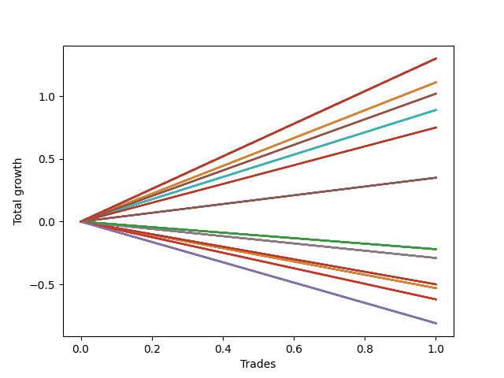

# Long HLT 101_STACK_2 
- Symbol: TSLA
- Date Range: 01/10/2024 - 05/17/2024
- Trading Period: 8:30-12:30
- Number of Trades: 1


### Test TP-0.25 15m
* Take Profit of 0.25 Point
* 0.25 Stoploss
* Results:
```
Total Trades: 1
Percent Up: 0.00
Percent Down: 100.00
Total Points Moved Up: -0.22
Potential Profit: -110.00
Total Points Ups: 0.00 Count Ups: 0
Total Points Downs: -0.22 Count Downs: 1
```

<details><summary>Trades</summary>

<code>In: 2024-02-20 09:35:00		Out: 2024-02-20 09:37:00		Total Position Time: 02:00		Total Move Up: -0.22		Total to Date: -0.22</code> <br />


</details>

### Test TP-0.5 15m
* Take Profit of 0.5 Point
* 0.5 Stoploss
* Results:
```
Total Trades: 1
Percent Up: 0.00
Percent Down: 100.00
Total Points Moved Up: -0.62
Potential Profit: -310.00
Total Points Ups: 0.00 Count Ups: 0
Total Points Downs: -0.62 Count Downs: 1
```

<details><summary>Trades</summary>

<code>In: 2024-02-20 09:35:00		Out: 2024-02-20 09:38:00		Total Position Time: 03:00		Total Move Up: -0.62		Total to Date: -0.62</code> <br />


</details>

### Test TP-0.75 15m
* Take Profit of 0.75 Point
* 0.75 Stoploss
* Results:
```
Total Trades: 1
Percent Up: 0.00
Percent Down: 100.00
Total Points Moved Up: -0.81
Potential Profit: -405.00
Total Points Ups: 0.00 Count Ups: 0
Total Points Downs: -0.81 Count Downs: 1
```

<details><summary>Trades</summary>

<code>In: 2024-02-20 09:35:00		Out: 2024-02-20 09:39:00		Total Position Time: 04:00		Total Move Up: -0.81		Total to Date: -0.81</code> <br />


</details>

### Test TP-1 15m
* Take Profit of 1 Point
* 1 Stoploss
* Results:
```
Total Trades: 1
Percent Up: 0.00
Percent Down: 100.00
Total Points Moved Up: -0.53
Potential Profit: -265.00
Total Points Ups: 0.00 Count Ups: 0
Total Points Downs: -0.53 Count Downs: 1
```

<details><summary>Trades</summary>

<code>In: 2024-02-20 09:35:00		Out: 2024-02-20 09:49:00		Total Position Time: 14:00		Total Move Up: -0.53		Total to Date: -0.53</code> <br />


</details>

### Test TP-1.25 15m
* Take Profit of 1.25 Point
* 1.25 Stoploss
* Results:
```
Total Trades: 1
Percent Up: 0.00
Percent Down: 100.00
Total Points Moved Up: -0.53
Potential Profit: -265.00
Total Points Ups: 0.00 Count Ups: 0
Total Points Downs: -0.53 Count Downs: 1
```

<details><summary>Trades</summary>

<code>In: 2024-02-20 09:35:00		Out: 2024-02-20 09:49:00		Total Position Time: 14:00		Total Move Up: -0.53		Total to Date: -0.53</code> <br />


</details>

### Test TP-1.5 15m
* Take Profit of 1.5 Point
* 1.5 Stoploss
* Results:
```
Total Trades: 1
Percent Up: 0.00
Percent Down: 100.00
Total Points Moved Up: -0.53
Potential Profit: -265.00
Total Points Ups: 0.00 Count Ups: 0
Total Points Downs: -0.53 Count Downs: 1
```

<details><summary>Trades</summary>

<code>In: 2024-02-20 09:35:00		Out: 2024-02-20 09:49:00		Total Position Time: 14:00		Total Move Up: -0.53		Total to Date: -0.53</code> <br />


</details>

### Test TP-1.75 15m
* Take Profit of 1.75 Point
* 1.75 Stoploss
* Results:
```
Total Trades: 1
Percent Up: 0.00
Percent Down: 100.00
Total Points Moved Up: -0.53
Potential Profit: -265.00
Total Points Ups: 0.00 Count Ups: 0
Total Points Downs: -0.53 Count Downs: 1
```

<details><summary>Trades</summary>

<code>In: 2024-02-20 09:35:00		Out: 2024-02-20 09:49:00		Total Position Time: 14:00		Total Move Up: -0.53		Total to Date: -0.53</code> <br />


</details>

### Test TP-2 15m
* Take Profit of 2 Point
* 2 Stoploss
* Results:
```
Total Trades: 1
Percent Up: 0.00
Percent Down: 100.00
Total Points Moved Up: -0.53
Potential Profit: -265.00
Total Points Ups: 0.00 Count Ups: 0
Total Points Downs: -0.53 Count Downs: 1
```

<details><summary>Trades</summary>

<code>In: 2024-02-20 09:35:00		Out: 2024-02-20 09:49:00		Total Position Time: 14:00		Total Move Up: -0.53		Total to Date: -0.53</code> <br />


</details>

### Test TP-2.25 15m
* Take Profit of 2.25 Point
* 2.25 Stoploss
* Results:
```
Total Trades: 1
Percent Up: 0.00
Percent Down: 100.00
Total Points Moved Up: -0.53
Potential Profit: -265.00
Total Points Ups: 0.00 Count Ups: 0
Total Points Downs: -0.53 Count Downs: 1
```

<details><summary>Trades</summary>

<code>In: 2024-02-20 09:35:00		Out: 2024-02-20 09:49:00		Total Position Time: 14:00		Total Move Up: -0.53		Total to Date: -0.53</code> <br />


</details>

### Test TP-2.5 15m
* Take Profit of 2.5 Point
* 2.5 Stoploss
* Results:
```
Total Trades: 1
Percent Up: 0.00
Percent Down: 100.00
Total Points Moved Up: -0.53
Potential Profit: -265.00
Total Points Ups: 0.00 Count Ups: 0
Total Points Downs: -0.53 Count Downs: 1
```

<details><summary>Trades</summary>

<code>In: 2024-02-20 09:35:00		Out: 2024-02-20 09:49:00		Total Position Time: 14:00		Total Move Up: -0.53		Total to Date: -0.53</code> <br />


</details>

### Test TP-2.75 15m
* Take Profit of 2.75 Point
* 2.75 Stoploss
* Results:
```
Total Trades: 1
Percent Up: 0.00
Percent Down: 100.00
Total Points Moved Up: -0.53
Potential Profit: -265.00
Total Points Ups: 0.00 Count Ups: 0
Total Points Downs: -0.53 Count Downs: 1
```

<details><summary>Trades</summary>

<code>In: 2024-02-20 09:35:00		Out: 2024-02-20 09:49:00		Total Position Time: 14:00		Total Move Up: -0.53		Total to Date: -0.53</code> <br />


</details>

### Test TP-3 15m
* Take Profit of 3 Point
* 3 Stoploss
* Results:
```
Total Trades: 1
Percent Up: 0.00
Percent Down: 100.00
Total Points Moved Up: -0.53
Potential Profit: -265.00
Total Points Ups: 0.00 Count Ups: 0
Total Points Downs: -0.53 Count Downs: 1
```

<details><summary>Trades</summary>

<code>In: 2024-02-20 09:35:00		Out: 2024-02-20 09:49:00		Total Position Time: 14:00		Total Move Up: -0.53		Total to Date: -0.53</code> <br />


</details>

### Test TP-0.25 30m
* Take Profit of 0.25 Point
* 0.25 Stoploss
* Results:
```
Total Trades: 1
Percent Up: 0.00
Percent Down: 100.00
Total Points Moved Up: -0.22
Potential Profit: -110.00
Total Points Ups: 0.00 Count Ups: 0
Total Points Downs: -0.22 Count Downs: 1
```

<details><summary>Trades</summary>

<code>In: 2024-02-20 09:35:00		Out: 2024-02-20 09:37:00		Total Position Time: 02:00		Total Move Up: -0.22		Total to Date: -0.22</code> <br />


</details>

### Test TP-0.5 30m
* Take Profit of 0.5 Point
* 0.5 Stoploss
* Results:
```
Total Trades: 1
Percent Up: 0.00
Percent Down: 100.00
Total Points Moved Up: -0.62
Potential Profit: -310.00
Total Points Ups: 0.00 Count Ups: 0
Total Points Downs: -0.62 Count Downs: 1
```

<details><summary>Trades</summary>

<code>In: 2024-02-20 09:35:00		Out: 2024-02-20 09:38:00		Total Position Time: 03:00		Total Move Up: -0.62		Total to Date: -0.62</code> <br />


</details>

### Test TP-0.75 30m
* Take Profit of 0.75 Point
* 0.75 Stoploss
* Results:
```
Total Trades: 1
Percent Up: 0.00
Percent Down: 100.00
Total Points Moved Up: -0.81
Potential Profit: -405.00
Total Points Ups: 0.00 Count Ups: 0
Total Points Downs: -0.81 Count Downs: 1
```

<details><summary>Trades</summary>

<code>In: 2024-02-20 09:35:00		Out: 2024-02-20 09:39:00		Total Position Time: 04:00		Total Move Up: -0.81		Total to Date: -0.81</code> <br />


</details>

### Test TP-1 30m
* Take Profit of 1 Point
* 1 Stoploss
* Results:
```
Total Trades: 1
Percent Up: 0.00
Percent Down: 100.00
Total Points Moved Up: -0.50
Potential Profit: -250.00
Total Points Ups: 0.00 Count Ups: 0
Total Points Downs: -0.50 Count Downs: 1
```

<details><summary>Trades</summary>

<code>In: 2024-02-20 09:35:00		Out: 2024-02-20 10:04:00		Total Position Time: 29:00		Total Move Up: -0.50		Total to Date: -0.50</code> <br />


</details>

### Test TP-1.25 30m
* Take Profit of 1.25 Point
* 1.25 Stoploss
* Results:
```
Total Trades: 1
Percent Up: 0.00
Percent Down: 100.00
Total Points Moved Up: -0.50
Potential Profit: -250.00
Total Points Ups: 0.00 Count Ups: 0
Total Points Downs: -0.50 Count Downs: 1
```

<details><summary>Trades</summary>

<code>In: 2024-02-20 09:35:00		Out: 2024-02-20 10:04:00		Total Position Time: 29:00		Total Move Up: -0.50		Total to Date: -0.50</code> <br />


</details>

### Test TP-1.5 30m
* Take Profit of 1.5 Point
* 1.5 Stoploss
* Results:
```
Total Trades: 1
Percent Up: 0.00
Percent Down: 100.00
Total Points Moved Up: -0.50
Potential Profit: -250.00
Total Points Ups: 0.00 Count Ups: 0
Total Points Downs: -0.50 Count Downs: 1
```

<details><summary>Trades</summary>

<code>In: 2024-02-20 09:35:00		Out: 2024-02-20 10:04:00		Total Position Time: 29:00		Total Move Up: -0.50		Total to Date: -0.50</code> <br />


</details>

### Test TP-1.75 30m
* Take Profit of 1.75 Point
* 1.75 Stoploss
* Results:
```
Total Trades: 1
Percent Up: 0.00
Percent Down: 100.00
Total Points Moved Up: -0.50
Potential Profit: -250.00
Total Points Ups: 0.00 Count Ups: 0
Total Points Downs: -0.50 Count Downs: 1
```

<details><summary>Trades</summary>

<code>In: 2024-02-20 09:35:00		Out: 2024-02-20 10:04:00		Total Position Time: 29:00		Total Move Up: -0.50		Total to Date: -0.50</code> <br />


</details>

### Test TP-2 30m
* Take Profit of 2 Point
* 2 Stoploss
* Results:
```
Total Trades: 1
Percent Up: 0.00
Percent Down: 100.00
Total Points Moved Up: -0.50
Potential Profit: -250.00
Total Points Ups: 0.00 Count Ups: 0
Total Points Downs: -0.50 Count Downs: 1
```

<details><summary>Trades</summary>

<code>In: 2024-02-20 09:35:00		Out: 2024-02-20 10:04:00		Total Position Time: 29:00		Total Move Up: -0.50		Total to Date: -0.50</code> <br />


</details>

### Test TP-2.25 30m
* Take Profit of 2.25 Point
* 2.25 Stoploss
* Results:
```
Total Trades: 1
Percent Up: 0.00
Percent Down: 100.00
Total Points Moved Up: -0.50
Potential Profit: -250.00
Total Points Ups: 0.00 Count Ups: 0
Total Points Downs: -0.50 Count Downs: 1
```

<details><summary>Trades</summary>

<code>In: 2024-02-20 09:35:00		Out: 2024-02-20 10:04:00		Total Position Time: 29:00		Total Move Up: -0.50		Total to Date: -0.50</code> <br />


</details>

### Test TP-2.5 30m
* Take Profit of 2.5 Point
* 2.5 Stoploss
* Results:
```
Total Trades: 1
Percent Up: 0.00
Percent Down: 100.00
Total Points Moved Up: -0.50
Potential Profit: -250.00
Total Points Ups: 0.00 Count Ups: 0
Total Points Downs: -0.50 Count Downs: 1
```

<details><summary>Trades</summary>

<code>In: 2024-02-20 09:35:00		Out: 2024-02-20 10:04:00		Total Position Time: 29:00		Total Move Up: -0.50		Total to Date: -0.50</code> <br />


</details>

### Test TP-2.75 30m
* Take Profit of 2.75 Point
* 2.75 Stoploss
* Results:
```
Total Trades: 1
Percent Up: 0.00
Percent Down: 100.00
Total Points Moved Up: -0.50
Potential Profit: -250.00
Total Points Ups: 0.00 Count Ups: 0
Total Points Downs: -0.50 Count Downs: 1
```

<details><summary>Trades</summary>

<code>In: 2024-02-20 09:35:00		Out: 2024-02-20 10:04:00		Total Position Time: 29:00		Total Move Up: -0.50		Total to Date: -0.50</code> <br />


</details>

### Test TP-3 30m
* Take Profit of 3 Point
* 3 Stoploss
* Results:
```
Total Trades: 1
Percent Up: 0.00
Percent Down: 100.00
Total Points Moved Up: -0.50
Potential Profit: -250.00
Total Points Ups: 0.00 Count Ups: 0
Total Points Downs: -0.50 Count Downs: 1
```

<details><summary>Trades</summary>

<code>In: 2024-02-20 09:35:00		Out: 2024-02-20 10:04:00		Total Position Time: 29:00		Total Move Up: -0.50		Total to Date: -0.50</code> <br />


</details>

### Test TP-0.25 45m
* Take Profit of 0.25 Point
* 0.25 Stoploss
* Results:
```
Total Trades: 1
Percent Up: 0.00
Percent Down: 100.00
Total Points Moved Up: -0.22
Potential Profit: -110.00
Total Points Ups: 0.00 Count Ups: 0
Total Points Downs: -0.22 Count Downs: 1
```

<details><summary>Trades</summary>

<code>In: 2024-02-20 09:35:00		Out: 2024-02-20 09:37:00		Total Position Time: 02:00		Total Move Up: -0.22		Total to Date: -0.22</code> <br />


</details>

### Test TP-0.5 45m
* Take Profit of 0.5 Point
* 0.5 Stoploss
* Results:
```
Total Trades: 1
Percent Up: 0.00
Percent Down: 100.00
Total Points Moved Up: -0.62
Potential Profit: -310.00
Total Points Ups: 0.00 Count Ups: 0
Total Points Downs: -0.62 Count Downs: 1
```

<details><summary>Trades</summary>

<code>In: 2024-02-20 09:35:00		Out: 2024-02-20 09:38:00		Total Position Time: 03:00		Total Move Up: -0.62		Total to Date: -0.62</code> <br />


</details>

### Test TP-0.75 45m
* Take Profit of 0.75 Point
* 0.75 Stoploss
* Results:
```
Total Trades: 1
Percent Up: 0.00
Percent Down: 100.00
Total Points Moved Up: -0.81
Potential Profit: -405.00
Total Points Ups: 0.00 Count Ups: 0
Total Points Downs: -0.81 Count Downs: 1
```

<details><summary>Trades</summary>

<code>In: 2024-02-20 09:35:00		Out: 2024-02-20 09:39:00		Total Position Time: 04:00		Total Move Up: -0.81		Total to Date: -0.81</code> <br />


</details>

### Test TP-1 45m
* Take Profit of 1 Point
* 1 Stoploss
* Results:
```
Total Trades: 1
Percent Up: 100.00
Percent Down: 0.00
Total Points Moved Up: 0.35
Potential Profit: 175.00
Total Points Ups: 0.35 Count Ups: 1
Total Points Downs: 0.00 Count Downs: 0
```

<details><summary>Trades</summary>

<code>In: 2024-02-20 09:35:00		Out: 2024-02-20 10:19:00		Total Position Time: 44:00		Total Move Up: 0.35		Total to Date: 0.35</code> <br />


</details>

### Test TP-1.25 45m
* Take Profit of 1.25 Point
* 1.25 Stoploss
* Results:
```
Total Trades: 1
Percent Up: 100.00
Percent Down: 0.00
Total Points Moved Up: 0.35
Potential Profit: 175.00
Total Points Ups: 0.35 Count Ups: 1
Total Points Downs: 0.00 Count Downs: 0
```

<details><summary>Trades</summary>

<code>In: 2024-02-20 09:35:00		Out: 2024-02-20 10:19:00		Total Position Time: 44:00		Total Move Up: 0.35		Total to Date: 0.35</code> <br />


</details>

### Test TP-1.5 45m
* Take Profit of 1.5 Point
* 1.5 Stoploss
* Results:
```
Total Trades: 1
Percent Up: 100.00
Percent Down: 0.00
Total Points Moved Up: 0.35
Potential Profit: 175.00
Total Points Ups: 0.35 Count Ups: 1
Total Points Downs: 0.00 Count Downs: 0
```

<details><summary>Trades</summary>

<code>In: 2024-02-20 09:35:00		Out: 2024-02-20 10:19:00		Total Position Time: 44:00		Total Move Up: 0.35		Total to Date: 0.35</code> <br />


</details>

### Test TP-1.75 45m
* Take Profit of 1.75 Point
* 1.75 Stoploss
* Results:
```
Total Trades: 1
Percent Up: 100.00
Percent Down: 0.00
Total Points Moved Up: 0.35
Potential Profit: 175.00
Total Points Ups: 0.35 Count Ups: 1
Total Points Downs: 0.00 Count Downs: 0
```

<details><summary>Trades</summary>

<code>In: 2024-02-20 09:35:00		Out: 2024-02-20 10:19:00		Total Position Time: 44:00		Total Move Up: 0.35		Total to Date: 0.35</code> <br />


</details>

### Test TP-2 45m
* Take Profit of 2 Point
* 2 Stoploss
* Results:
```
Total Trades: 1
Percent Up: 100.00
Percent Down: 0.00
Total Points Moved Up: 0.35
Potential Profit: 175.00
Total Points Ups: 0.35 Count Ups: 1
Total Points Downs: 0.00 Count Downs: 0
```

<details><summary>Trades</summary>

<code>In: 2024-02-20 09:35:00		Out: 2024-02-20 10:19:00		Total Position Time: 44:00		Total Move Up: 0.35		Total to Date: 0.35</code> <br />


</details>

### Test TP-2.25 45m
* Take Profit of 2.25 Point
* 2.25 Stoploss
* Results:
```
Total Trades: 1
Percent Up: 100.00
Percent Down: 0.00
Total Points Moved Up: 0.35
Potential Profit: 175.00
Total Points Ups: 0.35 Count Ups: 1
Total Points Downs: 0.00 Count Downs: 0
```

<details><summary>Trades</summary>

<code>In: 2024-02-20 09:35:00		Out: 2024-02-20 10:19:00		Total Position Time: 44:00		Total Move Up: 0.35		Total to Date: 0.35</code> <br />


</details>

### Test TP-2.5 45m
* Take Profit of 2.5 Point
* 2.5 Stoploss
* Results:
```
Total Trades: 1
Percent Up: 100.00
Percent Down: 0.00
Total Points Moved Up: 0.35
Potential Profit: 175.00
Total Points Ups: 0.35 Count Ups: 1
Total Points Downs: 0.00 Count Downs: 0
```

<details><summary>Trades</summary>

<code>In: 2024-02-20 09:35:00		Out: 2024-02-20 10:19:00		Total Position Time: 44:00		Total Move Up: 0.35		Total to Date: 0.35</code> <br />


</details>

### Test TP-2.75 45m
* Take Profit of 2.75 Point
* 2.75 Stoploss
* Results:
```
Total Trades: 1
Percent Up: 100.00
Percent Down: 0.00
Total Points Moved Up: 0.35
Potential Profit: 175.00
Total Points Ups: 0.35 Count Ups: 1
Total Points Downs: 0.00 Count Downs: 0
```

<details><summary>Trades</summary>

<code>In: 2024-02-20 09:35:00		Out: 2024-02-20 10:19:00		Total Position Time: 44:00		Total Move Up: 0.35		Total to Date: 0.35</code> <br />


</details>

### Test TP-3 45m
* Take Profit of 3 Point
* 3 Stoploss
* Results:
```
Total Trades: 1
Percent Up: 100.00
Percent Down: 0.00
Total Points Moved Up: 0.35
Potential Profit: 175.00
Total Points Ups: 0.35 Count Ups: 1
Total Points Downs: 0.00 Count Downs: 0
```

<details><summary>Trades</summary>

<code>In: 2024-02-20 09:35:00		Out: 2024-02-20 10:19:00		Total Position Time: 44:00		Total Move Up: 0.35		Total to Date: 0.35</code> <br />


</details>

### Test TP-0.25 60m
* Take Profit of 0.25 Point
* 0.25 Stoploss
* Results:
```
Total Trades: 1
Percent Up: 0.00
Percent Down: 100.00
Total Points Moved Up: -0.22
Potential Profit: -110.00
Total Points Ups: 0.00 Count Ups: 0
Total Points Downs: -0.22 Count Downs: 1
```

<details><summary>Trades</summary>

<code>In: 2024-02-20 09:35:00		Out: 2024-02-20 09:37:00		Total Position Time: 02:00		Total Move Up: -0.22		Total to Date: -0.22</code> <br />


</details>

### Test TP-0.5 60m
* Take Profit of 0.5 Point
* 0.5 Stoploss
* Results:
```
Total Trades: 1
Percent Up: 0.00
Percent Down: 100.00
Total Points Moved Up: -0.62
Potential Profit: -310.00
Total Points Ups: 0.00 Count Ups: 0
Total Points Downs: -0.62 Count Downs: 1
```

<details><summary>Trades</summary>

<code>In: 2024-02-20 09:35:00		Out: 2024-02-20 09:38:00		Total Position Time: 03:00		Total Move Up: -0.62		Total to Date: -0.62</code> <br />


</details>

### Test TP-0.75 60m
* Take Profit of 0.75 Point
* 0.75 Stoploss
* Results:
```
Total Trades: 1
Percent Up: 0.00
Percent Down: 100.00
Total Points Moved Up: -0.81
Potential Profit: -405.00
Total Points Ups: 0.00 Count Ups: 0
Total Points Downs: -0.81 Count Downs: 1
```

<details><summary>Trades</summary>

<code>In: 2024-02-20 09:35:00		Out: 2024-02-20 09:39:00		Total Position Time: 04:00		Total Move Up: -0.81		Total to Date: -0.81</code> <br />


</details>

### Test TP-1 60m
* Take Profit of 1 Point
* 1 Stoploss
* Results:
```
Total Trades: 1
Percent Up: 0.00
Percent Down: 100.00
Total Points Moved Up: -0.29
Potential Profit: -145.00
Total Points Ups: 0.00 Count Ups: 0
Total Points Downs: -0.29 Count Downs: 1
```

<details><summary>Trades</summary>

<code>In: 2024-02-20 09:35:00		Out: 2024-02-20 10:34:00		Total Position Time: 59:00		Total Move Up: -0.29		Total to Date: -0.29</code> <br />


</details>

### Test TP-1.25 60m
* Take Profit of 1.25 Point
* 1.25 Stoploss
* Results:
```
Total Trades: 1
Percent Up: 0.00
Percent Down: 100.00
Total Points Moved Up: -0.29
Potential Profit: -145.00
Total Points Ups: 0.00 Count Ups: 0
Total Points Downs: -0.29 Count Downs: 1
```

<details><summary>Trades</summary>

<code>In: 2024-02-20 09:35:00		Out: 2024-02-20 10:34:00		Total Position Time: 59:00		Total Move Up: -0.29		Total to Date: -0.29</code> <br />


</details>

### Test TP-1.5 60m
* Take Profit of 1.5 Point
* 1.5 Stoploss
* Results:
```
Total Trades: 1
Percent Up: 0.00
Percent Down: 100.00
Total Points Moved Up: -0.29
Potential Profit: -145.00
Total Points Ups: 0.00 Count Ups: 0
Total Points Downs: -0.29 Count Downs: 1
```

<details><summary>Trades</summary>

<code>In: 2024-02-20 09:35:00		Out: 2024-02-20 10:34:00		Total Position Time: 59:00		Total Move Up: -0.29		Total to Date: -0.29</code> <br />


</details>

### Test TP-1.75 60m
* Take Profit of 1.75 Point
* 1.75 Stoploss
* Results:
```
Total Trades: 1
Percent Up: 0.00
Percent Down: 100.00
Total Points Moved Up: -0.29
Potential Profit: -145.00
Total Points Ups: 0.00 Count Ups: 0
Total Points Downs: -0.29 Count Downs: 1
```

<details><summary>Trades</summary>

<code>In: 2024-02-20 09:35:00		Out: 2024-02-20 10:34:00		Total Position Time: 59:00		Total Move Up: -0.29		Total to Date: -0.29</code> <br />


</details>

### Test TP-2 60m
* Take Profit of 2 Point
* 2 Stoploss
* Results:
```
Total Trades: 1
Percent Up: 0.00
Percent Down: 100.00
Total Points Moved Up: -0.29
Potential Profit: -145.00
Total Points Ups: 0.00 Count Ups: 0
Total Points Downs: -0.29 Count Downs: 1
```

<details><summary>Trades</summary>

<code>In: 2024-02-20 09:35:00		Out: 2024-02-20 10:34:00		Total Position Time: 59:00		Total Move Up: -0.29		Total to Date: -0.29</code> <br />


</details>

### Test TP-2.25 60m
* Take Profit of 2.25 Point
* 2.25 Stoploss
* Results:
```
Total Trades: 1
Percent Up: 0.00
Percent Down: 100.00
Total Points Moved Up: -0.29
Potential Profit: -145.00
Total Points Ups: 0.00 Count Ups: 0
Total Points Downs: -0.29 Count Downs: 1
```

<details><summary>Trades</summary>

<code>In: 2024-02-20 09:35:00		Out: 2024-02-20 10:34:00		Total Position Time: 59:00		Total Move Up: -0.29		Total to Date: -0.29</code> <br />


</details>

### Test TP-2.5 60m
* Take Profit of 2.5 Point
* 2.5 Stoploss
* Results:
```
Total Trades: 1
Percent Up: 0.00
Percent Down: 100.00
Total Points Moved Up: -0.29
Potential Profit: -145.00
Total Points Ups: 0.00 Count Ups: 0
Total Points Downs: -0.29 Count Downs: 1
```

<details><summary>Trades</summary>

<code>In: 2024-02-20 09:35:00		Out: 2024-02-20 10:34:00		Total Position Time: 59:00		Total Move Up: -0.29		Total to Date: -0.29</code> <br />


</details>

### Test TP-2.75 60m
* Take Profit of 2.75 Point
* 2.75 Stoploss
* Results:
```
Total Trades: 1
Percent Up: 0.00
Percent Down: 100.00
Total Points Moved Up: -0.29
Potential Profit: -145.00
Total Points Ups: 0.00 Count Ups: 0
Total Points Downs: -0.29 Count Downs: 1
```

<details><summary>Trades</summary>

<code>In: 2024-02-20 09:35:00		Out: 2024-02-20 10:34:00		Total Position Time: 59:00		Total Move Up: -0.29		Total to Date: -0.29</code> <br />


</details>

### Test TP-3 60m
* Take Profit of 3 Point
* 3 Stoploss
* Results:
```
Total Trades: 1
Percent Up: 0.00
Percent Down: 100.00
Total Points Moved Up: -0.29
Potential Profit: -145.00
Total Points Ups: 0.00 Count Ups: 0
Total Points Downs: -0.29 Count Downs: 1
```

<details><summary>Trades</summary>

<code>In: 2024-02-20 09:35:00		Out: 2024-02-20 10:34:00		Total Position Time: 59:00		Total Move Up: -0.29		Total to Date: -0.29</code> <br />


</details>

### Test TP-0.25 75m
* Take Profit of 0.25 Point
* 0.25 Stoploss
* Results:
```
Total Trades: 1
Percent Up: 0.00
Percent Down: 100.00
Total Points Moved Up: -0.22
Potential Profit: -110.00
Total Points Ups: 0.00 Count Ups: 0
Total Points Downs: -0.22 Count Downs: 1
```

<details><summary>Trades</summary>

<code>In: 2024-02-20 09:35:00		Out: 2024-02-20 09:37:00		Total Position Time: 02:00		Total Move Up: -0.22		Total to Date: -0.22</code> <br />


</details>

### Test TP-0.5 75m
* Take Profit of 0.5 Point
* 0.5 Stoploss
* Results:
```
Total Trades: 1
Percent Up: 0.00
Percent Down: 100.00
Total Points Moved Up: -0.62
Potential Profit: -310.00
Total Points Ups: 0.00 Count Ups: 0
Total Points Downs: -0.62 Count Downs: 1
```

<details><summary>Trades</summary>

<code>In: 2024-02-20 09:35:00		Out: 2024-02-20 09:38:00		Total Position Time: 03:00		Total Move Up: -0.62		Total to Date: -0.62</code> <br />


</details>

### Test TP-0.75 75m
* Take Profit of 0.75 Point
* 0.75 Stoploss
* Results:
```
Total Trades: 1
Percent Up: 0.00
Percent Down: 100.00
Total Points Moved Up: -0.81
Potential Profit: -405.00
Total Points Ups: 0.00 Count Ups: 0
Total Points Downs: -0.81 Count Downs: 1
```

<details><summary>Trades</summary>

<code>In: 2024-02-20 09:35:00		Out: 2024-02-20 09:39:00		Total Position Time: 04:00		Total Move Up: -0.81		Total to Date: -0.81</code> <br />


</details>

### Test TP-1 75m
* Take Profit of 1 Point
* 1 Stoploss
* Results:
```
Total Trades: 1
Percent Up: 100.00
Percent Down: 0.00
Total Points Moved Up: 0.89
Potential Profit: 445.00
Total Points Ups: 0.89 Count Ups: 1
Total Points Downs: 0.00 Count Downs: 0
```

<details><summary>Trades</summary>

<code>In: 2024-02-20 09:35:00		Out: 2024-02-20 10:49:00		Total Position Time: 74:00		Total Move Up: 0.89		Total to Date: 0.89</code> <br />


</details>

### Test TP-1.25 75m
* Take Profit of 1.25 Point
* 1.25 Stoploss
* Results:
```
Total Trades: 1
Percent Up: 100.00
Percent Down: 0.00
Total Points Moved Up: 0.89
Potential Profit: 445.00
Total Points Ups: 0.89 Count Ups: 1
Total Points Downs: 0.00 Count Downs: 0
```

<details><summary>Trades</summary>

<code>In: 2024-02-20 09:35:00		Out: 2024-02-20 10:49:00		Total Position Time: 74:00		Total Move Up: 0.89		Total to Date: 0.89</code> <br />


</details>

### Test TP-1.5 75m
* Take Profit of 1.5 Point
* 1.5 Stoploss
* Results:
```
Total Trades: 1
Percent Up: 100.00
Percent Down: 0.00
Total Points Moved Up: 0.89
Potential Profit: 445.00
Total Points Ups: 0.89 Count Ups: 1
Total Points Downs: 0.00 Count Downs: 0
```

<details><summary>Trades</summary>

<code>In: 2024-02-20 09:35:00		Out: 2024-02-20 10:49:00		Total Position Time: 74:00		Total Move Up: 0.89		Total to Date: 0.89</code> <br />


</details>

### Test TP-1.75 75m
* Take Profit of 1.75 Point
* 1.75 Stoploss
* Results:
```
Total Trades: 1
Percent Up: 100.00
Percent Down: 0.00
Total Points Moved Up: 0.89
Potential Profit: 445.00
Total Points Ups: 0.89 Count Ups: 1
Total Points Downs: 0.00 Count Downs: 0
```

<details><summary>Trades</summary>

<code>In: 2024-02-20 09:35:00		Out: 2024-02-20 10:49:00		Total Position Time: 74:00		Total Move Up: 0.89		Total to Date: 0.89</code> <br />


</details>

### Test TP-2 75m
* Take Profit of 2 Point
* 2 Stoploss
* Results:
```
Total Trades: 1
Percent Up: 100.00
Percent Down: 0.00
Total Points Moved Up: 0.89
Potential Profit: 445.00
Total Points Ups: 0.89 Count Ups: 1
Total Points Downs: 0.00 Count Downs: 0
```

<details><summary>Trades</summary>

<code>In: 2024-02-20 09:35:00		Out: 2024-02-20 10:49:00		Total Position Time: 74:00		Total Move Up: 0.89		Total to Date: 0.89</code> <br />


</details>

### Test TP-2.25 75m
* Take Profit of 2.25 Point
* 2.25 Stoploss
* Results:
```
Total Trades: 1
Percent Up: 100.00
Percent Down: 0.00
Total Points Moved Up: 0.89
Potential Profit: 445.00
Total Points Ups: 0.89 Count Ups: 1
Total Points Downs: 0.00 Count Downs: 0
```

<details><summary>Trades</summary>

<code>In: 2024-02-20 09:35:00		Out: 2024-02-20 10:49:00		Total Position Time: 74:00		Total Move Up: 0.89		Total to Date: 0.89</code> <br />


</details>

### Test TP-2.5 75m
* Take Profit of 2.5 Point
* 2.5 Stoploss
* Results:
```
Total Trades: 1
Percent Up: 100.00
Percent Down: 0.00
Total Points Moved Up: 0.89
Potential Profit: 445.00
Total Points Ups: 0.89 Count Ups: 1
Total Points Downs: 0.00 Count Downs: 0
```

<details><summary>Trades</summary>

<code>In: 2024-02-20 09:35:00		Out: 2024-02-20 10:49:00		Total Position Time: 74:00		Total Move Up: 0.89		Total to Date: 0.89</code> <br />


</details>

### Test TP-2.75 75m
* Take Profit of 2.75 Point
* 2.75 Stoploss
* Results:
```
Total Trades: 1
Percent Up: 100.00
Percent Down: 0.00
Total Points Moved Up: 0.89
Potential Profit: 445.00
Total Points Ups: 0.89 Count Ups: 1
Total Points Downs: 0.00 Count Downs: 0
```

<details><summary>Trades</summary>

<code>In: 2024-02-20 09:35:00		Out: 2024-02-20 10:49:00		Total Position Time: 74:00		Total Move Up: 0.89		Total to Date: 0.89</code> <br />


</details>

### Test TP-3 75m
* Take Profit of 3 Point
* 3 Stoploss
* Results:
```
Total Trades: 1
Percent Up: 100.00
Percent Down: 0.00
Total Points Moved Up: 0.89
Potential Profit: 445.00
Total Points Ups: 0.89 Count Ups: 1
Total Points Downs: 0.00 Count Downs: 0
```

<details><summary>Trades</summary>

<code>In: 2024-02-20 09:35:00		Out: 2024-02-20 10:49:00		Total Position Time: 74:00		Total Move Up: 0.89		Total to Date: 0.89</code> <br />


</details>

### Test TP-0.25 90m
* Take Profit of 0.25 Point
* 0.25 Stoploss
* Results:
```
Total Trades: 1
Percent Up: 0.00
Percent Down: 100.00
Total Points Moved Up: -0.22
Potential Profit: -110.00
Total Points Ups: 0.00 Count Ups: 0
Total Points Downs: -0.22 Count Downs: 1
```

<details><summary>Trades</summary>

<code>In: 2024-02-20 09:35:00		Out: 2024-02-20 09:37:00		Total Position Time: 02:00		Total Move Up: -0.22		Total to Date: -0.22</code> <br />


</details>

### Test TP-0.5 90m
* Take Profit of 0.5 Point
* 0.5 Stoploss
* Results:
```
Total Trades: 1
Percent Up: 0.00
Percent Down: 100.00
Total Points Moved Up: -0.62
Potential Profit: -310.00
Total Points Ups: 0.00 Count Ups: 0
Total Points Downs: -0.62 Count Downs: 1
```

<details><summary>Trades</summary>

<code>In: 2024-02-20 09:35:00		Out: 2024-02-20 09:38:00		Total Position Time: 03:00		Total Move Up: -0.62		Total to Date: -0.62</code> <br />


</details>

### Test TP-0.75 90m
* Take Profit of 0.75 Point
* 0.75 Stoploss
* Results:
```
Total Trades: 1
Percent Up: 0.00
Percent Down: 100.00
Total Points Moved Up: -0.81
Potential Profit: -405.00
Total Points Ups: 0.00 Count Ups: 0
Total Points Downs: -0.81 Count Downs: 1
```

<details><summary>Trades</summary>

<code>In: 2024-02-20 09:35:00		Out: 2024-02-20 09:39:00		Total Position Time: 04:00		Total Move Up: -0.81		Total to Date: -0.81</code> <br />


</details>

### Test TP-1 90m
* Take Profit of 1 Point
* 1 Stoploss
* Results:
```
Total Trades: 1
Percent Up: 100.00
Percent Down: 0.00
Total Points Moved Up: 1.02
Potential Profit: 510.00
Total Points Ups: 1.02 Count Ups: 1
Total Points Downs: 0.00 Count Downs: 0
```

<details><summary>Trades</summary>

<code>In: 2024-02-20 09:35:00		Out: 2024-02-20 10:52:00		Total Position Time: 77:00		Total Move Up: 1.02		Total to Date: 1.02</code> <br />


</details>

### Test TP-1.25 90m
* Take Profit of 1.25 Point
* 1.25 Stoploss
* Results:
```
Total Trades: 1
Percent Up: 100.00
Percent Down: 0.00
Total Points Moved Up: 1.11
Potential Profit: 555.00
Total Points Ups: 1.11 Count Ups: 1
Total Points Downs: 0.00 Count Downs: 0
```

<details><summary>Trades</summary>

<code>In: 2024-02-20 09:35:00		Out: 2024-02-20 11:04:00		Total Position Time: 89:00		Total Move Up: 1.11		Total to Date: 1.11</code> <br />


</details>

### Test TP-1.5 90m
* Take Profit of 1.5 Point
* 1.5 Stoploss
* Results:
```
Total Trades: 1
Percent Up: 100.00
Percent Down: 0.00
Total Points Moved Up: 1.11
Potential Profit: 555.00
Total Points Ups: 1.11 Count Ups: 1
Total Points Downs: 0.00 Count Downs: 0
```

<details><summary>Trades</summary>

<code>In: 2024-02-20 09:35:00		Out: 2024-02-20 11:04:00		Total Position Time: 89:00		Total Move Up: 1.11		Total to Date: 1.11</code> <br />


</details>

### Test TP-1.75 90m
* Take Profit of 1.75 Point
* 1.75 Stoploss
* Results:
```
Total Trades: 1
Percent Up: 100.00
Percent Down: 0.00
Total Points Moved Up: 1.11
Potential Profit: 555.00
Total Points Ups: 1.11 Count Ups: 1
Total Points Downs: 0.00 Count Downs: 0
```

<details><summary>Trades</summary>

<code>In: 2024-02-20 09:35:00		Out: 2024-02-20 11:04:00		Total Position Time: 89:00		Total Move Up: 1.11		Total to Date: 1.11</code> <br />


</details>

### Test TP-2 90m
* Take Profit of 2 Point
* 2 Stoploss
* Results:
```
Total Trades: 1
Percent Up: 100.00
Percent Down: 0.00
Total Points Moved Up: 1.11
Potential Profit: 555.00
Total Points Ups: 1.11 Count Ups: 1
Total Points Downs: 0.00 Count Downs: 0
```

<details><summary>Trades</summary>

<code>In: 2024-02-20 09:35:00		Out: 2024-02-20 11:04:00		Total Position Time: 89:00		Total Move Up: 1.11		Total to Date: 1.11</code> <br />


</details>

### Test TP-2.25 90m
* Take Profit of 2.25 Point
* 2.25 Stoploss
* Results:
```
Total Trades: 1
Percent Up: 100.00
Percent Down: 0.00
Total Points Moved Up: 1.11
Potential Profit: 555.00
Total Points Ups: 1.11 Count Ups: 1
Total Points Downs: 0.00 Count Downs: 0
```

<details><summary>Trades</summary>

<code>In: 2024-02-20 09:35:00		Out: 2024-02-20 11:04:00		Total Position Time: 89:00		Total Move Up: 1.11		Total to Date: 1.11</code> <br />


</details>

### Test TP-2.5 90m
* Take Profit of 2.5 Point
* 2.5 Stoploss
* Results:
```
Total Trades: 1
Percent Up: 100.00
Percent Down: 0.00
Total Points Moved Up: 1.11
Potential Profit: 555.00
Total Points Ups: 1.11 Count Ups: 1
Total Points Downs: 0.00 Count Downs: 0
```

<details><summary>Trades</summary>

<code>In: 2024-02-20 09:35:00		Out: 2024-02-20 11:04:00		Total Position Time: 89:00		Total Move Up: 1.11		Total to Date: 1.11</code> <br />


</details>

### Test TP-2.75 90m
* Take Profit of 2.75 Point
* 2.75 Stoploss
* Results:
```
Total Trades: 1
Percent Up: 100.00
Percent Down: 0.00
Total Points Moved Up: 1.11
Potential Profit: 555.00
Total Points Ups: 1.11 Count Ups: 1
Total Points Downs: 0.00 Count Downs: 0
```

<details><summary>Trades</summary>

<code>In: 2024-02-20 09:35:00		Out: 2024-02-20 11:04:00		Total Position Time: 89:00		Total Move Up: 1.11		Total to Date: 1.11</code> <br />


</details>

### Test TP-3 90m
* Take Profit of 3 Point
* 3 Stoploss
* Results:
```
Total Trades: 1
Percent Up: 100.00
Percent Down: 0.00
Total Points Moved Up: 1.11
Potential Profit: 555.00
Total Points Ups: 1.11 Count Ups: 1
Total Points Downs: 0.00 Count Downs: 0
```

<details><summary>Trades</summary>

<code>In: 2024-02-20 09:35:00		Out: 2024-02-20 11:04:00		Total Position Time: 89:00		Total Move Up: 1.11		Total to Date: 1.11</code> <br />


</details>

### Test TP-0.25 105m
* Take Profit of 0.25 Point
* 0.25 Stoploss
* Results:
```
Total Trades: 1
Percent Up: 0.00
Percent Down: 100.00
Total Points Moved Up: -0.22
Potential Profit: -110.00
Total Points Ups: 0.00 Count Ups: 0
Total Points Downs: -0.22 Count Downs: 1
```

<details><summary>Trades</summary>

<code>In: 2024-02-20 09:35:00		Out: 2024-02-20 09:37:00		Total Position Time: 02:00		Total Move Up: -0.22		Total to Date: -0.22</code> <br />


</details>

### Test TP-0.5 105m
* Take Profit of 0.5 Point
* 0.5 Stoploss
* Results:
```
Total Trades: 1
Percent Up: 0.00
Percent Down: 100.00
Total Points Moved Up: -0.62
Potential Profit: -310.00
Total Points Ups: 0.00 Count Ups: 0
Total Points Downs: -0.62 Count Downs: 1
```

<details><summary>Trades</summary>

<code>In: 2024-02-20 09:35:00		Out: 2024-02-20 09:38:00		Total Position Time: 03:00		Total Move Up: -0.62		Total to Date: -0.62</code> <br />


</details>

### Test TP-0.75 105m
* Take Profit of 0.75 Point
* 0.75 Stoploss
* Results:
```
Total Trades: 1
Percent Up: 0.00
Percent Down: 100.00
Total Points Moved Up: -0.81
Potential Profit: -405.00
Total Points Ups: 0.00 Count Ups: 0
Total Points Downs: -0.81 Count Downs: 1
```

<details><summary>Trades</summary>

<code>In: 2024-02-20 09:35:00		Out: 2024-02-20 09:39:00		Total Position Time: 04:00		Total Move Up: -0.81		Total to Date: -0.81</code> <br />


</details>

### Test TP-1 105m
* Take Profit of 1 Point
* 1 Stoploss
* Results:
```
Total Trades: 1
Percent Up: 100.00
Percent Down: 0.00
Total Points Moved Up: 1.02
Potential Profit: 510.00
Total Points Ups: 1.02 Count Ups: 1
Total Points Downs: 0.00 Count Downs: 0
```

<details><summary>Trades</summary>

<code>In: 2024-02-20 09:35:00		Out: 2024-02-20 10:52:00		Total Position Time: 77:00		Total Move Up: 1.02		Total to Date: 1.02</code> <br />


</details>

### Test TP-1.25 105m
* Take Profit of 1.25 Point
* 1.25 Stoploss
* Results:
```
Total Trades: 1
Percent Up: 100.00
Percent Down: 0.00
Total Points Moved Up: 0.75
Potential Profit: 375.00
Total Points Ups: 0.75 Count Ups: 1
Total Points Downs: 0.00 Count Downs: 0
```

<details><summary>Trades</summary>

<code>In: 2024-02-20 09:35:00		Out: 2024-02-20 11:19:00		Total Position Time: 104:00		Total Move Up: 0.75		Total to Date: 0.75</code> <br />


</details>

### Test TP-1.5 105m
* Take Profit of 1.5 Point
* 1.5 Stoploss
* Results:
```
Total Trades: 1
Percent Up: 100.00
Percent Down: 0.00
Total Points Moved Up: 0.75
Potential Profit: 375.00
Total Points Ups: 0.75 Count Ups: 1
Total Points Downs: 0.00 Count Downs: 0
```

<details><summary>Trades</summary>

<code>In: 2024-02-20 09:35:00		Out: 2024-02-20 11:19:00		Total Position Time: 104:00		Total Move Up: 0.75		Total to Date: 0.75</code> <br />


</details>

### Test TP-1.75 105m
* Take Profit of 1.75 Point
* 1.75 Stoploss
* Results:
```
Total Trades: 1
Percent Up: 100.00
Percent Down: 0.00
Total Points Moved Up: 0.75
Potential Profit: 375.00
Total Points Ups: 0.75 Count Ups: 1
Total Points Downs: 0.00 Count Downs: 0
```

<details><summary>Trades</summary>

<code>In: 2024-02-20 09:35:00		Out: 2024-02-20 11:19:00		Total Position Time: 104:00		Total Move Up: 0.75		Total to Date: 0.75</code> <br />


</details>

### Test TP-2 105m
* Take Profit of 2 Point
* 2 Stoploss
* Results:
```
Total Trades: 1
Percent Up: 100.00
Percent Down: 0.00
Total Points Moved Up: 0.75
Potential Profit: 375.00
Total Points Ups: 0.75 Count Ups: 1
Total Points Downs: 0.00 Count Downs: 0
```

<details><summary>Trades</summary>

<code>In: 2024-02-20 09:35:00		Out: 2024-02-20 11:19:00		Total Position Time: 104:00		Total Move Up: 0.75		Total to Date: 0.75</code> <br />


</details>

### Test TP-2.25 105m
* Take Profit of 2.25 Point
* 2.25 Stoploss
* Results:
```
Total Trades: 1
Percent Up: 100.00
Percent Down: 0.00
Total Points Moved Up: 0.75
Potential Profit: 375.00
Total Points Ups: 0.75 Count Ups: 1
Total Points Downs: 0.00 Count Downs: 0
```

<details><summary>Trades</summary>

<code>In: 2024-02-20 09:35:00		Out: 2024-02-20 11:19:00		Total Position Time: 104:00		Total Move Up: 0.75		Total to Date: 0.75</code> <br />


</details>

### Test TP-2.5 105m
* Take Profit of 2.5 Point
* 2.5 Stoploss
* Results:
```
Total Trades: 1
Percent Up: 100.00
Percent Down: 0.00
Total Points Moved Up: 0.75
Potential Profit: 375.00
Total Points Ups: 0.75 Count Ups: 1
Total Points Downs: 0.00 Count Downs: 0
```

<details><summary>Trades</summary>

<code>In: 2024-02-20 09:35:00		Out: 2024-02-20 11:19:00		Total Position Time: 104:00		Total Move Up: 0.75		Total to Date: 0.75</code> <br />


</details>

### Test TP-2.75 105m
* Take Profit of 2.75 Point
* 2.75 Stoploss
* Results:
```
Total Trades: 1
Percent Up: 100.00
Percent Down: 0.00
Total Points Moved Up: 0.75
Potential Profit: 375.00
Total Points Ups: 0.75 Count Ups: 1
Total Points Downs: 0.00 Count Downs: 0
```

<details><summary>Trades</summary>

<code>In: 2024-02-20 09:35:00		Out: 2024-02-20 11:19:00		Total Position Time: 104:00		Total Move Up: 0.75		Total to Date: 0.75</code> <br />


</details>

### Test TP-3 105m
* Take Profit of 3 Point
* 3 Stoploss
* Results:
```
Total Trades: 1
Percent Up: 100.00
Percent Down: 0.00
Total Points Moved Up: 0.75
Potential Profit: 375.00
Total Points Ups: 0.75 Count Ups: 1
Total Points Downs: 0.00 Count Downs: 0
```

<details><summary>Trades</summary>

<code>In: 2024-02-20 09:35:00		Out: 2024-02-20 11:19:00		Total Position Time: 104:00		Total Move Up: 0.75		Total to Date: 0.75</code> <br />


</details>

### Test TP-0.25 120m
* Take Profit of 0.25 Point
* 0.25 Stoploss
* Results:
```
Total Trades: 1
Percent Up: 0.00
Percent Down: 100.00
Total Points Moved Up: -0.22
Potential Profit: -110.00
Total Points Ups: 0.00 Count Ups: 0
Total Points Downs: -0.22 Count Downs: 1
```

<details><summary>Trades</summary>

<code>In: 2024-02-20 09:35:00		Out: 2024-02-20 09:37:00		Total Position Time: 02:00		Total Move Up: -0.22		Total to Date: -0.22</code> <br />


</details>

### Test TP-0.5 120m
* Take Profit of 0.5 Point
* 0.5 Stoploss
* Results:
```
Total Trades: 1
Percent Up: 0.00
Percent Down: 100.00
Total Points Moved Up: -0.62
Potential Profit: -310.00
Total Points Ups: 0.00 Count Ups: 0
Total Points Downs: -0.62 Count Downs: 1
```

<details><summary>Trades</summary>

<code>In: 2024-02-20 09:35:00		Out: 2024-02-20 09:38:00		Total Position Time: 03:00		Total Move Up: -0.62		Total to Date: -0.62</code> <br />


</details>

### Test TP-0.75 120m
* Take Profit of 0.75 Point
* 0.75 Stoploss
* Results:
```
Total Trades: 1
Percent Up: 0.00
Percent Down: 100.00
Total Points Moved Up: -0.81
Potential Profit: -405.00
Total Points Ups: 0.00 Count Ups: 0
Total Points Downs: -0.81 Count Downs: 1
```

<details><summary>Trades</summary>

<code>In: 2024-02-20 09:35:00		Out: 2024-02-20 09:39:00		Total Position Time: 04:00		Total Move Up: -0.81		Total to Date: -0.81</code> <br />


</details>

### Test TP-1 120m
* Take Profit of 1 Point
* 1 Stoploss
* Results:
```
Total Trades: 1
Percent Up: 100.00
Percent Down: 0.00
Total Points Moved Up: 1.02
Potential Profit: 510.00
Total Points Ups: 1.02 Count Ups: 1
Total Points Downs: 0.00 Count Downs: 0
```

<details><summary>Trades</summary>

<code>In: 2024-02-20 09:35:00		Out: 2024-02-20 10:52:00		Total Position Time: 77:00		Total Move Up: 1.02		Total to Date: 1.02</code> <br />


</details>

### Test TP-1.25 120m
* Take Profit of 1.25 Point
* 1.25 Stoploss
* Results:
```
Total Trades: 1
Percent Up: 100.00
Percent Down: 0.00
Total Points Moved Up: 1.30
Potential Profit: 650.00
Total Points Ups: 1.30 Count Ups: 1
Total Points Downs: 0.00 Count Downs: 0
```

<details><summary>Trades</summary>

<code>In: 2024-02-20 09:35:00		Out: 2024-02-20 11:20:00		Total Position Time: 105:00		Total Move Up: 1.30		Total to Date: 1.30</code> <br />


</details>

### Test TP-1.5 120m
* Take Profit of 1.5 Point
* 1.5 Stoploss
* Results:
```
Total Trades: 1
Percent Up: 100.00
Percent Down: 0.00
Total Points Moved Up: 1.30
Potential Profit: 650.00
Total Points Ups: 1.30 Count Ups: 1
Total Points Downs: 0.00 Count Downs: 0
```

<details><summary>Trades</summary>

<code>In: 2024-02-20 09:35:00		Out: 2024-02-20 11:34:00		Total Position Time: 119:00		Total Move Up: 1.30		Total to Date: 1.30</code> <br />


</details>

### Test TP-1.75 120m
* Take Profit of 1.75 Point
* 1.75 Stoploss
* Results:
```
Total Trades: 1
Percent Up: 100.00
Percent Down: 0.00
Total Points Moved Up: 1.30
Potential Profit: 650.00
Total Points Ups: 1.30 Count Ups: 1
Total Points Downs: 0.00 Count Downs: 0
```

<details><summary>Trades</summary>

<code>In: 2024-02-20 09:35:00		Out: 2024-02-20 11:34:00		Total Position Time: 119:00		Total Move Up: 1.30		Total to Date: 1.30</code> <br />


</details>

### Test TP-2 120m
* Take Profit of 2 Point
* 2 Stoploss
* Results:
```
Total Trades: 1
Percent Up: 100.00
Percent Down: 0.00
Total Points Moved Up: 1.30
Potential Profit: 650.00
Total Points Ups: 1.30 Count Ups: 1
Total Points Downs: 0.00 Count Downs: 0
```

<details><summary>Trades</summary>

<code>In: 2024-02-20 09:35:00		Out: 2024-02-20 11:34:00		Total Position Time: 119:00		Total Move Up: 1.30		Total to Date: 1.30</code> <br />


</details>

### Test TP-2.25 120m
* Take Profit of 2.25 Point
* 2.25 Stoploss
* Results:
```
Total Trades: 1
Percent Up: 100.00
Percent Down: 0.00
Total Points Moved Up: 1.30
Potential Profit: 650.00
Total Points Ups: 1.30 Count Ups: 1
Total Points Downs: 0.00 Count Downs: 0
```

<details><summary>Trades</summary>

<code>In: 2024-02-20 09:35:00		Out: 2024-02-20 11:34:00		Total Position Time: 119:00		Total Move Up: 1.30		Total to Date: 1.30</code> <br />


</details>

### Test TP-2.5 120m
* Take Profit of 2.5 Point
* 2.5 Stoploss
* Results:
```
Total Trades: 1
Percent Up: 100.00
Percent Down: 0.00
Total Points Moved Up: 1.30
Potential Profit: 650.00
Total Points Ups: 1.30 Count Ups: 1
Total Points Downs: 0.00 Count Downs: 0
```

<details><summary>Trades</summary>

<code>In: 2024-02-20 09:35:00		Out: 2024-02-20 11:34:00		Total Position Time: 119:00		Total Move Up: 1.30		Total to Date: 1.30</code> <br />


</details>

### Test TP-2.75 120m
* Take Profit of 2.75 Point
* 2.75 Stoploss
* Results:
```
Total Trades: 1
Percent Up: 100.00
Percent Down: 0.00
Total Points Moved Up: 1.30
Potential Profit: 650.00
Total Points Ups: 1.30 Count Ups: 1
Total Points Downs: 0.00 Count Downs: 0
```

<details><summary>Trades</summary>

<code>In: 2024-02-20 09:35:00		Out: 2024-02-20 11:34:00		Total Position Time: 119:00		Total Move Up: 1.30		Total to Date: 1.30</code> <br />


</details>

### Test TP-3 120m
* Take Profit of 3 Point
* 3 Stoploss
* Results:
```
Total Trades: 1
Percent Up: 100.00
Percent Down: 0.00
Total Points Moved Up: 1.30
Potential Profit: 650.00
Total Points Ups: 1.30 Count Ups: 1
Total Points Downs: 0.00 Count Downs: 0
```

<details><summary>Trades</summary>

<code>In: 2024-02-20 09:35:00		Out: 2024-02-20 11:34:00		Total Position Time: 119:00		Total Move Up: 1.30		Total to Date: 1.30</code> <br />


</details>

### Test TP-0.25 135m
* Take Profit of 0.25 Point
* 0.25 Stoploss
* Results:
```
Total Trades: 1
Percent Up: 0.00
Percent Down: 100.00
Total Points Moved Up: -0.22
Potential Profit: -110.00
Total Points Ups: 0.00 Count Ups: 0
Total Points Downs: -0.22 Count Downs: 1
```

<details><summary>Trades</summary>

<code>In: 2024-02-20 09:35:00		Out: 2024-02-20 09:37:00		Total Position Time: 02:00		Total Move Up: -0.22		Total to Date: -0.22</code> <br />


</details>

### Test TP-0.5 135m
* Take Profit of 0.5 Point
* 0.5 Stoploss
* Results:
```
Total Trades: 1
Percent Up: 0.00
Percent Down: 100.00
Total Points Moved Up: -0.62
Potential Profit: -310.00
Total Points Ups: 0.00 Count Ups: 0
Total Points Downs: -0.62 Count Downs: 1
```

<details><summary>Trades</summary>

<code>In: 2024-02-20 09:35:00		Out: 2024-02-20 09:38:00		Total Position Time: 03:00		Total Move Up: -0.62		Total to Date: -0.62</code> <br />


</details>

### Test TP-0.75 135m
* Take Profit of 0.75 Point
* 0.75 Stoploss
* Results:
```
Total Trades: 1
Percent Up: 0.00
Percent Down: 100.00
Total Points Moved Up: -0.81
Potential Profit: -405.00
Total Points Ups: 0.00 Count Ups: 0
Total Points Downs: -0.81 Count Downs: 1
```

<details><summary>Trades</summary>

<code>In: 2024-02-20 09:35:00		Out: 2024-02-20 09:39:00		Total Position Time: 04:00		Total Move Up: -0.81		Total to Date: -0.81</code> <br />


</details>

### Test TP-1 135m
* Take Profit of 1 Point
* 1 Stoploss
* Results:
```
Total Trades: 1
Percent Up: 100.00
Percent Down: 0.00
Total Points Moved Up: 1.02
Potential Profit: 510.00
Total Points Ups: 1.02 Count Ups: 1
Total Points Downs: 0.00 Count Downs: 0
```

<details><summary>Trades</summary>

<code>In: 2024-02-20 09:35:00		Out: 2024-02-20 10:52:00		Total Position Time: 77:00		Total Move Up: 1.02		Total to Date: 1.02</code> <br />


</details>

### Test TP-1.25 135m
* Take Profit of 1.25 Point
* 1.25 Stoploss
* Results:
```
Total Trades: 1
Percent Up: 100.00
Percent Down: 0.00
Total Points Moved Up: 1.30
Potential Profit: 650.00
Total Points Ups: 1.30 Count Ups: 1
Total Points Downs: 0.00 Count Downs: 0
```

<details><summary>Trades</summary>

<code>In: 2024-02-20 09:35:00		Out: 2024-02-20 11:20:00		Total Position Time: 105:00		Total Move Up: 1.30		Total to Date: 1.30</code> <br />


</details>

### Test TP-1.5 135m
* Take Profit of 1.5 Point
* 1.5 Stoploss
* Results:
```
Total Trades: 1
Percent Up: 100.00
Percent Down: 0.00
Total Points Moved Up: 1.30
Potential Profit: 650.00
Total Points Ups: 1.30 Count Ups: 1
Total Points Downs: 0.00 Count Downs: 0
```

<details><summary>Trades</summary>

<code>In: 2024-02-20 09:35:00		Out: 2024-02-20 11:34:00		Total Position Time: 119:00		Total Move Up: 1.30		Total to Date: 1.30</code> <br />


</details>

### Test TP-1.75 135m
* Take Profit of 1.75 Point
* 1.75 Stoploss
* Results:
```
Total Trades: 1
Percent Up: 100.00
Percent Down: 0.00
Total Points Moved Up: 1.30
Potential Profit: 650.00
Total Points Ups: 1.30 Count Ups: 1
Total Points Downs: 0.00 Count Downs: 0
```

<details><summary>Trades</summary>

<code>In: 2024-02-20 09:35:00		Out: 2024-02-20 11:34:00		Total Position Time: 119:00		Total Move Up: 1.30		Total to Date: 1.30</code> <br />


</details>

### Test TP-2 135m
* Take Profit of 2 Point
* 2 Stoploss
* Results:
```
Total Trades: 1
Percent Up: 100.00
Percent Down: 0.00
Total Points Moved Up: 1.30
Potential Profit: 650.00
Total Points Ups: 1.30 Count Ups: 1
Total Points Downs: 0.00 Count Downs: 0
```

<details><summary>Trades</summary>

<code>In: 2024-02-20 09:35:00		Out: 2024-02-20 11:34:00		Total Position Time: 119:00		Total Move Up: 1.30		Total to Date: 1.30</code> <br />


</details>

### Test TP-2.25 135m
* Take Profit of 2.25 Point
* 2.25 Stoploss
* Results:
```
Total Trades: 1
Percent Up: 100.00
Percent Down: 0.00
Total Points Moved Up: 1.30
Potential Profit: 650.00
Total Points Ups: 1.30 Count Ups: 1
Total Points Downs: 0.00 Count Downs: 0
```

<details><summary>Trades</summary>

<code>In: 2024-02-20 09:35:00		Out: 2024-02-20 11:34:00		Total Position Time: 119:00		Total Move Up: 1.30		Total to Date: 1.30</code> <br />


</details>

### Test TP-2.5 135m
* Take Profit of 2.5 Point
* 2.5 Stoploss
* Results:
```
Total Trades: 1
Percent Up: 100.00
Percent Down: 0.00
Total Points Moved Up: 1.30
Potential Profit: 650.00
Total Points Ups: 1.30 Count Ups: 1
Total Points Downs: 0.00 Count Downs: 0
```

<details><summary>Trades</summary>

<code>In: 2024-02-20 09:35:00		Out: 2024-02-20 11:34:00		Total Position Time: 119:00		Total Move Up: 1.30		Total to Date: 1.30</code> <br />


</details>

### Test TP-2.75 135m
* Take Profit of 2.75 Point
* 2.75 Stoploss
* Results:
```
Total Trades: 1
Percent Up: 100.00
Percent Down: 0.00
Total Points Moved Up: 1.30
Potential Profit: 650.00
Total Points Ups: 1.30 Count Ups: 1
Total Points Downs: 0.00 Count Downs: 0
```

<details><summary>Trades</summary>

<code>In: 2024-02-20 09:35:00		Out: 2024-02-20 11:34:00		Total Position Time: 119:00		Total Move Up: 1.30		Total to Date: 1.30</code> <br />


</details>

### Test TP-3 135m
* Take Profit of 3 Point
* 3 Stoploss
* Results:
```
Total Trades: 1
Percent Up: 100.00
Percent Down: 0.00
Total Points Moved Up: 1.30
Potential Profit: 650.00
Total Points Ups: 1.30 Count Ups: 1
Total Points Downs: 0.00 Count Downs: 0
```

<details><summary>Trades</summary>

<code>In: 2024-02-20 09:35:00		Out: 2024-02-20 11:34:00		Total Position Time: 119:00		Total Move Up: 1.30		Total to Date: 1.30</code> <br />


</details>

### Test TP-0.25 150m
* Take Profit of 0.25 Point
* 0.25 Stoploss
* Results:
```
Total Trades: 1
Percent Up: 0.00
Percent Down: 100.00
Total Points Moved Up: -0.22
Potential Profit: -110.00
Total Points Ups: 0.00 Count Ups: 0
Total Points Downs: -0.22 Count Downs: 1
```

<details><summary>Trades</summary>

<code>In: 2024-02-20 09:35:00		Out: 2024-02-20 09:37:00		Total Position Time: 02:00		Total Move Up: -0.22		Total to Date: -0.22</code> <br />


</details>

### Test TP-0.5 150m
* Take Profit of 0.5 Point
* 0.5 Stoploss
* Results:
```
Total Trades: 1
Percent Up: 0.00
Percent Down: 100.00
Total Points Moved Up: -0.62
Potential Profit: -310.00
Total Points Ups: 0.00 Count Ups: 0
Total Points Downs: -0.62 Count Downs: 1
```

<details><summary>Trades</summary>

<code>In: 2024-02-20 09:35:00		Out: 2024-02-20 09:38:00		Total Position Time: 03:00		Total Move Up: -0.62		Total to Date: -0.62</code> <br />


</details>

### Test TP-0.75 150m
* Take Profit of 0.75 Point
* 0.75 Stoploss
* Results:
```
Total Trades: 1
Percent Up: 0.00
Percent Down: 100.00
Total Points Moved Up: -0.81
Potential Profit: -405.00
Total Points Ups: 0.00 Count Ups: 0
Total Points Downs: -0.81 Count Downs: 1
```

<details><summary>Trades</summary>

<code>In: 2024-02-20 09:35:00		Out: 2024-02-20 09:39:00		Total Position Time: 04:00		Total Move Up: -0.81		Total to Date: -0.81</code> <br />


</details>

### Test TP-1 150m
* Take Profit of 1 Point
* 1 Stoploss
* Results:
```
Total Trades: 1
Percent Up: 100.00
Percent Down: 0.00
Total Points Moved Up: 1.02
Potential Profit: 510.00
Total Points Ups: 1.02 Count Ups: 1
Total Points Downs: 0.00 Count Downs: 0
```

<details><summary>Trades</summary>

<code>In: 2024-02-20 09:35:00		Out: 2024-02-20 10:52:00		Total Position Time: 77:00		Total Move Up: 1.02		Total to Date: 1.02</code> <br />


</details>

### Test TP-1.25 150m
* Take Profit of 1.25 Point
* 1.25 Stoploss
* Results:
```
Total Trades: 1
Percent Up: 100.00
Percent Down: 0.00
Total Points Moved Up: 1.30
Potential Profit: 650.00
Total Points Ups: 1.30 Count Ups: 1
Total Points Downs: 0.00 Count Downs: 0
```

<details><summary>Trades</summary>

<code>In: 2024-02-20 09:35:00		Out: 2024-02-20 11:20:00		Total Position Time: 105:00		Total Move Up: 1.30		Total to Date: 1.30</code> <br />


</details>

### Test TP-1.5 150m
* Take Profit of 1.5 Point
* 1.5 Stoploss
* Results:
```
Total Trades: 1
Percent Up: 100.00
Percent Down: 0.00
Total Points Moved Up: 1.30
Potential Profit: 650.00
Total Points Ups: 1.30 Count Ups: 1
Total Points Downs: 0.00 Count Downs: 0
```

<details><summary>Trades</summary>

<code>In: 2024-02-20 09:35:00		Out: 2024-02-20 11:34:00		Total Position Time: 119:00		Total Move Up: 1.30		Total to Date: 1.30</code> <br />


</details>

### Test TP-1.75 150m
* Take Profit of 1.75 Point
* 1.75 Stoploss
* Results:
```
Total Trades: 1
Percent Up: 100.00
Percent Down: 0.00
Total Points Moved Up: 1.30
Potential Profit: 650.00
Total Points Ups: 1.30 Count Ups: 1
Total Points Downs: 0.00 Count Downs: 0
```

<details><summary>Trades</summary>

<code>In: 2024-02-20 09:35:00		Out: 2024-02-20 11:34:00		Total Position Time: 119:00		Total Move Up: 1.30		Total to Date: 1.30</code> <br />


</details>

### Test TP-2 150m
* Take Profit of 2 Point
* 2 Stoploss
* Results:
```
Total Trades: 1
Percent Up: 100.00
Percent Down: 0.00
Total Points Moved Up: 1.30
Potential Profit: 650.00
Total Points Ups: 1.30 Count Ups: 1
Total Points Downs: 0.00 Count Downs: 0
```

<details><summary>Trades</summary>

<code>In: 2024-02-20 09:35:00		Out: 2024-02-20 11:34:00		Total Position Time: 119:00		Total Move Up: 1.30		Total to Date: 1.30</code> <br />


</details>

### Test TP-2.25 150m
* Take Profit of 2.25 Point
* 2.25 Stoploss
* Results:
```
Total Trades: 1
Percent Up: 100.00
Percent Down: 0.00
Total Points Moved Up: 1.30
Potential Profit: 650.00
Total Points Ups: 1.30 Count Ups: 1
Total Points Downs: 0.00 Count Downs: 0
```

<details><summary>Trades</summary>

<code>In: 2024-02-20 09:35:00		Out: 2024-02-20 11:34:00		Total Position Time: 119:00		Total Move Up: 1.30		Total to Date: 1.30</code> <br />


</details>

### Test TP-2.5 150m
* Take Profit of 2.5 Point
* 2.5 Stoploss
* Results:
```
Total Trades: 1
Percent Up: 100.00
Percent Down: 0.00
Total Points Moved Up: 1.30
Potential Profit: 650.00
Total Points Ups: 1.30 Count Ups: 1
Total Points Downs: 0.00 Count Downs: 0
```

<details><summary>Trades</summary>

<code>In: 2024-02-20 09:35:00		Out: 2024-02-20 11:34:00		Total Position Time: 119:00		Total Move Up: 1.30		Total to Date: 1.30</code> <br />


</details>

### Test TP-2.75 150m
* Take Profit of 2.75 Point
* 2.75 Stoploss
* Results:
```
Total Trades: 1
Percent Up: 100.00
Percent Down: 0.00
Total Points Moved Up: 1.30
Potential Profit: 650.00
Total Points Ups: 1.30 Count Ups: 1
Total Points Downs: 0.00 Count Downs: 0
```

<details><summary>Trades</summary>

<code>In: 2024-02-20 09:35:00		Out: 2024-02-20 11:34:00		Total Position Time: 119:00		Total Move Up: 1.30		Total to Date: 1.30</code> <br />


</details>

### Test TP-3 150m
* Take Profit of 3 Point
* 3 Stoploss
* Results:
```
Total Trades: 1
Percent Up: 100.00
Percent Down: 0.00
Total Points Moved Up: 1.30
Potential Profit: 650.00
Total Points Ups: 1.30 Count Ups: 1
Total Points Downs: 0.00 Count Downs: 0
```

<details><summary>Trades</summary>

<code>In: 2024-02-20 09:35:00		Out: 2024-02-20 11:34:00		Total Position Time: 119:00		Total Move Up: 1.30		Total to Date: 1.30</code> <br />


</details>

### Test TP-0.25 165m
* Take Profit of 0.25 Point
* 0.25 Stoploss
* Results:
```
Total Trades: 1
Percent Up: 0.00
Percent Down: 100.00
Total Points Moved Up: -0.22
Potential Profit: -110.00
Total Points Ups: 0.00 Count Ups: 0
Total Points Downs: -0.22 Count Downs: 1
```

<details><summary>Trades</summary>

<code>In: 2024-02-20 09:35:00		Out: 2024-02-20 09:37:00		Total Position Time: 02:00		Total Move Up: -0.22		Total to Date: -0.22</code> <br />


</details>

### Test TP-0.5 165m
* Take Profit of 0.5 Point
* 0.5 Stoploss
* Results:
```
Total Trades: 1
Percent Up: 0.00
Percent Down: 100.00
Total Points Moved Up: -0.62
Potential Profit: -310.00
Total Points Ups: 0.00 Count Ups: 0
Total Points Downs: -0.62 Count Downs: 1
```

<details><summary>Trades</summary>

<code>In: 2024-02-20 09:35:00		Out: 2024-02-20 09:38:00		Total Position Time: 03:00		Total Move Up: -0.62		Total to Date: -0.62</code> <br />


</details>

### Test TP-0.75 165m
* Take Profit of 0.75 Point
* 0.75 Stoploss
* Results:
```
Total Trades: 1
Percent Up: 0.00
Percent Down: 100.00
Total Points Moved Up: -0.81
Potential Profit: -405.00
Total Points Ups: 0.00 Count Ups: 0
Total Points Downs: -0.81 Count Downs: 1
```

<details><summary>Trades</summary>

<code>In: 2024-02-20 09:35:00		Out: 2024-02-20 09:39:00		Total Position Time: 04:00		Total Move Up: -0.81		Total to Date: -0.81</code> <br />


</details>

### Test TP-1 165m
* Take Profit of 1 Point
* 1 Stoploss
* Results:
```
Total Trades: 1
Percent Up: 100.00
Percent Down: 0.00
Total Points Moved Up: 1.02
Potential Profit: 510.00
Total Points Ups: 1.02 Count Ups: 1
Total Points Downs: 0.00 Count Downs: 0
```

<details><summary>Trades</summary>

<code>In: 2024-02-20 09:35:00		Out: 2024-02-20 10:52:00		Total Position Time: 77:00		Total Move Up: 1.02		Total to Date: 1.02</code> <br />


</details>

### Test TP-1.25 165m
* Take Profit of 1.25 Point
* 1.25 Stoploss
* Results:
```
Total Trades: 1
Percent Up: 100.00
Percent Down: 0.00
Total Points Moved Up: 1.30
Potential Profit: 650.00
Total Points Ups: 1.30 Count Ups: 1
Total Points Downs: 0.00 Count Downs: 0
```

<details><summary>Trades</summary>

<code>In: 2024-02-20 09:35:00		Out: 2024-02-20 11:20:00		Total Position Time: 105:00		Total Move Up: 1.30		Total to Date: 1.30</code> <br />


</details>

### Test TP-1.5 165m
* Take Profit of 1.5 Point
* 1.5 Stoploss
* Results:
```
Total Trades: 1
Percent Up: 100.00
Percent Down: 0.00
Total Points Moved Up: 1.30
Potential Profit: 650.00
Total Points Ups: 1.30 Count Ups: 1
Total Points Downs: 0.00 Count Downs: 0
```

<details><summary>Trades</summary>

<code>In: 2024-02-20 09:35:00		Out: 2024-02-20 11:34:00		Total Position Time: 119:00		Total Move Up: 1.30		Total to Date: 1.30</code> <br />


</details>

### Test TP-1.75 165m
* Take Profit of 1.75 Point
* 1.75 Stoploss
* Results:
```
Total Trades: 1
Percent Up: 100.00
Percent Down: 0.00
Total Points Moved Up: 1.30
Potential Profit: 650.00
Total Points Ups: 1.30 Count Ups: 1
Total Points Downs: 0.00 Count Downs: 0
```

<details><summary>Trades</summary>

<code>In: 2024-02-20 09:35:00		Out: 2024-02-20 11:34:00		Total Position Time: 119:00		Total Move Up: 1.30		Total to Date: 1.30</code> <br />


</details>

### Test TP-2 165m
* Take Profit of 2 Point
* 2 Stoploss
* Results:
```
Total Trades: 1
Percent Up: 100.00
Percent Down: 0.00
Total Points Moved Up: 1.30
Potential Profit: 650.00
Total Points Ups: 1.30 Count Ups: 1
Total Points Downs: 0.00 Count Downs: 0
```

<details><summary>Trades</summary>

<code>In: 2024-02-20 09:35:00		Out: 2024-02-20 11:34:00		Total Position Time: 119:00		Total Move Up: 1.30		Total to Date: 1.30</code> <br />


</details>

### Test TP-2.25 165m
* Take Profit of 2.25 Point
* 2.25 Stoploss
* Results:
```
Total Trades: 1
Percent Up: 100.00
Percent Down: 0.00
Total Points Moved Up: 1.30
Potential Profit: 650.00
Total Points Ups: 1.30 Count Ups: 1
Total Points Downs: 0.00 Count Downs: 0
```

<details><summary>Trades</summary>

<code>In: 2024-02-20 09:35:00		Out: 2024-02-20 11:34:00		Total Position Time: 119:00		Total Move Up: 1.30		Total to Date: 1.30</code> <br />


</details>

### Test TP-2.5 165m
* Take Profit of 2.5 Point
* 2.5 Stoploss
* Results:
```
Total Trades: 1
Percent Up: 100.00
Percent Down: 0.00
Total Points Moved Up: 1.30
Potential Profit: 650.00
Total Points Ups: 1.30 Count Ups: 1
Total Points Downs: 0.00 Count Downs: 0
```

<details><summary>Trades</summary>

<code>In: 2024-02-20 09:35:00		Out: 2024-02-20 11:34:00		Total Position Time: 119:00		Total Move Up: 1.30		Total to Date: 1.30</code> <br />


</details>

### Test TP-2.75 165m
* Take Profit of 2.75 Point
* 2.75 Stoploss
* Results:
```
Total Trades: 1
Percent Up: 100.00
Percent Down: 0.00
Total Points Moved Up: 1.30
Potential Profit: 650.00
Total Points Ups: 1.30 Count Ups: 1
Total Points Downs: 0.00 Count Downs: 0
```

<details><summary>Trades</summary>

<code>In: 2024-02-20 09:35:00		Out: 2024-02-20 11:34:00		Total Position Time: 119:00		Total Move Up: 1.30		Total to Date: 1.30</code> <br />


</details>

### Test TP-3 165m
* Take Profit of 3 Point
* 3 Stoploss
* Results:
```
Total Trades: 1
Percent Up: 100.00
Percent Down: 0.00
Total Points Moved Up: 1.30
Potential Profit: 650.00
Total Points Ups: 1.30 Count Ups: 1
Total Points Downs: 0.00 Count Downs: 0
```

<details><summary>Trades</summary>

<code>In: 2024-02-20 09:35:00		Out: 2024-02-20 11:34:00		Total Position Time: 119:00		Total Move Up: 1.30		Total to Date: 1.30</code> <br />


</details>

### Test TP-0.25 180m
* Take Profit of 0.25 Point
* 0.25 Stoploss
* Results:
```
Total Trades: 1
Percent Up: 0.00
Percent Down: 100.00
Total Points Moved Up: -0.22
Potential Profit: -110.00
Total Points Ups: 0.00 Count Ups: 0
Total Points Downs: -0.22 Count Downs: 1
```

<details><summary>Trades</summary>

<code>In: 2024-02-20 09:35:00		Out: 2024-02-20 09:37:00		Total Position Time: 02:00		Total Move Up: -0.22		Total to Date: -0.22</code> <br />


</details>

### Test TP-0.5 180m
* Take Profit of 0.5 Point
* 0.5 Stoploss
* Results:
```
Total Trades: 1
Percent Up: 0.00
Percent Down: 100.00
Total Points Moved Up: -0.62
Potential Profit: -310.00
Total Points Ups: 0.00 Count Ups: 0
Total Points Downs: -0.62 Count Downs: 1
```

<details><summary>Trades</summary>

<code>In: 2024-02-20 09:35:00		Out: 2024-02-20 09:38:00		Total Position Time: 03:00		Total Move Up: -0.62		Total to Date: -0.62</code> <br />


</details>

### Test TP-0.75 180m
* Take Profit of 0.75 Point
* 0.75 Stoploss
* Results:
```
Total Trades: 1
Percent Up: 0.00
Percent Down: 100.00
Total Points Moved Up: -0.81
Potential Profit: -405.00
Total Points Ups: 0.00 Count Ups: 0
Total Points Downs: -0.81 Count Downs: 1
```

<details><summary>Trades</summary>

<code>In: 2024-02-20 09:35:00		Out: 2024-02-20 09:39:00		Total Position Time: 04:00		Total Move Up: -0.81		Total to Date: -0.81</code> <br />


</details>

### Test TP-1 180m
* Take Profit of 1 Point
* 1 Stoploss
* Results:
```
Total Trades: 1
Percent Up: 100.00
Percent Down: 0.00
Total Points Moved Up: 1.02
Potential Profit: 510.00
Total Points Ups: 1.02 Count Ups: 1
Total Points Downs: 0.00 Count Downs: 0
```

<details><summary>Trades</summary>

<code>In: 2024-02-20 09:35:00		Out: 2024-02-20 10:52:00		Total Position Time: 77:00		Total Move Up: 1.02		Total to Date: 1.02</code> <br />


</details>

### Test TP-1.25 180m
* Take Profit of 1.25 Point
* 1.25 Stoploss
* Results:
```
Total Trades: 1
Percent Up: 100.00
Percent Down: 0.00
Total Points Moved Up: 1.30
Potential Profit: 650.00
Total Points Ups: 1.30 Count Ups: 1
Total Points Downs: 0.00 Count Downs: 0
```

<details><summary>Trades</summary>

<code>In: 2024-02-20 09:35:00		Out: 2024-02-20 11:20:00		Total Position Time: 105:00		Total Move Up: 1.30		Total to Date: 1.30</code> <br />


</details>

### Test TP-1.5 180m
* Take Profit of 1.5 Point
* 1.5 Stoploss
* Results:
```
Total Trades: 1
Percent Up: 100.00
Percent Down: 0.00
Total Points Moved Up: 1.30
Potential Profit: 650.00
Total Points Ups: 1.30 Count Ups: 1
Total Points Downs: 0.00 Count Downs: 0
```

<details><summary>Trades</summary>

<code>In: 2024-02-20 09:35:00		Out: 2024-02-20 11:34:00		Total Position Time: 119:00		Total Move Up: 1.30		Total to Date: 1.30</code> <br />


</details>

### Test TP-1.75 180m
* Take Profit of 1.75 Point
* 1.75 Stoploss
* Results:
```
Total Trades: 1
Percent Up: 100.00
Percent Down: 0.00
Total Points Moved Up: 1.30
Potential Profit: 650.00
Total Points Ups: 1.30 Count Ups: 1
Total Points Downs: 0.00 Count Downs: 0
```

<details><summary>Trades</summary>

<code>In: 2024-02-20 09:35:00		Out: 2024-02-20 11:34:00		Total Position Time: 119:00		Total Move Up: 1.30		Total to Date: 1.30</code> <br />


</details>

### Test TP-2 180m
* Take Profit of 2 Point
* 2 Stoploss
* Results:
```
Total Trades: 1
Percent Up: 100.00
Percent Down: 0.00
Total Points Moved Up: 1.30
Potential Profit: 650.00
Total Points Ups: 1.30 Count Ups: 1
Total Points Downs: 0.00 Count Downs: 0
```

<details><summary>Trades</summary>

<code>In: 2024-02-20 09:35:00		Out: 2024-02-20 11:34:00		Total Position Time: 119:00		Total Move Up: 1.30		Total to Date: 1.30</code> <br />


</details>

### Test TP-2.25 180m
* Take Profit of 2.25 Point
* 2.25 Stoploss
* Results:
```
Total Trades: 1
Percent Up: 100.00
Percent Down: 0.00
Total Points Moved Up: 1.30
Potential Profit: 650.00
Total Points Ups: 1.30 Count Ups: 1
Total Points Downs: 0.00 Count Downs: 0
```

<details><summary>Trades</summary>

<code>In: 2024-02-20 09:35:00		Out: 2024-02-20 11:34:00		Total Position Time: 119:00		Total Move Up: 1.30		Total to Date: 1.30</code> <br />


</details>

### Test TP-2.5 180m
* Take Profit of 2.5 Point
* 2.5 Stoploss
* Results:
```
Total Trades: 1
Percent Up: 100.00
Percent Down: 0.00
Total Points Moved Up: 1.30
Potential Profit: 650.00
Total Points Ups: 1.30 Count Ups: 1
Total Points Downs: 0.00 Count Downs: 0
```

<details><summary>Trades</summary>

<code>In: 2024-02-20 09:35:00		Out: 2024-02-20 11:34:00		Total Position Time: 119:00		Total Move Up: 1.30		Total to Date: 1.30</code> <br />


</details>

### Test TP-2.75 180m
* Take Profit of 2.75 Point
* 2.75 Stoploss
* Results:
```
Total Trades: 1
Percent Up: 100.00
Percent Down: 0.00
Total Points Moved Up: 1.30
Potential Profit: 650.00
Total Points Ups: 1.30 Count Ups: 1
Total Points Downs: 0.00 Count Downs: 0
```

<details><summary>Trades</summary>

<code>In: 2024-02-20 09:35:00		Out: 2024-02-20 11:34:00		Total Position Time: 119:00		Total Move Up: 1.30		Total to Date: 1.30</code> <br />


</details>

### Test TP-3 180m
* Take Profit of 3 Point
* 3 Stoploss
* Results:
```
Total Trades: 1
Percent Up: 100.00
Percent Down: 0.00
Total Points Moved Up: 1.30
Potential Profit: 650.00
Total Points Ups: 1.30 Count Ups: 1
Total Points Downs: 0.00 Count Downs: 0
```

<details><summary>Trades</summary>

<code>In: 2024-02-20 09:35:00		Out: 2024-02-20 11:34:00		Total Position Time: 119:00		Total Move Up: 1.30		Total to Date: 1.30</code> <br />


</details>