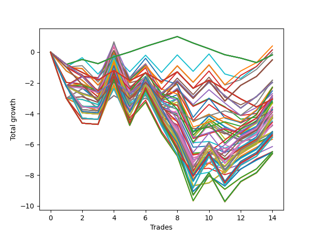

# Long HLT 101 
- Symbol: TSLA
- Date Range: 05/16/2022 - 05/17/2024
- Trading Period: 8:30-12:30
- Number of Trades: 14



| Id. | Name | Win Percent | Profit | Avg Profit / Trade | Avg Time / Trade | Std |      | Name | Win Percent | Profit | Avg Profit / Trade | Avg Time / Trade | Std |
| --- | ---- | ----------- | ------ | ------------------ | ---------------- | --- | ---- | ---- | ----------- | ------ | ------------------ | ---------------- | --- |
| | Sorted By <br> Profit | | | | | | | Sorted By <br> Win Percentage |||||
|0| TP-1 75m | 50.00 | 0.40 | 0.03 | 29:21 | 1.03 |     | TP-1 45m | 57.14 | -0.04 | -0.00 | 22:42 | 1.00 |
|1| TP-1 90m | 50.00 | 0.15 | 0.01 | 30:42 | 1.05 |     | TP-1 75m | 50.00 | 0.40 | 0.03 | 29:21 | 1.03 |
|2| TP-1 60m | 50.00 | 0.15 | 0.01 | 26:08 | 1.03 |     | TP-1 90m | 50.00 | 0.15 | 0.01 | 30:42 | 1.05 |
|3| TP-1 45m | 57.14 | -0.04 | -0.00 | 22:42 | 1.00 |     | TP-1 60m | 50.00 | 0.15 | 0.01 | 26:08 | 1.03 |
|4| TP-0.25 180m | 50.00 | -0.18 | -0.01 | 03:38 | 0.40 |     | TP-0.25 180m | 50.00 | -0.18 | -0.01 | 03:38 | 0.40 |
|5| TP-0.25 165m | 50.00 | -0.18 | -0.01 | 03:38 | 0.40 |     | TP-0.25 165m | 50.00 | -0.18 | -0.01 | 03:38 | 0.40 |
|6| TP-0.25 150m | 50.00 | -0.18 | -0.01 | 03:38 | 0.40 |     | TP-0.25 150m | 50.00 | -0.18 | -0.01 | 03:38 | 0.40 |
|7| TP-0.25 135m | 50.00 | -0.18 | -0.01 | 03:38 | 0.40 |     | TP-0.25 135m | 50.00 | -0.18 | -0.01 | 03:38 | 0.40 |
|8| TP-0.25 120m | 50.00 | -0.18 | -0.01 | 03:38 | 0.40 |     | TP-0.25 120m | 50.00 | -0.18 | -0.01 | 03:38 | 0.40 |
|9| TP-0.25 105m | 50.00 | -0.18 | -0.01 | 03:38 | 0.40 |     | TP-0.25 105m | 50.00 | -0.18 | -0.01 | 03:38 | 0.40 |
|10| TP-0.25 90m | 50.00 | -0.18 | -0.01 | 03:38 | 0.40 |     | TP-0.25 90m | 50.00 | -0.18 | -0.01 | 03:38 | 0.40 |
|11| TP-0.25 75m | 50.00 | -0.18 | -0.01 | 03:38 | 0.40 |     | TP-0.25 75m | 50.00 | -0.18 | -0.01 | 03:38 | 0.40 |
|12| TP-0.25 60m | 50.00 | -0.18 | -0.01 | 03:38 | 0.40 |     | TP-0.25 60m | 50.00 | -0.18 | -0.01 | 03:38 | 0.40 |
|13| TP-0.25 45m | 50.00 | -0.18 | -0.01 | 03:38 | 0.40 |     | TP-0.25 45m | 50.00 | -0.18 | -0.01 | 03:38 | 0.40 |
|14| TP-0.25 30m | 50.00 | -0.18 | -0.01 | 03:38 | 0.40 |     | TP-0.25 30m | 50.00 | -0.18 | -0.01 | 03:38 | 0.40 |
|15| TP-0.25 15m | 50.00 | -0.18 | -0.01 | 03:38 | 0.40 |     | TP-0.25 15m | 50.00 | -0.18 | -0.01 | 03:38 | 0.40 |
|16| TP-1 180m | 50.00 | -0.50 | -0.04 | 31:38 | 1.08 |     | TP-1 180m | 50.00 | -0.50 | -0.04 | 31:38 | 1.08 |
|17| TP-1 165m | 50.00 | -0.50 | -0.04 | 31:38 | 1.08 |     | TP-1 165m | 50.00 | -0.50 | -0.04 | 31:38 | 1.08 |
|18| TP-1 150m | 50.00 | -0.50 | -0.04 | 31:38 | 1.08 |     | TP-1 150m | 50.00 | -0.50 | -0.04 | 31:38 | 1.08 |
|19| TP-1 135m | 50.00 | -0.50 | -0.04 | 31:38 | 1.08 |     | TP-1 135m | 50.00 | -0.50 | -0.04 | 31:38 | 1.08 |
|20| TP-1 120m | 50.00 | -0.50 | -0.04 | 31:38 | 1.08 |     | TP-1 120m | 50.00 | -0.50 | -0.04 | 31:38 | 1.08 |
|21| TP-1 105m | 50.00 | -0.50 | -0.04 | 31:38 | 1.08 |     | TP-1 105m | 50.00 | -0.50 | -0.04 | 31:38 | 1.08 |
|22| TP-3 60m | 50.00 | -1.82 | -0.13 | 54:17 | 1.62 |     | TP-3 60m | 50.00 | -1.82 | -0.13 | 54:17 | 1.62 |
|23| TP-1 30m | 42.86 | -1.83 | -0.13 | 18:25 | 0.96 |     | TP-1.5 60m | 50.00 | -2.27 | -0.16 | 42:51 | 1.24 |
|24| TP-0.75 180m | 42.86 | -1.97 | -0.14 | 13:38 | 0.85 |     | TP-1.75 60m | 50.00 | -2.28 | -0.16 | 43:17 | 1.32 |
|25| TP-0.75 165m | 42.86 | -1.97 | -0.14 | 13:38 | 0.85 |     | TP-1.5 75m | 50.00 | -2.81 | -0.20 | 51:25 | 1.27 |
|26| TP-0.75 150m | 42.86 | -1.97 | -0.14 | 13:38 | 0.85 |     | TP-1.75 75m | 50.00 | -2.82 | -0.20 | 51:51 | 1.35 |
|27| TP-0.75 135m | 42.86 | -1.97 | -0.14 | 13:38 | 0.85 |     | TP-2.25 60m | 50.00 | -2.92 | -0.21 | 48:00 | 1.45 |
|28| TP-0.75 120m | 42.86 | -1.97 | -0.14 | 13:38 | 0.85 |     | TP-2 60m | 50.00 | -2.99 | -0.21 | 45:55 | 1.39 |
|29| TP-0.75 105m | 42.86 | -1.97 | -0.14 | 13:38 | 0.85 |     | TP-1.25 45m | 50.00 | -3.35 | -0.24 | 29:04 | 1.20 |
|30| TP-0.75 90m | 42.86 | -1.97 | -0.14 | 13:38 | 0.85 |     | TP-1.5 45m | 50.00 | -3.73 | -0.27 | 34:17 | 1.21 |
|31| TP-0.75 75m | 42.86 | -1.97 | -0.14 | 13:38 | 0.85 |     | TP-1.75 45m | 50.00 | -3.74 | -0.27 | 34:42 | 1.30 |
|32| TP-0.75 60m | 42.86 | -1.97 | -0.14 | 13:38 | 0.85 |     | TP-3 45m | 50.00 | -3.82 | -0.27 | 42:30 | 1.48 |
|33| TP-0.75 45m | 42.86 | -1.97 | -0.14 | 13:38 | 0.85 |     | TP-2.25 75m | 50.00 | -3.85 | -0.28 | 57:38 | 1.44 |
|34| TP-1.5 60m | 50.00 | -2.27 | -0.16 | 42:51 | 1.24 |     | TP-2 75m | 50.00 | -3.92 | -0.28 | 55:34 | 1.38 |
|35| TP-1.75 60m | 50.00 | -2.28 | -0.16 | 43:17 | 1.32 |     | TP-2.75 60m | 50.00 | -4.23 | -0.30 | 51:08 | 1.74 |
|36| TP-3 30m | 42.86 | -2.33 | -0.17 | 29:00 | 1.26 |     | TP-2.5 60m | 50.00 | -4.25 | -0.30 | 50:55 | 1.66 |
|37| TP-1.25 60m | 42.86 | -2.52 | -0.18 | 34:42 | 1.24 |     | TP-3 75m | 50.00 | -4.48 | -0.32 | 65:08 | 1.72 |
|38| TP-0.75 30m | 42.86 | -2.69 | -0.19 | 12:55 | 0.80 |     | TP-2.75 75m | 50.00 | -5.16 | -0.37 | 60:47 | 1.73 |
|39| TP-1.5 75m | 50.00 | -2.81 | -0.20 | 51:25 | 1.27 |     | TP-2.5 75m | 50.00 | -5.18 | -0.37 | 60:34 | 1.65 |
|40| TP-1.75 75m | 50.00 | -2.82 | -0.20 | 51:51 | 1.35 |     | TP-2.25 45m | 50.00 | -5.41 | -0.39 | 38:21 | 1.35 |
|41| TP-1 15m | 42.86 | -2.91 | -0.21 | 12:04 | 0.75 |     | TP-2 45m | 50.00 | -5.48 | -0.39 | 36:17 | 1.29 |
|42| TP-2.25 60m | 50.00 | -2.92 | -0.21 | 48:00 | 1.45 |     | TP-2.75 45m | 50.00 | -6.14 | -0.44 | 40:25 | 1.59 |
|43| TP-2 60m | 50.00 | -2.99 | -0.21 | 45:55 | 1.39 |     | TP-2.5 45m | 50.00 | -6.47 | -0.46 | 40:21 | 1.54 |
|44| TP-2 30m | 42.86 | -3.05 | -0.22 | 25:55 | 1.27 |     | TP-1 30m | 42.86 | -1.83 | -0.13 | 18:25 | 0.96 |
|45| TP-0.5 180m | 35.71 | -3.06 | -0.22 | 08:04 | 0.60 |     | TP-0.75 180m | 42.86 | -1.97 | -0.14 | 13:38 | 0.85 |
|46| TP-0.5 165m | 35.71 | -3.06 | -0.22 | 08:04 | 0.60 |     | TP-0.75 165m | 42.86 | -1.97 | -0.14 | 13:38 | 0.85 |
|47| TP-0.5 150m | 35.71 | -3.06 | -0.22 | 08:04 | 0.60 |     | TP-0.75 150m | 42.86 | -1.97 | -0.14 | 13:38 | 0.85 |
|48| TP-0.5 135m | 35.71 | -3.06 | -0.22 | 08:04 | 0.60 |     | TP-0.75 135m | 42.86 | -1.97 | -0.14 | 13:38 | 0.85 |
|49| TP-0.5 120m | 35.71 | -3.06 | -0.22 | 08:04 | 0.60 |     | TP-0.75 120m | 42.86 | -1.97 | -0.14 | 13:38 | 0.85 |
|50| TP-0.5 105m | 35.71 | -3.06 | -0.22 | 08:04 | 0.60 |     | TP-0.75 105m | 42.86 | -1.97 | -0.14 | 13:38 | 0.85 |
|51| TP-0.5 90m | 35.71 | -3.06 | -0.22 | 08:04 | 0.60 |     | TP-0.75 90m | 42.86 | -1.97 | -0.14 | 13:38 | 0.85 |
|52| TP-0.5 75m | 35.71 | -3.06 | -0.22 | 08:04 | 0.60 |     | TP-0.75 75m | 42.86 | -1.97 | -0.14 | 13:38 | 0.85 |
|53| TP-0.5 60m | 35.71 | -3.06 | -0.22 | 08:04 | 0.60 |     | TP-0.75 60m | 42.86 | -1.97 | -0.14 | 13:38 | 0.85 |
|54| TP-0.5 45m | 35.71 | -3.06 | -0.22 | 08:04 | 0.60 |     | TP-0.75 45m | 42.86 | -1.97 | -0.14 | 13:38 | 0.85 |
|55| TP-0.5 30m | 35.71 | -3.06 | -0.22 | 08:04 | 0.60 |     | TP-3 30m | 42.86 | -2.33 | -0.17 | 29:00 | 1.26 |
|56| TP-0.5 15m | 35.71 | -3.06 | -0.22 | 08:04 | 0.60 |     | TP-1.25 60m | 42.86 | -2.52 | -0.18 | 34:42 | 1.24 |
|57| TP-2.25 30m | 42.86 | -3.09 | -0.22 | 27:51 | 1.35 |     | TP-0.75 30m | 42.86 | -2.69 | -0.19 | 12:55 | 0.80 |
|58| TP-1.25 75m | 42.86 | -3.19 | -0.23 | 40:04 | 1.26 |     | TP-1 15m | 42.86 | -2.91 | -0.21 | 12:04 | 0.75 |
|59| TP-1.75 30m | 42.86 | -3.27 | -0.23 | 25:51 | 1.24 |     | TP-2 30m | 42.86 | -3.05 | -0.22 | 25:55 | 1.27 |
|60| TP-2.75 30m | 42.86 | -3.29 | -0.24 | 28:08 | 1.38 |     | TP-2.25 30m | 42.86 | -3.09 | -0.22 | 27:51 | 1.35 |
|61| TP-2.5 30m | 42.86 | -3.29 | -0.24 | 28:08 | 1.38 |     | TP-1.25 75m | 42.86 | -3.19 | -0.23 | 40:04 | 1.26 |
|62| TP-0.75 15m | 42.86 | -3.32 | -0.24 | 10:21 | 0.71 |     | TP-1.75 30m | 42.86 | -3.27 | -0.23 | 25:51 | 1.24 |
|63| TP-1.25 45m | 50.00 | -3.35 | -0.24 | 29:04 | 1.20 |     | TP-2.75 30m | 42.86 | -3.29 | -0.24 | 28:08 | 1.38 |
|64| TP-1.75 90m | 42.86 | -3.55 | -0.25 | 59:25 | 1.43 |     | TP-2.5 30m | 42.86 | -3.29 | -0.24 | 28:08 | 1.38 |
|65| TP-1.25 90m | 42.86 | -3.60 | -0.26 | 43:25 | 1.29 |     | TP-0.75 15m | 42.86 | -3.32 | -0.24 | 10:21 | 0.71 |
|66| TP-1.5 90m | 42.86 | -3.61 | -0.26 | 58:55 | 1.36 |     | TP-1.75 90m | 42.86 | -3.55 | -0.25 | 59:25 | 1.43 |
|67| TP-1.5 30m | 42.86 | -3.71 | -0.27 | 25:34 | 1.19 |     | TP-1.25 90m | 42.86 | -3.60 | -0.26 | 43:25 | 1.29 |
|68| TP-1.5 45m | 50.00 | -3.73 | -0.27 | 34:17 | 1.21 |     | TP-1.5 90m | 42.86 | -3.61 | -0.26 | 58:55 | 1.36 |
|69| TP-1.75 45m | 50.00 | -3.74 | -0.27 | 34:42 | 1.30 |     | TP-1.5 30m | 42.86 | -3.71 | -0.27 | 25:34 | 1.19 |
|70| TP-3 45m | 50.00 | -3.82 | -0.27 | 42:30 | 1.48 |     | TP-1.25 180m | 42.86 | -4.07 | -0.29 | 47:42 | 1.34 |
|71| TP-2.25 75m | 50.00 | -3.85 | -0.28 | 57:38 | 1.44 |     | TP-1.25 165m | 42.86 | -4.07 | -0.29 | 47:42 | 1.34 |
|72| TP-2 75m | 50.00 | -3.92 | -0.28 | 55:34 | 1.38 |     | TP-1.25 150m | 42.86 | -4.07 | -0.29 | 47:42 | 1.34 |
|73| TP-1.25 180m | 42.86 | -4.07 | -0.29 | 47:42 | 1.34 |     | TP-1.25 135m | 42.86 | -4.07 | -0.29 | 47:42 | 1.34 |
|74| TP-1.25 165m | 42.86 | -4.07 | -0.29 | 47:42 | 1.34 |     | TP-1.25 120m | 42.86 | -4.07 | -0.29 | 47:42 | 1.34 |
|75| TP-1.25 150m | 42.86 | -4.07 | -0.29 | 47:42 | 1.34 |     | TP-3 15m | 42.86 | -4.10 | -0.29 | 14:00 | 0.89 |
|76| TP-1.25 135m | 42.86 | -4.07 | -0.29 | 47:42 | 1.34 |     | TP-2.75 15m | 42.86 | -4.10 | -0.29 | 14:00 | 0.89 |
|77| TP-1.25 120m | 42.86 | -4.07 | -0.29 | 47:42 | 1.34 |     | TP-2.5 15m | 42.86 | -4.10 | -0.29 | 14:00 | 0.89 |
|78| TP-3 15m | 42.86 | -4.10 | -0.29 | 14:00 | 0.89 |     | TP-2.25 15m | 42.86 | -4.10 | -0.29 | 14:00 | 0.89 |
|79| TP-2.75 15m | 42.86 | -4.10 | -0.29 | 14:00 | 0.89 |     | TP-1.75 105m | 42.86 | -4.12 | -0.29 | 66:55 | 1.49 |
|80| TP-2.5 15m | 42.86 | -4.10 | -0.29 | 14:00 | 0.89 |     | TP-1.5 105m | 42.86 | -4.16 | -0.30 | 65:21 | 1.42 |
|81| TP-2.25 15m | 42.86 | -4.10 | -0.29 | 14:00 | 0.89 |     | TP-1.75 180m | 42.86 | -4.23 | -0.30 | 70:55 | 1.69 |
|82| TP-1.75 105m | 42.86 | -4.12 | -0.29 | 66:55 | 1.49 |     | TP-1.75 165m | 42.86 | -4.23 | -0.30 | 70:55 | 1.69 |
|83| TP-1.5 105m | 42.86 | -4.16 | -0.30 | 65:21 | 1.42 |     | TP-1.75 150m | 42.86 | -4.23 | -0.30 | 70:55 | 1.69 |
|84| TP-2.75 60m | 50.00 | -4.23 | -0.30 | 51:08 | 1.74 |     | TP-1.75 135m | 42.86 | -4.23 | -0.30 | 70:55 | 1.69 |
|85| TP-1.75 180m | 42.86 | -4.23 | -0.30 | 70:55 | 1.69 |     | TP-1.75 120m | 42.86 | -4.23 | -0.30 | 70:55 | 1.69 |
|86| TP-1.75 165m | 42.86 | -4.23 | -0.30 | 70:55 | 1.69 |     | TP-1.5 180m | 42.86 | -4.30 | -0.31 | 68:00 | 1.55 |
|87| TP-1.75 150m | 42.86 | -4.23 | -0.30 | 70:55 | 1.69 |     | TP-1.5 165m | 42.86 | -4.30 | -0.31 | 68:00 | 1.55 |
|88| TP-1.75 135m | 42.86 | -4.23 | -0.30 | 70:55 | 1.69 |     | TP-1.5 150m | 42.86 | -4.30 | -0.31 | 68:00 | 1.55 |
|89| TP-1.75 120m | 42.86 | -4.23 | -0.30 | 70:55 | 1.69 |     | TP-1.5 135m | 42.86 | -4.30 | -0.31 | 68:00 | 1.55 |
|90| TP-2.5 60m | 50.00 | -4.25 | -0.30 | 50:55 | 1.66 |     | TP-1.5 120m | 42.86 | -4.30 | -0.31 | 68:00 | 1.55 |
|91| TP-1.5 180m | 42.86 | -4.30 | -0.31 | 68:00 | 1.55 |     | TP-3 105m | 42.86 | -4.56 | -0.33 | 84:30 | 1.76 |
|92| TP-1.5 165m | 42.86 | -4.30 | -0.31 | 68:00 | 1.55 |     | TP-1.25 105m | 42.86 | -4.56 | -0.33 | 46:34 | 1.30 |
|93| TP-1.5 150m | 42.86 | -4.30 | -0.31 | 68:00 | 1.55 |     | TP-1.25 30m | 42.86 | -4.70 | -0.34 | 22:38 | 1.17 |
|94| TP-1.5 135m | 42.86 | -4.30 | -0.31 | 68:00 | 1.55 |     | TP-2 15m | 42.86 | -4.77 | -0.34 | 13:12 | 0.95 |
|95| TP-1.5 120m | 42.86 | -4.30 | -0.31 | 68:00 | 1.55 |     | TP-1.75 15m | 42.86 | -4.77 | -0.34 | 13:12 | 0.95 |
|96| TP-3 75m | 50.00 | -4.48 | -0.32 | 65:08 | 1.72 |     | TP-1.5 15m | 42.86 | -4.77 | -0.34 | 13:12 | 0.95 |
|97| TP-3 105m | 42.86 | -4.56 | -0.33 | 84:30 | 1.76 |     | TP-1.25 15m | 42.86 | -4.77 | -0.34 | 13:12 | 0.95 |
|98| TP-1.25 105m | 42.86 | -4.56 | -0.33 | 46:34 | 1.30 |     | TP-2.25 105m | 42.86 | -5.16 | -0.37 | 74:51 | 1.57 |
|99| TP-1.25 30m | 42.86 | -4.70 | -0.34 | 22:38 | 1.17 |     | TP-2.25 90m | 42.86 | -5.18 | -0.37 | 66:17 | 1.48 |
|100| TP-2 15m | 42.86 | -4.77 | -0.34 | 13:12 | 0.95 |     | TP-2 105m | 42.86 | -5.23 | -0.37 | 72:47 | 1.52 |
|101| TP-1.75 15m | 42.86 | -4.77 | -0.34 | 13:12 | 0.95 |     | TP-2 90m | 42.86 | -5.25 | -0.37 | 64:12 | 1.42 |
|102| TP-1.5 15m | 42.86 | -4.77 | -0.34 | 13:12 | 0.95 |     | TP-2.25 180m | 42.86 | -5.28 | -0.38 | 82:47 | 1.78 |
|103| TP-1.25 15m | 42.86 | -4.77 | -0.34 | 13:12 | 0.95 |     | TP-2.25 165m | 42.86 | -5.28 | -0.38 | 82:47 | 1.78 |
|104| TP-2.75 75m | 50.00 | -5.16 | -0.37 | 60:47 | 1.73 |     | TP-2.25 150m | 42.86 | -5.28 | -0.38 | 82:47 | 1.78 |
|105| TP-2.25 105m | 42.86 | -5.16 | -0.37 | 74:51 | 1.57 |     | TP-2.25 135m | 42.86 | -5.28 | -0.38 | 82:47 | 1.78 |
|106| TP-2.5 75m | 50.00 | -5.18 | -0.37 | 60:34 | 1.65 |     | TP-2.25 120m | 42.86 | -5.28 | -0.38 | 82:47 | 1.78 |
|107| TP-2.25 90m | 42.86 | -5.18 | -0.37 | 66:17 | 1.48 |     | TP-3 180m | 42.86 | -5.38 | -0.38 | 93:30 | 1.97 |
|108| TP-2 105m | 42.86 | -5.23 | -0.37 | 72:47 | 1.52 |     | TP-3 165m | 42.86 | -5.38 | -0.38 | 93:30 | 1.97 |
|109| TP-2 90m | 42.86 | -5.25 | -0.37 | 64:12 | 1.42 |     | TP-3 150m | 42.86 | -5.38 | -0.38 | 93:30 | 1.97 |
|110| TP-2.25 180m | 42.86 | -5.28 | -0.38 | 82:47 | 1.78 |     | TP-3 135m | 42.86 | -5.38 | -0.38 | 93:30 | 1.97 |
|111| TP-2.25 165m | 42.86 | -5.28 | -0.38 | 82:47 | 1.78 |     | TP-3 120m | 42.86 | -5.38 | -0.38 | 93:30 | 1.97 |
|112| TP-2.25 150m | 42.86 | -5.28 | -0.38 | 82:47 | 1.78 |     | TP-2 180m | 42.86 | -5.53 | -0.40 | 79:08 | 1.78 |
|113| TP-2.25 135m | 42.86 | -5.28 | -0.38 | 82:47 | 1.78 |     | TP-2 165m | 42.86 | -5.53 | -0.40 | 79:08 | 1.78 |
|114| TP-2.25 120m | 42.86 | -5.28 | -0.38 | 82:47 | 1.78 |     | TP-2 150m | 42.86 | -5.53 | -0.40 | 79:08 | 1.78 |
|115| TP-3 180m | 42.86 | -5.38 | -0.38 | 93:30 | 1.97 |     | TP-2 135m | 42.86 | -5.53 | -0.40 | 79:08 | 1.78 |
|116| TP-3 165m | 42.86 | -5.38 | -0.38 | 93:30 | 1.97 |     | TP-2 120m | 42.86 | -5.53 | -0.40 | 79:08 | 1.78 |
|117| TP-3 150m | 42.86 | -5.38 | -0.38 | 93:30 | 1.97 |     | TP-3 90m | 42.86 | -5.66 | -0.40 | 74:51 | 1.74 |
|118| TP-3 135m | 42.86 | -5.38 | -0.38 | 93:30 | 1.97 |     | TP-2.75 105m | 42.86 | -6.47 | -0.46 | 78:00 | 1.83 |
|119| TP-3 120m | 42.86 | -5.38 | -0.38 | 93:30 | 1.97 |     | TP-2.5 105m | 42.86 | -6.49 | -0.46 | 77:47 | 1.76 |
|120| TP-2.25 45m | 50.00 | -5.41 | -0.39 | 38:21 | 1.35 |     | TP-2.75 90m | 42.86 | -6.49 | -0.46 | 69:25 | 1.75 |
|121| TP-2 45m | 50.00 | -5.48 | -0.39 | 36:17 | 1.29 |     | TP-2.5 90m | 42.86 | -6.51 | -0.47 | 69:12 | 1.68 |
|122| TP-2 180m | 42.86 | -5.53 | -0.40 | 79:08 | 1.78 |     | TP-2.75 180m | 42.86 | -6.59 | -0.47 | 85:55 | 2.01 |
|123| TP-2 165m | 42.86 | -5.53 | -0.40 | 79:08 | 1.78 |     | TP-2.75 165m | 42.86 | -6.59 | -0.47 | 85:55 | 2.01 |
|124| TP-2 150m | 42.86 | -5.53 | -0.40 | 79:08 | 1.78 |     | TP-2.75 150m | 42.86 | -6.59 | -0.47 | 85:55 | 2.01 |
|125| TP-2 135m | 42.86 | -5.53 | -0.40 | 79:08 | 1.78 |     | TP-2.75 135m | 42.86 | -6.59 | -0.47 | 85:55 | 2.01 |
|126| TP-2 120m | 42.86 | -5.53 | -0.40 | 79:08 | 1.78 |     | TP-2.75 120m | 42.86 | -6.59 | -0.47 | 85:55 | 2.01 |
|127| TP-3 90m | 42.86 | -5.66 | -0.40 | 74:51 | 1.74 |     | TP-2.5 180m | 42.86 | -6.61 | -0.47 | 85:42 | 1.94 |
|128| TP-2.75 45m | 50.00 | -6.14 | -0.44 | 40:25 | 1.59 |     | TP-2.5 165m | 42.86 | -6.61 | -0.47 | 85:42 | 1.94 |
|129| TP-2.5 45m | 50.00 | -6.47 | -0.46 | 40:21 | 1.54 |     | TP-2.5 150m | 42.86 | -6.61 | -0.47 | 85:42 | 1.94 |
|130| TP-2.75 105m | 42.86 | -6.47 | -0.46 | 78:00 | 1.83 |     | TP-2.5 135m | 42.86 | -6.61 | -0.47 | 85:42 | 1.94 |
|131| TP-2.5 105m | 42.86 | -6.49 | -0.46 | 77:47 | 1.76 |     | TP-2.5 120m | 42.86 | -6.61 | -0.47 | 85:42 | 1.94 |
|132| TP-2.75 90m | 42.86 | -6.49 | -0.46 | 69:25 | 1.75 |     | TP-0.5 180m | 35.71 | -3.06 | -0.22 | 08:04 | 0.60 |
|133| TP-2.5 90m | 42.86 | -6.51 | -0.47 | 69:12 | 1.68 |     | TP-0.5 165m | 35.71 | -3.06 | -0.22 | 08:04 | 0.60 |
|134| TP-2.75 180m | 42.86 | -6.59 | -0.47 | 85:55 | 2.01 |     | TP-0.5 150m | 35.71 | -3.06 | -0.22 | 08:04 | 0.60 |
|135| TP-2.75 165m | 42.86 | -6.59 | -0.47 | 85:55 | 2.01 |     | TP-0.5 135m | 35.71 | -3.06 | -0.22 | 08:04 | 0.60 |
|136| TP-2.75 150m | 42.86 | -6.59 | -0.47 | 85:55 | 2.01 |     | TP-0.5 120m | 35.71 | -3.06 | -0.22 | 08:04 | 0.60 |
|137| TP-2.75 135m | 42.86 | -6.59 | -0.47 | 85:55 | 2.01 |     | TP-0.5 105m | 35.71 | -3.06 | -0.22 | 08:04 | 0.60 |
|138| TP-2.75 120m | 42.86 | -6.59 | -0.47 | 85:55 | 2.01 |     | TP-0.5 90m | 35.71 | -3.06 | -0.22 | 08:04 | 0.60 |
|139| TP-2.5 180m | 42.86 | -6.61 | -0.47 | 85:42 | 1.94 |     | TP-0.5 75m | 35.71 | -3.06 | -0.22 | 08:04 | 0.60 |
|140| TP-2.5 165m | 42.86 | -6.61 | -0.47 | 85:42 | 1.94 |     | TP-0.5 60m | 35.71 | -3.06 | -0.22 | 08:04 | 0.60 |
|141| TP-2.5 150m | 42.86 | -6.61 | -0.47 | 85:42 | 1.94 |     | TP-0.5 45m | 35.71 | -3.06 | -0.22 | 08:04 | 0.60 |
|142| TP-2.5 135m | 42.86 | -6.61 | -0.47 | 85:42 | 1.94 |     | TP-0.5 30m | 35.71 | -3.06 | -0.22 | 08:04 | 0.60 |
|143| TP-2.5 120m | 42.86 | -6.61 | -0.47 | 85:42 | 1.94 |     | TP-0.5 15m | 35.71 | -3.06 | -0.22 | 08:04 | 0.60 |

### Test TP-0.25 15m
* Take Profit of 0.25 Point
* 0.25 Stoploss
* Results:
```
Total Trades: 14
Percent Up: 50.00
Percent Down: 50.00
Total Points Moved Up: -0.18
Potential Profit: -90.00
Total Points Ups: 2.58 Count Ups: 7
Total Points Downs: -2.76 Count Downs: 7
```

<details><summary>Trades</summary>

<code>In: 2022-05-20 08:35:00		Out: 2022-05-20 08:37:00		Total Position Time: 02:00		Total Move Up: -0.80		Total to Date: -0.80</code> <br />
<code>In: 2022-11-21 09:40:00		Out: 2022-11-21 09:44:00		Total Position Time: 04:00		Total Move Up: 0.32		Total to Date: -0.48</code> <br />
<code>In: 2022-12-16 08:40:00		Out: 2022-12-16 08:43:00		Total Position Time: 03:00		Total Move Up: -0.27		Total to Date: -0.75</code> <br />
<code>In: 2022-12-19 09:10:00		Out: 2022-12-19 09:14:00		Total Position Time: 04:00		Total Move Up: 0.44		Total to Date: -0.31</code> <br />
<code>In: 2023-03-09 10:05:00		Out: 2023-03-09 10:08:00		Total Position Time: 03:00		Total Move Up: 0.32		Total to Date: 0.01</code> <br />
<code>In: 2023-04-14 09:30:00		Out: 2023-04-14 09:38:00		Total Position Time: 08:00		Total Move Up: 0.36		Total to Date: 0.37</code> <br />
<code>In: 2023-07-27 12:15:00		Out: 2023-07-27 12:20:00		Total Position Time: 05:00		Total Move Up: 0.32		Total to Date: 0.69</code> <br />
<code>In: 2023-10-25 11:00:00		Out: 2023-10-25 11:03:00		Total Position Time: 03:00		Total Move Up: 0.32		Total to Date: 1.01</code> <br />
<code>In: 2023-11-09 09:50:00		Out: 2023-11-09 09:56:00		Total Position Time: 06:00		Total Move Up: -0.42		Total to Date: 0.59</code> <br />
<code>In: 2023-11-22 08:45:00		Out: 2023-11-22 08:48:00		Total Position Time: 03:00		Total Move Up: -0.37		Total to Date: 0.22</code> <br />
<code>In: 2023-11-30 08:45:00		Out: 2023-11-30 08:47:00		Total Position Time: 02:00		Total Move Up: -0.39		Total to Date: -0.17</code> <br />
<code>In: 2024-02-20 09:35:00		Out: 2024-02-20 09:37:00		Total Position Time: 02:00		Total Move Up: -0.22		Total to Date: -0.39</code> <br />
<code>In: 2024-03-21 11:35:00		Out: 2024-03-21 11:38:00		Total Position Time: 03:00		Total Move Up: -0.29		Total to Date: -0.68</code> <br />
<code>In: 2024-04-30 09:00:00		Out: 2024-04-30 09:03:00		Total Position Time: 03:00		Total Move Up: 0.50		Total to Date: -0.18</code> <br />


</details>

### Test TP-0.5 15m
* Take Profit of 0.5 Point
* 0.5 Stoploss
* Results:
```
Total Trades: 14
Percent Up: 35.71
Percent Down: 64.29
Total Points Moved Up: -3.06
Potential Profit: -1530.00
Total Points Ups: 2.79 Count Ups: 5
Total Points Downs: -5.85 Count Downs: 9
```

<details><summary>Trades</summary>

<code>In: 2022-05-20 08:35:00		Out: 2022-05-20 08:37:00		Total Position Time: 02:00		Total Move Up: -0.80		Total to Date: -0.80</code> <br />
<code>In: 2022-11-21 09:40:00		Out: 2022-11-21 09:51:00		Total Position Time: 11:00		Total Move Up: -0.52		Total to Date: -1.32</code> <br />
<code>In: 2022-12-16 08:40:00		Out: 2022-12-16 08:48:00		Total Position Time: 08:00		Total Move Up: -0.50		Total to Date: -1.82</code> <br />
<code>In: 2022-12-19 09:10:00		Out: 2022-12-19 09:15:00		Total Position Time: 05:00		Total Move Up: 0.63		Total to Date: -1.19</code> <br />
<code>In: 2023-03-09 10:05:00		Out: 2023-03-09 10:15:00		Total Position Time: 10:00		Total Move Up: -0.66		Total to Date: -1.85</code> <br />
<code>In: 2023-04-14 09:30:00		Out: 2023-04-14 09:43:00		Total Position Time: 13:00		Total Move Up: 0.50		Total to Date: -1.35</code> <br />
<code>In: 2023-07-27 12:15:00		Out: 2023-07-27 12:24:00		Total Position Time: 09:00		Total Move Up: -0.56		Total to Date: -1.91</code> <br />
<code>In: 2023-10-25 11:00:00		Out: 2023-10-25 11:14:00		Total Position Time: 14:00		Total Move Up: 0.63		Total to Date: -1.28</code> <br />
<code>In: 2023-11-09 09:50:00		Out: 2023-11-09 10:02:00		Total Position Time: 12:00		Total Move Up: -1.07		Total to Date: -2.35</code> <br />
<code>In: 2023-11-22 08:45:00		Out: 2023-11-22 08:52:00		Total Position Time: 07:00		Total Move Up: 0.53		Total to Date: -1.82</code> <br />
<code>In: 2023-11-30 08:45:00		Out: 2023-11-30 08:57:00		Total Position Time: 12:00		Total Move Up: -0.60		Total to Date: -2.42</code> <br />
<code>In: 2024-02-20 09:35:00		Out: 2024-02-20 09:38:00		Total Position Time: 03:00		Total Move Up: -0.62		Total to Date: -3.04</code> <br />
<code>In: 2024-03-21 11:35:00		Out: 2024-03-21 11:39:00		Total Position Time: 04:00		Total Move Up: -0.52		Total to Date: -3.56</code> <br />
<code>In: 2024-04-30 09:00:00		Out: 2024-04-30 09:03:00		Total Position Time: 03:00		Total Move Up: 0.50		Total to Date: -3.06</code> <br />


</details>

### Test TP-0.75 15m
* Take Profit of 0.75 Point
* 0.75 Stoploss
* Results:
```
Total Trades: 14
Percent Up: 42.86
Percent Down: 57.14
Total Points Moved Up: -3.32
Potential Profit: -1660.00
Total Points Ups: 3.29 Count Ups: 6
Total Points Downs: -6.61 Count Downs: 8
```

<details><summary>Trades</summary>

<code>In: 2022-05-20 08:35:00		Out: 2022-05-20 08:37:00		Total Position Time: 02:00		Total Move Up: -0.80		Total to Date: -0.80</code> <br />
<code>In: 2022-11-21 09:40:00		Out: 2022-11-21 09:53:00		Total Position Time: 13:00		Total Move Up: -0.75		Total to Date: -1.55</code> <br />
<code>In: 2022-12-16 08:40:00		Out: 2022-12-16 08:50:00		Total Position Time: 10:00		Total Move Up: -1.07		Total to Date: -2.62</code> <br />
<code>In: 2022-12-19 09:10:00		Out: 2022-12-19 09:18:00		Total Position Time: 08:00		Total Move Up: 0.75		Total to Date: -1.87</code> <br />
<code>In: 2023-03-09 10:05:00		Out: 2023-03-09 10:16:00		Total Position Time: 11:00		Total Move Up: -0.79		Total to Date: -2.66</code> <br />
<code>In: 2023-04-14 09:30:00		Out: 2023-04-14 09:44:00		Total Position Time: 14:00		Total Move Up: 0.39		Total to Date: -2.27</code> <br />
<code>In: 2023-07-27 12:15:00		Out: 2023-07-27 12:25:00		Total Position Time: 10:00		Total Move Up: -0.78		Total to Date: -3.05</code> <br />
<code>In: 2023-10-25 11:00:00		Out: 2023-10-25 11:14:00		Total Position Time: 14:00		Total Move Up: 0.63		Total to Date: -2.42</code> <br />
<code>In: 2023-11-09 09:50:00		Out: 2023-11-09 10:02:00		Total Position Time: 12:00		Total Move Up: -1.07		Total to Date: -3.49</code> <br />
<code>In: 2023-11-22 08:45:00		Out: 2023-11-22 08:59:00		Total Position Time: 14:00		Total Move Up: 0.48		Total to Date: -3.01</code> <br />
<code>In: 2023-11-30 08:45:00		Out: 2023-11-30 08:59:00		Total Position Time: 14:00		Total Move Up: -0.54		Total to Date: -3.55</code> <br />
<code>In: 2024-02-20 09:35:00		Out: 2024-02-20 09:39:00		Total Position Time: 04:00		Total Move Up: -0.81		Total to Date: -4.36</code> <br />
<code>In: 2024-03-21 11:35:00		Out: 2024-03-21 11:49:00		Total Position Time: 14:00		Total Move Up: 0.13		Total to Date: -4.23</code> <br />
<code>In: 2024-04-30 09:00:00		Out: 2024-04-30 09:05:00		Total Position Time: 05:00		Total Move Up: 0.91		Total to Date: -3.32</code> <br />


</details>

### Test TP-1 15m
* Take Profit of 1 Point
* 1 Stoploss
* Results:
```
Total Trades: 14
Percent Up: 42.86
Percent Down: 57.14
Total Points Moved Up: -2.91
Potential Profit: -1455.00
Total Points Ups: 3.56 Count Ups: 6
Total Points Downs: -6.47 Count Downs: 8
```

<details><summary>Trades</summary>

<code>In: 2022-05-20 08:35:00		Out: 2022-05-20 08:38:00		Total Position Time: 03:00		Total Move Up: -0.98		Total to Date: -0.98</code> <br />
<code>In: 2022-11-21 09:40:00		Out: 2022-11-21 09:54:00		Total Position Time: 14:00		Total Move Up: -0.61		Total to Date: -1.59</code> <br />
<code>In: 2022-12-16 08:40:00		Out: 2022-12-16 08:50:00		Total Position Time: 10:00		Total Move Up: -1.07		Total to Date: -2.66</code> <br />
<code>In: 2022-12-19 09:10:00		Out: 2022-12-19 09:24:00		Total Position Time: 14:00		Total Move Up: 0.85		Total to Date: -1.81</code> <br />
<code>In: 2023-03-09 10:05:00		Out: 2023-03-09 10:19:00		Total Position Time: 14:00		Total Move Up: -0.55		Total to Date: -2.36</code> <br />
<code>In: 2023-04-14 09:30:00		Out: 2023-04-14 09:44:00		Total Position Time: 14:00		Total Move Up: 0.39		Total to Date: -1.97</code> <br />
<code>In: 2023-07-27 12:15:00		Out: 2023-07-27 12:27:00		Total Position Time: 12:00		Total Move Up: -1.12		Total to Date: -3.09</code> <br />
<code>In: 2023-10-25 11:00:00		Out: 2023-10-25 11:14:00		Total Position Time: 14:00		Total Move Up: 0.63		Total to Date: -2.46</code> <br />
<code>In: 2023-11-09 09:50:00		Out: 2023-11-09 10:02:00		Total Position Time: 12:00		Total Move Up: -1.07		Total to Date: -3.53</code> <br />
<code>In: 2023-11-22 08:45:00		Out: 2023-11-22 08:59:00		Total Position Time: 14:00		Total Move Up: 0.48		Total to Date: -3.05</code> <br />
<code>In: 2023-11-30 08:45:00		Out: 2023-11-30 08:59:00		Total Position Time: 14:00		Total Move Up: -0.54		Total to Date: -3.59</code> <br />
<code>In: 2024-02-20 09:35:00		Out: 2024-02-20 09:49:00		Total Position Time: 14:00		Total Move Up: -0.53		Total to Date: -4.12</code> <br />
<code>In: 2024-03-21 11:35:00		Out: 2024-03-21 11:49:00		Total Position Time: 14:00		Total Move Up: 0.13		Total to Date: -3.99</code> <br />
<code>In: 2024-04-30 09:00:00		Out: 2024-04-30 09:06:00		Total Position Time: 06:00		Total Move Up: 1.08		Total to Date: -2.91</code> <br />


</details>

### Test TP-1.25 15m
* Take Profit of 1.25 Point
* 1.25 Stoploss
* Results:
```
Total Trades: 14
Percent Up: 42.86
Percent Down: 57.14
Total Points Moved Up: -4.77
Potential Profit: -2385.00
Total Points Ups: 3.36 Count Ups: 6
Total Points Downs: -8.13 Count Downs: 8
```

<details><summary>Trades</summary>

<code>In: 2022-05-20 08:35:00		Out: 2022-05-20 08:39:00		Total Position Time: 04:00		Total Move Up: -2.18		Total to Date: -2.18</code> <br />
<code>In: 2022-11-21 09:40:00		Out: 2022-11-21 09:54:00		Total Position Time: 14:00		Total Move Up: -0.61		Total to Date: -2.79</code> <br />
<code>In: 2022-12-16 08:40:00		Out: 2022-12-16 08:54:00		Total Position Time: 14:00		Total Move Up: -0.89		Total to Date: -3.68</code> <br />
<code>In: 2022-12-19 09:10:00		Out: 2022-12-19 09:24:00		Total Position Time: 14:00		Total Move Up: 0.85		Total to Date: -2.83</code> <br />
<code>In: 2023-03-09 10:05:00		Out: 2023-03-09 10:19:00		Total Position Time: 14:00		Total Move Up: -0.55		Total to Date: -3.38</code> <br />
<code>In: 2023-04-14 09:30:00		Out: 2023-04-14 09:44:00		Total Position Time: 14:00		Total Move Up: 0.39		Total to Date: -2.99</code> <br />
<code>In: 2023-07-27 12:15:00		Out: 2023-07-27 12:29:00		Total Position Time: 14:00		Total Move Up: -0.68		Total to Date: -3.67</code> <br />
<code>In: 2023-10-25 11:00:00		Out: 2023-10-25 11:14:00		Total Position Time: 14:00		Total Move Up: 0.63		Total to Date: -3.04</code> <br />
<code>In: 2023-11-09 09:50:00		Out: 2023-11-09 10:03:00		Total Position Time: 13:00		Total Move Up: -2.15		Total to Date: -5.19</code> <br />
<code>In: 2023-11-22 08:45:00		Out: 2023-11-22 08:59:00		Total Position Time: 14:00		Total Move Up: 0.48		Total to Date: -4.71</code> <br />
<code>In: 2023-11-30 08:45:00		Out: 2023-11-30 08:59:00		Total Position Time: 14:00		Total Move Up: -0.54		Total to Date: -5.25</code> <br />
<code>In: 2024-02-20 09:35:00		Out: 2024-02-20 09:49:00		Total Position Time: 14:00		Total Move Up: -0.53		Total to Date: -5.78</code> <br />
<code>In: 2024-03-21 11:35:00		Out: 2024-03-21 11:49:00		Total Position Time: 14:00		Total Move Up: 0.13		Total to Date: -5.65</code> <br />
<code>In: 2024-04-30 09:00:00		Out: 2024-04-30 09:14:00		Total Position Time: 14:00		Total Move Up: 0.88		Total to Date: -4.77</code> <br />


</details>

### Test TP-1.5 15m
* Take Profit of 1.5 Point
* 1.5 Stoploss
* Results:
```
Total Trades: 14
Percent Up: 42.86
Percent Down: 57.14
Total Points Moved Up: -4.77
Potential Profit: -2385.00
Total Points Ups: 3.36 Count Ups: 6
Total Points Downs: -8.13 Count Downs: 8
```

<details><summary>Trades</summary>

<code>In: 2022-05-20 08:35:00		Out: 2022-05-20 08:39:00		Total Position Time: 04:00		Total Move Up: -2.18		Total to Date: -2.18</code> <br />
<code>In: 2022-11-21 09:40:00		Out: 2022-11-21 09:54:00		Total Position Time: 14:00		Total Move Up: -0.61		Total to Date: -2.79</code> <br />
<code>In: 2022-12-16 08:40:00		Out: 2022-12-16 08:54:00		Total Position Time: 14:00		Total Move Up: -0.89		Total to Date: -3.68</code> <br />
<code>In: 2022-12-19 09:10:00		Out: 2022-12-19 09:24:00		Total Position Time: 14:00		Total Move Up: 0.85		Total to Date: -2.83</code> <br />
<code>In: 2023-03-09 10:05:00		Out: 2023-03-09 10:19:00		Total Position Time: 14:00		Total Move Up: -0.55		Total to Date: -3.38</code> <br />
<code>In: 2023-04-14 09:30:00		Out: 2023-04-14 09:44:00		Total Position Time: 14:00		Total Move Up: 0.39		Total to Date: -2.99</code> <br />
<code>In: 2023-07-27 12:15:00		Out: 2023-07-27 12:29:00		Total Position Time: 14:00		Total Move Up: -0.68		Total to Date: -3.67</code> <br />
<code>In: 2023-10-25 11:00:00		Out: 2023-10-25 11:14:00		Total Position Time: 14:00		Total Move Up: 0.63		Total to Date: -3.04</code> <br />
<code>In: 2023-11-09 09:50:00		Out: 2023-11-09 10:03:00		Total Position Time: 13:00		Total Move Up: -2.15		Total to Date: -5.19</code> <br />
<code>In: 2023-11-22 08:45:00		Out: 2023-11-22 08:59:00		Total Position Time: 14:00		Total Move Up: 0.48		Total to Date: -4.71</code> <br />
<code>In: 2023-11-30 08:45:00		Out: 2023-11-30 08:59:00		Total Position Time: 14:00		Total Move Up: -0.54		Total to Date: -5.25</code> <br />
<code>In: 2024-02-20 09:35:00		Out: 2024-02-20 09:49:00		Total Position Time: 14:00		Total Move Up: -0.53		Total to Date: -5.78</code> <br />
<code>In: 2024-03-21 11:35:00		Out: 2024-03-21 11:49:00		Total Position Time: 14:00		Total Move Up: 0.13		Total to Date: -5.65</code> <br />
<code>In: 2024-04-30 09:00:00		Out: 2024-04-30 09:14:00		Total Position Time: 14:00		Total Move Up: 0.88		Total to Date: -4.77</code> <br />


</details>

### Test TP-1.75 15m
* Take Profit of 1.75 Point
* 1.75 Stoploss
* Results:
```
Total Trades: 14
Percent Up: 42.86
Percent Down: 57.14
Total Points Moved Up: -4.77
Potential Profit: -2385.00
Total Points Ups: 3.36 Count Ups: 6
Total Points Downs: -8.13 Count Downs: 8
```

<details><summary>Trades</summary>

<code>In: 2022-05-20 08:35:00		Out: 2022-05-20 08:39:00		Total Position Time: 04:00		Total Move Up: -2.18		Total to Date: -2.18</code> <br />
<code>In: 2022-11-21 09:40:00		Out: 2022-11-21 09:54:00		Total Position Time: 14:00		Total Move Up: -0.61		Total to Date: -2.79</code> <br />
<code>In: 2022-12-16 08:40:00		Out: 2022-12-16 08:54:00		Total Position Time: 14:00		Total Move Up: -0.89		Total to Date: -3.68</code> <br />
<code>In: 2022-12-19 09:10:00		Out: 2022-12-19 09:24:00		Total Position Time: 14:00		Total Move Up: 0.85		Total to Date: -2.83</code> <br />
<code>In: 2023-03-09 10:05:00		Out: 2023-03-09 10:19:00		Total Position Time: 14:00		Total Move Up: -0.55		Total to Date: -3.38</code> <br />
<code>In: 2023-04-14 09:30:00		Out: 2023-04-14 09:44:00		Total Position Time: 14:00		Total Move Up: 0.39		Total to Date: -2.99</code> <br />
<code>In: 2023-07-27 12:15:00		Out: 2023-07-27 12:29:00		Total Position Time: 14:00		Total Move Up: -0.68		Total to Date: -3.67</code> <br />
<code>In: 2023-10-25 11:00:00		Out: 2023-10-25 11:14:00		Total Position Time: 14:00		Total Move Up: 0.63		Total to Date: -3.04</code> <br />
<code>In: 2023-11-09 09:50:00		Out: 2023-11-09 10:03:00		Total Position Time: 13:00		Total Move Up: -2.15		Total to Date: -5.19</code> <br />
<code>In: 2023-11-22 08:45:00		Out: 2023-11-22 08:59:00		Total Position Time: 14:00		Total Move Up: 0.48		Total to Date: -4.71</code> <br />
<code>In: 2023-11-30 08:45:00		Out: 2023-11-30 08:59:00		Total Position Time: 14:00		Total Move Up: -0.54		Total to Date: -5.25</code> <br />
<code>In: 2024-02-20 09:35:00		Out: 2024-02-20 09:49:00		Total Position Time: 14:00		Total Move Up: -0.53		Total to Date: -5.78</code> <br />
<code>In: 2024-03-21 11:35:00		Out: 2024-03-21 11:49:00		Total Position Time: 14:00		Total Move Up: 0.13		Total to Date: -5.65</code> <br />
<code>In: 2024-04-30 09:00:00		Out: 2024-04-30 09:14:00		Total Position Time: 14:00		Total Move Up: 0.88		Total to Date: -4.77</code> <br />


</details>

### Test TP-2 15m
* Take Profit of 2 Point
* 2 Stoploss
* Results:
```
Total Trades: 14
Percent Up: 42.86
Percent Down: 57.14
Total Points Moved Up: -4.77
Potential Profit: -2385.00
Total Points Ups: 3.36 Count Ups: 6
Total Points Downs: -8.13 Count Downs: 8
```

<details><summary>Trades</summary>

<code>In: 2022-05-20 08:35:00		Out: 2022-05-20 08:39:00		Total Position Time: 04:00		Total Move Up: -2.18		Total to Date: -2.18</code> <br />
<code>In: 2022-11-21 09:40:00		Out: 2022-11-21 09:54:00		Total Position Time: 14:00		Total Move Up: -0.61		Total to Date: -2.79</code> <br />
<code>In: 2022-12-16 08:40:00		Out: 2022-12-16 08:54:00		Total Position Time: 14:00		Total Move Up: -0.89		Total to Date: -3.68</code> <br />
<code>In: 2022-12-19 09:10:00		Out: 2022-12-19 09:24:00		Total Position Time: 14:00		Total Move Up: 0.85		Total to Date: -2.83</code> <br />
<code>In: 2023-03-09 10:05:00		Out: 2023-03-09 10:19:00		Total Position Time: 14:00		Total Move Up: -0.55		Total to Date: -3.38</code> <br />
<code>In: 2023-04-14 09:30:00		Out: 2023-04-14 09:44:00		Total Position Time: 14:00		Total Move Up: 0.39		Total to Date: -2.99</code> <br />
<code>In: 2023-07-27 12:15:00		Out: 2023-07-27 12:29:00		Total Position Time: 14:00		Total Move Up: -0.68		Total to Date: -3.67</code> <br />
<code>In: 2023-10-25 11:00:00		Out: 2023-10-25 11:14:00		Total Position Time: 14:00		Total Move Up: 0.63		Total to Date: -3.04</code> <br />
<code>In: 2023-11-09 09:50:00		Out: 2023-11-09 10:03:00		Total Position Time: 13:00		Total Move Up: -2.15		Total to Date: -5.19</code> <br />
<code>In: 2023-11-22 08:45:00		Out: 2023-11-22 08:59:00		Total Position Time: 14:00		Total Move Up: 0.48		Total to Date: -4.71</code> <br />
<code>In: 2023-11-30 08:45:00		Out: 2023-11-30 08:59:00		Total Position Time: 14:00		Total Move Up: -0.54		Total to Date: -5.25</code> <br />
<code>In: 2024-02-20 09:35:00		Out: 2024-02-20 09:49:00		Total Position Time: 14:00		Total Move Up: -0.53		Total to Date: -5.78</code> <br />
<code>In: 2024-03-21 11:35:00		Out: 2024-03-21 11:49:00		Total Position Time: 14:00		Total Move Up: 0.13		Total to Date: -5.65</code> <br />
<code>In: 2024-04-30 09:00:00		Out: 2024-04-30 09:14:00		Total Position Time: 14:00		Total Move Up: 0.88		Total to Date: -4.77</code> <br />


</details>

### Test TP-2.25 15m
* Take Profit of 2.25 Point
* 2.25 Stoploss
* Results:
```
Total Trades: 14
Percent Up: 42.86
Percent Down: 57.14
Total Points Moved Up: -4.10
Potential Profit: -2050.00
Total Points Ups: 3.36 Count Ups: 6
Total Points Downs: -7.46 Count Downs: 8
```

<details><summary>Trades</summary>

<code>In: 2022-05-20 08:35:00		Out: 2022-05-20 08:49:00		Total Position Time: 14:00		Total Move Up: -1.22		Total to Date: -1.22</code> <br />
<code>In: 2022-11-21 09:40:00		Out: 2022-11-21 09:54:00		Total Position Time: 14:00		Total Move Up: -0.61		Total to Date: -1.83</code> <br />
<code>In: 2022-12-16 08:40:00		Out: 2022-12-16 08:54:00		Total Position Time: 14:00		Total Move Up: -0.89		Total to Date: -2.72</code> <br />
<code>In: 2022-12-19 09:10:00		Out: 2022-12-19 09:24:00		Total Position Time: 14:00		Total Move Up: 0.85		Total to Date: -1.87</code> <br />
<code>In: 2023-03-09 10:05:00		Out: 2023-03-09 10:19:00		Total Position Time: 14:00		Total Move Up: -0.55		Total to Date: -2.42</code> <br />
<code>In: 2023-04-14 09:30:00		Out: 2023-04-14 09:44:00		Total Position Time: 14:00		Total Move Up: 0.39		Total to Date: -2.03</code> <br />
<code>In: 2023-07-27 12:15:00		Out: 2023-07-27 12:29:00		Total Position Time: 14:00		Total Move Up: -0.68		Total to Date: -2.71</code> <br />
<code>In: 2023-10-25 11:00:00		Out: 2023-10-25 11:14:00		Total Position Time: 14:00		Total Move Up: 0.63		Total to Date: -2.08</code> <br />
<code>In: 2023-11-09 09:50:00		Out: 2023-11-09 10:04:00		Total Position Time: 14:00		Total Move Up: -2.44		Total to Date: -4.52</code> <br />
<code>In: 2023-11-22 08:45:00		Out: 2023-11-22 08:59:00		Total Position Time: 14:00		Total Move Up: 0.48		Total to Date: -4.04</code> <br />
<code>In: 2023-11-30 08:45:00		Out: 2023-11-30 08:59:00		Total Position Time: 14:00		Total Move Up: -0.54		Total to Date: -4.58</code> <br />
<code>In: 2024-02-20 09:35:00		Out: 2024-02-20 09:49:00		Total Position Time: 14:00		Total Move Up: -0.53		Total to Date: -5.11</code> <br />
<code>In: 2024-03-21 11:35:00		Out: 2024-03-21 11:49:00		Total Position Time: 14:00		Total Move Up: 0.13		Total to Date: -4.98</code> <br />
<code>In: 2024-04-30 09:00:00		Out: 2024-04-30 09:14:00		Total Position Time: 14:00		Total Move Up: 0.88		Total to Date: -4.10</code> <br />


</details>

### Test TP-2.5 15m
* Take Profit of 2.5 Point
* 2.5 Stoploss
* Results:
```
Total Trades: 14
Percent Up: 42.86
Percent Down: 57.14
Total Points Moved Up: -4.10
Potential Profit: -2050.00
Total Points Ups: 3.36 Count Ups: 6
Total Points Downs: -7.46 Count Downs: 8
```

<details><summary>Trades</summary>

<code>In: 2022-05-20 08:35:00		Out: 2022-05-20 08:49:00		Total Position Time: 14:00		Total Move Up: -1.22		Total to Date: -1.22</code> <br />
<code>In: 2022-11-21 09:40:00		Out: 2022-11-21 09:54:00		Total Position Time: 14:00		Total Move Up: -0.61		Total to Date: -1.83</code> <br />
<code>In: 2022-12-16 08:40:00		Out: 2022-12-16 08:54:00		Total Position Time: 14:00		Total Move Up: -0.89		Total to Date: -2.72</code> <br />
<code>In: 2022-12-19 09:10:00		Out: 2022-12-19 09:24:00		Total Position Time: 14:00		Total Move Up: 0.85		Total to Date: -1.87</code> <br />
<code>In: 2023-03-09 10:05:00		Out: 2023-03-09 10:19:00		Total Position Time: 14:00		Total Move Up: -0.55		Total to Date: -2.42</code> <br />
<code>In: 2023-04-14 09:30:00		Out: 2023-04-14 09:44:00		Total Position Time: 14:00		Total Move Up: 0.39		Total to Date: -2.03</code> <br />
<code>In: 2023-07-27 12:15:00		Out: 2023-07-27 12:29:00		Total Position Time: 14:00		Total Move Up: -0.68		Total to Date: -2.71</code> <br />
<code>In: 2023-10-25 11:00:00		Out: 2023-10-25 11:14:00		Total Position Time: 14:00		Total Move Up: 0.63		Total to Date: -2.08</code> <br />
<code>In: 2023-11-09 09:50:00		Out: 2023-11-09 10:04:00		Total Position Time: 14:00		Total Move Up: -2.44		Total to Date: -4.52</code> <br />
<code>In: 2023-11-22 08:45:00		Out: 2023-11-22 08:59:00		Total Position Time: 14:00		Total Move Up: 0.48		Total to Date: -4.04</code> <br />
<code>In: 2023-11-30 08:45:00		Out: 2023-11-30 08:59:00		Total Position Time: 14:00		Total Move Up: -0.54		Total to Date: -4.58</code> <br />
<code>In: 2024-02-20 09:35:00		Out: 2024-02-20 09:49:00		Total Position Time: 14:00		Total Move Up: -0.53		Total to Date: -5.11</code> <br />
<code>In: 2024-03-21 11:35:00		Out: 2024-03-21 11:49:00		Total Position Time: 14:00		Total Move Up: 0.13		Total to Date: -4.98</code> <br />
<code>In: 2024-04-30 09:00:00		Out: 2024-04-30 09:14:00		Total Position Time: 14:00		Total Move Up: 0.88		Total to Date: -4.10</code> <br />


</details>

### Test TP-2.75 15m
* Take Profit of 2.75 Point
* 2.75 Stoploss
* Results:
```
Total Trades: 14
Percent Up: 42.86
Percent Down: 57.14
Total Points Moved Up: -4.10
Potential Profit: -2050.00
Total Points Ups: 3.36 Count Ups: 6
Total Points Downs: -7.46 Count Downs: 8
```

<details><summary>Trades</summary>

<code>In: 2022-05-20 08:35:00		Out: 2022-05-20 08:49:00		Total Position Time: 14:00		Total Move Up: -1.22		Total to Date: -1.22</code> <br />
<code>In: 2022-11-21 09:40:00		Out: 2022-11-21 09:54:00		Total Position Time: 14:00		Total Move Up: -0.61		Total to Date: -1.83</code> <br />
<code>In: 2022-12-16 08:40:00		Out: 2022-12-16 08:54:00		Total Position Time: 14:00		Total Move Up: -0.89		Total to Date: -2.72</code> <br />
<code>In: 2022-12-19 09:10:00		Out: 2022-12-19 09:24:00		Total Position Time: 14:00		Total Move Up: 0.85		Total to Date: -1.87</code> <br />
<code>In: 2023-03-09 10:05:00		Out: 2023-03-09 10:19:00		Total Position Time: 14:00		Total Move Up: -0.55		Total to Date: -2.42</code> <br />
<code>In: 2023-04-14 09:30:00		Out: 2023-04-14 09:44:00		Total Position Time: 14:00		Total Move Up: 0.39		Total to Date: -2.03</code> <br />
<code>In: 2023-07-27 12:15:00		Out: 2023-07-27 12:29:00		Total Position Time: 14:00		Total Move Up: -0.68		Total to Date: -2.71</code> <br />
<code>In: 2023-10-25 11:00:00		Out: 2023-10-25 11:14:00		Total Position Time: 14:00		Total Move Up: 0.63		Total to Date: -2.08</code> <br />
<code>In: 2023-11-09 09:50:00		Out: 2023-11-09 10:04:00		Total Position Time: 14:00		Total Move Up: -2.44		Total to Date: -4.52</code> <br />
<code>In: 2023-11-22 08:45:00		Out: 2023-11-22 08:59:00		Total Position Time: 14:00		Total Move Up: 0.48		Total to Date: -4.04</code> <br />
<code>In: 2023-11-30 08:45:00		Out: 2023-11-30 08:59:00		Total Position Time: 14:00		Total Move Up: -0.54		Total to Date: -4.58</code> <br />
<code>In: 2024-02-20 09:35:00		Out: 2024-02-20 09:49:00		Total Position Time: 14:00		Total Move Up: -0.53		Total to Date: -5.11</code> <br />
<code>In: 2024-03-21 11:35:00		Out: 2024-03-21 11:49:00		Total Position Time: 14:00		Total Move Up: 0.13		Total to Date: -4.98</code> <br />
<code>In: 2024-04-30 09:00:00		Out: 2024-04-30 09:14:00		Total Position Time: 14:00		Total Move Up: 0.88		Total to Date: -4.10</code> <br />


</details>

### Test TP-3 15m
* Take Profit of 3 Point
* 3 Stoploss
* Results:
```
Total Trades: 14
Percent Up: 42.86
Percent Down: 57.14
Total Points Moved Up: -4.10
Potential Profit: -2050.00
Total Points Ups: 3.36 Count Ups: 6
Total Points Downs: -7.46 Count Downs: 8
```

<details><summary>Trades</summary>

<code>In: 2022-05-20 08:35:00		Out: 2022-05-20 08:49:00		Total Position Time: 14:00		Total Move Up: -1.22		Total to Date: -1.22</code> <br />
<code>In: 2022-11-21 09:40:00		Out: 2022-11-21 09:54:00		Total Position Time: 14:00		Total Move Up: -0.61		Total to Date: -1.83</code> <br />
<code>In: 2022-12-16 08:40:00		Out: 2022-12-16 08:54:00		Total Position Time: 14:00		Total Move Up: -0.89		Total to Date: -2.72</code> <br />
<code>In: 2022-12-19 09:10:00		Out: 2022-12-19 09:24:00		Total Position Time: 14:00		Total Move Up: 0.85		Total to Date: -1.87</code> <br />
<code>In: 2023-03-09 10:05:00		Out: 2023-03-09 10:19:00		Total Position Time: 14:00		Total Move Up: -0.55		Total to Date: -2.42</code> <br />
<code>In: 2023-04-14 09:30:00		Out: 2023-04-14 09:44:00		Total Position Time: 14:00		Total Move Up: 0.39		Total to Date: -2.03</code> <br />
<code>In: 2023-07-27 12:15:00		Out: 2023-07-27 12:29:00		Total Position Time: 14:00		Total Move Up: -0.68		Total to Date: -2.71</code> <br />
<code>In: 2023-10-25 11:00:00		Out: 2023-10-25 11:14:00		Total Position Time: 14:00		Total Move Up: 0.63		Total to Date: -2.08</code> <br />
<code>In: 2023-11-09 09:50:00		Out: 2023-11-09 10:04:00		Total Position Time: 14:00		Total Move Up: -2.44		Total to Date: -4.52</code> <br />
<code>In: 2023-11-22 08:45:00		Out: 2023-11-22 08:59:00		Total Position Time: 14:00		Total Move Up: 0.48		Total to Date: -4.04</code> <br />
<code>In: 2023-11-30 08:45:00		Out: 2023-11-30 08:59:00		Total Position Time: 14:00		Total Move Up: -0.54		Total to Date: -4.58</code> <br />
<code>In: 2024-02-20 09:35:00		Out: 2024-02-20 09:49:00		Total Position Time: 14:00		Total Move Up: -0.53		Total to Date: -5.11</code> <br />
<code>In: 2024-03-21 11:35:00		Out: 2024-03-21 11:49:00		Total Position Time: 14:00		Total Move Up: 0.13		Total to Date: -4.98</code> <br />
<code>In: 2024-04-30 09:00:00		Out: 2024-04-30 09:14:00		Total Position Time: 14:00		Total Move Up: 0.88		Total to Date: -4.10</code> <br />


</details>

### Test TP-0.25 30m
* Take Profit of 0.25 Point
* 0.25 Stoploss
* Results:
```
Total Trades: 14
Percent Up: 50.00
Percent Down: 50.00
Total Points Moved Up: -0.18
Potential Profit: -90.00
Total Points Ups: 2.58 Count Ups: 7
Total Points Downs: -2.76 Count Downs: 7
```

<details><summary>Trades</summary>

<code>In: 2022-05-20 08:35:00		Out: 2022-05-20 08:37:00		Total Position Time: 02:00		Total Move Up: -0.80		Total to Date: -0.80</code> <br />
<code>In: 2022-11-21 09:40:00		Out: 2022-11-21 09:44:00		Total Position Time: 04:00		Total Move Up: 0.32		Total to Date: -0.48</code> <br />
<code>In: 2022-12-16 08:40:00		Out: 2022-12-16 08:43:00		Total Position Time: 03:00		Total Move Up: -0.27		Total to Date: -0.75</code> <br />
<code>In: 2022-12-19 09:10:00		Out: 2022-12-19 09:14:00		Total Position Time: 04:00		Total Move Up: 0.44		Total to Date: -0.31</code> <br />
<code>In: 2023-03-09 10:05:00		Out: 2023-03-09 10:08:00		Total Position Time: 03:00		Total Move Up: 0.32		Total to Date: 0.01</code> <br />
<code>In: 2023-04-14 09:30:00		Out: 2023-04-14 09:38:00		Total Position Time: 08:00		Total Move Up: 0.36		Total to Date: 0.37</code> <br />
<code>In: 2023-07-27 12:15:00		Out: 2023-07-27 12:20:00		Total Position Time: 05:00		Total Move Up: 0.32		Total to Date: 0.69</code> <br />
<code>In: 2023-10-25 11:00:00		Out: 2023-10-25 11:03:00		Total Position Time: 03:00		Total Move Up: 0.32		Total to Date: 1.01</code> <br />
<code>In: 2023-11-09 09:50:00		Out: 2023-11-09 09:56:00		Total Position Time: 06:00		Total Move Up: -0.42		Total to Date: 0.59</code> <br />
<code>In: 2023-11-22 08:45:00		Out: 2023-11-22 08:48:00		Total Position Time: 03:00		Total Move Up: -0.37		Total to Date: 0.22</code> <br />
<code>In: 2023-11-30 08:45:00		Out: 2023-11-30 08:47:00		Total Position Time: 02:00		Total Move Up: -0.39		Total to Date: -0.17</code> <br />
<code>In: 2024-02-20 09:35:00		Out: 2024-02-20 09:37:00		Total Position Time: 02:00		Total Move Up: -0.22		Total to Date: -0.39</code> <br />
<code>In: 2024-03-21 11:35:00		Out: 2024-03-21 11:38:00		Total Position Time: 03:00		Total Move Up: -0.29		Total to Date: -0.68</code> <br />
<code>In: 2024-04-30 09:00:00		Out: 2024-04-30 09:03:00		Total Position Time: 03:00		Total Move Up: 0.50		Total to Date: -0.18</code> <br />


</details>

### Test TP-0.5 30m
* Take Profit of 0.5 Point
* 0.5 Stoploss
* Results:
```
Total Trades: 14
Percent Up: 35.71
Percent Down: 64.29
Total Points Moved Up: -3.06
Potential Profit: -1530.00
Total Points Ups: 2.79 Count Ups: 5
Total Points Downs: -5.85 Count Downs: 9
```

<details><summary>Trades</summary>

<code>In: 2022-05-20 08:35:00		Out: 2022-05-20 08:37:00		Total Position Time: 02:00		Total Move Up: -0.80		Total to Date: -0.80</code> <br />
<code>In: 2022-11-21 09:40:00		Out: 2022-11-21 09:51:00		Total Position Time: 11:00		Total Move Up: -0.52		Total to Date: -1.32</code> <br />
<code>In: 2022-12-16 08:40:00		Out: 2022-12-16 08:48:00		Total Position Time: 08:00		Total Move Up: -0.50		Total to Date: -1.82</code> <br />
<code>In: 2022-12-19 09:10:00		Out: 2022-12-19 09:15:00		Total Position Time: 05:00		Total Move Up: 0.63		Total to Date: -1.19</code> <br />
<code>In: 2023-03-09 10:05:00		Out: 2023-03-09 10:15:00		Total Position Time: 10:00		Total Move Up: -0.66		Total to Date: -1.85</code> <br />
<code>In: 2023-04-14 09:30:00		Out: 2023-04-14 09:43:00		Total Position Time: 13:00		Total Move Up: 0.50		Total to Date: -1.35</code> <br />
<code>In: 2023-07-27 12:15:00		Out: 2023-07-27 12:24:00		Total Position Time: 09:00		Total Move Up: -0.56		Total to Date: -1.91</code> <br />
<code>In: 2023-10-25 11:00:00		Out: 2023-10-25 11:14:00		Total Position Time: 14:00		Total Move Up: 0.63		Total to Date: -1.28</code> <br />
<code>In: 2023-11-09 09:50:00		Out: 2023-11-09 10:02:00		Total Position Time: 12:00		Total Move Up: -1.07		Total to Date: -2.35</code> <br />
<code>In: 2023-11-22 08:45:00		Out: 2023-11-22 08:52:00		Total Position Time: 07:00		Total Move Up: 0.53		Total to Date: -1.82</code> <br />
<code>In: 2023-11-30 08:45:00		Out: 2023-11-30 08:57:00		Total Position Time: 12:00		Total Move Up: -0.60		Total to Date: -2.42</code> <br />
<code>In: 2024-02-20 09:35:00		Out: 2024-02-20 09:38:00		Total Position Time: 03:00		Total Move Up: -0.62		Total to Date: -3.04</code> <br />
<code>In: 2024-03-21 11:35:00		Out: 2024-03-21 11:39:00		Total Position Time: 04:00		Total Move Up: -0.52		Total to Date: -3.56</code> <br />
<code>In: 2024-04-30 09:00:00		Out: 2024-04-30 09:03:00		Total Position Time: 03:00		Total Move Up: 0.50		Total to Date: -3.06</code> <br />


</details>

### Test TP-0.75 30m
* Take Profit of 0.75 Point
* 0.75 Stoploss
* Results:
```
Total Trades: 14
Percent Up: 42.86
Percent Down: 57.14
Total Points Moved Up: -2.69
Potential Profit: -1345.00
Total Points Ups: 4.25 Count Ups: 6
Total Points Downs: -6.94 Count Downs: 8
```

<details><summary>Trades</summary>

<code>In: 2022-05-20 08:35:00		Out: 2022-05-20 08:37:00		Total Position Time: 02:00		Total Move Up: -0.80		Total to Date: -0.80</code> <br />
<code>In: 2022-11-21 09:40:00		Out: 2022-11-21 09:53:00		Total Position Time: 13:00		Total Move Up: -0.75		Total to Date: -1.55</code> <br />
<code>In: 2022-12-16 08:40:00		Out: 2022-12-16 08:50:00		Total Position Time: 10:00		Total Move Up: -1.07		Total to Date: -2.62</code> <br />
<code>In: 2022-12-19 09:10:00		Out: 2022-12-19 09:18:00		Total Position Time: 08:00		Total Move Up: 0.75		Total to Date: -1.87</code> <br />
<code>In: 2023-03-09 10:05:00		Out: 2023-03-09 10:16:00		Total Position Time: 11:00		Total Move Up: -0.79		Total to Date: -2.66</code> <br />
<code>In: 2023-04-14 09:30:00		Out: 2023-04-14 09:59:00		Total Position Time: 29:00		Total Move Up: 0.29		Total to Date: -2.37</code> <br />
<code>In: 2023-07-27 12:15:00		Out: 2023-07-27 12:25:00		Total Position Time: 10:00		Total Move Up: -0.78		Total to Date: -3.15</code> <br />
<code>In: 2023-10-25 11:00:00		Out: 2023-10-25 11:16:00		Total Position Time: 16:00		Total Move Up: 0.81		Total to Date: -2.34</code> <br />
<code>In: 2023-11-09 09:50:00		Out: 2023-11-09 10:02:00		Total Position Time: 12:00		Total Move Up: -1.07		Total to Date: -3.41</code> <br />
<code>In: 2023-11-22 08:45:00		Out: 2023-11-22 09:02:00		Total Position Time: 17:00		Total Move Up: 0.97		Total to Date: -2.44</code> <br />
<code>In: 2023-11-30 08:45:00		Out: 2023-11-30 09:00:00		Total Position Time: 15:00		Total Move Up: -0.87		Total to Date: -3.31</code> <br />
<code>In: 2024-02-20 09:35:00		Out: 2024-02-20 09:39:00		Total Position Time: 04:00		Total Move Up: -0.81		Total to Date: -4.12</code> <br />
<code>In: 2024-03-21 11:35:00		Out: 2024-03-21 12:04:00		Total Position Time: 29:00		Total Move Up: 0.52		Total to Date: -3.60</code> <br />
<code>In: 2024-04-30 09:00:00		Out: 2024-04-30 09:05:00		Total Position Time: 05:00		Total Move Up: 0.91		Total to Date: -2.69</code> <br />


</details>

### Test TP-1 30m
* Take Profit of 1 Point
* 1 Stoploss
* Results:
```
Total Trades: 14
Percent Up: 42.86
Percent Down: 57.14
Total Points Moved Up: -1.83
Potential Profit: -915.00
Total Points Ups: 5.39 Count Ups: 6
Total Points Downs: -7.22 Count Downs: 8
```

<details><summary>Trades</summary>

<code>In: 2022-05-20 08:35:00		Out: 2022-05-20 08:38:00		Total Position Time: 03:00		Total Move Up: -0.98		Total to Date: -0.98</code> <br />
<code>In: 2022-11-21 09:40:00		Out: 2022-11-21 10:09:00		Total Position Time: 29:00		Total Move Up: -0.10		Total to Date: -1.08</code> <br />
<code>In: 2022-12-16 08:40:00		Out: 2022-12-16 08:50:00		Total Position Time: 10:00		Total Move Up: -1.07		Total to Date: -2.15</code> <br />
<code>In: 2022-12-19 09:10:00		Out: 2022-12-19 09:31:00		Total Position Time: 21:00		Total Move Up: 1.23		Total to Date: -0.92</code> <br />
<code>In: 2023-03-09 10:05:00		Out: 2023-03-09 10:26:00		Total Position Time: 21:00		Total Move Up: -1.08		Total to Date: -2.00</code> <br />
<code>In: 2023-04-14 09:30:00		Out: 2023-04-14 09:59:00		Total Position Time: 29:00		Total Move Up: 0.29		Total to Date: -1.71</code> <br />
<code>In: 2023-07-27 12:15:00		Out: 2023-07-27 12:27:00		Total Position Time: 12:00		Total Move Up: -1.12		Total to Date: -2.83</code> <br />
<code>In: 2023-10-25 11:00:00		Out: 2023-10-25 11:18:00		Total Position Time: 18:00		Total Move Up: 1.14		Total to Date: -1.69</code> <br />
<code>In: 2023-11-09 09:50:00		Out: 2023-11-09 10:02:00		Total Position Time: 12:00		Total Move Up: -1.07		Total to Date: -2.76</code> <br />
<code>In: 2023-11-22 08:45:00		Out: 2023-11-22 09:08:00		Total Position Time: 23:00		Total Move Up: 1.13		Total to Date: -1.63</code> <br />
<code>In: 2023-11-30 08:45:00		Out: 2023-11-30 09:01:00		Total Position Time: 16:00		Total Move Up: -1.30		Total to Date: -2.93</code> <br />
<code>In: 2024-02-20 09:35:00		Out: 2024-02-20 10:04:00		Total Position Time: 29:00		Total Move Up: -0.50		Total to Date: -3.43</code> <br />
<code>In: 2024-03-21 11:35:00		Out: 2024-03-21 12:04:00		Total Position Time: 29:00		Total Move Up: 0.52		Total to Date: -2.91</code> <br />
<code>In: 2024-04-30 09:00:00		Out: 2024-04-30 09:06:00		Total Position Time: 06:00		Total Move Up: 1.08		Total to Date: -1.83</code> <br />


</details>

### Test TP-1.25 30m
* Take Profit of 1.25 Point
* 1.25 Stoploss
* Results:
```
Total Trades: 14
Percent Up: 42.86
Percent Down: 57.14
Total Points Moved Up: -4.70
Potential Profit: -2350.00
Total Points Ups: 4.97 Count Ups: 6
Total Points Downs: -9.67 Count Downs: 8
```

<details><summary>Trades</summary>

<code>In: 2022-05-20 08:35:00		Out: 2022-05-20 08:39:00		Total Position Time: 04:00		Total Move Up: -2.18		Total to Date: -2.18</code> <br />
<code>In: 2022-11-21 09:40:00		Out: 2022-11-21 10:09:00		Total Position Time: 29:00		Total Move Up: -0.10		Total to Date: -2.28</code> <br />
<code>In: 2022-12-16 08:40:00		Out: 2022-12-16 09:09:00		Total Position Time: 29:00		Total Move Up: -0.84		Total to Date: -3.12</code> <br />
<code>In: 2022-12-19 09:10:00		Out: 2022-12-19 09:31:00		Total Position Time: 21:00		Total Move Up: 1.23		Total to Date: -1.89</code> <br />
<code>In: 2023-03-09 10:05:00		Out: 2023-03-09 10:27:00		Total Position Time: 22:00		Total Move Up: -1.23		Total to Date: -3.12</code> <br />
<code>In: 2023-04-14 09:30:00		Out: 2023-04-14 09:59:00		Total Position Time: 29:00		Total Move Up: 0.29		Total to Date: -2.83</code> <br />
<code>In: 2023-07-27 12:15:00		Out: 2023-07-27 12:36:00		Total Position Time: 21:00		Total Move Up: -1.37		Total to Date: -4.20</code> <br />
<code>In: 2023-10-25 11:00:00		Out: 2023-10-25 11:29:00		Total Position Time: 29:00		Total Move Up: 0.40		Total to Date: -3.80</code> <br />
<code>In: 2023-11-09 09:50:00		Out: 2023-11-09 10:03:00		Total Position Time: 13:00		Total Move Up: -2.15		Total to Date: -5.95</code> <br />
<code>In: 2023-11-22 08:45:00		Out: 2023-11-22 09:09:00		Total Position Time: 24:00		Total Move Up: 1.25		Total to Date: -4.70</code> <br />
<code>In: 2023-11-30 08:45:00		Out: 2023-11-30 09:01:00		Total Position Time: 16:00		Total Move Up: -1.30		Total to Date: -6.00</code> <br />
<code>In: 2024-02-20 09:35:00		Out: 2024-02-20 10:04:00		Total Position Time: 29:00		Total Move Up: -0.50		Total to Date: -6.50</code> <br />
<code>In: 2024-03-21 11:35:00		Out: 2024-03-21 12:04:00		Total Position Time: 29:00		Total Move Up: 0.52		Total to Date: -5.98</code> <br />
<code>In: 2024-04-30 09:00:00		Out: 2024-04-30 09:22:00		Total Position Time: 22:00		Total Move Up: 1.28		Total to Date: -4.70</code> <br />


</details>

### Test TP-1.5 30m
* Take Profit of 1.5 Point
* 1.5 Stoploss
* Results:
```
Total Trades: 14
Percent Up: 42.86
Percent Down: 57.14
Total Points Moved Up: -3.71
Potential Profit: -1855.00
Total Points Ups: 5.36 Count Ups: 6
Total Points Downs: -9.07 Count Downs: 8
```

<details><summary>Trades</summary>

<code>In: 2022-05-20 08:35:00		Out: 2022-05-20 08:39:00		Total Position Time: 04:00		Total Move Up: -2.18		Total to Date: -2.18</code> <br />
<code>In: 2022-11-21 09:40:00		Out: 2022-11-21 10:09:00		Total Position Time: 29:00		Total Move Up: -0.10		Total to Date: -2.28</code> <br />
<code>In: 2022-12-16 08:40:00		Out: 2022-12-16 09:09:00		Total Position Time: 29:00		Total Move Up: -0.84		Total to Date: -3.12</code> <br />
<code>In: 2022-12-19 09:10:00		Out: 2022-12-19 09:35:00		Total Position Time: 25:00		Total Move Up: 1.62		Total to Date: -1.50</code> <br />
<code>In: 2023-03-09 10:05:00		Out: 2023-03-09 10:34:00		Total Position Time: 29:00		Total Move Up: -1.63		Total to Date: -3.13</code> <br />
<code>In: 2023-04-14 09:30:00		Out: 2023-04-14 09:59:00		Total Position Time: 29:00		Total Move Up: 0.29		Total to Date: -2.84</code> <br />
<code>In: 2023-07-27 12:15:00		Out: 2023-07-27 12:44:00		Total Position Time: 29:00		Total Move Up: -0.96		Total to Date: -3.80</code> <br />
<code>In: 2023-10-25 11:00:00		Out: 2023-10-25 11:29:00		Total Position Time: 29:00		Total Move Up: 0.40		Total to Date: -3.40</code> <br />
<code>In: 2023-11-09 09:50:00		Out: 2023-11-09 10:03:00		Total Position Time: 13:00		Total Move Up: -2.15		Total to Date: -5.55</code> <br />
<code>In: 2023-11-22 08:45:00		Out: 2023-11-22 09:14:00		Total Position Time: 29:00		Total Move Up: 1.05		Total to Date: -4.50</code> <br />
<code>In: 2023-11-30 08:45:00		Out: 2023-11-30 09:14:00		Total Position Time: 29:00		Total Move Up: -0.71		Total to Date: -5.21</code> <br />
<code>In: 2024-02-20 09:35:00		Out: 2024-02-20 10:04:00		Total Position Time: 29:00		Total Move Up: -0.50		Total to Date: -5.71</code> <br />
<code>In: 2024-03-21 11:35:00		Out: 2024-03-21 12:04:00		Total Position Time: 29:00		Total Move Up: 0.52		Total to Date: -5.19</code> <br />
<code>In: 2024-04-30 09:00:00		Out: 2024-04-30 09:26:00		Total Position Time: 26:00		Total Move Up: 1.48		Total to Date: -3.71</code> <br />


</details>

### Test TP-1.75 30m
* Take Profit of 1.75 Point
* 1.75 Stoploss
* Results:
```
Total Trades: 14
Percent Up: 42.86
Percent Down: 57.14
Total Points Moved Up: -3.27
Potential Profit: -1635.00
Total Points Ups: 5.80 Count Ups: 6
Total Points Downs: -9.07 Count Downs: 8
```

<details><summary>Trades</summary>

<code>In: 2022-05-20 08:35:00		Out: 2022-05-20 08:39:00		Total Position Time: 04:00		Total Move Up: -2.18		Total to Date: -2.18</code> <br />
<code>In: 2022-11-21 09:40:00		Out: 2022-11-21 10:09:00		Total Position Time: 29:00		Total Move Up: -0.10		Total to Date: -2.28</code> <br />
<code>In: 2022-12-16 08:40:00		Out: 2022-12-16 09:09:00		Total Position Time: 29:00		Total Move Up: -0.84		Total to Date: -3.12</code> <br />
<code>In: 2022-12-19 09:10:00		Out: 2022-12-19 09:36:00		Total Position Time: 26:00		Total Move Up: 1.78		Total to Date: -1.34</code> <br />
<code>In: 2023-03-09 10:05:00		Out: 2023-03-09 10:34:00		Total Position Time: 29:00		Total Move Up: -1.63		Total to Date: -2.97</code> <br />
<code>In: 2023-04-14 09:30:00		Out: 2023-04-14 09:59:00		Total Position Time: 29:00		Total Move Up: 0.29		Total to Date: -2.68</code> <br />
<code>In: 2023-07-27 12:15:00		Out: 2023-07-27 12:44:00		Total Position Time: 29:00		Total Move Up: -0.96		Total to Date: -3.64</code> <br />
<code>In: 2023-10-25 11:00:00		Out: 2023-10-25 11:29:00		Total Position Time: 29:00		Total Move Up: 0.40		Total to Date: -3.24</code> <br />
<code>In: 2023-11-09 09:50:00		Out: 2023-11-09 10:03:00		Total Position Time: 13:00		Total Move Up: -2.15		Total to Date: -5.39</code> <br />
<code>In: 2023-11-22 08:45:00		Out: 2023-11-22 09:14:00		Total Position Time: 29:00		Total Move Up: 1.05		Total to Date: -4.34</code> <br />
<code>In: 2023-11-30 08:45:00		Out: 2023-11-30 09:14:00		Total Position Time: 29:00		Total Move Up: -0.71		Total to Date: -5.05</code> <br />
<code>In: 2024-02-20 09:35:00		Out: 2024-02-20 10:04:00		Total Position Time: 29:00		Total Move Up: -0.50		Total to Date: -5.55</code> <br />
<code>In: 2024-03-21 11:35:00		Out: 2024-03-21 12:04:00		Total Position Time: 29:00		Total Move Up: 0.52		Total to Date: -5.03</code> <br />
<code>In: 2024-04-30 09:00:00		Out: 2024-04-30 09:29:00		Total Position Time: 29:00		Total Move Up: 1.76		Total to Date: -3.27</code> <br />


</details>

### Test TP-2 30m
* Take Profit of 2 Point
* 2 Stoploss
* Results:
```
Total Trades: 14
Percent Up: 42.86
Percent Down: 57.14
Total Points Moved Up: -3.05
Potential Profit: -1525.00
Total Points Ups: 6.02 Count Ups: 6
Total Points Downs: -9.07 Count Downs: 8
```

<details><summary>Trades</summary>

<code>In: 2022-05-20 08:35:00		Out: 2022-05-20 08:39:00		Total Position Time: 04:00		Total Move Up: -2.18		Total to Date: -2.18</code> <br />
<code>In: 2022-11-21 09:40:00		Out: 2022-11-21 10:09:00		Total Position Time: 29:00		Total Move Up: -0.10		Total to Date: -2.28</code> <br />
<code>In: 2022-12-16 08:40:00		Out: 2022-12-16 09:09:00		Total Position Time: 29:00		Total Move Up: -0.84		Total to Date: -3.12</code> <br />
<code>In: 2022-12-19 09:10:00		Out: 2022-12-19 09:37:00		Total Position Time: 27:00		Total Move Up: 2.00		Total to Date: -1.12</code> <br />
<code>In: 2023-03-09 10:05:00		Out: 2023-03-09 10:34:00		Total Position Time: 29:00		Total Move Up: -1.63		Total to Date: -2.75</code> <br />
<code>In: 2023-04-14 09:30:00		Out: 2023-04-14 09:59:00		Total Position Time: 29:00		Total Move Up: 0.29		Total to Date: -2.46</code> <br />
<code>In: 2023-07-27 12:15:00		Out: 2023-07-27 12:44:00		Total Position Time: 29:00		Total Move Up: -0.96		Total to Date: -3.42</code> <br />
<code>In: 2023-10-25 11:00:00		Out: 2023-10-25 11:29:00		Total Position Time: 29:00		Total Move Up: 0.40		Total to Date: -3.02</code> <br />
<code>In: 2023-11-09 09:50:00		Out: 2023-11-09 10:03:00		Total Position Time: 13:00		Total Move Up: -2.15		Total to Date: -5.17</code> <br />
<code>In: 2023-11-22 08:45:00		Out: 2023-11-22 09:14:00		Total Position Time: 29:00		Total Move Up: 1.05		Total to Date: -4.12</code> <br />
<code>In: 2023-11-30 08:45:00		Out: 2023-11-30 09:14:00		Total Position Time: 29:00		Total Move Up: -0.71		Total to Date: -4.83</code> <br />
<code>In: 2024-02-20 09:35:00		Out: 2024-02-20 10:04:00		Total Position Time: 29:00		Total Move Up: -0.50		Total to Date: -5.33</code> <br />
<code>In: 2024-03-21 11:35:00		Out: 2024-03-21 12:04:00		Total Position Time: 29:00		Total Move Up: 0.52		Total to Date: -4.81</code> <br />
<code>In: 2024-04-30 09:00:00		Out: 2024-04-30 09:29:00		Total Position Time: 29:00		Total Move Up: 1.76		Total to Date: -3.05</code> <br />


</details>

### Test TP-2.25 30m
* Take Profit of 2.25 Point
* 2.25 Stoploss
* Results:
```
Total Trades: 14
Percent Up: 42.86
Percent Down: 57.14
Total Points Moved Up: -3.09
Potential Profit: -1545.00
Total Points Ups: 6.33 Count Ups: 6
Total Points Downs: -9.42 Count Downs: 8
```

<details><summary>Trades</summary>

<code>In: 2022-05-20 08:35:00		Out: 2022-05-20 09:03:00		Total Position Time: 28:00		Total Move Up: -2.24		Total to Date: -2.24</code> <br />
<code>In: 2022-11-21 09:40:00		Out: 2022-11-21 10:09:00		Total Position Time: 29:00		Total Move Up: -0.10		Total to Date: -2.34</code> <br />
<code>In: 2022-12-16 08:40:00		Out: 2022-12-16 09:09:00		Total Position Time: 29:00		Total Move Up: -0.84		Total to Date: -3.18</code> <br />
<code>In: 2022-12-19 09:10:00		Out: 2022-12-19 09:39:00		Total Position Time: 29:00		Total Move Up: 2.31		Total to Date: -0.87</code> <br />
<code>In: 2023-03-09 10:05:00		Out: 2023-03-09 10:34:00		Total Position Time: 29:00		Total Move Up: -1.63		Total to Date: -2.50</code> <br />
<code>In: 2023-04-14 09:30:00		Out: 2023-04-14 09:59:00		Total Position Time: 29:00		Total Move Up: 0.29		Total to Date: -2.21</code> <br />
<code>In: 2023-07-27 12:15:00		Out: 2023-07-27 12:44:00		Total Position Time: 29:00		Total Move Up: -0.96		Total to Date: -3.17</code> <br />
<code>In: 2023-10-25 11:00:00		Out: 2023-10-25 11:29:00		Total Position Time: 29:00		Total Move Up: 0.40		Total to Date: -2.77</code> <br />
<code>In: 2023-11-09 09:50:00		Out: 2023-11-09 10:04:00		Total Position Time: 14:00		Total Move Up: -2.44		Total to Date: -5.21</code> <br />
<code>In: 2023-11-22 08:45:00		Out: 2023-11-22 09:14:00		Total Position Time: 29:00		Total Move Up: 1.05		Total to Date: -4.16</code> <br />
<code>In: 2023-11-30 08:45:00		Out: 2023-11-30 09:14:00		Total Position Time: 29:00		Total Move Up: -0.71		Total to Date: -4.87</code> <br />
<code>In: 2024-02-20 09:35:00		Out: 2024-02-20 10:04:00		Total Position Time: 29:00		Total Move Up: -0.50		Total to Date: -5.37</code> <br />
<code>In: 2024-03-21 11:35:00		Out: 2024-03-21 12:04:00		Total Position Time: 29:00		Total Move Up: 0.52		Total to Date: -4.85</code> <br />
<code>In: 2024-04-30 09:00:00		Out: 2024-04-30 09:29:00		Total Position Time: 29:00		Total Move Up: 1.76		Total to Date: -3.09</code> <br />


</details>

### Test TP-2.5 30m
* Take Profit of 2.5 Point
* 2.5 Stoploss
* Results:
```
Total Trades: 14
Percent Up: 42.86
Percent Down: 57.14
Total Points Moved Up: -3.29
Potential Profit: -1645.00
Total Points Ups: 6.33 Count Ups: 6
Total Points Downs: -9.62 Count Downs: 8
```

<details><summary>Trades</summary>

<code>In: 2022-05-20 08:35:00		Out: 2022-05-20 09:04:00		Total Position Time: 29:00		Total Move Up: -1.97		Total to Date: -1.97</code> <br />
<code>In: 2022-11-21 09:40:00		Out: 2022-11-21 10:09:00		Total Position Time: 29:00		Total Move Up: -0.10		Total to Date: -2.07</code> <br />
<code>In: 2022-12-16 08:40:00		Out: 2022-12-16 09:09:00		Total Position Time: 29:00		Total Move Up: -0.84		Total to Date: -2.91</code> <br />
<code>In: 2022-12-19 09:10:00		Out: 2022-12-19 09:39:00		Total Position Time: 29:00		Total Move Up: 2.31		Total to Date: -0.60</code> <br />
<code>In: 2023-03-09 10:05:00		Out: 2023-03-09 10:34:00		Total Position Time: 29:00		Total Move Up: -1.63		Total to Date: -2.23</code> <br />
<code>In: 2023-04-14 09:30:00		Out: 2023-04-14 09:59:00		Total Position Time: 29:00		Total Move Up: 0.29		Total to Date: -1.94</code> <br />
<code>In: 2023-07-27 12:15:00		Out: 2023-07-27 12:44:00		Total Position Time: 29:00		Total Move Up: -0.96		Total to Date: -2.90</code> <br />
<code>In: 2023-10-25 11:00:00		Out: 2023-10-25 11:29:00		Total Position Time: 29:00		Total Move Up: 0.40		Total to Date: -2.50</code> <br />
<code>In: 2023-11-09 09:50:00		Out: 2023-11-09 10:07:00		Total Position Time: 17:00		Total Move Up: -2.91		Total to Date: -5.41</code> <br />
<code>In: 2023-11-22 08:45:00		Out: 2023-11-22 09:14:00		Total Position Time: 29:00		Total Move Up: 1.05		Total to Date: -4.36</code> <br />
<code>In: 2023-11-30 08:45:00		Out: 2023-11-30 09:14:00		Total Position Time: 29:00		Total Move Up: -0.71		Total to Date: -5.07</code> <br />
<code>In: 2024-02-20 09:35:00		Out: 2024-02-20 10:04:00		Total Position Time: 29:00		Total Move Up: -0.50		Total to Date: -5.57</code> <br />
<code>In: 2024-03-21 11:35:00		Out: 2024-03-21 12:04:00		Total Position Time: 29:00		Total Move Up: 0.52		Total to Date: -5.05</code> <br />
<code>In: 2024-04-30 09:00:00		Out: 2024-04-30 09:29:00		Total Position Time: 29:00		Total Move Up: 1.76		Total to Date: -3.29</code> <br />


</details>

### Test TP-2.75 30m
* Take Profit of 2.75 Point
* 2.75 Stoploss
* Results:
```
Total Trades: 14
Percent Up: 42.86
Percent Down: 57.14
Total Points Moved Up: -3.29
Potential Profit: -1645.00
Total Points Ups: 6.33 Count Ups: 6
Total Points Downs: -9.62 Count Downs: 8
```

<details><summary>Trades</summary>

<code>In: 2022-05-20 08:35:00		Out: 2022-05-20 09:04:00		Total Position Time: 29:00		Total Move Up: -1.97		Total to Date: -1.97</code> <br />
<code>In: 2022-11-21 09:40:00		Out: 2022-11-21 10:09:00		Total Position Time: 29:00		Total Move Up: -0.10		Total to Date: -2.07</code> <br />
<code>In: 2022-12-16 08:40:00		Out: 2022-12-16 09:09:00		Total Position Time: 29:00		Total Move Up: -0.84		Total to Date: -2.91</code> <br />
<code>In: 2022-12-19 09:10:00		Out: 2022-12-19 09:39:00		Total Position Time: 29:00		Total Move Up: 2.31		Total to Date: -0.60</code> <br />
<code>In: 2023-03-09 10:05:00		Out: 2023-03-09 10:34:00		Total Position Time: 29:00		Total Move Up: -1.63		Total to Date: -2.23</code> <br />
<code>In: 2023-04-14 09:30:00		Out: 2023-04-14 09:59:00		Total Position Time: 29:00		Total Move Up: 0.29		Total to Date: -1.94</code> <br />
<code>In: 2023-07-27 12:15:00		Out: 2023-07-27 12:44:00		Total Position Time: 29:00		Total Move Up: -0.96		Total to Date: -2.90</code> <br />
<code>In: 2023-10-25 11:00:00		Out: 2023-10-25 11:29:00		Total Position Time: 29:00		Total Move Up: 0.40		Total to Date: -2.50</code> <br />
<code>In: 2023-11-09 09:50:00		Out: 2023-11-09 10:07:00		Total Position Time: 17:00		Total Move Up: -2.91		Total to Date: -5.41</code> <br />
<code>In: 2023-11-22 08:45:00		Out: 2023-11-22 09:14:00		Total Position Time: 29:00		Total Move Up: 1.05		Total to Date: -4.36</code> <br />
<code>In: 2023-11-30 08:45:00		Out: 2023-11-30 09:14:00		Total Position Time: 29:00		Total Move Up: -0.71		Total to Date: -5.07</code> <br />
<code>In: 2024-02-20 09:35:00		Out: 2024-02-20 10:04:00		Total Position Time: 29:00		Total Move Up: -0.50		Total to Date: -5.57</code> <br />
<code>In: 2024-03-21 11:35:00		Out: 2024-03-21 12:04:00		Total Position Time: 29:00		Total Move Up: 0.52		Total to Date: -5.05</code> <br />
<code>In: 2024-04-30 09:00:00		Out: 2024-04-30 09:29:00		Total Position Time: 29:00		Total Move Up: 1.76		Total to Date: -3.29</code> <br />


</details>

### Test TP-3 30m
* Take Profit of 3 Point
* 3 Stoploss
* Results:
```
Total Trades: 14
Percent Up: 42.86
Percent Down: 57.14
Total Points Moved Up: -2.33
Potential Profit: -1165.00
Total Points Ups: 6.33 Count Ups: 6
Total Points Downs: -8.66 Count Downs: 8
```

<details><summary>Trades</summary>

<code>In: 2022-05-20 08:35:00		Out: 2022-05-20 09:04:00		Total Position Time: 29:00		Total Move Up: -1.97		Total to Date: -1.97</code> <br />
<code>In: 2022-11-21 09:40:00		Out: 2022-11-21 10:09:00		Total Position Time: 29:00		Total Move Up: -0.10		Total to Date: -2.07</code> <br />
<code>In: 2022-12-16 08:40:00		Out: 2022-12-16 09:09:00		Total Position Time: 29:00		Total Move Up: -0.84		Total to Date: -2.91</code> <br />
<code>In: 2022-12-19 09:10:00		Out: 2022-12-19 09:39:00		Total Position Time: 29:00		Total Move Up: 2.31		Total to Date: -0.60</code> <br />
<code>In: 2023-03-09 10:05:00		Out: 2023-03-09 10:34:00		Total Position Time: 29:00		Total Move Up: -1.63		Total to Date: -2.23</code> <br />
<code>In: 2023-04-14 09:30:00		Out: 2023-04-14 09:59:00		Total Position Time: 29:00		Total Move Up: 0.29		Total to Date: -1.94</code> <br />
<code>In: 2023-07-27 12:15:00		Out: 2023-07-27 12:44:00		Total Position Time: 29:00		Total Move Up: -0.96		Total to Date: -2.90</code> <br />
<code>In: 2023-10-25 11:00:00		Out: 2023-10-25 11:29:00		Total Position Time: 29:00		Total Move Up: 0.40		Total to Date: -2.50</code> <br />
<code>In: 2023-11-09 09:50:00		Out: 2023-11-09 10:19:00		Total Position Time: 29:00		Total Move Up: -1.95		Total to Date: -4.45</code> <br />
<code>In: 2023-11-22 08:45:00		Out: 2023-11-22 09:14:00		Total Position Time: 29:00		Total Move Up: 1.05		Total to Date: -3.40</code> <br />
<code>In: 2023-11-30 08:45:00		Out: 2023-11-30 09:14:00		Total Position Time: 29:00		Total Move Up: -0.71		Total to Date: -4.11</code> <br />
<code>In: 2024-02-20 09:35:00		Out: 2024-02-20 10:04:00		Total Position Time: 29:00		Total Move Up: -0.50		Total to Date: -4.61</code> <br />
<code>In: 2024-03-21 11:35:00		Out: 2024-03-21 12:04:00		Total Position Time: 29:00		Total Move Up: 0.52		Total to Date: -4.09</code> <br />
<code>In: 2024-04-30 09:00:00		Out: 2024-04-30 09:29:00		Total Position Time: 29:00		Total Move Up: 1.76		Total to Date: -2.33</code> <br />


</details>

### Test TP-0.25 45m
* Take Profit of 0.25 Point
* 0.25 Stoploss
* Results:
```
Total Trades: 14
Percent Up: 50.00
Percent Down: 50.00
Total Points Moved Up: -0.18
Potential Profit: -90.00
Total Points Ups: 2.58 Count Ups: 7
Total Points Downs: -2.76 Count Downs: 7
```

<details><summary>Trades</summary>

<code>In: 2022-05-20 08:35:00		Out: 2022-05-20 08:37:00		Total Position Time: 02:00		Total Move Up: -0.80		Total to Date: -0.80</code> <br />
<code>In: 2022-11-21 09:40:00		Out: 2022-11-21 09:44:00		Total Position Time: 04:00		Total Move Up: 0.32		Total to Date: -0.48</code> <br />
<code>In: 2022-12-16 08:40:00		Out: 2022-12-16 08:43:00		Total Position Time: 03:00		Total Move Up: -0.27		Total to Date: -0.75</code> <br />
<code>In: 2022-12-19 09:10:00		Out: 2022-12-19 09:14:00		Total Position Time: 04:00		Total Move Up: 0.44		Total to Date: -0.31</code> <br />
<code>In: 2023-03-09 10:05:00		Out: 2023-03-09 10:08:00		Total Position Time: 03:00		Total Move Up: 0.32		Total to Date: 0.01</code> <br />
<code>In: 2023-04-14 09:30:00		Out: 2023-04-14 09:38:00		Total Position Time: 08:00		Total Move Up: 0.36		Total to Date: 0.37</code> <br />
<code>In: 2023-07-27 12:15:00		Out: 2023-07-27 12:20:00		Total Position Time: 05:00		Total Move Up: 0.32		Total to Date: 0.69</code> <br />
<code>In: 2023-10-25 11:00:00		Out: 2023-10-25 11:03:00		Total Position Time: 03:00		Total Move Up: 0.32		Total to Date: 1.01</code> <br />
<code>In: 2023-11-09 09:50:00		Out: 2023-11-09 09:56:00		Total Position Time: 06:00		Total Move Up: -0.42		Total to Date: 0.59</code> <br />
<code>In: 2023-11-22 08:45:00		Out: 2023-11-22 08:48:00		Total Position Time: 03:00		Total Move Up: -0.37		Total to Date: 0.22</code> <br />
<code>In: 2023-11-30 08:45:00		Out: 2023-11-30 08:47:00		Total Position Time: 02:00		Total Move Up: -0.39		Total to Date: -0.17</code> <br />
<code>In: 2024-02-20 09:35:00		Out: 2024-02-20 09:37:00		Total Position Time: 02:00		Total Move Up: -0.22		Total to Date: -0.39</code> <br />
<code>In: 2024-03-21 11:35:00		Out: 2024-03-21 11:38:00		Total Position Time: 03:00		Total Move Up: -0.29		Total to Date: -0.68</code> <br />
<code>In: 2024-04-30 09:00:00		Out: 2024-04-30 09:03:00		Total Position Time: 03:00		Total Move Up: 0.50		Total to Date: -0.18</code> <br />


</details>

### Test TP-0.5 45m
* Take Profit of 0.5 Point
* 0.5 Stoploss
* Results:
```
Total Trades: 14
Percent Up: 35.71
Percent Down: 64.29
Total Points Moved Up: -3.06
Potential Profit: -1530.00
Total Points Ups: 2.79 Count Ups: 5
Total Points Downs: -5.85 Count Downs: 9
```

<details><summary>Trades</summary>

<code>In: 2022-05-20 08:35:00		Out: 2022-05-20 08:37:00		Total Position Time: 02:00		Total Move Up: -0.80		Total to Date: -0.80</code> <br />
<code>In: 2022-11-21 09:40:00		Out: 2022-11-21 09:51:00		Total Position Time: 11:00		Total Move Up: -0.52		Total to Date: -1.32</code> <br />
<code>In: 2022-12-16 08:40:00		Out: 2022-12-16 08:48:00		Total Position Time: 08:00		Total Move Up: -0.50		Total to Date: -1.82</code> <br />
<code>In: 2022-12-19 09:10:00		Out: 2022-12-19 09:15:00		Total Position Time: 05:00		Total Move Up: 0.63		Total to Date: -1.19</code> <br />
<code>In: 2023-03-09 10:05:00		Out: 2023-03-09 10:15:00		Total Position Time: 10:00		Total Move Up: -0.66		Total to Date: -1.85</code> <br />
<code>In: 2023-04-14 09:30:00		Out: 2023-04-14 09:43:00		Total Position Time: 13:00		Total Move Up: 0.50		Total to Date: -1.35</code> <br />
<code>In: 2023-07-27 12:15:00		Out: 2023-07-27 12:24:00		Total Position Time: 09:00		Total Move Up: -0.56		Total to Date: -1.91</code> <br />
<code>In: 2023-10-25 11:00:00		Out: 2023-10-25 11:14:00		Total Position Time: 14:00		Total Move Up: 0.63		Total to Date: -1.28</code> <br />
<code>In: 2023-11-09 09:50:00		Out: 2023-11-09 10:02:00		Total Position Time: 12:00		Total Move Up: -1.07		Total to Date: -2.35</code> <br />
<code>In: 2023-11-22 08:45:00		Out: 2023-11-22 08:52:00		Total Position Time: 07:00		Total Move Up: 0.53		Total to Date: -1.82</code> <br />
<code>In: 2023-11-30 08:45:00		Out: 2023-11-30 08:57:00		Total Position Time: 12:00		Total Move Up: -0.60		Total to Date: -2.42</code> <br />
<code>In: 2024-02-20 09:35:00		Out: 2024-02-20 09:38:00		Total Position Time: 03:00		Total Move Up: -0.62		Total to Date: -3.04</code> <br />
<code>In: 2024-03-21 11:35:00		Out: 2024-03-21 11:39:00		Total Position Time: 04:00		Total Move Up: -0.52		Total to Date: -3.56</code> <br />
<code>In: 2024-04-30 09:00:00		Out: 2024-04-30 09:03:00		Total Position Time: 03:00		Total Move Up: 0.50		Total to Date: -3.06</code> <br />


</details>

### Test TP-0.75 45m
* Take Profit of 0.75 Point
* 0.75 Stoploss
* Results:
```
Total Trades: 14
Percent Up: 42.86
Percent Down: 57.14
Total Points Moved Up: -1.97
Potential Profit: -985.00
Total Points Ups: 4.97 Count Ups: 6
Total Points Downs: -6.94 Count Downs: 8
```

<details><summary>Trades</summary>

<code>In: 2022-05-20 08:35:00		Out: 2022-05-20 08:37:00		Total Position Time: 02:00		Total Move Up: -0.80		Total to Date: -0.80</code> <br />
<code>In: 2022-11-21 09:40:00		Out: 2022-11-21 09:53:00		Total Position Time: 13:00		Total Move Up: -0.75		Total to Date: -1.55</code> <br />
<code>In: 2022-12-16 08:40:00		Out: 2022-12-16 08:50:00		Total Position Time: 10:00		Total Move Up: -1.07		Total to Date: -2.62</code> <br />
<code>In: 2022-12-19 09:10:00		Out: 2022-12-19 09:18:00		Total Position Time: 08:00		Total Move Up: 0.75		Total to Date: -1.87</code> <br />
<code>In: 2023-03-09 10:05:00		Out: 2023-03-09 10:16:00		Total Position Time: 11:00		Total Move Up: -0.79		Total to Date: -2.66</code> <br />
<code>In: 2023-04-14 09:30:00		Out: 2023-04-14 10:06:00		Total Position Time: 36:00		Total Move Up: 0.77		Total to Date: -1.89</code> <br />
<code>In: 2023-07-27 12:15:00		Out: 2023-07-27 12:25:00		Total Position Time: 10:00		Total Move Up: -0.78		Total to Date: -2.67</code> <br />
<code>In: 2023-10-25 11:00:00		Out: 2023-10-25 11:16:00		Total Position Time: 16:00		Total Move Up: 0.81		Total to Date: -1.86</code> <br />
<code>In: 2023-11-09 09:50:00		Out: 2023-11-09 10:02:00		Total Position Time: 12:00		Total Move Up: -1.07		Total to Date: -2.93</code> <br />
<code>In: 2023-11-22 08:45:00		Out: 2023-11-22 09:02:00		Total Position Time: 17:00		Total Move Up: 0.97		Total to Date: -1.96</code> <br />
<code>In: 2023-11-30 08:45:00		Out: 2023-11-30 09:00:00		Total Position Time: 15:00		Total Move Up: -0.87		Total to Date: -2.83</code> <br />
<code>In: 2024-02-20 09:35:00		Out: 2024-02-20 09:39:00		Total Position Time: 04:00		Total Move Up: -0.81		Total to Date: -3.64</code> <br />
<code>In: 2024-03-21 11:35:00		Out: 2024-03-21 12:07:00		Total Position Time: 32:00		Total Move Up: 0.76		Total to Date: -2.88</code> <br />
<code>In: 2024-04-30 09:00:00		Out: 2024-04-30 09:05:00		Total Position Time: 05:00		Total Move Up: 0.91		Total to Date: -1.97</code> <br />


</details>

### Test TP-1 45m
* Take Profit of 1 Point
* 1 Stoploss
* Results:
```
Total Trades: 14
Percent Up: 57.14
Percent Down: 42.86
Total Points Moved Up: -0.04
Potential Profit: -20.00
Total Points Ups: 6.58 Count Ups: 8
Total Points Downs: -6.62 Count Downs: 6
```

<details><summary>Trades</summary>

<code>In: 2022-05-20 08:35:00		Out: 2022-05-20 08:38:00		Total Position Time: 03:00		Total Move Up: -0.98		Total to Date: -0.98</code> <br />
<code>In: 2022-11-21 09:40:00		Out: 2022-11-21 10:24:00		Total Position Time: 44:00		Total Move Up: 0.10		Total to Date: -0.88</code> <br />
<code>In: 2022-12-16 08:40:00		Out: 2022-12-16 08:50:00		Total Position Time: 10:00		Total Move Up: -1.07		Total to Date: -1.95</code> <br />
<code>In: 2022-12-19 09:10:00		Out: 2022-12-19 09:31:00		Total Position Time: 21:00		Total Move Up: 1.23		Total to Date: -0.72</code> <br />
<code>In: 2023-03-09 10:05:00		Out: 2023-03-09 10:26:00		Total Position Time: 21:00		Total Move Up: -1.08		Total to Date: -1.80</code> <br />
<code>In: 2023-04-14 09:30:00		Out: 2023-04-14 10:14:00		Total Position Time: 44:00		Total Move Up: 0.88		Total to Date: -0.92</code> <br />
<code>In: 2023-07-27 12:15:00		Out: 2023-07-27 12:27:00		Total Position Time: 12:00		Total Move Up: -1.12		Total to Date: -2.04</code> <br />
<code>In: 2023-10-25 11:00:00		Out: 2023-10-25 11:18:00		Total Position Time: 18:00		Total Move Up: 1.14		Total to Date: -0.90</code> <br />
<code>In: 2023-11-09 09:50:00		Out: 2023-11-09 10:02:00		Total Position Time: 12:00		Total Move Up: -1.07		Total to Date: -1.97</code> <br />
<code>In: 2023-11-22 08:45:00		Out: 2023-11-22 09:08:00		Total Position Time: 23:00		Total Move Up: 1.13		Total to Date: -0.84</code> <br />
<code>In: 2023-11-30 08:45:00		Out: 2023-11-30 09:01:00		Total Position Time: 16:00		Total Move Up: -1.30		Total to Date: -2.14</code> <br />
<code>In: 2024-02-20 09:35:00		Out: 2024-02-20 10:19:00		Total Position Time: 44:00		Total Move Up: 0.35		Total to Date: -1.79</code> <br />
<code>In: 2024-03-21 11:35:00		Out: 2024-03-21 12:19:00		Total Position Time: 44:00		Total Move Up: 0.67		Total to Date: -1.12</code> <br />
<code>In: 2024-04-30 09:00:00		Out: 2024-04-30 09:06:00		Total Position Time: 06:00		Total Move Up: 1.08		Total to Date: -0.04</code> <br />


</details>

### Test TP-1.25 45m
* Take Profit of 1.25 Point
* 1.25 Stoploss
* Results:
```
Total Trades: 14
Percent Up: 50.00
Percent Down: 50.00
Total Points Moved Up: -3.35
Potential Profit: -1675.00
Total Points Ups: 5.76 Count Ups: 7
Total Points Downs: -9.11 Count Downs: 7
```

<details><summary>Trades</summary>

<code>In: 2022-05-20 08:35:00		Out: 2022-05-20 08:39:00		Total Position Time: 04:00		Total Move Up: -2.18		Total to Date: -2.18</code> <br />
<code>In: 2022-11-21 09:40:00		Out: 2022-11-21 10:24:00		Total Position Time: 44:00		Total Move Up: 0.10		Total to Date: -2.08</code> <br />
<code>In: 2022-12-16 08:40:00		Out: 2022-12-16 09:24:00		Total Position Time: 44:00		Total Move Up: -0.37		Total to Date: -2.45</code> <br />
<code>In: 2022-12-19 09:10:00		Out: 2022-12-19 09:31:00		Total Position Time: 21:00		Total Move Up: 1.23		Total to Date: -1.22</code> <br />
<code>In: 2023-03-09 10:05:00		Out: 2023-03-09 10:27:00		Total Position Time: 22:00		Total Move Up: -1.23		Total to Date: -2.45</code> <br />
<code>In: 2023-04-14 09:30:00		Out: 2023-04-14 10:14:00		Total Position Time: 44:00		Total Move Up: 0.88		Total to Date: -1.57</code> <br />
<code>In: 2023-07-27 12:15:00		Out: 2023-07-27 12:36:00		Total Position Time: 21:00		Total Move Up: -1.37		Total to Date: -2.94</code> <br />
<code>In: 2023-10-25 11:00:00		Out: 2023-10-25 11:44:00		Total Position Time: 44:00		Total Move Up: -0.51		Total to Date: -3.45</code> <br />
<code>In: 2023-11-09 09:50:00		Out: 2023-11-09 10:03:00		Total Position Time: 13:00		Total Move Up: -2.15		Total to Date: -5.60</code> <br />
<code>In: 2023-11-22 08:45:00		Out: 2023-11-22 09:09:00		Total Position Time: 24:00		Total Move Up: 1.25		Total to Date: -4.35</code> <br />
<code>In: 2023-11-30 08:45:00		Out: 2023-11-30 09:01:00		Total Position Time: 16:00		Total Move Up: -1.30		Total to Date: -5.65</code> <br />
<code>In: 2024-02-20 09:35:00		Out: 2024-02-20 10:19:00		Total Position Time: 44:00		Total Move Up: 0.35		Total to Date: -5.30</code> <br />
<code>In: 2024-03-21 11:35:00		Out: 2024-03-21 12:19:00		Total Position Time: 44:00		Total Move Up: 0.67		Total to Date: -4.63</code> <br />
<code>In: 2024-04-30 09:00:00		Out: 2024-04-30 09:22:00		Total Position Time: 22:00		Total Move Up: 1.28		Total to Date: -3.35</code> <br />


</details>

### Test TP-1.5 45m
* Take Profit of 1.5 Point
* 1.5 Stoploss
* Results:
```
Total Trades: 14
Percent Up: 50.00
Percent Down: 50.00
Total Points Moved Up: -3.73
Potential Profit: -1865.00
Total Points Ups: 5.18 Count Ups: 7
Total Points Downs: -8.91 Count Downs: 7
```

<details><summary>Trades</summary>

<code>In: 2022-05-20 08:35:00		Out: 2022-05-20 08:39:00		Total Position Time: 04:00		Total Move Up: -2.18		Total to Date: -2.18</code> <br />
<code>In: 2022-11-21 09:40:00		Out: 2022-11-21 10:24:00		Total Position Time: 44:00		Total Move Up: 0.10		Total to Date: -2.08</code> <br />
<code>In: 2022-12-16 08:40:00		Out: 2022-12-16 09:24:00		Total Position Time: 44:00		Total Move Up: -0.37		Total to Date: -2.45</code> <br />
<code>In: 2022-12-19 09:10:00		Out: 2022-12-19 09:35:00		Total Position Time: 25:00		Total Move Up: 1.62		Total to Date: -0.83</code> <br />
<code>In: 2023-03-09 10:05:00		Out: 2023-03-09 10:34:00		Total Position Time: 29:00		Total Move Up: -1.63		Total to Date: -2.46</code> <br />
<code>In: 2023-04-14 09:30:00		Out: 2023-04-14 10:14:00		Total Position Time: 44:00		Total Move Up: 0.88		Total to Date: -1.58</code> <br />
<code>In: 2023-07-27 12:15:00		Out: 2023-07-27 12:46:00		Total Position Time: 31:00		Total Move Up: -1.65		Total to Date: -3.23</code> <br />
<code>In: 2023-10-25 11:00:00		Out: 2023-10-25 11:44:00		Total Position Time: 44:00		Total Move Up: -0.51		Total to Date: -3.74</code> <br />
<code>In: 2023-11-09 09:50:00		Out: 2023-11-09 10:03:00		Total Position Time: 13:00		Total Move Up: -2.15		Total to Date: -5.89</code> <br />
<code>In: 2023-11-22 08:45:00		Out: 2023-11-22 09:29:00		Total Position Time: 44:00		Total Move Up: 0.08		Total to Date: -5.81</code> <br />
<code>In: 2023-11-30 08:45:00		Out: 2023-11-30 09:29:00		Total Position Time: 44:00		Total Move Up: -0.42		Total to Date: -6.23</code> <br />
<code>In: 2024-02-20 09:35:00		Out: 2024-02-20 10:19:00		Total Position Time: 44:00		Total Move Up: 0.35		Total to Date: -5.88</code> <br />
<code>In: 2024-03-21 11:35:00		Out: 2024-03-21 12:19:00		Total Position Time: 44:00		Total Move Up: 0.67		Total to Date: -5.21</code> <br />
<code>In: 2024-04-30 09:00:00		Out: 2024-04-30 09:26:00		Total Position Time: 26:00		Total Move Up: 1.48		Total to Date: -3.73</code> <br />


</details>

### Test TP-1.75 45m
* Take Profit of 1.75 Point
* 1.75 Stoploss
* Results:
```
Total Trades: 14
Percent Up: 50.00
Percent Down: 50.00
Total Points Moved Up: -3.74
Potential Profit: -1870.00
Total Points Ups: 5.62 Count Ups: 7
Total Points Downs: -9.36 Count Downs: 7
```

<details><summary>Trades</summary>

<code>In: 2022-05-20 08:35:00		Out: 2022-05-20 08:39:00		Total Position Time: 04:00		Total Move Up: -2.18		Total to Date: -2.18</code> <br />
<code>In: 2022-11-21 09:40:00		Out: 2022-11-21 10:24:00		Total Position Time: 44:00		Total Move Up: 0.10		Total to Date: -2.08</code> <br />
<code>In: 2022-12-16 08:40:00		Out: 2022-12-16 09:24:00		Total Position Time: 44:00		Total Move Up: -0.37		Total to Date: -2.45</code> <br />
<code>In: 2022-12-19 09:10:00		Out: 2022-12-19 09:36:00		Total Position Time: 26:00		Total Move Up: 1.78		Total to Date: -0.67</code> <br />
<code>In: 2023-03-09 10:05:00		Out: 2023-03-09 10:35:00		Total Position Time: 30:00		Total Move Up: -1.88		Total to Date: -2.55</code> <br />
<code>In: 2023-04-14 09:30:00		Out: 2023-04-14 10:14:00		Total Position Time: 44:00		Total Move Up: 0.88		Total to Date: -1.67</code> <br />
<code>In: 2023-07-27 12:15:00		Out: 2023-07-27 12:47:00		Total Position Time: 32:00		Total Move Up: -1.85		Total to Date: -3.52</code> <br />
<code>In: 2023-10-25 11:00:00		Out: 2023-10-25 11:44:00		Total Position Time: 44:00		Total Move Up: -0.51		Total to Date: -4.03</code> <br />
<code>In: 2023-11-09 09:50:00		Out: 2023-11-09 10:03:00		Total Position Time: 13:00		Total Move Up: -2.15		Total to Date: -6.18</code> <br />
<code>In: 2023-11-22 08:45:00		Out: 2023-11-22 09:29:00		Total Position Time: 44:00		Total Move Up: 0.08		Total to Date: -6.10</code> <br />
<code>In: 2023-11-30 08:45:00		Out: 2023-11-30 09:29:00		Total Position Time: 44:00		Total Move Up: -0.42		Total to Date: -6.52</code> <br />
<code>In: 2024-02-20 09:35:00		Out: 2024-02-20 10:19:00		Total Position Time: 44:00		Total Move Up: 0.35		Total to Date: -6.17</code> <br />
<code>In: 2024-03-21 11:35:00		Out: 2024-03-21 12:19:00		Total Position Time: 44:00		Total Move Up: 0.67		Total to Date: -5.50</code> <br />
<code>In: 2024-04-30 09:00:00		Out: 2024-04-30 09:29:00		Total Position Time: 29:00		Total Move Up: 1.76		Total to Date: -3.74</code> <br />


</details>

### Test TP-2 45m
* Take Profit of 2 Point
* 2 Stoploss
* Results:
```
Total Trades: 14
Percent Up: 50.00
Percent Down: 50.00
Total Points Moved Up: -5.48
Potential Profit: -2740.00
Total Points Ups: 4.56 Count Ups: 7
Total Points Downs: -10.04 Count Downs: 7
```

<details><summary>Trades</summary>

<code>In: 2022-05-20 08:35:00		Out: 2022-05-20 08:39:00		Total Position Time: 04:00		Total Move Up: -2.18		Total to Date: -2.18</code> <br />
<code>In: 2022-11-21 09:40:00		Out: 2022-11-21 10:24:00		Total Position Time: 44:00		Total Move Up: 0.10		Total to Date: -2.08</code> <br />
<code>In: 2022-12-16 08:40:00		Out: 2022-12-16 09:24:00		Total Position Time: 44:00		Total Move Up: -0.37		Total to Date: -2.45</code> <br />
<code>In: 2022-12-19 09:10:00		Out: 2022-12-19 09:37:00		Total Position Time: 27:00		Total Move Up: 2.00		Total to Date: -0.45</code> <br />
<code>In: 2023-03-09 10:05:00		Out: 2023-03-09 10:40:00		Total Position Time: 35:00		Total Move Up: -2.28		Total to Date: -2.73</code> <br />
<code>In: 2023-04-14 09:30:00		Out: 2023-04-14 10:14:00		Total Position Time: 44:00		Total Move Up: 0.88		Total to Date: -1.85</code> <br />
<code>In: 2023-07-27 12:15:00		Out: 2023-07-27 12:48:00		Total Position Time: 33:00		Total Move Up: -2.13		Total to Date: -3.98</code> <br />
<code>In: 2023-10-25 11:00:00		Out: 2023-10-25 11:44:00		Total Position Time: 44:00		Total Move Up: -0.51		Total to Date: -4.49</code> <br />
<code>In: 2023-11-09 09:50:00		Out: 2023-11-09 10:03:00		Total Position Time: 13:00		Total Move Up: -2.15		Total to Date: -6.64</code> <br />
<code>In: 2023-11-22 08:45:00		Out: 2023-11-22 09:29:00		Total Position Time: 44:00		Total Move Up: 0.08		Total to Date: -6.56</code> <br />
<code>In: 2023-11-30 08:45:00		Out: 2023-11-30 09:29:00		Total Position Time: 44:00		Total Move Up: -0.42		Total to Date: -6.98</code> <br />
<code>In: 2024-02-20 09:35:00		Out: 2024-02-20 10:19:00		Total Position Time: 44:00		Total Move Up: 0.35		Total to Date: -6.63</code> <br />
<code>In: 2024-03-21 11:35:00		Out: 2024-03-21 12:19:00		Total Position Time: 44:00		Total Move Up: 0.67		Total to Date: -5.96</code> <br />
<code>In: 2024-04-30 09:00:00		Out: 2024-04-30 09:44:00		Total Position Time: 44:00		Total Move Up: 0.48		Total to Date: -5.48</code> <br />


</details>

### Test TP-2.25 45m
* Take Profit of 2.25 Point
* 2.25 Stoploss
* Results:
```
Total Trades: 14
Percent Up: 50.00
Percent Down: 50.00
Total Points Moved Up: -5.41
Potential Profit: -2705.00
Total Points Ups: 4.87 Count Ups: 7
Total Points Downs: -10.28 Count Downs: 7
```

<details><summary>Trades</summary>

<code>In: 2022-05-20 08:35:00		Out: 2022-05-20 09:03:00		Total Position Time: 28:00		Total Move Up: -2.24		Total to Date: -2.24</code> <br />
<code>In: 2022-11-21 09:40:00		Out: 2022-11-21 10:24:00		Total Position Time: 44:00		Total Move Up: 0.10		Total to Date: -2.14</code> <br />
<code>In: 2022-12-16 08:40:00		Out: 2022-12-16 09:24:00		Total Position Time: 44:00		Total Move Up: -0.37		Total to Date: -2.51</code> <br />
<code>In: 2022-12-19 09:10:00		Out: 2022-12-19 09:39:00		Total Position Time: 29:00		Total Move Up: 2.31		Total to Date: -0.20</code> <br />
<code>In: 2023-03-09 10:05:00		Out: 2023-03-09 10:40:00		Total Position Time: 35:00		Total Move Up: -2.28		Total to Date: -2.48</code> <br />
<code>In: 2023-04-14 09:30:00		Out: 2023-04-14 10:14:00		Total Position Time: 44:00		Total Move Up: 0.88		Total to Date: -1.60</code> <br />
<code>In: 2023-07-27 12:15:00		Out: 2023-07-27 12:50:00		Total Position Time: 35:00		Total Move Up: -2.02		Total to Date: -3.62</code> <br />
<code>In: 2023-10-25 11:00:00		Out: 2023-10-25 11:44:00		Total Position Time: 44:00		Total Move Up: -0.51		Total to Date: -4.13</code> <br />
<code>In: 2023-11-09 09:50:00		Out: 2023-11-09 10:04:00		Total Position Time: 14:00		Total Move Up: -2.44		Total to Date: -6.57</code> <br />
<code>In: 2023-11-22 08:45:00		Out: 2023-11-22 09:29:00		Total Position Time: 44:00		Total Move Up: 0.08		Total to Date: -6.49</code> <br />
<code>In: 2023-11-30 08:45:00		Out: 2023-11-30 09:29:00		Total Position Time: 44:00		Total Move Up: -0.42		Total to Date: -6.91</code> <br />
<code>In: 2024-02-20 09:35:00		Out: 2024-02-20 10:19:00		Total Position Time: 44:00		Total Move Up: 0.35		Total to Date: -6.56</code> <br />
<code>In: 2024-03-21 11:35:00		Out: 2024-03-21 12:19:00		Total Position Time: 44:00		Total Move Up: 0.67		Total to Date: -5.89</code> <br />
<code>In: 2024-04-30 09:00:00		Out: 2024-04-30 09:44:00		Total Position Time: 44:00		Total Move Up: 0.48		Total to Date: -5.41</code> <br />


</details>

### Test TP-2.5 45m
* Take Profit of 2.5 Point
* 2.5 Stoploss
* Results:
```
Total Trades: 14
Percent Up: 50.00
Percent Down: 50.00
Total Points Moved Up: -6.47
Potential Profit: -3235.00
Total Points Ups: 5.15 Count Ups: 7
Total Points Downs: -11.62 Count Downs: 7
```

<details><summary>Trades</summary>

<code>In: 2022-05-20 08:35:00		Out: 2022-05-20 09:08:00		Total Position Time: 33:00		Total Move Up: -3.00		Total to Date: -3.00</code> <br />
<code>In: 2022-11-21 09:40:00		Out: 2022-11-21 10:24:00		Total Position Time: 44:00		Total Move Up: 0.10		Total to Date: -2.90</code> <br />
<code>In: 2022-12-16 08:40:00		Out: 2022-12-16 09:24:00		Total Position Time: 44:00		Total Move Up: -0.37		Total to Date: -3.27</code> <br />
<code>In: 2022-12-19 09:10:00		Out: 2022-12-19 09:50:00		Total Position Time: 40:00		Total Move Up: 2.59		Total to Date: -0.68</code> <br />
<code>In: 2023-03-09 10:05:00		Out: 2023-03-09 10:49:00		Total Position Time: 44:00		Total Move Up: -2.39		Total to Date: -3.07</code> <br />
<code>In: 2023-04-14 09:30:00		Out: 2023-04-14 10:14:00		Total Position Time: 44:00		Total Move Up: 0.88		Total to Date: -2.19</code> <br />
<code>In: 2023-07-27 12:15:00		Out: 2023-07-27 12:50:00		Total Position Time: 35:00		Total Move Up: -2.02		Total to Date: -4.21</code> <br />
<code>In: 2023-10-25 11:00:00		Out: 2023-10-25 11:44:00		Total Position Time: 44:00		Total Move Up: -0.51		Total to Date: -4.72</code> <br />
<code>In: 2023-11-09 09:50:00		Out: 2023-11-09 10:07:00		Total Position Time: 17:00		Total Move Up: -2.91		Total to Date: -7.63</code> <br />
<code>In: 2023-11-22 08:45:00		Out: 2023-11-22 09:29:00		Total Position Time: 44:00		Total Move Up: 0.08		Total to Date: -7.55</code> <br />
<code>In: 2023-11-30 08:45:00		Out: 2023-11-30 09:29:00		Total Position Time: 44:00		Total Move Up: -0.42		Total to Date: -7.97</code> <br />
<code>In: 2024-02-20 09:35:00		Out: 2024-02-20 10:19:00		Total Position Time: 44:00		Total Move Up: 0.35		Total to Date: -7.62</code> <br />
<code>In: 2024-03-21 11:35:00		Out: 2024-03-21 12:19:00		Total Position Time: 44:00		Total Move Up: 0.67		Total to Date: -6.95</code> <br />
<code>In: 2024-04-30 09:00:00		Out: 2024-04-30 09:44:00		Total Position Time: 44:00		Total Move Up: 0.48		Total to Date: -6.47</code> <br />


</details>

### Test TP-2.75 45m
* Take Profit of 2.75 Point
* 2.75 Stoploss
* Results:
```
Total Trades: 14
Percent Up: 50.00
Percent Down: 50.00
Total Points Moved Up: -6.14
Potential Profit: -3070.00
Total Points Ups: 5.48 Count Ups: 7
Total Points Downs: -11.62 Count Downs: 7
```

<details><summary>Trades</summary>

<code>In: 2022-05-20 08:35:00		Out: 2022-05-20 09:08:00		Total Position Time: 33:00		Total Move Up: -3.00		Total to Date: -3.00</code> <br />
<code>In: 2022-11-21 09:40:00		Out: 2022-11-21 10:24:00		Total Position Time: 44:00		Total Move Up: 0.10		Total to Date: -2.90</code> <br />
<code>In: 2022-12-16 08:40:00		Out: 2022-12-16 09:24:00		Total Position Time: 44:00		Total Move Up: -0.37		Total to Date: -3.27</code> <br />
<code>In: 2022-12-19 09:10:00		Out: 2022-12-19 09:51:00		Total Position Time: 41:00		Total Move Up: 2.92		Total to Date: -0.35</code> <br />
<code>In: 2023-03-09 10:05:00		Out: 2023-03-09 10:49:00		Total Position Time: 44:00		Total Move Up: -2.39		Total to Date: -2.74</code> <br />
<code>In: 2023-04-14 09:30:00		Out: 2023-04-14 10:14:00		Total Position Time: 44:00		Total Move Up: 0.88		Total to Date: -1.86</code> <br />
<code>In: 2023-07-27 12:15:00		Out: 2023-07-27 12:50:00		Total Position Time: 35:00		Total Move Up: -2.02		Total to Date: -3.88</code> <br />
<code>In: 2023-10-25 11:00:00		Out: 2023-10-25 11:44:00		Total Position Time: 44:00		Total Move Up: -0.51		Total to Date: -4.39</code> <br />
<code>In: 2023-11-09 09:50:00		Out: 2023-11-09 10:07:00		Total Position Time: 17:00		Total Move Up: -2.91		Total to Date: -7.30</code> <br />
<code>In: 2023-11-22 08:45:00		Out: 2023-11-22 09:29:00		Total Position Time: 44:00		Total Move Up: 0.08		Total to Date: -7.22</code> <br />
<code>In: 2023-11-30 08:45:00		Out: 2023-11-30 09:29:00		Total Position Time: 44:00		Total Move Up: -0.42		Total to Date: -7.64</code> <br />
<code>In: 2024-02-20 09:35:00		Out: 2024-02-20 10:19:00		Total Position Time: 44:00		Total Move Up: 0.35		Total to Date: -7.29</code> <br />
<code>In: 2024-03-21 11:35:00		Out: 2024-03-21 12:19:00		Total Position Time: 44:00		Total Move Up: 0.67		Total to Date: -6.62</code> <br />
<code>In: 2024-04-30 09:00:00		Out: 2024-04-30 09:44:00		Total Position Time: 44:00		Total Move Up: 0.48		Total to Date: -6.14</code> <br />


</details>

### Test TP-3 45m
* Take Profit of 3 Point
* 3 Stoploss
* Results:
```
Total Trades: 14
Percent Up: 50.00
Percent Down: 50.00
Total Points Moved Up: -3.82
Potential Profit: -1910.00
Total Points Ups: 5.72 Count Ups: 7
Total Points Downs: -9.54 Count Downs: 7
```

<details><summary>Trades</summary>

<code>In: 2022-05-20 08:35:00		Out: 2022-05-20 09:08:00		Total Position Time: 33:00		Total Move Up: -3.00		Total to Date: -3.00</code> <br />
<code>In: 2022-11-21 09:40:00		Out: 2022-11-21 10:24:00		Total Position Time: 44:00		Total Move Up: 0.10		Total to Date: -2.90</code> <br />
<code>In: 2022-12-16 08:40:00		Out: 2022-12-16 09:24:00		Total Position Time: 44:00		Total Move Up: -0.37		Total to Date: -3.27</code> <br />
<code>In: 2022-12-19 09:10:00		Out: 2022-12-19 09:53:00		Total Position Time: 43:00		Total Move Up: 3.16		Total to Date: -0.11</code> <br />
<code>In: 2023-03-09 10:05:00		Out: 2023-03-09 10:49:00		Total Position Time: 44:00		Total Move Up: -2.39		Total to Date: -2.50</code> <br />
<code>In: 2023-04-14 09:30:00		Out: 2023-04-14 10:14:00		Total Position Time: 44:00		Total Move Up: 0.88		Total to Date: -1.62</code> <br />
<code>In: 2023-07-27 12:15:00		Out: 2023-07-27 12:50:00		Total Position Time: 35:00		Total Move Up: -2.02		Total to Date: -3.64</code> <br />
<code>In: 2023-10-25 11:00:00		Out: 2023-10-25 11:44:00		Total Position Time: 44:00		Total Move Up: -0.51		Total to Date: -4.15</code> <br />
<code>In: 2023-11-09 09:50:00		Out: 2023-11-09 10:34:00		Total Position Time: 44:00		Total Move Up: -0.83		Total to Date: -4.98</code> <br />
<code>In: 2023-11-22 08:45:00		Out: 2023-11-22 09:29:00		Total Position Time: 44:00		Total Move Up: 0.08		Total to Date: -4.90</code> <br />
<code>In: 2023-11-30 08:45:00		Out: 2023-11-30 09:29:00		Total Position Time: 44:00		Total Move Up: -0.42		Total to Date: -5.32</code> <br />
<code>In: 2024-02-20 09:35:00		Out: 2024-02-20 10:19:00		Total Position Time: 44:00		Total Move Up: 0.35		Total to Date: -4.97</code> <br />
<code>In: 2024-03-21 11:35:00		Out: 2024-03-21 12:19:00		Total Position Time: 44:00		Total Move Up: 0.67		Total to Date: -4.30</code> <br />
<code>In: 2024-04-30 09:00:00		Out: 2024-04-30 09:44:00		Total Position Time: 44:00		Total Move Up: 0.48		Total to Date: -3.82</code> <br />


</details>

### Test TP-0.25 60m
* Take Profit of 0.25 Point
* 0.25 Stoploss
* Results:
```
Total Trades: 14
Percent Up: 50.00
Percent Down: 50.00
Total Points Moved Up: -0.18
Potential Profit: -90.00
Total Points Ups: 2.58 Count Ups: 7
Total Points Downs: -2.76 Count Downs: 7
```

<details><summary>Trades</summary>

<code>In: 2022-05-20 08:35:00		Out: 2022-05-20 08:37:00		Total Position Time: 02:00		Total Move Up: -0.80		Total to Date: -0.80</code> <br />
<code>In: 2022-11-21 09:40:00		Out: 2022-11-21 09:44:00		Total Position Time: 04:00		Total Move Up: 0.32		Total to Date: -0.48</code> <br />
<code>In: 2022-12-16 08:40:00		Out: 2022-12-16 08:43:00		Total Position Time: 03:00		Total Move Up: -0.27		Total to Date: -0.75</code> <br />
<code>In: 2022-12-19 09:10:00		Out: 2022-12-19 09:14:00		Total Position Time: 04:00		Total Move Up: 0.44		Total to Date: -0.31</code> <br />
<code>In: 2023-03-09 10:05:00		Out: 2023-03-09 10:08:00		Total Position Time: 03:00		Total Move Up: 0.32		Total to Date: 0.01</code> <br />
<code>In: 2023-04-14 09:30:00		Out: 2023-04-14 09:38:00		Total Position Time: 08:00		Total Move Up: 0.36		Total to Date: 0.37</code> <br />
<code>In: 2023-07-27 12:15:00		Out: 2023-07-27 12:20:00		Total Position Time: 05:00		Total Move Up: 0.32		Total to Date: 0.69</code> <br />
<code>In: 2023-10-25 11:00:00		Out: 2023-10-25 11:03:00		Total Position Time: 03:00		Total Move Up: 0.32		Total to Date: 1.01</code> <br />
<code>In: 2023-11-09 09:50:00		Out: 2023-11-09 09:56:00		Total Position Time: 06:00		Total Move Up: -0.42		Total to Date: 0.59</code> <br />
<code>In: 2023-11-22 08:45:00		Out: 2023-11-22 08:48:00		Total Position Time: 03:00		Total Move Up: -0.37		Total to Date: 0.22</code> <br />
<code>In: 2023-11-30 08:45:00		Out: 2023-11-30 08:47:00		Total Position Time: 02:00		Total Move Up: -0.39		Total to Date: -0.17</code> <br />
<code>In: 2024-02-20 09:35:00		Out: 2024-02-20 09:37:00		Total Position Time: 02:00		Total Move Up: -0.22		Total to Date: -0.39</code> <br />
<code>In: 2024-03-21 11:35:00		Out: 2024-03-21 11:38:00		Total Position Time: 03:00		Total Move Up: -0.29		Total to Date: -0.68</code> <br />
<code>In: 2024-04-30 09:00:00		Out: 2024-04-30 09:03:00		Total Position Time: 03:00		Total Move Up: 0.50		Total to Date: -0.18</code> <br />


</details>

### Test TP-0.5 60m
* Take Profit of 0.5 Point
* 0.5 Stoploss
* Results:
```
Total Trades: 14
Percent Up: 35.71
Percent Down: 64.29
Total Points Moved Up: -3.06
Potential Profit: -1530.00
Total Points Ups: 2.79 Count Ups: 5
Total Points Downs: -5.85 Count Downs: 9
```

<details><summary>Trades</summary>

<code>In: 2022-05-20 08:35:00		Out: 2022-05-20 08:37:00		Total Position Time: 02:00		Total Move Up: -0.80		Total to Date: -0.80</code> <br />
<code>In: 2022-11-21 09:40:00		Out: 2022-11-21 09:51:00		Total Position Time: 11:00		Total Move Up: -0.52		Total to Date: -1.32</code> <br />
<code>In: 2022-12-16 08:40:00		Out: 2022-12-16 08:48:00		Total Position Time: 08:00		Total Move Up: -0.50		Total to Date: -1.82</code> <br />
<code>In: 2022-12-19 09:10:00		Out: 2022-12-19 09:15:00		Total Position Time: 05:00		Total Move Up: 0.63		Total to Date: -1.19</code> <br />
<code>In: 2023-03-09 10:05:00		Out: 2023-03-09 10:15:00		Total Position Time: 10:00		Total Move Up: -0.66		Total to Date: -1.85</code> <br />
<code>In: 2023-04-14 09:30:00		Out: 2023-04-14 09:43:00		Total Position Time: 13:00		Total Move Up: 0.50		Total to Date: -1.35</code> <br />
<code>In: 2023-07-27 12:15:00		Out: 2023-07-27 12:24:00		Total Position Time: 09:00		Total Move Up: -0.56		Total to Date: -1.91</code> <br />
<code>In: 2023-10-25 11:00:00		Out: 2023-10-25 11:14:00		Total Position Time: 14:00		Total Move Up: 0.63		Total to Date: -1.28</code> <br />
<code>In: 2023-11-09 09:50:00		Out: 2023-11-09 10:02:00		Total Position Time: 12:00		Total Move Up: -1.07		Total to Date: -2.35</code> <br />
<code>In: 2023-11-22 08:45:00		Out: 2023-11-22 08:52:00		Total Position Time: 07:00		Total Move Up: 0.53		Total to Date: -1.82</code> <br />
<code>In: 2023-11-30 08:45:00		Out: 2023-11-30 08:57:00		Total Position Time: 12:00		Total Move Up: -0.60		Total to Date: -2.42</code> <br />
<code>In: 2024-02-20 09:35:00		Out: 2024-02-20 09:38:00		Total Position Time: 03:00		Total Move Up: -0.62		Total to Date: -3.04</code> <br />
<code>In: 2024-03-21 11:35:00		Out: 2024-03-21 11:39:00		Total Position Time: 04:00		Total Move Up: -0.52		Total to Date: -3.56</code> <br />
<code>In: 2024-04-30 09:00:00		Out: 2024-04-30 09:03:00		Total Position Time: 03:00		Total Move Up: 0.50		Total to Date: -3.06</code> <br />


</details>

### Test TP-0.75 60m
* Take Profit of 0.75 Point
* 0.75 Stoploss
* Results:
```
Total Trades: 14
Percent Up: 42.86
Percent Down: 57.14
Total Points Moved Up: -1.97
Potential Profit: -985.00
Total Points Ups: 4.97 Count Ups: 6
Total Points Downs: -6.94 Count Downs: 8
```

<details><summary>Trades</summary>

<code>In: 2022-05-20 08:35:00		Out: 2022-05-20 08:37:00		Total Position Time: 02:00		Total Move Up: -0.80		Total to Date: -0.80</code> <br />
<code>In: 2022-11-21 09:40:00		Out: 2022-11-21 09:53:00		Total Position Time: 13:00		Total Move Up: -0.75		Total to Date: -1.55</code> <br />
<code>In: 2022-12-16 08:40:00		Out: 2022-12-16 08:50:00		Total Position Time: 10:00		Total Move Up: -1.07		Total to Date: -2.62</code> <br />
<code>In: 2022-12-19 09:10:00		Out: 2022-12-19 09:18:00		Total Position Time: 08:00		Total Move Up: 0.75		Total to Date: -1.87</code> <br />
<code>In: 2023-03-09 10:05:00		Out: 2023-03-09 10:16:00		Total Position Time: 11:00		Total Move Up: -0.79		Total to Date: -2.66</code> <br />
<code>In: 2023-04-14 09:30:00		Out: 2023-04-14 10:06:00		Total Position Time: 36:00		Total Move Up: 0.77		Total to Date: -1.89</code> <br />
<code>In: 2023-07-27 12:15:00		Out: 2023-07-27 12:25:00		Total Position Time: 10:00		Total Move Up: -0.78		Total to Date: -2.67</code> <br />
<code>In: 2023-10-25 11:00:00		Out: 2023-10-25 11:16:00		Total Position Time: 16:00		Total Move Up: 0.81		Total to Date: -1.86</code> <br />
<code>In: 2023-11-09 09:50:00		Out: 2023-11-09 10:02:00		Total Position Time: 12:00		Total Move Up: -1.07		Total to Date: -2.93</code> <br />
<code>In: 2023-11-22 08:45:00		Out: 2023-11-22 09:02:00		Total Position Time: 17:00		Total Move Up: 0.97		Total to Date: -1.96</code> <br />
<code>In: 2023-11-30 08:45:00		Out: 2023-11-30 09:00:00		Total Position Time: 15:00		Total Move Up: -0.87		Total to Date: -2.83</code> <br />
<code>In: 2024-02-20 09:35:00		Out: 2024-02-20 09:39:00		Total Position Time: 04:00		Total Move Up: -0.81		Total to Date: -3.64</code> <br />
<code>In: 2024-03-21 11:35:00		Out: 2024-03-21 12:07:00		Total Position Time: 32:00		Total Move Up: 0.76		Total to Date: -2.88</code> <br />
<code>In: 2024-04-30 09:00:00		Out: 2024-04-30 09:05:00		Total Position Time: 05:00		Total Move Up: 0.91		Total to Date: -1.97</code> <br />


</details>

### Test TP-1 60m
* Take Profit of 1 Point
* 1 Stoploss
* Results:
```
Total Trades: 14
Percent Up: 50.00
Percent Down: 50.00
Total Points Moved Up: 0.15
Potential Profit: 75.00
Total Points Ups: 7.06 Count Ups: 7
Total Points Downs: -6.91 Count Downs: 7
```

<details><summary>Trades</summary>

<code>In: 2022-05-20 08:35:00		Out: 2022-05-20 08:38:00		Total Position Time: 03:00		Total Move Up: -0.98		Total to Date: -0.98</code> <br />
<code>In: 2022-11-21 09:40:00		Out: 2022-11-21 10:39:00		Total Position Time: 59:00		Total Move Up: 0.62		Total to Date: -0.36</code> <br />
<code>In: 2022-12-16 08:40:00		Out: 2022-12-16 08:50:00		Total Position Time: 10:00		Total Move Up: -1.07		Total to Date: -1.43</code> <br />
<code>In: 2022-12-19 09:10:00		Out: 2022-12-19 09:31:00		Total Position Time: 21:00		Total Move Up: 1.23		Total to Date: -0.20</code> <br />
<code>In: 2023-03-09 10:05:00		Out: 2023-03-09 10:26:00		Total Position Time: 21:00		Total Move Up: -1.08		Total to Date: -1.28</code> <br />
<code>In: 2023-04-14 09:30:00		Out: 2023-04-14 10:17:00		Total Position Time: 47:00		Total Move Up: 1.08		Total to Date: -0.20</code> <br />
<code>In: 2023-07-27 12:15:00		Out: 2023-07-27 12:27:00		Total Position Time: 12:00		Total Move Up: -1.12		Total to Date: -1.32</code> <br />
<code>In: 2023-10-25 11:00:00		Out: 2023-10-25 11:18:00		Total Position Time: 18:00		Total Move Up: 1.14		Total to Date: -0.18</code> <br />
<code>In: 2023-11-09 09:50:00		Out: 2023-11-09 10:02:00		Total Position Time: 12:00		Total Move Up: -1.07		Total to Date: -1.25</code> <br />
<code>In: 2023-11-22 08:45:00		Out: 2023-11-22 09:08:00		Total Position Time: 23:00		Total Move Up: 1.13		Total to Date: -0.12</code> <br />
<code>In: 2023-11-30 08:45:00		Out: 2023-11-30 09:01:00		Total Position Time: 16:00		Total Move Up: -1.30		Total to Date: -1.42</code> <br />
<code>In: 2024-02-20 09:35:00		Out: 2024-02-20 10:34:00		Total Position Time: 59:00		Total Move Up: -0.29		Total to Date: -1.71</code> <br />
<code>In: 2024-03-21 11:35:00		Out: 2024-03-21 12:34:00		Total Position Time: 59:00		Total Move Up: 0.78		Total to Date: -0.93</code> <br />
<code>In: 2024-04-30 09:00:00		Out: 2024-04-30 09:06:00		Total Position Time: 06:00		Total Move Up: 1.08		Total to Date: 0.15</code> <br />


</details>

### Test TP-1.25 60m
* Take Profit of 1.25 Point
* 1.25 Stoploss
* Results:
```
Total Trades: 14
Percent Up: 42.86
Percent Down: 57.14
Total Points Moved Up: -2.52
Potential Profit: -1260.00
Total Points Ups: 6.43 Count Ups: 6
Total Points Downs: -8.95 Count Downs: 8
```

<details><summary>Trades</summary>

<code>In: 2022-05-20 08:35:00		Out: 2022-05-20 08:39:00		Total Position Time: 04:00		Total Move Up: -2.18		Total to Date: -2.18</code> <br />
<code>In: 2022-11-21 09:40:00		Out: 2022-11-21 10:39:00		Total Position Time: 59:00		Total Move Up: 0.62		Total to Date: -1.56</code> <br />
<code>In: 2022-12-16 08:40:00		Out: 2022-12-16 09:39:00		Total Position Time: 59:00		Total Move Up: -0.11		Total to Date: -1.67</code> <br />
<code>In: 2022-12-19 09:10:00		Out: 2022-12-19 09:31:00		Total Position Time: 21:00		Total Move Up: 1.23		Total to Date: -0.44</code> <br />
<code>In: 2023-03-09 10:05:00		Out: 2023-03-09 10:27:00		Total Position Time: 22:00		Total Move Up: -1.23		Total to Date: -1.67</code> <br />
<code>In: 2023-04-14 09:30:00		Out: 2023-04-14 10:18:00		Total Position Time: 48:00		Total Move Up: 1.27		Total to Date: -0.40</code> <br />
<code>In: 2023-07-27 12:15:00		Out: 2023-07-27 12:36:00		Total Position Time: 21:00		Total Move Up: -1.37		Total to Date: -1.77</code> <br />
<code>In: 2023-10-25 11:00:00		Out: 2023-10-25 11:59:00		Total Position Time: 59:00		Total Move Up: -0.32		Total to Date: -2.09</code> <br />
<code>In: 2023-11-09 09:50:00		Out: 2023-11-09 10:03:00		Total Position Time: 13:00		Total Move Up: -2.15		Total to Date: -4.24</code> <br />
<code>In: 2023-11-22 08:45:00		Out: 2023-11-22 09:09:00		Total Position Time: 24:00		Total Move Up: 1.25		Total to Date: -2.99</code> <br />
<code>In: 2023-11-30 08:45:00		Out: 2023-11-30 09:01:00		Total Position Time: 16:00		Total Move Up: -1.30		Total to Date: -4.29</code> <br />
<code>In: 2024-02-20 09:35:00		Out: 2024-02-20 10:34:00		Total Position Time: 59:00		Total Move Up: -0.29		Total to Date: -4.58</code> <br />
<code>In: 2024-03-21 11:35:00		Out: 2024-03-21 12:34:00		Total Position Time: 59:00		Total Move Up: 0.78		Total to Date: -3.80</code> <br />
<code>In: 2024-04-30 09:00:00		Out: 2024-04-30 09:22:00		Total Position Time: 22:00		Total Move Up: 1.28		Total to Date: -2.52</code> <br />


</details>

### Test TP-1.5 60m
* Take Profit of 1.5 Point
* 1.5 Stoploss
* Results:
```
Total Trades: 14
Percent Up: 50.00
Percent Down: 50.00
Total Points Moved Up: -2.27
Potential Profit: -1135.00
Total Points Ups: 6.06 Count Ups: 7
Total Points Downs: -8.33 Count Downs: 7
```

<details><summary>Trades</summary>

<code>In: 2022-05-20 08:35:00		Out: 2022-05-20 08:39:00		Total Position Time: 04:00		Total Move Up: -2.18		Total to Date: -2.18</code> <br />
<code>In: 2022-11-21 09:40:00		Out: 2022-11-21 10:39:00		Total Position Time: 59:00		Total Move Up: 0.62		Total to Date: -1.56</code> <br />
<code>In: 2022-12-16 08:40:00		Out: 2022-12-16 09:39:00		Total Position Time: 59:00		Total Move Up: -0.11		Total to Date: -1.67</code> <br />
<code>In: 2022-12-19 09:10:00		Out: 2022-12-19 09:35:00		Total Position Time: 25:00		Total Move Up: 1.62		Total to Date: -0.05</code> <br />
<code>In: 2023-03-09 10:05:00		Out: 2023-03-09 10:34:00		Total Position Time: 29:00		Total Move Up: -1.63		Total to Date: -1.68</code> <br />
<code>In: 2023-04-14 09:30:00		Out: 2023-04-14 10:29:00		Total Position Time: 59:00		Total Move Up: 0.93		Total to Date: -0.75</code> <br />
<code>In: 2023-07-27 12:15:00		Out: 2023-07-27 12:46:00		Total Position Time: 31:00		Total Move Up: -1.65		Total to Date: -2.40</code> <br />
<code>In: 2023-10-25 11:00:00		Out: 2023-10-25 11:59:00		Total Position Time: 59:00		Total Move Up: -0.32		Total to Date: -2.72</code> <br />
<code>In: 2023-11-09 09:50:00		Out: 2023-11-09 10:03:00		Total Position Time: 13:00		Total Move Up: -2.15		Total to Date: -4.87</code> <br />
<code>In: 2023-11-22 08:45:00		Out: 2023-11-22 09:44:00		Total Position Time: 59:00		Total Move Up: 0.32		Total to Date: -4.55</code> <br />
<code>In: 2023-11-30 08:45:00		Out: 2023-11-30 09:44:00		Total Position Time: 59:00		Total Move Up: 0.31		Total to Date: -4.24</code> <br />
<code>In: 2024-02-20 09:35:00		Out: 2024-02-20 10:34:00		Total Position Time: 59:00		Total Move Up: -0.29		Total to Date: -4.53</code> <br />
<code>In: 2024-03-21 11:35:00		Out: 2024-03-21 12:34:00		Total Position Time: 59:00		Total Move Up: 0.78		Total to Date: -3.75</code> <br />
<code>In: 2024-04-30 09:00:00		Out: 2024-04-30 09:26:00		Total Position Time: 26:00		Total Move Up: 1.48		Total to Date: -2.27</code> <br />


</details>

### Test TP-1.75 60m
* Take Profit of 1.75 Point
* 1.75 Stoploss
* Results:
```
Total Trades: 14
Percent Up: 50.00
Percent Down: 50.00
Total Points Moved Up: -2.28
Potential Profit: -1140.00
Total Points Ups: 6.50 Count Ups: 7
Total Points Downs: -8.78 Count Downs: 7
```

<details><summary>Trades</summary>

<code>In: 2022-05-20 08:35:00		Out: 2022-05-20 08:39:00		Total Position Time: 04:00		Total Move Up: -2.18		Total to Date: -2.18</code> <br />
<code>In: 2022-11-21 09:40:00		Out: 2022-11-21 10:39:00		Total Position Time: 59:00		Total Move Up: 0.62		Total to Date: -1.56</code> <br />
<code>In: 2022-12-16 08:40:00		Out: 2022-12-16 09:39:00		Total Position Time: 59:00		Total Move Up: -0.11		Total to Date: -1.67</code> <br />
<code>In: 2022-12-19 09:10:00		Out: 2022-12-19 09:36:00		Total Position Time: 26:00		Total Move Up: 1.78		Total to Date: 0.11</code> <br />
<code>In: 2023-03-09 10:05:00		Out: 2023-03-09 10:35:00		Total Position Time: 30:00		Total Move Up: -1.88		Total to Date: -1.77</code> <br />
<code>In: 2023-04-14 09:30:00		Out: 2023-04-14 10:29:00		Total Position Time: 59:00		Total Move Up: 0.93		Total to Date: -0.84</code> <br />
<code>In: 2023-07-27 12:15:00		Out: 2023-07-27 12:47:00		Total Position Time: 32:00		Total Move Up: -1.85		Total to Date: -2.69</code> <br />
<code>In: 2023-10-25 11:00:00		Out: 2023-10-25 11:59:00		Total Position Time: 59:00		Total Move Up: -0.32		Total to Date: -3.01</code> <br />
<code>In: 2023-11-09 09:50:00		Out: 2023-11-09 10:03:00		Total Position Time: 13:00		Total Move Up: -2.15		Total to Date: -5.16</code> <br />
<code>In: 2023-11-22 08:45:00		Out: 2023-11-22 09:44:00		Total Position Time: 59:00		Total Move Up: 0.32		Total to Date: -4.84</code> <br />
<code>In: 2023-11-30 08:45:00		Out: 2023-11-30 09:44:00		Total Position Time: 59:00		Total Move Up: 0.31		Total to Date: -4.53</code> <br />
<code>In: 2024-02-20 09:35:00		Out: 2024-02-20 10:34:00		Total Position Time: 59:00		Total Move Up: -0.29		Total to Date: -4.82</code> <br />
<code>In: 2024-03-21 11:35:00		Out: 2024-03-21 12:34:00		Total Position Time: 59:00		Total Move Up: 0.78		Total to Date: -4.04</code> <br />
<code>In: 2024-04-30 09:00:00		Out: 2024-04-30 09:29:00		Total Position Time: 29:00		Total Move Up: 1.76		Total to Date: -2.28</code> <br />


</details>

### Test TP-2 60m
* Take Profit of 2 Point
* 2 Stoploss
* Results:
```
Total Trades: 14
Percent Up: 50.00
Percent Down: 50.00
Total Points Moved Up: -2.99
Potential Profit: -1495.00
Total Points Ups: 6.47 Count Ups: 7
Total Points Downs: -9.46 Count Downs: 7
```

<details><summary>Trades</summary>

<code>In: 2022-05-20 08:35:00		Out: 2022-05-20 08:39:00		Total Position Time: 04:00		Total Move Up: -2.18		Total to Date: -2.18</code> <br />
<code>In: 2022-11-21 09:40:00		Out: 2022-11-21 10:39:00		Total Position Time: 59:00		Total Move Up: 0.62		Total to Date: -1.56</code> <br />
<code>In: 2022-12-16 08:40:00		Out: 2022-12-16 09:39:00		Total Position Time: 59:00		Total Move Up: -0.11		Total to Date: -1.67</code> <br />
<code>In: 2022-12-19 09:10:00		Out: 2022-12-19 09:37:00		Total Position Time: 27:00		Total Move Up: 2.00		Total to Date: 0.33</code> <br />
<code>In: 2023-03-09 10:05:00		Out: 2023-03-09 10:40:00		Total Position Time: 35:00		Total Move Up: -2.28		Total to Date: -1.95</code> <br />
<code>In: 2023-04-14 09:30:00		Out: 2023-04-14 10:29:00		Total Position Time: 59:00		Total Move Up: 0.93		Total to Date: -1.02</code> <br />
<code>In: 2023-07-27 12:15:00		Out: 2023-07-27 12:48:00		Total Position Time: 33:00		Total Move Up: -2.13		Total to Date: -3.15</code> <br />
<code>In: 2023-10-25 11:00:00		Out: 2023-10-25 11:59:00		Total Position Time: 59:00		Total Move Up: -0.32		Total to Date: -3.47</code> <br />
<code>In: 2023-11-09 09:50:00		Out: 2023-11-09 10:03:00		Total Position Time: 13:00		Total Move Up: -2.15		Total to Date: -5.62</code> <br />
<code>In: 2023-11-22 08:45:00		Out: 2023-11-22 09:44:00		Total Position Time: 59:00		Total Move Up: 0.32		Total to Date: -5.30</code> <br />
<code>In: 2023-11-30 08:45:00		Out: 2023-11-30 09:44:00		Total Position Time: 59:00		Total Move Up: 0.31		Total to Date: -4.99</code> <br />
<code>In: 2024-02-20 09:35:00		Out: 2024-02-20 10:34:00		Total Position Time: 59:00		Total Move Up: -0.29		Total to Date: -5.28</code> <br />
<code>In: 2024-03-21 11:35:00		Out: 2024-03-21 12:34:00		Total Position Time: 59:00		Total Move Up: 0.78		Total to Date: -4.50</code> <br />
<code>In: 2024-04-30 09:00:00		Out: 2024-04-30 09:59:00		Total Position Time: 59:00		Total Move Up: 1.51		Total to Date: -2.99</code> <br />


</details>

### Test TP-2.25 60m
* Take Profit of 2.25 Point
* 2.25 Stoploss
* Results:
```
Total Trades: 14
Percent Up: 50.00
Percent Down: 50.00
Total Points Moved Up: -2.92
Potential Profit: -1460.00
Total Points Ups: 6.78 Count Ups: 7
Total Points Downs: -9.70 Count Downs: 7
```

<details><summary>Trades</summary>

<code>In: 2022-05-20 08:35:00		Out: 2022-05-20 09:03:00		Total Position Time: 28:00		Total Move Up: -2.24		Total to Date: -2.24</code> <br />
<code>In: 2022-11-21 09:40:00		Out: 2022-11-21 10:39:00		Total Position Time: 59:00		Total Move Up: 0.62		Total to Date: -1.62</code> <br />
<code>In: 2022-12-16 08:40:00		Out: 2022-12-16 09:39:00		Total Position Time: 59:00		Total Move Up: -0.11		Total to Date: -1.73</code> <br />
<code>In: 2022-12-19 09:10:00		Out: 2022-12-19 09:39:00		Total Position Time: 29:00		Total Move Up: 2.31		Total to Date: 0.58</code> <br />
<code>In: 2023-03-09 10:05:00		Out: 2023-03-09 10:40:00		Total Position Time: 35:00		Total Move Up: -2.28		Total to Date: -1.70</code> <br />
<code>In: 2023-04-14 09:30:00		Out: 2023-04-14 10:29:00		Total Position Time: 59:00		Total Move Up: 0.93		Total to Date: -0.77</code> <br />
<code>In: 2023-07-27 12:15:00		Out: 2023-07-27 12:50:00		Total Position Time: 35:00		Total Move Up: -2.02		Total to Date: -2.79</code> <br />
<code>In: 2023-10-25 11:00:00		Out: 2023-10-25 11:59:00		Total Position Time: 59:00		Total Move Up: -0.32		Total to Date: -3.11</code> <br />
<code>In: 2023-11-09 09:50:00		Out: 2023-11-09 10:04:00		Total Position Time: 14:00		Total Move Up: -2.44		Total to Date: -5.55</code> <br />
<code>In: 2023-11-22 08:45:00		Out: 2023-11-22 09:44:00		Total Position Time: 59:00		Total Move Up: 0.32		Total to Date: -5.23</code> <br />
<code>In: 2023-11-30 08:45:00		Out: 2023-11-30 09:44:00		Total Position Time: 59:00		Total Move Up: 0.31		Total to Date: -4.92</code> <br />
<code>In: 2024-02-20 09:35:00		Out: 2024-02-20 10:34:00		Total Position Time: 59:00		Total Move Up: -0.29		Total to Date: -5.21</code> <br />
<code>In: 2024-03-21 11:35:00		Out: 2024-03-21 12:34:00		Total Position Time: 59:00		Total Move Up: 0.78		Total to Date: -4.43</code> <br />
<code>In: 2024-04-30 09:00:00		Out: 2024-04-30 09:59:00		Total Position Time: 59:00		Total Move Up: 1.51		Total to Date: -2.92</code> <br />


</details>

### Test TP-2.5 60m
* Take Profit of 2.5 Point
* 2.5 Stoploss
* Results:
```
Total Trades: 14
Percent Up: 50.00
Percent Down: 50.00
Total Points Moved Up: -4.25
Potential Profit: -2125.00
Total Points Ups: 7.06 Count Ups: 7
Total Points Downs: -11.31 Count Downs: 7
```

<details><summary>Trades</summary>

<code>In: 2022-05-20 08:35:00		Out: 2022-05-20 09:08:00		Total Position Time: 33:00		Total Move Up: -3.00		Total to Date: -3.00</code> <br />
<code>In: 2022-11-21 09:40:00		Out: 2022-11-21 10:39:00		Total Position Time: 59:00		Total Move Up: 0.62		Total to Date: -2.38</code> <br />
<code>In: 2022-12-16 08:40:00		Out: 2022-12-16 09:39:00		Total Position Time: 59:00		Total Move Up: -0.11		Total to Date: -2.49</code> <br />
<code>In: 2022-12-19 09:10:00		Out: 2022-12-19 09:50:00		Total Position Time: 40:00		Total Move Up: 2.59		Total to Date: 0.10</code> <br />
<code>In: 2023-03-09 10:05:00		Out: 2023-03-09 11:02:00		Total Position Time: 57:00		Total Move Up: -2.66		Total to Date: -2.56</code> <br />
<code>In: 2023-04-14 09:30:00		Out: 2023-04-14 10:29:00		Total Position Time: 59:00		Total Move Up: 0.93		Total to Date: -1.63</code> <br />
<code>In: 2023-07-27 12:15:00		Out: 2023-07-27 12:50:00		Total Position Time: 35:00		Total Move Up: -2.02		Total to Date: -3.65</code> <br />
<code>In: 2023-10-25 11:00:00		Out: 2023-10-25 11:59:00		Total Position Time: 59:00		Total Move Up: -0.32		Total to Date: -3.97</code> <br />
<code>In: 2023-11-09 09:50:00		Out: 2023-11-09 10:07:00		Total Position Time: 17:00		Total Move Up: -2.91		Total to Date: -6.88</code> <br />
<code>In: 2023-11-22 08:45:00		Out: 2023-11-22 09:44:00		Total Position Time: 59:00		Total Move Up: 0.32		Total to Date: -6.56</code> <br />
<code>In: 2023-11-30 08:45:00		Out: 2023-11-30 09:44:00		Total Position Time: 59:00		Total Move Up: 0.31		Total to Date: -6.25</code> <br />
<code>In: 2024-02-20 09:35:00		Out: 2024-02-20 10:34:00		Total Position Time: 59:00		Total Move Up: -0.29		Total to Date: -6.54</code> <br />
<code>In: 2024-03-21 11:35:00		Out: 2024-03-21 12:34:00		Total Position Time: 59:00		Total Move Up: 0.78		Total to Date: -5.76</code> <br />
<code>In: 2024-04-30 09:00:00		Out: 2024-04-30 09:59:00		Total Position Time: 59:00		Total Move Up: 1.51		Total to Date: -4.25</code> <br />


</details>

### Test TP-2.75 60m
* Take Profit of 2.75 Point
* 2.75 Stoploss
* Results:
```
Total Trades: 14
Percent Up: 50.00
Percent Down: 50.00
Total Points Moved Up: -4.23
Potential Profit: -2115.00
Total Points Ups: 7.39 Count Ups: 7
Total Points Downs: -11.62 Count Downs: 7
```

<details><summary>Trades</summary>

<code>In: 2022-05-20 08:35:00		Out: 2022-05-20 09:08:00		Total Position Time: 33:00		Total Move Up: -3.00		Total to Date: -3.00</code> <br />
<code>In: 2022-11-21 09:40:00		Out: 2022-11-21 10:39:00		Total Position Time: 59:00		Total Move Up: 0.62		Total to Date: -2.38</code> <br />
<code>In: 2022-12-16 08:40:00		Out: 2022-12-16 09:39:00		Total Position Time: 59:00		Total Move Up: -0.11		Total to Date: -2.49</code> <br />
<code>In: 2022-12-19 09:10:00		Out: 2022-12-19 09:51:00		Total Position Time: 41:00		Total Move Up: 2.92		Total to Date: 0.43</code> <br />
<code>In: 2023-03-09 10:05:00		Out: 2023-03-09 11:04:00		Total Position Time: 59:00		Total Move Up: -2.97		Total to Date: -2.54</code> <br />
<code>In: 2023-04-14 09:30:00		Out: 2023-04-14 10:29:00		Total Position Time: 59:00		Total Move Up: 0.93		Total to Date: -1.61</code> <br />
<code>In: 2023-07-27 12:15:00		Out: 2023-07-27 12:50:00		Total Position Time: 35:00		Total Move Up: -2.02		Total to Date: -3.63</code> <br />
<code>In: 2023-10-25 11:00:00		Out: 2023-10-25 11:59:00		Total Position Time: 59:00		Total Move Up: -0.32		Total to Date: -3.95</code> <br />
<code>In: 2023-11-09 09:50:00		Out: 2023-11-09 10:07:00		Total Position Time: 17:00		Total Move Up: -2.91		Total to Date: -6.86</code> <br />
<code>In: 2023-11-22 08:45:00		Out: 2023-11-22 09:44:00		Total Position Time: 59:00		Total Move Up: 0.32		Total to Date: -6.54</code> <br />
<code>In: 2023-11-30 08:45:00		Out: 2023-11-30 09:44:00		Total Position Time: 59:00		Total Move Up: 0.31		Total to Date: -6.23</code> <br />
<code>In: 2024-02-20 09:35:00		Out: 2024-02-20 10:34:00		Total Position Time: 59:00		Total Move Up: -0.29		Total to Date: -6.52</code> <br />
<code>In: 2024-03-21 11:35:00		Out: 2024-03-21 12:34:00		Total Position Time: 59:00		Total Move Up: 0.78		Total to Date: -5.74</code> <br />
<code>In: 2024-04-30 09:00:00		Out: 2024-04-30 09:59:00		Total Position Time: 59:00		Total Move Up: 1.51		Total to Date: -4.23</code> <br />


</details>

### Test TP-3 60m
* Take Profit of 3 Point
* 3 Stoploss
* Results:
```
Total Trades: 14
Percent Up: 50.00
Percent Down: 50.00
Total Points Moved Up: -1.82
Potential Profit: -910.00
Total Points Ups: 7.63 Count Ups: 7
Total Points Downs: -9.45 Count Downs: 7
```

<details><summary>Trades</summary>

<code>In: 2022-05-20 08:35:00		Out: 2022-05-20 09:08:00		Total Position Time: 33:00		Total Move Up: -3.00		Total to Date: -3.00</code> <br />
<code>In: 2022-11-21 09:40:00		Out: 2022-11-21 10:39:00		Total Position Time: 59:00		Total Move Up: 0.62		Total to Date: -2.38</code> <br />
<code>In: 2022-12-16 08:40:00		Out: 2022-12-16 09:39:00		Total Position Time: 59:00		Total Move Up: -0.11		Total to Date: -2.49</code> <br />
<code>In: 2022-12-19 09:10:00		Out: 2022-12-19 09:53:00		Total Position Time: 43:00		Total Move Up: 3.16		Total to Date: 0.67</code> <br />
<code>In: 2023-03-09 10:05:00		Out: 2023-03-09 11:04:00		Total Position Time: 59:00		Total Move Up: -2.97		Total to Date: -2.30</code> <br />
<code>In: 2023-04-14 09:30:00		Out: 2023-04-14 10:29:00		Total Position Time: 59:00		Total Move Up: 0.93		Total to Date: -1.37</code> <br />
<code>In: 2023-07-27 12:15:00		Out: 2023-07-27 12:50:00		Total Position Time: 35:00		Total Move Up: -2.02		Total to Date: -3.39</code> <br />
<code>In: 2023-10-25 11:00:00		Out: 2023-10-25 11:59:00		Total Position Time: 59:00		Total Move Up: -0.32		Total to Date: -3.71</code> <br />
<code>In: 2023-11-09 09:50:00		Out: 2023-11-09 10:49:00		Total Position Time: 59:00		Total Move Up: -0.74		Total to Date: -4.45</code> <br />
<code>In: 2023-11-22 08:45:00		Out: 2023-11-22 09:44:00		Total Position Time: 59:00		Total Move Up: 0.32		Total to Date: -4.13</code> <br />
<code>In: 2023-11-30 08:45:00		Out: 2023-11-30 09:44:00		Total Position Time: 59:00		Total Move Up: 0.31		Total to Date: -3.82</code> <br />
<code>In: 2024-02-20 09:35:00		Out: 2024-02-20 10:34:00		Total Position Time: 59:00		Total Move Up: -0.29		Total to Date: -4.11</code> <br />
<code>In: 2024-03-21 11:35:00		Out: 2024-03-21 12:34:00		Total Position Time: 59:00		Total Move Up: 0.78		Total to Date: -3.33</code> <br />
<code>In: 2024-04-30 09:00:00		Out: 2024-04-30 09:59:00		Total Position Time: 59:00		Total Move Up: 1.51		Total to Date: -1.82</code> <br />


</details>

### Test TP-0.25 75m
* Take Profit of 0.25 Point
* 0.25 Stoploss
* Results:
```
Total Trades: 14
Percent Up: 50.00
Percent Down: 50.00
Total Points Moved Up: -0.18
Potential Profit: -90.00
Total Points Ups: 2.58 Count Ups: 7
Total Points Downs: -2.76 Count Downs: 7
```

<details><summary>Trades</summary>

<code>In: 2022-05-20 08:35:00		Out: 2022-05-20 08:37:00		Total Position Time: 02:00		Total Move Up: -0.80		Total to Date: -0.80</code> <br />
<code>In: 2022-11-21 09:40:00		Out: 2022-11-21 09:44:00		Total Position Time: 04:00		Total Move Up: 0.32		Total to Date: -0.48</code> <br />
<code>In: 2022-12-16 08:40:00		Out: 2022-12-16 08:43:00		Total Position Time: 03:00		Total Move Up: -0.27		Total to Date: -0.75</code> <br />
<code>In: 2022-12-19 09:10:00		Out: 2022-12-19 09:14:00		Total Position Time: 04:00		Total Move Up: 0.44		Total to Date: -0.31</code> <br />
<code>In: 2023-03-09 10:05:00		Out: 2023-03-09 10:08:00		Total Position Time: 03:00		Total Move Up: 0.32		Total to Date: 0.01</code> <br />
<code>In: 2023-04-14 09:30:00		Out: 2023-04-14 09:38:00		Total Position Time: 08:00		Total Move Up: 0.36		Total to Date: 0.37</code> <br />
<code>In: 2023-07-27 12:15:00		Out: 2023-07-27 12:20:00		Total Position Time: 05:00		Total Move Up: 0.32		Total to Date: 0.69</code> <br />
<code>In: 2023-10-25 11:00:00		Out: 2023-10-25 11:03:00		Total Position Time: 03:00		Total Move Up: 0.32		Total to Date: 1.01</code> <br />
<code>In: 2023-11-09 09:50:00		Out: 2023-11-09 09:56:00		Total Position Time: 06:00		Total Move Up: -0.42		Total to Date: 0.59</code> <br />
<code>In: 2023-11-22 08:45:00		Out: 2023-11-22 08:48:00		Total Position Time: 03:00		Total Move Up: -0.37		Total to Date: 0.22</code> <br />
<code>In: 2023-11-30 08:45:00		Out: 2023-11-30 08:47:00		Total Position Time: 02:00		Total Move Up: -0.39		Total to Date: -0.17</code> <br />
<code>In: 2024-02-20 09:35:00		Out: 2024-02-20 09:37:00		Total Position Time: 02:00		Total Move Up: -0.22		Total to Date: -0.39</code> <br />
<code>In: 2024-03-21 11:35:00		Out: 2024-03-21 11:38:00		Total Position Time: 03:00		Total Move Up: -0.29		Total to Date: -0.68</code> <br />
<code>In: 2024-04-30 09:00:00		Out: 2024-04-30 09:03:00		Total Position Time: 03:00		Total Move Up: 0.50		Total to Date: -0.18</code> <br />


</details>

### Test TP-0.5 75m
* Take Profit of 0.5 Point
* 0.5 Stoploss
* Results:
```
Total Trades: 14
Percent Up: 35.71
Percent Down: 64.29
Total Points Moved Up: -3.06
Potential Profit: -1530.00
Total Points Ups: 2.79 Count Ups: 5
Total Points Downs: -5.85 Count Downs: 9
```

<details><summary>Trades</summary>

<code>In: 2022-05-20 08:35:00		Out: 2022-05-20 08:37:00		Total Position Time: 02:00		Total Move Up: -0.80		Total to Date: -0.80</code> <br />
<code>In: 2022-11-21 09:40:00		Out: 2022-11-21 09:51:00		Total Position Time: 11:00		Total Move Up: -0.52		Total to Date: -1.32</code> <br />
<code>In: 2022-12-16 08:40:00		Out: 2022-12-16 08:48:00		Total Position Time: 08:00		Total Move Up: -0.50		Total to Date: -1.82</code> <br />
<code>In: 2022-12-19 09:10:00		Out: 2022-12-19 09:15:00		Total Position Time: 05:00		Total Move Up: 0.63		Total to Date: -1.19</code> <br />
<code>In: 2023-03-09 10:05:00		Out: 2023-03-09 10:15:00		Total Position Time: 10:00		Total Move Up: -0.66		Total to Date: -1.85</code> <br />
<code>In: 2023-04-14 09:30:00		Out: 2023-04-14 09:43:00		Total Position Time: 13:00		Total Move Up: 0.50		Total to Date: -1.35</code> <br />
<code>In: 2023-07-27 12:15:00		Out: 2023-07-27 12:24:00		Total Position Time: 09:00		Total Move Up: -0.56		Total to Date: -1.91</code> <br />
<code>In: 2023-10-25 11:00:00		Out: 2023-10-25 11:14:00		Total Position Time: 14:00		Total Move Up: 0.63		Total to Date: -1.28</code> <br />
<code>In: 2023-11-09 09:50:00		Out: 2023-11-09 10:02:00		Total Position Time: 12:00		Total Move Up: -1.07		Total to Date: -2.35</code> <br />
<code>In: 2023-11-22 08:45:00		Out: 2023-11-22 08:52:00		Total Position Time: 07:00		Total Move Up: 0.53		Total to Date: -1.82</code> <br />
<code>In: 2023-11-30 08:45:00		Out: 2023-11-30 08:57:00		Total Position Time: 12:00		Total Move Up: -0.60		Total to Date: -2.42</code> <br />
<code>In: 2024-02-20 09:35:00		Out: 2024-02-20 09:38:00		Total Position Time: 03:00		Total Move Up: -0.62		Total to Date: -3.04</code> <br />
<code>In: 2024-03-21 11:35:00		Out: 2024-03-21 11:39:00		Total Position Time: 04:00		Total Move Up: -0.52		Total to Date: -3.56</code> <br />
<code>In: 2024-04-30 09:00:00		Out: 2024-04-30 09:03:00		Total Position Time: 03:00		Total Move Up: 0.50		Total to Date: -3.06</code> <br />


</details>

### Test TP-0.75 75m
* Take Profit of 0.75 Point
* 0.75 Stoploss
* Results:
```
Total Trades: 14
Percent Up: 42.86
Percent Down: 57.14
Total Points Moved Up: -1.97
Potential Profit: -985.00
Total Points Ups: 4.97 Count Ups: 6
Total Points Downs: -6.94 Count Downs: 8
```

<details><summary>Trades</summary>

<code>In: 2022-05-20 08:35:00		Out: 2022-05-20 08:37:00		Total Position Time: 02:00		Total Move Up: -0.80		Total to Date: -0.80</code> <br />
<code>In: 2022-11-21 09:40:00		Out: 2022-11-21 09:53:00		Total Position Time: 13:00		Total Move Up: -0.75		Total to Date: -1.55</code> <br />
<code>In: 2022-12-16 08:40:00		Out: 2022-12-16 08:50:00		Total Position Time: 10:00		Total Move Up: -1.07		Total to Date: -2.62</code> <br />
<code>In: 2022-12-19 09:10:00		Out: 2022-12-19 09:18:00		Total Position Time: 08:00		Total Move Up: 0.75		Total to Date: -1.87</code> <br />
<code>In: 2023-03-09 10:05:00		Out: 2023-03-09 10:16:00		Total Position Time: 11:00		Total Move Up: -0.79		Total to Date: -2.66</code> <br />
<code>In: 2023-04-14 09:30:00		Out: 2023-04-14 10:06:00		Total Position Time: 36:00		Total Move Up: 0.77		Total to Date: -1.89</code> <br />
<code>In: 2023-07-27 12:15:00		Out: 2023-07-27 12:25:00		Total Position Time: 10:00		Total Move Up: -0.78		Total to Date: -2.67</code> <br />
<code>In: 2023-10-25 11:00:00		Out: 2023-10-25 11:16:00		Total Position Time: 16:00		Total Move Up: 0.81		Total to Date: -1.86</code> <br />
<code>In: 2023-11-09 09:50:00		Out: 2023-11-09 10:02:00		Total Position Time: 12:00		Total Move Up: -1.07		Total to Date: -2.93</code> <br />
<code>In: 2023-11-22 08:45:00		Out: 2023-11-22 09:02:00		Total Position Time: 17:00		Total Move Up: 0.97		Total to Date: -1.96</code> <br />
<code>In: 2023-11-30 08:45:00		Out: 2023-11-30 09:00:00		Total Position Time: 15:00		Total Move Up: -0.87		Total to Date: -2.83</code> <br />
<code>In: 2024-02-20 09:35:00		Out: 2024-02-20 09:39:00		Total Position Time: 04:00		Total Move Up: -0.81		Total to Date: -3.64</code> <br />
<code>In: 2024-03-21 11:35:00		Out: 2024-03-21 12:07:00		Total Position Time: 32:00		Total Move Up: 0.76		Total to Date: -2.88</code> <br />
<code>In: 2024-04-30 09:00:00		Out: 2024-04-30 09:05:00		Total Position Time: 05:00		Total Move Up: 0.91		Total to Date: -1.97</code> <br />


</details>

### Test TP-1 75m
* Take Profit of 1 Point
* 1 Stoploss
* Results:
```
Total Trades: 14
Percent Up: 50.00
Percent Down: 50.00
Total Points Moved Up: 0.40
Potential Profit: 200.00
Total Points Ups: 7.10 Count Ups: 7
Total Points Downs: -6.70 Count Downs: 7
```

<details><summary>Trades</summary>

<code>In: 2022-05-20 08:35:00		Out: 2022-05-20 08:38:00		Total Position Time: 03:00		Total Move Up: -0.98		Total to Date: -0.98</code> <br />
<code>In: 2022-11-21 09:40:00		Out: 2022-11-21 10:54:00		Total Position Time: 74:00		Total Move Up: -0.08		Total to Date: -1.06</code> <br />
<code>In: 2022-12-16 08:40:00		Out: 2022-12-16 08:50:00		Total Position Time: 10:00		Total Move Up: -1.07		Total to Date: -2.13</code> <br />
<code>In: 2022-12-19 09:10:00		Out: 2022-12-19 09:31:00		Total Position Time: 21:00		Total Move Up: 1.23		Total to Date: -0.90</code> <br />
<code>In: 2023-03-09 10:05:00		Out: 2023-03-09 10:26:00		Total Position Time: 21:00		Total Move Up: -1.08		Total to Date: -1.98</code> <br />
<code>In: 2023-04-14 09:30:00		Out: 2023-04-14 10:17:00		Total Position Time: 47:00		Total Move Up: 1.08		Total to Date: -0.90</code> <br />
<code>In: 2023-07-27 12:15:00		Out: 2023-07-27 12:27:00		Total Position Time: 12:00		Total Move Up: -1.12		Total to Date: -2.02</code> <br />
<code>In: 2023-10-25 11:00:00		Out: 2023-10-25 11:18:00		Total Position Time: 18:00		Total Move Up: 1.14		Total to Date: -0.88</code> <br />
<code>In: 2023-11-09 09:50:00		Out: 2023-11-09 10:02:00		Total Position Time: 12:00		Total Move Up: -1.07		Total to Date: -1.95</code> <br />
<code>In: 2023-11-22 08:45:00		Out: 2023-11-22 09:08:00		Total Position Time: 23:00		Total Move Up: 1.13		Total to Date: -0.82</code> <br />
<code>In: 2023-11-30 08:45:00		Out: 2023-11-30 09:01:00		Total Position Time: 16:00		Total Move Up: -1.30		Total to Date: -2.12</code> <br />
<code>In: 2024-02-20 09:35:00		Out: 2024-02-20 10:49:00		Total Position Time: 74:00		Total Move Up: 0.89		Total to Date: -1.23</code> <br />
<code>In: 2024-03-21 11:35:00		Out: 2024-03-21 12:49:00		Total Position Time: 74:00		Total Move Up: 0.55		Total to Date: -0.68</code> <br />
<code>In: 2024-04-30 09:00:00		Out: 2024-04-30 09:06:00		Total Position Time: 06:00		Total Move Up: 1.08		Total to Date: 0.40</code> <br />


</details>

### Test TP-1.25 75m
* Take Profit of 1.25 Point
* 1.25 Stoploss
* Results:
```
Total Trades: 14
Percent Up: 42.86
Percent Down: 57.14
Total Points Moved Up: -3.19
Potential Profit: -1595.00
Total Points Ups: 6.47 Count Ups: 6
Total Points Downs: -9.66 Count Downs: 8
```

<details><summary>Trades</summary>

<code>In: 2022-05-20 08:35:00		Out: 2022-05-20 08:39:00		Total Position Time: 04:00		Total Move Up: -2.18		Total to Date: -2.18</code> <br />
<code>In: 2022-11-21 09:40:00		Out: 2022-11-21 10:54:00		Total Position Time: 74:00		Total Move Up: -0.08		Total to Date: -2.26</code> <br />
<code>In: 2022-12-16 08:40:00		Out: 2022-12-16 09:54:00		Total Position Time: 74:00		Total Move Up: -0.33		Total to Date: -2.59</code> <br />
<code>In: 2022-12-19 09:10:00		Out: 2022-12-19 09:31:00		Total Position Time: 21:00		Total Move Up: 1.23		Total to Date: -1.36</code> <br />
<code>In: 2023-03-09 10:05:00		Out: 2023-03-09 10:27:00		Total Position Time: 22:00		Total Move Up: -1.23		Total to Date: -2.59</code> <br />
<code>In: 2023-04-14 09:30:00		Out: 2023-04-14 10:18:00		Total Position Time: 48:00		Total Move Up: 1.27		Total to Date: -1.32</code> <br />
<code>In: 2023-07-27 12:15:00		Out: 2023-07-27 12:36:00		Total Position Time: 21:00		Total Move Up: -1.37		Total to Date: -2.69</code> <br />
<code>In: 2023-10-25 11:00:00		Out: 2023-10-25 12:14:00		Total Position Time: 74:00		Total Move Up: -1.02		Total to Date: -3.71</code> <br />
<code>In: 2023-11-09 09:50:00		Out: 2023-11-09 10:03:00		Total Position Time: 13:00		Total Move Up: -2.15		Total to Date: -5.86</code> <br />
<code>In: 2023-11-22 08:45:00		Out: 2023-11-22 09:09:00		Total Position Time: 24:00		Total Move Up: 1.25		Total to Date: -4.61</code> <br />
<code>In: 2023-11-30 08:45:00		Out: 2023-11-30 09:01:00		Total Position Time: 16:00		Total Move Up: -1.30		Total to Date: -5.91</code> <br />
<code>In: 2024-02-20 09:35:00		Out: 2024-02-20 10:49:00		Total Position Time: 74:00		Total Move Up: 0.89		Total to Date: -5.02</code> <br />
<code>In: 2024-03-21 11:35:00		Out: 2024-03-21 12:49:00		Total Position Time: 74:00		Total Move Up: 0.55		Total to Date: -4.47</code> <br />
<code>In: 2024-04-30 09:00:00		Out: 2024-04-30 09:22:00		Total Position Time: 22:00		Total Move Up: 1.28		Total to Date: -3.19</code> <br />


</details>

### Test TP-1.5 75m
* Take Profit of 1.5 Point
* 1.5 Stoploss
* Results:
```
Total Trades: 14
Percent Up: 50.00
Percent Down: 50.00
Total Points Moved Up: -2.81
Potential Profit: -1405.00
Total Points Ups: 6.23 Count Ups: 7
Total Points Downs: -9.04 Count Downs: 7
```

<details><summary>Trades</summary>

<code>In: 2022-05-20 08:35:00		Out: 2022-05-20 08:39:00		Total Position Time: 04:00		Total Move Up: -2.18		Total to Date: -2.18</code> <br />
<code>In: 2022-11-21 09:40:00		Out: 2022-11-21 10:54:00		Total Position Time: 74:00		Total Move Up: -0.08		Total to Date: -2.26</code> <br />
<code>In: 2022-12-16 08:40:00		Out: 2022-12-16 09:54:00		Total Position Time: 74:00		Total Move Up: -0.33		Total to Date: -2.59</code> <br />
<code>In: 2022-12-19 09:10:00		Out: 2022-12-19 09:35:00		Total Position Time: 25:00		Total Move Up: 1.62		Total to Date: -0.97</code> <br />
<code>In: 2023-03-09 10:05:00		Out: 2023-03-09 10:34:00		Total Position Time: 29:00		Total Move Up: -1.63		Total to Date: -2.60</code> <br />
<code>In: 2023-04-14 09:30:00		Out: 2023-04-14 10:44:00		Total Position Time: 74:00		Total Move Up: 0.73		Total to Date: -1.87</code> <br />
<code>In: 2023-07-27 12:15:00		Out: 2023-07-27 12:46:00		Total Position Time: 31:00		Total Move Up: -1.65		Total to Date: -3.52</code> <br />
<code>In: 2023-10-25 11:00:00		Out: 2023-10-25 12:14:00		Total Position Time: 74:00		Total Move Up: -1.02		Total to Date: -4.54</code> <br />
<code>In: 2023-11-09 09:50:00		Out: 2023-11-09 10:03:00		Total Position Time: 13:00		Total Move Up: -2.15		Total to Date: -6.69</code> <br />
<code>In: 2023-11-22 08:45:00		Out: 2023-11-22 09:59:00		Total Position Time: 74:00		Total Move Up: 0.19		Total to Date: -6.50</code> <br />
<code>In: 2023-11-30 08:45:00		Out: 2023-11-30 09:59:00		Total Position Time: 74:00		Total Move Up: 0.77		Total to Date: -5.73</code> <br />
<code>In: 2024-02-20 09:35:00		Out: 2024-02-20 10:49:00		Total Position Time: 74:00		Total Move Up: 0.89		Total to Date: -4.84</code> <br />
<code>In: 2024-03-21 11:35:00		Out: 2024-03-21 12:49:00		Total Position Time: 74:00		Total Move Up: 0.55		Total to Date: -4.29</code> <br />
<code>In: 2024-04-30 09:00:00		Out: 2024-04-30 09:26:00		Total Position Time: 26:00		Total Move Up: 1.48		Total to Date: -2.81</code> <br />


</details>

### Test TP-1.75 75m
* Take Profit of 1.75 Point
* 1.75 Stoploss
* Results:
```
Total Trades: 14
Percent Up: 50.00
Percent Down: 50.00
Total Points Moved Up: -2.82
Potential Profit: -1410.00
Total Points Ups: 6.67 Count Ups: 7
Total Points Downs: -9.49 Count Downs: 7
```

<details><summary>Trades</summary>

<code>In: 2022-05-20 08:35:00		Out: 2022-05-20 08:39:00		Total Position Time: 04:00		Total Move Up: -2.18		Total to Date: -2.18</code> <br />
<code>In: 2022-11-21 09:40:00		Out: 2022-11-21 10:54:00		Total Position Time: 74:00		Total Move Up: -0.08		Total to Date: -2.26</code> <br />
<code>In: 2022-12-16 08:40:00		Out: 2022-12-16 09:54:00		Total Position Time: 74:00		Total Move Up: -0.33		Total to Date: -2.59</code> <br />
<code>In: 2022-12-19 09:10:00		Out: 2022-12-19 09:36:00		Total Position Time: 26:00		Total Move Up: 1.78		Total to Date: -0.81</code> <br />
<code>In: 2023-03-09 10:05:00		Out: 2023-03-09 10:35:00		Total Position Time: 30:00		Total Move Up: -1.88		Total to Date: -2.69</code> <br />
<code>In: 2023-04-14 09:30:00		Out: 2023-04-14 10:44:00		Total Position Time: 74:00		Total Move Up: 0.73		Total to Date: -1.96</code> <br />
<code>In: 2023-07-27 12:15:00		Out: 2023-07-27 12:47:00		Total Position Time: 32:00		Total Move Up: -1.85		Total to Date: -3.81</code> <br />
<code>In: 2023-10-25 11:00:00		Out: 2023-10-25 12:14:00		Total Position Time: 74:00		Total Move Up: -1.02		Total to Date: -4.83</code> <br />
<code>In: 2023-11-09 09:50:00		Out: 2023-11-09 10:03:00		Total Position Time: 13:00		Total Move Up: -2.15		Total to Date: -6.98</code> <br />
<code>In: 2023-11-22 08:45:00		Out: 2023-11-22 09:59:00		Total Position Time: 74:00		Total Move Up: 0.19		Total to Date: -6.79</code> <br />
<code>In: 2023-11-30 08:45:00		Out: 2023-11-30 09:59:00		Total Position Time: 74:00		Total Move Up: 0.77		Total to Date: -6.02</code> <br />
<code>In: 2024-02-20 09:35:00		Out: 2024-02-20 10:49:00		Total Position Time: 74:00		Total Move Up: 0.89		Total to Date: -5.13</code> <br />
<code>In: 2024-03-21 11:35:00		Out: 2024-03-21 12:49:00		Total Position Time: 74:00		Total Move Up: 0.55		Total to Date: -4.58</code> <br />
<code>In: 2024-04-30 09:00:00		Out: 2024-04-30 09:29:00		Total Position Time: 29:00		Total Move Up: 1.76		Total to Date: -2.82</code> <br />


</details>

### Test TP-2 75m
* Take Profit of 2 Point
* 2 Stoploss
* Results:
```
Total Trades: 14
Percent Up: 50.00
Percent Down: 50.00
Total Points Moved Up: -3.92
Potential Profit: -1960.00
Total Points Ups: 6.25 Count Ups: 7
Total Points Downs: -10.17 Count Downs: 7
```

<details><summary>Trades</summary>

<code>In: 2022-05-20 08:35:00		Out: 2022-05-20 08:39:00		Total Position Time: 04:00		Total Move Up: -2.18		Total to Date: -2.18</code> <br />
<code>In: 2022-11-21 09:40:00		Out: 2022-11-21 10:54:00		Total Position Time: 74:00		Total Move Up: -0.08		Total to Date: -2.26</code> <br />
<code>In: 2022-12-16 08:40:00		Out: 2022-12-16 09:54:00		Total Position Time: 74:00		Total Move Up: -0.33		Total to Date: -2.59</code> <br />
<code>In: 2022-12-19 09:10:00		Out: 2022-12-19 09:37:00		Total Position Time: 27:00		Total Move Up: 2.00		Total to Date: -0.59</code> <br />
<code>In: 2023-03-09 10:05:00		Out: 2023-03-09 10:40:00		Total Position Time: 35:00		Total Move Up: -2.28		Total to Date: -2.87</code> <br />
<code>In: 2023-04-14 09:30:00		Out: 2023-04-14 10:44:00		Total Position Time: 74:00		Total Move Up: 0.73		Total to Date: -2.14</code> <br />
<code>In: 2023-07-27 12:15:00		Out: 2023-07-27 12:48:00		Total Position Time: 33:00		Total Move Up: -2.13		Total to Date: -4.27</code> <br />
<code>In: 2023-10-25 11:00:00		Out: 2023-10-25 12:14:00		Total Position Time: 74:00		Total Move Up: -1.02		Total to Date: -5.29</code> <br />
<code>In: 2023-11-09 09:50:00		Out: 2023-11-09 10:03:00		Total Position Time: 13:00		Total Move Up: -2.15		Total to Date: -7.44</code> <br />
<code>In: 2023-11-22 08:45:00		Out: 2023-11-22 09:59:00		Total Position Time: 74:00		Total Move Up: 0.19		Total to Date: -7.25</code> <br />
<code>In: 2023-11-30 08:45:00		Out: 2023-11-30 09:59:00		Total Position Time: 74:00		Total Move Up: 0.77		Total to Date: -6.48</code> <br />
<code>In: 2024-02-20 09:35:00		Out: 2024-02-20 10:49:00		Total Position Time: 74:00		Total Move Up: 0.89		Total to Date: -5.59</code> <br />
<code>In: 2024-03-21 11:35:00		Out: 2024-03-21 12:49:00		Total Position Time: 74:00		Total Move Up: 0.55		Total to Date: -5.04</code> <br />
<code>In: 2024-04-30 09:00:00		Out: 2024-04-30 10:14:00		Total Position Time: 74:00		Total Move Up: 1.12		Total to Date: -3.92</code> <br />


</details>

### Test TP-2.25 75m
* Take Profit of 2.25 Point
* 2.25 Stoploss
* Results:
```
Total Trades: 14
Percent Up: 50.00
Percent Down: 50.00
Total Points Moved Up: -3.85
Potential Profit: -1925.00
Total Points Ups: 6.56 Count Ups: 7
Total Points Downs: -10.41 Count Downs: 7
```

<details><summary>Trades</summary>

<code>In: 2022-05-20 08:35:00		Out: 2022-05-20 09:03:00		Total Position Time: 28:00		Total Move Up: -2.24		Total to Date: -2.24</code> <br />
<code>In: 2022-11-21 09:40:00		Out: 2022-11-21 10:54:00		Total Position Time: 74:00		Total Move Up: -0.08		Total to Date: -2.32</code> <br />
<code>In: 2022-12-16 08:40:00		Out: 2022-12-16 09:54:00		Total Position Time: 74:00		Total Move Up: -0.33		Total to Date: -2.65</code> <br />
<code>In: 2022-12-19 09:10:00		Out: 2022-12-19 09:39:00		Total Position Time: 29:00		Total Move Up: 2.31		Total to Date: -0.34</code> <br />
<code>In: 2023-03-09 10:05:00		Out: 2023-03-09 10:40:00		Total Position Time: 35:00		Total Move Up: -2.28		Total to Date: -2.62</code> <br />
<code>In: 2023-04-14 09:30:00		Out: 2023-04-14 10:44:00		Total Position Time: 74:00		Total Move Up: 0.73		Total to Date: -1.89</code> <br />
<code>In: 2023-07-27 12:15:00		Out: 2023-07-27 12:50:00		Total Position Time: 35:00		Total Move Up: -2.02		Total to Date: -3.91</code> <br />
<code>In: 2023-10-25 11:00:00		Out: 2023-10-25 12:14:00		Total Position Time: 74:00		Total Move Up: -1.02		Total to Date: -4.93</code> <br />
<code>In: 2023-11-09 09:50:00		Out: 2023-11-09 10:04:00		Total Position Time: 14:00		Total Move Up: -2.44		Total to Date: -7.37</code> <br />
<code>In: 2023-11-22 08:45:00		Out: 2023-11-22 09:59:00		Total Position Time: 74:00		Total Move Up: 0.19		Total to Date: -7.18</code> <br />
<code>In: 2023-11-30 08:45:00		Out: 2023-11-30 09:59:00		Total Position Time: 74:00		Total Move Up: 0.77		Total to Date: -6.41</code> <br />
<code>In: 2024-02-20 09:35:00		Out: 2024-02-20 10:49:00		Total Position Time: 74:00		Total Move Up: 0.89		Total to Date: -5.52</code> <br />
<code>In: 2024-03-21 11:35:00		Out: 2024-03-21 12:49:00		Total Position Time: 74:00		Total Move Up: 0.55		Total to Date: -4.97</code> <br />
<code>In: 2024-04-30 09:00:00		Out: 2024-04-30 10:14:00		Total Position Time: 74:00		Total Move Up: 1.12		Total to Date: -3.85</code> <br />


</details>

### Test TP-2.5 75m
* Take Profit of 2.5 Point
* 2.5 Stoploss
* Results:
```
Total Trades: 14
Percent Up: 50.00
Percent Down: 50.00
Total Points Moved Up: -5.18
Potential Profit: -2590.00
Total Points Ups: 6.84 Count Ups: 7
Total Points Downs: -12.02 Count Downs: 7
```

<details><summary>Trades</summary>

<code>In: 2022-05-20 08:35:00		Out: 2022-05-20 09:08:00		Total Position Time: 33:00		Total Move Up: -3.00		Total to Date: -3.00</code> <br />
<code>In: 2022-11-21 09:40:00		Out: 2022-11-21 10:54:00		Total Position Time: 74:00		Total Move Up: -0.08		Total to Date: -3.08</code> <br />
<code>In: 2022-12-16 08:40:00		Out: 2022-12-16 09:54:00		Total Position Time: 74:00		Total Move Up: -0.33		Total to Date: -3.41</code> <br />
<code>In: 2022-12-19 09:10:00		Out: 2022-12-19 09:50:00		Total Position Time: 40:00		Total Move Up: 2.59		Total to Date: -0.82</code> <br />
<code>In: 2023-03-09 10:05:00		Out: 2023-03-09 11:02:00		Total Position Time: 57:00		Total Move Up: -2.66		Total to Date: -3.48</code> <br />
<code>In: 2023-04-14 09:30:00		Out: 2023-04-14 10:44:00		Total Position Time: 74:00		Total Move Up: 0.73		Total to Date: -2.75</code> <br />
<code>In: 2023-07-27 12:15:00		Out: 2023-07-27 12:50:00		Total Position Time: 35:00		Total Move Up: -2.02		Total to Date: -4.77</code> <br />
<code>In: 2023-10-25 11:00:00		Out: 2023-10-25 12:14:00		Total Position Time: 74:00		Total Move Up: -1.02		Total to Date: -5.79</code> <br />
<code>In: 2023-11-09 09:50:00		Out: 2023-11-09 10:07:00		Total Position Time: 17:00		Total Move Up: -2.91		Total to Date: -8.70</code> <br />
<code>In: 2023-11-22 08:45:00		Out: 2023-11-22 09:59:00		Total Position Time: 74:00		Total Move Up: 0.19		Total to Date: -8.51</code> <br />
<code>In: 2023-11-30 08:45:00		Out: 2023-11-30 09:59:00		Total Position Time: 74:00		Total Move Up: 0.77		Total to Date: -7.74</code> <br />
<code>In: 2024-02-20 09:35:00		Out: 2024-02-20 10:49:00		Total Position Time: 74:00		Total Move Up: 0.89		Total to Date: -6.85</code> <br />
<code>In: 2024-03-21 11:35:00		Out: 2024-03-21 12:49:00		Total Position Time: 74:00		Total Move Up: 0.55		Total to Date: -6.30</code> <br />
<code>In: 2024-04-30 09:00:00		Out: 2024-04-30 10:14:00		Total Position Time: 74:00		Total Move Up: 1.12		Total to Date: -5.18</code> <br />


</details>

### Test TP-2.75 75m
* Take Profit of 2.75 Point
* 2.75 Stoploss
* Results:
```
Total Trades: 14
Percent Up: 50.00
Percent Down: 50.00
Total Points Moved Up: -5.16
Potential Profit: -2580.00
Total Points Ups: 7.17 Count Ups: 7
Total Points Downs: -12.33 Count Downs: 7
```

<details><summary>Trades</summary>

<code>In: 2022-05-20 08:35:00		Out: 2022-05-20 09:08:00		Total Position Time: 33:00		Total Move Up: -3.00		Total to Date: -3.00</code> <br />
<code>In: 2022-11-21 09:40:00		Out: 2022-11-21 10:54:00		Total Position Time: 74:00		Total Move Up: -0.08		Total to Date: -3.08</code> <br />
<code>In: 2022-12-16 08:40:00		Out: 2022-12-16 09:54:00		Total Position Time: 74:00		Total Move Up: -0.33		Total to Date: -3.41</code> <br />
<code>In: 2022-12-19 09:10:00		Out: 2022-12-19 09:51:00		Total Position Time: 41:00		Total Move Up: 2.92		Total to Date: -0.49</code> <br />
<code>In: 2023-03-09 10:05:00		Out: 2023-03-09 11:04:00		Total Position Time: 59:00		Total Move Up: -2.97		Total to Date: -3.46</code> <br />
<code>In: 2023-04-14 09:30:00		Out: 2023-04-14 10:44:00		Total Position Time: 74:00		Total Move Up: 0.73		Total to Date: -2.73</code> <br />
<code>In: 2023-07-27 12:15:00		Out: 2023-07-27 12:50:00		Total Position Time: 35:00		Total Move Up: -2.02		Total to Date: -4.75</code> <br />
<code>In: 2023-10-25 11:00:00		Out: 2023-10-25 12:14:00		Total Position Time: 74:00		Total Move Up: -1.02		Total to Date: -5.77</code> <br />
<code>In: 2023-11-09 09:50:00		Out: 2023-11-09 10:07:00		Total Position Time: 17:00		Total Move Up: -2.91		Total to Date: -8.68</code> <br />
<code>In: 2023-11-22 08:45:00		Out: 2023-11-22 09:59:00		Total Position Time: 74:00		Total Move Up: 0.19		Total to Date: -8.49</code> <br />
<code>In: 2023-11-30 08:45:00		Out: 2023-11-30 09:59:00		Total Position Time: 74:00		Total Move Up: 0.77		Total to Date: -7.72</code> <br />
<code>In: 2024-02-20 09:35:00		Out: 2024-02-20 10:49:00		Total Position Time: 74:00		Total Move Up: 0.89		Total to Date: -6.83</code> <br />
<code>In: 2024-03-21 11:35:00		Out: 2024-03-21 12:49:00		Total Position Time: 74:00		Total Move Up: 0.55		Total to Date: -6.28</code> <br />
<code>In: 2024-04-30 09:00:00		Out: 2024-04-30 10:14:00		Total Position Time: 74:00		Total Move Up: 1.12		Total to Date: -5.16</code> <br />


</details>

### Test TP-3 75m
* Take Profit of 3 Point
* 3 Stoploss
* Results:
```
Total Trades: 14
Percent Up: 50.00
Percent Down: 50.00
Total Points Moved Up: -4.48
Potential Profit: -2240.00
Total Points Ups: 7.41 Count Ups: 7
Total Points Downs: -11.89 Count Downs: 7
```

<details><summary>Trades</summary>

<code>In: 2022-05-20 08:35:00		Out: 2022-05-20 09:08:00		Total Position Time: 33:00		Total Move Up: -3.00		Total to Date: -3.00</code> <br />
<code>In: 2022-11-21 09:40:00		Out: 2022-11-21 10:54:00		Total Position Time: 74:00		Total Move Up: -0.08		Total to Date: -3.08</code> <br />
<code>In: 2022-12-16 08:40:00		Out: 2022-12-16 09:54:00		Total Position Time: 74:00		Total Move Up: -0.33		Total to Date: -3.41</code> <br />
<code>In: 2022-12-19 09:10:00		Out: 2022-12-19 09:53:00		Total Position Time: 43:00		Total Move Up: 3.16		Total to Date: -0.25</code> <br />
<code>In: 2023-03-09 10:05:00		Out: 2023-03-09 11:06:00		Total Position Time: 61:00		Total Move Up: -3.08		Total to Date: -3.33</code> <br />
<code>In: 2023-04-14 09:30:00		Out: 2023-04-14 10:44:00		Total Position Time: 74:00		Total Move Up: 0.73		Total to Date: -2.60</code> <br />
<code>In: 2023-07-27 12:15:00		Out: 2023-07-27 12:50:00		Total Position Time: 35:00		Total Move Up: -2.02		Total to Date: -4.62</code> <br />
<code>In: 2023-10-25 11:00:00		Out: 2023-10-25 12:14:00		Total Position Time: 74:00		Total Move Up: -1.02		Total to Date: -5.64</code> <br />
<code>In: 2023-11-09 09:50:00		Out: 2023-11-09 11:04:00		Total Position Time: 74:00		Total Move Up: -2.36		Total to Date: -8.00</code> <br />
<code>In: 2023-11-22 08:45:00		Out: 2023-11-22 09:59:00		Total Position Time: 74:00		Total Move Up: 0.19		Total to Date: -7.81</code> <br />
<code>In: 2023-11-30 08:45:00		Out: 2023-11-30 09:59:00		Total Position Time: 74:00		Total Move Up: 0.77		Total to Date: -7.04</code> <br />
<code>In: 2024-02-20 09:35:00		Out: 2024-02-20 10:49:00		Total Position Time: 74:00		Total Move Up: 0.89		Total to Date: -6.15</code> <br />
<code>In: 2024-03-21 11:35:00		Out: 2024-03-21 12:49:00		Total Position Time: 74:00		Total Move Up: 0.55		Total to Date: -5.60</code> <br />
<code>In: 2024-04-30 09:00:00		Out: 2024-04-30 10:14:00		Total Position Time: 74:00		Total Move Up: 1.12		Total to Date: -4.48</code> <br />


</details>

### Test TP-0.25 90m
* Take Profit of 0.25 Point
* 0.25 Stoploss
* Results:
```
Total Trades: 14
Percent Up: 50.00
Percent Down: 50.00
Total Points Moved Up: -0.18
Potential Profit: -90.00
Total Points Ups: 2.58 Count Ups: 7
Total Points Downs: -2.76 Count Downs: 7
```

<details><summary>Trades</summary>

<code>In: 2022-05-20 08:35:00		Out: 2022-05-20 08:37:00		Total Position Time: 02:00		Total Move Up: -0.80		Total to Date: -0.80</code> <br />
<code>In: 2022-11-21 09:40:00		Out: 2022-11-21 09:44:00		Total Position Time: 04:00		Total Move Up: 0.32		Total to Date: -0.48</code> <br />
<code>In: 2022-12-16 08:40:00		Out: 2022-12-16 08:43:00		Total Position Time: 03:00		Total Move Up: -0.27		Total to Date: -0.75</code> <br />
<code>In: 2022-12-19 09:10:00		Out: 2022-12-19 09:14:00		Total Position Time: 04:00		Total Move Up: 0.44		Total to Date: -0.31</code> <br />
<code>In: 2023-03-09 10:05:00		Out: 2023-03-09 10:08:00		Total Position Time: 03:00		Total Move Up: 0.32		Total to Date: 0.01</code> <br />
<code>In: 2023-04-14 09:30:00		Out: 2023-04-14 09:38:00		Total Position Time: 08:00		Total Move Up: 0.36		Total to Date: 0.37</code> <br />
<code>In: 2023-07-27 12:15:00		Out: 2023-07-27 12:20:00		Total Position Time: 05:00		Total Move Up: 0.32		Total to Date: 0.69</code> <br />
<code>In: 2023-10-25 11:00:00		Out: 2023-10-25 11:03:00		Total Position Time: 03:00		Total Move Up: 0.32		Total to Date: 1.01</code> <br />
<code>In: 2023-11-09 09:50:00		Out: 2023-11-09 09:56:00		Total Position Time: 06:00		Total Move Up: -0.42		Total to Date: 0.59</code> <br />
<code>In: 2023-11-22 08:45:00		Out: 2023-11-22 08:48:00		Total Position Time: 03:00		Total Move Up: -0.37		Total to Date: 0.22</code> <br />
<code>In: 2023-11-30 08:45:00		Out: 2023-11-30 08:47:00		Total Position Time: 02:00		Total Move Up: -0.39		Total to Date: -0.17</code> <br />
<code>In: 2024-02-20 09:35:00		Out: 2024-02-20 09:37:00		Total Position Time: 02:00		Total Move Up: -0.22		Total to Date: -0.39</code> <br />
<code>In: 2024-03-21 11:35:00		Out: 2024-03-21 11:38:00		Total Position Time: 03:00		Total Move Up: -0.29		Total to Date: -0.68</code> <br />
<code>In: 2024-04-30 09:00:00		Out: 2024-04-30 09:03:00		Total Position Time: 03:00		Total Move Up: 0.50		Total to Date: -0.18</code> <br />


</details>

### Test TP-0.5 90m
* Take Profit of 0.5 Point
* 0.5 Stoploss
* Results:
```
Total Trades: 14
Percent Up: 35.71
Percent Down: 64.29
Total Points Moved Up: -3.06
Potential Profit: -1530.00
Total Points Ups: 2.79 Count Ups: 5
Total Points Downs: -5.85 Count Downs: 9
```

<details><summary>Trades</summary>

<code>In: 2022-05-20 08:35:00		Out: 2022-05-20 08:37:00		Total Position Time: 02:00		Total Move Up: -0.80		Total to Date: -0.80</code> <br />
<code>In: 2022-11-21 09:40:00		Out: 2022-11-21 09:51:00		Total Position Time: 11:00		Total Move Up: -0.52		Total to Date: -1.32</code> <br />
<code>In: 2022-12-16 08:40:00		Out: 2022-12-16 08:48:00		Total Position Time: 08:00		Total Move Up: -0.50		Total to Date: -1.82</code> <br />
<code>In: 2022-12-19 09:10:00		Out: 2022-12-19 09:15:00		Total Position Time: 05:00		Total Move Up: 0.63		Total to Date: -1.19</code> <br />
<code>In: 2023-03-09 10:05:00		Out: 2023-03-09 10:15:00		Total Position Time: 10:00		Total Move Up: -0.66		Total to Date: -1.85</code> <br />
<code>In: 2023-04-14 09:30:00		Out: 2023-04-14 09:43:00		Total Position Time: 13:00		Total Move Up: 0.50		Total to Date: -1.35</code> <br />
<code>In: 2023-07-27 12:15:00		Out: 2023-07-27 12:24:00		Total Position Time: 09:00		Total Move Up: -0.56		Total to Date: -1.91</code> <br />
<code>In: 2023-10-25 11:00:00		Out: 2023-10-25 11:14:00		Total Position Time: 14:00		Total Move Up: 0.63		Total to Date: -1.28</code> <br />
<code>In: 2023-11-09 09:50:00		Out: 2023-11-09 10:02:00		Total Position Time: 12:00		Total Move Up: -1.07		Total to Date: -2.35</code> <br />
<code>In: 2023-11-22 08:45:00		Out: 2023-11-22 08:52:00		Total Position Time: 07:00		Total Move Up: 0.53		Total to Date: -1.82</code> <br />
<code>In: 2023-11-30 08:45:00		Out: 2023-11-30 08:57:00		Total Position Time: 12:00		Total Move Up: -0.60		Total to Date: -2.42</code> <br />
<code>In: 2024-02-20 09:35:00		Out: 2024-02-20 09:38:00		Total Position Time: 03:00		Total Move Up: -0.62		Total to Date: -3.04</code> <br />
<code>In: 2024-03-21 11:35:00		Out: 2024-03-21 11:39:00		Total Position Time: 04:00		Total Move Up: -0.52		Total to Date: -3.56</code> <br />
<code>In: 2024-04-30 09:00:00		Out: 2024-04-30 09:03:00		Total Position Time: 03:00		Total Move Up: 0.50		Total to Date: -3.06</code> <br />


</details>

### Test TP-0.75 90m
* Take Profit of 0.75 Point
* 0.75 Stoploss
* Results:
```
Total Trades: 14
Percent Up: 42.86
Percent Down: 57.14
Total Points Moved Up: -1.97
Potential Profit: -985.00
Total Points Ups: 4.97 Count Ups: 6
Total Points Downs: -6.94 Count Downs: 8
```

<details><summary>Trades</summary>

<code>In: 2022-05-20 08:35:00		Out: 2022-05-20 08:37:00		Total Position Time: 02:00		Total Move Up: -0.80		Total to Date: -0.80</code> <br />
<code>In: 2022-11-21 09:40:00		Out: 2022-11-21 09:53:00		Total Position Time: 13:00		Total Move Up: -0.75		Total to Date: -1.55</code> <br />
<code>In: 2022-12-16 08:40:00		Out: 2022-12-16 08:50:00		Total Position Time: 10:00		Total Move Up: -1.07		Total to Date: -2.62</code> <br />
<code>In: 2022-12-19 09:10:00		Out: 2022-12-19 09:18:00		Total Position Time: 08:00		Total Move Up: 0.75		Total to Date: -1.87</code> <br />
<code>In: 2023-03-09 10:05:00		Out: 2023-03-09 10:16:00		Total Position Time: 11:00		Total Move Up: -0.79		Total to Date: -2.66</code> <br />
<code>In: 2023-04-14 09:30:00		Out: 2023-04-14 10:06:00		Total Position Time: 36:00		Total Move Up: 0.77		Total to Date: -1.89</code> <br />
<code>In: 2023-07-27 12:15:00		Out: 2023-07-27 12:25:00		Total Position Time: 10:00		Total Move Up: -0.78		Total to Date: -2.67</code> <br />
<code>In: 2023-10-25 11:00:00		Out: 2023-10-25 11:16:00		Total Position Time: 16:00		Total Move Up: 0.81		Total to Date: -1.86</code> <br />
<code>In: 2023-11-09 09:50:00		Out: 2023-11-09 10:02:00		Total Position Time: 12:00		Total Move Up: -1.07		Total to Date: -2.93</code> <br />
<code>In: 2023-11-22 08:45:00		Out: 2023-11-22 09:02:00		Total Position Time: 17:00		Total Move Up: 0.97		Total to Date: -1.96</code> <br />
<code>In: 2023-11-30 08:45:00		Out: 2023-11-30 09:00:00		Total Position Time: 15:00		Total Move Up: -0.87		Total to Date: -2.83</code> <br />
<code>In: 2024-02-20 09:35:00		Out: 2024-02-20 09:39:00		Total Position Time: 04:00		Total Move Up: -0.81		Total to Date: -3.64</code> <br />
<code>In: 2024-03-21 11:35:00		Out: 2024-03-21 12:07:00		Total Position Time: 32:00		Total Move Up: 0.76		Total to Date: -2.88</code> <br />
<code>In: 2024-04-30 09:00:00		Out: 2024-04-30 09:05:00		Total Position Time: 05:00		Total Move Up: 0.91		Total to Date: -1.97</code> <br />


</details>

### Test TP-1 90m
* Take Profit of 1 Point
* 1 Stoploss
* Results:
```
Total Trades: 14
Percent Up: 50.00
Percent Down: 50.00
Total Points Moved Up: 0.15
Potential Profit: 75.00
Total Points Ups: 7.26 Count Ups: 7
Total Points Downs: -7.11 Count Downs: 7
```

<details><summary>Trades</summary>

<code>In: 2022-05-20 08:35:00		Out: 2022-05-20 08:38:00		Total Position Time: 03:00		Total Move Up: -0.98		Total to Date: -0.98</code> <br />
<code>In: 2022-11-21 09:40:00		Out: 2022-11-21 11:09:00		Total Position Time: 89:00		Total Move Up: -0.49		Total to Date: -1.47</code> <br />
<code>In: 2022-12-16 08:40:00		Out: 2022-12-16 08:50:00		Total Position Time: 10:00		Total Move Up: -1.07		Total to Date: -2.54</code> <br />
<code>In: 2022-12-19 09:10:00		Out: 2022-12-19 09:31:00		Total Position Time: 21:00		Total Move Up: 1.23		Total to Date: -1.31</code> <br />
<code>In: 2023-03-09 10:05:00		Out: 2023-03-09 10:26:00		Total Position Time: 21:00		Total Move Up: -1.08		Total to Date: -2.39</code> <br />
<code>In: 2023-04-14 09:30:00		Out: 2023-04-14 10:17:00		Total Position Time: 47:00		Total Move Up: 1.08		Total to Date: -1.31</code> <br />
<code>In: 2023-07-27 12:15:00		Out: 2023-07-27 12:27:00		Total Position Time: 12:00		Total Move Up: -1.12		Total to Date: -2.43</code> <br />
<code>In: 2023-10-25 11:00:00		Out: 2023-10-25 11:18:00		Total Position Time: 18:00		Total Move Up: 1.14		Total to Date: -1.29</code> <br />
<code>In: 2023-11-09 09:50:00		Out: 2023-11-09 10:02:00		Total Position Time: 12:00		Total Move Up: -1.07		Total to Date: -2.36</code> <br />
<code>In: 2023-11-22 08:45:00		Out: 2023-11-22 09:08:00		Total Position Time: 23:00		Total Move Up: 1.13		Total to Date: -1.23</code> <br />
<code>In: 2023-11-30 08:45:00		Out: 2023-11-30 09:01:00		Total Position Time: 16:00		Total Move Up: -1.30		Total to Date: -2.53</code> <br />
<code>In: 2024-02-20 09:35:00		Out: 2024-02-20 10:52:00		Total Position Time: 77:00		Total Move Up: 1.02		Total to Date: -1.51</code> <br />
<code>In: 2024-03-21 11:35:00		Out: 2024-03-21 12:50:00		Total Position Time: 75:00		Total Move Up: 0.58		Total to Date: -0.93</code> <br />
<code>In: 2024-04-30 09:00:00		Out: 2024-04-30 09:06:00		Total Position Time: 06:00		Total Move Up: 1.08		Total to Date: 0.15</code> <br />


</details>

### Test TP-1.25 90m
* Take Profit of 1.25 Point
* 1.25 Stoploss
* Results:
```
Total Trades: 14
Percent Up: 42.86
Percent Down: 57.14
Total Points Moved Up: -3.60
Potential Profit: -1800.00
Total Points Ups: 6.72 Count Ups: 6
Total Points Downs: -10.32 Count Downs: 8
```

<details><summary>Trades</summary>

<code>In: 2022-05-20 08:35:00		Out: 2022-05-20 08:39:00		Total Position Time: 04:00		Total Move Up: -2.18		Total to Date: -2.18</code> <br />
<code>In: 2022-11-21 09:40:00		Out: 2022-11-21 11:09:00		Total Position Time: 89:00		Total Move Up: -0.49		Total to Date: -2.67</code> <br />
<code>In: 2022-12-16 08:40:00		Out: 2022-12-16 10:09:00		Total Position Time: 89:00		Total Move Up: -0.31		Total to Date: -2.98</code> <br />
<code>In: 2022-12-19 09:10:00		Out: 2022-12-19 09:31:00		Total Position Time: 21:00		Total Move Up: 1.23		Total to Date: -1.75</code> <br />
<code>In: 2023-03-09 10:05:00		Out: 2023-03-09 10:27:00		Total Position Time: 22:00		Total Move Up: -1.23		Total to Date: -2.98</code> <br />
<code>In: 2023-04-14 09:30:00		Out: 2023-04-14 10:18:00		Total Position Time: 48:00		Total Move Up: 1.27		Total to Date: -1.71</code> <br />
<code>In: 2023-07-27 12:15:00		Out: 2023-07-27 12:36:00		Total Position Time: 21:00		Total Move Up: -1.37		Total to Date: -3.08</code> <br />
<code>In: 2023-10-25 11:00:00		Out: 2023-10-25 12:15:00		Total Position Time: 75:00		Total Move Up: -1.29		Total to Date: -4.37</code> <br />
<code>In: 2023-11-09 09:50:00		Out: 2023-11-09 10:03:00		Total Position Time: 13:00		Total Move Up: -2.15		Total to Date: -6.52</code> <br />
<code>In: 2023-11-22 08:45:00		Out: 2023-11-22 09:09:00		Total Position Time: 24:00		Total Move Up: 1.25		Total to Date: -5.27</code> <br />
<code>In: 2023-11-30 08:45:00		Out: 2023-11-30 09:01:00		Total Position Time: 16:00		Total Move Up: -1.30		Total to Date: -6.57</code> <br />
<code>In: 2024-02-20 09:35:00		Out: 2024-02-20 11:04:00		Total Position Time: 89:00		Total Move Up: 1.11		Total to Date: -5.46</code> <br />
<code>In: 2024-03-21 11:35:00		Out: 2024-03-21 12:50:00		Total Position Time: 75:00		Total Move Up: 0.58		Total to Date: -4.88</code> <br />
<code>In: 2024-04-30 09:00:00		Out: 2024-04-30 09:22:00		Total Position Time: 22:00		Total Move Up: 1.28		Total to Date: -3.60</code> <br />


</details>

### Test TP-1.5 90m
* Take Profit of 1.5 Point
* 1.5 Stoploss
* Results:
```
Total Trades: 14
Percent Up: 42.86
Percent Down: 57.14
Total Points Moved Up: -3.61
Potential Profit: -1805.00
Total Points Ups: 6.99 Count Ups: 6
Total Points Downs: -10.60 Count Downs: 8
```

<details><summary>Trades</summary>

<code>In: 2022-05-20 08:35:00		Out: 2022-05-20 08:39:00		Total Position Time: 04:00		Total Move Up: -2.18		Total to Date: -2.18</code> <br />
<code>In: 2022-11-21 09:40:00		Out: 2022-11-21 11:09:00		Total Position Time: 89:00		Total Move Up: -0.49		Total to Date: -2.67</code> <br />
<code>In: 2022-12-16 08:40:00		Out: 2022-12-16 10:09:00		Total Position Time: 89:00		Total Move Up: -0.31		Total to Date: -2.98</code> <br />
<code>In: 2022-12-19 09:10:00		Out: 2022-12-19 09:35:00		Total Position Time: 25:00		Total Move Up: 1.62		Total to Date: -1.36</code> <br />
<code>In: 2023-03-09 10:05:00		Out: 2023-03-09 10:34:00		Total Position Time: 29:00		Total Move Up: -1.63		Total to Date: -2.99</code> <br />
<code>In: 2023-04-14 09:30:00		Out: 2023-04-14 10:59:00		Total Position Time: 89:00		Total Move Up: 1.19		Total to Date: -1.80</code> <br />
<code>In: 2023-07-27 12:15:00		Out: 2023-07-27 12:46:00		Total Position Time: 31:00		Total Move Up: -1.65		Total to Date: -3.45</code> <br />
<code>In: 2023-10-25 11:00:00		Out: 2023-10-25 12:28:00		Total Position Time: 88:00		Total Move Up: -1.53		Total to Date: -4.98</code> <br />
<code>In: 2023-11-09 09:50:00		Out: 2023-11-09 10:03:00		Total Position Time: 13:00		Total Move Up: -2.15		Total to Date: -7.13</code> <br />
<code>In: 2023-11-22 08:45:00		Out: 2023-11-22 10:14:00		Total Position Time: 89:00		Total Move Up: 1.01		Total to Date: -6.12</code> <br />
<code>In: 2023-11-30 08:45:00		Out: 2023-11-30 10:14:00		Total Position Time: 89:00		Total Move Up: -0.66		Total to Date: -6.78</code> <br />
<code>In: 2024-02-20 09:35:00		Out: 2024-02-20 11:04:00		Total Position Time: 89:00		Total Move Up: 1.11		Total to Date: -5.67</code> <br />
<code>In: 2024-03-21 11:35:00		Out: 2024-03-21 12:50:00		Total Position Time: 75:00		Total Move Up: 0.58		Total to Date: -5.09</code> <br />
<code>In: 2024-04-30 09:00:00		Out: 2024-04-30 09:26:00		Total Position Time: 26:00		Total Move Up: 1.48		Total to Date: -3.61</code> <br />


</details>

### Test TP-1.75 90m
* Take Profit of 1.75 Point
* 1.75 Stoploss
* Results:
```
Total Trades: 14
Percent Up: 42.86
Percent Down: 57.14
Total Points Moved Up: -3.55
Potential Profit: -1775.00
Total Points Ups: 7.43 Count Ups: 6
Total Points Downs: -10.98 Count Downs: 8
```

<details><summary>Trades</summary>

<code>In: 2022-05-20 08:35:00		Out: 2022-05-20 08:39:00		Total Position Time: 04:00		Total Move Up: -2.18		Total to Date: -2.18</code> <br />
<code>In: 2022-11-21 09:40:00		Out: 2022-11-21 11:09:00		Total Position Time: 89:00		Total Move Up: -0.49		Total to Date: -2.67</code> <br />
<code>In: 2022-12-16 08:40:00		Out: 2022-12-16 10:09:00		Total Position Time: 89:00		Total Move Up: -0.31		Total to Date: -2.98</code> <br />
<code>In: 2022-12-19 09:10:00		Out: 2022-12-19 09:36:00		Total Position Time: 26:00		Total Move Up: 1.78		Total to Date: -1.20</code> <br />
<code>In: 2023-03-09 10:05:00		Out: 2023-03-09 10:35:00		Total Position Time: 30:00		Total Move Up: -1.88		Total to Date: -3.08</code> <br />
<code>In: 2023-04-14 09:30:00		Out: 2023-04-14 10:59:00		Total Position Time: 89:00		Total Move Up: 1.19		Total to Date: -1.89</code> <br />
<code>In: 2023-07-27 12:15:00		Out: 2023-07-27 12:47:00		Total Position Time: 32:00		Total Move Up: -1.85		Total to Date: -3.74</code> <br />
<code>In: 2023-10-25 11:00:00		Out: 2023-10-25 12:29:00		Total Position Time: 89:00		Total Move Up: -1.46		Total to Date: -5.20</code> <br />
<code>In: 2023-11-09 09:50:00		Out: 2023-11-09 10:03:00		Total Position Time: 13:00		Total Move Up: -2.15		Total to Date: -7.35</code> <br />
<code>In: 2023-11-22 08:45:00		Out: 2023-11-22 10:14:00		Total Position Time: 89:00		Total Move Up: 1.01		Total to Date: -6.34</code> <br />
<code>In: 2023-11-30 08:45:00		Out: 2023-11-30 10:14:00		Total Position Time: 89:00		Total Move Up: -0.66		Total to Date: -7.00</code> <br />
<code>In: 2024-02-20 09:35:00		Out: 2024-02-20 11:04:00		Total Position Time: 89:00		Total Move Up: 1.11		Total to Date: -5.89</code> <br />
<code>In: 2024-03-21 11:35:00		Out: 2024-03-21 12:50:00		Total Position Time: 75:00		Total Move Up: 0.58		Total to Date: -5.31</code> <br />
<code>In: 2024-04-30 09:00:00		Out: 2024-04-30 09:29:00		Total Position Time: 29:00		Total Move Up: 1.76		Total to Date: -3.55</code> <br />


</details>

### Test TP-2 90m
* Take Profit of 2 Point
* 2 Stoploss
* Results:
```
Total Trades: 14
Percent Up: 42.86
Percent Down: 57.14
Total Points Moved Up: -5.25
Potential Profit: -2625.00
Total Points Ups: 6.41 Count Ups: 6
Total Points Downs: -11.66 Count Downs: 8
```

<details><summary>Trades</summary>

<code>In: 2022-05-20 08:35:00		Out: 2022-05-20 08:39:00		Total Position Time: 04:00		Total Move Up: -2.18		Total to Date: -2.18</code> <br />
<code>In: 2022-11-21 09:40:00		Out: 2022-11-21 11:09:00		Total Position Time: 89:00		Total Move Up: -0.49		Total to Date: -2.67</code> <br />
<code>In: 2022-12-16 08:40:00		Out: 2022-12-16 10:09:00		Total Position Time: 89:00		Total Move Up: -0.31		Total to Date: -2.98</code> <br />
<code>In: 2022-12-19 09:10:00		Out: 2022-12-19 09:37:00		Total Position Time: 27:00		Total Move Up: 2.00		Total to Date: -0.98</code> <br />
<code>In: 2023-03-09 10:05:00		Out: 2023-03-09 10:40:00		Total Position Time: 35:00		Total Move Up: -2.28		Total to Date: -3.26</code> <br />
<code>In: 2023-04-14 09:30:00		Out: 2023-04-14 10:59:00		Total Position Time: 89:00		Total Move Up: 1.19		Total to Date: -2.07</code> <br />
<code>In: 2023-07-27 12:15:00		Out: 2023-07-27 12:48:00		Total Position Time: 33:00		Total Move Up: -2.13		Total to Date: -4.20</code> <br />
<code>In: 2023-10-25 11:00:00		Out: 2023-10-25 12:29:00		Total Position Time: 89:00		Total Move Up: -1.46		Total to Date: -5.66</code> <br />
<code>In: 2023-11-09 09:50:00		Out: 2023-11-09 10:03:00		Total Position Time: 13:00		Total Move Up: -2.15		Total to Date: -7.81</code> <br />
<code>In: 2023-11-22 08:45:00		Out: 2023-11-22 10:14:00		Total Position Time: 89:00		Total Move Up: 1.01		Total to Date: -6.80</code> <br />
<code>In: 2023-11-30 08:45:00		Out: 2023-11-30 10:14:00		Total Position Time: 89:00		Total Move Up: -0.66		Total to Date: -7.46</code> <br />
<code>In: 2024-02-20 09:35:00		Out: 2024-02-20 11:04:00		Total Position Time: 89:00		Total Move Up: 1.11		Total to Date: -6.35</code> <br />
<code>In: 2024-03-21 11:35:00		Out: 2024-03-21 12:50:00		Total Position Time: 75:00		Total Move Up: 0.58		Total to Date: -5.77</code> <br />
<code>In: 2024-04-30 09:00:00		Out: 2024-04-30 10:29:00		Total Position Time: 89:00		Total Move Up: 0.52		Total to Date: -5.25</code> <br />


</details>

### Test TP-2.25 90m
* Take Profit of 2.25 Point
* 2.25 Stoploss
* Results:
```
Total Trades: 14
Percent Up: 42.86
Percent Down: 57.14
Total Points Moved Up: -5.18
Potential Profit: -2590.00
Total Points Ups: 6.72 Count Ups: 6
Total Points Downs: -11.90 Count Downs: 8
```

<details><summary>Trades</summary>

<code>In: 2022-05-20 08:35:00		Out: 2022-05-20 09:03:00		Total Position Time: 28:00		Total Move Up: -2.24		Total to Date: -2.24</code> <br />
<code>In: 2022-11-21 09:40:00		Out: 2022-11-21 11:09:00		Total Position Time: 89:00		Total Move Up: -0.49		Total to Date: -2.73</code> <br />
<code>In: 2022-12-16 08:40:00		Out: 2022-12-16 10:09:00		Total Position Time: 89:00		Total Move Up: -0.31		Total to Date: -3.04</code> <br />
<code>In: 2022-12-19 09:10:00		Out: 2022-12-19 09:39:00		Total Position Time: 29:00		Total Move Up: 2.31		Total to Date: -0.73</code> <br />
<code>In: 2023-03-09 10:05:00		Out: 2023-03-09 10:40:00		Total Position Time: 35:00		Total Move Up: -2.28		Total to Date: -3.01</code> <br />
<code>In: 2023-04-14 09:30:00		Out: 2023-04-14 10:59:00		Total Position Time: 89:00		Total Move Up: 1.19		Total to Date: -1.82</code> <br />
<code>In: 2023-07-27 12:15:00		Out: 2023-07-27 12:50:00		Total Position Time: 35:00		Total Move Up: -2.02		Total to Date: -3.84</code> <br />
<code>In: 2023-10-25 11:00:00		Out: 2023-10-25 12:29:00		Total Position Time: 89:00		Total Move Up: -1.46		Total to Date: -5.30</code> <br />
<code>In: 2023-11-09 09:50:00		Out: 2023-11-09 10:04:00		Total Position Time: 14:00		Total Move Up: -2.44		Total to Date: -7.74</code> <br />
<code>In: 2023-11-22 08:45:00		Out: 2023-11-22 10:14:00		Total Position Time: 89:00		Total Move Up: 1.01		Total to Date: -6.73</code> <br />
<code>In: 2023-11-30 08:45:00		Out: 2023-11-30 10:14:00		Total Position Time: 89:00		Total Move Up: -0.66		Total to Date: -7.39</code> <br />
<code>In: 2024-02-20 09:35:00		Out: 2024-02-20 11:04:00		Total Position Time: 89:00		Total Move Up: 1.11		Total to Date: -6.28</code> <br />
<code>In: 2024-03-21 11:35:00		Out: 2024-03-21 12:50:00		Total Position Time: 75:00		Total Move Up: 0.58		Total to Date: -5.70</code> <br />
<code>In: 2024-04-30 09:00:00		Out: 2024-04-30 10:29:00		Total Position Time: 89:00		Total Move Up: 0.52		Total to Date: -5.18</code> <br />


</details>

### Test TP-2.5 90m
* Take Profit of 2.5 Point
* 2.5 Stoploss
* Results:
```
Total Trades: 14
Percent Up: 42.86
Percent Down: 57.14
Total Points Moved Up: -6.51
Potential Profit: -3255.00
Total Points Ups: 7.00 Count Ups: 6
Total Points Downs: -13.51 Count Downs: 8
```

<details><summary>Trades</summary>

<code>In: 2022-05-20 08:35:00		Out: 2022-05-20 09:08:00		Total Position Time: 33:00		Total Move Up: -3.00		Total to Date: -3.00</code> <br />
<code>In: 2022-11-21 09:40:00		Out: 2022-11-21 11:09:00		Total Position Time: 89:00		Total Move Up: -0.49		Total to Date: -3.49</code> <br />
<code>In: 2022-12-16 08:40:00		Out: 2022-12-16 10:09:00		Total Position Time: 89:00		Total Move Up: -0.31		Total to Date: -3.80</code> <br />
<code>In: 2022-12-19 09:10:00		Out: 2022-12-19 09:50:00		Total Position Time: 40:00		Total Move Up: 2.59		Total to Date: -1.21</code> <br />
<code>In: 2023-03-09 10:05:00		Out: 2023-03-09 11:02:00		Total Position Time: 57:00		Total Move Up: -2.66		Total to Date: -3.87</code> <br />
<code>In: 2023-04-14 09:30:00		Out: 2023-04-14 10:59:00		Total Position Time: 89:00		Total Move Up: 1.19		Total to Date: -2.68</code> <br />
<code>In: 2023-07-27 12:15:00		Out: 2023-07-27 12:50:00		Total Position Time: 35:00		Total Move Up: -2.02		Total to Date: -4.70</code> <br />
<code>In: 2023-10-25 11:00:00		Out: 2023-10-25 12:29:00		Total Position Time: 89:00		Total Move Up: -1.46		Total to Date: -6.16</code> <br />
<code>In: 2023-11-09 09:50:00		Out: 2023-11-09 10:07:00		Total Position Time: 17:00		Total Move Up: -2.91		Total to Date: -9.07</code> <br />
<code>In: 2023-11-22 08:45:00		Out: 2023-11-22 10:14:00		Total Position Time: 89:00		Total Move Up: 1.01		Total to Date: -8.06</code> <br />
<code>In: 2023-11-30 08:45:00		Out: 2023-11-30 10:14:00		Total Position Time: 89:00		Total Move Up: -0.66		Total to Date: -8.72</code> <br />
<code>In: 2024-02-20 09:35:00		Out: 2024-02-20 11:04:00		Total Position Time: 89:00		Total Move Up: 1.11		Total to Date: -7.61</code> <br />
<code>In: 2024-03-21 11:35:00		Out: 2024-03-21 12:50:00		Total Position Time: 75:00		Total Move Up: 0.58		Total to Date: -7.03</code> <br />
<code>In: 2024-04-30 09:00:00		Out: 2024-04-30 10:29:00		Total Position Time: 89:00		Total Move Up: 0.52		Total to Date: -6.51</code> <br />


</details>

### Test TP-2.75 90m
* Take Profit of 2.75 Point
* 2.75 Stoploss
* Results:
```
Total Trades: 14
Percent Up: 42.86
Percent Down: 57.14
Total Points Moved Up: -6.49
Potential Profit: -3245.00
Total Points Ups: 7.33 Count Ups: 6
Total Points Downs: -13.82 Count Downs: 8
```

<details><summary>Trades</summary>

<code>In: 2022-05-20 08:35:00		Out: 2022-05-20 09:08:00		Total Position Time: 33:00		Total Move Up: -3.00		Total to Date: -3.00</code> <br />
<code>In: 2022-11-21 09:40:00		Out: 2022-11-21 11:09:00		Total Position Time: 89:00		Total Move Up: -0.49		Total to Date: -3.49</code> <br />
<code>In: 2022-12-16 08:40:00		Out: 2022-12-16 10:09:00		Total Position Time: 89:00		Total Move Up: -0.31		Total to Date: -3.80</code> <br />
<code>In: 2022-12-19 09:10:00		Out: 2022-12-19 09:51:00		Total Position Time: 41:00		Total Move Up: 2.92		Total to Date: -0.88</code> <br />
<code>In: 2023-03-09 10:05:00		Out: 2023-03-09 11:04:00		Total Position Time: 59:00		Total Move Up: -2.97		Total to Date: -3.85</code> <br />
<code>In: 2023-04-14 09:30:00		Out: 2023-04-14 10:59:00		Total Position Time: 89:00		Total Move Up: 1.19		Total to Date: -2.66</code> <br />
<code>In: 2023-07-27 12:15:00		Out: 2023-07-27 12:50:00		Total Position Time: 35:00		Total Move Up: -2.02		Total to Date: -4.68</code> <br />
<code>In: 2023-10-25 11:00:00		Out: 2023-10-25 12:29:00		Total Position Time: 89:00		Total Move Up: -1.46		Total to Date: -6.14</code> <br />
<code>In: 2023-11-09 09:50:00		Out: 2023-11-09 10:07:00		Total Position Time: 17:00		Total Move Up: -2.91		Total to Date: -9.05</code> <br />
<code>In: 2023-11-22 08:45:00		Out: 2023-11-22 10:14:00		Total Position Time: 89:00		Total Move Up: 1.01		Total to Date: -8.04</code> <br />
<code>In: 2023-11-30 08:45:00		Out: 2023-11-30 10:14:00		Total Position Time: 89:00		Total Move Up: -0.66		Total to Date: -8.70</code> <br />
<code>In: 2024-02-20 09:35:00		Out: 2024-02-20 11:04:00		Total Position Time: 89:00		Total Move Up: 1.11		Total to Date: -7.59</code> <br />
<code>In: 2024-03-21 11:35:00		Out: 2024-03-21 12:50:00		Total Position Time: 75:00		Total Move Up: 0.58		Total to Date: -7.01</code> <br />
<code>In: 2024-04-30 09:00:00		Out: 2024-04-30 10:29:00		Total Position Time: 89:00		Total Move Up: 0.52		Total to Date: -6.49</code> <br />


</details>

### Test TP-3 90m
* Take Profit of 3 Point
* 3 Stoploss
* Results:
```
Total Trades: 14
Percent Up: 42.86
Percent Down: 57.14
Total Points Moved Up: -5.66
Potential Profit: -2830.00
Total Points Ups: 7.57 Count Ups: 6
Total Points Downs: -13.23 Count Downs: 8
```

<details><summary>Trades</summary>

<code>In: 2022-05-20 08:35:00		Out: 2022-05-20 09:08:00		Total Position Time: 33:00		Total Move Up: -3.00		Total to Date: -3.00</code> <br />
<code>In: 2022-11-21 09:40:00		Out: 2022-11-21 11:09:00		Total Position Time: 89:00		Total Move Up: -0.49		Total to Date: -3.49</code> <br />
<code>In: 2022-12-16 08:40:00		Out: 2022-12-16 10:09:00		Total Position Time: 89:00		Total Move Up: -0.31		Total to Date: -3.80</code> <br />
<code>In: 2022-12-19 09:10:00		Out: 2022-12-19 09:53:00		Total Position Time: 43:00		Total Move Up: 3.16		Total to Date: -0.64</code> <br />
<code>In: 2023-03-09 10:05:00		Out: 2023-03-09 11:06:00		Total Position Time: 61:00		Total Move Up: -3.08		Total to Date: -3.72</code> <br />
<code>In: 2023-04-14 09:30:00		Out: 2023-04-14 10:59:00		Total Position Time: 89:00		Total Move Up: 1.19		Total to Date: -2.53</code> <br />
<code>In: 2023-07-27 12:15:00		Out: 2023-07-27 12:50:00		Total Position Time: 35:00		Total Move Up: -2.02		Total to Date: -4.55</code> <br />
<code>In: 2023-10-25 11:00:00		Out: 2023-10-25 12:29:00		Total Position Time: 89:00		Total Move Up: -1.46		Total to Date: -6.01</code> <br />
<code>In: 2023-11-09 09:50:00		Out: 2023-11-09 11:19:00		Total Position Time: 89:00		Total Move Up: -2.21		Total to Date: -8.22</code> <br />
<code>In: 2023-11-22 08:45:00		Out: 2023-11-22 10:14:00		Total Position Time: 89:00		Total Move Up: 1.01		Total to Date: -7.21</code> <br />
<code>In: 2023-11-30 08:45:00		Out: 2023-11-30 10:14:00		Total Position Time: 89:00		Total Move Up: -0.66		Total to Date: -7.87</code> <br />
<code>In: 2024-02-20 09:35:00		Out: 2024-02-20 11:04:00		Total Position Time: 89:00		Total Move Up: 1.11		Total to Date: -6.76</code> <br />
<code>In: 2024-03-21 11:35:00		Out: 2024-03-21 12:50:00		Total Position Time: 75:00		Total Move Up: 0.58		Total to Date: -6.18</code> <br />
<code>In: 2024-04-30 09:00:00		Out: 2024-04-30 10:29:00		Total Position Time: 89:00		Total Move Up: 0.52		Total to Date: -5.66</code> <br />


</details>

### Test TP-0.25 105m
* Take Profit of 0.25 Point
* 0.25 Stoploss
* Results:
```
Total Trades: 14
Percent Up: 50.00
Percent Down: 50.00
Total Points Moved Up: -0.18
Potential Profit: -90.00
Total Points Ups: 2.58 Count Ups: 7
Total Points Downs: -2.76 Count Downs: 7
```

<details><summary>Trades</summary>

<code>In: 2022-05-20 08:35:00		Out: 2022-05-20 08:37:00		Total Position Time: 02:00		Total Move Up: -0.80		Total to Date: -0.80</code> <br />
<code>In: 2022-11-21 09:40:00		Out: 2022-11-21 09:44:00		Total Position Time: 04:00		Total Move Up: 0.32		Total to Date: -0.48</code> <br />
<code>In: 2022-12-16 08:40:00		Out: 2022-12-16 08:43:00		Total Position Time: 03:00		Total Move Up: -0.27		Total to Date: -0.75</code> <br />
<code>In: 2022-12-19 09:10:00		Out: 2022-12-19 09:14:00		Total Position Time: 04:00		Total Move Up: 0.44		Total to Date: -0.31</code> <br />
<code>In: 2023-03-09 10:05:00		Out: 2023-03-09 10:08:00		Total Position Time: 03:00		Total Move Up: 0.32		Total to Date: 0.01</code> <br />
<code>In: 2023-04-14 09:30:00		Out: 2023-04-14 09:38:00		Total Position Time: 08:00		Total Move Up: 0.36		Total to Date: 0.37</code> <br />
<code>In: 2023-07-27 12:15:00		Out: 2023-07-27 12:20:00		Total Position Time: 05:00		Total Move Up: 0.32		Total to Date: 0.69</code> <br />
<code>In: 2023-10-25 11:00:00		Out: 2023-10-25 11:03:00		Total Position Time: 03:00		Total Move Up: 0.32		Total to Date: 1.01</code> <br />
<code>In: 2023-11-09 09:50:00		Out: 2023-11-09 09:56:00		Total Position Time: 06:00		Total Move Up: -0.42		Total to Date: 0.59</code> <br />
<code>In: 2023-11-22 08:45:00		Out: 2023-11-22 08:48:00		Total Position Time: 03:00		Total Move Up: -0.37		Total to Date: 0.22</code> <br />
<code>In: 2023-11-30 08:45:00		Out: 2023-11-30 08:47:00		Total Position Time: 02:00		Total Move Up: -0.39		Total to Date: -0.17</code> <br />
<code>In: 2024-02-20 09:35:00		Out: 2024-02-20 09:37:00		Total Position Time: 02:00		Total Move Up: -0.22		Total to Date: -0.39</code> <br />
<code>In: 2024-03-21 11:35:00		Out: 2024-03-21 11:38:00		Total Position Time: 03:00		Total Move Up: -0.29		Total to Date: -0.68</code> <br />
<code>In: 2024-04-30 09:00:00		Out: 2024-04-30 09:03:00		Total Position Time: 03:00		Total Move Up: 0.50		Total to Date: -0.18</code> <br />


</details>

### Test TP-0.5 105m
* Take Profit of 0.5 Point
* 0.5 Stoploss
* Results:
```
Total Trades: 14
Percent Up: 35.71
Percent Down: 64.29
Total Points Moved Up: -3.06
Potential Profit: -1530.00
Total Points Ups: 2.79 Count Ups: 5
Total Points Downs: -5.85 Count Downs: 9
```

<details><summary>Trades</summary>

<code>In: 2022-05-20 08:35:00		Out: 2022-05-20 08:37:00		Total Position Time: 02:00		Total Move Up: -0.80		Total to Date: -0.80</code> <br />
<code>In: 2022-11-21 09:40:00		Out: 2022-11-21 09:51:00		Total Position Time: 11:00		Total Move Up: -0.52		Total to Date: -1.32</code> <br />
<code>In: 2022-12-16 08:40:00		Out: 2022-12-16 08:48:00		Total Position Time: 08:00		Total Move Up: -0.50		Total to Date: -1.82</code> <br />
<code>In: 2022-12-19 09:10:00		Out: 2022-12-19 09:15:00		Total Position Time: 05:00		Total Move Up: 0.63		Total to Date: -1.19</code> <br />
<code>In: 2023-03-09 10:05:00		Out: 2023-03-09 10:15:00		Total Position Time: 10:00		Total Move Up: -0.66		Total to Date: -1.85</code> <br />
<code>In: 2023-04-14 09:30:00		Out: 2023-04-14 09:43:00		Total Position Time: 13:00		Total Move Up: 0.50		Total to Date: -1.35</code> <br />
<code>In: 2023-07-27 12:15:00		Out: 2023-07-27 12:24:00		Total Position Time: 09:00		Total Move Up: -0.56		Total to Date: -1.91</code> <br />
<code>In: 2023-10-25 11:00:00		Out: 2023-10-25 11:14:00		Total Position Time: 14:00		Total Move Up: 0.63		Total to Date: -1.28</code> <br />
<code>In: 2023-11-09 09:50:00		Out: 2023-11-09 10:02:00		Total Position Time: 12:00		Total Move Up: -1.07		Total to Date: -2.35</code> <br />
<code>In: 2023-11-22 08:45:00		Out: 2023-11-22 08:52:00		Total Position Time: 07:00		Total Move Up: 0.53		Total to Date: -1.82</code> <br />
<code>In: 2023-11-30 08:45:00		Out: 2023-11-30 08:57:00		Total Position Time: 12:00		Total Move Up: -0.60		Total to Date: -2.42</code> <br />
<code>In: 2024-02-20 09:35:00		Out: 2024-02-20 09:38:00		Total Position Time: 03:00		Total Move Up: -0.62		Total to Date: -3.04</code> <br />
<code>In: 2024-03-21 11:35:00		Out: 2024-03-21 11:39:00		Total Position Time: 04:00		Total Move Up: -0.52		Total to Date: -3.56</code> <br />
<code>In: 2024-04-30 09:00:00		Out: 2024-04-30 09:03:00		Total Position Time: 03:00		Total Move Up: 0.50		Total to Date: -3.06</code> <br />


</details>

### Test TP-0.75 105m
* Take Profit of 0.75 Point
* 0.75 Stoploss
* Results:
```
Total Trades: 14
Percent Up: 42.86
Percent Down: 57.14
Total Points Moved Up: -1.97
Potential Profit: -985.00
Total Points Ups: 4.97 Count Ups: 6
Total Points Downs: -6.94 Count Downs: 8
```

<details><summary>Trades</summary>

<code>In: 2022-05-20 08:35:00		Out: 2022-05-20 08:37:00		Total Position Time: 02:00		Total Move Up: -0.80		Total to Date: -0.80</code> <br />
<code>In: 2022-11-21 09:40:00		Out: 2022-11-21 09:53:00		Total Position Time: 13:00		Total Move Up: -0.75		Total to Date: -1.55</code> <br />
<code>In: 2022-12-16 08:40:00		Out: 2022-12-16 08:50:00		Total Position Time: 10:00		Total Move Up: -1.07		Total to Date: -2.62</code> <br />
<code>In: 2022-12-19 09:10:00		Out: 2022-12-19 09:18:00		Total Position Time: 08:00		Total Move Up: 0.75		Total to Date: -1.87</code> <br />
<code>In: 2023-03-09 10:05:00		Out: 2023-03-09 10:16:00		Total Position Time: 11:00		Total Move Up: -0.79		Total to Date: -2.66</code> <br />
<code>In: 2023-04-14 09:30:00		Out: 2023-04-14 10:06:00		Total Position Time: 36:00		Total Move Up: 0.77		Total to Date: -1.89</code> <br />
<code>In: 2023-07-27 12:15:00		Out: 2023-07-27 12:25:00		Total Position Time: 10:00		Total Move Up: -0.78		Total to Date: -2.67</code> <br />
<code>In: 2023-10-25 11:00:00		Out: 2023-10-25 11:16:00		Total Position Time: 16:00		Total Move Up: 0.81		Total to Date: -1.86</code> <br />
<code>In: 2023-11-09 09:50:00		Out: 2023-11-09 10:02:00		Total Position Time: 12:00		Total Move Up: -1.07		Total to Date: -2.93</code> <br />
<code>In: 2023-11-22 08:45:00		Out: 2023-11-22 09:02:00		Total Position Time: 17:00		Total Move Up: 0.97		Total to Date: -1.96</code> <br />
<code>In: 2023-11-30 08:45:00		Out: 2023-11-30 09:00:00		Total Position Time: 15:00		Total Move Up: -0.87		Total to Date: -2.83</code> <br />
<code>In: 2024-02-20 09:35:00		Out: 2024-02-20 09:39:00		Total Position Time: 04:00		Total Move Up: -0.81		Total to Date: -3.64</code> <br />
<code>In: 2024-03-21 11:35:00		Out: 2024-03-21 12:07:00		Total Position Time: 32:00		Total Move Up: 0.76		Total to Date: -2.88</code> <br />
<code>In: 2024-04-30 09:00:00		Out: 2024-04-30 09:05:00		Total Position Time: 05:00		Total Move Up: 0.91		Total to Date: -1.97</code> <br />


</details>

### Test TP-1 105m
* Take Profit of 1 Point
* 1 Stoploss
* Results:
```
Total Trades: 14
Percent Up: 50.00
Percent Down: 50.00
Total Points Moved Up: -0.50
Potential Profit: -250.00
Total Points Ups: 7.26 Count Ups: 7
Total Points Downs: -7.76 Count Downs: 7
```

<details><summary>Trades</summary>

<code>In: 2022-05-20 08:35:00		Out: 2022-05-20 08:38:00		Total Position Time: 03:00		Total Move Up: -0.98		Total to Date: -0.98</code> <br />
<code>In: 2022-11-21 09:40:00		Out: 2022-11-21 11:22:00		Total Position Time: 102:00		Total Move Up: -1.14		Total to Date: -2.12</code> <br />
<code>In: 2022-12-16 08:40:00		Out: 2022-12-16 08:50:00		Total Position Time: 10:00		Total Move Up: -1.07		Total to Date: -3.19</code> <br />
<code>In: 2022-12-19 09:10:00		Out: 2022-12-19 09:31:00		Total Position Time: 21:00		Total Move Up: 1.23		Total to Date: -1.96</code> <br />
<code>In: 2023-03-09 10:05:00		Out: 2023-03-09 10:26:00		Total Position Time: 21:00		Total Move Up: -1.08		Total to Date: -3.04</code> <br />
<code>In: 2023-04-14 09:30:00		Out: 2023-04-14 10:17:00		Total Position Time: 47:00		Total Move Up: 1.08		Total to Date: -1.96</code> <br />
<code>In: 2023-07-27 12:15:00		Out: 2023-07-27 12:27:00		Total Position Time: 12:00		Total Move Up: -1.12		Total to Date: -3.08</code> <br />
<code>In: 2023-10-25 11:00:00		Out: 2023-10-25 11:18:00		Total Position Time: 18:00		Total Move Up: 1.14		Total to Date: -1.94</code> <br />
<code>In: 2023-11-09 09:50:00		Out: 2023-11-09 10:02:00		Total Position Time: 12:00		Total Move Up: -1.07		Total to Date: -3.01</code> <br />
<code>In: 2023-11-22 08:45:00		Out: 2023-11-22 09:08:00		Total Position Time: 23:00		Total Move Up: 1.13		Total to Date: -1.88</code> <br />
<code>In: 2023-11-30 08:45:00		Out: 2023-11-30 09:01:00		Total Position Time: 16:00		Total Move Up: -1.30		Total to Date: -3.18</code> <br />
<code>In: 2024-02-20 09:35:00		Out: 2024-02-20 10:52:00		Total Position Time: 77:00		Total Move Up: 1.02		Total to Date: -2.16</code> <br />
<code>In: 2024-03-21 11:35:00		Out: 2024-03-21 12:50:00		Total Position Time: 75:00		Total Move Up: 0.58		Total to Date: -1.58</code> <br />
<code>In: 2024-04-30 09:00:00		Out: 2024-04-30 09:06:00		Total Position Time: 06:00		Total Move Up: 1.08		Total to Date: -0.50</code> <br />


</details>

### Test TP-1.25 105m
* Take Profit of 1.25 Point
* 1.25 Stoploss
* Results:
```
Total Trades: 14
Percent Up: 42.86
Percent Down: 57.14
Total Points Moved Up: -4.56
Potential Profit: -2280.00
Total Points Ups: 6.36 Count Ups: 6
Total Points Downs: -10.92 Count Downs: 8
```

<details><summary>Trades</summary>

<code>In: 2022-05-20 08:35:00		Out: 2022-05-20 08:39:00		Total Position Time: 04:00		Total Move Up: -2.18		Total to Date: -2.18</code> <br />
<code>In: 2022-11-21 09:40:00		Out: 2022-11-21 11:23:00		Total Position Time: 103:00		Total Move Up: -1.38		Total to Date: -3.56</code> <br />
<code>In: 2022-12-16 08:40:00		Out: 2022-12-16 10:24:00		Total Position Time: 104:00		Total Move Up: -0.02		Total to Date: -3.58</code> <br />
<code>In: 2022-12-19 09:10:00		Out: 2022-12-19 09:31:00		Total Position Time: 21:00		Total Move Up: 1.23		Total to Date: -2.35</code> <br />
<code>In: 2023-03-09 10:05:00		Out: 2023-03-09 10:27:00		Total Position Time: 22:00		Total Move Up: -1.23		Total to Date: -3.58</code> <br />
<code>In: 2023-04-14 09:30:00		Out: 2023-04-14 10:18:00		Total Position Time: 48:00		Total Move Up: 1.27		Total to Date: -2.31</code> <br />
<code>In: 2023-07-27 12:15:00		Out: 2023-07-27 12:36:00		Total Position Time: 21:00		Total Move Up: -1.37		Total to Date: -3.68</code> <br />
<code>In: 2023-10-25 11:00:00		Out: 2023-10-25 12:15:00		Total Position Time: 75:00		Total Move Up: -1.29		Total to Date: -4.97</code> <br />
<code>In: 2023-11-09 09:50:00		Out: 2023-11-09 10:03:00		Total Position Time: 13:00		Total Move Up: -2.15		Total to Date: -7.12</code> <br />
<code>In: 2023-11-22 08:45:00		Out: 2023-11-22 09:09:00		Total Position Time: 24:00		Total Move Up: 1.25		Total to Date: -5.87</code> <br />
<code>In: 2023-11-30 08:45:00		Out: 2023-11-30 09:01:00		Total Position Time: 16:00		Total Move Up: -1.30		Total to Date: -7.17</code> <br />
<code>In: 2024-02-20 09:35:00		Out: 2024-02-20 11:19:00		Total Position Time: 104:00		Total Move Up: 0.75		Total to Date: -6.42</code> <br />
<code>In: 2024-03-21 11:35:00		Out: 2024-03-21 12:50:00		Total Position Time: 75:00		Total Move Up: 0.58		Total to Date: -5.84</code> <br />
<code>In: 2024-04-30 09:00:00		Out: 2024-04-30 09:22:00		Total Position Time: 22:00		Total Move Up: 1.28		Total to Date: -4.56</code> <br />


</details>

### Test TP-1.5 105m
* Take Profit of 1.5 Point
* 1.5 Stoploss
* Results:
```
Total Trades: 14
Percent Up: 42.86
Percent Down: 57.14
Total Points Moved Up: -4.16
Potential Profit: -2080.00
Total Points Ups: 7.24 Count Ups: 6
Total Points Downs: -11.40 Count Downs: 8
```

<details><summary>Trades</summary>

<code>In: 2022-05-20 08:35:00		Out: 2022-05-20 08:39:00		Total Position Time: 04:00		Total Move Up: -2.18		Total to Date: -2.18</code> <br />
<code>In: 2022-11-21 09:40:00		Out: 2022-11-21 11:24:00		Total Position Time: 104:00		Total Move Up: -1.34		Total to Date: -3.52</code> <br />
<code>In: 2022-12-16 08:40:00		Out: 2022-12-16 10:24:00		Total Position Time: 104:00		Total Move Up: -0.02		Total to Date: -3.54</code> <br />
<code>In: 2022-12-19 09:10:00		Out: 2022-12-19 09:35:00		Total Position Time: 25:00		Total Move Up: 1.62		Total to Date: -1.92</code> <br />
<code>In: 2023-03-09 10:05:00		Out: 2023-03-09 10:34:00		Total Position Time: 29:00		Total Move Up: -1.63		Total to Date: -3.55</code> <br />
<code>In: 2023-04-14 09:30:00		Out: 2023-04-14 11:14:00		Total Position Time: 104:00		Total Move Up: 1.16		Total to Date: -2.39</code> <br />
<code>In: 2023-07-27 12:15:00		Out: 2023-07-27 12:46:00		Total Position Time: 31:00		Total Move Up: -1.65		Total to Date: -4.04</code> <br />
<code>In: 2023-10-25 11:00:00		Out: 2023-10-25 12:28:00		Total Position Time: 88:00		Total Move Up: -1.53		Total to Date: -5.57</code> <br />
<code>In: 2023-11-09 09:50:00		Out: 2023-11-09 10:03:00		Total Position Time: 13:00		Total Move Up: -2.15		Total to Date: -7.72</code> <br />
<code>In: 2023-11-22 08:45:00		Out: 2023-11-22 10:29:00		Total Position Time: 104:00		Total Move Up: 1.65		Total to Date: -6.07</code> <br />
<code>In: 2023-11-30 08:45:00		Out: 2023-11-30 10:29:00		Total Position Time: 104:00		Total Move Up: -0.90		Total to Date: -6.97</code> <br />
<code>In: 2024-02-20 09:35:00		Out: 2024-02-20 11:19:00		Total Position Time: 104:00		Total Move Up: 0.75		Total to Date: -6.22</code> <br />
<code>In: 2024-03-21 11:35:00		Out: 2024-03-21 12:50:00		Total Position Time: 75:00		Total Move Up: 0.58		Total to Date: -5.64</code> <br />
<code>In: 2024-04-30 09:00:00		Out: 2024-04-30 09:26:00		Total Position Time: 26:00		Total Move Up: 1.48		Total to Date: -4.16</code> <br />


</details>

### Test TP-1.75 105m
* Take Profit of 1.75 Point
* 1.75 Stoploss
* Results:
```
Total Trades: 14
Percent Up: 42.86
Percent Down: 57.14
Total Points Moved Up: -4.12
Potential Profit: -2060.00
Total Points Ups: 7.68 Count Ups: 6
Total Points Downs: -11.80 Count Downs: 8
```

<details><summary>Trades</summary>

<code>In: 2022-05-20 08:35:00		Out: 2022-05-20 08:39:00		Total Position Time: 04:00		Total Move Up: -2.18		Total to Date: -2.18</code> <br />
<code>In: 2022-11-21 09:40:00		Out: 2022-11-21 11:24:00		Total Position Time: 104:00		Total Move Up: -1.34		Total to Date: -3.52</code> <br />
<code>In: 2022-12-16 08:40:00		Out: 2022-12-16 10:24:00		Total Position Time: 104:00		Total Move Up: -0.02		Total to Date: -3.54</code> <br />
<code>In: 2022-12-19 09:10:00		Out: 2022-12-19 09:36:00		Total Position Time: 26:00		Total Move Up: 1.78		Total to Date: -1.76</code> <br />
<code>In: 2023-03-09 10:05:00		Out: 2023-03-09 10:35:00		Total Position Time: 30:00		Total Move Up: -1.88		Total to Date: -3.64</code> <br />
<code>In: 2023-04-14 09:30:00		Out: 2023-04-14 11:14:00		Total Position Time: 104:00		Total Move Up: 1.16		Total to Date: -2.48</code> <br />
<code>In: 2023-07-27 12:15:00		Out: 2023-07-27 12:47:00		Total Position Time: 32:00		Total Move Up: -1.85		Total to Date: -4.33</code> <br />
<code>In: 2023-10-25 11:00:00		Out: 2023-10-25 12:44:00		Total Position Time: 104:00		Total Move Up: -1.48		Total to Date: -5.81</code> <br />
<code>In: 2023-11-09 09:50:00		Out: 2023-11-09 10:03:00		Total Position Time: 13:00		Total Move Up: -2.15		Total to Date: -7.96</code> <br />
<code>In: 2023-11-22 08:45:00		Out: 2023-11-22 10:29:00		Total Position Time: 104:00		Total Move Up: 1.65		Total to Date: -6.31</code> <br />
<code>In: 2023-11-30 08:45:00		Out: 2023-11-30 10:29:00		Total Position Time: 104:00		Total Move Up: -0.90		Total to Date: -7.21</code> <br />
<code>In: 2024-02-20 09:35:00		Out: 2024-02-20 11:19:00		Total Position Time: 104:00		Total Move Up: 0.75		Total to Date: -6.46</code> <br />
<code>In: 2024-03-21 11:35:00		Out: 2024-03-21 12:50:00		Total Position Time: 75:00		Total Move Up: 0.58		Total to Date: -5.88</code> <br />
<code>In: 2024-04-30 09:00:00		Out: 2024-04-30 09:29:00		Total Position Time: 29:00		Total Move Up: 1.76		Total to Date: -4.12</code> <br />


</details>

### Test TP-2 105m
* Take Profit of 2 Point
* 2 Stoploss
* Results:
```
Total Trades: 14
Percent Up: 42.86
Percent Down: 57.14
Total Points Moved Up: -5.23
Potential Profit: -2615.00
Total Points Ups: 7.25 Count Ups: 6
Total Points Downs: -12.48 Count Downs: 8
```

<details><summary>Trades</summary>

<code>In: 2022-05-20 08:35:00		Out: 2022-05-20 08:39:00		Total Position Time: 04:00		Total Move Up: -2.18		Total to Date: -2.18</code> <br />
<code>In: 2022-11-21 09:40:00		Out: 2022-11-21 11:24:00		Total Position Time: 104:00		Total Move Up: -1.34		Total to Date: -3.52</code> <br />
<code>In: 2022-12-16 08:40:00		Out: 2022-12-16 10:24:00		Total Position Time: 104:00		Total Move Up: -0.02		Total to Date: -3.54</code> <br />
<code>In: 2022-12-19 09:10:00		Out: 2022-12-19 09:37:00		Total Position Time: 27:00		Total Move Up: 2.00		Total to Date: -1.54</code> <br />
<code>In: 2023-03-09 10:05:00		Out: 2023-03-09 10:40:00		Total Position Time: 35:00		Total Move Up: -2.28		Total to Date: -3.82</code> <br />
<code>In: 2023-04-14 09:30:00		Out: 2023-04-14 11:14:00		Total Position Time: 104:00		Total Move Up: 1.16		Total to Date: -2.66</code> <br />
<code>In: 2023-07-27 12:15:00		Out: 2023-07-27 12:48:00		Total Position Time: 33:00		Total Move Up: -2.13		Total to Date: -4.79</code> <br />
<code>In: 2023-10-25 11:00:00		Out: 2023-10-25 12:44:00		Total Position Time: 104:00		Total Move Up: -1.48		Total to Date: -6.27</code> <br />
<code>In: 2023-11-09 09:50:00		Out: 2023-11-09 10:03:00		Total Position Time: 13:00		Total Move Up: -2.15		Total to Date: -8.42</code> <br />
<code>In: 2023-11-22 08:45:00		Out: 2023-11-22 10:29:00		Total Position Time: 104:00		Total Move Up: 1.65		Total to Date: -6.77</code> <br />
<code>In: 2023-11-30 08:45:00		Out: 2023-11-30 10:29:00		Total Position Time: 104:00		Total Move Up: -0.90		Total to Date: -7.67</code> <br />
<code>In: 2024-02-20 09:35:00		Out: 2024-02-20 11:19:00		Total Position Time: 104:00		Total Move Up: 0.75		Total to Date: -6.92</code> <br />
<code>In: 2024-03-21 11:35:00		Out: 2024-03-21 12:50:00		Total Position Time: 75:00		Total Move Up: 0.58		Total to Date: -6.34</code> <br />
<code>In: 2024-04-30 09:00:00		Out: 2024-04-30 10:44:00		Total Position Time: 104:00		Total Move Up: 1.11		Total to Date: -5.23</code> <br />


</details>

### Test TP-2.25 105m
* Take Profit of 2.25 Point
* 2.25 Stoploss
* Results:
```
Total Trades: 14
Percent Up: 42.86
Percent Down: 57.14
Total Points Moved Up: -5.16
Potential Profit: -2580.00
Total Points Ups: 7.56 Count Ups: 6
Total Points Downs: -12.72 Count Downs: 8
```

<details><summary>Trades</summary>

<code>In: 2022-05-20 08:35:00		Out: 2022-05-20 09:03:00		Total Position Time: 28:00		Total Move Up: -2.24		Total to Date: -2.24</code> <br />
<code>In: 2022-11-21 09:40:00		Out: 2022-11-21 11:24:00		Total Position Time: 104:00		Total Move Up: -1.34		Total to Date: -3.58</code> <br />
<code>In: 2022-12-16 08:40:00		Out: 2022-12-16 10:24:00		Total Position Time: 104:00		Total Move Up: -0.02		Total to Date: -3.60</code> <br />
<code>In: 2022-12-19 09:10:00		Out: 2022-12-19 09:39:00		Total Position Time: 29:00		Total Move Up: 2.31		Total to Date: -1.29</code> <br />
<code>In: 2023-03-09 10:05:00		Out: 2023-03-09 10:40:00		Total Position Time: 35:00		Total Move Up: -2.28		Total to Date: -3.57</code> <br />
<code>In: 2023-04-14 09:30:00		Out: 2023-04-14 11:14:00		Total Position Time: 104:00		Total Move Up: 1.16		Total to Date: -2.41</code> <br />
<code>In: 2023-07-27 12:15:00		Out: 2023-07-27 12:50:00		Total Position Time: 35:00		Total Move Up: -2.02		Total to Date: -4.43</code> <br />
<code>In: 2023-10-25 11:00:00		Out: 2023-10-25 12:44:00		Total Position Time: 104:00		Total Move Up: -1.48		Total to Date: -5.91</code> <br />
<code>In: 2023-11-09 09:50:00		Out: 2023-11-09 10:04:00		Total Position Time: 14:00		Total Move Up: -2.44		Total to Date: -8.35</code> <br />
<code>In: 2023-11-22 08:45:00		Out: 2023-11-22 10:29:00		Total Position Time: 104:00		Total Move Up: 1.65		Total to Date: -6.70</code> <br />
<code>In: 2023-11-30 08:45:00		Out: 2023-11-30 10:29:00		Total Position Time: 104:00		Total Move Up: -0.90		Total to Date: -7.60</code> <br />
<code>In: 2024-02-20 09:35:00		Out: 2024-02-20 11:19:00		Total Position Time: 104:00		Total Move Up: 0.75		Total to Date: -6.85</code> <br />
<code>In: 2024-03-21 11:35:00		Out: 2024-03-21 12:50:00		Total Position Time: 75:00		Total Move Up: 0.58		Total to Date: -6.27</code> <br />
<code>In: 2024-04-30 09:00:00		Out: 2024-04-30 10:44:00		Total Position Time: 104:00		Total Move Up: 1.11		Total to Date: -5.16</code> <br />


</details>

### Test TP-2.5 105m
* Take Profit of 2.5 Point
* 2.5 Stoploss
* Results:
```
Total Trades: 14
Percent Up: 42.86
Percent Down: 57.14
Total Points Moved Up: -6.49
Potential Profit: -3245.00
Total Points Ups: 7.84 Count Ups: 6
Total Points Downs: -14.33 Count Downs: 8
```

<details><summary>Trades</summary>

<code>In: 2022-05-20 08:35:00		Out: 2022-05-20 09:08:00		Total Position Time: 33:00		Total Move Up: -3.00		Total to Date: -3.00</code> <br />
<code>In: 2022-11-21 09:40:00		Out: 2022-11-21 11:24:00		Total Position Time: 104:00		Total Move Up: -1.34		Total to Date: -4.34</code> <br />
<code>In: 2022-12-16 08:40:00		Out: 2022-12-16 10:24:00		Total Position Time: 104:00		Total Move Up: -0.02		Total to Date: -4.36</code> <br />
<code>In: 2022-12-19 09:10:00		Out: 2022-12-19 09:50:00		Total Position Time: 40:00		Total Move Up: 2.59		Total to Date: -1.77</code> <br />
<code>In: 2023-03-09 10:05:00		Out: 2023-03-09 11:02:00		Total Position Time: 57:00		Total Move Up: -2.66		Total to Date: -4.43</code> <br />
<code>In: 2023-04-14 09:30:00		Out: 2023-04-14 11:14:00		Total Position Time: 104:00		Total Move Up: 1.16		Total to Date: -3.27</code> <br />
<code>In: 2023-07-27 12:15:00		Out: 2023-07-27 12:50:00		Total Position Time: 35:00		Total Move Up: -2.02		Total to Date: -5.29</code> <br />
<code>In: 2023-10-25 11:00:00		Out: 2023-10-25 12:44:00		Total Position Time: 104:00		Total Move Up: -1.48		Total to Date: -6.77</code> <br />
<code>In: 2023-11-09 09:50:00		Out: 2023-11-09 10:07:00		Total Position Time: 17:00		Total Move Up: -2.91		Total to Date: -9.68</code> <br />
<code>In: 2023-11-22 08:45:00		Out: 2023-11-22 10:29:00		Total Position Time: 104:00		Total Move Up: 1.65		Total to Date: -8.03</code> <br />
<code>In: 2023-11-30 08:45:00		Out: 2023-11-30 10:29:00		Total Position Time: 104:00		Total Move Up: -0.90		Total to Date: -8.93</code> <br />
<code>In: 2024-02-20 09:35:00		Out: 2024-02-20 11:19:00		Total Position Time: 104:00		Total Move Up: 0.75		Total to Date: -8.18</code> <br />
<code>In: 2024-03-21 11:35:00		Out: 2024-03-21 12:50:00		Total Position Time: 75:00		Total Move Up: 0.58		Total to Date: -7.60</code> <br />
<code>In: 2024-04-30 09:00:00		Out: 2024-04-30 10:44:00		Total Position Time: 104:00		Total Move Up: 1.11		Total to Date: -6.49</code> <br />


</details>

### Test TP-2.75 105m
* Take Profit of 2.75 Point
* 2.75 Stoploss
* Results:
```
Total Trades: 14
Percent Up: 42.86
Percent Down: 57.14
Total Points Moved Up: -6.47
Potential Profit: -3235.00
Total Points Ups: 8.17 Count Ups: 6
Total Points Downs: -14.64 Count Downs: 8
```

<details><summary>Trades</summary>

<code>In: 2022-05-20 08:35:00		Out: 2022-05-20 09:08:00		Total Position Time: 33:00		Total Move Up: -3.00		Total to Date: -3.00</code> <br />
<code>In: 2022-11-21 09:40:00		Out: 2022-11-21 11:24:00		Total Position Time: 104:00		Total Move Up: -1.34		Total to Date: -4.34</code> <br />
<code>In: 2022-12-16 08:40:00		Out: 2022-12-16 10:24:00		Total Position Time: 104:00		Total Move Up: -0.02		Total to Date: -4.36</code> <br />
<code>In: 2022-12-19 09:10:00		Out: 2022-12-19 09:51:00		Total Position Time: 41:00		Total Move Up: 2.92		Total to Date: -1.44</code> <br />
<code>In: 2023-03-09 10:05:00		Out: 2023-03-09 11:04:00		Total Position Time: 59:00		Total Move Up: -2.97		Total to Date: -4.41</code> <br />
<code>In: 2023-04-14 09:30:00		Out: 2023-04-14 11:14:00		Total Position Time: 104:00		Total Move Up: 1.16		Total to Date: -3.25</code> <br />
<code>In: 2023-07-27 12:15:00		Out: 2023-07-27 12:50:00		Total Position Time: 35:00		Total Move Up: -2.02		Total to Date: -5.27</code> <br />
<code>In: 2023-10-25 11:00:00		Out: 2023-10-25 12:44:00		Total Position Time: 104:00		Total Move Up: -1.48		Total to Date: -6.75</code> <br />
<code>In: 2023-11-09 09:50:00		Out: 2023-11-09 10:07:00		Total Position Time: 17:00		Total Move Up: -2.91		Total to Date: -9.66</code> <br />
<code>In: 2023-11-22 08:45:00		Out: 2023-11-22 10:29:00		Total Position Time: 104:00		Total Move Up: 1.65		Total to Date: -8.01</code> <br />
<code>In: 2023-11-30 08:45:00		Out: 2023-11-30 10:29:00		Total Position Time: 104:00		Total Move Up: -0.90		Total to Date: -8.91</code> <br />
<code>In: 2024-02-20 09:35:00		Out: 2024-02-20 11:19:00		Total Position Time: 104:00		Total Move Up: 0.75		Total to Date: -8.16</code> <br />
<code>In: 2024-03-21 11:35:00		Out: 2024-03-21 12:50:00		Total Position Time: 75:00		Total Move Up: 0.58		Total to Date: -7.58</code> <br />
<code>In: 2024-04-30 09:00:00		Out: 2024-04-30 10:44:00		Total Position Time: 104:00		Total Move Up: 1.11		Total to Date: -6.47</code> <br />


</details>

### Test TP-3 105m
* Take Profit of 3 Point
* 3 Stoploss
* Results:
```
Total Trades: 14
Percent Up: 42.86
Percent Down: 57.14
Total Points Moved Up: -4.56
Potential Profit: -2280.00
Total Points Ups: 8.41 Count Ups: 6
Total Points Downs: -12.97 Count Downs: 8
```

<details><summary>Trades</summary>

<code>In: 2022-05-20 08:35:00		Out: 2022-05-20 09:08:00		Total Position Time: 33:00		Total Move Up: -3.00		Total to Date: -3.00</code> <br />
<code>In: 2022-11-21 09:40:00		Out: 2022-11-21 11:24:00		Total Position Time: 104:00		Total Move Up: -1.34		Total to Date: -4.34</code> <br />
<code>In: 2022-12-16 08:40:00		Out: 2022-12-16 10:24:00		Total Position Time: 104:00		Total Move Up: -0.02		Total to Date: -4.36</code> <br />
<code>In: 2022-12-19 09:10:00		Out: 2022-12-19 09:53:00		Total Position Time: 43:00		Total Move Up: 3.16		Total to Date: -1.20</code> <br />
<code>In: 2023-03-09 10:05:00		Out: 2023-03-09 11:06:00		Total Position Time: 61:00		Total Move Up: -3.08		Total to Date: -4.28</code> <br />
<code>In: 2023-04-14 09:30:00		Out: 2023-04-14 11:14:00		Total Position Time: 104:00		Total Move Up: 1.16		Total to Date: -3.12</code> <br />
<code>In: 2023-07-27 12:15:00		Out: 2023-07-27 12:50:00		Total Position Time: 35:00		Total Move Up: -2.02		Total to Date: -5.14</code> <br />
<code>In: 2023-10-25 11:00:00		Out: 2023-10-25 12:44:00		Total Position Time: 104:00		Total Move Up: -1.48		Total to Date: -6.62</code> <br />
<code>In: 2023-11-09 09:50:00		Out: 2023-11-09 11:34:00		Total Position Time: 104:00		Total Move Up: -1.13		Total to Date: -7.75</code> <br />
<code>In: 2023-11-22 08:45:00		Out: 2023-11-22 10:29:00		Total Position Time: 104:00		Total Move Up: 1.65		Total to Date: -6.10</code> <br />
<code>In: 2023-11-30 08:45:00		Out: 2023-11-30 10:29:00		Total Position Time: 104:00		Total Move Up: -0.90		Total to Date: -7.00</code> <br />
<code>In: 2024-02-20 09:35:00		Out: 2024-02-20 11:19:00		Total Position Time: 104:00		Total Move Up: 0.75		Total to Date: -6.25</code> <br />
<code>In: 2024-03-21 11:35:00		Out: 2024-03-21 12:50:00		Total Position Time: 75:00		Total Move Up: 0.58		Total to Date: -5.67</code> <br />
<code>In: 2024-04-30 09:00:00		Out: 2024-04-30 10:44:00		Total Position Time: 104:00		Total Move Up: 1.11		Total to Date: -4.56</code> <br />


</details>

### Test TP-0.25 120m
* Take Profit of 0.25 Point
* 0.25 Stoploss
* Results:
```
Total Trades: 14
Percent Up: 50.00
Percent Down: 50.00
Total Points Moved Up: -0.18
Potential Profit: -90.00
Total Points Ups: 2.58 Count Ups: 7
Total Points Downs: -2.76 Count Downs: 7
```

<details><summary>Trades</summary>

<code>In: 2022-05-20 08:35:00		Out: 2022-05-20 08:37:00		Total Position Time: 02:00		Total Move Up: -0.80		Total to Date: -0.80</code> <br />
<code>In: 2022-11-21 09:40:00		Out: 2022-11-21 09:44:00		Total Position Time: 04:00		Total Move Up: 0.32		Total to Date: -0.48</code> <br />
<code>In: 2022-12-16 08:40:00		Out: 2022-12-16 08:43:00		Total Position Time: 03:00		Total Move Up: -0.27		Total to Date: -0.75</code> <br />
<code>In: 2022-12-19 09:10:00		Out: 2022-12-19 09:14:00		Total Position Time: 04:00		Total Move Up: 0.44		Total to Date: -0.31</code> <br />
<code>In: 2023-03-09 10:05:00		Out: 2023-03-09 10:08:00		Total Position Time: 03:00		Total Move Up: 0.32		Total to Date: 0.01</code> <br />
<code>In: 2023-04-14 09:30:00		Out: 2023-04-14 09:38:00		Total Position Time: 08:00		Total Move Up: 0.36		Total to Date: 0.37</code> <br />
<code>In: 2023-07-27 12:15:00		Out: 2023-07-27 12:20:00		Total Position Time: 05:00		Total Move Up: 0.32		Total to Date: 0.69</code> <br />
<code>In: 2023-10-25 11:00:00		Out: 2023-10-25 11:03:00		Total Position Time: 03:00		Total Move Up: 0.32		Total to Date: 1.01</code> <br />
<code>In: 2023-11-09 09:50:00		Out: 2023-11-09 09:56:00		Total Position Time: 06:00		Total Move Up: -0.42		Total to Date: 0.59</code> <br />
<code>In: 2023-11-22 08:45:00		Out: 2023-11-22 08:48:00		Total Position Time: 03:00		Total Move Up: -0.37		Total to Date: 0.22</code> <br />
<code>In: 2023-11-30 08:45:00		Out: 2023-11-30 08:47:00		Total Position Time: 02:00		Total Move Up: -0.39		Total to Date: -0.17</code> <br />
<code>In: 2024-02-20 09:35:00		Out: 2024-02-20 09:37:00		Total Position Time: 02:00		Total Move Up: -0.22		Total to Date: -0.39</code> <br />
<code>In: 2024-03-21 11:35:00		Out: 2024-03-21 11:38:00		Total Position Time: 03:00		Total Move Up: -0.29		Total to Date: -0.68</code> <br />
<code>In: 2024-04-30 09:00:00		Out: 2024-04-30 09:03:00		Total Position Time: 03:00		Total Move Up: 0.50		Total to Date: -0.18</code> <br />


</details>

### Test TP-0.5 120m
* Take Profit of 0.5 Point
* 0.5 Stoploss
* Results:
```
Total Trades: 14
Percent Up: 35.71
Percent Down: 64.29
Total Points Moved Up: -3.06
Potential Profit: -1530.00
Total Points Ups: 2.79 Count Ups: 5
Total Points Downs: -5.85 Count Downs: 9
```

<details><summary>Trades</summary>

<code>In: 2022-05-20 08:35:00		Out: 2022-05-20 08:37:00		Total Position Time: 02:00		Total Move Up: -0.80		Total to Date: -0.80</code> <br />
<code>In: 2022-11-21 09:40:00		Out: 2022-11-21 09:51:00		Total Position Time: 11:00		Total Move Up: -0.52		Total to Date: -1.32</code> <br />
<code>In: 2022-12-16 08:40:00		Out: 2022-12-16 08:48:00		Total Position Time: 08:00		Total Move Up: -0.50		Total to Date: -1.82</code> <br />
<code>In: 2022-12-19 09:10:00		Out: 2022-12-19 09:15:00		Total Position Time: 05:00		Total Move Up: 0.63		Total to Date: -1.19</code> <br />
<code>In: 2023-03-09 10:05:00		Out: 2023-03-09 10:15:00		Total Position Time: 10:00		Total Move Up: -0.66		Total to Date: -1.85</code> <br />
<code>In: 2023-04-14 09:30:00		Out: 2023-04-14 09:43:00		Total Position Time: 13:00		Total Move Up: 0.50		Total to Date: -1.35</code> <br />
<code>In: 2023-07-27 12:15:00		Out: 2023-07-27 12:24:00		Total Position Time: 09:00		Total Move Up: -0.56		Total to Date: -1.91</code> <br />
<code>In: 2023-10-25 11:00:00		Out: 2023-10-25 11:14:00		Total Position Time: 14:00		Total Move Up: 0.63		Total to Date: -1.28</code> <br />
<code>In: 2023-11-09 09:50:00		Out: 2023-11-09 10:02:00		Total Position Time: 12:00		Total Move Up: -1.07		Total to Date: -2.35</code> <br />
<code>In: 2023-11-22 08:45:00		Out: 2023-11-22 08:52:00		Total Position Time: 07:00		Total Move Up: 0.53		Total to Date: -1.82</code> <br />
<code>In: 2023-11-30 08:45:00		Out: 2023-11-30 08:57:00		Total Position Time: 12:00		Total Move Up: -0.60		Total to Date: -2.42</code> <br />
<code>In: 2024-02-20 09:35:00		Out: 2024-02-20 09:38:00		Total Position Time: 03:00		Total Move Up: -0.62		Total to Date: -3.04</code> <br />
<code>In: 2024-03-21 11:35:00		Out: 2024-03-21 11:39:00		Total Position Time: 04:00		Total Move Up: -0.52		Total to Date: -3.56</code> <br />
<code>In: 2024-04-30 09:00:00		Out: 2024-04-30 09:03:00		Total Position Time: 03:00		Total Move Up: 0.50		Total to Date: -3.06</code> <br />


</details>

### Test TP-0.75 120m
* Take Profit of 0.75 Point
* 0.75 Stoploss
* Results:
```
Total Trades: 14
Percent Up: 42.86
Percent Down: 57.14
Total Points Moved Up: -1.97
Potential Profit: -985.00
Total Points Ups: 4.97 Count Ups: 6
Total Points Downs: -6.94 Count Downs: 8
```

<details><summary>Trades</summary>

<code>In: 2022-05-20 08:35:00		Out: 2022-05-20 08:37:00		Total Position Time: 02:00		Total Move Up: -0.80		Total to Date: -0.80</code> <br />
<code>In: 2022-11-21 09:40:00		Out: 2022-11-21 09:53:00		Total Position Time: 13:00		Total Move Up: -0.75		Total to Date: -1.55</code> <br />
<code>In: 2022-12-16 08:40:00		Out: 2022-12-16 08:50:00		Total Position Time: 10:00		Total Move Up: -1.07		Total to Date: -2.62</code> <br />
<code>In: 2022-12-19 09:10:00		Out: 2022-12-19 09:18:00		Total Position Time: 08:00		Total Move Up: 0.75		Total to Date: -1.87</code> <br />
<code>In: 2023-03-09 10:05:00		Out: 2023-03-09 10:16:00		Total Position Time: 11:00		Total Move Up: -0.79		Total to Date: -2.66</code> <br />
<code>In: 2023-04-14 09:30:00		Out: 2023-04-14 10:06:00		Total Position Time: 36:00		Total Move Up: 0.77		Total to Date: -1.89</code> <br />
<code>In: 2023-07-27 12:15:00		Out: 2023-07-27 12:25:00		Total Position Time: 10:00		Total Move Up: -0.78		Total to Date: -2.67</code> <br />
<code>In: 2023-10-25 11:00:00		Out: 2023-10-25 11:16:00		Total Position Time: 16:00		Total Move Up: 0.81		Total to Date: -1.86</code> <br />
<code>In: 2023-11-09 09:50:00		Out: 2023-11-09 10:02:00		Total Position Time: 12:00		Total Move Up: -1.07		Total to Date: -2.93</code> <br />
<code>In: 2023-11-22 08:45:00		Out: 2023-11-22 09:02:00		Total Position Time: 17:00		Total Move Up: 0.97		Total to Date: -1.96</code> <br />
<code>In: 2023-11-30 08:45:00		Out: 2023-11-30 09:00:00		Total Position Time: 15:00		Total Move Up: -0.87		Total to Date: -2.83</code> <br />
<code>In: 2024-02-20 09:35:00		Out: 2024-02-20 09:39:00		Total Position Time: 04:00		Total Move Up: -0.81		Total to Date: -3.64</code> <br />
<code>In: 2024-03-21 11:35:00		Out: 2024-03-21 12:07:00		Total Position Time: 32:00		Total Move Up: 0.76		Total to Date: -2.88</code> <br />
<code>In: 2024-04-30 09:00:00		Out: 2024-04-30 09:05:00		Total Position Time: 05:00		Total Move Up: 0.91		Total to Date: -1.97</code> <br />


</details>

### Test TP-1 120m
* Take Profit of 1 Point
* 1 Stoploss
* Results:
```
Total Trades: 14
Percent Up: 50.00
Percent Down: 50.00
Total Points Moved Up: -0.50
Potential Profit: -250.00
Total Points Ups: 7.26 Count Ups: 7
Total Points Downs: -7.76 Count Downs: 7
```

<details><summary>Trades</summary>

<code>In: 2022-05-20 08:35:00		Out: 2022-05-20 08:38:00		Total Position Time: 03:00		Total Move Up: -0.98		Total to Date: -0.98</code> <br />
<code>In: 2022-11-21 09:40:00		Out: 2022-11-21 11:22:00		Total Position Time: 102:00		Total Move Up: -1.14		Total to Date: -2.12</code> <br />
<code>In: 2022-12-16 08:40:00		Out: 2022-12-16 08:50:00		Total Position Time: 10:00		Total Move Up: -1.07		Total to Date: -3.19</code> <br />
<code>In: 2022-12-19 09:10:00		Out: 2022-12-19 09:31:00		Total Position Time: 21:00		Total Move Up: 1.23		Total to Date: -1.96</code> <br />
<code>In: 2023-03-09 10:05:00		Out: 2023-03-09 10:26:00		Total Position Time: 21:00		Total Move Up: -1.08		Total to Date: -3.04</code> <br />
<code>In: 2023-04-14 09:30:00		Out: 2023-04-14 10:17:00		Total Position Time: 47:00		Total Move Up: 1.08		Total to Date: -1.96</code> <br />
<code>In: 2023-07-27 12:15:00		Out: 2023-07-27 12:27:00		Total Position Time: 12:00		Total Move Up: -1.12		Total to Date: -3.08</code> <br />
<code>In: 2023-10-25 11:00:00		Out: 2023-10-25 11:18:00		Total Position Time: 18:00		Total Move Up: 1.14		Total to Date: -1.94</code> <br />
<code>In: 2023-11-09 09:50:00		Out: 2023-11-09 10:02:00		Total Position Time: 12:00		Total Move Up: -1.07		Total to Date: -3.01</code> <br />
<code>In: 2023-11-22 08:45:00		Out: 2023-11-22 09:08:00		Total Position Time: 23:00		Total Move Up: 1.13		Total to Date: -1.88</code> <br />
<code>In: 2023-11-30 08:45:00		Out: 2023-11-30 09:01:00		Total Position Time: 16:00		Total Move Up: -1.30		Total to Date: -3.18</code> <br />
<code>In: 2024-02-20 09:35:00		Out: 2024-02-20 10:52:00		Total Position Time: 77:00		Total Move Up: 1.02		Total to Date: -2.16</code> <br />
<code>In: 2024-03-21 11:35:00		Out: 2024-03-21 12:50:00		Total Position Time: 75:00		Total Move Up: 0.58		Total to Date: -1.58</code> <br />
<code>In: 2024-04-30 09:00:00		Out: 2024-04-30 09:06:00		Total Position Time: 06:00		Total Move Up: 1.08		Total to Date: -0.50</code> <br />


</details>

### Test TP-1.25 120m
* Take Profit of 1.25 Point
* 1.25 Stoploss
* Results:
```
Total Trades: 14
Percent Up: 42.86
Percent Down: 57.14
Total Points Moved Up: -4.07
Potential Profit: -2035.00
Total Points Ups: 6.91 Count Ups: 6
Total Points Downs: -10.98 Count Downs: 8
```

<details><summary>Trades</summary>

<code>In: 2022-05-20 08:35:00		Out: 2022-05-20 08:39:00		Total Position Time: 04:00		Total Move Up: -2.18		Total to Date: -2.18</code> <br />
<code>In: 2022-11-21 09:40:00		Out: 2022-11-21 11:23:00		Total Position Time: 103:00		Total Move Up: -1.38		Total to Date: -3.56</code> <br />
<code>In: 2022-12-16 08:40:00		Out: 2022-12-16 10:39:00		Total Position Time: 119:00		Total Move Up: -0.08		Total to Date: -3.64</code> <br />
<code>In: 2022-12-19 09:10:00		Out: 2022-12-19 09:31:00		Total Position Time: 21:00		Total Move Up: 1.23		Total to Date: -2.41</code> <br />
<code>In: 2023-03-09 10:05:00		Out: 2023-03-09 10:27:00		Total Position Time: 22:00		Total Move Up: -1.23		Total to Date: -3.64</code> <br />
<code>In: 2023-04-14 09:30:00		Out: 2023-04-14 10:18:00		Total Position Time: 48:00		Total Move Up: 1.27		Total to Date: -2.37</code> <br />
<code>In: 2023-07-27 12:15:00		Out: 2023-07-27 12:36:00		Total Position Time: 21:00		Total Move Up: -1.37		Total to Date: -3.74</code> <br />
<code>In: 2023-10-25 11:00:00		Out: 2023-10-25 12:15:00		Total Position Time: 75:00		Total Move Up: -1.29		Total to Date: -5.03</code> <br />
<code>In: 2023-11-09 09:50:00		Out: 2023-11-09 10:03:00		Total Position Time: 13:00		Total Move Up: -2.15		Total to Date: -7.18</code> <br />
<code>In: 2023-11-22 08:45:00		Out: 2023-11-22 09:09:00		Total Position Time: 24:00		Total Move Up: 1.25		Total to Date: -5.93</code> <br />
<code>In: 2023-11-30 08:45:00		Out: 2023-11-30 09:01:00		Total Position Time: 16:00		Total Move Up: -1.30		Total to Date: -7.23</code> <br />
<code>In: 2024-02-20 09:35:00		Out: 2024-02-20 11:20:00		Total Position Time: 105:00		Total Move Up: 1.30		Total to Date: -5.93</code> <br />
<code>In: 2024-03-21 11:35:00		Out: 2024-03-21 12:50:00		Total Position Time: 75:00		Total Move Up: 0.58		Total to Date: -5.35</code> <br />
<code>In: 2024-04-30 09:00:00		Out: 2024-04-30 09:22:00		Total Position Time: 22:00		Total Move Up: 1.28		Total to Date: -4.07</code> <br />


</details>

### Test TP-1.5 120m
* Take Profit of 1.5 Point
* 1.5 Stoploss
* Results:
```
Total Trades: 14
Percent Up: 42.86
Percent Down: 57.14
Total Points Moved Up: -4.30
Potential Profit: -2150.00
Total Points Ups: 8.28 Count Ups: 6
Total Points Downs: -12.58 Count Downs: 8
```

<details><summary>Trades</summary>

<code>In: 2022-05-20 08:35:00		Out: 2022-05-20 08:39:00		Total Position Time: 04:00		Total Move Up: -2.18		Total to Date: -2.18</code> <br />
<code>In: 2022-11-21 09:40:00		Out: 2022-11-21 11:25:00		Total Position Time: 105:00		Total Move Up: -1.56		Total to Date: -3.74</code> <br />
<code>In: 2022-12-16 08:40:00		Out: 2022-12-16 10:39:00		Total Position Time: 119:00		Total Move Up: -0.08		Total to Date: -3.82</code> <br />
<code>In: 2022-12-19 09:10:00		Out: 2022-12-19 09:35:00		Total Position Time: 25:00		Total Move Up: 1.62		Total to Date: -2.20</code> <br />
<code>In: 2023-03-09 10:05:00		Out: 2023-03-09 10:34:00		Total Position Time: 29:00		Total Move Up: -1.63		Total to Date: -3.83</code> <br />
<code>In: 2023-04-14 09:30:00		Out: 2023-04-14 11:17:00		Total Position Time: 107:00		Total Move Up: 1.65		Total to Date: -2.18</code> <br />
<code>In: 2023-07-27 12:15:00		Out: 2023-07-27 12:46:00		Total Position Time: 31:00		Total Move Up: -1.65		Total to Date: -3.83</code> <br />
<code>In: 2023-10-25 11:00:00		Out: 2023-10-25 12:28:00		Total Position Time: 88:00		Total Move Up: -1.53		Total to Date: -5.36</code> <br />
<code>In: 2023-11-09 09:50:00		Out: 2023-11-09 10:03:00		Total Position Time: 13:00		Total Move Up: -2.15		Total to Date: -7.51</code> <br />
<code>In: 2023-11-22 08:45:00		Out: 2023-11-22 10:29:00		Total Position Time: 104:00		Total Move Up: 1.65		Total to Date: -5.86</code> <br />
<code>In: 2023-11-30 08:45:00		Out: 2023-11-30 10:32:00		Total Position Time: 107:00		Total Move Up: -1.80		Total to Date: -7.66</code> <br />
<code>In: 2024-02-20 09:35:00		Out: 2024-02-20 11:34:00		Total Position Time: 119:00		Total Move Up: 1.30		Total to Date: -6.36</code> <br />
<code>In: 2024-03-21 11:35:00		Out: 2024-03-21 12:50:00		Total Position Time: 75:00		Total Move Up: 0.58		Total to Date: -5.78</code> <br />
<code>In: 2024-04-30 09:00:00		Out: 2024-04-30 09:26:00		Total Position Time: 26:00		Total Move Up: 1.48		Total to Date: -4.30</code> <br />


</details>

### Test TP-1.75 120m
* Take Profit of 1.75 Point
* 1.75 Stoploss
* Results:
```
Total Trades: 14
Percent Up: 42.86
Percent Down: 57.14
Total Points Moved Up: -4.23
Potential Profit: -2115.00
Total Points Ups: 9.24 Count Ups: 6
Total Points Downs: -13.47 Count Downs: 8
```

<details><summary>Trades</summary>

<code>In: 2022-05-20 08:35:00		Out: 2022-05-20 08:39:00		Total Position Time: 04:00		Total Move Up: -2.18		Total to Date: -2.18</code> <br />
<code>In: 2022-11-21 09:40:00		Out: 2022-11-21 11:35:00		Total Position Time: 115:00		Total Move Up: -1.77		Total to Date: -3.95</code> <br />
<code>In: 2022-12-16 08:40:00		Out: 2022-12-16 10:39:00		Total Position Time: 119:00		Total Move Up: -0.08		Total to Date: -4.03</code> <br />
<code>In: 2022-12-19 09:10:00		Out: 2022-12-19 09:36:00		Total Position Time: 26:00		Total Move Up: 1.78		Total to Date: -2.25</code> <br />
<code>In: 2023-03-09 10:05:00		Out: 2023-03-09 10:35:00		Total Position Time: 30:00		Total Move Up: -1.88		Total to Date: -4.13</code> <br />
<code>In: 2023-04-14 09:30:00		Out: 2023-04-14 11:23:00		Total Position Time: 113:00		Total Move Up: 2.00		Total to Date: -2.13</code> <br />
<code>In: 2023-07-27 12:15:00		Out: 2023-07-27 12:47:00		Total Position Time: 32:00		Total Move Up: -1.85		Total to Date: -3.98</code> <br />
<code>In: 2023-10-25 11:00:00		Out: 2023-10-25 12:46:00		Total Position Time: 106:00		Total Move Up: -1.76		Total to Date: -5.74</code> <br />
<code>In: 2023-11-09 09:50:00		Out: 2023-11-09 10:03:00		Total Position Time: 13:00		Total Move Up: -2.15		Total to Date: -7.89</code> <br />
<code>In: 2023-11-22 08:45:00		Out: 2023-11-22 10:30:00		Total Position Time: 105:00		Total Move Up: 1.82		Total to Date: -6.07</code> <br />
<code>In: 2023-11-30 08:45:00		Out: 2023-11-30 10:32:00		Total Position Time: 107:00		Total Move Up: -1.80		Total to Date: -7.87</code> <br />
<code>In: 2024-02-20 09:35:00		Out: 2024-02-20 11:34:00		Total Position Time: 119:00		Total Move Up: 1.30		Total to Date: -6.57</code> <br />
<code>In: 2024-03-21 11:35:00		Out: 2024-03-21 12:50:00		Total Position Time: 75:00		Total Move Up: 0.58		Total to Date: -5.99</code> <br />
<code>In: 2024-04-30 09:00:00		Out: 2024-04-30 09:29:00		Total Position Time: 29:00		Total Move Up: 1.76		Total to Date: -4.23</code> <br />


</details>

### Test TP-2 120m
* Take Profit of 2 Point
* 2 Stoploss
* Results:
```
Total Trades: 14
Percent Up: 42.86
Percent Down: 57.14
Total Points Moved Up: -5.53
Potential Profit: -2765.00
Total Points Ups: 9.17 Count Ups: 6
Total Points Downs: -14.70 Count Downs: 8
```

<details><summary>Trades</summary>

<code>In: 2022-05-20 08:35:00		Out: 2022-05-20 08:39:00		Total Position Time: 04:00		Total Move Up: -2.18		Total to Date: -2.18</code> <br />
<code>In: 2022-11-21 09:40:00		Out: 2022-11-21 11:36:00		Total Position Time: 116:00		Total Move Up: -2.11		Total to Date: -4.29</code> <br />
<code>In: 2022-12-16 08:40:00		Out: 2022-12-16 10:39:00		Total Position Time: 119:00		Total Move Up: -0.08		Total to Date: -4.37</code> <br />
<code>In: 2022-12-19 09:10:00		Out: 2022-12-19 09:37:00		Total Position Time: 27:00		Total Move Up: 2.00		Total to Date: -2.37</code> <br />
<code>In: 2023-03-09 10:05:00		Out: 2023-03-09 10:40:00		Total Position Time: 35:00		Total Move Up: -2.28		Total to Date: -4.65</code> <br />
<code>In: 2023-04-14 09:30:00		Out: 2023-04-14 11:23:00		Total Position Time: 113:00		Total Move Up: 2.00		Total to Date: -2.65</code> <br />
<code>In: 2023-07-27 12:15:00		Out: 2023-07-27 12:48:00		Total Position Time: 33:00		Total Move Up: -2.13		Total to Date: -4.78</code> <br />
<code>In: 2023-10-25 11:00:00		Out: 2023-10-25 12:50:00		Total Position Time: 110:00		Total Move Up: -1.90		Total to Date: -6.68</code> <br />
<code>In: 2023-11-09 09:50:00		Out: 2023-11-09 10:03:00		Total Position Time: 13:00		Total Move Up: -2.15		Total to Date: -8.83</code> <br />
<code>In: 2023-11-22 08:45:00		Out: 2023-11-22 10:31:00		Total Position Time: 106:00		Total Move Up: 2.05		Total to Date: -6.78</code> <br />
<code>In: 2023-11-30 08:45:00		Out: 2023-11-30 10:44:00		Total Position Time: 119:00		Total Move Up: -1.87		Total to Date: -8.65</code> <br />
<code>In: 2024-02-20 09:35:00		Out: 2024-02-20 11:34:00		Total Position Time: 119:00		Total Move Up: 1.30		Total to Date: -7.35</code> <br />
<code>In: 2024-03-21 11:35:00		Out: 2024-03-21 12:50:00		Total Position Time: 75:00		Total Move Up: 0.58		Total to Date: -6.77</code> <br />
<code>In: 2024-04-30 09:00:00		Out: 2024-04-30 10:59:00		Total Position Time: 119:00		Total Move Up: 1.24		Total to Date: -5.53</code> <br />


</details>

### Test TP-2.25 120m
* Take Profit of 2.25 Point
* 2.25 Stoploss
* Results:
```
Total Trades: 14
Percent Up: 42.86
Percent Down: 57.14
Total Points Moved Up: -5.28
Potential Profit: -2640.00
Total Points Ups: 9.17 Count Ups: 6
Total Points Downs: -14.45 Count Downs: 8
```

<details><summary>Trades</summary>

<code>In: 2022-05-20 08:35:00		Out: 2022-05-20 09:03:00		Total Position Time: 28:00		Total Move Up: -2.24		Total to Date: -2.24</code> <br />
<code>In: 2022-11-21 09:40:00		Out: 2022-11-21 11:39:00		Total Position Time: 119:00		Total Move Up: -1.62		Total to Date: -3.86</code> <br />
<code>In: 2022-12-16 08:40:00		Out: 2022-12-16 10:39:00		Total Position Time: 119:00		Total Move Up: -0.08		Total to Date: -3.94</code> <br />
<code>In: 2022-12-19 09:10:00		Out: 2022-12-19 09:39:00		Total Position Time: 29:00		Total Move Up: 2.31		Total to Date: -1.63</code> <br />
<code>In: 2023-03-09 10:05:00		Out: 2023-03-09 10:40:00		Total Position Time: 35:00		Total Move Up: -2.28		Total to Date: -3.91</code> <br />
<code>In: 2023-04-14 09:30:00		Out: 2023-04-14 11:29:00		Total Position Time: 119:00		Total Move Up: 2.30		Total to Date: -1.61</code> <br />
<code>In: 2023-07-27 12:15:00		Out: 2023-07-27 12:50:00		Total Position Time: 35:00		Total Move Up: -2.02		Total to Date: -3.63</code> <br />
<code>In: 2023-10-25 11:00:00		Out: 2023-10-25 12:50:00		Total Position Time: 110:00		Total Move Up: -1.90		Total to Date: -5.53</code> <br />
<code>In: 2023-11-09 09:50:00		Out: 2023-11-09 10:04:00		Total Position Time: 14:00		Total Move Up: -2.44		Total to Date: -7.97</code> <br />
<code>In: 2023-11-22 08:45:00		Out: 2023-11-22 10:44:00		Total Position Time: 119:00		Total Move Up: 1.44		Total to Date: -6.53</code> <br />
<code>In: 2023-11-30 08:45:00		Out: 2023-11-30 10:44:00		Total Position Time: 119:00		Total Move Up: -1.87		Total to Date: -8.40</code> <br />
<code>In: 2024-02-20 09:35:00		Out: 2024-02-20 11:34:00		Total Position Time: 119:00		Total Move Up: 1.30		Total to Date: -7.10</code> <br />
<code>In: 2024-03-21 11:35:00		Out: 2024-03-21 12:50:00		Total Position Time: 75:00		Total Move Up: 0.58		Total to Date: -6.52</code> <br />
<code>In: 2024-04-30 09:00:00		Out: 2024-04-30 10:59:00		Total Position Time: 119:00		Total Move Up: 1.24		Total to Date: -5.28</code> <br />


</details>

### Test TP-2.5 120m
* Take Profit of 2.5 Point
* 2.5 Stoploss
* Results:
```
Total Trades: 14
Percent Up: 42.86
Percent Down: 57.14
Total Points Moved Up: -6.61
Potential Profit: -3305.00
Total Points Ups: 9.45 Count Ups: 6
Total Points Downs: -16.06 Count Downs: 8
```

<details><summary>Trades</summary>

<code>In: 2022-05-20 08:35:00		Out: 2022-05-20 09:08:00		Total Position Time: 33:00		Total Move Up: -3.00		Total to Date: -3.00</code> <br />
<code>In: 2022-11-21 09:40:00		Out: 2022-11-21 11:39:00		Total Position Time: 119:00		Total Move Up: -1.62		Total to Date: -4.62</code> <br />
<code>In: 2022-12-16 08:40:00		Out: 2022-12-16 10:39:00		Total Position Time: 119:00		Total Move Up: -0.08		Total to Date: -4.70</code> <br />
<code>In: 2022-12-19 09:10:00		Out: 2022-12-19 09:50:00		Total Position Time: 40:00		Total Move Up: 2.59		Total to Date: -2.11</code> <br />
<code>In: 2023-03-09 10:05:00		Out: 2023-03-09 11:02:00		Total Position Time: 57:00		Total Move Up: -2.66		Total to Date: -4.77</code> <br />
<code>In: 2023-04-14 09:30:00		Out: 2023-04-14 11:29:00		Total Position Time: 119:00		Total Move Up: 2.30		Total to Date: -2.47</code> <br />
<code>In: 2023-07-27 12:15:00		Out: 2023-07-27 12:50:00		Total Position Time: 35:00		Total Move Up: -2.02		Total to Date: -4.49</code> <br />
<code>In: 2023-10-25 11:00:00		Out: 2023-10-25 12:50:00		Total Position Time: 110:00		Total Move Up: -1.90		Total to Date: -6.39</code> <br />
<code>In: 2023-11-09 09:50:00		Out: 2023-11-09 10:07:00		Total Position Time: 17:00		Total Move Up: -2.91		Total to Date: -9.30</code> <br />
<code>In: 2023-11-22 08:45:00		Out: 2023-11-22 10:44:00		Total Position Time: 119:00		Total Move Up: 1.44		Total to Date: -7.86</code> <br />
<code>In: 2023-11-30 08:45:00		Out: 2023-11-30 10:44:00		Total Position Time: 119:00		Total Move Up: -1.87		Total to Date: -9.73</code> <br />
<code>In: 2024-02-20 09:35:00		Out: 2024-02-20 11:34:00		Total Position Time: 119:00		Total Move Up: 1.30		Total to Date: -8.43</code> <br />
<code>In: 2024-03-21 11:35:00		Out: 2024-03-21 12:50:00		Total Position Time: 75:00		Total Move Up: 0.58		Total to Date: -7.85</code> <br />
<code>In: 2024-04-30 09:00:00		Out: 2024-04-30 10:59:00		Total Position Time: 119:00		Total Move Up: 1.24		Total to Date: -6.61</code> <br />


</details>

### Test TP-2.75 120m
* Take Profit of 2.75 Point
* 2.75 Stoploss
* Results:
```
Total Trades: 14
Percent Up: 42.86
Percent Down: 57.14
Total Points Moved Up: -6.59
Potential Profit: -3295.00
Total Points Ups: 9.78 Count Ups: 6
Total Points Downs: -16.37 Count Downs: 8
```

<details><summary>Trades</summary>

<code>In: 2022-05-20 08:35:00		Out: 2022-05-20 09:08:00		Total Position Time: 33:00		Total Move Up: -3.00		Total to Date: -3.00</code> <br />
<code>In: 2022-11-21 09:40:00		Out: 2022-11-21 11:39:00		Total Position Time: 119:00		Total Move Up: -1.62		Total to Date: -4.62</code> <br />
<code>In: 2022-12-16 08:40:00		Out: 2022-12-16 10:39:00		Total Position Time: 119:00		Total Move Up: -0.08		Total to Date: -4.70</code> <br />
<code>In: 2022-12-19 09:10:00		Out: 2022-12-19 09:51:00		Total Position Time: 41:00		Total Move Up: 2.92		Total to Date: -1.78</code> <br />
<code>In: 2023-03-09 10:05:00		Out: 2023-03-09 11:04:00		Total Position Time: 59:00		Total Move Up: -2.97		Total to Date: -4.75</code> <br />
<code>In: 2023-04-14 09:30:00		Out: 2023-04-14 11:29:00		Total Position Time: 119:00		Total Move Up: 2.30		Total to Date: -2.45</code> <br />
<code>In: 2023-07-27 12:15:00		Out: 2023-07-27 12:50:00		Total Position Time: 35:00		Total Move Up: -2.02		Total to Date: -4.47</code> <br />
<code>In: 2023-10-25 11:00:00		Out: 2023-10-25 12:50:00		Total Position Time: 110:00		Total Move Up: -1.90		Total to Date: -6.37</code> <br />
<code>In: 2023-11-09 09:50:00		Out: 2023-11-09 10:07:00		Total Position Time: 17:00		Total Move Up: -2.91		Total to Date: -9.28</code> <br />
<code>In: 2023-11-22 08:45:00		Out: 2023-11-22 10:44:00		Total Position Time: 119:00		Total Move Up: 1.44		Total to Date: -7.84</code> <br />
<code>In: 2023-11-30 08:45:00		Out: 2023-11-30 10:44:00		Total Position Time: 119:00		Total Move Up: -1.87		Total to Date: -9.71</code> <br />
<code>In: 2024-02-20 09:35:00		Out: 2024-02-20 11:34:00		Total Position Time: 119:00		Total Move Up: 1.30		Total to Date: -8.41</code> <br />
<code>In: 2024-03-21 11:35:00		Out: 2024-03-21 12:50:00		Total Position Time: 75:00		Total Move Up: 0.58		Total to Date: -7.83</code> <br />
<code>In: 2024-04-30 09:00:00		Out: 2024-04-30 10:59:00		Total Position Time: 119:00		Total Move Up: 1.24		Total to Date: -6.59</code> <br />


</details>

### Test TP-3 120m
* Take Profit of 3 Point
* 3 Stoploss
* Results:
```
Total Trades: 14
Percent Up: 42.86
Percent Down: 57.14
Total Points Moved Up: -5.38
Potential Profit: -2690.00
Total Points Ups: 10.02 Count Ups: 6
Total Points Downs: -15.40 Count Downs: 8
```

<details><summary>Trades</summary>

<code>In: 2022-05-20 08:35:00		Out: 2022-05-20 09:08:00		Total Position Time: 33:00		Total Move Up: -3.00		Total to Date: -3.00</code> <br />
<code>In: 2022-11-21 09:40:00		Out: 2022-11-21 11:39:00		Total Position Time: 119:00		Total Move Up: -1.62		Total to Date: -4.62</code> <br />
<code>In: 2022-12-16 08:40:00		Out: 2022-12-16 10:39:00		Total Position Time: 119:00		Total Move Up: -0.08		Total to Date: -4.70</code> <br />
<code>In: 2022-12-19 09:10:00		Out: 2022-12-19 09:53:00		Total Position Time: 43:00		Total Move Up: 3.16		Total to Date: -1.54</code> <br />
<code>In: 2023-03-09 10:05:00		Out: 2023-03-09 11:06:00		Total Position Time: 61:00		Total Move Up: -3.08		Total to Date: -4.62</code> <br />
<code>In: 2023-04-14 09:30:00		Out: 2023-04-14 11:29:00		Total Position Time: 119:00		Total Move Up: 2.30		Total to Date: -2.32</code> <br />
<code>In: 2023-07-27 12:15:00		Out: 2023-07-27 12:50:00		Total Position Time: 35:00		Total Move Up: -2.02		Total to Date: -4.34</code> <br />
<code>In: 2023-10-25 11:00:00		Out: 2023-10-25 12:50:00		Total Position Time: 110:00		Total Move Up: -1.90		Total to Date: -6.24</code> <br />
<code>In: 2023-11-09 09:50:00		Out: 2023-11-09 11:49:00		Total Position Time: 119:00		Total Move Up: -1.83		Total to Date: -8.07</code> <br />
<code>In: 2023-11-22 08:45:00		Out: 2023-11-22 10:44:00		Total Position Time: 119:00		Total Move Up: 1.44		Total to Date: -6.63</code> <br />
<code>In: 2023-11-30 08:45:00		Out: 2023-11-30 10:44:00		Total Position Time: 119:00		Total Move Up: -1.87		Total to Date: -8.50</code> <br />
<code>In: 2024-02-20 09:35:00		Out: 2024-02-20 11:34:00		Total Position Time: 119:00		Total Move Up: 1.30		Total to Date: -7.20</code> <br />
<code>In: 2024-03-21 11:35:00		Out: 2024-03-21 12:50:00		Total Position Time: 75:00		Total Move Up: 0.58		Total to Date: -6.62</code> <br />
<code>In: 2024-04-30 09:00:00		Out: 2024-04-30 10:59:00		Total Position Time: 119:00		Total Move Up: 1.24		Total to Date: -5.38</code> <br />


</details>

### Test TP-0.25 135m
* Take Profit of 0.25 Point
* 0.25 Stoploss
* Results:
```
Total Trades: 14
Percent Up: 50.00
Percent Down: 50.00
Total Points Moved Up: -0.18
Potential Profit: -90.00
Total Points Ups: 2.58 Count Ups: 7
Total Points Downs: -2.76 Count Downs: 7
```

<details><summary>Trades</summary>

<code>In: 2022-05-20 08:35:00		Out: 2022-05-20 08:37:00		Total Position Time: 02:00		Total Move Up: -0.80		Total to Date: -0.80</code> <br />
<code>In: 2022-11-21 09:40:00		Out: 2022-11-21 09:44:00		Total Position Time: 04:00		Total Move Up: 0.32		Total to Date: -0.48</code> <br />
<code>In: 2022-12-16 08:40:00		Out: 2022-12-16 08:43:00		Total Position Time: 03:00		Total Move Up: -0.27		Total to Date: -0.75</code> <br />
<code>In: 2022-12-19 09:10:00		Out: 2022-12-19 09:14:00		Total Position Time: 04:00		Total Move Up: 0.44		Total to Date: -0.31</code> <br />
<code>In: 2023-03-09 10:05:00		Out: 2023-03-09 10:08:00		Total Position Time: 03:00		Total Move Up: 0.32		Total to Date: 0.01</code> <br />
<code>In: 2023-04-14 09:30:00		Out: 2023-04-14 09:38:00		Total Position Time: 08:00		Total Move Up: 0.36		Total to Date: 0.37</code> <br />
<code>In: 2023-07-27 12:15:00		Out: 2023-07-27 12:20:00		Total Position Time: 05:00		Total Move Up: 0.32		Total to Date: 0.69</code> <br />
<code>In: 2023-10-25 11:00:00		Out: 2023-10-25 11:03:00		Total Position Time: 03:00		Total Move Up: 0.32		Total to Date: 1.01</code> <br />
<code>In: 2023-11-09 09:50:00		Out: 2023-11-09 09:56:00		Total Position Time: 06:00		Total Move Up: -0.42		Total to Date: 0.59</code> <br />
<code>In: 2023-11-22 08:45:00		Out: 2023-11-22 08:48:00		Total Position Time: 03:00		Total Move Up: -0.37		Total to Date: 0.22</code> <br />
<code>In: 2023-11-30 08:45:00		Out: 2023-11-30 08:47:00		Total Position Time: 02:00		Total Move Up: -0.39		Total to Date: -0.17</code> <br />
<code>In: 2024-02-20 09:35:00		Out: 2024-02-20 09:37:00		Total Position Time: 02:00		Total Move Up: -0.22		Total to Date: -0.39</code> <br />
<code>In: 2024-03-21 11:35:00		Out: 2024-03-21 11:38:00		Total Position Time: 03:00		Total Move Up: -0.29		Total to Date: -0.68</code> <br />
<code>In: 2024-04-30 09:00:00		Out: 2024-04-30 09:03:00		Total Position Time: 03:00		Total Move Up: 0.50		Total to Date: -0.18</code> <br />


</details>

### Test TP-0.5 135m
* Take Profit of 0.5 Point
* 0.5 Stoploss
* Results:
```
Total Trades: 14
Percent Up: 35.71
Percent Down: 64.29
Total Points Moved Up: -3.06
Potential Profit: -1530.00
Total Points Ups: 2.79 Count Ups: 5
Total Points Downs: -5.85 Count Downs: 9
```

<details><summary>Trades</summary>

<code>In: 2022-05-20 08:35:00		Out: 2022-05-20 08:37:00		Total Position Time: 02:00		Total Move Up: -0.80		Total to Date: -0.80</code> <br />
<code>In: 2022-11-21 09:40:00		Out: 2022-11-21 09:51:00		Total Position Time: 11:00		Total Move Up: -0.52		Total to Date: -1.32</code> <br />
<code>In: 2022-12-16 08:40:00		Out: 2022-12-16 08:48:00		Total Position Time: 08:00		Total Move Up: -0.50		Total to Date: -1.82</code> <br />
<code>In: 2022-12-19 09:10:00		Out: 2022-12-19 09:15:00		Total Position Time: 05:00		Total Move Up: 0.63		Total to Date: -1.19</code> <br />
<code>In: 2023-03-09 10:05:00		Out: 2023-03-09 10:15:00		Total Position Time: 10:00		Total Move Up: -0.66		Total to Date: -1.85</code> <br />
<code>In: 2023-04-14 09:30:00		Out: 2023-04-14 09:43:00		Total Position Time: 13:00		Total Move Up: 0.50		Total to Date: -1.35</code> <br />
<code>In: 2023-07-27 12:15:00		Out: 2023-07-27 12:24:00		Total Position Time: 09:00		Total Move Up: -0.56		Total to Date: -1.91</code> <br />
<code>In: 2023-10-25 11:00:00		Out: 2023-10-25 11:14:00		Total Position Time: 14:00		Total Move Up: 0.63		Total to Date: -1.28</code> <br />
<code>In: 2023-11-09 09:50:00		Out: 2023-11-09 10:02:00		Total Position Time: 12:00		Total Move Up: -1.07		Total to Date: -2.35</code> <br />
<code>In: 2023-11-22 08:45:00		Out: 2023-11-22 08:52:00		Total Position Time: 07:00		Total Move Up: 0.53		Total to Date: -1.82</code> <br />
<code>In: 2023-11-30 08:45:00		Out: 2023-11-30 08:57:00		Total Position Time: 12:00		Total Move Up: -0.60		Total to Date: -2.42</code> <br />
<code>In: 2024-02-20 09:35:00		Out: 2024-02-20 09:38:00		Total Position Time: 03:00		Total Move Up: -0.62		Total to Date: -3.04</code> <br />
<code>In: 2024-03-21 11:35:00		Out: 2024-03-21 11:39:00		Total Position Time: 04:00		Total Move Up: -0.52		Total to Date: -3.56</code> <br />
<code>In: 2024-04-30 09:00:00		Out: 2024-04-30 09:03:00		Total Position Time: 03:00		Total Move Up: 0.50		Total to Date: -3.06</code> <br />


</details>

### Test TP-0.75 135m
* Take Profit of 0.75 Point
* 0.75 Stoploss
* Results:
```
Total Trades: 14
Percent Up: 42.86
Percent Down: 57.14
Total Points Moved Up: -1.97
Potential Profit: -985.00
Total Points Ups: 4.97 Count Ups: 6
Total Points Downs: -6.94 Count Downs: 8
```

<details><summary>Trades</summary>

<code>In: 2022-05-20 08:35:00		Out: 2022-05-20 08:37:00		Total Position Time: 02:00		Total Move Up: -0.80		Total to Date: -0.80</code> <br />
<code>In: 2022-11-21 09:40:00		Out: 2022-11-21 09:53:00		Total Position Time: 13:00		Total Move Up: -0.75		Total to Date: -1.55</code> <br />
<code>In: 2022-12-16 08:40:00		Out: 2022-12-16 08:50:00		Total Position Time: 10:00		Total Move Up: -1.07		Total to Date: -2.62</code> <br />
<code>In: 2022-12-19 09:10:00		Out: 2022-12-19 09:18:00		Total Position Time: 08:00		Total Move Up: 0.75		Total to Date: -1.87</code> <br />
<code>In: 2023-03-09 10:05:00		Out: 2023-03-09 10:16:00		Total Position Time: 11:00		Total Move Up: -0.79		Total to Date: -2.66</code> <br />
<code>In: 2023-04-14 09:30:00		Out: 2023-04-14 10:06:00		Total Position Time: 36:00		Total Move Up: 0.77		Total to Date: -1.89</code> <br />
<code>In: 2023-07-27 12:15:00		Out: 2023-07-27 12:25:00		Total Position Time: 10:00		Total Move Up: -0.78		Total to Date: -2.67</code> <br />
<code>In: 2023-10-25 11:00:00		Out: 2023-10-25 11:16:00		Total Position Time: 16:00		Total Move Up: 0.81		Total to Date: -1.86</code> <br />
<code>In: 2023-11-09 09:50:00		Out: 2023-11-09 10:02:00		Total Position Time: 12:00		Total Move Up: -1.07		Total to Date: -2.93</code> <br />
<code>In: 2023-11-22 08:45:00		Out: 2023-11-22 09:02:00		Total Position Time: 17:00		Total Move Up: 0.97		Total to Date: -1.96</code> <br />
<code>In: 2023-11-30 08:45:00		Out: 2023-11-30 09:00:00		Total Position Time: 15:00		Total Move Up: -0.87		Total to Date: -2.83</code> <br />
<code>In: 2024-02-20 09:35:00		Out: 2024-02-20 09:39:00		Total Position Time: 04:00		Total Move Up: -0.81		Total to Date: -3.64</code> <br />
<code>In: 2024-03-21 11:35:00		Out: 2024-03-21 12:07:00		Total Position Time: 32:00		Total Move Up: 0.76		Total to Date: -2.88</code> <br />
<code>In: 2024-04-30 09:00:00		Out: 2024-04-30 09:05:00		Total Position Time: 05:00		Total Move Up: 0.91		Total to Date: -1.97</code> <br />


</details>

### Test TP-1 135m
* Take Profit of 1 Point
* 1 Stoploss
* Results:
```
Total Trades: 14
Percent Up: 50.00
Percent Down: 50.00
Total Points Moved Up: -0.50
Potential Profit: -250.00
Total Points Ups: 7.26 Count Ups: 7
Total Points Downs: -7.76 Count Downs: 7
```

<details><summary>Trades</summary>

<code>In: 2022-05-20 08:35:00		Out: 2022-05-20 08:38:00		Total Position Time: 03:00		Total Move Up: -0.98		Total to Date: -0.98</code> <br />
<code>In: 2022-11-21 09:40:00		Out: 2022-11-21 11:22:00		Total Position Time: 102:00		Total Move Up: -1.14		Total to Date: -2.12</code> <br />
<code>In: 2022-12-16 08:40:00		Out: 2022-12-16 08:50:00		Total Position Time: 10:00		Total Move Up: -1.07		Total to Date: -3.19</code> <br />
<code>In: 2022-12-19 09:10:00		Out: 2022-12-19 09:31:00		Total Position Time: 21:00		Total Move Up: 1.23		Total to Date: -1.96</code> <br />
<code>In: 2023-03-09 10:05:00		Out: 2023-03-09 10:26:00		Total Position Time: 21:00		Total Move Up: -1.08		Total to Date: -3.04</code> <br />
<code>In: 2023-04-14 09:30:00		Out: 2023-04-14 10:17:00		Total Position Time: 47:00		Total Move Up: 1.08		Total to Date: -1.96</code> <br />
<code>In: 2023-07-27 12:15:00		Out: 2023-07-27 12:27:00		Total Position Time: 12:00		Total Move Up: -1.12		Total to Date: -3.08</code> <br />
<code>In: 2023-10-25 11:00:00		Out: 2023-10-25 11:18:00		Total Position Time: 18:00		Total Move Up: 1.14		Total to Date: -1.94</code> <br />
<code>In: 2023-11-09 09:50:00		Out: 2023-11-09 10:02:00		Total Position Time: 12:00		Total Move Up: -1.07		Total to Date: -3.01</code> <br />
<code>In: 2023-11-22 08:45:00		Out: 2023-11-22 09:08:00		Total Position Time: 23:00		Total Move Up: 1.13		Total to Date: -1.88</code> <br />
<code>In: 2023-11-30 08:45:00		Out: 2023-11-30 09:01:00		Total Position Time: 16:00		Total Move Up: -1.30		Total to Date: -3.18</code> <br />
<code>In: 2024-02-20 09:35:00		Out: 2024-02-20 10:52:00		Total Position Time: 77:00		Total Move Up: 1.02		Total to Date: -2.16</code> <br />
<code>In: 2024-03-21 11:35:00		Out: 2024-03-21 12:50:00		Total Position Time: 75:00		Total Move Up: 0.58		Total to Date: -1.58</code> <br />
<code>In: 2024-04-30 09:00:00		Out: 2024-04-30 09:06:00		Total Position Time: 06:00		Total Move Up: 1.08		Total to Date: -0.50</code> <br />


</details>

### Test TP-1.25 135m
* Take Profit of 1.25 Point
* 1.25 Stoploss
* Results:
```
Total Trades: 14
Percent Up: 42.86
Percent Down: 57.14
Total Points Moved Up: -4.07
Potential Profit: -2035.00
Total Points Ups: 6.91 Count Ups: 6
Total Points Downs: -10.98 Count Downs: 8
```

<details><summary>Trades</summary>

<code>In: 2022-05-20 08:35:00		Out: 2022-05-20 08:39:00		Total Position Time: 04:00		Total Move Up: -2.18		Total to Date: -2.18</code> <br />
<code>In: 2022-11-21 09:40:00		Out: 2022-11-21 11:23:00		Total Position Time: 103:00		Total Move Up: -1.38		Total to Date: -3.56</code> <br />
<code>In: 2022-12-16 08:40:00		Out: 2022-12-16 10:39:00		Total Position Time: 119:00		Total Move Up: -0.08		Total to Date: -3.64</code> <br />
<code>In: 2022-12-19 09:10:00		Out: 2022-12-19 09:31:00		Total Position Time: 21:00		Total Move Up: 1.23		Total to Date: -2.41</code> <br />
<code>In: 2023-03-09 10:05:00		Out: 2023-03-09 10:27:00		Total Position Time: 22:00		Total Move Up: -1.23		Total to Date: -3.64</code> <br />
<code>In: 2023-04-14 09:30:00		Out: 2023-04-14 10:18:00		Total Position Time: 48:00		Total Move Up: 1.27		Total to Date: -2.37</code> <br />
<code>In: 2023-07-27 12:15:00		Out: 2023-07-27 12:36:00		Total Position Time: 21:00		Total Move Up: -1.37		Total to Date: -3.74</code> <br />
<code>In: 2023-10-25 11:00:00		Out: 2023-10-25 12:15:00		Total Position Time: 75:00		Total Move Up: -1.29		Total to Date: -5.03</code> <br />
<code>In: 2023-11-09 09:50:00		Out: 2023-11-09 10:03:00		Total Position Time: 13:00		Total Move Up: -2.15		Total to Date: -7.18</code> <br />
<code>In: 2023-11-22 08:45:00		Out: 2023-11-22 09:09:00		Total Position Time: 24:00		Total Move Up: 1.25		Total to Date: -5.93</code> <br />
<code>In: 2023-11-30 08:45:00		Out: 2023-11-30 09:01:00		Total Position Time: 16:00		Total Move Up: -1.30		Total to Date: -7.23</code> <br />
<code>In: 2024-02-20 09:35:00		Out: 2024-02-20 11:20:00		Total Position Time: 105:00		Total Move Up: 1.30		Total to Date: -5.93</code> <br />
<code>In: 2024-03-21 11:35:00		Out: 2024-03-21 12:50:00		Total Position Time: 75:00		Total Move Up: 0.58		Total to Date: -5.35</code> <br />
<code>In: 2024-04-30 09:00:00		Out: 2024-04-30 09:22:00		Total Position Time: 22:00		Total Move Up: 1.28		Total to Date: -4.07</code> <br />


</details>

### Test TP-1.5 135m
* Take Profit of 1.5 Point
* 1.5 Stoploss
* Results:
```
Total Trades: 14
Percent Up: 42.86
Percent Down: 57.14
Total Points Moved Up: -4.30
Potential Profit: -2150.00
Total Points Ups: 8.28 Count Ups: 6
Total Points Downs: -12.58 Count Downs: 8
```

<details><summary>Trades</summary>

<code>In: 2022-05-20 08:35:00		Out: 2022-05-20 08:39:00		Total Position Time: 04:00		Total Move Up: -2.18		Total to Date: -2.18</code> <br />
<code>In: 2022-11-21 09:40:00		Out: 2022-11-21 11:25:00		Total Position Time: 105:00		Total Move Up: -1.56		Total to Date: -3.74</code> <br />
<code>In: 2022-12-16 08:40:00		Out: 2022-12-16 10:39:00		Total Position Time: 119:00		Total Move Up: -0.08		Total to Date: -3.82</code> <br />
<code>In: 2022-12-19 09:10:00		Out: 2022-12-19 09:35:00		Total Position Time: 25:00		Total Move Up: 1.62		Total to Date: -2.20</code> <br />
<code>In: 2023-03-09 10:05:00		Out: 2023-03-09 10:34:00		Total Position Time: 29:00		Total Move Up: -1.63		Total to Date: -3.83</code> <br />
<code>In: 2023-04-14 09:30:00		Out: 2023-04-14 11:17:00		Total Position Time: 107:00		Total Move Up: 1.65		Total to Date: -2.18</code> <br />
<code>In: 2023-07-27 12:15:00		Out: 2023-07-27 12:46:00		Total Position Time: 31:00		Total Move Up: -1.65		Total to Date: -3.83</code> <br />
<code>In: 2023-10-25 11:00:00		Out: 2023-10-25 12:28:00		Total Position Time: 88:00		Total Move Up: -1.53		Total to Date: -5.36</code> <br />
<code>In: 2023-11-09 09:50:00		Out: 2023-11-09 10:03:00		Total Position Time: 13:00		Total Move Up: -2.15		Total to Date: -7.51</code> <br />
<code>In: 2023-11-22 08:45:00		Out: 2023-11-22 10:29:00		Total Position Time: 104:00		Total Move Up: 1.65		Total to Date: -5.86</code> <br />
<code>In: 2023-11-30 08:45:00		Out: 2023-11-30 10:32:00		Total Position Time: 107:00		Total Move Up: -1.80		Total to Date: -7.66</code> <br />
<code>In: 2024-02-20 09:35:00		Out: 2024-02-20 11:34:00		Total Position Time: 119:00		Total Move Up: 1.30		Total to Date: -6.36</code> <br />
<code>In: 2024-03-21 11:35:00		Out: 2024-03-21 12:50:00		Total Position Time: 75:00		Total Move Up: 0.58		Total to Date: -5.78</code> <br />
<code>In: 2024-04-30 09:00:00		Out: 2024-04-30 09:26:00		Total Position Time: 26:00		Total Move Up: 1.48		Total to Date: -4.30</code> <br />


</details>

### Test TP-1.75 135m
* Take Profit of 1.75 Point
* 1.75 Stoploss
* Results:
```
Total Trades: 14
Percent Up: 42.86
Percent Down: 57.14
Total Points Moved Up: -4.23
Potential Profit: -2115.00
Total Points Ups: 9.24 Count Ups: 6
Total Points Downs: -13.47 Count Downs: 8
```

<details><summary>Trades</summary>

<code>In: 2022-05-20 08:35:00		Out: 2022-05-20 08:39:00		Total Position Time: 04:00		Total Move Up: -2.18		Total to Date: -2.18</code> <br />
<code>In: 2022-11-21 09:40:00		Out: 2022-11-21 11:35:00		Total Position Time: 115:00		Total Move Up: -1.77		Total to Date: -3.95</code> <br />
<code>In: 2022-12-16 08:40:00		Out: 2022-12-16 10:39:00		Total Position Time: 119:00		Total Move Up: -0.08		Total to Date: -4.03</code> <br />
<code>In: 2022-12-19 09:10:00		Out: 2022-12-19 09:36:00		Total Position Time: 26:00		Total Move Up: 1.78		Total to Date: -2.25</code> <br />
<code>In: 2023-03-09 10:05:00		Out: 2023-03-09 10:35:00		Total Position Time: 30:00		Total Move Up: -1.88		Total to Date: -4.13</code> <br />
<code>In: 2023-04-14 09:30:00		Out: 2023-04-14 11:23:00		Total Position Time: 113:00		Total Move Up: 2.00		Total to Date: -2.13</code> <br />
<code>In: 2023-07-27 12:15:00		Out: 2023-07-27 12:47:00		Total Position Time: 32:00		Total Move Up: -1.85		Total to Date: -3.98</code> <br />
<code>In: 2023-10-25 11:00:00		Out: 2023-10-25 12:46:00		Total Position Time: 106:00		Total Move Up: -1.76		Total to Date: -5.74</code> <br />
<code>In: 2023-11-09 09:50:00		Out: 2023-11-09 10:03:00		Total Position Time: 13:00		Total Move Up: -2.15		Total to Date: -7.89</code> <br />
<code>In: 2023-11-22 08:45:00		Out: 2023-11-22 10:30:00		Total Position Time: 105:00		Total Move Up: 1.82		Total to Date: -6.07</code> <br />
<code>In: 2023-11-30 08:45:00		Out: 2023-11-30 10:32:00		Total Position Time: 107:00		Total Move Up: -1.80		Total to Date: -7.87</code> <br />
<code>In: 2024-02-20 09:35:00		Out: 2024-02-20 11:34:00		Total Position Time: 119:00		Total Move Up: 1.30		Total to Date: -6.57</code> <br />
<code>In: 2024-03-21 11:35:00		Out: 2024-03-21 12:50:00		Total Position Time: 75:00		Total Move Up: 0.58		Total to Date: -5.99</code> <br />
<code>In: 2024-04-30 09:00:00		Out: 2024-04-30 09:29:00		Total Position Time: 29:00		Total Move Up: 1.76		Total to Date: -4.23</code> <br />


</details>

### Test TP-2 135m
* Take Profit of 2 Point
* 2 Stoploss
* Results:
```
Total Trades: 14
Percent Up: 42.86
Percent Down: 57.14
Total Points Moved Up: -5.53
Potential Profit: -2765.00
Total Points Ups: 9.17 Count Ups: 6
Total Points Downs: -14.70 Count Downs: 8
```

<details><summary>Trades</summary>

<code>In: 2022-05-20 08:35:00		Out: 2022-05-20 08:39:00		Total Position Time: 04:00		Total Move Up: -2.18		Total to Date: -2.18</code> <br />
<code>In: 2022-11-21 09:40:00		Out: 2022-11-21 11:36:00		Total Position Time: 116:00		Total Move Up: -2.11		Total to Date: -4.29</code> <br />
<code>In: 2022-12-16 08:40:00		Out: 2022-12-16 10:39:00		Total Position Time: 119:00		Total Move Up: -0.08		Total to Date: -4.37</code> <br />
<code>In: 2022-12-19 09:10:00		Out: 2022-12-19 09:37:00		Total Position Time: 27:00		Total Move Up: 2.00		Total to Date: -2.37</code> <br />
<code>In: 2023-03-09 10:05:00		Out: 2023-03-09 10:40:00		Total Position Time: 35:00		Total Move Up: -2.28		Total to Date: -4.65</code> <br />
<code>In: 2023-04-14 09:30:00		Out: 2023-04-14 11:23:00		Total Position Time: 113:00		Total Move Up: 2.00		Total to Date: -2.65</code> <br />
<code>In: 2023-07-27 12:15:00		Out: 2023-07-27 12:48:00		Total Position Time: 33:00		Total Move Up: -2.13		Total to Date: -4.78</code> <br />
<code>In: 2023-10-25 11:00:00		Out: 2023-10-25 12:50:00		Total Position Time: 110:00		Total Move Up: -1.90		Total to Date: -6.68</code> <br />
<code>In: 2023-11-09 09:50:00		Out: 2023-11-09 10:03:00		Total Position Time: 13:00		Total Move Up: -2.15		Total to Date: -8.83</code> <br />
<code>In: 2023-11-22 08:45:00		Out: 2023-11-22 10:31:00		Total Position Time: 106:00		Total Move Up: 2.05		Total to Date: -6.78</code> <br />
<code>In: 2023-11-30 08:45:00		Out: 2023-11-30 10:44:00		Total Position Time: 119:00		Total Move Up: -1.87		Total to Date: -8.65</code> <br />
<code>In: 2024-02-20 09:35:00		Out: 2024-02-20 11:34:00		Total Position Time: 119:00		Total Move Up: 1.30		Total to Date: -7.35</code> <br />
<code>In: 2024-03-21 11:35:00		Out: 2024-03-21 12:50:00		Total Position Time: 75:00		Total Move Up: 0.58		Total to Date: -6.77</code> <br />
<code>In: 2024-04-30 09:00:00		Out: 2024-04-30 10:59:00		Total Position Time: 119:00		Total Move Up: 1.24		Total to Date: -5.53</code> <br />


</details>

### Test TP-2.25 135m
* Take Profit of 2.25 Point
* 2.25 Stoploss
* Results:
```
Total Trades: 14
Percent Up: 42.86
Percent Down: 57.14
Total Points Moved Up: -5.28
Potential Profit: -2640.00
Total Points Ups: 9.17 Count Ups: 6
Total Points Downs: -14.45 Count Downs: 8
```

<details><summary>Trades</summary>

<code>In: 2022-05-20 08:35:00		Out: 2022-05-20 09:03:00		Total Position Time: 28:00		Total Move Up: -2.24		Total to Date: -2.24</code> <br />
<code>In: 2022-11-21 09:40:00		Out: 2022-11-21 11:39:00		Total Position Time: 119:00		Total Move Up: -1.62		Total to Date: -3.86</code> <br />
<code>In: 2022-12-16 08:40:00		Out: 2022-12-16 10:39:00		Total Position Time: 119:00		Total Move Up: -0.08		Total to Date: -3.94</code> <br />
<code>In: 2022-12-19 09:10:00		Out: 2022-12-19 09:39:00		Total Position Time: 29:00		Total Move Up: 2.31		Total to Date: -1.63</code> <br />
<code>In: 2023-03-09 10:05:00		Out: 2023-03-09 10:40:00		Total Position Time: 35:00		Total Move Up: -2.28		Total to Date: -3.91</code> <br />
<code>In: 2023-04-14 09:30:00		Out: 2023-04-14 11:29:00		Total Position Time: 119:00		Total Move Up: 2.30		Total to Date: -1.61</code> <br />
<code>In: 2023-07-27 12:15:00		Out: 2023-07-27 12:50:00		Total Position Time: 35:00		Total Move Up: -2.02		Total to Date: -3.63</code> <br />
<code>In: 2023-10-25 11:00:00		Out: 2023-10-25 12:50:00		Total Position Time: 110:00		Total Move Up: -1.90		Total to Date: -5.53</code> <br />
<code>In: 2023-11-09 09:50:00		Out: 2023-11-09 10:04:00		Total Position Time: 14:00		Total Move Up: -2.44		Total to Date: -7.97</code> <br />
<code>In: 2023-11-22 08:45:00		Out: 2023-11-22 10:44:00		Total Position Time: 119:00		Total Move Up: 1.44		Total to Date: -6.53</code> <br />
<code>In: 2023-11-30 08:45:00		Out: 2023-11-30 10:44:00		Total Position Time: 119:00		Total Move Up: -1.87		Total to Date: -8.40</code> <br />
<code>In: 2024-02-20 09:35:00		Out: 2024-02-20 11:34:00		Total Position Time: 119:00		Total Move Up: 1.30		Total to Date: -7.10</code> <br />
<code>In: 2024-03-21 11:35:00		Out: 2024-03-21 12:50:00		Total Position Time: 75:00		Total Move Up: 0.58		Total to Date: -6.52</code> <br />
<code>In: 2024-04-30 09:00:00		Out: 2024-04-30 10:59:00		Total Position Time: 119:00		Total Move Up: 1.24		Total to Date: -5.28</code> <br />


</details>

### Test TP-2.5 135m
* Take Profit of 2.5 Point
* 2.5 Stoploss
* Results:
```
Total Trades: 14
Percent Up: 42.86
Percent Down: 57.14
Total Points Moved Up: -6.61
Potential Profit: -3305.00
Total Points Ups: 9.45 Count Ups: 6
Total Points Downs: -16.06 Count Downs: 8
```

<details><summary>Trades</summary>

<code>In: 2022-05-20 08:35:00		Out: 2022-05-20 09:08:00		Total Position Time: 33:00		Total Move Up: -3.00		Total to Date: -3.00</code> <br />
<code>In: 2022-11-21 09:40:00		Out: 2022-11-21 11:39:00		Total Position Time: 119:00		Total Move Up: -1.62		Total to Date: -4.62</code> <br />
<code>In: 2022-12-16 08:40:00		Out: 2022-12-16 10:39:00		Total Position Time: 119:00		Total Move Up: -0.08		Total to Date: -4.70</code> <br />
<code>In: 2022-12-19 09:10:00		Out: 2022-12-19 09:50:00		Total Position Time: 40:00		Total Move Up: 2.59		Total to Date: -2.11</code> <br />
<code>In: 2023-03-09 10:05:00		Out: 2023-03-09 11:02:00		Total Position Time: 57:00		Total Move Up: -2.66		Total to Date: -4.77</code> <br />
<code>In: 2023-04-14 09:30:00		Out: 2023-04-14 11:29:00		Total Position Time: 119:00		Total Move Up: 2.30		Total to Date: -2.47</code> <br />
<code>In: 2023-07-27 12:15:00		Out: 2023-07-27 12:50:00		Total Position Time: 35:00		Total Move Up: -2.02		Total to Date: -4.49</code> <br />
<code>In: 2023-10-25 11:00:00		Out: 2023-10-25 12:50:00		Total Position Time: 110:00		Total Move Up: -1.90		Total to Date: -6.39</code> <br />
<code>In: 2023-11-09 09:50:00		Out: 2023-11-09 10:07:00		Total Position Time: 17:00		Total Move Up: -2.91		Total to Date: -9.30</code> <br />
<code>In: 2023-11-22 08:45:00		Out: 2023-11-22 10:44:00		Total Position Time: 119:00		Total Move Up: 1.44		Total to Date: -7.86</code> <br />
<code>In: 2023-11-30 08:45:00		Out: 2023-11-30 10:44:00		Total Position Time: 119:00		Total Move Up: -1.87		Total to Date: -9.73</code> <br />
<code>In: 2024-02-20 09:35:00		Out: 2024-02-20 11:34:00		Total Position Time: 119:00		Total Move Up: 1.30		Total to Date: -8.43</code> <br />
<code>In: 2024-03-21 11:35:00		Out: 2024-03-21 12:50:00		Total Position Time: 75:00		Total Move Up: 0.58		Total to Date: -7.85</code> <br />
<code>In: 2024-04-30 09:00:00		Out: 2024-04-30 10:59:00		Total Position Time: 119:00		Total Move Up: 1.24		Total to Date: -6.61</code> <br />


</details>

### Test TP-2.75 135m
* Take Profit of 2.75 Point
* 2.75 Stoploss
* Results:
```
Total Trades: 14
Percent Up: 42.86
Percent Down: 57.14
Total Points Moved Up: -6.59
Potential Profit: -3295.00
Total Points Ups: 9.78 Count Ups: 6
Total Points Downs: -16.37 Count Downs: 8
```

<details><summary>Trades</summary>

<code>In: 2022-05-20 08:35:00		Out: 2022-05-20 09:08:00		Total Position Time: 33:00		Total Move Up: -3.00		Total to Date: -3.00</code> <br />
<code>In: 2022-11-21 09:40:00		Out: 2022-11-21 11:39:00		Total Position Time: 119:00		Total Move Up: -1.62		Total to Date: -4.62</code> <br />
<code>In: 2022-12-16 08:40:00		Out: 2022-12-16 10:39:00		Total Position Time: 119:00		Total Move Up: -0.08		Total to Date: -4.70</code> <br />
<code>In: 2022-12-19 09:10:00		Out: 2022-12-19 09:51:00		Total Position Time: 41:00		Total Move Up: 2.92		Total to Date: -1.78</code> <br />
<code>In: 2023-03-09 10:05:00		Out: 2023-03-09 11:04:00		Total Position Time: 59:00		Total Move Up: -2.97		Total to Date: -4.75</code> <br />
<code>In: 2023-04-14 09:30:00		Out: 2023-04-14 11:29:00		Total Position Time: 119:00		Total Move Up: 2.30		Total to Date: -2.45</code> <br />
<code>In: 2023-07-27 12:15:00		Out: 2023-07-27 12:50:00		Total Position Time: 35:00		Total Move Up: -2.02		Total to Date: -4.47</code> <br />
<code>In: 2023-10-25 11:00:00		Out: 2023-10-25 12:50:00		Total Position Time: 110:00		Total Move Up: -1.90		Total to Date: -6.37</code> <br />
<code>In: 2023-11-09 09:50:00		Out: 2023-11-09 10:07:00		Total Position Time: 17:00		Total Move Up: -2.91		Total to Date: -9.28</code> <br />
<code>In: 2023-11-22 08:45:00		Out: 2023-11-22 10:44:00		Total Position Time: 119:00		Total Move Up: 1.44		Total to Date: -7.84</code> <br />
<code>In: 2023-11-30 08:45:00		Out: 2023-11-30 10:44:00		Total Position Time: 119:00		Total Move Up: -1.87		Total to Date: -9.71</code> <br />
<code>In: 2024-02-20 09:35:00		Out: 2024-02-20 11:34:00		Total Position Time: 119:00		Total Move Up: 1.30		Total to Date: -8.41</code> <br />
<code>In: 2024-03-21 11:35:00		Out: 2024-03-21 12:50:00		Total Position Time: 75:00		Total Move Up: 0.58		Total to Date: -7.83</code> <br />
<code>In: 2024-04-30 09:00:00		Out: 2024-04-30 10:59:00		Total Position Time: 119:00		Total Move Up: 1.24		Total to Date: -6.59</code> <br />


</details>

### Test TP-3 135m
* Take Profit of 3 Point
* 3 Stoploss
* Results:
```
Total Trades: 14
Percent Up: 42.86
Percent Down: 57.14
Total Points Moved Up: -5.38
Potential Profit: -2690.00
Total Points Ups: 10.02 Count Ups: 6
Total Points Downs: -15.40 Count Downs: 8
```

<details><summary>Trades</summary>

<code>In: 2022-05-20 08:35:00		Out: 2022-05-20 09:08:00		Total Position Time: 33:00		Total Move Up: -3.00		Total to Date: -3.00</code> <br />
<code>In: 2022-11-21 09:40:00		Out: 2022-11-21 11:39:00		Total Position Time: 119:00		Total Move Up: -1.62		Total to Date: -4.62</code> <br />
<code>In: 2022-12-16 08:40:00		Out: 2022-12-16 10:39:00		Total Position Time: 119:00		Total Move Up: -0.08		Total to Date: -4.70</code> <br />
<code>In: 2022-12-19 09:10:00		Out: 2022-12-19 09:53:00		Total Position Time: 43:00		Total Move Up: 3.16		Total to Date: -1.54</code> <br />
<code>In: 2023-03-09 10:05:00		Out: 2023-03-09 11:06:00		Total Position Time: 61:00		Total Move Up: -3.08		Total to Date: -4.62</code> <br />
<code>In: 2023-04-14 09:30:00		Out: 2023-04-14 11:29:00		Total Position Time: 119:00		Total Move Up: 2.30		Total to Date: -2.32</code> <br />
<code>In: 2023-07-27 12:15:00		Out: 2023-07-27 12:50:00		Total Position Time: 35:00		Total Move Up: -2.02		Total to Date: -4.34</code> <br />
<code>In: 2023-10-25 11:00:00		Out: 2023-10-25 12:50:00		Total Position Time: 110:00		Total Move Up: -1.90		Total to Date: -6.24</code> <br />
<code>In: 2023-11-09 09:50:00		Out: 2023-11-09 11:49:00		Total Position Time: 119:00		Total Move Up: -1.83		Total to Date: -8.07</code> <br />
<code>In: 2023-11-22 08:45:00		Out: 2023-11-22 10:44:00		Total Position Time: 119:00		Total Move Up: 1.44		Total to Date: -6.63</code> <br />
<code>In: 2023-11-30 08:45:00		Out: 2023-11-30 10:44:00		Total Position Time: 119:00		Total Move Up: -1.87		Total to Date: -8.50</code> <br />
<code>In: 2024-02-20 09:35:00		Out: 2024-02-20 11:34:00		Total Position Time: 119:00		Total Move Up: 1.30		Total to Date: -7.20</code> <br />
<code>In: 2024-03-21 11:35:00		Out: 2024-03-21 12:50:00		Total Position Time: 75:00		Total Move Up: 0.58		Total to Date: -6.62</code> <br />
<code>In: 2024-04-30 09:00:00		Out: 2024-04-30 10:59:00		Total Position Time: 119:00		Total Move Up: 1.24		Total to Date: -5.38</code> <br />


</details>

### Test TP-0.25 150m
* Take Profit of 0.25 Point
* 0.25 Stoploss
* Results:
```
Total Trades: 14
Percent Up: 50.00
Percent Down: 50.00
Total Points Moved Up: -0.18
Potential Profit: -90.00
Total Points Ups: 2.58 Count Ups: 7
Total Points Downs: -2.76 Count Downs: 7
```

<details><summary>Trades</summary>

<code>In: 2022-05-20 08:35:00		Out: 2022-05-20 08:37:00		Total Position Time: 02:00		Total Move Up: -0.80		Total to Date: -0.80</code> <br />
<code>In: 2022-11-21 09:40:00		Out: 2022-11-21 09:44:00		Total Position Time: 04:00		Total Move Up: 0.32		Total to Date: -0.48</code> <br />
<code>In: 2022-12-16 08:40:00		Out: 2022-12-16 08:43:00		Total Position Time: 03:00		Total Move Up: -0.27		Total to Date: -0.75</code> <br />
<code>In: 2022-12-19 09:10:00		Out: 2022-12-19 09:14:00		Total Position Time: 04:00		Total Move Up: 0.44		Total to Date: -0.31</code> <br />
<code>In: 2023-03-09 10:05:00		Out: 2023-03-09 10:08:00		Total Position Time: 03:00		Total Move Up: 0.32		Total to Date: 0.01</code> <br />
<code>In: 2023-04-14 09:30:00		Out: 2023-04-14 09:38:00		Total Position Time: 08:00		Total Move Up: 0.36		Total to Date: 0.37</code> <br />
<code>In: 2023-07-27 12:15:00		Out: 2023-07-27 12:20:00		Total Position Time: 05:00		Total Move Up: 0.32		Total to Date: 0.69</code> <br />
<code>In: 2023-10-25 11:00:00		Out: 2023-10-25 11:03:00		Total Position Time: 03:00		Total Move Up: 0.32		Total to Date: 1.01</code> <br />
<code>In: 2023-11-09 09:50:00		Out: 2023-11-09 09:56:00		Total Position Time: 06:00		Total Move Up: -0.42		Total to Date: 0.59</code> <br />
<code>In: 2023-11-22 08:45:00		Out: 2023-11-22 08:48:00		Total Position Time: 03:00		Total Move Up: -0.37		Total to Date: 0.22</code> <br />
<code>In: 2023-11-30 08:45:00		Out: 2023-11-30 08:47:00		Total Position Time: 02:00		Total Move Up: -0.39		Total to Date: -0.17</code> <br />
<code>In: 2024-02-20 09:35:00		Out: 2024-02-20 09:37:00		Total Position Time: 02:00		Total Move Up: -0.22		Total to Date: -0.39</code> <br />
<code>In: 2024-03-21 11:35:00		Out: 2024-03-21 11:38:00		Total Position Time: 03:00		Total Move Up: -0.29		Total to Date: -0.68</code> <br />
<code>In: 2024-04-30 09:00:00		Out: 2024-04-30 09:03:00		Total Position Time: 03:00		Total Move Up: 0.50		Total to Date: -0.18</code> <br />


</details>

### Test TP-0.5 150m
* Take Profit of 0.5 Point
* 0.5 Stoploss
* Results:
```
Total Trades: 14
Percent Up: 35.71
Percent Down: 64.29
Total Points Moved Up: -3.06
Potential Profit: -1530.00
Total Points Ups: 2.79 Count Ups: 5
Total Points Downs: -5.85 Count Downs: 9
```

<details><summary>Trades</summary>

<code>In: 2022-05-20 08:35:00		Out: 2022-05-20 08:37:00		Total Position Time: 02:00		Total Move Up: -0.80		Total to Date: -0.80</code> <br />
<code>In: 2022-11-21 09:40:00		Out: 2022-11-21 09:51:00		Total Position Time: 11:00		Total Move Up: -0.52		Total to Date: -1.32</code> <br />
<code>In: 2022-12-16 08:40:00		Out: 2022-12-16 08:48:00		Total Position Time: 08:00		Total Move Up: -0.50		Total to Date: -1.82</code> <br />
<code>In: 2022-12-19 09:10:00		Out: 2022-12-19 09:15:00		Total Position Time: 05:00		Total Move Up: 0.63		Total to Date: -1.19</code> <br />
<code>In: 2023-03-09 10:05:00		Out: 2023-03-09 10:15:00		Total Position Time: 10:00		Total Move Up: -0.66		Total to Date: -1.85</code> <br />
<code>In: 2023-04-14 09:30:00		Out: 2023-04-14 09:43:00		Total Position Time: 13:00		Total Move Up: 0.50		Total to Date: -1.35</code> <br />
<code>In: 2023-07-27 12:15:00		Out: 2023-07-27 12:24:00		Total Position Time: 09:00		Total Move Up: -0.56		Total to Date: -1.91</code> <br />
<code>In: 2023-10-25 11:00:00		Out: 2023-10-25 11:14:00		Total Position Time: 14:00		Total Move Up: 0.63		Total to Date: -1.28</code> <br />
<code>In: 2023-11-09 09:50:00		Out: 2023-11-09 10:02:00		Total Position Time: 12:00		Total Move Up: -1.07		Total to Date: -2.35</code> <br />
<code>In: 2023-11-22 08:45:00		Out: 2023-11-22 08:52:00		Total Position Time: 07:00		Total Move Up: 0.53		Total to Date: -1.82</code> <br />
<code>In: 2023-11-30 08:45:00		Out: 2023-11-30 08:57:00		Total Position Time: 12:00		Total Move Up: -0.60		Total to Date: -2.42</code> <br />
<code>In: 2024-02-20 09:35:00		Out: 2024-02-20 09:38:00		Total Position Time: 03:00		Total Move Up: -0.62		Total to Date: -3.04</code> <br />
<code>In: 2024-03-21 11:35:00		Out: 2024-03-21 11:39:00		Total Position Time: 04:00		Total Move Up: -0.52		Total to Date: -3.56</code> <br />
<code>In: 2024-04-30 09:00:00		Out: 2024-04-30 09:03:00		Total Position Time: 03:00		Total Move Up: 0.50		Total to Date: -3.06</code> <br />


</details>

### Test TP-0.75 150m
* Take Profit of 0.75 Point
* 0.75 Stoploss
* Results:
```
Total Trades: 14
Percent Up: 42.86
Percent Down: 57.14
Total Points Moved Up: -1.97
Potential Profit: -985.00
Total Points Ups: 4.97 Count Ups: 6
Total Points Downs: -6.94 Count Downs: 8
```

<details><summary>Trades</summary>

<code>In: 2022-05-20 08:35:00		Out: 2022-05-20 08:37:00		Total Position Time: 02:00		Total Move Up: -0.80		Total to Date: -0.80</code> <br />
<code>In: 2022-11-21 09:40:00		Out: 2022-11-21 09:53:00		Total Position Time: 13:00		Total Move Up: -0.75		Total to Date: -1.55</code> <br />
<code>In: 2022-12-16 08:40:00		Out: 2022-12-16 08:50:00		Total Position Time: 10:00		Total Move Up: -1.07		Total to Date: -2.62</code> <br />
<code>In: 2022-12-19 09:10:00		Out: 2022-12-19 09:18:00		Total Position Time: 08:00		Total Move Up: 0.75		Total to Date: -1.87</code> <br />
<code>In: 2023-03-09 10:05:00		Out: 2023-03-09 10:16:00		Total Position Time: 11:00		Total Move Up: -0.79		Total to Date: -2.66</code> <br />
<code>In: 2023-04-14 09:30:00		Out: 2023-04-14 10:06:00		Total Position Time: 36:00		Total Move Up: 0.77		Total to Date: -1.89</code> <br />
<code>In: 2023-07-27 12:15:00		Out: 2023-07-27 12:25:00		Total Position Time: 10:00		Total Move Up: -0.78		Total to Date: -2.67</code> <br />
<code>In: 2023-10-25 11:00:00		Out: 2023-10-25 11:16:00		Total Position Time: 16:00		Total Move Up: 0.81		Total to Date: -1.86</code> <br />
<code>In: 2023-11-09 09:50:00		Out: 2023-11-09 10:02:00		Total Position Time: 12:00		Total Move Up: -1.07		Total to Date: -2.93</code> <br />
<code>In: 2023-11-22 08:45:00		Out: 2023-11-22 09:02:00		Total Position Time: 17:00		Total Move Up: 0.97		Total to Date: -1.96</code> <br />
<code>In: 2023-11-30 08:45:00		Out: 2023-11-30 09:00:00		Total Position Time: 15:00		Total Move Up: -0.87		Total to Date: -2.83</code> <br />
<code>In: 2024-02-20 09:35:00		Out: 2024-02-20 09:39:00		Total Position Time: 04:00		Total Move Up: -0.81		Total to Date: -3.64</code> <br />
<code>In: 2024-03-21 11:35:00		Out: 2024-03-21 12:07:00		Total Position Time: 32:00		Total Move Up: 0.76		Total to Date: -2.88</code> <br />
<code>In: 2024-04-30 09:00:00		Out: 2024-04-30 09:05:00		Total Position Time: 05:00		Total Move Up: 0.91		Total to Date: -1.97</code> <br />


</details>

### Test TP-1 150m
* Take Profit of 1 Point
* 1 Stoploss
* Results:
```
Total Trades: 14
Percent Up: 50.00
Percent Down: 50.00
Total Points Moved Up: -0.50
Potential Profit: -250.00
Total Points Ups: 7.26 Count Ups: 7
Total Points Downs: -7.76 Count Downs: 7
```

<details><summary>Trades</summary>

<code>In: 2022-05-20 08:35:00		Out: 2022-05-20 08:38:00		Total Position Time: 03:00		Total Move Up: -0.98		Total to Date: -0.98</code> <br />
<code>In: 2022-11-21 09:40:00		Out: 2022-11-21 11:22:00		Total Position Time: 102:00		Total Move Up: -1.14		Total to Date: -2.12</code> <br />
<code>In: 2022-12-16 08:40:00		Out: 2022-12-16 08:50:00		Total Position Time: 10:00		Total Move Up: -1.07		Total to Date: -3.19</code> <br />
<code>In: 2022-12-19 09:10:00		Out: 2022-12-19 09:31:00		Total Position Time: 21:00		Total Move Up: 1.23		Total to Date: -1.96</code> <br />
<code>In: 2023-03-09 10:05:00		Out: 2023-03-09 10:26:00		Total Position Time: 21:00		Total Move Up: -1.08		Total to Date: -3.04</code> <br />
<code>In: 2023-04-14 09:30:00		Out: 2023-04-14 10:17:00		Total Position Time: 47:00		Total Move Up: 1.08		Total to Date: -1.96</code> <br />
<code>In: 2023-07-27 12:15:00		Out: 2023-07-27 12:27:00		Total Position Time: 12:00		Total Move Up: -1.12		Total to Date: -3.08</code> <br />
<code>In: 2023-10-25 11:00:00		Out: 2023-10-25 11:18:00		Total Position Time: 18:00		Total Move Up: 1.14		Total to Date: -1.94</code> <br />
<code>In: 2023-11-09 09:50:00		Out: 2023-11-09 10:02:00		Total Position Time: 12:00		Total Move Up: -1.07		Total to Date: -3.01</code> <br />
<code>In: 2023-11-22 08:45:00		Out: 2023-11-22 09:08:00		Total Position Time: 23:00		Total Move Up: 1.13		Total to Date: -1.88</code> <br />
<code>In: 2023-11-30 08:45:00		Out: 2023-11-30 09:01:00		Total Position Time: 16:00		Total Move Up: -1.30		Total to Date: -3.18</code> <br />
<code>In: 2024-02-20 09:35:00		Out: 2024-02-20 10:52:00		Total Position Time: 77:00		Total Move Up: 1.02		Total to Date: -2.16</code> <br />
<code>In: 2024-03-21 11:35:00		Out: 2024-03-21 12:50:00		Total Position Time: 75:00		Total Move Up: 0.58		Total to Date: -1.58</code> <br />
<code>In: 2024-04-30 09:00:00		Out: 2024-04-30 09:06:00		Total Position Time: 06:00		Total Move Up: 1.08		Total to Date: -0.50</code> <br />


</details>

### Test TP-1.25 150m
* Take Profit of 1.25 Point
* 1.25 Stoploss
* Results:
```
Total Trades: 14
Percent Up: 42.86
Percent Down: 57.14
Total Points Moved Up: -4.07
Potential Profit: -2035.00
Total Points Ups: 6.91 Count Ups: 6
Total Points Downs: -10.98 Count Downs: 8
```

<details><summary>Trades</summary>

<code>In: 2022-05-20 08:35:00		Out: 2022-05-20 08:39:00		Total Position Time: 04:00		Total Move Up: -2.18		Total to Date: -2.18</code> <br />
<code>In: 2022-11-21 09:40:00		Out: 2022-11-21 11:23:00		Total Position Time: 103:00		Total Move Up: -1.38		Total to Date: -3.56</code> <br />
<code>In: 2022-12-16 08:40:00		Out: 2022-12-16 10:39:00		Total Position Time: 119:00		Total Move Up: -0.08		Total to Date: -3.64</code> <br />
<code>In: 2022-12-19 09:10:00		Out: 2022-12-19 09:31:00		Total Position Time: 21:00		Total Move Up: 1.23		Total to Date: -2.41</code> <br />
<code>In: 2023-03-09 10:05:00		Out: 2023-03-09 10:27:00		Total Position Time: 22:00		Total Move Up: -1.23		Total to Date: -3.64</code> <br />
<code>In: 2023-04-14 09:30:00		Out: 2023-04-14 10:18:00		Total Position Time: 48:00		Total Move Up: 1.27		Total to Date: -2.37</code> <br />
<code>In: 2023-07-27 12:15:00		Out: 2023-07-27 12:36:00		Total Position Time: 21:00		Total Move Up: -1.37		Total to Date: -3.74</code> <br />
<code>In: 2023-10-25 11:00:00		Out: 2023-10-25 12:15:00		Total Position Time: 75:00		Total Move Up: -1.29		Total to Date: -5.03</code> <br />
<code>In: 2023-11-09 09:50:00		Out: 2023-11-09 10:03:00		Total Position Time: 13:00		Total Move Up: -2.15		Total to Date: -7.18</code> <br />
<code>In: 2023-11-22 08:45:00		Out: 2023-11-22 09:09:00		Total Position Time: 24:00		Total Move Up: 1.25		Total to Date: -5.93</code> <br />
<code>In: 2023-11-30 08:45:00		Out: 2023-11-30 09:01:00		Total Position Time: 16:00		Total Move Up: -1.30		Total to Date: -7.23</code> <br />
<code>In: 2024-02-20 09:35:00		Out: 2024-02-20 11:20:00		Total Position Time: 105:00		Total Move Up: 1.30		Total to Date: -5.93</code> <br />
<code>In: 2024-03-21 11:35:00		Out: 2024-03-21 12:50:00		Total Position Time: 75:00		Total Move Up: 0.58		Total to Date: -5.35</code> <br />
<code>In: 2024-04-30 09:00:00		Out: 2024-04-30 09:22:00		Total Position Time: 22:00		Total Move Up: 1.28		Total to Date: -4.07</code> <br />


</details>

### Test TP-1.5 150m
* Take Profit of 1.5 Point
* 1.5 Stoploss
* Results:
```
Total Trades: 14
Percent Up: 42.86
Percent Down: 57.14
Total Points Moved Up: -4.30
Potential Profit: -2150.00
Total Points Ups: 8.28 Count Ups: 6
Total Points Downs: -12.58 Count Downs: 8
```

<details><summary>Trades</summary>

<code>In: 2022-05-20 08:35:00		Out: 2022-05-20 08:39:00		Total Position Time: 04:00		Total Move Up: -2.18		Total to Date: -2.18</code> <br />
<code>In: 2022-11-21 09:40:00		Out: 2022-11-21 11:25:00		Total Position Time: 105:00		Total Move Up: -1.56		Total to Date: -3.74</code> <br />
<code>In: 2022-12-16 08:40:00		Out: 2022-12-16 10:39:00		Total Position Time: 119:00		Total Move Up: -0.08		Total to Date: -3.82</code> <br />
<code>In: 2022-12-19 09:10:00		Out: 2022-12-19 09:35:00		Total Position Time: 25:00		Total Move Up: 1.62		Total to Date: -2.20</code> <br />
<code>In: 2023-03-09 10:05:00		Out: 2023-03-09 10:34:00		Total Position Time: 29:00		Total Move Up: -1.63		Total to Date: -3.83</code> <br />
<code>In: 2023-04-14 09:30:00		Out: 2023-04-14 11:17:00		Total Position Time: 107:00		Total Move Up: 1.65		Total to Date: -2.18</code> <br />
<code>In: 2023-07-27 12:15:00		Out: 2023-07-27 12:46:00		Total Position Time: 31:00		Total Move Up: -1.65		Total to Date: -3.83</code> <br />
<code>In: 2023-10-25 11:00:00		Out: 2023-10-25 12:28:00		Total Position Time: 88:00		Total Move Up: -1.53		Total to Date: -5.36</code> <br />
<code>In: 2023-11-09 09:50:00		Out: 2023-11-09 10:03:00		Total Position Time: 13:00		Total Move Up: -2.15		Total to Date: -7.51</code> <br />
<code>In: 2023-11-22 08:45:00		Out: 2023-11-22 10:29:00		Total Position Time: 104:00		Total Move Up: 1.65		Total to Date: -5.86</code> <br />
<code>In: 2023-11-30 08:45:00		Out: 2023-11-30 10:32:00		Total Position Time: 107:00		Total Move Up: -1.80		Total to Date: -7.66</code> <br />
<code>In: 2024-02-20 09:35:00		Out: 2024-02-20 11:34:00		Total Position Time: 119:00		Total Move Up: 1.30		Total to Date: -6.36</code> <br />
<code>In: 2024-03-21 11:35:00		Out: 2024-03-21 12:50:00		Total Position Time: 75:00		Total Move Up: 0.58		Total to Date: -5.78</code> <br />
<code>In: 2024-04-30 09:00:00		Out: 2024-04-30 09:26:00		Total Position Time: 26:00		Total Move Up: 1.48		Total to Date: -4.30</code> <br />


</details>

### Test TP-1.75 150m
* Take Profit of 1.75 Point
* 1.75 Stoploss
* Results:
```
Total Trades: 14
Percent Up: 42.86
Percent Down: 57.14
Total Points Moved Up: -4.23
Potential Profit: -2115.00
Total Points Ups: 9.24 Count Ups: 6
Total Points Downs: -13.47 Count Downs: 8
```

<details><summary>Trades</summary>

<code>In: 2022-05-20 08:35:00		Out: 2022-05-20 08:39:00		Total Position Time: 04:00		Total Move Up: -2.18		Total to Date: -2.18</code> <br />
<code>In: 2022-11-21 09:40:00		Out: 2022-11-21 11:35:00		Total Position Time: 115:00		Total Move Up: -1.77		Total to Date: -3.95</code> <br />
<code>In: 2022-12-16 08:40:00		Out: 2022-12-16 10:39:00		Total Position Time: 119:00		Total Move Up: -0.08		Total to Date: -4.03</code> <br />
<code>In: 2022-12-19 09:10:00		Out: 2022-12-19 09:36:00		Total Position Time: 26:00		Total Move Up: 1.78		Total to Date: -2.25</code> <br />
<code>In: 2023-03-09 10:05:00		Out: 2023-03-09 10:35:00		Total Position Time: 30:00		Total Move Up: -1.88		Total to Date: -4.13</code> <br />
<code>In: 2023-04-14 09:30:00		Out: 2023-04-14 11:23:00		Total Position Time: 113:00		Total Move Up: 2.00		Total to Date: -2.13</code> <br />
<code>In: 2023-07-27 12:15:00		Out: 2023-07-27 12:47:00		Total Position Time: 32:00		Total Move Up: -1.85		Total to Date: -3.98</code> <br />
<code>In: 2023-10-25 11:00:00		Out: 2023-10-25 12:46:00		Total Position Time: 106:00		Total Move Up: -1.76		Total to Date: -5.74</code> <br />
<code>In: 2023-11-09 09:50:00		Out: 2023-11-09 10:03:00		Total Position Time: 13:00		Total Move Up: -2.15		Total to Date: -7.89</code> <br />
<code>In: 2023-11-22 08:45:00		Out: 2023-11-22 10:30:00		Total Position Time: 105:00		Total Move Up: 1.82		Total to Date: -6.07</code> <br />
<code>In: 2023-11-30 08:45:00		Out: 2023-11-30 10:32:00		Total Position Time: 107:00		Total Move Up: -1.80		Total to Date: -7.87</code> <br />
<code>In: 2024-02-20 09:35:00		Out: 2024-02-20 11:34:00		Total Position Time: 119:00		Total Move Up: 1.30		Total to Date: -6.57</code> <br />
<code>In: 2024-03-21 11:35:00		Out: 2024-03-21 12:50:00		Total Position Time: 75:00		Total Move Up: 0.58		Total to Date: -5.99</code> <br />
<code>In: 2024-04-30 09:00:00		Out: 2024-04-30 09:29:00		Total Position Time: 29:00		Total Move Up: 1.76		Total to Date: -4.23</code> <br />


</details>

### Test TP-2 150m
* Take Profit of 2 Point
* 2 Stoploss
* Results:
```
Total Trades: 14
Percent Up: 42.86
Percent Down: 57.14
Total Points Moved Up: -5.53
Potential Profit: -2765.00
Total Points Ups: 9.17 Count Ups: 6
Total Points Downs: -14.70 Count Downs: 8
```

<details><summary>Trades</summary>

<code>In: 2022-05-20 08:35:00		Out: 2022-05-20 08:39:00		Total Position Time: 04:00		Total Move Up: -2.18		Total to Date: -2.18</code> <br />
<code>In: 2022-11-21 09:40:00		Out: 2022-11-21 11:36:00		Total Position Time: 116:00		Total Move Up: -2.11		Total to Date: -4.29</code> <br />
<code>In: 2022-12-16 08:40:00		Out: 2022-12-16 10:39:00		Total Position Time: 119:00		Total Move Up: -0.08		Total to Date: -4.37</code> <br />
<code>In: 2022-12-19 09:10:00		Out: 2022-12-19 09:37:00		Total Position Time: 27:00		Total Move Up: 2.00		Total to Date: -2.37</code> <br />
<code>In: 2023-03-09 10:05:00		Out: 2023-03-09 10:40:00		Total Position Time: 35:00		Total Move Up: -2.28		Total to Date: -4.65</code> <br />
<code>In: 2023-04-14 09:30:00		Out: 2023-04-14 11:23:00		Total Position Time: 113:00		Total Move Up: 2.00		Total to Date: -2.65</code> <br />
<code>In: 2023-07-27 12:15:00		Out: 2023-07-27 12:48:00		Total Position Time: 33:00		Total Move Up: -2.13		Total to Date: -4.78</code> <br />
<code>In: 2023-10-25 11:00:00		Out: 2023-10-25 12:50:00		Total Position Time: 110:00		Total Move Up: -1.90		Total to Date: -6.68</code> <br />
<code>In: 2023-11-09 09:50:00		Out: 2023-11-09 10:03:00		Total Position Time: 13:00		Total Move Up: -2.15		Total to Date: -8.83</code> <br />
<code>In: 2023-11-22 08:45:00		Out: 2023-11-22 10:31:00		Total Position Time: 106:00		Total Move Up: 2.05		Total to Date: -6.78</code> <br />
<code>In: 2023-11-30 08:45:00		Out: 2023-11-30 10:44:00		Total Position Time: 119:00		Total Move Up: -1.87		Total to Date: -8.65</code> <br />
<code>In: 2024-02-20 09:35:00		Out: 2024-02-20 11:34:00		Total Position Time: 119:00		Total Move Up: 1.30		Total to Date: -7.35</code> <br />
<code>In: 2024-03-21 11:35:00		Out: 2024-03-21 12:50:00		Total Position Time: 75:00		Total Move Up: 0.58		Total to Date: -6.77</code> <br />
<code>In: 2024-04-30 09:00:00		Out: 2024-04-30 10:59:00		Total Position Time: 119:00		Total Move Up: 1.24		Total to Date: -5.53</code> <br />


</details>

### Test TP-2.25 150m
* Take Profit of 2.25 Point
* 2.25 Stoploss
* Results:
```
Total Trades: 14
Percent Up: 42.86
Percent Down: 57.14
Total Points Moved Up: -5.28
Potential Profit: -2640.00
Total Points Ups: 9.17 Count Ups: 6
Total Points Downs: -14.45 Count Downs: 8
```

<details><summary>Trades</summary>

<code>In: 2022-05-20 08:35:00		Out: 2022-05-20 09:03:00		Total Position Time: 28:00		Total Move Up: -2.24		Total to Date: -2.24</code> <br />
<code>In: 2022-11-21 09:40:00		Out: 2022-11-21 11:39:00		Total Position Time: 119:00		Total Move Up: -1.62		Total to Date: -3.86</code> <br />
<code>In: 2022-12-16 08:40:00		Out: 2022-12-16 10:39:00		Total Position Time: 119:00		Total Move Up: -0.08		Total to Date: -3.94</code> <br />
<code>In: 2022-12-19 09:10:00		Out: 2022-12-19 09:39:00		Total Position Time: 29:00		Total Move Up: 2.31		Total to Date: -1.63</code> <br />
<code>In: 2023-03-09 10:05:00		Out: 2023-03-09 10:40:00		Total Position Time: 35:00		Total Move Up: -2.28		Total to Date: -3.91</code> <br />
<code>In: 2023-04-14 09:30:00		Out: 2023-04-14 11:29:00		Total Position Time: 119:00		Total Move Up: 2.30		Total to Date: -1.61</code> <br />
<code>In: 2023-07-27 12:15:00		Out: 2023-07-27 12:50:00		Total Position Time: 35:00		Total Move Up: -2.02		Total to Date: -3.63</code> <br />
<code>In: 2023-10-25 11:00:00		Out: 2023-10-25 12:50:00		Total Position Time: 110:00		Total Move Up: -1.90		Total to Date: -5.53</code> <br />
<code>In: 2023-11-09 09:50:00		Out: 2023-11-09 10:04:00		Total Position Time: 14:00		Total Move Up: -2.44		Total to Date: -7.97</code> <br />
<code>In: 2023-11-22 08:45:00		Out: 2023-11-22 10:44:00		Total Position Time: 119:00		Total Move Up: 1.44		Total to Date: -6.53</code> <br />
<code>In: 2023-11-30 08:45:00		Out: 2023-11-30 10:44:00		Total Position Time: 119:00		Total Move Up: -1.87		Total to Date: -8.40</code> <br />
<code>In: 2024-02-20 09:35:00		Out: 2024-02-20 11:34:00		Total Position Time: 119:00		Total Move Up: 1.30		Total to Date: -7.10</code> <br />
<code>In: 2024-03-21 11:35:00		Out: 2024-03-21 12:50:00		Total Position Time: 75:00		Total Move Up: 0.58		Total to Date: -6.52</code> <br />
<code>In: 2024-04-30 09:00:00		Out: 2024-04-30 10:59:00		Total Position Time: 119:00		Total Move Up: 1.24		Total to Date: -5.28</code> <br />


</details>

### Test TP-2.5 150m
* Take Profit of 2.5 Point
* 2.5 Stoploss
* Results:
```
Total Trades: 14
Percent Up: 42.86
Percent Down: 57.14
Total Points Moved Up: -6.61
Potential Profit: -3305.00
Total Points Ups: 9.45 Count Ups: 6
Total Points Downs: -16.06 Count Downs: 8
```

<details><summary>Trades</summary>

<code>In: 2022-05-20 08:35:00		Out: 2022-05-20 09:08:00		Total Position Time: 33:00		Total Move Up: -3.00		Total to Date: -3.00</code> <br />
<code>In: 2022-11-21 09:40:00		Out: 2022-11-21 11:39:00		Total Position Time: 119:00		Total Move Up: -1.62		Total to Date: -4.62</code> <br />
<code>In: 2022-12-16 08:40:00		Out: 2022-12-16 10:39:00		Total Position Time: 119:00		Total Move Up: -0.08		Total to Date: -4.70</code> <br />
<code>In: 2022-12-19 09:10:00		Out: 2022-12-19 09:50:00		Total Position Time: 40:00		Total Move Up: 2.59		Total to Date: -2.11</code> <br />
<code>In: 2023-03-09 10:05:00		Out: 2023-03-09 11:02:00		Total Position Time: 57:00		Total Move Up: -2.66		Total to Date: -4.77</code> <br />
<code>In: 2023-04-14 09:30:00		Out: 2023-04-14 11:29:00		Total Position Time: 119:00		Total Move Up: 2.30		Total to Date: -2.47</code> <br />
<code>In: 2023-07-27 12:15:00		Out: 2023-07-27 12:50:00		Total Position Time: 35:00		Total Move Up: -2.02		Total to Date: -4.49</code> <br />
<code>In: 2023-10-25 11:00:00		Out: 2023-10-25 12:50:00		Total Position Time: 110:00		Total Move Up: -1.90		Total to Date: -6.39</code> <br />
<code>In: 2023-11-09 09:50:00		Out: 2023-11-09 10:07:00		Total Position Time: 17:00		Total Move Up: -2.91		Total to Date: -9.30</code> <br />
<code>In: 2023-11-22 08:45:00		Out: 2023-11-22 10:44:00		Total Position Time: 119:00		Total Move Up: 1.44		Total to Date: -7.86</code> <br />
<code>In: 2023-11-30 08:45:00		Out: 2023-11-30 10:44:00		Total Position Time: 119:00		Total Move Up: -1.87		Total to Date: -9.73</code> <br />
<code>In: 2024-02-20 09:35:00		Out: 2024-02-20 11:34:00		Total Position Time: 119:00		Total Move Up: 1.30		Total to Date: -8.43</code> <br />
<code>In: 2024-03-21 11:35:00		Out: 2024-03-21 12:50:00		Total Position Time: 75:00		Total Move Up: 0.58		Total to Date: -7.85</code> <br />
<code>In: 2024-04-30 09:00:00		Out: 2024-04-30 10:59:00		Total Position Time: 119:00		Total Move Up: 1.24		Total to Date: -6.61</code> <br />


</details>

### Test TP-2.75 150m
* Take Profit of 2.75 Point
* 2.75 Stoploss
* Results:
```
Total Trades: 14
Percent Up: 42.86
Percent Down: 57.14
Total Points Moved Up: -6.59
Potential Profit: -3295.00
Total Points Ups: 9.78 Count Ups: 6
Total Points Downs: -16.37 Count Downs: 8
```

<details><summary>Trades</summary>

<code>In: 2022-05-20 08:35:00		Out: 2022-05-20 09:08:00		Total Position Time: 33:00		Total Move Up: -3.00		Total to Date: -3.00</code> <br />
<code>In: 2022-11-21 09:40:00		Out: 2022-11-21 11:39:00		Total Position Time: 119:00		Total Move Up: -1.62		Total to Date: -4.62</code> <br />
<code>In: 2022-12-16 08:40:00		Out: 2022-12-16 10:39:00		Total Position Time: 119:00		Total Move Up: -0.08		Total to Date: -4.70</code> <br />
<code>In: 2022-12-19 09:10:00		Out: 2022-12-19 09:51:00		Total Position Time: 41:00		Total Move Up: 2.92		Total to Date: -1.78</code> <br />
<code>In: 2023-03-09 10:05:00		Out: 2023-03-09 11:04:00		Total Position Time: 59:00		Total Move Up: -2.97		Total to Date: -4.75</code> <br />
<code>In: 2023-04-14 09:30:00		Out: 2023-04-14 11:29:00		Total Position Time: 119:00		Total Move Up: 2.30		Total to Date: -2.45</code> <br />
<code>In: 2023-07-27 12:15:00		Out: 2023-07-27 12:50:00		Total Position Time: 35:00		Total Move Up: -2.02		Total to Date: -4.47</code> <br />
<code>In: 2023-10-25 11:00:00		Out: 2023-10-25 12:50:00		Total Position Time: 110:00		Total Move Up: -1.90		Total to Date: -6.37</code> <br />
<code>In: 2023-11-09 09:50:00		Out: 2023-11-09 10:07:00		Total Position Time: 17:00		Total Move Up: -2.91		Total to Date: -9.28</code> <br />
<code>In: 2023-11-22 08:45:00		Out: 2023-11-22 10:44:00		Total Position Time: 119:00		Total Move Up: 1.44		Total to Date: -7.84</code> <br />
<code>In: 2023-11-30 08:45:00		Out: 2023-11-30 10:44:00		Total Position Time: 119:00		Total Move Up: -1.87		Total to Date: -9.71</code> <br />
<code>In: 2024-02-20 09:35:00		Out: 2024-02-20 11:34:00		Total Position Time: 119:00		Total Move Up: 1.30		Total to Date: -8.41</code> <br />
<code>In: 2024-03-21 11:35:00		Out: 2024-03-21 12:50:00		Total Position Time: 75:00		Total Move Up: 0.58		Total to Date: -7.83</code> <br />
<code>In: 2024-04-30 09:00:00		Out: 2024-04-30 10:59:00		Total Position Time: 119:00		Total Move Up: 1.24		Total to Date: -6.59</code> <br />


</details>

### Test TP-3 150m
* Take Profit of 3 Point
* 3 Stoploss
* Results:
```
Total Trades: 14
Percent Up: 42.86
Percent Down: 57.14
Total Points Moved Up: -5.38
Potential Profit: -2690.00
Total Points Ups: 10.02 Count Ups: 6
Total Points Downs: -15.40 Count Downs: 8
```

<details><summary>Trades</summary>

<code>In: 2022-05-20 08:35:00		Out: 2022-05-20 09:08:00		Total Position Time: 33:00		Total Move Up: -3.00		Total to Date: -3.00</code> <br />
<code>In: 2022-11-21 09:40:00		Out: 2022-11-21 11:39:00		Total Position Time: 119:00		Total Move Up: -1.62		Total to Date: -4.62</code> <br />
<code>In: 2022-12-16 08:40:00		Out: 2022-12-16 10:39:00		Total Position Time: 119:00		Total Move Up: -0.08		Total to Date: -4.70</code> <br />
<code>In: 2022-12-19 09:10:00		Out: 2022-12-19 09:53:00		Total Position Time: 43:00		Total Move Up: 3.16		Total to Date: -1.54</code> <br />
<code>In: 2023-03-09 10:05:00		Out: 2023-03-09 11:06:00		Total Position Time: 61:00		Total Move Up: -3.08		Total to Date: -4.62</code> <br />
<code>In: 2023-04-14 09:30:00		Out: 2023-04-14 11:29:00		Total Position Time: 119:00		Total Move Up: 2.30		Total to Date: -2.32</code> <br />
<code>In: 2023-07-27 12:15:00		Out: 2023-07-27 12:50:00		Total Position Time: 35:00		Total Move Up: -2.02		Total to Date: -4.34</code> <br />
<code>In: 2023-10-25 11:00:00		Out: 2023-10-25 12:50:00		Total Position Time: 110:00		Total Move Up: -1.90		Total to Date: -6.24</code> <br />
<code>In: 2023-11-09 09:50:00		Out: 2023-11-09 11:49:00		Total Position Time: 119:00		Total Move Up: -1.83		Total to Date: -8.07</code> <br />
<code>In: 2023-11-22 08:45:00		Out: 2023-11-22 10:44:00		Total Position Time: 119:00		Total Move Up: 1.44		Total to Date: -6.63</code> <br />
<code>In: 2023-11-30 08:45:00		Out: 2023-11-30 10:44:00		Total Position Time: 119:00		Total Move Up: -1.87		Total to Date: -8.50</code> <br />
<code>In: 2024-02-20 09:35:00		Out: 2024-02-20 11:34:00		Total Position Time: 119:00		Total Move Up: 1.30		Total to Date: -7.20</code> <br />
<code>In: 2024-03-21 11:35:00		Out: 2024-03-21 12:50:00		Total Position Time: 75:00		Total Move Up: 0.58		Total to Date: -6.62</code> <br />
<code>In: 2024-04-30 09:00:00		Out: 2024-04-30 10:59:00		Total Position Time: 119:00		Total Move Up: 1.24		Total to Date: -5.38</code> <br />


</details>

### Test TP-0.25 165m
* Take Profit of 0.25 Point
* 0.25 Stoploss
* Results:
```
Total Trades: 14
Percent Up: 50.00
Percent Down: 50.00
Total Points Moved Up: -0.18
Potential Profit: -90.00
Total Points Ups: 2.58 Count Ups: 7
Total Points Downs: -2.76 Count Downs: 7
```

<details><summary>Trades</summary>

<code>In: 2022-05-20 08:35:00		Out: 2022-05-20 08:37:00		Total Position Time: 02:00		Total Move Up: -0.80		Total to Date: -0.80</code> <br />
<code>In: 2022-11-21 09:40:00		Out: 2022-11-21 09:44:00		Total Position Time: 04:00		Total Move Up: 0.32		Total to Date: -0.48</code> <br />
<code>In: 2022-12-16 08:40:00		Out: 2022-12-16 08:43:00		Total Position Time: 03:00		Total Move Up: -0.27		Total to Date: -0.75</code> <br />
<code>In: 2022-12-19 09:10:00		Out: 2022-12-19 09:14:00		Total Position Time: 04:00		Total Move Up: 0.44		Total to Date: -0.31</code> <br />
<code>In: 2023-03-09 10:05:00		Out: 2023-03-09 10:08:00		Total Position Time: 03:00		Total Move Up: 0.32		Total to Date: 0.01</code> <br />
<code>In: 2023-04-14 09:30:00		Out: 2023-04-14 09:38:00		Total Position Time: 08:00		Total Move Up: 0.36		Total to Date: 0.37</code> <br />
<code>In: 2023-07-27 12:15:00		Out: 2023-07-27 12:20:00		Total Position Time: 05:00		Total Move Up: 0.32		Total to Date: 0.69</code> <br />
<code>In: 2023-10-25 11:00:00		Out: 2023-10-25 11:03:00		Total Position Time: 03:00		Total Move Up: 0.32		Total to Date: 1.01</code> <br />
<code>In: 2023-11-09 09:50:00		Out: 2023-11-09 09:56:00		Total Position Time: 06:00		Total Move Up: -0.42		Total to Date: 0.59</code> <br />
<code>In: 2023-11-22 08:45:00		Out: 2023-11-22 08:48:00		Total Position Time: 03:00		Total Move Up: -0.37		Total to Date: 0.22</code> <br />
<code>In: 2023-11-30 08:45:00		Out: 2023-11-30 08:47:00		Total Position Time: 02:00		Total Move Up: -0.39		Total to Date: -0.17</code> <br />
<code>In: 2024-02-20 09:35:00		Out: 2024-02-20 09:37:00		Total Position Time: 02:00		Total Move Up: -0.22		Total to Date: -0.39</code> <br />
<code>In: 2024-03-21 11:35:00		Out: 2024-03-21 11:38:00		Total Position Time: 03:00		Total Move Up: -0.29		Total to Date: -0.68</code> <br />
<code>In: 2024-04-30 09:00:00		Out: 2024-04-30 09:03:00		Total Position Time: 03:00		Total Move Up: 0.50		Total to Date: -0.18</code> <br />


</details>

### Test TP-0.5 165m
* Take Profit of 0.5 Point
* 0.5 Stoploss
* Results:
```
Total Trades: 14
Percent Up: 35.71
Percent Down: 64.29
Total Points Moved Up: -3.06
Potential Profit: -1530.00
Total Points Ups: 2.79 Count Ups: 5
Total Points Downs: -5.85 Count Downs: 9
```

<details><summary>Trades</summary>

<code>In: 2022-05-20 08:35:00		Out: 2022-05-20 08:37:00		Total Position Time: 02:00		Total Move Up: -0.80		Total to Date: -0.80</code> <br />
<code>In: 2022-11-21 09:40:00		Out: 2022-11-21 09:51:00		Total Position Time: 11:00		Total Move Up: -0.52		Total to Date: -1.32</code> <br />
<code>In: 2022-12-16 08:40:00		Out: 2022-12-16 08:48:00		Total Position Time: 08:00		Total Move Up: -0.50		Total to Date: -1.82</code> <br />
<code>In: 2022-12-19 09:10:00		Out: 2022-12-19 09:15:00		Total Position Time: 05:00		Total Move Up: 0.63		Total to Date: -1.19</code> <br />
<code>In: 2023-03-09 10:05:00		Out: 2023-03-09 10:15:00		Total Position Time: 10:00		Total Move Up: -0.66		Total to Date: -1.85</code> <br />
<code>In: 2023-04-14 09:30:00		Out: 2023-04-14 09:43:00		Total Position Time: 13:00		Total Move Up: 0.50		Total to Date: -1.35</code> <br />
<code>In: 2023-07-27 12:15:00		Out: 2023-07-27 12:24:00		Total Position Time: 09:00		Total Move Up: -0.56		Total to Date: -1.91</code> <br />
<code>In: 2023-10-25 11:00:00		Out: 2023-10-25 11:14:00		Total Position Time: 14:00		Total Move Up: 0.63		Total to Date: -1.28</code> <br />
<code>In: 2023-11-09 09:50:00		Out: 2023-11-09 10:02:00		Total Position Time: 12:00		Total Move Up: -1.07		Total to Date: -2.35</code> <br />
<code>In: 2023-11-22 08:45:00		Out: 2023-11-22 08:52:00		Total Position Time: 07:00		Total Move Up: 0.53		Total to Date: -1.82</code> <br />
<code>In: 2023-11-30 08:45:00		Out: 2023-11-30 08:57:00		Total Position Time: 12:00		Total Move Up: -0.60		Total to Date: -2.42</code> <br />
<code>In: 2024-02-20 09:35:00		Out: 2024-02-20 09:38:00		Total Position Time: 03:00		Total Move Up: -0.62		Total to Date: -3.04</code> <br />
<code>In: 2024-03-21 11:35:00		Out: 2024-03-21 11:39:00		Total Position Time: 04:00		Total Move Up: -0.52		Total to Date: -3.56</code> <br />
<code>In: 2024-04-30 09:00:00		Out: 2024-04-30 09:03:00		Total Position Time: 03:00		Total Move Up: 0.50		Total to Date: -3.06</code> <br />


</details>

### Test TP-0.75 165m
* Take Profit of 0.75 Point
* 0.75 Stoploss
* Results:
```
Total Trades: 14
Percent Up: 42.86
Percent Down: 57.14
Total Points Moved Up: -1.97
Potential Profit: -985.00
Total Points Ups: 4.97 Count Ups: 6
Total Points Downs: -6.94 Count Downs: 8
```

<details><summary>Trades</summary>

<code>In: 2022-05-20 08:35:00		Out: 2022-05-20 08:37:00		Total Position Time: 02:00		Total Move Up: -0.80		Total to Date: -0.80</code> <br />
<code>In: 2022-11-21 09:40:00		Out: 2022-11-21 09:53:00		Total Position Time: 13:00		Total Move Up: -0.75		Total to Date: -1.55</code> <br />
<code>In: 2022-12-16 08:40:00		Out: 2022-12-16 08:50:00		Total Position Time: 10:00		Total Move Up: -1.07		Total to Date: -2.62</code> <br />
<code>In: 2022-12-19 09:10:00		Out: 2022-12-19 09:18:00		Total Position Time: 08:00		Total Move Up: 0.75		Total to Date: -1.87</code> <br />
<code>In: 2023-03-09 10:05:00		Out: 2023-03-09 10:16:00		Total Position Time: 11:00		Total Move Up: -0.79		Total to Date: -2.66</code> <br />
<code>In: 2023-04-14 09:30:00		Out: 2023-04-14 10:06:00		Total Position Time: 36:00		Total Move Up: 0.77		Total to Date: -1.89</code> <br />
<code>In: 2023-07-27 12:15:00		Out: 2023-07-27 12:25:00		Total Position Time: 10:00		Total Move Up: -0.78		Total to Date: -2.67</code> <br />
<code>In: 2023-10-25 11:00:00		Out: 2023-10-25 11:16:00		Total Position Time: 16:00		Total Move Up: 0.81		Total to Date: -1.86</code> <br />
<code>In: 2023-11-09 09:50:00		Out: 2023-11-09 10:02:00		Total Position Time: 12:00		Total Move Up: -1.07		Total to Date: -2.93</code> <br />
<code>In: 2023-11-22 08:45:00		Out: 2023-11-22 09:02:00		Total Position Time: 17:00		Total Move Up: 0.97		Total to Date: -1.96</code> <br />
<code>In: 2023-11-30 08:45:00		Out: 2023-11-30 09:00:00		Total Position Time: 15:00		Total Move Up: -0.87		Total to Date: -2.83</code> <br />
<code>In: 2024-02-20 09:35:00		Out: 2024-02-20 09:39:00		Total Position Time: 04:00		Total Move Up: -0.81		Total to Date: -3.64</code> <br />
<code>In: 2024-03-21 11:35:00		Out: 2024-03-21 12:07:00		Total Position Time: 32:00		Total Move Up: 0.76		Total to Date: -2.88</code> <br />
<code>In: 2024-04-30 09:00:00		Out: 2024-04-30 09:05:00		Total Position Time: 05:00		Total Move Up: 0.91		Total to Date: -1.97</code> <br />


</details>

### Test TP-1 165m
* Take Profit of 1 Point
* 1 Stoploss
* Results:
```
Total Trades: 14
Percent Up: 50.00
Percent Down: 50.00
Total Points Moved Up: -0.50
Potential Profit: -250.00
Total Points Ups: 7.26 Count Ups: 7
Total Points Downs: -7.76 Count Downs: 7
```

<details><summary>Trades</summary>

<code>In: 2022-05-20 08:35:00		Out: 2022-05-20 08:38:00		Total Position Time: 03:00		Total Move Up: -0.98		Total to Date: -0.98</code> <br />
<code>In: 2022-11-21 09:40:00		Out: 2022-11-21 11:22:00		Total Position Time: 102:00		Total Move Up: -1.14		Total to Date: -2.12</code> <br />
<code>In: 2022-12-16 08:40:00		Out: 2022-12-16 08:50:00		Total Position Time: 10:00		Total Move Up: -1.07		Total to Date: -3.19</code> <br />
<code>In: 2022-12-19 09:10:00		Out: 2022-12-19 09:31:00		Total Position Time: 21:00		Total Move Up: 1.23		Total to Date: -1.96</code> <br />
<code>In: 2023-03-09 10:05:00		Out: 2023-03-09 10:26:00		Total Position Time: 21:00		Total Move Up: -1.08		Total to Date: -3.04</code> <br />
<code>In: 2023-04-14 09:30:00		Out: 2023-04-14 10:17:00		Total Position Time: 47:00		Total Move Up: 1.08		Total to Date: -1.96</code> <br />
<code>In: 2023-07-27 12:15:00		Out: 2023-07-27 12:27:00		Total Position Time: 12:00		Total Move Up: -1.12		Total to Date: -3.08</code> <br />
<code>In: 2023-10-25 11:00:00		Out: 2023-10-25 11:18:00		Total Position Time: 18:00		Total Move Up: 1.14		Total to Date: -1.94</code> <br />
<code>In: 2023-11-09 09:50:00		Out: 2023-11-09 10:02:00		Total Position Time: 12:00		Total Move Up: -1.07		Total to Date: -3.01</code> <br />
<code>In: 2023-11-22 08:45:00		Out: 2023-11-22 09:08:00		Total Position Time: 23:00		Total Move Up: 1.13		Total to Date: -1.88</code> <br />
<code>In: 2023-11-30 08:45:00		Out: 2023-11-30 09:01:00		Total Position Time: 16:00		Total Move Up: -1.30		Total to Date: -3.18</code> <br />
<code>In: 2024-02-20 09:35:00		Out: 2024-02-20 10:52:00		Total Position Time: 77:00		Total Move Up: 1.02		Total to Date: -2.16</code> <br />
<code>In: 2024-03-21 11:35:00		Out: 2024-03-21 12:50:00		Total Position Time: 75:00		Total Move Up: 0.58		Total to Date: -1.58</code> <br />
<code>In: 2024-04-30 09:00:00		Out: 2024-04-30 09:06:00		Total Position Time: 06:00		Total Move Up: 1.08		Total to Date: -0.50</code> <br />


</details>

### Test TP-1.25 165m
* Take Profit of 1.25 Point
* 1.25 Stoploss
* Results:
```
Total Trades: 14
Percent Up: 42.86
Percent Down: 57.14
Total Points Moved Up: -4.07
Potential Profit: -2035.00
Total Points Ups: 6.91 Count Ups: 6
Total Points Downs: -10.98 Count Downs: 8
```

<details><summary>Trades</summary>

<code>In: 2022-05-20 08:35:00		Out: 2022-05-20 08:39:00		Total Position Time: 04:00		Total Move Up: -2.18		Total to Date: -2.18</code> <br />
<code>In: 2022-11-21 09:40:00		Out: 2022-11-21 11:23:00		Total Position Time: 103:00		Total Move Up: -1.38		Total to Date: -3.56</code> <br />
<code>In: 2022-12-16 08:40:00		Out: 2022-12-16 10:39:00		Total Position Time: 119:00		Total Move Up: -0.08		Total to Date: -3.64</code> <br />
<code>In: 2022-12-19 09:10:00		Out: 2022-12-19 09:31:00		Total Position Time: 21:00		Total Move Up: 1.23		Total to Date: -2.41</code> <br />
<code>In: 2023-03-09 10:05:00		Out: 2023-03-09 10:27:00		Total Position Time: 22:00		Total Move Up: -1.23		Total to Date: -3.64</code> <br />
<code>In: 2023-04-14 09:30:00		Out: 2023-04-14 10:18:00		Total Position Time: 48:00		Total Move Up: 1.27		Total to Date: -2.37</code> <br />
<code>In: 2023-07-27 12:15:00		Out: 2023-07-27 12:36:00		Total Position Time: 21:00		Total Move Up: -1.37		Total to Date: -3.74</code> <br />
<code>In: 2023-10-25 11:00:00		Out: 2023-10-25 12:15:00		Total Position Time: 75:00		Total Move Up: -1.29		Total to Date: -5.03</code> <br />
<code>In: 2023-11-09 09:50:00		Out: 2023-11-09 10:03:00		Total Position Time: 13:00		Total Move Up: -2.15		Total to Date: -7.18</code> <br />
<code>In: 2023-11-22 08:45:00		Out: 2023-11-22 09:09:00		Total Position Time: 24:00		Total Move Up: 1.25		Total to Date: -5.93</code> <br />
<code>In: 2023-11-30 08:45:00		Out: 2023-11-30 09:01:00		Total Position Time: 16:00		Total Move Up: -1.30		Total to Date: -7.23</code> <br />
<code>In: 2024-02-20 09:35:00		Out: 2024-02-20 11:20:00		Total Position Time: 105:00		Total Move Up: 1.30		Total to Date: -5.93</code> <br />
<code>In: 2024-03-21 11:35:00		Out: 2024-03-21 12:50:00		Total Position Time: 75:00		Total Move Up: 0.58		Total to Date: -5.35</code> <br />
<code>In: 2024-04-30 09:00:00		Out: 2024-04-30 09:22:00		Total Position Time: 22:00		Total Move Up: 1.28		Total to Date: -4.07</code> <br />


</details>

### Test TP-1.5 165m
* Take Profit of 1.5 Point
* 1.5 Stoploss
* Results:
```
Total Trades: 14
Percent Up: 42.86
Percent Down: 57.14
Total Points Moved Up: -4.30
Potential Profit: -2150.00
Total Points Ups: 8.28 Count Ups: 6
Total Points Downs: -12.58 Count Downs: 8
```

<details><summary>Trades</summary>

<code>In: 2022-05-20 08:35:00		Out: 2022-05-20 08:39:00		Total Position Time: 04:00		Total Move Up: -2.18		Total to Date: -2.18</code> <br />
<code>In: 2022-11-21 09:40:00		Out: 2022-11-21 11:25:00		Total Position Time: 105:00		Total Move Up: -1.56		Total to Date: -3.74</code> <br />
<code>In: 2022-12-16 08:40:00		Out: 2022-12-16 10:39:00		Total Position Time: 119:00		Total Move Up: -0.08		Total to Date: -3.82</code> <br />
<code>In: 2022-12-19 09:10:00		Out: 2022-12-19 09:35:00		Total Position Time: 25:00		Total Move Up: 1.62		Total to Date: -2.20</code> <br />
<code>In: 2023-03-09 10:05:00		Out: 2023-03-09 10:34:00		Total Position Time: 29:00		Total Move Up: -1.63		Total to Date: -3.83</code> <br />
<code>In: 2023-04-14 09:30:00		Out: 2023-04-14 11:17:00		Total Position Time: 107:00		Total Move Up: 1.65		Total to Date: -2.18</code> <br />
<code>In: 2023-07-27 12:15:00		Out: 2023-07-27 12:46:00		Total Position Time: 31:00		Total Move Up: -1.65		Total to Date: -3.83</code> <br />
<code>In: 2023-10-25 11:00:00		Out: 2023-10-25 12:28:00		Total Position Time: 88:00		Total Move Up: -1.53		Total to Date: -5.36</code> <br />
<code>In: 2023-11-09 09:50:00		Out: 2023-11-09 10:03:00		Total Position Time: 13:00		Total Move Up: -2.15		Total to Date: -7.51</code> <br />
<code>In: 2023-11-22 08:45:00		Out: 2023-11-22 10:29:00		Total Position Time: 104:00		Total Move Up: 1.65		Total to Date: -5.86</code> <br />
<code>In: 2023-11-30 08:45:00		Out: 2023-11-30 10:32:00		Total Position Time: 107:00		Total Move Up: -1.80		Total to Date: -7.66</code> <br />
<code>In: 2024-02-20 09:35:00		Out: 2024-02-20 11:34:00		Total Position Time: 119:00		Total Move Up: 1.30		Total to Date: -6.36</code> <br />
<code>In: 2024-03-21 11:35:00		Out: 2024-03-21 12:50:00		Total Position Time: 75:00		Total Move Up: 0.58		Total to Date: -5.78</code> <br />
<code>In: 2024-04-30 09:00:00		Out: 2024-04-30 09:26:00		Total Position Time: 26:00		Total Move Up: 1.48		Total to Date: -4.30</code> <br />


</details>

### Test TP-1.75 165m
* Take Profit of 1.75 Point
* 1.75 Stoploss
* Results:
```
Total Trades: 14
Percent Up: 42.86
Percent Down: 57.14
Total Points Moved Up: -4.23
Potential Profit: -2115.00
Total Points Ups: 9.24 Count Ups: 6
Total Points Downs: -13.47 Count Downs: 8
```

<details><summary>Trades</summary>

<code>In: 2022-05-20 08:35:00		Out: 2022-05-20 08:39:00		Total Position Time: 04:00		Total Move Up: -2.18		Total to Date: -2.18</code> <br />
<code>In: 2022-11-21 09:40:00		Out: 2022-11-21 11:35:00		Total Position Time: 115:00		Total Move Up: -1.77		Total to Date: -3.95</code> <br />
<code>In: 2022-12-16 08:40:00		Out: 2022-12-16 10:39:00		Total Position Time: 119:00		Total Move Up: -0.08		Total to Date: -4.03</code> <br />
<code>In: 2022-12-19 09:10:00		Out: 2022-12-19 09:36:00		Total Position Time: 26:00		Total Move Up: 1.78		Total to Date: -2.25</code> <br />
<code>In: 2023-03-09 10:05:00		Out: 2023-03-09 10:35:00		Total Position Time: 30:00		Total Move Up: -1.88		Total to Date: -4.13</code> <br />
<code>In: 2023-04-14 09:30:00		Out: 2023-04-14 11:23:00		Total Position Time: 113:00		Total Move Up: 2.00		Total to Date: -2.13</code> <br />
<code>In: 2023-07-27 12:15:00		Out: 2023-07-27 12:47:00		Total Position Time: 32:00		Total Move Up: -1.85		Total to Date: -3.98</code> <br />
<code>In: 2023-10-25 11:00:00		Out: 2023-10-25 12:46:00		Total Position Time: 106:00		Total Move Up: -1.76		Total to Date: -5.74</code> <br />
<code>In: 2023-11-09 09:50:00		Out: 2023-11-09 10:03:00		Total Position Time: 13:00		Total Move Up: -2.15		Total to Date: -7.89</code> <br />
<code>In: 2023-11-22 08:45:00		Out: 2023-11-22 10:30:00		Total Position Time: 105:00		Total Move Up: 1.82		Total to Date: -6.07</code> <br />
<code>In: 2023-11-30 08:45:00		Out: 2023-11-30 10:32:00		Total Position Time: 107:00		Total Move Up: -1.80		Total to Date: -7.87</code> <br />
<code>In: 2024-02-20 09:35:00		Out: 2024-02-20 11:34:00		Total Position Time: 119:00		Total Move Up: 1.30		Total to Date: -6.57</code> <br />
<code>In: 2024-03-21 11:35:00		Out: 2024-03-21 12:50:00		Total Position Time: 75:00		Total Move Up: 0.58		Total to Date: -5.99</code> <br />
<code>In: 2024-04-30 09:00:00		Out: 2024-04-30 09:29:00		Total Position Time: 29:00		Total Move Up: 1.76		Total to Date: -4.23</code> <br />


</details>

### Test TP-2 165m
* Take Profit of 2 Point
* 2 Stoploss
* Results:
```
Total Trades: 14
Percent Up: 42.86
Percent Down: 57.14
Total Points Moved Up: -5.53
Potential Profit: -2765.00
Total Points Ups: 9.17 Count Ups: 6
Total Points Downs: -14.70 Count Downs: 8
```

<details><summary>Trades</summary>

<code>In: 2022-05-20 08:35:00		Out: 2022-05-20 08:39:00		Total Position Time: 04:00		Total Move Up: -2.18		Total to Date: -2.18</code> <br />
<code>In: 2022-11-21 09:40:00		Out: 2022-11-21 11:36:00		Total Position Time: 116:00		Total Move Up: -2.11		Total to Date: -4.29</code> <br />
<code>In: 2022-12-16 08:40:00		Out: 2022-12-16 10:39:00		Total Position Time: 119:00		Total Move Up: -0.08		Total to Date: -4.37</code> <br />
<code>In: 2022-12-19 09:10:00		Out: 2022-12-19 09:37:00		Total Position Time: 27:00		Total Move Up: 2.00		Total to Date: -2.37</code> <br />
<code>In: 2023-03-09 10:05:00		Out: 2023-03-09 10:40:00		Total Position Time: 35:00		Total Move Up: -2.28		Total to Date: -4.65</code> <br />
<code>In: 2023-04-14 09:30:00		Out: 2023-04-14 11:23:00		Total Position Time: 113:00		Total Move Up: 2.00		Total to Date: -2.65</code> <br />
<code>In: 2023-07-27 12:15:00		Out: 2023-07-27 12:48:00		Total Position Time: 33:00		Total Move Up: -2.13		Total to Date: -4.78</code> <br />
<code>In: 2023-10-25 11:00:00		Out: 2023-10-25 12:50:00		Total Position Time: 110:00		Total Move Up: -1.90		Total to Date: -6.68</code> <br />
<code>In: 2023-11-09 09:50:00		Out: 2023-11-09 10:03:00		Total Position Time: 13:00		Total Move Up: -2.15		Total to Date: -8.83</code> <br />
<code>In: 2023-11-22 08:45:00		Out: 2023-11-22 10:31:00		Total Position Time: 106:00		Total Move Up: 2.05		Total to Date: -6.78</code> <br />
<code>In: 2023-11-30 08:45:00		Out: 2023-11-30 10:44:00		Total Position Time: 119:00		Total Move Up: -1.87		Total to Date: -8.65</code> <br />
<code>In: 2024-02-20 09:35:00		Out: 2024-02-20 11:34:00		Total Position Time: 119:00		Total Move Up: 1.30		Total to Date: -7.35</code> <br />
<code>In: 2024-03-21 11:35:00		Out: 2024-03-21 12:50:00		Total Position Time: 75:00		Total Move Up: 0.58		Total to Date: -6.77</code> <br />
<code>In: 2024-04-30 09:00:00		Out: 2024-04-30 10:59:00		Total Position Time: 119:00		Total Move Up: 1.24		Total to Date: -5.53</code> <br />


</details>

### Test TP-2.25 165m
* Take Profit of 2.25 Point
* 2.25 Stoploss
* Results:
```
Total Trades: 14
Percent Up: 42.86
Percent Down: 57.14
Total Points Moved Up: -5.28
Potential Profit: -2640.00
Total Points Ups: 9.17 Count Ups: 6
Total Points Downs: -14.45 Count Downs: 8
```

<details><summary>Trades</summary>

<code>In: 2022-05-20 08:35:00		Out: 2022-05-20 09:03:00		Total Position Time: 28:00		Total Move Up: -2.24		Total to Date: -2.24</code> <br />
<code>In: 2022-11-21 09:40:00		Out: 2022-11-21 11:39:00		Total Position Time: 119:00		Total Move Up: -1.62		Total to Date: -3.86</code> <br />
<code>In: 2022-12-16 08:40:00		Out: 2022-12-16 10:39:00		Total Position Time: 119:00		Total Move Up: -0.08		Total to Date: -3.94</code> <br />
<code>In: 2022-12-19 09:10:00		Out: 2022-12-19 09:39:00		Total Position Time: 29:00		Total Move Up: 2.31		Total to Date: -1.63</code> <br />
<code>In: 2023-03-09 10:05:00		Out: 2023-03-09 10:40:00		Total Position Time: 35:00		Total Move Up: -2.28		Total to Date: -3.91</code> <br />
<code>In: 2023-04-14 09:30:00		Out: 2023-04-14 11:29:00		Total Position Time: 119:00		Total Move Up: 2.30		Total to Date: -1.61</code> <br />
<code>In: 2023-07-27 12:15:00		Out: 2023-07-27 12:50:00		Total Position Time: 35:00		Total Move Up: -2.02		Total to Date: -3.63</code> <br />
<code>In: 2023-10-25 11:00:00		Out: 2023-10-25 12:50:00		Total Position Time: 110:00		Total Move Up: -1.90		Total to Date: -5.53</code> <br />
<code>In: 2023-11-09 09:50:00		Out: 2023-11-09 10:04:00		Total Position Time: 14:00		Total Move Up: -2.44		Total to Date: -7.97</code> <br />
<code>In: 2023-11-22 08:45:00		Out: 2023-11-22 10:44:00		Total Position Time: 119:00		Total Move Up: 1.44		Total to Date: -6.53</code> <br />
<code>In: 2023-11-30 08:45:00		Out: 2023-11-30 10:44:00		Total Position Time: 119:00		Total Move Up: -1.87		Total to Date: -8.40</code> <br />
<code>In: 2024-02-20 09:35:00		Out: 2024-02-20 11:34:00		Total Position Time: 119:00		Total Move Up: 1.30		Total to Date: -7.10</code> <br />
<code>In: 2024-03-21 11:35:00		Out: 2024-03-21 12:50:00		Total Position Time: 75:00		Total Move Up: 0.58		Total to Date: -6.52</code> <br />
<code>In: 2024-04-30 09:00:00		Out: 2024-04-30 10:59:00		Total Position Time: 119:00		Total Move Up: 1.24		Total to Date: -5.28</code> <br />


</details>

### Test TP-2.5 165m
* Take Profit of 2.5 Point
* 2.5 Stoploss
* Results:
```
Total Trades: 14
Percent Up: 42.86
Percent Down: 57.14
Total Points Moved Up: -6.61
Potential Profit: -3305.00
Total Points Ups: 9.45 Count Ups: 6
Total Points Downs: -16.06 Count Downs: 8
```

<details><summary>Trades</summary>

<code>In: 2022-05-20 08:35:00		Out: 2022-05-20 09:08:00		Total Position Time: 33:00		Total Move Up: -3.00		Total to Date: -3.00</code> <br />
<code>In: 2022-11-21 09:40:00		Out: 2022-11-21 11:39:00		Total Position Time: 119:00		Total Move Up: -1.62		Total to Date: -4.62</code> <br />
<code>In: 2022-12-16 08:40:00		Out: 2022-12-16 10:39:00		Total Position Time: 119:00		Total Move Up: -0.08		Total to Date: -4.70</code> <br />
<code>In: 2022-12-19 09:10:00		Out: 2022-12-19 09:50:00		Total Position Time: 40:00		Total Move Up: 2.59		Total to Date: -2.11</code> <br />
<code>In: 2023-03-09 10:05:00		Out: 2023-03-09 11:02:00		Total Position Time: 57:00		Total Move Up: -2.66		Total to Date: -4.77</code> <br />
<code>In: 2023-04-14 09:30:00		Out: 2023-04-14 11:29:00		Total Position Time: 119:00		Total Move Up: 2.30		Total to Date: -2.47</code> <br />
<code>In: 2023-07-27 12:15:00		Out: 2023-07-27 12:50:00		Total Position Time: 35:00		Total Move Up: -2.02		Total to Date: -4.49</code> <br />
<code>In: 2023-10-25 11:00:00		Out: 2023-10-25 12:50:00		Total Position Time: 110:00		Total Move Up: -1.90		Total to Date: -6.39</code> <br />
<code>In: 2023-11-09 09:50:00		Out: 2023-11-09 10:07:00		Total Position Time: 17:00		Total Move Up: -2.91		Total to Date: -9.30</code> <br />
<code>In: 2023-11-22 08:45:00		Out: 2023-11-22 10:44:00		Total Position Time: 119:00		Total Move Up: 1.44		Total to Date: -7.86</code> <br />
<code>In: 2023-11-30 08:45:00		Out: 2023-11-30 10:44:00		Total Position Time: 119:00		Total Move Up: -1.87		Total to Date: -9.73</code> <br />
<code>In: 2024-02-20 09:35:00		Out: 2024-02-20 11:34:00		Total Position Time: 119:00		Total Move Up: 1.30		Total to Date: -8.43</code> <br />
<code>In: 2024-03-21 11:35:00		Out: 2024-03-21 12:50:00		Total Position Time: 75:00		Total Move Up: 0.58		Total to Date: -7.85</code> <br />
<code>In: 2024-04-30 09:00:00		Out: 2024-04-30 10:59:00		Total Position Time: 119:00		Total Move Up: 1.24		Total to Date: -6.61</code> <br />


</details>

### Test TP-2.75 165m
* Take Profit of 2.75 Point
* 2.75 Stoploss
* Results:
```
Total Trades: 14
Percent Up: 42.86
Percent Down: 57.14
Total Points Moved Up: -6.59
Potential Profit: -3295.00
Total Points Ups: 9.78 Count Ups: 6
Total Points Downs: -16.37 Count Downs: 8
```

<details><summary>Trades</summary>

<code>In: 2022-05-20 08:35:00		Out: 2022-05-20 09:08:00		Total Position Time: 33:00		Total Move Up: -3.00		Total to Date: -3.00</code> <br />
<code>In: 2022-11-21 09:40:00		Out: 2022-11-21 11:39:00		Total Position Time: 119:00		Total Move Up: -1.62		Total to Date: -4.62</code> <br />
<code>In: 2022-12-16 08:40:00		Out: 2022-12-16 10:39:00		Total Position Time: 119:00		Total Move Up: -0.08		Total to Date: -4.70</code> <br />
<code>In: 2022-12-19 09:10:00		Out: 2022-12-19 09:51:00		Total Position Time: 41:00		Total Move Up: 2.92		Total to Date: -1.78</code> <br />
<code>In: 2023-03-09 10:05:00		Out: 2023-03-09 11:04:00		Total Position Time: 59:00		Total Move Up: -2.97		Total to Date: -4.75</code> <br />
<code>In: 2023-04-14 09:30:00		Out: 2023-04-14 11:29:00		Total Position Time: 119:00		Total Move Up: 2.30		Total to Date: -2.45</code> <br />
<code>In: 2023-07-27 12:15:00		Out: 2023-07-27 12:50:00		Total Position Time: 35:00		Total Move Up: -2.02		Total to Date: -4.47</code> <br />
<code>In: 2023-10-25 11:00:00		Out: 2023-10-25 12:50:00		Total Position Time: 110:00		Total Move Up: -1.90		Total to Date: -6.37</code> <br />
<code>In: 2023-11-09 09:50:00		Out: 2023-11-09 10:07:00		Total Position Time: 17:00		Total Move Up: -2.91		Total to Date: -9.28</code> <br />
<code>In: 2023-11-22 08:45:00		Out: 2023-11-22 10:44:00		Total Position Time: 119:00		Total Move Up: 1.44		Total to Date: -7.84</code> <br />
<code>In: 2023-11-30 08:45:00		Out: 2023-11-30 10:44:00		Total Position Time: 119:00		Total Move Up: -1.87		Total to Date: -9.71</code> <br />
<code>In: 2024-02-20 09:35:00		Out: 2024-02-20 11:34:00		Total Position Time: 119:00		Total Move Up: 1.30		Total to Date: -8.41</code> <br />
<code>In: 2024-03-21 11:35:00		Out: 2024-03-21 12:50:00		Total Position Time: 75:00		Total Move Up: 0.58		Total to Date: -7.83</code> <br />
<code>In: 2024-04-30 09:00:00		Out: 2024-04-30 10:59:00		Total Position Time: 119:00		Total Move Up: 1.24		Total to Date: -6.59</code> <br />


</details>

### Test TP-3 165m
* Take Profit of 3 Point
* 3 Stoploss
* Results:
```
Total Trades: 14
Percent Up: 42.86
Percent Down: 57.14
Total Points Moved Up: -5.38
Potential Profit: -2690.00
Total Points Ups: 10.02 Count Ups: 6
Total Points Downs: -15.40 Count Downs: 8
```

<details><summary>Trades</summary>

<code>In: 2022-05-20 08:35:00		Out: 2022-05-20 09:08:00		Total Position Time: 33:00		Total Move Up: -3.00		Total to Date: -3.00</code> <br />
<code>In: 2022-11-21 09:40:00		Out: 2022-11-21 11:39:00		Total Position Time: 119:00		Total Move Up: -1.62		Total to Date: -4.62</code> <br />
<code>In: 2022-12-16 08:40:00		Out: 2022-12-16 10:39:00		Total Position Time: 119:00		Total Move Up: -0.08		Total to Date: -4.70</code> <br />
<code>In: 2022-12-19 09:10:00		Out: 2022-12-19 09:53:00		Total Position Time: 43:00		Total Move Up: 3.16		Total to Date: -1.54</code> <br />
<code>In: 2023-03-09 10:05:00		Out: 2023-03-09 11:06:00		Total Position Time: 61:00		Total Move Up: -3.08		Total to Date: -4.62</code> <br />
<code>In: 2023-04-14 09:30:00		Out: 2023-04-14 11:29:00		Total Position Time: 119:00		Total Move Up: 2.30		Total to Date: -2.32</code> <br />
<code>In: 2023-07-27 12:15:00		Out: 2023-07-27 12:50:00		Total Position Time: 35:00		Total Move Up: -2.02		Total to Date: -4.34</code> <br />
<code>In: 2023-10-25 11:00:00		Out: 2023-10-25 12:50:00		Total Position Time: 110:00		Total Move Up: -1.90		Total to Date: -6.24</code> <br />
<code>In: 2023-11-09 09:50:00		Out: 2023-11-09 11:49:00		Total Position Time: 119:00		Total Move Up: -1.83		Total to Date: -8.07</code> <br />
<code>In: 2023-11-22 08:45:00		Out: 2023-11-22 10:44:00		Total Position Time: 119:00		Total Move Up: 1.44		Total to Date: -6.63</code> <br />
<code>In: 2023-11-30 08:45:00		Out: 2023-11-30 10:44:00		Total Position Time: 119:00		Total Move Up: -1.87		Total to Date: -8.50</code> <br />
<code>In: 2024-02-20 09:35:00		Out: 2024-02-20 11:34:00		Total Position Time: 119:00		Total Move Up: 1.30		Total to Date: -7.20</code> <br />
<code>In: 2024-03-21 11:35:00		Out: 2024-03-21 12:50:00		Total Position Time: 75:00		Total Move Up: 0.58		Total to Date: -6.62</code> <br />
<code>In: 2024-04-30 09:00:00		Out: 2024-04-30 10:59:00		Total Position Time: 119:00		Total Move Up: 1.24		Total to Date: -5.38</code> <br />


</details>

### Test TP-0.25 180m
* Take Profit of 0.25 Point
* 0.25 Stoploss
* Results:
```
Total Trades: 14
Percent Up: 50.00
Percent Down: 50.00
Total Points Moved Up: -0.18
Potential Profit: -90.00
Total Points Ups: 2.58 Count Ups: 7
Total Points Downs: -2.76 Count Downs: 7
```

<details><summary>Trades</summary>

<code>In: 2022-05-20 08:35:00		Out: 2022-05-20 08:37:00		Total Position Time: 02:00		Total Move Up: -0.80		Total to Date: -0.80</code> <br />
<code>In: 2022-11-21 09:40:00		Out: 2022-11-21 09:44:00		Total Position Time: 04:00		Total Move Up: 0.32		Total to Date: -0.48</code> <br />
<code>In: 2022-12-16 08:40:00		Out: 2022-12-16 08:43:00		Total Position Time: 03:00		Total Move Up: -0.27		Total to Date: -0.75</code> <br />
<code>In: 2022-12-19 09:10:00		Out: 2022-12-19 09:14:00		Total Position Time: 04:00		Total Move Up: 0.44		Total to Date: -0.31</code> <br />
<code>In: 2023-03-09 10:05:00		Out: 2023-03-09 10:08:00		Total Position Time: 03:00		Total Move Up: 0.32		Total to Date: 0.01</code> <br />
<code>In: 2023-04-14 09:30:00		Out: 2023-04-14 09:38:00		Total Position Time: 08:00		Total Move Up: 0.36		Total to Date: 0.37</code> <br />
<code>In: 2023-07-27 12:15:00		Out: 2023-07-27 12:20:00		Total Position Time: 05:00		Total Move Up: 0.32		Total to Date: 0.69</code> <br />
<code>In: 2023-10-25 11:00:00		Out: 2023-10-25 11:03:00		Total Position Time: 03:00		Total Move Up: 0.32		Total to Date: 1.01</code> <br />
<code>In: 2023-11-09 09:50:00		Out: 2023-11-09 09:56:00		Total Position Time: 06:00		Total Move Up: -0.42		Total to Date: 0.59</code> <br />
<code>In: 2023-11-22 08:45:00		Out: 2023-11-22 08:48:00		Total Position Time: 03:00		Total Move Up: -0.37		Total to Date: 0.22</code> <br />
<code>In: 2023-11-30 08:45:00		Out: 2023-11-30 08:47:00		Total Position Time: 02:00		Total Move Up: -0.39		Total to Date: -0.17</code> <br />
<code>In: 2024-02-20 09:35:00		Out: 2024-02-20 09:37:00		Total Position Time: 02:00		Total Move Up: -0.22		Total to Date: -0.39</code> <br />
<code>In: 2024-03-21 11:35:00		Out: 2024-03-21 11:38:00		Total Position Time: 03:00		Total Move Up: -0.29		Total to Date: -0.68</code> <br />
<code>In: 2024-04-30 09:00:00		Out: 2024-04-30 09:03:00		Total Position Time: 03:00		Total Move Up: 0.50		Total to Date: -0.18</code> <br />


</details>

### Test TP-0.5 180m
* Take Profit of 0.5 Point
* 0.5 Stoploss
* Results:
```
Total Trades: 14
Percent Up: 35.71
Percent Down: 64.29
Total Points Moved Up: -3.06
Potential Profit: -1530.00
Total Points Ups: 2.79 Count Ups: 5
Total Points Downs: -5.85 Count Downs: 9
```

<details><summary>Trades</summary>

<code>In: 2022-05-20 08:35:00		Out: 2022-05-20 08:37:00		Total Position Time: 02:00		Total Move Up: -0.80		Total to Date: -0.80</code> <br />
<code>In: 2022-11-21 09:40:00		Out: 2022-11-21 09:51:00		Total Position Time: 11:00		Total Move Up: -0.52		Total to Date: -1.32</code> <br />
<code>In: 2022-12-16 08:40:00		Out: 2022-12-16 08:48:00		Total Position Time: 08:00		Total Move Up: -0.50		Total to Date: -1.82</code> <br />
<code>In: 2022-12-19 09:10:00		Out: 2022-12-19 09:15:00		Total Position Time: 05:00		Total Move Up: 0.63		Total to Date: -1.19</code> <br />
<code>In: 2023-03-09 10:05:00		Out: 2023-03-09 10:15:00		Total Position Time: 10:00		Total Move Up: -0.66		Total to Date: -1.85</code> <br />
<code>In: 2023-04-14 09:30:00		Out: 2023-04-14 09:43:00		Total Position Time: 13:00		Total Move Up: 0.50		Total to Date: -1.35</code> <br />
<code>In: 2023-07-27 12:15:00		Out: 2023-07-27 12:24:00		Total Position Time: 09:00		Total Move Up: -0.56		Total to Date: -1.91</code> <br />
<code>In: 2023-10-25 11:00:00		Out: 2023-10-25 11:14:00		Total Position Time: 14:00		Total Move Up: 0.63		Total to Date: -1.28</code> <br />
<code>In: 2023-11-09 09:50:00		Out: 2023-11-09 10:02:00		Total Position Time: 12:00		Total Move Up: -1.07		Total to Date: -2.35</code> <br />
<code>In: 2023-11-22 08:45:00		Out: 2023-11-22 08:52:00		Total Position Time: 07:00		Total Move Up: 0.53		Total to Date: -1.82</code> <br />
<code>In: 2023-11-30 08:45:00		Out: 2023-11-30 08:57:00		Total Position Time: 12:00		Total Move Up: -0.60		Total to Date: -2.42</code> <br />
<code>In: 2024-02-20 09:35:00		Out: 2024-02-20 09:38:00		Total Position Time: 03:00		Total Move Up: -0.62		Total to Date: -3.04</code> <br />
<code>In: 2024-03-21 11:35:00		Out: 2024-03-21 11:39:00		Total Position Time: 04:00		Total Move Up: -0.52		Total to Date: -3.56</code> <br />
<code>In: 2024-04-30 09:00:00		Out: 2024-04-30 09:03:00		Total Position Time: 03:00		Total Move Up: 0.50		Total to Date: -3.06</code> <br />


</details>

### Test TP-0.75 180m
* Take Profit of 0.75 Point
* 0.75 Stoploss
* Results:
```
Total Trades: 14
Percent Up: 42.86
Percent Down: 57.14
Total Points Moved Up: -1.97
Potential Profit: -985.00
Total Points Ups: 4.97 Count Ups: 6
Total Points Downs: -6.94 Count Downs: 8
```

<details><summary>Trades</summary>

<code>In: 2022-05-20 08:35:00		Out: 2022-05-20 08:37:00		Total Position Time: 02:00		Total Move Up: -0.80		Total to Date: -0.80</code> <br />
<code>In: 2022-11-21 09:40:00		Out: 2022-11-21 09:53:00		Total Position Time: 13:00		Total Move Up: -0.75		Total to Date: -1.55</code> <br />
<code>In: 2022-12-16 08:40:00		Out: 2022-12-16 08:50:00		Total Position Time: 10:00		Total Move Up: -1.07		Total to Date: -2.62</code> <br />
<code>In: 2022-12-19 09:10:00		Out: 2022-12-19 09:18:00		Total Position Time: 08:00		Total Move Up: 0.75		Total to Date: -1.87</code> <br />
<code>In: 2023-03-09 10:05:00		Out: 2023-03-09 10:16:00		Total Position Time: 11:00		Total Move Up: -0.79		Total to Date: -2.66</code> <br />
<code>In: 2023-04-14 09:30:00		Out: 2023-04-14 10:06:00		Total Position Time: 36:00		Total Move Up: 0.77		Total to Date: -1.89</code> <br />
<code>In: 2023-07-27 12:15:00		Out: 2023-07-27 12:25:00		Total Position Time: 10:00		Total Move Up: -0.78		Total to Date: -2.67</code> <br />
<code>In: 2023-10-25 11:00:00		Out: 2023-10-25 11:16:00		Total Position Time: 16:00		Total Move Up: 0.81		Total to Date: -1.86</code> <br />
<code>In: 2023-11-09 09:50:00		Out: 2023-11-09 10:02:00		Total Position Time: 12:00		Total Move Up: -1.07		Total to Date: -2.93</code> <br />
<code>In: 2023-11-22 08:45:00		Out: 2023-11-22 09:02:00		Total Position Time: 17:00		Total Move Up: 0.97		Total to Date: -1.96</code> <br />
<code>In: 2023-11-30 08:45:00		Out: 2023-11-30 09:00:00		Total Position Time: 15:00		Total Move Up: -0.87		Total to Date: -2.83</code> <br />
<code>In: 2024-02-20 09:35:00		Out: 2024-02-20 09:39:00		Total Position Time: 04:00		Total Move Up: -0.81		Total to Date: -3.64</code> <br />
<code>In: 2024-03-21 11:35:00		Out: 2024-03-21 12:07:00		Total Position Time: 32:00		Total Move Up: 0.76		Total to Date: -2.88</code> <br />
<code>In: 2024-04-30 09:00:00		Out: 2024-04-30 09:05:00		Total Position Time: 05:00		Total Move Up: 0.91		Total to Date: -1.97</code> <br />


</details>

### Test TP-1 180m
* Take Profit of 1 Point
* 1 Stoploss
* Results:
```
Total Trades: 14
Percent Up: 50.00
Percent Down: 50.00
Total Points Moved Up: -0.50
Potential Profit: -250.00
Total Points Ups: 7.26 Count Ups: 7
Total Points Downs: -7.76 Count Downs: 7
```

<details><summary>Trades</summary>

<code>In: 2022-05-20 08:35:00		Out: 2022-05-20 08:38:00		Total Position Time: 03:00		Total Move Up: -0.98		Total to Date: -0.98</code> <br />
<code>In: 2022-11-21 09:40:00		Out: 2022-11-21 11:22:00		Total Position Time: 102:00		Total Move Up: -1.14		Total to Date: -2.12</code> <br />
<code>In: 2022-12-16 08:40:00		Out: 2022-12-16 08:50:00		Total Position Time: 10:00		Total Move Up: -1.07		Total to Date: -3.19</code> <br />
<code>In: 2022-12-19 09:10:00		Out: 2022-12-19 09:31:00		Total Position Time: 21:00		Total Move Up: 1.23		Total to Date: -1.96</code> <br />
<code>In: 2023-03-09 10:05:00		Out: 2023-03-09 10:26:00		Total Position Time: 21:00		Total Move Up: -1.08		Total to Date: -3.04</code> <br />
<code>In: 2023-04-14 09:30:00		Out: 2023-04-14 10:17:00		Total Position Time: 47:00		Total Move Up: 1.08		Total to Date: -1.96</code> <br />
<code>In: 2023-07-27 12:15:00		Out: 2023-07-27 12:27:00		Total Position Time: 12:00		Total Move Up: -1.12		Total to Date: -3.08</code> <br />
<code>In: 2023-10-25 11:00:00		Out: 2023-10-25 11:18:00		Total Position Time: 18:00		Total Move Up: 1.14		Total to Date: -1.94</code> <br />
<code>In: 2023-11-09 09:50:00		Out: 2023-11-09 10:02:00		Total Position Time: 12:00		Total Move Up: -1.07		Total to Date: -3.01</code> <br />
<code>In: 2023-11-22 08:45:00		Out: 2023-11-22 09:08:00		Total Position Time: 23:00		Total Move Up: 1.13		Total to Date: -1.88</code> <br />
<code>In: 2023-11-30 08:45:00		Out: 2023-11-30 09:01:00		Total Position Time: 16:00		Total Move Up: -1.30		Total to Date: -3.18</code> <br />
<code>In: 2024-02-20 09:35:00		Out: 2024-02-20 10:52:00		Total Position Time: 77:00		Total Move Up: 1.02		Total to Date: -2.16</code> <br />
<code>In: 2024-03-21 11:35:00		Out: 2024-03-21 12:50:00		Total Position Time: 75:00		Total Move Up: 0.58		Total to Date: -1.58</code> <br />
<code>In: 2024-04-30 09:00:00		Out: 2024-04-30 09:06:00		Total Position Time: 06:00		Total Move Up: 1.08		Total to Date: -0.50</code> <br />


</details>

### Test TP-1.25 180m
* Take Profit of 1.25 Point
* 1.25 Stoploss
* Results:
```
Total Trades: 14
Percent Up: 42.86
Percent Down: 57.14
Total Points Moved Up: -4.07
Potential Profit: -2035.00
Total Points Ups: 6.91 Count Ups: 6
Total Points Downs: -10.98 Count Downs: 8
```

<details><summary>Trades</summary>

<code>In: 2022-05-20 08:35:00		Out: 2022-05-20 08:39:00		Total Position Time: 04:00		Total Move Up: -2.18		Total to Date: -2.18</code> <br />
<code>In: 2022-11-21 09:40:00		Out: 2022-11-21 11:23:00		Total Position Time: 103:00		Total Move Up: -1.38		Total to Date: -3.56</code> <br />
<code>In: 2022-12-16 08:40:00		Out: 2022-12-16 10:39:00		Total Position Time: 119:00		Total Move Up: -0.08		Total to Date: -3.64</code> <br />
<code>In: 2022-12-19 09:10:00		Out: 2022-12-19 09:31:00		Total Position Time: 21:00		Total Move Up: 1.23		Total to Date: -2.41</code> <br />
<code>In: 2023-03-09 10:05:00		Out: 2023-03-09 10:27:00		Total Position Time: 22:00		Total Move Up: -1.23		Total to Date: -3.64</code> <br />
<code>In: 2023-04-14 09:30:00		Out: 2023-04-14 10:18:00		Total Position Time: 48:00		Total Move Up: 1.27		Total to Date: -2.37</code> <br />
<code>In: 2023-07-27 12:15:00		Out: 2023-07-27 12:36:00		Total Position Time: 21:00		Total Move Up: -1.37		Total to Date: -3.74</code> <br />
<code>In: 2023-10-25 11:00:00		Out: 2023-10-25 12:15:00		Total Position Time: 75:00		Total Move Up: -1.29		Total to Date: -5.03</code> <br />
<code>In: 2023-11-09 09:50:00		Out: 2023-11-09 10:03:00		Total Position Time: 13:00		Total Move Up: -2.15		Total to Date: -7.18</code> <br />
<code>In: 2023-11-22 08:45:00		Out: 2023-11-22 09:09:00		Total Position Time: 24:00		Total Move Up: 1.25		Total to Date: -5.93</code> <br />
<code>In: 2023-11-30 08:45:00		Out: 2023-11-30 09:01:00		Total Position Time: 16:00		Total Move Up: -1.30		Total to Date: -7.23</code> <br />
<code>In: 2024-02-20 09:35:00		Out: 2024-02-20 11:20:00		Total Position Time: 105:00		Total Move Up: 1.30		Total to Date: -5.93</code> <br />
<code>In: 2024-03-21 11:35:00		Out: 2024-03-21 12:50:00		Total Position Time: 75:00		Total Move Up: 0.58		Total to Date: -5.35</code> <br />
<code>In: 2024-04-30 09:00:00		Out: 2024-04-30 09:22:00		Total Position Time: 22:00		Total Move Up: 1.28		Total to Date: -4.07</code> <br />


</details>

### Test TP-1.5 180m
* Take Profit of 1.5 Point
* 1.5 Stoploss
* Results:
```
Total Trades: 14
Percent Up: 42.86
Percent Down: 57.14
Total Points Moved Up: -4.30
Potential Profit: -2150.00
Total Points Ups: 8.28 Count Ups: 6
Total Points Downs: -12.58 Count Downs: 8
```

<details><summary>Trades</summary>

<code>In: 2022-05-20 08:35:00		Out: 2022-05-20 08:39:00		Total Position Time: 04:00		Total Move Up: -2.18		Total to Date: -2.18</code> <br />
<code>In: 2022-11-21 09:40:00		Out: 2022-11-21 11:25:00		Total Position Time: 105:00		Total Move Up: -1.56		Total to Date: -3.74</code> <br />
<code>In: 2022-12-16 08:40:00		Out: 2022-12-16 10:39:00		Total Position Time: 119:00		Total Move Up: -0.08		Total to Date: -3.82</code> <br />
<code>In: 2022-12-19 09:10:00		Out: 2022-12-19 09:35:00		Total Position Time: 25:00		Total Move Up: 1.62		Total to Date: -2.20</code> <br />
<code>In: 2023-03-09 10:05:00		Out: 2023-03-09 10:34:00		Total Position Time: 29:00		Total Move Up: -1.63		Total to Date: -3.83</code> <br />
<code>In: 2023-04-14 09:30:00		Out: 2023-04-14 11:17:00		Total Position Time: 107:00		Total Move Up: 1.65		Total to Date: -2.18</code> <br />
<code>In: 2023-07-27 12:15:00		Out: 2023-07-27 12:46:00		Total Position Time: 31:00		Total Move Up: -1.65		Total to Date: -3.83</code> <br />
<code>In: 2023-10-25 11:00:00		Out: 2023-10-25 12:28:00		Total Position Time: 88:00		Total Move Up: -1.53		Total to Date: -5.36</code> <br />
<code>In: 2023-11-09 09:50:00		Out: 2023-11-09 10:03:00		Total Position Time: 13:00		Total Move Up: -2.15		Total to Date: -7.51</code> <br />
<code>In: 2023-11-22 08:45:00		Out: 2023-11-22 10:29:00		Total Position Time: 104:00		Total Move Up: 1.65		Total to Date: -5.86</code> <br />
<code>In: 2023-11-30 08:45:00		Out: 2023-11-30 10:32:00		Total Position Time: 107:00		Total Move Up: -1.80		Total to Date: -7.66</code> <br />
<code>In: 2024-02-20 09:35:00		Out: 2024-02-20 11:34:00		Total Position Time: 119:00		Total Move Up: 1.30		Total to Date: -6.36</code> <br />
<code>In: 2024-03-21 11:35:00		Out: 2024-03-21 12:50:00		Total Position Time: 75:00		Total Move Up: 0.58		Total to Date: -5.78</code> <br />
<code>In: 2024-04-30 09:00:00		Out: 2024-04-30 09:26:00		Total Position Time: 26:00		Total Move Up: 1.48		Total to Date: -4.30</code> <br />


</details>

### Test TP-1.75 180m
* Take Profit of 1.75 Point
* 1.75 Stoploss
* Results:
```
Total Trades: 14
Percent Up: 42.86
Percent Down: 57.14
Total Points Moved Up: -4.23
Potential Profit: -2115.00
Total Points Ups: 9.24 Count Ups: 6
Total Points Downs: -13.47 Count Downs: 8
```

<details><summary>Trades</summary>

<code>In: 2022-05-20 08:35:00		Out: 2022-05-20 08:39:00		Total Position Time: 04:00		Total Move Up: -2.18		Total to Date: -2.18</code> <br />
<code>In: 2022-11-21 09:40:00		Out: 2022-11-21 11:35:00		Total Position Time: 115:00		Total Move Up: -1.77		Total to Date: -3.95</code> <br />
<code>In: 2022-12-16 08:40:00		Out: 2022-12-16 10:39:00		Total Position Time: 119:00		Total Move Up: -0.08		Total to Date: -4.03</code> <br />
<code>In: 2022-12-19 09:10:00		Out: 2022-12-19 09:36:00		Total Position Time: 26:00		Total Move Up: 1.78		Total to Date: -2.25</code> <br />
<code>In: 2023-03-09 10:05:00		Out: 2023-03-09 10:35:00		Total Position Time: 30:00		Total Move Up: -1.88		Total to Date: -4.13</code> <br />
<code>In: 2023-04-14 09:30:00		Out: 2023-04-14 11:23:00		Total Position Time: 113:00		Total Move Up: 2.00		Total to Date: -2.13</code> <br />
<code>In: 2023-07-27 12:15:00		Out: 2023-07-27 12:47:00		Total Position Time: 32:00		Total Move Up: -1.85		Total to Date: -3.98</code> <br />
<code>In: 2023-10-25 11:00:00		Out: 2023-10-25 12:46:00		Total Position Time: 106:00		Total Move Up: -1.76		Total to Date: -5.74</code> <br />
<code>In: 2023-11-09 09:50:00		Out: 2023-11-09 10:03:00		Total Position Time: 13:00		Total Move Up: -2.15		Total to Date: -7.89</code> <br />
<code>In: 2023-11-22 08:45:00		Out: 2023-11-22 10:30:00		Total Position Time: 105:00		Total Move Up: 1.82		Total to Date: -6.07</code> <br />
<code>In: 2023-11-30 08:45:00		Out: 2023-11-30 10:32:00		Total Position Time: 107:00		Total Move Up: -1.80		Total to Date: -7.87</code> <br />
<code>In: 2024-02-20 09:35:00		Out: 2024-02-20 11:34:00		Total Position Time: 119:00		Total Move Up: 1.30		Total to Date: -6.57</code> <br />
<code>In: 2024-03-21 11:35:00		Out: 2024-03-21 12:50:00		Total Position Time: 75:00		Total Move Up: 0.58		Total to Date: -5.99</code> <br />
<code>In: 2024-04-30 09:00:00		Out: 2024-04-30 09:29:00		Total Position Time: 29:00		Total Move Up: 1.76		Total to Date: -4.23</code> <br />


</details>

### Test TP-2 180m
* Take Profit of 2 Point
* 2 Stoploss
* Results:
```
Total Trades: 14
Percent Up: 42.86
Percent Down: 57.14
Total Points Moved Up: -5.53
Potential Profit: -2765.00
Total Points Ups: 9.17 Count Ups: 6
Total Points Downs: -14.70 Count Downs: 8
```

<details><summary>Trades</summary>

<code>In: 2022-05-20 08:35:00		Out: 2022-05-20 08:39:00		Total Position Time: 04:00		Total Move Up: -2.18		Total to Date: -2.18</code> <br />
<code>In: 2022-11-21 09:40:00		Out: 2022-11-21 11:36:00		Total Position Time: 116:00		Total Move Up: -2.11		Total to Date: -4.29</code> <br />
<code>In: 2022-12-16 08:40:00		Out: 2022-12-16 10:39:00		Total Position Time: 119:00		Total Move Up: -0.08		Total to Date: -4.37</code> <br />
<code>In: 2022-12-19 09:10:00		Out: 2022-12-19 09:37:00		Total Position Time: 27:00		Total Move Up: 2.00		Total to Date: -2.37</code> <br />
<code>In: 2023-03-09 10:05:00		Out: 2023-03-09 10:40:00		Total Position Time: 35:00		Total Move Up: -2.28		Total to Date: -4.65</code> <br />
<code>In: 2023-04-14 09:30:00		Out: 2023-04-14 11:23:00		Total Position Time: 113:00		Total Move Up: 2.00		Total to Date: -2.65</code> <br />
<code>In: 2023-07-27 12:15:00		Out: 2023-07-27 12:48:00		Total Position Time: 33:00		Total Move Up: -2.13		Total to Date: -4.78</code> <br />
<code>In: 2023-10-25 11:00:00		Out: 2023-10-25 12:50:00		Total Position Time: 110:00		Total Move Up: -1.90		Total to Date: -6.68</code> <br />
<code>In: 2023-11-09 09:50:00		Out: 2023-11-09 10:03:00		Total Position Time: 13:00		Total Move Up: -2.15		Total to Date: -8.83</code> <br />
<code>In: 2023-11-22 08:45:00		Out: 2023-11-22 10:31:00		Total Position Time: 106:00		Total Move Up: 2.05		Total to Date: -6.78</code> <br />
<code>In: 2023-11-30 08:45:00		Out: 2023-11-30 10:44:00		Total Position Time: 119:00		Total Move Up: -1.87		Total to Date: -8.65</code> <br />
<code>In: 2024-02-20 09:35:00		Out: 2024-02-20 11:34:00		Total Position Time: 119:00		Total Move Up: 1.30		Total to Date: -7.35</code> <br />
<code>In: 2024-03-21 11:35:00		Out: 2024-03-21 12:50:00		Total Position Time: 75:00		Total Move Up: 0.58		Total to Date: -6.77</code> <br />
<code>In: 2024-04-30 09:00:00		Out: 2024-04-30 10:59:00		Total Position Time: 119:00		Total Move Up: 1.24		Total to Date: -5.53</code> <br />


</details>

### Test TP-2.25 180m
* Take Profit of 2.25 Point
* 2.25 Stoploss
* Results:
```
Total Trades: 14
Percent Up: 42.86
Percent Down: 57.14
Total Points Moved Up: -5.28
Potential Profit: -2640.00
Total Points Ups: 9.17 Count Ups: 6
Total Points Downs: -14.45 Count Downs: 8
```

<details><summary>Trades</summary>

<code>In: 2022-05-20 08:35:00		Out: 2022-05-20 09:03:00		Total Position Time: 28:00		Total Move Up: -2.24		Total to Date: -2.24</code> <br />
<code>In: 2022-11-21 09:40:00		Out: 2022-11-21 11:39:00		Total Position Time: 119:00		Total Move Up: -1.62		Total to Date: -3.86</code> <br />
<code>In: 2022-12-16 08:40:00		Out: 2022-12-16 10:39:00		Total Position Time: 119:00		Total Move Up: -0.08		Total to Date: -3.94</code> <br />
<code>In: 2022-12-19 09:10:00		Out: 2022-12-19 09:39:00		Total Position Time: 29:00		Total Move Up: 2.31		Total to Date: -1.63</code> <br />
<code>In: 2023-03-09 10:05:00		Out: 2023-03-09 10:40:00		Total Position Time: 35:00		Total Move Up: -2.28		Total to Date: -3.91</code> <br />
<code>In: 2023-04-14 09:30:00		Out: 2023-04-14 11:29:00		Total Position Time: 119:00		Total Move Up: 2.30		Total to Date: -1.61</code> <br />
<code>In: 2023-07-27 12:15:00		Out: 2023-07-27 12:50:00		Total Position Time: 35:00		Total Move Up: -2.02		Total to Date: -3.63</code> <br />
<code>In: 2023-10-25 11:00:00		Out: 2023-10-25 12:50:00		Total Position Time: 110:00		Total Move Up: -1.90		Total to Date: -5.53</code> <br />
<code>In: 2023-11-09 09:50:00		Out: 2023-11-09 10:04:00		Total Position Time: 14:00		Total Move Up: -2.44		Total to Date: -7.97</code> <br />
<code>In: 2023-11-22 08:45:00		Out: 2023-11-22 10:44:00		Total Position Time: 119:00		Total Move Up: 1.44		Total to Date: -6.53</code> <br />
<code>In: 2023-11-30 08:45:00		Out: 2023-11-30 10:44:00		Total Position Time: 119:00		Total Move Up: -1.87		Total to Date: -8.40</code> <br />
<code>In: 2024-02-20 09:35:00		Out: 2024-02-20 11:34:00		Total Position Time: 119:00		Total Move Up: 1.30		Total to Date: -7.10</code> <br />
<code>In: 2024-03-21 11:35:00		Out: 2024-03-21 12:50:00		Total Position Time: 75:00		Total Move Up: 0.58		Total to Date: -6.52</code> <br />
<code>In: 2024-04-30 09:00:00		Out: 2024-04-30 10:59:00		Total Position Time: 119:00		Total Move Up: 1.24		Total to Date: -5.28</code> <br />


</details>

### Test TP-2.5 180m
* Take Profit of 2.5 Point
* 2.5 Stoploss
* Results:
```
Total Trades: 14
Percent Up: 42.86
Percent Down: 57.14
Total Points Moved Up: -6.61
Potential Profit: -3305.00
Total Points Ups: 9.45 Count Ups: 6
Total Points Downs: -16.06 Count Downs: 8
```

<details><summary>Trades</summary>

<code>In: 2022-05-20 08:35:00		Out: 2022-05-20 09:08:00		Total Position Time: 33:00		Total Move Up: -3.00		Total to Date: -3.00</code> <br />
<code>In: 2022-11-21 09:40:00		Out: 2022-11-21 11:39:00		Total Position Time: 119:00		Total Move Up: -1.62		Total to Date: -4.62</code> <br />
<code>In: 2022-12-16 08:40:00		Out: 2022-12-16 10:39:00		Total Position Time: 119:00		Total Move Up: -0.08		Total to Date: -4.70</code> <br />
<code>In: 2022-12-19 09:10:00		Out: 2022-12-19 09:50:00		Total Position Time: 40:00		Total Move Up: 2.59		Total to Date: -2.11</code> <br />
<code>In: 2023-03-09 10:05:00		Out: 2023-03-09 11:02:00		Total Position Time: 57:00		Total Move Up: -2.66		Total to Date: -4.77</code> <br />
<code>In: 2023-04-14 09:30:00		Out: 2023-04-14 11:29:00		Total Position Time: 119:00		Total Move Up: 2.30		Total to Date: -2.47</code> <br />
<code>In: 2023-07-27 12:15:00		Out: 2023-07-27 12:50:00		Total Position Time: 35:00		Total Move Up: -2.02		Total to Date: -4.49</code> <br />
<code>In: 2023-10-25 11:00:00		Out: 2023-10-25 12:50:00		Total Position Time: 110:00		Total Move Up: -1.90		Total to Date: -6.39</code> <br />
<code>In: 2023-11-09 09:50:00		Out: 2023-11-09 10:07:00		Total Position Time: 17:00		Total Move Up: -2.91		Total to Date: -9.30</code> <br />
<code>In: 2023-11-22 08:45:00		Out: 2023-11-22 10:44:00		Total Position Time: 119:00		Total Move Up: 1.44		Total to Date: -7.86</code> <br />
<code>In: 2023-11-30 08:45:00		Out: 2023-11-30 10:44:00		Total Position Time: 119:00		Total Move Up: -1.87		Total to Date: -9.73</code> <br />
<code>In: 2024-02-20 09:35:00		Out: 2024-02-20 11:34:00		Total Position Time: 119:00		Total Move Up: 1.30		Total to Date: -8.43</code> <br />
<code>In: 2024-03-21 11:35:00		Out: 2024-03-21 12:50:00		Total Position Time: 75:00		Total Move Up: 0.58		Total to Date: -7.85</code> <br />
<code>In: 2024-04-30 09:00:00		Out: 2024-04-30 10:59:00		Total Position Time: 119:00		Total Move Up: 1.24		Total to Date: -6.61</code> <br />


</details>

### Test TP-2.75 180m
* Take Profit of 2.75 Point
* 2.75 Stoploss
* Results:
```
Total Trades: 14
Percent Up: 42.86
Percent Down: 57.14
Total Points Moved Up: -6.59
Potential Profit: -3295.00
Total Points Ups: 9.78 Count Ups: 6
Total Points Downs: -16.37 Count Downs: 8
```

<details><summary>Trades</summary>

<code>In: 2022-05-20 08:35:00		Out: 2022-05-20 09:08:00		Total Position Time: 33:00		Total Move Up: -3.00		Total to Date: -3.00</code> <br />
<code>In: 2022-11-21 09:40:00		Out: 2022-11-21 11:39:00		Total Position Time: 119:00		Total Move Up: -1.62		Total to Date: -4.62</code> <br />
<code>In: 2022-12-16 08:40:00		Out: 2022-12-16 10:39:00		Total Position Time: 119:00		Total Move Up: -0.08		Total to Date: -4.70</code> <br />
<code>In: 2022-12-19 09:10:00		Out: 2022-12-19 09:51:00		Total Position Time: 41:00		Total Move Up: 2.92		Total to Date: -1.78</code> <br />
<code>In: 2023-03-09 10:05:00		Out: 2023-03-09 11:04:00		Total Position Time: 59:00		Total Move Up: -2.97		Total to Date: -4.75</code> <br />
<code>In: 2023-04-14 09:30:00		Out: 2023-04-14 11:29:00		Total Position Time: 119:00		Total Move Up: 2.30		Total to Date: -2.45</code> <br />
<code>In: 2023-07-27 12:15:00		Out: 2023-07-27 12:50:00		Total Position Time: 35:00		Total Move Up: -2.02		Total to Date: -4.47</code> <br />
<code>In: 2023-10-25 11:00:00		Out: 2023-10-25 12:50:00		Total Position Time: 110:00		Total Move Up: -1.90		Total to Date: -6.37</code> <br />
<code>In: 2023-11-09 09:50:00		Out: 2023-11-09 10:07:00		Total Position Time: 17:00		Total Move Up: -2.91		Total to Date: -9.28</code> <br />
<code>In: 2023-11-22 08:45:00		Out: 2023-11-22 10:44:00		Total Position Time: 119:00		Total Move Up: 1.44		Total to Date: -7.84</code> <br />
<code>In: 2023-11-30 08:45:00		Out: 2023-11-30 10:44:00		Total Position Time: 119:00		Total Move Up: -1.87		Total to Date: -9.71</code> <br />
<code>In: 2024-02-20 09:35:00		Out: 2024-02-20 11:34:00		Total Position Time: 119:00		Total Move Up: 1.30		Total to Date: -8.41</code> <br />
<code>In: 2024-03-21 11:35:00		Out: 2024-03-21 12:50:00		Total Position Time: 75:00		Total Move Up: 0.58		Total to Date: -7.83</code> <br />
<code>In: 2024-04-30 09:00:00		Out: 2024-04-30 10:59:00		Total Position Time: 119:00		Total Move Up: 1.24		Total to Date: -6.59</code> <br />


</details>

### Test TP-3 180m
* Take Profit of 3 Point
* 3 Stoploss
* Results:
```
Total Trades: 14
Percent Up: 42.86
Percent Down: 57.14
Total Points Moved Up: -5.38
Potential Profit: -2690.00
Total Points Ups: 10.02 Count Ups: 6
Total Points Downs: -15.40 Count Downs: 8
```

<details><summary>Trades</summary>

<code>In: 2022-05-20 08:35:00		Out: 2022-05-20 09:08:00		Total Position Time: 33:00		Total Move Up: -3.00		Total to Date: -3.00</code> <br />
<code>In: 2022-11-21 09:40:00		Out: 2022-11-21 11:39:00		Total Position Time: 119:00		Total Move Up: -1.62		Total to Date: -4.62</code> <br />
<code>In: 2022-12-16 08:40:00		Out: 2022-12-16 10:39:00		Total Position Time: 119:00		Total Move Up: -0.08		Total to Date: -4.70</code> <br />
<code>In: 2022-12-19 09:10:00		Out: 2022-12-19 09:53:00		Total Position Time: 43:00		Total Move Up: 3.16		Total to Date: -1.54</code> <br />
<code>In: 2023-03-09 10:05:00		Out: 2023-03-09 11:06:00		Total Position Time: 61:00		Total Move Up: -3.08		Total to Date: -4.62</code> <br />
<code>In: 2023-04-14 09:30:00		Out: 2023-04-14 11:29:00		Total Position Time: 119:00		Total Move Up: 2.30		Total to Date: -2.32</code> <br />
<code>In: 2023-07-27 12:15:00		Out: 2023-07-27 12:50:00		Total Position Time: 35:00		Total Move Up: -2.02		Total to Date: -4.34</code> <br />
<code>In: 2023-10-25 11:00:00		Out: 2023-10-25 12:50:00		Total Position Time: 110:00		Total Move Up: -1.90		Total to Date: -6.24</code> <br />
<code>In: 2023-11-09 09:50:00		Out: 2023-11-09 11:49:00		Total Position Time: 119:00		Total Move Up: -1.83		Total to Date: -8.07</code> <br />
<code>In: 2023-11-22 08:45:00		Out: 2023-11-22 10:44:00		Total Position Time: 119:00		Total Move Up: 1.44		Total to Date: -6.63</code> <br />
<code>In: 2023-11-30 08:45:00		Out: 2023-11-30 10:44:00		Total Position Time: 119:00		Total Move Up: -1.87		Total to Date: -8.50</code> <br />
<code>In: 2024-02-20 09:35:00		Out: 2024-02-20 11:34:00		Total Position Time: 119:00		Total Move Up: 1.30		Total to Date: -7.20</code> <br />
<code>In: 2024-03-21 11:35:00		Out: 2024-03-21 12:50:00		Total Position Time: 75:00		Total Move Up: 0.58		Total to Date: -6.62</code> <br />
<code>In: 2024-04-30 09:00:00		Out: 2024-04-30 10:59:00		Total Position Time: 119:00		Total Move Up: 1.24		Total to Date: -5.38</code> <br />


</details>