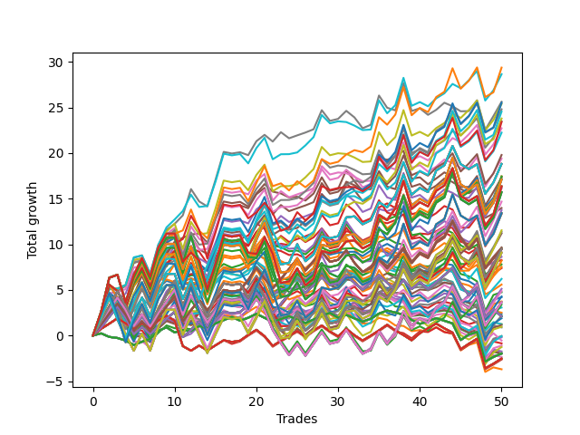

# Long HLT 101_extendedhours 
- Symbol: TSLA
- Date Range: 05/15/2023 - 05/17/2024
- Trading Period: 4:30-12:30
- Number of Trades: 50



| Id. | Name | Win Percent | Profit | Avg Profit / Trade | Avg Time / Trade | Std |      | Name | Win Percent | Profit | Avg Profit / Trade | Avg Time / Trade | Std |
| --- | ---- | ----------- | ------ | ------------------ | ---------------- | --- | ---- | ---- | ----------- | ------ | ------------------ | ---------------- | --- |
| | Sorted By <br> Profit | | | | | | | Sorted By <br> Win Percentage |||||
|0| TP-3 90m | 66.00 | 29.38 | 0.59 | 74:12 | 1.74 |     | TP-3 75m | 72.00 | 28.66 | 0.57 | 63:27 | 1.55 |
|1| TP-3 75m | 72.00 | 28.66 | 0.57 | 63:27 | 1.55 |     | TP-2.75 75m | 70.00 | 25.40 | 0.51 | 60:08 | 1.64 |
|2| TP-3 60m | 64.00 | 25.63 | 0.51 | 52:14 | 1.57 |     | TP-2.5 75m | 70.00 | 23.49 | 0.47 | 59:32 | 1.58 |
|3| TP-2.75 90m | 64.00 | 25.53 | 0.51 | 69:37 | 1.84 |     | TP-2.25 75m | 70.00 | 22.73 | 0.45 | 58:38 | 1.51 |
|4| TP-2.75 75m | 70.00 | 25.40 | 0.51 | 60:08 | 1.64 |     | TP-2 75m | 70.00 | 19.80 | 0.40 | 53:04 | 1.54 |
|5| TP-2 90m | 66.00 | 24.81 | 0.50 | 59:03 | 1.64 |     | TP-3 90m | 66.00 | 29.38 | 0.59 | 74:12 | 1.74 |
|6| TP-2.5 90m | 64.00 | 24.56 | 0.49 | 68:25 | 1.79 |     | TP-2 90m | 66.00 | 24.81 | 0.50 | 59:03 | 1.64 |
|7| TP-2.25 90m | 64.00 | 23.80 | 0.48 | 66:50 | 1.73 |     | TP-1.75 75m | 66.00 | 13.75 | 0.27 | 47:50 | 1.56 |
|8| TP-2.5 75m | 70.00 | 23.49 | 0.47 | 59:32 | 1.58 |     | TP-3 60m | 64.00 | 25.63 | 0.51 | 52:14 | 1.57 |
|9| TP-3 105m | 64.00 | 23.42 | 0.47 | 83:54 | 1.85 |     | TP-2.75 90m | 64.00 | 25.53 | 0.51 | 69:37 | 1.84 |
|10| TP-2.25 75m | 70.00 | 22.73 | 0.45 | 58:38 | 1.51 |     | TP-2.5 90m | 64.00 | 24.56 | 0.49 | 68:25 | 1.79 |
|11| TP-2 105m | 64.00 | 22.25 | 0.44 | 64:27 | 1.67 |     | TP-2.25 90m | 64.00 | 23.80 | 0.48 | 66:50 | 1.73 |
|12| TP-2 75m | 70.00 | 19.80 | 0.40 | 53:04 | 1.54 |     | TP-3 105m | 64.00 | 23.42 | 0.47 | 83:54 | 1.85 |
|13| TP-2.75 60m | 62.00 | 19.40 | 0.39 | 50:07 | 1.67 |     | TP-2 105m | 64.00 | 22.25 | 0.44 | 64:27 | 1.67 |
|14| TP-2 180m | 64.00 | 18.82 | 0.38 | 68:56 | 1.77 |     | TP-2 180m | 64.00 | 18.82 | 0.38 | 68:56 | 1.77 |
|15| TP-2 165m | 64.00 | 18.82 | 0.38 | 68:56 | 1.77 |     | TP-2 165m | 64.00 | 18.82 | 0.38 | 68:56 | 1.77 |
|16| TP-2 150m | 64.00 | 18.82 | 0.38 | 68:56 | 1.77 |     | TP-2 150m | 64.00 | 18.82 | 0.38 | 68:56 | 1.77 |
|17| TP-2 135m | 64.00 | 18.82 | 0.38 | 68:56 | 1.77 |     | TP-2 135m | 64.00 | 18.82 | 0.38 | 68:56 | 1.77 |
|18| TP-2 120m | 64.00 | 18.82 | 0.38 | 68:56 | 1.77 |     | TP-2 120m | 64.00 | 18.82 | 0.38 | 68:56 | 1.77 |
|19| TP-2.5 105m | 62.00 | 17.46 | 0.35 | 75:49 | 1.89 |     | TP-2.5 180m | 64.00 | 17.11 | 0.34 | 82:13 | 1.98 |
|20| TP-2.75 105m | 62.00 | 17.45 | 0.35 | 77:42 | 1.97 |     | TP-2.5 165m | 64.00 | 17.11 | 0.34 | 82:13 | 1.98 |
|21| TP-2.25 105m | 62.00 | 17.40 | 0.35 | 73:37 | 1.81 |     | TP-2.5 150m | 64.00 | 17.11 | 0.34 | 82:13 | 1.98 |
|22| TP-2.5 60m | 62.00 | 17.32 | 0.35 | 49:37 | 1.60 |     | TP-2.5 135m | 64.00 | 17.11 | 0.34 | 82:13 | 1.98 |
|23| TP-2.5 180m | 64.00 | 17.11 | 0.34 | 82:13 | 1.98 |     | TP-2.5 120m | 64.00 | 17.11 | 0.34 | 82:13 | 1.98 |
|24| TP-2.5 165m | 64.00 | 17.11 | 0.34 | 82:13 | 1.98 |     | TP-1 105m | 64.00 | 9.66 | 0.19 | 29:25 | 1.27 |
|25| TP-2.5 150m | 64.00 | 17.11 | 0.34 | 82:13 | 1.98 |     | TP-1 180m | 64.00 | 9.51 | 0.19 | 29:43 | 1.27 |
|26| TP-2.5 135m | 64.00 | 17.11 | 0.34 | 82:13 | 1.98 |     | TP-1 165m | 64.00 | 9.51 | 0.19 | 29:43 | 1.27 |
|27| TP-2.5 120m | 64.00 | 17.11 | 0.34 | 82:13 | 1.98 |     | TP-1 150m | 64.00 | 9.51 | 0.19 | 29:43 | 1.27 |
|28| TP-3 180m | 62.00 | 16.36 | 0.33 | 92:08 | 2.00 |     | TP-1 135m | 64.00 | 9.51 | 0.19 | 29:43 | 1.27 |
|29| TP-3 165m | 62.00 | 16.36 | 0.33 | 92:08 | 2.00 |     | TP-1 120m | 64.00 | 9.51 | 0.19 | 29:43 | 1.27 |
|30| TP-3 150m | 62.00 | 16.36 | 0.33 | 92:08 | 2.00 |     | TP-1 90m | 64.00 | 9.44 | 0.19 | 28:58 | 1.26 |
|31| TP-3 135m | 62.00 | 16.36 | 0.33 | 92:08 | 2.00 |     | TP-1 75m | 64.00 | 7.53 | 0.15 | 28:15 | 1.24 |
|32| TP-3 120m | 62.00 | 16.36 | 0.33 | 92:08 | 2.00 |     | TP-2.75 60m | 62.00 | 19.40 | 0.39 | 50:07 | 1.67 |
|33| TP-2.25 60m | 62.00 | 16.13 | 0.32 | 49:01 | 1.52 |     | TP-2.5 105m | 62.00 | 17.46 | 0.35 | 75:49 | 1.89 |
|34| TP-2.75 180m | 62.00 | 15.72 | 0.31 | 84:28 | 2.08 |     | TP-2.75 105m | 62.00 | 17.45 | 0.35 | 77:42 | 1.97 |
|35| TP-2.75 165m | 62.00 | 15.72 | 0.31 | 84:28 | 2.08 |     | TP-2.25 105m | 62.00 | 17.40 | 0.35 | 73:37 | 1.81 |
|36| TP-2.75 150m | 62.00 | 15.72 | 0.31 | 84:28 | 2.08 |     | TP-2.5 60m | 62.00 | 17.32 | 0.35 | 49:37 | 1.60 |
|37| TP-2.75 135m | 62.00 | 15.72 | 0.31 | 84:28 | 2.08 |     | TP-3 180m | 62.00 | 16.36 | 0.33 | 92:08 | 2.00 |
|38| TP-2.75 120m | 62.00 | 15.72 | 0.31 | 84:28 | 2.08 |     | TP-3 165m | 62.00 | 16.36 | 0.33 | 92:08 | 2.00 |
|39| TP-1.75 90m | 62.00 | 14.69 | 0.29 | 52:36 | 1.64 |     | TP-3 150m | 62.00 | 16.36 | 0.33 | 92:08 | 2.00 |
|40| TP-3 45m | 60.00 | 13.98 | 0.28 | 40:33 | 1.40 |     | TP-3 135m | 62.00 | 16.36 | 0.33 | 92:08 | 2.00 |
|41| TP-1.75 75m | 66.00 | 13.75 | 0.27 | 47:50 | 1.56 |     | TP-3 120m | 62.00 | 16.36 | 0.33 | 92:08 | 2.00 |
|42| TP-2.25 180m | 62.00 | 13.42 | 0.27 | 79:19 | 1.93 |     | TP-2.25 60m | 62.00 | 16.13 | 0.32 | 49:01 | 1.52 |
|43| TP-2.25 165m | 62.00 | 13.42 | 0.27 | 79:19 | 1.93 |     | TP-2.75 180m | 62.00 | 15.72 | 0.31 | 84:28 | 2.08 |
|44| TP-2.25 150m | 62.00 | 13.42 | 0.27 | 79:19 | 1.93 |     | TP-2.75 165m | 62.00 | 15.72 | 0.31 | 84:28 | 2.08 |
|45| TP-2.25 135m | 62.00 | 13.42 | 0.27 | 79:19 | 1.93 |     | TP-2.75 150m | 62.00 | 15.72 | 0.31 | 84:28 | 2.08 |
|46| TP-2.25 120m | 62.00 | 13.42 | 0.27 | 79:19 | 1.93 |     | TP-2.75 135m | 62.00 | 15.72 | 0.31 | 84:28 | 2.08 |
|47| TP-2 60m | 60.00 | 13.33 | 0.27 | 45:26 | 1.54 |     | TP-2.75 120m | 62.00 | 15.72 | 0.31 | 84:28 | 2.08 |
|48| TP-1.75 105m | 60.00 | 11.54 | 0.23 | 56:46 | 1.68 |     | TP-1.75 90m | 62.00 | 14.69 | 0.29 | 52:36 | 1.64 |
|49| TP-1.5 105m | 62.00 | 11.36 | 0.23 | 50:30 | 1.53 |     | TP-2.25 180m | 62.00 | 13.42 | 0.27 | 79:19 | 1.93 |
|50| TP-1.5 90m | 60.00 | 11.20 | 0.22 | 47:28 | 1.51 |     | TP-2.25 165m | 62.00 | 13.42 | 0.27 | 79:19 | 1.93 |
|51| TP-1 105m | 64.00 | 9.66 | 0.19 | 29:25 | 1.27 |     | TP-2.25 150m | 62.00 | 13.42 | 0.27 | 79:19 | 1.93 |
|52| TP-1.75 60m | 60.00 | 9.60 | 0.19 | 41:43 | 1.54 |     | TP-2.25 135m | 62.00 | 13.42 | 0.27 | 79:19 | 1.93 |
|53| TP-1 180m | 64.00 | 9.51 | 0.19 | 29:43 | 1.27 |     | TP-2.25 120m | 62.00 | 13.42 | 0.27 | 79:19 | 1.93 |
|54| TP-1 165m | 64.00 | 9.51 | 0.19 | 29:43 | 1.27 |     | TP-1.5 105m | 62.00 | 11.36 | 0.23 | 50:30 | 1.53 |
|55| TP-1 150m | 64.00 | 9.51 | 0.19 | 29:43 | 1.27 |     | TP-1.5 75m | 62.00 | 9.11 | 0.18 | 43:37 | 1.48 |
|56| TP-1 135m | 64.00 | 9.51 | 0.19 | 29:43 | 1.27 |     | TP-1 60m | 62.00 | 6.21 | 0.12 | 26:38 | 1.24 |
|57| TP-1 120m | 64.00 | 9.51 | 0.19 | 29:43 | 1.27 |     | TP-3 45m | 60.00 | 13.98 | 0.28 | 40:33 | 1.40 |
|58| TP-1.5 180m | 60.00 | 9.49 | 0.19 | 52:57 | 1.54 |     | TP-2 60m | 60.00 | 13.33 | 0.27 | 45:26 | 1.54 |
|59| TP-1.5 165m | 60.00 | 9.49 | 0.19 | 52:57 | 1.54 |     | TP-1.75 105m | 60.00 | 11.54 | 0.23 | 56:46 | 1.68 |
|60| TP-1.5 150m | 60.00 | 9.49 | 0.19 | 52:57 | 1.54 |     | TP-1.5 90m | 60.00 | 11.20 | 0.22 | 47:28 | 1.51 |
|61| TP-1.5 135m | 60.00 | 9.49 | 0.19 | 52:57 | 1.54 |     | TP-1.75 60m | 60.00 | 9.60 | 0.19 | 41:43 | 1.54 |
|62| TP-1.5 120m | 60.00 | 9.49 | 0.19 | 52:57 | 1.54 |     | TP-1.5 180m | 60.00 | 9.49 | 0.19 | 52:57 | 1.54 |
|63| TP-1 90m | 64.00 | 9.44 | 0.19 | 28:58 | 1.26 |     | TP-1.5 165m | 60.00 | 9.49 | 0.19 | 52:57 | 1.54 |
|64| TP-1.5 75m | 62.00 | 9.11 | 0.18 | 43:37 | 1.48 |     | TP-1.5 150m | 60.00 | 9.49 | 0.19 | 52:57 | 1.54 |
|65| TP-1.75 180m | 60.00 | 9.10 | 0.18 | 59:54 | 1.70 |     | TP-1.5 135m | 60.00 | 9.49 | 0.19 | 52:57 | 1.54 |
|66| TP-1.75 165m | 60.00 | 9.10 | 0.18 | 59:54 | 1.70 |     | TP-1.5 120m | 60.00 | 9.49 | 0.19 | 52:57 | 1.54 |
|67| TP-1.75 150m | 60.00 | 9.10 | 0.18 | 59:54 | 1.70 |     | TP-1.75 180m | 60.00 | 9.10 | 0.18 | 59:54 | 1.70 |
|68| TP-1.75 135m | 60.00 | 9.10 | 0.18 | 59:54 | 1.70 |     | TP-1.75 165m | 60.00 | 9.10 | 0.18 | 59:54 | 1.70 |
|69| TP-1.75 120m | 60.00 | 9.10 | 0.18 | 59:54 | 1.70 |     | TP-1.75 150m | 60.00 | 9.10 | 0.18 | 59:54 | 1.70 |
|70| TP-2.75 45m | 58.00 | 8.63 | 0.17 | 39:25 | 1.50 |     | TP-1.75 135m | 60.00 | 9.10 | 0.18 | 59:54 | 1.70 |
|71| TP-3 30m | 54.00 | 8.28 | 0.17 | 27:46 | 1.25 |     | TP-1.75 120m | 60.00 | 9.10 | 0.18 | 59:54 | 1.70 |
|72| TP-1.5 60m | 60.00 | 8.20 | 0.16 | 38:44 | 1.46 |     | TP-1.5 60m | 60.00 | 8.20 | 0.16 | 38:44 | 1.46 |
|73| TP-2.25 45m | 58.00 | 7.80 | 0.16 | 38:50 | 1.42 |     | TP-1 45m | 60.00 | 2.17 | 0.04 | 23:42 | 1.18 |
|74| TP-1 75m | 64.00 | 7.53 | 0.15 | 28:15 | 1.24 |     | TP-0.75 180m | 60.00 | 2.09 | 0.04 | 20:58 | 1.11 |
|75| TP-2.5 45m | 58.00 | 7.39 | 0.15 | 39:01 | 1.45 |     | TP-0.75 165m | 60.00 | 2.09 | 0.04 | 20:58 | 1.11 |
|76| TP-1 60m | 62.00 | 6.21 | 0.12 | 26:38 | 1.24 |     | TP-0.75 150m | 60.00 | 2.09 | 0.04 | 20:58 | 1.11 |
|77| TP-2 45m | 58.00 | 5.59 | 0.11 | 37:01 | 1.43 |     | TP-0.75 135m | 60.00 | 2.09 | 0.04 | 20:58 | 1.11 |
|78| TP-1.25 90m | 58.00 | 5.12 | 0.10 | 36:15 | 1.47 |     | TP-0.75 120m | 60.00 | 2.09 | 0.04 | 20:58 | 1.11 |
|79| TP-1.25 105m | 58.00 | 4.88 | 0.10 | 37:27 | 1.47 |     | TP-0.75 105m | 60.00 | 2.09 | 0.04 | 20:58 | 1.11 |
|80| TP-2.75 30m | 54.00 | 4.75 | 0.09 | 27:20 | 1.34 |     | TP-0.75 90m | 60.00 | 2.09 | 0.04 | 20:58 | 1.11 |
|81| TP-1.25 60m | 58.00 | 4.28 | 0.09 | 32:33 | 1.42 |     | TP-0.75 75m | 60.00 | 2.09 | 0.04 | 20:58 | 1.11 |
|82| TP-2.25 30m | 54.00 | 4.21 | 0.08 | 26:57 | 1.27 |     | TP-0.75 60m | 60.00 | 2.09 | 0.04 | 20:58 | 1.11 |
|83| TP-2.5 30m | 54.00 | 3.74 | 0.07 | 27:01 | 1.29 |     | TP-2.75 45m | 58.00 | 8.63 | 0.17 | 39:25 | 1.50 |
|84| TP-1.25 180m | 56.00 | 3.65 | 0.07 | 38:22 | 1.47 |     | TP-2.25 45m | 58.00 | 7.80 | 0.16 | 38:50 | 1.42 |
|85| TP-1.25 165m | 56.00 | 3.65 | 0.07 | 38:22 | 1.47 |     | TP-2.5 45m | 58.00 | 7.39 | 0.15 | 39:01 | 1.45 |
|86| TP-1.25 150m | 56.00 | 3.65 | 0.07 | 38:22 | 1.47 |     | TP-2 45m | 58.00 | 5.59 | 0.11 | 37:01 | 1.43 |
|87| TP-1.25 135m | 56.00 | 3.65 | 0.07 | 38:22 | 1.47 |     | TP-1.25 90m | 58.00 | 5.12 | 0.10 | 36:15 | 1.47 |
|88| TP-1.25 120m | 56.00 | 3.65 | 0.07 | 38:22 | 1.47 |     | TP-1.25 105m | 58.00 | 4.88 | 0.10 | 37:27 | 1.47 |
|89| TP-1.25 75m | 58.00 | 3.40 | 0.07 | 34:58 | 1.45 |     | TP-1.25 60m | 58.00 | 4.28 | 0.09 | 32:33 | 1.42 |
|90| TP-2 30m | 54.00 | 3.07 | 0.06 | 26:27 | 1.25 |     | TP-1.25 75m | 58.00 | 3.40 | 0.07 | 34:58 | 1.45 |
|91| TP-3 15m | 54.00 | 2.51 | 0.05 | 13:40 | 1.09 |     | TP-1.25 180m | 56.00 | 3.65 | 0.07 | 38:22 | 1.47 |
|92| TP-2.75 15m | 54.00 | 2.35 | 0.05 | 13:38 | 1.08 |     | TP-1.25 165m | 56.00 | 3.65 | 0.07 | 38:22 | 1.47 |
|93| TP-1 45m | 60.00 | 2.17 | 0.04 | 23:42 | 1.18 |     | TP-1.25 150m | 56.00 | 3.65 | 0.07 | 38:22 | 1.47 |
|94| TP-0.75 180m | 60.00 | 2.09 | 0.04 | 20:58 | 1.11 |     | TP-1.25 135m | 56.00 | 3.65 | 0.07 | 38:22 | 1.47 |
|95| TP-0.75 165m | 60.00 | 2.09 | 0.04 | 20:58 | 1.11 |     | TP-1.25 120m | 56.00 | 3.65 | 0.07 | 38:22 | 1.47 |
|96| TP-0.75 150m | 60.00 | 2.09 | 0.04 | 20:58 | 1.11 |     | TP-1.75 45m | 56.00 | 1.89 | 0.04 | 34:28 | 1.41 |
|97| TP-0.75 135m | 60.00 | 2.09 | 0.04 | 20:58 | 1.11 |     | TP-1 30m | 56.00 | 1.16 | 0.02 | 19:02 | 1.13 |
|98| TP-0.75 120m | 60.00 | 2.09 | 0.04 | 20:58 | 1.11 |     | TP-1.5 45m | 56.00 | -0.07 | -0.00 | 32:27 | 1.31 |
|99| TP-0.75 105m | 60.00 | 2.09 | 0.04 | 20:58 | 1.11 |     | TP-0.75 30m | 56.00 | -0.20 | -0.00 | 17:18 | 1.03 |
|100| TP-0.75 90m | 60.00 | 2.09 | 0.04 | 20:58 | 1.11 |     | TP-0.75 45m | 56.00 | -0.55 | -0.01 | 20:14 | 1.08 |
|101| TP-0.75 75m | 60.00 | 2.09 | 0.04 | 20:58 | 1.11 |     | TP-1.25 45m | 56.00 | -1.26 | -0.03 | 28:20 | 1.28 |
|102| TP-0.75 60m | 60.00 | 2.09 | 0.04 | 20:58 | 1.11 |     | TP-0.5 180m | 56.00 | -2.53 | -0.05 | 11:58 | 0.88 |
|103| TP-1.75 45m | 56.00 | 1.89 | 0.04 | 34:28 | 1.41 |     | TP-0.5 165m | 56.00 | -2.53 | -0.05 | 11:58 | 0.88 |
|104| TP-2.5 15m | 54.00 | 1.25 | 0.02 | 13:33 | 1.02 |     | TP-0.5 150m | 56.00 | -2.53 | -0.05 | 11:58 | 0.88 |
|105| TP-2.25 15m | 54.00 | 1.25 | 0.02 | 13:33 | 1.02 |     | TP-0.5 135m | 56.00 | -2.53 | -0.05 | 11:58 | 0.88 |
|106| TP-1 30m | 56.00 | 1.16 | 0.02 | 19:02 | 1.13 |     | TP-0.5 120m | 56.00 | -2.53 | -0.05 | 11:58 | 0.88 |
|107| TP-1.75 30m | 52.00 | 0.96 | 0.02 | 25:03 | 1.25 |     | TP-0.5 105m | 56.00 | -2.53 | -0.05 | 11:58 | 0.88 |
|108| TP-2 15m | 54.00 | 0.89 | 0.02 | 13:24 | 0.99 |     | TP-0.5 90m | 56.00 | -2.53 | -0.05 | 11:58 | 0.88 |
|109| TP-1.5 30m | 52.00 | -0.05 | -0.00 | 24:03 | 1.23 |     | TP-0.5 75m | 56.00 | -2.53 | -0.05 | 11:58 | 0.88 |
|110| TP-1.5 45m | 56.00 | -0.07 | -0.00 | 32:27 | 1.31 |     | TP-0.5 60m | 56.00 | -2.53 | -0.05 | 11:58 | 0.88 |
|111| TP-0.75 30m | 56.00 | -0.20 | -0.00 | 17:18 | 1.03 |     | TP-0.5 45m | 56.00 | -2.53 | -0.05 | 11:57 | 0.88 |
|112| TP-0.75 45m | 56.00 | -0.55 | -0.01 | 20:14 | 1.08 |     | TP-3 30m | 54.00 | 8.28 | 0.17 | 27:46 | 1.25 |
|113| TP-1 15m | 52.00 | -0.86 | -0.02 | 11:39 | 0.95 |     | TP-2.75 30m | 54.00 | 4.75 | 0.09 | 27:20 | 1.34 |
|114| TP-1.25 30m | 52.00 | -1.10 | -0.02 | 22:13 | 1.22 |     | TP-2.25 30m | 54.00 | 4.21 | 0.08 | 26:57 | 1.27 |
|115| TP-1.25 45m | 56.00 | -1.26 | -0.03 | 28:20 | 1.28 |     | TP-2.5 30m | 54.00 | 3.74 | 0.07 | 27:01 | 1.29 |
|116| TP-1.25 15m | 52.00 | -1.74 | -0.03 | 12:22 | 1.00 |     | TP-2 30m | 54.00 | 3.07 | 0.06 | 26:27 | 1.25 |
|117| TP-1.5 15m | 52.00 | -1.96 | -0.04 | 12:36 | 1.00 |     | TP-3 15m | 54.00 | 2.51 | 0.05 | 13:40 | 1.09 |
|118| TP-0.25 180m | 54.00 | -1.97 | -0.04 | 04:00 | 0.66 |     | TP-2.75 15m | 54.00 | 2.35 | 0.05 | 13:38 | 1.08 |
|119| TP-0.25 165m | 54.00 | -1.97 | -0.04 | 04:00 | 0.66 |     | TP-2.5 15m | 54.00 | 1.25 | 0.02 | 13:33 | 1.02 |
|120| TP-0.25 150m | 54.00 | -1.97 | -0.04 | 04:00 | 0.66 |     | TP-2.25 15m | 54.00 | 1.25 | 0.02 | 13:33 | 1.02 |
|121| TP-0.25 135m | 54.00 | -1.97 | -0.04 | 04:00 | 0.66 |     | TP-2 15m | 54.00 | 0.89 | 0.02 | 13:24 | 0.99 |
|122| TP-0.25 120m | 54.00 | -1.97 | -0.04 | 04:00 | 0.66 |     | TP-0.25 180m | 54.00 | -1.97 | -0.04 | 04:00 | 0.66 |
|123| TP-0.25 105m | 54.00 | -1.97 | -0.04 | 04:00 | 0.66 |     | TP-0.25 165m | 54.00 | -1.97 | -0.04 | 04:00 | 0.66 |
|124| TP-0.25 90m | 54.00 | -1.97 | -0.04 | 04:00 | 0.66 |     | TP-0.25 150m | 54.00 | -1.97 | -0.04 | 04:00 | 0.66 |
|125| TP-0.25 75m | 54.00 | -1.97 | -0.04 | 04:00 | 0.66 |     | TP-0.25 135m | 54.00 | -1.97 | -0.04 | 04:00 | 0.66 |
|126| TP-0.25 60m | 54.00 | -1.97 | -0.04 | 04:00 | 0.66 |     | TP-0.25 120m | 54.00 | -1.97 | -0.04 | 04:00 | 0.66 |
|127| TP-0.25 45m | 54.00 | -1.97 | -0.04 | 04:00 | 0.66 |     | TP-0.25 105m | 54.00 | -1.97 | -0.04 | 04:00 | 0.66 |
|128| TP-0.25 30m | 54.00 | -1.97 | -0.04 | 04:00 | 0.66 |     | TP-0.25 90m | 54.00 | -1.97 | -0.04 | 04:00 | 0.66 |
|129| TP-0.25 15m | 54.00 | -1.97 | -0.04 | 04:00 | 0.66 |     | TP-0.25 75m | 54.00 | -1.97 | -0.04 | 04:00 | 0.66 |
|130| TP-0.75 15m | 52.00 | -1.99 | -0.04 | 11:01 | 0.88 |     | TP-0.25 60m | 54.00 | -1.97 | -0.04 | 04:00 | 0.66 |
|131| TP-1.75 15m | 52.00 | -2.35 | -0.05 | 12:50 | 1.04 |     | TP-0.25 45m | 54.00 | -1.97 | -0.04 | 04:00 | 0.66 |
|132| TP-0.5 180m | 56.00 | -2.53 | -0.05 | 11:58 | 0.88 |     | TP-0.25 30m | 54.00 | -1.97 | -0.04 | 04:00 | 0.66 |
|133| TP-0.5 165m | 56.00 | -2.53 | -0.05 | 11:58 | 0.88 |     | TP-0.25 15m | 54.00 | -1.97 | -0.04 | 04:00 | 0.66 |
|134| TP-0.5 150m | 56.00 | -2.53 | -0.05 | 11:58 | 0.88 |     | TP-0.5 30m | 54.00 | -2.63 | -0.05 | 11:14 | 0.87 |
|135| TP-0.5 135m | 56.00 | -2.53 | -0.05 | 11:58 | 0.88 |     | TP-1.75 30m | 52.00 | 0.96 | 0.02 | 25:03 | 1.25 |
|136| TP-0.5 120m | 56.00 | -2.53 | -0.05 | 11:58 | 0.88 |     | TP-1.5 30m | 52.00 | -0.05 | -0.00 | 24:03 | 1.23 |
|137| TP-0.5 105m | 56.00 | -2.53 | -0.05 | 11:58 | 0.88 |     | TP-1 15m | 52.00 | -0.86 | -0.02 | 11:39 | 0.95 |
|138| TP-0.5 90m | 56.00 | -2.53 | -0.05 | 11:58 | 0.88 |     | TP-1.25 30m | 52.00 | -1.10 | -0.02 | 22:13 | 1.22 |
|139| TP-0.5 75m | 56.00 | -2.53 | -0.05 | 11:58 | 0.88 |     | TP-1.25 15m | 52.00 | -1.74 | -0.03 | 12:22 | 1.00 |
|140| TP-0.5 60m | 56.00 | -2.53 | -0.05 | 11:58 | 0.88 |     | TP-1.5 15m | 52.00 | -1.96 | -0.04 | 12:36 | 1.00 |
|141| TP-0.5 45m | 56.00 | -2.53 | -0.05 | 11:57 | 0.88 |     | TP-0.75 15m | 52.00 | -1.99 | -0.04 | 11:01 | 0.88 |
|142| TP-0.5 30m | 54.00 | -2.63 | -0.05 | 11:14 | 0.87 |     | TP-1.75 15m | 52.00 | -2.35 | -0.05 | 12:50 | 1.04 |
|143| TP-0.5 15m | 50.00 | -3.70 | -0.07 | 08:22 | 0.74 |     | TP-0.5 15m | 50.00 | -3.70 | -0.07 | 08:22 | 0.74 |

### Test TP-0.25 15m
* Take Profit of 0.25 Point
* 0.25 Stoploss
* Results:
```
Total Trades: 50
Percent Up: 54.00
Percent Down: 46.00
Total Points Moved Up: -1.97
Potential Profit: -985.00
Total Points Ups: 10.69 Count Ups: 27
Total Points Downs: -12.66 Count Downs: 23
```

<details><summary>Trades</summary>

<code>In: 2023-05-25 07:30:00		Out: 2023-05-25 07:34:00		Total Position Time: 04:00		Total Move Up: 0.24		Total to Date: 0.24</code> <br />
<code>In: 2023-06-15 05:55:00		Out: 2023-06-15 05:57:00		Total Position Time: 02:00		Total Move Up: -0.39		Total to Date: -0.15</code> <br />
<code>In: 2023-07-20 04:40:00		Out: 2023-07-20 04:42:00		Total Position Time: 02:00		Total Move Up: -0.12		Total to Date: -0.27</code> <br />
<code>In: 2023-07-20 07:50:00		Out: 2023-07-20 07:54:00		Total Position Time: 04:00		Total Move Up: -0.28		Total to Date: -0.55</code> <br />
<code>In: 2023-07-21 07:50:00		Out: 2023-07-21 07:52:00		Total Position Time: 02:00		Total Move Up: -0.49		Total to Date: -1.04</code> <br />
<code>In: 2023-07-25 08:10:00		Out: 2023-07-25 08:12:00		Total Position Time: 02:00		Total Move Up: 0.36		Total to Date: -0.68</code> <br />
<code>In: 2023-07-27 12:15:00		Out: 2023-07-27 12:20:00		Total Position Time: 05:00		Total Move Up: 0.32		Total to Date: -0.36</code> <br />
<code>In: 2023-08-03 06:30:00		Out: 2023-08-03 06:32:00		Total Position Time: 02:00		Total Move Up: 0.87		Total to Date: 0.51</code> <br />
<code>In: 2023-08-08 09:05:00		Out: 2023-08-08 09:07:00		Total Position Time: 02:00		Total Move Up: 0.39		Total to Date: 0.90</code> <br />
<code>In: 2023-08-14 09:10:00		Out: 2023-08-14 09:16:00		Total Position Time: 06:00		Total Move Up: -0.56		Total to Date: 0.34</code> <br />
<code>In: 2023-08-17 04:40:00		Out: 2023-08-17 04:46:00		Total Position Time: 06:00		Total Move Up: 0.27		Total to Date: 0.61</code> <br />
<code>In: 2023-08-18 05:40:00		Out: 2023-08-18 05:42:00		Total Position Time: 02:00		Total Move Up: -0.12		Total to Date: 0.49</code> <br />
<code>In: 2023-09-12 08:35:00		Out: 2023-09-12 08:37:00		Total Position Time: 02:00		Total Move Up: 0.56		Total to Date: 1.05</code> <br />
<code>In: 2023-09-21 05:15:00		Out: 2023-09-21 05:19:00		Total Position Time: 04:00		Total Move Up: -0.29		Total to Date: 0.76</code> <br />
<code>In: 2023-09-29 11:15:00		Out: 2023-09-29 11:21:00		Total Position Time: 06:00		Total Move Up: 0.57		Total to Date: 1.33</code> <br />
<code>In: 2023-10-03 08:10:00		Out: 2023-10-03 08:13:00		Total Position Time: 03:00		Total Move Up: 0.36		Total to Date: 1.69</code> <br />
<code>In: 2023-10-18 12:20:00		Out: 2023-10-18 12:23:00		Total Position Time: 03:00		Total Move Up: 0.35		Total to Date: 2.04</code> <br />
<code>In: 2023-10-24 12:20:00		Out: 2023-10-24 12:24:00		Total Position Time: 04:00		Total Move Up: -0.41		Total to Date: 1.63</code> <br />
<code>In: 2023-10-25 11:00:00		Out: 2023-10-25 11:03:00		Total Position Time: 03:00		Total Move Up: 0.32		Total to Date: 1.95</code> <br />
<code>In: 2023-10-27 05:10:00		Out: 2023-10-27 05:15:00		Total Position Time: 05:00		Total Move Up: 0.43		Total to Date: 2.38</code> <br />
<code>In: 2023-11-01 08:05:00		Out: 2023-11-01 08:07:00		Total Position Time: 02:00		Total Move Up: -0.44		Total to Date: 1.94</code> <br />
<code>In: 2023-11-09 09:50:00		Out: 2023-11-09 09:56:00		Total Position Time: 06:00		Total Move Up: -0.42		Total to Date: 1.52</code> <br />
<code>In: 2023-11-16 05:35:00		Out: 2023-11-16 05:39:00		Total Position Time: 04:00		Total Move Up: 0.29		Total to Date: 1.81</code> <br />
<code>In: 2023-11-16 08:05:00		Out: 2023-11-16 08:07:00		Total Position Time: 02:00		Total Move Up: 0.31		Total to Date: 2.12</code> <br />
<code>In: 2023-11-22 08:45:00		Out: 2023-11-22 08:48:00		Total Position Time: 03:00		Total Move Up: -0.37		Total to Date: 1.75</code> <br />
<code>In: 2023-11-30 08:45:00		Out: 2023-11-30 08:47:00		Total Position Time: 02:00		Total Move Up: -0.39		Total to Date: 1.36</code> <br />
<code>In: 2023-12-01 11:25:00		Out: 2023-12-01 11:29:00		Total Position Time: 04:00		Total Move Up: 0.40		Total to Date: 1.76</code> <br />
<code>In: 2023-12-04 08:10:00		Out: 2023-12-04 08:14:00		Total Position Time: 04:00		Total Move Up: 0.41		Total to Date: 2.17</code> <br />
<code>In: 2023-12-20 08:45:00		Out: 2023-12-20 08:51:00		Total Position Time: 06:00		Total Move Up: 0.32		Total to Date: 2.49</code> <br />
<code>In: 2024-01-05 12:15:00		Out: 2024-01-05 12:28:00		Total Position Time: 13:00		Total Move Up: -0.54		Total to Date: 1.95</code> <br />
<code>In: 2024-01-10 07:20:00		Out: 2024-01-10 07:24:00		Total Position Time: 04:00		Total Move Up: 0.31		Total to Date: 2.26</code> <br />
<code>In: 2024-01-19 08:05:00		Out: 2024-01-19 08:07:00		Total Position Time: 02:00		Total Move Up: -0.38		Total to Date: 1.88</code> <br />
<code>In: 2024-01-26 10:30:00		Out: 2024-01-26 10:33:00		Total Position Time: 03:00		Total Move Up: -0.35		Total to Date: 1.53</code> <br />
<code>In: 2024-02-08 10:35:00		Out: 2024-02-08 10:37:00		Total Position Time: 02:00		Total Move Up: 0.31		Total to Date: 1.84</code> <br />
<code>In: 2024-02-13 06:25:00		Out: 2024-02-13 06:27:00		Total Position Time: 02:00		Total Move Up: 0.57		Total to Date: 2.41</code> <br />
<code>In: 2024-02-13 08:15:00		Out: 2024-02-13 08:23:00		Total Position Time: 08:00		Total Move Up: 0.33		Total to Date: 2.74</code> <br />
<code>In: 2024-02-20 09:35:00		Out: 2024-02-20 09:37:00		Total Position Time: 02:00		Total Move Up: -0.22		Total to Date: 2.52</code> <br />
<code>In: 2024-02-21 05:45:00		Out: 2024-02-21 05:53:00		Total Position Time: 08:00		Total Move Up: -0.24		Total to Date: 2.28</code> <br />
<code>In: 2024-03-08 07:30:00		Out: 2024-03-08 07:32:00		Total Position Time: 02:00		Total Move Up: -0.57		Total to Date: 1.71</code> <br />
<code>In: 2024-03-11 08:55:00		Out: 2024-03-11 09:02:00		Total Position Time: 07:00		Total Move Up: -0.44		Total to Date: 1.27</code> <br />
<code>In: 2024-03-13 11:45:00		Out: 2024-03-13 11:53:00		Total Position Time: 08:00		Total Move Up: 0.30		Total to Date: 1.57</code> <br />
<code>In: 2024-03-20 09:45:00		Out: 2024-03-20 09:51:00		Total Position Time: 06:00		Total Move Up: 0.34		Total to Date: 1.91</code> <br />
<code>In: 2024-03-21 11:35:00		Out: 2024-03-21 11:38:00		Total Position Time: 03:00		Total Move Up: -0.29		Total to Date: 1.62</code> <br />
<code>In: 2024-03-22 05:45:00		Out: 2024-03-22 05:47:00		Total Position Time: 02:00		Total Move Up: -0.29		Total to Date: 1.33</code> <br />
<code>In: 2024-04-15 05:05:00		Out: 2024-04-15 05:07:00		Total Position Time: 02:00		Total Move Up: -1.82		Total to Date: -0.49</code> <br />
<code>In: 2024-04-15 07:25:00		Out: 2024-04-15 07:27:00		Total Position Time: 02:00		Total Move Up: 0.60		Total to Date: 0.11</code> <br />
<code>In: 2024-04-17 07:25:00		Out: 2024-04-17 07:39:00		Total Position Time: 14:00		Total Move Up: 0.28		Total to Date: 0.39</code> <br />
<code>In: 2024-04-22 05:05:00		Out: 2024-04-22 05:07:00		Total Position Time: 02:00		Total Move Up: -3.24		Total to Date: -2.85</code> <br />
<code>In: 2024-04-30 09:00:00		Out: 2024-04-30 09:03:00		Total Position Time: 03:00		Total Move Up: 0.50		Total to Date: -2.35</code> <br />
<code>In: 2024-05-08 06:00:00		Out: 2024-05-08 06:03:00		Total Position Time: 03:00		Total Move Up: 0.38		Total to Date: -1.97</code> <br />


</details>

### Test TP-0.5 15m
* Take Profit of 0.5 Point
* 0.5 Stoploss
* Results:
```
Total Trades: 50
Percent Up: 50.00
Percent Down: 50.00
Total Points Moved Up: -3.70
Potential Profit: -1850.00
Total Points Ups: 12.45 Count Ups: 25
Total Points Downs: -16.15 Count Downs: 25
```

<details><summary>Trades</summary>

<code>In: 2023-05-25 07:30:00		Out: 2023-05-25 07:36:00		Total Position Time: 06:00		Total Move Up: 0.74		Total to Date: 0.74</code> <br />
<code>In: 2023-06-15 05:55:00		Out: 2023-06-15 06:05:00		Total Position Time: 10:00		Total Move Up: 0.56		Total to Date: 1.30</code> <br />
<code>In: 2023-07-20 04:40:00		Out: 2023-07-20 04:46:00		Total Position Time: 06:00		Total Move Up: 0.59		Total to Date: 1.89</code> <br />
<code>In: 2023-07-20 07:50:00		Out: 2023-07-20 07:55:00		Total Position Time: 05:00		Total Move Up: -0.55		Total to Date: 1.34</code> <br />
<code>In: 2023-07-21 07:50:00		Out: 2023-07-21 07:55:00		Total Position Time: 05:00		Total Move Up: -0.62		Total to Date: 0.72</code> <br />
<code>In: 2023-07-25 08:10:00		Out: 2023-07-25 08:18:00		Total Position Time: 08:00		Total Move Up: 0.62		Total to Date: 1.34</code> <br />
<code>In: 2023-07-27 12:15:00		Out: 2023-07-27 12:24:00		Total Position Time: 09:00		Total Move Up: -0.56		Total to Date: 0.78</code> <br />
<code>In: 2023-08-03 06:30:00		Out: 2023-08-03 06:32:00		Total Position Time: 02:00		Total Move Up: 0.87		Total to Date: 1.65</code> <br />
<code>In: 2023-08-08 09:05:00		Out: 2023-08-08 09:16:00		Total Position Time: 11:00		Total Move Up: 0.53		Total to Date: 2.18</code> <br />
<code>In: 2023-08-14 09:10:00		Out: 2023-08-14 09:16:00		Total Position Time: 06:00		Total Move Up: -0.56		Total to Date: 1.62</code> <br />
<code>In: 2023-08-17 04:40:00		Out: 2023-08-17 04:54:00		Total Position Time: 14:00		Total Move Up: 0.02		Total to Date: 1.64</code> <br />
<code>In: 2023-08-18 05:40:00		Out: 2023-08-18 05:49:00		Total Position Time: 09:00		Total Move Up: -0.50		Total to Date: 1.14</code> <br />
<code>In: 2023-09-12 08:35:00		Out: 2023-09-12 08:37:00		Total Position Time: 02:00		Total Move Up: 0.56		Total to Date: 1.70</code> <br />
<code>In: 2023-09-21 05:15:00		Out: 2023-09-21 05:20:00		Total Position Time: 05:00		Total Move Up: -0.54		Total to Date: 1.16</code> <br />
<code>In: 2023-09-29 11:15:00		Out: 2023-09-29 11:21:00		Total Position Time: 06:00		Total Move Up: 0.57		Total to Date: 1.73</code> <br />
<code>In: 2023-10-03 08:10:00		Out: 2023-10-03 08:14:00		Total Position Time: 04:00		Total Move Up: 0.55		Total to Date: 2.28</code> <br />
<code>In: 2023-10-18 12:20:00		Out: 2023-10-18 12:34:00		Total Position Time: 14:00		Total Move Up: -0.15		Total to Date: 2.13</code> <br />
<code>In: 2023-10-24 12:20:00		Out: 2023-10-24 12:34:00		Total Position Time: 14:00		Total Move Up: -0.17		Total to Date: 1.96</code> <br />
<code>In: 2023-10-25 11:00:00		Out: 2023-10-25 11:14:00		Total Position Time: 14:00		Total Move Up: 0.63		Total to Date: 2.59</code> <br />
<code>In: 2023-10-27 05:10:00		Out: 2023-10-27 05:17:00		Total Position Time: 07:00		Total Move Up: 0.56		Total to Date: 3.15</code> <br />
<code>In: 2023-11-01 08:05:00		Out: 2023-11-01 08:11:00		Total Position Time: 06:00		Total Move Up: -0.70		Total to Date: 2.45</code> <br />
<code>In: 2023-11-09 09:50:00		Out: 2023-11-09 10:02:00		Total Position Time: 12:00		Total Move Up: -1.07		Total to Date: 1.38</code> <br />
<code>In: 2023-11-16 05:35:00		Out: 2023-11-16 05:49:00		Total Position Time: 14:00		Total Move Up: 0.31		Total to Date: 1.69</code> <br />
<code>In: 2023-11-16 08:05:00		Out: 2023-11-16 08:09:00		Total Position Time: 04:00		Total Move Up: 0.54		Total to Date: 2.23</code> <br />
<code>In: 2023-11-22 08:45:00		Out: 2023-11-22 08:52:00		Total Position Time: 07:00		Total Move Up: 0.53		Total to Date: 2.76</code> <br />
<code>In: 2023-11-30 08:45:00		Out: 2023-11-30 08:57:00		Total Position Time: 12:00		Total Move Up: -0.60		Total to Date: 2.16</code> <br />
<code>In: 2023-12-01 11:25:00		Out: 2023-12-01 11:39:00		Total Position Time: 14:00		Total Move Up: 0.25		Total to Date: 2.41</code> <br />
<code>In: 2023-12-04 08:10:00		Out: 2023-12-04 08:15:00		Total Position Time: 05:00		Total Move Up: 0.55		Total to Date: 2.96</code> <br />
<code>In: 2023-12-20 08:45:00		Out: 2023-12-20 08:58:00		Total Position Time: 13:00		Total Move Up: -0.65		Total to Date: 2.31</code> <br />
<code>In: 2024-01-05 12:15:00		Out: 2024-01-05 12:28:00		Total Position Time: 13:00		Total Move Up: -0.54		Total to Date: 1.77</code> <br />
<code>In: 2024-01-10 07:20:00		Out: 2024-01-10 07:31:00		Total Position Time: 11:00		Total Move Up: 0.84		Total to Date: 2.61</code> <br />
<code>In: 2024-01-19 08:05:00		Out: 2024-01-19 08:09:00		Total Position Time: 04:00		Total Move Up: -0.72		Total to Date: 1.89</code> <br />
<code>In: 2024-01-26 10:30:00		Out: 2024-01-26 10:36:00		Total Position Time: 06:00		Total Move Up: -0.58		Total to Date: 1.31</code> <br />
<code>In: 2024-02-08 10:35:00		Out: 2024-02-08 10:49:00		Total Position Time: 14:00		Total Move Up: 0.05		Total to Date: 1.36</code> <br />
<code>In: 2024-02-13 06:25:00		Out: 2024-02-13 06:27:00		Total Position Time: 02:00		Total Move Up: 0.57		Total to Date: 1.93</code> <br />
<code>In: 2024-02-13 08:15:00		Out: 2024-02-13 08:29:00		Total Position Time: 14:00		Total Move Up: -0.20		Total to Date: 1.73</code> <br />
<code>In: 2024-02-20 09:35:00		Out: 2024-02-20 09:38:00		Total Position Time: 03:00		Total Move Up: -0.62		Total to Date: 1.11</code> <br />
<code>In: 2024-02-21 05:45:00		Out: 2024-02-21 05:59:00		Total Position Time: 14:00		Total Move Up: -0.06		Total to Date: 1.05</code> <br />
<code>In: 2024-03-08 07:30:00		Out: 2024-03-08 07:32:00		Total Position Time: 02:00		Total Move Up: -0.57		Total to Date: 0.48</code> <br />
<code>In: 2024-03-11 08:55:00		Out: 2024-03-11 09:09:00		Total Position Time: 14:00		Total Move Up: 0.12		Total to Date: 0.60</code> <br />
<code>In: 2024-03-13 11:45:00		Out: 2024-03-13 11:59:00		Total Position Time: 14:00		Total Move Up: -0.18		Total to Date: 0.42</code> <br />
<code>In: 2024-03-20 09:45:00		Out: 2024-03-20 09:54:00		Total Position Time: 09:00		Total Move Up: 0.51		Total to Date: 0.93</code> <br />
<code>In: 2024-03-21 11:35:00		Out: 2024-03-21 11:39:00		Total Position Time: 04:00		Total Move Up: -0.52		Total to Date: 0.41</code> <br />
<code>In: 2024-03-22 05:45:00		Out: 2024-03-22 05:59:00		Total Position Time: 14:00		Total Move Up: -0.22		Total to Date: 0.19</code> <br />
<code>In: 2024-04-15 05:05:00		Out: 2024-04-15 05:07:00		Total Position Time: 02:00		Total Move Up: -1.82		Total to Date: -1.63</code> <br />
<code>In: 2024-04-15 07:25:00		Out: 2024-04-15 07:27:00		Total Position Time: 02:00		Total Move Up: 0.60		Total to Date: -1.03</code> <br />
<code>In: 2024-04-17 07:25:00		Out: 2024-04-17 07:39:00		Total Position Time: 14:00		Total Move Up: 0.28		Total to Date: -0.75</code> <br />
<code>In: 2024-04-22 05:05:00		Out: 2024-04-22 05:07:00		Total Position Time: 02:00		Total Move Up: -3.24		Total to Date: -3.99</code> <br />
<code>In: 2024-04-30 09:00:00		Out: 2024-04-30 09:03:00		Total Position Time: 03:00		Total Move Up: 0.50		Total to Date: -3.49</code> <br />
<code>In: 2024-05-08 06:00:00		Out: 2024-05-08 06:14:00		Total Position Time: 14:00		Total Move Up: -0.21		Total to Date: -3.70</code> <br />


</details>

### Test TP-0.75 15m
* Take Profit of 0.75 Point
* 0.75 Stoploss
* Results:
```
Total Trades: 50
Percent Up: 52.00
Percent Down: 48.00
Total Points Moved Up: -1.99
Potential Profit: -995.00
Total Points Ups: 15.83 Count Ups: 26
Total Points Downs: -17.82 Count Downs: 24
```

<details><summary>Trades</summary>

<code>In: 2023-05-25 07:30:00		Out: 2023-05-25 07:37:00		Total Position Time: 07:00		Total Move Up: 0.86		Total to Date: 0.86</code> <br />
<code>In: 2023-06-15 05:55:00		Out: 2023-06-15 06:06:00		Total Position Time: 11:00		Total Move Up: 1.20		Total to Date: 2.06</code> <br />
<code>In: 2023-07-20 04:40:00		Out: 2023-07-20 04:49:00		Total Position Time: 09:00		Total Move Up: 1.08		Total to Date: 3.14</code> <br />
<code>In: 2023-07-20 07:50:00		Out: 2023-07-20 07:57:00		Total Position Time: 07:00		Total Move Up: -1.22		Total to Date: 1.92</code> <br />
<code>In: 2023-07-21 07:50:00		Out: 2023-07-21 07:56:00		Total Position Time: 06:00		Total Move Up: -1.78		Total to Date: 0.14</code> <br />
<code>In: 2023-07-25 08:10:00		Out: 2023-07-25 08:24:00		Total Position Time: 14:00		Total Move Up: 0.06		Total to Date: 0.20</code> <br />
<code>In: 2023-07-27 12:15:00		Out: 2023-07-27 12:25:00		Total Position Time: 10:00		Total Move Up: -0.78		Total to Date: -0.58</code> <br />
<code>In: 2023-08-03 06:30:00		Out: 2023-08-03 06:32:00		Total Position Time: 02:00		Total Move Up: 0.87		Total to Date: 0.29</code> <br />
<code>In: 2023-08-08 09:05:00		Out: 2023-08-08 09:19:00		Total Position Time: 14:00		Total Move Up: 0.82		Total to Date: 1.11</code> <br />
<code>In: 2023-08-14 09:10:00		Out: 2023-08-14 09:24:00		Total Position Time: 14:00		Total Move Up: -0.31		Total to Date: 0.80</code> <br />
<code>In: 2023-08-17 04:40:00		Out: 2023-08-17 04:54:00		Total Position Time: 14:00		Total Move Up: 0.02		Total to Date: 0.82</code> <br />
<code>In: 2023-08-18 05:40:00		Out: 2023-08-18 05:54:00		Total Position Time: 14:00		Total Move Up: -0.13		Total to Date: 0.69</code> <br />
<code>In: 2023-09-12 08:35:00		Out: 2023-09-12 08:38:00		Total Position Time: 03:00		Total Move Up: 0.91		Total to Date: 1.60</code> <br />
<code>In: 2023-09-21 05:15:00		Out: 2023-09-21 05:29:00		Total Position Time: 14:00		Total Move Up: -0.15		Total to Date: 1.45</code> <br />
<code>In: 2023-09-29 11:15:00		Out: 2023-09-29 11:24:00		Total Position Time: 09:00		Total Move Up: 1.07		Total to Date: 2.52</code> <br />
<code>In: 2023-10-03 08:10:00		Out: 2023-10-03 08:16:00		Total Position Time: 06:00		Total Move Up: 0.92		Total to Date: 3.44</code> <br />
<code>In: 2023-10-18 12:20:00		Out: 2023-10-18 12:34:00		Total Position Time: 14:00		Total Move Up: -0.15		Total to Date: 3.29</code> <br />
<code>In: 2023-10-24 12:20:00		Out: 2023-10-24 12:34:00		Total Position Time: 14:00		Total Move Up: -0.17		Total to Date: 3.12</code> <br />
<code>In: 2023-10-25 11:00:00		Out: 2023-10-25 11:14:00		Total Position Time: 14:00		Total Move Up: 0.63		Total to Date: 3.75</code> <br />
<code>In: 2023-10-27 05:10:00		Out: 2023-10-27 05:24:00		Total Position Time: 14:00		Total Move Up: 0.38		Total to Date: 4.13</code> <br />
<code>In: 2023-11-01 08:05:00		Out: 2023-11-01 08:12:00		Total Position Time: 07:00		Total Move Up: -1.19		Total to Date: 2.94</code> <br />
<code>In: 2023-11-09 09:50:00		Out: 2023-11-09 10:02:00		Total Position Time: 12:00		Total Move Up: -1.07		Total to Date: 1.87</code> <br />
<code>In: 2023-11-16 05:35:00		Out: 2023-11-16 05:49:00		Total Position Time: 14:00		Total Move Up: 0.31		Total to Date: 2.18</code> <br />
<code>In: 2023-11-16 08:05:00		Out: 2023-11-16 08:19:00		Total Position Time: 14:00		Total Move Up: 1.10		Total to Date: 3.28</code> <br />
<code>In: 2023-11-22 08:45:00		Out: 2023-11-22 08:59:00		Total Position Time: 14:00		Total Move Up: 0.48		Total to Date: 3.76</code> <br />
<code>In: 2023-11-30 08:45:00		Out: 2023-11-30 08:59:00		Total Position Time: 14:00		Total Move Up: -0.54		Total to Date: 3.22</code> <br />
<code>In: 2023-12-01 11:25:00		Out: 2023-12-01 11:39:00		Total Position Time: 14:00		Total Move Up: 0.25		Total to Date: 3.47</code> <br />
<code>In: 2023-12-04 08:10:00		Out: 2023-12-04 08:24:00		Total Position Time: 14:00		Total Move Up: 0.65		Total to Date: 4.12</code> <br />
<code>In: 2023-12-20 08:45:00		Out: 2023-12-20 08:59:00		Total Position Time: 14:00		Total Move Up: -0.84		Total to Date: 3.28</code> <br />
<code>In: 2024-01-05 12:15:00		Out: 2024-01-05 12:29:00		Total Position Time: 14:00		Total Move Up: -0.55		Total to Date: 2.73</code> <br />
<code>In: 2024-01-10 07:20:00		Out: 2024-01-10 07:31:00		Total Position Time: 11:00		Total Move Up: 0.84		Total to Date: 3.57</code> <br />
<code>In: 2024-01-19 08:05:00		Out: 2024-01-19 08:19:00		Total Position Time: 14:00		Total Move Up: 0.56		Total to Date: 4.13</code> <br />
<code>In: 2024-01-26 10:30:00		Out: 2024-01-26 10:41:00		Total Position Time: 11:00		Total Move Up: -0.77		Total to Date: 3.36</code> <br />
<code>In: 2024-02-08 10:35:00		Out: 2024-02-08 10:49:00		Total Position Time: 14:00		Total Move Up: 0.05		Total to Date: 3.41</code> <br />
<code>In: 2024-02-13 06:25:00		Out: 2024-02-13 06:28:00		Total Position Time: 03:00		Total Move Up: 0.79		Total to Date: 4.20</code> <br />
<code>In: 2024-02-13 08:15:00		Out: 2024-02-13 08:29:00		Total Position Time: 14:00		Total Move Up: -0.20		Total to Date: 4.00</code> <br />
<code>In: 2024-02-20 09:35:00		Out: 2024-02-20 09:39:00		Total Position Time: 04:00		Total Move Up: -0.81		Total to Date: 3.19</code> <br />
<code>In: 2024-02-21 05:45:00		Out: 2024-02-21 05:59:00		Total Position Time: 14:00		Total Move Up: -0.06		Total to Date: 3.13</code> <br />
<code>In: 2024-03-08 07:30:00		Out: 2024-03-08 07:33:00		Total Position Time: 03:00		Total Move Up: -1.00		Total to Date: 2.13</code> <br />
<code>In: 2024-03-11 08:55:00		Out: 2024-03-11 09:09:00		Total Position Time: 14:00		Total Move Up: 0.12		Total to Date: 2.25</code> <br />
<code>In: 2024-03-13 11:45:00		Out: 2024-03-13 11:59:00		Total Position Time: 14:00		Total Move Up: -0.18		Total to Date: 2.07</code> <br />
<code>In: 2024-03-20 09:45:00		Out: 2024-03-20 09:59:00		Total Position Time: 14:00		Total Move Up: 0.54		Total to Date: 2.61</code> <br />
<code>In: 2024-03-21 11:35:00		Out: 2024-03-21 11:49:00		Total Position Time: 14:00		Total Move Up: 0.13		Total to Date: 2.74</code> <br />
<code>In: 2024-03-22 05:45:00		Out: 2024-03-22 05:59:00		Total Position Time: 14:00		Total Move Up: -0.22		Total to Date: 2.52</code> <br />
<code>In: 2024-04-15 05:05:00		Out: 2024-04-15 05:07:00		Total Position Time: 02:00		Total Move Up: -1.82		Total to Date: 0.70</code> <br />
<code>In: 2024-04-15 07:25:00		Out: 2024-04-15 07:39:00		Total Position Time: 14:00		Total Move Up: -0.42		Total to Date: 0.28</code> <br />
<code>In: 2024-04-17 07:25:00		Out: 2024-04-17 07:39:00		Total Position Time: 14:00		Total Move Up: 0.28		Total to Date: 0.56</code> <br />
<code>In: 2024-04-22 05:05:00		Out: 2024-04-22 05:08:00		Total Position Time: 03:00		Total Move Up: -3.25		Total to Date: -2.69</code> <br />
<code>In: 2024-04-30 09:00:00		Out: 2024-04-30 09:05:00		Total Position Time: 05:00		Total Move Up: 0.91		Total to Date: -1.78</code> <br />
<code>In: 2024-05-08 06:00:00		Out: 2024-05-08 06:14:00		Total Position Time: 14:00		Total Move Up: -0.21		Total to Date: -1.99</code> <br />


</details>

### Test TP-1 15m
* Take Profit of 1 Point
* 1 Stoploss
* Results:
```
Total Trades: 50
Percent Up: 52.00
Percent Down: 48.00
Total Points Moved Up: -0.86
Potential Profit: -430.00
Total Points Ups: 17.79 Count Ups: 26
Total Points Downs: -18.65 Count Downs: 24
```

<details><summary>Trades</summary>

<code>In: 2023-05-25 07:30:00		Out: 2023-05-25 07:40:00		Total Position Time: 10:00		Total Move Up: 1.22		Total to Date: 1.22</code> <br />
<code>In: 2023-06-15 05:55:00		Out: 2023-06-15 06:06:00		Total Position Time: 11:00		Total Move Up: 1.20		Total to Date: 2.42</code> <br />
<code>In: 2023-07-20 04:40:00		Out: 2023-07-20 04:49:00		Total Position Time: 09:00		Total Move Up: 1.08		Total to Date: 3.50</code> <br />
<code>In: 2023-07-20 07:50:00		Out: 2023-07-20 07:57:00		Total Position Time: 07:00		Total Move Up: -1.22		Total to Date: 2.28</code> <br />
<code>In: 2023-07-21 07:50:00		Out: 2023-07-21 07:56:00		Total Position Time: 06:00		Total Move Up: -1.78		Total to Date: 0.50</code> <br />
<code>In: 2023-07-25 08:10:00		Out: 2023-07-25 08:24:00		Total Position Time: 14:00		Total Move Up: 0.06		Total to Date: 0.56</code> <br />
<code>In: 2023-07-27 12:15:00		Out: 2023-07-27 12:27:00		Total Position Time: 12:00		Total Move Up: -1.12		Total to Date: -0.56</code> <br />
<code>In: 2023-08-03 06:30:00		Out: 2023-08-03 06:33:00		Total Position Time: 03:00		Total Move Up: 1.50		Total to Date: 0.94</code> <br />
<code>In: 2023-08-08 09:05:00		Out: 2023-08-08 09:19:00		Total Position Time: 14:00		Total Move Up: 0.82		Total to Date: 1.76</code> <br />
<code>In: 2023-08-14 09:10:00		Out: 2023-08-14 09:24:00		Total Position Time: 14:00		Total Move Up: -0.31		Total to Date: 1.45</code> <br />
<code>In: 2023-08-17 04:40:00		Out: 2023-08-17 04:54:00		Total Position Time: 14:00		Total Move Up: 0.02		Total to Date: 1.47</code> <br />
<code>In: 2023-08-18 05:40:00		Out: 2023-08-18 05:54:00		Total Position Time: 14:00		Total Move Up: -0.13		Total to Date: 1.34</code> <br />
<code>In: 2023-09-12 08:35:00		Out: 2023-09-12 08:41:00		Total Position Time: 06:00		Total Move Up: 1.14		Total to Date: 2.48</code> <br />
<code>In: 2023-09-21 05:15:00		Out: 2023-09-21 05:29:00		Total Position Time: 14:00		Total Move Up: -0.15		Total to Date: 2.33</code> <br />
<code>In: 2023-09-29 11:15:00		Out: 2023-09-29 11:24:00		Total Position Time: 09:00		Total Move Up: 1.07		Total to Date: 3.40</code> <br />
<code>In: 2023-10-03 08:10:00		Out: 2023-10-03 08:20:00		Total Position Time: 10:00		Total Move Up: 1.15		Total to Date: 4.55</code> <br />
<code>In: 2023-10-18 12:20:00		Out: 2023-10-18 12:34:00		Total Position Time: 14:00		Total Move Up: -0.15		Total to Date: 4.40</code> <br />
<code>In: 2023-10-24 12:20:00		Out: 2023-10-24 12:34:00		Total Position Time: 14:00		Total Move Up: -0.17		Total to Date: 4.23</code> <br />
<code>In: 2023-10-25 11:00:00		Out: 2023-10-25 11:14:00		Total Position Time: 14:00		Total Move Up: 0.63		Total to Date: 4.86</code> <br />
<code>In: 2023-10-27 05:10:00		Out: 2023-10-27 05:24:00		Total Position Time: 14:00		Total Move Up: 0.38		Total to Date: 5.24</code> <br />
<code>In: 2023-11-01 08:05:00		Out: 2023-11-01 08:12:00		Total Position Time: 07:00		Total Move Up: -1.19		Total to Date: 4.05</code> <br />
<code>In: 2023-11-09 09:50:00		Out: 2023-11-09 10:02:00		Total Position Time: 12:00		Total Move Up: -1.07		Total to Date: 2.98</code> <br />
<code>In: 2023-11-16 05:35:00		Out: 2023-11-16 05:49:00		Total Position Time: 14:00		Total Move Up: 0.31		Total to Date: 3.29</code> <br />
<code>In: 2023-11-16 08:05:00		Out: 2023-11-16 08:19:00		Total Position Time: 14:00		Total Move Up: 1.10		Total to Date: 4.39</code> <br />
<code>In: 2023-11-22 08:45:00		Out: 2023-11-22 08:59:00		Total Position Time: 14:00		Total Move Up: 0.48		Total to Date: 4.87</code> <br />
<code>In: 2023-11-30 08:45:00		Out: 2023-11-30 08:59:00		Total Position Time: 14:00		Total Move Up: -0.54		Total to Date: 4.33</code> <br />
<code>In: 2023-12-01 11:25:00		Out: 2023-12-01 11:39:00		Total Position Time: 14:00		Total Move Up: 0.25		Total to Date: 4.58</code> <br />
<code>In: 2023-12-04 08:10:00		Out: 2023-12-04 08:24:00		Total Position Time: 14:00		Total Move Up: 0.65		Total to Date: 5.23</code> <br />
<code>In: 2023-12-20 08:45:00		Out: 2023-12-20 08:59:00		Total Position Time: 14:00		Total Move Up: -0.84		Total to Date: 4.39</code> <br />
<code>In: 2024-01-05 12:15:00		Out: 2024-01-05 12:29:00		Total Position Time: 14:00		Total Move Up: -0.55		Total to Date: 3.84</code> <br />
<code>In: 2024-01-10 07:20:00		Out: 2024-01-10 07:34:00		Total Position Time: 14:00		Total Move Up: 0.97		Total to Date: 4.81</code> <br />
<code>In: 2024-01-19 08:05:00		Out: 2024-01-19 08:19:00		Total Position Time: 14:00		Total Move Up: 0.56		Total to Date: 5.37</code> <br />
<code>In: 2024-01-26 10:30:00		Out: 2024-01-26 10:44:00		Total Position Time: 14:00		Total Move Up: -1.00		Total to Date: 4.37</code> <br />
<code>In: 2024-02-08 10:35:00		Out: 2024-02-08 10:49:00		Total Position Time: 14:00		Total Move Up: 0.05		Total to Date: 4.42</code> <br />
<code>In: 2024-02-13 06:25:00		Out: 2024-02-13 06:29:00		Total Position Time: 04:00		Total Move Up: 1.00		Total to Date: 5.42</code> <br />
<code>In: 2024-02-13 08:15:00		Out: 2024-02-13 08:29:00		Total Position Time: 14:00		Total Move Up: -0.20		Total to Date: 5.22</code> <br />
<code>In: 2024-02-20 09:35:00		Out: 2024-02-20 09:49:00		Total Position Time: 14:00		Total Move Up: -0.53		Total to Date: 4.69</code> <br />
<code>In: 2024-02-21 05:45:00		Out: 2024-02-21 05:59:00		Total Position Time: 14:00		Total Move Up: -0.06		Total to Date: 4.63</code> <br />
<code>In: 2024-03-08 07:30:00		Out: 2024-03-08 07:34:00		Total Position Time: 04:00		Total Move Up: -1.54		Total to Date: 3.09</code> <br />
<code>In: 2024-03-11 08:55:00		Out: 2024-03-11 09:09:00		Total Position Time: 14:00		Total Move Up: 0.12		Total to Date: 3.21</code> <br />
<code>In: 2024-03-13 11:45:00		Out: 2024-03-13 11:59:00		Total Position Time: 14:00		Total Move Up: -0.18		Total to Date: 3.03</code> <br />
<code>In: 2024-03-20 09:45:00		Out: 2024-03-20 09:59:00		Total Position Time: 14:00		Total Move Up: 0.54		Total to Date: 3.57</code> <br />
<code>In: 2024-03-21 11:35:00		Out: 2024-03-21 11:49:00		Total Position Time: 14:00		Total Move Up: 0.13		Total to Date: 3.70</code> <br />
<code>In: 2024-03-22 05:45:00		Out: 2024-03-22 05:59:00		Total Position Time: 14:00		Total Move Up: -0.22		Total to Date: 3.48</code> <br />
<code>In: 2024-04-15 05:05:00		Out: 2024-04-15 05:07:00		Total Position Time: 02:00		Total Move Up: -1.82		Total to Date: 1.66</code> <br />
<code>In: 2024-04-15 07:25:00		Out: 2024-04-15 07:39:00		Total Position Time: 14:00		Total Move Up: -0.42		Total to Date: 1.24</code> <br />
<code>In: 2024-04-17 07:25:00		Out: 2024-04-17 07:39:00		Total Position Time: 14:00		Total Move Up: 0.28		Total to Date: 1.52</code> <br />
<code>In: 2024-04-22 05:05:00		Out: 2024-04-22 05:08:00		Total Position Time: 03:00		Total Move Up: -3.25		Total to Date: -1.73</code> <br />
<code>In: 2024-04-30 09:00:00		Out: 2024-04-30 09:06:00		Total Position Time: 06:00		Total Move Up: 1.08		Total to Date: -0.65</code> <br />
<code>In: 2024-05-08 06:00:00		Out: 2024-05-08 06:14:00		Total Position Time: 14:00		Total Move Up: -0.21		Total to Date: -0.86</code> <br />


</details>

### Test TP-1.25 15m
* Take Profit of 1.25 Point
* 1.25 Stoploss
* Results:
```
Total Trades: 50
Percent Up: 52.00
Percent Down: 48.00
Total Points Moved Up: -1.74
Potential Profit: -870.00
Total Points Ups: 17.72 Count Ups: 26
Total Points Downs: -19.46 Count Downs: 24
```

<details><summary>Trades</summary>

<code>In: 2023-05-25 07:30:00		Out: 2023-05-25 07:41:00		Total Position Time: 11:00		Total Move Up: 1.55		Total to Date: 1.55</code> <br />
<code>In: 2023-06-15 05:55:00		Out: 2023-06-15 06:09:00		Total Position Time: 14:00		Total Move Up: 1.18		Total to Date: 2.73</code> <br />
<code>In: 2023-07-20 04:40:00		Out: 2023-07-20 04:54:00		Total Position Time: 14:00		Total Move Up: 0.52		Total to Date: 3.25</code> <br />
<code>In: 2023-07-20 07:50:00		Out: 2023-07-20 07:58:00		Total Position Time: 08:00		Total Move Up: -1.33		Total to Date: 1.92</code> <br />
<code>In: 2023-07-21 07:50:00		Out: 2023-07-21 07:56:00		Total Position Time: 06:00		Total Move Up: -1.78		Total to Date: 0.14</code> <br />
<code>In: 2023-07-25 08:10:00		Out: 2023-07-25 08:24:00		Total Position Time: 14:00		Total Move Up: 0.06		Total to Date: 0.20</code> <br />
<code>In: 2023-07-27 12:15:00		Out: 2023-07-27 12:29:00		Total Position Time: 14:00		Total Move Up: -0.68		Total to Date: -0.48</code> <br />
<code>In: 2023-08-03 06:30:00		Out: 2023-08-03 06:33:00		Total Position Time: 03:00		Total Move Up: 1.50		Total to Date: 1.02</code> <br />
<code>In: 2023-08-08 09:05:00		Out: 2023-08-08 09:19:00		Total Position Time: 14:00		Total Move Up: 0.82		Total to Date: 1.84</code> <br />
<code>In: 2023-08-14 09:10:00		Out: 2023-08-14 09:24:00		Total Position Time: 14:00		Total Move Up: -0.31		Total to Date: 1.53</code> <br />
<code>In: 2023-08-17 04:40:00		Out: 2023-08-17 04:54:00		Total Position Time: 14:00		Total Move Up: 0.02		Total to Date: 1.55</code> <br />
<code>In: 2023-08-18 05:40:00		Out: 2023-08-18 05:54:00		Total Position Time: 14:00		Total Move Up: -0.13		Total to Date: 1.42</code> <br />
<code>In: 2023-09-12 08:35:00		Out: 2023-09-12 08:49:00		Total Position Time: 14:00		Total Move Up: 0.14		Total to Date: 1.56</code> <br />
<code>In: 2023-09-21 05:15:00		Out: 2023-09-21 05:29:00		Total Position Time: 14:00		Total Move Up: -0.15		Total to Date: 1.41</code> <br />
<code>In: 2023-09-29 11:15:00		Out: 2023-09-29 11:26:00		Total Position Time: 11:00		Total Move Up: 1.32		Total to Date: 2.73</code> <br />
<code>In: 2023-10-03 08:10:00		Out: 2023-10-03 08:21:00		Total Position Time: 11:00		Total Move Up: 1.30		Total to Date: 4.03</code> <br />
<code>In: 2023-10-18 12:20:00		Out: 2023-10-18 12:34:00		Total Position Time: 14:00		Total Move Up: -0.15		Total to Date: 3.88</code> <br />
<code>In: 2023-10-24 12:20:00		Out: 2023-10-24 12:34:00		Total Position Time: 14:00		Total Move Up: -0.17		Total to Date: 3.71</code> <br />
<code>In: 2023-10-25 11:00:00		Out: 2023-10-25 11:14:00		Total Position Time: 14:00		Total Move Up: 0.63		Total to Date: 4.34</code> <br />
<code>In: 2023-10-27 05:10:00		Out: 2023-10-27 05:24:00		Total Position Time: 14:00		Total Move Up: 0.38		Total to Date: 4.72</code> <br />
<code>In: 2023-11-01 08:05:00		Out: 2023-11-01 08:13:00		Total Position Time: 08:00		Total Move Up: -1.25		Total to Date: 3.47</code> <br />
<code>In: 2023-11-09 09:50:00		Out: 2023-11-09 10:03:00		Total Position Time: 13:00		Total Move Up: -2.15		Total to Date: 1.32</code> <br />
<code>In: 2023-11-16 05:35:00		Out: 2023-11-16 05:49:00		Total Position Time: 14:00		Total Move Up: 0.31		Total to Date: 1.63</code> <br />
<code>In: 2023-11-16 08:05:00		Out: 2023-11-16 08:19:00		Total Position Time: 14:00		Total Move Up: 1.10		Total to Date: 2.73</code> <br />
<code>In: 2023-11-22 08:45:00		Out: 2023-11-22 08:59:00		Total Position Time: 14:00		Total Move Up: 0.48		Total to Date: 3.21</code> <br />
<code>In: 2023-11-30 08:45:00		Out: 2023-11-30 08:59:00		Total Position Time: 14:00		Total Move Up: -0.54		Total to Date: 2.67</code> <br />
<code>In: 2023-12-01 11:25:00		Out: 2023-12-01 11:39:00		Total Position Time: 14:00		Total Move Up: 0.25		Total to Date: 2.92</code> <br />
<code>In: 2023-12-04 08:10:00		Out: 2023-12-04 08:24:00		Total Position Time: 14:00		Total Move Up: 0.65		Total to Date: 3.57</code> <br />
<code>In: 2023-12-20 08:45:00		Out: 2023-12-20 08:59:00		Total Position Time: 14:00		Total Move Up: -0.84		Total to Date: 2.73</code> <br />
<code>In: 2024-01-05 12:15:00		Out: 2024-01-05 12:29:00		Total Position Time: 14:00		Total Move Up: -0.55		Total to Date: 2.18</code> <br />
<code>In: 2024-01-10 07:20:00		Out: 2024-01-10 07:34:00		Total Position Time: 14:00		Total Move Up: 0.97		Total to Date: 3.15</code> <br />
<code>In: 2024-01-19 08:05:00		Out: 2024-01-19 08:19:00		Total Position Time: 14:00		Total Move Up: 0.56		Total to Date: 3.71</code> <br />
<code>In: 2024-01-26 10:30:00		Out: 2024-01-26 10:44:00		Total Position Time: 14:00		Total Move Up: -1.00		Total to Date: 2.71</code> <br />
<code>In: 2024-02-08 10:35:00		Out: 2024-02-08 10:49:00		Total Position Time: 14:00		Total Move Up: 0.05		Total to Date: 2.76</code> <br />
<code>In: 2024-02-13 06:25:00		Out: 2024-02-13 06:32:00		Total Position Time: 07:00		Total Move Up: 1.98		Total to Date: 4.74</code> <br />
<code>In: 2024-02-13 08:15:00		Out: 2024-02-13 08:29:00		Total Position Time: 14:00		Total Move Up: -0.20		Total to Date: 4.54</code> <br />
<code>In: 2024-02-20 09:35:00		Out: 2024-02-20 09:49:00		Total Position Time: 14:00		Total Move Up: -0.53		Total to Date: 4.01</code> <br />
<code>In: 2024-02-21 05:45:00		Out: 2024-02-21 05:59:00		Total Position Time: 14:00		Total Move Up: -0.06		Total to Date: 3.95</code> <br />
<code>In: 2024-03-08 07:30:00		Out: 2024-03-08 07:34:00		Total Position Time: 04:00		Total Move Up: -1.54		Total to Date: 2.41</code> <br />
<code>In: 2024-03-11 08:55:00		Out: 2024-03-11 09:09:00		Total Position Time: 14:00		Total Move Up: 0.12		Total to Date: 2.53</code> <br />
<code>In: 2024-03-13 11:45:00		Out: 2024-03-13 11:59:00		Total Position Time: 14:00		Total Move Up: -0.18		Total to Date: 2.35</code> <br />
<code>In: 2024-03-20 09:45:00		Out: 2024-03-20 09:59:00		Total Position Time: 14:00		Total Move Up: 0.54		Total to Date: 2.89</code> <br />
<code>In: 2024-03-21 11:35:00		Out: 2024-03-21 11:49:00		Total Position Time: 14:00		Total Move Up: 0.13		Total to Date: 3.02</code> <br />
<code>In: 2024-03-22 05:45:00		Out: 2024-03-22 05:59:00		Total Position Time: 14:00		Total Move Up: -0.22		Total to Date: 2.80</code> <br />
<code>In: 2024-04-15 05:05:00		Out: 2024-04-15 05:07:00		Total Position Time: 02:00		Total Move Up: -1.82		Total to Date: 0.98</code> <br />
<code>In: 2024-04-15 07:25:00		Out: 2024-04-15 07:39:00		Total Position Time: 14:00		Total Move Up: -0.42		Total to Date: 0.56</code> <br />
<code>In: 2024-04-17 07:25:00		Out: 2024-04-17 07:39:00		Total Position Time: 14:00		Total Move Up: 0.28		Total to Date: 0.84</code> <br />
<code>In: 2024-04-22 05:05:00		Out: 2024-04-22 05:08:00		Total Position Time: 03:00		Total Move Up: -3.25		Total to Date: -2.41</code> <br />
<code>In: 2024-04-30 09:00:00		Out: 2024-04-30 09:14:00		Total Position Time: 14:00		Total Move Up: 0.88		Total to Date: -1.53</code> <br />
<code>In: 2024-05-08 06:00:00		Out: 2024-05-08 06:14:00		Total Position Time: 14:00		Total Move Up: -0.21		Total to Date: -1.74</code> <br />


</details>

### Test TP-1.5 15m
* Take Profit of 1.5 Point
* 1.5 Stoploss
* Results:
```
Total Trades: 50
Percent Up: 52.00
Percent Down: 48.00
Total Points Moved Up: -1.96
Potential Profit: -980.00
Total Points Ups: 17.43 Count Ups: 26
Total Points Downs: -19.39 Count Downs: 24
```

<details><summary>Trades</summary>

<code>In: 2023-05-25 07:30:00		Out: 2023-05-25 07:41:00		Total Position Time: 11:00		Total Move Up: 1.55		Total to Date: 1.55</code> <br />
<code>In: 2023-06-15 05:55:00		Out: 2023-06-15 06:09:00		Total Position Time: 14:00		Total Move Up: 1.18		Total to Date: 2.73</code> <br />
<code>In: 2023-07-20 04:40:00		Out: 2023-07-20 04:54:00		Total Position Time: 14:00		Total Move Up: 0.52		Total to Date: 3.25</code> <br />
<code>In: 2023-07-20 07:50:00		Out: 2023-07-20 07:59:00		Total Position Time: 09:00		Total Move Up: -1.59		Total to Date: 1.66</code> <br />
<code>In: 2023-07-21 07:50:00		Out: 2023-07-21 07:56:00		Total Position Time: 06:00		Total Move Up: -1.78		Total to Date: -0.12</code> <br />
<code>In: 2023-07-25 08:10:00		Out: 2023-07-25 08:24:00		Total Position Time: 14:00		Total Move Up: 0.06		Total to Date: -0.06</code> <br />
<code>In: 2023-07-27 12:15:00		Out: 2023-07-27 12:29:00		Total Position Time: 14:00		Total Move Up: -0.68		Total to Date: -0.74</code> <br />
<code>In: 2023-08-03 06:30:00		Out: 2023-08-03 06:33:00		Total Position Time: 03:00		Total Move Up: 1.50		Total to Date: 0.76</code> <br />
<code>In: 2023-08-08 09:05:00		Out: 2023-08-08 09:19:00		Total Position Time: 14:00		Total Move Up: 0.82		Total to Date: 1.58</code> <br />
<code>In: 2023-08-14 09:10:00		Out: 2023-08-14 09:24:00		Total Position Time: 14:00		Total Move Up: -0.31		Total to Date: 1.27</code> <br />
<code>In: 2023-08-17 04:40:00		Out: 2023-08-17 04:54:00		Total Position Time: 14:00		Total Move Up: 0.02		Total to Date: 1.29</code> <br />
<code>In: 2023-08-18 05:40:00		Out: 2023-08-18 05:54:00		Total Position Time: 14:00		Total Move Up: -0.13		Total to Date: 1.16</code> <br />
<code>In: 2023-09-12 08:35:00		Out: 2023-09-12 08:49:00		Total Position Time: 14:00		Total Move Up: 0.14		Total to Date: 1.30</code> <br />
<code>In: 2023-09-21 05:15:00		Out: 2023-09-21 05:29:00		Total Position Time: 14:00		Total Move Up: -0.15		Total to Date: 1.15</code> <br />
<code>In: 2023-09-29 11:15:00		Out: 2023-09-29 11:29:00		Total Position Time: 14:00		Total Move Up: 0.84		Total to Date: 1.99</code> <br />
<code>In: 2023-10-03 08:10:00		Out: 2023-10-03 08:22:00		Total Position Time: 12:00		Total Move Up: 1.49		Total to Date: 3.48</code> <br />
<code>In: 2023-10-18 12:20:00		Out: 2023-10-18 12:34:00		Total Position Time: 14:00		Total Move Up: -0.15		Total to Date: 3.33</code> <br />
<code>In: 2023-10-24 12:20:00		Out: 2023-10-24 12:34:00		Total Position Time: 14:00		Total Move Up: -0.17		Total to Date: 3.16</code> <br />
<code>In: 2023-10-25 11:00:00		Out: 2023-10-25 11:14:00		Total Position Time: 14:00		Total Move Up: 0.63		Total to Date: 3.79</code> <br />
<code>In: 2023-10-27 05:10:00		Out: 2023-10-27 05:24:00		Total Position Time: 14:00		Total Move Up: 0.38		Total to Date: 4.17</code> <br />
<code>In: 2023-11-01 08:05:00		Out: 2023-11-01 08:19:00		Total Position Time: 14:00		Total Move Up: -0.92		Total to Date: 3.25</code> <br />
<code>In: 2023-11-09 09:50:00		Out: 2023-11-09 10:03:00		Total Position Time: 13:00		Total Move Up: -2.15		Total to Date: 1.10</code> <br />
<code>In: 2023-11-16 05:35:00		Out: 2023-11-16 05:49:00		Total Position Time: 14:00		Total Move Up: 0.31		Total to Date: 1.41</code> <br />
<code>In: 2023-11-16 08:05:00		Out: 2023-11-16 08:19:00		Total Position Time: 14:00		Total Move Up: 1.10		Total to Date: 2.51</code> <br />
<code>In: 2023-11-22 08:45:00		Out: 2023-11-22 08:59:00		Total Position Time: 14:00		Total Move Up: 0.48		Total to Date: 2.99</code> <br />
<code>In: 2023-11-30 08:45:00		Out: 2023-11-30 08:59:00		Total Position Time: 14:00		Total Move Up: -0.54		Total to Date: 2.45</code> <br />
<code>In: 2023-12-01 11:25:00		Out: 2023-12-01 11:39:00		Total Position Time: 14:00		Total Move Up: 0.25		Total to Date: 2.70</code> <br />
<code>In: 2023-12-04 08:10:00		Out: 2023-12-04 08:24:00		Total Position Time: 14:00		Total Move Up: 0.65		Total to Date: 3.35</code> <br />
<code>In: 2023-12-20 08:45:00		Out: 2023-12-20 08:59:00		Total Position Time: 14:00		Total Move Up: -0.84		Total to Date: 2.51</code> <br />
<code>In: 2024-01-05 12:15:00		Out: 2024-01-05 12:29:00		Total Position Time: 14:00		Total Move Up: -0.55		Total to Date: 1.96</code> <br />
<code>In: 2024-01-10 07:20:00		Out: 2024-01-10 07:34:00		Total Position Time: 14:00		Total Move Up: 0.97		Total to Date: 2.93</code> <br />
<code>In: 2024-01-19 08:05:00		Out: 2024-01-19 08:19:00		Total Position Time: 14:00		Total Move Up: 0.56		Total to Date: 3.49</code> <br />
<code>In: 2024-01-26 10:30:00		Out: 2024-01-26 10:44:00		Total Position Time: 14:00		Total Move Up: -1.00		Total to Date: 2.49</code> <br />
<code>In: 2024-02-08 10:35:00		Out: 2024-02-08 10:49:00		Total Position Time: 14:00		Total Move Up: 0.05		Total to Date: 2.54</code> <br />
<code>In: 2024-02-13 06:25:00		Out: 2024-02-13 06:32:00		Total Position Time: 07:00		Total Move Up: 1.98		Total to Date: 4.52</code> <br />
<code>In: 2024-02-13 08:15:00		Out: 2024-02-13 08:29:00		Total Position Time: 14:00		Total Move Up: -0.20		Total to Date: 4.32</code> <br />
<code>In: 2024-02-20 09:35:00		Out: 2024-02-20 09:49:00		Total Position Time: 14:00		Total Move Up: -0.53		Total to Date: 3.79</code> <br />
<code>In: 2024-02-21 05:45:00		Out: 2024-02-21 05:59:00		Total Position Time: 14:00		Total Move Up: -0.06		Total to Date: 3.73</code> <br />
<code>In: 2024-03-08 07:30:00		Out: 2024-03-08 07:34:00		Total Position Time: 04:00		Total Move Up: -1.54		Total to Date: 2.19</code> <br />
<code>In: 2024-03-11 08:55:00		Out: 2024-03-11 09:09:00		Total Position Time: 14:00		Total Move Up: 0.12		Total to Date: 2.31</code> <br />
<code>In: 2024-03-13 11:45:00		Out: 2024-03-13 11:59:00		Total Position Time: 14:00		Total Move Up: -0.18		Total to Date: 2.13</code> <br />
<code>In: 2024-03-20 09:45:00		Out: 2024-03-20 09:59:00		Total Position Time: 14:00		Total Move Up: 0.54		Total to Date: 2.67</code> <br />
<code>In: 2024-03-21 11:35:00		Out: 2024-03-21 11:49:00		Total Position Time: 14:00		Total Move Up: 0.13		Total to Date: 2.80</code> <br />
<code>In: 2024-03-22 05:45:00		Out: 2024-03-22 05:59:00		Total Position Time: 14:00		Total Move Up: -0.22		Total to Date: 2.58</code> <br />
<code>In: 2024-04-15 05:05:00		Out: 2024-04-15 05:07:00		Total Position Time: 02:00		Total Move Up: -1.82		Total to Date: 0.76</code> <br />
<code>In: 2024-04-15 07:25:00		Out: 2024-04-15 07:39:00		Total Position Time: 14:00		Total Move Up: -0.42		Total to Date: 0.34</code> <br />
<code>In: 2024-04-17 07:25:00		Out: 2024-04-17 07:39:00		Total Position Time: 14:00		Total Move Up: 0.28		Total to Date: 0.62</code> <br />
<code>In: 2024-04-22 05:05:00		Out: 2024-04-22 05:08:00		Total Position Time: 03:00		Total Move Up: -3.25		Total to Date: -2.63</code> <br />
<code>In: 2024-04-30 09:00:00		Out: 2024-04-30 09:14:00		Total Position Time: 14:00		Total Move Up: 0.88		Total to Date: -1.75</code> <br />
<code>In: 2024-05-08 06:00:00		Out: 2024-05-08 06:14:00		Total Position Time: 14:00		Total Move Up: -0.21		Total to Date: -1.96</code> <br />


</details>

### Test TP-1.75 15m
* Take Profit of 1.75 Point
* 1.75 Stoploss
* Results:
```
Total Trades: 50
Percent Up: 52.00
Percent Down: 48.00
Total Points Moved Up: -2.35
Potential Profit: -1175.00
Total Points Ups: 17.70 Count Ups: 26
Total Points Downs: -20.05 Count Downs: 24
```

<details><summary>Trades</summary>

<code>In: 2023-05-25 07:30:00		Out: 2023-05-25 07:44:00		Total Position Time: 14:00		Total Move Up: 1.31		Total to Date: 1.31</code> <br />
<code>In: 2023-06-15 05:55:00		Out: 2023-06-15 06:09:00		Total Position Time: 14:00		Total Move Up: 1.18		Total to Date: 2.49</code> <br />
<code>In: 2023-07-20 04:40:00		Out: 2023-07-20 04:54:00		Total Position Time: 14:00		Total Move Up: 0.52		Total to Date: 3.01</code> <br />
<code>In: 2023-07-20 07:50:00		Out: 2023-07-20 08:00:00		Total Position Time: 10:00		Total Move Up: -1.93		Total to Date: 1.08</code> <br />
<code>In: 2023-07-21 07:50:00		Out: 2023-07-21 07:56:00		Total Position Time: 06:00		Total Move Up: -1.78		Total to Date: -0.70</code> <br />
<code>In: 2023-07-25 08:10:00		Out: 2023-07-25 08:24:00		Total Position Time: 14:00		Total Move Up: 0.06		Total to Date: -0.64</code> <br />
<code>In: 2023-07-27 12:15:00		Out: 2023-07-27 12:29:00		Total Position Time: 14:00		Total Move Up: -0.68		Total to Date: -1.32</code> <br />
<code>In: 2023-08-03 06:30:00		Out: 2023-08-03 06:36:00		Total Position Time: 06:00		Total Move Up: 2.57		Total to Date: 1.25</code> <br />
<code>In: 2023-08-08 09:05:00		Out: 2023-08-08 09:19:00		Total Position Time: 14:00		Total Move Up: 0.82		Total to Date: 2.07</code> <br />
<code>In: 2023-08-14 09:10:00		Out: 2023-08-14 09:24:00		Total Position Time: 14:00		Total Move Up: -0.31		Total to Date: 1.76</code> <br />
<code>In: 2023-08-17 04:40:00		Out: 2023-08-17 04:54:00		Total Position Time: 14:00		Total Move Up: 0.02		Total to Date: 1.78</code> <br />
<code>In: 2023-08-18 05:40:00		Out: 2023-08-18 05:54:00		Total Position Time: 14:00		Total Move Up: -0.13		Total to Date: 1.65</code> <br />
<code>In: 2023-09-12 08:35:00		Out: 2023-09-12 08:49:00		Total Position Time: 14:00		Total Move Up: 0.14		Total to Date: 1.79</code> <br />
<code>In: 2023-09-21 05:15:00		Out: 2023-09-21 05:29:00		Total Position Time: 14:00		Total Move Up: -0.15		Total to Date: 1.64</code> <br />
<code>In: 2023-09-29 11:15:00		Out: 2023-09-29 11:29:00		Total Position Time: 14:00		Total Move Up: 0.84		Total to Date: 2.48</code> <br />
<code>In: 2023-10-03 08:10:00		Out: 2023-10-03 08:24:00		Total Position Time: 14:00		Total Move Up: 0.93		Total to Date: 3.41</code> <br />
<code>In: 2023-10-18 12:20:00		Out: 2023-10-18 12:34:00		Total Position Time: 14:00		Total Move Up: -0.15		Total to Date: 3.26</code> <br />
<code>In: 2023-10-24 12:20:00		Out: 2023-10-24 12:34:00		Total Position Time: 14:00		Total Move Up: -0.17		Total to Date: 3.09</code> <br />
<code>In: 2023-10-25 11:00:00		Out: 2023-10-25 11:14:00		Total Position Time: 14:00		Total Move Up: 0.63		Total to Date: 3.72</code> <br />
<code>In: 2023-10-27 05:10:00		Out: 2023-10-27 05:24:00		Total Position Time: 14:00		Total Move Up: 0.38		Total to Date: 4.10</code> <br />
<code>In: 2023-11-01 08:05:00		Out: 2023-11-01 08:19:00		Total Position Time: 14:00		Total Move Up: -0.92		Total to Date: 3.18</code> <br />
<code>In: 2023-11-09 09:50:00		Out: 2023-11-09 10:03:00		Total Position Time: 13:00		Total Move Up: -2.15		Total to Date: 1.03</code> <br />
<code>In: 2023-11-16 05:35:00		Out: 2023-11-16 05:49:00		Total Position Time: 14:00		Total Move Up: 0.31		Total to Date: 1.34</code> <br />
<code>In: 2023-11-16 08:05:00		Out: 2023-11-16 08:19:00		Total Position Time: 14:00		Total Move Up: 1.10		Total to Date: 2.44</code> <br />
<code>In: 2023-11-22 08:45:00		Out: 2023-11-22 08:59:00		Total Position Time: 14:00		Total Move Up: 0.48		Total to Date: 2.92</code> <br />
<code>In: 2023-11-30 08:45:00		Out: 2023-11-30 08:59:00		Total Position Time: 14:00		Total Move Up: -0.54		Total to Date: 2.38</code> <br />
<code>In: 2023-12-01 11:25:00		Out: 2023-12-01 11:39:00		Total Position Time: 14:00		Total Move Up: 0.25		Total to Date: 2.63</code> <br />
<code>In: 2023-12-04 08:10:00		Out: 2023-12-04 08:24:00		Total Position Time: 14:00		Total Move Up: 0.65		Total to Date: 3.28</code> <br />
<code>In: 2023-12-20 08:45:00		Out: 2023-12-20 08:59:00		Total Position Time: 14:00		Total Move Up: -0.84		Total to Date: 2.44</code> <br />
<code>In: 2024-01-05 12:15:00		Out: 2024-01-05 12:29:00		Total Position Time: 14:00		Total Move Up: -0.55		Total to Date: 1.89</code> <br />
<code>In: 2024-01-10 07:20:00		Out: 2024-01-10 07:34:00		Total Position Time: 14:00		Total Move Up: 0.97		Total to Date: 2.86</code> <br />
<code>In: 2024-01-19 08:05:00		Out: 2024-01-19 08:19:00		Total Position Time: 14:00		Total Move Up: 0.56		Total to Date: 3.42</code> <br />
<code>In: 2024-01-26 10:30:00		Out: 2024-01-26 10:44:00		Total Position Time: 14:00		Total Move Up: -1.00		Total to Date: 2.42</code> <br />
<code>In: 2024-02-08 10:35:00		Out: 2024-02-08 10:49:00		Total Position Time: 14:00		Total Move Up: 0.05		Total to Date: 2.47</code> <br />
<code>In: 2024-02-13 06:25:00		Out: 2024-02-13 06:32:00		Total Position Time: 07:00		Total Move Up: 1.98		Total to Date: 4.45</code> <br />
<code>In: 2024-02-13 08:15:00		Out: 2024-02-13 08:29:00		Total Position Time: 14:00		Total Move Up: -0.20		Total to Date: 4.25</code> <br />
<code>In: 2024-02-20 09:35:00		Out: 2024-02-20 09:49:00		Total Position Time: 14:00		Total Move Up: -0.53		Total to Date: 3.72</code> <br />
<code>In: 2024-02-21 05:45:00		Out: 2024-02-21 05:59:00		Total Position Time: 14:00		Total Move Up: -0.06		Total to Date: 3.66</code> <br />
<code>In: 2024-03-08 07:30:00		Out: 2024-03-08 07:37:00		Total Position Time: 07:00		Total Move Up: -1.86		Total to Date: 1.80</code> <br />
<code>In: 2024-03-11 08:55:00		Out: 2024-03-11 09:09:00		Total Position Time: 14:00		Total Move Up: 0.12		Total to Date: 1.92</code> <br />
<code>In: 2024-03-13 11:45:00		Out: 2024-03-13 11:59:00		Total Position Time: 14:00		Total Move Up: -0.18		Total to Date: 1.74</code> <br />
<code>In: 2024-03-20 09:45:00		Out: 2024-03-20 09:59:00		Total Position Time: 14:00		Total Move Up: 0.54		Total to Date: 2.28</code> <br />
<code>In: 2024-03-21 11:35:00		Out: 2024-03-21 11:49:00		Total Position Time: 14:00		Total Move Up: 0.13		Total to Date: 2.41</code> <br />
<code>In: 2024-03-22 05:45:00		Out: 2024-03-22 05:59:00		Total Position Time: 14:00		Total Move Up: -0.22		Total to Date: 2.19</code> <br />
<code>In: 2024-04-15 05:05:00		Out: 2024-04-15 05:07:00		Total Position Time: 02:00		Total Move Up: -1.82		Total to Date: 0.37</code> <br />
<code>In: 2024-04-15 07:25:00		Out: 2024-04-15 07:39:00		Total Position Time: 14:00		Total Move Up: -0.42		Total to Date: -0.05</code> <br />
<code>In: 2024-04-17 07:25:00		Out: 2024-04-17 07:39:00		Total Position Time: 14:00		Total Move Up: 0.28		Total to Date: 0.23</code> <br />
<code>In: 2024-04-22 05:05:00		Out: 2024-04-22 05:08:00		Total Position Time: 03:00		Total Move Up: -3.25		Total to Date: -3.02</code> <br />
<code>In: 2024-04-30 09:00:00		Out: 2024-04-30 09:14:00		Total Position Time: 14:00		Total Move Up: 0.88		Total to Date: -2.14</code> <br />
<code>In: 2024-05-08 06:00:00		Out: 2024-05-08 06:14:00		Total Position Time: 14:00		Total Move Up: -0.21		Total to Date: -2.35</code> <br />


</details>

### Test TP-2 15m
* Take Profit of 2 Point
* 2 Stoploss
* Results:
```
Total Trades: 50
Percent Up: 54.00
Percent Down: 46.00
Total Points Moved Up: 0.89
Potential Profit: 445.00
Total Points Ups: 17.82 Count Ups: 27
Total Points Downs: -16.93 Count Downs: 23
```

<details><summary>Trades</summary>

<code>In: 2023-05-25 07:30:00		Out: 2023-05-25 07:44:00		Total Position Time: 14:00		Total Move Up: 1.31		Total to Date: 1.31</code> <br />
<code>In: 2023-06-15 05:55:00		Out: 2023-06-15 06:09:00		Total Position Time: 14:00		Total Move Up: 1.18		Total to Date: 2.49</code> <br />
<code>In: 2023-07-20 04:40:00		Out: 2023-07-20 04:54:00		Total Position Time: 14:00		Total Move Up: 0.52		Total to Date: 3.01</code> <br />
<code>In: 2023-07-20 07:50:00		Out: 2023-07-20 08:04:00		Total Position Time: 14:00		Total Move Up: -0.35		Total to Date: 2.66</code> <br />
<code>In: 2023-07-21 07:50:00		Out: 2023-07-21 08:04:00		Total Position Time: 14:00		Total Move Up: 0.12		Total to Date: 2.78</code> <br />
<code>In: 2023-07-25 08:10:00		Out: 2023-07-25 08:24:00		Total Position Time: 14:00		Total Move Up: 0.06		Total to Date: 2.84</code> <br />
<code>In: 2023-07-27 12:15:00		Out: 2023-07-27 12:29:00		Total Position Time: 14:00		Total Move Up: -0.68		Total to Date: 2.16</code> <br />
<code>In: 2023-08-03 06:30:00		Out: 2023-08-03 06:36:00		Total Position Time: 06:00		Total Move Up: 2.57		Total to Date: 4.73</code> <br />
<code>In: 2023-08-08 09:05:00		Out: 2023-08-08 09:19:00		Total Position Time: 14:00		Total Move Up: 0.82		Total to Date: 5.55</code> <br />
<code>In: 2023-08-14 09:10:00		Out: 2023-08-14 09:24:00		Total Position Time: 14:00		Total Move Up: -0.31		Total to Date: 5.24</code> <br />
<code>In: 2023-08-17 04:40:00		Out: 2023-08-17 04:54:00		Total Position Time: 14:00		Total Move Up: 0.02		Total to Date: 5.26</code> <br />
<code>In: 2023-08-18 05:40:00		Out: 2023-08-18 05:54:00		Total Position Time: 14:00		Total Move Up: -0.13		Total to Date: 5.13</code> <br />
<code>In: 2023-09-12 08:35:00		Out: 2023-09-12 08:49:00		Total Position Time: 14:00		Total Move Up: 0.14		Total to Date: 5.27</code> <br />
<code>In: 2023-09-21 05:15:00		Out: 2023-09-21 05:29:00		Total Position Time: 14:00		Total Move Up: -0.15		Total to Date: 5.12</code> <br />
<code>In: 2023-09-29 11:15:00		Out: 2023-09-29 11:29:00		Total Position Time: 14:00		Total Move Up: 0.84		Total to Date: 5.96</code> <br />
<code>In: 2023-10-03 08:10:00		Out: 2023-10-03 08:24:00		Total Position Time: 14:00		Total Move Up: 0.93		Total to Date: 6.89</code> <br />
<code>In: 2023-10-18 12:20:00		Out: 2023-10-18 12:34:00		Total Position Time: 14:00		Total Move Up: -0.15		Total to Date: 6.74</code> <br />
<code>In: 2023-10-24 12:20:00		Out: 2023-10-24 12:34:00		Total Position Time: 14:00		Total Move Up: -0.17		Total to Date: 6.57</code> <br />
<code>In: 2023-10-25 11:00:00		Out: 2023-10-25 11:14:00		Total Position Time: 14:00		Total Move Up: 0.63		Total to Date: 7.20</code> <br />
<code>In: 2023-10-27 05:10:00		Out: 2023-10-27 05:24:00		Total Position Time: 14:00		Total Move Up: 0.38		Total to Date: 7.58</code> <br />
<code>In: 2023-11-01 08:05:00		Out: 2023-11-01 08:19:00		Total Position Time: 14:00		Total Move Up: -0.92		Total to Date: 6.66</code> <br />
<code>In: 2023-11-09 09:50:00		Out: 2023-11-09 10:03:00		Total Position Time: 13:00		Total Move Up: -2.15		Total to Date: 4.51</code> <br />
<code>In: 2023-11-16 05:35:00		Out: 2023-11-16 05:49:00		Total Position Time: 14:00		Total Move Up: 0.31		Total to Date: 4.82</code> <br />
<code>In: 2023-11-16 08:05:00		Out: 2023-11-16 08:19:00		Total Position Time: 14:00		Total Move Up: 1.10		Total to Date: 5.92</code> <br />
<code>In: 2023-11-22 08:45:00		Out: 2023-11-22 08:59:00		Total Position Time: 14:00		Total Move Up: 0.48		Total to Date: 6.40</code> <br />
<code>In: 2023-11-30 08:45:00		Out: 2023-11-30 08:59:00		Total Position Time: 14:00		Total Move Up: -0.54		Total to Date: 5.86</code> <br />
<code>In: 2023-12-01 11:25:00		Out: 2023-12-01 11:39:00		Total Position Time: 14:00		Total Move Up: 0.25		Total to Date: 6.11</code> <br />
<code>In: 2023-12-04 08:10:00		Out: 2023-12-04 08:24:00		Total Position Time: 14:00		Total Move Up: 0.65		Total to Date: 6.76</code> <br />
<code>In: 2023-12-20 08:45:00		Out: 2023-12-20 08:59:00		Total Position Time: 14:00		Total Move Up: -0.84		Total to Date: 5.92</code> <br />
<code>In: 2024-01-05 12:15:00		Out: 2024-01-05 12:29:00		Total Position Time: 14:00		Total Move Up: -0.55		Total to Date: 5.37</code> <br />
<code>In: 2024-01-10 07:20:00		Out: 2024-01-10 07:34:00		Total Position Time: 14:00		Total Move Up: 0.97		Total to Date: 6.34</code> <br />
<code>In: 2024-01-19 08:05:00		Out: 2024-01-19 08:19:00		Total Position Time: 14:00		Total Move Up: 0.56		Total to Date: 6.90</code> <br />
<code>In: 2024-01-26 10:30:00		Out: 2024-01-26 10:44:00		Total Position Time: 14:00		Total Move Up: -1.00		Total to Date: 5.90</code> <br />
<code>In: 2024-02-08 10:35:00		Out: 2024-02-08 10:49:00		Total Position Time: 14:00		Total Move Up: 0.05		Total to Date: 5.95</code> <br />
<code>In: 2024-02-13 06:25:00		Out: 2024-02-13 06:32:00		Total Position Time: 07:00		Total Move Up: 1.98		Total to Date: 7.93</code> <br />
<code>In: 2024-02-13 08:15:00		Out: 2024-02-13 08:29:00		Total Position Time: 14:00		Total Move Up: -0.20		Total to Date: 7.73</code> <br />
<code>In: 2024-02-20 09:35:00		Out: 2024-02-20 09:49:00		Total Position Time: 14:00		Total Move Up: -0.53		Total to Date: 7.20</code> <br />
<code>In: 2024-02-21 05:45:00		Out: 2024-02-21 05:59:00		Total Position Time: 14:00		Total Move Up: -0.06		Total to Date: 7.14</code> <br />
<code>In: 2024-03-08 07:30:00		Out: 2024-03-08 07:44:00		Total Position Time: 14:00		Total Move Up: -1.93		Total to Date: 5.21</code> <br />
<code>In: 2024-03-11 08:55:00		Out: 2024-03-11 09:09:00		Total Position Time: 14:00		Total Move Up: 0.12		Total to Date: 5.33</code> <br />
<code>In: 2024-03-13 11:45:00		Out: 2024-03-13 11:59:00		Total Position Time: 14:00		Total Move Up: -0.18		Total to Date: 5.15</code> <br />
<code>In: 2024-03-20 09:45:00		Out: 2024-03-20 09:59:00		Total Position Time: 14:00		Total Move Up: 0.54		Total to Date: 5.69</code> <br />
<code>In: 2024-03-21 11:35:00		Out: 2024-03-21 11:49:00		Total Position Time: 14:00		Total Move Up: 0.13		Total to Date: 5.82</code> <br />
<code>In: 2024-03-22 05:45:00		Out: 2024-03-22 05:59:00		Total Position Time: 14:00		Total Move Up: -0.22		Total to Date: 5.60</code> <br />
<code>In: 2024-04-15 05:05:00		Out: 2024-04-15 05:16:00		Total Position Time: 11:00		Total Move Up: -1.99		Total to Date: 3.61</code> <br />
<code>In: 2024-04-15 07:25:00		Out: 2024-04-15 07:39:00		Total Position Time: 14:00		Total Move Up: -0.42		Total to Date: 3.19</code> <br />
<code>In: 2024-04-17 07:25:00		Out: 2024-04-17 07:39:00		Total Position Time: 14:00		Total Move Up: 0.28		Total to Date: 3.47</code> <br />
<code>In: 2024-04-22 05:05:00		Out: 2024-04-22 05:08:00		Total Position Time: 03:00		Total Move Up: -3.25		Total to Date: 0.22</code> <br />
<code>In: 2024-04-30 09:00:00		Out: 2024-04-30 09:14:00		Total Position Time: 14:00		Total Move Up: 0.88		Total to Date: 1.10</code> <br />
<code>In: 2024-05-08 06:00:00		Out: 2024-05-08 06:14:00		Total Position Time: 14:00		Total Move Up: -0.21		Total to Date: 0.89</code> <br />


</details>

### Test TP-2.25 15m
* Take Profit of 2.25 Point
* 2.25 Stoploss
* Results:
```
Total Trades: 50
Percent Up: 54.00
Percent Down: 46.00
Total Points Moved Up: 1.25
Potential Profit: 625.00
Total Points Ups: 18.40 Count Ups: 27
Total Points Downs: -17.15 Count Downs: 23
```

<details><summary>Trades</summary>

<code>In: 2023-05-25 07:30:00		Out: 2023-05-25 07:44:00		Total Position Time: 14:00		Total Move Up: 1.31		Total to Date: 1.31</code> <br />
<code>In: 2023-06-15 05:55:00		Out: 2023-06-15 06:09:00		Total Position Time: 14:00		Total Move Up: 1.18		Total to Date: 2.49</code> <br />
<code>In: 2023-07-20 04:40:00		Out: 2023-07-20 04:54:00		Total Position Time: 14:00		Total Move Up: 0.52		Total to Date: 3.01</code> <br />
<code>In: 2023-07-20 07:50:00		Out: 2023-07-20 08:04:00		Total Position Time: 14:00		Total Move Up: -0.35		Total to Date: 2.66</code> <br />
<code>In: 2023-07-21 07:50:00		Out: 2023-07-21 08:04:00		Total Position Time: 14:00		Total Move Up: 0.12		Total to Date: 2.78</code> <br />
<code>In: 2023-07-25 08:10:00		Out: 2023-07-25 08:24:00		Total Position Time: 14:00		Total Move Up: 0.06		Total to Date: 2.84</code> <br />
<code>In: 2023-07-27 12:15:00		Out: 2023-07-27 12:29:00		Total Position Time: 14:00		Total Move Up: -0.68		Total to Date: 2.16</code> <br />
<code>In: 2023-08-03 06:30:00		Out: 2023-08-03 06:36:00		Total Position Time: 06:00		Total Move Up: 2.57		Total to Date: 4.73</code> <br />
<code>In: 2023-08-08 09:05:00		Out: 2023-08-08 09:19:00		Total Position Time: 14:00		Total Move Up: 0.82		Total to Date: 5.55</code> <br />
<code>In: 2023-08-14 09:10:00		Out: 2023-08-14 09:24:00		Total Position Time: 14:00		Total Move Up: -0.31		Total to Date: 5.24</code> <br />
<code>In: 2023-08-17 04:40:00		Out: 2023-08-17 04:54:00		Total Position Time: 14:00		Total Move Up: 0.02		Total to Date: 5.26</code> <br />
<code>In: 2023-08-18 05:40:00		Out: 2023-08-18 05:54:00		Total Position Time: 14:00		Total Move Up: -0.13		Total to Date: 5.13</code> <br />
<code>In: 2023-09-12 08:35:00		Out: 2023-09-12 08:49:00		Total Position Time: 14:00		Total Move Up: 0.14		Total to Date: 5.27</code> <br />
<code>In: 2023-09-21 05:15:00		Out: 2023-09-21 05:29:00		Total Position Time: 14:00		Total Move Up: -0.15		Total to Date: 5.12</code> <br />
<code>In: 2023-09-29 11:15:00		Out: 2023-09-29 11:29:00		Total Position Time: 14:00		Total Move Up: 0.84		Total to Date: 5.96</code> <br />
<code>In: 2023-10-03 08:10:00		Out: 2023-10-03 08:24:00		Total Position Time: 14:00		Total Move Up: 0.93		Total to Date: 6.89</code> <br />
<code>In: 2023-10-18 12:20:00		Out: 2023-10-18 12:34:00		Total Position Time: 14:00		Total Move Up: -0.15		Total to Date: 6.74</code> <br />
<code>In: 2023-10-24 12:20:00		Out: 2023-10-24 12:34:00		Total Position Time: 14:00		Total Move Up: -0.17		Total to Date: 6.57</code> <br />
<code>In: 2023-10-25 11:00:00		Out: 2023-10-25 11:14:00		Total Position Time: 14:00		Total Move Up: 0.63		Total to Date: 7.20</code> <br />
<code>In: 2023-10-27 05:10:00		Out: 2023-10-27 05:24:00		Total Position Time: 14:00		Total Move Up: 0.38		Total to Date: 7.58</code> <br />
<code>In: 2023-11-01 08:05:00		Out: 2023-11-01 08:19:00		Total Position Time: 14:00		Total Move Up: -0.92		Total to Date: 6.66</code> <br />
<code>In: 2023-11-09 09:50:00		Out: 2023-11-09 10:04:00		Total Position Time: 14:00		Total Move Up: -2.44		Total to Date: 4.22</code> <br />
<code>In: 2023-11-16 05:35:00		Out: 2023-11-16 05:49:00		Total Position Time: 14:00		Total Move Up: 0.31		Total to Date: 4.53</code> <br />
<code>In: 2023-11-16 08:05:00		Out: 2023-11-16 08:19:00		Total Position Time: 14:00		Total Move Up: 1.10		Total to Date: 5.63</code> <br />
<code>In: 2023-11-22 08:45:00		Out: 2023-11-22 08:59:00		Total Position Time: 14:00		Total Move Up: 0.48		Total to Date: 6.11</code> <br />
<code>In: 2023-11-30 08:45:00		Out: 2023-11-30 08:59:00		Total Position Time: 14:00		Total Move Up: -0.54		Total to Date: 5.57</code> <br />
<code>In: 2023-12-01 11:25:00		Out: 2023-12-01 11:39:00		Total Position Time: 14:00		Total Move Up: 0.25		Total to Date: 5.82</code> <br />
<code>In: 2023-12-04 08:10:00		Out: 2023-12-04 08:24:00		Total Position Time: 14:00		Total Move Up: 0.65		Total to Date: 6.47</code> <br />
<code>In: 2023-12-20 08:45:00		Out: 2023-12-20 08:59:00		Total Position Time: 14:00		Total Move Up: -0.84		Total to Date: 5.63</code> <br />
<code>In: 2024-01-05 12:15:00		Out: 2024-01-05 12:29:00		Total Position Time: 14:00		Total Move Up: -0.55		Total to Date: 5.08</code> <br />
<code>In: 2024-01-10 07:20:00		Out: 2024-01-10 07:34:00		Total Position Time: 14:00		Total Move Up: 0.97		Total to Date: 6.05</code> <br />
<code>In: 2024-01-19 08:05:00		Out: 2024-01-19 08:19:00		Total Position Time: 14:00		Total Move Up: 0.56		Total to Date: 6.61</code> <br />
<code>In: 2024-01-26 10:30:00		Out: 2024-01-26 10:44:00		Total Position Time: 14:00		Total Move Up: -1.00		Total to Date: 5.61</code> <br />
<code>In: 2024-02-08 10:35:00		Out: 2024-02-08 10:49:00		Total Position Time: 14:00		Total Move Up: 0.05		Total to Date: 5.66</code> <br />
<code>In: 2024-02-13 06:25:00		Out: 2024-02-13 06:36:00		Total Position Time: 11:00		Total Move Up: 2.56		Total to Date: 8.22</code> <br />
<code>In: 2024-02-13 08:15:00		Out: 2024-02-13 08:29:00		Total Position Time: 14:00		Total Move Up: -0.20		Total to Date: 8.02</code> <br />
<code>In: 2024-02-20 09:35:00		Out: 2024-02-20 09:49:00		Total Position Time: 14:00		Total Move Up: -0.53		Total to Date: 7.49</code> <br />
<code>In: 2024-02-21 05:45:00		Out: 2024-02-21 05:59:00		Total Position Time: 14:00		Total Move Up: -0.06		Total to Date: 7.43</code> <br />
<code>In: 2024-03-08 07:30:00		Out: 2024-03-08 07:44:00		Total Position Time: 14:00		Total Move Up: -1.93		Total to Date: 5.50</code> <br />
<code>In: 2024-03-11 08:55:00		Out: 2024-03-11 09:09:00		Total Position Time: 14:00		Total Move Up: 0.12		Total to Date: 5.62</code> <br />
<code>In: 2024-03-13 11:45:00		Out: 2024-03-13 11:59:00		Total Position Time: 14:00		Total Move Up: -0.18		Total to Date: 5.44</code> <br />
<code>In: 2024-03-20 09:45:00		Out: 2024-03-20 09:59:00		Total Position Time: 14:00		Total Move Up: 0.54		Total to Date: 5.98</code> <br />
<code>In: 2024-03-21 11:35:00		Out: 2024-03-21 11:49:00		Total Position Time: 14:00		Total Move Up: 0.13		Total to Date: 6.11</code> <br />
<code>In: 2024-03-22 05:45:00		Out: 2024-03-22 05:59:00		Total Position Time: 14:00		Total Move Up: -0.22		Total to Date: 5.89</code> <br />
<code>In: 2024-04-15 05:05:00		Out: 2024-04-15 05:19:00		Total Position Time: 14:00		Total Move Up: -1.92		Total to Date: 3.97</code> <br />
<code>In: 2024-04-15 07:25:00		Out: 2024-04-15 07:39:00		Total Position Time: 14:00		Total Move Up: -0.42		Total to Date: 3.55</code> <br />
<code>In: 2024-04-17 07:25:00		Out: 2024-04-17 07:39:00		Total Position Time: 14:00		Total Move Up: 0.28		Total to Date: 3.83</code> <br />
<code>In: 2024-04-22 05:05:00		Out: 2024-04-22 05:08:00		Total Position Time: 03:00		Total Move Up: -3.25		Total to Date: 0.58</code> <br />
<code>In: 2024-04-30 09:00:00		Out: 2024-04-30 09:14:00		Total Position Time: 14:00		Total Move Up: 0.88		Total to Date: 1.46</code> <br />
<code>In: 2024-05-08 06:00:00		Out: 2024-05-08 06:14:00		Total Position Time: 14:00		Total Move Up: -0.21		Total to Date: 1.25</code> <br />


</details>

### Test TP-2.5 15m
* Take Profit of 2.5 Point
* 2.5 Stoploss
* Results:
```
Total Trades: 50
Percent Up: 54.00
Percent Down: 46.00
Total Points Moved Up: 1.25
Potential Profit: 625.00
Total Points Ups: 18.40 Count Ups: 27
Total Points Downs: -17.15 Count Downs: 23
```

<details><summary>Trades</summary>

<code>In: 2023-05-25 07:30:00		Out: 2023-05-25 07:44:00		Total Position Time: 14:00		Total Move Up: 1.31		Total to Date: 1.31</code> <br />
<code>In: 2023-06-15 05:55:00		Out: 2023-06-15 06:09:00		Total Position Time: 14:00		Total Move Up: 1.18		Total to Date: 2.49</code> <br />
<code>In: 2023-07-20 04:40:00		Out: 2023-07-20 04:54:00		Total Position Time: 14:00		Total Move Up: 0.52		Total to Date: 3.01</code> <br />
<code>In: 2023-07-20 07:50:00		Out: 2023-07-20 08:04:00		Total Position Time: 14:00		Total Move Up: -0.35		Total to Date: 2.66</code> <br />
<code>In: 2023-07-21 07:50:00		Out: 2023-07-21 08:04:00		Total Position Time: 14:00		Total Move Up: 0.12		Total to Date: 2.78</code> <br />
<code>In: 2023-07-25 08:10:00		Out: 2023-07-25 08:24:00		Total Position Time: 14:00		Total Move Up: 0.06		Total to Date: 2.84</code> <br />
<code>In: 2023-07-27 12:15:00		Out: 2023-07-27 12:29:00		Total Position Time: 14:00		Total Move Up: -0.68		Total to Date: 2.16</code> <br />
<code>In: 2023-08-03 06:30:00		Out: 2023-08-03 06:36:00		Total Position Time: 06:00		Total Move Up: 2.57		Total to Date: 4.73</code> <br />
<code>In: 2023-08-08 09:05:00		Out: 2023-08-08 09:19:00		Total Position Time: 14:00		Total Move Up: 0.82		Total to Date: 5.55</code> <br />
<code>In: 2023-08-14 09:10:00		Out: 2023-08-14 09:24:00		Total Position Time: 14:00		Total Move Up: -0.31		Total to Date: 5.24</code> <br />
<code>In: 2023-08-17 04:40:00		Out: 2023-08-17 04:54:00		Total Position Time: 14:00		Total Move Up: 0.02		Total to Date: 5.26</code> <br />
<code>In: 2023-08-18 05:40:00		Out: 2023-08-18 05:54:00		Total Position Time: 14:00		Total Move Up: -0.13		Total to Date: 5.13</code> <br />
<code>In: 2023-09-12 08:35:00		Out: 2023-09-12 08:49:00		Total Position Time: 14:00		Total Move Up: 0.14		Total to Date: 5.27</code> <br />
<code>In: 2023-09-21 05:15:00		Out: 2023-09-21 05:29:00		Total Position Time: 14:00		Total Move Up: -0.15		Total to Date: 5.12</code> <br />
<code>In: 2023-09-29 11:15:00		Out: 2023-09-29 11:29:00		Total Position Time: 14:00		Total Move Up: 0.84		Total to Date: 5.96</code> <br />
<code>In: 2023-10-03 08:10:00		Out: 2023-10-03 08:24:00		Total Position Time: 14:00		Total Move Up: 0.93		Total to Date: 6.89</code> <br />
<code>In: 2023-10-18 12:20:00		Out: 2023-10-18 12:34:00		Total Position Time: 14:00		Total Move Up: -0.15		Total to Date: 6.74</code> <br />
<code>In: 2023-10-24 12:20:00		Out: 2023-10-24 12:34:00		Total Position Time: 14:00		Total Move Up: -0.17		Total to Date: 6.57</code> <br />
<code>In: 2023-10-25 11:00:00		Out: 2023-10-25 11:14:00		Total Position Time: 14:00		Total Move Up: 0.63		Total to Date: 7.20</code> <br />
<code>In: 2023-10-27 05:10:00		Out: 2023-10-27 05:24:00		Total Position Time: 14:00		Total Move Up: 0.38		Total to Date: 7.58</code> <br />
<code>In: 2023-11-01 08:05:00		Out: 2023-11-01 08:19:00		Total Position Time: 14:00		Total Move Up: -0.92		Total to Date: 6.66</code> <br />
<code>In: 2023-11-09 09:50:00		Out: 2023-11-09 10:04:00		Total Position Time: 14:00		Total Move Up: -2.44		Total to Date: 4.22</code> <br />
<code>In: 2023-11-16 05:35:00		Out: 2023-11-16 05:49:00		Total Position Time: 14:00		Total Move Up: 0.31		Total to Date: 4.53</code> <br />
<code>In: 2023-11-16 08:05:00		Out: 2023-11-16 08:19:00		Total Position Time: 14:00		Total Move Up: 1.10		Total to Date: 5.63</code> <br />
<code>In: 2023-11-22 08:45:00		Out: 2023-11-22 08:59:00		Total Position Time: 14:00		Total Move Up: 0.48		Total to Date: 6.11</code> <br />
<code>In: 2023-11-30 08:45:00		Out: 2023-11-30 08:59:00		Total Position Time: 14:00		Total Move Up: -0.54		Total to Date: 5.57</code> <br />
<code>In: 2023-12-01 11:25:00		Out: 2023-12-01 11:39:00		Total Position Time: 14:00		Total Move Up: 0.25		Total to Date: 5.82</code> <br />
<code>In: 2023-12-04 08:10:00		Out: 2023-12-04 08:24:00		Total Position Time: 14:00		Total Move Up: 0.65		Total to Date: 6.47</code> <br />
<code>In: 2023-12-20 08:45:00		Out: 2023-12-20 08:59:00		Total Position Time: 14:00		Total Move Up: -0.84		Total to Date: 5.63</code> <br />
<code>In: 2024-01-05 12:15:00		Out: 2024-01-05 12:29:00		Total Position Time: 14:00		Total Move Up: -0.55		Total to Date: 5.08</code> <br />
<code>In: 2024-01-10 07:20:00		Out: 2024-01-10 07:34:00		Total Position Time: 14:00		Total Move Up: 0.97		Total to Date: 6.05</code> <br />
<code>In: 2024-01-19 08:05:00		Out: 2024-01-19 08:19:00		Total Position Time: 14:00		Total Move Up: 0.56		Total to Date: 6.61</code> <br />
<code>In: 2024-01-26 10:30:00		Out: 2024-01-26 10:44:00		Total Position Time: 14:00		Total Move Up: -1.00		Total to Date: 5.61</code> <br />
<code>In: 2024-02-08 10:35:00		Out: 2024-02-08 10:49:00		Total Position Time: 14:00		Total Move Up: 0.05		Total to Date: 5.66</code> <br />
<code>In: 2024-02-13 06:25:00		Out: 2024-02-13 06:36:00		Total Position Time: 11:00		Total Move Up: 2.56		Total to Date: 8.22</code> <br />
<code>In: 2024-02-13 08:15:00		Out: 2024-02-13 08:29:00		Total Position Time: 14:00		Total Move Up: -0.20		Total to Date: 8.02</code> <br />
<code>In: 2024-02-20 09:35:00		Out: 2024-02-20 09:49:00		Total Position Time: 14:00		Total Move Up: -0.53		Total to Date: 7.49</code> <br />
<code>In: 2024-02-21 05:45:00		Out: 2024-02-21 05:59:00		Total Position Time: 14:00		Total Move Up: -0.06		Total to Date: 7.43</code> <br />
<code>In: 2024-03-08 07:30:00		Out: 2024-03-08 07:44:00		Total Position Time: 14:00		Total Move Up: -1.93		Total to Date: 5.50</code> <br />
<code>In: 2024-03-11 08:55:00		Out: 2024-03-11 09:09:00		Total Position Time: 14:00		Total Move Up: 0.12		Total to Date: 5.62</code> <br />
<code>In: 2024-03-13 11:45:00		Out: 2024-03-13 11:59:00		Total Position Time: 14:00		Total Move Up: -0.18		Total to Date: 5.44</code> <br />
<code>In: 2024-03-20 09:45:00		Out: 2024-03-20 09:59:00		Total Position Time: 14:00		Total Move Up: 0.54		Total to Date: 5.98</code> <br />
<code>In: 2024-03-21 11:35:00		Out: 2024-03-21 11:49:00		Total Position Time: 14:00		Total Move Up: 0.13		Total to Date: 6.11</code> <br />
<code>In: 2024-03-22 05:45:00		Out: 2024-03-22 05:59:00		Total Position Time: 14:00		Total Move Up: -0.22		Total to Date: 5.89</code> <br />
<code>In: 2024-04-15 05:05:00		Out: 2024-04-15 05:19:00		Total Position Time: 14:00		Total Move Up: -1.92		Total to Date: 3.97</code> <br />
<code>In: 2024-04-15 07:25:00		Out: 2024-04-15 07:39:00		Total Position Time: 14:00		Total Move Up: -0.42		Total to Date: 3.55</code> <br />
<code>In: 2024-04-17 07:25:00		Out: 2024-04-17 07:39:00		Total Position Time: 14:00		Total Move Up: 0.28		Total to Date: 3.83</code> <br />
<code>In: 2024-04-22 05:05:00		Out: 2024-04-22 05:08:00		Total Position Time: 03:00		Total Move Up: -3.25		Total to Date: 0.58</code> <br />
<code>In: 2024-04-30 09:00:00		Out: 2024-04-30 09:14:00		Total Position Time: 14:00		Total Move Up: 0.88		Total to Date: 1.46</code> <br />
<code>In: 2024-05-08 06:00:00		Out: 2024-05-08 06:14:00		Total Position Time: 14:00		Total Move Up: -0.21		Total to Date: 1.25</code> <br />


</details>

### Test TP-2.75 15m
* Take Profit of 2.75 Point
* 2.75 Stoploss
* Results:
```
Total Trades: 50
Percent Up: 54.00
Percent Down: 46.00
Total Points Moved Up: 2.35
Potential Profit: 1175.00
Total Points Ups: 19.50 Count Ups: 27
Total Points Downs: -17.15 Count Downs: 23
```

<details><summary>Trades</summary>

<code>In: 2023-05-25 07:30:00		Out: 2023-05-25 07:44:00		Total Position Time: 14:00		Total Move Up: 1.31		Total to Date: 1.31</code> <br />
<code>In: 2023-06-15 05:55:00		Out: 2023-06-15 06:09:00		Total Position Time: 14:00		Total Move Up: 1.18		Total to Date: 2.49</code> <br />
<code>In: 2023-07-20 04:40:00		Out: 2023-07-20 04:54:00		Total Position Time: 14:00		Total Move Up: 0.52		Total to Date: 3.01</code> <br />
<code>In: 2023-07-20 07:50:00		Out: 2023-07-20 08:04:00		Total Position Time: 14:00		Total Move Up: -0.35		Total to Date: 2.66</code> <br />
<code>In: 2023-07-21 07:50:00		Out: 2023-07-21 08:04:00		Total Position Time: 14:00		Total Move Up: 0.12		Total to Date: 2.78</code> <br />
<code>In: 2023-07-25 08:10:00		Out: 2023-07-25 08:24:00		Total Position Time: 14:00		Total Move Up: 0.06		Total to Date: 2.84</code> <br />
<code>In: 2023-07-27 12:15:00		Out: 2023-07-27 12:29:00		Total Position Time: 14:00		Total Move Up: -0.68		Total to Date: 2.16</code> <br />
<code>In: 2023-08-03 06:30:00		Out: 2023-08-03 06:37:00		Total Position Time: 07:00		Total Move Up: 3.02		Total to Date: 5.18</code> <br />
<code>In: 2023-08-08 09:05:00		Out: 2023-08-08 09:19:00		Total Position Time: 14:00		Total Move Up: 0.82		Total to Date: 6.00</code> <br />
<code>In: 2023-08-14 09:10:00		Out: 2023-08-14 09:24:00		Total Position Time: 14:00		Total Move Up: -0.31		Total to Date: 5.69</code> <br />
<code>In: 2023-08-17 04:40:00		Out: 2023-08-17 04:54:00		Total Position Time: 14:00		Total Move Up: 0.02		Total to Date: 5.71</code> <br />
<code>In: 2023-08-18 05:40:00		Out: 2023-08-18 05:54:00		Total Position Time: 14:00		Total Move Up: -0.13		Total to Date: 5.58</code> <br />
<code>In: 2023-09-12 08:35:00		Out: 2023-09-12 08:49:00		Total Position Time: 14:00		Total Move Up: 0.14		Total to Date: 5.72</code> <br />
<code>In: 2023-09-21 05:15:00		Out: 2023-09-21 05:29:00		Total Position Time: 14:00		Total Move Up: -0.15		Total to Date: 5.57</code> <br />
<code>In: 2023-09-29 11:15:00		Out: 2023-09-29 11:29:00		Total Position Time: 14:00		Total Move Up: 0.84		Total to Date: 6.41</code> <br />
<code>In: 2023-10-03 08:10:00		Out: 2023-10-03 08:24:00		Total Position Time: 14:00		Total Move Up: 0.93		Total to Date: 7.34</code> <br />
<code>In: 2023-10-18 12:20:00		Out: 2023-10-18 12:34:00		Total Position Time: 14:00		Total Move Up: -0.15		Total to Date: 7.19</code> <br />
<code>In: 2023-10-24 12:20:00		Out: 2023-10-24 12:34:00		Total Position Time: 14:00		Total Move Up: -0.17		Total to Date: 7.02</code> <br />
<code>In: 2023-10-25 11:00:00		Out: 2023-10-25 11:14:00		Total Position Time: 14:00		Total Move Up: 0.63		Total to Date: 7.65</code> <br />
<code>In: 2023-10-27 05:10:00		Out: 2023-10-27 05:24:00		Total Position Time: 14:00		Total Move Up: 0.38		Total to Date: 8.03</code> <br />
<code>In: 2023-11-01 08:05:00		Out: 2023-11-01 08:19:00		Total Position Time: 14:00		Total Move Up: -0.92		Total to Date: 7.11</code> <br />
<code>In: 2023-11-09 09:50:00		Out: 2023-11-09 10:04:00		Total Position Time: 14:00		Total Move Up: -2.44		Total to Date: 4.67</code> <br />
<code>In: 2023-11-16 05:35:00		Out: 2023-11-16 05:49:00		Total Position Time: 14:00		Total Move Up: 0.31		Total to Date: 4.98</code> <br />
<code>In: 2023-11-16 08:05:00		Out: 2023-11-16 08:19:00		Total Position Time: 14:00		Total Move Up: 1.10		Total to Date: 6.08</code> <br />
<code>In: 2023-11-22 08:45:00		Out: 2023-11-22 08:59:00		Total Position Time: 14:00		Total Move Up: 0.48		Total to Date: 6.56</code> <br />
<code>In: 2023-11-30 08:45:00		Out: 2023-11-30 08:59:00		Total Position Time: 14:00		Total Move Up: -0.54		Total to Date: 6.02</code> <br />
<code>In: 2023-12-01 11:25:00		Out: 2023-12-01 11:39:00		Total Position Time: 14:00		Total Move Up: 0.25		Total to Date: 6.27</code> <br />
<code>In: 2023-12-04 08:10:00		Out: 2023-12-04 08:24:00		Total Position Time: 14:00		Total Move Up: 0.65		Total to Date: 6.92</code> <br />
<code>In: 2023-12-20 08:45:00		Out: 2023-12-20 08:59:00		Total Position Time: 14:00		Total Move Up: -0.84		Total to Date: 6.08</code> <br />
<code>In: 2024-01-05 12:15:00		Out: 2024-01-05 12:29:00		Total Position Time: 14:00		Total Move Up: -0.55		Total to Date: 5.53</code> <br />
<code>In: 2024-01-10 07:20:00		Out: 2024-01-10 07:34:00		Total Position Time: 14:00		Total Move Up: 0.97		Total to Date: 6.50</code> <br />
<code>In: 2024-01-19 08:05:00		Out: 2024-01-19 08:19:00		Total Position Time: 14:00		Total Move Up: 0.56		Total to Date: 7.06</code> <br />
<code>In: 2024-01-26 10:30:00		Out: 2024-01-26 10:44:00		Total Position Time: 14:00		Total Move Up: -1.00		Total to Date: 6.06</code> <br />
<code>In: 2024-02-08 10:35:00		Out: 2024-02-08 10:49:00		Total Position Time: 14:00		Total Move Up: 0.05		Total to Date: 6.11</code> <br />
<code>In: 2024-02-13 06:25:00		Out: 2024-02-13 06:39:00		Total Position Time: 14:00		Total Move Up: 3.21		Total to Date: 9.32</code> <br />
<code>In: 2024-02-13 08:15:00		Out: 2024-02-13 08:29:00		Total Position Time: 14:00		Total Move Up: -0.20		Total to Date: 9.12</code> <br />
<code>In: 2024-02-20 09:35:00		Out: 2024-02-20 09:49:00		Total Position Time: 14:00		Total Move Up: -0.53		Total to Date: 8.59</code> <br />
<code>In: 2024-02-21 05:45:00		Out: 2024-02-21 05:59:00		Total Position Time: 14:00		Total Move Up: -0.06		Total to Date: 8.53</code> <br />
<code>In: 2024-03-08 07:30:00		Out: 2024-03-08 07:44:00		Total Position Time: 14:00		Total Move Up: -1.93		Total to Date: 6.60</code> <br />
<code>In: 2024-03-11 08:55:00		Out: 2024-03-11 09:09:00		Total Position Time: 14:00		Total Move Up: 0.12		Total to Date: 6.72</code> <br />
<code>In: 2024-03-13 11:45:00		Out: 2024-03-13 11:59:00		Total Position Time: 14:00		Total Move Up: -0.18		Total to Date: 6.54</code> <br />
<code>In: 2024-03-20 09:45:00		Out: 2024-03-20 09:59:00		Total Position Time: 14:00		Total Move Up: 0.54		Total to Date: 7.08</code> <br />
<code>In: 2024-03-21 11:35:00		Out: 2024-03-21 11:49:00		Total Position Time: 14:00		Total Move Up: 0.13		Total to Date: 7.21</code> <br />
<code>In: 2024-03-22 05:45:00		Out: 2024-03-22 05:59:00		Total Position Time: 14:00		Total Move Up: -0.22		Total to Date: 6.99</code> <br />
<code>In: 2024-04-15 05:05:00		Out: 2024-04-15 05:19:00		Total Position Time: 14:00		Total Move Up: -1.92		Total to Date: 5.07</code> <br />
<code>In: 2024-04-15 07:25:00		Out: 2024-04-15 07:39:00		Total Position Time: 14:00		Total Move Up: -0.42		Total to Date: 4.65</code> <br />
<code>In: 2024-04-17 07:25:00		Out: 2024-04-17 07:39:00		Total Position Time: 14:00		Total Move Up: 0.28		Total to Date: 4.93</code> <br />
<code>In: 2024-04-22 05:05:00		Out: 2024-04-22 05:08:00		Total Position Time: 03:00		Total Move Up: -3.25		Total to Date: 1.68</code> <br />
<code>In: 2024-04-30 09:00:00		Out: 2024-04-30 09:14:00		Total Position Time: 14:00		Total Move Up: 0.88		Total to Date: 2.56</code> <br />
<code>In: 2024-05-08 06:00:00		Out: 2024-05-08 06:14:00		Total Position Time: 14:00		Total Move Up: -0.21		Total to Date: 2.35</code> <br />


</details>

### Test TP-3 15m
* Take Profit of 3 Point
* 3 Stoploss
* Results:
```
Total Trades: 50
Percent Up: 54.00
Percent Down: 46.00
Total Points Moved Up: 2.51
Potential Profit: 1255.00
Total Points Ups: 19.66 Count Ups: 27
Total Points Downs: -17.15 Count Downs: 23
```

<details><summary>Trades</summary>

<code>In: 2023-05-25 07:30:00		Out: 2023-05-25 07:44:00		Total Position Time: 14:00		Total Move Up: 1.31		Total to Date: 1.31</code> <br />
<code>In: 2023-06-15 05:55:00		Out: 2023-06-15 06:09:00		Total Position Time: 14:00		Total Move Up: 1.18		Total to Date: 2.49</code> <br />
<code>In: 2023-07-20 04:40:00		Out: 2023-07-20 04:54:00		Total Position Time: 14:00		Total Move Up: 0.52		Total to Date: 3.01</code> <br />
<code>In: 2023-07-20 07:50:00		Out: 2023-07-20 08:04:00		Total Position Time: 14:00		Total Move Up: -0.35		Total to Date: 2.66</code> <br />
<code>In: 2023-07-21 07:50:00		Out: 2023-07-21 08:04:00		Total Position Time: 14:00		Total Move Up: 0.12		Total to Date: 2.78</code> <br />
<code>In: 2023-07-25 08:10:00		Out: 2023-07-25 08:24:00		Total Position Time: 14:00		Total Move Up: 0.06		Total to Date: 2.84</code> <br />
<code>In: 2023-07-27 12:15:00		Out: 2023-07-27 12:29:00		Total Position Time: 14:00		Total Move Up: -0.68		Total to Date: 2.16</code> <br />
<code>In: 2023-08-03 06:30:00		Out: 2023-08-03 06:39:00		Total Position Time: 09:00		Total Move Up: 3.18		Total to Date: 5.34</code> <br />
<code>In: 2023-08-08 09:05:00		Out: 2023-08-08 09:19:00		Total Position Time: 14:00		Total Move Up: 0.82		Total to Date: 6.16</code> <br />
<code>In: 2023-08-14 09:10:00		Out: 2023-08-14 09:24:00		Total Position Time: 14:00		Total Move Up: -0.31		Total to Date: 5.85</code> <br />
<code>In: 2023-08-17 04:40:00		Out: 2023-08-17 04:54:00		Total Position Time: 14:00		Total Move Up: 0.02		Total to Date: 5.87</code> <br />
<code>In: 2023-08-18 05:40:00		Out: 2023-08-18 05:54:00		Total Position Time: 14:00		Total Move Up: -0.13		Total to Date: 5.74</code> <br />
<code>In: 2023-09-12 08:35:00		Out: 2023-09-12 08:49:00		Total Position Time: 14:00		Total Move Up: 0.14		Total to Date: 5.88</code> <br />
<code>In: 2023-09-21 05:15:00		Out: 2023-09-21 05:29:00		Total Position Time: 14:00		Total Move Up: -0.15		Total to Date: 5.73</code> <br />
<code>In: 2023-09-29 11:15:00		Out: 2023-09-29 11:29:00		Total Position Time: 14:00		Total Move Up: 0.84		Total to Date: 6.57</code> <br />
<code>In: 2023-10-03 08:10:00		Out: 2023-10-03 08:24:00		Total Position Time: 14:00		Total Move Up: 0.93		Total to Date: 7.50</code> <br />
<code>In: 2023-10-18 12:20:00		Out: 2023-10-18 12:34:00		Total Position Time: 14:00		Total Move Up: -0.15		Total to Date: 7.35</code> <br />
<code>In: 2023-10-24 12:20:00		Out: 2023-10-24 12:34:00		Total Position Time: 14:00		Total Move Up: -0.17		Total to Date: 7.18</code> <br />
<code>In: 2023-10-25 11:00:00		Out: 2023-10-25 11:14:00		Total Position Time: 14:00		Total Move Up: 0.63		Total to Date: 7.81</code> <br />
<code>In: 2023-10-27 05:10:00		Out: 2023-10-27 05:24:00		Total Position Time: 14:00		Total Move Up: 0.38		Total to Date: 8.19</code> <br />
<code>In: 2023-11-01 08:05:00		Out: 2023-11-01 08:19:00		Total Position Time: 14:00		Total Move Up: -0.92		Total to Date: 7.27</code> <br />
<code>In: 2023-11-09 09:50:00		Out: 2023-11-09 10:04:00		Total Position Time: 14:00		Total Move Up: -2.44		Total to Date: 4.83</code> <br />
<code>In: 2023-11-16 05:35:00		Out: 2023-11-16 05:49:00		Total Position Time: 14:00		Total Move Up: 0.31		Total to Date: 5.14</code> <br />
<code>In: 2023-11-16 08:05:00		Out: 2023-11-16 08:19:00		Total Position Time: 14:00		Total Move Up: 1.10		Total to Date: 6.24</code> <br />
<code>In: 2023-11-22 08:45:00		Out: 2023-11-22 08:59:00		Total Position Time: 14:00		Total Move Up: 0.48		Total to Date: 6.72</code> <br />
<code>In: 2023-11-30 08:45:00		Out: 2023-11-30 08:59:00		Total Position Time: 14:00		Total Move Up: -0.54		Total to Date: 6.18</code> <br />
<code>In: 2023-12-01 11:25:00		Out: 2023-12-01 11:39:00		Total Position Time: 14:00		Total Move Up: 0.25		Total to Date: 6.43</code> <br />
<code>In: 2023-12-04 08:10:00		Out: 2023-12-04 08:24:00		Total Position Time: 14:00		Total Move Up: 0.65		Total to Date: 7.08</code> <br />
<code>In: 2023-12-20 08:45:00		Out: 2023-12-20 08:59:00		Total Position Time: 14:00		Total Move Up: -0.84		Total to Date: 6.24</code> <br />
<code>In: 2024-01-05 12:15:00		Out: 2024-01-05 12:29:00		Total Position Time: 14:00		Total Move Up: -0.55		Total to Date: 5.69</code> <br />
<code>In: 2024-01-10 07:20:00		Out: 2024-01-10 07:34:00		Total Position Time: 14:00		Total Move Up: 0.97		Total to Date: 6.66</code> <br />
<code>In: 2024-01-19 08:05:00		Out: 2024-01-19 08:19:00		Total Position Time: 14:00		Total Move Up: 0.56		Total to Date: 7.22</code> <br />
<code>In: 2024-01-26 10:30:00		Out: 2024-01-26 10:44:00		Total Position Time: 14:00		Total Move Up: -1.00		Total to Date: 6.22</code> <br />
<code>In: 2024-02-08 10:35:00		Out: 2024-02-08 10:49:00		Total Position Time: 14:00		Total Move Up: 0.05		Total to Date: 6.27</code> <br />
<code>In: 2024-02-13 06:25:00		Out: 2024-02-13 06:39:00		Total Position Time: 14:00		Total Move Up: 3.21		Total to Date: 9.48</code> <br />
<code>In: 2024-02-13 08:15:00		Out: 2024-02-13 08:29:00		Total Position Time: 14:00		Total Move Up: -0.20		Total to Date: 9.28</code> <br />
<code>In: 2024-02-20 09:35:00		Out: 2024-02-20 09:49:00		Total Position Time: 14:00		Total Move Up: -0.53		Total to Date: 8.75</code> <br />
<code>In: 2024-02-21 05:45:00		Out: 2024-02-21 05:59:00		Total Position Time: 14:00		Total Move Up: -0.06		Total to Date: 8.69</code> <br />
<code>In: 2024-03-08 07:30:00		Out: 2024-03-08 07:44:00		Total Position Time: 14:00		Total Move Up: -1.93		Total to Date: 6.76</code> <br />
<code>In: 2024-03-11 08:55:00		Out: 2024-03-11 09:09:00		Total Position Time: 14:00		Total Move Up: 0.12		Total to Date: 6.88</code> <br />
<code>In: 2024-03-13 11:45:00		Out: 2024-03-13 11:59:00		Total Position Time: 14:00		Total Move Up: -0.18		Total to Date: 6.70</code> <br />
<code>In: 2024-03-20 09:45:00		Out: 2024-03-20 09:59:00		Total Position Time: 14:00		Total Move Up: 0.54		Total to Date: 7.24</code> <br />
<code>In: 2024-03-21 11:35:00		Out: 2024-03-21 11:49:00		Total Position Time: 14:00		Total Move Up: 0.13		Total to Date: 7.37</code> <br />
<code>In: 2024-03-22 05:45:00		Out: 2024-03-22 05:59:00		Total Position Time: 14:00		Total Move Up: -0.22		Total to Date: 7.15</code> <br />
<code>In: 2024-04-15 05:05:00		Out: 2024-04-15 05:19:00		Total Position Time: 14:00		Total Move Up: -1.92		Total to Date: 5.23</code> <br />
<code>In: 2024-04-15 07:25:00		Out: 2024-04-15 07:39:00		Total Position Time: 14:00		Total Move Up: -0.42		Total to Date: 4.81</code> <br />
<code>In: 2024-04-17 07:25:00		Out: 2024-04-17 07:39:00		Total Position Time: 14:00		Total Move Up: 0.28		Total to Date: 5.09</code> <br />
<code>In: 2024-04-22 05:05:00		Out: 2024-04-22 05:08:00		Total Position Time: 03:00		Total Move Up: -3.25		Total to Date: 1.84</code> <br />
<code>In: 2024-04-30 09:00:00		Out: 2024-04-30 09:14:00		Total Position Time: 14:00		Total Move Up: 0.88		Total to Date: 2.72</code> <br />
<code>In: 2024-05-08 06:00:00		Out: 2024-05-08 06:14:00		Total Position Time: 14:00		Total Move Up: -0.21		Total to Date: 2.51</code> <br />


</details>

### Test TP-0.25 30m
* Take Profit of 0.25 Point
* 0.25 Stoploss
* Results:
```
Total Trades: 50
Percent Up: 54.00
Percent Down: 46.00
Total Points Moved Up: -1.97
Potential Profit: -985.00
Total Points Ups: 10.69 Count Ups: 27
Total Points Downs: -12.66 Count Downs: 23
```

<details><summary>Trades</summary>

<code>In: 2023-05-25 07:30:00		Out: 2023-05-25 07:34:00		Total Position Time: 04:00		Total Move Up: 0.24		Total to Date: 0.24</code> <br />
<code>In: 2023-06-15 05:55:00		Out: 2023-06-15 05:57:00		Total Position Time: 02:00		Total Move Up: -0.39		Total to Date: -0.15</code> <br />
<code>In: 2023-07-20 04:40:00		Out: 2023-07-20 04:42:00		Total Position Time: 02:00		Total Move Up: -0.12		Total to Date: -0.27</code> <br />
<code>In: 2023-07-20 07:50:00		Out: 2023-07-20 07:54:00		Total Position Time: 04:00		Total Move Up: -0.28		Total to Date: -0.55</code> <br />
<code>In: 2023-07-21 07:50:00		Out: 2023-07-21 07:52:00		Total Position Time: 02:00		Total Move Up: -0.49		Total to Date: -1.04</code> <br />
<code>In: 2023-07-25 08:10:00		Out: 2023-07-25 08:12:00		Total Position Time: 02:00		Total Move Up: 0.36		Total to Date: -0.68</code> <br />
<code>In: 2023-07-27 12:15:00		Out: 2023-07-27 12:20:00		Total Position Time: 05:00		Total Move Up: 0.32		Total to Date: -0.36</code> <br />
<code>In: 2023-08-03 06:30:00		Out: 2023-08-03 06:32:00		Total Position Time: 02:00		Total Move Up: 0.87		Total to Date: 0.51</code> <br />
<code>In: 2023-08-08 09:05:00		Out: 2023-08-08 09:07:00		Total Position Time: 02:00		Total Move Up: 0.39		Total to Date: 0.90</code> <br />
<code>In: 2023-08-14 09:10:00		Out: 2023-08-14 09:16:00		Total Position Time: 06:00		Total Move Up: -0.56		Total to Date: 0.34</code> <br />
<code>In: 2023-08-17 04:40:00		Out: 2023-08-17 04:46:00		Total Position Time: 06:00		Total Move Up: 0.27		Total to Date: 0.61</code> <br />
<code>In: 2023-08-18 05:40:00		Out: 2023-08-18 05:42:00		Total Position Time: 02:00		Total Move Up: -0.12		Total to Date: 0.49</code> <br />
<code>In: 2023-09-12 08:35:00		Out: 2023-09-12 08:37:00		Total Position Time: 02:00		Total Move Up: 0.56		Total to Date: 1.05</code> <br />
<code>In: 2023-09-21 05:15:00		Out: 2023-09-21 05:19:00		Total Position Time: 04:00		Total Move Up: -0.29		Total to Date: 0.76</code> <br />
<code>In: 2023-09-29 11:15:00		Out: 2023-09-29 11:21:00		Total Position Time: 06:00		Total Move Up: 0.57		Total to Date: 1.33</code> <br />
<code>In: 2023-10-03 08:10:00		Out: 2023-10-03 08:13:00		Total Position Time: 03:00		Total Move Up: 0.36		Total to Date: 1.69</code> <br />
<code>In: 2023-10-18 12:20:00		Out: 2023-10-18 12:23:00		Total Position Time: 03:00		Total Move Up: 0.35		Total to Date: 2.04</code> <br />
<code>In: 2023-10-24 12:20:00		Out: 2023-10-24 12:24:00		Total Position Time: 04:00		Total Move Up: -0.41		Total to Date: 1.63</code> <br />
<code>In: 2023-10-25 11:00:00		Out: 2023-10-25 11:03:00		Total Position Time: 03:00		Total Move Up: 0.32		Total to Date: 1.95</code> <br />
<code>In: 2023-10-27 05:10:00		Out: 2023-10-27 05:15:00		Total Position Time: 05:00		Total Move Up: 0.43		Total to Date: 2.38</code> <br />
<code>In: 2023-11-01 08:05:00		Out: 2023-11-01 08:07:00		Total Position Time: 02:00		Total Move Up: -0.44		Total to Date: 1.94</code> <br />
<code>In: 2023-11-09 09:50:00		Out: 2023-11-09 09:56:00		Total Position Time: 06:00		Total Move Up: -0.42		Total to Date: 1.52</code> <br />
<code>In: 2023-11-16 05:35:00		Out: 2023-11-16 05:39:00		Total Position Time: 04:00		Total Move Up: 0.29		Total to Date: 1.81</code> <br />
<code>In: 2023-11-16 08:05:00		Out: 2023-11-16 08:07:00		Total Position Time: 02:00		Total Move Up: 0.31		Total to Date: 2.12</code> <br />
<code>In: 2023-11-22 08:45:00		Out: 2023-11-22 08:48:00		Total Position Time: 03:00		Total Move Up: -0.37		Total to Date: 1.75</code> <br />
<code>In: 2023-11-30 08:45:00		Out: 2023-11-30 08:47:00		Total Position Time: 02:00		Total Move Up: -0.39		Total to Date: 1.36</code> <br />
<code>In: 2023-12-01 11:25:00		Out: 2023-12-01 11:29:00		Total Position Time: 04:00		Total Move Up: 0.40		Total to Date: 1.76</code> <br />
<code>In: 2023-12-04 08:10:00		Out: 2023-12-04 08:14:00		Total Position Time: 04:00		Total Move Up: 0.41		Total to Date: 2.17</code> <br />
<code>In: 2023-12-20 08:45:00		Out: 2023-12-20 08:51:00		Total Position Time: 06:00		Total Move Up: 0.32		Total to Date: 2.49</code> <br />
<code>In: 2024-01-05 12:15:00		Out: 2024-01-05 12:28:00		Total Position Time: 13:00		Total Move Up: -0.54		Total to Date: 1.95</code> <br />
<code>In: 2024-01-10 07:20:00		Out: 2024-01-10 07:24:00		Total Position Time: 04:00		Total Move Up: 0.31		Total to Date: 2.26</code> <br />
<code>In: 2024-01-19 08:05:00		Out: 2024-01-19 08:07:00		Total Position Time: 02:00		Total Move Up: -0.38		Total to Date: 1.88</code> <br />
<code>In: 2024-01-26 10:30:00		Out: 2024-01-26 10:33:00		Total Position Time: 03:00		Total Move Up: -0.35		Total to Date: 1.53</code> <br />
<code>In: 2024-02-08 10:35:00		Out: 2024-02-08 10:37:00		Total Position Time: 02:00		Total Move Up: 0.31		Total to Date: 1.84</code> <br />
<code>In: 2024-02-13 06:25:00		Out: 2024-02-13 06:27:00		Total Position Time: 02:00		Total Move Up: 0.57		Total to Date: 2.41</code> <br />
<code>In: 2024-02-13 08:15:00		Out: 2024-02-13 08:23:00		Total Position Time: 08:00		Total Move Up: 0.33		Total to Date: 2.74</code> <br />
<code>In: 2024-02-20 09:35:00		Out: 2024-02-20 09:37:00		Total Position Time: 02:00		Total Move Up: -0.22		Total to Date: 2.52</code> <br />
<code>In: 2024-02-21 05:45:00		Out: 2024-02-21 05:53:00		Total Position Time: 08:00		Total Move Up: -0.24		Total to Date: 2.28</code> <br />
<code>In: 2024-03-08 07:30:00		Out: 2024-03-08 07:32:00		Total Position Time: 02:00		Total Move Up: -0.57		Total to Date: 1.71</code> <br />
<code>In: 2024-03-11 08:55:00		Out: 2024-03-11 09:02:00		Total Position Time: 07:00		Total Move Up: -0.44		Total to Date: 1.27</code> <br />
<code>In: 2024-03-13 11:45:00		Out: 2024-03-13 11:53:00		Total Position Time: 08:00		Total Move Up: 0.30		Total to Date: 1.57</code> <br />
<code>In: 2024-03-20 09:45:00		Out: 2024-03-20 09:51:00		Total Position Time: 06:00		Total Move Up: 0.34		Total to Date: 1.91</code> <br />
<code>In: 2024-03-21 11:35:00		Out: 2024-03-21 11:38:00		Total Position Time: 03:00		Total Move Up: -0.29		Total to Date: 1.62</code> <br />
<code>In: 2024-03-22 05:45:00		Out: 2024-03-22 05:47:00		Total Position Time: 02:00		Total Move Up: -0.29		Total to Date: 1.33</code> <br />
<code>In: 2024-04-15 05:05:00		Out: 2024-04-15 05:07:00		Total Position Time: 02:00		Total Move Up: -1.82		Total to Date: -0.49</code> <br />
<code>In: 2024-04-15 07:25:00		Out: 2024-04-15 07:27:00		Total Position Time: 02:00		Total Move Up: 0.60		Total to Date: 0.11</code> <br />
<code>In: 2024-04-17 07:25:00		Out: 2024-04-17 07:39:00		Total Position Time: 14:00		Total Move Up: 0.28		Total to Date: 0.39</code> <br />
<code>In: 2024-04-22 05:05:00		Out: 2024-04-22 05:07:00		Total Position Time: 02:00		Total Move Up: -3.24		Total to Date: -2.85</code> <br />
<code>In: 2024-04-30 09:00:00		Out: 2024-04-30 09:03:00		Total Position Time: 03:00		Total Move Up: 0.50		Total to Date: -2.35</code> <br />
<code>In: 2024-05-08 06:00:00		Out: 2024-05-08 06:03:00		Total Position Time: 03:00		Total Move Up: 0.38		Total to Date: -1.97</code> <br />


</details>

### Test TP-0.5 30m
* Take Profit of 0.5 Point
* 0.5 Stoploss
* Results:
```
Total Trades: 50
Percent Up: 54.00
Percent Down: 46.00
Total Points Moved Up: -2.63
Potential Profit: -1315.00
Total Points Ups: 15.95 Count Ups: 27
Total Points Downs: -18.58 Count Downs: 23
```

<details><summary>Trades</summary>

<code>In: 2023-05-25 07:30:00		Out: 2023-05-25 07:36:00		Total Position Time: 06:00		Total Move Up: 0.74		Total to Date: 0.74</code> <br />
<code>In: 2023-06-15 05:55:00		Out: 2023-06-15 06:05:00		Total Position Time: 10:00		Total Move Up: 0.56		Total to Date: 1.30</code> <br />
<code>In: 2023-07-20 04:40:00		Out: 2023-07-20 04:46:00		Total Position Time: 06:00		Total Move Up: 0.59		Total to Date: 1.89</code> <br />
<code>In: 2023-07-20 07:50:00		Out: 2023-07-20 07:55:00		Total Position Time: 05:00		Total Move Up: -0.55		Total to Date: 1.34</code> <br />
<code>In: 2023-07-21 07:50:00		Out: 2023-07-21 07:55:00		Total Position Time: 05:00		Total Move Up: -0.62		Total to Date: 0.72</code> <br />
<code>In: 2023-07-25 08:10:00		Out: 2023-07-25 08:18:00		Total Position Time: 08:00		Total Move Up: 0.62		Total to Date: 1.34</code> <br />
<code>In: 2023-07-27 12:15:00		Out: 2023-07-27 12:24:00		Total Position Time: 09:00		Total Move Up: -0.56		Total to Date: 0.78</code> <br />
<code>In: 2023-08-03 06:30:00		Out: 2023-08-03 06:32:00		Total Position Time: 02:00		Total Move Up: 0.87		Total to Date: 1.65</code> <br />
<code>In: 2023-08-08 09:05:00		Out: 2023-08-08 09:16:00		Total Position Time: 11:00		Total Move Up: 0.53		Total to Date: 2.18</code> <br />
<code>In: 2023-08-14 09:10:00		Out: 2023-08-14 09:16:00		Total Position Time: 06:00		Total Move Up: -0.56		Total to Date: 1.62</code> <br />
<code>In: 2023-08-17 04:40:00		Out: 2023-08-17 05:02:00		Total Position Time: 22:00		Total Move Up: -2.78		Total to Date: -1.16</code> <br />
<code>In: 2023-08-18 05:40:00		Out: 2023-08-18 05:49:00		Total Position Time: 09:00		Total Move Up: -0.50		Total to Date: -1.66</code> <br />
<code>In: 2023-09-12 08:35:00		Out: 2023-09-12 08:37:00		Total Position Time: 02:00		Total Move Up: 0.56		Total to Date: -1.10</code> <br />
<code>In: 2023-09-21 05:15:00		Out: 2023-09-21 05:20:00		Total Position Time: 05:00		Total Move Up: -0.54		Total to Date: -1.64</code> <br />
<code>In: 2023-09-29 11:15:00		Out: 2023-09-29 11:21:00		Total Position Time: 06:00		Total Move Up: 0.57		Total to Date: -1.07</code> <br />
<code>In: 2023-10-03 08:10:00		Out: 2023-10-03 08:14:00		Total Position Time: 04:00		Total Move Up: 0.55		Total to Date: -0.52</code> <br />
<code>In: 2023-10-18 12:20:00		Out: 2023-10-18 12:49:00		Total Position Time: 29:00		Total Move Up: -0.40		Total to Date: -0.92</code> <br />
<code>In: 2023-10-24 12:20:00		Out: 2023-10-24 12:49:00		Total Position Time: 29:00		Total Move Up: 0.27		Total to Date: -0.65</code> <br />
<code>In: 2023-10-25 11:00:00		Out: 2023-10-25 11:14:00		Total Position Time: 14:00		Total Move Up: 0.63		Total to Date: -0.02</code> <br />
<code>In: 2023-10-27 05:10:00		Out: 2023-10-27 05:17:00		Total Position Time: 07:00		Total Move Up: 0.56		Total to Date: 0.54</code> <br />
<code>In: 2023-11-01 08:05:00		Out: 2023-11-01 08:11:00		Total Position Time: 06:00		Total Move Up: -0.70		Total to Date: -0.16</code> <br />
<code>In: 2023-11-09 09:50:00		Out: 2023-11-09 10:02:00		Total Position Time: 12:00		Total Move Up: -1.07		Total to Date: -1.23</code> <br />
<code>In: 2023-11-16 05:35:00		Out: 2023-11-16 05:58:00		Total Position Time: 23:00		Total Move Up: 0.57		Total to Date: -0.66</code> <br />
<code>In: 2023-11-16 08:05:00		Out: 2023-11-16 08:09:00		Total Position Time: 04:00		Total Move Up: 0.54		Total to Date: -0.12</code> <br />
<code>In: 2023-11-22 08:45:00		Out: 2023-11-22 08:52:00		Total Position Time: 07:00		Total Move Up: 0.53		Total to Date: 0.41</code> <br />
<code>In: 2023-11-30 08:45:00		Out: 2023-11-30 08:57:00		Total Position Time: 12:00		Total Move Up: -0.60		Total to Date: -0.19</code> <br />
<code>In: 2023-12-01 11:25:00		Out: 2023-12-01 11:41:00		Total Position Time: 16:00		Total Move Up: 0.65		Total to Date: 0.46</code> <br />
<code>In: 2023-12-04 08:10:00		Out: 2023-12-04 08:15:00		Total Position Time: 05:00		Total Move Up: 0.55		Total to Date: 1.01</code> <br />
<code>In: 2023-12-20 08:45:00		Out: 2023-12-20 08:58:00		Total Position Time: 13:00		Total Move Up: -0.65		Total to Date: 0.36</code> <br />
<code>In: 2024-01-05 12:15:00		Out: 2024-01-05 12:28:00		Total Position Time: 13:00		Total Move Up: -0.54		Total to Date: -0.18</code> <br />
<code>In: 2024-01-10 07:20:00		Out: 2024-01-10 07:31:00		Total Position Time: 11:00		Total Move Up: 0.84		Total to Date: 0.66</code> <br />
<code>In: 2024-01-19 08:05:00		Out: 2024-01-19 08:09:00		Total Position Time: 04:00		Total Move Up: -0.72		Total to Date: -0.06</code> <br />
<code>In: 2024-01-26 10:30:00		Out: 2024-01-26 10:36:00		Total Position Time: 06:00		Total Move Up: -0.58		Total to Date: -0.64</code> <br />
<code>In: 2024-02-08 10:35:00		Out: 2024-02-08 10:59:00		Total Position Time: 24:00		Total Move Up: 0.54		Total to Date: -0.10</code> <br />
<code>In: 2024-02-13 06:25:00		Out: 2024-02-13 06:27:00		Total Position Time: 02:00		Total Move Up: 0.57		Total to Date: 0.47</code> <br />
<code>In: 2024-02-13 08:15:00		Out: 2024-02-13 08:43:00		Total Position Time: 28:00		Total Move Up: 0.62		Total to Date: 1.09</code> <br />
<code>In: 2024-02-20 09:35:00		Out: 2024-02-20 09:38:00		Total Position Time: 03:00		Total Move Up: -0.62		Total to Date: 0.47</code> <br />
<code>In: 2024-02-21 05:45:00		Out: 2024-02-21 06:14:00		Total Position Time: 29:00		Total Move Up: -0.21		Total to Date: 0.26</code> <br />
<code>In: 2024-03-08 07:30:00		Out: 2024-03-08 07:32:00		Total Position Time: 02:00		Total Move Up: -0.57		Total to Date: -0.31</code> <br />
<code>In: 2024-03-11 08:55:00		Out: 2024-03-11 09:18:00		Total Position Time: 23:00		Total Move Up: 0.77		Total to Date: 0.46</code> <br />
<code>In: 2024-03-13 11:45:00		Out: 2024-03-13 12:14:00		Total Position Time: 29:00		Total Move Up: -0.08		Total to Date: 0.38</code> <br />
<code>In: 2024-03-20 09:45:00		Out: 2024-03-20 09:54:00		Total Position Time: 09:00		Total Move Up: 0.51		Total to Date: 0.89</code> <br />
<code>In: 2024-03-21 11:35:00		Out: 2024-03-21 11:39:00		Total Position Time: 04:00		Total Move Up: -0.52		Total to Date: 0.37</code> <br />
<code>In: 2024-03-22 05:45:00		Out: 2024-03-22 06:14:00		Total Position Time: 29:00		Total Move Up: -0.15		Total to Date: 0.22</code> <br />
<code>In: 2024-04-15 05:05:00		Out: 2024-04-15 05:07:00		Total Position Time: 02:00		Total Move Up: -1.82		Total to Date: -1.60</code> <br />
<code>In: 2024-04-15 07:25:00		Out: 2024-04-15 07:27:00		Total Position Time: 02:00		Total Move Up: 0.60		Total to Date: -1.00</code> <br />
<code>In: 2024-04-17 07:25:00		Out: 2024-04-17 07:42:00		Total Position Time: 17:00		Total Move Up: 0.55		Total to Date: -0.45</code> <br />
<code>In: 2024-04-22 05:05:00		Out: 2024-04-22 05:07:00		Total Position Time: 02:00		Total Move Up: -3.24		Total to Date: -3.69</code> <br />
<code>In: 2024-04-30 09:00:00		Out: 2024-04-30 09:03:00		Total Position Time: 03:00		Total Move Up: 0.50		Total to Date: -3.19</code> <br />
<code>In: 2024-05-08 06:00:00		Out: 2024-05-08 06:27:00		Total Position Time: 27:00		Total Move Up: 0.56		Total to Date: -2.63</code> <br />


</details>

### Test TP-0.75 30m
* Take Profit of 0.75 Point
* 0.75 Stoploss
* Results:
```
Total Trades: 50
Percent Up: 56.00
Percent Down: 44.00
Total Points Moved Up: -0.20
Potential Profit: -100.00
Total Points Ups: 21.14 Count Ups: 28
Total Points Downs: -21.34 Count Downs: 22
```

<details><summary>Trades</summary>

<code>In: 2023-05-25 07:30:00		Out: 2023-05-25 07:37:00		Total Position Time: 07:00		Total Move Up: 0.86		Total to Date: 0.86</code> <br />
<code>In: 2023-06-15 05:55:00		Out: 2023-06-15 06:06:00		Total Position Time: 11:00		Total Move Up: 1.20		Total to Date: 2.06</code> <br />
<code>In: 2023-07-20 04:40:00		Out: 2023-07-20 04:49:00		Total Position Time: 09:00		Total Move Up: 1.08		Total to Date: 3.14</code> <br />
<code>In: 2023-07-20 07:50:00		Out: 2023-07-20 07:57:00		Total Position Time: 07:00		Total Move Up: -1.22		Total to Date: 1.92</code> <br />
<code>In: 2023-07-21 07:50:00		Out: 2023-07-21 07:56:00		Total Position Time: 06:00		Total Move Up: -1.78		Total to Date: 0.14</code> <br />
<code>In: 2023-07-25 08:10:00		Out: 2023-07-25 08:32:00		Total Position Time: 22:00		Total Move Up: 0.80		Total to Date: 0.94</code> <br />
<code>In: 2023-07-27 12:15:00		Out: 2023-07-27 12:25:00		Total Position Time: 10:00		Total Move Up: -0.78		Total to Date: 0.16</code> <br />
<code>In: 2023-08-03 06:30:00		Out: 2023-08-03 06:32:00		Total Position Time: 02:00		Total Move Up: 0.87		Total to Date: 1.03</code> <br />
<code>In: 2023-08-08 09:05:00		Out: 2023-08-08 09:19:00		Total Position Time: 14:00		Total Move Up: 0.82		Total to Date: 1.85</code> <br />
<code>In: 2023-08-14 09:10:00		Out: 2023-08-14 09:33:00		Total Position Time: 23:00		Total Move Up: 0.76		Total to Date: 2.61</code> <br />
<code>In: 2023-08-17 04:40:00		Out: 2023-08-17 05:02:00		Total Position Time: 22:00		Total Move Up: -2.78		Total to Date: -0.17</code> <br />
<code>In: 2023-08-18 05:40:00		Out: 2023-08-18 06:09:00		Total Position Time: 29:00		Total Move Up: 0.36		Total to Date: 0.19</code> <br />
<code>In: 2023-09-12 08:35:00		Out: 2023-09-12 08:38:00		Total Position Time: 03:00		Total Move Up: 0.91		Total to Date: 1.10</code> <br />
<code>In: 2023-09-21 05:15:00		Out: 2023-09-21 05:31:00		Total Position Time: 16:00		Total Move Up: -0.89		Total to Date: 0.21</code> <br />
<code>In: 2023-09-29 11:15:00		Out: 2023-09-29 11:24:00		Total Position Time: 09:00		Total Move Up: 1.07		Total to Date: 1.28</code> <br />
<code>In: 2023-10-03 08:10:00		Out: 2023-10-03 08:16:00		Total Position Time: 06:00		Total Move Up: 0.92		Total to Date: 2.20</code> <br />
<code>In: 2023-10-18 12:20:00		Out: 2023-10-18 12:49:00		Total Position Time: 29:00		Total Move Up: -0.40		Total to Date: 1.80</code> <br />
<code>In: 2023-10-24 12:20:00		Out: 2023-10-24 12:49:00		Total Position Time: 29:00		Total Move Up: 0.27		Total to Date: 2.07</code> <br />
<code>In: 2023-10-25 11:00:00		Out: 2023-10-25 11:16:00		Total Position Time: 16:00		Total Move Up: 0.81		Total to Date: 2.88</code> <br />
<code>In: 2023-10-27 05:10:00		Out: 2023-10-27 05:33:00		Total Position Time: 23:00		Total Move Up: 1.33		Total to Date: 4.21</code> <br />
<code>In: 2023-11-01 08:05:00		Out: 2023-11-01 08:12:00		Total Position Time: 07:00		Total Move Up: -1.19		Total to Date: 3.02</code> <br />
<code>In: 2023-11-09 09:50:00		Out: 2023-11-09 10:02:00		Total Position Time: 12:00		Total Move Up: -1.07		Total to Date: 1.95</code> <br />
<code>In: 2023-11-16 05:35:00		Out: 2023-11-16 06:04:00		Total Position Time: 29:00		Total Move Up: 0.32		Total to Date: 2.27</code> <br />
<code>In: 2023-11-16 08:05:00		Out: 2023-11-16 08:19:00		Total Position Time: 14:00		Total Move Up: 1.10		Total to Date: 3.37</code> <br />
<code>In: 2023-11-22 08:45:00		Out: 2023-11-22 09:02:00		Total Position Time: 17:00		Total Move Up: 0.97		Total to Date: 4.34</code> <br />
<code>In: 2023-11-30 08:45:00		Out: 2023-11-30 09:00:00		Total Position Time: 15:00		Total Move Up: -0.87		Total to Date: 3.47</code> <br />
<code>In: 2023-12-01 11:25:00		Out: 2023-12-01 11:54:00		Total Position Time: 29:00		Total Move Up: 0.52		Total to Date: 3.99</code> <br />
<code>In: 2023-12-04 08:10:00		Out: 2023-12-04 08:32:00		Total Position Time: 22:00		Total Move Up: 0.86		Total to Date: 4.85</code> <br />
<code>In: 2023-12-20 08:45:00		Out: 2023-12-20 08:59:00		Total Position Time: 14:00		Total Move Up: -0.84		Total to Date: 4.01</code> <br />
<code>In: 2024-01-05 12:15:00		Out: 2024-01-05 12:44:00		Total Position Time: 29:00		Total Move Up: -0.40		Total to Date: 3.61</code> <br />
<code>In: 2024-01-10 07:20:00		Out: 2024-01-10 07:31:00		Total Position Time: 11:00		Total Move Up: 0.84		Total to Date: 4.45</code> <br />
<code>In: 2024-01-19 08:05:00		Out: 2024-01-19 08:34:00		Total Position Time: 29:00		Total Move Up: -0.22		Total to Date: 4.23</code> <br />
<code>In: 2024-01-26 10:30:00		Out: 2024-01-26 10:41:00		Total Position Time: 11:00		Total Move Up: -0.77		Total to Date: 3.46</code> <br />
<code>In: 2024-02-08 10:35:00		Out: 2024-02-08 11:04:00		Total Position Time: 29:00		Total Move Up: 0.42		Total to Date: 3.88</code> <br />
<code>In: 2024-02-13 06:25:00		Out: 2024-02-13 06:28:00		Total Position Time: 03:00		Total Move Up: 0.79		Total to Date: 4.67</code> <br />
<code>In: 2024-02-13 08:15:00		Out: 2024-02-13 08:44:00		Total Position Time: 29:00		Total Move Up: 0.44		Total to Date: 5.11</code> <br />
<code>In: 2024-02-20 09:35:00		Out: 2024-02-20 09:39:00		Total Position Time: 04:00		Total Move Up: -0.81		Total to Date: 4.30</code> <br />
<code>In: 2024-02-21 05:45:00		Out: 2024-02-21 06:14:00		Total Position Time: 29:00		Total Move Up: -0.21		Total to Date: 4.09</code> <br />
<code>In: 2024-03-08 07:30:00		Out: 2024-03-08 07:33:00		Total Position Time: 03:00		Total Move Up: -1.00		Total to Date: 3.09</code> <br />
<code>In: 2024-03-11 08:55:00		Out: 2024-03-11 09:18:00		Total Position Time: 23:00		Total Move Up: 0.77		Total to Date: 3.86</code> <br />
<code>In: 2024-03-13 11:45:00		Out: 2024-03-13 12:14:00		Total Position Time: 29:00		Total Move Up: -0.08		Total to Date: 3.78</code> <br />
<code>In: 2024-03-20 09:45:00		Out: 2024-03-20 10:14:00		Total Position Time: 29:00		Total Move Up: 0.32		Total to Date: 4.10</code> <br />
<code>In: 2024-03-21 11:35:00		Out: 2024-03-21 12:04:00		Total Position Time: 29:00		Total Move Up: 0.52		Total to Date: 4.62</code> <br />
<code>In: 2024-03-22 05:45:00		Out: 2024-03-22 06:14:00		Total Position Time: 29:00		Total Move Up: -0.15		Total to Date: 4.47</code> <br />
<code>In: 2024-04-15 05:05:00		Out: 2024-04-15 05:07:00		Total Position Time: 02:00		Total Move Up: -1.82		Total to Date: 2.65</code> <br />
<code>In: 2024-04-15 07:25:00		Out: 2024-04-15 07:54:00		Total Position Time: 29:00		Total Move Up: -0.25		Total to Date: 2.40</code> <br />
<code>In: 2024-04-17 07:25:00		Out: 2024-04-17 07:54:00		Total Position Time: 29:00		Total Move Up: -0.56		Total to Date: 1.84</code> <br />
<code>In: 2024-04-22 05:05:00		Out: 2024-04-22 05:08:00		Total Position Time: 03:00		Total Move Up: -3.25		Total to Date: -1.41</code> <br />
<code>In: 2024-04-30 09:00:00		Out: 2024-04-30 09:05:00		Total Position Time: 05:00		Total Move Up: 0.91		Total to Date: -0.50</code> <br />
<code>In: 2024-05-08 06:00:00		Out: 2024-05-08 06:29:00		Total Position Time: 29:00		Total Move Up: 0.30		Total to Date: -0.20</code> <br />


</details>

### Test TP-1 30m
* Take Profit of 1 Point
* 1 Stoploss
* Results:
```
Total Trades: 50
Percent Up: 56.00
Percent Down: 44.00
Total Points Moved Up: 1.16
Potential Profit: 580.00
Total Points Ups: 24.23 Count Ups: 28
Total Points Downs: -23.07 Count Downs: 22
```

<details><summary>Trades</summary>

<code>In: 2023-05-25 07:30:00		Out: 2023-05-25 07:40:00		Total Position Time: 10:00		Total Move Up: 1.22		Total to Date: 1.22</code> <br />
<code>In: 2023-06-15 05:55:00		Out: 2023-06-15 06:06:00		Total Position Time: 11:00		Total Move Up: 1.20		Total to Date: 2.42</code> <br />
<code>In: 2023-07-20 04:40:00		Out: 2023-07-20 04:49:00		Total Position Time: 09:00		Total Move Up: 1.08		Total to Date: 3.50</code> <br />
<code>In: 2023-07-20 07:50:00		Out: 2023-07-20 07:57:00		Total Position Time: 07:00		Total Move Up: -1.22		Total to Date: 2.28</code> <br />
<code>In: 2023-07-21 07:50:00		Out: 2023-07-21 07:56:00		Total Position Time: 06:00		Total Move Up: -1.78		Total to Date: 0.50</code> <br />
<code>In: 2023-07-25 08:10:00		Out: 2023-07-25 08:36:00		Total Position Time: 26:00		Total Move Up: 1.06		Total to Date: 1.56</code> <br />
<code>In: 2023-07-27 12:15:00		Out: 2023-07-27 12:27:00		Total Position Time: 12:00		Total Move Up: -1.12		Total to Date: 0.44</code> <br />
<code>In: 2023-08-03 06:30:00		Out: 2023-08-03 06:33:00		Total Position Time: 03:00		Total Move Up: 1.50		Total to Date: 1.94</code> <br />
<code>In: 2023-08-08 09:05:00		Out: 2023-08-08 09:20:00		Total Position Time: 15:00		Total Move Up: 1.24		Total to Date: 3.18</code> <br />
<code>In: 2023-08-14 09:10:00		Out: 2023-08-14 09:39:00		Total Position Time: 29:00		Total Move Up: 0.80		Total to Date: 3.98</code> <br />
<code>In: 2023-08-17 04:40:00		Out: 2023-08-17 05:02:00		Total Position Time: 22:00		Total Move Up: -2.78		Total to Date: 1.20</code> <br />
<code>In: 2023-08-18 05:40:00		Out: 2023-08-18 06:09:00		Total Position Time: 29:00		Total Move Up: 0.36		Total to Date: 1.56</code> <br />
<code>In: 2023-09-12 08:35:00		Out: 2023-09-12 08:41:00		Total Position Time: 06:00		Total Move Up: 1.14		Total to Date: 2.70</code> <br />
<code>In: 2023-09-21 05:15:00		Out: 2023-09-21 05:32:00		Total Position Time: 17:00		Total Move Up: -1.14		Total to Date: 1.56</code> <br />
<code>In: 2023-09-29 11:15:00		Out: 2023-09-29 11:24:00		Total Position Time: 09:00		Total Move Up: 1.07		Total to Date: 2.63</code> <br />
<code>In: 2023-10-03 08:10:00		Out: 2023-10-03 08:20:00		Total Position Time: 10:00		Total Move Up: 1.15		Total to Date: 3.78</code> <br />
<code>In: 2023-10-18 12:20:00		Out: 2023-10-18 12:49:00		Total Position Time: 29:00		Total Move Up: -0.40		Total to Date: 3.38</code> <br />
<code>In: 2023-10-24 12:20:00		Out: 2023-10-24 12:49:00		Total Position Time: 29:00		Total Move Up: 0.27		Total to Date: 3.65</code> <br />
<code>In: 2023-10-25 11:00:00		Out: 2023-10-25 11:18:00		Total Position Time: 18:00		Total Move Up: 1.14		Total to Date: 4.79</code> <br />
<code>In: 2023-10-27 05:10:00		Out: 2023-10-27 05:33:00		Total Position Time: 23:00		Total Move Up: 1.33		Total to Date: 6.12</code> <br />
<code>In: 2023-11-01 08:05:00		Out: 2023-11-01 08:12:00		Total Position Time: 07:00		Total Move Up: -1.19		Total to Date: 4.93</code> <br />
<code>In: 2023-11-09 09:50:00		Out: 2023-11-09 10:02:00		Total Position Time: 12:00		Total Move Up: -1.07		Total to Date: 3.86</code> <br />
<code>In: 2023-11-16 05:35:00		Out: 2023-11-16 06:04:00		Total Position Time: 29:00		Total Move Up: 0.32		Total to Date: 4.18</code> <br />
<code>In: 2023-11-16 08:05:00		Out: 2023-11-16 08:19:00		Total Position Time: 14:00		Total Move Up: 1.10		Total to Date: 5.28</code> <br />
<code>In: 2023-11-22 08:45:00		Out: 2023-11-22 09:08:00		Total Position Time: 23:00		Total Move Up: 1.13		Total to Date: 6.41</code> <br />
<code>In: 2023-11-30 08:45:00		Out: 2023-11-30 09:01:00		Total Position Time: 16:00		Total Move Up: -1.30		Total to Date: 5.11</code> <br />
<code>In: 2023-12-01 11:25:00		Out: 2023-12-01 11:54:00		Total Position Time: 29:00		Total Move Up: 0.52		Total to Date: 5.63</code> <br />
<code>In: 2023-12-04 08:10:00		Out: 2023-12-04 08:34:00		Total Position Time: 24:00		Total Move Up: 0.99		Total to Date: 6.62</code> <br />
<code>In: 2023-12-20 08:45:00		Out: 2023-12-20 09:09:00		Total Position Time: 24:00		Total Move Up: -1.09		Total to Date: 5.53</code> <br />
<code>In: 2024-01-05 12:15:00		Out: 2024-01-05 12:44:00		Total Position Time: 29:00		Total Move Up: -0.40		Total to Date: 5.13</code> <br />
<code>In: 2024-01-10 07:20:00		Out: 2024-01-10 07:35:00		Total Position Time: 15:00		Total Move Up: 1.05		Total to Date: 6.18</code> <br />
<code>In: 2024-01-19 08:05:00		Out: 2024-01-19 08:34:00		Total Position Time: 29:00		Total Move Up: -0.22		Total to Date: 5.96</code> <br />
<code>In: 2024-01-26 10:30:00		Out: 2024-01-26 10:44:00		Total Position Time: 14:00		Total Move Up: -1.00		Total to Date: 4.96</code> <br />
<code>In: 2024-02-08 10:35:00		Out: 2024-02-08 11:04:00		Total Position Time: 29:00		Total Move Up: 0.42		Total to Date: 5.38</code> <br />
<code>In: 2024-02-13 06:25:00		Out: 2024-02-13 06:29:00		Total Position Time: 04:00		Total Move Up: 1.00		Total to Date: 6.38</code> <br />
<code>In: 2024-02-13 08:15:00		Out: 2024-02-13 08:44:00		Total Position Time: 29:00		Total Move Up: 0.44		Total to Date: 6.82</code> <br />
<code>In: 2024-02-20 09:35:00		Out: 2024-02-20 10:04:00		Total Position Time: 29:00		Total Move Up: -0.50		Total to Date: 6.32</code> <br />
<code>In: 2024-02-21 05:45:00		Out: 2024-02-21 06:14:00		Total Position Time: 29:00		Total Move Up: -0.21		Total to Date: 6.11</code> <br />
<code>In: 2024-03-08 07:30:00		Out: 2024-03-08 07:34:00		Total Position Time: 04:00		Total Move Up: -1.54		Total to Date: 4.57</code> <br />
<code>In: 2024-03-11 08:55:00		Out: 2024-03-11 09:24:00		Total Position Time: 29:00		Total Move Up: 0.48		Total to Date: 5.05</code> <br />
<code>In: 2024-03-13 11:45:00		Out: 2024-03-13 12:14:00		Total Position Time: 29:00		Total Move Up: -0.08		Total to Date: 4.97</code> <br />
<code>In: 2024-03-20 09:45:00		Out: 2024-03-20 10:14:00		Total Position Time: 29:00		Total Move Up: 0.32		Total to Date: 5.29</code> <br />
<code>In: 2024-03-21 11:35:00		Out: 2024-03-21 12:04:00		Total Position Time: 29:00		Total Move Up: 0.52		Total to Date: 5.81</code> <br />
<code>In: 2024-03-22 05:45:00		Out: 2024-03-22 06:14:00		Total Position Time: 29:00		Total Move Up: -0.15		Total to Date: 5.66</code> <br />
<code>In: 2024-04-15 05:05:00		Out: 2024-04-15 05:07:00		Total Position Time: 02:00		Total Move Up: -1.82		Total to Date: 3.84</code> <br />
<code>In: 2024-04-15 07:25:00		Out: 2024-04-15 07:54:00		Total Position Time: 29:00		Total Move Up: -0.25		Total to Date: 3.59</code> <br />
<code>In: 2024-04-17 07:25:00		Out: 2024-04-17 07:54:00		Total Position Time: 29:00		Total Move Up: -0.56		Total to Date: 3.03</code> <br />
<code>In: 2024-04-22 05:05:00		Out: 2024-04-22 05:08:00		Total Position Time: 03:00		Total Move Up: -3.25		Total to Date: -0.22</code> <br />
<code>In: 2024-04-30 09:00:00		Out: 2024-04-30 09:06:00		Total Position Time: 06:00		Total Move Up: 1.08		Total to Date: 0.86</code> <br />
<code>In: 2024-05-08 06:00:00		Out: 2024-05-08 06:29:00		Total Position Time: 29:00		Total Move Up: 0.30		Total to Date: 1.16</code> <br />


</details>

### Test TP-1.25 30m
* Take Profit of 1.25 Point
* 1.25 Stoploss
* Results:
```
Total Trades: 50
Percent Up: 52.00
Percent Down: 48.00
Total Points Moved Up: -1.10
Potential Profit: -550.00
Total Points Ups: 24.43 Count Ups: 26
Total Points Downs: -25.53 Count Downs: 24
```

<details><summary>Trades</summary>

<code>In: 2023-05-25 07:30:00		Out: 2023-05-25 07:41:00		Total Position Time: 11:00		Total Move Up: 1.55		Total to Date: 1.55</code> <br />
<code>In: 2023-06-15 05:55:00		Out: 2023-06-15 06:10:00		Total Position Time: 15:00		Total Move Up: 1.32		Total to Date: 2.87</code> <br />
<code>In: 2023-07-20 04:40:00		Out: 2023-07-20 05:05:00		Total Position Time: 25:00		Total Move Up: 1.28		Total to Date: 4.15</code> <br />
<code>In: 2023-07-20 07:50:00		Out: 2023-07-20 07:58:00		Total Position Time: 08:00		Total Move Up: -1.33		Total to Date: 2.82</code> <br />
<code>In: 2023-07-21 07:50:00		Out: 2023-07-21 07:56:00		Total Position Time: 06:00		Total Move Up: -1.78		Total to Date: 1.04</code> <br />
<code>In: 2023-07-25 08:10:00		Out: 2023-07-25 08:38:00		Total Position Time: 28:00		Total Move Up: 1.30		Total to Date: 2.34</code> <br />
<code>In: 2023-07-27 12:15:00		Out: 2023-07-27 12:36:00		Total Position Time: 21:00		Total Move Up: -1.37		Total to Date: 0.97</code> <br />
<code>In: 2023-08-03 06:30:00		Out: 2023-08-03 06:33:00		Total Position Time: 03:00		Total Move Up: 1.50		Total to Date: 2.47</code> <br />
<code>In: 2023-08-08 09:05:00		Out: 2023-08-08 09:34:00		Total Position Time: 29:00		Total Move Up: 1.26		Total to Date: 3.73</code> <br />
<code>In: 2023-08-14 09:10:00		Out: 2023-08-14 09:39:00		Total Position Time: 29:00		Total Move Up: 0.80		Total to Date: 4.53</code> <br />
<code>In: 2023-08-17 04:40:00		Out: 2023-08-17 05:02:00		Total Position Time: 22:00		Total Move Up: -2.78		Total to Date: 1.75</code> <br />
<code>In: 2023-08-18 05:40:00		Out: 2023-08-18 06:09:00		Total Position Time: 29:00		Total Move Up: 0.36		Total to Date: 2.11</code> <br />
<code>In: 2023-09-12 08:35:00		Out: 2023-09-12 09:04:00		Total Position Time: 29:00		Total Move Up: -0.38		Total to Date: 1.73</code> <br />
<code>In: 2023-09-21 05:15:00		Out: 2023-09-21 05:42:00		Total Position Time: 27:00		Total Move Up: -1.57		Total to Date: 0.16</code> <br />
<code>In: 2023-09-29 11:15:00		Out: 2023-09-29 11:26:00		Total Position Time: 11:00		Total Move Up: 1.32		Total to Date: 1.48</code> <br />
<code>In: 2023-10-03 08:10:00		Out: 2023-10-03 08:21:00		Total Position Time: 11:00		Total Move Up: 1.30		Total to Date: 2.78</code> <br />
<code>In: 2023-10-18 12:20:00		Out: 2023-10-18 12:49:00		Total Position Time: 29:00		Total Move Up: -0.40		Total to Date: 2.38</code> <br />
<code>In: 2023-10-24 12:20:00		Out: 2023-10-24 12:49:00		Total Position Time: 29:00		Total Move Up: 0.27		Total to Date: 2.65</code> <br />
<code>In: 2023-10-25 11:00:00		Out: 2023-10-25 11:29:00		Total Position Time: 29:00		Total Move Up: 0.40		Total to Date: 3.05</code> <br />
<code>In: 2023-10-27 05:10:00		Out: 2023-10-27 05:33:00		Total Position Time: 23:00		Total Move Up: 1.33		Total to Date: 4.38</code> <br />
<code>In: 2023-11-01 08:05:00		Out: 2023-11-01 08:13:00		Total Position Time: 08:00		Total Move Up: -1.25		Total to Date: 3.13</code> <br />
<code>In: 2023-11-09 09:50:00		Out: 2023-11-09 10:03:00		Total Position Time: 13:00		Total Move Up: -2.15		Total to Date: 0.98</code> <br />
<code>In: 2023-11-16 05:35:00		Out: 2023-11-16 06:04:00		Total Position Time: 29:00		Total Move Up: 0.32		Total to Date: 1.30</code> <br />
<code>In: 2023-11-16 08:05:00		Out: 2023-11-16 08:34:00		Total Position Time: 29:00		Total Move Up: -0.16		Total to Date: 1.14</code> <br />
<code>In: 2023-11-22 08:45:00		Out: 2023-11-22 09:09:00		Total Position Time: 24:00		Total Move Up: 1.25		Total to Date: 2.39</code> <br />
<code>In: 2023-11-30 08:45:00		Out: 2023-11-30 09:01:00		Total Position Time: 16:00		Total Move Up: -1.30		Total to Date: 1.09</code> <br />
<code>In: 2023-12-01 11:25:00		Out: 2023-12-01 11:54:00		Total Position Time: 29:00		Total Move Up: 0.52		Total to Date: 1.61</code> <br />
<code>In: 2023-12-04 08:10:00		Out: 2023-12-04 08:37:00		Total Position Time: 27:00		Total Move Up: 1.29		Total to Date: 2.90</code> <br />
<code>In: 2023-12-20 08:45:00		Out: 2023-12-20 09:10:00		Total Position Time: 25:00		Total Move Up: -1.28		Total to Date: 1.62</code> <br />
<code>In: 2024-01-05 12:15:00		Out: 2024-01-05 12:44:00		Total Position Time: 29:00		Total Move Up: -0.40		Total to Date: 1.22</code> <br />
<code>In: 2024-01-10 07:20:00		Out: 2024-01-10 07:44:00		Total Position Time: 24:00		Total Move Up: 1.32		Total to Date: 2.54</code> <br />
<code>In: 2024-01-19 08:05:00		Out: 2024-01-19 08:34:00		Total Position Time: 29:00		Total Move Up: -0.22		Total to Date: 2.32</code> <br />
<code>In: 2024-01-26 10:30:00		Out: 2024-01-26 10:59:00		Total Position Time: 29:00		Total Move Up: -0.80		Total to Date: 1.52</code> <br />
<code>In: 2024-02-08 10:35:00		Out: 2024-02-08 11:04:00		Total Position Time: 29:00		Total Move Up: 0.42		Total to Date: 1.94</code> <br />
<code>In: 2024-02-13 06:25:00		Out: 2024-02-13 06:32:00		Total Position Time: 07:00		Total Move Up: 1.98		Total to Date: 3.92</code> <br />
<code>In: 2024-02-13 08:15:00		Out: 2024-02-13 08:44:00		Total Position Time: 29:00		Total Move Up: 0.44		Total to Date: 4.36</code> <br />
<code>In: 2024-02-20 09:35:00		Out: 2024-02-20 10:04:00		Total Position Time: 29:00		Total Move Up: -0.50		Total to Date: 3.86</code> <br />
<code>In: 2024-02-21 05:45:00		Out: 2024-02-21 06:14:00		Total Position Time: 29:00		Total Move Up: -0.21		Total to Date: 3.65</code> <br />
<code>In: 2024-03-08 07:30:00		Out: 2024-03-08 07:34:00		Total Position Time: 04:00		Total Move Up: -1.54		Total to Date: 2.11</code> <br />
<code>In: 2024-03-11 08:55:00		Out: 2024-03-11 09:24:00		Total Position Time: 29:00		Total Move Up: 0.48		Total to Date: 2.59</code> <br />
<code>In: 2024-03-13 11:45:00		Out: 2024-03-13 12:14:00		Total Position Time: 29:00		Total Move Up: -0.08		Total to Date: 2.51</code> <br />
<code>In: 2024-03-20 09:45:00		Out: 2024-03-20 10:14:00		Total Position Time: 29:00		Total Move Up: 0.32		Total to Date: 2.83</code> <br />
<code>In: 2024-03-21 11:35:00		Out: 2024-03-21 12:04:00		Total Position Time: 29:00		Total Move Up: 0.52		Total to Date: 3.35</code> <br />
<code>In: 2024-03-22 05:45:00		Out: 2024-03-22 06:14:00		Total Position Time: 29:00		Total Move Up: -0.15		Total to Date: 3.20</code> <br />
<code>In: 2024-04-15 05:05:00		Out: 2024-04-15 05:07:00		Total Position Time: 02:00		Total Move Up: -1.82		Total to Date: 1.38</code> <br />
<code>In: 2024-04-15 07:25:00		Out: 2024-04-15 07:54:00		Total Position Time: 29:00		Total Move Up: -0.25		Total to Date: 1.13</code> <br />
<code>In: 2024-04-17 07:25:00		Out: 2024-04-17 07:54:00		Total Position Time: 29:00		Total Move Up: -0.56		Total to Date: 0.57</code> <br />
<code>In: 2024-04-22 05:05:00		Out: 2024-04-22 05:08:00		Total Position Time: 03:00		Total Move Up: -3.25		Total to Date: -2.68</code> <br />
<code>In: 2024-04-30 09:00:00		Out: 2024-04-30 09:22:00		Total Position Time: 22:00		Total Move Up: 1.28		Total to Date: -1.40</code> <br />
<code>In: 2024-05-08 06:00:00		Out: 2024-05-08 06:29:00		Total Position Time: 29:00		Total Move Up: 0.30		Total to Date: -1.10</code> <br />


</details>

### Test TP-1.5 30m
* Take Profit of 1.5 Point
* 1.5 Stoploss
* Results:
```
Total Trades: 50
Percent Up: 52.00
Percent Down: 48.00
Total Points Moved Up: -0.05
Potential Profit: -25.00
Total Points Ups: 24.87 Count Ups: 26
Total Points Downs: -24.92 Count Downs: 24
```

<details><summary>Trades</summary>

<code>In: 2023-05-25 07:30:00		Out: 2023-05-25 07:41:00		Total Position Time: 11:00		Total Move Up: 1.55		Total to Date: 1.55</code> <br />
<code>In: 2023-06-15 05:55:00		Out: 2023-06-15 06:24:00		Total Position Time: 29:00		Total Move Up: 0.80		Total to Date: 2.35</code> <br />
<code>In: 2023-07-20 04:40:00		Out: 2023-07-20 05:06:00		Total Position Time: 26:00		Total Move Up: 1.67		Total to Date: 4.02</code> <br />
<code>In: 2023-07-20 07:50:00		Out: 2023-07-20 07:59:00		Total Position Time: 09:00		Total Move Up: -1.59		Total to Date: 2.43</code> <br />
<code>In: 2023-07-21 07:50:00		Out: 2023-07-21 07:56:00		Total Position Time: 06:00		Total Move Up: -1.78		Total to Date: 0.65</code> <br />
<code>In: 2023-07-25 08:10:00		Out: 2023-07-25 08:39:00		Total Position Time: 29:00		Total Move Up: 1.33		Total to Date: 1.98</code> <br />
<code>In: 2023-07-27 12:15:00		Out: 2023-07-27 12:44:00		Total Position Time: 29:00		Total Move Up: -0.96		Total to Date: 1.02</code> <br />
<code>In: 2023-08-03 06:30:00		Out: 2023-08-03 06:33:00		Total Position Time: 03:00		Total Move Up: 1.50		Total to Date: 2.52</code> <br />
<code>In: 2023-08-08 09:05:00		Out: 2023-08-08 09:34:00		Total Position Time: 29:00		Total Move Up: 1.26		Total to Date: 3.78</code> <br />
<code>In: 2023-08-14 09:10:00		Out: 2023-08-14 09:39:00		Total Position Time: 29:00		Total Move Up: 0.80		Total to Date: 4.58</code> <br />
<code>In: 2023-08-17 04:40:00		Out: 2023-08-17 05:02:00		Total Position Time: 22:00		Total Move Up: -2.78		Total to Date: 1.80</code> <br />
<code>In: 2023-08-18 05:40:00		Out: 2023-08-18 06:09:00		Total Position Time: 29:00		Total Move Up: 0.36		Total to Date: 2.16</code> <br />
<code>In: 2023-09-12 08:35:00		Out: 2023-09-12 09:04:00		Total Position Time: 29:00		Total Move Up: -0.38		Total to Date: 1.78</code> <br />
<code>In: 2023-09-21 05:15:00		Out: 2023-09-21 05:42:00		Total Position Time: 27:00		Total Move Up: -1.57		Total to Date: 0.21</code> <br />
<code>In: 2023-09-29 11:15:00		Out: 2023-09-29 11:44:00		Total Position Time: 29:00		Total Move Up: 2.05		Total to Date: 2.26</code> <br />
<code>In: 2023-10-03 08:10:00		Out: 2023-10-03 08:22:00		Total Position Time: 12:00		Total Move Up: 1.49		Total to Date: 3.75</code> <br />
<code>In: 2023-10-18 12:20:00		Out: 2023-10-18 12:49:00		Total Position Time: 29:00		Total Move Up: -0.40		Total to Date: 3.35</code> <br />
<code>In: 2023-10-24 12:20:00		Out: 2023-10-24 12:49:00		Total Position Time: 29:00		Total Move Up: 0.27		Total to Date: 3.62</code> <br />
<code>In: 2023-10-25 11:00:00		Out: 2023-10-25 11:29:00		Total Position Time: 29:00		Total Move Up: 0.40		Total to Date: 4.02</code> <br />
<code>In: 2023-10-27 05:10:00		Out: 2023-10-27 05:39:00		Total Position Time: 29:00		Total Move Up: 1.34		Total to Date: 5.36</code> <br />
<code>In: 2023-11-01 08:05:00		Out: 2023-11-01 08:22:00		Total Position Time: 17:00		Total Move Up: -1.51		Total to Date: 3.85</code> <br />
<code>In: 2023-11-09 09:50:00		Out: 2023-11-09 10:03:00		Total Position Time: 13:00		Total Move Up: -2.15		Total to Date: 1.70</code> <br />
<code>In: 2023-11-16 05:35:00		Out: 2023-11-16 06:04:00		Total Position Time: 29:00		Total Move Up: 0.32		Total to Date: 2.02</code> <br />
<code>In: 2023-11-16 08:05:00		Out: 2023-11-16 08:34:00		Total Position Time: 29:00		Total Move Up: -0.16		Total to Date: 1.86</code> <br />
<code>In: 2023-11-22 08:45:00		Out: 2023-11-22 09:14:00		Total Position Time: 29:00		Total Move Up: 1.05		Total to Date: 2.91</code> <br />
<code>In: 2023-11-30 08:45:00		Out: 2023-11-30 09:14:00		Total Position Time: 29:00		Total Move Up: -0.71		Total to Date: 2.20</code> <br />
<code>In: 2023-12-01 11:25:00		Out: 2023-12-01 11:54:00		Total Position Time: 29:00		Total Move Up: 0.52		Total to Date: 2.72</code> <br />
<code>In: 2023-12-04 08:10:00		Out: 2023-12-04 08:39:00		Total Position Time: 29:00		Total Move Up: 0.99		Total to Date: 3.71</code> <br />
<code>In: 2023-12-20 08:45:00		Out: 2023-12-20 09:14:00		Total Position Time: 29:00		Total Move Up: -1.15		Total to Date: 2.56</code> <br />
<code>In: 2024-01-05 12:15:00		Out: 2024-01-05 12:44:00		Total Position Time: 29:00		Total Move Up: -0.40		Total to Date: 2.16</code> <br />
<code>In: 2024-01-10 07:20:00		Out: 2024-01-10 07:49:00		Total Position Time: 29:00		Total Move Up: 1.23		Total to Date: 3.39</code> <br />
<code>In: 2024-01-19 08:05:00		Out: 2024-01-19 08:34:00		Total Position Time: 29:00		Total Move Up: -0.22		Total to Date: 3.17</code> <br />
<code>In: 2024-01-26 10:30:00		Out: 2024-01-26 10:59:00		Total Position Time: 29:00		Total Move Up: -0.80		Total to Date: 2.37</code> <br />
<code>In: 2024-02-08 10:35:00		Out: 2024-02-08 11:04:00		Total Position Time: 29:00		Total Move Up: 0.42		Total to Date: 2.79</code> <br />
<code>In: 2024-02-13 06:25:00		Out: 2024-02-13 06:32:00		Total Position Time: 07:00		Total Move Up: 1.98		Total to Date: 4.77</code> <br />
<code>In: 2024-02-13 08:15:00		Out: 2024-02-13 08:44:00		Total Position Time: 29:00		Total Move Up: 0.44		Total to Date: 5.21</code> <br />
<code>In: 2024-02-20 09:35:00		Out: 2024-02-20 10:04:00		Total Position Time: 29:00		Total Move Up: -0.50		Total to Date: 4.71</code> <br />
<code>In: 2024-02-21 05:45:00		Out: 2024-02-21 06:14:00		Total Position Time: 29:00		Total Move Up: -0.21		Total to Date: 4.50</code> <br />
<code>In: 2024-03-08 07:30:00		Out: 2024-03-08 07:34:00		Total Position Time: 04:00		Total Move Up: -1.54		Total to Date: 2.96</code> <br />
<code>In: 2024-03-11 08:55:00		Out: 2024-03-11 09:24:00		Total Position Time: 29:00		Total Move Up: 0.48		Total to Date: 3.44</code> <br />
<code>In: 2024-03-13 11:45:00		Out: 2024-03-13 12:14:00		Total Position Time: 29:00		Total Move Up: -0.08		Total to Date: 3.36</code> <br />
<code>In: 2024-03-20 09:45:00		Out: 2024-03-20 10:14:00		Total Position Time: 29:00		Total Move Up: 0.32		Total to Date: 3.68</code> <br />
<code>In: 2024-03-21 11:35:00		Out: 2024-03-21 12:04:00		Total Position Time: 29:00		Total Move Up: 0.52		Total to Date: 4.20</code> <br />
<code>In: 2024-03-22 05:45:00		Out: 2024-03-22 06:14:00		Total Position Time: 29:00		Total Move Up: -0.15		Total to Date: 4.05</code> <br />
<code>In: 2024-04-15 05:05:00		Out: 2024-04-15 05:07:00		Total Position Time: 02:00		Total Move Up: -1.82		Total to Date: 2.23</code> <br />
<code>In: 2024-04-15 07:25:00		Out: 2024-04-15 07:54:00		Total Position Time: 29:00		Total Move Up: -0.25		Total to Date: 1.98</code> <br />
<code>In: 2024-04-17 07:25:00		Out: 2024-04-17 07:54:00		Total Position Time: 29:00		Total Move Up: -0.56		Total to Date: 1.42</code> <br />
<code>In: 2024-04-22 05:05:00		Out: 2024-04-22 05:08:00		Total Position Time: 03:00		Total Move Up: -3.25		Total to Date: -1.83</code> <br />
<code>In: 2024-04-30 09:00:00		Out: 2024-04-30 09:26:00		Total Position Time: 26:00		Total Move Up: 1.48		Total to Date: -0.35</code> <br />
<code>In: 2024-05-08 06:00:00		Out: 2024-05-08 06:29:00		Total Position Time: 29:00		Total Move Up: 0.30		Total to Date: -0.05</code> <br />


</details>

### Test TP-1.75 30m
* Take Profit of 1.75 Point
* 1.75 Stoploss
* Results:
```
Total Trades: 50
Percent Up: 52.00
Percent Down: 48.00
Total Points Moved Up: 0.96
Potential Profit: 480.00
Total Points Ups: 25.39 Count Ups: 26
Total Points Downs: -24.43 Count Downs: 24
```

<details><summary>Trades</summary>

<code>In: 2023-05-25 07:30:00		Out: 2023-05-25 07:47:00		Total Position Time: 17:00		Total Move Up: 1.92		Total to Date: 1.92</code> <br />
<code>In: 2023-06-15 05:55:00		Out: 2023-06-15 06:24:00		Total Position Time: 29:00		Total Move Up: 0.80		Total to Date: 2.72</code> <br />
<code>In: 2023-07-20 04:40:00		Out: 2023-07-20 05:09:00		Total Position Time: 29:00		Total Move Up: 1.19		Total to Date: 3.91</code> <br />
<code>In: 2023-07-20 07:50:00		Out: 2023-07-20 08:00:00		Total Position Time: 10:00		Total Move Up: -1.93		Total to Date: 1.98</code> <br />
<code>In: 2023-07-21 07:50:00		Out: 2023-07-21 07:56:00		Total Position Time: 06:00		Total Move Up: -1.78		Total to Date: 0.20</code> <br />
<code>In: 2023-07-25 08:10:00		Out: 2023-07-25 08:39:00		Total Position Time: 29:00		Total Move Up: 1.33		Total to Date: 1.53</code> <br />
<code>In: 2023-07-27 12:15:00		Out: 2023-07-27 12:44:00		Total Position Time: 29:00		Total Move Up: -0.96		Total to Date: 0.57</code> <br />
<code>In: 2023-08-03 06:30:00		Out: 2023-08-03 06:36:00		Total Position Time: 06:00		Total Move Up: 2.57		Total to Date: 3.14</code> <br />
<code>In: 2023-08-08 09:05:00		Out: 2023-08-08 09:34:00		Total Position Time: 29:00		Total Move Up: 1.26		Total to Date: 4.40</code> <br />
<code>In: 2023-08-14 09:10:00		Out: 2023-08-14 09:39:00		Total Position Time: 29:00		Total Move Up: 0.80		Total to Date: 5.20</code> <br />
<code>In: 2023-08-17 04:40:00		Out: 2023-08-17 05:02:00		Total Position Time: 22:00		Total Move Up: -2.78		Total to Date: 2.42</code> <br />
<code>In: 2023-08-18 05:40:00		Out: 2023-08-18 06:09:00		Total Position Time: 29:00		Total Move Up: 0.36		Total to Date: 2.78</code> <br />
<code>In: 2023-09-12 08:35:00		Out: 2023-09-12 09:04:00		Total Position Time: 29:00		Total Move Up: -0.38		Total to Date: 2.40</code> <br />
<code>In: 2023-09-21 05:15:00		Out: 2023-09-21 05:44:00		Total Position Time: 29:00		Total Move Up: -1.32		Total to Date: 1.08</code> <br />
<code>In: 2023-09-29 11:15:00		Out: 2023-09-29 11:44:00		Total Position Time: 29:00		Total Move Up: 2.05		Total to Date: 3.13</code> <br />
<code>In: 2023-10-03 08:10:00		Out: 2023-10-03 08:39:00		Total Position Time: 29:00		Total Move Up: 0.77		Total to Date: 3.90</code> <br />
<code>In: 2023-10-18 12:20:00		Out: 2023-10-18 12:49:00		Total Position Time: 29:00		Total Move Up: -0.40		Total to Date: 3.50</code> <br />
<code>In: 2023-10-24 12:20:00		Out: 2023-10-24 12:49:00		Total Position Time: 29:00		Total Move Up: 0.27		Total to Date: 3.77</code> <br />
<code>In: 2023-10-25 11:00:00		Out: 2023-10-25 11:29:00		Total Position Time: 29:00		Total Move Up: 0.40		Total to Date: 4.17</code> <br />
<code>In: 2023-10-27 05:10:00		Out: 2023-10-27 05:39:00		Total Position Time: 29:00		Total Move Up: 1.34		Total to Date: 5.51</code> <br />
<code>In: 2023-11-01 08:05:00		Out: 2023-11-01 08:34:00		Total Position Time: 29:00		Total Move Up: -0.61		Total to Date: 4.90</code> <br />
<code>In: 2023-11-09 09:50:00		Out: 2023-11-09 10:03:00		Total Position Time: 13:00		Total Move Up: -2.15		Total to Date: 2.75</code> <br />
<code>In: 2023-11-16 05:35:00		Out: 2023-11-16 06:04:00		Total Position Time: 29:00		Total Move Up: 0.32		Total to Date: 3.07</code> <br />
<code>In: 2023-11-16 08:05:00		Out: 2023-11-16 08:34:00		Total Position Time: 29:00		Total Move Up: -0.16		Total to Date: 2.91</code> <br />
<code>In: 2023-11-22 08:45:00		Out: 2023-11-22 09:14:00		Total Position Time: 29:00		Total Move Up: 1.05		Total to Date: 3.96</code> <br />
<code>In: 2023-11-30 08:45:00		Out: 2023-11-30 09:14:00		Total Position Time: 29:00		Total Move Up: -0.71		Total to Date: 3.25</code> <br />
<code>In: 2023-12-01 11:25:00		Out: 2023-12-01 11:54:00		Total Position Time: 29:00		Total Move Up: 0.52		Total to Date: 3.77</code> <br />
<code>In: 2023-12-04 08:10:00		Out: 2023-12-04 08:39:00		Total Position Time: 29:00		Total Move Up: 0.99		Total to Date: 4.76</code> <br />
<code>In: 2023-12-20 08:45:00		Out: 2023-12-20 09:14:00		Total Position Time: 29:00		Total Move Up: -1.15		Total to Date: 3.61</code> <br />
<code>In: 2024-01-05 12:15:00		Out: 2024-01-05 12:44:00		Total Position Time: 29:00		Total Move Up: -0.40		Total to Date: 3.21</code> <br />
<code>In: 2024-01-10 07:20:00		Out: 2024-01-10 07:49:00		Total Position Time: 29:00		Total Move Up: 1.23		Total to Date: 4.44</code> <br />
<code>In: 2024-01-19 08:05:00		Out: 2024-01-19 08:34:00		Total Position Time: 29:00		Total Move Up: -0.22		Total to Date: 4.22</code> <br />
<code>In: 2024-01-26 10:30:00		Out: 2024-01-26 10:59:00		Total Position Time: 29:00		Total Move Up: -0.80		Total to Date: 3.42</code> <br />
<code>In: 2024-02-08 10:35:00		Out: 2024-02-08 11:04:00		Total Position Time: 29:00		Total Move Up: 0.42		Total to Date: 3.84</code> <br />
<code>In: 2024-02-13 06:25:00		Out: 2024-02-13 06:32:00		Total Position Time: 07:00		Total Move Up: 1.98		Total to Date: 5.82</code> <br />
<code>In: 2024-02-13 08:15:00		Out: 2024-02-13 08:44:00		Total Position Time: 29:00		Total Move Up: 0.44		Total to Date: 6.26</code> <br />
<code>In: 2024-02-20 09:35:00		Out: 2024-02-20 10:04:00		Total Position Time: 29:00		Total Move Up: -0.50		Total to Date: 5.76</code> <br />
<code>In: 2024-02-21 05:45:00		Out: 2024-02-21 06:14:00		Total Position Time: 29:00		Total Move Up: -0.21		Total to Date: 5.55</code> <br />
<code>In: 2024-03-08 07:30:00		Out: 2024-03-08 07:37:00		Total Position Time: 07:00		Total Move Up: -1.86		Total to Date: 3.69</code> <br />
<code>In: 2024-03-11 08:55:00		Out: 2024-03-11 09:24:00		Total Position Time: 29:00		Total Move Up: 0.48		Total to Date: 4.17</code> <br />
<code>In: 2024-03-13 11:45:00		Out: 2024-03-13 12:14:00		Total Position Time: 29:00		Total Move Up: -0.08		Total to Date: 4.09</code> <br />
<code>In: 2024-03-20 09:45:00		Out: 2024-03-20 10:14:00		Total Position Time: 29:00		Total Move Up: 0.32		Total to Date: 4.41</code> <br />
<code>In: 2024-03-21 11:35:00		Out: 2024-03-21 12:04:00		Total Position Time: 29:00		Total Move Up: 0.52		Total to Date: 4.93</code> <br />
<code>In: 2024-03-22 05:45:00		Out: 2024-03-22 06:14:00		Total Position Time: 29:00		Total Move Up: -0.15		Total to Date: 4.78</code> <br />
<code>In: 2024-04-15 05:05:00		Out: 2024-04-15 05:07:00		Total Position Time: 02:00		Total Move Up: -1.82		Total to Date: 2.96</code> <br />
<code>In: 2024-04-15 07:25:00		Out: 2024-04-15 07:54:00		Total Position Time: 29:00		Total Move Up: -0.25		Total to Date: 2.71</code> <br />
<code>In: 2024-04-17 07:25:00		Out: 2024-04-17 07:54:00		Total Position Time: 29:00		Total Move Up: -0.56		Total to Date: 2.15</code> <br />
<code>In: 2024-04-22 05:05:00		Out: 2024-04-22 05:08:00		Total Position Time: 03:00		Total Move Up: -3.25		Total to Date: -1.10</code> <br />
<code>In: 2024-04-30 09:00:00		Out: 2024-04-30 09:29:00		Total Position Time: 29:00		Total Move Up: 1.76		Total to Date: 0.66</code> <br />
<code>In: 2024-05-08 06:00:00		Out: 2024-05-08 06:29:00		Total Position Time: 29:00		Total Move Up: 0.30		Total to Date: 0.96</code> <br />


</details>

### Test TP-2 30m
* Take Profit of 2 Point
* 2 Stoploss
* Results:
```
Total Trades: 50
Percent Up: 54.00
Percent Down: 46.00
Total Points Moved Up: 3.07
Potential Profit: 1535.00
Total Points Ups: 26.37 Count Ups: 27
Total Points Downs: -23.30 Count Downs: 23
```

<details><summary>Trades</summary>

<code>In: 2023-05-25 07:30:00		Out: 2023-05-25 07:59:00		Total Position Time: 29:00		Total Move Up: 1.54		Total to Date: 1.54</code> <br />
<code>In: 2023-06-15 05:55:00		Out: 2023-06-15 06:24:00		Total Position Time: 29:00		Total Move Up: 0.80		Total to Date: 2.34</code> <br />
<code>In: 2023-07-20 04:40:00		Out: 2023-07-20 05:09:00		Total Position Time: 29:00		Total Move Up: 1.19		Total to Date: 3.53</code> <br />
<code>In: 2023-07-20 07:50:00		Out: 2023-07-20 08:18:00		Total Position Time: 28:00		Total Move Up: -2.09		Total to Date: 1.44</code> <br />
<code>In: 2023-07-21 07:50:00		Out: 2023-07-21 08:19:00		Total Position Time: 29:00		Total Move Up: 1.36		Total to Date: 2.80</code> <br />
<code>In: 2023-07-25 08:10:00		Out: 2023-07-25 08:39:00		Total Position Time: 29:00		Total Move Up: 1.33		Total to Date: 4.13</code> <br />
<code>In: 2023-07-27 12:15:00		Out: 2023-07-27 12:44:00		Total Position Time: 29:00		Total Move Up: -0.96		Total to Date: 3.17</code> <br />
<code>In: 2023-08-03 06:30:00		Out: 2023-08-03 06:36:00		Total Position Time: 06:00		Total Move Up: 2.57		Total to Date: 5.74</code> <br />
<code>In: 2023-08-08 09:05:00		Out: 2023-08-08 09:34:00		Total Position Time: 29:00		Total Move Up: 1.26		Total to Date: 7.00</code> <br />
<code>In: 2023-08-14 09:10:00		Out: 2023-08-14 09:39:00		Total Position Time: 29:00		Total Move Up: 0.80		Total to Date: 7.80</code> <br />
<code>In: 2023-08-17 04:40:00		Out: 2023-08-17 05:02:00		Total Position Time: 22:00		Total Move Up: -2.78		Total to Date: 5.02</code> <br />
<code>In: 2023-08-18 05:40:00		Out: 2023-08-18 06:09:00		Total Position Time: 29:00		Total Move Up: 0.36		Total to Date: 5.38</code> <br />
<code>In: 2023-09-12 08:35:00		Out: 2023-09-12 09:04:00		Total Position Time: 29:00		Total Move Up: -0.38		Total to Date: 5.00</code> <br />
<code>In: 2023-09-21 05:15:00		Out: 2023-09-21 05:44:00		Total Position Time: 29:00		Total Move Up: -1.32		Total to Date: 3.68</code> <br />
<code>In: 2023-09-29 11:15:00		Out: 2023-09-29 11:44:00		Total Position Time: 29:00		Total Move Up: 2.05		Total to Date: 5.73</code> <br />
<code>In: 2023-10-03 08:10:00		Out: 2023-10-03 08:39:00		Total Position Time: 29:00		Total Move Up: 0.77		Total to Date: 6.50</code> <br />
<code>In: 2023-10-18 12:20:00		Out: 2023-10-18 12:49:00		Total Position Time: 29:00		Total Move Up: -0.40		Total to Date: 6.10</code> <br />
<code>In: 2023-10-24 12:20:00		Out: 2023-10-24 12:49:00		Total Position Time: 29:00		Total Move Up: 0.27		Total to Date: 6.37</code> <br />
<code>In: 2023-10-25 11:00:00		Out: 2023-10-25 11:29:00		Total Position Time: 29:00		Total Move Up: 0.40		Total to Date: 6.77</code> <br />
<code>In: 2023-10-27 05:10:00		Out: 2023-10-27 05:39:00		Total Position Time: 29:00		Total Move Up: 1.34		Total to Date: 8.11</code> <br />
<code>In: 2023-11-01 08:05:00		Out: 2023-11-01 08:34:00		Total Position Time: 29:00		Total Move Up: -0.61		Total to Date: 7.50</code> <br />
<code>In: 2023-11-09 09:50:00		Out: 2023-11-09 10:03:00		Total Position Time: 13:00		Total Move Up: -2.15		Total to Date: 5.35</code> <br />
<code>In: 2023-11-16 05:35:00		Out: 2023-11-16 06:04:00		Total Position Time: 29:00		Total Move Up: 0.32		Total to Date: 5.67</code> <br />
<code>In: 2023-11-16 08:05:00		Out: 2023-11-16 08:34:00		Total Position Time: 29:00		Total Move Up: -0.16		Total to Date: 5.51</code> <br />
<code>In: 2023-11-22 08:45:00		Out: 2023-11-22 09:14:00		Total Position Time: 29:00		Total Move Up: 1.05		Total to Date: 6.56</code> <br />
<code>In: 2023-11-30 08:45:00		Out: 2023-11-30 09:14:00		Total Position Time: 29:00		Total Move Up: -0.71		Total to Date: 5.85</code> <br />
<code>In: 2023-12-01 11:25:00		Out: 2023-12-01 11:54:00		Total Position Time: 29:00		Total Move Up: 0.52		Total to Date: 6.37</code> <br />
<code>In: 2023-12-04 08:10:00		Out: 2023-12-04 08:39:00		Total Position Time: 29:00		Total Move Up: 0.99		Total to Date: 7.36</code> <br />
<code>In: 2023-12-20 08:45:00		Out: 2023-12-20 09:14:00		Total Position Time: 29:00		Total Move Up: -1.15		Total to Date: 6.21</code> <br />
<code>In: 2024-01-05 12:15:00		Out: 2024-01-05 12:44:00		Total Position Time: 29:00		Total Move Up: -0.40		Total to Date: 5.81</code> <br />
<code>In: 2024-01-10 07:20:00		Out: 2024-01-10 07:49:00		Total Position Time: 29:00		Total Move Up: 1.23		Total to Date: 7.04</code> <br />
<code>In: 2024-01-19 08:05:00		Out: 2024-01-19 08:34:00		Total Position Time: 29:00		Total Move Up: -0.22		Total to Date: 6.82</code> <br />
<code>In: 2024-01-26 10:30:00		Out: 2024-01-26 10:59:00		Total Position Time: 29:00		Total Move Up: -0.80		Total to Date: 6.02</code> <br />
<code>In: 2024-02-08 10:35:00		Out: 2024-02-08 11:04:00		Total Position Time: 29:00		Total Move Up: 0.42		Total to Date: 6.44</code> <br />
<code>In: 2024-02-13 06:25:00		Out: 2024-02-13 06:32:00		Total Position Time: 07:00		Total Move Up: 1.98		Total to Date: 8.42</code> <br />
<code>In: 2024-02-13 08:15:00		Out: 2024-02-13 08:44:00		Total Position Time: 29:00		Total Move Up: 0.44		Total to Date: 8.86</code> <br />
<code>In: 2024-02-20 09:35:00		Out: 2024-02-20 10:04:00		Total Position Time: 29:00		Total Move Up: -0.50		Total to Date: 8.36</code> <br />
<code>In: 2024-02-21 05:45:00		Out: 2024-02-21 06:14:00		Total Position Time: 29:00		Total Move Up: -0.21		Total to Date: 8.15</code> <br />
<code>In: 2024-03-08 07:30:00		Out: 2024-03-08 07:45:00		Total Position Time: 15:00		Total Move Up: -2.18		Total to Date: 5.97</code> <br />
<code>In: 2024-03-11 08:55:00		Out: 2024-03-11 09:24:00		Total Position Time: 29:00		Total Move Up: 0.48		Total to Date: 6.45</code> <br />
<code>In: 2024-03-13 11:45:00		Out: 2024-03-13 12:14:00		Total Position Time: 29:00		Total Move Up: -0.08		Total to Date: 6.37</code> <br />
<code>In: 2024-03-20 09:45:00		Out: 2024-03-20 10:14:00		Total Position Time: 29:00		Total Move Up: 0.32		Total to Date: 6.69</code> <br />
<code>In: 2024-03-21 11:35:00		Out: 2024-03-21 12:04:00		Total Position Time: 29:00		Total Move Up: 0.52		Total to Date: 7.21</code> <br />
<code>In: 2024-03-22 05:45:00		Out: 2024-03-22 06:14:00		Total Position Time: 29:00		Total Move Up: -0.15		Total to Date: 7.06</code> <br />
<code>In: 2024-04-15 05:05:00		Out: 2024-04-15 05:16:00		Total Position Time: 11:00		Total Move Up: -1.99		Total to Date: 5.07</code> <br />
<code>In: 2024-04-15 07:25:00		Out: 2024-04-15 07:54:00		Total Position Time: 29:00		Total Move Up: -0.25		Total to Date: 4.82</code> <br />
<code>In: 2024-04-17 07:25:00		Out: 2024-04-17 07:54:00		Total Position Time: 29:00		Total Move Up: -0.56		Total to Date: 4.26</code> <br />
<code>In: 2024-04-22 05:05:00		Out: 2024-04-22 05:08:00		Total Position Time: 03:00		Total Move Up: -3.25		Total to Date: 1.01</code> <br />
<code>In: 2024-04-30 09:00:00		Out: 2024-04-30 09:29:00		Total Position Time: 29:00		Total Move Up: 1.76		Total to Date: 2.77</code> <br />
<code>In: 2024-05-08 06:00:00		Out: 2024-05-08 06:29:00		Total Position Time: 29:00		Total Move Up: 0.30		Total to Date: 3.07</code> <br />


</details>

### Test TP-2.25 30m
* Take Profit of 2.25 Point
* 2.25 Stoploss
* Results:
```
Total Trades: 50
Percent Up: 54.00
Percent Down: 46.00
Total Points Moved Up: 4.21
Potential Profit: 2105.00
Total Points Ups: 26.95 Count Ups: 27
Total Points Downs: -22.74 Count Downs: 23
```

<details><summary>Trades</summary>

<code>In: 2023-05-25 07:30:00		Out: 2023-05-25 07:59:00		Total Position Time: 29:00		Total Move Up: 1.54		Total to Date: 1.54</code> <br />
<code>In: 2023-06-15 05:55:00		Out: 2023-06-15 06:24:00		Total Position Time: 29:00		Total Move Up: 0.80		Total to Date: 2.34</code> <br />
<code>In: 2023-07-20 04:40:00		Out: 2023-07-20 05:09:00		Total Position Time: 29:00		Total Move Up: 1.19		Total to Date: 3.53</code> <br />
<code>In: 2023-07-20 07:50:00		Out: 2023-07-20 08:19:00		Total Position Time: 29:00		Total Move Up: -1.19		Total to Date: 2.34</code> <br />
<code>In: 2023-07-21 07:50:00		Out: 2023-07-21 08:19:00		Total Position Time: 29:00		Total Move Up: 1.36		Total to Date: 3.70</code> <br />
<code>In: 2023-07-25 08:10:00		Out: 2023-07-25 08:39:00		Total Position Time: 29:00		Total Move Up: 1.33		Total to Date: 5.03</code> <br />
<code>In: 2023-07-27 12:15:00		Out: 2023-07-27 12:44:00		Total Position Time: 29:00		Total Move Up: -0.96		Total to Date: 4.07</code> <br />
<code>In: 2023-08-03 06:30:00		Out: 2023-08-03 06:36:00		Total Position Time: 06:00		Total Move Up: 2.57		Total to Date: 6.64</code> <br />
<code>In: 2023-08-08 09:05:00		Out: 2023-08-08 09:34:00		Total Position Time: 29:00		Total Move Up: 1.26		Total to Date: 7.90</code> <br />
<code>In: 2023-08-14 09:10:00		Out: 2023-08-14 09:39:00		Total Position Time: 29:00		Total Move Up: 0.80		Total to Date: 8.70</code> <br />
<code>In: 2023-08-17 04:40:00		Out: 2023-08-17 05:02:00		Total Position Time: 22:00		Total Move Up: -2.78		Total to Date: 5.92</code> <br />
<code>In: 2023-08-18 05:40:00		Out: 2023-08-18 06:09:00		Total Position Time: 29:00		Total Move Up: 0.36		Total to Date: 6.28</code> <br />
<code>In: 2023-09-12 08:35:00		Out: 2023-09-12 09:04:00		Total Position Time: 29:00		Total Move Up: -0.38		Total to Date: 5.90</code> <br />
<code>In: 2023-09-21 05:15:00		Out: 2023-09-21 05:44:00		Total Position Time: 29:00		Total Move Up: -1.32		Total to Date: 4.58</code> <br />
<code>In: 2023-09-29 11:15:00		Out: 2023-09-29 11:44:00		Total Position Time: 29:00		Total Move Up: 2.05		Total to Date: 6.63</code> <br />
<code>In: 2023-10-03 08:10:00		Out: 2023-10-03 08:39:00		Total Position Time: 29:00		Total Move Up: 0.77		Total to Date: 7.40</code> <br />
<code>In: 2023-10-18 12:20:00		Out: 2023-10-18 12:49:00		Total Position Time: 29:00		Total Move Up: -0.40		Total to Date: 7.00</code> <br />
<code>In: 2023-10-24 12:20:00		Out: 2023-10-24 12:49:00		Total Position Time: 29:00		Total Move Up: 0.27		Total to Date: 7.27</code> <br />
<code>In: 2023-10-25 11:00:00		Out: 2023-10-25 11:29:00		Total Position Time: 29:00		Total Move Up: 0.40		Total to Date: 7.67</code> <br />
<code>In: 2023-10-27 05:10:00		Out: 2023-10-27 05:39:00		Total Position Time: 29:00		Total Move Up: 1.34		Total to Date: 9.01</code> <br />
<code>In: 2023-11-01 08:05:00		Out: 2023-11-01 08:34:00		Total Position Time: 29:00		Total Move Up: -0.61		Total to Date: 8.40</code> <br />
<code>In: 2023-11-09 09:50:00		Out: 2023-11-09 10:04:00		Total Position Time: 14:00		Total Move Up: -2.44		Total to Date: 5.96</code> <br />
<code>In: 2023-11-16 05:35:00		Out: 2023-11-16 06:04:00		Total Position Time: 29:00		Total Move Up: 0.32		Total to Date: 6.28</code> <br />
<code>In: 2023-11-16 08:05:00		Out: 2023-11-16 08:34:00		Total Position Time: 29:00		Total Move Up: -0.16		Total to Date: 6.12</code> <br />
<code>In: 2023-11-22 08:45:00		Out: 2023-11-22 09:14:00		Total Position Time: 29:00		Total Move Up: 1.05		Total to Date: 7.17</code> <br />
<code>In: 2023-11-30 08:45:00		Out: 2023-11-30 09:14:00		Total Position Time: 29:00		Total Move Up: -0.71		Total to Date: 6.46</code> <br />
<code>In: 2023-12-01 11:25:00		Out: 2023-12-01 11:54:00		Total Position Time: 29:00		Total Move Up: 0.52		Total to Date: 6.98</code> <br />
<code>In: 2023-12-04 08:10:00		Out: 2023-12-04 08:39:00		Total Position Time: 29:00		Total Move Up: 0.99		Total to Date: 7.97</code> <br />
<code>In: 2023-12-20 08:45:00		Out: 2023-12-20 09:14:00		Total Position Time: 29:00		Total Move Up: -1.15		Total to Date: 6.82</code> <br />
<code>In: 2024-01-05 12:15:00		Out: 2024-01-05 12:44:00		Total Position Time: 29:00		Total Move Up: -0.40		Total to Date: 6.42</code> <br />
<code>In: 2024-01-10 07:20:00		Out: 2024-01-10 07:49:00		Total Position Time: 29:00		Total Move Up: 1.23		Total to Date: 7.65</code> <br />
<code>In: 2024-01-19 08:05:00		Out: 2024-01-19 08:34:00		Total Position Time: 29:00		Total Move Up: -0.22		Total to Date: 7.43</code> <br />
<code>In: 2024-01-26 10:30:00		Out: 2024-01-26 10:59:00		Total Position Time: 29:00		Total Move Up: -0.80		Total to Date: 6.63</code> <br />
<code>In: 2024-02-08 10:35:00		Out: 2024-02-08 11:04:00		Total Position Time: 29:00		Total Move Up: 0.42		Total to Date: 7.05</code> <br />
<code>In: 2024-02-13 06:25:00		Out: 2024-02-13 06:36:00		Total Position Time: 11:00		Total Move Up: 2.56		Total to Date: 9.61</code> <br />
<code>In: 2024-02-13 08:15:00		Out: 2024-02-13 08:44:00		Total Position Time: 29:00		Total Move Up: 0.44		Total to Date: 10.05</code> <br />
<code>In: 2024-02-20 09:35:00		Out: 2024-02-20 10:04:00		Total Position Time: 29:00		Total Move Up: -0.50		Total to Date: 9.55</code> <br />
<code>In: 2024-02-21 05:45:00		Out: 2024-02-21 06:14:00		Total Position Time: 29:00		Total Move Up: -0.21		Total to Date: 9.34</code> <br />
<code>In: 2024-03-08 07:30:00		Out: 2024-03-08 07:46:00		Total Position Time: 16:00		Total Move Up: -2.70		Total to Date: 6.64</code> <br />
<code>In: 2024-03-11 08:55:00		Out: 2024-03-11 09:24:00		Total Position Time: 29:00		Total Move Up: 0.48		Total to Date: 7.12</code> <br />
<code>In: 2024-03-13 11:45:00		Out: 2024-03-13 12:14:00		Total Position Time: 29:00		Total Move Up: -0.08		Total to Date: 7.04</code> <br />
<code>In: 2024-03-20 09:45:00		Out: 2024-03-20 10:14:00		Total Position Time: 29:00		Total Move Up: 0.32		Total to Date: 7.36</code> <br />
<code>In: 2024-03-21 11:35:00		Out: 2024-03-21 12:04:00		Total Position Time: 29:00		Total Move Up: 0.52		Total to Date: 7.88</code> <br />
<code>In: 2024-03-22 05:45:00		Out: 2024-03-22 06:14:00		Total Position Time: 29:00		Total Move Up: -0.15		Total to Date: 7.73</code> <br />
<code>In: 2024-04-15 05:05:00		Out: 2024-04-15 05:34:00		Total Position Time: 29:00		Total Move Up: -1.52		Total to Date: 6.21</code> <br />
<code>In: 2024-04-15 07:25:00		Out: 2024-04-15 07:54:00		Total Position Time: 29:00		Total Move Up: -0.25		Total to Date: 5.96</code> <br />
<code>In: 2024-04-17 07:25:00		Out: 2024-04-17 07:54:00		Total Position Time: 29:00		Total Move Up: -0.56		Total to Date: 5.40</code> <br />
<code>In: 2024-04-22 05:05:00		Out: 2024-04-22 05:08:00		Total Position Time: 03:00		Total Move Up: -3.25		Total to Date: 2.15</code> <br />
<code>In: 2024-04-30 09:00:00		Out: 2024-04-30 09:29:00		Total Position Time: 29:00		Total Move Up: 1.76		Total to Date: 3.91</code> <br />
<code>In: 2024-05-08 06:00:00		Out: 2024-05-08 06:29:00		Total Position Time: 29:00		Total Move Up: 0.30		Total to Date: 4.21</code> <br />


</details>

### Test TP-2.5 30m
* Take Profit of 2.5 Point
* 2.5 Stoploss
* Results:
```
Total Trades: 50
Percent Up: 54.00
Percent Down: 46.00
Total Points Moved Up: 3.74
Potential Profit: 1870.00
Total Points Ups: 26.95 Count Ups: 27
Total Points Downs: -23.21 Count Downs: 23
```

<details><summary>Trades</summary>

<code>In: 2023-05-25 07:30:00		Out: 2023-05-25 07:59:00		Total Position Time: 29:00		Total Move Up: 1.54		Total to Date: 1.54</code> <br />
<code>In: 2023-06-15 05:55:00		Out: 2023-06-15 06:24:00		Total Position Time: 29:00		Total Move Up: 0.80		Total to Date: 2.34</code> <br />
<code>In: 2023-07-20 04:40:00		Out: 2023-07-20 05:09:00		Total Position Time: 29:00		Total Move Up: 1.19		Total to Date: 3.53</code> <br />
<code>In: 2023-07-20 07:50:00		Out: 2023-07-20 08:19:00		Total Position Time: 29:00		Total Move Up: -1.19		Total to Date: 2.34</code> <br />
<code>In: 2023-07-21 07:50:00		Out: 2023-07-21 08:19:00		Total Position Time: 29:00		Total Move Up: 1.36		Total to Date: 3.70</code> <br />
<code>In: 2023-07-25 08:10:00		Out: 2023-07-25 08:39:00		Total Position Time: 29:00		Total Move Up: 1.33		Total to Date: 5.03</code> <br />
<code>In: 2023-07-27 12:15:00		Out: 2023-07-27 12:44:00		Total Position Time: 29:00		Total Move Up: -0.96		Total to Date: 4.07</code> <br />
<code>In: 2023-08-03 06:30:00		Out: 2023-08-03 06:36:00		Total Position Time: 06:00		Total Move Up: 2.57		Total to Date: 6.64</code> <br />
<code>In: 2023-08-08 09:05:00		Out: 2023-08-08 09:34:00		Total Position Time: 29:00		Total Move Up: 1.26		Total to Date: 7.90</code> <br />
<code>In: 2023-08-14 09:10:00		Out: 2023-08-14 09:39:00		Total Position Time: 29:00		Total Move Up: 0.80		Total to Date: 8.70</code> <br />
<code>In: 2023-08-17 04:40:00		Out: 2023-08-17 05:02:00		Total Position Time: 22:00		Total Move Up: -2.78		Total to Date: 5.92</code> <br />
<code>In: 2023-08-18 05:40:00		Out: 2023-08-18 06:09:00		Total Position Time: 29:00		Total Move Up: 0.36		Total to Date: 6.28</code> <br />
<code>In: 2023-09-12 08:35:00		Out: 2023-09-12 09:04:00		Total Position Time: 29:00		Total Move Up: -0.38		Total to Date: 5.90</code> <br />
<code>In: 2023-09-21 05:15:00		Out: 2023-09-21 05:44:00		Total Position Time: 29:00		Total Move Up: -1.32		Total to Date: 4.58</code> <br />
<code>In: 2023-09-29 11:15:00		Out: 2023-09-29 11:44:00		Total Position Time: 29:00		Total Move Up: 2.05		Total to Date: 6.63</code> <br />
<code>In: 2023-10-03 08:10:00		Out: 2023-10-03 08:39:00		Total Position Time: 29:00		Total Move Up: 0.77		Total to Date: 7.40</code> <br />
<code>In: 2023-10-18 12:20:00		Out: 2023-10-18 12:49:00		Total Position Time: 29:00		Total Move Up: -0.40		Total to Date: 7.00</code> <br />
<code>In: 2023-10-24 12:20:00		Out: 2023-10-24 12:49:00		Total Position Time: 29:00		Total Move Up: 0.27		Total to Date: 7.27</code> <br />
<code>In: 2023-10-25 11:00:00		Out: 2023-10-25 11:29:00		Total Position Time: 29:00		Total Move Up: 0.40		Total to Date: 7.67</code> <br />
<code>In: 2023-10-27 05:10:00		Out: 2023-10-27 05:39:00		Total Position Time: 29:00		Total Move Up: 1.34		Total to Date: 9.01</code> <br />
<code>In: 2023-11-01 08:05:00		Out: 2023-11-01 08:34:00		Total Position Time: 29:00		Total Move Up: -0.61		Total to Date: 8.40</code> <br />
<code>In: 2023-11-09 09:50:00		Out: 2023-11-09 10:07:00		Total Position Time: 17:00		Total Move Up: -2.91		Total to Date: 5.49</code> <br />
<code>In: 2023-11-16 05:35:00		Out: 2023-11-16 06:04:00		Total Position Time: 29:00		Total Move Up: 0.32		Total to Date: 5.81</code> <br />
<code>In: 2023-11-16 08:05:00		Out: 2023-11-16 08:34:00		Total Position Time: 29:00		Total Move Up: -0.16		Total to Date: 5.65</code> <br />
<code>In: 2023-11-22 08:45:00		Out: 2023-11-22 09:14:00		Total Position Time: 29:00		Total Move Up: 1.05		Total to Date: 6.70</code> <br />
<code>In: 2023-11-30 08:45:00		Out: 2023-11-30 09:14:00		Total Position Time: 29:00		Total Move Up: -0.71		Total to Date: 5.99</code> <br />
<code>In: 2023-12-01 11:25:00		Out: 2023-12-01 11:54:00		Total Position Time: 29:00		Total Move Up: 0.52		Total to Date: 6.51</code> <br />
<code>In: 2023-12-04 08:10:00		Out: 2023-12-04 08:39:00		Total Position Time: 29:00		Total Move Up: 0.99		Total to Date: 7.50</code> <br />
<code>In: 2023-12-20 08:45:00		Out: 2023-12-20 09:14:00		Total Position Time: 29:00		Total Move Up: -1.15		Total to Date: 6.35</code> <br />
<code>In: 2024-01-05 12:15:00		Out: 2024-01-05 12:44:00		Total Position Time: 29:00		Total Move Up: -0.40		Total to Date: 5.95</code> <br />
<code>In: 2024-01-10 07:20:00		Out: 2024-01-10 07:49:00		Total Position Time: 29:00		Total Move Up: 1.23		Total to Date: 7.18</code> <br />
<code>In: 2024-01-19 08:05:00		Out: 2024-01-19 08:34:00		Total Position Time: 29:00		Total Move Up: -0.22		Total to Date: 6.96</code> <br />
<code>In: 2024-01-26 10:30:00		Out: 2024-01-26 10:59:00		Total Position Time: 29:00		Total Move Up: -0.80		Total to Date: 6.16</code> <br />
<code>In: 2024-02-08 10:35:00		Out: 2024-02-08 11:04:00		Total Position Time: 29:00		Total Move Up: 0.42		Total to Date: 6.58</code> <br />
<code>In: 2024-02-13 06:25:00		Out: 2024-02-13 06:36:00		Total Position Time: 11:00		Total Move Up: 2.56		Total to Date: 9.14</code> <br />
<code>In: 2024-02-13 08:15:00		Out: 2024-02-13 08:44:00		Total Position Time: 29:00		Total Move Up: 0.44		Total to Date: 9.58</code> <br />
<code>In: 2024-02-20 09:35:00		Out: 2024-02-20 10:04:00		Total Position Time: 29:00		Total Move Up: -0.50		Total to Date: 9.08</code> <br />
<code>In: 2024-02-21 05:45:00		Out: 2024-02-21 06:14:00		Total Position Time: 29:00		Total Move Up: -0.21		Total to Date: 8.87</code> <br />
<code>In: 2024-03-08 07:30:00		Out: 2024-03-08 07:46:00		Total Position Time: 16:00		Total Move Up: -2.70		Total to Date: 6.17</code> <br />
<code>In: 2024-03-11 08:55:00		Out: 2024-03-11 09:24:00		Total Position Time: 29:00		Total Move Up: 0.48		Total to Date: 6.65</code> <br />
<code>In: 2024-03-13 11:45:00		Out: 2024-03-13 12:14:00		Total Position Time: 29:00		Total Move Up: -0.08		Total to Date: 6.57</code> <br />
<code>In: 2024-03-20 09:45:00		Out: 2024-03-20 10:14:00		Total Position Time: 29:00		Total Move Up: 0.32		Total to Date: 6.89</code> <br />
<code>In: 2024-03-21 11:35:00		Out: 2024-03-21 12:04:00		Total Position Time: 29:00		Total Move Up: 0.52		Total to Date: 7.41</code> <br />
<code>In: 2024-03-22 05:45:00		Out: 2024-03-22 06:14:00		Total Position Time: 29:00		Total Move Up: -0.15		Total to Date: 7.26</code> <br />
<code>In: 2024-04-15 05:05:00		Out: 2024-04-15 05:34:00		Total Position Time: 29:00		Total Move Up: -1.52		Total to Date: 5.74</code> <br />
<code>In: 2024-04-15 07:25:00		Out: 2024-04-15 07:54:00		Total Position Time: 29:00		Total Move Up: -0.25		Total to Date: 5.49</code> <br />
<code>In: 2024-04-17 07:25:00		Out: 2024-04-17 07:54:00		Total Position Time: 29:00		Total Move Up: -0.56		Total to Date: 4.93</code> <br />
<code>In: 2024-04-22 05:05:00		Out: 2024-04-22 05:08:00		Total Position Time: 03:00		Total Move Up: -3.25		Total to Date: 1.68</code> <br />
<code>In: 2024-04-30 09:00:00		Out: 2024-04-30 09:29:00		Total Position Time: 29:00		Total Move Up: 1.76		Total to Date: 3.44</code> <br />
<code>In: 2024-05-08 06:00:00		Out: 2024-05-08 06:29:00		Total Position Time: 29:00		Total Move Up: 0.30		Total to Date: 3.74</code> <br />


</details>

### Test TP-2.75 30m
* Take Profit of 2.75 Point
* 2.75 Stoploss
* Results:
```
Total Trades: 50
Percent Up: 54.00
Percent Down: 46.00
Total Points Moved Up: 4.75
Potential Profit: 2375.00
Total Points Ups: 28.05 Count Ups: 27
Total Points Downs: -23.30 Count Downs: 23
```

<details><summary>Trades</summary>

<code>In: 2023-05-25 07:30:00		Out: 2023-05-25 07:59:00		Total Position Time: 29:00		Total Move Up: 1.54		Total to Date: 1.54</code> <br />
<code>In: 2023-06-15 05:55:00		Out: 2023-06-15 06:24:00		Total Position Time: 29:00		Total Move Up: 0.80		Total to Date: 2.34</code> <br />
<code>In: 2023-07-20 04:40:00		Out: 2023-07-20 05:09:00		Total Position Time: 29:00		Total Move Up: 1.19		Total to Date: 3.53</code> <br />
<code>In: 2023-07-20 07:50:00		Out: 2023-07-20 08:19:00		Total Position Time: 29:00		Total Move Up: -1.19		Total to Date: 2.34</code> <br />
<code>In: 2023-07-21 07:50:00		Out: 2023-07-21 08:19:00		Total Position Time: 29:00		Total Move Up: 1.36		Total to Date: 3.70</code> <br />
<code>In: 2023-07-25 08:10:00		Out: 2023-07-25 08:39:00		Total Position Time: 29:00		Total Move Up: 1.33		Total to Date: 5.03</code> <br />
<code>In: 2023-07-27 12:15:00		Out: 2023-07-27 12:44:00		Total Position Time: 29:00		Total Move Up: -0.96		Total to Date: 4.07</code> <br />
<code>In: 2023-08-03 06:30:00		Out: 2023-08-03 06:37:00		Total Position Time: 07:00		Total Move Up: 3.02		Total to Date: 7.09</code> <br />
<code>In: 2023-08-08 09:05:00		Out: 2023-08-08 09:34:00		Total Position Time: 29:00		Total Move Up: 1.26		Total to Date: 8.35</code> <br />
<code>In: 2023-08-14 09:10:00		Out: 2023-08-14 09:39:00		Total Position Time: 29:00		Total Move Up: 0.80		Total to Date: 9.15</code> <br />
<code>In: 2023-08-17 04:40:00		Out: 2023-08-17 05:02:00		Total Position Time: 22:00		Total Move Up: -2.78		Total to Date: 6.37</code> <br />
<code>In: 2023-08-18 05:40:00		Out: 2023-08-18 06:09:00		Total Position Time: 29:00		Total Move Up: 0.36		Total to Date: 6.73</code> <br />
<code>In: 2023-09-12 08:35:00		Out: 2023-09-12 09:04:00		Total Position Time: 29:00		Total Move Up: -0.38		Total to Date: 6.35</code> <br />
<code>In: 2023-09-21 05:15:00		Out: 2023-09-21 05:44:00		Total Position Time: 29:00		Total Move Up: -1.32		Total to Date: 5.03</code> <br />
<code>In: 2023-09-29 11:15:00		Out: 2023-09-29 11:44:00		Total Position Time: 29:00		Total Move Up: 2.05		Total to Date: 7.08</code> <br />
<code>In: 2023-10-03 08:10:00		Out: 2023-10-03 08:39:00		Total Position Time: 29:00		Total Move Up: 0.77		Total to Date: 7.85</code> <br />
<code>In: 2023-10-18 12:20:00		Out: 2023-10-18 12:49:00		Total Position Time: 29:00		Total Move Up: -0.40		Total to Date: 7.45</code> <br />
<code>In: 2023-10-24 12:20:00		Out: 2023-10-24 12:49:00		Total Position Time: 29:00		Total Move Up: 0.27		Total to Date: 7.72</code> <br />
<code>In: 2023-10-25 11:00:00		Out: 2023-10-25 11:29:00		Total Position Time: 29:00		Total Move Up: 0.40		Total to Date: 8.12</code> <br />
<code>In: 2023-10-27 05:10:00		Out: 2023-10-27 05:39:00		Total Position Time: 29:00		Total Move Up: 1.34		Total to Date: 9.46</code> <br />
<code>In: 2023-11-01 08:05:00		Out: 2023-11-01 08:34:00		Total Position Time: 29:00		Total Move Up: -0.61		Total to Date: 8.85</code> <br />
<code>In: 2023-11-09 09:50:00		Out: 2023-11-09 10:07:00		Total Position Time: 17:00		Total Move Up: -2.91		Total to Date: 5.94</code> <br />
<code>In: 2023-11-16 05:35:00		Out: 2023-11-16 06:04:00		Total Position Time: 29:00		Total Move Up: 0.32		Total to Date: 6.26</code> <br />
<code>In: 2023-11-16 08:05:00		Out: 2023-11-16 08:34:00		Total Position Time: 29:00		Total Move Up: -0.16		Total to Date: 6.10</code> <br />
<code>In: 2023-11-22 08:45:00		Out: 2023-11-22 09:14:00		Total Position Time: 29:00		Total Move Up: 1.05		Total to Date: 7.15</code> <br />
<code>In: 2023-11-30 08:45:00		Out: 2023-11-30 09:14:00		Total Position Time: 29:00		Total Move Up: -0.71		Total to Date: 6.44</code> <br />
<code>In: 2023-12-01 11:25:00		Out: 2023-12-01 11:54:00		Total Position Time: 29:00		Total Move Up: 0.52		Total to Date: 6.96</code> <br />
<code>In: 2023-12-04 08:10:00		Out: 2023-12-04 08:39:00		Total Position Time: 29:00		Total Move Up: 0.99		Total to Date: 7.95</code> <br />
<code>In: 2023-12-20 08:45:00		Out: 2023-12-20 09:14:00		Total Position Time: 29:00		Total Move Up: -1.15		Total to Date: 6.80</code> <br />
<code>In: 2024-01-05 12:15:00		Out: 2024-01-05 12:44:00		Total Position Time: 29:00		Total Move Up: -0.40		Total to Date: 6.40</code> <br />
<code>In: 2024-01-10 07:20:00		Out: 2024-01-10 07:49:00		Total Position Time: 29:00		Total Move Up: 1.23		Total to Date: 7.63</code> <br />
<code>In: 2024-01-19 08:05:00		Out: 2024-01-19 08:34:00		Total Position Time: 29:00		Total Move Up: -0.22		Total to Date: 7.41</code> <br />
<code>In: 2024-01-26 10:30:00		Out: 2024-01-26 10:59:00		Total Position Time: 29:00		Total Move Up: -0.80		Total to Date: 6.61</code> <br />
<code>In: 2024-02-08 10:35:00		Out: 2024-02-08 11:04:00		Total Position Time: 29:00		Total Move Up: 0.42		Total to Date: 7.03</code> <br />
<code>In: 2024-02-13 06:25:00		Out: 2024-02-13 06:39:00		Total Position Time: 14:00		Total Move Up: 3.21		Total to Date: 10.24</code> <br />
<code>In: 2024-02-13 08:15:00		Out: 2024-02-13 08:44:00		Total Position Time: 29:00		Total Move Up: 0.44		Total to Date: 10.68</code> <br />
<code>In: 2024-02-20 09:35:00		Out: 2024-02-20 10:04:00		Total Position Time: 29:00		Total Move Up: -0.50		Total to Date: 10.18</code> <br />
<code>In: 2024-02-21 05:45:00		Out: 2024-02-21 06:14:00		Total Position Time: 29:00		Total Move Up: -0.21		Total to Date: 9.97</code> <br />
<code>In: 2024-03-08 07:30:00		Out: 2024-03-08 07:58:00		Total Position Time: 28:00		Total Move Up: -2.79		Total to Date: 7.18</code> <br />
<code>In: 2024-03-11 08:55:00		Out: 2024-03-11 09:24:00		Total Position Time: 29:00		Total Move Up: 0.48		Total to Date: 7.66</code> <br />
<code>In: 2024-03-13 11:45:00		Out: 2024-03-13 12:14:00		Total Position Time: 29:00		Total Move Up: -0.08		Total to Date: 7.58</code> <br />
<code>In: 2024-03-20 09:45:00		Out: 2024-03-20 10:14:00		Total Position Time: 29:00		Total Move Up: 0.32		Total to Date: 7.90</code> <br />
<code>In: 2024-03-21 11:35:00		Out: 2024-03-21 12:04:00		Total Position Time: 29:00		Total Move Up: 0.52		Total to Date: 8.42</code> <br />
<code>In: 2024-03-22 05:45:00		Out: 2024-03-22 06:14:00		Total Position Time: 29:00		Total Move Up: -0.15		Total to Date: 8.27</code> <br />
<code>In: 2024-04-15 05:05:00		Out: 2024-04-15 05:34:00		Total Position Time: 29:00		Total Move Up: -1.52		Total to Date: 6.75</code> <br />
<code>In: 2024-04-15 07:25:00		Out: 2024-04-15 07:54:00		Total Position Time: 29:00		Total Move Up: -0.25		Total to Date: 6.50</code> <br />
<code>In: 2024-04-17 07:25:00		Out: 2024-04-17 07:54:00		Total Position Time: 29:00		Total Move Up: -0.56		Total to Date: 5.94</code> <br />
<code>In: 2024-04-22 05:05:00		Out: 2024-04-22 05:08:00		Total Position Time: 03:00		Total Move Up: -3.25		Total to Date: 2.69</code> <br />
<code>In: 2024-04-30 09:00:00		Out: 2024-04-30 09:29:00		Total Position Time: 29:00		Total Move Up: 1.76		Total to Date: 4.45</code> <br />
<code>In: 2024-05-08 06:00:00		Out: 2024-05-08 06:29:00		Total Position Time: 29:00		Total Move Up: 0.30		Total to Date: 4.75</code> <br />


</details>

### Test TP-3 30m
* Take Profit of 3 Point
* 3 Stoploss
* Results:
```
Total Trades: 50
Percent Up: 54.00
Percent Down: 46.00
Total Points Moved Up: 8.28
Potential Profit: 4140.00
Total Points Ups: 28.21 Count Ups: 27
Total Points Downs: -19.93 Count Downs: 23
```

<details><summary>Trades</summary>

<code>In: 2023-05-25 07:30:00		Out: 2023-05-25 07:59:00		Total Position Time: 29:00		Total Move Up: 1.54		Total to Date: 1.54</code> <br />
<code>In: 2023-06-15 05:55:00		Out: 2023-06-15 06:24:00		Total Position Time: 29:00		Total Move Up: 0.80		Total to Date: 2.34</code> <br />
<code>In: 2023-07-20 04:40:00		Out: 2023-07-20 05:09:00		Total Position Time: 29:00		Total Move Up: 1.19		Total to Date: 3.53</code> <br />
<code>In: 2023-07-20 07:50:00		Out: 2023-07-20 08:19:00		Total Position Time: 29:00		Total Move Up: -1.19		Total to Date: 2.34</code> <br />
<code>In: 2023-07-21 07:50:00		Out: 2023-07-21 08:19:00		Total Position Time: 29:00		Total Move Up: 1.36		Total to Date: 3.70</code> <br />
<code>In: 2023-07-25 08:10:00		Out: 2023-07-25 08:39:00		Total Position Time: 29:00		Total Move Up: 1.33		Total to Date: 5.03</code> <br />
<code>In: 2023-07-27 12:15:00		Out: 2023-07-27 12:44:00		Total Position Time: 29:00		Total Move Up: -0.96		Total to Date: 4.07</code> <br />
<code>In: 2023-08-03 06:30:00		Out: 2023-08-03 06:39:00		Total Position Time: 09:00		Total Move Up: 3.18		Total to Date: 7.25</code> <br />
<code>In: 2023-08-08 09:05:00		Out: 2023-08-08 09:34:00		Total Position Time: 29:00		Total Move Up: 1.26		Total to Date: 8.51</code> <br />
<code>In: 2023-08-14 09:10:00		Out: 2023-08-14 09:39:00		Total Position Time: 29:00		Total Move Up: 0.80		Total to Date: 9.31</code> <br />
<code>In: 2023-08-17 04:40:00		Out: 2023-08-17 05:09:00		Total Position Time: 29:00		Total Move Up: -0.09		Total to Date: 9.22</code> <br />
<code>In: 2023-08-18 05:40:00		Out: 2023-08-18 06:09:00		Total Position Time: 29:00		Total Move Up: 0.36		Total to Date: 9.58</code> <br />
<code>In: 2023-09-12 08:35:00		Out: 2023-09-12 09:04:00		Total Position Time: 29:00		Total Move Up: -0.38		Total to Date: 9.20</code> <br />
<code>In: 2023-09-21 05:15:00		Out: 2023-09-21 05:44:00		Total Position Time: 29:00		Total Move Up: -1.32		Total to Date: 7.88</code> <br />
<code>In: 2023-09-29 11:15:00		Out: 2023-09-29 11:44:00		Total Position Time: 29:00		Total Move Up: 2.05		Total to Date: 9.93</code> <br />
<code>In: 2023-10-03 08:10:00		Out: 2023-10-03 08:39:00		Total Position Time: 29:00		Total Move Up: 0.77		Total to Date: 10.70</code> <br />
<code>In: 2023-10-18 12:20:00		Out: 2023-10-18 12:49:00		Total Position Time: 29:00		Total Move Up: -0.40		Total to Date: 10.30</code> <br />
<code>In: 2023-10-24 12:20:00		Out: 2023-10-24 12:49:00		Total Position Time: 29:00		Total Move Up: 0.27		Total to Date: 10.57</code> <br />
<code>In: 2023-10-25 11:00:00		Out: 2023-10-25 11:29:00		Total Position Time: 29:00		Total Move Up: 0.40		Total to Date: 10.97</code> <br />
<code>In: 2023-10-27 05:10:00		Out: 2023-10-27 05:39:00		Total Position Time: 29:00		Total Move Up: 1.34		Total to Date: 12.31</code> <br />
<code>In: 2023-11-01 08:05:00		Out: 2023-11-01 08:34:00		Total Position Time: 29:00		Total Move Up: -0.61		Total to Date: 11.70</code> <br />
<code>In: 2023-11-09 09:50:00		Out: 2023-11-09 10:19:00		Total Position Time: 29:00		Total Move Up: -1.95		Total to Date: 9.75</code> <br />
<code>In: 2023-11-16 05:35:00		Out: 2023-11-16 06:04:00		Total Position Time: 29:00		Total Move Up: 0.32		Total to Date: 10.07</code> <br />
<code>In: 2023-11-16 08:05:00		Out: 2023-11-16 08:34:00		Total Position Time: 29:00		Total Move Up: -0.16		Total to Date: 9.91</code> <br />
<code>In: 2023-11-22 08:45:00		Out: 2023-11-22 09:14:00		Total Position Time: 29:00		Total Move Up: 1.05		Total to Date: 10.96</code> <br />
<code>In: 2023-11-30 08:45:00		Out: 2023-11-30 09:14:00		Total Position Time: 29:00		Total Move Up: -0.71		Total to Date: 10.25</code> <br />
<code>In: 2023-12-01 11:25:00		Out: 2023-12-01 11:54:00		Total Position Time: 29:00		Total Move Up: 0.52		Total to Date: 10.77</code> <br />
<code>In: 2023-12-04 08:10:00		Out: 2023-12-04 08:39:00		Total Position Time: 29:00		Total Move Up: 0.99		Total to Date: 11.76</code> <br />
<code>In: 2023-12-20 08:45:00		Out: 2023-12-20 09:14:00		Total Position Time: 29:00		Total Move Up: -1.15		Total to Date: 10.61</code> <br />
<code>In: 2024-01-05 12:15:00		Out: 2024-01-05 12:44:00		Total Position Time: 29:00		Total Move Up: -0.40		Total to Date: 10.21</code> <br />
<code>In: 2024-01-10 07:20:00		Out: 2024-01-10 07:49:00		Total Position Time: 29:00		Total Move Up: 1.23		Total to Date: 11.44</code> <br />
<code>In: 2024-01-19 08:05:00		Out: 2024-01-19 08:34:00		Total Position Time: 29:00		Total Move Up: -0.22		Total to Date: 11.22</code> <br />
<code>In: 2024-01-26 10:30:00		Out: 2024-01-26 10:59:00		Total Position Time: 29:00		Total Move Up: -0.80		Total to Date: 10.42</code> <br />
<code>In: 2024-02-08 10:35:00		Out: 2024-02-08 11:04:00		Total Position Time: 29:00		Total Move Up: 0.42		Total to Date: 10.84</code> <br />
<code>In: 2024-02-13 06:25:00		Out: 2024-02-13 06:39:00		Total Position Time: 14:00		Total Move Up: 3.21		Total to Date: 14.05</code> <br />
<code>In: 2024-02-13 08:15:00		Out: 2024-02-13 08:44:00		Total Position Time: 29:00		Total Move Up: 0.44		Total to Date: 14.49</code> <br />
<code>In: 2024-02-20 09:35:00		Out: 2024-02-20 10:04:00		Total Position Time: 29:00		Total Move Up: -0.50		Total to Date: 13.99</code> <br />
<code>In: 2024-02-21 05:45:00		Out: 2024-02-21 06:14:00		Total Position Time: 29:00		Total Move Up: -0.21		Total to Date: 13.78</code> <br />
<code>In: 2024-03-08 07:30:00		Out: 2024-03-08 07:59:00		Total Position Time: 29:00		Total Move Up: -3.07		Total to Date: 10.71</code> <br />
<code>In: 2024-03-11 08:55:00		Out: 2024-03-11 09:24:00		Total Position Time: 29:00		Total Move Up: 0.48		Total to Date: 11.19</code> <br />
<code>In: 2024-03-13 11:45:00		Out: 2024-03-13 12:14:00		Total Position Time: 29:00		Total Move Up: -0.08		Total to Date: 11.11</code> <br />
<code>In: 2024-03-20 09:45:00		Out: 2024-03-20 10:14:00		Total Position Time: 29:00		Total Move Up: 0.32		Total to Date: 11.43</code> <br />
<code>In: 2024-03-21 11:35:00		Out: 2024-03-21 12:04:00		Total Position Time: 29:00		Total Move Up: 0.52		Total to Date: 11.95</code> <br />
<code>In: 2024-03-22 05:45:00		Out: 2024-03-22 06:14:00		Total Position Time: 29:00		Total Move Up: -0.15		Total to Date: 11.80</code> <br />
<code>In: 2024-04-15 05:05:00		Out: 2024-04-15 05:34:00		Total Position Time: 29:00		Total Move Up: -1.52		Total to Date: 10.28</code> <br />
<code>In: 2024-04-15 07:25:00		Out: 2024-04-15 07:54:00		Total Position Time: 29:00		Total Move Up: -0.25		Total to Date: 10.03</code> <br />
<code>In: 2024-04-17 07:25:00		Out: 2024-04-17 07:54:00		Total Position Time: 29:00		Total Move Up: -0.56		Total to Date: 9.47</code> <br />
<code>In: 2024-04-22 05:05:00		Out: 2024-04-22 05:08:00		Total Position Time: 03:00		Total Move Up: -3.25		Total to Date: 6.22</code> <br />
<code>In: 2024-04-30 09:00:00		Out: 2024-04-30 09:29:00		Total Position Time: 29:00		Total Move Up: 1.76		Total to Date: 7.98</code> <br />
<code>In: 2024-05-08 06:00:00		Out: 2024-05-08 06:29:00		Total Position Time: 29:00		Total Move Up: 0.30		Total to Date: 8.28</code> <br />


</details>

### Test TP-0.25 45m
* Take Profit of 0.25 Point
* 0.25 Stoploss
* Results:
```
Total Trades: 50
Percent Up: 54.00
Percent Down: 46.00
Total Points Moved Up: -1.97
Potential Profit: -985.00
Total Points Ups: 10.69 Count Ups: 27
Total Points Downs: -12.66 Count Downs: 23
```

<details><summary>Trades</summary>

<code>In: 2023-05-25 07:30:00		Out: 2023-05-25 07:34:00		Total Position Time: 04:00		Total Move Up: 0.24		Total to Date: 0.24</code> <br />
<code>In: 2023-06-15 05:55:00		Out: 2023-06-15 05:57:00		Total Position Time: 02:00		Total Move Up: -0.39		Total to Date: -0.15</code> <br />
<code>In: 2023-07-20 04:40:00		Out: 2023-07-20 04:42:00		Total Position Time: 02:00		Total Move Up: -0.12		Total to Date: -0.27</code> <br />
<code>In: 2023-07-20 07:50:00		Out: 2023-07-20 07:54:00		Total Position Time: 04:00		Total Move Up: -0.28		Total to Date: -0.55</code> <br />
<code>In: 2023-07-21 07:50:00		Out: 2023-07-21 07:52:00		Total Position Time: 02:00		Total Move Up: -0.49		Total to Date: -1.04</code> <br />
<code>In: 2023-07-25 08:10:00		Out: 2023-07-25 08:12:00		Total Position Time: 02:00		Total Move Up: 0.36		Total to Date: -0.68</code> <br />
<code>In: 2023-07-27 12:15:00		Out: 2023-07-27 12:20:00		Total Position Time: 05:00		Total Move Up: 0.32		Total to Date: -0.36</code> <br />
<code>In: 2023-08-03 06:30:00		Out: 2023-08-03 06:32:00		Total Position Time: 02:00		Total Move Up: 0.87		Total to Date: 0.51</code> <br />
<code>In: 2023-08-08 09:05:00		Out: 2023-08-08 09:07:00		Total Position Time: 02:00		Total Move Up: 0.39		Total to Date: 0.90</code> <br />
<code>In: 2023-08-14 09:10:00		Out: 2023-08-14 09:16:00		Total Position Time: 06:00		Total Move Up: -0.56		Total to Date: 0.34</code> <br />
<code>In: 2023-08-17 04:40:00		Out: 2023-08-17 04:46:00		Total Position Time: 06:00		Total Move Up: 0.27		Total to Date: 0.61</code> <br />
<code>In: 2023-08-18 05:40:00		Out: 2023-08-18 05:42:00		Total Position Time: 02:00		Total Move Up: -0.12		Total to Date: 0.49</code> <br />
<code>In: 2023-09-12 08:35:00		Out: 2023-09-12 08:37:00		Total Position Time: 02:00		Total Move Up: 0.56		Total to Date: 1.05</code> <br />
<code>In: 2023-09-21 05:15:00		Out: 2023-09-21 05:19:00		Total Position Time: 04:00		Total Move Up: -0.29		Total to Date: 0.76</code> <br />
<code>In: 2023-09-29 11:15:00		Out: 2023-09-29 11:21:00		Total Position Time: 06:00		Total Move Up: 0.57		Total to Date: 1.33</code> <br />
<code>In: 2023-10-03 08:10:00		Out: 2023-10-03 08:13:00		Total Position Time: 03:00		Total Move Up: 0.36		Total to Date: 1.69</code> <br />
<code>In: 2023-10-18 12:20:00		Out: 2023-10-18 12:23:00		Total Position Time: 03:00		Total Move Up: 0.35		Total to Date: 2.04</code> <br />
<code>In: 2023-10-24 12:20:00		Out: 2023-10-24 12:24:00		Total Position Time: 04:00		Total Move Up: -0.41		Total to Date: 1.63</code> <br />
<code>In: 2023-10-25 11:00:00		Out: 2023-10-25 11:03:00		Total Position Time: 03:00		Total Move Up: 0.32		Total to Date: 1.95</code> <br />
<code>In: 2023-10-27 05:10:00		Out: 2023-10-27 05:15:00		Total Position Time: 05:00		Total Move Up: 0.43		Total to Date: 2.38</code> <br />
<code>In: 2023-11-01 08:05:00		Out: 2023-11-01 08:07:00		Total Position Time: 02:00		Total Move Up: -0.44		Total to Date: 1.94</code> <br />
<code>In: 2023-11-09 09:50:00		Out: 2023-11-09 09:56:00		Total Position Time: 06:00		Total Move Up: -0.42		Total to Date: 1.52</code> <br />
<code>In: 2023-11-16 05:35:00		Out: 2023-11-16 05:39:00		Total Position Time: 04:00		Total Move Up: 0.29		Total to Date: 1.81</code> <br />
<code>In: 2023-11-16 08:05:00		Out: 2023-11-16 08:07:00		Total Position Time: 02:00		Total Move Up: 0.31		Total to Date: 2.12</code> <br />
<code>In: 2023-11-22 08:45:00		Out: 2023-11-22 08:48:00		Total Position Time: 03:00		Total Move Up: -0.37		Total to Date: 1.75</code> <br />
<code>In: 2023-11-30 08:45:00		Out: 2023-11-30 08:47:00		Total Position Time: 02:00		Total Move Up: -0.39		Total to Date: 1.36</code> <br />
<code>In: 2023-12-01 11:25:00		Out: 2023-12-01 11:29:00		Total Position Time: 04:00		Total Move Up: 0.40		Total to Date: 1.76</code> <br />
<code>In: 2023-12-04 08:10:00		Out: 2023-12-04 08:14:00		Total Position Time: 04:00		Total Move Up: 0.41		Total to Date: 2.17</code> <br />
<code>In: 2023-12-20 08:45:00		Out: 2023-12-20 08:51:00		Total Position Time: 06:00		Total Move Up: 0.32		Total to Date: 2.49</code> <br />
<code>In: 2024-01-05 12:15:00		Out: 2024-01-05 12:28:00		Total Position Time: 13:00		Total Move Up: -0.54		Total to Date: 1.95</code> <br />
<code>In: 2024-01-10 07:20:00		Out: 2024-01-10 07:24:00		Total Position Time: 04:00		Total Move Up: 0.31		Total to Date: 2.26</code> <br />
<code>In: 2024-01-19 08:05:00		Out: 2024-01-19 08:07:00		Total Position Time: 02:00		Total Move Up: -0.38		Total to Date: 1.88</code> <br />
<code>In: 2024-01-26 10:30:00		Out: 2024-01-26 10:33:00		Total Position Time: 03:00		Total Move Up: -0.35		Total to Date: 1.53</code> <br />
<code>In: 2024-02-08 10:35:00		Out: 2024-02-08 10:37:00		Total Position Time: 02:00		Total Move Up: 0.31		Total to Date: 1.84</code> <br />
<code>In: 2024-02-13 06:25:00		Out: 2024-02-13 06:27:00		Total Position Time: 02:00		Total Move Up: 0.57		Total to Date: 2.41</code> <br />
<code>In: 2024-02-13 08:15:00		Out: 2024-02-13 08:23:00		Total Position Time: 08:00		Total Move Up: 0.33		Total to Date: 2.74</code> <br />
<code>In: 2024-02-20 09:35:00		Out: 2024-02-20 09:37:00		Total Position Time: 02:00		Total Move Up: -0.22		Total to Date: 2.52</code> <br />
<code>In: 2024-02-21 05:45:00		Out: 2024-02-21 05:53:00		Total Position Time: 08:00		Total Move Up: -0.24		Total to Date: 2.28</code> <br />
<code>In: 2024-03-08 07:30:00		Out: 2024-03-08 07:32:00		Total Position Time: 02:00		Total Move Up: -0.57		Total to Date: 1.71</code> <br />
<code>In: 2024-03-11 08:55:00		Out: 2024-03-11 09:02:00		Total Position Time: 07:00		Total Move Up: -0.44		Total to Date: 1.27</code> <br />
<code>In: 2024-03-13 11:45:00		Out: 2024-03-13 11:53:00		Total Position Time: 08:00		Total Move Up: 0.30		Total to Date: 1.57</code> <br />
<code>In: 2024-03-20 09:45:00		Out: 2024-03-20 09:51:00		Total Position Time: 06:00		Total Move Up: 0.34		Total to Date: 1.91</code> <br />
<code>In: 2024-03-21 11:35:00		Out: 2024-03-21 11:38:00		Total Position Time: 03:00		Total Move Up: -0.29		Total to Date: 1.62</code> <br />
<code>In: 2024-03-22 05:45:00		Out: 2024-03-22 05:47:00		Total Position Time: 02:00		Total Move Up: -0.29		Total to Date: 1.33</code> <br />
<code>In: 2024-04-15 05:05:00		Out: 2024-04-15 05:07:00		Total Position Time: 02:00		Total Move Up: -1.82		Total to Date: -0.49</code> <br />
<code>In: 2024-04-15 07:25:00		Out: 2024-04-15 07:27:00		Total Position Time: 02:00		Total Move Up: 0.60		Total to Date: 0.11</code> <br />
<code>In: 2024-04-17 07:25:00		Out: 2024-04-17 07:39:00		Total Position Time: 14:00		Total Move Up: 0.28		Total to Date: 0.39</code> <br />
<code>In: 2024-04-22 05:05:00		Out: 2024-04-22 05:07:00		Total Position Time: 02:00		Total Move Up: -3.24		Total to Date: -2.85</code> <br />
<code>In: 2024-04-30 09:00:00		Out: 2024-04-30 09:03:00		Total Position Time: 03:00		Total Move Up: 0.50		Total to Date: -2.35</code> <br />
<code>In: 2024-05-08 06:00:00		Out: 2024-05-08 06:03:00		Total Position Time: 03:00		Total Move Up: 0.38		Total to Date: -1.97</code> <br />


</details>

### Test TP-0.5 45m
* Take Profit of 0.5 Point
* 0.5 Stoploss
* Results:
```
Total Trades: 50
Percent Up: 56.00
Percent Down: 44.00
Total Points Moved Up: -2.53
Potential Profit: -1265.00
Total Points Ups: 16.37 Count Ups: 28
Total Points Downs: -18.90 Count Downs: 22
```

<details><summary>Trades</summary>

<code>In: 2023-05-25 07:30:00		Out: 2023-05-25 07:36:00		Total Position Time: 06:00		Total Move Up: 0.74		Total to Date: 0.74</code> <br />
<code>In: 2023-06-15 05:55:00		Out: 2023-06-15 06:05:00		Total Position Time: 10:00		Total Move Up: 0.56		Total to Date: 1.30</code> <br />
<code>In: 2023-07-20 04:40:00		Out: 2023-07-20 04:46:00		Total Position Time: 06:00		Total Move Up: 0.59		Total to Date: 1.89</code> <br />
<code>In: 2023-07-20 07:50:00		Out: 2023-07-20 07:55:00		Total Position Time: 05:00		Total Move Up: -0.55		Total to Date: 1.34</code> <br />
<code>In: 2023-07-21 07:50:00		Out: 2023-07-21 07:55:00		Total Position Time: 05:00		Total Move Up: -0.62		Total to Date: 0.72</code> <br />
<code>In: 2023-07-25 08:10:00		Out: 2023-07-25 08:18:00		Total Position Time: 08:00		Total Move Up: 0.62		Total to Date: 1.34</code> <br />
<code>In: 2023-07-27 12:15:00		Out: 2023-07-27 12:24:00		Total Position Time: 09:00		Total Move Up: -0.56		Total to Date: 0.78</code> <br />
<code>In: 2023-08-03 06:30:00		Out: 2023-08-03 06:32:00		Total Position Time: 02:00		Total Move Up: 0.87		Total to Date: 1.65</code> <br />
<code>In: 2023-08-08 09:05:00		Out: 2023-08-08 09:16:00		Total Position Time: 11:00		Total Move Up: 0.53		Total to Date: 2.18</code> <br />
<code>In: 2023-08-14 09:10:00		Out: 2023-08-14 09:16:00		Total Position Time: 06:00		Total Move Up: -0.56		Total to Date: 1.62</code> <br />
<code>In: 2023-08-17 04:40:00		Out: 2023-08-17 05:02:00		Total Position Time: 22:00		Total Move Up: -2.78		Total to Date: -1.16</code> <br />
<code>In: 2023-08-18 05:40:00		Out: 2023-08-18 05:49:00		Total Position Time: 09:00		Total Move Up: -0.50		Total to Date: -1.66</code> <br />
<code>In: 2023-09-12 08:35:00		Out: 2023-09-12 08:37:00		Total Position Time: 02:00		Total Move Up: 0.56		Total to Date: -1.10</code> <br />
<code>In: 2023-09-21 05:15:00		Out: 2023-09-21 05:20:00		Total Position Time: 05:00		Total Move Up: -0.54		Total to Date: -1.64</code> <br />
<code>In: 2023-09-29 11:15:00		Out: 2023-09-29 11:21:00		Total Position Time: 06:00		Total Move Up: 0.57		Total to Date: -1.07</code> <br />
<code>In: 2023-10-03 08:10:00		Out: 2023-10-03 08:14:00		Total Position Time: 04:00		Total Move Up: 0.55		Total to Date: -0.52</code> <br />
<code>In: 2023-10-18 12:20:00		Out: 2023-10-18 12:50:00		Total Position Time: 30:00		Total Move Up: -0.18		Total to Date: -0.70</code> <br />
<code>In: 2023-10-24 12:20:00		Out: 2023-10-24 12:50:00		Total Position Time: 30:00		Total Move Up: 0.14		Total to Date: -0.56</code> <br />
<code>In: 2023-10-25 11:00:00		Out: 2023-10-25 11:14:00		Total Position Time: 14:00		Total Move Up: 0.63		Total to Date: 0.07</code> <br />
<code>In: 2023-10-27 05:10:00		Out: 2023-10-27 05:17:00		Total Position Time: 07:00		Total Move Up: 0.56		Total to Date: 0.63</code> <br />
<code>In: 2023-11-01 08:05:00		Out: 2023-11-01 08:11:00		Total Position Time: 06:00		Total Move Up: -0.70		Total to Date: -0.07</code> <br />
<code>In: 2023-11-09 09:50:00		Out: 2023-11-09 10:02:00		Total Position Time: 12:00		Total Move Up: -1.07		Total to Date: -1.14</code> <br />
<code>In: 2023-11-16 05:35:00		Out: 2023-11-16 05:58:00		Total Position Time: 23:00		Total Move Up: 0.57		Total to Date: -0.57</code> <br />
<code>In: 2023-11-16 08:05:00		Out: 2023-11-16 08:09:00		Total Position Time: 04:00		Total Move Up: 0.54		Total to Date: -0.03</code> <br />
<code>In: 2023-11-22 08:45:00		Out: 2023-11-22 08:52:00		Total Position Time: 07:00		Total Move Up: 0.53		Total to Date: 0.50</code> <br />
<code>In: 2023-11-30 08:45:00		Out: 2023-11-30 08:57:00		Total Position Time: 12:00		Total Move Up: -0.60		Total to Date: -0.10</code> <br />
<code>In: 2023-12-01 11:25:00		Out: 2023-12-01 11:41:00		Total Position Time: 16:00		Total Move Up: 0.65		Total to Date: 0.55</code> <br />
<code>In: 2023-12-04 08:10:00		Out: 2023-12-04 08:15:00		Total Position Time: 05:00		Total Move Up: 0.55		Total to Date: 1.10</code> <br />
<code>In: 2023-12-20 08:45:00		Out: 2023-12-20 08:58:00		Total Position Time: 13:00		Total Move Up: -0.65		Total to Date: 0.45</code> <br />
<code>In: 2024-01-05 12:15:00		Out: 2024-01-05 12:28:00		Total Position Time: 13:00		Total Move Up: -0.54		Total to Date: -0.09</code> <br />
<code>In: 2024-01-10 07:20:00		Out: 2024-01-10 07:31:00		Total Position Time: 11:00		Total Move Up: 0.84		Total to Date: 0.75</code> <br />
<code>In: 2024-01-19 08:05:00		Out: 2024-01-19 08:09:00		Total Position Time: 04:00		Total Move Up: -0.72		Total to Date: 0.03</code> <br />
<code>In: 2024-01-26 10:30:00		Out: 2024-01-26 10:36:00		Total Position Time: 06:00		Total Move Up: -0.58		Total to Date: -0.55</code> <br />
<code>In: 2024-02-08 10:35:00		Out: 2024-02-08 10:59:00		Total Position Time: 24:00		Total Move Up: 0.54		Total to Date: -0.01</code> <br />
<code>In: 2024-02-13 06:25:00		Out: 2024-02-13 06:27:00		Total Position Time: 02:00		Total Move Up: 0.57		Total to Date: 0.56</code> <br />
<code>In: 2024-02-13 08:15:00		Out: 2024-02-13 08:43:00		Total Position Time: 28:00		Total Move Up: 0.62		Total to Date: 1.18</code> <br />
<code>In: 2024-02-20 09:35:00		Out: 2024-02-20 09:38:00		Total Position Time: 03:00		Total Move Up: -0.62		Total to Date: 0.56</code> <br />
<code>In: 2024-02-21 05:45:00		Out: 2024-02-21 06:26:00		Total Position Time: 41:00		Total Move Up: -0.51		Total to Date: 0.05</code> <br />
<code>In: 2024-03-08 07:30:00		Out: 2024-03-08 07:32:00		Total Position Time: 02:00		Total Move Up: -0.57		Total to Date: -0.52</code> <br />
<code>In: 2024-03-11 08:55:00		Out: 2024-03-11 09:18:00		Total Position Time: 23:00		Total Move Up: 0.77		Total to Date: 0.25</code> <br />
<code>In: 2024-03-13 11:45:00		Out: 2024-03-13 12:21:00		Total Position Time: 36:00		Total Move Up: 0.55		Total to Date: 0.80</code> <br />
<code>In: 2024-03-20 09:45:00		Out: 2024-03-20 09:54:00		Total Position Time: 09:00		Total Move Up: 0.51		Total to Date: 1.31</code> <br />
<code>In: 2024-03-21 11:35:00		Out: 2024-03-21 11:39:00		Total Position Time: 04:00		Total Move Up: -0.52		Total to Date: 0.79</code> <br />
<code>In: 2024-03-22 05:45:00		Out: 2024-03-22 06:29:00		Total Position Time: 44:00		Total Move Up: -0.47		Total to Date: 0.32</code> <br />
<code>In: 2024-04-15 05:05:00		Out: 2024-04-15 05:07:00		Total Position Time: 02:00		Total Move Up: -1.82		Total to Date: -1.50</code> <br />
<code>In: 2024-04-15 07:25:00		Out: 2024-04-15 07:27:00		Total Position Time: 02:00		Total Move Up: 0.60		Total to Date: -0.90</code> <br />
<code>In: 2024-04-17 07:25:00		Out: 2024-04-17 07:42:00		Total Position Time: 17:00		Total Move Up: 0.55		Total to Date: -0.35</code> <br />
<code>In: 2024-04-22 05:05:00		Out: 2024-04-22 05:07:00		Total Position Time: 02:00		Total Move Up: -3.24		Total to Date: -3.59</code> <br />
<code>In: 2024-04-30 09:00:00		Out: 2024-04-30 09:03:00		Total Position Time: 03:00		Total Move Up: 0.50		Total to Date: -3.09</code> <br />
<code>In: 2024-05-08 06:00:00		Out: 2024-05-08 06:27:00		Total Position Time: 27:00		Total Move Up: 0.56		Total to Date: -2.53</code> <br />


</details>

### Test TP-0.75 45m
* Take Profit of 0.75 Point
* 0.75 Stoploss
* Results:
```
Total Trades: 50
Percent Up: 56.00
Percent Down: 44.00
Total Points Moved Up: -0.55
Potential Profit: -275.00
Total Points Ups: 23.19 Count Ups: 28
Total Points Downs: -23.74 Count Downs: 22
```

<details><summary>Trades</summary>

<code>In: 2023-05-25 07:30:00		Out: 2023-05-25 07:37:00		Total Position Time: 07:00		Total Move Up: 0.86		Total to Date: 0.86</code> <br />
<code>In: 2023-06-15 05:55:00		Out: 2023-06-15 06:06:00		Total Position Time: 11:00		Total Move Up: 1.20		Total to Date: 2.06</code> <br />
<code>In: 2023-07-20 04:40:00		Out: 2023-07-20 04:49:00		Total Position Time: 09:00		Total Move Up: 1.08		Total to Date: 3.14</code> <br />
<code>In: 2023-07-20 07:50:00		Out: 2023-07-20 07:57:00		Total Position Time: 07:00		Total Move Up: -1.22		Total to Date: 1.92</code> <br />
<code>In: 2023-07-21 07:50:00		Out: 2023-07-21 07:56:00		Total Position Time: 06:00		Total Move Up: -1.78		Total to Date: 0.14</code> <br />
<code>In: 2023-07-25 08:10:00		Out: 2023-07-25 08:32:00		Total Position Time: 22:00		Total Move Up: 0.80		Total to Date: 0.94</code> <br />
<code>In: 2023-07-27 12:15:00		Out: 2023-07-27 12:25:00		Total Position Time: 10:00		Total Move Up: -0.78		Total to Date: 0.16</code> <br />
<code>In: 2023-08-03 06:30:00		Out: 2023-08-03 06:32:00		Total Position Time: 02:00		Total Move Up: 0.87		Total to Date: 1.03</code> <br />
<code>In: 2023-08-08 09:05:00		Out: 2023-08-08 09:19:00		Total Position Time: 14:00		Total Move Up: 0.82		Total to Date: 1.85</code> <br />
<code>In: 2023-08-14 09:10:00		Out: 2023-08-14 09:33:00		Total Position Time: 23:00		Total Move Up: 0.76		Total to Date: 2.61</code> <br />
<code>In: 2023-08-17 04:40:00		Out: 2023-08-17 05:02:00		Total Position Time: 22:00		Total Move Up: -2.78		Total to Date: -0.17</code> <br />
<code>In: 2023-08-18 05:40:00		Out: 2023-08-18 06:16:00		Total Position Time: 36:00		Total Move Up: 0.77		Total to Date: 0.60</code> <br />
<code>In: 2023-09-12 08:35:00		Out: 2023-09-12 08:38:00		Total Position Time: 03:00		Total Move Up: 0.91		Total to Date: 1.51</code> <br />
<code>In: 2023-09-21 05:15:00		Out: 2023-09-21 05:31:00		Total Position Time: 16:00		Total Move Up: -0.89		Total to Date: 0.62</code> <br />
<code>In: 2023-09-29 11:15:00		Out: 2023-09-29 11:24:00		Total Position Time: 09:00		Total Move Up: 1.07		Total to Date: 1.69</code> <br />
<code>In: 2023-10-03 08:10:00		Out: 2023-10-03 08:16:00		Total Position Time: 06:00		Total Move Up: 0.92		Total to Date: 2.61</code> <br />
<code>In: 2023-10-18 12:20:00		Out: 2023-10-18 12:50:00		Total Position Time: 30:00		Total Move Up: -0.18		Total to Date: 2.43</code> <br />
<code>In: 2023-10-24 12:20:00		Out: 2023-10-24 12:50:00		Total Position Time: 30:00		Total Move Up: 0.14		Total to Date: 2.57</code> <br />
<code>In: 2023-10-25 11:00:00		Out: 2023-10-25 11:16:00		Total Position Time: 16:00		Total Move Up: 0.81		Total to Date: 3.38</code> <br />
<code>In: 2023-10-27 05:10:00		Out: 2023-10-27 05:33:00		Total Position Time: 23:00		Total Move Up: 1.33		Total to Date: 4.71</code> <br />
<code>In: 2023-11-01 08:05:00		Out: 2023-11-01 08:12:00		Total Position Time: 07:00		Total Move Up: -1.19		Total to Date: 3.52</code> <br />
<code>In: 2023-11-09 09:50:00		Out: 2023-11-09 10:02:00		Total Position Time: 12:00		Total Move Up: -1.07		Total to Date: 2.45</code> <br />
<code>In: 2023-11-16 05:35:00		Out: 2023-11-16 06:19:00		Total Position Time: 44:00		Total Move Up: -0.20		Total to Date: 2.25</code> <br />
<code>In: 2023-11-16 08:05:00		Out: 2023-11-16 08:19:00		Total Position Time: 14:00		Total Move Up: 1.10		Total to Date: 3.35</code> <br />
<code>In: 2023-11-22 08:45:00		Out: 2023-11-22 09:02:00		Total Position Time: 17:00		Total Move Up: 0.97		Total to Date: 4.32</code> <br />
<code>In: 2023-11-30 08:45:00		Out: 2023-11-30 09:00:00		Total Position Time: 15:00		Total Move Up: -0.87		Total to Date: 3.45</code> <br />
<code>In: 2023-12-01 11:25:00		Out: 2023-12-01 11:55:00		Total Position Time: 30:00		Total Move Up: 0.84		Total to Date: 4.29</code> <br />
<code>In: 2023-12-04 08:10:00		Out: 2023-12-04 08:32:00		Total Position Time: 22:00		Total Move Up: 0.86		Total to Date: 5.15</code> <br />
<code>In: 2023-12-20 08:45:00		Out: 2023-12-20 08:59:00		Total Position Time: 14:00		Total Move Up: -0.84		Total to Date: 4.31</code> <br />
<code>In: 2024-01-05 12:15:00		Out: 2024-01-05 12:50:00		Total Position Time: 35:00		Total Move Up: 0.22		Total to Date: 4.53</code> <br />
<code>In: 2024-01-10 07:20:00		Out: 2024-01-10 07:31:00		Total Position Time: 11:00		Total Move Up: 0.84		Total to Date: 5.37</code> <br />
<code>In: 2024-01-19 08:05:00		Out: 2024-01-19 08:42:00		Total Position Time: 37:00		Total Move Up: -0.82		Total to Date: 4.55</code> <br />
<code>In: 2024-01-26 10:30:00		Out: 2024-01-26 10:41:00		Total Position Time: 11:00		Total Move Up: -0.77		Total to Date: 3.78</code> <br />
<code>In: 2024-02-08 10:35:00		Out: 2024-02-08 11:12:00		Total Position Time: 37:00		Total Move Up: 0.84		Total to Date: 4.62</code> <br />
<code>In: 2024-02-13 06:25:00		Out: 2024-02-13 06:28:00		Total Position Time: 03:00		Total Move Up: 0.79		Total to Date: 5.41</code> <br />
<code>In: 2024-02-13 08:15:00		Out: 2024-02-13 08:59:00		Total Position Time: 44:00		Total Move Up: -0.23		Total to Date: 5.18</code> <br />
<code>In: 2024-02-20 09:35:00		Out: 2024-02-20 09:39:00		Total Position Time: 04:00		Total Move Up: -0.81		Total to Date: 4.37</code> <br />
<code>In: 2024-02-21 05:45:00		Out: 2024-02-21 06:29:00		Total Position Time: 44:00		Total Move Up: 0.64		Total to Date: 5.01</code> <br />
<code>In: 2024-03-08 07:30:00		Out: 2024-03-08 07:33:00		Total Position Time: 03:00		Total Move Up: -1.00		Total to Date: 4.01</code> <br />
<code>In: 2024-03-11 08:55:00		Out: 2024-03-11 09:18:00		Total Position Time: 23:00		Total Move Up: 0.77		Total to Date: 4.78</code> <br />
<code>In: 2024-03-13 11:45:00		Out: 2024-03-13 12:29:00		Total Position Time: 44:00		Total Move Up: -0.76		Total to Date: 4.02</code> <br />
<code>In: 2024-03-20 09:45:00		Out: 2024-03-20 10:19:00		Total Position Time: 34:00		Total Move Up: 0.76		Total to Date: 4.78</code> <br />
<code>In: 2024-03-21 11:35:00		Out: 2024-03-21 12:07:00		Total Position Time: 32:00		Total Move Up: 0.76		Total to Date: 5.54</code> <br />
<code>In: 2024-03-22 05:45:00		Out: 2024-03-22 06:29:00		Total Position Time: 44:00		Total Move Up: -0.47		Total to Date: 5.07</code> <br />
<code>In: 2024-04-15 05:05:00		Out: 2024-04-15 05:07:00		Total Position Time: 02:00		Total Move Up: -1.82		Total to Date: 3.25</code> <br />
<code>In: 2024-04-15 07:25:00		Out: 2024-04-15 08:07:00		Total Position Time: 42:00		Total Move Up: -1.20		Total to Date: 2.05</code> <br />
<code>In: 2024-04-17 07:25:00		Out: 2024-04-17 08:09:00		Total Position Time: 44:00		Total Move Up: 0.55		Total to Date: 2.60</code> <br />
<code>In: 2024-04-22 05:05:00		Out: 2024-04-22 05:08:00		Total Position Time: 03:00		Total Move Up: -3.25		Total to Date: -0.65</code> <br />
<code>In: 2024-04-30 09:00:00		Out: 2024-04-30 09:05:00		Total Position Time: 05:00		Total Move Up: 0.91		Total to Date: 0.26</code> <br />
<code>In: 2024-05-08 06:00:00		Out: 2024-05-08 06:33:00		Total Position Time: 33:00		Total Move Up: -0.81		Total to Date: -0.55</code> <br />


</details>

### Test TP-1 45m
* Take Profit of 1 Point
* 1 Stoploss
* Results:
```
Total Trades: 50
Percent Up: 60.00
Percent Down: 40.00
Total Points Moved Up: 2.17
Potential Profit: 1085.00
Total Points Ups: 26.89 Count Ups: 30
Total Points Downs: -24.72 Count Downs: 20
```

<details><summary>Trades</summary>

<code>In: 2023-05-25 07:30:00		Out: 2023-05-25 07:40:00		Total Position Time: 10:00		Total Move Up: 1.22		Total to Date: 1.22</code> <br />
<code>In: 2023-06-15 05:55:00		Out: 2023-06-15 06:06:00		Total Position Time: 11:00		Total Move Up: 1.20		Total to Date: 2.42</code> <br />
<code>In: 2023-07-20 04:40:00		Out: 2023-07-20 04:49:00		Total Position Time: 09:00		Total Move Up: 1.08		Total to Date: 3.50</code> <br />
<code>In: 2023-07-20 07:50:00		Out: 2023-07-20 07:57:00		Total Position Time: 07:00		Total Move Up: -1.22		Total to Date: 2.28</code> <br />
<code>In: 2023-07-21 07:50:00		Out: 2023-07-21 07:56:00		Total Position Time: 06:00		Total Move Up: -1.78		Total to Date: 0.50</code> <br />
<code>In: 2023-07-25 08:10:00		Out: 2023-07-25 08:36:00		Total Position Time: 26:00		Total Move Up: 1.06		Total to Date: 1.56</code> <br />
<code>In: 2023-07-27 12:15:00		Out: 2023-07-27 12:27:00		Total Position Time: 12:00		Total Move Up: -1.12		Total to Date: 0.44</code> <br />
<code>In: 2023-08-03 06:30:00		Out: 2023-08-03 06:33:00		Total Position Time: 03:00		Total Move Up: 1.50		Total to Date: 1.94</code> <br />
<code>In: 2023-08-08 09:05:00		Out: 2023-08-08 09:20:00		Total Position Time: 15:00		Total Move Up: 1.24		Total to Date: 3.18</code> <br />
<code>In: 2023-08-14 09:10:00		Out: 2023-08-14 09:44:00		Total Position Time: 34:00		Total Move Up: 1.16		Total to Date: 4.34</code> <br />
<code>In: 2023-08-17 04:40:00		Out: 2023-08-17 05:02:00		Total Position Time: 22:00		Total Move Up: -2.78		Total to Date: 1.56</code> <br />
<code>In: 2023-08-18 05:40:00		Out: 2023-08-18 06:24:00		Total Position Time: 44:00		Total Move Up: 0.37		Total to Date: 1.93</code> <br />
<code>In: 2023-09-12 08:35:00		Out: 2023-09-12 08:41:00		Total Position Time: 06:00		Total Move Up: 1.14		Total to Date: 3.07</code> <br />
<code>In: 2023-09-21 05:15:00		Out: 2023-09-21 05:32:00		Total Position Time: 17:00		Total Move Up: -1.14		Total to Date: 1.93</code> <br />
<code>In: 2023-09-29 11:15:00		Out: 2023-09-29 11:24:00		Total Position Time: 09:00		Total Move Up: 1.07		Total to Date: 3.00</code> <br />
<code>In: 2023-10-03 08:10:00		Out: 2023-10-03 08:20:00		Total Position Time: 10:00		Total Move Up: 1.15		Total to Date: 4.15</code> <br />
<code>In: 2023-10-18 12:20:00		Out: 2023-10-18 12:50:00		Total Position Time: 30:00		Total Move Up: -0.18		Total to Date: 3.97</code> <br />
<code>In: 2023-10-24 12:20:00		Out: 2023-10-24 12:50:00		Total Position Time: 30:00		Total Move Up: 0.14		Total to Date: 4.11</code> <br />
<code>In: 2023-10-25 11:00:00		Out: 2023-10-25 11:18:00		Total Position Time: 18:00		Total Move Up: 1.14		Total to Date: 5.25</code> <br />
<code>In: 2023-10-27 05:10:00		Out: 2023-10-27 05:33:00		Total Position Time: 23:00		Total Move Up: 1.33		Total to Date: 6.58</code> <br />
<code>In: 2023-11-01 08:05:00		Out: 2023-11-01 08:12:00		Total Position Time: 07:00		Total Move Up: -1.19		Total to Date: 5.39</code> <br />
<code>In: 2023-11-09 09:50:00		Out: 2023-11-09 10:02:00		Total Position Time: 12:00		Total Move Up: -1.07		Total to Date: 4.32</code> <br />
<code>In: 2023-11-16 05:35:00		Out: 2023-11-16 06:19:00		Total Position Time: 44:00		Total Move Up: -0.20		Total to Date: 4.12</code> <br />
<code>In: 2023-11-16 08:05:00		Out: 2023-11-16 08:19:00		Total Position Time: 14:00		Total Move Up: 1.10		Total to Date: 5.22</code> <br />
<code>In: 2023-11-22 08:45:00		Out: 2023-11-22 09:08:00		Total Position Time: 23:00		Total Move Up: 1.13		Total to Date: 6.35</code> <br />
<code>In: 2023-11-30 08:45:00		Out: 2023-11-30 09:01:00		Total Position Time: 16:00		Total Move Up: -1.30		Total to Date: 5.05</code> <br />
<code>In: 2023-12-01 11:25:00		Out: 2023-12-01 11:58:00		Total Position Time: 33:00		Total Move Up: 1.05		Total to Date: 6.10</code> <br />
<code>In: 2023-12-04 08:10:00		Out: 2023-12-04 08:34:00		Total Position Time: 24:00		Total Move Up: 0.99		Total to Date: 7.09</code> <br />
<code>In: 2023-12-20 08:45:00		Out: 2023-12-20 09:09:00		Total Position Time: 24:00		Total Move Up: -1.09		Total to Date: 6.00</code> <br />
<code>In: 2024-01-05 12:15:00		Out: 2024-01-05 12:50:00		Total Position Time: 35:00		Total Move Up: 0.22		Total to Date: 6.22</code> <br />
<code>In: 2024-01-10 07:20:00		Out: 2024-01-10 07:35:00		Total Position Time: 15:00		Total Move Up: 1.05		Total to Date: 7.27</code> <br />
<code>In: 2024-01-19 08:05:00		Out: 2024-01-19 08:47:00		Total Position Time: 42:00		Total Move Up: -1.38		Total to Date: 5.89</code> <br />
<code>In: 2024-01-26 10:30:00		Out: 2024-01-26 10:44:00		Total Position Time: 14:00		Total Move Up: -1.00		Total to Date: 4.89</code> <br />
<code>In: 2024-02-08 10:35:00		Out: 2024-02-08 11:19:00		Total Position Time: 44:00		Total Move Up: 0.44		Total to Date: 5.33</code> <br />
<code>In: 2024-02-13 06:25:00		Out: 2024-02-13 06:29:00		Total Position Time: 04:00		Total Move Up: 1.00		Total to Date: 6.33</code> <br />
<code>In: 2024-02-13 08:15:00		Out: 2024-02-13 08:59:00		Total Position Time: 44:00		Total Move Up: -0.23		Total to Date: 6.10</code> <br />
<code>In: 2024-02-20 09:35:00		Out: 2024-02-20 10:19:00		Total Position Time: 44:00		Total Move Up: 0.35		Total to Date: 6.45</code> <br />
<code>In: 2024-02-21 05:45:00		Out: 2024-02-21 06:29:00		Total Position Time: 44:00		Total Move Up: 0.64		Total to Date: 7.09</code> <br />
<code>In: 2024-03-08 07:30:00		Out: 2024-03-08 07:34:00		Total Position Time: 04:00		Total Move Up: -1.54		Total to Date: 5.55</code> <br />
<code>In: 2024-03-11 08:55:00		Out: 2024-03-11 09:39:00		Total Position Time: 44:00		Total Move Up: 0.16		Total to Date: 5.71</code> <br />
<code>In: 2024-03-13 11:45:00		Out: 2024-03-13 12:29:00		Total Position Time: 44:00		Total Move Up: -0.76		Total to Date: 4.95</code> <br />
<code>In: 2024-03-20 09:45:00		Out: 2024-03-20 10:29:00		Total Position Time: 44:00		Total Move Up: 0.63		Total to Date: 5.58</code> <br />
<code>In: 2024-03-21 11:35:00		Out: 2024-03-21 12:19:00		Total Position Time: 44:00		Total Move Up: 0.67		Total to Date: 6.25</code> <br />
<code>In: 2024-03-22 05:45:00		Out: 2024-03-22 06:29:00		Total Position Time: 44:00		Total Move Up: -0.47		Total to Date: 5.78</code> <br />
<code>In: 2024-04-15 05:05:00		Out: 2024-04-15 05:07:00		Total Position Time: 02:00		Total Move Up: -1.82		Total to Date: 3.96</code> <br />
<code>In: 2024-04-15 07:25:00		Out: 2024-04-15 08:07:00		Total Position Time: 42:00		Total Move Up: -1.20		Total to Date: 2.76</code> <br />
<code>In: 2024-04-17 07:25:00		Out: 2024-04-17 08:09:00		Total Position Time: 44:00		Total Move Up: 0.55		Total to Date: 3.31</code> <br />
<code>In: 2024-04-22 05:05:00		Out: 2024-04-22 05:08:00		Total Position Time: 03:00		Total Move Up: -3.25		Total to Date: 0.06</code> <br />
<code>In: 2024-04-30 09:00:00		Out: 2024-04-30 09:06:00		Total Position Time: 06:00		Total Move Up: 1.08		Total to Date: 1.14</code> <br />
<code>In: 2024-05-08 06:00:00		Out: 2024-05-08 06:39:00		Total Position Time: 39:00		Total Move Up: 1.03		Total to Date: 2.17</code> <br />


</details>

### Test TP-1.25 45m
* Take Profit of 1.25 Point
* 1.25 Stoploss
* Results:
```
Total Trades: 50
Percent Up: 56.00
Percent Down: 44.00
Total Points Moved Up: -1.26
Potential Profit: -630.00
Total Points Ups: 26.73 Count Ups: 28
Total Points Downs: -27.99 Count Downs: 22
```

<details><summary>Trades</summary>

<code>In: 2023-05-25 07:30:00		Out: 2023-05-25 07:41:00		Total Position Time: 11:00		Total Move Up: 1.55		Total to Date: 1.55</code> <br />
<code>In: 2023-06-15 05:55:00		Out: 2023-06-15 06:10:00		Total Position Time: 15:00		Total Move Up: 1.32		Total to Date: 2.87</code> <br />
<code>In: 2023-07-20 04:40:00		Out: 2023-07-20 05:05:00		Total Position Time: 25:00		Total Move Up: 1.28		Total to Date: 4.15</code> <br />
<code>In: 2023-07-20 07:50:00		Out: 2023-07-20 07:58:00		Total Position Time: 08:00		Total Move Up: -1.33		Total to Date: 2.82</code> <br />
<code>In: 2023-07-21 07:50:00		Out: 2023-07-21 07:56:00		Total Position Time: 06:00		Total Move Up: -1.78		Total to Date: 1.04</code> <br />
<code>In: 2023-07-25 08:10:00		Out: 2023-07-25 08:38:00		Total Position Time: 28:00		Total Move Up: 1.30		Total to Date: 2.34</code> <br />
<code>In: 2023-07-27 12:15:00		Out: 2023-07-27 12:36:00		Total Position Time: 21:00		Total Move Up: -1.37		Total to Date: 0.97</code> <br />
<code>In: 2023-08-03 06:30:00		Out: 2023-08-03 06:33:00		Total Position Time: 03:00		Total Move Up: 1.50		Total to Date: 2.47</code> <br />
<code>In: 2023-08-08 09:05:00		Out: 2023-08-08 09:34:00		Total Position Time: 29:00		Total Move Up: 1.26		Total to Date: 3.73</code> <br />
<code>In: 2023-08-14 09:10:00		Out: 2023-08-14 09:48:00		Total Position Time: 38:00		Total Move Up: 1.31		Total to Date: 5.04</code> <br />
<code>In: 2023-08-17 04:40:00		Out: 2023-08-17 05:02:00		Total Position Time: 22:00		Total Move Up: -2.78		Total to Date: 2.26</code> <br />
<code>In: 2023-08-18 05:40:00		Out: 2023-08-18 06:24:00		Total Position Time: 44:00		Total Move Up: 0.37		Total to Date: 2.63</code> <br />
<code>In: 2023-09-12 08:35:00		Out: 2023-09-12 09:19:00		Total Position Time: 44:00		Total Move Up: 0.08		Total to Date: 2.71</code> <br />
<code>In: 2023-09-21 05:15:00		Out: 2023-09-21 05:42:00		Total Position Time: 27:00		Total Move Up: -1.57		Total to Date: 1.14</code> <br />
<code>In: 2023-09-29 11:15:00		Out: 2023-09-29 11:26:00		Total Position Time: 11:00		Total Move Up: 1.32		Total to Date: 2.46</code> <br />
<code>In: 2023-10-03 08:10:00		Out: 2023-10-03 08:21:00		Total Position Time: 11:00		Total Move Up: 1.30		Total to Date: 3.76</code> <br />
<code>In: 2023-10-18 12:20:00		Out: 2023-10-18 12:50:00		Total Position Time: 30:00		Total Move Up: -0.18		Total to Date: 3.58</code> <br />
<code>In: 2023-10-24 12:20:00		Out: 2023-10-24 12:50:00		Total Position Time: 30:00		Total Move Up: 0.14		Total to Date: 3.72</code> <br />
<code>In: 2023-10-25 11:00:00		Out: 2023-10-25 11:44:00		Total Position Time: 44:00		Total Move Up: -0.51		Total to Date: 3.21</code> <br />
<code>In: 2023-10-27 05:10:00		Out: 2023-10-27 05:33:00		Total Position Time: 23:00		Total Move Up: 1.33		Total to Date: 4.54</code> <br />
<code>In: 2023-11-01 08:05:00		Out: 2023-11-01 08:13:00		Total Position Time: 08:00		Total Move Up: -1.25		Total to Date: 3.29</code> <br />
<code>In: 2023-11-09 09:50:00		Out: 2023-11-09 10:03:00		Total Position Time: 13:00		Total Move Up: -2.15		Total to Date: 1.14</code> <br />
<code>In: 2023-11-16 05:35:00		Out: 2023-11-16 06:19:00		Total Position Time: 44:00		Total Move Up: -0.20		Total to Date: 0.94</code> <br />
<code>In: 2023-11-16 08:05:00		Out: 2023-11-16 08:43:00		Total Position Time: 38:00		Total Move Up: -1.32		Total to Date: -0.38</code> <br />
<code>In: 2023-11-22 08:45:00		Out: 2023-11-22 09:09:00		Total Position Time: 24:00		Total Move Up: 1.25		Total to Date: 0.87</code> <br />
<code>In: 2023-11-30 08:45:00		Out: 2023-11-30 09:01:00		Total Position Time: 16:00		Total Move Up: -1.30		Total to Date: -0.43</code> <br />
<code>In: 2023-12-01 11:25:00		Out: 2023-12-01 12:06:00		Total Position Time: 41:00		Total Move Up: 1.29		Total to Date: 0.86</code> <br />
<code>In: 2023-12-04 08:10:00		Out: 2023-12-04 08:37:00		Total Position Time: 27:00		Total Move Up: 1.29		Total to Date: 2.15</code> <br />
<code>In: 2023-12-20 08:45:00		Out: 2023-12-20 09:10:00		Total Position Time: 25:00		Total Move Up: -1.28		Total to Date: 0.87</code> <br />
<code>In: 2024-01-05 12:15:00		Out: 2024-01-05 12:50:00		Total Position Time: 35:00		Total Move Up: 0.22		Total to Date: 1.09</code> <br />
<code>In: 2024-01-10 07:20:00		Out: 2024-01-10 07:44:00		Total Position Time: 24:00		Total Move Up: 1.32		Total to Date: 2.41</code> <br />
<code>In: 2024-01-19 08:05:00		Out: 2024-01-19 08:47:00		Total Position Time: 42:00		Total Move Up: -1.38		Total to Date: 1.03</code> <br />
<code>In: 2024-01-26 10:30:00		Out: 2024-01-26 11:14:00		Total Position Time: 44:00		Total Move Up: -1.05		Total to Date: -0.02</code> <br />
<code>In: 2024-02-08 10:35:00		Out: 2024-02-08 11:19:00		Total Position Time: 44:00		Total Move Up: 0.44		Total to Date: 0.42</code> <br />
<code>In: 2024-02-13 06:25:00		Out: 2024-02-13 06:32:00		Total Position Time: 07:00		Total Move Up: 1.98		Total to Date: 2.40</code> <br />
<code>In: 2024-02-13 08:15:00		Out: 2024-02-13 08:59:00		Total Position Time: 44:00		Total Move Up: -0.23		Total to Date: 2.17</code> <br />
<code>In: 2024-02-20 09:35:00		Out: 2024-02-20 10:19:00		Total Position Time: 44:00		Total Move Up: 0.35		Total to Date: 2.52</code> <br />
<code>In: 2024-02-21 05:45:00		Out: 2024-02-21 06:29:00		Total Position Time: 44:00		Total Move Up: 0.64		Total to Date: 3.16</code> <br />
<code>In: 2024-03-08 07:30:00		Out: 2024-03-08 07:34:00		Total Position Time: 04:00		Total Move Up: -1.54		Total to Date: 1.62</code> <br />
<code>In: 2024-03-11 08:55:00		Out: 2024-03-11 09:39:00		Total Position Time: 44:00		Total Move Up: 0.16		Total to Date: 1.78</code> <br />
<code>In: 2024-03-13 11:45:00		Out: 2024-03-13 12:29:00		Total Position Time: 44:00		Total Move Up: -0.76		Total to Date: 1.02</code> <br />
<code>In: 2024-03-20 09:45:00		Out: 2024-03-20 10:29:00		Total Position Time: 44:00		Total Move Up: 0.63		Total to Date: 1.65</code> <br />
<code>In: 2024-03-21 11:35:00		Out: 2024-03-21 12:19:00		Total Position Time: 44:00		Total Move Up: 0.67		Total to Date: 2.32</code> <br />
<code>In: 2024-03-22 05:45:00		Out: 2024-03-22 06:29:00		Total Position Time: 44:00		Total Move Up: -0.47		Total to Date: 1.85</code> <br />
<code>In: 2024-04-15 05:05:00		Out: 2024-04-15 05:07:00		Total Position Time: 02:00		Total Move Up: -1.82		Total to Date: 0.03</code> <br />
<code>In: 2024-04-15 07:25:00		Out: 2024-04-15 08:09:00		Total Position Time: 44:00		Total Move Up: -0.47		Total to Date: -0.44</code> <br />
<code>In: 2024-04-17 07:25:00		Out: 2024-04-17 08:09:00		Total Position Time: 44:00		Total Move Up: 0.55		Total to Date: 0.11</code> <br />
<code>In: 2024-04-22 05:05:00		Out: 2024-04-22 05:08:00		Total Position Time: 03:00		Total Move Up: -3.25		Total to Date: -3.14</code> <br />
<code>In: 2024-04-30 09:00:00		Out: 2024-04-30 09:22:00		Total Position Time: 22:00		Total Move Up: 1.28		Total to Date: -1.86</code> <br />
<code>In: 2024-05-08 06:00:00		Out: 2024-05-08 06:44:00		Total Position Time: 44:00		Total Move Up: 0.60		Total to Date: -1.26</code> <br />


</details>

### Test TP-1.5 45m
* Take Profit of 1.5 Point
* 1.5 Stoploss
* Results:
```
Total Trades: 50
Percent Up: 56.00
Percent Down: 44.00
Total Points Moved Up: -0.07
Potential Profit: -35.00
Total Points Ups: 27.04 Count Ups: 28
Total Points Downs: -27.11 Count Downs: 22
```

<details><summary>Trades</summary>

<code>In: 2023-05-25 07:30:00		Out: 2023-05-25 07:41:00		Total Position Time: 11:00		Total Move Up: 1.55		Total to Date: 1.55</code> <br />
<code>In: 2023-06-15 05:55:00		Out: 2023-06-15 06:32:00		Total Position Time: 37:00		Total Move Up: 1.63		Total to Date: 3.18</code> <br />
<code>In: 2023-07-20 04:40:00		Out: 2023-07-20 05:06:00		Total Position Time: 26:00		Total Move Up: 1.67		Total to Date: 4.85</code> <br />
<code>In: 2023-07-20 07:50:00		Out: 2023-07-20 07:59:00		Total Position Time: 09:00		Total Move Up: -1.59		Total to Date: 3.26</code> <br />
<code>In: 2023-07-21 07:50:00		Out: 2023-07-21 07:56:00		Total Position Time: 06:00		Total Move Up: -1.78		Total to Date: 1.48</code> <br />
<code>In: 2023-07-25 08:10:00		Out: 2023-07-25 08:42:00		Total Position Time: 32:00		Total Move Up: 1.50		Total to Date: 2.98</code> <br />
<code>In: 2023-07-27 12:15:00		Out: 2023-07-27 12:46:00		Total Position Time: 31:00		Total Move Up: -1.65		Total to Date: 1.33</code> <br />
<code>In: 2023-08-03 06:30:00		Out: 2023-08-03 06:33:00		Total Position Time: 03:00		Total Move Up: 1.50		Total to Date: 2.83</code> <br />
<code>In: 2023-08-08 09:05:00		Out: 2023-08-08 09:49:00		Total Position Time: 44:00		Total Move Up: 0.41		Total to Date: 3.24</code> <br />
<code>In: 2023-08-14 09:10:00		Out: 2023-08-14 09:49:00		Total Position Time: 39:00		Total Move Up: 1.55		Total to Date: 4.79</code> <br />
<code>In: 2023-08-17 04:40:00		Out: 2023-08-17 05:02:00		Total Position Time: 22:00		Total Move Up: -2.78		Total to Date: 2.01</code> <br />
<code>In: 2023-08-18 05:40:00		Out: 2023-08-18 06:24:00		Total Position Time: 44:00		Total Move Up: 0.37		Total to Date: 2.38</code> <br />
<code>In: 2023-09-12 08:35:00		Out: 2023-09-12 09:19:00		Total Position Time: 44:00		Total Move Up: 0.08		Total to Date: 2.46</code> <br />
<code>In: 2023-09-21 05:15:00		Out: 2023-09-21 05:42:00		Total Position Time: 27:00		Total Move Up: -1.57		Total to Date: 0.89</code> <br />
<code>In: 2023-09-29 11:15:00		Out: 2023-09-29 11:44:00		Total Position Time: 29:00		Total Move Up: 2.05		Total to Date: 2.94</code> <br />
<code>In: 2023-10-03 08:10:00		Out: 2023-10-03 08:22:00		Total Position Time: 12:00		Total Move Up: 1.49		Total to Date: 4.43</code> <br />
<code>In: 2023-10-18 12:20:00		Out: 2023-10-18 12:50:00		Total Position Time: 30:00		Total Move Up: -0.18		Total to Date: 4.25</code> <br />
<code>In: 2023-10-24 12:20:00		Out: 2023-10-24 12:50:00		Total Position Time: 30:00		Total Move Up: 0.14		Total to Date: 4.39</code> <br />
<code>In: 2023-10-25 11:00:00		Out: 2023-10-25 11:44:00		Total Position Time: 44:00		Total Move Up: -0.51		Total to Date: 3.88</code> <br />
<code>In: 2023-10-27 05:10:00		Out: 2023-10-27 05:54:00		Total Position Time: 44:00		Total Move Up: 1.44		Total to Date: 5.32</code> <br />
<code>In: 2023-11-01 08:05:00		Out: 2023-11-01 08:22:00		Total Position Time: 17:00		Total Move Up: -1.51		Total to Date: 3.81</code> <br />
<code>In: 2023-11-09 09:50:00		Out: 2023-11-09 10:03:00		Total Position Time: 13:00		Total Move Up: -2.15		Total to Date: 1.66</code> <br />
<code>In: 2023-11-16 05:35:00		Out: 2023-11-16 06:19:00		Total Position Time: 44:00		Total Move Up: -0.20		Total to Date: 1.46</code> <br />
<code>In: 2023-11-16 08:05:00		Out: 2023-11-16 08:49:00		Total Position Time: 44:00		Total Move Up: -0.44		Total to Date: 1.02</code> <br />
<code>In: 2023-11-22 08:45:00		Out: 2023-11-22 09:29:00		Total Position Time: 44:00		Total Move Up: 0.08		Total to Date: 1.10</code> <br />
<code>In: 2023-11-30 08:45:00		Out: 2023-11-30 09:29:00		Total Position Time: 44:00		Total Move Up: -0.42		Total to Date: 0.68</code> <br />
<code>In: 2023-12-01 11:25:00		Out: 2023-12-01 12:09:00		Total Position Time: 44:00		Total Move Up: 0.77		Total to Date: 1.45</code> <br />
<code>In: 2023-12-04 08:10:00		Out: 2023-12-04 08:48:00		Total Position Time: 38:00		Total Move Up: 1.56		Total to Date: 3.01</code> <br />
<code>In: 2023-12-20 08:45:00		Out: 2023-12-20 09:29:00		Total Position Time: 44:00		Total Move Up: -1.49		Total to Date: 1.52</code> <br />
<code>In: 2024-01-05 12:15:00		Out: 2024-01-05 12:50:00		Total Position Time: 35:00		Total Move Up: 0.22		Total to Date: 1.74</code> <br />
<code>In: 2024-01-10 07:20:00		Out: 2024-01-10 07:54:00		Total Position Time: 34:00		Total Move Up: 1.53		Total to Date: 3.27</code> <br />
<code>In: 2024-01-19 08:05:00		Out: 2024-01-19 08:49:00		Total Position Time: 44:00		Total Move Up: -1.25		Total to Date: 2.02</code> <br />
<code>In: 2024-01-26 10:30:00		Out: 2024-01-26 11:14:00		Total Position Time: 44:00		Total Move Up: -1.05		Total to Date: 0.97</code> <br />
<code>In: 2024-02-08 10:35:00		Out: 2024-02-08 11:19:00		Total Position Time: 44:00		Total Move Up: 0.44		Total to Date: 1.41</code> <br />
<code>In: 2024-02-13 06:25:00		Out: 2024-02-13 06:32:00		Total Position Time: 07:00		Total Move Up: 1.98		Total to Date: 3.39</code> <br />
<code>In: 2024-02-13 08:15:00		Out: 2024-02-13 08:59:00		Total Position Time: 44:00		Total Move Up: -0.23		Total to Date: 3.16</code> <br />
<code>In: 2024-02-20 09:35:00		Out: 2024-02-20 10:19:00		Total Position Time: 44:00		Total Move Up: 0.35		Total to Date: 3.51</code> <br />
<code>In: 2024-02-21 05:45:00		Out: 2024-02-21 06:29:00		Total Position Time: 44:00		Total Move Up: 0.64		Total to Date: 4.15</code> <br />
<code>In: 2024-03-08 07:30:00		Out: 2024-03-08 07:34:00		Total Position Time: 04:00		Total Move Up: -1.54		Total to Date: 2.61</code> <br />
<code>In: 2024-03-11 08:55:00		Out: 2024-03-11 09:39:00		Total Position Time: 44:00		Total Move Up: 0.16		Total to Date: 2.77</code> <br />
<code>In: 2024-03-13 11:45:00		Out: 2024-03-13 12:29:00		Total Position Time: 44:00		Total Move Up: -0.76		Total to Date: 2.01</code> <br />
<code>In: 2024-03-20 09:45:00		Out: 2024-03-20 10:29:00		Total Position Time: 44:00		Total Move Up: 0.63		Total to Date: 2.64</code> <br />
<code>In: 2024-03-21 11:35:00		Out: 2024-03-21 12:19:00		Total Position Time: 44:00		Total Move Up: 0.67		Total to Date: 3.31</code> <br />
<code>In: 2024-03-22 05:45:00		Out: 2024-03-22 06:29:00		Total Position Time: 44:00		Total Move Up: -0.47		Total to Date: 2.84</code> <br />
<code>In: 2024-04-15 05:05:00		Out: 2024-04-15 05:07:00		Total Position Time: 02:00		Total Move Up: -1.82		Total to Date: 1.02</code> <br />
<code>In: 2024-04-15 07:25:00		Out: 2024-04-15 08:09:00		Total Position Time: 44:00		Total Move Up: -0.47		Total to Date: 0.55</code> <br />
<code>In: 2024-04-17 07:25:00		Out: 2024-04-17 08:09:00		Total Position Time: 44:00		Total Move Up: 0.55		Total to Date: 1.10</code> <br />
<code>In: 2024-04-22 05:05:00		Out: 2024-04-22 05:08:00		Total Position Time: 03:00		Total Move Up: -3.25		Total to Date: -2.15</code> <br />
<code>In: 2024-04-30 09:00:00		Out: 2024-04-30 09:26:00		Total Position Time: 26:00		Total Move Up: 1.48		Total to Date: -0.67</code> <br />
<code>In: 2024-05-08 06:00:00		Out: 2024-05-08 06:44:00		Total Position Time: 44:00		Total Move Up: 0.60		Total to Date: -0.07</code> <br />


</details>

### Test TP-1.75 45m
* Take Profit of 1.75 Point
* 1.75 Stoploss
* Results:
```
Total Trades: 50
Percent Up: 56.00
Percent Down: 44.00
Total Points Moved Up: 1.89
Potential Profit: 945.00
Total Points Ups: 29.71 Count Ups: 28
Total Points Downs: -27.82 Count Downs: 22
```

<details><summary>Trades</summary>

<code>In: 2023-05-25 07:30:00		Out: 2023-05-25 07:47:00		Total Position Time: 17:00		Total Move Up: 1.92		Total to Date: 1.92</code> <br />
<code>In: 2023-06-15 05:55:00		Out: 2023-06-15 06:33:00		Total Position Time: 38:00		Total Move Up: 2.12		Total to Date: 4.04</code> <br />
<code>In: 2023-07-20 04:40:00		Out: 2023-07-20 05:24:00		Total Position Time: 44:00		Total Move Up: -0.99		Total to Date: 3.05</code> <br />
<code>In: 2023-07-20 07:50:00		Out: 2023-07-20 08:00:00		Total Position Time: 10:00		Total Move Up: -1.93		Total to Date: 1.12</code> <br />
<code>In: 2023-07-21 07:50:00		Out: 2023-07-21 07:56:00		Total Position Time: 06:00		Total Move Up: -1.78		Total to Date: -0.66</code> <br />
<code>In: 2023-07-25 08:10:00		Out: 2023-07-25 08:44:00		Total Position Time: 34:00		Total Move Up: 1.86		Total to Date: 1.20</code> <br />
<code>In: 2023-07-27 12:15:00		Out: 2023-07-27 12:47:00		Total Position Time: 32:00		Total Move Up: -1.85		Total to Date: -0.65</code> <br />
<code>In: 2023-08-03 06:30:00		Out: 2023-08-03 06:36:00		Total Position Time: 06:00		Total Move Up: 2.57		Total to Date: 1.92</code> <br />
<code>In: 2023-08-08 09:05:00		Out: 2023-08-08 09:49:00		Total Position Time: 44:00		Total Move Up: 0.41		Total to Date: 2.33</code> <br />
<code>In: 2023-08-14 09:10:00		Out: 2023-08-14 09:54:00		Total Position Time: 44:00		Total Move Up: 1.43		Total to Date: 3.76</code> <br />
<code>In: 2023-08-17 04:40:00		Out: 2023-08-17 05:02:00		Total Position Time: 22:00		Total Move Up: -2.78		Total to Date: 0.98</code> <br />
<code>In: 2023-08-18 05:40:00		Out: 2023-08-18 06:24:00		Total Position Time: 44:00		Total Move Up: 0.37		Total to Date: 1.35</code> <br />
<code>In: 2023-09-12 08:35:00		Out: 2023-09-12 09:19:00		Total Position Time: 44:00		Total Move Up: 0.08		Total to Date: 1.43</code> <br />
<code>In: 2023-09-21 05:15:00		Out: 2023-09-21 05:46:00		Total Position Time: 31:00		Total Move Up: -1.94		Total to Date: -0.51</code> <br />
<code>In: 2023-09-29 11:15:00		Out: 2023-09-29 11:44:00		Total Position Time: 29:00		Total Move Up: 2.05		Total to Date: 1.54</code> <br />
<code>In: 2023-10-03 08:10:00		Out: 2023-10-03 08:41:00		Total Position Time: 31:00		Total Move Up: 1.85		Total to Date: 3.39</code> <br />
<code>In: 2023-10-18 12:20:00		Out: 2023-10-18 12:50:00		Total Position Time: 30:00		Total Move Up: -0.18		Total to Date: 3.21</code> <br />
<code>In: 2023-10-24 12:20:00		Out: 2023-10-24 12:50:00		Total Position Time: 30:00		Total Move Up: 0.14		Total to Date: 3.35</code> <br />
<code>In: 2023-10-25 11:00:00		Out: 2023-10-25 11:44:00		Total Position Time: 44:00		Total Move Up: -0.51		Total to Date: 2.84</code> <br />
<code>In: 2023-10-27 05:10:00		Out: 2023-10-27 05:54:00		Total Position Time: 44:00		Total Move Up: 1.44		Total to Date: 4.28</code> <br />
<code>In: 2023-11-01 08:05:00		Out: 2023-11-01 08:49:00		Total Position Time: 44:00		Total Move Up: 1.02		Total to Date: 5.30</code> <br />
<code>In: 2023-11-09 09:50:00		Out: 2023-11-09 10:03:00		Total Position Time: 13:00		Total Move Up: -2.15		Total to Date: 3.15</code> <br />
<code>In: 2023-11-16 05:35:00		Out: 2023-11-16 06:19:00		Total Position Time: 44:00		Total Move Up: -0.20		Total to Date: 2.95</code> <br />
<code>In: 2023-11-16 08:05:00		Out: 2023-11-16 08:49:00		Total Position Time: 44:00		Total Move Up: -0.44		Total to Date: 2.51</code> <br />
<code>In: 2023-11-22 08:45:00		Out: 2023-11-22 09:29:00		Total Position Time: 44:00		Total Move Up: 0.08		Total to Date: 2.59</code> <br />
<code>In: 2023-11-30 08:45:00		Out: 2023-11-30 09:29:00		Total Position Time: 44:00		Total Move Up: -0.42		Total to Date: 2.17</code> <br />
<code>In: 2023-12-01 11:25:00		Out: 2023-12-01 12:09:00		Total Position Time: 44:00		Total Move Up: 0.77		Total to Date: 2.94</code> <br />
<code>In: 2023-12-04 08:10:00		Out: 2023-12-04 08:51:00		Total Position Time: 41:00		Total Move Up: 1.82		Total to Date: 4.76</code> <br />
<code>In: 2023-12-20 08:45:00		Out: 2023-12-20 09:29:00		Total Position Time: 44:00		Total Move Up: -1.49		Total to Date: 3.27</code> <br />
<code>In: 2024-01-05 12:15:00		Out: 2024-01-05 12:50:00		Total Position Time: 35:00		Total Move Up: 0.22		Total to Date: 3.49</code> <br />
<code>In: 2024-01-10 07:20:00		Out: 2024-01-10 07:59:00		Total Position Time: 39:00		Total Move Up: 1.78		Total to Date: 5.27</code> <br />
<code>In: 2024-01-19 08:05:00		Out: 2024-01-19 08:49:00		Total Position Time: 44:00		Total Move Up: -1.25		Total to Date: 4.02</code> <br />
<code>In: 2024-01-26 10:30:00		Out: 2024-01-26 11:14:00		Total Position Time: 44:00		Total Move Up: -1.05		Total to Date: 2.97</code> <br />
<code>In: 2024-02-08 10:35:00		Out: 2024-02-08 11:19:00		Total Position Time: 44:00		Total Move Up: 0.44		Total to Date: 3.41</code> <br />
<code>In: 2024-02-13 06:25:00		Out: 2024-02-13 06:32:00		Total Position Time: 07:00		Total Move Up: 1.98		Total to Date: 5.39</code> <br />
<code>In: 2024-02-13 08:15:00		Out: 2024-02-13 08:59:00		Total Position Time: 44:00		Total Move Up: -0.23		Total to Date: 5.16</code> <br />
<code>In: 2024-02-20 09:35:00		Out: 2024-02-20 10:19:00		Total Position Time: 44:00		Total Move Up: 0.35		Total to Date: 5.51</code> <br />
<code>In: 2024-02-21 05:45:00		Out: 2024-02-21 06:29:00		Total Position Time: 44:00		Total Move Up: 0.64		Total to Date: 6.15</code> <br />
<code>In: 2024-03-08 07:30:00		Out: 2024-03-08 07:37:00		Total Position Time: 07:00		Total Move Up: -1.86		Total to Date: 4.29</code> <br />
<code>In: 2024-03-11 08:55:00		Out: 2024-03-11 09:39:00		Total Position Time: 44:00		Total Move Up: 0.16		Total to Date: 4.45</code> <br />
<code>In: 2024-03-13 11:45:00		Out: 2024-03-13 12:29:00		Total Position Time: 44:00		Total Move Up: -0.76		Total to Date: 3.69</code> <br />
<code>In: 2024-03-20 09:45:00		Out: 2024-03-20 10:29:00		Total Position Time: 44:00		Total Move Up: 0.63		Total to Date: 4.32</code> <br />
<code>In: 2024-03-21 11:35:00		Out: 2024-03-21 12:19:00		Total Position Time: 44:00		Total Move Up: 0.67		Total to Date: 4.99</code> <br />
<code>In: 2024-03-22 05:45:00		Out: 2024-03-22 06:29:00		Total Position Time: 44:00		Total Move Up: -0.47		Total to Date: 4.52</code> <br />
<code>In: 2024-04-15 05:05:00		Out: 2024-04-15 05:07:00		Total Position Time: 02:00		Total Move Up: -1.82		Total to Date: 2.70</code> <br />
<code>In: 2024-04-15 07:25:00		Out: 2024-04-15 08:09:00		Total Position Time: 44:00		Total Move Up: -0.47		Total to Date: 2.23</code> <br />
<code>In: 2024-04-17 07:25:00		Out: 2024-04-17 08:09:00		Total Position Time: 44:00		Total Move Up: 0.55		Total to Date: 2.78</code> <br />
<code>In: 2024-04-22 05:05:00		Out: 2024-04-22 05:08:00		Total Position Time: 03:00		Total Move Up: -3.25		Total to Date: -0.47</code> <br />
<code>In: 2024-04-30 09:00:00		Out: 2024-04-30 09:29:00		Total Position Time: 29:00		Total Move Up: 1.76		Total to Date: 1.29</code> <br />
<code>In: 2024-05-08 06:00:00		Out: 2024-05-08 06:44:00		Total Position Time: 44:00		Total Move Up: 0.60		Total to Date: 1.89</code> <br />


</details>

### Test TP-2 45m
* Take Profit of 2 Point
* 2 Stoploss
* Results:
```
Total Trades: 50
Percent Up: 58.00
Percent Down: 42.00
Total Points Moved Up: 5.59
Potential Profit: 2795.00
Total Points Ups: 31.62 Count Ups: 29
Total Points Downs: -26.03 Count Downs: 21
```

<details><summary>Trades</summary>

<code>In: 2023-05-25 07:30:00		Out: 2023-05-25 08:13:00		Total Position Time: 43:00		Total Move Up: 2.02		Total to Date: 2.02</code> <br />
<code>In: 2023-06-15 05:55:00		Out: 2023-06-15 06:33:00		Total Position Time: 38:00		Total Move Up: 2.12		Total to Date: 4.14</code> <br />
<code>In: 2023-07-20 04:40:00		Out: 2023-07-20 05:24:00		Total Position Time: 44:00		Total Move Up: -0.99		Total to Date: 3.15</code> <br />
<code>In: 2023-07-20 07:50:00		Out: 2023-07-20 08:18:00		Total Position Time: 28:00		Total Move Up: -2.09		Total to Date: 1.06</code> <br />
<code>In: 2023-07-21 07:50:00		Out: 2023-07-21 08:21:00		Total Position Time: 31:00		Total Move Up: 2.35		Total to Date: 3.41</code> <br />
<code>In: 2023-07-25 08:10:00		Out: 2023-07-25 08:47:00		Total Position Time: 37:00		Total Move Up: 2.14		Total to Date: 5.55</code> <br />
<code>In: 2023-07-27 12:15:00		Out: 2023-07-27 12:48:00		Total Position Time: 33:00		Total Move Up: -2.13		Total to Date: 3.42</code> <br />
<code>In: 2023-08-03 06:30:00		Out: 2023-08-03 06:36:00		Total Position Time: 06:00		Total Move Up: 2.57		Total to Date: 5.99</code> <br />
<code>In: 2023-08-08 09:05:00		Out: 2023-08-08 09:49:00		Total Position Time: 44:00		Total Move Up: 0.41		Total to Date: 6.40</code> <br />
<code>In: 2023-08-14 09:10:00		Out: 2023-08-14 09:54:00		Total Position Time: 44:00		Total Move Up: 1.43		Total to Date: 7.83</code> <br />
<code>In: 2023-08-17 04:40:00		Out: 2023-08-17 05:02:00		Total Position Time: 22:00		Total Move Up: -2.78		Total to Date: 5.05</code> <br />
<code>In: 2023-08-18 05:40:00		Out: 2023-08-18 06:24:00		Total Position Time: 44:00		Total Move Up: 0.37		Total to Date: 5.42</code> <br />
<code>In: 2023-09-12 08:35:00		Out: 2023-09-12 09:19:00		Total Position Time: 44:00		Total Move Up: 0.08		Total to Date: 5.50</code> <br />
<code>In: 2023-09-21 05:15:00		Out: 2023-09-21 05:59:00		Total Position Time: 44:00		Total Move Up: -1.00		Total to Date: 4.50</code> <br />
<code>In: 2023-09-29 11:15:00		Out: 2023-09-29 11:44:00		Total Position Time: 29:00		Total Move Up: 2.05		Total to Date: 6.55</code> <br />
<code>In: 2023-10-03 08:10:00		Out: 2023-10-03 08:42:00		Total Position Time: 32:00		Total Move Up: 2.06		Total to Date: 8.61</code> <br />
<code>In: 2023-10-18 12:20:00		Out: 2023-10-18 12:50:00		Total Position Time: 30:00		Total Move Up: -0.18		Total to Date: 8.43</code> <br />
<code>In: 2023-10-24 12:20:00		Out: 2023-10-24 12:50:00		Total Position Time: 30:00		Total Move Up: 0.14		Total to Date: 8.57</code> <br />
<code>In: 2023-10-25 11:00:00		Out: 2023-10-25 11:44:00		Total Position Time: 44:00		Total Move Up: -0.51		Total to Date: 8.06</code> <br />
<code>In: 2023-10-27 05:10:00		Out: 2023-10-27 05:54:00		Total Position Time: 44:00		Total Move Up: 1.44		Total to Date: 9.50</code> <br />
<code>In: 2023-11-01 08:05:00		Out: 2023-11-01 08:49:00		Total Position Time: 44:00		Total Move Up: 1.02		Total to Date: 10.52</code> <br />
<code>In: 2023-11-09 09:50:00		Out: 2023-11-09 10:03:00		Total Position Time: 13:00		Total Move Up: -2.15		Total to Date: 8.37</code> <br />
<code>In: 2023-11-16 05:35:00		Out: 2023-11-16 06:19:00		Total Position Time: 44:00		Total Move Up: -0.20		Total to Date: 8.17</code> <br />
<code>In: 2023-11-16 08:05:00		Out: 2023-11-16 08:49:00		Total Position Time: 44:00		Total Move Up: -0.44		Total to Date: 7.73</code> <br />
<code>In: 2023-11-22 08:45:00		Out: 2023-11-22 09:29:00		Total Position Time: 44:00		Total Move Up: 0.08		Total to Date: 7.81</code> <br />
<code>In: 2023-11-30 08:45:00		Out: 2023-11-30 09:29:00		Total Position Time: 44:00		Total Move Up: -0.42		Total to Date: 7.39</code> <br />
<code>In: 2023-12-01 11:25:00		Out: 2023-12-01 12:09:00		Total Position Time: 44:00		Total Move Up: 0.77		Total to Date: 8.16</code> <br />
<code>In: 2023-12-04 08:10:00		Out: 2023-12-04 08:54:00		Total Position Time: 44:00		Total Move Up: 1.78		Total to Date: 9.94</code> <br />
<code>In: 2023-12-20 08:45:00		Out: 2023-12-20 09:29:00		Total Position Time: 44:00		Total Move Up: -1.49		Total to Date: 8.45</code> <br />
<code>In: 2024-01-05 12:15:00		Out: 2024-01-05 12:50:00		Total Position Time: 35:00		Total Move Up: 0.22		Total to Date: 8.67</code> <br />
<code>In: 2024-01-10 07:20:00		Out: 2024-01-10 08:04:00		Total Position Time: 44:00		Total Move Up: 2.07		Total to Date: 10.74</code> <br />
<code>In: 2024-01-19 08:05:00		Out: 2024-01-19 08:49:00		Total Position Time: 44:00		Total Move Up: -1.25		Total to Date: 9.49</code> <br />
<code>In: 2024-01-26 10:30:00		Out: 2024-01-26 11:14:00		Total Position Time: 44:00		Total Move Up: -1.05		Total to Date: 8.44</code> <br />
<code>In: 2024-02-08 10:35:00		Out: 2024-02-08 11:19:00		Total Position Time: 44:00		Total Move Up: 0.44		Total to Date: 8.88</code> <br />
<code>In: 2024-02-13 06:25:00		Out: 2024-02-13 06:32:00		Total Position Time: 07:00		Total Move Up: 1.98		Total to Date: 10.86</code> <br />
<code>In: 2024-02-13 08:15:00		Out: 2024-02-13 08:59:00		Total Position Time: 44:00		Total Move Up: -0.23		Total to Date: 10.63</code> <br />
<code>In: 2024-02-20 09:35:00		Out: 2024-02-20 10:19:00		Total Position Time: 44:00		Total Move Up: 0.35		Total to Date: 10.98</code> <br />
<code>In: 2024-02-21 05:45:00		Out: 2024-02-21 06:29:00		Total Position Time: 44:00		Total Move Up: 0.64		Total to Date: 11.62</code> <br />
<code>In: 2024-03-08 07:30:00		Out: 2024-03-08 07:45:00		Total Position Time: 15:00		Total Move Up: -2.18		Total to Date: 9.44</code> <br />
<code>In: 2024-03-11 08:55:00		Out: 2024-03-11 09:39:00		Total Position Time: 44:00		Total Move Up: 0.16		Total to Date: 9.60</code> <br />
<code>In: 2024-03-13 11:45:00		Out: 2024-03-13 12:29:00		Total Position Time: 44:00		Total Move Up: -0.76		Total to Date: 8.84</code> <br />
<code>In: 2024-03-20 09:45:00		Out: 2024-03-20 10:29:00		Total Position Time: 44:00		Total Move Up: 0.63		Total to Date: 9.47</code> <br />
<code>In: 2024-03-21 11:35:00		Out: 2024-03-21 12:19:00		Total Position Time: 44:00		Total Move Up: 0.67		Total to Date: 10.14</code> <br />
<code>In: 2024-03-22 05:45:00		Out: 2024-03-22 06:29:00		Total Position Time: 44:00		Total Move Up: -0.47		Total to Date: 9.67</code> <br />
<code>In: 2024-04-15 05:05:00		Out: 2024-04-15 05:16:00		Total Position Time: 11:00		Total Move Up: -1.99		Total to Date: 7.68</code> <br />
<code>In: 2024-04-15 07:25:00		Out: 2024-04-15 08:09:00		Total Position Time: 44:00		Total Move Up: -0.47		Total to Date: 7.21</code> <br />
<code>In: 2024-04-17 07:25:00		Out: 2024-04-17 08:09:00		Total Position Time: 44:00		Total Move Up: 0.55		Total to Date: 7.76</code> <br />
<code>In: 2024-04-22 05:05:00		Out: 2024-04-22 05:08:00		Total Position Time: 03:00		Total Move Up: -3.25		Total to Date: 4.51</code> <br />
<code>In: 2024-04-30 09:00:00		Out: 2024-04-30 09:44:00		Total Position Time: 44:00		Total Move Up: 0.48		Total to Date: 4.99</code> <br />
<code>In: 2024-05-08 06:00:00		Out: 2024-05-08 06:44:00		Total Position Time: 44:00		Total Move Up: 0.60		Total to Date: 5.59</code> <br />


</details>

### Test TP-2.25 45m
* Take Profit of 2.25 Point
* 2.25 Stoploss
* Results:
```
Total Trades: 50
Percent Up: 58.00
Percent Down: 42.00
Total Points Moved Up: 7.80
Potential Profit: 3900.00
Total Points Ups: 31.98 Count Ups: 29
Total Points Downs: -24.18 Count Downs: 21
```

<details><summary>Trades</summary>

<code>In: 2023-05-25 07:30:00		Out: 2023-05-25 08:14:00		Total Position Time: 44:00		Total Move Up: 1.91		Total to Date: 1.91</code> <br />
<code>In: 2023-06-15 05:55:00		Out: 2023-06-15 06:39:00		Total Position Time: 44:00		Total Move Up: 2.32		Total to Date: 4.23</code> <br />
<code>In: 2023-07-20 04:40:00		Out: 2023-07-20 05:24:00		Total Position Time: 44:00		Total Move Up: -0.99		Total to Date: 3.24</code> <br />
<code>In: 2023-07-20 07:50:00		Out: 2023-07-20 08:34:00		Total Position Time: 44:00		Total Move Up: -0.18		Total to Date: 3.06</code> <br />
<code>In: 2023-07-21 07:50:00		Out: 2023-07-21 08:21:00		Total Position Time: 31:00		Total Move Up: 2.35		Total to Date: 5.41</code> <br />
<code>In: 2023-07-25 08:10:00		Out: 2023-07-25 08:54:00		Total Position Time: 44:00		Total Move Up: 1.20		Total to Date: 6.61</code> <br />
<code>In: 2023-07-27 12:15:00		Out: 2023-07-27 12:50:00		Total Position Time: 35:00		Total Move Up: -2.02		Total to Date: 4.59</code> <br />
<code>In: 2023-08-03 06:30:00		Out: 2023-08-03 06:36:00		Total Position Time: 06:00		Total Move Up: 2.57		Total to Date: 7.16</code> <br />
<code>In: 2023-08-08 09:05:00		Out: 2023-08-08 09:49:00		Total Position Time: 44:00		Total Move Up: 0.41		Total to Date: 7.57</code> <br />
<code>In: 2023-08-14 09:10:00		Out: 2023-08-14 09:54:00		Total Position Time: 44:00		Total Move Up: 1.43		Total to Date: 9.00</code> <br />
<code>In: 2023-08-17 04:40:00		Out: 2023-08-17 05:02:00		Total Position Time: 22:00		Total Move Up: -2.78		Total to Date: 6.22</code> <br />
<code>In: 2023-08-18 05:40:00		Out: 2023-08-18 06:24:00		Total Position Time: 44:00		Total Move Up: 0.37		Total to Date: 6.59</code> <br />
<code>In: 2023-09-12 08:35:00		Out: 2023-09-12 09:19:00		Total Position Time: 44:00		Total Move Up: 0.08		Total to Date: 6.67</code> <br />
<code>In: 2023-09-21 05:15:00		Out: 2023-09-21 05:59:00		Total Position Time: 44:00		Total Move Up: -1.00		Total to Date: 5.67</code> <br />
<code>In: 2023-09-29 11:15:00		Out: 2023-09-29 11:55:00		Total Position Time: 40:00		Total Move Up: 2.27		Total to Date: 7.94</code> <br />
<code>In: 2023-10-03 08:10:00		Out: 2023-10-03 08:51:00		Total Position Time: 41:00		Total Move Up: 2.47		Total to Date: 10.41</code> <br />
<code>In: 2023-10-18 12:20:00		Out: 2023-10-18 12:50:00		Total Position Time: 30:00		Total Move Up: -0.18		Total to Date: 10.23</code> <br />
<code>In: 2023-10-24 12:20:00		Out: 2023-10-24 12:50:00		Total Position Time: 30:00		Total Move Up: 0.14		Total to Date: 10.37</code> <br />
<code>In: 2023-10-25 11:00:00		Out: 2023-10-25 11:44:00		Total Position Time: 44:00		Total Move Up: -0.51		Total to Date: 9.86</code> <br />
<code>In: 2023-10-27 05:10:00		Out: 2023-10-27 05:54:00		Total Position Time: 44:00		Total Move Up: 1.44		Total to Date: 11.30</code> <br />
<code>In: 2023-11-01 08:05:00		Out: 2023-11-01 08:49:00		Total Position Time: 44:00		Total Move Up: 1.02		Total to Date: 12.32</code> <br />
<code>In: 2023-11-09 09:50:00		Out: 2023-11-09 10:04:00		Total Position Time: 14:00		Total Move Up: -2.44		Total to Date: 9.88</code> <br />
<code>In: 2023-11-16 05:35:00		Out: 2023-11-16 06:19:00		Total Position Time: 44:00		Total Move Up: -0.20		Total to Date: 9.68</code> <br />
<code>In: 2023-11-16 08:05:00		Out: 2023-11-16 08:49:00		Total Position Time: 44:00		Total Move Up: -0.44		Total to Date: 9.24</code> <br />
<code>In: 2023-11-22 08:45:00		Out: 2023-11-22 09:29:00		Total Position Time: 44:00		Total Move Up: 0.08		Total to Date: 9.32</code> <br />
<code>In: 2023-11-30 08:45:00		Out: 2023-11-30 09:29:00		Total Position Time: 44:00		Total Move Up: -0.42		Total to Date: 8.90</code> <br />
<code>In: 2023-12-01 11:25:00		Out: 2023-12-01 12:09:00		Total Position Time: 44:00		Total Move Up: 0.77		Total to Date: 9.67</code> <br />
<code>In: 2023-12-04 08:10:00		Out: 2023-12-04 08:54:00		Total Position Time: 44:00		Total Move Up: 1.78		Total to Date: 11.45</code> <br />
<code>In: 2023-12-20 08:45:00		Out: 2023-12-20 09:29:00		Total Position Time: 44:00		Total Move Up: -1.49		Total to Date: 9.96</code> <br />
<code>In: 2024-01-05 12:15:00		Out: 2024-01-05 12:50:00		Total Position Time: 35:00		Total Move Up: 0.22		Total to Date: 10.18</code> <br />
<code>In: 2024-01-10 07:20:00		Out: 2024-01-10 08:04:00		Total Position Time: 44:00		Total Move Up: 2.07		Total to Date: 12.25</code> <br />
<code>In: 2024-01-19 08:05:00		Out: 2024-01-19 08:49:00		Total Position Time: 44:00		Total Move Up: -1.25		Total to Date: 11.00</code> <br />
<code>In: 2024-01-26 10:30:00		Out: 2024-01-26 11:14:00		Total Position Time: 44:00		Total Move Up: -1.05		Total to Date: 9.95</code> <br />
<code>In: 2024-02-08 10:35:00		Out: 2024-02-08 11:19:00		Total Position Time: 44:00		Total Move Up: 0.44		Total to Date: 10.39</code> <br />
<code>In: 2024-02-13 06:25:00		Out: 2024-02-13 06:36:00		Total Position Time: 11:00		Total Move Up: 2.56		Total to Date: 12.95</code> <br />
<code>In: 2024-02-13 08:15:00		Out: 2024-02-13 08:59:00		Total Position Time: 44:00		Total Move Up: -0.23		Total to Date: 12.72</code> <br />
<code>In: 2024-02-20 09:35:00		Out: 2024-02-20 10:19:00		Total Position Time: 44:00		Total Move Up: 0.35		Total to Date: 13.07</code> <br />
<code>In: 2024-02-21 05:45:00		Out: 2024-02-21 06:29:00		Total Position Time: 44:00		Total Move Up: 0.64		Total to Date: 13.71</code> <br />
<code>In: 2024-03-08 07:30:00		Out: 2024-03-08 07:46:00		Total Position Time: 16:00		Total Move Up: -2.70		Total to Date: 11.01</code> <br />
<code>In: 2024-03-11 08:55:00		Out: 2024-03-11 09:39:00		Total Position Time: 44:00		Total Move Up: 0.16		Total to Date: 11.17</code> <br />
<code>In: 2024-03-13 11:45:00		Out: 2024-03-13 12:29:00		Total Position Time: 44:00		Total Move Up: -0.76		Total to Date: 10.41</code> <br />
<code>In: 2024-03-20 09:45:00		Out: 2024-03-20 10:29:00		Total Position Time: 44:00		Total Move Up: 0.63		Total to Date: 11.04</code> <br />
<code>In: 2024-03-21 11:35:00		Out: 2024-03-21 12:19:00		Total Position Time: 44:00		Total Move Up: 0.67		Total to Date: 11.71</code> <br />
<code>In: 2024-03-22 05:45:00		Out: 2024-03-22 06:29:00		Total Position Time: 44:00		Total Move Up: -0.47		Total to Date: 11.24</code> <br />
<code>In: 2024-04-15 05:05:00		Out: 2024-04-15 05:49:00		Total Position Time: 44:00		Total Move Up: -1.35		Total to Date: 9.89</code> <br />
<code>In: 2024-04-15 07:25:00		Out: 2024-04-15 08:09:00		Total Position Time: 44:00		Total Move Up: -0.47		Total to Date: 9.42</code> <br />
<code>In: 2024-04-17 07:25:00		Out: 2024-04-17 08:09:00		Total Position Time: 44:00		Total Move Up: 0.55		Total to Date: 9.97</code> <br />
<code>In: 2024-04-22 05:05:00		Out: 2024-04-22 05:08:00		Total Position Time: 03:00		Total Move Up: -3.25		Total to Date: 6.72</code> <br />
<code>In: 2024-04-30 09:00:00		Out: 2024-04-30 09:44:00		Total Position Time: 44:00		Total Move Up: 0.48		Total to Date: 7.20</code> <br />
<code>In: 2024-05-08 06:00:00		Out: 2024-05-08 06:44:00		Total Position Time: 44:00		Total Move Up: 0.60		Total to Date: 7.80</code> <br />


</details>

### Test TP-2.5 45m
* Take Profit of 2.5 Point
* 2.5 Stoploss
* Results:
```
Total Trades: 50
Percent Up: 58.00
Percent Down: 42.00
Total Points Moved Up: 7.39
Potential Profit: 3695.00
Total Points Ups: 32.04 Count Ups: 29
Total Points Downs: -24.65 Count Downs: 21
```

<details><summary>Trades</summary>

<code>In: 2023-05-25 07:30:00		Out: 2023-05-25 08:14:00		Total Position Time: 44:00		Total Move Up: 1.91		Total to Date: 1.91</code> <br />
<code>In: 2023-06-15 05:55:00		Out: 2023-06-15 06:39:00		Total Position Time: 44:00		Total Move Up: 2.32		Total to Date: 4.23</code> <br />
<code>In: 2023-07-20 04:40:00		Out: 2023-07-20 05:24:00		Total Position Time: 44:00		Total Move Up: -0.99		Total to Date: 3.24</code> <br />
<code>In: 2023-07-20 07:50:00		Out: 2023-07-20 08:34:00		Total Position Time: 44:00		Total Move Up: -0.18		Total to Date: 3.06</code> <br />
<code>In: 2023-07-21 07:50:00		Out: 2023-07-21 08:23:00		Total Position Time: 33:00		Total Move Up: 2.49		Total to Date: 5.55</code> <br />
<code>In: 2023-07-25 08:10:00		Out: 2023-07-25 08:54:00		Total Position Time: 44:00		Total Move Up: 1.20		Total to Date: 6.75</code> <br />
<code>In: 2023-07-27 12:15:00		Out: 2023-07-27 12:50:00		Total Position Time: 35:00		Total Move Up: -2.02		Total to Date: 4.73</code> <br />
<code>In: 2023-08-03 06:30:00		Out: 2023-08-03 06:36:00		Total Position Time: 06:00		Total Move Up: 2.57		Total to Date: 7.30</code> <br />
<code>In: 2023-08-08 09:05:00		Out: 2023-08-08 09:49:00		Total Position Time: 44:00		Total Move Up: 0.41		Total to Date: 7.71</code> <br />
<code>In: 2023-08-14 09:10:00		Out: 2023-08-14 09:54:00		Total Position Time: 44:00		Total Move Up: 1.43		Total to Date: 9.14</code> <br />
<code>In: 2023-08-17 04:40:00		Out: 2023-08-17 05:02:00		Total Position Time: 22:00		Total Move Up: -2.78		Total to Date: 6.36</code> <br />
<code>In: 2023-08-18 05:40:00		Out: 2023-08-18 06:24:00		Total Position Time: 44:00		Total Move Up: 0.37		Total to Date: 6.73</code> <br />
<code>In: 2023-09-12 08:35:00		Out: 2023-09-12 09:19:00		Total Position Time: 44:00		Total Move Up: 0.08		Total to Date: 6.81</code> <br />
<code>In: 2023-09-21 05:15:00		Out: 2023-09-21 05:59:00		Total Position Time: 44:00		Total Move Up: -1.00		Total to Date: 5.81</code> <br />
<code>In: 2023-09-29 11:15:00		Out: 2023-09-29 11:56:00		Total Position Time: 41:00		Total Move Up: 2.73		Total to Date: 8.54</code> <br />
<code>In: 2023-10-03 08:10:00		Out: 2023-10-03 08:54:00		Total Position Time: 44:00		Total Move Up: 1.93		Total to Date: 10.47</code> <br />
<code>In: 2023-10-18 12:20:00		Out: 2023-10-18 12:50:00		Total Position Time: 30:00		Total Move Up: -0.18		Total to Date: 10.29</code> <br />
<code>In: 2023-10-24 12:20:00		Out: 2023-10-24 12:50:00		Total Position Time: 30:00		Total Move Up: 0.14		Total to Date: 10.43</code> <br />
<code>In: 2023-10-25 11:00:00		Out: 2023-10-25 11:44:00		Total Position Time: 44:00		Total Move Up: -0.51		Total to Date: 9.92</code> <br />
<code>In: 2023-10-27 05:10:00		Out: 2023-10-27 05:54:00		Total Position Time: 44:00		Total Move Up: 1.44		Total to Date: 11.36</code> <br />
<code>In: 2023-11-01 08:05:00		Out: 2023-11-01 08:49:00		Total Position Time: 44:00		Total Move Up: 1.02		Total to Date: 12.38</code> <br />
<code>In: 2023-11-09 09:50:00		Out: 2023-11-09 10:07:00		Total Position Time: 17:00		Total Move Up: -2.91		Total to Date: 9.47</code> <br />
<code>In: 2023-11-16 05:35:00		Out: 2023-11-16 06:19:00		Total Position Time: 44:00		Total Move Up: -0.20		Total to Date: 9.27</code> <br />
<code>In: 2023-11-16 08:05:00		Out: 2023-11-16 08:49:00		Total Position Time: 44:00		Total Move Up: -0.44		Total to Date: 8.83</code> <br />
<code>In: 2023-11-22 08:45:00		Out: 2023-11-22 09:29:00		Total Position Time: 44:00		Total Move Up: 0.08		Total to Date: 8.91</code> <br />
<code>In: 2023-11-30 08:45:00		Out: 2023-11-30 09:29:00		Total Position Time: 44:00		Total Move Up: -0.42		Total to Date: 8.49</code> <br />
<code>In: 2023-12-01 11:25:00		Out: 2023-12-01 12:09:00		Total Position Time: 44:00		Total Move Up: 0.77		Total to Date: 9.26</code> <br />
<code>In: 2023-12-04 08:10:00		Out: 2023-12-04 08:54:00		Total Position Time: 44:00		Total Move Up: 1.78		Total to Date: 11.04</code> <br />
<code>In: 2023-12-20 08:45:00		Out: 2023-12-20 09:29:00		Total Position Time: 44:00		Total Move Up: -1.49		Total to Date: 9.55</code> <br />
<code>In: 2024-01-05 12:15:00		Out: 2024-01-05 12:50:00		Total Position Time: 35:00		Total Move Up: 0.22		Total to Date: 9.77</code> <br />
<code>In: 2024-01-10 07:20:00		Out: 2024-01-10 08:04:00		Total Position Time: 44:00		Total Move Up: 2.07		Total to Date: 11.84</code> <br />
<code>In: 2024-01-19 08:05:00		Out: 2024-01-19 08:49:00		Total Position Time: 44:00		Total Move Up: -1.25		Total to Date: 10.59</code> <br />
<code>In: 2024-01-26 10:30:00		Out: 2024-01-26 11:14:00		Total Position Time: 44:00		Total Move Up: -1.05		Total to Date: 9.54</code> <br />
<code>In: 2024-02-08 10:35:00		Out: 2024-02-08 11:19:00		Total Position Time: 44:00		Total Move Up: 0.44		Total to Date: 9.98</code> <br />
<code>In: 2024-02-13 06:25:00		Out: 2024-02-13 06:36:00		Total Position Time: 11:00		Total Move Up: 2.56		Total to Date: 12.54</code> <br />
<code>In: 2024-02-13 08:15:00		Out: 2024-02-13 08:59:00		Total Position Time: 44:00		Total Move Up: -0.23		Total to Date: 12.31</code> <br />
<code>In: 2024-02-20 09:35:00		Out: 2024-02-20 10:19:00		Total Position Time: 44:00		Total Move Up: 0.35		Total to Date: 12.66</code> <br />
<code>In: 2024-02-21 05:45:00		Out: 2024-02-21 06:29:00		Total Position Time: 44:00		Total Move Up: 0.64		Total to Date: 13.30</code> <br />
<code>In: 2024-03-08 07:30:00		Out: 2024-03-08 07:46:00		Total Position Time: 16:00		Total Move Up: -2.70		Total to Date: 10.60</code> <br />
<code>In: 2024-03-11 08:55:00		Out: 2024-03-11 09:39:00		Total Position Time: 44:00		Total Move Up: 0.16		Total to Date: 10.76</code> <br />
<code>In: 2024-03-13 11:45:00		Out: 2024-03-13 12:29:00		Total Position Time: 44:00		Total Move Up: -0.76		Total to Date: 10.00</code> <br />
<code>In: 2024-03-20 09:45:00		Out: 2024-03-20 10:29:00		Total Position Time: 44:00		Total Move Up: 0.63		Total to Date: 10.63</code> <br />
<code>In: 2024-03-21 11:35:00		Out: 2024-03-21 12:19:00		Total Position Time: 44:00		Total Move Up: 0.67		Total to Date: 11.30</code> <br />
<code>In: 2024-03-22 05:45:00		Out: 2024-03-22 06:29:00		Total Position Time: 44:00		Total Move Up: -0.47		Total to Date: 10.83</code> <br />
<code>In: 2024-04-15 05:05:00		Out: 2024-04-15 05:49:00		Total Position Time: 44:00		Total Move Up: -1.35		Total to Date: 9.48</code> <br />
<code>In: 2024-04-15 07:25:00		Out: 2024-04-15 08:09:00		Total Position Time: 44:00		Total Move Up: -0.47		Total to Date: 9.01</code> <br />
<code>In: 2024-04-17 07:25:00		Out: 2024-04-17 08:09:00		Total Position Time: 44:00		Total Move Up: 0.55		Total to Date: 9.56</code> <br />
<code>In: 2024-04-22 05:05:00		Out: 2024-04-22 05:08:00		Total Position Time: 03:00		Total Move Up: -3.25		Total to Date: 6.31</code> <br />
<code>In: 2024-04-30 09:00:00		Out: 2024-04-30 09:44:00		Total Position Time: 44:00		Total Move Up: 0.48		Total to Date: 6.79</code> <br />
<code>In: 2024-05-08 06:00:00		Out: 2024-05-08 06:44:00		Total Position Time: 44:00		Total Move Up: 0.60		Total to Date: 7.39</code> <br />


</details>

### Test TP-2.75 45m
* Take Profit of 2.75 Point
* 2.75 Stoploss
* Results:
```
Total Trades: 50
Percent Up: 58.00
Percent Down: 42.00
Total Points Moved Up: 8.63
Potential Profit: 4315.00
Total Points Ups: 33.37 Count Ups: 29
Total Points Downs: -24.74 Count Downs: 21
```

<details><summary>Trades</summary>

<code>In: 2023-05-25 07:30:00		Out: 2023-05-25 08:14:00		Total Position Time: 44:00		Total Move Up: 1.91		Total to Date: 1.91</code> <br />
<code>In: 2023-06-15 05:55:00		Out: 2023-06-15 06:39:00		Total Position Time: 44:00		Total Move Up: 2.32		Total to Date: 4.23</code> <br />
<code>In: 2023-07-20 04:40:00		Out: 2023-07-20 05:24:00		Total Position Time: 44:00		Total Move Up: -0.99		Total to Date: 3.24</code> <br />
<code>In: 2023-07-20 07:50:00		Out: 2023-07-20 08:34:00		Total Position Time: 44:00		Total Move Up: -0.18		Total to Date: 3.06</code> <br />
<code>In: 2023-07-21 07:50:00		Out: 2023-07-21 08:25:00		Total Position Time: 35:00		Total Move Up: 2.74		Total to Date: 5.80</code> <br />
<code>In: 2023-07-25 08:10:00		Out: 2023-07-25 08:54:00		Total Position Time: 44:00		Total Move Up: 1.20		Total to Date: 7.00</code> <br />
<code>In: 2023-07-27 12:15:00		Out: 2023-07-27 12:50:00		Total Position Time: 35:00		Total Move Up: -2.02		Total to Date: 4.98</code> <br />
<code>In: 2023-08-03 06:30:00		Out: 2023-08-03 06:37:00		Total Position Time: 07:00		Total Move Up: 3.02		Total to Date: 8.00</code> <br />
<code>In: 2023-08-08 09:05:00		Out: 2023-08-08 09:49:00		Total Position Time: 44:00		Total Move Up: 0.41		Total to Date: 8.41</code> <br />
<code>In: 2023-08-14 09:10:00		Out: 2023-08-14 09:54:00		Total Position Time: 44:00		Total Move Up: 1.43		Total to Date: 9.84</code> <br />
<code>In: 2023-08-17 04:40:00		Out: 2023-08-17 05:02:00		Total Position Time: 22:00		Total Move Up: -2.78		Total to Date: 7.06</code> <br />
<code>In: 2023-08-18 05:40:00		Out: 2023-08-18 06:24:00		Total Position Time: 44:00		Total Move Up: 0.37		Total to Date: 7.43</code> <br />
<code>In: 2023-09-12 08:35:00		Out: 2023-09-12 09:19:00		Total Position Time: 44:00		Total Move Up: 0.08		Total to Date: 7.51</code> <br />
<code>In: 2023-09-21 05:15:00		Out: 2023-09-21 05:59:00		Total Position Time: 44:00		Total Move Up: -1.00		Total to Date: 6.51</code> <br />
<code>In: 2023-09-29 11:15:00		Out: 2023-09-29 11:58:00		Total Position Time: 43:00		Total Move Up: 2.71		Total to Date: 9.22</code> <br />
<code>In: 2023-10-03 08:10:00		Out: 2023-10-03 08:54:00		Total Position Time: 44:00		Total Move Up: 1.93		Total to Date: 11.15</code> <br />
<code>In: 2023-10-18 12:20:00		Out: 2023-10-18 12:50:00		Total Position Time: 30:00		Total Move Up: -0.18		Total to Date: 10.97</code> <br />
<code>In: 2023-10-24 12:20:00		Out: 2023-10-24 12:50:00		Total Position Time: 30:00		Total Move Up: 0.14		Total to Date: 11.11</code> <br />
<code>In: 2023-10-25 11:00:00		Out: 2023-10-25 11:44:00		Total Position Time: 44:00		Total Move Up: -0.51		Total to Date: 10.60</code> <br />
<code>In: 2023-10-27 05:10:00		Out: 2023-10-27 05:54:00		Total Position Time: 44:00		Total Move Up: 1.44		Total to Date: 12.04</code> <br />
<code>In: 2023-11-01 08:05:00		Out: 2023-11-01 08:49:00		Total Position Time: 44:00		Total Move Up: 1.02		Total to Date: 13.06</code> <br />
<code>In: 2023-11-09 09:50:00		Out: 2023-11-09 10:07:00		Total Position Time: 17:00		Total Move Up: -2.91		Total to Date: 10.15</code> <br />
<code>In: 2023-11-16 05:35:00		Out: 2023-11-16 06:19:00		Total Position Time: 44:00		Total Move Up: -0.20		Total to Date: 9.95</code> <br />
<code>In: 2023-11-16 08:05:00		Out: 2023-11-16 08:49:00		Total Position Time: 44:00		Total Move Up: -0.44		Total to Date: 9.51</code> <br />
<code>In: 2023-11-22 08:45:00		Out: 2023-11-22 09:29:00		Total Position Time: 44:00		Total Move Up: 0.08		Total to Date: 9.59</code> <br />
<code>In: 2023-11-30 08:45:00		Out: 2023-11-30 09:29:00		Total Position Time: 44:00		Total Move Up: -0.42		Total to Date: 9.17</code> <br />
<code>In: 2023-12-01 11:25:00		Out: 2023-12-01 12:09:00		Total Position Time: 44:00		Total Move Up: 0.77		Total to Date: 9.94</code> <br />
<code>In: 2023-12-04 08:10:00		Out: 2023-12-04 08:54:00		Total Position Time: 44:00		Total Move Up: 1.78		Total to Date: 11.72</code> <br />
<code>In: 2023-12-20 08:45:00		Out: 2023-12-20 09:29:00		Total Position Time: 44:00		Total Move Up: -1.49		Total to Date: 10.23</code> <br />
<code>In: 2024-01-05 12:15:00		Out: 2024-01-05 12:50:00		Total Position Time: 35:00		Total Move Up: 0.22		Total to Date: 10.45</code> <br />
<code>In: 2024-01-10 07:20:00		Out: 2024-01-10 08:04:00		Total Position Time: 44:00		Total Move Up: 2.07		Total to Date: 12.52</code> <br />
<code>In: 2024-01-19 08:05:00		Out: 2024-01-19 08:49:00		Total Position Time: 44:00		Total Move Up: -1.25		Total to Date: 11.27</code> <br />
<code>In: 2024-01-26 10:30:00		Out: 2024-01-26 11:14:00		Total Position Time: 44:00		Total Move Up: -1.05		Total to Date: 10.22</code> <br />
<code>In: 2024-02-08 10:35:00		Out: 2024-02-08 11:19:00		Total Position Time: 44:00		Total Move Up: 0.44		Total to Date: 10.66</code> <br />
<code>In: 2024-02-13 06:25:00		Out: 2024-02-13 06:39:00		Total Position Time: 14:00		Total Move Up: 3.21		Total to Date: 13.87</code> <br />
<code>In: 2024-02-13 08:15:00		Out: 2024-02-13 08:59:00		Total Position Time: 44:00		Total Move Up: -0.23		Total to Date: 13.64</code> <br />
<code>In: 2024-02-20 09:35:00		Out: 2024-02-20 10:19:00		Total Position Time: 44:00		Total Move Up: 0.35		Total to Date: 13.99</code> <br />
<code>In: 2024-02-21 05:45:00		Out: 2024-02-21 06:29:00		Total Position Time: 44:00		Total Move Up: 0.64		Total to Date: 14.63</code> <br />
<code>In: 2024-03-08 07:30:00		Out: 2024-03-08 07:58:00		Total Position Time: 28:00		Total Move Up: -2.79		Total to Date: 11.84</code> <br />
<code>In: 2024-03-11 08:55:00		Out: 2024-03-11 09:39:00		Total Position Time: 44:00		Total Move Up: 0.16		Total to Date: 12.00</code> <br />
<code>In: 2024-03-13 11:45:00		Out: 2024-03-13 12:29:00		Total Position Time: 44:00		Total Move Up: -0.76		Total to Date: 11.24</code> <br />
<code>In: 2024-03-20 09:45:00		Out: 2024-03-20 10:29:00		Total Position Time: 44:00		Total Move Up: 0.63		Total to Date: 11.87</code> <br />
<code>In: 2024-03-21 11:35:00		Out: 2024-03-21 12:19:00		Total Position Time: 44:00		Total Move Up: 0.67		Total to Date: 12.54</code> <br />
<code>In: 2024-03-22 05:45:00		Out: 2024-03-22 06:29:00		Total Position Time: 44:00		Total Move Up: -0.47		Total to Date: 12.07</code> <br />
<code>In: 2024-04-15 05:05:00		Out: 2024-04-15 05:49:00		Total Position Time: 44:00		Total Move Up: -1.35		Total to Date: 10.72</code> <br />
<code>In: 2024-04-15 07:25:00		Out: 2024-04-15 08:09:00		Total Position Time: 44:00		Total Move Up: -0.47		Total to Date: 10.25</code> <br />
<code>In: 2024-04-17 07:25:00		Out: 2024-04-17 08:09:00		Total Position Time: 44:00		Total Move Up: 0.55		Total to Date: 10.80</code> <br />
<code>In: 2024-04-22 05:05:00		Out: 2024-04-22 05:08:00		Total Position Time: 03:00		Total Move Up: -3.25		Total to Date: 7.55</code> <br />
<code>In: 2024-04-30 09:00:00		Out: 2024-04-30 09:44:00		Total Position Time: 44:00		Total Move Up: 0.48		Total to Date: 8.03</code> <br />
<code>In: 2024-05-08 06:00:00		Out: 2024-05-08 06:44:00		Total Position Time: 44:00		Total Move Up: 0.60		Total to Date: 8.63</code> <br />


</details>

### Test TP-3 45m
* Take Profit of 3 Point
* 3 Stoploss
* Results:
```
Total Trades: 50
Percent Up: 60.00
Percent Down: 40.00
Total Points Moved Up: 13.98
Potential Profit: 6990.00
Total Points Ups: 34.14 Count Ups: 30
Total Points Downs: -20.16 Count Downs: 20
```

<details><summary>Trades</summary>

<code>In: 2023-05-25 07:30:00		Out: 2023-05-25 08:14:00		Total Position Time: 44:00		Total Move Up: 1.91		Total to Date: 1.91</code> <br />
<code>In: 2023-06-15 05:55:00		Out: 2023-06-15 06:39:00		Total Position Time: 44:00		Total Move Up: 2.32		Total to Date: 4.23</code> <br />
<code>In: 2023-07-20 04:40:00		Out: 2023-07-20 05:24:00		Total Position Time: 44:00		Total Move Up: -0.99		Total to Date: 3.24</code> <br />
<code>In: 2023-07-20 07:50:00		Out: 2023-07-20 08:34:00		Total Position Time: 44:00		Total Move Up: -0.18		Total to Date: 3.06</code> <br />
<code>In: 2023-07-21 07:50:00		Out: 2023-07-21 08:29:00		Total Position Time: 39:00		Total Move Up: 3.04		Total to Date: 6.10</code> <br />
<code>In: 2023-07-25 08:10:00		Out: 2023-07-25 08:54:00		Total Position Time: 44:00		Total Move Up: 1.20		Total to Date: 7.30</code> <br />
<code>In: 2023-07-27 12:15:00		Out: 2023-07-27 12:50:00		Total Position Time: 35:00		Total Move Up: -2.02		Total to Date: 5.28</code> <br />
<code>In: 2023-08-03 06:30:00		Out: 2023-08-03 06:39:00		Total Position Time: 09:00		Total Move Up: 3.18		Total to Date: 8.46</code> <br />
<code>In: 2023-08-08 09:05:00		Out: 2023-08-08 09:49:00		Total Position Time: 44:00		Total Move Up: 0.41		Total to Date: 8.87</code> <br />
<code>In: 2023-08-14 09:10:00		Out: 2023-08-14 09:54:00		Total Position Time: 44:00		Total Move Up: 1.43		Total to Date: 10.30</code> <br />
<code>In: 2023-08-17 04:40:00		Out: 2023-08-17 05:24:00		Total Position Time: 44:00		Total Move Up: 0.42		Total to Date: 10.72</code> <br />
<code>In: 2023-08-18 05:40:00		Out: 2023-08-18 06:24:00		Total Position Time: 44:00		Total Move Up: 0.37		Total to Date: 11.09</code> <br />
<code>In: 2023-09-12 08:35:00		Out: 2023-09-12 09:19:00		Total Position Time: 44:00		Total Move Up: 0.08		Total to Date: 11.17</code> <br />
<code>In: 2023-09-21 05:15:00		Out: 2023-09-21 05:59:00		Total Position Time: 44:00		Total Move Up: -1.00		Total to Date: 10.17</code> <br />
<code>In: 2023-09-29 11:15:00		Out: 2023-09-29 11:59:00		Total Position Time: 44:00		Total Move Up: 2.60		Total to Date: 12.77</code> <br />
<code>In: 2023-10-03 08:10:00		Out: 2023-10-03 08:54:00		Total Position Time: 44:00		Total Move Up: 1.93		Total to Date: 14.70</code> <br />
<code>In: 2023-10-18 12:20:00		Out: 2023-10-18 12:50:00		Total Position Time: 30:00		Total Move Up: -0.18		Total to Date: 14.52</code> <br />
<code>In: 2023-10-24 12:20:00		Out: 2023-10-24 12:50:00		Total Position Time: 30:00		Total Move Up: 0.14		Total to Date: 14.66</code> <br />
<code>In: 2023-10-25 11:00:00		Out: 2023-10-25 11:44:00		Total Position Time: 44:00		Total Move Up: -0.51		Total to Date: 14.15</code> <br />
<code>In: 2023-10-27 05:10:00		Out: 2023-10-27 05:54:00		Total Position Time: 44:00		Total Move Up: 1.44		Total to Date: 15.59</code> <br />
<code>In: 2023-11-01 08:05:00		Out: 2023-11-01 08:49:00		Total Position Time: 44:00		Total Move Up: 1.02		Total to Date: 16.61</code> <br />
<code>In: 2023-11-09 09:50:00		Out: 2023-11-09 10:34:00		Total Position Time: 44:00		Total Move Up: -0.83		Total to Date: 15.78</code> <br />
<code>In: 2023-11-16 05:35:00		Out: 2023-11-16 06:19:00		Total Position Time: 44:00		Total Move Up: -0.20		Total to Date: 15.58</code> <br />
<code>In: 2023-11-16 08:05:00		Out: 2023-11-16 08:49:00		Total Position Time: 44:00		Total Move Up: -0.44		Total to Date: 15.14</code> <br />
<code>In: 2023-11-22 08:45:00		Out: 2023-11-22 09:29:00		Total Position Time: 44:00		Total Move Up: 0.08		Total to Date: 15.22</code> <br />
<code>In: 2023-11-30 08:45:00		Out: 2023-11-30 09:29:00		Total Position Time: 44:00		Total Move Up: -0.42		Total to Date: 14.80</code> <br />
<code>In: 2023-12-01 11:25:00		Out: 2023-12-01 12:09:00		Total Position Time: 44:00		Total Move Up: 0.77		Total to Date: 15.57</code> <br />
<code>In: 2023-12-04 08:10:00		Out: 2023-12-04 08:54:00		Total Position Time: 44:00		Total Move Up: 1.78		Total to Date: 17.35</code> <br />
<code>In: 2023-12-20 08:45:00		Out: 2023-12-20 09:29:00		Total Position Time: 44:00		Total Move Up: -1.49		Total to Date: 15.86</code> <br />
<code>In: 2024-01-05 12:15:00		Out: 2024-01-05 12:50:00		Total Position Time: 35:00		Total Move Up: 0.22		Total to Date: 16.08</code> <br />
<code>In: 2024-01-10 07:20:00		Out: 2024-01-10 08:04:00		Total Position Time: 44:00		Total Move Up: 2.07		Total to Date: 18.15</code> <br />
<code>In: 2024-01-19 08:05:00		Out: 2024-01-19 08:49:00		Total Position Time: 44:00		Total Move Up: -1.25		Total to Date: 16.90</code> <br />
<code>In: 2024-01-26 10:30:00		Out: 2024-01-26 11:14:00		Total Position Time: 44:00		Total Move Up: -1.05		Total to Date: 15.85</code> <br />
<code>In: 2024-02-08 10:35:00		Out: 2024-02-08 11:19:00		Total Position Time: 44:00		Total Move Up: 0.44		Total to Date: 16.29</code> <br />
<code>In: 2024-02-13 06:25:00		Out: 2024-02-13 06:39:00		Total Position Time: 14:00		Total Move Up: 3.21		Total to Date: 19.50</code> <br />
<code>In: 2024-02-13 08:15:00		Out: 2024-02-13 08:59:00		Total Position Time: 44:00		Total Move Up: -0.23		Total to Date: 19.27</code> <br />
<code>In: 2024-02-20 09:35:00		Out: 2024-02-20 10:19:00		Total Position Time: 44:00		Total Move Up: 0.35		Total to Date: 19.62</code> <br />
<code>In: 2024-02-21 05:45:00		Out: 2024-02-21 06:29:00		Total Position Time: 44:00		Total Move Up: 0.64		Total to Date: 20.26</code> <br />
<code>In: 2024-03-08 07:30:00		Out: 2024-03-08 07:59:00		Total Position Time: 29:00		Total Move Up: -3.07		Total to Date: 17.19</code> <br />
<code>In: 2024-03-11 08:55:00		Out: 2024-03-11 09:39:00		Total Position Time: 44:00		Total Move Up: 0.16		Total to Date: 17.35</code> <br />
<code>In: 2024-03-13 11:45:00		Out: 2024-03-13 12:29:00		Total Position Time: 44:00		Total Move Up: -0.76		Total to Date: 16.59</code> <br />
<code>In: 2024-03-20 09:45:00		Out: 2024-03-20 10:29:00		Total Position Time: 44:00		Total Move Up: 0.63		Total to Date: 17.22</code> <br />
<code>In: 2024-03-21 11:35:00		Out: 2024-03-21 12:19:00		Total Position Time: 44:00		Total Move Up: 0.67		Total to Date: 17.89</code> <br />
<code>In: 2024-03-22 05:45:00		Out: 2024-03-22 06:29:00		Total Position Time: 44:00		Total Move Up: -0.47		Total to Date: 17.42</code> <br />
<code>In: 2024-04-15 05:05:00		Out: 2024-04-15 05:49:00		Total Position Time: 44:00		Total Move Up: -1.35		Total to Date: 16.07</code> <br />
<code>In: 2024-04-15 07:25:00		Out: 2024-04-15 08:09:00		Total Position Time: 44:00		Total Move Up: -0.47		Total to Date: 15.60</code> <br />
<code>In: 2024-04-17 07:25:00		Out: 2024-04-17 08:09:00		Total Position Time: 44:00		Total Move Up: 0.55		Total to Date: 16.15</code> <br />
<code>In: 2024-04-22 05:05:00		Out: 2024-04-22 05:08:00		Total Position Time: 03:00		Total Move Up: -3.25		Total to Date: 12.90</code> <br />
<code>In: 2024-04-30 09:00:00		Out: 2024-04-30 09:44:00		Total Position Time: 44:00		Total Move Up: 0.48		Total to Date: 13.38</code> <br />
<code>In: 2024-05-08 06:00:00		Out: 2024-05-08 06:44:00		Total Position Time: 44:00		Total Move Up: 0.60		Total to Date: 13.98</code> <br />


</details>

### Test TP-0.25 60m
* Take Profit of 0.25 Point
* 0.25 Stoploss
* Results:
```
Total Trades: 50
Percent Up: 54.00
Percent Down: 46.00
Total Points Moved Up: -1.97
Potential Profit: -985.00
Total Points Ups: 10.69 Count Ups: 27
Total Points Downs: -12.66 Count Downs: 23
```

<details><summary>Trades</summary>

<code>In: 2023-05-25 07:30:00		Out: 2023-05-25 07:34:00		Total Position Time: 04:00		Total Move Up: 0.24		Total to Date: 0.24</code> <br />
<code>In: 2023-06-15 05:55:00		Out: 2023-06-15 05:57:00		Total Position Time: 02:00		Total Move Up: -0.39		Total to Date: -0.15</code> <br />
<code>In: 2023-07-20 04:40:00		Out: 2023-07-20 04:42:00		Total Position Time: 02:00		Total Move Up: -0.12		Total to Date: -0.27</code> <br />
<code>In: 2023-07-20 07:50:00		Out: 2023-07-20 07:54:00		Total Position Time: 04:00		Total Move Up: -0.28		Total to Date: -0.55</code> <br />
<code>In: 2023-07-21 07:50:00		Out: 2023-07-21 07:52:00		Total Position Time: 02:00		Total Move Up: -0.49		Total to Date: -1.04</code> <br />
<code>In: 2023-07-25 08:10:00		Out: 2023-07-25 08:12:00		Total Position Time: 02:00		Total Move Up: 0.36		Total to Date: -0.68</code> <br />
<code>In: 2023-07-27 12:15:00		Out: 2023-07-27 12:20:00		Total Position Time: 05:00		Total Move Up: 0.32		Total to Date: -0.36</code> <br />
<code>In: 2023-08-03 06:30:00		Out: 2023-08-03 06:32:00		Total Position Time: 02:00		Total Move Up: 0.87		Total to Date: 0.51</code> <br />
<code>In: 2023-08-08 09:05:00		Out: 2023-08-08 09:07:00		Total Position Time: 02:00		Total Move Up: 0.39		Total to Date: 0.90</code> <br />
<code>In: 2023-08-14 09:10:00		Out: 2023-08-14 09:16:00		Total Position Time: 06:00		Total Move Up: -0.56		Total to Date: 0.34</code> <br />
<code>In: 2023-08-17 04:40:00		Out: 2023-08-17 04:46:00		Total Position Time: 06:00		Total Move Up: 0.27		Total to Date: 0.61</code> <br />
<code>In: 2023-08-18 05:40:00		Out: 2023-08-18 05:42:00		Total Position Time: 02:00		Total Move Up: -0.12		Total to Date: 0.49</code> <br />
<code>In: 2023-09-12 08:35:00		Out: 2023-09-12 08:37:00		Total Position Time: 02:00		Total Move Up: 0.56		Total to Date: 1.05</code> <br />
<code>In: 2023-09-21 05:15:00		Out: 2023-09-21 05:19:00		Total Position Time: 04:00		Total Move Up: -0.29		Total to Date: 0.76</code> <br />
<code>In: 2023-09-29 11:15:00		Out: 2023-09-29 11:21:00		Total Position Time: 06:00		Total Move Up: 0.57		Total to Date: 1.33</code> <br />
<code>In: 2023-10-03 08:10:00		Out: 2023-10-03 08:13:00		Total Position Time: 03:00		Total Move Up: 0.36		Total to Date: 1.69</code> <br />
<code>In: 2023-10-18 12:20:00		Out: 2023-10-18 12:23:00		Total Position Time: 03:00		Total Move Up: 0.35		Total to Date: 2.04</code> <br />
<code>In: 2023-10-24 12:20:00		Out: 2023-10-24 12:24:00		Total Position Time: 04:00		Total Move Up: -0.41		Total to Date: 1.63</code> <br />
<code>In: 2023-10-25 11:00:00		Out: 2023-10-25 11:03:00		Total Position Time: 03:00		Total Move Up: 0.32		Total to Date: 1.95</code> <br />
<code>In: 2023-10-27 05:10:00		Out: 2023-10-27 05:15:00		Total Position Time: 05:00		Total Move Up: 0.43		Total to Date: 2.38</code> <br />
<code>In: 2023-11-01 08:05:00		Out: 2023-11-01 08:07:00		Total Position Time: 02:00		Total Move Up: -0.44		Total to Date: 1.94</code> <br />
<code>In: 2023-11-09 09:50:00		Out: 2023-11-09 09:56:00		Total Position Time: 06:00		Total Move Up: -0.42		Total to Date: 1.52</code> <br />
<code>In: 2023-11-16 05:35:00		Out: 2023-11-16 05:39:00		Total Position Time: 04:00		Total Move Up: 0.29		Total to Date: 1.81</code> <br />
<code>In: 2023-11-16 08:05:00		Out: 2023-11-16 08:07:00		Total Position Time: 02:00		Total Move Up: 0.31		Total to Date: 2.12</code> <br />
<code>In: 2023-11-22 08:45:00		Out: 2023-11-22 08:48:00		Total Position Time: 03:00		Total Move Up: -0.37		Total to Date: 1.75</code> <br />
<code>In: 2023-11-30 08:45:00		Out: 2023-11-30 08:47:00		Total Position Time: 02:00		Total Move Up: -0.39		Total to Date: 1.36</code> <br />
<code>In: 2023-12-01 11:25:00		Out: 2023-12-01 11:29:00		Total Position Time: 04:00		Total Move Up: 0.40		Total to Date: 1.76</code> <br />
<code>In: 2023-12-04 08:10:00		Out: 2023-12-04 08:14:00		Total Position Time: 04:00		Total Move Up: 0.41		Total to Date: 2.17</code> <br />
<code>In: 2023-12-20 08:45:00		Out: 2023-12-20 08:51:00		Total Position Time: 06:00		Total Move Up: 0.32		Total to Date: 2.49</code> <br />
<code>In: 2024-01-05 12:15:00		Out: 2024-01-05 12:28:00		Total Position Time: 13:00		Total Move Up: -0.54		Total to Date: 1.95</code> <br />
<code>In: 2024-01-10 07:20:00		Out: 2024-01-10 07:24:00		Total Position Time: 04:00		Total Move Up: 0.31		Total to Date: 2.26</code> <br />
<code>In: 2024-01-19 08:05:00		Out: 2024-01-19 08:07:00		Total Position Time: 02:00		Total Move Up: -0.38		Total to Date: 1.88</code> <br />
<code>In: 2024-01-26 10:30:00		Out: 2024-01-26 10:33:00		Total Position Time: 03:00		Total Move Up: -0.35		Total to Date: 1.53</code> <br />
<code>In: 2024-02-08 10:35:00		Out: 2024-02-08 10:37:00		Total Position Time: 02:00		Total Move Up: 0.31		Total to Date: 1.84</code> <br />
<code>In: 2024-02-13 06:25:00		Out: 2024-02-13 06:27:00		Total Position Time: 02:00		Total Move Up: 0.57		Total to Date: 2.41</code> <br />
<code>In: 2024-02-13 08:15:00		Out: 2024-02-13 08:23:00		Total Position Time: 08:00		Total Move Up: 0.33		Total to Date: 2.74</code> <br />
<code>In: 2024-02-20 09:35:00		Out: 2024-02-20 09:37:00		Total Position Time: 02:00		Total Move Up: -0.22		Total to Date: 2.52</code> <br />
<code>In: 2024-02-21 05:45:00		Out: 2024-02-21 05:53:00		Total Position Time: 08:00		Total Move Up: -0.24		Total to Date: 2.28</code> <br />
<code>In: 2024-03-08 07:30:00		Out: 2024-03-08 07:32:00		Total Position Time: 02:00		Total Move Up: -0.57		Total to Date: 1.71</code> <br />
<code>In: 2024-03-11 08:55:00		Out: 2024-03-11 09:02:00		Total Position Time: 07:00		Total Move Up: -0.44		Total to Date: 1.27</code> <br />
<code>In: 2024-03-13 11:45:00		Out: 2024-03-13 11:53:00		Total Position Time: 08:00		Total Move Up: 0.30		Total to Date: 1.57</code> <br />
<code>In: 2024-03-20 09:45:00		Out: 2024-03-20 09:51:00		Total Position Time: 06:00		Total Move Up: 0.34		Total to Date: 1.91</code> <br />
<code>In: 2024-03-21 11:35:00		Out: 2024-03-21 11:38:00		Total Position Time: 03:00		Total Move Up: -0.29		Total to Date: 1.62</code> <br />
<code>In: 2024-03-22 05:45:00		Out: 2024-03-22 05:47:00		Total Position Time: 02:00		Total Move Up: -0.29		Total to Date: 1.33</code> <br />
<code>In: 2024-04-15 05:05:00		Out: 2024-04-15 05:07:00		Total Position Time: 02:00		Total Move Up: -1.82		Total to Date: -0.49</code> <br />
<code>In: 2024-04-15 07:25:00		Out: 2024-04-15 07:27:00		Total Position Time: 02:00		Total Move Up: 0.60		Total to Date: 0.11</code> <br />
<code>In: 2024-04-17 07:25:00		Out: 2024-04-17 07:39:00		Total Position Time: 14:00		Total Move Up: 0.28		Total to Date: 0.39</code> <br />
<code>In: 2024-04-22 05:05:00		Out: 2024-04-22 05:07:00		Total Position Time: 02:00		Total Move Up: -3.24		Total to Date: -2.85</code> <br />
<code>In: 2024-04-30 09:00:00		Out: 2024-04-30 09:03:00		Total Position Time: 03:00		Total Move Up: 0.50		Total to Date: -2.35</code> <br />
<code>In: 2024-05-08 06:00:00		Out: 2024-05-08 06:03:00		Total Position Time: 03:00		Total Move Up: 0.38		Total to Date: -1.97</code> <br />


</details>

### Test TP-0.5 60m
* Take Profit of 0.5 Point
* 0.5 Stoploss
* Results:
```
Total Trades: 50
Percent Up: 56.00
Percent Down: 44.00
Total Points Moved Up: -2.53
Potential Profit: -1265.00
Total Points Ups: 16.37 Count Ups: 28
Total Points Downs: -18.90 Count Downs: 22
```

<details><summary>Trades</summary>

<code>In: 2023-05-25 07:30:00		Out: 2023-05-25 07:36:00		Total Position Time: 06:00		Total Move Up: 0.74		Total to Date: 0.74</code> <br />
<code>In: 2023-06-15 05:55:00		Out: 2023-06-15 06:05:00		Total Position Time: 10:00		Total Move Up: 0.56		Total to Date: 1.30</code> <br />
<code>In: 2023-07-20 04:40:00		Out: 2023-07-20 04:46:00		Total Position Time: 06:00		Total Move Up: 0.59		Total to Date: 1.89</code> <br />
<code>In: 2023-07-20 07:50:00		Out: 2023-07-20 07:55:00		Total Position Time: 05:00		Total Move Up: -0.55		Total to Date: 1.34</code> <br />
<code>In: 2023-07-21 07:50:00		Out: 2023-07-21 07:55:00		Total Position Time: 05:00		Total Move Up: -0.62		Total to Date: 0.72</code> <br />
<code>In: 2023-07-25 08:10:00		Out: 2023-07-25 08:18:00		Total Position Time: 08:00		Total Move Up: 0.62		Total to Date: 1.34</code> <br />
<code>In: 2023-07-27 12:15:00		Out: 2023-07-27 12:24:00		Total Position Time: 09:00		Total Move Up: -0.56		Total to Date: 0.78</code> <br />
<code>In: 2023-08-03 06:30:00		Out: 2023-08-03 06:32:00		Total Position Time: 02:00		Total Move Up: 0.87		Total to Date: 1.65</code> <br />
<code>In: 2023-08-08 09:05:00		Out: 2023-08-08 09:16:00		Total Position Time: 11:00		Total Move Up: 0.53		Total to Date: 2.18</code> <br />
<code>In: 2023-08-14 09:10:00		Out: 2023-08-14 09:16:00		Total Position Time: 06:00		Total Move Up: -0.56		Total to Date: 1.62</code> <br />
<code>In: 2023-08-17 04:40:00		Out: 2023-08-17 05:02:00		Total Position Time: 22:00		Total Move Up: -2.78		Total to Date: -1.16</code> <br />
<code>In: 2023-08-18 05:40:00		Out: 2023-08-18 05:49:00		Total Position Time: 09:00		Total Move Up: -0.50		Total to Date: -1.66</code> <br />
<code>In: 2023-09-12 08:35:00		Out: 2023-09-12 08:37:00		Total Position Time: 02:00		Total Move Up: 0.56		Total to Date: -1.10</code> <br />
<code>In: 2023-09-21 05:15:00		Out: 2023-09-21 05:20:00		Total Position Time: 05:00		Total Move Up: -0.54		Total to Date: -1.64</code> <br />
<code>In: 2023-09-29 11:15:00		Out: 2023-09-29 11:21:00		Total Position Time: 06:00		Total Move Up: 0.57		Total to Date: -1.07</code> <br />
<code>In: 2023-10-03 08:10:00		Out: 2023-10-03 08:14:00		Total Position Time: 04:00		Total Move Up: 0.55		Total to Date: -0.52</code> <br />
<code>In: 2023-10-18 12:20:00		Out: 2023-10-18 12:50:00		Total Position Time: 30:00		Total Move Up: -0.18		Total to Date: -0.70</code> <br />
<code>In: 2023-10-24 12:20:00		Out: 2023-10-24 12:50:00		Total Position Time: 30:00		Total Move Up: 0.14		Total to Date: -0.56</code> <br />
<code>In: 2023-10-25 11:00:00		Out: 2023-10-25 11:14:00		Total Position Time: 14:00		Total Move Up: 0.63		Total to Date: 0.07</code> <br />
<code>In: 2023-10-27 05:10:00		Out: 2023-10-27 05:17:00		Total Position Time: 07:00		Total Move Up: 0.56		Total to Date: 0.63</code> <br />
<code>In: 2023-11-01 08:05:00		Out: 2023-11-01 08:11:00		Total Position Time: 06:00		Total Move Up: -0.70		Total to Date: -0.07</code> <br />
<code>In: 2023-11-09 09:50:00		Out: 2023-11-09 10:02:00		Total Position Time: 12:00		Total Move Up: -1.07		Total to Date: -1.14</code> <br />
<code>In: 2023-11-16 05:35:00		Out: 2023-11-16 05:58:00		Total Position Time: 23:00		Total Move Up: 0.57		Total to Date: -0.57</code> <br />
<code>In: 2023-11-16 08:05:00		Out: 2023-11-16 08:09:00		Total Position Time: 04:00		Total Move Up: 0.54		Total to Date: -0.03</code> <br />
<code>In: 2023-11-22 08:45:00		Out: 2023-11-22 08:52:00		Total Position Time: 07:00		Total Move Up: 0.53		Total to Date: 0.50</code> <br />
<code>In: 2023-11-30 08:45:00		Out: 2023-11-30 08:57:00		Total Position Time: 12:00		Total Move Up: -0.60		Total to Date: -0.10</code> <br />
<code>In: 2023-12-01 11:25:00		Out: 2023-12-01 11:41:00		Total Position Time: 16:00		Total Move Up: 0.65		Total to Date: 0.55</code> <br />
<code>In: 2023-12-04 08:10:00		Out: 2023-12-04 08:15:00		Total Position Time: 05:00		Total Move Up: 0.55		Total to Date: 1.10</code> <br />
<code>In: 2023-12-20 08:45:00		Out: 2023-12-20 08:58:00		Total Position Time: 13:00		Total Move Up: -0.65		Total to Date: 0.45</code> <br />
<code>In: 2024-01-05 12:15:00		Out: 2024-01-05 12:28:00		Total Position Time: 13:00		Total Move Up: -0.54		Total to Date: -0.09</code> <br />
<code>In: 2024-01-10 07:20:00		Out: 2024-01-10 07:31:00		Total Position Time: 11:00		Total Move Up: 0.84		Total to Date: 0.75</code> <br />
<code>In: 2024-01-19 08:05:00		Out: 2024-01-19 08:09:00		Total Position Time: 04:00		Total Move Up: -0.72		Total to Date: 0.03</code> <br />
<code>In: 2024-01-26 10:30:00		Out: 2024-01-26 10:36:00		Total Position Time: 06:00		Total Move Up: -0.58		Total to Date: -0.55</code> <br />
<code>In: 2024-02-08 10:35:00		Out: 2024-02-08 10:59:00		Total Position Time: 24:00		Total Move Up: 0.54		Total to Date: -0.01</code> <br />
<code>In: 2024-02-13 06:25:00		Out: 2024-02-13 06:27:00		Total Position Time: 02:00		Total Move Up: 0.57		Total to Date: 0.56</code> <br />
<code>In: 2024-02-13 08:15:00		Out: 2024-02-13 08:43:00		Total Position Time: 28:00		Total Move Up: 0.62		Total to Date: 1.18</code> <br />
<code>In: 2024-02-20 09:35:00		Out: 2024-02-20 09:38:00		Total Position Time: 03:00		Total Move Up: -0.62		Total to Date: 0.56</code> <br />
<code>In: 2024-02-21 05:45:00		Out: 2024-02-21 06:26:00		Total Position Time: 41:00		Total Move Up: -0.51		Total to Date: 0.05</code> <br />
<code>In: 2024-03-08 07:30:00		Out: 2024-03-08 07:32:00		Total Position Time: 02:00		Total Move Up: -0.57		Total to Date: -0.52</code> <br />
<code>In: 2024-03-11 08:55:00		Out: 2024-03-11 09:18:00		Total Position Time: 23:00		Total Move Up: 0.77		Total to Date: 0.25</code> <br />
<code>In: 2024-03-13 11:45:00		Out: 2024-03-13 12:21:00		Total Position Time: 36:00		Total Move Up: 0.55		Total to Date: 0.80</code> <br />
<code>In: 2024-03-20 09:45:00		Out: 2024-03-20 09:54:00		Total Position Time: 09:00		Total Move Up: 0.51		Total to Date: 1.31</code> <br />
<code>In: 2024-03-21 11:35:00		Out: 2024-03-21 11:39:00		Total Position Time: 04:00		Total Move Up: -0.52		Total to Date: 0.79</code> <br />
<code>In: 2024-03-22 05:45:00		Out: 2024-03-22 06:30:00		Total Position Time: 45:00		Total Move Up: -0.47		Total to Date: 0.32</code> <br />
<code>In: 2024-04-15 05:05:00		Out: 2024-04-15 05:07:00		Total Position Time: 02:00		Total Move Up: -1.82		Total to Date: -1.50</code> <br />
<code>In: 2024-04-15 07:25:00		Out: 2024-04-15 07:27:00		Total Position Time: 02:00		Total Move Up: 0.60		Total to Date: -0.90</code> <br />
<code>In: 2024-04-17 07:25:00		Out: 2024-04-17 07:42:00		Total Position Time: 17:00		Total Move Up: 0.55		Total to Date: -0.35</code> <br />
<code>In: 2024-04-22 05:05:00		Out: 2024-04-22 05:07:00		Total Position Time: 02:00		Total Move Up: -3.24		Total to Date: -3.59</code> <br />
<code>In: 2024-04-30 09:00:00		Out: 2024-04-30 09:03:00		Total Position Time: 03:00		Total Move Up: 0.50		Total to Date: -3.09</code> <br />
<code>In: 2024-05-08 06:00:00		Out: 2024-05-08 06:27:00		Total Position Time: 27:00		Total Move Up: 0.56		Total to Date: -2.53</code> <br />


</details>

### Test TP-0.75 60m
* Take Profit of 0.75 Point
* 0.75 Stoploss
* Results:
```
Total Trades: 50
Percent Up: 60.00
Percent Down: 40.00
Total Points Moved Up: 2.09
Potential Profit: 1045.00
Total Points Ups: 25.78 Count Ups: 30
Total Points Downs: -23.69 Count Downs: 20
```

<details><summary>Trades</summary>

<code>In: 2023-05-25 07:30:00		Out: 2023-05-25 07:37:00		Total Position Time: 07:00		Total Move Up: 0.86		Total to Date: 0.86</code> <br />
<code>In: 2023-06-15 05:55:00		Out: 2023-06-15 06:06:00		Total Position Time: 11:00		Total Move Up: 1.20		Total to Date: 2.06</code> <br />
<code>In: 2023-07-20 04:40:00		Out: 2023-07-20 04:49:00		Total Position Time: 09:00		Total Move Up: 1.08		Total to Date: 3.14</code> <br />
<code>In: 2023-07-20 07:50:00		Out: 2023-07-20 07:57:00		Total Position Time: 07:00		Total Move Up: -1.22		Total to Date: 1.92</code> <br />
<code>In: 2023-07-21 07:50:00		Out: 2023-07-21 07:56:00		Total Position Time: 06:00		Total Move Up: -1.78		Total to Date: 0.14</code> <br />
<code>In: 2023-07-25 08:10:00		Out: 2023-07-25 08:32:00		Total Position Time: 22:00		Total Move Up: 0.80		Total to Date: 0.94</code> <br />
<code>In: 2023-07-27 12:15:00		Out: 2023-07-27 12:25:00		Total Position Time: 10:00		Total Move Up: -0.78		Total to Date: 0.16</code> <br />
<code>In: 2023-08-03 06:30:00		Out: 2023-08-03 06:32:00		Total Position Time: 02:00		Total Move Up: 0.87		Total to Date: 1.03</code> <br />
<code>In: 2023-08-08 09:05:00		Out: 2023-08-08 09:19:00		Total Position Time: 14:00		Total Move Up: 0.82		Total to Date: 1.85</code> <br />
<code>In: 2023-08-14 09:10:00		Out: 2023-08-14 09:33:00		Total Position Time: 23:00		Total Move Up: 0.76		Total to Date: 2.61</code> <br />
<code>In: 2023-08-17 04:40:00		Out: 2023-08-17 05:02:00		Total Position Time: 22:00		Total Move Up: -2.78		Total to Date: -0.17</code> <br />
<code>In: 2023-08-18 05:40:00		Out: 2023-08-18 06:16:00		Total Position Time: 36:00		Total Move Up: 0.77		Total to Date: 0.60</code> <br />
<code>In: 2023-09-12 08:35:00		Out: 2023-09-12 08:38:00		Total Position Time: 03:00		Total Move Up: 0.91		Total to Date: 1.51</code> <br />
<code>In: 2023-09-21 05:15:00		Out: 2023-09-21 05:31:00		Total Position Time: 16:00		Total Move Up: -0.89		Total to Date: 0.62</code> <br />
<code>In: 2023-09-29 11:15:00		Out: 2023-09-29 11:24:00		Total Position Time: 09:00		Total Move Up: 1.07		Total to Date: 1.69</code> <br />
<code>In: 2023-10-03 08:10:00		Out: 2023-10-03 08:16:00		Total Position Time: 06:00		Total Move Up: 0.92		Total to Date: 2.61</code> <br />
<code>In: 2023-10-18 12:20:00		Out: 2023-10-18 12:50:00		Total Position Time: 30:00		Total Move Up: -0.18		Total to Date: 2.43</code> <br />
<code>In: 2023-10-24 12:20:00		Out: 2023-10-24 12:50:00		Total Position Time: 30:00		Total Move Up: 0.14		Total to Date: 2.57</code> <br />
<code>In: 2023-10-25 11:00:00		Out: 2023-10-25 11:16:00		Total Position Time: 16:00		Total Move Up: 0.81		Total to Date: 3.38</code> <br />
<code>In: 2023-10-27 05:10:00		Out: 2023-10-27 05:33:00		Total Position Time: 23:00		Total Move Up: 1.33		Total to Date: 4.71</code> <br />
<code>In: 2023-11-01 08:05:00		Out: 2023-11-01 08:12:00		Total Position Time: 07:00		Total Move Up: -1.19		Total to Date: 3.52</code> <br />
<code>In: 2023-11-09 09:50:00		Out: 2023-11-09 10:02:00		Total Position Time: 12:00		Total Move Up: -1.07		Total to Date: 2.45</code> <br />
<code>In: 2023-11-16 05:35:00		Out: 2023-11-16 06:34:00		Total Position Time: 59:00		Total Move Up: 1.03		Total to Date: 3.48</code> <br />
<code>In: 2023-11-16 08:05:00		Out: 2023-11-16 08:19:00		Total Position Time: 14:00		Total Move Up: 1.10		Total to Date: 4.58</code> <br />
<code>In: 2023-11-22 08:45:00		Out: 2023-11-22 09:02:00		Total Position Time: 17:00		Total Move Up: 0.97		Total to Date: 5.55</code> <br />
<code>In: 2023-11-30 08:45:00		Out: 2023-11-30 09:00:00		Total Position Time: 15:00		Total Move Up: -0.87		Total to Date: 4.68</code> <br />
<code>In: 2023-12-01 11:25:00		Out: 2023-12-01 11:55:00		Total Position Time: 30:00		Total Move Up: 0.84		Total to Date: 5.52</code> <br />
<code>In: 2023-12-04 08:10:00		Out: 2023-12-04 08:32:00		Total Position Time: 22:00		Total Move Up: 0.86		Total to Date: 6.38</code> <br />
<code>In: 2023-12-20 08:45:00		Out: 2023-12-20 08:59:00		Total Position Time: 14:00		Total Move Up: -0.84		Total to Date: 5.54</code> <br />
<code>In: 2024-01-05 12:15:00		Out: 2024-01-05 12:50:00		Total Position Time: 35:00		Total Move Up: 0.22		Total to Date: 5.76</code> <br />
<code>In: 2024-01-10 07:20:00		Out: 2024-01-10 07:31:00		Total Position Time: 11:00		Total Move Up: 0.84		Total to Date: 6.60</code> <br />
<code>In: 2024-01-19 08:05:00		Out: 2024-01-19 08:42:00		Total Position Time: 37:00		Total Move Up: -0.82		Total to Date: 5.78</code> <br />
<code>In: 2024-01-26 10:30:00		Out: 2024-01-26 10:41:00		Total Position Time: 11:00		Total Move Up: -0.77		Total to Date: 5.01</code> <br />
<code>In: 2024-02-08 10:35:00		Out: 2024-02-08 11:12:00		Total Position Time: 37:00		Total Move Up: 0.84		Total to Date: 5.85</code> <br />
<code>In: 2024-02-13 06:25:00		Out: 2024-02-13 06:28:00		Total Position Time: 03:00		Total Move Up: 0.79		Total to Date: 6.64</code> <br />
<code>In: 2024-02-13 08:15:00		Out: 2024-02-13 09:04:00		Total Position Time: 49:00		Total Move Up: -0.85		Total to Date: 5.79</code> <br />
<code>In: 2024-02-20 09:35:00		Out: 2024-02-20 09:39:00		Total Position Time: 04:00		Total Move Up: -0.81		Total to Date: 4.98</code> <br />
<code>In: 2024-02-21 05:45:00		Out: 2024-02-21 06:30:00		Total Position Time: 45:00		Total Move Up: 1.11		Total to Date: 6.09</code> <br />
<code>In: 2024-03-08 07:30:00		Out: 2024-03-08 07:33:00		Total Position Time: 03:00		Total Move Up: -1.00		Total to Date: 5.09</code> <br />
<code>In: 2024-03-11 08:55:00		Out: 2024-03-11 09:18:00		Total Position Time: 23:00		Total Move Up: 0.77		Total to Date: 5.86</code> <br />
<code>In: 2024-03-13 11:45:00		Out: 2024-03-13 12:29:00		Total Position Time: 44:00		Total Move Up: -0.76		Total to Date: 5.10</code> <br />
<code>In: 2024-03-20 09:45:00		Out: 2024-03-20 10:19:00		Total Position Time: 34:00		Total Move Up: 0.76		Total to Date: 5.86</code> <br />
<code>In: 2024-03-21 11:35:00		Out: 2024-03-21 12:07:00		Total Position Time: 32:00		Total Move Up: 0.76		Total to Date: 6.62</code> <br />
<code>In: 2024-03-22 05:45:00		Out: 2024-03-22 06:32:00		Total Position Time: 47:00		Total Move Up: 0.81		Total to Date: 7.43</code> <br />
<code>In: 2024-04-15 05:05:00		Out: 2024-04-15 05:07:00		Total Position Time: 02:00		Total Move Up: -1.82		Total to Date: 5.61</code> <br />
<code>In: 2024-04-15 07:25:00		Out: 2024-04-15 08:07:00		Total Position Time: 42:00		Total Move Up: -1.20		Total to Date: 4.41</code> <br />
<code>In: 2024-04-17 07:25:00		Out: 2024-04-17 08:22:00		Total Position Time: 57:00		Total Move Up: 0.83		Total to Date: 5.24</code> <br />
<code>In: 2024-04-22 05:05:00		Out: 2024-04-22 05:08:00		Total Position Time: 03:00		Total Move Up: -3.25		Total to Date: 1.99</code> <br />
<code>In: 2024-04-30 09:00:00		Out: 2024-04-30 09:05:00		Total Position Time: 05:00		Total Move Up: 0.91		Total to Date: 2.90</code> <br />
<code>In: 2024-05-08 06:00:00		Out: 2024-05-08 06:33:00		Total Position Time: 33:00		Total Move Up: -0.81		Total to Date: 2.09</code> <br />


</details>

### Test TP-1 60m
* Take Profit of 1 Point
* 1 Stoploss
* Results:
```
Total Trades: 50
Percent Up: 62.00
Percent Down: 38.00
Total Points Moved Up: 6.21
Potential Profit: 3105.00
Total Points Ups: 31.33 Count Ups: 31
Total Points Downs: -25.12 Count Downs: 19
```

<details><summary>Trades</summary>

<code>In: 2023-05-25 07:30:00		Out: 2023-05-25 07:40:00		Total Position Time: 10:00		Total Move Up: 1.22		Total to Date: 1.22</code> <br />
<code>In: 2023-06-15 05:55:00		Out: 2023-06-15 06:06:00		Total Position Time: 11:00		Total Move Up: 1.20		Total to Date: 2.42</code> <br />
<code>In: 2023-07-20 04:40:00		Out: 2023-07-20 04:49:00		Total Position Time: 09:00		Total Move Up: 1.08		Total to Date: 3.50</code> <br />
<code>In: 2023-07-20 07:50:00		Out: 2023-07-20 07:57:00		Total Position Time: 07:00		Total Move Up: -1.22		Total to Date: 2.28</code> <br />
<code>In: 2023-07-21 07:50:00		Out: 2023-07-21 07:56:00		Total Position Time: 06:00		Total Move Up: -1.78		Total to Date: 0.50</code> <br />
<code>In: 2023-07-25 08:10:00		Out: 2023-07-25 08:36:00		Total Position Time: 26:00		Total Move Up: 1.06		Total to Date: 1.56</code> <br />
<code>In: 2023-07-27 12:15:00		Out: 2023-07-27 12:27:00		Total Position Time: 12:00		Total Move Up: -1.12		Total to Date: 0.44</code> <br />
<code>In: 2023-08-03 06:30:00		Out: 2023-08-03 06:33:00		Total Position Time: 03:00		Total Move Up: 1.50		Total to Date: 1.94</code> <br />
<code>In: 2023-08-08 09:05:00		Out: 2023-08-08 09:20:00		Total Position Time: 15:00		Total Move Up: 1.24		Total to Date: 3.18</code> <br />
<code>In: 2023-08-14 09:10:00		Out: 2023-08-14 09:44:00		Total Position Time: 34:00		Total Move Up: 1.16		Total to Date: 4.34</code> <br />
<code>In: 2023-08-17 04:40:00		Out: 2023-08-17 05:02:00		Total Position Time: 22:00		Total Move Up: -2.78		Total to Date: 1.56</code> <br />
<code>In: 2023-08-18 05:40:00		Out: 2023-08-18 06:31:00		Total Position Time: 51:00		Total Move Up: 1.22		Total to Date: 2.78</code> <br />
<code>In: 2023-09-12 08:35:00		Out: 2023-09-12 08:41:00		Total Position Time: 06:00		Total Move Up: 1.14		Total to Date: 3.92</code> <br />
<code>In: 2023-09-21 05:15:00		Out: 2023-09-21 05:32:00		Total Position Time: 17:00		Total Move Up: -1.14		Total to Date: 2.78</code> <br />
<code>In: 2023-09-29 11:15:00		Out: 2023-09-29 11:24:00		Total Position Time: 09:00		Total Move Up: 1.07		Total to Date: 3.85</code> <br />
<code>In: 2023-10-03 08:10:00		Out: 2023-10-03 08:20:00		Total Position Time: 10:00		Total Move Up: 1.15		Total to Date: 5.00</code> <br />
<code>In: 2023-10-18 12:20:00		Out: 2023-10-18 12:50:00		Total Position Time: 30:00		Total Move Up: -0.18		Total to Date: 4.82</code> <br />
<code>In: 2023-10-24 12:20:00		Out: 2023-10-24 12:50:00		Total Position Time: 30:00		Total Move Up: 0.14		Total to Date: 4.96</code> <br />
<code>In: 2023-10-25 11:00:00		Out: 2023-10-25 11:18:00		Total Position Time: 18:00		Total Move Up: 1.14		Total to Date: 6.10</code> <br />
<code>In: 2023-10-27 05:10:00		Out: 2023-10-27 05:33:00		Total Position Time: 23:00		Total Move Up: 1.33		Total to Date: 7.43</code> <br />
<code>In: 2023-11-01 08:05:00		Out: 2023-11-01 08:12:00		Total Position Time: 07:00		Total Move Up: -1.19		Total to Date: 6.24</code> <br />
<code>In: 2023-11-09 09:50:00		Out: 2023-11-09 10:02:00		Total Position Time: 12:00		Total Move Up: -1.07		Total to Date: 5.17</code> <br />
<code>In: 2023-11-16 05:35:00		Out: 2023-11-16 06:34:00		Total Position Time: 59:00		Total Move Up: 1.03		Total to Date: 6.20</code> <br />
<code>In: 2023-11-16 08:05:00		Out: 2023-11-16 08:19:00		Total Position Time: 14:00		Total Move Up: 1.10		Total to Date: 7.30</code> <br />
<code>In: 2023-11-22 08:45:00		Out: 2023-11-22 09:08:00		Total Position Time: 23:00		Total Move Up: 1.13		Total to Date: 8.43</code> <br />
<code>In: 2023-11-30 08:45:00		Out: 2023-11-30 09:01:00		Total Position Time: 16:00		Total Move Up: -1.30		Total to Date: 7.13</code> <br />
<code>In: 2023-12-01 11:25:00		Out: 2023-12-01 11:58:00		Total Position Time: 33:00		Total Move Up: 1.05		Total to Date: 8.18</code> <br />
<code>In: 2023-12-04 08:10:00		Out: 2023-12-04 08:34:00		Total Position Time: 24:00		Total Move Up: 0.99		Total to Date: 9.17</code> <br />
<code>In: 2023-12-20 08:45:00		Out: 2023-12-20 09:09:00		Total Position Time: 24:00		Total Move Up: -1.09		Total to Date: 8.08</code> <br />
<code>In: 2024-01-05 12:15:00		Out: 2024-01-05 12:50:00		Total Position Time: 35:00		Total Move Up: 0.22		Total to Date: 8.30</code> <br />
<code>In: 2024-01-10 07:20:00		Out: 2024-01-10 07:35:00		Total Position Time: 15:00		Total Move Up: 1.05		Total to Date: 9.35</code> <br />
<code>In: 2024-01-19 08:05:00		Out: 2024-01-19 08:47:00		Total Position Time: 42:00		Total Move Up: -1.38		Total to Date: 7.97</code> <br />
<code>In: 2024-01-26 10:30:00		Out: 2024-01-26 10:44:00		Total Position Time: 14:00		Total Move Up: -1.00		Total to Date: 6.97</code> <br />
<code>In: 2024-02-08 10:35:00		Out: 2024-02-08 11:34:00		Total Position Time: 59:00		Total Move Up: 0.38		Total to Date: 7.35</code> <br />
<code>In: 2024-02-13 06:25:00		Out: 2024-02-13 06:29:00		Total Position Time: 04:00		Total Move Up: 1.00		Total to Date: 8.35</code> <br />
<code>In: 2024-02-13 08:15:00		Out: 2024-02-13 09:07:00		Total Position Time: 52:00		Total Move Up: -1.05		Total to Date: 7.30</code> <br />
<code>In: 2024-02-20 09:35:00		Out: 2024-02-20 10:34:00		Total Position Time: 59:00		Total Move Up: -0.29		Total to Date: 7.01</code> <br />
<code>In: 2024-02-21 05:45:00		Out: 2024-02-21 06:30:00		Total Position Time: 45:00		Total Move Up: 1.11		Total to Date: 8.12</code> <br />
<code>In: 2024-03-08 07:30:00		Out: 2024-03-08 07:34:00		Total Position Time: 04:00		Total Move Up: -1.54		Total to Date: 6.58</code> <br />
<code>In: 2024-03-11 08:55:00		Out: 2024-03-11 09:54:00		Total Position Time: 59:00		Total Move Up: 0.30		Total to Date: 6.88</code> <br />
<code>In: 2024-03-13 11:45:00		Out: 2024-03-13 12:44:00		Total Position Time: 59:00		Total Move Up: -0.72		Total to Date: 6.16</code> <br />
<code>In: 2024-03-20 09:45:00		Out: 2024-03-20 10:44:00		Total Position Time: 59:00		Total Move Up: 0.55		Total to Date: 6.71</code> <br />
<code>In: 2024-03-21 11:35:00		Out: 2024-03-21 12:34:00		Total Position Time: 59:00		Total Move Up: 0.78		Total to Date: 7.49</code> <br />
<code>In: 2024-03-22 05:45:00		Out: 2024-03-22 06:41:00		Total Position Time: 56:00		Total Move Up: 1.73		Total to Date: 9.22</code> <br />
<code>In: 2024-04-15 05:05:00		Out: 2024-04-15 05:07:00		Total Position Time: 02:00		Total Move Up: -1.82		Total to Date: 7.40</code> <br />
<code>In: 2024-04-15 07:25:00		Out: 2024-04-15 08:07:00		Total Position Time: 42:00		Total Move Up: -1.20		Total to Date: 6.20</code> <br />
<code>In: 2024-04-17 07:25:00		Out: 2024-04-17 08:23:00		Total Position Time: 58:00		Total Move Up: 1.15		Total to Date: 7.35</code> <br />
<code>In: 2024-04-22 05:05:00		Out: 2024-04-22 05:08:00		Total Position Time: 03:00		Total Move Up: -3.25		Total to Date: 4.10</code> <br />
<code>In: 2024-04-30 09:00:00		Out: 2024-04-30 09:06:00		Total Position Time: 06:00		Total Move Up: 1.08		Total to Date: 5.18</code> <br />
<code>In: 2024-05-08 06:00:00		Out: 2024-05-08 06:39:00		Total Position Time: 39:00		Total Move Up: 1.03		Total to Date: 6.21</code> <br />


</details>

### Test TP-1.25 60m
* Take Profit of 1.25 Point
* 1.25 Stoploss
* Results:
```
Total Trades: 50
Percent Up: 58.00
Percent Down: 42.00
Total Points Moved Up: 4.28
Potential Profit: 2140.00
Total Points Ups: 33.95 Count Ups: 29
Total Points Downs: -29.67 Count Downs: 21
```

<details><summary>Trades</summary>

<code>In: 2023-05-25 07:30:00		Out: 2023-05-25 07:41:00		Total Position Time: 11:00		Total Move Up: 1.55		Total to Date: 1.55</code> <br />
<code>In: 2023-06-15 05:55:00		Out: 2023-06-15 06:10:00		Total Position Time: 15:00		Total Move Up: 1.32		Total to Date: 2.87</code> <br />
<code>In: 2023-07-20 04:40:00		Out: 2023-07-20 05:05:00		Total Position Time: 25:00		Total Move Up: 1.28		Total to Date: 4.15</code> <br />
<code>In: 2023-07-20 07:50:00		Out: 2023-07-20 07:58:00		Total Position Time: 08:00		Total Move Up: -1.33		Total to Date: 2.82</code> <br />
<code>In: 2023-07-21 07:50:00		Out: 2023-07-21 07:56:00		Total Position Time: 06:00		Total Move Up: -1.78		Total to Date: 1.04</code> <br />
<code>In: 2023-07-25 08:10:00		Out: 2023-07-25 08:38:00		Total Position Time: 28:00		Total Move Up: 1.30		Total to Date: 2.34</code> <br />
<code>In: 2023-07-27 12:15:00		Out: 2023-07-27 12:36:00		Total Position Time: 21:00		Total Move Up: -1.37		Total to Date: 0.97</code> <br />
<code>In: 2023-08-03 06:30:00		Out: 2023-08-03 06:33:00		Total Position Time: 03:00		Total Move Up: 1.50		Total to Date: 2.47</code> <br />
<code>In: 2023-08-08 09:05:00		Out: 2023-08-08 09:34:00		Total Position Time: 29:00		Total Move Up: 1.26		Total to Date: 3.73</code> <br />
<code>In: 2023-08-14 09:10:00		Out: 2023-08-14 09:48:00		Total Position Time: 38:00		Total Move Up: 1.31		Total to Date: 5.04</code> <br />
<code>In: 2023-08-17 04:40:00		Out: 2023-08-17 05:02:00		Total Position Time: 22:00		Total Move Up: -2.78		Total to Date: 2.26</code> <br />
<code>In: 2023-08-18 05:40:00		Out: 2023-08-18 06:32:00		Total Position Time: 52:00		Total Move Up: 2.16		Total to Date: 4.42</code> <br />
<code>In: 2023-09-12 08:35:00		Out: 2023-09-12 09:32:00		Total Position Time: 57:00		Total Move Up: -1.45		Total to Date: 2.97</code> <br />
<code>In: 2023-09-21 05:15:00		Out: 2023-09-21 05:42:00		Total Position Time: 27:00		Total Move Up: -1.57		Total to Date: 1.40</code> <br />
<code>In: 2023-09-29 11:15:00		Out: 2023-09-29 11:26:00		Total Position Time: 11:00		Total Move Up: 1.32		Total to Date: 2.72</code> <br />
<code>In: 2023-10-03 08:10:00		Out: 2023-10-03 08:21:00		Total Position Time: 11:00		Total Move Up: 1.30		Total to Date: 4.02</code> <br />
<code>In: 2023-10-18 12:20:00		Out: 2023-10-18 12:50:00		Total Position Time: 30:00		Total Move Up: -0.18		Total to Date: 3.84</code> <br />
<code>In: 2023-10-24 12:20:00		Out: 2023-10-24 12:50:00		Total Position Time: 30:00		Total Move Up: 0.14		Total to Date: 3.98</code> <br />
<code>In: 2023-10-25 11:00:00		Out: 2023-10-25 11:59:00		Total Position Time: 59:00		Total Move Up: -0.32		Total to Date: 3.66</code> <br />
<code>In: 2023-10-27 05:10:00		Out: 2023-10-27 05:33:00		Total Position Time: 23:00		Total Move Up: 1.33		Total to Date: 4.99</code> <br />
<code>In: 2023-11-01 08:05:00		Out: 2023-11-01 08:13:00		Total Position Time: 08:00		Total Move Up: -1.25		Total to Date: 3.74</code> <br />
<code>In: 2023-11-09 09:50:00		Out: 2023-11-09 10:03:00		Total Position Time: 13:00		Total Move Up: -2.15		Total to Date: 1.59</code> <br />
<code>In: 2023-11-16 05:35:00		Out: 2023-11-16 06:34:00		Total Position Time: 59:00		Total Move Up: 1.03		Total to Date: 2.62</code> <br />
<code>In: 2023-11-16 08:05:00		Out: 2023-11-16 08:43:00		Total Position Time: 38:00		Total Move Up: -1.32		Total to Date: 1.30</code> <br />
<code>In: 2023-11-22 08:45:00		Out: 2023-11-22 09:09:00		Total Position Time: 24:00		Total Move Up: 1.25		Total to Date: 2.55</code> <br />
<code>In: 2023-11-30 08:45:00		Out: 2023-11-30 09:01:00		Total Position Time: 16:00		Total Move Up: -1.30		Total to Date: 1.25</code> <br />
<code>In: 2023-12-01 11:25:00		Out: 2023-12-01 12:06:00		Total Position Time: 41:00		Total Move Up: 1.29		Total to Date: 2.54</code> <br />
<code>In: 2023-12-04 08:10:00		Out: 2023-12-04 08:37:00		Total Position Time: 27:00		Total Move Up: 1.29		Total to Date: 3.83</code> <br />
<code>In: 2023-12-20 08:45:00		Out: 2023-12-20 09:10:00		Total Position Time: 25:00		Total Move Up: -1.28		Total to Date: 2.55</code> <br />
<code>In: 2024-01-05 12:15:00		Out: 2024-01-05 12:50:00		Total Position Time: 35:00		Total Move Up: 0.22		Total to Date: 2.77</code> <br />
<code>In: 2024-01-10 07:20:00		Out: 2024-01-10 07:44:00		Total Position Time: 24:00		Total Move Up: 1.32		Total to Date: 4.09</code> <br />
<code>In: 2024-01-19 08:05:00		Out: 2024-01-19 08:47:00		Total Position Time: 42:00		Total Move Up: -1.38		Total to Date: 2.71</code> <br />
<code>In: 2024-01-26 10:30:00		Out: 2024-01-26 11:24:00		Total Position Time: 54:00		Total Move Up: -1.25		Total to Date: 1.46</code> <br />
<code>In: 2024-02-08 10:35:00		Out: 2024-02-08 11:34:00		Total Position Time: 59:00		Total Move Up: 0.38		Total to Date: 1.84</code> <br />
<code>In: 2024-02-13 06:25:00		Out: 2024-02-13 06:32:00		Total Position Time: 07:00		Total Move Up: 1.98		Total to Date: 3.82</code> <br />
<code>In: 2024-02-13 08:15:00		Out: 2024-02-13 09:14:00		Total Position Time: 59:00		Total Move Up: -1.34		Total to Date: 2.48</code> <br />
<code>In: 2024-02-20 09:35:00		Out: 2024-02-20 10:34:00		Total Position Time: 59:00		Total Move Up: -0.29		Total to Date: 2.19</code> <br />
<code>In: 2024-02-21 05:45:00		Out: 2024-02-21 06:31:00		Total Position Time: 46:00		Total Move Up: 2.27		Total to Date: 4.46</code> <br />
<code>In: 2024-03-08 07:30:00		Out: 2024-03-08 07:34:00		Total Position Time: 04:00		Total Move Up: -1.54		Total to Date: 2.92</code> <br />
<code>In: 2024-03-11 08:55:00		Out: 2024-03-11 09:54:00		Total Position Time: 59:00		Total Move Up: 0.30		Total to Date: 3.22</code> <br />
<code>In: 2024-03-13 11:45:00		Out: 2024-03-13 12:44:00		Total Position Time: 59:00		Total Move Up: -0.72		Total to Date: 2.50</code> <br />
<code>In: 2024-03-20 09:45:00		Out: 2024-03-20 10:44:00		Total Position Time: 59:00		Total Move Up: 0.55		Total to Date: 3.05</code> <br />
<code>In: 2024-03-21 11:35:00		Out: 2024-03-21 12:34:00		Total Position Time: 59:00		Total Move Up: 0.78		Total to Date: 3.83</code> <br />
<code>In: 2024-03-22 05:45:00		Out: 2024-03-22 06:41:00		Total Position Time: 56:00		Total Move Up: 1.73		Total to Date: 5.56</code> <br />
<code>In: 2024-04-15 05:05:00		Out: 2024-04-15 05:07:00		Total Position Time: 02:00		Total Move Up: -1.82		Total to Date: 3.74</code> <br />
<code>In: 2024-04-15 07:25:00		Out: 2024-04-15 08:24:00		Total Position Time: 59:00		Total Move Up: 0.02		Total to Date: 3.76</code> <br />
<code>In: 2024-04-17 07:25:00		Out: 2024-04-17 08:24:00		Total Position Time: 59:00		Total Move Up: 1.19		Total to Date: 4.95</code> <br />
<code>In: 2024-04-22 05:05:00		Out: 2024-04-22 05:08:00		Total Position Time: 03:00		Total Move Up: -3.25		Total to Date: 1.70</code> <br />
<code>In: 2024-04-30 09:00:00		Out: 2024-04-30 09:22:00		Total Position Time: 22:00		Total Move Up: 1.28		Total to Date: 2.98</code> <br />
<code>In: 2024-05-08 06:00:00		Out: 2024-05-08 06:45:00		Total Position Time: 45:00		Total Move Up: 1.30		Total to Date: 4.28</code> <br />


</details>

### Test TP-1.5 60m
* Take Profit of 1.5 Point
* 1.5 Stoploss
* Results:
```
Total Trades: 50
Percent Up: 60.00
Percent Down: 40.00
Total Points Moved Up: 8.20
Potential Profit: 4100.00
Total Points Ups: 36.16 Count Ups: 30
Total Points Downs: -27.96 Count Downs: 20
```

<details><summary>Trades</summary>

<code>In: 2023-05-25 07:30:00		Out: 2023-05-25 07:41:00		Total Position Time: 11:00		Total Move Up: 1.55		Total to Date: 1.55</code> <br />
<code>In: 2023-06-15 05:55:00		Out: 2023-06-15 06:32:00		Total Position Time: 37:00		Total Move Up: 1.63		Total to Date: 3.18</code> <br />
<code>In: 2023-07-20 04:40:00		Out: 2023-07-20 05:06:00		Total Position Time: 26:00		Total Move Up: 1.67		Total to Date: 4.85</code> <br />
<code>In: 2023-07-20 07:50:00		Out: 2023-07-20 07:59:00		Total Position Time: 09:00		Total Move Up: -1.59		Total to Date: 3.26</code> <br />
<code>In: 2023-07-21 07:50:00		Out: 2023-07-21 07:56:00		Total Position Time: 06:00		Total Move Up: -1.78		Total to Date: 1.48</code> <br />
<code>In: 2023-07-25 08:10:00		Out: 2023-07-25 08:42:00		Total Position Time: 32:00		Total Move Up: 1.50		Total to Date: 2.98</code> <br />
<code>In: 2023-07-27 12:15:00		Out: 2023-07-27 12:46:00		Total Position Time: 31:00		Total Move Up: -1.65		Total to Date: 1.33</code> <br />
<code>In: 2023-08-03 06:30:00		Out: 2023-08-03 06:33:00		Total Position Time: 03:00		Total Move Up: 1.50		Total to Date: 2.83</code> <br />
<code>In: 2023-08-08 09:05:00		Out: 2023-08-08 10:04:00		Total Position Time: 59:00		Total Move Up: 1.62		Total to Date: 4.45</code> <br />
<code>In: 2023-08-14 09:10:00		Out: 2023-08-14 09:49:00		Total Position Time: 39:00		Total Move Up: 1.55		Total to Date: 6.00</code> <br />
<code>In: 2023-08-17 04:40:00		Out: 2023-08-17 05:02:00		Total Position Time: 22:00		Total Move Up: -2.78		Total to Date: 3.22</code> <br />
<code>In: 2023-08-18 05:40:00		Out: 2023-08-18 06:32:00		Total Position Time: 52:00		Total Move Up: 2.16		Total to Date: 5.38</code> <br />
<code>In: 2023-09-12 08:35:00		Out: 2023-09-12 09:34:00		Total Position Time: 59:00		Total Move Up: -1.36		Total to Date: 4.02</code> <br />
<code>In: 2023-09-21 05:15:00		Out: 2023-09-21 05:42:00		Total Position Time: 27:00		Total Move Up: -1.57		Total to Date: 2.45</code> <br />
<code>In: 2023-09-29 11:15:00		Out: 2023-09-29 11:44:00		Total Position Time: 29:00		Total Move Up: 2.05		Total to Date: 4.50</code> <br />
<code>In: 2023-10-03 08:10:00		Out: 2023-10-03 08:22:00		Total Position Time: 12:00		Total Move Up: 1.49		Total to Date: 5.99</code> <br />
<code>In: 2023-10-18 12:20:00		Out: 2023-10-18 12:50:00		Total Position Time: 30:00		Total Move Up: -0.18		Total to Date: 5.81</code> <br />
<code>In: 2023-10-24 12:20:00		Out: 2023-10-24 12:50:00		Total Position Time: 30:00		Total Move Up: 0.14		Total to Date: 5.95</code> <br />
<code>In: 2023-10-25 11:00:00		Out: 2023-10-25 11:59:00		Total Position Time: 59:00		Total Move Up: -0.32		Total to Date: 5.63</code> <br />
<code>In: 2023-10-27 05:10:00		Out: 2023-10-27 05:55:00		Total Position Time: 45:00		Total Move Up: 1.63		Total to Date: 7.26</code> <br />
<code>In: 2023-11-01 08:05:00		Out: 2023-11-01 08:22:00		Total Position Time: 17:00		Total Move Up: -1.51		Total to Date: 5.75</code> <br />
<code>In: 2023-11-09 09:50:00		Out: 2023-11-09 10:03:00		Total Position Time: 13:00		Total Move Up: -2.15		Total to Date: 3.60</code> <br />
<code>In: 2023-11-16 05:35:00		Out: 2023-11-16 06:34:00		Total Position Time: 59:00		Total Move Up: 1.03		Total to Date: 4.63</code> <br />
<code>In: 2023-11-16 08:05:00		Out: 2023-11-16 09:04:00		Total Position Time: 59:00		Total Move Up: -0.67		Total to Date: 3.96</code> <br />
<code>In: 2023-11-22 08:45:00		Out: 2023-11-22 09:44:00		Total Position Time: 59:00		Total Move Up: 0.32		Total to Date: 4.28</code> <br />
<code>In: 2023-11-30 08:45:00		Out: 2023-11-30 09:44:00		Total Position Time: 59:00		Total Move Up: 0.31		Total to Date: 4.59</code> <br />
<code>In: 2023-12-01 11:25:00		Out: 2023-12-01 12:24:00		Total Position Time: 59:00		Total Move Up: 0.36		Total to Date: 4.95</code> <br />
<code>In: 2023-12-04 08:10:00		Out: 2023-12-04 08:48:00		Total Position Time: 38:00		Total Move Up: 1.56		Total to Date: 6.51</code> <br />
<code>In: 2023-12-20 08:45:00		Out: 2023-12-20 09:32:00		Total Position Time: 47:00		Total Move Up: -1.53		Total to Date: 4.98</code> <br />
<code>In: 2024-01-05 12:15:00		Out: 2024-01-05 12:50:00		Total Position Time: 35:00		Total Move Up: 0.22		Total to Date: 5.20</code> <br />
<code>In: 2024-01-10 07:20:00		Out: 2024-01-10 07:54:00		Total Position Time: 34:00		Total Move Up: 1.53		Total to Date: 6.73</code> <br />
<code>In: 2024-01-19 08:05:00		Out: 2024-01-19 09:04:00		Total Position Time: 59:00		Total Move Up: -0.72		Total to Date: 6.01</code> <br />
<code>In: 2024-01-26 10:30:00		Out: 2024-01-26 11:29:00		Total Position Time: 59:00		Total Move Up: -1.19		Total to Date: 4.82</code> <br />
<code>In: 2024-02-08 10:35:00		Out: 2024-02-08 11:34:00		Total Position Time: 59:00		Total Move Up: 0.38		Total to Date: 5.20</code> <br />
<code>In: 2024-02-13 06:25:00		Out: 2024-02-13 06:32:00		Total Position Time: 07:00		Total Move Up: 1.98		Total to Date: 7.18</code> <br />
<code>In: 2024-02-13 08:15:00		Out: 2024-02-13 09:14:00		Total Position Time: 59:00		Total Move Up: -1.34		Total to Date: 5.84</code> <br />
<code>In: 2024-02-20 09:35:00		Out: 2024-02-20 10:34:00		Total Position Time: 59:00		Total Move Up: -0.29		Total to Date: 5.55</code> <br />
<code>In: 2024-02-21 05:45:00		Out: 2024-02-21 06:31:00		Total Position Time: 46:00		Total Move Up: 2.27		Total to Date: 7.82</code> <br />
<code>In: 2024-03-08 07:30:00		Out: 2024-03-08 07:34:00		Total Position Time: 04:00		Total Move Up: -1.54		Total to Date: 6.28</code> <br />
<code>In: 2024-03-11 08:55:00		Out: 2024-03-11 09:54:00		Total Position Time: 59:00		Total Move Up: 0.30		Total to Date: 6.58</code> <br />
<code>In: 2024-03-13 11:45:00		Out: 2024-03-13 12:44:00		Total Position Time: 59:00		Total Move Up: -0.72		Total to Date: 5.86</code> <br />
<code>In: 2024-03-20 09:45:00		Out: 2024-03-20 10:44:00		Total Position Time: 59:00		Total Move Up: 0.55		Total to Date: 6.41</code> <br />
<code>In: 2024-03-21 11:35:00		Out: 2024-03-21 12:34:00		Total Position Time: 59:00		Total Move Up: 0.78		Total to Date: 7.19</code> <br />
<code>In: 2024-03-22 05:45:00		Out: 2024-03-22 06:41:00		Total Position Time: 56:00		Total Move Up: 1.73		Total to Date: 8.92</code> <br />
<code>In: 2024-04-15 05:05:00		Out: 2024-04-15 05:07:00		Total Position Time: 02:00		Total Move Up: -1.82		Total to Date: 7.10</code> <br />
<code>In: 2024-04-15 07:25:00		Out: 2024-04-15 08:24:00		Total Position Time: 59:00		Total Move Up: 0.02		Total to Date: 7.12</code> <br />
<code>In: 2024-04-17 07:25:00		Out: 2024-04-17 08:24:00		Total Position Time: 59:00		Total Move Up: 1.19		Total to Date: 8.31</code> <br />
<code>In: 2024-04-22 05:05:00		Out: 2024-04-22 05:08:00		Total Position Time: 03:00		Total Move Up: -3.25		Total to Date: 5.06</code> <br />
<code>In: 2024-04-30 09:00:00		Out: 2024-04-30 09:26:00		Total Position Time: 26:00		Total Move Up: 1.48		Total to Date: 6.54</code> <br />
<code>In: 2024-05-08 06:00:00		Out: 2024-05-08 06:47:00		Total Position Time: 47:00		Total Move Up: 1.66		Total to Date: 8.20</code> <br />


</details>

### Test TP-1.75 60m
* Take Profit of 1.75 Point
* 1.75 Stoploss
* Results:
```
Total Trades: 50
Percent Up: 60.00
Percent Down: 40.00
Total Points Moved Up: 9.60
Potential Profit: 4800.00
Total Points Ups: 38.23 Count Ups: 30
Total Points Downs: -28.63 Count Downs: 20
```

<details><summary>Trades</summary>

<code>In: 2023-05-25 07:30:00		Out: 2023-05-25 07:47:00		Total Position Time: 17:00		Total Move Up: 1.92		Total to Date: 1.92</code> <br />
<code>In: 2023-06-15 05:55:00		Out: 2023-06-15 06:33:00		Total Position Time: 38:00		Total Move Up: 2.12		Total to Date: 4.04</code> <br />
<code>In: 2023-07-20 04:40:00		Out: 2023-07-20 05:39:00		Total Position Time: 59:00		Total Move Up: -0.68		Total to Date: 3.36</code> <br />
<code>In: 2023-07-20 07:50:00		Out: 2023-07-20 08:00:00		Total Position Time: 10:00		Total Move Up: -1.93		Total to Date: 1.43</code> <br />
<code>In: 2023-07-21 07:50:00		Out: 2023-07-21 07:56:00		Total Position Time: 06:00		Total Move Up: -1.78		Total to Date: -0.35</code> <br />
<code>In: 2023-07-25 08:10:00		Out: 2023-07-25 08:44:00		Total Position Time: 34:00		Total Move Up: 1.86		Total to Date: 1.51</code> <br />
<code>In: 2023-07-27 12:15:00		Out: 2023-07-27 12:47:00		Total Position Time: 32:00		Total Move Up: -1.85		Total to Date: -0.34</code> <br />
<code>In: 2023-08-03 06:30:00		Out: 2023-08-03 06:36:00		Total Position Time: 06:00		Total Move Up: 2.57		Total to Date: 2.23</code> <br />
<code>In: 2023-08-08 09:05:00		Out: 2023-08-08 10:04:00		Total Position Time: 59:00		Total Move Up: 1.62		Total to Date: 3.85</code> <br />
<code>In: 2023-08-14 09:10:00		Out: 2023-08-14 10:09:00		Total Position Time: 59:00		Total Move Up: 0.67		Total to Date: 4.52</code> <br />
<code>In: 2023-08-17 04:40:00		Out: 2023-08-17 05:02:00		Total Position Time: 22:00		Total Move Up: -2.78		Total to Date: 1.74</code> <br />
<code>In: 2023-08-18 05:40:00		Out: 2023-08-18 06:32:00		Total Position Time: 52:00		Total Move Up: 2.16		Total to Date: 3.90</code> <br />
<code>In: 2023-09-12 08:35:00		Out: 2023-09-12 09:34:00		Total Position Time: 59:00		Total Move Up: -1.36		Total to Date: 2.54</code> <br />
<code>In: 2023-09-21 05:15:00		Out: 2023-09-21 05:46:00		Total Position Time: 31:00		Total Move Up: -1.94		Total to Date: 0.60</code> <br />
<code>In: 2023-09-29 11:15:00		Out: 2023-09-29 11:44:00		Total Position Time: 29:00		Total Move Up: 2.05		Total to Date: 2.65</code> <br />
<code>In: 2023-10-03 08:10:00		Out: 2023-10-03 08:41:00		Total Position Time: 31:00		Total Move Up: 1.85		Total to Date: 4.50</code> <br />
<code>In: 2023-10-18 12:20:00		Out: 2023-10-18 12:50:00		Total Position Time: 30:00		Total Move Up: -0.18		Total to Date: 4.32</code> <br />
<code>In: 2023-10-24 12:20:00		Out: 2023-10-24 12:50:00		Total Position Time: 30:00		Total Move Up: 0.14		Total to Date: 4.46</code> <br />
<code>In: 2023-10-25 11:00:00		Out: 2023-10-25 11:59:00		Total Position Time: 59:00		Total Move Up: -0.32		Total to Date: 4.14</code> <br />
<code>In: 2023-10-27 05:10:00		Out: 2023-10-27 05:56:00		Total Position Time: 46:00		Total Move Up: 1.73		Total to Date: 5.87</code> <br />
<code>In: 2023-11-01 08:05:00		Out: 2023-11-01 09:04:00		Total Position Time: 59:00		Total Move Up: 0.70		Total to Date: 6.57</code> <br />
<code>In: 2023-11-09 09:50:00		Out: 2023-11-09 10:03:00		Total Position Time: 13:00		Total Move Up: -2.15		Total to Date: 4.42</code> <br />
<code>In: 2023-11-16 05:35:00		Out: 2023-11-16 06:34:00		Total Position Time: 59:00		Total Move Up: 1.03		Total to Date: 5.45</code> <br />
<code>In: 2023-11-16 08:05:00		Out: 2023-11-16 09:04:00		Total Position Time: 59:00		Total Move Up: -0.67		Total to Date: 4.78</code> <br />
<code>In: 2023-11-22 08:45:00		Out: 2023-11-22 09:44:00		Total Position Time: 59:00		Total Move Up: 0.32		Total to Date: 5.10</code> <br />
<code>In: 2023-11-30 08:45:00		Out: 2023-11-30 09:44:00		Total Position Time: 59:00		Total Move Up: 0.31		Total to Date: 5.41</code> <br />
<code>In: 2023-12-01 11:25:00		Out: 2023-12-01 12:24:00		Total Position Time: 59:00		Total Move Up: 0.36		Total to Date: 5.77</code> <br />
<code>In: 2023-12-04 08:10:00		Out: 2023-12-04 08:51:00		Total Position Time: 41:00		Total Move Up: 1.82		Total to Date: 7.59</code> <br />
<code>In: 2023-12-20 08:45:00		Out: 2023-12-20 09:33:00		Total Position Time: 48:00		Total Move Up: -1.80		Total to Date: 5.79</code> <br />
<code>In: 2024-01-05 12:15:00		Out: 2024-01-05 12:50:00		Total Position Time: 35:00		Total Move Up: 0.22		Total to Date: 6.01</code> <br />
<code>In: 2024-01-10 07:20:00		Out: 2024-01-10 07:59:00		Total Position Time: 39:00		Total Move Up: 1.78		Total to Date: 7.79</code> <br />
<code>In: 2024-01-19 08:05:00		Out: 2024-01-19 09:04:00		Total Position Time: 59:00		Total Move Up: -0.72		Total to Date: 7.07</code> <br />
<code>In: 2024-01-26 10:30:00		Out: 2024-01-26 11:29:00		Total Position Time: 59:00		Total Move Up: -1.19		Total to Date: 5.88</code> <br />
<code>In: 2024-02-08 10:35:00		Out: 2024-02-08 11:34:00		Total Position Time: 59:00		Total Move Up: 0.38		Total to Date: 6.26</code> <br />
<code>In: 2024-02-13 06:25:00		Out: 2024-02-13 06:32:00		Total Position Time: 07:00		Total Move Up: 1.98		Total to Date: 8.24</code> <br />
<code>In: 2024-02-13 08:15:00		Out: 2024-02-13 09:14:00		Total Position Time: 59:00		Total Move Up: -1.34		Total to Date: 6.90</code> <br />
<code>In: 2024-02-20 09:35:00		Out: 2024-02-20 10:34:00		Total Position Time: 59:00		Total Move Up: -0.29		Total to Date: 6.61</code> <br />
<code>In: 2024-02-21 05:45:00		Out: 2024-02-21 06:31:00		Total Position Time: 46:00		Total Move Up: 2.27		Total to Date: 8.88</code> <br />
<code>In: 2024-03-08 07:30:00		Out: 2024-03-08 07:37:00		Total Position Time: 07:00		Total Move Up: -1.86		Total to Date: 7.02</code> <br />
<code>In: 2024-03-11 08:55:00		Out: 2024-03-11 09:54:00		Total Position Time: 59:00		Total Move Up: 0.30		Total to Date: 7.32</code> <br />
<code>In: 2024-03-13 11:45:00		Out: 2024-03-13 12:44:00		Total Position Time: 59:00		Total Move Up: -0.72		Total to Date: 6.60</code> <br />
<code>In: 2024-03-20 09:45:00		Out: 2024-03-20 10:44:00		Total Position Time: 59:00		Total Move Up: 0.55		Total to Date: 7.15</code> <br />
<code>In: 2024-03-21 11:35:00		Out: 2024-03-21 12:34:00		Total Position Time: 59:00		Total Move Up: 0.78		Total to Date: 7.93</code> <br />
<code>In: 2024-03-22 05:45:00		Out: 2024-03-22 06:41:00		Total Position Time: 56:00		Total Move Up: 1.73		Total to Date: 9.66</code> <br />
<code>In: 2024-04-15 05:05:00		Out: 2024-04-15 05:07:00		Total Position Time: 02:00		Total Move Up: -1.82		Total to Date: 7.84</code> <br />
<code>In: 2024-04-15 07:25:00		Out: 2024-04-15 08:24:00		Total Position Time: 59:00		Total Move Up: 0.02		Total to Date: 7.86</code> <br />
<code>In: 2024-04-17 07:25:00		Out: 2024-04-17 08:24:00		Total Position Time: 59:00		Total Move Up: 1.19		Total to Date: 9.05</code> <br />
<code>In: 2024-04-22 05:05:00		Out: 2024-04-22 05:08:00		Total Position Time: 03:00		Total Move Up: -3.25		Total to Date: 5.80</code> <br />
<code>In: 2024-04-30 09:00:00		Out: 2024-04-30 09:29:00		Total Position Time: 29:00		Total Move Up: 1.76		Total to Date: 7.56</code> <br />
<code>In: 2024-05-08 06:00:00		Out: 2024-05-08 06:48:00		Total Position Time: 48:00		Total Move Up: 2.04		Total to Date: 9.60</code> <br />


</details>

### Test TP-2 60m
* Take Profit of 2 Point
* 2 Stoploss
* Results:
```
Total Trades: 50
Percent Up: 60.00
Percent Down: 40.00
Total Points Moved Up: 13.33
Potential Profit: 6665.00
Total Points Ups: 39.47 Count Ups: 30
Total Points Downs: -26.14 Count Downs: 20
```

<details><summary>Trades</summary>

<code>In: 2023-05-25 07:30:00		Out: 2023-05-25 08:13:00		Total Position Time: 43:00		Total Move Up: 2.02		Total to Date: 2.02</code> <br />
<code>In: 2023-06-15 05:55:00		Out: 2023-06-15 06:33:00		Total Position Time: 38:00		Total Move Up: 2.12		Total to Date: 4.14</code> <br />
<code>In: 2023-07-20 04:40:00		Out: 2023-07-20 05:39:00		Total Position Time: 59:00		Total Move Up: -0.68		Total to Date: 3.46</code> <br />
<code>In: 2023-07-20 07:50:00		Out: 2023-07-20 08:18:00		Total Position Time: 28:00		Total Move Up: -2.09		Total to Date: 1.37</code> <br />
<code>In: 2023-07-21 07:50:00		Out: 2023-07-21 08:21:00		Total Position Time: 31:00		Total Move Up: 2.35		Total to Date: 3.72</code> <br />
<code>In: 2023-07-25 08:10:00		Out: 2023-07-25 08:47:00		Total Position Time: 37:00		Total Move Up: 2.14		Total to Date: 5.86</code> <br />
<code>In: 2023-07-27 12:15:00		Out: 2023-07-27 12:48:00		Total Position Time: 33:00		Total Move Up: -2.13		Total to Date: 3.73</code> <br />
<code>In: 2023-08-03 06:30:00		Out: 2023-08-03 06:36:00		Total Position Time: 06:00		Total Move Up: 2.57		Total to Date: 6.30</code> <br />
<code>In: 2023-08-08 09:05:00		Out: 2023-08-08 10:04:00		Total Position Time: 59:00		Total Move Up: 1.62		Total to Date: 7.92</code> <br />
<code>In: 2023-08-14 09:10:00		Out: 2023-08-14 10:09:00		Total Position Time: 59:00		Total Move Up: 0.67		Total to Date: 8.59</code> <br />
<code>In: 2023-08-17 04:40:00		Out: 2023-08-17 05:02:00		Total Position Time: 22:00		Total Move Up: -2.78		Total to Date: 5.81</code> <br />
<code>In: 2023-08-18 05:40:00		Out: 2023-08-18 06:32:00		Total Position Time: 52:00		Total Move Up: 2.16		Total to Date: 7.97</code> <br />
<code>In: 2023-09-12 08:35:00		Out: 2023-09-12 09:34:00		Total Position Time: 59:00		Total Move Up: -1.36		Total to Date: 6.61</code> <br />
<code>In: 2023-09-21 05:15:00		Out: 2023-09-21 06:14:00		Total Position Time: 59:00		Total Move Up: -0.54		Total to Date: 6.07</code> <br />
<code>In: 2023-09-29 11:15:00		Out: 2023-09-29 11:44:00		Total Position Time: 29:00		Total Move Up: 2.05		Total to Date: 8.12</code> <br />
<code>In: 2023-10-03 08:10:00		Out: 2023-10-03 08:42:00		Total Position Time: 32:00		Total Move Up: 2.06		Total to Date: 10.18</code> <br />
<code>In: 2023-10-18 12:20:00		Out: 2023-10-18 12:50:00		Total Position Time: 30:00		Total Move Up: -0.18		Total to Date: 10.00</code> <br />
<code>In: 2023-10-24 12:20:00		Out: 2023-10-24 12:50:00		Total Position Time: 30:00		Total Move Up: 0.14		Total to Date: 10.14</code> <br />
<code>In: 2023-10-25 11:00:00		Out: 2023-10-25 11:59:00		Total Position Time: 59:00		Total Move Up: -0.32		Total to Date: 9.82</code> <br />
<code>In: 2023-10-27 05:10:00		Out: 2023-10-27 06:09:00		Total Position Time: 59:00		Total Move Up: 1.53		Total to Date: 11.35</code> <br />
<code>In: 2023-11-01 08:05:00		Out: 2023-11-01 09:04:00		Total Position Time: 59:00		Total Move Up: 0.70		Total to Date: 12.05</code> <br />
<code>In: 2023-11-09 09:50:00		Out: 2023-11-09 10:03:00		Total Position Time: 13:00		Total Move Up: -2.15		Total to Date: 9.90</code> <br />
<code>In: 2023-11-16 05:35:00		Out: 2023-11-16 06:34:00		Total Position Time: 59:00		Total Move Up: 1.03		Total to Date: 10.93</code> <br />
<code>In: 2023-11-16 08:05:00		Out: 2023-11-16 09:04:00		Total Position Time: 59:00		Total Move Up: -0.67		Total to Date: 10.26</code> <br />
<code>In: 2023-11-22 08:45:00		Out: 2023-11-22 09:44:00		Total Position Time: 59:00		Total Move Up: 0.32		Total to Date: 10.58</code> <br />
<code>In: 2023-11-30 08:45:00		Out: 2023-11-30 09:44:00		Total Position Time: 59:00		Total Move Up: 0.31		Total to Date: 10.89</code> <br />
<code>In: 2023-12-01 11:25:00		Out: 2023-12-01 12:24:00		Total Position Time: 59:00		Total Move Up: 0.36		Total to Date: 11.25</code> <br />
<code>In: 2023-12-04 08:10:00		Out: 2023-12-04 08:56:00		Total Position Time: 46:00		Total Move Up: 2.01		Total to Date: 13.26</code> <br />
<code>In: 2023-12-20 08:45:00		Out: 2023-12-20 09:44:00		Total Position Time: 59:00		Total Move Up: -1.17		Total to Date: 12.09</code> <br />
<code>In: 2024-01-05 12:15:00		Out: 2024-01-05 12:50:00		Total Position Time: 35:00		Total Move Up: 0.22		Total to Date: 12.31</code> <br />
<code>In: 2024-01-10 07:20:00		Out: 2024-01-10 08:04:00		Total Position Time: 44:00		Total Move Up: 2.07		Total to Date: 14.38</code> <br />
<code>In: 2024-01-19 08:05:00		Out: 2024-01-19 09:04:00		Total Position Time: 59:00		Total Move Up: -0.72		Total to Date: 13.66</code> <br />
<code>In: 2024-01-26 10:30:00		Out: 2024-01-26 11:29:00		Total Position Time: 59:00		Total Move Up: -1.19		Total to Date: 12.47</code> <br />
<code>In: 2024-02-08 10:35:00		Out: 2024-02-08 11:34:00		Total Position Time: 59:00		Total Move Up: 0.38		Total to Date: 12.85</code> <br />
<code>In: 2024-02-13 06:25:00		Out: 2024-02-13 06:32:00		Total Position Time: 07:00		Total Move Up: 1.98		Total to Date: 14.83</code> <br />
<code>In: 2024-02-13 08:15:00		Out: 2024-02-13 09:14:00		Total Position Time: 59:00		Total Move Up: -1.34		Total to Date: 13.49</code> <br />
<code>In: 2024-02-20 09:35:00		Out: 2024-02-20 10:34:00		Total Position Time: 59:00		Total Move Up: -0.29		Total to Date: 13.20</code> <br />
<code>In: 2024-02-21 05:45:00		Out: 2024-02-21 06:31:00		Total Position Time: 46:00		Total Move Up: 2.27		Total to Date: 15.47</code> <br />
<code>In: 2024-03-08 07:30:00		Out: 2024-03-08 07:45:00		Total Position Time: 15:00		Total Move Up: -2.18		Total to Date: 13.29</code> <br />
<code>In: 2024-03-11 08:55:00		Out: 2024-03-11 09:54:00		Total Position Time: 59:00		Total Move Up: 0.30		Total to Date: 13.59</code> <br />
<code>In: 2024-03-13 11:45:00		Out: 2024-03-13 12:44:00		Total Position Time: 59:00		Total Move Up: -0.72		Total to Date: 12.87</code> <br />
<code>In: 2024-03-20 09:45:00		Out: 2024-03-20 10:44:00		Total Position Time: 59:00		Total Move Up: 0.55		Total to Date: 13.42</code> <br />
<code>In: 2024-03-21 11:35:00		Out: 2024-03-21 12:34:00		Total Position Time: 59:00		Total Move Up: 0.78		Total to Date: 14.20</code> <br />
<code>In: 2024-03-22 05:45:00		Out: 2024-03-22 06:44:00		Total Position Time: 59:00		Total Move Up: -0.39		Total to Date: 13.81</code> <br />
<code>In: 2024-04-15 05:05:00		Out: 2024-04-15 05:16:00		Total Position Time: 11:00		Total Move Up: -1.99		Total to Date: 11.82</code> <br />
<code>In: 2024-04-15 07:25:00		Out: 2024-04-15 08:24:00		Total Position Time: 59:00		Total Move Up: 0.02		Total to Date: 11.84</code> <br />
<code>In: 2024-04-17 07:25:00		Out: 2024-04-17 08:24:00		Total Position Time: 59:00		Total Move Up: 1.19		Total to Date: 13.03</code> <br />
<code>In: 2024-04-22 05:05:00		Out: 2024-04-22 05:08:00		Total Position Time: 03:00		Total Move Up: -3.25		Total to Date: 9.78</code> <br />
<code>In: 2024-04-30 09:00:00		Out: 2024-04-30 09:59:00		Total Position Time: 59:00		Total Move Up: 1.51		Total to Date: 11.29</code> <br />
<code>In: 2024-05-08 06:00:00		Out: 2024-05-08 06:48:00		Total Position Time: 48:00		Total Move Up: 2.04		Total to Date: 13.33</code> <br />


</details>

### Test TP-2.25 60m
* Take Profit of 2.25 Point
* 2.25 Stoploss
* Results:
```
Total Trades: 50
Percent Up: 62.00
Percent Down: 38.00
Total Points Moved Up: 16.13
Potential Profit: 8065.00
Total Points Ups: 39.44 Count Ups: 31
Total Points Downs: -23.31 Count Downs: 19
```

<details><summary>Trades</summary>

<code>In: 2023-05-25 07:30:00		Out: 2023-05-25 08:16:00		Total Position Time: 46:00		Total Move Up: 2.35		Total to Date: 2.35</code> <br />
<code>In: 2023-06-15 05:55:00		Out: 2023-06-15 06:39:00		Total Position Time: 44:00		Total Move Up: 2.32		Total to Date: 4.67</code> <br />
<code>In: 2023-07-20 04:40:00		Out: 2023-07-20 05:39:00		Total Position Time: 59:00		Total Move Up: -0.68		Total to Date: 3.99</code> <br />
<code>In: 2023-07-20 07:50:00		Out: 2023-07-20 08:49:00		Total Position Time: 59:00		Total Move Up: 0.61		Total to Date: 4.60</code> <br />
<code>In: 2023-07-21 07:50:00		Out: 2023-07-21 08:21:00		Total Position Time: 31:00		Total Move Up: 2.35		Total to Date: 6.95</code> <br />
<code>In: 2023-07-25 08:10:00		Out: 2023-07-25 09:09:00		Total Position Time: 59:00		Total Move Up: 0.29		Total to Date: 7.24</code> <br />
<code>In: 2023-07-27 12:15:00		Out: 2023-07-27 12:50:00		Total Position Time: 35:00		Total Move Up: -2.02		Total to Date: 5.22</code> <br />
<code>In: 2023-08-03 06:30:00		Out: 2023-08-03 06:36:00		Total Position Time: 06:00		Total Move Up: 2.57		Total to Date: 7.79</code> <br />
<code>In: 2023-08-08 09:05:00		Out: 2023-08-08 10:04:00		Total Position Time: 59:00		Total Move Up: 1.62		Total to Date: 9.41</code> <br />
<code>In: 2023-08-14 09:10:00		Out: 2023-08-14 10:09:00		Total Position Time: 59:00		Total Move Up: 0.67		Total to Date: 10.08</code> <br />
<code>In: 2023-08-17 04:40:00		Out: 2023-08-17 05:02:00		Total Position Time: 22:00		Total Move Up: -2.78		Total to Date: 7.30</code> <br />
<code>In: 2023-08-18 05:40:00		Out: 2023-08-18 06:33:00		Total Position Time: 53:00		Total Move Up: 2.52		Total to Date: 9.82</code> <br />
<code>In: 2023-09-12 08:35:00		Out: 2023-09-12 09:34:00		Total Position Time: 59:00		Total Move Up: -1.36		Total to Date: 8.46</code> <br />
<code>In: 2023-09-21 05:15:00		Out: 2023-09-21 06:14:00		Total Position Time: 59:00		Total Move Up: -0.54		Total to Date: 7.92</code> <br />
<code>In: 2023-09-29 11:15:00		Out: 2023-09-29 11:55:00		Total Position Time: 40:00		Total Move Up: 2.27		Total to Date: 10.19</code> <br />
<code>In: 2023-10-03 08:10:00		Out: 2023-10-03 08:51:00		Total Position Time: 41:00		Total Move Up: 2.47		Total to Date: 12.66</code> <br />
<code>In: 2023-10-18 12:20:00		Out: 2023-10-18 12:50:00		Total Position Time: 30:00		Total Move Up: -0.18		Total to Date: 12.48</code> <br />
<code>In: 2023-10-24 12:20:00		Out: 2023-10-24 12:50:00		Total Position Time: 30:00		Total Move Up: 0.14		Total to Date: 12.62</code> <br />
<code>In: 2023-10-25 11:00:00		Out: 2023-10-25 11:59:00		Total Position Time: 59:00		Total Move Up: -0.32		Total to Date: 12.30</code> <br />
<code>In: 2023-10-27 05:10:00		Out: 2023-10-27 06:09:00		Total Position Time: 59:00		Total Move Up: 1.53		Total to Date: 13.83</code> <br />
<code>In: 2023-11-01 08:05:00		Out: 2023-11-01 09:04:00		Total Position Time: 59:00		Total Move Up: 0.70		Total to Date: 14.53</code> <br />
<code>In: 2023-11-09 09:50:00		Out: 2023-11-09 10:04:00		Total Position Time: 14:00		Total Move Up: -2.44		Total to Date: 12.09</code> <br />
<code>In: 2023-11-16 05:35:00		Out: 2023-11-16 06:34:00		Total Position Time: 59:00		Total Move Up: 1.03		Total to Date: 13.12</code> <br />
<code>In: 2023-11-16 08:05:00		Out: 2023-11-16 09:04:00		Total Position Time: 59:00		Total Move Up: -0.67		Total to Date: 12.45</code> <br />
<code>In: 2023-11-22 08:45:00		Out: 2023-11-22 09:44:00		Total Position Time: 59:00		Total Move Up: 0.32		Total to Date: 12.77</code> <br />
<code>In: 2023-11-30 08:45:00		Out: 2023-11-30 09:44:00		Total Position Time: 59:00		Total Move Up: 0.31		Total to Date: 13.08</code> <br />
<code>In: 2023-12-01 11:25:00		Out: 2023-12-01 12:24:00		Total Position Time: 59:00		Total Move Up: 0.36		Total to Date: 13.44</code> <br />
<code>In: 2023-12-04 08:10:00		Out: 2023-12-04 09:09:00		Total Position Time: 59:00		Total Move Up: 2.09		Total to Date: 15.53</code> <br />
<code>In: 2023-12-20 08:45:00		Out: 2023-12-20 09:44:00		Total Position Time: 59:00		Total Move Up: -1.17		Total to Date: 14.36</code> <br />
<code>In: 2024-01-05 12:15:00		Out: 2024-01-05 12:50:00		Total Position Time: 35:00		Total Move Up: 0.22		Total to Date: 14.58</code> <br />
<code>In: 2024-01-10 07:20:00		Out: 2024-01-10 08:19:00		Total Position Time: 59:00		Total Move Up: 0.88		Total to Date: 15.46</code> <br />
<code>In: 2024-01-19 08:05:00		Out: 2024-01-19 09:04:00		Total Position Time: 59:00		Total Move Up: -0.72		Total to Date: 14.74</code> <br />
<code>In: 2024-01-26 10:30:00		Out: 2024-01-26 11:29:00		Total Position Time: 59:00		Total Move Up: -1.19		Total to Date: 13.55</code> <br />
<code>In: 2024-02-08 10:35:00		Out: 2024-02-08 11:34:00		Total Position Time: 59:00		Total Move Up: 0.38		Total to Date: 13.93</code> <br />
<code>In: 2024-02-13 06:25:00		Out: 2024-02-13 06:36:00		Total Position Time: 11:00		Total Move Up: 2.56		Total to Date: 16.49</code> <br />
<code>In: 2024-02-13 08:15:00		Out: 2024-02-13 09:14:00		Total Position Time: 59:00		Total Move Up: -1.34		Total to Date: 15.15</code> <br />
<code>In: 2024-02-20 09:35:00		Out: 2024-02-20 10:34:00		Total Position Time: 59:00		Total Move Up: -0.29		Total to Date: 14.86</code> <br />
<code>In: 2024-02-21 05:45:00		Out: 2024-02-21 06:32:00		Total Position Time: 47:00		Total Move Up: 2.96		Total to Date: 17.82</code> <br />
<code>In: 2024-03-08 07:30:00		Out: 2024-03-08 07:46:00		Total Position Time: 16:00		Total Move Up: -2.70		Total to Date: 15.12</code> <br />
<code>In: 2024-03-11 08:55:00		Out: 2024-03-11 09:54:00		Total Position Time: 59:00		Total Move Up: 0.30		Total to Date: 15.42</code> <br />
<code>In: 2024-03-13 11:45:00		Out: 2024-03-13 12:44:00		Total Position Time: 59:00		Total Move Up: -0.72		Total to Date: 14.70</code> <br />
<code>In: 2024-03-20 09:45:00		Out: 2024-03-20 10:44:00		Total Position Time: 59:00		Total Move Up: 0.55		Total to Date: 15.25</code> <br />
<code>In: 2024-03-21 11:35:00		Out: 2024-03-21 12:34:00		Total Position Time: 59:00		Total Move Up: 0.78		Total to Date: 16.03</code> <br />
<code>In: 2024-03-22 05:45:00		Out: 2024-03-22 06:44:00		Total Position Time: 59:00		Total Move Up: -0.39		Total to Date: 15.64</code> <br />
<code>In: 2024-04-15 05:05:00		Out: 2024-04-15 06:04:00		Total Position Time: 59:00		Total Move Up: -0.55		Total to Date: 15.09</code> <br />
<code>In: 2024-04-15 07:25:00		Out: 2024-04-15 08:24:00		Total Position Time: 59:00		Total Move Up: 0.02		Total to Date: 15.11</code> <br />
<code>In: 2024-04-17 07:25:00		Out: 2024-04-17 08:24:00		Total Position Time: 59:00		Total Move Up: 1.19		Total to Date: 16.30</code> <br />
<code>In: 2024-04-22 05:05:00		Out: 2024-04-22 05:08:00		Total Position Time: 03:00		Total Move Up: -3.25		Total to Date: 13.05</code> <br />
<code>In: 2024-04-30 09:00:00		Out: 2024-04-30 09:59:00		Total Position Time: 59:00		Total Move Up: 1.51		Total to Date: 14.56</code> <br />
<code>In: 2024-05-08 06:00:00		Out: 2024-05-08 06:59:00		Total Position Time: 59:00		Total Move Up: 1.57		Total to Date: 16.13</code> <br />


</details>

### Test TP-2.5 60m
* Take Profit of 2.5 Point
* 2.5 Stoploss
* Results:
```
Total Trades: 50
Percent Up: 62.00
Percent Down: 38.00
Total Points Moved Up: 17.32
Potential Profit: 8660.00
Total Points Ups: 41.10 Count Ups: 31
Total Points Downs: -23.78 Count Downs: 19
```

<details><summary>Trades</summary>

<code>In: 2023-05-25 07:30:00		Out: 2023-05-25 08:29:00		Total Position Time: 59:00		Total Move Up: 1.81		Total to Date: 1.81</code> <br />
<code>In: 2023-06-15 05:55:00		Out: 2023-06-15 06:40:00		Total Position Time: 45:00		Total Move Up: 3.73		Total to Date: 5.54</code> <br />
<code>In: 2023-07-20 04:40:00		Out: 2023-07-20 05:39:00		Total Position Time: 59:00		Total Move Up: -0.68		Total to Date: 4.86</code> <br />
<code>In: 2023-07-20 07:50:00		Out: 2023-07-20 08:49:00		Total Position Time: 59:00		Total Move Up: 0.61		Total to Date: 5.47</code> <br />
<code>In: 2023-07-21 07:50:00		Out: 2023-07-21 08:23:00		Total Position Time: 33:00		Total Move Up: 2.49		Total to Date: 7.96</code> <br />
<code>In: 2023-07-25 08:10:00		Out: 2023-07-25 09:09:00		Total Position Time: 59:00		Total Move Up: 0.29		Total to Date: 8.25</code> <br />
<code>In: 2023-07-27 12:15:00		Out: 2023-07-27 12:50:00		Total Position Time: 35:00		Total Move Up: -2.02		Total to Date: 6.23</code> <br />
<code>In: 2023-08-03 06:30:00		Out: 2023-08-03 06:36:00		Total Position Time: 06:00		Total Move Up: 2.57		Total to Date: 8.80</code> <br />
<code>In: 2023-08-08 09:05:00		Out: 2023-08-08 10:04:00		Total Position Time: 59:00		Total Move Up: 1.62		Total to Date: 10.42</code> <br />
<code>In: 2023-08-14 09:10:00		Out: 2023-08-14 10:09:00		Total Position Time: 59:00		Total Move Up: 0.67		Total to Date: 11.09</code> <br />
<code>In: 2023-08-17 04:40:00		Out: 2023-08-17 05:02:00		Total Position Time: 22:00		Total Move Up: -2.78		Total to Date: 8.31</code> <br />
<code>In: 2023-08-18 05:40:00		Out: 2023-08-18 06:33:00		Total Position Time: 53:00		Total Move Up: 2.52		Total to Date: 10.83</code> <br />
<code>In: 2023-09-12 08:35:00		Out: 2023-09-12 09:34:00		Total Position Time: 59:00		Total Move Up: -1.36		Total to Date: 9.47</code> <br />
<code>In: 2023-09-21 05:15:00		Out: 2023-09-21 06:14:00		Total Position Time: 59:00		Total Move Up: -0.54		Total to Date: 8.93</code> <br />
<code>In: 2023-09-29 11:15:00		Out: 2023-09-29 11:56:00		Total Position Time: 41:00		Total Move Up: 2.73		Total to Date: 11.66</code> <br />
<code>In: 2023-10-03 08:10:00		Out: 2023-10-03 09:01:00		Total Position Time: 51:00		Total Move Up: 2.66		Total to Date: 14.32</code> <br />
<code>In: 2023-10-18 12:20:00		Out: 2023-10-18 12:50:00		Total Position Time: 30:00		Total Move Up: -0.18		Total to Date: 14.14</code> <br />
<code>In: 2023-10-24 12:20:00		Out: 2023-10-24 12:50:00		Total Position Time: 30:00		Total Move Up: 0.14		Total to Date: 14.28</code> <br />
<code>In: 2023-10-25 11:00:00		Out: 2023-10-25 11:59:00		Total Position Time: 59:00		Total Move Up: -0.32		Total to Date: 13.96</code> <br />
<code>In: 2023-10-27 05:10:00		Out: 2023-10-27 06:09:00		Total Position Time: 59:00		Total Move Up: 1.53		Total to Date: 15.49</code> <br />
<code>In: 2023-11-01 08:05:00		Out: 2023-11-01 09:04:00		Total Position Time: 59:00		Total Move Up: 0.70		Total to Date: 16.19</code> <br />
<code>In: 2023-11-09 09:50:00		Out: 2023-11-09 10:07:00		Total Position Time: 17:00		Total Move Up: -2.91		Total to Date: 13.28</code> <br />
<code>In: 2023-11-16 05:35:00		Out: 2023-11-16 06:34:00		Total Position Time: 59:00		Total Move Up: 1.03		Total to Date: 14.31</code> <br />
<code>In: 2023-11-16 08:05:00		Out: 2023-11-16 09:04:00		Total Position Time: 59:00		Total Move Up: -0.67		Total to Date: 13.64</code> <br />
<code>In: 2023-11-22 08:45:00		Out: 2023-11-22 09:44:00		Total Position Time: 59:00		Total Move Up: 0.32		Total to Date: 13.96</code> <br />
<code>In: 2023-11-30 08:45:00		Out: 2023-11-30 09:44:00		Total Position Time: 59:00		Total Move Up: 0.31		Total to Date: 14.27</code> <br />
<code>In: 2023-12-01 11:25:00		Out: 2023-12-01 12:24:00		Total Position Time: 59:00		Total Move Up: 0.36		Total to Date: 14.63</code> <br />
<code>In: 2023-12-04 08:10:00		Out: 2023-12-04 09:09:00		Total Position Time: 59:00		Total Move Up: 2.09		Total to Date: 16.72</code> <br />
<code>In: 2023-12-20 08:45:00		Out: 2023-12-20 09:44:00		Total Position Time: 59:00		Total Move Up: -1.17		Total to Date: 15.55</code> <br />
<code>In: 2024-01-05 12:15:00		Out: 2024-01-05 12:50:00		Total Position Time: 35:00		Total Move Up: 0.22		Total to Date: 15.77</code> <br />
<code>In: 2024-01-10 07:20:00		Out: 2024-01-10 08:19:00		Total Position Time: 59:00		Total Move Up: 0.88		Total to Date: 16.65</code> <br />
<code>In: 2024-01-19 08:05:00		Out: 2024-01-19 09:04:00		Total Position Time: 59:00		Total Move Up: -0.72		Total to Date: 15.93</code> <br />
<code>In: 2024-01-26 10:30:00		Out: 2024-01-26 11:29:00		Total Position Time: 59:00		Total Move Up: -1.19		Total to Date: 14.74</code> <br />
<code>In: 2024-02-08 10:35:00		Out: 2024-02-08 11:34:00		Total Position Time: 59:00		Total Move Up: 0.38		Total to Date: 15.12</code> <br />
<code>In: 2024-02-13 06:25:00		Out: 2024-02-13 06:36:00		Total Position Time: 11:00		Total Move Up: 2.56		Total to Date: 17.68</code> <br />
<code>In: 2024-02-13 08:15:00		Out: 2024-02-13 09:14:00		Total Position Time: 59:00		Total Move Up: -1.34		Total to Date: 16.34</code> <br />
<code>In: 2024-02-20 09:35:00		Out: 2024-02-20 10:34:00		Total Position Time: 59:00		Total Move Up: -0.29		Total to Date: 16.05</code> <br />
<code>In: 2024-02-21 05:45:00		Out: 2024-02-21 06:32:00		Total Position Time: 47:00		Total Move Up: 2.96		Total to Date: 19.01</code> <br />
<code>In: 2024-03-08 07:30:00		Out: 2024-03-08 07:46:00		Total Position Time: 16:00		Total Move Up: -2.70		Total to Date: 16.31</code> <br />
<code>In: 2024-03-11 08:55:00		Out: 2024-03-11 09:54:00		Total Position Time: 59:00		Total Move Up: 0.30		Total to Date: 16.61</code> <br />
<code>In: 2024-03-13 11:45:00		Out: 2024-03-13 12:44:00		Total Position Time: 59:00		Total Move Up: -0.72		Total to Date: 15.89</code> <br />
<code>In: 2024-03-20 09:45:00		Out: 2024-03-20 10:44:00		Total Position Time: 59:00		Total Move Up: 0.55		Total to Date: 16.44</code> <br />
<code>In: 2024-03-21 11:35:00		Out: 2024-03-21 12:34:00		Total Position Time: 59:00		Total Move Up: 0.78		Total to Date: 17.22</code> <br />
<code>In: 2024-03-22 05:45:00		Out: 2024-03-22 06:44:00		Total Position Time: 59:00		Total Move Up: -0.39		Total to Date: 16.83</code> <br />
<code>In: 2024-04-15 05:05:00		Out: 2024-04-15 06:04:00		Total Position Time: 59:00		Total Move Up: -0.55		Total to Date: 16.28</code> <br />
<code>In: 2024-04-15 07:25:00		Out: 2024-04-15 08:24:00		Total Position Time: 59:00		Total Move Up: 0.02		Total to Date: 16.30</code> <br />
<code>In: 2024-04-17 07:25:00		Out: 2024-04-17 08:24:00		Total Position Time: 59:00		Total Move Up: 1.19		Total to Date: 17.49</code> <br />
<code>In: 2024-04-22 05:05:00		Out: 2024-04-22 05:08:00		Total Position Time: 03:00		Total Move Up: -3.25		Total to Date: 14.24</code> <br />
<code>In: 2024-04-30 09:00:00		Out: 2024-04-30 09:59:00		Total Position Time: 59:00		Total Move Up: 1.51		Total to Date: 15.75</code> <br />
<code>In: 2024-05-08 06:00:00		Out: 2024-05-08 06:59:00		Total Position Time: 59:00		Total Move Up: 1.57		Total to Date: 17.32</code> <br />


</details>

### Test TP-2.75 60m
* Take Profit of 2.75 Point
* 2.75 Stoploss
* Results:
```
Total Trades: 50
Percent Up: 62.00
Percent Down: 38.00
Total Points Moved Up: 19.40
Potential Profit: 9700.00
Total Points Ups: 43.27 Count Ups: 31
Total Points Downs: -23.87 Count Downs: 19
```

<details><summary>Trades</summary>

<code>In: 2023-05-25 07:30:00		Out: 2023-05-25 08:29:00		Total Position Time: 59:00		Total Move Up: 1.81		Total to Date: 1.81</code> <br />
<code>In: 2023-06-15 05:55:00		Out: 2023-06-15 06:40:00		Total Position Time: 45:00		Total Move Up: 3.73		Total to Date: 5.54</code> <br />
<code>In: 2023-07-20 04:40:00		Out: 2023-07-20 05:39:00		Total Position Time: 59:00		Total Move Up: -0.68		Total to Date: 4.86</code> <br />
<code>In: 2023-07-20 07:50:00		Out: 2023-07-20 08:49:00		Total Position Time: 59:00		Total Move Up: 0.61		Total to Date: 5.47</code> <br />
<code>In: 2023-07-21 07:50:00		Out: 2023-07-21 08:25:00		Total Position Time: 35:00		Total Move Up: 2.74		Total to Date: 8.21</code> <br />
<code>In: 2023-07-25 08:10:00		Out: 2023-07-25 09:09:00		Total Position Time: 59:00		Total Move Up: 0.29		Total to Date: 8.50</code> <br />
<code>In: 2023-07-27 12:15:00		Out: 2023-07-27 12:50:00		Total Position Time: 35:00		Total Move Up: -2.02		Total to Date: 6.48</code> <br />
<code>In: 2023-08-03 06:30:00		Out: 2023-08-03 06:37:00		Total Position Time: 07:00		Total Move Up: 3.02		Total to Date: 9.50</code> <br />
<code>In: 2023-08-08 09:05:00		Out: 2023-08-08 10:04:00		Total Position Time: 59:00		Total Move Up: 1.62		Total to Date: 11.12</code> <br />
<code>In: 2023-08-14 09:10:00		Out: 2023-08-14 10:09:00		Total Position Time: 59:00		Total Move Up: 0.67		Total to Date: 11.79</code> <br />
<code>In: 2023-08-17 04:40:00		Out: 2023-08-17 05:02:00		Total Position Time: 22:00		Total Move Up: -2.78		Total to Date: 9.01</code> <br />
<code>In: 2023-08-18 05:40:00		Out: 2023-08-18 06:37:00		Total Position Time: 57:00		Total Move Up: 2.96		Total to Date: 11.97</code> <br />
<code>In: 2023-09-12 08:35:00		Out: 2023-09-12 09:34:00		Total Position Time: 59:00		Total Move Up: -1.36		Total to Date: 10.61</code> <br />
<code>In: 2023-09-21 05:15:00		Out: 2023-09-21 06:14:00		Total Position Time: 59:00		Total Move Up: -0.54		Total to Date: 10.07</code> <br />
<code>In: 2023-09-29 11:15:00		Out: 2023-09-29 11:58:00		Total Position Time: 43:00		Total Move Up: 2.71		Total to Date: 12.78</code> <br />
<code>In: 2023-10-03 08:10:00		Out: 2023-10-03 09:02:00		Total Position Time: 52:00		Total Move Up: 3.06		Total to Date: 15.84</code> <br />
<code>In: 2023-10-18 12:20:00		Out: 2023-10-18 12:50:00		Total Position Time: 30:00		Total Move Up: -0.18		Total to Date: 15.66</code> <br />
<code>In: 2023-10-24 12:20:00		Out: 2023-10-24 12:50:00		Total Position Time: 30:00		Total Move Up: 0.14		Total to Date: 15.80</code> <br />
<code>In: 2023-10-25 11:00:00		Out: 2023-10-25 11:59:00		Total Position Time: 59:00		Total Move Up: -0.32		Total to Date: 15.48</code> <br />
<code>In: 2023-10-27 05:10:00		Out: 2023-10-27 06:09:00		Total Position Time: 59:00		Total Move Up: 1.53		Total to Date: 17.01</code> <br />
<code>In: 2023-11-01 08:05:00		Out: 2023-11-01 09:04:00		Total Position Time: 59:00		Total Move Up: 0.70		Total to Date: 17.71</code> <br />
<code>In: 2023-11-09 09:50:00		Out: 2023-11-09 10:07:00		Total Position Time: 17:00		Total Move Up: -2.91		Total to Date: 14.80</code> <br />
<code>In: 2023-11-16 05:35:00		Out: 2023-11-16 06:34:00		Total Position Time: 59:00		Total Move Up: 1.03		Total to Date: 15.83</code> <br />
<code>In: 2023-11-16 08:05:00		Out: 2023-11-16 09:04:00		Total Position Time: 59:00		Total Move Up: -0.67		Total to Date: 15.16</code> <br />
<code>In: 2023-11-22 08:45:00		Out: 2023-11-22 09:44:00		Total Position Time: 59:00		Total Move Up: 0.32		Total to Date: 15.48</code> <br />
<code>In: 2023-11-30 08:45:00		Out: 2023-11-30 09:44:00		Total Position Time: 59:00		Total Move Up: 0.31		Total to Date: 15.79</code> <br />
<code>In: 2023-12-01 11:25:00		Out: 2023-12-01 12:24:00		Total Position Time: 59:00		Total Move Up: 0.36		Total to Date: 16.15</code> <br />
<code>In: 2023-12-04 08:10:00		Out: 2023-12-04 09:09:00		Total Position Time: 59:00		Total Move Up: 2.09		Total to Date: 18.24</code> <br />
<code>In: 2023-12-20 08:45:00		Out: 2023-12-20 09:44:00		Total Position Time: 59:00		Total Move Up: -1.17		Total to Date: 17.07</code> <br />
<code>In: 2024-01-05 12:15:00		Out: 2024-01-05 12:50:00		Total Position Time: 35:00		Total Move Up: 0.22		Total to Date: 17.29</code> <br />
<code>In: 2024-01-10 07:20:00		Out: 2024-01-10 08:19:00		Total Position Time: 59:00		Total Move Up: 0.88		Total to Date: 18.17</code> <br />
<code>In: 2024-01-19 08:05:00		Out: 2024-01-19 09:04:00		Total Position Time: 59:00		Total Move Up: -0.72		Total to Date: 17.45</code> <br />
<code>In: 2024-01-26 10:30:00		Out: 2024-01-26 11:29:00		Total Position Time: 59:00		Total Move Up: -1.19		Total to Date: 16.26</code> <br />
<code>In: 2024-02-08 10:35:00		Out: 2024-02-08 11:34:00		Total Position Time: 59:00		Total Move Up: 0.38		Total to Date: 16.64</code> <br />
<code>In: 2024-02-13 06:25:00		Out: 2024-02-13 06:39:00		Total Position Time: 14:00		Total Move Up: 3.21		Total to Date: 19.85</code> <br />
<code>In: 2024-02-13 08:15:00		Out: 2024-02-13 09:14:00		Total Position Time: 59:00		Total Move Up: -1.34		Total to Date: 18.51</code> <br />
<code>In: 2024-02-20 09:35:00		Out: 2024-02-20 10:34:00		Total Position Time: 59:00		Total Move Up: -0.29		Total to Date: 18.22</code> <br />
<code>In: 2024-02-21 05:45:00		Out: 2024-02-21 06:32:00		Total Position Time: 47:00		Total Move Up: 2.96		Total to Date: 21.18</code> <br />
<code>In: 2024-03-08 07:30:00		Out: 2024-03-08 07:58:00		Total Position Time: 28:00		Total Move Up: -2.79		Total to Date: 18.39</code> <br />
<code>In: 2024-03-11 08:55:00		Out: 2024-03-11 09:54:00		Total Position Time: 59:00		Total Move Up: 0.30		Total to Date: 18.69</code> <br />
<code>In: 2024-03-13 11:45:00		Out: 2024-03-13 12:44:00		Total Position Time: 59:00		Total Move Up: -0.72		Total to Date: 17.97</code> <br />
<code>In: 2024-03-20 09:45:00		Out: 2024-03-20 10:44:00		Total Position Time: 59:00		Total Move Up: 0.55		Total to Date: 18.52</code> <br />
<code>In: 2024-03-21 11:35:00		Out: 2024-03-21 12:34:00		Total Position Time: 59:00		Total Move Up: 0.78		Total to Date: 19.30</code> <br />
<code>In: 2024-03-22 05:45:00		Out: 2024-03-22 06:44:00		Total Position Time: 59:00		Total Move Up: -0.39		Total to Date: 18.91</code> <br />
<code>In: 2024-04-15 05:05:00		Out: 2024-04-15 06:04:00		Total Position Time: 59:00		Total Move Up: -0.55		Total to Date: 18.36</code> <br />
<code>In: 2024-04-15 07:25:00		Out: 2024-04-15 08:24:00		Total Position Time: 59:00		Total Move Up: 0.02		Total to Date: 18.38</code> <br />
<code>In: 2024-04-17 07:25:00		Out: 2024-04-17 08:24:00		Total Position Time: 59:00		Total Move Up: 1.19		Total to Date: 19.57</code> <br />
<code>In: 2024-04-22 05:05:00		Out: 2024-04-22 05:08:00		Total Position Time: 03:00		Total Move Up: -3.25		Total to Date: 16.32</code> <br />
<code>In: 2024-04-30 09:00:00		Out: 2024-04-30 09:59:00		Total Position Time: 59:00		Total Move Up: 1.51		Total to Date: 17.83</code> <br />
<code>In: 2024-05-08 06:00:00		Out: 2024-05-08 06:59:00		Total Position Time: 59:00		Total Move Up: 1.57		Total to Date: 19.40</code> <br />


</details>

### Test TP-3 60m
* Take Profit of 3 Point
* 3 Stoploss
* Results:
```
Total Trades: 50
Percent Up: 64.00
Percent Down: 36.00
Total Points Moved Up: 25.63
Potential Profit: 12815.00
Total Points Ups: 44.83 Count Ups: 32
Total Points Downs: -19.20 Count Downs: 18
```

<details><summary>Trades</summary>

<code>In: 2023-05-25 07:30:00		Out: 2023-05-25 08:29:00		Total Position Time: 59:00		Total Move Up: 1.81		Total to Date: 1.81</code> <br />
<code>In: 2023-06-15 05:55:00		Out: 2023-06-15 06:40:00		Total Position Time: 45:00		Total Move Up: 3.73		Total to Date: 5.54</code> <br />
<code>In: 2023-07-20 04:40:00		Out: 2023-07-20 05:39:00		Total Position Time: 59:00		Total Move Up: -0.68		Total to Date: 4.86</code> <br />
<code>In: 2023-07-20 07:50:00		Out: 2023-07-20 08:49:00		Total Position Time: 59:00		Total Move Up: 0.61		Total to Date: 5.47</code> <br />
<code>In: 2023-07-21 07:50:00		Out: 2023-07-21 08:29:00		Total Position Time: 39:00		Total Move Up: 3.04		Total to Date: 8.51</code> <br />
<code>In: 2023-07-25 08:10:00		Out: 2023-07-25 09:09:00		Total Position Time: 59:00		Total Move Up: 0.29		Total to Date: 8.80</code> <br />
<code>In: 2023-07-27 12:15:00		Out: 2023-07-27 12:50:00		Total Position Time: 35:00		Total Move Up: -2.02		Total to Date: 6.78</code> <br />
<code>In: 2023-08-03 06:30:00		Out: 2023-08-03 06:39:00		Total Position Time: 09:00		Total Move Up: 3.18		Total to Date: 9.96</code> <br />
<code>In: 2023-08-08 09:05:00		Out: 2023-08-08 10:04:00		Total Position Time: 59:00		Total Move Up: 1.62		Total to Date: 11.58</code> <br />
<code>In: 2023-08-14 09:10:00		Out: 2023-08-14 10:09:00		Total Position Time: 59:00		Total Move Up: 0.67		Total to Date: 12.25</code> <br />
<code>In: 2023-08-17 04:40:00		Out: 2023-08-17 05:39:00		Total Position Time: 59:00		Total Move Up: 0.93		Total to Date: 13.18</code> <br />
<code>In: 2023-08-18 05:40:00		Out: 2023-08-18 06:39:00		Total Position Time: 59:00		Total Move Up: 2.88		Total to Date: 16.06</code> <br />
<code>In: 2023-09-12 08:35:00		Out: 2023-09-12 09:34:00		Total Position Time: 59:00		Total Move Up: -1.36		Total to Date: 14.70</code> <br />
<code>In: 2023-09-21 05:15:00		Out: 2023-09-21 06:14:00		Total Position Time: 59:00		Total Move Up: -0.54		Total to Date: 14.16</code> <br />
<code>In: 2023-09-29 11:15:00		Out: 2023-09-29 12:14:00		Total Position Time: 59:00		Total Move Up: 2.92		Total to Date: 17.08</code> <br />
<code>In: 2023-10-03 08:10:00		Out: 2023-10-03 09:02:00		Total Position Time: 52:00		Total Move Up: 3.06		Total to Date: 20.14</code> <br />
<code>In: 2023-10-18 12:20:00		Out: 2023-10-18 12:50:00		Total Position Time: 30:00		Total Move Up: -0.18		Total to Date: 19.96</code> <br />
<code>In: 2023-10-24 12:20:00		Out: 2023-10-24 12:50:00		Total Position Time: 30:00		Total Move Up: 0.14		Total to Date: 20.10</code> <br />
<code>In: 2023-10-25 11:00:00		Out: 2023-10-25 11:59:00		Total Position Time: 59:00		Total Move Up: -0.32		Total to Date: 19.78</code> <br />
<code>In: 2023-10-27 05:10:00		Out: 2023-10-27 06:09:00		Total Position Time: 59:00		Total Move Up: 1.53		Total to Date: 21.31</code> <br />
<code>In: 2023-11-01 08:05:00		Out: 2023-11-01 09:04:00		Total Position Time: 59:00		Total Move Up: 0.70		Total to Date: 22.01</code> <br />
<code>In: 2023-11-09 09:50:00		Out: 2023-11-09 10:49:00		Total Position Time: 59:00		Total Move Up: -0.74		Total to Date: 21.27</code> <br />
<code>In: 2023-11-16 05:35:00		Out: 2023-11-16 06:34:00		Total Position Time: 59:00		Total Move Up: 1.03		Total to Date: 22.30</code> <br />
<code>In: 2023-11-16 08:05:00		Out: 2023-11-16 09:04:00		Total Position Time: 59:00		Total Move Up: -0.67		Total to Date: 21.63</code> <br />
<code>In: 2023-11-22 08:45:00		Out: 2023-11-22 09:44:00		Total Position Time: 59:00		Total Move Up: 0.32		Total to Date: 21.95</code> <br />
<code>In: 2023-11-30 08:45:00		Out: 2023-11-30 09:44:00		Total Position Time: 59:00		Total Move Up: 0.31		Total to Date: 22.26</code> <br />
<code>In: 2023-12-01 11:25:00		Out: 2023-12-01 12:24:00		Total Position Time: 59:00		Total Move Up: 0.36		Total to Date: 22.62</code> <br />
<code>In: 2023-12-04 08:10:00		Out: 2023-12-04 09:09:00		Total Position Time: 59:00		Total Move Up: 2.09		Total to Date: 24.71</code> <br />
<code>In: 2023-12-20 08:45:00		Out: 2023-12-20 09:44:00		Total Position Time: 59:00		Total Move Up: -1.17		Total to Date: 23.54</code> <br />
<code>In: 2024-01-05 12:15:00		Out: 2024-01-05 12:50:00		Total Position Time: 35:00		Total Move Up: 0.22		Total to Date: 23.76</code> <br />
<code>In: 2024-01-10 07:20:00		Out: 2024-01-10 08:19:00		Total Position Time: 59:00		Total Move Up: 0.88		Total to Date: 24.64</code> <br />
<code>In: 2024-01-19 08:05:00		Out: 2024-01-19 09:04:00		Total Position Time: 59:00		Total Move Up: -0.72		Total to Date: 23.92</code> <br />
<code>In: 2024-01-26 10:30:00		Out: 2024-01-26 11:29:00		Total Position Time: 59:00		Total Move Up: -1.19		Total to Date: 22.73</code> <br />
<code>In: 2024-02-08 10:35:00		Out: 2024-02-08 11:34:00		Total Position Time: 59:00		Total Move Up: 0.38		Total to Date: 23.11</code> <br />
<code>In: 2024-02-13 06:25:00		Out: 2024-02-13 06:39:00		Total Position Time: 14:00		Total Move Up: 3.21		Total to Date: 26.32</code> <br />
<code>In: 2024-02-13 08:15:00		Out: 2024-02-13 09:14:00		Total Position Time: 59:00		Total Move Up: -1.34		Total to Date: 24.98</code> <br />
<code>In: 2024-02-20 09:35:00		Out: 2024-02-20 10:34:00		Total Position Time: 59:00		Total Move Up: -0.29		Total to Date: 24.69</code> <br />
<code>In: 2024-02-21 05:45:00		Out: 2024-02-21 06:34:00		Total Position Time: 49:00		Total Move Up: 3.00		Total to Date: 27.69</code> <br />
<code>In: 2024-03-08 07:30:00		Out: 2024-03-08 07:59:00		Total Position Time: 29:00		Total Move Up: -3.07		Total to Date: 24.62</code> <br />
<code>In: 2024-03-11 08:55:00		Out: 2024-03-11 09:54:00		Total Position Time: 59:00		Total Move Up: 0.30		Total to Date: 24.92</code> <br />
<code>In: 2024-03-13 11:45:00		Out: 2024-03-13 12:44:00		Total Position Time: 59:00		Total Move Up: -0.72		Total to Date: 24.20</code> <br />
<code>In: 2024-03-20 09:45:00		Out: 2024-03-20 10:44:00		Total Position Time: 59:00		Total Move Up: 0.55		Total to Date: 24.75</code> <br />
<code>In: 2024-03-21 11:35:00		Out: 2024-03-21 12:34:00		Total Position Time: 59:00		Total Move Up: 0.78		Total to Date: 25.53</code> <br />
<code>In: 2024-03-22 05:45:00		Out: 2024-03-22 06:44:00		Total Position Time: 59:00		Total Move Up: -0.39		Total to Date: 25.14</code> <br />
<code>In: 2024-04-15 05:05:00		Out: 2024-04-15 06:04:00		Total Position Time: 59:00		Total Move Up: -0.55		Total to Date: 24.59</code> <br />
<code>In: 2024-04-15 07:25:00		Out: 2024-04-15 08:24:00		Total Position Time: 59:00		Total Move Up: 0.02		Total to Date: 24.61</code> <br />
<code>In: 2024-04-17 07:25:00		Out: 2024-04-17 08:24:00		Total Position Time: 59:00		Total Move Up: 1.19		Total to Date: 25.80</code> <br />
<code>In: 2024-04-22 05:05:00		Out: 2024-04-22 05:08:00		Total Position Time: 03:00		Total Move Up: -3.25		Total to Date: 22.55</code> <br />
<code>In: 2024-04-30 09:00:00		Out: 2024-04-30 09:59:00		Total Position Time: 59:00		Total Move Up: 1.51		Total to Date: 24.06</code> <br />
<code>In: 2024-05-08 06:00:00		Out: 2024-05-08 06:59:00		Total Position Time: 59:00		Total Move Up: 1.57		Total to Date: 25.63</code> <br />


</details>

### Test TP-0.25 75m
* Take Profit of 0.25 Point
* 0.25 Stoploss
* Results:
```
Total Trades: 50
Percent Up: 54.00
Percent Down: 46.00
Total Points Moved Up: -1.97
Potential Profit: -985.00
Total Points Ups: 10.69 Count Ups: 27
Total Points Downs: -12.66 Count Downs: 23
```

<details><summary>Trades</summary>

<code>In: 2023-05-25 07:30:00		Out: 2023-05-25 07:34:00		Total Position Time: 04:00		Total Move Up: 0.24		Total to Date: 0.24</code> <br />
<code>In: 2023-06-15 05:55:00		Out: 2023-06-15 05:57:00		Total Position Time: 02:00		Total Move Up: -0.39		Total to Date: -0.15</code> <br />
<code>In: 2023-07-20 04:40:00		Out: 2023-07-20 04:42:00		Total Position Time: 02:00		Total Move Up: -0.12		Total to Date: -0.27</code> <br />
<code>In: 2023-07-20 07:50:00		Out: 2023-07-20 07:54:00		Total Position Time: 04:00		Total Move Up: -0.28		Total to Date: -0.55</code> <br />
<code>In: 2023-07-21 07:50:00		Out: 2023-07-21 07:52:00		Total Position Time: 02:00		Total Move Up: -0.49		Total to Date: -1.04</code> <br />
<code>In: 2023-07-25 08:10:00		Out: 2023-07-25 08:12:00		Total Position Time: 02:00		Total Move Up: 0.36		Total to Date: -0.68</code> <br />
<code>In: 2023-07-27 12:15:00		Out: 2023-07-27 12:20:00		Total Position Time: 05:00		Total Move Up: 0.32		Total to Date: -0.36</code> <br />
<code>In: 2023-08-03 06:30:00		Out: 2023-08-03 06:32:00		Total Position Time: 02:00		Total Move Up: 0.87		Total to Date: 0.51</code> <br />
<code>In: 2023-08-08 09:05:00		Out: 2023-08-08 09:07:00		Total Position Time: 02:00		Total Move Up: 0.39		Total to Date: 0.90</code> <br />
<code>In: 2023-08-14 09:10:00		Out: 2023-08-14 09:16:00		Total Position Time: 06:00		Total Move Up: -0.56		Total to Date: 0.34</code> <br />
<code>In: 2023-08-17 04:40:00		Out: 2023-08-17 04:46:00		Total Position Time: 06:00		Total Move Up: 0.27		Total to Date: 0.61</code> <br />
<code>In: 2023-08-18 05:40:00		Out: 2023-08-18 05:42:00		Total Position Time: 02:00		Total Move Up: -0.12		Total to Date: 0.49</code> <br />
<code>In: 2023-09-12 08:35:00		Out: 2023-09-12 08:37:00		Total Position Time: 02:00		Total Move Up: 0.56		Total to Date: 1.05</code> <br />
<code>In: 2023-09-21 05:15:00		Out: 2023-09-21 05:19:00		Total Position Time: 04:00		Total Move Up: -0.29		Total to Date: 0.76</code> <br />
<code>In: 2023-09-29 11:15:00		Out: 2023-09-29 11:21:00		Total Position Time: 06:00		Total Move Up: 0.57		Total to Date: 1.33</code> <br />
<code>In: 2023-10-03 08:10:00		Out: 2023-10-03 08:13:00		Total Position Time: 03:00		Total Move Up: 0.36		Total to Date: 1.69</code> <br />
<code>In: 2023-10-18 12:20:00		Out: 2023-10-18 12:23:00		Total Position Time: 03:00		Total Move Up: 0.35		Total to Date: 2.04</code> <br />
<code>In: 2023-10-24 12:20:00		Out: 2023-10-24 12:24:00		Total Position Time: 04:00		Total Move Up: -0.41		Total to Date: 1.63</code> <br />
<code>In: 2023-10-25 11:00:00		Out: 2023-10-25 11:03:00		Total Position Time: 03:00		Total Move Up: 0.32		Total to Date: 1.95</code> <br />
<code>In: 2023-10-27 05:10:00		Out: 2023-10-27 05:15:00		Total Position Time: 05:00		Total Move Up: 0.43		Total to Date: 2.38</code> <br />
<code>In: 2023-11-01 08:05:00		Out: 2023-11-01 08:07:00		Total Position Time: 02:00		Total Move Up: -0.44		Total to Date: 1.94</code> <br />
<code>In: 2023-11-09 09:50:00		Out: 2023-11-09 09:56:00		Total Position Time: 06:00		Total Move Up: -0.42		Total to Date: 1.52</code> <br />
<code>In: 2023-11-16 05:35:00		Out: 2023-11-16 05:39:00		Total Position Time: 04:00		Total Move Up: 0.29		Total to Date: 1.81</code> <br />
<code>In: 2023-11-16 08:05:00		Out: 2023-11-16 08:07:00		Total Position Time: 02:00		Total Move Up: 0.31		Total to Date: 2.12</code> <br />
<code>In: 2023-11-22 08:45:00		Out: 2023-11-22 08:48:00		Total Position Time: 03:00		Total Move Up: -0.37		Total to Date: 1.75</code> <br />
<code>In: 2023-11-30 08:45:00		Out: 2023-11-30 08:47:00		Total Position Time: 02:00		Total Move Up: -0.39		Total to Date: 1.36</code> <br />
<code>In: 2023-12-01 11:25:00		Out: 2023-12-01 11:29:00		Total Position Time: 04:00		Total Move Up: 0.40		Total to Date: 1.76</code> <br />
<code>In: 2023-12-04 08:10:00		Out: 2023-12-04 08:14:00		Total Position Time: 04:00		Total Move Up: 0.41		Total to Date: 2.17</code> <br />
<code>In: 2023-12-20 08:45:00		Out: 2023-12-20 08:51:00		Total Position Time: 06:00		Total Move Up: 0.32		Total to Date: 2.49</code> <br />
<code>In: 2024-01-05 12:15:00		Out: 2024-01-05 12:28:00		Total Position Time: 13:00		Total Move Up: -0.54		Total to Date: 1.95</code> <br />
<code>In: 2024-01-10 07:20:00		Out: 2024-01-10 07:24:00		Total Position Time: 04:00		Total Move Up: 0.31		Total to Date: 2.26</code> <br />
<code>In: 2024-01-19 08:05:00		Out: 2024-01-19 08:07:00		Total Position Time: 02:00		Total Move Up: -0.38		Total to Date: 1.88</code> <br />
<code>In: 2024-01-26 10:30:00		Out: 2024-01-26 10:33:00		Total Position Time: 03:00		Total Move Up: -0.35		Total to Date: 1.53</code> <br />
<code>In: 2024-02-08 10:35:00		Out: 2024-02-08 10:37:00		Total Position Time: 02:00		Total Move Up: 0.31		Total to Date: 1.84</code> <br />
<code>In: 2024-02-13 06:25:00		Out: 2024-02-13 06:27:00		Total Position Time: 02:00		Total Move Up: 0.57		Total to Date: 2.41</code> <br />
<code>In: 2024-02-13 08:15:00		Out: 2024-02-13 08:23:00		Total Position Time: 08:00		Total Move Up: 0.33		Total to Date: 2.74</code> <br />
<code>In: 2024-02-20 09:35:00		Out: 2024-02-20 09:37:00		Total Position Time: 02:00		Total Move Up: -0.22		Total to Date: 2.52</code> <br />
<code>In: 2024-02-21 05:45:00		Out: 2024-02-21 05:53:00		Total Position Time: 08:00		Total Move Up: -0.24		Total to Date: 2.28</code> <br />
<code>In: 2024-03-08 07:30:00		Out: 2024-03-08 07:32:00		Total Position Time: 02:00		Total Move Up: -0.57		Total to Date: 1.71</code> <br />
<code>In: 2024-03-11 08:55:00		Out: 2024-03-11 09:02:00		Total Position Time: 07:00		Total Move Up: -0.44		Total to Date: 1.27</code> <br />
<code>In: 2024-03-13 11:45:00		Out: 2024-03-13 11:53:00		Total Position Time: 08:00		Total Move Up: 0.30		Total to Date: 1.57</code> <br />
<code>In: 2024-03-20 09:45:00		Out: 2024-03-20 09:51:00		Total Position Time: 06:00		Total Move Up: 0.34		Total to Date: 1.91</code> <br />
<code>In: 2024-03-21 11:35:00		Out: 2024-03-21 11:38:00		Total Position Time: 03:00		Total Move Up: -0.29		Total to Date: 1.62</code> <br />
<code>In: 2024-03-22 05:45:00		Out: 2024-03-22 05:47:00		Total Position Time: 02:00		Total Move Up: -0.29		Total to Date: 1.33</code> <br />
<code>In: 2024-04-15 05:05:00		Out: 2024-04-15 05:07:00		Total Position Time: 02:00		Total Move Up: -1.82		Total to Date: -0.49</code> <br />
<code>In: 2024-04-15 07:25:00		Out: 2024-04-15 07:27:00		Total Position Time: 02:00		Total Move Up: 0.60		Total to Date: 0.11</code> <br />
<code>In: 2024-04-17 07:25:00		Out: 2024-04-17 07:39:00		Total Position Time: 14:00		Total Move Up: 0.28		Total to Date: 0.39</code> <br />
<code>In: 2024-04-22 05:05:00		Out: 2024-04-22 05:07:00		Total Position Time: 02:00		Total Move Up: -3.24		Total to Date: -2.85</code> <br />
<code>In: 2024-04-30 09:00:00		Out: 2024-04-30 09:03:00		Total Position Time: 03:00		Total Move Up: 0.50		Total to Date: -2.35</code> <br />
<code>In: 2024-05-08 06:00:00		Out: 2024-05-08 06:03:00		Total Position Time: 03:00		Total Move Up: 0.38		Total to Date: -1.97</code> <br />


</details>

### Test TP-0.5 75m
* Take Profit of 0.5 Point
* 0.5 Stoploss
* Results:
```
Total Trades: 50
Percent Up: 56.00
Percent Down: 44.00
Total Points Moved Up: -2.53
Potential Profit: -1265.00
Total Points Ups: 16.37 Count Ups: 28
Total Points Downs: -18.90 Count Downs: 22
```

<details><summary>Trades</summary>

<code>In: 2023-05-25 07:30:00		Out: 2023-05-25 07:36:00		Total Position Time: 06:00		Total Move Up: 0.74		Total to Date: 0.74</code> <br />
<code>In: 2023-06-15 05:55:00		Out: 2023-06-15 06:05:00		Total Position Time: 10:00		Total Move Up: 0.56		Total to Date: 1.30</code> <br />
<code>In: 2023-07-20 04:40:00		Out: 2023-07-20 04:46:00		Total Position Time: 06:00		Total Move Up: 0.59		Total to Date: 1.89</code> <br />
<code>In: 2023-07-20 07:50:00		Out: 2023-07-20 07:55:00		Total Position Time: 05:00		Total Move Up: -0.55		Total to Date: 1.34</code> <br />
<code>In: 2023-07-21 07:50:00		Out: 2023-07-21 07:55:00		Total Position Time: 05:00		Total Move Up: -0.62		Total to Date: 0.72</code> <br />
<code>In: 2023-07-25 08:10:00		Out: 2023-07-25 08:18:00		Total Position Time: 08:00		Total Move Up: 0.62		Total to Date: 1.34</code> <br />
<code>In: 2023-07-27 12:15:00		Out: 2023-07-27 12:24:00		Total Position Time: 09:00		Total Move Up: -0.56		Total to Date: 0.78</code> <br />
<code>In: 2023-08-03 06:30:00		Out: 2023-08-03 06:32:00		Total Position Time: 02:00		Total Move Up: 0.87		Total to Date: 1.65</code> <br />
<code>In: 2023-08-08 09:05:00		Out: 2023-08-08 09:16:00		Total Position Time: 11:00		Total Move Up: 0.53		Total to Date: 2.18</code> <br />
<code>In: 2023-08-14 09:10:00		Out: 2023-08-14 09:16:00		Total Position Time: 06:00		Total Move Up: -0.56		Total to Date: 1.62</code> <br />
<code>In: 2023-08-17 04:40:00		Out: 2023-08-17 05:02:00		Total Position Time: 22:00		Total Move Up: -2.78		Total to Date: -1.16</code> <br />
<code>In: 2023-08-18 05:40:00		Out: 2023-08-18 05:49:00		Total Position Time: 09:00		Total Move Up: -0.50		Total to Date: -1.66</code> <br />
<code>In: 2023-09-12 08:35:00		Out: 2023-09-12 08:37:00		Total Position Time: 02:00		Total Move Up: 0.56		Total to Date: -1.10</code> <br />
<code>In: 2023-09-21 05:15:00		Out: 2023-09-21 05:20:00		Total Position Time: 05:00		Total Move Up: -0.54		Total to Date: -1.64</code> <br />
<code>In: 2023-09-29 11:15:00		Out: 2023-09-29 11:21:00		Total Position Time: 06:00		Total Move Up: 0.57		Total to Date: -1.07</code> <br />
<code>In: 2023-10-03 08:10:00		Out: 2023-10-03 08:14:00		Total Position Time: 04:00		Total Move Up: 0.55		Total to Date: -0.52</code> <br />
<code>In: 2023-10-18 12:20:00		Out: 2023-10-18 12:50:00		Total Position Time: 30:00		Total Move Up: -0.18		Total to Date: -0.70</code> <br />
<code>In: 2023-10-24 12:20:00		Out: 2023-10-24 12:50:00		Total Position Time: 30:00		Total Move Up: 0.14		Total to Date: -0.56</code> <br />
<code>In: 2023-10-25 11:00:00		Out: 2023-10-25 11:14:00		Total Position Time: 14:00		Total Move Up: 0.63		Total to Date: 0.07</code> <br />
<code>In: 2023-10-27 05:10:00		Out: 2023-10-27 05:17:00		Total Position Time: 07:00		Total Move Up: 0.56		Total to Date: 0.63</code> <br />
<code>In: 2023-11-01 08:05:00		Out: 2023-11-01 08:11:00		Total Position Time: 06:00		Total Move Up: -0.70		Total to Date: -0.07</code> <br />
<code>In: 2023-11-09 09:50:00		Out: 2023-11-09 10:02:00		Total Position Time: 12:00		Total Move Up: -1.07		Total to Date: -1.14</code> <br />
<code>In: 2023-11-16 05:35:00		Out: 2023-11-16 05:58:00		Total Position Time: 23:00		Total Move Up: 0.57		Total to Date: -0.57</code> <br />
<code>In: 2023-11-16 08:05:00		Out: 2023-11-16 08:09:00		Total Position Time: 04:00		Total Move Up: 0.54		Total to Date: -0.03</code> <br />
<code>In: 2023-11-22 08:45:00		Out: 2023-11-22 08:52:00		Total Position Time: 07:00		Total Move Up: 0.53		Total to Date: 0.50</code> <br />
<code>In: 2023-11-30 08:45:00		Out: 2023-11-30 08:57:00		Total Position Time: 12:00		Total Move Up: -0.60		Total to Date: -0.10</code> <br />
<code>In: 2023-12-01 11:25:00		Out: 2023-12-01 11:41:00		Total Position Time: 16:00		Total Move Up: 0.65		Total to Date: 0.55</code> <br />
<code>In: 2023-12-04 08:10:00		Out: 2023-12-04 08:15:00		Total Position Time: 05:00		Total Move Up: 0.55		Total to Date: 1.10</code> <br />
<code>In: 2023-12-20 08:45:00		Out: 2023-12-20 08:58:00		Total Position Time: 13:00		Total Move Up: -0.65		Total to Date: 0.45</code> <br />
<code>In: 2024-01-05 12:15:00		Out: 2024-01-05 12:28:00		Total Position Time: 13:00		Total Move Up: -0.54		Total to Date: -0.09</code> <br />
<code>In: 2024-01-10 07:20:00		Out: 2024-01-10 07:31:00		Total Position Time: 11:00		Total Move Up: 0.84		Total to Date: 0.75</code> <br />
<code>In: 2024-01-19 08:05:00		Out: 2024-01-19 08:09:00		Total Position Time: 04:00		Total Move Up: -0.72		Total to Date: 0.03</code> <br />
<code>In: 2024-01-26 10:30:00		Out: 2024-01-26 10:36:00		Total Position Time: 06:00		Total Move Up: -0.58		Total to Date: -0.55</code> <br />
<code>In: 2024-02-08 10:35:00		Out: 2024-02-08 10:59:00		Total Position Time: 24:00		Total Move Up: 0.54		Total to Date: -0.01</code> <br />
<code>In: 2024-02-13 06:25:00		Out: 2024-02-13 06:27:00		Total Position Time: 02:00		Total Move Up: 0.57		Total to Date: 0.56</code> <br />
<code>In: 2024-02-13 08:15:00		Out: 2024-02-13 08:43:00		Total Position Time: 28:00		Total Move Up: 0.62		Total to Date: 1.18</code> <br />
<code>In: 2024-02-20 09:35:00		Out: 2024-02-20 09:38:00		Total Position Time: 03:00		Total Move Up: -0.62		Total to Date: 0.56</code> <br />
<code>In: 2024-02-21 05:45:00		Out: 2024-02-21 06:26:00		Total Position Time: 41:00		Total Move Up: -0.51		Total to Date: 0.05</code> <br />
<code>In: 2024-03-08 07:30:00		Out: 2024-03-08 07:32:00		Total Position Time: 02:00		Total Move Up: -0.57		Total to Date: -0.52</code> <br />
<code>In: 2024-03-11 08:55:00		Out: 2024-03-11 09:18:00		Total Position Time: 23:00		Total Move Up: 0.77		Total to Date: 0.25</code> <br />
<code>In: 2024-03-13 11:45:00		Out: 2024-03-13 12:21:00		Total Position Time: 36:00		Total Move Up: 0.55		Total to Date: 0.80</code> <br />
<code>In: 2024-03-20 09:45:00		Out: 2024-03-20 09:54:00		Total Position Time: 09:00		Total Move Up: 0.51		Total to Date: 1.31</code> <br />
<code>In: 2024-03-21 11:35:00		Out: 2024-03-21 11:39:00		Total Position Time: 04:00		Total Move Up: -0.52		Total to Date: 0.79</code> <br />
<code>In: 2024-03-22 05:45:00		Out: 2024-03-22 06:30:00		Total Position Time: 45:00		Total Move Up: -0.47		Total to Date: 0.32</code> <br />
<code>In: 2024-04-15 05:05:00		Out: 2024-04-15 05:07:00		Total Position Time: 02:00		Total Move Up: -1.82		Total to Date: -1.50</code> <br />
<code>In: 2024-04-15 07:25:00		Out: 2024-04-15 07:27:00		Total Position Time: 02:00		Total Move Up: 0.60		Total to Date: -0.90</code> <br />
<code>In: 2024-04-17 07:25:00		Out: 2024-04-17 07:42:00		Total Position Time: 17:00		Total Move Up: 0.55		Total to Date: -0.35</code> <br />
<code>In: 2024-04-22 05:05:00		Out: 2024-04-22 05:07:00		Total Position Time: 02:00		Total Move Up: -3.24		Total to Date: -3.59</code> <br />
<code>In: 2024-04-30 09:00:00		Out: 2024-04-30 09:03:00		Total Position Time: 03:00		Total Move Up: 0.50		Total to Date: -3.09</code> <br />
<code>In: 2024-05-08 06:00:00		Out: 2024-05-08 06:27:00		Total Position Time: 27:00		Total Move Up: 0.56		Total to Date: -2.53</code> <br />


</details>

### Test TP-0.75 75m
* Take Profit of 0.75 Point
* 0.75 Stoploss
* Results:
```
Total Trades: 50
Percent Up: 60.00
Percent Down: 40.00
Total Points Moved Up: 2.09
Potential Profit: 1045.00
Total Points Ups: 25.78 Count Ups: 30
Total Points Downs: -23.69 Count Downs: 20
```

<details><summary>Trades</summary>

<code>In: 2023-05-25 07:30:00		Out: 2023-05-25 07:37:00		Total Position Time: 07:00		Total Move Up: 0.86		Total to Date: 0.86</code> <br />
<code>In: 2023-06-15 05:55:00		Out: 2023-06-15 06:06:00		Total Position Time: 11:00		Total Move Up: 1.20		Total to Date: 2.06</code> <br />
<code>In: 2023-07-20 04:40:00		Out: 2023-07-20 04:49:00		Total Position Time: 09:00		Total Move Up: 1.08		Total to Date: 3.14</code> <br />
<code>In: 2023-07-20 07:50:00		Out: 2023-07-20 07:57:00		Total Position Time: 07:00		Total Move Up: -1.22		Total to Date: 1.92</code> <br />
<code>In: 2023-07-21 07:50:00		Out: 2023-07-21 07:56:00		Total Position Time: 06:00		Total Move Up: -1.78		Total to Date: 0.14</code> <br />
<code>In: 2023-07-25 08:10:00		Out: 2023-07-25 08:32:00		Total Position Time: 22:00		Total Move Up: 0.80		Total to Date: 0.94</code> <br />
<code>In: 2023-07-27 12:15:00		Out: 2023-07-27 12:25:00		Total Position Time: 10:00		Total Move Up: -0.78		Total to Date: 0.16</code> <br />
<code>In: 2023-08-03 06:30:00		Out: 2023-08-03 06:32:00		Total Position Time: 02:00		Total Move Up: 0.87		Total to Date: 1.03</code> <br />
<code>In: 2023-08-08 09:05:00		Out: 2023-08-08 09:19:00		Total Position Time: 14:00		Total Move Up: 0.82		Total to Date: 1.85</code> <br />
<code>In: 2023-08-14 09:10:00		Out: 2023-08-14 09:33:00		Total Position Time: 23:00		Total Move Up: 0.76		Total to Date: 2.61</code> <br />
<code>In: 2023-08-17 04:40:00		Out: 2023-08-17 05:02:00		Total Position Time: 22:00		Total Move Up: -2.78		Total to Date: -0.17</code> <br />
<code>In: 2023-08-18 05:40:00		Out: 2023-08-18 06:16:00		Total Position Time: 36:00		Total Move Up: 0.77		Total to Date: 0.60</code> <br />
<code>In: 2023-09-12 08:35:00		Out: 2023-09-12 08:38:00		Total Position Time: 03:00		Total Move Up: 0.91		Total to Date: 1.51</code> <br />
<code>In: 2023-09-21 05:15:00		Out: 2023-09-21 05:31:00		Total Position Time: 16:00		Total Move Up: -0.89		Total to Date: 0.62</code> <br />
<code>In: 2023-09-29 11:15:00		Out: 2023-09-29 11:24:00		Total Position Time: 09:00		Total Move Up: 1.07		Total to Date: 1.69</code> <br />
<code>In: 2023-10-03 08:10:00		Out: 2023-10-03 08:16:00		Total Position Time: 06:00		Total Move Up: 0.92		Total to Date: 2.61</code> <br />
<code>In: 2023-10-18 12:20:00		Out: 2023-10-18 12:50:00		Total Position Time: 30:00		Total Move Up: -0.18		Total to Date: 2.43</code> <br />
<code>In: 2023-10-24 12:20:00		Out: 2023-10-24 12:50:00		Total Position Time: 30:00		Total Move Up: 0.14		Total to Date: 2.57</code> <br />
<code>In: 2023-10-25 11:00:00		Out: 2023-10-25 11:16:00		Total Position Time: 16:00		Total Move Up: 0.81		Total to Date: 3.38</code> <br />
<code>In: 2023-10-27 05:10:00		Out: 2023-10-27 05:33:00		Total Position Time: 23:00		Total Move Up: 1.33		Total to Date: 4.71</code> <br />
<code>In: 2023-11-01 08:05:00		Out: 2023-11-01 08:12:00		Total Position Time: 07:00		Total Move Up: -1.19		Total to Date: 3.52</code> <br />
<code>In: 2023-11-09 09:50:00		Out: 2023-11-09 10:02:00		Total Position Time: 12:00		Total Move Up: -1.07		Total to Date: 2.45</code> <br />
<code>In: 2023-11-16 05:35:00		Out: 2023-11-16 06:34:00		Total Position Time: 59:00		Total Move Up: 1.03		Total to Date: 3.48</code> <br />
<code>In: 2023-11-16 08:05:00		Out: 2023-11-16 08:19:00		Total Position Time: 14:00		Total Move Up: 1.10		Total to Date: 4.58</code> <br />
<code>In: 2023-11-22 08:45:00		Out: 2023-11-22 09:02:00		Total Position Time: 17:00		Total Move Up: 0.97		Total to Date: 5.55</code> <br />
<code>In: 2023-11-30 08:45:00		Out: 2023-11-30 09:00:00		Total Position Time: 15:00		Total Move Up: -0.87		Total to Date: 4.68</code> <br />
<code>In: 2023-12-01 11:25:00		Out: 2023-12-01 11:55:00		Total Position Time: 30:00		Total Move Up: 0.84		Total to Date: 5.52</code> <br />
<code>In: 2023-12-04 08:10:00		Out: 2023-12-04 08:32:00		Total Position Time: 22:00		Total Move Up: 0.86		Total to Date: 6.38</code> <br />
<code>In: 2023-12-20 08:45:00		Out: 2023-12-20 08:59:00		Total Position Time: 14:00		Total Move Up: -0.84		Total to Date: 5.54</code> <br />
<code>In: 2024-01-05 12:15:00		Out: 2024-01-05 12:50:00		Total Position Time: 35:00		Total Move Up: 0.22		Total to Date: 5.76</code> <br />
<code>In: 2024-01-10 07:20:00		Out: 2024-01-10 07:31:00		Total Position Time: 11:00		Total Move Up: 0.84		Total to Date: 6.60</code> <br />
<code>In: 2024-01-19 08:05:00		Out: 2024-01-19 08:42:00		Total Position Time: 37:00		Total Move Up: -0.82		Total to Date: 5.78</code> <br />
<code>In: 2024-01-26 10:30:00		Out: 2024-01-26 10:41:00		Total Position Time: 11:00		Total Move Up: -0.77		Total to Date: 5.01</code> <br />
<code>In: 2024-02-08 10:35:00		Out: 2024-02-08 11:12:00		Total Position Time: 37:00		Total Move Up: 0.84		Total to Date: 5.85</code> <br />
<code>In: 2024-02-13 06:25:00		Out: 2024-02-13 06:28:00		Total Position Time: 03:00		Total Move Up: 0.79		Total to Date: 6.64</code> <br />
<code>In: 2024-02-13 08:15:00		Out: 2024-02-13 09:04:00		Total Position Time: 49:00		Total Move Up: -0.85		Total to Date: 5.79</code> <br />
<code>In: 2024-02-20 09:35:00		Out: 2024-02-20 09:39:00		Total Position Time: 04:00		Total Move Up: -0.81		Total to Date: 4.98</code> <br />
<code>In: 2024-02-21 05:45:00		Out: 2024-02-21 06:30:00		Total Position Time: 45:00		Total Move Up: 1.11		Total to Date: 6.09</code> <br />
<code>In: 2024-03-08 07:30:00		Out: 2024-03-08 07:33:00		Total Position Time: 03:00		Total Move Up: -1.00		Total to Date: 5.09</code> <br />
<code>In: 2024-03-11 08:55:00		Out: 2024-03-11 09:18:00		Total Position Time: 23:00		Total Move Up: 0.77		Total to Date: 5.86</code> <br />
<code>In: 2024-03-13 11:45:00		Out: 2024-03-13 12:29:00		Total Position Time: 44:00		Total Move Up: -0.76		Total to Date: 5.10</code> <br />
<code>In: 2024-03-20 09:45:00		Out: 2024-03-20 10:19:00		Total Position Time: 34:00		Total Move Up: 0.76		Total to Date: 5.86</code> <br />
<code>In: 2024-03-21 11:35:00		Out: 2024-03-21 12:07:00		Total Position Time: 32:00		Total Move Up: 0.76		Total to Date: 6.62</code> <br />
<code>In: 2024-03-22 05:45:00		Out: 2024-03-22 06:32:00		Total Position Time: 47:00		Total Move Up: 0.81		Total to Date: 7.43</code> <br />
<code>In: 2024-04-15 05:05:00		Out: 2024-04-15 05:07:00		Total Position Time: 02:00		Total Move Up: -1.82		Total to Date: 5.61</code> <br />
<code>In: 2024-04-15 07:25:00		Out: 2024-04-15 08:07:00		Total Position Time: 42:00		Total Move Up: -1.20		Total to Date: 4.41</code> <br />
<code>In: 2024-04-17 07:25:00		Out: 2024-04-17 08:22:00		Total Position Time: 57:00		Total Move Up: 0.83		Total to Date: 5.24</code> <br />
<code>In: 2024-04-22 05:05:00		Out: 2024-04-22 05:08:00		Total Position Time: 03:00		Total Move Up: -3.25		Total to Date: 1.99</code> <br />
<code>In: 2024-04-30 09:00:00		Out: 2024-04-30 09:05:00		Total Position Time: 05:00		Total Move Up: 0.91		Total to Date: 2.90</code> <br />
<code>In: 2024-05-08 06:00:00		Out: 2024-05-08 06:33:00		Total Position Time: 33:00		Total Move Up: -0.81		Total to Date: 2.09</code> <br />


</details>

### Test TP-1 75m
* Take Profit of 1 Point
* 1 Stoploss
* Results:
```
Total Trades: 50
Percent Up: 64.00
Percent Down: 36.00
Total Points Moved Up: 7.53
Potential Profit: 3765.00
Total Points Ups: 32.10 Count Ups: 32
Total Points Downs: -24.57 Count Downs: 18
```

<details><summary>Trades</summary>

<code>In: 2023-05-25 07:30:00		Out: 2023-05-25 07:40:00		Total Position Time: 10:00		Total Move Up: 1.22		Total to Date: 1.22</code> <br />
<code>In: 2023-06-15 05:55:00		Out: 2023-06-15 06:06:00		Total Position Time: 11:00		Total Move Up: 1.20		Total to Date: 2.42</code> <br />
<code>In: 2023-07-20 04:40:00		Out: 2023-07-20 04:49:00		Total Position Time: 09:00		Total Move Up: 1.08		Total to Date: 3.50</code> <br />
<code>In: 2023-07-20 07:50:00		Out: 2023-07-20 07:57:00		Total Position Time: 07:00		Total Move Up: -1.22		Total to Date: 2.28</code> <br />
<code>In: 2023-07-21 07:50:00		Out: 2023-07-21 07:56:00		Total Position Time: 06:00		Total Move Up: -1.78		Total to Date: 0.50</code> <br />
<code>In: 2023-07-25 08:10:00		Out: 2023-07-25 08:36:00		Total Position Time: 26:00		Total Move Up: 1.06		Total to Date: 1.56</code> <br />
<code>In: 2023-07-27 12:15:00		Out: 2023-07-27 12:27:00		Total Position Time: 12:00		Total Move Up: -1.12		Total to Date: 0.44</code> <br />
<code>In: 2023-08-03 06:30:00		Out: 2023-08-03 06:33:00		Total Position Time: 03:00		Total Move Up: 1.50		Total to Date: 1.94</code> <br />
<code>In: 2023-08-08 09:05:00		Out: 2023-08-08 09:20:00		Total Position Time: 15:00		Total Move Up: 1.24		Total to Date: 3.18</code> <br />
<code>In: 2023-08-14 09:10:00		Out: 2023-08-14 09:44:00		Total Position Time: 34:00		Total Move Up: 1.16		Total to Date: 4.34</code> <br />
<code>In: 2023-08-17 04:40:00		Out: 2023-08-17 05:02:00		Total Position Time: 22:00		Total Move Up: -2.78		Total to Date: 1.56</code> <br />
<code>In: 2023-08-18 05:40:00		Out: 2023-08-18 06:31:00		Total Position Time: 51:00		Total Move Up: 1.22		Total to Date: 2.78</code> <br />
<code>In: 2023-09-12 08:35:00		Out: 2023-09-12 08:41:00		Total Position Time: 06:00		Total Move Up: 1.14		Total to Date: 3.92</code> <br />
<code>In: 2023-09-21 05:15:00		Out: 2023-09-21 05:32:00		Total Position Time: 17:00		Total Move Up: -1.14		Total to Date: 2.78</code> <br />
<code>In: 2023-09-29 11:15:00		Out: 2023-09-29 11:24:00		Total Position Time: 09:00		Total Move Up: 1.07		Total to Date: 3.85</code> <br />
<code>In: 2023-10-03 08:10:00		Out: 2023-10-03 08:20:00		Total Position Time: 10:00		Total Move Up: 1.15		Total to Date: 5.00</code> <br />
<code>In: 2023-10-18 12:20:00		Out: 2023-10-18 12:50:00		Total Position Time: 30:00		Total Move Up: -0.18		Total to Date: 4.82</code> <br />
<code>In: 2023-10-24 12:20:00		Out: 2023-10-24 12:50:00		Total Position Time: 30:00		Total Move Up: 0.14		Total to Date: 4.96</code> <br />
<code>In: 2023-10-25 11:00:00		Out: 2023-10-25 11:18:00		Total Position Time: 18:00		Total Move Up: 1.14		Total to Date: 6.10</code> <br />
<code>In: 2023-10-27 05:10:00		Out: 2023-10-27 05:33:00		Total Position Time: 23:00		Total Move Up: 1.33		Total to Date: 7.43</code> <br />
<code>In: 2023-11-01 08:05:00		Out: 2023-11-01 08:12:00		Total Position Time: 07:00		Total Move Up: -1.19		Total to Date: 6.24</code> <br />
<code>In: 2023-11-09 09:50:00		Out: 2023-11-09 10:02:00		Total Position Time: 12:00		Total Move Up: -1.07		Total to Date: 5.17</code> <br />
<code>In: 2023-11-16 05:35:00		Out: 2023-11-16 06:34:00		Total Position Time: 59:00		Total Move Up: 1.03		Total to Date: 6.20</code> <br />
<code>In: 2023-11-16 08:05:00		Out: 2023-11-16 08:19:00		Total Position Time: 14:00		Total Move Up: 1.10		Total to Date: 7.30</code> <br />
<code>In: 2023-11-22 08:45:00		Out: 2023-11-22 09:08:00		Total Position Time: 23:00		Total Move Up: 1.13		Total to Date: 8.43</code> <br />
<code>In: 2023-11-30 08:45:00		Out: 2023-11-30 09:01:00		Total Position Time: 16:00		Total Move Up: -1.30		Total to Date: 7.13</code> <br />
<code>In: 2023-12-01 11:25:00		Out: 2023-12-01 11:58:00		Total Position Time: 33:00		Total Move Up: 1.05		Total to Date: 8.18</code> <br />
<code>In: 2023-12-04 08:10:00		Out: 2023-12-04 08:34:00		Total Position Time: 24:00		Total Move Up: 0.99		Total to Date: 9.17</code> <br />
<code>In: 2023-12-20 08:45:00		Out: 2023-12-20 09:09:00		Total Position Time: 24:00		Total Move Up: -1.09		Total to Date: 8.08</code> <br />
<code>In: 2024-01-05 12:15:00		Out: 2024-01-05 12:50:00		Total Position Time: 35:00		Total Move Up: 0.22		Total to Date: 8.30</code> <br />
<code>In: 2024-01-10 07:20:00		Out: 2024-01-10 07:35:00		Total Position Time: 15:00		Total Move Up: 1.05		Total to Date: 9.35</code> <br />
<code>In: 2024-01-19 08:05:00		Out: 2024-01-19 08:47:00		Total Position Time: 42:00		Total Move Up: -1.38		Total to Date: 7.97</code> <br />
<code>In: 2024-01-26 10:30:00		Out: 2024-01-26 10:44:00		Total Position Time: 14:00		Total Move Up: -1.00		Total to Date: 6.97</code> <br />
<code>In: 2024-02-08 10:35:00		Out: 2024-02-08 11:49:00		Total Position Time: 74:00		Total Move Up: 0.06		Total to Date: 7.03</code> <br />
<code>In: 2024-02-13 06:25:00		Out: 2024-02-13 06:29:00		Total Position Time: 04:00		Total Move Up: 1.00		Total to Date: 8.03</code> <br />
<code>In: 2024-02-13 08:15:00		Out: 2024-02-13 09:07:00		Total Position Time: 52:00		Total Move Up: -1.05		Total to Date: 6.98</code> <br />
<code>In: 2024-02-20 09:35:00		Out: 2024-02-20 10:49:00		Total Position Time: 74:00		Total Move Up: 0.89		Total to Date: 7.87</code> <br />
<code>In: 2024-02-21 05:45:00		Out: 2024-02-21 06:30:00		Total Position Time: 45:00		Total Move Up: 1.11		Total to Date: 8.98</code> <br />
<code>In: 2024-03-08 07:30:00		Out: 2024-03-08 07:34:00		Total Position Time: 04:00		Total Move Up: -1.54		Total to Date: 7.44</code> <br />
<code>In: 2024-03-11 08:55:00		Out: 2024-03-11 10:09:00		Total Position Time: 74:00		Total Move Up: 0.41		Total to Date: 7.85</code> <br />
<code>In: 2024-03-13 11:45:00		Out: 2024-03-13 12:50:00		Total Position Time: 65:00		Total Move Up: -0.46		Total to Date: 7.39</code> <br />
<code>In: 2024-03-20 09:45:00		Out: 2024-03-20 10:59:00		Total Position Time: 74:00		Total Move Up: 0.87		Total to Date: 8.26</code> <br />
<code>In: 2024-03-21 11:35:00		Out: 2024-03-21 12:49:00		Total Position Time: 74:00		Total Move Up: 0.55		Total to Date: 8.81</code> <br />
<code>In: 2024-03-22 05:45:00		Out: 2024-03-22 06:41:00		Total Position Time: 56:00		Total Move Up: 1.73		Total to Date: 10.54</code> <br />
<code>In: 2024-04-15 05:05:00		Out: 2024-04-15 05:07:00		Total Position Time: 02:00		Total Move Up: -1.82		Total to Date: 8.72</code> <br />
<code>In: 2024-04-15 07:25:00		Out: 2024-04-15 08:07:00		Total Position Time: 42:00		Total Move Up: -1.20		Total to Date: 7.52</code> <br />
<code>In: 2024-04-17 07:25:00		Out: 2024-04-17 08:23:00		Total Position Time: 58:00		Total Move Up: 1.15		Total to Date: 8.67</code> <br />
<code>In: 2024-04-22 05:05:00		Out: 2024-04-22 05:08:00		Total Position Time: 03:00		Total Move Up: -3.25		Total to Date: 5.42</code> <br />
<code>In: 2024-04-30 09:00:00		Out: 2024-04-30 09:06:00		Total Position Time: 06:00		Total Move Up: 1.08		Total to Date: 6.50</code> <br />
<code>In: 2024-05-08 06:00:00		Out: 2024-05-08 06:39:00		Total Position Time: 39:00		Total Move Up: 1.03		Total to Date: 7.53</code> <br />


</details>

### Test TP-1.25 75m
* Take Profit of 1.25 Point
* 1.25 Stoploss
* Results:
```
Total Trades: 50
Percent Up: 58.00
Percent Down: 42.00
Total Points Moved Up: 3.40
Potential Profit: 1700.00
Total Points Ups: 34.67 Count Ups: 29
Total Points Downs: -31.27 Count Downs: 21
```

<details><summary>Trades</summary>

<code>In: 2023-05-25 07:30:00		Out: 2023-05-25 07:41:00		Total Position Time: 11:00		Total Move Up: 1.55		Total to Date: 1.55</code> <br />
<code>In: 2023-06-15 05:55:00		Out: 2023-06-15 06:10:00		Total Position Time: 15:00		Total Move Up: 1.32		Total to Date: 2.87</code> <br />
<code>In: 2023-07-20 04:40:00		Out: 2023-07-20 05:05:00		Total Position Time: 25:00		Total Move Up: 1.28		Total to Date: 4.15</code> <br />
<code>In: 2023-07-20 07:50:00		Out: 2023-07-20 07:58:00		Total Position Time: 08:00		Total Move Up: -1.33		Total to Date: 2.82</code> <br />
<code>In: 2023-07-21 07:50:00		Out: 2023-07-21 07:56:00		Total Position Time: 06:00		Total Move Up: -1.78		Total to Date: 1.04</code> <br />
<code>In: 2023-07-25 08:10:00		Out: 2023-07-25 08:38:00		Total Position Time: 28:00		Total Move Up: 1.30		Total to Date: 2.34</code> <br />
<code>In: 2023-07-27 12:15:00		Out: 2023-07-27 12:36:00		Total Position Time: 21:00		Total Move Up: -1.37		Total to Date: 0.97</code> <br />
<code>In: 2023-08-03 06:30:00		Out: 2023-08-03 06:33:00		Total Position Time: 03:00		Total Move Up: 1.50		Total to Date: 2.47</code> <br />
<code>In: 2023-08-08 09:05:00		Out: 2023-08-08 09:34:00		Total Position Time: 29:00		Total Move Up: 1.26		Total to Date: 3.73</code> <br />
<code>In: 2023-08-14 09:10:00		Out: 2023-08-14 09:48:00		Total Position Time: 38:00		Total Move Up: 1.31		Total to Date: 5.04</code> <br />
<code>In: 2023-08-17 04:40:00		Out: 2023-08-17 05:02:00		Total Position Time: 22:00		Total Move Up: -2.78		Total to Date: 2.26</code> <br />
<code>In: 2023-08-18 05:40:00		Out: 2023-08-18 06:32:00		Total Position Time: 52:00		Total Move Up: 2.16		Total to Date: 4.42</code> <br />
<code>In: 2023-09-12 08:35:00		Out: 2023-09-12 09:32:00		Total Position Time: 57:00		Total Move Up: -1.45		Total to Date: 2.97</code> <br />
<code>In: 2023-09-21 05:15:00		Out: 2023-09-21 05:42:00		Total Position Time: 27:00		Total Move Up: -1.57		Total to Date: 1.40</code> <br />
<code>In: 2023-09-29 11:15:00		Out: 2023-09-29 11:26:00		Total Position Time: 11:00		Total Move Up: 1.32		Total to Date: 2.72</code> <br />
<code>In: 2023-10-03 08:10:00		Out: 2023-10-03 08:21:00		Total Position Time: 11:00		Total Move Up: 1.30		Total to Date: 4.02</code> <br />
<code>In: 2023-10-18 12:20:00		Out: 2023-10-18 12:50:00		Total Position Time: 30:00		Total Move Up: -0.18		Total to Date: 3.84</code> <br />
<code>In: 2023-10-24 12:20:00		Out: 2023-10-24 12:50:00		Total Position Time: 30:00		Total Move Up: 0.14		Total to Date: 3.98</code> <br />
<code>In: 2023-10-25 11:00:00		Out: 2023-10-25 12:14:00		Total Position Time: 74:00		Total Move Up: -1.02		Total to Date: 2.96</code> <br />
<code>In: 2023-10-27 05:10:00		Out: 2023-10-27 05:33:00		Total Position Time: 23:00		Total Move Up: 1.33		Total to Date: 4.29</code> <br />
<code>In: 2023-11-01 08:05:00		Out: 2023-11-01 08:13:00		Total Position Time: 08:00		Total Move Up: -1.25		Total to Date: 3.04</code> <br />
<code>In: 2023-11-09 09:50:00		Out: 2023-11-09 10:03:00		Total Position Time: 13:00		Total Move Up: -2.15		Total to Date: 0.89</code> <br />
<code>In: 2023-11-16 05:35:00		Out: 2023-11-16 06:42:00		Total Position Time: 67:00		Total Move Up: -1.45		Total to Date: -0.56</code> <br />
<code>In: 2023-11-16 08:05:00		Out: 2023-11-16 08:43:00		Total Position Time: 38:00		Total Move Up: -1.32		Total to Date: -1.88</code> <br />
<code>In: 2023-11-22 08:45:00		Out: 2023-11-22 09:09:00		Total Position Time: 24:00		Total Move Up: 1.25		Total to Date: -0.63</code> <br />
<code>In: 2023-11-30 08:45:00		Out: 2023-11-30 09:01:00		Total Position Time: 16:00		Total Move Up: -1.30		Total to Date: -1.93</code> <br />
<code>In: 2023-12-01 11:25:00		Out: 2023-12-01 12:06:00		Total Position Time: 41:00		Total Move Up: 1.29		Total to Date: -0.64</code> <br />
<code>In: 2023-12-04 08:10:00		Out: 2023-12-04 08:37:00		Total Position Time: 27:00		Total Move Up: 1.29		Total to Date: 0.65</code> <br />
<code>In: 2023-12-20 08:45:00		Out: 2023-12-20 09:10:00		Total Position Time: 25:00		Total Move Up: -1.28		Total to Date: -0.63</code> <br />
<code>In: 2024-01-05 12:15:00		Out: 2024-01-05 12:50:00		Total Position Time: 35:00		Total Move Up: 0.22		Total to Date: -0.41</code> <br />
<code>In: 2024-01-10 07:20:00		Out: 2024-01-10 07:44:00		Total Position Time: 24:00		Total Move Up: 1.32		Total to Date: 0.91</code> <br />
<code>In: 2024-01-19 08:05:00		Out: 2024-01-19 08:47:00		Total Position Time: 42:00		Total Move Up: -1.38		Total to Date: -0.47</code> <br />
<code>In: 2024-01-26 10:30:00		Out: 2024-01-26 11:24:00		Total Position Time: 54:00		Total Move Up: -1.25		Total to Date: -1.72</code> <br />
<code>In: 2024-02-08 10:35:00		Out: 2024-02-08 11:49:00		Total Position Time: 74:00		Total Move Up: 0.06		Total to Date: -1.66</code> <br />
<code>In: 2024-02-13 06:25:00		Out: 2024-02-13 06:32:00		Total Position Time: 07:00		Total Move Up: 1.98		Total to Date: 0.32</code> <br />
<code>In: 2024-02-13 08:15:00		Out: 2024-02-13 09:14:00		Total Position Time: 59:00		Total Move Up: -1.34		Total to Date: -1.02</code> <br />
<code>In: 2024-02-20 09:35:00		Out: 2024-02-20 10:49:00		Total Position Time: 74:00		Total Move Up: 0.89		Total to Date: -0.13</code> <br />
<code>In: 2024-02-21 05:45:00		Out: 2024-02-21 06:31:00		Total Position Time: 46:00		Total Move Up: 2.27		Total to Date: 2.14</code> <br />
<code>In: 2024-03-08 07:30:00		Out: 2024-03-08 07:34:00		Total Position Time: 04:00		Total Move Up: -1.54		Total to Date: 0.60</code> <br />
<code>In: 2024-03-11 08:55:00		Out: 2024-03-11 10:09:00		Total Position Time: 74:00		Total Move Up: 0.41		Total to Date: 1.01</code> <br />
<code>In: 2024-03-13 11:45:00		Out: 2024-03-13 12:50:00		Total Position Time: 65:00		Total Move Up: -0.46		Total to Date: 0.55</code> <br />
<code>In: 2024-03-20 09:45:00		Out: 2024-03-20 10:59:00		Total Position Time: 74:00		Total Move Up: 0.87		Total to Date: 1.42</code> <br />
<code>In: 2024-03-21 11:35:00		Out: 2024-03-21 12:49:00		Total Position Time: 74:00		Total Move Up: 0.55		Total to Date: 1.97</code> <br />
<code>In: 2024-03-22 05:45:00		Out: 2024-03-22 06:41:00		Total Position Time: 56:00		Total Move Up: 1.73		Total to Date: 3.70</code> <br />
<code>In: 2024-04-15 05:05:00		Out: 2024-04-15 05:07:00		Total Position Time: 02:00		Total Move Up: -1.82		Total to Date: 1.88</code> <br />
<code>In: 2024-04-15 07:25:00		Out: 2024-04-15 08:39:00		Total Position Time: 74:00		Total Move Up: 0.88		Total to Date: 2.76</code> <br />
<code>In: 2024-04-17 07:25:00		Out: 2024-04-17 08:26:00		Total Position Time: 61:00		Total Move Up: 1.31		Total to Date: 4.07</code> <br />
<code>In: 2024-04-22 05:05:00		Out: 2024-04-22 05:08:00		Total Position Time: 03:00		Total Move Up: -3.25		Total to Date: 0.82</code> <br />
<code>In: 2024-04-30 09:00:00		Out: 2024-04-30 09:22:00		Total Position Time: 22:00		Total Move Up: 1.28		Total to Date: 2.10</code> <br />
<code>In: 2024-05-08 06:00:00		Out: 2024-05-08 06:45:00		Total Position Time: 45:00		Total Move Up: 1.30		Total to Date: 3.40</code> <br />


</details>

### Test TP-1.5 75m
* Take Profit of 1.5 Point
* 1.5 Stoploss
* Results:
```
Total Trades: 50
Percent Up: 62.00
Percent Down: 38.00
Total Points Moved Up: 9.11
Potential Profit: 4555.00
Total Points Ups: 37.48 Count Ups: 31
Total Points Downs: -28.37 Count Downs: 19
```

<details><summary>Trades</summary>

<code>In: 2023-05-25 07:30:00		Out: 2023-05-25 07:41:00		Total Position Time: 11:00		Total Move Up: 1.55		Total to Date: 1.55</code> <br />
<code>In: 2023-06-15 05:55:00		Out: 2023-06-15 06:32:00		Total Position Time: 37:00		Total Move Up: 1.63		Total to Date: 3.18</code> <br />
<code>In: 2023-07-20 04:40:00		Out: 2023-07-20 05:06:00		Total Position Time: 26:00		Total Move Up: 1.67		Total to Date: 4.85</code> <br />
<code>In: 2023-07-20 07:50:00		Out: 2023-07-20 07:59:00		Total Position Time: 09:00		Total Move Up: -1.59		Total to Date: 3.26</code> <br />
<code>In: 2023-07-21 07:50:00		Out: 2023-07-21 07:56:00		Total Position Time: 06:00		Total Move Up: -1.78		Total to Date: 1.48</code> <br />
<code>In: 2023-07-25 08:10:00		Out: 2023-07-25 08:42:00		Total Position Time: 32:00		Total Move Up: 1.50		Total to Date: 2.98</code> <br />
<code>In: 2023-07-27 12:15:00		Out: 2023-07-27 12:46:00		Total Position Time: 31:00		Total Move Up: -1.65		Total to Date: 1.33</code> <br />
<code>In: 2023-08-03 06:30:00		Out: 2023-08-03 06:33:00		Total Position Time: 03:00		Total Move Up: 1.50		Total to Date: 2.83</code> <br />
<code>In: 2023-08-08 09:05:00		Out: 2023-08-08 10:04:00		Total Position Time: 59:00		Total Move Up: 1.62		Total to Date: 4.45</code> <br />
<code>In: 2023-08-14 09:10:00		Out: 2023-08-14 09:49:00		Total Position Time: 39:00		Total Move Up: 1.55		Total to Date: 6.00</code> <br />
<code>In: 2023-08-17 04:40:00		Out: 2023-08-17 05:02:00		Total Position Time: 22:00		Total Move Up: -2.78		Total to Date: 3.22</code> <br />
<code>In: 2023-08-18 05:40:00		Out: 2023-08-18 06:32:00		Total Position Time: 52:00		Total Move Up: 2.16		Total to Date: 5.38</code> <br />
<code>In: 2023-09-12 08:35:00		Out: 2023-09-12 09:37:00		Total Position Time: 62:00		Total Move Up: -1.63		Total to Date: 3.75</code> <br />
<code>In: 2023-09-21 05:15:00		Out: 2023-09-21 05:42:00		Total Position Time: 27:00		Total Move Up: -1.57		Total to Date: 2.18</code> <br />
<code>In: 2023-09-29 11:15:00		Out: 2023-09-29 11:44:00		Total Position Time: 29:00		Total Move Up: 2.05		Total to Date: 4.23</code> <br />
<code>In: 2023-10-03 08:10:00		Out: 2023-10-03 08:22:00		Total Position Time: 12:00		Total Move Up: 1.49		Total to Date: 5.72</code> <br />
<code>In: 2023-10-18 12:20:00		Out: 2023-10-18 12:50:00		Total Position Time: 30:00		Total Move Up: -0.18		Total to Date: 5.54</code> <br />
<code>In: 2023-10-24 12:20:00		Out: 2023-10-24 12:50:00		Total Position Time: 30:00		Total Move Up: 0.14		Total to Date: 5.68</code> <br />
<code>In: 2023-10-25 11:00:00		Out: 2023-10-25 12:14:00		Total Position Time: 74:00		Total Move Up: -1.02		Total to Date: 4.66</code> <br />
<code>In: 2023-10-27 05:10:00		Out: 2023-10-27 05:55:00		Total Position Time: 45:00		Total Move Up: 1.63		Total to Date: 6.29</code> <br />
<code>In: 2023-11-01 08:05:00		Out: 2023-11-01 08:22:00		Total Position Time: 17:00		Total Move Up: -1.51		Total to Date: 4.78</code> <br />
<code>In: 2023-11-09 09:50:00		Out: 2023-11-09 10:03:00		Total Position Time: 13:00		Total Move Up: -2.15		Total to Date: 2.63</code> <br />
<code>In: 2023-11-16 05:35:00		Out: 2023-11-16 06:44:00		Total Position Time: 69:00		Total Move Up: -1.60		Total to Date: 1.03</code> <br />
<code>In: 2023-11-16 08:05:00		Out: 2023-11-16 09:19:00		Total Position Time: 74:00		Total Move Up: 0.01		Total to Date: 1.04</code> <br />
<code>In: 2023-11-22 08:45:00		Out: 2023-11-22 09:59:00		Total Position Time: 74:00		Total Move Up: 0.19		Total to Date: 1.23</code> <br />
<code>In: 2023-11-30 08:45:00		Out: 2023-11-30 09:59:00		Total Position Time: 74:00		Total Move Up: 0.77		Total to Date: 2.00</code> <br />
<code>In: 2023-12-01 11:25:00		Out: 2023-12-01 12:39:00		Total Position Time: 74:00		Total Move Up: 0.91		Total to Date: 2.91</code> <br />
<code>In: 2023-12-04 08:10:00		Out: 2023-12-04 08:48:00		Total Position Time: 38:00		Total Move Up: 1.56		Total to Date: 4.47</code> <br />
<code>In: 2023-12-20 08:45:00		Out: 2023-12-20 09:32:00		Total Position Time: 47:00		Total Move Up: -1.53		Total to Date: 2.94</code> <br />
<code>In: 2024-01-05 12:15:00		Out: 2024-01-05 12:50:00		Total Position Time: 35:00		Total Move Up: 0.22		Total to Date: 3.16</code> <br />
<code>In: 2024-01-10 07:20:00		Out: 2024-01-10 07:54:00		Total Position Time: 34:00		Total Move Up: 1.53		Total to Date: 4.69</code> <br />
<code>In: 2024-01-19 08:05:00		Out: 2024-01-19 09:19:00		Total Position Time: 74:00		Total Move Up: -0.39		Total to Date: 4.30</code> <br />
<code>In: 2024-01-26 10:30:00		Out: 2024-01-26 11:44:00		Total Position Time: 74:00		Total Move Up: -0.49		Total to Date: 3.81</code> <br />
<code>In: 2024-02-08 10:35:00		Out: 2024-02-08 11:49:00		Total Position Time: 74:00		Total Move Up: 0.06		Total to Date: 3.87</code> <br />
<code>In: 2024-02-13 06:25:00		Out: 2024-02-13 06:32:00		Total Position Time: 07:00		Total Move Up: 1.98		Total to Date: 5.85</code> <br />
<code>In: 2024-02-13 08:15:00		Out: 2024-02-13 09:29:00		Total Position Time: 74:00		Total Move Up: -1.43		Total to Date: 4.42</code> <br />
<code>In: 2024-02-20 09:35:00		Out: 2024-02-20 10:49:00		Total Position Time: 74:00		Total Move Up: 0.89		Total to Date: 5.31</code> <br />
<code>In: 2024-02-21 05:45:00		Out: 2024-02-21 06:31:00		Total Position Time: 46:00		Total Move Up: 2.27		Total to Date: 7.58</code> <br />
<code>In: 2024-03-08 07:30:00		Out: 2024-03-08 07:34:00		Total Position Time: 04:00		Total Move Up: -1.54		Total to Date: 6.04</code> <br />
<code>In: 2024-03-11 08:55:00		Out: 2024-03-11 10:09:00		Total Position Time: 74:00		Total Move Up: 0.41		Total to Date: 6.45</code> <br />
<code>In: 2024-03-13 11:45:00		Out: 2024-03-13 12:50:00		Total Position Time: 65:00		Total Move Up: -0.46		Total to Date: 5.99</code> <br />
<code>In: 2024-03-20 09:45:00		Out: 2024-03-20 10:59:00		Total Position Time: 74:00		Total Move Up: 0.87		Total to Date: 6.86</code> <br />
<code>In: 2024-03-21 11:35:00		Out: 2024-03-21 12:49:00		Total Position Time: 74:00		Total Move Up: 0.55		Total to Date: 7.41</code> <br />
<code>In: 2024-03-22 05:45:00		Out: 2024-03-22 06:41:00		Total Position Time: 56:00		Total Move Up: 1.73		Total to Date: 9.14</code> <br />
<code>In: 2024-04-15 05:05:00		Out: 2024-04-15 05:07:00		Total Position Time: 02:00		Total Move Up: -1.82		Total to Date: 7.32</code> <br />
<code>In: 2024-04-15 07:25:00		Out: 2024-04-15 08:39:00		Total Position Time: 74:00		Total Move Up: 0.88		Total to Date: 8.20</code> <br />
<code>In: 2024-04-17 07:25:00		Out: 2024-04-17 08:39:00		Total Position Time: 74:00		Total Move Up: 1.02		Total to Date: 9.22</code> <br />
<code>In: 2024-04-22 05:05:00		Out: 2024-04-22 05:08:00		Total Position Time: 03:00		Total Move Up: -3.25		Total to Date: 5.97</code> <br />
<code>In: 2024-04-30 09:00:00		Out: 2024-04-30 09:26:00		Total Position Time: 26:00		Total Move Up: 1.48		Total to Date: 7.45</code> <br />
<code>In: 2024-05-08 06:00:00		Out: 2024-05-08 06:47:00		Total Position Time: 47:00		Total Move Up: 1.66		Total to Date: 9.11</code> <br />


</details>

### Test TP-1.75 75m
* Take Profit of 1.75 Point
* 1.75 Stoploss
* Results:
```
Total Trades: 50
Percent Up: 66.00
Percent Down: 34.00
Total Points Moved Up: 13.75
Potential Profit: 6875.00
Total Points Ups: 41.05 Count Ups: 33
Total Points Downs: -27.30 Count Downs: 17
```

<details><summary>Trades</summary>

<code>In: 2023-05-25 07:30:00		Out: 2023-05-25 07:47:00		Total Position Time: 17:00		Total Move Up: 1.92		Total to Date: 1.92</code> <br />
<code>In: 2023-06-15 05:55:00		Out: 2023-06-15 06:33:00		Total Position Time: 38:00		Total Move Up: 2.12		Total to Date: 4.04</code> <br />
<code>In: 2023-07-20 04:40:00		Out: 2023-07-20 05:54:00		Total Position Time: 74:00		Total Move Up: 0.04		Total to Date: 4.08</code> <br />
<code>In: 2023-07-20 07:50:00		Out: 2023-07-20 08:00:00		Total Position Time: 10:00		Total Move Up: -1.93		Total to Date: 2.15</code> <br />
<code>In: 2023-07-21 07:50:00		Out: 2023-07-21 07:56:00		Total Position Time: 06:00		Total Move Up: -1.78		Total to Date: 0.37</code> <br />
<code>In: 2023-07-25 08:10:00		Out: 2023-07-25 08:44:00		Total Position Time: 34:00		Total Move Up: 1.86		Total to Date: 2.23</code> <br />
<code>In: 2023-07-27 12:15:00		Out: 2023-07-27 12:47:00		Total Position Time: 32:00		Total Move Up: -1.85		Total to Date: 0.38</code> <br />
<code>In: 2023-08-03 06:30:00		Out: 2023-08-03 06:36:00		Total Position Time: 06:00		Total Move Up: 2.57		Total to Date: 2.95</code> <br />
<code>In: 2023-08-08 09:05:00		Out: 2023-08-08 10:15:00		Total Position Time: 70:00		Total Move Up: 1.90		Total to Date: 4.85</code> <br />
<code>In: 2023-08-14 09:10:00		Out: 2023-08-14 10:24:00		Total Position Time: 74:00		Total Move Up: 0.87		Total to Date: 5.72</code> <br />
<code>In: 2023-08-17 04:40:00		Out: 2023-08-17 05:02:00		Total Position Time: 22:00		Total Move Up: -2.78		Total to Date: 2.94</code> <br />
<code>In: 2023-08-18 05:40:00		Out: 2023-08-18 06:32:00		Total Position Time: 52:00		Total Move Up: 2.16		Total to Date: 5.10</code> <br />
<code>In: 2023-09-12 08:35:00		Out: 2023-09-12 09:38:00		Total Position Time: 63:00		Total Move Up: -2.17		Total to Date: 2.93</code> <br />
<code>In: 2023-09-21 05:15:00		Out: 2023-09-21 05:46:00		Total Position Time: 31:00		Total Move Up: -1.94		Total to Date: 0.99</code> <br />
<code>In: 2023-09-29 11:15:00		Out: 2023-09-29 11:44:00		Total Position Time: 29:00		Total Move Up: 2.05		Total to Date: 3.04</code> <br />
<code>In: 2023-10-03 08:10:00		Out: 2023-10-03 08:41:00		Total Position Time: 31:00		Total Move Up: 1.85		Total to Date: 4.89</code> <br />
<code>In: 2023-10-18 12:20:00		Out: 2023-10-18 12:50:00		Total Position Time: 30:00		Total Move Up: -0.18		Total to Date: 4.71</code> <br />
<code>In: 2023-10-24 12:20:00		Out: 2023-10-24 12:50:00		Total Position Time: 30:00		Total Move Up: 0.14		Total to Date: 4.85</code> <br />
<code>In: 2023-10-25 11:00:00		Out: 2023-10-25 12:14:00		Total Position Time: 74:00		Total Move Up: -1.02		Total to Date: 3.83</code> <br />
<code>In: 2023-10-27 05:10:00		Out: 2023-10-27 05:56:00		Total Position Time: 46:00		Total Move Up: 1.73		Total to Date: 5.56</code> <br />
<code>In: 2023-11-01 08:05:00		Out: 2023-11-01 09:19:00		Total Position Time: 74:00		Total Move Up: 1.13		Total to Date: 6.69</code> <br />
<code>In: 2023-11-09 09:50:00		Out: 2023-11-09 10:03:00		Total Position Time: 13:00		Total Move Up: -2.15		Total to Date: 4.54</code> <br />
<code>In: 2023-11-16 05:35:00		Out: 2023-11-16 06:49:00		Total Position Time: 74:00		Total Move Up: 0.55		Total to Date: 5.09</code> <br />
<code>In: 2023-11-16 08:05:00		Out: 2023-11-16 09:19:00		Total Position Time: 74:00		Total Move Up: 0.01		Total to Date: 5.10</code> <br />
<code>In: 2023-11-22 08:45:00		Out: 2023-11-22 09:59:00		Total Position Time: 74:00		Total Move Up: 0.19		Total to Date: 5.29</code> <br />
<code>In: 2023-11-30 08:45:00		Out: 2023-11-30 09:59:00		Total Position Time: 74:00		Total Move Up: 0.77		Total to Date: 6.06</code> <br />
<code>In: 2023-12-01 11:25:00		Out: 2023-12-01 12:39:00		Total Position Time: 74:00		Total Move Up: 0.91		Total to Date: 6.97</code> <br />
<code>In: 2023-12-04 08:10:00		Out: 2023-12-04 08:51:00		Total Position Time: 41:00		Total Move Up: 1.82		Total to Date: 8.79</code> <br />
<code>In: 2023-12-20 08:45:00		Out: 2023-12-20 09:33:00		Total Position Time: 48:00		Total Move Up: -1.80		Total to Date: 6.99</code> <br />
<code>In: 2024-01-05 12:15:00		Out: 2024-01-05 12:50:00		Total Position Time: 35:00		Total Move Up: 0.22		Total to Date: 7.21</code> <br />
<code>In: 2024-01-10 07:20:00		Out: 2024-01-10 07:59:00		Total Position Time: 39:00		Total Move Up: 1.78		Total to Date: 8.99</code> <br />
<code>In: 2024-01-19 08:05:00		Out: 2024-01-19 09:19:00		Total Position Time: 74:00		Total Move Up: -0.39		Total to Date: 8.60</code> <br />
<code>In: 2024-01-26 10:30:00		Out: 2024-01-26 11:44:00		Total Position Time: 74:00		Total Move Up: -0.49		Total to Date: 8.11</code> <br />
<code>In: 2024-02-08 10:35:00		Out: 2024-02-08 11:49:00		Total Position Time: 74:00		Total Move Up: 0.06		Total to Date: 8.17</code> <br />
<code>In: 2024-02-13 06:25:00		Out: 2024-02-13 06:32:00		Total Position Time: 07:00		Total Move Up: 1.98		Total to Date: 10.15</code> <br />
<code>In: 2024-02-13 08:15:00		Out: 2024-02-13 09:29:00		Total Position Time: 74:00		Total Move Up: -1.43		Total to Date: 8.72</code> <br />
<code>In: 2024-02-20 09:35:00		Out: 2024-02-20 10:49:00		Total Position Time: 74:00		Total Move Up: 0.89		Total to Date: 9.61</code> <br />
<code>In: 2024-02-21 05:45:00		Out: 2024-02-21 06:31:00		Total Position Time: 46:00		Total Move Up: 2.27		Total to Date: 11.88</code> <br />
<code>In: 2024-03-08 07:30:00		Out: 2024-03-08 07:37:00		Total Position Time: 07:00		Total Move Up: -1.86		Total to Date: 10.02</code> <br />
<code>In: 2024-03-11 08:55:00		Out: 2024-03-11 10:09:00		Total Position Time: 74:00		Total Move Up: 0.41		Total to Date: 10.43</code> <br />
<code>In: 2024-03-13 11:45:00		Out: 2024-03-13 12:50:00		Total Position Time: 65:00		Total Move Up: -0.46		Total to Date: 9.97</code> <br />
<code>In: 2024-03-20 09:45:00		Out: 2024-03-20 10:59:00		Total Position Time: 74:00		Total Move Up: 0.87		Total to Date: 10.84</code> <br />
<code>In: 2024-03-21 11:35:00		Out: 2024-03-21 12:49:00		Total Position Time: 74:00		Total Move Up: 0.55		Total to Date: 11.39</code> <br />
<code>In: 2024-03-22 05:45:00		Out: 2024-03-22 06:41:00		Total Position Time: 56:00		Total Move Up: 1.73		Total to Date: 13.12</code> <br />
<code>In: 2024-04-15 05:05:00		Out: 2024-04-15 05:07:00		Total Position Time: 02:00		Total Move Up: -1.82		Total to Date: 11.30</code> <br />
<code>In: 2024-04-15 07:25:00		Out: 2024-04-15 08:39:00		Total Position Time: 74:00		Total Move Up: 0.88		Total to Date: 12.18</code> <br />
<code>In: 2024-04-17 07:25:00		Out: 2024-04-17 08:39:00		Total Position Time: 74:00		Total Move Up: 1.02		Total to Date: 13.20</code> <br />
<code>In: 2024-04-22 05:05:00		Out: 2024-04-22 05:08:00		Total Position Time: 03:00		Total Move Up: -3.25		Total to Date: 9.95</code> <br />
<code>In: 2024-04-30 09:00:00		Out: 2024-04-30 09:29:00		Total Position Time: 29:00		Total Move Up: 1.76		Total to Date: 11.71</code> <br />
<code>In: 2024-05-08 06:00:00		Out: 2024-05-08 06:48:00		Total Position Time: 48:00		Total Move Up: 2.04		Total to Date: 13.75</code> <br />


</details>

### Test TP-2 75m
* Take Profit of 2 Point
* 2 Stoploss
* Results:
```
Total Trades: 50
Percent Up: 70.00
Percent Down: 30.00
Total Points Moved Up: 19.80
Potential Profit: 9900.00
Total Points Ups: 43.42 Count Ups: 35
Total Points Downs: -23.62 Count Downs: 15
```

<details><summary>Trades</summary>

<code>In: 2023-05-25 07:30:00		Out: 2023-05-25 08:13:00		Total Position Time: 43:00		Total Move Up: 2.02		Total to Date: 2.02</code> <br />
<code>In: 2023-06-15 05:55:00		Out: 2023-06-15 06:33:00		Total Position Time: 38:00		Total Move Up: 2.12		Total to Date: 4.14</code> <br />
<code>In: 2023-07-20 04:40:00		Out: 2023-07-20 05:54:00		Total Position Time: 74:00		Total Move Up: 0.04		Total to Date: 4.18</code> <br />
<code>In: 2023-07-20 07:50:00		Out: 2023-07-20 08:18:00		Total Position Time: 28:00		Total Move Up: -2.09		Total to Date: 2.09</code> <br />
<code>In: 2023-07-21 07:50:00		Out: 2023-07-21 08:21:00		Total Position Time: 31:00		Total Move Up: 2.35		Total to Date: 4.44</code> <br />
<code>In: 2023-07-25 08:10:00		Out: 2023-07-25 08:47:00		Total Position Time: 37:00		Total Move Up: 2.14		Total to Date: 6.58</code> <br />
<code>In: 2023-07-27 12:15:00		Out: 2023-07-27 12:48:00		Total Position Time: 33:00		Total Move Up: -2.13		Total to Date: 4.45</code> <br />
<code>In: 2023-08-03 06:30:00		Out: 2023-08-03 06:36:00		Total Position Time: 06:00		Total Move Up: 2.57		Total to Date: 7.02</code> <br />
<code>In: 2023-08-08 09:05:00		Out: 2023-08-08 10:16:00		Total Position Time: 71:00		Total Move Up: 2.13		Total to Date: 9.15</code> <br />
<code>In: 2023-08-14 09:10:00		Out: 2023-08-14 10:24:00		Total Position Time: 74:00		Total Move Up: 0.87		Total to Date: 10.02</code> <br />
<code>In: 2023-08-17 04:40:00		Out: 2023-08-17 05:02:00		Total Position Time: 22:00		Total Move Up: -2.78		Total to Date: 7.24</code> <br />
<code>In: 2023-08-18 05:40:00		Out: 2023-08-18 06:32:00		Total Position Time: 52:00		Total Move Up: 2.16		Total to Date: 9.40</code> <br />
<code>In: 2023-09-12 08:35:00		Out: 2023-09-12 09:38:00		Total Position Time: 63:00		Total Move Up: -2.17		Total to Date: 7.23</code> <br />
<code>In: 2023-09-21 05:15:00		Out: 2023-09-21 06:29:00		Total Position Time: 74:00		Total Move Up: 0.11		Total to Date: 7.34</code> <br />
<code>In: 2023-09-29 11:15:00		Out: 2023-09-29 11:44:00		Total Position Time: 29:00		Total Move Up: 2.05		Total to Date: 9.39</code> <br />
<code>In: 2023-10-03 08:10:00		Out: 2023-10-03 08:42:00		Total Position Time: 32:00		Total Move Up: 2.06		Total to Date: 11.45</code> <br />
<code>In: 2023-10-18 12:20:00		Out: 2023-10-18 12:50:00		Total Position Time: 30:00		Total Move Up: -0.18		Total to Date: 11.27</code> <br />
<code>In: 2023-10-24 12:20:00		Out: 2023-10-24 12:50:00		Total Position Time: 30:00		Total Move Up: 0.14		Total to Date: 11.41</code> <br />
<code>In: 2023-10-25 11:00:00		Out: 2023-10-25 12:14:00		Total Position Time: 74:00		Total Move Up: -1.02		Total to Date: 10.39</code> <br />
<code>In: 2023-10-27 05:10:00		Out: 2023-10-27 06:24:00		Total Position Time: 74:00		Total Move Up: 1.68		Total to Date: 12.07</code> <br />
<code>In: 2023-11-01 08:05:00		Out: 2023-11-01 09:19:00		Total Position Time: 74:00		Total Move Up: 1.13		Total to Date: 13.20</code> <br />
<code>In: 2023-11-09 09:50:00		Out: 2023-11-09 10:03:00		Total Position Time: 13:00		Total Move Up: -2.15		Total to Date: 11.05</code> <br />
<code>In: 2023-11-16 05:35:00		Out: 2023-11-16 06:49:00		Total Position Time: 74:00		Total Move Up: 0.55		Total to Date: 11.60</code> <br />
<code>In: 2023-11-16 08:05:00		Out: 2023-11-16 09:19:00		Total Position Time: 74:00		Total Move Up: 0.01		Total to Date: 11.61</code> <br />
<code>In: 2023-11-22 08:45:00		Out: 2023-11-22 09:59:00		Total Position Time: 74:00		Total Move Up: 0.19		Total to Date: 11.80</code> <br />
<code>In: 2023-11-30 08:45:00		Out: 2023-11-30 09:59:00		Total Position Time: 74:00		Total Move Up: 0.77		Total to Date: 12.57</code> <br />
<code>In: 2023-12-01 11:25:00		Out: 2023-12-01 12:39:00		Total Position Time: 74:00		Total Move Up: 0.91		Total to Date: 13.48</code> <br />
<code>In: 2023-12-04 08:10:00		Out: 2023-12-04 08:56:00		Total Position Time: 46:00		Total Move Up: 2.01		Total to Date: 15.49</code> <br />
<code>In: 2023-12-20 08:45:00		Out: 2023-12-20 09:59:00		Total Position Time: 74:00		Total Move Up: -0.91		Total to Date: 14.58</code> <br />
<code>In: 2024-01-05 12:15:00		Out: 2024-01-05 12:50:00		Total Position Time: 35:00		Total Move Up: 0.22		Total to Date: 14.80</code> <br />
<code>In: 2024-01-10 07:20:00		Out: 2024-01-10 08:04:00		Total Position Time: 44:00		Total Move Up: 2.07		Total to Date: 16.87</code> <br />
<code>In: 2024-01-19 08:05:00		Out: 2024-01-19 09:19:00		Total Position Time: 74:00		Total Move Up: -0.39		Total to Date: 16.48</code> <br />
<code>In: 2024-01-26 10:30:00		Out: 2024-01-26 11:44:00		Total Position Time: 74:00		Total Move Up: -0.49		Total to Date: 15.99</code> <br />
<code>In: 2024-02-08 10:35:00		Out: 2024-02-08 11:49:00		Total Position Time: 74:00		Total Move Up: 0.06		Total to Date: 16.05</code> <br />
<code>In: 2024-02-13 06:25:00		Out: 2024-02-13 06:32:00		Total Position Time: 07:00		Total Move Up: 1.98		Total to Date: 18.03</code> <br />
<code>In: 2024-02-13 08:15:00		Out: 2024-02-13 09:29:00		Total Position Time: 74:00		Total Move Up: -1.43		Total to Date: 16.60</code> <br />
<code>In: 2024-02-20 09:35:00		Out: 2024-02-20 10:49:00		Total Position Time: 74:00		Total Move Up: 0.89		Total to Date: 17.49</code> <br />
<code>In: 2024-02-21 05:45:00		Out: 2024-02-21 06:31:00		Total Position Time: 46:00		Total Move Up: 2.27		Total to Date: 19.76</code> <br />
<code>In: 2024-03-08 07:30:00		Out: 2024-03-08 07:45:00		Total Position Time: 15:00		Total Move Up: -2.18		Total to Date: 17.58</code> <br />
<code>In: 2024-03-11 08:55:00		Out: 2024-03-11 10:09:00		Total Position Time: 74:00		Total Move Up: 0.41		Total to Date: 17.99</code> <br />
<code>In: 2024-03-13 11:45:00		Out: 2024-03-13 12:50:00		Total Position Time: 65:00		Total Move Up: -0.46		Total to Date: 17.53</code> <br />
<code>In: 2024-03-20 09:45:00		Out: 2024-03-20 10:59:00		Total Position Time: 74:00		Total Move Up: 0.87		Total to Date: 18.40</code> <br />
<code>In: 2024-03-21 11:35:00		Out: 2024-03-21 12:49:00		Total Position Time: 74:00		Total Move Up: 0.55		Total to Date: 18.95</code> <br />
<code>In: 2024-03-22 05:45:00		Out: 2024-03-22 06:59:00		Total Position Time: 74:00		Total Move Up: 1.03		Total to Date: 19.98</code> <br />
<code>In: 2024-04-15 05:05:00		Out: 2024-04-15 05:16:00		Total Position Time: 11:00		Total Move Up: -1.99		Total to Date: 17.99</code> <br />
<code>In: 2024-04-15 07:25:00		Out: 2024-04-15 08:39:00		Total Position Time: 74:00		Total Move Up: 0.88		Total to Date: 18.87</code> <br />
<code>In: 2024-04-17 07:25:00		Out: 2024-04-17 08:39:00		Total Position Time: 74:00		Total Move Up: 1.02		Total to Date: 19.89</code> <br />
<code>In: 2024-04-22 05:05:00		Out: 2024-04-22 05:08:00		Total Position Time: 03:00		Total Move Up: -3.25		Total to Date: 16.64</code> <br />
<code>In: 2024-04-30 09:00:00		Out: 2024-04-30 10:14:00		Total Position Time: 74:00		Total Move Up: 1.12		Total to Date: 17.76</code> <br />
<code>In: 2024-05-08 06:00:00		Out: 2024-05-08 06:48:00		Total Position Time: 48:00		Total Move Up: 2.04		Total to Date: 19.80</code> <br />


</details>

### Test TP-2.25 75m
* Take Profit of 2.25 Point
* 2.25 Stoploss
* Results:
```
Total Trades: 50
Percent Up: 70.00
Percent Down: 30.00
Total Points Moved Up: 22.73
Potential Profit: 11365.00
Total Points Ups: 42.69 Count Ups: 35
Total Points Downs: -19.96 Count Downs: 15
```

<details><summary>Trades</summary>

<code>In: 2023-05-25 07:30:00		Out: 2023-05-25 08:16:00		Total Position Time: 46:00		Total Move Up: 2.35		Total to Date: 2.35</code> <br />
<code>In: 2023-06-15 05:55:00		Out: 2023-06-15 06:39:00		Total Position Time: 44:00		Total Move Up: 2.32		Total to Date: 4.67</code> <br />
<code>In: 2023-07-20 04:40:00		Out: 2023-07-20 05:54:00		Total Position Time: 74:00		Total Move Up: 0.04		Total to Date: 4.71</code> <br />
<code>In: 2023-07-20 07:50:00		Out: 2023-07-20 09:04:00		Total Position Time: 74:00		Total Move Up: 0.39		Total to Date: 5.10</code> <br />
<code>In: 2023-07-21 07:50:00		Out: 2023-07-21 08:21:00		Total Position Time: 31:00		Total Move Up: 2.35		Total to Date: 7.45</code> <br />
<code>In: 2023-07-25 08:10:00		Out: 2023-07-25 09:24:00		Total Position Time: 74:00		Total Move Up: 0.19		Total to Date: 7.64</code> <br />
<code>In: 2023-07-27 12:15:00		Out: 2023-07-27 12:50:00		Total Position Time: 35:00		Total Move Up: -2.02		Total to Date: 5.62</code> <br />
<code>In: 2023-08-03 06:30:00		Out: 2023-08-03 06:36:00		Total Position Time: 06:00		Total Move Up: 2.57		Total to Date: 8.19</code> <br />
<code>In: 2023-08-08 09:05:00		Out: 2023-08-08 10:19:00		Total Position Time: 74:00		Total Move Up: 1.93		Total to Date: 10.12</code> <br />
<code>In: 2023-08-14 09:10:00		Out: 2023-08-14 10:24:00		Total Position Time: 74:00		Total Move Up: 0.87		Total to Date: 10.99</code> <br />
<code>In: 2023-08-17 04:40:00		Out: 2023-08-17 05:02:00		Total Position Time: 22:00		Total Move Up: -2.78		Total to Date: 8.21</code> <br />
<code>In: 2023-08-18 05:40:00		Out: 2023-08-18 06:33:00		Total Position Time: 53:00		Total Move Up: 2.52		Total to Date: 10.73</code> <br />
<code>In: 2023-09-12 08:35:00		Out: 2023-09-12 09:49:00		Total Position Time: 74:00		Total Move Up: -1.34		Total to Date: 9.39</code> <br />
<code>In: 2023-09-21 05:15:00		Out: 2023-09-21 06:29:00		Total Position Time: 74:00		Total Move Up: 0.11		Total to Date: 9.50</code> <br />
<code>In: 2023-09-29 11:15:00		Out: 2023-09-29 11:55:00		Total Position Time: 40:00		Total Move Up: 2.27		Total to Date: 11.77</code> <br />
<code>In: 2023-10-03 08:10:00		Out: 2023-10-03 08:51:00		Total Position Time: 41:00		Total Move Up: 2.47		Total to Date: 14.24</code> <br />
<code>In: 2023-10-18 12:20:00		Out: 2023-10-18 12:50:00		Total Position Time: 30:00		Total Move Up: -0.18		Total to Date: 14.06</code> <br />
<code>In: 2023-10-24 12:20:00		Out: 2023-10-24 12:50:00		Total Position Time: 30:00		Total Move Up: 0.14		Total to Date: 14.20</code> <br />
<code>In: 2023-10-25 11:00:00		Out: 2023-10-25 12:14:00		Total Position Time: 74:00		Total Move Up: -1.02		Total to Date: 13.18</code> <br />
<code>In: 2023-10-27 05:10:00		Out: 2023-10-27 06:24:00		Total Position Time: 74:00		Total Move Up: 1.68		Total to Date: 14.86</code> <br />
<code>In: 2023-11-01 08:05:00		Out: 2023-11-01 09:19:00		Total Position Time: 74:00		Total Move Up: 1.13		Total to Date: 15.99</code> <br />
<code>In: 2023-11-09 09:50:00		Out: 2023-11-09 10:04:00		Total Position Time: 14:00		Total Move Up: -2.44		Total to Date: 13.55</code> <br />
<code>In: 2023-11-16 05:35:00		Out: 2023-11-16 06:49:00		Total Position Time: 74:00		Total Move Up: 0.55		Total to Date: 14.10</code> <br />
<code>In: 2023-11-16 08:05:00		Out: 2023-11-16 09:19:00		Total Position Time: 74:00		Total Move Up: 0.01		Total to Date: 14.11</code> <br />
<code>In: 2023-11-22 08:45:00		Out: 2023-11-22 09:59:00		Total Position Time: 74:00		Total Move Up: 0.19		Total to Date: 14.30</code> <br />
<code>In: 2023-11-30 08:45:00		Out: 2023-11-30 09:59:00		Total Position Time: 74:00		Total Move Up: 0.77		Total to Date: 15.07</code> <br />
<code>In: 2023-12-01 11:25:00		Out: 2023-12-01 12:39:00		Total Position Time: 74:00		Total Move Up: 0.91		Total to Date: 15.98</code> <br />
<code>In: 2023-12-04 08:10:00		Out: 2023-12-04 09:19:00		Total Position Time: 69:00		Total Move Up: 2.59		Total to Date: 18.57</code> <br />
<code>In: 2023-12-20 08:45:00		Out: 2023-12-20 09:59:00		Total Position Time: 74:00		Total Move Up: -0.91		Total to Date: 17.66</code> <br />
<code>In: 2024-01-05 12:15:00		Out: 2024-01-05 12:50:00		Total Position Time: 35:00		Total Move Up: 0.22		Total to Date: 17.88</code> <br />
<code>In: 2024-01-10 07:20:00		Out: 2024-01-10 08:34:00		Total Position Time: 74:00		Total Move Up: -0.08		Total to Date: 17.80</code> <br />
<code>In: 2024-01-19 08:05:00		Out: 2024-01-19 09:19:00		Total Position Time: 74:00		Total Move Up: -0.39		Total to Date: 17.41</code> <br />
<code>In: 2024-01-26 10:30:00		Out: 2024-01-26 11:44:00		Total Position Time: 74:00		Total Move Up: -0.49		Total to Date: 16.92</code> <br />
<code>In: 2024-02-08 10:35:00		Out: 2024-02-08 11:49:00		Total Position Time: 74:00		Total Move Up: 0.06		Total to Date: 16.98</code> <br />
<code>In: 2024-02-13 06:25:00		Out: 2024-02-13 06:36:00		Total Position Time: 11:00		Total Move Up: 2.56		Total to Date: 19.54</code> <br />
<code>In: 2024-02-13 08:15:00		Out: 2024-02-13 09:29:00		Total Position Time: 74:00		Total Move Up: -1.43		Total to Date: 18.11</code> <br />
<code>In: 2024-02-20 09:35:00		Out: 2024-02-20 10:49:00		Total Position Time: 74:00		Total Move Up: 0.89		Total to Date: 19.00</code> <br />
<code>In: 2024-02-21 05:45:00		Out: 2024-02-21 06:32:00		Total Position Time: 47:00		Total Move Up: 2.96		Total to Date: 21.96</code> <br />
<code>In: 2024-03-08 07:30:00		Out: 2024-03-08 07:46:00		Total Position Time: 16:00		Total Move Up: -2.70		Total to Date: 19.26</code> <br />
<code>In: 2024-03-11 08:55:00		Out: 2024-03-11 10:09:00		Total Position Time: 74:00		Total Move Up: 0.41		Total to Date: 19.67</code> <br />
<code>In: 2024-03-13 11:45:00		Out: 2024-03-13 12:50:00		Total Position Time: 65:00		Total Move Up: -0.46		Total to Date: 19.21</code> <br />
<code>In: 2024-03-20 09:45:00		Out: 2024-03-20 10:59:00		Total Position Time: 74:00		Total Move Up: 0.87		Total to Date: 20.08</code> <br />
<code>In: 2024-03-21 11:35:00		Out: 2024-03-21 12:49:00		Total Position Time: 74:00		Total Move Up: 0.55		Total to Date: 20.63</code> <br />
<code>In: 2024-03-22 05:45:00		Out: 2024-03-22 06:59:00		Total Position Time: 74:00		Total Move Up: 1.03		Total to Date: 21.66</code> <br />
<code>In: 2024-04-15 05:05:00		Out: 2024-04-15 06:19:00		Total Position Time: 74:00		Total Move Up: -0.47		Total to Date: 21.19</code> <br />
<code>In: 2024-04-15 07:25:00		Out: 2024-04-15 08:39:00		Total Position Time: 74:00		Total Move Up: 0.88		Total to Date: 22.07</code> <br />
<code>In: 2024-04-17 07:25:00		Out: 2024-04-17 08:39:00		Total Position Time: 74:00		Total Move Up: 1.02		Total to Date: 23.09</code> <br />
<code>In: 2024-04-22 05:05:00		Out: 2024-04-22 05:08:00		Total Position Time: 03:00		Total Move Up: -3.25		Total to Date: 19.84</code> <br />
<code>In: 2024-04-30 09:00:00		Out: 2024-04-30 10:14:00		Total Position Time: 74:00		Total Move Up: 1.12		Total to Date: 20.96</code> <br />
<code>In: 2024-05-08 06:00:00		Out: 2024-05-08 07:14:00		Total Position Time: 74:00		Total Move Up: 1.77		Total to Date: 22.73</code> <br />


</details>

### Test TP-2.5 75m
* Take Profit of 2.5 Point
* 2.5 Stoploss
* Results:
```
Total Trades: 50
Percent Up: 70.00
Percent Down: 30.00
Total Points Moved Up: 23.49
Potential Profit: 11745.00
Total Points Ups: 43.92 Count Ups: 35
Total Points Downs: -20.43 Count Downs: 15
```

<details><summary>Trades</summary>

<code>In: 2023-05-25 07:30:00		Out: 2023-05-25 08:44:00		Total Position Time: 74:00		Total Move Up: 1.38		Total to Date: 1.38</code> <br />
<code>In: 2023-06-15 05:55:00		Out: 2023-06-15 06:40:00		Total Position Time: 45:00		Total Move Up: 3.73		Total to Date: 5.11</code> <br />
<code>In: 2023-07-20 04:40:00		Out: 2023-07-20 05:54:00		Total Position Time: 74:00		Total Move Up: 0.04		Total to Date: 5.15</code> <br />
<code>In: 2023-07-20 07:50:00		Out: 2023-07-20 09:04:00		Total Position Time: 74:00		Total Move Up: 0.39		Total to Date: 5.54</code> <br />
<code>In: 2023-07-21 07:50:00		Out: 2023-07-21 08:23:00		Total Position Time: 33:00		Total Move Up: 2.49		Total to Date: 8.03</code> <br />
<code>In: 2023-07-25 08:10:00		Out: 2023-07-25 09:24:00		Total Position Time: 74:00		Total Move Up: 0.19		Total to Date: 8.22</code> <br />
<code>In: 2023-07-27 12:15:00		Out: 2023-07-27 12:50:00		Total Position Time: 35:00		Total Move Up: -2.02		Total to Date: 6.20</code> <br />
<code>In: 2023-08-03 06:30:00		Out: 2023-08-03 06:36:00		Total Position Time: 06:00		Total Move Up: 2.57		Total to Date: 8.77</code> <br />
<code>In: 2023-08-08 09:05:00		Out: 2023-08-08 10:19:00		Total Position Time: 74:00		Total Move Up: 1.93		Total to Date: 10.70</code> <br />
<code>In: 2023-08-14 09:10:00		Out: 2023-08-14 10:24:00		Total Position Time: 74:00		Total Move Up: 0.87		Total to Date: 11.57</code> <br />
<code>In: 2023-08-17 04:40:00		Out: 2023-08-17 05:02:00		Total Position Time: 22:00		Total Move Up: -2.78		Total to Date: 8.79</code> <br />
<code>In: 2023-08-18 05:40:00		Out: 2023-08-18 06:33:00		Total Position Time: 53:00		Total Move Up: 2.52		Total to Date: 11.31</code> <br />
<code>In: 2023-09-12 08:35:00		Out: 2023-09-12 09:49:00		Total Position Time: 74:00		Total Move Up: -1.34		Total to Date: 9.97</code> <br />
<code>In: 2023-09-21 05:15:00		Out: 2023-09-21 06:29:00		Total Position Time: 74:00		Total Move Up: 0.11		Total to Date: 10.08</code> <br />
<code>In: 2023-09-29 11:15:00		Out: 2023-09-29 11:56:00		Total Position Time: 41:00		Total Move Up: 2.73		Total to Date: 12.81</code> <br />
<code>In: 2023-10-03 08:10:00		Out: 2023-10-03 09:01:00		Total Position Time: 51:00		Total Move Up: 2.66		Total to Date: 15.47</code> <br />
<code>In: 2023-10-18 12:20:00		Out: 2023-10-18 12:50:00		Total Position Time: 30:00		Total Move Up: -0.18		Total to Date: 15.29</code> <br />
<code>In: 2023-10-24 12:20:00		Out: 2023-10-24 12:50:00		Total Position Time: 30:00		Total Move Up: 0.14		Total to Date: 15.43</code> <br />
<code>In: 2023-10-25 11:00:00		Out: 2023-10-25 12:14:00		Total Position Time: 74:00		Total Move Up: -1.02		Total to Date: 14.41</code> <br />
<code>In: 2023-10-27 05:10:00		Out: 2023-10-27 06:24:00		Total Position Time: 74:00		Total Move Up: 1.68		Total to Date: 16.09</code> <br />
<code>In: 2023-11-01 08:05:00		Out: 2023-11-01 09:19:00		Total Position Time: 74:00		Total Move Up: 1.13		Total to Date: 17.22</code> <br />
<code>In: 2023-11-09 09:50:00		Out: 2023-11-09 10:07:00		Total Position Time: 17:00		Total Move Up: -2.91		Total to Date: 14.31</code> <br />
<code>In: 2023-11-16 05:35:00		Out: 2023-11-16 06:49:00		Total Position Time: 74:00		Total Move Up: 0.55		Total to Date: 14.86</code> <br />
<code>In: 2023-11-16 08:05:00		Out: 2023-11-16 09:19:00		Total Position Time: 74:00		Total Move Up: 0.01		Total to Date: 14.87</code> <br />
<code>In: 2023-11-22 08:45:00		Out: 2023-11-22 09:59:00		Total Position Time: 74:00		Total Move Up: 0.19		Total to Date: 15.06</code> <br />
<code>In: 2023-11-30 08:45:00		Out: 2023-11-30 09:59:00		Total Position Time: 74:00		Total Move Up: 0.77		Total to Date: 15.83</code> <br />
<code>In: 2023-12-01 11:25:00		Out: 2023-12-01 12:39:00		Total Position Time: 74:00		Total Move Up: 0.91		Total to Date: 16.74</code> <br />
<code>In: 2023-12-04 08:10:00		Out: 2023-12-04 09:19:00		Total Position Time: 69:00		Total Move Up: 2.59		Total to Date: 19.33</code> <br />
<code>In: 2023-12-20 08:45:00		Out: 2023-12-20 09:59:00		Total Position Time: 74:00		Total Move Up: -0.91		Total to Date: 18.42</code> <br />
<code>In: 2024-01-05 12:15:00		Out: 2024-01-05 12:50:00		Total Position Time: 35:00		Total Move Up: 0.22		Total to Date: 18.64</code> <br />
<code>In: 2024-01-10 07:20:00		Out: 2024-01-10 08:34:00		Total Position Time: 74:00		Total Move Up: -0.08		Total to Date: 18.56</code> <br />
<code>In: 2024-01-19 08:05:00		Out: 2024-01-19 09:19:00		Total Position Time: 74:00		Total Move Up: -0.39		Total to Date: 18.17</code> <br />
<code>In: 2024-01-26 10:30:00		Out: 2024-01-26 11:44:00		Total Position Time: 74:00		Total Move Up: -0.49		Total to Date: 17.68</code> <br />
<code>In: 2024-02-08 10:35:00		Out: 2024-02-08 11:49:00		Total Position Time: 74:00		Total Move Up: 0.06		Total to Date: 17.74</code> <br />
<code>In: 2024-02-13 06:25:00		Out: 2024-02-13 06:36:00		Total Position Time: 11:00		Total Move Up: 2.56		Total to Date: 20.30</code> <br />
<code>In: 2024-02-13 08:15:00		Out: 2024-02-13 09:29:00		Total Position Time: 74:00		Total Move Up: -1.43		Total to Date: 18.87</code> <br />
<code>In: 2024-02-20 09:35:00		Out: 2024-02-20 10:49:00		Total Position Time: 74:00		Total Move Up: 0.89		Total to Date: 19.76</code> <br />
<code>In: 2024-02-21 05:45:00		Out: 2024-02-21 06:32:00		Total Position Time: 47:00		Total Move Up: 2.96		Total to Date: 22.72</code> <br />
<code>In: 2024-03-08 07:30:00		Out: 2024-03-08 07:46:00		Total Position Time: 16:00		Total Move Up: -2.70		Total to Date: 20.02</code> <br />
<code>In: 2024-03-11 08:55:00		Out: 2024-03-11 10:09:00		Total Position Time: 74:00		Total Move Up: 0.41		Total to Date: 20.43</code> <br />
<code>In: 2024-03-13 11:45:00		Out: 2024-03-13 12:50:00		Total Position Time: 65:00		Total Move Up: -0.46		Total to Date: 19.97</code> <br />
<code>In: 2024-03-20 09:45:00		Out: 2024-03-20 10:59:00		Total Position Time: 74:00		Total Move Up: 0.87		Total to Date: 20.84</code> <br />
<code>In: 2024-03-21 11:35:00		Out: 2024-03-21 12:49:00		Total Position Time: 74:00		Total Move Up: 0.55		Total to Date: 21.39</code> <br />
<code>In: 2024-03-22 05:45:00		Out: 2024-03-22 06:59:00		Total Position Time: 74:00		Total Move Up: 1.03		Total to Date: 22.42</code> <br />
<code>In: 2024-04-15 05:05:00		Out: 2024-04-15 06:19:00		Total Position Time: 74:00		Total Move Up: -0.47		Total to Date: 21.95</code> <br />
<code>In: 2024-04-15 07:25:00		Out: 2024-04-15 08:39:00		Total Position Time: 74:00		Total Move Up: 0.88		Total to Date: 22.83</code> <br />
<code>In: 2024-04-17 07:25:00		Out: 2024-04-17 08:39:00		Total Position Time: 74:00		Total Move Up: 1.02		Total to Date: 23.85</code> <br />
<code>In: 2024-04-22 05:05:00		Out: 2024-04-22 05:08:00		Total Position Time: 03:00		Total Move Up: -3.25		Total to Date: 20.60</code> <br />
<code>In: 2024-04-30 09:00:00		Out: 2024-04-30 10:14:00		Total Position Time: 74:00		Total Move Up: 1.12		Total to Date: 21.72</code> <br />
<code>In: 2024-05-08 06:00:00		Out: 2024-05-08 07:14:00		Total Position Time: 74:00		Total Move Up: 1.77		Total to Date: 23.49</code> <br />


</details>

### Test TP-2.75 75m
* Take Profit of 2.75 Point
* 2.75 Stoploss
* Results:
```
Total Trades: 50
Percent Up: 70.00
Percent Down: 30.00
Total Points Moved Up: 25.40
Potential Profit: 12700.00
Total Points Ups: 45.92 Count Ups: 35
Total Points Downs: -20.52 Count Downs: 15
```

<details><summary>Trades</summary>

<code>In: 2023-05-25 07:30:00		Out: 2023-05-25 08:44:00		Total Position Time: 74:00		Total Move Up: 1.38		Total to Date: 1.38</code> <br />
<code>In: 2023-06-15 05:55:00		Out: 2023-06-15 06:40:00		Total Position Time: 45:00		Total Move Up: 3.73		Total to Date: 5.11</code> <br />
<code>In: 2023-07-20 04:40:00		Out: 2023-07-20 05:54:00		Total Position Time: 74:00		Total Move Up: 0.04		Total to Date: 5.15</code> <br />
<code>In: 2023-07-20 07:50:00		Out: 2023-07-20 09:04:00		Total Position Time: 74:00		Total Move Up: 0.39		Total to Date: 5.54</code> <br />
<code>In: 2023-07-21 07:50:00		Out: 2023-07-21 08:25:00		Total Position Time: 35:00		Total Move Up: 2.74		Total to Date: 8.28</code> <br />
<code>In: 2023-07-25 08:10:00		Out: 2023-07-25 09:24:00		Total Position Time: 74:00		Total Move Up: 0.19		Total to Date: 8.47</code> <br />
<code>In: 2023-07-27 12:15:00		Out: 2023-07-27 12:50:00		Total Position Time: 35:00		Total Move Up: -2.02		Total to Date: 6.45</code> <br />
<code>In: 2023-08-03 06:30:00		Out: 2023-08-03 06:37:00		Total Position Time: 07:00		Total Move Up: 3.02		Total to Date: 9.47</code> <br />
<code>In: 2023-08-08 09:05:00		Out: 2023-08-08 10:19:00		Total Position Time: 74:00		Total Move Up: 1.93		Total to Date: 11.40</code> <br />
<code>In: 2023-08-14 09:10:00		Out: 2023-08-14 10:24:00		Total Position Time: 74:00		Total Move Up: 0.87		Total to Date: 12.27</code> <br />
<code>In: 2023-08-17 04:40:00		Out: 2023-08-17 05:02:00		Total Position Time: 22:00		Total Move Up: -2.78		Total to Date: 9.49</code> <br />
<code>In: 2023-08-18 05:40:00		Out: 2023-08-18 06:37:00		Total Position Time: 57:00		Total Move Up: 2.96		Total to Date: 12.45</code> <br />
<code>In: 2023-09-12 08:35:00		Out: 2023-09-12 09:49:00		Total Position Time: 74:00		Total Move Up: -1.34		Total to Date: 11.11</code> <br />
<code>In: 2023-09-21 05:15:00		Out: 2023-09-21 06:29:00		Total Position Time: 74:00		Total Move Up: 0.11		Total to Date: 11.22</code> <br />
<code>In: 2023-09-29 11:15:00		Out: 2023-09-29 11:58:00		Total Position Time: 43:00		Total Move Up: 2.71		Total to Date: 13.93</code> <br />
<code>In: 2023-10-03 08:10:00		Out: 2023-10-03 09:02:00		Total Position Time: 52:00		Total Move Up: 3.06		Total to Date: 16.99</code> <br />
<code>In: 2023-10-18 12:20:00		Out: 2023-10-18 12:50:00		Total Position Time: 30:00		Total Move Up: -0.18		Total to Date: 16.81</code> <br />
<code>In: 2023-10-24 12:20:00		Out: 2023-10-24 12:50:00		Total Position Time: 30:00		Total Move Up: 0.14		Total to Date: 16.95</code> <br />
<code>In: 2023-10-25 11:00:00		Out: 2023-10-25 12:14:00		Total Position Time: 74:00		Total Move Up: -1.02		Total to Date: 15.93</code> <br />
<code>In: 2023-10-27 05:10:00		Out: 2023-10-27 06:24:00		Total Position Time: 74:00		Total Move Up: 1.68		Total to Date: 17.61</code> <br />
<code>In: 2023-11-01 08:05:00		Out: 2023-11-01 09:19:00		Total Position Time: 74:00		Total Move Up: 1.13		Total to Date: 18.74</code> <br />
<code>In: 2023-11-09 09:50:00		Out: 2023-11-09 10:07:00		Total Position Time: 17:00		Total Move Up: -2.91		Total to Date: 15.83</code> <br />
<code>In: 2023-11-16 05:35:00		Out: 2023-11-16 06:49:00		Total Position Time: 74:00		Total Move Up: 0.55		Total to Date: 16.38</code> <br />
<code>In: 2023-11-16 08:05:00		Out: 2023-11-16 09:19:00		Total Position Time: 74:00		Total Move Up: 0.01		Total to Date: 16.39</code> <br />
<code>In: 2023-11-22 08:45:00		Out: 2023-11-22 09:59:00		Total Position Time: 74:00		Total Move Up: 0.19		Total to Date: 16.58</code> <br />
<code>In: 2023-11-30 08:45:00		Out: 2023-11-30 09:59:00		Total Position Time: 74:00		Total Move Up: 0.77		Total to Date: 17.35</code> <br />
<code>In: 2023-12-01 11:25:00		Out: 2023-12-01 12:39:00		Total Position Time: 74:00		Total Move Up: 0.91		Total to Date: 18.26</code> <br />
<code>In: 2023-12-04 08:10:00		Out: 2023-12-04 09:24:00		Total Position Time: 74:00		Total Move Up: 2.42		Total to Date: 20.68</code> <br />
<code>In: 2023-12-20 08:45:00		Out: 2023-12-20 09:59:00		Total Position Time: 74:00		Total Move Up: -0.91		Total to Date: 19.77</code> <br />
<code>In: 2024-01-05 12:15:00		Out: 2024-01-05 12:50:00		Total Position Time: 35:00		Total Move Up: 0.22		Total to Date: 19.99</code> <br />
<code>In: 2024-01-10 07:20:00		Out: 2024-01-10 08:34:00		Total Position Time: 74:00		Total Move Up: -0.08		Total to Date: 19.91</code> <br />
<code>In: 2024-01-19 08:05:00		Out: 2024-01-19 09:19:00		Total Position Time: 74:00		Total Move Up: -0.39		Total to Date: 19.52</code> <br />
<code>In: 2024-01-26 10:30:00		Out: 2024-01-26 11:44:00		Total Position Time: 74:00		Total Move Up: -0.49		Total to Date: 19.03</code> <br />
<code>In: 2024-02-08 10:35:00		Out: 2024-02-08 11:49:00		Total Position Time: 74:00		Total Move Up: 0.06		Total to Date: 19.09</code> <br />
<code>In: 2024-02-13 06:25:00		Out: 2024-02-13 06:39:00		Total Position Time: 14:00		Total Move Up: 3.21		Total to Date: 22.30</code> <br />
<code>In: 2024-02-13 08:15:00		Out: 2024-02-13 09:29:00		Total Position Time: 74:00		Total Move Up: -1.43		Total to Date: 20.87</code> <br />
<code>In: 2024-02-20 09:35:00		Out: 2024-02-20 10:49:00		Total Position Time: 74:00		Total Move Up: 0.89		Total to Date: 21.76</code> <br />
<code>In: 2024-02-21 05:45:00		Out: 2024-02-21 06:32:00		Total Position Time: 47:00		Total Move Up: 2.96		Total to Date: 24.72</code> <br />
<code>In: 2024-03-08 07:30:00		Out: 2024-03-08 07:58:00		Total Position Time: 28:00		Total Move Up: -2.79		Total to Date: 21.93</code> <br />
<code>In: 2024-03-11 08:55:00		Out: 2024-03-11 10:09:00		Total Position Time: 74:00		Total Move Up: 0.41		Total to Date: 22.34</code> <br />
<code>In: 2024-03-13 11:45:00		Out: 2024-03-13 12:50:00		Total Position Time: 65:00		Total Move Up: -0.46		Total to Date: 21.88</code> <br />
<code>In: 2024-03-20 09:45:00		Out: 2024-03-20 10:59:00		Total Position Time: 74:00		Total Move Up: 0.87		Total to Date: 22.75</code> <br />
<code>In: 2024-03-21 11:35:00		Out: 2024-03-21 12:49:00		Total Position Time: 74:00		Total Move Up: 0.55		Total to Date: 23.30</code> <br />
<code>In: 2024-03-22 05:45:00		Out: 2024-03-22 06:59:00		Total Position Time: 74:00		Total Move Up: 1.03		Total to Date: 24.33</code> <br />
<code>In: 2024-04-15 05:05:00		Out: 2024-04-15 06:19:00		Total Position Time: 74:00		Total Move Up: -0.47		Total to Date: 23.86</code> <br />
<code>In: 2024-04-15 07:25:00		Out: 2024-04-15 08:39:00		Total Position Time: 74:00		Total Move Up: 0.88		Total to Date: 24.74</code> <br />
<code>In: 2024-04-17 07:25:00		Out: 2024-04-17 08:39:00		Total Position Time: 74:00		Total Move Up: 1.02		Total to Date: 25.76</code> <br />
<code>In: 2024-04-22 05:05:00		Out: 2024-04-22 05:08:00		Total Position Time: 03:00		Total Move Up: -3.25		Total to Date: 22.51</code> <br />
<code>In: 2024-04-30 09:00:00		Out: 2024-04-30 10:14:00		Total Position Time: 74:00		Total Move Up: 1.12		Total to Date: 23.63</code> <br />
<code>In: 2024-05-08 06:00:00		Out: 2024-05-08 07:14:00		Total Position Time: 74:00		Total Move Up: 1.77		Total to Date: 25.40</code> <br />


</details>

### Test TP-3 75m
* Take Profit of 3 Point
* 3 Stoploss
* Results:
```
Total Trades: 50
Percent Up: 72.00
Percent Down: 28.00
Total Points Moved Up: 28.66
Potential Profit: 14330.00
Total Points Ups: 46.13 Count Ups: 36
Total Points Downs: -17.47 Count Downs: 14
```

<details><summary>Trades</summary>

<code>In: 2023-05-25 07:30:00		Out: 2023-05-25 08:44:00		Total Position Time: 74:00		Total Move Up: 1.38		Total to Date: 1.38</code> <br />
<code>In: 2023-06-15 05:55:00		Out: 2023-06-15 06:40:00		Total Position Time: 45:00		Total Move Up: 3.73		Total to Date: 5.11</code> <br />
<code>In: 2023-07-20 04:40:00		Out: 2023-07-20 05:54:00		Total Position Time: 74:00		Total Move Up: 0.04		Total to Date: 5.15</code> <br />
<code>In: 2023-07-20 07:50:00		Out: 2023-07-20 09:04:00		Total Position Time: 74:00		Total Move Up: 0.39		Total to Date: 5.54</code> <br />
<code>In: 2023-07-21 07:50:00		Out: 2023-07-21 08:29:00		Total Position Time: 39:00		Total Move Up: 3.04		Total to Date: 8.58</code> <br />
<code>In: 2023-07-25 08:10:00		Out: 2023-07-25 09:24:00		Total Position Time: 74:00		Total Move Up: 0.19		Total to Date: 8.77</code> <br />
<code>In: 2023-07-27 12:15:00		Out: 2023-07-27 12:50:00		Total Position Time: 35:00		Total Move Up: -2.02		Total to Date: 6.75</code> <br />
<code>In: 2023-08-03 06:30:00		Out: 2023-08-03 06:39:00		Total Position Time: 09:00		Total Move Up: 3.18		Total to Date: 9.93</code> <br />
<code>In: 2023-08-08 09:05:00		Out: 2023-08-08 10:19:00		Total Position Time: 74:00		Total Move Up: 1.93		Total to Date: 11.86</code> <br />
<code>In: 2023-08-14 09:10:00		Out: 2023-08-14 10:24:00		Total Position Time: 74:00		Total Move Up: 0.87		Total to Date: 12.73</code> <br />
<code>In: 2023-08-17 04:40:00		Out: 2023-08-17 05:54:00		Total Position Time: 74:00		Total Move Up: 0.93		Total to Date: 13.66</code> <br />
<code>In: 2023-08-18 05:40:00		Out: 2023-08-18 06:54:00		Total Position Time: 74:00		Total Move Up: 1.78		Total to Date: 15.44</code> <br />
<code>In: 2023-09-12 08:35:00		Out: 2023-09-12 09:49:00		Total Position Time: 74:00		Total Move Up: -1.34		Total to Date: 14.10</code> <br />
<code>In: 2023-09-21 05:15:00		Out: 2023-09-21 06:29:00		Total Position Time: 74:00		Total Move Up: 0.11		Total to Date: 14.21</code> <br />
<code>In: 2023-09-29 11:15:00		Out: 2023-09-29 12:29:00		Total Position Time: 74:00		Total Move Up: 2.67		Total to Date: 16.88</code> <br />
<code>In: 2023-10-03 08:10:00		Out: 2023-10-03 09:02:00		Total Position Time: 52:00		Total Move Up: 3.06		Total to Date: 19.94</code> <br />
<code>In: 2023-10-18 12:20:00		Out: 2023-10-18 12:50:00		Total Position Time: 30:00		Total Move Up: -0.18		Total to Date: 19.76</code> <br />
<code>In: 2023-10-24 12:20:00		Out: 2023-10-24 12:50:00		Total Position Time: 30:00		Total Move Up: 0.14		Total to Date: 19.90</code> <br />
<code>In: 2023-10-25 11:00:00		Out: 2023-10-25 12:14:00		Total Position Time: 74:00		Total Move Up: -1.02		Total to Date: 18.88</code> <br />
<code>In: 2023-10-27 05:10:00		Out: 2023-10-27 06:24:00		Total Position Time: 74:00		Total Move Up: 1.68		Total to Date: 20.56</code> <br />
<code>In: 2023-11-01 08:05:00		Out: 2023-11-01 09:19:00		Total Position Time: 74:00		Total Move Up: 1.13		Total to Date: 21.69</code> <br />
<code>In: 2023-11-09 09:50:00		Out: 2023-11-09 11:04:00		Total Position Time: 74:00		Total Move Up: -2.36		Total to Date: 19.33</code> <br />
<code>In: 2023-11-16 05:35:00		Out: 2023-11-16 06:49:00		Total Position Time: 74:00		Total Move Up: 0.55		Total to Date: 19.88</code> <br />
<code>In: 2023-11-16 08:05:00		Out: 2023-11-16 09:19:00		Total Position Time: 74:00		Total Move Up: 0.01		Total to Date: 19.89</code> <br />
<code>In: 2023-11-22 08:45:00		Out: 2023-11-22 09:59:00		Total Position Time: 74:00		Total Move Up: 0.19		Total to Date: 20.08</code> <br />
<code>In: 2023-11-30 08:45:00		Out: 2023-11-30 09:59:00		Total Position Time: 74:00		Total Move Up: 0.77		Total to Date: 20.85</code> <br />
<code>In: 2023-12-01 11:25:00		Out: 2023-12-01 12:39:00		Total Position Time: 74:00		Total Move Up: 0.91		Total to Date: 21.76</code> <br />
<code>In: 2023-12-04 08:10:00		Out: 2023-12-04 09:24:00		Total Position Time: 74:00		Total Move Up: 2.42		Total to Date: 24.18</code> <br />
<code>In: 2023-12-20 08:45:00		Out: 2023-12-20 09:59:00		Total Position Time: 74:00		Total Move Up: -0.91		Total to Date: 23.27</code> <br />
<code>In: 2024-01-05 12:15:00		Out: 2024-01-05 12:50:00		Total Position Time: 35:00		Total Move Up: 0.22		Total to Date: 23.49</code> <br />
<code>In: 2024-01-10 07:20:00		Out: 2024-01-10 08:34:00		Total Position Time: 74:00		Total Move Up: -0.08		Total to Date: 23.41</code> <br />
<code>In: 2024-01-19 08:05:00		Out: 2024-01-19 09:19:00		Total Position Time: 74:00		Total Move Up: -0.39		Total to Date: 23.02</code> <br />
<code>In: 2024-01-26 10:30:00		Out: 2024-01-26 11:44:00		Total Position Time: 74:00		Total Move Up: -0.49		Total to Date: 22.53</code> <br />
<code>In: 2024-02-08 10:35:00		Out: 2024-02-08 11:49:00		Total Position Time: 74:00		Total Move Up: 0.06		Total to Date: 22.59</code> <br />
<code>In: 2024-02-13 06:25:00		Out: 2024-02-13 06:39:00		Total Position Time: 14:00		Total Move Up: 3.21		Total to Date: 25.80</code> <br />
<code>In: 2024-02-13 08:15:00		Out: 2024-02-13 09:29:00		Total Position Time: 74:00		Total Move Up: -1.43		Total to Date: 24.37</code> <br />
<code>In: 2024-02-20 09:35:00		Out: 2024-02-20 10:49:00		Total Position Time: 74:00		Total Move Up: 0.89		Total to Date: 25.26</code> <br />
<code>In: 2024-02-21 05:45:00		Out: 2024-02-21 06:34:00		Total Position Time: 49:00		Total Move Up: 3.00		Total to Date: 28.26</code> <br />
<code>In: 2024-03-08 07:30:00		Out: 2024-03-08 07:59:00		Total Position Time: 29:00		Total Move Up: -3.07		Total to Date: 25.19</code> <br />
<code>In: 2024-03-11 08:55:00		Out: 2024-03-11 10:09:00		Total Position Time: 74:00		Total Move Up: 0.41		Total to Date: 25.60</code> <br />
<code>In: 2024-03-13 11:45:00		Out: 2024-03-13 12:50:00		Total Position Time: 65:00		Total Move Up: -0.46		Total to Date: 25.14</code> <br />
<code>In: 2024-03-20 09:45:00		Out: 2024-03-20 10:59:00		Total Position Time: 74:00		Total Move Up: 0.87		Total to Date: 26.01</code> <br />
<code>In: 2024-03-21 11:35:00		Out: 2024-03-21 12:49:00		Total Position Time: 74:00		Total Move Up: 0.55		Total to Date: 26.56</code> <br />
<code>In: 2024-03-22 05:45:00		Out: 2024-03-22 06:59:00		Total Position Time: 74:00		Total Move Up: 1.03		Total to Date: 27.59</code> <br />
<code>In: 2024-04-15 05:05:00		Out: 2024-04-15 06:19:00		Total Position Time: 74:00		Total Move Up: -0.47		Total to Date: 27.12</code> <br />
<code>In: 2024-04-15 07:25:00		Out: 2024-04-15 08:39:00		Total Position Time: 74:00		Total Move Up: 0.88		Total to Date: 28.00</code> <br />
<code>In: 2024-04-17 07:25:00		Out: 2024-04-17 08:39:00		Total Position Time: 74:00		Total Move Up: 1.02		Total to Date: 29.02</code> <br />
<code>In: 2024-04-22 05:05:00		Out: 2024-04-22 05:08:00		Total Position Time: 03:00		Total Move Up: -3.25		Total to Date: 25.77</code> <br />
<code>In: 2024-04-30 09:00:00		Out: 2024-04-30 10:14:00		Total Position Time: 74:00		Total Move Up: 1.12		Total to Date: 26.89</code> <br />
<code>In: 2024-05-08 06:00:00		Out: 2024-05-08 07:14:00		Total Position Time: 74:00		Total Move Up: 1.77		Total to Date: 28.66</code> <br />


</details>

### Test TP-0.25 90m
* Take Profit of 0.25 Point
* 0.25 Stoploss
* Results:
```
Total Trades: 50
Percent Up: 54.00
Percent Down: 46.00
Total Points Moved Up: -1.97
Potential Profit: -985.00
Total Points Ups: 10.69 Count Ups: 27
Total Points Downs: -12.66 Count Downs: 23
```

<details><summary>Trades</summary>

<code>In: 2023-05-25 07:30:00		Out: 2023-05-25 07:34:00		Total Position Time: 04:00		Total Move Up: 0.24		Total to Date: 0.24</code> <br />
<code>In: 2023-06-15 05:55:00		Out: 2023-06-15 05:57:00		Total Position Time: 02:00		Total Move Up: -0.39		Total to Date: -0.15</code> <br />
<code>In: 2023-07-20 04:40:00		Out: 2023-07-20 04:42:00		Total Position Time: 02:00		Total Move Up: -0.12		Total to Date: -0.27</code> <br />
<code>In: 2023-07-20 07:50:00		Out: 2023-07-20 07:54:00		Total Position Time: 04:00		Total Move Up: -0.28		Total to Date: -0.55</code> <br />
<code>In: 2023-07-21 07:50:00		Out: 2023-07-21 07:52:00		Total Position Time: 02:00		Total Move Up: -0.49		Total to Date: -1.04</code> <br />
<code>In: 2023-07-25 08:10:00		Out: 2023-07-25 08:12:00		Total Position Time: 02:00		Total Move Up: 0.36		Total to Date: -0.68</code> <br />
<code>In: 2023-07-27 12:15:00		Out: 2023-07-27 12:20:00		Total Position Time: 05:00		Total Move Up: 0.32		Total to Date: -0.36</code> <br />
<code>In: 2023-08-03 06:30:00		Out: 2023-08-03 06:32:00		Total Position Time: 02:00		Total Move Up: 0.87		Total to Date: 0.51</code> <br />
<code>In: 2023-08-08 09:05:00		Out: 2023-08-08 09:07:00		Total Position Time: 02:00		Total Move Up: 0.39		Total to Date: 0.90</code> <br />
<code>In: 2023-08-14 09:10:00		Out: 2023-08-14 09:16:00		Total Position Time: 06:00		Total Move Up: -0.56		Total to Date: 0.34</code> <br />
<code>In: 2023-08-17 04:40:00		Out: 2023-08-17 04:46:00		Total Position Time: 06:00		Total Move Up: 0.27		Total to Date: 0.61</code> <br />
<code>In: 2023-08-18 05:40:00		Out: 2023-08-18 05:42:00		Total Position Time: 02:00		Total Move Up: -0.12		Total to Date: 0.49</code> <br />
<code>In: 2023-09-12 08:35:00		Out: 2023-09-12 08:37:00		Total Position Time: 02:00		Total Move Up: 0.56		Total to Date: 1.05</code> <br />
<code>In: 2023-09-21 05:15:00		Out: 2023-09-21 05:19:00		Total Position Time: 04:00		Total Move Up: -0.29		Total to Date: 0.76</code> <br />
<code>In: 2023-09-29 11:15:00		Out: 2023-09-29 11:21:00		Total Position Time: 06:00		Total Move Up: 0.57		Total to Date: 1.33</code> <br />
<code>In: 2023-10-03 08:10:00		Out: 2023-10-03 08:13:00		Total Position Time: 03:00		Total Move Up: 0.36		Total to Date: 1.69</code> <br />
<code>In: 2023-10-18 12:20:00		Out: 2023-10-18 12:23:00		Total Position Time: 03:00		Total Move Up: 0.35		Total to Date: 2.04</code> <br />
<code>In: 2023-10-24 12:20:00		Out: 2023-10-24 12:24:00		Total Position Time: 04:00		Total Move Up: -0.41		Total to Date: 1.63</code> <br />
<code>In: 2023-10-25 11:00:00		Out: 2023-10-25 11:03:00		Total Position Time: 03:00		Total Move Up: 0.32		Total to Date: 1.95</code> <br />
<code>In: 2023-10-27 05:10:00		Out: 2023-10-27 05:15:00		Total Position Time: 05:00		Total Move Up: 0.43		Total to Date: 2.38</code> <br />
<code>In: 2023-11-01 08:05:00		Out: 2023-11-01 08:07:00		Total Position Time: 02:00		Total Move Up: -0.44		Total to Date: 1.94</code> <br />
<code>In: 2023-11-09 09:50:00		Out: 2023-11-09 09:56:00		Total Position Time: 06:00		Total Move Up: -0.42		Total to Date: 1.52</code> <br />
<code>In: 2023-11-16 05:35:00		Out: 2023-11-16 05:39:00		Total Position Time: 04:00		Total Move Up: 0.29		Total to Date: 1.81</code> <br />
<code>In: 2023-11-16 08:05:00		Out: 2023-11-16 08:07:00		Total Position Time: 02:00		Total Move Up: 0.31		Total to Date: 2.12</code> <br />
<code>In: 2023-11-22 08:45:00		Out: 2023-11-22 08:48:00		Total Position Time: 03:00		Total Move Up: -0.37		Total to Date: 1.75</code> <br />
<code>In: 2023-11-30 08:45:00		Out: 2023-11-30 08:47:00		Total Position Time: 02:00		Total Move Up: -0.39		Total to Date: 1.36</code> <br />
<code>In: 2023-12-01 11:25:00		Out: 2023-12-01 11:29:00		Total Position Time: 04:00		Total Move Up: 0.40		Total to Date: 1.76</code> <br />
<code>In: 2023-12-04 08:10:00		Out: 2023-12-04 08:14:00		Total Position Time: 04:00		Total Move Up: 0.41		Total to Date: 2.17</code> <br />
<code>In: 2023-12-20 08:45:00		Out: 2023-12-20 08:51:00		Total Position Time: 06:00		Total Move Up: 0.32		Total to Date: 2.49</code> <br />
<code>In: 2024-01-05 12:15:00		Out: 2024-01-05 12:28:00		Total Position Time: 13:00		Total Move Up: -0.54		Total to Date: 1.95</code> <br />
<code>In: 2024-01-10 07:20:00		Out: 2024-01-10 07:24:00		Total Position Time: 04:00		Total Move Up: 0.31		Total to Date: 2.26</code> <br />
<code>In: 2024-01-19 08:05:00		Out: 2024-01-19 08:07:00		Total Position Time: 02:00		Total Move Up: -0.38		Total to Date: 1.88</code> <br />
<code>In: 2024-01-26 10:30:00		Out: 2024-01-26 10:33:00		Total Position Time: 03:00		Total Move Up: -0.35		Total to Date: 1.53</code> <br />
<code>In: 2024-02-08 10:35:00		Out: 2024-02-08 10:37:00		Total Position Time: 02:00		Total Move Up: 0.31		Total to Date: 1.84</code> <br />
<code>In: 2024-02-13 06:25:00		Out: 2024-02-13 06:27:00		Total Position Time: 02:00		Total Move Up: 0.57		Total to Date: 2.41</code> <br />
<code>In: 2024-02-13 08:15:00		Out: 2024-02-13 08:23:00		Total Position Time: 08:00		Total Move Up: 0.33		Total to Date: 2.74</code> <br />
<code>In: 2024-02-20 09:35:00		Out: 2024-02-20 09:37:00		Total Position Time: 02:00		Total Move Up: -0.22		Total to Date: 2.52</code> <br />
<code>In: 2024-02-21 05:45:00		Out: 2024-02-21 05:53:00		Total Position Time: 08:00		Total Move Up: -0.24		Total to Date: 2.28</code> <br />
<code>In: 2024-03-08 07:30:00		Out: 2024-03-08 07:32:00		Total Position Time: 02:00		Total Move Up: -0.57		Total to Date: 1.71</code> <br />
<code>In: 2024-03-11 08:55:00		Out: 2024-03-11 09:02:00		Total Position Time: 07:00		Total Move Up: -0.44		Total to Date: 1.27</code> <br />
<code>In: 2024-03-13 11:45:00		Out: 2024-03-13 11:53:00		Total Position Time: 08:00		Total Move Up: 0.30		Total to Date: 1.57</code> <br />
<code>In: 2024-03-20 09:45:00		Out: 2024-03-20 09:51:00		Total Position Time: 06:00		Total Move Up: 0.34		Total to Date: 1.91</code> <br />
<code>In: 2024-03-21 11:35:00		Out: 2024-03-21 11:38:00		Total Position Time: 03:00		Total Move Up: -0.29		Total to Date: 1.62</code> <br />
<code>In: 2024-03-22 05:45:00		Out: 2024-03-22 05:47:00		Total Position Time: 02:00		Total Move Up: -0.29		Total to Date: 1.33</code> <br />
<code>In: 2024-04-15 05:05:00		Out: 2024-04-15 05:07:00		Total Position Time: 02:00		Total Move Up: -1.82		Total to Date: -0.49</code> <br />
<code>In: 2024-04-15 07:25:00		Out: 2024-04-15 07:27:00		Total Position Time: 02:00		Total Move Up: 0.60		Total to Date: 0.11</code> <br />
<code>In: 2024-04-17 07:25:00		Out: 2024-04-17 07:39:00		Total Position Time: 14:00		Total Move Up: 0.28		Total to Date: 0.39</code> <br />
<code>In: 2024-04-22 05:05:00		Out: 2024-04-22 05:07:00		Total Position Time: 02:00		Total Move Up: -3.24		Total to Date: -2.85</code> <br />
<code>In: 2024-04-30 09:00:00		Out: 2024-04-30 09:03:00		Total Position Time: 03:00		Total Move Up: 0.50		Total to Date: -2.35</code> <br />
<code>In: 2024-05-08 06:00:00		Out: 2024-05-08 06:03:00		Total Position Time: 03:00		Total Move Up: 0.38		Total to Date: -1.97</code> <br />


</details>

### Test TP-0.5 90m
* Take Profit of 0.5 Point
* 0.5 Stoploss
* Results:
```
Total Trades: 50
Percent Up: 56.00
Percent Down: 44.00
Total Points Moved Up: -2.53
Potential Profit: -1265.00
Total Points Ups: 16.37 Count Ups: 28
Total Points Downs: -18.90 Count Downs: 22
```

<details><summary>Trades</summary>

<code>In: 2023-05-25 07:30:00		Out: 2023-05-25 07:36:00		Total Position Time: 06:00		Total Move Up: 0.74		Total to Date: 0.74</code> <br />
<code>In: 2023-06-15 05:55:00		Out: 2023-06-15 06:05:00		Total Position Time: 10:00		Total Move Up: 0.56		Total to Date: 1.30</code> <br />
<code>In: 2023-07-20 04:40:00		Out: 2023-07-20 04:46:00		Total Position Time: 06:00		Total Move Up: 0.59		Total to Date: 1.89</code> <br />
<code>In: 2023-07-20 07:50:00		Out: 2023-07-20 07:55:00		Total Position Time: 05:00		Total Move Up: -0.55		Total to Date: 1.34</code> <br />
<code>In: 2023-07-21 07:50:00		Out: 2023-07-21 07:55:00		Total Position Time: 05:00		Total Move Up: -0.62		Total to Date: 0.72</code> <br />
<code>In: 2023-07-25 08:10:00		Out: 2023-07-25 08:18:00		Total Position Time: 08:00		Total Move Up: 0.62		Total to Date: 1.34</code> <br />
<code>In: 2023-07-27 12:15:00		Out: 2023-07-27 12:24:00		Total Position Time: 09:00		Total Move Up: -0.56		Total to Date: 0.78</code> <br />
<code>In: 2023-08-03 06:30:00		Out: 2023-08-03 06:32:00		Total Position Time: 02:00		Total Move Up: 0.87		Total to Date: 1.65</code> <br />
<code>In: 2023-08-08 09:05:00		Out: 2023-08-08 09:16:00		Total Position Time: 11:00		Total Move Up: 0.53		Total to Date: 2.18</code> <br />
<code>In: 2023-08-14 09:10:00		Out: 2023-08-14 09:16:00		Total Position Time: 06:00		Total Move Up: -0.56		Total to Date: 1.62</code> <br />
<code>In: 2023-08-17 04:40:00		Out: 2023-08-17 05:02:00		Total Position Time: 22:00		Total Move Up: -2.78		Total to Date: -1.16</code> <br />
<code>In: 2023-08-18 05:40:00		Out: 2023-08-18 05:49:00		Total Position Time: 09:00		Total Move Up: -0.50		Total to Date: -1.66</code> <br />
<code>In: 2023-09-12 08:35:00		Out: 2023-09-12 08:37:00		Total Position Time: 02:00		Total Move Up: 0.56		Total to Date: -1.10</code> <br />
<code>In: 2023-09-21 05:15:00		Out: 2023-09-21 05:20:00		Total Position Time: 05:00		Total Move Up: -0.54		Total to Date: -1.64</code> <br />
<code>In: 2023-09-29 11:15:00		Out: 2023-09-29 11:21:00		Total Position Time: 06:00		Total Move Up: 0.57		Total to Date: -1.07</code> <br />
<code>In: 2023-10-03 08:10:00		Out: 2023-10-03 08:14:00		Total Position Time: 04:00		Total Move Up: 0.55		Total to Date: -0.52</code> <br />
<code>In: 2023-10-18 12:20:00		Out: 2023-10-18 12:50:00		Total Position Time: 30:00		Total Move Up: -0.18		Total to Date: -0.70</code> <br />
<code>In: 2023-10-24 12:20:00		Out: 2023-10-24 12:50:00		Total Position Time: 30:00		Total Move Up: 0.14		Total to Date: -0.56</code> <br />
<code>In: 2023-10-25 11:00:00		Out: 2023-10-25 11:14:00		Total Position Time: 14:00		Total Move Up: 0.63		Total to Date: 0.07</code> <br />
<code>In: 2023-10-27 05:10:00		Out: 2023-10-27 05:17:00		Total Position Time: 07:00		Total Move Up: 0.56		Total to Date: 0.63</code> <br />
<code>In: 2023-11-01 08:05:00		Out: 2023-11-01 08:11:00		Total Position Time: 06:00		Total Move Up: -0.70		Total to Date: -0.07</code> <br />
<code>In: 2023-11-09 09:50:00		Out: 2023-11-09 10:02:00		Total Position Time: 12:00		Total Move Up: -1.07		Total to Date: -1.14</code> <br />
<code>In: 2023-11-16 05:35:00		Out: 2023-11-16 05:58:00		Total Position Time: 23:00		Total Move Up: 0.57		Total to Date: -0.57</code> <br />
<code>In: 2023-11-16 08:05:00		Out: 2023-11-16 08:09:00		Total Position Time: 04:00		Total Move Up: 0.54		Total to Date: -0.03</code> <br />
<code>In: 2023-11-22 08:45:00		Out: 2023-11-22 08:52:00		Total Position Time: 07:00		Total Move Up: 0.53		Total to Date: 0.50</code> <br />
<code>In: 2023-11-30 08:45:00		Out: 2023-11-30 08:57:00		Total Position Time: 12:00		Total Move Up: -0.60		Total to Date: -0.10</code> <br />
<code>In: 2023-12-01 11:25:00		Out: 2023-12-01 11:41:00		Total Position Time: 16:00		Total Move Up: 0.65		Total to Date: 0.55</code> <br />
<code>In: 2023-12-04 08:10:00		Out: 2023-12-04 08:15:00		Total Position Time: 05:00		Total Move Up: 0.55		Total to Date: 1.10</code> <br />
<code>In: 2023-12-20 08:45:00		Out: 2023-12-20 08:58:00		Total Position Time: 13:00		Total Move Up: -0.65		Total to Date: 0.45</code> <br />
<code>In: 2024-01-05 12:15:00		Out: 2024-01-05 12:28:00		Total Position Time: 13:00		Total Move Up: -0.54		Total to Date: -0.09</code> <br />
<code>In: 2024-01-10 07:20:00		Out: 2024-01-10 07:31:00		Total Position Time: 11:00		Total Move Up: 0.84		Total to Date: 0.75</code> <br />
<code>In: 2024-01-19 08:05:00		Out: 2024-01-19 08:09:00		Total Position Time: 04:00		Total Move Up: -0.72		Total to Date: 0.03</code> <br />
<code>In: 2024-01-26 10:30:00		Out: 2024-01-26 10:36:00		Total Position Time: 06:00		Total Move Up: -0.58		Total to Date: -0.55</code> <br />
<code>In: 2024-02-08 10:35:00		Out: 2024-02-08 10:59:00		Total Position Time: 24:00		Total Move Up: 0.54		Total to Date: -0.01</code> <br />
<code>In: 2024-02-13 06:25:00		Out: 2024-02-13 06:27:00		Total Position Time: 02:00		Total Move Up: 0.57		Total to Date: 0.56</code> <br />
<code>In: 2024-02-13 08:15:00		Out: 2024-02-13 08:43:00		Total Position Time: 28:00		Total Move Up: 0.62		Total to Date: 1.18</code> <br />
<code>In: 2024-02-20 09:35:00		Out: 2024-02-20 09:38:00		Total Position Time: 03:00		Total Move Up: -0.62		Total to Date: 0.56</code> <br />
<code>In: 2024-02-21 05:45:00		Out: 2024-02-21 06:26:00		Total Position Time: 41:00		Total Move Up: -0.51		Total to Date: 0.05</code> <br />
<code>In: 2024-03-08 07:30:00		Out: 2024-03-08 07:32:00		Total Position Time: 02:00		Total Move Up: -0.57		Total to Date: -0.52</code> <br />
<code>In: 2024-03-11 08:55:00		Out: 2024-03-11 09:18:00		Total Position Time: 23:00		Total Move Up: 0.77		Total to Date: 0.25</code> <br />
<code>In: 2024-03-13 11:45:00		Out: 2024-03-13 12:21:00		Total Position Time: 36:00		Total Move Up: 0.55		Total to Date: 0.80</code> <br />
<code>In: 2024-03-20 09:45:00		Out: 2024-03-20 09:54:00		Total Position Time: 09:00		Total Move Up: 0.51		Total to Date: 1.31</code> <br />
<code>In: 2024-03-21 11:35:00		Out: 2024-03-21 11:39:00		Total Position Time: 04:00		Total Move Up: -0.52		Total to Date: 0.79</code> <br />
<code>In: 2024-03-22 05:45:00		Out: 2024-03-22 06:30:00		Total Position Time: 45:00		Total Move Up: -0.47		Total to Date: 0.32</code> <br />
<code>In: 2024-04-15 05:05:00		Out: 2024-04-15 05:07:00		Total Position Time: 02:00		Total Move Up: -1.82		Total to Date: -1.50</code> <br />
<code>In: 2024-04-15 07:25:00		Out: 2024-04-15 07:27:00		Total Position Time: 02:00		Total Move Up: 0.60		Total to Date: -0.90</code> <br />
<code>In: 2024-04-17 07:25:00		Out: 2024-04-17 07:42:00		Total Position Time: 17:00		Total Move Up: 0.55		Total to Date: -0.35</code> <br />
<code>In: 2024-04-22 05:05:00		Out: 2024-04-22 05:07:00		Total Position Time: 02:00		Total Move Up: -3.24		Total to Date: -3.59</code> <br />
<code>In: 2024-04-30 09:00:00		Out: 2024-04-30 09:03:00		Total Position Time: 03:00		Total Move Up: 0.50		Total to Date: -3.09</code> <br />
<code>In: 2024-05-08 06:00:00		Out: 2024-05-08 06:27:00		Total Position Time: 27:00		Total Move Up: 0.56		Total to Date: -2.53</code> <br />


</details>

### Test TP-0.75 90m
* Take Profit of 0.75 Point
* 0.75 Stoploss
* Results:
```
Total Trades: 50
Percent Up: 60.00
Percent Down: 40.00
Total Points Moved Up: 2.09
Potential Profit: 1045.00
Total Points Ups: 25.78 Count Ups: 30
Total Points Downs: -23.69 Count Downs: 20
```

<details><summary>Trades</summary>

<code>In: 2023-05-25 07:30:00		Out: 2023-05-25 07:37:00		Total Position Time: 07:00		Total Move Up: 0.86		Total to Date: 0.86</code> <br />
<code>In: 2023-06-15 05:55:00		Out: 2023-06-15 06:06:00		Total Position Time: 11:00		Total Move Up: 1.20		Total to Date: 2.06</code> <br />
<code>In: 2023-07-20 04:40:00		Out: 2023-07-20 04:49:00		Total Position Time: 09:00		Total Move Up: 1.08		Total to Date: 3.14</code> <br />
<code>In: 2023-07-20 07:50:00		Out: 2023-07-20 07:57:00		Total Position Time: 07:00		Total Move Up: -1.22		Total to Date: 1.92</code> <br />
<code>In: 2023-07-21 07:50:00		Out: 2023-07-21 07:56:00		Total Position Time: 06:00		Total Move Up: -1.78		Total to Date: 0.14</code> <br />
<code>In: 2023-07-25 08:10:00		Out: 2023-07-25 08:32:00		Total Position Time: 22:00		Total Move Up: 0.80		Total to Date: 0.94</code> <br />
<code>In: 2023-07-27 12:15:00		Out: 2023-07-27 12:25:00		Total Position Time: 10:00		Total Move Up: -0.78		Total to Date: 0.16</code> <br />
<code>In: 2023-08-03 06:30:00		Out: 2023-08-03 06:32:00		Total Position Time: 02:00		Total Move Up: 0.87		Total to Date: 1.03</code> <br />
<code>In: 2023-08-08 09:05:00		Out: 2023-08-08 09:19:00		Total Position Time: 14:00		Total Move Up: 0.82		Total to Date: 1.85</code> <br />
<code>In: 2023-08-14 09:10:00		Out: 2023-08-14 09:33:00		Total Position Time: 23:00		Total Move Up: 0.76		Total to Date: 2.61</code> <br />
<code>In: 2023-08-17 04:40:00		Out: 2023-08-17 05:02:00		Total Position Time: 22:00		Total Move Up: -2.78		Total to Date: -0.17</code> <br />
<code>In: 2023-08-18 05:40:00		Out: 2023-08-18 06:16:00		Total Position Time: 36:00		Total Move Up: 0.77		Total to Date: 0.60</code> <br />
<code>In: 2023-09-12 08:35:00		Out: 2023-09-12 08:38:00		Total Position Time: 03:00		Total Move Up: 0.91		Total to Date: 1.51</code> <br />
<code>In: 2023-09-21 05:15:00		Out: 2023-09-21 05:31:00		Total Position Time: 16:00		Total Move Up: -0.89		Total to Date: 0.62</code> <br />
<code>In: 2023-09-29 11:15:00		Out: 2023-09-29 11:24:00		Total Position Time: 09:00		Total Move Up: 1.07		Total to Date: 1.69</code> <br />
<code>In: 2023-10-03 08:10:00		Out: 2023-10-03 08:16:00		Total Position Time: 06:00		Total Move Up: 0.92		Total to Date: 2.61</code> <br />
<code>In: 2023-10-18 12:20:00		Out: 2023-10-18 12:50:00		Total Position Time: 30:00		Total Move Up: -0.18		Total to Date: 2.43</code> <br />
<code>In: 2023-10-24 12:20:00		Out: 2023-10-24 12:50:00		Total Position Time: 30:00		Total Move Up: 0.14		Total to Date: 2.57</code> <br />
<code>In: 2023-10-25 11:00:00		Out: 2023-10-25 11:16:00		Total Position Time: 16:00		Total Move Up: 0.81		Total to Date: 3.38</code> <br />
<code>In: 2023-10-27 05:10:00		Out: 2023-10-27 05:33:00		Total Position Time: 23:00		Total Move Up: 1.33		Total to Date: 4.71</code> <br />
<code>In: 2023-11-01 08:05:00		Out: 2023-11-01 08:12:00		Total Position Time: 07:00		Total Move Up: -1.19		Total to Date: 3.52</code> <br />
<code>In: 2023-11-09 09:50:00		Out: 2023-11-09 10:02:00		Total Position Time: 12:00		Total Move Up: -1.07		Total to Date: 2.45</code> <br />
<code>In: 2023-11-16 05:35:00		Out: 2023-11-16 06:34:00		Total Position Time: 59:00		Total Move Up: 1.03		Total to Date: 3.48</code> <br />
<code>In: 2023-11-16 08:05:00		Out: 2023-11-16 08:19:00		Total Position Time: 14:00		Total Move Up: 1.10		Total to Date: 4.58</code> <br />
<code>In: 2023-11-22 08:45:00		Out: 2023-11-22 09:02:00		Total Position Time: 17:00		Total Move Up: 0.97		Total to Date: 5.55</code> <br />
<code>In: 2023-11-30 08:45:00		Out: 2023-11-30 09:00:00		Total Position Time: 15:00		Total Move Up: -0.87		Total to Date: 4.68</code> <br />
<code>In: 2023-12-01 11:25:00		Out: 2023-12-01 11:55:00		Total Position Time: 30:00		Total Move Up: 0.84		Total to Date: 5.52</code> <br />
<code>In: 2023-12-04 08:10:00		Out: 2023-12-04 08:32:00		Total Position Time: 22:00		Total Move Up: 0.86		Total to Date: 6.38</code> <br />
<code>In: 2023-12-20 08:45:00		Out: 2023-12-20 08:59:00		Total Position Time: 14:00		Total Move Up: -0.84		Total to Date: 5.54</code> <br />
<code>In: 2024-01-05 12:15:00		Out: 2024-01-05 12:50:00		Total Position Time: 35:00		Total Move Up: 0.22		Total to Date: 5.76</code> <br />
<code>In: 2024-01-10 07:20:00		Out: 2024-01-10 07:31:00		Total Position Time: 11:00		Total Move Up: 0.84		Total to Date: 6.60</code> <br />
<code>In: 2024-01-19 08:05:00		Out: 2024-01-19 08:42:00		Total Position Time: 37:00		Total Move Up: -0.82		Total to Date: 5.78</code> <br />
<code>In: 2024-01-26 10:30:00		Out: 2024-01-26 10:41:00		Total Position Time: 11:00		Total Move Up: -0.77		Total to Date: 5.01</code> <br />
<code>In: 2024-02-08 10:35:00		Out: 2024-02-08 11:12:00		Total Position Time: 37:00		Total Move Up: 0.84		Total to Date: 5.85</code> <br />
<code>In: 2024-02-13 06:25:00		Out: 2024-02-13 06:28:00		Total Position Time: 03:00		Total Move Up: 0.79		Total to Date: 6.64</code> <br />
<code>In: 2024-02-13 08:15:00		Out: 2024-02-13 09:04:00		Total Position Time: 49:00		Total Move Up: -0.85		Total to Date: 5.79</code> <br />
<code>In: 2024-02-20 09:35:00		Out: 2024-02-20 09:39:00		Total Position Time: 04:00		Total Move Up: -0.81		Total to Date: 4.98</code> <br />
<code>In: 2024-02-21 05:45:00		Out: 2024-02-21 06:30:00		Total Position Time: 45:00		Total Move Up: 1.11		Total to Date: 6.09</code> <br />
<code>In: 2024-03-08 07:30:00		Out: 2024-03-08 07:33:00		Total Position Time: 03:00		Total Move Up: -1.00		Total to Date: 5.09</code> <br />
<code>In: 2024-03-11 08:55:00		Out: 2024-03-11 09:18:00		Total Position Time: 23:00		Total Move Up: 0.77		Total to Date: 5.86</code> <br />
<code>In: 2024-03-13 11:45:00		Out: 2024-03-13 12:29:00		Total Position Time: 44:00		Total Move Up: -0.76		Total to Date: 5.10</code> <br />
<code>In: 2024-03-20 09:45:00		Out: 2024-03-20 10:19:00		Total Position Time: 34:00		Total Move Up: 0.76		Total to Date: 5.86</code> <br />
<code>In: 2024-03-21 11:35:00		Out: 2024-03-21 12:07:00		Total Position Time: 32:00		Total Move Up: 0.76		Total to Date: 6.62</code> <br />
<code>In: 2024-03-22 05:45:00		Out: 2024-03-22 06:32:00		Total Position Time: 47:00		Total Move Up: 0.81		Total to Date: 7.43</code> <br />
<code>In: 2024-04-15 05:05:00		Out: 2024-04-15 05:07:00		Total Position Time: 02:00		Total Move Up: -1.82		Total to Date: 5.61</code> <br />
<code>In: 2024-04-15 07:25:00		Out: 2024-04-15 08:07:00		Total Position Time: 42:00		Total Move Up: -1.20		Total to Date: 4.41</code> <br />
<code>In: 2024-04-17 07:25:00		Out: 2024-04-17 08:22:00		Total Position Time: 57:00		Total Move Up: 0.83		Total to Date: 5.24</code> <br />
<code>In: 2024-04-22 05:05:00		Out: 2024-04-22 05:08:00		Total Position Time: 03:00		Total Move Up: -3.25		Total to Date: 1.99</code> <br />
<code>In: 2024-04-30 09:00:00		Out: 2024-04-30 09:05:00		Total Position Time: 05:00		Total Move Up: 0.91		Total to Date: 2.90</code> <br />
<code>In: 2024-05-08 06:00:00		Out: 2024-05-08 06:33:00		Total Position Time: 33:00		Total Move Up: -0.81		Total to Date: 2.09</code> <br />


</details>

### Test TP-1 90m
* Take Profit of 1 Point
* 1 Stoploss
* Results:
```
Total Trades: 50
Percent Up: 64.00
Percent Down: 36.00
Total Points Moved Up: 9.44
Potential Profit: 4720.00
Total Points Ups: 34.01 Count Ups: 32
Total Points Downs: -24.57 Count Downs: 18
```

<details><summary>Trades</summary>

<code>In: 2023-05-25 07:30:00		Out: 2023-05-25 07:40:00		Total Position Time: 10:00		Total Move Up: 1.22		Total to Date: 1.22</code> <br />
<code>In: 2023-06-15 05:55:00		Out: 2023-06-15 06:06:00		Total Position Time: 11:00		Total Move Up: 1.20		Total to Date: 2.42</code> <br />
<code>In: 2023-07-20 04:40:00		Out: 2023-07-20 04:49:00		Total Position Time: 09:00		Total Move Up: 1.08		Total to Date: 3.50</code> <br />
<code>In: 2023-07-20 07:50:00		Out: 2023-07-20 07:57:00		Total Position Time: 07:00		Total Move Up: -1.22		Total to Date: 2.28</code> <br />
<code>In: 2023-07-21 07:50:00		Out: 2023-07-21 07:56:00		Total Position Time: 06:00		Total Move Up: -1.78		Total to Date: 0.50</code> <br />
<code>In: 2023-07-25 08:10:00		Out: 2023-07-25 08:36:00		Total Position Time: 26:00		Total Move Up: 1.06		Total to Date: 1.56</code> <br />
<code>In: 2023-07-27 12:15:00		Out: 2023-07-27 12:27:00		Total Position Time: 12:00		Total Move Up: -1.12		Total to Date: 0.44</code> <br />
<code>In: 2023-08-03 06:30:00		Out: 2023-08-03 06:33:00		Total Position Time: 03:00		Total Move Up: 1.50		Total to Date: 1.94</code> <br />
<code>In: 2023-08-08 09:05:00		Out: 2023-08-08 09:20:00		Total Position Time: 15:00		Total Move Up: 1.24		Total to Date: 3.18</code> <br />
<code>In: 2023-08-14 09:10:00		Out: 2023-08-14 09:44:00		Total Position Time: 34:00		Total Move Up: 1.16		Total to Date: 4.34</code> <br />
<code>In: 2023-08-17 04:40:00		Out: 2023-08-17 05:02:00		Total Position Time: 22:00		Total Move Up: -2.78		Total to Date: 1.56</code> <br />
<code>In: 2023-08-18 05:40:00		Out: 2023-08-18 06:31:00		Total Position Time: 51:00		Total Move Up: 1.22		Total to Date: 2.78</code> <br />
<code>In: 2023-09-12 08:35:00		Out: 2023-09-12 08:41:00		Total Position Time: 06:00		Total Move Up: 1.14		Total to Date: 3.92</code> <br />
<code>In: 2023-09-21 05:15:00		Out: 2023-09-21 05:32:00		Total Position Time: 17:00		Total Move Up: -1.14		Total to Date: 2.78</code> <br />
<code>In: 2023-09-29 11:15:00		Out: 2023-09-29 11:24:00		Total Position Time: 09:00		Total Move Up: 1.07		Total to Date: 3.85</code> <br />
<code>In: 2023-10-03 08:10:00		Out: 2023-10-03 08:20:00		Total Position Time: 10:00		Total Move Up: 1.15		Total to Date: 5.00</code> <br />
<code>In: 2023-10-18 12:20:00		Out: 2023-10-18 12:50:00		Total Position Time: 30:00		Total Move Up: -0.18		Total to Date: 4.82</code> <br />
<code>In: 2023-10-24 12:20:00		Out: 2023-10-24 12:50:00		Total Position Time: 30:00		Total Move Up: 0.14		Total to Date: 4.96</code> <br />
<code>In: 2023-10-25 11:00:00		Out: 2023-10-25 11:18:00		Total Position Time: 18:00		Total Move Up: 1.14		Total to Date: 6.10</code> <br />
<code>In: 2023-10-27 05:10:00		Out: 2023-10-27 05:33:00		Total Position Time: 23:00		Total Move Up: 1.33		Total to Date: 7.43</code> <br />
<code>In: 2023-11-01 08:05:00		Out: 2023-11-01 08:12:00		Total Position Time: 07:00		Total Move Up: -1.19		Total to Date: 6.24</code> <br />
<code>In: 2023-11-09 09:50:00		Out: 2023-11-09 10:02:00		Total Position Time: 12:00		Total Move Up: -1.07		Total to Date: 5.17</code> <br />
<code>In: 2023-11-16 05:35:00		Out: 2023-11-16 06:34:00		Total Position Time: 59:00		Total Move Up: 1.03		Total to Date: 6.20</code> <br />
<code>In: 2023-11-16 08:05:00		Out: 2023-11-16 08:19:00		Total Position Time: 14:00		Total Move Up: 1.10		Total to Date: 7.30</code> <br />
<code>In: 2023-11-22 08:45:00		Out: 2023-11-22 09:08:00		Total Position Time: 23:00		Total Move Up: 1.13		Total to Date: 8.43</code> <br />
<code>In: 2023-11-30 08:45:00		Out: 2023-11-30 09:01:00		Total Position Time: 16:00		Total Move Up: -1.30		Total to Date: 7.13</code> <br />
<code>In: 2023-12-01 11:25:00		Out: 2023-12-01 11:58:00		Total Position Time: 33:00		Total Move Up: 1.05		Total to Date: 8.18</code> <br />
<code>In: 2023-12-04 08:10:00		Out: 2023-12-04 08:34:00		Total Position Time: 24:00		Total Move Up: 0.99		Total to Date: 9.17</code> <br />
<code>In: 2023-12-20 08:45:00		Out: 2023-12-20 09:09:00		Total Position Time: 24:00		Total Move Up: -1.09		Total to Date: 8.08</code> <br />
<code>In: 2024-01-05 12:15:00		Out: 2024-01-05 12:50:00		Total Position Time: 35:00		Total Move Up: 0.22		Total to Date: 8.30</code> <br />
<code>In: 2024-01-10 07:20:00		Out: 2024-01-10 07:35:00		Total Position Time: 15:00		Total Move Up: 1.05		Total to Date: 9.35</code> <br />
<code>In: 2024-01-19 08:05:00		Out: 2024-01-19 08:47:00		Total Position Time: 42:00		Total Move Up: -1.38		Total to Date: 7.97</code> <br />
<code>In: 2024-01-26 10:30:00		Out: 2024-01-26 10:44:00		Total Position Time: 14:00		Total Move Up: -1.00		Total to Date: 6.97</code> <br />
<code>In: 2024-02-08 10:35:00		Out: 2024-02-08 12:04:00		Total Position Time: 89:00		Total Move Up: 0.62		Total to Date: 7.59</code> <br />
<code>In: 2024-02-13 06:25:00		Out: 2024-02-13 06:29:00		Total Position Time: 04:00		Total Move Up: 1.00		Total to Date: 8.59</code> <br />
<code>In: 2024-02-13 08:15:00		Out: 2024-02-13 09:07:00		Total Position Time: 52:00		Total Move Up: -1.05		Total to Date: 7.54</code> <br />
<code>In: 2024-02-20 09:35:00		Out: 2024-02-20 10:52:00		Total Position Time: 77:00		Total Move Up: 1.02		Total to Date: 8.56</code> <br />
<code>In: 2024-02-21 05:45:00		Out: 2024-02-21 06:30:00		Total Position Time: 45:00		Total Move Up: 1.11		Total to Date: 9.67</code> <br />
<code>In: 2024-03-08 07:30:00		Out: 2024-03-08 07:34:00		Total Position Time: 04:00		Total Move Up: -1.54		Total to Date: 8.13</code> <br />
<code>In: 2024-03-11 08:55:00		Out: 2024-03-11 10:24:00		Total Position Time: 89:00		Total Move Up: 0.80		Total to Date: 8.93</code> <br />
<code>In: 2024-03-13 11:45:00		Out: 2024-03-13 12:50:00		Total Position Time: 65:00		Total Move Up: -0.46		Total to Date: 8.47</code> <br />
<code>In: 2024-03-20 09:45:00		Out: 2024-03-20 11:01:00		Total Position Time: 76:00		Total Move Up: 1.67		Total to Date: 10.14</code> <br />
<code>In: 2024-03-21 11:35:00		Out: 2024-03-21 12:50:00		Total Position Time: 75:00		Total Move Up: 0.58		Total to Date: 10.72</code> <br />
<code>In: 2024-03-22 05:45:00		Out: 2024-03-22 06:41:00		Total Position Time: 56:00		Total Move Up: 1.73		Total to Date: 12.45</code> <br />
<code>In: 2024-04-15 05:05:00		Out: 2024-04-15 05:07:00		Total Position Time: 02:00		Total Move Up: -1.82		Total to Date: 10.63</code> <br />
<code>In: 2024-04-15 07:25:00		Out: 2024-04-15 08:07:00		Total Position Time: 42:00		Total Move Up: -1.20		Total to Date: 9.43</code> <br />
<code>In: 2024-04-17 07:25:00		Out: 2024-04-17 08:23:00		Total Position Time: 58:00		Total Move Up: 1.15		Total to Date: 10.58</code> <br />
<code>In: 2024-04-22 05:05:00		Out: 2024-04-22 05:08:00		Total Position Time: 03:00		Total Move Up: -3.25		Total to Date: 7.33</code> <br />
<code>In: 2024-04-30 09:00:00		Out: 2024-04-30 09:06:00		Total Position Time: 06:00		Total Move Up: 1.08		Total to Date: 8.41</code> <br />
<code>In: 2024-05-08 06:00:00		Out: 2024-05-08 06:39:00		Total Position Time: 39:00		Total Move Up: 1.03		Total to Date: 9.44</code> <br />


</details>

### Test TP-1.25 90m
* Take Profit of 1.25 Point
* 1.25 Stoploss
* Results:
```
Total Trades: 50
Percent Up: 58.00
Percent Down: 42.00
Total Points Moved Up: 5.12
Potential Profit: 2560.00
Total Points Ups: 36.66 Count Ups: 29
Total Points Downs: -31.54 Count Downs: 21
```

<details><summary>Trades</summary>

<code>In: 2023-05-25 07:30:00		Out: 2023-05-25 07:41:00		Total Position Time: 11:00		Total Move Up: 1.55		Total to Date: 1.55</code> <br />
<code>In: 2023-06-15 05:55:00		Out: 2023-06-15 06:10:00		Total Position Time: 15:00		Total Move Up: 1.32		Total to Date: 2.87</code> <br />
<code>In: 2023-07-20 04:40:00		Out: 2023-07-20 05:05:00		Total Position Time: 25:00		Total Move Up: 1.28		Total to Date: 4.15</code> <br />
<code>In: 2023-07-20 07:50:00		Out: 2023-07-20 07:58:00		Total Position Time: 08:00		Total Move Up: -1.33		Total to Date: 2.82</code> <br />
<code>In: 2023-07-21 07:50:00		Out: 2023-07-21 07:56:00		Total Position Time: 06:00		Total Move Up: -1.78		Total to Date: 1.04</code> <br />
<code>In: 2023-07-25 08:10:00		Out: 2023-07-25 08:38:00		Total Position Time: 28:00		Total Move Up: 1.30		Total to Date: 2.34</code> <br />
<code>In: 2023-07-27 12:15:00		Out: 2023-07-27 12:36:00		Total Position Time: 21:00		Total Move Up: -1.37		Total to Date: 0.97</code> <br />
<code>In: 2023-08-03 06:30:00		Out: 2023-08-03 06:33:00		Total Position Time: 03:00		Total Move Up: 1.50		Total to Date: 2.47</code> <br />
<code>In: 2023-08-08 09:05:00		Out: 2023-08-08 09:34:00		Total Position Time: 29:00		Total Move Up: 1.26		Total to Date: 3.73</code> <br />
<code>In: 2023-08-14 09:10:00		Out: 2023-08-14 09:48:00		Total Position Time: 38:00		Total Move Up: 1.31		Total to Date: 5.04</code> <br />
<code>In: 2023-08-17 04:40:00		Out: 2023-08-17 05:02:00		Total Position Time: 22:00		Total Move Up: -2.78		Total to Date: 2.26</code> <br />
<code>In: 2023-08-18 05:40:00		Out: 2023-08-18 06:32:00		Total Position Time: 52:00		Total Move Up: 2.16		Total to Date: 4.42</code> <br />
<code>In: 2023-09-12 08:35:00		Out: 2023-09-12 09:32:00		Total Position Time: 57:00		Total Move Up: -1.45		Total to Date: 2.97</code> <br />
<code>In: 2023-09-21 05:15:00		Out: 2023-09-21 05:42:00		Total Position Time: 27:00		Total Move Up: -1.57		Total to Date: 1.40</code> <br />
<code>In: 2023-09-29 11:15:00		Out: 2023-09-29 11:26:00		Total Position Time: 11:00		Total Move Up: 1.32		Total to Date: 2.72</code> <br />
<code>In: 2023-10-03 08:10:00		Out: 2023-10-03 08:21:00		Total Position Time: 11:00		Total Move Up: 1.30		Total to Date: 4.02</code> <br />
<code>In: 2023-10-18 12:20:00		Out: 2023-10-18 12:50:00		Total Position Time: 30:00		Total Move Up: -0.18		Total to Date: 3.84</code> <br />
<code>In: 2023-10-24 12:20:00		Out: 2023-10-24 12:50:00		Total Position Time: 30:00		Total Move Up: 0.14		Total to Date: 3.98</code> <br />
<code>In: 2023-10-25 11:00:00		Out: 2023-10-25 12:15:00		Total Position Time: 75:00		Total Move Up: -1.29		Total to Date: 2.69</code> <br />
<code>In: 2023-10-27 05:10:00		Out: 2023-10-27 05:33:00		Total Position Time: 23:00		Total Move Up: 1.33		Total to Date: 4.02</code> <br />
<code>In: 2023-11-01 08:05:00		Out: 2023-11-01 08:13:00		Total Position Time: 08:00		Total Move Up: -1.25		Total to Date: 2.77</code> <br />
<code>In: 2023-11-09 09:50:00		Out: 2023-11-09 10:03:00		Total Position Time: 13:00		Total Move Up: -2.15		Total to Date: 0.62</code> <br />
<code>In: 2023-11-16 05:35:00		Out: 2023-11-16 06:42:00		Total Position Time: 67:00		Total Move Up: -1.45		Total to Date: -0.83</code> <br />
<code>In: 2023-11-16 08:05:00		Out: 2023-11-16 08:43:00		Total Position Time: 38:00		Total Move Up: -1.32		Total to Date: -2.15</code> <br />
<code>In: 2023-11-22 08:45:00		Out: 2023-11-22 09:09:00		Total Position Time: 24:00		Total Move Up: 1.25		Total to Date: -0.90</code> <br />
<code>In: 2023-11-30 08:45:00		Out: 2023-11-30 09:01:00		Total Position Time: 16:00		Total Move Up: -1.30		Total to Date: -2.20</code> <br />
<code>In: 2023-12-01 11:25:00		Out: 2023-12-01 12:06:00		Total Position Time: 41:00		Total Move Up: 1.29		Total to Date: -0.91</code> <br />
<code>In: 2023-12-04 08:10:00		Out: 2023-12-04 08:37:00		Total Position Time: 27:00		Total Move Up: 1.29		Total to Date: 0.38</code> <br />
<code>In: 2023-12-20 08:45:00		Out: 2023-12-20 09:10:00		Total Position Time: 25:00		Total Move Up: -1.28		Total to Date: -0.90</code> <br />
<code>In: 2024-01-05 12:15:00		Out: 2024-01-05 12:50:00		Total Position Time: 35:00		Total Move Up: 0.22		Total to Date: -0.68</code> <br />
<code>In: 2024-01-10 07:20:00		Out: 2024-01-10 07:44:00		Total Position Time: 24:00		Total Move Up: 1.32		Total to Date: 0.64</code> <br />
<code>In: 2024-01-19 08:05:00		Out: 2024-01-19 08:47:00		Total Position Time: 42:00		Total Move Up: -1.38		Total to Date: -0.74</code> <br />
<code>In: 2024-01-26 10:30:00		Out: 2024-01-26 11:24:00		Total Position Time: 54:00		Total Move Up: -1.25		Total to Date: -1.99</code> <br />
<code>In: 2024-02-08 10:35:00		Out: 2024-02-08 12:04:00		Total Position Time: 89:00		Total Move Up: 0.62		Total to Date: -1.37</code> <br />
<code>In: 2024-02-13 06:25:00		Out: 2024-02-13 06:32:00		Total Position Time: 07:00		Total Move Up: 1.98		Total to Date: 0.61</code> <br />
<code>In: 2024-02-13 08:15:00		Out: 2024-02-13 09:14:00		Total Position Time: 59:00		Total Move Up: -1.34		Total to Date: -0.73</code> <br />
<code>In: 2024-02-20 09:35:00		Out: 2024-02-20 11:04:00		Total Position Time: 89:00		Total Move Up: 1.11		Total to Date: 0.38</code> <br />
<code>In: 2024-02-21 05:45:00		Out: 2024-02-21 06:31:00		Total Position Time: 46:00		Total Move Up: 2.27		Total to Date: 2.65</code> <br />
<code>In: 2024-03-08 07:30:00		Out: 2024-03-08 07:34:00		Total Position Time: 04:00		Total Move Up: -1.54		Total to Date: 1.11</code> <br />
<code>In: 2024-03-11 08:55:00		Out: 2024-03-11 10:24:00		Total Position Time: 89:00		Total Move Up: 0.80		Total to Date: 1.91</code> <br />
<code>In: 2024-03-13 11:45:00		Out: 2024-03-13 12:50:00		Total Position Time: 65:00		Total Move Up: -0.46		Total to Date: 1.45</code> <br />
<code>In: 2024-03-20 09:45:00		Out: 2024-03-20 11:01:00		Total Position Time: 76:00		Total Move Up: 1.67		Total to Date: 3.12</code> <br />
<code>In: 2024-03-21 11:35:00		Out: 2024-03-21 12:50:00		Total Position Time: 75:00		Total Move Up: 0.58		Total to Date: 3.70</code> <br />
<code>In: 2024-03-22 05:45:00		Out: 2024-03-22 06:41:00		Total Position Time: 56:00		Total Move Up: 1.73		Total to Date: 5.43</code> <br />
<code>In: 2024-04-15 05:05:00		Out: 2024-04-15 05:07:00		Total Position Time: 02:00		Total Move Up: -1.82		Total to Date: 3.61</code> <br />
<code>In: 2024-04-15 07:25:00		Out: 2024-04-15 08:54:00		Total Position Time: 89:00		Total Move Up: 0.87		Total to Date: 4.48</code> <br />
<code>In: 2024-04-17 07:25:00		Out: 2024-04-17 08:26:00		Total Position Time: 61:00		Total Move Up: 1.31		Total to Date: 5.79</code> <br />
<code>In: 2024-04-22 05:05:00		Out: 2024-04-22 05:08:00		Total Position Time: 03:00		Total Move Up: -3.25		Total to Date: 2.54</code> <br />
<code>In: 2024-04-30 09:00:00		Out: 2024-04-30 09:22:00		Total Position Time: 22:00		Total Move Up: 1.28		Total to Date: 3.82</code> <br />
<code>In: 2024-05-08 06:00:00		Out: 2024-05-08 06:45:00		Total Position Time: 45:00		Total Move Up: 1.30		Total to Date: 5.12</code> <br />


</details>

### Test TP-1.5 90m
* Take Profit of 1.5 Point
* 1.5 Stoploss
* Results:
```
Total Trades: 50
Percent Up: 60.00
Percent Down: 40.00
Total Points Moved Up: 11.20
Potential Profit: 5600.00
Total Points Ups: 40.25 Count Ups: 30
Total Points Downs: -29.05 Count Downs: 20
```

<details><summary>Trades</summary>

<code>In: 2023-05-25 07:30:00		Out: 2023-05-25 07:41:00		Total Position Time: 11:00		Total Move Up: 1.55		Total to Date: 1.55</code> <br />
<code>In: 2023-06-15 05:55:00		Out: 2023-06-15 06:32:00		Total Position Time: 37:00		Total Move Up: 1.63		Total to Date: 3.18</code> <br />
<code>In: 2023-07-20 04:40:00		Out: 2023-07-20 05:06:00		Total Position Time: 26:00		Total Move Up: 1.67		Total to Date: 4.85</code> <br />
<code>In: 2023-07-20 07:50:00		Out: 2023-07-20 07:59:00		Total Position Time: 09:00		Total Move Up: -1.59		Total to Date: 3.26</code> <br />
<code>In: 2023-07-21 07:50:00		Out: 2023-07-21 07:56:00		Total Position Time: 06:00		Total Move Up: -1.78		Total to Date: 1.48</code> <br />
<code>In: 2023-07-25 08:10:00		Out: 2023-07-25 08:42:00		Total Position Time: 32:00		Total Move Up: 1.50		Total to Date: 2.98</code> <br />
<code>In: 2023-07-27 12:15:00		Out: 2023-07-27 12:46:00		Total Position Time: 31:00		Total Move Up: -1.65		Total to Date: 1.33</code> <br />
<code>In: 2023-08-03 06:30:00		Out: 2023-08-03 06:33:00		Total Position Time: 03:00		Total Move Up: 1.50		Total to Date: 2.83</code> <br />
<code>In: 2023-08-08 09:05:00		Out: 2023-08-08 10:04:00		Total Position Time: 59:00		Total Move Up: 1.62		Total to Date: 4.45</code> <br />
<code>In: 2023-08-14 09:10:00		Out: 2023-08-14 09:49:00		Total Position Time: 39:00		Total Move Up: 1.55		Total to Date: 6.00</code> <br />
<code>In: 2023-08-17 04:40:00		Out: 2023-08-17 05:02:00		Total Position Time: 22:00		Total Move Up: -2.78		Total to Date: 3.22</code> <br />
<code>In: 2023-08-18 05:40:00		Out: 2023-08-18 06:32:00		Total Position Time: 52:00		Total Move Up: 2.16		Total to Date: 5.38</code> <br />
<code>In: 2023-09-12 08:35:00		Out: 2023-09-12 09:37:00		Total Position Time: 62:00		Total Move Up: -1.63		Total to Date: 3.75</code> <br />
<code>In: 2023-09-21 05:15:00		Out: 2023-09-21 05:42:00		Total Position Time: 27:00		Total Move Up: -1.57		Total to Date: 2.18</code> <br />
<code>In: 2023-09-29 11:15:00		Out: 2023-09-29 11:44:00		Total Position Time: 29:00		Total Move Up: 2.05		Total to Date: 4.23</code> <br />
<code>In: 2023-10-03 08:10:00		Out: 2023-10-03 08:22:00		Total Position Time: 12:00		Total Move Up: 1.49		Total to Date: 5.72</code> <br />
<code>In: 2023-10-18 12:20:00		Out: 2023-10-18 12:50:00		Total Position Time: 30:00		Total Move Up: -0.18		Total to Date: 5.54</code> <br />
<code>In: 2023-10-24 12:20:00		Out: 2023-10-24 12:50:00		Total Position Time: 30:00		Total Move Up: 0.14		Total to Date: 5.68</code> <br />
<code>In: 2023-10-25 11:00:00		Out: 2023-10-25 12:28:00		Total Position Time: 88:00		Total Move Up: -1.53		Total to Date: 4.15</code> <br />
<code>In: 2023-10-27 05:10:00		Out: 2023-10-27 05:55:00		Total Position Time: 45:00		Total Move Up: 1.63		Total to Date: 5.78</code> <br />
<code>In: 2023-11-01 08:05:00		Out: 2023-11-01 08:22:00		Total Position Time: 17:00		Total Move Up: -1.51		Total to Date: 4.27</code> <br />
<code>In: 2023-11-09 09:50:00		Out: 2023-11-09 10:03:00		Total Position Time: 13:00		Total Move Up: -2.15		Total to Date: 2.12</code> <br />
<code>In: 2023-11-16 05:35:00		Out: 2023-11-16 06:44:00		Total Position Time: 69:00		Total Move Up: -1.60		Total to Date: 0.52</code> <br />
<code>In: 2023-11-16 08:05:00		Out: 2023-11-16 09:34:00		Total Position Time: 89:00		Total Move Up: -0.78		Total to Date: -0.26</code> <br />
<code>In: 2023-11-22 08:45:00		Out: 2023-11-22 10:14:00		Total Position Time: 89:00		Total Move Up: 1.01		Total to Date: 0.75</code> <br />
<code>In: 2023-11-30 08:45:00		Out: 2023-11-30 10:14:00		Total Position Time: 89:00		Total Move Up: -0.66		Total to Date: 0.09</code> <br />
<code>In: 2023-12-01 11:25:00		Out: 2023-12-01 12:50:00		Total Position Time: 85:00		Total Move Up: 0.74		Total to Date: 0.83</code> <br />
<code>In: 2023-12-04 08:10:00		Out: 2023-12-04 08:48:00		Total Position Time: 38:00		Total Move Up: 1.56		Total to Date: 2.39</code> <br />
<code>In: 2023-12-20 08:45:00		Out: 2023-12-20 09:32:00		Total Position Time: 47:00		Total Move Up: -1.53		Total to Date: 0.86</code> <br />
<code>In: 2024-01-05 12:15:00		Out: 2024-01-05 12:50:00		Total Position Time: 35:00		Total Move Up: 0.22		Total to Date: 1.08</code> <br />
<code>In: 2024-01-10 07:20:00		Out: 2024-01-10 07:54:00		Total Position Time: 34:00		Total Move Up: 1.53		Total to Date: 2.61</code> <br />
<code>In: 2024-01-19 08:05:00		Out: 2024-01-19 09:34:00		Total Position Time: 89:00		Total Move Up: 0.47		Total to Date: 3.08</code> <br />
<code>In: 2024-01-26 10:30:00		Out: 2024-01-26 11:59:00		Total Position Time: 89:00		Total Move Up: -0.22		Total to Date: 2.86</code> <br />
<code>In: 2024-02-08 10:35:00		Out: 2024-02-08 12:04:00		Total Position Time: 89:00		Total Move Up: 0.62		Total to Date: 3.48</code> <br />
<code>In: 2024-02-13 06:25:00		Out: 2024-02-13 06:32:00		Total Position Time: 07:00		Total Move Up: 1.98		Total to Date: 5.46</code> <br />
<code>In: 2024-02-13 08:15:00		Out: 2024-02-13 09:44:00		Total Position Time: 89:00		Total Move Up: -0.82		Total to Date: 4.64</code> <br />
<code>In: 2024-02-20 09:35:00		Out: 2024-02-20 11:04:00		Total Position Time: 89:00		Total Move Up: 1.11		Total to Date: 5.75</code> <br />
<code>In: 2024-02-21 05:45:00		Out: 2024-02-21 06:31:00		Total Position Time: 46:00		Total Move Up: 2.27		Total to Date: 8.02</code> <br />
<code>In: 2024-03-08 07:30:00		Out: 2024-03-08 07:34:00		Total Position Time: 04:00		Total Move Up: -1.54		Total to Date: 6.48</code> <br />
<code>In: 2024-03-11 08:55:00		Out: 2024-03-11 10:24:00		Total Position Time: 89:00		Total Move Up: 0.80		Total to Date: 7.28</code> <br />
<code>In: 2024-03-13 11:45:00		Out: 2024-03-13 12:50:00		Total Position Time: 65:00		Total Move Up: -0.46		Total to Date: 6.82</code> <br />
<code>In: 2024-03-20 09:45:00		Out: 2024-03-20 11:01:00		Total Position Time: 76:00		Total Move Up: 1.67		Total to Date: 8.49</code> <br />
<code>In: 2024-03-21 11:35:00		Out: 2024-03-21 12:50:00		Total Position Time: 75:00		Total Move Up: 0.58		Total to Date: 9.07</code> <br />
<code>In: 2024-03-22 05:45:00		Out: 2024-03-22 06:41:00		Total Position Time: 56:00		Total Move Up: 1.73		Total to Date: 10.80</code> <br />
<code>In: 2024-04-15 05:05:00		Out: 2024-04-15 05:07:00		Total Position Time: 02:00		Total Move Up: -1.82		Total to Date: 8.98</code> <br />
<code>In: 2024-04-15 07:25:00		Out: 2024-04-15 08:54:00		Total Position Time: 89:00		Total Move Up: 0.87		Total to Date: 9.85</code> <br />
<code>In: 2024-04-17 07:25:00		Out: 2024-04-17 08:54:00		Total Position Time: 89:00		Total Move Up: 1.46		Total to Date: 11.31</code> <br />
<code>In: 2024-04-22 05:05:00		Out: 2024-04-22 05:08:00		Total Position Time: 03:00		Total Move Up: -3.25		Total to Date: 8.06</code> <br />
<code>In: 2024-04-30 09:00:00		Out: 2024-04-30 09:26:00		Total Position Time: 26:00		Total Move Up: 1.48		Total to Date: 9.54</code> <br />
<code>In: 2024-05-08 06:00:00		Out: 2024-05-08 06:47:00		Total Position Time: 47:00		Total Move Up: 1.66		Total to Date: 11.20</code> <br />


</details>

### Test TP-1.75 90m
* Take Profit of 1.75 Point
* 1.75 Stoploss
* Results:
```
Total Trades: 50
Percent Up: 62.00
Percent Down: 38.00
Total Points Moved Up: 14.69
Potential Profit: 7345.00
Total Points Ups: 44.59 Count Ups: 31
Total Points Downs: -29.90 Count Downs: 19
```

<details><summary>Trades</summary>

<code>In: 2023-05-25 07:30:00		Out: 2023-05-25 07:47:00		Total Position Time: 17:00		Total Move Up: 1.92		Total to Date: 1.92</code> <br />
<code>In: 2023-06-15 05:55:00		Out: 2023-06-15 06:33:00		Total Position Time: 38:00		Total Move Up: 2.12		Total to Date: 4.04</code> <br />
<code>In: 2023-07-20 04:40:00		Out: 2023-07-20 06:06:00		Total Position Time: 86:00		Total Move Up: -1.99		Total to Date: 2.05</code> <br />
<code>In: 2023-07-20 07:50:00		Out: 2023-07-20 08:00:00		Total Position Time: 10:00		Total Move Up: -1.93		Total to Date: 0.12</code> <br />
<code>In: 2023-07-21 07:50:00		Out: 2023-07-21 07:56:00		Total Position Time: 06:00		Total Move Up: -1.78		Total to Date: -1.66</code> <br />
<code>In: 2023-07-25 08:10:00		Out: 2023-07-25 08:44:00		Total Position Time: 34:00		Total Move Up: 1.86		Total to Date: 0.20</code> <br />
<code>In: 2023-07-27 12:15:00		Out: 2023-07-27 12:47:00		Total Position Time: 32:00		Total Move Up: -1.85		Total to Date: -1.65</code> <br />
<code>In: 2023-08-03 06:30:00		Out: 2023-08-03 06:36:00		Total Position Time: 06:00		Total Move Up: 2.57		Total to Date: 0.92</code> <br />
<code>In: 2023-08-08 09:05:00		Out: 2023-08-08 10:15:00		Total Position Time: 70:00		Total Move Up: 1.90		Total to Date: 2.82</code> <br />
<code>In: 2023-08-14 09:10:00		Out: 2023-08-14 10:39:00		Total Position Time: 89:00		Total Move Up: 0.50		Total to Date: 3.32</code> <br />
<code>In: 2023-08-17 04:40:00		Out: 2023-08-17 05:02:00		Total Position Time: 22:00		Total Move Up: -2.78		Total to Date: 0.54</code> <br />
<code>In: 2023-08-18 05:40:00		Out: 2023-08-18 06:32:00		Total Position Time: 52:00		Total Move Up: 2.16		Total to Date: 2.70</code> <br />
<code>In: 2023-09-12 08:35:00		Out: 2023-09-12 09:38:00		Total Position Time: 63:00		Total Move Up: -2.17		Total to Date: 0.53</code> <br />
<code>In: 2023-09-21 05:15:00		Out: 2023-09-21 05:46:00		Total Position Time: 31:00		Total Move Up: -1.94		Total to Date: -1.41</code> <br />
<code>In: 2023-09-29 11:15:00		Out: 2023-09-29 11:44:00		Total Position Time: 29:00		Total Move Up: 2.05		Total to Date: 0.64</code> <br />
<code>In: 2023-10-03 08:10:00		Out: 2023-10-03 08:41:00		Total Position Time: 31:00		Total Move Up: 1.85		Total to Date: 2.49</code> <br />
<code>In: 2023-10-18 12:20:00		Out: 2023-10-18 12:50:00		Total Position Time: 30:00		Total Move Up: -0.18		Total to Date: 2.31</code> <br />
<code>In: 2023-10-24 12:20:00		Out: 2023-10-24 12:50:00		Total Position Time: 30:00		Total Move Up: 0.14		Total to Date: 2.45</code> <br />
<code>In: 2023-10-25 11:00:00		Out: 2023-10-25 12:29:00		Total Position Time: 89:00		Total Move Up: -1.46		Total to Date: 0.99</code> <br />
<code>In: 2023-10-27 05:10:00		Out: 2023-10-27 05:56:00		Total Position Time: 46:00		Total Move Up: 1.73		Total to Date: 2.72</code> <br />
<code>In: 2023-11-01 08:05:00		Out: 2023-11-01 09:20:00		Total Position Time: 75:00		Total Move Up: 1.86		Total to Date: 4.58</code> <br />
<code>In: 2023-11-09 09:50:00		Out: 2023-11-09 10:03:00		Total Position Time: 13:00		Total Move Up: -2.15		Total to Date: 2.43</code> <br />
<code>In: 2023-11-16 05:35:00		Out: 2023-11-16 07:04:00		Total Position Time: 89:00		Total Move Up: 0.31		Total to Date: 2.74</code> <br />
<code>In: 2023-11-16 08:05:00		Out: 2023-11-16 09:34:00		Total Position Time: 89:00		Total Move Up: -0.78		Total to Date: 1.96</code> <br />
<code>In: 2023-11-22 08:45:00		Out: 2023-11-22 10:14:00		Total Position Time: 89:00		Total Move Up: 1.01		Total to Date: 2.97</code> <br />
<code>In: 2023-11-30 08:45:00		Out: 2023-11-30 10:14:00		Total Position Time: 89:00		Total Move Up: -0.66		Total to Date: 2.31</code> <br />
<code>In: 2023-12-01 11:25:00		Out: 2023-12-01 12:50:00		Total Position Time: 85:00		Total Move Up: 0.74		Total to Date: 3.05</code> <br />
<code>In: 2023-12-04 08:10:00		Out: 2023-12-04 08:51:00		Total Position Time: 41:00		Total Move Up: 1.82		Total to Date: 4.87</code> <br />
<code>In: 2023-12-20 08:45:00		Out: 2023-12-20 09:33:00		Total Position Time: 48:00		Total Move Up: -1.80		Total to Date: 3.07</code> <br />
<code>In: 2024-01-05 12:15:00		Out: 2024-01-05 12:50:00		Total Position Time: 35:00		Total Move Up: 0.22		Total to Date: 3.29</code> <br />
<code>In: 2024-01-10 07:20:00		Out: 2024-01-10 07:59:00		Total Position Time: 39:00		Total Move Up: 1.78		Total to Date: 5.07</code> <br />
<code>In: 2024-01-19 08:05:00		Out: 2024-01-19 09:34:00		Total Position Time: 89:00		Total Move Up: 0.47		Total to Date: 5.54</code> <br />
<code>In: 2024-01-26 10:30:00		Out: 2024-01-26 11:59:00		Total Position Time: 89:00		Total Move Up: -0.22		Total to Date: 5.32</code> <br />
<code>In: 2024-02-08 10:35:00		Out: 2024-02-08 12:04:00		Total Position Time: 89:00		Total Move Up: 0.62		Total to Date: 5.94</code> <br />
<code>In: 2024-02-13 06:25:00		Out: 2024-02-13 06:32:00		Total Position Time: 07:00		Total Move Up: 1.98		Total to Date: 7.92</code> <br />
<code>In: 2024-02-13 08:15:00		Out: 2024-02-13 09:44:00		Total Position Time: 89:00		Total Move Up: -0.82		Total to Date: 7.10</code> <br />
<code>In: 2024-02-20 09:35:00		Out: 2024-02-20 11:04:00		Total Position Time: 89:00		Total Move Up: 1.11		Total to Date: 8.21</code> <br />
<code>In: 2024-02-21 05:45:00		Out: 2024-02-21 06:31:00		Total Position Time: 46:00		Total Move Up: 2.27		Total to Date: 10.48</code> <br />
<code>In: 2024-03-08 07:30:00		Out: 2024-03-08 07:37:00		Total Position Time: 07:00		Total Move Up: -1.86		Total to Date: 8.62</code> <br />
<code>In: 2024-03-11 08:55:00		Out: 2024-03-11 10:24:00		Total Position Time: 89:00		Total Move Up: 0.80		Total to Date: 9.42</code> <br />
<code>In: 2024-03-13 11:45:00		Out: 2024-03-13 12:50:00		Total Position Time: 65:00		Total Move Up: -0.46		Total to Date: 8.96</code> <br />
<code>In: 2024-03-20 09:45:00		Out: 2024-03-20 11:02:00		Total Position Time: 77:00		Total Move Up: 2.36		Total to Date: 11.32</code> <br />
<code>In: 2024-03-21 11:35:00		Out: 2024-03-21 12:50:00		Total Position Time: 75:00		Total Move Up: 0.58		Total to Date: 11.90</code> <br />
<code>In: 2024-03-22 05:45:00		Out: 2024-03-22 06:41:00		Total Position Time: 56:00		Total Move Up: 1.73		Total to Date: 13.63</code> <br />
<code>In: 2024-04-15 05:05:00		Out: 2024-04-15 05:07:00		Total Position Time: 02:00		Total Move Up: -1.82		Total to Date: 11.81</code> <br />
<code>In: 2024-04-15 07:25:00		Out: 2024-04-15 08:54:00		Total Position Time: 89:00		Total Move Up: 0.87		Total to Date: 12.68</code> <br />
<code>In: 2024-04-17 07:25:00		Out: 2024-04-17 08:54:00		Total Position Time: 89:00		Total Move Up: 1.46		Total to Date: 14.14</code> <br />
<code>In: 2024-04-22 05:05:00		Out: 2024-04-22 05:08:00		Total Position Time: 03:00		Total Move Up: -3.25		Total to Date: 10.89</code> <br />
<code>In: 2024-04-30 09:00:00		Out: 2024-04-30 09:29:00		Total Position Time: 29:00		Total Move Up: 1.76		Total to Date: 12.65</code> <br />
<code>In: 2024-05-08 06:00:00		Out: 2024-05-08 06:48:00		Total Position Time: 48:00		Total Move Up: 2.04		Total to Date: 14.69</code> <br />


</details>

### Test TP-2 90m
* Take Profit of 2 Point
* 2 Stoploss
* Results:
```
Total Trades: 50
Percent Up: 66.00
Percent Down: 34.00
Total Points Moved Up: 24.81
Potential Profit: 12405.00
Total Points Ups: 50.02 Count Ups: 33
Total Points Downs: -25.21 Count Downs: 17
```

<details><summary>Trades</summary>

<code>In: 2023-05-25 07:30:00		Out: 2023-05-25 08:13:00		Total Position Time: 43:00		Total Move Up: 2.02		Total to Date: 2.02</code> <br />
<code>In: 2023-06-15 05:55:00		Out: 2023-06-15 06:33:00		Total Position Time: 38:00		Total Move Up: 2.12		Total to Date: 4.14</code> <br />
<code>In: 2023-07-20 04:40:00		Out: 2023-07-20 06:09:00		Total Position Time: 89:00		Total Move Up: -1.38		Total to Date: 2.76</code> <br />
<code>In: 2023-07-20 07:50:00		Out: 2023-07-20 08:18:00		Total Position Time: 28:00		Total Move Up: -2.09		Total to Date: 0.67</code> <br />
<code>In: 2023-07-21 07:50:00		Out: 2023-07-21 08:21:00		Total Position Time: 31:00		Total Move Up: 2.35		Total to Date: 3.02</code> <br />
<code>In: 2023-07-25 08:10:00		Out: 2023-07-25 08:47:00		Total Position Time: 37:00		Total Move Up: 2.14		Total to Date: 5.16</code> <br />
<code>In: 2023-07-27 12:15:00		Out: 2023-07-27 12:48:00		Total Position Time: 33:00		Total Move Up: -2.13		Total to Date: 3.03</code> <br />
<code>In: 2023-08-03 06:30:00		Out: 2023-08-03 06:36:00		Total Position Time: 06:00		Total Move Up: 2.57		Total to Date: 5.60</code> <br />
<code>In: 2023-08-08 09:05:00		Out: 2023-08-08 10:16:00		Total Position Time: 71:00		Total Move Up: 2.13		Total to Date: 7.73</code> <br />
<code>In: 2023-08-14 09:10:00		Out: 2023-08-14 10:39:00		Total Position Time: 89:00		Total Move Up: 0.50		Total to Date: 8.23</code> <br />
<code>In: 2023-08-17 04:40:00		Out: 2023-08-17 05:02:00		Total Position Time: 22:00		Total Move Up: -2.78		Total to Date: 5.45</code> <br />
<code>In: 2023-08-18 05:40:00		Out: 2023-08-18 06:32:00		Total Position Time: 52:00		Total Move Up: 2.16		Total to Date: 7.61</code> <br />
<code>In: 2023-09-12 08:35:00		Out: 2023-09-12 09:38:00		Total Position Time: 63:00		Total Move Up: -2.17		Total to Date: 5.44</code> <br />
<code>In: 2023-09-21 05:15:00		Out: 2023-09-21 06:31:00		Total Position Time: 76:00		Total Move Up: 2.14		Total to Date: 7.58</code> <br />
<code>In: 2023-09-29 11:15:00		Out: 2023-09-29 11:44:00		Total Position Time: 29:00		Total Move Up: 2.05		Total to Date: 9.63</code> <br />
<code>In: 2023-10-03 08:10:00		Out: 2023-10-03 08:42:00		Total Position Time: 32:00		Total Move Up: 2.06		Total to Date: 11.69</code> <br />
<code>In: 2023-10-18 12:20:00		Out: 2023-10-18 12:50:00		Total Position Time: 30:00		Total Move Up: -0.18		Total to Date: 11.51</code> <br />
<code>In: 2023-10-24 12:20:00		Out: 2023-10-24 12:50:00		Total Position Time: 30:00		Total Move Up: 0.14		Total to Date: 11.65</code> <br />
<code>In: 2023-10-25 11:00:00		Out: 2023-10-25 12:29:00		Total Position Time: 89:00		Total Move Up: -1.46		Total to Date: 10.19</code> <br />
<code>In: 2023-10-27 05:10:00		Out: 2023-10-27 06:31:00		Total Position Time: 81:00		Total Move Up: 2.21		Total to Date: 12.40</code> <br />
<code>In: 2023-11-01 08:05:00		Out: 2023-11-01 09:34:00		Total Position Time: 89:00		Total Move Up: 1.87		Total to Date: 14.27</code> <br />
<code>In: 2023-11-09 09:50:00		Out: 2023-11-09 10:03:00		Total Position Time: 13:00		Total Move Up: -2.15		Total to Date: 12.12</code> <br />
<code>In: 2023-11-16 05:35:00		Out: 2023-11-16 07:04:00		Total Position Time: 89:00		Total Move Up: 0.31		Total to Date: 12.43</code> <br />
<code>In: 2023-11-16 08:05:00		Out: 2023-11-16 09:34:00		Total Position Time: 89:00		Total Move Up: -0.78		Total to Date: 11.65</code> <br />
<code>In: 2023-11-22 08:45:00		Out: 2023-11-22 10:14:00		Total Position Time: 89:00		Total Move Up: 1.01		Total to Date: 12.66</code> <br />
<code>In: 2023-11-30 08:45:00		Out: 2023-11-30 10:14:00		Total Position Time: 89:00		Total Move Up: -0.66		Total to Date: 12.00</code> <br />
<code>In: 2023-12-01 11:25:00		Out: 2023-12-01 12:50:00		Total Position Time: 85:00		Total Move Up: 0.74		Total to Date: 12.74</code> <br />
<code>In: 2023-12-04 08:10:00		Out: 2023-12-04 08:56:00		Total Position Time: 46:00		Total Move Up: 2.01		Total to Date: 14.75</code> <br />
<code>In: 2023-12-20 08:45:00		Out: 2023-12-20 10:14:00		Total Position Time: 89:00		Total Move Up: -0.51		Total to Date: 14.24</code> <br />
<code>In: 2024-01-05 12:15:00		Out: 2024-01-05 12:50:00		Total Position Time: 35:00		Total Move Up: 0.22		Total to Date: 14.46</code> <br />
<code>In: 2024-01-10 07:20:00		Out: 2024-01-10 08:04:00		Total Position Time: 44:00		Total Move Up: 2.07		Total to Date: 16.53</code> <br />
<code>In: 2024-01-19 08:05:00		Out: 2024-01-19 09:34:00		Total Position Time: 89:00		Total Move Up: 0.47		Total to Date: 17.00</code> <br />
<code>In: 2024-01-26 10:30:00		Out: 2024-01-26 11:59:00		Total Position Time: 89:00		Total Move Up: -0.22		Total to Date: 16.78</code> <br />
<code>In: 2024-02-08 10:35:00		Out: 2024-02-08 12:04:00		Total Position Time: 89:00		Total Move Up: 0.62		Total to Date: 17.40</code> <br />
<code>In: 2024-02-13 06:25:00		Out: 2024-02-13 06:32:00		Total Position Time: 07:00		Total Move Up: 1.98		Total to Date: 19.38</code> <br />
<code>In: 2024-02-13 08:15:00		Out: 2024-02-13 09:44:00		Total Position Time: 89:00		Total Move Up: -0.82		Total to Date: 18.56</code> <br />
<code>In: 2024-02-20 09:35:00		Out: 2024-02-20 11:04:00		Total Position Time: 89:00		Total Move Up: 1.11		Total to Date: 19.67</code> <br />
<code>In: 2024-02-21 05:45:00		Out: 2024-02-21 06:31:00		Total Position Time: 46:00		Total Move Up: 2.27		Total to Date: 21.94</code> <br />
<code>In: 2024-03-08 07:30:00		Out: 2024-03-08 07:45:00		Total Position Time: 15:00		Total Move Up: -2.18		Total to Date: 19.76</code> <br />
<code>In: 2024-03-11 08:55:00		Out: 2024-03-11 10:24:00		Total Position Time: 89:00		Total Move Up: 0.80		Total to Date: 20.56</code> <br />
<code>In: 2024-03-13 11:45:00		Out: 2024-03-13 12:50:00		Total Position Time: 65:00		Total Move Up: -0.46		Total to Date: 20.10</code> <br />
<code>In: 2024-03-20 09:45:00		Out: 2024-03-20 11:02:00		Total Position Time: 77:00		Total Move Up: 2.36		Total to Date: 22.46</code> <br />
<code>In: 2024-03-21 11:35:00		Out: 2024-03-21 12:50:00		Total Position Time: 75:00		Total Move Up: 0.58		Total to Date: 23.04</code> <br />
<code>In: 2024-03-22 05:45:00		Out: 2024-03-22 07:04:00		Total Position Time: 79:00		Total Move Up: 2.12		Total to Date: 25.16</code> <br />
<code>In: 2024-04-15 05:05:00		Out: 2024-04-15 05:16:00		Total Position Time: 11:00		Total Move Up: -1.99		Total to Date: 23.17</code> <br />
<code>In: 2024-04-15 07:25:00		Out: 2024-04-15 08:54:00		Total Position Time: 89:00		Total Move Up: 0.87		Total to Date: 24.04</code> <br />
<code>In: 2024-04-17 07:25:00		Out: 2024-04-17 08:54:00		Total Position Time: 89:00		Total Move Up: 1.46		Total to Date: 25.50</code> <br />
<code>In: 2024-04-22 05:05:00		Out: 2024-04-22 05:08:00		Total Position Time: 03:00		Total Move Up: -3.25		Total to Date: 22.25</code> <br />
<code>In: 2024-04-30 09:00:00		Out: 2024-04-30 10:29:00		Total Position Time: 89:00		Total Move Up: 0.52		Total to Date: 22.77</code> <br />
<code>In: 2024-05-08 06:00:00		Out: 2024-05-08 06:48:00		Total Position Time: 48:00		Total Move Up: 2.04		Total to Date: 24.81</code> <br />


</details>

### Test TP-2.25 90m
* Take Profit of 2.25 Point
* 2.25 Stoploss
* Results:
```
Total Trades: 50
Percent Up: 64.00
Percent Down: 36.00
Total Points Moved Up: 23.80
Potential Profit: 11900.00
Total Points Ups: 50.20 Count Ups: 32
Total Points Downs: -26.40 Count Downs: 18
```

<details><summary>Trades</summary>

<code>In: 2023-05-25 07:30:00		Out: 2023-05-25 08:16:00		Total Position Time: 46:00		Total Move Up: 2.35		Total to Date: 2.35</code> <br />
<code>In: 2023-06-15 05:55:00		Out: 2023-06-15 06:39:00		Total Position Time: 44:00		Total Move Up: 2.32		Total to Date: 4.67</code> <br />
<code>In: 2023-07-20 04:40:00		Out: 2023-07-20 06:09:00		Total Position Time: 89:00		Total Move Up: -1.38		Total to Date: 3.29</code> <br />
<code>In: 2023-07-20 07:50:00		Out: 2023-07-20 09:19:00		Total Position Time: 89:00		Total Move Up: -1.04		Total to Date: 2.25</code> <br />
<code>In: 2023-07-21 07:50:00		Out: 2023-07-21 08:21:00		Total Position Time: 31:00		Total Move Up: 2.35		Total to Date: 4.60</code> <br />
<code>In: 2023-07-25 08:10:00		Out: 2023-07-25 09:39:00		Total Position Time: 89:00		Total Move Up: 1.26		Total to Date: 5.86</code> <br />
<code>In: 2023-07-27 12:15:00		Out: 2023-07-27 12:50:00		Total Position Time: 35:00		Total Move Up: -2.02		Total to Date: 3.84</code> <br />
<code>In: 2023-08-03 06:30:00		Out: 2023-08-03 06:36:00		Total Position Time: 06:00		Total Move Up: 2.57		Total to Date: 6.41</code> <br />
<code>In: 2023-08-08 09:05:00		Out: 2023-08-08 10:34:00		Total Position Time: 89:00		Total Move Up: 2.08		Total to Date: 8.49</code> <br />
<code>In: 2023-08-14 09:10:00		Out: 2023-08-14 10:39:00		Total Position Time: 89:00		Total Move Up: 0.50		Total to Date: 8.99</code> <br />
<code>In: 2023-08-17 04:40:00		Out: 2023-08-17 05:02:00		Total Position Time: 22:00		Total Move Up: -2.78		Total to Date: 6.21</code> <br />
<code>In: 2023-08-18 05:40:00		Out: 2023-08-18 06:33:00		Total Position Time: 53:00		Total Move Up: 2.52		Total to Date: 8.73</code> <br />
<code>In: 2023-09-12 08:35:00		Out: 2023-09-12 09:53:00		Total Position Time: 78:00		Total Move Up: -2.64		Total to Date: 6.09</code> <br />
<code>In: 2023-09-21 05:15:00		Out: 2023-09-21 06:44:00		Total Position Time: 89:00		Total Move Up: -0.82		Total to Date: 5.27</code> <br />
<code>In: 2023-09-29 11:15:00		Out: 2023-09-29 11:55:00		Total Position Time: 40:00		Total Move Up: 2.27		Total to Date: 7.54</code> <br />
<code>In: 2023-10-03 08:10:00		Out: 2023-10-03 08:51:00		Total Position Time: 41:00		Total Move Up: 2.47		Total to Date: 10.01</code> <br />
<code>In: 2023-10-18 12:20:00		Out: 2023-10-18 12:50:00		Total Position Time: 30:00		Total Move Up: -0.18		Total to Date: 9.83</code> <br />
<code>In: 2023-10-24 12:20:00		Out: 2023-10-24 12:50:00		Total Position Time: 30:00		Total Move Up: 0.14		Total to Date: 9.97</code> <br />
<code>In: 2023-10-25 11:00:00		Out: 2023-10-25 12:29:00		Total Position Time: 89:00		Total Move Up: -1.46		Total to Date: 8.51</code> <br />
<code>In: 2023-10-27 05:10:00		Out: 2023-10-27 06:37:00		Total Position Time: 87:00		Total Move Up: 2.53		Total to Date: 11.04</code> <br />
<code>In: 2023-11-01 08:05:00		Out: 2023-11-01 09:34:00		Total Position Time: 89:00		Total Move Up: 1.87		Total to Date: 12.91</code> <br />
<code>In: 2023-11-09 09:50:00		Out: 2023-11-09 10:04:00		Total Position Time: 14:00		Total Move Up: -2.44		Total to Date: 10.47</code> <br />
<code>In: 2023-11-16 05:35:00		Out: 2023-11-16 07:04:00		Total Position Time: 89:00		Total Move Up: 0.31		Total to Date: 10.78</code> <br />
<code>In: 2023-11-16 08:05:00		Out: 2023-11-16 09:34:00		Total Position Time: 89:00		Total Move Up: -0.78		Total to Date: 10.00</code> <br />
<code>In: 2023-11-22 08:45:00		Out: 2023-11-22 10:14:00		Total Position Time: 89:00		Total Move Up: 1.01		Total to Date: 11.01</code> <br />
<code>In: 2023-11-30 08:45:00		Out: 2023-11-30 10:14:00		Total Position Time: 89:00		Total Move Up: -0.66		Total to Date: 10.35</code> <br />
<code>In: 2023-12-01 11:25:00		Out: 2023-12-01 12:50:00		Total Position Time: 85:00		Total Move Up: 0.74		Total to Date: 11.09</code> <br />
<code>In: 2023-12-04 08:10:00		Out: 2023-12-04 09:19:00		Total Position Time: 69:00		Total Move Up: 2.59		Total to Date: 13.68</code> <br />
<code>In: 2023-12-20 08:45:00		Out: 2023-12-20 10:14:00		Total Position Time: 89:00		Total Move Up: -0.51		Total to Date: 13.17</code> <br />
<code>In: 2024-01-05 12:15:00		Out: 2024-01-05 12:50:00		Total Position Time: 35:00		Total Move Up: 0.22		Total to Date: 13.39</code> <br />
<code>In: 2024-01-10 07:20:00		Out: 2024-01-10 08:49:00		Total Position Time: 89:00		Total Move Up: 0.81		Total to Date: 14.20</code> <br />
<code>In: 2024-01-19 08:05:00		Out: 2024-01-19 09:34:00		Total Position Time: 89:00		Total Move Up: 0.47		Total to Date: 14.67</code> <br />
<code>In: 2024-01-26 10:30:00		Out: 2024-01-26 11:59:00		Total Position Time: 89:00		Total Move Up: -0.22		Total to Date: 14.45</code> <br />
<code>In: 2024-02-08 10:35:00		Out: 2024-02-08 12:04:00		Total Position Time: 89:00		Total Move Up: 0.62		Total to Date: 15.07</code> <br />
<code>In: 2024-02-13 06:25:00		Out: 2024-02-13 06:36:00		Total Position Time: 11:00		Total Move Up: 2.56		Total to Date: 17.63</code> <br />
<code>In: 2024-02-13 08:15:00		Out: 2024-02-13 09:44:00		Total Position Time: 89:00		Total Move Up: -0.82		Total to Date: 16.81</code> <br />
<code>In: 2024-02-20 09:35:00		Out: 2024-02-20 11:04:00		Total Position Time: 89:00		Total Move Up: 1.11		Total to Date: 17.92</code> <br />
<code>In: 2024-02-21 05:45:00		Out: 2024-02-21 06:32:00		Total Position Time: 47:00		Total Move Up: 2.96		Total to Date: 20.88</code> <br />
<code>In: 2024-03-08 07:30:00		Out: 2024-03-08 07:46:00		Total Position Time: 16:00		Total Move Up: -2.70		Total to Date: 18.18</code> <br />
<code>In: 2024-03-11 08:55:00		Out: 2024-03-11 10:24:00		Total Position Time: 89:00		Total Move Up: 0.80		Total to Date: 18.98</code> <br />
<code>In: 2024-03-13 11:45:00		Out: 2024-03-13 12:50:00		Total Position Time: 65:00		Total Move Up: -0.46		Total to Date: 18.52</code> <br />
<code>In: 2024-03-20 09:45:00		Out: 2024-03-20 11:02:00		Total Position Time: 77:00		Total Move Up: 2.36		Total to Date: 20.88</code> <br />
<code>In: 2024-03-21 11:35:00		Out: 2024-03-21 12:50:00		Total Position Time: 75:00		Total Move Up: 0.58		Total to Date: 21.46</code> <br />
<code>In: 2024-03-22 05:45:00		Out: 2024-03-22 07:12:00		Total Position Time: 87:00		Total Move Up: 2.70		Total to Date: 24.16</code> <br />
<code>In: 2024-04-15 05:05:00		Out: 2024-04-15 06:34:00		Total Position Time: 89:00		Total Move Up: -2.24		Total to Date: 21.92</code> <br />
<code>In: 2024-04-15 07:25:00		Out: 2024-04-15 08:54:00		Total Position Time: 89:00		Total Move Up: 0.87		Total to Date: 22.79</code> <br />
<code>In: 2024-04-17 07:25:00		Out: 2024-04-17 08:54:00		Total Position Time: 89:00		Total Move Up: 1.46		Total to Date: 24.25</code> <br />
<code>In: 2024-04-22 05:05:00		Out: 2024-04-22 05:08:00		Total Position Time: 03:00		Total Move Up: -3.25		Total to Date: 21.00</code> <br />
<code>In: 2024-04-30 09:00:00		Out: 2024-04-30 10:29:00		Total Position Time: 89:00		Total Move Up: 0.52		Total to Date: 21.52</code> <br />
<code>In: 2024-05-08 06:00:00		Out: 2024-05-08 07:19:00		Total Position Time: 79:00		Total Move Up: 2.28		Total to Date: 23.80</code> <br />


</details>

### Test TP-2.5 90m
* Take Profit of 2.5 Point
* 2.5 Stoploss
* Results:
```
Total Trades: 50
Percent Up: 64.00
Percent Down: 36.00
Total Points Moved Up: 24.56
Potential Profit: 12280.00
Total Points Ups: 51.43 Count Ups: 32
Total Points Downs: -26.87 Count Downs: 18
```

<details><summary>Trades</summary>

<code>In: 2023-05-25 07:30:00		Out: 2023-05-25 08:59:00		Total Position Time: 89:00		Total Move Up: 1.81		Total to Date: 1.81</code> <br />
<code>In: 2023-06-15 05:55:00		Out: 2023-06-15 06:40:00		Total Position Time: 45:00		Total Move Up: 3.73		Total to Date: 5.54</code> <br />
<code>In: 2023-07-20 04:40:00		Out: 2023-07-20 06:09:00		Total Position Time: 89:00		Total Move Up: -1.38		Total to Date: 4.16</code> <br />
<code>In: 2023-07-20 07:50:00		Out: 2023-07-20 09:19:00		Total Position Time: 89:00		Total Move Up: -1.04		Total to Date: 3.12</code> <br />
<code>In: 2023-07-21 07:50:00		Out: 2023-07-21 08:23:00		Total Position Time: 33:00		Total Move Up: 2.49		Total to Date: 5.61</code> <br />
<code>In: 2023-07-25 08:10:00		Out: 2023-07-25 09:39:00		Total Position Time: 89:00		Total Move Up: 1.26		Total to Date: 6.87</code> <br />
<code>In: 2023-07-27 12:15:00		Out: 2023-07-27 12:50:00		Total Position Time: 35:00		Total Move Up: -2.02		Total to Date: 4.85</code> <br />
<code>In: 2023-08-03 06:30:00		Out: 2023-08-03 06:36:00		Total Position Time: 06:00		Total Move Up: 2.57		Total to Date: 7.42</code> <br />
<code>In: 2023-08-08 09:05:00		Out: 2023-08-08 10:34:00		Total Position Time: 89:00		Total Move Up: 2.08		Total to Date: 9.50</code> <br />
<code>In: 2023-08-14 09:10:00		Out: 2023-08-14 10:39:00		Total Position Time: 89:00		Total Move Up: 0.50		Total to Date: 10.00</code> <br />
<code>In: 2023-08-17 04:40:00		Out: 2023-08-17 05:02:00		Total Position Time: 22:00		Total Move Up: -2.78		Total to Date: 7.22</code> <br />
<code>In: 2023-08-18 05:40:00		Out: 2023-08-18 06:33:00		Total Position Time: 53:00		Total Move Up: 2.52		Total to Date: 9.74</code> <br />
<code>In: 2023-09-12 08:35:00		Out: 2023-09-12 09:53:00		Total Position Time: 78:00		Total Move Up: -2.64		Total to Date: 7.10</code> <br />
<code>In: 2023-09-21 05:15:00		Out: 2023-09-21 06:44:00		Total Position Time: 89:00		Total Move Up: -0.82		Total to Date: 6.28</code> <br />
<code>In: 2023-09-29 11:15:00		Out: 2023-09-29 11:56:00		Total Position Time: 41:00		Total Move Up: 2.73		Total to Date: 9.01</code> <br />
<code>In: 2023-10-03 08:10:00		Out: 2023-10-03 09:01:00		Total Position Time: 51:00		Total Move Up: 2.66		Total to Date: 11.67</code> <br />
<code>In: 2023-10-18 12:20:00		Out: 2023-10-18 12:50:00		Total Position Time: 30:00		Total Move Up: -0.18		Total to Date: 11.49</code> <br />
<code>In: 2023-10-24 12:20:00		Out: 2023-10-24 12:50:00		Total Position Time: 30:00		Total Move Up: 0.14		Total to Date: 11.63</code> <br />
<code>In: 2023-10-25 11:00:00		Out: 2023-10-25 12:29:00		Total Position Time: 89:00		Total Move Up: -1.46		Total to Date: 10.17</code> <br />
<code>In: 2023-10-27 05:10:00		Out: 2023-10-27 06:37:00		Total Position Time: 87:00		Total Move Up: 2.53		Total to Date: 12.70</code> <br />
<code>In: 2023-11-01 08:05:00		Out: 2023-11-01 09:34:00		Total Position Time: 89:00		Total Move Up: 1.87		Total to Date: 14.57</code> <br />
<code>In: 2023-11-09 09:50:00		Out: 2023-11-09 10:07:00		Total Position Time: 17:00		Total Move Up: -2.91		Total to Date: 11.66</code> <br />
<code>In: 2023-11-16 05:35:00		Out: 2023-11-16 07:04:00		Total Position Time: 89:00		Total Move Up: 0.31		Total to Date: 11.97</code> <br />
<code>In: 2023-11-16 08:05:00		Out: 2023-11-16 09:34:00		Total Position Time: 89:00		Total Move Up: -0.78		Total to Date: 11.19</code> <br />
<code>In: 2023-11-22 08:45:00		Out: 2023-11-22 10:14:00		Total Position Time: 89:00		Total Move Up: 1.01		Total to Date: 12.20</code> <br />
<code>In: 2023-11-30 08:45:00		Out: 2023-11-30 10:14:00		Total Position Time: 89:00		Total Move Up: -0.66		Total to Date: 11.54</code> <br />
<code>In: 2023-12-01 11:25:00		Out: 2023-12-01 12:50:00		Total Position Time: 85:00		Total Move Up: 0.74		Total to Date: 12.28</code> <br />
<code>In: 2023-12-04 08:10:00		Out: 2023-12-04 09:19:00		Total Position Time: 69:00		Total Move Up: 2.59		Total to Date: 14.87</code> <br />
<code>In: 2023-12-20 08:45:00		Out: 2023-12-20 10:14:00		Total Position Time: 89:00		Total Move Up: -0.51		Total to Date: 14.36</code> <br />
<code>In: 2024-01-05 12:15:00		Out: 2024-01-05 12:50:00		Total Position Time: 35:00		Total Move Up: 0.22		Total to Date: 14.58</code> <br />
<code>In: 2024-01-10 07:20:00		Out: 2024-01-10 08:49:00		Total Position Time: 89:00		Total Move Up: 0.81		Total to Date: 15.39</code> <br />
<code>In: 2024-01-19 08:05:00		Out: 2024-01-19 09:34:00		Total Position Time: 89:00		Total Move Up: 0.47		Total to Date: 15.86</code> <br />
<code>In: 2024-01-26 10:30:00		Out: 2024-01-26 11:59:00		Total Position Time: 89:00		Total Move Up: -0.22		Total to Date: 15.64</code> <br />
<code>In: 2024-02-08 10:35:00		Out: 2024-02-08 12:04:00		Total Position Time: 89:00		Total Move Up: 0.62		Total to Date: 16.26</code> <br />
<code>In: 2024-02-13 06:25:00		Out: 2024-02-13 06:36:00		Total Position Time: 11:00		Total Move Up: 2.56		Total to Date: 18.82</code> <br />
<code>In: 2024-02-13 08:15:00		Out: 2024-02-13 09:44:00		Total Position Time: 89:00		Total Move Up: -0.82		Total to Date: 18.00</code> <br />
<code>In: 2024-02-20 09:35:00		Out: 2024-02-20 11:04:00		Total Position Time: 89:00		Total Move Up: 1.11		Total to Date: 19.11</code> <br />
<code>In: 2024-02-21 05:45:00		Out: 2024-02-21 06:32:00		Total Position Time: 47:00		Total Move Up: 2.96		Total to Date: 22.07</code> <br />
<code>In: 2024-03-08 07:30:00		Out: 2024-03-08 07:46:00		Total Position Time: 16:00		Total Move Up: -2.70		Total to Date: 19.37</code> <br />
<code>In: 2024-03-11 08:55:00		Out: 2024-03-11 10:24:00		Total Position Time: 89:00		Total Move Up: 0.80		Total to Date: 20.17</code> <br />
<code>In: 2024-03-13 11:45:00		Out: 2024-03-13 12:50:00		Total Position Time: 65:00		Total Move Up: -0.46		Total to Date: 19.71</code> <br />
<code>In: 2024-03-20 09:45:00		Out: 2024-03-20 11:14:00		Total Position Time: 89:00		Total Move Up: 1.65		Total to Date: 21.36</code> <br />
<code>In: 2024-03-21 11:35:00		Out: 2024-03-21 12:50:00		Total Position Time: 75:00		Total Move Up: 0.58		Total to Date: 21.94</code> <br />
<code>In: 2024-03-22 05:45:00		Out: 2024-03-22 07:12:00		Total Position Time: 87:00		Total Move Up: 2.70		Total to Date: 24.64</code> <br />
<code>In: 2024-04-15 05:05:00		Out: 2024-04-15 06:34:00		Total Position Time: 89:00		Total Move Up: -2.24		Total to Date: 22.40</code> <br />
<code>In: 2024-04-15 07:25:00		Out: 2024-04-15 08:54:00		Total Position Time: 89:00		Total Move Up: 0.87		Total to Date: 23.27</code> <br />
<code>In: 2024-04-17 07:25:00		Out: 2024-04-17 08:54:00		Total Position Time: 89:00		Total Move Up: 1.46		Total to Date: 24.73</code> <br />
<code>In: 2024-04-22 05:05:00		Out: 2024-04-22 05:08:00		Total Position Time: 03:00		Total Move Up: -3.25		Total to Date: 21.48</code> <br />
<code>In: 2024-04-30 09:00:00		Out: 2024-04-30 10:29:00		Total Position Time: 89:00		Total Move Up: 0.52		Total to Date: 22.00</code> <br />
<code>In: 2024-05-08 06:00:00		Out: 2024-05-08 07:26:00		Total Position Time: 86:00		Total Move Up: 2.56		Total to Date: 24.56</code> <br />


</details>

### Test TP-2.75 90m
* Take Profit of 2.75 Point
* 2.75 Stoploss
* Results:
```
Total Trades: 50
Percent Up: 64.00
Percent Down: 36.00
Total Points Moved Up: 25.53
Potential Profit: 12765.00
Total Points Ups: 52.83 Count Ups: 32
Total Points Downs: -27.30 Count Downs: 18
```

<details><summary>Trades</summary>

<code>In: 2023-05-25 07:30:00		Out: 2023-05-25 08:59:00		Total Position Time: 89:00		Total Move Up: 1.81		Total to Date: 1.81</code> <br />
<code>In: 2023-06-15 05:55:00		Out: 2023-06-15 06:40:00		Total Position Time: 45:00		Total Move Up: 3.73		Total to Date: 5.54</code> <br />
<code>In: 2023-07-20 04:40:00		Out: 2023-07-20 06:09:00		Total Position Time: 89:00		Total Move Up: -1.38		Total to Date: 4.16</code> <br />
<code>In: 2023-07-20 07:50:00		Out: 2023-07-20 09:19:00		Total Position Time: 89:00		Total Move Up: -1.04		Total to Date: 3.12</code> <br />
<code>In: 2023-07-21 07:50:00		Out: 2023-07-21 08:25:00		Total Position Time: 35:00		Total Move Up: 2.74		Total to Date: 5.86</code> <br />
<code>In: 2023-07-25 08:10:00		Out: 2023-07-25 09:39:00		Total Position Time: 89:00		Total Move Up: 1.26		Total to Date: 7.12</code> <br />
<code>In: 2023-07-27 12:15:00		Out: 2023-07-27 12:50:00		Total Position Time: 35:00		Total Move Up: -2.02		Total to Date: 5.10</code> <br />
<code>In: 2023-08-03 06:30:00		Out: 2023-08-03 06:37:00		Total Position Time: 07:00		Total Move Up: 3.02		Total to Date: 8.12</code> <br />
<code>In: 2023-08-08 09:05:00		Out: 2023-08-08 10:34:00		Total Position Time: 89:00		Total Move Up: 2.08		Total to Date: 10.20</code> <br />
<code>In: 2023-08-14 09:10:00		Out: 2023-08-14 10:39:00		Total Position Time: 89:00		Total Move Up: 0.50		Total to Date: 10.70</code> <br />
<code>In: 2023-08-17 04:40:00		Out: 2023-08-17 05:02:00		Total Position Time: 22:00		Total Move Up: -2.78		Total to Date: 7.92</code> <br />
<code>In: 2023-08-18 05:40:00		Out: 2023-08-18 06:37:00		Total Position Time: 57:00		Total Move Up: 2.96		Total to Date: 10.88</code> <br />
<code>In: 2023-09-12 08:35:00		Out: 2023-09-12 10:01:00		Total Position Time: 86:00		Total Move Up: -2.98		Total to Date: 7.90</code> <br />
<code>In: 2023-09-21 05:15:00		Out: 2023-09-21 06:44:00		Total Position Time: 89:00		Total Move Up: -0.82		Total to Date: 7.08</code> <br />
<code>In: 2023-09-29 11:15:00		Out: 2023-09-29 11:58:00		Total Position Time: 43:00		Total Move Up: 2.71		Total to Date: 9.79</code> <br />
<code>In: 2023-10-03 08:10:00		Out: 2023-10-03 09:02:00		Total Position Time: 52:00		Total Move Up: 3.06		Total to Date: 12.85</code> <br />
<code>In: 2023-10-18 12:20:00		Out: 2023-10-18 12:50:00		Total Position Time: 30:00		Total Move Up: -0.18		Total to Date: 12.67</code> <br />
<code>In: 2023-10-24 12:20:00		Out: 2023-10-24 12:50:00		Total Position Time: 30:00		Total Move Up: 0.14		Total to Date: 12.81</code> <br />
<code>In: 2023-10-25 11:00:00		Out: 2023-10-25 12:29:00		Total Position Time: 89:00		Total Move Up: -1.46		Total to Date: 11.35</code> <br />
<code>In: 2023-10-27 05:10:00		Out: 2023-10-27 06:39:00		Total Position Time: 89:00		Total Move Up: 1.98		Total to Date: 13.33</code> <br />
<code>In: 2023-11-01 08:05:00		Out: 2023-11-01 09:34:00		Total Position Time: 89:00		Total Move Up: 1.87		Total to Date: 15.20</code> <br />
<code>In: 2023-11-09 09:50:00		Out: 2023-11-09 10:07:00		Total Position Time: 17:00		Total Move Up: -2.91		Total to Date: 12.29</code> <br />
<code>In: 2023-11-16 05:35:00		Out: 2023-11-16 07:04:00		Total Position Time: 89:00		Total Move Up: 0.31		Total to Date: 12.60</code> <br />
<code>In: 2023-11-16 08:05:00		Out: 2023-11-16 09:34:00		Total Position Time: 89:00		Total Move Up: -0.78		Total to Date: 11.82</code> <br />
<code>In: 2023-11-22 08:45:00		Out: 2023-11-22 10:14:00		Total Position Time: 89:00		Total Move Up: 1.01		Total to Date: 12.83</code> <br />
<code>In: 2023-11-30 08:45:00		Out: 2023-11-30 10:14:00		Total Position Time: 89:00		Total Move Up: -0.66		Total to Date: 12.17</code> <br />
<code>In: 2023-12-01 11:25:00		Out: 2023-12-01 12:50:00		Total Position Time: 85:00		Total Move Up: 0.74		Total to Date: 12.91</code> <br />
<code>In: 2023-12-04 08:10:00		Out: 2023-12-04 09:39:00		Total Position Time: 89:00		Total Move Up: 2.34		Total to Date: 15.25</code> <br />
<code>In: 2023-12-20 08:45:00		Out: 2023-12-20 10:14:00		Total Position Time: 89:00		Total Move Up: -0.51		Total to Date: 14.74</code> <br />
<code>In: 2024-01-05 12:15:00		Out: 2024-01-05 12:50:00		Total Position Time: 35:00		Total Move Up: 0.22		Total to Date: 14.96</code> <br />
<code>In: 2024-01-10 07:20:00		Out: 2024-01-10 08:49:00		Total Position Time: 89:00		Total Move Up: 0.81		Total to Date: 15.77</code> <br />
<code>In: 2024-01-19 08:05:00		Out: 2024-01-19 09:34:00		Total Position Time: 89:00		Total Move Up: 0.47		Total to Date: 16.24</code> <br />
<code>In: 2024-01-26 10:30:00		Out: 2024-01-26 11:59:00		Total Position Time: 89:00		Total Move Up: -0.22		Total to Date: 16.02</code> <br />
<code>In: 2024-02-08 10:35:00		Out: 2024-02-08 12:04:00		Total Position Time: 89:00		Total Move Up: 0.62		Total to Date: 16.64</code> <br />
<code>In: 2024-02-13 06:25:00		Out: 2024-02-13 06:39:00		Total Position Time: 14:00		Total Move Up: 3.21		Total to Date: 19.85</code> <br />
<code>In: 2024-02-13 08:15:00		Out: 2024-02-13 09:44:00		Total Position Time: 89:00		Total Move Up: -0.82		Total to Date: 19.03</code> <br />
<code>In: 2024-02-20 09:35:00		Out: 2024-02-20 11:04:00		Total Position Time: 89:00		Total Move Up: 1.11		Total to Date: 20.14</code> <br />
<code>In: 2024-02-21 05:45:00		Out: 2024-02-21 06:32:00		Total Position Time: 47:00		Total Move Up: 2.96		Total to Date: 23.10</code> <br />
<code>In: 2024-03-08 07:30:00		Out: 2024-03-08 07:58:00		Total Position Time: 28:00		Total Move Up: -2.79		Total to Date: 20.31</code> <br />
<code>In: 2024-03-11 08:55:00		Out: 2024-03-11 10:24:00		Total Position Time: 89:00		Total Move Up: 0.80		Total to Date: 21.11</code> <br />
<code>In: 2024-03-13 11:45:00		Out: 2024-03-13 12:50:00		Total Position Time: 65:00		Total Move Up: -0.46		Total to Date: 20.65</code> <br />
<code>In: 2024-03-20 09:45:00		Out: 2024-03-20 11:14:00		Total Position Time: 89:00		Total Move Up: 1.65		Total to Date: 22.30</code> <br />
<code>In: 2024-03-21 11:35:00		Out: 2024-03-21 12:50:00		Total Position Time: 75:00		Total Move Up: 0.58		Total to Date: 22.88</code> <br />
<code>In: 2024-03-22 05:45:00		Out: 2024-03-22 07:14:00		Total Position Time: 89:00		Total Move Up: 2.58		Total to Date: 25.46</code> <br />
<code>In: 2024-04-15 05:05:00		Out: 2024-04-15 06:34:00		Total Position Time: 89:00		Total Move Up: -2.24		Total to Date: 23.22</code> <br />
<code>In: 2024-04-15 07:25:00		Out: 2024-04-15 08:54:00		Total Position Time: 89:00		Total Move Up: 0.87		Total to Date: 24.09</code> <br />
<code>In: 2024-04-17 07:25:00		Out: 2024-04-17 08:54:00		Total Position Time: 89:00		Total Move Up: 1.46		Total to Date: 25.55</code> <br />
<code>In: 2024-04-22 05:05:00		Out: 2024-04-22 05:08:00		Total Position Time: 03:00		Total Move Up: -3.25		Total to Date: 22.30</code> <br />
<code>In: 2024-04-30 09:00:00		Out: 2024-04-30 10:29:00		Total Position Time: 89:00		Total Move Up: 0.52		Total to Date: 22.82</code> <br />
<code>In: 2024-05-08 06:00:00		Out: 2024-05-08 07:29:00		Total Position Time: 89:00		Total Move Up: 2.71		Total to Date: 25.53</code> <br />


</details>

### Test TP-3 90m
* Take Profit of 3 Point
* 3 Stoploss
* Results:
```
Total Trades: 50
Percent Up: 66.00
Percent Down: 34.00
Total Points Moved Up: 29.38
Potential Profit: 14690.00
Total Points Ups: 52.83 Count Ups: 33
Total Points Downs: -23.45 Count Downs: 17
```

<details><summary>Trades</summary>

<code>In: 2023-05-25 07:30:00		Out: 2023-05-25 08:59:00		Total Position Time: 89:00		Total Move Up: 1.81		Total to Date: 1.81</code> <br />
<code>In: 2023-06-15 05:55:00		Out: 2023-06-15 06:40:00		Total Position Time: 45:00		Total Move Up: 3.73		Total to Date: 5.54</code> <br />
<code>In: 2023-07-20 04:40:00		Out: 2023-07-20 06:09:00		Total Position Time: 89:00		Total Move Up: -1.38		Total to Date: 4.16</code> <br />
<code>In: 2023-07-20 07:50:00		Out: 2023-07-20 09:19:00		Total Position Time: 89:00		Total Move Up: -1.04		Total to Date: 3.12</code> <br />
<code>In: 2023-07-21 07:50:00		Out: 2023-07-21 08:29:00		Total Position Time: 39:00		Total Move Up: 3.04		Total to Date: 6.16</code> <br />
<code>In: 2023-07-25 08:10:00		Out: 2023-07-25 09:39:00		Total Position Time: 89:00		Total Move Up: 1.26		Total to Date: 7.42</code> <br />
<code>In: 2023-07-27 12:15:00		Out: 2023-07-27 12:50:00		Total Position Time: 35:00		Total Move Up: -2.02		Total to Date: 5.40</code> <br />
<code>In: 2023-08-03 06:30:00		Out: 2023-08-03 06:39:00		Total Position Time: 09:00		Total Move Up: 3.18		Total to Date: 8.58</code> <br />
<code>In: 2023-08-08 09:05:00		Out: 2023-08-08 10:34:00		Total Position Time: 89:00		Total Move Up: 2.08		Total to Date: 10.66</code> <br />
<code>In: 2023-08-14 09:10:00		Out: 2023-08-14 10:39:00		Total Position Time: 89:00		Total Move Up: 0.50		Total to Date: 11.16</code> <br />
<code>In: 2023-08-17 04:40:00		Out: 2023-08-17 06:09:00		Total Position Time: 89:00		Total Move Up: 0.37		Total to Date: 11.53</code> <br />
<code>In: 2023-08-18 05:40:00		Out: 2023-08-18 07:09:00		Total Position Time: 89:00		Total Move Up: 2.29		Total to Date: 13.82</code> <br />
<code>In: 2023-09-12 08:35:00		Out: 2023-09-12 10:04:00		Total Position Time: 89:00		Total Move Up: -2.33		Total to Date: 11.49</code> <br />
<code>In: 2023-09-21 05:15:00		Out: 2023-09-21 06:44:00		Total Position Time: 89:00		Total Move Up: -0.82		Total to Date: 10.67</code> <br />
<code>In: 2023-09-29 11:15:00		Out: 2023-09-29 12:44:00		Total Position Time: 89:00		Total Move Up: 2.51		Total to Date: 13.18</code> <br />
<code>In: 2023-10-03 08:10:00		Out: 2023-10-03 09:02:00		Total Position Time: 52:00		Total Move Up: 3.06		Total to Date: 16.24</code> <br />
<code>In: 2023-10-18 12:20:00		Out: 2023-10-18 12:50:00		Total Position Time: 30:00		Total Move Up: -0.18		Total to Date: 16.06</code> <br />
<code>In: 2023-10-24 12:20:00		Out: 2023-10-24 12:50:00		Total Position Time: 30:00		Total Move Up: 0.14		Total to Date: 16.20</code> <br />
<code>In: 2023-10-25 11:00:00		Out: 2023-10-25 12:29:00		Total Position Time: 89:00		Total Move Up: -1.46		Total to Date: 14.74</code> <br />
<code>In: 2023-10-27 05:10:00		Out: 2023-10-27 06:39:00		Total Position Time: 89:00		Total Move Up: 1.98		Total to Date: 16.72</code> <br />
<code>In: 2023-11-01 08:05:00		Out: 2023-11-01 09:34:00		Total Position Time: 89:00		Total Move Up: 1.87		Total to Date: 18.59</code> <br />
<code>In: 2023-11-09 09:50:00		Out: 2023-11-09 11:19:00		Total Position Time: 89:00		Total Move Up: -2.21		Total to Date: 16.38</code> <br />
<code>In: 2023-11-16 05:35:00		Out: 2023-11-16 07:04:00		Total Position Time: 89:00		Total Move Up: 0.31		Total to Date: 16.69</code> <br />
<code>In: 2023-11-16 08:05:00		Out: 2023-11-16 09:34:00		Total Position Time: 89:00		Total Move Up: -0.78		Total to Date: 15.91</code> <br />
<code>In: 2023-11-22 08:45:00		Out: 2023-11-22 10:14:00		Total Position Time: 89:00		Total Move Up: 1.01		Total to Date: 16.92</code> <br />
<code>In: 2023-11-30 08:45:00		Out: 2023-11-30 10:14:00		Total Position Time: 89:00		Total Move Up: -0.66		Total to Date: 16.26</code> <br />
<code>In: 2023-12-01 11:25:00		Out: 2023-12-01 12:50:00		Total Position Time: 85:00		Total Move Up: 0.74		Total to Date: 17.00</code> <br />
<code>In: 2023-12-04 08:10:00		Out: 2023-12-04 09:39:00		Total Position Time: 89:00		Total Move Up: 2.34		Total to Date: 19.34</code> <br />
<code>In: 2023-12-20 08:45:00		Out: 2023-12-20 10:14:00		Total Position Time: 89:00		Total Move Up: -0.51		Total to Date: 18.83</code> <br />
<code>In: 2024-01-05 12:15:00		Out: 2024-01-05 12:50:00		Total Position Time: 35:00		Total Move Up: 0.22		Total to Date: 19.05</code> <br />
<code>In: 2024-01-10 07:20:00		Out: 2024-01-10 08:49:00		Total Position Time: 89:00		Total Move Up: 0.81		Total to Date: 19.86</code> <br />
<code>In: 2024-01-19 08:05:00		Out: 2024-01-19 09:34:00		Total Position Time: 89:00		Total Move Up: 0.47		Total to Date: 20.33</code> <br />
<code>In: 2024-01-26 10:30:00		Out: 2024-01-26 11:59:00		Total Position Time: 89:00		Total Move Up: -0.22		Total to Date: 20.11</code> <br />
<code>In: 2024-02-08 10:35:00		Out: 2024-02-08 12:04:00		Total Position Time: 89:00		Total Move Up: 0.62		Total to Date: 20.73</code> <br />
<code>In: 2024-02-13 06:25:00		Out: 2024-02-13 06:39:00		Total Position Time: 14:00		Total Move Up: 3.21		Total to Date: 23.94</code> <br />
<code>In: 2024-02-13 08:15:00		Out: 2024-02-13 09:44:00		Total Position Time: 89:00		Total Move Up: -0.82		Total to Date: 23.12</code> <br />
<code>In: 2024-02-20 09:35:00		Out: 2024-02-20 11:04:00		Total Position Time: 89:00		Total Move Up: 1.11		Total to Date: 24.23</code> <br />
<code>In: 2024-02-21 05:45:00		Out: 2024-02-21 06:34:00		Total Position Time: 49:00		Total Move Up: 3.00		Total to Date: 27.23</code> <br />
<code>In: 2024-03-08 07:30:00		Out: 2024-03-08 07:59:00		Total Position Time: 29:00		Total Move Up: -3.07		Total to Date: 24.16</code> <br />
<code>In: 2024-03-11 08:55:00		Out: 2024-03-11 10:24:00		Total Position Time: 89:00		Total Move Up: 0.80		Total to Date: 24.96</code> <br />
<code>In: 2024-03-13 11:45:00		Out: 2024-03-13 12:50:00		Total Position Time: 65:00		Total Move Up: -0.46		Total to Date: 24.50</code> <br />
<code>In: 2024-03-20 09:45:00		Out: 2024-03-20 11:14:00		Total Position Time: 89:00		Total Move Up: 1.65		Total to Date: 26.15</code> <br />
<code>In: 2024-03-21 11:35:00		Out: 2024-03-21 12:50:00		Total Position Time: 75:00		Total Move Up: 0.58		Total to Date: 26.73</code> <br />
<code>In: 2024-03-22 05:45:00		Out: 2024-03-22 07:14:00		Total Position Time: 89:00		Total Move Up: 2.58		Total to Date: 29.31</code> <br />
<code>In: 2024-04-15 05:05:00		Out: 2024-04-15 06:34:00		Total Position Time: 89:00		Total Move Up: -2.24		Total to Date: 27.07</code> <br />
<code>In: 2024-04-15 07:25:00		Out: 2024-04-15 08:54:00		Total Position Time: 89:00		Total Move Up: 0.87		Total to Date: 27.94</code> <br />
<code>In: 2024-04-17 07:25:00		Out: 2024-04-17 08:54:00		Total Position Time: 89:00		Total Move Up: 1.46		Total to Date: 29.40</code> <br />
<code>In: 2024-04-22 05:05:00		Out: 2024-04-22 05:08:00		Total Position Time: 03:00		Total Move Up: -3.25		Total to Date: 26.15</code> <br />
<code>In: 2024-04-30 09:00:00		Out: 2024-04-30 10:29:00		Total Position Time: 89:00		Total Move Up: 0.52		Total to Date: 26.67</code> <br />
<code>In: 2024-05-08 06:00:00		Out: 2024-05-08 07:29:00		Total Position Time: 89:00		Total Move Up: 2.71		Total to Date: 29.38</code> <br />


</details>

### Test TP-0.25 105m
* Take Profit of 0.25 Point
* 0.25 Stoploss
* Results:
```
Total Trades: 50
Percent Up: 54.00
Percent Down: 46.00
Total Points Moved Up: -1.97
Potential Profit: -985.00
Total Points Ups: 10.69 Count Ups: 27
Total Points Downs: -12.66 Count Downs: 23
```

<details><summary>Trades</summary>

<code>In: 2023-05-25 07:30:00		Out: 2023-05-25 07:34:00		Total Position Time: 04:00		Total Move Up: 0.24		Total to Date: 0.24</code> <br />
<code>In: 2023-06-15 05:55:00		Out: 2023-06-15 05:57:00		Total Position Time: 02:00		Total Move Up: -0.39		Total to Date: -0.15</code> <br />
<code>In: 2023-07-20 04:40:00		Out: 2023-07-20 04:42:00		Total Position Time: 02:00		Total Move Up: -0.12		Total to Date: -0.27</code> <br />
<code>In: 2023-07-20 07:50:00		Out: 2023-07-20 07:54:00		Total Position Time: 04:00		Total Move Up: -0.28		Total to Date: -0.55</code> <br />
<code>In: 2023-07-21 07:50:00		Out: 2023-07-21 07:52:00		Total Position Time: 02:00		Total Move Up: -0.49		Total to Date: -1.04</code> <br />
<code>In: 2023-07-25 08:10:00		Out: 2023-07-25 08:12:00		Total Position Time: 02:00		Total Move Up: 0.36		Total to Date: -0.68</code> <br />
<code>In: 2023-07-27 12:15:00		Out: 2023-07-27 12:20:00		Total Position Time: 05:00		Total Move Up: 0.32		Total to Date: -0.36</code> <br />
<code>In: 2023-08-03 06:30:00		Out: 2023-08-03 06:32:00		Total Position Time: 02:00		Total Move Up: 0.87		Total to Date: 0.51</code> <br />
<code>In: 2023-08-08 09:05:00		Out: 2023-08-08 09:07:00		Total Position Time: 02:00		Total Move Up: 0.39		Total to Date: 0.90</code> <br />
<code>In: 2023-08-14 09:10:00		Out: 2023-08-14 09:16:00		Total Position Time: 06:00		Total Move Up: -0.56		Total to Date: 0.34</code> <br />
<code>In: 2023-08-17 04:40:00		Out: 2023-08-17 04:46:00		Total Position Time: 06:00		Total Move Up: 0.27		Total to Date: 0.61</code> <br />
<code>In: 2023-08-18 05:40:00		Out: 2023-08-18 05:42:00		Total Position Time: 02:00		Total Move Up: -0.12		Total to Date: 0.49</code> <br />
<code>In: 2023-09-12 08:35:00		Out: 2023-09-12 08:37:00		Total Position Time: 02:00		Total Move Up: 0.56		Total to Date: 1.05</code> <br />
<code>In: 2023-09-21 05:15:00		Out: 2023-09-21 05:19:00		Total Position Time: 04:00		Total Move Up: -0.29		Total to Date: 0.76</code> <br />
<code>In: 2023-09-29 11:15:00		Out: 2023-09-29 11:21:00		Total Position Time: 06:00		Total Move Up: 0.57		Total to Date: 1.33</code> <br />
<code>In: 2023-10-03 08:10:00		Out: 2023-10-03 08:13:00		Total Position Time: 03:00		Total Move Up: 0.36		Total to Date: 1.69</code> <br />
<code>In: 2023-10-18 12:20:00		Out: 2023-10-18 12:23:00		Total Position Time: 03:00		Total Move Up: 0.35		Total to Date: 2.04</code> <br />
<code>In: 2023-10-24 12:20:00		Out: 2023-10-24 12:24:00		Total Position Time: 04:00		Total Move Up: -0.41		Total to Date: 1.63</code> <br />
<code>In: 2023-10-25 11:00:00		Out: 2023-10-25 11:03:00		Total Position Time: 03:00		Total Move Up: 0.32		Total to Date: 1.95</code> <br />
<code>In: 2023-10-27 05:10:00		Out: 2023-10-27 05:15:00		Total Position Time: 05:00		Total Move Up: 0.43		Total to Date: 2.38</code> <br />
<code>In: 2023-11-01 08:05:00		Out: 2023-11-01 08:07:00		Total Position Time: 02:00		Total Move Up: -0.44		Total to Date: 1.94</code> <br />
<code>In: 2023-11-09 09:50:00		Out: 2023-11-09 09:56:00		Total Position Time: 06:00		Total Move Up: -0.42		Total to Date: 1.52</code> <br />
<code>In: 2023-11-16 05:35:00		Out: 2023-11-16 05:39:00		Total Position Time: 04:00		Total Move Up: 0.29		Total to Date: 1.81</code> <br />
<code>In: 2023-11-16 08:05:00		Out: 2023-11-16 08:07:00		Total Position Time: 02:00		Total Move Up: 0.31		Total to Date: 2.12</code> <br />
<code>In: 2023-11-22 08:45:00		Out: 2023-11-22 08:48:00		Total Position Time: 03:00		Total Move Up: -0.37		Total to Date: 1.75</code> <br />
<code>In: 2023-11-30 08:45:00		Out: 2023-11-30 08:47:00		Total Position Time: 02:00		Total Move Up: -0.39		Total to Date: 1.36</code> <br />
<code>In: 2023-12-01 11:25:00		Out: 2023-12-01 11:29:00		Total Position Time: 04:00		Total Move Up: 0.40		Total to Date: 1.76</code> <br />
<code>In: 2023-12-04 08:10:00		Out: 2023-12-04 08:14:00		Total Position Time: 04:00		Total Move Up: 0.41		Total to Date: 2.17</code> <br />
<code>In: 2023-12-20 08:45:00		Out: 2023-12-20 08:51:00		Total Position Time: 06:00		Total Move Up: 0.32		Total to Date: 2.49</code> <br />
<code>In: 2024-01-05 12:15:00		Out: 2024-01-05 12:28:00		Total Position Time: 13:00		Total Move Up: -0.54		Total to Date: 1.95</code> <br />
<code>In: 2024-01-10 07:20:00		Out: 2024-01-10 07:24:00		Total Position Time: 04:00		Total Move Up: 0.31		Total to Date: 2.26</code> <br />
<code>In: 2024-01-19 08:05:00		Out: 2024-01-19 08:07:00		Total Position Time: 02:00		Total Move Up: -0.38		Total to Date: 1.88</code> <br />
<code>In: 2024-01-26 10:30:00		Out: 2024-01-26 10:33:00		Total Position Time: 03:00		Total Move Up: -0.35		Total to Date: 1.53</code> <br />
<code>In: 2024-02-08 10:35:00		Out: 2024-02-08 10:37:00		Total Position Time: 02:00		Total Move Up: 0.31		Total to Date: 1.84</code> <br />
<code>In: 2024-02-13 06:25:00		Out: 2024-02-13 06:27:00		Total Position Time: 02:00		Total Move Up: 0.57		Total to Date: 2.41</code> <br />
<code>In: 2024-02-13 08:15:00		Out: 2024-02-13 08:23:00		Total Position Time: 08:00		Total Move Up: 0.33		Total to Date: 2.74</code> <br />
<code>In: 2024-02-20 09:35:00		Out: 2024-02-20 09:37:00		Total Position Time: 02:00		Total Move Up: -0.22		Total to Date: 2.52</code> <br />
<code>In: 2024-02-21 05:45:00		Out: 2024-02-21 05:53:00		Total Position Time: 08:00		Total Move Up: -0.24		Total to Date: 2.28</code> <br />
<code>In: 2024-03-08 07:30:00		Out: 2024-03-08 07:32:00		Total Position Time: 02:00		Total Move Up: -0.57		Total to Date: 1.71</code> <br />
<code>In: 2024-03-11 08:55:00		Out: 2024-03-11 09:02:00		Total Position Time: 07:00		Total Move Up: -0.44		Total to Date: 1.27</code> <br />
<code>In: 2024-03-13 11:45:00		Out: 2024-03-13 11:53:00		Total Position Time: 08:00		Total Move Up: 0.30		Total to Date: 1.57</code> <br />
<code>In: 2024-03-20 09:45:00		Out: 2024-03-20 09:51:00		Total Position Time: 06:00		Total Move Up: 0.34		Total to Date: 1.91</code> <br />
<code>In: 2024-03-21 11:35:00		Out: 2024-03-21 11:38:00		Total Position Time: 03:00		Total Move Up: -0.29		Total to Date: 1.62</code> <br />
<code>In: 2024-03-22 05:45:00		Out: 2024-03-22 05:47:00		Total Position Time: 02:00		Total Move Up: -0.29		Total to Date: 1.33</code> <br />
<code>In: 2024-04-15 05:05:00		Out: 2024-04-15 05:07:00		Total Position Time: 02:00		Total Move Up: -1.82		Total to Date: -0.49</code> <br />
<code>In: 2024-04-15 07:25:00		Out: 2024-04-15 07:27:00		Total Position Time: 02:00		Total Move Up: 0.60		Total to Date: 0.11</code> <br />
<code>In: 2024-04-17 07:25:00		Out: 2024-04-17 07:39:00		Total Position Time: 14:00		Total Move Up: 0.28		Total to Date: 0.39</code> <br />
<code>In: 2024-04-22 05:05:00		Out: 2024-04-22 05:07:00		Total Position Time: 02:00		Total Move Up: -3.24		Total to Date: -2.85</code> <br />
<code>In: 2024-04-30 09:00:00		Out: 2024-04-30 09:03:00		Total Position Time: 03:00		Total Move Up: 0.50		Total to Date: -2.35</code> <br />
<code>In: 2024-05-08 06:00:00		Out: 2024-05-08 06:03:00		Total Position Time: 03:00		Total Move Up: 0.38		Total to Date: -1.97</code> <br />


</details>

### Test TP-0.5 105m
* Take Profit of 0.5 Point
* 0.5 Stoploss
* Results:
```
Total Trades: 50
Percent Up: 56.00
Percent Down: 44.00
Total Points Moved Up: -2.53
Potential Profit: -1265.00
Total Points Ups: 16.37 Count Ups: 28
Total Points Downs: -18.90 Count Downs: 22
```

<details><summary>Trades</summary>

<code>In: 2023-05-25 07:30:00		Out: 2023-05-25 07:36:00		Total Position Time: 06:00		Total Move Up: 0.74		Total to Date: 0.74</code> <br />
<code>In: 2023-06-15 05:55:00		Out: 2023-06-15 06:05:00		Total Position Time: 10:00		Total Move Up: 0.56		Total to Date: 1.30</code> <br />
<code>In: 2023-07-20 04:40:00		Out: 2023-07-20 04:46:00		Total Position Time: 06:00		Total Move Up: 0.59		Total to Date: 1.89</code> <br />
<code>In: 2023-07-20 07:50:00		Out: 2023-07-20 07:55:00		Total Position Time: 05:00		Total Move Up: -0.55		Total to Date: 1.34</code> <br />
<code>In: 2023-07-21 07:50:00		Out: 2023-07-21 07:55:00		Total Position Time: 05:00		Total Move Up: -0.62		Total to Date: 0.72</code> <br />
<code>In: 2023-07-25 08:10:00		Out: 2023-07-25 08:18:00		Total Position Time: 08:00		Total Move Up: 0.62		Total to Date: 1.34</code> <br />
<code>In: 2023-07-27 12:15:00		Out: 2023-07-27 12:24:00		Total Position Time: 09:00		Total Move Up: -0.56		Total to Date: 0.78</code> <br />
<code>In: 2023-08-03 06:30:00		Out: 2023-08-03 06:32:00		Total Position Time: 02:00		Total Move Up: 0.87		Total to Date: 1.65</code> <br />
<code>In: 2023-08-08 09:05:00		Out: 2023-08-08 09:16:00		Total Position Time: 11:00		Total Move Up: 0.53		Total to Date: 2.18</code> <br />
<code>In: 2023-08-14 09:10:00		Out: 2023-08-14 09:16:00		Total Position Time: 06:00		Total Move Up: -0.56		Total to Date: 1.62</code> <br />
<code>In: 2023-08-17 04:40:00		Out: 2023-08-17 05:02:00		Total Position Time: 22:00		Total Move Up: -2.78		Total to Date: -1.16</code> <br />
<code>In: 2023-08-18 05:40:00		Out: 2023-08-18 05:49:00		Total Position Time: 09:00		Total Move Up: -0.50		Total to Date: -1.66</code> <br />
<code>In: 2023-09-12 08:35:00		Out: 2023-09-12 08:37:00		Total Position Time: 02:00		Total Move Up: 0.56		Total to Date: -1.10</code> <br />
<code>In: 2023-09-21 05:15:00		Out: 2023-09-21 05:20:00		Total Position Time: 05:00		Total Move Up: -0.54		Total to Date: -1.64</code> <br />
<code>In: 2023-09-29 11:15:00		Out: 2023-09-29 11:21:00		Total Position Time: 06:00		Total Move Up: 0.57		Total to Date: -1.07</code> <br />
<code>In: 2023-10-03 08:10:00		Out: 2023-10-03 08:14:00		Total Position Time: 04:00		Total Move Up: 0.55		Total to Date: -0.52</code> <br />
<code>In: 2023-10-18 12:20:00		Out: 2023-10-18 12:50:00		Total Position Time: 30:00		Total Move Up: -0.18		Total to Date: -0.70</code> <br />
<code>In: 2023-10-24 12:20:00		Out: 2023-10-24 12:50:00		Total Position Time: 30:00		Total Move Up: 0.14		Total to Date: -0.56</code> <br />
<code>In: 2023-10-25 11:00:00		Out: 2023-10-25 11:14:00		Total Position Time: 14:00		Total Move Up: 0.63		Total to Date: 0.07</code> <br />
<code>In: 2023-10-27 05:10:00		Out: 2023-10-27 05:17:00		Total Position Time: 07:00		Total Move Up: 0.56		Total to Date: 0.63</code> <br />
<code>In: 2023-11-01 08:05:00		Out: 2023-11-01 08:11:00		Total Position Time: 06:00		Total Move Up: -0.70		Total to Date: -0.07</code> <br />
<code>In: 2023-11-09 09:50:00		Out: 2023-11-09 10:02:00		Total Position Time: 12:00		Total Move Up: -1.07		Total to Date: -1.14</code> <br />
<code>In: 2023-11-16 05:35:00		Out: 2023-11-16 05:58:00		Total Position Time: 23:00		Total Move Up: 0.57		Total to Date: -0.57</code> <br />
<code>In: 2023-11-16 08:05:00		Out: 2023-11-16 08:09:00		Total Position Time: 04:00		Total Move Up: 0.54		Total to Date: -0.03</code> <br />
<code>In: 2023-11-22 08:45:00		Out: 2023-11-22 08:52:00		Total Position Time: 07:00		Total Move Up: 0.53		Total to Date: 0.50</code> <br />
<code>In: 2023-11-30 08:45:00		Out: 2023-11-30 08:57:00		Total Position Time: 12:00		Total Move Up: -0.60		Total to Date: -0.10</code> <br />
<code>In: 2023-12-01 11:25:00		Out: 2023-12-01 11:41:00		Total Position Time: 16:00		Total Move Up: 0.65		Total to Date: 0.55</code> <br />
<code>In: 2023-12-04 08:10:00		Out: 2023-12-04 08:15:00		Total Position Time: 05:00		Total Move Up: 0.55		Total to Date: 1.10</code> <br />
<code>In: 2023-12-20 08:45:00		Out: 2023-12-20 08:58:00		Total Position Time: 13:00		Total Move Up: -0.65		Total to Date: 0.45</code> <br />
<code>In: 2024-01-05 12:15:00		Out: 2024-01-05 12:28:00		Total Position Time: 13:00		Total Move Up: -0.54		Total to Date: -0.09</code> <br />
<code>In: 2024-01-10 07:20:00		Out: 2024-01-10 07:31:00		Total Position Time: 11:00		Total Move Up: 0.84		Total to Date: 0.75</code> <br />
<code>In: 2024-01-19 08:05:00		Out: 2024-01-19 08:09:00		Total Position Time: 04:00		Total Move Up: -0.72		Total to Date: 0.03</code> <br />
<code>In: 2024-01-26 10:30:00		Out: 2024-01-26 10:36:00		Total Position Time: 06:00		Total Move Up: -0.58		Total to Date: -0.55</code> <br />
<code>In: 2024-02-08 10:35:00		Out: 2024-02-08 10:59:00		Total Position Time: 24:00		Total Move Up: 0.54		Total to Date: -0.01</code> <br />
<code>In: 2024-02-13 06:25:00		Out: 2024-02-13 06:27:00		Total Position Time: 02:00		Total Move Up: 0.57		Total to Date: 0.56</code> <br />
<code>In: 2024-02-13 08:15:00		Out: 2024-02-13 08:43:00		Total Position Time: 28:00		Total Move Up: 0.62		Total to Date: 1.18</code> <br />
<code>In: 2024-02-20 09:35:00		Out: 2024-02-20 09:38:00		Total Position Time: 03:00		Total Move Up: -0.62		Total to Date: 0.56</code> <br />
<code>In: 2024-02-21 05:45:00		Out: 2024-02-21 06:26:00		Total Position Time: 41:00		Total Move Up: -0.51		Total to Date: 0.05</code> <br />
<code>In: 2024-03-08 07:30:00		Out: 2024-03-08 07:32:00		Total Position Time: 02:00		Total Move Up: -0.57		Total to Date: -0.52</code> <br />
<code>In: 2024-03-11 08:55:00		Out: 2024-03-11 09:18:00		Total Position Time: 23:00		Total Move Up: 0.77		Total to Date: 0.25</code> <br />
<code>In: 2024-03-13 11:45:00		Out: 2024-03-13 12:21:00		Total Position Time: 36:00		Total Move Up: 0.55		Total to Date: 0.80</code> <br />
<code>In: 2024-03-20 09:45:00		Out: 2024-03-20 09:54:00		Total Position Time: 09:00		Total Move Up: 0.51		Total to Date: 1.31</code> <br />
<code>In: 2024-03-21 11:35:00		Out: 2024-03-21 11:39:00		Total Position Time: 04:00		Total Move Up: -0.52		Total to Date: 0.79</code> <br />
<code>In: 2024-03-22 05:45:00		Out: 2024-03-22 06:30:00		Total Position Time: 45:00		Total Move Up: -0.47		Total to Date: 0.32</code> <br />
<code>In: 2024-04-15 05:05:00		Out: 2024-04-15 05:07:00		Total Position Time: 02:00		Total Move Up: -1.82		Total to Date: -1.50</code> <br />
<code>In: 2024-04-15 07:25:00		Out: 2024-04-15 07:27:00		Total Position Time: 02:00		Total Move Up: 0.60		Total to Date: -0.90</code> <br />
<code>In: 2024-04-17 07:25:00		Out: 2024-04-17 07:42:00		Total Position Time: 17:00		Total Move Up: 0.55		Total to Date: -0.35</code> <br />
<code>In: 2024-04-22 05:05:00		Out: 2024-04-22 05:07:00		Total Position Time: 02:00		Total Move Up: -3.24		Total to Date: -3.59</code> <br />
<code>In: 2024-04-30 09:00:00		Out: 2024-04-30 09:03:00		Total Position Time: 03:00		Total Move Up: 0.50		Total to Date: -3.09</code> <br />
<code>In: 2024-05-08 06:00:00		Out: 2024-05-08 06:27:00		Total Position Time: 27:00		Total Move Up: 0.56		Total to Date: -2.53</code> <br />


</details>

### Test TP-0.75 105m
* Take Profit of 0.75 Point
* 0.75 Stoploss
* Results:
```
Total Trades: 50
Percent Up: 60.00
Percent Down: 40.00
Total Points Moved Up: 2.09
Potential Profit: 1045.00
Total Points Ups: 25.78 Count Ups: 30
Total Points Downs: -23.69 Count Downs: 20
```

<details><summary>Trades</summary>

<code>In: 2023-05-25 07:30:00		Out: 2023-05-25 07:37:00		Total Position Time: 07:00		Total Move Up: 0.86		Total to Date: 0.86</code> <br />
<code>In: 2023-06-15 05:55:00		Out: 2023-06-15 06:06:00		Total Position Time: 11:00		Total Move Up: 1.20		Total to Date: 2.06</code> <br />
<code>In: 2023-07-20 04:40:00		Out: 2023-07-20 04:49:00		Total Position Time: 09:00		Total Move Up: 1.08		Total to Date: 3.14</code> <br />
<code>In: 2023-07-20 07:50:00		Out: 2023-07-20 07:57:00		Total Position Time: 07:00		Total Move Up: -1.22		Total to Date: 1.92</code> <br />
<code>In: 2023-07-21 07:50:00		Out: 2023-07-21 07:56:00		Total Position Time: 06:00		Total Move Up: -1.78		Total to Date: 0.14</code> <br />
<code>In: 2023-07-25 08:10:00		Out: 2023-07-25 08:32:00		Total Position Time: 22:00		Total Move Up: 0.80		Total to Date: 0.94</code> <br />
<code>In: 2023-07-27 12:15:00		Out: 2023-07-27 12:25:00		Total Position Time: 10:00		Total Move Up: -0.78		Total to Date: 0.16</code> <br />
<code>In: 2023-08-03 06:30:00		Out: 2023-08-03 06:32:00		Total Position Time: 02:00		Total Move Up: 0.87		Total to Date: 1.03</code> <br />
<code>In: 2023-08-08 09:05:00		Out: 2023-08-08 09:19:00		Total Position Time: 14:00		Total Move Up: 0.82		Total to Date: 1.85</code> <br />
<code>In: 2023-08-14 09:10:00		Out: 2023-08-14 09:33:00		Total Position Time: 23:00		Total Move Up: 0.76		Total to Date: 2.61</code> <br />
<code>In: 2023-08-17 04:40:00		Out: 2023-08-17 05:02:00		Total Position Time: 22:00		Total Move Up: -2.78		Total to Date: -0.17</code> <br />
<code>In: 2023-08-18 05:40:00		Out: 2023-08-18 06:16:00		Total Position Time: 36:00		Total Move Up: 0.77		Total to Date: 0.60</code> <br />
<code>In: 2023-09-12 08:35:00		Out: 2023-09-12 08:38:00		Total Position Time: 03:00		Total Move Up: 0.91		Total to Date: 1.51</code> <br />
<code>In: 2023-09-21 05:15:00		Out: 2023-09-21 05:31:00		Total Position Time: 16:00		Total Move Up: -0.89		Total to Date: 0.62</code> <br />
<code>In: 2023-09-29 11:15:00		Out: 2023-09-29 11:24:00		Total Position Time: 09:00		Total Move Up: 1.07		Total to Date: 1.69</code> <br />
<code>In: 2023-10-03 08:10:00		Out: 2023-10-03 08:16:00		Total Position Time: 06:00		Total Move Up: 0.92		Total to Date: 2.61</code> <br />
<code>In: 2023-10-18 12:20:00		Out: 2023-10-18 12:50:00		Total Position Time: 30:00		Total Move Up: -0.18		Total to Date: 2.43</code> <br />
<code>In: 2023-10-24 12:20:00		Out: 2023-10-24 12:50:00		Total Position Time: 30:00		Total Move Up: 0.14		Total to Date: 2.57</code> <br />
<code>In: 2023-10-25 11:00:00		Out: 2023-10-25 11:16:00		Total Position Time: 16:00		Total Move Up: 0.81		Total to Date: 3.38</code> <br />
<code>In: 2023-10-27 05:10:00		Out: 2023-10-27 05:33:00		Total Position Time: 23:00		Total Move Up: 1.33		Total to Date: 4.71</code> <br />
<code>In: 2023-11-01 08:05:00		Out: 2023-11-01 08:12:00		Total Position Time: 07:00		Total Move Up: -1.19		Total to Date: 3.52</code> <br />
<code>In: 2023-11-09 09:50:00		Out: 2023-11-09 10:02:00		Total Position Time: 12:00		Total Move Up: -1.07		Total to Date: 2.45</code> <br />
<code>In: 2023-11-16 05:35:00		Out: 2023-11-16 06:34:00		Total Position Time: 59:00		Total Move Up: 1.03		Total to Date: 3.48</code> <br />
<code>In: 2023-11-16 08:05:00		Out: 2023-11-16 08:19:00		Total Position Time: 14:00		Total Move Up: 1.10		Total to Date: 4.58</code> <br />
<code>In: 2023-11-22 08:45:00		Out: 2023-11-22 09:02:00		Total Position Time: 17:00		Total Move Up: 0.97		Total to Date: 5.55</code> <br />
<code>In: 2023-11-30 08:45:00		Out: 2023-11-30 09:00:00		Total Position Time: 15:00		Total Move Up: -0.87		Total to Date: 4.68</code> <br />
<code>In: 2023-12-01 11:25:00		Out: 2023-12-01 11:55:00		Total Position Time: 30:00		Total Move Up: 0.84		Total to Date: 5.52</code> <br />
<code>In: 2023-12-04 08:10:00		Out: 2023-12-04 08:32:00		Total Position Time: 22:00		Total Move Up: 0.86		Total to Date: 6.38</code> <br />
<code>In: 2023-12-20 08:45:00		Out: 2023-12-20 08:59:00		Total Position Time: 14:00		Total Move Up: -0.84		Total to Date: 5.54</code> <br />
<code>In: 2024-01-05 12:15:00		Out: 2024-01-05 12:50:00		Total Position Time: 35:00		Total Move Up: 0.22		Total to Date: 5.76</code> <br />
<code>In: 2024-01-10 07:20:00		Out: 2024-01-10 07:31:00		Total Position Time: 11:00		Total Move Up: 0.84		Total to Date: 6.60</code> <br />
<code>In: 2024-01-19 08:05:00		Out: 2024-01-19 08:42:00		Total Position Time: 37:00		Total Move Up: -0.82		Total to Date: 5.78</code> <br />
<code>In: 2024-01-26 10:30:00		Out: 2024-01-26 10:41:00		Total Position Time: 11:00		Total Move Up: -0.77		Total to Date: 5.01</code> <br />
<code>In: 2024-02-08 10:35:00		Out: 2024-02-08 11:12:00		Total Position Time: 37:00		Total Move Up: 0.84		Total to Date: 5.85</code> <br />
<code>In: 2024-02-13 06:25:00		Out: 2024-02-13 06:28:00		Total Position Time: 03:00		Total Move Up: 0.79		Total to Date: 6.64</code> <br />
<code>In: 2024-02-13 08:15:00		Out: 2024-02-13 09:04:00		Total Position Time: 49:00		Total Move Up: -0.85		Total to Date: 5.79</code> <br />
<code>In: 2024-02-20 09:35:00		Out: 2024-02-20 09:39:00		Total Position Time: 04:00		Total Move Up: -0.81		Total to Date: 4.98</code> <br />
<code>In: 2024-02-21 05:45:00		Out: 2024-02-21 06:30:00		Total Position Time: 45:00		Total Move Up: 1.11		Total to Date: 6.09</code> <br />
<code>In: 2024-03-08 07:30:00		Out: 2024-03-08 07:33:00		Total Position Time: 03:00		Total Move Up: -1.00		Total to Date: 5.09</code> <br />
<code>In: 2024-03-11 08:55:00		Out: 2024-03-11 09:18:00		Total Position Time: 23:00		Total Move Up: 0.77		Total to Date: 5.86</code> <br />
<code>In: 2024-03-13 11:45:00		Out: 2024-03-13 12:29:00		Total Position Time: 44:00		Total Move Up: -0.76		Total to Date: 5.10</code> <br />
<code>In: 2024-03-20 09:45:00		Out: 2024-03-20 10:19:00		Total Position Time: 34:00		Total Move Up: 0.76		Total to Date: 5.86</code> <br />
<code>In: 2024-03-21 11:35:00		Out: 2024-03-21 12:07:00		Total Position Time: 32:00		Total Move Up: 0.76		Total to Date: 6.62</code> <br />
<code>In: 2024-03-22 05:45:00		Out: 2024-03-22 06:32:00		Total Position Time: 47:00		Total Move Up: 0.81		Total to Date: 7.43</code> <br />
<code>In: 2024-04-15 05:05:00		Out: 2024-04-15 05:07:00		Total Position Time: 02:00		Total Move Up: -1.82		Total to Date: 5.61</code> <br />
<code>In: 2024-04-15 07:25:00		Out: 2024-04-15 08:07:00		Total Position Time: 42:00		Total Move Up: -1.20		Total to Date: 4.41</code> <br />
<code>In: 2024-04-17 07:25:00		Out: 2024-04-17 08:22:00		Total Position Time: 57:00		Total Move Up: 0.83		Total to Date: 5.24</code> <br />
<code>In: 2024-04-22 05:05:00		Out: 2024-04-22 05:08:00		Total Position Time: 03:00		Total Move Up: -3.25		Total to Date: 1.99</code> <br />
<code>In: 2024-04-30 09:00:00		Out: 2024-04-30 09:05:00		Total Position Time: 05:00		Total Move Up: 0.91		Total to Date: 2.90</code> <br />
<code>In: 2024-05-08 06:00:00		Out: 2024-05-08 06:33:00		Total Position Time: 33:00		Total Move Up: -0.81		Total to Date: 2.09</code> <br />


</details>

### Test TP-1 105m
* Take Profit of 1 Point
* 1 Stoploss
* Results:
```
Total Trades: 50
Percent Up: 64.00
Percent Down: 36.00
Total Points Moved Up: 9.66
Potential Profit: 4830.00
Total Points Ups: 34.23 Count Ups: 32
Total Points Downs: -24.57 Count Downs: 18
```

<details><summary>Trades</summary>

<code>In: 2023-05-25 07:30:00		Out: 2023-05-25 07:40:00		Total Position Time: 10:00		Total Move Up: 1.22		Total to Date: 1.22</code> <br />
<code>In: 2023-06-15 05:55:00		Out: 2023-06-15 06:06:00		Total Position Time: 11:00		Total Move Up: 1.20		Total to Date: 2.42</code> <br />
<code>In: 2023-07-20 04:40:00		Out: 2023-07-20 04:49:00		Total Position Time: 09:00		Total Move Up: 1.08		Total to Date: 3.50</code> <br />
<code>In: 2023-07-20 07:50:00		Out: 2023-07-20 07:57:00		Total Position Time: 07:00		Total Move Up: -1.22		Total to Date: 2.28</code> <br />
<code>In: 2023-07-21 07:50:00		Out: 2023-07-21 07:56:00		Total Position Time: 06:00		Total Move Up: -1.78		Total to Date: 0.50</code> <br />
<code>In: 2023-07-25 08:10:00		Out: 2023-07-25 08:36:00		Total Position Time: 26:00		Total Move Up: 1.06		Total to Date: 1.56</code> <br />
<code>In: 2023-07-27 12:15:00		Out: 2023-07-27 12:27:00		Total Position Time: 12:00		Total Move Up: -1.12		Total to Date: 0.44</code> <br />
<code>In: 2023-08-03 06:30:00		Out: 2023-08-03 06:33:00		Total Position Time: 03:00		Total Move Up: 1.50		Total to Date: 1.94</code> <br />
<code>In: 2023-08-08 09:05:00		Out: 2023-08-08 09:20:00		Total Position Time: 15:00		Total Move Up: 1.24		Total to Date: 3.18</code> <br />
<code>In: 2023-08-14 09:10:00		Out: 2023-08-14 09:44:00		Total Position Time: 34:00		Total Move Up: 1.16		Total to Date: 4.34</code> <br />
<code>In: 2023-08-17 04:40:00		Out: 2023-08-17 05:02:00		Total Position Time: 22:00		Total Move Up: -2.78		Total to Date: 1.56</code> <br />
<code>In: 2023-08-18 05:40:00		Out: 2023-08-18 06:31:00		Total Position Time: 51:00		Total Move Up: 1.22		Total to Date: 2.78</code> <br />
<code>In: 2023-09-12 08:35:00		Out: 2023-09-12 08:41:00		Total Position Time: 06:00		Total Move Up: 1.14		Total to Date: 3.92</code> <br />
<code>In: 2023-09-21 05:15:00		Out: 2023-09-21 05:32:00		Total Position Time: 17:00		Total Move Up: -1.14		Total to Date: 2.78</code> <br />
<code>In: 2023-09-29 11:15:00		Out: 2023-09-29 11:24:00		Total Position Time: 09:00		Total Move Up: 1.07		Total to Date: 3.85</code> <br />
<code>In: 2023-10-03 08:10:00		Out: 2023-10-03 08:20:00		Total Position Time: 10:00		Total Move Up: 1.15		Total to Date: 5.00</code> <br />
<code>In: 2023-10-18 12:20:00		Out: 2023-10-18 12:50:00		Total Position Time: 30:00		Total Move Up: -0.18		Total to Date: 4.82</code> <br />
<code>In: 2023-10-24 12:20:00		Out: 2023-10-24 12:50:00		Total Position Time: 30:00		Total Move Up: 0.14		Total to Date: 4.96</code> <br />
<code>In: 2023-10-25 11:00:00		Out: 2023-10-25 11:18:00		Total Position Time: 18:00		Total Move Up: 1.14		Total to Date: 6.10</code> <br />
<code>In: 2023-10-27 05:10:00		Out: 2023-10-27 05:33:00		Total Position Time: 23:00		Total Move Up: 1.33		Total to Date: 7.43</code> <br />
<code>In: 2023-11-01 08:05:00		Out: 2023-11-01 08:12:00		Total Position Time: 07:00		Total Move Up: -1.19		Total to Date: 6.24</code> <br />
<code>In: 2023-11-09 09:50:00		Out: 2023-11-09 10:02:00		Total Position Time: 12:00		Total Move Up: -1.07		Total to Date: 5.17</code> <br />
<code>In: 2023-11-16 05:35:00		Out: 2023-11-16 06:34:00		Total Position Time: 59:00		Total Move Up: 1.03		Total to Date: 6.20</code> <br />
<code>In: 2023-11-16 08:05:00		Out: 2023-11-16 08:19:00		Total Position Time: 14:00		Total Move Up: 1.10		Total to Date: 7.30</code> <br />
<code>In: 2023-11-22 08:45:00		Out: 2023-11-22 09:08:00		Total Position Time: 23:00		Total Move Up: 1.13		Total to Date: 8.43</code> <br />
<code>In: 2023-11-30 08:45:00		Out: 2023-11-30 09:01:00		Total Position Time: 16:00		Total Move Up: -1.30		Total to Date: 7.13</code> <br />
<code>In: 2023-12-01 11:25:00		Out: 2023-12-01 11:58:00		Total Position Time: 33:00		Total Move Up: 1.05		Total to Date: 8.18</code> <br />
<code>In: 2023-12-04 08:10:00		Out: 2023-12-04 08:34:00		Total Position Time: 24:00		Total Move Up: 0.99		Total to Date: 9.17</code> <br />
<code>In: 2023-12-20 08:45:00		Out: 2023-12-20 09:09:00		Total Position Time: 24:00		Total Move Up: -1.09		Total to Date: 8.08</code> <br />
<code>In: 2024-01-05 12:15:00		Out: 2024-01-05 12:50:00		Total Position Time: 35:00		Total Move Up: 0.22		Total to Date: 8.30</code> <br />
<code>In: 2024-01-10 07:20:00		Out: 2024-01-10 07:35:00		Total Position Time: 15:00		Total Move Up: 1.05		Total to Date: 9.35</code> <br />
<code>In: 2024-01-19 08:05:00		Out: 2024-01-19 08:47:00		Total Position Time: 42:00		Total Move Up: -1.38		Total to Date: 7.97</code> <br />
<code>In: 2024-01-26 10:30:00		Out: 2024-01-26 10:44:00		Total Position Time: 14:00		Total Move Up: -1.00		Total to Date: 6.97</code> <br />
<code>In: 2024-02-08 10:35:00		Out: 2024-02-08 12:19:00		Total Position Time: 104:00		Total Move Up: 0.59		Total to Date: 7.56</code> <br />
<code>In: 2024-02-13 06:25:00		Out: 2024-02-13 06:29:00		Total Position Time: 04:00		Total Move Up: 1.00		Total to Date: 8.56</code> <br />
<code>In: 2024-02-13 08:15:00		Out: 2024-02-13 09:07:00		Total Position Time: 52:00		Total Move Up: -1.05		Total to Date: 7.51</code> <br />
<code>In: 2024-02-20 09:35:00		Out: 2024-02-20 10:52:00		Total Position Time: 77:00		Total Move Up: 1.02		Total to Date: 8.53</code> <br />
<code>In: 2024-02-21 05:45:00		Out: 2024-02-21 06:30:00		Total Position Time: 45:00		Total Move Up: 1.11		Total to Date: 9.64</code> <br />
<code>In: 2024-03-08 07:30:00		Out: 2024-03-08 07:34:00		Total Position Time: 04:00		Total Move Up: -1.54		Total to Date: 8.10</code> <br />
<code>In: 2024-03-11 08:55:00		Out: 2024-03-11 10:31:00		Total Position Time: 96:00		Total Move Up: 1.05		Total to Date: 9.15</code> <br />
<code>In: 2024-03-13 11:45:00		Out: 2024-03-13 12:50:00		Total Position Time: 65:00		Total Move Up: -0.46		Total to Date: 8.69</code> <br />
<code>In: 2024-03-20 09:45:00		Out: 2024-03-20 11:01:00		Total Position Time: 76:00		Total Move Up: 1.67		Total to Date: 10.36</code> <br />
<code>In: 2024-03-21 11:35:00		Out: 2024-03-21 12:50:00		Total Position Time: 75:00		Total Move Up: 0.58		Total to Date: 10.94</code> <br />
<code>In: 2024-03-22 05:45:00		Out: 2024-03-22 06:41:00		Total Position Time: 56:00		Total Move Up: 1.73		Total to Date: 12.67</code> <br />
<code>In: 2024-04-15 05:05:00		Out: 2024-04-15 05:07:00		Total Position Time: 02:00		Total Move Up: -1.82		Total to Date: 10.85</code> <br />
<code>In: 2024-04-15 07:25:00		Out: 2024-04-15 08:07:00		Total Position Time: 42:00		Total Move Up: -1.20		Total to Date: 9.65</code> <br />
<code>In: 2024-04-17 07:25:00		Out: 2024-04-17 08:23:00		Total Position Time: 58:00		Total Move Up: 1.15		Total to Date: 10.80</code> <br />
<code>In: 2024-04-22 05:05:00		Out: 2024-04-22 05:08:00		Total Position Time: 03:00		Total Move Up: -3.25		Total to Date: 7.55</code> <br />
<code>In: 2024-04-30 09:00:00		Out: 2024-04-30 09:06:00		Total Position Time: 06:00		Total Move Up: 1.08		Total to Date: 8.63</code> <br />
<code>In: 2024-05-08 06:00:00		Out: 2024-05-08 06:39:00		Total Position Time: 39:00		Total Move Up: 1.03		Total to Date: 9.66</code> <br />


</details>

### Test TP-1.25 105m
* Take Profit of 1.25 Point
* 1.25 Stoploss
* Results:
```
Total Trades: 50
Percent Up: 58.00
Percent Down: 42.00
Total Points Moved Up: 4.88
Potential Profit: 2440.00
Total Points Ups: 36.42 Count Ups: 29
Total Points Downs: -31.54 Count Downs: 21
```

<details><summary>Trades</summary>

<code>In: 2023-05-25 07:30:00		Out: 2023-05-25 07:41:00		Total Position Time: 11:00		Total Move Up: 1.55		Total to Date: 1.55</code> <br />
<code>In: 2023-06-15 05:55:00		Out: 2023-06-15 06:10:00		Total Position Time: 15:00		Total Move Up: 1.32		Total to Date: 2.87</code> <br />
<code>In: 2023-07-20 04:40:00		Out: 2023-07-20 05:05:00		Total Position Time: 25:00		Total Move Up: 1.28		Total to Date: 4.15</code> <br />
<code>In: 2023-07-20 07:50:00		Out: 2023-07-20 07:58:00		Total Position Time: 08:00		Total Move Up: -1.33		Total to Date: 2.82</code> <br />
<code>In: 2023-07-21 07:50:00		Out: 2023-07-21 07:56:00		Total Position Time: 06:00		Total Move Up: -1.78		Total to Date: 1.04</code> <br />
<code>In: 2023-07-25 08:10:00		Out: 2023-07-25 08:38:00		Total Position Time: 28:00		Total Move Up: 1.30		Total to Date: 2.34</code> <br />
<code>In: 2023-07-27 12:15:00		Out: 2023-07-27 12:36:00		Total Position Time: 21:00		Total Move Up: -1.37		Total to Date: 0.97</code> <br />
<code>In: 2023-08-03 06:30:00		Out: 2023-08-03 06:33:00		Total Position Time: 03:00		Total Move Up: 1.50		Total to Date: 2.47</code> <br />
<code>In: 2023-08-08 09:05:00		Out: 2023-08-08 09:34:00		Total Position Time: 29:00		Total Move Up: 1.26		Total to Date: 3.73</code> <br />
<code>In: 2023-08-14 09:10:00		Out: 2023-08-14 09:48:00		Total Position Time: 38:00		Total Move Up: 1.31		Total to Date: 5.04</code> <br />
<code>In: 2023-08-17 04:40:00		Out: 2023-08-17 05:02:00		Total Position Time: 22:00		Total Move Up: -2.78		Total to Date: 2.26</code> <br />
<code>In: 2023-08-18 05:40:00		Out: 2023-08-18 06:32:00		Total Position Time: 52:00		Total Move Up: 2.16		Total to Date: 4.42</code> <br />
<code>In: 2023-09-12 08:35:00		Out: 2023-09-12 09:32:00		Total Position Time: 57:00		Total Move Up: -1.45		Total to Date: 2.97</code> <br />
<code>In: 2023-09-21 05:15:00		Out: 2023-09-21 05:42:00		Total Position Time: 27:00		Total Move Up: -1.57		Total to Date: 1.40</code> <br />
<code>In: 2023-09-29 11:15:00		Out: 2023-09-29 11:26:00		Total Position Time: 11:00		Total Move Up: 1.32		Total to Date: 2.72</code> <br />
<code>In: 2023-10-03 08:10:00		Out: 2023-10-03 08:21:00		Total Position Time: 11:00		Total Move Up: 1.30		Total to Date: 4.02</code> <br />
<code>In: 2023-10-18 12:20:00		Out: 2023-10-18 12:50:00		Total Position Time: 30:00		Total Move Up: -0.18		Total to Date: 3.84</code> <br />
<code>In: 2023-10-24 12:20:00		Out: 2023-10-24 12:50:00		Total Position Time: 30:00		Total Move Up: 0.14		Total to Date: 3.98</code> <br />
<code>In: 2023-10-25 11:00:00		Out: 2023-10-25 12:15:00		Total Position Time: 75:00		Total Move Up: -1.29		Total to Date: 2.69</code> <br />
<code>In: 2023-10-27 05:10:00		Out: 2023-10-27 05:33:00		Total Position Time: 23:00		Total Move Up: 1.33		Total to Date: 4.02</code> <br />
<code>In: 2023-11-01 08:05:00		Out: 2023-11-01 08:13:00		Total Position Time: 08:00		Total Move Up: -1.25		Total to Date: 2.77</code> <br />
<code>In: 2023-11-09 09:50:00		Out: 2023-11-09 10:03:00		Total Position Time: 13:00		Total Move Up: -2.15		Total to Date: 0.62</code> <br />
<code>In: 2023-11-16 05:35:00		Out: 2023-11-16 06:42:00		Total Position Time: 67:00		Total Move Up: -1.45		Total to Date: -0.83</code> <br />
<code>In: 2023-11-16 08:05:00		Out: 2023-11-16 08:43:00		Total Position Time: 38:00		Total Move Up: -1.32		Total to Date: -2.15</code> <br />
<code>In: 2023-11-22 08:45:00		Out: 2023-11-22 09:09:00		Total Position Time: 24:00		Total Move Up: 1.25		Total to Date: -0.90</code> <br />
<code>In: 2023-11-30 08:45:00		Out: 2023-11-30 09:01:00		Total Position Time: 16:00		Total Move Up: -1.30		Total to Date: -2.20</code> <br />
<code>In: 2023-12-01 11:25:00		Out: 2023-12-01 12:06:00		Total Position Time: 41:00		Total Move Up: 1.29		Total to Date: -0.91</code> <br />
<code>In: 2023-12-04 08:10:00		Out: 2023-12-04 08:37:00		Total Position Time: 27:00		Total Move Up: 1.29		Total to Date: 0.38</code> <br />
<code>In: 2023-12-20 08:45:00		Out: 2023-12-20 09:10:00		Total Position Time: 25:00		Total Move Up: -1.28		Total to Date: -0.90</code> <br />
<code>In: 2024-01-05 12:15:00		Out: 2024-01-05 12:50:00		Total Position Time: 35:00		Total Move Up: 0.22		Total to Date: -0.68</code> <br />
<code>In: 2024-01-10 07:20:00		Out: 2024-01-10 07:44:00		Total Position Time: 24:00		Total Move Up: 1.32		Total to Date: 0.64</code> <br />
<code>In: 2024-01-19 08:05:00		Out: 2024-01-19 08:47:00		Total Position Time: 42:00		Total Move Up: -1.38		Total to Date: -0.74</code> <br />
<code>In: 2024-01-26 10:30:00		Out: 2024-01-26 11:24:00		Total Position Time: 54:00		Total Move Up: -1.25		Total to Date: -1.99</code> <br />
<code>In: 2024-02-08 10:35:00		Out: 2024-02-08 12:19:00		Total Position Time: 104:00		Total Move Up: 0.59		Total to Date: -1.40</code> <br />
<code>In: 2024-02-13 06:25:00		Out: 2024-02-13 06:32:00		Total Position Time: 07:00		Total Move Up: 1.98		Total to Date: 0.58</code> <br />
<code>In: 2024-02-13 08:15:00		Out: 2024-02-13 09:14:00		Total Position Time: 59:00		Total Move Up: -1.34		Total to Date: -0.76</code> <br />
<code>In: 2024-02-20 09:35:00		Out: 2024-02-20 11:19:00		Total Position Time: 104:00		Total Move Up: 0.75		Total to Date: -0.01</code> <br />
<code>In: 2024-02-21 05:45:00		Out: 2024-02-21 06:31:00		Total Position Time: 46:00		Total Move Up: 2.27		Total to Date: 2.26</code> <br />
<code>In: 2024-03-08 07:30:00		Out: 2024-03-08 07:34:00		Total Position Time: 04:00		Total Move Up: -1.54		Total to Date: 0.72</code> <br />
<code>In: 2024-03-11 08:55:00		Out: 2024-03-11 10:39:00		Total Position Time: 104:00		Total Move Up: 1.21		Total to Date: 1.93</code> <br />
<code>In: 2024-03-13 11:45:00		Out: 2024-03-13 12:50:00		Total Position Time: 65:00		Total Move Up: -0.46		Total to Date: 1.47</code> <br />
<code>In: 2024-03-20 09:45:00		Out: 2024-03-20 11:01:00		Total Position Time: 76:00		Total Move Up: 1.67		Total to Date: 3.14</code> <br />
<code>In: 2024-03-21 11:35:00		Out: 2024-03-21 12:50:00		Total Position Time: 75:00		Total Move Up: 0.58		Total to Date: 3.72</code> <br />
<code>In: 2024-03-22 05:45:00		Out: 2024-03-22 06:41:00		Total Position Time: 56:00		Total Move Up: 1.73		Total to Date: 5.45</code> <br />
<code>In: 2024-04-15 05:05:00		Out: 2024-04-15 05:07:00		Total Position Time: 02:00		Total Move Up: -1.82		Total to Date: 3.63</code> <br />
<code>In: 2024-04-15 07:25:00		Out: 2024-04-15 09:09:00		Total Position Time: 104:00		Total Move Up: 0.61		Total to Date: 4.24</code> <br />
<code>In: 2024-04-17 07:25:00		Out: 2024-04-17 08:26:00		Total Position Time: 61:00		Total Move Up: 1.31		Total to Date: 5.55</code> <br />
<code>In: 2024-04-22 05:05:00		Out: 2024-04-22 05:08:00		Total Position Time: 03:00		Total Move Up: -3.25		Total to Date: 2.30</code> <br />
<code>In: 2024-04-30 09:00:00		Out: 2024-04-30 09:22:00		Total Position Time: 22:00		Total Move Up: 1.28		Total to Date: 3.58</code> <br />
<code>In: 2024-05-08 06:00:00		Out: 2024-05-08 06:45:00		Total Position Time: 45:00		Total Move Up: 1.30		Total to Date: 4.88</code> <br />


</details>

### Test TP-1.5 105m
* Take Profit of 1.5 Point
* 1.5 Stoploss
* Results:
```
Total Trades: 50
Percent Up: 62.00
Percent Down: 38.00
Total Points Moved Up: 11.36
Potential Profit: 5680.00
Total Points Ups: 40.66 Count Ups: 31
Total Points Downs: -29.30 Count Downs: 19
```

<details><summary>Trades</summary>

<code>In: 2023-05-25 07:30:00		Out: 2023-05-25 07:41:00		Total Position Time: 11:00		Total Move Up: 1.55		Total to Date: 1.55</code> <br />
<code>In: 2023-06-15 05:55:00		Out: 2023-06-15 06:32:00		Total Position Time: 37:00		Total Move Up: 1.63		Total to Date: 3.18</code> <br />
<code>In: 2023-07-20 04:40:00		Out: 2023-07-20 05:06:00		Total Position Time: 26:00		Total Move Up: 1.67		Total to Date: 4.85</code> <br />
<code>In: 2023-07-20 07:50:00		Out: 2023-07-20 07:59:00		Total Position Time: 09:00		Total Move Up: -1.59		Total to Date: 3.26</code> <br />
<code>In: 2023-07-21 07:50:00		Out: 2023-07-21 07:56:00		Total Position Time: 06:00		Total Move Up: -1.78		Total to Date: 1.48</code> <br />
<code>In: 2023-07-25 08:10:00		Out: 2023-07-25 08:42:00		Total Position Time: 32:00		Total Move Up: 1.50		Total to Date: 2.98</code> <br />
<code>In: 2023-07-27 12:15:00		Out: 2023-07-27 12:46:00		Total Position Time: 31:00		Total Move Up: -1.65		Total to Date: 1.33</code> <br />
<code>In: 2023-08-03 06:30:00		Out: 2023-08-03 06:33:00		Total Position Time: 03:00		Total Move Up: 1.50		Total to Date: 2.83</code> <br />
<code>In: 2023-08-08 09:05:00		Out: 2023-08-08 10:04:00		Total Position Time: 59:00		Total Move Up: 1.62		Total to Date: 4.45</code> <br />
<code>In: 2023-08-14 09:10:00		Out: 2023-08-14 09:49:00		Total Position Time: 39:00		Total Move Up: 1.55		Total to Date: 6.00</code> <br />
<code>In: 2023-08-17 04:40:00		Out: 2023-08-17 05:02:00		Total Position Time: 22:00		Total Move Up: -2.78		Total to Date: 3.22</code> <br />
<code>In: 2023-08-18 05:40:00		Out: 2023-08-18 06:32:00		Total Position Time: 52:00		Total Move Up: 2.16		Total to Date: 5.38</code> <br />
<code>In: 2023-09-12 08:35:00		Out: 2023-09-12 09:37:00		Total Position Time: 62:00		Total Move Up: -1.63		Total to Date: 3.75</code> <br />
<code>In: 2023-09-21 05:15:00		Out: 2023-09-21 05:42:00		Total Position Time: 27:00		Total Move Up: -1.57		Total to Date: 2.18</code> <br />
<code>In: 2023-09-29 11:15:00		Out: 2023-09-29 11:44:00		Total Position Time: 29:00		Total Move Up: 2.05		Total to Date: 4.23</code> <br />
<code>In: 2023-10-03 08:10:00		Out: 2023-10-03 08:22:00		Total Position Time: 12:00		Total Move Up: 1.49		Total to Date: 5.72</code> <br />
<code>In: 2023-10-18 12:20:00		Out: 2023-10-18 12:50:00		Total Position Time: 30:00		Total Move Up: -0.18		Total to Date: 5.54</code> <br />
<code>In: 2023-10-24 12:20:00		Out: 2023-10-24 12:50:00		Total Position Time: 30:00		Total Move Up: 0.14		Total to Date: 5.68</code> <br />
<code>In: 2023-10-25 11:00:00		Out: 2023-10-25 12:28:00		Total Position Time: 88:00		Total Move Up: -1.53		Total to Date: 4.15</code> <br />
<code>In: 2023-10-27 05:10:00		Out: 2023-10-27 05:55:00		Total Position Time: 45:00		Total Move Up: 1.63		Total to Date: 5.78</code> <br />
<code>In: 2023-11-01 08:05:00		Out: 2023-11-01 08:22:00		Total Position Time: 17:00		Total Move Up: -1.51		Total to Date: 4.27</code> <br />
<code>In: 2023-11-09 09:50:00		Out: 2023-11-09 10:03:00		Total Position Time: 13:00		Total Move Up: -2.15		Total to Date: 2.12</code> <br />
<code>In: 2023-11-16 05:35:00		Out: 2023-11-16 06:44:00		Total Position Time: 69:00		Total Move Up: -1.60		Total to Date: 0.52</code> <br />
<code>In: 2023-11-16 08:05:00		Out: 2023-11-16 09:49:00		Total Position Time: 104:00		Total Move Up: 0.40		Total to Date: 0.92</code> <br />
<code>In: 2023-11-22 08:45:00		Out: 2023-11-22 10:29:00		Total Position Time: 104:00		Total Move Up: 1.65		Total to Date: 2.57</code> <br />
<code>In: 2023-11-30 08:45:00		Out: 2023-11-30 10:29:00		Total Position Time: 104:00		Total Move Up: -0.90		Total to Date: 1.67</code> <br />
<code>In: 2023-12-01 11:25:00		Out: 2023-12-01 12:50:00		Total Position Time: 85:00		Total Move Up: 0.74		Total to Date: 2.41</code> <br />
<code>In: 2023-12-04 08:10:00		Out: 2023-12-04 08:48:00		Total Position Time: 38:00		Total Move Up: 1.56		Total to Date: 3.97</code> <br />
<code>In: 2023-12-20 08:45:00		Out: 2023-12-20 09:32:00		Total Position Time: 47:00		Total Move Up: -1.53		Total to Date: 2.44</code> <br />
<code>In: 2024-01-05 12:15:00		Out: 2024-01-05 12:50:00		Total Position Time: 35:00		Total Move Up: 0.22		Total to Date: 2.66</code> <br />
<code>In: 2024-01-10 07:20:00		Out: 2024-01-10 07:54:00		Total Position Time: 34:00		Total Move Up: 1.53		Total to Date: 4.19</code> <br />
<code>In: 2024-01-19 08:05:00		Out: 2024-01-19 09:49:00		Total Position Time: 104:00		Total Move Up: 0.02		Total to Date: 4.21</code> <br />
<code>In: 2024-01-26 10:30:00		Out: 2024-01-26 12:14:00		Total Position Time: 104:00		Total Move Up: -0.47		Total to Date: 3.74</code> <br />
<code>In: 2024-02-08 10:35:00		Out: 2024-02-08 12:19:00		Total Position Time: 104:00		Total Move Up: 0.59		Total to Date: 4.33</code> <br />
<code>In: 2024-02-13 06:25:00		Out: 2024-02-13 06:32:00		Total Position Time: 07:00		Total Move Up: 1.98		Total to Date: 6.31</code> <br />
<code>In: 2024-02-13 08:15:00		Out: 2024-02-13 09:59:00		Total Position Time: 104:00		Total Move Up: -1.36		Total to Date: 4.95</code> <br />
<code>In: 2024-02-20 09:35:00		Out: 2024-02-20 11:19:00		Total Position Time: 104:00		Total Move Up: 0.75		Total to Date: 5.70</code> <br />
<code>In: 2024-02-21 05:45:00		Out: 2024-02-21 06:31:00		Total Position Time: 46:00		Total Move Up: 2.27		Total to Date: 7.97</code> <br />
<code>In: 2024-03-08 07:30:00		Out: 2024-03-08 07:34:00		Total Position Time: 04:00		Total Move Up: -1.54		Total to Date: 6.43</code> <br />
<code>In: 2024-03-11 08:55:00		Out: 2024-03-11 10:39:00		Total Position Time: 104:00		Total Move Up: 1.21		Total to Date: 7.64</code> <br />
<code>In: 2024-03-13 11:45:00		Out: 2024-03-13 12:50:00		Total Position Time: 65:00		Total Move Up: -0.46		Total to Date: 7.18</code> <br />
<code>In: 2024-03-20 09:45:00		Out: 2024-03-20 11:01:00		Total Position Time: 76:00		Total Move Up: 1.67		Total to Date: 8.85</code> <br />
<code>In: 2024-03-21 11:35:00		Out: 2024-03-21 12:50:00		Total Position Time: 75:00		Total Move Up: 0.58		Total to Date: 9.43</code> <br />
<code>In: 2024-03-22 05:45:00		Out: 2024-03-22 06:41:00		Total Position Time: 56:00		Total Move Up: 1.73		Total to Date: 11.16</code> <br />
<code>In: 2024-04-15 05:05:00		Out: 2024-04-15 05:07:00		Total Position Time: 02:00		Total Move Up: -1.82		Total to Date: 9.34</code> <br />
<code>In: 2024-04-15 07:25:00		Out: 2024-04-15 09:09:00		Total Position Time: 104:00		Total Move Up: 0.61		Total to Date: 9.95</code> <br />
<code>In: 2024-04-17 07:25:00		Out: 2024-04-17 08:55:00		Total Position Time: 90:00		Total Move Up: 1.52		Total to Date: 11.47</code> <br />
<code>In: 2024-04-22 05:05:00		Out: 2024-04-22 05:08:00		Total Position Time: 03:00		Total Move Up: -3.25		Total to Date: 8.22</code> <br />
<code>In: 2024-04-30 09:00:00		Out: 2024-04-30 09:26:00		Total Position Time: 26:00		Total Move Up: 1.48		Total to Date: 9.70</code> <br />
<code>In: 2024-05-08 06:00:00		Out: 2024-05-08 06:47:00		Total Position Time: 47:00		Total Move Up: 1.66		Total to Date: 11.36</code> <br />


</details>

### Test TP-1.75 105m
* Take Profit of 1.75 Point
* 1.75 Stoploss
* Results:
```
Total Trades: 50
Percent Up: 60.00
Percent Down: 40.00
Total Points Moved Up: 11.54
Potential Profit: 5770.00
Total Points Ups: 43.73 Count Ups: 30
Total Points Downs: -32.19 Count Downs: 20
```

<details><summary>Trades</summary>

<code>In: 2023-05-25 07:30:00		Out: 2023-05-25 07:47:00		Total Position Time: 17:00		Total Move Up: 1.92		Total to Date: 1.92</code> <br />
<code>In: 2023-06-15 05:55:00		Out: 2023-06-15 06:33:00		Total Position Time: 38:00		Total Move Up: 2.12		Total to Date: 4.04</code> <br />
<code>In: 2023-07-20 04:40:00		Out: 2023-07-20 06:06:00		Total Position Time: 86:00		Total Move Up: -1.99		Total to Date: 2.05</code> <br />
<code>In: 2023-07-20 07:50:00		Out: 2023-07-20 08:00:00		Total Position Time: 10:00		Total Move Up: -1.93		Total to Date: 0.12</code> <br />
<code>In: 2023-07-21 07:50:00		Out: 2023-07-21 07:56:00		Total Position Time: 06:00		Total Move Up: -1.78		Total to Date: -1.66</code> <br />
<code>In: 2023-07-25 08:10:00		Out: 2023-07-25 08:44:00		Total Position Time: 34:00		Total Move Up: 1.86		Total to Date: 0.20</code> <br />
<code>In: 2023-07-27 12:15:00		Out: 2023-07-27 12:47:00		Total Position Time: 32:00		Total Move Up: -1.85		Total to Date: -1.65</code> <br />
<code>In: 2023-08-03 06:30:00		Out: 2023-08-03 06:36:00		Total Position Time: 06:00		Total Move Up: 2.57		Total to Date: 0.92</code> <br />
<code>In: 2023-08-08 09:05:00		Out: 2023-08-08 10:15:00		Total Position Time: 70:00		Total Move Up: 1.90		Total to Date: 2.82</code> <br />
<code>In: 2023-08-14 09:10:00		Out: 2023-08-14 10:54:00		Total Position Time: 104:00		Total Move Up: -0.04		Total to Date: 2.78</code> <br />
<code>In: 2023-08-17 04:40:00		Out: 2023-08-17 05:02:00		Total Position Time: 22:00		Total Move Up: -2.78		Total to Date: -0.00</code> <br />
<code>In: 2023-08-18 05:40:00		Out: 2023-08-18 06:32:00		Total Position Time: 52:00		Total Move Up: 2.16		Total to Date: 2.16</code> <br />
<code>In: 2023-09-12 08:35:00		Out: 2023-09-12 09:38:00		Total Position Time: 63:00		Total Move Up: -2.17		Total to Date: -0.01</code> <br />
<code>In: 2023-09-21 05:15:00		Out: 2023-09-21 05:46:00		Total Position Time: 31:00		Total Move Up: -1.94		Total to Date: -1.95</code> <br />
<code>In: 2023-09-29 11:15:00		Out: 2023-09-29 11:44:00		Total Position Time: 29:00		Total Move Up: 2.05		Total to Date: 0.10</code> <br />
<code>In: 2023-10-03 08:10:00		Out: 2023-10-03 08:41:00		Total Position Time: 31:00		Total Move Up: 1.85		Total to Date: 1.95</code> <br />
<code>In: 2023-10-18 12:20:00		Out: 2023-10-18 12:50:00		Total Position Time: 30:00		Total Move Up: -0.18		Total to Date: 1.77</code> <br />
<code>In: 2023-10-24 12:20:00		Out: 2023-10-24 12:50:00		Total Position Time: 30:00		Total Move Up: 0.14		Total to Date: 1.91</code> <br />
<code>In: 2023-10-25 11:00:00		Out: 2023-10-25 12:44:00		Total Position Time: 104:00		Total Move Up: -1.48		Total to Date: 0.43</code> <br />
<code>In: 2023-10-27 05:10:00		Out: 2023-10-27 05:56:00		Total Position Time: 46:00		Total Move Up: 1.73		Total to Date: 2.16</code> <br />
<code>In: 2023-11-01 08:05:00		Out: 2023-11-01 09:20:00		Total Position Time: 75:00		Total Move Up: 1.86		Total to Date: 4.02</code> <br />
<code>In: 2023-11-09 09:50:00		Out: 2023-11-09 10:03:00		Total Position Time: 13:00		Total Move Up: -2.15		Total to Date: 1.87</code> <br />
<code>In: 2023-11-16 05:35:00		Out: 2023-11-16 07:18:00		Total Position Time: 103:00		Total Move Up: -1.98		Total to Date: -0.11</code> <br />
<code>In: 2023-11-16 08:05:00		Out: 2023-11-16 09:49:00		Total Position Time: 104:00		Total Move Up: 0.40		Total to Date: 0.29</code> <br />
<code>In: 2023-11-22 08:45:00		Out: 2023-11-22 10:29:00		Total Position Time: 104:00		Total Move Up: 1.65		Total to Date: 1.94</code> <br />
<code>In: 2023-11-30 08:45:00		Out: 2023-11-30 10:29:00		Total Position Time: 104:00		Total Move Up: -0.90		Total to Date: 1.04</code> <br />
<code>In: 2023-12-01 11:25:00		Out: 2023-12-01 12:50:00		Total Position Time: 85:00		Total Move Up: 0.74		Total to Date: 1.78</code> <br />
<code>In: 2023-12-04 08:10:00		Out: 2023-12-04 08:51:00		Total Position Time: 41:00		Total Move Up: 1.82		Total to Date: 3.60</code> <br />
<code>In: 2023-12-20 08:45:00		Out: 2023-12-20 09:33:00		Total Position Time: 48:00		Total Move Up: -1.80		Total to Date: 1.80</code> <br />
<code>In: 2024-01-05 12:15:00		Out: 2024-01-05 12:50:00		Total Position Time: 35:00		Total Move Up: 0.22		Total to Date: 2.02</code> <br />
<code>In: 2024-01-10 07:20:00		Out: 2024-01-10 07:59:00		Total Position Time: 39:00		Total Move Up: 1.78		Total to Date: 3.80</code> <br />
<code>In: 2024-01-19 08:05:00		Out: 2024-01-19 09:49:00		Total Position Time: 104:00		Total Move Up: 0.02		Total to Date: 3.82</code> <br />
<code>In: 2024-01-26 10:30:00		Out: 2024-01-26 12:14:00		Total Position Time: 104:00		Total Move Up: -0.47		Total to Date: 3.35</code> <br />
<code>In: 2024-02-08 10:35:00		Out: 2024-02-08 12:19:00		Total Position Time: 104:00		Total Move Up: 0.59		Total to Date: 3.94</code> <br />
<code>In: 2024-02-13 06:25:00		Out: 2024-02-13 06:32:00		Total Position Time: 07:00		Total Move Up: 1.98		Total to Date: 5.92</code> <br />
<code>In: 2024-02-13 08:15:00		Out: 2024-02-13 09:59:00		Total Position Time: 104:00		Total Move Up: -1.36		Total to Date: 4.56</code> <br />
<code>In: 2024-02-20 09:35:00		Out: 2024-02-20 11:19:00		Total Position Time: 104:00		Total Move Up: 0.75		Total to Date: 5.31</code> <br />
<code>In: 2024-02-21 05:45:00		Out: 2024-02-21 06:31:00		Total Position Time: 46:00		Total Move Up: 2.27		Total to Date: 7.58</code> <br />
<code>In: 2024-03-08 07:30:00		Out: 2024-03-08 07:37:00		Total Position Time: 07:00		Total Move Up: -1.86		Total to Date: 5.72</code> <br />
<code>In: 2024-03-11 08:55:00		Out: 2024-03-11 10:39:00		Total Position Time: 104:00		Total Move Up: 1.21		Total to Date: 6.93</code> <br />
<code>In: 2024-03-13 11:45:00		Out: 2024-03-13 12:50:00		Total Position Time: 65:00		Total Move Up: -0.46		Total to Date: 6.47</code> <br />
<code>In: 2024-03-20 09:45:00		Out: 2024-03-20 11:02:00		Total Position Time: 77:00		Total Move Up: 2.36		Total to Date: 8.83</code> <br />
<code>In: 2024-03-21 11:35:00		Out: 2024-03-21 12:50:00		Total Position Time: 75:00		Total Move Up: 0.58		Total to Date: 9.41</code> <br />
<code>In: 2024-03-22 05:45:00		Out: 2024-03-22 06:41:00		Total Position Time: 56:00		Total Move Up: 1.73		Total to Date: 11.14</code> <br />
<code>In: 2024-04-15 05:05:00		Out: 2024-04-15 05:07:00		Total Position Time: 02:00		Total Move Up: -1.82		Total to Date: 9.32</code> <br />
<code>In: 2024-04-15 07:25:00		Out: 2024-04-15 09:09:00		Total Position Time: 104:00		Total Move Up: 0.61		Total to Date: 9.93</code> <br />
<code>In: 2024-04-17 07:25:00		Out: 2024-04-17 09:09:00		Total Position Time: 104:00		Total Move Up: 1.06		Total to Date: 10.99</code> <br />
<code>In: 2024-04-22 05:05:00		Out: 2024-04-22 05:08:00		Total Position Time: 03:00		Total Move Up: -3.25		Total to Date: 7.74</code> <br />
<code>In: 2024-04-30 09:00:00		Out: 2024-04-30 09:29:00		Total Position Time: 29:00		Total Move Up: 1.76		Total to Date: 9.50</code> <br />
<code>In: 2024-05-08 06:00:00		Out: 2024-05-08 06:48:00		Total Position Time: 48:00		Total Move Up: 2.04		Total to Date: 11.54</code> <br />


</details>

### Test TP-2 105m
* Take Profit of 2 Point
* 2 Stoploss
* Results:
```
Total Trades: 50
Percent Up: 64.00
Percent Down: 36.00
Total Points Moved Up: 22.25
Potential Profit: 11125.00
Total Points Ups: 48.95 Count Ups: 32
Total Points Downs: -26.70 Count Downs: 18
```

<details><summary>Trades</summary>

<code>In: 2023-05-25 07:30:00		Out: 2023-05-25 08:13:00		Total Position Time: 43:00		Total Move Up: 2.02		Total to Date: 2.02</code> <br />
<code>In: 2023-06-15 05:55:00		Out: 2023-06-15 06:33:00		Total Position Time: 38:00		Total Move Up: 2.12		Total to Date: 4.14</code> <br />
<code>In: 2023-07-20 04:40:00		Out: 2023-07-20 06:24:00		Total Position Time: 104:00		Total Move Up: -0.69		Total to Date: 3.45</code> <br />
<code>In: 2023-07-20 07:50:00		Out: 2023-07-20 08:18:00		Total Position Time: 28:00		Total Move Up: -2.09		Total to Date: 1.36</code> <br />
<code>In: 2023-07-21 07:50:00		Out: 2023-07-21 08:21:00		Total Position Time: 31:00		Total Move Up: 2.35		Total to Date: 3.71</code> <br />
<code>In: 2023-07-25 08:10:00		Out: 2023-07-25 08:47:00		Total Position Time: 37:00		Total Move Up: 2.14		Total to Date: 5.85</code> <br />
<code>In: 2023-07-27 12:15:00		Out: 2023-07-27 12:48:00		Total Position Time: 33:00		Total Move Up: -2.13		Total to Date: 3.72</code> <br />
<code>In: 2023-08-03 06:30:00		Out: 2023-08-03 06:36:00		Total Position Time: 06:00		Total Move Up: 2.57		Total to Date: 6.29</code> <br />
<code>In: 2023-08-08 09:05:00		Out: 2023-08-08 10:16:00		Total Position Time: 71:00		Total Move Up: 2.13		Total to Date: 8.42</code> <br />
<code>In: 2023-08-14 09:10:00		Out: 2023-08-14 10:54:00		Total Position Time: 104:00		Total Move Up: -0.04		Total to Date: 8.38</code> <br />
<code>In: 2023-08-17 04:40:00		Out: 2023-08-17 05:02:00		Total Position Time: 22:00		Total Move Up: -2.78		Total to Date: 5.60</code> <br />
<code>In: 2023-08-18 05:40:00		Out: 2023-08-18 06:32:00		Total Position Time: 52:00		Total Move Up: 2.16		Total to Date: 7.76</code> <br />
<code>In: 2023-09-12 08:35:00		Out: 2023-09-12 09:38:00		Total Position Time: 63:00		Total Move Up: -2.17		Total to Date: 5.59</code> <br />
<code>In: 2023-09-21 05:15:00		Out: 2023-09-21 06:31:00		Total Position Time: 76:00		Total Move Up: 2.14		Total to Date: 7.73</code> <br />
<code>In: 2023-09-29 11:15:00		Out: 2023-09-29 11:44:00		Total Position Time: 29:00		Total Move Up: 2.05		Total to Date: 9.78</code> <br />
<code>In: 2023-10-03 08:10:00		Out: 2023-10-03 08:42:00		Total Position Time: 32:00		Total Move Up: 2.06		Total to Date: 11.84</code> <br />
<code>In: 2023-10-18 12:20:00		Out: 2023-10-18 12:50:00		Total Position Time: 30:00		Total Move Up: -0.18		Total to Date: 11.66</code> <br />
<code>In: 2023-10-24 12:20:00		Out: 2023-10-24 12:50:00		Total Position Time: 30:00		Total Move Up: 0.14		Total to Date: 11.80</code> <br />
<code>In: 2023-10-25 11:00:00		Out: 2023-10-25 12:44:00		Total Position Time: 104:00		Total Move Up: -1.48		Total to Date: 10.32</code> <br />
<code>In: 2023-10-27 05:10:00		Out: 2023-10-27 06:31:00		Total Position Time: 81:00		Total Move Up: 2.21		Total to Date: 12.53</code> <br />
<code>In: 2023-11-01 08:05:00		Out: 2023-11-01 09:49:00		Total Position Time: 104:00		Total Move Up: 1.07		Total to Date: 13.60</code> <br />
<code>In: 2023-11-09 09:50:00		Out: 2023-11-09 10:03:00		Total Position Time: 13:00		Total Move Up: -2.15		Total to Date: 11.45</code> <br />
<code>In: 2023-11-16 05:35:00		Out: 2023-11-16 07:19:00		Total Position Time: 104:00		Total Move Up: -1.95		Total to Date: 9.50</code> <br />
<code>In: 2023-11-16 08:05:00		Out: 2023-11-16 09:49:00		Total Position Time: 104:00		Total Move Up: 0.40		Total to Date: 9.90</code> <br />
<code>In: 2023-11-22 08:45:00		Out: 2023-11-22 10:29:00		Total Position Time: 104:00		Total Move Up: 1.65		Total to Date: 11.55</code> <br />
<code>In: 2023-11-30 08:45:00		Out: 2023-11-30 10:29:00		Total Position Time: 104:00		Total Move Up: -0.90		Total to Date: 10.65</code> <br />
<code>In: 2023-12-01 11:25:00		Out: 2023-12-01 12:50:00		Total Position Time: 85:00		Total Move Up: 0.74		Total to Date: 11.39</code> <br />
<code>In: 2023-12-04 08:10:00		Out: 2023-12-04 08:56:00		Total Position Time: 46:00		Total Move Up: 2.01		Total to Date: 13.40</code> <br />
<code>In: 2023-12-20 08:45:00		Out: 2023-12-20 10:29:00		Total Position Time: 104:00		Total Move Up: -0.43		Total to Date: 12.97</code> <br />
<code>In: 2024-01-05 12:15:00		Out: 2024-01-05 12:50:00		Total Position Time: 35:00		Total Move Up: 0.22		Total to Date: 13.19</code> <br />
<code>In: 2024-01-10 07:20:00		Out: 2024-01-10 08:04:00		Total Position Time: 44:00		Total Move Up: 2.07		Total to Date: 15.26</code> <br />
<code>In: 2024-01-19 08:05:00		Out: 2024-01-19 09:49:00		Total Position Time: 104:00		Total Move Up: 0.02		Total to Date: 15.28</code> <br />
<code>In: 2024-01-26 10:30:00		Out: 2024-01-26 12:14:00		Total Position Time: 104:00		Total Move Up: -0.47		Total to Date: 14.81</code> <br />
<code>In: 2024-02-08 10:35:00		Out: 2024-02-08 12:19:00		Total Position Time: 104:00		Total Move Up: 0.59		Total to Date: 15.40</code> <br />
<code>In: 2024-02-13 06:25:00		Out: 2024-02-13 06:32:00		Total Position Time: 07:00		Total Move Up: 1.98		Total to Date: 17.38</code> <br />
<code>In: 2024-02-13 08:15:00		Out: 2024-02-13 09:59:00		Total Position Time: 104:00		Total Move Up: -1.36		Total to Date: 16.02</code> <br />
<code>In: 2024-02-20 09:35:00		Out: 2024-02-20 11:19:00		Total Position Time: 104:00		Total Move Up: 0.75		Total to Date: 16.77</code> <br />
<code>In: 2024-02-21 05:45:00		Out: 2024-02-21 06:31:00		Total Position Time: 46:00		Total Move Up: 2.27		Total to Date: 19.04</code> <br />
<code>In: 2024-03-08 07:30:00		Out: 2024-03-08 07:45:00		Total Position Time: 15:00		Total Move Up: -2.18		Total to Date: 16.86</code> <br />
<code>In: 2024-03-11 08:55:00		Out: 2024-03-11 10:39:00		Total Position Time: 104:00		Total Move Up: 1.21		Total to Date: 18.07</code> <br />
<code>In: 2024-03-13 11:45:00		Out: 2024-03-13 12:50:00		Total Position Time: 65:00		Total Move Up: -0.46		Total to Date: 17.61</code> <br />
<code>In: 2024-03-20 09:45:00		Out: 2024-03-20 11:02:00		Total Position Time: 77:00		Total Move Up: 2.36		Total to Date: 19.97</code> <br />
<code>In: 2024-03-21 11:35:00		Out: 2024-03-21 12:50:00		Total Position Time: 75:00		Total Move Up: 0.58		Total to Date: 20.55</code> <br />
<code>In: 2024-03-22 05:45:00		Out: 2024-03-22 07:04:00		Total Position Time: 79:00		Total Move Up: 2.12		Total to Date: 22.67</code> <br />
<code>In: 2024-04-15 05:05:00		Out: 2024-04-15 05:16:00		Total Position Time: 11:00		Total Move Up: -1.99		Total to Date: 20.68</code> <br />
<code>In: 2024-04-15 07:25:00		Out: 2024-04-15 09:09:00		Total Position Time: 104:00		Total Move Up: 0.61		Total to Date: 21.29</code> <br />
<code>In: 2024-04-17 07:25:00		Out: 2024-04-17 09:09:00		Total Position Time: 104:00		Total Move Up: 1.06		Total to Date: 22.35</code> <br />
<code>In: 2024-04-22 05:05:00		Out: 2024-04-22 05:08:00		Total Position Time: 03:00		Total Move Up: -3.25		Total to Date: 19.10</code> <br />
<code>In: 2024-04-30 09:00:00		Out: 2024-04-30 10:44:00		Total Position Time: 104:00		Total Move Up: 1.11		Total to Date: 20.21</code> <br />
<code>In: 2024-05-08 06:00:00		Out: 2024-05-08 06:48:00		Total Position Time: 48:00		Total Move Up: 2.04		Total to Date: 22.25</code> <br />


</details>

### Test TP-2.25 105m
* Take Profit of 2.25 Point
* 2.25 Stoploss
* Results:
```
Total Trades: 50
Percent Up: 62.00
Percent Down: 38.00
Total Points Moved Up: 17.40
Potential Profit: 8700.00
Total Points Ups: 48.04 Count Ups: 31
Total Points Downs: -30.64 Count Downs: 19
```

<details><summary>Trades</summary>

<code>In: 2023-05-25 07:30:00		Out: 2023-05-25 08:16:00		Total Position Time: 46:00		Total Move Up: 2.35		Total to Date: 2.35</code> <br />
<code>In: 2023-06-15 05:55:00		Out: 2023-06-15 06:39:00		Total Position Time: 44:00		Total Move Up: 2.32		Total to Date: 4.67</code> <br />
<code>In: 2023-07-20 04:40:00		Out: 2023-07-20 06:24:00		Total Position Time: 104:00		Total Move Up: -0.69		Total to Date: 3.98</code> <br />
<code>In: 2023-07-20 07:50:00		Out: 2023-07-20 09:34:00		Total Position Time: 104:00		Total Move Up: -1.96		Total to Date: 2.02</code> <br />
<code>In: 2023-07-21 07:50:00		Out: 2023-07-21 08:21:00		Total Position Time: 31:00		Total Move Up: 2.35		Total to Date: 4.37</code> <br />
<code>In: 2023-07-25 08:10:00		Out: 2023-07-25 09:54:00		Total Position Time: 104:00		Total Move Up: 1.45		Total to Date: 5.82</code> <br />
<code>In: 2023-07-27 12:15:00		Out: 2023-07-27 12:50:00		Total Position Time: 35:00		Total Move Up: -2.02		Total to Date: 3.80</code> <br />
<code>In: 2023-08-03 06:30:00		Out: 2023-08-03 06:36:00		Total Position Time: 06:00		Total Move Up: 2.57		Total to Date: 6.37</code> <br />
<code>In: 2023-08-08 09:05:00		Out: 2023-08-08 10:49:00		Total Position Time: 104:00		Total Move Up: 1.52		Total to Date: 7.89</code> <br />
<code>In: 2023-08-14 09:10:00		Out: 2023-08-14 10:54:00		Total Position Time: 104:00		Total Move Up: -0.04		Total to Date: 7.85</code> <br />
<code>In: 2023-08-17 04:40:00		Out: 2023-08-17 05:02:00		Total Position Time: 22:00		Total Move Up: -2.78		Total to Date: 5.07</code> <br />
<code>In: 2023-08-18 05:40:00		Out: 2023-08-18 06:33:00		Total Position Time: 53:00		Total Move Up: 2.52		Total to Date: 7.59</code> <br />
<code>In: 2023-09-12 08:35:00		Out: 2023-09-12 09:53:00		Total Position Time: 78:00		Total Move Up: -2.64		Total to Date: 4.95</code> <br />
<code>In: 2023-09-21 05:15:00		Out: 2023-09-21 06:51:00		Total Position Time: 96:00		Total Move Up: -2.57		Total to Date: 2.38</code> <br />
<code>In: 2023-09-29 11:15:00		Out: 2023-09-29 11:55:00		Total Position Time: 40:00		Total Move Up: 2.27		Total to Date: 4.65</code> <br />
<code>In: 2023-10-03 08:10:00		Out: 2023-10-03 08:51:00		Total Position Time: 41:00		Total Move Up: 2.47		Total to Date: 7.12</code> <br />
<code>In: 2023-10-18 12:20:00		Out: 2023-10-18 12:50:00		Total Position Time: 30:00		Total Move Up: -0.18		Total to Date: 6.94</code> <br />
<code>In: 2023-10-24 12:20:00		Out: 2023-10-24 12:50:00		Total Position Time: 30:00		Total Move Up: 0.14		Total to Date: 7.08</code> <br />
<code>In: 2023-10-25 11:00:00		Out: 2023-10-25 12:44:00		Total Position Time: 104:00		Total Move Up: -1.48		Total to Date: 5.60</code> <br />
<code>In: 2023-10-27 05:10:00		Out: 2023-10-27 06:37:00		Total Position Time: 87:00		Total Move Up: 2.53		Total to Date: 8.13</code> <br />
<code>In: 2023-11-01 08:05:00		Out: 2023-11-01 09:49:00		Total Position Time: 104:00		Total Move Up: 1.07		Total to Date: 9.20</code> <br />
<code>In: 2023-11-09 09:50:00		Out: 2023-11-09 10:04:00		Total Position Time: 14:00		Total Move Up: -2.44		Total to Date: 6.76</code> <br />
<code>In: 2023-11-16 05:35:00		Out: 2023-11-16 07:19:00		Total Position Time: 104:00		Total Move Up: -1.95		Total to Date: 4.81</code> <br />
<code>In: 2023-11-16 08:05:00		Out: 2023-11-16 09:49:00		Total Position Time: 104:00		Total Move Up: 0.40		Total to Date: 5.21</code> <br />
<code>In: 2023-11-22 08:45:00		Out: 2023-11-22 10:29:00		Total Position Time: 104:00		Total Move Up: 1.65		Total to Date: 6.86</code> <br />
<code>In: 2023-11-30 08:45:00		Out: 2023-11-30 10:29:00		Total Position Time: 104:00		Total Move Up: -0.90		Total to Date: 5.96</code> <br />
<code>In: 2023-12-01 11:25:00		Out: 2023-12-01 12:50:00		Total Position Time: 85:00		Total Move Up: 0.74		Total to Date: 6.70</code> <br />
<code>In: 2023-12-04 08:10:00		Out: 2023-12-04 09:19:00		Total Position Time: 69:00		Total Move Up: 2.59		Total to Date: 9.29</code> <br />
<code>In: 2023-12-20 08:45:00		Out: 2023-12-20 10:29:00		Total Position Time: 104:00		Total Move Up: -0.43		Total to Date: 8.86</code> <br />
<code>In: 2024-01-05 12:15:00		Out: 2024-01-05 12:50:00		Total Position Time: 35:00		Total Move Up: 0.22		Total to Date: 9.08</code> <br />
<code>In: 2024-01-10 07:20:00		Out: 2024-01-10 09:04:00		Total Position Time: 104:00		Total Move Up: 0.09		Total to Date: 9.17</code> <br />
<code>In: 2024-01-19 08:05:00		Out: 2024-01-19 09:49:00		Total Position Time: 104:00		Total Move Up: 0.02		Total to Date: 9.19</code> <br />
<code>In: 2024-01-26 10:30:00		Out: 2024-01-26 12:14:00		Total Position Time: 104:00		Total Move Up: -0.47		Total to Date: 8.72</code> <br />
<code>In: 2024-02-08 10:35:00		Out: 2024-02-08 12:19:00		Total Position Time: 104:00		Total Move Up: 0.59		Total to Date: 9.31</code> <br />
<code>In: 2024-02-13 06:25:00		Out: 2024-02-13 06:36:00		Total Position Time: 11:00		Total Move Up: 2.56		Total to Date: 11.87</code> <br />
<code>In: 2024-02-13 08:15:00		Out: 2024-02-13 09:59:00		Total Position Time: 104:00		Total Move Up: -1.36		Total to Date: 10.51</code> <br />
<code>In: 2024-02-20 09:35:00		Out: 2024-02-20 11:19:00		Total Position Time: 104:00		Total Move Up: 0.75		Total to Date: 11.26</code> <br />
<code>In: 2024-02-21 05:45:00		Out: 2024-02-21 06:32:00		Total Position Time: 47:00		Total Move Up: 2.96		Total to Date: 14.22</code> <br />
<code>In: 2024-03-08 07:30:00		Out: 2024-03-08 07:46:00		Total Position Time: 16:00		Total Move Up: -2.70		Total to Date: 11.52</code> <br />
<code>In: 2024-03-11 08:55:00		Out: 2024-03-11 10:39:00		Total Position Time: 104:00		Total Move Up: 1.21		Total to Date: 12.73</code> <br />
<code>In: 2024-03-13 11:45:00		Out: 2024-03-13 12:50:00		Total Position Time: 65:00		Total Move Up: -0.46		Total to Date: 12.27</code> <br />
<code>In: 2024-03-20 09:45:00		Out: 2024-03-20 11:02:00		Total Position Time: 77:00		Total Move Up: 2.36		Total to Date: 14.63</code> <br />
<code>In: 2024-03-21 11:35:00		Out: 2024-03-21 12:50:00		Total Position Time: 75:00		Total Move Up: 0.58		Total to Date: 15.21</code> <br />
<code>In: 2024-03-22 05:45:00		Out: 2024-03-22 07:12:00		Total Position Time: 87:00		Total Move Up: 2.70		Total to Date: 17.91</code> <br />
<code>In: 2024-04-15 05:05:00		Out: 2024-04-15 06:36:00		Total Position Time: 91:00		Total Move Up: -2.32		Total to Date: 15.59</code> <br />
<code>In: 2024-04-15 07:25:00		Out: 2024-04-15 09:09:00		Total Position Time: 104:00		Total Move Up: 0.61		Total to Date: 16.20</code> <br />
<code>In: 2024-04-17 07:25:00		Out: 2024-04-17 09:09:00		Total Position Time: 104:00		Total Move Up: 1.06		Total to Date: 17.26</code> <br />
<code>In: 2024-04-22 05:05:00		Out: 2024-04-22 05:08:00		Total Position Time: 03:00		Total Move Up: -3.25		Total to Date: 14.01</code> <br />
<code>In: 2024-04-30 09:00:00		Out: 2024-04-30 10:44:00		Total Position Time: 104:00		Total Move Up: 1.11		Total to Date: 15.12</code> <br />
<code>In: 2024-05-08 06:00:00		Out: 2024-05-08 07:19:00		Total Position Time: 79:00		Total Move Up: 2.28		Total to Date: 17.40</code> <br />


</details>

### Test TP-2.5 105m
* Take Profit of 2.5 Point
* 2.5 Stoploss
* Results:
```
Total Trades: 50
Percent Up: 62.00
Percent Down: 38.00
Total Points Moved Up: 17.46
Potential Profit: 8730.00
Total Points Ups: 49.20 Count Ups: 31
Total Points Downs: -31.74 Count Downs: 19
```

<details><summary>Trades</summary>

<code>In: 2023-05-25 07:30:00		Out: 2023-05-25 09:14:00		Total Position Time: 104:00		Total Move Up: 1.85		Total to Date: 1.85</code> <br />
<code>In: 2023-06-15 05:55:00		Out: 2023-06-15 06:40:00		Total Position Time: 45:00		Total Move Up: 3.73		Total to Date: 5.58</code> <br />
<code>In: 2023-07-20 04:40:00		Out: 2023-07-20 06:24:00		Total Position Time: 104:00		Total Move Up: -0.69		Total to Date: 4.89</code> <br />
<code>In: 2023-07-20 07:50:00		Out: 2023-07-20 09:34:00		Total Position Time: 104:00		Total Move Up: -1.96		Total to Date: 2.93</code> <br />
<code>In: 2023-07-21 07:50:00		Out: 2023-07-21 08:23:00		Total Position Time: 33:00		Total Move Up: 2.49		Total to Date: 5.42</code> <br />
<code>In: 2023-07-25 08:10:00		Out: 2023-07-25 09:54:00		Total Position Time: 104:00		Total Move Up: 1.45		Total to Date: 6.87</code> <br />
<code>In: 2023-07-27 12:15:00		Out: 2023-07-27 12:50:00		Total Position Time: 35:00		Total Move Up: -2.02		Total to Date: 4.85</code> <br />
<code>In: 2023-08-03 06:30:00		Out: 2023-08-03 06:36:00		Total Position Time: 06:00		Total Move Up: 2.57		Total to Date: 7.42</code> <br />
<code>In: 2023-08-08 09:05:00		Out: 2023-08-08 10:49:00		Total Position Time: 104:00		Total Move Up: 1.52		Total to Date: 8.94</code> <br />
<code>In: 2023-08-14 09:10:00		Out: 2023-08-14 10:54:00		Total Position Time: 104:00		Total Move Up: -0.04		Total to Date: 8.90</code> <br />
<code>In: 2023-08-17 04:40:00		Out: 2023-08-17 05:02:00		Total Position Time: 22:00		Total Move Up: -2.78		Total to Date: 6.12</code> <br />
<code>In: 2023-08-18 05:40:00		Out: 2023-08-18 06:33:00		Total Position Time: 53:00		Total Move Up: 2.52		Total to Date: 8.64</code> <br />
<code>In: 2023-09-12 08:35:00		Out: 2023-09-12 09:53:00		Total Position Time: 78:00		Total Move Up: -2.64		Total to Date: 6.00</code> <br />
<code>In: 2023-09-21 05:15:00		Out: 2023-09-21 06:51:00		Total Position Time: 96:00		Total Move Up: -2.57		Total to Date: 3.43</code> <br />
<code>In: 2023-09-29 11:15:00		Out: 2023-09-29 11:56:00		Total Position Time: 41:00		Total Move Up: 2.73		Total to Date: 6.16</code> <br />
<code>In: 2023-10-03 08:10:00		Out: 2023-10-03 09:01:00		Total Position Time: 51:00		Total Move Up: 2.66		Total to Date: 8.82</code> <br />
<code>In: 2023-10-18 12:20:00		Out: 2023-10-18 12:50:00		Total Position Time: 30:00		Total Move Up: -0.18		Total to Date: 8.64</code> <br />
<code>In: 2023-10-24 12:20:00		Out: 2023-10-24 12:50:00		Total Position Time: 30:00		Total Move Up: 0.14		Total to Date: 8.78</code> <br />
<code>In: 2023-10-25 11:00:00		Out: 2023-10-25 12:44:00		Total Position Time: 104:00		Total Move Up: -1.48		Total to Date: 7.30</code> <br />
<code>In: 2023-10-27 05:10:00		Out: 2023-10-27 06:37:00		Total Position Time: 87:00		Total Move Up: 2.53		Total to Date: 9.83</code> <br />
<code>In: 2023-11-01 08:05:00		Out: 2023-11-01 09:49:00		Total Position Time: 104:00		Total Move Up: 1.07		Total to Date: 10.90</code> <br />
<code>In: 2023-11-09 09:50:00		Out: 2023-11-09 10:07:00		Total Position Time: 17:00		Total Move Up: -2.91		Total to Date: 7.99</code> <br />
<code>In: 2023-11-16 05:35:00		Out: 2023-11-16 07:19:00		Total Position Time: 104:00		Total Move Up: -1.95		Total to Date: 6.04</code> <br />
<code>In: 2023-11-16 08:05:00		Out: 2023-11-16 09:49:00		Total Position Time: 104:00		Total Move Up: 0.40		Total to Date: 6.44</code> <br />
<code>In: 2023-11-22 08:45:00		Out: 2023-11-22 10:29:00		Total Position Time: 104:00		Total Move Up: 1.65		Total to Date: 8.09</code> <br />
<code>In: 2023-11-30 08:45:00		Out: 2023-11-30 10:29:00		Total Position Time: 104:00		Total Move Up: -0.90		Total to Date: 7.19</code> <br />
<code>In: 2023-12-01 11:25:00		Out: 2023-12-01 12:50:00		Total Position Time: 85:00		Total Move Up: 0.74		Total to Date: 7.93</code> <br />
<code>In: 2023-12-04 08:10:00		Out: 2023-12-04 09:19:00		Total Position Time: 69:00		Total Move Up: 2.59		Total to Date: 10.52</code> <br />
<code>In: 2023-12-20 08:45:00		Out: 2023-12-20 10:29:00		Total Position Time: 104:00		Total Move Up: -0.43		Total to Date: 10.09</code> <br />
<code>In: 2024-01-05 12:15:00		Out: 2024-01-05 12:50:00		Total Position Time: 35:00		Total Move Up: 0.22		Total to Date: 10.31</code> <br />
<code>In: 2024-01-10 07:20:00		Out: 2024-01-10 09:04:00		Total Position Time: 104:00		Total Move Up: 0.09		Total to Date: 10.40</code> <br />
<code>In: 2024-01-19 08:05:00		Out: 2024-01-19 09:49:00		Total Position Time: 104:00		Total Move Up: 0.02		Total to Date: 10.42</code> <br />
<code>In: 2024-01-26 10:30:00		Out: 2024-01-26 12:14:00		Total Position Time: 104:00		Total Move Up: -0.47		Total to Date: 9.95</code> <br />
<code>In: 2024-02-08 10:35:00		Out: 2024-02-08 12:19:00		Total Position Time: 104:00		Total Move Up: 0.59		Total to Date: 10.54</code> <br />
<code>In: 2024-02-13 06:25:00		Out: 2024-02-13 06:36:00		Total Position Time: 11:00		Total Move Up: 2.56		Total to Date: 13.10</code> <br />
<code>In: 2024-02-13 08:15:00		Out: 2024-02-13 09:59:00		Total Position Time: 104:00		Total Move Up: -1.36		Total to Date: 11.74</code> <br />
<code>In: 2024-02-20 09:35:00		Out: 2024-02-20 11:19:00		Total Position Time: 104:00		Total Move Up: 0.75		Total to Date: 12.49</code> <br />
<code>In: 2024-02-21 05:45:00		Out: 2024-02-21 06:32:00		Total Position Time: 47:00		Total Move Up: 2.96		Total to Date: 15.45</code> <br />
<code>In: 2024-03-08 07:30:00		Out: 2024-03-08 07:46:00		Total Position Time: 16:00		Total Move Up: -2.70		Total to Date: 12.75</code> <br />
<code>In: 2024-03-11 08:55:00		Out: 2024-03-11 10:39:00		Total Position Time: 104:00		Total Move Up: 1.21		Total to Date: 13.96</code> <br />
<code>In: 2024-03-13 11:45:00		Out: 2024-03-13 12:50:00		Total Position Time: 65:00		Total Move Up: -0.46		Total to Date: 13.50</code> <br />
<code>In: 2024-03-20 09:45:00		Out: 2024-03-20 11:29:00		Total Position Time: 104:00		Total Move Up: 1.54		Total to Date: 15.04</code> <br />
<code>In: 2024-03-21 11:35:00		Out: 2024-03-21 12:50:00		Total Position Time: 75:00		Total Move Up: 0.58		Total to Date: 15.62</code> <br />
<code>In: 2024-03-22 05:45:00		Out: 2024-03-22 07:12:00		Total Position Time: 87:00		Total Move Up: 2.70		Total to Date: 18.32</code> <br />
<code>In: 2024-04-15 05:05:00		Out: 2024-04-15 06:37:00		Total Position Time: 92:00		Total Move Up: -2.95		Total to Date: 15.37</code> <br />
<code>In: 2024-04-15 07:25:00		Out: 2024-04-15 09:09:00		Total Position Time: 104:00		Total Move Up: 0.61		Total to Date: 15.98</code> <br />
<code>In: 2024-04-17 07:25:00		Out: 2024-04-17 09:09:00		Total Position Time: 104:00		Total Move Up: 1.06		Total to Date: 17.04</code> <br />
<code>In: 2024-04-22 05:05:00		Out: 2024-04-22 05:08:00		Total Position Time: 03:00		Total Move Up: -3.25		Total to Date: 13.79</code> <br />
<code>In: 2024-04-30 09:00:00		Out: 2024-04-30 10:44:00		Total Position Time: 104:00		Total Move Up: 1.11		Total to Date: 14.90</code> <br />
<code>In: 2024-05-08 06:00:00		Out: 2024-05-08 07:26:00		Total Position Time: 86:00		Total Move Up: 2.56		Total to Date: 17.46</code> <br />


</details>

### Test TP-2.75 105m
* Take Profit of 2.75 Point
* 2.75 Stoploss
* Results:
```
Total Trades: 50
Percent Up: 62.00
Percent Down: 38.00
Total Points Moved Up: 17.45
Potential Profit: 8725.00
Total Points Ups: 50.19 Count Ups: 31
Total Points Downs: -32.74 Count Downs: 19
```

<details><summary>Trades</summary>

<code>In: 2023-05-25 07:30:00		Out: 2023-05-25 09:14:00		Total Position Time: 104:00		Total Move Up: 1.85		Total to Date: 1.85</code> <br />
<code>In: 2023-06-15 05:55:00		Out: 2023-06-15 06:40:00		Total Position Time: 45:00		Total Move Up: 3.73		Total to Date: 5.58</code> <br />
<code>In: 2023-07-20 04:40:00		Out: 2023-07-20 06:24:00		Total Position Time: 104:00		Total Move Up: -0.69		Total to Date: 4.89</code> <br />
<code>In: 2023-07-20 07:50:00		Out: 2023-07-20 09:34:00		Total Position Time: 104:00		Total Move Up: -1.96		Total to Date: 2.93</code> <br />
<code>In: 2023-07-21 07:50:00		Out: 2023-07-21 08:25:00		Total Position Time: 35:00		Total Move Up: 2.74		Total to Date: 5.67</code> <br />
<code>In: 2023-07-25 08:10:00		Out: 2023-07-25 09:54:00		Total Position Time: 104:00		Total Move Up: 1.45		Total to Date: 7.12</code> <br />
<code>In: 2023-07-27 12:15:00		Out: 2023-07-27 12:50:00		Total Position Time: 35:00		Total Move Up: -2.02		Total to Date: 5.10</code> <br />
<code>In: 2023-08-03 06:30:00		Out: 2023-08-03 06:37:00		Total Position Time: 07:00		Total Move Up: 3.02		Total to Date: 8.12</code> <br />
<code>In: 2023-08-08 09:05:00		Out: 2023-08-08 10:49:00		Total Position Time: 104:00		Total Move Up: 1.52		Total to Date: 9.64</code> <br />
<code>In: 2023-08-14 09:10:00		Out: 2023-08-14 10:54:00		Total Position Time: 104:00		Total Move Up: -0.04		Total to Date: 9.60</code> <br />
<code>In: 2023-08-17 04:40:00		Out: 2023-08-17 05:02:00		Total Position Time: 22:00		Total Move Up: -2.78		Total to Date: 6.82</code> <br />
<code>In: 2023-08-18 05:40:00		Out: 2023-08-18 06:37:00		Total Position Time: 57:00		Total Move Up: 2.96		Total to Date: 9.78</code> <br />
<code>In: 2023-09-12 08:35:00		Out: 2023-09-12 10:01:00		Total Position Time: 86:00		Total Move Up: -2.98		Total to Date: 6.80</code> <br />
<code>In: 2023-09-21 05:15:00		Out: 2023-09-21 06:54:00		Total Position Time: 99:00		Total Move Up: -3.14		Total to Date: 3.66</code> <br />
<code>In: 2023-09-29 11:15:00		Out: 2023-09-29 11:58:00		Total Position Time: 43:00		Total Move Up: 2.71		Total to Date: 6.37</code> <br />
<code>In: 2023-10-03 08:10:00		Out: 2023-10-03 09:02:00		Total Position Time: 52:00		Total Move Up: 3.06		Total to Date: 9.43</code> <br />
<code>In: 2023-10-18 12:20:00		Out: 2023-10-18 12:50:00		Total Position Time: 30:00		Total Move Up: -0.18		Total to Date: 9.25</code> <br />
<code>In: 2023-10-24 12:20:00		Out: 2023-10-24 12:50:00		Total Position Time: 30:00		Total Move Up: 0.14		Total to Date: 9.39</code> <br />
<code>In: 2023-10-25 11:00:00		Out: 2023-10-25 12:44:00		Total Position Time: 104:00		Total Move Up: -1.48		Total to Date: 7.91</code> <br />
<code>In: 2023-10-27 05:10:00		Out: 2023-10-27 06:54:00		Total Position Time: 104:00		Total Move Up: 0.64		Total to Date: 8.55</code> <br />
<code>In: 2023-11-01 08:05:00		Out: 2023-11-01 09:49:00		Total Position Time: 104:00		Total Move Up: 1.07		Total to Date: 9.62</code> <br />
<code>In: 2023-11-09 09:50:00		Out: 2023-11-09 10:07:00		Total Position Time: 17:00		Total Move Up: -2.91		Total to Date: 6.71</code> <br />
<code>In: 2023-11-16 05:35:00		Out: 2023-11-16 07:19:00		Total Position Time: 104:00		Total Move Up: -1.95		Total to Date: 4.76</code> <br />
<code>In: 2023-11-16 08:05:00		Out: 2023-11-16 09:49:00		Total Position Time: 104:00		Total Move Up: 0.40		Total to Date: 5.16</code> <br />
<code>In: 2023-11-22 08:45:00		Out: 2023-11-22 10:29:00		Total Position Time: 104:00		Total Move Up: 1.65		Total to Date: 6.81</code> <br />
<code>In: 2023-11-30 08:45:00		Out: 2023-11-30 10:29:00		Total Position Time: 104:00		Total Move Up: -0.90		Total to Date: 5.91</code> <br />
<code>In: 2023-12-01 11:25:00		Out: 2023-12-01 12:50:00		Total Position Time: 85:00		Total Move Up: 0.74		Total to Date: 6.65</code> <br />
<code>In: 2023-12-04 08:10:00		Out: 2023-12-04 09:52:00		Total Position Time: 102:00		Total Move Up: 3.02		Total to Date: 9.67</code> <br />
<code>In: 2023-12-20 08:45:00		Out: 2023-12-20 10:29:00		Total Position Time: 104:00		Total Move Up: -0.43		Total to Date: 9.24</code> <br />
<code>In: 2024-01-05 12:15:00		Out: 2024-01-05 12:50:00		Total Position Time: 35:00		Total Move Up: 0.22		Total to Date: 9.46</code> <br />
<code>In: 2024-01-10 07:20:00		Out: 2024-01-10 09:04:00		Total Position Time: 104:00		Total Move Up: 0.09		Total to Date: 9.55</code> <br />
<code>In: 2024-01-19 08:05:00		Out: 2024-01-19 09:49:00		Total Position Time: 104:00		Total Move Up: 0.02		Total to Date: 9.57</code> <br />
<code>In: 2024-01-26 10:30:00		Out: 2024-01-26 12:14:00		Total Position Time: 104:00		Total Move Up: -0.47		Total to Date: 9.10</code> <br />
<code>In: 2024-02-08 10:35:00		Out: 2024-02-08 12:19:00		Total Position Time: 104:00		Total Move Up: 0.59		Total to Date: 9.69</code> <br />
<code>In: 2024-02-13 06:25:00		Out: 2024-02-13 06:39:00		Total Position Time: 14:00		Total Move Up: 3.21		Total to Date: 12.90</code> <br />
<code>In: 2024-02-13 08:15:00		Out: 2024-02-13 09:59:00		Total Position Time: 104:00		Total Move Up: -1.36		Total to Date: 11.54</code> <br />
<code>In: 2024-02-20 09:35:00		Out: 2024-02-20 11:19:00		Total Position Time: 104:00		Total Move Up: 0.75		Total to Date: 12.29</code> <br />
<code>In: 2024-02-21 05:45:00		Out: 2024-02-21 06:32:00		Total Position Time: 47:00		Total Move Up: 2.96		Total to Date: 15.25</code> <br />
<code>In: 2024-03-08 07:30:00		Out: 2024-03-08 07:58:00		Total Position Time: 28:00		Total Move Up: -2.79		Total to Date: 12.46</code> <br />
<code>In: 2024-03-11 08:55:00		Out: 2024-03-11 10:39:00		Total Position Time: 104:00		Total Move Up: 1.21		Total to Date: 13.67</code> <br />
<code>In: 2024-03-13 11:45:00		Out: 2024-03-13 12:50:00		Total Position Time: 65:00		Total Move Up: -0.46		Total to Date: 13.21</code> <br />
<code>In: 2024-03-20 09:45:00		Out: 2024-03-20 11:29:00		Total Position Time: 104:00		Total Move Up: 1.54		Total to Date: 14.75</code> <br />
<code>In: 2024-03-21 11:35:00		Out: 2024-03-21 12:50:00		Total Position Time: 75:00		Total Move Up: 0.58		Total to Date: 15.33</code> <br />
<code>In: 2024-03-22 05:45:00		Out: 2024-03-22 07:16:00		Total Position Time: 91:00		Total Move Up: 2.75		Total to Date: 18.08</code> <br />
<code>In: 2024-04-15 05:05:00		Out: 2024-04-15 06:37:00		Total Position Time: 92:00		Total Move Up: -2.95		Total to Date: 15.13</code> <br />
<code>In: 2024-04-15 07:25:00		Out: 2024-04-15 09:09:00		Total Position Time: 104:00		Total Move Up: 0.61		Total to Date: 15.74</code> <br />
<code>In: 2024-04-17 07:25:00		Out: 2024-04-17 09:09:00		Total Position Time: 104:00		Total Move Up: 1.06		Total to Date: 16.80</code> <br />
<code>In: 2024-04-22 05:05:00		Out: 2024-04-22 05:08:00		Total Position Time: 03:00		Total Move Up: -3.25		Total to Date: 13.55</code> <br />
<code>In: 2024-04-30 09:00:00		Out: 2024-04-30 10:44:00		Total Position Time: 104:00		Total Move Up: 1.11		Total to Date: 14.66</code> <br />
<code>In: 2024-05-08 06:00:00		Out: 2024-05-08 07:30:00		Total Position Time: 90:00		Total Move Up: 2.79		Total to Date: 17.45</code> <br />


</details>

### Test TP-3 105m
* Take Profit of 3 Point
* 3 Stoploss
* Results:
```
Total Trades: 50
Percent Up: 64.00
Percent Down: 36.00
Total Points Moved Up: 23.42
Potential Profit: 11710.00
Total Points Ups: 50.57 Count Ups: 32
Total Points Downs: -27.15 Count Downs: 18
```

<details><summary>Trades</summary>

<code>In: 2023-05-25 07:30:00		Out: 2023-05-25 09:14:00		Total Position Time: 104:00		Total Move Up: 1.85		Total to Date: 1.85</code> <br />
<code>In: 2023-06-15 05:55:00		Out: 2023-06-15 06:40:00		Total Position Time: 45:00		Total Move Up: 3.73		Total to Date: 5.58</code> <br />
<code>In: 2023-07-20 04:40:00		Out: 2023-07-20 06:24:00		Total Position Time: 104:00		Total Move Up: -0.69		Total to Date: 4.89</code> <br />
<code>In: 2023-07-20 07:50:00		Out: 2023-07-20 09:34:00		Total Position Time: 104:00		Total Move Up: -1.96		Total to Date: 2.93</code> <br />
<code>In: 2023-07-21 07:50:00		Out: 2023-07-21 08:29:00		Total Position Time: 39:00		Total Move Up: 3.04		Total to Date: 5.97</code> <br />
<code>In: 2023-07-25 08:10:00		Out: 2023-07-25 09:54:00		Total Position Time: 104:00		Total Move Up: 1.45		Total to Date: 7.42</code> <br />
<code>In: 2023-07-27 12:15:00		Out: 2023-07-27 12:50:00		Total Position Time: 35:00		Total Move Up: -2.02		Total to Date: 5.40</code> <br />
<code>In: 2023-08-03 06:30:00		Out: 2023-08-03 06:39:00		Total Position Time: 09:00		Total Move Up: 3.18		Total to Date: 8.58</code> <br />
<code>In: 2023-08-08 09:05:00		Out: 2023-08-08 10:49:00		Total Position Time: 104:00		Total Move Up: 1.52		Total to Date: 10.10</code> <br />
<code>In: 2023-08-14 09:10:00		Out: 2023-08-14 10:54:00		Total Position Time: 104:00		Total Move Up: -0.04		Total to Date: 10.06</code> <br />
<code>In: 2023-08-17 04:40:00		Out: 2023-08-17 06:24:00		Total Position Time: 104:00		Total Move Up: 0.52		Total to Date: 10.58</code> <br />
<code>In: 2023-08-18 05:40:00		Out: 2023-08-18 07:24:00		Total Position Time: 104:00		Total Move Up: 2.56		Total to Date: 13.14</code> <br />
<code>In: 2023-09-12 08:35:00		Out: 2023-09-12 10:19:00		Total Position Time: 104:00		Total Move Up: -1.56		Total to Date: 11.58</code> <br />
<code>In: 2023-09-21 05:15:00		Out: 2023-09-21 06:54:00		Total Position Time: 99:00		Total Move Up: -3.14		Total to Date: 8.44</code> <br />
<code>In: 2023-09-29 11:15:00		Out: 2023-09-29 12:50:00		Total Position Time: 95:00		Total Move Up: 2.87		Total to Date: 11.31</code> <br />
<code>In: 2023-10-03 08:10:00		Out: 2023-10-03 09:02:00		Total Position Time: 52:00		Total Move Up: 3.06		Total to Date: 14.37</code> <br />
<code>In: 2023-10-18 12:20:00		Out: 2023-10-18 12:50:00		Total Position Time: 30:00		Total Move Up: -0.18		Total to Date: 14.19</code> <br />
<code>In: 2023-10-24 12:20:00		Out: 2023-10-24 12:50:00		Total Position Time: 30:00		Total Move Up: 0.14		Total to Date: 14.33</code> <br />
<code>In: 2023-10-25 11:00:00		Out: 2023-10-25 12:44:00		Total Position Time: 104:00		Total Move Up: -1.48		Total to Date: 12.85</code> <br />
<code>In: 2023-10-27 05:10:00		Out: 2023-10-27 06:54:00		Total Position Time: 104:00		Total Move Up: 0.64		Total to Date: 13.49</code> <br />
<code>In: 2023-11-01 08:05:00		Out: 2023-11-01 09:49:00		Total Position Time: 104:00		Total Move Up: 1.07		Total to Date: 14.56</code> <br />
<code>In: 2023-11-09 09:50:00		Out: 2023-11-09 11:34:00		Total Position Time: 104:00		Total Move Up: -1.13		Total to Date: 13.43</code> <br />
<code>In: 2023-11-16 05:35:00		Out: 2023-11-16 07:19:00		Total Position Time: 104:00		Total Move Up: -1.95		Total to Date: 11.48</code> <br />
<code>In: 2023-11-16 08:05:00		Out: 2023-11-16 09:49:00		Total Position Time: 104:00		Total Move Up: 0.40		Total to Date: 11.88</code> <br />
<code>In: 2023-11-22 08:45:00		Out: 2023-11-22 10:29:00		Total Position Time: 104:00		Total Move Up: 1.65		Total to Date: 13.53</code> <br />
<code>In: 2023-11-30 08:45:00		Out: 2023-11-30 10:29:00		Total Position Time: 104:00		Total Move Up: -0.90		Total to Date: 12.63</code> <br />
<code>In: 2023-12-01 11:25:00		Out: 2023-12-01 12:50:00		Total Position Time: 85:00		Total Move Up: 0.74		Total to Date: 13.37</code> <br />
<code>In: 2023-12-04 08:10:00		Out: 2023-12-04 09:52:00		Total Position Time: 102:00		Total Move Up: 3.02		Total to Date: 16.39</code> <br />
<code>In: 2023-12-20 08:45:00		Out: 2023-12-20 10:29:00		Total Position Time: 104:00		Total Move Up: -0.43		Total to Date: 15.96</code> <br />
<code>In: 2024-01-05 12:15:00		Out: 2024-01-05 12:50:00		Total Position Time: 35:00		Total Move Up: 0.22		Total to Date: 16.18</code> <br />
<code>In: 2024-01-10 07:20:00		Out: 2024-01-10 09:04:00		Total Position Time: 104:00		Total Move Up: 0.09		Total to Date: 16.27</code> <br />
<code>In: 2024-01-19 08:05:00		Out: 2024-01-19 09:49:00		Total Position Time: 104:00		Total Move Up: 0.02		Total to Date: 16.29</code> <br />
<code>In: 2024-01-26 10:30:00		Out: 2024-01-26 12:14:00		Total Position Time: 104:00		Total Move Up: -0.47		Total to Date: 15.82</code> <br />
<code>In: 2024-02-08 10:35:00		Out: 2024-02-08 12:19:00		Total Position Time: 104:00		Total Move Up: 0.59		Total to Date: 16.41</code> <br />
<code>In: 2024-02-13 06:25:00		Out: 2024-02-13 06:39:00		Total Position Time: 14:00		Total Move Up: 3.21		Total to Date: 19.62</code> <br />
<code>In: 2024-02-13 08:15:00		Out: 2024-02-13 09:59:00		Total Position Time: 104:00		Total Move Up: -1.36		Total to Date: 18.26</code> <br />
<code>In: 2024-02-20 09:35:00		Out: 2024-02-20 11:19:00		Total Position Time: 104:00		Total Move Up: 0.75		Total to Date: 19.01</code> <br />
<code>In: 2024-02-21 05:45:00		Out: 2024-02-21 06:34:00		Total Position Time: 49:00		Total Move Up: 3.00		Total to Date: 22.01</code> <br />
<code>In: 2024-03-08 07:30:00		Out: 2024-03-08 07:59:00		Total Position Time: 29:00		Total Move Up: -3.07		Total to Date: 18.94</code> <br />
<code>In: 2024-03-11 08:55:00		Out: 2024-03-11 10:39:00		Total Position Time: 104:00		Total Move Up: 1.21		Total to Date: 20.15</code> <br />
<code>In: 2024-03-13 11:45:00		Out: 2024-03-13 12:50:00		Total Position Time: 65:00		Total Move Up: -0.46		Total to Date: 19.69</code> <br />
<code>In: 2024-03-20 09:45:00		Out: 2024-03-20 11:29:00		Total Position Time: 104:00		Total Move Up: 1.54		Total to Date: 21.23</code> <br />
<code>In: 2024-03-21 11:35:00		Out: 2024-03-21 12:50:00		Total Position Time: 75:00		Total Move Up: 0.58		Total to Date: 21.81</code> <br />
<code>In: 2024-03-22 05:45:00		Out: 2024-03-22 07:29:00		Total Position Time: 104:00		Total Move Up: 2.06		Total to Date: 23.87</code> <br />
<code>In: 2024-04-15 05:05:00		Out: 2024-04-15 06:38:00		Total Position Time: 93:00		Total Move Up: -3.06		Total to Date: 20.81</code> <br />
<code>In: 2024-04-15 07:25:00		Out: 2024-04-15 09:09:00		Total Position Time: 104:00		Total Move Up: 0.61		Total to Date: 21.42</code> <br />
<code>In: 2024-04-17 07:25:00		Out: 2024-04-17 09:09:00		Total Position Time: 104:00		Total Move Up: 1.06		Total to Date: 22.48</code> <br />
<code>In: 2024-04-22 05:05:00		Out: 2024-04-22 05:08:00		Total Position Time: 03:00		Total Move Up: -3.25		Total to Date: 19.23</code> <br />
<code>In: 2024-04-30 09:00:00		Out: 2024-04-30 10:44:00		Total Position Time: 104:00		Total Move Up: 1.11		Total to Date: 20.34</code> <br />
<code>In: 2024-05-08 06:00:00		Out: 2024-05-08 07:31:00		Total Position Time: 91:00		Total Move Up: 3.08		Total to Date: 23.42</code> <br />


</details>

### Test TP-0.25 120m
* Take Profit of 0.25 Point
* 0.25 Stoploss
* Results:
```
Total Trades: 50
Percent Up: 54.00
Percent Down: 46.00
Total Points Moved Up: -1.97
Potential Profit: -985.00
Total Points Ups: 10.69 Count Ups: 27
Total Points Downs: -12.66 Count Downs: 23
```

<details><summary>Trades</summary>

<code>In: 2023-05-25 07:30:00		Out: 2023-05-25 07:34:00		Total Position Time: 04:00		Total Move Up: 0.24		Total to Date: 0.24</code> <br />
<code>In: 2023-06-15 05:55:00		Out: 2023-06-15 05:57:00		Total Position Time: 02:00		Total Move Up: -0.39		Total to Date: -0.15</code> <br />
<code>In: 2023-07-20 04:40:00		Out: 2023-07-20 04:42:00		Total Position Time: 02:00		Total Move Up: -0.12		Total to Date: -0.27</code> <br />
<code>In: 2023-07-20 07:50:00		Out: 2023-07-20 07:54:00		Total Position Time: 04:00		Total Move Up: -0.28		Total to Date: -0.55</code> <br />
<code>In: 2023-07-21 07:50:00		Out: 2023-07-21 07:52:00		Total Position Time: 02:00		Total Move Up: -0.49		Total to Date: -1.04</code> <br />
<code>In: 2023-07-25 08:10:00		Out: 2023-07-25 08:12:00		Total Position Time: 02:00		Total Move Up: 0.36		Total to Date: -0.68</code> <br />
<code>In: 2023-07-27 12:15:00		Out: 2023-07-27 12:20:00		Total Position Time: 05:00		Total Move Up: 0.32		Total to Date: -0.36</code> <br />
<code>In: 2023-08-03 06:30:00		Out: 2023-08-03 06:32:00		Total Position Time: 02:00		Total Move Up: 0.87		Total to Date: 0.51</code> <br />
<code>In: 2023-08-08 09:05:00		Out: 2023-08-08 09:07:00		Total Position Time: 02:00		Total Move Up: 0.39		Total to Date: 0.90</code> <br />
<code>In: 2023-08-14 09:10:00		Out: 2023-08-14 09:16:00		Total Position Time: 06:00		Total Move Up: -0.56		Total to Date: 0.34</code> <br />
<code>In: 2023-08-17 04:40:00		Out: 2023-08-17 04:46:00		Total Position Time: 06:00		Total Move Up: 0.27		Total to Date: 0.61</code> <br />
<code>In: 2023-08-18 05:40:00		Out: 2023-08-18 05:42:00		Total Position Time: 02:00		Total Move Up: -0.12		Total to Date: 0.49</code> <br />
<code>In: 2023-09-12 08:35:00		Out: 2023-09-12 08:37:00		Total Position Time: 02:00		Total Move Up: 0.56		Total to Date: 1.05</code> <br />
<code>In: 2023-09-21 05:15:00		Out: 2023-09-21 05:19:00		Total Position Time: 04:00		Total Move Up: -0.29		Total to Date: 0.76</code> <br />
<code>In: 2023-09-29 11:15:00		Out: 2023-09-29 11:21:00		Total Position Time: 06:00		Total Move Up: 0.57		Total to Date: 1.33</code> <br />
<code>In: 2023-10-03 08:10:00		Out: 2023-10-03 08:13:00		Total Position Time: 03:00		Total Move Up: 0.36		Total to Date: 1.69</code> <br />
<code>In: 2023-10-18 12:20:00		Out: 2023-10-18 12:23:00		Total Position Time: 03:00		Total Move Up: 0.35		Total to Date: 2.04</code> <br />
<code>In: 2023-10-24 12:20:00		Out: 2023-10-24 12:24:00		Total Position Time: 04:00		Total Move Up: -0.41		Total to Date: 1.63</code> <br />
<code>In: 2023-10-25 11:00:00		Out: 2023-10-25 11:03:00		Total Position Time: 03:00		Total Move Up: 0.32		Total to Date: 1.95</code> <br />
<code>In: 2023-10-27 05:10:00		Out: 2023-10-27 05:15:00		Total Position Time: 05:00		Total Move Up: 0.43		Total to Date: 2.38</code> <br />
<code>In: 2023-11-01 08:05:00		Out: 2023-11-01 08:07:00		Total Position Time: 02:00		Total Move Up: -0.44		Total to Date: 1.94</code> <br />
<code>In: 2023-11-09 09:50:00		Out: 2023-11-09 09:56:00		Total Position Time: 06:00		Total Move Up: -0.42		Total to Date: 1.52</code> <br />
<code>In: 2023-11-16 05:35:00		Out: 2023-11-16 05:39:00		Total Position Time: 04:00		Total Move Up: 0.29		Total to Date: 1.81</code> <br />
<code>In: 2023-11-16 08:05:00		Out: 2023-11-16 08:07:00		Total Position Time: 02:00		Total Move Up: 0.31		Total to Date: 2.12</code> <br />
<code>In: 2023-11-22 08:45:00		Out: 2023-11-22 08:48:00		Total Position Time: 03:00		Total Move Up: -0.37		Total to Date: 1.75</code> <br />
<code>In: 2023-11-30 08:45:00		Out: 2023-11-30 08:47:00		Total Position Time: 02:00		Total Move Up: -0.39		Total to Date: 1.36</code> <br />
<code>In: 2023-12-01 11:25:00		Out: 2023-12-01 11:29:00		Total Position Time: 04:00		Total Move Up: 0.40		Total to Date: 1.76</code> <br />
<code>In: 2023-12-04 08:10:00		Out: 2023-12-04 08:14:00		Total Position Time: 04:00		Total Move Up: 0.41		Total to Date: 2.17</code> <br />
<code>In: 2023-12-20 08:45:00		Out: 2023-12-20 08:51:00		Total Position Time: 06:00		Total Move Up: 0.32		Total to Date: 2.49</code> <br />
<code>In: 2024-01-05 12:15:00		Out: 2024-01-05 12:28:00		Total Position Time: 13:00		Total Move Up: -0.54		Total to Date: 1.95</code> <br />
<code>In: 2024-01-10 07:20:00		Out: 2024-01-10 07:24:00		Total Position Time: 04:00		Total Move Up: 0.31		Total to Date: 2.26</code> <br />
<code>In: 2024-01-19 08:05:00		Out: 2024-01-19 08:07:00		Total Position Time: 02:00		Total Move Up: -0.38		Total to Date: 1.88</code> <br />
<code>In: 2024-01-26 10:30:00		Out: 2024-01-26 10:33:00		Total Position Time: 03:00		Total Move Up: -0.35		Total to Date: 1.53</code> <br />
<code>In: 2024-02-08 10:35:00		Out: 2024-02-08 10:37:00		Total Position Time: 02:00		Total Move Up: 0.31		Total to Date: 1.84</code> <br />
<code>In: 2024-02-13 06:25:00		Out: 2024-02-13 06:27:00		Total Position Time: 02:00		Total Move Up: 0.57		Total to Date: 2.41</code> <br />
<code>In: 2024-02-13 08:15:00		Out: 2024-02-13 08:23:00		Total Position Time: 08:00		Total Move Up: 0.33		Total to Date: 2.74</code> <br />
<code>In: 2024-02-20 09:35:00		Out: 2024-02-20 09:37:00		Total Position Time: 02:00		Total Move Up: -0.22		Total to Date: 2.52</code> <br />
<code>In: 2024-02-21 05:45:00		Out: 2024-02-21 05:53:00		Total Position Time: 08:00		Total Move Up: -0.24		Total to Date: 2.28</code> <br />
<code>In: 2024-03-08 07:30:00		Out: 2024-03-08 07:32:00		Total Position Time: 02:00		Total Move Up: -0.57		Total to Date: 1.71</code> <br />
<code>In: 2024-03-11 08:55:00		Out: 2024-03-11 09:02:00		Total Position Time: 07:00		Total Move Up: -0.44		Total to Date: 1.27</code> <br />
<code>In: 2024-03-13 11:45:00		Out: 2024-03-13 11:53:00		Total Position Time: 08:00		Total Move Up: 0.30		Total to Date: 1.57</code> <br />
<code>In: 2024-03-20 09:45:00		Out: 2024-03-20 09:51:00		Total Position Time: 06:00		Total Move Up: 0.34		Total to Date: 1.91</code> <br />
<code>In: 2024-03-21 11:35:00		Out: 2024-03-21 11:38:00		Total Position Time: 03:00		Total Move Up: -0.29		Total to Date: 1.62</code> <br />
<code>In: 2024-03-22 05:45:00		Out: 2024-03-22 05:47:00		Total Position Time: 02:00		Total Move Up: -0.29		Total to Date: 1.33</code> <br />
<code>In: 2024-04-15 05:05:00		Out: 2024-04-15 05:07:00		Total Position Time: 02:00		Total Move Up: -1.82		Total to Date: -0.49</code> <br />
<code>In: 2024-04-15 07:25:00		Out: 2024-04-15 07:27:00		Total Position Time: 02:00		Total Move Up: 0.60		Total to Date: 0.11</code> <br />
<code>In: 2024-04-17 07:25:00		Out: 2024-04-17 07:39:00		Total Position Time: 14:00		Total Move Up: 0.28		Total to Date: 0.39</code> <br />
<code>In: 2024-04-22 05:05:00		Out: 2024-04-22 05:07:00		Total Position Time: 02:00		Total Move Up: -3.24		Total to Date: -2.85</code> <br />
<code>In: 2024-04-30 09:00:00		Out: 2024-04-30 09:03:00		Total Position Time: 03:00		Total Move Up: 0.50		Total to Date: -2.35</code> <br />
<code>In: 2024-05-08 06:00:00		Out: 2024-05-08 06:03:00		Total Position Time: 03:00		Total Move Up: 0.38		Total to Date: -1.97</code> <br />


</details>

### Test TP-0.5 120m
* Take Profit of 0.5 Point
* 0.5 Stoploss
* Results:
```
Total Trades: 50
Percent Up: 56.00
Percent Down: 44.00
Total Points Moved Up: -2.53
Potential Profit: -1265.00
Total Points Ups: 16.37 Count Ups: 28
Total Points Downs: -18.90 Count Downs: 22
```

<details><summary>Trades</summary>

<code>In: 2023-05-25 07:30:00		Out: 2023-05-25 07:36:00		Total Position Time: 06:00		Total Move Up: 0.74		Total to Date: 0.74</code> <br />
<code>In: 2023-06-15 05:55:00		Out: 2023-06-15 06:05:00		Total Position Time: 10:00		Total Move Up: 0.56		Total to Date: 1.30</code> <br />
<code>In: 2023-07-20 04:40:00		Out: 2023-07-20 04:46:00		Total Position Time: 06:00		Total Move Up: 0.59		Total to Date: 1.89</code> <br />
<code>In: 2023-07-20 07:50:00		Out: 2023-07-20 07:55:00		Total Position Time: 05:00		Total Move Up: -0.55		Total to Date: 1.34</code> <br />
<code>In: 2023-07-21 07:50:00		Out: 2023-07-21 07:55:00		Total Position Time: 05:00		Total Move Up: -0.62		Total to Date: 0.72</code> <br />
<code>In: 2023-07-25 08:10:00		Out: 2023-07-25 08:18:00		Total Position Time: 08:00		Total Move Up: 0.62		Total to Date: 1.34</code> <br />
<code>In: 2023-07-27 12:15:00		Out: 2023-07-27 12:24:00		Total Position Time: 09:00		Total Move Up: -0.56		Total to Date: 0.78</code> <br />
<code>In: 2023-08-03 06:30:00		Out: 2023-08-03 06:32:00		Total Position Time: 02:00		Total Move Up: 0.87		Total to Date: 1.65</code> <br />
<code>In: 2023-08-08 09:05:00		Out: 2023-08-08 09:16:00		Total Position Time: 11:00		Total Move Up: 0.53		Total to Date: 2.18</code> <br />
<code>In: 2023-08-14 09:10:00		Out: 2023-08-14 09:16:00		Total Position Time: 06:00		Total Move Up: -0.56		Total to Date: 1.62</code> <br />
<code>In: 2023-08-17 04:40:00		Out: 2023-08-17 05:02:00		Total Position Time: 22:00		Total Move Up: -2.78		Total to Date: -1.16</code> <br />
<code>In: 2023-08-18 05:40:00		Out: 2023-08-18 05:49:00		Total Position Time: 09:00		Total Move Up: -0.50		Total to Date: -1.66</code> <br />
<code>In: 2023-09-12 08:35:00		Out: 2023-09-12 08:37:00		Total Position Time: 02:00		Total Move Up: 0.56		Total to Date: -1.10</code> <br />
<code>In: 2023-09-21 05:15:00		Out: 2023-09-21 05:20:00		Total Position Time: 05:00		Total Move Up: -0.54		Total to Date: -1.64</code> <br />
<code>In: 2023-09-29 11:15:00		Out: 2023-09-29 11:21:00		Total Position Time: 06:00		Total Move Up: 0.57		Total to Date: -1.07</code> <br />
<code>In: 2023-10-03 08:10:00		Out: 2023-10-03 08:14:00		Total Position Time: 04:00		Total Move Up: 0.55		Total to Date: -0.52</code> <br />
<code>In: 2023-10-18 12:20:00		Out: 2023-10-18 12:50:00		Total Position Time: 30:00		Total Move Up: -0.18		Total to Date: -0.70</code> <br />
<code>In: 2023-10-24 12:20:00		Out: 2023-10-24 12:50:00		Total Position Time: 30:00		Total Move Up: 0.14		Total to Date: -0.56</code> <br />
<code>In: 2023-10-25 11:00:00		Out: 2023-10-25 11:14:00		Total Position Time: 14:00		Total Move Up: 0.63		Total to Date: 0.07</code> <br />
<code>In: 2023-10-27 05:10:00		Out: 2023-10-27 05:17:00		Total Position Time: 07:00		Total Move Up: 0.56		Total to Date: 0.63</code> <br />
<code>In: 2023-11-01 08:05:00		Out: 2023-11-01 08:11:00		Total Position Time: 06:00		Total Move Up: -0.70		Total to Date: -0.07</code> <br />
<code>In: 2023-11-09 09:50:00		Out: 2023-11-09 10:02:00		Total Position Time: 12:00		Total Move Up: -1.07		Total to Date: -1.14</code> <br />
<code>In: 2023-11-16 05:35:00		Out: 2023-11-16 05:58:00		Total Position Time: 23:00		Total Move Up: 0.57		Total to Date: -0.57</code> <br />
<code>In: 2023-11-16 08:05:00		Out: 2023-11-16 08:09:00		Total Position Time: 04:00		Total Move Up: 0.54		Total to Date: -0.03</code> <br />
<code>In: 2023-11-22 08:45:00		Out: 2023-11-22 08:52:00		Total Position Time: 07:00		Total Move Up: 0.53		Total to Date: 0.50</code> <br />
<code>In: 2023-11-30 08:45:00		Out: 2023-11-30 08:57:00		Total Position Time: 12:00		Total Move Up: -0.60		Total to Date: -0.10</code> <br />
<code>In: 2023-12-01 11:25:00		Out: 2023-12-01 11:41:00		Total Position Time: 16:00		Total Move Up: 0.65		Total to Date: 0.55</code> <br />
<code>In: 2023-12-04 08:10:00		Out: 2023-12-04 08:15:00		Total Position Time: 05:00		Total Move Up: 0.55		Total to Date: 1.10</code> <br />
<code>In: 2023-12-20 08:45:00		Out: 2023-12-20 08:58:00		Total Position Time: 13:00		Total Move Up: -0.65		Total to Date: 0.45</code> <br />
<code>In: 2024-01-05 12:15:00		Out: 2024-01-05 12:28:00		Total Position Time: 13:00		Total Move Up: -0.54		Total to Date: -0.09</code> <br />
<code>In: 2024-01-10 07:20:00		Out: 2024-01-10 07:31:00		Total Position Time: 11:00		Total Move Up: 0.84		Total to Date: 0.75</code> <br />
<code>In: 2024-01-19 08:05:00		Out: 2024-01-19 08:09:00		Total Position Time: 04:00		Total Move Up: -0.72		Total to Date: 0.03</code> <br />
<code>In: 2024-01-26 10:30:00		Out: 2024-01-26 10:36:00		Total Position Time: 06:00		Total Move Up: -0.58		Total to Date: -0.55</code> <br />
<code>In: 2024-02-08 10:35:00		Out: 2024-02-08 10:59:00		Total Position Time: 24:00		Total Move Up: 0.54		Total to Date: -0.01</code> <br />
<code>In: 2024-02-13 06:25:00		Out: 2024-02-13 06:27:00		Total Position Time: 02:00		Total Move Up: 0.57		Total to Date: 0.56</code> <br />
<code>In: 2024-02-13 08:15:00		Out: 2024-02-13 08:43:00		Total Position Time: 28:00		Total Move Up: 0.62		Total to Date: 1.18</code> <br />
<code>In: 2024-02-20 09:35:00		Out: 2024-02-20 09:38:00		Total Position Time: 03:00		Total Move Up: -0.62		Total to Date: 0.56</code> <br />
<code>In: 2024-02-21 05:45:00		Out: 2024-02-21 06:26:00		Total Position Time: 41:00		Total Move Up: -0.51		Total to Date: 0.05</code> <br />
<code>In: 2024-03-08 07:30:00		Out: 2024-03-08 07:32:00		Total Position Time: 02:00		Total Move Up: -0.57		Total to Date: -0.52</code> <br />
<code>In: 2024-03-11 08:55:00		Out: 2024-03-11 09:18:00		Total Position Time: 23:00		Total Move Up: 0.77		Total to Date: 0.25</code> <br />
<code>In: 2024-03-13 11:45:00		Out: 2024-03-13 12:21:00		Total Position Time: 36:00		Total Move Up: 0.55		Total to Date: 0.80</code> <br />
<code>In: 2024-03-20 09:45:00		Out: 2024-03-20 09:54:00		Total Position Time: 09:00		Total Move Up: 0.51		Total to Date: 1.31</code> <br />
<code>In: 2024-03-21 11:35:00		Out: 2024-03-21 11:39:00		Total Position Time: 04:00		Total Move Up: -0.52		Total to Date: 0.79</code> <br />
<code>In: 2024-03-22 05:45:00		Out: 2024-03-22 06:30:00		Total Position Time: 45:00		Total Move Up: -0.47		Total to Date: 0.32</code> <br />
<code>In: 2024-04-15 05:05:00		Out: 2024-04-15 05:07:00		Total Position Time: 02:00		Total Move Up: -1.82		Total to Date: -1.50</code> <br />
<code>In: 2024-04-15 07:25:00		Out: 2024-04-15 07:27:00		Total Position Time: 02:00		Total Move Up: 0.60		Total to Date: -0.90</code> <br />
<code>In: 2024-04-17 07:25:00		Out: 2024-04-17 07:42:00		Total Position Time: 17:00		Total Move Up: 0.55		Total to Date: -0.35</code> <br />
<code>In: 2024-04-22 05:05:00		Out: 2024-04-22 05:07:00		Total Position Time: 02:00		Total Move Up: -3.24		Total to Date: -3.59</code> <br />
<code>In: 2024-04-30 09:00:00		Out: 2024-04-30 09:03:00		Total Position Time: 03:00		Total Move Up: 0.50		Total to Date: -3.09</code> <br />
<code>In: 2024-05-08 06:00:00		Out: 2024-05-08 06:27:00		Total Position Time: 27:00		Total Move Up: 0.56		Total to Date: -2.53</code> <br />


</details>

### Test TP-0.75 120m
* Take Profit of 0.75 Point
* 0.75 Stoploss
* Results:
```
Total Trades: 50
Percent Up: 60.00
Percent Down: 40.00
Total Points Moved Up: 2.09
Potential Profit: 1045.00
Total Points Ups: 25.78 Count Ups: 30
Total Points Downs: -23.69 Count Downs: 20
```

<details><summary>Trades</summary>

<code>In: 2023-05-25 07:30:00		Out: 2023-05-25 07:37:00		Total Position Time: 07:00		Total Move Up: 0.86		Total to Date: 0.86</code> <br />
<code>In: 2023-06-15 05:55:00		Out: 2023-06-15 06:06:00		Total Position Time: 11:00		Total Move Up: 1.20		Total to Date: 2.06</code> <br />
<code>In: 2023-07-20 04:40:00		Out: 2023-07-20 04:49:00		Total Position Time: 09:00		Total Move Up: 1.08		Total to Date: 3.14</code> <br />
<code>In: 2023-07-20 07:50:00		Out: 2023-07-20 07:57:00		Total Position Time: 07:00		Total Move Up: -1.22		Total to Date: 1.92</code> <br />
<code>In: 2023-07-21 07:50:00		Out: 2023-07-21 07:56:00		Total Position Time: 06:00		Total Move Up: -1.78		Total to Date: 0.14</code> <br />
<code>In: 2023-07-25 08:10:00		Out: 2023-07-25 08:32:00		Total Position Time: 22:00		Total Move Up: 0.80		Total to Date: 0.94</code> <br />
<code>In: 2023-07-27 12:15:00		Out: 2023-07-27 12:25:00		Total Position Time: 10:00		Total Move Up: -0.78		Total to Date: 0.16</code> <br />
<code>In: 2023-08-03 06:30:00		Out: 2023-08-03 06:32:00		Total Position Time: 02:00		Total Move Up: 0.87		Total to Date: 1.03</code> <br />
<code>In: 2023-08-08 09:05:00		Out: 2023-08-08 09:19:00		Total Position Time: 14:00		Total Move Up: 0.82		Total to Date: 1.85</code> <br />
<code>In: 2023-08-14 09:10:00		Out: 2023-08-14 09:33:00		Total Position Time: 23:00		Total Move Up: 0.76		Total to Date: 2.61</code> <br />
<code>In: 2023-08-17 04:40:00		Out: 2023-08-17 05:02:00		Total Position Time: 22:00		Total Move Up: -2.78		Total to Date: -0.17</code> <br />
<code>In: 2023-08-18 05:40:00		Out: 2023-08-18 06:16:00		Total Position Time: 36:00		Total Move Up: 0.77		Total to Date: 0.60</code> <br />
<code>In: 2023-09-12 08:35:00		Out: 2023-09-12 08:38:00		Total Position Time: 03:00		Total Move Up: 0.91		Total to Date: 1.51</code> <br />
<code>In: 2023-09-21 05:15:00		Out: 2023-09-21 05:31:00		Total Position Time: 16:00		Total Move Up: -0.89		Total to Date: 0.62</code> <br />
<code>In: 2023-09-29 11:15:00		Out: 2023-09-29 11:24:00		Total Position Time: 09:00		Total Move Up: 1.07		Total to Date: 1.69</code> <br />
<code>In: 2023-10-03 08:10:00		Out: 2023-10-03 08:16:00		Total Position Time: 06:00		Total Move Up: 0.92		Total to Date: 2.61</code> <br />
<code>In: 2023-10-18 12:20:00		Out: 2023-10-18 12:50:00		Total Position Time: 30:00		Total Move Up: -0.18		Total to Date: 2.43</code> <br />
<code>In: 2023-10-24 12:20:00		Out: 2023-10-24 12:50:00		Total Position Time: 30:00		Total Move Up: 0.14		Total to Date: 2.57</code> <br />
<code>In: 2023-10-25 11:00:00		Out: 2023-10-25 11:16:00		Total Position Time: 16:00		Total Move Up: 0.81		Total to Date: 3.38</code> <br />
<code>In: 2023-10-27 05:10:00		Out: 2023-10-27 05:33:00		Total Position Time: 23:00		Total Move Up: 1.33		Total to Date: 4.71</code> <br />
<code>In: 2023-11-01 08:05:00		Out: 2023-11-01 08:12:00		Total Position Time: 07:00		Total Move Up: -1.19		Total to Date: 3.52</code> <br />
<code>In: 2023-11-09 09:50:00		Out: 2023-11-09 10:02:00		Total Position Time: 12:00		Total Move Up: -1.07		Total to Date: 2.45</code> <br />
<code>In: 2023-11-16 05:35:00		Out: 2023-11-16 06:34:00		Total Position Time: 59:00		Total Move Up: 1.03		Total to Date: 3.48</code> <br />
<code>In: 2023-11-16 08:05:00		Out: 2023-11-16 08:19:00		Total Position Time: 14:00		Total Move Up: 1.10		Total to Date: 4.58</code> <br />
<code>In: 2023-11-22 08:45:00		Out: 2023-11-22 09:02:00		Total Position Time: 17:00		Total Move Up: 0.97		Total to Date: 5.55</code> <br />
<code>In: 2023-11-30 08:45:00		Out: 2023-11-30 09:00:00		Total Position Time: 15:00		Total Move Up: -0.87		Total to Date: 4.68</code> <br />
<code>In: 2023-12-01 11:25:00		Out: 2023-12-01 11:55:00		Total Position Time: 30:00		Total Move Up: 0.84		Total to Date: 5.52</code> <br />
<code>In: 2023-12-04 08:10:00		Out: 2023-12-04 08:32:00		Total Position Time: 22:00		Total Move Up: 0.86		Total to Date: 6.38</code> <br />
<code>In: 2023-12-20 08:45:00		Out: 2023-12-20 08:59:00		Total Position Time: 14:00		Total Move Up: -0.84		Total to Date: 5.54</code> <br />
<code>In: 2024-01-05 12:15:00		Out: 2024-01-05 12:50:00		Total Position Time: 35:00		Total Move Up: 0.22		Total to Date: 5.76</code> <br />
<code>In: 2024-01-10 07:20:00		Out: 2024-01-10 07:31:00		Total Position Time: 11:00		Total Move Up: 0.84		Total to Date: 6.60</code> <br />
<code>In: 2024-01-19 08:05:00		Out: 2024-01-19 08:42:00		Total Position Time: 37:00		Total Move Up: -0.82		Total to Date: 5.78</code> <br />
<code>In: 2024-01-26 10:30:00		Out: 2024-01-26 10:41:00		Total Position Time: 11:00		Total Move Up: -0.77		Total to Date: 5.01</code> <br />
<code>In: 2024-02-08 10:35:00		Out: 2024-02-08 11:12:00		Total Position Time: 37:00		Total Move Up: 0.84		Total to Date: 5.85</code> <br />
<code>In: 2024-02-13 06:25:00		Out: 2024-02-13 06:28:00		Total Position Time: 03:00		Total Move Up: 0.79		Total to Date: 6.64</code> <br />
<code>In: 2024-02-13 08:15:00		Out: 2024-02-13 09:04:00		Total Position Time: 49:00		Total Move Up: -0.85		Total to Date: 5.79</code> <br />
<code>In: 2024-02-20 09:35:00		Out: 2024-02-20 09:39:00		Total Position Time: 04:00		Total Move Up: -0.81		Total to Date: 4.98</code> <br />
<code>In: 2024-02-21 05:45:00		Out: 2024-02-21 06:30:00		Total Position Time: 45:00		Total Move Up: 1.11		Total to Date: 6.09</code> <br />
<code>In: 2024-03-08 07:30:00		Out: 2024-03-08 07:33:00		Total Position Time: 03:00		Total Move Up: -1.00		Total to Date: 5.09</code> <br />
<code>In: 2024-03-11 08:55:00		Out: 2024-03-11 09:18:00		Total Position Time: 23:00		Total Move Up: 0.77		Total to Date: 5.86</code> <br />
<code>In: 2024-03-13 11:45:00		Out: 2024-03-13 12:29:00		Total Position Time: 44:00		Total Move Up: -0.76		Total to Date: 5.10</code> <br />
<code>In: 2024-03-20 09:45:00		Out: 2024-03-20 10:19:00		Total Position Time: 34:00		Total Move Up: 0.76		Total to Date: 5.86</code> <br />
<code>In: 2024-03-21 11:35:00		Out: 2024-03-21 12:07:00		Total Position Time: 32:00		Total Move Up: 0.76		Total to Date: 6.62</code> <br />
<code>In: 2024-03-22 05:45:00		Out: 2024-03-22 06:32:00		Total Position Time: 47:00		Total Move Up: 0.81		Total to Date: 7.43</code> <br />
<code>In: 2024-04-15 05:05:00		Out: 2024-04-15 05:07:00		Total Position Time: 02:00		Total Move Up: -1.82		Total to Date: 5.61</code> <br />
<code>In: 2024-04-15 07:25:00		Out: 2024-04-15 08:07:00		Total Position Time: 42:00		Total Move Up: -1.20		Total to Date: 4.41</code> <br />
<code>In: 2024-04-17 07:25:00		Out: 2024-04-17 08:22:00		Total Position Time: 57:00		Total Move Up: 0.83		Total to Date: 5.24</code> <br />
<code>In: 2024-04-22 05:05:00		Out: 2024-04-22 05:08:00		Total Position Time: 03:00		Total Move Up: -3.25		Total to Date: 1.99</code> <br />
<code>In: 2024-04-30 09:00:00		Out: 2024-04-30 09:05:00		Total Position Time: 05:00		Total Move Up: 0.91		Total to Date: 2.90</code> <br />
<code>In: 2024-05-08 06:00:00		Out: 2024-05-08 06:33:00		Total Position Time: 33:00		Total Move Up: -0.81		Total to Date: 2.09</code> <br />


</details>

### Test TP-1 120m
* Take Profit of 1 Point
* 1 Stoploss
* Results:
```
Total Trades: 50
Percent Up: 64.00
Percent Down: 36.00
Total Points Moved Up: 9.51
Potential Profit: 4755.00
Total Points Ups: 34.08 Count Ups: 32
Total Points Downs: -24.57 Count Downs: 18
```

<details><summary>Trades</summary>

<code>In: 2023-05-25 07:30:00		Out: 2023-05-25 07:40:00		Total Position Time: 10:00		Total Move Up: 1.22		Total to Date: 1.22</code> <br />
<code>In: 2023-06-15 05:55:00		Out: 2023-06-15 06:06:00		Total Position Time: 11:00		Total Move Up: 1.20		Total to Date: 2.42</code> <br />
<code>In: 2023-07-20 04:40:00		Out: 2023-07-20 04:49:00		Total Position Time: 09:00		Total Move Up: 1.08		Total to Date: 3.50</code> <br />
<code>In: 2023-07-20 07:50:00		Out: 2023-07-20 07:57:00		Total Position Time: 07:00		Total Move Up: -1.22		Total to Date: 2.28</code> <br />
<code>In: 2023-07-21 07:50:00		Out: 2023-07-21 07:56:00		Total Position Time: 06:00		Total Move Up: -1.78		Total to Date: 0.50</code> <br />
<code>In: 2023-07-25 08:10:00		Out: 2023-07-25 08:36:00		Total Position Time: 26:00		Total Move Up: 1.06		Total to Date: 1.56</code> <br />
<code>In: 2023-07-27 12:15:00		Out: 2023-07-27 12:27:00		Total Position Time: 12:00		Total Move Up: -1.12		Total to Date: 0.44</code> <br />
<code>In: 2023-08-03 06:30:00		Out: 2023-08-03 06:33:00		Total Position Time: 03:00		Total Move Up: 1.50		Total to Date: 1.94</code> <br />
<code>In: 2023-08-08 09:05:00		Out: 2023-08-08 09:20:00		Total Position Time: 15:00		Total Move Up: 1.24		Total to Date: 3.18</code> <br />
<code>In: 2023-08-14 09:10:00		Out: 2023-08-14 09:44:00		Total Position Time: 34:00		Total Move Up: 1.16		Total to Date: 4.34</code> <br />
<code>In: 2023-08-17 04:40:00		Out: 2023-08-17 05:02:00		Total Position Time: 22:00		Total Move Up: -2.78		Total to Date: 1.56</code> <br />
<code>In: 2023-08-18 05:40:00		Out: 2023-08-18 06:31:00		Total Position Time: 51:00		Total Move Up: 1.22		Total to Date: 2.78</code> <br />
<code>In: 2023-09-12 08:35:00		Out: 2023-09-12 08:41:00		Total Position Time: 06:00		Total Move Up: 1.14		Total to Date: 3.92</code> <br />
<code>In: 2023-09-21 05:15:00		Out: 2023-09-21 05:32:00		Total Position Time: 17:00		Total Move Up: -1.14		Total to Date: 2.78</code> <br />
<code>In: 2023-09-29 11:15:00		Out: 2023-09-29 11:24:00		Total Position Time: 09:00		Total Move Up: 1.07		Total to Date: 3.85</code> <br />
<code>In: 2023-10-03 08:10:00		Out: 2023-10-03 08:20:00		Total Position Time: 10:00		Total Move Up: 1.15		Total to Date: 5.00</code> <br />
<code>In: 2023-10-18 12:20:00		Out: 2023-10-18 12:50:00		Total Position Time: 30:00		Total Move Up: -0.18		Total to Date: 4.82</code> <br />
<code>In: 2023-10-24 12:20:00		Out: 2023-10-24 12:50:00		Total Position Time: 30:00		Total Move Up: 0.14		Total to Date: 4.96</code> <br />
<code>In: 2023-10-25 11:00:00		Out: 2023-10-25 11:18:00		Total Position Time: 18:00		Total Move Up: 1.14		Total to Date: 6.10</code> <br />
<code>In: 2023-10-27 05:10:00		Out: 2023-10-27 05:33:00		Total Position Time: 23:00		Total Move Up: 1.33		Total to Date: 7.43</code> <br />
<code>In: 2023-11-01 08:05:00		Out: 2023-11-01 08:12:00		Total Position Time: 07:00		Total Move Up: -1.19		Total to Date: 6.24</code> <br />
<code>In: 2023-11-09 09:50:00		Out: 2023-11-09 10:02:00		Total Position Time: 12:00		Total Move Up: -1.07		Total to Date: 5.17</code> <br />
<code>In: 2023-11-16 05:35:00		Out: 2023-11-16 06:34:00		Total Position Time: 59:00		Total Move Up: 1.03		Total to Date: 6.20</code> <br />
<code>In: 2023-11-16 08:05:00		Out: 2023-11-16 08:19:00		Total Position Time: 14:00		Total Move Up: 1.10		Total to Date: 7.30</code> <br />
<code>In: 2023-11-22 08:45:00		Out: 2023-11-22 09:08:00		Total Position Time: 23:00		Total Move Up: 1.13		Total to Date: 8.43</code> <br />
<code>In: 2023-11-30 08:45:00		Out: 2023-11-30 09:01:00		Total Position Time: 16:00		Total Move Up: -1.30		Total to Date: 7.13</code> <br />
<code>In: 2023-12-01 11:25:00		Out: 2023-12-01 11:58:00		Total Position Time: 33:00		Total Move Up: 1.05		Total to Date: 8.18</code> <br />
<code>In: 2023-12-04 08:10:00		Out: 2023-12-04 08:34:00		Total Position Time: 24:00		Total Move Up: 0.99		Total to Date: 9.17</code> <br />
<code>In: 2023-12-20 08:45:00		Out: 2023-12-20 09:09:00		Total Position Time: 24:00		Total Move Up: -1.09		Total to Date: 8.08</code> <br />
<code>In: 2024-01-05 12:15:00		Out: 2024-01-05 12:50:00		Total Position Time: 35:00		Total Move Up: 0.22		Total to Date: 8.30</code> <br />
<code>In: 2024-01-10 07:20:00		Out: 2024-01-10 07:35:00		Total Position Time: 15:00		Total Move Up: 1.05		Total to Date: 9.35</code> <br />
<code>In: 2024-01-19 08:05:00		Out: 2024-01-19 08:47:00		Total Position Time: 42:00		Total Move Up: -1.38		Total to Date: 7.97</code> <br />
<code>In: 2024-01-26 10:30:00		Out: 2024-01-26 10:44:00		Total Position Time: 14:00		Total Move Up: -1.00		Total to Date: 6.97</code> <br />
<code>In: 2024-02-08 10:35:00		Out: 2024-02-08 12:34:00		Total Position Time: 119:00		Total Move Up: 0.44		Total to Date: 7.41</code> <br />
<code>In: 2024-02-13 06:25:00		Out: 2024-02-13 06:29:00		Total Position Time: 04:00		Total Move Up: 1.00		Total to Date: 8.41</code> <br />
<code>In: 2024-02-13 08:15:00		Out: 2024-02-13 09:07:00		Total Position Time: 52:00		Total Move Up: -1.05		Total to Date: 7.36</code> <br />
<code>In: 2024-02-20 09:35:00		Out: 2024-02-20 10:52:00		Total Position Time: 77:00		Total Move Up: 1.02		Total to Date: 8.38</code> <br />
<code>In: 2024-02-21 05:45:00		Out: 2024-02-21 06:30:00		Total Position Time: 45:00		Total Move Up: 1.11		Total to Date: 9.49</code> <br />
<code>In: 2024-03-08 07:30:00		Out: 2024-03-08 07:34:00		Total Position Time: 04:00		Total Move Up: -1.54		Total to Date: 7.95</code> <br />
<code>In: 2024-03-11 08:55:00		Out: 2024-03-11 10:31:00		Total Position Time: 96:00		Total Move Up: 1.05		Total to Date: 9.00</code> <br />
<code>In: 2024-03-13 11:45:00		Out: 2024-03-13 12:50:00		Total Position Time: 65:00		Total Move Up: -0.46		Total to Date: 8.54</code> <br />
<code>In: 2024-03-20 09:45:00		Out: 2024-03-20 11:01:00		Total Position Time: 76:00		Total Move Up: 1.67		Total to Date: 10.21</code> <br />
<code>In: 2024-03-21 11:35:00		Out: 2024-03-21 12:50:00		Total Position Time: 75:00		Total Move Up: 0.58		Total to Date: 10.79</code> <br />
<code>In: 2024-03-22 05:45:00		Out: 2024-03-22 06:41:00		Total Position Time: 56:00		Total Move Up: 1.73		Total to Date: 12.52</code> <br />
<code>In: 2024-04-15 05:05:00		Out: 2024-04-15 05:07:00		Total Position Time: 02:00		Total Move Up: -1.82		Total to Date: 10.70</code> <br />
<code>In: 2024-04-15 07:25:00		Out: 2024-04-15 08:07:00		Total Position Time: 42:00		Total Move Up: -1.20		Total to Date: 9.50</code> <br />
<code>In: 2024-04-17 07:25:00		Out: 2024-04-17 08:23:00		Total Position Time: 58:00		Total Move Up: 1.15		Total to Date: 10.65</code> <br />
<code>In: 2024-04-22 05:05:00		Out: 2024-04-22 05:08:00		Total Position Time: 03:00		Total Move Up: -3.25		Total to Date: 7.40</code> <br />
<code>In: 2024-04-30 09:00:00		Out: 2024-04-30 09:06:00		Total Position Time: 06:00		Total Move Up: 1.08		Total to Date: 8.48</code> <br />
<code>In: 2024-05-08 06:00:00		Out: 2024-05-08 06:39:00		Total Position Time: 39:00		Total Move Up: 1.03		Total to Date: 9.51</code> <br />


</details>

### Test TP-1.25 120m
* Take Profit of 1.25 Point
* 1.25 Stoploss
* Results:
```
Total Trades: 50
Percent Up: 56.00
Percent Down: 44.00
Total Points Moved Up: 3.65
Potential Profit: 1825.00
Total Points Ups: 35.74 Count Ups: 28
Total Points Downs: -32.09 Count Downs: 22
```

<details><summary>Trades</summary>

<code>In: 2023-05-25 07:30:00		Out: 2023-05-25 07:41:00		Total Position Time: 11:00		Total Move Up: 1.55		Total to Date: 1.55</code> <br />
<code>In: 2023-06-15 05:55:00		Out: 2023-06-15 06:10:00		Total Position Time: 15:00		Total Move Up: 1.32		Total to Date: 2.87</code> <br />
<code>In: 2023-07-20 04:40:00		Out: 2023-07-20 05:05:00		Total Position Time: 25:00		Total Move Up: 1.28		Total to Date: 4.15</code> <br />
<code>In: 2023-07-20 07:50:00		Out: 2023-07-20 07:58:00		Total Position Time: 08:00		Total Move Up: -1.33		Total to Date: 2.82</code> <br />
<code>In: 2023-07-21 07:50:00		Out: 2023-07-21 07:56:00		Total Position Time: 06:00		Total Move Up: -1.78		Total to Date: 1.04</code> <br />
<code>In: 2023-07-25 08:10:00		Out: 2023-07-25 08:38:00		Total Position Time: 28:00		Total Move Up: 1.30		Total to Date: 2.34</code> <br />
<code>In: 2023-07-27 12:15:00		Out: 2023-07-27 12:36:00		Total Position Time: 21:00		Total Move Up: -1.37		Total to Date: 0.97</code> <br />
<code>In: 2023-08-03 06:30:00		Out: 2023-08-03 06:33:00		Total Position Time: 03:00		Total Move Up: 1.50		Total to Date: 2.47</code> <br />
<code>In: 2023-08-08 09:05:00		Out: 2023-08-08 09:34:00		Total Position Time: 29:00		Total Move Up: 1.26		Total to Date: 3.73</code> <br />
<code>In: 2023-08-14 09:10:00		Out: 2023-08-14 09:48:00		Total Position Time: 38:00		Total Move Up: 1.31		Total to Date: 5.04</code> <br />
<code>In: 2023-08-17 04:40:00		Out: 2023-08-17 05:02:00		Total Position Time: 22:00		Total Move Up: -2.78		Total to Date: 2.26</code> <br />
<code>In: 2023-08-18 05:40:00		Out: 2023-08-18 06:32:00		Total Position Time: 52:00		Total Move Up: 2.16		Total to Date: 4.42</code> <br />
<code>In: 2023-09-12 08:35:00		Out: 2023-09-12 09:32:00		Total Position Time: 57:00		Total Move Up: -1.45		Total to Date: 2.97</code> <br />
<code>In: 2023-09-21 05:15:00		Out: 2023-09-21 05:42:00		Total Position Time: 27:00		Total Move Up: -1.57		Total to Date: 1.40</code> <br />
<code>In: 2023-09-29 11:15:00		Out: 2023-09-29 11:26:00		Total Position Time: 11:00		Total Move Up: 1.32		Total to Date: 2.72</code> <br />
<code>In: 2023-10-03 08:10:00		Out: 2023-10-03 08:21:00		Total Position Time: 11:00		Total Move Up: 1.30		Total to Date: 4.02</code> <br />
<code>In: 2023-10-18 12:20:00		Out: 2023-10-18 12:50:00		Total Position Time: 30:00		Total Move Up: -0.18		Total to Date: 3.84</code> <br />
<code>In: 2023-10-24 12:20:00		Out: 2023-10-24 12:50:00		Total Position Time: 30:00		Total Move Up: 0.14		Total to Date: 3.98</code> <br />
<code>In: 2023-10-25 11:00:00		Out: 2023-10-25 12:15:00		Total Position Time: 75:00		Total Move Up: -1.29		Total to Date: 2.69</code> <br />
<code>In: 2023-10-27 05:10:00		Out: 2023-10-27 05:33:00		Total Position Time: 23:00		Total Move Up: 1.33		Total to Date: 4.02</code> <br />
<code>In: 2023-11-01 08:05:00		Out: 2023-11-01 08:13:00		Total Position Time: 08:00		Total Move Up: -1.25		Total to Date: 2.77</code> <br />
<code>In: 2023-11-09 09:50:00		Out: 2023-11-09 10:03:00		Total Position Time: 13:00		Total Move Up: -2.15		Total to Date: 0.62</code> <br />
<code>In: 2023-11-16 05:35:00		Out: 2023-11-16 06:42:00		Total Position Time: 67:00		Total Move Up: -1.45		Total to Date: -0.83</code> <br />
<code>In: 2023-11-16 08:05:00		Out: 2023-11-16 08:43:00		Total Position Time: 38:00		Total Move Up: -1.32		Total to Date: -2.15</code> <br />
<code>In: 2023-11-22 08:45:00		Out: 2023-11-22 09:09:00		Total Position Time: 24:00		Total Move Up: 1.25		Total to Date: -0.90</code> <br />
<code>In: 2023-11-30 08:45:00		Out: 2023-11-30 09:01:00		Total Position Time: 16:00		Total Move Up: -1.30		Total to Date: -2.20</code> <br />
<code>In: 2023-12-01 11:25:00		Out: 2023-12-01 12:06:00		Total Position Time: 41:00		Total Move Up: 1.29		Total to Date: -0.91</code> <br />
<code>In: 2023-12-04 08:10:00		Out: 2023-12-04 08:37:00		Total Position Time: 27:00		Total Move Up: 1.29		Total to Date: 0.38</code> <br />
<code>In: 2023-12-20 08:45:00		Out: 2023-12-20 09:10:00		Total Position Time: 25:00		Total Move Up: -1.28		Total to Date: -0.90</code> <br />
<code>In: 2024-01-05 12:15:00		Out: 2024-01-05 12:50:00		Total Position Time: 35:00		Total Move Up: 0.22		Total to Date: -0.68</code> <br />
<code>In: 2024-01-10 07:20:00		Out: 2024-01-10 07:44:00		Total Position Time: 24:00		Total Move Up: 1.32		Total to Date: 0.64</code> <br />
<code>In: 2024-01-19 08:05:00		Out: 2024-01-19 08:47:00		Total Position Time: 42:00		Total Move Up: -1.38		Total to Date: -0.74</code> <br />
<code>In: 2024-01-26 10:30:00		Out: 2024-01-26 11:24:00		Total Position Time: 54:00		Total Move Up: -1.25		Total to Date: -1.99</code> <br />
<code>In: 2024-02-08 10:35:00		Out: 2024-02-08 12:34:00		Total Position Time: 119:00		Total Move Up: 0.44		Total to Date: -1.55</code> <br />
<code>In: 2024-02-13 06:25:00		Out: 2024-02-13 06:32:00		Total Position Time: 07:00		Total Move Up: 1.98		Total to Date: 0.43</code> <br />
<code>In: 2024-02-13 08:15:00		Out: 2024-02-13 09:14:00		Total Position Time: 59:00		Total Move Up: -1.34		Total to Date: -0.91</code> <br />
<code>In: 2024-02-20 09:35:00		Out: 2024-02-20 11:20:00		Total Position Time: 105:00		Total Move Up: 1.30		Total to Date: 0.39</code> <br />
<code>In: 2024-02-21 05:45:00		Out: 2024-02-21 06:31:00		Total Position Time: 46:00		Total Move Up: 2.27		Total to Date: 2.66</code> <br />
<code>In: 2024-03-08 07:30:00		Out: 2024-03-08 07:34:00		Total Position Time: 04:00		Total Move Up: -1.54		Total to Date: 1.12</code> <br />
<code>In: 2024-03-11 08:55:00		Out: 2024-03-11 10:54:00		Total Position Time: 119:00		Total Move Up: 0.74		Total to Date: 1.86</code> <br />
<code>In: 2024-03-13 11:45:00		Out: 2024-03-13 12:50:00		Total Position Time: 65:00		Total Move Up: -0.46		Total to Date: 1.40</code> <br />
<code>In: 2024-03-20 09:45:00		Out: 2024-03-20 11:01:00		Total Position Time: 76:00		Total Move Up: 1.67		Total to Date: 3.07</code> <br />
<code>In: 2024-03-21 11:35:00		Out: 2024-03-21 12:50:00		Total Position Time: 75:00		Total Move Up: 0.58		Total to Date: 3.65</code> <br />
<code>In: 2024-03-22 05:45:00		Out: 2024-03-22 06:41:00		Total Position Time: 56:00		Total Move Up: 1.73		Total to Date: 5.38</code> <br />
<code>In: 2024-04-15 05:05:00		Out: 2024-04-15 05:07:00		Total Position Time: 02:00		Total Move Up: -1.82		Total to Date: 3.56</code> <br />
<code>In: 2024-04-15 07:25:00		Out: 2024-04-15 09:24:00		Total Position Time: 119:00		Total Move Up: -0.55		Total to Date: 3.01</code> <br />
<code>In: 2024-04-17 07:25:00		Out: 2024-04-17 08:26:00		Total Position Time: 61:00		Total Move Up: 1.31		Total to Date: 4.32</code> <br />
<code>In: 2024-04-22 05:05:00		Out: 2024-04-22 05:08:00		Total Position Time: 03:00		Total Move Up: -3.25		Total to Date: 1.07</code> <br />
<code>In: 2024-04-30 09:00:00		Out: 2024-04-30 09:22:00		Total Position Time: 22:00		Total Move Up: 1.28		Total to Date: 2.35</code> <br />
<code>In: 2024-05-08 06:00:00		Out: 2024-05-08 06:45:00		Total Position Time: 45:00		Total Move Up: 1.30		Total to Date: 3.65</code> <br />


</details>

### Test TP-1.5 120m
* Take Profit of 1.5 Point
* 1.5 Stoploss
* Results:
```
Total Trades: 50
Percent Up: 60.00
Percent Down: 40.00
Total Points Moved Up: 9.49
Potential Profit: 4745.00
Total Points Ups: 39.84 Count Ups: 30
Total Points Downs: -30.35 Count Downs: 20
```

<details><summary>Trades</summary>

<code>In: 2023-05-25 07:30:00		Out: 2023-05-25 07:41:00		Total Position Time: 11:00		Total Move Up: 1.55		Total to Date: 1.55</code> <br />
<code>In: 2023-06-15 05:55:00		Out: 2023-06-15 06:32:00		Total Position Time: 37:00		Total Move Up: 1.63		Total to Date: 3.18</code> <br />
<code>In: 2023-07-20 04:40:00		Out: 2023-07-20 05:06:00		Total Position Time: 26:00		Total Move Up: 1.67		Total to Date: 4.85</code> <br />
<code>In: 2023-07-20 07:50:00		Out: 2023-07-20 07:59:00		Total Position Time: 09:00		Total Move Up: -1.59		Total to Date: 3.26</code> <br />
<code>In: 2023-07-21 07:50:00		Out: 2023-07-21 07:56:00		Total Position Time: 06:00		Total Move Up: -1.78		Total to Date: 1.48</code> <br />
<code>In: 2023-07-25 08:10:00		Out: 2023-07-25 08:42:00		Total Position Time: 32:00		Total Move Up: 1.50		Total to Date: 2.98</code> <br />
<code>In: 2023-07-27 12:15:00		Out: 2023-07-27 12:46:00		Total Position Time: 31:00		Total Move Up: -1.65		Total to Date: 1.33</code> <br />
<code>In: 2023-08-03 06:30:00		Out: 2023-08-03 06:33:00		Total Position Time: 03:00		Total Move Up: 1.50		Total to Date: 2.83</code> <br />
<code>In: 2023-08-08 09:05:00		Out: 2023-08-08 10:04:00		Total Position Time: 59:00		Total Move Up: 1.62		Total to Date: 4.45</code> <br />
<code>In: 2023-08-14 09:10:00		Out: 2023-08-14 09:49:00		Total Position Time: 39:00		Total Move Up: 1.55		Total to Date: 6.00</code> <br />
<code>In: 2023-08-17 04:40:00		Out: 2023-08-17 05:02:00		Total Position Time: 22:00		Total Move Up: -2.78		Total to Date: 3.22</code> <br />
<code>In: 2023-08-18 05:40:00		Out: 2023-08-18 06:32:00		Total Position Time: 52:00		Total Move Up: 2.16		Total to Date: 5.38</code> <br />
<code>In: 2023-09-12 08:35:00		Out: 2023-09-12 09:37:00		Total Position Time: 62:00		Total Move Up: -1.63		Total to Date: 3.75</code> <br />
<code>In: 2023-09-21 05:15:00		Out: 2023-09-21 05:42:00		Total Position Time: 27:00		Total Move Up: -1.57		Total to Date: 2.18</code> <br />
<code>In: 2023-09-29 11:15:00		Out: 2023-09-29 11:44:00		Total Position Time: 29:00		Total Move Up: 2.05		Total to Date: 4.23</code> <br />
<code>In: 2023-10-03 08:10:00		Out: 2023-10-03 08:22:00		Total Position Time: 12:00		Total Move Up: 1.49		Total to Date: 5.72</code> <br />
<code>In: 2023-10-18 12:20:00		Out: 2023-10-18 12:50:00		Total Position Time: 30:00		Total Move Up: -0.18		Total to Date: 5.54</code> <br />
<code>In: 2023-10-24 12:20:00		Out: 2023-10-24 12:50:00		Total Position Time: 30:00		Total Move Up: 0.14		Total to Date: 5.68</code> <br />
<code>In: 2023-10-25 11:00:00		Out: 2023-10-25 12:28:00		Total Position Time: 88:00		Total Move Up: -1.53		Total to Date: 4.15</code> <br />
<code>In: 2023-10-27 05:10:00		Out: 2023-10-27 05:55:00		Total Position Time: 45:00		Total Move Up: 1.63		Total to Date: 5.78</code> <br />
<code>In: 2023-11-01 08:05:00		Out: 2023-11-01 08:22:00		Total Position Time: 17:00		Total Move Up: -1.51		Total to Date: 4.27</code> <br />
<code>In: 2023-11-09 09:50:00		Out: 2023-11-09 10:03:00		Total Position Time: 13:00		Total Move Up: -2.15		Total to Date: 2.12</code> <br />
<code>In: 2023-11-16 05:35:00		Out: 2023-11-16 06:44:00		Total Position Time: 69:00		Total Move Up: -1.60		Total to Date: 0.52</code> <br />
<code>In: 2023-11-16 08:05:00		Out: 2023-11-16 10:04:00		Total Position Time: 119:00		Total Move Up: 0.17		Total to Date: 0.69</code> <br />
<code>In: 2023-11-22 08:45:00		Out: 2023-11-22 10:29:00		Total Position Time: 104:00		Total Move Up: 1.65		Total to Date: 2.34</code> <br />
<code>In: 2023-11-30 08:45:00		Out: 2023-11-30 10:32:00		Total Position Time: 107:00		Total Move Up: -1.80		Total to Date: 0.54</code> <br />
<code>In: 2023-12-01 11:25:00		Out: 2023-12-01 12:50:00		Total Position Time: 85:00		Total Move Up: 0.74		Total to Date: 1.28</code> <br />
<code>In: 2023-12-04 08:10:00		Out: 2023-12-04 08:48:00		Total Position Time: 38:00		Total Move Up: 1.56		Total to Date: 2.84</code> <br />
<code>In: 2023-12-20 08:45:00		Out: 2023-12-20 09:32:00		Total Position Time: 47:00		Total Move Up: -1.53		Total to Date: 1.31</code> <br />
<code>In: 2024-01-05 12:15:00		Out: 2024-01-05 12:50:00		Total Position Time: 35:00		Total Move Up: 0.22		Total to Date: 1.53</code> <br />
<code>In: 2024-01-10 07:20:00		Out: 2024-01-10 07:54:00		Total Position Time: 34:00		Total Move Up: 1.53		Total to Date: 3.06</code> <br />
<code>In: 2024-01-19 08:05:00		Out: 2024-01-19 10:04:00		Total Position Time: 119:00		Total Move Up: 0.11		Total to Date: 3.17</code> <br />
<code>In: 2024-01-26 10:30:00		Out: 2024-01-26 12:29:00		Total Position Time: 119:00		Total Move Up: -0.87		Total to Date: 2.30</code> <br />
<code>In: 2024-02-08 10:35:00		Out: 2024-02-08 12:34:00		Total Position Time: 119:00		Total Move Up: 0.44		Total to Date: 2.74</code> <br />
<code>In: 2024-02-13 06:25:00		Out: 2024-02-13 06:32:00		Total Position Time: 07:00		Total Move Up: 1.98		Total to Date: 4.72</code> <br />
<code>In: 2024-02-13 08:15:00		Out: 2024-02-13 10:14:00		Total Position Time: 119:00		Total Move Up: -0.56		Total to Date: 4.16</code> <br />
<code>In: 2024-02-20 09:35:00		Out: 2024-02-20 11:34:00		Total Position Time: 119:00		Total Move Up: 1.30		Total to Date: 5.46</code> <br />
<code>In: 2024-02-21 05:45:00		Out: 2024-02-21 06:31:00		Total Position Time: 46:00		Total Move Up: 2.27		Total to Date: 7.73</code> <br />
<code>In: 2024-03-08 07:30:00		Out: 2024-03-08 07:34:00		Total Position Time: 04:00		Total Move Up: -1.54		Total to Date: 6.19</code> <br />
<code>In: 2024-03-11 08:55:00		Out: 2024-03-11 10:54:00		Total Position Time: 119:00		Total Move Up: 0.74		Total to Date: 6.93</code> <br />
<code>In: 2024-03-13 11:45:00		Out: 2024-03-13 12:50:00		Total Position Time: 65:00		Total Move Up: -0.46		Total to Date: 6.47</code> <br />
<code>In: 2024-03-20 09:45:00		Out: 2024-03-20 11:01:00		Total Position Time: 76:00		Total Move Up: 1.67		Total to Date: 8.14</code> <br />
<code>In: 2024-03-21 11:35:00		Out: 2024-03-21 12:50:00		Total Position Time: 75:00		Total Move Up: 0.58		Total to Date: 8.72</code> <br />
<code>In: 2024-03-22 05:45:00		Out: 2024-03-22 06:41:00		Total Position Time: 56:00		Total Move Up: 1.73		Total to Date: 10.45</code> <br />
<code>In: 2024-04-15 05:05:00		Out: 2024-04-15 05:07:00		Total Position Time: 02:00		Total Move Up: -1.82		Total to Date: 8.63</code> <br />
<code>In: 2024-04-15 07:25:00		Out: 2024-04-15 09:24:00		Total Position Time: 119:00		Total Move Up: -0.55		Total to Date: 8.08</code> <br />
<code>In: 2024-04-17 07:25:00		Out: 2024-04-17 08:55:00		Total Position Time: 90:00		Total Move Up: 1.52		Total to Date: 9.60</code> <br />
<code>In: 2024-04-22 05:05:00		Out: 2024-04-22 05:08:00		Total Position Time: 03:00		Total Move Up: -3.25		Total to Date: 6.35</code> <br />
<code>In: 2024-04-30 09:00:00		Out: 2024-04-30 09:26:00		Total Position Time: 26:00		Total Move Up: 1.48		Total to Date: 7.83</code> <br />
<code>In: 2024-05-08 06:00:00		Out: 2024-05-08 06:47:00		Total Position Time: 47:00		Total Move Up: 1.66		Total to Date: 9.49</code> <br />


</details>

### Test TP-1.75 120m
* Take Profit of 1.75 Point
* 1.75 Stoploss
* Results:
```
Total Trades: 50
Percent Up: 60.00
Percent Down: 40.00
Total Points Moved Up: 9.10
Potential Profit: 4550.00
Total Points Ups: 42.58 Count Ups: 30
Total Points Downs: -33.48 Count Downs: 20
```

<details><summary>Trades</summary>

<code>In: 2023-05-25 07:30:00		Out: 2023-05-25 07:47:00		Total Position Time: 17:00		Total Move Up: 1.92		Total to Date: 1.92</code> <br />
<code>In: 2023-06-15 05:55:00		Out: 2023-06-15 06:33:00		Total Position Time: 38:00		Total Move Up: 2.12		Total to Date: 4.04</code> <br />
<code>In: 2023-07-20 04:40:00		Out: 2023-07-20 06:06:00		Total Position Time: 86:00		Total Move Up: -1.99		Total to Date: 2.05</code> <br />
<code>In: 2023-07-20 07:50:00		Out: 2023-07-20 08:00:00		Total Position Time: 10:00		Total Move Up: -1.93		Total to Date: 0.12</code> <br />
<code>In: 2023-07-21 07:50:00		Out: 2023-07-21 07:56:00		Total Position Time: 06:00		Total Move Up: -1.78		Total to Date: -1.66</code> <br />
<code>In: 2023-07-25 08:10:00		Out: 2023-07-25 08:44:00		Total Position Time: 34:00		Total Move Up: 1.86		Total to Date: 0.20</code> <br />
<code>In: 2023-07-27 12:15:00		Out: 2023-07-27 12:47:00		Total Position Time: 32:00		Total Move Up: -1.85		Total to Date: -1.65</code> <br />
<code>In: 2023-08-03 06:30:00		Out: 2023-08-03 06:36:00		Total Position Time: 06:00		Total Move Up: 2.57		Total to Date: 0.92</code> <br />
<code>In: 2023-08-08 09:05:00		Out: 2023-08-08 10:15:00		Total Position Time: 70:00		Total Move Up: 1.90		Total to Date: 2.82</code> <br />
<code>In: 2023-08-14 09:10:00		Out: 2023-08-14 11:09:00		Total Position Time: 119:00		Total Move Up: 0.02		Total to Date: 2.84</code> <br />
<code>In: 2023-08-17 04:40:00		Out: 2023-08-17 05:02:00		Total Position Time: 22:00		Total Move Up: -2.78		Total to Date: 0.06</code> <br />
<code>In: 2023-08-18 05:40:00		Out: 2023-08-18 06:32:00		Total Position Time: 52:00		Total Move Up: 2.16		Total to Date: 2.22</code> <br />
<code>In: 2023-09-12 08:35:00		Out: 2023-09-12 09:38:00		Total Position Time: 63:00		Total Move Up: -2.17		Total to Date: 0.05</code> <br />
<code>In: 2023-09-21 05:15:00		Out: 2023-09-21 05:46:00		Total Position Time: 31:00		Total Move Up: -1.94		Total to Date: -1.89</code> <br />
<code>In: 2023-09-29 11:15:00		Out: 2023-09-29 11:44:00		Total Position Time: 29:00		Total Move Up: 2.05		Total to Date: 0.16</code> <br />
<code>In: 2023-10-03 08:10:00		Out: 2023-10-03 08:41:00		Total Position Time: 31:00		Total Move Up: 1.85		Total to Date: 2.01</code> <br />
<code>In: 2023-10-18 12:20:00		Out: 2023-10-18 12:50:00		Total Position Time: 30:00		Total Move Up: -0.18		Total to Date: 1.83</code> <br />
<code>In: 2023-10-24 12:20:00		Out: 2023-10-24 12:50:00		Total Position Time: 30:00		Total Move Up: 0.14		Total to Date: 1.97</code> <br />
<code>In: 2023-10-25 11:00:00		Out: 2023-10-25 12:46:00		Total Position Time: 106:00		Total Move Up: -1.76		Total to Date: 0.21</code> <br />
<code>In: 2023-10-27 05:10:00		Out: 2023-10-27 05:56:00		Total Position Time: 46:00		Total Move Up: 1.73		Total to Date: 1.94</code> <br />
<code>In: 2023-11-01 08:05:00		Out: 2023-11-01 09:20:00		Total Position Time: 75:00		Total Move Up: 1.86		Total to Date: 3.80</code> <br />
<code>In: 2023-11-09 09:50:00		Out: 2023-11-09 10:03:00		Total Position Time: 13:00		Total Move Up: -2.15		Total to Date: 1.65</code> <br />
<code>In: 2023-11-16 05:35:00		Out: 2023-11-16 07:18:00		Total Position Time: 103:00		Total Move Up: -1.98		Total to Date: -0.33</code> <br />
<code>In: 2023-11-16 08:05:00		Out: 2023-11-16 10:04:00		Total Position Time: 119:00		Total Move Up: 0.17		Total to Date: -0.16</code> <br />
<code>In: 2023-11-22 08:45:00		Out: 2023-11-22 10:30:00		Total Position Time: 105:00		Total Move Up: 1.82		Total to Date: 1.66</code> <br />
<code>In: 2023-11-30 08:45:00		Out: 2023-11-30 10:32:00		Total Position Time: 107:00		Total Move Up: -1.80		Total to Date: -0.14</code> <br />
<code>In: 2023-12-01 11:25:00		Out: 2023-12-01 12:50:00		Total Position Time: 85:00		Total Move Up: 0.74		Total to Date: 0.60</code> <br />
<code>In: 2023-12-04 08:10:00		Out: 2023-12-04 08:51:00		Total Position Time: 41:00		Total Move Up: 1.82		Total to Date: 2.42</code> <br />
<code>In: 2023-12-20 08:45:00		Out: 2023-12-20 09:33:00		Total Position Time: 48:00		Total Move Up: -1.80		Total to Date: 0.62</code> <br />
<code>In: 2024-01-05 12:15:00		Out: 2024-01-05 12:50:00		Total Position Time: 35:00		Total Move Up: 0.22		Total to Date: 0.84</code> <br />
<code>In: 2024-01-10 07:20:00		Out: 2024-01-10 07:59:00		Total Position Time: 39:00		Total Move Up: 1.78		Total to Date: 2.62</code> <br />
<code>In: 2024-01-19 08:05:00		Out: 2024-01-19 10:04:00		Total Position Time: 119:00		Total Move Up: 0.11		Total to Date: 2.73</code> <br />
<code>In: 2024-01-26 10:30:00		Out: 2024-01-26 12:29:00		Total Position Time: 119:00		Total Move Up: -0.87		Total to Date: 1.86</code> <br />
<code>In: 2024-02-08 10:35:00		Out: 2024-02-08 12:34:00		Total Position Time: 119:00		Total Move Up: 0.44		Total to Date: 2.30</code> <br />
<code>In: 2024-02-13 06:25:00		Out: 2024-02-13 06:32:00		Total Position Time: 07:00		Total Move Up: 1.98		Total to Date: 4.28</code> <br />
<code>In: 2024-02-13 08:15:00		Out: 2024-02-13 10:14:00		Total Position Time: 119:00		Total Move Up: -0.56		Total to Date: 3.72</code> <br />
<code>In: 2024-02-20 09:35:00		Out: 2024-02-20 11:34:00		Total Position Time: 119:00		Total Move Up: 1.30		Total to Date: 5.02</code> <br />
<code>In: 2024-02-21 05:45:00		Out: 2024-02-21 06:31:00		Total Position Time: 46:00		Total Move Up: 2.27		Total to Date: 7.29</code> <br />
<code>In: 2024-03-08 07:30:00		Out: 2024-03-08 07:37:00		Total Position Time: 07:00		Total Move Up: -1.86		Total to Date: 5.43</code> <br />
<code>In: 2024-03-11 08:55:00		Out: 2024-03-11 10:54:00		Total Position Time: 119:00		Total Move Up: 0.74		Total to Date: 6.17</code> <br />
<code>In: 2024-03-13 11:45:00		Out: 2024-03-13 12:50:00		Total Position Time: 65:00		Total Move Up: -0.46		Total to Date: 5.71</code> <br />
<code>In: 2024-03-20 09:45:00		Out: 2024-03-20 11:02:00		Total Position Time: 77:00		Total Move Up: 2.36		Total to Date: 8.07</code> <br />
<code>In: 2024-03-21 11:35:00		Out: 2024-03-21 12:50:00		Total Position Time: 75:00		Total Move Up: 0.58		Total to Date: 8.65</code> <br />
<code>In: 2024-03-22 05:45:00		Out: 2024-03-22 06:41:00		Total Position Time: 56:00		Total Move Up: 1.73		Total to Date: 10.38</code> <br />
<code>In: 2024-04-15 05:05:00		Out: 2024-04-15 05:07:00		Total Position Time: 02:00		Total Move Up: -1.82		Total to Date: 8.56</code> <br />
<code>In: 2024-04-15 07:25:00		Out: 2024-04-15 09:24:00		Total Position Time: 119:00		Total Move Up: -0.55		Total to Date: 8.01</code> <br />
<code>In: 2024-04-17 07:25:00		Out: 2024-04-17 09:24:00		Total Position Time: 119:00		Total Move Up: 0.54		Total to Date: 8.55</code> <br />
<code>In: 2024-04-22 05:05:00		Out: 2024-04-22 05:08:00		Total Position Time: 03:00		Total Move Up: -3.25		Total to Date: 5.30</code> <br />
<code>In: 2024-04-30 09:00:00		Out: 2024-04-30 09:29:00		Total Position Time: 29:00		Total Move Up: 1.76		Total to Date: 7.06</code> <br />
<code>In: 2024-05-08 06:00:00		Out: 2024-05-08 06:48:00		Total Position Time: 48:00		Total Move Up: 2.04		Total to Date: 9.10</code> <br />


</details>

### Test TP-2 120m
* Take Profit of 2 Point
* 2 Stoploss
* Results:
```
Total Trades: 50
Percent Up: 64.00
Percent Down: 36.00
Total Points Moved Up: 18.82
Potential Profit: 9410.00
Total Points Ups: 49.14 Count Ups: 32
Total Points Downs: -30.32 Count Downs: 18
```

<details><summary>Trades</summary>

<code>In: 2023-05-25 07:30:00		Out: 2023-05-25 08:13:00		Total Position Time: 43:00		Total Move Up: 2.02		Total to Date: 2.02</code> <br />
<code>In: 2023-06-15 05:55:00		Out: 2023-06-15 06:33:00		Total Position Time: 38:00		Total Move Up: 2.12		Total to Date: 4.14</code> <br />
<code>In: 2023-07-20 04:40:00		Out: 2023-07-20 06:31:00		Total Position Time: 111:00		Total Move Up: -2.36		Total to Date: 1.78</code> <br />
<code>In: 2023-07-20 07:50:00		Out: 2023-07-20 08:18:00		Total Position Time: 28:00		Total Move Up: -2.09		Total to Date: -0.31</code> <br />
<code>In: 2023-07-21 07:50:00		Out: 2023-07-21 08:21:00		Total Position Time: 31:00		Total Move Up: 2.35		Total to Date: 2.04</code> <br />
<code>In: 2023-07-25 08:10:00		Out: 2023-07-25 08:47:00		Total Position Time: 37:00		Total Move Up: 2.14		Total to Date: 4.18</code> <br />
<code>In: 2023-07-27 12:15:00		Out: 2023-07-27 12:48:00		Total Position Time: 33:00		Total Move Up: -2.13		Total to Date: 2.05</code> <br />
<code>In: 2023-08-03 06:30:00		Out: 2023-08-03 06:36:00		Total Position Time: 06:00		Total Move Up: 2.57		Total to Date: 4.62</code> <br />
<code>In: 2023-08-08 09:05:00		Out: 2023-08-08 10:16:00		Total Position Time: 71:00		Total Move Up: 2.13		Total to Date: 6.75</code> <br />
<code>In: 2023-08-14 09:10:00		Out: 2023-08-14 11:09:00		Total Position Time: 119:00		Total Move Up: 0.02		Total to Date: 6.77</code> <br />
<code>In: 2023-08-17 04:40:00		Out: 2023-08-17 05:02:00		Total Position Time: 22:00		Total Move Up: -2.78		Total to Date: 3.99</code> <br />
<code>In: 2023-08-18 05:40:00		Out: 2023-08-18 06:32:00		Total Position Time: 52:00		Total Move Up: 2.16		Total to Date: 6.15</code> <br />
<code>In: 2023-09-12 08:35:00		Out: 2023-09-12 09:38:00		Total Position Time: 63:00		Total Move Up: -2.17		Total to Date: 3.98</code> <br />
<code>In: 2023-09-21 05:15:00		Out: 2023-09-21 06:31:00		Total Position Time: 76:00		Total Move Up: 2.14		Total to Date: 6.12</code> <br />
<code>In: 2023-09-29 11:15:00		Out: 2023-09-29 11:44:00		Total Position Time: 29:00		Total Move Up: 2.05		Total to Date: 8.17</code> <br />
<code>In: 2023-10-03 08:10:00		Out: 2023-10-03 08:42:00		Total Position Time: 32:00		Total Move Up: 2.06		Total to Date: 10.23</code> <br />
<code>In: 2023-10-18 12:20:00		Out: 2023-10-18 12:50:00		Total Position Time: 30:00		Total Move Up: -0.18		Total to Date: 10.05</code> <br />
<code>In: 2023-10-24 12:20:00		Out: 2023-10-24 12:50:00		Total Position Time: 30:00		Total Move Up: 0.14		Total to Date: 10.19</code> <br />
<code>In: 2023-10-25 11:00:00		Out: 2023-10-25 12:50:00		Total Position Time: 110:00		Total Move Up: -1.90		Total to Date: 8.29</code> <br />
<code>In: 2023-10-27 05:10:00		Out: 2023-10-27 06:31:00		Total Position Time: 81:00		Total Move Up: 2.21		Total to Date: 10.50</code> <br />
<code>In: 2023-11-01 08:05:00		Out: 2023-11-01 10:02:00		Total Position Time: 117:00		Total Move Up: 2.05		Total to Date: 12.55</code> <br />
<code>In: 2023-11-09 09:50:00		Out: 2023-11-09 10:03:00		Total Position Time: 13:00		Total Move Up: -2.15		Total to Date: 10.40</code> <br />
<code>In: 2023-11-16 05:35:00		Out: 2023-11-16 07:20:00		Total Position Time: 105:00		Total Move Up: -2.60		Total to Date: 7.80</code> <br />
<code>In: 2023-11-16 08:05:00		Out: 2023-11-16 10:04:00		Total Position Time: 119:00		Total Move Up: 0.17		Total to Date: 7.97</code> <br />
<code>In: 2023-11-22 08:45:00		Out: 2023-11-22 10:31:00		Total Position Time: 106:00		Total Move Up: 2.05		Total to Date: 10.02</code> <br />
<code>In: 2023-11-30 08:45:00		Out: 2023-11-30 10:44:00		Total Position Time: 119:00		Total Move Up: -1.87		Total to Date: 8.15</code> <br />
<code>In: 2023-12-01 11:25:00		Out: 2023-12-01 12:50:00		Total Position Time: 85:00		Total Move Up: 0.74		Total to Date: 8.89</code> <br />
<code>In: 2023-12-04 08:10:00		Out: 2023-12-04 08:56:00		Total Position Time: 46:00		Total Move Up: 2.01		Total to Date: 10.90</code> <br />
<code>In: 2023-12-20 08:45:00		Out: 2023-12-20 10:44:00		Total Position Time: 119:00		Total Move Up: -0.23		Total to Date: 10.67</code> <br />
<code>In: 2024-01-05 12:15:00		Out: 2024-01-05 12:50:00		Total Position Time: 35:00		Total Move Up: 0.22		Total to Date: 10.89</code> <br />
<code>In: 2024-01-10 07:20:00		Out: 2024-01-10 08:04:00		Total Position Time: 44:00		Total Move Up: 2.07		Total to Date: 12.96</code> <br />
<code>In: 2024-01-19 08:05:00		Out: 2024-01-19 10:04:00		Total Position Time: 119:00		Total Move Up: 0.11		Total to Date: 13.07</code> <br />
<code>In: 2024-01-26 10:30:00		Out: 2024-01-26 12:29:00		Total Position Time: 119:00		Total Move Up: -0.87		Total to Date: 12.20</code> <br />
<code>In: 2024-02-08 10:35:00		Out: 2024-02-08 12:34:00		Total Position Time: 119:00		Total Move Up: 0.44		Total to Date: 12.64</code> <br />
<code>In: 2024-02-13 06:25:00		Out: 2024-02-13 06:32:00		Total Position Time: 07:00		Total Move Up: 1.98		Total to Date: 14.62</code> <br />
<code>In: 2024-02-13 08:15:00		Out: 2024-02-13 10:14:00		Total Position Time: 119:00		Total Move Up: -0.56		Total to Date: 14.06</code> <br />
<code>In: 2024-02-20 09:35:00		Out: 2024-02-20 11:34:00		Total Position Time: 119:00		Total Move Up: 1.30		Total to Date: 15.36</code> <br />
<code>In: 2024-02-21 05:45:00		Out: 2024-02-21 06:31:00		Total Position Time: 46:00		Total Move Up: 2.27		Total to Date: 17.63</code> <br />
<code>In: 2024-03-08 07:30:00		Out: 2024-03-08 07:45:00		Total Position Time: 15:00		Total Move Up: -2.18		Total to Date: 15.45</code> <br />
<code>In: 2024-03-11 08:55:00		Out: 2024-03-11 10:54:00		Total Position Time: 119:00		Total Move Up: 0.74		Total to Date: 16.19</code> <br />
<code>In: 2024-03-13 11:45:00		Out: 2024-03-13 12:50:00		Total Position Time: 65:00		Total Move Up: -0.46		Total to Date: 15.73</code> <br />
<code>In: 2024-03-20 09:45:00		Out: 2024-03-20 11:02:00		Total Position Time: 77:00		Total Move Up: 2.36		Total to Date: 18.09</code> <br />
<code>In: 2024-03-21 11:35:00		Out: 2024-03-21 12:50:00		Total Position Time: 75:00		Total Move Up: 0.58		Total to Date: 18.67</code> <br />
<code>In: 2024-03-22 05:45:00		Out: 2024-03-22 07:04:00		Total Position Time: 79:00		Total Move Up: 2.12		Total to Date: 20.79</code> <br />
<code>In: 2024-04-15 05:05:00		Out: 2024-04-15 05:16:00		Total Position Time: 11:00		Total Move Up: -1.99		Total to Date: 18.80</code> <br />
<code>In: 2024-04-15 07:25:00		Out: 2024-04-15 09:24:00		Total Position Time: 119:00		Total Move Up: -0.55		Total to Date: 18.25</code> <br />
<code>In: 2024-04-17 07:25:00		Out: 2024-04-17 09:24:00		Total Position Time: 119:00		Total Move Up: 0.54		Total to Date: 18.79</code> <br />
<code>In: 2024-04-22 05:05:00		Out: 2024-04-22 05:08:00		Total Position Time: 03:00		Total Move Up: -3.25		Total to Date: 15.54</code> <br />
<code>In: 2024-04-30 09:00:00		Out: 2024-04-30 10:59:00		Total Position Time: 119:00		Total Move Up: 1.24		Total to Date: 16.78</code> <br />
<code>In: 2024-05-08 06:00:00		Out: 2024-05-08 06:48:00		Total Position Time: 48:00		Total Move Up: 2.04		Total to Date: 18.82</code> <br />


</details>

### Test TP-2.25 120m
* Take Profit of 2.25 Point
* 2.25 Stoploss
* Results:
```
Total Trades: 50
Percent Up: 62.00
Percent Down: 38.00
Total Points Moved Up: 13.42
Potential Profit: 6710.00
Total Points Ups: 48.77 Count Ups: 31
Total Points Downs: -35.35 Count Downs: 19
```

<details><summary>Trades</summary>

<code>In: 2023-05-25 07:30:00		Out: 2023-05-25 08:16:00		Total Position Time: 46:00		Total Move Up: 2.35		Total to Date: 2.35</code> <br />
<code>In: 2023-06-15 05:55:00		Out: 2023-06-15 06:39:00		Total Position Time: 44:00		Total Move Up: 2.32		Total to Date: 4.67</code> <br />
<code>In: 2023-07-20 04:40:00		Out: 2023-07-20 06:31:00		Total Position Time: 111:00		Total Move Up: -2.36		Total to Date: 2.31</code> <br />
<code>In: 2023-07-20 07:50:00		Out: 2023-07-20 09:35:00		Total Position Time: 105:00		Total Move Up: -3.05		Total to Date: -0.74</code> <br />
<code>In: 2023-07-21 07:50:00		Out: 2023-07-21 08:21:00		Total Position Time: 31:00		Total Move Up: 2.35		Total to Date: 1.61</code> <br />
<code>In: 2023-07-25 08:10:00		Out: 2023-07-25 10:09:00		Total Position Time: 119:00		Total Move Up: 1.84		Total to Date: 3.45</code> <br />
<code>In: 2023-07-27 12:15:00		Out: 2023-07-27 12:50:00		Total Position Time: 35:00		Total Move Up: -2.02		Total to Date: 1.43</code> <br />
<code>In: 2023-08-03 06:30:00		Out: 2023-08-03 06:36:00		Total Position Time: 06:00		Total Move Up: 2.57		Total to Date: 4.00</code> <br />
<code>In: 2023-08-08 09:05:00		Out: 2023-08-08 11:04:00		Total Position Time: 119:00		Total Move Up: 1.52		Total to Date: 5.52</code> <br />
<code>In: 2023-08-14 09:10:00		Out: 2023-08-14 11:09:00		Total Position Time: 119:00		Total Move Up: 0.02		Total to Date: 5.54</code> <br />
<code>In: 2023-08-17 04:40:00		Out: 2023-08-17 05:02:00		Total Position Time: 22:00		Total Move Up: -2.78		Total to Date: 2.76</code> <br />
<code>In: 2023-08-18 05:40:00		Out: 2023-08-18 06:33:00		Total Position Time: 53:00		Total Move Up: 2.52		Total to Date: 5.28</code> <br />
<code>In: 2023-09-12 08:35:00		Out: 2023-09-12 09:53:00		Total Position Time: 78:00		Total Move Up: -2.64		Total to Date: 2.64</code> <br />
<code>In: 2023-09-21 05:15:00		Out: 2023-09-21 06:51:00		Total Position Time: 96:00		Total Move Up: -2.57		Total to Date: 0.07</code> <br />
<code>In: 2023-09-29 11:15:00		Out: 2023-09-29 11:55:00		Total Position Time: 40:00		Total Move Up: 2.27		Total to Date: 2.34</code> <br />
<code>In: 2023-10-03 08:10:00		Out: 2023-10-03 08:51:00		Total Position Time: 41:00		Total Move Up: 2.47		Total to Date: 4.81</code> <br />
<code>In: 2023-10-18 12:20:00		Out: 2023-10-18 12:50:00		Total Position Time: 30:00		Total Move Up: -0.18		Total to Date: 4.63</code> <br />
<code>In: 2023-10-24 12:20:00		Out: 2023-10-24 12:50:00		Total Position Time: 30:00		Total Move Up: 0.14		Total to Date: 4.77</code> <br />
<code>In: 2023-10-25 11:00:00		Out: 2023-10-25 12:50:00		Total Position Time: 110:00		Total Move Up: -1.90		Total to Date: 2.87</code> <br />
<code>In: 2023-10-27 05:10:00		Out: 2023-10-27 06:37:00		Total Position Time: 87:00		Total Move Up: 2.53		Total to Date: 5.40</code> <br />
<code>In: 2023-11-01 08:05:00		Out: 2023-11-01 10:04:00		Total Position Time: 119:00		Total Move Up: 1.84		Total to Date: 7.24</code> <br />
<code>In: 2023-11-09 09:50:00		Out: 2023-11-09 10:04:00		Total Position Time: 14:00		Total Move Up: -2.44		Total to Date: 4.80</code> <br />
<code>In: 2023-11-16 05:35:00		Out: 2023-11-16 07:20:00		Total Position Time: 105:00		Total Move Up: -2.60		Total to Date: 2.20</code> <br />
<code>In: 2023-11-16 08:05:00		Out: 2023-11-16 10:04:00		Total Position Time: 119:00		Total Move Up: 0.17		Total to Date: 2.37</code> <br />
<code>In: 2023-11-22 08:45:00		Out: 2023-11-22 10:44:00		Total Position Time: 119:00		Total Move Up: 1.44		Total to Date: 3.81</code> <br />
<code>In: 2023-11-30 08:45:00		Out: 2023-11-30 10:44:00		Total Position Time: 119:00		Total Move Up: -1.87		Total to Date: 1.94</code> <br />
<code>In: 2023-12-01 11:25:00		Out: 2023-12-01 12:50:00		Total Position Time: 85:00		Total Move Up: 0.74		Total to Date: 2.68</code> <br />
<code>In: 2023-12-04 08:10:00		Out: 2023-12-04 09:19:00		Total Position Time: 69:00		Total Move Up: 2.59		Total to Date: 5.27</code> <br />
<code>In: 2023-12-20 08:45:00		Out: 2023-12-20 10:44:00		Total Position Time: 119:00		Total Move Up: -0.23		Total to Date: 5.04</code> <br />
<code>In: 2024-01-05 12:15:00		Out: 2024-01-05 12:50:00		Total Position Time: 35:00		Total Move Up: 0.22		Total to Date: 5.26</code> <br />
<code>In: 2024-01-10 07:20:00		Out: 2024-01-10 09:19:00		Total Position Time: 119:00		Total Move Up: 1.06		Total to Date: 6.32</code> <br />
<code>In: 2024-01-19 08:05:00		Out: 2024-01-19 10:04:00		Total Position Time: 119:00		Total Move Up: 0.11		Total to Date: 6.43</code> <br />
<code>In: 2024-01-26 10:30:00		Out: 2024-01-26 12:29:00		Total Position Time: 119:00		Total Move Up: -0.87		Total to Date: 5.56</code> <br />
<code>In: 2024-02-08 10:35:00		Out: 2024-02-08 12:34:00		Total Position Time: 119:00		Total Move Up: 0.44		Total to Date: 6.00</code> <br />
<code>In: 2024-02-13 06:25:00		Out: 2024-02-13 06:36:00		Total Position Time: 11:00		Total Move Up: 2.56		Total to Date: 8.56</code> <br />
<code>In: 2024-02-13 08:15:00		Out: 2024-02-13 10:14:00		Total Position Time: 119:00		Total Move Up: -0.56		Total to Date: 8.00</code> <br />
<code>In: 2024-02-20 09:35:00		Out: 2024-02-20 11:34:00		Total Position Time: 119:00		Total Move Up: 1.30		Total to Date: 9.30</code> <br />
<code>In: 2024-02-21 05:45:00		Out: 2024-02-21 06:32:00		Total Position Time: 47:00		Total Move Up: 2.96		Total to Date: 12.26</code> <br />
<code>In: 2024-03-08 07:30:00		Out: 2024-03-08 07:46:00		Total Position Time: 16:00		Total Move Up: -2.70		Total to Date: 9.56</code> <br />
<code>In: 2024-03-11 08:55:00		Out: 2024-03-11 10:54:00		Total Position Time: 119:00		Total Move Up: 0.74		Total to Date: 10.30</code> <br />
<code>In: 2024-03-13 11:45:00		Out: 2024-03-13 12:50:00		Total Position Time: 65:00		Total Move Up: -0.46		Total to Date: 9.84</code> <br />
<code>In: 2024-03-20 09:45:00		Out: 2024-03-20 11:02:00		Total Position Time: 77:00		Total Move Up: 2.36		Total to Date: 12.20</code> <br />
<code>In: 2024-03-21 11:35:00		Out: 2024-03-21 12:50:00		Total Position Time: 75:00		Total Move Up: 0.58		Total to Date: 12.78</code> <br />
<code>In: 2024-03-22 05:45:00		Out: 2024-03-22 07:12:00		Total Position Time: 87:00		Total Move Up: 2.70		Total to Date: 15.48</code> <br />
<code>In: 2024-04-15 05:05:00		Out: 2024-04-15 06:36:00		Total Position Time: 91:00		Total Move Up: -2.32		Total to Date: 13.16</code> <br />
<code>In: 2024-04-15 07:25:00		Out: 2024-04-15 09:24:00		Total Position Time: 119:00		Total Move Up: -0.55		Total to Date: 12.61</code> <br />
<code>In: 2024-04-17 07:25:00		Out: 2024-04-17 09:24:00		Total Position Time: 119:00		Total Move Up: 0.54		Total to Date: 13.15</code> <br />
<code>In: 2024-04-22 05:05:00		Out: 2024-04-22 05:08:00		Total Position Time: 03:00		Total Move Up: -3.25		Total to Date: 9.90</code> <br />
<code>In: 2024-04-30 09:00:00		Out: 2024-04-30 10:59:00		Total Position Time: 119:00		Total Move Up: 1.24		Total to Date: 11.14</code> <br />
<code>In: 2024-05-08 06:00:00		Out: 2024-05-08 07:19:00		Total Position Time: 79:00		Total Move Up: 2.28		Total to Date: 13.42</code> <br />


</details>

### Test TP-2.5 120m
* Take Profit of 2.5 Point
* 2.5 Stoploss
* Results:
```
Total Trades: 50
Percent Up: 64.00
Percent Down: 36.00
Total Points Moved Up: 17.11
Potential Profit: 8555.00
Total Points Ups: 51.20 Count Ups: 32
Total Points Downs: -34.09 Count Downs: 18
```

<details><summary>Trades</summary>

<code>In: 2023-05-25 07:30:00		Out: 2023-05-25 09:26:00		Total Position Time: 116:00		Total Move Up: 2.62		Total to Date: 2.62</code> <br />
<code>In: 2023-06-15 05:55:00		Out: 2023-06-15 06:40:00		Total Position Time: 45:00		Total Move Up: 3.73		Total to Date: 6.35</code> <br />
<code>In: 2023-07-20 04:40:00		Out: 2023-07-20 06:39:00		Total Position Time: 119:00		Total Move Up: 0.33		Total to Date: 6.68</code> <br />
<code>In: 2023-07-20 07:50:00		Out: 2023-07-20 09:35:00		Total Position Time: 105:00		Total Move Up: -3.05		Total to Date: 3.63</code> <br />
<code>In: 2023-07-21 07:50:00		Out: 2023-07-21 08:23:00		Total Position Time: 33:00		Total Move Up: 2.49		Total to Date: 6.12</code> <br />
<code>In: 2023-07-25 08:10:00		Out: 2023-07-25 10:09:00		Total Position Time: 119:00		Total Move Up: 1.84		Total to Date: 7.96</code> <br />
<code>In: 2023-07-27 12:15:00		Out: 2023-07-27 12:50:00		Total Position Time: 35:00		Total Move Up: -2.02		Total to Date: 5.94</code> <br />
<code>In: 2023-08-03 06:30:00		Out: 2023-08-03 06:36:00		Total Position Time: 06:00		Total Move Up: 2.57		Total to Date: 8.51</code> <br />
<code>In: 2023-08-08 09:05:00		Out: 2023-08-08 11:04:00		Total Position Time: 119:00		Total Move Up: 1.52		Total to Date: 10.03</code> <br />
<code>In: 2023-08-14 09:10:00		Out: 2023-08-14 11:09:00		Total Position Time: 119:00		Total Move Up: 0.02		Total to Date: 10.05</code> <br />
<code>In: 2023-08-17 04:40:00		Out: 2023-08-17 05:02:00		Total Position Time: 22:00		Total Move Up: -2.78		Total to Date: 7.27</code> <br />
<code>In: 2023-08-18 05:40:00		Out: 2023-08-18 06:33:00		Total Position Time: 53:00		Total Move Up: 2.52		Total to Date: 9.79</code> <br />
<code>In: 2023-09-12 08:35:00		Out: 2023-09-12 09:53:00		Total Position Time: 78:00		Total Move Up: -2.64		Total to Date: 7.15</code> <br />
<code>In: 2023-09-21 05:15:00		Out: 2023-09-21 06:51:00		Total Position Time: 96:00		Total Move Up: -2.57		Total to Date: 4.58</code> <br />
<code>In: 2023-09-29 11:15:00		Out: 2023-09-29 11:56:00		Total Position Time: 41:00		Total Move Up: 2.73		Total to Date: 7.31</code> <br />
<code>In: 2023-10-03 08:10:00		Out: 2023-10-03 09:01:00		Total Position Time: 51:00		Total Move Up: 2.66		Total to Date: 9.97</code> <br />
<code>In: 2023-10-18 12:20:00		Out: 2023-10-18 12:50:00		Total Position Time: 30:00		Total Move Up: -0.18		Total to Date: 9.79</code> <br />
<code>In: 2023-10-24 12:20:00		Out: 2023-10-24 12:50:00		Total Position Time: 30:00		Total Move Up: 0.14		Total to Date: 9.93</code> <br />
<code>In: 2023-10-25 11:00:00		Out: 2023-10-25 12:50:00		Total Position Time: 110:00		Total Move Up: -1.90		Total to Date: 8.03</code> <br />
<code>In: 2023-10-27 05:10:00		Out: 2023-10-27 06:37:00		Total Position Time: 87:00		Total Move Up: 2.53		Total to Date: 10.56</code> <br />
<code>In: 2023-11-01 08:05:00		Out: 2023-11-01 10:04:00		Total Position Time: 119:00		Total Move Up: 1.84		Total to Date: 12.40</code> <br />
<code>In: 2023-11-09 09:50:00		Out: 2023-11-09 10:07:00		Total Position Time: 17:00		Total Move Up: -2.91		Total to Date: 9.49</code> <br />
<code>In: 2023-11-16 05:35:00		Out: 2023-11-16 07:20:00		Total Position Time: 105:00		Total Move Up: -2.60		Total to Date: 6.89</code> <br />
<code>In: 2023-11-16 08:05:00		Out: 2023-11-16 10:04:00		Total Position Time: 119:00		Total Move Up: 0.17		Total to Date: 7.06</code> <br />
<code>In: 2023-11-22 08:45:00		Out: 2023-11-22 10:44:00		Total Position Time: 119:00		Total Move Up: 1.44		Total to Date: 8.50</code> <br />
<code>In: 2023-11-30 08:45:00		Out: 2023-11-30 10:44:00		Total Position Time: 119:00		Total Move Up: -1.87		Total to Date: 6.63</code> <br />
<code>In: 2023-12-01 11:25:00		Out: 2023-12-01 12:50:00		Total Position Time: 85:00		Total Move Up: 0.74		Total to Date: 7.37</code> <br />
<code>In: 2023-12-04 08:10:00		Out: 2023-12-04 09:19:00		Total Position Time: 69:00		Total Move Up: 2.59		Total to Date: 9.96</code> <br />
<code>In: 2023-12-20 08:45:00		Out: 2023-12-20 10:44:00		Total Position Time: 119:00		Total Move Up: -0.23		Total to Date: 9.73</code> <br />
<code>In: 2024-01-05 12:15:00		Out: 2024-01-05 12:50:00		Total Position Time: 35:00		Total Move Up: 0.22		Total to Date: 9.95</code> <br />
<code>In: 2024-01-10 07:20:00		Out: 2024-01-10 09:19:00		Total Position Time: 119:00		Total Move Up: 1.06		Total to Date: 11.01</code> <br />
<code>In: 2024-01-19 08:05:00		Out: 2024-01-19 10:04:00		Total Position Time: 119:00		Total Move Up: 0.11		Total to Date: 11.12</code> <br />
<code>In: 2024-01-26 10:30:00		Out: 2024-01-26 12:29:00		Total Position Time: 119:00		Total Move Up: -0.87		Total to Date: 10.25</code> <br />
<code>In: 2024-02-08 10:35:00		Out: 2024-02-08 12:34:00		Total Position Time: 119:00		Total Move Up: 0.44		Total to Date: 10.69</code> <br />
<code>In: 2024-02-13 06:25:00		Out: 2024-02-13 06:36:00		Total Position Time: 11:00		Total Move Up: 2.56		Total to Date: 13.25</code> <br />
<code>In: 2024-02-13 08:15:00		Out: 2024-02-13 10:14:00		Total Position Time: 119:00		Total Move Up: -0.56		Total to Date: 12.69</code> <br />
<code>In: 2024-02-20 09:35:00		Out: 2024-02-20 11:34:00		Total Position Time: 119:00		Total Move Up: 1.30		Total to Date: 13.99</code> <br />
<code>In: 2024-02-21 05:45:00		Out: 2024-02-21 06:32:00		Total Position Time: 47:00		Total Move Up: 2.96		Total to Date: 16.95</code> <br />
<code>In: 2024-03-08 07:30:00		Out: 2024-03-08 07:46:00		Total Position Time: 16:00		Total Move Up: -2.70		Total to Date: 14.25</code> <br />
<code>In: 2024-03-11 08:55:00		Out: 2024-03-11 10:54:00		Total Position Time: 119:00		Total Move Up: 0.74		Total to Date: 14.99</code> <br />
<code>In: 2024-03-13 11:45:00		Out: 2024-03-13 12:50:00		Total Position Time: 65:00		Total Move Up: -0.46		Total to Date: 14.53</code> <br />
<code>In: 2024-03-20 09:45:00		Out: 2024-03-20 11:44:00		Total Position Time: 119:00		Total Move Up: 1.71		Total to Date: 16.24</code> <br />
<code>In: 2024-03-21 11:35:00		Out: 2024-03-21 12:50:00		Total Position Time: 75:00		Total Move Up: 0.58		Total to Date: 16.82</code> <br />
<code>In: 2024-03-22 05:45:00		Out: 2024-03-22 07:12:00		Total Position Time: 87:00		Total Move Up: 2.70		Total to Date: 19.52</code> <br />
<code>In: 2024-04-15 05:05:00		Out: 2024-04-15 06:37:00		Total Position Time: 92:00		Total Move Up: -2.95		Total to Date: 16.57</code> <br />
<code>In: 2024-04-15 07:25:00		Out: 2024-04-15 09:24:00		Total Position Time: 119:00		Total Move Up: -0.55		Total to Date: 16.02</code> <br />
<code>In: 2024-04-17 07:25:00		Out: 2024-04-17 09:24:00		Total Position Time: 119:00		Total Move Up: 0.54		Total to Date: 16.56</code> <br />
<code>In: 2024-04-22 05:05:00		Out: 2024-04-22 05:08:00		Total Position Time: 03:00		Total Move Up: -3.25		Total to Date: 13.31</code> <br />
<code>In: 2024-04-30 09:00:00		Out: 2024-04-30 10:59:00		Total Position Time: 119:00		Total Move Up: 1.24		Total to Date: 14.55</code> <br />
<code>In: 2024-05-08 06:00:00		Out: 2024-05-08 07:26:00		Total Position Time: 86:00		Total Move Up: 2.56		Total to Date: 17.11</code> <br />


</details>

### Test TP-2.75 120m
* Take Profit of 2.75 Point
* 2.75 Stoploss
* Results:
```
Total Trades: 50
Percent Up: 62.00
Percent Down: 38.00
Total Points Moved Up: 15.72
Potential Profit: 7860.00
Total Points Ups: 51.53 Count Ups: 31
Total Points Downs: -35.81 Count Downs: 19
```

<details><summary>Trades</summary>

<code>In: 2023-05-25 07:30:00		Out: 2023-05-25 09:29:00		Total Position Time: 119:00		Total Move Up: 2.60		Total to Date: 2.60</code> <br />
<code>In: 2023-06-15 05:55:00		Out: 2023-06-15 06:40:00		Total Position Time: 45:00		Total Move Up: 3.73		Total to Date: 6.33</code> <br />
<code>In: 2023-07-20 04:40:00		Out: 2023-07-20 06:39:00		Total Position Time: 119:00		Total Move Up: 0.33		Total to Date: 6.66</code> <br />
<code>In: 2023-07-20 07:50:00		Out: 2023-07-20 09:35:00		Total Position Time: 105:00		Total Move Up: -3.05		Total to Date: 3.61</code> <br />
<code>In: 2023-07-21 07:50:00		Out: 2023-07-21 08:25:00		Total Position Time: 35:00		Total Move Up: 2.74		Total to Date: 6.35</code> <br />
<code>In: 2023-07-25 08:10:00		Out: 2023-07-25 10:09:00		Total Position Time: 119:00		Total Move Up: 1.84		Total to Date: 8.19</code> <br />
<code>In: 2023-07-27 12:15:00		Out: 2023-07-27 12:50:00		Total Position Time: 35:00		Total Move Up: -2.02		Total to Date: 6.17</code> <br />
<code>In: 2023-08-03 06:30:00		Out: 2023-08-03 06:37:00		Total Position Time: 07:00		Total Move Up: 3.02		Total to Date: 9.19</code> <br />
<code>In: 2023-08-08 09:05:00		Out: 2023-08-08 11:04:00		Total Position Time: 119:00		Total Move Up: 1.52		Total to Date: 10.71</code> <br />
<code>In: 2023-08-14 09:10:00		Out: 2023-08-14 11:09:00		Total Position Time: 119:00		Total Move Up: 0.02		Total to Date: 10.73</code> <br />
<code>In: 2023-08-17 04:40:00		Out: 2023-08-17 05:02:00		Total Position Time: 22:00		Total Move Up: -2.78		Total to Date: 7.95</code> <br />
<code>In: 2023-08-18 05:40:00		Out: 2023-08-18 06:37:00		Total Position Time: 57:00		Total Move Up: 2.96		Total to Date: 10.91</code> <br />
<code>In: 2023-09-12 08:35:00		Out: 2023-09-12 10:01:00		Total Position Time: 86:00		Total Move Up: -2.98		Total to Date: 7.93</code> <br />
<code>In: 2023-09-21 05:15:00		Out: 2023-09-21 06:54:00		Total Position Time: 99:00		Total Move Up: -3.14		Total to Date: 4.79</code> <br />
<code>In: 2023-09-29 11:15:00		Out: 2023-09-29 11:58:00		Total Position Time: 43:00		Total Move Up: 2.71		Total to Date: 7.50</code> <br />
<code>In: 2023-10-03 08:10:00		Out: 2023-10-03 09:02:00		Total Position Time: 52:00		Total Move Up: 3.06		Total to Date: 10.56</code> <br />
<code>In: 2023-10-18 12:20:00		Out: 2023-10-18 12:50:00		Total Position Time: 30:00		Total Move Up: -0.18		Total to Date: 10.38</code> <br />
<code>In: 2023-10-24 12:20:00		Out: 2023-10-24 12:50:00		Total Position Time: 30:00		Total Move Up: 0.14		Total to Date: 10.52</code> <br />
<code>In: 2023-10-25 11:00:00		Out: 2023-10-25 12:50:00		Total Position Time: 110:00		Total Move Up: -1.90		Total to Date: 8.62</code> <br />
<code>In: 2023-10-27 05:10:00		Out: 2023-10-27 07:09:00		Total Position Time: 119:00		Total Move Up: -0.13		Total to Date: 8.49</code> <br />
<code>In: 2023-11-01 08:05:00		Out: 2023-11-01 10:04:00		Total Position Time: 119:00		Total Move Up: 1.84		Total to Date: 10.33</code> <br />
<code>In: 2023-11-09 09:50:00		Out: 2023-11-09 10:07:00		Total Position Time: 17:00		Total Move Up: -2.91		Total to Date: 7.42</code> <br />
<code>In: 2023-11-16 05:35:00		Out: 2023-11-16 07:21:00		Total Position Time: 106:00		Total Move Up: -3.19		Total to Date: 4.23</code> <br />
<code>In: 2023-11-16 08:05:00		Out: 2023-11-16 10:04:00		Total Position Time: 119:00		Total Move Up: 0.17		Total to Date: 4.40</code> <br />
<code>In: 2023-11-22 08:45:00		Out: 2023-11-22 10:44:00		Total Position Time: 119:00		Total Move Up: 1.44		Total to Date: 5.84</code> <br />
<code>In: 2023-11-30 08:45:00		Out: 2023-11-30 10:44:00		Total Position Time: 119:00		Total Move Up: -1.87		Total to Date: 3.97</code> <br />
<code>In: 2023-12-01 11:25:00		Out: 2023-12-01 12:50:00		Total Position Time: 85:00		Total Move Up: 0.74		Total to Date: 4.71</code> <br />
<code>In: 2023-12-04 08:10:00		Out: 2023-12-04 09:52:00		Total Position Time: 102:00		Total Move Up: 3.02		Total to Date: 7.73</code> <br />
<code>In: 2023-12-20 08:45:00		Out: 2023-12-20 10:44:00		Total Position Time: 119:00		Total Move Up: -0.23		Total to Date: 7.50</code> <br />
<code>In: 2024-01-05 12:15:00		Out: 2024-01-05 12:50:00		Total Position Time: 35:00		Total Move Up: 0.22		Total to Date: 7.72</code> <br />
<code>In: 2024-01-10 07:20:00		Out: 2024-01-10 09:19:00		Total Position Time: 119:00		Total Move Up: 1.06		Total to Date: 8.78</code> <br />
<code>In: 2024-01-19 08:05:00		Out: 2024-01-19 10:04:00		Total Position Time: 119:00		Total Move Up: 0.11		Total to Date: 8.89</code> <br />
<code>In: 2024-01-26 10:30:00		Out: 2024-01-26 12:29:00		Total Position Time: 119:00		Total Move Up: -0.87		Total to Date: 8.02</code> <br />
<code>In: 2024-02-08 10:35:00		Out: 2024-02-08 12:34:00		Total Position Time: 119:00		Total Move Up: 0.44		Total to Date: 8.46</code> <br />
<code>In: 2024-02-13 06:25:00		Out: 2024-02-13 06:39:00		Total Position Time: 14:00		Total Move Up: 3.21		Total to Date: 11.67</code> <br />
<code>In: 2024-02-13 08:15:00		Out: 2024-02-13 10:14:00		Total Position Time: 119:00		Total Move Up: -0.56		Total to Date: 11.11</code> <br />
<code>In: 2024-02-20 09:35:00		Out: 2024-02-20 11:34:00		Total Position Time: 119:00		Total Move Up: 1.30		Total to Date: 12.41</code> <br />
<code>In: 2024-02-21 05:45:00		Out: 2024-02-21 06:32:00		Total Position Time: 47:00		Total Move Up: 2.96		Total to Date: 15.37</code> <br />
<code>In: 2024-03-08 07:30:00		Out: 2024-03-08 07:58:00		Total Position Time: 28:00		Total Move Up: -2.79		Total to Date: 12.58</code> <br />
<code>In: 2024-03-11 08:55:00		Out: 2024-03-11 10:54:00		Total Position Time: 119:00		Total Move Up: 0.74		Total to Date: 13.32</code> <br />
<code>In: 2024-03-13 11:45:00		Out: 2024-03-13 12:50:00		Total Position Time: 65:00		Total Move Up: -0.46		Total to Date: 12.86</code> <br />
<code>In: 2024-03-20 09:45:00		Out: 2024-03-20 11:44:00		Total Position Time: 119:00		Total Move Up: 1.71		Total to Date: 14.57</code> <br />
<code>In: 2024-03-21 11:35:00		Out: 2024-03-21 12:50:00		Total Position Time: 75:00		Total Move Up: 0.58		Total to Date: 15.15</code> <br />
<code>In: 2024-03-22 05:45:00		Out: 2024-03-22 07:16:00		Total Position Time: 91:00		Total Move Up: 2.75		Total to Date: 17.90</code> <br />
<code>In: 2024-04-15 05:05:00		Out: 2024-04-15 06:37:00		Total Position Time: 92:00		Total Move Up: -2.95		Total to Date: 14.95</code> <br />
<code>In: 2024-04-15 07:25:00		Out: 2024-04-15 09:24:00		Total Position Time: 119:00		Total Move Up: -0.55		Total to Date: 14.40</code> <br />
<code>In: 2024-04-17 07:25:00		Out: 2024-04-17 09:24:00		Total Position Time: 119:00		Total Move Up: 0.54		Total to Date: 14.94</code> <br />
<code>In: 2024-04-22 05:05:00		Out: 2024-04-22 05:08:00		Total Position Time: 03:00		Total Move Up: -3.25		Total to Date: 11.69</code> <br />
<code>In: 2024-04-30 09:00:00		Out: 2024-04-30 10:59:00		Total Position Time: 119:00		Total Move Up: 1.24		Total to Date: 12.93</code> <br />
<code>In: 2024-05-08 06:00:00		Out: 2024-05-08 07:30:00		Total Position Time: 90:00		Total Move Up: 2.79		Total to Date: 15.72</code> <br />


</details>

### Test TP-3 120m
* Take Profit of 3 Point
* 3 Stoploss
* Results:
```
Total Trades: 50
Percent Up: 62.00
Percent Down: 38.00
Total Points Moved Up: 16.36
Potential Profit: 8180.00
Total Points Ups: 49.68 Count Ups: 31
Total Points Downs: -33.32 Count Downs: 19
```

<details><summary>Trades</summary>

<code>In: 2023-05-25 07:30:00		Out: 2023-05-25 09:29:00		Total Position Time: 119:00		Total Move Up: 2.60		Total to Date: 2.60</code> <br />
<code>In: 2023-06-15 05:55:00		Out: 2023-06-15 06:40:00		Total Position Time: 45:00		Total Move Up: 3.73		Total to Date: 6.33</code> <br />
<code>In: 2023-07-20 04:40:00		Out: 2023-07-20 06:39:00		Total Position Time: 119:00		Total Move Up: 0.33		Total to Date: 6.66</code> <br />
<code>In: 2023-07-20 07:50:00		Out: 2023-07-20 09:35:00		Total Position Time: 105:00		Total Move Up: -3.05		Total to Date: 3.61</code> <br />
<code>In: 2023-07-21 07:50:00		Out: 2023-07-21 08:29:00		Total Position Time: 39:00		Total Move Up: 3.04		Total to Date: 6.65</code> <br />
<code>In: 2023-07-25 08:10:00		Out: 2023-07-25 10:09:00		Total Position Time: 119:00		Total Move Up: 1.84		Total to Date: 8.49</code> <br />
<code>In: 2023-07-27 12:15:00		Out: 2023-07-27 12:50:00		Total Position Time: 35:00		Total Move Up: -2.02		Total to Date: 6.47</code> <br />
<code>In: 2023-08-03 06:30:00		Out: 2023-08-03 06:39:00		Total Position Time: 09:00		Total Move Up: 3.18		Total to Date: 9.65</code> <br />
<code>In: 2023-08-08 09:05:00		Out: 2023-08-08 11:04:00		Total Position Time: 119:00		Total Move Up: 1.52		Total to Date: 11.17</code> <br />
<code>In: 2023-08-14 09:10:00		Out: 2023-08-14 11:09:00		Total Position Time: 119:00		Total Move Up: 0.02		Total to Date: 11.19</code> <br />
<code>In: 2023-08-17 04:40:00		Out: 2023-08-17 06:37:00		Total Position Time: 117:00		Total Move Up: -3.09		Total to Date: 8.10</code> <br />
<code>In: 2023-08-18 05:40:00		Out: 2023-08-18 07:39:00		Total Position Time: 119:00		Total Move Up: 1.00		Total to Date: 9.10</code> <br />
<code>In: 2023-09-12 08:35:00		Out: 2023-09-12 10:34:00		Total Position Time: 119:00		Total Move Up: -0.87		Total to Date: 8.23</code> <br />
<code>In: 2023-09-21 05:15:00		Out: 2023-09-21 06:54:00		Total Position Time: 99:00		Total Move Up: -3.14		Total to Date: 5.09</code> <br />
<code>In: 2023-09-29 11:15:00		Out: 2023-09-29 12:50:00		Total Position Time: 95:00		Total Move Up: 2.87		Total to Date: 7.96</code> <br />
<code>In: 2023-10-03 08:10:00		Out: 2023-10-03 09:02:00		Total Position Time: 52:00		Total Move Up: 3.06		Total to Date: 11.02</code> <br />
<code>In: 2023-10-18 12:20:00		Out: 2023-10-18 12:50:00		Total Position Time: 30:00		Total Move Up: -0.18		Total to Date: 10.84</code> <br />
<code>In: 2023-10-24 12:20:00		Out: 2023-10-24 12:50:00		Total Position Time: 30:00		Total Move Up: 0.14		Total to Date: 10.98</code> <br />
<code>In: 2023-10-25 11:00:00		Out: 2023-10-25 12:50:00		Total Position Time: 110:00		Total Move Up: -1.90		Total to Date: 9.08</code> <br />
<code>In: 2023-10-27 05:10:00		Out: 2023-10-27 07:09:00		Total Position Time: 119:00		Total Move Up: -0.13		Total to Date: 8.95</code> <br />
<code>In: 2023-11-01 08:05:00		Out: 2023-11-01 10:04:00		Total Position Time: 119:00		Total Move Up: 1.84		Total to Date: 10.79</code> <br />
<code>In: 2023-11-09 09:50:00		Out: 2023-11-09 11:49:00		Total Position Time: 119:00		Total Move Up: -1.83		Total to Date: 8.96</code> <br />
<code>In: 2023-11-16 05:35:00		Out: 2023-11-16 07:21:00		Total Position Time: 106:00		Total Move Up: -3.19		Total to Date: 5.77</code> <br />
<code>In: 2023-11-16 08:05:00		Out: 2023-11-16 10:04:00		Total Position Time: 119:00		Total Move Up: 0.17		Total to Date: 5.94</code> <br />
<code>In: 2023-11-22 08:45:00		Out: 2023-11-22 10:44:00		Total Position Time: 119:00		Total Move Up: 1.44		Total to Date: 7.38</code> <br />
<code>In: 2023-11-30 08:45:00		Out: 2023-11-30 10:44:00		Total Position Time: 119:00		Total Move Up: -1.87		Total to Date: 5.51</code> <br />
<code>In: 2023-12-01 11:25:00		Out: 2023-12-01 12:50:00		Total Position Time: 85:00		Total Move Up: 0.74		Total to Date: 6.25</code> <br />
<code>In: 2023-12-04 08:10:00		Out: 2023-12-04 09:52:00		Total Position Time: 102:00		Total Move Up: 3.02		Total to Date: 9.27</code> <br />
<code>In: 2023-12-20 08:45:00		Out: 2023-12-20 10:44:00		Total Position Time: 119:00		Total Move Up: -0.23		Total to Date: 9.04</code> <br />
<code>In: 2024-01-05 12:15:00		Out: 2024-01-05 12:50:00		Total Position Time: 35:00		Total Move Up: 0.22		Total to Date: 9.26</code> <br />
<code>In: 2024-01-10 07:20:00		Out: 2024-01-10 09:19:00		Total Position Time: 119:00		Total Move Up: 1.06		Total to Date: 10.32</code> <br />
<code>In: 2024-01-19 08:05:00		Out: 2024-01-19 10:04:00		Total Position Time: 119:00		Total Move Up: 0.11		Total to Date: 10.43</code> <br />
<code>In: 2024-01-26 10:30:00		Out: 2024-01-26 12:29:00		Total Position Time: 119:00		Total Move Up: -0.87		Total to Date: 9.56</code> <br />
<code>In: 2024-02-08 10:35:00		Out: 2024-02-08 12:34:00		Total Position Time: 119:00		Total Move Up: 0.44		Total to Date: 10.00</code> <br />
<code>In: 2024-02-13 06:25:00		Out: 2024-02-13 06:39:00		Total Position Time: 14:00		Total Move Up: 3.21		Total to Date: 13.21</code> <br />
<code>In: 2024-02-13 08:15:00		Out: 2024-02-13 10:14:00		Total Position Time: 119:00		Total Move Up: -0.56		Total to Date: 12.65</code> <br />
<code>In: 2024-02-20 09:35:00		Out: 2024-02-20 11:34:00		Total Position Time: 119:00		Total Move Up: 1.30		Total to Date: 13.95</code> <br />
<code>In: 2024-02-21 05:45:00		Out: 2024-02-21 06:34:00		Total Position Time: 49:00		Total Move Up: 3.00		Total to Date: 16.95</code> <br />
<code>In: 2024-03-08 07:30:00		Out: 2024-03-08 07:59:00		Total Position Time: 29:00		Total Move Up: -3.07		Total to Date: 13.88</code> <br />
<code>In: 2024-03-11 08:55:00		Out: 2024-03-11 10:54:00		Total Position Time: 119:00		Total Move Up: 0.74		Total to Date: 14.62</code> <br />
<code>In: 2024-03-13 11:45:00		Out: 2024-03-13 12:50:00		Total Position Time: 65:00		Total Move Up: -0.46		Total to Date: 14.16</code> <br />
<code>In: 2024-03-20 09:45:00		Out: 2024-03-20 11:44:00		Total Position Time: 119:00		Total Move Up: 1.71		Total to Date: 15.87</code> <br />
<code>In: 2024-03-21 11:35:00		Out: 2024-03-21 12:50:00		Total Position Time: 75:00		Total Move Up: 0.58		Total to Date: 16.45</code> <br />
<code>In: 2024-03-22 05:45:00		Out: 2024-03-22 07:44:00		Total Position Time: 119:00		Total Move Up: 1.91		Total to Date: 18.36</code> <br />
<code>In: 2024-04-15 05:05:00		Out: 2024-04-15 06:38:00		Total Position Time: 93:00		Total Move Up: -3.06		Total to Date: 15.30</code> <br />
<code>In: 2024-04-15 07:25:00		Out: 2024-04-15 09:24:00		Total Position Time: 119:00		Total Move Up: -0.55		Total to Date: 14.75</code> <br />
<code>In: 2024-04-17 07:25:00		Out: 2024-04-17 09:24:00		Total Position Time: 119:00		Total Move Up: 0.54		Total to Date: 15.29</code> <br />
<code>In: 2024-04-22 05:05:00		Out: 2024-04-22 05:08:00		Total Position Time: 03:00		Total Move Up: -3.25		Total to Date: 12.04</code> <br />
<code>In: 2024-04-30 09:00:00		Out: 2024-04-30 10:59:00		Total Position Time: 119:00		Total Move Up: 1.24		Total to Date: 13.28</code> <br />
<code>In: 2024-05-08 06:00:00		Out: 2024-05-08 07:31:00		Total Position Time: 91:00		Total Move Up: 3.08		Total to Date: 16.36</code> <br />


</details>

### Test TP-0.25 135m
* Take Profit of 0.25 Point
* 0.25 Stoploss
* Results:
```
Total Trades: 50
Percent Up: 54.00
Percent Down: 46.00
Total Points Moved Up: -1.97
Potential Profit: -985.00
Total Points Ups: 10.69 Count Ups: 27
Total Points Downs: -12.66 Count Downs: 23
```

<details><summary>Trades</summary>

<code>In: 2023-05-25 07:30:00		Out: 2023-05-25 07:34:00		Total Position Time: 04:00		Total Move Up: 0.24		Total to Date: 0.24</code> <br />
<code>In: 2023-06-15 05:55:00		Out: 2023-06-15 05:57:00		Total Position Time: 02:00		Total Move Up: -0.39		Total to Date: -0.15</code> <br />
<code>In: 2023-07-20 04:40:00		Out: 2023-07-20 04:42:00		Total Position Time: 02:00		Total Move Up: -0.12		Total to Date: -0.27</code> <br />
<code>In: 2023-07-20 07:50:00		Out: 2023-07-20 07:54:00		Total Position Time: 04:00		Total Move Up: -0.28		Total to Date: -0.55</code> <br />
<code>In: 2023-07-21 07:50:00		Out: 2023-07-21 07:52:00		Total Position Time: 02:00		Total Move Up: -0.49		Total to Date: -1.04</code> <br />
<code>In: 2023-07-25 08:10:00		Out: 2023-07-25 08:12:00		Total Position Time: 02:00		Total Move Up: 0.36		Total to Date: -0.68</code> <br />
<code>In: 2023-07-27 12:15:00		Out: 2023-07-27 12:20:00		Total Position Time: 05:00		Total Move Up: 0.32		Total to Date: -0.36</code> <br />
<code>In: 2023-08-03 06:30:00		Out: 2023-08-03 06:32:00		Total Position Time: 02:00		Total Move Up: 0.87		Total to Date: 0.51</code> <br />
<code>In: 2023-08-08 09:05:00		Out: 2023-08-08 09:07:00		Total Position Time: 02:00		Total Move Up: 0.39		Total to Date: 0.90</code> <br />
<code>In: 2023-08-14 09:10:00		Out: 2023-08-14 09:16:00		Total Position Time: 06:00		Total Move Up: -0.56		Total to Date: 0.34</code> <br />
<code>In: 2023-08-17 04:40:00		Out: 2023-08-17 04:46:00		Total Position Time: 06:00		Total Move Up: 0.27		Total to Date: 0.61</code> <br />
<code>In: 2023-08-18 05:40:00		Out: 2023-08-18 05:42:00		Total Position Time: 02:00		Total Move Up: -0.12		Total to Date: 0.49</code> <br />
<code>In: 2023-09-12 08:35:00		Out: 2023-09-12 08:37:00		Total Position Time: 02:00		Total Move Up: 0.56		Total to Date: 1.05</code> <br />
<code>In: 2023-09-21 05:15:00		Out: 2023-09-21 05:19:00		Total Position Time: 04:00		Total Move Up: -0.29		Total to Date: 0.76</code> <br />
<code>In: 2023-09-29 11:15:00		Out: 2023-09-29 11:21:00		Total Position Time: 06:00		Total Move Up: 0.57		Total to Date: 1.33</code> <br />
<code>In: 2023-10-03 08:10:00		Out: 2023-10-03 08:13:00		Total Position Time: 03:00		Total Move Up: 0.36		Total to Date: 1.69</code> <br />
<code>In: 2023-10-18 12:20:00		Out: 2023-10-18 12:23:00		Total Position Time: 03:00		Total Move Up: 0.35		Total to Date: 2.04</code> <br />
<code>In: 2023-10-24 12:20:00		Out: 2023-10-24 12:24:00		Total Position Time: 04:00		Total Move Up: -0.41		Total to Date: 1.63</code> <br />
<code>In: 2023-10-25 11:00:00		Out: 2023-10-25 11:03:00		Total Position Time: 03:00		Total Move Up: 0.32		Total to Date: 1.95</code> <br />
<code>In: 2023-10-27 05:10:00		Out: 2023-10-27 05:15:00		Total Position Time: 05:00		Total Move Up: 0.43		Total to Date: 2.38</code> <br />
<code>In: 2023-11-01 08:05:00		Out: 2023-11-01 08:07:00		Total Position Time: 02:00		Total Move Up: -0.44		Total to Date: 1.94</code> <br />
<code>In: 2023-11-09 09:50:00		Out: 2023-11-09 09:56:00		Total Position Time: 06:00		Total Move Up: -0.42		Total to Date: 1.52</code> <br />
<code>In: 2023-11-16 05:35:00		Out: 2023-11-16 05:39:00		Total Position Time: 04:00		Total Move Up: 0.29		Total to Date: 1.81</code> <br />
<code>In: 2023-11-16 08:05:00		Out: 2023-11-16 08:07:00		Total Position Time: 02:00		Total Move Up: 0.31		Total to Date: 2.12</code> <br />
<code>In: 2023-11-22 08:45:00		Out: 2023-11-22 08:48:00		Total Position Time: 03:00		Total Move Up: -0.37		Total to Date: 1.75</code> <br />
<code>In: 2023-11-30 08:45:00		Out: 2023-11-30 08:47:00		Total Position Time: 02:00		Total Move Up: -0.39		Total to Date: 1.36</code> <br />
<code>In: 2023-12-01 11:25:00		Out: 2023-12-01 11:29:00		Total Position Time: 04:00		Total Move Up: 0.40		Total to Date: 1.76</code> <br />
<code>In: 2023-12-04 08:10:00		Out: 2023-12-04 08:14:00		Total Position Time: 04:00		Total Move Up: 0.41		Total to Date: 2.17</code> <br />
<code>In: 2023-12-20 08:45:00		Out: 2023-12-20 08:51:00		Total Position Time: 06:00		Total Move Up: 0.32		Total to Date: 2.49</code> <br />
<code>In: 2024-01-05 12:15:00		Out: 2024-01-05 12:28:00		Total Position Time: 13:00		Total Move Up: -0.54		Total to Date: 1.95</code> <br />
<code>In: 2024-01-10 07:20:00		Out: 2024-01-10 07:24:00		Total Position Time: 04:00		Total Move Up: 0.31		Total to Date: 2.26</code> <br />
<code>In: 2024-01-19 08:05:00		Out: 2024-01-19 08:07:00		Total Position Time: 02:00		Total Move Up: -0.38		Total to Date: 1.88</code> <br />
<code>In: 2024-01-26 10:30:00		Out: 2024-01-26 10:33:00		Total Position Time: 03:00		Total Move Up: -0.35		Total to Date: 1.53</code> <br />
<code>In: 2024-02-08 10:35:00		Out: 2024-02-08 10:37:00		Total Position Time: 02:00		Total Move Up: 0.31		Total to Date: 1.84</code> <br />
<code>In: 2024-02-13 06:25:00		Out: 2024-02-13 06:27:00		Total Position Time: 02:00		Total Move Up: 0.57		Total to Date: 2.41</code> <br />
<code>In: 2024-02-13 08:15:00		Out: 2024-02-13 08:23:00		Total Position Time: 08:00		Total Move Up: 0.33		Total to Date: 2.74</code> <br />
<code>In: 2024-02-20 09:35:00		Out: 2024-02-20 09:37:00		Total Position Time: 02:00		Total Move Up: -0.22		Total to Date: 2.52</code> <br />
<code>In: 2024-02-21 05:45:00		Out: 2024-02-21 05:53:00		Total Position Time: 08:00		Total Move Up: -0.24		Total to Date: 2.28</code> <br />
<code>In: 2024-03-08 07:30:00		Out: 2024-03-08 07:32:00		Total Position Time: 02:00		Total Move Up: -0.57		Total to Date: 1.71</code> <br />
<code>In: 2024-03-11 08:55:00		Out: 2024-03-11 09:02:00		Total Position Time: 07:00		Total Move Up: -0.44		Total to Date: 1.27</code> <br />
<code>In: 2024-03-13 11:45:00		Out: 2024-03-13 11:53:00		Total Position Time: 08:00		Total Move Up: 0.30		Total to Date: 1.57</code> <br />
<code>In: 2024-03-20 09:45:00		Out: 2024-03-20 09:51:00		Total Position Time: 06:00		Total Move Up: 0.34		Total to Date: 1.91</code> <br />
<code>In: 2024-03-21 11:35:00		Out: 2024-03-21 11:38:00		Total Position Time: 03:00		Total Move Up: -0.29		Total to Date: 1.62</code> <br />
<code>In: 2024-03-22 05:45:00		Out: 2024-03-22 05:47:00		Total Position Time: 02:00		Total Move Up: -0.29		Total to Date: 1.33</code> <br />
<code>In: 2024-04-15 05:05:00		Out: 2024-04-15 05:07:00		Total Position Time: 02:00		Total Move Up: -1.82		Total to Date: -0.49</code> <br />
<code>In: 2024-04-15 07:25:00		Out: 2024-04-15 07:27:00		Total Position Time: 02:00		Total Move Up: 0.60		Total to Date: 0.11</code> <br />
<code>In: 2024-04-17 07:25:00		Out: 2024-04-17 07:39:00		Total Position Time: 14:00		Total Move Up: 0.28		Total to Date: 0.39</code> <br />
<code>In: 2024-04-22 05:05:00		Out: 2024-04-22 05:07:00		Total Position Time: 02:00		Total Move Up: -3.24		Total to Date: -2.85</code> <br />
<code>In: 2024-04-30 09:00:00		Out: 2024-04-30 09:03:00		Total Position Time: 03:00		Total Move Up: 0.50		Total to Date: -2.35</code> <br />
<code>In: 2024-05-08 06:00:00		Out: 2024-05-08 06:03:00		Total Position Time: 03:00		Total Move Up: 0.38		Total to Date: -1.97</code> <br />


</details>

### Test TP-0.5 135m
* Take Profit of 0.5 Point
* 0.5 Stoploss
* Results:
```
Total Trades: 50
Percent Up: 56.00
Percent Down: 44.00
Total Points Moved Up: -2.53
Potential Profit: -1265.00
Total Points Ups: 16.37 Count Ups: 28
Total Points Downs: -18.90 Count Downs: 22
```

<details><summary>Trades</summary>

<code>In: 2023-05-25 07:30:00		Out: 2023-05-25 07:36:00		Total Position Time: 06:00		Total Move Up: 0.74		Total to Date: 0.74</code> <br />
<code>In: 2023-06-15 05:55:00		Out: 2023-06-15 06:05:00		Total Position Time: 10:00		Total Move Up: 0.56		Total to Date: 1.30</code> <br />
<code>In: 2023-07-20 04:40:00		Out: 2023-07-20 04:46:00		Total Position Time: 06:00		Total Move Up: 0.59		Total to Date: 1.89</code> <br />
<code>In: 2023-07-20 07:50:00		Out: 2023-07-20 07:55:00		Total Position Time: 05:00		Total Move Up: -0.55		Total to Date: 1.34</code> <br />
<code>In: 2023-07-21 07:50:00		Out: 2023-07-21 07:55:00		Total Position Time: 05:00		Total Move Up: -0.62		Total to Date: 0.72</code> <br />
<code>In: 2023-07-25 08:10:00		Out: 2023-07-25 08:18:00		Total Position Time: 08:00		Total Move Up: 0.62		Total to Date: 1.34</code> <br />
<code>In: 2023-07-27 12:15:00		Out: 2023-07-27 12:24:00		Total Position Time: 09:00		Total Move Up: -0.56		Total to Date: 0.78</code> <br />
<code>In: 2023-08-03 06:30:00		Out: 2023-08-03 06:32:00		Total Position Time: 02:00		Total Move Up: 0.87		Total to Date: 1.65</code> <br />
<code>In: 2023-08-08 09:05:00		Out: 2023-08-08 09:16:00		Total Position Time: 11:00		Total Move Up: 0.53		Total to Date: 2.18</code> <br />
<code>In: 2023-08-14 09:10:00		Out: 2023-08-14 09:16:00		Total Position Time: 06:00		Total Move Up: -0.56		Total to Date: 1.62</code> <br />
<code>In: 2023-08-17 04:40:00		Out: 2023-08-17 05:02:00		Total Position Time: 22:00		Total Move Up: -2.78		Total to Date: -1.16</code> <br />
<code>In: 2023-08-18 05:40:00		Out: 2023-08-18 05:49:00		Total Position Time: 09:00		Total Move Up: -0.50		Total to Date: -1.66</code> <br />
<code>In: 2023-09-12 08:35:00		Out: 2023-09-12 08:37:00		Total Position Time: 02:00		Total Move Up: 0.56		Total to Date: -1.10</code> <br />
<code>In: 2023-09-21 05:15:00		Out: 2023-09-21 05:20:00		Total Position Time: 05:00		Total Move Up: -0.54		Total to Date: -1.64</code> <br />
<code>In: 2023-09-29 11:15:00		Out: 2023-09-29 11:21:00		Total Position Time: 06:00		Total Move Up: 0.57		Total to Date: -1.07</code> <br />
<code>In: 2023-10-03 08:10:00		Out: 2023-10-03 08:14:00		Total Position Time: 04:00		Total Move Up: 0.55		Total to Date: -0.52</code> <br />
<code>In: 2023-10-18 12:20:00		Out: 2023-10-18 12:50:00		Total Position Time: 30:00		Total Move Up: -0.18		Total to Date: -0.70</code> <br />
<code>In: 2023-10-24 12:20:00		Out: 2023-10-24 12:50:00		Total Position Time: 30:00		Total Move Up: 0.14		Total to Date: -0.56</code> <br />
<code>In: 2023-10-25 11:00:00		Out: 2023-10-25 11:14:00		Total Position Time: 14:00		Total Move Up: 0.63		Total to Date: 0.07</code> <br />
<code>In: 2023-10-27 05:10:00		Out: 2023-10-27 05:17:00		Total Position Time: 07:00		Total Move Up: 0.56		Total to Date: 0.63</code> <br />
<code>In: 2023-11-01 08:05:00		Out: 2023-11-01 08:11:00		Total Position Time: 06:00		Total Move Up: -0.70		Total to Date: -0.07</code> <br />
<code>In: 2023-11-09 09:50:00		Out: 2023-11-09 10:02:00		Total Position Time: 12:00		Total Move Up: -1.07		Total to Date: -1.14</code> <br />
<code>In: 2023-11-16 05:35:00		Out: 2023-11-16 05:58:00		Total Position Time: 23:00		Total Move Up: 0.57		Total to Date: -0.57</code> <br />
<code>In: 2023-11-16 08:05:00		Out: 2023-11-16 08:09:00		Total Position Time: 04:00		Total Move Up: 0.54		Total to Date: -0.03</code> <br />
<code>In: 2023-11-22 08:45:00		Out: 2023-11-22 08:52:00		Total Position Time: 07:00		Total Move Up: 0.53		Total to Date: 0.50</code> <br />
<code>In: 2023-11-30 08:45:00		Out: 2023-11-30 08:57:00		Total Position Time: 12:00		Total Move Up: -0.60		Total to Date: -0.10</code> <br />
<code>In: 2023-12-01 11:25:00		Out: 2023-12-01 11:41:00		Total Position Time: 16:00		Total Move Up: 0.65		Total to Date: 0.55</code> <br />
<code>In: 2023-12-04 08:10:00		Out: 2023-12-04 08:15:00		Total Position Time: 05:00		Total Move Up: 0.55		Total to Date: 1.10</code> <br />
<code>In: 2023-12-20 08:45:00		Out: 2023-12-20 08:58:00		Total Position Time: 13:00		Total Move Up: -0.65		Total to Date: 0.45</code> <br />
<code>In: 2024-01-05 12:15:00		Out: 2024-01-05 12:28:00		Total Position Time: 13:00		Total Move Up: -0.54		Total to Date: -0.09</code> <br />
<code>In: 2024-01-10 07:20:00		Out: 2024-01-10 07:31:00		Total Position Time: 11:00		Total Move Up: 0.84		Total to Date: 0.75</code> <br />
<code>In: 2024-01-19 08:05:00		Out: 2024-01-19 08:09:00		Total Position Time: 04:00		Total Move Up: -0.72		Total to Date: 0.03</code> <br />
<code>In: 2024-01-26 10:30:00		Out: 2024-01-26 10:36:00		Total Position Time: 06:00		Total Move Up: -0.58		Total to Date: -0.55</code> <br />
<code>In: 2024-02-08 10:35:00		Out: 2024-02-08 10:59:00		Total Position Time: 24:00		Total Move Up: 0.54		Total to Date: -0.01</code> <br />
<code>In: 2024-02-13 06:25:00		Out: 2024-02-13 06:27:00		Total Position Time: 02:00		Total Move Up: 0.57		Total to Date: 0.56</code> <br />
<code>In: 2024-02-13 08:15:00		Out: 2024-02-13 08:43:00		Total Position Time: 28:00		Total Move Up: 0.62		Total to Date: 1.18</code> <br />
<code>In: 2024-02-20 09:35:00		Out: 2024-02-20 09:38:00		Total Position Time: 03:00		Total Move Up: -0.62		Total to Date: 0.56</code> <br />
<code>In: 2024-02-21 05:45:00		Out: 2024-02-21 06:26:00		Total Position Time: 41:00		Total Move Up: -0.51		Total to Date: 0.05</code> <br />
<code>In: 2024-03-08 07:30:00		Out: 2024-03-08 07:32:00		Total Position Time: 02:00		Total Move Up: -0.57		Total to Date: -0.52</code> <br />
<code>In: 2024-03-11 08:55:00		Out: 2024-03-11 09:18:00		Total Position Time: 23:00		Total Move Up: 0.77		Total to Date: 0.25</code> <br />
<code>In: 2024-03-13 11:45:00		Out: 2024-03-13 12:21:00		Total Position Time: 36:00		Total Move Up: 0.55		Total to Date: 0.80</code> <br />
<code>In: 2024-03-20 09:45:00		Out: 2024-03-20 09:54:00		Total Position Time: 09:00		Total Move Up: 0.51		Total to Date: 1.31</code> <br />
<code>In: 2024-03-21 11:35:00		Out: 2024-03-21 11:39:00		Total Position Time: 04:00		Total Move Up: -0.52		Total to Date: 0.79</code> <br />
<code>In: 2024-03-22 05:45:00		Out: 2024-03-22 06:30:00		Total Position Time: 45:00		Total Move Up: -0.47		Total to Date: 0.32</code> <br />
<code>In: 2024-04-15 05:05:00		Out: 2024-04-15 05:07:00		Total Position Time: 02:00		Total Move Up: -1.82		Total to Date: -1.50</code> <br />
<code>In: 2024-04-15 07:25:00		Out: 2024-04-15 07:27:00		Total Position Time: 02:00		Total Move Up: 0.60		Total to Date: -0.90</code> <br />
<code>In: 2024-04-17 07:25:00		Out: 2024-04-17 07:42:00		Total Position Time: 17:00		Total Move Up: 0.55		Total to Date: -0.35</code> <br />
<code>In: 2024-04-22 05:05:00		Out: 2024-04-22 05:07:00		Total Position Time: 02:00		Total Move Up: -3.24		Total to Date: -3.59</code> <br />
<code>In: 2024-04-30 09:00:00		Out: 2024-04-30 09:03:00		Total Position Time: 03:00		Total Move Up: 0.50		Total to Date: -3.09</code> <br />
<code>In: 2024-05-08 06:00:00		Out: 2024-05-08 06:27:00		Total Position Time: 27:00		Total Move Up: 0.56		Total to Date: -2.53</code> <br />


</details>

### Test TP-0.75 135m
* Take Profit of 0.75 Point
* 0.75 Stoploss
* Results:
```
Total Trades: 50
Percent Up: 60.00
Percent Down: 40.00
Total Points Moved Up: 2.09
Potential Profit: 1045.00
Total Points Ups: 25.78 Count Ups: 30
Total Points Downs: -23.69 Count Downs: 20
```

<details><summary>Trades</summary>

<code>In: 2023-05-25 07:30:00		Out: 2023-05-25 07:37:00		Total Position Time: 07:00		Total Move Up: 0.86		Total to Date: 0.86</code> <br />
<code>In: 2023-06-15 05:55:00		Out: 2023-06-15 06:06:00		Total Position Time: 11:00		Total Move Up: 1.20		Total to Date: 2.06</code> <br />
<code>In: 2023-07-20 04:40:00		Out: 2023-07-20 04:49:00		Total Position Time: 09:00		Total Move Up: 1.08		Total to Date: 3.14</code> <br />
<code>In: 2023-07-20 07:50:00		Out: 2023-07-20 07:57:00		Total Position Time: 07:00		Total Move Up: -1.22		Total to Date: 1.92</code> <br />
<code>In: 2023-07-21 07:50:00		Out: 2023-07-21 07:56:00		Total Position Time: 06:00		Total Move Up: -1.78		Total to Date: 0.14</code> <br />
<code>In: 2023-07-25 08:10:00		Out: 2023-07-25 08:32:00		Total Position Time: 22:00		Total Move Up: 0.80		Total to Date: 0.94</code> <br />
<code>In: 2023-07-27 12:15:00		Out: 2023-07-27 12:25:00		Total Position Time: 10:00		Total Move Up: -0.78		Total to Date: 0.16</code> <br />
<code>In: 2023-08-03 06:30:00		Out: 2023-08-03 06:32:00		Total Position Time: 02:00		Total Move Up: 0.87		Total to Date: 1.03</code> <br />
<code>In: 2023-08-08 09:05:00		Out: 2023-08-08 09:19:00		Total Position Time: 14:00		Total Move Up: 0.82		Total to Date: 1.85</code> <br />
<code>In: 2023-08-14 09:10:00		Out: 2023-08-14 09:33:00		Total Position Time: 23:00		Total Move Up: 0.76		Total to Date: 2.61</code> <br />
<code>In: 2023-08-17 04:40:00		Out: 2023-08-17 05:02:00		Total Position Time: 22:00		Total Move Up: -2.78		Total to Date: -0.17</code> <br />
<code>In: 2023-08-18 05:40:00		Out: 2023-08-18 06:16:00		Total Position Time: 36:00		Total Move Up: 0.77		Total to Date: 0.60</code> <br />
<code>In: 2023-09-12 08:35:00		Out: 2023-09-12 08:38:00		Total Position Time: 03:00		Total Move Up: 0.91		Total to Date: 1.51</code> <br />
<code>In: 2023-09-21 05:15:00		Out: 2023-09-21 05:31:00		Total Position Time: 16:00		Total Move Up: -0.89		Total to Date: 0.62</code> <br />
<code>In: 2023-09-29 11:15:00		Out: 2023-09-29 11:24:00		Total Position Time: 09:00		Total Move Up: 1.07		Total to Date: 1.69</code> <br />
<code>In: 2023-10-03 08:10:00		Out: 2023-10-03 08:16:00		Total Position Time: 06:00		Total Move Up: 0.92		Total to Date: 2.61</code> <br />
<code>In: 2023-10-18 12:20:00		Out: 2023-10-18 12:50:00		Total Position Time: 30:00		Total Move Up: -0.18		Total to Date: 2.43</code> <br />
<code>In: 2023-10-24 12:20:00		Out: 2023-10-24 12:50:00		Total Position Time: 30:00		Total Move Up: 0.14		Total to Date: 2.57</code> <br />
<code>In: 2023-10-25 11:00:00		Out: 2023-10-25 11:16:00		Total Position Time: 16:00		Total Move Up: 0.81		Total to Date: 3.38</code> <br />
<code>In: 2023-10-27 05:10:00		Out: 2023-10-27 05:33:00		Total Position Time: 23:00		Total Move Up: 1.33		Total to Date: 4.71</code> <br />
<code>In: 2023-11-01 08:05:00		Out: 2023-11-01 08:12:00		Total Position Time: 07:00		Total Move Up: -1.19		Total to Date: 3.52</code> <br />
<code>In: 2023-11-09 09:50:00		Out: 2023-11-09 10:02:00		Total Position Time: 12:00		Total Move Up: -1.07		Total to Date: 2.45</code> <br />
<code>In: 2023-11-16 05:35:00		Out: 2023-11-16 06:34:00		Total Position Time: 59:00		Total Move Up: 1.03		Total to Date: 3.48</code> <br />
<code>In: 2023-11-16 08:05:00		Out: 2023-11-16 08:19:00		Total Position Time: 14:00		Total Move Up: 1.10		Total to Date: 4.58</code> <br />
<code>In: 2023-11-22 08:45:00		Out: 2023-11-22 09:02:00		Total Position Time: 17:00		Total Move Up: 0.97		Total to Date: 5.55</code> <br />
<code>In: 2023-11-30 08:45:00		Out: 2023-11-30 09:00:00		Total Position Time: 15:00		Total Move Up: -0.87		Total to Date: 4.68</code> <br />
<code>In: 2023-12-01 11:25:00		Out: 2023-12-01 11:55:00		Total Position Time: 30:00		Total Move Up: 0.84		Total to Date: 5.52</code> <br />
<code>In: 2023-12-04 08:10:00		Out: 2023-12-04 08:32:00		Total Position Time: 22:00		Total Move Up: 0.86		Total to Date: 6.38</code> <br />
<code>In: 2023-12-20 08:45:00		Out: 2023-12-20 08:59:00		Total Position Time: 14:00		Total Move Up: -0.84		Total to Date: 5.54</code> <br />
<code>In: 2024-01-05 12:15:00		Out: 2024-01-05 12:50:00		Total Position Time: 35:00		Total Move Up: 0.22		Total to Date: 5.76</code> <br />
<code>In: 2024-01-10 07:20:00		Out: 2024-01-10 07:31:00		Total Position Time: 11:00		Total Move Up: 0.84		Total to Date: 6.60</code> <br />
<code>In: 2024-01-19 08:05:00		Out: 2024-01-19 08:42:00		Total Position Time: 37:00		Total Move Up: -0.82		Total to Date: 5.78</code> <br />
<code>In: 2024-01-26 10:30:00		Out: 2024-01-26 10:41:00		Total Position Time: 11:00		Total Move Up: -0.77		Total to Date: 5.01</code> <br />
<code>In: 2024-02-08 10:35:00		Out: 2024-02-08 11:12:00		Total Position Time: 37:00		Total Move Up: 0.84		Total to Date: 5.85</code> <br />
<code>In: 2024-02-13 06:25:00		Out: 2024-02-13 06:28:00		Total Position Time: 03:00		Total Move Up: 0.79		Total to Date: 6.64</code> <br />
<code>In: 2024-02-13 08:15:00		Out: 2024-02-13 09:04:00		Total Position Time: 49:00		Total Move Up: -0.85		Total to Date: 5.79</code> <br />
<code>In: 2024-02-20 09:35:00		Out: 2024-02-20 09:39:00		Total Position Time: 04:00		Total Move Up: -0.81		Total to Date: 4.98</code> <br />
<code>In: 2024-02-21 05:45:00		Out: 2024-02-21 06:30:00		Total Position Time: 45:00		Total Move Up: 1.11		Total to Date: 6.09</code> <br />
<code>In: 2024-03-08 07:30:00		Out: 2024-03-08 07:33:00		Total Position Time: 03:00		Total Move Up: -1.00		Total to Date: 5.09</code> <br />
<code>In: 2024-03-11 08:55:00		Out: 2024-03-11 09:18:00		Total Position Time: 23:00		Total Move Up: 0.77		Total to Date: 5.86</code> <br />
<code>In: 2024-03-13 11:45:00		Out: 2024-03-13 12:29:00		Total Position Time: 44:00		Total Move Up: -0.76		Total to Date: 5.10</code> <br />
<code>In: 2024-03-20 09:45:00		Out: 2024-03-20 10:19:00		Total Position Time: 34:00		Total Move Up: 0.76		Total to Date: 5.86</code> <br />
<code>In: 2024-03-21 11:35:00		Out: 2024-03-21 12:07:00		Total Position Time: 32:00		Total Move Up: 0.76		Total to Date: 6.62</code> <br />
<code>In: 2024-03-22 05:45:00		Out: 2024-03-22 06:32:00		Total Position Time: 47:00		Total Move Up: 0.81		Total to Date: 7.43</code> <br />
<code>In: 2024-04-15 05:05:00		Out: 2024-04-15 05:07:00		Total Position Time: 02:00		Total Move Up: -1.82		Total to Date: 5.61</code> <br />
<code>In: 2024-04-15 07:25:00		Out: 2024-04-15 08:07:00		Total Position Time: 42:00		Total Move Up: -1.20		Total to Date: 4.41</code> <br />
<code>In: 2024-04-17 07:25:00		Out: 2024-04-17 08:22:00		Total Position Time: 57:00		Total Move Up: 0.83		Total to Date: 5.24</code> <br />
<code>In: 2024-04-22 05:05:00		Out: 2024-04-22 05:08:00		Total Position Time: 03:00		Total Move Up: -3.25		Total to Date: 1.99</code> <br />
<code>In: 2024-04-30 09:00:00		Out: 2024-04-30 09:05:00		Total Position Time: 05:00		Total Move Up: 0.91		Total to Date: 2.90</code> <br />
<code>In: 2024-05-08 06:00:00		Out: 2024-05-08 06:33:00		Total Position Time: 33:00		Total Move Up: -0.81		Total to Date: 2.09</code> <br />


</details>

### Test TP-1 135m
* Take Profit of 1 Point
* 1 Stoploss
* Results:
```
Total Trades: 50
Percent Up: 64.00
Percent Down: 36.00
Total Points Moved Up: 9.51
Potential Profit: 4755.00
Total Points Ups: 34.08 Count Ups: 32
Total Points Downs: -24.57 Count Downs: 18
```

<details><summary>Trades</summary>

<code>In: 2023-05-25 07:30:00		Out: 2023-05-25 07:40:00		Total Position Time: 10:00		Total Move Up: 1.22		Total to Date: 1.22</code> <br />
<code>In: 2023-06-15 05:55:00		Out: 2023-06-15 06:06:00		Total Position Time: 11:00		Total Move Up: 1.20		Total to Date: 2.42</code> <br />
<code>In: 2023-07-20 04:40:00		Out: 2023-07-20 04:49:00		Total Position Time: 09:00		Total Move Up: 1.08		Total to Date: 3.50</code> <br />
<code>In: 2023-07-20 07:50:00		Out: 2023-07-20 07:57:00		Total Position Time: 07:00		Total Move Up: -1.22		Total to Date: 2.28</code> <br />
<code>In: 2023-07-21 07:50:00		Out: 2023-07-21 07:56:00		Total Position Time: 06:00		Total Move Up: -1.78		Total to Date: 0.50</code> <br />
<code>In: 2023-07-25 08:10:00		Out: 2023-07-25 08:36:00		Total Position Time: 26:00		Total Move Up: 1.06		Total to Date: 1.56</code> <br />
<code>In: 2023-07-27 12:15:00		Out: 2023-07-27 12:27:00		Total Position Time: 12:00		Total Move Up: -1.12		Total to Date: 0.44</code> <br />
<code>In: 2023-08-03 06:30:00		Out: 2023-08-03 06:33:00		Total Position Time: 03:00		Total Move Up: 1.50		Total to Date: 1.94</code> <br />
<code>In: 2023-08-08 09:05:00		Out: 2023-08-08 09:20:00		Total Position Time: 15:00		Total Move Up: 1.24		Total to Date: 3.18</code> <br />
<code>In: 2023-08-14 09:10:00		Out: 2023-08-14 09:44:00		Total Position Time: 34:00		Total Move Up: 1.16		Total to Date: 4.34</code> <br />
<code>In: 2023-08-17 04:40:00		Out: 2023-08-17 05:02:00		Total Position Time: 22:00		Total Move Up: -2.78		Total to Date: 1.56</code> <br />
<code>In: 2023-08-18 05:40:00		Out: 2023-08-18 06:31:00		Total Position Time: 51:00		Total Move Up: 1.22		Total to Date: 2.78</code> <br />
<code>In: 2023-09-12 08:35:00		Out: 2023-09-12 08:41:00		Total Position Time: 06:00		Total Move Up: 1.14		Total to Date: 3.92</code> <br />
<code>In: 2023-09-21 05:15:00		Out: 2023-09-21 05:32:00		Total Position Time: 17:00		Total Move Up: -1.14		Total to Date: 2.78</code> <br />
<code>In: 2023-09-29 11:15:00		Out: 2023-09-29 11:24:00		Total Position Time: 09:00		Total Move Up: 1.07		Total to Date: 3.85</code> <br />
<code>In: 2023-10-03 08:10:00		Out: 2023-10-03 08:20:00		Total Position Time: 10:00		Total Move Up: 1.15		Total to Date: 5.00</code> <br />
<code>In: 2023-10-18 12:20:00		Out: 2023-10-18 12:50:00		Total Position Time: 30:00		Total Move Up: -0.18		Total to Date: 4.82</code> <br />
<code>In: 2023-10-24 12:20:00		Out: 2023-10-24 12:50:00		Total Position Time: 30:00		Total Move Up: 0.14		Total to Date: 4.96</code> <br />
<code>In: 2023-10-25 11:00:00		Out: 2023-10-25 11:18:00		Total Position Time: 18:00		Total Move Up: 1.14		Total to Date: 6.10</code> <br />
<code>In: 2023-10-27 05:10:00		Out: 2023-10-27 05:33:00		Total Position Time: 23:00		Total Move Up: 1.33		Total to Date: 7.43</code> <br />
<code>In: 2023-11-01 08:05:00		Out: 2023-11-01 08:12:00		Total Position Time: 07:00		Total Move Up: -1.19		Total to Date: 6.24</code> <br />
<code>In: 2023-11-09 09:50:00		Out: 2023-11-09 10:02:00		Total Position Time: 12:00		Total Move Up: -1.07		Total to Date: 5.17</code> <br />
<code>In: 2023-11-16 05:35:00		Out: 2023-11-16 06:34:00		Total Position Time: 59:00		Total Move Up: 1.03		Total to Date: 6.20</code> <br />
<code>In: 2023-11-16 08:05:00		Out: 2023-11-16 08:19:00		Total Position Time: 14:00		Total Move Up: 1.10		Total to Date: 7.30</code> <br />
<code>In: 2023-11-22 08:45:00		Out: 2023-11-22 09:08:00		Total Position Time: 23:00		Total Move Up: 1.13		Total to Date: 8.43</code> <br />
<code>In: 2023-11-30 08:45:00		Out: 2023-11-30 09:01:00		Total Position Time: 16:00		Total Move Up: -1.30		Total to Date: 7.13</code> <br />
<code>In: 2023-12-01 11:25:00		Out: 2023-12-01 11:58:00		Total Position Time: 33:00		Total Move Up: 1.05		Total to Date: 8.18</code> <br />
<code>In: 2023-12-04 08:10:00		Out: 2023-12-04 08:34:00		Total Position Time: 24:00		Total Move Up: 0.99		Total to Date: 9.17</code> <br />
<code>In: 2023-12-20 08:45:00		Out: 2023-12-20 09:09:00		Total Position Time: 24:00		Total Move Up: -1.09		Total to Date: 8.08</code> <br />
<code>In: 2024-01-05 12:15:00		Out: 2024-01-05 12:50:00		Total Position Time: 35:00		Total Move Up: 0.22		Total to Date: 8.30</code> <br />
<code>In: 2024-01-10 07:20:00		Out: 2024-01-10 07:35:00		Total Position Time: 15:00		Total Move Up: 1.05		Total to Date: 9.35</code> <br />
<code>In: 2024-01-19 08:05:00		Out: 2024-01-19 08:47:00		Total Position Time: 42:00		Total Move Up: -1.38		Total to Date: 7.97</code> <br />
<code>In: 2024-01-26 10:30:00		Out: 2024-01-26 10:44:00		Total Position Time: 14:00		Total Move Up: -1.00		Total to Date: 6.97</code> <br />
<code>In: 2024-02-08 10:35:00		Out: 2024-02-08 12:34:00		Total Position Time: 119:00		Total Move Up: 0.44		Total to Date: 7.41</code> <br />
<code>In: 2024-02-13 06:25:00		Out: 2024-02-13 06:29:00		Total Position Time: 04:00		Total Move Up: 1.00		Total to Date: 8.41</code> <br />
<code>In: 2024-02-13 08:15:00		Out: 2024-02-13 09:07:00		Total Position Time: 52:00		Total Move Up: -1.05		Total to Date: 7.36</code> <br />
<code>In: 2024-02-20 09:35:00		Out: 2024-02-20 10:52:00		Total Position Time: 77:00		Total Move Up: 1.02		Total to Date: 8.38</code> <br />
<code>In: 2024-02-21 05:45:00		Out: 2024-02-21 06:30:00		Total Position Time: 45:00		Total Move Up: 1.11		Total to Date: 9.49</code> <br />
<code>In: 2024-03-08 07:30:00		Out: 2024-03-08 07:34:00		Total Position Time: 04:00		Total Move Up: -1.54		Total to Date: 7.95</code> <br />
<code>In: 2024-03-11 08:55:00		Out: 2024-03-11 10:31:00		Total Position Time: 96:00		Total Move Up: 1.05		Total to Date: 9.00</code> <br />
<code>In: 2024-03-13 11:45:00		Out: 2024-03-13 12:50:00		Total Position Time: 65:00		Total Move Up: -0.46		Total to Date: 8.54</code> <br />
<code>In: 2024-03-20 09:45:00		Out: 2024-03-20 11:01:00		Total Position Time: 76:00		Total Move Up: 1.67		Total to Date: 10.21</code> <br />
<code>In: 2024-03-21 11:35:00		Out: 2024-03-21 12:50:00		Total Position Time: 75:00		Total Move Up: 0.58		Total to Date: 10.79</code> <br />
<code>In: 2024-03-22 05:45:00		Out: 2024-03-22 06:41:00		Total Position Time: 56:00		Total Move Up: 1.73		Total to Date: 12.52</code> <br />
<code>In: 2024-04-15 05:05:00		Out: 2024-04-15 05:07:00		Total Position Time: 02:00		Total Move Up: -1.82		Total to Date: 10.70</code> <br />
<code>In: 2024-04-15 07:25:00		Out: 2024-04-15 08:07:00		Total Position Time: 42:00		Total Move Up: -1.20		Total to Date: 9.50</code> <br />
<code>In: 2024-04-17 07:25:00		Out: 2024-04-17 08:23:00		Total Position Time: 58:00		Total Move Up: 1.15		Total to Date: 10.65</code> <br />
<code>In: 2024-04-22 05:05:00		Out: 2024-04-22 05:08:00		Total Position Time: 03:00		Total Move Up: -3.25		Total to Date: 7.40</code> <br />
<code>In: 2024-04-30 09:00:00		Out: 2024-04-30 09:06:00		Total Position Time: 06:00		Total Move Up: 1.08		Total to Date: 8.48</code> <br />
<code>In: 2024-05-08 06:00:00		Out: 2024-05-08 06:39:00		Total Position Time: 39:00		Total Move Up: 1.03		Total to Date: 9.51</code> <br />


</details>

### Test TP-1.25 135m
* Take Profit of 1.25 Point
* 1.25 Stoploss
* Results:
```
Total Trades: 50
Percent Up: 56.00
Percent Down: 44.00
Total Points Moved Up: 3.65
Potential Profit: 1825.00
Total Points Ups: 35.74 Count Ups: 28
Total Points Downs: -32.09 Count Downs: 22
```

<details><summary>Trades</summary>

<code>In: 2023-05-25 07:30:00		Out: 2023-05-25 07:41:00		Total Position Time: 11:00		Total Move Up: 1.55		Total to Date: 1.55</code> <br />
<code>In: 2023-06-15 05:55:00		Out: 2023-06-15 06:10:00		Total Position Time: 15:00		Total Move Up: 1.32		Total to Date: 2.87</code> <br />
<code>In: 2023-07-20 04:40:00		Out: 2023-07-20 05:05:00		Total Position Time: 25:00		Total Move Up: 1.28		Total to Date: 4.15</code> <br />
<code>In: 2023-07-20 07:50:00		Out: 2023-07-20 07:58:00		Total Position Time: 08:00		Total Move Up: -1.33		Total to Date: 2.82</code> <br />
<code>In: 2023-07-21 07:50:00		Out: 2023-07-21 07:56:00		Total Position Time: 06:00		Total Move Up: -1.78		Total to Date: 1.04</code> <br />
<code>In: 2023-07-25 08:10:00		Out: 2023-07-25 08:38:00		Total Position Time: 28:00		Total Move Up: 1.30		Total to Date: 2.34</code> <br />
<code>In: 2023-07-27 12:15:00		Out: 2023-07-27 12:36:00		Total Position Time: 21:00		Total Move Up: -1.37		Total to Date: 0.97</code> <br />
<code>In: 2023-08-03 06:30:00		Out: 2023-08-03 06:33:00		Total Position Time: 03:00		Total Move Up: 1.50		Total to Date: 2.47</code> <br />
<code>In: 2023-08-08 09:05:00		Out: 2023-08-08 09:34:00		Total Position Time: 29:00		Total Move Up: 1.26		Total to Date: 3.73</code> <br />
<code>In: 2023-08-14 09:10:00		Out: 2023-08-14 09:48:00		Total Position Time: 38:00		Total Move Up: 1.31		Total to Date: 5.04</code> <br />
<code>In: 2023-08-17 04:40:00		Out: 2023-08-17 05:02:00		Total Position Time: 22:00		Total Move Up: -2.78		Total to Date: 2.26</code> <br />
<code>In: 2023-08-18 05:40:00		Out: 2023-08-18 06:32:00		Total Position Time: 52:00		Total Move Up: 2.16		Total to Date: 4.42</code> <br />
<code>In: 2023-09-12 08:35:00		Out: 2023-09-12 09:32:00		Total Position Time: 57:00		Total Move Up: -1.45		Total to Date: 2.97</code> <br />
<code>In: 2023-09-21 05:15:00		Out: 2023-09-21 05:42:00		Total Position Time: 27:00		Total Move Up: -1.57		Total to Date: 1.40</code> <br />
<code>In: 2023-09-29 11:15:00		Out: 2023-09-29 11:26:00		Total Position Time: 11:00		Total Move Up: 1.32		Total to Date: 2.72</code> <br />
<code>In: 2023-10-03 08:10:00		Out: 2023-10-03 08:21:00		Total Position Time: 11:00		Total Move Up: 1.30		Total to Date: 4.02</code> <br />
<code>In: 2023-10-18 12:20:00		Out: 2023-10-18 12:50:00		Total Position Time: 30:00		Total Move Up: -0.18		Total to Date: 3.84</code> <br />
<code>In: 2023-10-24 12:20:00		Out: 2023-10-24 12:50:00		Total Position Time: 30:00		Total Move Up: 0.14		Total to Date: 3.98</code> <br />
<code>In: 2023-10-25 11:00:00		Out: 2023-10-25 12:15:00		Total Position Time: 75:00		Total Move Up: -1.29		Total to Date: 2.69</code> <br />
<code>In: 2023-10-27 05:10:00		Out: 2023-10-27 05:33:00		Total Position Time: 23:00		Total Move Up: 1.33		Total to Date: 4.02</code> <br />
<code>In: 2023-11-01 08:05:00		Out: 2023-11-01 08:13:00		Total Position Time: 08:00		Total Move Up: -1.25		Total to Date: 2.77</code> <br />
<code>In: 2023-11-09 09:50:00		Out: 2023-11-09 10:03:00		Total Position Time: 13:00		Total Move Up: -2.15		Total to Date: 0.62</code> <br />
<code>In: 2023-11-16 05:35:00		Out: 2023-11-16 06:42:00		Total Position Time: 67:00		Total Move Up: -1.45		Total to Date: -0.83</code> <br />
<code>In: 2023-11-16 08:05:00		Out: 2023-11-16 08:43:00		Total Position Time: 38:00		Total Move Up: -1.32		Total to Date: -2.15</code> <br />
<code>In: 2023-11-22 08:45:00		Out: 2023-11-22 09:09:00		Total Position Time: 24:00		Total Move Up: 1.25		Total to Date: -0.90</code> <br />
<code>In: 2023-11-30 08:45:00		Out: 2023-11-30 09:01:00		Total Position Time: 16:00		Total Move Up: -1.30		Total to Date: -2.20</code> <br />
<code>In: 2023-12-01 11:25:00		Out: 2023-12-01 12:06:00		Total Position Time: 41:00		Total Move Up: 1.29		Total to Date: -0.91</code> <br />
<code>In: 2023-12-04 08:10:00		Out: 2023-12-04 08:37:00		Total Position Time: 27:00		Total Move Up: 1.29		Total to Date: 0.38</code> <br />
<code>In: 2023-12-20 08:45:00		Out: 2023-12-20 09:10:00		Total Position Time: 25:00		Total Move Up: -1.28		Total to Date: -0.90</code> <br />
<code>In: 2024-01-05 12:15:00		Out: 2024-01-05 12:50:00		Total Position Time: 35:00		Total Move Up: 0.22		Total to Date: -0.68</code> <br />
<code>In: 2024-01-10 07:20:00		Out: 2024-01-10 07:44:00		Total Position Time: 24:00		Total Move Up: 1.32		Total to Date: 0.64</code> <br />
<code>In: 2024-01-19 08:05:00		Out: 2024-01-19 08:47:00		Total Position Time: 42:00		Total Move Up: -1.38		Total to Date: -0.74</code> <br />
<code>In: 2024-01-26 10:30:00		Out: 2024-01-26 11:24:00		Total Position Time: 54:00		Total Move Up: -1.25		Total to Date: -1.99</code> <br />
<code>In: 2024-02-08 10:35:00		Out: 2024-02-08 12:34:00		Total Position Time: 119:00		Total Move Up: 0.44		Total to Date: -1.55</code> <br />
<code>In: 2024-02-13 06:25:00		Out: 2024-02-13 06:32:00		Total Position Time: 07:00		Total Move Up: 1.98		Total to Date: 0.43</code> <br />
<code>In: 2024-02-13 08:15:00		Out: 2024-02-13 09:14:00		Total Position Time: 59:00		Total Move Up: -1.34		Total to Date: -0.91</code> <br />
<code>In: 2024-02-20 09:35:00		Out: 2024-02-20 11:20:00		Total Position Time: 105:00		Total Move Up: 1.30		Total to Date: 0.39</code> <br />
<code>In: 2024-02-21 05:45:00		Out: 2024-02-21 06:31:00		Total Position Time: 46:00		Total Move Up: 2.27		Total to Date: 2.66</code> <br />
<code>In: 2024-03-08 07:30:00		Out: 2024-03-08 07:34:00		Total Position Time: 04:00		Total Move Up: -1.54		Total to Date: 1.12</code> <br />
<code>In: 2024-03-11 08:55:00		Out: 2024-03-11 10:54:00		Total Position Time: 119:00		Total Move Up: 0.74		Total to Date: 1.86</code> <br />
<code>In: 2024-03-13 11:45:00		Out: 2024-03-13 12:50:00		Total Position Time: 65:00		Total Move Up: -0.46		Total to Date: 1.40</code> <br />
<code>In: 2024-03-20 09:45:00		Out: 2024-03-20 11:01:00		Total Position Time: 76:00		Total Move Up: 1.67		Total to Date: 3.07</code> <br />
<code>In: 2024-03-21 11:35:00		Out: 2024-03-21 12:50:00		Total Position Time: 75:00		Total Move Up: 0.58		Total to Date: 3.65</code> <br />
<code>In: 2024-03-22 05:45:00		Out: 2024-03-22 06:41:00		Total Position Time: 56:00		Total Move Up: 1.73		Total to Date: 5.38</code> <br />
<code>In: 2024-04-15 05:05:00		Out: 2024-04-15 05:07:00		Total Position Time: 02:00		Total Move Up: -1.82		Total to Date: 3.56</code> <br />
<code>In: 2024-04-15 07:25:00		Out: 2024-04-15 09:24:00		Total Position Time: 119:00		Total Move Up: -0.55		Total to Date: 3.01</code> <br />
<code>In: 2024-04-17 07:25:00		Out: 2024-04-17 08:26:00		Total Position Time: 61:00		Total Move Up: 1.31		Total to Date: 4.32</code> <br />
<code>In: 2024-04-22 05:05:00		Out: 2024-04-22 05:08:00		Total Position Time: 03:00		Total Move Up: -3.25		Total to Date: 1.07</code> <br />
<code>In: 2024-04-30 09:00:00		Out: 2024-04-30 09:22:00		Total Position Time: 22:00		Total Move Up: 1.28		Total to Date: 2.35</code> <br />
<code>In: 2024-05-08 06:00:00		Out: 2024-05-08 06:45:00		Total Position Time: 45:00		Total Move Up: 1.30		Total to Date: 3.65</code> <br />


</details>

### Test TP-1.5 135m
* Take Profit of 1.5 Point
* 1.5 Stoploss
* Results:
```
Total Trades: 50
Percent Up: 60.00
Percent Down: 40.00
Total Points Moved Up: 9.49
Potential Profit: 4745.00
Total Points Ups: 39.84 Count Ups: 30
Total Points Downs: -30.35 Count Downs: 20
```

<details><summary>Trades</summary>

<code>In: 2023-05-25 07:30:00		Out: 2023-05-25 07:41:00		Total Position Time: 11:00		Total Move Up: 1.55		Total to Date: 1.55</code> <br />
<code>In: 2023-06-15 05:55:00		Out: 2023-06-15 06:32:00		Total Position Time: 37:00		Total Move Up: 1.63		Total to Date: 3.18</code> <br />
<code>In: 2023-07-20 04:40:00		Out: 2023-07-20 05:06:00		Total Position Time: 26:00		Total Move Up: 1.67		Total to Date: 4.85</code> <br />
<code>In: 2023-07-20 07:50:00		Out: 2023-07-20 07:59:00		Total Position Time: 09:00		Total Move Up: -1.59		Total to Date: 3.26</code> <br />
<code>In: 2023-07-21 07:50:00		Out: 2023-07-21 07:56:00		Total Position Time: 06:00		Total Move Up: -1.78		Total to Date: 1.48</code> <br />
<code>In: 2023-07-25 08:10:00		Out: 2023-07-25 08:42:00		Total Position Time: 32:00		Total Move Up: 1.50		Total to Date: 2.98</code> <br />
<code>In: 2023-07-27 12:15:00		Out: 2023-07-27 12:46:00		Total Position Time: 31:00		Total Move Up: -1.65		Total to Date: 1.33</code> <br />
<code>In: 2023-08-03 06:30:00		Out: 2023-08-03 06:33:00		Total Position Time: 03:00		Total Move Up: 1.50		Total to Date: 2.83</code> <br />
<code>In: 2023-08-08 09:05:00		Out: 2023-08-08 10:04:00		Total Position Time: 59:00		Total Move Up: 1.62		Total to Date: 4.45</code> <br />
<code>In: 2023-08-14 09:10:00		Out: 2023-08-14 09:49:00		Total Position Time: 39:00		Total Move Up: 1.55		Total to Date: 6.00</code> <br />
<code>In: 2023-08-17 04:40:00		Out: 2023-08-17 05:02:00		Total Position Time: 22:00		Total Move Up: -2.78		Total to Date: 3.22</code> <br />
<code>In: 2023-08-18 05:40:00		Out: 2023-08-18 06:32:00		Total Position Time: 52:00		Total Move Up: 2.16		Total to Date: 5.38</code> <br />
<code>In: 2023-09-12 08:35:00		Out: 2023-09-12 09:37:00		Total Position Time: 62:00		Total Move Up: -1.63		Total to Date: 3.75</code> <br />
<code>In: 2023-09-21 05:15:00		Out: 2023-09-21 05:42:00		Total Position Time: 27:00		Total Move Up: -1.57		Total to Date: 2.18</code> <br />
<code>In: 2023-09-29 11:15:00		Out: 2023-09-29 11:44:00		Total Position Time: 29:00		Total Move Up: 2.05		Total to Date: 4.23</code> <br />
<code>In: 2023-10-03 08:10:00		Out: 2023-10-03 08:22:00		Total Position Time: 12:00		Total Move Up: 1.49		Total to Date: 5.72</code> <br />
<code>In: 2023-10-18 12:20:00		Out: 2023-10-18 12:50:00		Total Position Time: 30:00		Total Move Up: -0.18		Total to Date: 5.54</code> <br />
<code>In: 2023-10-24 12:20:00		Out: 2023-10-24 12:50:00		Total Position Time: 30:00		Total Move Up: 0.14		Total to Date: 5.68</code> <br />
<code>In: 2023-10-25 11:00:00		Out: 2023-10-25 12:28:00		Total Position Time: 88:00		Total Move Up: -1.53		Total to Date: 4.15</code> <br />
<code>In: 2023-10-27 05:10:00		Out: 2023-10-27 05:55:00		Total Position Time: 45:00		Total Move Up: 1.63		Total to Date: 5.78</code> <br />
<code>In: 2023-11-01 08:05:00		Out: 2023-11-01 08:22:00		Total Position Time: 17:00		Total Move Up: -1.51		Total to Date: 4.27</code> <br />
<code>In: 2023-11-09 09:50:00		Out: 2023-11-09 10:03:00		Total Position Time: 13:00		Total Move Up: -2.15		Total to Date: 2.12</code> <br />
<code>In: 2023-11-16 05:35:00		Out: 2023-11-16 06:44:00		Total Position Time: 69:00		Total Move Up: -1.60		Total to Date: 0.52</code> <br />
<code>In: 2023-11-16 08:05:00		Out: 2023-11-16 10:04:00		Total Position Time: 119:00		Total Move Up: 0.17		Total to Date: 0.69</code> <br />
<code>In: 2023-11-22 08:45:00		Out: 2023-11-22 10:29:00		Total Position Time: 104:00		Total Move Up: 1.65		Total to Date: 2.34</code> <br />
<code>In: 2023-11-30 08:45:00		Out: 2023-11-30 10:32:00		Total Position Time: 107:00		Total Move Up: -1.80		Total to Date: 0.54</code> <br />
<code>In: 2023-12-01 11:25:00		Out: 2023-12-01 12:50:00		Total Position Time: 85:00		Total Move Up: 0.74		Total to Date: 1.28</code> <br />
<code>In: 2023-12-04 08:10:00		Out: 2023-12-04 08:48:00		Total Position Time: 38:00		Total Move Up: 1.56		Total to Date: 2.84</code> <br />
<code>In: 2023-12-20 08:45:00		Out: 2023-12-20 09:32:00		Total Position Time: 47:00		Total Move Up: -1.53		Total to Date: 1.31</code> <br />
<code>In: 2024-01-05 12:15:00		Out: 2024-01-05 12:50:00		Total Position Time: 35:00		Total Move Up: 0.22		Total to Date: 1.53</code> <br />
<code>In: 2024-01-10 07:20:00		Out: 2024-01-10 07:54:00		Total Position Time: 34:00		Total Move Up: 1.53		Total to Date: 3.06</code> <br />
<code>In: 2024-01-19 08:05:00		Out: 2024-01-19 10:04:00		Total Position Time: 119:00		Total Move Up: 0.11		Total to Date: 3.17</code> <br />
<code>In: 2024-01-26 10:30:00		Out: 2024-01-26 12:29:00		Total Position Time: 119:00		Total Move Up: -0.87		Total to Date: 2.30</code> <br />
<code>In: 2024-02-08 10:35:00		Out: 2024-02-08 12:34:00		Total Position Time: 119:00		Total Move Up: 0.44		Total to Date: 2.74</code> <br />
<code>In: 2024-02-13 06:25:00		Out: 2024-02-13 06:32:00		Total Position Time: 07:00		Total Move Up: 1.98		Total to Date: 4.72</code> <br />
<code>In: 2024-02-13 08:15:00		Out: 2024-02-13 10:14:00		Total Position Time: 119:00		Total Move Up: -0.56		Total to Date: 4.16</code> <br />
<code>In: 2024-02-20 09:35:00		Out: 2024-02-20 11:34:00		Total Position Time: 119:00		Total Move Up: 1.30		Total to Date: 5.46</code> <br />
<code>In: 2024-02-21 05:45:00		Out: 2024-02-21 06:31:00		Total Position Time: 46:00		Total Move Up: 2.27		Total to Date: 7.73</code> <br />
<code>In: 2024-03-08 07:30:00		Out: 2024-03-08 07:34:00		Total Position Time: 04:00		Total Move Up: -1.54		Total to Date: 6.19</code> <br />
<code>In: 2024-03-11 08:55:00		Out: 2024-03-11 10:54:00		Total Position Time: 119:00		Total Move Up: 0.74		Total to Date: 6.93</code> <br />
<code>In: 2024-03-13 11:45:00		Out: 2024-03-13 12:50:00		Total Position Time: 65:00		Total Move Up: -0.46		Total to Date: 6.47</code> <br />
<code>In: 2024-03-20 09:45:00		Out: 2024-03-20 11:01:00		Total Position Time: 76:00		Total Move Up: 1.67		Total to Date: 8.14</code> <br />
<code>In: 2024-03-21 11:35:00		Out: 2024-03-21 12:50:00		Total Position Time: 75:00		Total Move Up: 0.58		Total to Date: 8.72</code> <br />
<code>In: 2024-03-22 05:45:00		Out: 2024-03-22 06:41:00		Total Position Time: 56:00		Total Move Up: 1.73		Total to Date: 10.45</code> <br />
<code>In: 2024-04-15 05:05:00		Out: 2024-04-15 05:07:00		Total Position Time: 02:00		Total Move Up: -1.82		Total to Date: 8.63</code> <br />
<code>In: 2024-04-15 07:25:00		Out: 2024-04-15 09:24:00		Total Position Time: 119:00		Total Move Up: -0.55		Total to Date: 8.08</code> <br />
<code>In: 2024-04-17 07:25:00		Out: 2024-04-17 08:55:00		Total Position Time: 90:00		Total Move Up: 1.52		Total to Date: 9.60</code> <br />
<code>In: 2024-04-22 05:05:00		Out: 2024-04-22 05:08:00		Total Position Time: 03:00		Total Move Up: -3.25		Total to Date: 6.35</code> <br />
<code>In: 2024-04-30 09:00:00		Out: 2024-04-30 09:26:00		Total Position Time: 26:00		Total Move Up: 1.48		Total to Date: 7.83</code> <br />
<code>In: 2024-05-08 06:00:00		Out: 2024-05-08 06:47:00		Total Position Time: 47:00		Total Move Up: 1.66		Total to Date: 9.49</code> <br />


</details>

### Test TP-1.75 135m
* Take Profit of 1.75 Point
* 1.75 Stoploss
* Results:
```
Total Trades: 50
Percent Up: 60.00
Percent Down: 40.00
Total Points Moved Up: 9.10
Potential Profit: 4550.00
Total Points Ups: 42.58 Count Ups: 30
Total Points Downs: -33.48 Count Downs: 20
```

<details><summary>Trades</summary>

<code>In: 2023-05-25 07:30:00		Out: 2023-05-25 07:47:00		Total Position Time: 17:00		Total Move Up: 1.92		Total to Date: 1.92</code> <br />
<code>In: 2023-06-15 05:55:00		Out: 2023-06-15 06:33:00		Total Position Time: 38:00		Total Move Up: 2.12		Total to Date: 4.04</code> <br />
<code>In: 2023-07-20 04:40:00		Out: 2023-07-20 06:06:00		Total Position Time: 86:00		Total Move Up: -1.99		Total to Date: 2.05</code> <br />
<code>In: 2023-07-20 07:50:00		Out: 2023-07-20 08:00:00		Total Position Time: 10:00		Total Move Up: -1.93		Total to Date: 0.12</code> <br />
<code>In: 2023-07-21 07:50:00		Out: 2023-07-21 07:56:00		Total Position Time: 06:00		Total Move Up: -1.78		Total to Date: -1.66</code> <br />
<code>In: 2023-07-25 08:10:00		Out: 2023-07-25 08:44:00		Total Position Time: 34:00		Total Move Up: 1.86		Total to Date: 0.20</code> <br />
<code>In: 2023-07-27 12:15:00		Out: 2023-07-27 12:47:00		Total Position Time: 32:00		Total Move Up: -1.85		Total to Date: -1.65</code> <br />
<code>In: 2023-08-03 06:30:00		Out: 2023-08-03 06:36:00		Total Position Time: 06:00		Total Move Up: 2.57		Total to Date: 0.92</code> <br />
<code>In: 2023-08-08 09:05:00		Out: 2023-08-08 10:15:00		Total Position Time: 70:00		Total Move Up: 1.90		Total to Date: 2.82</code> <br />
<code>In: 2023-08-14 09:10:00		Out: 2023-08-14 11:09:00		Total Position Time: 119:00		Total Move Up: 0.02		Total to Date: 2.84</code> <br />
<code>In: 2023-08-17 04:40:00		Out: 2023-08-17 05:02:00		Total Position Time: 22:00		Total Move Up: -2.78		Total to Date: 0.06</code> <br />
<code>In: 2023-08-18 05:40:00		Out: 2023-08-18 06:32:00		Total Position Time: 52:00		Total Move Up: 2.16		Total to Date: 2.22</code> <br />
<code>In: 2023-09-12 08:35:00		Out: 2023-09-12 09:38:00		Total Position Time: 63:00		Total Move Up: -2.17		Total to Date: 0.05</code> <br />
<code>In: 2023-09-21 05:15:00		Out: 2023-09-21 05:46:00		Total Position Time: 31:00		Total Move Up: -1.94		Total to Date: -1.89</code> <br />
<code>In: 2023-09-29 11:15:00		Out: 2023-09-29 11:44:00		Total Position Time: 29:00		Total Move Up: 2.05		Total to Date: 0.16</code> <br />
<code>In: 2023-10-03 08:10:00		Out: 2023-10-03 08:41:00		Total Position Time: 31:00		Total Move Up: 1.85		Total to Date: 2.01</code> <br />
<code>In: 2023-10-18 12:20:00		Out: 2023-10-18 12:50:00		Total Position Time: 30:00		Total Move Up: -0.18		Total to Date: 1.83</code> <br />
<code>In: 2023-10-24 12:20:00		Out: 2023-10-24 12:50:00		Total Position Time: 30:00		Total Move Up: 0.14		Total to Date: 1.97</code> <br />
<code>In: 2023-10-25 11:00:00		Out: 2023-10-25 12:46:00		Total Position Time: 106:00		Total Move Up: -1.76		Total to Date: 0.21</code> <br />
<code>In: 2023-10-27 05:10:00		Out: 2023-10-27 05:56:00		Total Position Time: 46:00		Total Move Up: 1.73		Total to Date: 1.94</code> <br />
<code>In: 2023-11-01 08:05:00		Out: 2023-11-01 09:20:00		Total Position Time: 75:00		Total Move Up: 1.86		Total to Date: 3.80</code> <br />
<code>In: 2023-11-09 09:50:00		Out: 2023-11-09 10:03:00		Total Position Time: 13:00		Total Move Up: -2.15		Total to Date: 1.65</code> <br />
<code>In: 2023-11-16 05:35:00		Out: 2023-11-16 07:18:00		Total Position Time: 103:00		Total Move Up: -1.98		Total to Date: -0.33</code> <br />
<code>In: 2023-11-16 08:05:00		Out: 2023-11-16 10:04:00		Total Position Time: 119:00		Total Move Up: 0.17		Total to Date: -0.16</code> <br />
<code>In: 2023-11-22 08:45:00		Out: 2023-11-22 10:30:00		Total Position Time: 105:00		Total Move Up: 1.82		Total to Date: 1.66</code> <br />
<code>In: 2023-11-30 08:45:00		Out: 2023-11-30 10:32:00		Total Position Time: 107:00		Total Move Up: -1.80		Total to Date: -0.14</code> <br />
<code>In: 2023-12-01 11:25:00		Out: 2023-12-01 12:50:00		Total Position Time: 85:00		Total Move Up: 0.74		Total to Date: 0.60</code> <br />
<code>In: 2023-12-04 08:10:00		Out: 2023-12-04 08:51:00		Total Position Time: 41:00		Total Move Up: 1.82		Total to Date: 2.42</code> <br />
<code>In: 2023-12-20 08:45:00		Out: 2023-12-20 09:33:00		Total Position Time: 48:00		Total Move Up: -1.80		Total to Date: 0.62</code> <br />
<code>In: 2024-01-05 12:15:00		Out: 2024-01-05 12:50:00		Total Position Time: 35:00		Total Move Up: 0.22		Total to Date: 0.84</code> <br />
<code>In: 2024-01-10 07:20:00		Out: 2024-01-10 07:59:00		Total Position Time: 39:00		Total Move Up: 1.78		Total to Date: 2.62</code> <br />
<code>In: 2024-01-19 08:05:00		Out: 2024-01-19 10:04:00		Total Position Time: 119:00		Total Move Up: 0.11		Total to Date: 2.73</code> <br />
<code>In: 2024-01-26 10:30:00		Out: 2024-01-26 12:29:00		Total Position Time: 119:00		Total Move Up: -0.87		Total to Date: 1.86</code> <br />
<code>In: 2024-02-08 10:35:00		Out: 2024-02-08 12:34:00		Total Position Time: 119:00		Total Move Up: 0.44		Total to Date: 2.30</code> <br />
<code>In: 2024-02-13 06:25:00		Out: 2024-02-13 06:32:00		Total Position Time: 07:00		Total Move Up: 1.98		Total to Date: 4.28</code> <br />
<code>In: 2024-02-13 08:15:00		Out: 2024-02-13 10:14:00		Total Position Time: 119:00		Total Move Up: -0.56		Total to Date: 3.72</code> <br />
<code>In: 2024-02-20 09:35:00		Out: 2024-02-20 11:34:00		Total Position Time: 119:00		Total Move Up: 1.30		Total to Date: 5.02</code> <br />
<code>In: 2024-02-21 05:45:00		Out: 2024-02-21 06:31:00		Total Position Time: 46:00		Total Move Up: 2.27		Total to Date: 7.29</code> <br />
<code>In: 2024-03-08 07:30:00		Out: 2024-03-08 07:37:00		Total Position Time: 07:00		Total Move Up: -1.86		Total to Date: 5.43</code> <br />
<code>In: 2024-03-11 08:55:00		Out: 2024-03-11 10:54:00		Total Position Time: 119:00		Total Move Up: 0.74		Total to Date: 6.17</code> <br />
<code>In: 2024-03-13 11:45:00		Out: 2024-03-13 12:50:00		Total Position Time: 65:00		Total Move Up: -0.46		Total to Date: 5.71</code> <br />
<code>In: 2024-03-20 09:45:00		Out: 2024-03-20 11:02:00		Total Position Time: 77:00		Total Move Up: 2.36		Total to Date: 8.07</code> <br />
<code>In: 2024-03-21 11:35:00		Out: 2024-03-21 12:50:00		Total Position Time: 75:00		Total Move Up: 0.58		Total to Date: 8.65</code> <br />
<code>In: 2024-03-22 05:45:00		Out: 2024-03-22 06:41:00		Total Position Time: 56:00		Total Move Up: 1.73		Total to Date: 10.38</code> <br />
<code>In: 2024-04-15 05:05:00		Out: 2024-04-15 05:07:00		Total Position Time: 02:00		Total Move Up: -1.82		Total to Date: 8.56</code> <br />
<code>In: 2024-04-15 07:25:00		Out: 2024-04-15 09:24:00		Total Position Time: 119:00		Total Move Up: -0.55		Total to Date: 8.01</code> <br />
<code>In: 2024-04-17 07:25:00		Out: 2024-04-17 09:24:00		Total Position Time: 119:00		Total Move Up: 0.54		Total to Date: 8.55</code> <br />
<code>In: 2024-04-22 05:05:00		Out: 2024-04-22 05:08:00		Total Position Time: 03:00		Total Move Up: -3.25		Total to Date: 5.30</code> <br />
<code>In: 2024-04-30 09:00:00		Out: 2024-04-30 09:29:00		Total Position Time: 29:00		Total Move Up: 1.76		Total to Date: 7.06</code> <br />
<code>In: 2024-05-08 06:00:00		Out: 2024-05-08 06:48:00		Total Position Time: 48:00		Total Move Up: 2.04		Total to Date: 9.10</code> <br />


</details>

### Test TP-2 135m
* Take Profit of 2 Point
* 2 Stoploss
* Results:
```
Total Trades: 50
Percent Up: 64.00
Percent Down: 36.00
Total Points Moved Up: 18.82
Potential Profit: 9410.00
Total Points Ups: 49.14 Count Ups: 32
Total Points Downs: -30.32 Count Downs: 18
```

<details><summary>Trades</summary>

<code>In: 2023-05-25 07:30:00		Out: 2023-05-25 08:13:00		Total Position Time: 43:00		Total Move Up: 2.02		Total to Date: 2.02</code> <br />
<code>In: 2023-06-15 05:55:00		Out: 2023-06-15 06:33:00		Total Position Time: 38:00		Total Move Up: 2.12		Total to Date: 4.14</code> <br />
<code>In: 2023-07-20 04:40:00		Out: 2023-07-20 06:31:00		Total Position Time: 111:00		Total Move Up: -2.36		Total to Date: 1.78</code> <br />
<code>In: 2023-07-20 07:50:00		Out: 2023-07-20 08:18:00		Total Position Time: 28:00		Total Move Up: -2.09		Total to Date: -0.31</code> <br />
<code>In: 2023-07-21 07:50:00		Out: 2023-07-21 08:21:00		Total Position Time: 31:00		Total Move Up: 2.35		Total to Date: 2.04</code> <br />
<code>In: 2023-07-25 08:10:00		Out: 2023-07-25 08:47:00		Total Position Time: 37:00		Total Move Up: 2.14		Total to Date: 4.18</code> <br />
<code>In: 2023-07-27 12:15:00		Out: 2023-07-27 12:48:00		Total Position Time: 33:00		Total Move Up: -2.13		Total to Date: 2.05</code> <br />
<code>In: 2023-08-03 06:30:00		Out: 2023-08-03 06:36:00		Total Position Time: 06:00		Total Move Up: 2.57		Total to Date: 4.62</code> <br />
<code>In: 2023-08-08 09:05:00		Out: 2023-08-08 10:16:00		Total Position Time: 71:00		Total Move Up: 2.13		Total to Date: 6.75</code> <br />
<code>In: 2023-08-14 09:10:00		Out: 2023-08-14 11:09:00		Total Position Time: 119:00		Total Move Up: 0.02		Total to Date: 6.77</code> <br />
<code>In: 2023-08-17 04:40:00		Out: 2023-08-17 05:02:00		Total Position Time: 22:00		Total Move Up: -2.78		Total to Date: 3.99</code> <br />
<code>In: 2023-08-18 05:40:00		Out: 2023-08-18 06:32:00		Total Position Time: 52:00		Total Move Up: 2.16		Total to Date: 6.15</code> <br />
<code>In: 2023-09-12 08:35:00		Out: 2023-09-12 09:38:00		Total Position Time: 63:00		Total Move Up: -2.17		Total to Date: 3.98</code> <br />
<code>In: 2023-09-21 05:15:00		Out: 2023-09-21 06:31:00		Total Position Time: 76:00		Total Move Up: 2.14		Total to Date: 6.12</code> <br />
<code>In: 2023-09-29 11:15:00		Out: 2023-09-29 11:44:00		Total Position Time: 29:00		Total Move Up: 2.05		Total to Date: 8.17</code> <br />
<code>In: 2023-10-03 08:10:00		Out: 2023-10-03 08:42:00		Total Position Time: 32:00		Total Move Up: 2.06		Total to Date: 10.23</code> <br />
<code>In: 2023-10-18 12:20:00		Out: 2023-10-18 12:50:00		Total Position Time: 30:00		Total Move Up: -0.18		Total to Date: 10.05</code> <br />
<code>In: 2023-10-24 12:20:00		Out: 2023-10-24 12:50:00		Total Position Time: 30:00		Total Move Up: 0.14		Total to Date: 10.19</code> <br />
<code>In: 2023-10-25 11:00:00		Out: 2023-10-25 12:50:00		Total Position Time: 110:00		Total Move Up: -1.90		Total to Date: 8.29</code> <br />
<code>In: 2023-10-27 05:10:00		Out: 2023-10-27 06:31:00		Total Position Time: 81:00		Total Move Up: 2.21		Total to Date: 10.50</code> <br />
<code>In: 2023-11-01 08:05:00		Out: 2023-11-01 10:02:00		Total Position Time: 117:00		Total Move Up: 2.05		Total to Date: 12.55</code> <br />
<code>In: 2023-11-09 09:50:00		Out: 2023-11-09 10:03:00		Total Position Time: 13:00		Total Move Up: -2.15		Total to Date: 10.40</code> <br />
<code>In: 2023-11-16 05:35:00		Out: 2023-11-16 07:20:00		Total Position Time: 105:00		Total Move Up: -2.60		Total to Date: 7.80</code> <br />
<code>In: 2023-11-16 08:05:00		Out: 2023-11-16 10:04:00		Total Position Time: 119:00		Total Move Up: 0.17		Total to Date: 7.97</code> <br />
<code>In: 2023-11-22 08:45:00		Out: 2023-11-22 10:31:00		Total Position Time: 106:00		Total Move Up: 2.05		Total to Date: 10.02</code> <br />
<code>In: 2023-11-30 08:45:00		Out: 2023-11-30 10:44:00		Total Position Time: 119:00		Total Move Up: -1.87		Total to Date: 8.15</code> <br />
<code>In: 2023-12-01 11:25:00		Out: 2023-12-01 12:50:00		Total Position Time: 85:00		Total Move Up: 0.74		Total to Date: 8.89</code> <br />
<code>In: 2023-12-04 08:10:00		Out: 2023-12-04 08:56:00		Total Position Time: 46:00		Total Move Up: 2.01		Total to Date: 10.90</code> <br />
<code>In: 2023-12-20 08:45:00		Out: 2023-12-20 10:44:00		Total Position Time: 119:00		Total Move Up: -0.23		Total to Date: 10.67</code> <br />
<code>In: 2024-01-05 12:15:00		Out: 2024-01-05 12:50:00		Total Position Time: 35:00		Total Move Up: 0.22		Total to Date: 10.89</code> <br />
<code>In: 2024-01-10 07:20:00		Out: 2024-01-10 08:04:00		Total Position Time: 44:00		Total Move Up: 2.07		Total to Date: 12.96</code> <br />
<code>In: 2024-01-19 08:05:00		Out: 2024-01-19 10:04:00		Total Position Time: 119:00		Total Move Up: 0.11		Total to Date: 13.07</code> <br />
<code>In: 2024-01-26 10:30:00		Out: 2024-01-26 12:29:00		Total Position Time: 119:00		Total Move Up: -0.87		Total to Date: 12.20</code> <br />
<code>In: 2024-02-08 10:35:00		Out: 2024-02-08 12:34:00		Total Position Time: 119:00		Total Move Up: 0.44		Total to Date: 12.64</code> <br />
<code>In: 2024-02-13 06:25:00		Out: 2024-02-13 06:32:00		Total Position Time: 07:00		Total Move Up: 1.98		Total to Date: 14.62</code> <br />
<code>In: 2024-02-13 08:15:00		Out: 2024-02-13 10:14:00		Total Position Time: 119:00		Total Move Up: -0.56		Total to Date: 14.06</code> <br />
<code>In: 2024-02-20 09:35:00		Out: 2024-02-20 11:34:00		Total Position Time: 119:00		Total Move Up: 1.30		Total to Date: 15.36</code> <br />
<code>In: 2024-02-21 05:45:00		Out: 2024-02-21 06:31:00		Total Position Time: 46:00		Total Move Up: 2.27		Total to Date: 17.63</code> <br />
<code>In: 2024-03-08 07:30:00		Out: 2024-03-08 07:45:00		Total Position Time: 15:00		Total Move Up: -2.18		Total to Date: 15.45</code> <br />
<code>In: 2024-03-11 08:55:00		Out: 2024-03-11 10:54:00		Total Position Time: 119:00		Total Move Up: 0.74		Total to Date: 16.19</code> <br />
<code>In: 2024-03-13 11:45:00		Out: 2024-03-13 12:50:00		Total Position Time: 65:00		Total Move Up: -0.46		Total to Date: 15.73</code> <br />
<code>In: 2024-03-20 09:45:00		Out: 2024-03-20 11:02:00		Total Position Time: 77:00		Total Move Up: 2.36		Total to Date: 18.09</code> <br />
<code>In: 2024-03-21 11:35:00		Out: 2024-03-21 12:50:00		Total Position Time: 75:00		Total Move Up: 0.58		Total to Date: 18.67</code> <br />
<code>In: 2024-03-22 05:45:00		Out: 2024-03-22 07:04:00		Total Position Time: 79:00		Total Move Up: 2.12		Total to Date: 20.79</code> <br />
<code>In: 2024-04-15 05:05:00		Out: 2024-04-15 05:16:00		Total Position Time: 11:00		Total Move Up: -1.99		Total to Date: 18.80</code> <br />
<code>In: 2024-04-15 07:25:00		Out: 2024-04-15 09:24:00		Total Position Time: 119:00		Total Move Up: -0.55		Total to Date: 18.25</code> <br />
<code>In: 2024-04-17 07:25:00		Out: 2024-04-17 09:24:00		Total Position Time: 119:00		Total Move Up: 0.54		Total to Date: 18.79</code> <br />
<code>In: 2024-04-22 05:05:00		Out: 2024-04-22 05:08:00		Total Position Time: 03:00		Total Move Up: -3.25		Total to Date: 15.54</code> <br />
<code>In: 2024-04-30 09:00:00		Out: 2024-04-30 10:59:00		Total Position Time: 119:00		Total Move Up: 1.24		Total to Date: 16.78</code> <br />
<code>In: 2024-05-08 06:00:00		Out: 2024-05-08 06:48:00		Total Position Time: 48:00		Total Move Up: 2.04		Total to Date: 18.82</code> <br />


</details>

### Test TP-2.25 135m
* Take Profit of 2.25 Point
* 2.25 Stoploss
* Results:
```
Total Trades: 50
Percent Up: 62.00
Percent Down: 38.00
Total Points Moved Up: 13.42
Potential Profit: 6710.00
Total Points Ups: 48.77 Count Ups: 31
Total Points Downs: -35.35 Count Downs: 19
```

<details><summary>Trades</summary>

<code>In: 2023-05-25 07:30:00		Out: 2023-05-25 08:16:00		Total Position Time: 46:00		Total Move Up: 2.35		Total to Date: 2.35</code> <br />
<code>In: 2023-06-15 05:55:00		Out: 2023-06-15 06:39:00		Total Position Time: 44:00		Total Move Up: 2.32		Total to Date: 4.67</code> <br />
<code>In: 2023-07-20 04:40:00		Out: 2023-07-20 06:31:00		Total Position Time: 111:00		Total Move Up: -2.36		Total to Date: 2.31</code> <br />
<code>In: 2023-07-20 07:50:00		Out: 2023-07-20 09:35:00		Total Position Time: 105:00		Total Move Up: -3.05		Total to Date: -0.74</code> <br />
<code>In: 2023-07-21 07:50:00		Out: 2023-07-21 08:21:00		Total Position Time: 31:00		Total Move Up: 2.35		Total to Date: 1.61</code> <br />
<code>In: 2023-07-25 08:10:00		Out: 2023-07-25 10:09:00		Total Position Time: 119:00		Total Move Up: 1.84		Total to Date: 3.45</code> <br />
<code>In: 2023-07-27 12:15:00		Out: 2023-07-27 12:50:00		Total Position Time: 35:00		Total Move Up: -2.02		Total to Date: 1.43</code> <br />
<code>In: 2023-08-03 06:30:00		Out: 2023-08-03 06:36:00		Total Position Time: 06:00		Total Move Up: 2.57		Total to Date: 4.00</code> <br />
<code>In: 2023-08-08 09:05:00		Out: 2023-08-08 11:04:00		Total Position Time: 119:00		Total Move Up: 1.52		Total to Date: 5.52</code> <br />
<code>In: 2023-08-14 09:10:00		Out: 2023-08-14 11:09:00		Total Position Time: 119:00		Total Move Up: 0.02		Total to Date: 5.54</code> <br />
<code>In: 2023-08-17 04:40:00		Out: 2023-08-17 05:02:00		Total Position Time: 22:00		Total Move Up: -2.78		Total to Date: 2.76</code> <br />
<code>In: 2023-08-18 05:40:00		Out: 2023-08-18 06:33:00		Total Position Time: 53:00		Total Move Up: 2.52		Total to Date: 5.28</code> <br />
<code>In: 2023-09-12 08:35:00		Out: 2023-09-12 09:53:00		Total Position Time: 78:00		Total Move Up: -2.64		Total to Date: 2.64</code> <br />
<code>In: 2023-09-21 05:15:00		Out: 2023-09-21 06:51:00		Total Position Time: 96:00		Total Move Up: -2.57		Total to Date: 0.07</code> <br />
<code>In: 2023-09-29 11:15:00		Out: 2023-09-29 11:55:00		Total Position Time: 40:00		Total Move Up: 2.27		Total to Date: 2.34</code> <br />
<code>In: 2023-10-03 08:10:00		Out: 2023-10-03 08:51:00		Total Position Time: 41:00		Total Move Up: 2.47		Total to Date: 4.81</code> <br />
<code>In: 2023-10-18 12:20:00		Out: 2023-10-18 12:50:00		Total Position Time: 30:00		Total Move Up: -0.18		Total to Date: 4.63</code> <br />
<code>In: 2023-10-24 12:20:00		Out: 2023-10-24 12:50:00		Total Position Time: 30:00		Total Move Up: 0.14		Total to Date: 4.77</code> <br />
<code>In: 2023-10-25 11:00:00		Out: 2023-10-25 12:50:00		Total Position Time: 110:00		Total Move Up: -1.90		Total to Date: 2.87</code> <br />
<code>In: 2023-10-27 05:10:00		Out: 2023-10-27 06:37:00		Total Position Time: 87:00		Total Move Up: 2.53		Total to Date: 5.40</code> <br />
<code>In: 2023-11-01 08:05:00		Out: 2023-11-01 10:04:00		Total Position Time: 119:00		Total Move Up: 1.84		Total to Date: 7.24</code> <br />
<code>In: 2023-11-09 09:50:00		Out: 2023-11-09 10:04:00		Total Position Time: 14:00		Total Move Up: -2.44		Total to Date: 4.80</code> <br />
<code>In: 2023-11-16 05:35:00		Out: 2023-11-16 07:20:00		Total Position Time: 105:00		Total Move Up: -2.60		Total to Date: 2.20</code> <br />
<code>In: 2023-11-16 08:05:00		Out: 2023-11-16 10:04:00		Total Position Time: 119:00		Total Move Up: 0.17		Total to Date: 2.37</code> <br />
<code>In: 2023-11-22 08:45:00		Out: 2023-11-22 10:44:00		Total Position Time: 119:00		Total Move Up: 1.44		Total to Date: 3.81</code> <br />
<code>In: 2023-11-30 08:45:00		Out: 2023-11-30 10:44:00		Total Position Time: 119:00		Total Move Up: -1.87		Total to Date: 1.94</code> <br />
<code>In: 2023-12-01 11:25:00		Out: 2023-12-01 12:50:00		Total Position Time: 85:00		Total Move Up: 0.74		Total to Date: 2.68</code> <br />
<code>In: 2023-12-04 08:10:00		Out: 2023-12-04 09:19:00		Total Position Time: 69:00		Total Move Up: 2.59		Total to Date: 5.27</code> <br />
<code>In: 2023-12-20 08:45:00		Out: 2023-12-20 10:44:00		Total Position Time: 119:00		Total Move Up: -0.23		Total to Date: 5.04</code> <br />
<code>In: 2024-01-05 12:15:00		Out: 2024-01-05 12:50:00		Total Position Time: 35:00		Total Move Up: 0.22		Total to Date: 5.26</code> <br />
<code>In: 2024-01-10 07:20:00		Out: 2024-01-10 09:19:00		Total Position Time: 119:00		Total Move Up: 1.06		Total to Date: 6.32</code> <br />
<code>In: 2024-01-19 08:05:00		Out: 2024-01-19 10:04:00		Total Position Time: 119:00		Total Move Up: 0.11		Total to Date: 6.43</code> <br />
<code>In: 2024-01-26 10:30:00		Out: 2024-01-26 12:29:00		Total Position Time: 119:00		Total Move Up: -0.87		Total to Date: 5.56</code> <br />
<code>In: 2024-02-08 10:35:00		Out: 2024-02-08 12:34:00		Total Position Time: 119:00		Total Move Up: 0.44		Total to Date: 6.00</code> <br />
<code>In: 2024-02-13 06:25:00		Out: 2024-02-13 06:36:00		Total Position Time: 11:00		Total Move Up: 2.56		Total to Date: 8.56</code> <br />
<code>In: 2024-02-13 08:15:00		Out: 2024-02-13 10:14:00		Total Position Time: 119:00		Total Move Up: -0.56		Total to Date: 8.00</code> <br />
<code>In: 2024-02-20 09:35:00		Out: 2024-02-20 11:34:00		Total Position Time: 119:00		Total Move Up: 1.30		Total to Date: 9.30</code> <br />
<code>In: 2024-02-21 05:45:00		Out: 2024-02-21 06:32:00		Total Position Time: 47:00		Total Move Up: 2.96		Total to Date: 12.26</code> <br />
<code>In: 2024-03-08 07:30:00		Out: 2024-03-08 07:46:00		Total Position Time: 16:00		Total Move Up: -2.70		Total to Date: 9.56</code> <br />
<code>In: 2024-03-11 08:55:00		Out: 2024-03-11 10:54:00		Total Position Time: 119:00		Total Move Up: 0.74		Total to Date: 10.30</code> <br />
<code>In: 2024-03-13 11:45:00		Out: 2024-03-13 12:50:00		Total Position Time: 65:00		Total Move Up: -0.46		Total to Date: 9.84</code> <br />
<code>In: 2024-03-20 09:45:00		Out: 2024-03-20 11:02:00		Total Position Time: 77:00		Total Move Up: 2.36		Total to Date: 12.20</code> <br />
<code>In: 2024-03-21 11:35:00		Out: 2024-03-21 12:50:00		Total Position Time: 75:00		Total Move Up: 0.58		Total to Date: 12.78</code> <br />
<code>In: 2024-03-22 05:45:00		Out: 2024-03-22 07:12:00		Total Position Time: 87:00		Total Move Up: 2.70		Total to Date: 15.48</code> <br />
<code>In: 2024-04-15 05:05:00		Out: 2024-04-15 06:36:00		Total Position Time: 91:00		Total Move Up: -2.32		Total to Date: 13.16</code> <br />
<code>In: 2024-04-15 07:25:00		Out: 2024-04-15 09:24:00		Total Position Time: 119:00		Total Move Up: -0.55		Total to Date: 12.61</code> <br />
<code>In: 2024-04-17 07:25:00		Out: 2024-04-17 09:24:00		Total Position Time: 119:00		Total Move Up: 0.54		Total to Date: 13.15</code> <br />
<code>In: 2024-04-22 05:05:00		Out: 2024-04-22 05:08:00		Total Position Time: 03:00		Total Move Up: -3.25		Total to Date: 9.90</code> <br />
<code>In: 2024-04-30 09:00:00		Out: 2024-04-30 10:59:00		Total Position Time: 119:00		Total Move Up: 1.24		Total to Date: 11.14</code> <br />
<code>In: 2024-05-08 06:00:00		Out: 2024-05-08 07:19:00		Total Position Time: 79:00		Total Move Up: 2.28		Total to Date: 13.42</code> <br />


</details>

### Test TP-2.5 135m
* Take Profit of 2.5 Point
* 2.5 Stoploss
* Results:
```
Total Trades: 50
Percent Up: 64.00
Percent Down: 36.00
Total Points Moved Up: 17.11
Potential Profit: 8555.00
Total Points Ups: 51.20 Count Ups: 32
Total Points Downs: -34.09 Count Downs: 18
```

<details><summary>Trades</summary>

<code>In: 2023-05-25 07:30:00		Out: 2023-05-25 09:26:00		Total Position Time: 116:00		Total Move Up: 2.62		Total to Date: 2.62</code> <br />
<code>In: 2023-06-15 05:55:00		Out: 2023-06-15 06:40:00		Total Position Time: 45:00		Total Move Up: 3.73		Total to Date: 6.35</code> <br />
<code>In: 2023-07-20 04:40:00		Out: 2023-07-20 06:39:00		Total Position Time: 119:00		Total Move Up: 0.33		Total to Date: 6.68</code> <br />
<code>In: 2023-07-20 07:50:00		Out: 2023-07-20 09:35:00		Total Position Time: 105:00		Total Move Up: -3.05		Total to Date: 3.63</code> <br />
<code>In: 2023-07-21 07:50:00		Out: 2023-07-21 08:23:00		Total Position Time: 33:00		Total Move Up: 2.49		Total to Date: 6.12</code> <br />
<code>In: 2023-07-25 08:10:00		Out: 2023-07-25 10:09:00		Total Position Time: 119:00		Total Move Up: 1.84		Total to Date: 7.96</code> <br />
<code>In: 2023-07-27 12:15:00		Out: 2023-07-27 12:50:00		Total Position Time: 35:00		Total Move Up: -2.02		Total to Date: 5.94</code> <br />
<code>In: 2023-08-03 06:30:00		Out: 2023-08-03 06:36:00		Total Position Time: 06:00		Total Move Up: 2.57		Total to Date: 8.51</code> <br />
<code>In: 2023-08-08 09:05:00		Out: 2023-08-08 11:04:00		Total Position Time: 119:00		Total Move Up: 1.52		Total to Date: 10.03</code> <br />
<code>In: 2023-08-14 09:10:00		Out: 2023-08-14 11:09:00		Total Position Time: 119:00		Total Move Up: 0.02		Total to Date: 10.05</code> <br />
<code>In: 2023-08-17 04:40:00		Out: 2023-08-17 05:02:00		Total Position Time: 22:00		Total Move Up: -2.78		Total to Date: 7.27</code> <br />
<code>In: 2023-08-18 05:40:00		Out: 2023-08-18 06:33:00		Total Position Time: 53:00		Total Move Up: 2.52		Total to Date: 9.79</code> <br />
<code>In: 2023-09-12 08:35:00		Out: 2023-09-12 09:53:00		Total Position Time: 78:00		Total Move Up: -2.64		Total to Date: 7.15</code> <br />
<code>In: 2023-09-21 05:15:00		Out: 2023-09-21 06:51:00		Total Position Time: 96:00		Total Move Up: -2.57		Total to Date: 4.58</code> <br />
<code>In: 2023-09-29 11:15:00		Out: 2023-09-29 11:56:00		Total Position Time: 41:00		Total Move Up: 2.73		Total to Date: 7.31</code> <br />
<code>In: 2023-10-03 08:10:00		Out: 2023-10-03 09:01:00		Total Position Time: 51:00		Total Move Up: 2.66		Total to Date: 9.97</code> <br />
<code>In: 2023-10-18 12:20:00		Out: 2023-10-18 12:50:00		Total Position Time: 30:00		Total Move Up: -0.18		Total to Date: 9.79</code> <br />
<code>In: 2023-10-24 12:20:00		Out: 2023-10-24 12:50:00		Total Position Time: 30:00		Total Move Up: 0.14		Total to Date: 9.93</code> <br />
<code>In: 2023-10-25 11:00:00		Out: 2023-10-25 12:50:00		Total Position Time: 110:00		Total Move Up: -1.90		Total to Date: 8.03</code> <br />
<code>In: 2023-10-27 05:10:00		Out: 2023-10-27 06:37:00		Total Position Time: 87:00		Total Move Up: 2.53		Total to Date: 10.56</code> <br />
<code>In: 2023-11-01 08:05:00		Out: 2023-11-01 10:04:00		Total Position Time: 119:00		Total Move Up: 1.84		Total to Date: 12.40</code> <br />
<code>In: 2023-11-09 09:50:00		Out: 2023-11-09 10:07:00		Total Position Time: 17:00		Total Move Up: -2.91		Total to Date: 9.49</code> <br />
<code>In: 2023-11-16 05:35:00		Out: 2023-11-16 07:20:00		Total Position Time: 105:00		Total Move Up: -2.60		Total to Date: 6.89</code> <br />
<code>In: 2023-11-16 08:05:00		Out: 2023-11-16 10:04:00		Total Position Time: 119:00		Total Move Up: 0.17		Total to Date: 7.06</code> <br />
<code>In: 2023-11-22 08:45:00		Out: 2023-11-22 10:44:00		Total Position Time: 119:00		Total Move Up: 1.44		Total to Date: 8.50</code> <br />
<code>In: 2023-11-30 08:45:00		Out: 2023-11-30 10:44:00		Total Position Time: 119:00		Total Move Up: -1.87		Total to Date: 6.63</code> <br />
<code>In: 2023-12-01 11:25:00		Out: 2023-12-01 12:50:00		Total Position Time: 85:00		Total Move Up: 0.74		Total to Date: 7.37</code> <br />
<code>In: 2023-12-04 08:10:00		Out: 2023-12-04 09:19:00		Total Position Time: 69:00		Total Move Up: 2.59		Total to Date: 9.96</code> <br />
<code>In: 2023-12-20 08:45:00		Out: 2023-12-20 10:44:00		Total Position Time: 119:00		Total Move Up: -0.23		Total to Date: 9.73</code> <br />
<code>In: 2024-01-05 12:15:00		Out: 2024-01-05 12:50:00		Total Position Time: 35:00		Total Move Up: 0.22		Total to Date: 9.95</code> <br />
<code>In: 2024-01-10 07:20:00		Out: 2024-01-10 09:19:00		Total Position Time: 119:00		Total Move Up: 1.06		Total to Date: 11.01</code> <br />
<code>In: 2024-01-19 08:05:00		Out: 2024-01-19 10:04:00		Total Position Time: 119:00		Total Move Up: 0.11		Total to Date: 11.12</code> <br />
<code>In: 2024-01-26 10:30:00		Out: 2024-01-26 12:29:00		Total Position Time: 119:00		Total Move Up: -0.87		Total to Date: 10.25</code> <br />
<code>In: 2024-02-08 10:35:00		Out: 2024-02-08 12:34:00		Total Position Time: 119:00		Total Move Up: 0.44		Total to Date: 10.69</code> <br />
<code>In: 2024-02-13 06:25:00		Out: 2024-02-13 06:36:00		Total Position Time: 11:00		Total Move Up: 2.56		Total to Date: 13.25</code> <br />
<code>In: 2024-02-13 08:15:00		Out: 2024-02-13 10:14:00		Total Position Time: 119:00		Total Move Up: -0.56		Total to Date: 12.69</code> <br />
<code>In: 2024-02-20 09:35:00		Out: 2024-02-20 11:34:00		Total Position Time: 119:00		Total Move Up: 1.30		Total to Date: 13.99</code> <br />
<code>In: 2024-02-21 05:45:00		Out: 2024-02-21 06:32:00		Total Position Time: 47:00		Total Move Up: 2.96		Total to Date: 16.95</code> <br />
<code>In: 2024-03-08 07:30:00		Out: 2024-03-08 07:46:00		Total Position Time: 16:00		Total Move Up: -2.70		Total to Date: 14.25</code> <br />
<code>In: 2024-03-11 08:55:00		Out: 2024-03-11 10:54:00		Total Position Time: 119:00		Total Move Up: 0.74		Total to Date: 14.99</code> <br />
<code>In: 2024-03-13 11:45:00		Out: 2024-03-13 12:50:00		Total Position Time: 65:00		Total Move Up: -0.46		Total to Date: 14.53</code> <br />
<code>In: 2024-03-20 09:45:00		Out: 2024-03-20 11:44:00		Total Position Time: 119:00		Total Move Up: 1.71		Total to Date: 16.24</code> <br />
<code>In: 2024-03-21 11:35:00		Out: 2024-03-21 12:50:00		Total Position Time: 75:00		Total Move Up: 0.58		Total to Date: 16.82</code> <br />
<code>In: 2024-03-22 05:45:00		Out: 2024-03-22 07:12:00		Total Position Time: 87:00		Total Move Up: 2.70		Total to Date: 19.52</code> <br />
<code>In: 2024-04-15 05:05:00		Out: 2024-04-15 06:37:00		Total Position Time: 92:00		Total Move Up: -2.95		Total to Date: 16.57</code> <br />
<code>In: 2024-04-15 07:25:00		Out: 2024-04-15 09:24:00		Total Position Time: 119:00		Total Move Up: -0.55		Total to Date: 16.02</code> <br />
<code>In: 2024-04-17 07:25:00		Out: 2024-04-17 09:24:00		Total Position Time: 119:00		Total Move Up: 0.54		Total to Date: 16.56</code> <br />
<code>In: 2024-04-22 05:05:00		Out: 2024-04-22 05:08:00		Total Position Time: 03:00		Total Move Up: -3.25		Total to Date: 13.31</code> <br />
<code>In: 2024-04-30 09:00:00		Out: 2024-04-30 10:59:00		Total Position Time: 119:00		Total Move Up: 1.24		Total to Date: 14.55</code> <br />
<code>In: 2024-05-08 06:00:00		Out: 2024-05-08 07:26:00		Total Position Time: 86:00		Total Move Up: 2.56		Total to Date: 17.11</code> <br />


</details>

### Test TP-2.75 135m
* Take Profit of 2.75 Point
* 2.75 Stoploss
* Results:
```
Total Trades: 50
Percent Up: 62.00
Percent Down: 38.00
Total Points Moved Up: 15.72
Potential Profit: 7860.00
Total Points Ups: 51.53 Count Ups: 31
Total Points Downs: -35.81 Count Downs: 19
```

<details><summary>Trades</summary>

<code>In: 2023-05-25 07:30:00		Out: 2023-05-25 09:29:00		Total Position Time: 119:00		Total Move Up: 2.60		Total to Date: 2.60</code> <br />
<code>In: 2023-06-15 05:55:00		Out: 2023-06-15 06:40:00		Total Position Time: 45:00		Total Move Up: 3.73		Total to Date: 6.33</code> <br />
<code>In: 2023-07-20 04:40:00		Out: 2023-07-20 06:39:00		Total Position Time: 119:00		Total Move Up: 0.33		Total to Date: 6.66</code> <br />
<code>In: 2023-07-20 07:50:00		Out: 2023-07-20 09:35:00		Total Position Time: 105:00		Total Move Up: -3.05		Total to Date: 3.61</code> <br />
<code>In: 2023-07-21 07:50:00		Out: 2023-07-21 08:25:00		Total Position Time: 35:00		Total Move Up: 2.74		Total to Date: 6.35</code> <br />
<code>In: 2023-07-25 08:10:00		Out: 2023-07-25 10:09:00		Total Position Time: 119:00		Total Move Up: 1.84		Total to Date: 8.19</code> <br />
<code>In: 2023-07-27 12:15:00		Out: 2023-07-27 12:50:00		Total Position Time: 35:00		Total Move Up: -2.02		Total to Date: 6.17</code> <br />
<code>In: 2023-08-03 06:30:00		Out: 2023-08-03 06:37:00		Total Position Time: 07:00		Total Move Up: 3.02		Total to Date: 9.19</code> <br />
<code>In: 2023-08-08 09:05:00		Out: 2023-08-08 11:04:00		Total Position Time: 119:00		Total Move Up: 1.52		Total to Date: 10.71</code> <br />
<code>In: 2023-08-14 09:10:00		Out: 2023-08-14 11:09:00		Total Position Time: 119:00		Total Move Up: 0.02		Total to Date: 10.73</code> <br />
<code>In: 2023-08-17 04:40:00		Out: 2023-08-17 05:02:00		Total Position Time: 22:00		Total Move Up: -2.78		Total to Date: 7.95</code> <br />
<code>In: 2023-08-18 05:40:00		Out: 2023-08-18 06:37:00		Total Position Time: 57:00		Total Move Up: 2.96		Total to Date: 10.91</code> <br />
<code>In: 2023-09-12 08:35:00		Out: 2023-09-12 10:01:00		Total Position Time: 86:00		Total Move Up: -2.98		Total to Date: 7.93</code> <br />
<code>In: 2023-09-21 05:15:00		Out: 2023-09-21 06:54:00		Total Position Time: 99:00		Total Move Up: -3.14		Total to Date: 4.79</code> <br />
<code>In: 2023-09-29 11:15:00		Out: 2023-09-29 11:58:00		Total Position Time: 43:00		Total Move Up: 2.71		Total to Date: 7.50</code> <br />
<code>In: 2023-10-03 08:10:00		Out: 2023-10-03 09:02:00		Total Position Time: 52:00		Total Move Up: 3.06		Total to Date: 10.56</code> <br />
<code>In: 2023-10-18 12:20:00		Out: 2023-10-18 12:50:00		Total Position Time: 30:00		Total Move Up: -0.18		Total to Date: 10.38</code> <br />
<code>In: 2023-10-24 12:20:00		Out: 2023-10-24 12:50:00		Total Position Time: 30:00		Total Move Up: 0.14		Total to Date: 10.52</code> <br />
<code>In: 2023-10-25 11:00:00		Out: 2023-10-25 12:50:00		Total Position Time: 110:00		Total Move Up: -1.90		Total to Date: 8.62</code> <br />
<code>In: 2023-10-27 05:10:00		Out: 2023-10-27 07:09:00		Total Position Time: 119:00		Total Move Up: -0.13		Total to Date: 8.49</code> <br />
<code>In: 2023-11-01 08:05:00		Out: 2023-11-01 10:04:00		Total Position Time: 119:00		Total Move Up: 1.84		Total to Date: 10.33</code> <br />
<code>In: 2023-11-09 09:50:00		Out: 2023-11-09 10:07:00		Total Position Time: 17:00		Total Move Up: -2.91		Total to Date: 7.42</code> <br />
<code>In: 2023-11-16 05:35:00		Out: 2023-11-16 07:21:00		Total Position Time: 106:00		Total Move Up: -3.19		Total to Date: 4.23</code> <br />
<code>In: 2023-11-16 08:05:00		Out: 2023-11-16 10:04:00		Total Position Time: 119:00		Total Move Up: 0.17		Total to Date: 4.40</code> <br />
<code>In: 2023-11-22 08:45:00		Out: 2023-11-22 10:44:00		Total Position Time: 119:00		Total Move Up: 1.44		Total to Date: 5.84</code> <br />
<code>In: 2023-11-30 08:45:00		Out: 2023-11-30 10:44:00		Total Position Time: 119:00		Total Move Up: -1.87		Total to Date: 3.97</code> <br />
<code>In: 2023-12-01 11:25:00		Out: 2023-12-01 12:50:00		Total Position Time: 85:00		Total Move Up: 0.74		Total to Date: 4.71</code> <br />
<code>In: 2023-12-04 08:10:00		Out: 2023-12-04 09:52:00		Total Position Time: 102:00		Total Move Up: 3.02		Total to Date: 7.73</code> <br />
<code>In: 2023-12-20 08:45:00		Out: 2023-12-20 10:44:00		Total Position Time: 119:00		Total Move Up: -0.23		Total to Date: 7.50</code> <br />
<code>In: 2024-01-05 12:15:00		Out: 2024-01-05 12:50:00		Total Position Time: 35:00		Total Move Up: 0.22		Total to Date: 7.72</code> <br />
<code>In: 2024-01-10 07:20:00		Out: 2024-01-10 09:19:00		Total Position Time: 119:00		Total Move Up: 1.06		Total to Date: 8.78</code> <br />
<code>In: 2024-01-19 08:05:00		Out: 2024-01-19 10:04:00		Total Position Time: 119:00		Total Move Up: 0.11		Total to Date: 8.89</code> <br />
<code>In: 2024-01-26 10:30:00		Out: 2024-01-26 12:29:00		Total Position Time: 119:00		Total Move Up: -0.87		Total to Date: 8.02</code> <br />
<code>In: 2024-02-08 10:35:00		Out: 2024-02-08 12:34:00		Total Position Time: 119:00		Total Move Up: 0.44		Total to Date: 8.46</code> <br />
<code>In: 2024-02-13 06:25:00		Out: 2024-02-13 06:39:00		Total Position Time: 14:00		Total Move Up: 3.21		Total to Date: 11.67</code> <br />
<code>In: 2024-02-13 08:15:00		Out: 2024-02-13 10:14:00		Total Position Time: 119:00		Total Move Up: -0.56		Total to Date: 11.11</code> <br />
<code>In: 2024-02-20 09:35:00		Out: 2024-02-20 11:34:00		Total Position Time: 119:00		Total Move Up: 1.30		Total to Date: 12.41</code> <br />
<code>In: 2024-02-21 05:45:00		Out: 2024-02-21 06:32:00		Total Position Time: 47:00		Total Move Up: 2.96		Total to Date: 15.37</code> <br />
<code>In: 2024-03-08 07:30:00		Out: 2024-03-08 07:58:00		Total Position Time: 28:00		Total Move Up: -2.79		Total to Date: 12.58</code> <br />
<code>In: 2024-03-11 08:55:00		Out: 2024-03-11 10:54:00		Total Position Time: 119:00		Total Move Up: 0.74		Total to Date: 13.32</code> <br />
<code>In: 2024-03-13 11:45:00		Out: 2024-03-13 12:50:00		Total Position Time: 65:00		Total Move Up: -0.46		Total to Date: 12.86</code> <br />
<code>In: 2024-03-20 09:45:00		Out: 2024-03-20 11:44:00		Total Position Time: 119:00		Total Move Up: 1.71		Total to Date: 14.57</code> <br />
<code>In: 2024-03-21 11:35:00		Out: 2024-03-21 12:50:00		Total Position Time: 75:00		Total Move Up: 0.58		Total to Date: 15.15</code> <br />
<code>In: 2024-03-22 05:45:00		Out: 2024-03-22 07:16:00		Total Position Time: 91:00		Total Move Up: 2.75		Total to Date: 17.90</code> <br />
<code>In: 2024-04-15 05:05:00		Out: 2024-04-15 06:37:00		Total Position Time: 92:00		Total Move Up: -2.95		Total to Date: 14.95</code> <br />
<code>In: 2024-04-15 07:25:00		Out: 2024-04-15 09:24:00		Total Position Time: 119:00		Total Move Up: -0.55		Total to Date: 14.40</code> <br />
<code>In: 2024-04-17 07:25:00		Out: 2024-04-17 09:24:00		Total Position Time: 119:00		Total Move Up: 0.54		Total to Date: 14.94</code> <br />
<code>In: 2024-04-22 05:05:00		Out: 2024-04-22 05:08:00		Total Position Time: 03:00		Total Move Up: -3.25		Total to Date: 11.69</code> <br />
<code>In: 2024-04-30 09:00:00		Out: 2024-04-30 10:59:00		Total Position Time: 119:00		Total Move Up: 1.24		Total to Date: 12.93</code> <br />
<code>In: 2024-05-08 06:00:00		Out: 2024-05-08 07:30:00		Total Position Time: 90:00		Total Move Up: 2.79		Total to Date: 15.72</code> <br />


</details>

### Test TP-3 135m
* Take Profit of 3 Point
* 3 Stoploss
* Results:
```
Total Trades: 50
Percent Up: 62.00
Percent Down: 38.00
Total Points Moved Up: 16.36
Potential Profit: 8180.00
Total Points Ups: 49.68 Count Ups: 31
Total Points Downs: -33.32 Count Downs: 19
```

<details><summary>Trades</summary>

<code>In: 2023-05-25 07:30:00		Out: 2023-05-25 09:29:00		Total Position Time: 119:00		Total Move Up: 2.60		Total to Date: 2.60</code> <br />
<code>In: 2023-06-15 05:55:00		Out: 2023-06-15 06:40:00		Total Position Time: 45:00		Total Move Up: 3.73		Total to Date: 6.33</code> <br />
<code>In: 2023-07-20 04:40:00		Out: 2023-07-20 06:39:00		Total Position Time: 119:00		Total Move Up: 0.33		Total to Date: 6.66</code> <br />
<code>In: 2023-07-20 07:50:00		Out: 2023-07-20 09:35:00		Total Position Time: 105:00		Total Move Up: -3.05		Total to Date: 3.61</code> <br />
<code>In: 2023-07-21 07:50:00		Out: 2023-07-21 08:29:00		Total Position Time: 39:00		Total Move Up: 3.04		Total to Date: 6.65</code> <br />
<code>In: 2023-07-25 08:10:00		Out: 2023-07-25 10:09:00		Total Position Time: 119:00		Total Move Up: 1.84		Total to Date: 8.49</code> <br />
<code>In: 2023-07-27 12:15:00		Out: 2023-07-27 12:50:00		Total Position Time: 35:00		Total Move Up: -2.02		Total to Date: 6.47</code> <br />
<code>In: 2023-08-03 06:30:00		Out: 2023-08-03 06:39:00		Total Position Time: 09:00		Total Move Up: 3.18		Total to Date: 9.65</code> <br />
<code>In: 2023-08-08 09:05:00		Out: 2023-08-08 11:04:00		Total Position Time: 119:00		Total Move Up: 1.52		Total to Date: 11.17</code> <br />
<code>In: 2023-08-14 09:10:00		Out: 2023-08-14 11:09:00		Total Position Time: 119:00		Total Move Up: 0.02		Total to Date: 11.19</code> <br />
<code>In: 2023-08-17 04:40:00		Out: 2023-08-17 06:37:00		Total Position Time: 117:00		Total Move Up: -3.09		Total to Date: 8.10</code> <br />
<code>In: 2023-08-18 05:40:00		Out: 2023-08-18 07:39:00		Total Position Time: 119:00		Total Move Up: 1.00		Total to Date: 9.10</code> <br />
<code>In: 2023-09-12 08:35:00		Out: 2023-09-12 10:34:00		Total Position Time: 119:00		Total Move Up: -0.87		Total to Date: 8.23</code> <br />
<code>In: 2023-09-21 05:15:00		Out: 2023-09-21 06:54:00		Total Position Time: 99:00		Total Move Up: -3.14		Total to Date: 5.09</code> <br />
<code>In: 2023-09-29 11:15:00		Out: 2023-09-29 12:50:00		Total Position Time: 95:00		Total Move Up: 2.87		Total to Date: 7.96</code> <br />
<code>In: 2023-10-03 08:10:00		Out: 2023-10-03 09:02:00		Total Position Time: 52:00		Total Move Up: 3.06		Total to Date: 11.02</code> <br />
<code>In: 2023-10-18 12:20:00		Out: 2023-10-18 12:50:00		Total Position Time: 30:00		Total Move Up: -0.18		Total to Date: 10.84</code> <br />
<code>In: 2023-10-24 12:20:00		Out: 2023-10-24 12:50:00		Total Position Time: 30:00		Total Move Up: 0.14		Total to Date: 10.98</code> <br />
<code>In: 2023-10-25 11:00:00		Out: 2023-10-25 12:50:00		Total Position Time: 110:00		Total Move Up: -1.90		Total to Date: 9.08</code> <br />
<code>In: 2023-10-27 05:10:00		Out: 2023-10-27 07:09:00		Total Position Time: 119:00		Total Move Up: -0.13		Total to Date: 8.95</code> <br />
<code>In: 2023-11-01 08:05:00		Out: 2023-11-01 10:04:00		Total Position Time: 119:00		Total Move Up: 1.84		Total to Date: 10.79</code> <br />
<code>In: 2023-11-09 09:50:00		Out: 2023-11-09 11:49:00		Total Position Time: 119:00		Total Move Up: -1.83		Total to Date: 8.96</code> <br />
<code>In: 2023-11-16 05:35:00		Out: 2023-11-16 07:21:00		Total Position Time: 106:00		Total Move Up: -3.19		Total to Date: 5.77</code> <br />
<code>In: 2023-11-16 08:05:00		Out: 2023-11-16 10:04:00		Total Position Time: 119:00		Total Move Up: 0.17		Total to Date: 5.94</code> <br />
<code>In: 2023-11-22 08:45:00		Out: 2023-11-22 10:44:00		Total Position Time: 119:00		Total Move Up: 1.44		Total to Date: 7.38</code> <br />
<code>In: 2023-11-30 08:45:00		Out: 2023-11-30 10:44:00		Total Position Time: 119:00		Total Move Up: -1.87		Total to Date: 5.51</code> <br />
<code>In: 2023-12-01 11:25:00		Out: 2023-12-01 12:50:00		Total Position Time: 85:00		Total Move Up: 0.74		Total to Date: 6.25</code> <br />
<code>In: 2023-12-04 08:10:00		Out: 2023-12-04 09:52:00		Total Position Time: 102:00		Total Move Up: 3.02		Total to Date: 9.27</code> <br />
<code>In: 2023-12-20 08:45:00		Out: 2023-12-20 10:44:00		Total Position Time: 119:00		Total Move Up: -0.23		Total to Date: 9.04</code> <br />
<code>In: 2024-01-05 12:15:00		Out: 2024-01-05 12:50:00		Total Position Time: 35:00		Total Move Up: 0.22		Total to Date: 9.26</code> <br />
<code>In: 2024-01-10 07:20:00		Out: 2024-01-10 09:19:00		Total Position Time: 119:00		Total Move Up: 1.06		Total to Date: 10.32</code> <br />
<code>In: 2024-01-19 08:05:00		Out: 2024-01-19 10:04:00		Total Position Time: 119:00		Total Move Up: 0.11		Total to Date: 10.43</code> <br />
<code>In: 2024-01-26 10:30:00		Out: 2024-01-26 12:29:00		Total Position Time: 119:00		Total Move Up: -0.87		Total to Date: 9.56</code> <br />
<code>In: 2024-02-08 10:35:00		Out: 2024-02-08 12:34:00		Total Position Time: 119:00		Total Move Up: 0.44		Total to Date: 10.00</code> <br />
<code>In: 2024-02-13 06:25:00		Out: 2024-02-13 06:39:00		Total Position Time: 14:00		Total Move Up: 3.21		Total to Date: 13.21</code> <br />
<code>In: 2024-02-13 08:15:00		Out: 2024-02-13 10:14:00		Total Position Time: 119:00		Total Move Up: -0.56		Total to Date: 12.65</code> <br />
<code>In: 2024-02-20 09:35:00		Out: 2024-02-20 11:34:00		Total Position Time: 119:00		Total Move Up: 1.30		Total to Date: 13.95</code> <br />
<code>In: 2024-02-21 05:45:00		Out: 2024-02-21 06:34:00		Total Position Time: 49:00		Total Move Up: 3.00		Total to Date: 16.95</code> <br />
<code>In: 2024-03-08 07:30:00		Out: 2024-03-08 07:59:00		Total Position Time: 29:00		Total Move Up: -3.07		Total to Date: 13.88</code> <br />
<code>In: 2024-03-11 08:55:00		Out: 2024-03-11 10:54:00		Total Position Time: 119:00		Total Move Up: 0.74		Total to Date: 14.62</code> <br />
<code>In: 2024-03-13 11:45:00		Out: 2024-03-13 12:50:00		Total Position Time: 65:00		Total Move Up: -0.46		Total to Date: 14.16</code> <br />
<code>In: 2024-03-20 09:45:00		Out: 2024-03-20 11:44:00		Total Position Time: 119:00		Total Move Up: 1.71		Total to Date: 15.87</code> <br />
<code>In: 2024-03-21 11:35:00		Out: 2024-03-21 12:50:00		Total Position Time: 75:00		Total Move Up: 0.58		Total to Date: 16.45</code> <br />
<code>In: 2024-03-22 05:45:00		Out: 2024-03-22 07:44:00		Total Position Time: 119:00		Total Move Up: 1.91		Total to Date: 18.36</code> <br />
<code>In: 2024-04-15 05:05:00		Out: 2024-04-15 06:38:00		Total Position Time: 93:00		Total Move Up: -3.06		Total to Date: 15.30</code> <br />
<code>In: 2024-04-15 07:25:00		Out: 2024-04-15 09:24:00		Total Position Time: 119:00		Total Move Up: -0.55		Total to Date: 14.75</code> <br />
<code>In: 2024-04-17 07:25:00		Out: 2024-04-17 09:24:00		Total Position Time: 119:00		Total Move Up: 0.54		Total to Date: 15.29</code> <br />
<code>In: 2024-04-22 05:05:00		Out: 2024-04-22 05:08:00		Total Position Time: 03:00		Total Move Up: -3.25		Total to Date: 12.04</code> <br />
<code>In: 2024-04-30 09:00:00		Out: 2024-04-30 10:59:00		Total Position Time: 119:00		Total Move Up: 1.24		Total to Date: 13.28</code> <br />
<code>In: 2024-05-08 06:00:00		Out: 2024-05-08 07:31:00		Total Position Time: 91:00		Total Move Up: 3.08		Total to Date: 16.36</code> <br />


</details>

### Test TP-0.25 150m
* Take Profit of 0.25 Point
* 0.25 Stoploss
* Results:
```
Total Trades: 50
Percent Up: 54.00
Percent Down: 46.00
Total Points Moved Up: -1.97
Potential Profit: -985.00
Total Points Ups: 10.69 Count Ups: 27
Total Points Downs: -12.66 Count Downs: 23
```

<details><summary>Trades</summary>

<code>In: 2023-05-25 07:30:00		Out: 2023-05-25 07:34:00		Total Position Time: 04:00		Total Move Up: 0.24		Total to Date: 0.24</code> <br />
<code>In: 2023-06-15 05:55:00		Out: 2023-06-15 05:57:00		Total Position Time: 02:00		Total Move Up: -0.39		Total to Date: -0.15</code> <br />
<code>In: 2023-07-20 04:40:00		Out: 2023-07-20 04:42:00		Total Position Time: 02:00		Total Move Up: -0.12		Total to Date: -0.27</code> <br />
<code>In: 2023-07-20 07:50:00		Out: 2023-07-20 07:54:00		Total Position Time: 04:00		Total Move Up: -0.28		Total to Date: -0.55</code> <br />
<code>In: 2023-07-21 07:50:00		Out: 2023-07-21 07:52:00		Total Position Time: 02:00		Total Move Up: -0.49		Total to Date: -1.04</code> <br />
<code>In: 2023-07-25 08:10:00		Out: 2023-07-25 08:12:00		Total Position Time: 02:00		Total Move Up: 0.36		Total to Date: -0.68</code> <br />
<code>In: 2023-07-27 12:15:00		Out: 2023-07-27 12:20:00		Total Position Time: 05:00		Total Move Up: 0.32		Total to Date: -0.36</code> <br />
<code>In: 2023-08-03 06:30:00		Out: 2023-08-03 06:32:00		Total Position Time: 02:00		Total Move Up: 0.87		Total to Date: 0.51</code> <br />
<code>In: 2023-08-08 09:05:00		Out: 2023-08-08 09:07:00		Total Position Time: 02:00		Total Move Up: 0.39		Total to Date: 0.90</code> <br />
<code>In: 2023-08-14 09:10:00		Out: 2023-08-14 09:16:00		Total Position Time: 06:00		Total Move Up: -0.56		Total to Date: 0.34</code> <br />
<code>In: 2023-08-17 04:40:00		Out: 2023-08-17 04:46:00		Total Position Time: 06:00		Total Move Up: 0.27		Total to Date: 0.61</code> <br />
<code>In: 2023-08-18 05:40:00		Out: 2023-08-18 05:42:00		Total Position Time: 02:00		Total Move Up: -0.12		Total to Date: 0.49</code> <br />
<code>In: 2023-09-12 08:35:00		Out: 2023-09-12 08:37:00		Total Position Time: 02:00		Total Move Up: 0.56		Total to Date: 1.05</code> <br />
<code>In: 2023-09-21 05:15:00		Out: 2023-09-21 05:19:00		Total Position Time: 04:00		Total Move Up: -0.29		Total to Date: 0.76</code> <br />
<code>In: 2023-09-29 11:15:00		Out: 2023-09-29 11:21:00		Total Position Time: 06:00		Total Move Up: 0.57		Total to Date: 1.33</code> <br />
<code>In: 2023-10-03 08:10:00		Out: 2023-10-03 08:13:00		Total Position Time: 03:00		Total Move Up: 0.36		Total to Date: 1.69</code> <br />
<code>In: 2023-10-18 12:20:00		Out: 2023-10-18 12:23:00		Total Position Time: 03:00		Total Move Up: 0.35		Total to Date: 2.04</code> <br />
<code>In: 2023-10-24 12:20:00		Out: 2023-10-24 12:24:00		Total Position Time: 04:00		Total Move Up: -0.41		Total to Date: 1.63</code> <br />
<code>In: 2023-10-25 11:00:00		Out: 2023-10-25 11:03:00		Total Position Time: 03:00		Total Move Up: 0.32		Total to Date: 1.95</code> <br />
<code>In: 2023-10-27 05:10:00		Out: 2023-10-27 05:15:00		Total Position Time: 05:00		Total Move Up: 0.43		Total to Date: 2.38</code> <br />
<code>In: 2023-11-01 08:05:00		Out: 2023-11-01 08:07:00		Total Position Time: 02:00		Total Move Up: -0.44		Total to Date: 1.94</code> <br />
<code>In: 2023-11-09 09:50:00		Out: 2023-11-09 09:56:00		Total Position Time: 06:00		Total Move Up: -0.42		Total to Date: 1.52</code> <br />
<code>In: 2023-11-16 05:35:00		Out: 2023-11-16 05:39:00		Total Position Time: 04:00		Total Move Up: 0.29		Total to Date: 1.81</code> <br />
<code>In: 2023-11-16 08:05:00		Out: 2023-11-16 08:07:00		Total Position Time: 02:00		Total Move Up: 0.31		Total to Date: 2.12</code> <br />
<code>In: 2023-11-22 08:45:00		Out: 2023-11-22 08:48:00		Total Position Time: 03:00		Total Move Up: -0.37		Total to Date: 1.75</code> <br />
<code>In: 2023-11-30 08:45:00		Out: 2023-11-30 08:47:00		Total Position Time: 02:00		Total Move Up: -0.39		Total to Date: 1.36</code> <br />
<code>In: 2023-12-01 11:25:00		Out: 2023-12-01 11:29:00		Total Position Time: 04:00		Total Move Up: 0.40		Total to Date: 1.76</code> <br />
<code>In: 2023-12-04 08:10:00		Out: 2023-12-04 08:14:00		Total Position Time: 04:00		Total Move Up: 0.41		Total to Date: 2.17</code> <br />
<code>In: 2023-12-20 08:45:00		Out: 2023-12-20 08:51:00		Total Position Time: 06:00		Total Move Up: 0.32		Total to Date: 2.49</code> <br />
<code>In: 2024-01-05 12:15:00		Out: 2024-01-05 12:28:00		Total Position Time: 13:00		Total Move Up: -0.54		Total to Date: 1.95</code> <br />
<code>In: 2024-01-10 07:20:00		Out: 2024-01-10 07:24:00		Total Position Time: 04:00		Total Move Up: 0.31		Total to Date: 2.26</code> <br />
<code>In: 2024-01-19 08:05:00		Out: 2024-01-19 08:07:00		Total Position Time: 02:00		Total Move Up: -0.38		Total to Date: 1.88</code> <br />
<code>In: 2024-01-26 10:30:00		Out: 2024-01-26 10:33:00		Total Position Time: 03:00		Total Move Up: -0.35		Total to Date: 1.53</code> <br />
<code>In: 2024-02-08 10:35:00		Out: 2024-02-08 10:37:00		Total Position Time: 02:00		Total Move Up: 0.31		Total to Date: 1.84</code> <br />
<code>In: 2024-02-13 06:25:00		Out: 2024-02-13 06:27:00		Total Position Time: 02:00		Total Move Up: 0.57		Total to Date: 2.41</code> <br />
<code>In: 2024-02-13 08:15:00		Out: 2024-02-13 08:23:00		Total Position Time: 08:00		Total Move Up: 0.33		Total to Date: 2.74</code> <br />
<code>In: 2024-02-20 09:35:00		Out: 2024-02-20 09:37:00		Total Position Time: 02:00		Total Move Up: -0.22		Total to Date: 2.52</code> <br />
<code>In: 2024-02-21 05:45:00		Out: 2024-02-21 05:53:00		Total Position Time: 08:00		Total Move Up: -0.24		Total to Date: 2.28</code> <br />
<code>In: 2024-03-08 07:30:00		Out: 2024-03-08 07:32:00		Total Position Time: 02:00		Total Move Up: -0.57		Total to Date: 1.71</code> <br />
<code>In: 2024-03-11 08:55:00		Out: 2024-03-11 09:02:00		Total Position Time: 07:00		Total Move Up: -0.44		Total to Date: 1.27</code> <br />
<code>In: 2024-03-13 11:45:00		Out: 2024-03-13 11:53:00		Total Position Time: 08:00		Total Move Up: 0.30		Total to Date: 1.57</code> <br />
<code>In: 2024-03-20 09:45:00		Out: 2024-03-20 09:51:00		Total Position Time: 06:00		Total Move Up: 0.34		Total to Date: 1.91</code> <br />
<code>In: 2024-03-21 11:35:00		Out: 2024-03-21 11:38:00		Total Position Time: 03:00		Total Move Up: -0.29		Total to Date: 1.62</code> <br />
<code>In: 2024-03-22 05:45:00		Out: 2024-03-22 05:47:00		Total Position Time: 02:00		Total Move Up: -0.29		Total to Date: 1.33</code> <br />
<code>In: 2024-04-15 05:05:00		Out: 2024-04-15 05:07:00		Total Position Time: 02:00		Total Move Up: -1.82		Total to Date: -0.49</code> <br />
<code>In: 2024-04-15 07:25:00		Out: 2024-04-15 07:27:00		Total Position Time: 02:00		Total Move Up: 0.60		Total to Date: 0.11</code> <br />
<code>In: 2024-04-17 07:25:00		Out: 2024-04-17 07:39:00		Total Position Time: 14:00		Total Move Up: 0.28		Total to Date: 0.39</code> <br />
<code>In: 2024-04-22 05:05:00		Out: 2024-04-22 05:07:00		Total Position Time: 02:00		Total Move Up: -3.24		Total to Date: -2.85</code> <br />
<code>In: 2024-04-30 09:00:00		Out: 2024-04-30 09:03:00		Total Position Time: 03:00		Total Move Up: 0.50		Total to Date: -2.35</code> <br />
<code>In: 2024-05-08 06:00:00		Out: 2024-05-08 06:03:00		Total Position Time: 03:00		Total Move Up: 0.38		Total to Date: -1.97</code> <br />


</details>

### Test TP-0.5 150m
* Take Profit of 0.5 Point
* 0.5 Stoploss
* Results:
```
Total Trades: 50
Percent Up: 56.00
Percent Down: 44.00
Total Points Moved Up: -2.53
Potential Profit: -1265.00
Total Points Ups: 16.37 Count Ups: 28
Total Points Downs: -18.90 Count Downs: 22
```

<details><summary>Trades</summary>

<code>In: 2023-05-25 07:30:00		Out: 2023-05-25 07:36:00		Total Position Time: 06:00		Total Move Up: 0.74		Total to Date: 0.74</code> <br />
<code>In: 2023-06-15 05:55:00		Out: 2023-06-15 06:05:00		Total Position Time: 10:00		Total Move Up: 0.56		Total to Date: 1.30</code> <br />
<code>In: 2023-07-20 04:40:00		Out: 2023-07-20 04:46:00		Total Position Time: 06:00		Total Move Up: 0.59		Total to Date: 1.89</code> <br />
<code>In: 2023-07-20 07:50:00		Out: 2023-07-20 07:55:00		Total Position Time: 05:00		Total Move Up: -0.55		Total to Date: 1.34</code> <br />
<code>In: 2023-07-21 07:50:00		Out: 2023-07-21 07:55:00		Total Position Time: 05:00		Total Move Up: -0.62		Total to Date: 0.72</code> <br />
<code>In: 2023-07-25 08:10:00		Out: 2023-07-25 08:18:00		Total Position Time: 08:00		Total Move Up: 0.62		Total to Date: 1.34</code> <br />
<code>In: 2023-07-27 12:15:00		Out: 2023-07-27 12:24:00		Total Position Time: 09:00		Total Move Up: -0.56		Total to Date: 0.78</code> <br />
<code>In: 2023-08-03 06:30:00		Out: 2023-08-03 06:32:00		Total Position Time: 02:00		Total Move Up: 0.87		Total to Date: 1.65</code> <br />
<code>In: 2023-08-08 09:05:00		Out: 2023-08-08 09:16:00		Total Position Time: 11:00		Total Move Up: 0.53		Total to Date: 2.18</code> <br />
<code>In: 2023-08-14 09:10:00		Out: 2023-08-14 09:16:00		Total Position Time: 06:00		Total Move Up: -0.56		Total to Date: 1.62</code> <br />
<code>In: 2023-08-17 04:40:00		Out: 2023-08-17 05:02:00		Total Position Time: 22:00		Total Move Up: -2.78		Total to Date: -1.16</code> <br />
<code>In: 2023-08-18 05:40:00		Out: 2023-08-18 05:49:00		Total Position Time: 09:00		Total Move Up: -0.50		Total to Date: -1.66</code> <br />
<code>In: 2023-09-12 08:35:00		Out: 2023-09-12 08:37:00		Total Position Time: 02:00		Total Move Up: 0.56		Total to Date: -1.10</code> <br />
<code>In: 2023-09-21 05:15:00		Out: 2023-09-21 05:20:00		Total Position Time: 05:00		Total Move Up: -0.54		Total to Date: -1.64</code> <br />
<code>In: 2023-09-29 11:15:00		Out: 2023-09-29 11:21:00		Total Position Time: 06:00		Total Move Up: 0.57		Total to Date: -1.07</code> <br />
<code>In: 2023-10-03 08:10:00		Out: 2023-10-03 08:14:00		Total Position Time: 04:00		Total Move Up: 0.55		Total to Date: -0.52</code> <br />
<code>In: 2023-10-18 12:20:00		Out: 2023-10-18 12:50:00		Total Position Time: 30:00		Total Move Up: -0.18		Total to Date: -0.70</code> <br />
<code>In: 2023-10-24 12:20:00		Out: 2023-10-24 12:50:00		Total Position Time: 30:00		Total Move Up: 0.14		Total to Date: -0.56</code> <br />
<code>In: 2023-10-25 11:00:00		Out: 2023-10-25 11:14:00		Total Position Time: 14:00		Total Move Up: 0.63		Total to Date: 0.07</code> <br />
<code>In: 2023-10-27 05:10:00		Out: 2023-10-27 05:17:00		Total Position Time: 07:00		Total Move Up: 0.56		Total to Date: 0.63</code> <br />
<code>In: 2023-11-01 08:05:00		Out: 2023-11-01 08:11:00		Total Position Time: 06:00		Total Move Up: -0.70		Total to Date: -0.07</code> <br />
<code>In: 2023-11-09 09:50:00		Out: 2023-11-09 10:02:00		Total Position Time: 12:00		Total Move Up: -1.07		Total to Date: -1.14</code> <br />
<code>In: 2023-11-16 05:35:00		Out: 2023-11-16 05:58:00		Total Position Time: 23:00		Total Move Up: 0.57		Total to Date: -0.57</code> <br />
<code>In: 2023-11-16 08:05:00		Out: 2023-11-16 08:09:00		Total Position Time: 04:00		Total Move Up: 0.54		Total to Date: -0.03</code> <br />
<code>In: 2023-11-22 08:45:00		Out: 2023-11-22 08:52:00		Total Position Time: 07:00		Total Move Up: 0.53		Total to Date: 0.50</code> <br />
<code>In: 2023-11-30 08:45:00		Out: 2023-11-30 08:57:00		Total Position Time: 12:00		Total Move Up: -0.60		Total to Date: -0.10</code> <br />
<code>In: 2023-12-01 11:25:00		Out: 2023-12-01 11:41:00		Total Position Time: 16:00		Total Move Up: 0.65		Total to Date: 0.55</code> <br />
<code>In: 2023-12-04 08:10:00		Out: 2023-12-04 08:15:00		Total Position Time: 05:00		Total Move Up: 0.55		Total to Date: 1.10</code> <br />
<code>In: 2023-12-20 08:45:00		Out: 2023-12-20 08:58:00		Total Position Time: 13:00		Total Move Up: -0.65		Total to Date: 0.45</code> <br />
<code>In: 2024-01-05 12:15:00		Out: 2024-01-05 12:28:00		Total Position Time: 13:00		Total Move Up: -0.54		Total to Date: -0.09</code> <br />
<code>In: 2024-01-10 07:20:00		Out: 2024-01-10 07:31:00		Total Position Time: 11:00		Total Move Up: 0.84		Total to Date: 0.75</code> <br />
<code>In: 2024-01-19 08:05:00		Out: 2024-01-19 08:09:00		Total Position Time: 04:00		Total Move Up: -0.72		Total to Date: 0.03</code> <br />
<code>In: 2024-01-26 10:30:00		Out: 2024-01-26 10:36:00		Total Position Time: 06:00		Total Move Up: -0.58		Total to Date: -0.55</code> <br />
<code>In: 2024-02-08 10:35:00		Out: 2024-02-08 10:59:00		Total Position Time: 24:00		Total Move Up: 0.54		Total to Date: -0.01</code> <br />
<code>In: 2024-02-13 06:25:00		Out: 2024-02-13 06:27:00		Total Position Time: 02:00		Total Move Up: 0.57		Total to Date: 0.56</code> <br />
<code>In: 2024-02-13 08:15:00		Out: 2024-02-13 08:43:00		Total Position Time: 28:00		Total Move Up: 0.62		Total to Date: 1.18</code> <br />
<code>In: 2024-02-20 09:35:00		Out: 2024-02-20 09:38:00		Total Position Time: 03:00		Total Move Up: -0.62		Total to Date: 0.56</code> <br />
<code>In: 2024-02-21 05:45:00		Out: 2024-02-21 06:26:00		Total Position Time: 41:00		Total Move Up: -0.51		Total to Date: 0.05</code> <br />
<code>In: 2024-03-08 07:30:00		Out: 2024-03-08 07:32:00		Total Position Time: 02:00		Total Move Up: -0.57		Total to Date: -0.52</code> <br />
<code>In: 2024-03-11 08:55:00		Out: 2024-03-11 09:18:00		Total Position Time: 23:00		Total Move Up: 0.77		Total to Date: 0.25</code> <br />
<code>In: 2024-03-13 11:45:00		Out: 2024-03-13 12:21:00		Total Position Time: 36:00		Total Move Up: 0.55		Total to Date: 0.80</code> <br />
<code>In: 2024-03-20 09:45:00		Out: 2024-03-20 09:54:00		Total Position Time: 09:00		Total Move Up: 0.51		Total to Date: 1.31</code> <br />
<code>In: 2024-03-21 11:35:00		Out: 2024-03-21 11:39:00		Total Position Time: 04:00		Total Move Up: -0.52		Total to Date: 0.79</code> <br />
<code>In: 2024-03-22 05:45:00		Out: 2024-03-22 06:30:00		Total Position Time: 45:00		Total Move Up: -0.47		Total to Date: 0.32</code> <br />
<code>In: 2024-04-15 05:05:00		Out: 2024-04-15 05:07:00		Total Position Time: 02:00		Total Move Up: -1.82		Total to Date: -1.50</code> <br />
<code>In: 2024-04-15 07:25:00		Out: 2024-04-15 07:27:00		Total Position Time: 02:00		Total Move Up: 0.60		Total to Date: -0.90</code> <br />
<code>In: 2024-04-17 07:25:00		Out: 2024-04-17 07:42:00		Total Position Time: 17:00		Total Move Up: 0.55		Total to Date: -0.35</code> <br />
<code>In: 2024-04-22 05:05:00		Out: 2024-04-22 05:07:00		Total Position Time: 02:00		Total Move Up: -3.24		Total to Date: -3.59</code> <br />
<code>In: 2024-04-30 09:00:00		Out: 2024-04-30 09:03:00		Total Position Time: 03:00		Total Move Up: 0.50		Total to Date: -3.09</code> <br />
<code>In: 2024-05-08 06:00:00		Out: 2024-05-08 06:27:00		Total Position Time: 27:00		Total Move Up: 0.56		Total to Date: -2.53</code> <br />


</details>

### Test TP-0.75 150m
* Take Profit of 0.75 Point
* 0.75 Stoploss
* Results:
```
Total Trades: 50
Percent Up: 60.00
Percent Down: 40.00
Total Points Moved Up: 2.09
Potential Profit: 1045.00
Total Points Ups: 25.78 Count Ups: 30
Total Points Downs: -23.69 Count Downs: 20
```

<details><summary>Trades</summary>

<code>In: 2023-05-25 07:30:00		Out: 2023-05-25 07:37:00		Total Position Time: 07:00		Total Move Up: 0.86		Total to Date: 0.86</code> <br />
<code>In: 2023-06-15 05:55:00		Out: 2023-06-15 06:06:00		Total Position Time: 11:00		Total Move Up: 1.20		Total to Date: 2.06</code> <br />
<code>In: 2023-07-20 04:40:00		Out: 2023-07-20 04:49:00		Total Position Time: 09:00		Total Move Up: 1.08		Total to Date: 3.14</code> <br />
<code>In: 2023-07-20 07:50:00		Out: 2023-07-20 07:57:00		Total Position Time: 07:00		Total Move Up: -1.22		Total to Date: 1.92</code> <br />
<code>In: 2023-07-21 07:50:00		Out: 2023-07-21 07:56:00		Total Position Time: 06:00		Total Move Up: -1.78		Total to Date: 0.14</code> <br />
<code>In: 2023-07-25 08:10:00		Out: 2023-07-25 08:32:00		Total Position Time: 22:00		Total Move Up: 0.80		Total to Date: 0.94</code> <br />
<code>In: 2023-07-27 12:15:00		Out: 2023-07-27 12:25:00		Total Position Time: 10:00		Total Move Up: -0.78		Total to Date: 0.16</code> <br />
<code>In: 2023-08-03 06:30:00		Out: 2023-08-03 06:32:00		Total Position Time: 02:00		Total Move Up: 0.87		Total to Date: 1.03</code> <br />
<code>In: 2023-08-08 09:05:00		Out: 2023-08-08 09:19:00		Total Position Time: 14:00		Total Move Up: 0.82		Total to Date: 1.85</code> <br />
<code>In: 2023-08-14 09:10:00		Out: 2023-08-14 09:33:00		Total Position Time: 23:00		Total Move Up: 0.76		Total to Date: 2.61</code> <br />
<code>In: 2023-08-17 04:40:00		Out: 2023-08-17 05:02:00		Total Position Time: 22:00		Total Move Up: -2.78		Total to Date: -0.17</code> <br />
<code>In: 2023-08-18 05:40:00		Out: 2023-08-18 06:16:00		Total Position Time: 36:00		Total Move Up: 0.77		Total to Date: 0.60</code> <br />
<code>In: 2023-09-12 08:35:00		Out: 2023-09-12 08:38:00		Total Position Time: 03:00		Total Move Up: 0.91		Total to Date: 1.51</code> <br />
<code>In: 2023-09-21 05:15:00		Out: 2023-09-21 05:31:00		Total Position Time: 16:00		Total Move Up: -0.89		Total to Date: 0.62</code> <br />
<code>In: 2023-09-29 11:15:00		Out: 2023-09-29 11:24:00		Total Position Time: 09:00		Total Move Up: 1.07		Total to Date: 1.69</code> <br />
<code>In: 2023-10-03 08:10:00		Out: 2023-10-03 08:16:00		Total Position Time: 06:00		Total Move Up: 0.92		Total to Date: 2.61</code> <br />
<code>In: 2023-10-18 12:20:00		Out: 2023-10-18 12:50:00		Total Position Time: 30:00		Total Move Up: -0.18		Total to Date: 2.43</code> <br />
<code>In: 2023-10-24 12:20:00		Out: 2023-10-24 12:50:00		Total Position Time: 30:00		Total Move Up: 0.14		Total to Date: 2.57</code> <br />
<code>In: 2023-10-25 11:00:00		Out: 2023-10-25 11:16:00		Total Position Time: 16:00		Total Move Up: 0.81		Total to Date: 3.38</code> <br />
<code>In: 2023-10-27 05:10:00		Out: 2023-10-27 05:33:00		Total Position Time: 23:00		Total Move Up: 1.33		Total to Date: 4.71</code> <br />
<code>In: 2023-11-01 08:05:00		Out: 2023-11-01 08:12:00		Total Position Time: 07:00		Total Move Up: -1.19		Total to Date: 3.52</code> <br />
<code>In: 2023-11-09 09:50:00		Out: 2023-11-09 10:02:00		Total Position Time: 12:00		Total Move Up: -1.07		Total to Date: 2.45</code> <br />
<code>In: 2023-11-16 05:35:00		Out: 2023-11-16 06:34:00		Total Position Time: 59:00		Total Move Up: 1.03		Total to Date: 3.48</code> <br />
<code>In: 2023-11-16 08:05:00		Out: 2023-11-16 08:19:00		Total Position Time: 14:00		Total Move Up: 1.10		Total to Date: 4.58</code> <br />
<code>In: 2023-11-22 08:45:00		Out: 2023-11-22 09:02:00		Total Position Time: 17:00		Total Move Up: 0.97		Total to Date: 5.55</code> <br />
<code>In: 2023-11-30 08:45:00		Out: 2023-11-30 09:00:00		Total Position Time: 15:00		Total Move Up: -0.87		Total to Date: 4.68</code> <br />
<code>In: 2023-12-01 11:25:00		Out: 2023-12-01 11:55:00		Total Position Time: 30:00		Total Move Up: 0.84		Total to Date: 5.52</code> <br />
<code>In: 2023-12-04 08:10:00		Out: 2023-12-04 08:32:00		Total Position Time: 22:00		Total Move Up: 0.86		Total to Date: 6.38</code> <br />
<code>In: 2023-12-20 08:45:00		Out: 2023-12-20 08:59:00		Total Position Time: 14:00		Total Move Up: -0.84		Total to Date: 5.54</code> <br />
<code>In: 2024-01-05 12:15:00		Out: 2024-01-05 12:50:00		Total Position Time: 35:00		Total Move Up: 0.22		Total to Date: 5.76</code> <br />
<code>In: 2024-01-10 07:20:00		Out: 2024-01-10 07:31:00		Total Position Time: 11:00		Total Move Up: 0.84		Total to Date: 6.60</code> <br />
<code>In: 2024-01-19 08:05:00		Out: 2024-01-19 08:42:00		Total Position Time: 37:00		Total Move Up: -0.82		Total to Date: 5.78</code> <br />
<code>In: 2024-01-26 10:30:00		Out: 2024-01-26 10:41:00		Total Position Time: 11:00		Total Move Up: -0.77		Total to Date: 5.01</code> <br />
<code>In: 2024-02-08 10:35:00		Out: 2024-02-08 11:12:00		Total Position Time: 37:00		Total Move Up: 0.84		Total to Date: 5.85</code> <br />
<code>In: 2024-02-13 06:25:00		Out: 2024-02-13 06:28:00		Total Position Time: 03:00		Total Move Up: 0.79		Total to Date: 6.64</code> <br />
<code>In: 2024-02-13 08:15:00		Out: 2024-02-13 09:04:00		Total Position Time: 49:00		Total Move Up: -0.85		Total to Date: 5.79</code> <br />
<code>In: 2024-02-20 09:35:00		Out: 2024-02-20 09:39:00		Total Position Time: 04:00		Total Move Up: -0.81		Total to Date: 4.98</code> <br />
<code>In: 2024-02-21 05:45:00		Out: 2024-02-21 06:30:00		Total Position Time: 45:00		Total Move Up: 1.11		Total to Date: 6.09</code> <br />
<code>In: 2024-03-08 07:30:00		Out: 2024-03-08 07:33:00		Total Position Time: 03:00		Total Move Up: -1.00		Total to Date: 5.09</code> <br />
<code>In: 2024-03-11 08:55:00		Out: 2024-03-11 09:18:00		Total Position Time: 23:00		Total Move Up: 0.77		Total to Date: 5.86</code> <br />
<code>In: 2024-03-13 11:45:00		Out: 2024-03-13 12:29:00		Total Position Time: 44:00		Total Move Up: -0.76		Total to Date: 5.10</code> <br />
<code>In: 2024-03-20 09:45:00		Out: 2024-03-20 10:19:00		Total Position Time: 34:00		Total Move Up: 0.76		Total to Date: 5.86</code> <br />
<code>In: 2024-03-21 11:35:00		Out: 2024-03-21 12:07:00		Total Position Time: 32:00		Total Move Up: 0.76		Total to Date: 6.62</code> <br />
<code>In: 2024-03-22 05:45:00		Out: 2024-03-22 06:32:00		Total Position Time: 47:00		Total Move Up: 0.81		Total to Date: 7.43</code> <br />
<code>In: 2024-04-15 05:05:00		Out: 2024-04-15 05:07:00		Total Position Time: 02:00		Total Move Up: -1.82		Total to Date: 5.61</code> <br />
<code>In: 2024-04-15 07:25:00		Out: 2024-04-15 08:07:00		Total Position Time: 42:00		Total Move Up: -1.20		Total to Date: 4.41</code> <br />
<code>In: 2024-04-17 07:25:00		Out: 2024-04-17 08:22:00		Total Position Time: 57:00		Total Move Up: 0.83		Total to Date: 5.24</code> <br />
<code>In: 2024-04-22 05:05:00		Out: 2024-04-22 05:08:00		Total Position Time: 03:00		Total Move Up: -3.25		Total to Date: 1.99</code> <br />
<code>In: 2024-04-30 09:00:00		Out: 2024-04-30 09:05:00		Total Position Time: 05:00		Total Move Up: 0.91		Total to Date: 2.90</code> <br />
<code>In: 2024-05-08 06:00:00		Out: 2024-05-08 06:33:00		Total Position Time: 33:00		Total Move Up: -0.81		Total to Date: 2.09</code> <br />


</details>

### Test TP-1 150m
* Take Profit of 1 Point
* 1 Stoploss
* Results:
```
Total Trades: 50
Percent Up: 64.00
Percent Down: 36.00
Total Points Moved Up: 9.51
Potential Profit: 4755.00
Total Points Ups: 34.08 Count Ups: 32
Total Points Downs: -24.57 Count Downs: 18
```

<details><summary>Trades</summary>

<code>In: 2023-05-25 07:30:00		Out: 2023-05-25 07:40:00		Total Position Time: 10:00		Total Move Up: 1.22		Total to Date: 1.22</code> <br />
<code>In: 2023-06-15 05:55:00		Out: 2023-06-15 06:06:00		Total Position Time: 11:00		Total Move Up: 1.20		Total to Date: 2.42</code> <br />
<code>In: 2023-07-20 04:40:00		Out: 2023-07-20 04:49:00		Total Position Time: 09:00		Total Move Up: 1.08		Total to Date: 3.50</code> <br />
<code>In: 2023-07-20 07:50:00		Out: 2023-07-20 07:57:00		Total Position Time: 07:00		Total Move Up: -1.22		Total to Date: 2.28</code> <br />
<code>In: 2023-07-21 07:50:00		Out: 2023-07-21 07:56:00		Total Position Time: 06:00		Total Move Up: -1.78		Total to Date: 0.50</code> <br />
<code>In: 2023-07-25 08:10:00		Out: 2023-07-25 08:36:00		Total Position Time: 26:00		Total Move Up: 1.06		Total to Date: 1.56</code> <br />
<code>In: 2023-07-27 12:15:00		Out: 2023-07-27 12:27:00		Total Position Time: 12:00		Total Move Up: -1.12		Total to Date: 0.44</code> <br />
<code>In: 2023-08-03 06:30:00		Out: 2023-08-03 06:33:00		Total Position Time: 03:00		Total Move Up: 1.50		Total to Date: 1.94</code> <br />
<code>In: 2023-08-08 09:05:00		Out: 2023-08-08 09:20:00		Total Position Time: 15:00		Total Move Up: 1.24		Total to Date: 3.18</code> <br />
<code>In: 2023-08-14 09:10:00		Out: 2023-08-14 09:44:00		Total Position Time: 34:00		Total Move Up: 1.16		Total to Date: 4.34</code> <br />
<code>In: 2023-08-17 04:40:00		Out: 2023-08-17 05:02:00		Total Position Time: 22:00		Total Move Up: -2.78		Total to Date: 1.56</code> <br />
<code>In: 2023-08-18 05:40:00		Out: 2023-08-18 06:31:00		Total Position Time: 51:00		Total Move Up: 1.22		Total to Date: 2.78</code> <br />
<code>In: 2023-09-12 08:35:00		Out: 2023-09-12 08:41:00		Total Position Time: 06:00		Total Move Up: 1.14		Total to Date: 3.92</code> <br />
<code>In: 2023-09-21 05:15:00		Out: 2023-09-21 05:32:00		Total Position Time: 17:00		Total Move Up: -1.14		Total to Date: 2.78</code> <br />
<code>In: 2023-09-29 11:15:00		Out: 2023-09-29 11:24:00		Total Position Time: 09:00		Total Move Up: 1.07		Total to Date: 3.85</code> <br />
<code>In: 2023-10-03 08:10:00		Out: 2023-10-03 08:20:00		Total Position Time: 10:00		Total Move Up: 1.15		Total to Date: 5.00</code> <br />
<code>In: 2023-10-18 12:20:00		Out: 2023-10-18 12:50:00		Total Position Time: 30:00		Total Move Up: -0.18		Total to Date: 4.82</code> <br />
<code>In: 2023-10-24 12:20:00		Out: 2023-10-24 12:50:00		Total Position Time: 30:00		Total Move Up: 0.14		Total to Date: 4.96</code> <br />
<code>In: 2023-10-25 11:00:00		Out: 2023-10-25 11:18:00		Total Position Time: 18:00		Total Move Up: 1.14		Total to Date: 6.10</code> <br />
<code>In: 2023-10-27 05:10:00		Out: 2023-10-27 05:33:00		Total Position Time: 23:00		Total Move Up: 1.33		Total to Date: 7.43</code> <br />
<code>In: 2023-11-01 08:05:00		Out: 2023-11-01 08:12:00		Total Position Time: 07:00		Total Move Up: -1.19		Total to Date: 6.24</code> <br />
<code>In: 2023-11-09 09:50:00		Out: 2023-11-09 10:02:00		Total Position Time: 12:00		Total Move Up: -1.07		Total to Date: 5.17</code> <br />
<code>In: 2023-11-16 05:35:00		Out: 2023-11-16 06:34:00		Total Position Time: 59:00		Total Move Up: 1.03		Total to Date: 6.20</code> <br />
<code>In: 2023-11-16 08:05:00		Out: 2023-11-16 08:19:00		Total Position Time: 14:00		Total Move Up: 1.10		Total to Date: 7.30</code> <br />
<code>In: 2023-11-22 08:45:00		Out: 2023-11-22 09:08:00		Total Position Time: 23:00		Total Move Up: 1.13		Total to Date: 8.43</code> <br />
<code>In: 2023-11-30 08:45:00		Out: 2023-11-30 09:01:00		Total Position Time: 16:00		Total Move Up: -1.30		Total to Date: 7.13</code> <br />
<code>In: 2023-12-01 11:25:00		Out: 2023-12-01 11:58:00		Total Position Time: 33:00		Total Move Up: 1.05		Total to Date: 8.18</code> <br />
<code>In: 2023-12-04 08:10:00		Out: 2023-12-04 08:34:00		Total Position Time: 24:00		Total Move Up: 0.99		Total to Date: 9.17</code> <br />
<code>In: 2023-12-20 08:45:00		Out: 2023-12-20 09:09:00		Total Position Time: 24:00		Total Move Up: -1.09		Total to Date: 8.08</code> <br />
<code>In: 2024-01-05 12:15:00		Out: 2024-01-05 12:50:00		Total Position Time: 35:00		Total Move Up: 0.22		Total to Date: 8.30</code> <br />
<code>In: 2024-01-10 07:20:00		Out: 2024-01-10 07:35:00		Total Position Time: 15:00		Total Move Up: 1.05		Total to Date: 9.35</code> <br />
<code>In: 2024-01-19 08:05:00		Out: 2024-01-19 08:47:00		Total Position Time: 42:00		Total Move Up: -1.38		Total to Date: 7.97</code> <br />
<code>In: 2024-01-26 10:30:00		Out: 2024-01-26 10:44:00		Total Position Time: 14:00		Total Move Up: -1.00		Total to Date: 6.97</code> <br />
<code>In: 2024-02-08 10:35:00		Out: 2024-02-08 12:34:00		Total Position Time: 119:00		Total Move Up: 0.44		Total to Date: 7.41</code> <br />
<code>In: 2024-02-13 06:25:00		Out: 2024-02-13 06:29:00		Total Position Time: 04:00		Total Move Up: 1.00		Total to Date: 8.41</code> <br />
<code>In: 2024-02-13 08:15:00		Out: 2024-02-13 09:07:00		Total Position Time: 52:00		Total Move Up: -1.05		Total to Date: 7.36</code> <br />
<code>In: 2024-02-20 09:35:00		Out: 2024-02-20 10:52:00		Total Position Time: 77:00		Total Move Up: 1.02		Total to Date: 8.38</code> <br />
<code>In: 2024-02-21 05:45:00		Out: 2024-02-21 06:30:00		Total Position Time: 45:00		Total Move Up: 1.11		Total to Date: 9.49</code> <br />
<code>In: 2024-03-08 07:30:00		Out: 2024-03-08 07:34:00		Total Position Time: 04:00		Total Move Up: -1.54		Total to Date: 7.95</code> <br />
<code>In: 2024-03-11 08:55:00		Out: 2024-03-11 10:31:00		Total Position Time: 96:00		Total Move Up: 1.05		Total to Date: 9.00</code> <br />
<code>In: 2024-03-13 11:45:00		Out: 2024-03-13 12:50:00		Total Position Time: 65:00		Total Move Up: -0.46		Total to Date: 8.54</code> <br />
<code>In: 2024-03-20 09:45:00		Out: 2024-03-20 11:01:00		Total Position Time: 76:00		Total Move Up: 1.67		Total to Date: 10.21</code> <br />
<code>In: 2024-03-21 11:35:00		Out: 2024-03-21 12:50:00		Total Position Time: 75:00		Total Move Up: 0.58		Total to Date: 10.79</code> <br />
<code>In: 2024-03-22 05:45:00		Out: 2024-03-22 06:41:00		Total Position Time: 56:00		Total Move Up: 1.73		Total to Date: 12.52</code> <br />
<code>In: 2024-04-15 05:05:00		Out: 2024-04-15 05:07:00		Total Position Time: 02:00		Total Move Up: -1.82		Total to Date: 10.70</code> <br />
<code>In: 2024-04-15 07:25:00		Out: 2024-04-15 08:07:00		Total Position Time: 42:00		Total Move Up: -1.20		Total to Date: 9.50</code> <br />
<code>In: 2024-04-17 07:25:00		Out: 2024-04-17 08:23:00		Total Position Time: 58:00		Total Move Up: 1.15		Total to Date: 10.65</code> <br />
<code>In: 2024-04-22 05:05:00		Out: 2024-04-22 05:08:00		Total Position Time: 03:00		Total Move Up: -3.25		Total to Date: 7.40</code> <br />
<code>In: 2024-04-30 09:00:00		Out: 2024-04-30 09:06:00		Total Position Time: 06:00		Total Move Up: 1.08		Total to Date: 8.48</code> <br />
<code>In: 2024-05-08 06:00:00		Out: 2024-05-08 06:39:00		Total Position Time: 39:00		Total Move Up: 1.03		Total to Date: 9.51</code> <br />


</details>

### Test TP-1.25 150m
* Take Profit of 1.25 Point
* 1.25 Stoploss
* Results:
```
Total Trades: 50
Percent Up: 56.00
Percent Down: 44.00
Total Points Moved Up: 3.65
Potential Profit: 1825.00
Total Points Ups: 35.74 Count Ups: 28
Total Points Downs: -32.09 Count Downs: 22
```

<details><summary>Trades</summary>

<code>In: 2023-05-25 07:30:00		Out: 2023-05-25 07:41:00		Total Position Time: 11:00		Total Move Up: 1.55		Total to Date: 1.55</code> <br />
<code>In: 2023-06-15 05:55:00		Out: 2023-06-15 06:10:00		Total Position Time: 15:00		Total Move Up: 1.32		Total to Date: 2.87</code> <br />
<code>In: 2023-07-20 04:40:00		Out: 2023-07-20 05:05:00		Total Position Time: 25:00		Total Move Up: 1.28		Total to Date: 4.15</code> <br />
<code>In: 2023-07-20 07:50:00		Out: 2023-07-20 07:58:00		Total Position Time: 08:00		Total Move Up: -1.33		Total to Date: 2.82</code> <br />
<code>In: 2023-07-21 07:50:00		Out: 2023-07-21 07:56:00		Total Position Time: 06:00		Total Move Up: -1.78		Total to Date: 1.04</code> <br />
<code>In: 2023-07-25 08:10:00		Out: 2023-07-25 08:38:00		Total Position Time: 28:00		Total Move Up: 1.30		Total to Date: 2.34</code> <br />
<code>In: 2023-07-27 12:15:00		Out: 2023-07-27 12:36:00		Total Position Time: 21:00		Total Move Up: -1.37		Total to Date: 0.97</code> <br />
<code>In: 2023-08-03 06:30:00		Out: 2023-08-03 06:33:00		Total Position Time: 03:00		Total Move Up: 1.50		Total to Date: 2.47</code> <br />
<code>In: 2023-08-08 09:05:00		Out: 2023-08-08 09:34:00		Total Position Time: 29:00		Total Move Up: 1.26		Total to Date: 3.73</code> <br />
<code>In: 2023-08-14 09:10:00		Out: 2023-08-14 09:48:00		Total Position Time: 38:00		Total Move Up: 1.31		Total to Date: 5.04</code> <br />
<code>In: 2023-08-17 04:40:00		Out: 2023-08-17 05:02:00		Total Position Time: 22:00		Total Move Up: -2.78		Total to Date: 2.26</code> <br />
<code>In: 2023-08-18 05:40:00		Out: 2023-08-18 06:32:00		Total Position Time: 52:00		Total Move Up: 2.16		Total to Date: 4.42</code> <br />
<code>In: 2023-09-12 08:35:00		Out: 2023-09-12 09:32:00		Total Position Time: 57:00		Total Move Up: -1.45		Total to Date: 2.97</code> <br />
<code>In: 2023-09-21 05:15:00		Out: 2023-09-21 05:42:00		Total Position Time: 27:00		Total Move Up: -1.57		Total to Date: 1.40</code> <br />
<code>In: 2023-09-29 11:15:00		Out: 2023-09-29 11:26:00		Total Position Time: 11:00		Total Move Up: 1.32		Total to Date: 2.72</code> <br />
<code>In: 2023-10-03 08:10:00		Out: 2023-10-03 08:21:00		Total Position Time: 11:00		Total Move Up: 1.30		Total to Date: 4.02</code> <br />
<code>In: 2023-10-18 12:20:00		Out: 2023-10-18 12:50:00		Total Position Time: 30:00		Total Move Up: -0.18		Total to Date: 3.84</code> <br />
<code>In: 2023-10-24 12:20:00		Out: 2023-10-24 12:50:00		Total Position Time: 30:00		Total Move Up: 0.14		Total to Date: 3.98</code> <br />
<code>In: 2023-10-25 11:00:00		Out: 2023-10-25 12:15:00		Total Position Time: 75:00		Total Move Up: -1.29		Total to Date: 2.69</code> <br />
<code>In: 2023-10-27 05:10:00		Out: 2023-10-27 05:33:00		Total Position Time: 23:00		Total Move Up: 1.33		Total to Date: 4.02</code> <br />
<code>In: 2023-11-01 08:05:00		Out: 2023-11-01 08:13:00		Total Position Time: 08:00		Total Move Up: -1.25		Total to Date: 2.77</code> <br />
<code>In: 2023-11-09 09:50:00		Out: 2023-11-09 10:03:00		Total Position Time: 13:00		Total Move Up: -2.15		Total to Date: 0.62</code> <br />
<code>In: 2023-11-16 05:35:00		Out: 2023-11-16 06:42:00		Total Position Time: 67:00		Total Move Up: -1.45		Total to Date: -0.83</code> <br />
<code>In: 2023-11-16 08:05:00		Out: 2023-11-16 08:43:00		Total Position Time: 38:00		Total Move Up: -1.32		Total to Date: -2.15</code> <br />
<code>In: 2023-11-22 08:45:00		Out: 2023-11-22 09:09:00		Total Position Time: 24:00		Total Move Up: 1.25		Total to Date: -0.90</code> <br />
<code>In: 2023-11-30 08:45:00		Out: 2023-11-30 09:01:00		Total Position Time: 16:00		Total Move Up: -1.30		Total to Date: -2.20</code> <br />
<code>In: 2023-12-01 11:25:00		Out: 2023-12-01 12:06:00		Total Position Time: 41:00		Total Move Up: 1.29		Total to Date: -0.91</code> <br />
<code>In: 2023-12-04 08:10:00		Out: 2023-12-04 08:37:00		Total Position Time: 27:00		Total Move Up: 1.29		Total to Date: 0.38</code> <br />
<code>In: 2023-12-20 08:45:00		Out: 2023-12-20 09:10:00		Total Position Time: 25:00		Total Move Up: -1.28		Total to Date: -0.90</code> <br />
<code>In: 2024-01-05 12:15:00		Out: 2024-01-05 12:50:00		Total Position Time: 35:00		Total Move Up: 0.22		Total to Date: -0.68</code> <br />
<code>In: 2024-01-10 07:20:00		Out: 2024-01-10 07:44:00		Total Position Time: 24:00		Total Move Up: 1.32		Total to Date: 0.64</code> <br />
<code>In: 2024-01-19 08:05:00		Out: 2024-01-19 08:47:00		Total Position Time: 42:00		Total Move Up: -1.38		Total to Date: -0.74</code> <br />
<code>In: 2024-01-26 10:30:00		Out: 2024-01-26 11:24:00		Total Position Time: 54:00		Total Move Up: -1.25		Total to Date: -1.99</code> <br />
<code>In: 2024-02-08 10:35:00		Out: 2024-02-08 12:34:00		Total Position Time: 119:00		Total Move Up: 0.44		Total to Date: -1.55</code> <br />
<code>In: 2024-02-13 06:25:00		Out: 2024-02-13 06:32:00		Total Position Time: 07:00		Total Move Up: 1.98		Total to Date: 0.43</code> <br />
<code>In: 2024-02-13 08:15:00		Out: 2024-02-13 09:14:00		Total Position Time: 59:00		Total Move Up: -1.34		Total to Date: -0.91</code> <br />
<code>In: 2024-02-20 09:35:00		Out: 2024-02-20 11:20:00		Total Position Time: 105:00		Total Move Up: 1.30		Total to Date: 0.39</code> <br />
<code>In: 2024-02-21 05:45:00		Out: 2024-02-21 06:31:00		Total Position Time: 46:00		Total Move Up: 2.27		Total to Date: 2.66</code> <br />
<code>In: 2024-03-08 07:30:00		Out: 2024-03-08 07:34:00		Total Position Time: 04:00		Total Move Up: -1.54		Total to Date: 1.12</code> <br />
<code>In: 2024-03-11 08:55:00		Out: 2024-03-11 10:54:00		Total Position Time: 119:00		Total Move Up: 0.74		Total to Date: 1.86</code> <br />
<code>In: 2024-03-13 11:45:00		Out: 2024-03-13 12:50:00		Total Position Time: 65:00		Total Move Up: -0.46		Total to Date: 1.40</code> <br />
<code>In: 2024-03-20 09:45:00		Out: 2024-03-20 11:01:00		Total Position Time: 76:00		Total Move Up: 1.67		Total to Date: 3.07</code> <br />
<code>In: 2024-03-21 11:35:00		Out: 2024-03-21 12:50:00		Total Position Time: 75:00		Total Move Up: 0.58		Total to Date: 3.65</code> <br />
<code>In: 2024-03-22 05:45:00		Out: 2024-03-22 06:41:00		Total Position Time: 56:00		Total Move Up: 1.73		Total to Date: 5.38</code> <br />
<code>In: 2024-04-15 05:05:00		Out: 2024-04-15 05:07:00		Total Position Time: 02:00		Total Move Up: -1.82		Total to Date: 3.56</code> <br />
<code>In: 2024-04-15 07:25:00		Out: 2024-04-15 09:24:00		Total Position Time: 119:00		Total Move Up: -0.55		Total to Date: 3.01</code> <br />
<code>In: 2024-04-17 07:25:00		Out: 2024-04-17 08:26:00		Total Position Time: 61:00		Total Move Up: 1.31		Total to Date: 4.32</code> <br />
<code>In: 2024-04-22 05:05:00		Out: 2024-04-22 05:08:00		Total Position Time: 03:00		Total Move Up: -3.25		Total to Date: 1.07</code> <br />
<code>In: 2024-04-30 09:00:00		Out: 2024-04-30 09:22:00		Total Position Time: 22:00		Total Move Up: 1.28		Total to Date: 2.35</code> <br />
<code>In: 2024-05-08 06:00:00		Out: 2024-05-08 06:45:00		Total Position Time: 45:00		Total Move Up: 1.30		Total to Date: 3.65</code> <br />


</details>

### Test TP-1.5 150m
* Take Profit of 1.5 Point
* 1.5 Stoploss
* Results:
```
Total Trades: 50
Percent Up: 60.00
Percent Down: 40.00
Total Points Moved Up: 9.49
Potential Profit: 4745.00
Total Points Ups: 39.84 Count Ups: 30
Total Points Downs: -30.35 Count Downs: 20
```

<details><summary>Trades</summary>

<code>In: 2023-05-25 07:30:00		Out: 2023-05-25 07:41:00		Total Position Time: 11:00		Total Move Up: 1.55		Total to Date: 1.55</code> <br />
<code>In: 2023-06-15 05:55:00		Out: 2023-06-15 06:32:00		Total Position Time: 37:00		Total Move Up: 1.63		Total to Date: 3.18</code> <br />
<code>In: 2023-07-20 04:40:00		Out: 2023-07-20 05:06:00		Total Position Time: 26:00		Total Move Up: 1.67		Total to Date: 4.85</code> <br />
<code>In: 2023-07-20 07:50:00		Out: 2023-07-20 07:59:00		Total Position Time: 09:00		Total Move Up: -1.59		Total to Date: 3.26</code> <br />
<code>In: 2023-07-21 07:50:00		Out: 2023-07-21 07:56:00		Total Position Time: 06:00		Total Move Up: -1.78		Total to Date: 1.48</code> <br />
<code>In: 2023-07-25 08:10:00		Out: 2023-07-25 08:42:00		Total Position Time: 32:00		Total Move Up: 1.50		Total to Date: 2.98</code> <br />
<code>In: 2023-07-27 12:15:00		Out: 2023-07-27 12:46:00		Total Position Time: 31:00		Total Move Up: -1.65		Total to Date: 1.33</code> <br />
<code>In: 2023-08-03 06:30:00		Out: 2023-08-03 06:33:00		Total Position Time: 03:00		Total Move Up: 1.50		Total to Date: 2.83</code> <br />
<code>In: 2023-08-08 09:05:00		Out: 2023-08-08 10:04:00		Total Position Time: 59:00		Total Move Up: 1.62		Total to Date: 4.45</code> <br />
<code>In: 2023-08-14 09:10:00		Out: 2023-08-14 09:49:00		Total Position Time: 39:00		Total Move Up: 1.55		Total to Date: 6.00</code> <br />
<code>In: 2023-08-17 04:40:00		Out: 2023-08-17 05:02:00		Total Position Time: 22:00		Total Move Up: -2.78		Total to Date: 3.22</code> <br />
<code>In: 2023-08-18 05:40:00		Out: 2023-08-18 06:32:00		Total Position Time: 52:00		Total Move Up: 2.16		Total to Date: 5.38</code> <br />
<code>In: 2023-09-12 08:35:00		Out: 2023-09-12 09:37:00		Total Position Time: 62:00		Total Move Up: -1.63		Total to Date: 3.75</code> <br />
<code>In: 2023-09-21 05:15:00		Out: 2023-09-21 05:42:00		Total Position Time: 27:00		Total Move Up: -1.57		Total to Date: 2.18</code> <br />
<code>In: 2023-09-29 11:15:00		Out: 2023-09-29 11:44:00		Total Position Time: 29:00		Total Move Up: 2.05		Total to Date: 4.23</code> <br />
<code>In: 2023-10-03 08:10:00		Out: 2023-10-03 08:22:00		Total Position Time: 12:00		Total Move Up: 1.49		Total to Date: 5.72</code> <br />
<code>In: 2023-10-18 12:20:00		Out: 2023-10-18 12:50:00		Total Position Time: 30:00		Total Move Up: -0.18		Total to Date: 5.54</code> <br />
<code>In: 2023-10-24 12:20:00		Out: 2023-10-24 12:50:00		Total Position Time: 30:00		Total Move Up: 0.14		Total to Date: 5.68</code> <br />
<code>In: 2023-10-25 11:00:00		Out: 2023-10-25 12:28:00		Total Position Time: 88:00		Total Move Up: -1.53		Total to Date: 4.15</code> <br />
<code>In: 2023-10-27 05:10:00		Out: 2023-10-27 05:55:00		Total Position Time: 45:00		Total Move Up: 1.63		Total to Date: 5.78</code> <br />
<code>In: 2023-11-01 08:05:00		Out: 2023-11-01 08:22:00		Total Position Time: 17:00		Total Move Up: -1.51		Total to Date: 4.27</code> <br />
<code>In: 2023-11-09 09:50:00		Out: 2023-11-09 10:03:00		Total Position Time: 13:00		Total Move Up: -2.15		Total to Date: 2.12</code> <br />
<code>In: 2023-11-16 05:35:00		Out: 2023-11-16 06:44:00		Total Position Time: 69:00		Total Move Up: -1.60		Total to Date: 0.52</code> <br />
<code>In: 2023-11-16 08:05:00		Out: 2023-11-16 10:04:00		Total Position Time: 119:00		Total Move Up: 0.17		Total to Date: 0.69</code> <br />
<code>In: 2023-11-22 08:45:00		Out: 2023-11-22 10:29:00		Total Position Time: 104:00		Total Move Up: 1.65		Total to Date: 2.34</code> <br />
<code>In: 2023-11-30 08:45:00		Out: 2023-11-30 10:32:00		Total Position Time: 107:00		Total Move Up: -1.80		Total to Date: 0.54</code> <br />
<code>In: 2023-12-01 11:25:00		Out: 2023-12-01 12:50:00		Total Position Time: 85:00		Total Move Up: 0.74		Total to Date: 1.28</code> <br />
<code>In: 2023-12-04 08:10:00		Out: 2023-12-04 08:48:00		Total Position Time: 38:00		Total Move Up: 1.56		Total to Date: 2.84</code> <br />
<code>In: 2023-12-20 08:45:00		Out: 2023-12-20 09:32:00		Total Position Time: 47:00		Total Move Up: -1.53		Total to Date: 1.31</code> <br />
<code>In: 2024-01-05 12:15:00		Out: 2024-01-05 12:50:00		Total Position Time: 35:00		Total Move Up: 0.22		Total to Date: 1.53</code> <br />
<code>In: 2024-01-10 07:20:00		Out: 2024-01-10 07:54:00		Total Position Time: 34:00		Total Move Up: 1.53		Total to Date: 3.06</code> <br />
<code>In: 2024-01-19 08:05:00		Out: 2024-01-19 10:04:00		Total Position Time: 119:00		Total Move Up: 0.11		Total to Date: 3.17</code> <br />
<code>In: 2024-01-26 10:30:00		Out: 2024-01-26 12:29:00		Total Position Time: 119:00		Total Move Up: -0.87		Total to Date: 2.30</code> <br />
<code>In: 2024-02-08 10:35:00		Out: 2024-02-08 12:34:00		Total Position Time: 119:00		Total Move Up: 0.44		Total to Date: 2.74</code> <br />
<code>In: 2024-02-13 06:25:00		Out: 2024-02-13 06:32:00		Total Position Time: 07:00		Total Move Up: 1.98		Total to Date: 4.72</code> <br />
<code>In: 2024-02-13 08:15:00		Out: 2024-02-13 10:14:00		Total Position Time: 119:00		Total Move Up: -0.56		Total to Date: 4.16</code> <br />
<code>In: 2024-02-20 09:35:00		Out: 2024-02-20 11:34:00		Total Position Time: 119:00		Total Move Up: 1.30		Total to Date: 5.46</code> <br />
<code>In: 2024-02-21 05:45:00		Out: 2024-02-21 06:31:00		Total Position Time: 46:00		Total Move Up: 2.27		Total to Date: 7.73</code> <br />
<code>In: 2024-03-08 07:30:00		Out: 2024-03-08 07:34:00		Total Position Time: 04:00		Total Move Up: -1.54		Total to Date: 6.19</code> <br />
<code>In: 2024-03-11 08:55:00		Out: 2024-03-11 10:54:00		Total Position Time: 119:00		Total Move Up: 0.74		Total to Date: 6.93</code> <br />
<code>In: 2024-03-13 11:45:00		Out: 2024-03-13 12:50:00		Total Position Time: 65:00		Total Move Up: -0.46		Total to Date: 6.47</code> <br />
<code>In: 2024-03-20 09:45:00		Out: 2024-03-20 11:01:00		Total Position Time: 76:00		Total Move Up: 1.67		Total to Date: 8.14</code> <br />
<code>In: 2024-03-21 11:35:00		Out: 2024-03-21 12:50:00		Total Position Time: 75:00		Total Move Up: 0.58		Total to Date: 8.72</code> <br />
<code>In: 2024-03-22 05:45:00		Out: 2024-03-22 06:41:00		Total Position Time: 56:00		Total Move Up: 1.73		Total to Date: 10.45</code> <br />
<code>In: 2024-04-15 05:05:00		Out: 2024-04-15 05:07:00		Total Position Time: 02:00		Total Move Up: -1.82		Total to Date: 8.63</code> <br />
<code>In: 2024-04-15 07:25:00		Out: 2024-04-15 09:24:00		Total Position Time: 119:00		Total Move Up: -0.55		Total to Date: 8.08</code> <br />
<code>In: 2024-04-17 07:25:00		Out: 2024-04-17 08:55:00		Total Position Time: 90:00		Total Move Up: 1.52		Total to Date: 9.60</code> <br />
<code>In: 2024-04-22 05:05:00		Out: 2024-04-22 05:08:00		Total Position Time: 03:00		Total Move Up: -3.25		Total to Date: 6.35</code> <br />
<code>In: 2024-04-30 09:00:00		Out: 2024-04-30 09:26:00		Total Position Time: 26:00		Total Move Up: 1.48		Total to Date: 7.83</code> <br />
<code>In: 2024-05-08 06:00:00		Out: 2024-05-08 06:47:00		Total Position Time: 47:00		Total Move Up: 1.66		Total to Date: 9.49</code> <br />


</details>

### Test TP-1.75 150m
* Take Profit of 1.75 Point
* 1.75 Stoploss
* Results:
```
Total Trades: 50
Percent Up: 60.00
Percent Down: 40.00
Total Points Moved Up: 9.10
Potential Profit: 4550.00
Total Points Ups: 42.58 Count Ups: 30
Total Points Downs: -33.48 Count Downs: 20
```

<details><summary>Trades</summary>

<code>In: 2023-05-25 07:30:00		Out: 2023-05-25 07:47:00		Total Position Time: 17:00		Total Move Up: 1.92		Total to Date: 1.92</code> <br />
<code>In: 2023-06-15 05:55:00		Out: 2023-06-15 06:33:00		Total Position Time: 38:00		Total Move Up: 2.12		Total to Date: 4.04</code> <br />
<code>In: 2023-07-20 04:40:00		Out: 2023-07-20 06:06:00		Total Position Time: 86:00		Total Move Up: -1.99		Total to Date: 2.05</code> <br />
<code>In: 2023-07-20 07:50:00		Out: 2023-07-20 08:00:00		Total Position Time: 10:00		Total Move Up: -1.93		Total to Date: 0.12</code> <br />
<code>In: 2023-07-21 07:50:00		Out: 2023-07-21 07:56:00		Total Position Time: 06:00		Total Move Up: -1.78		Total to Date: -1.66</code> <br />
<code>In: 2023-07-25 08:10:00		Out: 2023-07-25 08:44:00		Total Position Time: 34:00		Total Move Up: 1.86		Total to Date: 0.20</code> <br />
<code>In: 2023-07-27 12:15:00		Out: 2023-07-27 12:47:00		Total Position Time: 32:00		Total Move Up: -1.85		Total to Date: -1.65</code> <br />
<code>In: 2023-08-03 06:30:00		Out: 2023-08-03 06:36:00		Total Position Time: 06:00		Total Move Up: 2.57		Total to Date: 0.92</code> <br />
<code>In: 2023-08-08 09:05:00		Out: 2023-08-08 10:15:00		Total Position Time: 70:00		Total Move Up: 1.90		Total to Date: 2.82</code> <br />
<code>In: 2023-08-14 09:10:00		Out: 2023-08-14 11:09:00		Total Position Time: 119:00		Total Move Up: 0.02		Total to Date: 2.84</code> <br />
<code>In: 2023-08-17 04:40:00		Out: 2023-08-17 05:02:00		Total Position Time: 22:00		Total Move Up: -2.78		Total to Date: 0.06</code> <br />
<code>In: 2023-08-18 05:40:00		Out: 2023-08-18 06:32:00		Total Position Time: 52:00		Total Move Up: 2.16		Total to Date: 2.22</code> <br />
<code>In: 2023-09-12 08:35:00		Out: 2023-09-12 09:38:00		Total Position Time: 63:00		Total Move Up: -2.17		Total to Date: 0.05</code> <br />
<code>In: 2023-09-21 05:15:00		Out: 2023-09-21 05:46:00		Total Position Time: 31:00		Total Move Up: -1.94		Total to Date: -1.89</code> <br />
<code>In: 2023-09-29 11:15:00		Out: 2023-09-29 11:44:00		Total Position Time: 29:00		Total Move Up: 2.05		Total to Date: 0.16</code> <br />
<code>In: 2023-10-03 08:10:00		Out: 2023-10-03 08:41:00		Total Position Time: 31:00		Total Move Up: 1.85		Total to Date: 2.01</code> <br />
<code>In: 2023-10-18 12:20:00		Out: 2023-10-18 12:50:00		Total Position Time: 30:00		Total Move Up: -0.18		Total to Date: 1.83</code> <br />
<code>In: 2023-10-24 12:20:00		Out: 2023-10-24 12:50:00		Total Position Time: 30:00		Total Move Up: 0.14		Total to Date: 1.97</code> <br />
<code>In: 2023-10-25 11:00:00		Out: 2023-10-25 12:46:00		Total Position Time: 106:00		Total Move Up: -1.76		Total to Date: 0.21</code> <br />
<code>In: 2023-10-27 05:10:00		Out: 2023-10-27 05:56:00		Total Position Time: 46:00		Total Move Up: 1.73		Total to Date: 1.94</code> <br />
<code>In: 2023-11-01 08:05:00		Out: 2023-11-01 09:20:00		Total Position Time: 75:00		Total Move Up: 1.86		Total to Date: 3.80</code> <br />
<code>In: 2023-11-09 09:50:00		Out: 2023-11-09 10:03:00		Total Position Time: 13:00		Total Move Up: -2.15		Total to Date: 1.65</code> <br />
<code>In: 2023-11-16 05:35:00		Out: 2023-11-16 07:18:00		Total Position Time: 103:00		Total Move Up: -1.98		Total to Date: -0.33</code> <br />
<code>In: 2023-11-16 08:05:00		Out: 2023-11-16 10:04:00		Total Position Time: 119:00		Total Move Up: 0.17		Total to Date: -0.16</code> <br />
<code>In: 2023-11-22 08:45:00		Out: 2023-11-22 10:30:00		Total Position Time: 105:00		Total Move Up: 1.82		Total to Date: 1.66</code> <br />
<code>In: 2023-11-30 08:45:00		Out: 2023-11-30 10:32:00		Total Position Time: 107:00		Total Move Up: -1.80		Total to Date: -0.14</code> <br />
<code>In: 2023-12-01 11:25:00		Out: 2023-12-01 12:50:00		Total Position Time: 85:00		Total Move Up: 0.74		Total to Date: 0.60</code> <br />
<code>In: 2023-12-04 08:10:00		Out: 2023-12-04 08:51:00		Total Position Time: 41:00		Total Move Up: 1.82		Total to Date: 2.42</code> <br />
<code>In: 2023-12-20 08:45:00		Out: 2023-12-20 09:33:00		Total Position Time: 48:00		Total Move Up: -1.80		Total to Date: 0.62</code> <br />
<code>In: 2024-01-05 12:15:00		Out: 2024-01-05 12:50:00		Total Position Time: 35:00		Total Move Up: 0.22		Total to Date: 0.84</code> <br />
<code>In: 2024-01-10 07:20:00		Out: 2024-01-10 07:59:00		Total Position Time: 39:00		Total Move Up: 1.78		Total to Date: 2.62</code> <br />
<code>In: 2024-01-19 08:05:00		Out: 2024-01-19 10:04:00		Total Position Time: 119:00		Total Move Up: 0.11		Total to Date: 2.73</code> <br />
<code>In: 2024-01-26 10:30:00		Out: 2024-01-26 12:29:00		Total Position Time: 119:00		Total Move Up: -0.87		Total to Date: 1.86</code> <br />
<code>In: 2024-02-08 10:35:00		Out: 2024-02-08 12:34:00		Total Position Time: 119:00		Total Move Up: 0.44		Total to Date: 2.30</code> <br />
<code>In: 2024-02-13 06:25:00		Out: 2024-02-13 06:32:00		Total Position Time: 07:00		Total Move Up: 1.98		Total to Date: 4.28</code> <br />
<code>In: 2024-02-13 08:15:00		Out: 2024-02-13 10:14:00		Total Position Time: 119:00		Total Move Up: -0.56		Total to Date: 3.72</code> <br />
<code>In: 2024-02-20 09:35:00		Out: 2024-02-20 11:34:00		Total Position Time: 119:00		Total Move Up: 1.30		Total to Date: 5.02</code> <br />
<code>In: 2024-02-21 05:45:00		Out: 2024-02-21 06:31:00		Total Position Time: 46:00		Total Move Up: 2.27		Total to Date: 7.29</code> <br />
<code>In: 2024-03-08 07:30:00		Out: 2024-03-08 07:37:00		Total Position Time: 07:00		Total Move Up: -1.86		Total to Date: 5.43</code> <br />
<code>In: 2024-03-11 08:55:00		Out: 2024-03-11 10:54:00		Total Position Time: 119:00		Total Move Up: 0.74		Total to Date: 6.17</code> <br />
<code>In: 2024-03-13 11:45:00		Out: 2024-03-13 12:50:00		Total Position Time: 65:00		Total Move Up: -0.46		Total to Date: 5.71</code> <br />
<code>In: 2024-03-20 09:45:00		Out: 2024-03-20 11:02:00		Total Position Time: 77:00		Total Move Up: 2.36		Total to Date: 8.07</code> <br />
<code>In: 2024-03-21 11:35:00		Out: 2024-03-21 12:50:00		Total Position Time: 75:00		Total Move Up: 0.58		Total to Date: 8.65</code> <br />
<code>In: 2024-03-22 05:45:00		Out: 2024-03-22 06:41:00		Total Position Time: 56:00		Total Move Up: 1.73		Total to Date: 10.38</code> <br />
<code>In: 2024-04-15 05:05:00		Out: 2024-04-15 05:07:00		Total Position Time: 02:00		Total Move Up: -1.82		Total to Date: 8.56</code> <br />
<code>In: 2024-04-15 07:25:00		Out: 2024-04-15 09:24:00		Total Position Time: 119:00		Total Move Up: -0.55		Total to Date: 8.01</code> <br />
<code>In: 2024-04-17 07:25:00		Out: 2024-04-17 09:24:00		Total Position Time: 119:00		Total Move Up: 0.54		Total to Date: 8.55</code> <br />
<code>In: 2024-04-22 05:05:00		Out: 2024-04-22 05:08:00		Total Position Time: 03:00		Total Move Up: -3.25		Total to Date: 5.30</code> <br />
<code>In: 2024-04-30 09:00:00		Out: 2024-04-30 09:29:00		Total Position Time: 29:00		Total Move Up: 1.76		Total to Date: 7.06</code> <br />
<code>In: 2024-05-08 06:00:00		Out: 2024-05-08 06:48:00		Total Position Time: 48:00		Total Move Up: 2.04		Total to Date: 9.10</code> <br />


</details>

### Test TP-2 150m
* Take Profit of 2 Point
* 2 Stoploss
* Results:
```
Total Trades: 50
Percent Up: 64.00
Percent Down: 36.00
Total Points Moved Up: 18.82
Potential Profit: 9410.00
Total Points Ups: 49.14 Count Ups: 32
Total Points Downs: -30.32 Count Downs: 18
```

<details><summary>Trades</summary>

<code>In: 2023-05-25 07:30:00		Out: 2023-05-25 08:13:00		Total Position Time: 43:00		Total Move Up: 2.02		Total to Date: 2.02</code> <br />
<code>In: 2023-06-15 05:55:00		Out: 2023-06-15 06:33:00		Total Position Time: 38:00		Total Move Up: 2.12		Total to Date: 4.14</code> <br />
<code>In: 2023-07-20 04:40:00		Out: 2023-07-20 06:31:00		Total Position Time: 111:00		Total Move Up: -2.36		Total to Date: 1.78</code> <br />
<code>In: 2023-07-20 07:50:00		Out: 2023-07-20 08:18:00		Total Position Time: 28:00		Total Move Up: -2.09		Total to Date: -0.31</code> <br />
<code>In: 2023-07-21 07:50:00		Out: 2023-07-21 08:21:00		Total Position Time: 31:00		Total Move Up: 2.35		Total to Date: 2.04</code> <br />
<code>In: 2023-07-25 08:10:00		Out: 2023-07-25 08:47:00		Total Position Time: 37:00		Total Move Up: 2.14		Total to Date: 4.18</code> <br />
<code>In: 2023-07-27 12:15:00		Out: 2023-07-27 12:48:00		Total Position Time: 33:00		Total Move Up: -2.13		Total to Date: 2.05</code> <br />
<code>In: 2023-08-03 06:30:00		Out: 2023-08-03 06:36:00		Total Position Time: 06:00		Total Move Up: 2.57		Total to Date: 4.62</code> <br />
<code>In: 2023-08-08 09:05:00		Out: 2023-08-08 10:16:00		Total Position Time: 71:00		Total Move Up: 2.13		Total to Date: 6.75</code> <br />
<code>In: 2023-08-14 09:10:00		Out: 2023-08-14 11:09:00		Total Position Time: 119:00		Total Move Up: 0.02		Total to Date: 6.77</code> <br />
<code>In: 2023-08-17 04:40:00		Out: 2023-08-17 05:02:00		Total Position Time: 22:00		Total Move Up: -2.78		Total to Date: 3.99</code> <br />
<code>In: 2023-08-18 05:40:00		Out: 2023-08-18 06:32:00		Total Position Time: 52:00		Total Move Up: 2.16		Total to Date: 6.15</code> <br />
<code>In: 2023-09-12 08:35:00		Out: 2023-09-12 09:38:00		Total Position Time: 63:00		Total Move Up: -2.17		Total to Date: 3.98</code> <br />
<code>In: 2023-09-21 05:15:00		Out: 2023-09-21 06:31:00		Total Position Time: 76:00		Total Move Up: 2.14		Total to Date: 6.12</code> <br />
<code>In: 2023-09-29 11:15:00		Out: 2023-09-29 11:44:00		Total Position Time: 29:00		Total Move Up: 2.05		Total to Date: 8.17</code> <br />
<code>In: 2023-10-03 08:10:00		Out: 2023-10-03 08:42:00		Total Position Time: 32:00		Total Move Up: 2.06		Total to Date: 10.23</code> <br />
<code>In: 2023-10-18 12:20:00		Out: 2023-10-18 12:50:00		Total Position Time: 30:00		Total Move Up: -0.18		Total to Date: 10.05</code> <br />
<code>In: 2023-10-24 12:20:00		Out: 2023-10-24 12:50:00		Total Position Time: 30:00		Total Move Up: 0.14		Total to Date: 10.19</code> <br />
<code>In: 2023-10-25 11:00:00		Out: 2023-10-25 12:50:00		Total Position Time: 110:00		Total Move Up: -1.90		Total to Date: 8.29</code> <br />
<code>In: 2023-10-27 05:10:00		Out: 2023-10-27 06:31:00		Total Position Time: 81:00		Total Move Up: 2.21		Total to Date: 10.50</code> <br />
<code>In: 2023-11-01 08:05:00		Out: 2023-11-01 10:02:00		Total Position Time: 117:00		Total Move Up: 2.05		Total to Date: 12.55</code> <br />
<code>In: 2023-11-09 09:50:00		Out: 2023-11-09 10:03:00		Total Position Time: 13:00		Total Move Up: -2.15		Total to Date: 10.40</code> <br />
<code>In: 2023-11-16 05:35:00		Out: 2023-11-16 07:20:00		Total Position Time: 105:00		Total Move Up: -2.60		Total to Date: 7.80</code> <br />
<code>In: 2023-11-16 08:05:00		Out: 2023-11-16 10:04:00		Total Position Time: 119:00		Total Move Up: 0.17		Total to Date: 7.97</code> <br />
<code>In: 2023-11-22 08:45:00		Out: 2023-11-22 10:31:00		Total Position Time: 106:00		Total Move Up: 2.05		Total to Date: 10.02</code> <br />
<code>In: 2023-11-30 08:45:00		Out: 2023-11-30 10:44:00		Total Position Time: 119:00		Total Move Up: -1.87		Total to Date: 8.15</code> <br />
<code>In: 2023-12-01 11:25:00		Out: 2023-12-01 12:50:00		Total Position Time: 85:00		Total Move Up: 0.74		Total to Date: 8.89</code> <br />
<code>In: 2023-12-04 08:10:00		Out: 2023-12-04 08:56:00		Total Position Time: 46:00		Total Move Up: 2.01		Total to Date: 10.90</code> <br />
<code>In: 2023-12-20 08:45:00		Out: 2023-12-20 10:44:00		Total Position Time: 119:00		Total Move Up: -0.23		Total to Date: 10.67</code> <br />
<code>In: 2024-01-05 12:15:00		Out: 2024-01-05 12:50:00		Total Position Time: 35:00		Total Move Up: 0.22		Total to Date: 10.89</code> <br />
<code>In: 2024-01-10 07:20:00		Out: 2024-01-10 08:04:00		Total Position Time: 44:00		Total Move Up: 2.07		Total to Date: 12.96</code> <br />
<code>In: 2024-01-19 08:05:00		Out: 2024-01-19 10:04:00		Total Position Time: 119:00		Total Move Up: 0.11		Total to Date: 13.07</code> <br />
<code>In: 2024-01-26 10:30:00		Out: 2024-01-26 12:29:00		Total Position Time: 119:00		Total Move Up: -0.87		Total to Date: 12.20</code> <br />
<code>In: 2024-02-08 10:35:00		Out: 2024-02-08 12:34:00		Total Position Time: 119:00		Total Move Up: 0.44		Total to Date: 12.64</code> <br />
<code>In: 2024-02-13 06:25:00		Out: 2024-02-13 06:32:00		Total Position Time: 07:00		Total Move Up: 1.98		Total to Date: 14.62</code> <br />
<code>In: 2024-02-13 08:15:00		Out: 2024-02-13 10:14:00		Total Position Time: 119:00		Total Move Up: -0.56		Total to Date: 14.06</code> <br />
<code>In: 2024-02-20 09:35:00		Out: 2024-02-20 11:34:00		Total Position Time: 119:00		Total Move Up: 1.30		Total to Date: 15.36</code> <br />
<code>In: 2024-02-21 05:45:00		Out: 2024-02-21 06:31:00		Total Position Time: 46:00		Total Move Up: 2.27		Total to Date: 17.63</code> <br />
<code>In: 2024-03-08 07:30:00		Out: 2024-03-08 07:45:00		Total Position Time: 15:00		Total Move Up: -2.18		Total to Date: 15.45</code> <br />
<code>In: 2024-03-11 08:55:00		Out: 2024-03-11 10:54:00		Total Position Time: 119:00		Total Move Up: 0.74		Total to Date: 16.19</code> <br />
<code>In: 2024-03-13 11:45:00		Out: 2024-03-13 12:50:00		Total Position Time: 65:00		Total Move Up: -0.46		Total to Date: 15.73</code> <br />
<code>In: 2024-03-20 09:45:00		Out: 2024-03-20 11:02:00		Total Position Time: 77:00		Total Move Up: 2.36		Total to Date: 18.09</code> <br />
<code>In: 2024-03-21 11:35:00		Out: 2024-03-21 12:50:00		Total Position Time: 75:00		Total Move Up: 0.58		Total to Date: 18.67</code> <br />
<code>In: 2024-03-22 05:45:00		Out: 2024-03-22 07:04:00		Total Position Time: 79:00		Total Move Up: 2.12		Total to Date: 20.79</code> <br />
<code>In: 2024-04-15 05:05:00		Out: 2024-04-15 05:16:00		Total Position Time: 11:00		Total Move Up: -1.99		Total to Date: 18.80</code> <br />
<code>In: 2024-04-15 07:25:00		Out: 2024-04-15 09:24:00		Total Position Time: 119:00		Total Move Up: -0.55		Total to Date: 18.25</code> <br />
<code>In: 2024-04-17 07:25:00		Out: 2024-04-17 09:24:00		Total Position Time: 119:00		Total Move Up: 0.54		Total to Date: 18.79</code> <br />
<code>In: 2024-04-22 05:05:00		Out: 2024-04-22 05:08:00		Total Position Time: 03:00		Total Move Up: -3.25		Total to Date: 15.54</code> <br />
<code>In: 2024-04-30 09:00:00		Out: 2024-04-30 10:59:00		Total Position Time: 119:00		Total Move Up: 1.24		Total to Date: 16.78</code> <br />
<code>In: 2024-05-08 06:00:00		Out: 2024-05-08 06:48:00		Total Position Time: 48:00		Total Move Up: 2.04		Total to Date: 18.82</code> <br />


</details>

### Test TP-2.25 150m
* Take Profit of 2.25 Point
* 2.25 Stoploss
* Results:
```
Total Trades: 50
Percent Up: 62.00
Percent Down: 38.00
Total Points Moved Up: 13.42
Potential Profit: 6710.00
Total Points Ups: 48.77 Count Ups: 31
Total Points Downs: -35.35 Count Downs: 19
```

<details><summary>Trades</summary>

<code>In: 2023-05-25 07:30:00		Out: 2023-05-25 08:16:00		Total Position Time: 46:00		Total Move Up: 2.35		Total to Date: 2.35</code> <br />
<code>In: 2023-06-15 05:55:00		Out: 2023-06-15 06:39:00		Total Position Time: 44:00		Total Move Up: 2.32		Total to Date: 4.67</code> <br />
<code>In: 2023-07-20 04:40:00		Out: 2023-07-20 06:31:00		Total Position Time: 111:00		Total Move Up: -2.36		Total to Date: 2.31</code> <br />
<code>In: 2023-07-20 07:50:00		Out: 2023-07-20 09:35:00		Total Position Time: 105:00		Total Move Up: -3.05		Total to Date: -0.74</code> <br />
<code>In: 2023-07-21 07:50:00		Out: 2023-07-21 08:21:00		Total Position Time: 31:00		Total Move Up: 2.35		Total to Date: 1.61</code> <br />
<code>In: 2023-07-25 08:10:00		Out: 2023-07-25 10:09:00		Total Position Time: 119:00		Total Move Up: 1.84		Total to Date: 3.45</code> <br />
<code>In: 2023-07-27 12:15:00		Out: 2023-07-27 12:50:00		Total Position Time: 35:00		Total Move Up: -2.02		Total to Date: 1.43</code> <br />
<code>In: 2023-08-03 06:30:00		Out: 2023-08-03 06:36:00		Total Position Time: 06:00		Total Move Up: 2.57		Total to Date: 4.00</code> <br />
<code>In: 2023-08-08 09:05:00		Out: 2023-08-08 11:04:00		Total Position Time: 119:00		Total Move Up: 1.52		Total to Date: 5.52</code> <br />
<code>In: 2023-08-14 09:10:00		Out: 2023-08-14 11:09:00		Total Position Time: 119:00		Total Move Up: 0.02		Total to Date: 5.54</code> <br />
<code>In: 2023-08-17 04:40:00		Out: 2023-08-17 05:02:00		Total Position Time: 22:00		Total Move Up: -2.78		Total to Date: 2.76</code> <br />
<code>In: 2023-08-18 05:40:00		Out: 2023-08-18 06:33:00		Total Position Time: 53:00		Total Move Up: 2.52		Total to Date: 5.28</code> <br />
<code>In: 2023-09-12 08:35:00		Out: 2023-09-12 09:53:00		Total Position Time: 78:00		Total Move Up: -2.64		Total to Date: 2.64</code> <br />
<code>In: 2023-09-21 05:15:00		Out: 2023-09-21 06:51:00		Total Position Time: 96:00		Total Move Up: -2.57		Total to Date: 0.07</code> <br />
<code>In: 2023-09-29 11:15:00		Out: 2023-09-29 11:55:00		Total Position Time: 40:00		Total Move Up: 2.27		Total to Date: 2.34</code> <br />
<code>In: 2023-10-03 08:10:00		Out: 2023-10-03 08:51:00		Total Position Time: 41:00		Total Move Up: 2.47		Total to Date: 4.81</code> <br />
<code>In: 2023-10-18 12:20:00		Out: 2023-10-18 12:50:00		Total Position Time: 30:00		Total Move Up: -0.18		Total to Date: 4.63</code> <br />
<code>In: 2023-10-24 12:20:00		Out: 2023-10-24 12:50:00		Total Position Time: 30:00		Total Move Up: 0.14		Total to Date: 4.77</code> <br />
<code>In: 2023-10-25 11:00:00		Out: 2023-10-25 12:50:00		Total Position Time: 110:00		Total Move Up: -1.90		Total to Date: 2.87</code> <br />
<code>In: 2023-10-27 05:10:00		Out: 2023-10-27 06:37:00		Total Position Time: 87:00		Total Move Up: 2.53		Total to Date: 5.40</code> <br />
<code>In: 2023-11-01 08:05:00		Out: 2023-11-01 10:04:00		Total Position Time: 119:00		Total Move Up: 1.84		Total to Date: 7.24</code> <br />
<code>In: 2023-11-09 09:50:00		Out: 2023-11-09 10:04:00		Total Position Time: 14:00		Total Move Up: -2.44		Total to Date: 4.80</code> <br />
<code>In: 2023-11-16 05:35:00		Out: 2023-11-16 07:20:00		Total Position Time: 105:00		Total Move Up: -2.60		Total to Date: 2.20</code> <br />
<code>In: 2023-11-16 08:05:00		Out: 2023-11-16 10:04:00		Total Position Time: 119:00		Total Move Up: 0.17		Total to Date: 2.37</code> <br />
<code>In: 2023-11-22 08:45:00		Out: 2023-11-22 10:44:00		Total Position Time: 119:00		Total Move Up: 1.44		Total to Date: 3.81</code> <br />
<code>In: 2023-11-30 08:45:00		Out: 2023-11-30 10:44:00		Total Position Time: 119:00		Total Move Up: -1.87		Total to Date: 1.94</code> <br />
<code>In: 2023-12-01 11:25:00		Out: 2023-12-01 12:50:00		Total Position Time: 85:00		Total Move Up: 0.74		Total to Date: 2.68</code> <br />
<code>In: 2023-12-04 08:10:00		Out: 2023-12-04 09:19:00		Total Position Time: 69:00		Total Move Up: 2.59		Total to Date: 5.27</code> <br />
<code>In: 2023-12-20 08:45:00		Out: 2023-12-20 10:44:00		Total Position Time: 119:00		Total Move Up: -0.23		Total to Date: 5.04</code> <br />
<code>In: 2024-01-05 12:15:00		Out: 2024-01-05 12:50:00		Total Position Time: 35:00		Total Move Up: 0.22		Total to Date: 5.26</code> <br />
<code>In: 2024-01-10 07:20:00		Out: 2024-01-10 09:19:00		Total Position Time: 119:00		Total Move Up: 1.06		Total to Date: 6.32</code> <br />
<code>In: 2024-01-19 08:05:00		Out: 2024-01-19 10:04:00		Total Position Time: 119:00		Total Move Up: 0.11		Total to Date: 6.43</code> <br />
<code>In: 2024-01-26 10:30:00		Out: 2024-01-26 12:29:00		Total Position Time: 119:00		Total Move Up: -0.87		Total to Date: 5.56</code> <br />
<code>In: 2024-02-08 10:35:00		Out: 2024-02-08 12:34:00		Total Position Time: 119:00		Total Move Up: 0.44		Total to Date: 6.00</code> <br />
<code>In: 2024-02-13 06:25:00		Out: 2024-02-13 06:36:00		Total Position Time: 11:00		Total Move Up: 2.56		Total to Date: 8.56</code> <br />
<code>In: 2024-02-13 08:15:00		Out: 2024-02-13 10:14:00		Total Position Time: 119:00		Total Move Up: -0.56		Total to Date: 8.00</code> <br />
<code>In: 2024-02-20 09:35:00		Out: 2024-02-20 11:34:00		Total Position Time: 119:00		Total Move Up: 1.30		Total to Date: 9.30</code> <br />
<code>In: 2024-02-21 05:45:00		Out: 2024-02-21 06:32:00		Total Position Time: 47:00		Total Move Up: 2.96		Total to Date: 12.26</code> <br />
<code>In: 2024-03-08 07:30:00		Out: 2024-03-08 07:46:00		Total Position Time: 16:00		Total Move Up: -2.70		Total to Date: 9.56</code> <br />
<code>In: 2024-03-11 08:55:00		Out: 2024-03-11 10:54:00		Total Position Time: 119:00		Total Move Up: 0.74		Total to Date: 10.30</code> <br />
<code>In: 2024-03-13 11:45:00		Out: 2024-03-13 12:50:00		Total Position Time: 65:00		Total Move Up: -0.46		Total to Date: 9.84</code> <br />
<code>In: 2024-03-20 09:45:00		Out: 2024-03-20 11:02:00		Total Position Time: 77:00		Total Move Up: 2.36		Total to Date: 12.20</code> <br />
<code>In: 2024-03-21 11:35:00		Out: 2024-03-21 12:50:00		Total Position Time: 75:00		Total Move Up: 0.58		Total to Date: 12.78</code> <br />
<code>In: 2024-03-22 05:45:00		Out: 2024-03-22 07:12:00		Total Position Time: 87:00		Total Move Up: 2.70		Total to Date: 15.48</code> <br />
<code>In: 2024-04-15 05:05:00		Out: 2024-04-15 06:36:00		Total Position Time: 91:00		Total Move Up: -2.32		Total to Date: 13.16</code> <br />
<code>In: 2024-04-15 07:25:00		Out: 2024-04-15 09:24:00		Total Position Time: 119:00		Total Move Up: -0.55		Total to Date: 12.61</code> <br />
<code>In: 2024-04-17 07:25:00		Out: 2024-04-17 09:24:00		Total Position Time: 119:00		Total Move Up: 0.54		Total to Date: 13.15</code> <br />
<code>In: 2024-04-22 05:05:00		Out: 2024-04-22 05:08:00		Total Position Time: 03:00		Total Move Up: -3.25		Total to Date: 9.90</code> <br />
<code>In: 2024-04-30 09:00:00		Out: 2024-04-30 10:59:00		Total Position Time: 119:00		Total Move Up: 1.24		Total to Date: 11.14</code> <br />
<code>In: 2024-05-08 06:00:00		Out: 2024-05-08 07:19:00		Total Position Time: 79:00		Total Move Up: 2.28		Total to Date: 13.42</code> <br />


</details>

### Test TP-2.5 150m
* Take Profit of 2.5 Point
* 2.5 Stoploss
* Results:
```
Total Trades: 50
Percent Up: 64.00
Percent Down: 36.00
Total Points Moved Up: 17.11
Potential Profit: 8555.00
Total Points Ups: 51.20 Count Ups: 32
Total Points Downs: -34.09 Count Downs: 18
```

<details><summary>Trades</summary>

<code>In: 2023-05-25 07:30:00		Out: 2023-05-25 09:26:00		Total Position Time: 116:00		Total Move Up: 2.62		Total to Date: 2.62</code> <br />
<code>In: 2023-06-15 05:55:00		Out: 2023-06-15 06:40:00		Total Position Time: 45:00		Total Move Up: 3.73		Total to Date: 6.35</code> <br />
<code>In: 2023-07-20 04:40:00		Out: 2023-07-20 06:39:00		Total Position Time: 119:00		Total Move Up: 0.33		Total to Date: 6.68</code> <br />
<code>In: 2023-07-20 07:50:00		Out: 2023-07-20 09:35:00		Total Position Time: 105:00		Total Move Up: -3.05		Total to Date: 3.63</code> <br />
<code>In: 2023-07-21 07:50:00		Out: 2023-07-21 08:23:00		Total Position Time: 33:00		Total Move Up: 2.49		Total to Date: 6.12</code> <br />
<code>In: 2023-07-25 08:10:00		Out: 2023-07-25 10:09:00		Total Position Time: 119:00		Total Move Up: 1.84		Total to Date: 7.96</code> <br />
<code>In: 2023-07-27 12:15:00		Out: 2023-07-27 12:50:00		Total Position Time: 35:00		Total Move Up: -2.02		Total to Date: 5.94</code> <br />
<code>In: 2023-08-03 06:30:00		Out: 2023-08-03 06:36:00		Total Position Time: 06:00		Total Move Up: 2.57		Total to Date: 8.51</code> <br />
<code>In: 2023-08-08 09:05:00		Out: 2023-08-08 11:04:00		Total Position Time: 119:00		Total Move Up: 1.52		Total to Date: 10.03</code> <br />
<code>In: 2023-08-14 09:10:00		Out: 2023-08-14 11:09:00		Total Position Time: 119:00		Total Move Up: 0.02		Total to Date: 10.05</code> <br />
<code>In: 2023-08-17 04:40:00		Out: 2023-08-17 05:02:00		Total Position Time: 22:00		Total Move Up: -2.78		Total to Date: 7.27</code> <br />
<code>In: 2023-08-18 05:40:00		Out: 2023-08-18 06:33:00		Total Position Time: 53:00		Total Move Up: 2.52		Total to Date: 9.79</code> <br />
<code>In: 2023-09-12 08:35:00		Out: 2023-09-12 09:53:00		Total Position Time: 78:00		Total Move Up: -2.64		Total to Date: 7.15</code> <br />
<code>In: 2023-09-21 05:15:00		Out: 2023-09-21 06:51:00		Total Position Time: 96:00		Total Move Up: -2.57		Total to Date: 4.58</code> <br />
<code>In: 2023-09-29 11:15:00		Out: 2023-09-29 11:56:00		Total Position Time: 41:00		Total Move Up: 2.73		Total to Date: 7.31</code> <br />
<code>In: 2023-10-03 08:10:00		Out: 2023-10-03 09:01:00		Total Position Time: 51:00		Total Move Up: 2.66		Total to Date: 9.97</code> <br />
<code>In: 2023-10-18 12:20:00		Out: 2023-10-18 12:50:00		Total Position Time: 30:00		Total Move Up: -0.18		Total to Date: 9.79</code> <br />
<code>In: 2023-10-24 12:20:00		Out: 2023-10-24 12:50:00		Total Position Time: 30:00		Total Move Up: 0.14		Total to Date: 9.93</code> <br />
<code>In: 2023-10-25 11:00:00		Out: 2023-10-25 12:50:00		Total Position Time: 110:00		Total Move Up: -1.90		Total to Date: 8.03</code> <br />
<code>In: 2023-10-27 05:10:00		Out: 2023-10-27 06:37:00		Total Position Time: 87:00		Total Move Up: 2.53		Total to Date: 10.56</code> <br />
<code>In: 2023-11-01 08:05:00		Out: 2023-11-01 10:04:00		Total Position Time: 119:00		Total Move Up: 1.84		Total to Date: 12.40</code> <br />
<code>In: 2023-11-09 09:50:00		Out: 2023-11-09 10:07:00		Total Position Time: 17:00		Total Move Up: -2.91		Total to Date: 9.49</code> <br />
<code>In: 2023-11-16 05:35:00		Out: 2023-11-16 07:20:00		Total Position Time: 105:00		Total Move Up: -2.60		Total to Date: 6.89</code> <br />
<code>In: 2023-11-16 08:05:00		Out: 2023-11-16 10:04:00		Total Position Time: 119:00		Total Move Up: 0.17		Total to Date: 7.06</code> <br />
<code>In: 2023-11-22 08:45:00		Out: 2023-11-22 10:44:00		Total Position Time: 119:00		Total Move Up: 1.44		Total to Date: 8.50</code> <br />
<code>In: 2023-11-30 08:45:00		Out: 2023-11-30 10:44:00		Total Position Time: 119:00		Total Move Up: -1.87		Total to Date: 6.63</code> <br />
<code>In: 2023-12-01 11:25:00		Out: 2023-12-01 12:50:00		Total Position Time: 85:00		Total Move Up: 0.74		Total to Date: 7.37</code> <br />
<code>In: 2023-12-04 08:10:00		Out: 2023-12-04 09:19:00		Total Position Time: 69:00		Total Move Up: 2.59		Total to Date: 9.96</code> <br />
<code>In: 2023-12-20 08:45:00		Out: 2023-12-20 10:44:00		Total Position Time: 119:00		Total Move Up: -0.23		Total to Date: 9.73</code> <br />
<code>In: 2024-01-05 12:15:00		Out: 2024-01-05 12:50:00		Total Position Time: 35:00		Total Move Up: 0.22		Total to Date: 9.95</code> <br />
<code>In: 2024-01-10 07:20:00		Out: 2024-01-10 09:19:00		Total Position Time: 119:00		Total Move Up: 1.06		Total to Date: 11.01</code> <br />
<code>In: 2024-01-19 08:05:00		Out: 2024-01-19 10:04:00		Total Position Time: 119:00		Total Move Up: 0.11		Total to Date: 11.12</code> <br />
<code>In: 2024-01-26 10:30:00		Out: 2024-01-26 12:29:00		Total Position Time: 119:00		Total Move Up: -0.87		Total to Date: 10.25</code> <br />
<code>In: 2024-02-08 10:35:00		Out: 2024-02-08 12:34:00		Total Position Time: 119:00		Total Move Up: 0.44		Total to Date: 10.69</code> <br />
<code>In: 2024-02-13 06:25:00		Out: 2024-02-13 06:36:00		Total Position Time: 11:00		Total Move Up: 2.56		Total to Date: 13.25</code> <br />
<code>In: 2024-02-13 08:15:00		Out: 2024-02-13 10:14:00		Total Position Time: 119:00		Total Move Up: -0.56		Total to Date: 12.69</code> <br />
<code>In: 2024-02-20 09:35:00		Out: 2024-02-20 11:34:00		Total Position Time: 119:00		Total Move Up: 1.30		Total to Date: 13.99</code> <br />
<code>In: 2024-02-21 05:45:00		Out: 2024-02-21 06:32:00		Total Position Time: 47:00		Total Move Up: 2.96		Total to Date: 16.95</code> <br />
<code>In: 2024-03-08 07:30:00		Out: 2024-03-08 07:46:00		Total Position Time: 16:00		Total Move Up: -2.70		Total to Date: 14.25</code> <br />
<code>In: 2024-03-11 08:55:00		Out: 2024-03-11 10:54:00		Total Position Time: 119:00		Total Move Up: 0.74		Total to Date: 14.99</code> <br />
<code>In: 2024-03-13 11:45:00		Out: 2024-03-13 12:50:00		Total Position Time: 65:00		Total Move Up: -0.46		Total to Date: 14.53</code> <br />
<code>In: 2024-03-20 09:45:00		Out: 2024-03-20 11:44:00		Total Position Time: 119:00		Total Move Up: 1.71		Total to Date: 16.24</code> <br />
<code>In: 2024-03-21 11:35:00		Out: 2024-03-21 12:50:00		Total Position Time: 75:00		Total Move Up: 0.58		Total to Date: 16.82</code> <br />
<code>In: 2024-03-22 05:45:00		Out: 2024-03-22 07:12:00		Total Position Time: 87:00		Total Move Up: 2.70		Total to Date: 19.52</code> <br />
<code>In: 2024-04-15 05:05:00		Out: 2024-04-15 06:37:00		Total Position Time: 92:00		Total Move Up: -2.95		Total to Date: 16.57</code> <br />
<code>In: 2024-04-15 07:25:00		Out: 2024-04-15 09:24:00		Total Position Time: 119:00		Total Move Up: -0.55		Total to Date: 16.02</code> <br />
<code>In: 2024-04-17 07:25:00		Out: 2024-04-17 09:24:00		Total Position Time: 119:00		Total Move Up: 0.54		Total to Date: 16.56</code> <br />
<code>In: 2024-04-22 05:05:00		Out: 2024-04-22 05:08:00		Total Position Time: 03:00		Total Move Up: -3.25		Total to Date: 13.31</code> <br />
<code>In: 2024-04-30 09:00:00		Out: 2024-04-30 10:59:00		Total Position Time: 119:00		Total Move Up: 1.24		Total to Date: 14.55</code> <br />
<code>In: 2024-05-08 06:00:00		Out: 2024-05-08 07:26:00		Total Position Time: 86:00		Total Move Up: 2.56		Total to Date: 17.11</code> <br />


</details>

### Test TP-2.75 150m
* Take Profit of 2.75 Point
* 2.75 Stoploss
* Results:
```
Total Trades: 50
Percent Up: 62.00
Percent Down: 38.00
Total Points Moved Up: 15.72
Potential Profit: 7860.00
Total Points Ups: 51.53 Count Ups: 31
Total Points Downs: -35.81 Count Downs: 19
```

<details><summary>Trades</summary>

<code>In: 2023-05-25 07:30:00		Out: 2023-05-25 09:29:00		Total Position Time: 119:00		Total Move Up: 2.60		Total to Date: 2.60</code> <br />
<code>In: 2023-06-15 05:55:00		Out: 2023-06-15 06:40:00		Total Position Time: 45:00		Total Move Up: 3.73		Total to Date: 6.33</code> <br />
<code>In: 2023-07-20 04:40:00		Out: 2023-07-20 06:39:00		Total Position Time: 119:00		Total Move Up: 0.33		Total to Date: 6.66</code> <br />
<code>In: 2023-07-20 07:50:00		Out: 2023-07-20 09:35:00		Total Position Time: 105:00		Total Move Up: -3.05		Total to Date: 3.61</code> <br />
<code>In: 2023-07-21 07:50:00		Out: 2023-07-21 08:25:00		Total Position Time: 35:00		Total Move Up: 2.74		Total to Date: 6.35</code> <br />
<code>In: 2023-07-25 08:10:00		Out: 2023-07-25 10:09:00		Total Position Time: 119:00		Total Move Up: 1.84		Total to Date: 8.19</code> <br />
<code>In: 2023-07-27 12:15:00		Out: 2023-07-27 12:50:00		Total Position Time: 35:00		Total Move Up: -2.02		Total to Date: 6.17</code> <br />
<code>In: 2023-08-03 06:30:00		Out: 2023-08-03 06:37:00		Total Position Time: 07:00		Total Move Up: 3.02		Total to Date: 9.19</code> <br />
<code>In: 2023-08-08 09:05:00		Out: 2023-08-08 11:04:00		Total Position Time: 119:00		Total Move Up: 1.52		Total to Date: 10.71</code> <br />
<code>In: 2023-08-14 09:10:00		Out: 2023-08-14 11:09:00		Total Position Time: 119:00		Total Move Up: 0.02		Total to Date: 10.73</code> <br />
<code>In: 2023-08-17 04:40:00		Out: 2023-08-17 05:02:00		Total Position Time: 22:00		Total Move Up: -2.78		Total to Date: 7.95</code> <br />
<code>In: 2023-08-18 05:40:00		Out: 2023-08-18 06:37:00		Total Position Time: 57:00		Total Move Up: 2.96		Total to Date: 10.91</code> <br />
<code>In: 2023-09-12 08:35:00		Out: 2023-09-12 10:01:00		Total Position Time: 86:00		Total Move Up: -2.98		Total to Date: 7.93</code> <br />
<code>In: 2023-09-21 05:15:00		Out: 2023-09-21 06:54:00		Total Position Time: 99:00		Total Move Up: -3.14		Total to Date: 4.79</code> <br />
<code>In: 2023-09-29 11:15:00		Out: 2023-09-29 11:58:00		Total Position Time: 43:00		Total Move Up: 2.71		Total to Date: 7.50</code> <br />
<code>In: 2023-10-03 08:10:00		Out: 2023-10-03 09:02:00		Total Position Time: 52:00		Total Move Up: 3.06		Total to Date: 10.56</code> <br />
<code>In: 2023-10-18 12:20:00		Out: 2023-10-18 12:50:00		Total Position Time: 30:00		Total Move Up: -0.18		Total to Date: 10.38</code> <br />
<code>In: 2023-10-24 12:20:00		Out: 2023-10-24 12:50:00		Total Position Time: 30:00		Total Move Up: 0.14		Total to Date: 10.52</code> <br />
<code>In: 2023-10-25 11:00:00		Out: 2023-10-25 12:50:00		Total Position Time: 110:00		Total Move Up: -1.90		Total to Date: 8.62</code> <br />
<code>In: 2023-10-27 05:10:00		Out: 2023-10-27 07:09:00		Total Position Time: 119:00		Total Move Up: -0.13		Total to Date: 8.49</code> <br />
<code>In: 2023-11-01 08:05:00		Out: 2023-11-01 10:04:00		Total Position Time: 119:00		Total Move Up: 1.84		Total to Date: 10.33</code> <br />
<code>In: 2023-11-09 09:50:00		Out: 2023-11-09 10:07:00		Total Position Time: 17:00		Total Move Up: -2.91		Total to Date: 7.42</code> <br />
<code>In: 2023-11-16 05:35:00		Out: 2023-11-16 07:21:00		Total Position Time: 106:00		Total Move Up: -3.19		Total to Date: 4.23</code> <br />
<code>In: 2023-11-16 08:05:00		Out: 2023-11-16 10:04:00		Total Position Time: 119:00		Total Move Up: 0.17		Total to Date: 4.40</code> <br />
<code>In: 2023-11-22 08:45:00		Out: 2023-11-22 10:44:00		Total Position Time: 119:00		Total Move Up: 1.44		Total to Date: 5.84</code> <br />
<code>In: 2023-11-30 08:45:00		Out: 2023-11-30 10:44:00		Total Position Time: 119:00		Total Move Up: -1.87		Total to Date: 3.97</code> <br />
<code>In: 2023-12-01 11:25:00		Out: 2023-12-01 12:50:00		Total Position Time: 85:00		Total Move Up: 0.74		Total to Date: 4.71</code> <br />
<code>In: 2023-12-04 08:10:00		Out: 2023-12-04 09:52:00		Total Position Time: 102:00		Total Move Up: 3.02		Total to Date: 7.73</code> <br />
<code>In: 2023-12-20 08:45:00		Out: 2023-12-20 10:44:00		Total Position Time: 119:00		Total Move Up: -0.23		Total to Date: 7.50</code> <br />
<code>In: 2024-01-05 12:15:00		Out: 2024-01-05 12:50:00		Total Position Time: 35:00		Total Move Up: 0.22		Total to Date: 7.72</code> <br />
<code>In: 2024-01-10 07:20:00		Out: 2024-01-10 09:19:00		Total Position Time: 119:00		Total Move Up: 1.06		Total to Date: 8.78</code> <br />
<code>In: 2024-01-19 08:05:00		Out: 2024-01-19 10:04:00		Total Position Time: 119:00		Total Move Up: 0.11		Total to Date: 8.89</code> <br />
<code>In: 2024-01-26 10:30:00		Out: 2024-01-26 12:29:00		Total Position Time: 119:00		Total Move Up: -0.87		Total to Date: 8.02</code> <br />
<code>In: 2024-02-08 10:35:00		Out: 2024-02-08 12:34:00		Total Position Time: 119:00		Total Move Up: 0.44		Total to Date: 8.46</code> <br />
<code>In: 2024-02-13 06:25:00		Out: 2024-02-13 06:39:00		Total Position Time: 14:00		Total Move Up: 3.21		Total to Date: 11.67</code> <br />
<code>In: 2024-02-13 08:15:00		Out: 2024-02-13 10:14:00		Total Position Time: 119:00		Total Move Up: -0.56		Total to Date: 11.11</code> <br />
<code>In: 2024-02-20 09:35:00		Out: 2024-02-20 11:34:00		Total Position Time: 119:00		Total Move Up: 1.30		Total to Date: 12.41</code> <br />
<code>In: 2024-02-21 05:45:00		Out: 2024-02-21 06:32:00		Total Position Time: 47:00		Total Move Up: 2.96		Total to Date: 15.37</code> <br />
<code>In: 2024-03-08 07:30:00		Out: 2024-03-08 07:58:00		Total Position Time: 28:00		Total Move Up: -2.79		Total to Date: 12.58</code> <br />
<code>In: 2024-03-11 08:55:00		Out: 2024-03-11 10:54:00		Total Position Time: 119:00		Total Move Up: 0.74		Total to Date: 13.32</code> <br />
<code>In: 2024-03-13 11:45:00		Out: 2024-03-13 12:50:00		Total Position Time: 65:00		Total Move Up: -0.46		Total to Date: 12.86</code> <br />
<code>In: 2024-03-20 09:45:00		Out: 2024-03-20 11:44:00		Total Position Time: 119:00		Total Move Up: 1.71		Total to Date: 14.57</code> <br />
<code>In: 2024-03-21 11:35:00		Out: 2024-03-21 12:50:00		Total Position Time: 75:00		Total Move Up: 0.58		Total to Date: 15.15</code> <br />
<code>In: 2024-03-22 05:45:00		Out: 2024-03-22 07:16:00		Total Position Time: 91:00		Total Move Up: 2.75		Total to Date: 17.90</code> <br />
<code>In: 2024-04-15 05:05:00		Out: 2024-04-15 06:37:00		Total Position Time: 92:00		Total Move Up: -2.95		Total to Date: 14.95</code> <br />
<code>In: 2024-04-15 07:25:00		Out: 2024-04-15 09:24:00		Total Position Time: 119:00		Total Move Up: -0.55		Total to Date: 14.40</code> <br />
<code>In: 2024-04-17 07:25:00		Out: 2024-04-17 09:24:00		Total Position Time: 119:00		Total Move Up: 0.54		Total to Date: 14.94</code> <br />
<code>In: 2024-04-22 05:05:00		Out: 2024-04-22 05:08:00		Total Position Time: 03:00		Total Move Up: -3.25		Total to Date: 11.69</code> <br />
<code>In: 2024-04-30 09:00:00		Out: 2024-04-30 10:59:00		Total Position Time: 119:00		Total Move Up: 1.24		Total to Date: 12.93</code> <br />
<code>In: 2024-05-08 06:00:00		Out: 2024-05-08 07:30:00		Total Position Time: 90:00		Total Move Up: 2.79		Total to Date: 15.72</code> <br />


</details>

### Test TP-3 150m
* Take Profit of 3 Point
* 3 Stoploss
* Results:
```
Total Trades: 50
Percent Up: 62.00
Percent Down: 38.00
Total Points Moved Up: 16.36
Potential Profit: 8180.00
Total Points Ups: 49.68 Count Ups: 31
Total Points Downs: -33.32 Count Downs: 19
```

<details><summary>Trades</summary>

<code>In: 2023-05-25 07:30:00		Out: 2023-05-25 09:29:00		Total Position Time: 119:00		Total Move Up: 2.60		Total to Date: 2.60</code> <br />
<code>In: 2023-06-15 05:55:00		Out: 2023-06-15 06:40:00		Total Position Time: 45:00		Total Move Up: 3.73		Total to Date: 6.33</code> <br />
<code>In: 2023-07-20 04:40:00		Out: 2023-07-20 06:39:00		Total Position Time: 119:00		Total Move Up: 0.33		Total to Date: 6.66</code> <br />
<code>In: 2023-07-20 07:50:00		Out: 2023-07-20 09:35:00		Total Position Time: 105:00		Total Move Up: -3.05		Total to Date: 3.61</code> <br />
<code>In: 2023-07-21 07:50:00		Out: 2023-07-21 08:29:00		Total Position Time: 39:00		Total Move Up: 3.04		Total to Date: 6.65</code> <br />
<code>In: 2023-07-25 08:10:00		Out: 2023-07-25 10:09:00		Total Position Time: 119:00		Total Move Up: 1.84		Total to Date: 8.49</code> <br />
<code>In: 2023-07-27 12:15:00		Out: 2023-07-27 12:50:00		Total Position Time: 35:00		Total Move Up: -2.02		Total to Date: 6.47</code> <br />
<code>In: 2023-08-03 06:30:00		Out: 2023-08-03 06:39:00		Total Position Time: 09:00		Total Move Up: 3.18		Total to Date: 9.65</code> <br />
<code>In: 2023-08-08 09:05:00		Out: 2023-08-08 11:04:00		Total Position Time: 119:00		Total Move Up: 1.52		Total to Date: 11.17</code> <br />
<code>In: 2023-08-14 09:10:00		Out: 2023-08-14 11:09:00		Total Position Time: 119:00		Total Move Up: 0.02		Total to Date: 11.19</code> <br />
<code>In: 2023-08-17 04:40:00		Out: 2023-08-17 06:37:00		Total Position Time: 117:00		Total Move Up: -3.09		Total to Date: 8.10</code> <br />
<code>In: 2023-08-18 05:40:00		Out: 2023-08-18 07:39:00		Total Position Time: 119:00		Total Move Up: 1.00		Total to Date: 9.10</code> <br />
<code>In: 2023-09-12 08:35:00		Out: 2023-09-12 10:34:00		Total Position Time: 119:00		Total Move Up: -0.87		Total to Date: 8.23</code> <br />
<code>In: 2023-09-21 05:15:00		Out: 2023-09-21 06:54:00		Total Position Time: 99:00		Total Move Up: -3.14		Total to Date: 5.09</code> <br />
<code>In: 2023-09-29 11:15:00		Out: 2023-09-29 12:50:00		Total Position Time: 95:00		Total Move Up: 2.87		Total to Date: 7.96</code> <br />
<code>In: 2023-10-03 08:10:00		Out: 2023-10-03 09:02:00		Total Position Time: 52:00		Total Move Up: 3.06		Total to Date: 11.02</code> <br />
<code>In: 2023-10-18 12:20:00		Out: 2023-10-18 12:50:00		Total Position Time: 30:00		Total Move Up: -0.18		Total to Date: 10.84</code> <br />
<code>In: 2023-10-24 12:20:00		Out: 2023-10-24 12:50:00		Total Position Time: 30:00		Total Move Up: 0.14		Total to Date: 10.98</code> <br />
<code>In: 2023-10-25 11:00:00		Out: 2023-10-25 12:50:00		Total Position Time: 110:00		Total Move Up: -1.90		Total to Date: 9.08</code> <br />
<code>In: 2023-10-27 05:10:00		Out: 2023-10-27 07:09:00		Total Position Time: 119:00		Total Move Up: -0.13		Total to Date: 8.95</code> <br />
<code>In: 2023-11-01 08:05:00		Out: 2023-11-01 10:04:00		Total Position Time: 119:00		Total Move Up: 1.84		Total to Date: 10.79</code> <br />
<code>In: 2023-11-09 09:50:00		Out: 2023-11-09 11:49:00		Total Position Time: 119:00		Total Move Up: -1.83		Total to Date: 8.96</code> <br />
<code>In: 2023-11-16 05:35:00		Out: 2023-11-16 07:21:00		Total Position Time: 106:00		Total Move Up: -3.19		Total to Date: 5.77</code> <br />
<code>In: 2023-11-16 08:05:00		Out: 2023-11-16 10:04:00		Total Position Time: 119:00		Total Move Up: 0.17		Total to Date: 5.94</code> <br />
<code>In: 2023-11-22 08:45:00		Out: 2023-11-22 10:44:00		Total Position Time: 119:00		Total Move Up: 1.44		Total to Date: 7.38</code> <br />
<code>In: 2023-11-30 08:45:00		Out: 2023-11-30 10:44:00		Total Position Time: 119:00		Total Move Up: -1.87		Total to Date: 5.51</code> <br />
<code>In: 2023-12-01 11:25:00		Out: 2023-12-01 12:50:00		Total Position Time: 85:00		Total Move Up: 0.74		Total to Date: 6.25</code> <br />
<code>In: 2023-12-04 08:10:00		Out: 2023-12-04 09:52:00		Total Position Time: 102:00		Total Move Up: 3.02		Total to Date: 9.27</code> <br />
<code>In: 2023-12-20 08:45:00		Out: 2023-12-20 10:44:00		Total Position Time: 119:00		Total Move Up: -0.23		Total to Date: 9.04</code> <br />
<code>In: 2024-01-05 12:15:00		Out: 2024-01-05 12:50:00		Total Position Time: 35:00		Total Move Up: 0.22		Total to Date: 9.26</code> <br />
<code>In: 2024-01-10 07:20:00		Out: 2024-01-10 09:19:00		Total Position Time: 119:00		Total Move Up: 1.06		Total to Date: 10.32</code> <br />
<code>In: 2024-01-19 08:05:00		Out: 2024-01-19 10:04:00		Total Position Time: 119:00		Total Move Up: 0.11		Total to Date: 10.43</code> <br />
<code>In: 2024-01-26 10:30:00		Out: 2024-01-26 12:29:00		Total Position Time: 119:00		Total Move Up: -0.87		Total to Date: 9.56</code> <br />
<code>In: 2024-02-08 10:35:00		Out: 2024-02-08 12:34:00		Total Position Time: 119:00		Total Move Up: 0.44		Total to Date: 10.00</code> <br />
<code>In: 2024-02-13 06:25:00		Out: 2024-02-13 06:39:00		Total Position Time: 14:00		Total Move Up: 3.21		Total to Date: 13.21</code> <br />
<code>In: 2024-02-13 08:15:00		Out: 2024-02-13 10:14:00		Total Position Time: 119:00		Total Move Up: -0.56		Total to Date: 12.65</code> <br />
<code>In: 2024-02-20 09:35:00		Out: 2024-02-20 11:34:00		Total Position Time: 119:00		Total Move Up: 1.30		Total to Date: 13.95</code> <br />
<code>In: 2024-02-21 05:45:00		Out: 2024-02-21 06:34:00		Total Position Time: 49:00		Total Move Up: 3.00		Total to Date: 16.95</code> <br />
<code>In: 2024-03-08 07:30:00		Out: 2024-03-08 07:59:00		Total Position Time: 29:00		Total Move Up: -3.07		Total to Date: 13.88</code> <br />
<code>In: 2024-03-11 08:55:00		Out: 2024-03-11 10:54:00		Total Position Time: 119:00		Total Move Up: 0.74		Total to Date: 14.62</code> <br />
<code>In: 2024-03-13 11:45:00		Out: 2024-03-13 12:50:00		Total Position Time: 65:00		Total Move Up: -0.46		Total to Date: 14.16</code> <br />
<code>In: 2024-03-20 09:45:00		Out: 2024-03-20 11:44:00		Total Position Time: 119:00		Total Move Up: 1.71		Total to Date: 15.87</code> <br />
<code>In: 2024-03-21 11:35:00		Out: 2024-03-21 12:50:00		Total Position Time: 75:00		Total Move Up: 0.58		Total to Date: 16.45</code> <br />
<code>In: 2024-03-22 05:45:00		Out: 2024-03-22 07:44:00		Total Position Time: 119:00		Total Move Up: 1.91		Total to Date: 18.36</code> <br />
<code>In: 2024-04-15 05:05:00		Out: 2024-04-15 06:38:00		Total Position Time: 93:00		Total Move Up: -3.06		Total to Date: 15.30</code> <br />
<code>In: 2024-04-15 07:25:00		Out: 2024-04-15 09:24:00		Total Position Time: 119:00		Total Move Up: -0.55		Total to Date: 14.75</code> <br />
<code>In: 2024-04-17 07:25:00		Out: 2024-04-17 09:24:00		Total Position Time: 119:00		Total Move Up: 0.54		Total to Date: 15.29</code> <br />
<code>In: 2024-04-22 05:05:00		Out: 2024-04-22 05:08:00		Total Position Time: 03:00		Total Move Up: -3.25		Total to Date: 12.04</code> <br />
<code>In: 2024-04-30 09:00:00		Out: 2024-04-30 10:59:00		Total Position Time: 119:00		Total Move Up: 1.24		Total to Date: 13.28</code> <br />
<code>In: 2024-05-08 06:00:00		Out: 2024-05-08 07:31:00		Total Position Time: 91:00		Total Move Up: 3.08		Total to Date: 16.36</code> <br />


</details>

### Test TP-0.25 165m
* Take Profit of 0.25 Point
* 0.25 Stoploss
* Results:
```
Total Trades: 50
Percent Up: 54.00
Percent Down: 46.00
Total Points Moved Up: -1.97
Potential Profit: -985.00
Total Points Ups: 10.69 Count Ups: 27
Total Points Downs: -12.66 Count Downs: 23
```

<details><summary>Trades</summary>

<code>In: 2023-05-25 07:30:00		Out: 2023-05-25 07:34:00		Total Position Time: 04:00		Total Move Up: 0.24		Total to Date: 0.24</code> <br />
<code>In: 2023-06-15 05:55:00		Out: 2023-06-15 05:57:00		Total Position Time: 02:00		Total Move Up: -0.39		Total to Date: -0.15</code> <br />
<code>In: 2023-07-20 04:40:00		Out: 2023-07-20 04:42:00		Total Position Time: 02:00		Total Move Up: -0.12		Total to Date: -0.27</code> <br />
<code>In: 2023-07-20 07:50:00		Out: 2023-07-20 07:54:00		Total Position Time: 04:00		Total Move Up: -0.28		Total to Date: -0.55</code> <br />
<code>In: 2023-07-21 07:50:00		Out: 2023-07-21 07:52:00		Total Position Time: 02:00		Total Move Up: -0.49		Total to Date: -1.04</code> <br />
<code>In: 2023-07-25 08:10:00		Out: 2023-07-25 08:12:00		Total Position Time: 02:00		Total Move Up: 0.36		Total to Date: -0.68</code> <br />
<code>In: 2023-07-27 12:15:00		Out: 2023-07-27 12:20:00		Total Position Time: 05:00		Total Move Up: 0.32		Total to Date: -0.36</code> <br />
<code>In: 2023-08-03 06:30:00		Out: 2023-08-03 06:32:00		Total Position Time: 02:00		Total Move Up: 0.87		Total to Date: 0.51</code> <br />
<code>In: 2023-08-08 09:05:00		Out: 2023-08-08 09:07:00		Total Position Time: 02:00		Total Move Up: 0.39		Total to Date: 0.90</code> <br />
<code>In: 2023-08-14 09:10:00		Out: 2023-08-14 09:16:00		Total Position Time: 06:00		Total Move Up: -0.56		Total to Date: 0.34</code> <br />
<code>In: 2023-08-17 04:40:00		Out: 2023-08-17 04:46:00		Total Position Time: 06:00		Total Move Up: 0.27		Total to Date: 0.61</code> <br />
<code>In: 2023-08-18 05:40:00		Out: 2023-08-18 05:42:00		Total Position Time: 02:00		Total Move Up: -0.12		Total to Date: 0.49</code> <br />
<code>In: 2023-09-12 08:35:00		Out: 2023-09-12 08:37:00		Total Position Time: 02:00		Total Move Up: 0.56		Total to Date: 1.05</code> <br />
<code>In: 2023-09-21 05:15:00		Out: 2023-09-21 05:19:00		Total Position Time: 04:00		Total Move Up: -0.29		Total to Date: 0.76</code> <br />
<code>In: 2023-09-29 11:15:00		Out: 2023-09-29 11:21:00		Total Position Time: 06:00		Total Move Up: 0.57		Total to Date: 1.33</code> <br />
<code>In: 2023-10-03 08:10:00		Out: 2023-10-03 08:13:00		Total Position Time: 03:00		Total Move Up: 0.36		Total to Date: 1.69</code> <br />
<code>In: 2023-10-18 12:20:00		Out: 2023-10-18 12:23:00		Total Position Time: 03:00		Total Move Up: 0.35		Total to Date: 2.04</code> <br />
<code>In: 2023-10-24 12:20:00		Out: 2023-10-24 12:24:00		Total Position Time: 04:00		Total Move Up: -0.41		Total to Date: 1.63</code> <br />
<code>In: 2023-10-25 11:00:00		Out: 2023-10-25 11:03:00		Total Position Time: 03:00		Total Move Up: 0.32		Total to Date: 1.95</code> <br />
<code>In: 2023-10-27 05:10:00		Out: 2023-10-27 05:15:00		Total Position Time: 05:00		Total Move Up: 0.43		Total to Date: 2.38</code> <br />
<code>In: 2023-11-01 08:05:00		Out: 2023-11-01 08:07:00		Total Position Time: 02:00		Total Move Up: -0.44		Total to Date: 1.94</code> <br />
<code>In: 2023-11-09 09:50:00		Out: 2023-11-09 09:56:00		Total Position Time: 06:00		Total Move Up: -0.42		Total to Date: 1.52</code> <br />
<code>In: 2023-11-16 05:35:00		Out: 2023-11-16 05:39:00		Total Position Time: 04:00		Total Move Up: 0.29		Total to Date: 1.81</code> <br />
<code>In: 2023-11-16 08:05:00		Out: 2023-11-16 08:07:00		Total Position Time: 02:00		Total Move Up: 0.31		Total to Date: 2.12</code> <br />
<code>In: 2023-11-22 08:45:00		Out: 2023-11-22 08:48:00		Total Position Time: 03:00		Total Move Up: -0.37		Total to Date: 1.75</code> <br />
<code>In: 2023-11-30 08:45:00		Out: 2023-11-30 08:47:00		Total Position Time: 02:00		Total Move Up: -0.39		Total to Date: 1.36</code> <br />
<code>In: 2023-12-01 11:25:00		Out: 2023-12-01 11:29:00		Total Position Time: 04:00		Total Move Up: 0.40		Total to Date: 1.76</code> <br />
<code>In: 2023-12-04 08:10:00		Out: 2023-12-04 08:14:00		Total Position Time: 04:00		Total Move Up: 0.41		Total to Date: 2.17</code> <br />
<code>In: 2023-12-20 08:45:00		Out: 2023-12-20 08:51:00		Total Position Time: 06:00		Total Move Up: 0.32		Total to Date: 2.49</code> <br />
<code>In: 2024-01-05 12:15:00		Out: 2024-01-05 12:28:00		Total Position Time: 13:00		Total Move Up: -0.54		Total to Date: 1.95</code> <br />
<code>In: 2024-01-10 07:20:00		Out: 2024-01-10 07:24:00		Total Position Time: 04:00		Total Move Up: 0.31		Total to Date: 2.26</code> <br />
<code>In: 2024-01-19 08:05:00		Out: 2024-01-19 08:07:00		Total Position Time: 02:00		Total Move Up: -0.38		Total to Date: 1.88</code> <br />
<code>In: 2024-01-26 10:30:00		Out: 2024-01-26 10:33:00		Total Position Time: 03:00		Total Move Up: -0.35		Total to Date: 1.53</code> <br />
<code>In: 2024-02-08 10:35:00		Out: 2024-02-08 10:37:00		Total Position Time: 02:00		Total Move Up: 0.31		Total to Date: 1.84</code> <br />
<code>In: 2024-02-13 06:25:00		Out: 2024-02-13 06:27:00		Total Position Time: 02:00		Total Move Up: 0.57		Total to Date: 2.41</code> <br />
<code>In: 2024-02-13 08:15:00		Out: 2024-02-13 08:23:00		Total Position Time: 08:00		Total Move Up: 0.33		Total to Date: 2.74</code> <br />
<code>In: 2024-02-20 09:35:00		Out: 2024-02-20 09:37:00		Total Position Time: 02:00		Total Move Up: -0.22		Total to Date: 2.52</code> <br />
<code>In: 2024-02-21 05:45:00		Out: 2024-02-21 05:53:00		Total Position Time: 08:00		Total Move Up: -0.24		Total to Date: 2.28</code> <br />
<code>In: 2024-03-08 07:30:00		Out: 2024-03-08 07:32:00		Total Position Time: 02:00		Total Move Up: -0.57		Total to Date: 1.71</code> <br />
<code>In: 2024-03-11 08:55:00		Out: 2024-03-11 09:02:00		Total Position Time: 07:00		Total Move Up: -0.44		Total to Date: 1.27</code> <br />
<code>In: 2024-03-13 11:45:00		Out: 2024-03-13 11:53:00		Total Position Time: 08:00		Total Move Up: 0.30		Total to Date: 1.57</code> <br />
<code>In: 2024-03-20 09:45:00		Out: 2024-03-20 09:51:00		Total Position Time: 06:00		Total Move Up: 0.34		Total to Date: 1.91</code> <br />
<code>In: 2024-03-21 11:35:00		Out: 2024-03-21 11:38:00		Total Position Time: 03:00		Total Move Up: -0.29		Total to Date: 1.62</code> <br />
<code>In: 2024-03-22 05:45:00		Out: 2024-03-22 05:47:00		Total Position Time: 02:00		Total Move Up: -0.29		Total to Date: 1.33</code> <br />
<code>In: 2024-04-15 05:05:00		Out: 2024-04-15 05:07:00		Total Position Time: 02:00		Total Move Up: -1.82		Total to Date: -0.49</code> <br />
<code>In: 2024-04-15 07:25:00		Out: 2024-04-15 07:27:00		Total Position Time: 02:00		Total Move Up: 0.60		Total to Date: 0.11</code> <br />
<code>In: 2024-04-17 07:25:00		Out: 2024-04-17 07:39:00		Total Position Time: 14:00		Total Move Up: 0.28		Total to Date: 0.39</code> <br />
<code>In: 2024-04-22 05:05:00		Out: 2024-04-22 05:07:00		Total Position Time: 02:00		Total Move Up: -3.24		Total to Date: -2.85</code> <br />
<code>In: 2024-04-30 09:00:00		Out: 2024-04-30 09:03:00		Total Position Time: 03:00		Total Move Up: 0.50		Total to Date: -2.35</code> <br />
<code>In: 2024-05-08 06:00:00		Out: 2024-05-08 06:03:00		Total Position Time: 03:00		Total Move Up: 0.38		Total to Date: -1.97</code> <br />


</details>

### Test TP-0.5 165m
* Take Profit of 0.5 Point
* 0.5 Stoploss
* Results:
```
Total Trades: 50
Percent Up: 56.00
Percent Down: 44.00
Total Points Moved Up: -2.53
Potential Profit: -1265.00
Total Points Ups: 16.37 Count Ups: 28
Total Points Downs: -18.90 Count Downs: 22
```

<details><summary>Trades</summary>

<code>In: 2023-05-25 07:30:00		Out: 2023-05-25 07:36:00		Total Position Time: 06:00		Total Move Up: 0.74		Total to Date: 0.74</code> <br />
<code>In: 2023-06-15 05:55:00		Out: 2023-06-15 06:05:00		Total Position Time: 10:00		Total Move Up: 0.56		Total to Date: 1.30</code> <br />
<code>In: 2023-07-20 04:40:00		Out: 2023-07-20 04:46:00		Total Position Time: 06:00		Total Move Up: 0.59		Total to Date: 1.89</code> <br />
<code>In: 2023-07-20 07:50:00		Out: 2023-07-20 07:55:00		Total Position Time: 05:00		Total Move Up: -0.55		Total to Date: 1.34</code> <br />
<code>In: 2023-07-21 07:50:00		Out: 2023-07-21 07:55:00		Total Position Time: 05:00		Total Move Up: -0.62		Total to Date: 0.72</code> <br />
<code>In: 2023-07-25 08:10:00		Out: 2023-07-25 08:18:00		Total Position Time: 08:00		Total Move Up: 0.62		Total to Date: 1.34</code> <br />
<code>In: 2023-07-27 12:15:00		Out: 2023-07-27 12:24:00		Total Position Time: 09:00		Total Move Up: -0.56		Total to Date: 0.78</code> <br />
<code>In: 2023-08-03 06:30:00		Out: 2023-08-03 06:32:00		Total Position Time: 02:00		Total Move Up: 0.87		Total to Date: 1.65</code> <br />
<code>In: 2023-08-08 09:05:00		Out: 2023-08-08 09:16:00		Total Position Time: 11:00		Total Move Up: 0.53		Total to Date: 2.18</code> <br />
<code>In: 2023-08-14 09:10:00		Out: 2023-08-14 09:16:00		Total Position Time: 06:00		Total Move Up: -0.56		Total to Date: 1.62</code> <br />
<code>In: 2023-08-17 04:40:00		Out: 2023-08-17 05:02:00		Total Position Time: 22:00		Total Move Up: -2.78		Total to Date: -1.16</code> <br />
<code>In: 2023-08-18 05:40:00		Out: 2023-08-18 05:49:00		Total Position Time: 09:00		Total Move Up: -0.50		Total to Date: -1.66</code> <br />
<code>In: 2023-09-12 08:35:00		Out: 2023-09-12 08:37:00		Total Position Time: 02:00		Total Move Up: 0.56		Total to Date: -1.10</code> <br />
<code>In: 2023-09-21 05:15:00		Out: 2023-09-21 05:20:00		Total Position Time: 05:00		Total Move Up: -0.54		Total to Date: -1.64</code> <br />
<code>In: 2023-09-29 11:15:00		Out: 2023-09-29 11:21:00		Total Position Time: 06:00		Total Move Up: 0.57		Total to Date: -1.07</code> <br />
<code>In: 2023-10-03 08:10:00		Out: 2023-10-03 08:14:00		Total Position Time: 04:00		Total Move Up: 0.55		Total to Date: -0.52</code> <br />
<code>In: 2023-10-18 12:20:00		Out: 2023-10-18 12:50:00		Total Position Time: 30:00		Total Move Up: -0.18		Total to Date: -0.70</code> <br />
<code>In: 2023-10-24 12:20:00		Out: 2023-10-24 12:50:00		Total Position Time: 30:00		Total Move Up: 0.14		Total to Date: -0.56</code> <br />
<code>In: 2023-10-25 11:00:00		Out: 2023-10-25 11:14:00		Total Position Time: 14:00		Total Move Up: 0.63		Total to Date: 0.07</code> <br />
<code>In: 2023-10-27 05:10:00		Out: 2023-10-27 05:17:00		Total Position Time: 07:00		Total Move Up: 0.56		Total to Date: 0.63</code> <br />
<code>In: 2023-11-01 08:05:00		Out: 2023-11-01 08:11:00		Total Position Time: 06:00		Total Move Up: -0.70		Total to Date: -0.07</code> <br />
<code>In: 2023-11-09 09:50:00		Out: 2023-11-09 10:02:00		Total Position Time: 12:00		Total Move Up: -1.07		Total to Date: -1.14</code> <br />
<code>In: 2023-11-16 05:35:00		Out: 2023-11-16 05:58:00		Total Position Time: 23:00		Total Move Up: 0.57		Total to Date: -0.57</code> <br />
<code>In: 2023-11-16 08:05:00		Out: 2023-11-16 08:09:00		Total Position Time: 04:00		Total Move Up: 0.54		Total to Date: -0.03</code> <br />
<code>In: 2023-11-22 08:45:00		Out: 2023-11-22 08:52:00		Total Position Time: 07:00		Total Move Up: 0.53		Total to Date: 0.50</code> <br />
<code>In: 2023-11-30 08:45:00		Out: 2023-11-30 08:57:00		Total Position Time: 12:00		Total Move Up: -0.60		Total to Date: -0.10</code> <br />
<code>In: 2023-12-01 11:25:00		Out: 2023-12-01 11:41:00		Total Position Time: 16:00		Total Move Up: 0.65		Total to Date: 0.55</code> <br />
<code>In: 2023-12-04 08:10:00		Out: 2023-12-04 08:15:00		Total Position Time: 05:00		Total Move Up: 0.55		Total to Date: 1.10</code> <br />
<code>In: 2023-12-20 08:45:00		Out: 2023-12-20 08:58:00		Total Position Time: 13:00		Total Move Up: -0.65		Total to Date: 0.45</code> <br />
<code>In: 2024-01-05 12:15:00		Out: 2024-01-05 12:28:00		Total Position Time: 13:00		Total Move Up: -0.54		Total to Date: -0.09</code> <br />
<code>In: 2024-01-10 07:20:00		Out: 2024-01-10 07:31:00		Total Position Time: 11:00		Total Move Up: 0.84		Total to Date: 0.75</code> <br />
<code>In: 2024-01-19 08:05:00		Out: 2024-01-19 08:09:00		Total Position Time: 04:00		Total Move Up: -0.72		Total to Date: 0.03</code> <br />
<code>In: 2024-01-26 10:30:00		Out: 2024-01-26 10:36:00		Total Position Time: 06:00		Total Move Up: -0.58		Total to Date: -0.55</code> <br />
<code>In: 2024-02-08 10:35:00		Out: 2024-02-08 10:59:00		Total Position Time: 24:00		Total Move Up: 0.54		Total to Date: -0.01</code> <br />
<code>In: 2024-02-13 06:25:00		Out: 2024-02-13 06:27:00		Total Position Time: 02:00		Total Move Up: 0.57		Total to Date: 0.56</code> <br />
<code>In: 2024-02-13 08:15:00		Out: 2024-02-13 08:43:00		Total Position Time: 28:00		Total Move Up: 0.62		Total to Date: 1.18</code> <br />
<code>In: 2024-02-20 09:35:00		Out: 2024-02-20 09:38:00		Total Position Time: 03:00		Total Move Up: -0.62		Total to Date: 0.56</code> <br />
<code>In: 2024-02-21 05:45:00		Out: 2024-02-21 06:26:00		Total Position Time: 41:00		Total Move Up: -0.51		Total to Date: 0.05</code> <br />
<code>In: 2024-03-08 07:30:00		Out: 2024-03-08 07:32:00		Total Position Time: 02:00		Total Move Up: -0.57		Total to Date: -0.52</code> <br />
<code>In: 2024-03-11 08:55:00		Out: 2024-03-11 09:18:00		Total Position Time: 23:00		Total Move Up: 0.77		Total to Date: 0.25</code> <br />
<code>In: 2024-03-13 11:45:00		Out: 2024-03-13 12:21:00		Total Position Time: 36:00		Total Move Up: 0.55		Total to Date: 0.80</code> <br />
<code>In: 2024-03-20 09:45:00		Out: 2024-03-20 09:54:00		Total Position Time: 09:00		Total Move Up: 0.51		Total to Date: 1.31</code> <br />
<code>In: 2024-03-21 11:35:00		Out: 2024-03-21 11:39:00		Total Position Time: 04:00		Total Move Up: -0.52		Total to Date: 0.79</code> <br />
<code>In: 2024-03-22 05:45:00		Out: 2024-03-22 06:30:00		Total Position Time: 45:00		Total Move Up: -0.47		Total to Date: 0.32</code> <br />
<code>In: 2024-04-15 05:05:00		Out: 2024-04-15 05:07:00		Total Position Time: 02:00		Total Move Up: -1.82		Total to Date: -1.50</code> <br />
<code>In: 2024-04-15 07:25:00		Out: 2024-04-15 07:27:00		Total Position Time: 02:00		Total Move Up: 0.60		Total to Date: -0.90</code> <br />
<code>In: 2024-04-17 07:25:00		Out: 2024-04-17 07:42:00		Total Position Time: 17:00		Total Move Up: 0.55		Total to Date: -0.35</code> <br />
<code>In: 2024-04-22 05:05:00		Out: 2024-04-22 05:07:00		Total Position Time: 02:00		Total Move Up: -3.24		Total to Date: -3.59</code> <br />
<code>In: 2024-04-30 09:00:00		Out: 2024-04-30 09:03:00		Total Position Time: 03:00		Total Move Up: 0.50		Total to Date: -3.09</code> <br />
<code>In: 2024-05-08 06:00:00		Out: 2024-05-08 06:27:00		Total Position Time: 27:00		Total Move Up: 0.56		Total to Date: -2.53</code> <br />


</details>

### Test TP-0.75 165m
* Take Profit of 0.75 Point
* 0.75 Stoploss
* Results:
```
Total Trades: 50
Percent Up: 60.00
Percent Down: 40.00
Total Points Moved Up: 2.09
Potential Profit: 1045.00
Total Points Ups: 25.78 Count Ups: 30
Total Points Downs: -23.69 Count Downs: 20
```

<details><summary>Trades</summary>

<code>In: 2023-05-25 07:30:00		Out: 2023-05-25 07:37:00		Total Position Time: 07:00		Total Move Up: 0.86		Total to Date: 0.86</code> <br />
<code>In: 2023-06-15 05:55:00		Out: 2023-06-15 06:06:00		Total Position Time: 11:00		Total Move Up: 1.20		Total to Date: 2.06</code> <br />
<code>In: 2023-07-20 04:40:00		Out: 2023-07-20 04:49:00		Total Position Time: 09:00		Total Move Up: 1.08		Total to Date: 3.14</code> <br />
<code>In: 2023-07-20 07:50:00		Out: 2023-07-20 07:57:00		Total Position Time: 07:00		Total Move Up: -1.22		Total to Date: 1.92</code> <br />
<code>In: 2023-07-21 07:50:00		Out: 2023-07-21 07:56:00		Total Position Time: 06:00		Total Move Up: -1.78		Total to Date: 0.14</code> <br />
<code>In: 2023-07-25 08:10:00		Out: 2023-07-25 08:32:00		Total Position Time: 22:00		Total Move Up: 0.80		Total to Date: 0.94</code> <br />
<code>In: 2023-07-27 12:15:00		Out: 2023-07-27 12:25:00		Total Position Time: 10:00		Total Move Up: -0.78		Total to Date: 0.16</code> <br />
<code>In: 2023-08-03 06:30:00		Out: 2023-08-03 06:32:00		Total Position Time: 02:00		Total Move Up: 0.87		Total to Date: 1.03</code> <br />
<code>In: 2023-08-08 09:05:00		Out: 2023-08-08 09:19:00		Total Position Time: 14:00		Total Move Up: 0.82		Total to Date: 1.85</code> <br />
<code>In: 2023-08-14 09:10:00		Out: 2023-08-14 09:33:00		Total Position Time: 23:00		Total Move Up: 0.76		Total to Date: 2.61</code> <br />
<code>In: 2023-08-17 04:40:00		Out: 2023-08-17 05:02:00		Total Position Time: 22:00		Total Move Up: -2.78		Total to Date: -0.17</code> <br />
<code>In: 2023-08-18 05:40:00		Out: 2023-08-18 06:16:00		Total Position Time: 36:00		Total Move Up: 0.77		Total to Date: 0.60</code> <br />
<code>In: 2023-09-12 08:35:00		Out: 2023-09-12 08:38:00		Total Position Time: 03:00		Total Move Up: 0.91		Total to Date: 1.51</code> <br />
<code>In: 2023-09-21 05:15:00		Out: 2023-09-21 05:31:00		Total Position Time: 16:00		Total Move Up: -0.89		Total to Date: 0.62</code> <br />
<code>In: 2023-09-29 11:15:00		Out: 2023-09-29 11:24:00		Total Position Time: 09:00		Total Move Up: 1.07		Total to Date: 1.69</code> <br />
<code>In: 2023-10-03 08:10:00		Out: 2023-10-03 08:16:00		Total Position Time: 06:00		Total Move Up: 0.92		Total to Date: 2.61</code> <br />
<code>In: 2023-10-18 12:20:00		Out: 2023-10-18 12:50:00		Total Position Time: 30:00		Total Move Up: -0.18		Total to Date: 2.43</code> <br />
<code>In: 2023-10-24 12:20:00		Out: 2023-10-24 12:50:00		Total Position Time: 30:00		Total Move Up: 0.14		Total to Date: 2.57</code> <br />
<code>In: 2023-10-25 11:00:00		Out: 2023-10-25 11:16:00		Total Position Time: 16:00		Total Move Up: 0.81		Total to Date: 3.38</code> <br />
<code>In: 2023-10-27 05:10:00		Out: 2023-10-27 05:33:00		Total Position Time: 23:00		Total Move Up: 1.33		Total to Date: 4.71</code> <br />
<code>In: 2023-11-01 08:05:00		Out: 2023-11-01 08:12:00		Total Position Time: 07:00		Total Move Up: -1.19		Total to Date: 3.52</code> <br />
<code>In: 2023-11-09 09:50:00		Out: 2023-11-09 10:02:00		Total Position Time: 12:00		Total Move Up: -1.07		Total to Date: 2.45</code> <br />
<code>In: 2023-11-16 05:35:00		Out: 2023-11-16 06:34:00		Total Position Time: 59:00		Total Move Up: 1.03		Total to Date: 3.48</code> <br />
<code>In: 2023-11-16 08:05:00		Out: 2023-11-16 08:19:00		Total Position Time: 14:00		Total Move Up: 1.10		Total to Date: 4.58</code> <br />
<code>In: 2023-11-22 08:45:00		Out: 2023-11-22 09:02:00		Total Position Time: 17:00		Total Move Up: 0.97		Total to Date: 5.55</code> <br />
<code>In: 2023-11-30 08:45:00		Out: 2023-11-30 09:00:00		Total Position Time: 15:00		Total Move Up: -0.87		Total to Date: 4.68</code> <br />
<code>In: 2023-12-01 11:25:00		Out: 2023-12-01 11:55:00		Total Position Time: 30:00		Total Move Up: 0.84		Total to Date: 5.52</code> <br />
<code>In: 2023-12-04 08:10:00		Out: 2023-12-04 08:32:00		Total Position Time: 22:00		Total Move Up: 0.86		Total to Date: 6.38</code> <br />
<code>In: 2023-12-20 08:45:00		Out: 2023-12-20 08:59:00		Total Position Time: 14:00		Total Move Up: -0.84		Total to Date: 5.54</code> <br />
<code>In: 2024-01-05 12:15:00		Out: 2024-01-05 12:50:00		Total Position Time: 35:00		Total Move Up: 0.22		Total to Date: 5.76</code> <br />
<code>In: 2024-01-10 07:20:00		Out: 2024-01-10 07:31:00		Total Position Time: 11:00		Total Move Up: 0.84		Total to Date: 6.60</code> <br />
<code>In: 2024-01-19 08:05:00		Out: 2024-01-19 08:42:00		Total Position Time: 37:00		Total Move Up: -0.82		Total to Date: 5.78</code> <br />
<code>In: 2024-01-26 10:30:00		Out: 2024-01-26 10:41:00		Total Position Time: 11:00		Total Move Up: -0.77		Total to Date: 5.01</code> <br />
<code>In: 2024-02-08 10:35:00		Out: 2024-02-08 11:12:00		Total Position Time: 37:00		Total Move Up: 0.84		Total to Date: 5.85</code> <br />
<code>In: 2024-02-13 06:25:00		Out: 2024-02-13 06:28:00		Total Position Time: 03:00		Total Move Up: 0.79		Total to Date: 6.64</code> <br />
<code>In: 2024-02-13 08:15:00		Out: 2024-02-13 09:04:00		Total Position Time: 49:00		Total Move Up: -0.85		Total to Date: 5.79</code> <br />
<code>In: 2024-02-20 09:35:00		Out: 2024-02-20 09:39:00		Total Position Time: 04:00		Total Move Up: -0.81		Total to Date: 4.98</code> <br />
<code>In: 2024-02-21 05:45:00		Out: 2024-02-21 06:30:00		Total Position Time: 45:00		Total Move Up: 1.11		Total to Date: 6.09</code> <br />
<code>In: 2024-03-08 07:30:00		Out: 2024-03-08 07:33:00		Total Position Time: 03:00		Total Move Up: -1.00		Total to Date: 5.09</code> <br />
<code>In: 2024-03-11 08:55:00		Out: 2024-03-11 09:18:00		Total Position Time: 23:00		Total Move Up: 0.77		Total to Date: 5.86</code> <br />
<code>In: 2024-03-13 11:45:00		Out: 2024-03-13 12:29:00		Total Position Time: 44:00		Total Move Up: -0.76		Total to Date: 5.10</code> <br />
<code>In: 2024-03-20 09:45:00		Out: 2024-03-20 10:19:00		Total Position Time: 34:00		Total Move Up: 0.76		Total to Date: 5.86</code> <br />
<code>In: 2024-03-21 11:35:00		Out: 2024-03-21 12:07:00		Total Position Time: 32:00		Total Move Up: 0.76		Total to Date: 6.62</code> <br />
<code>In: 2024-03-22 05:45:00		Out: 2024-03-22 06:32:00		Total Position Time: 47:00		Total Move Up: 0.81		Total to Date: 7.43</code> <br />
<code>In: 2024-04-15 05:05:00		Out: 2024-04-15 05:07:00		Total Position Time: 02:00		Total Move Up: -1.82		Total to Date: 5.61</code> <br />
<code>In: 2024-04-15 07:25:00		Out: 2024-04-15 08:07:00		Total Position Time: 42:00		Total Move Up: -1.20		Total to Date: 4.41</code> <br />
<code>In: 2024-04-17 07:25:00		Out: 2024-04-17 08:22:00		Total Position Time: 57:00		Total Move Up: 0.83		Total to Date: 5.24</code> <br />
<code>In: 2024-04-22 05:05:00		Out: 2024-04-22 05:08:00		Total Position Time: 03:00		Total Move Up: -3.25		Total to Date: 1.99</code> <br />
<code>In: 2024-04-30 09:00:00		Out: 2024-04-30 09:05:00		Total Position Time: 05:00		Total Move Up: 0.91		Total to Date: 2.90</code> <br />
<code>In: 2024-05-08 06:00:00		Out: 2024-05-08 06:33:00		Total Position Time: 33:00		Total Move Up: -0.81		Total to Date: 2.09</code> <br />


</details>

### Test TP-1 165m
* Take Profit of 1 Point
* 1 Stoploss
* Results:
```
Total Trades: 50
Percent Up: 64.00
Percent Down: 36.00
Total Points Moved Up: 9.51
Potential Profit: 4755.00
Total Points Ups: 34.08 Count Ups: 32
Total Points Downs: -24.57 Count Downs: 18
```

<details><summary>Trades</summary>

<code>In: 2023-05-25 07:30:00		Out: 2023-05-25 07:40:00		Total Position Time: 10:00		Total Move Up: 1.22		Total to Date: 1.22</code> <br />
<code>In: 2023-06-15 05:55:00		Out: 2023-06-15 06:06:00		Total Position Time: 11:00		Total Move Up: 1.20		Total to Date: 2.42</code> <br />
<code>In: 2023-07-20 04:40:00		Out: 2023-07-20 04:49:00		Total Position Time: 09:00		Total Move Up: 1.08		Total to Date: 3.50</code> <br />
<code>In: 2023-07-20 07:50:00		Out: 2023-07-20 07:57:00		Total Position Time: 07:00		Total Move Up: -1.22		Total to Date: 2.28</code> <br />
<code>In: 2023-07-21 07:50:00		Out: 2023-07-21 07:56:00		Total Position Time: 06:00		Total Move Up: -1.78		Total to Date: 0.50</code> <br />
<code>In: 2023-07-25 08:10:00		Out: 2023-07-25 08:36:00		Total Position Time: 26:00		Total Move Up: 1.06		Total to Date: 1.56</code> <br />
<code>In: 2023-07-27 12:15:00		Out: 2023-07-27 12:27:00		Total Position Time: 12:00		Total Move Up: -1.12		Total to Date: 0.44</code> <br />
<code>In: 2023-08-03 06:30:00		Out: 2023-08-03 06:33:00		Total Position Time: 03:00		Total Move Up: 1.50		Total to Date: 1.94</code> <br />
<code>In: 2023-08-08 09:05:00		Out: 2023-08-08 09:20:00		Total Position Time: 15:00		Total Move Up: 1.24		Total to Date: 3.18</code> <br />
<code>In: 2023-08-14 09:10:00		Out: 2023-08-14 09:44:00		Total Position Time: 34:00		Total Move Up: 1.16		Total to Date: 4.34</code> <br />
<code>In: 2023-08-17 04:40:00		Out: 2023-08-17 05:02:00		Total Position Time: 22:00		Total Move Up: -2.78		Total to Date: 1.56</code> <br />
<code>In: 2023-08-18 05:40:00		Out: 2023-08-18 06:31:00		Total Position Time: 51:00		Total Move Up: 1.22		Total to Date: 2.78</code> <br />
<code>In: 2023-09-12 08:35:00		Out: 2023-09-12 08:41:00		Total Position Time: 06:00		Total Move Up: 1.14		Total to Date: 3.92</code> <br />
<code>In: 2023-09-21 05:15:00		Out: 2023-09-21 05:32:00		Total Position Time: 17:00		Total Move Up: -1.14		Total to Date: 2.78</code> <br />
<code>In: 2023-09-29 11:15:00		Out: 2023-09-29 11:24:00		Total Position Time: 09:00		Total Move Up: 1.07		Total to Date: 3.85</code> <br />
<code>In: 2023-10-03 08:10:00		Out: 2023-10-03 08:20:00		Total Position Time: 10:00		Total Move Up: 1.15		Total to Date: 5.00</code> <br />
<code>In: 2023-10-18 12:20:00		Out: 2023-10-18 12:50:00		Total Position Time: 30:00		Total Move Up: -0.18		Total to Date: 4.82</code> <br />
<code>In: 2023-10-24 12:20:00		Out: 2023-10-24 12:50:00		Total Position Time: 30:00		Total Move Up: 0.14		Total to Date: 4.96</code> <br />
<code>In: 2023-10-25 11:00:00		Out: 2023-10-25 11:18:00		Total Position Time: 18:00		Total Move Up: 1.14		Total to Date: 6.10</code> <br />
<code>In: 2023-10-27 05:10:00		Out: 2023-10-27 05:33:00		Total Position Time: 23:00		Total Move Up: 1.33		Total to Date: 7.43</code> <br />
<code>In: 2023-11-01 08:05:00		Out: 2023-11-01 08:12:00		Total Position Time: 07:00		Total Move Up: -1.19		Total to Date: 6.24</code> <br />
<code>In: 2023-11-09 09:50:00		Out: 2023-11-09 10:02:00		Total Position Time: 12:00		Total Move Up: -1.07		Total to Date: 5.17</code> <br />
<code>In: 2023-11-16 05:35:00		Out: 2023-11-16 06:34:00		Total Position Time: 59:00		Total Move Up: 1.03		Total to Date: 6.20</code> <br />
<code>In: 2023-11-16 08:05:00		Out: 2023-11-16 08:19:00		Total Position Time: 14:00		Total Move Up: 1.10		Total to Date: 7.30</code> <br />
<code>In: 2023-11-22 08:45:00		Out: 2023-11-22 09:08:00		Total Position Time: 23:00		Total Move Up: 1.13		Total to Date: 8.43</code> <br />
<code>In: 2023-11-30 08:45:00		Out: 2023-11-30 09:01:00		Total Position Time: 16:00		Total Move Up: -1.30		Total to Date: 7.13</code> <br />
<code>In: 2023-12-01 11:25:00		Out: 2023-12-01 11:58:00		Total Position Time: 33:00		Total Move Up: 1.05		Total to Date: 8.18</code> <br />
<code>In: 2023-12-04 08:10:00		Out: 2023-12-04 08:34:00		Total Position Time: 24:00		Total Move Up: 0.99		Total to Date: 9.17</code> <br />
<code>In: 2023-12-20 08:45:00		Out: 2023-12-20 09:09:00		Total Position Time: 24:00		Total Move Up: -1.09		Total to Date: 8.08</code> <br />
<code>In: 2024-01-05 12:15:00		Out: 2024-01-05 12:50:00		Total Position Time: 35:00		Total Move Up: 0.22		Total to Date: 8.30</code> <br />
<code>In: 2024-01-10 07:20:00		Out: 2024-01-10 07:35:00		Total Position Time: 15:00		Total Move Up: 1.05		Total to Date: 9.35</code> <br />
<code>In: 2024-01-19 08:05:00		Out: 2024-01-19 08:47:00		Total Position Time: 42:00		Total Move Up: -1.38		Total to Date: 7.97</code> <br />
<code>In: 2024-01-26 10:30:00		Out: 2024-01-26 10:44:00		Total Position Time: 14:00		Total Move Up: -1.00		Total to Date: 6.97</code> <br />
<code>In: 2024-02-08 10:35:00		Out: 2024-02-08 12:34:00		Total Position Time: 119:00		Total Move Up: 0.44		Total to Date: 7.41</code> <br />
<code>In: 2024-02-13 06:25:00		Out: 2024-02-13 06:29:00		Total Position Time: 04:00		Total Move Up: 1.00		Total to Date: 8.41</code> <br />
<code>In: 2024-02-13 08:15:00		Out: 2024-02-13 09:07:00		Total Position Time: 52:00		Total Move Up: -1.05		Total to Date: 7.36</code> <br />
<code>In: 2024-02-20 09:35:00		Out: 2024-02-20 10:52:00		Total Position Time: 77:00		Total Move Up: 1.02		Total to Date: 8.38</code> <br />
<code>In: 2024-02-21 05:45:00		Out: 2024-02-21 06:30:00		Total Position Time: 45:00		Total Move Up: 1.11		Total to Date: 9.49</code> <br />
<code>In: 2024-03-08 07:30:00		Out: 2024-03-08 07:34:00		Total Position Time: 04:00		Total Move Up: -1.54		Total to Date: 7.95</code> <br />
<code>In: 2024-03-11 08:55:00		Out: 2024-03-11 10:31:00		Total Position Time: 96:00		Total Move Up: 1.05		Total to Date: 9.00</code> <br />
<code>In: 2024-03-13 11:45:00		Out: 2024-03-13 12:50:00		Total Position Time: 65:00		Total Move Up: -0.46		Total to Date: 8.54</code> <br />
<code>In: 2024-03-20 09:45:00		Out: 2024-03-20 11:01:00		Total Position Time: 76:00		Total Move Up: 1.67		Total to Date: 10.21</code> <br />
<code>In: 2024-03-21 11:35:00		Out: 2024-03-21 12:50:00		Total Position Time: 75:00		Total Move Up: 0.58		Total to Date: 10.79</code> <br />
<code>In: 2024-03-22 05:45:00		Out: 2024-03-22 06:41:00		Total Position Time: 56:00		Total Move Up: 1.73		Total to Date: 12.52</code> <br />
<code>In: 2024-04-15 05:05:00		Out: 2024-04-15 05:07:00		Total Position Time: 02:00		Total Move Up: -1.82		Total to Date: 10.70</code> <br />
<code>In: 2024-04-15 07:25:00		Out: 2024-04-15 08:07:00		Total Position Time: 42:00		Total Move Up: -1.20		Total to Date: 9.50</code> <br />
<code>In: 2024-04-17 07:25:00		Out: 2024-04-17 08:23:00		Total Position Time: 58:00		Total Move Up: 1.15		Total to Date: 10.65</code> <br />
<code>In: 2024-04-22 05:05:00		Out: 2024-04-22 05:08:00		Total Position Time: 03:00		Total Move Up: -3.25		Total to Date: 7.40</code> <br />
<code>In: 2024-04-30 09:00:00		Out: 2024-04-30 09:06:00		Total Position Time: 06:00		Total Move Up: 1.08		Total to Date: 8.48</code> <br />
<code>In: 2024-05-08 06:00:00		Out: 2024-05-08 06:39:00		Total Position Time: 39:00		Total Move Up: 1.03		Total to Date: 9.51</code> <br />


</details>

### Test TP-1.25 165m
* Take Profit of 1.25 Point
* 1.25 Stoploss
* Results:
```
Total Trades: 50
Percent Up: 56.00
Percent Down: 44.00
Total Points Moved Up: 3.65
Potential Profit: 1825.00
Total Points Ups: 35.74 Count Ups: 28
Total Points Downs: -32.09 Count Downs: 22
```

<details><summary>Trades</summary>

<code>In: 2023-05-25 07:30:00		Out: 2023-05-25 07:41:00		Total Position Time: 11:00		Total Move Up: 1.55		Total to Date: 1.55</code> <br />
<code>In: 2023-06-15 05:55:00		Out: 2023-06-15 06:10:00		Total Position Time: 15:00		Total Move Up: 1.32		Total to Date: 2.87</code> <br />
<code>In: 2023-07-20 04:40:00		Out: 2023-07-20 05:05:00		Total Position Time: 25:00		Total Move Up: 1.28		Total to Date: 4.15</code> <br />
<code>In: 2023-07-20 07:50:00		Out: 2023-07-20 07:58:00		Total Position Time: 08:00		Total Move Up: -1.33		Total to Date: 2.82</code> <br />
<code>In: 2023-07-21 07:50:00		Out: 2023-07-21 07:56:00		Total Position Time: 06:00		Total Move Up: -1.78		Total to Date: 1.04</code> <br />
<code>In: 2023-07-25 08:10:00		Out: 2023-07-25 08:38:00		Total Position Time: 28:00		Total Move Up: 1.30		Total to Date: 2.34</code> <br />
<code>In: 2023-07-27 12:15:00		Out: 2023-07-27 12:36:00		Total Position Time: 21:00		Total Move Up: -1.37		Total to Date: 0.97</code> <br />
<code>In: 2023-08-03 06:30:00		Out: 2023-08-03 06:33:00		Total Position Time: 03:00		Total Move Up: 1.50		Total to Date: 2.47</code> <br />
<code>In: 2023-08-08 09:05:00		Out: 2023-08-08 09:34:00		Total Position Time: 29:00		Total Move Up: 1.26		Total to Date: 3.73</code> <br />
<code>In: 2023-08-14 09:10:00		Out: 2023-08-14 09:48:00		Total Position Time: 38:00		Total Move Up: 1.31		Total to Date: 5.04</code> <br />
<code>In: 2023-08-17 04:40:00		Out: 2023-08-17 05:02:00		Total Position Time: 22:00		Total Move Up: -2.78		Total to Date: 2.26</code> <br />
<code>In: 2023-08-18 05:40:00		Out: 2023-08-18 06:32:00		Total Position Time: 52:00		Total Move Up: 2.16		Total to Date: 4.42</code> <br />
<code>In: 2023-09-12 08:35:00		Out: 2023-09-12 09:32:00		Total Position Time: 57:00		Total Move Up: -1.45		Total to Date: 2.97</code> <br />
<code>In: 2023-09-21 05:15:00		Out: 2023-09-21 05:42:00		Total Position Time: 27:00		Total Move Up: -1.57		Total to Date: 1.40</code> <br />
<code>In: 2023-09-29 11:15:00		Out: 2023-09-29 11:26:00		Total Position Time: 11:00		Total Move Up: 1.32		Total to Date: 2.72</code> <br />
<code>In: 2023-10-03 08:10:00		Out: 2023-10-03 08:21:00		Total Position Time: 11:00		Total Move Up: 1.30		Total to Date: 4.02</code> <br />
<code>In: 2023-10-18 12:20:00		Out: 2023-10-18 12:50:00		Total Position Time: 30:00		Total Move Up: -0.18		Total to Date: 3.84</code> <br />
<code>In: 2023-10-24 12:20:00		Out: 2023-10-24 12:50:00		Total Position Time: 30:00		Total Move Up: 0.14		Total to Date: 3.98</code> <br />
<code>In: 2023-10-25 11:00:00		Out: 2023-10-25 12:15:00		Total Position Time: 75:00		Total Move Up: -1.29		Total to Date: 2.69</code> <br />
<code>In: 2023-10-27 05:10:00		Out: 2023-10-27 05:33:00		Total Position Time: 23:00		Total Move Up: 1.33		Total to Date: 4.02</code> <br />
<code>In: 2023-11-01 08:05:00		Out: 2023-11-01 08:13:00		Total Position Time: 08:00		Total Move Up: -1.25		Total to Date: 2.77</code> <br />
<code>In: 2023-11-09 09:50:00		Out: 2023-11-09 10:03:00		Total Position Time: 13:00		Total Move Up: -2.15		Total to Date: 0.62</code> <br />
<code>In: 2023-11-16 05:35:00		Out: 2023-11-16 06:42:00		Total Position Time: 67:00		Total Move Up: -1.45		Total to Date: -0.83</code> <br />
<code>In: 2023-11-16 08:05:00		Out: 2023-11-16 08:43:00		Total Position Time: 38:00		Total Move Up: -1.32		Total to Date: -2.15</code> <br />
<code>In: 2023-11-22 08:45:00		Out: 2023-11-22 09:09:00		Total Position Time: 24:00		Total Move Up: 1.25		Total to Date: -0.90</code> <br />
<code>In: 2023-11-30 08:45:00		Out: 2023-11-30 09:01:00		Total Position Time: 16:00		Total Move Up: -1.30		Total to Date: -2.20</code> <br />
<code>In: 2023-12-01 11:25:00		Out: 2023-12-01 12:06:00		Total Position Time: 41:00		Total Move Up: 1.29		Total to Date: -0.91</code> <br />
<code>In: 2023-12-04 08:10:00		Out: 2023-12-04 08:37:00		Total Position Time: 27:00		Total Move Up: 1.29		Total to Date: 0.38</code> <br />
<code>In: 2023-12-20 08:45:00		Out: 2023-12-20 09:10:00		Total Position Time: 25:00		Total Move Up: -1.28		Total to Date: -0.90</code> <br />
<code>In: 2024-01-05 12:15:00		Out: 2024-01-05 12:50:00		Total Position Time: 35:00		Total Move Up: 0.22		Total to Date: -0.68</code> <br />
<code>In: 2024-01-10 07:20:00		Out: 2024-01-10 07:44:00		Total Position Time: 24:00		Total Move Up: 1.32		Total to Date: 0.64</code> <br />
<code>In: 2024-01-19 08:05:00		Out: 2024-01-19 08:47:00		Total Position Time: 42:00		Total Move Up: -1.38		Total to Date: -0.74</code> <br />
<code>In: 2024-01-26 10:30:00		Out: 2024-01-26 11:24:00		Total Position Time: 54:00		Total Move Up: -1.25		Total to Date: -1.99</code> <br />
<code>In: 2024-02-08 10:35:00		Out: 2024-02-08 12:34:00		Total Position Time: 119:00		Total Move Up: 0.44		Total to Date: -1.55</code> <br />
<code>In: 2024-02-13 06:25:00		Out: 2024-02-13 06:32:00		Total Position Time: 07:00		Total Move Up: 1.98		Total to Date: 0.43</code> <br />
<code>In: 2024-02-13 08:15:00		Out: 2024-02-13 09:14:00		Total Position Time: 59:00		Total Move Up: -1.34		Total to Date: -0.91</code> <br />
<code>In: 2024-02-20 09:35:00		Out: 2024-02-20 11:20:00		Total Position Time: 105:00		Total Move Up: 1.30		Total to Date: 0.39</code> <br />
<code>In: 2024-02-21 05:45:00		Out: 2024-02-21 06:31:00		Total Position Time: 46:00		Total Move Up: 2.27		Total to Date: 2.66</code> <br />
<code>In: 2024-03-08 07:30:00		Out: 2024-03-08 07:34:00		Total Position Time: 04:00		Total Move Up: -1.54		Total to Date: 1.12</code> <br />
<code>In: 2024-03-11 08:55:00		Out: 2024-03-11 10:54:00		Total Position Time: 119:00		Total Move Up: 0.74		Total to Date: 1.86</code> <br />
<code>In: 2024-03-13 11:45:00		Out: 2024-03-13 12:50:00		Total Position Time: 65:00		Total Move Up: -0.46		Total to Date: 1.40</code> <br />
<code>In: 2024-03-20 09:45:00		Out: 2024-03-20 11:01:00		Total Position Time: 76:00		Total Move Up: 1.67		Total to Date: 3.07</code> <br />
<code>In: 2024-03-21 11:35:00		Out: 2024-03-21 12:50:00		Total Position Time: 75:00		Total Move Up: 0.58		Total to Date: 3.65</code> <br />
<code>In: 2024-03-22 05:45:00		Out: 2024-03-22 06:41:00		Total Position Time: 56:00		Total Move Up: 1.73		Total to Date: 5.38</code> <br />
<code>In: 2024-04-15 05:05:00		Out: 2024-04-15 05:07:00		Total Position Time: 02:00		Total Move Up: -1.82		Total to Date: 3.56</code> <br />
<code>In: 2024-04-15 07:25:00		Out: 2024-04-15 09:24:00		Total Position Time: 119:00		Total Move Up: -0.55		Total to Date: 3.01</code> <br />
<code>In: 2024-04-17 07:25:00		Out: 2024-04-17 08:26:00		Total Position Time: 61:00		Total Move Up: 1.31		Total to Date: 4.32</code> <br />
<code>In: 2024-04-22 05:05:00		Out: 2024-04-22 05:08:00		Total Position Time: 03:00		Total Move Up: -3.25		Total to Date: 1.07</code> <br />
<code>In: 2024-04-30 09:00:00		Out: 2024-04-30 09:22:00		Total Position Time: 22:00		Total Move Up: 1.28		Total to Date: 2.35</code> <br />
<code>In: 2024-05-08 06:00:00		Out: 2024-05-08 06:45:00		Total Position Time: 45:00		Total Move Up: 1.30		Total to Date: 3.65</code> <br />


</details>

### Test TP-1.5 165m
* Take Profit of 1.5 Point
* 1.5 Stoploss
* Results:
```
Total Trades: 50
Percent Up: 60.00
Percent Down: 40.00
Total Points Moved Up: 9.49
Potential Profit: 4745.00
Total Points Ups: 39.84 Count Ups: 30
Total Points Downs: -30.35 Count Downs: 20
```

<details><summary>Trades</summary>

<code>In: 2023-05-25 07:30:00		Out: 2023-05-25 07:41:00		Total Position Time: 11:00		Total Move Up: 1.55		Total to Date: 1.55</code> <br />
<code>In: 2023-06-15 05:55:00		Out: 2023-06-15 06:32:00		Total Position Time: 37:00		Total Move Up: 1.63		Total to Date: 3.18</code> <br />
<code>In: 2023-07-20 04:40:00		Out: 2023-07-20 05:06:00		Total Position Time: 26:00		Total Move Up: 1.67		Total to Date: 4.85</code> <br />
<code>In: 2023-07-20 07:50:00		Out: 2023-07-20 07:59:00		Total Position Time: 09:00		Total Move Up: -1.59		Total to Date: 3.26</code> <br />
<code>In: 2023-07-21 07:50:00		Out: 2023-07-21 07:56:00		Total Position Time: 06:00		Total Move Up: -1.78		Total to Date: 1.48</code> <br />
<code>In: 2023-07-25 08:10:00		Out: 2023-07-25 08:42:00		Total Position Time: 32:00		Total Move Up: 1.50		Total to Date: 2.98</code> <br />
<code>In: 2023-07-27 12:15:00		Out: 2023-07-27 12:46:00		Total Position Time: 31:00		Total Move Up: -1.65		Total to Date: 1.33</code> <br />
<code>In: 2023-08-03 06:30:00		Out: 2023-08-03 06:33:00		Total Position Time: 03:00		Total Move Up: 1.50		Total to Date: 2.83</code> <br />
<code>In: 2023-08-08 09:05:00		Out: 2023-08-08 10:04:00		Total Position Time: 59:00		Total Move Up: 1.62		Total to Date: 4.45</code> <br />
<code>In: 2023-08-14 09:10:00		Out: 2023-08-14 09:49:00		Total Position Time: 39:00		Total Move Up: 1.55		Total to Date: 6.00</code> <br />
<code>In: 2023-08-17 04:40:00		Out: 2023-08-17 05:02:00		Total Position Time: 22:00		Total Move Up: -2.78		Total to Date: 3.22</code> <br />
<code>In: 2023-08-18 05:40:00		Out: 2023-08-18 06:32:00		Total Position Time: 52:00		Total Move Up: 2.16		Total to Date: 5.38</code> <br />
<code>In: 2023-09-12 08:35:00		Out: 2023-09-12 09:37:00		Total Position Time: 62:00		Total Move Up: -1.63		Total to Date: 3.75</code> <br />
<code>In: 2023-09-21 05:15:00		Out: 2023-09-21 05:42:00		Total Position Time: 27:00		Total Move Up: -1.57		Total to Date: 2.18</code> <br />
<code>In: 2023-09-29 11:15:00		Out: 2023-09-29 11:44:00		Total Position Time: 29:00		Total Move Up: 2.05		Total to Date: 4.23</code> <br />
<code>In: 2023-10-03 08:10:00		Out: 2023-10-03 08:22:00		Total Position Time: 12:00		Total Move Up: 1.49		Total to Date: 5.72</code> <br />
<code>In: 2023-10-18 12:20:00		Out: 2023-10-18 12:50:00		Total Position Time: 30:00		Total Move Up: -0.18		Total to Date: 5.54</code> <br />
<code>In: 2023-10-24 12:20:00		Out: 2023-10-24 12:50:00		Total Position Time: 30:00		Total Move Up: 0.14		Total to Date: 5.68</code> <br />
<code>In: 2023-10-25 11:00:00		Out: 2023-10-25 12:28:00		Total Position Time: 88:00		Total Move Up: -1.53		Total to Date: 4.15</code> <br />
<code>In: 2023-10-27 05:10:00		Out: 2023-10-27 05:55:00		Total Position Time: 45:00		Total Move Up: 1.63		Total to Date: 5.78</code> <br />
<code>In: 2023-11-01 08:05:00		Out: 2023-11-01 08:22:00		Total Position Time: 17:00		Total Move Up: -1.51		Total to Date: 4.27</code> <br />
<code>In: 2023-11-09 09:50:00		Out: 2023-11-09 10:03:00		Total Position Time: 13:00		Total Move Up: -2.15		Total to Date: 2.12</code> <br />
<code>In: 2023-11-16 05:35:00		Out: 2023-11-16 06:44:00		Total Position Time: 69:00		Total Move Up: -1.60		Total to Date: 0.52</code> <br />
<code>In: 2023-11-16 08:05:00		Out: 2023-11-16 10:04:00		Total Position Time: 119:00		Total Move Up: 0.17		Total to Date: 0.69</code> <br />
<code>In: 2023-11-22 08:45:00		Out: 2023-11-22 10:29:00		Total Position Time: 104:00		Total Move Up: 1.65		Total to Date: 2.34</code> <br />
<code>In: 2023-11-30 08:45:00		Out: 2023-11-30 10:32:00		Total Position Time: 107:00		Total Move Up: -1.80		Total to Date: 0.54</code> <br />
<code>In: 2023-12-01 11:25:00		Out: 2023-12-01 12:50:00		Total Position Time: 85:00		Total Move Up: 0.74		Total to Date: 1.28</code> <br />
<code>In: 2023-12-04 08:10:00		Out: 2023-12-04 08:48:00		Total Position Time: 38:00		Total Move Up: 1.56		Total to Date: 2.84</code> <br />
<code>In: 2023-12-20 08:45:00		Out: 2023-12-20 09:32:00		Total Position Time: 47:00		Total Move Up: -1.53		Total to Date: 1.31</code> <br />
<code>In: 2024-01-05 12:15:00		Out: 2024-01-05 12:50:00		Total Position Time: 35:00		Total Move Up: 0.22		Total to Date: 1.53</code> <br />
<code>In: 2024-01-10 07:20:00		Out: 2024-01-10 07:54:00		Total Position Time: 34:00		Total Move Up: 1.53		Total to Date: 3.06</code> <br />
<code>In: 2024-01-19 08:05:00		Out: 2024-01-19 10:04:00		Total Position Time: 119:00		Total Move Up: 0.11		Total to Date: 3.17</code> <br />
<code>In: 2024-01-26 10:30:00		Out: 2024-01-26 12:29:00		Total Position Time: 119:00		Total Move Up: -0.87		Total to Date: 2.30</code> <br />
<code>In: 2024-02-08 10:35:00		Out: 2024-02-08 12:34:00		Total Position Time: 119:00		Total Move Up: 0.44		Total to Date: 2.74</code> <br />
<code>In: 2024-02-13 06:25:00		Out: 2024-02-13 06:32:00		Total Position Time: 07:00		Total Move Up: 1.98		Total to Date: 4.72</code> <br />
<code>In: 2024-02-13 08:15:00		Out: 2024-02-13 10:14:00		Total Position Time: 119:00		Total Move Up: -0.56		Total to Date: 4.16</code> <br />
<code>In: 2024-02-20 09:35:00		Out: 2024-02-20 11:34:00		Total Position Time: 119:00		Total Move Up: 1.30		Total to Date: 5.46</code> <br />
<code>In: 2024-02-21 05:45:00		Out: 2024-02-21 06:31:00		Total Position Time: 46:00		Total Move Up: 2.27		Total to Date: 7.73</code> <br />
<code>In: 2024-03-08 07:30:00		Out: 2024-03-08 07:34:00		Total Position Time: 04:00		Total Move Up: -1.54		Total to Date: 6.19</code> <br />
<code>In: 2024-03-11 08:55:00		Out: 2024-03-11 10:54:00		Total Position Time: 119:00		Total Move Up: 0.74		Total to Date: 6.93</code> <br />
<code>In: 2024-03-13 11:45:00		Out: 2024-03-13 12:50:00		Total Position Time: 65:00		Total Move Up: -0.46		Total to Date: 6.47</code> <br />
<code>In: 2024-03-20 09:45:00		Out: 2024-03-20 11:01:00		Total Position Time: 76:00		Total Move Up: 1.67		Total to Date: 8.14</code> <br />
<code>In: 2024-03-21 11:35:00		Out: 2024-03-21 12:50:00		Total Position Time: 75:00		Total Move Up: 0.58		Total to Date: 8.72</code> <br />
<code>In: 2024-03-22 05:45:00		Out: 2024-03-22 06:41:00		Total Position Time: 56:00		Total Move Up: 1.73		Total to Date: 10.45</code> <br />
<code>In: 2024-04-15 05:05:00		Out: 2024-04-15 05:07:00		Total Position Time: 02:00		Total Move Up: -1.82		Total to Date: 8.63</code> <br />
<code>In: 2024-04-15 07:25:00		Out: 2024-04-15 09:24:00		Total Position Time: 119:00		Total Move Up: -0.55		Total to Date: 8.08</code> <br />
<code>In: 2024-04-17 07:25:00		Out: 2024-04-17 08:55:00		Total Position Time: 90:00		Total Move Up: 1.52		Total to Date: 9.60</code> <br />
<code>In: 2024-04-22 05:05:00		Out: 2024-04-22 05:08:00		Total Position Time: 03:00		Total Move Up: -3.25		Total to Date: 6.35</code> <br />
<code>In: 2024-04-30 09:00:00		Out: 2024-04-30 09:26:00		Total Position Time: 26:00		Total Move Up: 1.48		Total to Date: 7.83</code> <br />
<code>In: 2024-05-08 06:00:00		Out: 2024-05-08 06:47:00		Total Position Time: 47:00		Total Move Up: 1.66		Total to Date: 9.49</code> <br />


</details>

### Test TP-1.75 165m
* Take Profit of 1.75 Point
* 1.75 Stoploss
* Results:
```
Total Trades: 50
Percent Up: 60.00
Percent Down: 40.00
Total Points Moved Up: 9.10
Potential Profit: 4550.00
Total Points Ups: 42.58 Count Ups: 30
Total Points Downs: -33.48 Count Downs: 20
```

<details><summary>Trades</summary>

<code>In: 2023-05-25 07:30:00		Out: 2023-05-25 07:47:00		Total Position Time: 17:00		Total Move Up: 1.92		Total to Date: 1.92</code> <br />
<code>In: 2023-06-15 05:55:00		Out: 2023-06-15 06:33:00		Total Position Time: 38:00		Total Move Up: 2.12		Total to Date: 4.04</code> <br />
<code>In: 2023-07-20 04:40:00		Out: 2023-07-20 06:06:00		Total Position Time: 86:00		Total Move Up: -1.99		Total to Date: 2.05</code> <br />
<code>In: 2023-07-20 07:50:00		Out: 2023-07-20 08:00:00		Total Position Time: 10:00		Total Move Up: -1.93		Total to Date: 0.12</code> <br />
<code>In: 2023-07-21 07:50:00		Out: 2023-07-21 07:56:00		Total Position Time: 06:00		Total Move Up: -1.78		Total to Date: -1.66</code> <br />
<code>In: 2023-07-25 08:10:00		Out: 2023-07-25 08:44:00		Total Position Time: 34:00		Total Move Up: 1.86		Total to Date: 0.20</code> <br />
<code>In: 2023-07-27 12:15:00		Out: 2023-07-27 12:47:00		Total Position Time: 32:00		Total Move Up: -1.85		Total to Date: -1.65</code> <br />
<code>In: 2023-08-03 06:30:00		Out: 2023-08-03 06:36:00		Total Position Time: 06:00		Total Move Up: 2.57		Total to Date: 0.92</code> <br />
<code>In: 2023-08-08 09:05:00		Out: 2023-08-08 10:15:00		Total Position Time: 70:00		Total Move Up: 1.90		Total to Date: 2.82</code> <br />
<code>In: 2023-08-14 09:10:00		Out: 2023-08-14 11:09:00		Total Position Time: 119:00		Total Move Up: 0.02		Total to Date: 2.84</code> <br />
<code>In: 2023-08-17 04:40:00		Out: 2023-08-17 05:02:00		Total Position Time: 22:00		Total Move Up: -2.78		Total to Date: 0.06</code> <br />
<code>In: 2023-08-18 05:40:00		Out: 2023-08-18 06:32:00		Total Position Time: 52:00		Total Move Up: 2.16		Total to Date: 2.22</code> <br />
<code>In: 2023-09-12 08:35:00		Out: 2023-09-12 09:38:00		Total Position Time: 63:00		Total Move Up: -2.17		Total to Date: 0.05</code> <br />
<code>In: 2023-09-21 05:15:00		Out: 2023-09-21 05:46:00		Total Position Time: 31:00		Total Move Up: -1.94		Total to Date: -1.89</code> <br />
<code>In: 2023-09-29 11:15:00		Out: 2023-09-29 11:44:00		Total Position Time: 29:00		Total Move Up: 2.05		Total to Date: 0.16</code> <br />
<code>In: 2023-10-03 08:10:00		Out: 2023-10-03 08:41:00		Total Position Time: 31:00		Total Move Up: 1.85		Total to Date: 2.01</code> <br />
<code>In: 2023-10-18 12:20:00		Out: 2023-10-18 12:50:00		Total Position Time: 30:00		Total Move Up: -0.18		Total to Date: 1.83</code> <br />
<code>In: 2023-10-24 12:20:00		Out: 2023-10-24 12:50:00		Total Position Time: 30:00		Total Move Up: 0.14		Total to Date: 1.97</code> <br />
<code>In: 2023-10-25 11:00:00		Out: 2023-10-25 12:46:00		Total Position Time: 106:00		Total Move Up: -1.76		Total to Date: 0.21</code> <br />
<code>In: 2023-10-27 05:10:00		Out: 2023-10-27 05:56:00		Total Position Time: 46:00		Total Move Up: 1.73		Total to Date: 1.94</code> <br />
<code>In: 2023-11-01 08:05:00		Out: 2023-11-01 09:20:00		Total Position Time: 75:00		Total Move Up: 1.86		Total to Date: 3.80</code> <br />
<code>In: 2023-11-09 09:50:00		Out: 2023-11-09 10:03:00		Total Position Time: 13:00		Total Move Up: -2.15		Total to Date: 1.65</code> <br />
<code>In: 2023-11-16 05:35:00		Out: 2023-11-16 07:18:00		Total Position Time: 103:00		Total Move Up: -1.98		Total to Date: -0.33</code> <br />
<code>In: 2023-11-16 08:05:00		Out: 2023-11-16 10:04:00		Total Position Time: 119:00		Total Move Up: 0.17		Total to Date: -0.16</code> <br />
<code>In: 2023-11-22 08:45:00		Out: 2023-11-22 10:30:00		Total Position Time: 105:00		Total Move Up: 1.82		Total to Date: 1.66</code> <br />
<code>In: 2023-11-30 08:45:00		Out: 2023-11-30 10:32:00		Total Position Time: 107:00		Total Move Up: -1.80		Total to Date: -0.14</code> <br />
<code>In: 2023-12-01 11:25:00		Out: 2023-12-01 12:50:00		Total Position Time: 85:00		Total Move Up: 0.74		Total to Date: 0.60</code> <br />
<code>In: 2023-12-04 08:10:00		Out: 2023-12-04 08:51:00		Total Position Time: 41:00		Total Move Up: 1.82		Total to Date: 2.42</code> <br />
<code>In: 2023-12-20 08:45:00		Out: 2023-12-20 09:33:00		Total Position Time: 48:00		Total Move Up: -1.80		Total to Date: 0.62</code> <br />
<code>In: 2024-01-05 12:15:00		Out: 2024-01-05 12:50:00		Total Position Time: 35:00		Total Move Up: 0.22		Total to Date: 0.84</code> <br />
<code>In: 2024-01-10 07:20:00		Out: 2024-01-10 07:59:00		Total Position Time: 39:00		Total Move Up: 1.78		Total to Date: 2.62</code> <br />
<code>In: 2024-01-19 08:05:00		Out: 2024-01-19 10:04:00		Total Position Time: 119:00		Total Move Up: 0.11		Total to Date: 2.73</code> <br />
<code>In: 2024-01-26 10:30:00		Out: 2024-01-26 12:29:00		Total Position Time: 119:00		Total Move Up: -0.87		Total to Date: 1.86</code> <br />
<code>In: 2024-02-08 10:35:00		Out: 2024-02-08 12:34:00		Total Position Time: 119:00		Total Move Up: 0.44		Total to Date: 2.30</code> <br />
<code>In: 2024-02-13 06:25:00		Out: 2024-02-13 06:32:00		Total Position Time: 07:00		Total Move Up: 1.98		Total to Date: 4.28</code> <br />
<code>In: 2024-02-13 08:15:00		Out: 2024-02-13 10:14:00		Total Position Time: 119:00		Total Move Up: -0.56		Total to Date: 3.72</code> <br />
<code>In: 2024-02-20 09:35:00		Out: 2024-02-20 11:34:00		Total Position Time: 119:00		Total Move Up: 1.30		Total to Date: 5.02</code> <br />
<code>In: 2024-02-21 05:45:00		Out: 2024-02-21 06:31:00		Total Position Time: 46:00		Total Move Up: 2.27		Total to Date: 7.29</code> <br />
<code>In: 2024-03-08 07:30:00		Out: 2024-03-08 07:37:00		Total Position Time: 07:00		Total Move Up: -1.86		Total to Date: 5.43</code> <br />
<code>In: 2024-03-11 08:55:00		Out: 2024-03-11 10:54:00		Total Position Time: 119:00		Total Move Up: 0.74		Total to Date: 6.17</code> <br />
<code>In: 2024-03-13 11:45:00		Out: 2024-03-13 12:50:00		Total Position Time: 65:00		Total Move Up: -0.46		Total to Date: 5.71</code> <br />
<code>In: 2024-03-20 09:45:00		Out: 2024-03-20 11:02:00		Total Position Time: 77:00		Total Move Up: 2.36		Total to Date: 8.07</code> <br />
<code>In: 2024-03-21 11:35:00		Out: 2024-03-21 12:50:00		Total Position Time: 75:00		Total Move Up: 0.58		Total to Date: 8.65</code> <br />
<code>In: 2024-03-22 05:45:00		Out: 2024-03-22 06:41:00		Total Position Time: 56:00		Total Move Up: 1.73		Total to Date: 10.38</code> <br />
<code>In: 2024-04-15 05:05:00		Out: 2024-04-15 05:07:00		Total Position Time: 02:00		Total Move Up: -1.82		Total to Date: 8.56</code> <br />
<code>In: 2024-04-15 07:25:00		Out: 2024-04-15 09:24:00		Total Position Time: 119:00		Total Move Up: -0.55		Total to Date: 8.01</code> <br />
<code>In: 2024-04-17 07:25:00		Out: 2024-04-17 09:24:00		Total Position Time: 119:00		Total Move Up: 0.54		Total to Date: 8.55</code> <br />
<code>In: 2024-04-22 05:05:00		Out: 2024-04-22 05:08:00		Total Position Time: 03:00		Total Move Up: -3.25		Total to Date: 5.30</code> <br />
<code>In: 2024-04-30 09:00:00		Out: 2024-04-30 09:29:00		Total Position Time: 29:00		Total Move Up: 1.76		Total to Date: 7.06</code> <br />
<code>In: 2024-05-08 06:00:00		Out: 2024-05-08 06:48:00		Total Position Time: 48:00		Total Move Up: 2.04		Total to Date: 9.10</code> <br />


</details>

### Test TP-2 165m
* Take Profit of 2 Point
* 2 Stoploss
* Results:
```
Total Trades: 50
Percent Up: 64.00
Percent Down: 36.00
Total Points Moved Up: 18.82
Potential Profit: 9410.00
Total Points Ups: 49.14 Count Ups: 32
Total Points Downs: -30.32 Count Downs: 18
```

<details><summary>Trades</summary>

<code>In: 2023-05-25 07:30:00		Out: 2023-05-25 08:13:00		Total Position Time: 43:00		Total Move Up: 2.02		Total to Date: 2.02</code> <br />
<code>In: 2023-06-15 05:55:00		Out: 2023-06-15 06:33:00		Total Position Time: 38:00		Total Move Up: 2.12		Total to Date: 4.14</code> <br />
<code>In: 2023-07-20 04:40:00		Out: 2023-07-20 06:31:00		Total Position Time: 111:00		Total Move Up: -2.36		Total to Date: 1.78</code> <br />
<code>In: 2023-07-20 07:50:00		Out: 2023-07-20 08:18:00		Total Position Time: 28:00		Total Move Up: -2.09		Total to Date: -0.31</code> <br />
<code>In: 2023-07-21 07:50:00		Out: 2023-07-21 08:21:00		Total Position Time: 31:00		Total Move Up: 2.35		Total to Date: 2.04</code> <br />
<code>In: 2023-07-25 08:10:00		Out: 2023-07-25 08:47:00		Total Position Time: 37:00		Total Move Up: 2.14		Total to Date: 4.18</code> <br />
<code>In: 2023-07-27 12:15:00		Out: 2023-07-27 12:48:00		Total Position Time: 33:00		Total Move Up: -2.13		Total to Date: 2.05</code> <br />
<code>In: 2023-08-03 06:30:00		Out: 2023-08-03 06:36:00		Total Position Time: 06:00		Total Move Up: 2.57		Total to Date: 4.62</code> <br />
<code>In: 2023-08-08 09:05:00		Out: 2023-08-08 10:16:00		Total Position Time: 71:00		Total Move Up: 2.13		Total to Date: 6.75</code> <br />
<code>In: 2023-08-14 09:10:00		Out: 2023-08-14 11:09:00		Total Position Time: 119:00		Total Move Up: 0.02		Total to Date: 6.77</code> <br />
<code>In: 2023-08-17 04:40:00		Out: 2023-08-17 05:02:00		Total Position Time: 22:00		Total Move Up: -2.78		Total to Date: 3.99</code> <br />
<code>In: 2023-08-18 05:40:00		Out: 2023-08-18 06:32:00		Total Position Time: 52:00		Total Move Up: 2.16		Total to Date: 6.15</code> <br />
<code>In: 2023-09-12 08:35:00		Out: 2023-09-12 09:38:00		Total Position Time: 63:00		Total Move Up: -2.17		Total to Date: 3.98</code> <br />
<code>In: 2023-09-21 05:15:00		Out: 2023-09-21 06:31:00		Total Position Time: 76:00		Total Move Up: 2.14		Total to Date: 6.12</code> <br />
<code>In: 2023-09-29 11:15:00		Out: 2023-09-29 11:44:00		Total Position Time: 29:00		Total Move Up: 2.05		Total to Date: 8.17</code> <br />
<code>In: 2023-10-03 08:10:00		Out: 2023-10-03 08:42:00		Total Position Time: 32:00		Total Move Up: 2.06		Total to Date: 10.23</code> <br />
<code>In: 2023-10-18 12:20:00		Out: 2023-10-18 12:50:00		Total Position Time: 30:00		Total Move Up: -0.18		Total to Date: 10.05</code> <br />
<code>In: 2023-10-24 12:20:00		Out: 2023-10-24 12:50:00		Total Position Time: 30:00		Total Move Up: 0.14		Total to Date: 10.19</code> <br />
<code>In: 2023-10-25 11:00:00		Out: 2023-10-25 12:50:00		Total Position Time: 110:00		Total Move Up: -1.90		Total to Date: 8.29</code> <br />
<code>In: 2023-10-27 05:10:00		Out: 2023-10-27 06:31:00		Total Position Time: 81:00		Total Move Up: 2.21		Total to Date: 10.50</code> <br />
<code>In: 2023-11-01 08:05:00		Out: 2023-11-01 10:02:00		Total Position Time: 117:00		Total Move Up: 2.05		Total to Date: 12.55</code> <br />
<code>In: 2023-11-09 09:50:00		Out: 2023-11-09 10:03:00		Total Position Time: 13:00		Total Move Up: -2.15		Total to Date: 10.40</code> <br />
<code>In: 2023-11-16 05:35:00		Out: 2023-11-16 07:20:00		Total Position Time: 105:00		Total Move Up: -2.60		Total to Date: 7.80</code> <br />
<code>In: 2023-11-16 08:05:00		Out: 2023-11-16 10:04:00		Total Position Time: 119:00		Total Move Up: 0.17		Total to Date: 7.97</code> <br />
<code>In: 2023-11-22 08:45:00		Out: 2023-11-22 10:31:00		Total Position Time: 106:00		Total Move Up: 2.05		Total to Date: 10.02</code> <br />
<code>In: 2023-11-30 08:45:00		Out: 2023-11-30 10:44:00		Total Position Time: 119:00		Total Move Up: -1.87		Total to Date: 8.15</code> <br />
<code>In: 2023-12-01 11:25:00		Out: 2023-12-01 12:50:00		Total Position Time: 85:00		Total Move Up: 0.74		Total to Date: 8.89</code> <br />
<code>In: 2023-12-04 08:10:00		Out: 2023-12-04 08:56:00		Total Position Time: 46:00		Total Move Up: 2.01		Total to Date: 10.90</code> <br />
<code>In: 2023-12-20 08:45:00		Out: 2023-12-20 10:44:00		Total Position Time: 119:00		Total Move Up: -0.23		Total to Date: 10.67</code> <br />
<code>In: 2024-01-05 12:15:00		Out: 2024-01-05 12:50:00		Total Position Time: 35:00		Total Move Up: 0.22		Total to Date: 10.89</code> <br />
<code>In: 2024-01-10 07:20:00		Out: 2024-01-10 08:04:00		Total Position Time: 44:00		Total Move Up: 2.07		Total to Date: 12.96</code> <br />
<code>In: 2024-01-19 08:05:00		Out: 2024-01-19 10:04:00		Total Position Time: 119:00		Total Move Up: 0.11		Total to Date: 13.07</code> <br />
<code>In: 2024-01-26 10:30:00		Out: 2024-01-26 12:29:00		Total Position Time: 119:00		Total Move Up: -0.87		Total to Date: 12.20</code> <br />
<code>In: 2024-02-08 10:35:00		Out: 2024-02-08 12:34:00		Total Position Time: 119:00		Total Move Up: 0.44		Total to Date: 12.64</code> <br />
<code>In: 2024-02-13 06:25:00		Out: 2024-02-13 06:32:00		Total Position Time: 07:00		Total Move Up: 1.98		Total to Date: 14.62</code> <br />
<code>In: 2024-02-13 08:15:00		Out: 2024-02-13 10:14:00		Total Position Time: 119:00		Total Move Up: -0.56		Total to Date: 14.06</code> <br />
<code>In: 2024-02-20 09:35:00		Out: 2024-02-20 11:34:00		Total Position Time: 119:00		Total Move Up: 1.30		Total to Date: 15.36</code> <br />
<code>In: 2024-02-21 05:45:00		Out: 2024-02-21 06:31:00		Total Position Time: 46:00		Total Move Up: 2.27		Total to Date: 17.63</code> <br />
<code>In: 2024-03-08 07:30:00		Out: 2024-03-08 07:45:00		Total Position Time: 15:00		Total Move Up: -2.18		Total to Date: 15.45</code> <br />
<code>In: 2024-03-11 08:55:00		Out: 2024-03-11 10:54:00		Total Position Time: 119:00		Total Move Up: 0.74		Total to Date: 16.19</code> <br />
<code>In: 2024-03-13 11:45:00		Out: 2024-03-13 12:50:00		Total Position Time: 65:00		Total Move Up: -0.46		Total to Date: 15.73</code> <br />
<code>In: 2024-03-20 09:45:00		Out: 2024-03-20 11:02:00		Total Position Time: 77:00		Total Move Up: 2.36		Total to Date: 18.09</code> <br />
<code>In: 2024-03-21 11:35:00		Out: 2024-03-21 12:50:00		Total Position Time: 75:00		Total Move Up: 0.58		Total to Date: 18.67</code> <br />
<code>In: 2024-03-22 05:45:00		Out: 2024-03-22 07:04:00		Total Position Time: 79:00		Total Move Up: 2.12		Total to Date: 20.79</code> <br />
<code>In: 2024-04-15 05:05:00		Out: 2024-04-15 05:16:00		Total Position Time: 11:00		Total Move Up: -1.99		Total to Date: 18.80</code> <br />
<code>In: 2024-04-15 07:25:00		Out: 2024-04-15 09:24:00		Total Position Time: 119:00		Total Move Up: -0.55		Total to Date: 18.25</code> <br />
<code>In: 2024-04-17 07:25:00		Out: 2024-04-17 09:24:00		Total Position Time: 119:00		Total Move Up: 0.54		Total to Date: 18.79</code> <br />
<code>In: 2024-04-22 05:05:00		Out: 2024-04-22 05:08:00		Total Position Time: 03:00		Total Move Up: -3.25		Total to Date: 15.54</code> <br />
<code>In: 2024-04-30 09:00:00		Out: 2024-04-30 10:59:00		Total Position Time: 119:00		Total Move Up: 1.24		Total to Date: 16.78</code> <br />
<code>In: 2024-05-08 06:00:00		Out: 2024-05-08 06:48:00		Total Position Time: 48:00		Total Move Up: 2.04		Total to Date: 18.82</code> <br />


</details>

### Test TP-2.25 165m
* Take Profit of 2.25 Point
* 2.25 Stoploss
* Results:
```
Total Trades: 50
Percent Up: 62.00
Percent Down: 38.00
Total Points Moved Up: 13.42
Potential Profit: 6710.00
Total Points Ups: 48.77 Count Ups: 31
Total Points Downs: -35.35 Count Downs: 19
```

<details><summary>Trades</summary>

<code>In: 2023-05-25 07:30:00		Out: 2023-05-25 08:16:00		Total Position Time: 46:00		Total Move Up: 2.35		Total to Date: 2.35</code> <br />
<code>In: 2023-06-15 05:55:00		Out: 2023-06-15 06:39:00		Total Position Time: 44:00		Total Move Up: 2.32		Total to Date: 4.67</code> <br />
<code>In: 2023-07-20 04:40:00		Out: 2023-07-20 06:31:00		Total Position Time: 111:00		Total Move Up: -2.36		Total to Date: 2.31</code> <br />
<code>In: 2023-07-20 07:50:00		Out: 2023-07-20 09:35:00		Total Position Time: 105:00		Total Move Up: -3.05		Total to Date: -0.74</code> <br />
<code>In: 2023-07-21 07:50:00		Out: 2023-07-21 08:21:00		Total Position Time: 31:00		Total Move Up: 2.35		Total to Date: 1.61</code> <br />
<code>In: 2023-07-25 08:10:00		Out: 2023-07-25 10:09:00		Total Position Time: 119:00		Total Move Up: 1.84		Total to Date: 3.45</code> <br />
<code>In: 2023-07-27 12:15:00		Out: 2023-07-27 12:50:00		Total Position Time: 35:00		Total Move Up: -2.02		Total to Date: 1.43</code> <br />
<code>In: 2023-08-03 06:30:00		Out: 2023-08-03 06:36:00		Total Position Time: 06:00		Total Move Up: 2.57		Total to Date: 4.00</code> <br />
<code>In: 2023-08-08 09:05:00		Out: 2023-08-08 11:04:00		Total Position Time: 119:00		Total Move Up: 1.52		Total to Date: 5.52</code> <br />
<code>In: 2023-08-14 09:10:00		Out: 2023-08-14 11:09:00		Total Position Time: 119:00		Total Move Up: 0.02		Total to Date: 5.54</code> <br />
<code>In: 2023-08-17 04:40:00		Out: 2023-08-17 05:02:00		Total Position Time: 22:00		Total Move Up: -2.78		Total to Date: 2.76</code> <br />
<code>In: 2023-08-18 05:40:00		Out: 2023-08-18 06:33:00		Total Position Time: 53:00		Total Move Up: 2.52		Total to Date: 5.28</code> <br />
<code>In: 2023-09-12 08:35:00		Out: 2023-09-12 09:53:00		Total Position Time: 78:00		Total Move Up: -2.64		Total to Date: 2.64</code> <br />
<code>In: 2023-09-21 05:15:00		Out: 2023-09-21 06:51:00		Total Position Time: 96:00		Total Move Up: -2.57		Total to Date: 0.07</code> <br />
<code>In: 2023-09-29 11:15:00		Out: 2023-09-29 11:55:00		Total Position Time: 40:00		Total Move Up: 2.27		Total to Date: 2.34</code> <br />
<code>In: 2023-10-03 08:10:00		Out: 2023-10-03 08:51:00		Total Position Time: 41:00		Total Move Up: 2.47		Total to Date: 4.81</code> <br />
<code>In: 2023-10-18 12:20:00		Out: 2023-10-18 12:50:00		Total Position Time: 30:00		Total Move Up: -0.18		Total to Date: 4.63</code> <br />
<code>In: 2023-10-24 12:20:00		Out: 2023-10-24 12:50:00		Total Position Time: 30:00		Total Move Up: 0.14		Total to Date: 4.77</code> <br />
<code>In: 2023-10-25 11:00:00		Out: 2023-10-25 12:50:00		Total Position Time: 110:00		Total Move Up: -1.90		Total to Date: 2.87</code> <br />
<code>In: 2023-10-27 05:10:00		Out: 2023-10-27 06:37:00		Total Position Time: 87:00		Total Move Up: 2.53		Total to Date: 5.40</code> <br />
<code>In: 2023-11-01 08:05:00		Out: 2023-11-01 10:04:00		Total Position Time: 119:00		Total Move Up: 1.84		Total to Date: 7.24</code> <br />
<code>In: 2023-11-09 09:50:00		Out: 2023-11-09 10:04:00		Total Position Time: 14:00		Total Move Up: -2.44		Total to Date: 4.80</code> <br />
<code>In: 2023-11-16 05:35:00		Out: 2023-11-16 07:20:00		Total Position Time: 105:00		Total Move Up: -2.60		Total to Date: 2.20</code> <br />
<code>In: 2023-11-16 08:05:00		Out: 2023-11-16 10:04:00		Total Position Time: 119:00		Total Move Up: 0.17		Total to Date: 2.37</code> <br />
<code>In: 2023-11-22 08:45:00		Out: 2023-11-22 10:44:00		Total Position Time: 119:00		Total Move Up: 1.44		Total to Date: 3.81</code> <br />
<code>In: 2023-11-30 08:45:00		Out: 2023-11-30 10:44:00		Total Position Time: 119:00		Total Move Up: -1.87		Total to Date: 1.94</code> <br />
<code>In: 2023-12-01 11:25:00		Out: 2023-12-01 12:50:00		Total Position Time: 85:00		Total Move Up: 0.74		Total to Date: 2.68</code> <br />
<code>In: 2023-12-04 08:10:00		Out: 2023-12-04 09:19:00		Total Position Time: 69:00		Total Move Up: 2.59		Total to Date: 5.27</code> <br />
<code>In: 2023-12-20 08:45:00		Out: 2023-12-20 10:44:00		Total Position Time: 119:00		Total Move Up: -0.23		Total to Date: 5.04</code> <br />
<code>In: 2024-01-05 12:15:00		Out: 2024-01-05 12:50:00		Total Position Time: 35:00		Total Move Up: 0.22		Total to Date: 5.26</code> <br />
<code>In: 2024-01-10 07:20:00		Out: 2024-01-10 09:19:00		Total Position Time: 119:00		Total Move Up: 1.06		Total to Date: 6.32</code> <br />
<code>In: 2024-01-19 08:05:00		Out: 2024-01-19 10:04:00		Total Position Time: 119:00		Total Move Up: 0.11		Total to Date: 6.43</code> <br />
<code>In: 2024-01-26 10:30:00		Out: 2024-01-26 12:29:00		Total Position Time: 119:00		Total Move Up: -0.87		Total to Date: 5.56</code> <br />
<code>In: 2024-02-08 10:35:00		Out: 2024-02-08 12:34:00		Total Position Time: 119:00		Total Move Up: 0.44		Total to Date: 6.00</code> <br />
<code>In: 2024-02-13 06:25:00		Out: 2024-02-13 06:36:00		Total Position Time: 11:00		Total Move Up: 2.56		Total to Date: 8.56</code> <br />
<code>In: 2024-02-13 08:15:00		Out: 2024-02-13 10:14:00		Total Position Time: 119:00		Total Move Up: -0.56		Total to Date: 8.00</code> <br />
<code>In: 2024-02-20 09:35:00		Out: 2024-02-20 11:34:00		Total Position Time: 119:00		Total Move Up: 1.30		Total to Date: 9.30</code> <br />
<code>In: 2024-02-21 05:45:00		Out: 2024-02-21 06:32:00		Total Position Time: 47:00		Total Move Up: 2.96		Total to Date: 12.26</code> <br />
<code>In: 2024-03-08 07:30:00		Out: 2024-03-08 07:46:00		Total Position Time: 16:00		Total Move Up: -2.70		Total to Date: 9.56</code> <br />
<code>In: 2024-03-11 08:55:00		Out: 2024-03-11 10:54:00		Total Position Time: 119:00		Total Move Up: 0.74		Total to Date: 10.30</code> <br />
<code>In: 2024-03-13 11:45:00		Out: 2024-03-13 12:50:00		Total Position Time: 65:00		Total Move Up: -0.46		Total to Date: 9.84</code> <br />
<code>In: 2024-03-20 09:45:00		Out: 2024-03-20 11:02:00		Total Position Time: 77:00		Total Move Up: 2.36		Total to Date: 12.20</code> <br />
<code>In: 2024-03-21 11:35:00		Out: 2024-03-21 12:50:00		Total Position Time: 75:00		Total Move Up: 0.58		Total to Date: 12.78</code> <br />
<code>In: 2024-03-22 05:45:00		Out: 2024-03-22 07:12:00		Total Position Time: 87:00		Total Move Up: 2.70		Total to Date: 15.48</code> <br />
<code>In: 2024-04-15 05:05:00		Out: 2024-04-15 06:36:00		Total Position Time: 91:00		Total Move Up: -2.32		Total to Date: 13.16</code> <br />
<code>In: 2024-04-15 07:25:00		Out: 2024-04-15 09:24:00		Total Position Time: 119:00		Total Move Up: -0.55		Total to Date: 12.61</code> <br />
<code>In: 2024-04-17 07:25:00		Out: 2024-04-17 09:24:00		Total Position Time: 119:00		Total Move Up: 0.54		Total to Date: 13.15</code> <br />
<code>In: 2024-04-22 05:05:00		Out: 2024-04-22 05:08:00		Total Position Time: 03:00		Total Move Up: -3.25		Total to Date: 9.90</code> <br />
<code>In: 2024-04-30 09:00:00		Out: 2024-04-30 10:59:00		Total Position Time: 119:00		Total Move Up: 1.24		Total to Date: 11.14</code> <br />
<code>In: 2024-05-08 06:00:00		Out: 2024-05-08 07:19:00		Total Position Time: 79:00		Total Move Up: 2.28		Total to Date: 13.42</code> <br />


</details>

### Test TP-2.5 165m
* Take Profit of 2.5 Point
* 2.5 Stoploss
* Results:
```
Total Trades: 50
Percent Up: 64.00
Percent Down: 36.00
Total Points Moved Up: 17.11
Potential Profit: 8555.00
Total Points Ups: 51.20 Count Ups: 32
Total Points Downs: -34.09 Count Downs: 18
```

<details><summary>Trades</summary>

<code>In: 2023-05-25 07:30:00		Out: 2023-05-25 09:26:00		Total Position Time: 116:00		Total Move Up: 2.62		Total to Date: 2.62</code> <br />
<code>In: 2023-06-15 05:55:00		Out: 2023-06-15 06:40:00		Total Position Time: 45:00		Total Move Up: 3.73		Total to Date: 6.35</code> <br />
<code>In: 2023-07-20 04:40:00		Out: 2023-07-20 06:39:00		Total Position Time: 119:00		Total Move Up: 0.33		Total to Date: 6.68</code> <br />
<code>In: 2023-07-20 07:50:00		Out: 2023-07-20 09:35:00		Total Position Time: 105:00		Total Move Up: -3.05		Total to Date: 3.63</code> <br />
<code>In: 2023-07-21 07:50:00		Out: 2023-07-21 08:23:00		Total Position Time: 33:00		Total Move Up: 2.49		Total to Date: 6.12</code> <br />
<code>In: 2023-07-25 08:10:00		Out: 2023-07-25 10:09:00		Total Position Time: 119:00		Total Move Up: 1.84		Total to Date: 7.96</code> <br />
<code>In: 2023-07-27 12:15:00		Out: 2023-07-27 12:50:00		Total Position Time: 35:00		Total Move Up: -2.02		Total to Date: 5.94</code> <br />
<code>In: 2023-08-03 06:30:00		Out: 2023-08-03 06:36:00		Total Position Time: 06:00		Total Move Up: 2.57		Total to Date: 8.51</code> <br />
<code>In: 2023-08-08 09:05:00		Out: 2023-08-08 11:04:00		Total Position Time: 119:00		Total Move Up: 1.52		Total to Date: 10.03</code> <br />
<code>In: 2023-08-14 09:10:00		Out: 2023-08-14 11:09:00		Total Position Time: 119:00		Total Move Up: 0.02		Total to Date: 10.05</code> <br />
<code>In: 2023-08-17 04:40:00		Out: 2023-08-17 05:02:00		Total Position Time: 22:00		Total Move Up: -2.78		Total to Date: 7.27</code> <br />
<code>In: 2023-08-18 05:40:00		Out: 2023-08-18 06:33:00		Total Position Time: 53:00		Total Move Up: 2.52		Total to Date: 9.79</code> <br />
<code>In: 2023-09-12 08:35:00		Out: 2023-09-12 09:53:00		Total Position Time: 78:00		Total Move Up: -2.64		Total to Date: 7.15</code> <br />
<code>In: 2023-09-21 05:15:00		Out: 2023-09-21 06:51:00		Total Position Time: 96:00		Total Move Up: -2.57		Total to Date: 4.58</code> <br />
<code>In: 2023-09-29 11:15:00		Out: 2023-09-29 11:56:00		Total Position Time: 41:00		Total Move Up: 2.73		Total to Date: 7.31</code> <br />
<code>In: 2023-10-03 08:10:00		Out: 2023-10-03 09:01:00		Total Position Time: 51:00		Total Move Up: 2.66		Total to Date: 9.97</code> <br />
<code>In: 2023-10-18 12:20:00		Out: 2023-10-18 12:50:00		Total Position Time: 30:00		Total Move Up: -0.18		Total to Date: 9.79</code> <br />
<code>In: 2023-10-24 12:20:00		Out: 2023-10-24 12:50:00		Total Position Time: 30:00		Total Move Up: 0.14		Total to Date: 9.93</code> <br />
<code>In: 2023-10-25 11:00:00		Out: 2023-10-25 12:50:00		Total Position Time: 110:00		Total Move Up: -1.90		Total to Date: 8.03</code> <br />
<code>In: 2023-10-27 05:10:00		Out: 2023-10-27 06:37:00		Total Position Time: 87:00		Total Move Up: 2.53		Total to Date: 10.56</code> <br />
<code>In: 2023-11-01 08:05:00		Out: 2023-11-01 10:04:00		Total Position Time: 119:00		Total Move Up: 1.84		Total to Date: 12.40</code> <br />
<code>In: 2023-11-09 09:50:00		Out: 2023-11-09 10:07:00		Total Position Time: 17:00		Total Move Up: -2.91		Total to Date: 9.49</code> <br />
<code>In: 2023-11-16 05:35:00		Out: 2023-11-16 07:20:00		Total Position Time: 105:00		Total Move Up: -2.60		Total to Date: 6.89</code> <br />
<code>In: 2023-11-16 08:05:00		Out: 2023-11-16 10:04:00		Total Position Time: 119:00		Total Move Up: 0.17		Total to Date: 7.06</code> <br />
<code>In: 2023-11-22 08:45:00		Out: 2023-11-22 10:44:00		Total Position Time: 119:00		Total Move Up: 1.44		Total to Date: 8.50</code> <br />
<code>In: 2023-11-30 08:45:00		Out: 2023-11-30 10:44:00		Total Position Time: 119:00		Total Move Up: -1.87		Total to Date: 6.63</code> <br />
<code>In: 2023-12-01 11:25:00		Out: 2023-12-01 12:50:00		Total Position Time: 85:00		Total Move Up: 0.74		Total to Date: 7.37</code> <br />
<code>In: 2023-12-04 08:10:00		Out: 2023-12-04 09:19:00		Total Position Time: 69:00		Total Move Up: 2.59		Total to Date: 9.96</code> <br />
<code>In: 2023-12-20 08:45:00		Out: 2023-12-20 10:44:00		Total Position Time: 119:00		Total Move Up: -0.23		Total to Date: 9.73</code> <br />
<code>In: 2024-01-05 12:15:00		Out: 2024-01-05 12:50:00		Total Position Time: 35:00		Total Move Up: 0.22		Total to Date: 9.95</code> <br />
<code>In: 2024-01-10 07:20:00		Out: 2024-01-10 09:19:00		Total Position Time: 119:00		Total Move Up: 1.06		Total to Date: 11.01</code> <br />
<code>In: 2024-01-19 08:05:00		Out: 2024-01-19 10:04:00		Total Position Time: 119:00		Total Move Up: 0.11		Total to Date: 11.12</code> <br />
<code>In: 2024-01-26 10:30:00		Out: 2024-01-26 12:29:00		Total Position Time: 119:00		Total Move Up: -0.87		Total to Date: 10.25</code> <br />
<code>In: 2024-02-08 10:35:00		Out: 2024-02-08 12:34:00		Total Position Time: 119:00		Total Move Up: 0.44		Total to Date: 10.69</code> <br />
<code>In: 2024-02-13 06:25:00		Out: 2024-02-13 06:36:00		Total Position Time: 11:00		Total Move Up: 2.56		Total to Date: 13.25</code> <br />
<code>In: 2024-02-13 08:15:00		Out: 2024-02-13 10:14:00		Total Position Time: 119:00		Total Move Up: -0.56		Total to Date: 12.69</code> <br />
<code>In: 2024-02-20 09:35:00		Out: 2024-02-20 11:34:00		Total Position Time: 119:00		Total Move Up: 1.30		Total to Date: 13.99</code> <br />
<code>In: 2024-02-21 05:45:00		Out: 2024-02-21 06:32:00		Total Position Time: 47:00		Total Move Up: 2.96		Total to Date: 16.95</code> <br />
<code>In: 2024-03-08 07:30:00		Out: 2024-03-08 07:46:00		Total Position Time: 16:00		Total Move Up: -2.70		Total to Date: 14.25</code> <br />
<code>In: 2024-03-11 08:55:00		Out: 2024-03-11 10:54:00		Total Position Time: 119:00		Total Move Up: 0.74		Total to Date: 14.99</code> <br />
<code>In: 2024-03-13 11:45:00		Out: 2024-03-13 12:50:00		Total Position Time: 65:00		Total Move Up: -0.46		Total to Date: 14.53</code> <br />
<code>In: 2024-03-20 09:45:00		Out: 2024-03-20 11:44:00		Total Position Time: 119:00		Total Move Up: 1.71		Total to Date: 16.24</code> <br />
<code>In: 2024-03-21 11:35:00		Out: 2024-03-21 12:50:00		Total Position Time: 75:00		Total Move Up: 0.58		Total to Date: 16.82</code> <br />
<code>In: 2024-03-22 05:45:00		Out: 2024-03-22 07:12:00		Total Position Time: 87:00		Total Move Up: 2.70		Total to Date: 19.52</code> <br />
<code>In: 2024-04-15 05:05:00		Out: 2024-04-15 06:37:00		Total Position Time: 92:00		Total Move Up: -2.95		Total to Date: 16.57</code> <br />
<code>In: 2024-04-15 07:25:00		Out: 2024-04-15 09:24:00		Total Position Time: 119:00		Total Move Up: -0.55		Total to Date: 16.02</code> <br />
<code>In: 2024-04-17 07:25:00		Out: 2024-04-17 09:24:00		Total Position Time: 119:00		Total Move Up: 0.54		Total to Date: 16.56</code> <br />
<code>In: 2024-04-22 05:05:00		Out: 2024-04-22 05:08:00		Total Position Time: 03:00		Total Move Up: -3.25		Total to Date: 13.31</code> <br />
<code>In: 2024-04-30 09:00:00		Out: 2024-04-30 10:59:00		Total Position Time: 119:00		Total Move Up: 1.24		Total to Date: 14.55</code> <br />
<code>In: 2024-05-08 06:00:00		Out: 2024-05-08 07:26:00		Total Position Time: 86:00		Total Move Up: 2.56		Total to Date: 17.11</code> <br />


</details>

### Test TP-2.75 165m
* Take Profit of 2.75 Point
* 2.75 Stoploss
* Results:
```
Total Trades: 50
Percent Up: 62.00
Percent Down: 38.00
Total Points Moved Up: 15.72
Potential Profit: 7860.00
Total Points Ups: 51.53 Count Ups: 31
Total Points Downs: -35.81 Count Downs: 19
```

<details><summary>Trades</summary>

<code>In: 2023-05-25 07:30:00		Out: 2023-05-25 09:29:00		Total Position Time: 119:00		Total Move Up: 2.60		Total to Date: 2.60</code> <br />
<code>In: 2023-06-15 05:55:00		Out: 2023-06-15 06:40:00		Total Position Time: 45:00		Total Move Up: 3.73		Total to Date: 6.33</code> <br />
<code>In: 2023-07-20 04:40:00		Out: 2023-07-20 06:39:00		Total Position Time: 119:00		Total Move Up: 0.33		Total to Date: 6.66</code> <br />
<code>In: 2023-07-20 07:50:00		Out: 2023-07-20 09:35:00		Total Position Time: 105:00		Total Move Up: -3.05		Total to Date: 3.61</code> <br />
<code>In: 2023-07-21 07:50:00		Out: 2023-07-21 08:25:00		Total Position Time: 35:00		Total Move Up: 2.74		Total to Date: 6.35</code> <br />
<code>In: 2023-07-25 08:10:00		Out: 2023-07-25 10:09:00		Total Position Time: 119:00		Total Move Up: 1.84		Total to Date: 8.19</code> <br />
<code>In: 2023-07-27 12:15:00		Out: 2023-07-27 12:50:00		Total Position Time: 35:00		Total Move Up: -2.02		Total to Date: 6.17</code> <br />
<code>In: 2023-08-03 06:30:00		Out: 2023-08-03 06:37:00		Total Position Time: 07:00		Total Move Up: 3.02		Total to Date: 9.19</code> <br />
<code>In: 2023-08-08 09:05:00		Out: 2023-08-08 11:04:00		Total Position Time: 119:00		Total Move Up: 1.52		Total to Date: 10.71</code> <br />
<code>In: 2023-08-14 09:10:00		Out: 2023-08-14 11:09:00		Total Position Time: 119:00		Total Move Up: 0.02		Total to Date: 10.73</code> <br />
<code>In: 2023-08-17 04:40:00		Out: 2023-08-17 05:02:00		Total Position Time: 22:00		Total Move Up: -2.78		Total to Date: 7.95</code> <br />
<code>In: 2023-08-18 05:40:00		Out: 2023-08-18 06:37:00		Total Position Time: 57:00		Total Move Up: 2.96		Total to Date: 10.91</code> <br />
<code>In: 2023-09-12 08:35:00		Out: 2023-09-12 10:01:00		Total Position Time: 86:00		Total Move Up: -2.98		Total to Date: 7.93</code> <br />
<code>In: 2023-09-21 05:15:00		Out: 2023-09-21 06:54:00		Total Position Time: 99:00		Total Move Up: -3.14		Total to Date: 4.79</code> <br />
<code>In: 2023-09-29 11:15:00		Out: 2023-09-29 11:58:00		Total Position Time: 43:00		Total Move Up: 2.71		Total to Date: 7.50</code> <br />
<code>In: 2023-10-03 08:10:00		Out: 2023-10-03 09:02:00		Total Position Time: 52:00		Total Move Up: 3.06		Total to Date: 10.56</code> <br />
<code>In: 2023-10-18 12:20:00		Out: 2023-10-18 12:50:00		Total Position Time: 30:00		Total Move Up: -0.18		Total to Date: 10.38</code> <br />
<code>In: 2023-10-24 12:20:00		Out: 2023-10-24 12:50:00		Total Position Time: 30:00		Total Move Up: 0.14		Total to Date: 10.52</code> <br />
<code>In: 2023-10-25 11:00:00		Out: 2023-10-25 12:50:00		Total Position Time: 110:00		Total Move Up: -1.90		Total to Date: 8.62</code> <br />
<code>In: 2023-10-27 05:10:00		Out: 2023-10-27 07:09:00		Total Position Time: 119:00		Total Move Up: -0.13		Total to Date: 8.49</code> <br />
<code>In: 2023-11-01 08:05:00		Out: 2023-11-01 10:04:00		Total Position Time: 119:00		Total Move Up: 1.84		Total to Date: 10.33</code> <br />
<code>In: 2023-11-09 09:50:00		Out: 2023-11-09 10:07:00		Total Position Time: 17:00		Total Move Up: -2.91		Total to Date: 7.42</code> <br />
<code>In: 2023-11-16 05:35:00		Out: 2023-11-16 07:21:00		Total Position Time: 106:00		Total Move Up: -3.19		Total to Date: 4.23</code> <br />
<code>In: 2023-11-16 08:05:00		Out: 2023-11-16 10:04:00		Total Position Time: 119:00		Total Move Up: 0.17		Total to Date: 4.40</code> <br />
<code>In: 2023-11-22 08:45:00		Out: 2023-11-22 10:44:00		Total Position Time: 119:00		Total Move Up: 1.44		Total to Date: 5.84</code> <br />
<code>In: 2023-11-30 08:45:00		Out: 2023-11-30 10:44:00		Total Position Time: 119:00		Total Move Up: -1.87		Total to Date: 3.97</code> <br />
<code>In: 2023-12-01 11:25:00		Out: 2023-12-01 12:50:00		Total Position Time: 85:00		Total Move Up: 0.74		Total to Date: 4.71</code> <br />
<code>In: 2023-12-04 08:10:00		Out: 2023-12-04 09:52:00		Total Position Time: 102:00		Total Move Up: 3.02		Total to Date: 7.73</code> <br />
<code>In: 2023-12-20 08:45:00		Out: 2023-12-20 10:44:00		Total Position Time: 119:00		Total Move Up: -0.23		Total to Date: 7.50</code> <br />
<code>In: 2024-01-05 12:15:00		Out: 2024-01-05 12:50:00		Total Position Time: 35:00		Total Move Up: 0.22		Total to Date: 7.72</code> <br />
<code>In: 2024-01-10 07:20:00		Out: 2024-01-10 09:19:00		Total Position Time: 119:00		Total Move Up: 1.06		Total to Date: 8.78</code> <br />
<code>In: 2024-01-19 08:05:00		Out: 2024-01-19 10:04:00		Total Position Time: 119:00		Total Move Up: 0.11		Total to Date: 8.89</code> <br />
<code>In: 2024-01-26 10:30:00		Out: 2024-01-26 12:29:00		Total Position Time: 119:00		Total Move Up: -0.87		Total to Date: 8.02</code> <br />
<code>In: 2024-02-08 10:35:00		Out: 2024-02-08 12:34:00		Total Position Time: 119:00		Total Move Up: 0.44		Total to Date: 8.46</code> <br />
<code>In: 2024-02-13 06:25:00		Out: 2024-02-13 06:39:00		Total Position Time: 14:00		Total Move Up: 3.21		Total to Date: 11.67</code> <br />
<code>In: 2024-02-13 08:15:00		Out: 2024-02-13 10:14:00		Total Position Time: 119:00		Total Move Up: -0.56		Total to Date: 11.11</code> <br />
<code>In: 2024-02-20 09:35:00		Out: 2024-02-20 11:34:00		Total Position Time: 119:00		Total Move Up: 1.30		Total to Date: 12.41</code> <br />
<code>In: 2024-02-21 05:45:00		Out: 2024-02-21 06:32:00		Total Position Time: 47:00		Total Move Up: 2.96		Total to Date: 15.37</code> <br />
<code>In: 2024-03-08 07:30:00		Out: 2024-03-08 07:58:00		Total Position Time: 28:00		Total Move Up: -2.79		Total to Date: 12.58</code> <br />
<code>In: 2024-03-11 08:55:00		Out: 2024-03-11 10:54:00		Total Position Time: 119:00		Total Move Up: 0.74		Total to Date: 13.32</code> <br />
<code>In: 2024-03-13 11:45:00		Out: 2024-03-13 12:50:00		Total Position Time: 65:00		Total Move Up: -0.46		Total to Date: 12.86</code> <br />
<code>In: 2024-03-20 09:45:00		Out: 2024-03-20 11:44:00		Total Position Time: 119:00		Total Move Up: 1.71		Total to Date: 14.57</code> <br />
<code>In: 2024-03-21 11:35:00		Out: 2024-03-21 12:50:00		Total Position Time: 75:00		Total Move Up: 0.58		Total to Date: 15.15</code> <br />
<code>In: 2024-03-22 05:45:00		Out: 2024-03-22 07:16:00		Total Position Time: 91:00		Total Move Up: 2.75		Total to Date: 17.90</code> <br />
<code>In: 2024-04-15 05:05:00		Out: 2024-04-15 06:37:00		Total Position Time: 92:00		Total Move Up: -2.95		Total to Date: 14.95</code> <br />
<code>In: 2024-04-15 07:25:00		Out: 2024-04-15 09:24:00		Total Position Time: 119:00		Total Move Up: -0.55		Total to Date: 14.40</code> <br />
<code>In: 2024-04-17 07:25:00		Out: 2024-04-17 09:24:00		Total Position Time: 119:00		Total Move Up: 0.54		Total to Date: 14.94</code> <br />
<code>In: 2024-04-22 05:05:00		Out: 2024-04-22 05:08:00		Total Position Time: 03:00		Total Move Up: -3.25		Total to Date: 11.69</code> <br />
<code>In: 2024-04-30 09:00:00		Out: 2024-04-30 10:59:00		Total Position Time: 119:00		Total Move Up: 1.24		Total to Date: 12.93</code> <br />
<code>In: 2024-05-08 06:00:00		Out: 2024-05-08 07:30:00		Total Position Time: 90:00		Total Move Up: 2.79		Total to Date: 15.72</code> <br />


</details>

### Test TP-3 165m
* Take Profit of 3 Point
* 3 Stoploss
* Results:
```
Total Trades: 50
Percent Up: 62.00
Percent Down: 38.00
Total Points Moved Up: 16.36
Potential Profit: 8180.00
Total Points Ups: 49.68 Count Ups: 31
Total Points Downs: -33.32 Count Downs: 19
```

<details><summary>Trades</summary>

<code>In: 2023-05-25 07:30:00		Out: 2023-05-25 09:29:00		Total Position Time: 119:00		Total Move Up: 2.60		Total to Date: 2.60</code> <br />
<code>In: 2023-06-15 05:55:00		Out: 2023-06-15 06:40:00		Total Position Time: 45:00		Total Move Up: 3.73		Total to Date: 6.33</code> <br />
<code>In: 2023-07-20 04:40:00		Out: 2023-07-20 06:39:00		Total Position Time: 119:00		Total Move Up: 0.33		Total to Date: 6.66</code> <br />
<code>In: 2023-07-20 07:50:00		Out: 2023-07-20 09:35:00		Total Position Time: 105:00		Total Move Up: -3.05		Total to Date: 3.61</code> <br />
<code>In: 2023-07-21 07:50:00		Out: 2023-07-21 08:29:00		Total Position Time: 39:00		Total Move Up: 3.04		Total to Date: 6.65</code> <br />
<code>In: 2023-07-25 08:10:00		Out: 2023-07-25 10:09:00		Total Position Time: 119:00		Total Move Up: 1.84		Total to Date: 8.49</code> <br />
<code>In: 2023-07-27 12:15:00		Out: 2023-07-27 12:50:00		Total Position Time: 35:00		Total Move Up: -2.02		Total to Date: 6.47</code> <br />
<code>In: 2023-08-03 06:30:00		Out: 2023-08-03 06:39:00		Total Position Time: 09:00		Total Move Up: 3.18		Total to Date: 9.65</code> <br />
<code>In: 2023-08-08 09:05:00		Out: 2023-08-08 11:04:00		Total Position Time: 119:00		Total Move Up: 1.52		Total to Date: 11.17</code> <br />
<code>In: 2023-08-14 09:10:00		Out: 2023-08-14 11:09:00		Total Position Time: 119:00		Total Move Up: 0.02		Total to Date: 11.19</code> <br />
<code>In: 2023-08-17 04:40:00		Out: 2023-08-17 06:37:00		Total Position Time: 117:00		Total Move Up: -3.09		Total to Date: 8.10</code> <br />
<code>In: 2023-08-18 05:40:00		Out: 2023-08-18 07:39:00		Total Position Time: 119:00		Total Move Up: 1.00		Total to Date: 9.10</code> <br />
<code>In: 2023-09-12 08:35:00		Out: 2023-09-12 10:34:00		Total Position Time: 119:00		Total Move Up: -0.87		Total to Date: 8.23</code> <br />
<code>In: 2023-09-21 05:15:00		Out: 2023-09-21 06:54:00		Total Position Time: 99:00		Total Move Up: -3.14		Total to Date: 5.09</code> <br />
<code>In: 2023-09-29 11:15:00		Out: 2023-09-29 12:50:00		Total Position Time: 95:00		Total Move Up: 2.87		Total to Date: 7.96</code> <br />
<code>In: 2023-10-03 08:10:00		Out: 2023-10-03 09:02:00		Total Position Time: 52:00		Total Move Up: 3.06		Total to Date: 11.02</code> <br />
<code>In: 2023-10-18 12:20:00		Out: 2023-10-18 12:50:00		Total Position Time: 30:00		Total Move Up: -0.18		Total to Date: 10.84</code> <br />
<code>In: 2023-10-24 12:20:00		Out: 2023-10-24 12:50:00		Total Position Time: 30:00		Total Move Up: 0.14		Total to Date: 10.98</code> <br />
<code>In: 2023-10-25 11:00:00		Out: 2023-10-25 12:50:00		Total Position Time: 110:00		Total Move Up: -1.90		Total to Date: 9.08</code> <br />
<code>In: 2023-10-27 05:10:00		Out: 2023-10-27 07:09:00		Total Position Time: 119:00		Total Move Up: -0.13		Total to Date: 8.95</code> <br />
<code>In: 2023-11-01 08:05:00		Out: 2023-11-01 10:04:00		Total Position Time: 119:00		Total Move Up: 1.84		Total to Date: 10.79</code> <br />
<code>In: 2023-11-09 09:50:00		Out: 2023-11-09 11:49:00		Total Position Time: 119:00		Total Move Up: -1.83		Total to Date: 8.96</code> <br />
<code>In: 2023-11-16 05:35:00		Out: 2023-11-16 07:21:00		Total Position Time: 106:00		Total Move Up: -3.19		Total to Date: 5.77</code> <br />
<code>In: 2023-11-16 08:05:00		Out: 2023-11-16 10:04:00		Total Position Time: 119:00		Total Move Up: 0.17		Total to Date: 5.94</code> <br />
<code>In: 2023-11-22 08:45:00		Out: 2023-11-22 10:44:00		Total Position Time: 119:00		Total Move Up: 1.44		Total to Date: 7.38</code> <br />
<code>In: 2023-11-30 08:45:00		Out: 2023-11-30 10:44:00		Total Position Time: 119:00		Total Move Up: -1.87		Total to Date: 5.51</code> <br />
<code>In: 2023-12-01 11:25:00		Out: 2023-12-01 12:50:00		Total Position Time: 85:00		Total Move Up: 0.74		Total to Date: 6.25</code> <br />
<code>In: 2023-12-04 08:10:00		Out: 2023-12-04 09:52:00		Total Position Time: 102:00		Total Move Up: 3.02		Total to Date: 9.27</code> <br />
<code>In: 2023-12-20 08:45:00		Out: 2023-12-20 10:44:00		Total Position Time: 119:00		Total Move Up: -0.23		Total to Date: 9.04</code> <br />
<code>In: 2024-01-05 12:15:00		Out: 2024-01-05 12:50:00		Total Position Time: 35:00		Total Move Up: 0.22		Total to Date: 9.26</code> <br />
<code>In: 2024-01-10 07:20:00		Out: 2024-01-10 09:19:00		Total Position Time: 119:00		Total Move Up: 1.06		Total to Date: 10.32</code> <br />
<code>In: 2024-01-19 08:05:00		Out: 2024-01-19 10:04:00		Total Position Time: 119:00		Total Move Up: 0.11		Total to Date: 10.43</code> <br />
<code>In: 2024-01-26 10:30:00		Out: 2024-01-26 12:29:00		Total Position Time: 119:00		Total Move Up: -0.87		Total to Date: 9.56</code> <br />
<code>In: 2024-02-08 10:35:00		Out: 2024-02-08 12:34:00		Total Position Time: 119:00		Total Move Up: 0.44		Total to Date: 10.00</code> <br />
<code>In: 2024-02-13 06:25:00		Out: 2024-02-13 06:39:00		Total Position Time: 14:00		Total Move Up: 3.21		Total to Date: 13.21</code> <br />
<code>In: 2024-02-13 08:15:00		Out: 2024-02-13 10:14:00		Total Position Time: 119:00		Total Move Up: -0.56		Total to Date: 12.65</code> <br />
<code>In: 2024-02-20 09:35:00		Out: 2024-02-20 11:34:00		Total Position Time: 119:00		Total Move Up: 1.30		Total to Date: 13.95</code> <br />
<code>In: 2024-02-21 05:45:00		Out: 2024-02-21 06:34:00		Total Position Time: 49:00		Total Move Up: 3.00		Total to Date: 16.95</code> <br />
<code>In: 2024-03-08 07:30:00		Out: 2024-03-08 07:59:00		Total Position Time: 29:00		Total Move Up: -3.07		Total to Date: 13.88</code> <br />
<code>In: 2024-03-11 08:55:00		Out: 2024-03-11 10:54:00		Total Position Time: 119:00		Total Move Up: 0.74		Total to Date: 14.62</code> <br />
<code>In: 2024-03-13 11:45:00		Out: 2024-03-13 12:50:00		Total Position Time: 65:00		Total Move Up: -0.46		Total to Date: 14.16</code> <br />
<code>In: 2024-03-20 09:45:00		Out: 2024-03-20 11:44:00		Total Position Time: 119:00		Total Move Up: 1.71		Total to Date: 15.87</code> <br />
<code>In: 2024-03-21 11:35:00		Out: 2024-03-21 12:50:00		Total Position Time: 75:00		Total Move Up: 0.58		Total to Date: 16.45</code> <br />
<code>In: 2024-03-22 05:45:00		Out: 2024-03-22 07:44:00		Total Position Time: 119:00		Total Move Up: 1.91		Total to Date: 18.36</code> <br />
<code>In: 2024-04-15 05:05:00		Out: 2024-04-15 06:38:00		Total Position Time: 93:00		Total Move Up: -3.06		Total to Date: 15.30</code> <br />
<code>In: 2024-04-15 07:25:00		Out: 2024-04-15 09:24:00		Total Position Time: 119:00		Total Move Up: -0.55		Total to Date: 14.75</code> <br />
<code>In: 2024-04-17 07:25:00		Out: 2024-04-17 09:24:00		Total Position Time: 119:00		Total Move Up: 0.54		Total to Date: 15.29</code> <br />
<code>In: 2024-04-22 05:05:00		Out: 2024-04-22 05:08:00		Total Position Time: 03:00		Total Move Up: -3.25		Total to Date: 12.04</code> <br />
<code>In: 2024-04-30 09:00:00		Out: 2024-04-30 10:59:00		Total Position Time: 119:00		Total Move Up: 1.24		Total to Date: 13.28</code> <br />
<code>In: 2024-05-08 06:00:00		Out: 2024-05-08 07:31:00		Total Position Time: 91:00		Total Move Up: 3.08		Total to Date: 16.36</code> <br />


</details>

### Test TP-0.25 180m
* Take Profit of 0.25 Point
* 0.25 Stoploss
* Results:
```
Total Trades: 50
Percent Up: 54.00
Percent Down: 46.00
Total Points Moved Up: -1.97
Potential Profit: -985.00
Total Points Ups: 10.69 Count Ups: 27
Total Points Downs: -12.66 Count Downs: 23
```

<details><summary>Trades</summary>

<code>In: 2023-05-25 07:30:00		Out: 2023-05-25 07:34:00		Total Position Time: 04:00		Total Move Up: 0.24		Total to Date: 0.24</code> <br />
<code>In: 2023-06-15 05:55:00		Out: 2023-06-15 05:57:00		Total Position Time: 02:00		Total Move Up: -0.39		Total to Date: -0.15</code> <br />
<code>In: 2023-07-20 04:40:00		Out: 2023-07-20 04:42:00		Total Position Time: 02:00		Total Move Up: -0.12		Total to Date: -0.27</code> <br />
<code>In: 2023-07-20 07:50:00		Out: 2023-07-20 07:54:00		Total Position Time: 04:00		Total Move Up: -0.28		Total to Date: -0.55</code> <br />
<code>In: 2023-07-21 07:50:00		Out: 2023-07-21 07:52:00		Total Position Time: 02:00		Total Move Up: -0.49		Total to Date: -1.04</code> <br />
<code>In: 2023-07-25 08:10:00		Out: 2023-07-25 08:12:00		Total Position Time: 02:00		Total Move Up: 0.36		Total to Date: -0.68</code> <br />
<code>In: 2023-07-27 12:15:00		Out: 2023-07-27 12:20:00		Total Position Time: 05:00		Total Move Up: 0.32		Total to Date: -0.36</code> <br />
<code>In: 2023-08-03 06:30:00		Out: 2023-08-03 06:32:00		Total Position Time: 02:00		Total Move Up: 0.87		Total to Date: 0.51</code> <br />
<code>In: 2023-08-08 09:05:00		Out: 2023-08-08 09:07:00		Total Position Time: 02:00		Total Move Up: 0.39		Total to Date: 0.90</code> <br />
<code>In: 2023-08-14 09:10:00		Out: 2023-08-14 09:16:00		Total Position Time: 06:00		Total Move Up: -0.56		Total to Date: 0.34</code> <br />
<code>In: 2023-08-17 04:40:00		Out: 2023-08-17 04:46:00		Total Position Time: 06:00		Total Move Up: 0.27		Total to Date: 0.61</code> <br />
<code>In: 2023-08-18 05:40:00		Out: 2023-08-18 05:42:00		Total Position Time: 02:00		Total Move Up: -0.12		Total to Date: 0.49</code> <br />
<code>In: 2023-09-12 08:35:00		Out: 2023-09-12 08:37:00		Total Position Time: 02:00		Total Move Up: 0.56		Total to Date: 1.05</code> <br />
<code>In: 2023-09-21 05:15:00		Out: 2023-09-21 05:19:00		Total Position Time: 04:00		Total Move Up: -0.29		Total to Date: 0.76</code> <br />
<code>In: 2023-09-29 11:15:00		Out: 2023-09-29 11:21:00		Total Position Time: 06:00		Total Move Up: 0.57		Total to Date: 1.33</code> <br />
<code>In: 2023-10-03 08:10:00		Out: 2023-10-03 08:13:00		Total Position Time: 03:00		Total Move Up: 0.36		Total to Date: 1.69</code> <br />
<code>In: 2023-10-18 12:20:00		Out: 2023-10-18 12:23:00		Total Position Time: 03:00		Total Move Up: 0.35		Total to Date: 2.04</code> <br />
<code>In: 2023-10-24 12:20:00		Out: 2023-10-24 12:24:00		Total Position Time: 04:00		Total Move Up: -0.41		Total to Date: 1.63</code> <br />
<code>In: 2023-10-25 11:00:00		Out: 2023-10-25 11:03:00		Total Position Time: 03:00		Total Move Up: 0.32		Total to Date: 1.95</code> <br />
<code>In: 2023-10-27 05:10:00		Out: 2023-10-27 05:15:00		Total Position Time: 05:00		Total Move Up: 0.43		Total to Date: 2.38</code> <br />
<code>In: 2023-11-01 08:05:00		Out: 2023-11-01 08:07:00		Total Position Time: 02:00		Total Move Up: -0.44		Total to Date: 1.94</code> <br />
<code>In: 2023-11-09 09:50:00		Out: 2023-11-09 09:56:00		Total Position Time: 06:00		Total Move Up: -0.42		Total to Date: 1.52</code> <br />
<code>In: 2023-11-16 05:35:00		Out: 2023-11-16 05:39:00		Total Position Time: 04:00		Total Move Up: 0.29		Total to Date: 1.81</code> <br />
<code>In: 2023-11-16 08:05:00		Out: 2023-11-16 08:07:00		Total Position Time: 02:00		Total Move Up: 0.31		Total to Date: 2.12</code> <br />
<code>In: 2023-11-22 08:45:00		Out: 2023-11-22 08:48:00		Total Position Time: 03:00		Total Move Up: -0.37		Total to Date: 1.75</code> <br />
<code>In: 2023-11-30 08:45:00		Out: 2023-11-30 08:47:00		Total Position Time: 02:00		Total Move Up: -0.39		Total to Date: 1.36</code> <br />
<code>In: 2023-12-01 11:25:00		Out: 2023-12-01 11:29:00		Total Position Time: 04:00		Total Move Up: 0.40		Total to Date: 1.76</code> <br />
<code>In: 2023-12-04 08:10:00		Out: 2023-12-04 08:14:00		Total Position Time: 04:00		Total Move Up: 0.41		Total to Date: 2.17</code> <br />
<code>In: 2023-12-20 08:45:00		Out: 2023-12-20 08:51:00		Total Position Time: 06:00		Total Move Up: 0.32		Total to Date: 2.49</code> <br />
<code>In: 2024-01-05 12:15:00		Out: 2024-01-05 12:28:00		Total Position Time: 13:00		Total Move Up: -0.54		Total to Date: 1.95</code> <br />
<code>In: 2024-01-10 07:20:00		Out: 2024-01-10 07:24:00		Total Position Time: 04:00		Total Move Up: 0.31		Total to Date: 2.26</code> <br />
<code>In: 2024-01-19 08:05:00		Out: 2024-01-19 08:07:00		Total Position Time: 02:00		Total Move Up: -0.38		Total to Date: 1.88</code> <br />
<code>In: 2024-01-26 10:30:00		Out: 2024-01-26 10:33:00		Total Position Time: 03:00		Total Move Up: -0.35		Total to Date: 1.53</code> <br />
<code>In: 2024-02-08 10:35:00		Out: 2024-02-08 10:37:00		Total Position Time: 02:00		Total Move Up: 0.31		Total to Date: 1.84</code> <br />
<code>In: 2024-02-13 06:25:00		Out: 2024-02-13 06:27:00		Total Position Time: 02:00		Total Move Up: 0.57		Total to Date: 2.41</code> <br />
<code>In: 2024-02-13 08:15:00		Out: 2024-02-13 08:23:00		Total Position Time: 08:00		Total Move Up: 0.33		Total to Date: 2.74</code> <br />
<code>In: 2024-02-20 09:35:00		Out: 2024-02-20 09:37:00		Total Position Time: 02:00		Total Move Up: -0.22		Total to Date: 2.52</code> <br />
<code>In: 2024-02-21 05:45:00		Out: 2024-02-21 05:53:00		Total Position Time: 08:00		Total Move Up: -0.24		Total to Date: 2.28</code> <br />
<code>In: 2024-03-08 07:30:00		Out: 2024-03-08 07:32:00		Total Position Time: 02:00		Total Move Up: -0.57		Total to Date: 1.71</code> <br />
<code>In: 2024-03-11 08:55:00		Out: 2024-03-11 09:02:00		Total Position Time: 07:00		Total Move Up: -0.44		Total to Date: 1.27</code> <br />
<code>In: 2024-03-13 11:45:00		Out: 2024-03-13 11:53:00		Total Position Time: 08:00		Total Move Up: 0.30		Total to Date: 1.57</code> <br />
<code>In: 2024-03-20 09:45:00		Out: 2024-03-20 09:51:00		Total Position Time: 06:00		Total Move Up: 0.34		Total to Date: 1.91</code> <br />
<code>In: 2024-03-21 11:35:00		Out: 2024-03-21 11:38:00		Total Position Time: 03:00		Total Move Up: -0.29		Total to Date: 1.62</code> <br />
<code>In: 2024-03-22 05:45:00		Out: 2024-03-22 05:47:00		Total Position Time: 02:00		Total Move Up: -0.29		Total to Date: 1.33</code> <br />
<code>In: 2024-04-15 05:05:00		Out: 2024-04-15 05:07:00		Total Position Time: 02:00		Total Move Up: -1.82		Total to Date: -0.49</code> <br />
<code>In: 2024-04-15 07:25:00		Out: 2024-04-15 07:27:00		Total Position Time: 02:00		Total Move Up: 0.60		Total to Date: 0.11</code> <br />
<code>In: 2024-04-17 07:25:00		Out: 2024-04-17 07:39:00		Total Position Time: 14:00		Total Move Up: 0.28		Total to Date: 0.39</code> <br />
<code>In: 2024-04-22 05:05:00		Out: 2024-04-22 05:07:00		Total Position Time: 02:00		Total Move Up: -3.24		Total to Date: -2.85</code> <br />
<code>In: 2024-04-30 09:00:00		Out: 2024-04-30 09:03:00		Total Position Time: 03:00		Total Move Up: 0.50		Total to Date: -2.35</code> <br />
<code>In: 2024-05-08 06:00:00		Out: 2024-05-08 06:03:00		Total Position Time: 03:00		Total Move Up: 0.38		Total to Date: -1.97</code> <br />


</details>

### Test TP-0.5 180m
* Take Profit of 0.5 Point
* 0.5 Stoploss
* Results:
```
Total Trades: 50
Percent Up: 56.00
Percent Down: 44.00
Total Points Moved Up: -2.53
Potential Profit: -1265.00
Total Points Ups: 16.37 Count Ups: 28
Total Points Downs: -18.90 Count Downs: 22
```

<details><summary>Trades</summary>

<code>In: 2023-05-25 07:30:00		Out: 2023-05-25 07:36:00		Total Position Time: 06:00		Total Move Up: 0.74		Total to Date: 0.74</code> <br />
<code>In: 2023-06-15 05:55:00		Out: 2023-06-15 06:05:00		Total Position Time: 10:00		Total Move Up: 0.56		Total to Date: 1.30</code> <br />
<code>In: 2023-07-20 04:40:00		Out: 2023-07-20 04:46:00		Total Position Time: 06:00		Total Move Up: 0.59		Total to Date: 1.89</code> <br />
<code>In: 2023-07-20 07:50:00		Out: 2023-07-20 07:55:00		Total Position Time: 05:00		Total Move Up: -0.55		Total to Date: 1.34</code> <br />
<code>In: 2023-07-21 07:50:00		Out: 2023-07-21 07:55:00		Total Position Time: 05:00		Total Move Up: -0.62		Total to Date: 0.72</code> <br />
<code>In: 2023-07-25 08:10:00		Out: 2023-07-25 08:18:00		Total Position Time: 08:00		Total Move Up: 0.62		Total to Date: 1.34</code> <br />
<code>In: 2023-07-27 12:15:00		Out: 2023-07-27 12:24:00		Total Position Time: 09:00		Total Move Up: -0.56		Total to Date: 0.78</code> <br />
<code>In: 2023-08-03 06:30:00		Out: 2023-08-03 06:32:00		Total Position Time: 02:00		Total Move Up: 0.87		Total to Date: 1.65</code> <br />
<code>In: 2023-08-08 09:05:00		Out: 2023-08-08 09:16:00		Total Position Time: 11:00		Total Move Up: 0.53		Total to Date: 2.18</code> <br />
<code>In: 2023-08-14 09:10:00		Out: 2023-08-14 09:16:00		Total Position Time: 06:00		Total Move Up: -0.56		Total to Date: 1.62</code> <br />
<code>In: 2023-08-17 04:40:00		Out: 2023-08-17 05:02:00		Total Position Time: 22:00		Total Move Up: -2.78		Total to Date: -1.16</code> <br />
<code>In: 2023-08-18 05:40:00		Out: 2023-08-18 05:49:00		Total Position Time: 09:00		Total Move Up: -0.50		Total to Date: -1.66</code> <br />
<code>In: 2023-09-12 08:35:00		Out: 2023-09-12 08:37:00		Total Position Time: 02:00		Total Move Up: 0.56		Total to Date: -1.10</code> <br />
<code>In: 2023-09-21 05:15:00		Out: 2023-09-21 05:20:00		Total Position Time: 05:00		Total Move Up: -0.54		Total to Date: -1.64</code> <br />
<code>In: 2023-09-29 11:15:00		Out: 2023-09-29 11:21:00		Total Position Time: 06:00		Total Move Up: 0.57		Total to Date: -1.07</code> <br />
<code>In: 2023-10-03 08:10:00		Out: 2023-10-03 08:14:00		Total Position Time: 04:00		Total Move Up: 0.55		Total to Date: -0.52</code> <br />
<code>In: 2023-10-18 12:20:00		Out: 2023-10-18 12:50:00		Total Position Time: 30:00		Total Move Up: -0.18		Total to Date: -0.70</code> <br />
<code>In: 2023-10-24 12:20:00		Out: 2023-10-24 12:50:00		Total Position Time: 30:00		Total Move Up: 0.14		Total to Date: -0.56</code> <br />
<code>In: 2023-10-25 11:00:00		Out: 2023-10-25 11:14:00		Total Position Time: 14:00		Total Move Up: 0.63		Total to Date: 0.07</code> <br />
<code>In: 2023-10-27 05:10:00		Out: 2023-10-27 05:17:00		Total Position Time: 07:00		Total Move Up: 0.56		Total to Date: 0.63</code> <br />
<code>In: 2023-11-01 08:05:00		Out: 2023-11-01 08:11:00		Total Position Time: 06:00		Total Move Up: -0.70		Total to Date: -0.07</code> <br />
<code>In: 2023-11-09 09:50:00		Out: 2023-11-09 10:02:00		Total Position Time: 12:00		Total Move Up: -1.07		Total to Date: -1.14</code> <br />
<code>In: 2023-11-16 05:35:00		Out: 2023-11-16 05:58:00		Total Position Time: 23:00		Total Move Up: 0.57		Total to Date: -0.57</code> <br />
<code>In: 2023-11-16 08:05:00		Out: 2023-11-16 08:09:00		Total Position Time: 04:00		Total Move Up: 0.54		Total to Date: -0.03</code> <br />
<code>In: 2023-11-22 08:45:00		Out: 2023-11-22 08:52:00		Total Position Time: 07:00		Total Move Up: 0.53		Total to Date: 0.50</code> <br />
<code>In: 2023-11-30 08:45:00		Out: 2023-11-30 08:57:00		Total Position Time: 12:00		Total Move Up: -0.60		Total to Date: -0.10</code> <br />
<code>In: 2023-12-01 11:25:00		Out: 2023-12-01 11:41:00		Total Position Time: 16:00		Total Move Up: 0.65		Total to Date: 0.55</code> <br />
<code>In: 2023-12-04 08:10:00		Out: 2023-12-04 08:15:00		Total Position Time: 05:00		Total Move Up: 0.55		Total to Date: 1.10</code> <br />
<code>In: 2023-12-20 08:45:00		Out: 2023-12-20 08:58:00		Total Position Time: 13:00		Total Move Up: -0.65		Total to Date: 0.45</code> <br />
<code>In: 2024-01-05 12:15:00		Out: 2024-01-05 12:28:00		Total Position Time: 13:00		Total Move Up: -0.54		Total to Date: -0.09</code> <br />
<code>In: 2024-01-10 07:20:00		Out: 2024-01-10 07:31:00		Total Position Time: 11:00		Total Move Up: 0.84		Total to Date: 0.75</code> <br />
<code>In: 2024-01-19 08:05:00		Out: 2024-01-19 08:09:00		Total Position Time: 04:00		Total Move Up: -0.72		Total to Date: 0.03</code> <br />
<code>In: 2024-01-26 10:30:00		Out: 2024-01-26 10:36:00		Total Position Time: 06:00		Total Move Up: -0.58		Total to Date: -0.55</code> <br />
<code>In: 2024-02-08 10:35:00		Out: 2024-02-08 10:59:00		Total Position Time: 24:00		Total Move Up: 0.54		Total to Date: -0.01</code> <br />
<code>In: 2024-02-13 06:25:00		Out: 2024-02-13 06:27:00		Total Position Time: 02:00		Total Move Up: 0.57		Total to Date: 0.56</code> <br />
<code>In: 2024-02-13 08:15:00		Out: 2024-02-13 08:43:00		Total Position Time: 28:00		Total Move Up: 0.62		Total to Date: 1.18</code> <br />
<code>In: 2024-02-20 09:35:00		Out: 2024-02-20 09:38:00		Total Position Time: 03:00		Total Move Up: -0.62		Total to Date: 0.56</code> <br />
<code>In: 2024-02-21 05:45:00		Out: 2024-02-21 06:26:00		Total Position Time: 41:00		Total Move Up: -0.51		Total to Date: 0.05</code> <br />
<code>In: 2024-03-08 07:30:00		Out: 2024-03-08 07:32:00		Total Position Time: 02:00		Total Move Up: -0.57		Total to Date: -0.52</code> <br />
<code>In: 2024-03-11 08:55:00		Out: 2024-03-11 09:18:00		Total Position Time: 23:00		Total Move Up: 0.77		Total to Date: 0.25</code> <br />
<code>In: 2024-03-13 11:45:00		Out: 2024-03-13 12:21:00		Total Position Time: 36:00		Total Move Up: 0.55		Total to Date: 0.80</code> <br />
<code>In: 2024-03-20 09:45:00		Out: 2024-03-20 09:54:00		Total Position Time: 09:00		Total Move Up: 0.51		Total to Date: 1.31</code> <br />
<code>In: 2024-03-21 11:35:00		Out: 2024-03-21 11:39:00		Total Position Time: 04:00		Total Move Up: -0.52		Total to Date: 0.79</code> <br />
<code>In: 2024-03-22 05:45:00		Out: 2024-03-22 06:30:00		Total Position Time: 45:00		Total Move Up: -0.47		Total to Date: 0.32</code> <br />
<code>In: 2024-04-15 05:05:00		Out: 2024-04-15 05:07:00		Total Position Time: 02:00		Total Move Up: -1.82		Total to Date: -1.50</code> <br />
<code>In: 2024-04-15 07:25:00		Out: 2024-04-15 07:27:00		Total Position Time: 02:00		Total Move Up: 0.60		Total to Date: -0.90</code> <br />
<code>In: 2024-04-17 07:25:00		Out: 2024-04-17 07:42:00		Total Position Time: 17:00		Total Move Up: 0.55		Total to Date: -0.35</code> <br />
<code>In: 2024-04-22 05:05:00		Out: 2024-04-22 05:07:00		Total Position Time: 02:00		Total Move Up: -3.24		Total to Date: -3.59</code> <br />
<code>In: 2024-04-30 09:00:00		Out: 2024-04-30 09:03:00		Total Position Time: 03:00		Total Move Up: 0.50		Total to Date: -3.09</code> <br />
<code>In: 2024-05-08 06:00:00		Out: 2024-05-08 06:27:00		Total Position Time: 27:00		Total Move Up: 0.56		Total to Date: -2.53</code> <br />


</details>

### Test TP-0.75 180m
* Take Profit of 0.75 Point
* 0.75 Stoploss
* Results:
```
Total Trades: 50
Percent Up: 60.00
Percent Down: 40.00
Total Points Moved Up: 2.09
Potential Profit: 1045.00
Total Points Ups: 25.78 Count Ups: 30
Total Points Downs: -23.69 Count Downs: 20
```

<details><summary>Trades</summary>

<code>In: 2023-05-25 07:30:00		Out: 2023-05-25 07:37:00		Total Position Time: 07:00		Total Move Up: 0.86		Total to Date: 0.86</code> <br />
<code>In: 2023-06-15 05:55:00		Out: 2023-06-15 06:06:00		Total Position Time: 11:00		Total Move Up: 1.20		Total to Date: 2.06</code> <br />
<code>In: 2023-07-20 04:40:00		Out: 2023-07-20 04:49:00		Total Position Time: 09:00		Total Move Up: 1.08		Total to Date: 3.14</code> <br />
<code>In: 2023-07-20 07:50:00		Out: 2023-07-20 07:57:00		Total Position Time: 07:00		Total Move Up: -1.22		Total to Date: 1.92</code> <br />
<code>In: 2023-07-21 07:50:00		Out: 2023-07-21 07:56:00		Total Position Time: 06:00		Total Move Up: -1.78		Total to Date: 0.14</code> <br />
<code>In: 2023-07-25 08:10:00		Out: 2023-07-25 08:32:00		Total Position Time: 22:00		Total Move Up: 0.80		Total to Date: 0.94</code> <br />
<code>In: 2023-07-27 12:15:00		Out: 2023-07-27 12:25:00		Total Position Time: 10:00		Total Move Up: -0.78		Total to Date: 0.16</code> <br />
<code>In: 2023-08-03 06:30:00		Out: 2023-08-03 06:32:00		Total Position Time: 02:00		Total Move Up: 0.87		Total to Date: 1.03</code> <br />
<code>In: 2023-08-08 09:05:00		Out: 2023-08-08 09:19:00		Total Position Time: 14:00		Total Move Up: 0.82		Total to Date: 1.85</code> <br />
<code>In: 2023-08-14 09:10:00		Out: 2023-08-14 09:33:00		Total Position Time: 23:00		Total Move Up: 0.76		Total to Date: 2.61</code> <br />
<code>In: 2023-08-17 04:40:00		Out: 2023-08-17 05:02:00		Total Position Time: 22:00		Total Move Up: -2.78		Total to Date: -0.17</code> <br />
<code>In: 2023-08-18 05:40:00		Out: 2023-08-18 06:16:00		Total Position Time: 36:00		Total Move Up: 0.77		Total to Date: 0.60</code> <br />
<code>In: 2023-09-12 08:35:00		Out: 2023-09-12 08:38:00		Total Position Time: 03:00		Total Move Up: 0.91		Total to Date: 1.51</code> <br />
<code>In: 2023-09-21 05:15:00		Out: 2023-09-21 05:31:00		Total Position Time: 16:00		Total Move Up: -0.89		Total to Date: 0.62</code> <br />
<code>In: 2023-09-29 11:15:00		Out: 2023-09-29 11:24:00		Total Position Time: 09:00		Total Move Up: 1.07		Total to Date: 1.69</code> <br />
<code>In: 2023-10-03 08:10:00		Out: 2023-10-03 08:16:00		Total Position Time: 06:00		Total Move Up: 0.92		Total to Date: 2.61</code> <br />
<code>In: 2023-10-18 12:20:00		Out: 2023-10-18 12:50:00		Total Position Time: 30:00		Total Move Up: -0.18		Total to Date: 2.43</code> <br />
<code>In: 2023-10-24 12:20:00		Out: 2023-10-24 12:50:00		Total Position Time: 30:00		Total Move Up: 0.14		Total to Date: 2.57</code> <br />
<code>In: 2023-10-25 11:00:00		Out: 2023-10-25 11:16:00		Total Position Time: 16:00		Total Move Up: 0.81		Total to Date: 3.38</code> <br />
<code>In: 2023-10-27 05:10:00		Out: 2023-10-27 05:33:00		Total Position Time: 23:00		Total Move Up: 1.33		Total to Date: 4.71</code> <br />
<code>In: 2023-11-01 08:05:00		Out: 2023-11-01 08:12:00		Total Position Time: 07:00		Total Move Up: -1.19		Total to Date: 3.52</code> <br />
<code>In: 2023-11-09 09:50:00		Out: 2023-11-09 10:02:00		Total Position Time: 12:00		Total Move Up: -1.07		Total to Date: 2.45</code> <br />
<code>In: 2023-11-16 05:35:00		Out: 2023-11-16 06:34:00		Total Position Time: 59:00		Total Move Up: 1.03		Total to Date: 3.48</code> <br />
<code>In: 2023-11-16 08:05:00		Out: 2023-11-16 08:19:00		Total Position Time: 14:00		Total Move Up: 1.10		Total to Date: 4.58</code> <br />
<code>In: 2023-11-22 08:45:00		Out: 2023-11-22 09:02:00		Total Position Time: 17:00		Total Move Up: 0.97		Total to Date: 5.55</code> <br />
<code>In: 2023-11-30 08:45:00		Out: 2023-11-30 09:00:00		Total Position Time: 15:00		Total Move Up: -0.87		Total to Date: 4.68</code> <br />
<code>In: 2023-12-01 11:25:00		Out: 2023-12-01 11:55:00		Total Position Time: 30:00		Total Move Up: 0.84		Total to Date: 5.52</code> <br />
<code>In: 2023-12-04 08:10:00		Out: 2023-12-04 08:32:00		Total Position Time: 22:00		Total Move Up: 0.86		Total to Date: 6.38</code> <br />
<code>In: 2023-12-20 08:45:00		Out: 2023-12-20 08:59:00		Total Position Time: 14:00		Total Move Up: -0.84		Total to Date: 5.54</code> <br />
<code>In: 2024-01-05 12:15:00		Out: 2024-01-05 12:50:00		Total Position Time: 35:00		Total Move Up: 0.22		Total to Date: 5.76</code> <br />
<code>In: 2024-01-10 07:20:00		Out: 2024-01-10 07:31:00		Total Position Time: 11:00		Total Move Up: 0.84		Total to Date: 6.60</code> <br />
<code>In: 2024-01-19 08:05:00		Out: 2024-01-19 08:42:00		Total Position Time: 37:00		Total Move Up: -0.82		Total to Date: 5.78</code> <br />
<code>In: 2024-01-26 10:30:00		Out: 2024-01-26 10:41:00		Total Position Time: 11:00		Total Move Up: -0.77		Total to Date: 5.01</code> <br />
<code>In: 2024-02-08 10:35:00		Out: 2024-02-08 11:12:00		Total Position Time: 37:00		Total Move Up: 0.84		Total to Date: 5.85</code> <br />
<code>In: 2024-02-13 06:25:00		Out: 2024-02-13 06:28:00		Total Position Time: 03:00		Total Move Up: 0.79		Total to Date: 6.64</code> <br />
<code>In: 2024-02-13 08:15:00		Out: 2024-02-13 09:04:00		Total Position Time: 49:00		Total Move Up: -0.85		Total to Date: 5.79</code> <br />
<code>In: 2024-02-20 09:35:00		Out: 2024-02-20 09:39:00		Total Position Time: 04:00		Total Move Up: -0.81		Total to Date: 4.98</code> <br />
<code>In: 2024-02-21 05:45:00		Out: 2024-02-21 06:30:00		Total Position Time: 45:00		Total Move Up: 1.11		Total to Date: 6.09</code> <br />
<code>In: 2024-03-08 07:30:00		Out: 2024-03-08 07:33:00		Total Position Time: 03:00		Total Move Up: -1.00		Total to Date: 5.09</code> <br />
<code>In: 2024-03-11 08:55:00		Out: 2024-03-11 09:18:00		Total Position Time: 23:00		Total Move Up: 0.77		Total to Date: 5.86</code> <br />
<code>In: 2024-03-13 11:45:00		Out: 2024-03-13 12:29:00		Total Position Time: 44:00		Total Move Up: -0.76		Total to Date: 5.10</code> <br />
<code>In: 2024-03-20 09:45:00		Out: 2024-03-20 10:19:00		Total Position Time: 34:00		Total Move Up: 0.76		Total to Date: 5.86</code> <br />
<code>In: 2024-03-21 11:35:00		Out: 2024-03-21 12:07:00		Total Position Time: 32:00		Total Move Up: 0.76		Total to Date: 6.62</code> <br />
<code>In: 2024-03-22 05:45:00		Out: 2024-03-22 06:32:00		Total Position Time: 47:00		Total Move Up: 0.81		Total to Date: 7.43</code> <br />
<code>In: 2024-04-15 05:05:00		Out: 2024-04-15 05:07:00		Total Position Time: 02:00		Total Move Up: -1.82		Total to Date: 5.61</code> <br />
<code>In: 2024-04-15 07:25:00		Out: 2024-04-15 08:07:00		Total Position Time: 42:00		Total Move Up: -1.20		Total to Date: 4.41</code> <br />
<code>In: 2024-04-17 07:25:00		Out: 2024-04-17 08:22:00		Total Position Time: 57:00		Total Move Up: 0.83		Total to Date: 5.24</code> <br />
<code>In: 2024-04-22 05:05:00		Out: 2024-04-22 05:08:00		Total Position Time: 03:00		Total Move Up: -3.25		Total to Date: 1.99</code> <br />
<code>In: 2024-04-30 09:00:00		Out: 2024-04-30 09:05:00		Total Position Time: 05:00		Total Move Up: 0.91		Total to Date: 2.90</code> <br />
<code>In: 2024-05-08 06:00:00		Out: 2024-05-08 06:33:00		Total Position Time: 33:00		Total Move Up: -0.81		Total to Date: 2.09</code> <br />


</details>

### Test TP-1 180m
* Take Profit of 1 Point
* 1 Stoploss
* Results:
```
Total Trades: 50
Percent Up: 64.00
Percent Down: 36.00
Total Points Moved Up: 9.51
Potential Profit: 4755.00
Total Points Ups: 34.08 Count Ups: 32
Total Points Downs: -24.57 Count Downs: 18
```

<details><summary>Trades</summary>

<code>In: 2023-05-25 07:30:00		Out: 2023-05-25 07:40:00		Total Position Time: 10:00		Total Move Up: 1.22		Total to Date: 1.22</code> <br />
<code>In: 2023-06-15 05:55:00		Out: 2023-06-15 06:06:00		Total Position Time: 11:00		Total Move Up: 1.20		Total to Date: 2.42</code> <br />
<code>In: 2023-07-20 04:40:00		Out: 2023-07-20 04:49:00		Total Position Time: 09:00		Total Move Up: 1.08		Total to Date: 3.50</code> <br />
<code>In: 2023-07-20 07:50:00		Out: 2023-07-20 07:57:00		Total Position Time: 07:00		Total Move Up: -1.22		Total to Date: 2.28</code> <br />
<code>In: 2023-07-21 07:50:00		Out: 2023-07-21 07:56:00		Total Position Time: 06:00		Total Move Up: -1.78		Total to Date: 0.50</code> <br />
<code>In: 2023-07-25 08:10:00		Out: 2023-07-25 08:36:00		Total Position Time: 26:00		Total Move Up: 1.06		Total to Date: 1.56</code> <br />
<code>In: 2023-07-27 12:15:00		Out: 2023-07-27 12:27:00		Total Position Time: 12:00		Total Move Up: -1.12		Total to Date: 0.44</code> <br />
<code>In: 2023-08-03 06:30:00		Out: 2023-08-03 06:33:00		Total Position Time: 03:00		Total Move Up: 1.50		Total to Date: 1.94</code> <br />
<code>In: 2023-08-08 09:05:00		Out: 2023-08-08 09:20:00		Total Position Time: 15:00		Total Move Up: 1.24		Total to Date: 3.18</code> <br />
<code>In: 2023-08-14 09:10:00		Out: 2023-08-14 09:44:00		Total Position Time: 34:00		Total Move Up: 1.16		Total to Date: 4.34</code> <br />
<code>In: 2023-08-17 04:40:00		Out: 2023-08-17 05:02:00		Total Position Time: 22:00		Total Move Up: -2.78		Total to Date: 1.56</code> <br />
<code>In: 2023-08-18 05:40:00		Out: 2023-08-18 06:31:00		Total Position Time: 51:00		Total Move Up: 1.22		Total to Date: 2.78</code> <br />
<code>In: 2023-09-12 08:35:00		Out: 2023-09-12 08:41:00		Total Position Time: 06:00		Total Move Up: 1.14		Total to Date: 3.92</code> <br />
<code>In: 2023-09-21 05:15:00		Out: 2023-09-21 05:32:00		Total Position Time: 17:00		Total Move Up: -1.14		Total to Date: 2.78</code> <br />
<code>In: 2023-09-29 11:15:00		Out: 2023-09-29 11:24:00		Total Position Time: 09:00		Total Move Up: 1.07		Total to Date: 3.85</code> <br />
<code>In: 2023-10-03 08:10:00		Out: 2023-10-03 08:20:00		Total Position Time: 10:00		Total Move Up: 1.15		Total to Date: 5.00</code> <br />
<code>In: 2023-10-18 12:20:00		Out: 2023-10-18 12:50:00		Total Position Time: 30:00		Total Move Up: -0.18		Total to Date: 4.82</code> <br />
<code>In: 2023-10-24 12:20:00		Out: 2023-10-24 12:50:00		Total Position Time: 30:00		Total Move Up: 0.14		Total to Date: 4.96</code> <br />
<code>In: 2023-10-25 11:00:00		Out: 2023-10-25 11:18:00		Total Position Time: 18:00		Total Move Up: 1.14		Total to Date: 6.10</code> <br />
<code>In: 2023-10-27 05:10:00		Out: 2023-10-27 05:33:00		Total Position Time: 23:00		Total Move Up: 1.33		Total to Date: 7.43</code> <br />
<code>In: 2023-11-01 08:05:00		Out: 2023-11-01 08:12:00		Total Position Time: 07:00		Total Move Up: -1.19		Total to Date: 6.24</code> <br />
<code>In: 2023-11-09 09:50:00		Out: 2023-11-09 10:02:00		Total Position Time: 12:00		Total Move Up: -1.07		Total to Date: 5.17</code> <br />
<code>In: 2023-11-16 05:35:00		Out: 2023-11-16 06:34:00		Total Position Time: 59:00		Total Move Up: 1.03		Total to Date: 6.20</code> <br />
<code>In: 2023-11-16 08:05:00		Out: 2023-11-16 08:19:00		Total Position Time: 14:00		Total Move Up: 1.10		Total to Date: 7.30</code> <br />
<code>In: 2023-11-22 08:45:00		Out: 2023-11-22 09:08:00		Total Position Time: 23:00		Total Move Up: 1.13		Total to Date: 8.43</code> <br />
<code>In: 2023-11-30 08:45:00		Out: 2023-11-30 09:01:00		Total Position Time: 16:00		Total Move Up: -1.30		Total to Date: 7.13</code> <br />
<code>In: 2023-12-01 11:25:00		Out: 2023-12-01 11:58:00		Total Position Time: 33:00		Total Move Up: 1.05		Total to Date: 8.18</code> <br />
<code>In: 2023-12-04 08:10:00		Out: 2023-12-04 08:34:00		Total Position Time: 24:00		Total Move Up: 0.99		Total to Date: 9.17</code> <br />
<code>In: 2023-12-20 08:45:00		Out: 2023-12-20 09:09:00		Total Position Time: 24:00		Total Move Up: -1.09		Total to Date: 8.08</code> <br />
<code>In: 2024-01-05 12:15:00		Out: 2024-01-05 12:50:00		Total Position Time: 35:00		Total Move Up: 0.22		Total to Date: 8.30</code> <br />
<code>In: 2024-01-10 07:20:00		Out: 2024-01-10 07:35:00		Total Position Time: 15:00		Total Move Up: 1.05		Total to Date: 9.35</code> <br />
<code>In: 2024-01-19 08:05:00		Out: 2024-01-19 08:47:00		Total Position Time: 42:00		Total Move Up: -1.38		Total to Date: 7.97</code> <br />
<code>In: 2024-01-26 10:30:00		Out: 2024-01-26 10:44:00		Total Position Time: 14:00		Total Move Up: -1.00		Total to Date: 6.97</code> <br />
<code>In: 2024-02-08 10:35:00		Out: 2024-02-08 12:34:00		Total Position Time: 119:00		Total Move Up: 0.44		Total to Date: 7.41</code> <br />
<code>In: 2024-02-13 06:25:00		Out: 2024-02-13 06:29:00		Total Position Time: 04:00		Total Move Up: 1.00		Total to Date: 8.41</code> <br />
<code>In: 2024-02-13 08:15:00		Out: 2024-02-13 09:07:00		Total Position Time: 52:00		Total Move Up: -1.05		Total to Date: 7.36</code> <br />
<code>In: 2024-02-20 09:35:00		Out: 2024-02-20 10:52:00		Total Position Time: 77:00		Total Move Up: 1.02		Total to Date: 8.38</code> <br />
<code>In: 2024-02-21 05:45:00		Out: 2024-02-21 06:30:00		Total Position Time: 45:00		Total Move Up: 1.11		Total to Date: 9.49</code> <br />
<code>In: 2024-03-08 07:30:00		Out: 2024-03-08 07:34:00		Total Position Time: 04:00		Total Move Up: -1.54		Total to Date: 7.95</code> <br />
<code>In: 2024-03-11 08:55:00		Out: 2024-03-11 10:31:00		Total Position Time: 96:00		Total Move Up: 1.05		Total to Date: 9.00</code> <br />
<code>In: 2024-03-13 11:45:00		Out: 2024-03-13 12:50:00		Total Position Time: 65:00		Total Move Up: -0.46		Total to Date: 8.54</code> <br />
<code>In: 2024-03-20 09:45:00		Out: 2024-03-20 11:01:00		Total Position Time: 76:00		Total Move Up: 1.67		Total to Date: 10.21</code> <br />
<code>In: 2024-03-21 11:35:00		Out: 2024-03-21 12:50:00		Total Position Time: 75:00		Total Move Up: 0.58		Total to Date: 10.79</code> <br />
<code>In: 2024-03-22 05:45:00		Out: 2024-03-22 06:41:00		Total Position Time: 56:00		Total Move Up: 1.73		Total to Date: 12.52</code> <br />
<code>In: 2024-04-15 05:05:00		Out: 2024-04-15 05:07:00		Total Position Time: 02:00		Total Move Up: -1.82		Total to Date: 10.70</code> <br />
<code>In: 2024-04-15 07:25:00		Out: 2024-04-15 08:07:00		Total Position Time: 42:00		Total Move Up: -1.20		Total to Date: 9.50</code> <br />
<code>In: 2024-04-17 07:25:00		Out: 2024-04-17 08:23:00		Total Position Time: 58:00		Total Move Up: 1.15		Total to Date: 10.65</code> <br />
<code>In: 2024-04-22 05:05:00		Out: 2024-04-22 05:08:00		Total Position Time: 03:00		Total Move Up: -3.25		Total to Date: 7.40</code> <br />
<code>In: 2024-04-30 09:00:00		Out: 2024-04-30 09:06:00		Total Position Time: 06:00		Total Move Up: 1.08		Total to Date: 8.48</code> <br />
<code>In: 2024-05-08 06:00:00		Out: 2024-05-08 06:39:00		Total Position Time: 39:00		Total Move Up: 1.03		Total to Date: 9.51</code> <br />


</details>

### Test TP-1.25 180m
* Take Profit of 1.25 Point
* 1.25 Stoploss
* Results:
```
Total Trades: 50
Percent Up: 56.00
Percent Down: 44.00
Total Points Moved Up: 3.65
Potential Profit: 1825.00
Total Points Ups: 35.74 Count Ups: 28
Total Points Downs: -32.09 Count Downs: 22
```

<details><summary>Trades</summary>

<code>In: 2023-05-25 07:30:00		Out: 2023-05-25 07:41:00		Total Position Time: 11:00		Total Move Up: 1.55		Total to Date: 1.55</code> <br />
<code>In: 2023-06-15 05:55:00		Out: 2023-06-15 06:10:00		Total Position Time: 15:00		Total Move Up: 1.32		Total to Date: 2.87</code> <br />
<code>In: 2023-07-20 04:40:00		Out: 2023-07-20 05:05:00		Total Position Time: 25:00		Total Move Up: 1.28		Total to Date: 4.15</code> <br />
<code>In: 2023-07-20 07:50:00		Out: 2023-07-20 07:58:00		Total Position Time: 08:00		Total Move Up: -1.33		Total to Date: 2.82</code> <br />
<code>In: 2023-07-21 07:50:00		Out: 2023-07-21 07:56:00		Total Position Time: 06:00		Total Move Up: -1.78		Total to Date: 1.04</code> <br />
<code>In: 2023-07-25 08:10:00		Out: 2023-07-25 08:38:00		Total Position Time: 28:00		Total Move Up: 1.30		Total to Date: 2.34</code> <br />
<code>In: 2023-07-27 12:15:00		Out: 2023-07-27 12:36:00		Total Position Time: 21:00		Total Move Up: -1.37		Total to Date: 0.97</code> <br />
<code>In: 2023-08-03 06:30:00		Out: 2023-08-03 06:33:00		Total Position Time: 03:00		Total Move Up: 1.50		Total to Date: 2.47</code> <br />
<code>In: 2023-08-08 09:05:00		Out: 2023-08-08 09:34:00		Total Position Time: 29:00		Total Move Up: 1.26		Total to Date: 3.73</code> <br />
<code>In: 2023-08-14 09:10:00		Out: 2023-08-14 09:48:00		Total Position Time: 38:00		Total Move Up: 1.31		Total to Date: 5.04</code> <br />
<code>In: 2023-08-17 04:40:00		Out: 2023-08-17 05:02:00		Total Position Time: 22:00		Total Move Up: -2.78		Total to Date: 2.26</code> <br />
<code>In: 2023-08-18 05:40:00		Out: 2023-08-18 06:32:00		Total Position Time: 52:00		Total Move Up: 2.16		Total to Date: 4.42</code> <br />
<code>In: 2023-09-12 08:35:00		Out: 2023-09-12 09:32:00		Total Position Time: 57:00		Total Move Up: -1.45		Total to Date: 2.97</code> <br />
<code>In: 2023-09-21 05:15:00		Out: 2023-09-21 05:42:00		Total Position Time: 27:00		Total Move Up: -1.57		Total to Date: 1.40</code> <br />
<code>In: 2023-09-29 11:15:00		Out: 2023-09-29 11:26:00		Total Position Time: 11:00		Total Move Up: 1.32		Total to Date: 2.72</code> <br />
<code>In: 2023-10-03 08:10:00		Out: 2023-10-03 08:21:00		Total Position Time: 11:00		Total Move Up: 1.30		Total to Date: 4.02</code> <br />
<code>In: 2023-10-18 12:20:00		Out: 2023-10-18 12:50:00		Total Position Time: 30:00		Total Move Up: -0.18		Total to Date: 3.84</code> <br />
<code>In: 2023-10-24 12:20:00		Out: 2023-10-24 12:50:00		Total Position Time: 30:00		Total Move Up: 0.14		Total to Date: 3.98</code> <br />
<code>In: 2023-10-25 11:00:00		Out: 2023-10-25 12:15:00		Total Position Time: 75:00		Total Move Up: -1.29		Total to Date: 2.69</code> <br />
<code>In: 2023-10-27 05:10:00		Out: 2023-10-27 05:33:00		Total Position Time: 23:00		Total Move Up: 1.33		Total to Date: 4.02</code> <br />
<code>In: 2023-11-01 08:05:00		Out: 2023-11-01 08:13:00		Total Position Time: 08:00		Total Move Up: -1.25		Total to Date: 2.77</code> <br />
<code>In: 2023-11-09 09:50:00		Out: 2023-11-09 10:03:00		Total Position Time: 13:00		Total Move Up: -2.15		Total to Date: 0.62</code> <br />
<code>In: 2023-11-16 05:35:00		Out: 2023-11-16 06:42:00		Total Position Time: 67:00		Total Move Up: -1.45		Total to Date: -0.83</code> <br />
<code>In: 2023-11-16 08:05:00		Out: 2023-11-16 08:43:00		Total Position Time: 38:00		Total Move Up: -1.32		Total to Date: -2.15</code> <br />
<code>In: 2023-11-22 08:45:00		Out: 2023-11-22 09:09:00		Total Position Time: 24:00		Total Move Up: 1.25		Total to Date: -0.90</code> <br />
<code>In: 2023-11-30 08:45:00		Out: 2023-11-30 09:01:00		Total Position Time: 16:00		Total Move Up: -1.30		Total to Date: -2.20</code> <br />
<code>In: 2023-12-01 11:25:00		Out: 2023-12-01 12:06:00		Total Position Time: 41:00		Total Move Up: 1.29		Total to Date: -0.91</code> <br />
<code>In: 2023-12-04 08:10:00		Out: 2023-12-04 08:37:00		Total Position Time: 27:00		Total Move Up: 1.29		Total to Date: 0.38</code> <br />
<code>In: 2023-12-20 08:45:00		Out: 2023-12-20 09:10:00		Total Position Time: 25:00		Total Move Up: -1.28		Total to Date: -0.90</code> <br />
<code>In: 2024-01-05 12:15:00		Out: 2024-01-05 12:50:00		Total Position Time: 35:00		Total Move Up: 0.22		Total to Date: -0.68</code> <br />
<code>In: 2024-01-10 07:20:00		Out: 2024-01-10 07:44:00		Total Position Time: 24:00		Total Move Up: 1.32		Total to Date: 0.64</code> <br />
<code>In: 2024-01-19 08:05:00		Out: 2024-01-19 08:47:00		Total Position Time: 42:00		Total Move Up: -1.38		Total to Date: -0.74</code> <br />
<code>In: 2024-01-26 10:30:00		Out: 2024-01-26 11:24:00		Total Position Time: 54:00		Total Move Up: -1.25		Total to Date: -1.99</code> <br />
<code>In: 2024-02-08 10:35:00		Out: 2024-02-08 12:34:00		Total Position Time: 119:00		Total Move Up: 0.44		Total to Date: -1.55</code> <br />
<code>In: 2024-02-13 06:25:00		Out: 2024-02-13 06:32:00		Total Position Time: 07:00		Total Move Up: 1.98		Total to Date: 0.43</code> <br />
<code>In: 2024-02-13 08:15:00		Out: 2024-02-13 09:14:00		Total Position Time: 59:00		Total Move Up: -1.34		Total to Date: -0.91</code> <br />
<code>In: 2024-02-20 09:35:00		Out: 2024-02-20 11:20:00		Total Position Time: 105:00		Total Move Up: 1.30		Total to Date: 0.39</code> <br />
<code>In: 2024-02-21 05:45:00		Out: 2024-02-21 06:31:00		Total Position Time: 46:00		Total Move Up: 2.27		Total to Date: 2.66</code> <br />
<code>In: 2024-03-08 07:30:00		Out: 2024-03-08 07:34:00		Total Position Time: 04:00		Total Move Up: -1.54		Total to Date: 1.12</code> <br />
<code>In: 2024-03-11 08:55:00		Out: 2024-03-11 10:54:00		Total Position Time: 119:00		Total Move Up: 0.74		Total to Date: 1.86</code> <br />
<code>In: 2024-03-13 11:45:00		Out: 2024-03-13 12:50:00		Total Position Time: 65:00		Total Move Up: -0.46		Total to Date: 1.40</code> <br />
<code>In: 2024-03-20 09:45:00		Out: 2024-03-20 11:01:00		Total Position Time: 76:00		Total Move Up: 1.67		Total to Date: 3.07</code> <br />
<code>In: 2024-03-21 11:35:00		Out: 2024-03-21 12:50:00		Total Position Time: 75:00		Total Move Up: 0.58		Total to Date: 3.65</code> <br />
<code>In: 2024-03-22 05:45:00		Out: 2024-03-22 06:41:00		Total Position Time: 56:00		Total Move Up: 1.73		Total to Date: 5.38</code> <br />
<code>In: 2024-04-15 05:05:00		Out: 2024-04-15 05:07:00		Total Position Time: 02:00		Total Move Up: -1.82		Total to Date: 3.56</code> <br />
<code>In: 2024-04-15 07:25:00		Out: 2024-04-15 09:24:00		Total Position Time: 119:00		Total Move Up: -0.55		Total to Date: 3.01</code> <br />
<code>In: 2024-04-17 07:25:00		Out: 2024-04-17 08:26:00		Total Position Time: 61:00		Total Move Up: 1.31		Total to Date: 4.32</code> <br />
<code>In: 2024-04-22 05:05:00		Out: 2024-04-22 05:08:00		Total Position Time: 03:00		Total Move Up: -3.25		Total to Date: 1.07</code> <br />
<code>In: 2024-04-30 09:00:00		Out: 2024-04-30 09:22:00		Total Position Time: 22:00		Total Move Up: 1.28		Total to Date: 2.35</code> <br />
<code>In: 2024-05-08 06:00:00		Out: 2024-05-08 06:45:00		Total Position Time: 45:00		Total Move Up: 1.30		Total to Date: 3.65</code> <br />


</details>

### Test TP-1.5 180m
* Take Profit of 1.5 Point
* 1.5 Stoploss
* Results:
```
Total Trades: 50
Percent Up: 60.00
Percent Down: 40.00
Total Points Moved Up: 9.49
Potential Profit: 4745.00
Total Points Ups: 39.84 Count Ups: 30
Total Points Downs: -30.35 Count Downs: 20
```

<details><summary>Trades</summary>

<code>In: 2023-05-25 07:30:00		Out: 2023-05-25 07:41:00		Total Position Time: 11:00		Total Move Up: 1.55		Total to Date: 1.55</code> <br />
<code>In: 2023-06-15 05:55:00		Out: 2023-06-15 06:32:00		Total Position Time: 37:00		Total Move Up: 1.63		Total to Date: 3.18</code> <br />
<code>In: 2023-07-20 04:40:00		Out: 2023-07-20 05:06:00		Total Position Time: 26:00		Total Move Up: 1.67		Total to Date: 4.85</code> <br />
<code>In: 2023-07-20 07:50:00		Out: 2023-07-20 07:59:00		Total Position Time: 09:00		Total Move Up: -1.59		Total to Date: 3.26</code> <br />
<code>In: 2023-07-21 07:50:00		Out: 2023-07-21 07:56:00		Total Position Time: 06:00		Total Move Up: -1.78		Total to Date: 1.48</code> <br />
<code>In: 2023-07-25 08:10:00		Out: 2023-07-25 08:42:00		Total Position Time: 32:00		Total Move Up: 1.50		Total to Date: 2.98</code> <br />
<code>In: 2023-07-27 12:15:00		Out: 2023-07-27 12:46:00		Total Position Time: 31:00		Total Move Up: -1.65		Total to Date: 1.33</code> <br />
<code>In: 2023-08-03 06:30:00		Out: 2023-08-03 06:33:00		Total Position Time: 03:00		Total Move Up: 1.50		Total to Date: 2.83</code> <br />
<code>In: 2023-08-08 09:05:00		Out: 2023-08-08 10:04:00		Total Position Time: 59:00		Total Move Up: 1.62		Total to Date: 4.45</code> <br />
<code>In: 2023-08-14 09:10:00		Out: 2023-08-14 09:49:00		Total Position Time: 39:00		Total Move Up: 1.55		Total to Date: 6.00</code> <br />
<code>In: 2023-08-17 04:40:00		Out: 2023-08-17 05:02:00		Total Position Time: 22:00		Total Move Up: -2.78		Total to Date: 3.22</code> <br />
<code>In: 2023-08-18 05:40:00		Out: 2023-08-18 06:32:00		Total Position Time: 52:00		Total Move Up: 2.16		Total to Date: 5.38</code> <br />
<code>In: 2023-09-12 08:35:00		Out: 2023-09-12 09:37:00		Total Position Time: 62:00		Total Move Up: -1.63		Total to Date: 3.75</code> <br />
<code>In: 2023-09-21 05:15:00		Out: 2023-09-21 05:42:00		Total Position Time: 27:00		Total Move Up: -1.57		Total to Date: 2.18</code> <br />
<code>In: 2023-09-29 11:15:00		Out: 2023-09-29 11:44:00		Total Position Time: 29:00		Total Move Up: 2.05		Total to Date: 4.23</code> <br />
<code>In: 2023-10-03 08:10:00		Out: 2023-10-03 08:22:00		Total Position Time: 12:00		Total Move Up: 1.49		Total to Date: 5.72</code> <br />
<code>In: 2023-10-18 12:20:00		Out: 2023-10-18 12:50:00		Total Position Time: 30:00		Total Move Up: -0.18		Total to Date: 5.54</code> <br />
<code>In: 2023-10-24 12:20:00		Out: 2023-10-24 12:50:00		Total Position Time: 30:00		Total Move Up: 0.14		Total to Date: 5.68</code> <br />
<code>In: 2023-10-25 11:00:00		Out: 2023-10-25 12:28:00		Total Position Time: 88:00		Total Move Up: -1.53		Total to Date: 4.15</code> <br />
<code>In: 2023-10-27 05:10:00		Out: 2023-10-27 05:55:00		Total Position Time: 45:00		Total Move Up: 1.63		Total to Date: 5.78</code> <br />
<code>In: 2023-11-01 08:05:00		Out: 2023-11-01 08:22:00		Total Position Time: 17:00		Total Move Up: -1.51		Total to Date: 4.27</code> <br />
<code>In: 2023-11-09 09:50:00		Out: 2023-11-09 10:03:00		Total Position Time: 13:00		Total Move Up: -2.15		Total to Date: 2.12</code> <br />
<code>In: 2023-11-16 05:35:00		Out: 2023-11-16 06:44:00		Total Position Time: 69:00		Total Move Up: -1.60		Total to Date: 0.52</code> <br />
<code>In: 2023-11-16 08:05:00		Out: 2023-11-16 10:04:00		Total Position Time: 119:00		Total Move Up: 0.17		Total to Date: 0.69</code> <br />
<code>In: 2023-11-22 08:45:00		Out: 2023-11-22 10:29:00		Total Position Time: 104:00		Total Move Up: 1.65		Total to Date: 2.34</code> <br />
<code>In: 2023-11-30 08:45:00		Out: 2023-11-30 10:32:00		Total Position Time: 107:00		Total Move Up: -1.80		Total to Date: 0.54</code> <br />
<code>In: 2023-12-01 11:25:00		Out: 2023-12-01 12:50:00		Total Position Time: 85:00		Total Move Up: 0.74		Total to Date: 1.28</code> <br />
<code>In: 2023-12-04 08:10:00		Out: 2023-12-04 08:48:00		Total Position Time: 38:00		Total Move Up: 1.56		Total to Date: 2.84</code> <br />
<code>In: 2023-12-20 08:45:00		Out: 2023-12-20 09:32:00		Total Position Time: 47:00		Total Move Up: -1.53		Total to Date: 1.31</code> <br />
<code>In: 2024-01-05 12:15:00		Out: 2024-01-05 12:50:00		Total Position Time: 35:00		Total Move Up: 0.22		Total to Date: 1.53</code> <br />
<code>In: 2024-01-10 07:20:00		Out: 2024-01-10 07:54:00		Total Position Time: 34:00		Total Move Up: 1.53		Total to Date: 3.06</code> <br />
<code>In: 2024-01-19 08:05:00		Out: 2024-01-19 10:04:00		Total Position Time: 119:00		Total Move Up: 0.11		Total to Date: 3.17</code> <br />
<code>In: 2024-01-26 10:30:00		Out: 2024-01-26 12:29:00		Total Position Time: 119:00		Total Move Up: -0.87		Total to Date: 2.30</code> <br />
<code>In: 2024-02-08 10:35:00		Out: 2024-02-08 12:34:00		Total Position Time: 119:00		Total Move Up: 0.44		Total to Date: 2.74</code> <br />
<code>In: 2024-02-13 06:25:00		Out: 2024-02-13 06:32:00		Total Position Time: 07:00		Total Move Up: 1.98		Total to Date: 4.72</code> <br />
<code>In: 2024-02-13 08:15:00		Out: 2024-02-13 10:14:00		Total Position Time: 119:00		Total Move Up: -0.56		Total to Date: 4.16</code> <br />
<code>In: 2024-02-20 09:35:00		Out: 2024-02-20 11:34:00		Total Position Time: 119:00		Total Move Up: 1.30		Total to Date: 5.46</code> <br />
<code>In: 2024-02-21 05:45:00		Out: 2024-02-21 06:31:00		Total Position Time: 46:00		Total Move Up: 2.27		Total to Date: 7.73</code> <br />
<code>In: 2024-03-08 07:30:00		Out: 2024-03-08 07:34:00		Total Position Time: 04:00		Total Move Up: -1.54		Total to Date: 6.19</code> <br />
<code>In: 2024-03-11 08:55:00		Out: 2024-03-11 10:54:00		Total Position Time: 119:00		Total Move Up: 0.74		Total to Date: 6.93</code> <br />
<code>In: 2024-03-13 11:45:00		Out: 2024-03-13 12:50:00		Total Position Time: 65:00		Total Move Up: -0.46		Total to Date: 6.47</code> <br />
<code>In: 2024-03-20 09:45:00		Out: 2024-03-20 11:01:00		Total Position Time: 76:00		Total Move Up: 1.67		Total to Date: 8.14</code> <br />
<code>In: 2024-03-21 11:35:00		Out: 2024-03-21 12:50:00		Total Position Time: 75:00		Total Move Up: 0.58		Total to Date: 8.72</code> <br />
<code>In: 2024-03-22 05:45:00		Out: 2024-03-22 06:41:00		Total Position Time: 56:00		Total Move Up: 1.73		Total to Date: 10.45</code> <br />
<code>In: 2024-04-15 05:05:00		Out: 2024-04-15 05:07:00		Total Position Time: 02:00		Total Move Up: -1.82		Total to Date: 8.63</code> <br />
<code>In: 2024-04-15 07:25:00		Out: 2024-04-15 09:24:00		Total Position Time: 119:00		Total Move Up: -0.55		Total to Date: 8.08</code> <br />
<code>In: 2024-04-17 07:25:00		Out: 2024-04-17 08:55:00		Total Position Time: 90:00		Total Move Up: 1.52		Total to Date: 9.60</code> <br />
<code>In: 2024-04-22 05:05:00		Out: 2024-04-22 05:08:00		Total Position Time: 03:00		Total Move Up: -3.25		Total to Date: 6.35</code> <br />
<code>In: 2024-04-30 09:00:00		Out: 2024-04-30 09:26:00		Total Position Time: 26:00		Total Move Up: 1.48		Total to Date: 7.83</code> <br />
<code>In: 2024-05-08 06:00:00		Out: 2024-05-08 06:47:00		Total Position Time: 47:00		Total Move Up: 1.66		Total to Date: 9.49</code> <br />


</details>

### Test TP-1.75 180m
* Take Profit of 1.75 Point
* 1.75 Stoploss
* Results:
```
Total Trades: 50
Percent Up: 60.00
Percent Down: 40.00
Total Points Moved Up: 9.10
Potential Profit: 4550.00
Total Points Ups: 42.58 Count Ups: 30
Total Points Downs: -33.48 Count Downs: 20
```

<details><summary>Trades</summary>

<code>In: 2023-05-25 07:30:00		Out: 2023-05-25 07:47:00		Total Position Time: 17:00		Total Move Up: 1.92		Total to Date: 1.92</code> <br />
<code>In: 2023-06-15 05:55:00		Out: 2023-06-15 06:33:00		Total Position Time: 38:00		Total Move Up: 2.12		Total to Date: 4.04</code> <br />
<code>In: 2023-07-20 04:40:00		Out: 2023-07-20 06:06:00		Total Position Time: 86:00		Total Move Up: -1.99		Total to Date: 2.05</code> <br />
<code>In: 2023-07-20 07:50:00		Out: 2023-07-20 08:00:00		Total Position Time: 10:00		Total Move Up: -1.93		Total to Date: 0.12</code> <br />
<code>In: 2023-07-21 07:50:00		Out: 2023-07-21 07:56:00		Total Position Time: 06:00		Total Move Up: -1.78		Total to Date: -1.66</code> <br />
<code>In: 2023-07-25 08:10:00		Out: 2023-07-25 08:44:00		Total Position Time: 34:00		Total Move Up: 1.86		Total to Date: 0.20</code> <br />
<code>In: 2023-07-27 12:15:00		Out: 2023-07-27 12:47:00		Total Position Time: 32:00		Total Move Up: -1.85		Total to Date: -1.65</code> <br />
<code>In: 2023-08-03 06:30:00		Out: 2023-08-03 06:36:00		Total Position Time: 06:00		Total Move Up: 2.57		Total to Date: 0.92</code> <br />
<code>In: 2023-08-08 09:05:00		Out: 2023-08-08 10:15:00		Total Position Time: 70:00		Total Move Up: 1.90		Total to Date: 2.82</code> <br />
<code>In: 2023-08-14 09:10:00		Out: 2023-08-14 11:09:00		Total Position Time: 119:00		Total Move Up: 0.02		Total to Date: 2.84</code> <br />
<code>In: 2023-08-17 04:40:00		Out: 2023-08-17 05:02:00		Total Position Time: 22:00		Total Move Up: -2.78		Total to Date: 0.06</code> <br />
<code>In: 2023-08-18 05:40:00		Out: 2023-08-18 06:32:00		Total Position Time: 52:00		Total Move Up: 2.16		Total to Date: 2.22</code> <br />
<code>In: 2023-09-12 08:35:00		Out: 2023-09-12 09:38:00		Total Position Time: 63:00		Total Move Up: -2.17		Total to Date: 0.05</code> <br />
<code>In: 2023-09-21 05:15:00		Out: 2023-09-21 05:46:00		Total Position Time: 31:00		Total Move Up: -1.94		Total to Date: -1.89</code> <br />
<code>In: 2023-09-29 11:15:00		Out: 2023-09-29 11:44:00		Total Position Time: 29:00		Total Move Up: 2.05		Total to Date: 0.16</code> <br />
<code>In: 2023-10-03 08:10:00		Out: 2023-10-03 08:41:00		Total Position Time: 31:00		Total Move Up: 1.85		Total to Date: 2.01</code> <br />
<code>In: 2023-10-18 12:20:00		Out: 2023-10-18 12:50:00		Total Position Time: 30:00		Total Move Up: -0.18		Total to Date: 1.83</code> <br />
<code>In: 2023-10-24 12:20:00		Out: 2023-10-24 12:50:00		Total Position Time: 30:00		Total Move Up: 0.14		Total to Date: 1.97</code> <br />
<code>In: 2023-10-25 11:00:00		Out: 2023-10-25 12:46:00		Total Position Time: 106:00		Total Move Up: -1.76		Total to Date: 0.21</code> <br />
<code>In: 2023-10-27 05:10:00		Out: 2023-10-27 05:56:00		Total Position Time: 46:00		Total Move Up: 1.73		Total to Date: 1.94</code> <br />
<code>In: 2023-11-01 08:05:00		Out: 2023-11-01 09:20:00		Total Position Time: 75:00		Total Move Up: 1.86		Total to Date: 3.80</code> <br />
<code>In: 2023-11-09 09:50:00		Out: 2023-11-09 10:03:00		Total Position Time: 13:00		Total Move Up: -2.15		Total to Date: 1.65</code> <br />
<code>In: 2023-11-16 05:35:00		Out: 2023-11-16 07:18:00		Total Position Time: 103:00		Total Move Up: -1.98		Total to Date: -0.33</code> <br />
<code>In: 2023-11-16 08:05:00		Out: 2023-11-16 10:04:00		Total Position Time: 119:00		Total Move Up: 0.17		Total to Date: -0.16</code> <br />
<code>In: 2023-11-22 08:45:00		Out: 2023-11-22 10:30:00		Total Position Time: 105:00		Total Move Up: 1.82		Total to Date: 1.66</code> <br />
<code>In: 2023-11-30 08:45:00		Out: 2023-11-30 10:32:00		Total Position Time: 107:00		Total Move Up: -1.80		Total to Date: -0.14</code> <br />
<code>In: 2023-12-01 11:25:00		Out: 2023-12-01 12:50:00		Total Position Time: 85:00		Total Move Up: 0.74		Total to Date: 0.60</code> <br />
<code>In: 2023-12-04 08:10:00		Out: 2023-12-04 08:51:00		Total Position Time: 41:00		Total Move Up: 1.82		Total to Date: 2.42</code> <br />
<code>In: 2023-12-20 08:45:00		Out: 2023-12-20 09:33:00		Total Position Time: 48:00		Total Move Up: -1.80		Total to Date: 0.62</code> <br />
<code>In: 2024-01-05 12:15:00		Out: 2024-01-05 12:50:00		Total Position Time: 35:00		Total Move Up: 0.22		Total to Date: 0.84</code> <br />
<code>In: 2024-01-10 07:20:00		Out: 2024-01-10 07:59:00		Total Position Time: 39:00		Total Move Up: 1.78		Total to Date: 2.62</code> <br />
<code>In: 2024-01-19 08:05:00		Out: 2024-01-19 10:04:00		Total Position Time: 119:00		Total Move Up: 0.11		Total to Date: 2.73</code> <br />
<code>In: 2024-01-26 10:30:00		Out: 2024-01-26 12:29:00		Total Position Time: 119:00		Total Move Up: -0.87		Total to Date: 1.86</code> <br />
<code>In: 2024-02-08 10:35:00		Out: 2024-02-08 12:34:00		Total Position Time: 119:00		Total Move Up: 0.44		Total to Date: 2.30</code> <br />
<code>In: 2024-02-13 06:25:00		Out: 2024-02-13 06:32:00		Total Position Time: 07:00		Total Move Up: 1.98		Total to Date: 4.28</code> <br />
<code>In: 2024-02-13 08:15:00		Out: 2024-02-13 10:14:00		Total Position Time: 119:00		Total Move Up: -0.56		Total to Date: 3.72</code> <br />
<code>In: 2024-02-20 09:35:00		Out: 2024-02-20 11:34:00		Total Position Time: 119:00		Total Move Up: 1.30		Total to Date: 5.02</code> <br />
<code>In: 2024-02-21 05:45:00		Out: 2024-02-21 06:31:00		Total Position Time: 46:00		Total Move Up: 2.27		Total to Date: 7.29</code> <br />
<code>In: 2024-03-08 07:30:00		Out: 2024-03-08 07:37:00		Total Position Time: 07:00		Total Move Up: -1.86		Total to Date: 5.43</code> <br />
<code>In: 2024-03-11 08:55:00		Out: 2024-03-11 10:54:00		Total Position Time: 119:00		Total Move Up: 0.74		Total to Date: 6.17</code> <br />
<code>In: 2024-03-13 11:45:00		Out: 2024-03-13 12:50:00		Total Position Time: 65:00		Total Move Up: -0.46		Total to Date: 5.71</code> <br />
<code>In: 2024-03-20 09:45:00		Out: 2024-03-20 11:02:00		Total Position Time: 77:00		Total Move Up: 2.36		Total to Date: 8.07</code> <br />
<code>In: 2024-03-21 11:35:00		Out: 2024-03-21 12:50:00		Total Position Time: 75:00		Total Move Up: 0.58		Total to Date: 8.65</code> <br />
<code>In: 2024-03-22 05:45:00		Out: 2024-03-22 06:41:00		Total Position Time: 56:00		Total Move Up: 1.73		Total to Date: 10.38</code> <br />
<code>In: 2024-04-15 05:05:00		Out: 2024-04-15 05:07:00		Total Position Time: 02:00		Total Move Up: -1.82		Total to Date: 8.56</code> <br />
<code>In: 2024-04-15 07:25:00		Out: 2024-04-15 09:24:00		Total Position Time: 119:00		Total Move Up: -0.55		Total to Date: 8.01</code> <br />
<code>In: 2024-04-17 07:25:00		Out: 2024-04-17 09:24:00		Total Position Time: 119:00		Total Move Up: 0.54		Total to Date: 8.55</code> <br />
<code>In: 2024-04-22 05:05:00		Out: 2024-04-22 05:08:00		Total Position Time: 03:00		Total Move Up: -3.25		Total to Date: 5.30</code> <br />
<code>In: 2024-04-30 09:00:00		Out: 2024-04-30 09:29:00		Total Position Time: 29:00		Total Move Up: 1.76		Total to Date: 7.06</code> <br />
<code>In: 2024-05-08 06:00:00		Out: 2024-05-08 06:48:00		Total Position Time: 48:00		Total Move Up: 2.04		Total to Date: 9.10</code> <br />


</details>

### Test TP-2 180m
* Take Profit of 2 Point
* 2 Stoploss
* Results:
```
Total Trades: 50
Percent Up: 64.00
Percent Down: 36.00
Total Points Moved Up: 18.82
Potential Profit: 9410.00
Total Points Ups: 49.14 Count Ups: 32
Total Points Downs: -30.32 Count Downs: 18
```

<details><summary>Trades</summary>

<code>In: 2023-05-25 07:30:00		Out: 2023-05-25 08:13:00		Total Position Time: 43:00		Total Move Up: 2.02		Total to Date: 2.02</code> <br />
<code>In: 2023-06-15 05:55:00		Out: 2023-06-15 06:33:00		Total Position Time: 38:00		Total Move Up: 2.12		Total to Date: 4.14</code> <br />
<code>In: 2023-07-20 04:40:00		Out: 2023-07-20 06:31:00		Total Position Time: 111:00		Total Move Up: -2.36		Total to Date: 1.78</code> <br />
<code>In: 2023-07-20 07:50:00		Out: 2023-07-20 08:18:00		Total Position Time: 28:00		Total Move Up: -2.09		Total to Date: -0.31</code> <br />
<code>In: 2023-07-21 07:50:00		Out: 2023-07-21 08:21:00		Total Position Time: 31:00		Total Move Up: 2.35		Total to Date: 2.04</code> <br />
<code>In: 2023-07-25 08:10:00		Out: 2023-07-25 08:47:00		Total Position Time: 37:00		Total Move Up: 2.14		Total to Date: 4.18</code> <br />
<code>In: 2023-07-27 12:15:00		Out: 2023-07-27 12:48:00		Total Position Time: 33:00		Total Move Up: -2.13		Total to Date: 2.05</code> <br />
<code>In: 2023-08-03 06:30:00		Out: 2023-08-03 06:36:00		Total Position Time: 06:00		Total Move Up: 2.57		Total to Date: 4.62</code> <br />
<code>In: 2023-08-08 09:05:00		Out: 2023-08-08 10:16:00		Total Position Time: 71:00		Total Move Up: 2.13		Total to Date: 6.75</code> <br />
<code>In: 2023-08-14 09:10:00		Out: 2023-08-14 11:09:00		Total Position Time: 119:00		Total Move Up: 0.02		Total to Date: 6.77</code> <br />
<code>In: 2023-08-17 04:40:00		Out: 2023-08-17 05:02:00		Total Position Time: 22:00		Total Move Up: -2.78		Total to Date: 3.99</code> <br />
<code>In: 2023-08-18 05:40:00		Out: 2023-08-18 06:32:00		Total Position Time: 52:00		Total Move Up: 2.16		Total to Date: 6.15</code> <br />
<code>In: 2023-09-12 08:35:00		Out: 2023-09-12 09:38:00		Total Position Time: 63:00		Total Move Up: -2.17		Total to Date: 3.98</code> <br />
<code>In: 2023-09-21 05:15:00		Out: 2023-09-21 06:31:00		Total Position Time: 76:00		Total Move Up: 2.14		Total to Date: 6.12</code> <br />
<code>In: 2023-09-29 11:15:00		Out: 2023-09-29 11:44:00		Total Position Time: 29:00		Total Move Up: 2.05		Total to Date: 8.17</code> <br />
<code>In: 2023-10-03 08:10:00		Out: 2023-10-03 08:42:00		Total Position Time: 32:00		Total Move Up: 2.06		Total to Date: 10.23</code> <br />
<code>In: 2023-10-18 12:20:00		Out: 2023-10-18 12:50:00		Total Position Time: 30:00		Total Move Up: -0.18		Total to Date: 10.05</code> <br />
<code>In: 2023-10-24 12:20:00		Out: 2023-10-24 12:50:00		Total Position Time: 30:00		Total Move Up: 0.14		Total to Date: 10.19</code> <br />
<code>In: 2023-10-25 11:00:00		Out: 2023-10-25 12:50:00		Total Position Time: 110:00		Total Move Up: -1.90		Total to Date: 8.29</code> <br />
<code>In: 2023-10-27 05:10:00		Out: 2023-10-27 06:31:00		Total Position Time: 81:00		Total Move Up: 2.21		Total to Date: 10.50</code> <br />
<code>In: 2023-11-01 08:05:00		Out: 2023-11-01 10:02:00		Total Position Time: 117:00		Total Move Up: 2.05		Total to Date: 12.55</code> <br />
<code>In: 2023-11-09 09:50:00		Out: 2023-11-09 10:03:00		Total Position Time: 13:00		Total Move Up: -2.15		Total to Date: 10.40</code> <br />
<code>In: 2023-11-16 05:35:00		Out: 2023-11-16 07:20:00		Total Position Time: 105:00		Total Move Up: -2.60		Total to Date: 7.80</code> <br />
<code>In: 2023-11-16 08:05:00		Out: 2023-11-16 10:04:00		Total Position Time: 119:00		Total Move Up: 0.17		Total to Date: 7.97</code> <br />
<code>In: 2023-11-22 08:45:00		Out: 2023-11-22 10:31:00		Total Position Time: 106:00		Total Move Up: 2.05		Total to Date: 10.02</code> <br />
<code>In: 2023-11-30 08:45:00		Out: 2023-11-30 10:44:00		Total Position Time: 119:00		Total Move Up: -1.87		Total to Date: 8.15</code> <br />
<code>In: 2023-12-01 11:25:00		Out: 2023-12-01 12:50:00		Total Position Time: 85:00		Total Move Up: 0.74		Total to Date: 8.89</code> <br />
<code>In: 2023-12-04 08:10:00		Out: 2023-12-04 08:56:00		Total Position Time: 46:00		Total Move Up: 2.01		Total to Date: 10.90</code> <br />
<code>In: 2023-12-20 08:45:00		Out: 2023-12-20 10:44:00		Total Position Time: 119:00		Total Move Up: -0.23		Total to Date: 10.67</code> <br />
<code>In: 2024-01-05 12:15:00		Out: 2024-01-05 12:50:00		Total Position Time: 35:00		Total Move Up: 0.22		Total to Date: 10.89</code> <br />
<code>In: 2024-01-10 07:20:00		Out: 2024-01-10 08:04:00		Total Position Time: 44:00		Total Move Up: 2.07		Total to Date: 12.96</code> <br />
<code>In: 2024-01-19 08:05:00		Out: 2024-01-19 10:04:00		Total Position Time: 119:00		Total Move Up: 0.11		Total to Date: 13.07</code> <br />
<code>In: 2024-01-26 10:30:00		Out: 2024-01-26 12:29:00		Total Position Time: 119:00		Total Move Up: -0.87		Total to Date: 12.20</code> <br />
<code>In: 2024-02-08 10:35:00		Out: 2024-02-08 12:34:00		Total Position Time: 119:00		Total Move Up: 0.44		Total to Date: 12.64</code> <br />
<code>In: 2024-02-13 06:25:00		Out: 2024-02-13 06:32:00		Total Position Time: 07:00		Total Move Up: 1.98		Total to Date: 14.62</code> <br />
<code>In: 2024-02-13 08:15:00		Out: 2024-02-13 10:14:00		Total Position Time: 119:00		Total Move Up: -0.56		Total to Date: 14.06</code> <br />
<code>In: 2024-02-20 09:35:00		Out: 2024-02-20 11:34:00		Total Position Time: 119:00		Total Move Up: 1.30		Total to Date: 15.36</code> <br />
<code>In: 2024-02-21 05:45:00		Out: 2024-02-21 06:31:00		Total Position Time: 46:00		Total Move Up: 2.27		Total to Date: 17.63</code> <br />
<code>In: 2024-03-08 07:30:00		Out: 2024-03-08 07:45:00		Total Position Time: 15:00		Total Move Up: -2.18		Total to Date: 15.45</code> <br />
<code>In: 2024-03-11 08:55:00		Out: 2024-03-11 10:54:00		Total Position Time: 119:00		Total Move Up: 0.74		Total to Date: 16.19</code> <br />
<code>In: 2024-03-13 11:45:00		Out: 2024-03-13 12:50:00		Total Position Time: 65:00		Total Move Up: -0.46		Total to Date: 15.73</code> <br />
<code>In: 2024-03-20 09:45:00		Out: 2024-03-20 11:02:00		Total Position Time: 77:00		Total Move Up: 2.36		Total to Date: 18.09</code> <br />
<code>In: 2024-03-21 11:35:00		Out: 2024-03-21 12:50:00		Total Position Time: 75:00		Total Move Up: 0.58		Total to Date: 18.67</code> <br />
<code>In: 2024-03-22 05:45:00		Out: 2024-03-22 07:04:00		Total Position Time: 79:00		Total Move Up: 2.12		Total to Date: 20.79</code> <br />
<code>In: 2024-04-15 05:05:00		Out: 2024-04-15 05:16:00		Total Position Time: 11:00		Total Move Up: -1.99		Total to Date: 18.80</code> <br />
<code>In: 2024-04-15 07:25:00		Out: 2024-04-15 09:24:00		Total Position Time: 119:00		Total Move Up: -0.55		Total to Date: 18.25</code> <br />
<code>In: 2024-04-17 07:25:00		Out: 2024-04-17 09:24:00		Total Position Time: 119:00		Total Move Up: 0.54		Total to Date: 18.79</code> <br />
<code>In: 2024-04-22 05:05:00		Out: 2024-04-22 05:08:00		Total Position Time: 03:00		Total Move Up: -3.25		Total to Date: 15.54</code> <br />
<code>In: 2024-04-30 09:00:00		Out: 2024-04-30 10:59:00		Total Position Time: 119:00		Total Move Up: 1.24		Total to Date: 16.78</code> <br />
<code>In: 2024-05-08 06:00:00		Out: 2024-05-08 06:48:00		Total Position Time: 48:00		Total Move Up: 2.04		Total to Date: 18.82</code> <br />


</details>

### Test TP-2.25 180m
* Take Profit of 2.25 Point
* 2.25 Stoploss
* Results:
```
Total Trades: 50
Percent Up: 62.00
Percent Down: 38.00
Total Points Moved Up: 13.42
Potential Profit: 6710.00
Total Points Ups: 48.77 Count Ups: 31
Total Points Downs: -35.35 Count Downs: 19
```

<details><summary>Trades</summary>

<code>In: 2023-05-25 07:30:00		Out: 2023-05-25 08:16:00		Total Position Time: 46:00		Total Move Up: 2.35		Total to Date: 2.35</code> <br />
<code>In: 2023-06-15 05:55:00		Out: 2023-06-15 06:39:00		Total Position Time: 44:00		Total Move Up: 2.32		Total to Date: 4.67</code> <br />
<code>In: 2023-07-20 04:40:00		Out: 2023-07-20 06:31:00		Total Position Time: 111:00		Total Move Up: -2.36		Total to Date: 2.31</code> <br />
<code>In: 2023-07-20 07:50:00		Out: 2023-07-20 09:35:00		Total Position Time: 105:00		Total Move Up: -3.05		Total to Date: -0.74</code> <br />
<code>In: 2023-07-21 07:50:00		Out: 2023-07-21 08:21:00		Total Position Time: 31:00		Total Move Up: 2.35		Total to Date: 1.61</code> <br />
<code>In: 2023-07-25 08:10:00		Out: 2023-07-25 10:09:00		Total Position Time: 119:00		Total Move Up: 1.84		Total to Date: 3.45</code> <br />
<code>In: 2023-07-27 12:15:00		Out: 2023-07-27 12:50:00		Total Position Time: 35:00		Total Move Up: -2.02		Total to Date: 1.43</code> <br />
<code>In: 2023-08-03 06:30:00		Out: 2023-08-03 06:36:00		Total Position Time: 06:00		Total Move Up: 2.57		Total to Date: 4.00</code> <br />
<code>In: 2023-08-08 09:05:00		Out: 2023-08-08 11:04:00		Total Position Time: 119:00		Total Move Up: 1.52		Total to Date: 5.52</code> <br />
<code>In: 2023-08-14 09:10:00		Out: 2023-08-14 11:09:00		Total Position Time: 119:00		Total Move Up: 0.02		Total to Date: 5.54</code> <br />
<code>In: 2023-08-17 04:40:00		Out: 2023-08-17 05:02:00		Total Position Time: 22:00		Total Move Up: -2.78		Total to Date: 2.76</code> <br />
<code>In: 2023-08-18 05:40:00		Out: 2023-08-18 06:33:00		Total Position Time: 53:00		Total Move Up: 2.52		Total to Date: 5.28</code> <br />
<code>In: 2023-09-12 08:35:00		Out: 2023-09-12 09:53:00		Total Position Time: 78:00		Total Move Up: -2.64		Total to Date: 2.64</code> <br />
<code>In: 2023-09-21 05:15:00		Out: 2023-09-21 06:51:00		Total Position Time: 96:00		Total Move Up: -2.57		Total to Date: 0.07</code> <br />
<code>In: 2023-09-29 11:15:00		Out: 2023-09-29 11:55:00		Total Position Time: 40:00		Total Move Up: 2.27		Total to Date: 2.34</code> <br />
<code>In: 2023-10-03 08:10:00		Out: 2023-10-03 08:51:00		Total Position Time: 41:00		Total Move Up: 2.47		Total to Date: 4.81</code> <br />
<code>In: 2023-10-18 12:20:00		Out: 2023-10-18 12:50:00		Total Position Time: 30:00		Total Move Up: -0.18		Total to Date: 4.63</code> <br />
<code>In: 2023-10-24 12:20:00		Out: 2023-10-24 12:50:00		Total Position Time: 30:00		Total Move Up: 0.14		Total to Date: 4.77</code> <br />
<code>In: 2023-10-25 11:00:00		Out: 2023-10-25 12:50:00		Total Position Time: 110:00		Total Move Up: -1.90		Total to Date: 2.87</code> <br />
<code>In: 2023-10-27 05:10:00		Out: 2023-10-27 06:37:00		Total Position Time: 87:00		Total Move Up: 2.53		Total to Date: 5.40</code> <br />
<code>In: 2023-11-01 08:05:00		Out: 2023-11-01 10:04:00		Total Position Time: 119:00		Total Move Up: 1.84		Total to Date: 7.24</code> <br />
<code>In: 2023-11-09 09:50:00		Out: 2023-11-09 10:04:00		Total Position Time: 14:00		Total Move Up: -2.44		Total to Date: 4.80</code> <br />
<code>In: 2023-11-16 05:35:00		Out: 2023-11-16 07:20:00		Total Position Time: 105:00		Total Move Up: -2.60		Total to Date: 2.20</code> <br />
<code>In: 2023-11-16 08:05:00		Out: 2023-11-16 10:04:00		Total Position Time: 119:00		Total Move Up: 0.17		Total to Date: 2.37</code> <br />
<code>In: 2023-11-22 08:45:00		Out: 2023-11-22 10:44:00		Total Position Time: 119:00		Total Move Up: 1.44		Total to Date: 3.81</code> <br />
<code>In: 2023-11-30 08:45:00		Out: 2023-11-30 10:44:00		Total Position Time: 119:00		Total Move Up: -1.87		Total to Date: 1.94</code> <br />
<code>In: 2023-12-01 11:25:00		Out: 2023-12-01 12:50:00		Total Position Time: 85:00		Total Move Up: 0.74		Total to Date: 2.68</code> <br />
<code>In: 2023-12-04 08:10:00		Out: 2023-12-04 09:19:00		Total Position Time: 69:00		Total Move Up: 2.59		Total to Date: 5.27</code> <br />
<code>In: 2023-12-20 08:45:00		Out: 2023-12-20 10:44:00		Total Position Time: 119:00		Total Move Up: -0.23		Total to Date: 5.04</code> <br />
<code>In: 2024-01-05 12:15:00		Out: 2024-01-05 12:50:00		Total Position Time: 35:00		Total Move Up: 0.22		Total to Date: 5.26</code> <br />
<code>In: 2024-01-10 07:20:00		Out: 2024-01-10 09:19:00		Total Position Time: 119:00		Total Move Up: 1.06		Total to Date: 6.32</code> <br />
<code>In: 2024-01-19 08:05:00		Out: 2024-01-19 10:04:00		Total Position Time: 119:00		Total Move Up: 0.11		Total to Date: 6.43</code> <br />
<code>In: 2024-01-26 10:30:00		Out: 2024-01-26 12:29:00		Total Position Time: 119:00		Total Move Up: -0.87		Total to Date: 5.56</code> <br />
<code>In: 2024-02-08 10:35:00		Out: 2024-02-08 12:34:00		Total Position Time: 119:00		Total Move Up: 0.44		Total to Date: 6.00</code> <br />
<code>In: 2024-02-13 06:25:00		Out: 2024-02-13 06:36:00		Total Position Time: 11:00		Total Move Up: 2.56		Total to Date: 8.56</code> <br />
<code>In: 2024-02-13 08:15:00		Out: 2024-02-13 10:14:00		Total Position Time: 119:00		Total Move Up: -0.56		Total to Date: 8.00</code> <br />
<code>In: 2024-02-20 09:35:00		Out: 2024-02-20 11:34:00		Total Position Time: 119:00		Total Move Up: 1.30		Total to Date: 9.30</code> <br />
<code>In: 2024-02-21 05:45:00		Out: 2024-02-21 06:32:00		Total Position Time: 47:00		Total Move Up: 2.96		Total to Date: 12.26</code> <br />
<code>In: 2024-03-08 07:30:00		Out: 2024-03-08 07:46:00		Total Position Time: 16:00		Total Move Up: -2.70		Total to Date: 9.56</code> <br />
<code>In: 2024-03-11 08:55:00		Out: 2024-03-11 10:54:00		Total Position Time: 119:00		Total Move Up: 0.74		Total to Date: 10.30</code> <br />
<code>In: 2024-03-13 11:45:00		Out: 2024-03-13 12:50:00		Total Position Time: 65:00		Total Move Up: -0.46		Total to Date: 9.84</code> <br />
<code>In: 2024-03-20 09:45:00		Out: 2024-03-20 11:02:00		Total Position Time: 77:00		Total Move Up: 2.36		Total to Date: 12.20</code> <br />
<code>In: 2024-03-21 11:35:00		Out: 2024-03-21 12:50:00		Total Position Time: 75:00		Total Move Up: 0.58		Total to Date: 12.78</code> <br />
<code>In: 2024-03-22 05:45:00		Out: 2024-03-22 07:12:00		Total Position Time: 87:00		Total Move Up: 2.70		Total to Date: 15.48</code> <br />
<code>In: 2024-04-15 05:05:00		Out: 2024-04-15 06:36:00		Total Position Time: 91:00		Total Move Up: -2.32		Total to Date: 13.16</code> <br />
<code>In: 2024-04-15 07:25:00		Out: 2024-04-15 09:24:00		Total Position Time: 119:00		Total Move Up: -0.55		Total to Date: 12.61</code> <br />
<code>In: 2024-04-17 07:25:00		Out: 2024-04-17 09:24:00		Total Position Time: 119:00		Total Move Up: 0.54		Total to Date: 13.15</code> <br />
<code>In: 2024-04-22 05:05:00		Out: 2024-04-22 05:08:00		Total Position Time: 03:00		Total Move Up: -3.25		Total to Date: 9.90</code> <br />
<code>In: 2024-04-30 09:00:00		Out: 2024-04-30 10:59:00		Total Position Time: 119:00		Total Move Up: 1.24		Total to Date: 11.14</code> <br />
<code>In: 2024-05-08 06:00:00		Out: 2024-05-08 07:19:00		Total Position Time: 79:00		Total Move Up: 2.28		Total to Date: 13.42</code> <br />


</details>

### Test TP-2.5 180m
* Take Profit of 2.5 Point
* 2.5 Stoploss
* Results:
```
Total Trades: 50
Percent Up: 64.00
Percent Down: 36.00
Total Points Moved Up: 17.11
Potential Profit: 8555.00
Total Points Ups: 51.20 Count Ups: 32
Total Points Downs: -34.09 Count Downs: 18
```

<details><summary>Trades</summary>

<code>In: 2023-05-25 07:30:00		Out: 2023-05-25 09:26:00		Total Position Time: 116:00		Total Move Up: 2.62		Total to Date: 2.62</code> <br />
<code>In: 2023-06-15 05:55:00		Out: 2023-06-15 06:40:00		Total Position Time: 45:00		Total Move Up: 3.73		Total to Date: 6.35</code> <br />
<code>In: 2023-07-20 04:40:00		Out: 2023-07-20 06:39:00		Total Position Time: 119:00		Total Move Up: 0.33		Total to Date: 6.68</code> <br />
<code>In: 2023-07-20 07:50:00		Out: 2023-07-20 09:35:00		Total Position Time: 105:00		Total Move Up: -3.05		Total to Date: 3.63</code> <br />
<code>In: 2023-07-21 07:50:00		Out: 2023-07-21 08:23:00		Total Position Time: 33:00		Total Move Up: 2.49		Total to Date: 6.12</code> <br />
<code>In: 2023-07-25 08:10:00		Out: 2023-07-25 10:09:00		Total Position Time: 119:00		Total Move Up: 1.84		Total to Date: 7.96</code> <br />
<code>In: 2023-07-27 12:15:00		Out: 2023-07-27 12:50:00		Total Position Time: 35:00		Total Move Up: -2.02		Total to Date: 5.94</code> <br />
<code>In: 2023-08-03 06:30:00		Out: 2023-08-03 06:36:00		Total Position Time: 06:00		Total Move Up: 2.57		Total to Date: 8.51</code> <br />
<code>In: 2023-08-08 09:05:00		Out: 2023-08-08 11:04:00		Total Position Time: 119:00		Total Move Up: 1.52		Total to Date: 10.03</code> <br />
<code>In: 2023-08-14 09:10:00		Out: 2023-08-14 11:09:00		Total Position Time: 119:00		Total Move Up: 0.02		Total to Date: 10.05</code> <br />
<code>In: 2023-08-17 04:40:00		Out: 2023-08-17 05:02:00		Total Position Time: 22:00		Total Move Up: -2.78		Total to Date: 7.27</code> <br />
<code>In: 2023-08-18 05:40:00		Out: 2023-08-18 06:33:00		Total Position Time: 53:00		Total Move Up: 2.52		Total to Date: 9.79</code> <br />
<code>In: 2023-09-12 08:35:00		Out: 2023-09-12 09:53:00		Total Position Time: 78:00		Total Move Up: -2.64		Total to Date: 7.15</code> <br />
<code>In: 2023-09-21 05:15:00		Out: 2023-09-21 06:51:00		Total Position Time: 96:00		Total Move Up: -2.57		Total to Date: 4.58</code> <br />
<code>In: 2023-09-29 11:15:00		Out: 2023-09-29 11:56:00		Total Position Time: 41:00		Total Move Up: 2.73		Total to Date: 7.31</code> <br />
<code>In: 2023-10-03 08:10:00		Out: 2023-10-03 09:01:00		Total Position Time: 51:00		Total Move Up: 2.66		Total to Date: 9.97</code> <br />
<code>In: 2023-10-18 12:20:00		Out: 2023-10-18 12:50:00		Total Position Time: 30:00		Total Move Up: -0.18		Total to Date: 9.79</code> <br />
<code>In: 2023-10-24 12:20:00		Out: 2023-10-24 12:50:00		Total Position Time: 30:00		Total Move Up: 0.14		Total to Date: 9.93</code> <br />
<code>In: 2023-10-25 11:00:00		Out: 2023-10-25 12:50:00		Total Position Time: 110:00		Total Move Up: -1.90		Total to Date: 8.03</code> <br />
<code>In: 2023-10-27 05:10:00		Out: 2023-10-27 06:37:00		Total Position Time: 87:00		Total Move Up: 2.53		Total to Date: 10.56</code> <br />
<code>In: 2023-11-01 08:05:00		Out: 2023-11-01 10:04:00		Total Position Time: 119:00		Total Move Up: 1.84		Total to Date: 12.40</code> <br />
<code>In: 2023-11-09 09:50:00		Out: 2023-11-09 10:07:00		Total Position Time: 17:00		Total Move Up: -2.91		Total to Date: 9.49</code> <br />
<code>In: 2023-11-16 05:35:00		Out: 2023-11-16 07:20:00		Total Position Time: 105:00		Total Move Up: -2.60		Total to Date: 6.89</code> <br />
<code>In: 2023-11-16 08:05:00		Out: 2023-11-16 10:04:00		Total Position Time: 119:00		Total Move Up: 0.17		Total to Date: 7.06</code> <br />
<code>In: 2023-11-22 08:45:00		Out: 2023-11-22 10:44:00		Total Position Time: 119:00		Total Move Up: 1.44		Total to Date: 8.50</code> <br />
<code>In: 2023-11-30 08:45:00		Out: 2023-11-30 10:44:00		Total Position Time: 119:00		Total Move Up: -1.87		Total to Date: 6.63</code> <br />
<code>In: 2023-12-01 11:25:00		Out: 2023-12-01 12:50:00		Total Position Time: 85:00		Total Move Up: 0.74		Total to Date: 7.37</code> <br />
<code>In: 2023-12-04 08:10:00		Out: 2023-12-04 09:19:00		Total Position Time: 69:00		Total Move Up: 2.59		Total to Date: 9.96</code> <br />
<code>In: 2023-12-20 08:45:00		Out: 2023-12-20 10:44:00		Total Position Time: 119:00		Total Move Up: -0.23		Total to Date: 9.73</code> <br />
<code>In: 2024-01-05 12:15:00		Out: 2024-01-05 12:50:00		Total Position Time: 35:00		Total Move Up: 0.22		Total to Date: 9.95</code> <br />
<code>In: 2024-01-10 07:20:00		Out: 2024-01-10 09:19:00		Total Position Time: 119:00		Total Move Up: 1.06		Total to Date: 11.01</code> <br />
<code>In: 2024-01-19 08:05:00		Out: 2024-01-19 10:04:00		Total Position Time: 119:00		Total Move Up: 0.11		Total to Date: 11.12</code> <br />
<code>In: 2024-01-26 10:30:00		Out: 2024-01-26 12:29:00		Total Position Time: 119:00		Total Move Up: -0.87		Total to Date: 10.25</code> <br />
<code>In: 2024-02-08 10:35:00		Out: 2024-02-08 12:34:00		Total Position Time: 119:00		Total Move Up: 0.44		Total to Date: 10.69</code> <br />
<code>In: 2024-02-13 06:25:00		Out: 2024-02-13 06:36:00		Total Position Time: 11:00		Total Move Up: 2.56		Total to Date: 13.25</code> <br />
<code>In: 2024-02-13 08:15:00		Out: 2024-02-13 10:14:00		Total Position Time: 119:00		Total Move Up: -0.56		Total to Date: 12.69</code> <br />
<code>In: 2024-02-20 09:35:00		Out: 2024-02-20 11:34:00		Total Position Time: 119:00		Total Move Up: 1.30		Total to Date: 13.99</code> <br />
<code>In: 2024-02-21 05:45:00		Out: 2024-02-21 06:32:00		Total Position Time: 47:00		Total Move Up: 2.96		Total to Date: 16.95</code> <br />
<code>In: 2024-03-08 07:30:00		Out: 2024-03-08 07:46:00		Total Position Time: 16:00		Total Move Up: -2.70		Total to Date: 14.25</code> <br />
<code>In: 2024-03-11 08:55:00		Out: 2024-03-11 10:54:00		Total Position Time: 119:00		Total Move Up: 0.74		Total to Date: 14.99</code> <br />
<code>In: 2024-03-13 11:45:00		Out: 2024-03-13 12:50:00		Total Position Time: 65:00		Total Move Up: -0.46		Total to Date: 14.53</code> <br />
<code>In: 2024-03-20 09:45:00		Out: 2024-03-20 11:44:00		Total Position Time: 119:00		Total Move Up: 1.71		Total to Date: 16.24</code> <br />
<code>In: 2024-03-21 11:35:00		Out: 2024-03-21 12:50:00		Total Position Time: 75:00		Total Move Up: 0.58		Total to Date: 16.82</code> <br />
<code>In: 2024-03-22 05:45:00		Out: 2024-03-22 07:12:00		Total Position Time: 87:00		Total Move Up: 2.70		Total to Date: 19.52</code> <br />
<code>In: 2024-04-15 05:05:00		Out: 2024-04-15 06:37:00		Total Position Time: 92:00		Total Move Up: -2.95		Total to Date: 16.57</code> <br />
<code>In: 2024-04-15 07:25:00		Out: 2024-04-15 09:24:00		Total Position Time: 119:00		Total Move Up: -0.55		Total to Date: 16.02</code> <br />
<code>In: 2024-04-17 07:25:00		Out: 2024-04-17 09:24:00		Total Position Time: 119:00		Total Move Up: 0.54		Total to Date: 16.56</code> <br />
<code>In: 2024-04-22 05:05:00		Out: 2024-04-22 05:08:00		Total Position Time: 03:00		Total Move Up: -3.25		Total to Date: 13.31</code> <br />
<code>In: 2024-04-30 09:00:00		Out: 2024-04-30 10:59:00		Total Position Time: 119:00		Total Move Up: 1.24		Total to Date: 14.55</code> <br />
<code>In: 2024-05-08 06:00:00		Out: 2024-05-08 07:26:00		Total Position Time: 86:00		Total Move Up: 2.56		Total to Date: 17.11</code> <br />


</details>

### Test TP-2.75 180m
* Take Profit of 2.75 Point
* 2.75 Stoploss
* Results:
```
Total Trades: 50
Percent Up: 62.00
Percent Down: 38.00
Total Points Moved Up: 15.72
Potential Profit: 7860.00
Total Points Ups: 51.53 Count Ups: 31
Total Points Downs: -35.81 Count Downs: 19
```

<details><summary>Trades</summary>

<code>In: 2023-05-25 07:30:00		Out: 2023-05-25 09:29:00		Total Position Time: 119:00		Total Move Up: 2.60		Total to Date: 2.60</code> <br />
<code>In: 2023-06-15 05:55:00		Out: 2023-06-15 06:40:00		Total Position Time: 45:00		Total Move Up: 3.73		Total to Date: 6.33</code> <br />
<code>In: 2023-07-20 04:40:00		Out: 2023-07-20 06:39:00		Total Position Time: 119:00		Total Move Up: 0.33		Total to Date: 6.66</code> <br />
<code>In: 2023-07-20 07:50:00		Out: 2023-07-20 09:35:00		Total Position Time: 105:00		Total Move Up: -3.05		Total to Date: 3.61</code> <br />
<code>In: 2023-07-21 07:50:00		Out: 2023-07-21 08:25:00		Total Position Time: 35:00		Total Move Up: 2.74		Total to Date: 6.35</code> <br />
<code>In: 2023-07-25 08:10:00		Out: 2023-07-25 10:09:00		Total Position Time: 119:00		Total Move Up: 1.84		Total to Date: 8.19</code> <br />
<code>In: 2023-07-27 12:15:00		Out: 2023-07-27 12:50:00		Total Position Time: 35:00		Total Move Up: -2.02		Total to Date: 6.17</code> <br />
<code>In: 2023-08-03 06:30:00		Out: 2023-08-03 06:37:00		Total Position Time: 07:00		Total Move Up: 3.02		Total to Date: 9.19</code> <br />
<code>In: 2023-08-08 09:05:00		Out: 2023-08-08 11:04:00		Total Position Time: 119:00		Total Move Up: 1.52		Total to Date: 10.71</code> <br />
<code>In: 2023-08-14 09:10:00		Out: 2023-08-14 11:09:00		Total Position Time: 119:00		Total Move Up: 0.02		Total to Date: 10.73</code> <br />
<code>In: 2023-08-17 04:40:00		Out: 2023-08-17 05:02:00		Total Position Time: 22:00		Total Move Up: -2.78		Total to Date: 7.95</code> <br />
<code>In: 2023-08-18 05:40:00		Out: 2023-08-18 06:37:00		Total Position Time: 57:00		Total Move Up: 2.96		Total to Date: 10.91</code> <br />
<code>In: 2023-09-12 08:35:00		Out: 2023-09-12 10:01:00		Total Position Time: 86:00		Total Move Up: -2.98		Total to Date: 7.93</code> <br />
<code>In: 2023-09-21 05:15:00		Out: 2023-09-21 06:54:00		Total Position Time: 99:00		Total Move Up: -3.14		Total to Date: 4.79</code> <br />
<code>In: 2023-09-29 11:15:00		Out: 2023-09-29 11:58:00		Total Position Time: 43:00		Total Move Up: 2.71		Total to Date: 7.50</code> <br />
<code>In: 2023-10-03 08:10:00		Out: 2023-10-03 09:02:00		Total Position Time: 52:00		Total Move Up: 3.06		Total to Date: 10.56</code> <br />
<code>In: 2023-10-18 12:20:00		Out: 2023-10-18 12:50:00		Total Position Time: 30:00		Total Move Up: -0.18		Total to Date: 10.38</code> <br />
<code>In: 2023-10-24 12:20:00		Out: 2023-10-24 12:50:00		Total Position Time: 30:00		Total Move Up: 0.14		Total to Date: 10.52</code> <br />
<code>In: 2023-10-25 11:00:00		Out: 2023-10-25 12:50:00		Total Position Time: 110:00		Total Move Up: -1.90		Total to Date: 8.62</code> <br />
<code>In: 2023-10-27 05:10:00		Out: 2023-10-27 07:09:00		Total Position Time: 119:00		Total Move Up: -0.13		Total to Date: 8.49</code> <br />
<code>In: 2023-11-01 08:05:00		Out: 2023-11-01 10:04:00		Total Position Time: 119:00		Total Move Up: 1.84		Total to Date: 10.33</code> <br />
<code>In: 2023-11-09 09:50:00		Out: 2023-11-09 10:07:00		Total Position Time: 17:00		Total Move Up: -2.91		Total to Date: 7.42</code> <br />
<code>In: 2023-11-16 05:35:00		Out: 2023-11-16 07:21:00		Total Position Time: 106:00		Total Move Up: -3.19		Total to Date: 4.23</code> <br />
<code>In: 2023-11-16 08:05:00		Out: 2023-11-16 10:04:00		Total Position Time: 119:00		Total Move Up: 0.17		Total to Date: 4.40</code> <br />
<code>In: 2023-11-22 08:45:00		Out: 2023-11-22 10:44:00		Total Position Time: 119:00		Total Move Up: 1.44		Total to Date: 5.84</code> <br />
<code>In: 2023-11-30 08:45:00		Out: 2023-11-30 10:44:00		Total Position Time: 119:00		Total Move Up: -1.87		Total to Date: 3.97</code> <br />
<code>In: 2023-12-01 11:25:00		Out: 2023-12-01 12:50:00		Total Position Time: 85:00		Total Move Up: 0.74		Total to Date: 4.71</code> <br />
<code>In: 2023-12-04 08:10:00		Out: 2023-12-04 09:52:00		Total Position Time: 102:00		Total Move Up: 3.02		Total to Date: 7.73</code> <br />
<code>In: 2023-12-20 08:45:00		Out: 2023-12-20 10:44:00		Total Position Time: 119:00		Total Move Up: -0.23		Total to Date: 7.50</code> <br />
<code>In: 2024-01-05 12:15:00		Out: 2024-01-05 12:50:00		Total Position Time: 35:00		Total Move Up: 0.22		Total to Date: 7.72</code> <br />
<code>In: 2024-01-10 07:20:00		Out: 2024-01-10 09:19:00		Total Position Time: 119:00		Total Move Up: 1.06		Total to Date: 8.78</code> <br />
<code>In: 2024-01-19 08:05:00		Out: 2024-01-19 10:04:00		Total Position Time: 119:00		Total Move Up: 0.11		Total to Date: 8.89</code> <br />
<code>In: 2024-01-26 10:30:00		Out: 2024-01-26 12:29:00		Total Position Time: 119:00		Total Move Up: -0.87		Total to Date: 8.02</code> <br />
<code>In: 2024-02-08 10:35:00		Out: 2024-02-08 12:34:00		Total Position Time: 119:00		Total Move Up: 0.44		Total to Date: 8.46</code> <br />
<code>In: 2024-02-13 06:25:00		Out: 2024-02-13 06:39:00		Total Position Time: 14:00		Total Move Up: 3.21		Total to Date: 11.67</code> <br />
<code>In: 2024-02-13 08:15:00		Out: 2024-02-13 10:14:00		Total Position Time: 119:00		Total Move Up: -0.56		Total to Date: 11.11</code> <br />
<code>In: 2024-02-20 09:35:00		Out: 2024-02-20 11:34:00		Total Position Time: 119:00		Total Move Up: 1.30		Total to Date: 12.41</code> <br />
<code>In: 2024-02-21 05:45:00		Out: 2024-02-21 06:32:00		Total Position Time: 47:00		Total Move Up: 2.96		Total to Date: 15.37</code> <br />
<code>In: 2024-03-08 07:30:00		Out: 2024-03-08 07:58:00		Total Position Time: 28:00		Total Move Up: -2.79		Total to Date: 12.58</code> <br />
<code>In: 2024-03-11 08:55:00		Out: 2024-03-11 10:54:00		Total Position Time: 119:00		Total Move Up: 0.74		Total to Date: 13.32</code> <br />
<code>In: 2024-03-13 11:45:00		Out: 2024-03-13 12:50:00		Total Position Time: 65:00		Total Move Up: -0.46		Total to Date: 12.86</code> <br />
<code>In: 2024-03-20 09:45:00		Out: 2024-03-20 11:44:00		Total Position Time: 119:00		Total Move Up: 1.71		Total to Date: 14.57</code> <br />
<code>In: 2024-03-21 11:35:00		Out: 2024-03-21 12:50:00		Total Position Time: 75:00		Total Move Up: 0.58		Total to Date: 15.15</code> <br />
<code>In: 2024-03-22 05:45:00		Out: 2024-03-22 07:16:00		Total Position Time: 91:00		Total Move Up: 2.75		Total to Date: 17.90</code> <br />
<code>In: 2024-04-15 05:05:00		Out: 2024-04-15 06:37:00		Total Position Time: 92:00		Total Move Up: -2.95		Total to Date: 14.95</code> <br />
<code>In: 2024-04-15 07:25:00		Out: 2024-04-15 09:24:00		Total Position Time: 119:00		Total Move Up: -0.55		Total to Date: 14.40</code> <br />
<code>In: 2024-04-17 07:25:00		Out: 2024-04-17 09:24:00		Total Position Time: 119:00		Total Move Up: 0.54		Total to Date: 14.94</code> <br />
<code>In: 2024-04-22 05:05:00		Out: 2024-04-22 05:08:00		Total Position Time: 03:00		Total Move Up: -3.25		Total to Date: 11.69</code> <br />
<code>In: 2024-04-30 09:00:00		Out: 2024-04-30 10:59:00		Total Position Time: 119:00		Total Move Up: 1.24		Total to Date: 12.93</code> <br />
<code>In: 2024-05-08 06:00:00		Out: 2024-05-08 07:30:00		Total Position Time: 90:00		Total Move Up: 2.79		Total to Date: 15.72</code> <br />


</details>

### Test TP-3 180m
* Take Profit of 3 Point
* 3 Stoploss
* Results:
```
Total Trades: 50
Percent Up: 62.00
Percent Down: 38.00
Total Points Moved Up: 16.36
Potential Profit: 8180.00
Total Points Ups: 49.68 Count Ups: 31
Total Points Downs: -33.32 Count Downs: 19
```

<details><summary>Trades</summary>

<code>In: 2023-05-25 07:30:00		Out: 2023-05-25 09:29:00		Total Position Time: 119:00		Total Move Up: 2.60		Total to Date: 2.60</code> <br />
<code>In: 2023-06-15 05:55:00		Out: 2023-06-15 06:40:00		Total Position Time: 45:00		Total Move Up: 3.73		Total to Date: 6.33</code> <br />
<code>In: 2023-07-20 04:40:00		Out: 2023-07-20 06:39:00		Total Position Time: 119:00		Total Move Up: 0.33		Total to Date: 6.66</code> <br />
<code>In: 2023-07-20 07:50:00		Out: 2023-07-20 09:35:00		Total Position Time: 105:00		Total Move Up: -3.05		Total to Date: 3.61</code> <br />
<code>In: 2023-07-21 07:50:00		Out: 2023-07-21 08:29:00		Total Position Time: 39:00		Total Move Up: 3.04		Total to Date: 6.65</code> <br />
<code>In: 2023-07-25 08:10:00		Out: 2023-07-25 10:09:00		Total Position Time: 119:00		Total Move Up: 1.84		Total to Date: 8.49</code> <br />
<code>In: 2023-07-27 12:15:00		Out: 2023-07-27 12:50:00		Total Position Time: 35:00		Total Move Up: -2.02		Total to Date: 6.47</code> <br />
<code>In: 2023-08-03 06:30:00		Out: 2023-08-03 06:39:00		Total Position Time: 09:00		Total Move Up: 3.18		Total to Date: 9.65</code> <br />
<code>In: 2023-08-08 09:05:00		Out: 2023-08-08 11:04:00		Total Position Time: 119:00		Total Move Up: 1.52		Total to Date: 11.17</code> <br />
<code>In: 2023-08-14 09:10:00		Out: 2023-08-14 11:09:00		Total Position Time: 119:00		Total Move Up: 0.02		Total to Date: 11.19</code> <br />
<code>In: 2023-08-17 04:40:00		Out: 2023-08-17 06:37:00		Total Position Time: 117:00		Total Move Up: -3.09		Total to Date: 8.10</code> <br />
<code>In: 2023-08-18 05:40:00		Out: 2023-08-18 07:39:00		Total Position Time: 119:00		Total Move Up: 1.00		Total to Date: 9.10</code> <br />
<code>In: 2023-09-12 08:35:00		Out: 2023-09-12 10:34:00		Total Position Time: 119:00		Total Move Up: -0.87		Total to Date: 8.23</code> <br />
<code>In: 2023-09-21 05:15:00		Out: 2023-09-21 06:54:00		Total Position Time: 99:00		Total Move Up: -3.14		Total to Date: 5.09</code> <br />
<code>In: 2023-09-29 11:15:00		Out: 2023-09-29 12:50:00		Total Position Time: 95:00		Total Move Up: 2.87		Total to Date: 7.96</code> <br />
<code>In: 2023-10-03 08:10:00		Out: 2023-10-03 09:02:00		Total Position Time: 52:00		Total Move Up: 3.06		Total to Date: 11.02</code> <br />
<code>In: 2023-10-18 12:20:00		Out: 2023-10-18 12:50:00		Total Position Time: 30:00		Total Move Up: -0.18		Total to Date: 10.84</code> <br />
<code>In: 2023-10-24 12:20:00		Out: 2023-10-24 12:50:00		Total Position Time: 30:00		Total Move Up: 0.14		Total to Date: 10.98</code> <br />
<code>In: 2023-10-25 11:00:00		Out: 2023-10-25 12:50:00		Total Position Time: 110:00		Total Move Up: -1.90		Total to Date: 9.08</code> <br />
<code>In: 2023-10-27 05:10:00		Out: 2023-10-27 07:09:00		Total Position Time: 119:00		Total Move Up: -0.13		Total to Date: 8.95</code> <br />
<code>In: 2023-11-01 08:05:00		Out: 2023-11-01 10:04:00		Total Position Time: 119:00		Total Move Up: 1.84		Total to Date: 10.79</code> <br />
<code>In: 2023-11-09 09:50:00		Out: 2023-11-09 11:49:00		Total Position Time: 119:00		Total Move Up: -1.83		Total to Date: 8.96</code> <br />
<code>In: 2023-11-16 05:35:00		Out: 2023-11-16 07:21:00		Total Position Time: 106:00		Total Move Up: -3.19		Total to Date: 5.77</code> <br />
<code>In: 2023-11-16 08:05:00		Out: 2023-11-16 10:04:00		Total Position Time: 119:00		Total Move Up: 0.17		Total to Date: 5.94</code> <br />
<code>In: 2023-11-22 08:45:00		Out: 2023-11-22 10:44:00		Total Position Time: 119:00		Total Move Up: 1.44		Total to Date: 7.38</code> <br />
<code>In: 2023-11-30 08:45:00		Out: 2023-11-30 10:44:00		Total Position Time: 119:00		Total Move Up: -1.87		Total to Date: 5.51</code> <br />
<code>In: 2023-12-01 11:25:00		Out: 2023-12-01 12:50:00		Total Position Time: 85:00		Total Move Up: 0.74		Total to Date: 6.25</code> <br />
<code>In: 2023-12-04 08:10:00		Out: 2023-12-04 09:52:00		Total Position Time: 102:00		Total Move Up: 3.02		Total to Date: 9.27</code> <br />
<code>In: 2023-12-20 08:45:00		Out: 2023-12-20 10:44:00		Total Position Time: 119:00		Total Move Up: -0.23		Total to Date: 9.04</code> <br />
<code>In: 2024-01-05 12:15:00		Out: 2024-01-05 12:50:00		Total Position Time: 35:00		Total Move Up: 0.22		Total to Date: 9.26</code> <br />
<code>In: 2024-01-10 07:20:00		Out: 2024-01-10 09:19:00		Total Position Time: 119:00		Total Move Up: 1.06		Total to Date: 10.32</code> <br />
<code>In: 2024-01-19 08:05:00		Out: 2024-01-19 10:04:00		Total Position Time: 119:00		Total Move Up: 0.11		Total to Date: 10.43</code> <br />
<code>In: 2024-01-26 10:30:00		Out: 2024-01-26 12:29:00		Total Position Time: 119:00		Total Move Up: -0.87		Total to Date: 9.56</code> <br />
<code>In: 2024-02-08 10:35:00		Out: 2024-02-08 12:34:00		Total Position Time: 119:00		Total Move Up: 0.44		Total to Date: 10.00</code> <br />
<code>In: 2024-02-13 06:25:00		Out: 2024-02-13 06:39:00		Total Position Time: 14:00		Total Move Up: 3.21		Total to Date: 13.21</code> <br />
<code>In: 2024-02-13 08:15:00		Out: 2024-02-13 10:14:00		Total Position Time: 119:00		Total Move Up: -0.56		Total to Date: 12.65</code> <br />
<code>In: 2024-02-20 09:35:00		Out: 2024-02-20 11:34:00		Total Position Time: 119:00		Total Move Up: 1.30		Total to Date: 13.95</code> <br />
<code>In: 2024-02-21 05:45:00		Out: 2024-02-21 06:34:00		Total Position Time: 49:00		Total Move Up: 3.00		Total to Date: 16.95</code> <br />
<code>In: 2024-03-08 07:30:00		Out: 2024-03-08 07:59:00		Total Position Time: 29:00		Total Move Up: -3.07		Total to Date: 13.88</code> <br />
<code>In: 2024-03-11 08:55:00		Out: 2024-03-11 10:54:00		Total Position Time: 119:00		Total Move Up: 0.74		Total to Date: 14.62</code> <br />
<code>In: 2024-03-13 11:45:00		Out: 2024-03-13 12:50:00		Total Position Time: 65:00		Total Move Up: -0.46		Total to Date: 14.16</code> <br />
<code>In: 2024-03-20 09:45:00		Out: 2024-03-20 11:44:00		Total Position Time: 119:00		Total Move Up: 1.71		Total to Date: 15.87</code> <br />
<code>In: 2024-03-21 11:35:00		Out: 2024-03-21 12:50:00		Total Position Time: 75:00		Total Move Up: 0.58		Total to Date: 16.45</code> <br />
<code>In: 2024-03-22 05:45:00		Out: 2024-03-22 07:44:00		Total Position Time: 119:00		Total Move Up: 1.91		Total to Date: 18.36</code> <br />
<code>In: 2024-04-15 05:05:00		Out: 2024-04-15 06:38:00		Total Position Time: 93:00		Total Move Up: -3.06		Total to Date: 15.30</code> <br />
<code>In: 2024-04-15 07:25:00		Out: 2024-04-15 09:24:00		Total Position Time: 119:00		Total Move Up: -0.55		Total to Date: 14.75</code> <br />
<code>In: 2024-04-17 07:25:00		Out: 2024-04-17 09:24:00		Total Position Time: 119:00		Total Move Up: 0.54		Total to Date: 15.29</code> <br />
<code>In: 2024-04-22 05:05:00		Out: 2024-04-22 05:08:00		Total Position Time: 03:00		Total Move Up: -3.25		Total to Date: 12.04</code> <br />
<code>In: 2024-04-30 09:00:00		Out: 2024-04-30 10:59:00		Total Position Time: 119:00		Total Move Up: 1.24		Total to Date: 13.28</code> <br />
<code>In: 2024-05-08 06:00:00		Out: 2024-05-08 07:31:00		Total Position Time: 91:00		Total Move Up: 3.08		Total to Date: 16.36</code> <br />


</details>