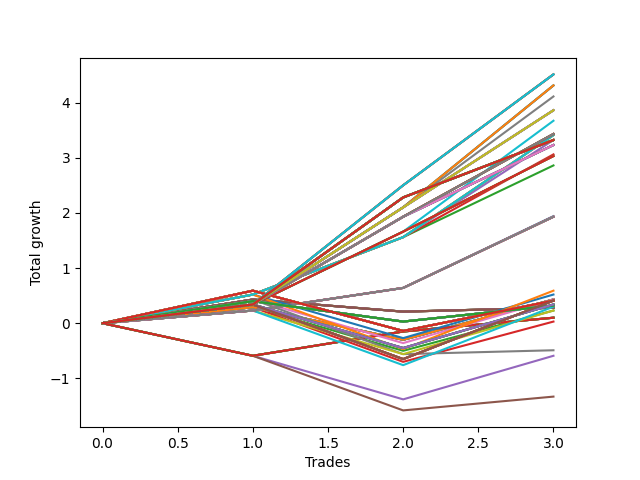

# Long HLT 102_1y 
- Symbol: TSLA
- Date Range: 05/15/2023 - 05/17/2024
- Trading Period: 8:30-12:30
- Number of Trades: 3



| Id. | Name | Win Percent | Profit | Avg Profit / Trade | Avg Time / Trade | Std |      | Name | Win Percent | Profit | Avg Profit / Trade | Avg Time / Trade | Std |
| --- | ---- | ----------- | ------ | ------------------ | ---------------- | --- | ---- | ---- | ----------- | ------ | ------------------ | ---------------- | --- |
| | Sorted By <br> Profit | | | | | | | Sorted By <br> Win Percentage |||||
|0| TP-2 180m | 100.00 | 4.51 | 1.50 | 92:40 | 0.82 |     | TP-2 180m | 100.00 | 4.51 | 1.50 | 92:40 | 0.82 |
|1| TP-2 165m | 100.00 | 4.51 | 1.50 | 92:40 | 0.82 |     | TP-2 165m | 100.00 | 4.51 | 1.50 | 92:40 | 0.82 |
|2| TP-2 150m | 100.00 | 4.51 | 1.50 | 92:40 | 0.82 |     | TP-2 150m | 100.00 | 4.51 | 1.50 | 92:40 | 0.82 |
|3| TP-2 135m | 100.00 | 4.51 | 1.50 | 92:40 | 0.82 |     | TP-2 135m | 100.00 | 4.51 | 1.50 | 92:40 | 0.82 |
|4| TP-2 120m | 100.00 | 4.51 | 1.50 | 92:40 | 0.82 |     | TP-2 120m | 100.00 | 4.51 | 1.50 | 92:40 | 0.82 |
|5| TP-3 90m | 100.00 | 4.31 | 1.44 | 87:40 | 0.80 |     | TP-3 90m | 100.00 | 4.31 | 1.44 | 87:40 | 0.80 |
|6| TP-2.75 90m | 100.00 | 4.31 | 1.44 | 87:40 | 0.80 |     | TP-2.75 90m | 100.00 | 4.31 | 1.44 | 87:40 | 0.80 |
|7| TP-2.5 90m | 100.00 | 4.31 | 1.44 | 87:40 | 0.80 |     | TP-2.5 90m | 100.00 | 4.31 | 1.44 | 87:40 | 0.80 |
|8| TP-2.25 90m | 100.00 | 4.31 | 1.44 | 87:40 | 0.80 |     | TP-2.25 90m | 100.00 | 4.31 | 1.44 | 87:40 | 0.80 |
|9| TP-2 90m | 100.00 | 4.11 | 1.37 | 86:00 | 0.74 |     | TP-2 90m | 100.00 | 4.11 | 1.37 | 86:00 | 0.74 |
|10| TP-1.75 180m | 100.00 | 3.86 | 1.29 | 80:20 | 0.67 |     | TP-1.75 180m | 100.00 | 3.86 | 1.29 | 80:20 | 0.67 |
|11| TP-1.75 165m | 100.00 | 3.86 | 1.29 | 80:20 | 0.67 |     | TP-1.75 165m | 100.00 | 3.86 | 1.29 | 80:20 | 0.67 |
|12| TP-1.75 150m | 100.00 | 3.86 | 1.29 | 80:20 | 0.67 |     | TP-1.75 150m | 100.00 | 3.86 | 1.29 | 80:20 | 0.67 |
|13| TP-1.75 135m | 100.00 | 3.86 | 1.29 | 80:20 | 0.67 |     | TP-1.75 135m | 100.00 | 3.86 | 1.29 | 80:20 | 0.67 |
|14| TP-1.75 120m | 100.00 | 3.86 | 1.29 | 80:20 | 0.67 |     | TP-1.75 120m | 100.00 | 3.86 | 1.29 | 80:20 | 0.67 |
|15| TP-1.75 105m | 100.00 | 3.86 | 1.29 | 80:20 | 0.67 |     | TP-1.75 105m | 100.00 | 3.86 | 1.29 | 80:20 | 0.67 |
|16| TP-1.75 90m | 100.00 | 3.86 | 1.29 | 80:20 | 0.67 |     | TP-1.75 90m | 100.00 | 3.86 | 1.29 | 80:20 | 0.67 |
|17| TP-2 105m | 100.00 | 3.67 | 1.22 | 91:00 | 0.69 |     | TP-2 105m | 100.00 | 3.67 | 1.22 | 91:00 | 0.69 |
|18| TP-1.5 180m | 100.00 | 3.43 | 1.14 | 77:00 | 0.57 |     | TP-1.5 180m | 100.00 | 3.43 | 1.14 | 77:00 | 0.57 |
|19| TP-1.5 165m | 100.00 | 3.43 | 1.14 | 77:00 | 0.57 |     | TP-1.5 165m | 100.00 | 3.43 | 1.14 | 77:00 | 0.57 |
|20| TP-1.5 150m | 100.00 | 3.43 | 1.14 | 77:00 | 0.57 |     | TP-1.5 150m | 100.00 | 3.43 | 1.14 | 77:00 | 0.57 |
|21| TP-1.5 135m | 100.00 | 3.43 | 1.14 | 77:00 | 0.57 |     | TP-1.5 135m | 100.00 | 3.43 | 1.14 | 77:00 | 0.57 |
|22| TP-1.5 120m | 100.00 | 3.43 | 1.14 | 77:00 | 0.57 |     | TP-1.5 120m | 100.00 | 3.43 | 1.14 | 77:00 | 0.57 |
|23| TP-1.5 105m | 100.00 | 3.43 | 1.14 | 77:00 | 0.57 |     | TP-1.5 105m | 100.00 | 3.43 | 1.14 | 77:00 | 0.57 |
|24| TP-1.5 90m | 100.00 | 3.43 | 1.14 | 77:00 | 0.57 |     | TP-1.5 90m | 100.00 | 3.43 | 1.14 | 77:00 | 0.57 |
|25| TP-3 75m | 100.00 | 3.41 | 1.14 | 74:00 | 0.55 |     | TP-3 75m | 100.00 | 3.41 | 1.14 | 74:00 | 0.55 |
|26| TP-2.75 75m | 100.00 | 3.41 | 1.14 | 74:00 | 0.55 |     | TP-2.75 75m | 100.00 | 3.41 | 1.14 | 74:00 | 0.55 |
|27| TP-2.5 75m | 100.00 | 3.41 | 1.14 | 74:00 | 0.55 |     | TP-2.5 75m | 100.00 | 3.41 | 1.14 | 74:00 | 0.55 |
|28| TP-2.25 75m | 100.00 | 3.41 | 1.14 | 74:00 | 0.55 |     | TP-2.25 75m | 100.00 | 3.41 | 1.14 | 74:00 | 0.55 |
|29| TP-2 75m | 100.00 | 3.41 | 1.14 | 74:00 | 0.55 |     | TP-2 75m | 100.00 | 3.41 | 1.14 | 74:00 | 0.55 |
|30| TP-3 180m | 100.00 | 3.32 | 1.11 | 107:40 | 0.65 |     | TP-3 180m | 100.00 | 3.32 | 1.11 | 107:40 | 0.65 |
|31| TP-2.75 180m | 100.00 | 3.32 | 1.11 | 107:40 | 0.65 |     | TP-2.75 180m | 100.00 | 3.32 | 1.11 | 107:40 | 0.65 |
|32| TP-2.5 180m | 100.00 | 3.32 | 1.11 | 107:40 | 0.65 |     | TP-2.5 180m | 100.00 | 3.32 | 1.11 | 107:40 | 0.65 |
|33| TP-2.25 180m | 100.00 | 3.32 | 1.11 | 107:40 | 0.65 |     | TP-2.25 180m | 100.00 | 3.32 | 1.11 | 107:40 | 0.65 |
|34| TP-3 165m | 100.00 | 3.32 | 1.11 | 107:40 | 0.65 |     | TP-3 165m | 100.00 | 3.32 | 1.11 | 107:40 | 0.65 |
|35| TP-2.75 165m | 100.00 | 3.32 | 1.11 | 107:40 | 0.65 |     | TP-2.75 165m | 100.00 | 3.32 | 1.11 | 107:40 | 0.65 |
|36| TP-2.5 165m | 100.00 | 3.32 | 1.11 | 107:40 | 0.65 |     | TP-2.5 165m | 100.00 | 3.32 | 1.11 | 107:40 | 0.65 |
|37| TP-2.25 165m | 100.00 | 3.32 | 1.11 | 107:40 | 0.65 |     | TP-2.25 165m | 100.00 | 3.32 | 1.11 | 107:40 | 0.65 |
|38| TP-3 150m | 100.00 | 3.32 | 1.11 | 107:40 | 0.65 |     | TP-3 150m | 100.00 | 3.32 | 1.11 | 107:40 | 0.65 |
|39| TP-2.75 150m | 100.00 | 3.32 | 1.11 | 107:40 | 0.65 |     | TP-2.75 150m | 100.00 | 3.32 | 1.11 | 107:40 | 0.65 |
|40| TP-2.5 150m | 100.00 | 3.32 | 1.11 | 107:40 | 0.65 |     | TP-2.5 150m | 100.00 | 3.32 | 1.11 | 107:40 | 0.65 |
|41| TP-2.25 150m | 100.00 | 3.32 | 1.11 | 107:40 | 0.65 |     | TP-2.25 150m | 100.00 | 3.32 | 1.11 | 107:40 | 0.65 |
|42| TP-3 135m | 100.00 | 3.32 | 1.11 | 107:40 | 0.65 |     | TP-3 135m | 100.00 | 3.32 | 1.11 | 107:40 | 0.65 |
|43| TP-2.75 135m | 100.00 | 3.32 | 1.11 | 107:40 | 0.65 |     | TP-2.75 135m | 100.00 | 3.32 | 1.11 | 107:40 | 0.65 |
|44| TP-2.5 135m | 100.00 | 3.32 | 1.11 | 107:40 | 0.65 |     | TP-2.5 135m | 100.00 | 3.32 | 1.11 | 107:40 | 0.65 |
|45| TP-2.25 135m | 100.00 | 3.32 | 1.11 | 107:40 | 0.65 |     | TP-2.25 135m | 100.00 | 3.32 | 1.11 | 107:40 | 0.65 |
|46| TP-3 120m | 100.00 | 3.32 | 1.11 | 107:40 | 0.65 |     | TP-3 120m | 100.00 | 3.32 | 1.11 | 107:40 | 0.65 |
|47| TP-2.75 120m | 100.00 | 3.32 | 1.11 | 107:40 | 0.65 |     | TP-2.75 120m | 100.00 | 3.32 | 1.11 | 107:40 | 0.65 |
|48| TP-2.5 120m | 100.00 | 3.32 | 1.11 | 107:40 | 0.65 |     | TP-2.5 120m | 100.00 | 3.32 | 1.11 | 107:40 | 0.65 |
|49| TP-2.25 120m | 100.00 | 3.32 | 1.11 | 107:40 | 0.65 |     | TP-2.25 120m | 100.00 | 3.32 | 1.11 | 107:40 | 0.65 |
|50| TP-1.75 75m | 100.00 | 3.32 | 1.11 | 71:40 | 0.51 |     | TP-1.75 75m | 100.00 | 3.32 | 1.11 | 71:40 | 0.51 |
|51| TP-1.25 180m | 100.00 | 3.23 | 1.08 | 73:00 | 0.53 |     | TP-1.25 180m | 100.00 | 3.23 | 1.08 | 73:00 | 0.53 |
|52| TP-1.25 165m | 100.00 | 3.23 | 1.08 | 73:00 | 0.53 |     | TP-1.25 165m | 100.00 | 3.23 | 1.08 | 73:00 | 0.53 |
|53| TP-1.25 150m | 100.00 | 3.23 | 1.08 | 73:00 | 0.53 |     | TP-1.25 150m | 100.00 | 3.23 | 1.08 | 73:00 | 0.53 |
|54| TP-1.25 135m | 100.00 | 3.23 | 1.08 | 73:00 | 0.53 |     | TP-1.25 135m | 100.00 | 3.23 | 1.08 | 73:00 | 0.53 |
|55| TP-1.25 120m | 100.00 | 3.23 | 1.08 | 73:00 | 0.53 |     | TP-1.25 120m | 100.00 | 3.23 | 1.08 | 73:00 | 0.53 |
|56| TP-1.25 105m | 100.00 | 3.23 | 1.08 | 73:00 | 0.53 |     | TP-1.25 105m | 100.00 | 3.23 | 1.08 | 73:00 | 0.53 |
|57| TP-1.25 90m | 100.00 | 3.23 | 1.08 | 73:00 | 0.53 |     | TP-1.25 90m | 100.00 | 3.23 | 1.08 | 73:00 | 0.53 |
|58| TP-1.5 75m | 100.00 | 3.06 | 1.02 | 70:40 | 0.40 |     | TP-1.5 75m | 100.00 | 3.06 | 1.02 | 70:40 | 0.40 |
|59| TP-3 105m | 100.00 | 3.03 | 1.01 | 97:40 | 0.47 |     | TP-3 105m | 100.00 | 3.03 | 1.01 | 97:40 | 0.47 |
|60| TP-2.75 105m | 100.00 | 3.03 | 1.01 | 97:40 | 0.47 |     | TP-2.75 105m | 100.00 | 3.03 | 1.01 | 97:40 | 0.47 |
|61| TP-2.5 105m | 100.00 | 3.03 | 1.01 | 97:40 | 0.47 |     | TP-2.5 105m | 100.00 | 3.03 | 1.01 | 97:40 | 0.47 |
|62| TP-2.25 105m | 100.00 | 3.03 | 1.01 | 97:40 | 0.47 |     | TP-2.25 105m | 100.00 | 3.03 | 1.01 | 97:40 | 0.47 |
|63| TP-1.25 75m | 100.00 | 2.86 | 0.95 | 66:40 | 0.32 |     | TP-1.25 75m | 100.00 | 2.86 | 0.95 | 66:40 | 0.32 |
|64| TP-1.25 60m | 100.00 | 1.94 | 0.65 | 56:40 | 0.47 |     | TP-1.25 60m | 100.00 | 1.94 | 0.65 | 56:40 | 0.47 |
|65| TP-3 60m | 100.00 | 1.93 | 0.64 | 59:00 | 0.46 |     | TP-3 60m | 100.00 | 1.93 | 0.64 | 59:00 | 0.46 |
|66| TP-2.75 60m | 100.00 | 1.93 | 0.64 | 59:00 | 0.46 |     | TP-2.75 60m | 100.00 | 1.93 | 0.64 | 59:00 | 0.46 |
|67| TP-2.5 60m | 100.00 | 1.93 | 0.64 | 59:00 | 0.46 |     | TP-2.5 60m | 100.00 | 1.93 | 0.64 | 59:00 | 0.46 |
|68| TP-2.25 60m | 100.00 | 1.93 | 0.64 | 59:00 | 0.46 |     | TP-2.25 60m | 100.00 | 1.93 | 0.64 | 59:00 | 0.46 |
|69| TP-2 60m | 100.00 | 1.93 | 0.64 | 59:00 | 0.46 |     | TP-2 60m | 100.00 | 1.93 | 0.64 | 59:00 | 0.46 |
|70| TP-1.75 60m | 100.00 | 1.93 | 0.64 | 59:00 | 0.46 |     | TP-1.75 60m | 100.00 | 1.93 | 0.64 | 59:00 | 0.46 |
|71| TP-1.5 60m | 100.00 | 1.93 | 0.64 | 59:00 | 0.46 |     | TP-1.5 60m | 100.00 | 1.93 | 0.64 | 59:00 | 0.46 |
|72| TP-1 75m | 66.67 | 0.59 | 0.20 | 44:20 | 0.87 |     | TP-1 75m | 66.67 | 0.59 | 0.20 | 44:20 | 0.87 |
|73| TP-0.75 75m | 66.67 | 0.52 | 0.17 | 31:40 | 0.69 |     | TP-0.75 75m | 66.67 | 0.52 | 0.17 | 31:40 | 0.69 |
|74| TP-0.75 45m | 66.67 | 0.43 | 0.14 | 21:40 | 0.68 |     | TP-0.75 45m | 66.67 | 0.43 | 0.14 | 21:40 | 0.68 |
|75| TP-3 15m | 66.67 | 0.43 | 0.14 | 14:00 | 0.55 |     | TP-3 15m | 66.67 | 0.43 | 0.14 | 14:00 | 0.55 |
|76| TP-2.75 15m | 66.67 | 0.43 | 0.14 | 14:00 | 0.55 |     | TP-2.75 15m | 66.67 | 0.43 | 0.14 | 14:00 | 0.55 |
|77| TP-2.5 15m | 66.67 | 0.43 | 0.14 | 14:00 | 0.55 |     | TP-2.5 15m | 66.67 | 0.43 | 0.14 | 14:00 | 0.55 |
|78| TP-2.25 15m | 66.67 | 0.43 | 0.14 | 14:00 | 0.55 |     | TP-2.25 15m | 66.67 | 0.43 | 0.14 | 14:00 | 0.55 |
|79| TP-2 15m | 66.67 | 0.43 | 0.14 | 14:00 | 0.55 |     | TP-2 15m | 66.67 | 0.43 | 0.14 | 14:00 | 0.55 |
|80| TP-1.75 15m | 66.67 | 0.43 | 0.14 | 14:00 | 0.55 |     | TP-1.75 15m | 66.67 | 0.43 | 0.14 | 14:00 | 0.55 |
|81| TP-1.5 15m | 66.67 | 0.43 | 0.14 | 14:00 | 0.55 |     | TP-1.5 15m | 66.67 | 0.43 | 0.14 | 14:00 | 0.55 |
|82| TP-1.25 15m | 66.67 | 0.43 | 0.14 | 14:00 | 0.55 |     | TP-1.25 15m | 66.67 | 0.43 | 0.14 | 14:00 | 0.55 |
|83| TP-1 180m | 66.67 | 0.41 | 0.14 | 48:00 | 0.85 |     | TP-1 180m | 66.67 | 0.41 | 0.14 | 48:00 | 0.85 |
|84| TP-0.5 180m | 66.67 | 0.41 | 0.14 | 06:40 | 0.61 |     | TP-0.5 180m | 66.67 | 0.41 | 0.14 | 06:40 | 0.61 |
|85| TP-1 165m | 66.67 | 0.41 | 0.14 | 48:00 | 0.85 |     | TP-1 165m | 66.67 | 0.41 | 0.14 | 48:00 | 0.85 |
|86| TP-0.5 165m | 66.67 | 0.41 | 0.14 | 06:40 | 0.61 |     | TP-0.5 165m | 66.67 | 0.41 | 0.14 | 06:40 | 0.61 |
|87| TP-1 150m | 66.67 | 0.41 | 0.14 | 48:00 | 0.85 |     | TP-1 150m | 66.67 | 0.41 | 0.14 | 48:00 | 0.85 |
|88| TP-0.5 150m | 66.67 | 0.41 | 0.14 | 06:40 | 0.61 |     | TP-0.5 150m | 66.67 | 0.41 | 0.14 | 06:40 | 0.61 |
|89| TP-1 135m | 66.67 | 0.41 | 0.14 | 48:00 | 0.85 |     | TP-1 135m | 66.67 | 0.41 | 0.14 | 48:00 | 0.85 |
|90| TP-0.5 135m | 66.67 | 0.41 | 0.14 | 06:40 | 0.61 |     | TP-0.5 135m | 66.67 | 0.41 | 0.14 | 06:40 | 0.61 |
|91| TP-1 120m | 66.67 | 0.41 | 0.14 | 48:00 | 0.85 |     | TP-1 120m | 66.67 | 0.41 | 0.14 | 48:00 | 0.85 |
|92| TP-0.5 120m | 66.67 | 0.41 | 0.14 | 06:40 | 0.61 |     | TP-0.5 120m | 66.67 | 0.41 | 0.14 | 06:40 | 0.61 |
|93| TP-1 105m | 66.67 | 0.41 | 0.14 | 48:00 | 0.85 |     | TP-1 105m | 66.67 | 0.41 | 0.14 | 48:00 | 0.85 |
|94| TP-0.5 105m | 66.67 | 0.41 | 0.14 | 06:40 | 0.61 |     | TP-0.5 105m | 66.67 | 0.41 | 0.14 | 06:40 | 0.61 |
|95| TP-1 90m | 66.67 | 0.41 | 0.14 | 48:00 | 0.85 |     | TP-1 90m | 66.67 | 0.41 | 0.14 | 48:00 | 0.85 |
|96| TP-0.5 90m | 66.67 | 0.41 | 0.14 | 06:40 | 0.61 |     | TP-0.5 90m | 66.67 | 0.41 | 0.14 | 06:40 | 0.61 |
|97| TP-0.5 75m | 66.67 | 0.41 | 0.14 | 06:40 | 0.61 |     | TP-0.5 75m | 66.67 | 0.41 | 0.14 | 06:40 | 0.61 |
|98| TP-0.5 60m | 66.67 | 0.41 | 0.14 | 06:40 | 0.61 |     | TP-0.5 60m | 66.67 | 0.41 | 0.14 | 06:40 | 0.61 |
|99| TP-0.5 45m | 66.67 | 0.41 | 0.14 | 06:40 | 0.61 |     | TP-0.5 45m | 66.67 | 0.41 | 0.14 | 06:40 | 0.61 |
|100| TP-0.5 30m | 66.67 | 0.41 | 0.14 | 06:40 | 0.61 |     | TP-0.5 30m | 66.67 | 0.41 | 0.14 | 06:40 | 0.61 |
|101| TP-0.5 15m | 66.67 | 0.41 | 0.14 | 06:40 | 0.61 |     | TP-0.5 15m | 66.67 | 0.41 | 0.14 | 06:40 | 0.61 |
|102| TP-0.75 180m | 66.67 | 0.34 | 0.11 | 35:20 | 0.66 |     | TP-0.75 180m | 66.67 | 0.34 | 0.11 | 35:20 | 0.66 |
|103| TP-0.75 165m | 66.67 | 0.34 | 0.11 | 35:20 | 0.66 |     | TP-0.75 165m | 66.67 | 0.34 | 0.11 | 35:20 | 0.66 |
|104| TP-0.75 150m | 66.67 | 0.34 | 0.11 | 35:20 | 0.66 |     | TP-0.75 150m | 66.67 | 0.34 | 0.11 | 35:20 | 0.66 |
|105| TP-0.75 135m | 66.67 | 0.34 | 0.11 | 35:20 | 0.66 |     | TP-0.75 135m | 66.67 | 0.34 | 0.11 | 35:20 | 0.66 |
|106| TP-0.75 120m | 66.67 | 0.34 | 0.11 | 35:20 | 0.66 |     | TP-0.75 120m | 66.67 | 0.34 | 0.11 | 35:20 | 0.66 |
|107| TP-0.75 105m | 66.67 | 0.34 | 0.11 | 35:20 | 0.66 |     | TP-0.75 105m | 66.67 | 0.34 | 0.11 | 35:20 | 0.66 |
|108| TP-0.75 90m | 66.67 | 0.34 | 0.11 | 35:20 | 0.66 |     | TP-0.75 90m | 66.67 | 0.34 | 0.11 | 35:20 | 0.66 |
|109| TP-0.25 180m | 66.67 | 0.32 | 0.11 | 02:20 | 0.34 |     | TP-0.25 180m | 66.67 | 0.32 | 0.11 | 02:20 | 0.34 |
|110| TP-0.25 165m | 66.67 | 0.32 | 0.11 | 02:20 | 0.34 |     | TP-0.25 165m | 66.67 | 0.32 | 0.11 | 02:20 | 0.34 |
|111| TP-0.25 150m | 66.67 | 0.32 | 0.11 | 02:20 | 0.34 |     | TP-0.25 150m | 66.67 | 0.32 | 0.11 | 02:20 | 0.34 |
|112| TP-0.25 135m | 66.67 | 0.32 | 0.11 | 02:20 | 0.34 |     | TP-0.25 135m | 66.67 | 0.32 | 0.11 | 02:20 | 0.34 |
|113| TP-0.25 120m | 66.67 | 0.32 | 0.11 | 02:20 | 0.34 |     | TP-0.25 120m | 66.67 | 0.32 | 0.11 | 02:20 | 0.34 |
|114| TP-0.25 105m | 66.67 | 0.32 | 0.11 | 02:20 | 0.34 |     | TP-0.25 105m | 66.67 | 0.32 | 0.11 | 02:20 | 0.34 |
|115| TP-0.25 90m | 66.67 | 0.32 | 0.11 | 02:20 | 0.34 |     | TP-0.25 90m | 66.67 | 0.32 | 0.11 | 02:20 | 0.34 |
|116| TP-0.25 75m | 66.67 | 0.32 | 0.11 | 02:20 | 0.34 |     | TP-0.25 75m | 66.67 | 0.32 | 0.11 | 02:20 | 0.34 |
|117| TP-0.25 60m | 66.67 | 0.32 | 0.11 | 02:20 | 0.34 |     | TP-0.25 60m | 66.67 | 0.32 | 0.11 | 02:20 | 0.34 |
|118| TP-0.25 45m | 66.67 | 0.32 | 0.11 | 02:20 | 0.34 |     | TP-0.25 45m | 66.67 | 0.32 | 0.11 | 02:20 | 0.34 |
|119| TP-0.25 30m | 66.67 | 0.32 | 0.11 | 02:20 | 0.34 |     | TP-0.25 30m | 66.67 | 0.32 | 0.11 | 02:20 | 0.34 |
|120| TP-0.25 15m | 66.67 | 0.32 | 0.11 | 02:20 | 0.34 |     | TP-0.25 15m | 66.67 | 0.32 | 0.11 | 02:20 | 0.34 |
|121| TP-1 60m | 66.67 | 0.30 | 0.10 | 39:20 | 0.84 |     | TP-1 60m | 66.67 | 0.30 | 0.10 | 39:20 | 0.84 |
|122| TP-3 45m | 66.67 | 0.28 | 0.09 | 44:00 | 0.27 |     | TP-3 45m | 66.67 | 0.28 | 0.09 | 44:00 | 0.27 |
|123| TP-2.75 45m | 66.67 | 0.28 | 0.09 | 44:00 | 0.27 |     | TP-2.75 45m | 66.67 | 0.28 | 0.09 | 44:00 | 0.27 |
|124| TP-2.5 45m | 66.67 | 0.28 | 0.09 | 44:00 | 0.27 |     | TP-2.5 45m | 66.67 | 0.28 | 0.09 | 44:00 | 0.27 |
|125| TP-2.25 45m | 66.67 | 0.28 | 0.09 | 44:00 | 0.27 |     | TP-2.25 45m | 66.67 | 0.28 | 0.09 | 44:00 | 0.27 |
|126| TP-2 45m | 66.67 | 0.28 | 0.09 | 44:00 | 0.27 |     | TP-2 45m | 66.67 | 0.28 | 0.09 | 44:00 | 0.27 |
|127| TP-1.75 45m | 66.67 | 0.28 | 0.09 | 44:00 | 0.27 |     | TP-1.75 45m | 66.67 | 0.28 | 0.09 | 44:00 | 0.27 |
|128| TP-1.5 45m | 66.67 | 0.28 | 0.09 | 44:00 | 0.27 |     | TP-1.5 45m | 66.67 | 0.28 | 0.09 | 44:00 | 0.27 |
|129| TP-1.25 45m | 66.67 | 0.28 | 0.09 | 44:00 | 0.27 |     | TP-1.25 45m | 66.67 | 0.28 | 0.09 | 44:00 | 0.27 |
|130| TP-0.75 60m | 66.67 | 0.23 | 0.08 | 26:40 | 0.65 |     | TP-0.75 60m | 66.67 | 0.23 | 0.08 | 26:40 | 0.65 |
|131| TP-0.75 15m | 66.67 | 0.23 | 0.08 | 11:00 | 0.64 |     | TP-0.75 15m | 66.67 | 0.23 | 0.08 | 11:00 | 0.64 |
|132| TP-3 30m | 66.67 | 0.10 | 0.03 | 29:00 | 0.45 |     | TP-3 30m | 66.67 | 0.10 | 0.03 | 29:00 | 0.45 |
|133| TP-2.75 30m | 66.67 | 0.10 | 0.03 | 29:00 | 0.45 |     | TP-2.75 30m | 66.67 | 0.10 | 0.03 | 29:00 | 0.45 |
|134| TP-2.5 30m | 66.67 | 0.10 | 0.03 | 29:00 | 0.45 |     | TP-2.5 30m | 66.67 | 0.10 | 0.03 | 29:00 | 0.45 |
|135| TP-2.25 30m | 66.67 | 0.10 | 0.03 | 29:00 | 0.45 |     | TP-2.25 30m | 66.67 | 0.10 | 0.03 | 29:00 | 0.45 |
|136| TP-2 30m | 66.67 | 0.10 | 0.03 | 29:00 | 0.45 |     | TP-2 30m | 66.67 | 0.10 | 0.03 | 29:00 | 0.45 |
|137| TP-1.75 30m | 66.67 | 0.10 | 0.03 | 29:00 | 0.45 |     | TP-1.75 30m | 66.67 | 0.10 | 0.03 | 29:00 | 0.45 |
|138| TP-1.5 30m | 66.67 | 0.10 | 0.03 | 29:00 | 0.45 |     | TP-1.5 30m | 66.67 | 0.10 | 0.03 | 29:00 | 0.45 |
|139| TP-1.25 30m | 66.67 | 0.10 | 0.03 | 29:00 | 0.45 |     | TP-1.25 30m | 66.67 | 0.10 | 0.03 | 29:00 | 0.45 |
|140| TP-1 15m | 66.67 | 0.03 | 0.01 | 12:00 | 0.73 |     | TP-1 15m | 66.67 | 0.03 | 0.01 | 12:00 | 0.73 |
|141| TP-1 45m | 66.67 | -0.49 | -0.16 | 32:00 | 0.60 |     | TP-1 45m | 66.67 | -0.49 | -0.16 | 32:00 | 0.60 |
|142| TP-0.75 30m | 33.33 | -0.59 | -0.20 | 16:40 | 0.70 |     | TP-0.75 30m | 33.33 | -0.59 | -0.20 | 16:40 | 0.70 |
|143| TP-1 30m | 33.33 | -1.33 | -0.44 | 22:00 | 0.52 |     | TP-1 30m | 33.33 | -1.33 | -0.44 | 22:00 | 0.52 |

### Test TP-0.25 15m
* Take Profit of 0.25 Point
* 0.25 Stoploss
* Results:
```
Total Trades: 3
Percent Up: 66.67
Percent Down: 33.33
Total Points Moved Up: 0.32
Potential Profit: 160.00
Total Points Ups: 0.69 Count Ups: 2
Total Points Downs: -0.37 Count Downs: 1
```

<details><summary>Trades</summary>

<code>In: 2023-10-12 11:25:00		Out: 2023-10-12 11:28:00		Total Position Time: 03:00		Total Move Up: 0.40		Total to Date: 0.40</code> <br />
<code>In: 2023-10-26 09:45:00		Out: 2023-10-26 09:47:00		Total Position Time: 02:00		Total Move Up: -0.37		Total to Date: 0.03</code> <br />
<code>In: 2024-01-05 09:40:00		Out: 2024-01-05 09:42:00		Total Position Time: 02:00		Total Move Up: 0.29		Total to Date: 0.32</code> <br />


</details>

### Test TP-0.5 15m
* Take Profit of 0.5 Point
* 0.5 Stoploss
* Results:
```
Total Trades: 3
Percent Up: 66.67
Percent Down: 33.33
Total Points Moved Up: 0.41
Potential Profit: 205.00
Total Points Ups: 1.14 Count Ups: 2
Total Points Downs: -0.73 Count Downs: 1
```

<details><summary>Trades</summary>

<code>In: 2023-10-12 11:25:00		Out: 2023-10-12 11:35:00		Total Position Time: 10:00		Total Move Up: 0.59		Total to Date: 0.59</code> <br />
<code>In: 2023-10-26 09:45:00		Out: 2023-10-26 09:48:00		Total Position Time: 03:00		Total Move Up: -0.73		Total to Date: -0.14</code> <br />
<code>In: 2024-01-05 09:40:00		Out: 2024-01-05 09:47:00		Total Position Time: 07:00		Total Move Up: 0.55		Total to Date: 0.41</code> <br />


</details>

### Test TP-0.75 15m
* Take Profit of 0.75 Point
* 0.75 Stoploss
* Results:
```
Total Trades: 3
Percent Up: 66.67
Percent Down: 33.33
Total Points Moved Up: 0.23
Potential Profit: 115.00
Total Points Ups: 1.02 Count Ups: 2
Total Points Downs: -0.79 Count Downs: 1
```

<details><summary>Trades</summary>

<code>In: 2023-10-12 11:25:00		Out: 2023-10-12 11:39:00		Total Position Time: 14:00		Total Move Up: 0.29		Total to Date: 0.29</code> <br />
<code>In: 2023-10-26 09:45:00		Out: 2023-10-26 09:50:00		Total Position Time: 05:00		Total Move Up: -0.79		Total to Date: -0.50</code> <br />
<code>In: 2024-01-05 09:40:00		Out: 2024-01-05 09:54:00		Total Position Time: 14:00		Total Move Up: 0.73		Total to Date: 0.23</code> <br />


</details>

### Test TP-1 15m
* Take Profit of 1 Point
* 1 Stoploss
* Results:
```
Total Trades: 3
Percent Up: 66.67
Percent Down: 33.33
Total Points Moved Up: 0.03
Potential Profit: 15.00
Total Points Ups: 1.02 Count Ups: 2
Total Points Downs: -0.99 Count Downs: 1
```

<details><summary>Trades</summary>

<code>In: 2023-10-12 11:25:00		Out: 2023-10-12 11:39:00		Total Position Time: 14:00		Total Move Up: 0.29		Total to Date: 0.29</code> <br />
<code>In: 2023-10-26 09:45:00		Out: 2023-10-26 09:53:00		Total Position Time: 08:00		Total Move Up: -0.99		Total to Date: -0.70</code> <br />
<code>In: 2024-01-05 09:40:00		Out: 2024-01-05 09:54:00		Total Position Time: 14:00		Total Move Up: 0.73		Total to Date: 0.03</code> <br />


</details>

### Test TP-1.25 15m
* Take Profit of 1.25 Point
* 1.25 Stoploss
* Results:
```
Total Trades: 3
Percent Up: 66.67
Percent Down: 33.33
Total Points Moved Up: 0.43
Potential Profit: 215.00
Total Points Ups: 1.02 Count Ups: 2
Total Points Downs: -0.59 Count Downs: 1
```

<details><summary>Trades</summary>

<code>In: 2023-10-12 11:25:00		Out: 2023-10-12 11:39:00		Total Position Time: 14:00		Total Move Up: 0.29		Total to Date: 0.29</code> <br />
<code>In: 2023-10-26 09:45:00		Out: 2023-10-26 09:59:00		Total Position Time: 14:00		Total Move Up: -0.59		Total to Date: -0.30</code> <br />
<code>In: 2024-01-05 09:40:00		Out: 2024-01-05 09:54:00		Total Position Time: 14:00		Total Move Up: 0.73		Total to Date: 0.43</code> <br />


</details>

### Test TP-1.5 15m
* Take Profit of 1.5 Point
* 1.5 Stoploss
* Results:
```
Total Trades: 3
Percent Up: 66.67
Percent Down: 33.33
Total Points Moved Up: 0.43
Potential Profit: 215.00
Total Points Ups: 1.02 Count Ups: 2
Total Points Downs: -0.59 Count Downs: 1
```

<details><summary>Trades</summary>

<code>In: 2023-10-12 11:25:00		Out: 2023-10-12 11:39:00		Total Position Time: 14:00		Total Move Up: 0.29		Total to Date: 0.29</code> <br />
<code>In: 2023-10-26 09:45:00		Out: 2023-10-26 09:59:00		Total Position Time: 14:00		Total Move Up: -0.59		Total to Date: -0.30</code> <br />
<code>In: 2024-01-05 09:40:00		Out: 2024-01-05 09:54:00		Total Position Time: 14:00		Total Move Up: 0.73		Total to Date: 0.43</code> <br />


</details>

### Test TP-1.75 15m
* Take Profit of 1.75 Point
* 1.75 Stoploss
* Results:
```
Total Trades: 3
Percent Up: 66.67
Percent Down: 33.33
Total Points Moved Up: 0.43
Potential Profit: 215.00
Total Points Ups: 1.02 Count Ups: 2
Total Points Downs: -0.59 Count Downs: 1
```

<details><summary>Trades</summary>

<code>In: 2023-10-12 11:25:00		Out: 2023-10-12 11:39:00		Total Position Time: 14:00		Total Move Up: 0.29		Total to Date: 0.29</code> <br />
<code>In: 2023-10-26 09:45:00		Out: 2023-10-26 09:59:00		Total Position Time: 14:00		Total Move Up: -0.59		Total to Date: -0.30</code> <br />
<code>In: 2024-01-05 09:40:00		Out: 2024-01-05 09:54:00		Total Position Time: 14:00		Total Move Up: 0.73		Total to Date: 0.43</code> <br />


</details>

### Test TP-2 15m
* Take Profit of 2 Point
* 2 Stoploss
* Results:
```
Total Trades: 3
Percent Up: 66.67
Percent Down: 33.33
Total Points Moved Up: 0.43
Potential Profit: 215.00
Total Points Ups: 1.02 Count Ups: 2
Total Points Downs: -0.59 Count Downs: 1
```

<details><summary>Trades</summary>

<code>In: 2023-10-12 11:25:00		Out: 2023-10-12 11:39:00		Total Position Time: 14:00		Total Move Up: 0.29		Total to Date: 0.29</code> <br />
<code>In: 2023-10-26 09:45:00		Out: 2023-10-26 09:59:00		Total Position Time: 14:00		Total Move Up: -0.59		Total to Date: -0.30</code> <br />
<code>In: 2024-01-05 09:40:00		Out: 2024-01-05 09:54:00		Total Position Time: 14:00		Total Move Up: 0.73		Total to Date: 0.43</code> <br />


</details>

### Test TP-2.25 15m
* Take Profit of 2.25 Point
* 2.25 Stoploss
* Results:
```
Total Trades: 3
Percent Up: 66.67
Percent Down: 33.33
Total Points Moved Up: 0.43
Potential Profit: 215.00
Total Points Ups: 1.02 Count Ups: 2
Total Points Downs: -0.59 Count Downs: 1
```

<details><summary>Trades</summary>

<code>In: 2023-10-12 11:25:00		Out: 2023-10-12 11:39:00		Total Position Time: 14:00		Total Move Up: 0.29		Total to Date: 0.29</code> <br />
<code>In: 2023-10-26 09:45:00		Out: 2023-10-26 09:59:00		Total Position Time: 14:00		Total Move Up: -0.59		Total to Date: -0.30</code> <br />
<code>In: 2024-01-05 09:40:00		Out: 2024-01-05 09:54:00		Total Position Time: 14:00		Total Move Up: 0.73		Total to Date: 0.43</code> <br />


</details>

### Test TP-2.5 15m
* Take Profit of 2.5 Point
* 2.5 Stoploss
* Results:
```
Total Trades: 3
Percent Up: 66.67
Percent Down: 33.33
Total Points Moved Up: 0.43
Potential Profit: 215.00
Total Points Ups: 1.02 Count Ups: 2
Total Points Downs: -0.59 Count Downs: 1
```

<details><summary>Trades</summary>

<code>In: 2023-10-12 11:25:00		Out: 2023-10-12 11:39:00		Total Position Time: 14:00		Total Move Up: 0.29		Total to Date: 0.29</code> <br />
<code>In: 2023-10-26 09:45:00		Out: 2023-10-26 09:59:00		Total Position Time: 14:00		Total Move Up: -0.59		Total to Date: -0.30</code> <br />
<code>In: 2024-01-05 09:40:00		Out: 2024-01-05 09:54:00		Total Position Time: 14:00		Total Move Up: 0.73		Total to Date: 0.43</code> <br />


</details>

### Test TP-2.75 15m
* Take Profit of 2.75 Point
* 2.75 Stoploss
* Results:
```
Total Trades: 3
Percent Up: 66.67
Percent Down: 33.33
Total Points Moved Up: 0.43
Potential Profit: 215.00
Total Points Ups: 1.02 Count Ups: 2
Total Points Downs: -0.59 Count Downs: 1
```

<details><summary>Trades</summary>

<code>In: 2023-10-12 11:25:00		Out: 2023-10-12 11:39:00		Total Position Time: 14:00		Total Move Up: 0.29		Total to Date: 0.29</code> <br />
<code>In: 2023-10-26 09:45:00		Out: 2023-10-26 09:59:00		Total Position Time: 14:00		Total Move Up: -0.59		Total to Date: -0.30</code> <br />
<code>In: 2024-01-05 09:40:00		Out: 2024-01-05 09:54:00		Total Position Time: 14:00		Total Move Up: 0.73		Total to Date: 0.43</code> <br />


</details>

### Test TP-3 15m
* Take Profit of 3 Point
* 3 Stoploss
* Results:
```
Total Trades: 3
Percent Up: 66.67
Percent Down: 33.33
Total Points Moved Up: 0.43
Potential Profit: 215.00
Total Points Ups: 1.02 Count Ups: 2
Total Points Downs: -0.59 Count Downs: 1
```

<details><summary>Trades</summary>

<code>In: 2023-10-12 11:25:00		Out: 2023-10-12 11:39:00		Total Position Time: 14:00		Total Move Up: 0.29		Total to Date: 0.29</code> <br />
<code>In: 2023-10-26 09:45:00		Out: 2023-10-26 09:59:00		Total Position Time: 14:00		Total Move Up: -0.59		Total to Date: -0.30</code> <br />
<code>In: 2024-01-05 09:40:00		Out: 2024-01-05 09:54:00		Total Position Time: 14:00		Total Move Up: 0.73		Total to Date: 0.43</code> <br />


</details>

### Test TP-0.25 30m
* Take Profit of 0.25 Point
* 0.25 Stoploss
* Results:
```
Total Trades: 3
Percent Up: 66.67
Percent Down: 33.33
Total Points Moved Up: 0.32
Potential Profit: 160.00
Total Points Ups: 0.69 Count Ups: 2
Total Points Downs: -0.37 Count Downs: 1
```

<details><summary>Trades</summary>

<code>In: 2023-10-12 11:25:00		Out: 2023-10-12 11:28:00		Total Position Time: 03:00		Total Move Up: 0.40		Total to Date: 0.40</code> <br />
<code>In: 2023-10-26 09:45:00		Out: 2023-10-26 09:47:00		Total Position Time: 02:00		Total Move Up: -0.37		Total to Date: 0.03</code> <br />
<code>In: 2024-01-05 09:40:00		Out: 2024-01-05 09:42:00		Total Position Time: 02:00		Total Move Up: 0.29		Total to Date: 0.32</code> <br />


</details>

### Test TP-0.5 30m
* Take Profit of 0.5 Point
* 0.5 Stoploss
* Results:
```
Total Trades: 3
Percent Up: 66.67
Percent Down: 33.33
Total Points Moved Up: 0.41
Potential Profit: 205.00
Total Points Ups: 1.14 Count Ups: 2
Total Points Downs: -0.73 Count Downs: 1
```

<details><summary>Trades</summary>

<code>In: 2023-10-12 11:25:00		Out: 2023-10-12 11:35:00		Total Position Time: 10:00		Total Move Up: 0.59		Total to Date: 0.59</code> <br />
<code>In: 2023-10-26 09:45:00		Out: 2023-10-26 09:48:00		Total Position Time: 03:00		Total Move Up: -0.73		Total to Date: -0.14</code> <br />
<code>In: 2024-01-05 09:40:00		Out: 2024-01-05 09:47:00		Total Position Time: 07:00		Total Move Up: 0.55		Total to Date: 0.41</code> <br />


</details>

### Test TP-0.75 30m
* Take Profit of 0.75 Point
* 0.75 Stoploss
* Results:
```
Total Trades: 3
Percent Up: 33.33
Percent Down: 66.67
Total Points Moved Up: -0.59
Potential Profit: -295.00
Total Points Ups: 0.79 Count Ups: 1
Total Points Downs: -1.38 Count Downs: 2
```

<details><summary>Trades</summary>

<code>In: 2023-10-12 11:25:00		Out: 2023-10-12 11:54:00		Total Position Time: 29:00		Total Move Up: -0.59		Total to Date: -0.59</code> <br />
<code>In: 2023-10-26 09:45:00		Out: 2023-10-26 09:50:00		Total Position Time: 05:00		Total Move Up: -0.79		Total to Date: -1.38</code> <br />
<code>In: 2024-01-05 09:40:00		Out: 2024-01-05 09:56:00		Total Position Time: 16:00		Total Move Up: 0.79		Total to Date: -0.59</code> <br />


</details>

### Test TP-1 30m
* Take Profit of 1 Point
* 1 Stoploss
* Results:
```
Total Trades: 3
Percent Up: 33.33
Percent Down: 66.67
Total Points Moved Up: -1.33
Potential Profit: -665.00
Total Points Ups: 0.25 Count Ups: 1
Total Points Downs: -1.58 Count Downs: 2
```

<details><summary>Trades</summary>

<code>In: 2023-10-12 11:25:00		Out: 2023-10-12 11:54:00		Total Position Time: 29:00		Total Move Up: -0.59		Total to Date: -0.59</code> <br />
<code>In: 2023-10-26 09:45:00		Out: 2023-10-26 09:53:00		Total Position Time: 08:00		Total Move Up: -0.99		Total to Date: -1.58</code> <br />
<code>In: 2024-01-05 09:40:00		Out: 2024-01-05 10:09:00		Total Position Time: 29:00		Total Move Up: 0.25		Total to Date: -1.33</code> <br />


</details>

### Test TP-1.25 30m
* Take Profit of 1.25 Point
* 1.25 Stoploss
* Results:
```
Total Trades: 3
Percent Up: 66.67
Percent Down: 33.33
Total Points Moved Up: 0.10
Potential Profit: 50.00
Total Points Ups: 0.69 Count Ups: 2
Total Points Downs: -0.59 Count Downs: 1
```

<details><summary>Trades</summary>

<code>In: 2023-10-12 11:25:00		Out: 2023-10-12 11:54:00		Total Position Time: 29:00		Total Move Up: -0.59		Total to Date: -0.59</code> <br />
<code>In: 2023-10-26 09:45:00		Out: 2023-10-26 10:14:00		Total Position Time: 29:00		Total Move Up: 0.44		Total to Date: -0.15</code> <br />
<code>In: 2024-01-05 09:40:00		Out: 2024-01-05 10:09:00		Total Position Time: 29:00		Total Move Up: 0.25		Total to Date: 0.10</code> <br />


</details>

### Test TP-1.5 30m
* Take Profit of 1.5 Point
* 1.5 Stoploss
* Results:
```
Total Trades: 3
Percent Up: 66.67
Percent Down: 33.33
Total Points Moved Up: 0.10
Potential Profit: 50.00
Total Points Ups: 0.69 Count Ups: 2
Total Points Downs: -0.59 Count Downs: 1
```

<details><summary>Trades</summary>

<code>In: 2023-10-12 11:25:00		Out: 2023-10-12 11:54:00		Total Position Time: 29:00		Total Move Up: -0.59		Total to Date: -0.59</code> <br />
<code>In: 2023-10-26 09:45:00		Out: 2023-10-26 10:14:00		Total Position Time: 29:00		Total Move Up: 0.44		Total to Date: -0.15</code> <br />
<code>In: 2024-01-05 09:40:00		Out: 2024-01-05 10:09:00		Total Position Time: 29:00		Total Move Up: 0.25		Total to Date: 0.10</code> <br />


</details>

### Test TP-1.75 30m
* Take Profit of 1.75 Point
* 1.75 Stoploss
* Results:
```
Total Trades: 3
Percent Up: 66.67
Percent Down: 33.33
Total Points Moved Up: 0.10
Potential Profit: 50.00
Total Points Ups: 0.69 Count Ups: 2
Total Points Downs: -0.59 Count Downs: 1
```

<details><summary>Trades</summary>

<code>In: 2023-10-12 11:25:00		Out: 2023-10-12 11:54:00		Total Position Time: 29:00		Total Move Up: -0.59		Total to Date: -0.59</code> <br />
<code>In: 2023-10-26 09:45:00		Out: 2023-10-26 10:14:00		Total Position Time: 29:00		Total Move Up: 0.44		Total to Date: -0.15</code> <br />
<code>In: 2024-01-05 09:40:00		Out: 2024-01-05 10:09:00		Total Position Time: 29:00		Total Move Up: 0.25		Total to Date: 0.10</code> <br />


</details>

### Test TP-2 30m
* Take Profit of 2 Point
* 2 Stoploss
* Results:
```
Total Trades: 3
Percent Up: 66.67
Percent Down: 33.33
Total Points Moved Up: 0.10
Potential Profit: 50.00
Total Points Ups: 0.69 Count Ups: 2
Total Points Downs: -0.59 Count Downs: 1
```

<details><summary>Trades</summary>

<code>In: 2023-10-12 11:25:00		Out: 2023-10-12 11:54:00		Total Position Time: 29:00		Total Move Up: -0.59		Total to Date: -0.59</code> <br />
<code>In: 2023-10-26 09:45:00		Out: 2023-10-26 10:14:00		Total Position Time: 29:00		Total Move Up: 0.44		Total to Date: -0.15</code> <br />
<code>In: 2024-01-05 09:40:00		Out: 2024-01-05 10:09:00		Total Position Time: 29:00		Total Move Up: 0.25		Total to Date: 0.10</code> <br />


</details>

### Test TP-2.25 30m
* Take Profit of 2.25 Point
* 2.25 Stoploss
* Results:
```
Total Trades: 3
Percent Up: 66.67
Percent Down: 33.33
Total Points Moved Up: 0.10
Potential Profit: 50.00
Total Points Ups: 0.69 Count Ups: 2
Total Points Downs: -0.59 Count Downs: 1
```

<details><summary>Trades</summary>

<code>In: 2023-10-12 11:25:00		Out: 2023-10-12 11:54:00		Total Position Time: 29:00		Total Move Up: -0.59		Total to Date: -0.59</code> <br />
<code>In: 2023-10-26 09:45:00		Out: 2023-10-26 10:14:00		Total Position Time: 29:00		Total Move Up: 0.44		Total to Date: -0.15</code> <br />
<code>In: 2024-01-05 09:40:00		Out: 2024-01-05 10:09:00		Total Position Time: 29:00		Total Move Up: 0.25		Total to Date: 0.10</code> <br />


</details>

### Test TP-2.5 30m
* Take Profit of 2.5 Point
* 2.5 Stoploss
* Results:
```
Total Trades: 3
Percent Up: 66.67
Percent Down: 33.33
Total Points Moved Up: 0.10
Potential Profit: 50.00
Total Points Ups: 0.69 Count Ups: 2
Total Points Downs: -0.59 Count Downs: 1
```

<details><summary>Trades</summary>

<code>In: 2023-10-12 11:25:00		Out: 2023-10-12 11:54:00		Total Position Time: 29:00		Total Move Up: -0.59		Total to Date: -0.59</code> <br />
<code>In: 2023-10-26 09:45:00		Out: 2023-10-26 10:14:00		Total Position Time: 29:00		Total Move Up: 0.44		Total to Date: -0.15</code> <br />
<code>In: 2024-01-05 09:40:00		Out: 2024-01-05 10:09:00		Total Position Time: 29:00		Total Move Up: 0.25		Total to Date: 0.10</code> <br />


</details>

### Test TP-2.75 30m
* Take Profit of 2.75 Point
* 2.75 Stoploss
* Results:
```
Total Trades: 3
Percent Up: 66.67
Percent Down: 33.33
Total Points Moved Up: 0.10
Potential Profit: 50.00
Total Points Ups: 0.69 Count Ups: 2
Total Points Downs: -0.59 Count Downs: 1
```

<details><summary>Trades</summary>

<code>In: 2023-10-12 11:25:00		Out: 2023-10-12 11:54:00		Total Position Time: 29:00		Total Move Up: -0.59		Total to Date: -0.59</code> <br />
<code>In: 2023-10-26 09:45:00		Out: 2023-10-26 10:14:00		Total Position Time: 29:00		Total Move Up: 0.44		Total to Date: -0.15</code> <br />
<code>In: 2024-01-05 09:40:00		Out: 2024-01-05 10:09:00		Total Position Time: 29:00		Total Move Up: 0.25		Total to Date: 0.10</code> <br />


</details>

### Test TP-3 30m
* Take Profit of 3 Point
* 3 Stoploss
* Results:
```
Total Trades: 3
Percent Up: 66.67
Percent Down: 33.33
Total Points Moved Up: 0.10
Potential Profit: 50.00
Total Points Ups: 0.69 Count Ups: 2
Total Points Downs: -0.59 Count Downs: 1
```

<details><summary>Trades</summary>

<code>In: 2023-10-12 11:25:00		Out: 2023-10-12 11:54:00		Total Position Time: 29:00		Total Move Up: -0.59		Total to Date: -0.59</code> <br />
<code>In: 2023-10-26 09:45:00		Out: 2023-10-26 10:14:00		Total Position Time: 29:00		Total Move Up: 0.44		Total to Date: -0.15</code> <br />
<code>In: 2024-01-05 09:40:00		Out: 2024-01-05 10:09:00		Total Position Time: 29:00		Total Move Up: 0.25		Total to Date: 0.10</code> <br />


</details>

### Test TP-0.25 45m
* Take Profit of 0.25 Point
* 0.25 Stoploss
* Results:
```
Total Trades: 3
Percent Up: 66.67
Percent Down: 33.33
Total Points Moved Up: 0.32
Potential Profit: 160.00
Total Points Ups: 0.69 Count Ups: 2
Total Points Downs: -0.37 Count Downs: 1
```

<details><summary>Trades</summary>

<code>In: 2023-10-12 11:25:00		Out: 2023-10-12 11:28:00		Total Position Time: 03:00		Total Move Up: 0.40		Total to Date: 0.40</code> <br />
<code>In: 2023-10-26 09:45:00		Out: 2023-10-26 09:47:00		Total Position Time: 02:00		Total Move Up: -0.37		Total to Date: 0.03</code> <br />
<code>In: 2024-01-05 09:40:00		Out: 2024-01-05 09:42:00		Total Position Time: 02:00		Total Move Up: 0.29		Total to Date: 0.32</code> <br />


</details>

### Test TP-0.5 45m
* Take Profit of 0.5 Point
* 0.5 Stoploss
* Results:
```
Total Trades: 3
Percent Up: 66.67
Percent Down: 33.33
Total Points Moved Up: 0.41
Potential Profit: 205.00
Total Points Ups: 1.14 Count Ups: 2
Total Points Downs: -0.73 Count Downs: 1
```

<details><summary>Trades</summary>

<code>In: 2023-10-12 11:25:00		Out: 2023-10-12 11:35:00		Total Position Time: 10:00		Total Move Up: 0.59		Total to Date: 0.59</code> <br />
<code>In: 2023-10-26 09:45:00		Out: 2023-10-26 09:48:00		Total Position Time: 03:00		Total Move Up: -0.73		Total to Date: -0.14</code> <br />
<code>In: 2024-01-05 09:40:00		Out: 2024-01-05 09:47:00		Total Position Time: 07:00		Total Move Up: 0.55		Total to Date: 0.41</code> <br />


</details>

### Test TP-0.75 45m
* Take Profit of 0.75 Point
* 0.75 Stoploss
* Results:
```
Total Trades: 3
Percent Up: 66.67
Percent Down: 33.33
Total Points Moved Up: 0.43
Potential Profit: 215.00
Total Points Ups: 1.22 Count Ups: 2
Total Points Downs: -0.79 Count Downs: 1
```

<details><summary>Trades</summary>

<code>In: 2023-10-12 11:25:00		Out: 2023-10-12 12:09:00		Total Position Time: 44:00		Total Move Up: 0.43		Total to Date: 0.43</code> <br />
<code>In: 2023-10-26 09:45:00		Out: 2023-10-26 09:50:00		Total Position Time: 05:00		Total Move Up: -0.79		Total to Date: -0.36</code> <br />
<code>In: 2024-01-05 09:40:00		Out: 2024-01-05 09:56:00		Total Position Time: 16:00		Total Move Up: 0.79		Total to Date: 0.43</code> <br />


</details>

### Test TP-1 45m
* Take Profit of 1 Point
* 1 Stoploss
* Results:
```
Total Trades: 3
Percent Up: 66.67
Percent Down: 33.33
Total Points Moved Up: -0.49
Potential Profit: -245.00
Total Points Ups: 0.50 Count Ups: 2
Total Points Downs: -0.99 Count Downs: 1
```

<details><summary>Trades</summary>

<code>In: 2023-10-12 11:25:00		Out: 2023-10-12 12:09:00		Total Position Time: 44:00		Total Move Up: 0.43		Total to Date: 0.43</code> <br />
<code>In: 2023-10-26 09:45:00		Out: 2023-10-26 09:53:00		Total Position Time: 08:00		Total Move Up: -0.99		Total to Date: -0.56</code> <br />
<code>In: 2024-01-05 09:40:00		Out: 2024-01-05 10:24:00		Total Position Time: 44:00		Total Move Up: 0.07		Total to Date: -0.49</code> <br />


</details>

### Test TP-1.25 45m
* Take Profit of 1.25 Point
* 1.25 Stoploss
* Results:
```
Total Trades: 3
Percent Up: 66.67
Percent Down: 33.33
Total Points Moved Up: 0.28
Potential Profit: 140.00
Total Points Ups: 0.50 Count Ups: 2
Total Points Downs: -0.22 Count Downs: 1
```

<details><summary>Trades</summary>

<code>In: 2023-10-12 11:25:00		Out: 2023-10-12 12:09:00		Total Position Time: 44:00		Total Move Up: 0.43		Total to Date: 0.43</code> <br />
<code>In: 2023-10-26 09:45:00		Out: 2023-10-26 10:29:00		Total Position Time: 44:00		Total Move Up: -0.22		Total to Date: 0.21</code> <br />
<code>In: 2024-01-05 09:40:00		Out: 2024-01-05 10:24:00		Total Position Time: 44:00		Total Move Up: 0.07		Total to Date: 0.28</code> <br />


</details>

### Test TP-1.5 45m
* Take Profit of 1.5 Point
* 1.5 Stoploss
* Results:
```
Total Trades: 3
Percent Up: 66.67
Percent Down: 33.33
Total Points Moved Up: 0.28
Potential Profit: 140.00
Total Points Ups: 0.50 Count Ups: 2
Total Points Downs: -0.22 Count Downs: 1
```

<details><summary>Trades</summary>

<code>In: 2023-10-12 11:25:00		Out: 2023-10-12 12:09:00		Total Position Time: 44:00		Total Move Up: 0.43		Total to Date: 0.43</code> <br />
<code>In: 2023-10-26 09:45:00		Out: 2023-10-26 10:29:00		Total Position Time: 44:00		Total Move Up: -0.22		Total to Date: 0.21</code> <br />
<code>In: 2024-01-05 09:40:00		Out: 2024-01-05 10:24:00		Total Position Time: 44:00		Total Move Up: 0.07		Total to Date: 0.28</code> <br />


</details>

### Test TP-1.75 45m
* Take Profit of 1.75 Point
* 1.75 Stoploss
* Results:
```
Total Trades: 3
Percent Up: 66.67
Percent Down: 33.33
Total Points Moved Up: 0.28
Potential Profit: 140.00
Total Points Ups: 0.50 Count Ups: 2
Total Points Downs: -0.22 Count Downs: 1
```

<details><summary>Trades</summary>

<code>In: 2023-10-12 11:25:00		Out: 2023-10-12 12:09:00		Total Position Time: 44:00		Total Move Up: 0.43		Total to Date: 0.43</code> <br />
<code>In: 2023-10-26 09:45:00		Out: 2023-10-26 10:29:00		Total Position Time: 44:00		Total Move Up: -0.22		Total to Date: 0.21</code> <br />
<code>In: 2024-01-05 09:40:00		Out: 2024-01-05 10:24:00		Total Position Time: 44:00		Total Move Up: 0.07		Total to Date: 0.28</code> <br />


</details>

### Test TP-2 45m
* Take Profit of 2 Point
* 2 Stoploss
* Results:
```
Total Trades: 3
Percent Up: 66.67
Percent Down: 33.33
Total Points Moved Up: 0.28
Potential Profit: 140.00
Total Points Ups: 0.50 Count Ups: 2
Total Points Downs: -0.22 Count Downs: 1
```

<details><summary>Trades</summary>

<code>In: 2023-10-12 11:25:00		Out: 2023-10-12 12:09:00		Total Position Time: 44:00		Total Move Up: 0.43		Total to Date: 0.43</code> <br />
<code>In: 2023-10-26 09:45:00		Out: 2023-10-26 10:29:00		Total Position Time: 44:00		Total Move Up: -0.22		Total to Date: 0.21</code> <br />
<code>In: 2024-01-05 09:40:00		Out: 2024-01-05 10:24:00		Total Position Time: 44:00		Total Move Up: 0.07		Total to Date: 0.28</code> <br />


</details>

### Test TP-2.25 45m
* Take Profit of 2.25 Point
* 2.25 Stoploss
* Results:
```
Total Trades: 3
Percent Up: 66.67
Percent Down: 33.33
Total Points Moved Up: 0.28
Potential Profit: 140.00
Total Points Ups: 0.50 Count Ups: 2
Total Points Downs: -0.22 Count Downs: 1
```

<details><summary>Trades</summary>

<code>In: 2023-10-12 11:25:00		Out: 2023-10-12 12:09:00		Total Position Time: 44:00		Total Move Up: 0.43		Total to Date: 0.43</code> <br />
<code>In: 2023-10-26 09:45:00		Out: 2023-10-26 10:29:00		Total Position Time: 44:00		Total Move Up: -0.22		Total to Date: 0.21</code> <br />
<code>In: 2024-01-05 09:40:00		Out: 2024-01-05 10:24:00		Total Position Time: 44:00		Total Move Up: 0.07		Total to Date: 0.28</code> <br />


</details>

### Test TP-2.5 45m
* Take Profit of 2.5 Point
* 2.5 Stoploss
* Results:
```
Total Trades: 3
Percent Up: 66.67
Percent Down: 33.33
Total Points Moved Up: 0.28
Potential Profit: 140.00
Total Points Ups: 0.50 Count Ups: 2
Total Points Downs: -0.22 Count Downs: 1
```

<details><summary>Trades</summary>

<code>In: 2023-10-12 11:25:00		Out: 2023-10-12 12:09:00		Total Position Time: 44:00		Total Move Up: 0.43		Total to Date: 0.43</code> <br />
<code>In: 2023-10-26 09:45:00		Out: 2023-10-26 10:29:00		Total Position Time: 44:00		Total Move Up: -0.22		Total to Date: 0.21</code> <br />
<code>In: 2024-01-05 09:40:00		Out: 2024-01-05 10:24:00		Total Position Time: 44:00		Total Move Up: 0.07		Total to Date: 0.28</code> <br />


</details>

### Test TP-2.75 45m
* Take Profit of 2.75 Point
* 2.75 Stoploss
* Results:
```
Total Trades: 3
Percent Up: 66.67
Percent Down: 33.33
Total Points Moved Up: 0.28
Potential Profit: 140.00
Total Points Ups: 0.50 Count Ups: 2
Total Points Downs: -0.22 Count Downs: 1
```

<details><summary>Trades</summary>

<code>In: 2023-10-12 11:25:00		Out: 2023-10-12 12:09:00		Total Position Time: 44:00		Total Move Up: 0.43		Total to Date: 0.43</code> <br />
<code>In: 2023-10-26 09:45:00		Out: 2023-10-26 10:29:00		Total Position Time: 44:00		Total Move Up: -0.22		Total to Date: 0.21</code> <br />
<code>In: 2024-01-05 09:40:00		Out: 2024-01-05 10:24:00		Total Position Time: 44:00		Total Move Up: 0.07		Total to Date: 0.28</code> <br />


</details>

### Test TP-3 45m
* Take Profit of 3 Point
* 3 Stoploss
* Results:
```
Total Trades: 3
Percent Up: 66.67
Percent Down: 33.33
Total Points Moved Up: 0.28
Potential Profit: 140.00
Total Points Ups: 0.50 Count Ups: 2
Total Points Downs: -0.22 Count Downs: 1
```

<details><summary>Trades</summary>

<code>In: 2023-10-12 11:25:00		Out: 2023-10-12 12:09:00		Total Position Time: 44:00		Total Move Up: 0.43		Total to Date: 0.43</code> <br />
<code>In: 2023-10-26 09:45:00		Out: 2023-10-26 10:29:00		Total Position Time: 44:00		Total Move Up: -0.22		Total to Date: 0.21</code> <br />
<code>In: 2024-01-05 09:40:00		Out: 2024-01-05 10:24:00		Total Position Time: 44:00		Total Move Up: 0.07		Total to Date: 0.28</code> <br />


</details>

### Test TP-0.25 60m
* Take Profit of 0.25 Point
* 0.25 Stoploss
* Results:
```
Total Trades: 3
Percent Up: 66.67
Percent Down: 33.33
Total Points Moved Up: 0.32
Potential Profit: 160.00
Total Points Ups: 0.69 Count Ups: 2
Total Points Downs: -0.37 Count Downs: 1
```

<details><summary>Trades</summary>

<code>In: 2023-10-12 11:25:00		Out: 2023-10-12 11:28:00		Total Position Time: 03:00		Total Move Up: 0.40		Total to Date: 0.40</code> <br />
<code>In: 2023-10-26 09:45:00		Out: 2023-10-26 09:47:00		Total Position Time: 02:00		Total Move Up: -0.37		Total to Date: 0.03</code> <br />
<code>In: 2024-01-05 09:40:00		Out: 2024-01-05 09:42:00		Total Position Time: 02:00		Total Move Up: 0.29		Total to Date: 0.32</code> <br />


</details>

### Test TP-0.5 60m
* Take Profit of 0.5 Point
* 0.5 Stoploss
* Results:
```
Total Trades: 3
Percent Up: 66.67
Percent Down: 33.33
Total Points Moved Up: 0.41
Potential Profit: 205.00
Total Points Ups: 1.14 Count Ups: 2
Total Points Downs: -0.73 Count Downs: 1
```

<details><summary>Trades</summary>

<code>In: 2023-10-12 11:25:00		Out: 2023-10-12 11:35:00		Total Position Time: 10:00		Total Move Up: 0.59		Total to Date: 0.59</code> <br />
<code>In: 2023-10-26 09:45:00		Out: 2023-10-26 09:48:00		Total Position Time: 03:00		Total Move Up: -0.73		Total to Date: -0.14</code> <br />
<code>In: 2024-01-05 09:40:00		Out: 2024-01-05 09:47:00		Total Position Time: 07:00		Total Move Up: 0.55		Total to Date: 0.41</code> <br />


</details>

### Test TP-0.75 60m
* Take Profit of 0.75 Point
* 0.75 Stoploss
* Results:
```
Total Trades: 3
Percent Up: 66.67
Percent Down: 33.33
Total Points Moved Up: 0.23
Potential Profit: 115.00
Total Points Ups: 1.02 Count Ups: 2
Total Points Downs: -0.79 Count Downs: 1
```

<details><summary>Trades</summary>

<code>In: 2023-10-12 11:25:00		Out: 2023-10-12 12:24:00		Total Position Time: 59:00		Total Move Up: 0.23		Total to Date: 0.23</code> <br />
<code>In: 2023-10-26 09:45:00		Out: 2023-10-26 09:50:00		Total Position Time: 05:00		Total Move Up: -0.79		Total to Date: -0.56</code> <br />
<code>In: 2024-01-05 09:40:00		Out: 2024-01-05 09:56:00		Total Position Time: 16:00		Total Move Up: 0.79		Total to Date: 0.23</code> <br />


</details>

### Test TP-1 60m
* Take Profit of 1 Point
* 1 Stoploss
* Results:
```
Total Trades: 3
Percent Up: 66.67
Percent Down: 33.33
Total Points Moved Up: 0.30
Potential Profit: 150.00
Total Points Ups: 1.29 Count Ups: 2
Total Points Downs: -0.99 Count Downs: 1
```

<details><summary>Trades</summary>

<code>In: 2023-10-12 11:25:00		Out: 2023-10-12 12:24:00		Total Position Time: 59:00		Total Move Up: 0.23		Total to Date: 0.23</code> <br />
<code>In: 2023-10-26 09:45:00		Out: 2023-10-26 09:53:00		Total Position Time: 08:00		Total Move Up: -0.99		Total to Date: -0.76</code> <br />
<code>In: 2024-01-05 09:40:00		Out: 2024-01-05 10:31:00		Total Position Time: 51:00		Total Move Up: 1.06		Total to Date: 0.30</code> <br />


</details>

### Test TP-1.25 60m
* Take Profit of 1.25 Point
* 1.25 Stoploss
* Results:
```
Total Trades: 3
Percent Up: 100.00
Percent Down: 0.00
Total Points Moved Up: 1.94
Potential Profit: 970.00
Total Points Ups: 1.94 Count Ups: 3
Total Points Downs: 0.00 Count Downs: 0
```

<details><summary>Trades</summary>

<code>In: 2023-10-12 11:25:00		Out: 2023-10-12 12:24:00		Total Position Time: 59:00		Total Move Up: 0.23		Total to Date: 0.23</code> <br />
<code>In: 2023-10-26 09:45:00		Out: 2023-10-26 10:44:00		Total Position Time: 59:00		Total Move Up: 0.41		Total to Date: 0.64</code> <br />
<code>In: 2024-01-05 09:40:00		Out: 2024-01-05 10:32:00		Total Position Time: 52:00		Total Move Up: 1.30		Total to Date: 1.94</code> <br />


</details>

### Test TP-1.5 60m
* Take Profit of 1.5 Point
* 1.5 Stoploss
* Results:
```
Total Trades: 3
Percent Up: 100.00
Percent Down: 0.00
Total Points Moved Up: 1.93
Potential Profit: 965.00
Total Points Ups: 1.93 Count Ups: 3
Total Points Downs: 0.00 Count Downs: 0
```

<details><summary>Trades</summary>

<code>In: 2023-10-12 11:25:00		Out: 2023-10-12 12:24:00		Total Position Time: 59:00		Total Move Up: 0.23		Total to Date: 0.23</code> <br />
<code>In: 2023-10-26 09:45:00		Out: 2023-10-26 10:44:00		Total Position Time: 59:00		Total Move Up: 0.41		Total to Date: 0.64</code> <br />
<code>In: 2024-01-05 09:40:00		Out: 2024-01-05 10:39:00		Total Position Time: 59:00		Total Move Up: 1.29		Total to Date: 1.93</code> <br />


</details>

### Test TP-1.75 60m
* Take Profit of 1.75 Point
* 1.75 Stoploss
* Results:
```
Total Trades: 3
Percent Up: 100.00
Percent Down: 0.00
Total Points Moved Up: 1.93
Potential Profit: 965.00
Total Points Ups: 1.93 Count Ups: 3
Total Points Downs: 0.00 Count Downs: 0
```

<details><summary>Trades</summary>

<code>In: 2023-10-12 11:25:00		Out: 2023-10-12 12:24:00		Total Position Time: 59:00		Total Move Up: 0.23		Total to Date: 0.23</code> <br />
<code>In: 2023-10-26 09:45:00		Out: 2023-10-26 10:44:00		Total Position Time: 59:00		Total Move Up: 0.41		Total to Date: 0.64</code> <br />
<code>In: 2024-01-05 09:40:00		Out: 2024-01-05 10:39:00		Total Position Time: 59:00		Total Move Up: 1.29		Total to Date: 1.93</code> <br />


</details>

### Test TP-2 60m
* Take Profit of 2 Point
* 2 Stoploss
* Results:
```
Total Trades: 3
Percent Up: 100.00
Percent Down: 0.00
Total Points Moved Up: 1.93
Potential Profit: 965.00
Total Points Ups: 1.93 Count Ups: 3
Total Points Downs: 0.00 Count Downs: 0
```

<details><summary>Trades</summary>

<code>In: 2023-10-12 11:25:00		Out: 2023-10-12 12:24:00		Total Position Time: 59:00		Total Move Up: 0.23		Total to Date: 0.23</code> <br />
<code>In: 2023-10-26 09:45:00		Out: 2023-10-26 10:44:00		Total Position Time: 59:00		Total Move Up: 0.41		Total to Date: 0.64</code> <br />
<code>In: 2024-01-05 09:40:00		Out: 2024-01-05 10:39:00		Total Position Time: 59:00		Total Move Up: 1.29		Total to Date: 1.93</code> <br />


</details>

### Test TP-2.25 60m
* Take Profit of 2.25 Point
* 2.25 Stoploss
* Results:
```
Total Trades: 3
Percent Up: 100.00
Percent Down: 0.00
Total Points Moved Up: 1.93
Potential Profit: 965.00
Total Points Ups: 1.93 Count Ups: 3
Total Points Downs: 0.00 Count Downs: 0
```

<details><summary>Trades</summary>

<code>In: 2023-10-12 11:25:00		Out: 2023-10-12 12:24:00		Total Position Time: 59:00		Total Move Up: 0.23		Total to Date: 0.23</code> <br />
<code>In: 2023-10-26 09:45:00		Out: 2023-10-26 10:44:00		Total Position Time: 59:00		Total Move Up: 0.41		Total to Date: 0.64</code> <br />
<code>In: 2024-01-05 09:40:00		Out: 2024-01-05 10:39:00		Total Position Time: 59:00		Total Move Up: 1.29		Total to Date: 1.93</code> <br />


</details>

### Test TP-2.5 60m
* Take Profit of 2.5 Point
* 2.5 Stoploss
* Results:
```
Total Trades: 3
Percent Up: 100.00
Percent Down: 0.00
Total Points Moved Up: 1.93
Potential Profit: 965.00
Total Points Ups: 1.93 Count Ups: 3
Total Points Downs: 0.00 Count Downs: 0
```

<details><summary>Trades</summary>

<code>In: 2023-10-12 11:25:00		Out: 2023-10-12 12:24:00		Total Position Time: 59:00		Total Move Up: 0.23		Total to Date: 0.23</code> <br />
<code>In: 2023-10-26 09:45:00		Out: 2023-10-26 10:44:00		Total Position Time: 59:00		Total Move Up: 0.41		Total to Date: 0.64</code> <br />
<code>In: 2024-01-05 09:40:00		Out: 2024-01-05 10:39:00		Total Position Time: 59:00		Total Move Up: 1.29		Total to Date: 1.93</code> <br />


</details>

### Test TP-2.75 60m
* Take Profit of 2.75 Point
* 2.75 Stoploss
* Results:
```
Total Trades: 3
Percent Up: 100.00
Percent Down: 0.00
Total Points Moved Up: 1.93
Potential Profit: 965.00
Total Points Ups: 1.93 Count Ups: 3
Total Points Downs: 0.00 Count Downs: 0
```

<details><summary>Trades</summary>

<code>In: 2023-10-12 11:25:00		Out: 2023-10-12 12:24:00		Total Position Time: 59:00		Total Move Up: 0.23		Total to Date: 0.23</code> <br />
<code>In: 2023-10-26 09:45:00		Out: 2023-10-26 10:44:00		Total Position Time: 59:00		Total Move Up: 0.41		Total to Date: 0.64</code> <br />
<code>In: 2024-01-05 09:40:00		Out: 2024-01-05 10:39:00		Total Position Time: 59:00		Total Move Up: 1.29		Total to Date: 1.93</code> <br />


</details>

### Test TP-3 60m
* Take Profit of 3 Point
* 3 Stoploss
* Results:
```
Total Trades: 3
Percent Up: 100.00
Percent Down: 0.00
Total Points Moved Up: 1.93
Potential Profit: 965.00
Total Points Ups: 1.93 Count Ups: 3
Total Points Downs: 0.00 Count Downs: 0
```

<details><summary>Trades</summary>

<code>In: 2023-10-12 11:25:00		Out: 2023-10-12 12:24:00		Total Position Time: 59:00		Total Move Up: 0.23		Total to Date: 0.23</code> <br />
<code>In: 2023-10-26 09:45:00		Out: 2023-10-26 10:44:00		Total Position Time: 59:00		Total Move Up: 0.41		Total to Date: 0.64</code> <br />
<code>In: 2024-01-05 09:40:00		Out: 2024-01-05 10:39:00		Total Position Time: 59:00		Total Move Up: 1.29		Total to Date: 1.93</code> <br />


</details>

### Test TP-0.25 75m
* Take Profit of 0.25 Point
* 0.25 Stoploss
* Results:
```
Total Trades: 3
Percent Up: 66.67
Percent Down: 33.33
Total Points Moved Up: 0.32
Potential Profit: 160.00
Total Points Ups: 0.69 Count Ups: 2
Total Points Downs: -0.37 Count Downs: 1
```

<details><summary>Trades</summary>

<code>In: 2023-10-12 11:25:00		Out: 2023-10-12 11:28:00		Total Position Time: 03:00		Total Move Up: 0.40		Total to Date: 0.40</code> <br />
<code>In: 2023-10-26 09:45:00		Out: 2023-10-26 09:47:00		Total Position Time: 02:00		Total Move Up: -0.37		Total to Date: 0.03</code> <br />
<code>In: 2024-01-05 09:40:00		Out: 2024-01-05 09:42:00		Total Position Time: 02:00		Total Move Up: 0.29		Total to Date: 0.32</code> <br />


</details>

### Test TP-0.5 75m
* Take Profit of 0.5 Point
* 0.5 Stoploss
* Results:
```
Total Trades: 3
Percent Up: 66.67
Percent Down: 33.33
Total Points Moved Up: 0.41
Potential Profit: 205.00
Total Points Ups: 1.14 Count Ups: 2
Total Points Downs: -0.73 Count Downs: 1
```

<details><summary>Trades</summary>

<code>In: 2023-10-12 11:25:00		Out: 2023-10-12 11:35:00		Total Position Time: 10:00		Total Move Up: 0.59		Total to Date: 0.59</code> <br />
<code>In: 2023-10-26 09:45:00		Out: 2023-10-26 09:48:00		Total Position Time: 03:00		Total Move Up: -0.73		Total to Date: -0.14</code> <br />
<code>In: 2024-01-05 09:40:00		Out: 2024-01-05 09:47:00		Total Position Time: 07:00		Total Move Up: 0.55		Total to Date: 0.41</code> <br />


</details>

### Test TP-0.75 75m
* Take Profit of 0.75 Point
* 0.75 Stoploss
* Results:
```
Total Trades: 3
Percent Up: 66.67
Percent Down: 33.33
Total Points Moved Up: 0.52
Potential Profit: 260.00
Total Points Ups: 1.31 Count Ups: 2
Total Points Downs: -0.79 Count Downs: 1
```

<details><summary>Trades</summary>

<code>In: 2023-10-12 11:25:00		Out: 2023-10-12 12:39:00		Total Position Time: 74:00		Total Move Up: 0.52		Total to Date: 0.52</code> <br />
<code>In: 2023-10-26 09:45:00		Out: 2023-10-26 09:50:00		Total Position Time: 05:00		Total Move Up: -0.79		Total to Date: -0.27</code> <br />
<code>In: 2024-01-05 09:40:00		Out: 2024-01-05 09:56:00		Total Position Time: 16:00		Total Move Up: 0.79		Total to Date: 0.52</code> <br />


</details>

### Test TP-1 75m
* Take Profit of 1 Point
* 1 Stoploss
* Results:
```
Total Trades: 3
Percent Up: 66.67
Percent Down: 33.33
Total Points Moved Up: 0.59
Potential Profit: 295.00
Total Points Ups: 1.58 Count Ups: 2
Total Points Downs: -0.99 Count Downs: 1
```

<details><summary>Trades</summary>

<code>In: 2023-10-12 11:25:00		Out: 2023-10-12 12:39:00		Total Position Time: 74:00		Total Move Up: 0.52		Total to Date: 0.52</code> <br />
<code>In: 2023-10-26 09:45:00		Out: 2023-10-26 09:53:00		Total Position Time: 08:00		Total Move Up: -0.99		Total to Date: -0.47</code> <br />
<code>In: 2024-01-05 09:40:00		Out: 2024-01-05 10:31:00		Total Position Time: 51:00		Total Move Up: 1.06		Total to Date: 0.59</code> <br />


</details>

### Test TP-1.25 75m
* Take Profit of 1.25 Point
* 1.25 Stoploss
* Results:
```
Total Trades: 3
Percent Up: 100.00
Percent Down: 0.00
Total Points Moved Up: 2.86
Potential Profit: 1430.00
Total Points Ups: 2.86 Count Ups: 3
Total Points Downs: 0.00 Count Downs: 0
```

<details><summary>Trades</summary>

<code>In: 2023-10-12 11:25:00		Out: 2023-10-12 12:39:00		Total Position Time: 74:00		Total Move Up: 0.52		Total to Date: 0.52</code> <br />
<code>In: 2023-10-26 09:45:00		Out: 2023-10-26 10:59:00		Total Position Time: 74:00		Total Move Up: 1.04		Total to Date: 1.56</code> <br />
<code>In: 2024-01-05 09:40:00		Out: 2024-01-05 10:32:00		Total Position Time: 52:00		Total Move Up: 1.30		Total to Date: 2.86</code> <br />


</details>

### Test TP-1.5 75m
* Take Profit of 1.5 Point
* 1.5 Stoploss
* Results:
```
Total Trades: 3
Percent Up: 100.00
Percent Down: 0.00
Total Points Moved Up: 3.06
Potential Profit: 1530.00
Total Points Ups: 3.06 Count Ups: 3
Total Points Downs: 0.00 Count Downs: 0
```

<details><summary>Trades</summary>

<code>In: 2023-10-12 11:25:00		Out: 2023-10-12 12:39:00		Total Position Time: 74:00		Total Move Up: 0.52		Total to Date: 0.52</code> <br />
<code>In: 2023-10-26 09:45:00		Out: 2023-10-26 10:59:00		Total Position Time: 74:00		Total Move Up: 1.04		Total to Date: 1.56</code> <br />
<code>In: 2024-01-05 09:40:00		Out: 2024-01-05 10:44:00		Total Position Time: 64:00		Total Move Up: 1.50		Total to Date: 3.06</code> <br />


</details>

### Test TP-1.75 75m
* Take Profit of 1.75 Point
* 1.75 Stoploss
* Results:
```
Total Trades: 3
Percent Up: 100.00
Percent Down: 0.00
Total Points Moved Up: 3.32
Potential Profit: 1660.00
Total Points Ups: 3.32 Count Ups: 3
Total Points Downs: 0.00 Count Downs: 0
```

<details><summary>Trades</summary>

<code>In: 2023-10-12 11:25:00		Out: 2023-10-12 12:39:00		Total Position Time: 74:00		Total Move Up: 0.52		Total to Date: 0.52</code> <br />
<code>In: 2023-10-26 09:45:00		Out: 2023-10-26 10:59:00		Total Position Time: 74:00		Total Move Up: 1.04		Total to Date: 1.56</code> <br />
<code>In: 2024-01-05 09:40:00		Out: 2024-01-05 10:47:00		Total Position Time: 67:00		Total Move Up: 1.76		Total to Date: 3.32</code> <br />


</details>

### Test TP-2 75m
* Take Profit of 2 Point
* 2 Stoploss
* Results:
```
Total Trades: 3
Percent Up: 100.00
Percent Down: 0.00
Total Points Moved Up: 3.41
Potential Profit: 1705.00
Total Points Ups: 3.41 Count Ups: 3
Total Points Downs: 0.00 Count Downs: 0
```

<details><summary>Trades</summary>

<code>In: 2023-10-12 11:25:00		Out: 2023-10-12 12:39:00		Total Position Time: 74:00		Total Move Up: 0.52		Total to Date: 0.52</code> <br />
<code>In: 2023-10-26 09:45:00		Out: 2023-10-26 10:59:00		Total Position Time: 74:00		Total Move Up: 1.04		Total to Date: 1.56</code> <br />
<code>In: 2024-01-05 09:40:00		Out: 2024-01-05 10:54:00		Total Position Time: 74:00		Total Move Up: 1.85		Total to Date: 3.41</code> <br />


</details>

### Test TP-2.25 75m
* Take Profit of 2.25 Point
* 2.25 Stoploss
* Results:
```
Total Trades: 3
Percent Up: 100.00
Percent Down: 0.00
Total Points Moved Up: 3.41
Potential Profit: 1705.00
Total Points Ups: 3.41 Count Ups: 3
Total Points Downs: 0.00 Count Downs: 0
```

<details><summary>Trades</summary>

<code>In: 2023-10-12 11:25:00		Out: 2023-10-12 12:39:00		Total Position Time: 74:00		Total Move Up: 0.52		Total to Date: 0.52</code> <br />
<code>In: 2023-10-26 09:45:00		Out: 2023-10-26 10:59:00		Total Position Time: 74:00		Total Move Up: 1.04		Total to Date: 1.56</code> <br />
<code>In: 2024-01-05 09:40:00		Out: 2024-01-05 10:54:00		Total Position Time: 74:00		Total Move Up: 1.85		Total to Date: 3.41</code> <br />


</details>

### Test TP-2.5 75m
* Take Profit of 2.5 Point
* 2.5 Stoploss
* Results:
```
Total Trades: 3
Percent Up: 100.00
Percent Down: 0.00
Total Points Moved Up: 3.41
Potential Profit: 1705.00
Total Points Ups: 3.41 Count Ups: 3
Total Points Downs: 0.00 Count Downs: 0
```

<details><summary>Trades</summary>

<code>In: 2023-10-12 11:25:00		Out: 2023-10-12 12:39:00		Total Position Time: 74:00		Total Move Up: 0.52		Total to Date: 0.52</code> <br />
<code>In: 2023-10-26 09:45:00		Out: 2023-10-26 10:59:00		Total Position Time: 74:00		Total Move Up: 1.04		Total to Date: 1.56</code> <br />
<code>In: 2024-01-05 09:40:00		Out: 2024-01-05 10:54:00		Total Position Time: 74:00		Total Move Up: 1.85		Total to Date: 3.41</code> <br />


</details>

### Test TP-2.75 75m
* Take Profit of 2.75 Point
* 2.75 Stoploss
* Results:
```
Total Trades: 3
Percent Up: 100.00
Percent Down: 0.00
Total Points Moved Up: 3.41
Potential Profit: 1705.00
Total Points Ups: 3.41 Count Ups: 3
Total Points Downs: 0.00 Count Downs: 0
```

<details><summary>Trades</summary>

<code>In: 2023-10-12 11:25:00		Out: 2023-10-12 12:39:00		Total Position Time: 74:00		Total Move Up: 0.52		Total to Date: 0.52</code> <br />
<code>In: 2023-10-26 09:45:00		Out: 2023-10-26 10:59:00		Total Position Time: 74:00		Total Move Up: 1.04		Total to Date: 1.56</code> <br />
<code>In: 2024-01-05 09:40:00		Out: 2024-01-05 10:54:00		Total Position Time: 74:00		Total Move Up: 1.85		Total to Date: 3.41</code> <br />


</details>

### Test TP-3 75m
* Take Profit of 3 Point
* 3 Stoploss
* Results:
```
Total Trades: 3
Percent Up: 100.00
Percent Down: 0.00
Total Points Moved Up: 3.41
Potential Profit: 1705.00
Total Points Ups: 3.41 Count Ups: 3
Total Points Downs: 0.00 Count Downs: 0
```

<details><summary>Trades</summary>

<code>In: 2023-10-12 11:25:00		Out: 2023-10-12 12:39:00		Total Position Time: 74:00		Total Move Up: 0.52		Total to Date: 0.52</code> <br />
<code>In: 2023-10-26 09:45:00		Out: 2023-10-26 10:59:00		Total Position Time: 74:00		Total Move Up: 1.04		Total to Date: 1.56</code> <br />
<code>In: 2024-01-05 09:40:00		Out: 2024-01-05 10:54:00		Total Position Time: 74:00		Total Move Up: 1.85		Total to Date: 3.41</code> <br />


</details>

### Test TP-0.25 90m
* Take Profit of 0.25 Point
* 0.25 Stoploss
* Results:
```
Total Trades: 3
Percent Up: 66.67
Percent Down: 33.33
Total Points Moved Up: 0.32
Potential Profit: 160.00
Total Points Ups: 0.69 Count Ups: 2
Total Points Downs: -0.37 Count Downs: 1
```

<details><summary>Trades</summary>

<code>In: 2023-10-12 11:25:00		Out: 2023-10-12 11:28:00		Total Position Time: 03:00		Total Move Up: 0.40		Total to Date: 0.40</code> <br />
<code>In: 2023-10-26 09:45:00		Out: 2023-10-26 09:47:00		Total Position Time: 02:00		Total Move Up: -0.37		Total to Date: 0.03</code> <br />
<code>In: 2024-01-05 09:40:00		Out: 2024-01-05 09:42:00		Total Position Time: 02:00		Total Move Up: 0.29		Total to Date: 0.32</code> <br />


</details>

### Test TP-0.5 90m
* Take Profit of 0.5 Point
* 0.5 Stoploss
* Results:
```
Total Trades: 3
Percent Up: 66.67
Percent Down: 33.33
Total Points Moved Up: 0.41
Potential Profit: 205.00
Total Points Ups: 1.14 Count Ups: 2
Total Points Downs: -0.73 Count Downs: 1
```

<details><summary>Trades</summary>

<code>In: 2023-10-12 11:25:00		Out: 2023-10-12 11:35:00		Total Position Time: 10:00		Total Move Up: 0.59		Total to Date: 0.59</code> <br />
<code>In: 2023-10-26 09:45:00		Out: 2023-10-26 09:48:00		Total Position Time: 03:00		Total Move Up: -0.73		Total to Date: -0.14</code> <br />
<code>In: 2024-01-05 09:40:00		Out: 2024-01-05 09:47:00		Total Position Time: 07:00		Total Move Up: 0.55		Total to Date: 0.41</code> <br />


</details>

### Test TP-0.75 90m
* Take Profit of 0.75 Point
* 0.75 Stoploss
* Results:
```
Total Trades: 3
Percent Up: 66.67
Percent Down: 33.33
Total Points Moved Up: 0.34
Potential Profit: 170.00
Total Points Ups: 1.13 Count Ups: 2
Total Points Downs: -0.79 Count Downs: 1
```

<details><summary>Trades</summary>

<code>In: 2023-10-12 11:25:00		Out: 2023-10-12 12:50:00		Total Position Time: 85:00		Total Move Up: 0.34		Total to Date: 0.34</code> <br />
<code>In: 2023-10-26 09:45:00		Out: 2023-10-26 09:50:00		Total Position Time: 05:00		Total Move Up: -0.79		Total to Date: -0.45</code> <br />
<code>In: 2024-01-05 09:40:00		Out: 2024-01-05 09:56:00		Total Position Time: 16:00		Total Move Up: 0.79		Total to Date: 0.34</code> <br />


</details>

### Test TP-1 90m
* Take Profit of 1 Point
* 1 Stoploss
* Results:
```
Total Trades: 3
Percent Up: 66.67
Percent Down: 33.33
Total Points Moved Up: 0.41
Potential Profit: 205.00
Total Points Ups: 1.40 Count Ups: 2
Total Points Downs: -0.99 Count Downs: 1
```

<details><summary>Trades</summary>

<code>In: 2023-10-12 11:25:00		Out: 2023-10-12 12:50:00		Total Position Time: 85:00		Total Move Up: 0.34		Total to Date: 0.34</code> <br />
<code>In: 2023-10-26 09:45:00		Out: 2023-10-26 09:53:00		Total Position Time: 08:00		Total Move Up: -0.99		Total to Date: -0.65</code> <br />
<code>In: 2024-01-05 09:40:00		Out: 2024-01-05 10:31:00		Total Position Time: 51:00		Total Move Up: 1.06		Total to Date: 0.41</code> <br />


</details>

### Test TP-1.25 90m
* Take Profit of 1.25 Point
* 1.25 Stoploss
* Results:
```
Total Trades: 3
Percent Up: 100.00
Percent Down: 0.00
Total Points Moved Up: 3.23
Potential Profit: 1615.00
Total Points Ups: 3.23 Count Ups: 3
Total Points Downs: 0.00 Count Downs: 0
```

<details><summary>Trades</summary>

<code>In: 2023-10-12 11:25:00		Out: 2023-10-12 12:50:00		Total Position Time: 85:00		Total Move Up: 0.34		Total to Date: 0.34</code> <br />
<code>In: 2023-10-26 09:45:00		Out: 2023-10-26 11:07:00		Total Position Time: 82:00		Total Move Up: 1.59		Total to Date: 1.93</code> <br />
<code>In: 2024-01-05 09:40:00		Out: 2024-01-05 10:32:00		Total Position Time: 52:00		Total Move Up: 1.30		Total to Date: 3.23</code> <br />


</details>

### Test TP-1.5 90m
* Take Profit of 1.5 Point
* 1.5 Stoploss
* Results:
```
Total Trades: 3
Percent Up: 100.00
Percent Down: 0.00
Total Points Moved Up: 3.43
Potential Profit: 1715.00
Total Points Ups: 3.43 Count Ups: 3
Total Points Downs: 0.00 Count Downs: 0
```

<details><summary>Trades</summary>

<code>In: 2023-10-12 11:25:00		Out: 2023-10-12 12:50:00		Total Position Time: 85:00		Total Move Up: 0.34		Total to Date: 0.34</code> <br />
<code>In: 2023-10-26 09:45:00		Out: 2023-10-26 11:07:00		Total Position Time: 82:00		Total Move Up: 1.59		Total to Date: 1.93</code> <br />
<code>In: 2024-01-05 09:40:00		Out: 2024-01-05 10:44:00		Total Position Time: 64:00		Total Move Up: 1.50		Total to Date: 3.43</code> <br />


</details>

### Test TP-1.75 90m
* Take Profit of 1.75 Point
* 1.75 Stoploss
* Results:
```
Total Trades: 3
Percent Up: 100.00
Percent Down: 0.00
Total Points Moved Up: 3.86
Potential Profit: 1930.00
Total Points Ups: 3.86 Count Ups: 3
Total Points Downs: 0.00 Count Downs: 0
```

<details><summary>Trades</summary>

<code>In: 2023-10-12 11:25:00		Out: 2023-10-12 12:50:00		Total Position Time: 85:00		Total Move Up: 0.34		Total to Date: 0.34</code> <br />
<code>In: 2023-10-26 09:45:00		Out: 2023-10-26 11:14:00		Total Position Time: 89:00		Total Move Up: 1.76		Total to Date: 2.10</code> <br />
<code>In: 2024-01-05 09:40:00		Out: 2024-01-05 10:47:00		Total Position Time: 67:00		Total Move Up: 1.76		Total to Date: 3.86</code> <br />


</details>

### Test TP-2 90m
* Take Profit of 2 Point
* 2 Stoploss
* Results:
```
Total Trades: 3
Percent Up: 100.00
Percent Down: 0.00
Total Points Moved Up: 4.11
Potential Profit: 2055.00
Total Points Ups: 4.11 Count Ups: 3
Total Points Downs: 0.00 Count Downs: 0
```

<details><summary>Trades</summary>

<code>In: 2023-10-12 11:25:00		Out: 2023-10-12 12:50:00		Total Position Time: 85:00		Total Move Up: 0.34		Total to Date: 0.34</code> <br />
<code>In: 2023-10-26 09:45:00		Out: 2023-10-26 11:14:00		Total Position Time: 89:00		Total Move Up: 1.76		Total to Date: 2.10</code> <br />
<code>In: 2024-01-05 09:40:00		Out: 2024-01-05 11:04:00		Total Position Time: 84:00		Total Move Up: 2.01		Total to Date: 4.11</code> <br />


</details>

### Test TP-2.25 90m
* Take Profit of 2.25 Point
* 2.25 Stoploss
* Results:
```
Total Trades: 3
Percent Up: 100.00
Percent Down: 0.00
Total Points Moved Up: 4.31
Potential Profit: 2155.00
Total Points Ups: 4.31 Count Ups: 3
Total Points Downs: 0.00 Count Downs: 0
```

<details><summary>Trades</summary>

<code>In: 2023-10-12 11:25:00		Out: 2023-10-12 12:50:00		Total Position Time: 85:00		Total Move Up: 0.34		Total to Date: 0.34</code> <br />
<code>In: 2023-10-26 09:45:00		Out: 2023-10-26 11:14:00		Total Position Time: 89:00		Total Move Up: 1.76		Total to Date: 2.10</code> <br />
<code>In: 2024-01-05 09:40:00		Out: 2024-01-05 11:09:00		Total Position Time: 89:00		Total Move Up: 2.21		Total to Date: 4.31</code> <br />


</details>

### Test TP-2.5 90m
* Take Profit of 2.5 Point
* 2.5 Stoploss
* Results:
```
Total Trades: 3
Percent Up: 100.00
Percent Down: 0.00
Total Points Moved Up: 4.31
Potential Profit: 2155.00
Total Points Ups: 4.31 Count Ups: 3
Total Points Downs: 0.00 Count Downs: 0
```

<details><summary>Trades</summary>

<code>In: 2023-10-12 11:25:00		Out: 2023-10-12 12:50:00		Total Position Time: 85:00		Total Move Up: 0.34		Total to Date: 0.34</code> <br />
<code>In: 2023-10-26 09:45:00		Out: 2023-10-26 11:14:00		Total Position Time: 89:00		Total Move Up: 1.76		Total to Date: 2.10</code> <br />
<code>In: 2024-01-05 09:40:00		Out: 2024-01-05 11:09:00		Total Position Time: 89:00		Total Move Up: 2.21		Total to Date: 4.31</code> <br />


</details>

### Test TP-2.75 90m
* Take Profit of 2.75 Point
* 2.75 Stoploss
* Results:
```
Total Trades: 3
Percent Up: 100.00
Percent Down: 0.00
Total Points Moved Up: 4.31
Potential Profit: 2155.00
Total Points Ups: 4.31 Count Ups: 3
Total Points Downs: 0.00 Count Downs: 0
```

<details><summary>Trades</summary>

<code>In: 2023-10-12 11:25:00		Out: 2023-10-12 12:50:00		Total Position Time: 85:00		Total Move Up: 0.34		Total to Date: 0.34</code> <br />
<code>In: 2023-10-26 09:45:00		Out: 2023-10-26 11:14:00		Total Position Time: 89:00		Total Move Up: 1.76		Total to Date: 2.10</code> <br />
<code>In: 2024-01-05 09:40:00		Out: 2024-01-05 11:09:00		Total Position Time: 89:00		Total Move Up: 2.21		Total to Date: 4.31</code> <br />


</details>

### Test TP-3 90m
* Take Profit of 3 Point
* 3 Stoploss
* Results:
```
Total Trades: 3
Percent Up: 100.00
Percent Down: 0.00
Total Points Moved Up: 4.31
Potential Profit: 2155.00
Total Points Ups: 4.31 Count Ups: 3
Total Points Downs: 0.00 Count Downs: 0
```

<details><summary>Trades</summary>

<code>In: 2023-10-12 11:25:00		Out: 2023-10-12 12:50:00		Total Position Time: 85:00		Total Move Up: 0.34		Total to Date: 0.34</code> <br />
<code>In: 2023-10-26 09:45:00		Out: 2023-10-26 11:14:00		Total Position Time: 89:00		Total Move Up: 1.76		Total to Date: 2.10</code> <br />
<code>In: 2024-01-05 09:40:00		Out: 2024-01-05 11:09:00		Total Position Time: 89:00		Total Move Up: 2.21		Total to Date: 4.31</code> <br />


</details>

### Test TP-0.25 105m
* Take Profit of 0.25 Point
* 0.25 Stoploss
* Results:
```
Total Trades: 3
Percent Up: 66.67
Percent Down: 33.33
Total Points Moved Up: 0.32
Potential Profit: 160.00
Total Points Ups: 0.69 Count Ups: 2
Total Points Downs: -0.37 Count Downs: 1
```

<details><summary>Trades</summary>

<code>In: 2023-10-12 11:25:00		Out: 2023-10-12 11:28:00		Total Position Time: 03:00		Total Move Up: 0.40		Total to Date: 0.40</code> <br />
<code>In: 2023-10-26 09:45:00		Out: 2023-10-26 09:47:00		Total Position Time: 02:00		Total Move Up: -0.37		Total to Date: 0.03</code> <br />
<code>In: 2024-01-05 09:40:00		Out: 2024-01-05 09:42:00		Total Position Time: 02:00		Total Move Up: 0.29		Total to Date: 0.32</code> <br />


</details>

### Test TP-0.5 105m
* Take Profit of 0.5 Point
* 0.5 Stoploss
* Results:
```
Total Trades: 3
Percent Up: 66.67
Percent Down: 33.33
Total Points Moved Up: 0.41
Potential Profit: 205.00
Total Points Ups: 1.14 Count Ups: 2
Total Points Downs: -0.73 Count Downs: 1
```

<details><summary>Trades</summary>

<code>In: 2023-10-12 11:25:00		Out: 2023-10-12 11:35:00		Total Position Time: 10:00		Total Move Up: 0.59		Total to Date: 0.59</code> <br />
<code>In: 2023-10-26 09:45:00		Out: 2023-10-26 09:48:00		Total Position Time: 03:00		Total Move Up: -0.73		Total to Date: -0.14</code> <br />
<code>In: 2024-01-05 09:40:00		Out: 2024-01-05 09:47:00		Total Position Time: 07:00		Total Move Up: 0.55		Total to Date: 0.41</code> <br />


</details>

### Test TP-0.75 105m
* Take Profit of 0.75 Point
* 0.75 Stoploss
* Results:
```
Total Trades: 3
Percent Up: 66.67
Percent Down: 33.33
Total Points Moved Up: 0.34
Potential Profit: 170.00
Total Points Ups: 1.13 Count Ups: 2
Total Points Downs: -0.79 Count Downs: 1
```

<details><summary>Trades</summary>

<code>In: 2023-10-12 11:25:00		Out: 2023-10-12 12:50:00		Total Position Time: 85:00		Total Move Up: 0.34		Total to Date: 0.34</code> <br />
<code>In: 2023-10-26 09:45:00		Out: 2023-10-26 09:50:00		Total Position Time: 05:00		Total Move Up: -0.79		Total to Date: -0.45</code> <br />
<code>In: 2024-01-05 09:40:00		Out: 2024-01-05 09:56:00		Total Position Time: 16:00		Total Move Up: 0.79		Total to Date: 0.34</code> <br />


</details>

### Test TP-1 105m
* Take Profit of 1 Point
* 1 Stoploss
* Results:
```
Total Trades: 3
Percent Up: 66.67
Percent Down: 33.33
Total Points Moved Up: 0.41
Potential Profit: 205.00
Total Points Ups: 1.40 Count Ups: 2
Total Points Downs: -0.99 Count Downs: 1
```

<details><summary>Trades</summary>

<code>In: 2023-10-12 11:25:00		Out: 2023-10-12 12:50:00		Total Position Time: 85:00		Total Move Up: 0.34		Total to Date: 0.34</code> <br />
<code>In: 2023-10-26 09:45:00		Out: 2023-10-26 09:53:00		Total Position Time: 08:00		Total Move Up: -0.99		Total to Date: -0.65</code> <br />
<code>In: 2024-01-05 09:40:00		Out: 2024-01-05 10:31:00		Total Position Time: 51:00		Total Move Up: 1.06		Total to Date: 0.41</code> <br />


</details>

### Test TP-1.25 105m
* Take Profit of 1.25 Point
* 1.25 Stoploss
* Results:
```
Total Trades: 3
Percent Up: 100.00
Percent Down: 0.00
Total Points Moved Up: 3.23
Potential Profit: 1615.00
Total Points Ups: 3.23 Count Ups: 3
Total Points Downs: 0.00 Count Downs: 0
```

<details><summary>Trades</summary>

<code>In: 2023-10-12 11:25:00		Out: 2023-10-12 12:50:00		Total Position Time: 85:00		Total Move Up: 0.34		Total to Date: 0.34</code> <br />
<code>In: 2023-10-26 09:45:00		Out: 2023-10-26 11:07:00		Total Position Time: 82:00		Total Move Up: 1.59		Total to Date: 1.93</code> <br />
<code>In: 2024-01-05 09:40:00		Out: 2024-01-05 10:32:00		Total Position Time: 52:00		Total Move Up: 1.30		Total to Date: 3.23</code> <br />


</details>

### Test TP-1.5 105m
* Take Profit of 1.5 Point
* 1.5 Stoploss
* Results:
```
Total Trades: 3
Percent Up: 100.00
Percent Down: 0.00
Total Points Moved Up: 3.43
Potential Profit: 1715.00
Total Points Ups: 3.43 Count Ups: 3
Total Points Downs: 0.00 Count Downs: 0
```

<details><summary>Trades</summary>

<code>In: 2023-10-12 11:25:00		Out: 2023-10-12 12:50:00		Total Position Time: 85:00		Total Move Up: 0.34		Total to Date: 0.34</code> <br />
<code>In: 2023-10-26 09:45:00		Out: 2023-10-26 11:07:00		Total Position Time: 82:00		Total Move Up: 1.59		Total to Date: 1.93</code> <br />
<code>In: 2024-01-05 09:40:00		Out: 2024-01-05 10:44:00		Total Position Time: 64:00		Total Move Up: 1.50		Total to Date: 3.43</code> <br />


</details>

### Test TP-1.75 105m
* Take Profit of 1.75 Point
* 1.75 Stoploss
* Results:
```
Total Trades: 3
Percent Up: 100.00
Percent Down: 0.00
Total Points Moved Up: 3.86
Potential Profit: 1930.00
Total Points Ups: 3.86 Count Ups: 3
Total Points Downs: 0.00 Count Downs: 0
```

<details><summary>Trades</summary>

<code>In: 2023-10-12 11:25:00		Out: 2023-10-12 12:50:00		Total Position Time: 85:00		Total Move Up: 0.34		Total to Date: 0.34</code> <br />
<code>In: 2023-10-26 09:45:00		Out: 2023-10-26 11:14:00		Total Position Time: 89:00		Total Move Up: 1.76		Total to Date: 2.10</code> <br />
<code>In: 2024-01-05 09:40:00		Out: 2024-01-05 10:47:00		Total Position Time: 67:00		Total Move Up: 1.76		Total to Date: 3.86</code> <br />


</details>

### Test TP-2 105m
* Take Profit of 2 Point
* 2 Stoploss
* Results:
```
Total Trades: 3
Percent Up: 100.00
Percent Down: 0.00
Total Points Moved Up: 3.67
Potential Profit: 1835.00
Total Points Ups: 3.67 Count Ups: 3
Total Points Downs: 0.00 Count Downs: 0
```

<details><summary>Trades</summary>

<code>In: 2023-10-12 11:25:00		Out: 2023-10-12 12:50:00		Total Position Time: 85:00		Total Move Up: 0.34		Total to Date: 0.34</code> <br />
<code>In: 2023-10-26 09:45:00		Out: 2023-10-26 11:29:00		Total Position Time: 104:00		Total Move Up: 1.32		Total to Date: 1.66</code> <br />
<code>In: 2024-01-05 09:40:00		Out: 2024-01-05 11:04:00		Total Position Time: 84:00		Total Move Up: 2.01		Total to Date: 3.67</code> <br />


</details>

### Test TP-2.25 105m
* Take Profit of 2.25 Point
* 2.25 Stoploss
* Results:
```
Total Trades: 3
Percent Up: 100.00
Percent Down: 0.00
Total Points Moved Up: 3.03
Potential Profit: 1515.00
Total Points Ups: 3.03 Count Ups: 3
Total Points Downs: 0.00 Count Downs: 0
```

<details><summary>Trades</summary>

<code>In: 2023-10-12 11:25:00		Out: 2023-10-12 12:50:00		Total Position Time: 85:00		Total Move Up: 0.34		Total to Date: 0.34</code> <br />
<code>In: 2023-10-26 09:45:00		Out: 2023-10-26 11:29:00		Total Position Time: 104:00		Total Move Up: 1.32		Total to Date: 1.66</code> <br />
<code>In: 2024-01-05 09:40:00		Out: 2024-01-05 11:24:00		Total Position Time: 104:00		Total Move Up: 1.37		Total to Date: 3.03</code> <br />


</details>

### Test TP-2.5 105m
* Take Profit of 2.5 Point
* 2.5 Stoploss
* Results:
```
Total Trades: 3
Percent Up: 100.00
Percent Down: 0.00
Total Points Moved Up: 3.03
Potential Profit: 1515.00
Total Points Ups: 3.03 Count Ups: 3
Total Points Downs: 0.00 Count Downs: 0
```

<details><summary>Trades</summary>

<code>In: 2023-10-12 11:25:00		Out: 2023-10-12 12:50:00		Total Position Time: 85:00		Total Move Up: 0.34		Total to Date: 0.34</code> <br />
<code>In: 2023-10-26 09:45:00		Out: 2023-10-26 11:29:00		Total Position Time: 104:00		Total Move Up: 1.32		Total to Date: 1.66</code> <br />
<code>In: 2024-01-05 09:40:00		Out: 2024-01-05 11:24:00		Total Position Time: 104:00		Total Move Up: 1.37		Total to Date: 3.03</code> <br />


</details>

### Test TP-2.75 105m
* Take Profit of 2.75 Point
* 2.75 Stoploss
* Results:
```
Total Trades: 3
Percent Up: 100.00
Percent Down: 0.00
Total Points Moved Up: 3.03
Potential Profit: 1515.00
Total Points Ups: 3.03 Count Ups: 3
Total Points Downs: 0.00 Count Downs: 0
```

<details><summary>Trades</summary>

<code>In: 2023-10-12 11:25:00		Out: 2023-10-12 12:50:00		Total Position Time: 85:00		Total Move Up: 0.34		Total to Date: 0.34</code> <br />
<code>In: 2023-10-26 09:45:00		Out: 2023-10-26 11:29:00		Total Position Time: 104:00		Total Move Up: 1.32		Total to Date: 1.66</code> <br />
<code>In: 2024-01-05 09:40:00		Out: 2024-01-05 11:24:00		Total Position Time: 104:00		Total Move Up: 1.37		Total to Date: 3.03</code> <br />


</details>

### Test TP-3 105m
* Take Profit of 3 Point
* 3 Stoploss
* Results:
```
Total Trades: 3
Percent Up: 100.00
Percent Down: 0.00
Total Points Moved Up: 3.03
Potential Profit: 1515.00
Total Points Ups: 3.03 Count Ups: 3
Total Points Downs: 0.00 Count Downs: 0
```

<details><summary>Trades</summary>

<code>In: 2023-10-12 11:25:00		Out: 2023-10-12 12:50:00		Total Position Time: 85:00		Total Move Up: 0.34		Total to Date: 0.34</code> <br />
<code>In: 2023-10-26 09:45:00		Out: 2023-10-26 11:29:00		Total Position Time: 104:00		Total Move Up: 1.32		Total to Date: 1.66</code> <br />
<code>In: 2024-01-05 09:40:00		Out: 2024-01-05 11:24:00		Total Position Time: 104:00		Total Move Up: 1.37		Total to Date: 3.03</code> <br />


</details>

### Test TP-0.25 120m
* Take Profit of 0.25 Point
* 0.25 Stoploss
* Results:
```
Total Trades: 3
Percent Up: 66.67
Percent Down: 33.33
Total Points Moved Up: 0.32
Potential Profit: 160.00
Total Points Ups: 0.69 Count Ups: 2
Total Points Downs: -0.37 Count Downs: 1
```

<details><summary>Trades</summary>

<code>In: 2023-10-12 11:25:00		Out: 2023-10-12 11:28:00		Total Position Time: 03:00		Total Move Up: 0.40		Total to Date: 0.40</code> <br />
<code>In: 2023-10-26 09:45:00		Out: 2023-10-26 09:47:00		Total Position Time: 02:00		Total Move Up: -0.37		Total to Date: 0.03</code> <br />
<code>In: 2024-01-05 09:40:00		Out: 2024-01-05 09:42:00		Total Position Time: 02:00		Total Move Up: 0.29		Total to Date: 0.32</code> <br />


</details>

### Test TP-0.5 120m
* Take Profit of 0.5 Point
* 0.5 Stoploss
* Results:
```
Total Trades: 3
Percent Up: 66.67
Percent Down: 33.33
Total Points Moved Up: 0.41
Potential Profit: 205.00
Total Points Ups: 1.14 Count Ups: 2
Total Points Downs: -0.73 Count Downs: 1
```

<details><summary>Trades</summary>

<code>In: 2023-10-12 11:25:00		Out: 2023-10-12 11:35:00		Total Position Time: 10:00		Total Move Up: 0.59		Total to Date: 0.59</code> <br />
<code>In: 2023-10-26 09:45:00		Out: 2023-10-26 09:48:00		Total Position Time: 03:00		Total Move Up: -0.73		Total to Date: -0.14</code> <br />
<code>In: 2024-01-05 09:40:00		Out: 2024-01-05 09:47:00		Total Position Time: 07:00		Total Move Up: 0.55		Total to Date: 0.41</code> <br />


</details>

### Test TP-0.75 120m
* Take Profit of 0.75 Point
* 0.75 Stoploss
* Results:
```
Total Trades: 3
Percent Up: 66.67
Percent Down: 33.33
Total Points Moved Up: 0.34
Potential Profit: 170.00
Total Points Ups: 1.13 Count Ups: 2
Total Points Downs: -0.79 Count Downs: 1
```

<details><summary>Trades</summary>

<code>In: 2023-10-12 11:25:00		Out: 2023-10-12 12:50:00		Total Position Time: 85:00		Total Move Up: 0.34		Total to Date: 0.34</code> <br />
<code>In: 2023-10-26 09:45:00		Out: 2023-10-26 09:50:00		Total Position Time: 05:00		Total Move Up: -0.79		Total to Date: -0.45</code> <br />
<code>In: 2024-01-05 09:40:00		Out: 2024-01-05 09:56:00		Total Position Time: 16:00		Total Move Up: 0.79		Total to Date: 0.34</code> <br />


</details>

### Test TP-1 120m
* Take Profit of 1 Point
* 1 Stoploss
* Results:
```
Total Trades: 3
Percent Up: 66.67
Percent Down: 33.33
Total Points Moved Up: 0.41
Potential Profit: 205.00
Total Points Ups: 1.40 Count Ups: 2
Total Points Downs: -0.99 Count Downs: 1
```

<details><summary>Trades</summary>

<code>In: 2023-10-12 11:25:00		Out: 2023-10-12 12:50:00		Total Position Time: 85:00		Total Move Up: 0.34		Total to Date: 0.34</code> <br />
<code>In: 2023-10-26 09:45:00		Out: 2023-10-26 09:53:00		Total Position Time: 08:00		Total Move Up: -0.99		Total to Date: -0.65</code> <br />
<code>In: 2024-01-05 09:40:00		Out: 2024-01-05 10:31:00		Total Position Time: 51:00		Total Move Up: 1.06		Total to Date: 0.41</code> <br />


</details>

### Test TP-1.25 120m
* Take Profit of 1.25 Point
* 1.25 Stoploss
* Results:
```
Total Trades: 3
Percent Up: 100.00
Percent Down: 0.00
Total Points Moved Up: 3.23
Potential Profit: 1615.00
Total Points Ups: 3.23 Count Ups: 3
Total Points Downs: 0.00 Count Downs: 0
```

<details><summary>Trades</summary>

<code>In: 2023-10-12 11:25:00		Out: 2023-10-12 12:50:00		Total Position Time: 85:00		Total Move Up: 0.34		Total to Date: 0.34</code> <br />
<code>In: 2023-10-26 09:45:00		Out: 2023-10-26 11:07:00		Total Position Time: 82:00		Total Move Up: 1.59		Total to Date: 1.93</code> <br />
<code>In: 2024-01-05 09:40:00		Out: 2024-01-05 10:32:00		Total Position Time: 52:00		Total Move Up: 1.30		Total to Date: 3.23</code> <br />


</details>

### Test TP-1.5 120m
* Take Profit of 1.5 Point
* 1.5 Stoploss
* Results:
```
Total Trades: 3
Percent Up: 100.00
Percent Down: 0.00
Total Points Moved Up: 3.43
Potential Profit: 1715.00
Total Points Ups: 3.43 Count Ups: 3
Total Points Downs: 0.00 Count Downs: 0
```

<details><summary>Trades</summary>

<code>In: 2023-10-12 11:25:00		Out: 2023-10-12 12:50:00		Total Position Time: 85:00		Total Move Up: 0.34		Total to Date: 0.34</code> <br />
<code>In: 2023-10-26 09:45:00		Out: 2023-10-26 11:07:00		Total Position Time: 82:00		Total Move Up: 1.59		Total to Date: 1.93</code> <br />
<code>In: 2024-01-05 09:40:00		Out: 2024-01-05 10:44:00		Total Position Time: 64:00		Total Move Up: 1.50		Total to Date: 3.43</code> <br />


</details>

### Test TP-1.75 120m
* Take Profit of 1.75 Point
* 1.75 Stoploss
* Results:
```
Total Trades: 3
Percent Up: 100.00
Percent Down: 0.00
Total Points Moved Up: 3.86
Potential Profit: 1930.00
Total Points Ups: 3.86 Count Ups: 3
Total Points Downs: 0.00 Count Downs: 0
```

<details><summary>Trades</summary>

<code>In: 2023-10-12 11:25:00		Out: 2023-10-12 12:50:00		Total Position Time: 85:00		Total Move Up: 0.34		Total to Date: 0.34</code> <br />
<code>In: 2023-10-26 09:45:00		Out: 2023-10-26 11:14:00		Total Position Time: 89:00		Total Move Up: 1.76		Total to Date: 2.10</code> <br />
<code>In: 2024-01-05 09:40:00		Out: 2024-01-05 10:47:00		Total Position Time: 67:00		Total Move Up: 1.76		Total to Date: 3.86</code> <br />


</details>

### Test TP-2 120m
* Take Profit of 2 Point
* 2 Stoploss
* Results:
```
Total Trades: 3
Percent Up: 100.00
Percent Down: 0.00
Total Points Moved Up: 4.51
Potential Profit: 2255.00
Total Points Ups: 4.51 Count Ups: 3
Total Points Downs: 0.00 Count Downs: 0
```

<details><summary>Trades</summary>

<code>In: 2023-10-12 11:25:00		Out: 2023-10-12 12:50:00		Total Position Time: 85:00		Total Move Up: 0.34		Total to Date: 0.34</code> <br />
<code>In: 2023-10-26 09:45:00		Out: 2023-10-26 11:34:00		Total Position Time: 109:00		Total Move Up: 2.16		Total to Date: 2.50</code> <br />
<code>In: 2024-01-05 09:40:00		Out: 2024-01-05 11:04:00		Total Position Time: 84:00		Total Move Up: 2.01		Total to Date: 4.51</code> <br />


</details>

### Test TP-2.25 120m
* Take Profit of 2.25 Point
* 2.25 Stoploss
* Results:
```
Total Trades: 3
Percent Up: 100.00
Percent Down: 0.00
Total Points Moved Up: 3.32
Potential Profit: 1660.00
Total Points Ups: 3.32 Count Ups: 3
Total Points Downs: 0.00 Count Downs: 0
```

<details><summary>Trades</summary>

<code>In: 2023-10-12 11:25:00		Out: 2023-10-12 12:50:00		Total Position Time: 85:00		Total Move Up: 0.34		Total to Date: 0.34</code> <br />
<code>In: 2023-10-26 09:45:00		Out: 2023-10-26 11:44:00		Total Position Time: 119:00		Total Move Up: 1.94		Total to Date: 2.28</code> <br />
<code>In: 2024-01-05 09:40:00		Out: 2024-01-05 11:39:00		Total Position Time: 119:00		Total Move Up: 1.04		Total to Date: 3.32</code> <br />


</details>

### Test TP-2.5 120m
* Take Profit of 2.5 Point
* 2.5 Stoploss
* Results:
```
Total Trades: 3
Percent Up: 100.00
Percent Down: 0.00
Total Points Moved Up: 3.32
Potential Profit: 1660.00
Total Points Ups: 3.32 Count Ups: 3
Total Points Downs: 0.00 Count Downs: 0
```

<details><summary>Trades</summary>

<code>In: 2023-10-12 11:25:00		Out: 2023-10-12 12:50:00		Total Position Time: 85:00		Total Move Up: 0.34		Total to Date: 0.34</code> <br />
<code>In: 2023-10-26 09:45:00		Out: 2023-10-26 11:44:00		Total Position Time: 119:00		Total Move Up: 1.94		Total to Date: 2.28</code> <br />
<code>In: 2024-01-05 09:40:00		Out: 2024-01-05 11:39:00		Total Position Time: 119:00		Total Move Up: 1.04		Total to Date: 3.32</code> <br />


</details>

### Test TP-2.75 120m
* Take Profit of 2.75 Point
* 2.75 Stoploss
* Results:
```
Total Trades: 3
Percent Up: 100.00
Percent Down: 0.00
Total Points Moved Up: 3.32
Potential Profit: 1660.00
Total Points Ups: 3.32 Count Ups: 3
Total Points Downs: 0.00 Count Downs: 0
```

<details><summary>Trades</summary>

<code>In: 2023-10-12 11:25:00		Out: 2023-10-12 12:50:00		Total Position Time: 85:00		Total Move Up: 0.34		Total to Date: 0.34</code> <br />
<code>In: 2023-10-26 09:45:00		Out: 2023-10-26 11:44:00		Total Position Time: 119:00		Total Move Up: 1.94		Total to Date: 2.28</code> <br />
<code>In: 2024-01-05 09:40:00		Out: 2024-01-05 11:39:00		Total Position Time: 119:00		Total Move Up: 1.04		Total to Date: 3.32</code> <br />


</details>

### Test TP-3 120m
* Take Profit of 3 Point
* 3 Stoploss
* Results:
```
Total Trades: 3
Percent Up: 100.00
Percent Down: 0.00
Total Points Moved Up: 3.32
Potential Profit: 1660.00
Total Points Ups: 3.32 Count Ups: 3
Total Points Downs: 0.00 Count Downs: 0
```

<details><summary>Trades</summary>

<code>In: 2023-10-12 11:25:00		Out: 2023-10-12 12:50:00		Total Position Time: 85:00		Total Move Up: 0.34		Total to Date: 0.34</code> <br />
<code>In: 2023-10-26 09:45:00		Out: 2023-10-26 11:44:00		Total Position Time: 119:00		Total Move Up: 1.94		Total to Date: 2.28</code> <br />
<code>In: 2024-01-05 09:40:00		Out: 2024-01-05 11:39:00		Total Position Time: 119:00		Total Move Up: 1.04		Total to Date: 3.32</code> <br />


</details>

### Test TP-0.25 135m
* Take Profit of 0.25 Point
* 0.25 Stoploss
* Results:
```
Total Trades: 3
Percent Up: 66.67
Percent Down: 33.33
Total Points Moved Up: 0.32
Potential Profit: 160.00
Total Points Ups: 0.69 Count Ups: 2
Total Points Downs: -0.37 Count Downs: 1
```

<details><summary>Trades</summary>

<code>In: 2023-10-12 11:25:00		Out: 2023-10-12 11:28:00		Total Position Time: 03:00		Total Move Up: 0.40		Total to Date: 0.40</code> <br />
<code>In: 2023-10-26 09:45:00		Out: 2023-10-26 09:47:00		Total Position Time: 02:00		Total Move Up: -0.37		Total to Date: 0.03</code> <br />
<code>In: 2024-01-05 09:40:00		Out: 2024-01-05 09:42:00		Total Position Time: 02:00		Total Move Up: 0.29		Total to Date: 0.32</code> <br />


</details>

### Test TP-0.5 135m
* Take Profit of 0.5 Point
* 0.5 Stoploss
* Results:
```
Total Trades: 3
Percent Up: 66.67
Percent Down: 33.33
Total Points Moved Up: 0.41
Potential Profit: 205.00
Total Points Ups: 1.14 Count Ups: 2
Total Points Downs: -0.73 Count Downs: 1
```

<details><summary>Trades</summary>

<code>In: 2023-10-12 11:25:00		Out: 2023-10-12 11:35:00		Total Position Time: 10:00		Total Move Up: 0.59		Total to Date: 0.59</code> <br />
<code>In: 2023-10-26 09:45:00		Out: 2023-10-26 09:48:00		Total Position Time: 03:00		Total Move Up: -0.73		Total to Date: -0.14</code> <br />
<code>In: 2024-01-05 09:40:00		Out: 2024-01-05 09:47:00		Total Position Time: 07:00		Total Move Up: 0.55		Total to Date: 0.41</code> <br />


</details>

### Test TP-0.75 135m
* Take Profit of 0.75 Point
* 0.75 Stoploss
* Results:
```
Total Trades: 3
Percent Up: 66.67
Percent Down: 33.33
Total Points Moved Up: 0.34
Potential Profit: 170.00
Total Points Ups: 1.13 Count Ups: 2
Total Points Downs: -0.79 Count Downs: 1
```

<details><summary>Trades</summary>

<code>In: 2023-10-12 11:25:00		Out: 2023-10-12 12:50:00		Total Position Time: 85:00		Total Move Up: 0.34		Total to Date: 0.34</code> <br />
<code>In: 2023-10-26 09:45:00		Out: 2023-10-26 09:50:00		Total Position Time: 05:00		Total Move Up: -0.79		Total to Date: -0.45</code> <br />
<code>In: 2024-01-05 09:40:00		Out: 2024-01-05 09:56:00		Total Position Time: 16:00		Total Move Up: 0.79		Total to Date: 0.34</code> <br />


</details>

### Test TP-1 135m
* Take Profit of 1 Point
* 1 Stoploss
* Results:
```
Total Trades: 3
Percent Up: 66.67
Percent Down: 33.33
Total Points Moved Up: 0.41
Potential Profit: 205.00
Total Points Ups: 1.40 Count Ups: 2
Total Points Downs: -0.99 Count Downs: 1
```

<details><summary>Trades</summary>

<code>In: 2023-10-12 11:25:00		Out: 2023-10-12 12:50:00		Total Position Time: 85:00		Total Move Up: 0.34		Total to Date: 0.34</code> <br />
<code>In: 2023-10-26 09:45:00		Out: 2023-10-26 09:53:00		Total Position Time: 08:00		Total Move Up: -0.99		Total to Date: -0.65</code> <br />
<code>In: 2024-01-05 09:40:00		Out: 2024-01-05 10:31:00		Total Position Time: 51:00		Total Move Up: 1.06		Total to Date: 0.41</code> <br />


</details>

### Test TP-1.25 135m
* Take Profit of 1.25 Point
* 1.25 Stoploss
* Results:
```
Total Trades: 3
Percent Up: 100.00
Percent Down: 0.00
Total Points Moved Up: 3.23
Potential Profit: 1615.00
Total Points Ups: 3.23 Count Ups: 3
Total Points Downs: 0.00 Count Downs: 0
```

<details><summary>Trades</summary>

<code>In: 2023-10-12 11:25:00		Out: 2023-10-12 12:50:00		Total Position Time: 85:00		Total Move Up: 0.34		Total to Date: 0.34</code> <br />
<code>In: 2023-10-26 09:45:00		Out: 2023-10-26 11:07:00		Total Position Time: 82:00		Total Move Up: 1.59		Total to Date: 1.93</code> <br />
<code>In: 2024-01-05 09:40:00		Out: 2024-01-05 10:32:00		Total Position Time: 52:00		Total Move Up: 1.30		Total to Date: 3.23</code> <br />


</details>

### Test TP-1.5 135m
* Take Profit of 1.5 Point
* 1.5 Stoploss
* Results:
```
Total Trades: 3
Percent Up: 100.00
Percent Down: 0.00
Total Points Moved Up: 3.43
Potential Profit: 1715.00
Total Points Ups: 3.43 Count Ups: 3
Total Points Downs: 0.00 Count Downs: 0
```

<details><summary>Trades</summary>

<code>In: 2023-10-12 11:25:00		Out: 2023-10-12 12:50:00		Total Position Time: 85:00		Total Move Up: 0.34		Total to Date: 0.34</code> <br />
<code>In: 2023-10-26 09:45:00		Out: 2023-10-26 11:07:00		Total Position Time: 82:00		Total Move Up: 1.59		Total to Date: 1.93</code> <br />
<code>In: 2024-01-05 09:40:00		Out: 2024-01-05 10:44:00		Total Position Time: 64:00		Total Move Up: 1.50		Total to Date: 3.43</code> <br />


</details>

### Test TP-1.75 135m
* Take Profit of 1.75 Point
* 1.75 Stoploss
* Results:
```
Total Trades: 3
Percent Up: 100.00
Percent Down: 0.00
Total Points Moved Up: 3.86
Potential Profit: 1930.00
Total Points Ups: 3.86 Count Ups: 3
Total Points Downs: 0.00 Count Downs: 0
```

<details><summary>Trades</summary>

<code>In: 2023-10-12 11:25:00		Out: 2023-10-12 12:50:00		Total Position Time: 85:00		Total Move Up: 0.34		Total to Date: 0.34</code> <br />
<code>In: 2023-10-26 09:45:00		Out: 2023-10-26 11:14:00		Total Position Time: 89:00		Total Move Up: 1.76		Total to Date: 2.10</code> <br />
<code>In: 2024-01-05 09:40:00		Out: 2024-01-05 10:47:00		Total Position Time: 67:00		Total Move Up: 1.76		Total to Date: 3.86</code> <br />


</details>

### Test TP-2 135m
* Take Profit of 2 Point
* 2 Stoploss
* Results:
```
Total Trades: 3
Percent Up: 100.00
Percent Down: 0.00
Total Points Moved Up: 4.51
Potential Profit: 2255.00
Total Points Ups: 4.51 Count Ups: 3
Total Points Downs: 0.00 Count Downs: 0
```

<details><summary>Trades</summary>

<code>In: 2023-10-12 11:25:00		Out: 2023-10-12 12:50:00		Total Position Time: 85:00		Total Move Up: 0.34		Total to Date: 0.34</code> <br />
<code>In: 2023-10-26 09:45:00		Out: 2023-10-26 11:34:00		Total Position Time: 109:00		Total Move Up: 2.16		Total to Date: 2.50</code> <br />
<code>In: 2024-01-05 09:40:00		Out: 2024-01-05 11:04:00		Total Position Time: 84:00		Total Move Up: 2.01		Total to Date: 4.51</code> <br />


</details>

### Test TP-2.25 135m
* Take Profit of 2.25 Point
* 2.25 Stoploss
* Results:
```
Total Trades: 3
Percent Up: 100.00
Percent Down: 0.00
Total Points Moved Up: 3.32
Potential Profit: 1660.00
Total Points Ups: 3.32 Count Ups: 3
Total Points Downs: 0.00 Count Downs: 0
```

<details><summary>Trades</summary>

<code>In: 2023-10-12 11:25:00		Out: 2023-10-12 12:50:00		Total Position Time: 85:00		Total Move Up: 0.34		Total to Date: 0.34</code> <br />
<code>In: 2023-10-26 09:45:00		Out: 2023-10-26 11:44:00		Total Position Time: 119:00		Total Move Up: 1.94		Total to Date: 2.28</code> <br />
<code>In: 2024-01-05 09:40:00		Out: 2024-01-05 11:39:00		Total Position Time: 119:00		Total Move Up: 1.04		Total to Date: 3.32</code> <br />


</details>

### Test TP-2.5 135m
* Take Profit of 2.5 Point
* 2.5 Stoploss
* Results:
```
Total Trades: 3
Percent Up: 100.00
Percent Down: 0.00
Total Points Moved Up: 3.32
Potential Profit: 1660.00
Total Points Ups: 3.32 Count Ups: 3
Total Points Downs: 0.00 Count Downs: 0
```

<details><summary>Trades</summary>

<code>In: 2023-10-12 11:25:00		Out: 2023-10-12 12:50:00		Total Position Time: 85:00		Total Move Up: 0.34		Total to Date: 0.34</code> <br />
<code>In: 2023-10-26 09:45:00		Out: 2023-10-26 11:44:00		Total Position Time: 119:00		Total Move Up: 1.94		Total to Date: 2.28</code> <br />
<code>In: 2024-01-05 09:40:00		Out: 2024-01-05 11:39:00		Total Position Time: 119:00		Total Move Up: 1.04		Total to Date: 3.32</code> <br />


</details>

### Test TP-2.75 135m
* Take Profit of 2.75 Point
* 2.75 Stoploss
* Results:
```
Total Trades: 3
Percent Up: 100.00
Percent Down: 0.00
Total Points Moved Up: 3.32
Potential Profit: 1660.00
Total Points Ups: 3.32 Count Ups: 3
Total Points Downs: 0.00 Count Downs: 0
```

<details><summary>Trades</summary>

<code>In: 2023-10-12 11:25:00		Out: 2023-10-12 12:50:00		Total Position Time: 85:00		Total Move Up: 0.34		Total to Date: 0.34</code> <br />
<code>In: 2023-10-26 09:45:00		Out: 2023-10-26 11:44:00		Total Position Time: 119:00		Total Move Up: 1.94		Total to Date: 2.28</code> <br />
<code>In: 2024-01-05 09:40:00		Out: 2024-01-05 11:39:00		Total Position Time: 119:00		Total Move Up: 1.04		Total to Date: 3.32</code> <br />


</details>

### Test TP-3 135m
* Take Profit of 3 Point
* 3 Stoploss
* Results:
```
Total Trades: 3
Percent Up: 100.00
Percent Down: 0.00
Total Points Moved Up: 3.32
Potential Profit: 1660.00
Total Points Ups: 3.32 Count Ups: 3
Total Points Downs: 0.00 Count Downs: 0
```

<details><summary>Trades</summary>

<code>In: 2023-10-12 11:25:00		Out: 2023-10-12 12:50:00		Total Position Time: 85:00		Total Move Up: 0.34		Total to Date: 0.34</code> <br />
<code>In: 2023-10-26 09:45:00		Out: 2023-10-26 11:44:00		Total Position Time: 119:00		Total Move Up: 1.94		Total to Date: 2.28</code> <br />
<code>In: 2024-01-05 09:40:00		Out: 2024-01-05 11:39:00		Total Position Time: 119:00		Total Move Up: 1.04		Total to Date: 3.32</code> <br />


</details>

### Test TP-0.25 150m
* Take Profit of 0.25 Point
* 0.25 Stoploss
* Results:
```
Total Trades: 3
Percent Up: 66.67
Percent Down: 33.33
Total Points Moved Up: 0.32
Potential Profit: 160.00
Total Points Ups: 0.69 Count Ups: 2
Total Points Downs: -0.37 Count Downs: 1
```

<details><summary>Trades</summary>

<code>In: 2023-10-12 11:25:00		Out: 2023-10-12 11:28:00		Total Position Time: 03:00		Total Move Up: 0.40		Total to Date: 0.40</code> <br />
<code>In: 2023-10-26 09:45:00		Out: 2023-10-26 09:47:00		Total Position Time: 02:00		Total Move Up: -0.37		Total to Date: 0.03</code> <br />
<code>In: 2024-01-05 09:40:00		Out: 2024-01-05 09:42:00		Total Position Time: 02:00		Total Move Up: 0.29		Total to Date: 0.32</code> <br />


</details>

### Test TP-0.5 150m
* Take Profit of 0.5 Point
* 0.5 Stoploss
* Results:
```
Total Trades: 3
Percent Up: 66.67
Percent Down: 33.33
Total Points Moved Up: 0.41
Potential Profit: 205.00
Total Points Ups: 1.14 Count Ups: 2
Total Points Downs: -0.73 Count Downs: 1
```

<details><summary>Trades</summary>

<code>In: 2023-10-12 11:25:00		Out: 2023-10-12 11:35:00		Total Position Time: 10:00		Total Move Up: 0.59		Total to Date: 0.59</code> <br />
<code>In: 2023-10-26 09:45:00		Out: 2023-10-26 09:48:00		Total Position Time: 03:00		Total Move Up: -0.73		Total to Date: -0.14</code> <br />
<code>In: 2024-01-05 09:40:00		Out: 2024-01-05 09:47:00		Total Position Time: 07:00		Total Move Up: 0.55		Total to Date: 0.41</code> <br />


</details>

### Test TP-0.75 150m
* Take Profit of 0.75 Point
* 0.75 Stoploss
* Results:
```
Total Trades: 3
Percent Up: 66.67
Percent Down: 33.33
Total Points Moved Up: 0.34
Potential Profit: 170.00
Total Points Ups: 1.13 Count Ups: 2
Total Points Downs: -0.79 Count Downs: 1
```

<details><summary>Trades</summary>

<code>In: 2023-10-12 11:25:00		Out: 2023-10-12 12:50:00		Total Position Time: 85:00		Total Move Up: 0.34		Total to Date: 0.34</code> <br />
<code>In: 2023-10-26 09:45:00		Out: 2023-10-26 09:50:00		Total Position Time: 05:00		Total Move Up: -0.79		Total to Date: -0.45</code> <br />
<code>In: 2024-01-05 09:40:00		Out: 2024-01-05 09:56:00		Total Position Time: 16:00		Total Move Up: 0.79		Total to Date: 0.34</code> <br />


</details>

### Test TP-1 150m
* Take Profit of 1 Point
* 1 Stoploss
* Results:
```
Total Trades: 3
Percent Up: 66.67
Percent Down: 33.33
Total Points Moved Up: 0.41
Potential Profit: 205.00
Total Points Ups: 1.40 Count Ups: 2
Total Points Downs: -0.99 Count Downs: 1
```

<details><summary>Trades</summary>

<code>In: 2023-10-12 11:25:00		Out: 2023-10-12 12:50:00		Total Position Time: 85:00		Total Move Up: 0.34		Total to Date: 0.34</code> <br />
<code>In: 2023-10-26 09:45:00		Out: 2023-10-26 09:53:00		Total Position Time: 08:00		Total Move Up: -0.99		Total to Date: -0.65</code> <br />
<code>In: 2024-01-05 09:40:00		Out: 2024-01-05 10:31:00		Total Position Time: 51:00		Total Move Up: 1.06		Total to Date: 0.41</code> <br />


</details>

### Test TP-1.25 150m
* Take Profit of 1.25 Point
* 1.25 Stoploss
* Results:
```
Total Trades: 3
Percent Up: 100.00
Percent Down: 0.00
Total Points Moved Up: 3.23
Potential Profit: 1615.00
Total Points Ups: 3.23 Count Ups: 3
Total Points Downs: 0.00 Count Downs: 0
```

<details><summary>Trades</summary>

<code>In: 2023-10-12 11:25:00		Out: 2023-10-12 12:50:00		Total Position Time: 85:00		Total Move Up: 0.34		Total to Date: 0.34</code> <br />
<code>In: 2023-10-26 09:45:00		Out: 2023-10-26 11:07:00		Total Position Time: 82:00		Total Move Up: 1.59		Total to Date: 1.93</code> <br />
<code>In: 2024-01-05 09:40:00		Out: 2024-01-05 10:32:00		Total Position Time: 52:00		Total Move Up: 1.30		Total to Date: 3.23</code> <br />


</details>

### Test TP-1.5 150m
* Take Profit of 1.5 Point
* 1.5 Stoploss
* Results:
```
Total Trades: 3
Percent Up: 100.00
Percent Down: 0.00
Total Points Moved Up: 3.43
Potential Profit: 1715.00
Total Points Ups: 3.43 Count Ups: 3
Total Points Downs: 0.00 Count Downs: 0
```

<details><summary>Trades</summary>

<code>In: 2023-10-12 11:25:00		Out: 2023-10-12 12:50:00		Total Position Time: 85:00		Total Move Up: 0.34		Total to Date: 0.34</code> <br />
<code>In: 2023-10-26 09:45:00		Out: 2023-10-26 11:07:00		Total Position Time: 82:00		Total Move Up: 1.59		Total to Date: 1.93</code> <br />
<code>In: 2024-01-05 09:40:00		Out: 2024-01-05 10:44:00		Total Position Time: 64:00		Total Move Up: 1.50		Total to Date: 3.43</code> <br />


</details>

### Test TP-1.75 150m
* Take Profit of 1.75 Point
* 1.75 Stoploss
* Results:
```
Total Trades: 3
Percent Up: 100.00
Percent Down: 0.00
Total Points Moved Up: 3.86
Potential Profit: 1930.00
Total Points Ups: 3.86 Count Ups: 3
Total Points Downs: 0.00 Count Downs: 0
```

<details><summary>Trades</summary>

<code>In: 2023-10-12 11:25:00		Out: 2023-10-12 12:50:00		Total Position Time: 85:00		Total Move Up: 0.34		Total to Date: 0.34</code> <br />
<code>In: 2023-10-26 09:45:00		Out: 2023-10-26 11:14:00		Total Position Time: 89:00		Total Move Up: 1.76		Total to Date: 2.10</code> <br />
<code>In: 2024-01-05 09:40:00		Out: 2024-01-05 10:47:00		Total Position Time: 67:00		Total Move Up: 1.76		Total to Date: 3.86</code> <br />


</details>

### Test TP-2 150m
* Take Profit of 2 Point
* 2 Stoploss
* Results:
```
Total Trades: 3
Percent Up: 100.00
Percent Down: 0.00
Total Points Moved Up: 4.51
Potential Profit: 2255.00
Total Points Ups: 4.51 Count Ups: 3
Total Points Downs: 0.00 Count Downs: 0
```

<details><summary>Trades</summary>

<code>In: 2023-10-12 11:25:00		Out: 2023-10-12 12:50:00		Total Position Time: 85:00		Total Move Up: 0.34		Total to Date: 0.34</code> <br />
<code>In: 2023-10-26 09:45:00		Out: 2023-10-26 11:34:00		Total Position Time: 109:00		Total Move Up: 2.16		Total to Date: 2.50</code> <br />
<code>In: 2024-01-05 09:40:00		Out: 2024-01-05 11:04:00		Total Position Time: 84:00		Total Move Up: 2.01		Total to Date: 4.51</code> <br />


</details>

### Test TP-2.25 150m
* Take Profit of 2.25 Point
* 2.25 Stoploss
* Results:
```
Total Trades: 3
Percent Up: 100.00
Percent Down: 0.00
Total Points Moved Up: 3.32
Potential Profit: 1660.00
Total Points Ups: 3.32 Count Ups: 3
Total Points Downs: 0.00 Count Downs: 0
```

<details><summary>Trades</summary>

<code>In: 2023-10-12 11:25:00		Out: 2023-10-12 12:50:00		Total Position Time: 85:00		Total Move Up: 0.34		Total to Date: 0.34</code> <br />
<code>In: 2023-10-26 09:45:00		Out: 2023-10-26 11:44:00		Total Position Time: 119:00		Total Move Up: 1.94		Total to Date: 2.28</code> <br />
<code>In: 2024-01-05 09:40:00		Out: 2024-01-05 11:39:00		Total Position Time: 119:00		Total Move Up: 1.04		Total to Date: 3.32</code> <br />


</details>

### Test TP-2.5 150m
* Take Profit of 2.5 Point
* 2.5 Stoploss
* Results:
```
Total Trades: 3
Percent Up: 100.00
Percent Down: 0.00
Total Points Moved Up: 3.32
Potential Profit: 1660.00
Total Points Ups: 3.32 Count Ups: 3
Total Points Downs: 0.00 Count Downs: 0
```

<details><summary>Trades</summary>

<code>In: 2023-10-12 11:25:00		Out: 2023-10-12 12:50:00		Total Position Time: 85:00		Total Move Up: 0.34		Total to Date: 0.34</code> <br />
<code>In: 2023-10-26 09:45:00		Out: 2023-10-26 11:44:00		Total Position Time: 119:00		Total Move Up: 1.94		Total to Date: 2.28</code> <br />
<code>In: 2024-01-05 09:40:00		Out: 2024-01-05 11:39:00		Total Position Time: 119:00		Total Move Up: 1.04		Total to Date: 3.32</code> <br />


</details>

### Test TP-2.75 150m
* Take Profit of 2.75 Point
* 2.75 Stoploss
* Results:
```
Total Trades: 3
Percent Up: 100.00
Percent Down: 0.00
Total Points Moved Up: 3.32
Potential Profit: 1660.00
Total Points Ups: 3.32 Count Ups: 3
Total Points Downs: 0.00 Count Downs: 0
```

<details><summary>Trades</summary>

<code>In: 2023-10-12 11:25:00		Out: 2023-10-12 12:50:00		Total Position Time: 85:00		Total Move Up: 0.34		Total to Date: 0.34</code> <br />
<code>In: 2023-10-26 09:45:00		Out: 2023-10-26 11:44:00		Total Position Time: 119:00		Total Move Up: 1.94		Total to Date: 2.28</code> <br />
<code>In: 2024-01-05 09:40:00		Out: 2024-01-05 11:39:00		Total Position Time: 119:00		Total Move Up: 1.04		Total to Date: 3.32</code> <br />


</details>

### Test TP-3 150m
* Take Profit of 3 Point
* 3 Stoploss
* Results:
```
Total Trades: 3
Percent Up: 100.00
Percent Down: 0.00
Total Points Moved Up: 3.32
Potential Profit: 1660.00
Total Points Ups: 3.32 Count Ups: 3
Total Points Downs: 0.00 Count Downs: 0
```

<details><summary>Trades</summary>

<code>In: 2023-10-12 11:25:00		Out: 2023-10-12 12:50:00		Total Position Time: 85:00		Total Move Up: 0.34		Total to Date: 0.34</code> <br />
<code>In: 2023-10-26 09:45:00		Out: 2023-10-26 11:44:00		Total Position Time: 119:00		Total Move Up: 1.94		Total to Date: 2.28</code> <br />
<code>In: 2024-01-05 09:40:00		Out: 2024-01-05 11:39:00		Total Position Time: 119:00		Total Move Up: 1.04		Total to Date: 3.32</code> <br />


</details>

### Test TP-0.25 165m
* Take Profit of 0.25 Point
* 0.25 Stoploss
* Results:
```
Total Trades: 3
Percent Up: 66.67
Percent Down: 33.33
Total Points Moved Up: 0.32
Potential Profit: 160.00
Total Points Ups: 0.69 Count Ups: 2
Total Points Downs: -0.37 Count Downs: 1
```

<details><summary>Trades</summary>

<code>In: 2023-10-12 11:25:00		Out: 2023-10-12 11:28:00		Total Position Time: 03:00		Total Move Up: 0.40		Total to Date: 0.40</code> <br />
<code>In: 2023-10-26 09:45:00		Out: 2023-10-26 09:47:00		Total Position Time: 02:00		Total Move Up: -0.37		Total to Date: 0.03</code> <br />
<code>In: 2024-01-05 09:40:00		Out: 2024-01-05 09:42:00		Total Position Time: 02:00		Total Move Up: 0.29		Total to Date: 0.32</code> <br />


</details>

### Test TP-0.5 165m
* Take Profit of 0.5 Point
* 0.5 Stoploss
* Results:
```
Total Trades: 3
Percent Up: 66.67
Percent Down: 33.33
Total Points Moved Up: 0.41
Potential Profit: 205.00
Total Points Ups: 1.14 Count Ups: 2
Total Points Downs: -0.73 Count Downs: 1
```

<details><summary>Trades</summary>

<code>In: 2023-10-12 11:25:00		Out: 2023-10-12 11:35:00		Total Position Time: 10:00		Total Move Up: 0.59		Total to Date: 0.59</code> <br />
<code>In: 2023-10-26 09:45:00		Out: 2023-10-26 09:48:00		Total Position Time: 03:00		Total Move Up: -0.73		Total to Date: -0.14</code> <br />
<code>In: 2024-01-05 09:40:00		Out: 2024-01-05 09:47:00		Total Position Time: 07:00		Total Move Up: 0.55		Total to Date: 0.41</code> <br />


</details>

### Test TP-0.75 165m
* Take Profit of 0.75 Point
* 0.75 Stoploss
* Results:
```
Total Trades: 3
Percent Up: 66.67
Percent Down: 33.33
Total Points Moved Up: 0.34
Potential Profit: 170.00
Total Points Ups: 1.13 Count Ups: 2
Total Points Downs: -0.79 Count Downs: 1
```

<details><summary>Trades</summary>

<code>In: 2023-10-12 11:25:00		Out: 2023-10-12 12:50:00		Total Position Time: 85:00		Total Move Up: 0.34		Total to Date: 0.34</code> <br />
<code>In: 2023-10-26 09:45:00		Out: 2023-10-26 09:50:00		Total Position Time: 05:00		Total Move Up: -0.79		Total to Date: -0.45</code> <br />
<code>In: 2024-01-05 09:40:00		Out: 2024-01-05 09:56:00		Total Position Time: 16:00		Total Move Up: 0.79		Total to Date: 0.34</code> <br />


</details>

### Test TP-1 165m
* Take Profit of 1 Point
* 1 Stoploss
* Results:
```
Total Trades: 3
Percent Up: 66.67
Percent Down: 33.33
Total Points Moved Up: 0.41
Potential Profit: 205.00
Total Points Ups: 1.40 Count Ups: 2
Total Points Downs: -0.99 Count Downs: 1
```

<details><summary>Trades</summary>

<code>In: 2023-10-12 11:25:00		Out: 2023-10-12 12:50:00		Total Position Time: 85:00		Total Move Up: 0.34		Total to Date: 0.34</code> <br />
<code>In: 2023-10-26 09:45:00		Out: 2023-10-26 09:53:00		Total Position Time: 08:00		Total Move Up: -0.99		Total to Date: -0.65</code> <br />
<code>In: 2024-01-05 09:40:00		Out: 2024-01-05 10:31:00		Total Position Time: 51:00		Total Move Up: 1.06		Total to Date: 0.41</code> <br />


</details>

### Test TP-1.25 165m
* Take Profit of 1.25 Point
* 1.25 Stoploss
* Results:
```
Total Trades: 3
Percent Up: 100.00
Percent Down: 0.00
Total Points Moved Up: 3.23
Potential Profit: 1615.00
Total Points Ups: 3.23 Count Ups: 3
Total Points Downs: 0.00 Count Downs: 0
```

<details><summary>Trades</summary>

<code>In: 2023-10-12 11:25:00		Out: 2023-10-12 12:50:00		Total Position Time: 85:00		Total Move Up: 0.34		Total to Date: 0.34</code> <br />
<code>In: 2023-10-26 09:45:00		Out: 2023-10-26 11:07:00		Total Position Time: 82:00		Total Move Up: 1.59		Total to Date: 1.93</code> <br />
<code>In: 2024-01-05 09:40:00		Out: 2024-01-05 10:32:00		Total Position Time: 52:00		Total Move Up: 1.30		Total to Date: 3.23</code> <br />


</details>

### Test TP-1.5 165m
* Take Profit of 1.5 Point
* 1.5 Stoploss
* Results:
```
Total Trades: 3
Percent Up: 100.00
Percent Down: 0.00
Total Points Moved Up: 3.43
Potential Profit: 1715.00
Total Points Ups: 3.43 Count Ups: 3
Total Points Downs: 0.00 Count Downs: 0
```

<details><summary>Trades</summary>

<code>In: 2023-10-12 11:25:00		Out: 2023-10-12 12:50:00		Total Position Time: 85:00		Total Move Up: 0.34		Total to Date: 0.34</code> <br />
<code>In: 2023-10-26 09:45:00		Out: 2023-10-26 11:07:00		Total Position Time: 82:00		Total Move Up: 1.59		Total to Date: 1.93</code> <br />
<code>In: 2024-01-05 09:40:00		Out: 2024-01-05 10:44:00		Total Position Time: 64:00		Total Move Up: 1.50		Total to Date: 3.43</code> <br />


</details>

### Test TP-1.75 165m
* Take Profit of 1.75 Point
* 1.75 Stoploss
* Results:
```
Total Trades: 3
Percent Up: 100.00
Percent Down: 0.00
Total Points Moved Up: 3.86
Potential Profit: 1930.00
Total Points Ups: 3.86 Count Ups: 3
Total Points Downs: 0.00 Count Downs: 0
```

<details><summary>Trades</summary>

<code>In: 2023-10-12 11:25:00		Out: 2023-10-12 12:50:00		Total Position Time: 85:00		Total Move Up: 0.34		Total to Date: 0.34</code> <br />
<code>In: 2023-10-26 09:45:00		Out: 2023-10-26 11:14:00		Total Position Time: 89:00		Total Move Up: 1.76		Total to Date: 2.10</code> <br />
<code>In: 2024-01-05 09:40:00		Out: 2024-01-05 10:47:00		Total Position Time: 67:00		Total Move Up: 1.76		Total to Date: 3.86</code> <br />


</details>

### Test TP-2 165m
* Take Profit of 2 Point
* 2 Stoploss
* Results:
```
Total Trades: 3
Percent Up: 100.00
Percent Down: 0.00
Total Points Moved Up: 4.51
Potential Profit: 2255.00
Total Points Ups: 4.51 Count Ups: 3
Total Points Downs: 0.00 Count Downs: 0
```

<details><summary>Trades</summary>

<code>In: 2023-10-12 11:25:00		Out: 2023-10-12 12:50:00		Total Position Time: 85:00		Total Move Up: 0.34		Total to Date: 0.34</code> <br />
<code>In: 2023-10-26 09:45:00		Out: 2023-10-26 11:34:00		Total Position Time: 109:00		Total Move Up: 2.16		Total to Date: 2.50</code> <br />
<code>In: 2024-01-05 09:40:00		Out: 2024-01-05 11:04:00		Total Position Time: 84:00		Total Move Up: 2.01		Total to Date: 4.51</code> <br />


</details>

### Test TP-2.25 165m
* Take Profit of 2.25 Point
* 2.25 Stoploss
* Results:
```
Total Trades: 3
Percent Up: 100.00
Percent Down: 0.00
Total Points Moved Up: 3.32
Potential Profit: 1660.00
Total Points Ups: 3.32 Count Ups: 3
Total Points Downs: 0.00 Count Downs: 0
```

<details><summary>Trades</summary>

<code>In: 2023-10-12 11:25:00		Out: 2023-10-12 12:50:00		Total Position Time: 85:00		Total Move Up: 0.34		Total to Date: 0.34</code> <br />
<code>In: 2023-10-26 09:45:00		Out: 2023-10-26 11:44:00		Total Position Time: 119:00		Total Move Up: 1.94		Total to Date: 2.28</code> <br />
<code>In: 2024-01-05 09:40:00		Out: 2024-01-05 11:39:00		Total Position Time: 119:00		Total Move Up: 1.04		Total to Date: 3.32</code> <br />


</details>

### Test TP-2.5 165m
* Take Profit of 2.5 Point
* 2.5 Stoploss
* Results:
```
Total Trades: 3
Percent Up: 100.00
Percent Down: 0.00
Total Points Moved Up: 3.32
Potential Profit: 1660.00
Total Points Ups: 3.32 Count Ups: 3
Total Points Downs: 0.00 Count Downs: 0
```

<details><summary>Trades</summary>

<code>In: 2023-10-12 11:25:00		Out: 2023-10-12 12:50:00		Total Position Time: 85:00		Total Move Up: 0.34		Total to Date: 0.34</code> <br />
<code>In: 2023-10-26 09:45:00		Out: 2023-10-26 11:44:00		Total Position Time: 119:00		Total Move Up: 1.94		Total to Date: 2.28</code> <br />
<code>In: 2024-01-05 09:40:00		Out: 2024-01-05 11:39:00		Total Position Time: 119:00		Total Move Up: 1.04		Total to Date: 3.32</code> <br />


</details>

### Test TP-2.75 165m
* Take Profit of 2.75 Point
* 2.75 Stoploss
* Results:
```
Total Trades: 3
Percent Up: 100.00
Percent Down: 0.00
Total Points Moved Up: 3.32
Potential Profit: 1660.00
Total Points Ups: 3.32 Count Ups: 3
Total Points Downs: 0.00 Count Downs: 0
```

<details><summary>Trades</summary>

<code>In: 2023-10-12 11:25:00		Out: 2023-10-12 12:50:00		Total Position Time: 85:00		Total Move Up: 0.34		Total to Date: 0.34</code> <br />
<code>In: 2023-10-26 09:45:00		Out: 2023-10-26 11:44:00		Total Position Time: 119:00		Total Move Up: 1.94		Total to Date: 2.28</code> <br />
<code>In: 2024-01-05 09:40:00		Out: 2024-01-05 11:39:00		Total Position Time: 119:00		Total Move Up: 1.04		Total to Date: 3.32</code> <br />


</details>

### Test TP-3 165m
* Take Profit of 3 Point
* 3 Stoploss
* Results:
```
Total Trades: 3
Percent Up: 100.00
Percent Down: 0.00
Total Points Moved Up: 3.32
Potential Profit: 1660.00
Total Points Ups: 3.32 Count Ups: 3
Total Points Downs: 0.00 Count Downs: 0
```

<details><summary>Trades</summary>

<code>In: 2023-10-12 11:25:00		Out: 2023-10-12 12:50:00		Total Position Time: 85:00		Total Move Up: 0.34		Total to Date: 0.34</code> <br />
<code>In: 2023-10-26 09:45:00		Out: 2023-10-26 11:44:00		Total Position Time: 119:00		Total Move Up: 1.94		Total to Date: 2.28</code> <br />
<code>In: 2024-01-05 09:40:00		Out: 2024-01-05 11:39:00		Total Position Time: 119:00		Total Move Up: 1.04		Total to Date: 3.32</code> <br />


</details>

### Test TP-0.25 180m
* Take Profit of 0.25 Point
* 0.25 Stoploss
* Results:
```
Total Trades: 3
Percent Up: 66.67
Percent Down: 33.33
Total Points Moved Up: 0.32
Potential Profit: 160.00
Total Points Ups: 0.69 Count Ups: 2
Total Points Downs: -0.37 Count Downs: 1
```

<details><summary>Trades</summary>

<code>In: 2023-10-12 11:25:00		Out: 2023-10-12 11:28:00		Total Position Time: 03:00		Total Move Up: 0.40		Total to Date: 0.40</code> <br />
<code>In: 2023-10-26 09:45:00		Out: 2023-10-26 09:47:00		Total Position Time: 02:00		Total Move Up: -0.37		Total to Date: 0.03</code> <br />
<code>In: 2024-01-05 09:40:00		Out: 2024-01-05 09:42:00		Total Position Time: 02:00		Total Move Up: 0.29		Total to Date: 0.32</code> <br />


</details>

### Test TP-0.5 180m
* Take Profit of 0.5 Point
* 0.5 Stoploss
* Results:
```
Total Trades: 3
Percent Up: 66.67
Percent Down: 33.33
Total Points Moved Up: 0.41
Potential Profit: 205.00
Total Points Ups: 1.14 Count Ups: 2
Total Points Downs: -0.73 Count Downs: 1
```

<details><summary>Trades</summary>

<code>In: 2023-10-12 11:25:00		Out: 2023-10-12 11:35:00		Total Position Time: 10:00		Total Move Up: 0.59		Total to Date: 0.59</code> <br />
<code>In: 2023-10-26 09:45:00		Out: 2023-10-26 09:48:00		Total Position Time: 03:00		Total Move Up: -0.73		Total to Date: -0.14</code> <br />
<code>In: 2024-01-05 09:40:00		Out: 2024-01-05 09:47:00		Total Position Time: 07:00		Total Move Up: 0.55		Total to Date: 0.41</code> <br />


</details>

### Test TP-0.75 180m
* Take Profit of 0.75 Point
* 0.75 Stoploss
* Results:
```
Total Trades: 3
Percent Up: 66.67
Percent Down: 33.33
Total Points Moved Up: 0.34
Potential Profit: 170.00
Total Points Ups: 1.13 Count Ups: 2
Total Points Downs: -0.79 Count Downs: 1
```

<details><summary>Trades</summary>

<code>In: 2023-10-12 11:25:00		Out: 2023-10-12 12:50:00		Total Position Time: 85:00		Total Move Up: 0.34		Total to Date: 0.34</code> <br />
<code>In: 2023-10-26 09:45:00		Out: 2023-10-26 09:50:00		Total Position Time: 05:00		Total Move Up: -0.79		Total to Date: -0.45</code> <br />
<code>In: 2024-01-05 09:40:00		Out: 2024-01-05 09:56:00		Total Position Time: 16:00		Total Move Up: 0.79		Total to Date: 0.34</code> <br />


</details>

### Test TP-1 180m
* Take Profit of 1 Point
* 1 Stoploss
* Results:
```
Total Trades: 3
Percent Up: 66.67
Percent Down: 33.33
Total Points Moved Up: 0.41
Potential Profit: 205.00
Total Points Ups: 1.40 Count Ups: 2
Total Points Downs: -0.99 Count Downs: 1
```

<details><summary>Trades</summary>

<code>In: 2023-10-12 11:25:00		Out: 2023-10-12 12:50:00		Total Position Time: 85:00		Total Move Up: 0.34		Total to Date: 0.34</code> <br />
<code>In: 2023-10-26 09:45:00		Out: 2023-10-26 09:53:00		Total Position Time: 08:00		Total Move Up: -0.99		Total to Date: -0.65</code> <br />
<code>In: 2024-01-05 09:40:00		Out: 2024-01-05 10:31:00		Total Position Time: 51:00		Total Move Up: 1.06		Total to Date: 0.41</code> <br />


</details>

### Test TP-1.25 180m
* Take Profit of 1.25 Point
* 1.25 Stoploss
* Results:
```
Total Trades: 3
Percent Up: 100.00
Percent Down: 0.00
Total Points Moved Up: 3.23
Potential Profit: 1615.00
Total Points Ups: 3.23 Count Ups: 3
Total Points Downs: 0.00 Count Downs: 0
```

<details><summary>Trades</summary>

<code>In: 2023-10-12 11:25:00		Out: 2023-10-12 12:50:00		Total Position Time: 85:00		Total Move Up: 0.34		Total to Date: 0.34</code> <br />
<code>In: 2023-10-26 09:45:00		Out: 2023-10-26 11:07:00		Total Position Time: 82:00		Total Move Up: 1.59		Total to Date: 1.93</code> <br />
<code>In: 2024-01-05 09:40:00		Out: 2024-01-05 10:32:00		Total Position Time: 52:00		Total Move Up: 1.30		Total to Date: 3.23</code> <br />


</details>

### Test TP-1.5 180m
* Take Profit of 1.5 Point
* 1.5 Stoploss
* Results:
```
Total Trades: 3
Percent Up: 100.00
Percent Down: 0.00
Total Points Moved Up: 3.43
Potential Profit: 1715.00
Total Points Ups: 3.43 Count Ups: 3
Total Points Downs: 0.00 Count Downs: 0
```

<details><summary>Trades</summary>

<code>In: 2023-10-12 11:25:00		Out: 2023-10-12 12:50:00		Total Position Time: 85:00		Total Move Up: 0.34		Total to Date: 0.34</code> <br />
<code>In: 2023-10-26 09:45:00		Out: 2023-10-26 11:07:00		Total Position Time: 82:00		Total Move Up: 1.59		Total to Date: 1.93</code> <br />
<code>In: 2024-01-05 09:40:00		Out: 2024-01-05 10:44:00		Total Position Time: 64:00		Total Move Up: 1.50		Total to Date: 3.43</code> <br />


</details>

### Test TP-1.75 180m
* Take Profit of 1.75 Point
* 1.75 Stoploss
* Results:
```
Total Trades: 3
Percent Up: 100.00
Percent Down: 0.00
Total Points Moved Up: 3.86
Potential Profit: 1930.00
Total Points Ups: 3.86 Count Ups: 3
Total Points Downs: 0.00 Count Downs: 0
```

<details><summary>Trades</summary>

<code>In: 2023-10-12 11:25:00		Out: 2023-10-12 12:50:00		Total Position Time: 85:00		Total Move Up: 0.34		Total to Date: 0.34</code> <br />
<code>In: 2023-10-26 09:45:00		Out: 2023-10-26 11:14:00		Total Position Time: 89:00		Total Move Up: 1.76		Total to Date: 2.10</code> <br />
<code>In: 2024-01-05 09:40:00		Out: 2024-01-05 10:47:00		Total Position Time: 67:00		Total Move Up: 1.76		Total to Date: 3.86</code> <br />


</details>

### Test TP-2 180m
* Take Profit of 2 Point
* 2 Stoploss
* Results:
```
Total Trades: 3
Percent Up: 100.00
Percent Down: 0.00
Total Points Moved Up: 4.51
Potential Profit: 2255.00
Total Points Ups: 4.51 Count Ups: 3
Total Points Downs: 0.00 Count Downs: 0
```

<details><summary>Trades</summary>

<code>In: 2023-10-12 11:25:00		Out: 2023-10-12 12:50:00		Total Position Time: 85:00		Total Move Up: 0.34		Total to Date: 0.34</code> <br />
<code>In: 2023-10-26 09:45:00		Out: 2023-10-26 11:34:00		Total Position Time: 109:00		Total Move Up: 2.16		Total to Date: 2.50</code> <br />
<code>In: 2024-01-05 09:40:00		Out: 2024-01-05 11:04:00		Total Position Time: 84:00		Total Move Up: 2.01		Total to Date: 4.51</code> <br />


</details>

### Test TP-2.25 180m
* Take Profit of 2.25 Point
* 2.25 Stoploss
* Results:
```
Total Trades: 3
Percent Up: 100.00
Percent Down: 0.00
Total Points Moved Up: 3.32
Potential Profit: 1660.00
Total Points Ups: 3.32 Count Ups: 3
Total Points Downs: 0.00 Count Downs: 0
```

<details><summary>Trades</summary>

<code>In: 2023-10-12 11:25:00		Out: 2023-10-12 12:50:00		Total Position Time: 85:00		Total Move Up: 0.34		Total to Date: 0.34</code> <br />
<code>In: 2023-10-26 09:45:00		Out: 2023-10-26 11:44:00		Total Position Time: 119:00		Total Move Up: 1.94		Total to Date: 2.28</code> <br />
<code>In: 2024-01-05 09:40:00		Out: 2024-01-05 11:39:00		Total Position Time: 119:00		Total Move Up: 1.04		Total to Date: 3.32</code> <br />


</details>

### Test TP-2.5 180m
* Take Profit of 2.5 Point
* 2.5 Stoploss
* Results:
```
Total Trades: 3
Percent Up: 100.00
Percent Down: 0.00
Total Points Moved Up: 3.32
Potential Profit: 1660.00
Total Points Ups: 3.32 Count Ups: 3
Total Points Downs: 0.00 Count Downs: 0
```

<details><summary>Trades</summary>

<code>In: 2023-10-12 11:25:00		Out: 2023-10-12 12:50:00		Total Position Time: 85:00		Total Move Up: 0.34		Total to Date: 0.34</code> <br />
<code>In: 2023-10-26 09:45:00		Out: 2023-10-26 11:44:00		Total Position Time: 119:00		Total Move Up: 1.94		Total to Date: 2.28</code> <br />
<code>In: 2024-01-05 09:40:00		Out: 2024-01-05 11:39:00		Total Position Time: 119:00		Total Move Up: 1.04		Total to Date: 3.32</code> <br />


</details>

### Test TP-2.75 180m
* Take Profit of 2.75 Point
* 2.75 Stoploss
* Results:
```
Total Trades: 3
Percent Up: 100.00
Percent Down: 0.00
Total Points Moved Up: 3.32
Potential Profit: 1660.00
Total Points Ups: 3.32 Count Ups: 3
Total Points Downs: 0.00 Count Downs: 0
```

<details><summary>Trades</summary>

<code>In: 2023-10-12 11:25:00		Out: 2023-10-12 12:50:00		Total Position Time: 85:00		Total Move Up: 0.34		Total to Date: 0.34</code> <br />
<code>In: 2023-10-26 09:45:00		Out: 2023-10-26 11:44:00		Total Position Time: 119:00		Total Move Up: 1.94		Total to Date: 2.28</code> <br />
<code>In: 2024-01-05 09:40:00		Out: 2024-01-05 11:39:00		Total Position Time: 119:00		Total Move Up: 1.04		Total to Date: 3.32</code> <br />


</details>

### Test TP-3 180m
* Take Profit of 3 Point
* 3 Stoploss
* Results:
```
Total Trades: 3
Percent Up: 100.00
Percent Down: 0.00
Total Points Moved Up: 3.32
Potential Profit: 1660.00
Total Points Ups: 3.32 Count Ups: 3
Total Points Downs: 0.00 Count Downs: 0
```

<details><summary>Trades</summary>

<code>In: 2023-10-12 11:25:00		Out: 2023-10-12 12:50:00		Total Position Time: 85:00		Total Move Up: 0.34		Total to Date: 0.34</code> <br />
<code>In: 2023-10-26 09:45:00		Out: 2023-10-26 11:44:00		Total Position Time: 119:00		Total Move Up: 1.94		Total to Date: 2.28</code> <br />
<code>In: 2024-01-05 09:40:00		Out: 2024-01-05 11:39:00		Total Position Time: 119:00		Total Move Up: 1.04		Total to Date: 3.32</code> <br />


</details>