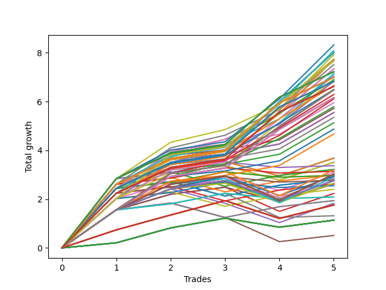

# Long HLT 102 
- Symbol: TSLA
- Date Range: 05/16/2022 - 05/17/2024
- Trading Period: 8:30-12:30
- Number of Trades: 5



| Id. | Name | Win Percent | Profit | Avg Profit / Trade | Avg Time / Trade | Std |      | Name | Win Percent | Profit | Avg Profit / Trade | Avg Time / Trade | Std |
| --- | ---- | ----------- | ------ | ------------------ | ---------------- | --- | ---- | ---- | ----------- | ------ | ------------------ | ---------------- | --- |
| | Sorted By <br> Profit | | | | | | | Sorted By <br> Win Percentage |||||
|0| TP-2.75 90m | 100.00 | 8.32 | 1.66 | 74:36 | 0.86 |     | TP-2.75 90m | 100.00 | 8.32 | 1.66 | 74:36 | 0.86 |
|1| TP-2.5 90m | 100.00 | 8.09 | 1.62 | 73:12 | 0.80 |     | TP-2.5 90m | 100.00 | 8.09 | 1.62 | 73:12 | 0.80 |
|2| TP-2 180m | 100.00 | 8.01 | 1.60 | 82:00 | 0.78 |     | TP-2 180m | 100.00 | 8.01 | 1.60 | 82:00 | 0.78 |
|3| TP-2 165m | 100.00 | 8.01 | 1.60 | 82:00 | 0.78 |     | TP-2 165m | 100.00 | 8.01 | 1.60 | 82:00 | 0.78 |
|4| TP-2 150m | 100.00 | 8.01 | 1.60 | 82:00 | 0.78 |     | TP-2 150m | 100.00 | 8.01 | 1.60 | 82:00 | 0.78 |
|5| TP-2 135m | 100.00 | 8.01 | 1.60 | 82:00 | 0.78 |     | TP-2 135m | 100.00 | 8.01 | 1.60 | 82:00 | 0.78 |
|6| TP-2 120m | 100.00 | 8.01 | 1.60 | 82:00 | 0.78 |     | TP-2 120m | 100.00 | 8.01 | 1.60 | 82:00 | 0.78 |
|7| TP-2.25 90m | 100.00 | 7.92 | 1.58 | 73:00 | 0.76 |     | TP-2.25 90m | 100.00 | 7.92 | 1.58 | 73:00 | 0.76 |
|8| TP-2.75 75m | 100.00 | 7.74 | 1.55 | 63:24 | 0.78 |     | TP-2.75 75m | 100.00 | 7.74 | 1.55 | 63:24 | 0.78 |
|9| TP-3 90m | 100.00 | 7.72 | 1.54 | 75:24 | 0.72 |     | TP-3 90m | 100.00 | 7.72 | 1.54 | 75:24 | 0.72 |
|10| TP-2 90m | 100.00 | 7.72 | 1.54 | 72:00 | 0.73 |     | TP-2 90m | 100.00 | 7.72 | 1.54 | 72:00 | 0.73 |
|11| TP-1.75 180m | 100.00 | 7.67 | 1.53 | 72:48 | 0.60 |     | TP-1.75 180m | 100.00 | 7.67 | 1.53 | 72:48 | 0.60 |
|12| TP-1.75 165m | 100.00 | 7.67 | 1.53 | 72:48 | 0.60 |     | TP-1.75 165m | 100.00 | 7.67 | 1.53 | 72:48 | 0.60 |
|13| TP-1.75 150m | 100.00 | 7.67 | 1.53 | 72:48 | 0.60 |     | TP-1.75 150m | 100.00 | 7.67 | 1.53 | 72:48 | 0.60 |
|14| TP-1.75 135m | 100.00 | 7.67 | 1.53 | 72:48 | 0.60 |     | TP-1.75 135m | 100.00 | 7.67 | 1.53 | 72:48 | 0.60 |
|15| TP-1.75 120m | 100.00 | 7.67 | 1.53 | 72:48 | 0.60 |     | TP-1.75 120m | 100.00 | 7.67 | 1.53 | 72:48 | 0.60 |
|16| TP-2.5 75m | 100.00 | 7.51 | 1.50 | 62:00 | 0.71 |     | TP-2.5 75m | 100.00 | 7.51 | 1.50 | 62:00 | 0.71 |
|17| TP-2.25 75m | 100.00 | 7.34 | 1.47 | 61:48 | 0.66 |     | TP-2.25 75m | 100.00 | 7.34 | 1.47 | 61:48 | 0.66 |
|18| TP-2 75m | 100.00 | 7.34 | 1.47 | 61:48 | 0.66 |     | TP-2 75m | 100.00 | 7.34 | 1.47 | 61:48 | 0.66 |
|19| TP-2.75 180m | 100.00 | 7.22 | 1.44 | 92:36 | 0.86 |     | TP-2.75 180m | 100.00 | 7.22 | 1.44 | 92:36 | 0.86 |
|20| TP-2.75 165m | 100.00 | 7.22 | 1.44 | 92:36 | 0.86 |     | TP-2.75 165m | 100.00 | 7.22 | 1.44 | 92:36 | 0.86 |
|21| TP-2.75 150m | 100.00 | 7.22 | 1.44 | 92:36 | 0.86 |     | TP-2.75 150m | 100.00 | 7.22 | 1.44 | 92:36 | 0.86 |
|22| TP-2.75 135m | 100.00 | 7.22 | 1.44 | 92:36 | 0.86 |     | TP-2.75 135m | 100.00 | 7.22 | 1.44 | 92:36 | 0.86 |
|23| TP-2.75 120m | 100.00 | 7.22 | 1.44 | 92:36 | 0.86 |     | TP-2.75 120m | 100.00 | 7.22 | 1.44 | 92:36 | 0.86 |
|24| TP-3 75m | 100.00 | 7.14 | 1.43 | 64:12 | 0.60 |     | TP-3 75m | 100.00 | 7.14 | 1.43 | 64:12 | 0.60 |
|25| TP-2 105m | 100.00 | 7.13 | 1.43 | 78:00 | 0.74 |     | TP-2 105m | 100.00 | 7.13 | 1.43 | 78:00 | 0.74 |
|26| TP-1.75 90m | 100.00 | 7.05 | 1.41 | 68:24 | 0.60 |     | TP-1.75 90m | 100.00 | 7.05 | 1.41 | 68:24 | 0.60 |
|27| TP-2.5 180m | 100.00 | 6.99 | 1.40 | 91:12 | 0.79 |     | TP-2.5 180m | 100.00 | 6.99 | 1.40 | 91:12 | 0.79 |
|28| TP-2.5 165m | 100.00 | 6.99 | 1.40 | 91:12 | 0.79 |     | TP-2.5 165m | 100.00 | 6.99 | 1.40 | 91:12 | 0.79 |
|29| TP-2.5 150m | 100.00 | 6.99 | 1.40 | 91:12 | 0.79 |     | TP-2.5 150m | 100.00 | 6.99 | 1.40 | 91:12 | 0.79 |
|30| TP-2.5 135m | 100.00 | 6.99 | 1.40 | 91:12 | 0.79 |     | TP-2.5 135m | 100.00 | 6.99 | 1.40 | 91:12 | 0.79 |
|31| TP-2.5 120m | 100.00 | 6.99 | 1.40 | 91:12 | 0.79 |     | TP-2.5 120m | 100.00 | 6.99 | 1.40 | 91:12 | 0.79 |
|32| TP-1.75 105m | 100.00 | 6.90 | 1.38 | 71:24 | 0.62 |     | TP-1.75 105m | 100.00 | 6.90 | 1.38 | 71:24 | 0.62 |
|33| TP-2.75 105m | 100.00 | 6.89 | 1.38 | 83:36 | 0.82 |     | TP-2.75 105m | 100.00 | 6.89 | 1.38 | 83:36 | 0.82 |
|34| TP-1.75 75m | 100.00 | 6.83 | 1.37 | 60:12 | 0.53 |     | TP-1.75 75m | 100.00 | 6.83 | 1.37 | 60:12 | 0.53 |
|35| TP-2.25 180m | 100.00 | 6.82 | 1.36 | 91:00 | 0.74 |     | TP-2.25 180m | 100.00 | 6.82 | 1.36 | 91:00 | 0.74 |
|36| TP-2.25 165m | 100.00 | 6.82 | 1.36 | 91:00 | 0.74 |     | TP-2.25 165m | 100.00 | 6.82 | 1.36 | 91:00 | 0.74 |
|37| TP-2.25 150m | 100.00 | 6.82 | 1.36 | 91:00 | 0.74 |     | TP-2.25 150m | 100.00 | 6.82 | 1.36 | 91:00 | 0.74 |
|38| TP-2.25 135m | 100.00 | 6.82 | 1.36 | 91:00 | 0.74 |     | TP-2.25 135m | 100.00 | 6.82 | 1.36 | 91:00 | 0.74 |
|39| TP-2.25 120m | 100.00 | 6.82 | 1.36 | 91:00 | 0.74 |     | TP-2.25 120m | 100.00 | 6.82 | 1.36 | 91:00 | 0.74 |
|40| TP-2.5 105m | 100.00 | 6.66 | 1.33 | 82:12 | 0.74 |     | TP-2.5 105m | 100.00 | 6.66 | 1.33 | 82:12 | 0.74 |
|41| TP-3 180m | 100.00 | 6.62 | 1.32 | 93:24 | 0.68 |     | TP-3 180m | 100.00 | 6.62 | 1.32 | 93:24 | 0.68 |
|42| TP-3 165m | 100.00 | 6.62 | 1.32 | 93:24 | 0.68 |     | TP-3 165m | 100.00 | 6.62 | 1.32 | 93:24 | 0.68 |
|43| TP-3 150m | 100.00 | 6.62 | 1.32 | 93:24 | 0.68 |     | TP-3 150m | 100.00 | 6.62 | 1.32 | 93:24 | 0.68 |
|44| TP-3 135m | 100.00 | 6.62 | 1.32 | 93:24 | 0.68 |     | TP-3 135m | 100.00 | 6.62 | 1.32 | 93:24 | 0.68 |
|45| TP-3 120m | 100.00 | 6.62 | 1.32 | 93:24 | 0.68 |     | TP-3 120m | 100.00 | 6.62 | 1.32 | 93:24 | 0.68 |
|46| TP-2.25 105m | 100.00 | 6.49 | 1.30 | 82:00 | 0.68 |     | TP-2.25 105m | 100.00 | 6.49 | 1.30 | 82:00 | 0.68 |
|47| TP-1.5 180m | 100.00 | 6.48 | 1.30 | 63:12 | 0.48 |     | TP-1.5 180m | 100.00 | 6.48 | 1.30 | 63:12 | 0.48 |
|48| TP-1.5 165m | 100.00 | 6.48 | 1.30 | 63:12 | 0.48 |     | TP-1.5 165m | 100.00 | 6.48 | 1.30 | 63:12 | 0.48 |
|49| TP-1.5 150m | 100.00 | 6.48 | 1.30 | 63:12 | 0.48 |     | TP-1.5 150m | 100.00 | 6.48 | 1.30 | 63:12 | 0.48 |
|50| TP-1.5 135m | 100.00 | 6.48 | 1.30 | 63:12 | 0.48 |     | TP-1.5 135m | 100.00 | 6.48 | 1.30 | 63:12 | 0.48 |
|51| TP-1.5 120m | 100.00 | 6.48 | 1.30 | 63:12 | 0.48 |     | TP-1.5 120m | 100.00 | 6.48 | 1.30 | 63:12 | 0.48 |
|52| TP-1.5 105m | 100.00 | 6.48 | 1.30 | 63:12 | 0.48 |     | TP-1.5 105m | 100.00 | 6.48 | 1.30 | 63:12 | 0.48 |
|53| TP-1.5 90m | 100.00 | 6.48 | 1.30 | 63:12 | 0.48 |     | TP-1.5 90m | 100.00 | 6.48 | 1.30 | 63:12 | 0.48 |
|54| TP-3 105m | 100.00 | 6.29 | 1.26 | 84:24 | 0.61 |     | TP-3 105m | 100.00 | 6.29 | 1.26 | 84:24 | 0.61 |
|55| TP-1.25 180m | 100.00 | 6.16 | 1.23 | 56:24 | 0.46 |     | TP-1.25 180m | 100.00 | 6.16 | 1.23 | 56:24 | 0.46 |
|56| TP-1.25 165m | 100.00 | 6.16 | 1.23 | 56:24 | 0.46 |     | TP-1.25 165m | 100.00 | 6.16 | 1.23 | 56:24 | 0.46 |
|57| TP-1.25 150m | 100.00 | 6.16 | 1.23 | 56:24 | 0.46 |     | TP-1.25 150m | 100.00 | 6.16 | 1.23 | 56:24 | 0.46 |
|58| TP-1.25 135m | 100.00 | 6.16 | 1.23 | 56:24 | 0.46 |     | TP-1.25 135m | 100.00 | 6.16 | 1.23 | 56:24 | 0.46 |
|59| TP-1.25 120m | 100.00 | 6.16 | 1.23 | 56:24 | 0.46 |     | TP-1.25 120m | 100.00 | 6.16 | 1.23 | 56:24 | 0.46 |
|60| TP-1.25 105m | 100.00 | 6.16 | 1.23 | 56:24 | 0.46 |     | TP-1.25 105m | 100.00 | 6.16 | 1.23 | 56:24 | 0.46 |
|61| TP-1.25 90m | 100.00 | 6.16 | 1.23 | 56:24 | 0.46 |     | TP-1.25 90m | 100.00 | 6.16 | 1.23 | 56:24 | 0.46 |
|62| TP-1.5 75m | 100.00 | 6.11 | 1.22 | 59:24 | 0.40 |     | TP-1.5 75m | 100.00 | 6.11 | 1.22 | 59:24 | 0.40 |
|63| TP-2.75 60m | 100.00 | 5.95 | 1.19 | 51:24 | 0.92 |     | TP-2.75 60m | 100.00 | 5.95 | 1.19 | 51:24 | 0.92 |
|64| TP-1.25 75m | 100.00 | 5.79 | 1.16 | 52:36 | 0.36 |     | TP-1.25 75m | 100.00 | 5.79 | 1.16 | 52:36 | 0.36 |
|65| TP-2.5 60m | 100.00 | 5.72 | 1.14 | 50:00 | 0.84 |     | TP-2.5 60m | 100.00 | 5.72 | 1.14 | 50:00 | 0.84 |
|66| TP-2.25 60m | 100.00 | 5.55 | 1.11 | 49:48 | 0.78 |     | TP-2.25 60m | 100.00 | 5.55 | 1.11 | 49:48 | 0.78 |
|67| TP-2 60m | 100.00 | 5.55 | 1.11 | 49:48 | 0.78 |     | TP-2 60m | 100.00 | 5.55 | 1.11 | 49:48 | 0.78 |
|68| TP-3 60m | 100.00 | 5.35 | 1.07 | 52:12 | 0.72 |     | TP-3 60m | 100.00 | 5.35 | 1.07 | 52:12 | 0.72 |
|69| TP-1.75 60m | 100.00 | 5.13 | 1.03 | 49:36 | 0.65 |     | TP-1.75 60m | 100.00 | 5.13 | 1.03 | 49:36 | 0.65 |
|70| TP-1.25 60m | 100.00 | 4.87 | 0.97 | 46:36 | 0.54 |     | TP-1.25 60m | 100.00 | 4.87 | 0.97 | 46:36 | 0.54 |
|71| TP-1.5 60m | 100.00 | 4.67 | 0.93 | 49:24 | 0.52 |     | TP-1.5 60m | 100.00 | 4.67 | 0.93 | 49:24 | 0.52 |
|72| TP-3 15m | 80.00 | 3.68 | 0.74 | 14:00 | 1.05 |     | TP-3 15m | 80.00 | 3.68 | 0.74 | 14:00 | 1.05 |
|73| TP-2.75 15m | 80.00 | 3.68 | 0.74 | 14:00 | 1.05 |     | TP-2.75 15m | 80.00 | 3.68 | 0.74 | 14:00 | 1.05 |
|74| TP-2.5 15m | 80.00 | 3.68 | 0.74 | 14:00 | 1.05 |     | TP-2.5 15m | 80.00 | 3.68 | 0.74 | 14:00 | 1.05 |
|75| TP-2.25 15m | 80.00 | 3.51 | 0.70 | 13:48 | 0.99 |     | TP-2.25 15m | 80.00 | 3.51 | 0.70 | 13:48 | 0.99 |
|76| TP-2 15m | 80.00 | 3.51 | 0.70 | 13:48 | 0.99 |     | TP-2 15m | 80.00 | 3.51 | 0.70 | 13:48 | 0.99 |
|77| TP-2.75 45m | 80.00 | 3.37 | 0.67 | 39:24 | 1.10 |     | TP-2.75 45m | 80.00 | 3.37 | 0.67 | 39:24 | 1.10 |
|78| TP-2.75 30m | 80.00 | 3.22 | 0.64 | 27:24 | 1.16 |     | TP-2.75 30m | 80.00 | 3.22 | 0.64 | 27:24 | 1.16 |
|79| TP-1 75m | 80.00 | 3.20 | 0.64 | 38:48 | 0.88 |     | TP-1 75m | 80.00 | 3.20 | 0.64 | 38:48 | 0.88 |
|80| TP-2.5 45m | 80.00 | 3.14 | 0.63 | 38:00 | 1.01 |     | TP-2.5 45m | 80.00 | 3.14 | 0.63 | 38:00 | 1.01 |
|81| TP-1.75 15m | 80.00 | 3.09 | 0.62 | 13:36 | 0.84 |     | TP-1.75 15m | 80.00 | 3.09 | 0.62 | 13:36 | 0.84 |
|82| TP-1 180m | 80.00 | 3.02 | 0.60 | 41:00 | 0.89 |     | TP-1 180m | 80.00 | 3.02 | 0.60 | 41:00 | 0.89 |
|83| TP-1 165m | 80.00 | 3.02 | 0.60 | 41:00 | 0.89 |     | TP-1 165m | 80.00 | 3.02 | 0.60 | 41:00 | 0.89 |
|84| TP-1 150m | 80.00 | 3.02 | 0.60 | 41:00 | 0.89 |     | TP-1 150m | 80.00 | 3.02 | 0.60 | 41:00 | 0.89 |
|85| TP-1 135m | 80.00 | 3.02 | 0.60 | 41:00 | 0.89 |     | TP-1 135m | 80.00 | 3.02 | 0.60 | 41:00 | 0.89 |
|86| TP-1 120m | 80.00 | 3.02 | 0.60 | 41:00 | 0.89 |     | TP-1 120m | 80.00 | 3.02 | 0.60 | 41:00 | 0.89 |
|87| TP-1 105m | 80.00 | 3.02 | 0.60 | 41:00 | 0.89 |     | TP-1 105m | 80.00 | 3.02 | 0.60 | 41:00 | 0.89 |
|88| TP-1 90m | 80.00 | 3.02 | 0.60 | 41:00 | 0.89 |     | TP-1 90m | 80.00 | 3.02 | 0.60 | 41:00 | 0.89 |
|89| TP-2.5 30m | 80.00 | 2.99 | 0.60 | 26:00 | 1.07 |     | TP-2.5 30m | 80.00 | 2.99 | 0.60 | 26:00 | 1.07 |
|90| TP-2.25 45m | 80.00 | 2.97 | 0.59 | 37:48 | 0.95 |     | TP-2.25 45m | 80.00 | 2.97 | 0.59 | 37:48 | 0.95 |
|91| TP-2 45m | 80.00 | 2.97 | 0.59 | 37:48 | 0.95 |     | TP-2 45m | 80.00 | 2.97 | 0.59 | 37:48 | 0.95 |
|92| TP-0.75 75m | 80.00 | 2.94 | 0.59 | 23:00 | 0.77 |     | TP-0.75 75m | 80.00 | 2.94 | 0.59 | 23:00 | 0.77 |
|93| TP-1 60m | 80.00 | 2.91 | 0.58 | 35:48 | 0.89 |     | TP-1 60m | 80.00 | 2.91 | 0.58 | 35:48 | 0.89 |
|94| TP-0.75 45m | 80.00 | 2.85 | 0.57 | 17:00 | 0.77 |     | TP-0.75 45m | 80.00 | 2.85 | 0.57 | 17:00 | 0.77 |
|95| TP-2.25 30m | 80.00 | 2.82 | 0.56 | 25:48 | 1.00 |     | TP-2.25 30m | 80.00 | 2.82 | 0.56 | 25:48 | 1.00 |
|96| TP-2 30m | 80.00 | 2.82 | 0.56 | 25:48 | 1.00 |     | TP-2 30m | 80.00 | 2.82 | 0.56 | 25:48 | 1.00 |
|97| TP-3 45m | 80.00 | 2.77 | 0.55 | 40:12 | 0.87 |     | TP-3 45m | 80.00 | 2.77 | 0.55 | 40:12 | 0.87 |
|98| TP-0.75 180m | 80.00 | 2.76 | 0.55 | 25:12 | 0.78 |     | TP-0.75 180m | 80.00 | 2.76 | 0.55 | 25:12 | 0.78 |
|99| TP-0.75 165m | 80.00 | 2.76 | 0.55 | 25:12 | 0.78 |     | TP-0.75 165m | 80.00 | 2.76 | 0.55 | 25:12 | 0.78 |
|100| TP-0.75 150m | 80.00 | 2.76 | 0.55 | 25:12 | 0.78 |     | TP-0.75 150m | 80.00 | 2.76 | 0.55 | 25:12 | 0.78 |
|101| TP-0.75 135m | 80.00 | 2.76 | 0.55 | 25:12 | 0.78 |     | TP-0.75 135m | 80.00 | 2.76 | 0.55 | 25:12 | 0.78 |
|102| TP-0.75 120m | 80.00 | 2.76 | 0.55 | 25:12 | 0.78 |     | TP-0.75 120m | 80.00 | 2.76 | 0.55 | 25:12 | 0.78 |
|103| TP-0.75 105m | 80.00 | 2.76 | 0.55 | 25:12 | 0.78 |     | TP-0.75 105m | 80.00 | 2.76 | 0.55 | 25:12 | 0.78 |
|104| TP-0.75 90m | 80.00 | 2.76 | 0.55 | 25:12 | 0.78 |     | TP-0.75 90m | 80.00 | 2.76 | 0.55 | 25:12 | 0.78 |
|105| TP-0.75 60m | 80.00 | 2.65 | 0.53 | 20:00 | 0.78 |     | TP-0.75 60m | 80.00 | 2.65 | 0.53 | 20:00 | 0.78 |
|106| TP-0.75 15m | 80.00 | 2.65 | 0.53 | 10:36 | 0.78 |     | TP-0.75 15m | 80.00 | 2.65 | 0.53 | 10:36 | 0.78 |
|107| TP-1.5 15m | 80.00 | 2.63 | 0.53 | 13:24 | 0.70 |     | TP-1.5 15m | 80.00 | 2.63 | 0.53 | 13:24 | 0.70 |
|108| TP-1.25 15m | 80.00 | 2.63 | 0.53 | 13:24 | 0.70 |     | TP-1.25 15m | 80.00 | 2.63 | 0.53 | 13:24 | 0.70 |
|109| TP-3 30m | 80.00 | 2.62 | 0.52 | 28:12 | 0.93 |     | TP-3 30m | 80.00 | 2.62 | 0.52 | 28:12 | 0.93 |
|110| TP-1.75 45m | 80.00 | 2.55 | 0.51 | 37:36 | 0.78 |     | TP-1.75 45m | 80.00 | 2.55 | 0.51 | 37:36 | 0.78 |
|111| TP-1.75 30m | 80.00 | 2.40 | 0.48 | 25:36 | 0.85 |     | TP-1.75 30m | 80.00 | 2.40 | 0.48 | 25:36 | 0.85 |
|112| TP-1 15m | 80.00 | 2.23 | 0.45 | 12:12 | 0.83 |     | TP-1 15m | 80.00 | 2.23 | 0.45 | 12:12 | 0.83 |
|113| TP-1.5 45m | 80.00 | 2.09 | 0.42 | 37:24 | 0.61 |     | TP-1.5 45m | 80.00 | 2.09 | 0.42 | 37:24 | 0.61 |
|114| TP-1.25 45m | 80.00 | 2.09 | 0.42 | 37:24 | 0.61 |     | TP-1.25 45m | 80.00 | 2.09 | 0.42 | 37:24 | 0.61 |
|115| TP-1.5 30m | 80.00 | 1.94 | 0.39 | 25:24 | 0.69 |     | TP-1.5 30m | 80.00 | 1.94 | 0.39 | 25:24 | 0.69 |
|116| TP-1.25 30m | 80.00 | 1.94 | 0.39 | 25:24 | 0.69 |     | TP-1.25 30m | 80.00 | 1.94 | 0.39 | 25:24 | 0.69 |
|117| TP-0.75 30m | 60.00 | 1.83 | 0.37 | 14:00 | 0.91 |     | TP-0.5 180m | 80.00 | 1.76 | 0.35 | 07:24 | 0.54 |
|118| TP-0.5 180m | 80.00 | 1.76 | 0.35 | 07:24 | 0.54 |     | TP-0.5 165m | 80.00 | 1.76 | 0.35 | 07:24 | 0.54 |
|119| TP-0.5 165m | 80.00 | 1.76 | 0.35 | 07:24 | 0.54 |     | TP-0.5 150m | 80.00 | 1.76 | 0.35 | 07:24 | 0.54 |
|120| TP-0.5 150m | 80.00 | 1.76 | 0.35 | 07:24 | 0.54 |     | TP-0.5 135m | 80.00 | 1.76 | 0.35 | 07:24 | 0.54 |
|121| TP-0.5 135m | 80.00 | 1.76 | 0.35 | 07:24 | 0.54 |     | TP-0.5 120m | 80.00 | 1.76 | 0.35 | 07:24 | 0.54 |
|122| TP-0.5 120m | 80.00 | 1.76 | 0.35 | 07:24 | 0.54 |     | TP-0.5 105m | 80.00 | 1.76 | 0.35 | 07:24 | 0.54 |
|123| TP-0.5 105m | 80.00 | 1.76 | 0.35 | 07:24 | 0.54 |     | TP-0.5 90m | 80.00 | 1.76 | 0.35 | 07:24 | 0.54 |
|124| TP-0.5 90m | 80.00 | 1.76 | 0.35 | 07:24 | 0.54 |     | TP-0.5 75m | 80.00 | 1.76 | 0.35 | 07:24 | 0.54 |
|125| TP-0.5 75m | 80.00 | 1.76 | 0.35 | 07:24 | 0.54 |     | TP-0.5 60m | 80.00 | 1.76 | 0.35 | 07:24 | 0.54 |
|126| TP-0.5 60m | 80.00 | 1.76 | 0.35 | 07:24 | 0.54 |     | TP-0.5 45m | 80.00 | 1.76 | 0.35 | 07:24 | 0.54 |
|127| TP-0.5 45m | 80.00 | 1.76 | 0.35 | 07:24 | 0.54 |     | TP-0.5 30m | 80.00 | 1.76 | 0.35 | 07:24 | 0.54 |
|128| TP-0.5 30m | 80.00 | 1.76 | 0.35 | 07:24 | 0.54 |     | TP-0.5 15m | 80.00 | 1.76 | 0.35 | 07:24 | 0.54 |
|129| TP-0.5 15m | 80.00 | 1.76 | 0.35 | 07:24 | 0.54 |     | TP-1 45m | 80.00 | 1.32 | 0.26 | 30:12 | 0.81 |
|130| TP-1 45m | 80.00 | 1.32 | 0.26 | 30:12 | 0.81 |     | TP-0.25 180m | 80.00 | 1.14 | 0.23 | 03:36 | 0.33 |
|131| TP-0.25 180m | 80.00 | 1.14 | 0.23 | 03:36 | 0.33 |     | TP-0.25 165m | 80.00 | 1.14 | 0.23 | 03:36 | 0.33 |
|132| TP-0.25 165m | 80.00 | 1.14 | 0.23 | 03:36 | 0.33 |     | TP-0.25 150m | 80.00 | 1.14 | 0.23 | 03:36 | 0.33 |
|133| TP-0.25 150m | 80.00 | 1.14 | 0.23 | 03:36 | 0.33 |     | TP-0.25 135m | 80.00 | 1.14 | 0.23 | 03:36 | 0.33 |
|134| TP-0.25 135m | 80.00 | 1.14 | 0.23 | 03:36 | 0.33 |     | TP-0.25 120m | 80.00 | 1.14 | 0.23 | 03:36 | 0.33 |
|135| TP-0.25 120m | 80.00 | 1.14 | 0.23 | 03:36 | 0.33 |     | TP-0.25 105m | 80.00 | 1.14 | 0.23 | 03:36 | 0.33 |
|136| TP-0.25 105m | 80.00 | 1.14 | 0.23 | 03:36 | 0.33 |     | TP-0.25 90m | 80.00 | 1.14 | 0.23 | 03:36 | 0.33 |
|137| TP-0.25 90m | 80.00 | 1.14 | 0.23 | 03:36 | 0.33 |     | TP-0.25 75m | 80.00 | 1.14 | 0.23 | 03:36 | 0.33 |
|138| TP-0.25 75m | 80.00 | 1.14 | 0.23 | 03:36 | 0.33 |     | TP-0.25 60m | 80.00 | 1.14 | 0.23 | 03:36 | 0.33 |
|139| TP-0.25 60m | 80.00 | 1.14 | 0.23 | 03:36 | 0.33 |     | TP-0.25 45m | 80.00 | 1.14 | 0.23 | 03:36 | 0.33 |
|140| TP-0.25 45m | 80.00 | 1.14 | 0.23 | 03:36 | 0.33 |     | TP-0.25 30m | 80.00 | 1.14 | 0.23 | 03:36 | 0.33 |
|141| TP-0.25 30m | 80.00 | 1.14 | 0.23 | 03:36 | 0.33 |     | TP-0.25 15m | 80.00 | 1.14 | 0.23 | 03:36 | 0.33 |
|142| TP-0.25 15m | 80.00 | 1.14 | 0.23 | 03:36 | 0.33 |     | TP-0.75 30m | 60.00 | 1.83 | 0.37 | 14:00 | 0.91 |
|143| TP-1 30m | 60.00 | 0.51 | 0.10 | 21:12 | 0.88 |     | TP-1 30m | 60.00 | 0.51 | 0.10 | 21:12 | 0.88 |

### Test TP-0.25 15m
* Take Profit of 0.25 Point
* 0.25 Stoploss
* Results:
```
Total Trades: 5
Percent Up: 80.00
Percent Down: 20.00
Total Points Moved Up: 1.14
Potential Profit: 570.00
Total Points Ups: 1.51 Count Ups: 4
Total Points Downs: -0.37 Count Downs: 1
```

<details><summary>Trades</summary>

<code>In: 2022-05-24 12:25:00		Out: 2022-05-24 12:28:00		Total Position Time: 03:00		Total Move Up: 0.21		Total to Date: 0.21</code> <br />
<code>In: 2023-03-06 10:20:00		Out: 2023-03-06 10:28:00		Total Position Time: 08:00		Total Move Up: 0.61		Total to Date: 0.82</code> <br />
<code>In: 2023-10-12 11:25:00		Out: 2023-10-12 11:28:00		Total Position Time: 03:00		Total Move Up: 0.40		Total to Date: 1.22</code> <br />
<code>In: 2023-10-26 09:45:00		Out: 2023-10-26 09:47:00		Total Position Time: 02:00		Total Move Up: -0.37		Total to Date: 0.85</code> <br />
<code>In: 2024-01-05 09:40:00		Out: 2024-01-05 09:42:00		Total Position Time: 02:00		Total Move Up: 0.29		Total to Date: 1.14</code> <br />


</details>

### Test TP-0.5 15m
* Take Profit of 0.5 Point
* 0.5 Stoploss
* Results:
```
Total Trades: 5
Percent Up: 80.00
Percent Down: 20.00
Total Points Moved Up: 1.76
Potential Profit: 880.00
Total Points Ups: 2.49 Count Ups: 4
Total Points Downs: -0.73 Count Downs: 1
```

<details><summary>Trades</summary>

<code>In: 2022-05-24 12:25:00		Out: 2022-05-24 12:34:00		Total Position Time: 09:00		Total Move Up: 0.74		Total to Date: 0.74</code> <br />
<code>In: 2023-03-06 10:20:00		Out: 2023-03-06 10:28:00		Total Position Time: 08:00		Total Move Up: 0.61		Total to Date: 1.35</code> <br />
<code>In: 2023-10-12 11:25:00		Out: 2023-10-12 11:35:00		Total Position Time: 10:00		Total Move Up: 0.59		Total to Date: 1.94</code> <br />
<code>In: 2023-10-26 09:45:00		Out: 2023-10-26 09:48:00		Total Position Time: 03:00		Total Move Up: -0.73		Total to Date: 1.21</code> <br />
<code>In: 2024-01-05 09:40:00		Out: 2024-01-05 09:47:00		Total Position Time: 07:00		Total Move Up: 0.55		Total to Date: 1.76</code> <br />


</details>

### Test TP-0.75 15m
* Take Profit of 0.75 Point
* 0.75 Stoploss
* Results:
```
Total Trades: 5
Percent Up: 80.00
Percent Down: 20.00
Total Points Moved Up: 2.65
Potential Profit: 1325.00
Total Points Ups: 3.44 Count Ups: 4
Total Points Downs: -0.79 Count Downs: 1
```

<details><summary>Trades</summary>

<code>In: 2022-05-24 12:25:00		Out: 2022-05-24 12:36:00		Total Position Time: 11:00		Total Move Up: 1.56		Total to Date: 1.56</code> <br />
<code>In: 2023-03-06 10:20:00		Out: 2023-03-06 10:29:00		Total Position Time: 09:00		Total Move Up: 0.86		Total to Date: 2.42</code> <br />
<code>In: 2023-10-12 11:25:00		Out: 2023-10-12 11:39:00		Total Position Time: 14:00		Total Move Up: 0.29		Total to Date: 2.71</code> <br />
<code>In: 2023-10-26 09:45:00		Out: 2023-10-26 09:50:00		Total Position Time: 05:00		Total Move Up: -0.79		Total to Date: 1.92</code> <br />
<code>In: 2024-01-05 09:40:00		Out: 2024-01-05 09:54:00		Total Position Time: 14:00		Total Move Up: 0.73		Total to Date: 2.65</code> <br />


</details>

### Test TP-1 15m
* Take Profit of 1 Point
* 1 Stoploss
* Results:
```
Total Trades: 5
Percent Up: 80.00
Percent Down: 20.00
Total Points Moved Up: 2.23
Potential Profit: 1115.00
Total Points Ups: 3.22 Count Ups: 4
Total Points Downs: -0.99 Count Downs: 1
```

<details><summary>Trades</summary>

<code>In: 2022-05-24 12:25:00		Out: 2022-05-24 12:36:00		Total Position Time: 11:00		Total Move Up: 1.56		Total to Date: 1.56</code> <br />
<code>In: 2023-03-06 10:20:00		Out: 2023-03-06 10:34:00		Total Position Time: 14:00		Total Move Up: 0.64		Total to Date: 2.20</code> <br />
<code>In: 2023-10-12 11:25:00		Out: 2023-10-12 11:39:00		Total Position Time: 14:00		Total Move Up: 0.29		Total to Date: 2.49</code> <br />
<code>In: 2023-10-26 09:45:00		Out: 2023-10-26 09:53:00		Total Position Time: 08:00		Total Move Up: -0.99		Total to Date: 1.50</code> <br />
<code>In: 2024-01-05 09:40:00		Out: 2024-01-05 09:54:00		Total Position Time: 14:00		Total Move Up: 0.73		Total to Date: 2.23</code> <br />


</details>

### Test TP-1.25 15m
* Take Profit of 1.25 Point
* 1.25 Stoploss
* Results:
```
Total Trades: 5
Percent Up: 80.00
Percent Down: 20.00
Total Points Moved Up: 2.63
Potential Profit: 1315.00
Total Points Ups: 3.22 Count Ups: 4
Total Points Downs: -0.59 Count Downs: 1
```

<details><summary>Trades</summary>

<code>In: 2022-05-24 12:25:00		Out: 2022-05-24 12:36:00		Total Position Time: 11:00		Total Move Up: 1.56		Total to Date: 1.56</code> <br />
<code>In: 2023-03-06 10:20:00		Out: 2023-03-06 10:34:00		Total Position Time: 14:00		Total Move Up: 0.64		Total to Date: 2.20</code> <br />
<code>In: 2023-10-12 11:25:00		Out: 2023-10-12 11:39:00		Total Position Time: 14:00		Total Move Up: 0.29		Total to Date: 2.49</code> <br />
<code>In: 2023-10-26 09:45:00		Out: 2023-10-26 09:59:00		Total Position Time: 14:00		Total Move Up: -0.59		Total to Date: 1.90</code> <br />
<code>In: 2024-01-05 09:40:00		Out: 2024-01-05 09:54:00		Total Position Time: 14:00		Total Move Up: 0.73		Total to Date: 2.63</code> <br />


</details>

### Test TP-1.5 15m
* Take Profit of 1.5 Point
* 1.5 Stoploss
* Results:
```
Total Trades: 5
Percent Up: 80.00
Percent Down: 20.00
Total Points Moved Up: 2.63
Potential Profit: 1315.00
Total Points Ups: 3.22 Count Ups: 4
Total Points Downs: -0.59 Count Downs: 1
```

<details><summary>Trades</summary>

<code>In: 2022-05-24 12:25:00		Out: 2022-05-24 12:36:00		Total Position Time: 11:00		Total Move Up: 1.56		Total to Date: 1.56</code> <br />
<code>In: 2023-03-06 10:20:00		Out: 2023-03-06 10:34:00		Total Position Time: 14:00		Total Move Up: 0.64		Total to Date: 2.20</code> <br />
<code>In: 2023-10-12 11:25:00		Out: 2023-10-12 11:39:00		Total Position Time: 14:00		Total Move Up: 0.29		Total to Date: 2.49</code> <br />
<code>In: 2023-10-26 09:45:00		Out: 2023-10-26 09:59:00		Total Position Time: 14:00		Total Move Up: -0.59		Total to Date: 1.90</code> <br />
<code>In: 2024-01-05 09:40:00		Out: 2024-01-05 09:54:00		Total Position Time: 14:00		Total Move Up: 0.73		Total to Date: 2.63</code> <br />


</details>

### Test TP-1.75 15m
* Take Profit of 1.75 Point
* 1.75 Stoploss
* Results:
```
Total Trades: 5
Percent Up: 80.00
Percent Down: 20.00
Total Points Moved Up: 3.09
Potential Profit: 1545.00
Total Points Ups: 3.68 Count Ups: 4
Total Points Downs: -0.59 Count Downs: 1
```

<details><summary>Trades</summary>

<code>In: 2022-05-24 12:25:00		Out: 2022-05-24 12:37:00		Total Position Time: 12:00		Total Move Up: 2.02		Total to Date: 2.02</code> <br />
<code>In: 2023-03-06 10:20:00		Out: 2023-03-06 10:34:00		Total Position Time: 14:00		Total Move Up: 0.64		Total to Date: 2.66</code> <br />
<code>In: 2023-10-12 11:25:00		Out: 2023-10-12 11:39:00		Total Position Time: 14:00		Total Move Up: 0.29		Total to Date: 2.95</code> <br />
<code>In: 2023-10-26 09:45:00		Out: 2023-10-26 09:59:00		Total Position Time: 14:00		Total Move Up: -0.59		Total to Date: 2.36</code> <br />
<code>In: 2024-01-05 09:40:00		Out: 2024-01-05 09:54:00		Total Position Time: 14:00		Total Move Up: 0.73		Total to Date: 3.09</code> <br />


</details>

### Test TP-2 15m
* Take Profit of 2 Point
* 2 Stoploss
* Results:
```
Total Trades: 5
Percent Up: 80.00
Percent Down: 20.00
Total Points Moved Up: 3.51
Potential Profit: 1755.00
Total Points Ups: 4.10 Count Ups: 4
Total Points Downs: -0.59 Count Downs: 1
```

<details><summary>Trades</summary>

<code>In: 2022-05-24 12:25:00		Out: 2022-05-24 12:38:00		Total Position Time: 13:00		Total Move Up: 2.44		Total to Date: 2.44</code> <br />
<code>In: 2023-03-06 10:20:00		Out: 2023-03-06 10:34:00		Total Position Time: 14:00		Total Move Up: 0.64		Total to Date: 3.08</code> <br />
<code>In: 2023-10-12 11:25:00		Out: 2023-10-12 11:39:00		Total Position Time: 14:00		Total Move Up: 0.29		Total to Date: 3.37</code> <br />
<code>In: 2023-10-26 09:45:00		Out: 2023-10-26 09:59:00		Total Position Time: 14:00		Total Move Up: -0.59		Total to Date: 2.78</code> <br />
<code>In: 2024-01-05 09:40:00		Out: 2024-01-05 09:54:00		Total Position Time: 14:00		Total Move Up: 0.73		Total to Date: 3.51</code> <br />


</details>

### Test TP-2.25 15m
* Take Profit of 2.25 Point
* 2.25 Stoploss
* Results:
```
Total Trades: 5
Percent Up: 80.00
Percent Down: 20.00
Total Points Moved Up: 3.51
Potential Profit: 1755.00
Total Points Ups: 4.10 Count Ups: 4
Total Points Downs: -0.59 Count Downs: 1
```

<details><summary>Trades</summary>

<code>In: 2022-05-24 12:25:00		Out: 2022-05-24 12:38:00		Total Position Time: 13:00		Total Move Up: 2.44		Total to Date: 2.44</code> <br />
<code>In: 2023-03-06 10:20:00		Out: 2023-03-06 10:34:00		Total Position Time: 14:00		Total Move Up: 0.64		Total to Date: 3.08</code> <br />
<code>In: 2023-10-12 11:25:00		Out: 2023-10-12 11:39:00		Total Position Time: 14:00		Total Move Up: 0.29		Total to Date: 3.37</code> <br />
<code>In: 2023-10-26 09:45:00		Out: 2023-10-26 09:59:00		Total Position Time: 14:00		Total Move Up: -0.59		Total to Date: 2.78</code> <br />
<code>In: 2024-01-05 09:40:00		Out: 2024-01-05 09:54:00		Total Position Time: 14:00		Total Move Up: 0.73		Total to Date: 3.51</code> <br />


</details>

### Test TP-2.5 15m
* Take Profit of 2.5 Point
* 2.5 Stoploss
* Results:
```
Total Trades: 5
Percent Up: 80.00
Percent Down: 20.00
Total Points Moved Up: 3.68
Potential Profit: 1840.00
Total Points Ups: 4.27 Count Ups: 4
Total Points Downs: -0.59 Count Downs: 1
```

<details><summary>Trades</summary>

<code>In: 2022-05-24 12:25:00		Out: 2022-05-24 12:39:00		Total Position Time: 14:00		Total Move Up: 2.61		Total to Date: 2.61</code> <br />
<code>In: 2023-03-06 10:20:00		Out: 2023-03-06 10:34:00		Total Position Time: 14:00		Total Move Up: 0.64		Total to Date: 3.25</code> <br />
<code>In: 2023-10-12 11:25:00		Out: 2023-10-12 11:39:00		Total Position Time: 14:00		Total Move Up: 0.29		Total to Date: 3.54</code> <br />
<code>In: 2023-10-26 09:45:00		Out: 2023-10-26 09:59:00		Total Position Time: 14:00		Total Move Up: -0.59		Total to Date: 2.95</code> <br />
<code>In: 2024-01-05 09:40:00		Out: 2024-01-05 09:54:00		Total Position Time: 14:00		Total Move Up: 0.73		Total to Date: 3.68</code> <br />


</details>

### Test TP-2.75 15m
* Take Profit of 2.75 Point
* 2.75 Stoploss
* Results:
```
Total Trades: 5
Percent Up: 80.00
Percent Down: 20.00
Total Points Moved Up: 3.68
Potential Profit: 1840.00
Total Points Ups: 4.27 Count Ups: 4
Total Points Downs: -0.59 Count Downs: 1
```

<details><summary>Trades</summary>

<code>In: 2022-05-24 12:25:00		Out: 2022-05-24 12:39:00		Total Position Time: 14:00		Total Move Up: 2.61		Total to Date: 2.61</code> <br />
<code>In: 2023-03-06 10:20:00		Out: 2023-03-06 10:34:00		Total Position Time: 14:00		Total Move Up: 0.64		Total to Date: 3.25</code> <br />
<code>In: 2023-10-12 11:25:00		Out: 2023-10-12 11:39:00		Total Position Time: 14:00		Total Move Up: 0.29		Total to Date: 3.54</code> <br />
<code>In: 2023-10-26 09:45:00		Out: 2023-10-26 09:59:00		Total Position Time: 14:00		Total Move Up: -0.59		Total to Date: 2.95</code> <br />
<code>In: 2024-01-05 09:40:00		Out: 2024-01-05 09:54:00		Total Position Time: 14:00		Total Move Up: 0.73		Total to Date: 3.68</code> <br />


</details>

### Test TP-3 15m
* Take Profit of 3 Point
* 3 Stoploss
* Results:
```
Total Trades: 5
Percent Up: 80.00
Percent Down: 20.00
Total Points Moved Up: 3.68
Potential Profit: 1840.00
Total Points Ups: 4.27 Count Ups: 4
Total Points Downs: -0.59 Count Downs: 1
```

<details><summary>Trades</summary>

<code>In: 2022-05-24 12:25:00		Out: 2022-05-24 12:39:00		Total Position Time: 14:00		Total Move Up: 2.61		Total to Date: 2.61</code> <br />
<code>In: 2023-03-06 10:20:00		Out: 2023-03-06 10:34:00		Total Position Time: 14:00		Total Move Up: 0.64		Total to Date: 3.25</code> <br />
<code>In: 2023-10-12 11:25:00		Out: 2023-10-12 11:39:00		Total Position Time: 14:00		Total Move Up: 0.29		Total to Date: 3.54</code> <br />
<code>In: 2023-10-26 09:45:00		Out: 2023-10-26 09:59:00		Total Position Time: 14:00		Total Move Up: -0.59		Total to Date: 2.95</code> <br />
<code>In: 2024-01-05 09:40:00		Out: 2024-01-05 09:54:00		Total Position Time: 14:00		Total Move Up: 0.73		Total to Date: 3.68</code> <br />


</details>

### Test TP-0.25 30m
* Take Profit of 0.25 Point
* 0.25 Stoploss
* Results:
```
Total Trades: 5
Percent Up: 80.00
Percent Down: 20.00
Total Points Moved Up: 1.14
Potential Profit: 570.00
Total Points Ups: 1.51 Count Ups: 4
Total Points Downs: -0.37 Count Downs: 1
```

<details><summary>Trades</summary>

<code>In: 2022-05-24 12:25:00		Out: 2022-05-24 12:28:00		Total Position Time: 03:00		Total Move Up: 0.21		Total to Date: 0.21</code> <br />
<code>In: 2023-03-06 10:20:00		Out: 2023-03-06 10:28:00		Total Position Time: 08:00		Total Move Up: 0.61		Total to Date: 0.82</code> <br />
<code>In: 2023-10-12 11:25:00		Out: 2023-10-12 11:28:00		Total Position Time: 03:00		Total Move Up: 0.40		Total to Date: 1.22</code> <br />
<code>In: 2023-10-26 09:45:00		Out: 2023-10-26 09:47:00		Total Position Time: 02:00		Total Move Up: -0.37		Total to Date: 0.85</code> <br />
<code>In: 2024-01-05 09:40:00		Out: 2024-01-05 09:42:00		Total Position Time: 02:00		Total Move Up: 0.29		Total to Date: 1.14</code> <br />


</details>

### Test TP-0.5 30m
* Take Profit of 0.5 Point
* 0.5 Stoploss
* Results:
```
Total Trades: 5
Percent Up: 80.00
Percent Down: 20.00
Total Points Moved Up: 1.76
Potential Profit: 880.00
Total Points Ups: 2.49 Count Ups: 4
Total Points Downs: -0.73 Count Downs: 1
```

<details><summary>Trades</summary>

<code>In: 2022-05-24 12:25:00		Out: 2022-05-24 12:34:00		Total Position Time: 09:00		Total Move Up: 0.74		Total to Date: 0.74</code> <br />
<code>In: 2023-03-06 10:20:00		Out: 2023-03-06 10:28:00		Total Position Time: 08:00		Total Move Up: 0.61		Total to Date: 1.35</code> <br />
<code>In: 2023-10-12 11:25:00		Out: 2023-10-12 11:35:00		Total Position Time: 10:00		Total Move Up: 0.59		Total to Date: 1.94</code> <br />
<code>In: 2023-10-26 09:45:00		Out: 2023-10-26 09:48:00		Total Position Time: 03:00		Total Move Up: -0.73		Total to Date: 1.21</code> <br />
<code>In: 2024-01-05 09:40:00		Out: 2024-01-05 09:47:00		Total Position Time: 07:00		Total Move Up: 0.55		Total to Date: 1.76</code> <br />


</details>

### Test TP-0.75 30m
* Take Profit of 0.75 Point
* 0.75 Stoploss
* Results:
```
Total Trades: 5
Percent Up: 60.00
Percent Down: 40.00
Total Points Moved Up: 1.83
Potential Profit: 915.00
Total Points Ups: 3.21 Count Ups: 3
Total Points Downs: -1.38 Count Downs: 2
```

<details><summary>Trades</summary>

<code>In: 2022-05-24 12:25:00		Out: 2022-05-24 12:36:00		Total Position Time: 11:00		Total Move Up: 1.56		Total to Date: 1.56</code> <br />
<code>In: 2023-03-06 10:20:00		Out: 2023-03-06 10:29:00		Total Position Time: 09:00		Total Move Up: 0.86		Total to Date: 2.42</code> <br />
<code>In: 2023-10-12 11:25:00		Out: 2023-10-12 11:54:00		Total Position Time: 29:00		Total Move Up: -0.59		Total to Date: 1.83</code> <br />
<code>In: 2023-10-26 09:45:00		Out: 2023-10-26 09:50:00		Total Position Time: 05:00		Total Move Up: -0.79		Total to Date: 1.04</code> <br />
<code>In: 2024-01-05 09:40:00		Out: 2024-01-05 09:56:00		Total Position Time: 16:00		Total Move Up: 0.79		Total to Date: 1.83</code> <br />


</details>

### Test TP-1 30m
* Take Profit of 1 Point
* 1 Stoploss
* Results:
```
Total Trades: 5
Percent Up: 60.00
Percent Down: 40.00
Total Points Moved Up: 0.51
Potential Profit: 255.00
Total Points Ups: 2.09 Count Ups: 3
Total Points Downs: -1.58 Count Downs: 2
```

<details><summary>Trades</summary>

<code>In: 2022-05-24 12:25:00		Out: 2022-05-24 12:36:00		Total Position Time: 11:00		Total Move Up: 1.56		Total to Date: 1.56</code> <br />
<code>In: 2023-03-06 10:20:00		Out: 2023-03-06 10:49:00		Total Position Time: 29:00		Total Move Up: 0.28		Total to Date: 1.84</code> <br />
<code>In: 2023-10-12 11:25:00		Out: 2023-10-12 11:54:00		Total Position Time: 29:00		Total Move Up: -0.59		Total to Date: 1.25</code> <br />
<code>In: 2023-10-26 09:45:00		Out: 2023-10-26 09:53:00		Total Position Time: 08:00		Total Move Up: -0.99		Total to Date: 0.26</code> <br />
<code>In: 2024-01-05 09:40:00		Out: 2024-01-05 10:09:00		Total Position Time: 29:00		Total Move Up: 0.25		Total to Date: 0.51</code> <br />


</details>

### Test TP-1.25 30m
* Take Profit of 1.25 Point
* 1.25 Stoploss
* Results:
```
Total Trades: 5
Percent Up: 80.00
Percent Down: 20.00
Total Points Moved Up: 1.94
Potential Profit: 970.00
Total Points Ups: 2.53 Count Ups: 4
Total Points Downs: -0.59 Count Downs: 1
```

<details><summary>Trades</summary>

<code>In: 2022-05-24 12:25:00		Out: 2022-05-24 12:36:00		Total Position Time: 11:00		Total Move Up: 1.56		Total to Date: 1.56</code> <br />
<code>In: 2023-03-06 10:20:00		Out: 2023-03-06 10:49:00		Total Position Time: 29:00		Total Move Up: 0.28		Total to Date: 1.84</code> <br />
<code>In: 2023-10-12 11:25:00		Out: 2023-10-12 11:54:00		Total Position Time: 29:00		Total Move Up: -0.59		Total to Date: 1.25</code> <br />
<code>In: 2023-10-26 09:45:00		Out: 2023-10-26 10:14:00		Total Position Time: 29:00		Total Move Up: 0.44		Total to Date: 1.69</code> <br />
<code>In: 2024-01-05 09:40:00		Out: 2024-01-05 10:09:00		Total Position Time: 29:00		Total Move Up: 0.25		Total to Date: 1.94</code> <br />


</details>

### Test TP-1.5 30m
* Take Profit of 1.5 Point
* 1.5 Stoploss
* Results:
```
Total Trades: 5
Percent Up: 80.00
Percent Down: 20.00
Total Points Moved Up: 1.94
Potential Profit: 970.00
Total Points Ups: 2.53 Count Ups: 4
Total Points Downs: -0.59 Count Downs: 1
```

<details><summary>Trades</summary>

<code>In: 2022-05-24 12:25:00		Out: 2022-05-24 12:36:00		Total Position Time: 11:00		Total Move Up: 1.56		Total to Date: 1.56</code> <br />
<code>In: 2023-03-06 10:20:00		Out: 2023-03-06 10:49:00		Total Position Time: 29:00		Total Move Up: 0.28		Total to Date: 1.84</code> <br />
<code>In: 2023-10-12 11:25:00		Out: 2023-10-12 11:54:00		Total Position Time: 29:00		Total Move Up: -0.59		Total to Date: 1.25</code> <br />
<code>In: 2023-10-26 09:45:00		Out: 2023-10-26 10:14:00		Total Position Time: 29:00		Total Move Up: 0.44		Total to Date: 1.69</code> <br />
<code>In: 2024-01-05 09:40:00		Out: 2024-01-05 10:09:00		Total Position Time: 29:00		Total Move Up: 0.25		Total to Date: 1.94</code> <br />


</details>

### Test TP-1.75 30m
* Take Profit of 1.75 Point
* 1.75 Stoploss
* Results:
```
Total Trades: 5
Percent Up: 80.00
Percent Down: 20.00
Total Points Moved Up: 2.40
Potential Profit: 1200.00
Total Points Ups: 2.99 Count Ups: 4
Total Points Downs: -0.59 Count Downs: 1
```

<details><summary>Trades</summary>

<code>In: 2022-05-24 12:25:00		Out: 2022-05-24 12:37:00		Total Position Time: 12:00		Total Move Up: 2.02		Total to Date: 2.02</code> <br />
<code>In: 2023-03-06 10:20:00		Out: 2023-03-06 10:49:00		Total Position Time: 29:00		Total Move Up: 0.28		Total to Date: 2.30</code> <br />
<code>In: 2023-10-12 11:25:00		Out: 2023-10-12 11:54:00		Total Position Time: 29:00		Total Move Up: -0.59		Total to Date: 1.71</code> <br />
<code>In: 2023-10-26 09:45:00		Out: 2023-10-26 10:14:00		Total Position Time: 29:00		Total Move Up: 0.44		Total to Date: 2.15</code> <br />
<code>In: 2024-01-05 09:40:00		Out: 2024-01-05 10:09:00		Total Position Time: 29:00		Total Move Up: 0.25		Total to Date: 2.40</code> <br />


</details>

### Test TP-2 30m
* Take Profit of 2 Point
* 2 Stoploss
* Results:
```
Total Trades: 5
Percent Up: 80.00
Percent Down: 20.00
Total Points Moved Up: 2.82
Potential Profit: 1410.00
Total Points Ups: 3.41 Count Ups: 4
Total Points Downs: -0.59 Count Downs: 1
```

<details><summary>Trades</summary>

<code>In: 2022-05-24 12:25:00		Out: 2022-05-24 12:38:00		Total Position Time: 13:00		Total Move Up: 2.44		Total to Date: 2.44</code> <br />
<code>In: 2023-03-06 10:20:00		Out: 2023-03-06 10:49:00		Total Position Time: 29:00		Total Move Up: 0.28		Total to Date: 2.72</code> <br />
<code>In: 2023-10-12 11:25:00		Out: 2023-10-12 11:54:00		Total Position Time: 29:00		Total Move Up: -0.59		Total to Date: 2.13</code> <br />
<code>In: 2023-10-26 09:45:00		Out: 2023-10-26 10:14:00		Total Position Time: 29:00		Total Move Up: 0.44		Total to Date: 2.57</code> <br />
<code>In: 2024-01-05 09:40:00		Out: 2024-01-05 10:09:00		Total Position Time: 29:00		Total Move Up: 0.25		Total to Date: 2.82</code> <br />


</details>

### Test TP-2.25 30m
* Take Profit of 2.25 Point
* 2.25 Stoploss
* Results:
```
Total Trades: 5
Percent Up: 80.00
Percent Down: 20.00
Total Points Moved Up: 2.82
Potential Profit: 1410.00
Total Points Ups: 3.41 Count Ups: 4
Total Points Downs: -0.59 Count Downs: 1
```

<details><summary>Trades</summary>

<code>In: 2022-05-24 12:25:00		Out: 2022-05-24 12:38:00		Total Position Time: 13:00		Total Move Up: 2.44		Total to Date: 2.44</code> <br />
<code>In: 2023-03-06 10:20:00		Out: 2023-03-06 10:49:00		Total Position Time: 29:00		Total Move Up: 0.28		Total to Date: 2.72</code> <br />
<code>In: 2023-10-12 11:25:00		Out: 2023-10-12 11:54:00		Total Position Time: 29:00		Total Move Up: -0.59		Total to Date: 2.13</code> <br />
<code>In: 2023-10-26 09:45:00		Out: 2023-10-26 10:14:00		Total Position Time: 29:00		Total Move Up: 0.44		Total to Date: 2.57</code> <br />
<code>In: 2024-01-05 09:40:00		Out: 2024-01-05 10:09:00		Total Position Time: 29:00		Total Move Up: 0.25		Total to Date: 2.82</code> <br />


</details>

### Test TP-2.5 30m
* Take Profit of 2.5 Point
* 2.5 Stoploss
* Results:
```
Total Trades: 5
Percent Up: 80.00
Percent Down: 20.00
Total Points Moved Up: 2.99
Potential Profit: 1495.00
Total Points Ups: 3.58 Count Ups: 4
Total Points Downs: -0.59 Count Downs: 1
```

<details><summary>Trades</summary>

<code>In: 2022-05-24 12:25:00		Out: 2022-05-24 12:39:00		Total Position Time: 14:00		Total Move Up: 2.61		Total to Date: 2.61</code> <br />
<code>In: 2023-03-06 10:20:00		Out: 2023-03-06 10:49:00		Total Position Time: 29:00		Total Move Up: 0.28		Total to Date: 2.89</code> <br />
<code>In: 2023-10-12 11:25:00		Out: 2023-10-12 11:54:00		Total Position Time: 29:00		Total Move Up: -0.59		Total to Date: 2.30</code> <br />
<code>In: 2023-10-26 09:45:00		Out: 2023-10-26 10:14:00		Total Position Time: 29:00		Total Move Up: 0.44		Total to Date: 2.74</code> <br />
<code>In: 2024-01-05 09:40:00		Out: 2024-01-05 10:09:00		Total Position Time: 29:00		Total Move Up: 0.25		Total to Date: 2.99</code> <br />


</details>

### Test TP-2.75 30m
* Take Profit of 2.75 Point
* 2.75 Stoploss
* Results:
```
Total Trades: 5
Percent Up: 80.00
Percent Down: 20.00
Total Points Moved Up: 3.22
Potential Profit: 1610.00
Total Points Ups: 3.81 Count Ups: 4
Total Points Downs: -0.59 Count Downs: 1
```

<details><summary>Trades</summary>

<code>In: 2022-05-24 12:25:00		Out: 2022-05-24 12:46:00		Total Position Time: 21:00		Total Move Up: 2.84		Total to Date: 2.84</code> <br />
<code>In: 2023-03-06 10:20:00		Out: 2023-03-06 10:49:00		Total Position Time: 29:00		Total Move Up: 0.28		Total to Date: 3.12</code> <br />
<code>In: 2023-10-12 11:25:00		Out: 2023-10-12 11:54:00		Total Position Time: 29:00		Total Move Up: -0.59		Total to Date: 2.53</code> <br />
<code>In: 2023-10-26 09:45:00		Out: 2023-10-26 10:14:00		Total Position Time: 29:00		Total Move Up: 0.44		Total to Date: 2.97</code> <br />
<code>In: 2024-01-05 09:40:00		Out: 2024-01-05 10:09:00		Total Position Time: 29:00		Total Move Up: 0.25		Total to Date: 3.22</code> <br />


</details>

### Test TP-3 30m
* Take Profit of 3 Point
* 3 Stoploss
* Results:
```
Total Trades: 5
Percent Up: 80.00
Percent Down: 20.00
Total Points Moved Up: 2.62
Potential Profit: 1310.00
Total Points Ups: 3.21 Count Ups: 4
Total Points Downs: -0.59 Count Downs: 1
```

<details><summary>Trades</summary>

<code>In: 2022-05-24 12:25:00		Out: 2022-05-24 12:50:00		Total Position Time: 25:00		Total Move Up: 2.24		Total to Date: 2.24</code> <br />
<code>In: 2023-03-06 10:20:00		Out: 2023-03-06 10:49:00		Total Position Time: 29:00		Total Move Up: 0.28		Total to Date: 2.52</code> <br />
<code>In: 2023-10-12 11:25:00		Out: 2023-10-12 11:54:00		Total Position Time: 29:00		Total Move Up: -0.59		Total to Date: 1.93</code> <br />
<code>In: 2023-10-26 09:45:00		Out: 2023-10-26 10:14:00		Total Position Time: 29:00		Total Move Up: 0.44		Total to Date: 2.37</code> <br />
<code>In: 2024-01-05 09:40:00		Out: 2024-01-05 10:09:00		Total Position Time: 29:00		Total Move Up: 0.25		Total to Date: 2.62</code> <br />


</details>

### Test TP-0.25 45m
* Take Profit of 0.25 Point
* 0.25 Stoploss
* Results:
```
Total Trades: 5
Percent Up: 80.00
Percent Down: 20.00
Total Points Moved Up: 1.14
Potential Profit: 570.00
Total Points Ups: 1.51 Count Ups: 4
Total Points Downs: -0.37 Count Downs: 1
```

<details><summary>Trades</summary>

<code>In: 2022-05-24 12:25:00		Out: 2022-05-24 12:28:00		Total Position Time: 03:00		Total Move Up: 0.21		Total to Date: 0.21</code> <br />
<code>In: 2023-03-06 10:20:00		Out: 2023-03-06 10:28:00		Total Position Time: 08:00		Total Move Up: 0.61		Total to Date: 0.82</code> <br />
<code>In: 2023-10-12 11:25:00		Out: 2023-10-12 11:28:00		Total Position Time: 03:00		Total Move Up: 0.40		Total to Date: 1.22</code> <br />
<code>In: 2023-10-26 09:45:00		Out: 2023-10-26 09:47:00		Total Position Time: 02:00		Total Move Up: -0.37		Total to Date: 0.85</code> <br />
<code>In: 2024-01-05 09:40:00		Out: 2024-01-05 09:42:00		Total Position Time: 02:00		Total Move Up: 0.29		Total to Date: 1.14</code> <br />


</details>

### Test TP-0.5 45m
* Take Profit of 0.5 Point
* 0.5 Stoploss
* Results:
```
Total Trades: 5
Percent Up: 80.00
Percent Down: 20.00
Total Points Moved Up: 1.76
Potential Profit: 880.00
Total Points Ups: 2.49 Count Ups: 4
Total Points Downs: -0.73 Count Downs: 1
```

<details><summary>Trades</summary>

<code>In: 2022-05-24 12:25:00		Out: 2022-05-24 12:34:00		Total Position Time: 09:00		Total Move Up: 0.74		Total to Date: 0.74</code> <br />
<code>In: 2023-03-06 10:20:00		Out: 2023-03-06 10:28:00		Total Position Time: 08:00		Total Move Up: 0.61		Total to Date: 1.35</code> <br />
<code>In: 2023-10-12 11:25:00		Out: 2023-10-12 11:35:00		Total Position Time: 10:00		Total Move Up: 0.59		Total to Date: 1.94</code> <br />
<code>In: 2023-10-26 09:45:00		Out: 2023-10-26 09:48:00		Total Position Time: 03:00		Total Move Up: -0.73		Total to Date: 1.21</code> <br />
<code>In: 2024-01-05 09:40:00		Out: 2024-01-05 09:47:00		Total Position Time: 07:00		Total Move Up: 0.55		Total to Date: 1.76</code> <br />


</details>

### Test TP-0.75 45m
* Take Profit of 0.75 Point
* 0.75 Stoploss
* Results:
```
Total Trades: 5
Percent Up: 80.00
Percent Down: 20.00
Total Points Moved Up: 2.85
Potential Profit: 1425.00
Total Points Ups: 3.64 Count Ups: 4
Total Points Downs: -0.79 Count Downs: 1
```

<details><summary>Trades</summary>

<code>In: 2022-05-24 12:25:00		Out: 2022-05-24 12:36:00		Total Position Time: 11:00		Total Move Up: 1.56		Total to Date: 1.56</code> <br />
<code>In: 2023-03-06 10:20:00		Out: 2023-03-06 10:29:00		Total Position Time: 09:00		Total Move Up: 0.86		Total to Date: 2.42</code> <br />
<code>In: 2023-10-12 11:25:00		Out: 2023-10-12 12:09:00		Total Position Time: 44:00		Total Move Up: 0.43		Total to Date: 2.85</code> <br />
<code>In: 2023-10-26 09:45:00		Out: 2023-10-26 09:50:00		Total Position Time: 05:00		Total Move Up: -0.79		Total to Date: 2.06</code> <br />
<code>In: 2024-01-05 09:40:00		Out: 2024-01-05 09:56:00		Total Position Time: 16:00		Total Move Up: 0.79		Total to Date: 2.85</code> <br />


</details>

### Test TP-1 45m
* Take Profit of 1 Point
* 1 Stoploss
* Results:
```
Total Trades: 5
Percent Up: 80.00
Percent Down: 20.00
Total Points Moved Up: 1.32
Potential Profit: 660.00
Total Points Ups: 2.31 Count Ups: 4
Total Points Downs: -0.99 Count Downs: 1
```

<details><summary>Trades</summary>

<code>In: 2022-05-24 12:25:00		Out: 2022-05-24 12:36:00		Total Position Time: 11:00		Total Move Up: 1.56		Total to Date: 1.56</code> <br />
<code>In: 2023-03-06 10:20:00		Out: 2023-03-06 11:04:00		Total Position Time: 44:00		Total Move Up: 0.25		Total to Date: 1.81</code> <br />
<code>In: 2023-10-12 11:25:00		Out: 2023-10-12 12:09:00		Total Position Time: 44:00		Total Move Up: 0.43		Total to Date: 2.24</code> <br />
<code>In: 2023-10-26 09:45:00		Out: 2023-10-26 09:53:00		Total Position Time: 08:00		Total Move Up: -0.99		Total to Date: 1.25</code> <br />
<code>In: 2024-01-05 09:40:00		Out: 2024-01-05 10:24:00		Total Position Time: 44:00		Total Move Up: 0.07		Total to Date: 1.32</code> <br />


</details>

### Test TP-1.25 45m
* Take Profit of 1.25 Point
* 1.25 Stoploss
* Results:
```
Total Trades: 5
Percent Up: 80.00
Percent Down: 20.00
Total Points Moved Up: 2.09
Potential Profit: 1045.00
Total Points Ups: 2.31 Count Ups: 4
Total Points Downs: -0.22 Count Downs: 1
```

<details><summary>Trades</summary>

<code>In: 2022-05-24 12:25:00		Out: 2022-05-24 12:36:00		Total Position Time: 11:00		Total Move Up: 1.56		Total to Date: 1.56</code> <br />
<code>In: 2023-03-06 10:20:00		Out: 2023-03-06 11:04:00		Total Position Time: 44:00		Total Move Up: 0.25		Total to Date: 1.81</code> <br />
<code>In: 2023-10-12 11:25:00		Out: 2023-10-12 12:09:00		Total Position Time: 44:00		Total Move Up: 0.43		Total to Date: 2.24</code> <br />
<code>In: 2023-10-26 09:45:00		Out: 2023-10-26 10:29:00		Total Position Time: 44:00		Total Move Up: -0.22		Total to Date: 2.02</code> <br />
<code>In: 2024-01-05 09:40:00		Out: 2024-01-05 10:24:00		Total Position Time: 44:00		Total Move Up: 0.07		Total to Date: 2.09</code> <br />


</details>

### Test TP-1.5 45m
* Take Profit of 1.5 Point
* 1.5 Stoploss
* Results:
```
Total Trades: 5
Percent Up: 80.00
Percent Down: 20.00
Total Points Moved Up: 2.09
Potential Profit: 1045.00
Total Points Ups: 2.31 Count Ups: 4
Total Points Downs: -0.22 Count Downs: 1
```

<details><summary>Trades</summary>

<code>In: 2022-05-24 12:25:00		Out: 2022-05-24 12:36:00		Total Position Time: 11:00		Total Move Up: 1.56		Total to Date: 1.56</code> <br />
<code>In: 2023-03-06 10:20:00		Out: 2023-03-06 11:04:00		Total Position Time: 44:00		Total Move Up: 0.25		Total to Date: 1.81</code> <br />
<code>In: 2023-10-12 11:25:00		Out: 2023-10-12 12:09:00		Total Position Time: 44:00		Total Move Up: 0.43		Total to Date: 2.24</code> <br />
<code>In: 2023-10-26 09:45:00		Out: 2023-10-26 10:29:00		Total Position Time: 44:00		Total Move Up: -0.22		Total to Date: 2.02</code> <br />
<code>In: 2024-01-05 09:40:00		Out: 2024-01-05 10:24:00		Total Position Time: 44:00		Total Move Up: 0.07		Total to Date: 2.09</code> <br />


</details>

### Test TP-1.75 45m
* Take Profit of 1.75 Point
* 1.75 Stoploss
* Results:
```
Total Trades: 5
Percent Up: 80.00
Percent Down: 20.00
Total Points Moved Up: 2.55
Potential Profit: 1275.00
Total Points Ups: 2.77 Count Ups: 4
Total Points Downs: -0.22 Count Downs: 1
```

<details><summary>Trades</summary>

<code>In: 2022-05-24 12:25:00		Out: 2022-05-24 12:37:00		Total Position Time: 12:00		Total Move Up: 2.02		Total to Date: 2.02</code> <br />
<code>In: 2023-03-06 10:20:00		Out: 2023-03-06 11:04:00		Total Position Time: 44:00		Total Move Up: 0.25		Total to Date: 2.27</code> <br />
<code>In: 2023-10-12 11:25:00		Out: 2023-10-12 12:09:00		Total Position Time: 44:00		Total Move Up: 0.43		Total to Date: 2.70</code> <br />
<code>In: 2023-10-26 09:45:00		Out: 2023-10-26 10:29:00		Total Position Time: 44:00		Total Move Up: -0.22		Total to Date: 2.48</code> <br />
<code>In: 2024-01-05 09:40:00		Out: 2024-01-05 10:24:00		Total Position Time: 44:00		Total Move Up: 0.07		Total to Date: 2.55</code> <br />


</details>

### Test TP-2 45m
* Take Profit of 2 Point
* 2 Stoploss
* Results:
```
Total Trades: 5
Percent Up: 80.00
Percent Down: 20.00
Total Points Moved Up: 2.97
Potential Profit: 1485.00
Total Points Ups: 3.19 Count Ups: 4
Total Points Downs: -0.22 Count Downs: 1
```

<details><summary>Trades</summary>

<code>In: 2022-05-24 12:25:00		Out: 2022-05-24 12:38:00		Total Position Time: 13:00		Total Move Up: 2.44		Total to Date: 2.44</code> <br />
<code>In: 2023-03-06 10:20:00		Out: 2023-03-06 11:04:00		Total Position Time: 44:00		Total Move Up: 0.25		Total to Date: 2.69</code> <br />
<code>In: 2023-10-12 11:25:00		Out: 2023-10-12 12:09:00		Total Position Time: 44:00		Total Move Up: 0.43		Total to Date: 3.12</code> <br />
<code>In: 2023-10-26 09:45:00		Out: 2023-10-26 10:29:00		Total Position Time: 44:00		Total Move Up: -0.22		Total to Date: 2.90</code> <br />
<code>In: 2024-01-05 09:40:00		Out: 2024-01-05 10:24:00		Total Position Time: 44:00		Total Move Up: 0.07		Total to Date: 2.97</code> <br />


</details>

### Test TP-2.25 45m
* Take Profit of 2.25 Point
* 2.25 Stoploss
* Results:
```
Total Trades: 5
Percent Up: 80.00
Percent Down: 20.00
Total Points Moved Up: 2.97
Potential Profit: 1485.00
Total Points Ups: 3.19 Count Ups: 4
Total Points Downs: -0.22 Count Downs: 1
```

<details><summary>Trades</summary>

<code>In: 2022-05-24 12:25:00		Out: 2022-05-24 12:38:00		Total Position Time: 13:00		Total Move Up: 2.44		Total to Date: 2.44</code> <br />
<code>In: 2023-03-06 10:20:00		Out: 2023-03-06 11:04:00		Total Position Time: 44:00		Total Move Up: 0.25		Total to Date: 2.69</code> <br />
<code>In: 2023-10-12 11:25:00		Out: 2023-10-12 12:09:00		Total Position Time: 44:00		Total Move Up: 0.43		Total to Date: 3.12</code> <br />
<code>In: 2023-10-26 09:45:00		Out: 2023-10-26 10:29:00		Total Position Time: 44:00		Total Move Up: -0.22		Total to Date: 2.90</code> <br />
<code>In: 2024-01-05 09:40:00		Out: 2024-01-05 10:24:00		Total Position Time: 44:00		Total Move Up: 0.07		Total to Date: 2.97</code> <br />


</details>

### Test TP-2.5 45m
* Take Profit of 2.5 Point
* 2.5 Stoploss
* Results:
```
Total Trades: 5
Percent Up: 80.00
Percent Down: 20.00
Total Points Moved Up: 3.14
Potential Profit: 1570.00
Total Points Ups: 3.36 Count Ups: 4
Total Points Downs: -0.22 Count Downs: 1
```

<details><summary>Trades</summary>

<code>In: 2022-05-24 12:25:00		Out: 2022-05-24 12:39:00		Total Position Time: 14:00		Total Move Up: 2.61		Total to Date: 2.61</code> <br />
<code>In: 2023-03-06 10:20:00		Out: 2023-03-06 11:04:00		Total Position Time: 44:00		Total Move Up: 0.25		Total to Date: 2.86</code> <br />
<code>In: 2023-10-12 11:25:00		Out: 2023-10-12 12:09:00		Total Position Time: 44:00		Total Move Up: 0.43		Total to Date: 3.29</code> <br />
<code>In: 2023-10-26 09:45:00		Out: 2023-10-26 10:29:00		Total Position Time: 44:00		Total Move Up: -0.22		Total to Date: 3.07</code> <br />
<code>In: 2024-01-05 09:40:00		Out: 2024-01-05 10:24:00		Total Position Time: 44:00		Total Move Up: 0.07		Total to Date: 3.14</code> <br />


</details>

### Test TP-2.75 45m
* Take Profit of 2.75 Point
* 2.75 Stoploss
* Results:
```
Total Trades: 5
Percent Up: 80.00
Percent Down: 20.00
Total Points Moved Up: 3.37
Potential Profit: 1685.00
Total Points Ups: 3.59 Count Ups: 4
Total Points Downs: -0.22 Count Downs: 1
```

<details><summary>Trades</summary>

<code>In: 2022-05-24 12:25:00		Out: 2022-05-24 12:46:00		Total Position Time: 21:00		Total Move Up: 2.84		Total to Date: 2.84</code> <br />
<code>In: 2023-03-06 10:20:00		Out: 2023-03-06 11:04:00		Total Position Time: 44:00		Total Move Up: 0.25		Total to Date: 3.09</code> <br />
<code>In: 2023-10-12 11:25:00		Out: 2023-10-12 12:09:00		Total Position Time: 44:00		Total Move Up: 0.43		Total to Date: 3.52</code> <br />
<code>In: 2023-10-26 09:45:00		Out: 2023-10-26 10:29:00		Total Position Time: 44:00		Total Move Up: -0.22		Total to Date: 3.30</code> <br />
<code>In: 2024-01-05 09:40:00		Out: 2024-01-05 10:24:00		Total Position Time: 44:00		Total Move Up: 0.07		Total to Date: 3.37</code> <br />


</details>

### Test TP-3 45m
* Take Profit of 3 Point
* 3 Stoploss
* Results:
```
Total Trades: 5
Percent Up: 80.00
Percent Down: 20.00
Total Points Moved Up: 2.77
Potential Profit: 1385.00
Total Points Ups: 2.99 Count Ups: 4
Total Points Downs: -0.22 Count Downs: 1
```

<details><summary>Trades</summary>

<code>In: 2022-05-24 12:25:00		Out: 2022-05-24 12:50:00		Total Position Time: 25:00		Total Move Up: 2.24		Total to Date: 2.24</code> <br />
<code>In: 2023-03-06 10:20:00		Out: 2023-03-06 11:04:00		Total Position Time: 44:00		Total Move Up: 0.25		Total to Date: 2.49</code> <br />
<code>In: 2023-10-12 11:25:00		Out: 2023-10-12 12:09:00		Total Position Time: 44:00		Total Move Up: 0.43		Total to Date: 2.92</code> <br />
<code>In: 2023-10-26 09:45:00		Out: 2023-10-26 10:29:00		Total Position Time: 44:00		Total Move Up: -0.22		Total to Date: 2.70</code> <br />
<code>In: 2024-01-05 09:40:00		Out: 2024-01-05 10:24:00		Total Position Time: 44:00		Total Move Up: 0.07		Total to Date: 2.77</code> <br />


</details>

### Test TP-0.25 60m
* Take Profit of 0.25 Point
* 0.25 Stoploss
* Results:
```
Total Trades: 5
Percent Up: 80.00
Percent Down: 20.00
Total Points Moved Up: 1.14
Potential Profit: 570.00
Total Points Ups: 1.51 Count Ups: 4
Total Points Downs: -0.37 Count Downs: 1
```

<details><summary>Trades</summary>

<code>In: 2022-05-24 12:25:00		Out: 2022-05-24 12:28:00		Total Position Time: 03:00		Total Move Up: 0.21		Total to Date: 0.21</code> <br />
<code>In: 2023-03-06 10:20:00		Out: 2023-03-06 10:28:00		Total Position Time: 08:00		Total Move Up: 0.61		Total to Date: 0.82</code> <br />
<code>In: 2023-10-12 11:25:00		Out: 2023-10-12 11:28:00		Total Position Time: 03:00		Total Move Up: 0.40		Total to Date: 1.22</code> <br />
<code>In: 2023-10-26 09:45:00		Out: 2023-10-26 09:47:00		Total Position Time: 02:00		Total Move Up: -0.37		Total to Date: 0.85</code> <br />
<code>In: 2024-01-05 09:40:00		Out: 2024-01-05 09:42:00		Total Position Time: 02:00		Total Move Up: 0.29		Total to Date: 1.14</code> <br />


</details>

### Test TP-0.5 60m
* Take Profit of 0.5 Point
* 0.5 Stoploss
* Results:
```
Total Trades: 5
Percent Up: 80.00
Percent Down: 20.00
Total Points Moved Up: 1.76
Potential Profit: 880.00
Total Points Ups: 2.49 Count Ups: 4
Total Points Downs: -0.73 Count Downs: 1
```

<details><summary>Trades</summary>

<code>In: 2022-05-24 12:25:00		Out: 2022-05-24 12:34:00		Total Position Time: 09:00		Total Move Up: 0.74		Total to Date: 0.74</code> <br />
<code>In: 2023-03-06 10:20:00		Out: 2023-03-06 10:28:00		Total Position Time: 08:00		Total Move Up: 0.61		Total to Date: 1.35</code> <br />
<code>In: 2023-10-12 11:25:00		Out: 2023-10-12 11:35:00		Total Position Time: 10:00		Total Move Up: 0.59		Total to Date: 1.94</code> <br />
<code>In: 2023-10-26 09:45:00		Out: 2023-10-26 09:48:00		Total Position Time: 03:00		Total Move Up: -0.73		Total to Date: 1.21</code> <br />
<code>In: 2024-01-05 09:40:00		Out: 2024-01-05 09:47:00		Total Position Time: 07:00		Total Move Up: 0.55		Total to Date: 1.76</code> <br />


</details>

### Test TP-0.75 60m
* Take Profit of 0.75 Point
* 0.75 Stoploss
* Results:
```
Total Trades: 5
Percent Up: 80.00
Percent Down: 20.00
Total Points Moved Up: 2.65
Potential Profit: 1325.00
Total Points Ups: 3.44 Count Ups: 4
Total Points Downs: -0.79 Count Downs: 1
```

<details><summary>Trades</summary>

<code>In: 2022-05-24 12:25:00		Out: 2022-05-24 12:36:00		Total Position Time: 11:00		Total Move Up: 1.56		Total to Date: 1.56</code> <br />
<code>In: 2023-03-06 10:20:00		Out: 2023-03-06 10:29:00		Total Position Time: 09:00		Total Move Up: 0.86		Total to Date: 2.42</code> <br />
<code>In: 2023-10-12 11:25:00		Out: 2023-10-12 12:24:00		Total Position Time: 59:00		Total Move Up: 0.23		Total to Date: 2.65</code> <br />
<code>In: 2023-10-26 09:45:00		Out: 2023-10-26 09:50:00		Total Position Time: 05:00		Total Move Up: -0.79		Total to Date: 1.86</code> <br />
<code>In: 2024-01-05 09:40:00		Out: 2024-01-05 09:56:00		Total Position Time: 16:00		Total Move Up: 0.79		Total to Date: 2.65</code> <br />


</details>

### Test TP-1 60m
* Take Profit of 1 Point
* 1 Stoploss
* Results:
```
Total Trades: 5
Percent Up: 80.00
Percent Down: 20.00
Total Points Moved Up: 2.91
Potential Profit: 1455.00
Total Points Ups: 3.90 Count Ups: 4
Total Points Downs: -0.99 Count Downs: 1
```

<details><summary>Trades</summary>

<code>In: 2022-05-24 12:25:00		Out: 2022-05-24 12:36:00		Total Position Time: 11:00		Total Move Up: 1.56		Total to Date: 1.56</code> <br />
<code>In: 2023-03-06 10:20:00		Out: 2023-03-06 11:10:00		Total Position Time: 50:00		Total Move Up: 1.05		Total to Date: 2.61</code> <br />
<code>In: 2023-10-12 11:25:00		Out: 2023-10-12 12:24:00		Total Position Time: 59:00		Total Move Up: 0.23		Total to Date: 2.84</code> <br />
<code>In: 2023-10-26 09:45:00		Out: 2023-10-26 09:53:00		Total Position Time: 08:00		Total Move Up: -0.99		Total to Date: 1.85</code> <br />
<code>In: 2024-01-05 09:40:00		Out: 2024-01-05 10:31:00		Total Position Time: 51:00		Total Move Up: 1.06		Total to Date: 2.91</code> <br />


</details>

### Test TP-1.25 60m
* Take Profit of 1.25 Point
* 1.25 Stoploss
* Results:
```
Total Trades: 5
Percent Up: 100.00
Percent Down: 0.00
Total Points Moved Up: 4.87
Potential Profit: 2435.00
Total Points Ups: 4.87 Count Ups: 5
Total Points Downs: 0.00 Count Downs: 0
```

<details><summary>Trades</summary>

<code>In: 2022-05-24 12:25:00		Out: 2022-05-24 12:36:00		Total Position Time: 11:00		Total Move Up: 1.56		Total to Date: 1.56</code> <br />
<code>In: 2023-03-06 10:20:00		Out: 2023-03-06 11:12:00		Total Position Time: 52:00		Total Move Up: 1.37		Total to Date: 2.93</code> <br />
<code>In: 2023-10-12 11:25:00		Out: 2023-10-12 12:24:00		Total Position Time: 59:00		Total Move Up: 0.23		Total to Date: 3.16</code> <br />
<code>In: 2023-10-26 09:45:00		Out: 2023-10-26 10:44:00		Total Position Time: 59:00		Total Move Up: 0.41		Total to Date: 3.57</code> <br />
<code>In: 2024-01-05 09:40:00		Out: 2024-01-05 10:32:00		Total Position Time: 52:00		Total Move Up: 1.30		Total to Date: 4.87</code> <br />


</details>

### Test TP-1.5 60m
* Take Profit of 1.5 Point
* 1.5 Stoploss
* Results:
```
Total Trades: 5
Percent Up: 100.00
Percent Down: 0.00
Total Points Moved Up: 4.67
Potential Profit: 2335.00
Total Points Ups: 4.67 Count Ups: 5
Total Points Downs: 0.00 Count Downs: 0
```

<details><summary>Trades</summary>

<code>In: 2022-05-24 12:25:00		Out: 2022-05-24 12:36:00		Total Position Time: 11:00		Total Move Up: 1.56		Total to Date: 1.56</code> <br />
<code>In: 2023-03-06 10:20:00		Out: 2023-03-06 11:19:00		Total Position Time: 59:00		Total Move Up: 1.18		Total to Date: 2.74</code> <br />
<code>In: 2023-10-12 11:25:00		Out: 2023-10-12 12:24:00		Total Position Time: 59:00		Total Move Up: 0.23		Total to Date: 2.97</code> <br />
<code>In: 2023-10-26 09:45:00		Out: 2023-10-26 10:44:00		Total Position Time: 59:00		Total Move Up: 0.41		Total to Date: 3.38</code> <br />
<code>In: 2024-01-05 09:40:00		Out: 2024-01-05 10:39:00		Total Position Time: 59:00		Total Move Up: 1.29		Total to Date: 4.67</code> <br />


</details>

### Test TP-1.75 60m
* Take Profit of 1.75 Point
* 1.75 Stoploss
* Results:
```
Total Trades: 5
Percent Up: 100.00
Percent Down: 0.00
Total Points Moved Up: 5.13
Potential Profit: 2565.00
Total Points Ups: 5.13 Count Ups: 5
Total Points Downs: 0.00 Count Downs: 0
```

<details><summary>Trades</summary>

<code>In: 2022-05-24 12:25:00		Out: 2022-05-24 12:37:00		Total Position Time: 12:00		Total Move Up: 2.02		Total to Date: 2.02</code> <br />
<code>In: 2023-03-06 10:20:00		Out: 2023-03-06 11:19:00		Total Position Time: 59:00		Total Move Up: 1.18		Total to Date: 3.20</code> <br />
<code>In: 2023-10-12 11:25:00		Out: 2023-10-12 12:24:00		Total Position Time: 59:00		Total Move Up: 0.23		Total to Date: 3.43</code> <br />
<code>In: 2023-10-26 09:45:00		Out: 2023-10-26 10:44:00		Total Position Time: 59:00		Total Move Up: 0.41		Total to Date: 3.84</code> <br />
<code>In: 2024-01-05 09:40:00		Out: 2024-01-05 10:39:00		Total Position Time: 59:00		Total Move Up: 1.29		Total to Date: 5.13</code> <br />


</details>

### Test TP-2 60m
* Take Profit of 2 Point
* 2 Stoploss
* Results:
```
Total Trades: 5
Percent Up: 100.00
Percent Down: 0.00
Total Points Moved Up: 5.55
Potential Profit: 2775.00
Total Points Ups: 5.55 Count Ups: 5
Total Points Downs: 0.00 Count Downs: 0
```

<details><summary>Trades</summary>

<code>In: 2022-05-24 12:25:00		Out: 2022-05-24 12:38:00		Total Position Time: 13:00		Total Move Up: 2.44		Total to Date: 2.44</code> <br />
<code>In: 2023-03-06 10:20:00		Out: 2023-03-06 11:19:00		Total Position Time: 59:00		Total Move Up: 1.18		Total to Date: 3.62</code> <br />
<code>In: 2023-10-12 11:25:00		Out: 2023-10-12 12:24:00		Total Position Time: 59:00		Total Move Up: 0.23		Total to Date: 3.85</code> <br />
<code>In: 2023-10-26 09:45:00		Out: 2023-10-26 10:44:00		Total Position Time: 59:00		Total Move Up: 0.41		Total to Date: 4.26</code> <br />
<code>In: 2024-01-05 09:40:00		Out: 2024-01-05 10:39:00		Total Position Time: 59:00		Total Move Up: 1.29		Total to Date: 5.55</code> <br />


</details>

### Test TP-2.25 60m
* Take Profit of 2.25 Point
* 2.25 Stoploss
* Results:
```
Total Trades: 5
Percent Up: 100.00
Percent Down: 0.00
Total Points Moved Up: 5.55
Potential Profit: 2775.00
Total Points Ups: 5.55 Count Ups: 5
Total Points Downs: 0.00 Count Downs: 0
```

<details><summary>Trades</summary>

<code>In: 2022-05-24 12:25:00		Out: 2022-05-24 12:38:00		Total Position Time: 13:00		Total Move Up: 2.44		Total to Date: 2.44</code> <br />
<code>In: 2023-03-06 10:20:00		Out: 2023-03-06 11:19:00		Total Position Time: 59:00		Total Move Up: 1.18		Total to Date: 3.62</code> <br />
<code>In: 2023-10-12 11:25:00		Out: 2023-10-12 12:24:00		Total Position Time: 59:00		Total Move Up: 0.23		Total to Date: 3.85</code> <br />
<code>In: 2023-10-26 09:45:00		Out: 2023-10-26 10:44:00		Total Position Time: 59:00		Total Move Up: 0.41		Total to Date: 4.26</code> <br />
<code>In: 2024-01-05 09:40:00		Out: 2024-01-05 10:39:00		Total Position Time: 59:00		Total Move Up: 1.29		Total to Date: 5.55</code> <br />


</details>

### Test TP-2.5 60m
* Take Profit of 2.5 Point
* 2.5 Stoploss
* Results:
```
Total Trades: 5
Percent Up: 100.00
Percent Down: 0.00
Total Points Moved Up: 5.72
Potential Profit: 2860.00
Total Points Ups: 5.72 Count Ups: 5
Total Points Downs: 0.00 Count Downs: 0
```

<details><summary>Trades</summary>

<code>In: 2022-05-24 12:25:00		Out: 2022-05-24 12:39:00		Total Position Time: 14:00		Total Move Up: 2.61		Total to Date: 2.61</code> <br />
<code>In: 2023-03-06 10:20:00		Out: 2023-03-06 11:19:00		Total Position Time: 59:00		Total Move Up: 1.18		Total to Date: 3.79</code> <br />
<code>In: 2023-10-12 11:25:00		Out: 2023-10-12 12:24:00		Total Position Time: 59:00		Total Move Up: 0.23		Total to Date: 4.02</code> <br />
<code>In: 2023-10-26 09:45:00		Out: 2023-10-26 10:44:00		Total Position Time: 59:00		Total Move Up: 0.41		Total to Date: 4.43</code> <br />
<code>In: 2024-01-05 09:40:00		Out: 2024-01-05 10:39:00		Total Position Time: 59:00		Total Move Up: 1.29		Total to Date: 5.72</code> <br />


</details>

### Test TP-2.75 60m
* Take Profit of 2.75 Point
* 2.75 Stoploss
* Results:
```
Total Trades: 5
Percent Up: 100.00
Percent Down: 0.00
Total Points Moved Up: 5.95
Potential Profit: 2975.00
Total Points Ups: 5.95 Count Ups: 5
Total Points Downs: 0.00 Count Downs: 0
```

<details><summary>Trades</summary>

<code>In: 2022-05-24 12:25:00		Out: 2022-05-24 12:46:00		Total Position Time: 21:00		Total Move Up: 2.84		Total to Date: 2.84</code> <br />
<code>In: 2023-03-06 10:20:00		Out: 2023-03-06 11:19:00		Total Position Time: 59:00		Total Move Up: 1.18		Total to Date: 4.02</code> <br />
<code>In: 2023-10-12 11:25:00		Out: 2023-10-12 12:24:00		Total Position Time: 59:00		Total Move Up: 0.23		Total to Date: 4.25</code> <br />
<code>In: 2023-10-26 09:45:00		Out: 2023-10-26 10:44:00		Total Position Time: 59:00		Total Move Up: 0.41		Total to Date: 4.66</code> <br />
<code>In: 2024-01-05 09:40:00		Out: 2024-01-05 10:39:00		Total Position Time: 59:00		Total Move Up: 1.29		Total to Date: 5.95</code> <br />


</details>

### Test TP-3 60m
* Take Profit of 3 Point
* 3 Stoploss
* Results:
```
Total Trades: 5
Percent Up: 100.00
Percent Down: 0.00
Total Points Moved Up: 5.35
Potential Profit: 2675.00
Total Points Ups: 5.35 Count Ups: 5
Total Points Downs: 0.00 Count Downs: 0
```

<details><summary>Trades</summary>

<code>In: 2022-05-24 12:25:00		Out: 2022-05-24 12:50:00		Total Position Time: 25:00		Total Move Up: 2.24		Total to Date: 2.24</code> <br />
<code>In: 2023-03-06 10:20:00		Out: 2023-03-06 11:19:00		Total Position Time: 59:00		Total Move Up: 1.18		Total to Date: 3.42</code> <br />
<code>In: 2023-10-12 11:25:00		Out: 2023-10-12 12:24:00		Total Position Time: 59:00		Total Move Up: 0.23		Total to Date: 3.65</code> <br />
<code>In: 2023-10-26 09:45:00		Out: 2023-10-26 10:44:00		Total Position Time: 59:00		Total Move Up: 0.41		Total to Date: 4.06</code> <br />
<code>In: 2024-01-05 09:40:00		Out: 2024-01-05 10:39:00		Total Position Time: 59:00		Total Move Up: 1.29		Total to Date: 5.35</code> <br />


</details>

### Test TP-0.25 75m
* Take Profit of 0.25 Point
* 0.25 Stoploss
* Results:
```
Total Trades: 5
Percent Up: 80.00
Percent Down: 20.00
Total Points Moved Up: 1.14
Potential Profit: 570.00
Total Points Ups: 1.51 Count Ups: 4
Total Points Downs: -0.37 Count Downs: 1
```

<details><summary>Trades</summary>

<code>In: 2022-05-24 12:25:00		Out: 2022-05-24 12:28:00		Total Position Time: 03:00		Total Move Up: 0.21		Total to Date: 0.21</code> <br />
<code>In: 2023-03-06 10:20:00		Out: 2023-03-06 10:28:00		Total Position Time: 08:00		Total Move Up: 0.61		Total to Date: 0.82</code> <br />
<code>In: 2023-10-12 11:25:00		Out: 2023-10-12 11:28:00		Total Position Time: 03:00		Total Move Up: 0.40		Total to Date: 1.22</code> <br />
<code>In: 2023-10-26 09:45:00		Out: 2023-10-26 09:47:00		Total Position Time: 02:00		Total Move Up: -0.37		Total to Date: 0.85</code> <br />
<code>In: 2024-01-05 09:40:00		Out: 2024-01-05 09:42:00		Total Position Time: 02:00		Total Move Up: 0.29		Total to Date: 1.14</code> <br />


</details>

### Test TP-0.5 75m
* Take Profit of 0.5 Point
* 0.5 Stoploss
* Results:
```
Total Trades: 5
Percent Up: 80.00
Percent Down: 20.00
Total Points Moved Up: 1.76
Potential Profit: 880.00
Total Points Ups: 2.49 Count Ups: 4
Total Points Downs: -0.73 Count Downs: 1
```

<details><summary>Trades</summary>

<code>In: 2022-05-24 12:25:00		Out: 2022-05-24 12:34:00		Total Position Time: 09:00		Total Move Up: 0.74		Total to Date: 0.74</code> <br />
<code>In: 2023-03-06 10:20:00		Out: 2023-03-06 10:28:00		Total Position Time: 08:00		Total Move Up: 0.61		Total to Date: 1.35</code> <br />
<code>In: 2023-10-12 11:25:00		Out: 2023-10-12 11:35:00		Total Position Time: 10:00		Total Move Up: 0.59		Total to Date: 1.94</code> <br />
<code>In: 2023-10-26 09:45:00		Out: 2023-10-26 09:48:00		Total Position Time: 03:00		Total Move Up: -0.73		Total to Date: 1.21</code> <br />
<code>In: 2024-01-05 09:40:00		Out: 2024-01-05 09:47:00		Total Position Time: 07:00		Total Move Up: 0.55		Total to Date: 1.76</code> <br />


</details>

### Test TP-0.75 75m
* Take Profit of 0.75 Point
* 0.75 Stoploss
* Results:
```
Total Trades: 5
Percent Up: 80.00
Percent Down: 20.00
Total Points Moved Up: 2.94
Potential Profit: 1470.00
Total Points Ups: 3.73 Count Ups: 4
Total Points Downs: -0.79 Count Downs: 1
```

<details><summary>Trades</summary>

<code>In: 2022-05-24 12:25:00		Out: 2022-05-24 12:36:00		Total Position Time: 11:00		Total Move Up: 1.56		Total to Date: 1.56</code> <br />
<code>In: 2023-03-06 10:20:00		Out: 2023-03-06 10:29:00		Total Position Time: 09:00		Total Move Up: 0.86		Total to Date: 2.42</code> <br />
<code>In: 2023-10-12 11:25:00		Out: 2023-10-12 12:39:00		Total Position Time: 74:00		Total Move Up: 0.52		Total to Date: 2.94</code> <br />
<code>In: 2023-10-26 09:45:00		Out: 2023-10-26 09:50:00		Total Position Time: 05:00		Total Move Up: -0.79		Total to Date: 2.15</code> <br />
<code>In: 2024-01-05 09:40:00		Out: 2024-01-05 09:56:00		Total Position Time: 16:00		Total Move Up: 0.79		Total to Date: 2.94</code> <br />


</details>

### Test TP-1 75m
* Take Profit of 1 Point
* 1 Stoploss
* Results:
```
Total Trades: 5
Percent Up: 80.00
Percent Down: 20.00
Total Points Moved Up: 3.20
Potential Profit: 1600.00
Total Points Ups: 4.19 Count Ups: 4
Total Points Downs: -0.99 Count Downs: 1
```

<details><summary>Trades</summary>

<code>In: 2022-05-24 12:25:00		Out: 2022-05-24 12:36:00		Total Position Time: 11:00		Total Move Up: 1.56		Total to Date: 1.56</code> <br />
<code>In: 2023-03-06 10:20:00		Out: 2023-03-06 11:10:00		Total Position Time: 50:00		Total Move Up: 1.05		Total to Date: 2.61</code> <br />
<code>In: 2023-10-12 11:25:00		Out: 2023-10-12 12:39:00		Total Position Time: 74:00		Total Move Up: 0.52		Total to Date: 3.13</code> <br />
<code>In: 2023-10-26 09:45:00		Out: 2023-10-26 09:53:00		Total Position Time: 08:00		Total Move Up: -0.99		Total to Date: 2.14</code> <br />
<code>In: 2024-01-05 09:40:00		Out: 2024-01-05 10:31:00		Total Position Time: 51:00		Total Move Up: 1.06		Total to Date: 3.20</code> <br />


</details>

### Test TP-1.25 75m
* Take Profit of 1.25 Point
* 1.25 Stoploss
* Results:
```
Total Trades: 5
Percent Up: 100.00
Percent Down: 0.00
Total Points Moved Up: 5.79
Potential Profit: 2895.00
Total Points Ups: 5.79 Count Ups: 5
Total Points Downs: 0.00 Count Downs: 0
```

<details><summary>Trades</summary>

<code>In: 2022-05-24 12:25:00		Out: 2022-05-24 12:36:00		Total Position Time: 11:00		Total Move Up: 1.56		Total to Date: 1.56</code> <br />
<code>In: 2023-03-06 10:20:00		Out: 2023-03-06 11:12:00		Total Position Time: 52:00		Total Move Up: 1.37		Total to Date: 2.93</code> <br />
<code>In: 2023-10-12 11:25:00		Out: 2023-10-12 12:39:00		Total Position Time: 74:00		Total Move Up: 0.52		Total to Date: 3.45</code> <br />
<code>In: 2023-10-26 09:45:00		Out: 2023-10-26 10:59:00		Total Position Time: 74:00		Total Move Up: 1.04		Total to Date: 4.49</code> <br />
<code>In: 2024-01-05 09:40:00		Out: 2024-01-05 10:32:00		Total Position Time: 52:00		Total Move Up: 1.30		Total to Date: 5.79</code> <br />


</details>

### Test TP-1.5 75m
* Take Profit of 1.5 Point
* 1.5 Stoploss
* Results:
```
Total Trades: 5
Percent Up: 100.00
Percent Down: 0.00
Total Points Moved Up: 6.11
Potential Profit: 3055.00
Total Points Ups: 6.11 Count Ups: 5
Total Points Downs: 0.00 Count Downs: 0
```

<details><summary>Trades</summary>

<code>In: 2022-05-24 12:25:00		Out: 2022-05-24 12:36:00		Total Position Time: 11:00		Total Move Up: 1.56		Total to Date: 1.56</code> <br />
<code>In: 2023-03-06 10:20:00		Out: 2023-03-06 11:34:00		Total Position Time: 74:00		Total Move Up: 1.49		Total to Date: 3.05</code> <br />
<code>In: 2023-10-12 11:25:00		Out: 2023-10-12 12:39:00		Total Position Time: 74:00		Total Move Up: 0.52		Total to Date: 3.57</code> <br />
<code>In: 2023-10-26 09:45:00		Out: 2023-10-26 10:59:00		Total Position Time: 74:00		Total Move Up: 1.04		Total to Date: 4.61</code> <br />
<code>In: 2024-01-05 09:40:00		Out: 2024-01-05 10:44:00		Total Position Time: 64:00		Total Move Up: 1.50		Total to Date: 6.11</code> <br />


</details>

### Test TP-1.75 75m
* Take Profit of 1.75 Point
* 1.75 Stoploss
* Results:
```
Total Trades: 5
Percent Up: 100.00
Percent Down: 0.00
Total Points Moved Up: 6.83
Potential Profit: 3415.00
Total Points Ups: 6.83 Count Ups: 5
Total Points Downs: 0.00 Count Downs: 0
```

<details><summary>Trades</summary>

<code>In: 2022-05-24 12:25:00		Out: 2022-05-24 12:37:00		Total Position Time: 12:00		Total Move Up: 2.02		Total to Date: 2.02</code> <br />
<code>In: 2023-03-06 10:20:00		Out: 2023-03-06 11:34:00		Total Position Time: 74:00		Total Move Up: 1.49		Total to Date: 3.51</code> <br />
<code>In: 2023-10-12 11:25:00		Out: 2023-10-12 12:39:00		Total Position Time: 74:00		Total Move Up: 0.52		Total to Date: 4.03</code> <br />
<code>In: 2023-10-26 09:45:00		Out: 2023-10-26 10:59:00		Total Position Time: 74:00		Total Move Up: 1.04		Total to Date: 5.07</code> <br />
<code>In: 2024-01-05 09:40:00		Out: 2024-01-05 10:47:00		Total Position Time: 67:00		Total Move Up: 1.76		Total to Date: 6.83</code> <br />


</details>

### Test TP-2 75m
* Take Profit of 2 Point
* 2 Stoploss
* Results:
```
Total Trades: 5
Percent Up: 100.00
Percent Down: 0.00
Total Points Moved Up: 7.34
Potential Profit: 3670.00
Total Points Ups: 7.34 Count Ups: 5
Total Points Downs: 0.00 Count Downs: 0
```

<details><summary>Trades</summary>

<code>In: 2022-05-24 12:25:00		Out: 2022-05-24 12:38:00		Total Position Time: 13:00		Total Move Up: 2.44		Total to Date: 2.44</code> <br />
<code>In: 2023-03-06 10:20:00		Out: 2023-03-06 11:34:00		Total Position Time: 74:00		Total Move Up: 1.49		Total to Date: 3.93</code> <br />
<code>In: 2023-10-12 11:25:00		Out: 2023-10-12 12:39:00		Total Position Time: 74:00		Total Move Up: 0.52		Total to Date: 4.45</code> <br />
<code>In: 2023-10-26 09:45:00		Out: 2023-10-26 10:59:00		Total Position Time: 74:00		Total Move Up: 1.04		Total to Date: 5.49</code> <br />
<code>In: 2024-01-05 09:40:00		Out: 2024-01-05 10:54:00		Total Position Time: 74:00		Total Move Up: 1.85		Total to Date: 7.34</code> <br />


</details>

### Test TP-2.25 75m
* Take Profit of 2.25 Point
* 2.25 Stoploss
* Results:
```
Total Trades: 5
Percent Up: 100.00
Percent Down: 0.00
Total Points Moved Up: 7.34
Potential Profit: 3670.00
Total Points Ups: 7.34 Count Ups: 5
Total Points Downs: 0.00 Count Downs: 0
```

<details><summary>Trades</summary>

<code>In: 2022-05-24 12:25:00		Out: 2022-05-24 12:38:00		Total Position Time: 13:00		Total Move Up: 2.44		Total to Date: 2.44</code> <br />
<code>In: 2023-03-06 10:20:00		Out: 2023-03-06 11:34:00		Total Position Time: 74:00		Total Move Up: 1.49		Total to Date: 3.93</code> <br />
<code>In: 2023-10-12 11:25:00		Out: 2023-10-12 12:39:00		Total Position Time: 74:00		Total Move Up: 0.52		Total to Date: 4.45</code> <br />
<code>In: 2023-10-26 09:45:00		Out: 2023-10-26 10:59:00		Total Position Time: 74:00		Total Move Up: 1.04		Total to Date: 5.49</code> <br />
<code>In: 2024-01-05 09:40:00		Out: 2024-01-05 10:54:00		Total Position Time: 74:00		Total Move Up: 1.85		Total to Date: 7.34</code> <br />


</details>

### Test TP-2.5 75m
* Take Profit of 2.5 Point
* 2.5 Stoploss
* Results:
```
Total Trades: 5
Percent Up: 100.00
Percent Down: 0.00
Total Points Moved Up: 7.51
Potential Profit: 3755.00
Total Points Ups: 7.51 Count Ups: 5
Total Points Downs: 0.00 Count Downs: 0
```

<details><summary>Trades</summary>

<code>In: 2022-05-24 12:25:00		Out: 2022-05-24 12:39:00		Total Position Time: 14:00		Total Move Up: 2.61		Total to Date: 2.61</code> <br />
<code>In: 2023-03-06 10:20:00		Out: 2023-03-06 11:34:00		Total Position Time: 74:00		Total Move Up: 1.49		Total to Date: 4.10</code> <br />
<code>In: 2023-10-12 11:25:00		Out: 2023-10-12 12:39:00		Total Position Time: 74:00		Total Move Up: 0.52		Total to Date: 4.62</code> <br />
<code>In: 2023-10-26 09:45:00		Out: 2023-10-26 10:59:00		Total Position Time: 74:00		Total Move Up: 1.04		Total to Date: 5.66</code> <br />
<code>In: 2024-01-05 09:40:00		Out: 2024-01-05 10:54:00		Total Position Time: 74:00		Total Move Up: 1.85		Total to Date: 7.51</code> <br />


</details>

### Test TP-2.75 75m
* Take Profit of 2.75 Point
* 2.75 Stoploss
* Results:
```
Total Trades: 5
Percent Up: 100.00
Percent Down: 0.00
Total Points Moved Up: 7.74
Potential Profit: 3870.00
Total Points Ups: 7.74 Count Ups: 5
Total Points Downs: 0.00 Count Downs: 0
```

<details><summary>Trades</summary>

<code>In: 2022-05-24 12:25:00		Out: 2022-05-24 12:46:00		Total Position Time: 21:00		Total Move Up: 2.84		Total to Date: 2.84</code> <br />
<code>In: 2023-03-06 10:20:00		Out: 2023-03-06 11:34:00		Total Position Time: 74:00		Total Move Up: 1.49		Total to Date: 4.33</code> <br />
<code>In: 2023-10-12 11:25:00		Out: 2023-10-12 12:39:00		Total Position Time: 74:00		Total Move Up: 0.52		Total to Date: 4.85</code> <br />
<code>In: 2023-10-26 09:45:00		Out: 2023-10-26 10:59:00		Total Position Time: 74:00		Total Move Up: 1.04		Total to Date: 5.89</code> <br />
<code>In: 2024-01-05 09:40:00		Out: 2024-01-05 10:54:00		Total Position Time: 74:00		Total Move Up: 1.85		Total to Date: 7.74</code> <br />


</details>

### Test TP-3 75m
* Take Profit of 3 Point
* 3 Stoploss
* Results:
```
Total Trades: 5
Percent Up: 100.00
Percent Down: 0.00
Total Points Moved Up: 7.14
Potential Profit: 3570.00
Total Points Ups: 7.14 Count Ups: 5
Total Points Downs: 0.00 Count Downs: 0
```

<details><summary>Trades</summary>

<code>In: 2022-05-24 12:25:00		Out: 2022-05-24 12:50:00		Total Position Time: 25:00		Total Move Up: 2.24		Total to Date: 2.24</code> <br />
<code>In: 2023-03-06 10:20:00		Out: 2023-03-06 11:34:00		Total Position Time: 74:00		Total Move Up: 1.49		Total to Date: 3.73</code> <br />
<code>In: 2023-10-12 11:25:00		Out: 2023-10-12 12:39:00		Total Position Time: 74:00		Total Move Up: 0.52		Total to Date: 4.25</code> <br />
<code>In: 2023-10-26 09:45:00		Out: 2023-10-26 10:59:00		Total Position Time: 74:00		Total Move Up: 1.04		Total to Date: 5.29</code> <br />
<code>In: 2024-01-05 09:40:00		Out: 2024-01-05 10:54:00		Total Position Time: 74:00		Total Move Up: 1.85		Total to Date: 7.14</code> <br />


</details>

### Test TP-0.25 90m
* Take Profit of 0.25 Point
* 0.25 Stoploss
* Results:
```
Total Trades: 5
Percent Up: 80.00
Percent Down: 20.00
Total Points Moved Up: 1.14
Potential Profit: 570.00
Total Points Ups: 1.51 Count Ups: 4
Total Points Downs: -0.37 Count Downs: 1
```

<details><summary>Trades</summary>

<code>In: 2022-05-24 12:25:00		Out: 2022-05-24 12:28:00		Total Position Time: 03:00		Total Move Up: 0.21		Total to Date: 0.21</code> <br />
<code>In: 2023-03-06 10:20:00		Out: 2023-03-06 10:28:00		Total Position Time: 08:00		Total Move Up: 0.61		Total to Date: 0.82</code> <br />
<code>In: 2023-10-12 11:25:00		Out: 2023-10-12 11:28:00		Total Position Time: 03:00		Total Move Up: 0.40		Total to Date: 1.22</code> <br />
<code>In: 2023-10-26 09:45:00		Out: 2023-10-26 09:47:00		Total Position Time: 02:00		Total Move Up: -0.37		Total to Date: 0.85</code> <br />
<code>In: 2024-01-05 09:40:00		Out: 2024-01-05 09:42:00		Total Position Time: 02:00		Total Move Up: 0.29		Total to Date: 1.14</code> <br />


</details>

### Test TP-0.5 90m
* Take Profit of 0.5 Point
* 0.5 Stoploss
* Results:
```
Total Trades: 5
Percent Up: 80.00
Percent Down: 20.00
Total Points Moved Up: 1.76
Potential Profit: 880.00
Total Points Ups: 2.49 Count Ups: 4
Total Points Downs: -0.73 Count Downs: 1
```

<details><summary>Trades</summary>

<code>In: 2022-05-24 12:25:00		Out: 2022-05-24 12:34:00		Total Position Time: 09:00		Total Move Up: 0.74		Total to Date: 0.74</code> <br />
<code>In: 2023-03-06 10:20:00		Out: 2023-03-06 10:28:00		Total Position Time: 08:00		Total Move Up: 0.61		Total to Date: 1.35</code> <br />
<code>In: 2023-10-12 11:25:00		Out: 2023-10-12 11:35:00		Total Position Time: 10:00		Total Move Up: 0.59		Total to Date: 1.94</code> <br />
<code>In: 2023-10-26 09:45:00		Out: 2023-10-26 09:48:00		Total Position Time: 03:00		Total Move Up: -0.73		Total to Date: 1.21</code> <br />
<code>In: 2024-01-05 09:40:00		Out: 2024-01-05 09:47:00		Total Position Time: 07:00		Total Move Up: 0.55		Total to Date: 1.76</code> <br />


</details>

### Test TP-0.75 90m
* Take Profit of 0.75 Point
* 0.75 Stoploss
* Results:
```
Total Trades: 5
Percent Up: 80.00
Percent Down: 20.00
Total Points Moved Up: 2.76
Potential Profit: 1380.00
Total Points Ups: 3.55 Count Ups: 4
Total Points Downs: -0.79 Count Downs: 1
```

<details><summary>Trades</summary>

<code>In: 2022-05-24 12:25:00		Out: 2022-05-24 12:36:00		Total Position Time: 11:00		Total Move Up: 1.56		Total to Date: 1.56</code> <br />
<code>In: 2023-03-06 10:20:00		Out: 2023-03-06 10:29:00		Total Position Time: 09:00		Total Move Up: 0.86		Total to Date: 2.42</code> <br />
<code>In: 2023-10-12 11:25:00		Out: 2023-10-12 12:50:00		Total Position Time: 85:00		Total Move Up: 0.34		Total to Date: 2.76</code> <br />
<code>In: 2023-10-26 09:45:00		Out: 2023-10-26 09:50:00		Total Position Time: 05:00		Total Move Up: -0.79		Total to Date: 1.97</code> <br />
<code>In: 2024-01-05 09:40:00		Out: 2024-01-05 09:56:00		Total Position Time: 16:00		Total Move Up: 0.79		Total to Date: 2.76</code> <br />


</details>

### Test TP-1 90m
* Take Profit of 1 Point
* 1 Stoploss
* Results:
```
Total Trades: 5
Percent Up: 80.00
Percent Down: 20.00
Total Points Moved Up: 3.02
Potential Profit: 1510.00
Total Points Ups: 4.01 Count Ups: 4
Total Points Downs: -0.99 Count Downs: 1
```

<details><summary>Trades</summary>

<code>In: 2022-05-24 12:25:00		Out: 2022-05-24 12:36:00		Total Position Time: 11:00		Total Move Up: 1.56		Total to Date: 1.56</code> <br />
<code>In: 2023-03-06 10:20:00		Out: 2023-03-06 11:10:00		Total Position Time: 50:00		Total Move Up: 1.05		Total to Date: 2.61</code> <br />
<code>In: 2023-10-12 11:25:00		Out: 2023-10-12 12:50:00		Total Position Time: 85:00		Total Move Up: 0.34		Total to Date: 2.95</code> <br />
<code>In: 2023-10-26 09:45:00		Out: 2023-10-26 09:53:00		Total Position Time: 08:00		Total Move Up: -0.99		Total to Date: 1.96</code> <br />
<code>In: 2024-01-05 09:40:00		Out: 2024-01-05 10:31:00		Total Position Time: 51:00		Total Move Up: 1.06		Total to Date: 3.02</code> <br />


</details>

### Test TP-1.25 90m
* Take Profit of 1.25 Point
* 1.25 Stoploss
* Results:
```
Total Trades: 5
Percent Up: 100.00
Percent Down: 0.00
Total Points Moved Up: 6.16
Potential Profit: 3080.00
Total Points Ups: 6.16 Count Ups: 5
Total Points Downs: 0.00 Count Downs: 0
```

<details><summary>Trades</summary>

<code>In: 2022-05-24 12:25:00		Out: 2022-05-24 12:36:00		Total Position Time: 11:00		Total Move Up: 1.56		Total to Date: 1.56</code> <br />
<code>In: 2023-03-06 10:20:00		Out: 2023-03-06 11:12:00		Total Position Time: 52:00		Total Move Up: 1.37		Total to Date: 2.93</code> <br />
<code>In: 2023-10-12 11:25:00		Out: 2023-10-12 12:50:00		Total Position Time: 85:00		Total Move Up: 0.34		Total to Date: 3.27</code> <br />
<code>In: 2023-10-26 09:45:00		Out: 2023-10-26 11:07:00		Total Position Time: 82:00		Total Move Up: 1.59		Total to Date: 4.86</code> <br />
<code>In: 2024-01-05 09:40:00		Out: 2024-01-05 10:32:00		Total Position Time: 52:00		Total Move Up: 1.30		Total to Date: 6.16</code> <br />


</details>

### Test TP-1.5 90m
* Take Profit of 1.5 Point
* 1.5 Stoploss
* Results:
```
Total Trades: 5
Percent Up: 100.00
Percent Down: 0.00
Total Points Moved Up: 6.48
Potential Profit: 3240.00
Total Points Ups: 6.48 Count Ups: 5
Total Points Downs: 0.00 Count Downs: 0
```

<details><summary>Trades</summary>

<code>In: 2022-05-24 12:25:00		Out: 2022-05-24 12:36:00		Total Position Time: 11:00		Total Move Up: 1.56		Total to Date: 1.56</code> <br />
<code>In: 2023-03-06 10:20:00		Out: 2023-03-06 11:34:00		Total Position Time: 74:00		Total Move Up: 1.49		Total to Date: 3.05</code> <br />
<code>In: 2023-10-12 11:25:00		Out: 2023-10-12 12:50:00		Total Position Time: 85:00		Total Move Up: 0.34		Total to Date: 3.39</code> <br />
<code>In: 2023-10-26 09:45:00		Out: 2023-10-26 11:07:00		Total Position Time: 82:00		Total Move Up: 1.59		Total to Date: 4.98</code> <br />
<code>In: 2024-01-05 09:40:00		Out: 2024-01-05 10:44:00		Total Position Time: 64:00		Total Move Up: 1.50		Total to Date: 6.48</code> <br />


</details>

### Test TP-1.75 90m
* Take Profit of 1.75 Point
* 1.75 Stoploss
* Results:
```
Total Trades: 5
Percent Up: 100.00
Percent Down: 0.00
Total Points Moved Up: 7.05
Potential Profit: 3525.00
Total Points Ups: 7.05 Count Ups: 5
Total Points Downs: 0.00 Count Downs: 0
```

<details><summary>Trades</summary>

<code>In: 2022-05-24 12:25:00		Out: 2022-05-24 12:37:00		Total Position Time: 12:00		Total Move Up: 2.02		Total to Date: 2.02</code> <br />
<code>In: 2023-03-06 10:20:00		Out: 2023-03-06 11:49:00		Total Position Time: 89:00		Total Move Up: 1.17		Total to Date: 3.19</code> <br />
<code>In: 2023-10-12 11:25:00		Out: 2023-10-12 12:50:00		Total Position Time: 85:00		Total Move Up: 0.34		Total to Date: 3.53</code> <br />
<code>In: 2023-10-26 09:45:00		Out: 2023-10-26 11:14:00		Total Position Time: 89:00		Total Move Up: 1.76		Total to Date: 5.29</code> <br />
<code>In: 2024-01-05 09:40:00		Out: 2024-01-05 10:47:00		Total Position Time: 67:00		Total Move Up: 1.76		Total to Date: 7.05</code> <br />


</details>

### Test TP-2 90m
* Take Profit of 2 Point
* 2 Stoploss
* Results:
```
Total Trades: 5
Percent Up: 100.00
Percent Down: 0.00
Total Points Moved Up: 7.72
Potential Profit: 3860.00
Total Points Ups: 7.72 Count Ups: 5
Total Points Downs: 0.00 Count Downs: 0
```

<details><summary>Trades</summary>

<code>In: 2022-05-24 12:25:00		Out: 2022-05-24 12:38:00		Total Position Time: 13:00		Total Move Up: 2.44		Total to Date: 2.44</code> <br />
<code>In: 2023-03-06 10:20:00		Out: 2023-03-06 11:49:00		Total Position Time: 89:00		Total Move Up: 1.17		Total to Date: 3.61</code> <br />
<code>In: 2023-10-12 11:25:00		Out: 2023-10-12 12:50:00		Total Position Time: 85:00		Total Move Up: 0.34		Total to Date: 3.95</code> <br />
<code>In: 2023-10-26 09:45:00		Out: 2023-10-26 11:14:00		Total Position Time: 89:00		Total Move Up: 1.76		Total to Date: 5.71</code> <br />
<code>In: 2024-01-05 09:40:00		Out: 2024-01-05 11:04:00		Total Position Time: 84:00		Total Move Up: 2.01		Total to Date: 7.72</code> <br />


</details>

### Test TP-2.25 90m
* Take Profit of 2.25 Point
* 2.25 Stoploss
* Results:
```
Total Trades: 5
Percent Up: 100.00
Percent Down: 0.00
Total Points Moved Up: 7.92
Potential Profit: 3960.00
Total Points Ups: 7.92 Count Ups: 5
Total Points Downs: 0.00 Count Downs: 0
```

<details><summary>Trades</summary>

<code>In: 2022-05-24 12:25:00		Out: 2022-05-24 12:38:00		Total Position Time: 13:00		Total Move Up: 2.44		Total to Date: 2.44</code> <br />
<code>In: 2023-03-06 10:20:00		Out: 2023-03-06 11:49:00		Total Position Time: 89:00		Total Move Up: 1.17		Total to Date: 3.61</code> <br />
<code>In: 2023-10-12 11:25:00		Out: 2023-10-12 12:50:00		Total Position Time: 85:00		Total Move Up: 0.34		Total to Date: 3.95</code> <br />
<code>In: 2023-10-26 09:45:00		Out: 2023-10-26 11:14:00		Total Position Time: 89:00		Total Move Up: 1.76		Total to Date: 5.71</code> <br />
<code>In: 2024-01-05 09:40:00		Out: 2024-01-05 11:09:00		Total Position Time: 89:00		Total Move Up: 2.21		Total to Date: 7.92</code> <br />


</details>

### Test TP-2.5 90m
* Take Profit of 2.5 Point
* 2.5 Stoploss
* Results:
```
Total Trades: 5
Percent Up: 100.00
Percent Down: 0.00
Total Points Moved Up: 8.09
Potential Profit: 4045.00
Total Points Ups: 8.09 Count Ups: 5
Total Points Downs: 0.00 Count Downs: 0
```

<details><summary>Trades</summary>

<code>In: 2022-05-24 12:25:00		Out: 2022-05-24 12:39:00		Total Position Time: 14:00		Total Move Up: 2.61		Total to Date: 2.61</code> <br />
<code>In: 2023-03-06 10:20:00		Out: 2023-03-06 11:49:00		Total Position Time: 89:00		Total Move Up: 1.17		Total to Date: 3.78</code> <br />
<code>In: 2023-10-12 11:25:00		Out: 2023-10-12 12:50:00		Total Position Time: 85:00		Total Move Up: 0.34		Total to Date: 4.12</code> <br />
<code>In: 2023-10-26 09:45:00		Out: 2023-10-26 11:14:00		Total Position Time: 89:00		Total Move Up: 1.76		Total to Date: 5.88</code> <br />
<code>In: 2024-01-05 09:40:00		Out: 2024-01-05 11:09:00		Total Position Time: 89:00		Total Move Up: 2.21		Total to Date: 8.09</code> <br />


</details>

### Test TP-2.75 90m
* Take Profit of 2.75 Point
* 2.75 Stoploss
* Results:
```
Total Trades: 5
Percent Up: 100.00
Percent Down: 0.00
Total Points Moved Up: 8.32
Potential Profit: 4160.00
Total Points Ups: 8.32 Count Ups: 5
Total Points Downs: 0.00 Count Downs: 0
```

<details><summary>Trades</summary>

<code>In: 2022-05-24 12:25:00		Out: 2022-05-24 12:46:00		Total Position Time: 21:00		Total Move Up: 2.84		Total to Date: 2.84</code> <br />
<code>In: 2023-03-06 10:20:00		Out: 2023-03-06 11:49:00		Total Position Time: 89:00		Total Move Up: 1.17		Total to Date: 4.01</code> <br />
<code>In: 2023-10-12 11:25:00		Out: 2023-10-12 12:50:00		Total Position Time: 85:00		Total Move Up: 0.34		Total to Date: 4.35</code> <br />
<code>In: 2023-10-26 09:45:00		Out: 2023-10-26 11:14:00		Total Position Time: 89:00		Total Move Up: 1.76		Total to Date: 6.11</code> <br />
<code>In: 2024-01-05 09:40:00		Out: 2024-01-05 11:09:00		Total Position Time: 89:00		Total Move Up: 2.21		Total to Date: 8.32</code> <br />


</details>

### Test TP-3 90m
* Take Profit of 3 Point
* 3 Stoploss
* Results:
```
Total Trades: 5
Percent Up: 100.00
Percent Down: 0.00
Total Points Moved Up: 7.72
Potential Profit: 3860.00
Total Points Ups: 7.72 Count Ups: 5
Total Points Downs: 0.00 Count Downs: 0
```

<details><summary>Trades</summary>

<code>In: 2022-05-24 12:25:00		Out: 2022-05-24 12:50:00		Total Position Time: 25:00		Total Move Up: 2.24		Total to Date: 2.24</code> <br />
<code>In: 2023-03-06 10:20:00		Out: 2023-03-06 11:49:00		Total Position Time: 89:00		Total Move Up: 1.17		Total to Date: 3.41</code> <br />
<code>In: 2023-10-12 11:25:00		Out: 2023-10-12 12:50:00		Total Position Time: 85:00		Total Move Up: 0.34		Total to Date: 3.75</code> <br />
<code>In: 2023-10-26 09:45:00		Out: 2023-10-26 11:14:00		Total Position Time: 89:00		Total Move Up: 1.76		Total to Date: 5.51</code> <br />
<code>In: 2024-01-05 09:40:00		Out: 2024-01-05 11:09:00		Total Position Time: 89:00		Total Move Up: 2.21		Total to Date: 7.72</code> <br />


</details>

### Test TP-0.25 105m
* Take Profit of 0.25 Point
* 0.25 Stoploss
* Results:
```
Total Trades: 5
Percent Up: 80.00
Percent Down: 20.00
Total Points Moved Up: 1.14
Potential Profit: 570.00
Total Points Ups: 1.51 Count Ups: 4
Total Points Downs: -0.37 Count Downs: 1
```

<details><summary>Trades</summary>

<code>In: 2022-05-24 12:25:00		Out: 2022-05-24 12:28:00		Total Position Time: 03:00		Total Move Up: 0.21		Total to Date: 0.21</code> <br />
<code>In: 2023-03-06 10:20:00		Out: 2023-03-06 10:28:00		Total Position Time: 08:00		Total Move Up: 0.61		Total to Date: 0.82</code> <br />
<code>In: 2023-10-12 11:25:00		Out: 2023-10-12 11:28:00		Total Position Time: 03:00		Total Move Up: 0.40		Total to Date: 1.22</code> <br />
<code>In: 2023-10-26 09:45:00		Out: 2023-10-26 09:47:00		Total Position Time: 02:00		Total Move Up: -0.37		Total to Date: 0.85</code> <br />
<code>In: 2024-01-05 09:40:00		Out: 2024-01-05 09:42:00		Total Position Time: 02:00		Total Move Up: 0.29		Total to Date: 1.14</code> <br />


</details>

### Test TP-0.5 105m
* Take Profit of 0.5 Point
* 0.5 Stoploss
* Results:
```
Total Trades: 5
Percent Up: 80.00
Percent Down: 20.00
Total Points Moved Up: 1.76
Potential Profit: 880.00
Total Points Ups: 2.49 Count Ups: 4
Total Points Downs: -0.73 Count Downs: 1
```

<details><summary>Trades</summary>

<code>In: 2022-05-24 12:25:00		Out: 2022-05-24 12:34:00		Total Position Time: 09:00		Total Move Up: 0.74		Total to Date: 0.74</code> <br />
<code>In: 2023-03-06 10:20:00		Out: 2023-03-06 10:28:00		Total Position Time: 08:00		Total Move Up: 0.61		Total to Date: 1.35</code> <br />
<code>In: 2023-10-12 11:25:00		Out: 2023-10-12 11:35:00		Total Position Time: 10:00		Total Move Up: 0.59		Total to Date: 1.94</code> <br />
<code>In: 2023-10-26 09:45:00		Out: 2023-10-26 09:48:00		Total Position Time: 03:00		Total Move Up: -0.73		Total to Date: 1.21</code> <br />
<code>In: 2024-01-05 09:40:00		Out: 2024-01-05 09:47:00		Total Position Time: 07:00		Total Move Up: 0.55		Total to Date: 1.76</code> <br />


</details>

### Test TP-0.75 105m
* Take Profit of 0.75 Point
* 0.75 Stoploss
* Results:
```
Total Trades: 5
Percent Up: 80.00
Percent Down: 20.00
Total Points Moved Up: 2.76
Potential Profit: 1380.00
Total Points Ups: 3.55 Count Ups: 4
Total Points Downs: -0.79 Count Downs: 1
```

<details><summary>Trades</summary>

<code>In: 2022-05-24 12:25:00		Out: 2022-05-24 12:36:00		Total Position Time: 11:00		Total Move Up: 1.56		Total to Date: 1.56</code> <br />
<code>In: 2023-03-06 10:20:00		Out: 2023-03-06 10:29:00		Total Position Time: 09:00		Total Move Up: 0.86		Total to Date: 2.42</code> <br />
<code>In: 2023-10-12 11:25:00		Out: 2023-10-12 12:50:00		Total Position Time: 85:00		Total Move Up: 0.34		Total to Date: 2.76</code> <br />
<code>In: 2023-10-26 09:45:00		Out: 2023-10-26 09:50:00		Total Position Time: 05:00		Total Move Up: -0.79		Total to Date: 1.97</code> <br />
<code>In: 2024-01-05 09:40:00		Out: 2024-01-05 09:56:00		Total Position Time: 16:00		Total Move Up: 0.79		Total to Date: 2.76</code> <br />


</details>

### Test TP-1 105m
* Take Profit of 1 Point
* 1 Stoploss
* Results:
```
Total Trades: 5
Percent Up: 80.00
Percent Down: 20.00
Total Points Moved Up: 3.02
Potential Profit: 1510.00
Total Points Ups: 4.01 Count Ups: 4
Total Points Downs: -0.99 Count Downs: 1
```

<details><summary>Trades</summary>

<code>In: 2022-05-24 12:25:00		Out: 2022-05-24 12:36:00		Total Position Time: 11:00		Total Move Up: 1.56		Total to Date: 1.56</code> <br />
<code>In: 2023-03-06 10:20:00		Out: 2023-03-06 11:10:00		Total Position Time: 50:00		Total Move Up: 1.05		Total to Date: 2.61</code> <br />
<code>In: 2023-10-12 11:25:00		Out: 2023-10-12 12:50:00		Total Position Time: 85:00		Total Move Up: 0.34		Total to Date: 2.95</code> <br />
<code>In: 2023-10-26 09:45:00		Out: 2023-10-26 09:53:00		Total Position Time: 08:00		Total Move Up: -0.99		Total to Date: 1.96</code> <br />
<code>In: 2024-01-05 09:40:00		Out: 2024-01-05 10:31:00		Total Position Time: 51:00		Total Move Up: 1.06		Total to Date: 3.02</code> <br />


</details>

### Test TP-1.25 105m
* Take Profit of 1.25 Point
* 1.25 Stoploss
* Results:
```
Total Trades: 5
Percent Up: 100.00
Percent Down: 0.00
Total Points Moved Up: 6.16
Potential Profit: 3080.00
Total Points Ups: 6.16 Count Ups: 5
Total Points Downs: 0.00 Count Downs: 0
```

<details><summary>Trades</summary>

<code>In: 2022-05-24 12:25:00		Out: 2022-05-24 12:36:00		Total Position Time: 11:00		Total Move Up: 1.56		Total to Date: 1.56</code> <br />
<code>In: 2023-03-06 10:20:00		Out: 2023-03-06 11:12:00		Total Position Time: 52:00		Total Move Up: 1.37		Total to Date: 2.93</code> <br />
<code>In: 2023-10-12 11:25:00		Out: 2023-10-12 12:50:00		Total Position Time: 85:00		Total Move Up: 0.34		Total to Date: 3.27</code> <br />
<code>In: 2023-10-26 09:45:00		Out: 2023-10-26 11:07:00		Total Position Time: 82:00		Total Move Up: 1.59		Total to Date: 4.86</code> <br />
<code>In: 2024-01-05 09:40:00		Out: 2024-01-05 10:32:00		Total Position Time: 52:00		Total Move Up: 1.30		Total to Date: 6.16</code> <br />


</details>

### Test TP-1.5 105m
* Take Profit of 1.5 Point
* 1.5 Stoploss
* Results:
```
Total Trades: 5
Percent Up: 100.00
Percent Down: 0.00
Total Points Moved Up: 6.48
Potential Profit: 3240.00
Total Points Ups: 6.48 Count Ups: 5
Total Points Downs: 0.00 Count Downs: 0
```

<details><summary>Trades</summary>

<code>In: 2022-05-24 12:25:00		Out: 2022-05-24 12:36:00		Total Position Time: 11:00		Total Move Up: 1.56		Total to Date: 1.56</code> <br />
<code>In: 2023-03-06 10:20:00		Out: 2023-03-06 11:34:00		Total Position Time: 74:00		Total Move Up: 1.49		Total to Date: 3.05</code> <br />
<code>In: 2023-10-12 11:25:00		Out: 2023-10-12 12:50:00		Total Position Time: 85:00		Total Move Up: 0.34		Total to Date: 3.39</code> <br />
<code>In: 2023-10-26 09:45:00		Out: 2023-10-26 11:07:00		Total Position Time: 82:00		Total Move Up: 1.59		Total to Date: 4.98</code> <br />
<code>In: 2024-01-05 09:40:00		Out: 2024-01-05 10:44:00		Total Position Time: 64:00		Total Move Up: 1.50		Total to Date: 6.48</code> <br />


</details>

### Test TP-1.75 105m
* Take Profit of 1.75 Point
* 1.75 Stoploss
* Results:
```
Total Trades: 5
Percent Up: 100.00
Percent Down: 0.00
Total Points Moved Up: 6.90
Potential Profit: 3450.00
Total Points Ups: 6.90 Count Ups: 5
Total Points Downs: 0.00 Count Downs: 0
```

<details><summary>Trades</summary>

<code>In: 2022-05-24 12:25:00		Out: 2022-05-24 12:37:00		Total Position Time: 12:00		Total Move Up: 2.02		Total to Date: 2.02</code> <br />
<code>In: 2023-03-06 10:20:00		Out: 2023-03-06 12:04:00		Total Position Time: 104:00		Total Move Up: 1.02		Total to Date: 3.04</code> <br />
<code>In: 2023-10-12 11:25:00		Out: 2023-10-12 12:50:00		Total Position Time: 85:00		Total Move Up: 0.34		Total to Date: 3.38</code> <br />
<code>In: 2023-10-26 09:45:00		Out: 2023-10-26 11:14:00		Total Position Time: 89:00		Total Move Up: 1.76		Total to Date: 5.14</code> <br />
<code>In: 2024-01-05 09:40:00		Out: 2024-01-05 10:47:00		Total Position Time: 67:00		Total Move Up: 1.76		Total to Date: 6.90</code> <br />


</details>

### Test TP-2 105m
* Take Profit of 2 Point
* 2 Stoploss
* Results:
```
Total Trades: 5
Percent Up: 100.00
Percent Down: 0.00
Total Points Moved Up: 7.13
Potential Profit: 3565.00
Total Points Ups: 7.13 Count Ups: 5
Total Points Downs: 0.00 Count Downs: 0
```

<details><summary>Trades</summary>

<code>In: 2022-05-24 12:25:00		Out: 2022-05-24 12:38:00		Total Position Time: 13:00		Total Move Up: 2.44		Total to Date: 2.44</code> <br />
<code>In: 2023-03-06 10:20:00		Out: 2023-03-06 12:04:00		Total Position Time: 104:00		Total Move Up: 1.02		Total to Date: 3.46</code> <br />
<code>In: 2023-10-12 11:25:00		Out: 2023-10-12 12:50:00		Total Position Time: 85:00		Total Move Up: 0.34		Total to Date: 3.80</code> <br />
<code>In: 2023-10-26 09:45:00		Out: 2023-10-26 11:29:00		Total Position Time: 104:00		Total Move Up: 1.32		Total to Date: 5.12</code> <br />
<code>In: 2024-01-05 09:40:00		Out: 2024-01-05 11:04:00		Total Position Time: 84:00		Total Move Up: 2.01		Total to Date: 7.13</code> <br />


</details>

### Test TP-2.25 105m
* Take Profit of 2.25 Point
* 2.25 Stoploss
* Results:
```
Total Trades: 5
Percent Up: 100.00
Percent Down: 0.00
Total Points Moved Up: 6.49
Potential Profit: 3245.00
Total Points Ups: 6.49 Count Ups: 5
Total Points Downs: 0.00 Count Downs: 0
```

<details><summary>Trades</summary>

<code>In: 2022-05-24 12:25:00		Out: 2022-05-24 12:38:00		Total Position Time: 13:00		Total Move Up: 2.44		Total to Date: 2.44</code> <br />
<code>In: 2023-03-06 10:20:00		Out: 2023-03-06 12:04:00		Total Position Time: 104:00		Total Move Up: 1.02		Total to Date: 3.46</code> <br />
<code>In: 2023-10-12 11:25:00		Out: 2023-10-12 12:50:00		Total Position Time: 85:00		Total Move Up: 0.34		Total to Date: 3.80</code> <br />
<code>In: 2023-10-26 09:45:00		Out: 2023-10-26 11:29:00		Total Position Time: 104:00		Total Move Up: 1.32		Total to Date: 5.12</code> <br />
<code>In: 2024-01-05 09:40:00		Out: 2024-01-05 11:24:00		Total Position Time: 104:00		Total Move Up: 1.37		Total to Date: 6.49</code> <br />


</details>

### Test TP-2.5 105m
* Take Profit of 2.5 Point
* 2.5 Stoploss
* Results:
```
Total Trades: 5
Percent Up: 100.00
Percent Down: 0.00
Total Points Moved Up: 6.66
Potential Profit: 3330.00
Total Points Ups: 6.66 Count Ups: 5
Total Points Downs: 0.00 Count Downs: 0
```

<details><summary>Trades</summary>

<code>In: 2022-05-24 12:25:00		Out: 2022-05-24 12:39:00		Total Position Time: 14:00		Total Move Up: 2.61		Total to Date: 2.61</code> <br />
<code>In: 2023-03-06 10:20:00		Out: 2023-03-06 12:04:00		Total Position Time: 104:00		Total Move Up: 1.02		Total to Date: 3.63</code> <br />
<code>In: 2023-10-12 11:25:00		Out: 2023-10-12 12:50:00		Total Position Time: 85:00		Total Move Up: 0.34		Total to Date: 3.97</code> <br />
<code>In: 2023-10-26 09:45:00		Out: 2023-10-26 11:29:00		Total Position Time: 104:00		Total Move Up: 1.32		Total to Date: 5.29</code> <br />
<code>In: 2024-01-05 09:40:00		Out: 2024-01-05 11:24:00		Total Position Time: 104:00		Total Move Up: 1.37		Total to Date: 6.66</code> <br />


</details>

### Test TP-2.75 105m
* Take Profit of 2.75 Point
* 2.75 Stoploss
* Results:
```
Total Trades: 5
Percent Up: 100.00
Percent Down: 0.00
Total Points Moved Up: 6.89
Potential Profit: 3445.00
Total Points Ups: 6.89 Count Ups: 5
Total Points Downs: 0.00 Count Downs: 0
```

<details><summary>Trades</summary>

<code>In: 2022-05-24 12:25:00		Out: 2022-05-24 12:46:00		Total Position Time: 21:00		Total Move Up: 2.84		Total to Date: 2.84</code> <br />
<code>In: 2023-03-06 10:20:00		Out: 2023-03-06 12:04:00		Total Position Time: 104:00		Total Move Up: 1.02		Total to Date: 3.86</code> <br />
<code>In: 2023-10-12 11:25:00		Out: 2023-10-12 12:50:00		Total Position Time: 85:00		Total Move Up: 0.34		Total to Date: 4.20</code> <br />
<code>In: 2023-10-26 09:45:00		Out: 2023-10-26 11:29:00		Total Position Time: 104:00		Total Move Up: 1.32		Total to Date: 5.52</code> <br />
<code>In: 2024-01-05 09:40:00		Out: 2024-01-05 11:24:00		Total Position Time: 104:00		Total Move Up: 1.37		Total to Date: 6.89</code> <br />


</details>

### Test TP-3 105m
* Take Profit of 3 Point
* 3 Stoploss
* Results:
```
Total Trades: 5
Percent Up: 100.00
Percent Down: 0.00
Total Points Moved Up: 6.29
Potential Profit: 3145.00
Total Points Ups: 6.29 Count Ups: 5
Total Points Downs: 0.00 Count Downs: 0
```

<details><summary>Trades</summary>

<code>In: 2022-05-24 12:25:00		Out: 2022-05-24 12:50:00		Total Position Time: 25:00		Total Move Up: 2.24		Total to Date: 2.24</code> <br />
<code>In: 2023-03-06 10:20:00		Out: 2023-03-06 12:04:00		Total Position Time: 104:00		Total Move Up: 1.02		Total to Date: 3.26</code> <br />
<code>In: 2023-10-12 11:25:00		Out: 2023-10-12 12:50:00		Total Position Time: 85:00		Total Move Up: 0.34		Total to Date: 3.60</code> <br />
<code>In: 2023-10-26 09:45:00		Out: 2023-10-26 11:29:00		Total Position Time: 104:00		Total Move Up: 1.32		Total to Date: 4.92</code> <br />
<code>In: 2024-01-05 09:40:00		Out: 2024-01-05 11:24:00		Total Position Time: 104:00		Total Move Up: 1.37		Total to Date: 6.29</code> <br />


</details>

### Test TP-0.25 120m
* Take Profit of 0.25 Point
* 0.25 Stoploss
* Results:
```
Total Trades: 5
Percent Up: 80.00
Percent Down: 20.00
Total Points Moved Up: 1.14
Potential Profit: 570.00
Total Points Ups: 1.51 Count Ups: 4
Total Points Downs: -0.37 Count Downs: 1
```

<details><summary>Trades</summary>

<code>In: 2022-05-24 12:25:00		Out: 2022-05-24 12:28:00		Total Position Time: 03:00		Total Move Up: 0.21		Total to Date: 0.21</code> <br />
<code>In: 2023-03-06 10:20:00		Out: 2023-03-06 10:28:00		Total Position Time: 08:00		Total Move Up: 0.61		Total to Date: 0.82</code> <br />
<code>In: 2023-10-12 11:25:00		Out: 2023-10-12 11:28:00		Total Position Time: 03:00		Total Move Up: 0.40		Total to Date: 1.22</code> <br />
<code>In: 2023-10-26 09:45:00		Out: 2023-10-26 09:47:00		Total Position Time: 02:00		Total Move Up: -0.37		Total to Date: 0.85</code> <br />
<code>In: 2024-01-05 09:40:00		Out: 2024-01-05 09:42:00		Total Position Time: 02:00		Total Move Up: 0.29		Total to Date: 1.14</code> <br />


</details>

### Test TP-0.5 120m
* Take Profit of 0.5 Point
* 0.5 Stoploss
* Results:
```
Total Trades: 5
Percent Up: 80.00
Percent Down: 20.00
Total Points Moved Up: 1.76
Potential Profit: 880.00
Total Points Ups: 2.49 Count Ups: 4
Total Points Downs: -0.73 Count Downs: 1
```

<details><summary>Trades</summary>

<code>In: 2022-05-24 12:25:00		Out: 2022-05-24 12:34:00		Total Position Time: 09:00		Total Move Up: 0.74		Total to Date: 0.74</code> <br />
<code>In: 2023-03-06 10:20:00		Out: 2023-03-06 10:28:00		Total Position Time: 08:00		Total Move Up: 0.61		Total to Date: 1.35</code> <br />
<code>In: 2023-10-12 11:25:00		Out: 2023-10-12 11:35:00		Total Position Time: 10:00		Total Move Up: 0.59		Total to Date: 1.94</code> <br />
<code>In: 2023-10-26 09:45:00		Out: 2023-10-26 09:48:00		Total Position Time: 03:00		Total Move Up: -0.73		Total to Date: 1.21</code> <br />
<code>In: 2024-01-05 09:40:00		Out: 2024-01-05 09:47:00		Total Position Time: 07:00		Total Move Up: 0.55		Total to Date: 1.76</code> <br />


</details>

### Test TP-0.75 120m
* Take Profit of 0.75 Point
* 0.75 Stoploss
* Results:
```
Total Trades: 5
Percent Up: 80.00
Percent Down: 20.00
Total Points Moved Up: 2.76
Potential Profit: 1380.00
Total Points Ups: 3.55 Count Ups: 4
Total Points Downs: -0.79 Count Downs: 1
```

<details><summary>Trades</summary>

<code>In: 2022-05-24 12:25:00		Out: 2022-05-24 12:36:00		Total Position Time: 11:00		Total Move Up: 1.56		Total to Date: 1.56</code> <br />
<code>In: 2023-03-06 10:20:00		Out: 2023-03-06 10:29:00		Total Position Time: 09:00		Total Move Up: 0.86		Total to Date: 2.42</code> <br />
<code>In: 2023-10-12 11:25:00		Out: 2023-10-12 12:50:00		Total Position Time: 85:00		Total Move Up: 0.34		Total to Date: 2.76</code> <br />
<code>In: 2023-10-26 09:45:00		Out: 2023-10-26 09:50:00		Total Position Time: 05:00		Total Move Up: -0.79		Total to Date: 1.97</code> <br />
<code>In: 2024-01-05 09:40:00		Out: 2024-01-05 09:56:00		Total Position Time: 16:00		Total Move Up: 0.79		Total to Date: 2.76</code> <br />


</details>

### Test TP-1 120m
* Take Profit of 1 Point
* 1 Stoploss
* Results:
```
Total Trades: 5
Percent Up: 80.00
Percent Down: 20.00
Total Points Moved Up: 3.02
Potential Profit: 1510.00
Total Points Ups: 4.01 Count Ups: 4
Total Points Downs: -0.99 Count Downs: 1
```

<details><summary>Trades</summary>

<code>In: 2022-05-24 12:25:00		Out: 2022-05-24 12:36:00		Total Position Time: 11:00		Total Move Up: 1.56		Total to Date: 1.56</code> <br />
<code>In: 2023-03-06 10:20:00		Out: 2023-03-06 11:10:00		Total Position Time: 50:00		Total Move Up: 1.05		Total to Date: 2.61</code> <br />
<code>In: 2023-10-12 11:25:00		Out: 2023-10-12 12:50:00		Total Position Time: 85:00		Total Move Up: 0.34		Total to Date: 2.95</code> <br />
<code>In: 2023-10-26 09:45:00		Out: 2023-10-26 09:53:00		Total Position Time: 08:00		Total Move Up: -0.99		Total to Date: 1.96</code> <br />
<code>In: 2024-01-05 09:40:00		Out: 2024-01-05 10:31:00		Total Position Time: 51:00		Total Move Up: 1.06		Total to Date: 3.02</code> <br />


</details>

### Test TP-1.25 120m
* Take Profit of 1.25 Point
* 1.25 Stoploss
* Results:
```
Total Trades: 5
Percent Up: 100.00
Percent Down: 0.00
Total Points Moved Up: 6.16
Potential Profit: 3080.00
Total Points Ups: 6.16 Count Ups: 5
Total Points Downs: 0.00 Count Downs: 0
```

<details><summary>Trades</summary>

<code>In: 2022-05-24 12:25:00		Out: 2022-05-24 12:36:00		Total Position Time: 11:00		Total Move Up: 1.56		Total to Date: 1.56</code> <br />
<code>In: 2023-03-06 10:20:00		Out: 2023-03-06 11:12:00		Total Position Time: 52:00		Total Move Up: 1.37		Total to Date: 2.93</code> <br />
<code>In: 2023-10-12 11:25:00		Out: 2023-10-12 12:50:00		Total Position Time: 85:00		Total Move Up: 0.34		Total to Date: 3.27</code> <br />
<code>In: 2023-10-26 09:45:00		Out: 2023-10-26 11:07:00		Total Position Time: 82:00		Total Move Up: 1.59		Total to Date: 4.86</code> <br />
<code>In: 2024-01-05 09:40:00		Out: 2024-01-05 10:32:00		Total Position Time: 52:00		Total Move Up: 1.30		Total to Date: 6.16</code> <br />


</details>

### Test TP-1.5 120m
* Take Profit of 1.5 Point
* 1.5 Stoploss
* Results:
```
Total Trades: 5
Percent Up: 100.00
Percent Down: 0.00
Total Points Moved Up: 6.48
Potential Profit: 3240.00
Total Points Ups: 6.48 Count Ups: 5
Total Points Downs: 0.00 Count Downs: 0
```

<details><summary>Trades</summary>

<code>In: 2022-05-24 12:25:00		Out: 2022-05-24 12:36:00		Total Position Time: 11:00		Total Move Up: 1.56		Total to Date: 1.56</code> <br />
<code>In: 2023-03-06 10:20:00		Out: 2023-03-06 11:34:00		Total Position Time: 74:00		Total Move Up: 1.49		Total to Date: 3.05</code> <br />
<code>In: 2023-10-12 11:25:00		Out: 2023-10-12 12:50:00		Total Position Time: 85:00		Total Move Up: 0.34		Total to Date: 3.39</code> <br />
<code>In: 2023-10-26 09:45:00		Out: 2023-10-26 11:07:00		Total Position Time: 82:00		Total Move Up: 1.59		Total to Date: 4.98</code> <br />
<code>In: 2024-01-05 09:40:00		Out: 2024-01-05 10:44:00		Total Position Time: 64:00		Total Move Up: 1.50		Total to Date: 6.48</code> <br />


</details>

### Test TP-1.75 120m
* Take Profit of 1.75 Point
* 1.75 Stoploss
* Results:
```
Total Trades: 5
Percent Up: 100.00
Percent Down: 0.00
Total Points Moved Up: 7.67
Potential Profit: 3835.00
Total Points Ups: 7.67 Count Ups: 5
Total Points Downs: 0.00 Count Downs: 0
```

<details><summary>Trades</summary>

<code>In: 2022-05-24 12:25:00		Out: 2022-05-24 12:37:00		Total Position Time: 12:00		Total Move Up: 2.02		Total to Date: 2.02</code> <br />
<code>In: 2023-03-06 10:20:00		Out: 2023-03-06 12:11:00		Total Position Time: 111:00		Total Move Up: 1.79		Total to Date: 3.81</code> <br />
<code>In: 2023-10-12 11:25:00		Out: 2023-10-12 12:50:00		Total Position Time: 85:00		Total Move Up: 0.34		Total to Date: 4.15</code> <br />
<code>In: 2023-10-26 09:45:00		Out: 2023-10-26 11:14:00		Total Position Time: 89:00		Total Move Up: 1.76		Total to Date: 5.91</code> <br />
<code>In: 2024-01-05 09:40:00		Out: 2024-01-05 10:47:00		Total Position Time: 67:00		Total Move Up: 1.76		Total to Date: 7.67</code> <br />


</details>

### Test TP-2 120m
* Take Profit of 2 Point
* 2 Stoploss
* Results:
```
Total Trades: 5
Percent Up: 100.00
Percent Down: 0.00
Total Points Moved Up: 8.01
Potential Profit: 4005.00
Total Points Ups: 8.01 Count Ups: 5
Total Points Downs: 0.00 Count Downs: 0
```

<details><summary>Trades</summary>

<code>In: 2022-05-24 12:25:00		Out: 2022-05-24 12:38:00		Total Position Time: 13:00		Total Move Up: 2.44		Total to Date: 2.44</code> <br />
<code>In: 2023-03-06 10:20:00		Out: 2023-03-06 12:19:00		Total Position Time: 119:00		Total Move Up: 1.06		Total to Date: 3.50</code> <br />
<code>In: 2023-10-12 11:25:00		Out: 2023-10-12 12:50:00		Total Position Time: 85:00		Total Move Up: 0.34		Total to Date: 3.84</code> <br />
<code>In: 2023-10-26 09:45:00		Out: 2023-10-26 11:34:00		Total Position Time: 109:00		Total Move Up: 2.16		Total to Date: 6.00</code> <br />
<code>In: 2024-01-05 09:40:00		Out: 2024-01-05 11:04:00		Total Position Time: 84:00		Total Move Up: 2.01		Total to Date: 8.01</code> <br />


</details>

### Test TP-2.25 120m
* Take Profit of 2.25 Point
* 2.25 Stoploss
* Results:
```
Total Trades: 5
Percent Up: 100.00
Percent Down: 0.00
Total Points Moved Up: 6.82
Potential Profit: 3410.00
Total Points Ups: 6.82 Count Ups: 5
Total Points Downs: 0.00 Count Downs: 0
```

<details><summary>Trades</summary>

<code>In: 2022-05-24 12:25:00		Out: 2022-05-24 12:38:00		Total Position Time: 13:00		Total Move Up: 2.44		Total to Date: 2.44</code> <br />
<code>In: 2023-03-06 10:20:00		Out: 2023-03-06 12:19:00		Total Position Time: 119:00		Total Move Up: 1.06		Total to Date: 3.50</code> <br />
<code>In: 2023-10-12 11:25:00		Out: 2023-10-12 12:50:00		Total Position Time: 85:00		Total Move Up: 0.34		Total to Date: 3.84</code> <br />
<code>In: 2023-10-26 09:45:00		Out: 2023-10-26 11:44:00		Total Position Time: 119:00		Total Move Up: 1.94		Total to Date: 5.78</code> <br />
<code>In: 2024-01-05 09:40:00		Out: 2024-01-05 11:39:00		Total Position Time: 119:00		Total Move Up: 1.04		Total to Date: 6.82</code> <br />


</details>

### Test TP-2.5 120m
* Take Profit of 2.5 Point
* 2.5 Stoploss
* Results:
```
Total Trades: 5
Percent Up: 100.00
Percent Down: 0.00
Total Points Moved Up: 6.99
Potential Profit: 3495.00
Total Points Ups: 6.99 Count Ups: 5
Total Points Downs: 0.00 Count Downs: 0
```

<details><summary>Trades</summary>

<code>In: 2022-05-24 12:25:00		Out: 2022-05-24 12:39:00		Total Position Time: 14:00		Total Move Up: 2.61		Total to Date: 2.61</code> <br />
<code>In: 2023-03-06 10:20:00		Out: 2023-03-06 12:19:00		Total Position Time: 119:00		Total Move Up: 1.06		Total to Date: 3.67</code> <br />
<code>In: 2023-10-12 11:25:00		Out: 2023-10-12 12:50:00		Total Position Time: 85:00		Total Move Up: 0.34		Total to Date: 4.01</code> <br />
<code>In: 2023-10-26 09:45:00		Out: 2023-10-26 11:44:00		Total Position Time: 119:00		Total Move Up: 1.94		Total to Date: 5.95</code> <br />
<code>In: 2024-01-05 09:40:00		Out: 2024-01-05 11:39:00		Total Position Time: 119:00		Total Move Up: 1.04		Total to Date: 6.99</code> <br />


</details>

### Test TP-2.75 120m
* Take Profit of 2.75 Point
* 2.75 Stoploss
* Results:
```
Total Trades: 5
Percent Up: 100.00
Percent Down: 0.00
Total Points Moved Up: 7.22
Potential Profit: 3610.00
Total Points Ups: 7.22 Count Ups: 5
Total Points Downs: 0.00 Count Downs: 0
```

<details><summary>Trades</summary>

<code>In: 2022-05-24 12:25:00		Out: 2022-05-24 12:46:00		Total Position Time: 21:00		Total Move Up: 2.84		Total to Date: 2.84</code> <br />
<code>In: 2023-03-06 10:20:00		Out: 2023-03-06 12:19:00		Total Position Time: 119:00		Total Move Up: 1.06		Total to Date: 3.90</code> <br />
<code>In: 2023-10-12 11:25:00		Out: 2023-10-12 12:50:00		Total Position Time: 85:00		Total Move Up: 0.34		Total to Date: 4.24</code> <br />
<code>In: 2023-10-26 09:45:00		Out: 2023-10-26 11:44:00		Total Position Time: 119:00		Total Move Up: 1.94		Total to Date: 6.18</code> <br />
<code>In: 2024-01-05 09:40:00		Out: 2024-01-05 11:39:00		Total Position Time: 119:00		Total Move Up: 1.04		Total to Date: 7.22</code> <br />


</details>

### Test TP-3 120m
* Take Profit of 3 Point
* 3 Stoploss
* Results:
```
Total Trades: 5
Percent Up: 100.00
Percent Down: 0.00
Total Points Moved Up: 6.62
Potential Profit: 3310.00
Total Points Ups: 6.62 Count Ups: 5
Total Points Downs: 0.00 Count Downs: 0
```

<details><summary>Trades</summary>

<code>In: 2022-05-24 12:25:00		Out: 2022-05-24 12:50:00		Total Position Time: 25:00		Total Move Up: 2.24		Total to Date: 2.24</code> <br />
<code>In: 2023-03-06 10:20:00		Out: 2023-03-06 12:19:00		Total Position Time: 119:00		Total Move Up: 1.06		Total to Date: 3.30</code> <br />
<code>In: 2023-10-12 11:25:00		Out: 2023-10-12 12:50:00		Total Position Time: 85:00		Total Move Up: 0.34		Total to Date: 3.64</code> <br />
<code>In: 2023-10-26 09:45:00		Out: 2023-10-26 11:44:00		Total Position Time: 119:00		Total Move Up: 1.94		Total to Date: 5.58</code> <br />
<code>In: 2024-01-05 09:40:00		Out: 2024-01-05 11:39:00		Total Position Time: 119:00		Total Move Up: 1.04		Total to Date: 6.62</code> <br />


</details>

### Test TP-0.25 135m
* Take Profit of 0.25 Point
* 0.25 Stoploss
* Results:
```
Total Trades: 5
Percent Up: 80.00
Percent Down: 20.00
Total Points Moved Up: 1.14
Potential Profit: 570.00
Total Points Ups: 1.51 Count Ups: 4
Total Points Downs: -0.37 Count Downs: 1
```

<details><summary>Trades</summary>

<code>In: 2022-05-24 12:25:00		Out: 2022-05-24 12:28:00		Total Position Time: 03:00		Total Move Up: 0.21		Total to Date: 0.21</code> <br />
<code>In: 2023-03-06 10:20:00		Out: 2023-03-06 10:28:00		Total Position Time: 08:00		Total Move Up: 0.61		Total to Date: 0.82</code> <br />
<code>In: 2023-10-12 11:25:00		Out: 2023-10-12 11:28:00		Total Position Time: 03:00		Total Move Up: 0.40		Total to Date: 1.22</code> <br />
<code>In: 2023-10-26 09:45:00		Out: 2023-10-26 09:47:00		Total Position Time: 02:00		Total Move Up: -0.37		Total to Date: 0.85</code> <br />
<code>In: 2024-01-05 09:40:00		Out: 2024-01-05 09:42:00		Total Position Time: 02:00		Total Move Up: 0.29		Total to Date: 1.14</code> <br />


</details>

### Test TP-0.5 135m
* Take Profit of 0.5 Point
* 0.5 Stoploss
* Results:
```
Total Trades: 5
Percent Up: 80.00
Percent Down: 20.00
Total Points Moved Up: 1.76
Potential Profit: 880.00
Total Points Ups: 2.49 Count Ups: 4
Total Points Downs: -0.73 Count Downs: 1
```

<details><summary>Trades</summary>

<code>In: 2022-05-24 12:25:00		Out: 2022-05-24 12:34:00		Total Position Time: 09:00		Total Move Up: 0.74		Total to Date: 0.74</code> <br />
<code>In: 2023-03-06 10:20:00		Out: 2023-03-06 10:28:00		Total Position Time: 08:00		Total Move Up: 0.61		Total to Date: 1.35</code> <br />
<code>In: 2023-10-12 11:25:00		Out: 2023-10-12 11:35:00		Total Position Time: 10:00		Total Move Up: 0.59		Total to Date: 1.94</code> <br />
<code>In: 2023-10-26 09:45:00		Out: 2023-10-26 09:48:00		Total Position Time: 03:00		Total Move Up: -0.73		Total to Date: 1.21</code> <br />
<code>In: 2024-01-05 09:40:00		Out: 2024-01-05 09:47:00		Total Position Time: 07:00		Total Move Up: 0.55		Total to Date: 1.76</code> <br />


</details>

### Test TP-0.75 135m
* Take Profit of 0.75 Point
* 0.75 Stoploss
* Results:
```
Total Trades: 5
Percent Up: 80.00
Percent Down: 20.00
Total Points Moved Up: 2.76
Potential Profit: 1380.00
Total Points Ups: 3.55 Count Ups: 4
Total Points Downs: -0.79 Count Downs: 1
```

<details><summary>Trades</summary>

<code>In: 2022-05-24 12:25:00		Out: 2022-05-24 12:36:00		Total Position Time: 11:00		Total Move Up: 1.56		Total to Date: 1.56</code> <br />
<code>In: 2023-03-06 10:20:00		Out: 2023-03-06 10:29:00		Total Position Time: 09:00		Total Move Up: 0.86		Total to Date: 2.42</code> <br />
<code>In: 2023-10-12 11:25:00		Out: 2023-10-12 12:50:00		Total Position Time: 85:00		Total Move Up: 0.34		Total to Date: 2.76</code> <br />
<code>In: 2023-10-26 09:45:00		Out: 2023-10-26 09:50:00		Total Position Time: 05:00		Total Move Up: -0.79		Total to Date: 1.97</code> <br />
<code>In: 2024-01-05 09:40:00		Out: 2024-01-05 09:56:00		Total Position Time: 16:00		Total Move Up: 0.79		Total to Date: 2.76</code> <br />


</details>

### Test TP-1 135m
* Take Profit of 1 Point
* 1 Stoploss
* Results:
```
Total Trades: 5
Percent Up: 80.00
Percent Down: 20.00
Total Points Moved Up: 3.02
Potential Profit: 1510.00
Total Points Ups: 4.01 Count Ups: 4
Total Points Downs: -0.99 Count Downs: 1
```

<details><summary>Trades</summary>

<code>In: 2022-05-24 12:25:00		Out: 2022-05-24 12:36:00		Total Position Time: 11:00		Total Move Up: 1.56		Total to Date: 1.56</code> <br />
<code>In: 2023-03-06 10:20:00		Out: 2023-03-06 11:10:00		Total Position Time: 50:00		Total Move Up: 1.05		Total to Date: 2.61</code> <br />
<code>In: 2023-10-12 11:25:00		Out: 2023-10-12 12:50:00		Total Position Time: 85:00		Total Move Up: 0.34		Total to Date: 2.95</code> <br />
<code>In: 2023-10-26 09:45:00		Out: 2023-10-26 09:53:00		Total Position Time: 08:00		Total Move Up: -0.99		Total to Date: 1.96</code> <br />
<code>In: 2024-01-05 09:40:00		Out: 2024-01-05 10:31:00		Total Position Time: 51:00		Total Move Up: 1.06		Total to Date: 3.02</code> <br />


</details>

### Test TP-1.25 135m
* Take Profit of 1.25 Point
* 1.25 Stoploss
* Results:
```
Total Trades: 5
Percent Up: 100.00
Percent Down: 0.00
Total Points Moved Up: 6.16
Potential Profit: 3080.00
Total Points Ups: 6.16 Count Ups: 5
Total Points Downs: 0.00 Count Downs: 0
```

<details><summary>Trades</summary>

<code>In: 2022-05-24 12:25:00		Out: 2022-05-24 12:36:00		Total Position Time: 11:00		Total Move Up: 1.56		Total to Date: 1.56</code> <br />
<code>In: 2023-03-06 10:20:00		Out: 2023-03-06 11:12:00		Total Position Time: 52:00		Total Move Up: 1.37		Total to Date: 2.93</code> <br />
<code>In: 2023-10-12 11:25:00		Out: 2023-10-12 12:50:00		Total Position Time: 85:00		Total Move Up: 0.34		Total to Date: 3.27</code> <br />
<code>In: 2023-10-26 09:45:00		Out: 2023-10-26 11:07:00		Total Position Time: 82:00		Total Move Up: 1.59		Total to Date: 4.86</code> <br />
<code>In: 2024-01-05 09:40:00		Out: 2024-01-05 10:32:00		Total Position Time: 52:00		Total Move Up: 1.30		Total to Date: 6.16</code> <br />


</details>

### Test TP-1.5 135m
* Take Profit of 1.5 Point
* 1.5 Stoploss
* Results:
```
Total Trades: 5
Percent Up: 100.00
Percent Down: 0.00
Total Points Moved Up: 6.48
Potential Profit: 3240.00
Total Points Ups: 6.48 Count Ups: 5
Total Points Downs: 0.00 Count Downs: 0
```

<details><summary>Trades</summary>

<code>In: 2022-05-24 12:25:00		Out: 2022-05-24 12:36:00		Total Position Time: 11:00		Total Move Up: 1.56		Total to Date: 1.56</code> <br />
<code>In: 2023-03-06 10:20:00		Out: 2023-03-06 11:34:00		Total Position Time: 74:00		Total Move Up: 1.49		Total to Date: 3.05</code> <br />
<code>In: 2023-10-12 11:25:00		Out: 2023-10-12 12:50:00		Total Position Time: 85:00		Total Move Up: 0.34		Total to Date: 3.39</code> <br />
<code>In: 2023-10-26 09:45:00		Out: 2023-10-26 11:07:00		Total Position Time: 82:00		Total Move Up: 1.59		Total to Date: 4.98</code> <br />
<code>In: 2024-01-05 09:40:00		Out: 2024-01-05 10:44:00		Total Position Time: 64:00		Total Move Up: 1.50		Total to Date: 6.48</code> <br />


</details>

### Test TP-1.75 135m
* Take Profit of 1.75 Point
* 1.75 Stoploss
* Results:
```
Total Trades: 5
Percent Up: 100.00
Percent Down: 0.00
Total Points Moved Up: 7.67
Potential Profit: 3835.00
Total Points Ups: 7.67 Count Ups: 5
Total Points Downs: 0.00 Count Downs: 0
```

<details><summary>Trades</summary>

<code>In: 2022-05-24 12:25:00		Out: 2022-05-24 12:37:00		Total Position Time: 12:00		Total Move Up: 2.02		Total to Date: 2.02</code> <br />
<code>In: 2023-03-06 10:20:00		Out: 2023-03-06 12:11:00		Total Position Time: 111:00		Total Move Up: 1.79		Total to Date: 3.81</code> <br />
<code>In: 2023-10-12 11:25:00		Out: 2023-10-12 12:50:00		Total Position Time: 85:00		Total Move Up: 0.34		Total to Date: 4.15</code> <br />
<code>In: 2023-10-26 09:45:00		Out: 2023-10-26 11:14:00		Total Position Time: 89:00		Total Move Up: 1.76		Total to Date: 5.91</code> <br />
<code>In: 2024-01-05 09:40:00		Out: 2024-01-05 10:47:00		Total Position Time: 67:00		Total Move Up: 1.76		Total to Date: 7.67</code> <br />


</details>

### Test TP-2 135m
* Take Profit of 2 Point
* 2 Stoploss
* Results:
```
Total Trades: 5
Percent Up: 100.00
Percent Down: 0.00
Total Points Moved Up: 8.01
Potential Profit: 4005.00
Total Points Ups: 8.01 Count Ups: 5
Total Points Downs: 0.00 Count Downs: 0
```

<details><summary>Trades</summary>

<code>In: 2022-05-24 12:25:00		Out: 2022-05-24 12:38:00		Total Position Time: 13:00		Total Move Up: 2.44		Total to Date: 2.44</code> <br />
<code>In: 2023-03-06 10:20:00		Out: 2023-03-06 12:19:00		Total Position Time: 119:00		Total Move Up: 1.06		Total to Date: 3.50</code> <br />
<code>In: 2023-10-12 11:25:00		Out: 2023-10-12 12:50:00		Total Position Time: 85:00		Total Move Up: 0.34		Total to Date: 3.84</code> <br />
<code>In: 2023-10-26 09:45:00		Out: 2023-10-26 11:34:00		Total Position Time: 109:00		Total Move Up: 2.16		Total to Date: 6.00</code> <br />
<code>In: 2024-01-05 09:40:00		Out: 2024-01-05 11:04:00		Total Position Time: 84:00		Total Move Up: 2.01		Total to Date: 8.01</code> <br />


</details>

### Test TP-2.25 135m
* Take Profit of 2.25 Point
* 2.25 Stoploss
* Results:
```
Total Trades: 5
Percent Up: 100.00
Percent Down: 0.00
Total Points Moved Up: 6.82
Potential Profit: 3410.00
Total Points Ups: 6.82 Count Ups: 5
Total Points Downs: 0.00 Count Downs: 0
```

<details><summary>Trades</summary>

<code>In: 2022-05-24 12:25:00		Out: 2022-05-24 12:38:00		Total Position Time: 13:00		Total Move Up: 2.44		Total to Date: 2.44</code> <br />
<code>In: 2023-03-06 10:20:00		Out: 2023-03-06 12:19:00		Total Position Time: 119:00		Total Move Up: 1.06		Total to Date: 3.50</code> <br />
<code>In: 2023-10-12 11:25:00		Out: 2023-10-12 12:50:00		Total Position Time: 85:00		Total Move Up: 0.34		Total to Date: 3.84</code> <br />
<code>In: 2023-10-26 09:45:00		Out: 2023-10-26 11:44:00		Total Position Time: 119:00		Total Move Up: 1.94		Total to Date: 5.78</code> <br />
<code>In: 2024-01-05 09:40:00		Out: 2024-01-05 11:39:00		Total Position Time: 119:00		Total Move Up: 1.04		Total to Date: 6.82</code> <br />


</details>

### Test TP-2.5 135m
* Take Profit of 2.5 Point
* 2.5 Stoploss
* Results:
```
Total Trades: 5
Percent Up: 100.00
Percent Down: 0.00
Total Points Moved Up: 6.99
Potential Profit: 3495.00
Total Points Ups: 6.99 Count Ups: 5
Total Points Downs: 0.00 Count Downs: 0
```

<details><summary>Trades</summary>

<code>In: 2022-05-24 12:25:00		Out: 2022-05-24 12:39:00		Total Position Time: 14:00		Total Move Up: 2.61		Total to Date: 2.61</code> <br />
<code>In: 2023-03-06 10:20:00		Out: 2023-03-06 12:19:00		Total Position Time: 119:00		Total Move Up: 1.06		Total to Date: 3.67</code> <br />
<code>In: 2023-10-12 11:25:00		Out: 2023-10-12 12:50:00		Total Position Time: 85:00		Total Move Up: 0.34		Total to Date: 4.01</code> <br />
<code>In: 2023-10-26 09:45:00		Out: 2023-10-26 11:44:00		Total Position Time: 119:00		Total Move Up: 1.94		Total to Date: 5.95</code> <br />
<code>In: 2024-01-05 09:40:00		Out: 2024-01-05 11:39:00		Total Position Time: 119:00		Total Move Up: 1.04		Total to Date: 6.99</code> <br />


</details>

### Test TP-2.75 135m
* Take Profit of 2.75 Point
* 2.75 Stoploss
* Results:
```
Total Trades: 5
Percent Up: 100.00
Percent Down: 0.00
Total Points Moved Up: 7.22
Potential Profit: 3610.00
Total Points Ups: 7.22 Count Ups: 5
Total Points Downs: 0.00 Count Downs: 0
```

<details><summary>Trades</summary>

<code>In: 2022-05-24 12:25:00		Out: 2022-05-24 12:46:00		Total Position Time: 21:00		Total Move Up: 2.84		Total to Date: 2.84</code> <br />
<code>In: 2023-03-06 10:20:00		Out: 2023-03-06 12:19:00		Total Position Time: 119:00		Total Move Up: 1.06		Total to Date: 3.90</code> <br />
<code>In: 2023-10-12 11:25:00		Out: 2023-10-12 12:50:00		Total Position Time: 85:00		Total Move Up: 0.34		Total to Date: 4.24</code> <br />
<code>In: 2023-10-26 09:45:00		Out: 2023-10-26 11:44:00		Total Position Time: 119:00		Total Move Up: 1.94		Total to Date: 6.18</code> <br />
<code>In: 2024-01-05 09:40:00		Out: 2024-01-05 11:39:00		Total Position Time: 119:00		Total Move Up: 1.04		Total to Date: 7.22</code> <br />


</details>

### Test TP-3 135m
* Take Profit of 3 Point
* 3 Stoploss
* Results:
```
Total Trades: 5
Percent Up: 100.00
Percent Down: 0.00
Total Points Moved Up: 6.62
Potential Profit: 3310.00
Total Points Ups: 6.62 Count Ups: 5
Total Points Downs: 0.00 Count Downs: 0
```

<details><summary>Trades</summary>

<code>In: 2022-05-24 12:25:00		Out: 2022-05-24 12:50:00		Total Position Time: 25:00		Total Move Up: 2.24		Total to Date: 2.24</code> <br />
<code>In: 2023-03-06 10:20:00		Out: 2023-03-06 12:19:00		Total Position Time: 119:00		Total Move Up: 1.06		Total to Date: 3.30</code> <br />
<code>In: 2023-10-12 11:25:00		Out: 2023-10-12 12:50:00		Total Position Time: 85:00		Total Move Up: 0.34		Total to Date: 3.64</code> <br />
<code>In: 2023-10-26 09:45:00		Out: 2023-10-26 11:44:00		Total Position Time: 119:00		Total Move Up: 1.94		Total to Date: 5.58</code> <br />
<code>In: 2024-01-05 09:40:00		Out: 2024-01-05 11:39:00		Total Position Time: 119:00		Total Move Up: 1.04		Total to Date: 6.62</code> <br />


</details>

### Test TP-0.25 150m
* Take Profit of 0.25 Point
* 0.25 Stoploss
* Results:
```
Total Trades: 5
Percent Up: 80.00
Percent Down: 20.00
Total Points Moved Up: 1.14
Potential Profit: 570.00
Total Points Ups: 1.51 Count Ups: 4
Total Points Downs: -0.37 Count Downs: 1
```

<details><summary>Trades</summary>

<code>In: 2022-05-24 12:25:00		Out: 2022-05-24 12:28:00		Total Position Time: 03:00		Total Move Up: 0.21		Total to Date: 0.21</code> <br />
<code>In: 2023-03-06 10:20:00		Out: 2023-03-06 10:28:00		Total Position Time: 08:00		Total Move Up: 0.61		Total to Date: 0.82</code> <br />
<code>In: 2023-10-12 11:25:00		Out: 2023-10-12 11:28:00		Total Position Time: 03:00		Total Move Up: 0.40		Total to Date: 1.22</code> <br />
<code>In: 2023-10-26 09:45:00		Out: 2023-10-26 09:47:00		Total Position Time: 02:00		Total Move Up: -0.37		Total to Date: 0.85</code> <br />
<code>In: 2024-01-05 09:40:00		Out: 2024-01-05 09:42:00		Total Position Time: 02:00		Total Move Up: 0.29		Total to Date: 1.14</code> <br />


</details>

### Test TP-0.5 150m
* Take Profit of 0.5 Point
* 0.5 Stoploss
* Results:
```
Total Trades: 5
Percent Up: 80.00
Percent Down: 20.00
Total Points Moved Up: 1.76
Potential Profit: 880.00
Total Points Ups: 2.49 Count Ups: 4
Total Points Downs: -0.73 Count Downs: 1
```

<details><summary>Trades</summary>

<code>In: 2022-05-24 12:25:00		Out: 2022-05-24 12:34:00		Total Position Time: 09:00		Total Move Up: 0.74		Total to Date: 0.74</code> <br />
<code>In: 2023-03-06 10:20:00		Out: 2023-03-06 10:28:00		Total Position Time: 08:00		Total Move Up: 0.61		Total to Date: 1.35</code> <br />
<code>In: 2023-10-12 11:25:00		Out: 2023-10-12 11:35:00		Total Position Time: 10:00		Total Move Up: 0.59		Total to Date: 1.94</code> <br />
<code>In: 2023-10-26 09:45:00		Out: 2023-10-26 09:48:00		Total Position Time: 03:00		Total Move Up: -0.73		Total to Date: 1.21</code> <br />
<code>In: 2024-01-05 09:40:00		Out: 2024-01-05 09:47:00		Total Position Time: 07:00		Total Move Up: 0.55		Total to Date: 1.76</code> <br />


</details>

### Test TP-0.75 150m
* Take Profit of 0.75 Point
* 0.75 Stoploss
* Results:
```
Total Trades: 5
Percent Up: 80.00
Percent Down: 20.00
Total Points Moved Up: 2.76
Potential Profit: 1380.00
Total Points Ups: 3.55 Count Ups: 4
Total Points Downs: -0.79 Count Downs: 1
```

<details><summary>Trades</summary>

<code>In: 2022-05-24 12:25:00		Out: 2022-05-24 12:36:00		Total Position Time: 11:00		Total Move Up: 1.56		Total to Date: 1.56</code> <br />
<code>In: 2023-03-06 10:20:00		Out: 2023-03-06 10:29:00		Total Position Time: 09:00		Total Move Up: 0.86		Total to Date: 2.42</code> <br />
<code>In: 2023-10-12 11:25:00		Out: 2023-10-12 12:50:00		Total Position Time: 85:00		Total Move Up: 0.34		Total to Date: 2.76</code> <br />
<code>In: 2023-10-26 09:45:00		Out: 2023-10-26 09:50:00		Total Position Time: 05:00		Total Move Up: -0.79		Total to Date: 1.97</code> <br />
<code>In: 2024-01-05 09:40:00		Out: 2024-01-05 09:56:00		Total Position Time: 16:00		Total Move Up: 0.79		Total to Date: 2.76</code> <br />


</details>

### Test TP-1 150m
* Take Profit of 1 Point
* 1 Stoploss
* Results:
```
Total Trades: 5
Percent Up: 80.00
Percent Down: 20.00
Total Points Moved Up: 3.02
Potential Profit: 1510.00
Total Points Ups: 4.01 Count Ups: 4
Total Points Downs: -0.99 Count Downs: 1
```

<details><summary>Trades</summary>

<code>In: 2022-05-24 12:25:00		Out: 2022-05-24 12:36:00		Total Position Time: 11:00		Total Move Up: 1.56		Total to Date: 1.56</code> <br />
<code>In: 2023-03-06 10:20:00		Out: 2023-03-06 11:10:00		Total Position Time: 50:00		Total Move Up: 1.05		Total to Date: 2.61</code> <br />
<code>In: 2023-10-12 11:25:00		Out: 2023-10-12 12:50:00		Total Position Time: 85:00		Total Move Up: 0.34		Total to Date: 2.95</code> <br />
<code>In: 2023-10-26 09:45:00		Out: 2023-10-26 09:53:00		Total Position Time: 08:00		Total Move Up: -0.99		Total to Date: 1.96</code> <br />
<code>In: 2024-01-05 09:40:00		Out: 2024-01-05 10:31:00		Total Position Time: 51:00		Total Move Up: 1.06		Total to Date: 3.02</code> <br />


</details>

### Test TP-1.25 150m
* Take Profit of 1.25 Point
* 1.25 Stoploss
* Results:
```
Total Trades: 5
Percent Up: 100.00
Percent Down: 0.00
Total Points Moved Up: 6.16
Potential Profit: 3080.00
Total Points Ups: 6.16 Count Ups: 5
Total Points Downs: 0.00 Count Downs: 0
```

<details><summary>Trades</summary>

<code>In: 2022-05-24 12:25:00		Out: 2022-05-24 12:36:00		Total Position Time: 11:00		Total Move Up: 1.56		Total to Date: 1.56</code> <br />
<code>In: 2023-03-06 10:20:00		Out: 2023-03-06 11:12:00		Total Position Time: 52:00		Total Move Up: 1.37		Total to Date: 2.93</code> <br />
<code>In: 2023-10-12 11:25:00		Out: 2023-10-12 12:50:00		Total Position Time: 85:00		Total Move Up: 0.34		Total to Date: 3.27</code> <br />
<code>In: 2023-10-26 09:45:00		Out: 2023-10-26 11:07:00		Total Position Time: 82:00		Total Move Up: 1.59		Total to Date: 4.86</code> <br />
<code>In: 2024-01-05 09:40:00		Out: 2024-01-05 10:32:00		Total Position Time: 52:00		Total Move Up: 1.30		Total to Date: 6.16</code> <br />


</details>

### Test TP-1.5 150m
* Take Profit of 1.5 Point
* 1.5 Stoploss
* Results:
```
Total Trades: 5
Percent Up: 100.00
Percent Down: 0.00
Total Points Moved Up: 6.48
Potential Profit: 3240.00
Total Points Ups: 6.48 Count Ups: 5
Total Points Downs: 0.00 Count Downs: 0
```

<details><summary>Trades</summary>

<code>In: 2022-05-24 12:25:00		Out: 2022-05-24 12:36:00		Total Position Time: 11:00		Total Move Up: 1.56		Total to Date: 1.56</code> <br />
<code>In: 2023-03-06 10:20:00		Out: 2023-03-06 11:34:00		Total Position Time: 74:00		Total Move Up: 1.49		Total to Date: 3.05</code> <br />
<code>In: 2023-10-12 11:25:00		Out: 2023-10-12 12:50:00		Total Position Time: 85:00		Total Move Up: 0.34		Total to Date: 3.39</code> <br />
<code>In: 2023-10-26 09:45:00		Out: 2023-10-26 11:07:00		Total Position Time: 82:00		Total Move Up: 1.59		Total to Date: 4.98</code> <br />
<code>In: 2024-01-05 09:40:00		Out: 2024-01-05 10:44:00		Total Position Time: 64:00		Total Move Up: 1.50		Total to Date: 6.48</code> <br />


</details>

### Test TP-1.75 150m
* Take Profit of 1.75 Point
* 1.75 Stoploss
* Results:
```
Total Trades: 5
Percent Up: 100.00
Percent Down: 0.00
Total Points Moved Up: 7.67
Potential Profit: 3835.00
Total Points Ups: 7.67 Count Ups: 5
Total Points Downs: 0.00 Count Downs: 0
```

<details><summary>Trades</summary>

<code>In: 2022-05-24 12:25:00		Out: 2022-05-24 12:37:00		Total Position Time: 12:00		Total Move Up: 2.02		Total to Date: 2.02</code> <br />
<code>In: 2023-03-06 10:20:00		Out: 2023-03-06 12:11:00		Total Position Time: 111:00		Total Move Up: 1.79		Total to Date: 3.81</code> <br />
<code>In: 2023-10-12 11:25:00		Out: 2023-10-12 12:50:00		Total Position Time: 85:00		Total Move Up: 0.34		Total to Date: 4.15</code> <br />
<code>In: 2023-10-26 09:45:00		Out: 2023-10-26 11:14:00		Total Position Time: 89:00		Total Move Up: 1.76		Total to Date: 5.91</code> <br />
<code>In: 2024-01-05 09:40:00		Out: 2024-01-05 10:47:00		Total Position Time: 67:00		Total Move Up: 1.76		Total to Date: 7.67</code> <br />


</details>

### Test TP-2 150m
* Take Profit of 2 Point
* 2 Stoploss
* Results:
```
Total Trades: 5
Percent Up: 100.00
Percent Down: 0.00
Total Points Moved Up: 8.01
Potential Profit: 4005.00
Total Points Ups: 8.01 Count Ups: 5
Total Points Downs: 0.00 Count Downs: 0
```

<details><summary>Trades</summary>

<code>In: 2022-05-24 12:25:00		Out: 2022-05-24 12:38:00		Total Position Time: 13:00		Total Move Up: 2.44		Total to Date: 2.44</code> <br />
<code>In: 2023-03-06 10:20:00		Out: 2023-03-06 12:19:00		Total Position Time: 119:00		Total Move Up: 1.06		Total to Date: 3.50</code> <br />
<code>In: 2023-10-12 11:25:00		Out: 2023-10-12 12:50:00		Total Position Time: 85:00		Total Move Up: 0.34		Total to Date: 3.84</code> <br />
<code>In: 2023-10-26 09:45:00		Out: 2023-10-26 11:34:00		Total Position Time: 109:00		Total Move Up: 2.16		Total to Date: 6.00</code> <br />
<code>In: 2024-01-05 09:40:00		Out: 2024-01-05 11:04:00		Total Position Time: 84:00		Total Move Up: 2.01		Total to Date: 8.01</code> <br />


</details>

### Test TP-2.25 150m
* Take Profit of 2.25 Point
* 2.25 Stoploss
* Results:
```
Total Trades: 5
Percent Up: 100.00
Percent Down: 0.00
Total Points Moved Up: 6.82
Potential Profit: 3410.00
Total Points Ups: 6.82 Count Ups: 5
Total Points Downs: 0.00 Count Downs: 0
```

<details><summary>Trades</summary>

<code>In: 2022-05-24 12:25:00		Out: 2022-05-24 12:38:00		Total Position Time: 13:00		Total Move Up: 2.44		Total to Date: 2.44</code> <br />
<code>In: 2023-03-06 10:20:00		Out: 2023-03-06 12:19:00		Total Position Time: 119:00		Total Move Up: 1.06		Total to Date: 3.50</code> <br />
<code>In: 2023-10-12 11:25:00		Out: 2023-10-12 12:50:00		Total Position Time: 85:00		Total Move Up: 0.34		Total to Date: 3.84</code> <br />
<code>In: 2023-10-26 09:45:00		Out: 2023-10-26 11:44:00		Total Position Time: 119:00		Total Move Up: 1.94		Total to Date: 5.78</code> <br />
<code>In: 2024-01-05 09:40:00		Out: 2024-01-05 11:39:00		Total Position Time: 119:00		Total Move Up: 1.04		Total to Date: 6.82</code> <br />


</details>

### Test TP-2.5 150m
* Take Profit of 2.5 Point
* 2.5 Stoploss
* Results:
```
Total Trades: 5
Percent Up: 100.00
Percent Down: 0.00
Total Points Moved Up: 6.99
Potential Profit: 3495.00
Total Points Ups: 6.99 Count Ups: 5
Total Points Downs: 0.00 Count Downs: 0
```

<details><summary>Trades</summary>

<code>In: 2022-05-24 12:25:00		Out: 2022-05-24 12:39:00		Total Position Time: 14:00		Total Move Up: 2.61		Total to Date: 2.61</code> <br />
<code>In: 2023-03-06 10:20:00		Out: 2023-03-06 12:19:00		Total Position Time: 119:00		Total Move Up: 1.06		Total to Date: 3.67</code> <br />
<code>In: 2023-10-12 11:25:00		Out: 2023-10-12 12:50:00		Total Position Time: 85:00		Total Move Up: 0.34		Total to Date: 4.01</code> <br />
<code>In: 2023-10-26 09:45:00		Out: 2023-10-26 11:44:00		Total Position Time: 119:00		Total Move Up: 1.94		Total to Date: 5.95</code> <br />
<code>In: 2024-01-05 09:40:00		Out: 2024-01-05 11:39:00		Total Position Time: 119:00		Total Move Up: 1.04		Total to Date: 6.99</code> <br />


</details>

### Test TP-2.75 150m
* Take Profit of 2.75 Point
* 2.75 Stoploss
* Results:
```
Total Trades: 5
Percent Up: 100.00
Percent Down: 0.00
Total Points Moved Up: 7.22
Potential Profit: 3610.00
Total Points Ups: 7.22 Count Ups: 5
Total Points Downs: 0.00 Count Downs: 0
```

<details><summary>Trades</summary>

<code>In: 2022-05-24 12:25:00		Out: 2022-05-24 12:46:00		Total Position Time: 21:00		Total Move Up: 2.84		Total to Date: 2.84</code> <br />
<code>In: 2023-03-06 10:20:00		Out: 2023-03-06 12:19:00		Total Position Time: 119:00		Total Move Up: 1.06		Total to Date: 3.90</code> <br />
<code>In: 2023-10-12 11:25:00		Out: 2023-10-12 12:50:00		Total Position Time: 85:00		Total Move Up: 0.34		Total to Date: 4.24</code> <br />
<code>In: 2023-10-26 09:45:00		Out: 2023-10-26 11:44:00		Total Position Time: 119:00		Total Move Up: 1.94		Total to Date: 6.18</code> <br />
<code>In: 2024-01-05 09:40:00		Out: 2024-01-05 11:39:00		Total Position Time: 119:00		Total Move Up: 1.04		Total to Date: 7.22</code> <br />


</details>

### Test TP-3 150m
* Take Profit of 3 Point
* 3 Stoploss
* Results:
```
Total Trades: 5
Percent Up: 100.00
Percent Down: 0.00
Total Points Moved Up: 6.62
Potential Profit: 3310.00
Total Points Ups: 6.62 Count Ups: 5
Total Points Downs: 0.00 Count Downs: 0
```

<details><summary>Trades</summary>

<code>In: 2022-05-24 12:25:00		Out: 2022-05-24 12:50:00		Total Position Time: 25:00		Total Move Up: 2.24		Total to Date: 2.24</code> <br />
<code>In: 2023-03-06 10:20:00		Out: 2023-03-06 12:19:00		Total Position Time: 119:00		Total Move Up: 1.06		Total to Date: 3.30</code> <br />
<code>In: 2023-10-12 11:25:00		Out: 2023-10-12 12:50:00		Total Position Time: 85:00		Total Move Up: 0.34		Total to Date: 3.64</code> <br />
<code>In: 2023-10-26 09:45:00		Out: 2023-10-26 11:44:00		Total Position Time: 119:00		Total Move Up: 1.94		Total to Date: 5.58</code> <br />
<code>In: 2024-01-05 09:40:00		Out: 2024-01-05 11:39:00		Total Position Time: 119:00		Total Move Up: 1.04		Total to Date: 6.62</code> <br />


</details>

### Test TP-0.25 165m
* Take Profit of 0.25 Point
* 0.25 Stoploss
* Results:
```
Total Trades: 5
Percent Up: 80.00
Percent Down: 20.00
Total Points Moved Up: 1.14
Potential Profit: 570.00
Total Points Ups: 1.51 Count Ups: 4
Total Points Downs: -0.37 Count Downs: 1
```

<details><summary>Trades</summary>

<code>In: 2022-05-24 12:25:00		Out: 2022-05-24 12:28:00		Total Position Time: 03:00		Total Move Up: 0.21		Total to Date: 0.21</code> <br />
<code>In: 2023-03-06 10:20:00		Out: 2023-03-06 10:28:00		Total Position Time: 08:00		Total Move Up: 0.61		Total to Date: 0.82</code> <br />
<code>In: 2023-10-12 11:25:00		Out: 2023-10-12 11:28:00		Total Position Time: 03:00		Total Move Up: 0.40		Total to Date: 1.22</code> <br />
<code>In: 2023-10-26 09:45:00		Out: 2023-10-26 09:47:00		Total Position Time: 02:00		Total Move Up: -0.37		Total to Date: 0.85</code> <br />
<code>In: 2024-01-05 09:40:00		Out: 2024-01-05 09:42:00		Total Position Time: 02:00		Total Move Up: 0.29		Total to Date: 1.14</code> <br />


</details>

### Test TP-0.5 165m
* Take Profit of 0.5 Point
* 0.5 Stoploss
* Results:
```
Total Trades: 5
Percent Up: 80.00
Percent Down: 20.00
Total Points Moved Up: 1.76
Potential Profit: 880.00
Total Points Ups: 2.49 Count Ups: 4
Total Points Downs: -0.73 Count Downs: 1
```

<details><summary>Trades</summary>

<code>In: 2022-05-24 12:25:00		Out: 2022-05-24 12:34:00		Total Position Time: 09:00		Total Move Up: 0.74		Total to Date: 0.74</code> <br />
<code>In: 2023-03-06 10:20:00		Out: 2023-03-06 10:28:00		Total Position Time: 08:00		Total Move Up: 0.61		Total to Date: 1.35</code> <br />
<code>In: 2023-10-12 11:25:00		Out: 2023-10-12 11:35:00		Total Position Time: 10:00		Total Move Up: 0.59		Total to Date: 1.94</code> <br />
<code>In: 2023-10-26 09:45:00		Out: 2023-10-26 09:48:00		Total Position Time: 03:00		Total Move Up: -0.73		Total to Date: 1.21</code> <br />
<code>In: 2024-01-05 09:40:00		Out: 2024-01-05 09:47:00		Total Position Time: 07:00		Total Move Up: 0.55		Total to Date: 1.76</code> <br />


</details>

### Test TP-0.75 165m
* Take Profit of 0.75 Point
* 0.75 Stoploss
* Results:
```
Total Trades: 5
Percent Up: 80.00
Percent Down: 20.00
Total Points Moved Up: 2.76
Potential Profit: 1380.00
Total Points Ups: 3.55 Count Ups: 4
Total Points Downs: -0.79 Count Downs: 1
```

<details><summary>Trades</summary>

<code>In: 2022-05-24 12:25:00		Out: 2022-05-24 12:36:00		Total Position Time: 11:00		Total Move Up: 1.56		Total to Date: 1.56</code> <br />
<code>In: 2023-03-06 10:20:00		Out: 2023-03-06 10:29:00		Total Position Time: 09:00		Total Move Up: 0.86		Total to Date: 2.42</code> <br />
<code>In: 2023-10-12 11:25:00		Out: 2023-10-12 12:50:00		Total Position Time: 85:00		Total Move Up: 0.34		Total to Date: 2.76</code> <br />
<code>In: 2023-10-26 09:45:00		Out: 2023-10-26 09:50:00		Total Position Time: 05:00		Total Move Up: -0.79		Total to Date: 1.97</code> <br />
<code>In: 2024-01-05 09:40:00		Out: 2024-01-05 09:56:00		Total Position Time: 16:00		Total Move Up: 0.79		Total to Date: 2.76</code> <br />


</details>

### Test TP-1 165m
* Take Profit of 1 Point
* 1 Stoploss
* Results:
```
Total Trades: 5
Percent Up: 80.00
Percent Down: 20.00
Total Points Moved Up: 3.02
Potential Profit: 1510.00
Total Points Ups: 4.01 Count Ups: 4
Total Points Downs: -0.99 Count Downs: 1
```

<details><summary>Trades</summary>

<code>In: 2022-05-24 12:25:00		Out: 2022-05-24 12:36:00		Total Position Time: 11:00		Total Move Up: 1.56		Total to Date: 1.56</code> <br />
<code>In: 2023-03-06 10:20:00		Out: 2023-03-06 11:10:00		Total Position Time: 50:00		Total Move Up: 1.05		Total to Date: 2.61</code> <br />
<code>In: 2023-10-12 11:25:00		Out: 2023-10-12 12:50:00		Total Position Time: 85:00		Total Move Up: 0.34		Total to Date: 2.95</code> <br />
<code>In: 2023-10-26 09:45:00		Out: 2023-10-26 09:53:00		Total Position Time: 08:00		Total Move Up: -0.99		Total to Date: 1.96</code> <br />
<code>In: 2024-01-05 09:40:00		Out: 2024-01-05 10:31:00		Total Position Time: 51:00		Total Move Up: 1.06		Total to Date: 3.02</code> <br />


</details>

### Test TP-1.25 165m
* Take Profit of 1.25 Point
* 1.25 Stoploss
* Results:
```
Total Trades: 5
Percent Up: 100.00
Percent Down: 0.00
Total Points Moved Up: 6.16
Potential Profit: 3080.00
Total Points Ups: 6.16 Count Ups: 5
Total Points Downs: 0.00 Count Downs: 0
```

<details><summary>Trades</summary>

<code>In: 2022-05-24 12:25:00		Out: 2022-05-24 12:36:00		Total Position Time: 11:00		Total Move Up: 1.56		Total to Date: 1.56</code> <br />
<code>In: 2023-03-06 10:20:00		Out: 2023-03-06 11:12:00		Total Position Time: 52:00		Total Move Up: 1.37		Total to Date: 2.93</code> <br />
<code>In: 2023-10-12 11:25:00		Out: 2023-10-12 12:50:00		Total Position Time: 85:00		Total Move Up: 0.34		Total to Date: 3.27</code> <br />
<code>In: 2023-10-26 09:45:00		Out: 2023-10-26 11:07:00		Total Position Time: 82:00		Total Move Up: 1.59		Total to Date: 4.86</code> <br />
<code>In: 2024-01-05 09:40:00		Out: 2024-01-05 10:32:00		Total Position Time: 52:00		Total Move Up: 1.30		Total to Date: 6.16</code> <br />


</details>

### Test TP-1.5 165m
* Take Profit of 1.5 Point
* 1.5 Stoploss
* Results:
```
Total Trades: 5
Percent Up: 100.00
Percent Down: 0.00
Total Points Moved Up: 6.48
Potential Profit: 3240.00
Total Points Ups: 6.48 Count Ups: 5
Total Points Downs: 0.00 Count Downs: 0
```

<details><summary>Trades</summary>

<code>In: 2022-05-24 12:25:00		Out: 2022-05-24 12:36:00		Total Position Time: 11:00		Total Move Up: 1.56		Total to Date: 1.56</code> <br />
<code>In: 2023-03-06 10:20:00		Out: 2023-03-06 11:34:00		Total Position Time: 74:00		Total Move Up: 1.49		Total to Date: 3.05</code> <br />
<code>In: 2023-10-12 11:25:00		Out: 2023-10-12 12:50:00		Total Position Time: 85:00		Total Move Up: 0.34		Total to Date: 3.39</code> <br />
<code>In: 2023-10-26 09:45:00		Out: 2023-10-26 11:07:00		Total Position Time: 82:00		Total Move Up: 1.59		Total to Date: 4.98</code> <br />
<code>In: 2024-01-05 09:40:00		Out: 2024-01-05 10:44:00		Total Position Time: 64:00		Total Move Up: 1.50		Total to Date: 6.48</code> <br />


</details>

### Test TP-1.75 165m
* Take Profit of 1.75 Point
* 1.75 Stoploss
* Results:
```
Total Trades: 5
Percent Up: 100.00
Percent Down: 0.00
Total Points Moved Up: 7.67
Potential Profit: 3835.00
Total Points Ups: 7.67 Count Ups: 5
Total Points Downs: 0.00 Count Downs: 0
```

<details><summary>Trades</summary>

<code>In: 2022-05-24 12:25:00		Out: 2022-05-24 12:37:00		Total Position Time: 12:00		Total Move Up: 2.02		Total to Date: 2.02</code> <br />
<code>In: 2023-03-06 10:20:00		Out: 2023-03-06 12:11:00		Total Position Time: 111:00		Total Move Up: 1.79		Total to Date: 3.81</code> <br />
<code>In: 2023-10-12 11:25:00		Out: 2023-10-12 12:50:00		Total Position Time: 85:00		Total Move Up: 0.34		Total to Date: 4.15</code> <br />
<code>In: 2023-10-26 09:45:00		Out: 2023-10-26 11:14:00		Total Position Time: 89:00		Total Move Up: 1.76		Total to Date: 5.91</code> <br />
<code>In: 2024-01-05 09:40:00		Out: 2024-01-05 10:47:00		Total Position Time: 67:00		Total Move Up: 1.76		Total to Date: 7.67</code> <br />


</details>

### Test TP-2 165m
* Take Profit of 2 Point
* 2 Stoploss
* Results:
```
Total Trades: 5
Percent Up: 100.00
Percent Down: 0.00
Total Points Moved Up: 8.01
Potential Profit: 4005.00
Total Points Ups: 8.01 Count Ups: 5
Total Points Downs: 0.00 Count Downs: 0
```

<details><summary>Trades</summary>

<code>In: 2022-05-24 12:25:00		Out: 2022-05-24 12:38:00		Total Position Time: 13:00		Total Move Up: 2.44		Total to Date: 2.44</code> <br />
<code>In: 2023-03-06 10:20:00		Out: 2023-03-06 12:19:00		Total Position Time: 119:00		Total Move Up: 1.06		Total to Date: 3.50</code> <br />
<code>In: 2023-10-12 11:25:00		Out: 2023-10-12 12:50:00		Total Position Time: 85:00		Total Move Up: 0.34		Total to Date: 3.84</code> <br />
<code>In: 2023-10-26 09:45:00		Out: 2023-10-26 11:34:00		Total Position Time: 109:00		Total Move Up: 2.16		Total to Date: 6.00</code> <br />
<code>In: 2024-01-05 09:40:00		Out: 2024-01-05 11:04:00		Total Position Time: 84:00		Total Move Up: 2.01		Total to Date: 8.01</code> <br />


</details>

### Test TP-2.25 165m
* Take Profit of 2.25 Point
* 2.25 Stoploss
* Results:
```
Total Trades: 5
Percent Up: 100.00
Percent Down: 0.00
Total Points Moved Up: 6.82
Potential Profit: 3410.00
Total Points Ups: 6.82 Count Ups: 5
Total Points Downs: 0.00 Count Downs: 0
```

<details><summary>Trades</summary>

<code>In: 2022-05-24 12:25:00		Out: 2022-05-24 12:38:00		Total Position Time: 13:00		Total Move Up: 2.44		Total to Date: 2.44</code> <br />
<code>In: 2023-03-06 10:20:00		Out: 2023-03-06 12:19:00		Total Position Time: 119:00		Total Move Up: 1.06		Total to Date: 3.50</code> <br />
<code>In: 2023-10-12 11:25:00		Out: 2023-10-12 12:50:00		Total Position Time: 85:00		Total Move Up: 0.34		Total to Date: 3.84</code> <br />
<code>In: 2023-10-26 09:45:00		Out: 2023-10-26 11:44:00		Total Position Time: 119:00		Total Move Up: 1.94		Total to Date: 5.78</code> <br />
<code>In: 2024-01-05 09:40:00		Out: 2024-01-05 11:39:00		Total Position Time: 119:00		Total Move Up: 1.04		Total to Date: 6.82</code> <br />


</details>

### Test TP-2.5 165m
* Take Profit of 2.5 Point
* 2.5 Stoploss
* Results:
```
Total Trades: 5
Percent Up: 100.00
Percent Down: 0.00
Total Points Moved Up: 6.99
Potential Profit: 3495.00
Total Points Ups: 6.99 Count Ups: 5
Total Points Downs: 0.00 Count Downs: 0
```

<details><summary>Trades</summary>

<code>In: 2022-05-24 12:25:00		Out: 2022-05-24 12:39:00		Total Position Time: 14:00		Total Move Up: 2.61		Total to Date: 2.61</code> <br />
<code>In: 2023-03-06 10:20:00		Out: 2023-03-06 12:19:00		Total Position Time: 119:00		Total Move Up: 1.06		Total to Date: 3.67</code> <br />
<code>In: 2023-10-12 11:25:00		Out: 2023-10-12 12:50:00		Total Position Time: 85:00		Total Move Up: 0.34		Total to Date: 4.01</code> <br />
<code>In: 2023-10-26 09:45:00		Out: 2023-10-26 11:44:00		Total Position Time: 119:00		Total Move Up: 1.94		Total to Date: 5.95</code> <br />
<code>In: 2024-01-05 09:40:00		Out: 2024-01-05 11:39:00		Total Position Time: 119:00		Total Move Up: 1.04		Total to Date: 6.99</code> <br />


</details>

### Test TP-2.75 165m
* Take Profit of 2.75 Point
* 2.75 Stoploss
* Results:
```
Total Trades: 5
Percent Up: 100.00
Percent Down: 0.00
Total Points Moved Up: 7.22
Potential Profit: 3610.00
Total Points Ups: 7.22 Count Ups: 5
Total Points Downs: 0.00 Count Downs: 0
```

<details><summary>Trades</summary>

<code>In: 2022-05-24 12:25:00		Out: 2022-05-24 12:46:00		Total Position Time: 21:00		Total Move Up: 2.84		Total to Date: 2.84</code> <br />
<code>In: 2023-03-06 10:20:00		Out: 2023-03-06 12:19:00		Total Position Time: 119:00		Total Move Up: 1.06		Total to Date: 3.90</code> <br />
<code>In: 2023-10-12 11:25:00		Out: 2023-10-12 12:50:00		Total Position Time: 85:00		Total Move Up: 0.34		Total to Date: 4.24</code> <br />
<code>In: 2023-10-26 09:45:00		Out: 2023-10-26 11:44:00		Total Position Time: 119:00		Total Move Up: 1.94		Total to Date: 6.18</code> <br />
<code>In: 2024-01-05 09:40:00		Out: 2024-01-05 11:39:00		Total Position Time: 119:00		Total Move Up: 1.04		Total to Date: 7.22</code> <br />


</details>

### Test TP-3 165m
* Take Profit of 3 Point
* 3 Stoploss
* Results:
```
Total Trades: 5
Percent Up: 100.00
Percent Down: 0.00
Total Points Moved Up: 6.62
Potential Profit: 3310.00
Total Points Ups: 6.62 Count Ups: 5
Total Points Downs: 0.00 Count Downs: 0
```

<details><summary>Trades</summary>

<code>In: 2022-05-24 12:25:00		Out: 2022-05-24 12:50:00		Total Position Time: 25:00		Total Move Up: 2.24		Total to Date: 2.24</code> <br />
<code>In: 2023-03-06 10:20:00		Out: 2023-03-06 12:19:00		Total Position Time: 119:00		Total Move Up: 1.06		Total to Date: 3.30</code> <br />
<code>In: 2023-10-12 11:25:00		Out: 2023-10-12 12:50:00		Total Position Time: 85:00		Total Move Up: 0.34		Total to Date: 3.64</code> <br />
<code>In: 2023-10-26 09:45:00		Out: 2023-10-26 11:44:00		Total Position Time: 119:00		Total Move Up: 1.94		Total to Date: 5.58</code> <br />
<code>In: 2024-01-05 09:40:00		Out: 2024-01-05 11:39:00		Total Position Time: 119:00		Total Move Up: 1.04		Total to Date: 6.62</code> <br />


</details>

### Test TP-0.25 180m
* Take Profit of 0.25 Point
* 0.25 Stoploss
* Results:
```
Total Trades: 5
Percent Up: 80.00
Percent Down: 20.00
Total Points Moved Up: 1.14
Potential Profit: 570.00
Total Points Ups: 1.51 Count Ups: 4
Total Points Downs: -0.37 Count Downs: 1
```

<details><summary>Trades</summary>

<code>In: 2022-05-24 12:25:00		Out: 2022-05-24 12:28:00		Total Position Time: 03:00		Total Move Up: 0.21		Total to Date: 0.21</code> <br />
<code>In: 2023-03-06 10:20:00		Out: 2023-03-06 10:28:00		Total Position Time: 08:00		Total Move Up: 0.61		Total to Date: 0.82</code> <br />
<code>In: 2023-10-12 11:25:00		Out: 2023-10-12 11:28:00		Total Position Time: 03:00		Total Move Up: 0.40		Total to Date: 1.22</code> <br />
<code>In: 2023-10-26 09:45:00		Out: 2023-10-26 09:47:00		Total Position Time: 02:00		Total Move Up: -0.37		Total to Date: 0.85</code> <br />
<code>In: 2024-01-05 09:40:00		Out: 2024-01-05 09:42:00		Total Position Time: 02:00		Total Move Up: 0.29		Total to Date: 1.14</code> <br />


</details>

### Test TP-0.5 180m
* Take Profit of 0.5 Point
* 0.5 Stoploss
* Results:
```
Total Trades: 5
Percent Up: 80.00
Percent Down: 20.00
Total Points Moved Up: 1.76
Potential Profit: 880.00
Total Points Ups: 2.49 Count Ups: 4
Total Points Downs: -0.73 Count Downs: 1
```

<details><summary>Trades</summary>

<code>In: 2022-05-24 12:25:00		Out: 2022-05-24 12:34:00		Total Position Time: 09:00		Total Move Up: 0.74		Total to Date: 0.74</code> <br />
<code>In: 2023-03-06 10:20:00		Out: 2023-03-06 10:28:00		Total Position Time: 08:00		Total Move Up: 0.61		Total to Date: 1.35</code> <br />
<code>In: 2023-10-12 11:25:00		Out: 2023-10-12 11:35:00		Total Position Time: 10:00		Total Move Up: 0.59		Total to Date: 1.94</code> <br />
<code>In: 2023-10-26 09:45:00		Out: 2023-10-26 09:48:00		Total Position Time: 03:00		Total Move Up: -0.73		Total to Date: 1.21</code> <br />
<code>In: 2024-01-05 09:40:00		Out: 2024-01-05 09:47:00		Total Position Time: 07:00		Total Move Up: 0.55		Total to Date: 1.76</code> <br />


</details>

### Test TP-0.75 180m
* Take Profit of 0.75 Point
* 0.75 Stoploss
* Results:
```
Total Trades: 5
Percent Up: 80.00
Percent Down: 20.00
Total Points Moved Up: 2.76
Potential Profit: 1380.00
Total Points Ups: 3.55 Count Ups: 4
Total Points Downs: -0.79 Count Downs: 1
```

<details><summary>Trades</summary>

<code>In: 2022-05-24 12:25:00		Out: 2022-05-24 12:36:00		Total Position Time: 11:00		Total Move Up: 1.56		Total to Date: 1.56</code> <br />
<code>In: 2023-03-06 10:20:00		Out: 2023-03-06 10:29:00		Total Position Time: 09:00		Total Move Up: 0.86		Total to Date: 2.42</code> <br />
<code>In: 2023-10-12 11:25:00		Out: 2023-10-12 12:50:00		Total Position Time: 85:00		Total Move Up: 0.34		Total to Date: 2.76</code> <br />
<code>In: 2023-10-26 09:45:00		Out: 2023-10-26 09:50:00		Total Position Time: 05:00		Total Move Up: -0.79		Total to Date: 1.97</code> <br />
<code>In: 2024-01-05 09:40:00		Out: 2024-01-05 09:56:00		Total Position Time: 16:00		Total Move Up: 0.79		Total to Date: 2.76</code> <br />


</details>

### Test TP-1 180m
* Take Profit of 1 Point
* 1 Stoploss
* Results:
```
Total Trades: 5
Percent Up: 80.00
Percent Down: 20.00
Total Points Moved Up: 3.02
Potential Profit: 1510.00
Total Points Ups: 4.01 Count Ups: 4
Total Points Downs: -0.99 Count Downs: 1
```

<details><summary>Trades</summary>

<code>In: 2022-05-24 12:25:00		Out: 2022-05-24 12:36:00		Total Position Time: 11:00		Total Move Up: 1.56		Total to Date: 1.56</code> <br />
<code>In: 2023-03-06 10:20:00		Out: 2023-03-06 11:10:00		Total Position Time: 50:00		Total Move Up: 1.05		Total to Date: 2.61</code> <br />
<code>In: 2023-10-12 11:25:00		Out: 2023-10-12 12:50:00		Total Position Time: 85:00		Total Move Up: 0.34		Total to Date: 2.95</code> <br />
<code>In: 2023-10-26 09:45:00		Out: 2023-10-26 09:53:00		Total Position Time: 08:00		Total Move Up: -0.99		Total to Date: 1.96</code> <br />
<code>In: 2024-01-05 09:40:00		Out: 2024-01-05 10:31:00		Total Position Time: 51:00		Total Move Up: 1.06		Total to Date: 3.02</code> <br />


</details>

### Test TP-1.25 180m
* Take Profit of 1.25 Point
* 1.25 Stoploss
* Results:
```
Total Trades: 5
Percent Up: 100.00
Percent Down: 0.00
Total Points Moved Up: 6.16
Potential Profit: 3080.00
Total Points Ups: 6.16 Count Ups: 5
Total Points Downs: 0.00 Count Downs: 0
```

<details><summary>Trades</summary>

<code>In: 2022-05-24 12:25:00		Out: 2022-05-24 12:36:00		Total Position Time: 11:00		Total Move Up: 1.56		Total to Date: 1.56</code> <br />
<code>In: 2023-03-06 10:20:00		Out: 2023-03-06 11:12:00		Total Position Time: 52:00		Total Move Up: 1.37		Total to Date: 2.93</code> <br />
<code>In: 2023-10-12 11:25:00		Out: 2023-10-12 12:50:00		Total Position Time: 85:00		Total Move Up: 0.34		Total to Date: 3.27</code> <br />
<code>In: 2023-10-26 09:45:00		Out: 2023-10-26 11:07:00		Total Position Time: 82:00		Total Move Up: 1.59		Total to Date: 4.86</code> <br />
<code>In: 2024-01-05 09:40:00		Out: 2024-01-05 10:32:00		Total Position Time: 52:00		Total Move Up: 1.30		Total to Date: 6.16</code> <br />


</details>

### Test TP-1.5 180m
* Take Profit of 1.5 Point
* 1.5 Stoploss
* Results:
```
Total Trades: 5
Percent Up: 100.00
Percent Down: 0.00
Total Points Moved Up: 6.48
Potential Profit: 3240.00
Total Points Ups: 6.48 Count Ups: 5
Total Points Downs: 0.00 Count Downs: 0
```

<details><summary>Trades</summary>

<code>In: 2022-05-24 12:25:00		Out: 2022-05-24 12:36:00		Total Position Time: 11:00		Total Move Up: 1.56		Total to Date: 1.56</code> <br />
<code>In: 2023-03-06 10:20:00		Out: 2023-03-06 11:34:00		Total Position Time: 74:00		Total Move Up: 1.49		Total to Date: 3.05</code> <br />
<code>In: 2023-10-12 11:25:00		Out: 2023-10-12 12:50:00		Total Position Time: 85:00		Total Move Up: 0.34		Total to Date: 3.39</code> <br />
<code>In: 2023-10-26 09:45:00		Out: 2023-10-26 11:07:00		Total Position Time: 82:00		Total Move Up: 1.59		Total to Date: 4.98</code> <br />
<code>In: 2024-01-05 09:40:00		Out: 2024-01-05 10:44:00		Total Position Time: 64:00		Total Move Up: 1.50		Total to Date: 6.48</code> <br />


</details>

### Test TP-1.75 180m
* Take Profit of 1.75 Point
* 1.75 Stoploss
* Results:
```
Total Trades: 5
Percent Up: 100.00
Percent Down: 0.00
Total Points Moved Up: 7.67
Potential Profit: 3835.00
Total Points Ups: 7.67 Count Ups: 5
Total Points Downs: 0.00 Count Downs: 0
```

<details><summary>Trades</summary>

<code>In: 2022-05-24 12:25:00		Out: 2022-05-24 12:37:00		Total Position Time: 12:00		Total Move Up: 2.02		Total to Date: 2.02</code> <br />
<code>In: 2023-03-06 10:20:00		Out: 2023-03-06 12:11:00		Total Position Time: 111:00		Total Move Up: 1.79		Total to Date: 3.81</code> <br />
<code>In: 2023-10-12 11:25:00		Out: 2023-10-12 12:50:00		Total Position Time: 85:00		Total Move Up: 0.34		Total to Date: 4.15</code> <br />
<code>In: 2023-10-26 09:45:00		Out: 2023-10-26 11:14:00		Total Position Time: 89:00		Total Move Up: 1.76		Total to Date: 5.91</code> <br />
<code>In: 2024-01-05 09:40:00		Out: 2024-01-05 10:47:00		Total Position Time: 67:00		Total Move Up: 1.76		Total to Date: 7.67</code> <br />


</details>

### Test TP-2 180m
* Take Profit of 2 Point
* 2 Stoploss
* Results:
```
Total Trades: 5
Percent Up: 100.00
Percent Down: 0.00
Total Points Moved Up: 8.01
Potential Profit: 4005.00
Total Points Ups: 8.01 Count Ups: 5
Total Points Downs: 0.00 Count Downs: 0
```

<details><summary>Trades</summary>

<code>In: 2022-05-24 12:25:00		Out: 2022-05-24 12:38:00		Total Position Time: 13:00		Total Move Up: 2.44		Total to Date: 2.44</code> <br />
<code>In: 2023-03-06 10:20:00		Out: 2023-03-06 12:19:00		Total Position Time: 119:00		Total Move Up: 1.06		Total to Date: 3.50</code> <br />
<code>In: 2023-10-12 11:25:00		Out: 2023-10-12 12:50:00		Total Position Time: 85:00		Total Move Up: 0.34		Total to Date: 3.84</code> <br />
<code>In: 2023-10-26 09:45:00		Out: 2023-10-26 11:34:00		Total Position Time: 109:00		Total Move Up: 2.16		Total to Date: 6.00</code> <br />
<code>In: 2024-01-05 09:40:00		Out: 2024-01-05 11:04:00		Total Position Time: 84:00		Total Move Up: 2.01		Total to Date: 8.01</code> <br />


</details>

### Test TP-2.25 180m
* Take Profit of 2.25 Point
* 2.25 Stoploss
* Results:
```
Total Trades: 5
Percent Up: 100.00
Percent Down: 0.00
Total Points Moved Up: 6.82
Potential Profit: 3410.00
Total Points Ups: 6.82 Count Ups: 5
Total Points Downs: 0.00 Count Downs: 0
```

<details><summary>Trades</summary>

<code>In: 2022-05-24 12:25:00		Out: 2022-05-24 12:38:00		Total Position Time: 13:00		Total Move Up: 2.44		Total to Date: 2.44</code> <br />
<code>In: 2023-03-06 10:20:00		Out: 2023-03-06 12:19:00		Total Position Time: 119:00		Total Move Up: 1.06		Total to Date: 3.50</code> <br />
<code>In: 2023-10-12 11:25:00		Out: 2023-10-12 12:50:00		Total Position Time: 85:00		Total Move Up: 0.34		Total to Date: 3.84</code> <br />
<code>In: 2023-10-26 09:45:00		Out: 2023-10-26 11:44:00		Total Position Time: 119:00		Total Move Up: 1.94		Total to Date: 5.78</code> <br />
<code>In: 2024-01-05 09:40:00		Out: 2024-01-05 11:39:00		Total Position Time: 119:00		Total Move Up: 1.04		Total to Date: 6.82</code> <br />


</details>

### Test TP-2.5 180m
* Take Profit of 2.5 Point
* 2.5 Stoploss
* Results:
```
Total Trades: 5
Percent Up: 100.00
Percent Down: 0.00
Total Points Moved Up: 6.99
Potential Profit: 3495.00
Total Points Ups: 6.99 Count Ups: 5
Total Points Downs: 0.00 Count Downs: 0
```

<details><summary>Trades</summary>

<code>In: 2022-05-24 12:25:00		Out: 2022-05-24 12:39:00		Total Position Time: 14:00		Total Move Up: 2.61		Total to Date: 2.61</code> <br />
<code>In: 2023-03-06 10:20:00		Out: 2023-03-06 12:19:00		Total Position Time: 119:00		Total Move Up: 1.06		Total to Date: 3.67</code> <br />
<code>In: 2023-10-12 11:25:00		Out: 2023-10-12 12:50:00		Total Position Time: 85:00		Total Move Up: 0.34		Total to Date: 4.01</code> <br />
<code>In: 2023-10-26 09:45:00		Out: 2023-10-26 11:44:00		Total Position Time: 119:00		Total Move Up: 1.94		Total to Date: 5.95</code> <br />
<code>In: 2024-01-05 09:40:00		Out: 2024-01-05 11:39:00		Total Position Time: 119:00		Total Move Up: 1.04		Total to Date: 6.99</code> <br />


</details>

### Test TP-2.75 180m
* Take Profit of 2.75 Point
* 2.75 Stoploss
* Results:
```
Total Trades: 5
Percent Up: 100.00
Percent Down: 0.00
Total Points Moved Up: 7.22
Potential Profit: 3610.00
Total Points Ups: 7.22 Count Ups: 5
Total Points Downs: 0.00 Count Downs: 0
```

<details><summary>Trades</summary>

<code>In: 2022-05-24 12:25:00		Out: 2022-05-24 12:46:00		Total Position Time: 21:00		Total Move Up: 2.84		Total to Date: 2.84</code> <br />
<code>In: 2023-03-06 10:20:00		Out: 2023-03-06 12:19:00		Total Position Time: 119:00		Total Move Up: 1.06		Total to Date: 3.90</code> <br />
<code>In: 2023-10-12 11:25:00		Out: 2023-10-12 12:50:00		Total Position Time: 85:00		Total Move Up: 0.34		Total to Date: 4.24</code> <br />
<code>In: 2023-10-26 09:45:00		Out: 2023-10-26 11:44:00		Total Position Time: 119:00		Total Move Up: 1.94		Total to Date: 6.18</code> <br />
<code>In: 2024-01-05 09:40:00		Out: 2024-01-05 11:39:00		Total Position Time: 119:00		Total Move Up: 1.04		Total to Date: 7.22</code> <br />


</details>

### Test TP-3 180m
* Take Profit of 3 Point
* 3 Stoploss
* Results:
```
Total Trades: 5
Percent Up: 100.00
Percent Down: 0.00
Total Points Moved Up: 6.62
Potential Profit: 3310.00
Total Points Ups: 6.62 Count Ups: 5
Total Points Downs: 0.00 Count Downs: 0
```

<details><summary>Trades</summary>

<code>In: 2022-05-24 12:25:00		Out: 2022-05-24 12:50:00		Total Position Time: 25:00		Total Move Up: 2.24		Total to Date: 2.24</code> <br />
<code>In: 2023-03-06 10:20:00		Out: 2023-03-06 12:19:00		Total Position Time: 119:00		Total Move Up: 1.06		Total to Date: 3.30</code> <br />
<code>In: 2023-10-12 11:25:00		Out: 2023-10-12 12:50:00		Total Position Time: 85:00		Total Move Up: 0.34		Total to Date: 3.64</code> <br />
<code>In: 2023-10-26 09:45:00		Out: 2023-10-26 11:44:00		Total Position Time: 119:00		Total Move Up: 1.94		Total to Date: 5.58</code> <br />
<code>In: 2024-01-05 09:40:00		Out: 2024-01-05 11:39:00		Total Position Time: 119:00		Total Move Up: 1.04		Total to Date: 6.62</code> <br />


</details>