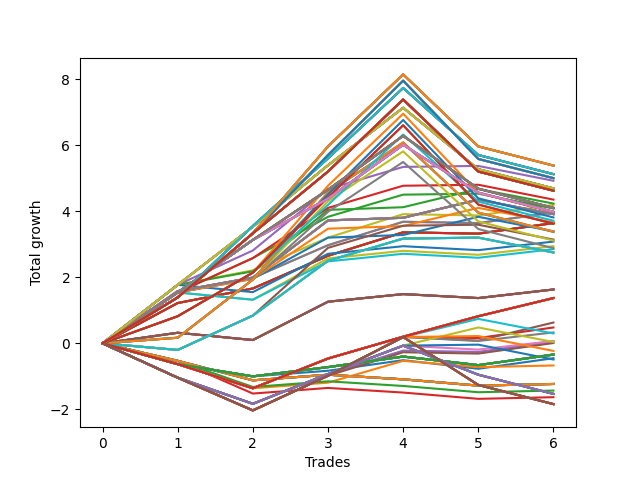

# Long HLT 103_1y 
- Symbol: TSLA
- Date Range: 05/15/2023 - 05/17/2024
- Trading Period: 8:30-12:30
- Number of Trades: 6



| Id. | Name | Win Percent | Profit | Avg Profit / Trade | Avg Time / Trade | Std |      | Name | Win Percent | Profit | Avg Profit / Trade | Avg Time / Trade | Std |
| --- | ---- | ----------- | ------ | ------------------ | ---------------- | --- | ---- | ---- | ----------- | ------ | ------------------ | ---------------- | --- |
| | Sorted By <br> Profit | | | | | | | Sorted By <br> Win Percentage |||||
|0| TP-2.5 180m | 66.67 | 5.38 | 0.90 | 103:20 | 1.71 |     | TP-1.75 75m | 83.33 | 4.92 | 0.82 | 63:10 | 0.85 |
|1| TP-2.5 165m | 66.67 | 5.38 | 0.90 | 103:20 | 1.71 |     | TP-1.5 75m | 83.33 | 4.35 | 0.72 | 62:10 | 0.74 |
|2| TP-2.5 150m | 66.67 | 5.38 | 0.90 | 103:20 | 1.71 |     | TP-1.75 60m | 83.33 | 4.23 | 0.70 | 53:10 | 0.84 |
|3| TP-2.5 135m | 66.67 | 5.38 | 0.90 | 103:20 | 1.71 |     | TP-1.75 30m | 83.33 | 4.19 | 0.70 | 28:30 | 0.58 |
|4| TP-2.5 120m | 66.67 | 5.38 | 0.90 | 103:20 | 1.71 |     | TP-1.25 75m | 83.33 | 4.08 | 0.68 | 59:40 | 0.69 |
|5| TP-2 180m | 66.67 | 5.12 | 0.85 | 91:50 | 1.60 |     | TP-1.5 30m | 83.33 | 3.96 | 0.66 | 28:10 | 0.51 |
|6| TP-2 165m | 66.67 | 5.12 | 0.85 | 91:50 | 1.60 |     | TP-1.25 30m | 83.33 | 3.96 | 0.66 | 28:10 | 0.51 |
|7| TP-2 150m | 66.67 | 5.12 | 0.85 | 91:50 | 1.60 |     | TP-3 60m | 83.33 | 3.91 | 0.65 | 59:00 | 0.78 |
|8| TP-2 135m | 66.67 | 5.12 | 0.85 | 91:50 | 1.60 |     | TP-2.75 60m | 83.33 | 3.91 | 0.65 | 59:00 | 0.78 |
|9| TP-2 120m | 66.67 | 5.12 | 0.85 | 91:50 | 1.60 |     | TP-2.5 60m | 83.33 | 3.91 | 0.65 | 59:00 | 0.78 |
|10| TP-2.25 180m | 66.67 | 5.00 | 0.83 | 98:20 | 1.74 |     | TP-2.25 60m | 83.33 | 3.91 | 0.65 | 59:00 | 0.78 |
|11| TP-2.25 165m | 66.67 | 5.00 | 0.83 | 98:20 | 1.74 |     | TP-2 60m | 83.33 | 3.91 | 0.65 | 59:00 | 0.78 |
|12| TP-2.25 150m | 66.67 | 5.00 | 0.83 | 98:20 | 1.74 |     | TP-1.5 60m | 83.33 | 3.66 | 0.61 | 52:10 | 0.72 |
|13| TP-2.25 135m | 66.67 | 5.00 | 0.83 | 98:20 | 1.74 |     | TP-3 30m | 83.33 | 3.64 | 0.61 | 29:00 | 0.42 |
|14| TP-2.25 120m | 66.67 | 5.00 | 0.83 | 98:20 | 1.74 |     | TP-2.75 30m | 83.33 | 3.64 | 0.61 | 29:00 | 0.42 |
|15| TP-1.75 75m | 83.33 | 4.92 | 0.82 | 63:10 | 0.85 |     | TP-2.5 30m | 83.33 | 3.64 | 0.61 | 29:00 | 0.42 |
|16| TP-1.75 180m | 66.67 | 4.69 | 0.78 | 71:00 | 1.46 |     | TP-2.25 30m | 83.33 | 3.64 | 0.61 | 29:00 | 0.42 |
|17| TP-1.75 165m | 66.67 | 4.69 | 0.78 | 71:00 | 1.46 |     | TP-2 30m | 83.33 | 3.64 | 0.61 | 29:00 | 0.42 |
|18| TP-1.75 150m | 66.67 | 4.69 | 0.78 | 71:00 | 1.46 |     | TP-1.25 60m | 83.33 | 3.39 | 0.56 | 49:40 | 0.67 |
|19| TP-1.75 135m | 66.67 | 4.69 | 0.78 | 71:00 | 1.46 |     | TP-2.5 180m | 66.67 | 5.38 | 0.90 | 103:20 | 1.71 |
|20| TP-1.75 120m | 66.67 | 4.69 | 0.78 | 71:00 | 1.46 |     | TP-2.5 165m | 66.67 | 5.38 | 0.90 | 103:20 | 1.71 |
|21| TP-1.75 105m | 66.67 | 4.69 | 0.78 | 71:00 | 1.46 |     | TP-2.5 150m | 66.67 | 5.38 | 0.90 | 103:20 | 1.71 |
|22| TP-1.75 90m | 66.67 | 4.69 | 0.78 | 71:00 | 1.46 |     | TP-2.5 135m | 66.67 | 5.38 | 0.90 | 103:20 | 1.71 |
|23| TP-3 180m | 66.67 | 4.62 | 0.77 | 108:30 | 1.61 |     | TP-2.5 120m | 66.67 | 5.38 | 0.90 | 103:20 | 1.71 |
|24| TP-2.75 180m | 66.67 | 4.62 | 0.77 | 108:30 | 1.61 |     | TP-2 180m | 66.67 | 5.12 | 0.85 | 91:50 | 1.60 |
|25| TP-3 165m | 66.67 | 4.62 | 0.77 | 108:30 | 1.61 |     | TP-2 165m | 66.67 | 5.12 | 0.85 | 91:50 | 1.60 |
|26| TP-2.75 165m | 66.67 | 4.62 | 0.77 | 108:30 | 1.61 |     | TP-2 150m | 66.67 | 5.12 | 0.85 | 91:50 | 1.60 |
|27| TP-3 150m | 66.67 | 4.62 | 0.77 | 108:30 | 1.61 |     | TP-2 135m | 66.67 | 5.12 | 0.85 | 91:50 | 1.60 |
|28| TP-2.75 150m | 66.67 | 4.62 | 0.77 | 108:30 | 1.61 |     | TP-2 120m | 66.67 | 5.12 | 0.85 | 91:50 | 1.60 |
|29| TP-3 135m | 66.67 | 4.62 | 0.77 | 108:30 | 1.61 |     | TP-2.25 180m | 66.67 | 5.00 | 0.83 | 98:20 | 1.74 |
|30| TP-2.75 135m | 66.67 | 4.62 | 0.77 | 108:30 | 1.61 |     | TP-2.25 165m | 66.67 | 5.00 | 0.83 | 98:20 | 1.74 |
|31| TP-3 120m | 66.67 | 4.62 | 0.77 | 108:30 | 1.61 |     | TP-2.25 150m | 66.67 | 5.00 | 0.83 | 98:20 | 1.74 |
|32| TP-2.75 120m | 66.67 | 4.62 | 0.77 | 108:30 | 1.61 |     | TP-2.25 135m | 66.67 | 5.00 | 0.83 | 98:20 | 1.74 |
|33| TP-1.5 75m | 83.33 | 4.35 | 0.72 | 62:10 | 0.74 |     | TP-2.25 120m | 66.67 | 5.00 | 0.83 | 98:20 | 1.74 |
|34| TP-1.75 60m | 83.33 | 4.23 | 0.70 | 53:10 | 0.84 |     | TP-1.75 180m | 66.67 | 4.69 | 0.78 | 71:00 | 1.46 |
|35| TP-1.75 30m | 83.33 | 4.19 | 0.70 | 28:30 | 0.58 |     | TP-1.75 165m | 66.67 | 4.69 | 0.78 | 71:00 | 1.46 |
|36| TP-1.5 180m | 66.67 | 4.10 | 0.68 | 67:50 | 1.29 |     | TP-1.75 150m | 66.67 | 4.69 | 0.78 | 71:00 | 1.46 |
|37| TP-1.5 165m | 66.67 | 4.10 | 0.68 | 67:50 | 1.29 |     | TP-1.75 135m | 66.67 | 4.69 | 0.78 | 71:00 | 1.46 |
|38| TP-1.5 150m | 66.67 | 4.10 | 0.68 | 67:50 | 1.29 |     | TP-1.75 120m | 66.67 | 4.69 | 0.78 | 71:00 | 1.46 |
|39| TP-1.5 135m | 66.67 | 4.10 | 0.68 | 67:50 | 1.29 |     | TP-1.75 105m | 66.67 | 4.69 | 0.78 | 71:00 | 1.46 |
|40| TP-1.5 120m | 66.67 | 4.10 | 0.68 | 67:50 | 1.29 |     | TP-1.75 90m | 66.67 | 4.69 | 0.78 | 71:00 | 1.46 |
|41| TP-1.5 105m | 66.67 | 4.10 | 0.68 | 67:50 | 1.29 |     | TP-3 180m | 66.67 | 4.62 | 0.77 | 108:30 | 1.61 |
|42| TP-1.5 90m | 66.67 | 4.10 | 0.68 | 67:50 | 1.29 |     | TP-2.75 180m | 66.67 | 4.62 | 0.77 | 108:30 | 1.61 |
|43| TP-1.25 75m | 83.33 | 4.08 | 0.68 | 59:40 | 0.69 |     | TP-3 165m | 66.67 | 4.62 | 0.77 | 108:30 | 1.61 |
|44| TP-1.25 180m | 66.67 | 3.98 | 0.66 | 64:50 | 1.22 |     | TP-2.75 165m | 66.67 | 4.62 | 0.77 | 108:30 | 1.61 |
|45| TP-1.25 165m | 66.67 | 3.98 | 0.66 | 64:50 | 1.22 |     | TP-3 150m | 66.67 | 4.62 | 0.77 | 108:30 | 1.61 |
|46| TP-1.25 150m | 66.67 | 3.98 | 0.66 | 64:50 | 1.22 |     | TP-2.75 150m | 66.67 | 4.62 | 0.77 | 108:30 | 1.61 |
|47| TP-1.25 135m | 66.67 | 3.98 | 0.66 | 64:50 | 1.22 |     | TP-3 135m | 66.67 | 4.62 | 0.77 | 108:30 | 1.61 |
|48| TP-1.25 120m | 66.67 | 3.98 | 0.66 | 64:50 | 1.22 |     | TP-2.75 135m | 66.67 | 4.62 | 0.77 | 108:30 | 1.61 |
|49| TP-1.25 105m | 66.67 | 3.98 | 0.66 | 64:50 | 1.22 |     | TP-3 120m | 66.67 | 4.62 | 0.77 | 108:30 | 1.61 |
|50| TP-1.25 90m | 66.67 | 3.98 | 0.66 | 64:50 | 1.22 |     | TP-2.75 120m | 66.67 | 4.62 | 0.77 | 108:30 | 1.61 |
|51| TP-2.5 105m | 66.67 | 3.97 | 0.66 | 95:50 | 1.71 |     | TP-1.5 180m | 66.67 | 4.10 | 0.68 | 67:50 | 1.29 |
|52| TP-1.5 30m | 83.33 | 3.96 | 0.66 | 28:10 | 0.51 |     | TP-1.5 165m | 66.67 | 4.10 | 0.68 | 67:50 | 1.29 |
|53| TP-1.25 30m | 83.33 | 3.96 | 0.66 | 28:10 | 0.51 |     | TP-1.5 150m | 66.67 | 4.10 | 0.68 | 67:50 | 1.29 |
|54| TP-3 60m | 83.33 | 3.91 | 0.65 | 59:00 | 0.78 |     | TP-1.5 135m | 66.67 | 4.10 | 0.68 | 67:50 | 1.29 |
|55| TP-2.75 60m | 83.33 | 3.91 | 0.65 | 59:00 | 0.78 |     | TP-1.5 120m | 66.67 | 4.10 | 0.68 | 67:50 | 1.29 |
|56| TP-2.5 60m | 83.33 | 3.91 | 0.65 | 59:00 | 0.78 |     | TP-1.5 105m | 66.67 | 4.10 | 0.68 | 67:50 | 1.29 |
|57| TP-2.25 60m | 83.33 | 3.91 | 0.65 | 59:00 | 0.78 |     | TP-1.5 90m | 66.67 | 4.10 | 0.68 | 67:50 | 1.29 |
|58| TP-2 60m | 83.33 | 3.91 | 0.65 | 59:00 | 0.78 |     | TP-1.25 180m | 66.67 | 3.98 | 0.66 | 64:50 | 1.22 |
|59| TP-2.25 105m | 66.67 | 3.81 | 0.63 | 93:20 | 1.66 |     | TP-1.25 165m | 66.67 | 3.98 | 0.66 | 64:50 | 1.22 |
|60| TP-2 105m | 66.67 | 3.71 | 0.62 | 88:30 | 1.49 |     | TP-1.25 150m | 66.67 | 3.98 | 0.66 | 64:50 | 1.22 |
|61| TP-1.5 60m | 83.33 | 3.66 | 0.61 | 52:10 | 0.72 |     | TP-1.25 135m | 66.67 | 3.98 | 0.66 | 64:50 | 1.22 |
|62| TP-3 30m | 83.33 | 3.64 | 0.61 | 29:00 | 0.42 |     | TP-1.25 120m | 66.67 | 3.98 | 0.66 | 64:50 | 1.22 |
|63| TP-2.75 30m | 83.33 | 3.64 | 0.61 | 29:00 | 0.42 |     | TP-1.25 105m | 66.67 | 3.98 | 0.66 | 64:50 | 1.22 |
|64| TP-2.5 30m | 83.33 | 3.64 | 0.61 | 29:00 | 0.42 |     | TP-1.25 90m | 66.67 | 3.98 | 0.66 | 64:50 | 1.22 |
|65| TP-2.25 30m | 83.33 | 3.64 | 0.61 | 29:00 | 0.42 |     | TP-2.5 105m | 66.67 | 3.97 | 0.66 | 95:50 | 1.71 |
|66| TP-2 30m | 83.33 | 3.64 | 0.61 | 29:00 | 0.42 |     | TP-2.25 105m | 66.67 | 3.81 | 0.63 | 93:20 | 1.66 |
|67| TP-3 105m | 66.67 | 3.62 | 0.60 | 98:30 | 1.65 |     | TP-2 105m | 66.67 | 3.71 | 0.62 | 88:30 | 1.49 |
|68| TP-2.75 105m | 66.67 | 3.62 | 0.60 | 98:30 | 1.65 |     | TP-3 105m | 66.67 | 3.62 | 0.60 | 98:30 | 1.65 |
|69| TP-1.25 60m | 83.33 | 3.39 | 0.56 | 49:40 | 0.67 |     | TP-2.75 105m | 66.67 | 3.62 | 0.60 | 98:30 | 1.65 |
|70| TP-3 90m | 66.67 | 3.38 | 0.56 | 87:30 | 1.60 |     | TP-3 90m | 66.67 | 3.38 | 0.56 | 87:30 | 1.60 |
|71| TP-2.75 90m | 66.67 | 3.38 | 0.56 | 87:30 | 1.60 |     | TP-2.75 90m | 66.67 | 3.38 | 0.56 | 87:30 | 1.60 |
|72| TP-2.5 90m | 66.67 | 3.37 | 0.56 | 87:20 | 1.59 |     | TP-2.5 90m | 66.67 | 3.37 | 0.56 | 87:20 | 1.59 |
|73| TP-2 75m | 66.67 | 3.14 | 0.52 | 72:20 | 0.85 |     | TP-2 75m | 66.67 | 3.14 | 0.52 | 72:20 | 0.85 |
|74| TP-2.25 90m | 66.67 | 3.11 | 0.52 | 86:50 | 1.54 |     | TP-2.25 90m | 66.67 | 3.11 | 0.52 | 86:50 | 1.54 |
|75| TP-1.75 45m | 66.67 | 3.08 | 0.51 | 41:00 | 0.72 |     | TP-1.75 45m | 66.67 | 3.08 | 0.51 | 41:00 | 0.72 |
|76| TP-1.25 45m | 66.67 | 2.94 | 0.49 | 39:40 | 0.67 |     | TP-1.25 45m | 66.67 | 2.94 | 0.49 | 39:40 | 0.67 |
|77| TP-2 90m | 66.67 | 2.88 | 0.48 | 83:00 | 1.45 |     | TP-2 90m | 66.67 | 2.88 | 0.48 | 83:00 | 1.45 |
|78| TP-1.5 45m | 66.67 | 2.85 | 0.47 | 40:40 | 0.65 |     | TP-1.5 45m | 66.67 | 2.85 | 0.47 | 40:40 | 0.65 |
|79| TP-3 75m | 66.67 | 2.75 | 0.46 | 74:00 | 0.74 |     | TP-3 75m | 66.67 | 2.75 | 0.46 | 74:00 | 0.74 |
|80| TP-2.75 75m | 66.67 | 2.75 | 0.46 | 74:00 | 0.74 |     | TP-2.75 75m | 66.67 | 2.75 | 0.46 | 74:00 | 0.74 |
|81| TP-2.5 75m | 66.67 | 2.75 | 0.46 | 74:00 | 0.74 |     | TP-2.5 75m | 66.67 | 2.75 | 0.46 | 74:00 | 0.74 |
|82| TP-2.25 75m | 66.67 | 2.75 | 0.46 | 74:00 | 0.74 |     | TP-2.25 75m | 66.67 | 2.75 | 0.46 | 74:00 | 0.74 |
|83| TP-3 45m | 66.67 | 1.63 | 0.27 | 44:00 | 0.45 |     | TP-3 45m | 66.67 | 1.63 | 0.27 | 44:00 | 0.45 |
|84| TP-2.75 45m | 66.67 | 1.63 | 0.27 | 44:00 | 0.45 |     | TP-2.75 45m | 66.67 | 1.63 | 0.27 | 44:00 | 0.45 |
|85| TP-2.5 45m | 66.67 | 1.63 | 0.27 | 44:00 | 0.45 |     | TP-2.5 45m | 66.67 | 1.63 | 0.27 | 44:00 | 0.45 |
|86| TP-2.25 45m | 66.67 | 1.63 | 0.27 | 44:00 | 0.45 |     | TP-2.25 45m | 66.67 | 1.63 | 0.27 | 44:00 | 0.45 |
|87| TP-2 45m | 66.67 | 1.63 | 0.27 | 44:00 | 0.45 |     | TP-2 45m | 66.67 | 1.63 | 0.27 | 44:00 | 0.45 |
|88| TP-0.5 180m | 66.67 | 1.37 | 0.23 | 19:20 | 0.65 |     | TP-0.5 180m | 66.67 | 1.37 | 0.23 | 19:20 | 0.65 |
|89| TP-0.5 165m | 66.67 | 1.37 | 0.23 | 19:20 | 0.65 |     | TP-0.5 165m | 66.67 | 1.37 | 0.23 | 19:20 | 0.65 |
|90| TP-0.5 150m | 66.67 | 1.37 | 0.23 | 19:20 | 0.65 |     | TP-0.5 150m | 66.67 | 1.37 | 0.23 | 19:20 | 0.65 |
|91| TP-0.5 135m | 66.67 | 1.37 | 0.23 | 19:20 | 0.65 |     | TP-0.5 135m | 66.67 | 1.37 | 0.23 | 19:20 | 0.65 |
|92| TP-0.5 120m | 66.67 | 1.37 | 0.23 | 19:20 | 0.65 |     | TP-0.5 120m | 66.67 | 1.37 | 0.23 | 19:20 | 0.65 |
|93| TP-0.5 105m | 66.67 | 1.37 | 0.23 | 19:20 | 0.65 |     | TP-0.5 105m | 66.67 | 1.37 | 0.23 | 19:20 | 0.65 |
|94| TP-0.5 90m | 66.67 | 1.37 | 0.23 | 19:20 | 0.65 |     | TP-0.5 90m | 66.67 | 1.37 | 0.23 | 19:20 | 0.65 |
|95| TP-0.5 75m | 66.67 | 1.37 | 0.23 | 19:20 | 0.65 |     | TP-0.5 75m | 66.67 | 1.37 | 0.23 | 19:20 | 0.65 |
|96| TP-0.5 60m | 66.67 | 1.37 | 0.23 | 19:20 | 0.65 |     | TP-0.5 60m | 66.67 | 1.37 | 0.23 | 19:20 | 0.65 |
|97| TP-0.5 45m | 50.00 | 0.63 | 0.10 | 18:20 | 0.64 |     | TP-0.5 45m | 50.00 | 0.63 | 0.10 | 18:20 | 0.64 |
|98| TP-0.5 30m | 50.00 | 0.48 | 0.08 | 15:40 | 0.61 |     | TP-0.5 30m | 50.00 | 0.48 | 0.08 | 15:40 | 0.61 |
|99| TP-1 45m | 50.00 | 0.33 | 0.05 | 28:30 | 0.88 |     | TP-1 45m | 50.00 | 0.33 | 0.05 | 28:30 | 0.88 |
|100| TP-1 60m | 50.00 | 0.30 | 0.05 | 33:30 | 0.91 |     | TP-1 60m | 50.00 | 0.30 | 0.05 | 33:30 | 0.91 |
|101| TP-0.75 45m | 50.00 | 0.07 | 0.01 | 27:20 | 0.75 |     | TP-0.75 45m | 50.00 | 0.07 | 0.01 | 27:20 | 0.75 |
|102| TP-0.75 30m | 50.00 | 0.06 | 0.01 | 22:10 | 0.72 |     | TP-0.75 30m | 50.00 | 0.06 | 0.01 | 22:10 | 0.72 |
|103| TP-0.75 60m | 50.00 | 0.04 | 0.01 | 32:20 | 0.79 |     | TP-0.75 60m | 50.00 | 0.04 | 0.01 | 32:20 | 0.79 |
|104| TP-1 30m | 50.00 | 0.01 | 0.00 | 23:10 | 0.79 |     | TP-1 30m | 50.00 | 0.01 | 0.00 | 23:10 | 0.79 |
|105| TP-1 75m | 50.00 | -0.23 | -0.04 | 38:30 | 0.89 |     | TP-1 75m | 50.00 | -0.23 | -0.04 | 38:30 | 0.89 |
|106| TP-0.25 180m | 50.00 | -0.34 | -0.06 | 07:00 | 0.38 |     | TP-0.25 180m | 50.00 | -0.34 | -0.06 | 07:00 | 0.38 |
|107| TP-0.25 165m | 50.00 | -0.34 | -0.06 | 07:00 | 0.38 |     | TP-0.25 165m | 50.00 | -0.34 | -0.06 | 07:00 | 0.38 |
|108| TP-0.25 150m | 50.00 | -0.34 | -0.06 | 07:00 | 0.38 |     | TP-0.25 150m | 50.00 | -0.34 | -0.06 | 07:00 | 0.38 |
|109| TP-0.25 135m | 50.00 | -0.34 | -0.06 | 07:00 | 0.38 |     | TP-0.25 135m | 50.00 | -0.34 | -0.06 | 07:00 | 0.38 |
|110| TP-0.25 120m | 50.00 | -0.34 | -0.06 | 07:00 | 0.38 |     | TP-0.25 120m | 50.00 | -0.34 | -0.06 | 07:00 | 0.38 |
|111| TP-0.25 105m | 50.00 | -0.34 | -0.06 | 07:00 | 0.38 |     | TP-0.25 105m | 50.00 | -0.34 | -0.06 | 07:00 | 0.38 |
|112| TP-0.25 90m | 50.00 | -0.34 | -0.06 | 07:00 | 0.38 |     | TP-0.25 90m | 50.00 | -0.34 | -0.06 | 07:00 | 0.38 |
|113| TP-0.25 75m | 50.00 | -0.34 | -0.06 | 07:00 | 0.38 |     | TP-0.25 75m | 50.00 | -0.34 | -0.06 | 07:00 | 0.38 |
|114| TP-0.25 60m | 50.00 | -0.34 | -0.06 | 07:00 | 0.38 |     | TP-0.25 60m | 50.00 | -0.34 | -0.06 | 07:00 | 0.38 |
|115| TP-0.25 45m | 50.00 | -0.34 | -0.06 | 07:00 | 0.38 |     | TP-0.25 45m | 50.00 | -0.34 | -0.06 | 07:00 | 0.38 |
|116| TP-0.25 30m | 50.00 | -0.34 | -0.06 | 07:00 | 0.38 |     | TP-0.25 30m | 50.00 | -0.34 | -0.06 | 07:00 | 0.38 |
|117| TP-0.25 15m | 50.00 | -0.45 | -0.08 | 06:40 | 0.37 |     | TP-0.25 15m | 50.00 | -0.45 | -0.08 | 06:40 | 0.37 |
|118| TP-0.75 75m | 50.00 | -0.49 | -0.08 | 37:20 | 0.75 |     | TP-0.75 75m | 50.00 | -0.49 | -0.08 | 37:20 | 0.75 |
|119| TP-0.5 15m | 50.00 | -0.67 | -0.11 | 09:00 | 0.48 |     | TP-0.5 15m | 50.00 | -0.67 | -0.11 | 09:00 | 0.48 |
|120| TP-3 15m | 33.33 | -1.23 | -0.21 | 14:00 | 0.28 |     | TP-3 15m | 33.33 | -1.23 | -0.21 | 14:00 | 0.28 |
|121| TP-2.75 15m | 33.33 | -1.23 | -0.21 | 14:00 | 0.28 |     | TP-2.75 15m | 33.33 | -1.23 | -0.21 | 14:00 | 0.28 |
|122| TP-2.5 15m | 33.33 | -1.23 | -0.21 | 14:00 | 0.28 |     | TP-2.5 15m | 33.33 | -1.23 | -0.21 | 14:00 | 0.28 |
|123| TP-2.25 15m | 33.33 | -1.23 | -0.21 | 14:00 | 0.28 |     | TP-2.25 15m | 33.33 | -1.23 | -0.21 | 14:00 | 0.28 |
|124| TP-2 15m | 33.33 | -1.23 | -0.21 | 14:00 | 0.28 |     | TP-2 15m | 33.33 | -1.23 | -0.21 | 14:00 | 0.28 |
|125| TP-1.75 15m | 33.33 | -1.23 | -0.21 | 14:00 | 0.28 |     | TP-1.75 15m | 33.33 | -1.23 | -0.21 | 14:00 | 0.28 |
|126| TP-1.5 15m | 33.33 | -1.23 | -0.21 | 14:00 | 0.28 |     | TP-1.5 15m | 33.33 | -1.23 | -0.21 | 14:00 | 0.28 |
|127| TP-1.25 15m | 33.33 | -1.23 | -0.21 | 14:00 | 0.28 |     | TP-1.25 15m | 33.33 | -1.23 | -0.21 | 14:00 | 0.28 |
|128| TP-0.75 15m | 33.33 | -1.43 | -0.24 | 12:30 | 0.33 |     | TP-0.75 15m | 33.33 | -1.43 | -0.24 | 12:30 | 0.33 |
|129| TP-0.75 180m | 33.33 | -1.53 | -0.26 | 39:00 | 0.81 |     | TP-0.75 180m | 33.33 | -1.53 | -0.26 | 39:00 | 0.81 |
|130| TP-0.75 165m | 33.33 | -1.53 | -0.26 | 39:00 | 0.81 |     | TP-0.75 165m | 33.33 | -1.53 | -0.26 | 39:00 | 0.81 |
|131| TP-0.75 150m | 33.33 | -1.53 | -0.26 | 39:00 | 0.81 |     | TP-0.75 150m | 33.33 | -1.53 | -0.26 | 39:00 | 0.81 |
|132| TP-0.75 135m | 33.33 | -1.53 | -0.26 | 39:00 | 0.81 |     | TP-0.75 135m | 33.33 | -1.53 | -0.26 | 39:00 | 0.81 |
|133| TP-0.75 120m | 33.33 | -1.53 | -0.26 | 39:00 | 0.81 |     | TP-0.75 120m | 33.33 | -1.53 | -0.26 | 39:00 | 0.81 |
|134| TP-0.75 105m | 33.33 | -1.53 | -0.26 | 39:00 | 0.81 |     | TP-0.75 105m | 33.33 | -1.53 | -0.26 | 39:00 | 0.81 |
|135| TP-0.75 90m | 33.33 | -1.53 | -0.26 | 39:00 | 0.81 |     | TP-0.75 90m | 33.33 | -1.53 | -0.26 | 39:00 | 0.81 |
|136| TP-1 15m | 33.33 | -1.63 | -0.27 | 13:00 | 0.39 |     | TP-1 15m | 33.33 | -1.63 | -0.27 | 13:00 | 0.39 |
|137| TP-1 180m | 33.33 | -1.84 | -0.31 | 40:20 | 1.03 |     | TP-1 180m | 33.33 | -1.84 | -0.31 | 40:20 | 1.03 |
|138| TP-1 165m | 33.33 | -1.84 | -0.31 | 40:20 | 1.03 |     | TP-1 165m | 33.33 | -1.84 | -0.31 | 40:20 | 1.03 |
|139| TP-1 150m | 33.33 | -1.84 | -0.31 | 40:20 | 1.03 |     | TP-1 150m | 33.33 | -1.84 | -0.31 | 40:20 | 1.03 |
|140| TP-1 135m | 33.33 | -1.84 | -0.31 | 40:20 | 1.03 |     | TP-1 135m | 33.33 | -1.84 | -0.31 | 40:20 | 1.03 |
|141| TP-1 120m | 33.33 | -1.84 | -0.31 | 40:20 | 1.03 |     | TP-1 120m | 33.33 | -1.84 | -0.31 | 40:20 | 1.03 |
|142| TP-1 105m | 33.33 | -1.84 | -0.31 | 40:20 | 1.03 |     | TP-1 105m | 33.33 | -1.84 | -0.31 | 40:20 | 1.03 |
|143| TP-1 90m | 33.33 | -1.84 | -0.31 | 40:20 | 1.03 |     | TP-1 90m | 33.33 | -1.84 | -0.31 | 40:20 | 1.03 |

### Test TP-0.25 15m
* Take Profit of 0.25 Point
* 0.25 Stoploss
* Results:
```
Total Trades: 6
Percent Up: 50.00
Percent Down: 50.00
Total Points Moved Up: -0.45
Potential Profit: -225.00
Total Points Ups: 0.81 Count Ups: 3
Total Points Downs: -1.26 Count Downs: 3
```

<details><summary>Trades</summary>

<code>In: 2023-06-26 09:35:00		Out: 2023-06-26 09:39:00		Total Position Time: 04:00		Total Move Up: -0.63		Total to Date: -0.63</code> <br />
<code>In: 2023-10-26 09:45:00		Out: 2023-10-26 09:47:00		Total Position Time: 02:00		Total Move Up: -0.37		Total to Date: -1.00</code> <br />
<code>In: 2023-11-08 09:40:00		Out: 2023-11-08 09:54:00		Total Position Time: 14:00		Total Move Up: 0.17		Total to Date: -0.83</code> <br />
<code>In: 2023-11-16 11:15:00		Out: 2023-11-16 11:19:00		Total Position Time: 04:00		Total Move Up: 0.32		Total to Date: -0.51</code> <br />
<code>In: 2023-12-28 08:45:00		Out: 2023-12-28 08:52:00		Total Position Time: 07:00		Total Move Up: -0.26		Total to Date: -0.77</code> <br />
<code>In: 2024-02-23 11:30:00		Out: 2024-02-23 11:39:00		Total Position Time: 09:00		Total Move Up: 0.32		Total to Date: -0.45</code> <br />


</details>

### Test TP-0.5 15m
* Take Profit of 0.5 Point
* 0.5 Stoploss
* Results:
```
Total Trades: 6
Percent Up: 50.00
Percent Down: 50.00
Total Points Moved Up: -0.67
Potential Profit: -335.00
Total Points Ups: 0.88 Count Ups: 3
Total Points Downs: -1.55 Count Downs: 3
```

<details><summary>Trades</summary>

<code>In: 2023-06-26 09:35:00		Out: 2023-06-26 09:39:00		Total Position Time: 04:00		Total Move Up: -0.63		Total to Date: -0.63</code> <br />
<code>In: 2023-10-26 09:45:00		Out: 2023-10-26 09:48:00		Total Position Time: 03:00		Total Move Up: -0.73		Total to Date: -1.36</code> <br />
<code>In: 2023-11-08 09:40:00		Out: 2023-11-08 09:54:00		Total Position Time: 14:00		Total Move Up: 0.17		Total to Date: -1.19</code> <br />
<code>In: 2023-11-16 11:15:00		Out: 2023-11-16 11:20:00		Total Position Time: 05:00		Total Move Up: 0.66		Total to Date: -0.53</code> <br />
<code>In: 2023-12-28 08:45:00		Out: 2023-12-28 08:59:00		Total Position Time: 14:00		Total Move Up: -0.19		Total to Date: -0.72</code> <br />
<code>In: 2024-02-23 11:30:00		Out: 2024-02-23 11:44:00		Total Position Time: 14:00		Total Move Up: 0.05		Total to Date: -0.67</code> <br />


</details>

### Test TP-0.75 15m
* Take Profit of 0.75 Point
* 0.75 Stoploss
* Results:
```
Total Trades: 6
Percent Up: 33.33
Percent Down: 66.67
Total Points Moved Up: -1.43
Potential Profit: -715.00
Total Points Ups: 0.22 Count Ups: 2
Total Points Downs: -1.65 Count Downs: 4
```

<details><summary>Trades</summary>

<code>In: 2023-06-26 09:35:00		Out: 2023-06-26 09:49:00		Total Position Time: 14:00		Total Move Up: -0.53		Total to Date: -0.53</code> <br />
<code>In: 2023-10-26 09:45:00		Out: 2023-10-26 09:50:00		Total Position Time: 05:00		Total Move Up: -0.79		Total to Date: -1.32</code> <br />
<code>In: 2023-11-08 09:40:00		Out: 2023-11-08 09:54:00		Total Position Time: 14:00		Total Move Up: 0.17		Total to Date: -1.15</code> <br />
<code>In: 2023-11-16 11:15:00		Out: 2023-11-16 11:29:00		Total Position Time: 14:00		Total Move Up: -0.14		Total to Date: -1.29</code> <br />
<code>In: 2023-12-28 08:45:00		Out: 2023-12-28 08:59:00		Total Position Time: 14:00		Total Move Up: -0.19		Total to Date: -1.48</code> <br />
<code>In: 2024-02-23 11:30:00		Out: 2024-02-23 11:44:00		Total Position Time: 14:00		Total Move Up: 0.05		Total to Date: -1.43</code> <br />


</details>

### Test TP-1 15m
* Take Profit of 1 Point
* 1 Stoploss
* Results:
```
Total Trades: 6
Percent Up: 33.33
Percent Down: 66.67
Total Points Moved Up: -1.63
Potential Profit: -815.00
Total Points Ups: 0.22 Count Ups: 2
Total Points Downs: -1.85 Count Downs: 4
```

<details><summary>Trades</summary>

<code>In: 2023-06-26 09:35:00		Out: 2023-06-26 09:49:00		Total Position Time: 14:00		Total Move Up: -0.53		Total to Date: -0.53</code> <br />
<code>In: 2023-10-26 09:45:00		Out: 2023-10-26 09:53:00		Total Position Time: 08:00		Total Move Up: -0.99		Total to Date: -1.52</code> <br />
<code>In: 2023-11-08 09:40:00		Out: 2023-11-08 09:54:00		Total Position Time: 14:00		Total Move Up: 0.17		Total to Date: -1.35</code> <br />
<code>In: 2023-11-16 11:15:00		Out: 2023-11-16 11:29:00		Total Position Time: 14:00		Total Move Up: -0.14		Total to Date: -1.49</code> <br />
<code>In: 2023-12-28 08:45:00		Out: 2023-12-28 08:59:00		Total Position Time: 14:00		Total Move Up: -0.19		Total to Date: -1.68</code> <br />
<code>In: 2024-02-23 11:30:00		Out: 2024-02-23 11:44:00		Total Position Time: 14:00		Total Move Up: 0.05		Total to Date: -1.63</code> <br />


</details>

### Test TP-1.25 15m
* Take Profit of 1.25 Point
* 1.25 Stoploss
* Results:
```
Total Trades: 6
Percent Up: 33.33
Percent Down: 66.67
Total Points Moved Up: -1.23
Potential Profit: -615.00
Total Points Ups: 0.22 Count Ups: 2
Total Points Downs: -1.45 Count Downs: 4
```

<details><summary>Trades</summary>

<code>In: 2023-06-26 09:35:00		Out: 2023-06-26 09:49:00		Total Position Time: 14:00		Total Move Up: -0.53		Total to Date: -0.53</code> <br />
<code>In: 2023-10-26 09:45:00		Out: 2023-10-26 09:59:00		Total Position Time: 14:00		Total Move Up: -0.59		Total to Date: -1.12</code> <br />
<code>In: 2023-11-08 09:40:00		Out: 2023-11-08 09:54:00		Total Position Time: 14:00		Total Move Up: 0.17		Total to Date: -0.95</code> <br />
<code>In: 2023-11-16 11:15:00		Out: 2023-11-16 11:29:00		Total Position Time: 14:00		Total Move Up: -0.14		Total to Date: -1.09</code> <br />
<code>In: 2023-12-28 08:45:00		Out: 2023-12-28 08:59:00		Total Position Time: 14:00		Total Move Up: -0.19		Total to Date: -1.28</code> <br />
<code>In: 2024-02-23 11:30:00		Out: 2024-02-23 11:44:00		Total Position Time: 14:00		Total Move Up: 0.05		Total to Date: -1.23</code> <br />


</details>

### Test TP-1.5 15m
* Take Profit of 1.5 Point
* 1.5 Stoploss
* Results:
```
Total Trades: 6
Percent Up: 33.33
Percent Down: 66.67
Total Points Moved Up: -1.23
Potential Profit: -615.00
Total Points Ups: 0.22 Count Ups: 2
Total Points Downs: -1.45 Count Downs: 4
```

<details><summary>Trades</summary>

<code>In: 2023-06-26 09:35:00		Out: 2023-06-26 09:49:00		Total Position Time: 14:00		Total Move Up: -0.53		Total to Date: -0.53</code> <br />
<code>In: 2023-10-26 09:45:00		Out: 2023-10-26 09:59:00		Total Position Time: 14:00		Total Move Up: -0.59		Total to Date: -1.12</code> <br />
<code>In: 2023-11-08 09:40:00		Out: 2023-11-08 09:54:00		Total Position Time: 14:00		Total Move Up: 0.17		Total to Date: -0.95</code> <br />
<code>In: 2023-11-16 11:15:00		Out: 2023-11-16 11:29:00		Total Position Time: 14:00		Total Move Up: -0.14		Total to Date: -1.09</code> <br />
<code>In: 2023-12-28 08:45:00		Out: 2023-12-28 08:59:00		Total Position Time: 14:00		Total Move Up: -0.19		Total to Date: -1.28</code> <br />
<code>In: 2024-02-23 11:30:00		Out: 2024-02-23 11:44:00		Total Position Time: 14:00		Total Move Up: 0.05		Total to Date: -1.23</code> <br />


</details>

### Test TP-1.75 15m
* Take Profit of 1.75 Point
* 1.75 Stoploss
* Results:
```
Total Trades: 6
Percent Up: 33.33
Percent Down: 66.67
Total Points Moved Up: -1.23
Potential Profit: -615.00
Total Points Ups: 0.22 Count Ups: 2
Total Points Downs: -1.45 Count Downs: 4
```

<details><summary>Trades</summary>

<code>In: 2023-06-26 09:35:00		Out: 2023-06-26 09:49:00		Total Position Time: 14:00		Total Move Up: -0.53		Total to Date: -0.53</code> <br />
<code>In: 2023-10-26 09:45:00		Out: 2023-10-26 09:59:00		Total Position Time: 14:00		Total Move Up: -0.59		Total to Date: -1.12</code> <br />
<code>In: 2023-11-08 09:40:00		Out: 2023-11-08 09:54:00		Total Position Time: 14:00		Total Move Up: 0.17		Total to Date: -0.95</code> <br />
<code>In: 2023-11-16 11:15:00		Out: 2023-11-16 11:29:00		Total Position Time: 14:00		Total Move Up: -0.14		Total to Date: -1.09</code> <br />
<code>In: 2023-12-28 08:45:00		Out: 2023-12-28 08:59:00		Total Position Time: 14:00		Total Move Up: -0.19		Total to Date: -1.28</code> <br />
<code>In: 2024-02-23 11:30:00		Out: 2024-02-23 11:44:00		Total Position Time: 14:00		Total Move Up: 0.05		Total to Date: -1.23</code> <br />


</details>

### Test TP-2 15m
* Take Profit of 2 Point
* 2 Stoploss
* Results:
```
Total Trades: 6
Percent Up: 33.33
Percent Down: 66.67
Total Points Moved Up: -1.23
Potential Profit: -615.00
Total Points Ups: 0.22 Count Ups: 2
Total Points Downs: -1.45 Count Downs: 4
```

<details><summary>Trades</summary>

<code>In: 2023-06-26 09:35:00		Out: 2023-06-26 09:49:00		Total Position Time: 14:00		Total Move Up: -0.53		Total to Date: -0.53</code> <br />
<code>In: 2023-10-26 09:45:00		Out: 2023-10-26 09:59:00		Total Position Time: 14:00		Total Move Up: -0.59		Total to Date: -1.12</code> <br />
<code>In: 2023-11-08 09:40:00		Out: 2023-11-08 09:54:00		Total Position Time: 14:00		Total Move Up: 0.17		Total to Date: -0.95</code> <br />
<code>In: 2023-11-16 11:15:00		Out: 2023-11-16 11:29:00		Total Position Time: 14:00		Total Move Up: -0.14		Total to Date: -1.09</code> <br />
<code>In: 2023-12-28 08:45:00		Out: 2023-12-28 08:59:00		Total Position Time: 14:00		Total Move Up: -0.19		Total to Date: -1.28</code> <br />
<code>In: 2024-02-23 11:30:00		Out: 2024-02-23 11:44:00		Total Position Time: 14:00		Total Move Up: 0.05		Total to Date: -1.23</code> <br />


</details>

### Test TP-2.25 15m
* Take Profit of 2.25 Point
* 2.25 Stoploss
* Results:
```
Total Trades: 6
Percent Up: 33.33
Percent Down: 66.67
Total Points Moved Up: -1.23
Potential Profit: -615.00
Total Points Ups: 0.22 Count Ups: 2
Total Points Downs: -1.45 Count Downs: 4
```

<details><summary>Trades</summary>

<code>In: 2023-06-26 09:35:00		Out: 2023-06-26 09:49:00		Total Position Time: 14:00		Total Move Up: -0.53		Total to Date: -0.53</code> <br />
<code>In: 2023-10-26 09:45:00		Out: 2023-10-26 09:59:00		Total Position Time: 14:00		Total Move Up: -0.59		Total to Date: -1.12</code> <br />
<code>In: 2023-11-08 09:40:00		Out: 2023-11-08 09:54:00		Total Position Time: 14:00		Total Move Up: 0.17		Total to Date: -0.95</code> <br />
<code>In: 2023-11-16 11:15:00		Out: 2023-11-16 11:29:00		Total Position Time: 14:00		Total Move Up: -0.14		Total to Date: -1.09</code> <br />
<code>In: 2023-12-28 08:45:00		Out: 2023-12-28 08:59:00		Total Position Time: 14:00		Total Move Up: -0.19		Total to Date: -1.28</code> <br />
<code>In: 2024-02-23 11:30:00		Out: 2024-02-23 11:44:00		Total Position Time: 14:00		Total Move Up: 0.05		Total to Date: -1.23</code> <br />


</details>

### Test TP-2.5 15m
* Take Profit of 2.5 Point
* 2.5 Stoploss
* Results:
```
Total Trades: 6
Percent Up: 33.33
Percent Down: 66.67
Total Points Moved Up: -1.23
Potential Profit: -615.00
Total Points Ups: 0.22 Count Ups: 2
Total Points Downs: -1.45 Count Downs: 4
```

<details><summary>Trades</summary>

<code>In: 2023-06-26 09:35:00		Out: 2023-06-26 09:49:00		Total Position Time: 14:00		Total Move Up: -0.53		Total to Date: -0.53</code> <br />
<code>In: 2023-10-26 09:45:00		Out: 2023-10-26 09:59:00		Total Position Time: 14:00		Total Move Up: -0.59		Total to Date: -1.12</code> <br />
<code>In: 2023-11-08 09:40:00		Out: 2023-11-08 09:54:00		Total Position Time: 14:00		Total Move Up: 0.17		Total to Date: -0.95</code> <br />
<code>In: 2023-11-16 11:15:00		Out: 2023-11-16 11:29:00		Total Position Time: 14:00		Total Move Up: -0.14		Total to Date: -1.09</code> <br />
<code>In: 2023-12-28 08:45:00		Out: 2023-12-28 08:59:00		Total Position Time: 14:00		Total Move Up: -0.19		Total to Date: -1.28</code> <br />
<code>In: 2024-02-23 11:30:00		Out: 2024-02-23 11:44:00		Total Position Time: 14:00		Total Move Up: 0.05		Total to Date: -1.23</code> <br />


</details>

### Test TP-2.75 15m
* Take Profit of 2.75 Point
* 2.75 Stoploss
* Results:
```
Total Trades: 6
Percent Up: 33.33
Percent Down: 66.67
Total Points Moved Up: -1.23
Potential Profit: -615.00
Total Points Ups: 0.22 Count Ups: 2
Total Points Downs: -1.45 Count Downs: 4
```

<details><summary>Trades</summary>

<code>In: 2023-06-26 09:35:00		Out: 2023-06-26 09:49:00		Total Position Time: 14:00		Total Move Up: -0.53		Total to Date: -0.53</code> <br />
<code>In: 2023-10-26 09:45:00		Out: 2023-10-26 09:59:00		Total Position Time: 14:00		Total Move Up: -0.59		Total to Date: -1.12</code> <br />
<code>In: 2023-11-08 09:40:00		Out: 2023-11-08 09:54:00		Total Position Time: 14:00		Total Move Up: 0.17		Total to Date: -0.95</code> <br />
<code>In: 2023-11-16 11:15:00		Out: 2023-11-16 11:29:00		Total Position Time: 14:00		Total Move Up: -0.14		Total to Date: -1.09</code> <br />
<code>In: 2023-12-28 08:45:00		Out: 2023-12-28 08:59:00		Total Position Time: 14:00		Total Move Up: -0.19		Total to Date: -1.28</code> <br />
<code>In: 2024-02-23 11:30:00		Out: 2024-02-23 11:44:00		Total Position Time: 14:00		Total Move Up: 0.05		Total to Date: -1.23</code> <br />


</details>

### Test TP-3 15m
* Take Profit of 3 Point
* 3 Stoploss
* Results:
```
Total Trades: 6
Percent Up: 33.33
Percent Down: 66.67
Total Points Moved Up: -1.23
Potential Profit: -615.00
Total Points Ups: 0.22 Count Ups: 2
Total Points Downs: -1.45 Count Downs: 4
```

<details><summary>Trades</summary>

<code>In: 2023-06-26 09:35:00		Out: 2023-06-26 09:49:00		Total Position Time: 14:00		Total Move Up: -0.53		Total to Date: -0.53</code> <br />
<code>In: 2023-10-26 09:45:00		Out: 2023-10-26 09:59:00		Total Position Time: 14:00		Total Move Up: -0.59		Total to Date: -1.12</code> <br />
<code>In: 2023-11-08 09:40:00		Out: 2023-11-08 09:54:00		Total Position Time: 14:00		Total Move Up: 0.17		Total to Date: -0.95</code> <br />
<code>In: 2023-11-16 11:15:00		Out: 2023-11-16 11:29:00		Total Position Time: 14:00		Total Move Up: -0.14		Total to Date: -1.09</code> <br />
<code>In: 2023-12-28 08:45:00		Out: 2023-12-28 08:59:00		Total Position Time: 14:00		Total Move Up: -0.19		Total to Date: -1.28</code> <br />
<code>In: 2024-02-23 11:30:00		Out: 2024-02-23 11:44:00		Total Position Time: 14:00		Total Move Up: 0.05		Total to Date: -1.23</code> <br />


</details>

### Test TP-0.25 30m
* Take Profit of 0.25 Point
* 0.25 Stoploss
* Results:
```
Total Trades: 6
Percent Up: 50.00
Percent Down: 50.00
Total Points Moved Up: -0.34
Potential Profit: -170.00
Total Points Ups: 0.92 Count Ups: 3
Total Points Downs: -1.26 Count Downs: 3
```

<details><summary>Trades</summary>

<code>In: 2023-06-26 09:35:00		Out: 2023-06-26 09:39:00		Total Position Time: 04:00		Total Move Up: -0.63		Total to Date: -0.63</code> <br />
<code>In: 2023-10-26 09:45:00		Out: 2023-10-26 09:47:00		Total Position Time: 02:00		Total Move Up: -0.37		Total to Date: -1.00</code> <br />
<code>In: 2023-11-08 09:40:00		Out: 2023-11-08 09:56:00		Total Position Time: 16:00		Total Move Up: 0.28		Total to Date: -0.72</code> <br />
<code>In: 2023-11-16 11:15:00		Out: 2023-11-16 11:19:00		Total Position Time: 04:00		Total Move Up: 0.32		Total to Date: -0.40</code> <br />
<code>In: 2023-12-28 08:45:00		Out: 2023-12-28 08:52:00		Total Position Time: 07:00		Total Move Up: -0.26		Total to Date: -0.66</code> <br />
<code>In: 2024-02-23 11:30:00		Out: 2024-02-23 11:39:00		Total Position Time: 09:00		Total Move Up: 0.32		Total to Date: -0.34</code> <br />


</details>

### Test TP-0.5 30m
* Take Profit of 0.5 Point
* 0.5 Stoploss
* Results:
```
Total Trades: 6
Percent Up: 50.00
Percent Down: 50.00
Total Points Moved Up: 0.48
Potential Profit: 240.00
Total Points Ups: 1.88 Count Ups: 3
Total Points Downs: -1.40 Count Downs: 3
```

<details><summary>Trades</summary>

<code>In: 2023-06-26 09:35:00		Out: 2023-06-26 09:39:00		Total Position Time: 04:00		Total Move Up: -0.63		Total to Date: -0.63</code> <br />
<code>In: 2023-10-26 09:45:00		Out: 2023-10-26 09:48:00		Total Position Time: 03:00		Total Move Up: -0.73		Total to Date: -1.36</code> <br />
<code>In: 2023-11-08 09:40:00		Out: 2023-11-08 10:04:00		Total Position Time: 24:00		Total Move Up: 0.90		Total to Date: -0.46</code> <br />
<code>In: 2023-11-16 11:15:00		Out: 2023-11-16 11:20:00		Total Position Time: 05:00		Total Move Up: 0.66		Total to Date: 0.20</code> <br />
<code>In: 2023-12-28 08:45:00		Out: 2023-12-28 09:14:00		Total Position Time: 29:00		Total Move Up: -0.04		Total to Date: 0.16</code> <br />
<code>In: 2024-02-23 11:30:00		Out: 2024-02-23 11:59:00		Total Position Time: 29:00		Total Move Up: 0.32		Total to Date: 0.48</code> <br />


</details>

### Test TP-0.75 30m
* Take Profit of 0.75 Point
* 0.75 Stoploss
* Results:
```
Total Trades: 6
Percent Up: 50.00
Percent Down: 50.00
Total Points Moved Up: 0.06
Potential Profit: 30.00
Total Points Ups: 1.93 Count Ups: 3
Total Points Downs: -1.87 Count Downs: 3
```

<details><summary>Trades</summary>

<code>In: 2023-06-26 09:35:00		Out: 2023-06-26 09:52:00		Total Position Time: 17:00		Total Move Up: -1.04		Total to Date: -1.04</code> <br />
<code>In: 2023-10-26 09:45:00		Out: 2023-10-26 09:50:00		Total Position Time: 05:00		Total Move Up: -0.79		Total to Date: -1.83</code> <br />
<code>In: 2023-11-08 09:40:00		Out: 2023-11-08 10:04:00		Total Position Time: 24:00		Total Move Up: 0.90		Total to Date: -0.93</code> <br />
<code>In: 2023-11-16 11:15:00		Out: 2023-11-16 11:44:00		Total Position Time: 29:00		Total Move Up: 0.71		Total to Date: -0.22</code> <br />
<code>In: 2023-12-28 08:45:00		Out: 2023-12-28 09:14:00		Total Position Time: 29:00		Total Move Up: -0.04		Total to Date: -0.26</code> <br />
<code>In: 2024-02-23 11:30:00		Out: 2024-02-23 11:59:00		Total Position Time: 29:00		Total Move Up: 0.32		Total to Date: 0.06</code> <br />


</details>

### Test TP-1 30m
* Take Profit of 1 Point
* 1 Stoploss
* Results:
```
Total Trades: 6
Percent Up: 50.00
Percent Down: 50.00
Total Points Moved Up: 0.01
Potential Profit: 5.00
Total Points Ups: 2.08 Count Ups: 3
Total Points Downs: -2.07 Count Downs: 3
```

<details><summary>Trades</summary>

<code>In: 2023-06-26 09:35:00		Out: 2023-06-26 09:52:00		Total Position Time: 17:00		Total Move Up: -1.04		Total to Date: -1.04</code> <br />
<code>In: 2023-10-26 09:45:00		Out: 2023-10-26 09:53:00		Total Position Time: 08:00		Total Move Up: -0.99		Total to Date: -2.03</code> <br />
<code>In: 2023-11-08 09:40:00		Out: 2023-11-08 10:07:00		Total Position Time: 27:00		Total Move Up: 1.05		Total to Date: -0.98</code> <br />
<code>In: 2023-11-16 11:15:00		Out: 2023-11-16 11:44:00		Total Position Time: 29:00		Total Move Up: 0.71		Total to Date: -0.27</code> <br />
<code>In: 2023-12-28 08:45:00		Out: 2023-12-28 09:14:00		Total Position Time: 29:00		Total Move Up: -0.04		Total to Date: -0.31</code> <br />
<code>In: 2024-02-23 11:30:00		Out: 2024-02-23 11:59:00		Total Position Time: 29:00		Total Move Up: 0.32		Total to Date: 0.01</code> <br />


</details>

### Test TP-1.25 30m
* Take Profit of 1.25 Point
* 1.25 Stoploss
* Results:
```
Total Trades: 6
Percent Up: 83.33
Percent Down: 16.67
Total Points Moved Up: 3.96
Potential Profit: 1980.00
Total Points Ups: 4.00 Count Ups: 5
Total Points Downs: -0.04 Count Downs: 1
```

<details><summary>Trades</summary>

<code>In: 2023-06-26 09:35:00		Out: 2023-06-26 09:59:00		Total Position Time: 24:00		Total Move Up: 1.54		Total to Date: 1.54</code> <br />
<code>In: 2023-10-26 09:45:00		Out: 2023-10-26 10:14:00		Total Position Time: 29:00		Total Move Up: 0.44		Total to Date: 1.98</code> <br />
<code>In: 2023-11-08 09:40:00		Out: 2023-11-08 10:09:00		Total Position Time: 29:00		Total Move Up: 0.99		Total to Date: 2.97</code> <br />
<code>In: 2023-11-16 11:15:00		Out: 2023-11-16 11:44:00		Total Position Time: 29:00		Total Move Up: 0.71		Total to Date: 3.68</code> <br />
<code>In: 2023-12-28 08:45:00		Out: 2023-12-28 09:14:00		Total Position Time: 29:00		Total Move Up: -0.04		Total to Date: 3.64</code> <br />
<code>In: 2024-02-23 11:30:00		Out: 2024-02-23 11:59:00		Total Position Time: 29:00		Total Move Up: 0.32		Total to Date: 3.96</code> <br />


</details>

### Test TP-1.5 30m
* Take Profit of 1.5 Point
* 1.5 Stoploss
* Results:
```
Total Trades: 6
Percent Up: 83.33
Percent Down: 16.67
Total Points Moved Up: 3.96
Potential Profit: 1980.00
Total Points Ups: 4.00 Count Ups: 5
Total Points Downs: -0.04 Count Downs: 1
```

<details><summary>Trades</summary>

<code>In: 2023-06-26 09:35:00		Out: 2023-06-26 09:59:00		Total Position Time: 24:00		Total Move Up: 1.54		Total to Date: 1.54</code> <br />
<code>In: 2023-10-26 09:45:00		Out: 2023-10-26 10:14:00		Total Position Time: 29:00		Total Move Up: 0.44		Total to Date: 1.98</code> <br />
<code>In: 2023-11-08 09:40:00		Out: 2023-11-08 10:09:00		Total Position Time: 29:00		Total Move Up: 0.99		Total to Date: 2.97</code> <br />
<code>In: 2023-11-16 11:15:00		Out: 2023-11-16 11:44:00		Total Position Time: 29:00		Total Move Up: 0.71		Total to Date: 3.68</code> <br />
<code>In: 2023-12-28 08:45:00		Out: 2023-12-28 09:14:00		Total Position Time: 29:00		Total Move Up: -0.04		Total to Date: 3.64</code> <br />
<code>In: 2024-02-23 11:30:00		Out: 2024-02-23 11:59:00		Total Position Time: 29:00		Total Move Up: 0.32		Total to Date: 3.96</code> <br />


</details>

### Test TP-1.75 30m
* Take Profit of 1.75 Point
* 1.75 Stoploss
* Results:
```
Total Trades: 6
Percent Up: 83.33
Percent Down: 16.67
Total Points Moved Up: 4.19
Potential Profit: 2095.00
Total Points Ups: 4.23 Count Ups: 5
Total Points Downs: -0.04 Count Downs: 1
```

<details><summary>Trades</summary>

<code>In: 2023-06-26 09:35:00		Out: 2023-06-26 10:01:00		Total Position Time: 26:00		Total Move Up: 1.77		Total to Date: 1.77</code> <br />
<code>In: 2023-10-26 09:45:00		Out: 2023-10-26 10:14:00		Total Position Time: 29:00		Total Move Up: 0.44		Total to Date: 2.21</code> <br />
<code>In: 2023-11-08 09:40:00		Out: 2023-11-08 10:09:00		Total Position Time: 29:00		Total Move Up: 0.99		Total to Date: 3.20</code> <br />
<code>In: 2023-11-16 11:15:00		Out: 2023-11-16 11:44:00		Total Position Time: 29:00		Total Move Up: 0.71		Total to Date: 3.91</code> <br />
<code>In: 2023-12-28 08:45:00		Out: 2023-12-28 09:14:00		Total Position Time: 29:00		Total Move Up: -0.04		Total to Date: 3.87</code> <br />
<code>In: 2024-02-23 11:30:00		Out: 2024-02-23 11:59:00		Total Position Time: 29:00		Total Move Up: 0.32		Total to Date: 4.19</code> <br />


</details>

### Test TP-2 30m
* Take Profit of 2 Point
* 2 Stoploss
* Results:
```
Total Trades: 6
Percent Up: 83.33
Percent Down: 16.67
Total Points Moved Up: 3.64
Potential Profit: 1820.00
Total Points Ups: 3.68 Count Ups: 5
Total Points Downs: -0.04 Count Downs: 1
```

<details><summary>Trades</summary>

<code>In: 2023-06-26 09:35:00		Out: 2023-06-26 10:04:00		Total Position Time: 29:00		Total Move Up: 1.22		Total to Date: 1.22</code> <br />
<code>In: 2023-10-26 09:45:00		Out: 2023-10-26 10:14:00		Total Position Time: 29:00		Total Move Up: 0.44		Total to Date: 1.66</code> <br />
<code>In: 2023-11-08 09:40:00		Out: 2023-11-08 10:09:00		Total Position Time: 29:00		Total Move Up: 0.99		Total to Date: 2.65</code> <br />
<code>In: 2023-11-16 11:15:00		Out: 2023-11-16 11:44:00		Total Position Time: 29:00		Total Move Up: 0.71		Total to Date: 3.36</code> <br />
<code>In: 2023-12-28 08:45:00		Out: 2023-12-28 09:14:00		Total Position Time: 29:00		Total Move Up: -0.04		Total to Date: 3.32</code> <br />
<code>In: 2024-02-23 11:30:00		Out: 2024-02-23 11:59:00		Total Position Time: 29:00		Total Move Up: 0.32		Total to Date: 3.64</code> <br />


</details>

### Test TP-2.25 30m
* Take Profit of 2.25 Point
* 2.25 Stoploss
* Results:
```
Total Trades: 6
Percent Up: 83.33
Percent Down: 16.67
Total Points Moved Up: 3.64
Potential Profit: 1820.00
Total Points Ups: 3.68 Count Ups: 5
Total Points Downs: -0.04 Count Downs: 1
```

<details><summary>Trades</summary>

<code>In: 2023-06-26 09:35:00		Out: 2023-06-26 10:04:00		Total Position Time: 29:00		Total Move Up: 1.22		Total to Date: 1.22</code> <br />
<code>In: 2023-10-26 09:45:00		Out: 2023-10-26 10:14:00		Total Position Time: 29:00		Total Move Up: 0.44		Total to Date: 1.66</code> <br />
<code>In: 2023-11-08 09:40:00		Out: 2023-11-08 10:09:00		Total Position Time: 29:00		Total Move Up: 0.99		Total to Date: 2.65</code> <br />
<code>In: 2023-11-16 11:15:00		Out: 2023-11-16 11:44:00		Total Position Time: 29:00		Total Move Up: 0.71		Total to Date: 3.36</code> <br />
<code>In: 2023-12-28 08:45:00		Out: 2023-12-28 09:14:00		Total Position Time: 29:00		Total Move Up: -0.04		Total to Date: 3.32</code> <br />
<code>In: 2024-02-23 11:30:00		Out: 2024-02-23 11:59:00		Total Position Time: 29:00		Total Move Up: 0.32		Total to Date: 3.64</code> <br />


</details>

### Test TP-2.5 30m
* Take Profit of 2.5 Point
* 2.5 Stoploss
* Results:
```
Total Trades: 6
Percent Up: 83.33
Percent Down: 16.67
Total Points Moved Up: 3.64
Potential Profit: 1820.00
Total Points Ups: 3.68 Count Ups: 5
Total Points Downs: -0.04 Count Downs: 1
```

<details><summary>Trades</summary>

<code>In: 2023-06-26 09:35:00		Out: 2023-06-26 10:04:00		Total Position Time: 29:00		Total Move Up: 1.22		Total to Date: 1.22</code> <br />
<code>In: 2023-10-26 09:45:00		Out: 2023-10-26 10:14:00		Total Position Time: 29:00		Total Move Up: 0.44		Total to Date: 1.66</code> <br />
<code>In: 2023-11-08 09:40:00		Out: 2023-11-08 10:09:00		Total Position Time: 29:00		Total Move Up: 0.99		Total to Date: 2.65</code> <br />
<code>In: 2023-11-16 11:15:00		Out: 2023-11-16 11:44:00		Total Position Time: 29:00		Total Move Up: 0.71		Total to Date: 3.36</code> <br />
<code>In: 2023-12-28 08:45:00		Out: 2023-12-28 09:14:00		Total Position Time: 29:00		Total Move Up: -0.04		Total to Date: 3.32</code> <br />
<code>In: 2024-02-23 11:30:00		Out: 2024-02-23 11:59:00		Total Position Time: 29:00		Total Move Up: 0.32		Total to Date: 3.64</code> <br />


</details>

### Test TP-2.75 30m
* Take Profit of 2.75 Point
* 2.75 Stoploss
* Results:
```
Total Trades: 6
Percent Up: 83.33
Percent Down: 16.67
Total Points Moved Up: 3.64
Potential Profit: 1820.00
Total Points Ups: 3.68 Count Ups: 5
Total Points Downs: -0.04 Count Downs: 1
```

<details><summary>Trades</summary>

<code>In: 2023-06-26 09:35:00		Out: 2023-06-26 10:04:00		Total Position Time: 29:00		Total Move Up: 1.22		Total to Date: 1.22</code> <br />
<code>In: 2023-10-26 09:45:00		Out: 2023-10-26 10:14:00		Total Position Time: 29:00		Total Move Up: 0.44		Total to Date: 1.66</code> <br />
<code>In: 2023-11-08 09:40:00		Out: 2023-11-08 10:09:00		Total Position Time: 29:00		Total Move Up: 0.99		Total to Date: 2.65</code> <br />
<code>In: 2023-11-16 11:15:00		Out: 2023-11-16 11:44:00		Total Position Time: 29:00		Total Move Up: 0.71		Total to Date: 3.36</code> <br />
<code>In: 2023-12-28 08:45:00		Out: 2023-12-28 09:14:00		Total Position Time: 29:00		Total Move Up: -0.04		Total to Date: 3.32</code> <br />
<code>In: 2024-02-23 11:30:00		Out: 2024-02-23 11:59:00		Total Position Time: 29:00		Total Move Up: 0.32		Total to Date: 3.64</code> <br />


</details>

### Test TP-3 30m
* Take Profit of 3 Point
* 3 Stoploss
* Results:
```
Total Trades: 6
Percent Up: 83.33
Percent Down: 16.67
Total Points Moved Up: 3.64
Potential Profit: 1820.00
Total Points Ups: 3.68 Count Ups: 5
Total Points Downs: -0.04 Count Downs: 1
```

<details><summary>Trades</summary>

<code>In: 2023-06-26 09:35:00		Out: 2023-06-26 10:04:00		Total Position Time: 29:00		Total Move Up: 1.22		Total to Date: 1.22</code> <br />
<code>In: 2023-10-26 09:45:00		Out: 2023-10-26 10:14:00		Total Position Time: 29:00		Total Move Up: 0.44		Total to Date: 1.66</code> <br />
<code>In: 2023-11-08 09:40:00		Out: 2023-11-08 10:09:00		Total Position Time: 29:00		Total Move Up: 0.99		Total to Date: 2.65</code> <br />
<code>In: 2023-11-16 11:15:00		Out: 2023-11-16 11:44:00		Total Position Time: 29:00		Total Move Up: 0.71		Total to Date: 3.36</code> <br />
<code>In: 2023-12-28 08:45:00		Out: 2023-12-28 09:14:00		Total Position Time: 29:00		Total Move Up: -0.04		Total to Date: 3.32</code> <br />
<code>In: 2024-02-23 11:30:00		Out: 2024-02-23 11:59:00		Total Position Time: 29:00		Total Move Up: 0.32		Total to Date: 3.64</code> <br />


</details>

### Test TP-0.25 45m
* Take Profit of 0.25 Point
* 0.25 Stoploss
* Results:
```
Total Trades: 6
Percent Up: 50.00
Percent Down: 50.00
Total Points Moved Up: -0.34
Potential Profit: -170.00
Total Points Ups: 0.92 Count Ups: 3
Total Points Downs: -1.26 Count Downs: 3
```

<details><summary>Trades</summary>

<code>In: 2023-06-26 09:35:00		Out: 2023-06-26 09:39:00		Total Position Time: 04:00		Total Move Up: -0.63		Total to Date: -0.63</code> <br />
<code>In: 2023-10-26 09:45:00		Out: 2023-10-26 09:47:00		Total Position Time: 02:00		Total Move Up: -0.37		Total to Date: -1.00</code> <br />
<code>In: 2023-11-08 09:40:00		Out: 2023-11-08 09:56:00		Total Position Time: 16:00		Total Move Up: 0.28		Total to Date: -0.72</code> <br />
<code>In: 2023-11-16 11:15:00		Out: 2023-11-16 11:19:00		Total Position Time: 04:00		Total Move Up: 0.32		Total to Date: -0.40</code> <br />
<code>In: 2023-12-28 08:45:00		Out: 2023-12-28 08:52:00		Total Position Time: 07:00		Total Move Up: -0.26		Total to Date: -0.66</code> <br />
<code>In: 2024-02-23 11:30:00		Out: 2024-02-23 11:39:00		Total Position Time: 09:00		Total Move Up: 0.32		Total to Date: -0.34</code> <br />


</details>

### Test TP-0.5 45m
* Take Profit of 0.5 Point
* 0.5 Stoploss
* Results:
```
Total Trades: 6
Percent Up: 50.00
Percent Down: 50.00
Total Points Moved Up: 0.63
Potential Profit: 315.00
Total Points Ups: 2.11 Count Ups: 3
Total Points Downs: -1.48 Count Downs: 3
```

<details><summary>Trades</summary>

<code>In: 2023-06-26 09:35:00		Out: 2023-06-26 09:39:00		Total Position Time: 04:00		Total Move Up: -0.63		Total to Date: -0.63</code> <br />
<code>In: 2023-10-26 09:45:00		Out: 2023-10-26 09:48:00		Total Position Time: 03:00		Total Move Up: -0.73		Total to Date: -1.36</code> <br />
<code>In: 2023-11-08 09:40:00		Out: 2023-11-08 10:04:00		Total Position Time: 24:00		Total Move Up: 0.90		Total to Date: -0.46</code> <br />
<code>In: 2023-11-16 11:15:00		Out: 2023-11-16 11:20:00		Total Position Time: 05:00		Total Move Up: 0.66		Total to Date: 0.20</code> <br />
<code>In: 2023-12-28 08:45:00		Out: 2023-12-28 09:29:00		Total Position Time: 44:00		Total Move Up: -0.12		Total to Date: 0.08</code> <br />
<code>In: 2024-02-23 11:30:00		Out: 2024-02-23 12:00:00		Total Position Time: 30:00		Total Move Up: 0.55		Total to Date: 0.63</code> <br />


</details>

### Test TP-0.75 45m
* Take Profit of 0.75 Point
* 0.75 Stoploss
* Results:
```
Total Trades: 6
Percent Up: 50.00
Percent Down: 50.00
Total Points Moved Up: 0.07
Potential Profit: 35.00
Total Points Ups: 2.02 Count Ups: 3
Total Points Downs: -1.95 Count Downs: 3
```

<details><summary>Trades</summary>

<code>In: 2023-06-26 09:35:00		Out: 2023-06-26 09:52:00		Total Position Time: 17:00		Total Move Up: -1.04		Total to Date: -1.04</code> <br />
<code>In: 2023-10-26 09:45:00		Out: 2023-10-26 09:50:00		Total Position Time: 05:00		Total Move Up: -0.79		Total to Date: -1.83</code> <br />
<code>In: 2023-11-08 09:40:00		Out: 2023-11-08 10:04:00		Total Position Time: 24:00		Total Move Up: 0.90		Total to Date: -0.93</code> <br />
<code>In: 2023-11-16 11:15:00		Out: 2023-11-16 11:45:00		Total Position Time: 30:00		Total Move Up: 0.86		Total to Date: -0.07</code> <br />
<code>In: 2023-12-28 08:45:00		Out: 2023-12-28 09:29:00		Total Position Time: 44:00		Total Move Up: -0.12		Total to Date: -0.19</code> <br />
<code>In: 2024-02-23 11:30:00		Out: 2024-02-23 12:14:00		Total Position Time: 44:00		Total Move Up: 0.26		Total to Date: 0.07</code> <br />


</details>

### Test TP-1 45m
* Take Profit of 1 Point
* 1 Stoploss
* Results:
```
Total Trades: 6
Percent Up: 50.00
Percent Down: 50.00
Total Points Moved Up: 0.33
Potential Profit: 165.00
Total Points Ups: 2.48 Count Ups: 3
Total Points Downs: -2.15 Count Downs: 3
```

<details><summary>Trades</summary>

<code>In: 2023-06-26 09:35:00		Out: 2023-06-26 09:52:00		Total Position Time: 17:00		Total Move Up: -1.04		Total to Date: -1.04</code> <br />
<code>In: 2023-10-26 09:45:00		Out: 2023-10-26 09:53:00		Total Position Time: 08:00		Total Move Up: -0.99		Total to Date: -2.03</code> <br />
<code>In: 2023-11-08 09:40:00		Out: 2023-11-08 10:07:00		Total Position Time: 27:00		Total Move Up: 1.05		Total to Date: -0.98</code> <br />
<code>In: 2023-11-16 11:15:00		Out: 2023-11-16 11:46:00		Total Position Time: 31:00		Total Move Up: 1.17		Total to Date: 0.19</code> <br />
<code>In: 2023-12-28 08:45:00		Out: 2023-12-28 09:29:00		Total Position Time: 44:00		Total Move Up: -0.12		Total to Date: 0.07</code> <br />
<code>In: 2024-02-23 11:30:00		Out: 2024-02-23 12:14:00		Total Position Time: 44:00		Total Move Up: 0.26		Total to Date: 0.33</code> <br />


</details>

### Test TP-1.25 45m
* Take Profit of 1.25 Point
* 1.25 Stoploss
* Results:
```
Total Trades: 6
Percent Up: 66.67
Percent Down: 33.33
Total Points Moved Up: 2.94
Potential Profit: 1470.00
Total Points Ups: 3.28 Count Ups: 4
Total Points Downs: -0.34 Count Downs: 2
```

<details><summary>Trades</summary>

<code>In: 2023-06-26 09:35:00		Out: 2023-06-26 09:59:00		Total Position Time: 24:00		Total Move Up: 1.54		Total to Date: 1.54</code> <br />
<code>In: 2023-10-26 09:45:00		Out: 2023-10-26 10:29:00		Total Position Time: 44:00		Total Move Up: -0.22		Total to Date: 1.32</code> <br />
<code>In: 2023-11-08 09:40:00		Out: 2023-11-08 10:18:00		Total Position Time: 38:00		Total Move Up: 1.25		Total to Date: 2.57</code> <br />
<code>In: 2023-11-16 11:15:00		Out: 2023-11-16 11:59:00		Total Position Time: 44:00		Total Move Up: 0.23		Total to Date: 2.80</code> <br />
<code>In: 2023-12-28 08:45:00		Out: 2023-12-28 09:29:00		Total Position Time: 44:00		Total Move Up: -0.12		Total to Date: 2.68</code> <br />
<code>In: 2024-02-23 11:30:00		Out: 2024-02-23 12:14:00		Total Position Time: 44:00		Total Move Up: 0.26		Total to Date: 2.94</code> <br />


</details>

### Test TP-1.5 45m
* Take Profit of 1.5 Point
* 1.5 Stoploss
* Results:
```
Total Trades: 6
Percent Up: 66.67
Percent Down: 33.33
Total Points Moved Up: 2.85
Potential Profit: 1425.00
Total Points Ups: 3.19 Count Ups: 4
Total Points Downs: -0.34 Count Downs: 2
```

<details><summary>Trades</summary>

<code>In: 2023-06-26 09:35:00		Out: 2023-06-26 09:59:00		Total Position Time: 24:00		Total Move Up: 1.54		Total to Date: 1.54</code> <br />
<code>In: 2023-10-26 09:45:00		Out: 2023-10-26 10:29:00		Total Position Time: 44:00		Total Move Up: -0.22		Total to Date: 1.32</code> <br />
<code>In: 2023-11-08 09:40:00		Out: 2023-11-08 10:24:00		Total Position Time: 44:00		Total Move Up: 1.16		Total to Date: 2.48</code> <br />
<code>In: 2023-11-16 11:15:00		Out: 2023-11-16 11:59:00		Total Position Time: 44:00		Total Move Up: 0.23		Total to Date: 2.71</code> <br />
<code>In: 2023-12-28 08:45:00		Out: 2023-12-28 09:29:00		Total Position Time: 44:00		Total Move Up: -0.12		Total to Date: 2.59</code> <br />
<code>In: 2024-02-23 11:30:00		Out: 2024-02-23 12:14:00		Total Position Time: 44:00		Total Move Up: 0.26		Total to Date: 2.85</code> <br />


</details>

### Test TP-1.75 45m
* Take Profit of 1.75 Point
* 1.75 Stoploss
* Results:
```
Total Trades: 6
Percent Up: 66.67
Percent Down: 33.33
Total Points Moved Up: 3.08
Potential Profit: 1540.00
Total Points Ups: 3.42 Count Ups: 4
Total Points Downs: -0.34 Count Downs: 2
```

<details><summary>Trades</summary>

<code>In: 2023-06-26 09:35:00		Out: 2023-06-26 10:01:00		Total Position Time: 26:00		Total Move Up: 1.77		Total to Date: 1.77</code> <br />
<code>In: 2023-10-26 09:45:00		Out: 2023-10-26 10:29:00		Total Position Time: 44:00		Total Move Up: -0.22		Total to Date: 1.55</code> <br />
<code>In: 2023-11-08 09:40:00		Out: 2023-11-08 10:24:00		Total Position Time: 44:00		Total Move Up: 1.16		Total to Date: 2.71</code> <br />
<code>In: 2023-11-16 11:15:00		Out: 2023-11-16 11:59:00		Total Position Time: 44:00		Total Move Up: 0.23		Total to Date: 2.94</code> <br />
<code>In: 2023-12-28 08:45:00		Out: 2023-12-28 09:29:00		Total Position Time: 44:00		Total Move Up: -0.12		Total to Date: 2.82</code> <br />
<code>In: 2024-02-23 11:30:00		Out: 2024-02-23 12:14:00		Total Position Time: 44:00		Total Move Up: 0.26		Total to Date: 3.08</code> <br />


</details>

### Test TP-2 45m
* Take Profit of 2 Point
* 2 Stoploss
* Results:
```
Total Trades: 6
Percent Up: 66.67
Percent Down: 33.33
Total Points Moved Up: 1.63
Potential Profit: 815.00
Total Points Ups: 1.97 Count Ups: 4
Total Points Downs: -0.34 Count Downs: 2
```

<details><summary>Trades</summary>

<code>In: 2023-06-26 09:35:00		Out: 2023-06-26 10:19:00		Total Position Time: 44:00		Total Move Up: 0.32		Total to Date: 0.32</code> <br />
<code>In: 2023-10-26 09:45:00		Out: 2023-10-26 10:29:00		Total Position Time: 44:00		Total Move Up: -0.22		Total to Date: 0.10</code> <br />
<code>In: 2023-11-08 09:40:00		Out: 2023-11-08 10:24:00		Total Position Time: 44:00		Total Move Up: 1.16		Total to Date: 1.26</code> <br />
<code>In: 2023-11-16 11:15:00		Out: 2023-11-16 11:59:00		Total Position Time: 44:00		Total Move Up: 0.23		Total to Date: 1.49</code> <br />
<code>In: 2023-12-28 08:45:00		Out: 2023-12-28 09:29:00		Total Position Time: 44:00		Total Move Up: -0.12		Total to Date: 1.37</code> <br />
<code>In: 2024-02-23 11:30:00		Out: 2024-02-23 12:14:00		Total Position Time: 44:00		Total Move Up: 0.26		Total to Date: 1.63</code> <br />


</details>

### Test TP-2.25 45m
* Take Profit of 2.25 Point
* 2.25 Stoploss
* Results:
```
Total Trades: 6
Percent Up: 66.67
Percent Down: 33.33
Total Points Moved Up: 1.63
Potential Profit: 815.00
Total Points Ups: 1.97 Count Ups: 4
Total Points Downs: -0.34 Count Downs: 2
```

<details><summary>Trades</summary>

<code>In: 2023-06-26 09:35:00		Out: 2023-06-26 10:19:00		Total Position Time: 44:00		Total Move Up: 0.32		Total to Date: 0.32</code> <br />
<code>In: 2023-10-26 09:45:00		Out: 2023-10-26 10:29:00		Total Position Time: 44:00		Total Move Up: -0.22		Total to Date: 0.10</code> <br />
<code>In: 2023-11-08 09:40:00		Out: 2023-11-08 10:24:00		Total Position Time: 44:00		Total Move Up: 1.16		Total to Date: 1.26</code> <br />
<code>In: 2023-11-16 11:15:00		Out: 2023-11-16 11:59:00		Total Position Time: 44:00		Total Move Up: 0.23		Total to Date: 1.49</code> <br />
<code>In: 2023-12-28 08:45:00		Out: 2023-12-28 09:29:00		Total Position Time: 44:00		Total Move Up: -0.12		Total to Date: 1.37</code> <br />
<code>In: 2024-02-23 11:30:00		Out: 2024-02-23 12:14:00		Total Position Time: 44:00		Total Move Up: 0.26		Total to Date: 1.63</code> <br />


</details>

### Test TP-2.5 45m
* Take Profit of 2.5 Point
* 2.5 Stoploss
* Results:
```
Total Trades: 6
Percent Up: 66.67
Percent Down: 33.33
Total Points Moved Up: 1.63
Potential Profit: 815.00
Total Points Ups: 1.97 Count Ups: 4
Total Points Downs: -0.34 Count Downs: 2
```

<details><summary>Trades</summary>

<code>In: 2023-06-26 09:35:00		Out: 2023-06-26 10:19:00		Total Position Time: 44:00		Total Move Up: 0.32		Total to Date: 0.32</code> <br />
<code>In: 2023-10-26 09:45:00		Out: 2023-10-26 10:29:00		Total Position Time: 44:00		Total Move Up: -0.22		Total to Date: 0.10</code> <br />
<code>In: 2023-11-08 09:40:00		Out: 2023-11-08 10:24:00		Total Position Time: 44:00		Total Move Up: 1.16		Total to Date: 1.26</code> <br />
<code>In: 2023-11-16 11:15:00		Out: 2023-11-16 11:59:00		Total Position Time: 44:00		Total Move Up: 0.23		Total to Date: 1.49</code> <br />
<code>In: 2023-12-28 08:45:00		Out: 2023-12-28 09:29:00		Total Position Time: 44:00		Total Move Up: -0.12		Total to Date: 1.37</code> <br />
<code>In: 2024-02-23 11:30:00		Out: 2024-02-23 12:14:00		Total Position Time: 44:00		Total Move Up: 0.26		Total to Date: 1.63</code> <br />


</details>

### Test TP-2.75 45m
* Take Profit of 2.75 Point
* 2.75 Stoploss
* Results:
```
Total Trades: 6
Percent Up: 66.67
Percent Down: 33.33
Total Points Moved Up: 1.63
Potential Profit: 815.00
Total Points Ups: 1.97 Count Ups: 4
Total Points Downs: -0.34 Count Downs: 2
```

<details><summary>Trades</summary>

<code>In: 2023-06-26 09:35:00		Out: 2023-06-26 10:19:00		Total Position Time: 44:00		Total Move Up: 0.32		Total to Date: 0.32</code> <br />
<code>In: 2023-10-26 09:45:00		Out: 2023-10-26 10:29:00		Total Position Time: 44:00		Total Move Up: -0.22		Total to Date: 0.10</code> <br />
<code>In: 2023-11-08 09:40:00		Out: 2023-11-08 10:24:00		Total Position Time: 44:00		Total Move Up: 1.16		Total to Date: 1.26</code> <br />
<code>In: 2023-11-16 11:15:00		Out: 2023-11-16 11:59:00		Total Position Time: 44:00		Total Move Up: 0.23		Total to Date: 1.49</code> <br />
<code>In: 2023-12-28 08:45:00		Out: 2023-12-28 09:29:00		Total Position Time: 44:00		Total Move Up: -0.12		Total to Date: 1.37</code> <br />
<code>In: 2024-02-23 11:30:00		Out: 2024-02-23 12:14:00		Total Position Time: 44:00		Total Move Up: 0.26		Total to Date: 1.63</code> <br />


</details>

### Test TP-3 45m
* Take Profit of 3 Point
* 3 Stoploss
* Results:
```
Total Trades: 6
Percent Up: 66.67
Percent Down: 33.33
Total Points Moved Up: 1.63
Potential Profit: 815.00
Total Points Ups: 1.97 Count Ups: 4
Total Points Downs: -0.34 Count Downs: 2
```

<details><summary>Trades</summary>

<code>In: 2023-06-26 09:35:00		Out: 2023-06-26 10:19:00		Total Position Time: 44:00		Total Move Up: 0.32		Total to Date: 0.32</code> <br />
<code>In: 2023-10-26 09:45:00		Out: 2023-10-26 10:29:00		Total Position Time: 44:00		Total Move Up: -0.22		Total to Date: 0.10</code> <br />
<code>In: 2023-11-08 09:40:00		Out: 2023-11-08 10:24:00		Total Position Time: 44:00		Total Move Up: 1.16		Total to Date: 1.26</code> <br />
<code>In: 2023-11-16 11:15:00		Out: 2023-11-16 11:59:00		Total Position Time: 44:00		Total Move Up: 0.23		Total to Date: 1.49</code> <br />
<code>In: 2023-12-28 08:45:00		Out: 2023-12-28 09:29:00		Total Position Time: 44:00		Total Move Up: -0.12		Total to Date: 1.37</code> <br />
<code>In: 2024-02-23 11:30:00		Out: 2024-02-23 12:14:00		Total Position Time: 44:00		Total Move Up: 0.26		Total to Date: 1.63</code> <br />


</details>

### Test TP-0.25 60m
* Take Profit of 0.25 Point
* 0.25 Stoploss
* Results:
```
Total Trades: 6
Percent Up: 50.00
Percent Down: 50.00
Total Points Moved Up: -0.34
Potential Profit: -170.00
Total Points Ups: 0.92 Count Ups: 3
Total Points Downs: -1.26 Count Downs: 3
```

<details><summary>Trades</summary>

<code>In: 2023-06-26 09:35:00		Out: 2023-06-26 09:39:00		Total Position Time: 04:00		Total Move Up: -0.63		Total to Date: -0.63</code> <br />
<code>In: 2023-10-26 09:45:00		Out: 2023-10-26 09:47:00		Total Position Time: 02:00		Total Move Up: -0.37		Total to Date: -1.00</code> <br />
<code>In: 2023-11-08 09:40:00		Out: 2023-11-08 09:56:00		Total Position Time: 16:00		Total Move Up: 0.28		Total to Date: -0.72</code> <br />
<code>In: 2023-11-16 11:15:00		Out: 2023-11-16 11:19:00		Total Position Time: 04:00		Total Move Up: 0.32		Total to Date: -0.40</code> <br />
<code>In: 2023-12-28 08:45:00		Out: 2023-12-28 08:52:00		Total Position Time: 07:00		Total Move Up: -0.26		Total to Date: -0.66</code> <br />
<code>In: 2024-02-23 11:30:00		Out: 2024-02-23 11:39:00		Total Position Time: 09:00		Total Move Up: 0.32		Total to Date: -0.34</code> <br />


</details>

### Test TP-0.5 60m
* Take Profit of 0.5 Point
* 0.5 Stoploss
* Results:
```
Total Trades: 6
Percent Up: 66.67
Percent Down: 33.33
Total Points Moved Up: 1.37
Potential Profit: 685.00
Total Points Ups: 2.73 Count Ups: 4
Total Points Downs: -1.36 Count Downs: 2
```

<details><summary>Trades</summary>

<code>In: 2023-06-26 09:35:00		Out: 2023-06-26 09:39:00		Total Position Time: 04:00		Total Move Up: -0.63		Total to Date: -0.63</code> <br />
<code>In: 2023-10-26 09:45:00		Out: 2023-10-26 09:48:00		Total Position Time: 03:00		Total Move Up: -0.73		Total to Date: -1.36</code> <br />
<code>In: 2023-11-08 09:40:00		Out: 2023-11-08 10:04:00		Total Position Time: 24:00		Total Move Up: 0.90		Total to Date: -0.46</code> <br />
<code>In: 2023-11-16 11:15:00		Out: 2023-11-16 11:20:00		Total Position Time: 05:00		Total Move Up: 0.66		Total to Date: 0.20</code> <br />
<code>In: 2023-12-28 08:45:00		Out: 2023-12-28 09:35:00		Total Position Time: 50:00		Total Move Up: 0.62		Total to Date: 0.82</code> <br />
<code>In: 2024-02-23 11:30:00		Out: 2024-02-23 12:00:00		Total Position Time: 30:00		Total Move Up: 0.55		Total to Date: 1.37</code> <br />


</details>

### Test TP-0.75 60m
* Take Profit of 0.75 Point
* 0.75 Stoploss
* Results:
```
Total Trades: 6
Percent Up: 50.00
Percent Down: 50.00
Total Points Moved Up: 0.04
Potential Profit: 20.00
Total Points Ups: 2.31 Count Ups: 3
Total Points Downs: -2.27 Count Downs: 3
```

<details><summary>Trades</summary>

<code>In: 2023-06-26 09:35:00		Out: 2023-06-26 09:52:00		Total Position Time: 17:00		Total Move Up: -1.04		Total to Date: -1.04</code> <br />
<code>In: 2023-10-26 09:45:00		Out: 2023-10-26 09:50:00		Total Position Time: 05:00		Total Move Up: -0.79		Total to Date: -1.83</code> <br />
<code>In: 2023-11-08 09:40:00		Out: 2023-11-08 10:04:00		Total Position Time: 24:00		Total Move Up: 0.90		Total to Date: -0.93</code> <br />
<code>In: 2023-11-16 11:15:00		Out: 2023-11-16 11:45:00		Total Position Time: 30:00		Total Move Up: 0.86		Total to Date: -0.07</code> <br />
<code>In: 2023-12-28 08:45:00		Out: 2023-12-28 09:44:00		Total Position Time: 59:00		Total Move Up: 0.55		Total to Date: 0.48</code> <br />
<code>In: 2024-02-23 11:30:00		Out: 2024-02-23 12:29:00		Total Position Time: 59:00		Total Move Up: -0.44		Total to Date: 0.04</code> <br />


</details>

### Test TP-1 60m
* Take Profit of 1 Point
* 1 Stoploss
* Results:
```
Total Trades: 6
Percent Up: 50.00
Percent Down: 50.00
Total Points Moved Up: 0.30
Potential Profit: 150.00
Total Points Ups: 2.77 Count Ups: 3
Total Points Downs: -2.47 Count Downs: 3
```

<details><summary>Trades</summary>

<code>In: 2023-06-26 09:35:00		Out: 2023-06-26 09:52:00		Total Position Time: 17:00		Total Move Up: -1.04		Total to Date: -1.04</code> <br />
<code>In: 2023-10-26 09:45:00		Out: 2023-10-26 09:53:00		Total Position Time: 08:00		Total Move Up: -0.99		Total to Date: -2.03</code> <br />
<code>In: 2023-11-08 09:40:00		Out: 2023-11-08 10:07:00		Total Position Time: 27:00		Total Move Up: 1.05		Total to Date: -0.98</code> <br />
<code>In: 2023-11-16 11:15:00		Out: 2023-11-16 11:46:00		Total Position Time: 31:00		Total Move Up: 1.17		Total to Date: 0.19</code> <br />
<code>In: 2023-12-28 08:45:00		Out: 2023-12-28 09:44:00		Total Position Time: 59:00		Total Move Up: 0.55		Total to Date: 0.74</code> <br />
<code>In: 2024-02-23 11:30:00		Out: 2024-02-23 12:29:00		Total Position Time: 59:00		Total Move Up: -0.44		Total to Date: 0.30</code> <br />


</details>

### Test TP-1.25 60m
* Take Profit of 1.25 Point
* 1.25 Stoploss
* Results:
```
Total Trades: 6
Percent Up: 83.33
Percent Down: 16.67
Total Points Moved Up: 3.39
Potential Profit: 1695.00
Total Points Ups: 3.83 Count Ups: 5
Total Points Downs: -0.44 Count Downs: 1
```

<details><summary>Trades</summary>

<code>In: 2023-06-26 09:35:00		Out: 2023-06-26 09:59:00		Total Position Time: 24:00		Total Move Up: 1.54		Total to Date: 1.54</code> <br />
<code>In: 2023-10-26 09:45:00		Out: 2023-10-26 10:44:00		Total Position Time: 59:00		Total Move Up: 0.41		Total to Date: 1.95</code> <br />
<code>In: 2023-11-08 09:40:00		Out: 2023-11-08 10:18:00		Total Position Time: 38:00		Total Move Up: 1.25		Total to Date: 3.20</code> <br />
<code>In: 2023-11-16 11:15:00		Out: 2023-11-16 12:14:00		Total Position Time: 59:00		Total Move Up: 0.08		Total to Date: 3.28</code> <br />
<code>In: 2023-12-28 08:45:00		Out: 2023-12-28 09:44:00		Total Position Time: 59:00		Total Move Up: 0.55		Total to Date: 3.83</code> <br />
<code>In: 2024-02-23 11:30:00		Out: 2024-02-23 12:29:00		Total Position Time: 59:00		Total Move Up: -0.44		Total to Date: 3.39</code> <br />


</details>

### Test TP-1.5 60m
* Take Profit of 1.5 Point
* 1.5 Stoploss
* Results:
```
Total Trades: 6
Percent Up: 83.33
Percent Down: 16.67
Total Points Moved Up: 3.66
Potential Profit: 1830.00
Total Points Ups: 4.10 Count Ups: 5
Total Points Downs: -0.44 Count Downs: 1
```

<details><summary>Trades</summary>

<code>In: 2023-06-26 09:35:00		Out: 2023-06-26 09:59:00		Total Position Time: 24:00		Total Move Up: 1.54		Total to Date: 1.54</code> <br />
<code>In: 2023-10-26 09:45:00		Out: 2023-10-26 10:44:00		Total Position Time: 59:00		Total Move Up: 0.41		Total to Date: 1.95</code> <br />
<code>In: 2023-11-08 09:40:00		Out: 2023-11-08 10:33:00		Total Position Time: 53:00		Total Move Up: 1.52		Total to Date: 3.47</code> <br />
<code>In: 2023-11-16 11:15:00		Out: 2023-11-16 12:14:00		Total Position Time: 59:00		Total Move Up: 0.08		Total to Date: 3.55</code> <br />
<code>In: 2023-12-28 08:45:00		Out: 2023-12-28 09:44:00		Total Position Time: 59:00		Total Move Up: 0.55		Total to Date: 4.10</code> <br />
<code>In: 2024-02-23 11:30:00		Out: 2024-02-23 12:29:00		Total Position Time: 59:00		Total Move Up: -0.44		Total to Date: 3.66</code> <br />


</details>

### Test TP-1.75 60m
* Take Profit of 1.75 Point
* 1.75 Stoploss
* Results:
```
Total Trades: 6
Percent Up: 83.33
Percent Down: 16.67
Total Points Moved Up: 4.23
Potential Profit: 2115.00
Total Points Ups: 4.67 Count Ups: 5
Total Points Downs: -0.44 Count Downs: 1
```

<details><summary>Trades</summary>

<code>In: 2023-06-26 09:35:00		Out: 2023-06-26 10:01:00		Total Position Time: 26:00		Total Move Up: 1.77		Total to Date: 1.77</code> <br />
<code>In: 2023-10-26 09:45:00		Out: 2023-10-26 10:44:00		Total Position Time: 59:00		Total Move Up: 0.41		Total to Date: 2.18</code> <br />
<code>In: 2023-11-08 09:40:00		Out: 2023-11-08 10:37:00		Total Position Time: 57:00		Total Move Up: 1.86		Total to Date: 4.04</code> <br />
<code>In: 2023-11-16 11:15:00		Out: 2023-11-16 12:14:00		Total Position Time: 59:00		Total Move Up: 0.08		Total to Date: 4.12</code> <br />
<code>In: 2023-12-28 08:45:00		Out: 2023-12-28 09:44:00		Total Position Time: 59:00		Total Move Up: 0.55		Total to Date: 4.67</code> <br />
<code>In: 2024-02-23 11:30:00		Out: 2024-02-23 12:29:00		Total Position Time: 59:00		Total Move Up: -0.44		Total to Date: 4.23</code> <br />


</details>

### Test TP-2 60m
* Take Profit of 2 Point
* 2 Stoploss
* Results:
```
Total Trades: 6
Percent Up: 83.33
Percent Down: 16.67
Total Points Moved Up: 3.91
Potential Profit: 1955.00
Total Points Ups: 4.35 Count Ups: 5
Total Points Downs: -0.44 Count Downs: 1
```

<details><summary>Trades</summary>

<code>In: 2023-06-26 09:35:00		Out: 2023-06-26 10:34:00		Total Position Time: 59:00		Total Move Up: 1.58		Total to Date: 1.58</code> <br />
<code>In: 2023-10-26 09:45:00		Out: 2023-10-26 10:44:00		Total Position Time: 59:00		Total Move Up: 0.41		Total to Date: 1.99</code> <br />
<code>In: 2023-11-08 09:40:00		Out: 2023-11-08 10:39:00		Total Position Time: 59:00		Total Move Up: 1.73		Total to Date: 3.72</code> <br />
<code>In: 2023-11-16 11:15:00		Out: 2023-11-16 12:14:00		Total Position Time: 59:00		Total Move Up: 0.08		Total to Date: 3.80</code> <br />
<code>In: 2023-12-28 08:45:00		Out: 2023-12-28 09:44:00		Total Position Time: 59:00		Total Move Up: 0.55		Total to Date: 4.35</code> <br />
<code>In: 2024-02-23 11:30:00		Out: 2024-02-23 12:29:00		Total Position Time: 59:00		Total Move Up: -0.44		Total to Date: 3.91</code> <br />


</details>

### Test TP-2.25 60m
* Take Profit of 2.25 Point
* 2.25 Stoploss
* Results:
```
Total Trades: 6
Percent Up: 83.33
Percent Down: 16.67
Total Points Moved Up: 3.91
Potential Profit: 1955.00
Total Points Ups: 4.35 Count Ups: 5
Total Points Downs: -0.44 Count Downs: 1
```

<details><summary>Trades</summary>

<code>In: 2023-06-26 09:35:00		Out: 2023-06-26 10:34:00		Total Position Time: 59:00		Total Move Up: 1.58		Total to Date: 1.58</code> <br />
<code>In: 2023-10-26 09:45:00		Out: 2023-10-26 10:44:00		Total Position Time: 59:00		Total Move Up: 0.41		Total to Date: 1.99</code> <br />
<code>In: 2023-11-08 09:40:00		Out: 2023-11-08 10:39:00		Total Position Time: 59:00		Total Move Up: 1.73		Total to Date: 3.72</code> <br />
<code>In: 2023-11-16 11:15:00		Out: 2023-11-16 12:14:00		Total Position Time: 59:00		Total Move Up: 0.08		Total to Date: 3.80</code> <br />
<code>In: 2023-12-28 08:45:00		Out: 2023-12-28 09:44:00		Total Position Time: 59:00		Total Move Up: 0.55		Total to Date: 4.35</code> <br />
<code>In: 2024-02-23 11:30:00		Out: 2024-02-23 12:29:00		Total Position Time: 59:00		Total Move Up: -0.44		Total to Date: 3.91</code> <br />


</details>

### Test TP-2.5 60m
* Take Profit of 2.5 Point
* 2.5 Stoploss
* Results:
```
Total Trades: 6
Percent Up: 83.33
Percent Down: 16.67
Total Points Moved Up: 3.91
Potential Profit: 1955.00
Total Points Ups: 4.35 Count Ups: 5
Total Points Downs: -0.44 Count Downs: 1
```

<details><summary>Trades</summary>

<code>In: 2023-06-26 09:35:00		Out: 2023-06-26 10:34:00		Total Position Time: 59:00		Total Move Up: 1.58		Total to Date: 1.58</code> <br />
<code>In: 2023-10-26 09:45:00		Out: 2023-10-26 10:44:00		Total Position Time: 59:00		Total Move Up: 0.41		Total to Date: 1.99</code> <br />
<code>In: 2023-11-08 09:40:00		Out: 2023-11-08 10:39:00		Total Position Time: 59:00		Total Move Up: 1.73		Total to Date: 3.72</code> <br />
<code>In: 2023-11-16 11:15:00		Out: 2023-11-16 12:14:00		Total Position Time: 59:00		Total Move Up: 0.08		Total to Date: 3.80</code> <br />
<code>In: 2023-12-28 08:45:00		Out: 2023-12-28 09:44:00		Total Position Time: 59:00		Total Move Up: 0.55		Total to Date: 4.35</code> <br />
<code>In: 2024-02-23 11:30:00		Out: 2024-02-23 12:29:00		Total Position Time: 59:00		Total Move Up: -0.44		Total to Date: 3.91</code> <br />


</details>

### Test TP-2.75 60m
* Take Profit of 2.75 Point
* 2.75 Stoploss
* Results:
```
Total Trades: 6
Percent Up: 83.33
Percent Down: 16.67
Total Points Moved Up: 3.91
Potential Profit: 1955.00
Total Points Ups: 4.35 Count Ups: 5
Total Points Downs: -0.44 Count Downs: 1
```

<details><summary>Trades</summary>

<code>In: 2023-06-26 09:35:00		Out: 2023-06-26 10:34:00		Total Position Time: 59:00		Total Move Up: 1.58		Total to Date: 1.58</code> <br />
<code>In: 2023-10-26 09:45:00		Out: 2023-10-26 10:44:00		Total Position Time: 59:00		Total Move Up: 0.41		Total to Date: 1.99</code> <br />
<code>In: 2023-11-08 09:40:00		Out: 2023-11-08 10:39:00		Total Position Time: 59:00		Total Move Up: 1.73		Total to Date: 3.72</code> <br />
<code>In: 2023-11-16 11:15:00		Out: 2023-11-16 12:14:00		Total Position Time: 59:00		Total Move Up: 0.08		Total to Date: 3.80</code> <br />
<code>In: 2023-12-28 08:45:00		Out: 2023-12-28 09:44:00		Total Position Time: 59:00		Total Move Up: 0.55		Total to Date: 4.35</code> <br />
<code>In: 2024-02-23 11:30:00		Out: 2024-02-23 12:29:00		Total Position Time: 59:00		Total Move Up: -0.44		Total to Date: 3.91</code> <br />


</details>

### Test TP-3 60m
* Take Profit of 3 Point
* 3 Stoploss
* Results:
```
Total Trades: 6
Percent Up: 83.33
Percent Down: 16.67
Total Points Moved Up: 3.91
Potential Profit: 1955.00
Total Points Ups: 4.35 Count Ups: 5
Total Points Downs: -0.44 Count Downs: 1
```

<details><summary>Trades</summary>

<code>In: 2023-06-26 09:35:00		Out: 2023-06-26 10:34:00		Total Position Time: 59:00		Total Move Up: 1.58		Total to Date: 1.58</code> <br />
<code>In: 2023-10-26 09:45:00		Out: 2023-10-26 10:44:00		Total Position Time: 59:00		Total Move Up: 0.41		Total to Date: 1.99</code> <br />
<code>In: 2023-11-08 09:40:00		Out: 2023-11-08 10:39:00		Total Position Time: 59:00		Total Move Up: 1.73		Total to Date: 3.72</code> <br />
<code>In: 2023-11-16 11:15:00		Out: 2023-11-16 12:14:00		Total Position Time: 59:00		Total Move Up: 0.08		Total to Date: 3.80</code> <br />
<code>In: 2023-12-28 08:45:00		Out: 2023-12-28 09:44:00		Total Position Time: 59:00		Total Move Up: 0.55		Total to Date: 4.35</code> <br />
<code>In: 2024-02-23 11:30:00		Out: 2024-02-23 12:29:00		Total Position Time: 59:00		Total Move Up: -0.44		Total to Date: 3.91</code> <br />


</details>

### Test TP-0.25 75m
* Take Profit of 0.25 Point
* 0.25 Stoploss
* Results:
```
Total Trades: 6
Percent Up: 50.00
Percent Down: 50.00
Total Points Moved Up: -0.34
Potential Profit: -170.00
Total Points Ups: 0.92 Count Ups: 3
Total Points Downs: -1.26 Count Downs: 3
```

<details><summary>Trades</summary>

<code>In: 2023-06-26 09:35:00		Out: 2023-06-26 09:39:00		Total Position Time: 04:00		Total Move Up: -0.63		Total to Date: -0.63</code> <br />
<code>In: 2023-10-26 09:45:00		Out: 2023-10-26 09:47:00		Total Position Time: 02:00		Total Move Up: -0.37		Total to Date: -1.00</code> <br />
<code>In: 2023-11-08 09:40:00		Out: 2023-11-08 09:56:00		Total Position Time: 16:00		Total Move Up: 0.28		Total to Date: -0.72</code> <br />
<code>In: 2023-11-16 11:15:00		Out: 2023-11-16 11:19:00		Total Position Time: 04:00		Total Move Up: 0.32		Total to Date: -0.40</code> <br />
<code>In: 2023-12-28 08:45:00		Out: 2023-12-28 08:52:00		Total Position Time: 07:00		Total Move Up: -0.26		Total to Date: -0.66</code> <br />
<code>In: 2024-02-23 11:30:00		Out: 2024-02-23 11:39:00		Total Position Time: 09:00		Total Move Up: 0.32		Total to Date: -0.34</code> <br />


</details>

### Test TP-0.5 75m
* Take Profit of 0.5 Point
* 0.5 Stoploss
* Results:
```
Total Trades: 6
Percent Up: 66.67
Percent Down: 33.33
Total Points Moved Up: 1.37
Potential Profit: 685.00
Total Points Ups: 2.73 Count Ups: 4
Total Points Downs: -1.36 Count Downs: 2
```

<details><summary>Trades</summary>

<code>In: 2023-06-26 09:35:00		Out: 2023-06-26 09:39:00		Total Position Time: 04:00		Total Move Up: -0.63		Total to Date: -0.63</code> <br />
<code>In: 2023-10-26 09:45:00		Out: 2023-10-26 09:48:00		Total Position Time: 03:00		Total Move Up: -0.73		Total to Date: -1.36</code> <br />
<code>In: 2023-11-08 09:40:00		Out: 2023-11-08 10:04:00		Total Position Time: 24:00		Total Move Up: 0.90		Total to Date: -0.46</code> <br />
<code>In: 2023-11-16 11:15:00		Out: 2023-11-16 11:20:00		Total Position Time: 05:00		Total Move Up: 0.66		Total to Date: 0.20</code> <br />
<code>In: 2023-12-28 08:45:00		Out: 2023-12-28 09:35:00		Total Position Time: 50:00		Total Move Up: 0.62		Total to Date: 0.82</code> <br />
<code>In: 2024-02-23 11:30:00		Out: 2024-02-23 12:00:00		Total Position Time: 30:00		Total Move Up: 0.55		Total to Date: 1.37</code> <br />


</details>

### Test TP-0.75 75m
* Take Profit of 0.75 Point
* 0.75 Stoploss
* Results:
```
Total Trades: 6
Percent Up: 50.00
Percent Down: 50.00
Total Points Moved Up: -0.49
Potential Profit: -245.00
Total Points Ups: 1.79 Count Ups: 3
Total Points Downs: -2.28 Count Downs: 3
```

<details><summary>Trades</summary>

<code>In: 2023-06-26 09:35:00		Out: 2023-06-26 09:52:00		Total Position Time: 17:00		Total Move Up: -1.04		Total to Date: -1.04</code> <br />
<code>In: 2023-10-26 09:45:00		Out: 2023-10-26 09:50:00		Total Position Time: 05:00		Total Move Up: -0.79		Total to Date: -1.83</code> <br />
<code>In: 2023-11-08 09:40:00		Out: 2023-11-08 10:04:00		Total Position Time: 24:00		Total Move Up: 0.90		Total to Date: -0.93</code> <br />
<code>In: 2023-11-16 11:15:00		Out: 2023-11-16 11:45:00		Total Position Time: 30:00		Total Move Up: 0.86		Total to Date: -0.07</code> <br />
<code>In: 2023-12-28 08:45:00		Out: 2023-12-28 09:59:00		Total Position Time: 74:00		Total Move Up: 0.03		Total to Date: -0.04</code> <br />
<code>In: 2024-02-23 11:30:00		Out: 2024-02-23 12:44:00		Total Position Time: 74:00		Total Move Up: -0.45		Total to Date: -0.49</code> <br />


</details>

### Test TP-1 75m
* Take Profit of 1 Point
* 1 Stoploss
* Results:
```
Total Trades: 6
Percent Up: 50.00
Percent Down: 50.00
Total Points Moved Up: -0.23
Potential Profit: -115.00
Total Points Ups: 2.25 Count Ups: 3
Total Points Downs: -2.48 Count Downs: 3
```

<details><summary>Trades</summary>

<code>In: 2023-06-26 09:35:00		Out: 2023-06-26 09:52:00		Total Position Time: 17:00		Total Move Up: -1.04		Total to Date: -1.04</code> <br />
<code>In: 2023-10-26 09:45:00		Out: 2023-10-26 09:53:00		Total Position Time: 08:00		Total Move Up: -0.99		Total to Date: -2.03</code> <br />
<code>In: 2023-11-08 09:40:00		Out: 2023-11-08 10:07:00		Total Position Time: 27:00		Total Move Up: 1.05		Total to Date: -0.98</code> <br />
<code>In: 2023-11-16 11:15:00		Out: 2023-11-16 11:46:00		Total Position Time: 31:00		Total Move Up: 1.17		Total to Date: 0.19</code> <br />
<code>In: 2023-12-28 08:45:00		Out: 2023-12-28 09:59:00		Total Position Time: 74:00		Total Move Up: 0.03		Total to Date: 0.22</code> <br />
<code>In: 2024-02-23 11:30:00		Out: 2024-02-23 12:44:00		Total Position Time: 74:00		Total Move Up: -0.45		Total to Date: -0.23</code> <br />


</details>

### Test TP-1.25 75m
* Take Profit of 1.25 Point
* 1.25 Stoploss
* Results:
```
Total Trades: 6
Percent Up: 83.33
Percent Down: 16.67
Total Points Moved Up: 4.08
Potential Profit: 2040.00
Total Points Ups: 4.53 Count Ups: 5
Total Points Downs: -0.45 Count Downs: 1
```

<details><summary>Trades</summary>

<code>In: 2023-06-26 09:35:00		Out: 2023-06-26 09:59:00		Total Position Time: 24:00		Total Move Up: 1.54		Total to Date: 1.54</code> <br />
<code>In: 2023-10-26 09:45:00		Out: 2023-10-26 10:59:00		Total Position Time: 74:00		Total Move Up: 1.04		Total to Date: 2.58</code> <br />
<code>In: 2023-11-08 09:40:00		Out: 2023-11-08 10:18:00		Total Position Time: 38:00		Total Move Up: 1.25		Total to Date: 3.83</code> <br />
<code>In: 2023-11-16 11:15:00		Out: 2023-11-16 12:29:00		Total Position Time: 74:00		Total Move Up: 0.67		Total to Date: 4.50</code> <br />
<code>In: 2023-12-28 08:45:00		Out: 2023-12-28 09:59:00		Total Position Time: 74:00		Total Move Up: 0.03		Total to Date: 4.53</code> <br />
<code>In: 2024-02-23 11:30:00		Out: 2024-02-23 12:44:00		Total Position Time: 74:00		Total Move Up: -0.45		Total to Date: 4.08</code> <br />


</details>

### Test TP-1.5 75m
* Take Profit of 1.5 Point
* 1.5 Stoploss
* Results:
```
Total Trades: 6
Percent Up: 83.33
Percent Down: 16.67
Total Points Moved Up: 4.35
Potential Profit: 2175.00
Total Points Ups: 4.80 Count Ups: 5
Total Points Downs: -0.45 Count Downs: 1
```

<details><summary>Trades</summary>

<code>In: 2023-06-26 09:35:00		Out: 2023-06-26 09:59:00		Total Position Time: 24:00		Total Move Up: 1.54		Total to Date: 1.54</code> <br />
<code>In: 2023-10-26 09:45:00		Out: 2023-10-26 10:59:00		Total Position Time: 74:00		Total Move Up: 1.04		Total to Date: 2.58</code> <br />
<code>In: 2023-11-08 09:40:00		Out: 2023-11-08 10:33:00		Total Position Time: 53:00		Total Move Up: 1.52		Total to Date: 4.10</code> <br />
<code>In: 2023-11-16 11:15:00		Out: 2023-11-16 12:29:00		Total Position Time: 74:00		Total Move Up: 0.67		Total to Date: 4.77</code> <br />
<code>In: 2023-12-28 08:45:00		Out: 2023-12-28 09:59:00		Total Position Time: 74:00		Total Move Up: 0.03		Total to Date: 4.80</code> <br />
<code>In: 2024-02-23 11:30:00		Out: 2024-02-23 12:44:00		Total Position Time: 74:00		Total Move Up: -0.45		Total to Date: 4.35</code> <br />


</details>

### Test TP-1.75 75m
* Take Profit of 1.75 Point
* 1.75 Stoploss
* Results:
```
Total Trades: 6
Percent Up: 83.33
Percent Down: 16.67
Total Points Moved Up: 4.92
Potential Profit: 2460.00
Total Points Ups: 5.37 Count Ups: 5
Total Points Downs: -0.45 Count Downs: 1
```

<details><summary>Trades</summary>

<code>In: 2023-06-26 09:35:00		Out: 2023-06-26 10:01:00		Total Position Time: 26:00		Total Move Up: 1.77		Total to Date: 1.77</code> <br />
<code>In: 2023-10-26 09:45:00		Out: 2023-10-26 10:59:00		Total Position Time: 74:00		Total Move Up: 1.04		Total to Date: 2.81</code> <br />
<code>In: 2023-11-08 09:40:00		Out: 2023-11-08 10:37:00		Total Position Time: 57:00		Total Move Up: 1.86		Total to Date: 4.67</code> <br />
<code>In: 2023-11-16 11:15:00		Out: 2023-11-16 12:29:00		Total Position Time: 74:00		Total Move Up: 0.67		Total to Date: 5.34</code> <br />
<code>In: 2023-12-28 08:45:00		Out: 2023-12-28 09:59:00		Total Position Time: 74:00		Total Move Up: 0.03		Total to Date: 5.37</code> <br />
<code>In: 2024-02-23 11:30:00		Out: 2024-02-23 12:44:00		Total Position Time: 74:00		Total Move Up: -0.45		Total to Date: 4.92</code> <br />


</details>

### Test TP-2 75m
* Take Profit of 2 Point
* 2 Stoploss
* Results:
```
Total Trades: 6
Percent Up: 66.67
Percent Down: 33.33
Total Points Moved Up: 3.14
Potential Profit: 1570.00
Total Points Ups: 3.79 Count Ups: 4
Total Points Downs: -0.65 Count Downs: 2
```

<details><summary>Trades</summary>

<code>In: 2023-06-26 09:35:00		Out: 2023-06-26 10:49:00		Total Position Time: 74:00		Total Move Up: -0.20		Total to Date: -0.20</code> <br />
<code>In: 2023-10-26 09:45:00		Out: 2023-10-26 10:59:00		Total Position Time: 74:00		Total Move Up: 1.04		Total to Date: 0.84</code> <br />
<code>In: 2023-11-08 09:40:00		Out: 2023-11-08 10:44:00		Total Position Time: 64:00		Total Move Up: 2.05		Total to Date: 2.89</code> <br />
<code>In: 2023-11-16 11:15:00		Out: 2023-11-16 12:29:00		Total Position Time: 74:00		Total Move Up: 0.67		Total to Date: 3.56</code> <br />
<code>In: 2023-12-28 08:45:00		Out: 2023-12-28 09:59:00		Total Position Time: 74:00		Total Move Up: 0.03		Total to Date: 3.59</code> <br />
<code>In: 2024-02-23 11:30:00		Out: 2024-02-23 12:44:00		Total Position Time: 74:00		Total Move Up: -0.45		Total to Date: 3.14</code> <br />


</details>

### Test TP-2.25 75m
* Take Profit of 2.25 Point
* 2.25 Stoploss
* Results:
```
Total Trades: 6
Percent Up: 66.67
Percent Down: 33.33
Total Points Moved Up: 2.75
Potential Profit: 1375.00
Total Points Ups: 3.40 Count Ups: 4
Total Points Downs: -0.65 Count Downs: 2
```

<details><summary>Trades</summary>

<code>In: 2023-06-26 09:35:00		Out: 2023-06-26 10:49:00		Total Position Time: 74:00		Total Move Up: -0.20		Total to Date: -0.20</code> <br />
<code>In: 2023-10-26 09:45:00		Out: 2023-10-26 10:59:00		Total Position Time: 74:00		Total Move Up: 1.04		Total to Date: 0.84</code> <br />
<code>In: 2023-11-08 09:40:00		Out: 2023-11-08 10:54:00		Total Position Time: 74:00		Total Move Up: 1.66		Total to Date: 2.50</code> <br />
<code>In: 2023-11-16 11:15:00		Out: 2023-11-16 12:29:00		Total Position Time: 74:00		Total Move Up: 0.67		Total to Date: 3.17</code> <br />
<code>In: 2023-12-28 08:45:00		Out: 2023-12-28 09:59:00		Total Position Time: 74:00		Total Move Up: 0.03		Total to Date: 3.20</code> <br />
<code>In: 2024-02-23 11:30:00		Out: 2024-02-23 12:44:00		Total Position Time: 74:00		Total Move Up: -0.45		Total to Date: 2.75</code> <br />


</details>

### Test TP-2.5 75m
* Take Profit of 2.5 Point
* 2.5 Stoploss
* Results:
```
Total Trades: 6
Percent Up: 66.67
Percent Down: 33.33
Total Points Moved Up: 2.75
Potential Profit: 1375.00
Total Points Ups: 3.40 Count Ups: 4
Total Points Downs: -0.65 Count Downs: 2
```

<details><summary>Trades</summary>

<code>In: 2023-06-26 09:35:00		Out: 2023-06-26 10:49:00		Total Position Time: 74:00		Total Move Up: -0.20		Total to Date: -0.20</code> <br />
<code>In: 2023-10-26 09:45:00		Out: 2023-10-26 10:59:00		Total Position Time: 74:00		Total Move Up: 1.04		Total to Date: 0.84</code> <br />
<code>In: 2023-11-08 09:40:00		Out: 2023-11-08 10:54:00		Total Position Time: 74:00		Total Move Up: 1.66		Total to Date: 2.50</code> <br />
<code>In: 2023-11-16 11:15:00		Out: 2023-11-16 12:29:00		Total Position Time: 74:00		Total Move Up: 0.67		Total to Date: 3.17</code> <br />
<code>In: 2023-12-28 08:45:00		Out: 2023-12-28 09:59:00		Total Position Time: 74:00		Total Move Up: 0.03		Total to Date: 3.20</code> <br />
<code>In: 2024-02-23 11:30:00		Out: 2024-02-23 12:44:00		Total Position Time: 74:00		Total Move Up: -0.45		Total to Date: 2.75</code> <br />


</details>

### Test TP-2.75 75m
* Take Profit of 2.75 Point
* 2.75 Stoploss
* Results:
```
Total Trades: 6
Percent Up: 66.67
Percent Down: 33.33
Total Points Moved Up: 2.75
Potential Profit: 1375.00
Total Points Ups: 3.40 Count Ups: 4
Total Points Downs: -0.65 Count Downs: 2
```

<details><summary>Trades</summary>

<code>In: 2023-06-26 09:35:00		Out: 2023-06-26 10:49:00		Total Position Time: 74:00		Total Move Up: -0.20		Total to Date: -0.20</code> <br />
<code>In: 2023-10-26 09:45:00		Out: 2023-10-26 10:59:00		Total Position Time: 74:00		Total Move Up: 1.04		Total to Date: 0.84</code> <br />
<code>In: 2023-11-08 09:40:00		Out: 2023-11-08 10:54:00		Total Position Time: 74:00		Total Move Up: 1.66		Total to Date: 2.50</code> <br />
<code>In: 2023-11-16 11:15:00		Out: 2023-11-16 12:29:00		Total Position Time: 74:00		Total Move Up: 0.67		Total to Date: 3.17</code> <br />
<code>In: 2023-12-28 08:45:00		Out: 2023-12-28 09:59:00		Total Position Time: 74:00		Total Move Up: 0.03		Total to Date: 3.20</code> <br />
<code>In: 2024-02-23 11:30:00		Out: 2024-02-23 12:44:00		Total Position Time: 74:00		Total Move Up: -0.45		Total to Date: 2.75</code> <br />


</details>

### Test TP-3 75m
* Take Profit of 3 Point
* 3 Stoploss
* Results:
```
Total Trades: 6
Percent Up: 66.67
Percent Down: 33.33
Total Points Moved Up: 2.75
Potential Profit: 1375.00
Total Points Ups: 3.40 Count Ups: 4
Total Points Downs: -0.65 Count Downs: 2
```

<details><summary>Trades</summary>

<code>In: 2023-06-26 09:35:00		Out: 2023-06-26 10:49:00		Total Position Time: 74:00		Total Move Up: -0.20		Total to Date: -0.20</code> <br />
<code>In: 2023-10-26 09:45:00		Out: 2023-10-26 10:59:00		Total Position Time: 74:00		Total Move Up: 1.04		Total to Date: 0.84</code> <br />
<code>In: 2023-11-08 09:40:00		Out: 2023-11-08 10:54:00		Total Position Time: 74:00		Total Move Up: 1.66		Total to Date: 2.50</code> <br />
<code>In: 2023-11-16 11:15:00		Out: 2023-11-16 12:29:00		Total Position Time: 74:00		Total Move Up: 0.67		Total to Date: 3.17</code> <br />
<code>In: 2023-12-28 08:45:00		Out: 2023-12-28 09:59:00		Total Position Time: 74:00		Total Move Up: 0.03		Total to Date: 3.20</code> <br />
<code>In: 2024-02-23 11:30:00		Out: 2024-02-23 12:44:00		Total Position Time: 74:00		Total Move Up: -0.45		Total to Date: 2.75</code> <br />


</details>

### Test TP-0.25 90m
* Take Profit of 0.25 Point
* 0.25 Stoploss
* Results:
```
Total Trades: 6
Percent Up: 50.00
Percent Down: 50.00
Total Points Moved Up: -0.34
Potential Profit: -170.00
Total Points Ups: 0.92 Count Ups: 3
Total Points Downs: -1.26 Count Downs: 3
```

<details><summary>Trades</summary>

<code>In: 2023-06-26 09:35:00		Out: 2023-06-26 09:39:00		Total Position Time: 04:00		Total Move Up: -0.63		Total to Date: -0.63</code> <br />
<code>In: 2023-10-26 09:45:00		Out: 2023-10-26 09:47:00		Total Position Time: 02:00		Total Move Up: -0.37		Total to Date: -1.00</code> <br />
<code>In: 2023-11-08 09:40:00		Out: 2023-11-08 09:56:00		Total Position Time: 16:00		Total Move Up: 0.28		Total to Date: -0.72</code> <br />
<code>In: 2023-11-16 11:15:00		Out: 2023-11-16 11:19:00		Total Position Time: 04:00		Total Move Up: 0.32		Total to Date: -0.40</code> <br />
<code>In: 2023-12-28 08:45:00		Out: 2023-12-28 08:52:00		Total Position Time: 07:00		Total Move Up: -0.26		Total to Date: -0.66</code> <br />
<code>In: 2024-02-23 11:30:00		Out: 2024-02-23 11:39:00		Total Position Time: 09:00		Total Move Up: 0.32		Total to Date: -0.34</code> <br />


</details>

### Test TP-0.5 90m
* Take Profit of 0.5 Point
* 0.5 Stoploss
* Results:
```
Total Trades: 6
Percent Up: 66.67
Percent Down: 33.33
Total Points Moved Up: 1.37
Potential Profit: 685.00
Total Points Ups: 2.73 Count Ups: 4
Total Points Downs: -1.36 Count Downs: 2
```

<details><summary>Trades</summary>

<code>In: 2023-06-26 09:35:00		Out: 2023-06-26 09:39:00		Total Position Time: 04:00		Total Move Up: -0.63		Total to Date: -0.63</code> <br />
<code>In: 2023-10-26 09:45:00		Out: 2023-10-26 09:48:00		Total Position Time: 03:00		Total Move Up: -0.73		Total to Date: -1.36</code> <br />
<code>In: 2023-11-08 09:40:00		Out: 2023-11-08 10:04:00		Total Position Time: 24:00		Total Move Up: 0.90		Total to Date: -0.46</code> <br />
<code>In: 2023-11-16 11:15:00		Out: 2023-11-16 11:20:00		Total Position Time: 05:00		Total Move Up: 0.66		Total to Date: 0.20</code> <br />
<code>In: 2023-12-28 08:45:00		Out: 2023-12-28 09:35:00		Total Position Time: 50:00		Total Move Up: 0.62		Total to Date: 0.82</code> <br />
<code>In: 2024-02-23 11:30:00		Out: 2024-02-23 12:00:00		Total Position Time: 30:00		Total Move Up: 0.55		Total to Date: 1.37</code> <br />


</details>

### Test TP-0.75 90m
* Take Profit of 0.75 Point
* 0.75 Stoploss
* Results:
```
Total Trades: 6
Percent Up: 33.33
Percent Down: 66.67
Total Points Moved Up: -1.53
Potential Profit: -765.00
Total Points Ups: 1.76 Count Ups: 2
Total Points Downs: -3.29 Count Downs: 4
```

<details><summary>Trades</summary>

<code>In: 2023-06-26 09:35:00		Out: 2023-06-26 09:52:00		Total Position Time: 17:00		Total Move Up: -1.04		Total to Date: -1.04</code> <br />
<code>In: 2023-10-26 09:45:00		Out: 2023-10-26 09:50:00		Total Position Time: 05:00		Total Move Up: -0.79		Total to Date: -1.83</code> <br />
<code>In: 2023-11-08 09:40:00		Out: 2023-11-08 10:04:00		Total Position Time: 24:00		Total Move Up: 0.90		Total to Date: -0.93</code> <br />
<code>In: 2023-11-16 11:15:00		Out: 2023-11-16 11:45:00		Total Position Time: 30:00		Total Move Up: 0.86		Total to Date: -0.07</code> <br />
<code>In: 2023-12-28 08:45:00		Out: 2023-12-28 10:03:00		Total Position Time: 78:00		Total Move Up: -0.88		Total to Date: -0.95</code> <br />
<code>In: 2024-02-23 11:30:00		Out: 2024-02-23 12:50:00		Total Position Time: 80:00		Total Move Up: -0.58		Total to Date: -1.53</code> <br />


</details>

### Test TP-1 90m
* Take Profit of 1 Point
* 1 Stoploss
* Results:
```
Total Trades: 6
Percent Up: 33.33
Percent Down: 66.67
Total Points Moved Up: -1.84
Potential Profit: -920.00
Total Points Ups: 2.22 Count Ups: 2
Total Points Downs: -4.06 Count Downs: 4
```

<details><summary>Trades</summary>

<code>In: 2023-06-26 09:35:00		Out: 2023-06-26 09:52:00		Total Position Time: 17:00		Total Move Up: -1.04		Total to Date: -1.04</code> <br />
<code>In: 2023-10-26 09:45:00		Out: 2023-10-26 09:53:00		Total Position Time: 08:00		Total Move Up: -0.99		Total to Date: -2.03</code> <br />
<code>In: 2023-11-08 09:40:00		Out: 2023-11-08 10:07:00		Total Position Time: 27:00		Total Move Up: 1.05		Total to Date: -0.98</code> <br />
<code>In: 2023-11-16 11:15:00		Out: 2023-11-16 11:46:00		Total Position Time: 31:00		Total Move Up: 1.17		Total to Date: 0.19</code> <br />
<code>In: 2023-12-28 08:45:00		Out: 2023-12-28 10:04:00		Total Position Time: 79:00		Total Move Up: -1.45		Total to Date: -1.26</code> <br />
<code>In: 2024-02-23 11:30:00		Out: 2024-02-23 12:50:00		Total Position Time: 80:00		Total Move Up: -0.58		Total to Date: -1.84</code> <br />


</details>

### Test TP-1.25 90m
* Take Profit of 1.25 Point
* 1.25 Stoploss
* Results:
```
Total Trades: 6
Percent Up: 66.67
Percent Down: 33.33
Total Points Moved Up: 3.98
Potential Profit: 1990.00
Total Points Ups: 6.01 Count Ups: 4
Total Points Downs: -2.03 Count Downs: 2
```

<details><summary>Trades</summary>

<code>In: 2023-06-26 09:35:00		Out: 2023-06-26 09:59:00		Total Position Time: 24:00		Total Move Up: 1.54		Total to Date: 1.54</code> <br />
<code>In: 2023-10-26 09:45:00		Out: 2023-10-26 11:07:00		Total Position Time: 82:00		Total Move Up: 1.59		Total to Date: 3.13</code> <br />
<code>In: 2023-11-08 09:40:00		Out: 2023-11-08 10:18:00		Total Position Time: 38:00		Total Move Up: 1.25		Total to Date: 4.38</code> <br />
<code>In: 2023-11-16 11:15:00		Out: 2023-11-16 12:41:00		Total Position Time: 86:00		Total Move Up: 1.63		Total to Date: 6.01</code> <br />
<code>In: 2023-12-28 08:45:00		Out: 2023-12-28 10:04:00		Total Position Time: 79:00		Total Move Up: -1.45		Total to Date: 4.56</code> <br />
<code>In: 2024-02-23 11:30:00		Out: 2024-02-23 12:50:00		Total Position Time: 80:00		Total Move Up: -0.58		Total to Date: 3.98</code> <br />


</details>

### Test TP-1.5 90m
* Take Profit of 1.5 Point
* 1.5 Stoploss
* Results:
```
Total Trades: 6
Percent Up: 66.67
Percent Down: 33.33
Total Points Moved Up: 4.10
Potential Profit: 2050.00
Total Points Ups: 6.28 Count Ups: 4
Total Points Downs: -2.18 Count Downs: 2
```

<details><summary>Trades</summary>

<code>In: 2023-06-26 09:35:00		Out: 2023-06-26 09:59:00		Total Position Time: 24:00		Total Move Up: 1.54		Total to Date: 1.54</code> <br />
<code>In: 2023-10-26 09:45:00		Out: 2023-10-26 11:07:00		Total Position Time: 82:00		Total Move Up: 1.59		Total to Date: 3.13</code> <br />
<code>In: 2023-11-08 09:40:00		Out: 2023-11-08 10:33:00		Total Position Time: 53:00		Total Move Up: 1.52		Total to Date: 4.65</code> <br />
<code>In: 2023-11-16 11:15:00		Out: 2023-11-16 12:41:00		Total Position Time: 86:00		Total Move Up: 1.63		Total to Date: 6.28</code> <br />
<code>In: 2023-12-28 08:45:00		Out: 2023-12-28 10:07:00		Total Position Time: 82:00		Total Move Up: -1.60		Total to Date: 4.68</code> <br />
<code>In: 2024-02-23 11:30:00		Out: 2024-02-23 12:50:00		Total Position Time: 80:00		Total Move Up: -0.58		Total to Date: 4.10</code> <br />


</details>

### Test TP-1.75 90m
* Take Profit of 1.75 Point
* 1.75 Stoploss
* Results:
```
Total Trades: 6
Percent Up: 66.67
Percent Down: 33.33
Total Points Moved Up: 4.69
Potential Profit: 2345.00
Total Points Ups: 7.13 Count Ups: 4
Total Points Downs: -2.44 Count Downs: 2
```

<details><summary>Trades</summary>

<code>In: 2023-06-26 09:35:00		Out: 2023-06-26 10:01:00		Total Position Time: 26:00		Total Move Up: 1.77		Total to Date: 1.77</code> <br />
<code>In: 2023-10-26 09:45:00		Out: 2023-10-26 11:14:00		Total Position Time: 89:00		Total Move Up: 1.76		Total to Date: 3.53</code> <br />
<code>In: 2023-11-08 09:40:00		Out: 2023-11-08 10:37:00		Total Position Time: 57:00		Total Move Up: 1.86		Total to Date: 5.39</code> <br />
<code>In: 2023-11-16 11:15:00		Out: 2023-11-16 12:43:00		Total Position Time: 88:00		Total Move Up: 1.74		Total to Date: 7.13</code> <br />
<code>In: 2023-12-28 08:45:00		Out: 2023-12-28 10:11:00		Total Position Time: 86:00		Total Move Up: -1.86		Total to Date: 5.27</code> <br />
<code>In: 2024-02-23 11:30:00		Out: 2024-02-23 12:50:00		Total Position Time: 80:00		Total Move Up: -0.58		Total to Date: 4.69</code> <br />


</details>

### Test TP-2 90m
* Take Profit of 2 Point
* 2 Stoploss
* Results:
```
Total Trades: 6
Percent Up: 66.67
Percent Down: 33.33
Total Points Moved Up: 2.88
Potential Profit: 1440.00
Total Points Ups: 5.49 Count Ups: 4
Total Points Downs: -2.61 Count Downs: 2
```

<details><summary>Trades</summary>

<code>In: 2023-06-26 09:35:00		Out: 2023-06-26 11:04:00		Total Position Time: 89:00		Total Move Up: 0.17		Total to Date: 0.17</code> <br />
<code>In: 2023-10-26 09:45:00		Out: 2023-10-26 11:14:00		Total Position Time: 89:00		Total Move Up: 1.76		Total to Date: 1.93</code> <br />
<code>In: 2023-11-08 09:40:00		Out: 2023-11-08 10:44:00		Total Position Time: 64:00		Total Move Up: 2.05		Total to Date: 3.98</code> <br />
<code>In: 2023-11-16 11:15:00		Out: 2023-11-16 12:44:00		Total Position Time: 89:00		Total Move Up: 1.51		Total to Date: 5.49</code> <br />
<code>In: 2023-12-28 08:45:00		Out: 2023-12-28 10:12:00		Total Position Time: 87:00		Total Move Up: -2.03		Total to Date: 3.46</code> <br />
<code>In: 2024-02-23 11:30:00		Out: 2024-02-23 12:50:00		Total Position Time: 80:00		Total Move Up: -0.58		Total to Date: 2.88</code> <br />


</details>

### Test TP-2.25 90m
* Take Profit of 2.25 Point
* 2.25 Stoploss
* Results:
```
Total Trades: 6
Percent Up: 66.67
Percent Down: 33.33
Total Points Moved Up: 3.11
Potential Profit: 1555.00
Total Points Ups: 5.81 Count Ups: 4
Total Points Downs: -2.70 Count Downs: 2
```

<details><summary>Trades</summary>

<code>In: 2023-06-26 09:35:00		Out: 2023-06-26 11:04:00		Total Position Time: 89:00		Total Move Up: 0.17		Total to Date: 0.17</code> <br />
<code>In: 2023-10-26 09:45:00		Out: 2023-10-26 11:14:00		Total Position Time: 89:00		Total Move Up: 1.76		Total to Date: 1.93</code> <br />
<code>In: 2023-11-08 09:40:00		Out: 2023-11-08 11:05:00		Total Position Time: 85:00		Total Move Up: 2.37		Total to Date: 4.30</code> <br />
<code>In: 2023-11-16 11:15:00		Out: 2023-11-16 12:44:00		Total Position Time: 89:00		Total Move Up: 1.51		Total to Date: 5.81</code> <br />
<code>In: 2023-12-28 08:45:00		Out: 2023-12-28 10:14:00		Total Position Time: 89:00		Total Move Up: -2.12		Total to Date: 3.69</code> <br />
<code>In: 2024-02-23 11:30:00		Out: 2024-02-23 12:50:00		Total Position Time: 80:00		Total Move Up: -0.58		Total to Date: 3.11</code> <br />


</details>

### Test TP-2.5 90m
* Take Profit of 2.5 Point
* 2.5 Stoploss
* Results:
```
Total Trades: 6
Percent Up: 66.67
Percent Down: 33.33
Total Points Moved Up: 3.37
Potential Profit: 1685.00
Total Points Ups: 6.07 Count Ups: 4
Total Points Downs: -2.70 Count Downs: 2
```

<details><summary>Trades</summary>

<code>In: 2023-06-26 09:35:00		Out: 2023-06-26 11:04:00		Total Position Time: 89:00		Total Move Up: 0.17		Total to Date: 0.17</code> <br />
<code>In: 2023-10-26 09:45:00		Out: 2023-10-26 11:14:00		Total Position Time: 89:00		Total Move Up: 1.76		Total to Date: 1.93</code> <br />
<code>In: 2023-11-08 09:40:00		Out: 2023-11-08 11:08:00		Total Position Time: 88:00		Total Move Up: 2.63		Total to Date: 4.56</code> <br />
<code>In: 2023-11-16 11:15:00		Out: 2023-11-16 12:44:00		Total Position Time: 89:00		Total Move Up: 1.51		Total to Date: 6.07</code> <br />
<code>In: 2023-12-28 08:45:00		Out: 2023-12-28 10:14:00		Total Position Time: 89:00		Total Move Up: -2.12		Total to Date: 3.95</code> <br />
<code>In: 2024-02-23 11:30:00		Out: 2024-02-23 12:50:00		Total Position Time: 80:00		Total Move Up: -0.58		Total to Date: 3.37</code> <br />


</details>

### Test TP-2.75 90m
* Take Profit of 2.75 Point
* 2.75 Stoploss
* Results:
```
Total Trades: 6
Percent Up: 66.67
Percent Down: 33.33
Total Points Moved Up: 3.38
Potential Profit: 1690.00
Total Points Ups: 6.08 Count Ups: 4
Total Points Downs: -2.70 Count Downs: 2
```

<details><summary>Trades</summary>

<code>In: 2023-06-26 09:35:00		Out: 2023-06-26 11:04:00		Total Position Time: 89:00		Total Move Up: 0.17		Total to Date: 0.17</code> <br />
<code>In: 2023-10-26 09:45:00		Out: 2023-10-26 11:14:00		Total Position Time: 89:00		Total Move Up: 1.76		Total to Date: 1.93</code> <br />
<code>In: 2023-11-08 09:40:00		Out: 2023-11-08 11:09:00		Total Position Time: 89:00		Total Move Up: 2.64		Total to Date: 4.57</code> <br />
<code>In: 2023-11-16 11:15:00		Out: 2023-11-16 12:44:00		Total Position Time: 89:00		Total Move Up: 1.51		Total to Date: 6.08</code> <br />
<code>In: 2023-12-28 08:45:00		Out: 2023-12-28 10:14:00		Total Position Time: 89:00		Total Move Up: -2.12		Total to Date: 3.96</code> <br />
<code>In: 2024-02-23 11:30:00		Out: 2024-02-23 12:50:00		Total Position Time: 80:00		Total Move Up: -0.58		Total to Date: 3.38</code> <br />


</details>

### Test TP-3 90m
* Take Profit of 3 Point
* 3 Stoploss
* Results:
```
Total Trades: 6
Percent Up: 66.67
Percent Down: 33.33
Total Points Moved Up: 3.38
Potential Profit: 1690.00
Total Points Ups: 6.08 Count Ups: 4
Total Points Downs: -2.70 Count Downs: 2
```

<details><summary>Trades</summary>

<code>In: 2023-06-26 09:35:00		Out: 2023-06-26 11:04:00		Total Position Time: 89:00		Total Move Up: 0.17		Total to Date: 0.17</code> <br />
<code>In: 2023-10-26 09:45:00		Out: 2023-10-26 11:14:00		Total Position Time: 89:00		Total Move Up: 1.76		Total to Date: 1.93</code> <br />
<code>In: 2023-11-08 09:40:00		Out: 2023-11-08 11:09:00		Total Position Time: 89:00		Total Move Up: 2.64		Total to Date: 4.57</code> <br />
<code>In: 2023-11-16 11:15:00		Out: 2023-11-16 12:44:00		Total Position Time: 89:00		Total Move Up: 1.51		Total to Date: 6.08</code> <br />
<code>In: 2023-12-28 08:45:00		Out: 2023-12-28 10:14:00		Total Position Time: 89:00		Total Move Up: -2.12		Total to Date: 3.96</code> <br />
<code>In: 2024-02-23 11:30:00		Out: 2024-02-23 12:50:00		Total Position Time: 80:00		Total Move Up: -0.58		Total to Date: 3.38</code> <br />


</details>

### Test TP-0.25 105m
* Take Profit of 0.25 Point
* 0.25 Stoploss
* Results:
```
Total Trades: 6
Percent Up: 50.00
Percent Down: 50.00
Total Points Moved Up: -0.34
Potential Profit: -170.00
Total Points Ups: 0.92 Count Ups: 3
Total Points Downs: -1.26 Count Downs: 3
```

<details><summary>Trades</summary>

<code>In: 2023-06-26 09:35:00		Out: 2023-06-26 09:39:00		Total Position Time: 04:00		Total Move Up: -0.63		Total to Date: -0.63</code> <br />
<code>In: 2023-10-26 09:45:00		Out: 2023-10-26 09:47:00		Total Position Time: 02:00		Total Move Up: -0.37		Total to Date: -1.00</code> <br />
<code>In: 2023-11-08 09:40:00		Out: 2023-11-08 09:56:00		Total Position Time: 16:00		Total Move Up: 0.28		Total to Date: -0.72</code> <br />
<code>In: 2023-11-16 11:15:00		Out: 2023-11-16 11:19:00		Total Position Time: 04:00		Total Move Up: 0.32		Total to Date: -0.40</code> <br />
<code>In: 2023-12-28 08:45:00		Out: 2023-12-28 08:52:00		Total Position Time: 07:00		Total Move Up: -0.26		Total to Date: -0.66</code> <br />
<code>In: 2024-02-23 11:30:00		Out: 2024-02-23 11:39:00		Total Position Time: 09:00		Total Move Up: 0.32		Total to Date: -0.34</code> <br />


</details>

### Test TP-0.5 105m
* Take Profit of 0.5 Point
* 0.5 Stoploss
* Results:
```
Total Trades: 6
Percent Up: 66.67
Percent Down: 33.33
Total Points Moved Up: 1.37
Potential Profit: 685.00
Total Points Ups: 2.73 Count Ups: 4
Total Points Downs: -1.36 Count Downs: 2
```

<details><summary>Trades</summary>

<code>In: 2023-06-26 09:35:00		Out: 2023-06-26 09:39:00		Total Position Time: 04:00		Total Move Up: -0.63		Total to Date: -0.63</code> <br />
<code>In: 2023-10-26 09:45:00		Out: 2023-10-26 09:48:00		Total Position Time: 03:00		Total Move Up: -0.73		Total to Date: -1.36</code> <br />
<code>In: 2023-11-08 09:40:00		Out: 2023-11-08 10:04:00		Total Position Time: 24:00		Total Move Up: 0.90		Total to Date: -0.46</code> <br />
<code>In: 2023-11-16 11:15:00		Out: 2023-11-16 11:20:00		Total Position Time: 05:00		Total Move Up: 0.66		Total to Date: 0.20</code> <br />
<code>In: 2023-12-28 08:45:00		Out: 2023-12-28 09:35:00		Total Position Time: 50:00		Total Move Up: 0.62		Total to Date: 0.82</code> <br />
<code>In: 2024-02-23 11:30:00		Out: 2024-02-23 12:00:00		Total Position Time: 30:00		Total Move Up: 0.55		Total to Date: 1.37</code> <br />


</details>

### Test TP-0.75 105m
* Take Profit of 0.75 Point
* 0.75 Stoploss
* Results:
```
Total Trades: 6
Percent Up: 33.33
Percent Down: 66.67
Total Points Moved Up: -1.53
Potential Profit: -765.00
Total Points Ups: 1.76 Count Ups: 2
Total Points Downs: -3.29 Count Downs: 4
```

<details><summary>Trades</summary>

<code>In: 2023-06-26 09:35:00		Out: 2023-06-26 09:52:00		Total Position Time: 17:00		Total Move Up: -1.04		Total to Date: -1.04</code> <br />
<code>In: 2023-10-26 09:45:00		Out: 2023-10-26 09:50:00		Total Position Time: 05:00		Total Move Up: -0.79		Total to Date: -1.83</code> <br />
<code>In: 2023-11-08 09:40:00		Out: 2023-11-08 10:04:00		Total Position Time: 24:00		Total Move Up: 0.90		Total to Date: -0.93</code> <br />
<code>In: 2023-11-16 11:15:00		Out: 2023-11-16 11:45:00		Total Position Time: 30:00		Total Move Up: 0.86		Total to Date: -0.07</code> <br />
<code>In: 2023-12-28 08:45:00		Out: 2023-12-28 10:03:00		Total Position Time: 78:00		Total Move Up: -0.88		Total to Date: -0.95</code> <br />
<code>In: 2024-02-23 11:30:00		Out: 2024-02-23 12:50:00		Total Position Time: 80:00		Total Move Up: -0.58		Total to Date: -1.53</code> <br />


</details>

### Test TP-1 105m
* Take Profit of 1 Point
* 1 Stoploss
* Results:
```
Total Trades: 6
Percent Up: 33.33
Percent Down: 66.67
Total Points Moved Up: -1.84
Potential Profit: -920.00
Total Points Ups: 2.22 Count Ups: 2
Total Points Downs: -4.06 Count Downs: 4
```

<details><summary>Trades</summary>

<code>In: 2023-06-26 09:35:00		Out: 2023-06-26 09:52:00		Total Position Time: 17:00		Total Move Up: -1.04		Total to Date: -1.04</code> <br />
<code>In: 2023-10-26 09:45:00		Out: 2023-10-26 09:53:00		Total Position Time: 08:00		Total Move Up: -0.99		Total to Date: -2.03</code> <br />
<code>In: 2023-11-08 09:40:00		Out: 2023-11-08 10:07:00		Total Position Time: 27:00		Total Move Up: 1.05		Total to Date: -0.98</code> <br />
<code>In: 2023-11-16 11:15:00		Out: 2023-11-16 11:46:00		Total Position Time: 31:00		Total Move Up: 1.17		Total to Date: 0.19</code> <br />
<code>In: 2023-12-28 08:45:00		Out: 2023-12-28 10:04:00		Total Position Time: 79:00		Total Move Up: -1.45		Total to Date: -1.26</code> <br />
<code>In: 2024-02-23 11:30:00		Out: 2024-02-23 12:50:00		Total Position Time: 80:00		Total Move Up: -0.58		Total to Date: -1.84</code> <br />


</details>

### Test TP-1.25 105m
* Take Profit of 1.25 Point
* 1.25 Stoploss
* Results:
```
Total Trades: 6
Percent Up: 66.67
Percent Down: 33.33
Total Points Moved Up: 3.98
Potential Profit: 1990.00
Total Points Ups: 6.01 Count Ups: 4
Total Points Downs: -2.03 Count Downs: 2
```

<details><summary>Trades</summary>

<code>In: 2023-06-26 09:35:00		Out: 2023-06-26 09:59:00		Total Position Time: 24:00		Total Move Up: 1.54		Total to Date: 1.54</code> <br />
<code>In: 2023-10-26 09:45:00		Out: 2023-10-26 11:07:00		Total Position Time: 82:00		Total Move Up: 1.59		Total to Date: 3.13</code> <br />
<code>In: 2023-11-08 09:40:00		Out: 2023-11-08 10:18:00		Total Position Time: 38:00		Total Move Up: 1.25		Total to Date: 4.38</code> <br />
<code>In: 2023-11-16 11:15:00		Out: 2023-11-16 12:41:00		Total Position Time: 86:00		Total Move Up: 1.63		Total to Date: 6.01</code> <br />
<code>In: 2023-12-28 08:45:00		Out: 2023-12-28 10:04:00		Total Position Time: 79:00		Total Move Up: -1.45		Total to Date: 4.56</code> <br />
<code>In: 2024-02-23 11:30:00		Out: 2024-02-23 12:50:00		Total Position Time: 80:00		Total Move Up: -0.58		Total to Date: 3.98</code> <br />


</details>

### Test TP-1.5 105m
* Take Profit of 1.5 Point
* 1.5 Stoploss
* Results:
```
Total Trades: 6
Percent Up: 66.67
Percent Down: 33.33
Total Points Moved Up: 4.10
Potential Profit: 2050.00
Total Points Ups: 6.28 Count Ups: 4
Total Points Downs: -2.18 Count Downs: 2
```

<details><summary>Trades</summary>

<code>In: 2023-06-26 09:35:00		Out: 2023-06-26 09:59:00		Total Position Time: 24:00		Total Move Up: 1.54		Total to Date: 1.54</code> <br />
<code>In: 2023-10-26 09:45:00		Out: 2023-10-26 11:07:00		Total Position Time: 82:00		Total Move Up: 1.59		Total to Date: 3.13</code> <br />
<code>In: 2023-11-08 09:40:00		Out: 2023-11-08 10:33:00		Total Position Time: 53:00		Total Move Up: 1.52		Total to Date: 4.65</code> <br />
<code>In: 2023-11-16 11:15:00		Out: 2023-11-16 12:41:00		Total Position Time: 86:00		Total Move Up: 1.63		Total to Date: 6.28</code> <br />
<code>In: 2023-12-28 08:45:00		Out: 2023-12-28 10:07:00		Total Position Time: 82:00		Total Move Up: -1.60		Total to Date: 4.68</code> <br />
<code>In: 2024-02-23 11:30:00		Out: 2024-02-23 12:50:00		Total Position Time: 80:00		Total Move Up: -0.58		Total to Date: 4.10</code> <br />


</details>

### Test TP-1.75 105m
* Take Profit of 1.75 Point
* 1.75 Stoploss
* Results:
```
Total Trades: 6
Percent Up: 66.67
Percent Down: 33.33
Total Points Moved Up: 4.69
Potential Profit: 2345.00
Total Points Ups: 7.13 Count Ups: 4
Total Points Downs: -2.44 Count Downs: 2
```

<details><summary>Trades</summary>

<code>In: 2023-06-26 09:35:00		Out: 2023-06-26 10:01:00		Total Position Time: 26:00		Total Move Up: 1.77		Total to Date: 1.77</code> <br />
<code>In: 2023-10-26 09:45:00		Out: 2023-10-26 11:14:00		Total Position Time: 89:00		Total Move Up: 1.76		Total to Date: 3.53</code> <br />
<code>In: 2023-11-08 09:40:00		Out: 2023-11-08 10:37:00		Total Position Time: 57:00		Total Move Up: 1.86		Total to Date: 5.39</code> <br />
<code>In: 2023-11-16 11:15:00		Out: 2023-11-16 12:43:00		Total Position Time: 88:00		Total Move Up: 1.74		Total to Date: 7.13</code> <br />
<code>In: 2023-12-28 08:45:00		Out: 2023-12-28 10:11:00		Total Position Time: 86:00		Total Move Up: -1.86		Total to Date: 5.27</code> <br />
<code>In: 2024-02-23 11:30:00		Out: 2024-02-23 12:50:00		Total Position Time: 80:00		Total Move Up: -0.58		Total to Date: 4.69</code> <br />


</details>

### Test TP-2 105m
* Take Profit of 2 Point
* 2 Stoploss
* Results:
```
Total Trades: 6
Percent Up: 66.67
Percent Down: 33.33
Total Points Moved Up: 3.71
Potential Profit: 1855.00
Total Points Ups: 6.32 Count Ups: 4
Total Points Downs: -2.61 Count Downs: 2
```

<details><summary>Trades</summary>

<code>In: 2023-06-26 09:35:00		Out: 2023-06-26 11:19:00		Total Position Time: 104:00		Total Move Up: 0.82		Total to Date: 0.82</code> <br />
<code>In: 2023-10-26 09:45:00		Out: 2023-10-26 11:29:00		Total Position Time: 104:00		Total Move Up: 1.32		Total to Date: 2.14</code> <br />
<code>In: 2023-11-08 09:40:00		Out: 2023-11-08 10:44:00		Total Position Time: 64:00		Total Move Up: 2.05		Total to Date: 4.19</code> <br />
<code>In: 2023-11-16 11:15:00		Out: 2023-11-16 12:47:00		Total Position Time: 92:00		Total Move Up: 2.13		Total to Date: 6.32</code> <br />
<code>In: 2023-12-28 08:45:00		Out: 2023-12-28 10:12:00		Total Position Time: 87:00		Total Move Up: -2.03		Total to Date: 4.29</code> <br />
<code>In: 2024-02-23 11:30:00		Out: 2024-02-23 12:50:00		Total Position Time: 80:00		Total Move Up: -0.58		Total to Date: 3.71</code> <br />


</details>

### Test TP-2.25 105m
* Take Profit of 2.25 Point
* 2.25 Stoploss
* Results:
```
Total Trades: 6
Percent Up: 66.67
Percent Down: 33.33
Total Points Moved Up: 3.81
Potential Profit: 1905.00
Total Points Ups: 6.76 Count Ups: 4
Total Points Downs: -2.95 Count Downs: 2
```

<details><summary>Trades</summary>

<code>In: 2023-06-26 09:35:00		Out: 2023-06-26 11:19:00		Total Position Time: 104:00		Total Move Up: 0.82		Total to Date: 0.82</code> <br />
<code>In: 2023-10-26 09:45:00		Out: 2023-10-26 11:29:00		Total Position Time: 104:00		Total Move Up: 1.32		Total to Date: 2.14</code> <br />
<code>In: 2023-11-08 09:40:00		Out: 2023-11-08 11:05:00		Total Position Time: 85:00		Total Move Up: 2.37		Total to Date: 4.51</code> <br />
<code>In: 2023-11-16 11:15:00		Out: 2023-11-16 12:49:00		Total Position Time: 94:00		Total Move Up: 2.25		Total to Date: 6.76</code> <br />
<code>In: 2023-12-28 08:45:00		Out: 2023-12-28 10:18:00		Total Position Time: 93:00		Total Move Up: -2.37		Total to Date: 4.39</code> <br />
<code>In: 2024-02-23 11:30:00		Out: 2024-02-23 12:50:00		Total Position Time: 80:00		Total Move Up: -0.58		Total to Date: 3.81</code> <br />


</details>

### Test TP-2.5 105m
* Take Profit of 2.5 Point
* 2.5 Stoploss
* Results:
```
Total Trades: 6
Percent Up: 66.67
Percent Down: 33.33
Total Points Moved Up: 3.97
Potential Profit: 1985.00
Total Points Ups: 6.95 Count Ups: 4
Total Points Downs: -2.98 Count Downs: 2
```

<details><summary>Trades</summary>

<code>In: 2023-06-26 09:35:00		Out: 2023-06-26 11:19:00		Total Position Time: 104:00		Total Move Up: 0.82		Total to Date: 0.82</code> <br />
<code>In: 2023-10-26 09:45:00		Out: 2023-10-26 11:29:00		Total Position Time: 104:00		Total Move Up: 1.32		Total to Date: 2.14</code> <br />
<code>In: 2023-11-08 09:40:00		Out: 2023-11-08 11:08:00		Total Position Time: 88:00		Total Move Up: 2.63		Total to Date: 4.77</code> <br />
<code>In: 2023-11-16 11:15:00		Out: 2023-11-16 12:50:00		Total Position Time: 95:00		Total Move Up: 2.18		Total to Date: 6.95</code> <br />
<code>In: 2023-12-28 08:45:00		Out: 2023-12-28 10:29:00		Total Position Time: 104:00		Total Move Up: -2.40		Total to Date: 4.55</code> <br />
<code>In: 2024-02-23 11:30:00		Out: 2024-02-23 12:50:00		Total Position Time: 80:00		Total Move Up: -0.58		Total to Date: 3.97</code> <br />


</details>

### Test TP-2.75 105m
* Take Profit of 2.75 Point
* 2.75 Stoploss
* Results:
```
Total Trades: 6
Percent Up: 66.67
Percent Down: 33.33
Total Points Moved Up: 3.62
Potential Profit: 1810.00
Total Points Ups: 6.60 Count Ups: 4
Total Points Downs: -2.98 Count Downs: 2
```

<details><summary>Trades</summary>

<code>In: 2023-06-26 09:35:00		Out: 2023-06-26 11:19:00		Total Position Time: 104:00		Total Move Up: 0.82		Total to Date: 0.82</code> <br />
<code>In: 2023-10-26 09:45:00		Out: 2023-10-26 11:29:00		Total Position Time: 104:00		Total Move Up: 1.32		Total to Date: 2.14</code> <br />
<code>In: 2023-11-08 09:40:00		Out: 2023-11-08 11:24:00		Total Position Time: 104:00		Total Move Up: 2.28		Total to Date: 4.42</code> <br />
<code>In: 2023-11-16 11:15:00		Out: 2023-11-16 12:50:00		Total Position Time: 95:00		Total Move Up: 2.18		Total to Date: 6.60</code> <br />
<code>In: 2023-12-28 08:45:00		Out: 2023-12-28 10:29:00		Total Position Time: 104:00		Total Move Up: -2.40		Total to Date: 4.20</code> <br />
<code>In: 2024-02-23 11:30:00		Out: 2024-02-23 12:50:00		Total Position Time: 80:00		Total Move Up: -0.58		Total to Date: 3.62</code> <br />


</details>

### Test TP-3 105m
* Take Profit of 3 Point
* 3 Stoploss
* Results:
```
Total Trades: 6
Percent Up: 66.67
Percent Down: 33.33
Total Points Moved Up: 3.62
Potential Profit: 1810.00
Total Points Ups: 6.60 Count Ups: 4
Total Points Downs: -2.98 Count Downs: 2
```

<details><summary>Trades</summary>

<code>In: 2023-06-26 09:35:00		Out: 2023-06-26 11:19:00		Total Position Time: 104:00		Total Move Up: 0.82		Total to Date: 0.82</code> <br />
<code>In: 2023-10-26 09:45:00		Out: 2023-10-26 11:29:00		Total Position Time: 104:00		Total Move Up: 1.32		Total to Date: 2.14</code> <br />
<code>In: 2023-11-08 09:40:00		Out: 2023-11-08 11:24:00		Total Position Time: 104:00		Total Move Up: 2.28		Total to Date: 4.42</code> <br />
<code>In: 2023-11-16 11:15:00		Out: 2023-11-16 12:50:00		Total Position Time: 95:00		Total Move Up: 2.18		Total to Date: 6.60</code> <br />
<code>In: 2023-12-28 08:45:00		Out: 2023-12-28 10:29:00		Total Position Time: 104:00		Total Move Up: -2.40		Total to Date: 4.20</code> <br />
<code>In: 2024-02-23 11:30:00		Out: 2024-02-23 12:50:00		Total Position Time: 80:00		Total Move Up: -0.58		Total to Date: 3.62</code> <br />


</details>

### Test TP-0.25 120m
* Take Profit of 0.25 Point
* 0.25 Stoploss
* Results:
```
Total Trades: 6
Percent Up: 50.00
Percent Down: 50.00
Total Points Moved Up: -0.34
Potential Profit: -170.00
Total Points Ups: 0.92 Count Ups: 3
Total Points Downs: -1.26 Count Downs: 3
```

<details><summary>Trades</summary>

<code>In: 2023-06-26 09:35:00		Out: 2023-06-26 09:39:00		Total Position Time: 04:00		Total Move Up: -0.63		Total to Date: -0.63</code> <br />
<code>In: 2023-10-26 09:45:00		Out: 2023-10-26 09:47:00		Total Position Time: 02:00		Total Move Up: -0.37		Total to Date: -1.00</code> <br />
<code>In: 2023-11-08 09:40:00		Out: 2023-11-08 09:56:00		Total Position Time: 16:00		Total Move Up: 0.28		Total to Date: -0.72</code> <br />
<code>In: 2023-11-16 11:15:00		Out: 2023-11-16 11:19:00		Total Position Time: 04:00		Total Move Up: 0.32		Total to Date: -0.40</code> <br />
<code>In: 2023-12-28 08:45:00		Out: 2023-12-28 08:52:00		Total Position Time: 07:00		Total Move Up: -0.26		Total to Date: -0.66</code> <br />
<code>In: 2024-02-23 11:30:00		Out: 2024-02-23 11:39:00		Total Position Time: 09:00		Total Move Up: 0.32		Total to Date: -0.34</code> <br />


</details>

### Test TP-0.5 120m
* Take Profit of 0.5 Point
* 0.5 Stoploss
* Results:
```
Total Trades: 6
Percent Up: 66.67
Percent Down: 33.33
Total Points Moved Up: 1.37
Potential Profit: 685.00
Total Points Ups: 2.73 Count Ups: 4
Total Points Downs: -1.36 Count Downs: 2
```

<details><summary>Trades</summary>

<code>In: 2023-06-26 09:35:00		Out: 2023-06-26 09:39:00		Total Position Time: 04:00		Total Move Up: -0.63		Total to Date: -0.63</code> <br />
<code>In: 2023-10-26 09:45:00		Out: 2023-10-26 09:48:00		Total Position Time: 03:00		Total Move Up: -0.73		Total to Date: -1.36</code> <br />
<code>In: 2023-11-08 09:40:00		Out: 2023-11-08 10:04:00		Total Position Time: 24:00		Total Move Up: 0.90		Total to Date: -0.46</code> <br />
<code>In: 2023-11-16 11:15:00		Out: 2023-11-16 11:20:00		Total Position Time: 05:00		Total Move Up: 0.66		Total to Date: 0.20</code> <br />
<code>In: 2023-12-28 08:45:00		Out: 2023-12-28 09:35:00		Total Position Time: 50:00		Total Move Up: 0.62		Total to Date: 0.82</code> <br />
<code>In: 2024-02-23 11:30:00		Out: 2024-02-23 12:00:00		Total Position Time: 30:00		Total Move Up: 0.55		Total to Date: 1.37</code> <br />


</details>

### Test TP-0.75 120m
* Take Profit of 0.75 Point
* 0.75 Stoploss
* Results:
```
Total Trades: 6
Percent Up: 33.33
Percent Down: 66.67
Total Points Moved Up: -1.53
Potential Profit: -765.00
Total Points Ups: 1.76 Count Ups: 2
Total Points Downs: -3.29 Count Downs: 4
```

<details><summary>Trades</summary>

<code>In: 2023-06-26 09:35:00		Out: 2023-06-26 09:52:00		Total Position Time: 17:00		Total Move Up: -1.04		Total to Date: -1.04</code> <br />
<code>In: 2023-10-26 09:45:00		Out: 2023-10-26 09:50:00		Total Position Time: 05:00		Total Move Up: -0.79		Total to Date: -1.83</code> <br />
<code>In: 2023-11-08 09:40:00		Out: 2023-11-08 10:04:00		Total Position Time: 24:00		Total Move Up: 0.90		Total to Date: -0.93</code> <br />
<code>In: 2023-11-16 11:15:00		Out: 2023-11-16 11:45:00		Total Position Time: 30:00		Total Move Up: 0.86		Total to Date: -0.07</code> <br />
<code>In: 2023-12-28 08:45:00		Out: 2023-12-28 10:03:00		Total Position Time: 78:00		Total Move Up: -0.88		Total to Date: -0.95</code> <br />
<code>In: 2024-02-23 11:30:00		Out: 2024-02-23 12:50:00		Total Position Time: 80:00		Total Move Up: -0.58		Total to Date: -1.53</code> <br />


</details>

### Test TP-1 120m
* Take Profit of 1 Point
* 1 Stoploss
* Results:
```
Total Trades: 6
Percent Up: 33.33
Percent Down: 66.67
Total Points Moved Up: -1.84
Potential Profit: -920.00
Total Points Ups: 2.22 Count Ups: 2
Total Points Downs: -4.06 Count Downs: 4
```

<details><summary>Trades</summary>

<code>In: 2023-06-26 09:35:00		Out: 2023-06-26 09:52:00		Total Position Time: 17:00		Total Move Up: -1.04		Total to Date: -1.04</code> <br />
<code>In: 2023-10-26 09:45:00		Out: 2023-10-26 09:53:00		Total Position Time: 08:00		Total Move Up: -0.99		Total to Date: -2.03</code> <br />
<code>In: 2023-11-08 09:40:00		Out: 2023-11-08 10:07:00		Total Position Time: 27:00		Total Move Up: 1.05		Total to Date: -0.98</code> <br />
<code>In: 2023-11-16 11:15:00		Out: 2023-11-16 11:46:00		Total Position Time: 31:00		Total Move Up: 1.17		Total to Date: 0.19</code> <br />
<code>In: 2023-12-28 08:45:00		Out: 2023-12-28 10:04:00		Total Position Time: 79:00		Total Move Up: -1.45		Total to Date: -1.26</code> <br />
<code>In: 2024-02-23 11:30:00		Out: 2024-02-23 12:50:00		Total Position Time: 80:00		Total Move Up: -0.58		Total to Date: -1.84</code> <br />


</details>

### Test TP-1.25 120m
* Take Profit of 1.25 Point
* 1.25 Stoploss
* Results:
```
Total Trades: 6
Percent Up: 66.67
Percent Down: 33.33
Total Points Moved Up: 3.98
Potential Profit: 1990.00
Total Points Ups: 6.01 Count Ups: 4
Total Points Downs: -2.03 Count Downs: 2
```

<details><summary>Trades</summary>

<code>In: 2023-06-26 09:35:00		Out: 2023-06-26 09:59:00		Total Position Time: 24:00		Total Move Up: 1.54		Total to Date: 1.54</code> <br />
<code>In: 2023-10-26 09:45:00		Out: 2023-10-26 11:07:00		Total Position Time: 82:00		Total Move Up: 1.59		Total to Date: 3.13</code> <br />
<code>In: 2023-11-08 09:40:00		Out: 2023-11-08 10:18:00		Total Position Time: 38:00		Total Move Up: 1.25		Total to Date: 4.38</code> <br />
<code>In: 2023-11-16 11:15:00		Out: 2023-11-16 12:41:00		Total Position Time: 86:00		Total Move Up: 1.63		Total to Date: 6.01</code> <br />
<code>In: 2023-12-28 08:45:00		Out: 2023-12-28 10:04:00		Total Position Time: 79:00		Total Move Up: -1.45		Total to Date: 4.56</code> <br />
<code>In: 2024-02-23 11:30:00		Out: 2024-02-23 12:50:00		Total Position Time: 80:00		Total Move Up: -0.58		Total to Date: 3.98</code> <br />


</details>

### Test TP-1.5 120m
* Take Profit of 1.5 Point
* 1.5 Stoploss
* Results:
```
Total Trades: 6
Percent Up: 66.67
Percent Down: 33.33
Total Points Moved Up: 4.10
Potential Profit: 2050.00
Total Points Ups: 6.28 Count Ups: 4
Total Points Downs: -2.18 Count Downs: 2
```

<details><summary>Trades</summary>

<code>In: 2023-06-26 09:35:00		Out: 2023-06-26 09:59:00		Total Position Time: 24:00		Total Move Up: 1.54		Total to Date: 1.54</code> <br />
<code>In: 2023-10-26 09:45:00		Out: 2023-10-26 11:07:00		Total Position Time: 82:00		Total Move Up: 1.59		Total to Date: 3.13</code> <br />
<code>In: 2023-11-08 09:40:00		Out: 2023-11-08 10:33:00		Total Position Time: 53:00		Total Move Up: 1.52		Total to Date: 4.65</code> <br />
<code>In: 2023-11-16 11:15:00		Out: 2023-11-16 12:41:00		Total Position Time: 86:00		Total Move Up: 1.63		Total to Date: 6.28</code> <br />
<code>In: 2023-12-28 08:45:00		Out: 2023-12-28 10:07:00		Total Position Time: 82:00		Total Move Up: -1.60		Total to Date: 4.68</code> <br />
<code>In: 2024-02-23 11:30:00		Out: 2024-02-23 12:50:00		Total Position Time: 80:00		Total Move Up: -0.58		Total to Date: 4.10</code> <br />


</details>

### Test TP-1.75 120m
* Take Profit of 1.75 Point
* 1.75 Stoploss
* Results:
```
Total Trades: 6
Percent Up: 66.67
Percent Down: 33.33
Total Points Moved Up: 4.69
Potential Profit: 2345.00
Total Points Ups: 7.13 Count Ups: 4
Total Points Downs: -2.44 Count Downs: 2
```

<details><summary>Trades</summary>

<code>In: 2023-06-26 09:35:00		Out: 2023-06-26 10:01:00		Total Position Time: 26:00		Total Move Up: 1.77		Total to Date: 1.77</code> <br />
<code>In: 2023-10-26 09:45:00		Out: 2023-10-26 11:14:00		Total Position Time: 89:00		Total Move Up: 1.76		Total to Date: 3.53</code> <br />
<code>In: 2023-11-08 09:40:00		Out: 2023-11-08 10:37:00		Total Position Time: 57:00		Total Move Up: 1.86		Total to Date: 5.39</code> <br />
<code>In: 2023-11-16 11:15:00		Out: 2023-11-16 12:43:00		Total Position Time: 88:00		Total Move Up: 1.74		Total to Date: 7.13</code> <br />
<code>In: 2023-12-28 08:45:00		Out: 2023-12-28 10:11:00		Total Position Time: 86:00		Total Move Up: -1.86		Total to Date: 5.27</code> <br />
<code>In: 2024-02-23 11:30:00		Out: 2024-02-23 12:50:00		Total Position Time: 80:00		Total Move Up: -0.58		Total to Date: 4.69</code> <br />


</details>

### Test TP-2 120m
* Take Profit of 2 Point
* 2 Stoploss
* Results:
```
Total Trades: 6
Percent Up: 66.67
Percent Down: 33.33
Total Points Moved Up: 5.12
Potential Profit: 2560.00
Total Points Ups: 7.73 Count Ups: 4
Total Points Downs: -2.61 Count Downs: 2
```

<details><summary>Trades</summary>

<code>In: 2023-06-26 09:35:00		Out: 2023-06-26 11:34:00		Total Position Time: 119:00		Total Move Up: 1.39		Total to Date: 1.39</code> <br />
<code>In: 2023-10-26 09:45:00		Out: 2023-10-26 11:34:00		Total Position Time: 109:00		Total Move Up: 2.16		Total to Date: 3.55</code> <br />
<code>In: 2023-11-08 09:40:00		Out: 2023-11-08 10:44:00		Total Position Time: 64:00		Total Move Up: 2.05		Total to Date: 5.60</code> <br />
<code>In: 2023-11-16 11:15:00		Out: 2023-11-16 12:47:00		Total Position Time: 92:00		Total Move Up: 2.13		Total to Date: 7.73</code> <br />
<code>In: 2023-12-28 08:45:00		Out: 2023-12-28 10:12:00		Total Position Time: 87:00		Total Move Up: -2.03		Total to Date: 5.70</code> <br />
<code>In: 2024-02-23 11:30:00		Out: 2024-02-23 12:50:00		Total Position Time: 80:00		Total Move Up: -0.58		Total to Date: 5.12</code> <br />


</details>

### Test TP-2.25 120m
* Take Profit of 2.25 Point
* 2.25 Stoploss
* Results:
```
Total Trades: 6
Percent Up: 66.67
Percent Down: 33.33
Total Points Moved Up: 5.00
Potential Profit: 2500.00
Total Points Ups: 7.95 Count Ups: 4
Total Points Downs: -2.95 Count Downs: 2
```

<details><summary>Trades</summary>

<code>In: 2023-06-26 09:35:00		Out: 2023-06-26 11:34:00		Total Position Time: 119:00		Total Move Up: 1.39		Total to Date: 1.39</code> <br />
<code>In: 2023-10-26 09:45:00		Out: 2023-10-26 11:44:00		Total Position Time: 119:00		Total Move Up: 1.94		Total to Date: 3.33</code> <br />
<code>In: 2023-11-08 09:40:00		Out: 2023-11-08 11:05:00		Total Position Time: 85:00		Total Move Up: 2.37		Total to Date: 5.70</code> <br />
<code>In: 2023-11-16 11:15:00		Out: 2023-11-16 12:49:00		Total Position Time: 94:00		Total Move Up: 2.25		Total to Date: 7.95</code> <br />
<code>In: 2023-12-28 08:45:00		Out: 2023-12-28 10:18:00		Total Position Time: 93:00		Total Move Up: -2.37		Total to Date: 5.58</code> <br />
<code>In: 2024-02-23 11:30:00		Out: 2024-02-23 12:50:00		Total Position Time: 80:00		Total Move Up: -0.58		Total to Date: 5.00</code> <br />


</details>

### Test TP-2.5 120m
* Take Profit of 2.5 Point
* 2.5 Stoploss
* Results:
```
Total Trades: 6
Percent Up: 66.67
Percent Down: 33.33
Total Points Moved Up: 5.38
Potential Profit: 2690.00
Total Points Ups: 8.14 Count Ups: 4
Total Points Downs: -2.76 Count Downs: 2
```

<details><summary>Trades</summary>

<code>In: 2023-06-26 09:35:00		Out: 2023-06-26 11:34:00		Total Position Time: 119:00		Total Move Up: 1.39		Total to Date: 1.39</code> <br />
<code>In: 2023-10-26 09:45:00		Out: 2023-10-26 11:44:00		Total Position Time: 119:00		Total Move Up: 1.94		Total to Date: 3.33</code> <br />
<code>In: 2023-11-08 09:40:00		Out: 2023-11-08 11:08:00		Total Position Time: 88:00		Total Move Up: 2.63		Total to Date: 5.96</code> <br />
<code>In: 2023-11-16 11:15:00		Out: 2023-11-16 12:50:00		Total Position Time: 95:00		Total Move Up: 2.18		Total to Date: 8.14</code> <br />
<code>In: 2023-12-28 08:45:00		Out: 2023-12-28 10:44:00		Total Position Time: 119:00		Total Move Up: -2.18		Total to Date: 5.96</code> <br />
<code>In: 2024-02-23 11:30:00		Out: 2024-02-23 12:50:00		Total Position Time: 80:00		Total Move Up: -0.58		Total to Date: 5.38</code> <br />


</details>

### Test TP-2.75 120m
* Take Profit of 2.75 Point
* 2.75 Stoploss
* Results:
```
Total Trades: 6
Percent Up: 66.67
Percent Down: 33.33
Total Points Moved Up: 4.62
Potential Profit: 2310.00
Total Points Ups: 7.38 Count Ups: 4
Total Points Downs: -2.76 Count Downs: 2
```

<details><summary>Trades</summary>

<code>In: 2023-06-26 09:35:00		Out: 2023-06-26 11:34:00		Total Position Time: 119:00		Total Move Up: 1.39		Total to Date: 1.39</code> <br />
<code>In: 2023-10-26 09:45:00		Out: 2023-10-26 11:44:00		Total Position Time: 119:00		Total Move Up: 1.94		Total to Date: 3.33</code> <br />
<code>In: 2023-11-08 09:40:00		Out: 2023-11-08 11:39:00		Total Position Time: 119:00		Total Move Up: 1.87		Total to Date: 5.20</code> <br />
<code>In: 2023-11-16 11:15:00		Out: 2023-11-16 12:50:00		Total Position Time: 95:00		Total Move Up: 2.18		Total to Date: 7.38</code> <br />
<code>In: 2023-12-28 08:45:00		Out: 2023-12-28 10:44:00		Total Position Time: 119:00		Total Move Up: -2.18		Total to Date: 5.20</code> <br />
<code>In: 2024-02-23 11:30:00		Out: 2024-02-23 12:50:00		Total Position Time: 80:00		Total Move Up: -0.58		Total to Date: 4.62</code> <br />


</details>

### Test TP-3 120m
* Take Profit of 3 Point
* 3 Stoploss
* Results:
```
Total Trades: 6
Percent Up: 66.67
Percent Down: 33.33
Total Points Moved Up: 4.62
Potential Profit: 2310.00
Total Points Ups: 7.38 Count Ups: 4
Total Points Downs: -2.76 Count Downs: 2
```

<details><summary>Trades</summary>

<code>In: 2023-06-26 09:35:00		Out: 2023-06-26 11:34:00		Total Position Time: 119:00		Total Move Up: 1.39		Total to Date: 1.39</code> <br />
<code>In: 2023-10-26 09:45:00		Out: 2023-10-26 11:44:00		Total Position Time: 119:00		Total Move Up: 1.94		Total to Date: 3.33</code> <br />
<code>In: 2023-11-08 09:40:00		Out: 2023-11-08 11:39:00		Total Position Time: 119:00		Total Move Up: 1.87		Total to Date: 5.20</code> <br />
<code>In: 2023-11-16 11:15:00		Out: 2023-11-16 12:50:00		Total Position Time: 95:00		Total Move Up: 2.18		Total to Date: 7.38</code> <br />
<code>In: 2023-12-28 08:45:00		Out: 2023-12-28 10:44:00		Total Position Time: 119:00		Total Move Up: -2.18		Total to Date: 5.20</code> <br />
<code>In: 2024-02-23 11:30:00		Out: 2024-02-23 12:50:00		Total Position Time: 80:00		Total Move Up: -0.58		Total to Date: 4.62</code> <br />


</details>

### Test TP-0.25 135m
* Take Profit of 0.25 Point
* 0.25 Stoploss
* Results:
```
Total Trades: 6
Percent Up: 50.00
Percent Down: 50.00
Total Points Moved Up: -0.34
Potential Profit: -170.00
Total Points Ups: 0.92 Count Ups: 3
Total Points Downs: -1.26 Count Downs: 3
```

<details><summary>Trades</summary>

<code>In: 2023-06-26 09:35:00		Out: 2023-06-26 09:39:00		Total Position Time: 04:00		Total Move Up: -0.63		Total to Date: -0.63</code> <br />
<code>In: 2023-10-26 09:45:00		Out: 2023-10-26 09:47:00		Total Position Time: 02:00		Total Move Up: -0.37		Total to Date: -1.00</code> <br />
<code>In: 2023-11-08 09:40:00		Out: 2023-11-08 09:56:00		Total Position Time: 16:00		Total Move Up: 0.28		Total to Date: -0.72</code> <br />
<code>In: 2023-11-16 11:15:00		Out: 2023-11-16 11:19:00		Total Position Time: 04:00		Total Move Up: 0.32		Total to Date: -0.40</code> <br />
<code>In: 2023-12-28 08:45:00		Out: 2023-12-28 08:52:00		Total Position Time: 07:00		Total Move Up: -0.26		Total to Date: -0.66</code> <br />
<code>In: 2024-02-23 11:30:00		Out: 2024-02-23 11:39:00		Total Position Time: 09:00		Total Move Up: 0.32		Total to Date: -0.34</code> <br />


</details>

### Test TP-0.5 135m
* Take Profit of 0.5 Point
* 0.5 Stoploss
* Results:
```
Total Trades: 6
Percent Up: 66.67
Percent Down: 33.33
Total Points Moved Up: 1.37
Potential Profit: 685.00
Total Points Ups: 2.73 Count Ups: 4
Total Points Downs: -1.36 Count Downs: 2
```

<details><summary>Trades</summary>

<code>In: 2023-06-26 09:35:00		Out: 2023-06-26 09:39:00		Total Position Time: 04:00		Total Move Up: -0.63		Total to Date: -0.63</code> <br />
<code>In: 2023-10-26 09:45:00		Out: 2023-10-26 09:48:00		Total Position Time: 03:00		Total Move Up: -0.73		Total to Date: -1.36</code> <br />
<code>In: 2023-11-08 09:40:00		Out: 2023-11-08 10:04:00		Total Position Time: 24:00		Total Move Up: 0.90		Total to Date: -0.46</code> <br />
<code>In: 2023-11-16 11:15:00		Out: 2023-11-16 11:20:00		Total Position Time: 05:00		Total Move Up: 0.66		Total to Date: 0.20</code> <br />
<code>In: 2023-12-28 08:45:00		Out: 2023-12-28 09:35:00		Total Position Time: 50:00		Total Move Up: 0.62		Total to Date: 0.82</code> <br />
<code>In: 2024-02-23 11:30:00		Out: 2024-02-23 12:00:00		Total Position Time: 30:00		Total Move Up: 0.55		Total to Date: 1.37</code> <br />


</details>

### Test TP-0.75 135m
* Take Profit of 0.75 Point
* 0.75 Stoploss
* Results:
```
Total Trades: 6
Percent Up: 33.33
Percent Down: 66.67
Total Points Moved Up: -1.53
Potential Profit: -765.00
Total Points Ups: 1.76 Count Ups: 2
Total Points Downs: -3.29 Count Downs: 4
```

<details><summary>Trades</summary>

<code>In: 2023-06-26 09:35:00		Out: 2023-06-26 09:52:00		Total Position Time: 17:00		Total Move Up: -1.04		Total to Date: -1.04</code> <br />
<code>In: 2023-10-26 09:45:00		Out: 2023-10-26 09:50:00		Total Position Time: 05:00		Total Move Up: -0.79		Total to Date: -1.83</code> <br />
<code>In: 2023-11-08 09:40:00		Out: 2023-11-08 10:04:00		Total Position Time: 24:00		Total Move Up: 0.90		Total to Date: -0.93</code> <br />
<code>In: 2023-11-16 11:15:00		Out: 2023-11-16 11:45:00		Total Position Time: 30:00		Total Move Up: 0.86		Total to Date: -0.07</code> <br />
<code>In: 2023-12-28 08:45:00		Out: 2023-12-28 10:03:00		Total Position Time: 78:00		Total Move Up: -0.88		Total to Date: -0.95</code> <br />
<code>In: 2024-02-23 11:30:00		Out: 2024-02-23 12:50:00		Total Position Time: 80:00		Total Move Up: -0.58		Total to Date: -1.53</code> <br />


</details>

### Test TP-1 135m
* Take Profit of 1 Point
* 1 Stoploss
* Results:
```
Total Trades: 6
Percent Up: 33.33
Percent Down: 66.67
Total Points Moved Up: -1.84
Potential Profit: -920.00
Total Points Ups: 2.22 Count Ups: 2
Total Points Downs: -4.06 Count Downs: 4
```

<details><summary>Trades</summary>

<code>In: 2023-06-26 09:35:00		Out: 2023-06-26 09:52:00		Total Position Time: 17:00		Total Move Up: -1.04		Total to Date: -1.04</code> <br />
<code>In: 2023-10-26 09:45:00		Out: 2023-10-26 09:53:00		Total Position Time: 08:00		Total Move Up: -0.99		Total to Date: -2.03</code> <br />
<code>In: 2023-11-08 09:40:00		Out: 2023-11-08 10:07:00		Total Position Time: 27:00		Total Move Up: 1.05		Total to Date: -0.98</code> <br />
<code>In: 2023-11-16 11:15:00		Out: 2023-11-16 11:46:00		Total Position Time: 31:00		Total Move Up: 1.17		Total to Date: 0.19</code> <br />
<code>In: 2023-12-28 08:45:00		Out: 2023-12-28 10:04:00		Total Position Time: 79:00		Total Move Up: -1.45		Total to Date: -1.26</code> <br />
<code>In: 2024-02-23 11:30:00		Out: 2024-02-23 12:50:00		Total Position Time: 80:00		Total Move Up: -0.58		Total to Date: -1.84</code> <br />


</details>

### Test TP-1.25 135m
* Take Profit of 1.25 Point
* 1.25 Stoploss
* Results:
```
Total Trades: 6
Percent Up: 66.67
Percent Down: 33.33
Total Points Moved Up: 3.98
Potential Profit: 1990.00
Total Points Ups: 6.01 Count Ups: 4
Total Points Downs: -2.03 Count Downs: 2
```

<details><summary>Trades</summary>

<code>In: 2023-06-26 09:35:00		Out: 2023-06-26 09:59:00		Total Position Time: 24:00		Total Move Up: 1.54		Total to Date: 1.54</code> <br />
<code>In: 2023-10-26 09:45:00		Out: 2023-10-26 11:07:00		Total Position Time: 82:00		Total Move Up: 1.59		Total to Date: 3.13</code> <br />
<code>In: 2023-11-08 09:40:00		Out: 2023-11-08 10:18:00		Total Position Time: 38:00		Total Move Up: 1.25		Total to Date: 4.38</code> <br />
<code>In: 2023-11-16 11:15:00		Out: 2023-11-16 12:41:00		Total Position Time: 86:00		Total Move Up: 1.63		Total to Date: 6.01</code> <br />
<code>In: 2023-12-28 08:45:00		Out: 2023-12-28 10:04:00		Total Position Time: 79:00		Total Move Up: -1.45		Total to Date: 4.56</code> <br />
<code>In: 2024-02-23 11:30:00		Out: 2024-02-23 12:50:00		Total Position Time: 80:00		Total Move Up: -0.58		Total to Date: 3.98</code> <br />


</details>

### Test TP-1.5 135m
* Take Profit of 1.5 Point
* 1.5 Stoploss
* Results:
```
Total Trades: 6
Percent Up: 66.67
Percent Down: 33.33
Total Points Moved Up: 4.10
Potential Profit: 2050.00
Total Points Ups: 6.28 Count Ups: 4
Total Points Downs: -2.18 Count Downs: 2
```

<details><summary>Trades</summary>

<code>In: 2023-06-26 09:35:00		Out: 2023-06-26 09:59:00		Total Position Time: 24:00		Total Move Up: 1.54		Total to Date: 1.54</code> <br />
<code>In: 2023-10-26 09:45:00		Out: 2023-10-26 11:07:00		Total Position Time: 82:00		Total Move Up: 1.59		Total to Date: 3.13</code> <br />
<code>In: 2023-11-08 09:40:00		Out: 2023-11-08 10:33:00		Total Position Time: 53:00		Total Move Up: 1.52		Total to Date: 4.65</code> <br />
<code>In: 2023-11-16 11:15:00		Out: 2023-11-16 12:41:00		Total Position Time: 86:00		Total Move Up: 1.63		Total to Date: 6.28</code> <br />
<code>In: 2023-12-28 08:45:00		Out: 2023-12-28 10:07:00		Total Position Time: 82:00		Total Move Up: -1.60		Total to Date: 4.68</code> <br />
<code>In: 2024-02-23 11:30:00		Out: 2024-02-23 12:50:00		Total Position Time: 80:00		Total Move Up: -0.58		Total to Date: 4.10</code> <br />


</details>

### Test TP-1.75 135m
* Take Profit of 1.75 Point
* 1.75 Stoploss
* Results:
```
Total Trades: 6
Percent Up: 66.67
Percent Down: 33.33
Total Points Moved Up: 4.69
Potential Profit: 2345.00
Total Points Ups: 7.13 Count Ups: 4
Total Points Downs: -2.44 Count Downs: 2
```

<details><summary>Trades</summary>

<code>In: 2023-06-26 09:35:00		Out: 2023-06-26 10:01:00		Total Position Time: 26:00		Total Move Up: 1.77		Total to Date: 1.77</code> <br />
<code>In: 2023-10-26 09:45:00		Out: 2023-10-26 11:14:00		Total Position Time: 89:00		Total Move Up: 1.76		Total to Date: 3.53</code> <br />
<code>In: 2023-11-08 09:40:00		Out: 2023-11-08 10:37:00		Total Position Time: 57:00		Total Move Up: 1.86		Total to Date: 5.39</code> <br />
<code>In: 2023-11-16 11:15:00		Out: 2023-11-16 12:43:00		Total Position Time: 88:00		Total Move Up: 1.74		Total to Date: 7.13</code> <br />
<code>In: 2023-12-28 08:45:00		Out: 2023-12-28 10:11:00		Total Position Time: 86:00		Total Move Up: -1.86		Total to Date: 5.27</code> <br />
<code>In: 2024-02-23 11:30:00		Out: 2024-02-23 12:50:00		Total Position Time: 80:00		Total Move Up: -0.58		Total to Date: 4.69</code> <br />


</details>

### Test TP-2 135m
* Take Profit of 2 Point
* 2 Stoploss
* Results:
```
Total Trades: 6
Percent Up: 66.67
Percent Down: 33.33
Total Points Moved Up: 5.12
Potential Profit: 2560.00
Total Points Ups: 7.73 Count Ups: 4
Total Points Downs: -2.61 Count Downs: 2
```

<details><summary>Trades</summary>

<code>In: 2023-06-26 09:35:00		Out: 2023-06-26 11:34:00		Total Position Time: 119:00		Total Move Up: 1.39		Total to Date: 1.39</code> <br />
<code>In: 2023-10-26 09:45:00		Out: 2023-10-26 11:34:00		Total Position Time: 109:00		Total Move Up: 2.16		Total to Date: 3.55</code> <br />
<code>In: 2023-11-08 09:40:00		Out: 2023-11-08 10:44:00		Total Position Time: 64:00		Total Move Up: 2.05		Total to Date: 5.60</code> <br />
<code>In: 2023-11-16 11:15:00		Out: 2023-11-16 12:47:00		Total Position Time: 92:00		Total Move Up: 2.13		Total to Date: 7.73</code> <br />
<code>In: 2023-12-28 08:45:00		Out: 2023-12-28 10:12:00		Total Position Time: 87:00		Total Move Up: -2.03		Total to Date: 5.70</code> <br />
<code>In: 2024-02-23 11:30:00		Out: 2024-02-23 12:50:00		Total Position Time: 80:00		Total Move Up: -0.58		Total to Date: 5.12</code> <br />


</details>

### Test TP-2.25 135m
* Take Profit of 2.25 Point
* 2.25 Stoploss
* Results:
```
Total Trades: 6
Percent Up: 66.67
Percent Down: 33.33
Total Points Moved Up: 5.00
Potential Profit: 2500.00
Total Points Ups: 7.95 Count Ups: 4
Total Points Downs: -2.95 Count Downs: 2
```

<details><summary>Trades</summary>

<code>In: 2023-06-26 09:35:00		Out: 2023-06-26 11:34:00		Total Position Time: 119:00		Total Move Up: 1.39		Total to Date: 1.39</code> <br />
<code>In: 2023-10-26 09:45:00		Out: 2023-10-26 11:44:00		Total Position Time: 119:00		Total Move Up: 1.94		Total to Date: 3.33</code> <br />
<code>In: 2023-11-08 09:40:00		Out: 2023-11-08 11:05:00		Total Position Time: 85:00		Total Move Up: 2.37		Total to Date: 5.70</code> <br />
<code>In: 2023-11-16 11:15:00		Out: 2023-11-16 12:49:00		Total Position Time: 94:00		Total Move Up: 2.25		Total to Date: 7.95</code> <br />
<code>In: 2023-12-28 08:45:00		Out: 2023-12-28 10:18:00		Total Position Time: 93:00		Total Move Up: -2.37		Total to Date: 5.58</code> <br />
<code>In: 2024-02-23 11:30:00		Out: 2024-02-23 12:50:00		Total Position Time: 80:00		Total Move Up: -0.58		Total to Date: 5.00</code> <br />


</details>

### Test TP-2.5 135m
* Take Profit of 2.5 Point
* 2.5 Stoploss
* Results:
```
Total Trades: 6
Percent Up: 66.67
Percent Down: 33.33
Total Points Moved Up: 5.38
Potential Profit: 2690.00
Total Points Ups: 8.14 Count Ups: 4
Total Points Downs: -2.76 Count Downs: 2
```

<details><summary>Trades</summary>

<code>In: 2023-06-26 09:35:00		Out: 2023-06-26 11:34:00		Total Position Time: 119:00		Total Move Up: 1.39		Total to Date: 1.39</code> <br />
<code>In: 2023-10-26 09:45:00		Out: 2023-10-26 11:44:00		Total Position Time: 119:00		Total Move Up: 1.94		Total to Date: 3.33</code> <br />
<code>In: 2023-11-08 09:40:00		Out: 2023-11-08 11:08:00		Total Position Time: 88:00		Total Move Up: 2.63		Total to Date: 5.96</code> <br />
<code>In: 2023-11-16 11:15:00		Out: 2023-11-16 12:50:00		Total Position Time: 95:00		Total Move Up: 2.18		Total to Date: 8.14</code> <br />
<code>In: 2023-12-28 08:45:00		Out: 2023-12-28 10:44:00		Total Position Time: 119:00		Total Move Up: -2.18		Total to Date: 5.96</code> <br />
<code>In: 2024-02-23 11:30:00		Out: 2024-02-23 12:50:00		Total Position Time: 80:00		Total Move Up: -0.58		Total to Date: 5.38</code> <br />


</details>

### Test TP-2.75 135m
* Take Profit of 2.75 Point
* 2.75 Stoploss
* Results:
```
Total Trades: 6
Percent Up: 66.67
Percent Down: 33.33
Total Points Moved Up: 4.62
Potential Profit: 2310.00
Total Points Ups: 7.38 Count Ups: 4
Total Points Downs: -2.76 Count Downs: 2
```

<details><summary>Trades</summary>

<code>In: 2023-06-26 09:35:00		Out: 2023-06-26 11:34:00		Total Position Time: 119:00		Total Move Up: 1.39		Total to Date: 1.39</code> <br />
<code>In: 2023-10-26 09:45:00		Out: 2023-10-26 11:44:00		Total Position Time: 119:00		Total Move Up: 1.94		Total to Date: 3.33</code> <br />
<code>In: 2023-11-08 09:40:00		Out: 2023-11-08 11:39:00		Total Position Time: 119:00		Total Move Up: 1.87		Total to Date: 5.20</code> <br />
<code>In: 2023-11-16 11:15:00		Out: 2023-11-16 12:50:00		Total Position Time: 95:00		Total Move Up: 2.18		Total to Date: 7.38</code> <br />
<code>In: 2023-12-28 08:45:00		Out: 2023-12-28 10:44:00		Total Position Time: 119:00		Total Move Up: -2.18		Total to Date: 5.20</code> <br />
<code>In: 2024-02-23 11:30:00		Out: 2024-02-23 12:50:00		Total Position Time: 80:00		Total Move Up: -0.58		Total to Date: 4.62</code> <br />


</details>

### Test TP-3 135m
* Take Profit of 3 Point
* 3 Stoploss
* Results:
```
Total Trades: 6
Percent Up: 66.67
Percent Down: 33.33
Total Points Moved Up: 4.62
Potential Profit: 2310.00
Total Points Ups: 7.38 Count Ups: 4
Total Points Downs: -2.76 Count Downs: 2
```

<details><summary>Trades</summary>

<code>In: 2023-06-26 09:35:00		Out: 2023-06-26 11:34:00		Total Position Time: 119:00		Total Move Up: 1.39		Total to Date: 1.39</code> <br />
<code>In: 2023-10-26 09:45:00		Out: 2023-10-26 11:44:00		Total Position Time: 119:00		Total Move Up: 1.94		Total to Date: 3.33</code> <br />
<code>In: 2023-11-08 09:40:00		Out: 2023-11-08 11:39:00		Total Position Time: 119:00		Total Move Up: 1.87		Total to Date: 5.20</code> <br />
<code>In: 2023-11-16 11:15:00		Out: 2023-11-16 12:50:00		Total Position Time: 95:00		Total Move Up: 2.18		Total to Date: 7.38</code> <br />
<code>In: 2023-12-28 08:45:00		Out: 2023-12-28 10:44:00		Total Position Time: 119:00		Total Move Up: -2.18		Total to Date: 5.20</code> <br />
<code>In: 2024-02-23 11:30:00		Out: 2024-02-23 12:50:00		Total Position Time: 80:00		Total Move Up: -0.58		Total to Date: 4.62</code> <br />


</details>

### Test TP-0.25 150m
* Take Profit of 0.25 Point
* 0.25 Stoploss
* Results:
```
Total Trades: 6
Percent Up: 50.00
Percent Down: 50.00
Total Points Moved Up: -0.34
Potential Profit: -170.00
Total Points Ups: 0.92 Count Ups: 3
Total Points Downs: -1.26 Count Downs: 3
```

<details><summary>Trades</summary>

<code>In: 2023-06-26 09:35:00		Out: 2023-06-26 09:39:00		Total Position Time: 04:00		Total Move Up: -0.63		Total to Date: -0.63</code> <br />
<code>In: 2023-10-26 09:45:00		Out: 2023-10-26 09:47:00		Total Position Time: 02:00		Total Move Up: -0.37		Total to Date: -1.00</code> <br />
<code>In: 2023-11-08 09:40:00		Out: 2023-11-08 09:56:00		Total Position Time: 16:00		Total Move Up: 0.28		Total to Date: -0.72</code> <br />
<code>In: 2023-11-16 11:15:00		Out: 2023-11-16 11:19:00		Total Position Time: 04:00		Total Move Up: 0.32		Total to Date: -0.40</code> <br />
<code>In: 2023-12-28 08:45:00		Out: 2023-12-28 08:52:00		Total Position Time: 07:00		Total Move Up: -0.26		Total to Date: -0.66</code> <br />
<code>In: 2024-02-23 11:30:00		Out: 2024-02-23 11:39:00		Total Position Time: 09:00		Total Move Up: 0.32		Total to Date: -0.34</code> <br />


</details>

### Test TP-0.5 150m
* Take Profit of 0.5 Point
* 0.5 Stoploss
* Results:
```
Total Trades: 6
Percent Up: 66.67
Percent Down: 33.33
Total Points Moved Up: 1.37
Potential Profit: 685.00
Total Points Ups: 2.73 Count Ups: 4
Total Points Downs: -1.36 Count Downs: 2
```

<details><summary>Trades</summary>

<code>In: 2023-06-26 09:35:00		Out: 2023-06-26 09:39:00		Total Position Time: 04:00		Total Move Up: -0.63		Total to Date: -0.63</code> <br />
<code>In: 2023-10-26 09:45:00		Out: 2023-10-26 09:48:00		Total Position Time: 03:00		Total Move Up: -0.73		Total to Date: -1.36</code> <br />
<code>In: 2023-11-08 09:40:00		Out: 2023-11-08 10:04:00		Total Position Time: 24:00		Total Move Up: 0.90		Total to Date: -0.46</code> <br />
<code>In: 2023-11-16 11:15:00		Out: 2023-11-16 11:20:00		Total Position Time: 05:00		Total Move Up: 0.66		Total to Date: 0.20</code> <br />
<code>In: 2023-12-28 08:45:00		Out: 2023-12-28 09:35:00		Total Position Time: 50:00		Total Move Up: 0.62		Total to Date: 0.82</code> <br />
<code>In: 2024-02-23 11:30:00		Out: 2024-02-23 12:00:00		Total Position Time: 30:00		Total Move Up: 0.55		Total to Date: 1.37</code> <br />


</details>

### Test TP-0.75 150m
* Take Profit of 0.75 Point
* 0.75 Stoploss
* Results:
```
Total Trades: 6
Percent Up: 33.33
Percent Down: 66.67
Total Points Moved Up: -1.53
Potential Profit: -765.00
Total Points Ups: 1.76 Count Ups: 2
Total Points Downs: -3.29 Count Downs: 4
```

<details><summary>Trades</summary>

<code>In: 2023-06-26 09:35:00		Out: 2023-06-26 09:52:00		Total Position Time: 17:00		Total Move Up: -1.04		Total to Date: -1.04</code> <br />
<code>In: 2023-10-26 09:45:00		Out: 2023-10-26 09:50:00		Total Position Time: 05:00		Total Move Up: -0.79		Total to Date: -1.83</code> <br />
<code>In: 2023-11-08 09:40:00		Out: 2023-11-08 10:04:00		Total Position Time: 24:00		Total Move Up: 0.90		Total to Date: -0.93</code> <br />
<code>In: 2023-11-16 11:15:00		Out: 2023-11-16 11:45:00		Total Position Time: 30:00		Total Move Up: 0.86		Total to Date: -0.07</code> <br />
<code>In: 2023-12-28 08:45:00		Out: 2023-12-28 10:03:00		Total Position Time: 78:00		Total Move Up: -0.88		Total to Date: -0.95</code> <br />
<code>In: 2024-02-23 11:30:00		Out: 2024-02-23 12:50:00		Total Position Time: 80:00		Total Move Up: -0.58		Total to Date: -1.53</code> <br />


</details>

### Test TP-1 150m
* Take Profit of 1 Point
* 1 Stoploss
* Results:
```
Total Trades: 6
Percent Up: 33.33
Percent Down: 66.67
Total Points Moved Up: -1.84
Potential Profit: -920.00
Total Points Ups: 2.22 Count Ups: 2
Total Points Downs: -4.06 Count Downs: 4
```

<details><summary>Trades</summary>

<code>In: 2023-06-26 09:35:00		Out: 2023-06-26 09:52:00		Total Position Time: 17:00		Total Move Up: -1.04		Total to Date: -1.04</code> <br />
<code>In: 2023-10-26 09:45:00		Out: 2023-10-26 09:53:00		Total Position Time: 08:00		Total Move Up: -0.99		Total to Date: -2.03</code> <br />
<code>In: 2023-11-08 09:40:00		Out: 2023-11-08 10:07:00		Total Position Time: 27:00		Total Move Up: 1.05		Total to Date: -0.98</code> <br />
<code>In: 2023-11-16 11:15:00		Out: 2023-11-16 11:46:00		Total Position Time: 31:00		Total Move Up: 1.17		Total to Date: 0.19</code> <br />
<code>In: 2023-12-28 08:45:00		Out: 2023-12-28 10:04:00		Total Position Time: 79:00		Total Move Up: -1.45		Total to Date: -1.26</code> <br />
<code>In: 2024-02-23 11:30:00		Out: 2024-02-23 12:50:00		Total Position Time: 80:00		Total Move Up: -0.58		Total to Date: -1.84</code> <br />


</details>

### Test TP-1.25 150m
* Take Profit of 1.25 Point
* 1.25 Stoploss
* Results:
```
Total Trades: 6
Percent Up: 66.67
Percent Down: 33.33
Total Points Moved Up: 3.98
Potential Profit: 1990.00
Total Points Ups: 6.01 Count Ups: 4
Total Points Downs: -2.03 Count Downs: 2
```

<details><summary>Trades</summary>

<code>In: 2023-06-26 09:35:00		Out: 2023-06-26 09:59:00		Total Position Time: 24:00		Total Move Up: 1.54		Total to Date: 1.54</code> <br />
<code>In: 2023-10-26 09:45:00		Out: 2023-10-26 11:07:00		Total Position Time: 82:00		Total Move Up: 1.59		Total to Date: 3.13</code> <br />
<code>In: 2023-11-08 09:40:00		Out: 2023-11-08 10:18:00		Total Position Time: 38:00		Total Move Up: 1.25		Total to Date: 4.38</code> <br />
<code>In: 2023-11-16 11:15:00		Out: 2023-11-16 12:41:00		Total Position Time: 86:00		Total Move Up: 1.63		Total to Date: 6.01</code> <br />
<code>In: 2023-12-28 08:45:00		Out: 2023-12-28 10:04:00		Total Position Time: 79:00		Total Move Up: -1.45		Total to Date: 4.56</code> <br />
<code>In: 2024-02-23 11:30:00		Out: 2024-02-23 12:50:00		Total Position Time: 80:00		Total Move Up: -0.58		Total to Date: 3.98</code> <br />


</details>

### Test TP-1.5 150m
* Take Profit of 1.5 Point
* 1.5 Stoploss
* Results:
```
Total Trades: 6
Percent Up: 66.67
Percent Down: 33.33
Total Points Moved Up: 4.10
Potential Profit: 2050.00
Total Points Ups: 6.28 Count Ups: 4
Total Points Downs: -2.18 Count Downs: 2
```

<details><summary>Trades</summary>

<code>In: 2023-06-26 09:35:00		Out: 2023-06-26 09:59:00		Total Position Time: 24:00		Total Move Up: 1.54		Total to Date: 1.54</code> <br />
<code>In: 2023-10-26 09:45:00		Out: 2023-10-26 11:07:00		Total Position Time: 82:00		Total Move Up: 1.59		Total to Date: 3.13</code> <br />
<code>In: 2023-11-08 09:40:00		Out: 2023-11-08 10:33:00		Total Position Time: 53:00		Total Move Up: 1.52		Total to Date: 4.65</code> <br />
<code>In: 2023-11-16 11:15:00		Out: 2023-11-16 12:41:00		Total Position Time: 86:00		Total Move Up: 1.63		Total to Date: 6.28</code> <br />
<code>In: 2023-12-28 08:45:00		Out: 2023-12-28 10:07:00		Total Position Time: 82:00		Total Move Up: -1.60		Total to Date: 4.68</code> <br />
<code>In: 2024-02-23 11:30:00		Out: 2024-02-23 12:50:00		Total Position Time: 80:00		Total Move Up: -0.58		Total to Date: 4.10</code> <br />


</details>

### Test TP-1.75 150m
* Take Profit of 1.75 Point
* 1.75 Stoploss
* Results:
```
Total Trades: 6
Percent Up: 66.67
Percent Down: 33.33
Total Points Moved Up: 4.69
Potential Profit: 2345.00
Total Points Ups: 7.13 Count Ups: 4
Total Points Downs: -2.44 Count Downs: 2
```

<details><summary>Trades</summary>

<code>In: 2023-06-26 09:35:00		Out: 2023-06-26 10:01:00		Total Position Time: 26:00		Total Move Up: 1.77		Total to Date: 1.77</code> <br />
<code>In: 2023-10-26 09:45:00		Out: 2023-10-26 11:14:00		Total Position Time: 89:00		Total Move Up: 1.76		Total to Date: 3.53</code> <br />
<code>In: 2023-11-08 09:40:00		Out: 2023-11-08 10:37:00		Total Position Time: 57:00		Total Move Up: 1.86		Total to Date: 5.39</code> <br />
<code>In: 2023-11-16 11:15:00		Out: 2023-11-16 12:43:00		Total Position Time: 88:00		Total Move Up: 1.74		Total to Date: 7.13</code> <br />
<code>In: 2023-12-28 08:45:00		Out: 2023-12-28 10:11:00		Total Position Time: 86:00		Total Move Up: -1.86		Total to Date: 5.27</code> <br />
<code>In: 2024-02-23 11:30:00		Out: 2024-02-23 12:50:00		Total Position Time: 80:00		Total Move Up: -0.58		Total to Date: 4.69</code> <br />


</details>

### Test TP-2 150m
* Take Profit of 2 Point
* 2 Stoploss
* Results:
```
Total Trades: 6
Percent Up: 66.67
Percent Down: 33.33
Total Points Moved Up: 5.12
Potential Profit: 2560.00
Total Points Ups: 7.73 Count Ups: 4
Total Points Downs: -2.61 Count Downs: 2
```

<details><summary>Trades</summary>

<code>In: 2023-06-26 09:35:00		Out: 2023-06-26 11:34:00		Total Position Time: 119:00		Total Move Up: 1.39		Total to Date: 1.39</code> <br />
<code>In: 2023-10-26 09:45:00		Out: 2023-10-26 11:34:00		Total Position Time: 109:00		Total Move Up: 2.16		Total to Date: 3.55</code> <br />
<code>In: 2023-11-08 09:40:00		Out: 2023-11-08 10:44:00		Total Position Time: 64:00		Total Move Up: 2.05		Total to Date: 5.60</code> <br />
<code>In: 2023-11-16 11:15:00		Out: 2023-11-16 12:47:00		Total Position Time: 92:00		Total Move Up: 2.13		Total to Date: 7.73</code> <br />
<code>In: 2023-12-28 08:45:00		Out: 2023-12-28 10:12:00		Total Position Time: 87:00		Total Move Up: -2.03		Total to Date: 5.70</code> <br />
<code>In: 2024-02-23 11:30:00		Out: 2024-02-23 12:50:00		Total Position Time: 80:00		Total Move Up: -0.58		Total to Date: 5.12</code> <br />


</details>

### Test TP-2.25 150m
* Take Profit of 2.25 Point
* 2.25 Stoploss
* Results:
```
Total Trades: 6
Percent Up: 66.67
Percent Down: 33.33
Total Points Moved Up: 5.00
Potential Profit: 2500.00
Total Points Ups: 7.95 Count Ups: 4
Total Points Downs: -2.95 Count Downs: 2
```

<details><summary>Trades</summary>

<code>In: 2023-06-26 09:35:00		Out: 2023-06-26 11:34:00		Total Position Time: 119:00		Total Move Up: 1.39		Total to Date: 1.39</code> <br />
<code>In: 2023-10-26 09:45:00		Out: 2023-10-26 11:44:00		Total Position Time: 119:00		Total Move Up: 1.94		Total to Date: 3.33</code> <br />
<code>In: 2023-11-08 09:40:00		Out: 2023-11-08 11:05:00		Total Position Time: 85:00		Total Move Up: 2.37		Total to Date: 5.70</code> <br />
<code>In: 2023-11-16 11:15:00		Out: 2023-11-16 12:49:00		Total Position Time: 94:00		Total Move Up: 2.25		Total to Date: 7.95</code> <br />
<code>In: 2023-12-28 08:45:00		Out: 2023-12-28 10:18:00		Total Position Time: 93:00		Total Move Up: -2.37		Total to Date: 5.58</code> <br />
<code>In: 2024-02-23 11:30:00		Out: 2024-02-23 12:50:00		Total Position Time: 80:00		Total Move Up: -0.58		Total to Date: 5.00</code> <br />


</details>

### Test TP-2.5 150m
* Take Profit of 2.5 Point
* 2.5 Stoploss
* Results:
```
Total Trades: 6
Percent Up: 66.67
Percent Down: 33.33
Total Points Moved Up: 5.38
Potential Profit: 2690.00
Total Points Ups: 8.14 Count Ups: 4
Total Points Downs: -2.76 Count Downs: 2
```

<details><summary>Trades</summary>

<code>In: 2023-06-26 09:35:00		Out: 2023-06-26 11:34:00		Total Position Time: 119:00		Total Move Up: 1.39		Total to Date: 1.39</code> <br />
<code>In: 2023-10-26 09:45:00		Out: 2023-10-26 11:44:00		Total Position Time: 119:00		Total Move Up: 1.94		Total to Date: 3.33</code> <br />
<code>In: 2023-11-08 09:40:00		Out: 2023-11-08 11:08:00		Total Position Time: 88:00		Total Move Up: 2.63		Total to Date: 5.96</code> <br />
<code>In: 2023-11-16 11:15:00		Out: 2023-11-16 12:50:00		Total Position Time: 95:00		Total Move Up: 2.18		Total to Date: 8.14</code> <br />
<code>In: 2023-12-28 08:45:00		Out: 2023-12-28 10:44:00		Total Position Time: 119:00		Total Move Up: -2.18		Total to Date: 5.96</code> <br />
<code>In: 2024-02-23 11:30:00		Out: 2024-02-23 12:50:00		Total Position Time: 80:00		Total Move Up: -0.58		Total to Date: 5.38</code> <br />


</details>

### Test TP-2.75 150m
* Take Profit of 2.75 Point
* 2.75 Stoploss
* Results:
```
Total Trades: 6
Percent Up: 66.67
Percent Down: 33.33
Total Points Moved Up: 4.62
Potential Profit: 2310.00
Total Points Ups: 7.38 Count Ups: 4
Total Points Downs: -2.76 Count Downs: 2
```

<details><summary>Trades</summary>

<code>In: 2023-06-26 09:35:00		Out: 2023-06-26 11:34:00		Total Position Time: 119:00		Total Move Up: 1.39		Total to Date: 1.39</code> <br />
<code>In: 2023-10-26 09:45:00		Out: 2023-10-26 11:44:00		Total Position Time: 119:00		Total Move Up: 1.94		Total to Date: 3.33</code> <br />
<code>In: 2023-11-08 09:40:00		Out: 2023-11-08 11:39:00		Total Position Time: 119:00		Total Move Up: 1.87		Total to Date: 5.20</code> <br />
<code>In: 2023-11-16 11:15:00		Out: 2023-11-16 12:50:00		Total Position Time: 95:00		Total Move Up: 2.18		Total to Date: 7.38</code> <br />
<code>In: 2023-12-28 08:45:00		Out: 2023-12-28 10:44:00		Total Position Time: 119:00		Total Move Up: -2.18		Total to Date: 5.20</code> <br />
<code>In: 2024-02-23 11:30:00		Out: 2024-02-23 12:50:00		Total Position Time: 80:00		Total Move Up: -0.58		Total to Date: 4.62</code> <br />


</details>

### Test TP-3 150m
* Take Profit of 3 Point
* 3 Stoploss
* Results:
```
Total Trades: 6
Percent Up: 66.67
Percent Down: 33.33
Total Points Moved Up: 4.62
Potential Profit: 2310.00
Total Points Ups: 7.38 Count Ups: 4
Total Points Downs: -2.76 Count Downs: 2
```

<details><summary>Trades</summary>

<code>In: 2023-06-26 09:35:00		Out: 2023-06-26 11:34:00		Total Position Time: 119:00		Total Move Up: 1.39		Total to Date: 1.39</code> <br />
<code>In: 2023-10-26 09:45:00		Out: 2023-10-26 11:44:00		Total Position Time: 119:00		Total Move Up: 1.94		Total to Date: 3.33</code> <br />
<code>In: 2023-11-08 09:40:00		Out: 2023-11-08 11:39:00		Total Position Time: 119:00		Total Move Up: 1.87		Total to Date: 5.20</code> <br />
<code>In: 2023-11-16 11:15:00		Out: 2023-11-16 12:50:00		Total Position Time: 95:00		Total Move Up: 2.18		Total to Date: 7.38</code> <br />
<code>In: 2023-12-28 08:45:00		Out: 2023-12-28 10:44:00		Total Position Time: 119:00		Total Move Up: -2.18		Total to Date: 5.20</code> <br />
<code>In: 2024-02-23 11:30:00		Out: 2024-02-23 12:50:00		Total Position Time: 80:00		Total Move Up: -0.58		Total to Date: 4.62</code> <br />


</details>

### Test TP-0.25 165m
* Take Profit of 0.25 Point
* 0.25 Stoploss
* Results:
```
Total Trades: 6
Percent Up: 50.00
Percent Down: 50.00
Total Points Moved Up: -0.34
Potential Profit: -170.00
Total Points Ups: 0.92 Count Ups: 3
Total Points Downs: -1.26 Count Downs: 3
```

<details><summary>Trades</summary>

<code>In: 2023-06-26 09:35:00		Out: 2023-06-26 09:39:00		Total Position Time: 04:00		Total Move Up: -0.63		Total to Date: -0.63</code> <br />
<code>In: 2023-10-26 09:45:00		Out: 2023-10-26 09:47:00		Total Position Time: 02:00		Total Move Up: -0.37		Total to Date: -1.00</code> <br />
<code>In: 2023-11-08 09:40:00		Out: 2023-11-08 09:56:00		Total Position Time: 16:00		Total Move Up: 0.28		Total to Date: -0.72</code> <br />
<code>In: 2023-11-16 11:15:00		Out: 2023-11-16 11:19:00		Total Position Time: 04:00		Total Move Up: 0.32		Total to Date: -0.40</code> <br />
<code>In: 2023-12-28 08:45:00		Out: 2023-12-28 08:52:00		Total Position Time: 07:00		Total Move Up: -0.26		Total to Date: -0.66</code> <br />
<code>In: 2024-02-23 11:30:00		Out: 2024-02-23 11:39:00		Total Position Time: 09:00		Total Move Up: 0.32		Total to Date: -0.34</code> <br />


</details>

### Test TP-0.5 165m
* Take Profit of 0.5 Point
* 0.5 Stoploss
* Results:
```
Total Trades: 6
Percent Up: 66.67
Percent Down: 33.33
Total Points Moved Up: 1.37
Potential Profit: 685.00
Total Points Ups: 2.73 Count Ups: 4
Total Points Downs: -1.36 Count Downs: 2
```

<details><summary>Trades</summary>

<code>In: 2023-06-26 09:35:00		Out: 2023-06-26 09:39:00		Total Position Time: 04:00		Total Move Up: -0.63		Total to Date: -0.63</code> <br />
<code>In: 2023-10-26 09:45:00		Out: 2023-10-26 09:48:00		Total Position Time: 03:00		Total Move Up: -0.73		Total to Date: -1.36</code> <br />
<code>In: 2023-11-08 09:40:00		Out: 2023-11-08 10:04:00		Total Position Time: 24:00		Total Move Up: 0.90		Total to Date: -0.46</code> <br />
<code>In: 2023-11-16 11:15:00		Out: 2023-11-16 11:20:00		Total Position Time: 05:00		Total Move Up: 0.66		Total to Date: 0.20</code> <br />
<code>In: 2023-12-28 08:45:00		Out: 2023-12-28 09:35:00		Total Position Time: 50:00		Total Move Up: 0.62		Total to Date: 0.82</code> <br />
<code>In: 2024-02-23 11:30:00		Out: 2024-02-23 12:00:00		Total Position Time: 30:00		Total Move Up: 0.55		Total to Date: 1.37</code> <br />


</details>

### Test TP-0.75 165m
* Take Profit of 0.75 Point
* 0.75 Stoploss
* Results:
```
Total Trades: 6
Percent Up: 33.33
Percent Down: 66.67
Total Points Moved Up: -1.53
Potential Profit: -765.00
Total Points Ups: 1.76 Count Ups: 2
Total Points Downs: -3.29 Count Downs: 4
```

<details><summary>Trades</summary>

<code>In: 2023-06-26 09:35:00		Out: 2023-06-26 09:52:00		Total Position Time: 17:00		Total Move Up: -1.04		Total to Date: -1.04</code> <br />
<code>In: 2023-10-26 09:45:00		Out: 2023-10-26 09:50:00		Total Position Time: 05:00		Total Move Up: -0.79		Total to Date: -1.83</code> <br />
<code>In: 2023-11-08 09:40:00		Out: 2023-11-08 10:04:00		Total Position Time: 24:00		Total Move Up: 0.90		Total to Date: -0.93</code> <br />
<code>In: 2023-11-16 11:15:00		Out: 2023-11-16 11:45:00		Total Position Time: 30:00		Total Move Up: 0.86		Total to Date: -0.07</code> <br />
<code>In: 2023-12-28 08:45:00		Out: 2023-12-28 10:03:00		Total Position Time: 78:00		Total Move Up: -0.88		Total to Date: -0.95</code> <br />
<code>In: 2024-02-23 11:30:00		Out: 2024-02-23 12:50:00		Total Position Time: 80:00		Total Move Up: -0.58		Total to Date: -1.53</code> <br />


</details>

### Test TP-1 165m
* Take Profit of 1 Point
* 1 Stoploss
* Results:
```
Total Trades: 6
Percent Up: 33.33
Percent Down: 66.67
Total Points Moved Up: -1.84
Potential Profit: -920.00
Total Points Ups: 2.22 Count Ups: 2
Total Points Downs: -4.06 Count Downs: 4
```

<details><summary>Trades</summary>

<code>In: 2023-06-26 09:35:00		Out: 2023-06-26 09:52:00		Total Position Time: 17:00		Total Move Up: -1.04		Total to Date: -1.04</code> <br />
<code>In: 2023-10-26 09:45:00		Out: 2023-10-26 09:53:00		Total Position Time: 08:00		Total Move Up: -0.99		Total to Date: -2.03</code> <br />
<code>In: 2023-11-08 09:40:00		Out: 2023-11-08 10:07:00		Total Position Time: 27:00		Total Move Up: 1.05		Total to Date: -0.98</code> <br />
<code>In: 2023-11-16 11:15:00		Out: 2023-11-16 11:46:00		Total Position Time: 31:00		Total Move Up: 1.17		Total to Date: 0.19</code> <br />
<code>In: 2023-12-28 08:45:00		Out: 2023-12-28 10:04:00		Total Position Time: 79:00		Total Move Up: -1.45		Total to Date: -1.26</code> <br />
<code>In: 2024-02-23 11:30:00		Out: 2024-02-23 12:50:00		Total Position Time: 80:00		Total Move Up: -0.58		Total to Date: -1.84</code> <br />


</details>

### Test TP-1.25 165m
* Take Profit of 1.25 Point
* 1.25 Stoploss
* Results:
```
Total Trades: 6
Percent Up: 66.67
Percent Down: 33.33
Total Points Moved Up: 3.98
Potential Profit: 1990.00
Total Points Ups: 6.01 Count Ups: 4
Total Points Downs: -2.03 Count Downs: 2
```

<details><summary>Trades</summary>

<code>In: 2023-06-26 09:35:00		Out: 2023-06-26 09:59:00		Total Position Time: 24:00		Total Move Up: 1.54		Total to Date: 1.54</code> <br />
<code>In: 2023-10-26 09:45:00		Out: 2023-10-26 11:07:00		Total Position Time: 82:00		Total Move Up: 1.59		Total to Date: 3.13</code> <br />
<code>In: 2023-11-08 09:40:00		Out: 2023-11-08 10:18:00		Total Position Time: 38:00		Total Move Up: 1.25		Total to Date: 4.38</code> <br />
<code>In: 2023-11-16 11:15:00		Out: 2023-11-16 12:41:00		Total Position Time: 86:00		Total Move Up: 1.63		Total to Date: 6.01</code> <br />
<code>In: 2023-12-28 08:45:00		Out: 2023-12-28 10:04:00		Total Position Time: 79:00		Total Move Up: -1.45		Total to Date: 4.56</code> <br />
<code>In: 2024-02-23 11:30:00		Out: 2024-02-23 12:50:00		Total Position Time: 80:00		Total Move Up: -0.58		Total to Date: 3.98</code> <br />


</details>

### Test TP-1.5 165m
* Take Profit of 1.5 Point
* 1.5 Stoploss
* Results:
```
Total Trades: 6
Percent Up: 66.67
Percent Down: 33.33
Total Points Moved Up: 4.10
Potential Profit: 2050.00
Total Points Ups: 6.28 Count Ups: 4
Total Points Downs: -2.18 Count Downs: 2
```

<details><summary>Trades</summary>

<code>In: 2023-06-26 09:35:00		Out: 2023-06-26 09:59:00		Total Position Time: 24:00		Total Move Up: 1.54		Total to Date: 1.54</code> <br />
<code>In: 2023-10-26 09:45:00		Out: 2023-10-26 11:07:00		Total Position Time: 82:00		Total Move Up: 1.59		Total to Date: 3.13</code> <br />
<code>In: 2023-11-08 09:40:00		Out: 2023-11-08 10:33:00		Total Position Time: 53:00		Total Move Up: 1.52		Total to Date: 4.65</code> <br />
<code>In: 2023-11-16 11:15:00		Out: 2023-11-16 12:41:00		Total Position Time: 86:00		Total Move Up: 1.63		Total to Date: 6.28</code> <br />
<code>In: 2023-12-28 08:45:00		Out: 2023-12-28 10:07:00		Total Position Time: 82:00		Total Move Up: -1.60		Total to Date: 4.68</code> <br />
<code>In: 2024-02-23 11:30:00		Out: 2024-02-23 12:50:00		Total Position Time: 80:00		Total Move Up: -0.58		Total to Date: 4.10</code> <br />


</details>

### Test TP-1.75 165m
* Take Profit of 1.75 Point
* 1.75 Stoploss
* Results:
```
Total Trades: 6
Percent Up: 66.67
Percent Down: 33.33
Total Points Moved Up: 4.69
Potential Profit: 2345.00
Total Points Ups: 7.13 Count Ups: 4
Total Points Downs: -2.44 Count Downs: 2
```

<details><summary>Trades</summary>

<code>In: 2023-06-26 09:35:00		Out: 2023-06-26 10:01:00		Total Position Time: 26:00		Total Move Up: 1.77		Total to Date: 1.77</code> <br />
<code>In: 2023-10-26 09:45:00		Out: 2023-10-26 11:14:00		Total Position Time: 89:00		Total Move Up: 1.76		Total to Date: 3.53</code> <br />
<code>In: 2023-11-08 09:40:00		Out: 2023-11-08 10:37:00		Total Position Time: 57:00		Total Move Up: 1.86		Total to Date: 5.39</code> <br />
<code>In: 2023-11-16 11:15:00		Out: 2023-11-16 12:43:00		Total Position Time: 88:00		Total Move Up: 1.74		Total to Date: 7.13</code> <br />
<code>In: 2023-12-28 08:45:00		Out: 2023-12-28 10:11:00		Total Position Time: 86:00		Total Move Up: -1.86		Total to Date: 5.27</code> <br />
<code>In: 2024-02-23 11:30:00		Out: 2024-02-23 12:50:00		Total Position Time: 80:00		Total Move Up: -0.58		Total to Date: 4.69</code> <br />


</details>

### Test TP-2 165m
* Take Profit of 2 Point
* 2 Stoploss
* Results:
```
Total Trades: 6
Percent Up: 66.67
Percent Down: 33.33
Total Points Moved Up: 5.12
Potential Profit: 2560.00
Total Points Ups: 7.73 Count Ups: 4
Total Points Downs: -2.61 Count Downs: 2
```

<details><summary>Trades</summary>

<code>In: 2023-06-26 09:35:00		Out: 2023-06-26 11:34:00		Total Position Time: 119:00		Total Move Up: 1.39		Total to Date: 1.39</code> <br />
<code>In: 2023-10-26 09:45:00		Out: 2023-10-26 11:34:00		Total Position Time: 109:00		Total Move Up: 2.16		Total to Date: 3.55</code> <br />
<code>In: 2023-11-08 09:40:00		Out: 2023-11-08 10:44:00		Total Position Time: 64:00		Total Move Up: 2.05		Total to Date: 5.60</code> <br />
<code>In: 2023-11-16 11:15:00		Out: 2023-11-16 12:47:00		Total Position Time: 92:00		Total Move Up: 2.13		Total to Date: 7.73</code> <br />
<code>In: 2023-12-28 08:45:00		Out: 2023-12-28 10:12:00		Total Position Time: 87:00		Total Move Up: -2.03		Total to Date: 5.70</code> <br />
<code>In: 2024-02-23 11:30:00		Out: 2024-02-23 12:50:00		Total Position Time: 80:00		Total Move Up: -0.58		Total to Date: 5.12</code> <br />


</details>

### Test TP-2.25 165m
* Take Profit of 2.25 Point
* 2.25 Stoploss
* Results:
```
Total Trades: 6
Percent Up: 66.67
Percent Down: 33.33
Total Points Moved Up: 5.00
Potential Profit: 2500.00
Total Points Ups: 7.95 Count Ups: 4
Total Points Downs: -2.95 Count Downs: 2
```

<details><summary>Trades</summary>

<code>In: 2023-06-26 09:35:00		Out: 2023-06-26 11:34:00		Total Position Time: 119:00		Total Move Up: 1.39		Total to Date: 1.39</code> <br />
<code>In: 2023-10-26 09:45:00		Out: 2023-10-26 11:44:00		Total Position Time: 119:00		Total Move Up: 1.94		Total to Date: 3.33</code> <br />
<code>In: 2023-11-08 09:40:00		Out: 2023-11-08 11:05:00		Total Position Time: 85:00		Total Move Up: 2.37		Total to Date: 5.70</code> <br />
<code>In: 2023-11-16 11:15:00		Out: 2023-11-16 12:49:00		Total Position Time: 94:00		Total Move Up: 2.25		Total to Date: 7.95</code> <br />
<code>In: 2023-12-28 08:45:00		Out: 2023-12-28 10:18:00		Total Position Time: 93:00		Total Move Up: -2.37		Total to Date: 5.58</code> <br />
<code>In: 2024-02-23 11:30:00		Out: 2024-02-23 12:50:00		Total Position Time: 80:00		Total Move Up: -0.58		Total to Date: 5.00</code> <br />


</details>

### Test TP-2.5 165m
* Take Profit of 2.5 Point
* 2.5 Stoploss
* Results:
```
Total Trades: 6
Percent Up: 66.67
Percent Down: 33.33
Total Points Moved Up: 5.38
Potential Profit: 2690.00
Total Points Ups: 8.14 Count Ups: 4
Total Points Downs: -2.76 Count Downs: 2
```

<details><summary>Trades</summary>

<code>In: 2023-06-26 09:35:00		Out: 2023-06-26 11:34:00		Total Position Time: 119:00		Total Move Up: 1.39		Total to Date: 1.39</code> <br />
<code>In: 2023-10-26 09:45:00		Out: 2023-10-26 11:44:00		Total Position Time: 119:00		Total Move Up: 1.94		Total to Date: 3.33</code> <br />
<code>In: 2023-11-08 09:40:00		Out: 2023-11-08 11:08:00		Total Position Time: 88:00		Total Move Up: 2.63		Total to Date: 5.96</code> <br />
<code>In: 2023-11-16 11:15:00		Out: 2023-11-16 12:50:00		Total Position Time: 95:00		Total Move Up: 2.18		Total to Date: 8.14</code> <br />
<code>In: 2023-12-28 08:45:00		Out: 2023-12-28 10:44:00		Total Position Time: 119:00		Total Move Up: -2.18		Total to Date: 5.96</code> <br />
<code>In: 2024-02-23 11:30:00		Out: 2024-02-23 12:50:00		Total Position Time: 80:00		Total Move Up: -0.58		Total to Date: 5.38</code> <br />


</details>

### Test TP-2.75 165m
* Take Profit of 2.75 Point
* 2.75 Stoploss
* Results:
```
Total Trades: 6
Percent Up: 66.67
Percent Down: 33.33
Total Points Moved Up: 4.62
Potential Profit: 2310.00
Total Points Ups: 7.38 Count Ups: 4
Total Points Downs: -2.76 Count Downs: 2
```

<details><summary>Trades</summary>

<code>In: 2023-06-26 09:35:00		Out: 2023-06-26 11:34:00		Total Position Time: 119:00		Total Move Up: 1.39		Total to Date: 1.39</code> <br />
<code>In: 2023-10-26 09:45:00		Out: 2023-10-26 11:44:00		Total Position Time: 119:00		Total Move Up: 1.94		Total to Date: 3.33</code> <br />
<code>In: 2023-11-08 09:40:00		Out: 2023-11-08 11:39:00		Total Position Time: 119:00		Total Move Up: 1.87		Total to Date: 5.20</code> <br />
<code>In: 2023-11-16 11:15:00		Out: 2023-11-16 12:50:00		Total Position Time: 95:00		Total Move Up: 2.18		Total to Date: 7.38</code> <br />
<code>In: 2023-12-28 08:45:00		Out: 2023-12-28 10:44:00		Total Position Time: 119:00		Total Move Up: -2.18		Total to Date: 5.20</code> <br />
<code>In: 2024-02-23 11:30:00		Out: 2024-02-23 12:50:00		Total Position Time: 80:00		Total Move Up: -0.58		Total to Date: 4.62</code> <br />


</details>

### Test TP-3 165m
* Take Profit of 3 Point
* 3 Stoploss
* Results:
```
Total Trades: 6
Percent Up: 66.67
Percent Down: 33.33
Total Points Moved Up: 4.62
Potential Profit: 2310.00
Total Points Ups: 7.38 Count Ups: 4
Total Points Downs: -2.76 Count Downs: 2
```

<details><summary>Trades</summary>

<code>In: 2023-06-26 09:35:00		Out: 2023-06-26 11:34:00		Total Position Time: 119:00		Total Move Up: 1.39		Total to Date: 1.39</code> <br />
<code>In: 2023-10-26 09:45:00		Out: 2023-10-26 11:44:00		Total Position Time: 119:00		Total Move Up: 1.94		Total to Date: 3.33</code> <br />
<code>In: 2023-11-08 09:40:00		Out: 2023-11-08 11:39:00		Total Position Time: 119:00		Total Move Up: 1.87		Total to Date: 5.20</code> <br />
<code>In: 2023-11-16 11:15:00		Out: 2023-11-16 12:50:00		Total Position Time: 95:00		Total Move Up: 2.18		Total to Date: 7.38</code> <br />
<code>In: 2023-12-28 08:45:00		Out: 2023-12-28 10:44:00		Total Position Time: 119:00		Total Move Up: -2.18		Total to Date: 5.20</code> <br />
<code>In: 2024-02-23 11:30:00		Out: 2024-02-23 12:50:00		Total Position Time: 80:00		Total Move Up: -0.58		Total to Date: 4.62</code> <br />


</details>

### Test TP-0.25 180m
* Take Profit of 0.25 Point
* 0.25 Stoploss
* Results:
```
Total Trades: 6
Percent Up: 50.00
Percent Down: 50.00
Total Points Moved Up: -0.34
Potential Profit: -170.00
Total Points Ups: 0.92 Count Ups: 3
Total Points Downs: -1.26 Count Downs: 3
```

<details><summary>Trades</summary>

<code>In: 2023-06-26 09:35:00		Out: 2023-06-26 09:39:00		Total Position Time: 04:00		Total Move Up: -0.63		Total to Date: -0.63</code> <br />
<code>In: 2023-10-26 09:45:00		Out: 2023-10-26 09:47:00		Total Position Time: 02:00		Total Move Up: -0.37		Total to Date: -1.00</code> <br />
<code>In: 2023-11-08 09:40:00		Out: 2023-11-08 09:56:00		Total Position Time: 16:00		Total Move Up: 0.28		Total to Date: -0.72</code> <br />
<code>In: 2023-11-16 11:15:00		Out: 2023-11-16 11:19:00		Total Position Time: 04:00		Total Move Up: 0.32		Total to Date: -0.40</code> <br />
<code>In: 2023-12-28 08:45:00		Out: 2023-12-28 08:52:00		Total Position Time: 07:00		Total Move Up: -0.26		Total to Date: -0.66</code> <br />
<code>In: 2024-02-23 11:30:00		Out: 2024-02-23 11:39:00		Total Position Time: 09:00		Total Move Up: 0.32		Total to Date: -0.34</code> <br />


</details>

### Test TP-0.5 180m
* Take Profit of 0.5 Point
* 0.5 Stoploss
* Results:
```
Total Trades: 6
Percent Up: 66.67
Percent Down: 33.33
Total Points Moved Up: 1.37
Potential Profit: 685.00
Total Points Ups: 2.73 Count Ups: 4
Total Points Downs: -1.36 Count Downs: 2
```

<details><summary>Trades</summary>

<code>In: 2023-06-26 09:35:00		Out: 2023-06-26 09:39:00		Total Position Time: 04:00		Total Move Up: -0.63		Total to Date: -0.63</code> <br />
<code>In: 2023-10-26 09:45:00		Out: 2023-10-26 09:48:00		Total Position Time: 03:00		Total Move Up: -0.73		Total to Date: -1.36</code> <br />
<code>In: 2023-11-08 09:40:00		Out: 2023-11-08 10:04:00		Total Position Time: 24:00		Total Move Up: 0.90		Total to Date: -0.46</code> <br />
<code>In: 2023-11-16 11:15:00		Out: 2023-11-16 11:20:00		Total Position Time: 05:00		Total Move Up: 0.66		Total to Date: 0.20</code> <br />
<code>In: 2023-12-28 08:45:00		Out: 2023-12-28 09:35:00		Total Position Time: 50:00		Total Move Up: 0.62		Total to Date: 0.82</code> <br />
<code>In: 2024-02-23 11:30:00		Out: 2024-02-23 12:00:00		Total Position Time: 30:00		Total Move Up: 0.55		Total to Date: 1.37</code> <br />


</details>

### Test TP-0.75 180m
* Take Profit of 0.75 Point
* 0.75 Stoploss
* Results:
```
Total Trades: 6
Percent Up: 33.33
Percent Down: 66.67
Total Points Moved Up: -1.53
Potential Profit: -765.00
Total Points Ups: 1.76 Count Ups: 2
Total Points Downs: -3.29 Count Downs: 4
```

<details><summary>Trades</summary>

<code>In: 2023-06-26 09:35:00		Out: 2023-06-26 09:52:00		Total Position Time: 17:00		Total Move Up: -1.04		Total to Date: -1.04</code> <br />
<code>In: 2023-10-26 09:45:00		Out: 2023-10-26 09:50:00		Total Position Time: 05:00		Total Move Up: -0.79		Total to Date: -1.83</code> <br />
<code>In: 2023-11-08 09:40:00		Out: 2023-11-08 10:04:00		Total Position Time: 24:00		Total Move Up: 0.90		Total to Date: -0.93</code> <br />
<code>In: 2023-11-16 11:15:00		Out: 2023-11-16 11:45:00		Total Position Time: 30:00		Total Move Up: 0.86		Total to Date: -0.07</code> <br />
<code>In: 2023-12-28 08:45:00		Out: 2023-12-28 10:03:00		Total Position Time: 78:00		Total Move Up: -0.88		Total to Date: -0.95</code> <br />
<code>In: 2024-02-23 11:30:00		Out: 2024-02-23 12:50:00		Total Position Time: 80:00		Total Move Up: -0.58		Total to Date: -1.53</code> <br />


</details>

### Test TP-1 180m
* Take Profit of 1 Point
* 1 Stoploss
* Results:
```
Total Trades: 6
Percent Up: 33.33
Percent Down: 66.67
Total Points Moved Up: -1.84
Potential Profit: -920.00
Total Points Ups: 2.22 Count Ups: 2
Total Points Downs: -4.06 Count Downs: 4
```

<details><summary>Trades</summary>

<code>In: 2023-06-26 09:35:00		Out: 2023-06-26 09:52:00		Total Position Time: 17:00		Total Move Up: -1.04		Total to Date: -1.04</code> <br />
<code>In: 2023-10-26 09:45:00		Out: 2023-10-26 09:53:00		Total Position Time: 08:00		Total Move Up: -0.99		Total to Date: -2.03</code> <br />
<code>In: 2023-11-08 09:40:00		Out: 2023-11-08 10:07:00		Total Position Time: 27:00		Total Move Up: 1.05		Total to Date: -0.98</code> <br />
<code>In: 2023-11-16 11:15:00		Out: 2023-11-16 11:46:00		Total Position Time: 31:00		Total Move Up: 1.17		Total to Date: 0.19</code> <br />
<code>In: 2023-12-28 08:45:00		Out: 2023-12-28 10:04:00		Total Position Time: 79:00		Total Move Up: -1.45		Total to Date: -1.26</code> <br />
<code>In: 2024-02-23 11:30:00		Out: 2024-02-23 12:50:00		Total Position Time: 80:00		Total Move Up: -0.58		Total to Date: -1.84</code> <br />


</details>

### Test TP-1.25 180m
* Take Profit of 1.25 Point
* 1.25 Stoploss
* Results:
```
Total Trades: 6
Percent Up: 66.67
Percent Down: 33.33
Total Points Moved Up: 3.98
Potential Profit: 1990.00
Total Points Ups: 6.01 Count Ups: 4
Total Points Downs: -2.03 Count Downs: 2
```

<details><summary>Trades</summary>

<code>In: 2023-06-26 09:35:00		Out: 2023-06-26 09:59:00		Total Position Time: 24:00		Total Move Up: 1.54		Total to Date: 1.54</code> <br />
<code>In: 2023-10-26 09:45:00		Out: 2023-10-26 11:07:00		Total Position Time: 82:00		Total Move Up: 1.59		Total to Date: 3.13</code> <br />
<code>In: 2023-11-08 09:40:00		Out: 2023-11-08 10:18:00		Total Position Time: 38:00		Total Move Up: 1.25		Total to Date: 4.38</code> <br />
<code>In: 2023-11-16 11:15:00		Out: 2023-11-16 12:41:00		Total Position Time: 86:00		Total Move Up: 1.63		Total to Date: 6.01</code> <br />
<code>In: 2023-12-28 08:45:00		Out: 2023-12-28 10:04:00		Total Position Time: 79:00		Total Move Up: -1.45		Total to Date: 4.56</code> <br />
<code>In: 2024-02-23 11:30:00		Out: 2024-02-23 12:50:00		Total Position Time: 80:00		Total Move Up: -0.58		Total to Date: 3.98</code> <br />


</details>

### Test TP-1.5 180m
* Take Profit of 1.5 Point
* 1.5 Stoploss
* Results:
```
Total Trades: 6
Percent Up: 66.67
Percent Down: 33.33
Total Points Moved Up: 4.10
Potential Profit: 2050.00
Total Points Ups: 6.28 Count Ups: 4
Total Points Downs: -2.18 Count Downs: 2
```

<details><summary>Trades</summary>

<code>In: 2023-06-26 09:35:00		Out: 2023-06-26 09:59:00		Total Position Time: 24:00		Total Move Up: 1.54		Total to Date: 1.54</code> <br />
<code>In: 2023-10-26 09:45:00		Out: 2023-10-26 11:07:00		Total Position Time: 82:00		Total Move Up: 1.59		Total to Date: 3.13</code> <br />
<code>In: 2023-11-08 09:40:00		Out: 2023-11-08 10:33:00		Total Position Time: 53:00		Total Move Up: 1.52		Total to Date: 4.65</code> <br />
<code>In: 2023-11-16 11:15:00		Out: 2023-11-16 12:41:00		Total Position Time: 86:00		Total Move Up: 1.63		Total to Date: 6.28</code> <br />
<code>In: 2023-12-28 08:45:00		Out: 2023-12-28 10:07:00		Total Position Time: 82:00		Total Move Up: -1.60		Total to Date: 4.68</code> <br />
<code>In: 2024-02-23 11:30:00		Out: 2024-02-23 12:50:00		Total Position Time: 80:00		Total Move Up: -0.58		Total to Date: 4.10</code> <br />


</details>

### Test TP-1.75 180m
* Take Profit of 1.75 Point
* 1.75 Stoploss
* Results:
```
Total Trades: 6
Percent Up: 66.67
Percent Down: 33.33
Total Points Moved Up: 4.69
Potential Profit: 2345.00
Total Points Ups: 7.13 Count Ups: 4
Total Points Downs: -2.44 Count Downs: 2
```

<details><summary>Trades</summary>

<code>In: 2023-06-26 09:35:00		Out: 2023-06-26 10:01:00		Total Position Time: 26:00		Total Move Up: 1.77		Total to Date: 1.77</code> <br />
<code>In: 2023-10-26 09:45:00		Out: 2023-10-26 11:14:00		Total Position Time: 89:00		Total Move Up: 1.76		Total to Date: 3.53</code> <br />
<code>In: 2023-11-08 09:40:00		Out: 2023-11-08 10:37:00		Total Position Time: 57:00		Total Move Up: 1.86		Total to Date: 5.39</code> <br />
<code>In: 2023-11-16 11:15:00		Out: 2023-11-16 12:43:00		Total Position Time: 88:00		Total Move Up: 1.74		Total to Date: 7.13</code> <br />
<code>In: 2023-12-28 08:45:00		Out: 2023-12-28 10:11:00		Total Position Time: 86:00		Total Move Up: -1.86		Total to Date: 5.27</code> <br />
<code>In: 2024-02-23 11:30:00		Out: 2024-02-23 12:50:00		Total Position Time: 80:00		Total Move Up: -0.58		Total to Date: 4.69</code> <br />


</details>

### Test TP-2 180m
* Take Profit of 2 Point
* 2 Stoploss
* Results:
```
Total Trades: 6
Percent Up: 66.67
Percent Down: 33.33
Total Points Moved Up: 5.12
Potential Profit: 2560.00
Total Points Ups: 7.73 Count Ups: 4
Total Points Downs: -2.61 Count Downs: 2
```

<details><summary>Trades</summary>

<code>In: 2023-06-26 09:35:00		Out: 2023-06-26 11:34:00		Total Position Time: 119:00		Total Move Up: 1.39		Total to Date: 1.39</code> <br />
<code>In: 2023-10-26 09:45:00		Out: 2023-10-26 11:34:00		Total Position Time: 109:00		Total Move Up: 2.16		Total to Date: 3.55</code> <br />
<code>In: 2023-11-08 09:40:00		Out: 2023-11-08 10:44:00		Total Position Time: 64:00		Total Move Up: 2.05		Total to Date: 5.60</code> <br />
<code>In: 2023-11-16 11:15:00		Out: 2023-11-16 12:47:00		Total Position Time: 92:00		Total Move Up: 2.13		Total to Date: 7.73</code> <br />
<code>In: 2023-12-28 08:45:00		Out: 2023-12-28 10:12:00		Total Position Time: 87:00		Total Move Up: -2.03		Total to Date: 5.70</code> <br />
<code>In: 2024-02-23 11:30:00		Out: 2024-02-23 12:50:00		Total Position Time: 80:00		Total Move Up: -0.58		Total to Date: 5.12</code> <br />


</details>

### Test TP-2.25 180m
* Take Profit of 2.25 Point
* 2.25 Stoploss
* Results:
```
Total Trades: 6
Percent Up: 66.67
Percent Down: 33.33
Total Points Moved Up: 5.00
Potential Profit: 2500.00
Total Points Ups: 7.95 Count Ups: 4
Total Points Downs: -2.95 Count Downs: 2
```

<details><summary>Trades</summary>

<code>In: 2023-06-26 09:35:00		Out: 2023-06-26 11:34:00		Total Position Time: 119:00		Total Move Up: 1.39		Total to Date: 1.39</code> <br />
<code>In: 2023-10-26 09:45:00		Out: 2023-10-26 11:44:00		Total Position Time: 119:00		Total Move Up: 1.94		Total to Date: 3.33</code> <br />
<code>In: 2023-11-08 09:40:00		Out: 2023-11-08 11:05:00		Total Position Time: 85:00		Total Move Up: 2.37		Total to Date: 5.70</code> <br />
<code>In: 2023-11-16 11:15:00		Out: 2023-11-16 12:49:00		Total Position Time: 94:00		Total Move Up: 2.25		Total to Date: 7.95</code> <br />
<code>In: 2023-12-28 08:45:00		Out: 2023-12-28 10:18:00		Total Position Time: 93:00		Total Move Up: -2.37		Total to Date: 5.58</code> <br />
<code>In: 2024-02-23 11:30:00		Out: 2024-02-23 12:50:00		Total Position Time: 80:00		Total Move Up: -0.58		Total to Date: 5.00</code> <br />


</details>

### Test TP-2.5 180m
* Take Profit of 2.5 Point
* 2.5 Stoploss
* Results:
```
Total Trades: 6
Percent Up: 66.67
Percent Down: 33.33
Total Points Moved Up: 5.38
Potential Profit: 2690.00
Total Points Ups: 8.14 Count Ups: 4
Total Points Downs: -2.76 Count Downs: 2
```

<details><summary>Trades</summary>

<code>In: 2023-06-26 09:35:00		Out: 2023-06-26 11:34:00		Total Position Time: 119:00		Total Move Up: 1.39		Total to Date: 1.39</code> <br />
<code>In: 2023-10-26 09:45:00		Out: 2023-10-26 11:44:00		Total Position Time: 119:00		Total Move Up: 1.94		Total to Date: 3.33</code> <br />
<code>In: 2023-11-08 09:40:00		Out: 2023-11-08 11:08:00		Total Position Time: 88:00		Total Move Up: 2.63		Total to Date: 5.96</code> <br />
<code>In: 2023-11-16 11:15:00		Out: 2023-11-16 12:50:00		Total Position Time: 95:00		Total Move Up: 2.18		Total to Date: 8.14</code> <br />
<code>In: 2023-12-28 08:45:00		Out: 2023-12-28 10:44:00		Total Position Time: 119:00		Total Move Up: -2.18		Total to Date: 5.96</code> <br />
<code>In: 2024-02-23 11:30:00		Out: 2024-02-23 12:50:00		Total Position Time: 80:00		Total Move Up: -0.58		Total to Date: 5.38</code> <br />


</details>

### Test TP-2.75 180m
* Take Profit of 2.75 Point
* 2.75 Stoploss
* Results:
```
Total Trades: 6
Percent Up: 66.67
Percent Down: 33.33
Total Points Moved Up: 4.62
Potential Profit: 2310.00
Total Points Ups: 7.38 Count Ups: 4
Total Points Downs: -2.76 Count Downs: 2
```

<details><summary>Trades</summary>

<code>In: 2023-06-26 09:35:00		Out: 2023-06-26 11:34:00		Total Position Time: 119:00		Total Move Up: 1.39		Total to Date: 1.39</code> <br />
<code>In: 2023-10-26 09:45:00		Out: 2023-10-26 11:44:00		Total Position Time: 119:00		Total Move Up: 1.94		Total to Date: 3.33</code> <br />
<code>In: 2023-11-08 09:40:00		Out: 2023-11-08 11:39:00		Total Position Time: 119:00		Total Move Up: 1.87		Total to Date: 5.20</code> <br />
<code>In: 2023-11-16 11:15:00		Out: 2023-11-16 12:50:00		Total Position Time: 95:00		Total Move Up: 2.18		Total to Date: 7.38</code> <br />
<code>In: 2023-12-28 08:45:00		Out: 2023-12-28 10:44:00		Total Position Time: 119:00		Total Move Up: -2.18		Total to Date: 5.20</code> <br />
<code>In: 2024-02-23 11:30:00		Out: 2024-02-23 12:50:00		Total Position Time: 80:00		Total Move Up: -0.58		Total to Date: 4.62</code> <br />


</details>

### Test TP-3 180m
* Take Profit of 3 Point
* 3 Stoploss
* Results:
```
Total Trades: 6
Percent Up: 66.67
Percent Down: 33.33
Total Points Moved Up: 4.62
Potential Profit: 2310.00
Total Points Ups: 7.38 Count Ups: 4
Total Points Downs: -2.76 Count Downs: 2
```

<details><summary>Trades</summary>

<code>In: 2023-06-26 09:35:00		Out: 2023-06-26 11:34:00		Total Position Time: 119:00		Total Move Up: 1.39		Total to Date: 1.39</code> <br />
<code>In: 2023-10-26 09:45:00		Out: 2023-10-26 11:44:00		Total Position Time: 119:00		Total Move Up: 1.94		Total to Date: 3.33</code> <br />
<code>In: 2023-11-08 09:40:00		Out: 2023-11-08 11:39:00		Total Position Time: 119:00		Total Move Up: 1.87		Total to Date: 5.20</code> <br />
<code>In: 2023-11-16 11:15:00		Out: 2023-11-16 12:50:00		Total Position Time: 95:00		Total Move Up: 2.18		Total to Date: 7.38</code> <br />
<code>In: 2023-12-28 08:45:00		Out: 2023-12-28 10:44:00		Total Position Time: 119:00		Total Move Up: -2.18		Total to Date: 5.20</code> <br />
<code>In: 2024-02-23 11:30:00		Out: 2024-02-23 12:50:00		Total Position Time: 80:00		Total Move Up: -0.58		Total to Date: 4.62</code> <br />


</details>