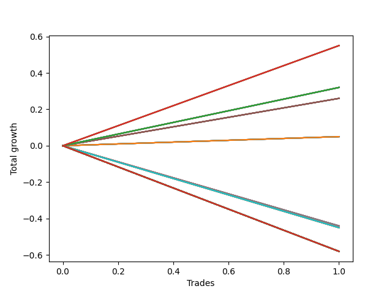

# Long HLT 103_90d 
- Symbol: TSLA
- Date Range: 01/10/2024 - 05/17/2024
- Trading Period: 8:30-12:30
- Number of Trades: 1


### Test TP-0.25 15m
* Take Profit of 0.25 Point
* 0.25 Stoploss
* Results:
```
Total Trades: 1
Percent Up: 100.00
Percent Down: 0.00
Total Points Moved Up: 0.32
Potential Profit: 160.00
Total Points Ups: 0.32 Count Ups: 1
Total Points Downs: 0.00 Count Downs: 0
```

<details><summary>Trades</summary>

<code>In: 2024-02-23 11:30:00		Out: 2024-02-23 11:39:00		Total Position Time: 09:00		Total Move Up: 0.32		Total to Date: 0.32</code> <br />


</details>

### Test TP-0.5 15m
* Take Profit of 0.5 Point
* 0.5 Stoploss
* Results:
```
Total Trades: 1
Percent Up: 100.00
Percent Down: 0.00
Total Points Moved Up: 0.05
Potential Profit: 25.00
Total Points Ups: 0.05 Count Ups: 1
Total Points Downs: 0.00 Count Downs: 0
```

<details><summary>Trades</summary>

<code>In: 2024-02-23 11:30:00		Out: 2024-02-23 11:44:00		Total Position Time: 14:00		Total Move Up: 0.05		Total to Date: 0.05</code> <br />


</details>

### Test TP-0.75 15m
* Take Profit of 0.75 Point
* 0.75 Stoploss
* Results:
```
Total Trades: 1
Percent Up: 100.00
Percent Down: 0.00
Total Points Moved Up: 0.05
Potential Profit: 25.00
Total Points Ups: 0.05 Count Ups: 1
Total Points Downs: 0.00 Count Downs: 0
```

<details><summary>Trades</summary>

<code>In: 2024-02-23 11:30:00		Out: 2024-02-23 11:44:00		Total Position Time: 14:00		Total Move Up: 0.05		Total to Date: 0.05</code> <br />


</details>

### Test TP-1 15m
* Take Profit of 1 Point
* 1 Stoploss
* Results:
```
Total Trades: 1
Percent Up: 100.00
Percent Down: 0.00
Total Points Moved Up: 0.05
Potential Profit: 25.00
Total Points Ups: 0.05 Count Ups: 1
Total Points Downs: 0.00 Count Downs: 0
```

<details><summary>Trades</summary>

<code>In: 2024-02-23 11:30:00		Out: 2024-02-23 11:44:00		Total Position Time: 14:00		Total Move Up: 0.05		Total to Date: 0.05</code> <br />


</details>

### Test TP-1.25 15m
* Take Profit of 1.25 Point
* 1.25 Stoploss
* Results:
```
Total Trades: 1
Percent Up: 100.00
Percent Down: 0.00
Total Points Moved Up: 0.05
Potential Profit: 25.00
Total Points Ups: 0.05 Count Ups: 1
Total Points Downs: 0.00 Count Downs: 0
```

<details><summary>Trades</summary>

<code>In: 2024-02-23 11:30:00		Out: 2024-02-23 11:44:00		Total Position Time: 14:00		Total Move Up: 0.05		Total to Date: 0.05</code> <br />


</details>

### Test TP-1.5 15m
* Take Profit of 1.5 Point
* 1.5 Stoploss
* Results:
```
Total Trades: 1
Percent Up: 100.00
Percent Down: 0.00
Total Points Moved Up: 0.05
Potential Profit: 25.00
Total Points Ups: 0.05 Count Ups: 1
Total Points Downs: 0.00 Count Downs: 0
```

<details><summary>Trades</summary>

<code>In: 2024-02-23 11:30:00		Out: 2024-02-23 11:44:00		Total Position Time: 14:00		Total Move Up: 0.05		Total to Date: 0.05</code> <br />


</details>

### Test TP-1.75 15m
* Take Profit of 1.75 Point
* 1.75 Stoploss
* Results:
```
Total Trades: 1
Percent Up: 100.00
Percent Down: 0.00
Total Points Moved Up: 0.05
Potential Profit: 25.00
Total Points Ups: 0.05 Count Ups: 1
Total Points Downs: 0.00 Count Downs: 0
```

<details><summary>Trades</summary>

<code>In: 2024-02-23 11:30:00		Out: 2024-02-23 11:44:00		Total Position Time: 14:00		Total Move Up: 0.05		Total to Date: 0.05</code> <br />


</details>

### Test TP-2 15m
* Take Profit of 2 Point
* 2 Stoploss
* Results:
```
Total Trades: 1
Percent Up: 100.00
Percent Down: 0.00
Total Points Moved Up: 0.05
Potential Profit: 25.00
Total Points Ups: 0.05 Count Ups: 1
Total Points Downs: 0.00 Count Downs: 0
```

<details><summary>Trades</summary>

<code>In: 2024-02-23 11:30:00		Out: 2024-02-23 11:44:00		Total Position Time: 14:00		Total Move Up: 0.05		Total to Date: 0.05</code> <br />


</details>

### Test TP-2.25 15m
* Take Profit of 2.25 Point
* 2.25 Stoploss
* Results:
```
Total Trades: 1
Percent Up: 100.00
Percent Down: 0.00
Total Points Moved Up: 0.05
Potential Profit: 25.00
Total Points Ups: 0.05 Count Ups: 1
Total Points Downs: 0.00 Count Downs: 0
```

<details><summary>Trades</summary>

<code>In: 2024-02-23 11:30:00		Out: 2024-02-23 11:44:00		Total Position Time: 14:00		Total Move Up: 0.05		Total to Date: 0.05</code> <br />


</details>

### Test TP-2.5 15m
* Take Profit of 2.5 Point
* 2.5 Stoploss
* Results:
```
Total Trades: 1
Percent Up: 100.00
Percent Down: 0.00
Total Points Moved Up: 0.05
Potential Profit: 25.00
Total Points Ups: 0.05 Count Ups: 1
Total Points Downs: 0.00 Count Downs: 0
```

<details><summary>Trades</summary>

<code>In: 2024-02-23 11:30:00		Out: 2024-02-23 11:44:00		Total Position Time: 14:00		Total Move Up: 0.05		Total to Date: 0.05</code> <br />


</details>

### Test TP-2.75 15m
* Take Profit of 2.75 Point
* 2.75 Stoploss
* Results:
```
Total Trades: 1
Percent Up: 100.00
Percent Down: 0.00
Total Points Moved Up: 0.05
Potential Profit: 25.00
Total Points Ups: 0.05 Count Ups: 1
Total Points Downs: 0.00 Count Downs: 0
```

<details><summary>Trades</summary>

<code>In: 2024-02-23 11:30:00		Out: 2024-02-23 11:44:00		Total Position Time: 14:00		Total Move Up: 0.05		Total to Date: 0.05</code> <br />


</details>

### Test TP-3 15m
* Take Profit of 3 Point
* 3 Stoploss
* Results:
```
Total Trades: 1
Percent Up: 100.00
Percent Down: 0.00
Total Points Moved Up: 0.05
Potential Profit: 25.00
Total Points Ups: 0.05 Count Ups: 1
Total Points Downs: 0.00 Count Downs: 0
```

<details><summary>Trades</summary>

<code>In: 2024-02-23 11:30:00		Out: 2024-02-23 11:44:00		Total Position Time: 14:00		Total Move Up: 0.05		Total to Date: 0.05</code> <br />


</details>

### Test TP-0.25 30m
* Take Profit of 0.25 Point
* 0.25 Stoploss
* Results:
```
Total Trades: 1
Percent Up: 100.00
Percent Down: 0.00
Total Points Moved Up: 0.32
Potential Profit: 160.00
Total Points Ups: 0.32 Count Ups: 1
Total Points Downs: 0.00 Count Downs: 0
```

<details><summary>Trades</summary>

<code>In: 2024-02-23 11:30:00		Out: 2024-02-23 11:39:00		Total Position Time: 09:00		Total Move Up: 0.32		Total to Date: 0.32</code> <br />


</details>

### Test TP-0.5 30m
* Take Profit of 0.5 Point
* 0.5 Stoploss
* Results:
```
Total Trades: 1
Percent Up: 100.00
Percent Down: 0.00
Total Points Moved Up: 0.32
Potential Profit: 160.00
Total Points Ups: 0.32 Count Ups: 1
Total Points Downs: 0.00 Count Downs: 0
```

<details><summary>Trades</summary>

<code>In: 2024-02-23 11:30:00		Out: 2024-02-23 11:59:00		Total Position Time: 29:00		Total Move Up: 0.32		Total to Date: 0.32</code> <br />


</details>

### Test TP-0.75 30m
* Take Profit of 0.75 Point
* 0.75 Stoploss
* Results:
```
Total Trades: 1
Percent Up: 100.00
Percent Down: 0.00
Total Points Moved Up: 0.32
Potential Profit: 160.00
Total Points Ups: 0.32 Count Ups: 1
Total Points Downs: 0.00 Count Downs: 0
```

<details><summary>Trades</summary>

<code>In: 2024-02-23 11:30:00		Out: 2024-02-23 11:59:00		Total Position Time: 29:00		Total Move Up: 0.32		Total to Date: 0.32</code> <br />


</details>

### Test TP-1 30m
* Take Profit of 1 Point
* 1 Stoploss
* Results:
```
Total Trades: 1
Percent Up: 100.00
Percent Down: 0.00
Total Points Moved Up: 0.32
Potential Profit: 160.00
Total Points Ups: 0.32 Count Ups: 1
Total Points Downs: 0.00 Count Downs: 0
```

<details><summary>Trades</summary>

<code>In: 2024-02-23 11:30:00		Out: 2024-02-23 11:59:00		Total Position Time: 29:00		Total Move Up: 0.32		Total to Date: 0.32</code> <br />


</details>

### Test TP-1.25 30m
* Take Profit of 1.25 Point
* 1.25 Stoploss
* Results:
```
Total Trades: 1
Percent Up: 100.00
Percent Down: 0.00
Total Points Moved Up: 0.32
Potential Profit: 160.00
Total Points Ups: 0.32 Count Ups: 1
Total Points Downs: 0.00 Count Downs: 0
```

<details><summary>Trades</summary>

<code>In: 2024-02-23 11:30:00		Out: 2024-02-23 11:59:00		Total Position Time: 29:00		Total Move Up: 0.32		Total to Date: 0.32</code> <br />


</details>

### Test TP-1.5 30m
* Take Profit of 1.5 Point
* 1.5 Stoploss
* Results:
```
Total Trades: 1
Percent Up: 100.00
Percent Down: 0.00
Total Points Moved Up: 0.32
Potential Profit: 160.00
Total Points Ups: 0.32 Count Ups: 1
Total Points Downs: 0.00 Count Downs: 0
```

<details><summary>Trades</summary>

<code>In: 2024-02-23 11:30:00		Out: 2024-02-23 11:59:00		Total Position Time: 29:00		Total Move Up: 0.32		Total to Date: 0.32</code> <br />


</details>

### Test TP-1.75 30m
* Take Profit of 1.75 Point
* 1.75 Stoploss
* Results:
```
Total Trades: 1
Percent Up: 100.00
Percent Down: 0.00
Total Points Moved Up: 0.32
Potential Profit: 160.00
Total Points Ups: 0.32 Count Ups: 1
Total Points Downs: 0.00 Count Downs: 0
```

<details><summary>Trades</summary>

<code>In: 2024-02-23 11:30:00		Out: 2024-02-23 11:59:00		Total Position Time: 29:00		Total Move Up: 0.32		Total to Date: 0.32</code> <br />


</details>

### Test TP-2 30m
* Take Profit of 2 Point
* 2 Stoploss
* Results:
```
Total Trades: 1
Percent Up: 100.00
Percent Down: 0.00
Total Points Moved Up: 0.32
Potential Profit: 160.00
Total Points Ups: 0.32 Count Ups: 1
Total Points Downs: 0.00 Count Downs: 0
```

<details><summary>Trades</summary>

<code>In: 2024-02-23 11:30:00		Out: 2024-02-23 11:59:00		Total Position Time: 29:00		Total Move Up: 0.32		Total to Date: 0.32</code> <br />


</details>

### Test TP-2.25 30m
* Take Profit of 2.25 Point
* 2.25 Stoploss
* Results:
```
Total Trades: 1
Percent Up: 100.00
Percent Down: 0.00
Total Points Moved Up: 0.32
Potential Profit: 160.00
Total Points Ups: 0.32 Count Ups: 1
Total Points Downs: 0.00 Count Downs: 0
```

<details><summary>Trades</summary>

<code>In: 2024-02-23 11:30:00		Out: 2024-02-23 11:59:00		Total Position Time: 29:00		Total Move Up: 0.32		Total to Date: 0.32</code> <br />


</details>

### Test TP-2.5 30m
* Take Profit of 2.5 Point
* 2.5 Stoploss
* Results:
```
Total Trades: 1
Percent Up: 100.00
Percent Down: 0.00
Total Points Moved Up: 0.32
Potential Profit: 160.00
Total Points Ups: 0.32 Count Ups: 1
Total Points Downs: 0.00 Count Downs: 0
```

<details><summary>Trades</summary>

<code>In: 2024-02-23 11:30:00		Out: 2024-02-23 11:59:00		Total Position Time: 29:00		Total Move Up: 0.32		Total to Date: 0.32</code> <br />


</details>

### Test TP-2.75 30m
* Take Profit of 2.75 Point
* 2.75 Stoploss
* Results:
```
Total Trades: 1
Percent Up: 100.00
Percent Down: 0.00
Total Points Moved Up: 0.32
Potential Profit: 160.00
Total Points Ups: 0.32 Count Ups: 1
Total Points Downs: 0.00 Count Downs: 0
```

<details><summary>Trades</summary>

<code>In: 2024-02-23 11:30:00		Out: 2024-02-23 11:59:00		Total Position Time: 29:00		Total Move Up: 0.32		Total to Date: 0.32</code> <br />


</details>

### Test TP-3 30m
* Take Profit of 3 Point
* 3 Stoploss
* Results:
```
Total Trades: 1
Percent Up: 100.00
Percent Down: 0.00
Total Points Moved Up: 0.32
Potential Profit: 160.00
Total Points Ups: 0.32 Count Ups: 1
Total Points Downs: 0.00 Count Downs: 0
```

<details><summary>Trades</summary>

<code>In: 2024-02-23 11:30:00		Out: 2024-02-23 11:59:00		Total Position Time: 29:00		Total Move Up: 0.32		Total to Date: 0.32</code> <br />


</details>

### Test TP-0.25 45m
* Take Profit of 0.25 Point
* 0.25 Stoploss
* Results:
```
Total Trades: 1
Percent Up: 100.00
Percent Down: 0.00
Total Points Moved Up: 0.32
Potential Profit: 160.00
Total Points Ups: 0.32 Count Ups: 1
Total Points Downs: 0.00 Count Downs: 0
```

<details><summary>Trades</summary>

<code>In: 2024-02-23 11:30:00		Out: 2024-02-23 11:39:00		Total Position Time: 09:00		Total Move Up: 0.32		Total to Date: 0.32</code> <br />


</details>

### Test TP-0.5 45m
* Take Profit of 0.5 Point
* 0.5 Stoploss
* Results:
```
Total Trades: 1
Percent Up: 100.00
Percent Down: 0.00
Total Points Moved Up: 0.55
Potential Profit: 275.00
Total Points Ups: 0.55 Count Ups: 1
Total Points Downs: 0.00 Count Downs: 0
```

<details><summary>Trades</summary>

<code>In: 2024-02-23 11:30:00		Out: 2024-02-23 12:00:00		Total Position Time: 30:00		Total Move Up: 0.55		Total to Date: 0.55</code> <br />


</details>

### Test TP-0.75 45m
* Take Profit of 0.75 Point
* 0.75 Stoploss
* Results:
```
Total Trades: 1
Percent Up: 100.00
Percent Down: 0.00
Total Points Moved Up: 0.26
Potential Profit: 130.00
Total Points Ups: 0.26 Count Ups: 1
Total Points Downs: 0.00 Count Downs: 0
```

<details><summary>Trades</summary>

<code>In: 2024-02-23 11:30:00		Out: 2024-02-23 12:14:00		Total Position Time: 44:00		Total Move Up: 0.26		Total to Date: 0.26</code> <br />


</details>

### Test TP-1 45m
* Take Profit of 1 Point
* 1 Stoploss
* Results:
```
Total Trades: 1
Percent Up: 100.00
Percent Down: 0.00
Total Points Moved Up: 0.26
Potential Profit: 130.00
Total Points Ups: 0.26 Count Ups: 1
Total Points Downs: 0.00 Count Downs: 0
```

<details><summary>Trades</summary>

<code>In: 2024-02-23 11:30:00		Out: 2024-02-23 12:14:00		Total Position Time: 44:00		Total Move Up: 0.26		Total to Date: 0.26</code> <br />


</details>

### Test TP-1.25 45m
* Take Profit of 1.25 Point
* 1.25 Stoploss
* Results:
```
Total Trades: 1
Percent Up: 100.00
Percent Down: 0.00
Total Points Moved Up: 0.26
Potential Profit: 130.00
Total Points Ups: 0.26 Count Ups: 1
Total Points Downs: 0.00 Count Downs: 0
```

<details><summary>Trades</summary>

<code>In: 2024-02-23 11:30:00		Out: 2024-02-23 12:14:00		Total Position Time: 44:00		Total Move Up: 0.26		Total to Date: 0.26</code> <br />


</details>

### Test TP-1.5 45m
* Take Profit of 1.5 Point
* 1.5 Stoploss
* Results:
```
Total Trades: 1
Percent Up: 100.00
Percent Down: 0.00
Total Points Moved Up: 0.26
Potential Profit: 130.00
Total Points Ups: 0.26 Count Ups: 1
Total Points Downs: 0.00 Count Downs: 0
```

<details><summary>Trades</summary>

<code>In: 2024-02-23 11:30:00		Out: 2024-02-23 12:14:00		Total Position Time: 44:00		Total Move Up: 0.26		Total to Date: 0.26</code> <br />


</details>

### Test TP-1.75 45m
* Take Profit of 1.75 Point
* 1.75 Stoploss
* Results:
```
Total Trades: 1
Percent Up: 100.00
Percent Down: 0.00
Total Points Moved Up: 0.26
Potential Profit: 130.00
Total Points Ups: 0.26 Count Ups: 1
Total Points Downs: 0.00 Count Downs: 0
```

<details><summary>Trades</summary>

<code>In: 2024-02-23 11:30:00		Out: 2024-02-23 12:14:00		Total Position Time: 44:00		Total Move Up: 0.26		Total to Date: 0.26</code> <br />


</details>

### Test TP-2 45m
* Take Profit of 2 Point
* 2 Stoploss
* Results:
```
Total Trades: 1
Percent Up: 100.00
Percent Down: 0.00
Total Points Moved Up: 0.26
Potential Profit: 130.00
Total Points Ups: 0.26 Count Ups: 1
Total Points Downs: 0.00 Count Downs: 0
```

<details><summary>Trades</summary>

<code>In: 2024-02-23 11:30:00		Out: 2024-02-23 12:14:00		Total Position Time: 44:00		Total Move Up: 0.26		Total to Date: 0.26</code> <br />


</details>

### Test TP-2.25 45m
* Take Profit of 2.25 Point
* 2.25 Stoploss
* Results:
```
Total Trades: 1
Percent Up: 100.00
Percent Down: 0.00
Total Points Moved Up: 0.26
Potential Profit: 130.00
Total Points Ups: 0.26 Count Ups: 1
Total Points Downs: 0.00 Count Downs: 0
```

<details><summary>Trades</summary>

<code>In: 2024-02-23 11:30:00		Out: 2024-02-23 12:14:00		Total Position Time: 44:00		Total Move Up: 0.26		Total to Date: 0.26</code> <br />


</details>

### Test TP-2.5 45m
* Take Profit of 2.5 Point
* 2.5 Stoploss
* Results:
```
Total Trades: 1
Percent Up: 100.00
Percent Down: 0.00
Total Points Moved Up: 0.26
Potential Profit: 130.00
Total Points Ups: 0.26 Count Ups: 1
Total Points Downs: 0.00 Count Downs: 0
```

<details><summary>Trades</summary>

<code>In: 2024-02-23 11:30:00		Out: 2024-02-23 12:14:00		Total Position Time: 44:00		Total Move Up: 0.26		Total to Date: 0.26</code> <br />


</details>

### Test TP-2.75 45m
* Take Profit of 2.75 Point
* 2.75 Stoploss
* Results:
```
Total Trades: 1
Percent Up: 100.00
Percent Down: 0.00
Total Points Moved Up: 0.26
Potential Profit: 130.00
Total Points Ups: 0.26 Count Ups: 1
Total Points Downs: 0.00 Count Downs: 0
```

<details><summary>Trades</summary>

<code>In: 2024-02-23 11:30:00		Out: 2024-02-23 12:14:00		Total Position Time: 44:00		Total Move Up: 0.26		Total to Date: 0.26</code> <br />


</details>

### Test TP-3 45m
* Take Profit of 3 Point
* 3 Stoploss
* Results:
```
Total Trades: 1
Percent Up: 100.00
Percent Down: 0.00
Total Points Moved Up: 0.26
Potential Profit: 130.00
Total Points Ups: 0.26 Count Ups: 1
Total Points Downs: 0.00 Count Downs: 0
```

<details><summary>Trades</summary>

<code>In: 2024-02-23 11:30:00		Out: 2024-02-23 12:14:00		Total Position Time: 44:00		Total Move Up: 0.26		Total to Date: 0.26</code> <br />


</details>

### Test TP-0.25 60m
* Take Profit of 0.25 Point
* 0.25 Stoploss
* Results:
```
Total Trades: 1
Percent Up: 100.00
Percent Down: 0.00
Total Points Moved Up: 0.32
Potential Profit: 160.00
Total Points Ups: 0.32 Count Ups: 1
Total Points Downs: 0.00 Count Downs: 0
```

<details><summary>Trades</summary>

<code>In: 2024-02-23 11:30:00		Out: 2024-02-23 11:39:00		Total Position Time: 09:00		Total Move Up: 0.32		Total to Date: 0.32</code> <br />


</details>

### Test TP-0.5 60m
* Take Profit of 0.5 Point
* 0.5 Stoploss
* Results:
```
Total Trades: 1
Percent Up: 100.00
Percent Down: 0.00
Total Points Moved Up: 0.55
Potential Profit: 275.00
Total Points Ups: 0.55 Count Ups: 1
Total Points Downs: 0.00 Count Downs: 0
```

<details><summary>Trades</summary>

<code>In: 2024-02-23 11:30:00		Out: 2024-02-23 12:00:00		Total Position Time: 30:00		Total Move Up: 0.55		Total to Date: 0.55</code> <br />


</details>

### Test TP-0.75 60m
* Take Profit of 0.75 Point
* 0.75 Stoploss
* Results:
```
Total Trades: 1
Percent Up: 0.00
Percent Down: 100.00
Total Points Moved Up: -0.44
Potential Profit: -220.00
Total Points Ups: 0.00 Count Ups: 0
Total Points Downs: -0.44 Count Downs: 1
```

<details><summary>Trades</summary>

<code>In: 2024-02-23 11:30:00		Out: 2024-02-23 12:29:00		Total Position Time: 59:00		Total Move Up: -0.44		Total to Date: -0.44</code> <br />


</details>

### Test TP-1 60m
* Take Profit of 1 Point
* 1 Stoploss
* Results:
```
Total Trades: 1
Percent Up: 0.00
Percent Down: 100.00
Total Points Moved Up: -0.44
Potential Profit: -220.00
Total Points Ups: 0.00 Count Ups: 0
Total Points Downs: -0.44 Count Downs: 1
```

<details><summary>Trades</summary>

<code>In: 2024-02-23 11:30:00		Out: 2024-02-23 12:29:00		Total Position Time: 59:00		Total Move Up: -0.44		Total to Date: -0.44</code> <br />


</details>

### Test TP-1.25 60m
* Take Profit of 1.25 Point
* 1.25 Stoploss
* Results:
```
Total Trades: 1
Percent Up: 0.00
Percent Down: 100.00
Total Points Moved Up: -0.44
Potential Profit: -220.00
Total Points Ups: 0.00 Count Ups: 0
Total Points Downs: -0.44 Count Downs: 1
```

<details><summary>Trades</summary>

<code>In: 2024-02-23 11:30:00		Out: 2024-02-23 12:29:00		Total Position Time: 59:00		Total Move Up: -0.44		Total to Date: -0.44</code> <br />


</details>

### Test TP-1.5 60m
* Take Profit of 1.5 Point
* 1.5 Stoploss
* Results:
```
Total Trades: 1
Percent Up: 0.00
Percent Down: 100.00
Total Points Moved Up: -0.44
Potential Profit: -220.00
Total Points Ups: 0.00 Count Ups: 0
Total Points Downs: -0.44 Count Downs: 1
```

<details><summary>Trades</summary>

<code>In: 2024-02-23 11:30:00		Out: 2024-02-23 12:29:00		Total Position Time: 59:00		Total Move Up: -0.44		Total to Date: -0.44</code> <br />


</details>

### Test TP-1.75 60m
* Take Profit of 1.75 Point
* 1.75 Stoploss
* Results:
```
Total Trades: 1
Percent Up: 0.00
Percent Down: 100.00
Total Points Moved Up: -0.44
Potential Profit: -220.00
Total Points Ups: 0.00 Count Ups: 0
Total Points Downs: -0.44 Count Downs: 1
```

<details><summary>Trades</summary>

<code>In: 2024-02-23 11:30:00		Out: 2024-02-23 12:29:00		Total Position Time: 59:00		Total Move Up: -0.44		Total to Date: -0.44</code> <br />


</details>

### Test TP-2 60m
* Take Profit of 2 Point
* 2 Stoploss
* Results:
```
Total Trades: 1
Percent Up: 0.00
Percent Down: 100.00
Total Points Moved Up: -0.44
Potential Profit: -220.00
Total Points Ups: 0.00 Count Ups: 0
Total Points Downs: -0.44 Count Downs: 1
```

<details><summary>Trades</summary>

<code>In: 2024-02-23 11:30:00		Out: 2024-02-23 12:29:00		Total Position Time: 59:00		Total Move Up: -0.44		Total to Date: -0.44</code> <br />


</details>

### Test TP-2.25 60m
* Take Profit of 2.25 Point
* 2.25 Stoploss
* Results:
```
Total Trades: 1
Percent Up: 0.00
Percent Down: 100.00
Total Points Moved Up: -0.44
Potential Profit: -220.00
Total Points Ups: 0.00 Count Ups: 0
Total Points Downs: -0.44 Count Downs: 1
```

<details><summary>Trades</summary>

<code>In: 2024-02-23 11:30:00		Out: 2024-02-23 12:29:00		Total Position Time: 59:00		Total Move Up: -0.44		Total to Date: -0.44</code> <br />


</details>

### Test TP-2.5 60m
* Take Profit of 2.5 Point
* 2.5 Stoploss
* Results:
```
Total Trades: 1
Percent Up: 0.00
Percent Down: 100.00
Total Points Moved Up: -0.44
Potential Profit: -220.00
Total Points Ups: 0.00 Count Ups: 0
Total Points Downs: -0.44 Count Downs: 1
```

<details><summary>Trades</summary>

<code>In: 2024-02-23 11:30:00		Out: 2024-02-23 12:29:00		Total Position Time: 59:00		Total Move Up: -0.44		Total to Date: -0.44</code> <br />


</details>

### Test TP-2.75 60m
* Take Profit of 2.75 Point
* 2.75 Stoploss
* Results:
```
Total Trades: 1
Percent Up: 0.00
Percent Down: 100.00
Total Points Moved Up: -0.44
Potential Profit: -220.00
Total Points Ups: 0.00 Count Ups: 0
Total Points Downs: -0.44 Count Downs: 1
```

<details><summary>Trades</summary>

<code>In: 2024-02-23 11:30:00		Out: 2024-02-23 12:29:00		Total Position Time: 59:00		Total Move Up: -0.44		Total to Date: -0.44</code> <br />


</details>

### Test TP-3 60m
* Take Profit of 3 Point
* 3 Stoploss
* Results:
```
Total Trades: 1
Percent Up: 0.00
Percent Down: 100.00
Total Points Moved Up: -0.44
Potential Profit: -220.00
Total Points Ups: 0.00 Count Ups: 0
Total Points Downs: -0.44 Count Downs: 1
```

<details><summary>Trades</summary>

<code>In: 2024-02-23 11:30:00		Out: 2024-02-23 12:29:00		Total Position Time: 59:00		Total Move Up: -0.44		Total to Date: -0.44</code> <br />


</details>

### Test TP-0.25 75m
* Take Profit of 0.25 Point
* 0.25 Stoploss
* Results:
```
Total Trades: 1
Percent Up: 100.00
Percent Down: 0.00
Total Points Moved Up: 0.32
Potential Profit: 160.00
Total Points Ups: 0.32 Count Ups: 1
Total Points Downs: 0.00 Count Downs: 0
```

<details><summary>Trades</summary>

<code>In: 2024-02-23 11:30:00		Out: 2024-02-23 11:39:00		Total Position Time: 09:00		Total Move Up: 0.32		Total to Date: 0.32</code> <br />


</details>

### Test TP-0.5 75m
* Take Profit of 0.5 Point
* 0.5 Stoploss
* Results:
```
Total Trades: 1
Percent Up: 100.00
Percent Down: 0.00
Total Points Moved Up: 0.55
Potential Profit: 275.00
Total Points Ups: 0.55 Count Ups: 1
Total Points Downs: 0.00 Count Downs: 0
```

<details><summary>Trades</summary>

<code>In: 2024-02-23 11:30:00		Out: 2024-02-23 12:00:00		Total Position Time: 30:00		Total Move Up: 0.55		Total to Date: 0.55</code> <br />


</details>

### Test TP-0.75 75m
* Take Profit of 0.75 Point
* 0.75 Stoploss
* Results:
```
Total Trades: 1
Percent Up: 0.00
Percent Down: 100.00
Total Points Moved Up: -0.45
Potential Profit: -225.00
Total Points Ups: 0.00 Count Ups: 0
Total Points Downs: -0.45 Count Downs: 1
```

<details><summary>Trades</summary>

<code>In: 2024-02-23 11:30:00		Out: 2024-02-23 12:44:00		Total Position Time: 74:00		Total Move Up: -0.45		Total to Date: -0.45</code> <br />


</details>

### Test TP-1 75m
* Take Profit of 1 Point
* 1 Stoploss
* Results:
```
Total Trades: 1
Percent Up: 0.00
Percent Down: 100.00
Total Points Moved Up: -0.45
Potential Profit: -225.00
Total Points Ups: 0.00 Count Ups: 0
Total Points Downs: -0.45 Count Downs: 1
```

<details><summary>Trades</summary>

<code>In: 2024-02-23 11:30:00		Out: 2024-02-23 12:44:00		Total Position Time: 74:00		Total Move Up: -0.45		Total to Date: -0.45</code> <br />


</details>

### Test TP-1.25 75m
* Take Profit of 1.25 Point
* 1.25 Stoploss
* Results:
```
Total Trades: 1
Percent Up: 0.00
Percent Down: 100.00
Total Points Moved Up: -0.45
Potential Profit: -225.00
Total Points Ups: 0.00 Count Ups: 0
Total Points Downs: -0.45 Count Downs: 1
```

<details><summary>Trades</summary>

<code>In: 2024-02-23 11:30:00		Out: 2024-02-23 12:44:00		Total Position Time: 74:00		Total Move Up: -0.45		Total to Date: -0.45</code> <br />


</details>

### Test TP-1.5 75m
* Take Profit of 1.5 Point
* 1.5 Stoploss
* Results:
```
Total Trades: 1
Percent Up: 0.00
Percent Down: 100.00
Total Points Moved Up: -0.45
Potential Profit: -225.00
Total Points Ups: 0.00 Count Ups: 0
Total Points Downs: -0.45 Count Downs: 1
```

<details><summary>Trades</summary>

<code>In: 2024-02-23 11:30:00		Out: 2024-02-23 12:44:00		Total Position Time: 74:00		Total Move Up: -0.45		Total to Date: -0.45</code> <br />


</details>

### Test TP-1.75 75m
* Take Profit of 1.75 Point
* 1.75 Stoploss
* Results:
```
Total Trades: 1
Percent Up: 0.00
Percent Down: 100.00
Total Points Moved Up: -0.45
Potential Profit: -225.00
Total Points Ups: 0.00 Count Ups: 0
Total Points Downs: -0.45 Count Downs: 1
```

<details><summary>Trades</summary>

<code>In: 2024-02-23 11:30:00		Out: 2024-02-23 12:44:00		Total Position Time: 74:00		Total Move Up: -0.45		Total to Date: -0.45</code> <br />


</details>

### Test TP-2 75m
* Take Profit of 2 Point
* 2 Stoploss
* Results:
```
Total Trades: 1
Percent Up: 0.00
Percent Down: 100.00
Total Points Moved Up: -0.45
Potential Profit: -225.00
Total Points Ups: 0.00 Count Ups: 0
Total Points Downs: -0.45 Count Downs: 1
```

<details><summary>Trades</summary>

<code>In: 2024-02-23 11:30:00		Out: 2024-02-23 12:44:00		Total Position Time: 74:00		Total Move Up: -0.45		Total to Date: -0.45</code> <br />


</details>

### Test TP-2.25 75m
* Take Profit of 2.25 Point
* 2.25 Stoploss
* Results:
```
Total Trades: 1
Percent Up: 0.00
Percent Down: 100.00
Total Points Moved Up: -0.45
Potential Profit: -225.00
Total Points Ups: 0.00 Count Ups: 0
Total Points Downs: -0.45 Count Downs: 1
```

<details><summary>Trades</summary>

<code>In: 2024-02-23 11:30:00		Out: 2024-02-23 12:44:00		Total Position Time: 74:00		Total Move Up: -0.45		Total to Date: -0.45</code> <br />


</details>

### Test TP-2.5 75m
* Take Profit of 2.5 Point
* 2.5 Stoploss
* Results:
```
Total Trades: 1
Percent Up: 0.00
Percent Down: 100.00
Total Points Moved Up: -0.45
Potential Profit: -225.00
Total Points Ups: 0.00 Count Ups: 0
Total Points Downs: -0.45 Count Downs: 1
```

<details><summary>Trades</summary>

<code>In: 2024-02-23 11:30:00		Out: 2024-02-23 12:44:00		Total Position Time: 74:00		Total Move Up: -0.45		Total to Date: -0.45</code> <br />


</details>

### Test TP-2.75 75m
* Take Profit of 2.75 Point
* 2.75 Stoploss
* Results:
```
Total Trades: 1
Percent Up: 0.00
Percent Down: 100.00
Total Points Moved Up: -0.45
Potential Profit: -225.00
Total Points Ups: 0.00 Count Ups: 0
Total Points Downs: -0.45 Count Downs: 1
```

<details><summary>Trades</summary>

<code>In: 2024-02-23 11:30:00		Out: 2024-02-23 12:44:00		Total Position Time: 74:00		Total Move Up: -0.45		Total to Date: -0.45</code> <br />


</details>

### Test TP-3 75m
* Take Profit of 3 Point
* 3 Stoploss
* Results:
```
Total Trades: 1
Percent Up: 0.00
Percent Down: 100.00
Total Points Moved Up: -0.45
Potential Profit: -225.00
Total Points Ups: 0.00 Count Ups: 0
Total Points Downs: -0.45 Count Downs: 1
```

<details><summary>Trades</summary>

<code>In: 2024-02-23 11:30:00		Out: 2024-02-23 12:44:00		Total Position Time: 74:00		Total Move Up: -0.45		Total to Date: -0.45</code> <br />


</details>

### Test TP-0.25 90m
* Take Profit of 0.25 Point
* 0.25 Stoploss
* Results:
```
Total Trades: 1
Percent Up: 100.00
Percent Down: 0.00
Total Points Moved Up: 0.32
Potential Profit: 160.00
Total Points Ups: 0.32 Count Ups: 1
Total Points Downs: 0.00 Count Downs: 0
```

<details><summary>Trades</summary>

<code>In: 2024-02-23 11:30:00		Out: 2024-02-23 11:39:00		Total Position Time: 09:00		Total Move Up: 0.32		Total to Date: 0.32</code> <br />


</details>

### Test TP-0.5 90m
* Take Profit of 0.5 Point
* 0.5 Stoploss
* Results:
```
Total Trades: 1
Percent Up: 100.00
Percent Down: 0.00
Total Points Moved Up: 0.55
Potential Profit: 275.00
Total Points Ups: 0.55 Count Ups: 1
Total Points Downs: 0.00 Count Downs: 0
```

<details><summary>Trades</summary>

<code>In: 2024-02-23 11:30:00		Out: 2024-02-23 12:00:00		Total Position Time: 30:00		Total Move Up: 0.55		Total to Date: 0.55</code> <br />


</details>

### Test TP-0.75 90m
* Take Profit of 0.75 Point
* 0.75 Stoploss
* Results:
```
Total Trades: 1
Percent Up: 0.00
Percent Down: 100.00
Total Points Moved Up: -0.58
Potential Profit: -290.00
Total Points Ups: 0.00 Count Ups: 0
Total Points Downs: -0.58 Count Downs: 1
```

<details><summary>Trades</summary>

<code>In: 2024-02-23 11:30:00		Out: 2024-02-23 12:50:00		Total Position Time: 80:00		Total Move Up: -0.58		Total to Date: -0.58</code> <br />


</details>

### Test TP-1 90m
* Take Profit of 1 Point
* 1 Stoploss
* Results:
```
Total Trades: 1
Percent Up: 0.00
Percent Down: 100.00
Total Points Moved Up: -0.58
Potential Profit: -290.00
Total Points Ups: 0.00 Count Ups: 0
Total Points Downs: -0.58 Count Downs: 1
```

<details><summary>Trades</summary>

<code>In: 2024-02-23 11:30:00		Out: 2024-02-23 12:50:00		Total Position Time: 80:00		Total Move Up: -0.58		Total to Date: -0.58</code> <br />


</details>

### Test TP-1.25 90m
* Take Profit of 1.25 Point
* 1.25 Stoploss
* Results:
```
Total Trades: 1
Percent Up: 0.00
Percent Down: 100.00
Total Points Moved Up: -0.58
Potential Profit: -290.00
Total Points Ups: 0.00 Count Ups: 0
Total Points Downs: -0.58 Count Downs: 1
```

<details><summary>Trades</summary>

<code>In: 2024-02-23 11:30:00		Out: 2024-02-23 12:50:00		Total Position Time: 80:00		Total Move Up: -0.58		Total to Date: -0.58</code> <br />


</details>

### Test TP-1.5 90m
* Take Profit of 1.5 Point
* 1.5 Stoploss
* Results:
```
Total Trades: 1
Percent Up: 0.00
Percent Down: 100.00
Total Points Moved Up: -0.58
Potential Profit: -290.00
Total Points Ups: 0.00 Count Ups: 0
Total Points Downs: -0.58 Count Downs: 1
```

<details><summary>Trades</summary>

<code>In: 2024-02-23 11:30:00		Out: 2024-02-23 12:50:00		Total Position Time: 80:00		Total Move Up: -0.58		Total to Date: -0.58</code> <br />


</details>

### Test TP-1.75 90m
* Take Profit of 1.75 Point
* 1.75 Stoploss
* Results:
```
Total Trades: 1
Percent Up: 0.00
Percent Down: 100.00
Total Points Moved Up: -0.58
Potential Profit: -290.00
Total Points Ups: 0.00 Count Ups: 0
Total Points Downs: -0.58 Count Downs: 1
```

<details><summary>Trades</summary>

<code>In: 2024-02-23 11:30:00		Out: 2024-02-23 12:50:00		Total Position Time: 80:00		Total Move Up: -0.58		Total to Date: -0.58</code> <br />


</details>

### Test TP-2 90m
* Take Profit of 2 Point
* 2 Stoploss
* Results:
```
Total Trades: 1
Percent Up: 0.00
Percent Down: 100.00
Total Points Moved Up: -0.58
Potential Profit: -290.00
Total Points Ups: 0.00 Count Ups: 0
Total Points Downs: -0.58 Count Downs: 1
```

<details><summary>Trades</summary>

<code>In: 2024-02-23 11:30:00		Out: 2024-02-23 12:50:00		Total Position Time: 80:00		Total Move Up: -0.58		Total to Date: -0.58</code> <br />


</details>

### Test TP-2.25 90m
* Take Profit of 2.25 Point
* 2.25 Stoploss
* Results:
```
Total Trades: 1
Percent Up: 0.00
Percent Down: 100.00
Total Points Moved Up: -0.58
Potential Profit: -290.00
Total Points Ups: 0.00 Count Ups: 0
Total Points Downs: -0.58 Count Downs: 1
```

<details><summary>Trades</summary>

<code>In: 2024-02-23 11:30:00		Out: 2024-02-23 12:50:00		Total Position Time: 80:00		Total Move Up: -0.58		Total to Date: -0.58</code> <br />


</details>

### Test TP-2.5 90m
* Take Profit of 2.5 Point
* 2.5 Stoploss
* Results:
```
Total Trades: 1
Percent Up: 0.00
Percent Down: 100.00
Total Points Moved Up: -0.58
Potential Profit: -290.00
Total Points Ups: 0.00 Count Ups: 0
Total Points Downs: -0.58 Count Downs: 1
```

<details><summary>Trades</summary>

<code>In: 2024-02-23 11:30:00		Out: 2024-02-23 12:50:00		Total Position Time: 80:00		Total Move Up: -0.58		Total to Date: -0.58</code> <br />


</details>

### Test TP-2.75 90m
* Take Profit of 2.75 Point
* 2.75 Stoploss
* Results:
```
Total Trades: 1
Percent Up: 0.00
Percent Down: 100.00
Total Points Moved Up: -0.58
Potential Profit: -290.00
Total Points Ups: 0.00 Count Ups: 0
Total Points Downs: -0.58 Count Downs: 1
```

<details><summary>Trades</summary>

<code>In: 2024-02-23 11:30:00		Out: 2024-02-23 12:50:00		Total Position Time: 80:00		Total Move Up: -0.58		Total to Date: -0.58</code> <br />


</details>

### Test TP-3 90m
* Take Profit of 3 Point
* 3 Stoploss
* Results:
```
Total Trades: 1
Percent Up: 0.00
Percent Down: 100.00
Total Points Moved Up: -0.58
Potential Profit: -290.00
Total Points Ups: 0.00 Count Ups: 0
Total Points Downs: -0.58 Count Downs: 1
```

<details><summary>Trades</summary>

<code>In: 2024-02-23 11:30:00		Out: 2024-02-23 12:50:00		Total Position Time: 80:00		Total Move Up: -0.58		Total to Date: -0.58</code> <br />


</details>

### Test TP-0.25 105m
* Take Profit of 0.25 Point
* 0.25 Stoploss
* Results:
```
Total Trades: 1
Percent Up: 100.00
Percent Down: 0.00
Total Points Moved Up: 0.32
Potential Profit: 160.00
Total Points Ups: 0.32 Count Ups: 1
Total Points Downs: 0.00 Count Downs: 0
```

<details><summary>Trades</summary>

<code>In: 2024-02-23 11:30:00		Out: 2024-02-23 11:39:00		Total Position Time: 09:00		Total Move Up: 0.32		Total to Date: 0.32</code> <br />


</details>

### Test TP-0.5 105m
* Take Profit of 0.5 Point
* 0.5 Stoploss
* Results:
```
Total Trades: 1
Percent Up: 100.00
Percent Down: 0.00
Total Points Moved Up: 0.55
Potential Profit: 275.00
Total Points Ups: 0.55 Count Ups: 1
Total Points Downs: 0.00 Count Downs: 0
```

<details><summary>Trades</summary>

<code>In: 2024-02-23 11:30:00		Out: 2024-02-23 12:00:00		Total Position Time: 30:00		Total Move Up: 0.55		Total to Date: 0.55</code> <br />


</details>

### Test TP-0.75 105m
* Take Profit of 0.75 Point
* 0.75 Stoploss
* Results:
```
Total Trades: 1
Percent Up: 0.00
Percent Down: 100.00
Total Points Moved Up: -0.58
Potential Profit: -290.00
Total Points Ups: 0.00 Count Ups: 0
Total Points Downs: -0.58 Count Downs: 1
```

<details><summary>Trades</summary>

<code>In: 2024-02-23 11:30:00		Out: 2024-02-23 12:50:00		Total Position Time: 80:00		Total Move Up: -0.58		Total to Date: -0.58</code> <br />


</details>

### Test TP-1 105m
* Take Profit of 1 Point
* 1 Stoploss
* Results:
```
Total Trades: 1
Percent Up: 0.00
Percent Down: 100.00
Total Points Moved Up: -0.58
Potential Profit: -290.00
Total Points Ups: 0.00 Count Ups: 0
Total Points Downs: -0.58 Count Downs: 1
```

<details><summary>Trades</summary>

<code>In: 2024-02-23 11:30:00		Out: 2024-02-23 12:50:00		Total Position Time: 80:00		Total Move Up: -0.58		Total to Date: -0.58</code> <br />


</details>

### Test TP-1.25 105m
* Take Profit of 1.25 Point
* 1.25 Stoploss
* Results:
```
Total Trades: 1
Percent Up: 0.00
Percent Down: 100.00
Total Points Moved Up: -0.58
Potential Profit: -290.00
Total Points Ups: 0.00 Count Ups: 0
Total Points Downs: -0.58 Count Downs: 1
```

<details><summary>Trades</summary>

<code>In: 2024-02-23 11:30:00		Out: 2024-02-23 12:50:00		Total Position Time: 80:00		Total Move Up: -0.58		Total to Date: -0.58</code> <br />


</details>

### Test TP-1.5 105m
* Take Profit of 1.5 Point
* 1.5 Stoploss
* Results:
```
Total Trades: 1
Percent Up: 0.00
Percent Down: 100.00
Total Points Moved Up: -0.58
Potential Profit: -290.00
Total Points Ups: 0.00 Count Ups: 0
Total Points Downs: -0.58 Count Downs: 1
```

<details><summary>Trades</summary>

<code>In: 2024-02-23 11:30:00		Out: 2024-02-23 12:50:00		Total Position Time: 80:00		Total Move Up: -0.58		Total to Date: -0.58</code> <br />


</details>

### Test TP-1.75 105m
* Take Profit of 1.75 Point
* 1.75 Stoploss
* Results:
```
Total Trades: 1
Percent Up: 0.00
Percent Down: 100.00
Total Points Moved Up: -0.58
Potential Profit: -290.00
Total Points Ups: 0.00 Count Ups: 0
Total Points Downs: -0.58 Count Downs: 1
```

<details><summary>Trades</summary>

<code>In: 2024-02-23 11:30:00		Out: 2024-02-23 12:50:00		Total Position Time: 80:00		Total Move Up: -0.58		Total to Date: -0.58</code> <br />


</details>

### Test TP-2 105m
* Take Profit of 2 Point
* 2 Stoploss
* Results:
```
Total Trades: 1
Percent Up: 0.00
Percent Down: 100.00
Total Points Moved Up: -0.58
Potential Profit: -290.00
Total Points Ups: 0.00 Count Ups: 0
Total Points Downs: -0.58 Count Downs: 1
```

<details><summary>Trades</summary>

<code>In: 2024-02-23 11:30:00		Out: 2024-02-23 12:50:00		Total Position Time: 80:00		Total Move Up: -0.58		Total to Date: -0.58</code> <br />


</details>

### Test TP-2.25 105m
* Take Profit of 2.25 Point
* 2.25 Stoploss
* Results:
```
Total Trades: 1
Percent Up: 0.00
Percent Down: 100.00
Total Points Moved Up: -0.58
Potential Profit: -290.00
Total Points Ups: 0.00 Count Ups: 0
Total Points Downs: -0.58 Count Downs: 1
```

<details><summary>Trades</summary>

<code>In: 2024-02-23 11:30:00		Out: 2024-02-23 12:50:00		Total Position Time: 80:00		Total Move Up: -0.58		Total to Date: -0.58</code> <br />


</details>

### Test TP-2.5 105m
* Take Profit of 2.5 Point
* 2.5 Stoploss
* Results:
```
Total Trades: 1
Percent Up: 0.00
Percent Down: 100.00
Total Points Moved Up: -0.58
Potential Profit: -290.00
Total Points Ups: 0.00 Count Ups: 0
Total Points Downs: -0.58 Count Downs: 1
```

<details><summary>Trades</summary>

<code>In: 2024-02-23 11:30:00		Out: 2024-02-23 12:50:00		Total Position Time: 80:00		Total Move Up: -0.58		Total to Date: -0.58</code> <br />


</details>

### Test TP-2.75 105m
* Take Profit of 2.75 Point
* 2.75 Stoploss
* Results:
```
Total Trades: 1
Percent Up: 0.00
Percent Down: 100.00
Total Points Moved Up: -0.58
Potential Profit: -290.00
Total Points Ups: 0.00 Count Ups: 0
Total Points Downs: -0.58 Count Downs: 1
```

<details><summary>Trades</summary>

<code>In: 2024-02-23 11:30:00		Out: 2024-02-23 12:50:00		Total Position Time: 80:00		Total Move Up: -0.58		Total to Date: -0.58</code> <br />


</details>

### Test TP-3 105m
* Take Profit of 3 Point
* 3 Stoploss
* Results:
```
Total Trades: 1
Percent Up: 0.00
Percent Down: 100.00
Total Points Moved Up: -0.58
Potential Profit: -290.00
Total Points Ups: 0.00 Count Ups: 0
Total Points Downs: -0.58 Count Downs: 1
```

<details><summary>Trades</summary>

<code>In: 2024-02-23 11:30:00		Out: 2024-02-23 12:50:00		Total Position Time: 80:00		Total Move Up: -0.58		Total to Date: -0.58</code> <br />


</details>

### Test TP-0.25 120m
* Take Profit of 0.25 Point
* 0.25 Stoploss
* Results:
```
Total Trades: 1
Percent Up: 100.00
Percent Down: 0.00
Total Points Moved Up: 0.32
Potential Profit: 160.00
Total Points Ups: 0.32 Count Ups: 1
Total Points Downs: 0.00 Count Downs: 0
```

<details><summary>Trades</summary>

<code>In: 2024-02-23 11:30:00		Out: 2024-02-23 11:39:00		Total Position Time: 09:00		Total Move Up: 0.32		Total to Date: 0.32</code> <br />


</details>

### Test TP-0.5 120m
* Take Profit of 0.5 Point
* 0.5 Stoploss
* Results:
```
Total Trades: 1
Percent Up: 100.00
Percent Down: 0.00
Total Points Moved Up: 0.55
Potential Profit: 275.00
Total Points Ups: 0.55 Count Ups: 1
Total Points Downs: 0.00 Count Downs: 0
```

<details><summary>Trades</summary>

<code>In: 2024-02-23 11:30:00		Out: 2024-02-23 12:00:00		Total Position Time: 30:00		Total Move Up: 0.55		Total to Date: 0.55</code> <br />


</details>

### Test TP-0.75 120m
* Take Profit of 0.75 Point
* 0.75 Stoploss
* Results:
```
Total Trades: 1
Percent Up: 0.00
Percent Down: 100.00
Total Points Moved Up: -0.58
Potential Profit: -290.00
Total Points Ups: 0.00 Count Ups: 0
Total Points Downs: -0.58 Count Downs: 1
```

<details><summary>Trades</summary>

<code>In: 2024-02-23 11:30:00		Out: 2024-02-23 12:50:00		Total Position Time: 80:00		Total Move Up: -0.58		Total to Date: -0.58</code> <br />


</details>

### Test TP-1 120m
* Take Profit of 1 Point
* 1 Stoploss
* Results:
```
Total Trades: 1
Percent Up: 0.00
Percent Down: 100.00
Total Points Moved Up: -0.58
Potential Profit: -290.00
Total Points Ups: 0.00 Count Ups: 0
Total Points Downs: -0.58 Count Downs: 1
```

<details><summary>Trades</summary>

<code>In: 2024-02-23 11:30:00		Out: 2024-02-23 12:50:00		Total Position Time: 80:00		Total Move Up: -0.58		Total to Date: -0.58</code> <br />


</details>

### Test TP-1.25 120m
* Take Profit of 1.25 Point
* 1.25 Stoploss
* Results:
```
Total Trades: 1
Percent Up: 0.00
Percent Down: 100.00
Total Points Moved Up: -0.58
Potential Profit: -290.00
Total Points Ups: 0.00 Count Ups: 0
Total Points Downs: -0.58 Count Downs: 1
```

<details><summary>Trades</summary>

<code>In: 2024-02-23 11:30:00		Out: 2024-02-23 12:50:00		Total Position Time: 80:00		Total Move Up: -0.58		Total to Date: -0.58</code> <br />


</details>

### Test TP-1.5 120m
* Take Profit of 1.5 Point
* 1.5 Stoploss
* Results:
```
Total Trades: 1
Percent Up: 0.00
Percent Down: 100.00
Total Points Moved Up: -0.58
Potential Profit: -290.00
Total Points Ups: 0.00 Count Ups: 0
Total Points Downs: -0.58 Count Downs: 1
```

<details><summary>Trades</summary>

<code>In: 2024-02-23 11:30:00		Out: 2024-02-23 12:50:00		Total Position Time: 80:00		Total Move Up: -0.58		Total to Date: -0.58</code> <br />


</details>

### Test TP-1.75 120m
* Take Profit of 1.75 Point
* 1.75 Stoploss
* Results:
```
Total Trades: 1
Percent Up: 0.00
Percent Down: 100.00
Total Points Moved Up: -0.58
Potential Profit: -290.00
Total Points Ups: 0.00 Count Ups: 0
Total Points Downs: -0.58 Count Downs: 1
```

<details><summary>Trades</summary>

<code>In: 2024-02-23 11:30:00		Out: 2024-02-23 12:50:00		Total Position Time: 80:00		Total Move Up: -0.58		Total to Date: -0.58</code> <br />


</details>

### Test TP-2 120m
* Take Profit of 2 Point
* 2 Stoploss
* Results:
```
Total Trades: 1
Percent Up: 0.00
Percent Down: 100.00
Total Points Moved Up: -0.58
Potential Profit: -290.00
Total Points Ups: 0.00 Count Ups: 0
Total Points Downs: -0.58 Count Downs: 1
```

<details><summary>Trades</summary>

<code>In: 2024-02-23 11:30:00		Out: 2024-02-23 12:50:00		Total Position Time: 80:00		Total Move Up: -0.58		Total to Date: -0.58</code> <br />


</details>

### Test TP-2.25 120m
* Take Profit of 2.25 Point
* 2.25 Stoploss
* Results:
```
Total Trades: 1
Percent Up: 0.00
Percent Down: 100.00
Total Points Moved Up: -0.58
Potential Profit: -290.00
Total Points Ups: 0.00 Count Ups: 0
Total Points Downs: -0.58 Count Downs: 1
```

<details><summary>Trades</summary>

<code>In: 2024-02-23 11:30:00		Out: 2024-02-23 12:50:00		Total Position Time: 80:00		Total Move Up: -0.58		Total to Date: -0.58</code> <br />


</details>

### Test TP-2.5 120m
* Take Profit of 2.5 Point
* 2.5 Stoploss
* Results:
```
Total Trades: 1
Percent Up: 0.00
Percent Down: 100.00
Total Points Moved Up: -0.58
Potential Profit: -290.00
Total Points Ups: 0.00 Count Ups: 0
Total Points Downs: -0.58 Count Downs: 1
```

<details><summary>Trades</summary>

<code>In: 2024-02-23 11:30:00		Out: 2024-02-23 12:50:00		Total Position Time: 80:00		Total Move Up: -0.58		Total to Date: -0.58</code> <br />


</details>

### Test TP-2.75 120m
* Take Profit of 2.75 Point
* 2.75 Stoploss
* Results:
```
Total Trades: 1
Percent Up: 0.00
Percent Down: 100.00
Total Points Moved Up: -0.58
Potential Profit: -290.00
Total Points Ups: 0.00 Count Ups: 0
Total Points Downs: -0.58 Count Downs: 1
```

<details><summary>Trades</summary>

<code>In: 2024-02-23 11:30:00		Out: 2024-02-23 12:50:00		Total Position Time: 80:00		Total Move Up: -0.58		Total to Date: -0.58</code> <br />


</details>

### Test TP-3 120m
* Take Profit of 3 Point
* 3 Stoploss
* Results:
```
Total Trades: 1
Percent Up: 0.00
Percent Down: 100.00
Total Points Moved Up: -0.58
Potential Profit: -290.00
Total Points Ups: 0.00 Count Ups: 0
Total Points Downs: -0.58 Count Downs: 1
```

<details><summary>Trades</summary>

<code>In: 2024-02-23 11:30:00		Out: 2024-02-23 12:50:00		Total Position Time: 80:00		Total Move Up: -0.58		Total to Date: -0.58</code> <br />


</details>

### Test TP-0.25 135m
* Take Profit of 0.25 Point
* 0.25 Stoploss
* Results:
```
Total Trades: 1
Percent Up: 100.00
Percent Down: 0.00
Total Points Moved Up: 0.32
Potential Profit: 160.00
Total Points Ups: 0.32 Count Ups: 1
Total Points Downs: 0.00 Count Downs: 0
```

<details><summary>Trades</summary>

<code>In: 2024-02-23 11:30:00		Out: 2024-02-23 11:39:00		Total Position Time: 09:00		Total Move Up: 0.32		Total to Date: 0.32</code> <br />


</details>

### Test TP-0.5 135m
* Take Profit of 0.5 Point
* 0.5 Stoploss
* Results:
```
Total Trades: 1
Percent Up: 100.00
Percent Down: 0.00
Total Points Moved Up: 0.55
Potential Profit: 275.00
Total Points Ups: 0.55 Count Ups: 1
Total Points Downs: 0.00 Count Downs: 0
```

<details><summary>Trades</summary>

<code>In: 2024-02-23 11:30:00		Out: 2024-02-23 12:00:00		Total Position Time: 30:00		Total Move Up: 0.55		Total to Date: 0.55</code> <br />


</details>

### Test TP-0.75 135m
* Take Profit of 0.75 Point
* 0.75 Stoploss
* Results:
```
Total Trades: 1
Percent Up: 0.00
Percent Down: 100.00
Total Points Moved Up: -0.58
Potential Profit: -290.00
Total Points Ups: 0.00 Count Ups: 0
Total Points Downs: -0.58 Count Downs: 1
```

<details><summary>Trades</summary>

<code>In: 2024-02-23 11:30:00		Out: 2024-02-23 12:50:00		Total Position Time: 80:00		Total Move Up: -0.58		Total to Date: -0.58</code> <br />


</details>

### Test TP-1 135m
* Take Profit of 1 Point
* 1 Stoploss
* Results:
```
Total Trades: 1
Percent Up: 0.00
Percent Down: 100.00
Total Points Moved Up: -0.58
Potential Profit: -290.00
Total Points Ups: 0.00 Count Ups: 0
Total Points Downs: -0.58 Count Downs: 1
```

<details><summary>Trades</summary>

<code>In: 2024-02-23 11:30:00		Out: 2024-02-23 12:50:00		Total Position Time: 80:00		Total Move Up: -0.58		Total to Date: -0.58</code> <br />


</details>

### Test TP-1.25 135m
* Take Profit of 1.25 Point
* 1.25 Stoploss
* Results:
```
Total Trades: 1
Percent Up: 0.00
Percent Down: 100.00
Total Points Moved Up: -0.58
Potential Profit: -290.00
Total Points Ups: 0.00 Count Ups: 0
Total Points Downs: -0.58 Count Downs: 1
```

<details><summary>Trades</summary>

<code>In: 2024-02-23 11:30:00		Out: 2024-02-23 12:50:00		Total Position Time: 80:00		Total Move Up: -0.58		Total to Date: -0.58</code> <br />


</details>

### Test TP-1.5 135m
* Take Profit of 1.5 Point
* 1.5 Stoploss
* Results:
```
Total Trades: 1
Percent Up: 0.00
Percent Down: 100.00
Total Points Moved Up: -0.58
Potential Profit: -290.00
Total Points Ups: 0.00 Count Ups: 0
Total Points Downs: -0.58 Count Downs: 1
```

<details><summary>Trades</summary>

<code>In: 2024-02-23 11:30:00		Out: 2024-02-23 12:50:00		Total Position Time: 80:00		Total Move Up: -0.58		Total to Date: -0.58</code> <br />


</details>

### Test TP-1.75 135m
* Take Profit of 1.75 Point
* 1.75 Stoploss
* Results:
```
Total Trades: 1
Percent Up: 0.00
Percent Down: 100.00
Total Points Moved Up: -0.58
Potential Profit: -290.00
Total Points Ups: 0.00 Count Ups: 0
Total Points Downs: -0.58 Count Downs: 1
```

<details><summary>Trades</summary>

<code>In: 2024-02-23 11:30:00		Out: 2024-02-23 12:50:00		Total Position Time: 80:00		Total Move Up: -0.58		Total to Date: -0.58</code> <br />


</details>

### Test TP-2 135m
* Take Profit of 2 Point
* 2 Stoploss
* Results:
```
Total Trades: 1
Percent Up: 0.00
Percent Down: 100.00
Total Points Moved Up: -0.58
Potential Profit: -290.00
Total Points Ups: 0.00 Count Ups: 0
Total Points Downs: -0.58 Count Downs: 1
```

<details><summary>Trades</summary>

<code>In: 2024-02-23 11:30:00		Out: 2024-02-23 12:50:00		Total Position Time: 80:00		Total Move Up: -0.58		Total to Date: -0.58</code> <br />


</details>

### Test TP-2.25 135m
* Take Profit of 2.25 Point
* 2.25 Stoploss
* Results:
```
Total Trades: 1
Percent Up: 0.00
Percent Down: 100.00
Total Points Moved Up: -0.58
Potential Profit: -290.00
Total Points Ups: 0.00 Count Ups: 0
Total Points Downs: -0.58 Count Downs: 1
```

<details><summary>Trades</summary>

<code>In: 2024-02-23 11:30:00		Out: 2024-02-23 12:50:00		Total Position Time: 80:00		Total Move Up: -0.58		Total to Date: -0.58</code> <br />


</details>

### Test TP-2.5 135m
* Take Profit of 2.5 Point
* 2.5 Stoploss
* Results:
```
Total Trades: 1
Percent Up: 0.00
Percent Down: 100.00
Total Points Moved Up: -0.58
Potential Profit: -290.00
Total Points Ups: 0.00 Count Ups: 0
Total Points Downs: -0.58 Count Downs: 1
```

<details><summary>Trades</summary>

<code>In: 2024-02-23 11:30:00		Out: 2024-02-23 12:50:00		Total Position Time: 80:00		Total Move Up: -0.58		Total to Date: -0.58</code> <br />


</details>

### Test TP-2.75 135m
* Take Profit of 2.75 Point
* 2.75 Stoploss
* Results:
```
Total Trades: 1
Percent Up: 0.00
Percent Down: 100.00
Total Points Moved Up: -0.58
Potential Profit: -290.00
Total Points Ups: 0.00 Count Ups: 0
Total Points Downs: -0.58 Count Downs: 1
```

<details><summary>Trades</summary>

<code>In: 2024-02-23 11:30:00		Out: 2024-02-23 12:50:00		Total Position Time: 80:00		Total Move Up: -0.58		Total to Date: -0.58</code> <br />


</details>

### Test TP-3 135m
* Take Profit of 3 Point
* 3 Stoploss
* Results:
```
Total Trades: 1
Percent Up: 0.00
Percent Down: 100.00
Total Points Moved Up: -0.58
Potential Profit: -290.00
Total Points Ups: 0.00 Count Ups: 0
Total Points Downs: -0.58 Count Downs: 1
```

<details><summary>Trades</summary>

<code>In: 2024-02-23 11:30:00		Out: 2024-02-23 12:50:00		Total Position Time: 80:00		Total Move Up: -0.58		Total to Date: -0.58</code> <br />


</details>

### Test TP-0.25 150m
* Take Profit of 0.25 Point
* 0.25 Stoploss
* Results:
```
Total Trades: 1
Percent Up: 100.00
Percent Down: 0.00
Total Points Moved Up: 0.32
Potential Profit: 160.00
Total Points Ups: 0.32 Count Ups: 1
Total Points Downs: 0.00 Count Downs: 0
```

<details><summary>Trades</summary>

<code>In: 2024-02-23 11:30:00		Out: 2024-02-23 11:39:00		Total Position Time: 09:00		Total Move Up: 0.32		Total to Date: 0.32</code> <br />


</details>

### Test TP-0.5 150m
* Take Profit of 0.5 Point
* 0.5 Stoploss
* Results:
```
Total Trades: 1
Percent Up: 100.00
Percent Down: 0.00
Total Points Moved Up: 0.55
Potential Profit: 275.00
Total Points Ups: 0.55 Count Ups: 1
Total Points Downs: 0.00 Count Downs: 0
```

<details><summary>Trades</summary>

<code>In: 2024-02-23 11:30:00		Out: 2024-02-23 12:00:00		Total Position Time: 30:00		Total Move Up: 0.55		Total to Date: 0.55</code> <br />


</details>

### Test TP-0.75 150m
* Take Profit of 0.75 Point
* 0.75 Stoploss
* Results:
```
Total Trades: 1
Percent Up: 0.00
Percent Down: 100.00
Total Points Moved Up: -0.58
Potential Profit: -290.00
Total Points Ups: 0.00 Count Ups: 0
Total Points Downs: -0.58 Count Downs: 1
```

<details><summary>Trades</summary>

<code>In: 2024-02-23 11:30:00		Out: 2024-02-23 12:50:00		Total Position Time: 80:00		Total Move Up: -0.58		Total to Date: -0.58</code> <br />


</details>

### Test TP-1 150m
* Take Profit of 1 Point
* 1 Stoploss
* Results:
```
Total Trades: 1
Percent Up: 0.00
Percent Down: 100.00
Total Points Moved Up: -0.58
Potential Profit: -290.00
Total Points Ups: 0.00 Count Ups: 0
Total Points Downs: -0.58 Count Downs: 1
```

<details><summary>Trades</summary>

<code>In: 2024-02-23 11:30:00		Out: 2024-02-23 12:50:00		Total Position Time: 80:00		Total Move Up: -0.58		Total to Date: -0.58</code> <br />


</details>

### Test TP-1.25 150m
* Take Profit of 1.25 Point
* 1.25 Stoploss
* Results:
```
Total Trades: 1
Percent Up: 0.00
Percent Down: 100.00
Total Points Moved Up: -0.58
Potential Profit: -290.00
Total Points Ups: 0.00 Count Ups: 0
Total Points Downs: -0.58 Count Downs: 1
```

<details><summary>Trades</summary>

<code>In: 2024-02-23 11:30:00		Out: 2024-02-23 12:50:00		Total Position Time: 80:00		Total Move Up: -0.58		Total to Date: -0.58</code> <br />


</details>

### Test TP-1.5 150m
* Take Profit of 1.5 Point
* 1.5 Stoploss
* Results:
```
Total Trades: 1
Percent Up: 0.00
Percent Down: 100.00
Total Points Moved Up: -0.58
Potential Profit: -290.00
Total Points Ups: 0.00 Count Ups: 0
Total Points Downs: -0.58 Count Downs: 1
```

<details><summary>Trades</summary>

<code>In: 2024-02-23 11:30:00		Out: 2024-02-23 12:50:00		Total Position Time: 80:00		Total Move Up: -0.58		Total to Date: -0.58</code> <br />


</details>

### Test TP-1.75 150m
* Take Profit of 1.75 Point
* 1.75 Stoploss
* Results:
```
Total Trades: 1
Percent Up: 0.00
Percent Down: 100.00
Total Points Moved Up: -0.58
Potential Profit: -290.00
Total Points Ups: 0.00 Count Ups: 0
Total Points Downs: -0.58 Count Downs: 1
```

<details><summary>Trades</summary>

<code>In: 2024-02-23 11:30:00		Out: 2024-02-23 12:50:00		Total Position Time: 80:00		Total Move Up: -0.58		Total to Date: -0.58</code> <br />


</details>

### Test TP-2 150m
* Take Profit of 2 Point
* 2 Stoploss
* Results:
```
Total Trades: 1
Percent Up: 0.00
Percent Down: 100.00
Total Points Moved Up: -0.58
Potential Profit: -290.00
Total Points Ups: 0.00 Count Ups: 0
Total Points Downs: -0.58 Count Downs: 1
```

<details><summary>Trades</summary>

<code>In: 2024-02-23 11:30:00		Out: 2024-02-23 12:50:00		Total Position Time: 80:00		Total Move Up: -0.58		Total to Date: -0.58</code> <br />


</details>

### Test TP-2.25 150m
* Take Profit of 2.25 Point
* 2.25 Stoploss
* Results:
```
Total Trades: 1
Percent Up: 0.00
Percent Down: 100.00
Total Points Moved Up: -0.58
Potential Profit: -290.00
Total Points Ups: 0.00 Count Ups: 0
Total Points Downs: -0.58 Count Downs: 1
```

<details><summary>Trades</summary>

<code>In: 2024-02-23 11:30:00		Out: 2024-02-23 12:50:00		Total Position Time: 80:00		Total Move Up: -0.58		Total to Date: -0.58</code> <br />


</details>

### Test TP-2.5 150m
* Take Profit of 2.5 Point
* 2.5 Stoploss
* Results:
```
Total Trades: 1
Percent Up: 0.00
Percent Down: 100.00
Total Points Moved Up: -0.58
Potential Profit: -290.00
Total Points Ups: 0.00 Count Ups: 0
Total Points Downs: -0.58 Count Downs: 1
```

<details><summary>Trades</summary>

<code>In: 2024-02-23 11:30:00		Out: 2024-02-23 12:50:00		Total Position Time: 80:00		Total Move Up: -0.58		Total to Date: -0.58</code> <br />


</details>

### Test TP-2.75 150m
* Take Profit of 2.75 Point
* 2.75 Stoploss
* Results:
```
Total Trades: 1
Percent Up: 0.00
Percent Down: 100.00
Total Points Moved Up: -0.58
Potential Profit: -290.00
Total Points Ups: 0.00 Count Ups: 0
Total Points Downs: -0.58 Count Downs: 1
```

<details><summary>Trades</summary>

<code>In: 2024-02-23 11:30:00		Out: 2024-02-23 12:50:00		Total Position Time: 80:00		Total Move Up: -0.58		Total to Date: -0.58</code> <br />


</details>

### Test TP-3 150m
* Take Profit of 3 Point
* 3 Stoploss
* Results:
```
Total Trades: 1
Percent Up: 0.00
Percent Down: 100.00
Total Points Moved Up: -0.58
Potential Profit: -290.00
Total Points Ups: 0.00 Count Ups: 0
Total Points Downs: -0.58 Count Downs: 1
```

<details><summary>Trades</summary>

<code>In: 2024-02-23 11:30:00		Out: 2024-02-23 12:50:00		Total Position Time: 80:00		Total Move Up: -0.58		Total to Date: -0.58</code> <br />


</details>

### Test TP-0.25 165m
* Take Profit of 0.25 Point
* 0.25 Stoploss
* Results:
```
Total Trades: 1
Percent Up: 100.00
Percent Down: 0.00
Total Points Moved Up: 0.32
Potential Profit: 160.00
Total Points Ups: 0.32 Count Ups: 1
Total Points Downs: 0.00 Count Downs: 0
```

<details><summary>Trades</summary>

<code>In: 2024-02-23 11:30:00		Out: 2024-02-23 11:39:00		Total Position Time: 09:00		Total Move Up: 0.32		Total to Date: 0.32</code> <br />


</details>

### Test TP-0.5 165m
* Take Profit of 0.5 Point
* 0.5 Stoploss
* Results:
```
Total Trades: 1
Percent Up: 100.00
Percent Down: 0.00
Total Points Moved Up: 0.55
Potential Profit: 275.00
Total Points Ups: 0.55 Count Ups: 1
Total Points Downs: 0.00 Count Downs: 0
```

<details><summary>Trades</summary>

<code>In: 2024-02-23 11:30:00		Out: 2024-02-23 12:00:00		Total Position Time: 30:00		Total Move Up: 0.55		Total to Date: 0.55</code> <br />


</details>

### Test TP-0.75 165m
* Take Profit of 0.75 Point
* 0.75 Stoploss
* Results:
```
Total Trades: 1
Percent Up: 0.00
Percent Down: 100.00
Total Points Moved Up: -0.58
Potential Profit: -290.00
Total Points Ups: 0.00 Count Ups: 0
Total Points Downs: -0.58 Count Downs: 1
```

<details><summary>Trades</summary>

<code>In: 2024-02-23 11:30:00		Out: 2024-02-23 12:50:00		Total Position Time: 80:00		Total Move Up: -0.58		Total to Date: -0.58</code> <br />


</details>

### Test TP-1 165m
* Take Profit of 1 Point
* 1 Stoploss
* Results:
```
Total Trades: 1
Percent Up: 0.00
Percent Down: 100.00
Total Points Moved Up: -0.58
Potential Profit: -290.00
Total Points Ups: 0.00 Count Ups: 0
Total Points Downs: -0.58 Count Downs: 1
```

<details><summary>Trades</summary>

<code>In: 2024-02-23 11:30:00		Out: 2024-02-23 12:50:00		Total Position Time: 80:00		Total Move Up: -0.58		Total to Date: -0.58</code> <br />


</details>

### Test TP-1.25 165m
* Take Profit of 1.25 Point
* 1.25 Stoploss
* Results:
```
Total Trades: 1
Percent Up: 0.00
Percent Down: 100.00
Total Points Moved Up: -0.58
Potential Profit: -290.00
Total Points Ups: 0.00 Count Ups: 0
Total Points Downs: -0.58 Count Downs: 1
```

<details><summary>Trades</summary>

<code>In: 2024-02-23 11:30:00		Out: 2024-02-23 12:50:00		Total Position Time: 80:00		Total Move Up: -0.58		Total to Date: -0.58</code> <br />


</details>

### Test TP-1.5 165m
* Take Profit of 1.5 Point
* 1.5 Stoploss
* Results:
```
Total Trades: 1
Percent Up: 0.00
Percent Down: 100.00
Total Points Moved Up: -0.58
Potential Profit: -290.00
Total Points Ups: 0.00 Count Ups: 0
Total Points Downs: -0.58 Count Downs: 1
```

<details><summary>Trades</summary>

<code>In: 2024-02-23 11:30:00		Out: 2024-02-23 12:50:00		Total Position Time: 80:00		Total Move Up: -0.58		Total to Date: -0.58</code> <br />


</details>

### Test TP-1.75 165m
* Take Profit of 1.75 Point
* 1.75 Stoploss
* Results:
```
Total Trades: 1
Percent Up: 0.00
Percent Down: 100.00
Total Points Moved Up: -0.58
Potential Profit: -290.00
Total Points Ups: 0.00 Count Ups: 0
Total Points Downs: -0.58 Count Downs: 1
```

<details><summary>Trades</summary>

<code>In: 2024-02-23 11:30:00		Out: 2024-02-23 12:50:00		Total Position Time: 80:00		Total Move Up: -0.58		Total to Date: -0.58</code> <br />


</details>

### Test TP-2 165m
* Take Profit of 2 Point
* 2 Stoploss
* Results:
```
Total Trades: 1
Percent Up: 0.00
Percent Down: 100.00
Total Points Moved Up: -0.58
Potential Profit: -290.00
Total Points Ups: 0.00 Count Ups: 0
Total Points Downs: -0.58 Count Downs: 1
```

<details><summary>Trades</summary>

<code>In: 2024-02-23 11:30:00		Out: 2024-02-23 12:50:00		Total Position Time: 80:00		Total Move Up: -0.58		Total to Date: -0.58</code> <br />


</details>

### Test TP-2.25 165m
* Take Profit of 2.25 Point
* 2.25 Stoploss
* Results:
```
Total Trades: 1
Percent Up: 0.00
Percent Down: 100.00
Total Points Moved Up: -0.58
Potential Profit: -290.00
Total Points Ups: 0.00 Count Ups: 0
Total Points Downs: -0.58 Count Downs: 1
```

<details><summary>Trades</summary>

<code>In: 2024-02-23 11:30:00		Out: 2024-02-23 12:50:00		Total Position Time: 80:00		Total Move Up: -0.58		Total to Date: -0.58</code> <br />


</details>

### Test TP-2.5 165m
* Take Profit of 2.5 Point
* 2.5 Stoploss
* Results:
```
Total Trades: 1
Percent Up: 0.00
Percent Down: 100.00
Total Points Moved Up: -0.58
Potential Profit: -290.00
Total Points Ups: 0.00 Count Ups: 0
Total Points Downs: -0.58 Count Downs: 1
```

<details><summary>Trades</summary>

<code>In: 2024-02-23 11:30:00		Out: 2024-02-23 12:50:00		Total Position Time: 80:00		Total Move Up: -0.58		Total to Date: -0.58</code> <br />


</details>

### Test TP-2.75 165m
* Take Profit of 2.75 Point
* 2.75 Stoploss
* Results:
```
Total Trades: 1
Percent Up: 0.00
Percent Down: 100.00
Total Points Moved Up: -0.58
Potential Profit: -290.00
Total Points Ups: 0.00 Count Ups: 0
Total Points Downs: -0.58 Count Downs: 1
```

<details><summary>Trades</summary>

<code>In: 2024-02-23 11:30:00		Out: 2024-02-23 12:50:00		Total Position Time: 80:00		Total Move Up: -0.58		Total to Date: -0.58</code> <br />


</details>

### Test TP-3 165m
* Take Profit of 3 Point
* 3 Stoploss
* Results:
```
Total Trades: 1
Percent Up: 0.00
Percent Down: 100.00
Total Points Moved Up: -0.58
Potential Profit: -290.00
Total Points Ups: 0.00 Count Ups: 0
Total Points Downs: -0.58 Count Downs: 1
```

<details><summary>Trades</summary>

<code>In: 2024-02-23 11:30:00		Out: 2024-02-23 12:50:00		Total Position Time: 80:00		Total Move Up: -0.58		Total to Date: -0.58</code> <br />


</details>

### Test TP-0.25 180m
* Take Profit of 0.25 Point
* 0.25 Stoploss
* Results:
```
Total Trades: 1
Percent Up: 100.00
Percent Down: 0.00
Total Points Moved Up: 0.32
Potential Profit: 160.00
Total Points Ups: 0.32 Count Ups: 1
Total Points Downs: 0.00 Count Downs: 0
```

<details><summary>Trades</summary>

<code>In: 2024-02-23 11:30:00		Out: 2024-02-23 11:39:00		Total Position Time: 09:00		Total Move Up: 0.32		Total to Date: 0.32</code> <br />


</details>

### Test TP-0.5 180m
* Take Profit of 0.5 Point
* 0.5 Stoploss
* Results:
```
Total Trades: 1
Percent Up: 100.00
Percent Down: 0.00
Total Points Moved Up: 0.55
Potential Profit: 275.00
Total Points Ups: 0.55 Count Ups: 1
Total Points Downs: 0.00 Count Downs: 0
```

<details><summary>Trades</summary>

<code>In: 2024-02-23 11:30:00		Out: 2024-02-23 12:00:00		Total Position Time: 30:00		Total Move Up: 0.55		Total to Date: 0.55</code> <br />


</details>

### Test TP-0.75 180m
* Take Profit of 0.75 Point
* 0.75 Stoploss
* Results:
```
Total Trades: 1
Percent Up: 0.00
Percent Down: 100.00
Total Points Moved Up: -0.58
Potential Profit: -290.00
Total Points Ups: 0.00 Count Ups: 0
Total Points Downs: -0.58 Count Downs: 1
```

<details><summary>Trades</summary>

<code>In: 2024-02-23 11:30:00		Out: 2024-02-23 12:50:00		Total Position Time: 80:00		Total Move Up: -0.58		Total to Date: -0.58</code> <br />


</details>

### Test TP-1 180m
* Take Profit of 1 Point
* 1 Stoploss
* Results:
```
Total Trades: 1
Percent Up: 0.00
Percent Down: 100.00
Total Points Moved Up: -0.58
Potential Profit: -290.00
Total Points Ups: 0.00 Count Ups: 0
Total Points Downs: -0.58 Count Downs: 1
```

<details><summary>Trades</summary>

<code>In: 2024-02-23 11:30:00		Out: 2024-02-23 12:50:00		Total Position Time: 80:00		Total Move Up: -0.58		Total to Date: -0.58</code> <br />


</details>

### Test TP-1.25 180m
* Take Profit of 1.25 Point
* 1.25 Stoploss
* Results:
```
Total Trades: 1
Percent Up: 0.00
Percent Down: 100.00
Total Points Moved Up: -0.58
Potential Profit: -290.00
Total Points Ups: 0.00 Count Ups: 0
Total Points Downs: -0.58 Count Downs: 1
```

<details><summary>Trades</summary>

<code>In: 2024-02-23 11:30:00		Out: 2024-02-23 12:50:00		Total Position Time: 80:00		Total Move Up: -0.58		Total to Date: -0.58</code> <br />


</details>

### Test TP-1.5 180m
* Take Profit of 1.5 Point
* 1.5 Stoploss
* Results:
```
Total Trades: 1
Percent Up: 0.00
Percent Down: 100.00
Total Points Moved Up: -0.58
Potential Profit: -290.00
Total Points Ups: 0.00 Count Ups: 0
Total Points Downs: -0.58 Count Downs: 1
```

<details><summary>Trades</summary>

<code>In: 2024-02-23 11:30:00		Out: 2024-02-23 12:50:00		Total Position Time: 80:00		Total Move Up: -0.58		Total to Date: -0.58</code> <br />


</details>

### Test TP-1.75 180m
* Take Profit of 1.75 Point
* 1.75 Stoploss
* Results:
```
Total Trades: 1
Percent Up: 0.00
Percent Down: 100.00
Total Points Moved Up: -0.58
Potential Profit: -290.00
Total Points Ups: 0.00 Count Ups: 0
Total Points Downs: -0.58 Count Downs: 1
```

<details><summary>Trades</summary>

<code>In: 2024-02-23 11:30:00		Out: 2024-02-23 12:50:00		Total Position Time: 80:00		Total Move Up: -0.58		Total to Date: -0.58</code> <br />


</details>

### Test TP-2 180m
* Take Profit of 2 Point
* 2 Stoploss
* Results:
```
Total Trades: 1
Percent Up: 0.00
Percent Down: 100.00
Total Points Moved Up: -0.58
Potential Profit: -290.00
Total Points Ups: 0.00 Count Ups: 0
Total Points Downs: -0.58 Count Downs: 1
```

<details><summary>Trades</summary>

<code>In: 2024-02-23 11:30:00		Out: 2024-02-23 12:50:00		Total Position Time: 80:00		Total Move Up: -0.58		Total to Date: -0.58</code> <br />


</details>

### Test TP-2.25 180m
* Take Profit of 2.25 Point
* 2.25 Stoploss
* Results:
```
Total Trades: 1
Percent Up: 0.00
Percent Down: 100.00
Total Points Moved Up: -0.58
Potential Profit: -290.00
Total Points Ups: 0.00 Count Ups: 0
Total Points Downs: -0.58 Count Downs: 1
```

<details><summary>Trades</summary>

<code>In: 2024-02-23 11:30:00		Out: 2024-02-23 12:50:00		Total Position Time: 80:00		Total Move Up: -0.58		Total to Date: -0.58</code> <br />


</details>

### Test TP-2.5 180m
* Take Profit of 2.5 Point
* 2.5 Stoploss
* Results:
```
Total Trades: 1
Percent Up: 0.00
Percent Down: 100.00
Total Points Moved Up: -0.58
Potential Profit: -290.00
Total Points Ups: 0.00 Count Ups: 0
Total Points Downs: -0.58 Count Downs: 1
```

<details><summary>Trades</summary>

<code>In: 2024-02-23 11:30:00		Out: 2024-02-23 12:50:00		Total Position Time: 80:00		Total Move Up: -0.58		Total to Date: -0.58</code> <br />


</details>

### Test TP-2.75 180m
* Take Profit of 2.75 Point
* 2.75 Stoploss
* Results:
```
Total Trades: 1
Percent Up: 0.00
Percent Down: 100.00
Total Points Moved Up: -0.58
Potential Profit: -290.00
Total Points Ups: 0.00 Count Ups: 0
Total Points Downs: -0.58 Count Downs: 1
```

<details><summary>Trades</summary>

<code>In: 2024-02-23 11:30:00		Out: 2024-02-23 12:50:00		Total Position Time: 80:00		Total Move Up: -0.58		Total to Date: -0.58</code> <br />


</details>

### Test TP-3 180m
* Take Profit of 3 Point
* 3 Stoploss
* Results:
```
Total Trades: 1
Percent Up: 0.00
Percent Down: 100.00
Total Points Moved Up: -0.58
Potential Profit: -290.00
Total Points Ups: 0.00 Count Ups: 0
Total Points Downs: -0.58 Count Downs: 1
```

<details><summary>Trades</summary>

<code>In: 2024-02-23 11:30:00		Out: 2024-02-23 12:50:00		Total Position Time: 80:00		Total Move Up: -0.58		Total to Date: -0.58</code> <br />


</details>