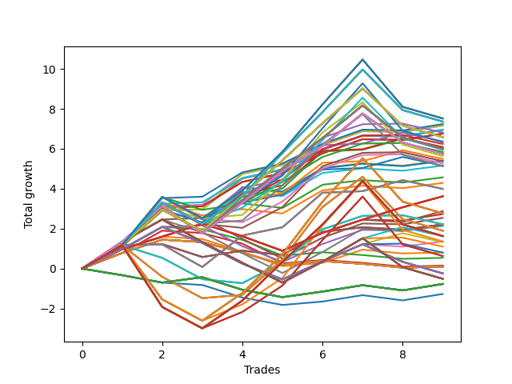

# Long HLT 103 
- Symbol: TSLA
- Date Range: 01/10/2024 - 05/17/2024
- Trading Period: 8:30-12:30
- Number of Trades: 1



| Id. | Name | Win Percent | Profit | Avg Profit / Trade | Avg Time / Trade |      | Name | Win Percent | Profit | Avg Profit / Trade | Avg Time / Trade |
| --- | ---- | ----------- | ------ | ------------------ | ---------------- | ---- | ---- | ----------- | ------ | ------------------ | ---------------- |
| | Sorted By <br> Profit | | | | | | Sorted By <br> Win Percentage ||||
|0| TP-0.5 120m | 100.00 | 0.55 | 0.55 | 30:00 |     | TP-0.5 120m | 100.00 | 0.55 | 0.55 | 30:00 |
|1| TP-0.5 105m | 100.00 | 0.55 | 0.55 | 30:00 |     | TP-0.5 105m | 100.00 | 0.55 | 0.55 | 30:00 |
|2| TP-0.5 90m | 100.00 | 0.55 | 0.55 | 30:00 |     | TP-0.5 90m | 100.00 | 0.55 | 0.55 | 30:00 |
|3| TP-0.5 75m | 100.00 | 0.55 | 0.55 | 30:00 |     | TP-0.5 75m | 100.00 | 0.55 | 0.55 | 30:00 |
|4| TP-0.5 60m | 100.00 | 0.55 | 0.55 | 30:00 |     | TP-0.5 60m | 100.00 | 0.55 | 0.55 | 30:00 |
|5| TP-0.5 45m | 100.00 | 0.55 | 0.55 | 30:00 |     | TP-0.5 45m | 100.00 | 0.55 | 0.55 | 30:00 |
|6| TP-0.25 120m | 100.00 | 0.32 | 0.32 | 09:00 |     | TP-0.25 120m | 100.00 | 0.32 | 0.32 | 09:00 |
|7| TP-0.25 105m | 100.00 | 0.32 | 0.32 | 09:00 |     | TP-0.25 105m | 100.00 | 0.32 | 0.32 | 09:00 |
|8| TP-0.25 90m | 100.00 | 0.32 | 0.32 | 09:00 |     | TP-0.25 90m | 100.00 | 0.32 | 0.32 | 09:00 |
|9| TP-0.25 75m | 100.00 | 0.32 | 0.32 | 09:00 |     | TP-0.25 75m | 100.00 | 0.32 | 0.32 | 09:00 |
|10| TP-0.25 60m | 100.00 | 0.32 | 0.32 | 09:00 |     | TP-0.25 60m | 100.00 | 0.32 | 0.32 | 09:00 |
|11| TP-0.25 45m | 100.00 | 0.32 | 0.32 | 09:00 |     | TP-0.25 45m | 100.00 | 0.32 | 0.32 | 09:00 |
|12| TP-2 30m | 100.00 | 0.32 | 0.32 | 29:00 |     | TP-2 30m | 100.00 | 0.32 | 0.32 | 29:00 |
|13| TP-1.75 30m | 100.00 | 0.32 | 0.32 | 29:00 |     | TP-1.75 30m | 100.00 | 0.32 | 0.32 | 29:00 |
|14| TP-1.5 30m | 100.00 | 0.32 | 0.32 | 29:00 |     | TP-1.5 30m | 100.00 | 0.32 | 0.32 | 29:00 |
|15| TP-1.25 30m | 100.00 | 0.32 | 0.32 | 29:00 |     | TP-1.25 30m | 100.00 | 0.32 | 0.32 | 29:00 |
|16| TP-1 30m | 100.00 | 0.32 | 0.32 | 29:00 |     | TP-1 30m | 100.00 | 0.32 | 0.32 | 29:00 |
|17| TP-0.75 30m | 100.00 | 0.32 | 0.32 | 29:00 |     | TP-0.75 30m | 100.00 | 0.32 | 0.32 | 29:00 |
|18| TP-0.5 30m | 100.00 | 0.32 | 0.32 | 29:00 |     | TP-0.5 30m | 100.00 | 0.32 | 0.32 | 29:00 |
|19| TP-0.25 30m | 100.00 | 0.32 | 0.32 | 09:00 |     | TP-0.25 30m | 100.00 | 0.32 | 0.32 | 09:00 |
|20| TP-0.25 15m | 100.00 | 0.32 | 0.32 | 09:00 |     | TP-0.25 15m | 100.00 | 0.32 | 0.32 | 09:00 |
|21| TP-2 45m | 100.00 | 0.26 | 0.26 | 44:00 |     | TP-2 45m | 100.00 | 0.26 | 0.26 | 44:00 |
|22| TP-1.75 45m | 100.00 | 0.26 | 0.26 | 44:00 |     | TP-1.75 45m | 100.00 | 0.26 | 0.26 | 44:00 |
|23| TP-1.5 45m | 100.00 | 0.26 | 0.26 | 44:00 |     | TP-1.5 45m | 100.00 | 0.26 | 0.26 | 44:00 |
|24| TP-1.25 45m | 100.00 | 0.26 | 0.26 | 44:00 |     | TP-1.25 45m | 100.00 | 0.26 | 0.26 | 44:00 |
|25| TP-1 45m | 100.00 | 0.26 | 0.26 | 44:00 |     | TP-1 45m | 100.00 | 0.26 | 0.26 | 44:00 |
|26| TP-0.75 45m | 100.00 | 0.26 | 0.26 | 44:00 |     | TP-0.75 45m | 100.00 | 0.26 | 0.26 | 44:00 |
|27| TP-2 15m | 100.00 | 0.05 | 0.05 | 14:00 |     | TP-2 15m | 100.00 | 0.05 | 0.05 | 14:00 |
|28| TP-1.75 15m | 100.00 | 0.05 | 0.05 | 14:00 |     | TP-1.75 15m | 100.00 | 0.05 | 0.05 | 14:00 |
|29| TP-1.5 15m | 100.00 | 0.05 | 0.05 | 14:00 |     | TP-1.5 15m | 100.00 | 0.05 | 0.05 | 14:00 |
|30| TP-1.25 15m | 100.00 | 0.05 | 0.05 | 14:00 |     | TP-1.25 15m | 100.00 | 0.05 | 0.05 | 14:00 |
|31| TP-1 15m | 100.00 | 0.05 | 0.05 | 14:00 |     | TP-1 15m | 100.00 | 0.05 | 0.05 | 14:00 |
|32| TP-0.75 15m | 100.00 | 0.05 | 0.05 | 14:00 |     | TP-0.75 15m | 100.00 | 0.05 | 0.05 | 14:00 |
|33| TP-0.5 15m | 100.00 | 0.05 | 0.05 | 14:00 |     | TP-0.5 15m | 100.00 | 0.05 | 0.05 | 14:00 |
|34| TP-2 60m | 0.00 | -0.44 | -0.44 | 59:00 |     | TP-2 60m | 0.00 | -0.44 | -0.44 | 59:00 |
|35| TP-1.75 60m | 0.00 | -0.44 | -0.44 | 59:00 |     | TP-1.75 60m | 0.00 | -0.44 | -0.44 | 59:00 |
|36| TP-1.5 60m | 0.00 | -0.44 | -0.44 | 59:00 |     | TP-1.5 60m | 0.00 | -0.44 | -0.44 | 59:00 |
|37| TP-1.25 60m | 0.00 | -0.44 | -0.44 | 59:00 |     | TP-1.25 60m | 0.00 | -0.44 | -0.44 | 59:00 |
|38| TP-1 60m | 0.00 | -0.44 | -0.44 | 59:00 |     | TP-1 60m | 0.00 | -0.44 | -0.44 | 59:00 |
|39| TP-0.75 60m | 0.00 | -0.44 | -0.44 | 59:00 |     | TP-0.75 60m | 0.00 | -0.44 | -0.44 | 59:00 |
|40| TP-2 75m | 0.00 | -0.45 | -0.45 | 74:00 |     | TP-2 75m | 0.00 | -0.45 | -0.45 | 74:00 |
|41| TP-1.75 75m | 0.00 | -0.45 | -0.45 | 74:00 |     | TP-1.75 75m | 0.00 | -0.45 | -0.45 | 74:00 |
|42| TP-1.5 75m | 0.00 | -0.45 | -0.45 | 74:00 |     | TP-1.5 75m | 0.00 | -0.45 | -0.45 | 74:00 |
|43| TP-1.25 75m | 0.00 | -0.45 | -0.45 | 74:00 |     | TP-1.25 75m | 0.00 | -0.45 | -0.45 | 74:00 |
|44| TP-1 75m | 0.00 | -0.45 | -0.45 | 74:00 |     | TP-1 75m | 0.00 | -0.45 | -0.45 | 74:00 |
|45| TP-0.75 75m | 0.00 | -0.45 | -0.45 | 74:00 |     | TP-0.75 75m | 0.00 | -0.45 | -0.45 | 74:00 |
|46| TP-2 120m | 0.00 | -0.58 | -0.58 | 80:00 |     | TP-2 120m | 0.00 | -0.58 | -0.58 | 80:00 |
|47| TP-1.75 120m | 0.00 | -0.58 | -0.58 | 80:00 |     | TP-1.75 120m | 0.00 | -0.58 | -0.58 | 80:00 |
|48| TP-1.5 120m | 0.00 | -0.58 | -0.58 | 80:00 |     | TP-1.5 120m | 0.00 | -0.58 | -0.58 | 80:00 |
|49| TP-1.25 120m | 0.00 | -0.58 | -0.58 | 80:00 |     | TP-1.25 120m | 0.00 | -0.58 | -0.58 | 80:00 |
|50| TP-1 120m | 0.00 | -0.58 | -0.58 | 80:00 |     | TP-1 120m | 0.00 | -0.58 | -0.58 | 80:00 |
|51| TP-0.75 120m | 0.00 | -0.58 | -0.58 | 80:00 |     | TP-0.75 120m | 0.00 | -0.58 | -0.58 | 80:00 |
|52| TP-2 105m | 0.00 | -0.58 | -0.58 | 80:00 |     | TP-2 105m | 0.00 | -0.58 | -0.58 | 80:00 |
|53| TP-1.75 105m | 0.00 | -0.58 | -0.58 | 80:00 |     | TP-1.75 105m | 0.00 | -0.58 | -0.58 | 80:00 |
|54| TP-1.5 105m | 0.00 | -0.58 | -0.58 | 80:00 |     | TP-1.5 105m | 0.00 | -0.58 | -0.58 | 80:00 |
|55| TP-1.25 105m | 0.00 | -0.58 | -0.58 | 80:00 |     | TP-1.25 105m | 0.00 | -0.58 | -0.58 | 80:00 |
|56| TP-1 105m | 0.00 | -0.58 | -0.58 | 80:00 |     | TP-1 105m | 0.00 | -0.58 | -0.58 | 80:00 |
|57| TP-0.75 105m | 0.00 | -0.58 | -0.58 | 80:00 |     | TP-0.75 105m | 0.00 | -0.58 | -0.58 | 80:00 |
|58| TP-2 90m | 0.00 | -0.58 | -0.58 | 80:00 |     | TP-2 90m | 0.00 | -0.58 | -0.58 | 80:00 |
|59| TP-1.75 90m | 0.00 | -0.58 | -0.58 | 80:00 |     | TP-1.75 90m | 0.00 | -0.58 | -0.58 | 80:00 |
|60| TP-1.5 90m | 0.00 | -0.58 | -0.58 | 80:00 |     | TP-1.5 90m | 0.00 | -0.58 | -0.58 | 80:00 |
|61| TP-1.25 90m | 0.00 | -0.58 | -0.58 | 80:00 |     | TP-1.25 90m | 0.00 | -0.58 | -0.58 | 80:00 |
|62| TP-1 90m | 0.00 | -0.58 | -0.58 | 80:00 |     | TP-1 90m | 0.00 | -0.58 | -0.58 | 80:00 |
|63| TP-0.75 90m | 0.00 | -0.58 | -0.58 | 80:00 |     | TP-0.75 90m | 0.00 | -0.58 | -0.58 | 80:00 |

### Test TP-0.25 15m
* Take Profit of 0.25 Point
* 0.25 Stoploss
* Results:
```
Total Trades: 1
Percent Up: 100.00
Percent Down: 0.00
Total Points Moved Up: 0.32
Potential Profit: 160.00
Total Points Ups: 0.32 Count Ups: 1
Total Points Downs: 0.00 Count Downs: 0
```

<details><summary>Trades</summary>

<code>In: 2024-02-23 11:30:00		Out: 2024-02-23 11:39:00		Total Position Time: 09:00		Total Move Up: 0.32		Total to Date: 0.32</code> <br />


</details>

### Test TP-0.5 15m
* Take Profit of 0.5 Point
* 0.5 Stoploss
* Results:
```
Total Trades: 1
Percent Up: 100.00
Percent Down: 0.00
Total Points Moved Up: 0.05
Potential Profit: 25.00
Total Points Ups: 0.05 Count Ups: 1
Total Points Downs: 0.00 Count Downs: 0
```

<details><summary>Trades</summary>

<code>In: 2024-02-23 11:30:00		Out: 2024-02-23 11:44:00		Total Position Time: 14:00		Total Move Up: 0.05		Total to Date: 0.05</code> <br />


</details>

### Test TP-0.75 15m
* Take Profit of 0.75 Point
* 0.75 Stoploss
* Results:
```
Total Trades: 1
Percent Up: 100.00
Percent Down: 0.00
Total Points Moved Up: 0.05
Potential Profit: 25.00
Total Points Ups: 0.05 Count Ups: 1
Total Points Downs: 0.00 Count Downs: 0
```

<details><summary>Trades</summary>

<code>In: 2024-02-23 11:30:00		Out: 2024-02-23 11:44:00		Total Position Time: 14:00		Total Move Up: 0.05		Total to Date: 0.05</code> <br />


</details>

### Test TP-1 15m
* Take Profit of 1 Point
* 1 Stoploss
* Results:
```
Total Trades: 1
Percent Up: 100.00
Percent Down: 0.00
Total Points Moved Up: 0.05
Potential Profit: 25.00
Total Points Ups: 0.05 Count Ups: 1
Total Points Downs: 0.00 Count Downs: 0
```

<details><summary>Trades</summary>

<code>In: 2024-02-23 11:30:00		Out: 2024-02-23 11:44:00		Total Position Time: 14:00		Total Move Up: 0.05		Total to Date: 0.05</code> <br />


</details>

### Test TP-1.25 15m
* Take Profit of 1.25 Point
* 1.25 Stoploss
* Results:
```
Total Trades: 1
Percent Up: 100.00
Percent Down: 0.00
Total Points Moved Up: 0.05
Potential Profit: 25.00
Total Points Ups: 0.05 Count Ups: 1
Total Points Downs: 0.00 Count Downs: 0
```

<details><summary>Trades</summary>

<code>In: 2024-02-23 11:30:00		Out: 2024-02-23 11:44:00		Total Position Time: 14:00		Total Move Up: 0.05		Total to Date: 0.05</code> <br />


</details>

### Test TP-1.5 15m
* Take Profit of 1.5 Point
* 1.5 Stoploss
* Results:
```
Total Trades: 1
Percent Up: 100.00
Percent Down: 0.00
Total Points Moved Up: 0.05
Potential Profit: 25.00
Total Points Ups: 0.05 Count Ups: 1
Total Points Downs: 0.00 Count Downs: 0
```

<details><summary>Trades</summary>

<code>In: 2024-02-23 11:30:00		Out: 2024-02-23 11:44:00		Total Position Time: 14:00		Total Move Up: 0.05		Total to Date: 0.05</code> <br />


</details>

### Test TP-1.75 15m
* Take Profit of 1.75 Point
* 1.75 Stoploss
* Results:
```
Total Trades: 1
Percent Up: 100.00
Percent Down: 0.00
Total Points Moved Up: 0.05
Potential Profit: 25.00
Total Points Ups: 0.05 Count Ups: 1
Total Points Downs: 0.00 Count Downs: 0
```

<details><summary>Trades</summary>

<code>In: 2024-02-23 11:30:00		Out: 2024-02-23 11:44:00		Total Position Time: 14:00		Total Move Up: 0.05		Total to Date: 0.05</code> <br />


</details>

### Test TP-2 15m
* Take Profit of 2 Point
* 2 Stoploss
* Results:
```
Total Trades: 1
Percent Up: 100.00
Percent Down: 0.00
Total Points Moved Up: 0.05
Potential Profit: 25.00
Total Points Ups: 0.05 Count Ups: 1
Total Points Downs: 0.00 Count Downs: 0
```

<details><summary>Trades</summary>

<code>In: 2024-02-23 11:30:00		Out: 2024-02-23 11:44:00		Total Position Time: 14:00		Total Move Up: 0.05		Total to Date: 0.05</code> <br />


</details>

### Test TP-0.25 30m
* Take Profit of 0.25 Point
* 0.25 Stoploss
* Results:
```
Total Trades: 1
Percent Up: 100.00
Percent Down: 0.00
Total Points Moved Up: 0.32
Potential Profit: 160.00
Total Points Ups: 0.32 Count Ups: 1
Total Points Downs: 0.00 Count Downs: 0
```

<details><summary>Trades</summary>

<code>In: 2024-02-23 11:30:00		Out: 2024-02-23 11:39:00		Total Position Time: 09:00		Total Move Up: 0.32		Total to Date: 0.32</code> <br />


</details>

### Test TP-0.5 30m
* Take Profit of 0.5 Point
* 0.5 Stoploss
* Results:
```
Total Trades: 1
Percent Up: 100.00
Percent Down: 0.00
Total Points Moved Up: 0.32
Potential Profit: 160.00
Total Points Ups: 0.32 Count Ups: 1
Total Points Downs: 0.00 Count Downs: 0
```

<details><summary>Trades</summary>

<code>In: 2024-02-23 11:30:00		Out: 2024-02-23 11:59:00		Total Position Time: 29:00		Total Move Up: 0.32		Total to Date: 0.32</code> <br />


</details>

### Test TP-0.75 30m
* Take Profit of 0.75 Point
* 0.75 Stoploss
* Results:
```
Total Trades: 1
Percent Up: 100.00
Percent Down: 0.00
Total Points Moved Up: 0.32
Potential Profit: 160.00
Total Points Ups: 0.32 Count Ups: 1
Total Points Downs: 0.00 Count Downs: 0
```

<details><summary>Trades</summary>

<code>In: 2024-02-23 11:30:00		Out: 2024-02-23 11:59:00		Total Position Time: 29:00		Total Move Up: 0.32		Total to Date: 0.32</code> <br />


</details>

### Test TP-1 30m
* Take Profit of 1 Point
* 1 Stoploss
* Results:
```
Total Trades: 1
Percent Up: 100.00
Percent Down: 0.00
Total Points Moved Up: 0.32
Potential Profit: 160.00
Total Points Ups: 0.32 Count Ups: 1
Total Points Downs: 0.00 Count Downs: 0
```

<details><summary>Trades</summary>

<code>In: 2024-02-23 11:30:00		Out: 2024-02-23 11:59:00		Total Position Time: 29:00		Total Move Up: 0.32		Total to Date: 0.32</code> <br />


</details>

### Test TP-1.25 30m
* Take Profit of 1.25 Point
* 1.25 Stoploss
* Results:
```
Total Trades: 1
Percent Up: 100.00
Percent Down: 0.00
Total Points Moved Up: 0.32
Potential Profit: 160.00
Total Points Ups: 0.32 Count Ups: 1
Total Points Downs: 0.00 Count Downs: 0
```

<details><summary>Trades</summary>

<code>In: 2024-02-23 11:30:00		Out: 2024-02-23 11:59:00		Total Position Time: 29:00		Total Move Up: 0.32		Total to Date: 0.32</code> <br />


</details>

### Test TP-1.5 30m
* Take Profit of 1.5 Point
* 1.5 Stoploss
* Results:
```
Total Trades: 1
Percent Up: 100.00
Percent Down: 0.00
Total Points Moved Up: 0.32
Potential Profit: 160.00
Total Points Ups: 0.32 Count Ups: 1
Total Points Downs: 0.00 Count Downs: 0
```

<details><summary>Trades</summary>

<code>In: 2024-02-23 11:30:00		Out: 2024-02-23 11:59:00		Total Position Time: 29:00		Total Move Up: 0.32		Total to Date: 0.32</code> <br />


</details>

### Test TP-1.75 30m
* Take Profit of 1.75 Point
* 1.75 Stoploss
* Results:
```
Total Trades: 1
Percent Up: 100.00
Percent Down: 0.00
Total Points Moved Up: 0.32
Potential Profit: 160.00
Total Points Ups: 0.32 Count Ups: 1
Total Points Downs: 0.00 Count Downs: 0
```

<details><summary>Trades</summary>

<code>In: 2024-02-23 11:30:00		Out: 2024-02-23 11:59:00		Total Position Time: 29:00		Total Move Up: 0.32		Total to Date: 0.32</code> <br />


</details>

### Test TP-2 30m
* Take Profit of 2 Point
* 2 Stoploss
* Results:
```
Total Trades: 1
Percent Up: 100.00
Percent Down: 0.00
Total Points Moved Up: 0.32
Potential Profit: 160.00
Total Points Ups: 0.32 Count Ups: 1
Total Points Downs: 0.00 Count Downs: 0
```

<details><summary>Trades</summary>

<code>In: 2024-02-23 11:30:00		Out: 2024-02-23 11:59:00		Total Position Time: 29:00		Total Move Up: 0.32		Total to Date: 0.32</code> <br />


</details>

### Test TP-0.25 45m
* Take Profit of 0.25 Point
* 0.25 Stoploss
* Results:
```
Total Trades: 1
Percent Up: 100.00
Percent Down: 0.00
Total Points Moved Up: 0.32
Potential Profit: 160.00
Total Points Ups: 0.32 Count Ups: 1
Total Points Downs: 0.00 Count Downs: 0
```

<details><summary>Trades</summary>

<code>In: 2024-02-23 11:30:00		Out: 2024-02-23 11:39:00		Total Position Time: 09:00		Total Move Up: 0.32		Total to Date: 0.32</code> <br />


</details>

### Test TP-0.5 45m
* Take Profit of 0.5 Point
* 0.5 Stoploss
* Results:
```
Total Trades: 1
Percent Up: 100.00
Percent Down: 0.00
Total Points Moved Up: 0.55
Potential Profit: 275.00
Total Points Ups: 0.55 Count Ups: 1
Total Points Downs: 0.00 Count Downs: 0
```

<details><summary>Trades</summary>

<code>In: 2024-02-23 11:30:00		Out: 2024-02-23 12:00:00		Total Position Time: 30:00		Total Move Up: 0.55		Total to Date: 0.55</code> <br />


</details>

### Test TP-0.75 45m
* Take Profit of 0.75 Point
* 0.75 Stoploss
* Results:
```
Total Trades: 1
Percent Up: 100.00
Percent Down: 0.00
Total Points Moved Up: 0.26
Potential Profit: 130.00
Total Points Ups: 0.26 Count Ups: 1
Total Points Downs: 0.00 Count Downs: 0
```

<details><summary>Trades</summary>

<code>In: 2024-02-23 11:30:00		Out: 2024-02-23 12:14:00		Total Position Time: 44:00		Total Move Up: 0.26		Total to Date: 0.26</code> <br />


</details>

### Test TP-1 45m
* Take Profit of 1 Point
* 1 Stoploss
* Results:
```
Total Trades: 1
Percent Up: 100.00
Percent Down: 0.00
Total Points Moved Up: 0.26
Potential Profit: 130.00
Total Points Ups: 0.26 Count Ups: 1
Total Points Downs: 0.00 Count Downs: 0
```

<details><summary>Trades</summary>

<code>In: 2024-02-23 11:30:00		Out: 2024-02-23 12:14:00		Total Position Time: 44:00		Total Move Up: 0.26		Total to Date: 0.26</code> <br />


</details>

### Test TP-1.25 45m
* Take Profit of 1.25 Point
* 1.25 Stoploss
* Results:
```
Total Trades: 1
Percent Up: 100.00
Percent Down: 0.00
Total Points Moved Up: 0.26
Potential Profit: 130.00
Total Points Ups: 0.26 Count Ups: 1
Total Points Downs: 0.00 Count Downs: 0
```

<details><summary>Trades</summary>

<code>In: 2024-02-23 11:30:00		Out: 2024-02-23 12:14:00		Total Position Time: 44:00		Total Move Up: 0.26		Total to Date: 0.26</code> <br />


</details>

### Test TP-1.5 45m
* Take Profit of 1.5 Point
* 1.5 Stoploss
* Results:
```
Total Trades: 1
Percent Up: 100.00
Percent Down: 0.00
Total Points Moved Up: 0.26
Potential Profit: 130.00
Total Points Ups: 0.26 Count Ups: 1
Total Points Downs: 0.00 Count Downs: 0
```

<details><summary>Trades</summary>

<code>In: 2024-02-23 11:30:00		Out: 2024-02-23 12:14:00		Total Position Time: 44:00		Total Move Up: 0.26		Total to Date: 0.26</code> <br />


</details>

### Test TP-1.75 45m
* Take Profit of 1.75 Point
* 1.75 Stoploss
* Results:
```
Total Trades: 1
Percent Up: 100.00
Percent Down: 0.00
Total Points Moved Up: 0.26
Potential Profit: 130.00
Total Points Ups: 0.26 Count Ups: 1
Total Points Downs: 0.00 Count Downs: 0
```

<details><summary>Trades</summary>

<code>In: 2024-02-23 11:30:00		Out: 2024-02-23 12:14:00		Total Position Time: 44:00		Total Move Up: 0.26		Total to Date: 0.26</code> <br />


</details>

### Test TP-2 45m
* Take Profit of 2 Point
* 2 Stoploss
* Results:
```
Total Trades: 1
Percent Up: 100.00
Percent Down: 0.00
Total Points Moved Up: 0.26
Potential Profit: 130.00
Total Points Ups: 0.26 Count Ups: 1
Total Points Downs: 0.00 Count Downs: 0
```

<details><summary>Trades</summary>

<code>In: 2024-02-23 11:30:00		Out: 2024-02-23 12:14:00		Total Position Time: 44:00		Total Move Up: 0.26		Total to Date: 0.26</code> <br />


</details>

### Test TP-0.25 60m
* Take Profit of 0.25 Point
* 0.25 Stoploss
* Results:
```
Total Trades: 1
Percent Up: 100.00
Percent Down: 0.00
Total Points Moved Up: 0.32
Potential Profit: 160.00
Total Points Ups: 0.32 Count Ups: 1
Total Points Downs: 0.00 Count Downs: 0
```

<details><summary>Trades</summary>

<code>In: 2024-02-23 11:30:00		Out: 2024-02-23 11:39:00		Total Position Time: 09:00		Total Move Up: 0.32		Total to Date: 0.32</code> <br />


</details>

### Test TP-0.5 60m
* Take Profit of 0.5 Point
* 0.5 Stoploss
* Results:
```
Total Trades: 1
Percent Up: 100.00
Percent Down: 0.00
Total Points Moved Up: 0.55
Potential Profit: 275.00
Total Points Ups: 0.55 Count Ups: 1
Total Points Downs: 0.00 Count Downs: 0
```

<details><summary>Trades</summary>

<code>In: 2024-02-23 11:30:00		Out: 2024-02-23 12:00:00		Total Position Time: 30:00		Total Move Up: 0.55		Total to Date: 0.55</code> <br />


</details>

### Test TP-0.75 60m
* Take Profit of 0.75 Point
* 0.75 Stoploss
* Results:
```
Total Trades: 1
Percent Up: 0.00
Percent Down: 100.00
Total Points Moved Up: -0.44
Potential Profit: -220.00
Total Points Ups: 0.00 Count Ups: 0
Total Points Downs: -0.44 Count Downs: 1
```

<details><summary>Trades</summary>

<code>In: 2024-02-23 11:30:00		Out: 2024-02-23 12:29:00		Total Position Time: 59:00		Total Move Up: -0.44		Total to Date: -0.44</code> <br />


</details>

### Test TP-1 60m
* Take Profit of 1 Point
* 1 Stoploss
* Results:
```
Total Trades: 1
Percent Up: 0.00
Percent Down: 100.00
Total Points Moved Up: -0.44
Potential Profit: -220.00
Total Points Ups: 0.00 Count Ups: 0
Total Points Downs: -0.44 Count Downs: 1
```

<details><summary>Trades</summary>

<code>In: 2024-02-23 11:30:00		Out: 2024-02-23 12:29:00		Total Position Time: 59:00		Total Move Up: -0.44		Total to Date: -0.44</code> <br />


</details>

### Test TP-1.25 60m
* Take Profit of 1.25 Point
* 1.25 Stoploss
* Results:
```
Total Trades: 1
Percent Up: 0.00
Percent Down: 100.00
Total Points Moved Up: -0.44
Potential Profit: -220.00
Total Points Ups: 0.00 Count Ups: 0
Total Points Downs: -0.44 Count Downs: 1
```

<details><summary>Trades</summary>

<code>In: 2024-02-23 11:30:00		Out: 2024-02-23 12:29:00		Total Position Time: 59:00		Total Move Up: -0.44		Total to Date: -0.44</code> <br />


</details>

### Test TP-1.5 60m
* Take Profit of 1.5 Point
* 1.5 Stoploss
* Results:
```
Total Trades: 1
Percent Up: 0.00
Percent Down: 100.00
Total Points Moved Up: -0.44
Potential Profit: -220.00
Total Points Ups: 0.00 Count Ups: 0
Total Points Downs: -0.44 Count Downs: 1
```

<details><summary>Trades</summary>

<code>In: 2024-02-23 11:30:00		Out: 2024-02-23 12:29:00		Total Position Time: 59:00		Total Move Up: -0.44		Total to Date: -0.44</code> <br />


</details>

### Test TP-1.75 60m
* Take Profit of 1.75 Point
* 1.75 Stoploss
* Results:
```
Total Trades: 1
Percent Up: 0.00
Percent Down: 100.00
Total Points Moved Up: -0.44
Potential Profit: -220.00
Total Points Ups: 0.00 Count Ups: 0
Total Points Downs: -0.44 Count Downs: 1
```

<details><summary>Trades</summary>

<code>In: 2024-02-23 11:30:00		Out: 2024-02-23 12:29:00		Total Position Time: 59:00		Total Move Up: -0.44		Total to Date: -0.44</code> <br />


</details>

### Test TP-2 60m
* Take Profit of 2 Point
* 2 Stoploss
* Results:
```
Total Trades: 1
Percent Up: 0.00
Percent Down: 100.00
Total Points Moved Up: -0.44
Potential Profit: -220.00
Total Points Ups: 0.00 Count Ups: 0
Total Points Downs: -0.44 Count Downs: 1
```

<details><summary>Trades</summary>

<code>In: 2024-02-23 11:30:00		Out: 2024-02-23 12:29:00		Total Position Time: 59:00		Total Move Up: -0.44		Total to Date: -0.44</code> <br />


</details>

### Test TP-0.25 75m
* Take Profit of 0.25 Point
* 0.25 Stoploss
* Results:
```
Total Trades: 1
Percent Up: 100.00
Percent Down: 0.00
Total Points Moved Up: 0.32
Potential Profit: 160.00
Total Points Ups: 0.32 Count Ups: 1
Total Points Downs: 0.00 Count Downs: 0
```

<details><summary>Trades</summary>

<code>In: 2024-02-23 11:30:00		Out: 2024-02-23 11:39:00		Total Position Time: 09:00		Total Move Up: 0.32		Total to Date: 0.32</code> <br />


</details>

### Test TP-0.5 75m
* Take Profit of 0.5 Point
* 0.5 Stoploss
* Results:
```
Total Trades: 1
Percent Up: 100.00
Percent Down: 0.00
Total Points Moved Up: 0.55
Potential Profit: 275.00
Total Points Ups: 0.55 Count Ups: 1
Total Points Downs: 0.00 Count Downs: 0
```

<details><summary>Trades</summary>

<code>In: 2024-02-23 11:30:00		Out: 2024-02-23 12:00:00		Total Position Time: 30:00		Total Move Up: 0.55		Total to Date: 0.55</code> <br />


</details>

### Test TP-0.75 75m
* Take Profit of 0.75 Point
* 0.75 Stoploss
* Results:
```
Total Trades: 1
Percent Up: 0.00
Percent Down: 100.00
Total Points Moved Up: -0.45
Potential Profit: -225.00
Total Points Ups: 0.00 Count Ups: 0
Total Points Downs: -0.45 Count Downs: 1
```

<details><summary>Trades</summary>

<code>In: 2024-02-23 11:30:00		Out: 2024-02-23 12:44:00		Total Position Time: 74:00		Total Move Up: -0.45		Total to Date: -0.45</code> <br />


</details>

### Test TP-1 75m
* Take Profit of 1 Point
* 1 Stoploss
* Results:
```
Total Trades: 1
Percent Up: 0.00
Percent Down: 100.00
Total Points Moved Up: -0.45
Potential Profit: -225.00
Total Points Ups: 0.00 Count Ups: 0
Total Points Downs: -0.45 Count Downs: 1
```

<details><summary>Trades</summary>

<code>In: 2024-02-23 11:30:00		Out: 2024-02-23 12:44:00		Total Position Time: 74:00		Total Move Up: -0.45		Total to Date: -0.45</code> <br />


</details>

### Test TP-1.25 75m
* Take Profit of 1.25 Point
* 1.25 Stoploss
* Results:
```
Total Trades: 1
Percent Up: 0.00
Percent Down: 100.00
Total Points Moved Up: -0.45
Potential Profit: -225.00
Total Points Ups: 0.00 Count Ups: 0
Total Points Downs: -0.45 Count Downs: 1
```

<details><summary>Trades</summary>

<code>In: 2024-02-23 11:30:00		Out: 2024-02-23 12:44:00		Total Position Time: 74:00		Total Move Up: -0.45		Total to Date: -0.45</code> <br />


</details>

### Test TP-1.5 75m
* Take Profit of 1.5 Point
* 1.5 Stoploss
* Results:
```
Total Trades: 1
Percent Up: 0.00
Percent Down: 100.00
Total Points Moved Up: -0.45
Potential Profit: -225.00
Total Points Ups: 0.00 Count Ups: 0
Total Points Downs: -0.45 Count Downs: 1
```

<details><summary>Trades</summary>

<code>In: 2024-02-23 11:30:00		Out: 2024-02-23 12:44:00		Total Position Time: 74:00		Total Move Up: -0.45		Total to Date: -0.45</code> <br />


</details>

### Test TP-1.75 75m
* Take Profit of 1.75 Point
* 1.75 Stoploss
* Results:
```
Total Trades: 1
Percent Up: 0.00
Percent Down: 100.00
Total Points Moved Up: -0.45
Potential Profit: -225.00
Total Points Ups: 0.00 Count Ups: 0
Total Points Downs: -0.45 Count Downs: 1
```

<details><summary>Trades</summary>

<code>In: 2024-02-23 11:30:00		Out: 2024-02-23 12:44:00		Total Position Time: 74:00		Total Move Up: -0.45		Total to Date: -0.45</code> <br />


</details>

### Test TP-2 75m
* Take Profit of 2 Point
* 2 Stoploss
* Results:
```
Total Trades: 1
Percent Up: 0.00
Percent Down: 100.00
Total Points Moved Up: -0.45
Potential Profit: -225.00
Total Points Ups: 0.00 Count Ups: 0
Total Points Downs: -0.45 Count Downs: 1
```

<details><summary>Trades</summary>

<code>In: 2024-02-23 11:30:00		Out: 2024-02-23 12:44:00		Total Position Time: 74:00		Total Move Up: -0.45		Total to Date: -0.45</code> <br />


</details>

### Test TP-0.25 90m
* Take Profit of 0.25 Point
* 0.25 Stoploss
* Results:
```
Total Trades: 1
Percent Up: 100.00
Percent Down: 0.00
Total Points Moved Up: 0.32
Potential Profit: 160.00
Total Points Ups: 0.32 Count Ups: 1
Total Points Downs: 0.00 Count Downs: 0
```

<details><summary>Trades</summary>

<code>In: 2024-02-23 11:30:00		Out: 2024-02-23 11:39:00		Total Position Time: 09:00		Total Move Up: 0.32		Total to Date: 0.32</code> <br />


</details>

### Test TP-0.5 90m
* Take Profit of 0.5 Point
* 0.5 Stoploss
* Results:
```
Total Trades: 1
Percent Up: 100.00
Percent Down: 0.00
Total Points Moved Up: 0.55
Potential Profit: 275.00
Total Points Ups: 0.55 Count Ups: 1
Total Points Downs: 0.00 Count Downs: 0
```

<details><summary>Trades</summary>

<code>In: 2024-02-23 11:30:00		Out: 2024-02-23 12:00:00		Total Position Time: 30:00		Total Move Up: 0.55		Total to Date: 0.55</code> <br />


</details>

### Test TP-0.75 90m
* Take Profit of 0.75 Point
* 0.75 Stoploss
* Results:
```
Total Trades: 1
Percent Up: 0.00
Percent Down: 100.00
Total Points Moved Up: -0.58
Potential Profit: -290.00
Total Points Ups: 0.00 Count Ups: 0
Total Points Downs: -0.58 Count Downs: 1
```

<details><summary>Trades</summary>

<code>In: 2024-02-23 11:30:00		Out: 2024-02-23 12:50:00		Total Position Time: 80:00		Total Move Up: -0.58		Total to Date: -0.58</code> <br />


</details>

### Test TP-1 90m
* Take Profit of 1 Point
* 1 Stoploss
* Results:
```
Total Trades: 1
Percent Up: 0.00
Percent Down: 100.00
Total Points Moved Up: -0.58
Potential Profit: -290.00
Total Points Ups: 0.00 Count Ups: 0
Total Points Downs: -0.58 Count Downs: 1
```

<details><summary>Trades</summary>

<code>In: 2024-02-23 11:30:00		Out: 2024-02-23 12:50:00		Total Position Time: 80:00		Total Move Up: -0.58		Total to Date: -0.58</code> <br />


</details>

### Test TP-1.25 90m
* Take Profit of 1.25 Point
* 1.25 Stoploss
* Results:
```
Total Trades: 1
Percent Up: 0.00
Percent Down: 100.00
Total Points Moved Up: -0.58
Potential Profit: -290.00
Total Points Ups: 0.00 Count Ups: 0
Total Points Downs: -0.58 Count Downs: 1
```

<details><summary>Trades</summary>

<code>In: 2024-02-23 11:30:00		Out: 2024-02-23 12:50:00		Total Position Time: 80:00		Total Move Up: -0.58		Total to Date: -0.58</code> <br />


</details>

### Test TP-1.5 90m
* Take Profit of 1.5 Point
* 1.5 Stoploss
* Results:
```
Total Trades: 1
Percent Up: 0.00
Percent Down: 100.00
Total Points Moved Up: -0.58
Potential Profit: -290.00
Total Points Ups: 0.00 Count Ups: 0
Total Points Downs: -0.58 Count Downs: 1
```

<details><summary>Trades</summary>

<code>In: 2024-02-23 11:30:00		Out: 2024-02-23 12:50:00		Total Position Time: 80:00		Total Move Up: -0.58		Total to Date: -0.58</code> <br />


</details>

### Test TP-1.75 90m
* Take Profit of 1.75 Point
* 1.75 Stoploss
* Results:
```
Total Trades: 1
Percent Up: 0.00
Percent Down: 100.00
Total Points Moved Up: -0.58
Potential Profit: -290.00
Total Points Ups: 0.00 Count Ups: 0
Total Points Downs: -0.58 Count Downs: 1
```

<details><summary>Trades</summary>

<code>In: 2024-02-23 11:30:00		Out: 2024-02-23 12:50:00		Total Position Time: 80:00		Total Move Up: -0.58		Total to Date: -0.58</code> <br />


</details>

### Test TP-2 90m
* Take Profit of 2 Point
* 2 Stoploss
* Results:
```
Total Trades: 1
Percent Up: 0.00
Percent Down: 100.00
Total Points Moved Up: -0.58
Potential Profit: -290.00
Total Points Ups: 0.00 Count Ups: 0
Total Points Downs: -0.58 Count Downs: 1
```

<details><summary>Trades</summary>

<code>In: 2024-02-23 11:30:00		Out: 2024-02-23 12:50:00		Total Position Time: 80:00		Total Move Up: -0.58		Total to Date: -0.58</code> <br />


</details>

### Test TP-0.25 105m
* Take Profit of 0.25 Point
* 0.25 Stoploss
* Results:
```
Total Trades: 1
Percent Up: 100.00
Percent Down: 0.00
Total Points Moved Up: 0.32
Potential Profit: 160.00
Total Points Ups: 0.32 Count Ups: 1
Total Points Downs: 0.00 Count Downs: 0
```

<details><summary>Trades</summary>

<code>In: 2024-02-23 11:30:00		Out: 2024-02-23 11:39:00		Total Position Time: 09:00		Total Move Up: 0.32		Total to Date: 0.32</code> <br />


</details>

### Test TP-0.5 105m
* Take Profit of 0.5 Point
* 0.5 Stoploss
* Results:
```
Total Trades: 1
Percent Up: 100.00
Percent Down: 0.00
Total Points Moved Up: 0.55
Potential Profit: 275.00
Total Points Ups: 0.55 Count Ups: 1
Total Points Downs: 0.00 Count Downs: 0
```

<details><summary>Trades</summary>

<code>In: 2024-02-23 11:30:00		Out: 2024-02-23 12:00:00		Total Position Time: 30:00		Total Move Up: 0.55		Total to Date: 0.55</code> <br />


</details>

### Test TP-0.75 105m
* Take Profit of 0.75 Point
* 0.75 Stoploss
* Results:
```
Total Trades: 1
Percent Up: 0.00
Percent Down: 100.00
Total Points Moved Up: -0.58
Potential Profit: -290.00
Total Points Ups: 0.00 Count Ups: 0
Total Points Downs: -0.58 Count Downs: 1
```

<details><summary>Trades</summary>

<code>In: 2024-02-23 11:30:00		Out: 2024-02-23 12:50:00		Total Position Time: 80:00		Total Move Up: -0.58		Total to Date: -0.58</code> <br />


</details>

### Test TP-1 105m
* Take Profit of 1 Point
* 1 Stoploss
* Results:
```
Total Trades: 1
Percent Up: 0.00
Percent Down: 100.00
Total Points Moved Up: -0.58
Potential Profit: -290.00
Total Points Ups: 0.00 Count Ups: 0
Total Points Downs: -0.58 Count Downs: 1
```

<details><summary>Trades</summary>

<code>In: 2024-02-23 11:30:00		Out: 2024-02-23 12:50:00		Total Position Time: 80:00		Total Move Up: -0.58		Total to Date: -0.58</code> <br />


</details>

### Test TP-1.25 105m
* Take Profit of 1.25 Point
* 1.25 Stoploss
* Results:
```
Total Trades: 1
Percent Up: 0.00
Percent Down: 100.00
Total Points Moved Up: -0.58
Potential Profit: -290.00
Total Points Ups: 0.00 Count Ups: 0
Total Points Downs: -0.58 Count Downs: 1
```

<details><summary>Trades</summary>

<code>In: 2024-02-23 11:30:00		Out: 2024-02-23 12:50:00		Total Position Time: 80:00		Total Move Up: -0.58		Total to Date: -0.58</code> <br />


</details>

### Test TP-1.5 105m
* Take Profit of 1.5 Point
* 1.5 Stoploss
* Results:
```
Total Trades: 1
Percent Up: 0.00
Percent Down: 100.00
Total Points Moved Up: -0.58
Potential Profit: -290.00
Total Points Ups: 0.00 Count Ups: 0
Total Points Downs: -0.58 Count Downs: 1
```

<details><summary>Trades</summary>

<code>In: 2024-02-23 11:30:00		Out: 2024-02-23 12:50:00		Total Position Time: 80:00		Total Move Up: -0.58		Total to Date: -0.58</code> <br />


</details>

### Test TP-1.75 105m
* Take Profit of 1.75 Point
* 1.75 Stoploss
* Results:
```
Total Trades: 1
Percent Up: 0.00
Percent Down: 100.00
Total Points Moved Up: -0.58
Potential Profit: -290.00
Total Points Ups: 0.00 Count Ups: 0
Total Points Downs: -0.58 Count Downs: 1
```

<details><summary>Trades</summary>

<code>In: 2024-02-23 11:30:00		Out: 2024-02-23 12:50:00		Total Position Time: 80:00		Total Move Up: -0.58		Total to Date: -0.58</code> <br />


</details>

### Test TP-2 105m
* Take Profit of 2 Point
* 2 Stoploss
* Results:
```
Total Trades: 1
Percent Up: 0.00
Percent Down: 100.00
Total Points Moved Up: -0.58
Potential Profit: -290.00
Total Points Ups: 0.00 Count Ups: 0
Total Points Downs: -0.58 Count Downs: 1
```

<details><summary>Trades</summary>

<code>In: 2024-02-23 11:30:00		Out: 2024-02-23 12:50:00		Total Position Time: 80:00		Total Move Up: -0.58		Total to Date: -0.58</code> <br />


</details>

### Test TP-0.25 120m
* Take Profit of 0.25 Point
* 0.25 Stoploss
* Results:
```
Total Trades: 1
Percent Up: 100.00
Percent Down: 0.00
Total Points Moved Up: 0.32
Potential Profit: 160.00
Total Points Ups: 0.32 Count Ups: 1
Total Points Downs: 0.00 Count Downs: 0
```

<details><summary>Trades</summary>

<code>In: 2024-02-23 11:30:00		Out: 2024-02-23 11:39:00		Total Position Time: 09:00		Total Move Up: 0.32		Total to Date: 0.32</code> <br />


</details>

### Test TP-0.5 120m
* Take Profit of 0.5 Point
* 0.5 Stoploss
* Results:
```
Total Trades: 1
Percent Up: 100.00
Percent Down: 0.00
Total Points Moved Up: 0.55
Potential Profit: 275.00
Total Points Ups: 0.55 Count Ups: 1
Total Points Downs: 0.00 Count Downs: 0
```

<details><summary>Trades</summary>

<code>In: 2024-02-23 11:30:00		Out: 2024-02-23 12:00:00		Total Position Time: 30:00		Total Move Up: 0.55		Total to Date: 0.55</code> <br />


</details>

### Test TP-0.75 120m
* Take Profit of 0.75 Point
* 0.75 Stoploss
* Results:
```
Total Trades: 1
Percent Up: 0.00
Percent Down: 100.00
Total Points Moved Up: -0.58
Potential Profit: -290.00
Total Points Ups: 0.00 Count Ups: 0
Total Points Downs: -0.58 Count Downs: 1
```

<details><summary>Trades</summary>

<code>In: 2024-02-23 11:30:00		Out: 2024-02-23 12:50:00		Total Position Time: 80:00		Total Move Up: -0.58		Total to Date: -0.58</code> <br />


</details>

### Test TP-1 120m
* Take Profit of 1 Point
* 1 Stoploss
* Results:
```
Total Trades: 1
Percent Up: 0.00
Percent Down: 100.00
Total Points Moved Up: -0.58
Potential Profit: -290.00
Total Points Ups: 0.00 Count Ups: 0
Total Points Downs: -0.58 Count Downs: 1
```

<details><summary>Trades</summary>

<code>In: 2024-02-23 11:30:00		Out: 2024-02-23 12:50:00		Total Position Time: 80:00		Total Move Up: -0.58		Total to Date: -0.58</code> <br />


</details>

### Test TP-1.25 120m
* Take Profit of 1.25 Point
* 1.25 Stoploss
* Results:
```
Total Trades: 1
Percent Up: 0.00
Percent Down: 100.00
Total Points Moved Up: -0.58
Potential Profit: -290.00
Total Points Ups: 0.00 Count Ups: 0
Total Points Downs: -0.58 Count Downs: 1
```

<details><summary>Trades</summary>

<code>In: 2024-02-23 11:30:00		Out: 2024-02-23 12:50:00		Total Position Time: 80:00		Total Move Up: -0.58		Total to Date: -0.58</code> <br />


</details>

### Test TP-1.5 120m
* Take Profit of 1.5 Point
* 1.5 Stoploss
* Results:
```
Total Trades: 1
Percent Up: 0.00
Percent Down: 100.00
Total Points Moved Up: -0.58
Potential Profit: -290.00
Total Points Ups: 0.00 Count Ups: 0
Total Points Downs: -0.58 Count Downs: 1
```

<details><summary>Trades</summary>

<code>In: 2024-02-23 11:30:00		Out: 2024-02-23 12:50:00		Total Position Time: 80:00		Total Move Up: -0.58		Total to Date: -0.58</code> <br />


</details>

### Test TP-1.75 120m
* Take Profit of 1.75 Point
* 1.75 Stoploss
* Results:
```
Total Trades: 1
Percent Up: 0.00
Percent Down: 100.00
Total Points Moved Up: -0.58
Potential Profit: -290.00
Total Points Ups: 0.00 Count Ups: 0
Total Points Downs: -0.58 Count Downs: 1
```

<details><summary>Trades</summary>

<code>In: 2024-02-23 11:30:00		Out: 2024-02-23 12:50:00		Total Position Time: 80:00		Total Move Up: -0.58		Total to Date: -0.58</code> <br />


</details>

### Test TP-2 120m
* Take Profit of 2 Point
* 2 Stoploss
* Results:
```
Total Trades: 1
Percent Up: 0.00
Percent Down: 100.00
Total Points Moved Up: -0.58
Potential Profit: -290.00
Total Points Ups: 0.00 Count Ups: 0
Total Points Downs: -0.58 Count Downs: 1
```

<details><summary>Trades</summary>

<code>In: 2024-02-23 11:30:00		Out: 2024-02-23 12:50:00		Total Position Time: 80:00		Total Move Up: -0.58		Total to Date: -0.58</code> <br />


</details>